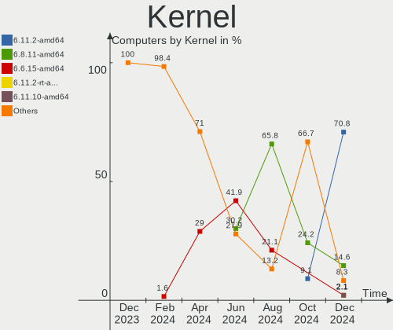
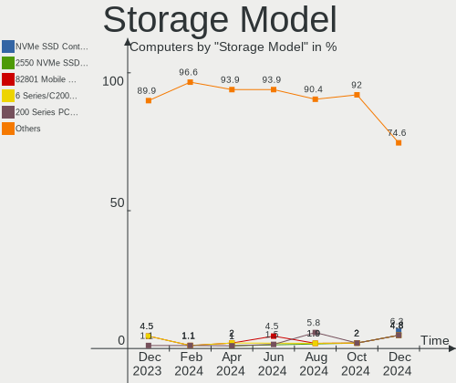
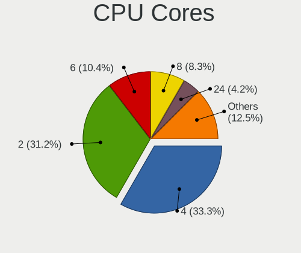
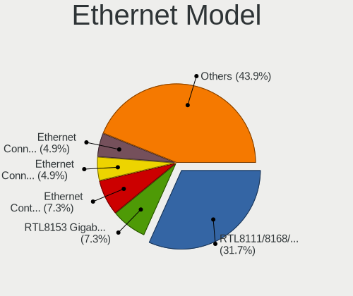

Kali - Hardware Trends
----------------------

A project to identify most popular hardware characteristics and track their change
over time based on data collected by Linux users at https://Linux-Hardware.org.

Anyone can contribute to this report by the [hw-probe](https://github.com/linuxhw/hw-probe) tool:

    sudo -E hw-probe -all -upload

This is a report for all computer types. See also reports for [desktops](/Dist/Kali/Desktop/README.md) and [notebooks](/Dist/Kali/Notebook/README.md).

This report is for one last month. Overall report since the beginning of time: [TestDays](https://github.com/linuxhw/TestDays)

Period: Mar, 2023.

Contents
--------

* [ System ](#system)
  - [ OS                       ](#os)
  - [ OS Family                ](#os-family)
  - [ Kernel                   ](#kernel)
  - [ Kernel Family            ](#kernel-family)
  - [ Kernel Major Ver.        ](#kernel-major-ver)
  - [ Arch                     ](#arch)
  - [ DE                       ](#de)
  - [ Display Server           ](#display-server)
  - [ Display Manager          ](#display-manager)
  - [ OS Lang                  ](#os-lang)
  - [ Boot Mode                ](#boot-mode)
  - [ Filesystem               ](#filesystem)
  - [ Part. scheme             ](#part-scheme)
  - [ Dual Boot with Linux/BSD ](#dual-boot-with-linuxbsd)
  - [ Dual Boot (Win)          ](#dual-boot-win)

* [ Board ](#board)
  - [ Vendor                   ](#vendor)
  - [ Model                    ](#model)
  - [ Model Family             ](#model-family)
  - [ MFG Year                 ](#mfg-year)
  - [ Form Factor              ](#form-factor)
  - [ Secure Boot              ](#secure-boot)
  - [ Coreboot                 ](#coreboot)
  - [ RAM Size                 ](#ram-size)
  - [ RAM Used                 ](#ram-used)
  - [ Total Drives             ](#total-drives)
  - [ Has CD-ROM               ](#has-cd-rom)
  - [ Has Ethernet             ](#has-ethernet)
  - [ Has WiFi                 ](#has-wifi)
  - [ Has Bluetooth            ](#has-bluetooth)

* [ Location ](#location)
  - [ Country                  ](#country)
  - [ City                     ](#city)

* [ Drives ](#drives)
  - [ Drive Vendor             ](#drive-vendor)
  - [ Drive Model              ](#drive-model)
  - [ HDD Vendor               ](#hdd-vendor)
  - [ SSD Vendor               ](#ssd-vendor)
  - [ Drive Kind               ](#drive-kind)
  - [ Drive Connector          ](#drive-connector)
  - [ Drive Size               ](#drive-size)
  - [ Space Total              ](#space-total)
  - [ Space Used               ](#space-used)
  - [ Malfunc. Drives          ](#malfunc-drives)
  - [ Malfunc. Drive Vendor    ](#malfunc-drive-vendor)
  - [ Malfunc. HDD Vendor      ](#malfunc-hdd-vendor)
  - [ Malfunc. Drive Kind      ](#malfunc-drive-kind)
  - [ Failed Drives            ](#failed-drives)
  - [ Failed Drive Vendor      ](#failed-drive-vendor)
  - [ Drive Status             ](#drive-status)

* [ Storage controller ](#storage-controller)
  - [ Storage Vendor           ](#storage-vendor)
  - [ Storage Model            ](#storage-model)
  - [ Storage Kind             ](#storage-kind)

* [ Processor ](#processor)
  - [ CPU Vendor               ](#cpu-vendor)
  - [ CPU Model                ](#cpu-model)
  - [ CPU Model Family         ](#cpu-model-family)
  - [ CPU Cores                ](#cpu-cores)
  - [ CPU Sockets              ](#cpu-sockets)
  - [ CPU Threads              ](#cpu-threads)
  - [ CPU Op-Modes             ](#cpu-op-modes)
  - [ CPU Microcode            ](#cpu-microcode)
  - [ CPU Microarch            ](#cpu-microarch)

* [ Graphics ](#graphics)
  - [ GPU Vendor               ](#gpu-vendor)
  - [ GPU Model                ](#gpu-model)
  - [ GPU Combo                ](#gpu-combo)
  - [ GPU Driver               ](#gpu-driver)
  - [ GPU Memory               ](#gpu-memory)

* [ Monitor ](#monitor)
  - [ Monitor Vendor           ](#monitor-vendor)
  - [ Monitor Model            ](#monitor-model)
  - [ Monitor Resolution       ](#monitor-resolution)
  - [ Monitor Diagonal         ](#monitor-diagonal)
  - [ Monitor Width            ](#monitor-width)
  - [ Aspect Ratio             ](#aspect-ratio)
  - [ Monitor Area             ](#monitor-area)
  - [ Pixel Density            ](#pixel-density)
  - [ Multiple Monitors        ](#multiple-monitors)

* [ Network ](#network)
  - [ Net Controller Vendor    ](#net-controller-vendor)
  - [ Net Controller Model     ](#net-controller-model)
  - [ Wireless Vendor          ](#wireless-vendor)
  - [ Wireless Model           ](#wireless-model)
  - [ Ethernet Vendor          ](#ethernet-vendor)
  - [ Ethernet Model           ](#ethernet-model)
  - [ Net Controller Kind      ](#net-controller-kind)
  - [ Used Controller          ](#used-controller)
  - [ NICs                     ](#nics)
  - [ IPv6                     ](#ipv6)

* [ Bluetooth ](#bluetooth)
  - [ Bluetooth Vendor         ](#bluetooth-vendor)
  - [ Bluetooth Model          ](#bluetooth-model)

* [ Sound ](#sound)
  - [ Sound Vendor             ](#sound-vendor)
  - [ Sound Model              ](#sound-model)

* [ Memory ](#memory)
  - [ Memory Vendor            ](#memory-vendor)
  - [ Memory Model             ](#memory-model)
  - [ Memory Kind              ](#memory-kind)
  - [ Memory Form Factor       ](#memory-form-factor)
  - [ Memory Size              ](#memory-size)
  - [ Memory Speed             ](#memory-speed)

* [ Printers & scanners ](#printers--scanners)
  - [ Printer Vendor           ](#printer-vendor)
  - [ Printer Model            ](#printer-model)
  - [ Scanner Vendor           ](#scanner-vendor)
  - [ Scanner Model            ](#scanner-model)

* [ Camera ](#camera)
  - [ Camera Vendor            ](#camera-vendor)
  - [ Camera Model             ](#camera-model)

* [ Security ](#security)
  - [ Fingerprint Vendor       ](#fingerprint-vendor)
  - [ Fingerprint Model        ](#fingerprint-model)
  - [ Chipcard Vendor          ](#chipcard-vendor)
  - [ Chipcard Model           ](#chipcard-model)

* [ Unsupported ](#unsupported)
  - [ Unsupported Devices      ](#unsupported-devices)
  - [ Unsupported Device Types ](#unsupported-device-types)

System
------

OS
--

Installed operating systems

| Name         | Computers | Percent |
|--------------|-----------|---------|
| Kali 2023.1  | 83        | 89.25%  |
| Kali 2022.4  | 5         | 5.38%   |
| Kali 2022.3  | 3         | 3.23%   |
| Kali Rolling | 1         | 1.08%   |
| Kali 2020.3  | 1         | 1.08%   |

OS Family
---------

OS without a version

| Name | Computers | Percent |
|------|-----------|---------|
| Kali | 93        | 100%    |

Kernel
------

Version of the Linux kernel

| Version                                            | Computers | Percent |
|----------------------------------------------------|-----------|---------|
| 6.1.0-kali5-amd64                                  | 72        | 77.42%  |
| 6.0.0-kali3-amd64                                  | 6         | 6.45%   |
| 6.0.0-kali6-amd64                                  | 4         | 4.3%    |
| 6.1.0-kali7-amd64                                  | 3         | 3.23%   |
| 5.18.0-kali5-amd64                                 | 3         | 3.23%   |
| 6.2.7-custom                                       | 1         | 1.08%   |
| 5.7.0-kali1-amd64                                  | 1         | 1.08%   |
| 5.4.83-Re4son-v8l+                                 | 1         | 1.08%   |
| 5.19.0-kali2-amd64                                 | 1         | 1.08%   |
| 5.10.107-android13-4-00004-g6522bf85d262-ab8935228 | 1         | 1.08%   |

Kernel Family
-------------

Linux kernel without a distro release

| Version  | Computers | Percent |
|----------|-----------|---------|
| 6.1.0    | 75        | 80.65%  |
| 6.0.0    | 10        | 10.75%  |
| 5.18.0   | 3         | 3.23%   |
| 6.2.7    | 1         | 1.08%   |
| 5.7.0    | 1         | 1.08%   |
| 5.4.83   | 1         | 1.08%   |
| 5.19.0   | 1         | 1.08%   |
| 5.10.107 | 1         | 1.08%   |

Kernel Major Ver.
-----------------

Linux kernel major version

| Version | Computers | Percent |
|---------|-----------|---------|
| 6.1     | 75        | 80.65%  |
| 6.0     | 10        | 10.75%  |
| 5.18    | 3         | 3.23%   |
| 6.2     | 1         | 1.08%   |
| 5.7     | 1         | 1.08%   |
| 5.4     | 1         | 1.08%   |
| 5.19    | 1         | 1.08%   |
| 5.10    | 1         | 1.08%   |

Arch
----

OS architecture (x86_64, i586, etc.)

| Name    | Computers | Percent |
|---------|-----------|---------|
| x86_64  | 91        | 97.85%  |
| aarch64 | 2         | 2.15%   |

DE
--

Desktop Environment

| Name             | Computers | Percent |
|------------------|-----------|---------|
| XFCE             | 48        | 51.61%  |
| GNOME            | 31        | 33.33%  |
| KDE5             | 10        | 10.75%  |
| X-Cinnamon       | 1         | 1.08%   |
| lightdm-xsession | 1         | 1.08%   |
| GNOME Classic    | 1         | 1.08%   |
| Unknown          | 1         | 1.08%   |

Display Server
--------------

X11 or Wayland

| Name    | Computers | Percent |
|---------|-----------|---------|
| X11     | 89        | 95.7%   |
| Wayland | 3         | 3.23%   |
| Tty     | 1         | 1.08%   |

Display Manager
---------------

SDDM, LightDM, etc.

| Name    | Computers | Percent |
|---------|-----------|---------|
| LightDM | 44        | 47.31%  |
| GDM3    | 24        | 25.81%  |
| Unknown | 17        | 18.28%  |
| SDDM    | 8         | 8.6%    |

OS Lang
-------

Language

| Lang    | Computers | Percent |
|---------|-----------|---------|
| en_US   | 52        | 55.91%  |
| ru_RU   | 8         | 8.6%    |
| de_DE   | 6         | 6.45%   |
| en_IN   | 4         | 4.3%    |
| es_ES   | 3         | 3.23%   |
| en_GB   | 3         | 3.23%   |
| pt_BR   | 2         | 2.15%   |
| fr_FR   | 2         | 2.15%   |
| es_MX   | 2         | 2.15%   |
| cs_CZ   | 2         | 2.15%   |
| Unknown | 2         | 2.15%   |
| zh_TW   | 1         | 1.08%   |
| sv_SE   | 1         | 1.08%   |
| pl_PL   | 1         | 1.08%   |
| hu_HU   | 1         | 1.08%   |
| en_PH   | 1         | 1.08%   |
| en_CA   | 1         | 1.08%   |
| C       | 1         | 1.08%   |

Boot Mode
---------

EFI or BIOS

| Mode | Computers | Percent |
|------|-----------|---------|
| EFI  | 73        | 78.49%  |
| BIOS | 20        | 21.51%  |

Filesystem
----------

Type of filesystem

| Type    | Computers | Percent |
|---------|-----------|---------|
| Ext4    | 85        | 91.4%   |
| Overlay | 5         | 5.38%   |
| Btrfs   | 2         | 2.15%   |
| Xfs     | 1         | 1.08%   |

Part. scheme
------------

Scheme of partitioning

| Type    | Computers | Percent |
|---------|-----------|---------|
| GPT     | 63        | 67.74%  |
| Unknown | 16        | 17.2%   |
| MBR     | 14        | 15.05%  |

Dual Boot with Linux/BSD
------------------------

Hosting more than one Linux/BSD

| Dual boot | Computers | Percent |
|-----------|-----------|---------|
| No        | 84        | 90.32%  |
| Yes       | 9         | 9.68%   |

Dual Boot (Win)
---------------

Hosting Linux and Windows

| Dual boot | Computers | Percent |
|-----------|-----------|---------|
| No        | 55        | 59.14%  |
| Yes       | 38        | 40.86%  |

Board
-----

Vendor
------

Motherboard manufacturer

| Name                    | Computers | Percent |
|-------------------------|-----------|---------|
| Dell                    | 22        | 23.66%  |
| ASUSTek Computer        | 19        | 20.43%  |
| Hewlett-Packard         | 11        | 11.83%  |
| Lenovo                  | 10        | 10.75%  |
| MSI                     | 7         | 7.53%   |
| Acer                    | 4         | 4.3%    |
| HUAWEI                  | 3         | 3.23%   |
| Gigabyte Technology     | 3         | 3.23%   |
| Google                  | 2         | 2.15%   |
| Chuwi                   | 2         | 2.15%   |
| Apple                   | 2         | 2.15%   |
| Sony                    | 1         | 1.08%   |
| Raspberry Pi Foundation | 1         | 1.08%   |
| Microsoft               | 1         | 1.08%   |
| Medion                  | 1         | 1.08%   |
| GPD                     | 1         | 1.08%   |
| ASRock                  | 1         | 1.08%   |
| AMI                     | 1         | 1.08%   |
| Unknown                 | 1         | 1.08%   |

Model
-----

Motherboard model

| Name                                        | Computers | Percent |
|---------------------------------------------|-----------|---------|
| HUAWEI KLVL-WXXW                            | 2         | 2.15%   |
| Dell Latitude E6420                         | 2         | 2.15%   |
| Chuwi GemiBook Pro                          | 2         | 2.15%   |
| ASUS X551MA                                 | 2         | 2.15%   |
| ASUS PRIME Z690-P WIFI D4                   | 2         | 2.15%   |
| Sony VGN-FZ250E                             | 1         | 1.08%   |
| RPi Raspberry Pi 4 Model B Rev 1.5          | 1         | 1.08%   |
| MSI Pulse GL66 12UEK                        | 1         | 1.08%   |
| MSI MS-7636                                 | 1         | 1.08%   |
| MSI Modern 15 B12M                          | 1         | 1.08%   |
| MSI Modern 14 C12M                          | 1         | 1.08%   |
| MSI Modern 14 A10M                          | 1         | 1.08%   |
| MSI GF63 Thin 9SC                           | 1         | 1.08%   |
| MSI Bravo 15 B5DD                           | 1         | 1.08%   |
| Microsoft Surface Pro 7                     | 1         | 1.08%   |
| Medion MS-7800                              | 1         | 1.08%   |
| Lenovo Yoga 500-14IBD 80N4                  | 1         | 1.08%   |
| Lenovo ThinkPad Yoga 11e 3rd Gen 20G8S08F00 | 1         | 1.08%   |
| Lenovo ThinkPad X250 20CLS4XP00             | 1         | 1.08%   |
| Lenovo ThinkPad X230 23255NG                | 1         | 1.08%   |
| Lenovo ThinkPad T480s 20L8S02E00            | 1         | 1.08%   |
| Lenovo ThinkPad qqqqS2E                     | 1         | 1.08%   |
| Lenovo ThinkPad E15 Gen 4 21E6006WHV        | 1         | 1.08%   |
| Lenovo Legion 5 Pro 16ARH7H 82RG            | 1         | 1.08%   |
| Lenovo IdeaPad 5 15ALC05 82LN               | 1         | 1.08%   |
| Lenovo G40-80 80E4                          | 1         | 1.08%   |
| HUAWEI KPRC-WX0                             | 1         | 1.08%   |
| HP ProBook x360 440 G1                      | 1         | 1.08%   |
| HP ProBook 645 G4                           | 1         | 1.08%   |
| HP ProBook 640 G2                           | 1         | 1.08%   |
| HP Pavilion Gaming Laptop 15-dk0xxx         | 1         | 1.08%   |
| HP Pavilion g6                              | 1         | 1.08%   |
| HP Notebook                                 | 1         | 1.08%   |
| HP ENVY x360 Convertible 15-ds1xxx          | 1         | 1.08%   |
| HP ENVY x360 Convertible 15-cn1xxx          | 1         | 1.08%   |
| HP ENVY x360 2-in-1 Laptop 15-ey0xxx        | 1         | 1.08%   |
| HP ENVY 17                                  | 1         | 1.08%   |
| HP 250 G7 Notebook PC                       | 1         | 1.08%   |
| GPD P2 MAX                                  | 1         | 1.08%   |
| Google Whitetip                             | 1         | 1.08%   |

Model Family
------------

Motherboard model prefix

| Name              | Computers | Percent |
|-------------------|-----------|---------|
| Dell Latitude     | 10        | 10.75%  |
| Lenovo ThinkPad   | 6         | 6.45%   |
| Dell Inspiron     | 5         | 5.38%   |
| HP ENVY           | 4         | 4.3%    |
| ASUS ROG          | 4         | 4.3%    |
| MSI Modern        | 3         | 3.23%   |
| HP ProBook        | 3         | 3.23%   |
| Acer Aspire       | 3         | 3.23%   |
| HUAWEI KLVL-WXXW  | 2         | 2.15%   |
| HP Pavilion       | 2         | 2.15%   |
| Dell Precision    | 2         | 2.15%   |
| Chuwi GemiBook    | 2         | 2.15%   |
| ASUS X551MA       | 2         | 2.15%   |
| ASUS PRIME        | 2         | 2.15%   |
| Sony VGN-FZ250E   | 1         | 1.08%   |
| RPi Raspberry     | 1         | 1.08%   |
| MSI Pulse         | 1         | 1.08%   |
| MSI MS-7636       | 1         | 1.08%   |
| MSI GF63          | 1         | 1.08%   |
| MSI Bravo         | 1         | 1.08%   |
| Microsoft Surface | 1         | 1.08%   |
| Medion MS-7800    | 1         | 1.08%   |
| Lenovo Yoga       | 1         | 1.08%   |
| Lenovo Legion     | 1         | 1.08%   |
| Lenovo IdeaPad    | 1         | 1.08%   |
| Lenovo G40-80     | 1         | 1.08%   |
| HUAWEI KPRC-WX0   | 1         | 1.08%   |
| HP Notebook       | 1         | 1.08%   |
| HP 250            | 1         | 1.08%   |
| GPD P2            | 1         | 1.08%   |
| Google Whitetip   | 1         | 1.08%   |
| Google Celes      | 1         | 1.08%   |
| Gigabyte Z590     | 1         | 1.08%   |
| Gigabyte B450M    | 1         | 1.08%   |
| Gigabyte AORUS    | 1         | 1.08%   |
| Dell Wyse         | 1         | 1.08%   |
| Dell Vostro       | 1         | 1.08%   |
| Dell System       | 1         | 1.08%   |
| Dell G5           | 1         | 1.08%   |
| Dell G3           | 1         | 1.08%   |

MFG Year
--------

Motherboard manufacture year

| Year    | Computers | Percent |
|---------|-----------|---------|
| 2020    | 13        | 13.98%  |
| 2018    | 12        | 12.9%   |
| 2022    | 10        | 10.75%  |
| 2021    | 10        | 10.75%  |
| 2019    | 10        | 10.75%  |
| 2011    | 7         | 7.53%   |
| 2013    | 6         | 6.45%   |
| 2015    | 4         | 4.3%    |
| 2014    | 4         | 4.3%    |
| 2012    | 3         | 3.23%   |
| 2009    | 3         | 3.23%   |
| 2016    | 2         | 2.15%   |
| 2010    | 2         | 2.15%   |
| Unknown | 2         | 2.15%   |
| 2023    | 1         | 1.08%   |
| 2017    | 1         | 1.08%   |
| 2008    | 1         | 1.08%   |
| 2007    | 1         | 1.08%   |
| 2006    | 1         | 1.08%   |

Form Factor
-----------

Physical design of the computer

| Name           | Computers | Percent |
|----------------|-----------|---------|
| Notebook       | 63        | 67.74%  |
| Desktop        | 18        | 19.35%  |
| Convertible    | 8         | 8.6%    |
| System on chip | 2         | 2.15%   |
| Tablet         | 1         | 1.08%   |
| Mini pc        | 1         | 1.08%   |

Secure Boot
-----------

Enabled or disabled

| State    | Computers | Percent |
|----------|-----------|---------|
| Disabled | 93        | 100%    |

Coreboot
--------

Have coreboot on board

| Used | Computers | Percent |
|------|-----------|---------|
| No   | 91        | 97.85%  |
| Yes  | 2         | 2.15%   |

RAM Size
--------

Total RAM memory

| Size in GB  | Computers | Percent |
|-------------|-----------|---------|
| 4.01-8.0    | 35        | 37.63%  |
| 16.01-24.0  | 19        | 20.43%  |
| 8.01-16.0   | 15        | 16.13%  |
| 3.01-4.0    | 10        | 10.75%  |
| 32.01-64.0  | 8         | 8.6%    |
| 64.01-256.0 | 3         | 3.23%   |
| 24.01-32.0  | 2         | 2.15%   |
| 1.01-2.0    | 1         | 1.08%   |

RAM Used
--------

Used RAM memory

| Used GB    | Computers | Percent |
|------------|-----------|---------|
| 2.01-3.0   | 37        | 39.78%  |
| 1.01-2.0   | 18        | 19.35%  |
| 3.01-4.0   | 17        | 18.28%  |
| 4.01-8.0   | 13        | 13.98%  |
| 8.01-16.0  | 5         | 5.38%   |
| 0.51-1.0   | 2         | 2.15%   |
| 16.01-24.0 | 1         | 1.08%   |

Total Drives
------------

Number of drives on board

| Drives | Computers | Percent |
|--------|-----------|---------|
| 1      | 63        | 67.74%  |
| 2      | 22        | 23.66%  |
| 3      | 4         | 4.3%    |
| 5      | 2         | 2.15%   |
| 4      | 1         | 1.08%   |
| 0      | 1         | 1.08%   |

Has CD-ROM
----------

Has CD-ROM on board

| Presented | Computers | Percent |
|-----------|-----------|---------|
| No        | 71        | 76.34%  |
| Yes       | 22        | 23.66%  |

Has Ethernet
------------

Has Ethernet on board

| Presented | Computers | Percent |
|-----------|-----------|---------|
| Yes       | 73        | 78.49%  |
| No        | 20        | 21.51%  |

Has WiFi
--------

Has WiFi module

| Presented | Computers | Percent |
|-----------|-----------|---------|
| Yes       | 86        | 92.47%  |
| No        | 7         | 7.53%   |

Has Bluetooth
-------------

Has Bluetooth module

| Presented | Computers | Percent |
|-----------|-----------|---------|
| Yes       | 77        | 82.8%   |
| No        | 16        | 17.2%   |

Location
--------

Country
-------

Geographic location (country)

| Country      | Computers | Percent |
|--------------|-----------|---------|
| USA          | 16        | 17.2%   |
| Germany      | 9         | 9.68%   |
| Russia       | 8         | 8.6%    |
| Spain        | 6         | 6.45%   |
| Sweden       | 5         | 5.38%   |
| Mexico       | 5         | 5.38%   |
| India        | 5         | 5.38%   |
| Poland       | 3         | 3.23%   |
| Indonesia    | 3         | 3.23%   |
| Czechia      | 3         | 3.23%   |
| Nepal        | 2         | 2.15%   |
| Hungary      | 2         | 2.15%   |
| France       | 2         | 2.15%   |
| Bulgaria     | 2         | 2.15%   |
| Brazil       | 2         | 2.15%   |
| Belgium      | 2         | 2.15%   |
| Barbados     | 2         | 2.15%   |
| Ukraine      | 1         | 1.08%   |
| UK           | 1         | 1.08%   |
| UAE          | 1         | 1.08%   |
| Thailand     | 1         | 1.08%   |
| Taiwan       | 1         | 1.08%   |
| Switzerland  | 1         | 1.08%   |
| Serbia       | 1         | 1.08%   |
| Saudi Arabia | 1         | 1.08%   |
| Philippines  | 1         | 1.08%   |
| Norway       | 1         | 1.08%   |
| Netherlands  | 1         | 1.08%   |
| Mali         | 1         | 1.08%   |
| Libya        | 1         | 1.08%   |
| Italy        | 1         | 1.08%   |
| Guatemala    | 1         | 1.08%   |
| Canada       | 1         | 1.08%   |

City
----

Geographic location (city)

| City                 | Computers | Percent |
|----------------------|-----------|---------|
| Stockholm            | 3         | 3.23%   |
| Yakutsk              | 2         | 2.15%   |
| Vigo                 | 2         | 2.15%   |
| St Petersburg        | 2         | 2.15%   |
| Sofia                | 2         | 2.15%   |
| Moscow               | 2         | 2.15%   |
| Mexico City          | 2         | 2.15%   |
| Kathmandu            | 2         | 2.15%   |
| Bridgetown           | 2         | 2.15%   |
| Zurich               | 1         | 1.08%   |
| Żory                | 1         | 1.08%   |
| Zamboanga City       | 1         | 1.08%   |
| Yogyakarta           | 1         | 1.08%   |
| Westland             | 1         | 1.08%   |
| Wałbrzych           | 1         | 1.08%   |
| Wanze                | 1         | 1.08%   |
| Volodymyr-Volynskyi  | 1         | 1.08%   |
| Vineland             | 1         | 1.08%   |
| Viernheim            | 1         | 1.08%   |
| Veliky Novgorod      | 1         | 1.08%   |
| Vancouver            | 1         | 1.08%   |
| Tula                 | 1         | 1.08%   |
| Tripoli              | 1         | 1.08%   |
| Toulouse             | 1         | 1.08%   |
| Tatabánya           | 1         | 1.08%   |
| Stuttgart            | 1         | 1.08%   |
| Schleswig            | 1         | 1.08%   |
| Sao José dos Campos | 1         | 1.08%   |
| San Diego            | 1         | 1.08%   |
| Salamanca            | 1         | 1.08%   |
| Sabadell             | 1         | 1.08%   |
| Rybnik               | 1         | 1.08%   |
| Regensburg           | 1         | 1.08%   |
| Queens               | 1         | 1.08%   |
| Prague               | 1         | 1.08%   |
| Peoria               | 1         | 1.08%   |
| Oldenburg            | 1         | 1.08%   |
| Novi Sad             | 1         | 1.08%   |
| Newnan               | 1         | 1.08%   |
| Nakhon Pathom        | 1         | 1.08%   |

Drives
------

Drive Vendor
------------

Hard drive vendors

| Vendor                      | Computers | Drives | Percent |
|-----------------------------|-----------|--------|---------|
| Samsung Electronics         | 20        | 20     | 16.26%  |
| WDC                         | 16        | 21     | 13.01%  |
| Seagate                     | 15        | 16     | 12.2%   |
| Unknown                     | 8         | 9      | 6.5%    |
| Toshiba                     | 8         | 8      | 6.5%    |
| Kingston                    | 6         | 6      | 4.88%   |
| Crucial                     | 5         | 5      | 4.07%   |
| China                       | 5         | 5      | 4.07%   |
| SK hynix                    | 3         | 3      | 2.44%   |
| Micron Technology           | 3         | 3      | 2.44%   |
| KIOXIA                      | 3         | 3      | 2.44%   |
| A-DATA Technology           | 3         | 3      | 2.44%   |
| SanDisk                     | 2         | 2      | 1.63%   |
| Phison Electronics          | 2         | 2      | 1.63%   |
| Phison                      | 2         | 2      | 1.63%   |
| JMicron Technology          | 2         | 2      | 1.63%   |
| Fujitsu                     | 2         | 2      | 1.63%   |
| Apacer                      | 2         | 2      | 1.63%   |
| Wellcomm                    | 1         | 1      | 0.81%   |
| VISIPRO                     | 1         | 1      | 0.81%   |
| UMIS                        | 1         | 1      | 0.81%   |
| Team                        | 1         | 1      | 0.81%   |
| Netac                       | 1         | 1      | 0.81%   |
| MSI                         | 1         | 1      | 0.81%   |
| MAXIO Technology (Hangzhou) | 1         | 1      | 0.81%   |
| LITEON                      | 1         | 1      | 0.81%   |
| Intenso                     | 1         | 1      | 0.81%   |
| Hitachi                     | 1         | 1      | 0.81%   |
| HGST                        | 1         | 1      | 0.81%   |
| GOODRAM                     | 1         | 1      | 0.81%   |
| Gigabyte Technology         | 1         | 1      | 0.81%   |
| CT250MX5                    | 1         | 1      | 0.81%   |
| BIWIN                       | 1         | 1      | 0.81%   |
| BAITITON                    | 1         | 1      | 0.81%   |

Drive Model
-----------

Hard drive models

| Model                                | Computers | Percent |
|--------------------------------------|-----------|---------|
| Unknown SD/MMC/MS PRO 64GB           | 2         | 1.55%   |
| Toshiba MQ01ABF050 500GB             | 2         | 1.55%   |
| Seagate ST2000LM007-1R8174 2TB       | 2         | 1.55%   |
| Seagate ST1000LM035-1RK172 1TB       | 2         | 1.55%   |
| Seagate ST1000LM024 HN-M101MBB 1TB   | 2         | 1.55%   |
| Samsung SSD 860 EVO 500GB            | 2         | 1.55%   |
| Kingston SA400S37120G 120GB SSD      | 2         | 1.55%   |
| Crucial CT500MX500SSD1 500GB         | 2         | 1.55%   |
| China G521N256GB SSD                 | 2         | 1.55%   |
| Wellcomm Master 128GB SSD            | 1         | 0.78%   |
| WDC WDS240G2G0A-00JH30 240GB SSD     | 1         | 0.78%   |
| WDC WDS200T1X0E-00AFY0 2TB           | 1         | 0.78%   |
| WDC WDS100T2B0A-00SM50 1TB SSD       | 1         | 0.78%   |
| WDC WD80EAZZ-00BKLB0 8TB             | 1         | 0.78%   |
| WDC WD7500BPKT-75PK4T0 752GB         | 1         | 0.78%   |
| WDC WD5000AAKX-60U6AA0 500GB         | 1         | 0.78%   |
| WDC WD50 00AAKX-603CA0 500GB         | 1         | 0.78%   |
| WDC WD40EFAX-68JH4N0 4TB             | 1         | 0.78%   |
| WDC WD3200AAKS-00L9A0 320GB          | 1         | 0.78%   |
| WDC WD2500AAKX-603CA0 250GB          | 1         | 0.78%   |
| WDC WD10SPZX-75Z10T2 1TB             | 1         | 0.78%   |
| WDC WD10JPVX-80JC3T0 1TB             | 1         | 0.78%   |
| WDC WD10JPVX-22JC3T0 1TB             | 1         | 0.78%   |
| WDC WD10EZEX-08M2NA0 1TB             | 1         | 0.78%   |
| WDC WD10EZEX-00MFCA0 1TB             | 1         | 0.78%   |
| WDC WD Blue SA510 2.5 500GB SSD      | 1         | 0.78%   |
| WDC PC SN720 SDAPNTW-512G-1127 512GB | 1         | 0.78%   |
| WDC PC SN530 SDBPNPZ-512G-1114 512GB | 1         | 0.78%   |
| WDC PC SN530 SDBPNPZ-512G-1014 512GB | 1         | 0.78%   |
| WDC PC SN520 SDAPNUW-512G-1032 512GB | 1         | 0.78%   |
| VISIPRO SDVPSA181024 240GB           | 1         | 0.78%   |
| Unknown SN64G  64GB                  | 1         | 0.78%   |
| Unknown SN128  128GB                 | 1         | 0.78%   |
| Unknown SL16G  16GB                  | 1         | 0.78%   |
| Unknown MMC Card  64GB               | 1         | 0.78%   |
| Unknown DF4016  16GB                 | 1         | 0.78%   |
| Unknown DA4032  32GB                 | 1         | 0.78%   |
| Unknown APPSD  1TB                   | 1         | 0.78%   |
| UMIS RPJTJ512MGE1QDQ 512GB           | 1         | 0.78%   |
| Toshiba THNSNJ512GCSU 512GB SSD      | 1         | 0.78%   |

HDD Vendor
----------

Hard disk drive vendors

| Vendor  | Computers | Drives | Percent |
|---------|-----------|--------|---------|
| Seagate | 15        | 16     | 40.54%  |
| WDC     | 10        | 13     | 27.03%  |
| Toshiba | 6         | 6      | 16.22%  |
| Unknown | 2         | 2      | 5.41%   |
| Fujitsu | 2         | 2      | 5.41%   |
| Hitachi | 1         | 1      | 2.7%    |
| HGST    | 1         | 1      | 2.7%    |

SSD Vendor
----------

Solid state drive vendors

| Vendor              | Computers | Drives | Percent |
|---------------------|-----------|--------|---------|
| Samsung Electronics | 9         | 9      | 23.68%  |
| China               | 5         | 5      | 13.16%  |
| WDC                 | 3         | 3      | 7.89%   |
| Kingston            | 3         | 3      | 7.89%   |
| Crucial             | 3         | 3      | 7.89%   |
| SanDisk             | 2         | 2      | 5.26%   |
| Apacer              | 2         | 2      | 5.26%   |
| A-DATA Technology   | 2         | 2      | 5.26%   |
| Wellcomm            | 1         | 1      | 2.63%   |
| Toshiba             | 1         | 1      | 2.63%   |
| Netac               | 1         | 1      | 2.63%   |
| LITEON              | 1         | 1      | 2.63%   |
| JMicron Technology  | 1         | 1      | 2.63%   |
| Intenso             | 1         | 1      | 2.63%   |
| GOODRAM             | 1         | 1      | 2.63%   |
| CT250MX5            | 1         | 1      | 2.63%   |
| BAITITON            | 1         | 1      | 2.63%   |

Drive Kind
----------

HDD or SSD

| Kind    | Computers | Drives | Percent |
|---------|-----------|--------|---------|
| NVMe    | 38        | 42     | 33.63%  |
| HDD     | 34        | 41     | 30.09%  |
| SSD     | 33        | 38     | 29.2%   |
| MMC     | 6         | 7      | 5.31%   |
| Unknown | 2         | 2      | 1.77%   |

Drive Connector
---------------

SATA, SAS, NVMe, etc.

| Type | Computers | Drives | Percent |
|------|-----------|--------|---------|
| SATA | 58        | 73     | 53.21%  |
| NVMe | 38        | 42     | 34.86%  |
| SAS  | 7         | 8      | 6.42%   |
| MMC  | 6         | 7      | 5.5%    |

Drive Size
----------

Size of hard drive

| Size in TB | Computers | Drives | Percent |
|------------|-----------|--------|---------|
| 0.01-0.5   | 37        | 46     | 52.86%  |
| 0.51-1.0   | 23        | 23     | 32.86%  |
| 1.01-2.0   | 4         | 4      | 5.71%   |
| 3.01-4.0   | 3         | 3      | 4.29%   |
| 4.01-10.0  | 3         | 3      | 4.29%   |

Space Total
-----------

Amount of disk space available on the file system

| Size in GB     | Computers | Percent |
|----------------|-----------|---------|
| 101-250        | 31        | 33.33%  |
| 251-500        | 26        | 27.96%  |
| 501-1000       | 13        | 13.98%  |
| 51-100         | 8         | 8.6%    |
| 1001-2000      | 6         | 6.45%   |
| 21-50          | 3         | 3.23%   |
| More than 3000 | 2         | 2.15%   |
| 1-20           | 2         | 2.15%   |
| Unknown        | 2         | 2.15%   |

Space Used
----------

Amount of used disk space

| Used GB        | Computers | Percent |
|----------------|-----------|---------|
| 1-20           | 24        | 25.81%  |
| 21-50          | 23        | 24.73%  |
| 101-250        | 18        | 19.35%  |
| 51-100         | 14        | 15.05%  |
| 251-500        | 6         | 6.45%   |
| 501-1000       | 3         | 3.23%   |
| 1001-2000      | 2         | 2.15%   |
| Unknown        | 2         | 2.15%   |
| More than 3000 | 1         | 1.08%   |

Malfunc. Drives
---------------

Drive models with a malfunction

| Model                                     | Computers | Drives | Percent |
|-------------------------------------------|-----------|--------|---------|
| China G521N256GB SSD                      | 2         | 2      | 12.5%   |
| Wellcomm Master 128GB SSD                 | 1         | 1      | 6.25%   |
| WDC WD7500BPKT-75PK4T0 752GB              | 1         | 1      | 6.25%   |
| WDC WD Blue SA510 2.5 500GB SSD           | 1         | 1      | 6.25%   |
| Toshiba MQ01ABD100 1TB                    | 1         | 1      | 6.25%   |
| Toshiba MK6465GSX 640GB                   | 1         | 1      | 6.25%   |
| Seagate ST2000DM008-2FR102 2TB            | 1         | 1      | 6.25%   |
| Seagate ST1000LM024 HN-M101MBB 1TB        | 1         | 1      | 6.25%   |
| Samsung Electronics SSD PM810 mSATA 128GB | 1         | 1      | 6.25%   |
| Samsung Electronics SSD 970 EVO 1TB       | 1         | 1      | 6.25%   |
| Samsung Electronics SSD 840 EVO 1TB       | 1         | 1      | 6.25%   |
| LITEON LCH-256V2S-11 2.5 7mm 256GB SSD    | 1         | 1      | 6.25%   |
| Kingston SV300S37A120G 120GB SSD          | 1         | 1      | 6.25%   |
| HGST HTS545050A7E680 500GB                | 1         | 1      | 6.25%   |
| Fujitsu MHY2120BH 120GB                   | 1         | 1      | 6.25%   |

Malfunc. Drive Vendor
---------------------

Vendors of faulty drives

| Vendor              | Computers | Drives | Percent |
|---------------------|-----------|--------|---------|
| Samsung Electronics | 3         | 3      | 18.75%  |
| WDC                 | 2         | 2      | 12.5%   |
| Toshiba             | 2         | 2      | 12.5%   |
| Seagate             | 2         | 2      | 12.5%   |
| China               | 2         | 2      | 12.5%   |
| Wellcomm            | 1         | 1      | 6.25%   |
| LITEON              | 1         | 1      | 6.25%   |
| Kingston            | 1         | 1      | 6.25%   |
| HGST                | 1         | 1      | 6.25%   |
| Fujitsu             | 1         | 1      | 6.25%   |

Malfunc. HDD Vendor
-------------------

Vendors of faulty HDD drives

| Vendor  | Computers | Drives | Percent |
|---------|-----------|--------|---------|
| Toshiba | 2         | 2      | 28.57%  |
| Seagate | 2         | 2      | 28.57%  |
| WDC     | 1         | 1      | 14.29%  |
| HGST    | 1         | 1      | 14.29%  |
| Fujitsu | 1         | 1      | 14.29%  |

Malfunc. Drive Kind
-------------------

Kinds of faulty drives

| Kind | Computers | Drives | Percent |
|------|-----------|--------|---------|
| SSD  | 8         | 8      | 50%     |
| HDD  | 7         | 7      | 43.75%  |
| NVMe | 1         | 1      | 6.25%   |

Failed Drives
-------------

Failed drive models

Zero info for selected period =(

Failed Drive Vendor
-------------------

Failed drive vendors

Zero info for selected period =(

Drive Status
------------

Number of failed and malfunc. drives

| Status   | Computers | Drives | Percent |
|----------|-----------|--------|---------|
| Works    | 60        | 78     | 58.82%  |
| Detected | 28        | 36     | 27.45%  |
| Malfunc  | 14        | 16     | 13.73%  |

Storage controller
------------------

Storage Vendor
--------------

Storage controller vendors

| Vendor                       | Computers | Percent |
|------------------------------|-----------|---------|
| Intel                        | 60        | 51.28%  |
| AMD                          | 12        | 10.26%  |
| Samsung Electronics          | 11        | 9.4%    |
| SanDisk                      | 5         | 4.27%   |
| Phison Electronics           | 5         | 4.27%   |
| SK hynix                     | 3         | 2.56%   |
| Micron Technology            | 3         | 2.56%   |
| KIOXIA                       | 3         | 2.56%   |
| Kingston Technology Company  | 3         | 2.56%   |
| Micron/Crucial Technology    | 2         | 1.71%   |
| JMicron Technology           | 2         | 1.71%   |
| Union Memory (Shenzhen)      | 1         | 0.85%   |
| Toshiba America Info Systems | 1         | 0.85%   |
| Silicon Motion               | 1         | 0.85%   |
| Realtek Semiconductor        | 1         | 0.85%   |
| Nvidia                       | 1         | 0.85%   |
| MAXIO Technology (Hangzhou)  | 1         | 0.85%   |
| ASMedia Technology           | 1         | 0.85%   |
| ADATA Technology             | 1         | 0.85%   |

Storage Model
-------------

Storage controller models

| Model                                                                          | Computers | Percent |
|--------------------------------------------------------------------------------|-----------|---------|
| AMD FCH SATA Controller [AHCI mode]                                            | 8         | 6.35%   |
| Intel Volume Management Device NVMe RAID Controller                            | 6         | 4.76%   |
| Intel 82801 Mobile SATA Controller [RAID mode]                                 | 6         | 4.76%   |
| Intel Wildcat Point-LP SATA Controller [AHCI Mode]                             | 5         | 3.97%   |
| Samsung NVMe SSD Controller SM981/PM981/PM983                                  | 4         | 3.17%   |
| Samsung NVMe SSD Controller 980                                                | 4         | 3.17%   |
| Intel Sunrise Point-LP SATA Controller [AHCI mode]                             | 4         | 3.17%   |
| Intel 8 Series/C220 Series Chipset Family 6-port SATA Controller 1 [AHCI mode] | 4         | 3.17%   |
| Intel 8 Series SATA Controller 1 [AHCI mode]                                   | 4         | 3.17%   |
| Intel 6 Series/C200 Series Chipset Family 6 port Mobile SATA AHCI Controller   | 4         | 3.17%   |
| Phison PS5013 E13 NVMe Controller                                              | 3         | 2.38%   |
| KIOXIA NVMe SSD Controller BG4                                                 | 3         | 2.38%   |
| Kingston Company Company Non-Volatile memory controller                        | 3         | 2.38%   |
| Intel Celeron/Pentium Silver Processor SATA Controller                         | 3         | 2.38%   |
| Intel Alder Lake-S PCH SATA Controller [AHCI Mode]                             | 3         | 2.38%   |
| Intel 7 Series Chipset Family 6-port SATA Controller [AHCI mode]               | 3         | 2.38%   |
| SK hynix Gold P31/PC711 NVMe Solid State Drive                                 | 2         | 1.59%   |
| SanDisk WD Blue SN550 NVMe SSD                                                 | 2         | 1.59%   |
| Samsung NVMe SSD Controller PM9A1/PM9A3/980PRO                                 | 2         | 1.59%   |
| Micron/Crucial P2 NVMe PCIe SSD                                                | 2         | 1.59%   |
| Micron NVMe Controller                                                         | 2         | 1.59%   |
| Intel Jasper Lake SATA AHCI Controller                                         | 2         | 1.59%   |
| Intel Atom Processor E3800 Series SATA AHCI Controller                         | 2         | 1.59%   |
| Intel 5 Series/3400 Series Chipset 4 port SATA IDE Controller                  | 2         | 1.59%   |
| Intel 5 Series/3400 Series Chipset 2 port SATA IDE Controller                  | 2         | 1.59%   |
| Intel 400 Series Chipset Family SATA AHCI Controller                           | 2         | 1.59%   |
| AMD 500 Series Chipset SATA Controller                                         | 2         | 1.59%   |
| Union Memory (Shenzhen) AM630 PCIe 4.0 x4 NVMe SSD Controller                  | 1         | 0.79%   |
| Toshiba America Info Systems BG3 NVMe SSD Controller                           | 1         | 0.79%   |
| SK hynix Non-Volatile memory controller                                        | 1         | 0.79%   |
| Silicon Motion SM2263EN/SM2263XT SSD Controller                                | 1         | 0.79%   |
| SanDisk WD PC SN810 / Black SN850 NVMe SSD                                     | 1         | 0.79%   |
| SanDisk WD Blue SN500 / PC SN520 NVMe SSD                                      | 1         | 0.79%   |
| SanDisk WD Black 2018/SN750 / PC SN720 NVMe SSD                                | 1         | 0.79%   |
| Samsung NVMe SSD Controller SM961/PM961/SM963                                  | 1         | 0.79%   |
| Realtek NVMe Controller                                                        | 1         | 0.79%   |
| Phison E16 PCIe4 NVMe Controller                                               | 1         | 0.79%   |
| Phison E12 NVMe Controller                                                     | 1         | 0.79%   |
| Nvidia MCP79 AHCI Controller                                                   | 1         | 0.79%   |
| Micron NVMe Storage Controller                                                 | 1         | 0.79%   |

Storage Kind
------------

Kind of storage controller (IDE, SATA, NVMe, SAS, ...)

| Kind | Computers | Percent |
|------|-----------|---------|
| SATA | 59        | 51.3%   |
| NVMe | 38        | 33.04%  |
| RAID | 14        | 12.17%  |
| IDE  | 4         | 3.48%   |

Processor
---------

CPU Vendor
----------

Processor vendors

| Vendor | Computers | Percent |
|--------|-----------|---------|
| Intel  | 73        | 78.49%  |
| AMD    | 18        | 19.35%  |
| ARM    | 2         | 2.15%   |

CPU Model
---------

Processor models

| Model                                  | Computers | Percent |
|----------------------------------------|-----------|---------|
| Intel 12th Gen Core i5-1235U           | 3         | 3.23%   |
| Intel Core i7-8550U CPU @ 1.80GHz      | 2         | 2.15%   |
| Intel Core i7-4510U CPU @ 2.00GHz      | 2         | 2.15%   |
| Intel Core i7-10750H CPU @ 2.60GHz     | 2         | 2.15%   |
| Intel Core i5-8250U CPU @ 1.60GHz      | 2         | 2.15%   |
| Intel Core i5-6300U CPU @ 2.40GHz      | 2         | 2.15%   |
| Intel Core i5-5200U CPU @ 2.20GHz      | 2         | 2.15%   |
| Intel Core i5-10300H CPU @ 2.50GHz     | 2         | 2.15%   |
| Intel Core i5-10210U CPU @ 1.60GHz     | 2         | 2.15%   |
| Intel Celeron N5100 @ 1.10GHz          | 2         | 2.15%   |
| ARM Processor                          | 2         | 2.15%   |
| AMD Ryzen 7 4700U with Radeon Graphics | 2         | 2.15%   |
| AMD Ryzen 5 5600G with Radeon Graphics | 2         | 2.15%   |
| AMD Ryzen 5 5500U with Radeon Graphics | 2         | 2.15%   |
| Intel Xeon W-10855M CPU @ 2.80GHz      | 1         | 1.08%   |
| Intel Pentium CPU G3420 @ 3.20GHz      | 1         | 1.08%   |
| Intel Pentium CPU B950 @ 2.10GHz       | 1         | 1.08%   |
| Intel Core m3-8100Y CPU @ 1.10GHz      | 1         | 1.08%   |
| Intel Core M-5Y71 CPU @ 1.20GHz        | 1         | 1.08%   |
| Intel Core i9-9900K CPU @ 3.60GHz      | 1         | 1.08%   |
| Intel Core i7-9750H CPU @ 2.60GHz      | 1         | 1.08%   |
| Intel Core i7-4790K CPU @ 4.00GHz      | 1         | 1.08%   |
| Intel Core i7-4770 CPU @ 3.40GHz       | 1         | 1.08%   |
| Intel Core i7-4700MQ CPU @ 2.40GHz     | 1         | 1.08%   |
| Intel Core i7-4600U CPU @ 2.10GHz      | 1         | 1.08%   |
| Intel Core i7-2760QM CPU @ 2.40GHz     | 1         | 1.08%   |
| Intel Core i7-2670QM CPU @ 2.20GHz     | 1         | 1.08%   |
| Intel Core i7-10870H CPU @ 2.20GHz     | 1         | 1.08%   |
| Intel Core i7-10610U CPU @ 1.80GHz     | 1         | 1.08%   |
| Intel Core i5-9300H CPU @ 2.40GHz      | 1         | 1.08%   |
| Intel Core i5-8265U CPU @ 1.60GHz      | 1         | 1.08%   |
| Intel Core i5-5300U CPU @ 2.30GHz      | 1         | 1.08%   |
| Intel Core i5-4460 CPU @ 3.20GHz       | 1         | 1.08%   |
| Intel Core i5-4310U CPU @ 2.00GHz      | 1         | 1.08%   |
| Intel Core i5-3320M CPU @ 2.60GHz      | 1         | 1.08%   |
| Intel Core i5-3210M CPU @ 2.50GHz      | 1         | 1.08%   |
| Intel Core i5-2540M CPU @ 2.60GHz      | 1         | 1.08%   |
| Intel Core i5-2415M CPU @ 2.30GHz      | 1         | 1.08%   |
| Intel Core i5-1035G4 CPU @ 1.10GHz     | 1         | 1.08%   |
| Intel Core i5 CPU 750 @ 2.67GHz        | 1         | 1.08%   |

CPU Model Family
----------------

Processor model prefix

| Model            | Computers | Percent |
|------------------|-----------|---------|
| Intel Core i5    | 21        | 22.58%  |
| Intel Core i7    | 15        | 16.13%  |
| Other            | 14        | 15.05%  |
| Intel Celeron    | 10        | 10.75%  |
| Intel Core i3    | 7         | 7.53%   |
| AMD Ryzen 5      | 7         | 7.53%   |
| AMD Ryzen 7      | 6         | 6.45%   |
| Intel Core 2 Duo | 3         | 3.23%   |
| Intel Pentium    | 2         | 2.15%   |
| Intel Xeon       | 1         | 1.08%   |
| Intel Core m3    | 1         | 1.08%   |
| Intel Core M     | 1         | 1.08%   |
| Intel Core i9    | 1         | 1.08%   |
| AMD Ryzen 7 PRO  | 1         | 1.08%   |
| AMD Phenom II X6 | 1         | 1.08%   |
| AMD Athlon 64 X2 | 1         | 1.08%   |
| AMD A10          | 1         | 1.08%   |

CPU Cores
---------

Number of processor cores

| Number  | Computers | Percent |
|---------|-----------|---------|
| 2       | 35        | 37.63%  |
| 4       | 30        | 32.26%  |
| 6       | 12        | 12.9%   |
| 8       | 8         | 8.6%    |
| 10      | 4         | 4.3%    |
| 16      | 1         | 1.08%   |
| 14      | 1         | 1.08%   |
| 12      | 1         | 1.08%   |
| Unknown | 1         | 1.08%   |

CPU Sockets
-----------

Number of sockets

| Number  | Computers | Percent |
|---------|-----------|---------|
| 1       | 92        | 98.92%  |
| Unknown | 1         | 1.08%   |

CPU Threads
-----------

Threads per core (Hyper-Threading)

| Number  | Computers | Percent |
|---------|-----------|---------|
| 2       | 68        | 73.12%  |
| 1       | 24        | 25.81%  |
| Unknown | 1         | 1.08%   |

CPU Op-Modes
------------

CPU Operation Modes (32-bit, 64-bit)

| Op mode        | Computers | Percent |
|----------------|-----------|---------|
| 32-bit, 64-bit | 93        | 100%    |

CPU Microcode
-------------

Microcode number

| Number     | Computers | Percent |
|------------|-----------|---------|
| Unknown    | 10        | 10.75%  |
| 0xa0652    | 6         | 6.45%   |
| 0x306c3    | 6         | 6.45%   |
| 0x40651    | 5         | 5.38%   |
| 0x306d4    | 5         | 5.38%   |
| 0x206a7    | 5         | 5.38%   |
| 0x906a4    | 3         | 3.23%   |
| 0x90672    | 3         | 3.23%   |
| 0x806ec    | 3         | 3.23%   |
| 0x806ea    | 3         | 3.23%   |
| 0x306a9    | 3         | 3.23%   |
| 0x08608102 | 3         | 3.23%   |
| 0x906ed    | 2         | 2.15%   |
| 0x906a3    | 2         | 2.15%   |
| 0x806e9    | 2         | 2.15%   |
| 0x806c1    | 2         | 2.15%   |
| 0x406e3    | 2         | 2.15%   |
| 0x30678    | 2         | 2.15%   |
| 0x1067a    | 2         | 2.15%   |
| 0x0a50000d | 2         | 2.15%   |
| 0x08108102 | 2         | 2.15%   |
| 0xa0671    | 1         | 1.08%   |
| 0x906eb    | 1         | 1.08%   |
| 0x906ea    | 1         | 1.08%   |
| 0x906c0    | 1         | 1.08%   |
| 0x706e5    | 1         | 1.08%   |
| 0x706a8    | 1         | 1.08%   |
| 0x706a1    | 1         | 1.08%   |
| 0x6fa      | 1         | 1.08%   |
| 0x506c9    | 1         | 1.08%   |
| 0x406c4    | 1         | 1.08%   |
| 0x406c3    | 1         | 1.08%   |
| 0x106e5    | 1         | 1.08%   |
| 0x0a50000c | 1         | 1.08%   |
| 0x0a404102 | 1         | 1.08%   |
| 0x0a201009 | 1         | 1.08%   |
| 0x08600106 | 1         | 1.08%   |
| 0x08101016 | 1         | 1.08%   |
| 0x06006705 | 1         | 1.08%   |
| 0x06001119 | 1         | 1.08%   |

CPU Microarch
-------------

Microarchitecture

| Name             | Computers | Percent |
|------------------|-----------|---------|
| KabyLake         | 14        | 15.05%  |
| Haswell          | 11        | 11.83%  |
| Alderlake Hybrid | 8         | 8.6%    |
| CometLake        | 6         | 6.45%   |
| Unknown          | 6         | 6.45%   |
| Zen 3            | 5         | 5.38%   |
| SandyBridge      | 5         | 5.38%   |
| Broadwell        | 5         | 5.38%   |
| Silvermont       | 4         | 4.3%    |
| IvyBridge        | 3         | 3.23%   |
| Goldmont plus    | 3         | 3.23%   |
| Zen+             | 2         | 2.15%   |
| Zen 2            | 2         | 2.15%   |
| Tremont          | 2         | 2.15%   |
| TigerLake        | 2         | 2.15%   |
| Skylake          | 2         | 2.15%   |
| Penryn           | 2         | 2.15%   |
| Icelake          | 2         | 2.15%   |
| Zen              | 1         | 1.08%   |
| Westmere         | 1         | 1.08%   |
| Piledriver       | 1         | 1.08%   |
| Nehalem          | 1         | 1.08%   |
| K8 Hammer        | 1         | 1.08%   |
| K10              | 1         | 1.08%   |
| Goldmont         | 1         | 1.08%   |
| Excavator        | 1         | 1.08%   |
| Core             | 1         | 1.08%   |

Graphics
--------

GPU Vendor
----------

Vendors of graphics cards

| Vendor | Computers | Percent |
|--------|-----------|---------|
| Intel  | 64        | 56.64%  |
| Nvidia | 31        | 27.43%  |
| AMD    | 18        | 15.93%  |

GPU Model
---------

Graphics card models

| Model                                                                                    | Computers | Percent |
|------------------------------------------------------------------------------------------|-----------|---------|
| Intel Haswell-ULT Integrated Graphics Controller                                         | 5         | 4.35%   |
| Intel CometLake-H GT2 [UHD Graphics]                                                     | 5         | 4.35%   |
| Intel 2nd Generation Core Processor Family Integrated Graphics Controller                | 5         | 4.35%   |
| Intel UHD Graphics 620                                                                   | 4         | 3.48%   |
| Intel HD Graphics 5500                                                                   | 4         | 3.48%   |
| Intel GeminiLake [UHD Graphics 600]                                                      | 3         | 2.61%   |
| Intel CometLake-U GT2 [UHD Graphics]                                                     | 3         | 2.61%   |
| Intel Alder Lake-UP3 GT2 [Iris Xe Graphics]                                              | 3         | 2.61%   |
| Intel 3rd Gen Core processor Graphics Controller                                         | 3         | 2.61%   |
| AMD Lucienne                                                                             | 3         | 2.61%   |
| Nvidia TU117M [GeForce GTX 1650 Ti Mobile]                                               | 2         | 1.74%   |
| Nvidia TU117M [GeForce GTX 1650 Mobile / Max-Q]                                          | 2         | 1.74%   |
| Nvidia GA106M [GeForce RTX 3060 Mobile / Max-Q]                                          | 2         | 1.74%   |
| Intel Xeon E3-1200 v3/4th Gen Core Processor Integrated Graphics Controller              | 2         | 1.74%   |
| Intel TigerLake-LP GT2 [Iris Xe Graphics]                                                | 2         | 1.74%   |
| Intel Skylake GT2 [HD Graphics 520]                                                      | 2         | 1.74%   |
| Intel JasperLake [UHD Graphics]                                                          | 2         | 1.74%   |
| Intel CoffeeLake-H GT2 [UHD Graphics 630]                                                | 2         | 1.74%   |
| Intel Atom/Celeron/Pentium Processor x5-E8000/J3xxx/N3xxx Integrated Graphics Controller | 2         | 1.74%   |
| Intel Atom Processor Z36xxx/Z37xxx Series Graphics & Display                             | 2         | 1.74%   |
| Intel Alder Lake-P Integrated Graphics Controller                                        | 2         | 1.74%   |
| AMD Sun XT [Radeon HD 8670A/8670M/8690M / R5 M330 / M430 / Radeon 520 Mobile]            | 2         | 1.74%   |
| AMD Renoir                                                                               | 2         | 1.74%   |
| AMD Picasso/Raven 2 [Radeon Vega Series / Radeon Vega Mobile Series]                     | 2         | 1.74%   |
| Nvidia TU117M                                                                            | 1         | 0.87%   |
| Nvidia TU117GLM [Quadro T1000 Mobile]                                                    | 1         | 0.87%   |
| Nvidia TU116 [GeForce GTX 1650 SUPER]                                                    | 1         | 0.87%   |
| Nvidia TU106M [GeForce RTX 2060 Mobile]                                                  | 1         | 0.87%   |
| Nvidia GT200b [GeForce GTX 275]                                                          | 1         | 0.87%   |
| Nvidia GP108M [GeForce MX230]                                                            | 1         | 0.87%   |
| Nvidia GP108M [GeForce MX150]                                                            | 1         | 0.87%   |
| Nvidia GP106 [GeForce GTX 1060 6GB]                                                      | 1         | 0.87%   |
| Nvidia GM206 [GeForce GTX 960]                                                           | 1         | 0.87%   |
| Nvidia GM204 [GeForce GTX 980]                                                           | 1         | 0.87%   |
| Nvidia GM108M [GeForce 930M]                                                             | 1         | 0.87%   |
| Nvidia GM108M [GeForce 840M]                                                             | 1         | 0.87%   |
| Nvidia GK208M [GeForce GT 740M]                                                          | 1         | 0.87%   |
| Nvidia GK106GL [Quadro K4000]                                                            | 1         | 0.87%   |
| Nvidia GF119M [NVS 4200M]                                                                | 1         | 0.87%   |
| Nvidia GF119 [GeForce GT 705]                                                            | 1         | 0.87%   |

GPU Combo
---------

Combinations of graphics cards

| Name           | Computers | Percent |
|----------------|-----------|---------|
| 1 x Intel      | 42        | 45.16%  |
| Intel + Nvidia | 17        | 18.28%  |
| 1 x Nvidia     | 13        | 13.98%  |
| 1 x AMD        | 13        | 13.98%  |
| Intel + AMD    | 3         | 3.23%   |
| Other          | 2         | 2.15%   |
| 2 x Intel      | 1         | 1.08%   |
| 2 x AMD        | 1         | 1.08%   |
| AMD + Nvidia   | 1         | 1.08%   |

GPU Driver
----------

Free vs proprietary

| Driver      | Computers | Percent |
|-------------|-----------|---------|
| Free        | 77        | 82.8%   |
| Proprietary | 11        | 11.83%  |
| Unknown     | 5         | 5.38%   |

GPU Memory
----------

Total video memory

| Size in GB | Computers | Percent |
|------------|-----------|---------|
| Unknown    | 56        | 60.22%  |
| 1.01-2.0   | 10        | 10.75%  |
| 0.01-0.5   | 8         | 8.6%    |
| 3.01-4.0   | 6         | 6.45%   |
| 0.51-1.0   | 4         | 4.3%    |
| 8.01-16.0  | 3         | 3.23%   |
| 7.01-8.0   | 2         | 2.15%   |
| 5.01-6.0   | 2         | 2.15%   |
| 2.01-3.0   | 1         | 1.08%   |
| 16.01-24.0 | 1         | 1.08%   |

Monitor
-------

Monitor Vendor
--------------

Monitor vendors

| Vendor                  | Computers | Percent |
|-------------------------|-----------|---------|
| BOE                     | 18        | 18.37%  |
| AU Optronics            | 14        | 14.29%  |
| Chimei Innolux          | 13        | 13.27%  |
| LG Display              | 11        | 11.22%  |
| Samsung Electronics     | 5         | 5.1%    |
| BenQ                    | 4         | 4.08%   |
| Sharp                   | 3         | 3.06%   |
| Hewlett-Packard         | 3         | 3.06%   |
| Ancor Communications    | 3         | 3.06%   |
| Philips                 | 2         | 2.04%   |
| PANDA                   | 2         | 2.04%   |
| Fujitsu Siemens         | 2         | 2.04%   |
| ViewSonic               | 1         | 1.02%   |
| Unknown                 | 1         | 1.02%   |
| Toshiba                 | 1         | 1.02%   |
| Sceptre Tech            | 1         | 1.02%   |
| MSI                     | 1         | 1.02%   |
| Medion                  | 1         | 1.02%   |
| LG Philips              | 1         | 1.02%   |
| LG Electronics          | 1         | 1.02%   |
| Lenovo                  | 1         | 1.02%   |
| InnoLux Display         | 1         | 1.02%   |
| Goldstar                | 1         | 1.02%   |
| Dell                    | 1         | 1.02%   |
| Chi Mei Optoelectronics | 1         | 1.02%   |
| ASUSTek Computer        | 1         | 1.02%   |
| Apple                   | 1         | 1.02%   |
| AOC                     | 1         | 1.02%   |
| Acer                    | 1         | 1.02%   |
| Unknown                 | 1         | 1.02%   |

Monitor Model
-------------

Monitor models

| Model                                                                 | Computers | Percent |
|-----------------------------------------------------------------------|-----------|---------|
| BOE LCD Monitor BOE0893 2160x1440 296x197mm 14.0-inch                 | 4         | 4.04%   |
| Chimei Innolux LCD Monitor CMN14D4 1920x1080 309x173mm 13.9-inch      | 3         | 3.03%   |
| LG Display LCD Monitor LGD05F2 1920x1080 344x194mm 15.5-inch          | 2         | 2.02%   |
| Hewlett-Packard E233 HPN3460 1920x1080 510x290mm 23.1-inch            | 2         | 2.02%   |
| Chimei Innolux LCD Monitor CMN1490 1366x768 309x173mm 13.9-inch       | 2         | 2.02%   |
| AU Optronics LCD Monitor AUO21ED 1920x1080 344x194mm 15.5-inch        | 2         | 2.02%   |
| AU Optronics LCD Monitor AUO20EC 1366x768 344x193mm 15.5-inch         | 2         | 2.02%   |
| AU Optronics LCD Monitor AUO106C 1366x768 276x155mm 12.5-inch         | 2         | 2.02%   |
| ViewSonic VX3276-QHD VSCE635 2560x1440 698x393mm 31.5-inch            | 1         | 1.01%   |
| Unknown LCD Monitor XXX AAA 1920x1080                                 | 1         | 1.01%   |
| Toshiba LCD Monitor LCD2207 1280x800 287x180mm 13.3-inch              | 1         | 1.01%   |
| Sharp LQ156M1JW03 SHP14C5 1920x1080 344x194mm 15.5-inch               | 1         | 1.01%   |
| Sharp LCD Monitor SHP14AC 1920x1080 309x174mm 14.0-inch               | 1         | 1.01%   |
| Sharp LCD Monitor SHP1417 1366x768 256x144mm 11.6-inch                | 1         | 1.01%   |
| Sceptre Tech Sceptre P30 SPT0BCC 2560x1080 690x291mm 29.5-inch        | 1         | 1.01%   |
| Samsung Electronics SA300/SA350 SAM07D2 1920x1080 477x268mm 21.5-inch | 1         | 1.01%   |
| Samsung Electronics S22D300 SAM0B3F 1920x1080 477x268mm 21.5-inch     | 1         | 1.01%   |
| Samsung Electronics S19B150 SAM0981 1366x768 410x230mm 18.5-inch      | 1         | 1.01%   |
| Samsung Electronics LF27T35 SAM707F 1920x1080 598x337mm 27.0-inch     | 1         | 1.01%   |
| Samsung Electronics LCD Monitor C49HG9x                               | 1         | 1.01%   |
| Samsung Electronics LC24RG50 SAM0F90 1920x1080 532x304mm 24.1-inch    | 1         | 1.01%   |
| Philips PHL 325E1 PHLC20E 2560x1440 697x392mm 31.5-inch               | 1         | 1.01%   |
| Philips 273ELH PHLC07D 1920x1080 598x336mm 27.0-inch                  | 1         | 1.01%   |
| PANDA LCD Monitor NCP004D 1920x1080 344x194mm 15.5-inch               | 1         | 1.01%   |
| PANDA LCD Monitor NCP0035 1920x1080 309x174mm 14.0-inch               | 1         | 1.01%   |
| MSI MAG271CQR MSI3FA7 2560x1440 597x336mm 27.0-inch                   | 1         | 1.01%   |
| Medion MD 20888 MED3682 1920x1080 509x286mm 23.0-inch                 | 1         | 1.01%   |
| LG Philips LCD Monitor LPLE800 1280x800 304x190mm 14.1-inch           | 1         | 1.01%   |
| LG Electronics LCD Monitor LG FHD 1920x1080                           | 1         | 1.01%   |
| LG Display LCD Monitor LGD0737 1920x1080 344x194mm 15.5-inch          | 1         | 1.01%   |
| LG Display LCD Monitor LGD062E 1920x1080 344x194mm 15.5-inch          | 1         | 1.01%   |
| LG Display LCD Monitor LGD058B 2560x1440 309x174mm 14.0-inch          | 1         | 1.01%   |
| LG Display LCD Monitor LGD0555 2736x1824 260x173mm 12.3-inch          | 1         | 1.01%   |
| LG Display LCD Monitor LGD03DC 1366x768 277x156mm 12.5-inch           | 1         | 1.01%   |
| LG Display LCD Monitor LGD03CD 1366x768 277x156mm 12.5-inch           | 1         | 1.01%   |
| LG Display LCD Monitor LGD038E 1366x768 344x194mm 15.5-inch           | 1         | 1.01%   |
| LG Display LCD Monitor LGD033E 1366x768 309x174mm 14.0-inch           | 1         | 1.01%   |
| LG Display LCD Monitor LGD02DF 1600x900 310x174mm 14.0-inch           | 1         | 1.01%   |
| Lenovo LEN T2364tA LEN60E9 1920x1080 509x286mm 23.0-inch              | 1         | 1.01%   |
| InnoLux Display LCD Monitor CMI001B 1366x768 309x174mm 14.0-inch      | 1         | 1.01%   |

Monitor Resolution
------------------

Monitor screen resolution

| Resolution         | Computers | Percent |
|--------------------|-----------|---------|
| 1920x1080 (FHD)    | 44        | 46.81%  |
| 1366x768 (WXGA)    | 24        | 25.53%  |
| 2560x1440 (QHD)    | 5         | 5.32%   |
| 2160x1440          | 4         | 4.26%   |
| 1680x1050 (WSXGA+) | 2         | 2.13%   |
| 1600x900 (HD+)     | 2         | 2.13%   |
| 1280x800 (WXGA)    | 2         | 2.13%   |
| 5760x2160          | 1         | 1.06%   |
| 3840x2160 (4K)     | 1         | 1.06%   |
| 3440x1440          | 1         | 1.06%   |
| 2736x1824          | 1         | 1.06%   |
| 2560x1600          | 1         | 1.06%   |
| 2560x1080          | 1         | 1.06%   |
| 2288x1287          | 1         | 1.06%   |
| 1920x1200 (WUXGA)  | 1         | 1.06%   |
| 1280x720 (HD)      | 1         | 1.06%   |
| 1280x1024 (SXGA)   | 1         | 1.06%   |
| Unknown            | 1         | 1.06%   |

Monitor Diagonal
----------------

Diagonal size in inches

| Inches  | Computers | Percent |
|---------|-----------|---------|
| 15      | 30        | 31.25%  |
| 14      | 13        | 13.54%  |
| 13      | 12        | 12.5%   |
| 24      | 5         | 5.21%   |
| 12      | 5         | 5.21%   |
| Unknown | 5         | 5.21%   |
| 23      | 4         | 4.17%   |
| 31      | 3         | 3.13%   |
| 27      | 3         | 3.13%   |
| 21      | 3         | 3.13%   |
| 11      | 3         | 3.13%   |
| 17      | 2         | 2.08%   |
| 16      | 2         | 2.08%   |
| 34      | 1         | 1.04%   |
| 29      | 1         | 1.04%   |
| 22      | 1         | 1.04%   |
| 20      | 1         | 1.04%   |
| 19      | 1         | 1.04%   |
| 18      | 1         | 1.04%   |

Monitor Width
-------------

Physical width

| Width in mm | Computers | Percent |
|-------------|-----------|---------|
| 301-350     | 52        | 54.74%  |
| 201-300     | 14        | 14.74%  |
| 501-600     | 11        | 11.58%  |
| 401-500     | 6         | 6.32%   |
| Unknown     | 5         | 5.26%   |
| 601-700     | 4         | 4.21%   |
| 351-400     | 2         | 2.11%   |
| 701-800     | 1         | 1.05%   |

Aspect Ratio
------------

Proportional relationship between the width and the height

| Ratio   | Computers | Percent |
|---------|-----------|---------|
| 16/9    | 69        | 76.67%  |
| 16/10   | 7         | 7.78%   |
| 3/2     | 5         | 5.56%   |
| Unknown | 5         | 5.56%   |
| 5/4     | 2         | 2.22%   |
| 21/9    | 2         | 2.22%   |

Monitor Area
------------

Area in inch²

| Area in inch² | Computers | Percent |
|----------------|-----------|---------|
| 101-110        | 30        | 31.25%  |
| 81-90          | 23        | 23.96%  |
| 201-250        | 12        | 12.5%   |
| Unknown        | 5         | 5.21%   |
| 61-70          | 4         | 4.17%   |
| 351-500        | 4         | 4.17%   |
| 301-350        | 4         | 4.17%   |
| 71-80          | 3         | 3.13%   |
| 51-60          | 3         | 3.13%   |
| 151-200        | 2         | 2.08%   |
| 141-150        | 2         | 2.08%   |
| 111-120        | 2         | 2.08%   |
| 251-300        | 1         | 1.04%   |
| 131-140        | 1         | 1.04%   |

Pixel Density
-------------

Pixels per inch

| Density | Computers | Percent |
|---------|-----------|---------|
| 121-160 | 40        | 42.11%  |
| 101-120 | 24        | 25.26%  |
| 51-100  | 20        | 21.05%  |
| 161-240 | 6         | 6.32%   |
| Unknown | 5         | 5.26%   |

Multiple Monitors
-----------------

Total monitors connected

| Total | Computers | Percent |
|-------|-----------|---------|
| 1     | 77        | 82.8%   |
| 2     | 11        | 11.83%  |
| 0     | 5         | 5.38%   |

Network
-------

Net Controller Vendor
---------------------

Controller vendors

| Vendor                          | Computers | Percent |
|---------------------------------|-----------|---------|
| Intel                           | 57        | 33.93%  |
| Realtek Semiconductor           | 55        | 32.74%  |
| Qualcomm Atheros                | 13        | 7.74%   |
| Broadcom                        | 6         | 3.57%   |
| Ralink Technology               | 5         | 2.98%   |
| TP-Link                         | 4         | 2.38%   |
| Qualcomm Atheros Communications | 4         | 2.38%   |
| MediaTek                        | 4         | 2.38%   |
| Sierra Wireless                 | 2         | 1.19%   |
| Samsung Electronics             | 2         | 1.19%   |
| DisplayLink                     | 2         | 1.19%   |
| Xiaomi                          | 1         | 0.6%    |
| Ralink                          | 1         | 0.6%    |
| OPPO Electronics                | 1         | 0.6%    |
| Nvidia                          | 1         | 0.6%    |
| NetGear                         | 1         | 0.6%    |
| Motorola PCS                    | 1         | 0.6%    |
| Marvell Technology Group        | 1         | 0.6%    |
| Linksys                         | 1         | 0.6%    |
| LG Electronics                  | 1         | 0.6%    |
| Fibocom                         | 1         | 0.6%    |
| Edimax Technology               | 1         | 0.6%    |
| ASUSTek Computer                | 1         | 0.6%    |
| ASIX Electronics                | 1         | 0.6%    |
| Allwinner Technology            | 1         | 0.6%    |

Net Controller Model
--------------------

Controller models

| Model                                                             | Computers | Percent |
|-------------------------------------------------------------------|-----------|---------|
| Realtek RTL8111/8168/8411 PCI Express Gigabit Ethernet Controller | 36        | 19.25%  |
| Realtek RTL810xE PCI Express Fast Ethernet controller             | 5         | 2.67%   |
| Intel Wireless 7265                                               | 5         | 2.67%   |
| Intel Wi-Fi 6 AX200                                               | 5         | 2.67%   |
| Intel Comet Lake PCH CNVi WiFi                                    | 5         | 2.67%   |
| Intel Alder Lake-P PCH CNVi WiFi                                  | 5         | 2.67%   |
| Realtek RTL8822CE 802.11ac PCIe Wireless Network Adapter          | 4         | 2.14%   |
| Qualcomm Atheros QCA9565 / AR9565 Wireless Network Adapter        | 4         | 2.14%   |
| Qualcomm Atheros AR9271 802.11n                                   | 4         | 2.14%   |
| Intel Wireless 8265 / 8275                                        | 4         | 2.14%   |
| Realtek RTL8812AU 802.11a/b/g/n/ac 2T2R DB WLAN Adapter           | 3         | 1.6%    |
| Realtek RTL8125 2.5GbE Controller                                 | 3         | 1.6%    |
| Ralink RT2870/RT3070 Wireless Adapter                             | 3         | 1.6%    |
| Qualcomm Atheros AR9285 Wireless Network Adapter (PCI-Express)    | 3         | 1.6%    |
| Intel Wireless 7260                                               | 3         | 1.6%    |
| Intel Comet Lake PCH-LP CNVi WiFi                                 | 3         | 1.6%    |
| Intel Cannon Lake PCH CNVi WiFi                                   | 3         | 1.6%    |
| Intel Alder Lake-S PCH CNVi WiFi                                  | 3         | 1.6%    |
| Intel 82579LM Gigabit Network Connection (Lewisville)             | 3         | 1.6%    |
| Realtek RTL8814AU 802.11a/b/g/n/ac Wireless Adapter               | 2         | 1.07%   |
| Realtek RTL8723BE PCIe Wireless Network Adapter                   | 2         | 1.07%   |
| Qualcomm Atheros QCA9377 802.11ac Wireless Network Adapter        | 2         | 1.07%   |
| Intel Wireless 8260                                               | 2         | 1.07%   |
| Intel Wi-Fi 6 AX201 160MHz                                        | 2         | 1.07%   |
| Intel Wi-Fi 6 AX201                                               | 2         | 1.07%   |
| Intel Ethernet Controller I225-V                                  | 2         | 1.07%   |
| Intel Ethernet Connection I219-LM                                 | 2         | 1.07%   |
| Intel Ethernet Connection I218-LM                                 | 2         | 1.07%   |
| Intel Centrino Advanced-N 6205 [Taylor Peak]                      | 2         | 1.07%   |
| Xiaomi Mi/Redmi series (RNDIS)                                    | 1         | 0.53%   |
| TP-Link UE300 10/100/1000 LAN (ethernet mode) [Realtek RTL8153]   | 1         | 0.53%   |
| TP-Link TL-WN823N v2/v3 [Realtek RTL8192EU]                       | 1         | 0.53%   |
| TP-Link Archer T4U ver.3                                          | 1         | 0.53%   |
| TP-Link 802.11n NIC                                               | 1         | 0.53%   |
| Sierra Wireless EM7345 4G LTE                                     | 1         | 0.53%   |
| Sierra Wireless EM7305                                            | 1         | 0.53%   |
| Samsung GT-I9070 (network tethering, USB debugging enabled)       | 1         | 0.53%   |
| Samsung Galaxy series, misc. (tethering mode)                     | 1         | 0.53%   |
| Realtek RTL88x2bu [AC1200 Techkey]                                | 1         | 0.53%   |
| Realtek RTL8821CE 802.11ac PCIe Wireless Network Adapter          | 1         | 0.53%   |

Wireless Vendor
---------------

Wireless vendors

| Vendor                          | Computers | Percent |
|---------------------------------|-----------|---------|
| Intel                           | 50        | 48.08%  |
| Realtek Semiconductor           | 14        | 13.46%  |
| Qualcomm Atheros                | 12        | 11.54%  |
| Ralink Technology               | 5         | 4.81%   |
| Broadcom                        | 5         | 4.81%   |
| Qualcomm Atheros Communications | 4         | 3.85%   |
| MediaTek                        | 4         | 3.85%   |
| TP-Link                         | 3         | 2.88%   |
| Sierra Wireless                 | 2         | 1.92%   |
| Ralink                          | 1         | 0.96%   |
| NetGear                         | 1         | 0.96%   |
| Linksys                         | 1         | 0.96%   |
| Fibocom                         | 1         | 0.96%   |
| Edimax Technology               | 1         | 0.96%   |

Wireless Model
--------------

Wireless models

| Model                                                                     | Computers | Percent |
|---------------------------------------------------------------------------|-----------|---------|
| Intel Wireless 7265                                                       | 5         | 4.81%   |
| Intel Wi-Fi 6 AX200                                                       | 5         | 4.81%   |
| Intel Comet Lake PCH CNVi WiFi                                            | 5         | 4.81%   |
| Intel Alder Lake-P PCH CNVi WiFi                                          | 5         | 4.81%   |
| Realtek RTL8822CE 802.11ac PCIe Wireless Network Adapter                  | 4         | 3.85%   |
| Qualcomm Atheros QCA9565 / AR9565 Wireless Network Adapter                | 4         | 3.85%   |
| Qualcomm Atheros AR9271 802.11n                                           | 4         | 3.85%   |
| Intel Wireless 8265 / 8275                                                | 4         | 3.85%   |
| Realtek RTL8812AU 802.11a/b/g/n/ac 2T2R DB WLAN Adapter                   | 3         | 2.88%   |
| Ralink RT2870/RT3070 Wireless Adapter                                     | 3         | 2.88%   |
| Qualcomm Atheros AR9285 Wireless Network Adapter (PCI-Express)            | 3         | 2.88%   |
| Intel Wireless 7260                                                       | 3         | 2.88%   |
| Intel Comet Lake PCH-LP CNVi WiFi                                         | 3         | 2.88%   |
| Intel Cannon Lake PCH CNVi WiFi                                           | 3         | 2.88%   |
| Intel Alder Lake-S PCH CNVi WiFi                                          | 3         | 2.88%   |
| Realtek RTL8814AU 802.11a/b/g/n/ac Wireless Adapter                       | 2         | 1.92%   |
| Realtek RTL8723BE PCIe Wireless Network Adapter                           | 2         | 1.92%   |
| Qualcomm Atheros QCA9377 802.11ac Wireless Network Adapter                | 2         | 1.92%   |
| Intel Wireless 8260                                                       | 2         | 1.92%   |
| Intel Wi-Fi 6 AX201 160MHz                                                | 2         | 1.92%   |
| Intel Wi-Fi 6 AX201                                                       | 2         | 1.92%   |
| Intel Centrino Advanced-N 6205 [Taylor Peak]                              | 2         | 1.92%   |
| TP-Link TL-WN823N v2/v3 [Realtek RTL8192EU]                               | 1         | 0.96%   |
| TP-Link Archer T4U ver.3                                                  | 1         | 0.96%   |
| TP-Link 802.11n NIC                                                       | 1         | 0.96%   |
| Sierra Wireless EM7345 4G LTE                                             | 1         | 0.96%   |
| Sierra Wireless EM7305                                                    | 1         | 0.96%   |
| Realtek RTL88x2bu [AC1200 Techkey]                                        | 1         | 0.96%   |
| Realtek RTL8821CE 802.11ac PCIe Wireless Network Adapter                  | 1         | 0.96%   |
| Realtek RTL8188CUS 802.11n WLAN Adapter                                   | 1         | 0.96%   |
| Ralink RT5572 Wireless Adapter                                            | 1         | 0.96%   |
| Ralink RT3572 Wireless Adapter                                            | 1         | 0.96%   |
| Ralink RT3290 Wireless 802.11n 1T/1R PCIe                                 | 1         | 0.96%   |
| Qualcomm Atheros QCA6174 802.11ac Wireless Network Adapter                | 1         | 0.96%   |
| Qualcomm Atheros QCA6164 802.11ac Wireless Network Adapter                | 1         | 0.96%   |
| Qualcomm Atheros AR9485 Wireless Network Adapter                          | 1         | 0.96%   |
| NetGear Nighthawk A7000 802.11ac Wireless Adapter AC1900 [Realtek 8814AU] | 1         | 0.96%   |
| MediaTek MT7922 802.11ax PCI Express Wireless Network Adapter             | 1         | 0.96%   |
| MediaTek MT7921K (RZ608) Wi-Fi 6E 80MHz                                   | 1         | 0.96%   |
| MediaTek MT7921 802.11ax PCI Express Wireless Network Adapter             | 1         | 0.96%   |

Ethernet Vendor
---------------

Ethernet vendors

| Vendor                   | Computers | Percent |
|--------------------------|-----------|---------|
| Realtek Semiconductor    | 47        | 58.75%  |
| Intel                    | 18        | 22.5%   |
| Samsung Electronics      | 2         | 2.5%    |
| DisplayLink              | 2         | 2.5%    |
| Broadcom                 | 2         | 2.5%    |
| Xiaomi                   | 1         | 1.25%   |
| TP-Link                  | 1         | 1.25%   |
| Qualcomm Atheros         | 1         | 1.25%   |
| OPPO Electronics         | 1         | 1.25%   |
| Nvidia                   | 1         | 1.25%   |
| Marvell Technology Group | 1         | 1.25%   |
| LG Electronics           | 1         | 1.25%   |
| ASUSTek Computer         | 1         | 1.25%   |
| ASIX Electronics         | 1         | 1.25%   |

Ethernet Model
--------------

Ethernet models

| Model                                                             | Computers | Percent |
|-------------------------------------------------------------------|-----------|---------|
| Realtek RTL8111/8168/8411 PCI Express Gigabit Ethernet Controller | 36        | 45%     |
| Realtek RTL810xE PCI Express Fast Ethernet controller             | 5         | 6.25%   |
| Realtek RTL8125 2.5GbE Controller                                 | 3         | 3.75%   |
| Intel 82579LM Gigabit Network Connection (Lewisville)             | 3         | 3.75%   |
| Intel Ethernet Controller I225-V                                  | 2         | 2.5%    |
| Intel Ethernet Connection I219-LM                                 | 2         | 2.5%    |
| Intel Ethernet Connection I218-LM                                 | 2         | 2.5%    |
| Xiaomi Mi/Redmi series (RNDIS)                                    | 1         | 1.25%   |
| TP-Link UE300 10/100/1000 LAN (ethernet mode) [Realtek RTL8153]   | 1         | 1.25%   |
| Samsung GT-I9070 (network tethering, USB debugging enabled)       | 1         | 1.25%   |
| Samsung Galaxy series, misc. (tethering mode)                     | 1         | 1.25%   |
| Realtek RTL8153 Gigabit Ethernet Adapter                          | 1         | 1.25%   |
| Realtek RTL-8100/8101L/8139 PCI Fast Ethernet Adapter             | 1         | 1.25%   |
| Realtek Killer E2500 Gigabit Ethernet Controller                  | 1         | 1.25%   |
| Qualcomm Atheros Killer E220x Gigabit Ethernet Controller         | 1         | 1.25%   |
| OPPO RMX3263                                                      | 1         | 1.25%   |
| Nvidia MCP79 Ethernet                                             | 1         | 1.25%   |
| Marvell Group 88E8036 PCI-E Fast Ethernet Controller              | 1         | 1.25%   |
| LG LM-X420xxx/G2 Android Phone (USB tethering mode)               | 1         | 1.25%   |
| Intel Ethernet Connection I217-LM                                 | 1         | 1.25%   |
| Intel Ethernet Connection (7) I219-V                              | 1         | 1.25%   |
| Intel Ethernet Connection (4) I219-V                              | 1         | 1.25%   |
| Intel Ethernet Connection (3) I218-LM                             | 1         | 1.25%   |
| Intel Ethernet Connection (2) I219-V                              | 1         | 1.25%   |
| Intel Ethernet Connection (2) I218-V                              | 1         | 1.25%   |
| Intel Ethernet Connection (16) I219-V                             | 1         | 1.25%   |
| Intel Ethernet Connection (11) I219-LM                            | 1         | 1.25%   |
| Intel 82567LM Gigabit Network Connection                          | 1         | 1.25%   |
| DisplayLink USB 3.0 Dual Video Dock                               | 1         | 1.25%   |
| DisplayLink Dell Universal Dock D6000                             | 1         | 1.25%   |
| Broadcom NetXtreme BCM57765 Gigabit Ethernet PCIe                 | 1         | 1.25%   |
| Broadcom NetXtreme BCM5761 Gigabit Ethernet PCIe                  | 1         | 1.25%   |
| ASUS USB 10/100/1G/2.5G LAN                                       | 1         | 1.25%   |
| ASIX AX88179 Gigabit Ethernet                                     | 1         | 1.25%   |

Net Controller Kind
-------------------

Ethernet, WiFi or modem

| Kind     | Computers | Percent |
|----------|-----------|---------|
| WiFi     | 86        | 53.42%  |
| Ethernet | 72        | 44.72%  |
| Unknown  | 3         | 1.86%   |

Used Controller
---------------

Currently used network controller

| Kind     | Computers | Percent |
|----------|-----------|---------|
| WiFi     | 62        | 67.39%  |
| Ethernet | 30        | 32.61%  |

NICs
----

Total network controllers on board

| Total | Computers | Percent |
|-------|-----------|---------|
| 2     | 57        | 61.29%  |
| 1     | 34        | 36.56%  |
| 0     | 2         | 2.15%   |

IPv6
----

IPv6 vs IPv4

| Used | Computers | Percent |
|------|-----------|---------|
| No   | 74        | 79.57%  |
| Yes  | 19        | 20.43%  |

Bluetooth
---------

Bluetooth Vendor
----------------

Controller vendors

| Vendor                          | Computers | Percent |
|---------------------------------|-----------|---------|
| Intel                           | 48        | 62.34%  |
| Realtek Semiconductor           | 5         | 6.49%   |
| Qualcomm Atheros Communications | 5         | 6.49%   |
| Realtek                         | 3         | 3.9%    |
| Lite-On Technology              | 3         | 3.9%    |
| IMC Networks                    | 3         | 3.9%    |
| Dell                            | 2         | 2.6%    |
| Broadcom                        | 2         | 2.6%    |
| Apple                           | 2         | 2.6%    |
| Ralink                          | 1         | 1.3%    |
| MediaTek                        | 1         | 1.3%    |
| Foxconn / Hon Hai               | 1         | 1.3%    |
| Cambridge Silicon Radio         | 1         | 1.3%    |

Bluetooth Model
---------------

Controller models

| Model                                               | Computers | Percent |
|-----------------------------------------------------|-----------|---------|
| Intel AX201 Bluetooth                               | 17        | 22.08%  |
| Intel Bluetooth wireless interface                  | 15        | 19.48%  |
| Intel Bluetooth 9460/9560 Jefferson Peak (JfP)      | 8         | 10.39%  |
| Intel AX200 Bluetooth                               | 5         | 6.49%   |
| Realtek Bluetooth Radio                             | 3         | 3.9%    |
| Realtek Bluetooth Radio                             | 3         | 3.9%    |
| Qualcomm Atheros  Bluetooth Device                  | 2         | 2.6%    |
| Qualcomm Atheros AR3011 Bluetooth                   | 2         | 2.6%    |
| Lite-On Bluetooth Device                            | 2         | 2.6%    |
| IMC Networks Bluetooth Device                       | 2         | 2.6%    |
| Dell DW375 Bluetooth Module                         | 2         | 2.6%    |
| Apple Bluetooth Host Controller                     | 2         | 2.6%    |
| Realtek RTL8723B Bluetooth                          | 1         | 1.3%    |
| Realtek  Bluetooth 4.2 Adapter                      | 1         | 1.3%    |
| Ralink RT3290 Bluetooth                             | 1         | 1.3%    |
| Qualcomm Atheros QCA61x4 Bluetooth 4.0              | 1         | 1.3%    |
| MediaTek Wireless_Device                            | 1         | 1.3%    |
| Lite-On Atheros AR3012 Bluetooth                    | 1         | 1.3%    |
| Intel Centrino Bluetooth Wireless Transceiver       | 1         | 1.3%    |
| Intel Centrino Advanced-N 6230 Bluetooth adapter    | 1         | 1.3%    |
| Intel Bluetooth Device                              | 1         | 1.3%    |
| IMC Networks Wireless_Device                        | 1         | 1.3%    |
| Foxconn / Hon Hai Wireless_Device                   | 1         | 1.3%    |
| Cambridge Silicon Radio Bluetooth Dongle (HCI mode) | 1         | 1.3%    |
| Broadcom BCM20702 Bluetooth 4.0 [ThinkPad]          | 1         | 1.3%    |
| Broadcom BCM2045 Bluetooth                          | 1         | 1.3%    |

Sound
-----

Sound Vendor
------------

Sound card vendors

| Vendor                | Computers | Percent |
|-----------------------|-----------|---------|
| Intel                 | 72        | 58.54%  |
| Nvidia                | 24        | 19.51%  |
| AMD                   | 18        | 14.63%  |
| C-Media Electronics   | 2         | 1.63%   |
| SteelSeries ApS       | 1         | 0.81%   |
| Realtek Semiconductor | 1         | 0.81%   |
| Logitech              | 1         | 0.81%   |
| Kingston Technology   | 1         | 0.81%   |
| GN Netcom             | 1         | 0.81%   |
| Giga-Byte Technology  | 1         | 0.81%   |
| Focusrite-Novation    | 1         | 0.81%   |

Sound Model
-----------

Sound card models

| Model                                                                                             | Computers | Percent |
|---------------------------------------------------------------------------------------------------|-----------|---------|
| AMD Family 17h/19h HD Audio Controller                                                            | 11        | 7.28%   |
| AMD Renoir Radeon High Definition Audio Controller                                                | 9         | 5.96%   |
| Intel Sunrise Point-LP HD Audio                                                                   | 8         | 5.3%    |
| Intel Comet Lake PCH cAVS                                                                         | 6         | 3.97%   |
| Nvidia TU107 GeForce GTX 1650 High Definition Audio Controller                                    | 5         | 3.31%   |
| Intel Wildcat Point-LP High Definition Audio Controller                                           | 5         | 3.31%   |
| Intel Haswell-ULT HD Audio Controller                                                             | 5         | 3.31%   |
| Intel Broadwell-U Audio Controller                                                                | 5         | 3.31%   |
| Intel Alder Lake PCH-P High Definition Audio Controller                                           | 5         | 3.31%   |
| Intel 8 Series/C220 Series Chipset High Definition Audio Controller                               | 5         | 3.31%   |
| Intel 8 Series HD Audio Controller                                                                | 5         | 3.31%   |
| Intel 6 Series/C200 Series Chipset Family High Definition Audio Controller                        | 5         | 3.31%   |
| Nvidia GA106 High Definition Audio Controller                                                     | 4         | 2.65%   |
| Intel Xeon E3-1200 v3/4th Gen Core Processor HD Audio Controller                                  | 4         | 2.65%   |
| Nvidia GA102 High Definition Audio Controller                                                     | 3         | 1.99%   |
| Intel Comet Lake PCH-LP cAVS                                                                      | 3         | 1.99%   |
| Intel Celeron/Pentium Silver Processor High Definition Audio                                      | 3         | 1.99%   |
| Intel Cannon Lake PCH cAVS                                                                        | 3         | 1.99%   |
| Intel Alder Lake-S HD Audio Controller                                                            | 3         | 1.99%   |
| Intel 7 Series/C216 Chipset Family High Definition Audio Controller                               | 3         | 1.99%   |
| AMD Raven/Raven2/Fenghuang HDMI/DP Audio Controller                                               | 3         | 1.99%   |
| Nvidia GF119 HDMI Audio Controller                                                                | 2         | 1.32%   |
| Intel Tiger Lake-LP Smart Sound Technology Audio Controller                                       | 2         | 1.32%   |
| Intel Jasper Lake HD Audio                                                                        | 2         | 1.32%   |
| Intel Atom/Celeron/Pentium Processor x5-E8000/J3xxx/N3xxx Series High Definition Audio Controller | 2         | 1.32%   |
| Intel Atom Processor Z36xxx/Z37xxx Series High Definition Audio Controller                        | 2         | 1.32%   |
| Intel 5 Series/3400 Series Chipset High Definition Audio                                          | 2         | 1.32%   |
| SteelSeries ApS SteelSeries Arctis 5                                                              | 1         | 0.66%   |
| Realtek Semiconductor USB Audio                                                                   | 1         | 0.66%   |
| Nvidia TU116 High Definition Audio Controller                                                     | 1         | 0.66%   |
| Nvidia TU106 High Definition Audio Controller                                                     | 1         | 0.66%   |
| Nvidia MCP79 High Definition Audio                                                                | 1         | 0.66%   |
| Nvidia GP106 High Definition Audio Controller                                                     | 1         | 0.66%   |
| Nvidia GM206 High Definition Audio Controller                                                     | 1         | 0.66%   |
| Nvidia GM204 High Definition Audio Controller                                                     | 1         | 0.66%   |
| Nvidia GK106 HDMI Audio Controller                                                                | 1         | 0.66%   |
| Nvidia GF114 HDMI Audio Controller                                                                | 1         | 0.66%   |
| Nvidia GF108 High Definition Audio Controller                                                     | 1         | 0.66%   |
| Nvidia GA104 High Definition Audio Controller                                                     | 1         | 0.66%   |
| Logitech USB Headset                                                                              | 1         | 0.66%   |

Memory
------

Memory Vendor
-------------

Memory module vendors

| Vendor              | Computers | Percent |
|---------------------|-----------|---------|
| Samsung Electronics | 22        | 25%     |
| SK hynix            | 16        | 18.18%  |
| Micron Technology   | 16        | 18.18%  |
| Kingston            | 11        | 12.5%   |
| Corsair             | 5         | 5.68%   |
| Unknown             | 3         | 3.41%   |
| Ramaxel Technology  | 2         | 2.27%   |
| Unknown (ABCD)      | 1         | 1.14%   |
| TEXTORM             | 1         | 1.14%   |
| Team                | 1         | 1.14%   |
| Smart               | 1         | 1.14%   |
| Patriot             | 1         | 1.14%   |
| Nanya Technology    | 1         | 1.14%   |
| GOODRAM             | 1         | 1.14%   |
| G.Skill             | 1         | 1.14%   |
| fef5                | 1         | 1.14%   |
| Crucial             | 1         | 1.14%   |
| BANK 2              | 1         | 1.14%   |
| BANK 0              | 1         | 1.14%   |
| Unknown             | 1         | 1.14%   |

Memory Model
------------

Memory module models

| Model                                                            | Computers | Percent |
|------------------------------------------------------------------|-----------|---------|
| SK hynix RAM HMT451S6BFR8A-PB 4GB SODIMM DDR3 1600MT/s           | 3         | 3.3%    |
| Samsung RAM M471A5244CB0-CWE 4GB SODIMM DDR4 3200MT/s            | 2         | 2.2%    |
| Samsung RAM M471A2K43DB1-CWE 16GB SODIMM DDR4 3200MT/s           | 2         | 2.2%    |
| Micron RAM 53E1G32D4NQ-046WTE 4GB Row Of Chips LPDDR4 3200MT/s   | 2         | 2.2%    |
| Unknown RAM Module 512MB SODIMM DDR2                             | 1         | 1.1%    |
| Unknown RAM Module 4GB DIMM DDR3 1333MT/s                        | 1         | 1.1%    |
| Unknown RAM Module 2GB DIMM DDR 1333MT/s                         | 1         | 1.1%    |
| Unknown RAM Module 1GB SODIMM DDR2                               | 1         | 1.1%    |
| Unknown (ABCD) RAM 123456789012345678 2GB SODIMM LPDDR4 2400MT/s | 1         | 1.1%    |
| TEXTORM RAM TXS16G2M2666C19 16GB SODIMM DDR4 2667MT/s            | 1         | 1.1%    |
| Team RAM TEAMGROUP-SD4-2666 16GB SODIMM DDR4 2667MT/s            | 1         | 1.1%    |
| Smart RAM SH564128FH8NZPHSCG 4GB SODIMM DDR3 1334MT/s            | 1         | 1.1%    |
| SK hynix RAM Module 4GB SODIMM DDR3 1600MT/s                     | 1         | 1.1%    |
| SK hynix RAM Module 4GB SODIMM DDR3 1333MT/s                     | 1         | 1.1%    |
| SK hynix RAM HMT41GS6BFR8A-PB 8GB SODIMM DDR3 1600MT/s           | 1         | 1.1%    |
| SK hynix RAM HMT351U6EFR8C-PB 4GB DIMM DDR3 1800MT/s             | 1         | 1.1%    |
| SK hynix RAM HMT351S6CFR8C-H9 4096MB SODIMM DDR3 1333MT/s        | 1         | 1.1%    |
| SK hynix RAM HMT325S6EFR8A-PB 2GB SODIMM DDR3 1600MT/s           | 1         | 1.1%    |
| SK hynix RAM HMAA1GS6CJR6N-XN 8GB SODIMM DDR4 3200MT/s           | 1         | 1.1%    |
| SK hynix RAM HMA851S6JJR6N-VK 4GB SODIMM DDR4 2667MT/s           | 1         | 1.1%    |
| SK hynix RAM HMA851S6DJR6N-XN 4GB SODIMM DDR4 3200MT/s           | 1         | 1.1%    |
| SK hynix RAM HMA851S6CJR6N-VK 4GB Row Of Chips DDR4 2667MT/s     | 1         | 1.1%    |
| SK hynix RAM HMA82GS6DJR8N-XN 16GB SODIMM DDR4 3200MT/s          | 1         | 1.1%    |
| SK hynix RAM HMA82GS6CJR8N-VK 16GB SODIMM DDR4 2667MT/s          | 1         | 1.1%    |
| SK hynix RAM HMA81GS6DJR8N-XN 8GB SODIMM DDR4 3200MT/s           | 1         | 1.1%    |
| SK hynix RAM HMA81GS6AFR8N-UH 8GB SODIMM DDR4 2400MT/s           | 1         | 1.1%    |
| Samsung RAM Module 8GB SODIMM DDR4 2400MT/s                      | 1         | 1.1%    |
| Samsung RAM Module 8GB SODIMM DDR4 2133MT/s                      | 1         | 1.1%    |
| Samsung RAM Module 8GB Row Of Chips LPDDR3 1600MT/s              | 1         | 1.1%    |
| Samsung RAM Module 4GB SODIMM DDR3 1333MT/s                      | 1         | 1.1%    |
| Samsung RAM M471B5773CHS-CK0 2GB SODIMM DDR3 1600MT/s            | 1         | 1.1%    |
| Samsung RAM M471B5273DH0-CH9 4GB SODIMM DDR3 1334MT/s            | 1         | 1.1%    |
| Samsung RAM M471B5173QH0-YK0 4GB SODIMM DDR3 1600MT/s            | 1         | 1.1%    |
| Samsung RAM M471B5173EB0-YK0 4GB SODIMM DDR3 1600MT/s            | 1         | 1.1%    |
| Samsung RAM M471B1G73EB0-YK0 8GB SODIMM DDR3 1600MT/s            | 1         | 1.1%    |
| Samsung RAM M471A5244CB0-CTD 4GB SODIMM DDR4 3266MT/s            | 1         | 1.1%    |
| Samsung RAM M471A5244CB0-CTD 4GB Row Of Chips DDR4 2667MT/s      | 1         | 1.1%    |
| Samsung RAM M471A5244CB0-CRC 4GB SODIMM DDR4 2667MT/s            | 1         | 1.1%    |
| Samsung RAM M471A2G44AM0-CTD 16GB Row Of Chips DDR4 2667MT/s     | 1         | 1.1%    |
| Samsung RAM M471A1K43DB1-CWE 8GB SODIMM DDR4 3200MT/s            | 1         | 1.1%    |

Memory Kind
-----------

Memory module kinds

| Kind    | Computers | Percent |
|---------|-----------|---------|
| DDR4    | 41        | 55.41%  |
| DDR3    | 21        | 28.38%  |
| LPDDR4  | 4         | 5.41%   |
| LPDDR3  | 3         | 4.05%   |
| SDRAM   | 1         | 1.35%   |
| DDR5    | 1         | 1.35%   |
| DDR2    | 1         | 1.35%   |
| DDR     | 1         | 1.35%   |
| Unknown | 1         | 1.35%   |

Memory Form Factor
------------------

Physical design of the memory module

| Name         | Computers | Percent |
|--------------|-----------|---------|
| SODIMM       | 51        | 69.86%  |
| DIMM         | 12        | 16.44%  |
| Row Of Chips | 8         | 10.96%  |
| Unknown      | 2         | 2.74%   |

Memory Size
-----------

Memory module size

| Size  | Computers | Percent |
|-------|-----------|---------|
| 8192  | 30        | 37.97%  |
| 4096  | 29        | 36.71%  |
| 16384 | 10        | 12.66%  |
| 2048  | 4         | 5.06%   |
| 32768 | 3         | 3.8%    |
| 1024  | 2         | 2.53%   |
| 512   | 1         | 1.27%   |

Memory Speed
------------

Memory module speed

| Speed   | Computers | Percent |
|---------|-----------|---------|
| 3200    | 22        | 27.85%  |
| 1600    | 15        | 18.99%  |
| 2667    | 12        | 15.19%  |
| 2400    | 9         | 11.39%  |
| 1333    | 5         | 6.33%   |
| 3600    | 3         | 3.8%    |
| 2133    | 2         | 2.53%   |
| 1334    | 2         | 2.53%   |
| 1067    | 2         | 2.53%   |
| 4800    | 1         | 1.27%   |
| 3733    | 1         | 1.27%   |
| 3266    | 1         | 1.27%   |
| 3000    | 1         | 1.27%   |
| 1867    | 1         | 1.27%   |
| 1800    | 1         | 1.27%   |
| Unknown | 1         | 1.27%   |

Printers & scanners
-------------------

Printer Vendor
--------------

Printer device vendors

| Vendor | Computers | Percent |
|--------|-----------|---------|
| Canon  | 1         | 100%    |

Printer Model
-------------

Printer device models

| Model                | Computers | Percent |
|----------------------|-----------|---------|
| Canon PRO-100 series | 1         | 100%    |

Scanner Vendor
--------------

Scanner device vendors

Zero info for selected period =(

Scanner Model
-------------

Scanner device models

Zero info for selected period =(

Camera
------

Camera Vendor
-------------

Camera device vendors

| Vendor                                 | Computers | Percent |
|----------------------------------------|-----------|---------|
| Realtek Semiconductor                  | 10        | 14.71%  |
| Microdia                               | 8         | 11.76%  |
| Chicony Electronics                    | 8         | 11.76%  |
| Sunplus Innovation Technology          | 7         | 10.29%  |
| IMC Networks                           | 6         | 8.82%   |
| Acer                                   | 5         | 7.35%   |
| Quanta                                 | 4         | 5.88%   |
| Cheng Uei Precision Industry (Foxlink) | 3         | 4.41%   |
| Apple                                  | 3         | 4.41%   |
| Syntek                                 | 2         | 2.94%   |
| Silicon Motion                         | 2         | 2.94%   |
| Lite-On Technology                     | 2         | 2.94%   |
| USB Camera                             | 1         | 1.47%   |
| Ricoh                                  | 1         | 1.47%   |
| Microsoft                              | 1         | 1.47%   |
| LG Electronics                         | 1         | 1.47%   |
| eMeet                                  | 1         | 1.47%   |
| Bison Electronics                      | 1         | 1.47%   |
| Alpha Imaging Technology               | 1         | 1.47%   |
| Alcor Micro                            | 1         | 1.47%   |

Camera Model
------------

Camera device models

| Model                                                                      | Computers | Percent |
|----------------------------------------------------------------------------|-----------|---------|
| Realtek Integrated_Webcam_HD                                               | 5         | 7.25%   |
| Microdia Integrated_Webcam_HD                                              | 5         | 7.25%   |
| Realtek USB Camera                                                         | 3         | 4.35%   |
| Acer HD Webcam                                                             | 3         | 4.35%   |
| Sunplus NexiGo N930AF FHD Webcam                                           | 2         | 2.9%    |
| Sunplus Laptop_Integrated_Webcam_FHD                                       | 2         | 2.9%    |
| Sunplus Hy HD Camera                                                       | 2         | 2.9%    |
| IMC Networks USB2.0 HD UVC WebCam                                          | 2         | 2.9%    |
| IMC Networks HD Camera                                                     | 2         | 2.9%    |
| Chicony Integrated Camera                                                  | 2         | 2.9%    |
| Chicony HP Truevision HD                                                   | 2         | 2.9%    |
| Chicony HP HD Camera                                                       | 2         | 2.9%    |
| USB Camera USB Camera                                                      | 1         | 1.45%   |
| Syntek Lenovo EasyCamera                                                   | 1         | 1.45%   |
| Syntek Integrated Camera                                                   | 1         | 1.45%   |
| Sunplus Integrated_Webcam_HD                                               | 1         | 1.45%   |
| Silicon Motion Real HD WebCam                                              | 1         | 1.45%   |
| Silicon Motion 300k Pixel Camera                                           | 1         | 1.45%   |
| Ricoh Visual Communication Camera VGP-VCC8 [R5U870]                        | 1         | 1.45%   |
| Realtek USB2.0 VGA UVC WebCam                                              | 1         | 1.45%   |
| Realtek Integrated_Webcam_FHD                                              | 1         | 1.45%   |
| Quanta Laptop_Integrated_Webcam_2HDM                                       | 1         | 1.45%   |
| Quanta HP Webcam                                                           | 1         | 1.45%   |
| Quanta HP True Vision 5MP Camera                                           | 1         | 1.45%   |
| Quanta hm1091_techfront                                                    | 1         | 1.45%   |
| Microsoft LifeCam Studio                                                   | 1         | 1.45%   |
| Microsoft LifeCam HD-3000                                                  | 1         | 1.45%   |
| Microdia NexiGo HD Webcam                                                  | 1         | 1.45%   |
| Microdia Integrated_Webcam_FHD                                             | 1         | 1.45%   |
| Microdia Camera                                                            | 1         | 1.45%   |
| Lite-On HP Wide Vision HD Camera                                           | 1         | 1.45%   |
| Lite-On HP HD Webcam                                                       | 1         | 1.45%   |
| LG LM-X420xxx/G2/G3 Android Phone (MTP/download mode)                      | 1         | 1.45%   |
| IMC Networks USB2.0 UVC HD Webcam                                          | 1         | 1.45%   |
| IMC Networks Lenovo EasyCamera                                             | 1         | 1.45%   |
| eMeet HD Webcam C960                                                       | 1         | 1.45%   |
| Chicony USB2.0 VGA UVC WebCam                                              | 1         | 1.45%   |
| Chicony HD User Facing                                                     | 1         | 1.45%   |
| Cheng Uei Precision Industry (Foxlink) HP Wide Vision HD Integrated Webcam | 1         | 1.45%   |
| Cheng Uei Precision Industry (Foxlink) HP Wide Vision HD Camera            | 1         | 1.45%   |

Security
--------

Fingerprint Vendor
------------------

Fingerprint sensor vendors

| Vendor                     | Computers | Percent |
|----------------------------|-----------|---------|
| Shenzhen Goodix Technology | 4         | 40%     |
| Validity Sensors           | 3         | 30%     |
| Synaptics                  | 2         | 20%     |
| Elan Microelectronics      | 1         | 10%     |

Fingerprint Model
-----------------

Fingerprint sensor models

| Model                                            | Computers | Percent |
|--------------------------------------------------|-----------|---------|
| Shenzhen Goodix  Fingerprint Device              | 3         | 30%     |
| Validity Sensors VFS495 Fingerprint Reader       | 2         | 20%     |
| Validity Sensors Swipe Fingerprint Sensor        | 1         | 10%     |
| Synaptics UWP WBDI                               | 1         | 10%     |
| Synaptics Metallica MIS Touch Fingerprint Reader | 1         | 10%     |
| Shenzhen Goodix Fingerprint Reader               | 1         | 10%     |
| Elan ELAN:Fingerprint                            | 1         | 10%     |

Chipcard Vendor
---------------

Chipcard module vendors

| Vendor      | Computers | Percent |
|-------------|-----------|---------|
| Broadcom    | 5         | 71.43%  |
| Upek        | 1         | 14.29%  |
| Alcor Micro | 1         | 14.29%  |

Chipcard Model
--------------

Chipcard module models

| Model                                                                        | Computers | Percent |
|------------------------------------------------------------------------------|-----------|---------|
| Broadcom BCM5880 Secure Applications Processor                               | 2         | 28.57%  |
| Upek TouchChip Fingerprint Coprocessor (WBF advanced mode)                   | 1         | 14.29%  |
| Broadcom BCM5880 Secure Applications Processor with fingerprint swipe sensor | 1         | 14.29%  |
| Broadcom 5880                                                                | 1         | 14.29%  |
| Broadcom 58200                                                               | 1         | 14.29%  |
| Alcor Micro AU9540 Smartcard Reader                                          | 1         | 14.29%  |

Unsupported
-----------

Unsupported Devices
-------------------

Total unsupported devices on board

| Total | Computers | Percent |
|-------|-----------|---------|
| 0     | 59        | 63.44%  |
| 1     | 22        | 23.66%  |
| 2     | 9         | 9.68%   |
| 3     | 3         | 3.23%   |

Unsupported Device Types
------------------------

Types of unsupported devices

| Type                     | Computers | Percent |
|--------------------------|-----------|---------|
| Fingerprint reader       | 10        | 22.73%  |
| Chipcard                 | 7         | 15.91%  |
| Net/wireless             | 5         | 11.36%  |
| Graphics card            | 5         | 11.36%  |
| Camera                   | 4         | 9.09%   |
| Communication controller | 3         | 6.82%   |
| Storage                  | 2         | 4.55%   |
| Sound                    | 2         | 4.55%   |
| Network                  | 2         | 4.55%   |
| Multimedia controller    | 1         | 2.27%   |
| Flash memory             | 1         | 2.27%   |
| Card reader              | 1         | 2.27%   |
| Bluetooth                | 1         | 2.27%   |

