Kali - Hardware Trends
----------------------

A project to identify most popular hardware characteristics and track their change
over time based on data collected by Linux users at https://Linux-Hardware.org.

Anyone can contribute to this report by the [hw-probe](https://github.com/linuxhw/hw-probe) tool:

    sudo -E hw-probe -all -upload

This is a report for all computer types. See also reports for [desktops](/Dist/Kali/Desktop/README.md) and [notebooks](/Dist/Kali/Notebook/README.md).

This report is for one last month. Overall report since the beginning of time: [TestCoverage](https://github.com/linuxhw/TestCoverage)

Period: Dec, 2022.

Contents
--------

* [ System ](#system)
  - [ OS                       ](#os)
  - [ OS Family                ](#os-family)
  - [ Kernel                   ](#kernel)
  - [ Kernel Family            ](#kernel-family)
  - [ Kernel Major Ver.        ](#kernel-major-ver)
  - [ Arch                     ](#arch)
  - [ DE                       ](#de)
  - [ Display Server           ](#display-server)
  - [ Display Manager          ](#display-manager)
  - [ OS Lang                  ](#os-lang)
  - [ Boot Mode                ](#boot-mode)
  - [ Filesystem               ](#filesystem)
  - [ Part. scheme             ](#part-scheme)
  - [ Dual Boot with Linux/BSD ](#dual-boot-with-linuxbsd)
  - [ Dual Boot (Win)          ](#dual-boot-win)

* [ Board ](#board)
  - [ Vendor                   ](#vendor)
  - [ Model                    ](#model)
  - [ Model Family             ](#model-family)
  - [ MFG Year                 ](#mfg-year)
  - [ Form Factor              ](#form-factor)
  - [ Secure Boot              ](#secure-boot)
  - [ Coreboot                 ](#coreboot)
  - [ RAM Size                 ](#ram-size)
  - [ RAM Used                 ](#ram-used)
  - [ Total Drives             ](#total-drives)
  - [ Has CD-ROM               ](#has-cd-rom)
  - [ Has Ethernet             ](#has-ethernet)
  - [ Has WiFi                 ](#has-wifi)
  - [ Has Bluetooth            ](#has-bluetooth)

* [ Location ](#location)
  - [ Country                  ](#country)
  - [ City                     ](#city)

* [ Drives ](#drives)
  - [ Drive Vendor             ](#drive-vendor)
  - [ Drive Model              ](#drive-model)
  - [ HDD Vendor               ](#hdd-vendor)
  - [ SSD Vendor               ](#ssd-vendor)
  - [ Drive Kind               ](#drive-kind)
  - [ Drive Connector          ](#drive-connector)
  - [ Drive Size               ](#drive-size)
  - [ Space Total              ](#space-total)
  - [ Space Used               ](#space-used)
  - [ Malfunc. Drives          ](#malfunc-drives)
  - [ Malfunc. Drive Vendor    ](#malfunc-drive-vendor)
  - [ Malfunc. HDD Vendor      ](#malfunc-hdd-vendor)
  - [ Malfunc. Drive Kind      ](#malfunc-drive-kind)
  - [ Failed Drives            ](#failed-drives)
  - [ Failed Drive Vendor      ](#failed-drive-vendor)
  - [ Drive Status             ](#drive-status)

* [ Storage controller ](#storage-controller)
  - [ Storage Vendor           ](#storage-vendor)
  - [ Storage Model            ](#storage-model)
  - [ Storage Kind             ](#storage-kind)

* [ Processor ](#processor)
  - [ CPU Vendor               ](#cpu-vendor)
  - [ CPU Model                ](#cpu-model)
  - [ CPU Model Family         ](#cpu-model-family)
  - [ CPU Cores                ](#cpu-cores)
  - [ CPU Sockets              ](#cpu-sockets)
  - [ CPU Threads              ](#cpu-threads)
  - [ CPU Op-Modes             ](#cpu-op-modes)
  - [ CPU Microcode            ](#cpu-microcode)
  - [ CPU Microarch            ](#cpu-microarch)

* [ Graphics ](#graphics)
  - [ GPU Vendor               ](#gpu-vendor)
  - [ GPU Model                ](#gpu-model)
  - [ GPU Combo                ](#gpu-combo)
  - [ GPU Driver               ](#gpu-driver)
  - [ GPU Memory               ](#gpu-memory)

* [ Monitor ](#monitor)
  - [ Monitor Vendor           ](#monitor-vendor)
  - [ Monitor Model            ](#monitor-model)
  - [ Monitor Resolution       ](#monitor-resolution)
  - [ Monitor Diagonal         ](#monitor-diagonal)
  - [ Monitor Width            ](#monitor-width)
  - [ Aspect Ratio             ](#aspect-ratio)
  - [ Monitor Area             ](#monitor-area)
  - [ Pixel Density            ](#pixel-density)
  - [ Multiple Monitors        ](#multiple-monitors)

* [ Network ](#network)
  - [ Net Controller Vendor    ](#net-controller-vendor)
  - [ Net Controller Model     ](#net-controller-model)
  - [ Wireless Vendor          ](#wireless-vendor)
  - [ Wireless Model           ](#wireless-model)
  - [ Ethernet Vendor          ](#ethernet-vendor)
  - [ Ethernet Model           ](#ethernet-model)
  - [ Net Controller Kind      ](#net-controller-kind)
  - [ Used Controller          ](#used-controller)
  - [ NICs                     ](#nics)
  - [ IPv6                     ](#ipv6)

* [ Bluetooth ](#bluetooth)
  - [ Bluetooth Vendor         ](#bluetooth-vendor)
  - [ Bluetooth Model          ](#bluetooth-model)

* [ Sound ](#sound)
  - [ Sound Vendor             ](#sound-vendor)
  - [ Sound Model              ](#sound-model)

* [ Memory ](#memory)
  - [ Memory Vendor            ](#memory-vendor)
  - [ Memory Model             ](#memory-model)
  - [ Memory Kind              ](#memory-kind)
  - [ Memory Form Factor       ](#memory-form-factor)
  - [ Memory Size              ](#memory-size)
  - [ Memory Speed             ](#memory-speed)

* [ Printers & scanners ](#printers--scanners)
  - [ Printer Vendor           ](#printer-vendor)
  - [ Printer Model            ](#printer-model)
  - [ Scanner Vendor           ](#scanner-vendor)
  - [ Scanner Model            ](#scanner-model)

* [ Camera ](#camera)
  - [ Camera Vendor            ](#camera-vendor)
  - [ Camera Model             ](#camera-model)

* [ Security ](#security)
  - [ Fingerprint Vendor       ](#fingerprint-vendor)
  - [ Fingerprint Model        ](#fingerprint-model)
  - [ Chipcard Vendor          ](#chipcard-vendor)
  - [ Chipcard Model           ](#chipcard-model)

* [ Unsupported ](#unsupported)
  - [ Unsupported Devices      ](#unsupported-devices)
  - [ Unsupported Device Types ](#unsupported-device-types)

System
------

OS
--

Installed operating systems

| Name         | Computers | Percent |
|--------------|-----------|---------|
| Kali 2022.4  | 58        | 87.88%  |
| Kali 2022.3  | 7         | 10.61%  |
| Kali Rolling | 1         | 1.52%   |

OS Family
---------

OS without a version

| Name | Computers | Percent |
|------|-----------|---------|
| Kali | 66        | 100%    |

Kernel
------

Version of the Linux kernel

| Version                                      | Computers | Percent |
|----------------------------------------------|-----------|---------|
| 6.0.0-kali3-amd64                            | 25        | 37.88%  |
| 6.0.0-kali5-amd64                            | 15        | 22.73%  |
| 6.0.0-kali6-amd64                            | 12        | 18.18%  |
| 5.18.0-kali5-amd64                           | 6         | 9.09%   |
| 5.18.0-kali7-amd64                           | 2         | 3.03%   |
| 6.0.0-5-amd64                                | 1         | 1.52%   |
| 6.0.0-4-amd64                                | 1         | 1.52%   |
| 5.19.0-kali2-amd64                           | 1         | 1.52%   |
| 5.14.0-kali4-amd64                           | 1         | 1.52%   |
| 5.10.66-android12-9-25489753-abS908BXXU2BVKB | 1         | 1.52%   |
| 4.14.186-perf-g8f31abbbf143                  | 1         | 1.52%   |

Kernel Family
-------------

Linux kernel without a distro release

| Version  | Computers | Percent |
|----------|-----------|---------|
| 6.0.0    | 54        | 81.82%  |
| 5.18.0   | 8         | 12.12%  |
| 5.19.0   | 1         | 1.52%   |
| 5.14.0   | 1         | 1.52%   |
| 5.10.66  | 1         | 1.52%   |
| 4.14.186 | 1         | 1.52%   |

Kernel Major Ver.
-----------------

Linux kernel major version

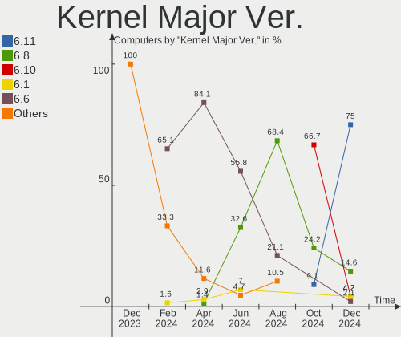

| Version | Computers | Percent |
|---------|-----------|---------|
| 6.0     | 54        | 81.82%  |
| 5.18    | 8         | 12.12%  |
| 5.19    | 1         | 1.52%   |
| 5.14    | 1         | 1.52%   |
| 5.10    | 1         | 1.52%   |
| 4.14    | 1         | 1.52%   |

Arch
----

OS architecture (x86_64, i586, etc.)

| Name    | Computers | Percent |
|---------|-----------|---------|
| x86_64  | 64        | 96.97%  |
| aarch64 | 2         | 3.03%   |

DE
--

Desktop Environment

| Name    | Computers | Percent |
|---------|-----------|---------|
| XFCE    | 39        | 59.09%  |
| GNOME   | 14        | 21.21%  |
| KDE5    | 9         | 13.64%  |
| Unknown | 3         | 4.55%   |
| MATE    | 1         | 1.52%   |

Display Server
--------------

X11 or Wayland

| Name | Computers | Percent |
|------|-----------|---------|
| X11  | 66        | 100%    |

Display Manager
---------------

SDDM, LightDM, etc.

| Name    | Computers | Percent |
|---------|-----------|---------|
| LightDM | 34        | 51.52%  |
| GDM3    | 14        | 21.21%  |
| Unknown | 13        | 19.7%   |
| SDDM    | 5         | 7.58%   |

OS Lang
-------

Language

| Lang    | Computers | Percent |
|---------|-----------|---------|
| en_US   | 37        | 56.06%  |
| fr_FR   | 7         | 10.61%  |
| en_IN   | 3         | 4.55%   |
| en_GB   | 3         | 4.55%   |
| ru_RU   | 2         | 3.03%   |
| es_ES   | 2         | 3.03%   |
| Unknown | 2         | 3.03%   |
| pl_PL   | 1         | 1.52%   |
| nl_BE   | 1         | 1.52%   |
| it_IT   | 1         | 1.52%   |
| hu_HU   | 1         | 1.52%   |
| fr_BE   | 1         | 1.52%   |
| en_NZ   | 1         | 1.52%   |
| en_DE   | 1         | 1.52%   |
| en_AU   | 1         | 1.52%   |
| de_DE   | 1         | 1.52%   |
| C       | 1         | 1.52%   |

Boot Mode
---------

EFI or BIOS

| Mode | Computers | Percent |
|------|-----------|---------|
| EFI  | 43        | 65.15%  |
| BIOS | 23        | 34.85%  |

Filesystem
----------

Type of filesystem

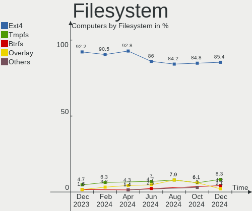

| Type    | Computers | Percent |
|---------|-----------|---------|
| Ext4    | 61        | 92.42%  |
| Overlay | 4         | 6.06%   |
| F2fs    | 1         | 1.52%   |

Part. scheme
------------

Scheme of partitioning

| Type    | Computers | Percent |
|---------|-----------|---------|
| GPT     | 44        | 66.67%  |
| Unknown | 12        | 18.18%  |
| MBR     | 10        | 15.15%  |

Dual Boot with Linux/BSD
------------------------

Hosting more than one Linux/BSD

| Dual boot | Computers | Percent |
|-----------|-----------|---------|
| No        | 56        | 84.85%  |
| Yes       | 10        | 15.15%  |

Dual Boot (Win)
---------------

Hosting Linux and Windows

| Dual boot | Computers | Percent |
|-----------|-----------|---------|
| No        | 42        | 63.64%  |
| Yes       | 24        | 36.36%  |

Board
-----

Vendor
------

Motherboard manufacturer

| Name                | Computers | Percent |
|---------------------|-----------|---------|
| Dell                | 12        | 18.18%  |
| Hewlett-Packard     | 10        | 15.15%  |
| ASUSTek Computer    | 7         | 10.61%  |
| Apple               | 6         | 9.09%   |
| Acer                | 6         | 9.09%   |
| Lenovo              | 5         | 7.58%   |
| Gigabyte Technology | 4         | 6.06%   |
| Unknown             | 4         | 6.06%   |
| Samsung Electronics | 3         | 4.55%   |
| MSI                 | 3         | 4.55%   |
| Pegatron            | 1         | 1.52%   |
| Packard Bell        | 1         | 1.52%   |
| Monster             | 1         | 1.52%   |
| Huanan              | 1         | 1.52%   |
| Danew               | 1         | 1.52%   |
| Chuwi               | 1         | 1.52%   |

Model
-----

Motherboard model

| Name                                                            | Computers | Percent |
|-----------------------------------------------------------------|-----------|---------|
| Unknown                                                         | 4         | 6.06%   |
| HP Pavilion g6                                                  | 2         | 3.03%   |
| Dell Inspiron 3521                                              | 2         | 3.03%   |
| Samsung 935XDB                                                  | 1         | 1.52%   |
| Samsung 930XED                                                  | 1         | 1.52%   |
| Samsung 300E5M/300E5L                                           | 1         | 1.52%   |
| Pegatron 23-b017c                                               | 1         | 1.52%   |
| Packard Bell EasyNote TE11HC                                    | 1         | 1.52%   |
| MSI MS-7D15                                                     | 1         | 1.52%   |
| MSI MS-7916                                                     | 1         | 1.52%   |
| MSI GF65 Thin 10SDR                                             | 1         | 1.52%   |
| Monster HUMA H4 V4.1                                            | 1         | 1.52%   |
| Lenovo ThinkPad Yoga 260 20FES4CK00                             | 1         | 1.52%   |
| Lenovo ThinkPad L15 Gen 2 20X4S4LM01                            | 1         | 1.52%   |
| Lenovo ThinkPad L15 Gen 1 20U8S0PR00                            | 1         | 1.52%   |
| Lenovo Legion 5 15IMH05 82AU                                    | 1         | 1.52%   |
| Lenovo IdeaPad 320-15IKB 81BT                                   | 1         | 1.52%   |
| Huanan X79 (INTEL Xeon E5/Core i7 DMI2 - C600/C200 Cipset V2.49 | 1         | 1.52%   |
| HP Pavilion dv6                                                 | 1         | 1.52%   |
| HP Notebook                                                     | 1         | 1.52%   |
| HP Laptop 14-fq0xxx                                             | 1         | 1.52%   |
| HP ENVY x360 Convertible 15-cn1xxx                              | 1         | 1.52%   |
| HP EliteBook 850 G7 Notebook PC                                 | 1         | 1.52%   |
| HP EliteBook 640 14 inch G9 Notebook PC                         | 1         | 1.52%   |
| HP Compaq 6910p                                                 | 1         | 1.52%   |
| HP 245 G3                                                       | 1         | 1.52%   |
| Gigabyte Z690 AORUS MASTER                                      | 1         | 1.52%   |
| Gigabyte H310M S2H 2.0                                          | 1         | 1.52%   |
| Gigabyte AORUS 15G KC                                           | 1         | 1.52%   |
| Gigabyte AERO 17 XE5                                            | 1         | 1.52%   |
| Dell Precision 5510                                             | 1         | 1.52%   |
| Dell OptiPlex 3050                                              | 1         | 1.52%   |
| Dell Latitude E6410                                             | 1         | 1.52%   |
| Dell Latitude 5580                                              | 1         | 1.52%   |
| Dell Latitude 5480                                              | 1         | 1.52%   |
| Dell Inspiron 5567                                              | 1         | 1.52%   |
| Dell Inspiron 5370                                              | 1         | 1.52%   |
| Dell Inspiron 3531                                              | 1         | 1.52%   |
| Dell Inspiron 14-3462                                           | 1         | 1.52%   |
| Dell Inspiron 13-5378                                           | 1         | 1.52%   |

Model Family
------------

Motherboard model prefix

| Name                  | Computers | Percent |
|-----------------------|-----------|---------|
| Dell Inspiron         | 7         | 10.61%  |
| Acer Aspire           | 4         | 6.06%   |
| Unknown               | 4         | 6.06%   |
| Lenovo ThinkPad       | 3         | 4.55%   |
| HP Pavilion           | 3         | 4.55%   |
| Dell Latitude         | 3         | 4.55%   |
| ASUS ROG              | 3         | 4.55%   |
| HP EliteBook          | 2         | 3.03%   |
| Samsung 935XDB        | 1         | 1.52%   |
| Samsung 930XED        | 1         | 1.52%   |
| Samsung 300E5M        | 1         | 1.52%   |
| Pegatron 23-b017c     | 1         | 1.52%   |
| Packard Bell EasyNote | 1         | 1.52%   |
| MSI MS-7D15           | 1         | 1.52%   |
| MSI MS-7916           | 1         | 1.52%   |
| MSI GF65              | 1         | 1.52%   |
| Monster HUMA          | 1         | 1.52%   |
| Lenovo Legion         | 1         | 1.52%   |
| Lenovo IdeaPad        | 1         | 1.52%   |
| Huanan X79            | 1         | 1.52%   |
| HP Notebook           | 1         | 1.52%   |
| HP Laptop             | 1         | 1.52%   |
| HP ENVY               | 1         | 1.52%   |
| HP Compaq             | 1         | 1.52%   |
| HP 245                | 1         | 1.52%   |
| Gigabyte Z690         | 1         | 1.52%   |
| Gigabyte H310M        | 1         | 1.52%   |
| Gigabyte AORUS        | 1         | 1.52%   |
| Gigabyte AERO         | 1         | 1.52%   |
| Dell Precision        | 1         | 1.52%   |
| Dell OptiPlex         | 1         | 1.52%   |
| Danew Dbook           | 1         | 1.52%   |
| Chuwi HeroBook        | 1         | 1.52%   |
| ASUS X541UJ           | 1         | 1.52%   |
| ASUS ProArt           | 1         | 1.52%   |
| ASUS PRIME            | 1         | 1.52%   |
| ASUS All              | 1         | 1.52%   |
| Apple MacBookPro9     | 1         | 1.52%   |
| Apple MacBookPro15    | 1         | 1.52%   |
| Apple MacBookPro14    | 1         | 1.52%   |

MFG Year
--------

Motherboard manufacture year

| Year    | Computers | Percent |
|---------|-----------|---------|
| 2020    | 10        | 15.15%  |
| 2021    | 9         | 13.64%  |
| 2017    | 9         | 13.64%  |
| 2016    | 7         | 10.61%  |
| 2012    | 6         | 9.09%   |
| 2022    | 5         | 7.58%   |
| 2019    | 3         | 4.55%   |
| 2018    | 3         | 4.55%   |
| 2014    | 3         | 4.55%   |
| 2011    | 2         | 3.03%   |
| 2010    | 2         | 3.03%   |
| 2008    | 2         | 3.03%   |
| Unknown | 2         | 3.03%   |
| 2015    | 1         | 1.52%   |
| 2013    | 1         | 1.52%   |
| 2007    | 1         | 1.52%   |

Form Factor
-----------

Physical design of the computer

| Name           | Computers | Percent |
|----------------|-----------|---------|
| Notebook       | 48        | 72.73%  |
| Desktop        | 14        | 21.21%  |
| System on chip | 2         | 3.03%   |
| Convertible    | 2         | 3.03%   |

Secure Boot
-----------

Enabled or disabled

| State    | Computers | Percent |
|----------|-----------|---------|
| Disabled | 66        | 100%    |

Coreboot
--------

Have coreboot on board

| Used | Computers | Percent |
|------|-----------|---------|
| No   | 66        | 100%    |

RAM Size
--------

Total RAM memory

| Size in GB  | Computers | Percent |
|-------------|-----------|---------|
| 4.01-8.0    | 18        | 27.27%  |
| 8.01-16.0   | 13        | 19.7%   |
| 16.01-24.0  | 11        | 16.67%  |
| 3.01-4.0    | 10        | 15.15%  |
| 32.01-64.0  | 9         | 13.64%  |
| 64.01-256.0 | 2         | 3.03%   |
| 1.01-2.0    | 2         | 3.03%   |
| 2.01-3.0    | 1         | 1.52%   |

RAM Used
--------

Used RAM memory

| Used GB   | Computers | Percent |
|-----------|-----------|---------|
| 1.01-2.0  | 20        | 30.3%   |
| 2.01-3.0  | 19        | 28.79%  |
| 3.01-4.0  | 15        | 22.73%  |
| 4.01-8.0  | 7         | 10.61%  |
| 8.01-16.0 | 4         | 6.06%   |
| 0.51-1.0  | 1         | 1.52%   |

Total Drives
------------

Number of drives on board

| Drives | Computers | Percent |
|--------|-----------|---------|
| 1      | 46        | 69.7%   |
| 2      | 10        | 15.15%  |
| 3      | 5         | 7.58%   |
| 5      | 3         | 4.55%   |
| 8      | 1         | 1.52%   |
| 0      | 1         | 1.52%   |

Has CD-ROM
----------

Has CD-ROM on board

| Presented | Computers | Percent |
|-----------|-----------|---------|
| No        | 51        | 77.27%  |
| Yes       | 15        | 22.73%  |

Has Ethernet
------------

Has Ethernet on board

| Presented | Computers | Percent |
|-----------|-----------|---------|
| Yes       | 48        | 72.73%  |
| No        | 18        | 27.27%  |

Has WiFi
--------

Has WiFi module

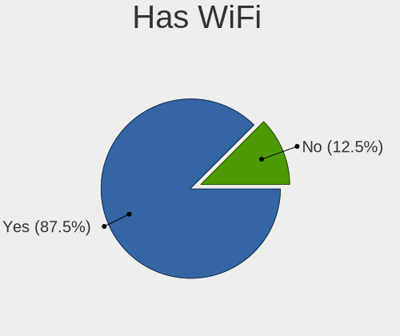

| Presented | Computers | Percent |
|-----------|-----------|---------|
| Yes       | 59        | 89.39%  |
| No        | 7         | 10.61%  |

Has Bluetooth
-------------

Has Bluetooth module

| Presented | Computers | Percent |
|-----------|-----------|---------|
| Yes       | 40        | 60.61%  |
| No        | 26        | 39.39%  |

Location
--------

Country
-------

Geographic location (country)

| Country     | Computers | Percent |
|-------------|-----------|---------|
| USA         | 12        | 18.18%  |
| France      | 8         | 12.12%  |
| Russia      | 5         | 7.58%   |
| Germany     | 5         | 7.58%   |
| India       | 4         | 6.06%   |
| UK          | 3         | 4.55%   |
| Spain       | 3         | 4.55%   |
| Poland      | 2         | 3.03%   |
| Philippines | 2         | 3.03%   |
| Netherlands | 2         | 3.03%   |
| Brazil      | 2         | 3.03%   |
| Belgium     | 2         | 3.03%   |
| Australia   | 2         | 3.03%   |
| Uzbekistan  | 1         | 1.52%   |
| Turkey      | 1         | 1.52%   |
| Switzerland | 1         | 1.52%   |
| Sri Lanka   | 1         | 1.52%   |
| New Zealand | 1         | 1.52%   |
| Nepal       | 1         | 1.52%   |
| Japan       | 1         | 1.52%   |
| Italy       | 1         | 1.52%   |
| Indonesia   | 1         | 1.52%   |
| Hungary     | 1         | 1.52%   |
| Ghana       | 1         | 1.52%   |
| Canada      | 1         | 1.52%   |
| Bulgaria    | 1         | 1.52%   |
| Belarus     | 1         | 1.52%   |

City
----

Geographic location (city)

| City                  | Computers | Percent |
|-----------------------|-----------|---------|
| San Antonio           | 2         | 3.03%   |
| Paris                 | 2         | 3.03%   |
| Munich                | 2         | 3.03%   |
| Iloilo City           | 2         | 3.03%   |
| Zaragoza              | 1         | 1.52%   |
| Yuzhno-Sakhalinsk     | 1         | 1.52%   |
| Wolfsheim             | 1         | 1.52%   |
| Vitrolles             | 1         | 1.52%   |
| Visakhapatnam         | 1         | 1.52%   |
| Victoria              | 1         | 1.52%   |
| Valencia              | 1         | 1.52%   |
| Tashkent              | 1         | 1.52%   |
| Sydney                | 1         | 1.52%   |
| St Petersburg         | 1         | 1.52%   |
| Siblingen             | 1         | 1.52%   |
| Setagaya-ku           | 1         | 1.52%   |
| Sao Paulo             | 1         | 1.52%   |
| Sao Jose do Rio Preto | 1         | 1.52%   |
| San Jose              | 1         | 1.52%   |
| San Costanzo          | 1         | 1.52%   |
| Samsun                | 1         | 1.52%   |
| Rajkot                | 1         | 1.52%   |
| Pozuelo de Alarcón   | 1         | 1.52%   |
| Orgeres               | 1         | 1.52%   |
| Novosibirsk           | 1         | 1.52%   |
| Newton Tony           | 1         | 1.52%   |
| New Iberia            | 1         | 1.52%   |
| Naaldwijk             | 1         | 1.52%   |
| Moscow                | 1         | 1.52%   |
| Mesa                  | 1         | 1.52%   |
| Medan                 | 1         | 1.52%   |
| Ludhiana              | 1         | 1.52%   |
| London                | 1         | 1.52%   |
| Lodz                  | 1         | 1.52%   |
| Liège                | 1         | 1.52%   |
| Lalitpur              | 1         | 1.52%   |
| Jesup                 | 1         | 1.52%   |
| Ivanava               | 1         | 1.52%   |
| Houston               | 1         | 1.52%   |
| Hisarya               | 1         | 1.52%   |

Drives
------

Drive Vendor
------------

Hard drive vendors

| Vendor                    | Computers | Drives | Percent |
|---------------------------|-----------|--------|---------|
| Samsung Electronics       | 15        | 18     | 15.46%  |
| Toshiba                   | 12        | 12     | 12.37%  |
| WDC                       | 11        | 13     | 11.34%  |
| Seagate                   | 10        | 10     | 10.31%  |
| SanDisk                   | 6         | 8      | 6.19%   |
| Kingston                  | 6         | 6      | 6.19%   |
| Apple                     | 6         | 6      | 6.19%   |
| Hitachi                   | 5         | 5      | 5.15%   |
| Unknown                   | 3         | 3      | 3.09%   |
| Crucial                   | 3         | 3      | 3.09%   |
| Phison                    | 2         | 2      | 2.06%   |
| China                     | 2         | 2      | 2.06%   |
| ZTE                       | 1         | 1      | 1.03%   |
| XPG                       | 1         | 1      | 1.03%   |
| SK hynix                  | 1         | 1      | 1.03%   |
| SABRENT                   | 1         | 1      | 1.03%   |
| PNY                       | 1         | 2      | 1.03%   |
| Phison Electronics        | 1         | 1      | 1.03%   |
| OSCOO                     | 1         | 1      | 1.03%   |
| Micron/Crucial Technology | 1         | 1      | 1.03%   |
| Micron Technology         | 1         | 1      | 1.03%   |
| Intenso                   | 1         | 1      | 1.03%   |
| Intel                     | 1         | 2      | 1.03%   |
| HGST HTS                  | 1         | 1      | 1.03%   |
| Hewlett-Packard           | 1         | 1      | 1.03%   |
| Gigabyte Technology       | 1         | 1      | 1.03%   |
| A-DATA Technology         | 1         | 1      | 1.03%   |
| Unknown                   | 1         | 1      | 1.03%   |

Drive Model
-----------

Hard drive models

| Model                                | Computers | Percent |
|--------------------------------------|-----------|---------|
| Toshiba MQ01ABF050 500GB             | 2         | 1.92%   |
| Seagate ST1000DM003-1SB102 1TB       | 2         | 1.92%   |
| Samsung SSD 980 1TB                  | 2         | 1.92%   |
| Kingston SUV400S37240G 240GB SSD     | 2         | 1.92%   |
| Hitachi HTS543232L9A300 320GB        | 2         | 1.92%   |
| ZTE MMC Storage 942MB                | 1         | 0.96%   |
| XPG GAMMIX S50 Lite 1TB              | 1         | 0.96%   |
| WDC WDS500G3X0C-00SJG0 500GB         | 1         | 0.96%   |
| WDC WDS500G2B0B-00YS70 500GB SSD     | 1         | 0.96%   |
| WDC WDS100T2B0A-00SM50 1TB SSD       | 1         | 0.96%   |
| WDC WD8001FZBX-00ASYA0 8TB           | 1         | 0.96%   |
| WDC WD40EFAX-68JH4N0 4TB             | 1         | 0.96%   |
| WDC WD3200BPVT-22ZEST0 320GB         | 1         | 0.96%   |
| WDC WD3200AAKS-00L9A0 320GB          | 1         | 0.96%   |
| WDC WD15EADS-00P8B0 1TB              | 1         | 0.96%   |
| WDC WD10JPVX-35JC3T0 1TB             | 1         | 0.96%   |
| WDC WD10EADS-00M2B0 1TB              | 1         | 0.96%   |
| WDC WD101FZBX-00ATAA0 10TB           | 1         | 0.96%   |
| WDC WD My Passport 25F3 512GB        | 1         | 0.96%   |
| WDC PC SN530 SDBPNPZ-256G-1006 256GB | 1         | 0.96%   |
| Unknown MMC Card  8GB                | 1         | 0.96%   |
| Unknown MMC Card  32GB               | 1         | 0.96%   |
| Unknown M0S002  64GB                 | 1         | 0.96%   |
| Toshiba MQ04ABF100 1TB               | 1         | 0.96%   |
| Toshiba MQ01ABF032 320GB             | 1         | 0.96%   |
| Toshiba MQ01ABD100 1TB               | 1         | 0.96%   |
| Toshiba MQ01ABD050 500GB             | 1         | 0.96%   |
| Toshiba MK5075GSX 500GB              | 1         | 0.96%   |
| Toshiba KXG6AZNV256G 256GB           | 1         | 0.96%   |
| Toshiba KBG30ZMV512G 512GB           | 1         | 0.96%   |
| Toshiba HDWR160 6TB                  | 1         | 0.96%   |
| Toshiba HDWJ110 1TB                  | 1         | 0.96%   |
| Toshiba DT01ACA200 2TB               | 1         | 0.96%   |
| SK hynix SC311 SATA 512GB SSD        | 1         | 0.96%   |
| Seagate Xbox SSD 1TB                 | 1         | 0.96%   |
| Seagate ST9500325AS 500GB            | 1         | 0.96%   |
| Seagate ST500LT012-1DG142 500GB      | 1         | 0.96%   |
| Seagate ST500LM021-1KJ152 500GB      | 1         | 0.96%   |
| Seagate ST2000LM007-1R8174 2TB       | 1         | 0.96%   |
| Seagate ST1000LM035-1RK172 1TB       | 1         | 0.96%   |

HDD Vendor
----------

Hard disk drive vendors

| Vendor              | Computers | Drives | Percent |
|---------------------|-----------|--------|---------|
| Toshiba             | 10        | 10     | 28.57%  |
| Seagate             | 9         | 9      | 25.71%  |
| WDC                 | 7         | 8      | 20%     |
| Hitachi             | 5         | 5      | 14.29%  |
| Samsung Electronics | 1         | 1      | 2.86%   |
| SABRENT             | 1         | 1      | 2.86%   |
| HGST HTS            | 1         | 1      | 2.86%   |
| Apple               | 1         | 1      | 2.86%   |

SSD Vendor
----------

Solid state drive vendors

| Vendor              | Computers | Drives | Percent |
|---------------------|-----------|--------|---------|
| SanDisk             | 6         | 7      | 21.43%  |
| Kingston            | 4         | 4      | 14.29%  |
| Samsung Electronics | 3         | 3      | 10.71%  |
| WDC                 | 2         | 2      | 7.14%   |
| Crucial             | 2         | 2      | 7.14%   |
| China               | 2         | 2      | 7.14%   |
| SK hynix            | 1         | 1      | 3.57%   |
| Seagate             | 1         | 1      | 3.57%   |
| PNY                 | 1         | 2      | 3.57%   |
| OSCOO               | 1         | 1      | 3.57%   |
| Micron Technology   | 1         | 1      | 3.57%   |
| Intenso             | 1         | 1      | 3.57%   |
| Hewlett-Packard     | 1         | 1      | 3.57%   |
| Apple               | 1         | 1      | 3.57%   |
| A-DATA Technology   | 1         | 1      | 3.57%   |

Drive Kind
----------

HDD or SSD

| Kind    | Computers | Drives | Percent |
|---------|-----------|--------|---------|
| NVMe    | 28        | 34     | 33.33%  |
| HDD     | 28        | 36     | 33.33%  |
| SSD     | 22        | 30     | 26.19%  |
| MMC     | 4         | 4      | 4.76%   |
| Unknown | 2         | 2      | 2.38%   |

Drive Connector
---------------

SATA, SAS, NVMe, etc.

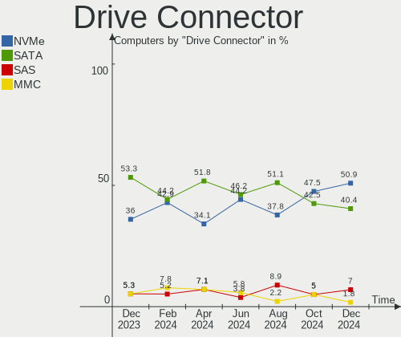

| Type | Computers | Drives | Percent |
|------|-----------|--------|---------|
| SATA | 41        | 58     | 50.62%  |
| NVMe | 28        | 34     | 34.57%  |
| SAS  | 8         | 10     | 9.88%   |
| MMC  | 4         | 4      | 4.94%   |

Drive Size
----------

Size of hard drive

| Size in TB | Computers | Drives | Percent |
|------------|-----------|--------|---------|
| 0.01-0.5   | 30        | 38     | 56.6%   |
| 0.51-1.0   | 16        | 18     | 30.19%  |
| 1.01-2.0   | 3         | 4      | 5.66%   |
| 3.01-4.0   | 2         | 2      | 3.77%   |
| 4.01-10.0  | 2         | 4      | 3.77%   |

Space Total
-----------

Amount of disk space available on the file system

| Size in GB     | Computers | Percent |
|----------------|-----------|---------|
| 101-250        | 20        | 30.3%   |
| 251-500        | 16        | 24.24%  |
| 501-1000       | 11        | 16.67%  |
| 21-50          | 5         | 7.58%   |
| More than 3000 | 4         | 6.06%   |
| 51-100         | 4         | 6.06%   |
| Unknown        | 3         | 4.55%   |
| 1-20           | 2         | 3.03%   |
| 1001-2000      | 1         | 1.52%   |

Space Used
----------

Amount of used disk space

| Used GB        | Computers | Percent |
|----------------|-----------|---------|
| 1-20           | 24        | 36.36%  |
| 21-50          | 15        | 22.73%  |
| 51-100         | 8         | 12.12%  |
| 251-500        | 6         | 9.09%   |
| 101-250        | 6         | 9.09%   |
| Unknown        | 3         | 4.55%   |
| 2001-3000      | 2         | 3.03%   |
| More than 3000 | 1         | 1.52%   |
| 501-1000       | 1         | 1.52%   |

Malfunc. Drives
---------------

Drive models with a malfunction

| Model                            | Computers | Drives | Percent |
|----------------------------------|-----------|--------|---------|
| Hitachi HTS543232L9A300 320GB    | 2         | 2      | 18.18%  |
| WDC WD3200BPVT-22ZEST0 320GB     | 1         | 1      | 9.09%   |
| WDC WD3200AAKS-00L9A0 320GB      | 1         | 1      | 9.09%   |
| Toshiba MQ01ABF050 500GB         | 1         | 1      | 9.09%   |
| Seagate ST9500325AS 500GB        | 1         | 1      | 9.09%   |
| Seagate ST500LM021-1KJ152 500GB  | 1         | 1      | 9.09%   |
| Seagate ST1000LM035-1RK172 1TB   | 1         | 1      | 9.09%   |
| OSCOO OSC SSD 120GB              | 1         | 1      | 9.09%   |
| Kingston SUV400S37240G 240GB SSD | 1         | 1      | 9.09%   |
| Hitachi HTS545050A7E380 500GB    | 1         | 1      | 9.09%   |

Malfunc. Drive Vendor
---------------------

Vendors of faulty drives

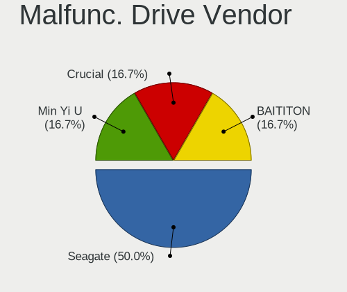

| Vendor   | Computers | Drives | Percent |
|----------|-----------|--------|---------|
| Seagate  | 3         | 3      | 27.27%  |
| Hitachi  | 3         | 3      | 27.27%  |
| WDC      | 2         | 2      | 18.18%  |
| Toshiba  | 1         | 1      | 9.09%   |
| OSCOO    | 1         | 1      | 9.09%   |
| Kingston | 1         | 1      | 9.09%   |

Malfunc. HDD Vendor
-------------------

Vendors of faulty HDD drives

| Vendor  | Computers | Drives | Percent |
|---------|-----------|--------|---------|
| Seagate | 3         | 3      | 33.33%  |
| Hitachi | 3         | 3      | 33.33%  |
| WDC     | 2         | 2      | 22.22%  |
| Toshiba | 1         | 1      | 11.11%  |

Malfunc. Drive Kind
-------------------

Kinds of faulty drives

| Kind | Computers | Drives | Percent |
|------|-----------|--------|---------|
| HDD  | 8         | 9      | 80%     |
| SSD  | 2         | 2      | 20%     |

Failed Drives
-------------

Failed drive models

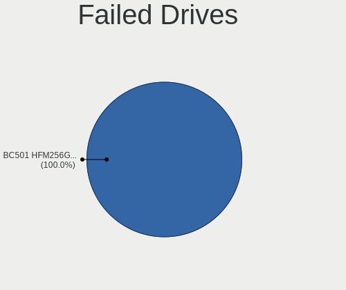

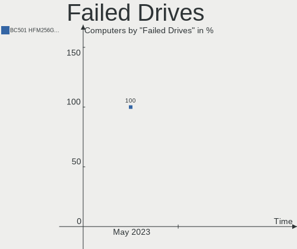

| Model                           | Computers | Drives | Percent |
|---------------------------------|-----------|--------|---------|
| Samsung Electronics SSD 980 1TB | 1         | 1      | 100%    |

Failed Drive Vendor
-------------------

Failed drive vendors

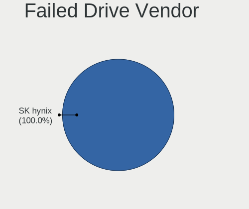

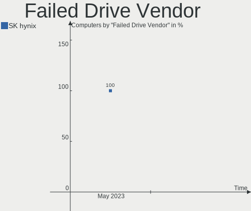

| Vendor              | Computers | Drives | Percent |
|---------------------|-----------|--------|---------|
| Samsung Electronics | 1         | 1      | 100%    |

Drive Status
------------

Number of failed and malfunc. drives

| Status   | Computers | Drives | Percent |
|----------|-----------|--------|---------|
| Works    | 44        | 56     | 57.14%  |
| Detected | 23        | 38     | 29.87%  |
| Malfunc  | 9         | 11     | 11.69%  |
| Failed   | 1         | 1      | 1.3%    |

Storage controller
------------------

Storage Vendor
--------------

Storage controller vendors

| Vendor                       | Computers | Percent |
|------------------------------|-----------|---------|
| Intel                        | 39        | 48.75%  |
| Samsung Electronics          | 15        | 18.75%  |
| AMD                          | 8         | 10%     |
| Phison Electronics           | 4         | 5%      |
| SanDisk                      | 3         | 3.75%   |
| Apple                        | 3         | 3.75%   |
| Toshiba America Info Systems | 2         | 2.5%    |
| Micron/Crucial Technology    | 2         | 2.5%    |
| Kingston Technology Company  | 2         | 2.5%    |
| ASMedia Technology           | 1         | 1.25%   |
| ADATA Technology             | 1         | 1.25%   |

Storage Model
-------------

Storage controller models

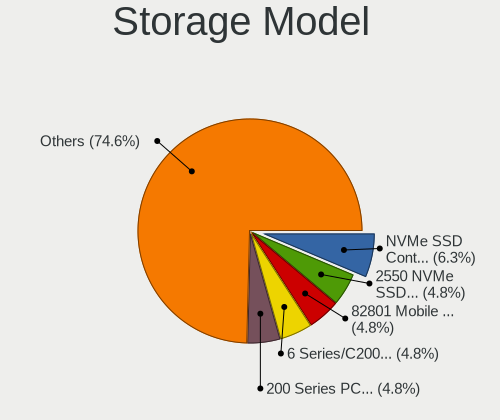

| Model                                                                            | Computers | Percent |
|----------------------------------------------------------------------------------|-----------|---------|
| Intel Sunrise Point-LP SATA Controller [AHCI mode]                               | 8         | 9.64%   |
| AMD FCH SATA Controller [AHCI mode]                                              | 6         | 7.23%   |
| Samsung NVMe SSD Controller 980                                                  | 5         | 6.02%   |
| Intel 7 Series Chipset Family 6-port SATA Controller [AHCI mode]                 | 5         | 6.02%   |
| Samsung NVMe SSD Controller SM981/PM981/PM983                                    | 4         | 4.82%   |
| Intel 82801 Mobile SATA Controller [RAID mode]                                   | 4         | 4.82%   |
| Samsung NVMe SSD Controller PM9A1/PM9A3/980PRO                                   | 3         | 3.61%   |
| Intel 200 Series PCH SATA controller [AHCI mode]                                 | 3         | 3.61%   |
| Apple ANS2 NVMe Controller                                                       | 3         | 3.61%   |
| Samsung NVMe SSD Controller SM961/PM961/SM963                                    | 2         | 2.41%   |
| Phison E12 NVMe Controller                                                       | 2         | 2.41%   |
| Kingston Company Company Non-Volatile memory controller                          | 2         | 2.41%   |
| Intel Celeron/Pentium Silver Processor SATA Controller                           | 2         | 2.41%   |
| Toshiba America Info Systems XG6 NVMe SSD Controller                             | 1         | 1.2%    |
| Toshiba America Info Systems BG3 NVMe SSD Controller                             | 1         | 1.2%    |
| SanDisk WD Blue SN550 NVMe SSD                                                   | 1         | 1.2%    |
| SanDisk WD Black SN750 / PC SN730 NVMe SSD                                       | 1         | 1.2%    |
| SanDisk Non-Volatile memory controller                                           | 1         | 1.2%    |
| Samsung Electronics SATA controller                                              | 1         | 1.2%    |
| Phison Electronics Non-Volatile memory controller                                | 1         | 1.2%    |
| Phison E18 PCIe4 NVMe Controller                                                 | 1         | 1.2%    |
| Micron/Crucial P5 Plus NVMe PCIe SSD                                             | 1         | 1.2%    |
| Micron/Crucial P2 NVMe PCIe SSD                                                  | 1         | 1.2%    |
| Intel Volume Management Device NVMe RAID Controller                              | 1         | 1.2%    |
| Intel SSD Pro 7600p/760p/E 6100p Series                                          | 1         | 1.2%    |
| Intel Q170/Q150/B150/H170/H110/Z170/CM236 Chipset SATA Controller [AHCI Mode]    | 1         | 1.2%    |
| Intel Ice Lake-LP SATA Controller [AHCI mode]                                    | 1         | 1.2%    |
| Intel Comet Lake SATA AHCI Controller                                            | 1         | 1.2%    |
| Intel Celeron N3350/Pentium N4200/Atom E3900 Series SATA AHCI Controller         | 1         | 1.2%    |
| Intel Atom/Celeron/Pentium Processor x5-E8000/J3xxx/N3xxx Series SATA Controller | 1         | 1.2%    |
| Intel Atom Processor E3800 Series SATA AHCI Controller                           | 1         | 1.2%    |
| Intel Alder Lake-S PCH SATA Controller [AHCI Mode]                               | 1         | 1.2%    |
| Intel 82801IR/IO/IH (ICH9R/DO/DH) 6 port SATA Controller [AHCI mode]             | 1         | 1.2%    |
| Intel 82801IBM/IEM (ICH9M/ICH9M-E) 4 port SATA Controller [AHCI mode]            | 1         | 1.2%    |
| Intel 82801HM/HEM (ICH8M/ICH8M-E) SATA Controller [AHCI mode]                    | 1         | 1.2%    |
| Intel 8 Series/C220 Series Chipset Family 6-port SATA Controller 1 [AHCI mode]   | 1         | 1.2%    |
| Intel 6 Series/C200 Series Chipset Family 6 port Mobile SATA AHCI Controller     | 1         | 1.2%    |
| Intel 6 Series/C200 Series Chipset Family 6 port Desktop SATA AHCI Controller    | 1         | 1.2%    |
| Intel 500 Series Chipset Family SATA AHCI Controller                             | 1         | 1.2%    |
| Intel 5 Series/3400 Series Chipset 6 port SATA AHCI Controller                   | 1         | 1.2%    |

Storage Kind
------------

Kind of storage controller (IDE, SATA, NVMe, SAS, ...)

| Kind | Computers | Percent |
|------|-----------|---------|
| SATA | 45        | 57.69%  |
| NVMe | 28        | 35.9%   |
| RAID | 5         | 6.41%   |

Processor
---------

CPU Vendor
----------

Processor vendors

| Vendor | Computers | Percent |
|--------|-----------|---------|
| Intel  | 55        | 83.33%  |
| AMD    | 9         | 13.64%  |
| ARM    | 2         | 3.03%   |

CPU Model
---------

Processor models

| Model                                | Computers | Percent |
|--------------------------------------|-----------|---------|
| Intel Core i5-7200U CPU @ 2.50GHz    | 4         | 6.06%   |
| Intel Core i7-10750H CPU @ 2.60GHz   | 2         | 3.03%   |
| Intel Core i3-6006U CPU @ 2.00GHz    | 2         | 3.03%   |
| ARM Processor                        | 2         | 3.03%   |
| Intel Xeon W-2140B CPU @ 3.20GHz     | 1         | 1.52%   |
| Intel Xeon CPU E5-2690 0 @ 2.90GHz   | 1         | 1.52%   |
| Intel Xeon CPU E3-1505M v5 @ 2.80GHz | 1         | 1.52%   |
| Intel Pentium CPU B940 @ 2.00GHz     | 1         | 1.52%   |
| Intel Core i7-8850H CPU @ 2.60GHz    | 1         | 1.52%   |
| Intel Core i7-8550U CPU @ 1.80GHz    | 1         | 1.52%   |
| Intel Core i7-7600U CPU @ 2.80GHz    | 1         | 1.52%   |
| Intel Core i7-6600U CPU @ 2.60GHz    | 1         | 1.52%   |
| Intel Core i7-4790K CPU @ 4.00GHz    | 1         | 1.52%   |
| Intel Core i7-3520M CPU @ 2.90GHz    | 1         | 1.52%   |
| Intel Core i7-10870H CPU @ 2.20GHz   | 1         | 1.52%   |
| Intel Core i5-9600K CPU @ 3.70GHz    | 1         | 1.52%   |
| Intel Core i5-8265U CPU @ 1.60GHz    | 1         | 1.52%   |
| Intel Core i5-8250U CPU @ 1.60GHz    | 1         | 1.52%   |
| Intel Core i5-7360U CPU @ 2.30GHz    | 1         | 1.52%   |
| Intel Core i5-6200U CPU @ 2.30GHz    | 1         | 1.52%   |
| Intel Core i5-5350U CPU @ 1.80GHz    | 1         | 1.52%   |
| Intel Core i5-4690 CPU @ 3.50GHz     | 1         | 1.52%   |
| Intel Core i5-3210M CPU @ 2.50GHz    | 1         | 1.52%   |
| Intel Core i5-2410M CPU @ 2.30GHz    | 1         | 1.52%   |
| Intel Core i5-10310U CPU @ 1.70GHz   | 1         | 1.52%   |
| Intel Core i5-1030NG7 CPU @ 1.10GHz  | 1         | 1.52%   |
| Intel Core i5-10210U CPU @ 1.60GHz   | 1         | 1.52%   |
| Intel Core i5 CPU M 580 @ 2.67GHz    | 1         | 1.52%   |
| Intel Core i3-9100 CPU @ 3.60GHz     | 1         | 1.52%   |
| Intel Core i3-6100 CPU @ 3.70GHz     | 1         | 1.52%   |
| Intel Core i3-3227U CPU @ 1.90GHz    | 1         | 1.52%   |
| Intel Core i3-1005G1 CPU @ 1.20GHz   | 1         | 1.52%   |
| Intel Core i3 CPU M 380 @ 2.53GHz    | 1         | 1.52%   |
| Intel Core 2 Duo CPU T7300 @ 2.00GHz | 1         | 1.52%   |
| Intel Core 2 Duo CPU T6400 @ 2.00GHz | 1         | 1.52%   |
| Intel Celeron N4020 CPU @ 1.10GHz    | 1         | 1.52%   |
| Intel Celeron J4105 CPU @ 1.50GHz    | 1         | 1.52%   |
| Intel Celeron CPU N3350 @ 1.10GHz    | 1         | 1.52%   |
| Intel Celeron CPU N3060 @ 1.60GHz    | 1         | 1.52%   |
| Intel Celeron CPU N2830 @ 2.16GHz    | 1         | 1.52%   |

CPU Model Family
----------------

Processor model prefix

| Model            | Computers | Percent |
|------------------|-----------|---------|
| Intel Core i5    | 17        | 25.76%  |
| Other            | 10        | 15.15%  |
| Intel Core i7    | 9         | 13.64%  |
| Intel Core i3    | 7         | 10.61%  |
| Intel Celeron    | 6         | 9.09%   |
| Intel Xeon       | 3         | 4.55%   |
| Intel Core 2 Duo | 2         | 3.03%   |
| Intel Atom       | 2         | 3.03%   |
| AMD Ryzen 5      | 2         | 3.03%   |
| Intel Pentium    | 1         | 1.52%   |
| AMD Ryzen 9      | 1         | 1.52%   |
| AMD Ryzen 7      | 1         | 1.52%   |
| AMD Ryzen 5 PRO  | 1         | 1.52%   |
| AMD E1           | 1         | 1.52%   |
| AMD Athlon       | 1         | 1.52%   |
| AMD A6           | 1         | 1.52%   |
| AMD A4           | 1         | 1.52%   |

CPU Cores
---------

Number of processor cores

| Number  | Computers | Percent |
|---------|-----------|---------|
| 2       | 31        | 46.97%  |
| 4       | 15        | 22.73%  |
| 6       | 8         | 12.12%  |
| 8       | 4         | 6.06%   |
| 16      | 2         | 3.03%   |
| 1       | 2         | 3.03%   |
| 14      | 1         | 1.52%   |
| 12      | 1         | 1.52%   |
| 10      | 1         | 1.52%   |
| Unknown | 1         | 1.52%   |

CPU Sockets
-----------

Number of sockets

| Number  | Computers | Percent |
|---------|-----------|---------|
| 1       | 65        | 98.48%  |
| Unknown | 1         | 1.52%   |

CPU Threads
-----------

Threads per core (Hyper-Threading)

| Number  | Computers | Percent |
|---------|-----------|---------|
| 2       | 50        | 75.76%  |
| 1       | 15        | 22.73%  |
| Unknown | 1         | 1.52%   |

CPU Op-Modes
------------

CPU Operation Modes (32-bit, 64-bit)

| Op mode        | Computers | Percent |
|----------------|-----------|---------|
| 32-bit, 64-bit | 65        | 98.48%  |
| Unknown        | 1         | 1.52%   |

CPU Microcode
-------------

Microcode number

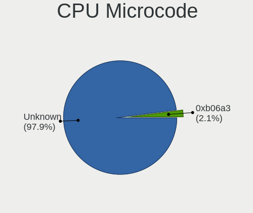

| Number     | Computers | Percent |
|------------|-----------|---------|
| Unknown    | 10        | 15.15%  |
| 0x806e9    | 6         | 9.09%   |
| 0x306a9    | 4         | 6.06%   |
| 0xa0652    | 3         | 4.55%   |
| 0x806c1    | 3         | 4.55%   |
| 0x406e3    | 3         | 4.55%   |
| 0x906a3    | 2         | 3.03%   |
| 0x806ec    | 2         | 3.03%   |
| 0x806ea    | 2         | 3.03%   |
| 0x706e5    | 2         | 3.03%   |
| 0x306c3    | 2         | 3.03%   |
| 0x20655    | 2         | 3.03%   |
| 0x06001119 | 2         | 3.03%   |
| 0x906eb    | 1         | 1.52%   |
| 0x906ea    | 1         | 1.52%   |
| 0x906a4    | 1         | 1.52%   |
| 0x90672    | 1         | 1.52%   |
| 0x806eb    | 1         | 1.52%   |
| 0x706a8    | 1         | 1.52%   |
| 0x706a1    | 1         | 1.52%   |
| 0x6fa      | 1         | 1.52%   |
| 0x506e3    | 1         | 1.52%   |
| 0x506c9    | 1         | 1.52%   |
| 0x50654    | 1         | 1.52%   |
| 0x406c4    | 1         | 1.52%   |
| 0x206d7    | 1         | 1.52%   |
| 0x206a7    | 1         | 1.52%   |
| 0x106ca    | 1         | 1.52%   |
| 0x1067a    | 1         | 1.52%   |
| 0x0a50000d | 1         | 1.52%   |
| 0x0a201016 | 1         | 1.52%   |
| 0x08701021 | 1         | 1.52%   |
| 0x08600106 | 1         | 1.52%   |
| 0x08600104 | 1         | 1.52%   |
| 0x08108109 | 1         | 1.52%   |
| 0x07030105 | 1         | 1.52%   |

CPU Microarch
-------------

Microarchitecture

| Name             | Computers | Percent |
|------------------|-----------|---------|
| KabyLake         | 14        | 21.21%  |
| Skylake          | 7         | 10.61%  |
| IvyBridge        | 4         | 6.06%   |
| Alderlake Hybrid | 4         | 6.06%   |
| Zen 2            | 3         | 4.55%   |
| TigerLake        | 3         | 4.55%   |
| Silvermont       | 3         | 4.55%   |
| SandyBridge      | 3         | 4.55%   |
| CometLake        | 3         | 4.55%   |
| Unknown          | 3         | 4.55%   |
| Zen 3            | 2         | 3.03%   |
| Westmere         | 2         | 3.03%   |
| Piledriver       | 2         | 3.03%   |
| IceLake          | 2         | 3.03%   |
| Haswell          | 2         | 3.03%   |
| Goldmont plus    | 2         | 3.03%   |
| Zen+             | 1         | 1.52%   |
| Puma             | 1         | 1.52%   |
| Penryn           | 1         | 1.52%   |
| Goldmont         | 1         | 1.52%   |
| Core             | 1         | 1.52%   |
| Broadwell        | 1         | 1.52%   |
| Bonnell          | 1         | 1.52%   |

Graphics
--------

GPU Vendor
----------

Vendors of graphics cards

| Vendor | Computers | Percent |
|--------|-----------|---------|
| Intel  | 46        | 56.79%  |
| Nvidia | 18        | 22.22%  |
| AMD    | 17        | 20.99%  |

GPU Model
---------

Graphics card models

| Model                                                                                    | Computers | Percent |
|------------------------------------------------------------------------------------------|-----------|---------|
| Intel HD Graphics 620                                                                    | 5         | 5.95%   |
| Intel Skylake GT2 [HD Graphics 520]                                                      | 4         | 4.76%   |
| Intel 3rd Gen Core processor Graphics Controller                                         | 4         | 4.76%   |
| AMD Topaz XT [Radeon R7 M260/M265 / M340/M360 / M440/M445 / 530/535 / 620/625 Mobile]    | 3         | 3.57%   |
| Nvidia TU117M                                                                            | 2         | 2.38%   |
| Nvidia GM108M [GeForce 930MX]                                                            | 2         | 2.38%   |
| Intel UHD Graphics 620                                                                   | 2         | 2.38%   |
| Intel TigerLake-LP GT2 [Iris Xe Graphics]                                                | 2         | 2.38%   |
| Intel GeminiLake [UHD Graphics 600]                                                      | 2         | 2.38%   |
| Intel Core Processor Integrated Graphics Controller                                      | 2         | 2.38%   |
| Intel CometLake-U GT2 [UHD Graphics]                                                     | 2         | 2.38%   |
| Intel CoffeeLake-S GT2 [UHD Graphics 630]                                                | 2         | 2.38%   |
| Intel Atom/Celeron/Pentium Processor x5-E8000/J3xxx/N3xxx Integrated Graphics Controller | 2         | 2.38%   |
| Intel Alder Lake-P Integrated Graphics Controller                                        | 2         | 2.38%   |
| Intel 2nd Generation Core Processor Family Integrated Graphics Controller                | 2         | 2.38%   |
| AMD Thames [Radeon HD 7500M/7600M Series]                                                | 2         | 2.38%   |
| AMD Renoir                                                                               | 2         | 2.38%   |
| Nvidia TU116M [GeForce GTX 1660 Ti Mobile]                                               | 1         | 1.19%   |
| Nvidia TU116 [GeForce GTX 1660 Ti]                                                       | 1         | 1.19%   |
| Nvidia TU116 [GeForce GTX 1650 SUPER]                                                    | 1         | 1.19%   |
| Nvidia GP108M [GeForce MX230]                                                            | 1         | 1.19%   |
| Nvidia GP107 [GeForce GTX 1050 Ti]                                                       | 1         | 1.19%   |
| Nvidia GP104 [GeForce GTX 1080]                                                          | 1         | 1.19%   |
| Nvidia GM206 [GeForce GTX 960]                                                           | 1         | 1.19%   |
| Nvidia GM108M [GeForce 920MX]                                                            | 1         | 1.19%   |
| Nvidia GM107GLM [Quadro M1000M]                                                          | 1         | 1.19%   |
| Nvidia GK208BM [GeForce 920M]                                                            | 1         | 1.19%   |
| Nvidia GK104 [GeForce GTX 680]                                                           | 1         | 1.19%   |
| Nvidia GA106M [GeForce RTX 3060 Mobile / Max-Q]                                          | 1         | 1.19%   |
| Nvidia GA106 [Geforce RTX 3050]                                                          | 1         | 1.19%   |
| Nvidia GA104 [Geforce RTX 3070 Ti Laptop GPU]                                            | 1         | 1.19%   |
| Intel WhiskeyLake-U GT2 [UHD Graphics 620]                                               | 1         | 1.19%   |
| Intel Tiger Lake-UP4 GT2 [Iris Xe Graphics]                                              | 1         | 1.19%   |
| Intel Mobile GM965/GL960 Integrated Graphics Controller (secondary)                      | 1         | 1.19%   |
| Intel Mobile GM965/GL960 Integrated Graphics Controller (primary)                        | 1         | 1.19%   |
| Intel Iris Plus Graphics G7 (Ice Lake)                                                   | 1         | 1.19%   |
| Intel Iris Plus Graphics G1 (Ice Lake)                                                   | 1         | 1.19%   |
| Intel Iris Plus Graphics 640                                                             | 1         | 1.19%   |
| Intel HD Graphics P530                                                                   | 1         | 1.19%   |
| Intel HD Graphics 6000                                                                   | 1         | 1.19%   |

GPU Combo
---------

Combinations of graphics cards

| Name           | Computers | Percent |
|----------------|-----------|---------|
| 1 x Intel      | 29        | 43.94%  |
| 1 x Nvidia     | 8         | 12.12%  |
| Intel + Nvidia | 8         | 12.12%  |
| 1 x AMD        | 8         | 12.12%  |
| Intel + AMD    | 5         | 7.58%   |
| Other          | 2         | 3.03%   |
| 2 x Intel      | 2         | 3.03%   |
| 2 x AMD        | 2         | 3.03%   |
| AMD + Nvidia   | 2         | 3.03%   |

GPU Driver
----------

Free vs proprietary

| Driver      | Computers | Percent |
|-------------|-----------|---------|
| Free        | 56        | 84.85%  |
| Proprietary | 8         | 12.12%  |
| Unknown     | 2         | 3.03%   |

GPU Memory
----------

Total video memory

| Size in GB | Computers | Percent |
|------------|-----------|---------|
| Unknown    | 41        | 62.12%  |
| 1.01-2.0   | 7         | 10.61%  |
| 0.01-0.5   | 5         | 7.58%   |
| 7.01-8.0   | 4         | 6.06%   |
| 3.01-4.0   | 4         | 6.06%   |
| 5.01-6.0   | 3         | 4.55%   |
| 24.01-32.0 | 1         | 1.52%   |
| 0.51-1.0   | 1         | 1.52%   |

Monitor
-------

Monitor Vendor
--------------

Monitor vendors

| Vendor                  | Computers | Percent |
|-------------------------|-----------|---------|
| Samsung Electronics     | 9         | 12.33%  |
| Chimei Innolux          | 9         | 12.33%  |
| BOE                     | 9         | 12.33%  |
| AU Optronics            | 9         | 12.33%  |
| LG Display              | 8         | 10.96%  |
| Apple                   | 6         | 8.22%   |
| Goldstar                | 4         | 5.48%   |
| Dell                    | 4         | 5.48%   |
| Sharp                   | 2         | 2.74%   |
| Ancor Communications    | 2         | 2.74%   |
| Vizio                   | 1         | 1.37%   |
| Unknown                 | 1         | 1.37%   |
| NECCI                   | 1         | 1.37%   |
| LG Electronics          | 1         | 1.37%   |
| Lenovo                  | 1         | 1.37%   |
| HKC                     | 1         | 1.37%   |
| Hewlett-Packard         | 1         | 1.37%   |
| Gateway                 | 1         | 1.37%   |
| Chi Mei Optoelectronics | 1         | 1.37%   |
| BenQ                    | 1         | 1.37%   |
| Acer                    | 1         | 1.37%   |

Monitor Model
-------------

Monitor models

| Model                                                                 | Computers | Percent |
|-----------------------------------------------------------------------|-----------|---------|
| Samsung Electronics LCD Monitor SDC4156 1920x1080 294x165mm 13.3-inch | 2         | 2.5%    |
| LG Display LCD Monitor LGD03AB 1366x768 344x194mm 15.5-inch           | 2         | 2.5%    |
| Vizio E241i-B1 VIZ1005 1920x1080 521x293mm 23.5-inch                  | 1         | 1.25%   |
| Unknown LCD Monitor XXX AAA 1920x1080                                 | 1         | 1.25%   |
| Sharp LQ156M1JW03 SHP14C5 1920x1080 344x194mm 15.5-inch               | 1         | 1.25%   |
| Sharp LCD Monitor SHP143E 3840x2160 346x194mm 15.6-inch               | 1         | 1.25%   |
| Samsung Electronics U28E590 SAM0C4E 3840x2160 608x345mm 27.5-inch     | 1         | 1.25%   |
| Samsung Electronics U28E590 SAM0C4D 3840x2160 607x345mm 27.5-inch     | 1         | 1.25%   |
| Samsung Electronics SA300/SA350 SAM07D2 1920x1080 477x268mm 21.5-inch | 1         | 1.25%   |
| Samsung Electronics S34J55x SAM0F72 3440x1440 797x333mm 34.0-inch     | 1         | 1.25%   |
| Samsung Electronics S24E450 SAM0C80 1920x1080 520x290mm 23.4-inch     | 1         | 1.25%   |
| Samsung Electronics S24B350 SAM08DA 1920x1080 531x299mm 24.0-inch     | 1         | 1.25%   |
| Samsung Electronics S22D300 SAM0B3F 1920x1080 477x268mm 21.5-inch     | 1         | 1.25%   |
| Samsung Electronics LU28R55 SAM1016 3840x2160 632x360mm 28.6-inch     | 1         | 1.25%   |
| Samsung Electronics LCD Monitor SEC5442 1440x900 331x207mm 15.4-inch  | 1         | 1.25%   |
| Samsung Electronics LCD Monitor SDC5441 1366x768 309x174mm 14.0-inch  | 1         | 1.25%   |
| Samsung Electronics C32F391 SAM0D34 1920x1080 698x393mm 31.5-inch     | 1         | 1.25%   |
| NECCI MAE190W NCI5050 1440x900 410x256mm 19.0-inch                    | 1         | 1.25%   |
| LG Electronics LCD Monitor 27GN950 7680x4320                          | 1         | 1.25%   |
| LG Electronics LCD Monitor 27GN950                                    | 1         | 1.25%   |
| LG Display LCD Monitor LGD06DA 1920x1080 344x194mm 15.5-inch          | 1         | 1.25%   |
| LG Display LCD Monitor LGD0527 1366x768 309x174mm 14.0-inch           | 1         | 1.25%   |
| LG Display LCD Monitor LGD0384 1366x768 344x194mm 15.5-inch           | 1         | 1.25%   |
| LG Display LCD Monitor LGD02DC 1366x768 344x194mm 15.5-inch           | 1         | 1.25%   |
| LG Display LCD Monitor LGD0258 1600x900 345x194mm 15.6-inch           | 1         | 1.25%   |
| LG Display LCD Monitor LGD0250 1366x768 350x190mm 15.7-inch           | 1         | 1.25%   |
| Lenovo G27q-20 LEN66C3 2560x1440 597x336mm 27.0-inch                  | 1         | 1.25%   |
| HKC 24N5C HKC2451 1920x1080 523x293mm 23.6-inch                       | 1         | 1.25%   |
| Hewlett-Packard All-in-One HWP4211 1920x1080 509x286mm 23.0-inch      | 1         | 1.25%   |
| Goldstar ULTRAWIDE GSM76FA 2560x1080 798x334mm 34.1-inch              | 1         | 1.25%   |
| Goldstar HD GSM5ACB 1366x768 410x230mm 18.5-inch                      | 1         | 1.25%   |
| Goldstar 27GN950 GSM5B9A 3840x2160 600x340mm 27.2-inch                | 1         | 1.25%   |
| Goldstar 23EN43 GSM59DC 1920x1080 510x290mm 23.1-inch                 | 1         | 1.25%   |
| Gateway FHD2400 GWY096C 1920x1200 518x291mm 23.4-inch                 | 1         | 1.25%   |
| Dell U3223QE DEL427C 3840x2160 698x393mm 31.5-inch                    | 1         | 1.25%   |
| Dell U3223QE DEL427B 3840x2160 698x393mm 31.5-inch                    | 1         | 1.25%   |
| Dell U2415 DELA0BA 1920x1200 520x320mm 24.0-inch                      | 1         | 1.25%   |
| Dell S3221QS DELD107 3840x2160 700x400mm 31.7-inch                    | 1         | 1.25%   |
| Dell P2312H DEL4077 1920x1080 510x287mm 23.0-inch                     | 1         | 1.25%   |
| Dell LCD Monitor S3221QS                                              | 1         | 1.25%   |

Monitor Resolution
------------------

Monitor screen resolution

| Resolution        | Computers | Percent |
|-------------------|-----------|---------|
| 1920x1080 (FHD)   | 31        | 43.66%  |
| 1366x768 (WXGA)   | 15        | 21.13%  |
| 3840x2160 (4K)    | 7         | 9.86%   |
| 1440x900 (WXGA+)  | 4         | 5.63%   |
| 2880x1800         | 2         | 2.82%   |
| 1920x1200 (WUXGA) | 2         | 2.82%   |
| Unknown           | 2         | 2.82%   |
| 7680x4320         | 1         | 1.41%   |
| 3840x1080         | 1         | 1.41%   |
| 3440x1440         | 1         | 1.41%   |
| 2560x1600         | 1         | 1.41%   |
| 2560x1440 (QHD)   | 1         | 1.41%   |
| 2560x1080         | 1         | 1.41%   |
| 1600x900 (HD+)    | 1         | 1.41%   |
| 1280x800 (WXGA)   | 1         | 1.41%   |

Monitor Diagonal
----------------

Diagonal size in inches

| Inches  | Computers | Percent |
|---------|-----------|---------|
| 15      | 23        | 31.08%  |
| 13      | 14        | 18.92%  |
| 23      | 6         | 8.11%   |
| 14      | 6         | 8.11%   |
| 27      | 5         | 6.76%   |
| 31      | 4         | 5.41%   |
| 17      | 3         | 4.05%   |
| Unknown | 3         | 4.05%   |
| 34      | 2         | 2.7%    |
| 24      | 2         | 2.7%    |
| 32      | 1         | 1.35%   |
| 28      | 1         | 1.35%   |
| 21      | 1         | 1.35%   |
| 19      | 1         | 1.35%   |
| 18      | 1         | 1.35%   |
| 12      | 1         | 1.35%   |

Monitor Width
-------------

Physical width

| Width in mm | Computers | Percent |
|-------------|-----------|---------|
| 301-350     | 34        | 45.95%  |
| 501-600     | 12        | 16.22%  |
| 201-300     | 10        | 13.51%  |
| 601-700     | 6         | 8.11%   |
| 701-800     | 3         | 4.05%   |
| 401-500     | 3         | 4.05%   |
| 351-400     | 3         | 4.05%   |
| Unknown     | 3         | 4.05%   |

Aspect Ratio
------------

Proportional relationship between the width and the height

| Ratio   | Computers | Percent |
|---------|-----------|---------|
| 16/9    | 51        | 77.27%  |
| 16/10   | 10        | 15.15%  |
| Unknown | 3         | 4.55%   |
| 21/9    | 2         | 3.03%   |

Monitor Area
------------

Area in inch²

| Area in inch² | Computers | Percent |
|----------------|-----------|---------|
| 101-110        | 23        | 31.94%  |
| 81-90          | 13        | 18.06%  |
| 71-80          | 7         | 9.72%   |
| 351-500        | 7         | 9.72%   |
| 201-250        | 7         | 9.72%   |
| 301-350        | 5         | 6.94%   |
| Unknown        | 3         | 4.17%   |
| 121-130        | 2         | 2.78%   |
| 61-70          | 1         | 1.39%   |
| 251-300        | 1         | 1.39%   |
| 151-200        | 1         | 1.39%   |
| 141-150        | 1         | 1.39%   |
| 131-140        | 1         | 1.39%   |

Pixel Density
-------------

Pixels per inch

| Density       | Computers | Percent |
|---------------|-----------|---------|
| 121-160       | 22        | 30.56%  |
| 101-120       | 19        | 26.39%  |
| 51-100        | 15        | 20.83%  |
| 161-240       | 10        | 13.89%  |
| More than 240 | 3         | 4.17%   |
| Unknown       | 3         | 4.17%   |

Multiple Monitors
-----------------

Total monitors connected

| Total | Computers | Percent |
|-------|-----------|---------|
| 1     | 51        | 77.27%  |
| 2     | 10        | 15.15%  |
| 0     | 3         | 4.55%   |
| 4     | 1         | 1.52%   |
| 3     | 1         | 1.52%   |

Network
-------

Net Controller Vendor
---------------------

Controller vendors

| Vendor                        | Computers | Percent |
|-------------------------------|-----------|---------|
| Realtek Semiconductor         | 37        | 31.9%   |
| Intel                         | 28        | 24.14%  |
| Qualcomm Atheros              | 13        | 11.21%  |
| Broadcom                      | 11        | 9.48%   |
| Ralink Technology             | 4         | 3.45%   |
| MediaTek                      | 4         | 3.45%   |
| TP-Link                       | 3         | 2.59%   |
| Aquantia                      | 3         | 2.59%   |
| Ralink                        | 2         | 1.72%   |
| ZTE WCDMA Technologies MSM    | 1         | 0.86%   |
| Samsung Electronics           | 1         | 0.86%   |
| OPPO Electronics              | 1         | 0.86%   |
| OnePlus Technology (Shenzhen) | 1         | 0.86%   |
| Oculus VR                     | 1         | 0.86%   |
| Logitec                       | 1         | 0.86%   |
| Google                        | 1         | 0.86%   |
| DisplayLink                   | 1         | 0.86%   |
| Dell                          | 1         | 0.86%   |
| Broadcom Limited              | 1         | 0.86%   |
| ASIX Electronics              | 1         | 0.86%   |

Net Controller Model
--------------------

Controller models

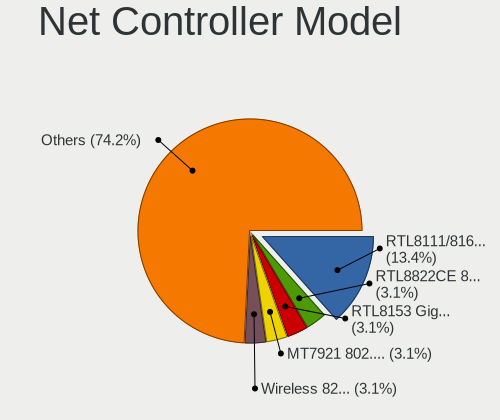

| Model                                                                                         | Computers | Percent |
|-----------------------------------------------------------------------------------------------|-----------|---------|
| Realtek RTL8111/8168/8411 PCI Express Gigabit Ethernet Controller                             | 15        | 11.03%  |
| Realtek RTL810xE PCI Express Fast Ethernet controller                                         | 9         | 6.62%   |
| Qualcomm Atheros QCA9377 802.11ac Wireless Network Adapter                                    | 6         | 4.41%   |
| Ralink RT2870/RT3070 Wireless Adapter                                                         | 4         | 2.94%   |
| Realtek RTL8814AU 802.11a/b/g/n/ac Wireless Adapter                                           | 3         | 2.21%   |
| Realtek RTL8812AU 802.11a/b/g/n/ac 2T2R DB WLAN Adapter                                       | 3         | 2.21%   |
| Realtek RTL8153 Gigabit Ethernet Adapter                                                      | 3         | 2.21%   |
| Realtek 802.11n WLAN Adapter                                                                  | 3         | 2.21%   |
| Qualcomm Atheros AR9285 Wireless Network Adapter (PCI-Express)                                | 3         | 2.21%   |
| Intel Wireless 3165                                                                           | 3         | 2.21%   |
| Intel Wi-Fi 6 AX210/AX211/AX411 160MHz                                                        | 3         | 2.21%   |
| Intel Alder Lake-P PCH CNVi WiFi                                                              | 3         | 2.21%   |
| Realtek RTL8821CE 802.11ac PCIe Wireless Network Adapter                                      | 2         | 1.47%   |
| Realtek RTL8723BE PCIe Wireless Network Adapter                                               | 2         | 1.47%   |
| Realtek RTL8125 2.5GbE Controller                                                             | 2         | 1.47%   |
| Realtek Realtek 8812AU/8821AU 802.11ac WLAN Adapter [USB Wireless Dual-Band Adapter 2.4/5Ghz] | 2         | 1.47%   |
| MediaTek MT7921 802.11ax PCI Express Wireless Network Adapter                                 | 2         | 1.47%   |
| Intel Wireless 8260                                                                           | 2         | 1.47%   |
| Intel Wi-Fi 6 AX200                                                                           | 2         | 1.47%   |
| Intel Ethernet Controller I225-V                                                              | 2         | 1.47%   |
| Intel Ethernet Connection (4) I219-LM                                                         | 2         | 1.47%   |
| Intel Comet Lake PCH CNVi WiFi                                                                | 2         | 1.47%   |
| Broadcom BCM4364 802.11ac Wireless Network Adapter                                            | 2         | 1.47%   |
| ZTE WCDMA MSM ZTE WCDMA MSM                                                                   | 1         | 0.74%   |
| TP-Link TL-WN823N v2/v3 [Realtek RTL8192EU]                                                   | 1         | 0.74%   |
| TP-Link TL-WN722N v2/v3 [Realtek RTL8188EUS]                                                  | 1         | 0.74%   |
| TP-Link Archer T2U PLUS [RTL8821AU]                                                           | 1         | 0.74%   |
| Samsung Galaxy series, misc. (tethering mode)                                                 | 1         | 0.74%   |
| Realtek RTL8822CE 802.11ac PCIe Wireless Network Adapter                                      | 1         | 0.74%   |
| Realtek B1680188186                                                                           | 1         | 0.74%   |
| Realtek 802.11ac+Bluetooth 5.0 Adapter                                                        | 1         | 0.74%   |
| Realtek 802.11ac NIC                                                                          | 1         | 0.74%   |
| Ralink RT5390 Wireless 802.11n 1T/1R PCIe                                                     | 1         | 0.74%   |
| Ralink RT3290 Wireless 802.11n 1T/1R PCIe                                                     | 1         | 0.74%   |
| Qualcomm Atheros QCA9565 / AR9565 Wireless Network Adapter                                    | 1         | 0.74%   |
| Qualcomm Atheros QCA6174 802.11ac Wireless Network Adapter                                    | 1         | 0.74%   |
| Qualcomm Atheros Killer E220x Gigabit Ethernet Controller                                     | 1         | 0.74%   |
| Qualcomm Atheros AR9485 Wireless Network Adapter                                              | 1         | 0.74%   |
| OPPO RMX3263                                                                                  | 1         | 0.74%   |
| OnePlus (Shenzhen) OnePlus                                                                    | 1         | 0.74%   |

Wireless Vendor
---------------

Wireless vendors

| Vendor                | Computers | Percent |
|-----------------------|-----------|---------|
| Intel                 | 22        | 30.56%  |
| Realtek Semiconductor | 16        | 22.22%  |
| Qualcomm Atheros      | 12        | 16.67%  |
| Broadcom              | 8         | 11.11%  |
| Ralink Technology     | 4         | 5.56%   |
| TP-Link               | 3         | 4.17%   |
| MediaTek              | 3         | 4.17%   |
| Ralink                | 2         | 2.78%   |
| Logitec               | 1         | 1.39%   |
| Broadcom Limited      | 1         | 1.39%   |

Wireless Model
--------------

Wireless models

| Model                                                                                         | Computers | Percent |
|-----------------------------------------------------------------------------------------------|-----------|---------|
| Qualcomm Atheros QCA9377 802.11ac Wireless Network Adapter                                    | 6         | 8%      |
| Ralink RT2870/RT3070 Wireless Adapter                                                         | 4         | 5.33%   |
| Realtek RTL8814AU 802.11a/b/g/n/ac Wireless Adapter                                           | 3         | 4%      |
| Realtek RTL8812AU 802.11a/b/g/n/ac 2T2R DB WLAN Adapter                                       | 3         | 4%      |
| Realtek 802.11n WLAN Adapter                                                                  | 3         | 4%      |
| Qualcomm Atheros AR9285 Wireless Network Adapter (PCI-Express)                                | 3         | 4%      |
| Intel Wireless 3165                                                                           | 3         | 4%      |
| Intel Wi-Fi 6 AX210/AX211/AX411 160MHz                                                        | 3         | 4%      |
| Intel Alder Lake-P PCH CNVi WiFi                                                              | 3         | 4%      |
| Realtek RTL8821CE 802.11ac PCIe Wireless Network Adapter                                      | 2         | 2.67%   |
| Realtek RTL8723BE PCIe Wireless Network Adapter                                               | 2         | 2.67%   |
| Realtek Realtek 8812AU/8821AU 802.11ac WLAN Adapter [USB Wireless Dual-Band Adapter 2.4/5Ghz] | 2         | 2.67%   |
| MediaTek MT7921 802.11ax PCI Express Wireless Network Adapter                                 | 2         | 2.67%   |
| Intel Wireless 8260                                                                           | 2         | 2.67%   |
| Intel Wi-Fi 6 AX200                                                                           | 2         | 2.67%   |
| Intel Comet Lake PCH CNVi WiFi                                                                | 2         | 2.67%   |
| Broadcom BCM4364 802.11ac Wireless Network Adapter                                            | 2         | 2.67%   |
| TP-Link TL-WN823N v2/v3 [Realtek RTL8192EU]                                                   | 1         | 1.33%   |
| TP-Link TL-WN722N v2/v3 [Realtek RTL8188EUS]                                                  | 1         | 1.33%   |
| TP-Link Archer T2U PLUS [RTL8821AU]                                                           | 1         | 1.33%   |
| Realtek RTL8822CE 802.11ac PCIe Wireless Network Adapter                                      | 1         | 1.33%   |
| Realtek B1680188186                                                                           | 1         | 1.33%   |
| Realtek 802.11ac+Bluetooth 5.0 Adapter                                                        | 1         | 1.33%   |
| Realtek 802.11ac NIC                                                                          | 1         | 1.33%   |
| Ralink RT5390 Wireless 802.11n 1T/1R PCIe                                                     | 1         | 1.33%   |
| Ralink RT3290 Wireless 802.11n 1T/1R PCIe                                                     | 1         | 1.33%   |
| Qualcomm Atheros QCA9565 / AR9565 Wireless Network Adapter                                    | 1         | 1.33%   |
| Qualcomm Atheros QCA6174 802.11ac Wireless Network Adapter                                    | 1         | 1.33%   |
| Qualcomm Atheros AR9485 Wireless Network Adapter                                              | 1         | 1.33%   |
| MediaTek MT7612U 802.11a/b/g/n/ac Wireless Adapter                                            | 1         | 1.33%   |
| Logitec 802.11 n WLAN                                                                         | 1         | 1.33%   |
| Intel Wireless 8265 / 8275                                                                    | 1         | 1.33%   |
| Intel WiFi Link 5100                                                                          | 1         | 1.33%   |
| Intel Wi-Fi 6 AX201                                                                           | 1         | 1.33%   |
| Intel PRO/Wireless 4965 AG or AGN [Kedron] Network Connection                                 | 1         | 1.33%   |
| Intel Comet Lake PCH-LP CNVi WiFi                                                             | 1         | 1.33%   |
| Intel Centrino Advanced-N 6200                                                                | 1         | 1.33%   |
| Intel Cannon Point-LP CNVi [Wireless-AC]                                                      | 1         | 1.33%   |
| Broadcom Limited BCM4360 802.11ac Wireless Network Adapter                                    | 1         | 1.33%   |
| Broadcom BCM4377b Wireless Network Adapter                                                    | 1         | 1.33%   |

Ethernet Vendor
---------------

Ethernet vendors

| Vendor                        | Computers | Percent |
|-------------------------------|-----------|---------|
| Realtek Semiconductor         | 28        | 50%     |
| Intel                         | 12        | 21.43%  |
| Broadcom                      | 4         | 7.14%   |
| Aquantia                      | 3         | 5.36%   |
| ZTE WCDMA Technologies MSM    | 1         | 1.79%   |
| Samsung Electronics           | 1         | 1.79%   |
| Qualcomm Atheros              | 1         | 1.79%   |
| OPPO Electronics              | 1         | 1.79%   |
| OnePlus Technology (Shenzhen) | 1         | 1.79%   |
| MediaTek                      | 1         | 1.79%   |
| Google                        | 1         | 1.79%   |
| DisplayLink                   | 1         | 1.79%   |
| ASIX Electronics              | 1         | 1.79%   |

Ethernet Model
--------------

Ethernet models

| Model                                                               | Computers | Percent |
|---------------------------------------------------------------------|-----------|---------|
| Realtek RTL8111/8168/8411 PCI Express Gigabit Ethernet Controller   | 15        | 25.86%  |
| Realtek RTL810xE PCI Express Fast Ethernet controller               | 9         | 15.52%  |
| Realtek RTL8153 Gigabit Ethernet Adapter                            | 3         | 5.17%   |
| Realtek RTL8125 2.5GbE Controller                                   | 2         | 3.45%   |
| Intel Ethernet Controller I225-V                                    | 2         | 3.45%   |
| Intel Ethernet Connection (4) I219-LM                               | 2         | 3.45%   |
| ZTE WCDMA MSM ZTE WCDMA MSM                                         | 1         | 1.72%   |
| Samsung Galaxy series, misc. (tethering mode)                       | 1         | 1.72%   |
| Qualcomm Atheros Killer E220x Gigabit Ethernet Controller           | 1         | 1.72%   |
| OPPO RMX3263                                                        | 1         | 1.72%   |
| OnePlus (Shenzhen) OnePlus                                          | 1         | 1.72%   |
| MediaTek Infinix NOTE 11                                            | 1         | 1.72%   |
| Intel I210 Gigabit Network Connection                               | 1         | 1.72%   |
| Intel Ethernet Connection I219-V                                    | 1         | 1.72%   |
| Intel Ethernet Connection (2) I219-V                                | 1         | 1.72%   |
| Intel Ethernet Connection (16) I219-LM                              | 1         | 1.72%   |
| Intel Ethernet Connection (13) I219-V                               | 1         | 1.72%   |
| Intel Ethernet Connection (10) I219-V                               | 1         | 1.72%   |
| Intel 82577LM Gigabit Network Connection                            | 1         | 1.72%   |
| Intel 82574L Gigabit Network Connection                             | 1         | 1.72%   |
| Intel 82566MM Gigabit Network Connection                            | 1         | 1.72%   |
| Google Pixel 6 Pro                                                  | 1         | 1.72%   |
| DisplayLink Dell Universal Dock D6000                               | 1         | 1.72%   |
| Broadcom NetXtreme BCM57765 Gigabit Ethernet PCIe                   | 1         | 1.72%   |
| Broadcom NetXtreme BCM5764M Gigabit Ethernet PCIe                   | 1         | 1.72%   |
| Broadcom NetLink BCM57785 Gigabit Ethernet PCIe                     | 1         | 1.72%   |
| Broadcom NetLink BCM57780 Gigabit Ethernet PCIe                     | 1         | 1.72%   |
| ASIX AX88179 Gigabit Ethernet                                       | 1         | 1.72%   |
| Aquantia Ethernet controller                                        | 1         | 1.72%   |
| Aquantia AQC113CS NBase-T/IEEE 802.3bz Ethernet Controller [AQtion] | 1         | 1.72%   |
| Aquantia AQC107 NBase-T/IEEE 802.3bz Ethernet Controller [AQtion]   | 1         | 1.72%   |

Net Controller Kind
-------------------

Ethernet, WiFi or modem

| Kind     | Computers | Percent |
|----------|-----------|---------|
| WiFi     | 59        | 53.64%  |
| Ethernet | 48        | 43.64%  |
| Modem    | 2         | 1.82%   |
| Unknown  | 1         | 0.91%   |

Used Controller
---------------

Currently used network controller

| Kind     | Computers | Percent |
|----------|-----------|---------|
| WiFi     | 37        | 62.71%  |
| Ethernet | 22        | 37.29%  |

NICs
----

Total network controllers on board

| Total | Computers | Percent |
|-------|-----------|---------|
| 2     | 35        | 53.03%  |
| 1     | 25        | 37.88%  |
| 0     | 4         | 6.06%   |
| 5     | 1         | 1.52%   |
| 3     | 1         | 1.52%   |

IPv6
----

IPv6 vs IPv4

| Used | Computers | Percent |
|------|-----------|---------|
| No   | 46        | 69.7%   |
| Yes  | 20        | 30.3%   |

Bluetooth
---------

Bluetooth Vendor
----------------

Controller vendors

| Vendor                          | Computers | Percent |
|---------------------------------|-----------|---------|
| Intel                           | 18        | 45%     |
| Realtek Semiconductor           | 6         | 15%     |
| Qualcomm Atheros Communications | 4         | 10%     |
| Lite-On Technology              | 4         | 10%     |
| Foxconn / Hon Hai               | 2         | 5%      |
| Apple                           | 2         | 5%      |
| Realtek                         | 1         | 2.5%    |
| Ralink                          | 1         | 2.5%    |
| Hewlett-Packard                 | 1         | 2.5%    |
| Broadcom                        | 1         | 2.5%    |

Bluetooth Model
---------------

Controller models

| Model                                          | Computers | Percent |
|------------------------------------------------|-----------|---------|
| Realtek Bluetooth Radio                        | 6         | 15%     |
| Intel Bluetooth wireless interface             | 6         | 15%     |
| Qualcomm Atheros  Bluetooth Device             | 4         | 10%     |
| Lite-On Qualcomm Atheros QCA9377 Bluetooth     | 4         | 10%     |
| Intel AX201 Bluetooth                          | 4         | 10%     |
| Intel AX210 Bluetooth                          | 3         | 7.5%    |
| Intel Bluetooth Device                         | 2         | 5%      |
| Intel AX200 Bluetooth                          | 2         | 5%      |
| Apple Bluetooth USB Host Controller            | 2         | 5%      |
| Realtek Bluetooth Radio                        | 1         | 2.5%    |
| Ralink RT3290 Bluetooth                        | 1         | 2.5%    |
| Intel Bluetooth 9460/9560 Jefferson Peak (JfP) | 1         | 2.5%    |
| HP Bluetooth 2.0 Interface [Broadcom BCM2045]  | 1         | 2.5%    |
| Foxconn / Hon Hai Wireless_Device              | 1         | 2.5%    |
| Foxconn / Hon Hai Acer Module                  | 1         | 2.5%    |
| Broadcom BCM43142 Bluetooth 4.0                | 1         | 2.5%    |

Sound
-----

Sound Vendor
------------

Sound card vendors

| Vendor                | Computers | Percent |
|-----------------------|-----------|---------|
| Intel                 | 53        | 61.63%  |
| Nvidia                | 13        | 15.12%  |
| AMD                   | 13        | 15.12%  |
| Apple                 | 3         | 3.49%   |
| Realtek Semiconductor | 1         | 1.16%   |
| No brand              | 1         | 1.16%   |
| Hewlett-Packard       | 1         | 1.16%   |
| GN Netcom             | 1         | 1.16%   |

Sound Model
-----------

Sound card models

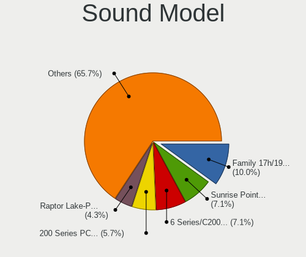

| Model                                                                                             | Computers | Percent |
|---------------------------------------------------------------------------------------------------|-----------|---------|
| Intel Sunrise Point-LP HD Audio                                                                   | 12        | 12.63%  |
| Intel 7 Series/C216 Chipset Family High Definition Audio Controller                               | 5         | 5.26%   |
| AMD Family 17h/19h HD Audio Controller                                                            | 4         | 4.21%   |
| Nvidia TU116 High Definition Audio Controller                                                     | 3         | 3.16%   |
| Intel Tiger Lake-LP Smart Sound Technology Audio Controller                                       | 3         | 3.16%   |
| Intel Comet Lake PCH cAVS                                                                         | 3         | 3.16%   |
| Intel Alder Lake PCH-P High Definition Audio Controller                                           | 3         | 3.16%   |
| Intel 200 Series PCH HD Audio                                                                     | 3         | 3.16%   |
| Apple Audio Device                                                                                | 3         | 3.16%   |
| AMD Renoir Radeon High Definition Audio Controller                                                | 3         | 3.16%   |
| AMD FCH Azalia Controller                                                                         | 3         | 3.16%   |
| Nvidia TU107 GeForce GTX 1650 High Definition Audio Controller                                    | 2         | 2.11%   |
| Nvidia GA106 High Definition Audio Controller                                                     | 2         | 2.11%   |
| Intel Comet Lake PCH-LP cAVS                                                                      | 2         | 2.11%   |
| Intel Celeron/Pentium Silver Processor High Definition Audio                                      | 2         | 2.11%   |
| Intel Atom/Celeron/Pentium Processor x5-E8000/J3xxx/N3xxx Series High Definition Audio Controller | 2         | 2.11%   |
| Intel 82801I (ICH9 Family) HD Audio Controller                                                    | 2         | 2.11%   |
| Intel 6 Series/C200 Series Chipset Family High Definition Audio Controller                        | 2         | 2.11%   |
| Intel 5 Series/3400 Series Chipset High Definition Audio                                          | 2         | 2.11%   |
| AMD Starship/Matisse HD Audio Controller                                                          | 2         | 2.11%   |
| Realtek Semiconductor USB Audio                                                                   | 1         | 1.05%   |
| Nvidia GP107GL High Definition Audio Controller                                                   | 1         | 1.05%   |
| Nvidia GP104 High Definition Audio Controller                                                     | 1         | 1.05%   |
| Nvidia GM206 High Definition Audio Controller                                                     | 1         | 1.05%   |
| Nvidia GK208 HDMI/DP Audio Controller                                                             | 1         | 1.05%   |
| Nvidia GK104 HDMI Audio Controller                                                                | 1         | 1.05%   |
| Nvidia GA104 High Definition Audio Controller                                                     | 1         | 1.05%   |
| No brand CalDigit Thunderbolt 3 Audio                                                             | 1         | 1.05%   |
| Intel Wildcat Point-LP High Definition Audio Controller                                           | 1         | 1.05%   |
| Intel Tiger Lake-H HD Audio Controller                                                            | 1         | 1.05%   |
| Intel Ice Lake-LP Smart Sound Technology Audio Controller                                         | 1         | 1.05%   |
| Intel Celeron N3350/Pentium N4200/Atom E3900 Series Audio Cluster                                 | 1         | 1.05%   |
| Intel Cannon Point-LP High Definition Audio Controller                                            | 1         | 1.05%   |
| Intel Broadwell-U Audio Controller                                                                | 1         | 1.05%   |
| Intel Audio device                                                                                | 1         | 1.05%   |
| Intel Atom Processor Z36xxx/Z37xxx Series High Definition Audio Controller                        | 1         | 1.05%   |
| Intel Alder Lake-S HD Audio Controller                                                            | 1         | 1.05%   |
| Intel 9 Series Chipset Family HD Audio Controller                                                 | 1         | 1.05%   |
| Intel 82801H (ICH8 Family) HD Audio Controller                                                    | 1         | 1.05%   |
| Intel 8 Series/C220 Series Chipset High Definition Audio Controller                               | 1         | 1.05%   |

Memory
------

Memory Vendor
-------------

Memory module vendors

| Vendor              | Computers | Percent |
|---------------------|-----------|---------|
| Samsung Electronics | 15        | 24.59%  |
| SK hynix            | 11        | 18.03%  |
| Micron Technology   | 10        | 16.39%  |
| Kingston            | 8         | 13.11%  |
| Corsair             | 4         | 6.56%   |
| Unknown (ABCD)      | 2         | 3.28%   |
| Unknown             | 2         | 3.28%   |
| G.Skill             | 2         | 3.28%   |
| Transcend           | 1         | 1.64%   |
| TEXTORM             | 1         | 1.64%   |
| Smart               | 1         | 1.64%   |
| Nanya Technology    | 1         | 1.64%   |
| Elpida              | 1         | 1.64%   |
| Crucial             | 1         | 1.64%   |
| A-DATA Technology   | 1         | 1.64%   |

Memory Model
------------

Memory module models

| Model                                                            | Computers | Percent |
|------------------------------------------------------------------|-----------|---------|
| Unknown (ABCD) RAM 123456789012345678 2GB SODIMM LPDDR4 2400MT/s | 2         | 3.13%   |
| Samsung RAM M471B5173EB0-YK0 4GB SODIMM DDR3 1600MT/s            | 2         | 3.13%   |
| Samsung RAM M471A5244CB0-CTD 4GB SODIMM DDR4 3266MT/s            | 2         | 3.13%   |
| Unknown RAM Module 2GB SODIMM DDR3 1066MT/s                      | 1         | 1.56%   |
| Unknown RAM Module 2GB SODIMM DDR2 800MT/s                       | 1         | 1.56%   |
| Transcend RAM JM1333KSN-2G 2GB SODIMM DDR3 1333MT/s              | 1         | 1.56%   |
| TEXTORM RAM TXS16G2M2666C19 16GB SODIMM DDR4 2667MT/s            | 1         | 1.56%   |
| Smart RAM SF4641G8CKHIWDFSEG 8GB SODIMM DDR4 2133MT/s            | 1         | 1.56%   |
| SK hynix RAM Module 8GB SODIMM DDR4 2666MT/s                     | 1         | 1.56%   |
| SK hynix RAM Module 16GB SODIMM DDR4 3200MT/s                    | 1         | 1.56%   |
| SK hynix RAM HYMP125S64CP8-S6 2GB SODIMM DDR2 2048MT/s           | 1         | 1.56%   |
| SK hynix RAM HMT351S6EFR8A-PB 4096MB SODIMM DDR3 1600MT/s        | 1         | 1.56%   |
| SK hynix RAM HMT351S6BFR8C-H9 4GB SODIMM DDR3 1333MT/s           | 1         | 1.56%   |
| SK hynix RAM HMT325S6EFR8A-PB 2GB SODIMM DDR3 1600MT/s           | 1         | 1.56%   |
| SK hynix RAM HMAA2GS6CJR8N-XN 16GB SODIMM DDR4 3200MT/s          | 1         | 1.56%   |
| SK hynix RAM HMA851S6DJR6N-XN 4GB SODIMM DDR4 3200MT/s           | 1         | 1.56%   |
| SK hynix RAM HMA851S6CJR6N-VK 4GB SODIMM DDR4 2667MT/s           | 1         | 1.56%   |
| SK hynix RAM HMA851S6AFR6N-UH 2GB SODIMM LPDDR4 2667MT/s         | 1         | 1.56%   |
| SK hynix RAM HMA82GS6MFR8N-TF 16GB SODIMM DDR4 2133MT/s          | 1         | 1.56%   |
| SK hynix RAM HMA81GS6AFR8N-UH 8GB SODIMM DDR4 2667MT/s           | 1         | 1.56%   |
| Samsung RAM U7H704AM-JGCR 2GB Row Of Chips LPDDR4 4267MT/s       | 1         | 1.56%   |
| Samsung RAM M471B5773DH0-CH9 2GB SODIMM DDR3 1600MT/s            | 1         | 1.56%   |
| Samsung RAM M471B5273CH0-CK0 4GB DIMM DDR3 1600MT/s              | 1         | 1.56%   |
| Samsung RAM M471B5173BH0-YK0 4GB SODIMM DDR3 1600MT/s            | 1         | 1.56%   |
| Samsung RAM M471A5244CB0-CRC 4GB SODIMM DDR4 2667MT/s            | 1         | 1.56%   |
| Samsung RAM M471A1K43EB1-CWE 8GB SODIMM DDR4 3200MT/s            | 1         | 1.56%   |
| Samsung RAM M471A1K43CB1-CTD 8GB SODIMM DDR4 2667MT/s            | 1         | 1.56%   |
| Samsung RAM M471A1K43BB1-CRC 8192MB SODIMM DDR4 2667MT/s         | 1         | 1.56%   |
| Samsung RAM M471A1K43BB0-CPB 8GB Chip DDR4 2133MT/s              | 1         | 1.56%   |
| Samsung RAM M4 70T5663CZ3-CE6 2GB SODIMM DDR2 1639MT/s           | 1         | 1.56%   |
| Samsung RAM M393B5170FH0 4GB DIMM DDR3 1333MT/s                  | 1         | 1.56%   |
| Samsung RAM K3LKBKB@BM-MGCP 2GB Row Of Chips 6400MT/s            | 1         | 1.56%   |
| Nanya RAM NT2GT64U8HD0BN-3C 2GB SODIMM DDR2 667MT/s              | 1         | 1.56%   |
| Micron RAM MT53E1G64D8NW-053 8GB Row Of Chips LPDDR4 3733MT/s    | 1         | 1.56%   |
| Micron RAM Module 4GB SODIMM LPDDR3 2133MT/s                     | 1         | 1.56%   |
| Micron RAM Module 4GB SODIMM DDR3 1600MT/s                       | 1         | 1.56%   |
| Micron RAM Module 16GB SODIMM DDR4 3200MT/s                      | 1         | 1.56%   |
| Micron RAM 8ATF1G64HZ-2G6E1 8GB SODIMM DDR4 2667MT/s             | 1         | 1.56%   |
| Micron RAM 8ATF1G64HZ-2G3H1R 8GB SODIMM DDR4 2400MT/s            | 1         | 1.56%   |
| Micron RAM 8ATF1G64HZ-2G3B1 8GB SODIMM DDR4 2400MT/s             | 1         | 1.56%   |

Memory Kind
-----------

Memory module kinds

| Kind   | Computers | Percent |
|--------|-----------|---------|
| DDR4   | 28        | 52.83%  |
| DDR3   | 13        | 24.53%  |
| LPDDR4 | 5         | 9.43%   |
| DDR5   | 2         | 3.77%   |
| DDR2   | 2         | 3.77%   |
| SDRAM  | 1         | 1.89%   |
| LPDDR5 | 1         | 1.89%   |
| LPDDR3 | 1         | 1.89%   |

Memory Form Factor
------------------

Physical design of the memory module

| Name         | Computers | Percent |
|--------------|-----------|---------|
| SODIMM       | 40        | 75.47%  |
| DIMM         | 9         | 16.98%  |
| Row Of Chips | 3         | 5.66%   |
| Chip         | 1         | 1.89%   |

Memory Size
-----------

Memory module size

| Size  | Computers | Percent |
|-------|-----------|---------|
| 8192  | 24        | 41.38%  |
| 4096  | 15        | 25.86%  |
| 16384 | 9         | 15.52%  |
| 2048  | 8         | 13.79%  |
| 32768 | 2         | 3.45%   |

Memory Speed
------------

Memory module speed

| Speed | Computers | Percent |
|-------|-----------|---------|
| 2667  | 10        | 17.24%  |
| 1600  | 10        | 17.24%  |
| 3200  | 7         | 12.07%  |
| 2400  | 6         | 10.34%  |
| 2133  | 5         | 8.62%   |
| 1333  | 3         | 5.17%   |
| 4800  | 2         | 3.45%   |
| 3733  | 2         | 3.45%   |
| 3266  | 2         | 3.45%   |
| 6400  | 1         | 1.72%   |
| 4267  | 1         | 1.72%   |
| 3666  | 1         | 1.72%   |
| 3600  | 1         | 1.72%   |
| 3000  | 1         | 1.72%   |
| 2666  | 1         | 1.72%   |
| 2048  | 1         | 1.72%   |
| 1639  | 1         | 1.72%   |
| 1066  | 1         | 1.72%   |
| 800   | 1         | 1.72%   |
| 667   | 1         | 1.72%   |

Printers & scanners
-------------------

Printer Vendor
--------------

Printer device vendors

| Vendor              | Computers | Percent |
|---------------------|-----------|---------|
| Samsung Electronics | 1         | 100%    |

Printer Model
-------------

Printer device models

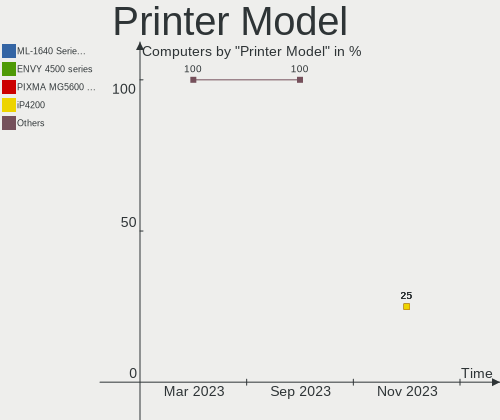

| Model                | Computers | Percent |
|----------------------|-----------|---------|
| Samsung M2020 Series | 1         | 100%    |

Scanner Vendor
--------------

Scanner device vendors

Zero info for selected period =(

Scanner Model
-------------

Scanner device models

Zero info for selected period =(

Camera
------

Camera Vendor
-------------

Camera device vendors

| Vendor                                 | Computers | Percent |
|----------------------------------------|-----------|---------|
| Chicony Electronics                    | 8         | 19.05%  |
| Microdia                               | 5         | 11.9%   |
| Quanta                                 | 4         | 9.52%   |
| IMC Networks                           | 4         | 9.52%   |
| Realtek Semiconductor                  | 3         | 7.14%   |
| Sunplus Innovation Technology          | 2         | 4.76%   |
| Apple                                  | 2         | 4.76%   |
| USB Camera                             | 1         | 2.38%   |
| Unknown                                | 1         | 2.38%   |
| Syntek                                 | 1         | 2.38%   |
| Suyin                                  | 1         | 2.38%   |
| SunplusIT                              | 1         | 2.38%   |
| Silicon Motion                         | 1         | 2.38%   |
| Samsung Electronics                    | 1         | 2.38%   |
| Microsoft                              | 1         | 2.38%   |
| Luxvisions Innotech Limited            | 1         | 2.38%   |
| Lite-On Technology                     | 1         | 2.38%   |
| lihappe8                               | 1         | 2.38%   |
| Goodong                                | 1         | 2.38%   |
| Cheng Uei Precision Industry (Foxlink) | 1         | 2.38%   |
| Acer                                   | 1         | 2.38%   |

Camera Model
------------

Camera device models

| Model                                                   | Computers | Percent |
|---------------------------------------------------------|-----------|---------|
| Quanta VGA WebCam                                       | 2         | 4.65%   |
| Microdia Laptop_Integrated_Webcam_HD                    | 2         | 4.65%   |
| Microdia Integrated_Webcam_HD                           | 2         | 4.65%   |
| Chicony HP TrueVision HD                                | 2         | 4.65%   |
| Chicony HD WebCam                                       | 2         | 4.65%   |
| USB Camera USB Camera                                   | 1         | 2.33%   |
| Unknown 720p HD Camera                                  | 1         | 2.33%   |
| Syntek Integrated Camera                                | 1         | 2.33%   |
| Suyin HP TrueVision HD Integrated Webcam                | 1         | 2.33%   |
| SunplusIT 1080p FHD Camera                              | 1         | 2.33%   |
| Sunplus Integrated_Webcam_HD                            | 1         | 2.33%   |
| Sunplus HD WebCam                                       | 1         | 2.33%   |
| Silicon Motion Web Camera                               | 1         | 2.33%   |
| Samsung Galaxy A5 (MTP)                                 | 1         | 2.33%   |
| Realtek USB Camera                                      | 1         | 2.33%   |
| Realtek Integrated_Webcam_HD                            | 1         | 2.33%   |
| Realtek Integrated Webcam                               | 1         | 2.33%   |
| Quanta HP HD Camera                                     | 1         | 2.33%   |
| Quanta HD Webcam                                        | 1         | 2.33%   |
| Microsoft Xbox NUI Camera                               | 1         | 2.33%   |
| Microdia USB 2.0 Camera                                 | 1         | 2.33%   |
| Microdia Dell Laptop Integrated Webcam HD               | 1         | 2.33%   |
| Luxvisions Innotech Limited HP TrueVision HD Camera     | 1         | 2.33%   |
| Lite-On HP Wide Vision HD Camera                        | 1         | 2.33%   |
| lihappe8 USB 2.0 Camera                                 | 1         | 2.33%   |
| IMC Networks XHC Camera                                 | 1         | 2.33%   |
| IMC Networks USB2.0 VGA UVC WebCam                      | 1         | 2.33%   |
| IMC Networks USB2.0 HD UVC WebCam                       | 1         | 2.33%   |
| IMC Networks Integrated Camera                          | 1         | 2.33%   |
| Goodong USB Camera                                      | 1         | 2.33%   |
| Chicony Integrated Camera                               | 1         | 2.33%   |
| Chicony HP Truevision HD camera                         | 1         | 2.33%   |
| Chicony HP High Definition 1MP Webcam                   | 1         | 2.33%   |
| Chicony Acer CrystalEye Webcam                          | 1         | 2.33%   |
| Cheng Uei Precision Industry (Foxlink) HP Truevision HD | 1         | 2.33%   |
| Apple iPhone5/5C/5S/6                                   | 1         | 2.33%   |
| Apple FaceTime HD Camera                                | 1         | 2.33%   |
| Acer EasyCamera                                         | 1         | 2.33%   |

Security
--------

Fingerprint Vendor
------------------

Fingerprint sensor vendors

| Vendor           | Computers | Percent |
|------------------|-----------|---------|
| Validity Sensors | 1         | 33.33%  |
| Synaptics        | 1         | 33.33%  |
| AuthenTec        | 1         | 33.33%  |

Fingerprint Model
-----------------

Fingerprint sensor models

| Model                                                     | Computers | Percent |
|-----------------------------------------------------------|-----------|---------|
| Validity Sensors VFS7500 Touch Fingerprint Sensor         | 1         | 33.33%  |
| Synaptics  FS7604 Touch Fingerprint Sensor with PurePrint | 1         | 33.33%  |
| AuthenTec AES2501 Fingerprint Sensor                      | 1         | 33.33%  |

Chipcard Vendor
---------------

Chipcard module vendors

| Vendor      | Computers | Percent |
|-------------|-----------|---------|
| Broadcom    | 3         | 60%     |
| Alcor Micro | 2         | 40%     |

Chipcard Model
--------------

Chipcard module models

| Model                                          | Computers | Percent |
|------------------------------------------------|-----------|---------|
| Broadcom 5880                                  | 2         | 40%     |
| Alcor Micro AU9540 Smartcard Reader            | 2         | 40%     |
| Broadcom BCM5880 Secure Applications Processor | 1         | 20%     |

Unsupported
-----------

Unsupported Devices
-------------------

Total unsupported devices on board

| Total | Computers | Percent |
|-------|-----------|---------|
| 0     | 40        | 60.61%  |
| 1     | 21        | 31.82%  |
| 2     | 4         | 6.06%   |
| 3     | 1         | 1.52%   |

Unsupported Device Types
------------------------

Types of unsupported devices

| Type                  | Computers | Percent |
|-----------------------|-----------|---------|
| Net/wireless          | 7         | 21.88%  |
| Chipcard              | 5         | 15.63%  |
| Graphics card         | 4         | 12.5%   |
| Sound                 | 3         | 9.38%   |
| Multimedia controller | 3         | 9.38%   |
| Fingerprint reader    | 3         | 9.38%   |
| Network               | 2         | 6.25%   |
| Camera                | 2         | 6.25%   |
| Bluetooth             | 2         | 6.25%   |
| Storage               | 1         | 3.13%   |

