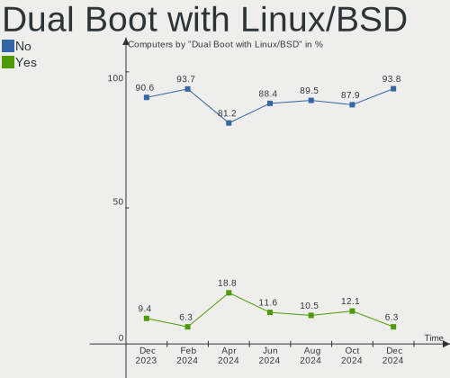
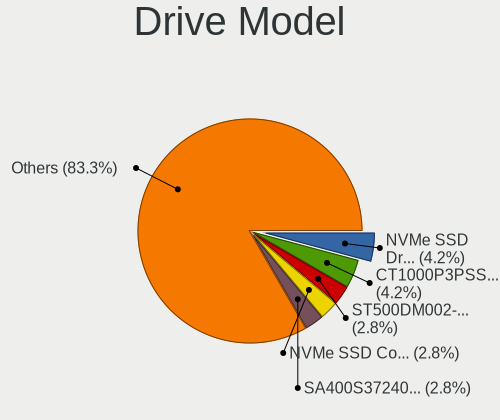
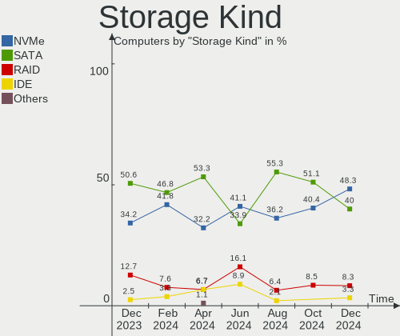
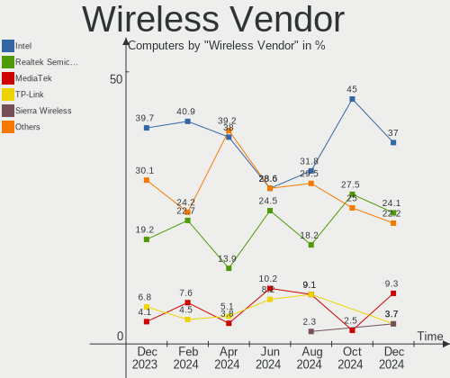
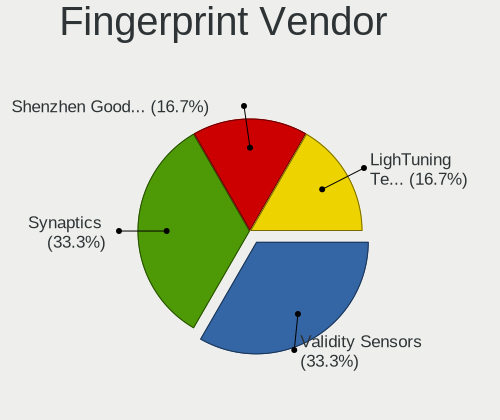
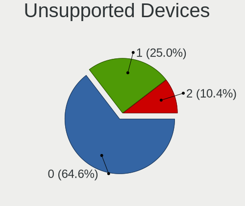

Kali - Hardware Trends
----------------------

A project to identify most popular hardware characteristics and track their change
over time based on data collected by Linux users at https://Linux-Hardware.org.

Anyone can contribute to this report by the [hw-probe](https://github.com/linuxhw/hw-probe) tool:

    sudo -E hw-probe -all -upload

This is a report for all computer types. See also reports for [desktops](/Dist/Kali/Desktop/README.md) and [notebooks](/Dist/Kali/Notebook/README.md).

This report is for one last month. Overall report since the beginning of time: [TestDays](https://github.com/linuxhw/TestDays)

Period: Apr, 2024.

Contents
--------

* [ System ](#system)
  - [ OS                       ](#os)
  - [ OS Family                ](#os-family)
  - [ Kernel                   ](#kernel)
  - [ Kernel Family            ](#kernel-family)
  - [ Kernel Major Ver.        ](#kernel-major-ver)
  - [ Arch                     ](#arch)
  - [ DE                       ](#de)
  - [ Display Server           ](#display-server)
  - [ Display Manager          ](#display-manager)
  - [ OS Lang                  ](#os-lang)
  - [ Boot Mode                ](#boot-mode)
  - [ Filesystem               ](#filesystem)
  - [ Part. scheme             ](#part-scheme)
  - [ Dual Boot with Linux/BSD ](#dual-boot-with-linuxbsd)
  - [ Dual Boot (Win)          ](#dual-boot-win)

* [ Board ](#board)
  - [ Vendor                   ](#vendor)
  - [ Model                    ](#model)
  - [ Model Family             ](#model-family)
  - [ MFG Year                 ](#mfg-year)
  - [ Form Factor              ](#form-factor)
  - [ Secure Boot              ](#secure-boot)
  - [ Coreboot                 ](#coreboot)
  - [ RAM Size                 ](#ram-size)
  - [ RAM Used                 ](#ram-used)
  - [ Total Drives             ](#total-drives)
  - [ Has CD-ROM               ](#has-cd-rom)
  - [ Has Ethernet             ](#has-ethernet)
  - [ Has WiFi                 ](#has-wifi)
  - [ Has Bluetooth            ](#has-bluetooth)

* [ Location ](#location)
  - [ Country                  ](#country)
  - [ City                     ](#city)

* [ Drives ](#drives)
  - [ Drive Vendor             ](#drive-vendor)
  - [ Drive Model              ](#drive-model)
  - [ HDD Vendor               ](#hdd-vendor)
  - [ SSD Vendor               ](#ssd-vendor)
  - [ Drive Kind               ](#drive-kind)
  - [ Drive Connector          ](#drive-connector)
  - [ Drive Size               ](#drive-size)
  - [ Space Total              ](#space-total)
  - [ Space Used               ](#space-used)
  - [ Malfunc. Drives          ](#malfunc-drives)
  - [ Malfunc. Drive Vendor    ](#malfunc-drive-vendor)
  - [ Malfunc. HDD Vendor      ](#malfunc-hdd-vendor)
  - [ Malfunc. Drive Kind      ](#malfunc-drive-kind)
  - [ Failed Drives            ](#failed-drives)
  - [ Failed Drive Vendor      ](#failed-drive-vendor)
  - [ Drive Status             ](#drive-status)

* [ Storage controller ](#storage-controller)
  - [ Storage Vendor           ](#storage-vendor)
  - [ Storage Model            ](#storage-model)
  - [ Storage Kind             ](#storage-kind)

* [ Processor ](#processor)
  - [ CPU Vendor               ](#cpu-vendor)
  - [ CPU Model                ](#cpu-model)
  - [ CPU Model Family         ](#cpu-model-family)
  - [ CPU Cores                ](#cpu-cores)
  - [ CPU Sockets              ](#cpu-sockets)
  - [ CPU Threads              ](#cpu-threads)
  - [ CPU Op-Modes             ](#cpu-op-modes)
  - [ CPU Microcode            ](#cpu-microcode)
  - [ CPU Microarch            ](#cpu-microarch)

* [ Graphics ](#graphics)
  - [ GPU Vendor               ](#gpu-vendor)
  - [ GPU Model                ](#gpu-model)
  - [ GPU Combo                ](#gpu-combo)
  - [ GPU Driver               ](#gpu-driver)
  - [ GPU Memory               ](#gpu-memory)

* [ Monitor ](#monitor)
  - [ Monitor Vendor           ](#monitor-vendor)
  - [ Monitor Model            ](#monitor-model)
  - [ Monitor Resolution       ](#monitor-resolution)
  - [ Monitor Diagonal         ](#monitor-diagonal)
  - [ Monitor Width            ](#monitor-width)
  - [ Aspect Ratio             ](#aspect-ratio)
  - [ Monitor Area             ](#monitor-area)
  - [ Pixel Density            ](#pixel-density)
  - [ Multiple Monitors        ](#multiple-monitors)

* [ Network ](#network)
  - [ Net Controller Vendor    ](#net-controller-vendor)
  - [ Net Controller Model     ](#net-controller-model)
  - [ Wireless Vendor          ](#wireless-vendor)
  - [ Wireless Model           ](#wireless-model)
  - [ Ethernet Vendor          ](#ethernet-vendor)
  - [ Ethernet Model           ](#ethernet-model)
  - [ Net Controller Kind      ](#net-controller-kind)
  - [ Used Controller          ](#used-controller)
  - [ NICs                     ](#nics)
  - [ IPv6                     ](#ipv6)

* [ Bluetooth ](#bluetooth)
  - [ Bluetooth Vendor         ](#bluetooth-vendor)
  - [ Bluetooth Model          ](#bluetooth-model)

* [ Sound ](#sound)
  - [ Sound Vendor             ](#sound-vendor)
  - [ Sound Model              ](#sound-model)

* [ Memory ](#memory)
  - [ Memory Vendor            ](#memory-vendor)
  - [ Memory Model             ](#memory-model)
  - [ Memory Kind              ](#memory-kind)
  - [ Memory Form Factor       ](#memory-form-factor)
  - [ Memory Size              ](#memory-size)
  - [ Memory Speed             ](#memory-speed)

* [ Printers & scanners ](#printers--scanners)
  - [ Printer Vendor           ](#printer-vendor)
  - [ Printer Model            ](#printer-model)
  - [ Scanner Vendor           ](#scanner-vendor)
  - [ Scanner Model            ](#scanner-model)

* [ Camera ](#camera)
  - [ Camera Vendor            ](#camera-vendor)
  - [ Camera Model             ](#camera-model)

* [ Security ](#security)
  - [ Fingerprint Vendor       ](#fingerprint-vendor)
  - [ Fingerprint Model        ](#fingerprint-model)
  - [ Chipcard Vendor          ](#chipcard-vendor)
  - [ Chipcard Model           ](#chipcard-model)

* [ Unsupported ](#unsupported)
  - [ Unsupported Devices      ](#unsupported-devices)
  - [ Unsupported Device Types ](#unsupported-device-types)

System
------

OS
--

Installed operating systems

| Name         | Computers | Percent |
|--------------|-----------|---------|
| Kali 2024.1  | 64        | 92.75%  |
| Kali 2023.3  | 2         | 2.9%    |
| Kali Rolling | 1         | 1.45%   |
| Kali 2023.1  | 1         | 1.45%   |
| Kali 2021.3  | 1         | 1.45%   |

OS Family
---------

OS without a version

| Name | Computers | Percent |
|------|-----------|---------|
| Kali | 69        | 100%    |

Kernel
------

Version of the Linux kernel

| Version                | Computers | Percent |
|------------------------|-----------|---------|
| 6.6.9-amd64            | 38        | 55.07%  |
| 6.6.15-amd64           | 20        | 28.99%  |
| 6.3.0-kali1-amd64      | 2         | 2.9%    |
| 6.1.77-v8+             | 2         | 2.9%    |
| 6.9.0-rc3-sof+         | 1         | 1.45%   |
| 6.8.7-t2               | 1         | 1.45%   |
| 6.5.0-kali3-amd64      | 1         | 1.45%   |
| 6.0.0-kali6-amd64      | 1         | 1.45%   |
| 5.15.0-kali3-amd64     | 1         | 1.45%   |
| 5.14.0-kali2-amd64     | 1         | 1.45%   |
| 5.10.160-legacy-rk35xx | 1         | 1.45%   |

Kernel Family
-------------

Linux kernel without a distro release

| Version  | Computers | Percent |
|----------|-----------|---------|
| 6.6.9    | 38        | 55.07%  |
| 6.6.15   | 20        | 28.99%  |
| 6.3.0    | 2         | 2.9%    |
| 6.1.77   | 2         | 2.9%    |
| 6.9.0    | 1         | 1.45%   |
| 6.8.7    | 1         | 1.45%   |
| 6.5.0    | 1         | 1.45%   |
| 6.0.0    | 1         | 1.45%   |
| 5.15.0   | 1         | 1.45%   |
| 5.14.0   | 1         | 1.45%   |
| 5.10.160 | 1         | 1.45%   |

Kernel Major Ver.
-----------------

Linux kernel major version

| Version | Computers | Percent |
|---------|-----------|---------|
| 6.6     | 58        | 84.06%  |
| 6.3     | 2         | 2.9%    |
| 6.1     | 2         | 2.9%    |
| 6.9     | 1         | 1.45%   |
| 6.8     | 1         | 1.45%   |
| 6.5     | 1         | 1.45%   |
| 6.0     | 1         | 1.45%   |
| 5.15    | 1         | 1.45%   |
| 5.14    | 1         | 1.45%   |
| 5.10    | 1         | 1.45%   |

Arch
----

OS architecture (x86_64, i586, etc.)

| Name    | Computers | Percent |
|---------|-----------|---------|
| x86_64  | 66        | 95.65%  |
| aarch64 | 3         | 4.35%   |

DE
--

Desktop Environment

| Name          | Computers | Percent |
|---------------|-----------|---------|
| XFCE          | 38        | 55.07%  |
| GNOME         | 16        | 23.19%  |
| KDE5          | 10        | 14.49%  |
| GNOME-Classic | 2         | 2.9%    |
| Unknown       | 2         | 2.9%    |
| X-Cinnamon    | 1         | 1.45%   |

Display Server
--------------

X11 or Wayland

| Name    | Computers | Percent |
|---------|-----------|---------|
| X11     | 60        | 86.96%  |
| Wayland | 8         | 11.59%  |
| Tty     | 1         | 1.45%   |

Display Manager
---------------

SDDM, LightDM, etc.

| Name    | Computers | Percent |
|---------|-----------|---------|
| LightDM | 32        | 46.38%  |
| Unknown | 21        | 30.43%  |
| SDDM    | 9         | 13.04%  |
| GDM3    | 7         | 10.14%  |

OS Lang
-------

Language

| Lang    | Computers | Percent |
|---------|-----------|---------|
| C       | 40        | 57.97%  |
| en_US   | 10        | 14.49%  |
| ru_RU   | 3         | 4.35%   |
| Unknown | 3         | 4.35%   |
| es_MX   | 2         | 2.9%    |
| en_GB   | 2         | 2.9%    |
| vi_VN   | 1         | 1.45%   |
| tr_TR   | 1         | 1.45%   |
| pl_PL   | 1         | 1.45%   |
| es_ES   | 1         | 1.45%   |
| en_NG   | 1         | 1.45%   |
| en_AU   | 1         | 1.45%   |
| de_DE   | 1         | 1.45%   |
| de_AT   | 1         | 1.45%   |
| cs_CZ   | 1         | 1.45%   |

Boot Mode
---------

EFI or BIOS

| Mode | Computers | Percent |
|------|-----------|---------|
| EFI  | 48        | 69.57%  |
| BIOS | 21        | 30.43%  |

Filesystem
----------

Type of filesystem

| Type    | Computers | Percent |
|---------|-----------|---------|
| Ext4    | 64        | 92.75%  |
| Overlay | 3         | 4.35%   |
| Ext2    | 1         | 1.45%   |
| Btrfs   | 1         | 1.45%   |

Part. scheme
------------

Scheme of partitioning

| Type    | Computers | Percent |
|---------|-----------|---------|
| GPT     | 38        | 55.07%  |
| Unknown | 19        | 27.54%  |
| MBR     | 12        | 17.39%  |

Dual Boot with Linux/BSD
------------------------

Hosting more than one Linux/BSD

| Dual boot | Computers | Percent |
|-----------|-----------|---------|
| No        | 56        | 81.16%  |
| Yes       | 13        | 18.84%  |

Dual Boot (Win)
---------------

Hosting Linux and Windows

| Dual boot | Computers | Percent |
|-----------|-----------|---------|
| No        | 46        | 66.67%  |
| Yes       | 23        | 33.33%  |

Board
-----

Vendor
------

Motherboard manufacturer

| Name                    | Computers | Percent |
|-------------------------|-----------|---------|
| Hewlett-Packard         | 17        | 24.64%  |
| Lenovo                  | 10        | 14.49%  |
| ASUSTek Computer        | 8         | 11.59%  |
| Dell                    | 7         | 10.14%  |
| Apple                   | 6         | 8.7%    |
| MSI                     | 5         | 7.25%   |
| Toshiba                 | 2         | 2.9%    |
| Raspberry Pi Foundation | 2         | 2.9%    |
| Acer                    | 2         | 2.9%    |
| Tactus                  | 1         | 1.45%   |
| System76                | 1         | 1.45%   |
| Pegatron                | 1         | 1.45%   |
| Intel                   | 1         | 1.45%   |
| HUAWEI                  | 1         | 1.45%   |
| Google                  | 1         | 1.45%   |
| Gigabyte Technology     | 1         | 1.45%   |
| eMachines               | 1         | 1.45%   |
| ASRock                  | 1         | 1.45%   |
| Unknown                 | 1         | 1.45%   |

Model
-----

Motherboard model

| Name                                     | Computers | Percent |
|------------------------------------------|-----------|---------|
| RPi Raspberry Pi 5 Model B Rev 1.0       | 2         | 2.9%    |
| Lenovo V15 G2 IJL 82QY                   | 2         | 2.9%    |
| HP EliteBook 840 G1                      | 2         | 2.9%    |
| Apple MacBookPro8,1                      | 2         | 2.9%    |
| Unknown                                  | 2         | 2.9%    |
| Toshiba Satellite C75D-A                 | 1         | 1.45%   |
| Toshiba Satellite C645D                  | 1         | 1.45%   |
| Tactus GeoBook 140                       | 1         | 1.45%   |
| System76 Oryx Pro                        | 1         | 1.45%   |
| Pegatron IPMSB-H61                       | 1         | 1.45%   |
| MSI MS-7D99                              | 1         | 1.45%   |
| MSI MS-7C95                              | 1         | 1.45%   |
| MSI MS-7917                              | 1         | 1.45%   |
| MSI Katana GF76 11UD                     | 1         | 1.45%   |
| MSI Katana GF66 12UD                     | 1         | 1.45%   |
| Lenovo Yoga 710-15IKB 80V5               | 1         | 1.45%   |
| Lenovo ThinkPad X1 Carbon 6th 20KHCTO1WW | 1         | 1.45%   |
| Lenovo ThinkPad T430s 2352CTO            | 1         | 1.45%   |
| Lenovo ThinkPad T430 2349G87             | 1         | 1.45%   |
| Lenovo ThinkPad P14s Gen 1 20S5S01100    | 1         | 1.45%   |
| Lenovo ThinkPad L15 Gen 1 20U70000MX     | 1         | 1.45%   |
| Lenovo IdeaPad 5 14ITL05 82FE            | 1         | 1.45%   |
| Lenovo IdeaPad 3 14ARE05 81W3            | 1         | 1.45%   |
| Intel NUC7PJYHN                          | 1         | 1.45%   |
| HUAWEI KLVDZ-WXX9                        | 1         | 1.45%   |
| HP xw8600 Workstation                    | 1         | 1.45%   |
| HP Victus by Gaming Laptop 15-fa0xxx     | 1         | 1.45%   |
| HP t240 Thin Client                      | 1         | 1.45%   |
| HP ProBook 4540s                         | 1         | 1.45%   |
| HP Pavilion Gaming Laptop 15-cx0xxx      | 1         | 1.45%   |
| HP Pavilion dv5000 (ET805UA#ABA)         | 1         | 1.45%   |
| HP Pavilion 15                           | 1         | 1.45%   |
| HP G1-2114la                             | 1         | 1.45%   |
| HP ENVY x360 Convertible 13-bd0xxx       | 1         | 1.45%   |
| HP EliteBook 845 G8 Notebook PC          | 1         | 1.45%   |
| HP EliteBook 840 G8 Notebook PC          | 1         | 1.45%   |
| HP EliteBook 840 G4                      | 1         | 1.45%   |
| HP EliteBook 820 G3                      | 1         | 1.45%   |
| HP Compaq Presario A900                  | 1         | 1.45%   |
| Google Peppy                             | 1         | 1.45%   |

Model Family
------------

Motherboard model prefix

| Name               | Computers | Percent |
|--------------------|-----------|---------|
| HP EliteBook       | 6         | 8.7%    |
| Lenovo ThinkPad    | 5         | 7.25%   |
| HP Pavilion        | 3         | 4.35%   |
| Dell Latitude      | 3         | 4.35%   |
| Toshiba Satellite  | 2         | 2.9%    |
| RPi Raspberry      | 2         | 2.9%    |
| MSI Katana         | 2         | 2.9%    |
| Lenovo V15         | 2         | 2.9%    |
| Lenovo IdeaPad     | 2         | 2.9%    |
| ASUS ROG           | 2         | 2.9%    |
| Apple MacBookPro8  | 2         | 2.9%    |
| Acer Nitro         | 2         | 2.9%    |
| Unknown            | 2         | 2.9%    |
| Tactus GeoBook     | 1         | 1.45%   |
| System76 Oryx      | 1         | 1.45%   |
| Pegatron IPMSB-H61 | 1         | 1.45%   |
| MSI MS-7D99        | 1         | 1.45%   |
| MSI MS-7C95        | 1         | 1.45%   |
| MSI MS-7917        | 1         | 1.45%   |
| Lenovo Yoga        | 1         | 1.45%   |
| Intel NUC7PJYHN    | 1         | 1.45%   |
| HUAWEI KLVDZ-WXX9  | 1         | 1.45%   |
| HP xw8600          | 1         | 1.45%   |
| HP Victus          | 1         | 1.45%   |
| HP t240            | 1         | 1.45%   |
| HP ProBook         | 1         | 1.45%   |
| HP G1-2114la       | 1         | 1.45%   |
| HP ENVY            | 1         | 1.45%   |
| HP Compaq          | 1         | 1.45%   |
| Google Peppy       | 1         | 1.45%   |
| Gigabyte A620M     | 1         | 1.45%   |
| eMachines eM355    | 1         | 1.45%   |
| Dell Precision     | 1         | 1.45%   |
| Dell OptiPlex      | 1         | 1.45%   |
| Dell Inspiron      | 1         | 1.45%   |
| Dell G5            | 1         | 1.45%   |
| ASUS X55VD         | 1         | 1.45%   |
| ASUS X450CA        | 1         | 1.45%   |
| ASUS PRIME         | 1         | 1.45%   |
| ASUS N501VW        | 1         | 1.45%   |

MFG Year
--------

Motherboard manufacture year

| Year    | Computers | Percent |
|---------|-----------|---------|
| 2021    | 13        | 18.84%  |
| 2020    | 7         | 10.14%  |
| 2015    | 6         | 8.7%    |
| 2012    | 6         | 8.7%    |
| 2019    | 5         | 7.25%   |
| 2013    | 5         | 7.25%   |
| 2011    | 4         | 5.8%    |
| 2022    | 3         | 4.35%   |
| 2018    | 3         | 4.35%   |
| 2010    | 3         | 4.35%   |
| Unknown | 3         | 4.35%   |
| 2023    | 2         | 2.9%    |
| 2017    | 2         | 2.9%    |
| 2014    | 2         | 2.9%    |
| 2007    | 2         | 2.9%    |
| 2016    | 1         | 1.45%   |
| 2008    | 1         | 1.45%   |
| 2006    | 1         | 1.45%   |

Form Factor
-----------

Physical design of the computer

| Name           | Computers | Percent |
|----------------|-----------|---------|
| Notebook       | 47        | 68.12%  |
| Desktop        | 14        | 20.29%  |
| System on chip | 3         | 4.35%   |
| Convertible    | 2         | 2.9%    |
| Mini pc        | 2         | 2.9%    |
| All in one     | 1         | 1.45%   |

Secure Boot
-----------

Enabled or disabled

| State    | Computers | Percent |
|----------|-----------|---------|
| Disabled | 69        | 100%    |

Coreboot
--------

Have coreboot on board

| Used | Computers | Percent |
|------|-----------|---------|
| No   | 68        | 98.55%  |
| Yes  | 1         | 1.45%   |

RAM Size
--------

Total RAM memory

| Size in GB  | Computers | Percent |
|-------------|-----------|---------|
| 4.01-8.0    | 18        | 26.09%  |
| 16.01-24.0  | 13        | 18.84%  |
| 32.01-64.0  | 11        | 15.94%  |
| 3.01-4.0    | 10        | 14.49%  |
| 8.01-16.0   | 10        | 14.49%  |
| 1.01-2.0    | 3         | 4.35%   |
| 24.01-32.0  | 2         | 2.9%    |
| 64.01-256.0 | 1         | 1.45%   |
| 0.51-1.0    | 1         | 1.45%   |

RAM Used
--------

Used RAM memory

| Used GB    | Computers | Percent |
|------------|-----------|---------|
| 3.01-4.0   | 21        | 30.43%  |
| 1.01-2.0   | 15        | 21.74%  |
| 4.01-8.0   | 14        | 20.29%  |
| 2.01-3.0   | 12        | 17.39%  |
| 0.51-1.0   | 3         | 4.35%   |
| 0.01-0.5   | 2         | 2.9%    |
| 16.01-24.0 | 1         | 1.45%   |
| 8.01-16.0  | 1         | 1.45%   |

Total Drives
------------

Number of drives on board

| Drives | Computers | Percent |
|--------|-----------|---------|
| 1      | 42        | 60.87%  |
| 2      | 17        | 24.64%  |
| 3      | 5         | 7.25%   |
| 4      | 2         | 2.9%    |
| 6      | 1         | 1.45%   |
| 5      | 1         | 1.45%   |
| 0      | 1         | 1.45%   |

Has CD-ROM
----------

Has CD-ROM on board

| Presented | Computers | Percent |
|-----------|-----------|---------|
| No        | 49        | 71.01%  |
| Yes       | 20        | 28.99%  |

Has Ethernet
------------

Has Ethernet on board

| Presented | Computers | Percent |
|-----------|-----------|---------|
| Yes       | 59        | 85.51%  |
| No        | 10        | 14.49%  |

Has WiFi
--------

Has WiFi module

| Presented | Computers | Percent |
|-----------|-----------|---------|
| Yes       | 63        | 91.3%   |
| No        | 6         | 8.7%    |

Has Bluetooth
-------------

Has Bluetooth module

| Presented | Computers | Percent |
|-----------|-----------|---------|
| Yes       | 52        | 75.36%  |
| No        | 17        | 24.64%  |

Location
--------

Country
-------

Geographic location (country)

| Country            | Computers | Percent |
|--------------------|-----------|---------|
| USA                | 22        | 31.88%  |
| Mexico             | 6         | 8.7%    |
| UK                 | 3         | 4.35%   |
| Turkey             | 2         | 2.9%    |
| Spain              | 2         | 2.9%    |
| Russia             | 2         | 2.9%    |
| Poland             | 2         | 2.9%    |
| Philippines        | 2         | 2.9%    |
| Netherlands        | 2         | 2.9%    |
| Germany            | 2         | 2.9%    |
| Canada             | 2         | 2.9%    |
| Bulgaria           | 2         | 2.9%    |
| Azerbaijan         | 2         | 2.9%    |
| Australia          | 2         | 2.9%    |
| Vietnam            | 1         | 1.45%   |
| South Africa       | 1         | 1.45%   |
| Pakistan           | 1         | 1.45%   |
| Norway             | 1         | 1.45%   |
| Nigeria            | 1         | 1.45%   |
| Kenya              | 1         | 1.45%   |
| Hong Kong          | 1         | 1.45%   |
| France             | 1         | 1.45%   |
| Finland            | 1         | 1.45%   |
| Egypt              | 1         | 1.45%   |
| Dominican Republic | 1         | 1.45%   |
| Czechia            | 1         | 1.45%   |
| Croatia            | 1         | 1.45%   |
| Colombia           | 1         | 1.45%   |
| Chile              | 1         | 1.45%   |
| Austria            | 1         | 1.45%   |

City
----

Geographic location (city)

| City            | Computers | Percent |
|-----------------|-----------|---------|
| Querétaro City | 2         | 2.9%    |
| Montreal        | 2         | 2.9%    |
| Los Angeles     | 2         | 2.9%    |
| Istanbul        | 2         | 2.9%    |
| Houston         | 2         | 2.9%    |
| Barcelona       | 2         | 2.9%    |
| Baku            | 2         | 2.9%    |
| Xalapa          | 1         | 1.45%   |
| Wolverhampton   | 1         | 1.45%   |
| Waalre          | 1         | 1.45%   |
| Vamberk         | 1         | 1.45%   |
| Texarkana       | 1         | 1.45%   |
| Szczecin        | 1         | 1.45%   |
| Sydney          | 1         | 1.45%   |
| Sofia           | 1         | 1.45%   |
| Shau Kei Wan    | 1         | 1.45%   |
| Saratoga        | 1         | 1.45%   |
| Santo Domingo   | 1         | 1.45%   |
| Roosevelt       | 1         | 1.45%   |
| Republic        | 1         | 1.45%   |
| Pretoria        | 1         | 1.45%   |
| Prescott        | 1         | 1.45%   |
| Plovdiv         | 1         | 1.45%   |
| Phoenix         | 1         | 1.45%   |
| Pensacola       | 1         | 1.45%   |
| Paris           | 1         | 1.45%   |
| Oroslavje       | 1         | 1.45%   |
| Orlando         | 1         | 1.45%   |
| Olathe          | 1         | 1.45%   |
| Nottingham      | 1         | 1.45%   |
| Moscow          | 1         | 1.45%   |
| Miami           | 1         | 1.45%   |
| Melipilla       | 1         | 1.45%   |
| Medellín       | 1         | 1.45%   |
| Lublin          | 1         | 1.45%   |
| Linz            | 1         | 1.45%   |
| Lahore          | 1         | 1.45%   |
| Lagos           | 1         | 1.45%   |
| Kokomo          | 1         | 1.45%   |
| Kingsport       | 1         | 1.45%   |

Drives
------

Drive Vendor
------------

Hard drive vendors

| Vendor                         | Computers | Drives | Percent |
|--------------------------------|-----------|--------|---------|
| WDC                            | 11        | 15     | 11%     |
| Toshiba                        | 11        | 12     | 11%     |
| Samsung Electronics            | 11        | 11     | 11%     |
| Seagate                        | 9         | 12     | 9%      |
| Kingston                       | 9         | 10     | 9%      |
| Unknown                        | 5         | 5      | 5%      |
| Kingston Technology Company    | 5         | 5      | 5%      |
| SanDisk                        | 4         | 4      | 4%      |
| Apple                          | 3         | 3      | 3%      |
| SK hynix                       | 2         | 2      | 2%      |
| MSI                            | 2         | 2      | 2%      |
| Micron Technology              | 2         | 2      | 2%      |
| Lexar                          | 2         | 2      | 2%      |
| Intel                          | 2         | 3      | 2%      |
| Hitachi                        | 2         | 2      | 2%      |
| China                          | 2         | 2      | 2%      |
| USB3.0                         | 1         | 1      | 1%      |
| Solid State Storage Technology | 1         | 1      | 1%      |
| PNY USB                        | 1         | 1      | 1%      |
| PNY                            | 1         | 1      | 1%      |
| Phison Electronics             | 1         | 1      | 1%      |
| Netac                          | 1         | 1      | 1%      |
| MTFDDAK2                       | 1         | 1      | 1%      |
| Micron/Crucial Technology      | 1         | 1      | 1%      |
| Maxone                         | 1         | 1      | 1%      |
| MAXIO Technology (Hangzhou)    | 1         | 1      | 1%      |
| LITEON                         | 1         | 1      | 1%      |
| HS-SSD-C100                    | 1         | 1      | 1%      |
| HGST                           | 1         | 1      | 1%      |
| Gritronix                      | 1         | 1      | 1%      |
| GOODRAM                        | 1         | 1      | 1%      |
| Fanxiang                       | 1         | 1      | 1%      |
| Crucial                        | 1         | 1      | 1%      |
| Unknown                        | 1         | 1      | 1%      |

Drive Model
-----------

Hard drive models

| Model                                     | Computers | Percent |
|-------------------------------------------|-----------|---------|
| Kingston Company SNV2S1000G 1TB           | 3         | 2.73%   |
| Seagate ST3500418AS 500GB                 | 2         | 1.82%   |
| Samsung MZALQ512HBLU-00BL2 512GB          | 2         | 1.82%   |
| Kingston SA400S37240G 240GB SSD           | 2         | 1.82%   |
| WDC WDS100T2B0A-00SM50 1TB SSD            | 1         | 0.91%   |
| WDC WD5000AZLX-60K2TA0 500GB              | 1         | 0.91%   |
| WDC WD5000AAVS-00ZTB0 500GB               | 1         | 0.91%   |
| WDC WD5000AAKX-60U6AA0 500GB              | 1         | 0.91%   |
| WDC WD40EFAX-68JH4N0 4TB                  | 1         | 0.91%   |
| WDC WD2500AAKX-603CA0 250GB               | 1         | 0.91%   |
| WDC WD2500AAJS-22L7A0 250GB               | 1         | 0.91%   |
| WDC WD20EURX-63T0FY0 2TB                  | 1         | 0.91%   |
| WDC WD2000FYYZ-01UL1B2 2TB                | 1         | 0.91%   |
| WDC WD1600BEVE-00WZT0 160GB               | 1         | 0.91%   |
| WDC WD10SPSX-75A6WT0 1TB                  | 1         | 0.91%   |
| WDC WD10EZEX-08M2NA0 1TB                  | 1         | 0.91%   |
| WDC WD10EZEX-00KUWA0 1TB                  | 1         | 0.91%   |
| WDC PC SN530 SDBPMPZ-512G-1101 512GB      | 1         | 0.91%   |
| WDC PC SN530 SDBPMPZ-256G-1101 256GB      | 1         | 0.91%   |
| USB3.0 Super Speed 240GB                  | 1         | 0.91%   |
| Unknown SR64G  64GB                       | 1         | 0.91%   |
| Unknown SDU1  32GB                        | 1         | 0.91%   |
| Unknown MMC Card  7GB                     | 1         | 0.91%   |
| Unknown MMC Card  32GB                    | 1         | 0.91%   |
| Unknown MMC Card  128GB                   | 1         | 0.91%   |
| Toshiba XG6 NVMe SSD Controller 1024GB    | 1         | 0.91%   |
| Toshiba MQ04ABF100 1TB                    | 1         | 0.91%   |
| Toshiba MQ01ACF050 500GB                  | 1         | 0.91%   |
| Toshiba MQ01ABF050 500GB                  | 1         | 0.91%   |
| Toshiba MQ01ABD075 752GB                  | 1         | 0.91%   |
| Toshiba MQ01ABD050V 500GB                 | 1         | 0.91%   |
| Toshiba MK5065GSXF 500GB                  | 1         | 0.91%   |
| Toshiba MK2565GSX 250GB                   | 1         | 0.91%   |
| Toshiba HDWR160 6TB                       | 1         | 0.91%   |
| Toshiba HDWQ140 4TB                       | 1         | 0.91%   |
| Toshiba HDWJ105 500GB                     | 1         | 0.91%   |
| Toshiba BG3 NVMe SSD Controller 128GB     | 1         | 0.91%   |
| Solid State Storage SSSTC CL1-4D128 128GB | 1         | 0.91%   |
| SK hynix SC300 M.2 2280 128GB SSD         | 1         | 0.91%   |
| SK hynix HFS256G39TNF-N3A0A 256GB SSD     | 1         | 0.91%   |

HDD Vendor
----------

Hard disk drive vendors

| Vendor  | Computers | Drives | Percent |
|---------|-----------|--------|---------|
| Toshiba | 10        | 10     | 30.3%   |
| WDC     | 9         | 12     | 27.27%  |
| Seagate | 9         | 12     | 27.27%  |
| Hitachi | 2         | 2      | 6.06%   |
| Maxone  | 1         | 1      | 3.03%   |
| HGST    | 1         | 1      | 3.03%   |
| Apple   | 1         | 1      | 3.03%   |

SSD Vendor
----------

Solid state drive vendors

| Vendor              | Computers | Drives | Percent |
|---------------------|-----------|--------|---------|
| Kingston            | 6         | 6      | 21.43%  |
| Samsung Electronics | 4         | 4      | 14.29%  |
| SK hynix            | 2         | 2      | 7.14%   |
| SanDisk             | 2         | 2      | 7.14%   |
| China               | 2         | 2      | 7.14%   |
| WDC                 | 1         | 1      | 3.57%   |
| USB3.0              | 1         | 1      | 3.57%   |
| PNY USB             | 1         | 1      | 3.57%   |
| PNY                 | 1         | 1      | 3.57%   |
| Netac               | 1         | 1      | 3.57%   |
| LITEON              | 1         | 1      | 3.57%   |
| Lexar               | 1         | 1      | 3.57%   |
| Intel               | 1         | 1      | 3.57%   |
| HS-SSD-C100         | 1         | 1      | 3.57%   |
| Gritronix           | 1         | 1      | 3.57%   |
| GOODRAM             | 1         | 1      | 3.57%   |
| Apple               | 1         | 1      | 3.57%   |

Drive Kind
----------

HDD or SSD

| Kind    | Computers | Drives | Percent |
|---------|-----------|--------|---------|
| NVMe    | 29        | 35     | 32.22%  |
| HDD     | 29        | 39     | 32.22%  |
| SSD     | 24        | 28     | 26.67%  |
| MMC     | 6         | 6      | 6.67%   |
| Unknown | 2         | 2      | 2.22%   |

Drive Connector
---------------

SATA, SAS, NVMe, etc.

| Type | Computers | Drives | Percent |
|------|-----------|--------|---------|
| SATA | 44        | 61     | 51.76%  |
| NVMe | 29        | 35     | 34.12%  |
| SAS  | 6         | 8      | 7.06%   |
| MMC  | 6         | 6      | 7.06%   |

Drive Size
----------

Size of hard drive

| Size in TB | Computers | Drives | Percent |
|------------|-----------|--------|---------|
| 0.01-0.5   | 36        | 46     | 64.29%  |
| 0.51-1.0   | 14        | 15     | 25%     |
| 3.01-4.0   | 3         | 3      | 5.36%   |
| 1.01-2.0   | 2         | 2      | 3.57%   |
| 4.01-10.0  | 1         | 1      | 1.79%   |

Space Total
-----------

Amount of disk space available on the file system

| Size in GB     | Computers | Percent |
|----------------|-----------|---------|
| 101-250        | 23        | 33.33%  |
| 251-500        | 18        | 26.09%  |
| 501-1000       | 7         | 10.14%  |
| 21-50          | 4         | 5.8%    |
| 1001-2000      | 4         | 5.8%    |
| 51-100         | 4         | 5.8%    |
| More than 3000 | 3         | 4.35%   |
| Unknown        | 3         | 4.35%   |
| 1-20           | 2         | 2.9%    |
| 2001-3000      | 1         | 1.45%   |

Space Used
----------

Amount of used disk space

| Used GB        | Computers | Percent |
|----------------|-----------|---------|
| 1-20           | 20        | 28.99%  |
| 21-50          | 17        | 24.64%  |
| 101-250        | 12        | 17.39%  |
| 51-100         | 10        | 14.49%  |
| 251-500        | 4         | 5.8%    |
| Unknown        | 3         | 4.35%   |
| 501-1000       | 2         | 2.9%    |
| More than 3000 | 1         | 1.45%   |

Malfunc. Drives
---------------

Drive models with a malfunction

| Model                           | Computers | Drives | Percent |
|---------------------------------|-----------|--------|---------|
| WDC WD2500AAJS-22L7A0 250GB     | 1         | 1      | 8.33%   |
| WDC WD1600BEVE-00WZT0 160GB     | 1         | 1      | 8.33%   |
| Toshiba MQ01ABD050V 500GB       | 1         | 1      | 8.33%   |
| Toshiba MK2565GSX 250GB         | 1         | 1      | 8.33%   |
| Seagate ST9500325ASG 500GB      | 1         | 1      | 8.33%   |
| Seagate ST500LM021-1KJ152 500GB | 1         | 1      | 8.33%   |
| Seagate ST500DM002-1BD142 500GB | 1         | 1      | 8.33%   |
| Seagate ST1000DM003-1SB102 1TB  | 1         | 1      | 8.33%   |
| Kingston SNS4151S316G 16GB SSD  | 1         | 1      | 8.33%   |
| Hitachi HTS542516K9SA00 160GB   | 1         | 1      | 8.33%   |
| Hitachi HDS721075CLA332 752GB   | 1         | 1      | 8.33%   |
| HGST HTS725050A7E630 500GB      | 1         | 1      | 8.33%   |

Malfunc. Drive Vendor
---------------------

Vendors of faulty drives

| Vendor   | Computers | Drives | Percent |
|----------|-----------|--------|---------|
| Seagate  | 4         | 4      | 33.33%  |
| WDC      | 2         | 2      | 16.67%  |
| Toshiba  | 2         | 2      | 16.67%  |
| Hitachi  | 2         | 2      | 16.67%  |
| Kingston | 1         | 1      | 8.33%   |
| HGST     | 1         | 1      | 8.33%   |

Malfunc. HDD Vendor
-------------------

Vendors of faulty HDD drives

| Vendor  | Computers | Drives | Percent |
|---------|-----------|--------|---------|
| Seagate | 4         | 4      | 36.36%  |
| WDC     | 2         | 2      | 18.18%  |
| Toshiba | 2         | 2      | 18.18%  |
| Hitachi | 2         | 2      | 18.18%  |
| HGST    | 1         | 1      | 9.09%   |

Malfunc. Drive Kind
-------------------

Kinds of faulty drives

| Kind | Computers | Drives | Percent |
|------|-----------|--------|---------|
| HDD  | 11        | 11     | 91.67%  |
| SSD  | 1         | 1      | 8.33%   |

Failed Drives
-------------

Failed drive models

Zero info for selected period =(

Failed Drive Vendor
-------------------

Failed drive vendors

Zero info for selected period =(

Drive Status
------------

Number of failed and malfunc. drives

| Status   | Computers | Drives | Percent |
|----------|-----------|--------|---------|
| Works    | 36        | 49     | 45%     |
| Detected | 32        | 49     | 40%     |
| Malfunc  | 12        | 12     | 15%     |

Storage controller
------------------

Storage Vendor
--------------

Storage controller vendors

| Vendor                         | Computers | Percent |
|--------------------------------|-----------|---------|
| Intel                          | 43        | 47.78%  |
| AMD                            | 12        | 13.33%  |
| Samsung Electronics            | 8         | 8.89%   |
| Kingston Technology Company    | 7         | 7.78%   |
| SanDisk                        | 4         | 4.44%   |
| Phison Electronics             | 3         | 3.33%   |
| Toshiba America Info Systems   | 2         | 2.22%   |
| Micron/Crucial Technology      | 2         | 2.22%   |
| Micron Technology              | 2         | 2.22%   |
| Solid State Storage Technology | 1         | 1.11%   |
| Shenzhen Longsys Electronics   | 1         | 1.11%   |
| Nvidia                         | 1         | 1.11%   |
| MAXIO Technology (Hangzhou)    | 1         | 1.11%   |
| Broadcom / LSI                 | 1         | 1.11%   |
| ASMedia Technology             | 1         | 1.11%   |
| Apple                          | 1         | 1.11%   |

Storage Model
-------------

Storage controller models

| Model                                                                          | Computers | Percent |
|--------------------------------------------------------------------------------|-----------|---------|
| Intel 7 Series Chipset Family 6-port SATA Controller [AHCI mode]               | 6         | 6.12%   |
| AMD FCH SATA Controller [AHCI mode]                                            | 5         | 5.1%    |
| Kingston Company NV2 NVMe SSD SM2267XT (DRAM-less)                             | 4         | 4.08%   |
| Intel Sunrise Point-LP SATA Controller [AHCI mode]                             | 4         | 4.08%   |
| Samsung NVMe SSD Controller SM981/PM981/PM983                                  | 3         | 3.06%   |
| Samsung NVMe SSD Controller 980 (DRAM-less)                                    | 3         | 3.06%   |
| Intel Volume Management Device NVMe RAID Controller                            | 3         | 3.06%   |
| Intel Cannon Lake Mobile PCH SATA AHCI Controller                              | 3         | 3.06%   |
| Intel 8 Series SATA Controller 1 [AHCI mode]                                   | 3         | 3.06%   |
| SanDisk PC SN530 NVMe SSD (DRAM-less)                                          | 2         | 2.04%   |
| Kingston Company OM3PDP3 NVMe SSD                                              | 2         | 2.04%   |
| Intel Tiger Lake SATA AHCI Controller                                          | 2         | 2.04%   |
| Intel Jasper Lake SATA AHCI Controller                                         | 2         | 2.04%   |
| Intel Celeron/Pentium Silver Processor SATA Controller                         | 2         | 2.04%   |
| Intel 9 Series Chipset Family SATA Controller [AHCI Mode]                      | 2         | 2.04%   |
| Intel 82801 Mobile SATA Controller [RAID mode]                                 | 2         | 2.04%   |
| Intel 8 Series/C220 Series Chipset Family 6-port SATA Controller 1 [AHCI mode] | 2         | 2.04%   |
| Intel 6 Series/C200 Series Chipset Family 6 port Mobile SATA AHCI Controller   | 2         | 2.04%   |
| AMD SB7x0/SB8x0/SB9x0 SATA Controller [AHCI mode]                              | 2         | 2.04%   |
| AMD 500 Series Chipset SATA Controller                                         | 2         | 2.04%   |
| Toshiba America Info Systems XG6 NVMe SSD Controller                           | 1         | 1.02%   |
| Toshiba America Info Systems BG3 x2 NVMe SSD Controller (DRAM-less)            | 1         | 1.02%   |
| Solid State Storage CL1-3D256-Q11 NVMe SSD M.2                                 | 1         | 1.02%   |
| Shenzhen Longsys Lexar NM610 PRO NVME SSD (DRAM-less)                          | 1         | 1.02%   |
| SanDisk WD PC SN810 / Black SN850 NVMe SSD                                     | 1         | 1.02%   |
| Sandisk WD Black SN850X NVMe SSD                                               | 1         | 1.02%   |
| Samsung S4LN058A01[SSUBX] AHCI SSD Controller (Apple slot)                     | 1         | 1.02%   |
| Samsung NVMe SSD Controller SM951/PM951                                        | 1         | 1.02%   |
| Phison PS5019-E19 PCIe4 NVMe Controller (DRAM-less)                            | 1         | 1.02%   |
| Phison PS5015-E15 PCIe3 NVMe Controller (DRAM-less)                            | 1         | 1.02%   |
| Phison E12 NVMe Controller                                                     | 1         | 1.02%   |
| Nvidia MCP61 SATA Controller                                                   | 1         | 1.02%   |
| Nvidia MCP61 IDE                                                               | 1         | 1.02%   |
| Micron/Crucial P2 [Nick P2] / P3 / P3 Plus NVMe PCIe SSD (DRAM-less)           | 1         | 1.02%   |
| Micron/Crucial Non-Volatile memory controller                                  | 1         | 1.02%   |
| Micron 2550 NVMe SSD (DRAM-less)                                               | 1         | 1.02%   |
| Micron 2450 NVMe SSD [HendrixV] (DRAM-less)                                    | 1         | 1.02%   |
| MAXIO (Hangzhou) NVMe SSD Controller MAP1202 (DRAM-less)                       | 1         | 1.02%   |
| Kingston Company NV1 NVMe SSD SM2263XT (DRAM-less)                             | 1         | 1.02%   |
| Kingston Company KC3000/FURY Renegade NVMe SSD E18                             | 1         | 1.02%   |

Storage Kind
------------

Kind of storage controller (IDE, SATA, NVMe, SAS, ...)

| Kind | Computers | Percent |
|------|-----------|---------|
| SATA | 48        | 53.33%  |
| NVMe | 29        | 32.22%  |
| RAID | 6         | 6.67%   |
| IDE  | 6         | 6.67%   |
| SCSI | 1         | 1.11%   |

Processor
---------

CPU Vendor
----------

Processor vendors

| Vendor | Computers | Percent |
|--------|-----------|---------|
| Intel  | 51        | 73.91%  |
| AMD    | 15        | 21.74%  |
| ARM    | 3         | 4.35%   |

CPU Model
---------

Processor models

| Model                                    | Computers | Percent |
|------------------------------------------|-----------|---------|
| ARM Processor                            | 3         | 4.35%   |
| Intel Core i5-7200U CPU @ 2.50GHz        | 2         | 2.9%    |
| Intel Core i5-6300U CPU @ 2.40GHz        | 2         | 2.9%    |
| Intel Core i5-4300U CPU @ 1.90GHz        | 2         | 2.9%    |
| Intel Core i5-3210M CPU @ 2.50GHz        | 2         | 2.9%    |
| Intel Core i5-2435M CPU @ 2.40GHz        | 2         | 2.9%    |
| Intel Celeron N4500 @ 1.10GHz            | 2         | 2.9%    |
| Intel 12th Gen Core i7-12650H            | 2         | 2.9%    |
| Intel 11th Gen Core i7-1165G7 @ 2.80GHz  | 2         | 2.9%    |
| AMD Ryzen 9 5950X 16-Core Processor      | 2         | 2.9%    |
| Intel Xeon W-10885M CPU @ 2.40GHz        | 1         | 1.45%   |
| Intel Xeon CPU X5460 @ 3.16GHz           | 1         | 1.45%   |
| Intel Pentium Silver J5040 CPU @ 2.00GHz | 1         | 1.45%   |
| Intel Pentium Dual CPU T2370 @ 1.73GHz   | 1         | 1.45%   |
| Intel Core i7-9750H CPU @ 2.60GHz        | 1         | 1.45%   |
| Intel Core i7-8750H CPU @ 2.20GHz        | 1         | 1.45%   |
| Intel Core i7-8700T CPU @ 2.40GHz        | 1         | 1.45%   |
| Intel Core i7-8650U CPU @ 1.90GHz        | 1         | 1.45%   |
| Intel Core i7-6700HQ CPU @ 2.60GHz       | 1         | 1.45%   |
| Intel Core i7-1068NG7 CPU @ 2.30GHz      | 1         | 1.45%   |
| Intel Core i7-10610U CPU @ 1.80GHz       | 1         | 1.45%   |
| Intel Core i5-8300H CPU @ 2.30GHz        | 1         | 1.45%   |
| Intel Core i5-5287U CPU @ 2.90GHz        | 1         | 1.45%   |
| Intel Core i5-4690K CPU @ 3.50GHz        | 1         | 1.45%   |
| Intel Core i5-4570R CPU @ 2.70GHz        | 1         | 1.45%   |
| Intel Core i5-4460 CPU @ 3.20GHz         | 1         | 1.45%   |
| Intel Core i5-4300M CPU @ 2.60GHz        | 1         | 1.45%   |
| Intel Core i5-3320M CPU @ 2.60GHz        | 1         | 1.45%   |
| Intel Core i5-10400F CPU @ 2.90GHz       | 1         | 1.45%   |
| Intel Core i3-9100 CPU @ 3.60GHz         | 1         | 1.45%   |
| Intel Core i3-3217U CPU @ 1.80GHz        | 1         | 1.45%   |
| Intel Core i3-2370M CPU @ 2.40GHz        | 1         | 1.45%   |
| Intel Core i3-2350M CPU @ 2.30GHz        | 1         | 1.45%   |
| Intel Core i3 CPU M 380 @ 2.53GHz        | 1         | 1.45%   |
| Intel Celeron N4020 CPU @ 1.10GHz        | 1         | 1.45%   |
| Intel Celeron CPU G530 @ 2.40GHz         | 1         | 1.45%   |
| Intel Celeron CPU 1000M @ 1.80GHz        | 1         | 1.45%   |
| Intel Celeron 2955U @ 1.40GHz            | 1         | 1.45%   |
| Intel Atom x5-Z8350 CPU @ 1.44GHz        | 1         | 1.45%   |
| Intel Atom CPU N570 @ 1.66GHz            | 1         | 1.45%   |

CPU Model Family
----------------

Processor model prefix

| Model                | Computers | Percent |
|----------------------|-----------|---------|
| Intel Core i5        | 18        | 26.09%  |
| Other                | 12        | 17.39%  |
| Intel Core i7        | 7         | 10.14%  |
| Intel Celeron        | 6         | 8.7%    |
| Intel Core i3        | 5         | 7.25%   |
| AMD Ryzen 5          | 4         | 5.8%    |
| Intel Xeon           | 2         | 2.9%    |
| Intel Atom           | 2         | 2.9%    |
| AMD Ryzen 9          | 2         | 2.9%    |
| Intel Pentium Silver | 1         | 1.45%   |
| Intel Pentium Dual   | 1         | 1.45%   |
| AMD V120             | 1         | 1.45%   |
| AMD Turion 64 Mobile | 1         | 1.45%   |
| AMD Ryzen 7          | 1         | 1.45%   |
| AMD Ryzen 5 PRO      | 1         | 1.45%   |
| AMD E                | 1         | 1.45%   |
| AMD Athlon 64 X2     | 1         | 1.45%   |
| AMD A8               | 1         | 1.45%   |
| AMD A6               | 1         | 1.45%   |
| AMD A10              | 1         | 1.45%   |

CPU Cores
---------

Number of processor cores

| Number  | Computers | Percent |
|---------|-----------|---------|
| 2       | 28        | 40.58%  |
| 4       | 19        | 27.54%  |
| 6       | 9         | 13.04%  |
| 8       | 4         | 5.8%    |
| 16      | 3         | 4.35%   |
| 10      | 2         | 2.9%    |
| 1       | 2         | 2.9%    |
| Unknown | 2         | 2.9%    |

CPU Sockets
-----------

Number of sockets

| Number  | Computers | Percent |
|---------|-----------|---------|
| 1       | 65        | 94.2%   |
| 2       | 2         | 2.9%    |
| Unknown | 2         | 2.9%    |

CPU Threads
-----------

Threads per core (Hyper-Threading)

| Number  | Computers | Percent |
|---------|-----------|---------|
| 2       | 44        | 63.77%  |
| 1       | 23        | 33.33%  |
| Unknown | 2         | 2.9%    |

CPU Op-Modes
------------

CPU Operation Modes (32-bit, 64-bit)

| Op mode        | Computers | Percent |
|----------------|-----------|---------|
| 32-bit, 64-bit | 69        | 100%    |

CPU Microcode
-------------

Microcode number

| Number     | Computers | Percent |
|------------|-----------|---------|
| Unknown    | 56        | 81.16%  |
| 0x806e9    | 1         | 1.45%   |
| 0x306c3    | 1         | 1.45%   |
| 0x0a601206 | 1         | 1.45%   |
| 0x0a50000f | 1         | 1.45%   |
| 0x0a201204 | 1         | 1.45%   |
| 0x08600109 | 1         | 1.45%   |
| 0x08600106 | 1         | 1.45%   |
| 0x08108109 | 1         | 1.45%   |
| 0x07030105 | 1         | 1.45%   |
| 0x0700010f | 1         | 1.45%   |
| 0x06001119 | 1         | 1.45%   |
| 0x05000029 | 1         | 1.45%   |
| 0x010000c8 | 1         | 1.45%   |

CPU Microarch
-------------

Microarchitecture

| Name             | Computers | Percent |
|------------------|-----------|---------|
| KabyLake         | 9         | 13.04%  |
| Haswell          | 7         | 10.14%  |
| SandyBridge      | 5         | 7.25%   |
| IvyBridge        | 5         | 7.25%   |
| Unknown          | 5         | 7.25%   |
| Zen 3            | 4         | 5.8%    |
| TigerLake        | 4         | 5.8%    |
| Skylake          | 3         | 4.35%   |
| Alderlake Hybrid | 3         | 4.35%   |
| Zen 2            | 2         | 2.9%    |
| Tremont          | 2         | 2.9%    |
| K8 Hammer        | 2         | 2.9%    |
| Icelake          | 2         | 2.9%    |
| Goldmont plus    | 2         | 2.9%    |
| CometLake        | 2         | 2.9%    |
| Zen+             | 1         | 1.45%   |
| Westmere         | 1         | 1.45%   |
| Silvermont       | 1         | 1.45%   |
| Puma             | 1         | 1.45%   |
| Piledriver       | 1         | 1.45%   |
| Penryn           | 1         | 1.45%   |
| K10              | 1         | 1.45%   |
| Jaguar           | 1         | 1.45%   |
| Core             | 1         | 1.45%   |
| Broadwell        | 1         | 1.45%   |
| Bonnell          | 1         | 1.45%   |
| Bobcat           | 1         | 1.45%   |

Graphics
--------

GPU Vendor
----------

Vendors of graphics cards

| Vendor | Computers | Percent |
|--------|-----------|---------|
| Intel  | 46        | 56.1%   |
| Nvidia | 23        | 28.05%  |
| AMD    | 13        | 15.85%  |

GPU Model
---------

Graphics card models

| Model                                                                       | Computers | Percent |
|-----------------------------------------------------------------------------|-----------|---------|
| Intel 3rd Gen Core processor Graphics Controller                            | 5         | 5.95%   |
| Intel 2nd Generation Core Processor Family Integrated Graphics Controller   | 5         | 5.95%   |
| Intel TigerLake-LP GT2 [Iris Xe Graphics]                                   | 4         | 4.76%   |
| Nvidia GA107M [GeForce RTX 3050 Ti Mobile]                                  | 3         | 3.57%   |
| Intel Haswell-ULT Integrated Graphics Controller                            | 3         | 3.57%   |
| Intel CoffeeLake-H GT2 [UHD Graphics 630]                                   | 3         | 3.57%   |
| Nvidia TU117M [GeForce GTX 1650 Mobile / Max-Q]                             | 2         | 2.38%   |
| Intel TigerLake-H GT1 [UHD Graphics]                                        | 2         | 2.38%   |
| Intel Skylake GT2 [HD Graphics 520]                                         | 2         | 2.38%   |
| Intel JasperLake [UHD Graphics]                                             | 2         | 2.38%   |
| Intel HD Graphics 620                                                       | 2         | 2.38%   |
| Intel Alder Lake-P GT1 [UHD Graphics]                                       | 2         | 2.38%   |
| AMD Renoir [Radeon RX Vega 6 (Ryzen 4000/5000 Mobile Series)]               | 2         | 2.38%   |
| Nvidia TU116M [GeForce GTX 1660 Ti Mobile]                                  | 1         | 1.19%   |
| Nvidia TU116 [GeForce GTX 1650 SUPER]                                       | 1         | 1.19%   |
| Nvidia TU106GLM [Quadro RTX 3000 Mobile / Max-Q]                            | 1         | 1.19%   |
| Nvidia TU106 [GeForce RTX 2070]                                             | 1         | 1.19%   |
| Nvidia GP108GLM [Quadro P520]                                               | 1         | 1.19%   |
| Nvidia GP107M [GeForce GTX 1050 Mobile]                                     | 1         | 1.19%   |
| Nvidia GP107 [GeForce GTX 1050 Ti]                                          | 1         | 1.19%   |
| Nvidia GP106M [GeForce GTX 1060 Mobile]                                     | 1         | 1.19%   |
| Nvidia GP102 [GeForce GTX 1080 Ti]                                          | 1         | 1.19%   |
| Nvidia GM107M [GeForce GTX 960M]                                            | 1         | 1.19%   |
| Nvidia GF119M [GeForce 610M]                                                | 1         | 1.19%   |
| Nvidia GF117M [GeForce 610M/710M/810M/820M / GT 620M/625M/630M/720M]        | 1         | 1.19%   |
| Nvidia GA106 [GeForce RTX 3060 Lite Hash Rate]                              | 1         | 1.19%   |
| Nvidia GA106 [Geforce RTX 3050]                                             | 1         | 1.19%   |
| Nvidia GA104 [GeForce RTX 3060 Ti GDDR6X]                                   | 1         | 1.19%   |
| Nvidia C61 [GeForce 6150SE nForce 430]                                      | 1         | 1.19%   |
| Nvidia AD107 [GeForce RTX 4060]                                             | 1         | 1.19%   |
| Nvidia AD103 [GeForce RTX 4080]                                             | 1         | 1.19%   |
| Intel Xeon E3-1200 v3/4th Gen Core Processor Integrated Graphics Controller | 1         | 1.19%   |
| Intel UHD Graphics 620                                                      | 1         | 1.19%   |
| Intel Mobile GM965/GL960 Integrated Graphics Controller (secondary)         | 1         | 1.19%   |
| Intel Mobile GM965/GL960 Integrated Graphics Controller (primary)           | 1         | 1.19%   |
| Intel Iris Plus Graphics G7                                                 | 1         | 1.19%   |
| Intel Iris Graphics 6100                                                    | 1         | 1.19%   |
| Intel HD Graphics 530                                                       | 1         | 1.19%   |
| Intel GeminiLake [UHD Graphics 605]                                         | 1         | 1.19%   |
| Intel GeminiLake [UHD Graphics 600]                                         | 1         | 1.19%   |

GPU Combo
---------

Combinations of graphics cards

| Name           | Computers | Percent |
|----------------|-----------|---------|
| 1 x Intel      | 31        | 44.93%  |
| Intel + Nvidia | 13        | 18.84%  |
| 1 x Nvidia     | 9         | 13.04%  |
| 1 x AMD        | 9         | 13.04%  |
| Other          | 3         | 4.35%   |
| 2 x Intel      | 1         | 1.45%   |
| 2 x AMD        | 1         | 1.45%   |
| Intel + AMD    | 1         | 1.45%   |
| AMD + Nvidia   | 1         | 1.45%   |

GPU Driver
----------

Free vs proprietary

| Driver      | Computers | Percent |
|-------------|-----------|---------|
| Free        | 58        | 84.06%  |
| Proprietary | 7         | 10.14%  |
| Unknown     | 4         | 5.8%    |

GPU Memory
----------

Total video memory

| Size in GB | Computers | Percent |
|------------|-----------|---------|
| Unknown    | 45        | 65.22%  |
| 0.01-0.5   | 7         | 10.14%  |
| 3.01-4.0   | 6         | 8.7%    |
| 0.51-1.0   | 4         | 5.8%    |
| 7.01-8.0   | 2         | 2.9%    |
| 1.01-2.0   | 2         | 2.9%    |
| 8.01-16.0  | 2         | 2.9%    |
| 5.01-6.0   | 1         | 1.45%   |

Monitor
-------

Monitor Vendor
--------------

Monitor vendors

| Vendor              | Computers | Percent |
|---------------------|-----------|---------|
| LG Display          | 11        | 15.49%  |
| BOE                 | 10        | 14.08%  |
| AU Optronics        | 10        | 14.08%  |
| Samsung Electronics | 9         | 12.68%  |
| Apple               | 6         | 8.45%   |
| Chimei Innolux      | 4         | 5.63%   |
| Hewlett-Packard     | 3         | 4.23%   |
| LG Philips          | 2         | 2.82%   |
| Lenovo              | 2         | 2.82%   |
| AOC                 | 2         | 2.82%   |
| Vestel              | 1         | 1.41%   |
| Sharp               | 1         | 1.41%   |
| PANDA               | 1         | 1.41%   |
| Lanix               | 1         | 1.41%   |
| InfoVision          | 1         | 1.41%   |
| HUYINIUDA           | 1         | 1.41%   |
| Goldstar            | 1         | 1.41%   |
| Gigabyte Technology | 1         | 1.41%   |
| Fujitsu Siemens     | 1         | 1.41%   |
| Dell                | 1         | 1.41%   |
| BenQ                | 1         | 1.41%   |
| ASUSTek Computer    | 1         | 1.41%   |

Monitor Model
-------------

Monitor models

| Model                                                                   | Computers | Percent |
|-------------------------------------------------------------------------|-----------|---------|
| BOE LCD Monitor BOE08D5 1920x1080 344x194mm 15.5-inch                   | 2         | 2.74%   |
| Apple LCD Monitor APP9CC3 1280x800 286x179mm 13.3-inch                  | 2         | 2.74%   |
| Vestel LCD Monitor 50UHD_LCD_TV 3840x2160                               | 1         | 1.37%   |
| Sharp LCD Monitor SHP14D7 1920x1200 366x229mm 17.0-inch                 | 1         | 1.37%   |
| Samsung Electronics U28E590 SAM0C4D 3840x2160 607x345mm 27.5-inch       | 1         | 1.37%   |
| Samsung Electronics S24E450 SAM0C80 1920x1080 520x290mm 23.4-inch       | 1         | 1.37%   |
| Samsung Electronics Odyssey G85SB SAM72F2 3440x1440 809x354mm 34.8-inch | 1         | 1.37%   |
| Samsung Electronics LU28R55 SAM1017 3840x2160 632x360mm 28.6-inch       | 1         | 1.37%   |
| Samsung Electronics LF24T35 SAM707D 1920x1080 528x297mm 23.9-inch       | 1         | 1.37%   |
| Samsung Electronics LCD Monitor SEC5441 1366x768 344x194mm 15.5-inch    | 1         | 1.37%   |
| Samsung Electronics LCD Monitor SEC504B 1600x900 382x215mm 17.3-inch    | 1         | 1.37%   |
| Samsung Electronics LCD Monitor SEC3741 1366x768 309x174mm 14.0-inch    | 1         | 1.37%   |
| Samsung Electronics LCD Monitor SDC434B 3840x2160 344x194mm 15.5-inch   | 1         | 1.37%   |
| Samsung Electronics LCD Monitor SAM050F 1920x1080                       | 1         | 1.37%   |
| PANDA LCD Monitor NCP004D 1920x1080 344x194mm 15.5-inch                 | 1         | 1.37%   |
| LG Philips LCD Monitor LPL2A00 1280x800 330x210mm 15.4-inch             | 1         | 1.37%   |
| LG Philips LCD Monitor LPL0A01 1440x900 367x230mm 17.1-inch             | 1         | 1.37%   |
| LG Display LCD Monitor LGD06F1 1920x1080 309x174mm 14.0-inch            | 1         | 1.37%   |
| LG Display LCD Monitor LGD06CA 1920x1080 309x174mm 14.0-inch            | 1         | 1.37%   |
| LG Display LCD Monitor LGD0676 1920x1080 309x174mm 14.0-inch            | 1         | 1.37%   |
| LG Display LCD Monitor LGD065A 1920x1080 344x194mm 15.5-inch            | 1         | 1.37%   |
| LG Display LCD Monitor LGD05C0 1920x1080 344x194mm 15.5-inch            | 1         | 1.37%   |
| LG Display LCD Monitor LGD0498 1366x768 277x156mm 12.5-inch             | 1         | 1.37%   |
| LG Display LCD Monitor LGD0467 1366x768 310x174mm 14.0-inch             | 1         | 1.37%   |
| LG Display LCD Monitor LGD039F 1366x768 345x194mm 15.6-inch             | 1         | 1.37%   |
| LG Display LCD Monitor LGD033F 1366x768 309x174mm 14.0-inch             | 1         | 1.37%   |
| LG Display LCD Monitor LGD02AC 1366x768 344x194mm 15.5-inch             | 1         | 1.37%   |
| LG Display LCD Monitor LGD0257 1440x900 304x190mm 14.1-inch             | 1         | 1.37%   |
| Lenovo T24i-10 LEN61A6 1920x1080 527x296mm 23.8-inch                    | 1         | 1.37%   |
| Lenovo LEN LI1931ewA LEN65A1 1366x768 409x230mm 18.5-inch               | 1         | 1.37%   |
| Lanix PiKVM V4 Mini LNX7772 1920x1080 527x296mm 23.8-inch               | 1         | 1.37%   |
| InfoVision LCD Monitor IVO8584 1920x1080 294x165mm 13.3-inch            | 1         | 1.37%   |
| HUYINIUDA HUYINIUDA HUY1850 1366x768 410x220mm 18.3-inch                | 1         | 1.37%   |
| Hewlett-Packard vs15 HWP2646 1024x768 304x228mm 15.0-inch               | 1         | 1.37%   |
| Hewlett-Packard E233 HPN3460 1920x1080 510x290mm 23.1-inch              | 1         | 1.37%   |
| Hewlett-Packard AIO HWP4109 1600x900 443x249mm 20.0-inch                | 1         | 1.37%   |
| Goldstar 23MP55 GSM5A23 1920x1080 510x290mm 23.1-inch                   | 1         | 1.37%   |
| Gigabyte Technology G24F 2 GBT2403 1920x1080 527x296mm 23.8-inch        | 1         | 1.37%   |
| Fujitsu Siemens P20W-3 FUS0739 1920x1080 433x271mm 20.1-inch            | 1         | 1.37%   |
| Dell S2009W DELA045 1600x900 443x249mm 20.0-inch                        | 1         | 1.37%   |

Monitor Resolution
------------------

Monitor screen resolution

| Resolution         | Computers | Percent |
|--------------------|-----------|---------|
| 1920x1080 (FHD)    | 30        | 41.67%  |
| 1366x768 (WXGA)    | 15        | 20.83%  |
| 1600x900 (HD+)     | 6         | 8.33%   |
| 3840x2160 (4K)     | 4         | 5.56%   |
| 1280x800 (WXGA)    | 4         | 5.56%   |
| 2560x1600          | 2         | 2.78%   |
| 2560x1440 (QHD)    | 2         | 2.78%   |
| 1680x1050 (WSXGA+) | 2         | 2.78%   |
| 1440x900 (WXGA+)   | 2         | 2.78%   |
| 3440x1440          | 1         | 1.39%   |
| 2160x1440          | 1         | 1.39%   |
| 1920x1200 (WUXGA)  | 1         | 1.39%   |
| 1024x768 (XGA)     | 1         | 1.39%   |
| 1024x600           | 1         | 1.39%   |

Monitor Diagonal
----------------

Diagonal size in inches

| Inches  | Computers | Percent |
|---------|-----------|---------|
| 15      | 18        | 25.35%  |
| 14      | 12        | 16.9%   |
| 13      | 11        | 15.49%  |
| 23      | 5         | 7.04%   |
| 24      | 4         | 5.63%   |
| 17      | 4         | 5.63%   |
| 20      | 3         | 4.23%   |
| 21      | 2         | 2.82%   |
| 18      | 2         | 2.82%   |
| 12      | 2         | 2.82%   |
| Unknown | 2         | 2.82%   |
| 34      | 1         | 1.41%   |
| 28      | 1         | 1.41%   |
| 27      | 1         | 1.41%   |
| 22      | 1         | 1.41%   |
| 11      | 1         | 1.41%   |
| 10      | 1         | 1.41%   |

Monitor Width
-------------

Physical width

| Width in mm | Computers | Percent |
|-------------|-----------|---------|
| 301-350     | 33        | 46.48%  |
| 201-300     | 11        | 15.49%  |
| 501-600     | 9         | 12.68%  |
| 401-500     | 8         | 11.27%  |
| 351-400     | 5         | 7.04%   |
| 601-700     | 2         | 2.82%   |
| Unknown     | 2         | 2.82%   |
| 801-900     | 1         | 1.41%   |

Aspect Ratio
------------

Proportional relationship between the width and the height

| Ratio   | Computers | Percent |
|---------|-----------|---------|
| 16/9    | 51        | 75%     |
| 16/10   | 13        | 19.12%  |
| 4/3     | 1         | 1.47%   |
| 3/2     | 1         | 1.47%   |
| 21/9    | 1         | 1.47%   |
| Unknown | 1         | 1.47%   |

Monitor Area
------------

Area in inch²

| Area in inch² | Computers | Percent |
|----------------|-----------|---------|
| 81-90          | 20        | 28.17%  |
| 101-110        | 18        | 25.35%  |
| 201-250        | 11        | 15.49%  |
| 71-80          | 3         | 4.23%   |
| 151-200        | 3         | 4.23%   |
| 121-130        | 3         | 4.23%   |
| 61-70          | 2         | 2.82%   |
| 351-500        | 2         | 2.82%   |
| 131-140        | 2         | 2.82%   |
| Unknown        | 2         | 2.82%   |
| 51-60          | 1         | 1.41%   |
| 41-50          | 1         | 1.41%   |
| 301-350        | 1         | 1.41%   |
| 251-300        | 1         | 1.41%   |
| 141-150        | 1         | 1.41%   |

Pixel Density
-------------

Pixels per inch

| Density       | Computers | Percent |
|---------------|-----------|---------|
| 121-160       | 25        | 36.23%  |
| 51-100        | 19        | 27.54%  |
| 101-120       | 16        | 23.19%  |
| 161-240       | 6         | 8.7%    |
| Unknown       | 2         | 2.9%    |
| More than 240 | 1         | 1.45%   |

Multiple Monitors
-----------------

Total monitors connected

| Total | Computers | Percent |
|-------|-----------|---------|
| 1     | 56        | 81.16%  |
| 2     | 8         | 11.59%  |
| 0     | 4         | 5.8%    |
| 3     | 1         | 1.45%   |

Network
-------

Net Controller Vendor
---------------------

Controller vendors

| Vendor                          | Computers | Percent |
|---------------------------------|-----------|---------|
| Realtek Semiconductor           | 35        | 27.78%  |
| Intel                           | 33        | 26.19%  |
| Qualcomm Atheros                | 13        | 10.32%  |
| Broadcom                        | 8         | 6.35%   |
| TP-Link                         | 4         | 3.17%   |
| Ralink Technology               | 4         | 3.17%   |
| Ralink                          | 4         | 3.17%   |
| Qualcomm Atheros Communications | 4         | 3.17%   |
| MediaTek                        | 3         | 2.38%   |
| ASIX Electronics                | 3         | 2.38%   |
| Raspberry Pi                    | 2         | 1.59%   |
| Qualcomm                        | 2         | 1.59%   |
| ZTopInc                         | 1         | 0.79%   |
| Xiaomi                          | 1         | 0.79%   |
| U-Blox                          | 1         | 0.79%   |
| Samsung Electronics             | 1         | 0.79%   |
| QinHeng Electronics             | 1         | 0.79%   |
| Nvidia                          | 1         | 0.79%   |
| Huawei Technologies             | 1         | 0.79%   |
| Hewlett-Packard                 | 1         | 0.79%   |
| D-Link                          | 1         | 0.79%   |
| Aquantia                        | 1         | 0.79%   |
| AMD                             | 1         | 0.79%   |

Net Controller Model
--------------------

Controller models

| Model                                                                                         | Computers | Percent |
|-----------------------------------------------------------------------------------------------|-----------|---------|
| Realtek RTL8111/8168/8211/8411 PCI Express Gigabit Ethernet Controller                        | 18        | 12%     |
| Qualcomm Atheros AR9271 802.11n                                                               | 4         | 2.67%   |
| Realtek RTL810xE PCI Express Fast Ethernet controller                                         | 3         | 2%      |
| Realtek Realtek 8812AU/8821AU 802.11ac WLAN Adapter [USB Wireless Dual-Band Adapter 2.4/5Ghz] | 3         | 2%      |
| Qualcomm Atheros QCA6174 802.11ac Wireless Network Adapter                                    | 3         | 2%      |
| Intel Wireless 8265 / 8275                                                                    | 3         | 2%      |
| Intel Wireless 7260                                                                           | 3         | 2%      |
| Intel Wi-Fi 6 AX201                                                                           | 3         | 2%      |
| Intel Wi-Fi 6 AX200                                                                           | 3         | 2%      |
| Intel 82579LM Gigabit Network Connection (Lewisville)                                         | 3         | 2%      |
| Broadcom NetXtreme BCM57765 Gigabit Ethernet PCIe                                             | 3         | 2%      |
| Broadcom BCM4331 802.11a/b/g/n                                                                | 3         | 2%      |
| ASIX AX88179 Gigabit Ethernet                                                                 | 3         | 2%      |
| Realtek RTL8812AU 802.11a/b/g/n/ac 2T2R DB WLAN Adapter                                       | 2         | 1.33%   |
| Realtek RTL8188EUS 802.11n Wireless Network Adapter                                           | 2         | 1.33%   |
| Realtek RTL8152 Fast Ethernet Adapter                                                         | 2         | 1.33%   |
| Realtek RTL8125 2.5GbE Controller                                                             | 2         | 1.33%   |
| Realtek RTL-8100/8101L/8139 PCI Fast Ethernet Adapter                                         | 2         | 1.33%   |
| Raspberry Pi RP1 PCIe 2.0 South Bridge                                                        | 2         | 1.33%   |
| Ralink RT2870/RT3070 Wireless Adapter                                                         | 2         | 1.33%   |
| Ralink RT3290 Wireless 802.11n 1T/1R PCIe                                                     | 2         | 1.33%   |
| Intel Tiger Lake PCH CNVi WiFi                                                                | 2         | 1.33%   |
| Intel Ethernet Connection I218-LM                                                             | 2         | 1.33%   |
| Intel Ethernet Connection (4) I219-LM                                                         | 2         | 1.33%   |
| Intel Centrino Advanced-N 6205 [Taylor Peak]                                                  | 2         | 1.33%   |
| Intel Cannon Lake PCH CNVi WiFi                                                               | 2         | 1.33%   |
| ZTopInc 802.11n NIC                                                                           | 1         | 0.67%   |
| Xiaomi Mi/Redmi series (RNDIS)                                                                | 1         | 0.67%   |
| U-Blox [u-blox 7]                                                                             | 1         | 0.67%   |
| TP-Link Archer T4U ver.3                                                                      | 1         | 0.67%   |
| TP-Link AC600 wireless Realtek RTL8811AU [Archer T2U Nano]                                    | 1         | 0.67%   |
| TP-Link 802.11ac WLAN Adapter                                                                 | 1         | 0.67%   |
| TP-Link 802.11ac NIC                                                                          | 1         | 0.67%   |
| Samsung Galaxy series, misc. (tethering mode)                                                 | 1         | 0.67%   |
| Realtek RTL8852BE PCIe 802.11ax Wireless Network Controller                                   | 1         | 0.67%   |
| Realtek RTL8822CE 802.11ac PCIe Wireless Network Adapter                                      | 1         | 0.67%   |
| Realtek RTL8821CE 802.11ac PCIe Wireless Network Adapter                                      | 1         | 0.67%   |
| Realtek RTL8812AE 802.11ac PCIe Wireless Network Adapter                                      | 1         | 0.67%   |
| Realtek RTL8188EE Wireless Network Adapter                                                    | 1         | 0.67%   |
| Realtek Killer E3000 2.5GbE Controller                                                        | 1         | 0.67%   |

Wireless Vendor
---------------

Wireless vendors

| Vendor                          | Computers | Percent |
|---------------------------------|-----------|---------|
| Intel                           | 30        | 37.97%  |
| Realtek Semiconductor           | 11        | 13.92%  |
| Qualcomm Atheros                | 9         | 11.39%  |
| Broadcom                        | 7         | 8.86%   |
| TP-Link                         | 4         | 5.06%   |
| Ralink Technology               | 4         | 5.06%   |
| Ralink                          | 4         | 5.06%   |
| Qualcomm Atheros Communications | 4         | 5.06%   |
| MediaTek                        | 3         | 3.8%    |
| ZTopInc                         | 1         | 1.27%   |
| Qualcomm                        | 1         | 1.27%   |
| D-Link                          | 1         | 1.27%   |

Wireless Model
--------------

Wireless models

| Model                                                                                         | Computers | Percent |
|-----------------------------------------------------------------------------------------------|-----------|---------|
| Qualcomm Atheros AR9271 802.11n                                                               | 4         | 5%      |
| Realtek Realtek 8812AU/8821AU 802.11ac WLAN Adapter [USB Wireless Dual-Band Adapter 2.4/5Ghz] | 3         | 3.75%   |
| Qualcomm Atheros QCA6174 802.11ac Wireless Network Adapter                                    | 3         | 3.75%   |
| Intel Wireless 8265 / 8275                                                                    | 3         | 3.75%   |
| Intel Wireless 7260                                                                           | 3         | 3.75%   |
| Intel Wi-Fi 6 AX201                                                                           | 3         | 3.75%   |
| Intel Wi-Fi 6 AX200                                                                           | 3         | 3.75%   |
| Broadcom BCM4331 802.11a/b/g/n                                                                | 3         | 3.75%   |
| Realtek RTL8812AU 802.11a/b/g/n/ac 2T2R DB WLAN Adapter                                       | 2         | 2.5%    |
| Realtek RTL8188EUS 802.11n Wireless Network Adapter                                           | 2         | 2.5%    |
| Ralink RT2870/RT3070 Wireless Adapter                                                         | 2         | 2.5%    |
| Ralink RT3290 Wireless 802.11n 1T/1R PCIe                                                     | 2         | 2.5%    |
| Intel Tiger Lake PCH CNVi WiFi                                                                | 2         | 2.5%    |
| Intel Centrino Advanced-N 6205 [Taylor Peak]                                                  | 2         | 2.5%    |
| Intel Cannon Lake PCH CNVi WiFi                                                               | 2         | 2.5%    |
| ZTopInc 802.11n NIC                                                                           | 1         | 1.25%   |
| TP-Link Archer T4U ver.3                                                                      | 1         | 1.25%   |
| TP-Link AC600 wireless Realtek RTL8811AU [Archer T2U Nano]                                    | 1         | 1.25%   |
| TP-Link 802.11ac WLAN Adapter                                                                 | 1         | 1.25%   |
| TP-Link 802.11ac NIC                                                                          | 1         | 1.25%   |
| Realtek RTL8852BE PCIe 802.11ax Wireless Network Controller                                   | 1         | 1.25%   |
| Realtek RTL8822CE 802.11ac PCIe Wireless Network Adapter                                      | 1         | 1.25%   |
| Realtek RTL8821CE 802.11ac PCIe Wireless Network Adapter                                      | 1         | 1.25%   |
| Realtek RTL8812AE 802.11ac PCIe Wireless Network Adapter                                      | 1         | 1.25%   |
| Realtek RTL8188EE Wireless Network Adapter                                                    | 1         | 1.25%   |
| Ralink RT2501/RT2573 Wireless Adapter                                                         | 1         | 1.25%   |
| Ralink MT7601U Wireless Adapter                                                               | 1         | 1.25%   |
| Ralink RT5390 Wireless 802.11n 1T/1R PCIe                                                     | 1         | 1.25%   |
| Ralink RT3090 Wireless 802.11n 1T/1R PCIe                                                     | 1         | 1.25%   |
| Qualcomm QCNFA765 Wireless Network Adapter                                                    | 1         | 1.25%   |
| Qualcomm Atheros QCA9565 / AR9565 Wireless Network Adapter                                    | 1         | 1.25%   |
| Qualcomm Atheros AR9485 Wireless Network Adapter                                              | 1         | 1.25%   |
| Qualcomm Atheros AR9462 Wireless Network Adapter                                              | 1         | 1.25%   |
| Qualcomm Atheros AR9285 Wireless Network Adapter (PCI-Express)                                | 1         | 1.25%   |
| Qualcomm Atheros AR5416 Wireless Network Adapter [AR5008 802.11(a)bgn]                        | 1         | 1.25%   |
| Qualcomm Atheros AR242x / AR542x Wireless Network Adapter (PCI-Express)                       | 1         | 1.25%   |
| MediaTek WiFi                                                                                 | 1         | 1.25%   |
| MediaTek MT7921 802.11ax PCI Express Wireless Network Adapter                                 | 1         | 1.25%   |
| MediaTek MT7612U 802.11a/b/g/n/ac Wireless Adapter                                            | 1         | 1.25%   |
| Intel Wireless 8260                                                                           | 1         | 1.25%   |

Ethernet Vendor
---------------

Ethernet vendors

| Vendor                | Computers | Percent |
|-----------------------|-----------|---------|
| Realtek Semiconductor | 27        | 41.54%  |
| Intel                 | 16        | 24.62%  |
| Qualcomm Atheros      | 5         | 7.69%   |
| Broadcom              | 5         | 7.69%   |
| ASIX Electronics      | 3         | 4.62%   |
| Raspberry Pi          | 2         | 3.08%   |
| Xiaomi                | 1         | 1.54%   |
| Samsung Electronics   | 1         | 1.54%   |
| Qualcomm              | 1         | 1.54%   |
| Nvidia                | 1         | 1.54%   |
| Huawei Technologies   | 1         | 1.54%   |
| Hewlett-Packard       | 1         | 1.54%   |
| Aquantia              | 1         | 1.54%   |

Ethernet Model
--------------

Ethernet models

| Model                                                                           | Computers | Percent |
|---------------------------------------------------------------------------------|-----------|---------|
| Realtek RTL8111/8168/8211/8411 PCI Express Gigabit Ethernet Controller          | 18        | 26.87%  |
| Realtek RTL810xE PCI Express Fast Ethernet controller                           | 3         | 4.48%   |
| Intel 82579LM Gigabit Network Connection (Lewisville)                           | 3         | 4.48%   |
| Broadcom NetXtreme BCM57765 Gigabit Ethernet PCIe                               | 3         | 4.48%   |
| ASIX AX88179 Gigabit Ethernet                                                   | 3         | 4.48%   |
| Realtek RTL8152 Fast Ethernet Adapter                                           | 2         | 2.99%   |
| Realtek RTL8125 2.5GbE Controller                                               | 2         | 2.99%   |
| Realtek RTL-8100/8101L/8139 PCI Fast Ethernet Adapter                           | 2         | 2.99%   |
| Raspberry Pi RP1 PCIe 2.0 South Bridge                                          | 2         | 2.99%   |
| Intel Ethernet Connection I218-LM                                               | 2         | 2.99%   |
| Intel Ethernet Connection (4) I219-LM                                           | 2         | 2.99%   |
| Xiaomi Mi/Redmi series (RNDIS)                                                  | 1         | 1.49%   |
| Samsung Galaxy series, misc. (tethering mode)                                   | 1         | 1.49%   |
| Realtek Killer E3000 2.5GbE Controller                                          | 1         | 1.49%   |
| Realtek Killer E2500 Gigabit Ethernet Controller                                | 1         | 1.49%   |
| Qualcomm Nokia G42 5G                                                           | 1         | 1.49%   |
| Qualcomm Atheros Killer E220x Gigabit Ethernet Controller                       | 1         | 1.49%   |
| Qualcomm Atheros AR8162 Fast Ethernet                                           | 1         | 1.49%   |
| Qualcomm Atheros AR8161 Gigabit Ethernet                                        | 1         | 1.49%   |
| Qualcomm Atheros AR8152 v2.0 Fast Ethernet                                      | 1         | 1.49%   |
| Qualcomm Atheros AR8152 v1.1 Fast Ethernet                                      | 1         | 1.49%   |
| Nvidia MCP61 Ethernet                                                           | 1         | 1.49%   |
| Intel Ethernet Controller I225-V                                                | 1         | 1.49%   |
| Intel Ethernet Connection I219-LM                                               | 1         | 1.49%   |
| Intel Ethernet Connection I217-LM                                               | 1         | 1.49%   |
| Intel Ethernet Connection (7) I219-LM                                           | 1         | 1.49%   |
| Intel Ethernet Connection (4) I219-V                                            | 1         | 1.49%   |
| Intel Ethernet Connection (2) I219-V                                            | 1         | 1.49%   |
| Intel Ethernet Connection (14) I219-V                                           | 1         | 1.49%   |
| Intel Ethernet Connection (10) I219-LM                                          | 1         | 1.49%   |
| Intel 82577LM Gigabit Network Connection                                        | 1         | 1.49%   |
| Huawei E353/E3131                                                               | 1         | 1.49%   |
| HP lt4120 Snapdragon X5 LTE                                                     | 1         | 1.49%   |
| Broadcom NetXtreme BCM57766 Gigabit Ethernet PCIe                               | 1         | 1.49%   |
| Broadcom NetXtreme BCM5755 Gigabit Ethernet PCI Express                         | 1         | 1.49%   |
| Aquantia AQtion AQC113CS NBase-T/IEEE 802.3an Ethernet Controller [Antigua 10G] | 1         | 1.49%   |

Net Controller Kind
-------------------

Ethernet, WiFi or modem

| Kind     | Computers | Percent |
|----------|-----------|---------|
| WiFi     | 64        | 52.03%  |
| Ethernet | 57        | 46.34%  |
| Modem    | 2         | 1.63%   |

Used Controller
---------------

Currently used network controller

| Kind     | Computers | Percent |
|----------|-----------|---------|
| WiFi     | 42        | 63.64%  |
| Ethernet | 24        | 36.36%  |

NICs
----

Total network controllers on board

| Total | Computers | Percent |
|-------|-----------|---------|
| 2     | 42        | 60.87%  |
| 1     | 24        | 34.78%  |
| 3     | 2         | 2.9%    |
| 4     | 1         | 1.45%   |

IPv6
----

IPv6 vs IPv4

| Used | Computers | Percent |
|------|-----------|---------|
| No   | 52        | 75.36%  |
| Yes  | 17        | 24.64%  |

Bluetooth
---------

Bluetooth Vendor
----------------

Controller vendors

| Vendor                          | Computers | Percent |
|---------------------------------|-----------|---------|
| Intel                           | 26        | 50%     |
| Apple                           | 5         | 9.62%   |
| Realtek Semiconductor           | 4         | 7.69%   |
| Qualcomm Atheros Communications | 3         | 5.77%   |
| Cambridge Silicon Radio         | 3         | 5.77%   |
| Broadcom                        | 3         | 5.77%   |
| Ralink                          | 2         | 3.85%   |
| Foxconn / Hon Hai               | 2         | 3.85%   |
| Ralink Technology               | 1         | 1.92%   |
| Logitech                        | 1         | 1.92%   |
| Lite-On Technology              | 1         | 1.92%   |
| IMC Networks                    | 1         | 1.92%   |

Bluetooth Model
---------------

Controller models

| Model                                               | Computers | Percent |
|-----------------------------------------------------|-----------|---------|
| Intel AX201 Bluetooth                               | 8         | 15.38%  |
| Intel Bluetooth Device                              | 5         | 9.62%   |
| Realtek Bluetooth Radio                             | 4         | 7.69%   |
| Intel Bluetooth wireless interface                  | 4         | 7.69%   |
| Intel Bluetooth 9460/9560 Jefferson Peak (JfP)      | 4         | 7.69%   |
| Apple Bluetooth Host Controller                     | 4         | 7.69%   |
| Intel AX200 Bluetooth                               | 3         | 5.77%   |
| Cambridge Silicon Radio Bluetooth Dongle (HCI mode) | 3         | 5.77%   |
| Ralink RT3290 Bluetooth                             | 2         | 3.85%   |
| Qualcomm Atheros QCA61x4 Bluetooth 4.0              | 2         | 3.85%   |
| Foxconn / Hon Hai Bluetooth Device                  | 2         | 3.85%   |
| Broadcom BCM20702 Bluetooth 4.0 [ThinkPad]          | 2         | 3.85%   |
| Ralink Motorola BC4 Bluetooth 3.0+HS Adapter        | 1         | 1.92%   |
| Qualcomm Atheros  Bluetooth Device                  | 1         | 1.92%   |
| Logitech BT Mini-Receiver (HCI mode)                | 1         | 1.92%   |
| Lite-On Bluetooth Device                            | 1         | 1.92%   |
| Intel Wireless-AC 3168 Bluetooth                    | 1         | 1.92%   |
| Intel AX211 Bluetooth                               | 1         | 1.92%   |
| IMC Networks Wireless_Device                        | 1         | 1.92%   |
| Broadcom BCM20702A0 Bluetooth 4.0                   | 1         | 1.92%   |
| Apple Bluetooth USB Host Controller                 | 1         | 1.92%   |

Sound
-----

Sound Vendor
------------

Sound card vendors

| Vendor                 | Computers | Percent |
|------------------------|-----------|---------|
| Intel                  | 49        | 55.06%  |
| AMD                    | 17        | 19.1%   |
| Nvidia                 | 16        | 17.98%  |
| TX                     | 1         | 1.12%   |
| Tenx Technology        | 1         | 1.12%   |
| Razer USA              | 1         | 1.12%   |
| Logitech               | 1         | 1.12%   |
| GN Netcom              | 1         | 1.12%   |
| Generalplus Technology | 1         | 1.12%   |
| Apple                  | 1         | 1.12%   |

Sound Model
-----------

Sound card models

| Model                                                                      | Computers | Percent |
|----------------------------------------------------------------------------|-----------|---------|
| Intel 7 Series/C216 Chipset Family High Definition Audio Controller        | 7         | 6.73%   |
| AMD Family 17h/19h HD Audio Controller                                     | 6         | 5.77%   |
| Intel Sunrise Point-LP HD Audio                                            | 5         | 4.81%   |
| Intel Tiger Lake-LP Smart Sound Technology Audio Controller                | 4         | 3.85%   |
| Intel Cannon Lake PCH cAVS                                                 | 4         | 3.85%   |
| AMD Renoir Radeon High Definition Audio Controller                         | 4         | 3.85%   |
| Nvidia Audio device                                                        | 3         | 2.88%   |
| Intel Haswell-ULT HD Audio Controller                                      | 3         | 2.88%   |
| Intel 8 Series HD Audio Controller                                         | 3         | 2.88%   |
| Intel 6 Series/C200 Series Chipset Family High Definition Audio Controller | 3         | 2.88%   |
| AMD FCH Azalia Controller                                                  | 3         | 2.88%   |
| Nvidia TU116 High Definition Audio Controller                              | 2         | 1.92%   |
| Nvidia TU106 High Definition Audio Controller                              | 2         | 1.92%   |
| Nvidia GP107GL High Definition Audio Controller                            | 2         | 1.92%   |
| Nvidia GA106 High Definition Audio Controller                              | 2         | 1.92%   |
| Intel Xeon E3-1200 v3/4th Gen Core Processor HD Audio Controller           | 2         | 1.92%   |
| Intel Tiger Lake-H HD Audio Controller                                     | 2         | 1.92%   |
| Intel Jasper Lake HD Audio                                                 | 2         | 1.92%   |
| Intel Celeron/Pentium Silver Processor High Definition Audio               | 2         | 1.92%   |
| Intel Alder Lake PCH-P High Definition Audio Controller                    | 2         | 1.92%   |
| Intel 9 Series Chipset Family HD Audio Controller                          | 2         | 1.92%   |
| Intel 8 Series/C220 Series Chipset High Definition Audio Controller        | 2         | 1.92%   |
| AMD Starship/Matisse HD Audio Controller                                   | 2         | 1.92%   |
| AMD SBx00 Azalia (Intel HDA)                                               | 2         | 1.92%   |
| AMD Oland/Hainan/Cape Verde/Pitcairn HDMI Audio [Radeon HD 7000 Series]    | 2         | 1.92%   |
| AMD Kabini HDMI/DP Audio                                                   | 2         | 1.92%   |
| TX USB Audio                                                               | 1         | 0.96%   |
| Tenx Technology USB AUDIO                                                  | 1         | 0.96%   |
| Razer USA Razer Kraken V3 Pro                                              | 1         | 0.96%   |
| Nvidia TU107 GeForce GTX 1650 High Definition Audio Controller             | 1         | 0.96%   |
| Nvidia MCP61 High Definition Audio                                         | 1         | 0.96%   |
| Nvidia GP106 High Definition Audio Controller                              | 1         | 0.96%   |
| Nvidia GP102 HDMI Audio Controller                                         | 1         | 0.96%   |
| Nvidia GA104 High Definition Audio Controller                              | 1         | 0.96%   |
| Logitech PRO X Wireless Gaming Headset                                     | 1         | 0.96%   |
| Intel Wildcat Point-LP High Definition Audio Controller                    | 1         | 0.96%   |
| Intel Smart Sound Technology Audio Controller                              | 1         | 0.96%   |
| Intel Smart Sound Technology (SST) Audio Controller                        | 1         | 0.96%   |
| Intel Raptor Lake High Definition Audio Controller                         | 1         | 0.96%   |
| Intel NM10/ICH7 Family High Definition Audio Controller                    | 1         | 0.96%   |

Memory
------

Memory Vendor
-------------

Memory module vendors

| Vendor              | Computers | Percent |
|---------------------|-----------|---------|
| SK hynix            | 17        | 27.42%  |
| Samsung Electronics | 12        | 19.35%  |
| Kingston            | 6         | 9.68%   |
| Micron Technology   | 4         | 6.45%   |
| Corsair             | 3         | 4.84%   |
| Unknown             | 2         | 3.23%   |
| Crucial             | 2         | 3.23%   |
| A-DATA Technology   | 2         | 3.23%   |
| Unknown (ABCD)      | 1         | 1.61%   |
| Ramaxel Technology  | 1         | 1.61%   |
| Nanya Technology    | 1         | 1.61%   |
| Goldkey             | 1         | 1.61%   |
| G.Skill             | 1         | 1.61%   |
| Elpida              | 1         | 1.61%   |
| 98000817752EA5DF    | 1         | 1.61%   |
| 98000817752E90DE    | 1         | 1.61%   |
| 98000817752E75DE    | 1         | 1.61%   |
| 98000817702EBEDE    | 1         | 1.61%   |
| 98000817702EBDDE    | 1         | 1.61%   |
| 98000817702EBBDF    | 1         | 1.61%   |
| 98000817702E73DE    | 1         | 1.61%   |
| 98000817702E65DE    | 1         | 1.61%   |

Memory Model
------------

Memory module models

| Model                                                            | Computers | Percent |
|------------------------------------------------------------------|-----------|---------|
| SK hynix RAM HMAA1GS6CJR6N-XN 8GB SODIMM DDR4 3200MT/s           | 3         | 4.35%   |
| SK hynix RAM Module 2GB SODIMM DDR3 1333MT/s                     | 2         | 2.9%    |
| Unknown RAM Module 8GB SODIMM DDR3 1333MT/s                      | 1         | 1.45%   |
| Unknown RAM Module 512MB SODIMM DRAM                             | 1         | 1.45%   |
| Unknown (ABCD) RAM 123456789012345678 2GB SODIMM LPDDR4 2400MT/s | 1         | 1.45%   |
| SK hynix RAM Module 8GB SODIMM DDR4 2133MT/s                     | 1         | 1.45%   |
| SK hynix RAM Module 2GB SODIMM DDR3 1600MT/s                     | 1         | 1.45%   |
| SK hynix RAM HMT451S6BFR8A-PB 4GB DIMM DDR3 1600MT/s             | 1         | 1.45%   |
| SK hynix RAM HMT451S6AFR8A-PB 4GB DIMM DDR3 1600MT/s             | 1         | 1.45%   |
| SK hynix RAM HMT425S6AFR6A-PB 2GB SODIMM DDR3 3200MT/s           | 1         | 1.45%   |
| SK hynix RAM HMT41GS6BFR8A-PB 8GB SODIMM DDR3 1600MT/s           | 1         | 1.45%   |
| SK hynix RAM HMT351S6EFR8C-PB 4096MB SODIMM DDR3 1600MT/s        | 1         | 1.45%   |
| SK hynix RAM HMT351S6BFR8C-H9 4GB SODIMM DDR3 1333MT/s           | 1         | 1.45%   |
| SK hynix RAM HMAB2GS6AMR6N-XN 16GB SODIMM DDR4 3200MT/s          | 1         | 1.45%   |
| SK hynix RAM HMA851S6CJR6N-VK 4GB Row Of Chips DDR4 2667MT/s     | 1         | 1.45%   |
| SK hynix RAM HMA82GS6JJR8N-VK 16GB SODIMM DDR4 2667MT/s          | 1         | 1.45%   |
| SK hynix RAM HMA81GS6CJR8N-VK 8GB SODIMM DDR4 2667MT/s           | 1         | 1.45%   |
| SK hynix RAM HMA41GS6AFR8N-TF 8GB SODIMM DDR4 2667MT/s           | 1         | 1.45%   |
| SK hynix RAM H9HCNNNCPMALHR-NEE 8GB Row Of Chips LPDDR4 4800MT/s | 1         | 1.45%   |
| Samsung RAM Module 4GB SODIMM DDR3 1867MT/s                      | 1         | 1.45%   |
| Samsung RAM Module 1GB SODIMM DDR2 533MT/s                       | 1         | 1.45%   |
| Samsung RAM M471B5773DH0-CH9 2GB SODIMM DDR3 1600MT/s            | 1         | 1.45%   |
| Samsung RAM M471B5273DH0-CH9 4GB SODIMM DDR3 1334MT/s            | 1         | 1.45%   |
| Samsung RAM M471B5173QH0-YK0 4GB SODIMM DDR3 1600MT/s            | 1         | 1.45%   |
| Samsung RAM M471B5173EB0-YK0 4GB SODIMM DDR3 1600MT/s            | 1         | 1.45%   |
| Samsung RAM M471B5173DB0-YK0 4GB SODIMM DDR3 1600MT/s            | 1         | 1.45%   |
| Samsung RAM M471B1G73QH0-YK0 8GB SODIMM DDR3 1600MT/s            | 1         | 1.45%   |
| Samsung RAM M471A5244CB0-CWE 4GB Row Of Chips DDR4 3200MT/s      | 1         | 1.45%   |
| Samsung RAM M471A2K43DB1-CWE 16GB SODIMM DDR4 3200MT/s           | 1         | 1.45%   |
| Samsung RAM M471A2K43DB1-CTD 16GB SODIMM DDR4 2667MT/s           | 1         | 1.45%   |
| Samsung RAM M471A2K43CB1-CTD 16GB SODIMM DDR4 8400MT/s           | 1         | 1.45%   |
| Samsung RAM K4EBE304EB-EGCG 8GB Row Of Chips LPDDR3 2133MT/s     | 1         | 1.45%   |
| Samsung RAM K4AAG165WA-BCWE 8GB SODIMM DDR4 3200MT/s             | 1         | 1.45%   |
| Ramaxel RAM RMT3170MN68F9F1600 4GB SODIMM DDR3 1600MT/s          | 1         | 1.45%   |
| Nanya RAM M2S4G64CB8HG5N-DI 4GB SODIMM DDR3 1600MT/s             | 1         | 1.45%   |
| Micron RAM Ve.pIqTRr.EPqQfI 8GB SODIMM DDR4 2133MT/s             | 1         | 1.45%   |
| Micron RAM 8JTF5264HZ-1G6D1 4GB SODIMM DDR3 1600MT/s             | 1         | 1.45%   |
| Micron RAM 4471A5244CB0-CWE 4GB Row Of Chips DDR4 3200MT/s       | 1         | 1.45%   |
| Micron RAM 16ATF4G64HZ-3G2E1 32GB SODIMM DDR4 3200MT/s           | 1         | 1.45%   |
| Kingston RAM KF3200C20S4/16G 16GB SODIMM DDR4 3200MT/s           | 1         | 1.45%   |

Memory Kind
-----------

Memory module kinds

| Kind   | Computers | Percent |
|--------|-----------|---------|
| DDR4   | 22        | 46.81%  |
| DDR3   | 18        | 38.3%   |
| LPDDR4 | 2         | 4.26%   |
| DDR2   | 2         | 4.26%   |
| LPDDR3 | 1         | 2.13%   |
| DRAM   | 1         | 2.13%   |
| DDR5   | 1         | 2.13%   |

Memory Form Factor
------------------

Physical design of the memory module

| Name         | Computers | Percent |
|--------------|-----------|---------|
| SODIMM       | 36        | 76.6%   |
| Row Of Chips | 5         | 10.64%  |
| DIMM         | 5         | 10.64%  |
| FB-DIMM      | 1         | 2.13%   |

Memory Size
-----------

Memory module size

| Size  | Computers | Percent |
|-------|-----------|---------|
| 8192  | 19        | 37.25%  |
| 4096  | 15        | 29.41%  |
| 16384 | 10        | 19.61%  |
| 2048  | 4         | 7.84%   |
| 32768 | 1         | 1.96%   |
| 1024  | 1         | 1.96%   |
| 512   | 1         | 1.96%   |

Memory Speed
------------

Memory module speed

| Speed   | Computers | Percent |
|---------|-----------|---------|
| 1600    | 12        | 22.64%  |
| 3200    | 11        | 20.75%  |
| 2667    | 8         | 15.09%  |
| 1333    | 4         | 7.55%   |
| 2133    | 3         | 5.66%   |
| 4800    | 2         | 3.77%   |
| 2400    | 2         | 3.77%   |
| 8400    | 1         | 1.89%   |
| 3866    | 1         | 1.89%   |
| 3800    | 1         | 1.89%   |
| 3733    | 1         | 1.89%   |
| 3600    | 1         | 1.89%   |
| 3000    | 1         | 1.89%   |
| 1867    | 1         | 1.89%   |
| 1334    | 1         | 1.89%   |
| 667     | 1         | 1.89%   |
| 533     | 1         | 1.89%   |
| Unknown | 1         | 1.89%   |

Printers & scanners
-------------------

Printer Vendor
--------------

Printer device vendors

Zero info for selected period =(

Printer Model
-------------

Printer device models

Zero info for selected period =(

Scanner Vendor
--------------

Scanner device vendors

Zero info for selected period =(

Scanner Model
-------------

Scanner device models

Zero info for selected period =(

Camera
------

Camera Vendor
-------------

Camera device vendors

| Vendor                                 | Computers | Percent |
|----------------------------------------|-----------|---------|
| Chicony Electronics                    | 11        | 22.92%  |
| Apple                                  | 5         | 10.42%  |
| Microdia                               | 4         | 8.33%   |
| Bison Electronics                      | 4         | 8.33%   |
| Quanta                                 | 3         | 6.25%   |
| Cheng Uei Precision Industry (Foxlink) | 3         | 6.25%   |
| Syntek                                 | 2         | 4.17%   |
| Suyin                                  | 2         | 4.17%   |
| Realtek Semiconductor                  | 2         | 4.17%   |
| Lite-On Technology                     | 2         | 4.17%   |
| IMC Networks                           | 2         | 4.17%   |
| SunplusIT                              | 1         | 2.08%   |
| Sunplus Innovation Technology          | 1         | 2.08%   |
| Ricoh                                  | 1         | 2.08%   |
| Luxvisions Innotech Limited            | 1         | 2.08%   |
| Logitech                               | 1         | 2.08%   |
| Importek                               | 1         | 2.08%   |
| Hangzhou Riyue Electronic              | 1         | 2.08%   |
| Acer                                   | 1         | 2.08%   |

Camera Model
------------

Camera device models

| Model                                                | Computers | Percent |
|------------------------------------------------------|-----------|---------|
| Chicony Integrated Camera                            | 3         | 6.25%   |
| Cheng Uei Precision Industry (Foxlink) HP HD Webcam  | 3         | 6.25%   |
| Apple FaceTime HD Camera                             | 3         | 6.25%   |
| Syntek Integrated Camera                             | 2         | 4.17%   |
| Quanta HP HD Camera                                  | 2         | 4.17%   |
| Microdia Integrated_Webcam_HD                        | 2         | 4.17%   |
| Bison HD Webcam                                      | 2         | 4.17%   |
| Suyin WebCam                                         | 1         | 2.08%   |
| Suyin HP Truevision HD                               | 1         | 2.08%   |
| SunplusIT USB 2.0 Camera                             | 1         | 2.08%   |
| Sunplus HD WebCam                                    | 1         | 2.08%   |
| Ricoh HD Webcam                                      | 1         | 2.08%   |
| Realtek USB2.0 HD UVC WebCam                         | 1         | 2.08%   |
| Realtek Asus laptop camera                           | 1         | 2.08%   |
| Quanta HD User Facing                                | 1         | 2.08%   |
| Microdia Integrated Webcam HD                        | 1         | 2.08%   |
| Microdia Dell Integrated HD Webcam                   | 1         | 2.08%   |
| Luxvisions Innotech Limited HP Wide Vision HD Camera | 1         | 2.08%   |
| Logitech C922 Pro Stream Webcam                      | 1         | 2.08%   |
| Lite-On HP Wide Vision HD Camera                     | 1         | 2.08%   |
| Lite-On HP HD Webcam                                 | 1         | 2.08%   |
| Importek Laptop Integrated Webcam                    | 1         | 2.08%   |
| IMC Networks Integrated Camera                       | 1         | 2.08%   |
| IMC Networks HD Camera                               | 1         | 2.08%   |
| Hangzhou Riyue Electronic USB 2.0 Camera             | 1         | 2.08%   |
| Chicony UVC 1.00 device HD UVC WebCam                | 1         | 2.08%   |
| Chicony USB Webcam                                   | 1         | 2.08%   |
| Chicony TOSHIBA Web Camera - HD                      | 1         | 2.08%   |
| Chicony thinkpad t430s camera                        | 1         | 2.08%   |
| Chicony integrated USB webcam                        | 1         | 2.08%   |
| Chicony HP HD Camera                                 | 1         | 2.08%   |
| Chicony HD User Facing                               | 1         | 2.08%   |
| Chicony EasyCamera                                   | 1         | 2.08%   |
| Bison Integrated Camera                              | 1         | 2.08%   |
| Bison BisonCam, NB Pro                               | 1         | 2.08%   |
| Apple iPhone 5/5C/5S/6/SE/7/8/X                      | 1         | 2.08%   |
| Apple FaceTime HD Camera (Built-in)                  | 1         | 2.08%   |
| Acer Integrated Camera                               | 1         | 2.08%   |

Security
--------

Fingerprint Vendor
------------------

Fingerprint sensor vendors

| Vendor                     | Computers | Percent |
|----------------------------|-----------|---------|
| Synaptics                  | 7         | 53.85%  |
| Validity Sensors           | 4         | 30.77%  |
| Shenzhen Goodix Technology | 2         | 15.38%  |

Fingerprint Model
-----------------

Fingerprint sensor models

| Model                                                    | Computers | Percent |
|----------------------------------------------------------|-----------|---------|
| Validity Sensors VFS495 Fingerprint Reader               | 3         | 23.08%  |
| Synaptics FS7604 Touch Fingerprint Sensor with PurePrint | 2         | 15.38%  |
| Validity Sensors Synaptics WBDI                          | 1         | 7.69%   |
| Synaptics WBDI Device                                    | 1         | 7.69%   |
| Synaptics WBDI                                           | 1         | 7.69%   |
| Synaptics UWP WBDI                                       | 1         | 7.69%   |
| Synaptics Prometheus MIS Touch Fingerprint Reader        | 1         | 7.69%   |
| Synaptics Metallica MIS Touch Fingerprint Reader         | 1         | 7.69%   |
| Shenzhen Goodix  Fingerprint Device                      | 1         | 7.69%   |
| Shenzhen Goodix FingerPrint                              | 1         | 7.69%   |

Chipcard Vendor
---------------

Chipcard module vendors

| Vendor      | Computers | Percent |
|-------------|-----------|---------|
| Alcor Micro | 2         | 50%     |
| Upek        | 1         | 25%     |
| Broadcom    | 1         | 25%     |

Chipcard Model
--------------

Chipcard module models

| Model                                                      | Computers | Percent |
|------------------------------------------------------------|-----------|---------|
| Alcor Micro AU9540 Smartcard Reader                        | 2         | 50%     |
| Upek TouchChip Fingerprint Coprocessor (WBF advanced mode) | 1         | 25%     |
| Broadcom BCM5880 Secure Applications Processor             | 1         | 25%     |

Unsupported
-----------

Unsupported Devices
-------------------

Total unsupported devices on board

| Total | Computers | Percent |
|-------|-----------|---------|
| 0     | 39        | 56.52%  |
| 1     | 22        | 31.88%  |
| 2     | 8         | 11.59%  |

Unsupported Device Types
------------------------

Types of unsupported devices

| Type                  | Computers | Percent |
|-----------------------|-----------|---------|
| Fingerprint reader    | 13        | 34.21%  |
| Net/wireless          | 8         | 21.05%  |
| Graphics card         | 6         | 15.79%  |
| Chipcard              | 3         | 7.89%   |
| Bluetooth             | 3         | 7.89%   |
| Multimedia controller | 2         | 5.26%   |
| Card reader           | 2         | 5.26%   |
| Sound                 | 1         | 2.63%   |

