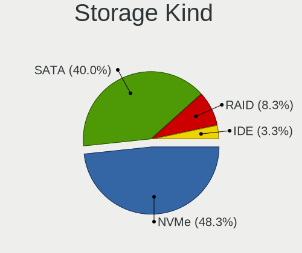
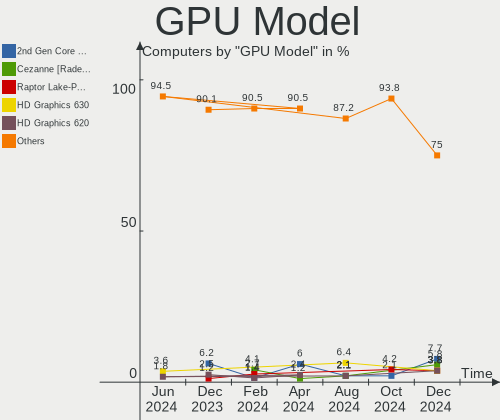
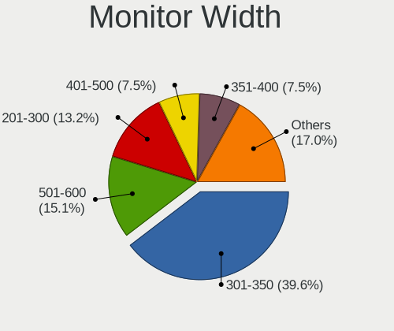
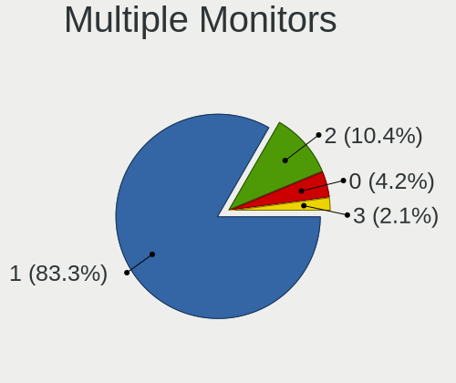
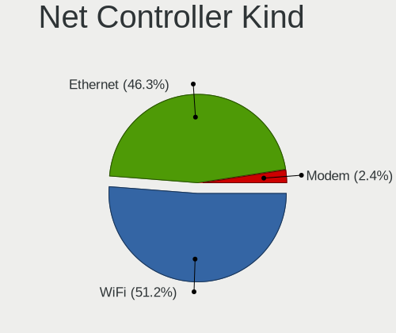
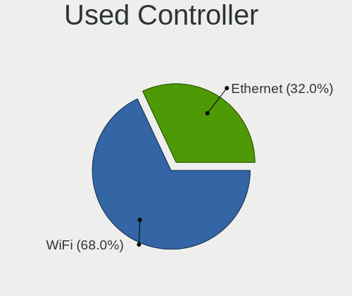
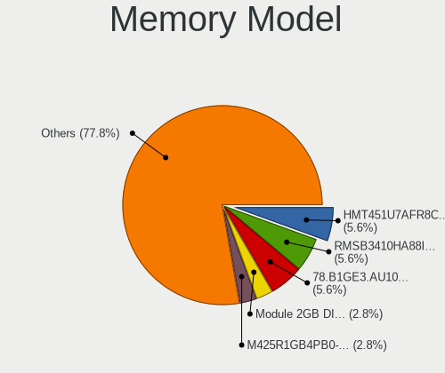
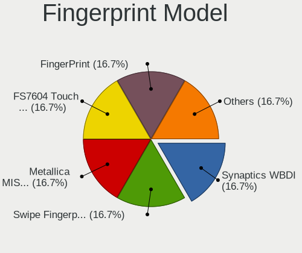

Kali - Hardware Trends
----------------------

A project to identify most popular hardware characteristics and track their change
over time based on data collected by Linux users at https://Linux-Hardware.org.

Anyone can contribute to this report by the [hw-probe](https://github.com/linuxhw/hw-probe) tool:

    sudo -E hw-probe -all -upload

This is a report for all computer types. See also reports for [desktops](/Dist/Kali/Desktop/README.md) and [notebooks](/Dist/Kali/Notebook/README.md).

This report is for one last month. Overall report since the beginning of time: [TestCoverage](https://github.com/linuxhw/TestCoverage)

Period: Sep, 2022.

Contents
--------

* [ System ](#system)
  - [ OS                       ](#os)
  - [ OS Family                ](#os-family)
  - [ Kernel                   ](#kernel)
  - [ Kernel Family            ](#kernel-family)
  - [ Kernel Major Ver.        ](#kernel-major-ver)
  - [ Arch                     ](#arch)
  - [ DE                       ](#de)
  - [ Display Server           ](#display-server)
  - [ Display Manager          ](#display-manager)
  - [ OS Lang                  ](#os-lang)
  - [ Boot Mode                ](#boot-mode)
  - [ Filesystem               ](#filesystem)
  - [ Part. scheme             ](#part-scheme)
  - [ Dual Boot with Linux/BSD ](#dual-boot-with-linuxbsd)
  - [ Dual Boot (Win)          ](#dual-boot-win)

* [ Board ](#board)
  - [ Vendor                   ](#vendor)
  - [ Model                    ](#model)
  - [ Model Family             ](#model-family)
  - [ MFG Year                 ](#mfg-year)
  - [ Form Factor              ](#form-factor)
  - [ Secure Boot              ](#secure-boot)
  - [ Coreboot                 ](#coreboot)
  - [ RAM Size                 ](#ram-size)
  - [ RAM Used                 ](#ram-used)
  - [ Total Drives             ](#total-drives)
  - [ Has CD-ROM               ](#has-cd-rom)
  - [ Has Ethernet             ](#has-ethernet)
  - [ Has WiFi                 ](#has-wifi)
  - [ Has Bluetooth            ](#has-bluetooth)

* [ Location ](#location)
  - [ Country                  ](#country)
  - [ City                     ](#city)

* [ Drives ](#drives)
  - [ Drive Vendor             ](#drive-vendor)
  - [ Drive Model              ](#drive-model)
  - [ HDD Vendor               ](#hdd-vendor)
  - [ SSD Vendor               ](#ssd-vendor)
  - [ Drive Kind               ](#drive-kind)
  - [ Drive Connector          ](#drive-connector)
  - [ Drive Size               ](#drive-size)
  - [ Space Total              ](#space-total)
  - [ Space Used               ](#space-used)
  - [ Malfunc. Drives          ](#malfunc-drives)
  - [ Malfunc. Drive Vendor    ](#malfunc-drive-vendor)
  - [ Malfunc. HDD Vendor      ](#malfunc-hdd-vendor)
  - [ Malfunc. Drive Kind      ](#malfunc-drive-kind)
  - [ Failed Drives            ](#failed-drives)
  - [ Failed Drive Vendor      ](#failed-drive-vendor)
  - [ Drive Status             ](#drive-status)

* [ Storage controller ](#storage-controller)
  - [ Storage Vendor           ](#storage-vendor)
  - [ Storage Model            ](#storage-model)
  - [ Storage Kind             ](#storage-kind)

* [ Processor ](#processor)
  - [ CPU Vendor               ](#cpu-vendor)
  - [ CPU Model                ](#cpu-model)
  - [ CPU Model Family         ](#cpu-model-family)
  - [ CPU Cores                ](#cpu-cores)
  - [ CPU Sockets              ](#cpu-sockets)
  - [ CPU Threads              ](#cpu-threads)
  - [ CPU Op-Modes             ](#cpu-op-modes)
  - [ CPU Microcode            ](#cpu-microcode)
  - [ CPU Microarch            ](#cpu-microarch)

* [ Graphics ](#graphics)
  - [ GPU Vendor               ](#gpu-vendor)
  - [ GPU Model                ](#gpu-model)
  - [ GPU Combo                ](#gpu-combo)
  - [ GPU Driver               ](#gpu-driver)
  - [ GPU Memory               ](#gpu-memory)

* [ Monitor ](#monitor)
  - [ Monitor Vendor           ](#monitor-vendor)
  - [ Monitor Model            ](#monitor-model)
  - [ Monitor Resolution       ](#monitor-resolution)
  - [ Monitor Diagonal         ](#monitor-diagonal)
  - [ Monitor Width            ](#monitor-width)
  - [ Aspect Ratio             ](#aspect-ratio)
  - [ Monitor Area             ](#monitor-area)
  - [ Pixel Density            ](#pixel-density)
  - [ Multiple Monitors        ](#multiple-monitors)

* [ Network ](#network)
  - [ Net Controller Vendor    ](#net-controller-vendor)
  - [ Net Controller Model     ](#net-controller-model)
  - [ Wireless Vendor          ](#wireless-vendor)
  - [ Wireless Model           ](#wireless-model)
  - [ Ethernet Vendor          ](#ethernet-vendor)
  - [ Ethernet Model           ](#ethernet-model)
  - [ Net Controller Kind      ](#net-controller-kind)
  - [ Used Controller          ](#used-controller)
  - [ NICs                     ](#nics)
  - [ IPv6                     ](#ipv6)

* [ Bluetooth ](#bluetooth)
  - [ Bluetooth Vendor         ](#bluetooth-vendor)
  - [ Bluetooth Model          ](#bluetooth-model)

* [ Sound ](#sound)
  - [ Sound Vendor             ](#sound-vendor)
  - [ Sound Model              ](#sound-model)

* [ Memory ](#memory)
  - [ Memory Vendor            ](#memory-vendor)
  - [ Memory Model             ](#memory-model)
  - [ Memory Kind              ](#memory-kind)
  - [ Memory Form Factor       ](#memory-form-factor)
  - [ Memory Size              ](#memory-size)
  - [ Memory Speed             ](#memory-speed)

* [ Printers & scanners ](#printers--scanners)
  - [ Printer Vendor           ](#printer-vendor)
  - [ Printer Model            ](#printer-model)
  - [ Scanner Vendor           ](#scanner-vendor)
  - [ Scanner Model            ](#scanner-model)

* [ Camera ](#camera)
  - [ Camera Vendor            ](#camera-vendor)
  - [ Camera Model             ](#camera-model)

* [ Security ](#security)
  - [ Fingerprint Vendor       ](#fingerprint-vendor)
  - [ Fingerprint Model        ](#fingerprint-model)
  - [ Chipcard Vendor          ](#chipcard-vendor)
  - [ Chipcard Model           ](#chipcard-model)

* [ Unsupported ](#unsupported)
  - [ Unsupported Devices      ](#unsupported-devices)
  - [ Unsupported Device Types ](#unsupported-device-types)

System
------

OS
--

Installed operating systems

| Name        | Computers | Percent |
|-------------|-----------|---------|
| Kali 2022.3 | 48        | 94.12%  |
| Kali 2022.2 | 2         | 3.92%   |
| Kali 2021.2 | 1         | 1.96%   |

OS Family
---------

OS without a version

| Name | Computers | Percent |
|------|-----------|---------|
| Kali | 51        | 100%    |

Kernel
------

Version of the Linux kernel

| Version               | Computers | Percent |
|-----------------------|-----------|---------|
| 5.18.0-kali7-amd64    | 24        | 47.06%  |
| 5.18.0-kali5-amd64    | 19        | 37.25%  |
| 5.16.0-kali7-amd64    | 2         | 3.92%   |
| 5.19.0-2-rt-amd64     | 1         | 1.96%   |
| 5.18.0-kali7-rt-amd64 | 1         | 1.96%   |
| 5.18.0-kali7-686-pae  | 1         | 1.96%   |
| 5.18.0-kali6-amd64    | 1         | 1.96%   |
| 5.10.0-kali9-amd64    | 1         | 1.96%   |
| 4.19.87-24107789      | 1         | 1.96%   |

Kernel Family
-------------

Linux kernel without a distro release

| Version | Computers | Percent |
|---------|-----------|---------|
| 5.18.0  | 46        | 90.2%   |
| 5.16.0  | 2         | 3.92%   |
| 5.19.0  | 1         | 1.96%   |
| 5.10.0  | 1         | 1.96%   |
| 4.19.87 | 1         | 1.96%   |

Kernel Major Ver.
-----------------

Linux kernel major version

| Version | Computers | Percent |
|---------|-----------|---------|
| 5.18    | 46        | 90.2%   |
| 5.16    | 2         | 3.92%   |
| 5.19    | 1         | 1.96%   |
| 5.10    | 1         | 1.96%   |
| 4.19    | 1         | 1.96%   |

Arch
----

OS architecture (x86_64, i586, etc.)

| Name    | Computers | Percent |
|---------|-----------|---------|
| x86_64  | 49        | 96.08%  |
| i686    | 1         | 1.96%   |
| aarch64 | 1         | 1.96%   |

DE
--

Desktop Environment

| Name    | Computers | Percent |
|---------|-----------|---------|
| XFCE    | 25        | 49.02%  |
| GNOME   | 13        | 25.49%  |
| KDE5    | 9         | 17.65%  |
| Unknown | 3         | 5.88%   |
| LXDE    | 1         | 1.96%   |

Display Server
--------------

X11 or Wayland

| Name    | Computers | Percent |
|---------|-----------|---------|
| X11     | 49        | 96.08%  |
| Wayland | 2         | 3.92%   |

Display Manager
---------------

SDDM, LightDM, etc.

| Name    | Computers | Percent |
|---------|-----------|---------|
| LightDM | 27        | 52.94%  |
| Unknown | 13        | 25.49%  |
| GDM3    | 6         | 11.76%  |
| SDDM    | 5         | 9.8%    |

OS Lang
-------

Language

| Lang    | Computers | Percent |
|---------|-----------|---------|
| en_US   | 35        | 68.63%  |
| Unknown | 3         | 5.88%   |
| de_DE   | 2         | 3.92%   |
| ru_RU   | 1         | 1.96%   |
| pl_PL   | 1         | 1.96%   |
| en_PH   | 1         | 1.96%   |
| en_NZ   | 1         | 1.96%   |
| en_NG   | 1         | 1.96%   |
| en_GB   | 1         | 1.96%   |
| en_DK   | 1         | 1.96%   |
| en_CA   | 1         | 1.96%   |
| en_AU   | 1         | 1.96%   |
| C       | 1         | 1.96%   |
| bg_BG   | 1         | 1.96%   |

Boot Mode
---------

EFI or BIOS

| Mode | Computers | Percent |
|------|-----------|---------|
| EFI  | 37        | 72.55%  |
| BIOS | 14        | 27.45%  |

Filesystem
----------

Type of filesystem

| Type    | Computers | Percent |
|---------|-----------|---------|
| Ext4    | 46        | 90.2%   |
| Btrfs   | 3         | 5.88%   |
| Overlay | 2         | 3.92%   |

Part. scheme
------------

Scheme of partitioning

| Type    | Computers | Percent |
|---------|-----------|---------|
| GPT     | 30        | 58.82%  |
| Unknown | 11        | 21.57%  |
| MBR     | 10        | 19.61%  |

Dual Boot with Linux/BSD
------------------------

Hosting more than one Linux/BSD

| Dual boot | Computers | Percent |
|-----------|-----------|---------|
| No        | 47        | 92.16%  |
| Yes       | 4         | 7.84%   |

Dual Boot (Win)
---------------

Hosting Linux and Windows

| Dual boot | Computers | Percent |
|-----------|-----------|---------|
| No        | 33        | 64.71%  |
| Yes       | 18        | 35.29%  |

Board
-----

Vendor
------

Motherboard manufacturer

| Name                | Computers | Percent |
|---------------------|-----------|---------|
| ASUSTek Computer    | 16        | 31.37%  |
| Hewlett-Packard     | 15        | 29.41%  |
| Lenovo              | 5         | 9.8%    |
| Acer                | 5         | 9.8%    |
| Dell                | 4         | 7.84%   |
| Samsung Electronics | 1         | 1.96%   |
| MSI                 | 1         | 1.96%   |
| Google              | 1         | 1.96%   |
| Gigabyte Technology | 1         | 1.96%   |
| Clevo               | 1         | 1.96%   |
| Unknown             | 1         | 1.96%   |

Model
-----

Motherboard model

| Name                                     | Computers | Percent |
|------------------------------------------|-----------|---------|
| ASUS ROG Flow Z13 GZ301ZE_GZ301ZE        | 3         | 5.88%   |
| ASUS ROG STRIX B550-F GAMING             | 2         | 3.92%   |
| Unknown                                  | 2         | 3.92%   |
| Samsung 930MBE                           | 1         | 1.96%   |
| MSI GF65 Thin 10SER                      | 1         | 1.96%   |
| Lenovo Yoga 700-11ISK 80QE               | 1         | 1.96%   |
| Lenovo IdeaPad S340 81QG                 | 1         | 1.96%   |
| Lenovo IdeaPad S145-14IWL 81MU           | 1         | 1.96%   |
| Lenovo G710 20252                        | 1         | 1.96%   |
| HP Stream Laptop 14-cb0XX                | 1         | 1.96%   |
| HP ProBook 650 G1                        | 1         | 1.96%   |
| HP ProBook 4520s                         | 1         | 1.96%   |
| HP ProBook 4340s                         | 1         | 1.96%   |
| HP Pavilion g6                           | 1         | 1.96%   |
| HP Pavilion dv6                          | 1         | 1.96%   |
| HP Pavilion 15                           | 1         | 1.96%   |
| HP Laptop 15-da0xxx                      | 1         | 1.96%   |
| HP ENVY x360 Convertible 15m-ee0xxx      | 1         | 1.96%   |
| HP ENVY x360 Convertible 13-ag0xxx       | 1         | 1.96%   |
| HP ENVY x360 2-in-1 Laptop 15-ew0xxx     | 1         | 1.96%   |
| HP Compaq 8200 Elite USDT PC             | 1         | 1.96%   |
| HP Compaq 620                            | 1         | 1.96%   |
| HP 23-n010ne                             | 1         | 1.96%   |
| HP 15                                    | 1         | 1.96%   |
| Google Droid                             | 1         | 1.96%   |
| Gigabyte GB-BXi3-5010                    | 1         | 1.96%   |
| Dell Vostro 3500                         | 1         | 1.96%   |
| Dell Latitude E6420                      | 1         | 1.96%   |
| Dell Latitude 7290                       | 1         | 1.96%   |
| Dell Latitude 5490                       | 1         | 1.96%   |
| Clevo P170EM                             | 1         | 1.96%   |
| ASUS X441NA                              | 1         | 1.96%   |
| ASUS VivoBook_ASUSLaptop X412FA_X412FA   | 1         | 1.96%   |
| ASUS VivoBook_ASUSLaptop S5402ZA_S5402ZA | 1         | 1.96%   |
| ASUS S551LB                              | 1         | 1.96%   |
| ASUS ROG STRIX Z390-E GAMING             | 1         | 1.96%   |
| ASUS ROG STRIX X570-F GAMING             | 1         | 1.96%   |
| ASUS ROG Strix G512LV_G512LV             | 1         | 1.96%   |
| ASUS ROG STRIX B365-G GAMING             | 1         | 1.96%   |
| ASUS PRIME Z690-P WIFI D4                | 1         | 1.96%   |

Model Family
------------

Motherboard model prefix

| Name                  | Computers | Percent |
|-----------------------|-----------|---------|
| ASUS ROG              | 9         | 17.65%  |
| Acer Aspire           | 4         | 7.84%   |
| HP ProBook            | 3         | 5.88%   |
| HP Pavilion           | 3         | 5.88%   |
| HP ENVY               | 3         | 5.88%   |
| Dell Latitude         | 3         | 5.88%   |
| Lenovo IdeaPad        | 2         | 3.92%   |
| HP Compaq             | 2         | 3.92%   |
| ASUS VivoBook         | 2         | 3.92%   |
| Unknown               | 2         | 3.92%   |
| Samsung 930MBE        | 1         | 1.96%   |
| MSI GF65              | 1         | 1.96%   |
| Lenovo Yoga           | 1         | 1.96%   |
| Lenovo G710           | 1         | 1.96%   |
| HP Stream             | 1         | 1.96%   |
| HP Laptop             | 1         | 1.96%   |
| HP 23-n010ne          | 1         | 1.96%   |
| HP 15                 | 1         | 1.96%   |
| Google Droid          | 1         | 1.96%   |
| Gigabyte GB-BXi3-5010 | 1         | 1.96%   |
| Dell Vostro           | 1         | 1.96%   |
| Clevo P170EM          | 1         | 1.96%   |
| ASUS X441NA           | 1         | 1.96%   |
| ASUS S551LB           | 1         | 1.96%   |
| ASUS PRIME            | 1         | 1.96%   |
| ASUS All              | 1         | 1.96%   |
| ASUS A68HM-K          | 1         | 1.96%   |
| Acer Swift            | 1         | 1.96%   |

MFG Year
--------

Motherboard manufacture year

| Year    | Computers | Percent |
|---------|-----------|---------|
| 2022    | 8         | 15.69%  |
| 2019    | 6         | 11.76%  |
| 2014    | 6         | 11.76%  |
| 2013    | 6         | 11.76%  |
| 2020    | 5         | 9.8%    |
| 2018    | 5         | 9.8%    |
| 2012    | 3         | 5.88%   |
| 2011    | 3         | 5.88%   |
| 2010    | 3         | 5.88%   |
| 2017    | 2         | 3.92%   |
| 2021    | 1         | 1.96%   |
| 2015    | 1         | 1.96%   |
| 2008    | 1         | 1.96%   |
| Unknown | 1         | 1.96%   |

Form Factor
-----------

Physical design of the computer

| Name           | Computers | Percent |
|----------------|-----------|---------|
| Notebook       | 31        | 60.78%  |
| Desktop        | 11        | 21.57%  |
| Convertible    | 4         | 7.84%   |
| Tablet         | 3         | 5.88%   |
| System on chip | 1         | 1.96%   |
| All in one     | 1         | 1.96%   |

Secure Boot
-----------

Enabled or disabled

| State    | Computers | Percent |
|----------|-----------|---------|
| Disabled | 51        | 100%    |

Coreboot
--------

Have coreboot on board

| Used | Computers | Percent |
|------|-----------|---------|
| No   | 50        | 98.04%  |
| Yes  | 1         | 1.96%   |

RAM Size
--------

Total RAM memory

| Size in GB  | Computers | Percent |
|-------------|-----------|---------|
| 4.01-8.0    | 17        | 33.33%  |
| 16.01-24.0  | 11        | 21.57%  |
| 3.01-4.0    | 9         | 17.65%  |
| 8.01-16.0   | 7         | 13.73%  |
| 32.01-64.0  | 5         | 9.8%    |
| 64.01-256.0 | 1         | 1.96%   |
| 1.01-2.0    | 1         | 1.96%   |

RAM Used
--------

Used RAM memory

| Used GB   | Computers | Percent |
|-----------|-----------|---------|
| 2.01-3.0  | 20        | 39.22%  |
| 1.01-2.0  | 10        | 19.61%  |
| 4.01-8.0  | 9         | 17.65%  |
| 3.01-4.0  | 9         | 17.65%  |
| 8.01-16.0 | 1         | 1.96%   |
| 0.51-1.0  | 1         | 1.96%   |
| 0.01-0.5  | 1         | 1.96%   |

Total Drives
------------

Number of drives on board

| Drives | Computers | Percent |
|--------|-----------|---------|
| 1      | 32        | 62.75%  |
| 2      | 10        | 19.61%  |
| 3      | 4         | 7.84%   |
| 4      | 3         | 5.88%   |
| 5      | 1         | 1.96%   |
| 0      | 1         | 1.96%   |

Has CD-ROM
----------

Has CD-ROM on board

| Presented | Computers | Percent |
|-----------|-----------|---------|
| No        | 32        | 62.75%  |
| Yes       | 19        | 37.25%  |

Has Ethernet
------------

Has Ethernet on board

| Presented | Computers | Percent |
|-----------|-----------|---------|
| Yes       | 40        | 78.43%  |
| No        | 11        | 21.57%  |

Has WiFi
--------

Has WiFi module

| Presented | Computers | Percent |
|-----------|-----------|---------|
| Yes       | 45        | 88.24%  |
| No        | 6         | 11.76%  |

Has Bluetooth
-------------

Has Bluetooth module

| Presented | Computers | Percent |
|-----------|-----------|---------|
| Yes       | 40        | 78.43%  |
| No        | 11        | 21.57%  |

Location
--------

Country
-------

Geographic location (country)

| Country     | Computers | Percent |
|-------------|-----------|---------|
| USA         | 18        | 35.29%  |
| Germany     | 4         | 7.84%   |
| Philippines | 3         | 5.88%   |
| UK          | 2         | 3.92%   |
| Sri Lanka   | 2         | 3.92%   |
| Iran        | 2         | 3.92%   |
| India       | 2         | 3.92%   |
| Canada      | 2         | 3.92%   |
| Tunisia     | 1         | 1.96%   |
| Spain       | 1         | 1.96%   |
| Slovenia    | 1         | 1.96%   |
| Singapore   | 1         | 1.96%   |
| Norway      | 1         | 1.96%   |
| Nigeria     | 1         | 1.96%   |
| New Zealand | 1         | 1.96%   |
| Kenya       | 1         | 1.96%   |
| Jordan      | 1         | 1.96%   |
| Denmark     | 1         | 1.96%   |
| Croatia     | 1         | 1.96%   |
| Bulgaria    | 1         | 1.96%   |
| Belgium     | 1         | 1.96%   |
| Belarus     | 1         | 1.96%   |
| Australia   | 1         | 1.96%   |
| Argentina   | 1         | 1.96%   |

City
----

Geographic location (city)

| City              | Computers | Percent |
|-------------------|-----------|---------|
| Gachsaran         | 2         | 3.92%   |
| Colombo           | 2         | 3.92%   |
| Vitebsk           | 1         | 1.96%   |
| Tunis             | 1         | 1.96%   |
| Tulsa             | 1         | 1.96%   |
| Toronto           | 1         | 1.96%   |
| Sofia             | 1         | 1.96%   |
| Singapore         | 1         | 1.96%   |
| Seville           | 1         | 1.96%   |
| Severn            | 1         | 1.96%   |
| Selma             | 1         | 1.96%   |
| San Pedro         | 1         | 1.96%   |
| San Diego         | 1         | 1.96%   |
| Quezon City       | 1         | 1.96%   |
| Oslo              | 1         | 1.96%   |
| Ocala             | 1         | 1.96%   |
| Nairobi           | 1         | 1.96%   |
| Moscow            | 1         | 1.96%   |
| Medford           | 1         | 1.96%   |
| Las Vegas         | 1         | 1.96%   |
| Lancaster         | 1         | 1.96%   |
| Lake Orion        | 1         | 1.96%   |
| Kongens Lyngby    | 1         | 1.96%   |
| Holtsville        | 1         | 1.96%   |
| Herbolzheim       | 1         | 1.96%   |
| Hamburg           | 1         | 1.96%   |
| Guwahati          | 1         | 1.96%   |
| Great Malvern     | 1         | 1.96%   |
| Frankfurt am Main | 1         | 1.96%   |
| Dulwich           | 1         | 1.96%   |
| Dugo Selo         | 1         | 1.96%   |
| Dresden           | 1         | 1.96%   |
| Des Moines        | 1         | 1.96%   |
| Denver            | 1         | 1.96%   |
| Cranbourne East   | 1         | 1.96%   |
| Calgary           | 1         | 1.96%   |
| Buenos Aires      | 1         | 1.96%   |
| Broomfield        | 1         | 1.96%   |
| Bothell           | 1         | 1.96%   |
| Baguio City       | 1         | 1.96%   |

Drives
------

Drive Vendor
------------

Hard drive vendors

| Vendor              | Computers | Drives | Percent |
|---------------------|-----------|--------|---------|
| Seagate             | 10        | 10     | 13.16%  |
| WDC                 | 9         | 10     | 11.84%  |
| Samsung Electronics | 8         | 12     | 10.53%  |
| Micron Technology   | 5         | 5      | 6.58%   |
| Hitachi             | 5         | 5      | 6.58%   |
| Unknown             | 4         | 4      | 5.26%   |
| SK hynix            | 4         | 4      | 5.26%   |
| Kingston            | 4         | 5      | 5.26%   |
| SanDisk             | 3         | 3      | 3.95%   |
| HGST                | 3         | 3      | 3.95%   |
| Crucial             | 3         | 3      | 3.95%   |
| Unknown             | 3         | 3      | 3.95%   |
| ZTE                 | 2         | 2      | 2.63%   |
| Toshiba             | 2         | 2      | 2.63%   |
| LITEON              | 2         | 2      | 2.63%   |
| Union Memory        | 1         | 1      | 1.32%   |
| SABRENT             | 1         | 1      | 1.32%   |
| Phison              | 1         | 1      | 1.32%   |
| Lexar               | 1         | 1      | 1.32%   |
| Lenovo              | 1         | 1      | 1.32%   |
| LaCie               | 1         | 1      | 1.32%   |
| JMicron Technology  | 1         | 1      | 1.32%   |
| Intel               | 1         | 1      | 1.32%   |
| ASMT                | 1         | 1      | 1.32%   |

Drive Model
-----------

Hard drive models

| Model                                  | Computers | Percent |
|----------------------------------------|-----------|---------|
| Samsung SSD 860 EVO 500GB              | 3         | 3.7%    |
| Micron 2450_MTFDKBK1T0TFK 1TB          | 3         | 3.7%    |
| Unknown                                | 3         | 3.7%    |
| ZTE MMC Storage 942MB                  | 2         | 2.47%   |
| Seagate ST1000LM024 HN-M101MBB 1TB     | 2         | 2.47%   |
| Samsung SSD 850 EVO 250GB              | 2         | 2.47%   |
| Hitachi HTS543232L9A300 320GB          | 2         | 2.47%   |
| HGST HTS545050A7E380 500GB             | 2         | 2.47%   |
| WDC WDS100T2B0A-00SM50 1TB SSD         | 1         | 1.23%   |
| WDC WD80EFBX-68AZZN0 8TB               | 1         | 1.23%   |
| WDC WD5000LPVX-22V0TT0 500GB           | 1         | 1.23%   |
| WDC WD40EFAX-68JH4N0 4TB               | 1         | 1.23%   |
| WDC WD3200BPVT-24JJ5T0 320GB           | 1         | 1.23%   |
| WDC WD2500AAJS-00L7A0 250GB            | 1         | 1.23%   |
| WDC WD2003FZEX-00SRLA0 2TB             | 1         | 1.23%   |
| WDC WD10JPVX-80JC3T0 1TB               | 1         | 1.23%   |
| WDC WD10EZEX-75WN4A1 1TB               | 1         | 1.23%   |
| WDC PC SN530 SDBPNPZ-512G-1032 512GB   | 1         | 1.23%   |
| Unknown SD/MMC/MS PRO 2GB              | 1         | 1.23%   |
| Unknown NCard  4GB                     | 1         | 1.23%   |
| Unknown MMC Card  32GB                 | 1         | 1.23%   |
| Unknown DA4064  64GB                   | 1         | 1.23%   |
| Union Memory RTOTJ128VGD2EYX 128GB SSD | 1         | 1.23%   |
| Toshiba MQ04ABF100 1TB                 | 1         | 1.23%   |
| Toshiba HDWR160 6TB                    | 1         | 1.23%   |
| SK hynix SC311 SATA 256GB SSD          | 1         | 1.23%   |
| SK hynix SC210 2.5 7MM 256GB SSD       | 1         | 1.23%   |
| SK hynix HFS256G32MND-2200A 256GB SSD  | 1         | 1.23%   |
| SK hynix BC711 HFM512GD3JX013N 512GB   | 1         | 1.23%   |
| Seagate ST9500423AS 500GB              | 1         | 1.23%   |
| Seagate ST500LM030-1RK17D 500GB        | 1         | 1.23%   |
| Seagate ST320LT007-9ZV142 320GB        | 1         | 1.23%   |
| Seagate ST2000DM006-2DM164 2TB         | 1         | 1.23%   |
| Seagate ST2000DM001-1CH164 2TB         | 1         | 1.23%   |
| Seagate ST1000DX001-1CM162 1TB         | 1         | 1.23%   |
| Seagate ST1000DM003-1SB102 1TB         | 1         | 1.23%   |
| Seagate BUP Slim BK 500GB              | 1         | 1.23%   |
| SanDisk SD7TB3Q-256G-1006 256GB SSD    | 1         | 1.23%   |
| Sandisk PC SN520 NVMe SSD 256GB        | 1         | 1.23%   |
| SanDisk NVMe SSD Drive 256GB           | 1         | 1.23%   |

HDD Vendor
----------

Hard disk drive vendors

| Vendor  | Computers | Drives | Percent |
|---------|-----------|--------|---------|
| Seagate | 10        | 10     | 33.33%  |
| WDC     | 8         | 8      | 26.67%  |
| Hitachi | 5         | 5      | 16.67%  |
| HGST    | 3         | 3      | 10%     |
| Toshiba | 2         | 2      | 6.67%   |
| Unknown | 1         | 1      | 3.33%   |
| LaCie   | 1         | 1      | 3.33%   |

SSD Vendor
----------

Solid state drive vendors

| Vendor              | Computers | Drives | Percent |
|---------------------|-----------|--------|---------|
| Samsung Electronics | 6         | 8      | 30%     |
| SK hynix            | 3         | 3      | 15%     |
| Kingston            | 3         | 3      | 15%     |
| Crucial             | 3         | 3      | 15%     |
| WDC                 | 1         | 1      | 5%      |
| Union Memory        | 1         | 1      | 5%      |
| SanDisk             | 1         | 1      | 5%      |
| LITEON              | 1         | 1      | 5%      |
| Lexar               | 1         | 1      | 5%      |

Drive Kind
----------

HDD or SSD

| Kind    | Computers | Drives | Percent |
|---------|-----------|--------|---------|
| HDD     | 24        | 30     | 34.29%  |
| SSD     | 18        | 22     | 25.71%  |
| NVMe    | 17        | 19     | 24.29%  |
| MMC     | 6         | 6      | 8.57%   |
| Unknown | 5         | 5      | 7.14%   |

Drive Connector
---------------

SATA, SAS, NVMe, etc.

| Type | Computers | Drives | Percent |
|------|-----------|--------|---------|
| SATA | 36        | 50     | 53.73%  |
| NVMe | 17        | 18     | 25.37%  |
| SAS  | 8         | 8      | 11.94%  |
| MMC  | 6         | 6      | 8.96%   |

Drive Size
----------

Size of hard drive

| Size in TB | Computers | Drives | Percent |
|------------|-----------|--------|---------|
| 0.01-0.5   | 29        | 35     | 64.44%  |
| 0.51-1.0   | 9         | 9      | 20%     |
| 1.01-2.0   | 4         | 5      | 8.89%   |
| 4.01-10.0  | 2         | 2      | 4.44%   |
| 3.01-4.0   | 1         | 1      | 2.22%   |

Space Total
-----------

Amount of disk space available on the file system

| Size in GB     | Computers | Percent |
|----------------|-----------|---------|
| 101-250        | 15        | 29.41%  |
| 251-500        | 12        | 23.53%  |
| 501-1000       | 6         | 11.76%  |
| 51-100         | 5         | 9.8%    |
| Unknown        | 4         | 7.84%   |
| 21-50          | 3         | 5.88%   |
| 2001-3000      | 3         | 5.88%   |
| More than 3000 | 1         | 1.96%   |
| 1001-2000      | 1         | 1.96%   |
| 1-20           | 1         | 1.96%   |

Space Used
----------

Amount of used disk space

| Used GB        | Computers | Percent |
|----------------|-----------|---------|
| 1-20           | 15        | 29.41%  |
| 21-50          | 12        | 23.53%  |
| 101-250        | 10        | 19.61%  |
| 51-100         | 5         | 9.8%    |
| Unknown        | 4         | 7.84%   |
| 251-500        | 2         | 3.92%   |
| 501-1000       | 2         | 3.92%   |
| More than 3000 | 1         | 1.96%   |

Malfunc. Drives
---------------

Drive models with a malfunction

| Model                                 | Computers | Drives | Percent |
|---------------------------------------|-----------|--------|---------|
| Hitachi HTS543232L9A300 320GB         | 2         | 2      | 14.29%  |
| WDC WD2500AAJS-00L7A0 250GB           | 1         | 1      | 7.14%   |
| WDC WD2003FZEX-00SRLA0 2TB            | 1         | 1      | 7.14%   |
| SK hynix SC210 2.5 7MM 256GB SSD      | 1         | 1      | 7.14%   |
| SK hynix HFS256G32MND-2200A 256GB SSD | 1         | 1      | 7.14%   |
| SK hynix BC711 HFM512GD3JX013N 512GB  | 1         | 1      | 7.14%   |
| Seagate ST320LT007-9ZV142 320GB       | 1         | 1      | 7.14%   |
| Seagate ST2000DM001-1CH164 2TB        | 1         | 1      | 7.14%   |
| Seagate ST1000DX001-1CM162 1TB        | 1         | 1      | 7.14%   |
| Hitachi HUA722010CLA330 1TB           | 1         | 1      | 7.14%   |
| Hitachi HTS725025A9A364 250GB         | 1         | 1      | 7.14%   |
| HGST HTS725050A7E630 500GB            | 1         | 1      | 7.14%   |
| HGST HTS545050A7E380 500GB            | 1         | 1      | 7.14%   |

Malfunc. Drive Vendor
---------------------

Vendors of faulty drives

| Vendor   | Computers | Drives | Percent |
|----------|-----------|--------|---------|
| Hitachi  | 4         | 4      | 28.57%  |
| SK hynix | 3         | 3      | 21.43%  |
| Seagate  | 3         | 3      | 21.43%  |
| WDC      | 2         | 2      | 14.29%  |
| HGST     | 2         | 2      | 14.29%  |

Malfunc. HDD Vendor
-------------------

Vendors of faulty HDD drives

| Vendor  | Computers | Drives | Percent |
|---------|-----------|--------|---------|
| Hitachi | 4         | 4      | 36.36%  |
| Seagate | 3         | 3      | 27.27%  |
| WDC     | 2         | 2      | 18.18%  |
| HGST    | 2         | 2      | 18.18%  |

Malfunc. Drive Kind
-------------------

Kinds of faulty drives

| Kind | Computers | Drives | Percent |
|------|-----------|--------|---------|
| HDD  | 9         | 11     | 75%     |
| SSD  | 2         | 2      | 16.67%  |
| NVMe | 1         | 1      | 8.33%   |

Failed Drives
-------------

Failed drive models

Zero info for selected period =(

Failed Drive Vendor
-------------------

Failed drive vendors

Zero info for selected period =(

Drive Status
------------

Number of failed and malfunc. drives

| Status   | Computers | Drives | Percent |
|----------|-----------|--------|---------|
| Works    | 28        | 42     | 45.9%   |
| Detected | 21        | 26     | 34.43%  |
| Malfunc  | 12        | 14     | 19.67%  |

Storage controller
------------------

Storage Vendor
--------------

Storage controller vendors

| Vendor                      | Computers | Percent |
|-----------------------------|-----------|---------|
| Intel                       | 37        | 60.66%  |
| AMD                         | 7         | 11.48%  |
| Micron Technology           | 5         | 8.2%    |
| Samsung Electronics         | 4         | 6.56%   |
| SanDisk                     | 3         | 4.92%   |
| SK hynix                    | 1         | 1.64%   |
| Phison Electronics          | 1         | 1.64%   |
| Lite-On Technology          | 1         | 1.64%   |
| Kingston Technology Company | 1         | 1.64%   |
| ASMedia Technology          | 1         | 1.64%   |

Storage Model
-------------

Storage controller models

| Model                                                                          | Computers | Percent |
|--------------------------------------------------------------------------------|-----------|---------|
| Intel Volume Management Device NVMe RAID Controller                            | 7         | 10.45%  |
| Micron Non-Volatile memory controller                                          | 5         | 7.46%   |
| AMD FCH SATA Controller [AHCI mode]                                            | 5         | 7.46%   |
| Intel Sunrise Point-LP SATA Controller [AHCI mode]                             | 4         | 5.97%   |
| Intel 8 Series/C220 Series Chipset Family 6-port SATA Controller 1 [AHCI mode] | 4         | 5.97%   |
| Intel 82801 Mobile SATA Controller [RAID mode]                                 | 3         | 4.48%   |
| Intel 7 Series Chipset Family 6-port SATA Controller [AHCI mode]               | 3         | 4.48%   |
| Samsung NVMe SSD Controller 980                                                | 2         | 2.99%   |
| Intel 8 Series SATA Controller 1 [AHCI mode]                                   | 2         | 2.99%   |
| AMD 500 Series Chipset SATA Controller                                         | 2         | 2.99%   |
| SK hynix Gold P31 SSD                                                          | 1         | 1.49%   |
| SanDisk WD Blue SN550 NVMe SSD                                                 | 1         | 1.49%   |
| SanDisk WD Blue SN500 / PC SN520 NVMe SSD                                      | 1         | 1.49%   |
| SanDisk PC SN520 NVMe SSD                                                      | 1         | 1.49%   |
| Samsung NVMe SSD Controller SM981/PM981/PM983                                  | 1         | 1.49%   |
| Samsung NVMe SSD Controller PM9A1/PM9A3/980PRO                                 | 1         | 1.49%   |
| Phison Electronics Non-Volatile memory controller                              | 1         | 1.49%   |
| Lite-On Non-Volatile memory controller                                         | 1         | 1.49%   |
| Kingston Company Company Non-Volatile memory controller                        | 1         | 1.49%   |
| Intel Wildcat Point-LP SATA Controller [AHCI Mode]                             | 1         | 1.49%   |
| Intel Tiger Lake-LP SATA Controller                                            | 1         | 1.49%   |
| Intel SSD 660P Series                                                          | 1         | 1.49%   |
| Intel Celeron N3350/Pentium N4200/Atom E3900 Series SATA AHCI Controller       | 1         | 1.49%   |
| Intel Cannon Point-LP SATA Controller [AHCI Mode]                              | 1         | 1.49%   |
| Intel Cannon Lake PCH SATA AHCI Controller                                     | 1         | 1.49%   |
| Intel Atom Processor E3800 Series SATA AHCI Controller                         | 1         | 1.49%   |
| Intel Alder Lake-S PCH SATA Controller [AHCI Mode]                             | 1         | 1.49%   |
| Intel Alder Lake-P SATA AHCI Controller                                        | 1         | 1.49%   |
| Intel 82801IBM/IEM (ICH9M/ICH9M-E) 4 port SATA Controller [AHCI mode]          | 1         | 1.49%   |
| Intel 82801IBM/IEM (ICH9M/ICH9M-E) 2 port SATA Controller [IDE mode]           | 1         | 1.49%   |
| Intel 8 Series/C220 Series Chipset Family 2-port SATA Controller 2 [IDE mode]  | 1         | 1.49%   |
| Intel 8 Series Chipset Family 4-port SATA Controller 1 [IDE mode] - Mobile     | 1         | 1.49%   |
| Intel 7 Series Chipset Family 4-port SATA Controller [IDE mode]                | 1         | 1.49%   |
| Intel 7 Series Chipset Family 2-port SATA Controller [IDE mode]                | 1         | 1.49%   |
| Intel 6 Series/C200 Series Chipset Family 6 port Mobile SATA AHCI Controller   | 1         | 1.49%   |
| Intel 6 Series/C200 Series Chipset Family 6 port Desktop SATA AHCI Controller  | 1         | 1.49%   |
| Intel 5 Series/3400 Series Chipset 4 port SATA IDE Controller                  | 1         | 1.49%   |
| Intel 5 Series/3400 Series Chipset 2 port SATA IDE Controller                  | 1         | 1.49%   |
| Intel 200 Series PCH SATA controller [AHCI mode]                               | 1         | 1.49%   |
| ASMedia ASM1062 Serial ATA Controller                                          | 1         | 1.49%   |

Storage Kind
------------

Kind of storage controller (IDE, SATA, NVMe, SAS, ...)

| Kind | Computers | Percent |
|------|-----------|---------|
| SATA | 32        | 50.79%  |
| NVMe | 17        | 26.98%  |
| RAID | 10        | 15.87%  |
| IDE  | 4         | 6.35%   |

Processor
---------

CPU Vendor
----------

Processor vendors

| Vendor | Computers | Percent |
|--------|-----------|---------|
| Intel  | 42        | 82.35%  |
| AMD    | 8         | 15.69%  |
| ARM    | 1         | 1.96%   |

CPU Model
---------

Processor models

| Model                                   | Computers | Percent |
|-----------------------------------------|-----------|---------|
| Intel 12th Gen Core i9-12900H           | 3         | 5.88%   |
| Intel Core i7-8565U CPU @ 1.80GHz       | 2         | 3.92%   |
| Intel Pentium CPU N4200 @ 1.10GHz       | 1         | 1.96%   |
| Intel Pentium CPU 5405U @ 2.30GHz       | 1         | 1.96%   |
| Intel Core m5-6Y54 CPU @ 1.10GHz        | 1         | 1.96%   |
| Intel Core i7-8700K CPU @ 3.70GHz       | 1         | 1.96%   |
| Intel Core i7-4785T CPU @ 2.20GHz       | 1         | 1.96%   |
| Intel Core i7-4770K CPU @ 3.50GHz       | 1         | 1.96%   |
| Intel Core i7-4500U CPU @ 1.80GHz       | 1         | 1.96%   |
| Intel Core i7-3630QM CPU @ 2.40GHz      | 1         | 1.96%   |
| Intel Core i7-10750H CPU @ 2.60GHz      | 1         | 1.96%   |
| Intel Core i5-8350U CPU @ 1.70GHz       | 1         | 1.96%   |
| Intel Core i5-8250U CPU @ 1.60GHz       | 1         | 1.96%   |
| Intel Core i5-7200U CPU @ 2.50GHz       | 1         | 1.96%   |
| Intel Core i5-4460 CPU @ 3.20GHz        | 1         | 1.96%   |
| Intel Core i5-4300M CPU @ 2.60GHz       | 1         | 1.96%   |
| Intel Core i5-4200M CPU @ 2.50GHz       | 1         | 1.96%   |
| Intel Core i5-3210M CPU @ 2.50GHz       | 1         | 1.96%   |
| Intel Core i5-2520M CPU @ 2.50GHz       | 1         | 1.96%   |
| Intel Core i5-2500S CPU @ 2.70GHz       | 1         | 1.96%   |
| Intel Core i5-2410M CPU @ 2.30GHz       | 1         | 1.96%   |
| Intel Core i5-10300H CPU @ 2.50GHz      | 1         | 1.96%   |
| Intel Core i3-9100 CPU @ 3.60GHz        | 1         | 1.96%   |
| Intel Core i3-8130U CPU @ 2.20GHz       | 1         | 1.96%   |
| Intel Core i3-5010U CPU @ 2.10GHz       | 1         | 1.96%   |
| Intel Core i3-4005U CPU @ 1.70GHz       | 1         | 1.96%   |
| Intel Core i3-3217U CPU @ 1.80GHz       | 1         | 1.96%   |
| Intel Core i3-3110M CPU @ 2.40GHz       | 1         | 1.96%   |
| Intel Core i3 CPU M 330 @ 2.13GHz       | 1         | 1.96%   |
| Intel Core 2 Duo CPU T9400 @ 2.53GHz    | 1         | 1.96%   |
| Intel Core 2 Duo CPU T6670 @ 2.20GHz    | 1         | 1.96%   |
| Intel Celeron N4020 CPU @ 1.10GHz       | 1         | 1.96%   |
| Intel Celeron CPU N3060 @ 1.60GHz       | 1         | 1.96%   |
| Intel Celeron CPU N2940 @ 1.83GHz       | 1         | 1.96%   |
| Intel 12th Gen Core i7-12700K           | 1         | 1.96%   |
| Intel 12th Gen Core i7-12700H           | 1         | 1.96%   |
| Intel 12th Gen Core i7-1255U            | 1         | 1.96%   |
| Intel 12th Gen Core i5-1240P            | 1         | 1.96%   |
| Intel 11th Gen Core i5-1135G7 @ 2.40GHz | 1         | 1.96%   |
| ARM Processor                           | 1         | 1.96%   |

CPU Model Family
----------------

Processor model prefix

| Model            | Computers | Percent |
|------------------|-----------|---------|
| Intel Core i5    | 11        | 21.57%  |
| Other            | 9         | 17.65%  |
| Intel Core i7    | 8         | 15.69%  |
| Intel Core i3    | 7         | 13.73%  |
| Intel Celeron    | 3         | 5.88%   |
| AMD Ryzen 7      | 3         | 5.88%   |
| Intel Pentium    | 2         | 3.92%   |
| Intel Core 2 Duo | 2         | 3.92%   |
| AMD Ryzen 5      | 2         | 3.92%   |
| Intel Core m5    | 1         | 1.96%   |
| AMD Ryzen 9      | 1         | 1.96%   |
| AMD E1           | 1         | 1.96%   |
| AMD A8           | 1         | 1.96%   |

CPU Cores
---------

Number of processor cores

| Number  | Computers | Percent |
|---------|-----------|---------|
| 2       | 21        | 41.18%  |
| 4       | 16        | 31.37%  |
| 14      | 4         | 7.84%   |
| 12      | 3         | 5.88%   |
| 6       | 3         | 5.88%   |
| 8       | 2         | 3.92%   |
| 10      | 1         | 1.96%   |
| Unknown | 1         | 1.96%   |

CPU Sockets
-----------

Number of sockets

| Number  | Computers | Percent |
|---------|-----------|---------|
| 1       | 50        | 98.04%  |
| Unknown | 1         | 1.96%   |

CPU Threads
-----------

Threads per core (Hyper-Threading)

| Number  | Computers | Percent |
|---------|-----------|---------|
| 2       | 39        | 76.47%  |
| 1       | 11        | 21.57%  |
| Unknown | 1         | 1.96%   |

CPU Op-Modes
------------

CPU Operation Modes (32-bit, 64-bit)

| Op mode        | Computers | Percent |
|----------------|-----------|---------|
| 32-bit, 64-bit | 50        | 98.04%  |
| Unknown        | 1         | 1.96%   |

CPU Microcode
-------------

Microcode number

| Number     | Computers | Percent |
|------------|-----------|---------|
| 0x906a3    | 4         | 7.84%   |
| 0x306c3    | 4         | 7.84%   |
| Unknown    | 4         | 7.84%   |
| 0x806eb    | 3         | 5.88%   |
| 0x806ea    | 3         | 5.88%   |
| 0x306a9    | 3         | 5.88%   |
| 0x206a7    | 3         | 5.88%   |
| 0xa0652    | 2         | 3.92%   |
| 0x40651    | 2         | 3.92%   |
| 0x906eb    | 1         | 1.96%   |
| 0x906ea    | 1         | 1.96%   |
| 0x906a4    | 1         | 1.96%   |
| 0x90672    | 1         | 1.96%   |
| 0x806e9    | 1         | 1.96%   |
| 0x806c1    | 1         | 1.96%   |
| 0x706a8    | 1         | 1.96%   |
| 0x506c9    | 1         | 1.96%   |
| 0x406e3    | 1         | 1.96%   |
| 0x406c4    | 1         | 1.96%   |
| 0x306d4    | 1         | 1.96%   |
| 0x30678    | 1         | 1.96%   |
| 0x20652    | 1         | 1.96%   |
| 0x1067a    | 1         | 1.96%   |
| 0x10676    | 1         | 1.96%   |
| 0x0a50000d | 1         | 1.96%   |
| 0x0a201205 | 1         | 1.96%   |
| 0x0a201016 | 1         | 1.96%   |
| 0x08600106 | 1         | 1.96%   |
| 0x08108109 | 1         | 1.96%   |
| 0x0810100b | 1         | 1.96%   |
| 0x0700010f | 1         | 1.96%   |
| 0x06003106 | 1         | 1.96%   |

CPU Microarch
-------------

Microarchitecture

| Name             | Computers | Percent |
|------------------|-----------|---------|
| KabyLake         | 9         | 17.65%  |
| Haswell          | 7         | 13.73%  |
| Alderlake Hybrid | 6         | 11.76%  |
| IvyBridge        | 4         | 7.84%   |
| Zen 3            | 3         | 5.88%   |
| SandyBridge      | 3         | 5.88%   |
| Silvermont       | 2         | 3.92%   |
| Penryn           | 2         | 3.92%   |
| CometLake        | 2         | 3.92%   |
| Unknown          | 2         | 3.92%   |
| Zen+             | 1         | 1.96%   |
| Zen 2            | 1         | 1.96%   |
| Zen              | 1         | 1.96%   |
| Westmere         | 1         | 1.96%   |
| TigerLake        | 1         | 1.96%   |
| Steamroller      | 1         | 1.96%   |
| Skylake          | 1         | 1.96%   |
| Jaguar           | 1         | 1.96%   |
| Goldmont plus    | 1         | 1.96%   |
| Goldmont         | 1         | 1.96%   |
| Broadwell        | 1         | 1.96%   |

Graphics
--------

GPU Vendor
----------

Vendors of graphics cards

| Vendor | Computers | Percent |
|--------|-----------|---------|
| Intel  | 39        | 61.9%   |
| Nvidia | 16        | 25.4%   |
| AMD    | 8         | 12.7%   |

GPU Model
---------

Graphics card models

| Model                                                                                    | Computers | Percent |
|------------------------------------------------------------------------------------------|-----------|---------|
| Intel Alder Lake-P Integrated Graphics Controller                                        | 5         | 7.94%   |
| Intel 3rd Gen Core processor Graphics Controller                                         | 4         | 6.35%   |
| Nvidia GA107M [GeForce RTX 3050 Ti Mobile]                                               | 3         | 4.76%   |
| Intel UHD Graphics 620                                                                   | 3         | 4.76%   |
| Intel 2nd Generation Core Processor Family Integrated Graphics Controller                | 3         | 4.76%   |
| Nvidia TU106M [GeForce RTX 2060 Mobile]                                                  | 2         | 3.17%   |
| Intel Xeon E3-1200 v3/4th Gen Core Processor Integrated Graphics Controller              | 2         | 3.17%   |
| Intel WhiskeyLake-U GT2 [UHD Graphics 620]                                               | 2         | 3.17%   |
| Intel Mobile 4 Series Chipset Integrated Graphics Controller                             | 2         | 3.17%   |
| Intel Haswell-ULT Integrated Graphics Controller                                         | 2         | 3.17%   |
| Intel CometLake-H GT2 [UHD Graphics]                                                     | 2         | 3.17%   |
| Intel 4th Gen Core Processor Integrated Graphics Controller                              | 2         | 3.17%   |
| Nvidia TU116 [GeForce GTX 1650 SUPER]                                                    | 1         | 1.59%   |
| Nvidia GP106 [GeForce GTX 1060 6GB]                                                      | 1         | 1.59%   |
| Nvidia GP104 [GeForce GTX 1070]                                                          | 1         | 1.59%   |
| Nvidia GK208M [GeForce GT 740M]                                                          | 1         | 1.59%   |
| Nvidia GK104M [GeForce GTX 675MX]                                                        | 1         | 1.59%   |
| Nvidia GF117M [GeForce 610M/710M/810M/820M / GT 620M/625M/630M/720M]                     | 1         | 1.59%   |
| Nvidia GA107M [GeForce RTX 2050]                                                         | 1         | 1.59%   |
| Nvidia GA106 [Geforce RTX 3050]                                                          | 1         | 1.59%   |
| Nvidia GA104 [GeForce RTX 3070 Lite Hash Rate]                                           | 1         | 1.59%   |
| Nvidia GA104 [GeForce RTX 3060 Ti Lite Hash Rate]                                        | 1         | 1.59%   |
| Nvidia GA102 [GeForce RTX 3090]                                                          | 1         | 1.59%   |
| Intel VGA compatible controller                                                          | 1         | 1.59%   |
| Intel TigerLake-LP GT2 [Iris Xe Graphics]                                                | 1         | 1.59%   |
| Intel HD Graphics 620                                                                    | 1         | 1.59%   |
| Intel HD Graphics 5500                                                                   | 1         | 1.59%   |
| Intel HD Graphics 515                                                                    | 1         | 1.59%   |
| Intel GeminiLake [UHD Graphics 600]                                                      | 1         | 1.59%   |
| Intel Core Processor Integrated Graphics Controller                                      | 1         | 1.59%   |
| Intel CoffeeLake-S GT2 [UHD Graphics 630]                                                | 1         | 1.59%   |
| Intel Coffee Lake UHD 610 Graphics Controller                                            | 1         | 1.59%   |
| Intel Celeron N3350/Pentium N4200/Atom E3900 Series Integrated Graphics Controller       | 1         | 1.59%   |
| Intel Atom/Celeron/Pentium Processor x5-E8000/J3xxx/N3xxx Integrated Graphics Controller | 1         | 1.59%   |
| Intel Atom Processor Z36xxx/Z37xxx Series Graphics & Display                             | 1         | 1.59%   |
| AMD Seymour [Radeon HD 6400M/7400M Series]                                               | 1         | 1.59%   |
| AMD RV635/M86 [Mobility Radeon HD 3650]                                                  | 1         | 1.59%   |
| AMD Renoir                                                                               | 1         | 1.59%   |
| AMD Raven Ridge [Radeon Vega Series / Radeon Vega Mobile Series]                         | 1         | 1.59%   |
| AMD Picasso/Raven 2 [Radeon Vega Series / Radeon Vega Mobile Series]                     | 1         | 1.59%   |

GPU Combo
---------

Combinations of graphics cards

| Name           | Computers | Percent |
|----------------|-----------|---------|
| 1 x Intel      | 26        | 50.98%  |
| Intel + Nvidia | 10        | 19.61%  |
| 1 x Nvidia     | 5         | 9.8%    |
| 1 x AMD        | 5         | 9.8%    |
| Intel + AMD    | 2         | 3.92%   |
| Other          | 1         | 1.96%   |
| 2 x Intel      | 1         | 1.96%   |
| AMD + Nvidia   | 1         | 1.96%   |

GPU Driver
----------

Free vs proprietary

| Driver      | Computers | Percent |
|-------------|-----------|---------|
| Free        | 43        | 84.31%  |
| Proprietary | 6         | 11.76%  |
| Unknown     | 2         | 3.92%   |

GPU Memory
----------

Total video memory

| Size in GB | Computers | Percent |
|------------|-----------|---------|
| Unknown    | 34        | 66.67%  |
| 7.01-8.0   | 4         | 7.84%   |
| 1.01-2.0   | 4         | 7.84%   |
| 0.51-1.0   | 3         | 5.88%   |
| 5.01-6.0   | 2         | 3.92%   |
| 0.01-0.5   | 2         | 3.92%   |
| 3.01-4.0   | 1         | 1.96%   |
| 16.01-24.0 | 1         | 1.96%   |

Monitor
-------

Monitor Vendor
--------------

Monitor vendors

| Vendor               | Computers | Percent |
|----------------------|-----------|---------|
| BOE                  | 11        | 20.75%  |
| Samsung Electronics  | 8         | 15.09%  |
| AU Optronics         | 8         | 15.09%  |
| Chimei Innolux       | 5         | 9.43%   |
| LG Display           | 3         | 5.66%   |
| Acer                 | 3         | 5.66%   |
| Goldstar             | 2         | 3.77%   |
| ASUSTek Computer     | 2         | 3.77%   |
| Unknown              | 1         | 1.89%   |
| PRI                  | 1         | 1.89%   |
| MSI                  | 1         | 1.89%   |
| MiTAC                | 1         | 1.89%   |
| Medion               | 1         | 1.89%   |
| Lenovo               | 1         | 1.89%   |
| KDC                  | 1         | 1.89%   |
| Hewlett-Packard      | 1         | 1.89%   |
| Dell                 | 1         | 1.89%   |
| Apple                | 1         | 1.89%   |
| Ancor Communications | 1         | 1.89%   |

Monitor Model
-------------

Monitor models

| Model                                                                  | Computers | Percent |
|------------------------------------------------------------------------|-----------|---------|
| BOE LCD Monitor BOE075A 1366x768 309x173mm 13.9-inch                   | 2         | 3.77%   |
| Unknown LCD Monitor XXX AAA 1920x1080                                  | 1         | 1.89%   |
| Samsung Electronics U28E590 SAM0C4E 3840x2160 610x350mm 27.7-inch      | 1         | 1.89%   |
| Samsung Electronics LCD Monitor SEC4256 1600x900 382x215mm 17.3-inch   | 1         | 1.89%   |
| Samsung Electronics LCD Monitor SEC3551 1366x768 344x194mm 15.5-inch   | 1         | 1.89%   |
| Samsung Electronics LCD Monitor SEC3250 1366x768 344x193mm 15.5-inch   | 1         | 1.89%   |
| Samsung Electronics LCD Monitor SDC4951 1366x768 344x194mm 15.5-inch   | 1         | 1.89%   |
| Samsung Electronics LCD Monitor SDC4851 1366x768 344x194mm 15.5-inch   | 1         | 1.89%   |
| Samsung Electronics LCD Monitor SDC416D 2880x1800 312x195mm 14.5-inch  | 1         | 1.89%   |
| Samsung Electronics LCD Monitor SAM0A7D 1920x1080 1060x626mm 48.5-inch | 1         | 1.89%   |
| PRI BBY LCD TV PRI0032 1360x768 530x398mm 26.1-inch                    | 1         | 1.89%   |
| MSI MP242 MSI30A1 1920x1080 527x296mm 23.8-inch                        | 1         | 1.89%   |
| MiTAC LCD MONITOR MTC03D7 1920x1080 331x186mm 14.9-inch                | 1         | 1.89%   |
| Medion MD20444 MED3661 1920x1080 521x293mm 23.5-inch                   | 1         | 1.89%   |
| LG Display LCD Monitor LGD0597 1920x1080 294x165mm 13.3-inch           | 1         | 1.89%   |
| LG Display LCD Monitor LGD02AD 1366x768 344x194mm 15.5-inch            | 1         | 1.89%   |
| LG Display LCD Monitor LGD0250 1366x768 345x194mm 15.6-inch            | 1         | 1.89%   |
| Lenovo LCD Monitor LEN4053 1680x1050 331x207mm 15.4-inch               | 1         | 1.89%   |
| KDC LCD Monitor KDC0803 1920x1080 294x165mm 13.3-inch                  | 1         | 1.89%   |
| Hewlett-Packard All-in-One HWP4224 1920x1080 509x286mm 23.0-inch       | 1         | 1.89%   |
| Goldstar 27GN7 GSM5B8E 1920x1080 600x303mm 26.5-inch                   | 1         | 1.89%   |
| Goldstar 23EN43 GSM59DC 1920x1080 510x290mm 23.1-inch                  | 1         | 1.89%   |
| Dell P2213 DELF041 1680x1050 473x296mm 22.0-inch                       | 1         | 1.89%   |
| Chimei Innolux LCD Monitor CMN15E7 1920x1080 344x193mm 15.5-inch       | 1         | 1.89%   |
| Chimei Innolux LCD Monitor CMN1521 1920x1080 344x193mm 15.5-inch       | 1         | 1.89%   |
| Chimei Innolux LCD Monitor CMN14C9 1920x1080 309x173mm 13.9-inch       | 1         | 1.89%   |
| Chimei Innolux LCD Monitor CMN1493 1366x768 309x173mm 13.9-inch        | 1         | 1.89%   |
| Chimei Innolux LCD Monitor CMN1137 1920x1080 256x144mm 11.6-inch       | 1         | 1.89%   |
| BOE LCD Monitor BOE0869 1920x1080 344x194mm 15.5-inch                  | 1         | 1.89%   |
| BOE LCD Monitor BOE082F 1920x1080 344x193mm 15.5-inch                  | 1         | 1.89%   |
| BOE LCD Monitor BOE0819 1920x1080 344x194mm 15.5-inch                  | 1         | 1.89%   |
| BOE LCD Monitor BOE07F6 1920x1080 309x174mm 14.0-inch                  | 1         | 1.89%   |
| BOE LCD Monitor BOE070D 1366x768 309x173mm 13.9-inch                   | 1         | 1.89%   |
| BOE LCD Monitor BOE06F0 1366x768 344x194mm 15.5-inch                   | 1         | 1.89%   |
| BOE LCD Monitor BOE0696 1366x768 309x173mm 13.9-inch                   | 1         | 1.89%   |
| BOE LCD Monitor BOE0618 1366x768 277x156mm 12.5-inch                   | 1         | 1.89%   |
| BOE LCD Monitor BOE05F4 1366x768 277x156mm 12.5-inch                   | 1         | 1.89%   |
| AU Optronics LCD Monitor AUOD0ED 1920x1080 344x193mm 15.5-inch         | 1         | 1.89%   |
| AU Optronics LCD Monitor AUOA08B 1920x1080 344x193mm 15.5-inch         | 1         | 1.89%   |
| AU Optronics LCD Monitor AUO48EC 1366x768 344x193mm 15.5-inch          | 1         | 1.89%   |

Monitor Resolution
------------------

Monitor screen resolution

| Resolution         | Computers | Percent |
|--------------------|-----------|---------|
| 1920x1080 (FHD)    | 22        | 42.31%  |
| 1366x768 (WXGA)    | 17        | 32.69%  |
| 1680x1050 (WSXGA+) | 4         | 7.69%   |
| 2560x1440 (QHD)    | 3         | 5.77%   |
| 1600x900 (HD+)     | 2         | 3.85%   |
| 3840x2160 (4K)     | 1         | 1.92%   |
| 2880x1800          | 1         | 1.92%   |
| 1920x1200 (WUXGA)  | 1         | 1.92%   |
| 1360x768           | 1         | 1.92%   |

Monitor Diagonal
----------------

Diagonal size in inches

| Inches  | Computers | Percent |
|---------|-----------|---------|
| 15      | 16        | 30.19%  |
| 13      | 10        | 18.87%  |
| 27      | 5         | 9.43%   |
| 24      | 4         | 7.55%   |
| 17      | 3         | 5.66%   |
| 14      | 3         | 5.66%   |
| 26      | 2         | 3.77%   |
| 23      | 2         | 3.77%   |
| 12      | 2         | 3.77%   |
| 48      | 1         | 1.89%   |
| 22      | 1         | 1.89%   |
| 20      | 1         | 1.89%   |
| 19      | 1         | 1.89%   |
| 11      | 1         | 1.89%   |
| Unknown | 1         | 1.89%   |

Monitor Width
-------------

Physical width

| Width in mm | Computers | Percent |
|-------------|-----------|---------|
| 301-350     | 26        | 49.06%  |
| 501-600     | 12        | 22.64%  |
| 201-300     | 6         | 11.32%  |
| 401-500     | 3         | 5.66%   |
| 351-400     | 3         | 5.66%   |
| 601-700     | 1         | 1.89%   |
| 1001-1500   | 1         | 1.89%   |
| Unknown     | 1         | 1.89%   |

Aspect Ratio
------------

Proportional relationship between the width and the height

| Ratio   | Computers | Percent |
|---------|-----------|---------|
| 16/9    | 41        | 82%     |
| 16/10   | 6         | 12%     |
| 4/3     | 1         | 2%      |
| 1.98    | 1         | 2%      |
| Unknown | 1         | 2%      |

Monitor Area
------------

Area in inch

| Area in inch | Computers | Percent |
|----------------|-----------|---------|
| 101-110        | 16        | 30.19%  |
| 81-90          | 9         | 16.98%  |
| 301-350        | 6         | 11.32%  |
| 201-250        | 5         | 9.43%   |
| 71-80          | 3         | 5.66%   |
| 251-300        | 3         | 5.66%   |
| 121-130        | 3         | 5.66%   |
| 61-70          | 2         | 3.77%   |
| 151-200        | 2         | 3.77%   |
| More than 1000 | 1         | 1.89%   |
| 51-60          | 1         | 1.89%   |
| 91-100         | 1         | 1.89%   |
| Unknown        | 1         | 1.89%   |

Pixel Density
-------------

Pixels per inch

| Density | Computers | Percent |
|---------|-----------|---------|
| 101-120 | 21        | 39.62%  |
| 121-160 | 14        | 26.42%  |
| 51-100  | 12        | 22.64%  |
| 161-240 | 4         | 7.55%   |
| 1-50    | 1         | 1.89%   |
| Unknown | 1         | 1.89%   |

Multiple Monitors
-----------------

Total monitors connected

| Total | Computers | Percent |
|-------|-----------|---------|
| 1     | 40        | 78.43%  |
| 2     | 7         | 13.73%  |
| 0     | 4         | 7.84%   |

Network
-------

Net Controller Vendor
---------------------

Controller vendors

| Vendor                     | Computers | Percent |
|----------------------------|-----------|---------|
| Realtek Semiconductor      | 30        | 34.48%  |
| Intel                      | 27        | 31.03%  |
| Qualcomm Atheros           | 10        | 11.49%  |
| Broadcom                   | 4         | 4.6%    |
| Ralink                     | 3         | 3.45%   |
| TP-Link                    | 2         | 2.3%    |
| Ralink Technology          | 2         | 2.3%    |
| D-Link System              | 2         | 2.3%    |
| ZTE WCDMA Technologies MSM | 1         | 1.15%   |
| U-Blox                     | 1         | 1.15%   |
| Samsung Electronics        | 1         | 1.15%   |
| Qualcomm                   | 1         | 1.15%   |
| MediaTek                   | 1         | 1.15%   |
| Linksys                    | 1         | 1.15%   |
| Arduino SA                 | 1         | 1.15%   |

Net Controller Model
--------------------

Controller models

| Model                                                                                         | Computers | Percent |
|-----------------------------------------------------------------------------------------------|-----------|---------|
| Realtek RTL8111/8168/8411 PCI Express Gigabit Ethernet Controller                             | 16        | 16.16%  |
| Intel Alder Lake-P PCH CNVi WiFi                                                              | 6         | 6.06%   |
| Realtek RTL810xE PCI Express Fast Ethernet controller                                         | 5         | 5.05%   |
| Qualcomm Atheros QCA9565 / AR9565 Wireless Network Adapter                                    | 5         | 5.05%   |
| Realtek RTL8822BE 802.11a/b/g/n/ac WiFi adapter                                               | 4         | 4.04%   |
| Realtek RTL8153 Gigabit Ethernet Adapter                                                      | 4         | 4.04%   |
| Ralink RT2870/RT3070 Wireless Adapter                                                         | 2         | 2.02%   |
| Intel Wireless 8265 / 8275                                                                    | 2         | 2.02%   |
| Intel Ethernet Controller I225-V                                                              | 2         | 2.02%   |
| Intel Ethernet Connection (4) I219-LM                                                         | 2         | 2.02%   |
| Intel Comet Lake PCH CNVi WiFi                                                                | 2         | 2.02%   |
| Intel 82579LM Gigabit Network Connection (Lewisville)                                         | 2         | 2.02%   |
| D-Link System DWA-125 Wireless N 150 Adapter(rev.A2) [Ralink RT3070]                          | 2         | 2.02%   |
| Broadcom BCM4313 802.11bgn Wireless Network Adapter                                           | 2         | 2.02%   |
| ZTE WCDMA MSM ZTE WCDMA MSM                                                                   | 1         | 1.01%   |
| U-Blox [u-blox 7]                                                                             | 1         | 1.01%   |
| TP-Link Archer T2U PLUS [RTL8821AU]                                                           | 1         | 1.01%   |
| TP-Link 802.11ac WLAN Adapter                                                                 | 1         | 1.01%   |
| Samsung Galaxy series, misc. (tethering mode)                                                 | 1         | 1.01%   |
| Realtek RTL8821CE 802.11ac PCIe Wireless Network Adapter                                      | 1         | 1.01%   |
| Realtek RTL8814AU 802.11a/b/g/n/ac Wireless Adapter                                           | 1         | 1.01%   |
| Realtek RTL8723BE PCIe Wireless Network Adapter                                               | 1         | 1.01%   |
| Realtek RTL8188EE Wireless Network Adapter                                                    | 1         | 1.01%   |
| Realtek RTL8125 2.5GbE Controller                                                             | 1         | 1.01%   |
| Realtek Realtek 8812AU/8821AU 802.11ac WLAN Adapter [USB Wireless Dual-Band Adapter 2.4/5Ghz] | 1         | 1.01%   |
| Realtek 802.11ac NIC                                                                          | 1         | 1.01%   |
| Ralink RT5390R 802.11bgn PCIe Wireless Network Adapter                                        | 1         | 1.01%   |
| Ralink RT3290 Wireless 802.11n 1T/1R PCIe                                                     | 1         | 1.01%   |
| Ralink RT3090 Wireless 802.11n 1T/1R PCIe                                                     | 1         | 1.01%   |
| Qualcomm Mobile Router                                                                        | 1         | 1.01%   |
| Qualcomm Atheros QCA9377 802.11ac Wireless Network Adapter                                    | 1         | 1.01%   |
| Qualcomm Atheros QCA8172 Fast Ethernet                                                        | 1         | 1.01%   |
| Qualcomm Atheros QCA8171 Gigabit Ethernet                                                     | 1         | 1.01%   |
| Qualcomm Atheros AR9485 Wireless Network Adapter                                              | 1         | 1.01%   |
| Qualcomm Atheros AR93xx Wireless Network Adapter                                              | 1         | 1.01%   |
| Qualcomm Atheros AR9287 Wireless Network Adapter (PCI-Express)                                | 1         | 1.01%   |
| MediaTek WiFi                                                                                 | 1         | 1.01%   |
| Linksys WUSB6400M                                                                             | 1         | 1.01%   |
| Intel Wireless 7265                                                                           | 1         | 1.01%   |
| Intel Wireless 7260                                                                           | 1         | 1.01%   |

Wireless Vendor
---------------

Wireless vendors

| Vendor                | Computers | Percent |
|-----------------------|-----------|---------|
| Intel                 | 20        | 37.74%  |
| Realtek Semiconductor | 9         | 16.98%  |
| Qualcomm Atheros      | 9         | 16.98%  |
| Broadcom              | 4         | 7.55%   |
| Ralink                | 3         | 5.66%   |
| TP-Link               | 2         | 3.77%   |
| Ralink Technology     | 2         | 3.77%   |
| D-Link System         | 2         | 3.77%   |
| MediaTek              | 1         | 1.89%   |
| Linksys               | 1         | 1.89%   |

Wireless Model
--------------

Wireless models

| Model                                                                                         | Computers | Percent |
|-----------------------------------------------------------------------------------------------|-----------|---------|
| Intel Alder Lake-P PCH CNVi WiFi                                                              | 6         | 11.11%  |
| Qualcomm Atheros QCA9565 / AR9565 Wireless Network Adapter                                    | 5         | 9.26%   |
| Realtek RTL8822BE 802.11a/b/g/n/ac WiFi adapter                                               | 4         | 7.41%   |
| Ralink RT2870/RT3070 Wireless Adapter                                                         | 2         | 3.7%    |
| Intel Wireless 8265 / 8275                                                                    | 2         | 3.7%    |
| Intel Comet Lake PCH CNVi WiFi                                                                | 2         | 3.7%    |
| D-Link System DWA-125 Wireless N 150 Adapter(rev.A2) [Ralink RT3070]                          | 2         | 3.7%    |
| Broadcom BCM4313 802.11bgn Wireless Network Adapter                                           | 2         | 3.7%    |
| TP-Link Archer T2U PLUS [RTL8821AU]                                                           | 1         | 1.85%   |
| TP-Link 802.11ac WLAN Adapter                                                                 | 1         | 1.85%   |
| Realtek RTL8821CE 802.11ac PCIe Wireless Network Adapter                                      | 1         | 1.85%   |
| Realtek RTL8814AU 802.11a/b/g/n/ac Wireless Adapter                                           | 1         | 1.85%   |
| Realtek RTL8723BE PCIe Wireless Network Adapter                                               | 1         | 1.85%   |
| Realtek RTL8188EE Wireless Network Adapter                                                    | 1         | 1.85%   |
| Realtek Realtek 8812AU/8821AU 802.11ac WLAN Adapter [USB Wireless Dual-Band Adapter 2.4/5Ghz] | 1         | 1.85%   |
| Realtek 802.11ac NIC                                                                          | 1         | 1.85%   |
| Ralink RT5390R 802.11bgn PCIe Wireless Network Adapter                                        | 1         | 1.85%   |
| Ralink RT3290 Wireless 802.11n 1T/1R PCIe                                                     | 1         | 1.85%   |
| Ralink RT3090 Wireless 802.11n 1T/1R PCIe                                                     | 1         | 1.85%   |
| Qualcomm Atheros QCA9377 802.11ac Wireless Network Adapter                                    | 1         | 1.85%   |
| Qualcomm Atheros AR9485 Wireless Network Adapter                                              | 1         | 1.85%   |
| Qualcomm Atheros AR93xx Wireless Network Adapter                                              | 1         | 1.85%   |
| Qualcomm Atheros AR9287 Wireless Network Adapter (PCI-Express)                                | 1         | 1.85%   |
| MediaTek WiFi                                                                                 | 1         | 1.85%   |
| Linksys WUSB6400M                                                                             | 1         | 1.85%   |
| Intel Wireless 7265                                                                           | 1         | 1.85%   |
| Intel Wireless 7260                                                                           | 1         | 1.85%   |
| Intel Wi-Fi 6 AX200                                                                           | 1         | 1.85%   |
| Intel PRO/Wireless 5100 AGN [Shiloh] Network Connection                                       | 1         | 1.85%   |
| Intel Gemini Lake PCH CNVi WiFi                                                               | 1         | 1.85%   |
| Intel Dual Band Wireless-AC 3165 Plus Bluetooth                                               | 1         | 1.85%   |
| Intel Centrino Advanced-N 6200                                                                | 1         | 1.85%   |
| Intel Cannon Point-LP CNVi [Wireless-AC]                                                      | 1         | 1.85%   |
| Intel Cannon Lake PCH CNVi WiFi                                                               | 1         | 1.85%   |
| Intel Alder Lake-S PCH CNVi WiFi                                                              | 1         | 1.85%   |
| Broadcom BCM43228 802.11a/b/g/n                                                               | 1         | 1.85%   |
| Broadcom BCM43142 802.11b/g/n                                                                 | 1         | 1.85%   |

Ethernet Vendor
---------------

Ethernet vendors

| Vendor                     | Computers | Percent |
|----------------------------|-----------|---------|
| Realtek Semiconductor      | 26        | 60.47%  |
| Intel                      | 12        | 27.91%  |
| Qualcomm Atheros           | 2         | 4.65%   |
| ZTE WCDMA Technologies MSM | 1         | 2.33%   |
| Samsung Electronics        | 1         | 2.33%   |
| Qualcomm                   | 1         | 2.33%   |

Ethernet Model
--------------

Ethernet models

| Model                                                             | Computers | Percent |
|-------------------------------------------------------------------|-----------|---------|
| Realtek RTL8111/8168/8411 PCI Express Gigabit Ethernet Controller | 16        | 37.21%  |
| Realtek RTL810xE PCI Express Fast Ethernet controller             | 5         | 11.63%  |
| Realtek RTL8153 Gigabit Ethernet Adapter                          | 4         | 9.3%    |
| Intel Ethernet Controller I225-V                                  | 2         | 4.65%   |
| Intel Ethernet Connection (4) I219-LM                             | 2         | 4.65%   |
| Intel 82579LM Gigabit Network Connection (Lewisville)             | 2         | 4.65%   |
| ZTE WCDMA MSM ZTE WCDMA MSM                                       | 1         | 2.33%   |
| Samsung Galaxy series, misc. (tethering mode)                     | 1         | 2.33%   |
| Realtek RTL8125 2.5GbE Controller                                 | 1         | 2.33%   |
| Qualcomm Mobile Router                                            | 1         | 2.33%   |
| Qualcomm Atheros QCA8172 Fast Ethernet                            | 1         | 2.33%   |
| Qualcomm Atheros QCA8171 Gigabit Ethernet                         | 1         | 2.33%   |
| Intel I211 Gigabit Network Connection                             | 1         | 2.33%   |
| Intel Ethernet Connection I217-V                                  | 1         | 2.33%   |
| Intel Ethernet Connection I217-LM                                 | 1         | 2.33%   |
| Intel Ethernet Connection (7) I219-V                              | 1         | 2.33%   |
| Intel Ethernet Connection (2) I219-V                              | 1         | 2.33%   |
| Intel 82567LM Gigabit Network Connection                          | 1         | 2.33%   |

Net Controller Kind
-------------------

Ethernet, WiFi or modem

| Kind     | Computers | Percent |
|----------|-----------|---------|
| WiFi     | 45        | 52.33%  |
| Ethernet | 39        | 45.35%  |
| Modem    | 2         | 2.33%   |

Used Controller
---------------

Currently used network controller

| Kind     | Computers | Percent |
|----------|-----------|---------|
| WiFi     | 33        | 63.46%  |
| Ethernet | 19        | 36.54%  |

NICs
----

Total network controllers on board

| Total | Computers | Percent |
|-------|-----------|---------|
| 2     | 28        | 54.9%   |
| 1     | 20        | 39.22%  |
| 0     | 2         | 3.92%   |
| 3     | 1         | 1.96%   |

IPv6
----

IPv6 vs IPv4

| Used | Computers | Percent |
|------|-----------|---------|
| No   | 35        | 68.63%  |
| Yes  | 16        | 31.37%  |

Bluetooth
---------

Bluetooth Vendor
----------------

Controller vendors

| Vendor                          | Computers | Percent |
|---------------------------------|-----------|---------|
| Intel                           | 19        | 47.5%   |
| Realtek Semiconductor           | 8         | 20%     |
| Lite-On Technology              | 4         | 10%     |
| Qualcomm Atheros Communications | 2         | 5%      |
| IMC Networks                    | 2         | 5%      |
| Broadcom                        | 2         | 5%      |
| Ralink                          | 1         | 2.5%    |
| Hewlett-Packard                 | 1         | 2.5%    |
| Foxconn International           | 1         | 2.5%    |

Bluetooth Model
---------------

Controller models

| Model                                              | Computers | Percent |
|----------------------------------------------------|-----------|---------|
| Intel Bluetooth Device                             | 6         | 15%     |
| Intel Bluetooth wireless interface                 | 5         | 12.5%   |
| Realtek Bluetooth Radio                            | 4         | 10%     |
| Realtek  Bluetooth 4.2 Adapter                     | 3         | 7.5%    |
| Lite-On Atheros AR3012 Bluetooth                   | 3         | 7.5%    |
| Intel Bluetooth 9460/9560 Jefferson Peak (JfP)     | 3         | 7.5%    |
| Intel AX201 Bluetooth                              | 3         | 7.5%    |
| Intel AX200 Bluetooth                              | 2         | 5%      |
| Realtek RTL8822BE Bluetooth 4.2 Adapter            | 1         | 2.5%    |
| Ralink RT3290 Bluetooth                            | 1         | 2.5%    |
| Qualcomm Atheros  Bluetooth Device                 | 1         | 2.5%    |
| Qualcomm Atheros AR9462 Bluetooth                  | 1         | 2.5%    |
| Lite-On Bluetooth Device                           | 1         | 2.5%    |
| IMC Networks Bluetooth USB Host Controller         | 1         | 2.5%    |
| IMC Networks Bluetooth Radio                       | 1         | 2.5%    |
| HP Broadcom 2070 Bluetooth Combo                   | 1         | 2.5%    |
| Foxconn International BCM43142A0 Bluetooth module  | 1         | 2.5%    |
| Broadcom HP Portable Bumble Bee                    | 1         | 2.5%    |
| Broadcom BCM2045B (BDC-2.1) [Bluetooth Controller] | 1         | 2.5%    |

Sound
-----

Sound Vendor
------------

Sound card vendors

| Vendor    | Computers | Percent |
|-----------|-----------|---------|
| Intel     | 42        | 62.69%  |
| Nvidia    | 13        | 19.4%   |
| AMD       | 8         | 11.94%  |
| Logitech  | 2         | 2.99%   |
| Razer USA | 1         | 1.49%   |
| Dell      | 1         | 1.49%   |

Sound Model
-----------

Sound card models

| Model                                                                                             | Computers | Percent |
|---------------------------------------------------------------------------------------------------|-----------|---------|
| Intel Alder Lake PCH-P High Definition Audio Controller                                           | 6         | 7.69%   |
| Intel Sunrise Point-LP HD Audio                                                                   | 5         | 6.41%   |
| Intel 8 Series/C220 Series Chipset High Definition Audio Controller                               | 5         | 6.41%   |
| Intel 7 Series/C216 Chipset Family High Definition Audio Controller                               | 4         | 5.13%   |
| AMD Family 17h/19h HD Audio Controller                                                            | 4         | 5.13%   |
| Nvidia Audio device                                                                               | 3         | 3.85%   |
| Intel Xeon E3-1200 v3/4th Gen Core Processor HD Audio Controller                                  | 3         | 3.85%   |
| Intel Cannon Point-LP High Definition Audio Controller                                            | 3         | 3.85%   |
| Intel 6 Series/C200 Series Chipset Family High Definition Audio Controller                        | 3         | 3.85%   |
| Nvidia TU106 High Definition Audio Controller                                                     | 2         | 2.56%   |
| Nvidia GA104 High Definition Audio Controller                                                     | 2         | 2.56%   |
| Intel Haswell-ULT HD Audio Controller                                                             | 2         | 2.56%   |
| Intel Comet Lake PCH cAVS                                                                         | 2         | 2.56%   |
| Intel 82801I (ICH9 Family) HD Audio Controller                                                    | 2         | 2.56%   |
| Intel 8 Series HD Audio Controller                                                                | 2         | 2.56%   |
| AMD Starship/Matisse HD Audio Controller                                                          | 2         | 2.56%   |
| AMD Renoir Radeon High Definition Audio Controller                                                | 2         | 2.56%   |
| AMD Raven/Raven2/Fenghuang HDMI/DP Audio Controller                                               | 2         | 2.56%   |
| AMD FCH Azalia Controller                                                                         | 2         | 2.56%   |
| Razer USA RZ04-0318 Gaming Headset [Kraken Ultimate]                                              | 1         | 1.28%   |
| Nvidia TU116 High Definition Audio Controller                                                     | 1         | 1.28%   |
| Nvidia GP106 High Definition Audio Controller                                                     | 1         | 1.28%   |
| Nvidia GP104 High Definition Audio Controller                                                     | 1         | 1.28%   |
| Nvidia GK104 HDMI Audio Controller                                                                | 1         | 1.28%   |
| Nvidia GA106 High Definition Audio Controller                                                     | 1         | 1.28%   |
| Nvidia GA102 High Definition Audio Controller                                                     | 1         | 1.28%   |
| Logitech Logitech G PRO X Gaming Headset                                                          | 1         | 1.28%   |
| Logitech G930                                                                                     | 1         | 1.28%   |
| Intel Wildcat Point-LP High Definition Audio Controller                                           | 1         | 1.28%   |
| Intel Tiger Lake-LP Smart Sound Technology Audio Controller                                       | 1         | 1.28%   |
| Intel Celeron/Pentium Silver Processor High Definition Audio                                      | 1         | 1.28%   |
| Intel Celeron N3350/Pentium N4200/Atom E3900 Series Audio Cluster                                 | 1         | 1.28%   |
| Intel Cannon Lake PCH cAVS                                                                        | 1         | 1.28%   |
| Intel Broadwell-U Audio Controller                                                                | 1         | 1.28%   |
| Intel Atom/Celeron/Pentium Processor x5-E8000/J3xxx/N3xxx Series High Definition Audio Controller | 1         | 1.28%   |
| Intel Atom Processor Z36xxx/Z37xxx Series High Definition Audio Controller                        | 1         | 1.28%   |
| Intel Alder Lake-S HD Audio Controller                                                            | 1         | 1.28%   |
| Intel 5 Series/3400 Series Chipset High Definition Audio                                          | 1         | 1.28%   |
| Intel 200 Series PCH HD Audio                                                                     | 1         | 1.28%   |
| Dell PS511 USB SoundBar                                                                           | 1         | 1.28%   |

Memory
------

Memory Vendor
-------------

Memory module vendors

| Vendor              | Computers | Percent |
|---------------------|-----------|---------|
| Samsung Electronics | 19        | 36.54%  |
| SK hynix            | 10        | 19.23%  |
| Micron Technology   | 4         | 7.69%   |
| Unknown             | 3         | 5.77%   |
| Kingston            | 3         | 5.77%   |
| Corsair             | 3         | 5.77%   |
| G.Skill             | 2         | 3.85%   |
| Crucial             | 2         | 3.85%   |
| Transcend           | 1         | 1.92%   |
| PNY                 | 1         | 1.92%   |
| Patriot             | 1         | 1.92%   |
| Elpida              | 1         | 1.92%   |
| Avant               | 1         | 1.92%   |
| Apacer              | 1         | 1.92%   |

Memory Model
------------

Memory module models

| Model                                                        | Computers | Percent |
|--------------------------------------------------------------|-----------|---------|
| SK hynix RAM HMA851S6AFR6N-UH 4GB SODIMM DDR4 2667MT/s       | 3         | 5.56%   |
| Samsung RAM M471B5173DB0-YK0 4GB SODIMM DDR3 1600MT/s        | 3         | 5.56%   |
| Samsung RAM K3LKBKB0BM-MGCP 2GB Row Of Chips LPDDR5 6400MT/s | 3         | 5.56%   |
| SK hynix RAM HMA81GS6AFR8N-UH 8192MB SODIMM DDR4 2667MT/s    | 2         | 3.7%    |
| Samsung RAM M471B1G73QH0-YK0 8192MB SODIMM DDR3 1600MT/s     | 2         | 3.7%    |
| Samsung RAM M471A5244CB0-CWE 4GB SODIMM DDR4 3200MT/s        | 2         | 3.7%    |
| Samsung RAM M471A1G44BB0-CWE 8GB SODIMM DDR4 3200MT/s        | 2         | 3.7%    |
| Unknown RAM Module 8GB SODIMM DDR3 800MT/s                   | 1         | 1.85%   |
| Unknown RAM Module 4GB SODIMM DDR3 1866MT/s                  | 1         | 1.85%   |
| Unknown RAM Module 4GB DIMM DDR3 1600MT/s                    | 1         | 1.85%   |
| Transcend RAM JM1333KSN-2G 2GB SODIMM DDR3 1333MT/s          | 1         | 1.85%   |
| SK hynix RAM HMT451S6BFR8A-PB 4GB SODIMM DDR3 1600MT/s       | 1         | 1.85%   |
| SK hynix RAM HMT351S6BFR8C-H9 4GB SODIMM DDR3 1333MT/s       | 1         | 1.85%   |
| SK hynix RAM HMT125S6TFR8C-H9 2GB SODIMM DDR3 1334MT/s       | 1         | 1.85%   |
| SK hynix RAM HMA851S6CJR6N-VK 4GB SODIMM DDR4 2667MT/s       | 1         | 1.85%   |
| SK hynix RAM H9HCNNN8KUMLHR-NME 1GB LPDDR4 2400MT/s          | 1         | 1.85%   |
| Samsung RAM Module 4GB SODIMM DDR3 1333MT/s                  | 1         | 1.85%   |
| Samsung RAM M471B5773CHS-CF8 2GB SODIMM DDR3 1067MT/s        | 1         | 1.85%   |
| Samsung RAM M471B5673FH0-CH9 2GB SODIMM DDR3 1334MT/s        | 1         | 1.85%   |
| Samsung RAM M471A5244CB0-CTD 4GB SODIMM DDR4 3266MT/s        | 1         | 1.85%   |
| Samsung RAM M471A2K43DB1-CWE 16GB SODIMM DDR4 3200MT/s       | 1         | 1.85%   |
| Samsung RAM M471A1K43EB1-CWE 8GB SODIMM DDR4 3200MT/s        | 1         | 1.85%   |
| Samsung RAM K4E6E304EE-EGCF 4GB SODIMM LPDDR3 1867MT/s       | 1         | 1.85%   |
| Samsung RAM K4E6E304EC-EGCG 4GB Row Of Chips LPDDR3 2133MT/s | 1         | 1.85%   |
| PNY RAM 8GBU2X04JGGG39-12-K 8GB SODIMM DDR4 2400MT/s         | 1         | 1.85%   |
| Patriot RAM 3200 C16 Series 8GB DIMM DDR4 3200MT/s           | 1         | 1.85%   |
| Micron RAM 8KTF51264HZ-1G6D1 4GB SODIMM DDR3 1600MT/s        | 1         | 1.85%   |
| Micron RAM 8JSF25664HZ-1G4D1 2GB SODIMM DDR3 1334MT/s        | 1         | 1.85%   |
| Micron RAM 16KTF51264HZ-1G6M1 4GB SODIMM DDR3 1600MT/s       | 1         | 1.85%   |
| Micron RAM 16ATF1G64HZ-2G1B1 8GB SODIMM DDR4 2133MT/s        | 1         | 1.85%   |
| Kingston RAM Module 4GB DIMM DDR3 1600MT/s                   | 1         | 1.85%   |
| Kingston RAM KKRVFX-MIE 8192MB SODIMM DDR4 3200MT/s          | 1         | 1.85%   |
| Kingston RAM KHX2666C15S4/8G 8GB SODIMM DDR4 2667MT/s        | 1         | 1.85%   |
| G.Skill RAM F4-3600C18-32GTZR 32GB DIMM DDR4 3600MT/s        | 1         | 1.85%   |
| G.Skill RAM F3-12800CL9-4GBRL 4GB DIMM DDR3 1866MT/s         | 1         | 1.85%   |
| Elpida RAM EBJ40UG8EFU0-GN-F 4GB SODIMM DDR3 1600MT/s        | 1         | 1.85%   |
| Crucial RAM CT8G4SFRA32A.C8FR 8GB SODIMM DDR4 3200MT/s       | 1         | 1.85%   |
| Crucial RAM BL16G32C16U4B.16FE 16GB DIMM DDR4 3200MT/s       | 1         | 1.85%   |
| Corsair RAM CMW16GX4M2C3200C16 8GB DIMM DDR4 3266MT/s        | 1         | 1.85%   |
| Corsair RAM CMR32GX4M4C3200C16 8GB DIMM DDR4 3200MT/s        | 1         | 1.85%   |

Memory Kind
-----------

Memory module kinds

| Kind   | Computers | Percent |
|--------|-----------|---------|
| DDR4   | 19        | 43.18%  |
| DDR3   | 16        | 36.36%  |
| LPDDR4 | 4         | 9.09%   |
| LPDDR5 | 3         | 6.82%   |
| LPDDR3 | 2         | 4.55%   |

Memory Form Factor
------------------

Physical design of the memory module

| Name         | Computers | Percent |
|--------------|-----------|---------|
| SODIMM       | 28        | 66.67%  |
| DIMM         | 9         | 21.43%  |
| Row Of Chips | 4         | 9.52%   |
| Unknown      | 1         | 2.38%   |

Memory Size
-----------

Memory module size

| Size  | Computers | Percent |
|-------|-----------|---------|
| 4096  | 18        | 39.13%  |
| 8192  | 15        | 32.61%  |
| 2048  | 7         | 15.22%  |
| 16384 | 3         | 6.52%   |
| 32768 | 2         | 4.35%   |
| 1024  | 1         | 2.17%   |

Memory Speed
------------

Memory module speed

| Speed | Computers | Percent |
|-------|-----------|---------|
| 3200  | 9         | 18%     |
| 2667  | 9         | 18%     |
| 1600  | 8         | 16%     |
| 6400  | 3         | 6%      |
| 2400  | 3         | 6%      |
| 1334  | 3         | 6%      |
| 3600  | 2         | 4%      |
| 3266  | 2         | 4%      |
| 2133  | 2         | 4%      |
| 1866  | 2         | 4%      |
| 1333  | 2         | 4%      |
| 3000  | 1         | 2%      |
| 1867  | 1         | 2%      |
| 1067  | 1         | 2%      |
| 1066  | 1         | 2%      |
| 800   | 1         | 2%      |

Printers & scanners
-------------------

Printer Vendor
--------------

Printer device vendors

Zero info for selected period =(

Printer Model
-------------

Printer device models

Zero info for selected period =(

Scanner Vendor
--------------

Scanner device vendors

Zero info for selected period =(

Scanner Model
-------------

Scanner device models

Zero info for selected period =(

Camera
------

Camera Vendor
-------------

Camera device vendors

| Vendor                                 | Computers | Percent |
|----------------------------------------|-----------|---------|
| Chicony Electronics                    | 10        | 25.64%  |
| Microdia                               | 5         | 12.82%  |
| IMC Networks                           | 5         | 12.82%  |
| Sunplus Innovation Technology          | 3         | 7.69%   |
| Quanta                                 | 3         | 7.69%   |
| Syntek                                 | 2         | 5.13%   |
| Realtek Semiconductor                  | 2         | 5.13%   |
| Lite-On Technology                     | 2         | 5.13%   |
| Unknown                                | 1         | 2.56%   |
| Suyin                                  | 1         | 2.56%   |
| Logitech                               | 1         | 2.56%   |
| GEMBIRD                                | 1         | 2.56%   |
| Cheng Uei Precision Industry (Foxlink) | 1         | 2.56%   |
| Apple                                  | 1         | 2.56%   |
| Acer                                   | 1         | 2.56%   |

Camera Model
------------

Camera device models

| Model                                                   | Computers | Percent |
|---------------------------------------------------------|-----------|---------|
| IMC Networks USB2.0 HD UVC WebCam                       | 4         | 10%     |
| Microdia CyberTrack H7                                  | 3         | 7.5%    |
| Syntek Integrated Camera                                | 2         | 5%      |
| Microdia Integrated_Webcam_HD                           | 2         | 5%      |
| Chicony HP Wide Vision HD Camera                        | 2         | 5%      |
| Chicony HD WebCam                                       | 2         | 5%      |
| Unknown 720p HD Camera                                  | 1         | 2.5%    |
| Suyin HP TrueVision HD Integrated Webcam                | 1         | 2.5%    |
| Sunplus Lenovo EasyCamera                               | 1         | 2.5%    |
| Sunplus Laptop_Integrated_Webcam_FHD                    | 1         | 2.5%    |
| Sunplus HP HD Webcam [Fixed]                            | 1         | 2.5%    |
| Realtek USB Camera                                      | 1         | 2.5%    |
| Realtek Integrated Webcam_HD                            | 1         | 2.5%    |
| Quanta USB2.0 HD UVC WebCam                             | 1         | 2.5%    |
| Quanta HP True Vision 5MP Camera                        | 1         | 2.5%    |
| Quanta HD User Facing                                   | 1         | 2.5%    |
| Logitech 1080p Pro Stream Webcam                        | 1         | 2.5%    |
| Lite-On HP TrueVision HD Camera                         | 1         | 2.5%    |
| Lite-On HP HD Webcam                                    | 1         | 2.5%    |
| IMC Networks USB2.0 VGA UVC WebCam                      | 1         | 2.5%    |
| GEMBIRD Generic UVC 1.00 camera [AppoTech AX2311]       | 1         | 2.5%    |
| Chicony VGA Webcam                                      | 1         | 2.5%    |
| Chicony HP Webcam                                       | 1         | 2.5%    |
| Chicony HP Truevision HD camera                         | 1         | 2.5%    |
| Chicony HP Truevision HD                                | 1         | 2.5%    |
| Chicony HP IR Camera                                    | 1         | 2.5%    |
| Chicony HP High Definition 1MP Webcam                   | 1         | 2.5%    |
| Chicony ACER HD User Facing                             | 1         | 2.5%    |
| Cheng Uei Precision Industry (Foxlink) HP Truevision HD | 1         | 2.5%    |
| Apple iPhone5/5C/5S/6                                   | 1         | 2.5%    |
| Acer Lenovo Integrated Webcam                           | 1         | 2.5%    |

Security
--------

Fingerprint Vendor
------------------

Fingerprint sensor vendors

| Vendor                | Computers | Percent |
|-----------------------|-----------|---------|
| Validity Sensors      | 1         | 20%     |
| Upek                  | 1         | 20%     |
| Samsung Electronics   | 1         | 20%     |
| LighTuning Technology | 1         | 20%     |
| AuthenTec             | 1         | 20%     |

Fingerprint Model
-----------------

Fingerprint sensor models

| Model                                                  | Computers | Percent |
|--------------------------------------------------------|-----------|---------|
| Validity Sensors VFS451 Fingerprint Reader             | 1         | 20%     |
| Upek Biometric Touchchip/Touchstrip Fingerprint Sensor | 1         | 20%     |
| Samsung Fingerprint Device                             | 1         | 20%     |
| LighTuning EgisTec Touch Fingerprint Sensor            | 1         | 20%     |
| AuthenTec AES2810                                      | 1         | 20%     |

Chipcard Vendor
---------------

Chipcard module vendors

| Vendor                | Computers | Percent |
|-----------------------|-----------|---------|
| Broadcom              | 2         | 66.67%  |
| Realtek Semiconductor | 1         | 33.33%  |

Chipcard Model
--------------

Chipcard module models

| Model                                                                        | Computers | Percent |
|------------------------------------------------------------------------------|-----------|---------|
| Realtek Semiconductor Smart Card Reader Interface                            | 1         | 33.33%  |
| Broadcom BCM5880 Secure Applications Processor with fingerprint swipe sensor | 1         | 33.33%  |
| Broadcom 5880                                                                | 1         | 33.33%  |

Unsupported
-----------

Unsupported Devices
-------------------

Total unsupported devices on board

| Total | Computers | Percent |
|-------|-----------|---------|
| 0     | 35        | 68.63%  |
| 1     | 14        | 27.45%  |
| 2     | 2         | 3.92%   |

Unsupported Device Types
------------------------

Types of unsupported devices

| Type                  | Computers | Percent |
|-----------------------|-----------|---------|
| Fingerprint reader    | 5         | 29.41%  |
| Graphics card         | 3         | 17.65%  |
| Chipcard              | 3         | 17.65%  |
| Net/wireless          | 2         | 11.76%  |
| Camera                | 2         | 11.76%  |
| Multimedia controller | 1         | 5.88%   |
| Bluetooth             | 1         | 5.88%   |

