Kali - Hardware Trends
----------------------

A project to identify most popular hardware characteristics and track their change
over time based on data collected by Linux users at https://Linux-Hardware.org.

Anyone can contribute to this report by the [hw-probe](https://github.com/linuxhw/hw-probe) tool:

    sudo -E hw-probe -all -upload

This is a report for all computer types. See also reports for [desktops](/Dist/Kali/Desktop/README.md) and [notebooks](/Dist/Kali/Notebook/README.md).

This report is for one last month. Overall report since the beginning of time: [TestCoverage](https://github.com/linuxhw/TestCoverage)

Period: Jan, 2023.

Contents
--------

* [ System ](#system)
  - [ OS                       ](#os)
  - [ OS Family                ](#os-family)
  - [ Kernel                   ](#kernel)
  - [ Kernel Family            ](#kernel-family)
  - [ Kernel Major Ver.        ](#kernel-major-ver)
  - [ Arch                     ](#arch)
  - [ DE                       ](#de)
  - [ Display Server           ](#display-server)
  - [ Display Manager          ](#display-manager)
  - [ OS Lang                  ](#os-lang)
  - [ Boot Mode                ](#boot-mode)
  - [ Filesystem               ](#filesystem)
  - [ Part. scheme             ](#part-scheme)
  - [ Dual Boot with Linux/BSD ](#dual-boot-with-linuxbsd)
  - [ Dual Boot (Win)          ](#dual-boot-win)

* [ Board ](#board)
  - [ Vendor                   ](#vendor)
  - [ Model                    ](#model)
  - [ Model Family             ](#model-family)
  - [ MFG Year                 ](#mfg-year)
  - [ Form Factor              ](#form-factor)
  - [ Secure Boot              ](#secure-boot)
  - [ Coreboot                 ](#coreboot)
  - [ RAM Size                 ](#ram-size)
  - [ RAM Used                 ](#ram-used)
  - [ Total Drives             ](#total-drives)
  - [ Has CD-ROM               ](#has-cd-rom)
  - [ Has Ethernet             ](#has-ethernet)
  - [ Has WiFi                 ](#has-wifi)
  - [ Has Bluetooth            ](#has-bluetooth)

* [ Location ](#location)
  - [ Country                  ](#country)
  - [ City                     ](#city)

* [ Drives ](#drives)
  - [ Drive Vendor             ](#drive-vendor)
  - [ Drive Model              ](#drive-model)
  - [ HDD Vendor               ](#hdd-vendor)
  - [ SSD Vendor               ](#ssd-vendor)
  - [ Drive Kind               ](#drive-kind)
  - [ Drive Connector          ](#drive-connector)
  - [ Drive Size               ](#drive-size)
  - [ Space Total              ](#space-total)
  - [ Space Used               ](#space-used)
  - [ Malfunc. Drives          ](#malfunc-drives)
  - [ Malfunc. Drive Vendor    ](#malfunc-drive-vendor)
  - [ Malfunc. HDD Vendor      ](#malfunc-hdd-vendor)
  - [ Malfunc. Drive Kind      ](#malfunc-drive-kind)
  - [ Failed Drives            ](#failed-drives)
  - [ Failed Drive Vendor      ](#failed-drive-vendor)
  - [ Drive Status             ](#drive-status)

* [ Storage controller ](#storage-controller)
  - [ Storage Vendor           ](#storage-vendor)
  - [ Storage Model            ](#storage-model)
  - [ Storage Kind             ](#storage-kind)

* [ Processor ](#processor)
  - [ CPU Vendor               ](#cpu-vendor)
  - [ CPU Model                ](#cpu-model)
  - [ CPU Model Family         ](#cpu-model-family)
  - [ CPU Cores                ](#cpu-cores)
  - [ CPU Sockets              ](#cpu-sockets)
  - [ CPU Threads              ](#cpu-threads)
  - [ CPU Op-Modes             ](#cpu-op-modes)
  - [ CPU Microcode            ](#cpu-microcode)
  - [ CPU Microarch            ](#cpu-microarch)

* [ Graphics ](#graphics)
  - [ GPU Vendor               ](#gpu-vendor)
  - [ GPU Model                ](#gpu-model)
  - [ GPU Combo                ](#gpu-combo)
  - [ GPU Driver               ](#gpu-driver)
  - [ GPU Memory               ](#gpu-memory)

* [ Monitor ](#monitor)
  - [ Monitor Vendor           ](#monitor-vendor)
  - [ Monitor Model            ](#monitor-model)
  - [ Monitor Resolution       ](#monitor-resolution)
  - [ Monitor Diagonal         ](#monitor-diagonal)
  - [ Monitor Width            ](#monitor-width)
  - [ Aspect Ratio             ](#aspect-ratio)
  - [ Monitor Area             ](#monitor-area)
  - [ Pixel Density            ](#pixel-density)
  - [ Multiple Monitors        ](#multiple-monitors)

* [ Network ](#network)
  - [ Net Controller Vendor    ](#net-controller-vendor)
  - [ Net Controller Model     ](#net-controller-model)
  - [ Wireless Vendor          ](#wireless-vendor)
  - [ Wireless Model           ](#wireless-model)
  - [ Ethernet Vendor          ](#ethernet-vendor)
  - [ Ethernet Model           ](#ethernet-model)
  - [ Net Controller Kind      ](#net-controller-kind)
  - [ Used Controller          ](#used-controller)
  - [ NICs                     ](#nics)
  - [ IPv6                     ](#ipv6)

* [ Bluetooth ](#bluetooth)
  - [ Bluetooth Vendor         ](#bluetooth-vendor)
  - [ Bluetooth Model          ](#bluetooth-model)

* [ Sound ](#sound)
  - [ Sound Vendor             ](#sound-vendor)
  - [ Sound Model              ](#sound-model)

* [ Memory ](#memory)
  - [ Memory Vendor            ](#memory-vendor)
  - [ Memory Model             ](#memory-model)
  - [ Memory Kind              ](#memory-kind)
  - [ Memory Form Factor       ](#memory-form-factor)
  - [ Memory Size              ](#memory-size)
  - [ Memory Speed             ](#memory-speed)

* [ Printers & scanners ](#printers--scanners)
  - [ Printer Vendor           ](#printer-vendor)
  - [ Printer Model            ](#printer-model)
  - [ Scanner Vendor           ](#scanner-vendor)
  - [ Scanner Model            ](#scanner-model)

* [ Camera ](#camera)
  - [ Camera Vendor            ](#camera-vendor)
  - [ Camera Model             ](#camera-model)

* [ Security ](#security)
  - [ Fingerprint Vendor       ](#fingerprint-vendor)
  - [ Fingerprint Model        ](#fingerprint-model)
  - [ Chipcard Vendor          ](#chipcard-vendor)
  - [ Chipcard Model           ](#chipcard-model)

* [ Unsupported ](#unsupported)
  - [ Unsupported Devices      ](#unsupported-devices)
  - [ Unsupported Device Types ](#unsupported-device-types)

System
------

OS
--

Installed operating systems

| Name        | Computers | Percent |
|-------------|-----------|---------|
| Kali 2022.4 | 52        | 91.23%  |
| Kali 2022.3 | 4         | 7.02%   |
| Kali 2021.2 | 1         | 1.75%   |

OS Family
---------

OS without a version

| Name | Computers | Percent |
|------|-----------|---------|
| Kali | 57        | 100%    |

Kernel
------

Version of the Linux kernel

| Version            | Computers | Percent |
|--------------------|-----------|---------|
| 6.0.0-kali6-amd64  | 33        | 57.89%  |
| 6.0.0-kali3-amd64  | 14        | 24.56%  |
| 5.18.0-kali5-amd64 | 4         | 7.02%   |
| 6.0.0-kali5-amd64  | 3         | 5.26%   |
| 6.0.12-custom      | 1         | 1.75%   |
| 5.10.0-kali7-amd64 | 1         | 1.75%   |
| 5.10.0-20-amd64    | 1         | 1.75%   |

Kernel Family
-------------

Linux kernel without a distro release

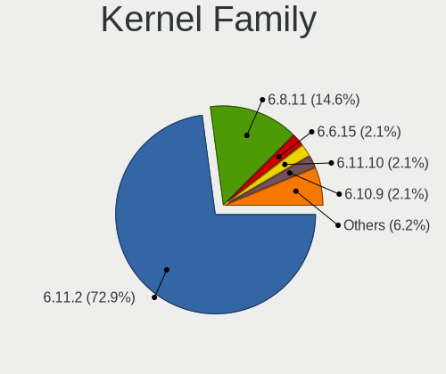

| Version | Computers | Percent |
|---------|-----------|---------|
| 6.0.0   | 50        | 87.72%  |
| 5.18.0  | 4         | 7.02%   |
| 5.10.0  | 2         | 3.51%   |
| 6.0.12  | 1         | 1.75%   |

Kernel Major Ver.
-----------------

Linux kernel major version

| Version | Computers | Percent |
|---------|-----------|---------|
| 6.0     | 51        | 89.47%  |
| 5.18    | 4         | 7.02%   |
| 5.10    | 2         | 3.51%   |

Arch
----

OS architecture (x86_64, i586, etc.)

| Name   | Computers | Percent |
|--------|-----------|---------|
| x86_64 | 57        | 100%    |

DE
--

Desktop Environment

| Name       | Computers | Percent |
|------------|-----------|---------|
| XFCE       | 30        | 52.63%  |
| GNOME      | 14        | 24.56%  |
| KDE5       | 10        | 17.54%  |
| X-Cinnamon | 1         | 1.75%   |
| MATE       | 1         | 1.75%   |
| Unknown    | 1         | 1.75%   |

Display Server
--------------

X11 or Wayland

| Name    | Computers | Percent |
|---------|-----------|---------|
| X11     | 51        | 89.47%  |
| Wayland | 3         | 5.26%   |
| Tty     | 2         | 3.51%   |
| Unknown | 1         | 1.75%   |

Display Manager
---------------

SDDM, LightDM, etc.

| Name    | Computers | Percent |
|---------|-----------|---------|
| LightDM | 25        | 43.86%  |
| Unknown | 15        | 26.32%  |
| GDM3    | 12        | 21.05%  |
| SDDM    | 5         | 8.77%   |

OS Lang
-------

Language

| Lang    | Computers | Percent |
|---------|-----------|---------|
| en_US   | 33        | 57.89%  |
| de_DE   | 4         | 7.02%   |
| ru_RU   | 3         | 5.26%   |
| pl_PL   | 3         | 5.26%   |
| es_ES   | 2         | 3.51%   |
| en_GB   | 2         | 3.51%   |
| pt_BR   | 1         | 1.75%   |
| it_IT   | 1         | 1.75%   |
| fr_FR   | 1         | 1.75%   |
| es_US   | 1         | 1.75%   |
| es_MX   | 1         | 1.75%   |
| es_CL   | 1         | 1.75%   |
| en_IN   | 1         | 1.75%   |
| en_AU   | 1         | 1.75%   |
| cs_CZ   | 1         | 1.75%   |
| Unknown | 1         | 1.75%   |

Boot Mode
---------

EFI or BIOS

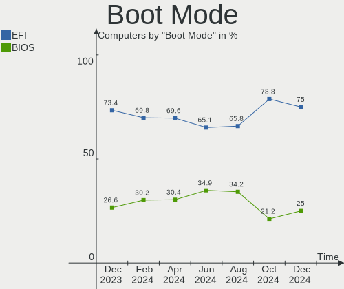

| Mode | Computers | Percent |
|------|-----------|---------|
| EFI  | 36        | 63.16%  |
| BIOS | 21        | 36.84%  |

Filesystem
----------

Type of filesystem

| Type    | Computers | Percent |
|---------|-----------|---------|
| Ext4    | 52        | 91.23%  |
| Overlay | 5         | 8.77%   |

Part. scheme
------------

Scheme of partitioning

| Type    | Computers | Percent |
|---------|-----------|---------|
| GPT     | 35        | 61.4%   |
| Unknown | 12        | 21.05%  |
| MBR     | 10        | 17.54%  |

Dual Boot with Linux/BSD
------------------------

Hosting more than one Linux/BSD

| Dual boot | Computers | Percent |
|-----------|-----------|---------|
| No        | 48        | 84.21%  |
| Yes       | 9         | 15.79%  |

Dual Boot (Win)
---------------

Hosting Linux and Windows

| Dual boot | Computers | Percent |
|-----------|-----------|---------|
| No        | 39        | 68.42%  |
| Yes       | 18        | 31.58%  |

Board
-----

Vendor
------

Motherboard manufacturer

| Name                | Computers | Percent |
|---------------------|-----------|---------|
| Hewlett-Packard     | 11        | 19.3%   |
| Lenovo              | 9         | 15.79%  |
| Dell                | 7         | 12.28%  |
| ASUSTek Computer    | 6         | 10.53%  |
| MSI                 | 5         | 8.77%   |
| Acer                | 5         | 8.77%   |
| Google              | 3         | 5.26%   |
| Apple               | 3         | 5.26%   |
| Microsoft           | 2         | 3.51%   |
| Sony                | 1         | 1.75%   |
| Semp Toshiba        | 1         | 1.75%   |
| HUAWEI              | 1         | 1.75%   |
| Gigabyte Technology | 1         | 1.75%   |
| Fujitsu             | 1         | 1.75%   |
| Chuwi               | 1         | 1.75%   |

Model
-----

Motherboard model

| Name                                   | Computers | Percent |
|----------------------------------------|-----------|---------|
| Sony VPCEH3J1E                         | 1         | 1.75%   |
| Semp Toshiba STI NA 1401               | 1         | 1.75%   |
| MSI MS-7D20                            | 1         | 1.75%   |
| MSI MS-7B48                            | 1         | 1.75%   |
| MSI Modern 14 B10MW                    | 1         | 1.75%   |
| MSI GP76 Leopard 10UE                  | 1         | 1.75%   |
| MSI GF75 Thin 10UE                     | 1         | 1.75%   |
| Microsoft Surface Pro 4                | 1         | 1.75%   |
| Microsoft Surface Go                   | 1         | 1.75%   |
| Lenovo Yoga 3 14 80JH                  | 1         | 1.75%   |
| Lenovo V14 G1 IML 82NA                 | 1         | 1.75%   |
| Lenovo ThinkPad T510 4384FF3           | 1         | 1.75%   |
| Lenovo ThinkPad SL 2743A65             | 1         | 1.75%   |
| Lenovo ThinkPad L13 Gen 3 21BAA01TCD   | 1         | 1.75%   |
| Lenovo ThinkPad E14 Gen 2 20TAS0U500   | 1         | 1.75%   |
| Lenovo Legion Y530-15ICH 81FV          | 1         | 1.75%   |
| Lenovo IdeaPad 3 15IML05 81WR          | 1         | 1.75%   |
| Lenovo 10MAA08BIA                      | 1         | 1.75%   |
| HUAWEI MateBook E                      | 1         | 1.75%   |
| HP ZBook Fury 15 G7 Mobile Workstation | 1         | 1.75%   |
| HP OMEN by Laptop 17-ck0xxx            | 1         | 1.75%   |
| HP OMEN by Laptop 15-dc0xxx            | 1         | 1.75%   |
| HP Notebook                            | 1         | 1.75%   |
| HP Mini 110-3100                       | 1         | 1.75%   |
| HP Laptop 15-dw1xxx                    | 1         | 1.75%   |
| HP ENVY x360 Convertible 15-cn1xxx     | 1         | 1.75%   |
| HP EliteBook 840 G1                    | 1         | 1.75%   |
| HP Compaq 6910p                        | 1         | 1.75%   |
| HP 630                                 | 1         | 1.75%   |
| HP 510-a013a                           | 1         | 1.75%   |
| Google Sparky360                       | 1         | 1.75%   |
| Google Robo360                         | 1         | 1.75%   |
| Google Eldrid                          | 1         | 1.75%   |
| Gigabyte B450 GAMING X                 | 1         | 1.75%   |
| Fujitsu ESPRIMO PH320                  | 1         | 1.75%   |
| Dell XPS 15 9570                       | 1         | 1.75%   |
| Dell XPS 15 9550                       | 1         | 1.75%   |
| Dell XPS 13 7390                       | 1         | 1.75%   |
| Dell Latitude E5430 non-vPro           | 1         | 1.75%   |
| Dell Inspiron 3580                     | 1         | 1.75%   |

Model Family
------------

Motherboard model prefix

| Name              | Computers | Percent |
|-------------------|-----------|---------|
| Lenovo ThinkPad   | 4         | 7.02%   |
| Dell XPS          | 3         | 5.26%   |
| Dell Inspiron     | 3         | 5.26%   |
| Microsoft Surface | 2         | 3.51%   |
| HP OMEN           | 2         | 3.51%   |
| ASUS ROG          | 2         | 3.51%   |
| Acer Aspire       | 2         | 3.51%   |
| Sony VPCEH3J1E    | 1         | 1.75%   |
| Semp Toshiba STI  | 1         | 1.75%   |
| MSI MS-7D20       | 1         | 1.75%   |
| MSI MS-7B48       | 1         | 1.75%   |
| MSI Modern        | 1         | 1.75%   |
| MSI GP76          | 1         | 1.75%   |
| MSI GF75          | 1         | 1.75%   |
| Lenovo Yoga       | 1         | 1.75%   |
| Lenovo V14        | 1         | 1.75%   |
| Lenovo Legion     | 1         | 1.75%   |
| Lenovo IdeaPad    | 1         | 1.75%   |
| Lenovo 10MAA08BIA | 1         | 1.75%   |
| HUAWEI MateBook   | 1         | 1.75%   |
| HP ZBook          | 1         | 1.75%   |
| HP Notebook       | 1         | 1.75%   |
| HP Mini           | 1         | 1.75%   |
| HP Laptop         | 1         | 1.75%   |
| HP ENVY           | 1         | 1.75%   |
| HP EliteBook      | 1         | 1.75%   |
| HP Compaq         | 1         | 1.75%   |
| HP 630            | 1         | 1.75%   |
| HP 510-a013a      | 1         | 1.75%   |
| Google Sparky360  | 1         | 1.75%   |
| Google Robo360    | 1         | 1.75%   |
| Google Eldrid     | 1         | 1.75%   |
| Gigabyte B450     | 1         | 1.75%   |
| Fujitsu ESPRIMO   | 1         | 1.75%   |
| Dell Latitude     | 1         | 1.75%   |
| Chuwi UBook       | 1         | 1.75%   |
| ASUS ZenBook      | 1         | 1.75%   |
| ASUS TUF          | 1         | 1.75%   |
| ASUS N550JV       | 1         | 1.75%   |
| ASUS All          | 1         | 1.75%   |

MFG Year
--------

Motherboard manufacture year

| Year | Computers | Percent |
|------|-----------|---------|
| 2021 | 10        | 17.54%  |
| 2020 | 8         | 14.04%  |
| 2019 | 6         | 10.53%  |
| 2018 | 6         | 10.53%  |
| 2015 | 5         | 8.77%   |
| 2022 | 4         | 7.02%   |
| 2012 | 4         | 7.02%   |
| 2017 | 3         | 5.26%   |
| 2013 | 3         | 5.26%   |
| 2010 | 2         | 3.51%   |
| 2016 | 1         | 1.75%   |
| 2014 | 1         | 1.75%   |
| 2011 | 1         | 1.75%   |
| 2009 | 1         | 1.75%   |
| 2008 | 1         | 1.75%   |
| 2007 | 1         | 1.75%   |

Form Factor
-----------

Physical design of the computer

| Name        | Computers | Percent |
|-------------|-----------|---------|
| Notebook    | 42        | 73.68%  |
| Desktop     | 10        | 17.54%  |
| Tablet      | 4         | 7.02%   |
| Convertible | 1         | 1.75%   |

Secure Boot
-----------

Enabled or disabled

| State    | Computers | Percent |
|----------|-----------|---------|
| Disabled | 57        | 100%    |

Coreboot
--------

Have coreboot on board

| Used | Computers | Percent |
|------|-----------|---------|
| No   | 54        | 94.74%  |
| Yes  | 3         | 5.26%   |

RAM Size
--------

Total RAM memory

| Size in GB | Computers | Percent |
|------------|-----------|---------|
| 4.01-8.0   | 18        | 31.58%  |
| 3.01-4.0   | 13        | 22.81%  |
| 16.01-24.0 | 13        | 22.81%  |
| 8.01-16.0  | 7         | 12.28%  |
| 32.01-64.0 | 5         | 8.77%   |
| 1.01-2.0   | 1         | 1.75%   |

RAM Used
--------

Used RAM memory

| Used GB   | Computers | Percent |
|-----------|-----------|---------|
| 2.01-3.0  | 22        | 38.6%   |
| 1.01-2.0  | 15        | 26.32%  |
| 4.01-8.0  | 9         | 15.79%  |
| 3.01-4.0  | 9         | 15.79%  |
| 8.01-16.0 | 1         | 1.75%   |
| 0.51-1.0  | 1         | 1.75%   |

Total Drives
------------

Number of drives on board

| Drives | Computers | Percent |
|--------|-----------|---------|
| 1      | 37        | 64.91%  |
| 2      | 10        | 17.54%  |
| 3      | 7         | 12.28%  |
| 6      | 1         | 1.75%   |
| 5      | 1         | 1.75%   |
| 0      | 1         | 1.75%   |

Has CD-ROM
----------

Has CD-ROM on board

| Presented | Computers | Percent |
|-----------|-----------|---------|
| No        | 43        | 75.44%  |
| Yes       | 14        | 24.56%  |

Has Ethernet
------------

Has Ethernet on board

| Presented | Computers | Percent |
|-----------|-----------|---------|
| Yes       | 41        | 71.93%  |
| No        | 16        | 28.07%  |

Has WiFi
--------

Has WiFi module

| Presented | Computers | Percent |
|-----------|-----------|---------|
| Yes       | 50        | 87.72%  |
| No        | 7         | 12.28%  |

Has Bluetooth
-------------

Has Bluetooth module

| Presented | Computers | Percent |
|-----------|-----------|---------|
| Yes       | 41        | 71.93%  |
| No        | 16        | 28.07%  |

Location
--------

Country
-------

Geographic location (country)

| Country      | Computers | Percent |
|--------------|-----------|---------|
| USA          | 7         | 12.28%  |
| Poland       | 5         | 8.77%   |
| Spain        | 4         | 7.02%   |
| Germany      | 4         | 7.02%   |
| UK           | 3         | 5.26%   |
| Russia       | 3         | 5.26%   |
| Mexico       | 3         | 5.26%   |
| Philippines  | 2         | 3.51%   |
| India        | 2         | 3.51%   |
| Bangladesh   | 2         | 3.51%   |
| Australia    | 2         | 3.51%   |
| Venezuela    | 1         | 1.75%   |
| Turkey       | 1         | 1.75%   |
| Switzerland  | 1         | 1.75%   |
| Sweden       | 1         | 1.75%   |
| Saudi Arabia | 1         | 1.75%   |
| Peru         | 1         | 1.75%   |
| Norway       | 1         | 1.75%   |
| Netherlands  | 1         | 1.75%   |
| Luxembourg   | 1         | 1.75%   |
| Kenya        | 1         | 1.75%   |
| Italy        | 1         | 1.75%   |
| Israel       | 1         | 1.75%   |
| Indonesia    | 1         | 1.75%   |
| France       | 1         | 1.75%   |
| Finland      | 1         | 1.75%   |
| Egypt        | 1         | 1.75%   |
| Ecuador      | 1         | 1.75%   |
| Czechia      | 1         | 1.75%   |
| Chile        | 1         | 1.75%   |
| Brazil       | 1         | 1.75%   |

City
----

Geographic location (city)

| City          | Computers | Percent |
|---------------|-----------|---------|
| Warsaw        | 2         | 3.51%   |
| Iloilo City   | 2         | 3.51%   |
| Zaragoza      | 1         | 1.75%   |
| Ypsilanti     | 1         | 1.75%   |
| Xalapa        | 1         | 1.75%   |
| West Plains   | 1         | 1.75%   |
| Valladolid    | 1         | 1.75%   |
| Trondheim     | 1         | 1.75%   |
| Tijuana       | 1         | 1.75%   |
| Sydney        | 1         | 1.75%   |
| Stockholm     | 1         | 1.75%   |
| St Petersburg | 1         | 1.75%   |
| Soest         | 1         | 1.75%   |
| Savar Upazila | 1         | 1.75%   |
| Sao Luís     | 1         | 1.75%   |
| San Fernando  | 1         | 1.75%   |
| Radom         | 1         | 1.75%   |
| Prague        | 1         | 1.75%   |
| Omsk          | 1         | 1.75%   |
| Netanya       | 1         | 1.75%   |
| Nairobi       | 1         | 1.75%   |
| Moscow        | 1         | 1.75%   |
| Milan         | 1         | 1.75%   |
| Middletown    | 1         | 1.75%   |
| Mexico City   | 1         | 1.75%   |
| Manchester    | 1         | 1.75%   |
| Luxembourg    | 1         | 1.75%   |
| Lugano        | 1         | 1.75%   |
| Lodz          | 1         | 1.75%   |
| Las Vegas     | 1         | 1.75%   |
| Katowice      | 1         | 1.75%   |
| Istanbul      | 1         | 1.75%   |
| Herten        | 1         | 1.75%   |
| Helsinki      | 1         | 1.75%   |
| Hanford       | 1         | 1.75%   |
| Guayaquil     | 1         | 1.75%   |
| Granada       | 1         | 1.75%   |
| Gambais       | 1         | 1.75%   |
| Essen         | 1         | 1.75%   |
| Edmonton      | 1         | 1.75%   |

Drives
------

Drive Vendor
------------

Hard drive vendors

| Vendor                      | Computers | Drives | Percent |
|-----------------------------|-----------|--------|---------|
| Samsung Electronics         | 17        | 20     | 20.73%  |
| Seagate                     | 12        | 12     | 14.63%  |
| Unknown                     | 9         | 10     | 10.98%  |
| Toshiba                     | 9         | 9      | 10.98%  |
| WDC                         | 8         | 10     | 9.76%   |
| Kingston                    | 7         | 7      | 8.54%   |
| SanDisk                     | 3         | 3      | 3.66%   |
| Apple                       | 3         | 3      | 3.66%   |
| Phison                      | 1         | 1      | 1.22%   |
| OCZ-VERTEX2                 | 1         | 1      | 1.22%   |
| Netac                       | 1         | 1      | 1.22%   |
| Micron Technology           | 1         | 1      | 1.22%   |
| MAXIO Technology (Hangzhou) | 1         | 1      | 1.22%   |
| JMicron Technology          | 1         | 1      | 1.22%   |
| HUAWEI                      | 1         | 1      | 1.22%   |
| HGST                        | 1         | 1      | 1.22%   |
| GOODRAM                     | 1         | 1      | 1.22%   |
| Crucial                     | 1         | 1      | 1.22%   |
| China                       | 1         | 1      | 1.22%   |
| ASMT                        | 1         | 1      | 1.22%   |
| Acer SSD                    | 1         | 1      | 1.22%   |
| A-DATA Technology           | 1         | 1      | 1.22%   |

Drive Model
-----------

Hard drive models

| Model                                          | Computers | Percent |
|------------------------------------------------|-----------|---------|
| Seagate Expansion 240GB                        | 3         | 3.41%   |
| Unknown SD/MMC/MS PRO 2GB                      | 2         | 2.27%   |
| Toshiba MQ01ABF050 500GB                       | 2         | 2.27%   |
| Seagate ST500LM012 HN-M500MBB 500GB            | 2         | 2.27%   |
| Seagate ST1000DM003-1SB102 1TB                 | 2         | 2.27%   |
| WDC WDS500G2B0A 500GB SSD                      | 1         | 1.14%   |
| WDC WDS240G2G0C-00AJM0 240GB                   | 1         | 1.14%   |
| WDC WDS240G2G0A-00JH30 240GB SSD               | 1         | 1.14%   |
| WDC WDS100T2B0A-00SM50 1TB SSD                 | 1         | 1.14%   |
| WDC WD5000BPVT-22HXZT3 500GB                   | 1         | 1.14%   |
| WDC WD40EFAX-68JH4N0 4TB                       | 1         | 1.14%   |
| WDC WD10JPVX-22JC3T0 1TB                       | 1         | 1.14%   |
| WDC WD10EZEX-60WN4A0 1TB                       | 1         | 1.14%   |
| WDC PC SN530 SDBPNPZ-256G-1032 256GB           | 1         | 1.14%   |
| WDC PC SN520 SDAPNUW-256G-1002 256GB           | 1         | 1.14%   |
| Unknown SU16G  16GB                            | 1         | 1.14%   |
| Unknown SD/MMC 2GB                             | 1         | 1.14%   |
| Unknown MMC Card  8GB                          | 1         | 1.14%   |
| Unknown MMC Card  128GB                        | 1         | 1.14%   |
| Unknown M.S./M.S.Pro/HG 16GB                   | 1         | 1.14%   |
| Unknown HBG4a2  32GB                           | 1         | 1.14%   |
| Unknown DA4032  32GB                           | 1         | 1.14%   |
| Unknown 00000  16GB                            | 1         | 1.14%   |
| Toshiba MQ01ABF032 320GB                       | 1         | 1.14%   |
| Toshiba MQ01ABD050 500GB                       | 1         | 1.14%   |
| Toshiba KXG50ZNV256G 256GB                     | 1         | 1.14%   |
| Toshiba KXG50ZNV1T02 NVMe 1024GB               | 1         | 1.14%   |
| Toshiba KBG30ZPZ128G 128GB                     | 1         | 1.14%   |
| Toshiba HDWR160 6TB                            | 1         | 1.14%   |
| Toshiba HDWJ110 1TB                            | 1         | 1.14%   |
| Seagate ST320LT007-9ZV142 320GB                | 1         | 1.14%   |
| Seagate ST1000LM049-2GH172 1TB                 | 1         | 1.14%   |
| Seagate ST1000LM048-2E7172 1TB                 | 1         | 1.14%   |
| Seagate ST1000LM035-1RK172 1TB                 | 1         | 1.14%   |
| Seagate ST1000DM003-1CH162 1TB                 | 1         | 1.14%   |
| Sandisk WD Black SN750 / PC SN730 NVMe SSD 1TB | 1         | 1.14%   |
| SanDisk SD8SN8U128G1027 128GB SSD              | 1         | 1.14%   |
| SanDisk NVMe SSD Drive 512GB                   | 1         | 1.14%   |
| Samsung SSD 980 500GB                          | 1         | 1.14%   |
| Samsung SSD 980 1TB                            | 1         | 1.14%   |

HDD Vendor
----------

Hard disk drive vendors

| Vendor              | Computers | Drives | Percent |
|---------------------|-----------|--------|---------|
| Seagate             | 12        | 12     | 44.44%  |
| Toshiba             | 6         | 6      | 22.22%  |
| WDC                 | 4         | 4      | 14.81%  |
| Unknown             | 2         | 2      | 7.41%   |
| Samsung Electronics | 1         | 2      | 3.7%    |
| HGST                | 1         | 1      | 3.7%    |
| ASMT                | 1         | 1      | 3.7%    |

SSD Vendor
----------

Solid state drive vendors

| Vendor              | Computers | Drives | Percent |
|---------------------|-----------|--------|---------|
| Samsung Electronics | 7         | 7      | 35%     |
| WDC                 | 3         | 3      | 15%     |
| Kingston            | 2         | 2      | 10%     |
| SanDisk             | 1         | 1      | 5%      |
| OCZ-VERTEX2         | 1         | 1      | 5%      |
| Netac               | 1         | 1      | 5%      |
| GOODRAM             | 1         | 1      | 5%      |
| Crucial             | 1         | 1      | 5%      |
| China               | 1         | 1      | 5%      |
| Apple               | 1         | 1      | 5%      |
| A-DATA Technology   | 1         | 1      | 5%      |

Drive Kind
----------

HDD or SSD

| Kind    | Computers | Drives | Percent |
|---------|-----------|--------|---------|
| NVMe    | 27        | 29     | 34.62%  |
| HDD     | 23        | 28     | 29.49%  |
| SSD     | 18        | 20     | 23.08%  |
| MMC     | 6         | 6      | 7.69%   |
| Unknown | 4         | 5      | 5.13%   |

Drive Connector
---------------

SATA, SAS, NVMe, etc.

| Type | Computers | Drives | Percent |
|------|-----------|--------|---------|
| SATA | 31        | 39     | 41.33%  |
| NVMe | 27        | 29     | 36%     |
| SAS  | 11        | 14     | 14.67%  |
| MMC  | 6         | 6      | 8%      |

Drive Size
----------

Size of hard drive

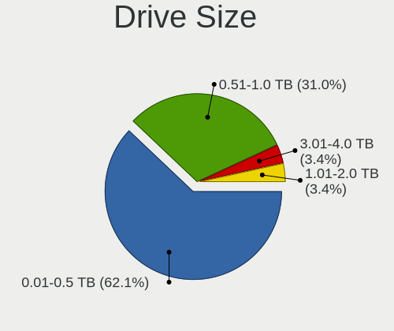

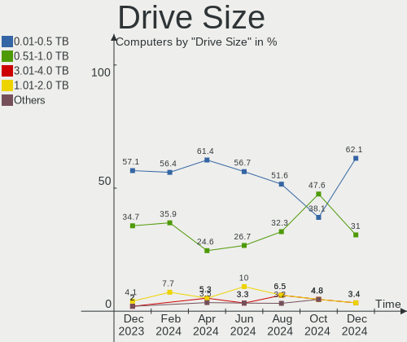

| Size in TB | Computers | Drives | Percent |
|------------|-----------|--------|---------|
| 0.01-0.5   | 26        | 31     | 60.47%  |
| 0.51-1.0   | 14        | 14     | 32.56%  |
| 3.01-4.0   | 1         | 1      | 2.33%   |
| 1.01-2.0   | 1         | 1      | 2.33%   |
| 4.01-10.0  | 1         | 1      | 2.33%   |

Space Total
-----------

Amount of disk space available on the file system

| Size in GB     | Computers | Percent |
|----------------|-----------|---------|
| 101-250        | 21        | 36.84%  |
| 251-500        | 11        | 19.3%   |
| 501-1000       | 11        | 19.3%   |
| 21-50          | 7         | 12.28%  |
| More than 3000 | 2         | 3.51%   |
| 1-20           | 2         | 3.51%   |
| 51-100         | 2         | 3.51%   |
| Unknown        | 1         | 1.75%   |

Space Used
----------

Amount of used disk space

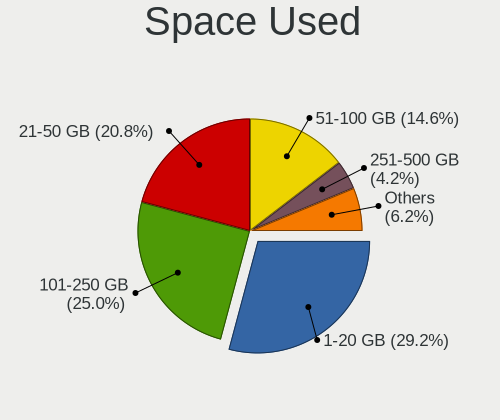

| Used GB        | Computers | Percent |
|----------------|-----------|---------|
| 1-20           | 18        | 31.58%  |
| 21-50          | 16        | 28.07%  |
| 51-100         | 11        | 19.3%   |
| 251-500        | 4         | 7.02%   |
| 101-250        | 4         | 7.02%   |
| More than 3000 | 2         | 3.51%   |
| 501-1000       | 1         | 1.75%   |
| Unknown        | 1         | 1.75%   |

Malfunc. Drives
---------------

Drive models with a malfunction

| Model                               | Computers | Drives | Percent |
|-------------------------------------|-----------|--------|---------|
| Seagate ST500LM012 HN-M500MBB 500GB | 1         | 1      | 50%     |
| Seagate ST1000LM049-2GH172 1TB      | 1         | 1      | 50%     |

Malfunc. Drive Vendor
---------------------

Vendors of faulty drives

| Vendor  | Computers | Drives | Percent |
|---------|-----------|--------|---------|
| Seagate | 2         | 2      | 100%    |

Malfunc. HDD Vendor
-------------------

Vendors of faulty HDD drives

| Vendor  | Computers | Drives | Percent |
|---------|-----------|--------|---------|
| Seagate | 2         | 2      | 100%    |

Malfunc. Drive Kind
-------------------

Kinds of faulty drives

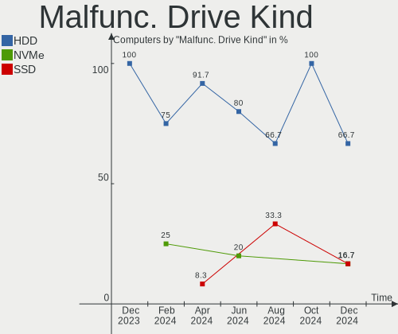

| Kind | Computers | Drives | Percent |
|------|-----------|--------|---------|
| HDD  | 2         | 2      | 100%    |

Failed Drives
-------------

Failed drive models

Zero info for selected period =(

Failed Drive Vendor
-------------------

Failed drive vendors

Zero info for selected period =(

Drive Status
------------

Number of failed and malfunc. drives

| Status   | Computers | Drives | Percent |
|----------|-----------|--------|---------|
| Works    | 36        | 45     | 56.25%  |
| Detected | 26        | 41     | 40.63%  |
| Malfunc  | 2         | 2      | 3.13%   |

Storage controller
------------------

Storage Vendor
--------------

Storage controller vendors

| Vendor                       | Computers | Percent |
|------------------------------|-----------|---------|
| Intel                        | 38        | 54.29%  |
| Samsung Electronics          | 11        | 15.71%  |
| Sandisk                      | 5         | 7.14%   |
| Kingston Technology Company  | 5         | 7.14%   |
| AMD                          | 4         | 5.71%   |
| Toshiba America Info Systems | 3         | 4.29%   |
| Apple                        | 2         | 2.86%   |
| Micron Technology            | 1         | 1.43%   |
| MAXIO Technology (Hangzhou)  | 1         | 1.43%   |

Storage Model
-------------

Storage controller models

| Model                                                                            | Computers | Percent |
|----------------------------------------------------------------------------------|-----------|---------|
| Intel 82801 Mobile SATA Controller [RAID mode]                                   | 6         | 8%      |
| Samsung NVMe SSD Controller 980                                                  | 5         | 6.67%   |
| Samsung NVMe SSD Controller SM981/PM981/PM983                                    | 4         | 5.33%   |
| Kingston Company Company Non-Volatile memory controller                          | 4         | 5.33%   |
| Intel 8 Series/C220 Series Chipset Family 6-port SATA Controller 1 [AHCI mode]   | 3         | 4%      |
| Intel 200 Series PCH SATA controller [AHCI mode]                                 | 3         | 4%      |
| Toshiba America Info Systems XG5 NVMe SSD Controller                             | 2         | 2.67%   |
| SanDisk Non-Volatile memory controller                                           | 2         | 2.67%   |
| Intel Wildcat Point-LP SATA Controller [AHCI Mode]                               | 2         | 2.67%   |
| Intel Volume Management Device NVMe RAID Controller                              | 2         | 2.67%   |
| Intel Comet Lake SATA AHCI Controller                                            | 2         | 2.67%   |
| Intel Cannon Lake Mobile PCH SATA AHCI Controller                                | 2         | 2.67%   |
| Intel Atom/Celeron/Pentium Processor x5-E8000/J3xxx/N3xxx Series SATA Controller | 2         | 2.67%   |
| Intel 6 Series/C200 Series Chipset Family 6 port Mobile SATA AHCI Controller     | 2         | 2.67%   |
| Intel 500 Series Chipset Family SATA AHCI Controller                             | 2         | 2.67%   |
| Apple ANS2 NVMe Controller                                                       | 2         | 2.67%   |
| AMD FCH SATA Controller [AHCI mode]                                              | 2         | 2.67%   |
| Toshiba America Info Systems BG3 NVMe SSD Controller                             | 1         | 1.33%   |
| SanDisk WD Blue SN550 NVMe SSD                                                   | 1         | 1.33%   |
| SanDisk WD Blue SN500 / PC SN520 NVMe SSD                                        | 1         | 1.33%   |
| SanDisk WD Black SN750 / PC SN730 NVMe SSD                                       | 1         | 1.33%   |
| Samsung NVMe SSD Controller SM951/PM951                                          | 1         | 1.33%   |
| Samsung NVMe SSD Controller PM9A1/PM9A3/980PRO                                   | 1         | 1.33%   |
| Samsung Electronics SATA controller                                              | 1         | 1.33%   |
| Micron Non-Volatile memory controller                                            | 1         | 1.33%   |
| MAXIO (Hangzhou) NVMe SSD Controller MAP1202                                     | 1         | 1.33%   |
| Kingston Company OM3PDP3 NVMe SSD                                                | 1         | 1.33%   |
| Intel Sunrise Point-LP SATA Controller [AHCI mode]                               | 1         | 1.33%   |
| Intel NM10/ICH7 Family SATA Controller [AHCI mode]                               | 1         | 1.33%   |
| Intel HM170/QM170 Chipset SATA Controller [AHCI Mode]                            | 1         | 1.33%   |
| Intel Celeron/Pentium Silver Processor SATA Controller                           | 1         | 1.33%   |
| Intel Celeron N3350/Pentium N4200/Atom E3900 Series SATA AHCI Controller         | 1         | 1.33%   |
| Intel Cannon Lake PCH SATA AHCI Controller                                       | 1         | 1.33%   |
| Intel 82801IBM/IEM (ICH9M/ICH9M-E) 4 port SATA Controller [AHCI mode]            | 1         | 1.33%   |
| Intel 82801HM/HEM (ICH8M/ICH8M-E) SATA Controller [AHCI mode]                    | 1         | 1.33%   |
| Intel 8 Series SATA Controller 1 [AHCI mode]                                     | 1         | 1.33%   |
| Intel 7 Series Chipset Family 6-port SATA Controller [AHCI mode]                 | 1         | 1.33%   |
| Intel 5 Series/3400 Series Chipset 4 port SATA IDE Controller                    | 1         | 1.33%   |
| Intel 5 Series/3400 Series Chipset 4 port SATA AHCI Controller                   | 1         | 1.33%   |
| Intel 5 Series/3400 Series Chipset 2 port SATA IDE Controller                    | 1         | 1.33%   |

Storage Kind
------------

Kind of storage controller (IDE, SATA, NVMe, SAS, ...)

| Kind | Computers | Percent |
|------|-----------|---------|
| SATA | 35        | 49.3%   |
| NVMe | 27        | 38.03%  |
| RAID | 8         | 11.27%  |
| IDE  | 1         | 1.41%   |

Processor
---------

CPU Vendor
----------

Processor vendors

| Vendor | Computers | Percent |
|--------|-----------|---------|
| Intel  | 52        | 91.23%  |
| AMD    | 5         | 8.77%   |

CPU Model
---------

Processor models

| Model                                | Computers | Percent |
|--------------------------------------|-----------|---------|
| Intel Core i5-8265U CPU @ 1.60GHz    | 3         | 5.26%   |
| Intel Core i7-8750H CPU @ 2.20GHz    | 2         | 3.51%   |
| Intel Core i7-6700HQ CPU @ 2.60GHz   | 2         | 3.51%   |
| Intel Core i5-10210U CPU @ 1.60GHz   | 2         | 3.51%   |
| Intel Core i3-10110U CPU @ 2.10GHz   | 2         | 3.51%   |
| Intel Pentium CPU N3710 @ 1.60GHz    | 1         | 1.75%   |
| Intel Pentium CPU G4560 @ 3.50GHz    | 1         | 1.75%   |
| Intel Pentium CPU 4415Y @ 1.60GHz    | 1         | 1.75%   |
| Intel Core m3-7Y30 CPU @ 1.00GHz     | 1         | 1.75%   |
| Intel Core i9-8950HK CPU @ 2.90GHz   | 1         | 1.75%   |
| Intel Core i9-10885H CPU @ 2.40GHz   | 1         | 1.75%   |
| Intel Core i7-8569U CPU @ 2.80GHz    | 1         | 1.75%   |
| Intel Core i7-5500U CPU @ 2.40GHz    | 1         | 1.75%   |
| Intel Core i7-4770 CPU @ 3.40GHz     | 1         | 1.75%   |
| Intel Core i7-4700HQ CPU @ 2.40GHz   | 1         | 1.75%   |
| Intel Core i7-10870H CPU @ 2.20GHz   | 1         | 1.75%   |
| Intel Core i7-10750H CPU @ 2.60GHz   | 1         | 1.75%   |
| Intel Core i7-10510U CPU @ 1.80GHz   | 1         | 1.75%   |
| Intel Core i5-8400 CPU @ 2.80GHz     | 1         | 1.75%   |
| Intel Core i5-6300U CPU @ 2.40GHz    | 1         | 1.75%   |
| Intel Core i5-5350U CPU @ 1.80GHz    | 1         | 1.75%   |
| Intel Core i5-5200U CPU @ 2.20GHz    | 1         | 1.75%   |
| Intel Core i5-4590 CPU @ 3.30GHz     | 1         | 1.75%   |
| Intel Core i5-4300U CPU @ 1.90GHz    | 1         | 1.75%   |
| Intel Core i5-3320M CPU @ 2.60GHz    | 1         | 1.75%   |
| Intel Core i5-1038NG7 CPU @ 2.00GHz  | 1         | 1.75%   |
| Intel Core i5 CPU M 560 @ 2.67GHz    | 1         | 1.75%   |
| Intel Core i3-9100F CPU @ 3.60GHz    | 1         | 1.75%   |
| Intel Core i3-9100 CPU @ 3.60GHz     | 1         | 1.75%   |
| Intel Core i3-2350M CPU @ 2.30GHz    | 1         | 1.75%   |
| Intel Core i3-2310M CPU @ 2.10GHz    | 1         | 1.75%   |
| Intel Core i3 CPU M 380 @ 2.53GHz    | 1         | 1.75%   |
| Intel Core 2 Duo CPU T7300 @ 2.00GHz | 1         | 1.75%   |
| Intel Core 2 Duo CPU T6570 @ 2.10GHz | 1         | 1.75%   |
| Intel Celeron N4120 CPU @ 1.10GHz    | 1         | 1.75%   |
| Intel Celeron N4020 CPU @ 1.10GHz    | 1         | 1.75%   |
| Intel Celeron CPU N3450 @ 1.10GHz    | 1         | 1.75%   |
| Intel Celeron CPU N3350 @ 1.10GHz    | 1         | 1.75%   |
| Intel Celeron CPU J3060 @ 1.60GHz    | 1         | 1.75%   |
| Intel Celeron CPU 1017U @ 1.60GHz    | 1         | 1.75%   |

CPU Model Family
----------------

Processor model prefix

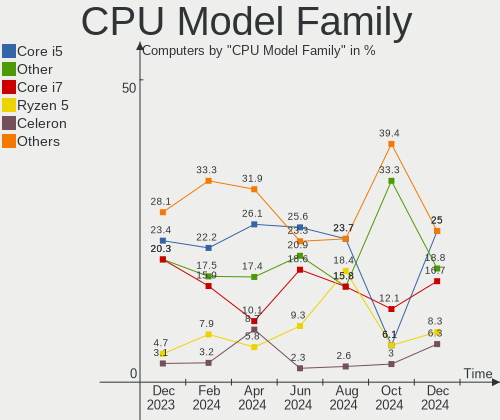

| Model            | Computers | Percent |
|------------------|-----------|---------|
| Intel Core i5    | 14        | 24.56%  |
| Intel Core i7    | 11        | 19.3%   |
| Intel Core i3    | 7         | 12.28%  |
| Intel Celeron    | 6         | 10.53%  |
| Other            | 5         | 8.77%   |
| Intel Pentium    | 3         | 5.26%   |
| Intel Core i9    | 2         | 3.51%   |
| Intel Core 2 Duo | 2         | 3.51%   |
| Intel Core m3    | 1         | 1.75%   |
| Intel Atom       | 1         | 1.75%   |
| AMD Ryzen 5 PRO  | 1         | 1.75%   |
| AMD Ryzen 5      | 1         | 1.75%   |
| AMD Ryzen 3      | 1         | 1.75%   |
| AMD E1           | 1         | 1.75%   |
| AMD C-70         | 1         | 1.75%   |

CPU Cores
---------

Number of processor cores

| Number | Computers | Percent |
|--------|-----------|---------|
| 2      | 23        | 40.35%  |
| 4      | 20        | 35.09%  |
| 6      | 9         | 15.79%  |
| 8      | 3         | 5.26%   |
| 1      | 2         | 3.51%   |

CPU Sockets
-----------

Number of sockets

| Number | Computers | Percent |
|--------|-----------|---------|
| 1      | 57        | 100%    |

CPU Threads
-----------

Threads per core (Hyper-Threading)

| Number | Computers | Percent |
|--------|-----------|---------|
| 2      | 40        | 70.18%  |
| 1      | 17        | 29.82%  |

CPU Op-Modes
------------

CPU Operation Modes (32-bit, 64-bit)

| Op mode        | Computers | Percent |
|----------------|-----------|---------|
| 32-bit, 64-bit | 57        | 100%    |

CPU Microcode
-------------

Microcode number

| Number     | Computers | Percent |
|------------|-----------|---------|
| 0x806ec    | 5         | 8.77%   |
| 0x906ea    | 4         | 7.02%   |
| 0x306d4    | 3         | 5.26%   |
| 0x306c3    | 3         | 5.26%   |
| Unknown    | 3         | 5.26%   |
| 0xa0652    | 2         | 3.51%   |
| 0x906eb    | 2         | 3.51%   |
| 0x806eb    | 2         | 3.51%   |
| 0x806e9    | 2         | 3.51%   |
| 0x806d1    | 2         | 3.51%   |
| 0x806c1    | 2         | 3.51%   |
| 0x706a8    | 2         | 3.51%   |
| 0x506e3    | 2         | 3.51%   |
| 0x506c9    | 2         | 3.51%   |
| 0x406c4    | 2         | 3.51%   |
| 0x306a9    | 2         | 3.51%   |
| 0x206a7    | 2         | 3.51%   |
| 0x20655    | 2         | 3.51%   |
| 0x0a50000d | 2         | 3.51%   |
| 0xa0671    | 1         | 1.75%   |
| 0x906e9    | 1         | 1.75%   |
| 0x806ea    | 1         | 1.75%   |
| 0x706e5    | 1         | 1.75%   |
| 0x6fa      | 1         | 1.75%   |
| 0x406e3    | 1         | 1.75%   |
| 0x40651    | 1         | 1.75%   |
| 0x106ca    | 1         | 1.75%   |
| 0x1067a    | 1         | 1.75%   |
| 0x0800820d | 1         | 1.75%   |
| 0x05000119 | 1         | 1.75%   |

CPU Microarch
-------------

Microarchitecture

| Name          | Computers | Percent |
|---------------|-----------|---------|
| KabyLake      | 18        | 31.58%  |
| Haswell       | 4         | 7.02%   |
| Skylake       | 3         | 5.26%   |
| Icelake       | 3         | 5.26%   |
| CometLake     | 3         | 5.26%   |
| Broadwell     | 3         | 5.26%   |
| Zen 3         | 2         | 3.51%   |
| Westmere      | 2         | 3.51%   |
| TigerLake     | 2         | 3.51%   |
| Silvermont    | 2         | 3.51%   |
| SandyBridge   | 2         | 3.51%   |
| IvyBridge     | 2         | 3.51%   |
| Goldmont plus | 2         | 3.51%   |
| Goldmont      | 2         | 3.51%   |
| Zen+          | 1         | 1.75%   |
| Puma          | 1         | 1.75%   |
| Penryn        | 1         | 1.75%   |
| Core          | 1         | 1.75%   |
| Bonnell       | 1         | 1.75%   |
| Bobcat        | 1         | 1.75%   |
| Unknown       | 1         | 1.75%   |

Graphics
--------

GPU Vendor
----------

Vendors of graphics cards

| Vendor | Computers | Percent |
|--------|-----------|---------|
| Intel  | 47        | 67.14%  |
| Nvidia | 18        | 25.71%  |
| AMD    | 5         | 7.14%   |

GPU Model
---------

Graphics card models

| Model                                                                                    | Computers | Percent |
|------------------------------------------------------------------------------------------|-----------|---------|
| Intel CometLake-U GT2 [UHD Graphics]                                                     | 5         | 7.04%   |
| Nvidia GP107M [GeForce GTX 1050 Ti Mobile]                                               | 3         | 4.23%   |
| Nvidia GA106M [GeForce RTX 3060 Mobile / Max-Q]                                          | 3         | 4.23%   |
| Intel WhiskeyLake-U GT2 [UHD Graphics 620]                                               | 3         | 4.23%   |
| Intel CometLake-H GT2 [UHD Graphics]                                                     | 3         | 4.23%   |
| Intel CoffeeLake-H GT2 [UHD Graphics 630]                                                | 3         | 4.23%   |
| Intel TigerLake-H GT1 [UHD Graphics]                                                     | 2         | 2.82%   |
| Intel HD Graphics 615                                                                    | 2         | 2.82%   |
| Intel HD Graphics 5500                                                                   | 2         | 2.82%   |
| Intel HD Graphics 530                                                                    | 2         | 2.82%   |
| Intel HD Graphics 500                                                                    | 2         | 2.82%   |
| Intel GeminiLake [UHD Graphics 600]                                                      | 2         | 2.82%   |
| Intel Core Processor Integrated Graphics Controller                                      | 2         | 2.82%   |
| Intel Atom/Celeron/Pentium Processor x5-E8000/J3xxx/N3xxx Integrated Graphics Controller | 2         | 2.82%   |
| Intel 3rd Gen Core processor Graphics Controller                                         | 2         | 2.82%   |
| Nvidia TU117M [GeForce MX450]                                                            | 1         | 1.41%   |
| Nvidia TU117M [GeForce GTX 1650 Mobile / Max-Q]                                          | 1         | 1.41%   |
| Nvidia TU116 [GeForce GTX 1650 SUPER]                                                    | 1         | 1.41%   |
| Nvidia GP107 [GeForce GTX 1050 Ti]                                                       | 1         | 1.41%   |
| Nvidia GM204M [GeForce GTX 970M]                                                         | 1         | 1.41%   |
| Nvidia GM107M [GeForce GTX 960M]                                                         | 1         | 1.41%   |
| Nvidia GM107 [GeForce GTX 750]                                                           | 1         | 1.41%   |
| Nvidia GK107M [GeForce GT 750M]                                                          | 1         | 1.41%   |
| Nvidia GK107 [GeForce GT 630 OEM]                                                        | 1         | 1.41%   |
| Nvidia GF119M [GeForce 410M]                                                             | 1         | 1.41%   |
| Nvidia GF119 [GeForce GT 610]                                                            | 1         | 1.41%   |
| Nvidia GA106 [Geforce RTX 3050]                                                          | 1         | 1.41%   |
| Intel TigerLake-LP GT2 [Iris Xe Graphics]                                                | 1         | 1.41%   |
| Intel Tiger Lake-LP GT2 [UHD Graphics G4]                                                | 1         | 1.41%   |
| Intel Skylake GT2 [HD Graphics 520]                                                      | 1         | 1.41%   |
| Intel RocketLake-S GT1 [UHD Graphics 730]                                                | 1         | 1.41%   |
| Intel Mobile GM965/GL960 Integrated Graphics Controller (secondary)                      | 1         | 1.41%   |
| Intel Mobile GM965/GL960 Integrated Graphics Controller (primary)                        | 1         | 1.41%   |
| Intel Mobile 4 Series Chipset Integrated Graphics Controller                             | 1         | 1.41%   |
| Intel Iris Plus Graphics G7                                                              | 1         | 1.41%   |
| Intel HD Graphics 610                                                                    | 1         | 1.41%   |
| Intel HD Graphics 6000                                                                   | 1         | 1.41%   |
| Intel Haswell-ULT Integrated Graphics Controller                                         | 1         | 1.41%   |
| Intel CoffeeLake-U GT3e [Iris Plus Graphics 655]                                         | 1         | 1.41%   |
| Intel CoffeeLake-S GT2 [UHD Graphics 630]                                                | 1         | 1.41%   |

GPU Combo
---------

Combinations of graphics cards

| Name           | Computers | Percent |
|----------------|-----------|---------|
| 1 x Intel      | 32        | 56.14%  |
| Intel + Nvidia | 12        | 21.05%  |
| 1 x Nvidia     | 6         | 10.53%  |
| 1 x AMD        | 4         | 7.02%   |
| 2 x Intel      | 2         | 3.51%   |
| Intel + AMD    | 1         | 1.75%   |

GPU Driver
----------

Free vs proprietary

| Driver      | Computers | Percent |
|-------------|-----------|---------|
| Free        | 50        | 87.72%  |
| Proprietary | 7         | 12.28%  |

GPU Memory
----------

Total video memory

| Size in GB | Computers | Percent |
|------------|-----------|---------|
| Unknown    | 39        | 68.42%  |
| 3.01-4.0   | 6         | 10.53%  |
| 1.01-2.0   | 3         | 5.26%   |
| 0.51-1.0   | 3         | 5.26%   |
| 7.01-8.0   | 2         | 3.51%   |
| 5.01-6.0   | 2         | 3.51%   |
| 2.01-3.0   | 1         | 1.75%   |
| 0.01-0.5   | 1         | 1.75%   |

Monitor
-------

Monitor Vendor
--------------

Monitor vendors

| Vendor                  | Computers | Percent |
|-------------------------|-----------|---------|
| BOE                     | 10        | 14.49%  |
| Samsung Electronics     | 9         | 13.04%  |
| AU Optronics            | 9         | 13.04%  |
| LG Display              | 6         | 8.7%    |
| Chimei Innolux          | 6         | 8.7%    |
| Sharp                   | 4         | 5.8%    |
| Hewlett-Packard         | 3         | 4.35%   |
| Goldstar                | 3         | 4.35%   |
| Apple                   | 3         | 4.35%   |
| Lenovo                  | 2         | 2.9%    |
| InfoVision              | 2         | 2.9%    |
| Acer                    | 2         | 2.9%    |
| WST                     | 1         | 1.45%   |
| ViewSonic               | 1         | 1.45%   |
| Unknown                 | 1         | 1.45%   |
| LG Electronics          | 1         | 1.45%   |
| HKC                     | 1         | 1.45%   |
| Hitachi                 | 1         | 1.45%   |
| Dell                    | 1         | 1.45%   |
| Chi Mei Optoelectronics | 1         | 1.45%   |
| BenQ                    | 1         | 1.45%   |
| AOC                     | 1         | 1.45%   |

Monitor Model
-------------

Monitor models

| Model                                                                   | Computers | Percent |
|-------------------------------------------------------------------------|-----------|---------|
| WST LCD Monitor WST2216 2160x1440 254x169mm 12.0-inch                   | 1         | 1.39%   |
| ViewSonic XG2405 VSC0D39 1920x1080 527x296mm 23.8-inch                  | 1         | 1.39%   |
| Unknown LCD Monitor XXX AAA 1920x1080                                   | 1         | 1.39%   |
| Sharp LQ100P1JX51 SHP14A6 1800x1200 211x141mm 10.0-inch                 | 1         | 1.39%   |
| Sharp LCD Monitor SHP149A 1920x1080 344x194mm 15.5-inch                 | 1         | 1.39%   |
| Sharp LCD Monitor SHP143E 3840x2160 346x194mm 15.6-inch                 | 1         | 1.39%   |
| Sharp HDMI SHP10A1 1360x768 700x390mm 31.5-inch                         | 1         | 1.39%   |
| Samsung Electronics U32J59x SAM0F34 3840x2160 697x392mm 31.5-inch       | 1         | 1.39%   |
| Samsung Electronics U28E590 SAM0C4D 3840x2160 607x345mm 27.5-inch       | 1         | 1.39%   |
| Samsung Electronics SyncMaster SAM03F1 1680x1050                        | 1         | 1.39%   |
| Samsung Electronics SA300/SA350 SAM07D2 1920x1080 477x268mm 21.5-inch   | 1         | 1.39%   |
| Samsung Electronics S24E450 SAM0C80 1920x1080 520x290mm 23.4-inch       | 1         | 1.39%   |
| Samsung Electronics S22D300 SAM0B3F 1920x1080 477x268mm 21.5-inch       | 1         | 1.39%   |
| Samsung Electronics LCD Monitor SEC544B 1600x900 310x174mm 14.0-inch    | 1         | 1.39%   |
| Samsung Electronics LCD Monitor SEC325A 1366x768 344x194mm 15.5-inch    | 1         | 1.39%   |
| Samsung Electronics LCD Monitor SDC3853 2736x1824 260x173mm 12.3-inch   | 1         | 1.39%   |
| Samsung Electronics LCD Monitor SAM720D 3840x2160 1872x1053mm 84.6-inch | 1         | 1.39%   |
| Samsung Electronics LCD Monitor SAM0A7A 1920x1080 1060x626mm 48.5-inch  | 1         | 1.39%   |
| Samsung Electronics CF791 SAM0DC8 3440x1440 797x333mm 34.0-inch         | 1         | 1.39%   |
| LG Electronics LCD Monitor W2240 1920x1080                              | 1         | 1.39%   |
| LG Display LCD Monitor LGD069D 3840x2160 344x194mm 15.5-inch            | 1         | 1.39%   |
| LG Display LCD Monitor LGD05C0 1920x1080 344x194mm 15.5-inch            | 1         | 1.39%   |
| LG Display LCD Monitor LGD0527 1366x768 309x174mm 14.0-inch             | 1         | 1.39%   |
| LG Display LCD Monitor LGD04D5 1920x1080 344x194mm 15.5-inch            | 1         | 1.39%   |
| LG Display LCD Monitor LGD03AB 1366x768 344x194mm 15.5-inch             | 1         | 1.39%   |
| LG Display LCD Monitor LGD0323 1920x1080 345x194mm 15.6-inch            | 1         | 1.39%   |
| Lenovo LCD Monitor LEN40B0 1366x768 344x194mm 15.5-inch                 | 1         | 1.39%   |
| Lenovo LCD Monitor LEN4031 1280x800 303x190mm 14.1-inch                 | 1         | 1.39%   |
| InfoVision LCD Monitor IVO854A 1920x1200 286x179mm 13.3-inch            | 1         | 1.39%   |
| InfoVision LCD Monitor IVO03F4 1024x600 223x125mm 10.1-inch             | 1         | 1.39%   |
| HKC LCD Monitor HKC36BF 1366x768 309x174mm 14.0-inch                    | 1         | 1.39%   |
| Hitachi HISENSE HEC002F 3840x2160 1872x1053mm 84.6-inch                 | 1         | 1.39%   |
| Hewlett-Packard w15e HWP280A 1280x720 332x187mm 15.0-inch               | 1         | 1.39%   |
| Hewlett-Packard E243m HPN3467 1920x1080 527x296mm 23.8-inch             | 1         | 1.39%   |
| Hewlett-Packard 2711 HWP2940 1920x1080 598x337mm 27.0-inch              | 1         | 1.39%   |
| Goldstar W2240 GSM57A1 1920x1080 480x270mm 21.7-inch                    | 1         | 1.39%   |
| Goldstar L227W GSM566F 1680x1050 474x296mm 22.0-inch                    | 1         | 1.39%   |
| Goldstar 22EN33 GSM597C 1920x1080 480x270mm 21.7-inch                   | 1         | 1.39%   |
| Dell U2520D DELA14C 2560x1440 553x311mm 25.0-inch                       | 1         | 1.39%   |
| Chimei Innolux P120ZDG-BF1 CMN7801 2160x1440 254x169mm 12.0-inch        | 1         | 1.39%   |

Monitor Resolution
------------------

Monitor screen resolution

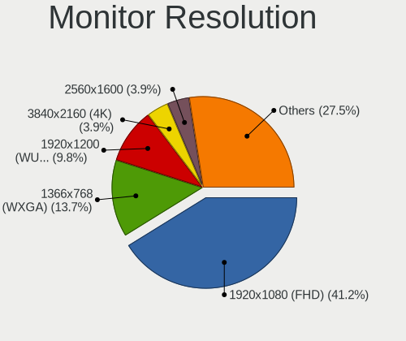

| Resolution         | Computers | Percent |
|--------------------|-----------|---------|
| 1920x1080 (FHD)    | 26        | 39.39%  |
| 1366x768 (WXGA)    | 13        | 19.7%   |
| 3840x2160 (4K)     | 6         | 9.09%   |
| 2560x1600          | 2         | 3.03%   |
| 2160x1440          | 2         | 3.03%   |
| 1920x1200 (WUXGA)  | 2         | 3.03%   |
| 1680x1050 (WSXGA+) | 2         | 3.03%   |
| 1600x900 (HD+)     | 2         | 3.03%   |
| 1440x900 (WXGA+)   | 2         | 3.03%   |
| 3440x1440          | 1         | 1.52%   |
| 2736x1824          | 1         | 1.52%   |
| 2560x1440 (QHD)    | 1         | 1.52%   |
| 1800x1200          | 1         | 1.52%   |
| 1366x912           | 1         | 1.52%   |
| 1360x768           | 1         | 1.52%   |
| 1280x800 (WXGA)    | 1         | 1.52%   |
| 1280x720 (HD)      | 1         | 1.52%   |
| 1280x1024 (SXGA)   | 1         | 1.52%   |

Monitor Diagonal
----------------

Diagonal size in inches

| Inches  | Computers | Percent |
|---------|-----------|---------|
| 15      | 20        | 28.17%  |
| 14      | 9         | 12.68%  |
| 13      | 8         | 11.27%  |
| 17      | 5         | 7.04%   |
| 23      | 4         | 5.63%   |
| 12      | 4         | 5.63%   |
| Unknown | 4         | 5.63%   |
| 27      | 3         | 4.23%   |
| 21      | 3         | 4.23%   |
| 84      | 2         | 2.82%   |
| 31      | 2         | 2.82%   |
| 48      | 1         | 1.41%   |
| 34      | 1         | 1.41%   |
| 25      | 1         | 1.41%   |
| 24      | 1         | 1.41%   |
| 18      | 1         | 1.41%   |
| 11      | 1         | 1.41%   |
| 10      | 1         | 1.41%   |

Monitor Width
-------------

Physical width

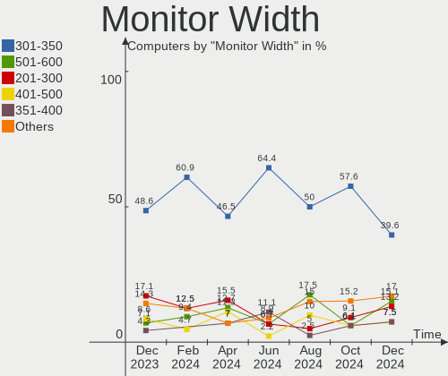

| Width in mm | Computers | Percent |
|-------------|-----------|---------|
| 301-350     | 30        | 42.86%  |
| 201-300     | 12        | 17.14%  |
| 501-600     | 7         | 10%     |
| 401-500     | 5         | 7.14%   |
| 351-400     | 5         | 7.14%   |
| Unknown     | 4         | 5.71%   |
| 601-700     | 3         | 4.29%   |
| 1501-2000   | 2         | 2.86%   |
| 701-800     | 1         | 1.43%   |
| 1001-1500   | 1         | 1.43%   |

Aspect Ratio
------------

Proportional relationship between the width and the height

| Ratio   | Computers | Percent |
|---------|-----------|---------|
| 16/9    | 45        | 73.77%  |
| 16/10   | 7         | 11.48%  |
| 3/2     | 5         | 8.2%    |
| Unknown | 3         | 4.92%   |
| 21/9    | 1         | 1.64%   |

Monitor Area
------------

Area in inch²

| Area in inch² | Computers | Percent |
|----------------|-----------|---------|
| 101-110        | 19        | 27.14%  |
| 81-90          | 13        | 18.57%  |
| 201-250        | 7         | 10%     |
| 121-130        | 5         | 7.14%   |
| 71-80          | 4         | 5.71%   |
| 61-70          | 4         | 5.71%   |
| Unknown        | 4         | 5.71%   |
| More than 1000 | 3         | 4.29%   |
| 351-500        | 3         | 4.29%   |
| 301-350        | 3         | 4.29%   |
| 51-60          | 1         | 1.43%   |
| 41-50          | 1         | 1.43%   |
| 251-300        | 1         | 1.43%   |
| 141-150        | 1         | 1.43%   |
| 91-100         | 1         | 1.43%   |

Pixel Density
-------------

Pixels per inch

| Density       | Computers | Percent |
|---------------|-----------|---------|
| 121-160       | 22        | 31.43%  |
| 101-120       | 19        | 27.14%  |
| 51-100        | 12        | 17.14%  |
| 161-240       | 7         | 10%     |
| More than 240 | 4         | 5.71%   |
| Unknown       | 4         | 5.71%   |
| 1-50          | 2         | 2.86%   |

Multiple Monitors
-----------------

Total monitors connected

| Total | Computers | Percent |
|-------|-----------|---------|
| 1     | 43        | 75.44%  |
| 2     | 13        | 22.81%  |
| 4     | 1         | 1.75%   |

Network
-------

Net Controller Vendor
---------------------

Controller vendors

| Vendor                          | Computers | Percent |
|---------------------------------|-----------|---------|
| Realtek Semiconductor           | 35        | 35.35%  |
| Intel                           | 30        | 30.3%   |
| Qualcomm Atheros                | 9         | 9.09%   |
| Broadcom                        | 5         | 5.05%   |
| Ralink Technology               | 3         | 3.03%   |
| Xiaomi                          | 2         | 2.02%   |
| TP-Link                         | 2         | 2.02%   |
| Samsung Electronics             | 2         | 2.02%   |
| Huawei Technologies             | 2         | 2.02%   |
| ZyXEL Communications            | 1         | 1.01%   |
| ZTE WCDMA Technologies MSM      | 1         | 1.01%   |
| Qualcomm Atheros Communications | 1         | 1.01%   |
| MediaTek                        | 1         | 1.01%   |
| Marvell Technology Group        | 1         | 1.01%   |
| JMicron Technology              | 1         | 1.01%   |
| DisplayLink                     | 1         | 1.01%   |
| Broadcom Limited                | 1         | 1.01%   |
| ASIX Electronics                | 1         | 1.01%   |

Net Controller Model
--------------------

Controller models

| Model                                                                                         | Computers | Percent |
|-----------------------------------------------------------------------------------------------|-----------|---------|
| Realtek RTL8111/8168/8411 PCI Express Gigabit Ethernet Controller                             | 19        | 17.12%  |
| Realtek RTL810xE PCI Express Fast Ethernet controller                                         | 4         | 3.6%    |
| Realtek RTL8814AU 802.11a/b/g/n/ac Wireless Adapter                                           | 3         | 2.7%    |
| Realtek RTL8153 Gigabit Ethernet Adapter                                                      | 3         | 2.7%    |
| Ralink RT2870/RT3070 Wireless Adapter                                                         | 3         | 2.7%    |
| Qualcomm Atheros QCA6174 802.11ac Wireless Network Adapter                                    | 3         | 2.7%    |
| Qualcomm Atheros AR9285 Wireless Network Adapter (PCI-Express)                                | 3         | 2.7%    |
| Intel Wireless 7260                                                                           | 3         | 2.7%    |
| Intel Comet Lake PCH-LP CNVi WiFi                                                             | 3         | 2.7%    |
| Intel Comet Lake PCH CNVi WiFi                                                                | 3         | 2.7%    |
| Samsung Galaxy series, misc. (tethering mode)                                                 | 2         | 1.8%    |
| Realtek RTL8821CE 802.11ac PCIe Wireless Network Adapter                                      | 2         | 1.8%    |
| Realtek RTL8188CE 802.11b/g/n WiFi Adapter                                                    | 2         | 1.8%    |
| Qualcomm Atheros QCA9377 802.11ac Wireless Network Adapter                                    | 2         | 1.8%    |
| Intel Wireless 8265 / 8275                                                                    | 2         | 1.8%    |
| Intel Wireless 7265                                                                           | 2         | 1.8%    |
| Intel Wireless 3165                                                                           | 2         | 1.8%    |
| Intel Wi-Fi 6 AX201                                                                           | 2         | 1.8%    |
| Intel Tiger Lake PCH CNVi WiFi                                                                | 2         | 1.8%    |
| Intel Ethernet Controller I225-V                                                              | 2         | 1.8%    |
| Broadcom BCM4364 802.11ac Wireless Network Adapter                                            | 2         | 1.8%    |
| Broadcom BCM4313 802.11bgn Wireless Network Adapter                                           | 2         | 1.8%    |
| ZyXEL ADSL Modem Prestige 600 series                                                          | 1         | 0.9%    |
| ZTE WCDMA MSM USB SCSI CD-ROM                                                                 | 1         | 0.9%    |
| Xiaomi Mi/Redmi series (RNDIS)                                                                | 1         | 0.9%    |
| Xiaomi Mi/Redmi series (RNDIS + ADB)                                                          | 1         | 0.9%    |
| TP-Link TL-WN823N v2/v3 [Realtek RTL8192EU]                                                   | 1         | 0.9%    |
| TP-Link TL-WN722N v2/v3 [Realtek RTL8188EUS]                                                  | 1         | 0.9%    |
| Realtek RTL8812AU 802.11a/b/g/n/ac 2T2R DB WLAN Adapter                                       | 1         | 0.9%    |
| Realtek RTL8723BE PCIe Wireless Network Adapter                                               | 1         | 0.9%    |
| Realtek RTL8187 Wireless Adapter                                                              | 1         | 0.9%    |
| Realtek RTL8152 Fast Ethernet Adapter                                                         | 1         | 0.9%    |
| Realtek RTL8125 2.5GbE Controller                                                             | 1         | 0.9%    |
| Realtek Realtek 8812AU/8821AU 802.11ac WLAN Adapter [USB Wireless Dual-Band Adapter 2.4/5Ghz] | 1         | 0.9%    |
| Realtek Killer E2600 Gigabit Ethernet Controller                                              | 1         | 0.9%    |
| Qualcomm Atheros QCA9565 / AR9565 Wireless Network Adapter                                    | 1         | 0.9%    |
| Qualcomm Atheros Killer E2400 Gigabit Ethernet Controller                                     | 1         | 0.9%    |
| Qualcomm Atheros AR9271 802.11n                                                               | 1         | 0.9%    |
| MediaTek MT7922 802.11ax PCI Express Wireless Network Adapter                                 | 1         | 0.9%    |
| Marvell Group 88W8897 [AVASTAR] 802.11ac Wireless                                             | 1         | 0.9%    |

Wireless Vendor
---------------

Wireless vendors

| Vendor                          | Computers | Percent |
|---------------------------------|-----------|---------|
| Intel                           | 27        | 45%     |
| Realtek Semiconductor           | 11        | 18.33%  |
| Qualcomm Atheros                | 9         | 15%     |
| Broadcom                        | 4         | 6.67%   |
| Ralink Technology               | 3         | 5%      |
| TP-Link                         | 2         | 3.33%   |
| Qualcomm Atheros Communications | 1         | 1.67%   |
| MediaTek                        | 1         | 1.67%   |
| Marvell Technology Group        | 1         | 1.67%   |
| Broadcom Limited                | 1         | 1.67%   |

Wireless Model
--------------

Wireless models

| Model                                                                                         | Computers | Percent |
|-----------------------------------------------------------------------------------------------|-----------|---------|
| Realtek RTL8814AU 802.11a/b/g/n/ac Wireless Adapter                                           | 3         | 5%      |
| Ralink RT2870/RT3070 Wireless Adapter                                                         | 3         | 5%      |
| Qualcomm Atheros QCA6174 802.11ac Wireless Network Adapter                                    | 3         | 5%      |
| Qualcomm Atheros AR9285 Wireless Network Adapter (PCI-Express)                                | 3         | 5%      |
| Intel Wireless 7260                                                                           | 3         | 5%      |
| Intel Comet Lake PCH-LP CNVi WiFi                                                             | 3         | 5%      |
| Intel Comet Lake PCH CNVi WiFi                                                                | 3         | 5%      |
| Realtek RTL8821CE 802.11ac PCIe Wireless Network Adapter                                      | 2         | 3.33%   |
| Realtek RTL8188CE 802.11b/g/n WiFi Adapter                                                    | 2         | 3.33%   |
| Qualcomm Atheros QCA9377 802.11ac Wireless Network Adapter                                    | 2         | 3.33%   |
| Intel Wireless 8265 / 8275                                                                    | 2         | 3.33%   |
| Intel Wireless 7265                                                                           | 2         | 3.33%   |
| Intel Wireless 3165                                                                           | 2         | 3.33%   |
| Intel Wi-Fi 6 AX201                                                                           | 2         | 3.33%   |
| Intel Tiger Lake PCH CNVi WiFi                                                                | 2         | 3.33%   |
| Broadcom BCM4364 802.11ac Wireless Network Adapter                                            | 2         | 3.33%   |
| Broadcom BCM4313 802.11bgn Wireless Network Adapter                                           | 2         | 3.33%   |
| TP-Link TL-WN823N v2/v3 [Realtek RTL8192EU]                                                   | 1         | 1.67%   |
| TP-Link TL-WN722N v2/v3 [Realtek RTL8188EUS]                                                  | 1         | 1.67%   |
| Realtek RTL8812AU 802.11a/b/g/n/ac 2T2R DB WLAN Adapter                                       | 1         | 1.67%   |
| Realtek RTL8723BE PCIe Wireless Network Adapter                                               | 1         | 1.67%   |
| Realtek RTL8187 Wireless Adapter                                                              | 1         | 1.67%   |
| Realtek Realtek 8812AU/8821AU 802.11ac WLAN Adapter [USB Wireless Dual-Band Adapter 2.4/5Ghz] | 1         | 1.67%   |
| Qualcomm Atheros QCA9565 / AR9565 Wireless Network Adapter                                    | 1         | 1.67%   |
| Qualcomm Atheros AR9271 802.11n                                                               | 1         | 1.67%   |
| MediaTek MT7922 802.11ax PCI Express Wireless Network Adapter                                 | 1         | 1.67%   |
| Marvell Group 88W8897 [AVASTAR] 802.11ac Wireless                                             | 1         | 1.67%   |
| Intel Wireless-AC 9260                                                                        | 1         | 1.67%   |
| Intel Wireless 3160                                                                           | 1         | 1.67%   |
| Intel Wi-Fi 6 AX200                                                                           | 1         | 1.67%   |
| Intel PRO/Wireless 4965 AG or AGN [Kedron] Network Connection                                 | 1         | 1.67%   |
| Intel Gemini Lake PCH CNVi WiFi                                                               | 1         | 1.67%   |
| Intel Centrino Advanced-N 6200                                                                | 1         | 1.67%   |
| Intel Cannon Point-LP CNVi [Wireless-AC]                                                      | 1         | 1.67%   |
| Intel Cannon Lake PCH CNVi WiFi                                                               | 1         | 1.67%   |
| Broadcom Limited BCM4360 802.11ac Wireless Network Adapter                                    | 1         | 1.67%   |

Ethernet Vendor
---------------

Ethernet vendors

| Vendor                     | Computers | Percent |
|----------------------------|-----------|---------|
| Realtek Semiconductor      | 29        | 58%     |
| Intel                      | 8         | 16%     |
| Xiaomi                     | 2         | 4%      |
| Samsung Electronics        | 2         | 4%      |
| Broadcom                   | 2         | 4%      |
| ZyXEL Communications       | 1         | 2%      |
| ZTE WCDMA Technologies MSM | 1         | 2%      |
| Qualcomm Atheros           | 1         | 2%      |
| JMicron Technology         | 1         | 2%      |
| Huawei Technologies        | 1         | 2%      |
| DisplayLink                | 1         | 2%      |
| ASIX Electronics           | 1         | 2%      |

Ethernet Model
--------------

Ethernet models

| Model                                                             | Computers | Percent |
|-------------------------------------------------------------------|-----------|---------|
| Realtek RTL8111/8168/8411 PCI Express Gigabit Ethernet Controller | 19        | 38%     |
| Realtek RTL810xE PCI Express Fast Ethernet controller             | 4         | 8%      |
| Realtek RTL8153 Gigabit Ethernet Adapter                          | 3         | 6%      |
| Samsung Galaxy series, misc. (tethering mode)                     | 2         | 4%      |
| Intel Ethernet Controller I225-V                                  | 2         | 4%      |
| ZyXEL ADSL Modem Prestige 600 series                              | 1         | 2%      |
| ZTE WCDMA MSM USB SCSI CD-ROM                                     | 1         | 2%      |
| Xiaomi Mi/Redmi series (RNDIS)                                    | 1         | 2%      |
| Xiaomi Mi/Redmi series (RNDIS + ADB)                              | 1         | 2%      |
| Realtek RTL8152 Fast Ethernet Adapter                             | 1         | 2%      |
| Realtek RTL8125 2.5GbE Controller                                 | 1         | 2%      |
| Realtek Killer E2600 Gigabit Ethernet Controller                  | 1         | 2%      |
| Qualcomm Atheros Killer E2400 Gigabit Ethernet Controller         | 1         | 2%      |
| JMicron JMC250 PCI Express Gigabit Ethernet Controller            | 1         | 2%      |
| Intel Ethernet Connection I218-LM                                 | 1         | 2%      |
| Intel Ethernet Connection (7) I219-V                              | 1         | 2%      |
| Intel Ethernet Connection (2) I219-V                              | 1         | 2%      |
| Intel Ethernet Connection (10) I219-LM                            | 1         | 2%      |
| Intel 82577LM Gigabit Network Connection                          | 1         | 2%      |
| Intel 82566MM Gigabit Network Connection                          | 1         | 2%      |
| Huawei ELS-NX9                                                    | 1         | 2%      |
| DisplayLink Dell Universal Dock D6000                             | 1         | 2%      |
| Broadcom NetXtreme BCM5761 Gigabit Ethernet PCIe                  | 1         | 2%      |
| Broadcom NetLink BCM57780 Gigabit Ethernet PCIe                   | 1         | 2%      |
| ASIX AX88772A Fast Ethernet                                       | 1         | 2%      |

Net Controller Kind
-------------------

Ethernet, WiFi or modem

| Kind     | Computers | Percent |
|----------|-----------|---------|
| WiFi     | 50        | 54.35%  |
| Ethernet | 41        | 44.57%  |
| Modem    | 1         | 1.09%   |

Used Controller
---------------

Currently used network controller

| Kind     | Computers | Percent |
|----------|-----------|---------|
| WiFi     | 41        | 68.33%  |
| Ethernet | 19        | 31.67%  |

NICs
----

Total network controllers on board

| Total | Computers | Percent |
|-------|-----------|---------|
| 1     | 29        | 50.88%  |
| 2     | 28        | 49.12%  |

IPv6
----

IPv6 vs IPv4

| Used | Computers | Percent |
|------|-----------|---------|
| No   | 47        | 82.46%  |
| Yes  | 10        | 17.54%  |

Bluetooth
---------

Bluetooth Vendor
----------------

Controller vendors

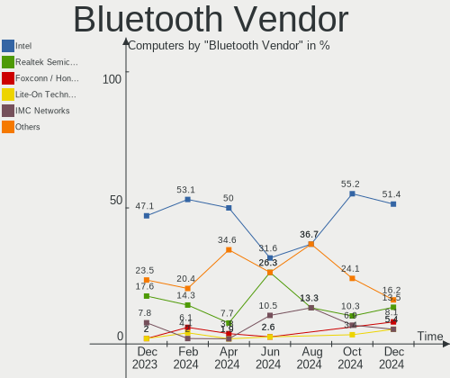

| Vendor                          | Computers | Percent |
|---------------------------------|-----------|---------|
| Intel                           | 24        | 55.81%  |
| Qualcomm Atheros Communications | 6         | 13.95%  |
| Realtek Semiconductor           | 3         | 6.98%   |
| Cambridge Silicon Radio         | 3         | 6.98%   |
| Foxconn / Hon Hai               | 2         | 4.65%   |
| Marvell Semiconductor           | 1         | 2.33%   |
| Lite-On Technology              | 1         | 2.33%   |
| Dell                            | 1         | 2.33%   |
| Broadcom                        | 1         | 2.33%   |
| Apple                           | 1         | 2.33%   |

Bluetooth Model
---------------

Controller models

| Model                                               | Computers | Percent |
|-----------------------------------------------------|-----------|---------|
| Intel Bluetooth wireless interface                  | 9         | 20.93%  |
| Intel Bluetooth Device                              | 7         | 16.28%  |
| Intel Bluetooth 9460/9560 Jefferson Peak (JfP)      | 6         | 13.95%  |
| Realtek Bluetooth Radio                             | 3         | 6.98%   |
| Qualcomm Atheros  Bluetooth Device                  | 3         | 6.98%   |
| Cambridge Silicon Radio Bluetooth Dongle (HCI mode) | 3         | 6.98%   |
| Qualcomm Atheros QCA61x4 Bluetooth 4.0              | 2         | 4.65%   |
| Qualcomm Atheros AR3011 Bluetooth                   | 1         | 2.33%   |
| Marvell Bluetooth and Wireless LAN Composite        | 1         | 2.33%   |
| Lite-On Atheros AR3012 Bluetooth                    | 1         | 2.33%   |
| Intel Wireless-AC 9260 Bluetooth Adapter            | 1         | 2.33%   |
| Intel AX200 Bluetooth                               | 1         | 2.33%   |
| Foxconn / Hon Hai Wireless_Device                   | 1         | 2.33%   |
| Foxconn / Hon Hai Acer Module                       | 1         | 2.33%   |
| Dell BCM20702A0 Bluetooth Module                    | 1         | 2.33%   |
| Broadcom BCM2045B (BDC-2.1)                         | 1         | 2.33%   |
| Apple Bluetooth USB Host Controller                 | 1         | 2.33%   |

Sound
-----

Sound Vendor
------------

Sound card vendors

| Vendor                | Computers | Percent |
|-----------------------|-----------|---------|
| Intel                 | 52        | 63.41%  |
| Nvidia                | 14        | 17.07%  |
| AMD                   | 6         | 7.32%   |
| Realtek Semiconductor | 2         | 2.44%   |
| Apple                 | 2         | 2.44%   |
| Kingston Technology   | 1         | 1.22%   |
| Hewlett-Packard       | 1         | 1.22%   |
| Elgato Systems        | 1         | 1.22%   |
| DSEA A/S              | 1         | 1.22%   |
| C-Media Electronics   | 1         | 1.22%   |
| Unknown               | 1         | 1.22%   |

Sound Model
-----------

Sound card models

| Model                                                                                             | Computers | Percent |
|---------------------------------------------------------------------------------------------------|-----------|---------|
| Intel Comet Lake PCH-LP cAVS                                                                      | 5         | 5.49%   |
| Nvidia GA106 High Definition Audio Controller                                                     | 4         | 4.4%    |
| Intel Cannon Point-LP High Definition Audio Controller                                            | 4         | 4.4%    |
| Intel Cannon Lake PCH cAVS                                                                        | 4         | 4.4%    |
| Nvidia GP107GL High Definition Audio Controller                                                   | 3         | 3.3%    |
| Intel Wildcat Point-LP High Definition Audio Controller                                           | 3         | 3.3%    |
| Intel Tiger Lake-H HD Audio Controller                                                            | 3         | 3.3%    |
| Intel Sunrise Point-LP HD Audio                                                                   | 3         | 3.3%    |
| Intel Comet Lake PCH cAVS                                                                         | 3         | 3.3%    |
| Intel Broadwell-U Audio Controller                                                                | 3         | 3.3%    |
| Intel 8 Series/C220 Series Chipset High Definition Audio Controller                               | 3         | 3.3%    |
| Intel 200 Series PCH HD Audio                                                                     | 3         | 3.3%    |
| Realtek Semiconductor USB Audio                                                                   | 2         | 2.2%    |
| Nvidia GF119 HDMI Audio Controller                                                                | 2         | 2.2%    |
| Intel Tiger Lake-LP Smart Sound Technology Audio Controller                                       | 2         | 2.2%    |
| Intel Celeron/Pentium Silver Processor High Definition Audio                                      | 2         | 2.2%    |
| Intel Celeron N3350/Pentium N4200/Atom E3900 Series Audio Cluster                                 | 2         | 2.2%    |
| Intel Atom/Celeron/Pentium Processor x5-E8000/J3xxx/N3xxx Series High Definition Audio Controller | 2         | 2.2%    |
| Intel 7 Series/C216 Chipset Family High Definition Audio Controller                               | 2         | 2.2%    |
| Intel 6 Series/C200 Series Chipset Family High Definition Audio Controller                        | 2         | 2.2%    |
| Intel 5 Series/3400 Series Chipset High Definition Audio                                          | 2         | 2.2%    |
| Intel 100 Series/C230 Series Chipset Family HD Audio Controller                                   | 2         | 2.2%    |
| Apple Audio Device                                                                                | 2         | 2.2%    |
| AMD Renoir Radeon High Definition Audio Controller                                                | 2         | 2.2%    |
| AMD Family 17h/19h HD Audio Controller                                                            | 2         | 2.2%    |
| Nvidia TU116 High Definition Audio Controller                                                     | 1         | 1.1%    |
| Nvidia TU107 GeForce GTX 1650 High Definition Audio Controller                                    | 1         | 1.1%    |
| Nvidia GM204 High Definition Audio Controller                                                     | 1         | 1.1%    |
| Nvidia GM107 High Definition Audio Controller [GeForce 940MX]                                     | 1         | 1.1%    |
| Nvidia GK107 HDMI Audio Controller                                                                | 1         | 1.1%    |
| Kingston Technology HyperX 7.1 Audio                                                              | 1         | 1.1%    |
| Intel Xeon E3-1200 v3/4th Gen Core Processor HD Audio Controller                                  | 1         | 1.1%    |
| Intel NM10/ICH7 Family High Definition Audio Controller                                           | 1         | 1.1%    |
| Intel Haswell-ULT HD Audio Controller                                                             | 1         | 1.1%    |
| Intel Audio device                                                                                | 1         | 1.1%    |
| Intel 82801I (ICH9 Family) HD Audio Controller                                                    | 1         | 1.1%    |
| Intel 82801H (ICH8 Family) HD Audio Controller                                                    | 1         | 1.1%    |
| Intel 8 Series HD Audio Controller                                                                | 1         | 1.1%    |
| Hewlett-Packard CONEXANT USB AUDIO                                                                | 1         | 1.1%    |
| Elgato Systems Elgato Wave:3                                                                      | 1         | 1.1%    |

Memory
------

Memory Vendor
-------------

Memory module vendors

| Vendor              | Computers | Percent |
|---------------------|-----------|---------|
| Samsung Electronics | 16        | 32%     |
| SK hynix            | 13        | 26%     |
| Kingston            | 6         | 12%     |
| Micron Technology   | 4         | 8%      |
| Corsair             | 2         | 4%      |
| Unknown (ABCD)      | 1         | 2%      |
| Unknown             | 1         | 2%      |
| Team                | 1         | 2%      |
| Ramaxel Technology  | 1         | 2%      |
| GOODRAM             | 1         | 2%      |
| ff                  | 1         | 2%      |
| fef5                | 1         | 2%      |
| Crucial             | 1         | 2%      |
| 4ea5                | 1         | 2%      |

Memory Model
------------

Memory module models

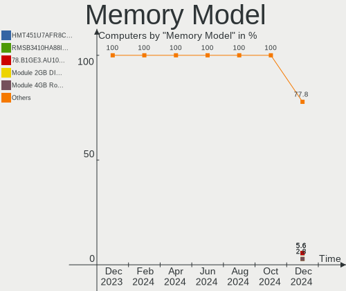

| Model                                                            | Computers | Percent |
|------------------------------------------------------------------|-----------|---------|
| SK hynix RAM HMA41GS6AFR8N-TF 8GB SODIMM DDR4 2667MT/s           | 2         | 3.85%   |
| SK hynix RAM H9CCNNNCLGALAR-NVD 8GB Row Of Chips LPDDR3 2133MT/s | 2         | 3.85%   |
| Samsung RAM M471A5244CB0-CWE 4GB SODIMM DDR4 3200MT/s            | 2         | 3.85%   |
| Samsung RAM M471A5244CB0-CWE 4GB Row Of Chips DDR4 3200MT/s      | 2         | 3.85%   |
| Samsung RAM M471A5244CB0-CTD 4GB SODIMM DDR4 3266MT/s            | 2         | 3.85%   |
| Samsung RAM K4F8E304HB-MGCJ 1GB 2400MT/s                         | 2         | 3.85%   |
| Unknown RAM Module 2GB SODIMM DDR2 667MT/s                       | 1         | 1.92%   |
| Unknown (ABCD) RAM 123456789012345678 2GB SODIMM LPDDR4 2400MT/s | 1         | 1.92%   |
| Team RAM TEAMGROUP-UD4-3000 8GB DIMM DDR4 3200MT/s               | 1         | 1.92%   |
| SK hynix RAM Module 2GB Row Of Chips LPDDR3 1867MT/s             | 1         | 1.92%   |
| SK hynix RAM HYMP125S64CP8-S6 2GB SODIMM SDRAM                   | 1         | 1.92%   |
| SK hynix RAM HMT451S6BFR8A-PB 4GB SODIMM DDR3 1600MT/s           | 1         | 1.92%   |
| SK hynix RAM HMT451S6BFR8A-PB 4096MB SODIMM DDR3 1600MT/s        | 1         | 1.92%   |
| SK hynix RAM HMT41GS6MFR8C-PB 8GB SODIMM DDR3 1600MT/s           | 1         | 1.92%   |
| SK hynix RAM HMT351U6CFR8C-PB 4GB DIMM DDR3 1800MT/s             | 1         | 1.92%   |
| SK hynix RAM HMAA1GS6CJR6N-XN 8GB SODIMM DDR4 3200MT/s           | 1         | 1.92%   |
| SK hynix RAM HMA81GS6DJR8N-XN 8GB SODIMM DDR4 3200MT/s           | 1         | 1.92%   |
| SK hynix RAM H9CCNNNCPTALBR-NUD 4GB Row Of Chips LPDDR3 1867MT/s | 1         | 1.92%   |
| Samsung RAM M471B5173QH0-YK0 4GB SODIMM DDR3 1600MT/s            | 1         | 1.92%   |
| Samsung RAM M471B1G73DB0-YK0 8GB SODIMM DDR3 1600MT/s            | 1         | 1.92%   |
| Samsung RAM M471A1K43DB1-CTD 8GB SODIMM DDR4 2667MT/s            | 1         | 1.92%   |
| Samsung RAM M471A1K43CB1-CTD 8GB SODIMM DDR4 2667MT/s            | 1         | 1.92%   |
| Samsung RAM M471A1G44BB0-CWE 8GB SODIMM DDR4 3200MT/s            | 1         | 1.92%   |
| Samsung RAM M4 70T5663CZ3-CE6 2GB SODIMM DDR2 1639MT/s           | 1         | 1.92%   |
| Samsung RAM K4UBE3D4AA-MGCL 8GB Row Of Chips LPDDR4 4267MT/s     | 1         | 1.92%   |
| Samsung RAM K4E6E304EC-EGCG 4GB Row Of Chips LPDDR3 2133MT/s     | 1         | 1.92%   |
| Samsung RAM K4A8G165WC-BCWE 4GB SODIMM DDR4 3200MT/s             | 1         | 1.92%   |
| Ramaxel RAM RMSA3340MB88HBF-3200 16GB SODIMM DDR4 3200MT/s       | 1         | 1.92%   |
| Micron RAM Module 4GB SODIMM DDR3 1600MT/s                       | 1         | 1.92%   |
| Micron RAM 8ATF1G64HZ-3G2R1 8192MB SODIMM DDR4 3200MT/s          | 1         | 1.92%   |
| Micron RAM 4ATF1G64HZ-3G2E1 8GB SODIMM DDR4 3200MT/s             | 1         | 1.92%   |
| Micron RAM 16ATF2G64HZ-2G6E1 16GB SODIMM DDR4 2667MT/s           | 1         | 1.92%   |
| Kingston RAM KHX2666C16D4/4G 4GB DIMM DDR4 2667MT/s              | 1         | 1.92%   |
| Kingston RAM KF3200C20S4/8G 8GB SODIMM DDR4 3200MT/s             | 1         | 1.92%   |
| Kingston RAM KF3200C16D4/16GX 16GB DIMM DDR4 3200MT/s            | 1         | 1.92%   |
| Kingston RAM ASU16D3LS1KBG/4G 4GB SODIMM DDR3 1600MT/s           | 1         | 1.92%   |
| Kingston RAM 99U5295-022.A00LF 2GB SODIMM DDR2 1639MT/s          | 1         | 1.92%   |
| Kingston RAM 9905700-106.A00G 8GB SODIMM DDR4 2667MT/s           | 1         | 1.92%   |
| GOODRAM RAM GR2666S464L19S/8G 8GB SODIMM DDR4 2667MT/s           | 1         | 1.92%   |
| ff RAM K4F8E304HB-MGCJ 1GB LPDDR4 2400MT/s                       | 1         | 1.92%   |

Memory Kind
-----------

Memory module kinds

| Kind    | Computers | Percent |
|---------|-----------|---------|
| DDR4    | 22        | 52.38%  |
| DDR3    | 7         | 16.67%  |
| LPDDR3  | 5         | 11.9%   |
| LPDDR4  | 4         | 9.52%   |
| SDRAM   | 2         | 4.76%   |
| DDR2    | 1         | 2.38%   |
| Unknown | 1         | 2.38%   |

Memory Form Factor
------------------

Physical design of the memory module

| Name         | Computers | Percent |
|--------------|-----------|---------|
| SODIMM       | 26        | 61.9%   |
| Row Of Chips | 8         | 19.05%  |
| DIMM         | 6         | 14.29%  |
| Unknown      | 2         | 4.76%   |

Memory Size
-----------

Memory module size

| Size  | Computers | Percent |
|-------|-----------|---------|
| 8192  | 17        | 40.48%  |
| 4096  | 14        | 33.33%  |
| 16384 | 5         | 11.9%   |
| 2048  | 4         | 9.52%   |
| 1024  | 2         | 4.76%   |

Memory Speed
------------

Memory module speed

| Speed | Computers | Percent |
|-------|-----------|---------|
| 3200  | 13        | 28.26%  |
| 2667  | 8         | 17.39%  |
| 1600  | 6         | 13.04%  |
| 2400  | 3         | 6.52%   |
| 2133  | 3         | 6.52%   |
| 3266  | 2         | 4.35%   |
| 1867  | 2         | 4.35%   |
| 1639  | 2         | 4.35%   |
| 4267  | 1         | 2.17%   |
| 3733  | 1         | 2.17%   |
| 3600  | 1         | 2.17%   |
| 3000  | 1         | 2.17%   |
| 2048  | 1         | 2.17%   |
| 1800  | 1         | 2.17%   |
| 667   | 1         | 2.17%   |

Printers & scanners
-------------------

Printer Vendor
--------------

Printer device vendors

Zero info for selected period =(

Printer Model
-------------

Printer device models

Zero info for selected period =(

Scanner Vendor
--------------

Scanner device vendors

Zero info for selected period =(

Scanner Model
-------------

Scanner device models

Zero info for selected period =(

Camera
------

Camera Vendor
-------------

Camera device vendors

| Vendor                                 | Computers | Percent |
|----------------------------------------|-----------|---------|
| Chicony Electronics                    | 8         | 19.51%  |
| Microdia                               | 6         | 14.63%  |
| Logitech                               | 4         | 9.76%   |
| Realtek Semiconductor                  | 3         | 7.32%   |
| Quanta                                 | 3         | 7.32%   |
| IMC Networks                           | 3         | 7.32%   |
| Acer                                   | 3         | 7.32%   |
| Suyin                                  | 2         | 4.88%   |
| Sunplus Innovation Technology          | 2         | 4.88%   |
| Lite-On Technology                     | 2         | 4.88%   |
| Cheng Uei Precision Industry (Foxlink) | 2         | 4.88%   |
| Luxvisions Innotech Limited            | 1         | 2.44%   |
| Apple                                  | 1         | 2.44%   |
| Alcor Micro                            | 1         | 2.44%   |

Camera Model
------------

Camera device models

| Model                                                           | Computers | Percent |
|-----------------------------------------------------------------|-----------|---------|
| Microdia Integrated_Webcam_HD                                   | 4         | 9.3%    |
| Realtek HD Webcam - Realtek                                     | 2         | 4.65%   |
| Quanta HP Wide Vision HD Camera                                 | 2         | 4.65%   |
| Chicony HD Webcam                                               | 2         | 4.65%   |
| Acer Integrated Camera                                          | 2         | 4.65%   |
| Suyin Sony Visual Communication Camera                          | 1         | 2.33%   |
| Suyin HP TrueVision HD                                          | 1         | 2.33%   |
| Sunplus Lenovo EasyCamera                                       | 1         | 2.33%   |
| Sunplus Integrated_Webcam_HD                                    | 1         | 2.33%   |
| Realtek Front Camera                                            | 1         | 2.33%   |
| Realtek Back Camera                                             | 1         | 2.33%   |
| Quanta HP HD Camera                                             | 1         | 2.33%   |
| Microdia Laptop_Integrated_Webcam_HD                            | 1         | 2.33%   |
| Microdia Integrated Webcam                                      | 1         | 2.33%   |
| Luxvisions Innotech Limited HP TrueVision HD Camera             | 1         | 2.33%   |
| Logitech Webcam C925e                                           | 1         | 2.33%   |
| Logitech Webcam C310                                            | 1         | 2.33%   |
| Logitech HD Webcam C525                                         | 1         | 2.33%   |
| Logitech C920 PRO HD Webcam                                     | 1         | 2.33%   |
| Lite-On HP Wide Vision HD Camera                                | 1         | 2.33%   |
| Lite-On EasyCamera 1M                                           | 1         | 2.33%   |
| IMC Networks USB2.0 VGA UVC WebCam                              | 1         | 2.33%   |
| IMC Networks USB2.0 UVC HD Webcam                               | 1         | 2.33%   |
| IMC Networks Integrated Camera                                  | 1         | 2.33%   |
| Chicony VGA Webcam                                              | 1         | 2.33%   |
| Chicony Integrated Camera (1280x720@30)                         | 1         | 2.33%   |
| Chicony Integrated Camera                                       | 1         | 2.33%   |
| Chicony HP Webcam                                               | 1         | 2.33%   |
| Chicony HD User Facing                                          | 1         | 2.33%   |
| Chicony EasyCamera 5M                                           | 1         | 2.33%   |
| Chicony 5MP World Facing                                        | 1         | 2.33%   |
| Cheng Uei Precision Industry (Foxlink) HP Wide Vision HD Camera | 1         | 2.33%   |
| Cheng Uei Precision Industry (Foxlink) HP HD Webcam             | 1         | 2.33%   |
| Apple iPhone 5/5C/5S/6/SE                                       | 1         | 2.33%   |
| Alcor Micro HP Webcam-101                                       | 1         | 2.33%   |
| Acer HD Webcam                                                  | 1         | 2.33%   |

Security
--------

Fingerprint Vendor
------------------

Fingerprint sensor vendors

| Vendor                     | Computers | Percent |
|----------------------------|-----------|---------|
| Validity Sensors           | 1         | 25%     |
| Upek                       | 1         | 25%     |
| Shenzhen Goodix Technology | 1         | 25%     |
| AuthenTec                  | 1         | 25%     |

Fingerprint Model
-----------------

Fingerprint sensor models

| Model                                                  | Computers | Percent |
|--------------------------------------------------------|-----------|---------|
| Validity Sensors VFS495 Fingerprint Reader             | 1         | 25%     |
| Upek Biometric Touchchip/Touchstrip Fingerprint Sensor | 1         | 25%     |
| Shenzhen Goodix  FingerPrint Device                    | 1         | 25%     |
| AuthenTec AES2501 Fingerprint Sensor                   | 1         | 25%     |

Chipcard Vendor
---------------

Chipcard module vendors

| Vendor | Computers | Percent |
|--------|-----------|---------|
| Lenovo | 1         | 100%    |

Chipcard Model
--------------

Chipcard module models

| Model                               | Computers | Percent |
|-------------------------------------|-----------|---------|
| Lenovo Integrated Smart Card Reader | 1         | 100%    |

Unsupported
-----------

Unsupported Devices
-------------------

Total unsupported devices on board

| Total | Computers | Percent |
|-------|-----------|---------|
| 0     | 39        | 68.42%  |
| 1     | 13        | 22.81%  |
| 2     | 4         | 7.02%   |
| 3     | 1         | 1.75%   |

Unsupported Device Types
------------------------

Types of unsupported devices

| Type                  | Computers | Percent |
|-----------------------|-----------|---------|
| Sound                 | 4         | 20%     |
| Multimedia controller | 4         | 20%     |
| Graphics card         | 4         | 20%     |
| Fingerprint reader    | 4         | 20%     |
| Net/wireless          | 2         | 10%     |
| Chipcard              | 1         | 5%      |
| Camera                | 1         | 5%      |

