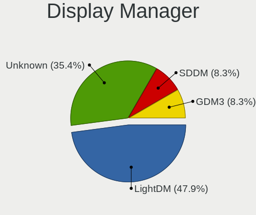
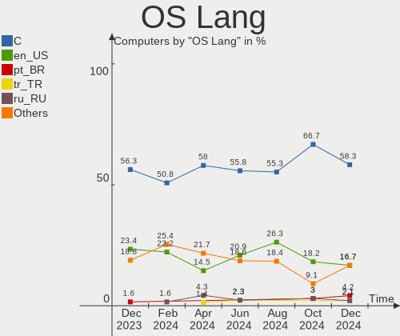
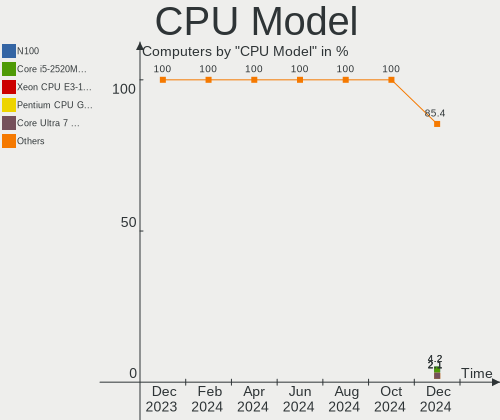
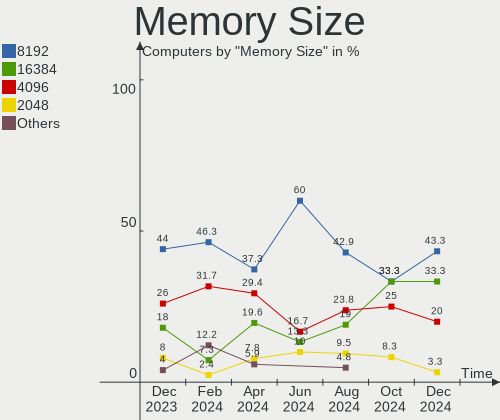
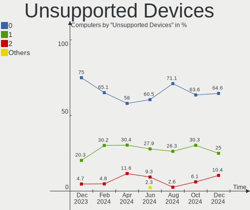
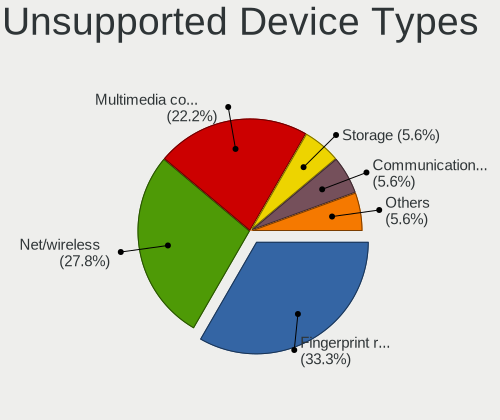

Kali - Hardware Trends
----------------------

A project to identify most popular hardware characteristics and track their change
over time based on data collected by Linux users at https://Linux-Hardware.org.

Anyone can contribute to this report by the [hw-probe](https://github.com/linuxhw/hw-probe) tool:

    sudo -E hw-probe -all -upload

This is a report for all computer types. See also reports for [desktops](/Dist/Kali/Desktop/README.md) and [notebooks](/Dist/Kali/Notebook/README.md).

This report is for one last month. Overall report since the beginning of time: [TestDays](https://github.com/linuxhw/TestDays)

Period: Feb, 2023.

Contents
--------

* [ System ](#system)
  - [ OS                       ](#os)
  - [ OS Family                ](#os-family)
  - [ Kernel                   ](#kernel)
  - [ Kernel Family            ](#kernel-family)
  - [ Kernel Major Ver.        ](#kernel-major-ver)
  - [ Arch                     ](#arch)
  - [ DE                       ](#de)
  - [ Display Server           ](#display-server)
  - [ Display Manager          ](#display-manager)
  - [ OS Lang                  ](#os-lang)
  - [ Boot Mode                ](#boot-mode)
  - [ Filesystem               ](#filesystem)
  - [ Part. scheme             ](#part-scheme)
  - [ Dual Boot with Linux/BSD ](#dual-boot-with-linuxbsd)
  - [ Dual Boot (Win)          ](#dual-boot-win)

* [ Board ](#board)
  - [ Vendor                   ](#vendor)
  - [ Model                    ](#model)
  - [ Model Family             ](#model-family)
  - [ MFG Year                 ](#mfg-year)
  - [ Form Factor              ](#form-factor)
  - [ Secure Boot              ](#secure-boot)
  - [ Coreboot                 ](#coreboot)
  - [ RAM Size                 ](#ram-size)
  - [ RAM Used                 ](#ram-used)
  - [ Total Drives             ](#total-drives)
  - [ Has CD-ROM               ](#has-cd-rom)
  - [ Has Ethernet             ](#has-ethernet)
  - [ Has WiFi                 ](#has-wifi)
  - [ Has Bluetooth            ](#has-bluetooth)

* [ Location ](#location)
  - [ Country                  ](#country)
  - [ City                     ](#city)

* [ Drives ](#drives)
  - [ Drive Vendor             ](#drive-vendor)
  - [ Drive Model              ](#drive-model)
  - [ HDD Vendor               ](#hdd-vendor)
  - [ SSD Vendor               ](#ssd-vendor)
  - [ Drive Kind               ](#drive-kind)
  - [ Drive Connector          ](#drive-connector)
  - [ Drive Size               ](#drive-size)
  - [ Space Total              ](#space-total)
  - [ Space Used               ](#space-used)
  - [ Malfunc. Drives          ](#malfunc-drives)
  - [ Malfunc. Drive Vendor    ](#malfunc-drive-vendor)
  - [ Malfunc. HDD Vendor      ](#malfunc-hdd-vendor)
  - [ Malfunc. Drive Kind      ](#malfunc-drive-kind)
  - [ Failed Drives            ](#failed-drives)
  - [ Failed Drive Vendor      ](#failed-drive-vendor)
  - [ Drive Status             ](#drive-status)

* [ Storage controller ](#storage-controller)
  - [ Storage Vendor           ](#storage-vendor)
  - [ Storage Model            ](#storage-model)
  - [ Storage Kind             ](#storage-kind)

* [ Processor ](#processor)
  - [ CPU Vendor               ](#cpu-vendor)
  - [ CPU Model                ](#cpu-model)
  - [ CPU Model Family         ](#cpu-model-family)
  - [ CPU Cores                ](#cpu-cores)
  - [ CPU Sockets              ](#cpu-sockets)
  - [ CPU Threads              ](#cpu-threads)
  - [ CPU Op-Modes             ](#cpu-op-modes)
  - [ CPU Microcode            ](#cpu-microcode)
  - [ CPU Microarch            ](#cpu-microarch)

* [ Graphics ](#graphics)
  - [ GPU Vendor               ](#gpu-vendor)
  - [ GPU Model                ](#gpu-model)
  - [ GPU Combo                ](#gpu-combo)
  - [ GPU Driver               ](#gpu-driver)
  - [ GPU Memory               ](#gpu-memory)

* [ Monitor ](#monitor)
  - [ Monitor Vendor           ](#monitor-vendor)
  - [ Monitor Model            ](#monitor-model)
  - [ Monitor Resolution       ](#monitor-resolution)
  - [ Monitor Diagonal         ](#monitor-diagonal)
  - [ Monitor Width            ](#monitor-width)
  - [ Aspect Ratio             ](#aspect-ratio)
  - [ Monitor Area             ](#monitor-area)
  - [ Pixel Density            ](#pixel-density)
  - [ Multiple Monitors        ](#multiple-monitors)

* [ Network ](#network)
  - [ Net Controller Vendor    ](#net-controller-vendor)
  - [ Net Controller Model     ](#net-controller-model)
  - [ Wireless Vendor          ](#wireless-vendor)
  - [ Wireless Model           ](#wireless-model)
  - [ Ethernet Vendor          ](#ethernet-vendor)
  - [ Ethernet Model           ](#ethernet-model)
  - [ Net Controller Kind      ](#net-controller-kind)
  - [ Used Controller          ](#used-controller)
  - [ NICs                     ](#nics)
  - [ IPv6                     ](#ipv6)

* [ Bluetooth ](#bluetooth)
  - [ Bluetooth Vendor         ](#bluetooth-vendor)
  - [ Bluetooth Model          ](#bluetooth-model)

* [ Sound ](#sound)
  - [ Sound Vendor             ](#sound-vendor)
  - [ Sound Model              ](#sound-model)

* [ Memory ](#memory)
  - [ Memory Vendor            ](#memory-vendor)
  - [ Memory Model             ](#memory-model)
  - [ Memory Kind              ](#memory-kind)
  - [ Memory Form Factor       ](#memory-form-factor)
  - [ Memory Size              ](#memory-size)
  - [ Memory Speed             ](#memory-speed)

* [ Printers & scanners ](#printers--scanners)
  - [ Printer Vendor           ](#printer-vendor)
  - [ Printer Model            ](#printer-model)
  - [ Scanner Vendor           ](#scanner-vendor)
  - [ Scanner Model            ](#scanner-model)

* [ Camera ](#camera)
  - [ Camera Vendor            ](#camera-vendor)
  - [ Camera Model             ](#camera-model)

* [ Security ](#security)
  - [ Fingerprint Vendor       ](#fingerprint-vendor)
  - [ Fingerprint Model        ](#fingerprint-model)
  - [ Chipcard Vendor          ](#chipcard-vendor)
  - [ Chipcard Model           ](#chipcard-model)

* [ Unsupported ](#unsupported)
  - [ Unsupported Devices      ](#unsupported-devices)
  - [ Unsupported Device Types ](#unsupported-device-types)

System
------

OS
--

Installed operating systems

| Name        | Computers | Percent |
|-------------|-----------|---------|
| Kali 2022.4 | 56        | 93.33%  |
| Kali 2022.3 | 3         | 5%      |
| Kali 2022.2 | 1         | 1.67%   |

OS Family
---------

OS without a version

| Name | Computers | Percent |
|------|-----------|---------|
| Kali | 60        | 100%    |

Kernel
------

Version of the Linux kernel

| Version                                       | Computers | Percent |
|-----------------------------------------------|-----------|---------|
| 6.0.0-kali6-amd64                             | 42        | 70%     |
| 6.0.0-kali3-amd64                             | 7         | 11.67%  |
| 6.1.0-kali5-amd64                             | 3         | 5%      |
| 5.18.0-kali5-amd64                            | 3         | 5%      |
| 5.18.0-kali2-amd64                            | 1         | 1.67%   |
| 5.16.0-kali7-amd64                            | 1         | 1.67%   |
| 5.15.44-Re4son-v8+                            | 1         | 1.67%   |
| 5.10.136-android12-9-25884040-abS908BXXU3CWAI | 1         | 1.67%   |
| 4.19.252-gee570aebd3c1-ab9399348              | 1         | 1.67%   |

Kernel Family
-------------

Linux kernel without a distro release

| Version  | Computers | Percent |
|----------|-----------|---------|
| 6.0.0    | 49        | 81.67%  |
| 5.18.0   | 4         | 6.67%   |
| 6.1.0    | 3         | 5%      |
| 5.16.0   | 1         | 1.67%   |
| 5.15.44  | 1         | 1.67%   |
| 5.10.136 | 1         | 1.67%   |
| 4.19.252 | 1         | 1.67%   |

Kernel Major Ver.
-----------------

Linux kernel major version

| Version | Computers | Percent |
|---------|-----------|---------|
| 6.0     | 49        | 81.67%  |
| 5.18    | 4         | 6.67%   |
| 6.1     | 3         | 5%      |
| 5.16    | 1         | 1.67%   |
| 5.15    | 1         | 1.67%   |
| 5.10    | 1         | 1.67%   |
| 4.19    | 1         | 1.67%   |

Arch
----

OS architecture (x86_64, i586, etc.)

| Name    | Computers | Percent |
|---------|-----------|---------|
| x86_64  | 57        | 95%     |
| aarch64 | 3         | 5%      |

DE
--

Desktop Environment

| Name             | Computers | Percent |
|------------------|-----------|---------|
| XFCE             | 26        | 43.33%  |
| KDE5             | 15        | 25%     |
| GNOME            | 15        | 25%     |
| Unknown          | 2         | 3.33%   |
| MATE             | 1         | 1.67%   |
| lightdm-xsession | 1         | 1.67%   |

Display Server
--------------

X11 or Wayland

| Name    | Computers | Percent |
|---------|-----------|---------|
| X11     | 57        | 95%     |
| Wayland | 3         | 5%      |

Display Manager
---------------

SDDM, LightDM, etc.

| Name    | Computers | Percent |
|---------|-----------|---------|
| LightDM | 22        | 36.67%  |
| Unknown | 17        | 28.33%  |
| GDM3    | 12        | 20%     |
| SDDM    | 9         | 15%     |

OS Lang
-------

Language

| Lang    | Computers | Percent |
|---------|-----------|---------|
| en_US   | 31        | 51.67%  |
| fr_FR   | 4         | 6.67%   |
| ru_RU   | 3         | 5%      |
| pt_BR   | 3         | 5%      |
| zh_CN   | 2         | 3.33%   |
| it_IT   | 2         | 3.33%   |
| de_DE   | 2         | 3.33%   |
| C       | 2         | 3.33%   |
| tr_TR   | 1         | 1.67%   |
| ru_UA   | 1         | 1.67%   |
| pl_PL   | 1         | 1.67%   |
| hu_HU   | 1         | 1.67%   |
| es_MX   | 1         | 1.67%   |
| es_CL   | 1         | 1.67%   |
| en_PH   | 1         | 1.67%   |
| en_IN   | 1         | 1.67%   |
| en_GB   | 1         | 1.67%   |
| ar_SA   | 1         | 1.67%   |
| Unknown | 1         | 1.67%   |

Boot Mode
---------

EFI or BIOS

| Mode | Computers | Percent |
|------|-----------|---------|
| EFI  | 42        | 70%     |
| BIOS | 18        | 30%     |

Filesystem
----------

Type of filesystem

| Type    | Computers | Percent |
|---------|-----------|---------|
| Ext4    | 56        | 93.33%  |
| Overlay | 2         | 3.33%   |
| F2fs    | 1         | 1.67%   |
| Btrfs   | 1         | 1.67%   |

Part. scheme
------------

Scheme of partitioning

| Type    | Computers | Percent |
|---------|-----------|---------|
| GPT     | 35        | 58.33%  |
| Unknown | 17        | 28.33%  |
| MBR     | 8         | 13.33%  |

Dual Boot with Linux/BSD
------------------------

Hosting more than one Linux/BSD

| Dual boot | Computers | Percent |
|-----------|-----------|---------|
| No        | 53        | 88.33%  |
| Yes       | 7         | 11.67%  |

Dual Boot (Win)
---------------

Hosting Linux and Windows

| Dual boot | Computers | Percent |
|-----------|-----------|---------|
| No        | 38        | 63.33%  |
| Yes       | 22        | 36.67%  |

Board
-----

Vendor
------

Motherboard manufacturer

| Name                    | Computers | Percent |
|-------------------------|-----------|---------|
| ASUSTek Computer        | 15        | 25%     |
| Lenovo                  | 12        | 20%     |
| Hewlett-Packard         | 11        | 18.33%  |
| Gigabyte Technology     | 3         | 5%      |
| Dell                    | 3         | 5%      |
| Unknown                 | 3         | 5%      |
| HUAWEI                  | 2         | 3.33%   |
| ASRock                  | 2         | 3.33%   |
| Acer                    | 2         | 3.33%   |
| Toshiba                 | 1         | 1.67%   |
| Raspberry Pi Foundation | 1         | 1.67%   |
| PC Specialist           | 1         | 1.67%   |
| Packard Bell            | 1         | 1.67%   |
| Intel                   | 1         | 1.67%   |
| GPD                     | 1         | 1.67%   |
| Apple                   | 1         | 1.67%   |

Model
-----

Motherboard model

| Name                                       | Computers | Percent |
|--------------------------------------------|-----------|---------|
| Unknown                                    | 3         | 5%      |
| Toshiba Satellite C55-A                    | 1         | 1.67%   |
| RPi Raspberry Pi 3 Model B Rev 1.2         | 1         | 1.67%   |
| PC Specialist PD5x_7xPNP_PNN_PNT           | 1         | 1.67%   |
| Packard Bell EasyNote NJ65                 | 1         | 1.67%   |
| Lenovo Yoga C940-14IIL 81Q9                | 1         | 1.67%   |
| Lenovo ThinkPad X280 20KES2WC06            | 1         | 1.67%   |
| Lenovo ThinkPad X1 Carbon Gen 9 20XWCTO1WW | 1         | 1.67%   |
| Lenovo ThinkPad X1 Carbon 3rd 20BS00AFMS   | 1         | 1.67%   |
| Lenovo ThinkPad T490s 20NYS4HL0K           | 1         | 1.67%   |
| Lenovo ThinkPad T490 20N2000LRT            | 1         | 1.67%   |
| Lenovo ThinkPad E460 20ETA00CCD            | 1         | 1.67%   |
| Lenovo ThinkPad E14 Gen 2 20TAS0U500       | 1         | 1.67%   |
| Lenovo ThinkCentre M83 10ANS05400          | 1         | 1.67%   |
| Lenovo ThinkBook 15 G3 ACL 21A4            | 1         | 1.67%   |
| Lenovo IdeaPad L340-15API 81LW             | 1         | 1.67%   |
| Lenovo IdeaPad 110-15ISK 80UD              | 1         | 1.67%   |
| Intel H61                                  | 1         | 1.67%   |
| HUAWEI NBLB-WAX9N                          | 1         | 1.67%   |
| HUAWEI MateBook E                          | 1         | 1.67%   |
| HP Spectre x360 Convertible 13-ae0xx       | 1         | 1.67%   |
| HP ProBook 6560b                           | 1         | 1.67%   |
| HP ProBook 450 G6                          | 1         | 1.67%   |
| HP Pavilion x360 Convertible               | 1         | 1.67%   |
| HP Pavilion x360 14 G1                     | 1         | 1.67%   |
| HP Pavilion Gaming Laptop 15-dk2xxx        | 1         | 1.67%   |
| HP Laptop 15s-eq1xxx                       | 1         | 1.67%   |
| HP Laptop 14-cf1xxx                        | 1         | 1.67%   |
| HP ENVY x360 Convertible 15-cn1xxx         | 1         | 1.67%   |
| HP ENVY x360 Convertible 13-ag0xxx         | 1         | 1.67%   |
| HP EliteBook 840 G6                        | 1         | 1.67%   |
| GPD P2 MAX                                 | 1         | 1.67%   |
| Gigabyte Z590 AORUS ULTRA                  | 1         | 1.67%   |
| Gigabyte Std S20 K08                       | 1         | 1.67%   |
| Gigabyte GA-78LMT-USB3 6.0                 | 1         | 1.67%   |
| Dell Latitude E7450                        | 1         | 1.67%   |
| Dell Inspiron 3847                         | 1         | 1.67%   |
| Dell Inspiron 3576                         | 1         | 1.67%   |
| ASUS ZenBook UX333FN_UX333FN               | 1         | 1.67%   |
| ASUS X705UAR                               | 1         | 1.67%   |

Model Family
------------

Motherboard model prefix

| Name                   | Computers | Percent |
|------------------------|-----------|---------|
| Lenovo ThinkPad        | 7         | 11.67%  |
| HP Pavilion            | 3         | 5%      |
| ASUS VivoBook          | 3         | 5%      |
| Unknown                | 3         | 5%      |
| Lenovo IdeaPad         | 2         | 3.33%   |
| HP ProBook             | 2         | 3.33%   |
| HP Laptop              | 2         | 3.33%   |
| HP ENVY                | 2         | 3.33%   |
| Dell Inspiron          | 2         | 3.33%   |
| ASUS ROG               | 2         | 3.33%   |
| ASUS PRIME             | 2         | 3.33%   |
| ASUS ASUS              | 2         | 3.33%   |
| Acer Aspire            | 2         | 3.33%   |
| Toshiba Satellite      | 1         | 1.67%   |
| RPi Raspberry          | 1         | 1.67%   |
| PC Specialist PD5x     | 1         | 1.67%   |
| Packard Bell EasyNote  | 1         | 1.67%   |
| Lenovo Yoga            | 1         | 1.67%   |
| Lenovo ThinkCentre     | 1         | 1.67%   |
| Lenovo ThinkBook       | 1         | 1.67%   |
| Intel H61              | 1         | 1.67%   |
| HUAWEI NBLB-WAX9N      | 1         | 1.67%   |
| HUAWEI MateBook        | 1         | 1.67%   |
| HP Spectre             | 1         | 1.67%   |
| HP EliteBook           | 1         | 1.67%   |
| GPD P2                 | 1         | 1.67%   |
| Gigabyte Z590          | 1         | 1.67%   |
| Gigabyte Std           | 1         | 1.67%   |
| Gigabyte GA-78LMT-USB3 | 1         | 1.67%   |
| Dell Latitude          | 1         | 1.67%   |
| ASUS ZenBook           | 1         | 1.67%   |
| ASUS X705UAR           | 1         | 1.67%   |
| ASUS TUF               | 1         | 1.67%   |
| ASUS Rampage           | 1         | 1.67%   |
| ASUS P5G41-M           | 1         | 1.67%   |
| ASUS P552SJ            | 1         | 1.67%   |
| ASRock B550M           | 1         | 1.67%   |
| ASRock A320M-HD        | 1         | 1.67%   |
| Apple iMac16           | 1         | 1.67%   |

MFG Year
--------

Motherboard manufacture year

| Year    | Computers | Percent |
|---------|-----------|---------|
| 2019    | 12        | 20%     |
| 2018    | 8         | 13.33%  |
| 2020    | 7         | 11.67%  |
| 2022    | 5         | 8.33%   |
| 2021    | 5         | 8.33%   |
| 2017    | 5         | 8.33%   |
| 2015    | 3         | 5%      |
| 2014    | 3         | 5%      |
| 2013    | 3         | 5%      |
| Unknown | 3         | 5%      |
| 2016    | 2         | 3.33%   |
| 2011    | 2         | 3.33%   |
| 2009    | 2         | 3.33%   |

Form Factor
-----------

Physical design of the computer

| Name           | Computers | Percent |
|----------------|-----------|---------|
| Notebook       | 34        | 56.67%  |
| Desktop        | 15        | 25%     |
| Convertible    | 6         | 10%     |
| System on chip | 3         | 5%      |
| Tablet         | 1         | 1.67%   |
| All in one     | 1         | 1.67%   |

Secure Boot
-----------

Enabled or disabled

| State    | Computers | Percent |
|----------|-----------|---------|
| Disabled | 60        | 100%    |

Coreboot
--------

Have coreboot on board

| Used | Computers | Percent |
|------|-----------|---------|
| No   | 60        | 100%    |

RAM Size
--------

Total RAM memory

| Size in GB  | Computers | Percent |
|-------------|-----------|---------|
| 4.01-8.0    | 19        | 31.67%  |
| 16.01-24.0  | 12        | 20%     |
| 8.01-16.0   | 12        | 20%     |
| 3.01-4.0    | 7         | 11.67%  |
| 32.01-64.0  | 6         | 10%     |
| 64.01-256.0 | 2         | 3.33%   |
| 2.01-3.0    | 1         | 1.67%   |
| 0.51-1.0    | 1         | 1.67%   |

RAM Used
--------

Used RAM memory

| Used GB   | Computers | Percent |
|-----------|-----------|---------|
| 2.01-3.0  | 24        | 40%     |
| 4.01-8.0  | 13        | 21.67%  |
| 3.01-4.0  | 13        | 21.67%  |
| 1.01-2.0  | 7         | 11.67%  |
| 8.01-16.0 | 2         | 3.33%   |
| 0.01-0.5  | 1         | 1.67%   |

Total Drives
------------

Number of drives on board

| Drives | Computers | Percent |
|--------|-----------|---------|
| 1      | 34        | 56.67%  |
| 2      | 17        | 28.33%  |
| 5      | 3         | 5%      |
| 0      | 3         | 5%      |
| 3      | 2         | 3.33%   |
| 6      | 1         | 1.67%   |

Has CD-ROM
----------

Has CD-ROM on board

| Presented | Computers | Percent |
|-----------|-----------|---------|
| No        | 54        | 90%     |
| Yes       | 6         | 10%     |

Has Ethernet
------------

Has Ethernet on board

| Presented | Computers | Percent |
|-----------|-----------|---------|
| Yes       | 47        | 78.33%  |
| No        | 13        | 21.67%  |

Has WiFi
--------

Has WiFi module

| Presented | Computers | Percent |
|-----------|-----------|---------|
| Yes       | 50        | 83.33%  |
| No        | 10        | 16.67%  |

Has Bluetooth
-------------

Has Bluetooth module

| Presented | Computers | Percent |
|-----------|-----------|---------|
| Yes       | 44        | 73.33%  |
| No        | 16        | 26.67%  |

Location
--------

Country
-------

Geographic location (country)

| Country      | Computers | Percent |
|--------------|-----------|---------|
| Russia       | 8         | 13.33%  |
| USA          | 6         | 10%     |
| Germany      | 5         | 8.33%   |
| Brazil       | 4         | 6.67%   |
| UK           | 3         | 5%      |
| Sweden       | 3         | 5%      |
| Ukraine      | 2         | 3.33%   |
| Turkey       | 2         | 3.33%   |
| Saudi Arabia | 2         | 3.33%   |
| Italy        | 2         | 3.33%   |
| Zambia       | 1         | 1.67%   |
| Thailand     | 1         | 1.67%   |
| Switzerland  | 1         | 1.67%   |
| Sri Lanka    | 1         | 1.67%   |
| Spain        | 1         | 1.67%   |
| Poland       | 1         | 1.67%   |
| Philippines  | 1         | 1.67%   |
| Nigeria      | 1         | 1.67%   |
| Netherlands  | 1         | 1.67%   |
| Morocco      | 1         | 1.67%   |
| Mexico       | 1         | 1.67%   |
| Jordan       | 1         | 1.67%   |
| Japan        | 1         | 1.67%   |
| Israel       | 1         | 1.67%   |
| Indonesia    | 1         | 1.67%   |
| India        | 1         | 1.67%   |
| Hungary      | 1         | 1.67%   |
| France       | 1         | 1.67%   |
| Denmark      | 1         | 1.67%   |
| Czechia      | 1         | 1.67%   |
| China        | 1         | 1.67%   |
| Chile        | 1         | 1.67%   |
| Belgium      | 1         | 1.67%   |

City
----

Geographic location (city)

| City               | Computers | Percent |
|--------------------|-----------|---------|
| Moscow             | 5         | 8.33%   |
| Sao Paulo          | 3         | 5%      |
| Zamboanga City     | 1         | 1.67%   |
| Wroclaw            | 1         | 1.67%   |
| Welschbillig       | 1         | 1.67%   |
| Versailles         | 1         | 1.67%   |
| Tokyo              | 1         | 1.67%   |
| Stockholm          | 1         | 1.67%   |
| St Petersburg      | 1         | 1.67%   |
| Sindelfingen       | 1         | 1.67%   |
| Santa Monica       | 1         | 1.67%   |
| Porto Cristo       | 1         | 1.67%   |
| Perm               | 1         | 1.67%   |
| Odesa              | 1         | 1.67%   |
| New York           | 1         | 1.67%   |
| Nakhon Pathom      | 1         | 1.67%   |
| Naaldwijk          | 1         | 1.67%   |
| Murutalawa         | 1         | 1.67%   |
| Munich             | 1         | 1.67%   |
| Munford            | 1         | 1.67%   |
| Manchester         | 1         | 1.67%   |
| Lusaka             | 1         | 1.67%   |
| Luino              | 1         | 1.67%   |
| Leipzig            | 1         | 1.67%   |
| Lagos              | 1         | 1.67%   |
| Køge              | 1         | 1.67%   |
| Kyiv               | 1         | 1.67%   |
| Krasnodar          | 1         | 1.67%   |
| Kethely            | 1         | 1.67%   |
| Kenitra            | 1         | 1.67%   |
| Jeddah             | 1         | 1.67%   |
| Istanbul           | 1         | 1.67%   |
| Hangzhou           | 1         | 1.67%   |
| Gundih             | 1         | 1.67%   |
| Gravina di Catania | 1         | 1.67%   |
| Grajales           | 1         | 1.67%   |
| Ghent              | 1         | 1.67%   |
| Denver             | 1         | 1.67%   |
| Conroe             | 1         | 1.67%   |
| Chillan            | 1         | 1.67%   |

Drives
------

Drive Vendor
------------

Hard drive vendors

| Vendor              | Computers | Drives | Percent |
|---------------------|-----------|--------|---------|
| Samsung Electronics | 14        | 17     | 15.56%  |
| WDC                 | 12        | 13     | 13.33%  |
| Seagate             | 11        | 11     | 12.22%  |
| Toshiba             | 7         | 7      | 7.78%   |
| SanDisk             | 7         | 7      | 7.78%   |
| SK hynix            | 6         | 6      | 6.67%   |
| Kingston            | 6         | 7      | 6.67%   |
| Unknown             | 3         | 3      | 3.33%   |
| Team                | 2         | 2      | 2.22%   |
| SPCC                | 2         | 2      | 2.22%   |
| Gigabyte Technology | 2         | 2      | 2.22%   |
| China               | 2         | 2      | 2.22%   |
| Silicon Motion      | 1         | 1      | 1.11%   |
| OCZ-VERTEX3         | 1         | 1      | 1.11%   |
| Netac               | 1         | 1      | 1.11%   |
| MSI                 | 1         | 1      | 1.11%   |
| Micron Technology   | 1         | 1      | 1.11%   |
| Lexar               | 1         | 1      | 1.11%   |
| Intenso             | 1         | 1      | 1.11%   |
| Intel               | 1         | 1      | 1.11%   |
| Hitachi             | 1         | 1      | 1.11%   |
| HGST                | 1         | 1      | 1.11%   |
| Crucial             | 1         | 1      | 1.11%   |
| BIWIN               | 1         | 1      | 1.11%   |
| Apple               | 1         | 1      | 1.11%   |
| Apacer              | 1         | 1      | 1.11%   |
| A-DATA Technology   | 1         | 1      | 1.11%   |
| Unknown             | 1         | 1      | 1.11%   |

Drive Model
-----------

Hard drive models

| Model                                           | Computers | Percent |
|-------------------------------------------------|-----------|---------|
| WDC WD5000LPCX-21VHAT0 500GB                    | 2         | 2.11%   |
| SPCC M.2 PCIe SSD 512GB                         | 2         | 2.11%   |
| Sandisk WD Blue SN500 / PC SN520 NVMe SSD 256GB | 2         | 2.11%   |
| Samsung SSD 980 1TB                             | 2         | 2.11%   |
| Kingston SV300S37A120G 120GB SSD                | 2         | 2.11%   |
| WDC WDS100T2B0A-00SM50 1TB SSD                  | 1         | 1.05%   |
| WDC WD7500AZEX-00RKKA0 752GB                    | 1         | 1.05%   |
| WDC WD5000BPVT-22HXZT1 500GB                    | 1         | 1.05%   |
| WDC WD5000AVVS-63H0B1 500GB                     | 1         | 1.05%   |
| WDC WD40EFRX-68WT0N0 4TB                        | 1         | 1.05%   |
| WDC WD40EFAX-68JH4N0 4TB                        | 1         | 1.05%   |
| WDC WD10SPZX-24Z10 1TB                          | 1         | 1.05%   |
| WDC WD10EZRX-00L4HB0 1TB                        | 1         | 1.05%   |
| WDC WD10EZEX-08WN4A0 1TB                        | 1         | 1.05%   |
| WDC WD10EZEX-00MFCA0 1TB                        | 1         | 1.05%   |
| WDC PC SN530 SDBPNPZ-256G-1006 256GB            | 1         | 1.05%   |
| Unknown MMC64G  64GB                            | 1         | 1.05%   |
| Unknown MMC Card  8GB                           | 1         | 1.05%   |
| Unknown MMC Card  64GB                          | 1         | 1.05%   |
| Toshiba MQ01ABD050V 500GB                       | 1         | 1.05%   |
| Toshiba MK8052GS 80GB                           | 1         | 1.05%   |
| Toshiba MG06ACA600E 6TB                         | 1         | 1.05%   |
| Toshiba KXG50ZNV512G 512GB                      | 1         | 1.05%   |
| Toshiba HDWR160 6TB                             | 1         | 1.05%   |
| Toshiba HDWL110 1TB                             | 1         | 1.05%   |
| Toshiba DT01ACA050 500GB                        | 1         | 1.05%   |
| Team T253X2512G 512GB SSD                       | 1         | 1.05%   |
| Team T253X1480G 480GB SSD                       | 1         | 1.05%   |
| SK hynix SKHynix_HFS001TEJ9X102N 1TB            | 1         | 1.05%   |
| SK hynix SKHynix_HFM512GD3HX015N 512GB          | 1         | 1.05%   |
| SK hynix HFM512GD3JX013N 512GB                  | 1         | 1.05%   |
| SK hynix HFM256GD3JX016N 256GB                  | 1         | 1.05%   |
| SK hynix BC511 512GB                            | 1         | 1.05%   |
| SK hynix BC501 NVMe Solid State Drive 512GB     | 1         | 1.05%   |
| Silicon Motion 512GB                            | 1         | 1.05%   |
| Seagate ST9500325AS 500GB                       | 1         | 1.05%   |
| Seagate ST9320325AS 320GB                       | 1         | 1.05%   |
| Seagate ST9250410AS 250GB                       | 1         | 1.05%   |
| Seagate ST500LT012-1DG142 500GB                 | 1         | 1.05%   |
| Seagate ST500LM000-1EJ162-SSHD 500GB            | 1         | 1.05%   |

HDD Vendor
----------

Hard disk drive vendors

| Vendor              | Computers | Drives | Percent |
|---------------------|-----------|--------|---------|
| WDC                 | 11        | 11     | 34.38%  |
| Seagate             | 11        | 11     | 34.38%  |
| Toshiba             | 6         | 6      | 18.75%  |
| Samsung Electronics | 1         | 1      | 3.13%   |
| Hitachi             | 1         | 1      | 3.13%   |
| HGST                | 1         | 1      | 3.13%   |
| Apple               | 1         | 1      | 3.13%   |

SSD Vendor
----------

Solid state drive vendors

| Vendor              | Computers | Drives | Percent |
|---------------------|-----------|--------|---------|
| Samsung Electronics | 6         | 9      | 23.08%  |
| Kingston            | 4         | 5      | 15.38%  |
| SanDisk             | 3         | 3      | 11.54%  |
| Team                | 2         | 2      | 7.69%   |
| China               | 2         | 2      | 7.69%   |
| WDC                 | 1         | 1      | 3.85%   |
| OCZ-VERTEX3         | 1         | 1      | 3.85%   |
| Netac               | 1         | 1      | 3.85%   |
| Micron Technology   | 1         | 1      | 3.85%   |
| Intenso             | 1         | 1      | 3.85%   |
| Gigabyte Technology | 1         | 1      | 3.85%   |
| Apacer              | 1         | 1      | 3.85%   |
| A-DATA Technology   | 1         | 1      | 3.85%   |
| Unknown             | 1         | 1      | 3.85%   |

Drive Kind
----------

HDD or SSD

| Kind | Computers | Drives | Percent |
|------|-----------|--------|---------|
| NVMe | 28        | 29     | 35.9%   |
| HDD  | 25        | 32     | 32.05%  |
| SSD  | 21        | 30     | 26.92%  |
| MMC  | 4         | 4      | 5.13%   |

Drive Connector
---------------

SATA, SAS, NVMe, etc.

| Type | Computers | Drives | Percent |
|------|-----------|--------|---------|
| SATA | 34        | 59     | 49.28%  |
| NVMe | 28        | 29     | 40.58%  |
| MMC  | 4         | 4      | 5.8%    |
| SAS  | 3         | 3      | 4.35%   |

Drive Size
----------

Size of hard drive

| Size in TB      | Computers | Drives | Percent |
|-----------------|-----------|--------|---------|
| 0.01-0.5        | 27        | 38     | 56.25%  |
| 0.51-1.0        | 14        | 17     | 29.17%  |
| 3.01-4.0        | 4         | 4      | 8.33%   |
| 4.01-10.0       | 2         | 2      | 4.17%   |
| More than 100.0 | 1         | 1      | 2.08%   |

Space Total
-----------

Amount of disk space available on the file system

| Size in GB     | Computers | Percent |
|----------------|-----------|---------|
| 101-250        | 17        | 28.33%  |
| 251-500        | 15        | 25%     |
| 501-1000       | 9         | 15%     |
| 51-100         | 8         | 13.33%  |
| More than 3000 | 4         | 6.67%   |
| Unknown        | 3         | 5%      |
| 1001-2000      | 2         | 3.33%   |
| 21-50          | 1         | 1.67%   |
| 1-20           | 1         | 1.67%   |

Space Used
----------

Amount of used disk space

| Used GB        | Computers | Percent |
|----------------|-----------|---------|
| 21-50          | 17        | 28.33%  |
| 1-20           | 13        | 21.67%  |
| 51-100         | 13        | 21.67%  |
| 101-250        | 6         | 10%     |
| 251-500        | 5         | 8.33%   |
| Unknown        | 3         | 5%      |
| More than 3000 | 2         | 3.33%   |
| 2001-3000      | 1         | 1.67%   |

Malfunc. Drives
---------------

Drive models with a malfunction

| Model                                 | Computers | Drives | Percent |
|---------------------------------------|-----------|--------|---------|
| Kingston SV300S37A120G 120GB SSD      | 2         | 2      | 33.33%  |
| WDC WD5000LPCX-21VHAT0 500GB          | 1         | 1      | 16.67%  |
| Seagate ST9500325AS 500GB             | 1         | 1      | 16.67%  |
| Seagate ST1000VT001-1RE172 18446744TB | 1         | 1      | 16.67%  |
| Samsung Electronics SSD 840 EVO 1TB   | 1         | 1      | 16.67%  |

Malfunc. Drive Vendor
---------------------

Vendors of faulty drives

| Vendor              | Computers | Drives | Percent |
|---------------------|-----------|--------|---------|
| Seagate             | 2         | 2      | 33.33%  |
| Kingston            | 2         | 2      | 33.33%  |
| WDC                 | 1         | 1      | 16.67%  |
| Samsung Electronics | 1         | 1      | 16.67%  |

Malfunc. HDD Vendor
-------------------

Vendors of faulty HDD drives

| Vendor  | Computers | Drives | Percent |
|---------|-----------|--------|---------|
| Seagate | 2         | 2      | 66.67%  |
| WDC     | 1         | 1      | 33.33%  |

Malfunc. Drive Kind
-------------------

Kinds of faulty drives

| Kind | Computers | Drives | Percent |
|------|-----------|--------|---------|
| SSD  | 3         | 3      | 50%     |
| HDD  | 3         | 3      | 50%     |

Failed Drives
-------------

Failed drive models

Zero info for selected period =(

Failed Drive Vendor
-------------------

Failed drive vendors

Zero info for selected period =(

Drive Status
------------

Number of failed and malfunc. drives

| Status   | Computers | Drives | Percent |
|----------|-----------|--------|---------|
| Works    | 37        | 56     | 55.22%  |
| Detected | 24        | 33     | 35.82%  |
| Malfunc  | 6         | 6      | 8.96%   |

Storage controller
------------------

Storage Vendor
--------------

Storage controller vendors

| Vendor                       | Computers | Percent |
|------------------------------|-----------|---------|
| Intel                        | 34        | 46.58%  |
| AMD                          | 11        | 15.07%  |
| Samsung Electronics          | 7         | 9.59%   |
| SK hynix                     | 6         | 8.22%   |
| SanDisk                      | 4         | 5.48%   |
| Silicon Motion               | 2         | 2.74%   |
| Phison Electronics           | 2         | 2.74%   |
| Kingston Technology Company  | 2         | 2.74%   |
| Toshiba America Info Systems | 1         | 1.37%   |
| Shenzhen Longsys Electronics | 1         | 1.37%   |
| Realtek Semiconductor        | 1         | 1.37%   |
| Micron/Crucial Technology    | 1         | 1.37%   |
| ASMedia Technology           | 1         | 1.37%   |

Storage Model
-------------

Storage controller models

| Model                                                                                   | Computers | Percent |
|-----------------------------------------------------------------------------------------|-----------|---------|
| AMD FCH SATA Controller [AHCI mode]                                                     | 7         | 8.43%   |
| Intel Sunrise Point-LP SATA Controller [AHCI mode]                                      | 6         | 7.23%   |
| Samsung NVMe SSD Controller SM981/PM981/PM983                                           | 5         | 6.02%   |
| Intel Volume Management Device NVMe RAID Controller                                     | 4         | 4.82%   |
| SK hynix Gold P31/PC711 NVMe Solid State Drive                                          | 3         | 3.61%   |
| Intel Cannon Point-LP SATA Controller [AHCI Mode]                                       | 3         | 3.61%   |
| Intel 200 Series PCH SATA controller [AHCI mode]                                        | 3         | 3.61%   |
| Silicon Motion SM2263EN/SM2263XT SSD Controller                                         | 2         | 2.41%   |
| SanDisk WD Blue SN500 / PC SN520 NVMe SSD                                               | 2         | 2.41%   |
| Samsung NVMe SSD Controller 980                                                         | 2         | 2.41%   |
| Kingston Company Company Non-Volatile memory controller                                 | 2         | 2.41%   |
| Intel Wildcat Point-LP SATA Controller [AHCI Mode]                                      | 2         | 2.41%   |
| Intel 82801 Mobile SATA Controller [RAID mode]                                          | 2         | 2.41%   |
| Intel 8 Series/C220 Series Chipset Family 6-port SATA Controller 1 [AHCI mode]          | 2         | 2.41%   |
| Intel 6 Series/C200 Series Chipset Family Mobile SATA Controller (IDE mode, ports 4-5)  | 2         | 2.41%   |
| Intel 6 Series/C200 Series Chipset Family Mobile SATA Controller (IDE mode, ports 0-3)  | 2         | 2.41%   |
| AMD 500 Series Chipset SATA Controller                                                  | 2         | 2.41%   |
| Toshiba America Info Systems XG5 NVMe SSD Controller                                    | 1         | 1.2%    |
| SK hynix Platinum P41 NVMe Solid State Drive 2TB                                        | 1         | 1.2%    |
| SK hynix BC511                                                                          | 1         | 1.2%    |
| SK hynix BC501 NVMe Solid State Drive                                                   | 1         | 1.2%    |
| Shenzhen Longsys Electronics Non-Volatile memory controller                             | 1         | 1.2%    |
| SanDisk WD Blue SN550 NVMe SSD                                                          | 1         | 1.2%    |
| SanDisk WD Black SN750 / PC SN730 NVMe SSD                                              | 1         | 1.2%    |
| Realtek Realtek Non-Volatile memory controller                                          | 1         | 1.2%    |
| Phison E16 PCIe4 NVMe Controller                                                        | 1         | 1.2%    |
| Phison E12 NVMe Controller                                                              | 1         | 1.2%    |
| Micron/Crucial P2 NVMe PCIe SSD                                                         | 1         | 1.2%    |
| Intel Tiger Lake-LP SATA Controller                                                     | 1         | 1.2%    |
| Intel Non-Volatile memory controller                                                    | 1         | 1.2%    |
| Intel NM10/ICH7 Family SATA Controller [IDE mode]                                       | 1         | 1.2%    |
| Intel Comet Lake SATA AHCI Controller                                                   | 1         | 1.2%    |
| Intel Celeron N3350/Pentium N4200/Atom E3900 Series SATA AHCI Controller                | 1         | 1.2%    |
| Intel C600/X79 series chipset 6-Port SATA AHCI Controller                               | 1         | 1.2%    |
| Intel Atom/Celeron/Pentium Processor x5-E8000/J3xxx/N3xxx Series SATA Controller        | 1         | 1.2%    |
| Intel Atom Processor E3800 Series SATA AHCI Controller                                  | 1         | 1.2%    |
| Intel 9 Series Chipset Family SATA Controller [AHCI Mode]                               | 1         | 1.2%    |
| Intel 82801IBM/IEM (ICH9M/ICH9M-E) 4 port SATA Controller [AHCI mode]                   | 1         | 1.2%    |
| Intel 82801G (ICH7 Family) IDE Controller                                               | 1         | 1.2%    |
| Intel 6 Series/C200 Series Chipset Family Desktop SATA Controller (IDE mode, ports 4-5) | 1         | 1.2%    |

Storage Kind
------------

Kind of storage controller (IDE, SATA, NVMe, SAS, ...)

| Kind | Computers | Percent |
|------|-----------|---------|
| SATA | 36        | 48%     |
| NVMe | 28        | 37.33%  |
| RAID | 6         | 8%      |
| IDE  | 5         | 6.67%   |

Processor
---------

CPU Vendor
----------

Processor vendors

| Vendor   | Computers | Percent |
|----------|-----------|---------|
| Intel    | 44        | 73.33%  |
| AMD      | 13        | 21.67%  |
| ARM      | 2         | 3.33%   |
| Qualcomm | 1         | 1.67%   |

CPU Model
---------

Processor models

| Model                                       | Computers | Percent |
|---------------------------------------------|-----------|---------|
| Intel Core i7-8565U CPU @ 1.80GHz           | 4         | 6.67%   |
| Intel Core i7-5600U CPU @ 2.60GHz           | 2         | 3.33%   |
| ARM Processor                               | 2         | 3.33%   |
| Qualcomm AArch64 Processor rev 14 (aarch64) | 1         | 1.67%   |
| Intel Pentium Gold G5400 CPU @ 3.70GHz      | 1         | 1.67%   |
| Intel Pentium Dual-Core CPU T4300 @ 2.10GHz | 1         | 1.67%   |
| Intel Pentium Dual CPU E2180 @ 2.00GHz      | 1         | 1.67%   |
| Intel Pentium CPU N3520 @ 2.16GHz           | 1         | 1.67%   |
| Intel Pentium CPU 5405U @ 2.30GHz           | 1         | 1.67%   |
| Intel Pentium CPU 4417U @ 2.30GHz           | 1         | 1.67%   |
| Intel Pentium CPU 4415U @ 2.30GHz           | 1         | 1.67%   |
| Intel Core m3-8100Y CPU @ 1.10GHz           | 1         | 1.67%   |
| Intel Core m3-7Y30 CPU @ 1.00GHz            | 1         | 1.67%   |
| Intel Core i9-7900X CPU @ 3.30GHz           | 1         | 1.67%   |
| Intel Core i7-8665U CPU @ 1.90GHz           | 1         | 1.67%   |
| Intel Core i7-8550U CPU @ 1.80GHz           | 1         | 1.67%   |
| Intel Core i7-3960X CPU @ 3.30GHz           | 1         | 1.67%   |
| Intel Core i7-1065G7 CPU @ 1.30GHz          | 1         | 1.67%   |
| Intel Core i5-8350U CPU @ 1.70GHz           | 1         | 1.67%   |
| Intel Core i5-8265U CPU @ 1.60GHz           | 1         | 1.67%   |
| Intel Core i5-8250U CPU @ 1.60GHz           | 1         | 1.67%   |
| Intel Core i5-6200U CPU @ 2.30GHz           | 1         | 1.67%   |
| Intel Core i5-5575R CPU @ 2.80GHz           | 1         | 1.67%   |
| Intel Core i5-2410M CPU @ 2.30GHz           | 1         | 1.67%   |
| Intel Core i3-9100 CPU @ 3.60GHz            | 1         | 1.67%   |
| Intel Core i3-6100U CPU @ 2.30GHz           | 1         | 1.67%   |
| Intel Core i3-5010U CPU @ 2.10GHz           | 1         | 1.67%   |
| Intel Core i3-4330 CPU @ 3.50GHz            | 1         | 1.67%   |
| Intel Core i3-4150 CPU @ 3.50GHz            | 1         | 1.67%   |
| Intel Core i3-2330M CPU @ 2.20GHz           | 1         | 1.67%   |
| Intel Core i3-2100 CPU @ 3.10GHz            | 1         | 1.67%   |
| Intel Core i3-10110U CPU @ 2.10GHz          | 1         | 1.67%   |
| Intel Celeron N4000 CPU @ 1.10GHz           | 1         | 1.67%   |
| Intel Celeron CPU N3450 @ 1.10GHz           | 1         | 1.67%   |
| Intel Celeron CPU N3050 @ 1.60GHz           | 1         | 1.67%   |
| Intel 12th Gen Core i7-12700H               | 1         | 1.67%   |
| Intel 12th Gen Core i7-12650H               | 1         | 1.67%   |
| Intel 12th Gen Core i3-1220P                | 1         | 1.67%   |
| Intel 11th Gen Core i9-11900K @ 3.50GHz     | 1         | 1.67%   |
| Intel 11th Gen Core i7-1185G7 @ 3.00GHz     | 1         | 1.67%   |

CPU Model Family
----------------

Processor model prefix

| Model                   | Computers | Percent |
|-------------------------|-----------|---------|
| Other                   | 10        | 16.67%  |
| Intel Core i7           | 10        | 16.67%  |
| Intel Core i3           | 8         | 13.33%  |
| AMD Ryzen 5             | 8         | 13.33%  |
| Intel Core i5           | 6         | 10%     |
| Intel Pentium           | 4         | 6.67%   |
| Intel Celeron           | 3         | 5%      |
| Intel Core m3           | 2         | 3.33%   |
| AMD Ryzen 7             | 2         | 3.33%   |
| Intel Pentium Gold      | 1         | 1.67%   |
| Intel Pentium Dual-Core | 1         | 1.67%   |
| Intel Pentium Dual      | 1         | 1.67%   |
| Intel Core i9           | 1         | 1.67%   |
| AMD Ryzen 3             | 1         | 1.67%   |
| AMD FX                  | 1         | 1.67%   |
| AMD Athlon              | 1         | 1.67%   |

CPU Cores
---------

Number of processor cores

| Number  | Computers | Percent |
|---------|-----------|---------|
| 4       | 22        | 36.67%  |
| 2       | 22        | 36.67%  |
| 6       | 6         | 10%     |
| 10      | 3         | 5%      |
| Unknown | 3         | 5%      |
| 8       | 2         | 3.33%   |
| 14      | 1         | 1.67%   |
| 3       | 1         | 1.67%   |

CPU Sockets
-----------

Number of sockets

| Number  | Computers | Percent |
|---------|-----------|---------|
| 1       | 57        | 95%     |
| Unknown | 3         | 5%      |

CPU Threads
-----------

Threads per core (Hyper-Threading)

| Number  | Computers | Percent |
|---------|-----------|---------|
| 2       | 47        | 78.33%  |
| 1       | 10        | 16.67%  |
| Unknown | 3         | 5%      |

CPU Op-Modes
------------

CPU Operation Modes (32-bit, 64-bit)

| Op mode        | Computers | Percent |
|----------------|-----------|---------|
| 32-bit, 64-bit | 58        | 96.67%  |
| Unknown        | 2         | 3.33%   |

CPU Microcode
-------------

Microcode number

| Number     | Computers | Percent |
|------------|-----------|---------|
| Unknown    | 9         | 15%     |
| 0x806ec    | 5         | 8.33%   |
| 0x806ea    | 4         | 6.67%   |
| 0x806e9    | 3         | 5%      |
| 0x806c1    | 3         | 5%      |
| 0x306d4    | 3         | 5%      |
| 0x206a7    | 3         | 5%      |
| 0x906a3    | 2         | 3.33%   |
| 0x406e3    | 2         | 3.33%   |
| 0x306c3    | 2         | 3.33%   |
| 0x08108102 | 2         | 3.33%   |
| 0xa0671    | 1         | 1.67%   |
| 0x906eb    | 1         | 1.67%   |
| 0x906ea    | 1         | 1.67%   |
| 0x906a4    | 1         | 1.67%   |
| 0x806eb    | 1         | 1.67%   |
| 0x706e5    | 1         | 1.67%   |
| 0x706a1    | 1         | 1.67%   |
| 0x6fd      | 1         | 1.67%   |
| 0x506c9    | 1         | 1.67%   |
| 0x50654    | 1         | 1.67%   |
| 0x406c3    | 1         | 1.67%   |
| 0x30673    | 1         | 1.67%   |
| 0x1067a    | 1         | 1.67%   |
| 0x0a50000d | 1         | 1.67%   |
| 0x08701021 | 1         | 1.67%   |
| 0x08608103 | 1         | 1.67%   |
| 0x08600106 | 1         | 1.67%   |
| 0x08600103 | 1         | 1.67%   |
| 0x08108109 | 1         | 1.67%   |
| 0x0810100b | 1         | 1.67%   |
| 0x08001129 | 1         | 1.67%   |
| 0x06000852 | 1         | 1.67%   |

CPU Microarch
-------------

Microarchitecture

| Name             | Computers | Percent |
|------------------|-----------|---------|
| KabyLake         | 17        | 28.33%  |
| Zen+             | 4         | 6.67%   |
| SandyBridge      | 4         | 6.67%   |
| Broadwell        | 4         | 6.67%   |
| Unknown          | 4         | 6.67%   |
| Zen 2            | 3         | 5%      |
| TigerLake        | 3         | 5%      |
| Skylake          | 3         | 5%      |
| Alderlake Hybrid | 3         | 5%      |
| Zen 3            | 2         | 3.33%   |
| Zen              | 2         | 3.33%   |
| Silvermont       | 2         | 3.33%   |
| IceLake          | 2         | 3.33%   |
| Haswell          | 2         | 3.33%   |
| Piledriver       | 1         | 1.67%   |
| Penryn           | 1         | 1.67%   |
| Goldmont plus    | 1         | 1.67%   |
| Goldmont         | 1         | 1.67%   |
| Core             | 1         | 1.67%   |

Graphics
--------

GPU Vendor
----------

Vendors of graphics cards

| Vendor | Computers | Percent |
|--------|-----------|---------|
| Intel  | 39        | 54.93%  |
| Nvidia | 17        | 23.94%  |
| AMD    | 15        | 21.13%  |

GPU Model
---------

Graphics card models

| Model                                                                                    | Computers | Percent |
|------------------------------------------------------------------------------------------|-----------|---------|
| Intel WhiskeyLake-U GT2 [UHD Graphics 620]                                               | 6         | 8.45%   |
| AMD Picasso/Raven 2 [Radeon Vega Series / Radeon Vega Mobile Series]                     | 4         | 5.63%   |
| Intel UHD Graphics 620                                                                   | 3         | 4.23%   |
| Intel TigerLake-LP GT2 [Iris Xe Graphics]                                                | 3         | 4.23%   |
| Intel HD Graphics 5500                                                                   | 3         | 4.23%   |
| Nvidia GA104M [GeForce RTX 3070 Mobile / Max-Q]                                          | 2         | 2.82%   |
| Intel Skylake GT2 [HD Graphics 520]                                                      | 2         | 2.82%   |
| Intel HD Graphics 610                                                                    | 2         | 2.82%   |
| Intel 2nd Generation Core Processor Family Integrated Graphics Controller                | 2         | 2.82%   |
| AMD Renoir                                                                               | 2         | 2.82%   |
| Nvidia TU117M [GeForce MX450]                                                            | 1         | 1.41%   |
| Nvidia TU116 [GeForce GTX 1650 SUPER]                                                    | 1         | 1.41%   |
| Nvidia GP108M [GeForce MX150]                                                            | 1         | 1.41%   |
| Nvidia GP108 [GeForce GT 1030]                                                           | 1         | 1.41%   |
| Nvidia GM204 [GeForce GTX 970]                                                           | 1         | 1.41%   |
| Nvidia GM108M [GeForce MX130]                                                            | 1         | 1.41%   |
| Nvidia GM108M [GeForce 840M]                                                             | 1         | 1.41%   |
| Nvidia GM107 [GeForce GTX 750]                                                           | 1         | 1.41%   |
| Nvidia GM107 [GeForce GTX 750 Ti]                                                        | 1         | 1.41%   |
| Nvidia GK208BM [GeForce 920M]                                                            | 1         | 1.41%   |
| Nvidia GK208B [GeForce GT 710]                                                           | 1         | 1.41%   |
| Nvidia GA107M [GeForce RTX 3050 Mobile]                                                  | 1         | 1.41%   |
| Nvidia GA106 [Geforce RTX 3050]                                                          | 1         | 1.41%   |
| Nvidia GA103M [GeForce RTX 3080 Ti Mobile]                                               | 1         | 1.41%   |
| Nvidia GA102 [GeForce RTX 3080]                                                          | 1         | 1.41%   |
| Intel Xeon E3-1200 v3/4th Gen Core Processor Integrated Graphics Controller              | 1         | 1.41%   |
| Intel Whiskey Lake-U GT1 [UHD Graphics 610]                                              | 1         | 1.41%   |
| Intel UHD Graphics 615                                                                   | 1         | 1.41%   |
| Intel Mobile 4 Series Chipset Integrated Graphics Controller                             | 1         | 1.41%   |
| Intel Iris Pro Graphics 6200                                                             | 1         | 1.41%   |
| Intel Iris Plus Graphics G7                                                              | 1         | 1.41%   |
| Intel HD Graphics 615                                                                    | 1         | 1.41%   |
| Intel HD Graphics 500                                                                    | 1         | 1.41%   |
| Intel GeminiLake [UHD Graphics 600]                                                      | 1         | 1.41%   |
| Intel CometLake-U GT2 [UHD Graphics]                                                     | 1         | 1.41%   |
| Intel CoffeeLake-S GT2 [UHD Graphics 630]                                                | 1         | 1.41%   |
| Intel CoffeeLake-S GT1 [UHD Graphics 610]                                                | 1         | 1.41%   |
| Intel Atom/Celeron/Pentium Processor x5-E8000/J3xxx/N3xxx Integrated Graphics Controller | 1         | 1.41%   |
| Intel Atom Processor Z36xxx/Z37xxx Series Graphics & Display                             | 1         | 1.41%   |
| Intel Alder Lake-UP3 GT1 [UHD Graphics]                                                  | 1         | 1.41%   |

GPU Combo
---------

Combinations of graphics cards

| Name           | Computers | Percent |
|----------------|-----------|---------|
| 1 x Intel      | 26        | 43.33%  |
| 1 x AMD        | 11        | 18.33%  |
| Intel + Nvidia | 9         | 15%     |
| 1 x Nvidia     | 7         | 11.67%  |
| Other          | 3         | 5%      |
| Intel + AMD    | 3         | 5%      |
| AMD + Nvidia   | 1         | 1.67%   |

GPU Driver
----------

Free vs proprietary

| Driver      | Computers | Percent |
|-------------|-----------|---------|
| Free        | 50        | 83.33%  |
| Proprietary | 7         | 11.67%  |
| Unknown     | 3         | 5%      |

GPU Memory
----------

Total video memory

| Size in GB | Computers | Percent |
|------------|-----------|---------|
| Unknown    | 36        | 60%     |
| 1.01-2.0   | 12        | 20%     |
| 3.01-4.0   | 4         | 6.67%   |
| 7.01-8.0   | 3         | 5%      |
| 0.51-1.0   | 2         | 3.33%   |
| 0.01-0.5   | 2         | 3.33%   |
| 8.01-16.0  | 1         | 1.67%   |

Monitor
-------

Monitor Vendor
--------------

Monitor vendors

| Vendor                  | Computers | Percent |
|-------------------------|-----------|---------|
| Chimei Innolux          | 11        | 17.46%  |
| AU Optronics            | 10        | 15.87%  |
| LG Display              | 8         | 12.7%   |
| BOE                     | 7         | 11.11%  |
| Samsung Electronics     | 5         | 7.94%   |
| Goldstar                | 3         | 4.76%   |
| Sharp                   | 2         | 3.17%   |
| Philips                 | 2         | 3.17%   |
| Dell                    | 2         | 3.17%   |
| AOC                     | 2         | 3.17%   |
| ViewSonic               | 1         | 1.59%   |
| Unknown                 | 1         | 1.59%   |
| MSI                     | 1         | 1.59%   |
| Lenovo                  | 1         | 1.59%   |
| Idek Iiyama             | 1         | 1.59%   |
| Chi Mei Optoelectronics | 1         | 1.59%   |
| AUS                     | 1         | 1.59%   |
| ASUSTek Computer        | 1         | 1.59%   |
| Apple                   | 1         | 1.59%   |
| AGO                     | 1         | 1.59%   |
| Acer                    | 1         | 1.59%   |

Monitor Model
-------------

Monitor models

| Model                                                                 | Computers | Percent |
|-----------------------------------------------------------------------|-----------|---------|
| AU Optronics LCD Monitor AUO2E3C 1366x768 309x173mm 13.9-inch         | 2         | 3.13%   |
| ViewSonic XG2405 VSC0D39 1920x1080 527x296mm 23.8-inch                | 1         | 1.56%   |
| Unknown LCD Monitor XXX AAA 1920x1080                                 | 1         | 1.56%   |
| Sharp LQ156M1JW26 SHP1559 1920x1080 344x194mm 15.5-inch               | 1         | 1.56%   |
| Sharp LQ156M1JW03 SHP155D 1920x1080 344x194mm 15.5-inch               | 1         | 1.56%   |
| Samsung Electronics SyncMaster SAM0564 1360x768 410x230mm 18.5-inch   | 1         | 1.56%   |
| Samsung Electronics SyncMaster SAM0169 1280x1024 376x301mm 19.0-inch  | 1         | 1.56%   |
| Samsung Electronics SA300/SA350 SAM07D2 1920x1080 477x268mm 21.5-inch | 1         | 1.56%   |
| Samsung Electronics S22D300 SAM0B3F 1920x1080 477x268mm 21.5-inch     | 1         | 1.56%   |
| Samsung Electronics S19B150 SAM0981 1366x768 410x230mm 18.5-inch      | 1         | 1.56%   |
| Samsung Electronics LCD Monitor SDC416E 2880x1620 344x194mm 15.5-inch | 1         | 1.56%   |
| Philips PHL 278E9Q PHLC17F 1920x1080 598x336mm 27.0-inch              | 1         | 1.56%   |
| Philips 236V4 PHLC0B3 1920x1080 510x287mm 23.0-inch                   | 1         | 1.56%   |
| MSI G32CQ4 MSI3DB5 2560x1440 697x392mm 31.5-inch                      | 1         | 1.56%   |
| LG Display LCD Monitor LGD065A 1920x1080 344x194mm 15.5-inch          | 1         | 1.56%   |
| LG Display LCD Monitor LGD062E 1920x1080 344x194mm 15.5-inch          | 1         | 1.56%   |
| LG Display LCD Monitor LGD061F 1920x1080 309x174mm 14.0-inch          | 1         | 1.56%   |
| LG Display LCD Monitor LGD05FE 1920x1080 344x194mm 15.5-inch          | 1         | 1.56%   |
| LG Display LCD Monitor LGD0597 1920x1080 294x165mm 13.3-inch          | 1         | 1.56%   |
| LG Display LCD Monitor LGD048C 1920x1080 294x165mm 13.3-inch          | 1         | 1.56%   |
| LG Display LCD Monitor LGD0418 2560x1440 310x174mm 14.0-inch          | 1         | 1.56%   |
| LG Display LCD Monitor LGD033A 1366x768 344x194mm 15.5-inch           | 1         | 1.56%   |
| Lenovo E24-10 LEN61B7 1920x1080 476x267mm 21.5-inch                   | 1         | 1.56%   |
| Idek Iiyama LCD Monitor PL2792Q 2560x1440                             | 1         | 1.56%   |
| Goldstar TV GSMC0A0 3840x2160                                         | 1         | 1.56%   |
| Goldstar L1753T GSM4476 1280x1024 338x270mm 17.0-inch                 | 1         | 1.56%   |
| Goldstar 22EA53 GSM59A6 1920x1080 477x268mm 21.5-inch                 | 1         | 1.56%   |
| Dell W3207C LCDTV DEL4018 1360x768 698x392mm 31.5-inch                | 1         | 1.56%   |
| Dell S3220DGF DELD0F2 2560x1440 697x392mm 31.5-inch                   | 1         | 1.56%   |
| Chimei Innolux P120ZDG-BF1 CMN7801 2160x1440 254x169mm 12.0-inch      | 1         | 1.56%   |
| Chimei Innolux LCD Monitor CMN1745 1600x900 382x214mm 17.2-inch       | 1         | 1.56%   |
| Chimei Innolux LCD Monitor CMN15C9 1366x768 344x193mm 15.5-inch       | 1         | 1.56%   |
| Chimei Innolux LCD Monitor CMN153C 1920x1080 344x193mm 15.5-inch      | 1         | 1.56%   |
| Chimei Innolux LCD Monitor CMN151E 1920x1080 344x193mm 15.5-inch      | 1         | 1.56%   |
| Chimei Innolux LCD Monitor CMN1502 1920x1080 344x193mm 15.5-inch      | 1         | 1.56%   |
| Chimei Innolux LCD Monitor CMN14FF 1920x1080 309x173mm 13.9-inch      | 1         | 1.56%   |
| Chimei Innolux LCD Monitor CMN14E4 1920x1080 309x173mm 13.9-inch      | 1         | 1.56%   |
| Chimei Innolux LCD Monitor CMN14D4 1920x1080 309x173mm 13.9-inch      | 1         | 1.56%   |
| Chimei Innolux LCD Monitor CMN1376 1920x1080 293x165mm 13.2-inch      | 1         | 1.56%   |
| Chimei Innolux LCD Monitor CMN1130 1366x768 256x144mm 11.6-inch       | 1         | 1.56%   |

Monitor Resolution
------------------

Monitor screen resolution

| Resolution        | Computers | Percent |
|-------------------|-----------|---------|
| 1920x1080 (FHD)   | 32        | 52.46%  |
| 1366x768 (WXGA)   | 14        | 22.95%  |
| 2560x1440 (QHD)   | 5         | 8.2%    |
| 3840x2160 (4K)    | 2         | 3.28%   |
| 1360x768          | 2         | 3.28%   |
| 1280x1024 (SXGA)  | 2         | 3.28%   |
| 2880x1620         | 1         | 1.64%   |
| 2160x1440         | 1         | 1.64%   |
| 1920x1200 (WUXGA) | 1         | 1.64%   |
| 1600x900 (HD+)    | 1         | 1.64%   |

Monitor Diagonal
----------------

Diagonal size in inches

| Inches  | Computers | Percent |
|---------|-----------|---------|
| 15      | 17        | 26.98%  |
| 13      | 12        | 19.05%  |
| 14      | 6         | 9.52%   |
| 21      | 5         | 7.94%   |
| 31      | 4         | 6.35%   |
| 12      | 3         | 4.76%   |
| Unknown | 3         | 4.76%   |
| 27      | 2         | 3.17%   |
| 24      | 2         | 3.17%   |
| 18      | 2         | 3.17%   |
| 17      | 2         | 3.17%   |
| 11      | 2         | 3.17%   |
| 72      | 1         | 1.59%   |
| 23      | 1         | 1.59%   |
| 19      | 1         | 1.59%   |

Monitor Width
-------------

Physical width

| Width in mm | Computers | Percent |
|-------------|-----------|---------|
| 301-350     | 32        | 50.79%  |
| 201-300     | 9         | 14.29%  |
| 401-500     | 7         | 11.11%  |
| 501-600     | 5         | 7.94%   |
| 601-700     | 4         | 6.35%   |
| Unknown     | 3         | 4.76%   |
| 351-400     | 2         | 3.17%   |
| 1501-2000   | 1         | 1.59%   |

Aspect Ratio
------------

Proportional relationship between the width and the height

| Ratio   | Computers | Percent |
|---------|-----------|---------|
| 16/9    | 50        | 86.21%  |
| Unknown | 3         | 5.17%   |
| 5/4     | 2         | 3.45%   |
| 4/3     | 1         | 1.72%   |
| 3/2     | 1         | 1.72%   |
| 16/10   | 1         | 1.72%   |

Monitor Area
------------

Area in inch²

| Area in inch² | Computers | Percent |
|----------------|-----------|---------|
| 101-110        | 17        | 26.98%  |
| 81-90          | 14        | 22.22%  |
| 71-80          | 5         | 7.94%   |
| 201-250        | 5         | 7.94%   |
| 351-500        | 4         | 6.35%   |
| 151-200        | 4         | 6.35%   |
| 141-150        | 3         | 4.76%   |
| Unknown        | 3         | 4.76%   |
| 61-70          | 2         | 3.17%   |
| 51-60          | 2         | 3.17%   |
| 301-350        | 2         | 3.17%   |
| More than 1000 | 1         | 1.59%   |
| 121-130        | 1         | 1.59%   |

Pixel Density
-------------

Pixels per inch

| Density | Computers | Percent |
|---------|-----------|---------|
| 121-160 | 19        | 30.65%  |
| 101-120 | 17        | 27.42%  |
| 51-100  | 12        | 19.35%  |
| 161-240 | 10        | 16.13%  |
| Unknown | 3         | 4.84%   |
| 1-50    | 1         | 1.61%   |

Multiple Monitors
-----------------

Total monitors connected

| Total | Computers | Percent |
|-------|-----------|---------|
| 1     | 49        | 81.67%  |
| 2     | 8         | 13.33%  |
| 0     | 3         | 5%      |

Network
-------

Net Controller Vendor
---------------------

Controller vendors

| Vendor                          | Computers | Percent |
|---------------------------------|-----------|---------|
| Intel                           | 34        | 34.69%  |
| Realtek Semiconductor           | 30        | 30.61%  |
| Qualcomm Atheros                | 8         | 8.16%   |
| Xiaomi                          | 4         | 4.08%   |
| Broadcom                        | 4         | 4.08%   |
| TP-Link                         | 3         | 3.06%   |
| MediaTek                        | 2         | 2.04%   |
| Sitecom Europe                  | 1         | 1.02%   |
| Sierra Wireless                 | 1         | 1.02%   |
| Ralink Technology               | 1         | 1.02%   |
| Qualcomm Atheros Communications | 1         | 1.02%   |
| NetGear                         | 1         | 1.02%   |
| Microchip Technology            | 1         | 1.02%   |
| ICS Advent                      | 1         | 1.02%   |
| Huawei Technologies             | 1         | 1.02%   |
| Fibocom                         | 1         | 1.02%   |
| Dell                            | 1         | 1.02%   |
| ASIX Electronics                | 1         | 1.02%   |
| Arduino SA                      | 1         | 1.02%   |
| AboCom Systems                  | 1         | 1.02%   |

Net Controller Model
--------------------

Controller models

| Model                                                             | Computers | Percent |
|-------------------------------------------------------------------|-----------|---------|
| Realtek RTL8111/8168/8411 PCI Express Gigabit Ethernet Controller | 19        | 16.1%   |
| Realtek RTL810xE PCI Express Fast Ethernet controller             | 6         | 5.08%   |
| Intel Cannon Point-LP CNVi [Wireless-AC]                          | 5         | 4.24%   |
| Intel Wireless 8265 / 8275                                        | 4         | 3.39%   |
| Xiaomi Mi/Redmi series (RNDIS)                                    | 3         | 2.54%   |
| Realtek RTL8153 Gigabit Ethernet Adapter                          | 3         | 2.54%   |
| Realtek 802.11n WLAN Adapter                                      | 3         | 2.54%   |
| Qualcomm Atheros QCA9377 802.11ac Wireless Network Adapter        | 3         | 2.54%   |
| Intel Wireless 7265                                               | 3         | 2.54%   |
| Intel Wi-Fi 6 AX201                                               | 3         | 2.54%   |
| Intel Alder Lake-P PCH CNVi WiFi                                  | 3         | 2.54%   |
| TP-Link TL-WN722N v2/v3 [Realtek RTL8188EUS]                      | 2         | 1.69%   |
| Realtek RTL8822BE 802.11a/b/g/n/ac WiFi adapter                   | 2         | 1.69%   |
| Realtek RTL8188EUS 802.11n Wireless Network Adapter               | 2         | 1.69%   |
| Qualcomm Atheros QCA9565 / AR9565 Wireless Network Adapter        | 2         | 1.69%   |
| MediaTek MT7921 802.11ax PCI Express Wireless Network Adapter     | 2         | 1.69%   |
| Intel Wi-Fi 6 AX200                                               | 2         | 1.69%   |
| Intel Ethernet Controller I225-V                                  | 2         | 1.69%   |
| Intel Ethernet Connection (6) I219-V                              | 2         | 1.69%   |
| Intel Ethernet Connection (3) I218-LM                             | 2         | 1.69%   |
| Intel Ethernet Connection (2) I219-V                              | 2         | 1.69%   |
| Intel 82579V Gigabit Network Connection                           | 2         | 1.69%   |
| Xiaomi Mi/Redmi series (RNDIS + ADB)                              | 1         | 0.85%   |
| TP-Link Archer T9UH v1 [Realtek RTL8814AU]                        | 1         | 0.85%   |
| Sitecom Europe WL-344 Wireless Adapter 300N X2 [Ralink RT3071]    | 1         | 0.85%   |
| Sierra Wireless EM7345 4G LTE                                     | 1         | 0.85%   |
| Realtek RTL8821AE 802.11ac PCIe Wireless Network Adapter          | 1         | 0.85%   |
| Realtek RTL8812AU 802.11a/b/g/n/ac 2T2R DB WLAN Adapter           | 1         | 0.85%   |
| Realtek RTL8187 Wireless Adapter                                  | 1         | 0.85%   |
| Realtek 802.11ac NIC                                              | 1         | 0.85%   |
| Ralink MT7601U Wireless Adapter                                   | 1         | 0.85%   |
| Qualcomm Atheros QCA6174 802.11ac Wireless Network Adapter        | 1         | 0.85%   |
| Qualcomm Atheros AR9271 802.11n                                   | 1         | 0.85%   |
| Qualcomm Atheros AR928X Wireless Network Adapter (PCI-Express)    | 1         | 0.85%   |
| Qualcomm Atheros AR9287 Wireless Network Adapter (PCI-Express)    | 1         | 0.85%   |
| NetGear WNDA4100 802.11abgn 3x3:3 [Ralink RT3573]                 | 1         | 0.85%   |
| Microchip SMSC9512/9514 Fast Ethernet Adapter                     | 1         | 0.85%   |
| Intel Wireless 7260                                               | 1         | 0.85%   |
| Intel Wireless 3160                                               | 1         | 0.85%   |
| Intel Ice Lake-LP PCH CNVi WiFi                                   | 1         | 0.85%   |

Wireless Vendor
---------------

Wireless vendors

| Vendor                          | Computers | Percent |
|---------------------------------|-----------|---------|
| Intel                           | 28        | 45.9%   |
| Realtek Semiconductor           | 11        | 18.03%  |
| Qualcomm Atheros                | 8         | 13.11%  |
| TP-Link                         | 3         | 4.92%   |
| Broadcom                        | 2         | 3.28%   |
| Sitecom Europe                  | 1         | 1.64%   |
| Sierra Wireless                 | 1         | 1.64%   |
| Ralink Technology               | 1         | 1.64%   |
| Qualcomm Atheros Communications | 1         | 1.64%   |
| NetGear                         | 1         | 1.64%   |
| MediaTek                        | 1         | 1.64%   |
| Fibocom                         | 1         | 1.64%   |
| Dell                            | 1         | 1.64%   |
| AboCom Systems                  | 1         | 1.64%   |

Wireless Model
--------------

Wireless models

| Model                                                          | Computers | Percent |
|----------------------------------------------------------------|-----------|---------|
| Intel Cannon Point-LP CNVi [Wireless-AC]                       | 5         | 8.2%    |
| Intel Wireless 8265 / 8275                                     | 4         | 6.56%   |
| Realtek 802.11n WLAN Adapter                                   | 3         | 4.92%   |
| Qualcomm Atheros QCA9377 802.11ac Wireless Network Adapter     | 3         | 4.92%   |
| Intel Wireless 7265                                            | 3         | 4.92%   |
| Intel Wi-Fi 6 AX201                                            | 3         | 4.92%   |
| Intel Alder Lake-P PCH CNVi WiFi                               | 3         | 4.92%   |
| TP-Link TL-WN722N v2/v3 [Realtek RTL8188EUS]                   | 2         | 3.28%   |
| Realtek RTL8822BE 802.11a/b/g/n/ac WiFi adapter                | 2         | 3.28%   |
| Realtek RTL8188EUS 802.11n Wireless Network Adapter            | 2         | 3.28%   |
| Qualcomm Atheros QCA9565 / AR9565 Wireless Network Adapter     | 2         | 3.28%   |
| Intel Wi-Fi 6 AX200                                            | 2         | 3.28%   |
| TP-Link Archer T9UH v1 [Realtek RTL8814AU]                     | 1         | 1.64%   |
| Sitecom Europe WL-344 Wireless Adapter 300N X2 [Ralink RT3071] | 1         | 1.64%   |
| Sierra Wireless EM7345 4G LTE                                  | 1         | 1.64%   |
| Realtek RTL8821AE 802.11ac PCIe Wireless Network Adapter       | 1         | 1.64%   |
| Realtek RTL8812AU 802.11a/b/g/n/ac 2T2R DB WLAN Adapter        | 1         | 1.64%   |
| Realtek RTL8187 Wireless Adapter                               | 1         | 1.64%   |
| Realtek 802.11ac NIC                                           | 1         | 1.64%   |
| Ralink MT7601U Wireless Adapter                                | 1         | 1.64%   |
| Qualcomm Atheros QCA6174 802.11ac Wireless Network Adapter     | 1         | 1.64%   |
| Qualcomm Atheros AR9271 802.11n                                | 1         | 1.64%   |
| Qualcomm Atheros AR928X Wireless Network Adapter (PCI-Express) | 1         | 1.64%   |
| Qualcomm Atheros AR9287 Wireless Network Adapter (PCI-Express) | 1         | 1.64%   |
| NetGear WNDA4100 802.11abgn 3x3:3 [Ralink RT3573]              | 1         | 1.64%   |
| MediaTek MT7921 802.11ax PCI Express Wireless Network Adapter  | 1         | 1.64%   |
| Intel Wireless 7260                                            | 1         | 1.64%   |
| Intel Wireless 3160                                            | 1         | 1.64%   |
| Intel Ice Lake-LP PCH CNVi WiFi                                | 1         | 1.64%   |
| Intel Gemini Lake PCH CNVi WiFi                                | 1         | 1.64%   |
| Intel Dual Band Wireless-AC 3168NGW [Stone Peak]               | 1         | 1.64%   |
| Intel Dual Band Wireless-AC 3165 Plus Bluetooth                | 1         | 1.64%   |
| Intel Comet Lake PCH-LP CNVi WiFi                              | 1         | 1.64%   |
| Intel Centrino Ultimate-N 6300                                 | 1         | 1.64%   |
| Fibocom L830-EB-00 LTE WWAN Modem                              | 1         | 1.64%   |
| Dell Wireless 5809e Gobi™ 4G LTE Mobile Broadband Card    | 1         | 1.64%   |
| Broadcom BCM43602 802.11ac Wireless LAN SoC                    | 1         | 1.64%   |
| Broadcom BCM4313 802.11bgn Wireless Network Adapter            | 1         | 1.64%   |
| AboCom Systems 802.11n/b/g Mini Wireless LAN USB2.0 Adapter    | 1         | 1.64%   |

Ethernet Vendor
---------------

Ethernet vendors

| Vendor                | Computers | Percent |
|-----------------------|-----------|---------|
| Realtek Semiconductor | 26        | 49.06%  |
| Intel                 | 15        | 28.3%   |
| Xiaomi                | 4         | 7.55%   |
| Broadcom              | 3         | 5.66%   |
| Microchip Technology  | 1         | 1.89%   |
| MediaTek              | 1         | 1.89%   |
| ICS Advent            | 1         | 1.89%   |
| Huawei Technologies   | 1         | 1.89%   |
| ASIX Electronics      | 1         | 1.89%   |

Ethernet Model
--------------

Ethernet models

| Model                                                             | Computers | Percent |
|-------------------------------------------------------------------|-----------|---------|
| Realtek RTL8111/8168/8411 PCI Express Gigabit Ethernet Controller | 19        | 33.93%  |
| Realtek RTL810xE PCI Express Fast Ethernet controller             | 6         | 10.71%  |
| Xiaomi Mi/Redmi series (RNDIS)                                    | 3         | 5.36%   |
| Realtek RTL8153 Gigabit Ethernet Adapter                          | 3         | 5.36%   |
| Intel Ethernet Controller I225-V                                  | 2         | 3.57%   |
| Intel Ethernet Connection (6) I219-V                              | 2         | 3.57%   |
| Intel Ethernet Connection (3) I218-LM                             | 2         | 3.57%   |
| Intel Ethernet Connection (2) I219-V                              | 2         | 3.57%   |
| Intel 82579V Gigabit Network Connection                           | 2         | 3.57%   |
| Xiaomi Mi/Redmi series (RNDIS + ADB)                              | 1         | 1.79%   |
| Microchip SMSC9512/9514 Fast Ethernet Adapter                     | 1         | 1.79%   |
| MediaTek MT7921 802.11ax PCI Express Wireless Network Adapter     | 1         | 1.79%   |
| Intel I210 Gigabit Network Connection                             | 1         | 1.79%   |
| Intel Ethernet Connection I219-V                                  | 1         | 1.79%   |
| Intel Ethernet Connection I217-LM                                 | 1         | 1.79%   |
| Intel Ethernet Connection (6) I219-LM                             | 1         | 1.79%   |
| Intel Ethernet Connection (4) I219-LM                             | 1         | 1.79%   |
| Intel Ethernet Connection (16) I219-LM                            | 1         | 1.79%   |
| ICS Advent 10/100M LAN                                            | 1         | 1.79%   |
| Huawei MLA-L11                                                    | 1         | 1.79%   |
| Broadcom NetXtreme BCM57766 Gigabit Ethernet PCIe                 | 1         | 1.79%   |
| Broadcom NetLink BCM5784M Gigabit Ethernet PCIe                   | 1         | 1.79%   |
| Broadcom NetLink BCM57785 Gigabit Ethernet PCIe                   | 1         | 1.79%   |
| ASIX AX88179 Gigabit Ethernet                                     | 1         | 1.79%   |

Net Controller Kind
-------------------

Ethernet, WiFi or modem

| Kind     | Computers | Percent |
|----------|-----------|---------|
| WiFi     | 50        | 51.55%  |
| Ethernet | 46        | 47.42%  |
| Modem    | 1         | 1.03%   |

Used Controller
---------------

Currently used network controller

| Kind     | Computers | Percent |
|----------|-----------|---------|
| WiFi     | 38        | 66.67%  |
| Ethernet | 19        | 33.33%  |

NICs
----

Total network controllers on board

| Total | Computers | Percent |
|-------|-----------|---------|
| 2     | 32        | 53.33%  |
| 1     | 24        | 40%     |
| 0     | 4         | 6.67%   |

IPv6
----

IPv6 vs IPv4

| Used | Computers | Percent |
|------|-----------|---------|
| No   | 49        | 81.67%  |
| Yes  | 11        | 18.33%  |

Bluetooth
---------

Bluetooth Vendor
----------------

Controller vendors

| Vendor                          | Computers | Percent |
|---------------------------------|-----------|---------|
| Intel                           | 26        | 57.78%  |
| Realtek Semiconductor           | 4         | 8.89%   |
| IMC Networks                    | 3         | 6.67%   |
| Cambridge Silicon Radio         | 3         | 6.67%   |
| Qualcomm Atheros Communications | 2         | 4.44%   |
| ASUSTek Computer                | 2         | 4.44%   |
| Lite-On Technology              | 1         | 2.22%   |
| Hewlett-Packard                 | 1         | 2.22%   |
| Foxconn / Hon Hai               | 1         | 2.22%   |
| Broadcom                        | 1         | 2.22%   |
| Apple                           | 1         | 2.22%   |

Bluetooth Model
---------------

Controller models

| Model                                               | Computers | Percent |
|-----------------------------------------------------|-----------|---------|
| Intel Bluetooth wireless interface                  | 9         | 20%     |
| Intel Bluetooth 9460/9560 Jefferson Peak (JfP)      | 7         | 15.56%  |
| Intel AX201 Bluetooth                               | 7         | 15.56%  |
| Cambridge Silicon Radio Bluetooth Dongle (HCI mode) | 3         | 6.67%   |
| Realtek  Bluetooth 4.2 Adapter                      | 2         | 4.44%   |
| Qualcomm Atheros  Bluetooth Device                  | 2         | 4.44%   |
| Intel AX200 Bluetooth                               | 2         | 4.44%   |
| IMC Networks Bluetooth Device                       | 2         | 4.44%   |
| Realtek RTL8821A Bluetooth                          | 1         | 2.22%   |
| Realtek Bluetooth Radio                             | 1         | 2.22%   |
| Lite-On Bluetooth Device                            | 1         | 2.22%   |
| Intel Wireless-AC 3168 Bluetooth                    | 1         | 2.22%   |
| IMC Networks Wireless_Device                        | 1         | 2.22%   |
| HP Broadcom 2070 Bluetooth Combo                    | 1         | 2.22%   |
| Foxconn / Hon Hai Wireless_Device                   | 1         | 2.22%   |
| Broadcom Bluetooth                                  | 1         | 2.22%   |
| ASUS Broadcom BCM20702A0 Bluetooth                  | 1         | 2.22%   |
| ASUS Bluetooth Adapter                              | 1         | 2.22%   |
| Apple Bluetooth USB Host Controller                 | 1         | 2.22%   |

Sound
-----

Sound Vendor
------------

Sound card vendors

| Vendor                | Computers | Percent |
|-----------------------|-----------|---------|
| Intel                 | 44        | 57.14%  |
| AMD                   | 14        | 18.18%  |
| Nvidia                | 12        | 15.58%  |
| Realtek Semiconductor | 1         | 1.3%    |
| Logitech              | 1         | 1.3%    |
| GN Netcom             | 1         | 1.3%    |
| Giga-Byte Technology  | 1         | 1.3%    |
| DSEA A/S              | 1         | 1.3%    |
| Creative Labs         | 1         | 1.3%    |
| ASUSTek Computer      | 1         | 1.3%    |

Sound Model
-----------

Sound card models

| Model                                                                                             | Computers | Percent |
|---------------------------------------------------------------------------------------------------|-----------|---------|
| AMD Family 17h/19h HD Audio Controller                                                            | 10        | 10.53%  |
| Intel Sunrise Point-LP HD Audio                                                                   | 9         | 9.47%   |
| Intel Cannon Point-LP High Definition Audio Controller                                            | 7         | 7.37%   |
| AMD Renoir Radeon High Definition Audio Controller                                                | 5         | 5.26%   |
| AMD Raven/Raven2/Fenghuang HDMI/DP Audio Controller                                               | 5         | 5.26%   |
| Intel Broadwell-U Audio Controller                                                                | 4         | 4.21%   |
| Intel Wildcat Point-LP High Definition Audio Controller                                           | 3         | 3.16%   |
| Intel Tiger Lake-LP Smart Sound Technology Audio Controller                                       | 3         | 3.16%   |
| Intel Alder Lake PCH-P High Definition Audio Controller                                           | 3         | 3.16%   |
| Intel 6 Series/C200 Series Chipset Family High Definition Audio Controller                        | 3         | 3.16%   |
| Intel 200 Series PCH HD Audio                                                                     | 3         | 3.16%   |
| Nvidia GM107 High Definition Audio Controller [GeForce 940MX]                                     | 2         | 2.11%   |
| Nvidia GK208 HDMI/DP Audio Controller                                                             | 2         | 2.11%   |
| Nvidia GA104 High Definition Audio Controller                                                     | 2         | 2.11%   |
| Intel Xeon E3-1200 v3/4th Gen Core Processor HD Audio Controller                                  | 2         | 2.11%   |
| Intel 8 Series/C220 Series Chipset High Definition Audio Controller                               | 2         | 2.11%   |
| Realtek Semiconductor USB Audio                                                                   | 1         | 1.05%   |
| Nvidia TU116 High Definition Audio Controller                                                     | 1         | 1.05%   |
| Nvidia GP108 High Definition Audio Controller                                                     | 1         | 1.05%   |
| Nvidia GM204 High Definition Audio Controller                                                     | 1         | 1.05%   |
| Nvidia GA106 High Definition Audio Controller                                                     | 1         | 1.05%   |
| Nvidia GA102 High Definition Audio Controller                                                     | 1         | 1.05%   |
| Nvidia Audio device                                                                               | 1         | 1.05%   |
| Logitech G435 Wireless Gaming Headset                                                             | 1         | 1.05%   |
| Intel Tiger Lake-H HD Audio Controller                                                            | 1         | 1.05%   |
| Intel NM10/ICH7 Family High Definition Audio Controller                                           | 1         | 1.05%   |
| Intel Ice Lake-LP Smart Sound Technology Audio Controller                                         | 1         | 1.05%   |
| Intel Comet Lake PCH-LP cAVS                                                                      | 1         | 1.05%   |
| Intel Celeron/Pentium Silver Processor High Definition Audio                                      | 1         | 1.05%   |
| Intel Celeron N3350/Pentium N4200/Atom E3900 Series Audio Cluster                                 | 1         | 1.05%   |
| Intel C600/X79 series chipset High Definition Audio Controller                                    | 1         | 1.05%   |
| Intel Atom/Celeron/Pentium Processor x5-E8000/J3xxx/N3xxx Series High Definition Audio Controller | 1         | 1.05%   |
| Intel Atom Processor Z36xxx/Z37xxx Series High Definition Audio Controller                        | 1         | 1.05%   |
| Intel 9 Series Chipset Family HD Audio Controller                                                 | 1         | 1.05%   |
| Intel 82801I (ICH9 Family) HD Audio Controller                                                    | 1         | 1.05%   |
| GN Netcom Jabra Engage 75                                                                         | 1         | 1.05%   |
| Giga-Byte Technology USB Audio                                                                    | 1         | 1.05%   |
| DSEA A/S Sennheiser Main Audio                                                                    | 1         | 1.05%   |
| Creative Labs EMU20k2 [Sound Blaster X-Fi Titanium Series]                                        | 1         | 1.05%   |
| ASUSTek Computer C-Media Audio                                                                    | 1         | 1.05%   |

Memory
------

Memory Vendor
-------------

Memory module vendors

| Vendor              | Computers | Percent |
|---------------------|-----------|---------|
| Samsung Electronics | 9         | 20%     |
| SK hynix            | 8         | 17.78%  |
| Micron Technology   | 8         | 17.78%  |
| Corsair             | 6         | 13.33%  |
| Kingston            | 4         | 8.89%   |
| Unknown             | 2         | 4.44%   |
| Ramaxel Technology  | 2         | 4.44%   |
| Unknown (ABCD)      | 1         | 2.22%   |
| PNY                 | 1         | 2.22%   |
| Kllisre             | 1         | 2.22%   |
| G.Skill             | 1         | 2.22%   |
| Foxline             | 1         | 2.22%   |
| Avant               | 1         | 2.22%   |

Memory Model
------------

Memory module models

| Model                                                                | Computers | Percent |
|----------------------------------------------------------------------|-----------|---------|
| Unknown RAM Module 4GB SODIMM DDR4 2400MT/s                          | 1         | 2.17%   |
| Unknown RAM Module 2GB DIMM DDR2 800MT/s                             | 1         | 2.17%   |
| Unknown (ABCD) RAM 123456789012345678 2GB SODIMM LPDDR4 2400MT/s     | 1         | 2.17%   |
| SK hynix RAM Module 16GB SODIMM DDR4 2667MT/s                        | 1         | 2.17%   |
| SK hynix RAM HMT325S6BFR8C-H9 2GB SODIMM DDR3 1333MT/s               | 1         | 2.17%   |
| SK hynix RAM HMCG66MEBSA092N 8GB SODIMM DDR5 4800MT/s                | 1         | 2.17%   |
| SK hynix RAM HMAA1GS6CJR6N-XN 8192MB SODIMM DDR4 3200MT/s            | 1         | 2.17%   |
| SK hynix RAM HMA851S6DJR6N-XN 4GB SODIMM DDR4 3200MT/s               | 1         | 2.17%   |
| SK hynix RAM HMA851S6CJR6N-XN 4GB SODIMM DDR4 3200MT/s               | 1         | 2.17%   |
| SK hynix RAM HMA851S6AFR6N-UH 4GB SODIMM DDR4 2667MT/s               | 1         | 2.17%   |
| SK hynix RAM HMA81GS6JJR8N-VK 8GB SODIMM DDR4 2667MT/s               | 1         | 2.17%   |
| Samsung RAM Module 8GB SODIMM DDR4 2667MT/s                          | 1         | 2.17%   |
| Samsung RAM Module 8GB Row Of Chips LPDDR3 1600MT/s                  | 1         | 2.17%   |
| Samsung RAM M471B5674-M0-YK0 4GB Chip DDR3 1600MT/s                  | 1         | 2.17%   |
| Samsung RAM M471B1G73QH0-YK0 8GB SODIMM DDR3 1867MT/s                | 1         | 2.17%   |
| Samsung RAM M471A5244CB0-CWE 4GB Row Of Chips DDR4 3200MT/s          | 1         | 2.17%   |
| Samsung RAM M471A5244CB0-CTD 4GB SODIMM DDR4 3266MT/s                | 1         | 2.17%   |
| Samsung RAM M471A2G44AM0-CTD 16GB SODIMM DDR4 2667MT/s               | 1         | 2.17%   |
| Samsung RAM M471A1K43BB1-CTD 8GB SODIMM DDR4 2667MT/s                | 1         | 2.17%   |
| Samsung RAM K4A8G165WC-BCTD 4GB SODIMM DDR4 2667MT/s                 | 1         | 2.17%   |
| Ramaxel RAM RMSA3340MB88HBF-3200 16GB SODIMM DDR4 3200MT/s           | 1         | 2.17%   |
| Ramaxel RAM RMR5030EF68F9W1600 4GB DIMM DDR3 1600MT/s                | 1         | 2.17%   |
| PNY RAM M4S08S681QMMM52-12 8GB SODIMM DDR4 3200MT/s                  | 1         | 2.17%   |
| Micron RAM MT52L512M32D2PF-093 WT:B 4GB Row Of Chips LPDDR3 2133MT/s | 1         | 2.17%   |
| Micron RAM MT52L256M64D2PP-10 2GB Row Of Chips LPDDR3 1867MT/s       | 1         | 2.17%   |
| Micron RAM Module 8GB Row Of Chips LPDDR4 4267MT/s                   | 1         | 2.17%   |
| Micron RAM 8KTF25664HZ-1G4M1 2GB SODIMM DDR3 1334MT/s                | 1         | 2.17%   |
| Micron RAM 8ATF1G64HZ-3G2J1 8GB SODIMM DDR4 3200MT/s                 | 1         | 2.17%   |
| Micron RAM 53E2G32D4NQ-046 4GB Row Of Chips LPDDR4 4267MT/s          | 1         | 2.17%   |
| Micron RAM 4ATF51264HZ-2G3B1 4096MB SODIMM DDR4 2400MT/s             | 1         | 2.17%   |
| Micron RAM 4ATF1G64HZ-3G2F1 8GB SODIMM DDR4 3200MT/s                 | 1         | 2.17%   |
| Kllisre RAM KRE-D3S1600M/8G 8GB SODIMM DDR3 1600MT/s                 | 1         | 2.17%   |
| Kingston RAM Module 8GB DIMM DDR3                                    | 1         | 2.17%   |
| Kingston RAM Module 4GB SODIMM DDR4 2667MT/s                         | 1         | 2.17%   |
| Kingston RAM KF3200C16D4/32GX 32GB DIMM DDR4 3266MT/s                | 1         | 2.17%   |
| Kingston RAM HP691160-H66-MCN 8GB SODIMM DDR3 1600MT/s               | 1         | 2.17%   |
| G.Skill RAM F4-2666C15-8GVR 8GB DIMM DDR4 2800MT/s                   | 1         | 2.17%   |
| Foxline RAM FL2133D4U15S-4G 4GB DIMM DDR4 2133MT/s                   | 1         | 2.17%   |
| Corsair RAM Module 16GB DIMM DDR4 2133MT/s                           | 1         | 2.17%   |
| Corsair RAM CMW16GX4M2C3200C16 8GB DIMM DDR4 3733MT/s                | 1         | 2.17%   |

Memory Kind
-----------

Memory module kinds

| Kind   | Computers | Percent |
|--------|-----------|---------|
| DDR4   | 23        | 58.97%  |
| DDR3   | 7         | 17.95%  |
| LPDDR4 | 4         | 10.26%  |
| LPDDR3 | 3         | 7.69%   |
| DDR5   | 1         | 2.56%   |
| DDR2   | 1         | 2.56%   |

Memory Form Factor
------------------

Physical design of the memory module

| Name         | Computers | Percent |
|--------------|-----------|---------|
| SODIMM       | 22        | 55%     |
| DIMM         | 11        | 27.5%   |
| Row Of Chips | 6         | 15%     |
| Chip         | 1         | 2.5%    |

Memory Size
-----------

Memory module size

| Size  | Computers | Percent |
|-------|-----------|---------|
| 8192  | 16        | 39.02%  |
| 4096  | 12        | 29.27%  |
| 16384 | 6         | 14.63%  |
| 2048  | 4         | 9.76%   |
| 32768 | 3         | 7.32%   |

Memory Speed
------------

Memory module speed

| Speed   | Computers | Percent |
|---------|-----------|---------|
| 3200    | 8         | 19.05%  |
| 2667    | 8         | 19.05%  |
| 1600    | 5         | 11.9%   |
| 2400    | 3         | 7.14%   |
| 2133    | 3         | 7.14%   |
| 4267    | 2         | 4.76%   |
| 3266    | 2         | 4.76%   |
| 1333    | 2         | 4.76%   |
| 4800    | 1         | 2.38%   |
| 3733    | 1         | 2.38%   |
| 3600    | 1         | 2.38%   |
| 3000    | 1         | 2.38%   |
| 2800    | 1         | 2.38%   |
| 1867    | 1         | 2.38%   |
| 1334    | 1         | 2.38%   |
| 800     | 1         | 2.38%   |
| Unknown | 1         | 2.38%   |

Printers & scanners
-------------------

Printer Vendor
--------------

Printer device vendors

Zero info for selected period =(

Printer Model
-------------

Printer device models

Zero info for selected period =(

Scanner Vendor
--------------

Scanner device vendors

Zero info for selected period =(

Scanner Model
-------------

Scanner device models

Zero info for selected period =(

Camera
------

Camera Vendor
-------------

Camera device vendors

| Vendor                                 | Computers | Percent |
|----------------------------------------|-----------|---------|
| Chicony Electronics                    | 12        | 27.91%  |
| IMC Networks                           | 10        | 23.26%  |
| Syntek                                 | 2         | 4.65%   |
| Suyin                                  | 2         | 4.65%   |
| Realtek Semiconductor                  | 2         | 4.65%   |
| Quanta                                 | 2         | 4.65%   |
| Apple                                  | 2         | 4.65%   |
| Acer                                   | 2         | 4.65%   |
| Sunplus Innovation Technology          | 1         | 2.33%   |
| Sonix Technology                       | 1         | 2.33%   |
| Silicon Motion                         | 1         | 2.33%   |
| Logitech                               | 1         | 2.33%   |
| Lite-On Technology                     | 1         | 2.33%   |
| Importek                               | 1         | 2.33%   |
| HD WEBCAM                              | 1         | 2.33%   |
| Cheng Uei Precision Industry (Foxlink) | 1         | 2.33%   |
| Alcor Micro                            | 1         | 2.33%   |

Camera Model
------------

Camera device models

| Model                                                            | Computers | Percent |
|------------------------------------------------------------------|-----------|---------|
| IMC Networks USB2.0 HD UVC WebCam                                | 3         | 6.82%   |
| Chicony Integrated Camera                                        | 3         | 6.82%   |
| IMC Networks USB2.0 VGA UVC WebCam                               | 2         | 4.55%   |
| IMC Networks Integrated Camera                                   | 2         | 4.55%   |
| Chicony HP HD Camera                                             | 2         | 4.55%   |
| Syntek Integrated Camera                                         | 1         | 2.27%   |
| Syntek EasyCamera                                                | 1         | 2.27%   |
| Suyin Acer/HP Integrated Webcam [CN0314]                         | 1         | 2.27%   |
| Suyin 1.3M HD WebCam                                             | 1         | 2.27%   |
| Sunplus Laptop Integrated Webcam HD                              | 1         | 2.27%   |
| Sonix USB2.0 HD UVC WebCam                                       | 1         | 2.27%   |
| Silicon Motion 300k Pixel Camera                                 | 1         | 2.27%   |
| Realtek Integrated Webcam                                        | 1         | 2.27%   |
| Realtek HP Wide Vision HD Camera                                 | 1         | 2.27%   |
| Quanta HP Wide Vision HD Camera                                  | 1         | 2.27%   |
| Quanta HD User Facing                                            | 1         | 2.27%   |
| Logitech BRIO Ultra HD Webcam                                    | 1         | 2.27%   |
| Lite-On HP Wide Vision HD Camera                                 | 1         | 2.27%   |
| Importek TOSHIBA Web Camera - HD                                 | 1         | 2.27%   |
| IMC Networks USB2.0 HD IR UVC WebCam                             | 1         | 2.27%   |
| IMC Networks HP TrueVision HD Camera                             | 1         | 2.27%   |
| IMC Networks HD Camera                                           | 1         | 2.27%   |
| HD WEBCAM Web Camera                                             | 1         | 2.27%   |
| Chicony USB2.0 VGA UVC WebCam                                    | 1         | 2.27%   |
| Chicony ThinkPad T490 Webcam                                     | 1         | 2.27%   |
| Chicony Integrated HP HD Webcam                                  | 1         | 2.27%   |
| Chicony Integrated Camera (1280x720@30)                          | 1         | 2.27%   |
| Chicony HP Wide Vision HD Camera                                 | 1         | 2.27%   |
| Chicony HP TrueVision HD Camera                                  | 1         | 2.27%   |
| Chicony HP Truevision HD                                         | 1         | 2.27%   |
| Chicony HP IR Camera                                             | 1         | 2.27%   |
| Cheng Uei Precision Industry (Foxlink) HP Wide Vision FHD Camera | 1         | 2.27%   |
| Apple iPhone 5/5C/5S/6/SE                                        | 1         | 2.27%   |
| Apple FaceTime HD Camera (Built-in)                              | 1         | 2.27%   |
| Alcor Micro USB 2.0 Camera                                       | 1         | 2.27%   |
| Acer Integrated Camera                                           | 1         | 2.27%   |
| Acer BisonCam,NB Pro                                             | 1         | 2.27%   |

Security
--------

Fingerprint Vendor
------------------

Fingerprint sensor vendors

| Vendor                     | Computers | Percent |
|----------------------------|-----------|---------|
| Synaptics                  | 5         | 55.56%  |
| Validity Sensors           | 2         | 22.22%  |
| Shenzhen Goodix Technology | 2         | 22.22%  |

Fingerprint Model
-----------------

Fingerprint sensor models

| Model                                                      | Computers | Percent |
|------------------------------------------------------------|-----------|---------|
| Synaptics Prometheus MIS Touch Fingerprint Reader          | 2         | 22.22%  |
| Shenzhen Goodix  FingerPrint Device                        | 2         | 22.22%  |
| Validity Sensors VFS471 Fingerprint Reader                 | 1         | 11.11%  |
| Validity Sensors VFS 5011 fingerprint sensor               | 1         | 11.11%  |
| Synaptics  VFS7552 Touch Fingerprint Sensor with PurePrint | 1         | 11.11%  |
| Synaptics Metallica MIS Touch Fingerprint Reader           | 1         | 11.11%  |
| Unknown                                                    | 1         | 11.11%  |

Chipcard Vendor
---------------

Chipcard module vendors

| Vendor      | Computers | Percent |
|-------------|-----------|---------|
| Alcor Micro | 2         | 66.67%  |
| Broadcom    | 1         | 33.33%  |

Chipcard Model
--------------

Chipcard module models

| Model                                          | Computers | Percent |
|------------------------------------------------|-----------|---------|
| Alcor Micro AU9540 Smartcard Reader            | 2         | 66.67%  |
| Broadcom BCM5880 Secure Applications Processor | 1         | 33.33%  |

Unsupported
-----------

Unsupported Devices
-------------------

Total unsupported devices on board

| Total | Computers | Percent |
|-------|-----------|---------|
| 0     | 43        | 71.67%  |
| 1     | 12        | 20%     |
| 2     | 5         | 8.33%   |

Unsupported Device Types
------------------------

Types of unsupported devices

| Type                  | Computers | Percent |
|-----------------------|-----------|---------|
| Fingerprint reader    | 9         | 40.91%  |
| Camera                | 6         | 27.27%  |
| Chipcard              | 3         | 13.64%  |
| Net/wireless          | 2         | 9.09%   |
| Multimedia controller | 2         | 9.09%   |

