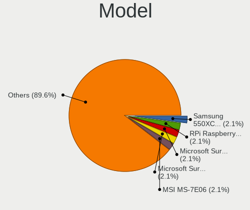
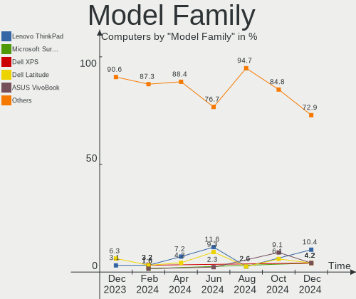
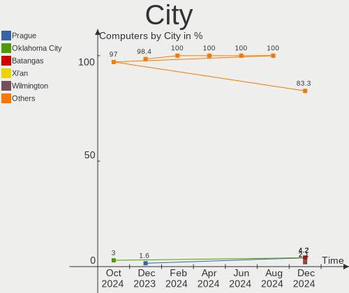
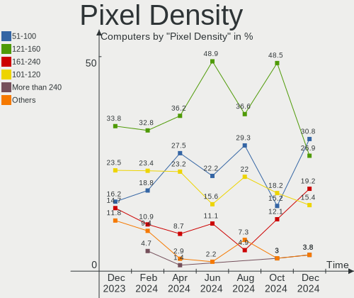
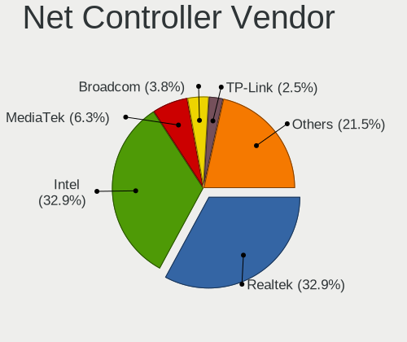

Kali - Hardware Trends
----------------------

A project to identify most popular hardware characteristics and track their change
over time based on data collected by Linux users at https://Linux-Hardware.org.

Anyone can contribute to this report by the [hw-probe](https://github.com/linuxhw/hw-probe) tool:

    sudo -E hw-probe -all -upload

This is a report for all computer types. See also reports for [desktops](/Dist/Kali/Desktop/README.md) and [notebooks](/Dist/Kali/Notebook/README.md).

This report is for one last month. Overall report since the beginning of time: [TestDays](https://github.com/linuxhw/TestDays)

Period: Dec, 2023.

Contents
--------

* [ System ](#system)
  - [ OS                       ](#os)
  - [ OS Family                ](#os-family)
  - [ Kernel                   ](#kernel)
  - [ Kernel Family            ](#kernel-family)
  - [ Kernel Major Ver.        ](#kernel-major-ver)
  - [ Arch                     ](#arch)
  - [ DE                       ](#de)
  - [ Display Server           ](#display-server)
  - [ Display Manager          ](#display-manager)
  - [ OS Lang                  ](#os-lang)
  - [ Boot Mode                ](#boot-mode)
  - [ Filesystem               ](#filesystem)
  - [ Part. scheme             ](#part-scheme)
  - [ Dual Boot with Linux/BSD ](#dual-boot-with-linuxbsd)
  - [ Dual Boot (Win)          ](#dual-boot-win)

* [ Board ](#board)
  - [ Vendor                   ](#vendor)
  - [ Model                    ](#model)
  - [ Model Family             ](#model-family)
  - [ MFG Year                 ](#mfg-year)
  - [ Form Factor              ](#form-factor)
  - [ Secure Boot              ](#secure-boot)
  - [ Coreboot                 ](#coreboot)
  - [ RAM Size                 ](#ram-size)
  - [ RAM Used                 ](#ram-used)
  - [ Total Drives             ](#total-drives)
  - [ Has CD-ROM               ](#has-cd-rom)
  - [ Has Ethernet             ](#has-ethernet)
  - [ Has WiFi                 ](#has-wifi)
  - [ Has Bluetooth            ](#has-bluetooth)

* [ Location ](#location)
  - [ Country                  ](#country)
  - [ City                     ](#city)

* [ Drives ](#drives)
  - [ Drive Vendor             ](#drive-vendor)
  - [ Drive Model              ](#drive-model)
  - [ HDD Vendor               ](#hdd-vendor)
  - [ SSD Vendor               ](#ssd-vendor)
  - [ Drive Kind               ](#drive-kind)
  - [ Drive Connector          ](#drive-connector)
  - [ Drive Size               ](#drive-size)
  - [ Space Total              ](#space-total)
  - [ Space Used               ](#space-used)
  - [ Malfunc. Drives          ](#malfunc-drives)
  - [ Malfunc. Drive Vendor    ](#malfunc-drive-vendor)
  - [ Malfunc. HDD Vendor      ](#malfunc-hdd-vendor)
  - [ Malfunc. Drive Kind      ](#malfunc-drive-kind)
  - [ Failed Drives            ](#failed-drives)
  - [ Failed Drive Vendor      ](#failed-drive-vendor)
  - [ Drive Status             ](#drive-status)

* [ Storage controller ](#storage-controller)
  - [ Storage Vendor           ](#storage-vendor)
  - [ Storage Model            ](#storage-model)
  - [ Storage Kind             ](#storage-kind)

* [ Processor ](#processor)
  - [ CPU Vendor               ](#cpu-vendor)
  - [ CPU Model                ](#cpu-model)
  - [ CPU Model Family         ](#cpu-model-family)
  - [ CPU Cores                ](#cpu-cores)
  - [ CPU Sockets              ](#cpu-sockets)
  - [ CPU Threads              ](#cpu-threads)
  - [ CPU Op-Modes             ](#cpu-op-modes)
  - [ CPU Microcode            ](#cpu-microcode)
  - [ CPU Microarch            ](#cpu-microarch)

* [ Graphics ](#graphics)
  - [ GPU Vendor               ](#gpu-vendor)
  - [ GPU Model                ](#gpu-model)
  - [ GPU Combo                ](#gpu-combo)
  - [ GPU Driver               ](#gpu-driver)
  - [ GPU Memory               ](#gpu-memory)

* [ Monitor ](#monitor)
  - [ Monitor Vendor           ](#monitor-vendor)
  - [ Monitor Model            ](#monitor-model)
  - [ Monitor Resolution       ](#monitor-resolution)
  - [ Monitor Diagonal         ](#monitor-diagonal)
  - [ Monitor Width            ](#monitor-width)
  - [ Aspect Ratio             ](#aspect-ratio)
  - [ Monitor Area             ](#monitor-area)
  - [ Pixel Density            ](#pixel-density)
  - [ Multiple Monitors        ](#multiple-monitors)

* [ Network ](#network)
  - [ Net Controller Vendor    ](#net-controller-vendor)
  - [ Net Controller Model     ](#net-controller-model)
  - [ Wireless Vendor          ](#wireless-vendor)
  - [ Wireless Model           ](#wireless-model)
  - [ Ethernet Vendor          ](#ethernet-vendor)
  - [ Ethernet Model           ](#ethernet-model)
  - [ Net Controller Kind      ](#net-controller-kind)
  - [ Used Controller          ](#used-controller)
  - [ NICs                     ](#nics)
  - [ IPv6                     ](#ipv6)

* [ Bluetooth ](#bluetooth)
  - [ Bluetooth Vendor         ](#bluetooth-vendor)
  - [ Bluetooth Model          ](#bluetooth-model)

* [ Sound ](#sound)
  - [ Sound Vendor             ](#sound-vendor)
  - [ Sound Model              ](#sound-model)

* [ Memory ](#memory)
  - [ Memory Vendor            ](#memory-vendor)
  - [ Memory Model             ](#memory-model)
  - [ Memory Kind              ](#memory-kind)
  - [ Memory Form Factor       ](#memory-form-factor)
  - [ Memory Size              ](#memory-size)
  - [ Memory Speed             ](#memory-speed)

* [ Printers & scanners ](#printers--scanners)
  - [ Printer Vendor           ](#printer-vendor)
  - [ Printer Model            ](#printer-model)
  - [ Scanner Vendor           ](#scanner-vendor)
  - [ Scanner Model            ](#scanner-model)

* [ Camera ](#camera)
  - [ Camera Vendor            ](#camera-vendor)
  - [ Camera Model             ](#camera-model)

* [ Security ](#security)
  - [ Fingerprint Vendor       ](#fingerprint-vendor)
  - [ Fingerprint Model        ](#fingerprint-model)
  - [ Chipcard Vendor          ](#chipcard-vendor)
  - [ Chipcard Model           ](#chipcard-model)

* [ Unsupported ](#unsupported)
  - [ Unsupported Devices      ](#unsupported-devices)
  - [ Unsupported Device Types ](#unsupported-device-types)

System
------

OS
--

Installed operating systems

| Name        | Computers | Percent |
|-------------|-----------|---------|
| Kali 2023.4 | 56        | 87.5%   |
| Kali 2023.3 | 7         | 10.94%  |
| Kali 2022.4 | 1         | 1.56%   |

OS Family
---------

OS without a version

| Name | Computers | Percent |
|------|-----------|---------|
| Kali | 64        | 100%    |

Kernel
------

Version of the Linux kernel

| Version             | Computers | Percent |
|---------------------|-----------|---------|
| 6.5.0-kali3-amd64   | 52        | 81.25%  |
| 6.5.0-kali5-amd64   | 3         | 4.69%   |
| 6.3.0-kali1-amd64   | 3         | 4.69%   |
| 6.5.0-kali2-amd64   | 1         | 1.56%   |
| 6.5.0-kali1-amd64   | 1         | 1.56%   |
| 6.5.0-5-amd64       | 1         | 1.56%   |
| 6.4.0-kali3-amd64   | 1         | 1.56%   |
| 6.3.0-kali1-686-pae | 1         | 1.56%   |
| 5.15.44-Re4son-v8l+ | 1         | 1.56%   |

Kernel Family
-------------

Linux kernel without a distro release

| Version | Computers | Percent |
|---------|-----------|---------|
| 6.5.0   | 58        | 90.63%  |
| 6.3.0   | 4         | 6.25%   |
| 6.4.0   | 1         | 1.56%   |
| 5.15.44 | 1         | 1.56%   |

Kernel Major Ver.
-----------------

Linux kernel major version

| Version | Computers | Percent |
|---------|-----------|---------|
| 6.5     | 58        | 90.63%  |
| 6.3     | 4         | 6.25%   |
| 6.4     | 1         | 1.56%   |
| 5.15    | 1         | 1.56%   |

Arch
----

OS architecture (x86_64, i586, etc.)

| Name    | Computers | Percent |
|---------|-----------|---------|
| x86_64  | 62        | 96.88%  |
| i686    | 1         | 1.56%   |
| aarch64 | 1         | 1.56%   |

DE
--

Desktop Environment

| Name             | Computers | Percent |
|------------------|-----------|---------|
| XFCE             | 29        | 45.31%  |
| GNOME            | 15        | 23.44%  |
| KDE5             | 10        | 15.63%  |
| lightdm-xsession | 3         | 4.69%   |
| X-Cinnamon       | 2         | 3.13%   |
| GNOME-Classic    | 2         | 3.13%   |
| MATE             | 1         | 1.56%   |
| GNOME Classic    | 1         | 1.56%   |
| Unknown          | 1         | 1.56%   |

Display Server
--------------

X11 or Wayland

| Name    | Computers | Percent |
|---------|-----------|---------|
| X11     | 54        | 84.38%  |
| Wayland | 9         | 14.06%  |
| Unknown | 1         | 1.56%   |

Display Manager
---------------

SDDM, LightDM, etc.

| Name    | Computers | Percent |
|---------|-----------|---------|
| LightDM | 27        | 42.19%  |
| Unknown | 20        | 31.25%  |
| SDDM    | 12        | 18.75%  |
| GDM3    | 5         | 7.81%   |

OS Lang
-------

Language

| Lang    | Computers | Percent |
|---------|-----------|---------|
| C       | 36        | 56.25%  |
| en_US   | 15        | 23.44%  |
| de_DE   | 4         | 6.25%   |
| zh_CN   | 2         | 3.13%   |
| pt_BR   | 1         | 1.56%   |
| fr_FR   | 1         | 1.56%   |
| es_MX   | 1         | 1.56%   |
| es_CO   | 1         | 1.56%   |
| en_IN   | 1         | 1.56%   |
| en_GB   | 1         | 1.56%   |
| Unknown | 1         | 1.56%   |

Boot Mode
---------

EFI or BIOS

| Mode | Computers | Percent |
|------|-----------|---------|
| EFI  | 47        | 73.44%  |
| BIOS | 17        | 26.56%  |

Filesystem
----------

Type of filesystem

| Type    | Computers | Percent |
|---------|-----------|---------|
| Ext4    | 59        | 92.19%  |
| Tmpfs   | 3         | 4.69%   |
| Overlay | 1         | 1.56%   |
| Btrfs   | 1         | 1.56%   |

Part. scheme
------------

Scheme of partitioning

| Type    | Computers | Percent |
|---------|-----------|---------|
| GPT     | 35        | 54.69%  |
| Unknown | 19        | 29.69%  |
| MBR     | 10        | 15.63%  |

Dual Boot with Linux/BSD
------------------------

Hosting more than one Linux/BSD

| Dual boot | Computers | Percent |
|-----------|-----------|---------|
| No        | 58        | 90.63%  |
| Yes       | 6         | 9.38%   |

Dual Boot (Win)
---------------

Hosting Linux and Windows

| Dual boot | Computers | Percent |
|-----------|-----------|---------|
| No        | 41        | 64.06%  |
| Yes       | 23        | 35.94%  |

Board
-----

Vendor
------

Motherboard manufacturer

| Name                    | Computers | Percent |
|-------------------------|-----------|---------|
| Hewlett-Packard         | 18        | 28.13%  |
| Lenovo                  | 10        | 15.63%  |
| ASUSTek Computer        | 10        | 15.63%  |
| Dell                    | 6         | 9.38%   |
| Apple                   | 5         | 7.81%   |
| MSI                     | 3         | 4.69%   |
| Acer                    | 2         | 3.13%   |
| Raspberry Pi Foundation | 1         | 1.56%   |
| Intel                   | 1         | 1.56%   |
| HUAWEI                  | 1         | 1.56%   |
| Google                  | 1         | 1.56%   |
| Gigabyte Technology     | 1         | 1.56%   |
| Gateway                 | 1         | 1.56%   |
| EVGA                    | 1         | 1.56%   |
| Dynabook                | 1         | 1.56%   |
| Alienware               | 1         | 1.56%   |
| Unknown                 | 1         | 1.56%   |

Model
-----

Motherboard model

| Name                                               | Computers | Percent |
|----------------------------------------------------|-----------|---------|
| RPi Raspberry Pi 400 Rev 1.0                       | 1         | 1.56%   |
| MSI MS-7D28                                        | 1         | 1.56%   |
| MSI MS-7D22                                        | 1         | 1.56%   |
| MSI MS-7B49                                        | 1         | 1.56%   |
| Lenovo Z50-70 20354                                | 1         | 1.56%   |
| Lenovo XiaoXinDuoduet IAU7 82TQ                    | 1         | 1.56%   |
| Lenovo ThinkPad X270 20HMS25R00                    | 1         | 1.56%   |
| Lenovo ThinkPad T420 4177QGU                       | 1         | 1.56%   |
| Lenovo Legion Y740-17IRHg 81UJ                     | 1         | 1.56%   |
| Lenovo IdeaPad Slim 5 14IRL8 82XD                  | 1         | 1.56%   |
| Lenovo IdeaPad S145-15IIL 81W8                     | 1         | 1.56%   |
| Lenovo IdeaPad L340-15IRH Gaming 81LK              | 1         | 1.56%   |
| Lenovo IdeaPad 320-15ISK 80XH                      | 1         | 1.56%   |
| Lenovo H50-50 90B600BFBG                           | 1         | 1.56%   |
| Intel H61                                          | 1         | 1.56%   |
| HUAWEI BOHK-WAX9X                                  | 1         | 1.56%   |
| HP ZBook Power 15.6 inch G10 Mobile Workstation PC | 1         | 1.56%   |
| HP t240 Thin Client                                | 1         | 1.56%   |
| HP ProBook 4540s                                   | 1         | 1.56%   |
| HP Pavilion Laptop 15-eh1xxx                       | 1         | 1.56%   |
| HP Pavilion Laptop 14-dv2xxx                       | 1         | 1.56%   |
| HP Pavilion Gaming Laptop 17-cd1xxx                | 1         | 1.56%   |
| HP Pavilion g6                                     | 1         | 1.56%   |
| HP Pavilion 15                                     | 1         | 1.56%   |
| HP OMEN by Gaming Laptop 16-k0xxx                  | 1         | 1.56%   |
| HP Notebook                                        | 1         | 1.56%   |
| HP Laptop 15-da0xxx                                | 1         | 1.56%   |
| HP G1-2012la                                       | 1         | 1.56%   |
| HP ENVY x360 Convertible 13-bd0xxx                 | 1         | 1.56%   |
| HP EliteBook 8560w                                 | 1         | 1.56%   |
| HP EliteBook 850 G1                                | 1         | 1.56%   |
| HP EliteBook 830 G8 Notebook PC                    | 1         | 1.56%   |
| HP EliteBook 820 G3                                | 1         | 1.56%   |
| HP 255 15.6 inch G9 Notebook PC                    | 1         | 1.56%   |
| Google Droid                                       | 1         | 1.56%   |
| Gigabyte Z590 AORUS ULTRA                          | 1         | 1.56%   |
| Gateway NV57H                                      | 1         | 1.56%   |
| EVGA 151-BE-E097                                   | 1         | 1.56%   |
| Dynabook TECRA A50-J                               | 1         | 1.56%   |
| Dell Vostro 3400                                   | 1         | 1.56%   |

Model Family
------------

Motherboard model prefix

| Name                  | Computers | Percent |
|-----------------------|-----------|---------|
| HP Pavilion           | 5         | 7.81%   |
| Lenovo IdeaPad        | 4         | 6.25%   |
| HP EliteBook          | 4         | 6.25%   |
| Dell Latitude         | 4         | 6.25%   |
| Lenovo ThinkPad       | 2         | 3.13%   |
| ASUS ROG              | 2         | 3.13%   |
| ASUS PRIME            | 2         | 3.13%   |
| Apple MacBookPro9     | 2         | 3.13%   |
| RPi Raspberry         | 1         | 1.56%   |
| MSI MS-7D28           | 1         | 1.56%   |
| MSI MS-7D22           | 1         | 1.56%   |
| MSI MS-7B49           | 1         | 1.56%   |
| Lenovo Z50-70         | 1         | 1.56%   |
| Lenovo XiaoXinDuoduet | 1         | 1.56%   |
| Lenovo Legion         | 1         | 1.56%   |
| Lenovo H50-50         | 1         | 1.56%   |
| Intel H61             | 1         | 1.56%   |
| HUAWEI BOHK-WAX9X     | 1         | 1.56%   |
| HP ZBook              | 1         | 1.56%   |
| HP t240               | 1         | 1.56%   |
| HP ProBook            | 1         | 1.56%   |
| HP OMEN               | 1         | 1.56%   |
| HP Notebook           | 1         | 1.56%   |
| HP Laptop             | 1         | 1.56%   |
| HP G1-2012la          | 1         | 1.56%   |
| HP ENVY               | 1         | 1.56%   |
| HP 255                | 1         | 1.56%   |
| Google Droid          | 1         | 1.56%   |
| Gigabyte Z590         | 1         | 1.56%   |
| Gateway NV57H         | 1         | 1.56%   |
| EVGA 151-BE-E097      | 1         | 1.56%   |
| Dynabook TECRA        | 1         | 1.56%   |
| Dell Vostro           | 1         | 1.56%   |
| Dell Precision        | 1         | 1.56%   |
| ASUS Z170-A           | 1         | 1.56%   |
| ASUS X555LA           | 1         | 1.56%   |
| ASUS UX32VD           | 1         | 1.56%   |
| ASUS K54C             | 1         | 1.56%   |
| ASUS G551JM           | 1         | 1.56%   |
| ASUS 1005HA           | 1         | 1.56%   |

MFG Year
--------

Motherboard manufacture year

| Year    | Computers | Percent |
|---------|-----------|---------|
| 2021    | 7         | 10.94%  |
| 2019    | 7         | 10.94%  |
| 2017    | 7         | 10.94%  |
| 2012    | 6         | 9.38%   |
| 2023    | 5         | 7.81%   |
| 2022    | 5         | 7.81%   |
| 2015    | 5         | 7.81%   |
| 2011    | 5         | 7.81%   |
| 2014    | 4         | 6.25%   |
| 2018    | 3         | 4.69%   |
| 2013    | 3         | 4.69%   |
| 2020    | 2         | 3.13%   |
| 2010    | 2         | 3.13%   |
| 2009    | 1         | 1.56%   |
| 2007    | 1         | 1.56%   |
| Unknown | 1         | 1.56%   |

Form Factor
-----------

Physical design of the computer

| Name           | Computers | Percent |
|----------------|-----------|---------|
| Notebook       | 45        | 70.31%  |
| Desktop        | 12        | 18.75%  |
| Tablet         | 3         | 4.69%   |
| Mini pc        | 2         | 3.13%   |
| System on chip | 1         | 1.56%   |
| Convertible    | 1         | 1.56%   |

Secure Boot
-----------

Enabled or disabled

| State    | Computers | Percent |
|----------|-----------|---------|
| Disabled | 64        | 100%    |

Coreboot
--------

Have coreboot on board

| Used | Computers | Percent |
|------|-----------|---------|
| No   | 63        | 98.44%  |
| Yes  | 1         | 1.56%   |

RAM Size
--------

Total RAM memory

| Size in GB  | Computers | Percent |
|-------------|-----------|---------|
| 4.01-8.0    | 18        | 28.13%  |
| 16.01-24.0  | 18        | 28.13%  |
| 32.01-64.0  | 8         | 12.5%   |
| 3.01-4.0    | 8         | 12.5%   |
| 8.01-16.0   | 8         | 12.5%   |
| 24.01-32.0  | 1         | 1.56%   |
| 2.01-3.0    | 1         | 1.56%   |
| 64.01-256.0 | 1         | 1.56%   |
| 1.01-2.0    | 1         | 1.56%   |

RAM Used
--------

Used RAM memory

| Used GB    | Computers | Percent |
|------------|-----------|---------|
| 2.01-3.0   | 24        | 37.5%   |
| 3.01-4.0   | 17        | 26.56%  |
| 1.01-2.0   | 11        | 17.19%  |
| 4.01-8.0   | 8         | 12.5%   |
| 8.01-16.0  | 2         | 3.13%   |
| 16.01-24.0 | 1         | 1.56%   |
| 0.51-1.0   | 1         | 1.56%   |

Total Drives
------------

Number of drives on board

| Drives | Computers | Percent |
|--------|-----------|---------|
| 1      | 44        | 68.75%  |
| 2      | 12        | 18.75%  |
| 3      | 6         | 9.38%   |
| 6      | 1         | 1.56%   |
| 0      | 1         | 1.56%   |

Has CD-ROM
----------

Has CD-ROM on board

| Presented | Computers | Percent |
|-----------|-----------|---------|
| No        | 47        | 73.44%  |
| Yes       | 17        | 26.56%  |

Has Ethernet
------------

Has Ethernet on board

| Presented | Computers | Percent |
|-----------|-----------|---------|
| Yes       | 52        | 81.25%  |
| No        | 12        | 18.75%  |

Has WiFi
--------

Has WiFi module

| Presented | Computers | Percent |
|-----------|-----------|---------|
| Yes       | 59        | 92.19%  |
| No        | 5         | 7.81%   |

Has Bluetooth
-------------

Has Bluetooth module

| Presented | Computers | Percent |
|-----------|-----------|---------|
| Yes       | 50        | 78.13%  |
| No        | 14        | 21.88%  |

Location
--------

Country
-------

Geographic location (country)

| Country            | Computers | Percent |
|--------------------|-----------|---------|
| USA                | 13        | 20.31%  |
| Germany            | 5         | 7.81%   |
| India              | 4         | 6.25%   |
| Italy              | 3         | 4.69%   |
| France             | 3         | 4.69%   |
| Canada             | 3         | 4.69%   |
| Bulgaria           | 3         | 4.69%   |
| Romania            | 2         | 3.13%   |
| Egypt              | 2         | 3.13%   |
| Czechia            | 2         | 3.13%   |
| China              | 2         | 3.13%   |
| Australia          | 2         | 3.13%   |
| Sri Lanka          | 1         | 1.56%   |
| Russia             | 1         | 1.56%   |
| Portugal           | 1         | 1.56%   |
| Poland             | 1         | 1.56%   |
| Philippines        | 1         | 1.56%   |
| Pakistan           | 1         | 1.56%   |
| Norway             | 1         | 1.56%   |
| Moldova            | 1         | 1.56%   |
| Mexico             | 1         | 1.56%   |
| Jordan             | 1         | 1.56%   |
| Iran               | 1         | 1.56%   |
| Indonesia          | 1         | 1.56%   |
| Greece             | 1         | 1.56%   |
| Dominican Republic | 1         | 1.56%   |
| Colombia           | 1         | 1.56%   |
| Cameroon           | 1         | 1.56%   |
| Brazil             | 1         | 1.56%   |
| Belgium            | 1         | 1.56%   |
| Austria            | 1         | 1.56%   |
| Argentina          | 1         | 1.56%   |

City
----

Geographic location (city)

| City                       | Computers | Percent |
|----------------------------|-----------|---------|
| Toronto                    | 2         | 3.13%   |
| Los Angeles                | 2         | 3.13%   |
| Villeneuve les beziers     | 1         | 1.56%   |
| Villa Martelli             | 1         | 1.56%   |
| Tula                       | 1         | 1.56%   |
| Timișoara                 | 1         | 1.56%   |
| Tehran                     | 1         | 1.56%   |
| Sydney                     | 1         | 1.56%   |
| Subcarpathia               | 1         | 1.56%   |
| St Louis                   | 1         | 1.56%   |
| Spinea                     | 1         | 1.56%   |
| Sofia                      | 1         | 1.56%   |
| Shumen                     | 1         | 1.56%   |
| Semarang                   | 1         | 1.56%   |
| Santo Domingo              | 1         | 1.56%   |
| Sankt Ruprecht an der Raab | 1         | 1.56%   |
| San Pedro                  | 1         | 1.56%   |
| Pune                       | 1         | 1.56%   |
| Providence                 | 1         | 1.56%   |
| Prague                     | 1         | 1.56%   |
| Porto                      | 1         | 1.56%   |
| Portland                   | 1         | 1.56%   |
| Plainfield                 | 1         | 1.56%   |
| Pensacola                  | 1         | 1.56%   |
| Paris                      | 1         | 1.56%   |
| Pallini                    | 1         | 1.56%   |
| Palermo                    | 1         | 1.56%   |
| Northeim                   | 1         | 1.56%   |
| Mumbai                     | 1         | 1.56%   |
| Mexico City                | 1         | 1.56%   |
| Lilancun                   | 1         | 1.56%   |
| Lautertal                  | 1         | 1.56%   |
| Las Vegas                  | 1         | 1.56%   |
| Kurunegala                 | 1         | 1.56%   |
| Kolkata                    | 1         | 1.56%   |
| Kokomo                     | 1         | 1.56%   |
| Huy                        | 1         | 1.56%   |
| Hope                       | 1         | 1.56%   |
| Haidian                    | 1         | 1.56%   |
| Giza                       | 1         | 1.56%   |

Drives
------

Drive Vendor
------------

Hard drive vendors

| Vendor                      | Computers | Drives | Percent |
|-----------------------------|-----------|--------|---------|
| Samsung Electronics         | 14        | 15     | 15.73%  |
| WDC                         | 10        | 10     | 11.24%  |
| SanDisk                     | 8         | 8      | 8.99%   |
| Seagate                     | 6         | 6      | 6.74%   |
| Hitachi                     | 5         | 5      | 5.62%   |
| Unknown                     | 3         | 4      | 3.37%   |
| Toshiba                     | 3         | 3      | 3.37%   |
| Silicon Motion              | 3         | 3      | 3.37%   |
| PNY                         | 3         | 3      | 3.37%   |
| Kingston                    | 3         | 3      | 3.37%   |
| Crucial                     | 3         | 3      | 3.37%   |
| A-DATA Technology           | 3         | 3      | 3.37%   |
| SK hynix                    | 2         | 2      | 2.25%   |
| Phison Electronics          | 2         | 2      | 2.25%   |
| Intel                       | 2         | 3      | 2.25%   |
| HGST                        | 2         | 2      | 2.25%   |
| Realtek Semiconductor       | 1         | 1      | 1.12%   |
| PNY USB                     | 1         | 1      | 1.12%   |
| Patriot                     | 1         | 1      | 1.12%   |
| Maxone                      | 1         | 1      | 1.12%   |
| MAXIO Technology (Hangzhou) | 1         | 1      | 1.12%   |
| LITEON                      | 1         | 1      | 1.12%   |
| Lite-On Technology          | 1         | 1      | 1.12%   |
| Kingston Technology Company | 1         | 2      | 1.12%   |
| KESU                        | 1         | 1      | 1.12%   |
| GOODRAM                     | 1         | 1      | 1.12%   |
| FIKWOT                      | 1         | 1      | 1.12%   |
| Fanxiang                    | 1         | 1      | 1.12%   |
| CT1000P3                    | 1         | 1      | 1.12%   |
| Apple                       | 1         | 1      | 1.12%   |
| Apacer                      | 1         | 1      | 1.12%   |
| AirDisk                     | 1         | 1      | 1.12%   |
| Unknown                     | 1         | 1      | 1.12%   |

Drive Model
-----------

Hard drive models

| Model                                                 | Computers | Percent |
|-------------------------------------------------------|-----------|---------|
| Silicon Motion SM2263EN/SM2263XT SSD Controller 500GB | 2         | 2.17%   |
| Crucial CT500MX500SSD1 500GB                          | 2         | 2.17%   |
| WDC WDS500G2B0A-00SM50 500GB SSD                      | 1         | 1.09%   |
| WDC WDS240G2G0B-00EPW0 240GB SSD                      | 1         | 1.09%   |
| WDC WD5003ABYX-50WERA1 500GB                          | 1         | 1.09%   |
| WDC WD5000AVDS-63U7B1 500GB                           | 1         | 1.09%   |
| WDC WD3200BPVT-22JJ5T0 320GB                          | 1         | 1.09%   |
| WDC WD22PURZ-85B4ZY0 2TB                              | 1         | 1.09%   |
| WDC WD10SPZX-24Z10 1TB                                | 1         | 1.09%   |
| WDC WD10SPZX-08Z10 1TB                                | 1         | 1.09%   |
| WDC PC SN530 SDBPNPZ-1T00-1006 1TB                    | 1         | 1.09%   |
| WDC PC SN520 SDAPNUW-512G-1014 512GB                  | 1         | 1.09%   |
| Unknown MMC Card  7GB                                 | 1         | 1.09%   |
| Unknown MMC Card  128GB                               | 1         | 1.09%   |
| Unknown ED2S5  128GB                                  | 1         | 1.09%   |
| Unknown DA4064  64GB                                  | 1         | 1.09%   |
| Toshiba MQ04ABF100 1TB                                | 1         | 1.09%   |
| Toshiba MK3259GSXP 320GB                              | 1         | 1.09%   |
| Toshiba DT01ACA100 1TB                                | 1         | 1.09%   |
| SK hynix PC801 HFS001TEJ9X101N 1TB                    | 1         | 1.09%   |
| SK hynix PC611 NVMe 512GB                             | 1         | 1.09%   |
| Silicon Motion SSD_M.2_PCI_NVME_1TB_InnovationIT      | 1         | 1.09%   |
| Seagate ST9160314AS 40GB                              | 1         | 1.09%   |
| Seagate ST500LM012 HN-M500MBB 500GB                   | 1         | 1.09%   |
| Seagate ST4000DM004-2CV104 4TB                        | 1         | 1.09%   |
| Seagate ST3750525AS 752GB                             | 1         | 1.09%   |
| Seagate ST31000524AS 1TB                              | 1         | 1.09%   |
| Seagate BUP Portable 4TB                              | 1         | 1.09%   |
| Sandisk WD PC SN735 SDBPTHH-512G-1002 512GB           | 1         | 1.09%   |
| Sandisk WD Green SN350 1TB                            | 1         | 1.09%   |
| Sandisk WD Black SN850 1024GB                         | 1         | 1.09%   |
| SanDisk SSD PLUS 1000GB                               | 1         | 1.09%   |
| SanDisk SSD i100 24GB                                 | 1         | 1.09%   |
| SanDisk SD8SBAT128G1002 128GB SSD                     | 1         | 1.09%   |
| SanDisk NVMe SSD Drive 512GB                          | 1         | 1.09%   |
| SanDisk NVMe SSD Drive 1TB                            | 1         | 1.09%   |
| Samsung SSD 870 EVO 500GB                             | 1         | 1.09%   |
| Samsung SSD 870 EVO 2TB                               | 1         | 1.09%   |
| Samsung SSD 860 QVO 1TB                               | 1         | 1.09%   |
| Samsung SSD 860 EVO 250GB                             | 1         | 1.09%   |

HDD Vendor
----------

Hard disk drive vendors

| Vendor  | Computers | Drives | Percent |
|---------|-----------|--------|---------|
| WDC     | 6         | 6      | 25%     |
| Seagate | 6         | 6      | 25%     |
| Hitachi | 5         | 5      | 20.83%  |
| Toshiba | 3         | 3      | 12.5%   |
| HGST    | 2         | 2      | 8.33%   |
| Maxone  | 1         | 1      | 4.17%   |
| KESU    | 1         | 1      | 4.17%   |

SSD Vendor
----------

Solid state drive vendors

| Vendor              | Computers | Drives | Percent |
|---------------------|-----------|--------|---------|
| Samsung Electronics | 7         | 7      | 25%     |
| SanDisk             | 3         | 3      | 10.71%  |
| Crucial             | 3         | 3      | 10.71%  |
| WDC                 | 2         | 2      | 7.14%   |
| PNY                 | 2         | 2      | 7.14%   |
| A-DATA Technology   | 2         | 2      | 7.14%   |
| PNY USB             | 1         | 1      | 3.57%   |
| Patriot             | 1         | 1      | 3.57%   |
| LITEON              | 1         | 1      | 3.57%   |
| Kingston            | 1         | 1      | 3.57%   |
| Intel               | 1         | 1      | 3.57%   |
| GOODRAM             | 1         | 1      | 3.57%   |
| Apple               | 1         | 1      | 3.57%   |
| Apacer              | 1         | 1      | 3.57%   |
| AirDisk             | 1         | 1      | 3.57%   |

Drive Kind
----------

HDD or SSD

| Kind    | Computers | Drives | Percent |
|---------|-----------|--------|---------|
| NVMe    | 27        | 35     | 34.18%  |
| SSD     | 24        | 28     | 30.38%  |
| HDD     | 23        | 24     | 29.11%  |
| MMC     | 4         | 5      | 5.06%   |
| Unknown | 1         | 1      | 1.27%   |

Drive Connector
---------------

SATA, SAS, NVMe, etc.

| Type | Computers | Drives | Percent |
|------|-----------|--------|---------|
| SATA | 40        | 49     | 53.33%  |
| NVMe | 27        | 34     | 36%     |
| SAS  | 4         | 5      | 5.33%   |
| MMC  | 4         | 5      | 5.33%   |

Drive Size
----------

Size of hard drive

| Size in TB | Computers | Drives | Percent |
|------------|-----------|--------|---------|
| 0.01-0.5   | 28        | 30     | 57.14%  |
| 0.51-1.0   | 17        | 18     | 34.69%  |
| 3.01-4.0   | 2         | 2      | 4.08%   |
| 1.01-2.0   | 2         | 2      | 4.08%   |

Space Total
-----------

Amount of disk space available on the file system

| Size in GB     | Computers | Percent |
|----------------|-----------|---------|
| 101-250        | 17        | 26.56%  |
| 501-1000       | 15        | 23.44%  |
| 251-500        | 14        | 21.88%  |
| 51-100         | 9         | 14.06%  |
| 1001-2000      | 4         | 6.25%   |
| More than 3000 | 2         | 3.13%   |
| 21-50          | 1         | 1.56%   |
| 1-20           | 1         | 1.56%   |
| Unknown        | 1         | 1.56%   |

Space Used
----------

Amount of used disk space

| Used GB        | Computers | Percent |
|----------------|-----------|---------|
| 21-50          | 19        | 29.69%  |
| 1-20           | 15        | 23.44%  |
| 51-100         | 12        | 18.75%  |
| 101-250        | 10        | 15.63%  |
| 251-500        | 4         | 6.25%   |
| More than 3000 | 1         | 1.56%   |
| 1001-2000      | 1         | 1.56%   |
| 501-1000       | 1         | 1.56%   |
| Unknown        | 1         | 1.56%   |

Malfunc. Drives
---------------

Drive models with a malfunction

| Model                         | Computers | Drives | Percent |
|-------------------------------|-----------|--------|---------|
| WDC WD3200BPVT-22JJ5T0 320GB  | 1         | 1      | 16.67%  |
| Toshiba MK3259GSXP 320GB      | 1         | 1      | 16.67%  |
| Hitachi HTS723232A7A364 320GB | 1         | 1      | 16.67%  |
| Hitachi HTS547564A9E384 640GB | 1         | 1      | 16.67%  |
| Hitachi HDE721010SLA330 1TB   | 1         | 1      | 16.67%  |
| HGST HTS541010A9E680 1TB      | 1         | 1      | 16.67%  |

Malfunc. Drive Vendor
---------------------

Vendors of faulty drives

| Vendor  | Computers | Drives | Percent |
|---------|-----------|--------|---------|
| Hitachi | 3         | 3      | 50%     |
| WDC     | 1         | 1      | 16.67%  |
| Toshiba | 1         | 1      | 16.67%  |
| HGST    | 1         | 1      | 16.67%  |

Malfunc. HDD Vendor
-------------------

Vendors of faulty HDD drives

| Vendor  | Computers | Drives | Percent |
|---------|-----------|--------|---------|
| Hitachi | 3         | 3      | 50%     |
| WDC     | 1         | 1      | 16.67%  |
| Toshiba | 1         | 1      | 16.67%  |
| HGST    | 1         | 1      | 16.67%  |

Malfunc. Drive Kind
-------------------

Kinds of faulty drives

| Kind | Computers | Drives | Percent |
|------|-----------|--------|---------|
| HDD  | 6         | 6      | 100%    |

Failed Drives
-------------

Failed drive models

Zero info for selected period =(

Failed Drive Vendor
-------------------

Failed drive vendors

Zero info for selected period =(

Drive Status
------------

Number of failed and malfunc. drives

| Status   | Computers | Drives | Percent |
|----------|-----------|--------|---------|
| Works    | 34        | 46     | 50.75%  |
| Detected | 27        | 41     | 40.3%   |
| Malfunc  | 6         | 6      | 8.96%   |

Storage controller
------------------

Storage Vendor
--------------

Storage controller vendors

| Vendor                      | Computers | Percent |
|-----------------------------|-----------|---------|
| Intel                       | 44        | 55%     |
| Samsung Electronics         | 8         | 10%     |
| Sandisk                     | 7         | 8.75%   |
| AMD                         | 4         | 5%      |
| Silicon Motion              | 3         | 3.75%   |
| Phison Electronics          | 3         | 3.75%   |
| Kingston Technology Company | 3         | 3.75%   |
| SK hynix                    | 2         | 2.5%    |
| MAXIO Technology (Hangzhou) | 2         | 2.5%    |
| Realtek Semiconductor       | 1         | 1.25%   |
| Marvell Technology Group    | 1         | 1.25%   |
| Lite-On Technology          | 1         | 1.25%   |
| ADATA Technology            | 1         | 1.25%   |

Storage Model
-------------

Storage controller models

| Model                                                                          | Computers | Percent |
|--------------------------------------------------------------------------------|-----------|---------|
| Intel 7 Series Chipset Family 6-port SATA Controller [AHCI mode]               | 6         | 6.74%   |
| Intel Volume Management Device NVMe RAID Controller                            | 5         | 5.62%   |
| Intel Sunrise Point-LP SATA Controller [AHCI mode]                             | 4         | 4.49%   |
| Intel 82801 Mobile SATA Controller [RAID mode]                                 | 4         | 4.49%   |
| Intel 6 Series/C200 Series Chipset Family 6 port Mobile SATA AHCI Controller   | 4         | 4.49%   |
| Silicon Motion SM2263EN/SM2263XT (DRAM-less) NVMe SSD Controllers              | 3         | 3.37%   |
| Samsung NVMe SSD Controller SM981/PM981/PM983                                  | 3         | 3.37%   |
| Intel 8 Series/C220 Series Chipset Family 6-port SATA Controller 1 [AHCI mode] | 3         | 3.37%   |
| Intel 8 Series SATA Controller 1 [AHCI mode]                                   | 3         | 3.37%   |
| AMD FCH SATA Controller [AHCI mode]                                            | 3         | 3.37%   |
| Samsung NVMe SSD Controller PM9A1/PM9A3/980PRO                                 | 2         | 2.25%   |
| Samsung NVMe SSD Controller 980 (DRAM-less)                                    | 2         | 2.25%   |
| MAXIO (Hangzhou) NVMe SSD Controller MAP1202                                   | 2         | 2.25%   |
| Kingston Company OM3PDP3 NVMe SSD                                              | 2         | 2.25%   |
| Intel Tiger Lake-LP SATA Controller                                            | 2         | 2.25%   |
| Intel Cannon Lake Mobile PCH SATA AHCI Controller                              | 2         | 2.25%   |
| Intel 500 Series Chipset Family SATA AHCI Controller                           | 2         | 2.25%   |
| SK hynix Platinum P41/PC801 NVMe Solid State Drive                             | 1         | 1.12%   |
| SK hynix PC611 NVMe Solid State Drive                                          | 1         | 1.12%   |
| SanDisk WD PC SN810 / Black SN850 NVMe SSD                                     | 1         | 1.12%   |
| Sandisk WD PC SN740 NVMe SSD 512GB (DRAM-less)                                 | 1         | 1.12%   |
| Sandisk WD PC SN735 NVMe SSD 1TB (DRAM-less)                                   | 1         | 1.12%   |
| SanDisk WD PC SN540 / Green SN350 NVMe SSD 1 TB (DRAM-less)                    | 1         | 1.12%   |
| SanDisk WD Blue SN500 / PC SN520 x2 M.2 2280 NVMe SSD                          | 1         | 1.12%   |
| SanDisk WD Black SN770 / PC SN740 256GB / PC SN560 (DRAM-less) NVMe SSD        | 1         | 1.12%   |
| SanDisk Ultra 3D / WD Blue SN550 NVMe SSD                                      | 1         | 1.12%   |
| Samsung S4LN058A01[SSUBX] AHCI SSD Controller (Apple slot)                     | 1         | 1.12%   |
| Realtek RTS5765DL NVMe SSD Controller (DRAM-less)                              | 1         | 1.12%   |
| Phison PS5013-E13 PCIe3 NVMe Controller (DRAM-less)                            | 1         | 1.12%   |
| Phison E16 PCIe4 NVMe Controller                                               | 1         | 1.12%   |
| Phison E12 NVMe Controller                                                     | 1         | 1.12%   |
| Marvell Group 88SE9215 PCIe 2.0 x1 4-port SATA 6 Gb/s Controller               | 1         | 1.12%   |
| Lite-On M8Pe Series NVMe SSD                                                   | 1         | 1.12%   |
| Kingston Company OM3PGP4 NVMe SSD                                              | 1         | 1.12%   |
| Kingston Company NV1 NVMe SSD E13T                                             | 1         | 1.12%   |
| Intel Wildcat Point-LP SATA Controller [AHCI Mode]                             | 1         | 1.12%   |
| Intel Q170/Q150/B150/H170/H110/Z170/CM236 Chipset SATA Controller [AHCI Mode]  | 1         | 1.12%   |
| Intel Optane NVME SSD H10 with Solid State Storage [Teton Glacier]             | 1         | 1.12%   |
| Intel Ice Lake-LP SATA Controller [AHCI mode]                                  | 1         | 1.12%   |
| Intel Celeron/Pentium Silver Processor SATA Controller                         | 1         | 1.12%   |

Storage Kind
------------

Kind of storage controller (IDE, SATA, NVMe, SAS, ...)

| Kind | Computers | Percent |
|------|-----------|---------|
| SATA | 40        | 50.63%  |
| NVMe | 27        | 34.18%  |
| RAID | 10        | 12.66%  |
| IDE  | 2         | 2.53%   |

Processor
---------

CPU Vendor
----------

Processor vendors

| Vendor | Computers | Percent |
|--------|-----------|---------|
| Intel  | 55        | 85.94%  |
| AMD    | 8         | 12.5%   |
| ARM    | 1         | 1.56%   |

CPU Model
---------

Processor models

| Model                                   | Computers | Percent |
|-----------------------------------------|-----------|---------|
| Intel Core i5-3210M CPU @ 2.50GHz       | 3         | 4.69%   |
| Intel Core i7-9750H CPU @ 2.60GHz       | 2         | 3.13%   |
| Intel Core i5-8350U CPU @ 1.70GHz       | 2         | 3.13%   |
| Intel Core i3-2350M CPU @ 2.30GHz       | 2         | 3.13%   |
| Intel 11th Gen Core i7-1165G7 @ 2.80GHz | 2         | 3.13%   |
| Intel Xeon CPU E5-2650 0 @ 2.00GHz      | 1         | 1.56%   |
| Intel Pentium CPU B960 @ 2.20GHz        | 1         | 1.56%   |
| Intel Core i7-6900K CPU @ 3.20GHz       | 1         | 1.56%   |
| Intel Core i7-6700K CPU @ 4.00GHz       | 1         | 1.56%   |
| Intel Core i7-6600U CPU @ 2.60GHz       | 1         | 1.56%   |
| Intel Core i7-4710HQ CPU @ 2.50GHz      | 1         | 1.56%   |
| Intel Core i7-4700MQ CPU @ 2.40GHz      | 1         | 1.56%   |
| Intel Core i7-4600U CPU @ 2.10GHz       | 1         | 1.56%   |
| Intel Core i7-4510U CPU @ 2.00GHz       | 1         | 1.56%   |
| Intel Core i7-3720QM CPU @ 2.60GHz      | 1         | 1.56%   |
| Intel Core i7-3517U CPU @ 1.90GHz       | 1         | 1.56%   |
| Intel Core i7-10875H CPU @ 2.30GHz      | 1         | 1.56%   |
| Intel Core i7-1065G7 CPU @ 1.30GHz      | 1         | 1.56%   |
| Intel Core i5-8400 CPU @ 2.80GHz        | 1         | 1.56%   |
| Intel Core i5-8250U CPU @ 1.60GHz       | 1         | 1.56%   |
| Intel Core i5-7200U CPU @ 2.50GHz       | 1         | 1.56%   |
| Intel Core i5-5350U CPU @ 1.80GHz       | 1         | 1.56%   |
| Intel Core i5-4210U CPU @ 1.70GHz       | 1         | 1.56%   |
| Intel Core i5-3320M CPU @ 2.60GHz       | 1         | 1.56%   |
| Intel Core i5-2540M CPU @ 2.60GHz       | 1         | 1.56%   |
| Intel Core i5-2500 CPU @ 3.30GHz        | 1         | 1.56%   |
| Intel Core i5-10400F CPU @ 2.90GHz      | 1         | 1.56%   |
| Intel Core i5-10300H CPU @ 2.50GHz      | 1         | 1.56%   |
| Intel Core i3-7130U CPU @ 2.70GHz       | 1         | 1.56%   |
| Intel Core i3-6100U CPU @ 2.30GHz       | 1         | 1.56%   |
| Intel Core i3-6006U CPU @ 2.00GHz       | 1         | 1.56%   |
| Intel Core i3-5005U CPU @ 2.00GHz       | 1         | 1.56%   |
| Intel Core i3-4160 CPU @ 3.60GHz        | 1         | 1.56%   |
| Intel Core i3-2370M CPU @ 2.40GHz       | 1         | 1.56%   |
| Intel Core i3-2310M CPU @ 2.10GHz       | 1         | 1.56%   |
| Intel Celeron N4120 CPU @ 1.10GHz       | 1         | 1.56%   |
| Intel Celeron N4020 CPU @ 1.10GHz       | 1         | 1.56%   |
| Intel Atom x5-Z8350 CPU @ 1.44GHz       | 1         | 1.56%   |
| Intel Atom CPU N270 @ 1.60GHz           | 1         | 1.56%   |
| Intel 13th Gen Core i7-13800H           | 1         | 1.56%   |

CPU Model Family
----------------

Processor model prefix

| Model         | Computers | Percent |
|---------------|-----------|---------|
| Intel Core i5 | 15        | 23.44%  |
| Other         | 13        | 20.31%  |
| Intel Core i7 | 13        | 20.31%  |
| Intel Core i3 | 9         | 14.06%  |
| AMD Ryzen 5   | 3         | 4.69%   |
| Intel Celeron | 2         | 3.13%   |
| Intel Atom    | 2         | 3.13%   |
| AMD Ryzen 7   | 2         | 3.13%   |
| Intel Xeon    | 1         | 1.56%   |
| Intel Pentium | 1         | 1.56%   |
| AMD E         | 1         | 1.56%   |
| AMD Athlon    | 1         | 1.56%   |
| AMD A10       | 1         | 1.56%   |

CPU Cores
---------

Number of processor cores

| Number  | Computers | Percent |
|---------|-----------|---------|
| 2       | 27        | 42.19%  |
| 4       | 16        | 25%     |
| 8       | 6         | 9.38%   |
| 6       | 6         | 9.38%   |
| 14      | 3         | 4.69%   |
| 10      | 3         | 4.69%   |
| 16      | 1         | 1.56%   |
| 1       | 1         | 1.56%   |
| Unknown | 1         | 1.56%   |

CPU Sockets
-----------

Number of sockets

| Number  | Computers | Percent |
|---------|-----------|---------|
| 1       | 63        | 98.44%  |
| Unknown | 1         | 1.56%   |

CPU Threads
-----------

Threads per core (Hyper-Threading)

| Number  | Computers | Percent |
|---------|-----------|---------|
| 2       | 55        | 85.94%  |
| 1       | 8         | 12.5%   |
| Unknown | 1         | 1.56%   |

CPU Op-Modes
------------

CPU Operation Modes (32-bit, 64-bit)

| Op mode        | Computers | Percent |
|----------------|-----------|---------|
| 32-bit, 64-bit | 62        | 96.88%  |
| 64-bit         | 1         | 1.56%   |
| 32-bit         | 1         | 1.56%   |

CPU Microcode
-------------

Microcode number

| Number     | Computers | Percent |
|------------|-----------|---------|
| Unknown    | 56        | 87.5%   |
| 0x08108109 | 2         | 3.13%   |
| 0x0a50000d | 1         | 1.56%   |
| 0x0a404102 | 1         | 1.56%   |
| 0x08608104 | 1         | 1.56%   |
| 0x0800820d | 1         | 1.56%   |
| 0x06003106 | 1         | 1.56%   |
| 0x05000029 | 1         | 1.56%   |

CPU Microarch
-------------

Microarchitecture

| Name             | Computers | Percent |
|------------------|-----------|---------|
| SandyBridge      | 8         | 12.5%   |
| KabyLake         | 8         | 12.5%   |
| IvyBridge        | 6         | 9.38%   |
| Haswell          | 6         | 9.38%   |
| Alderlake Hybrid | 6         | 9.38%   |
| TigerLake        | 4         | 6.25%   |
| Skylake          | 4         | 6.25%   |
| Unknown          | 4         | 6.25%   |
| Zen+             | 3         | 4.69%   |
| CometLake        | 3         | 4.69%   |
| Broadwell        | 3         | 4.69%   |
| IceLake          | 2         | 3.13%   |
| Goldmont plus    | 2         | 3.13%   |
| Zen 3            | 1         | 1.56%   |
| Steamroller      | 1         | 1.56%   |
| Silvermont       | 1         | 1.56%   |
| Bonnell          | 1         | 1.56%   |
| Bobcat           | 1         | 1.56%   |

Graphics
--------

GPU Vendor
----------

Vendors of graphics cards

| Vendor | Computers | Percent |
|--------|-----------|---------|
| Intel  | 48        | 60.76%  |
| Nvidia | 22        | 27.85%  |
| AMD    | 9         | 11.39%  |

GPU Model
---------

Graphics card models

| Model                                                                         | Computers | Percent |
|-------------------------------------------------------------------------------|-----------|---------|
| Intel 3rd Gen Core processor Graphics Controller                              | 6         | 7.41%   |
| Intel 2nd Generation Core Processor Family Integrated Graphics Controller     | 5         | 6.17%   |
| Intel UHD Graphics 620                                                        | 3         | 3.7%    |
| Intel TigerLake-LP GT2 [Iris Xe Graphics]                                     | 3         | 3.7%    |
| Intel Haswell-ULT Integrated Graphics Controller                              | 3         | 3.7%    |
| Nvidia TU117M [GeForce GTX 1650 Mobile / Max-Q]                               | 2         | 2.47%   |
| Nvidia GF117M [GeForce 610M/710M/810M/820M / GT 620M/625M/630M/720M]          | 2         | 2.47%   |
| Nvidia GA107M [GeForce RTX 3050 Mobile]                                       | 2         | 2.47%   |
| Intel Skylake GT2 [HD Graphics 520]                                           | 2         | 2.47%   |
| Intel HD Graphics 620                                                         | 2         | 2.47%   |
| Intel GeminiLake [UHD Graphics 600]                                           | 2         | 2.47%   |
| Intel CometLake-H GT2 [UHD Graphics]                                          | 2         | 2.47%   |
| Intel CoffeeLake-H GT2 [UHD Graphics 630]                                     | 2         | 2.47%   |
| Intel Alder Lake-UP3 GT2 [Iris Xe Graphics]                                   | 2         | 2.47%   |
| Intel Alder Lake-P GT2 [Iris Xe Graphics]                                     | 2         | 2.47%   |
| Intel 4th Gen Core Processor Integrated Graphics Controller                   | 2         | 2.47%   |
| AMD Picasso/Raven 2 [Radeon Vega Series / Radeon Vega Mobile Series]          | 2         | 2.47%   |
| Nvidia TU106BM [GeForce RTX 2060 Mobile]                                      | 1         | 1.23%   |
| Nvidia TU106 [GeForce RTX 2070 Rev. A]                                        | 1         | 1.23%   |
| Nvidia TU106 [GeForce RTX 2060 Rev. A]                                        | 1         | 1.23%   |
| Nvidia TU104BM [GeForce RTX 2080 SUPER Mobile / Max-Q]                        | 1         | 1.23%   |
| Nvidia GP107 [GeForce GTX 1050 Ti]                                            | 1         | 1.23%   |
| Nvidia GP104 [GeForce GTX 1070]                                               | 1         | 1.23%   |
| Nvidia GM107M [GeForce GTX 860M]                                              | 1         | 1.23%   |
| Nvidia GM107 [GeForce GTX 750 Ti]                                             | 1         | 1.23%   |
| Nvidia GK107M [GeForce GT 650M Mac Edition]                                   | 1         | 1.23%   |
| Nvidia GK106M [GeForce GTX 765M]                                              | 1         | 1.23%   |
| Nvidia GK106GL [Quadro K4000]                                                 | 1         | 1.23%   |
| Nvidia GF108GLM [Quadro 1000M]                                                | 1         | 1.23%   |
| Nvidia GF108GLM [NVS 5200M]                                                   | 1         | 1.23%   |
| Nvidia GA106M [GeForce RTX 3060 Mobile / Max-Q]                               | 1         | 1.23%   |
| Nvidia GA102 [GeForce RTX 3090]                                               | 1         | 1.23%   |
| Nvidia AD107GLM [RTX 2000 Ada Generation Laptop GPU]                          | 1         | 1.23%   |
| Intel Tiger Lake-LP GT2 [UHD Graphics G4]                                     | 1         | 1.23%   |
| Intel RocketLake-S GT1 [UHD Graphics 750]                                     | 1         | 1.23%   |
| Intel Raptor Lake-P [UHD Graphics]                                            | 1         | 1.23%   |
| Intel Raptor Lake-P [Iris Xe Graphics]                                        | 1         | 1.23%   |
| Intel Mobile 945GSE Express Integrated Graphics Controller                    | 1         | 1.23%   |
| Intel Mobile 945GM/GMS/GME, 943/940GML Express Integrated Graphics Controller | 1         | 1.23%   |
| Intel Iris Plus Graphics G7                                                   | 1         | 1.23%   |

GPU Combo
---------

Combinations of graphics cards

| Name           | Computers | Percent |
|----------------|-----------|---------|
| 1 x Intel      | 32        | 50%     |
| Intel + Nvidia | 13        | 20.31%  |
| 1 x Nvidia     | 8         | 12.5%   |
| 1 x AMD        | 5         | 7.81%   |
| Intel + AMD    | 2         | 3.13%   |
| Other          | 1         | 1.56%   |
| 2 x Intel      | 1         | 1.56%   |
| 2 x AMD        | 1         | 1.56%   |
| AMD + Nvidia   | 1         | 1.56%   |

GPU Driver
----------

Free vs proprietary

| Driver      | Computers | Percent |
|-------------|-----------|---------|
| Free        | 51        | 79.69%  |
| Proprietary | 11        | 17.19%  |
| Unknown     | 2         | 3.13%   |

GPU Memory
----------

Total video memory

| Size in GB | Computers | Percent |
|------------|-----------|---------|
| Unknown    | 41        | 64.06%  |
| 0.51-1.0   | 6         | 9.38%   |
| 1.01-2.0   | 5         | 7.81%   |
| 0.01-0.5   | 4         | 6.25%   |
| 3.01-4.0   | 3         | 4.69%   |
| 7.01-8.0   | 2         | 3.13%   |
| 5.01-6.0   | 1         | 1.56%   |
| 2.01-3.0   | 1         | 1.56%   |
| 16.01-24.0 | 1         | 1.56%   |

Monitor
-------

Monitor Vendor
--------------

Monitor vendors

| Vendor                  | Computers | Percent |
|-------------------------|-----------|---------|
| AU Optronics            | 14        | 20%     |
| Chimei Innolux          | 8         | 11.43%  |
| LG Display              | 7         | 10%     |
| BOE                     | 7         | 10%     |
| Samsung Electronics     | 6         | 8.57%   |
| Apple                   | 4         | 5.71%   |
| Sharp                   | 2         | 2.86%   |
| InfoVision              | 2         | 2.86%   |
| Hewlett-Packard         | 2         | 2.86%   |
| Dell                    | 2         | 2.86%   |
| Chi Mei Optoelectronics | 2         | 2.86%   |
| ASUSTek Computer        | 2         | 2.86%   |
| Westinghouse            | 1         | 1.43%   |
| ViewSonic               | 1         | 1.43%   |
| RTK                     | 1         | 1.43%   |
| Philips                 | 1         | 1.43%   |
| MStar                   | 1         | 1.43%   |
| HannStar                | 1         | 1.43%   |
| Goldstar                | 1         | 1.43%   |
| eMachines               | 1         | 1.43%   |
| BenQ                    | 1         | 1.43%   |
| Ancor Communications    | 1         | 1.43%   |
| Acer                    | 1         | 1.43%   |
| Unknown                 | 1         | 1.43%   |

Monitor Model
-------------

Monitor models

| Model                                                                    | Computers | Percent |
|--------------------------------------------------------------------------|-----------|---------|
| Westinghouse CW40T8GW WDT1D39 1920x1080 890x500mm 40.2-inch              | 1         | 1.43%   |
| ViewSonic LCD Monitor VA2419 Series 1920x1080                            | 1         | 1.43%   |
| Sharp LQ134N1JW54 SHP154F 1920x1200 288x180mm 13.4-inch                  | 1         | 1.43%   |
| Sharp LCD Monitor SHP1479 1920x1280 259x173mm 12.3-inch                  | 1         | 1.43%   |
| Samsung Electronics SyncMaster SAM027D 1680x1050 433x271mm 20.1-inch     | 1         | 1.43%   |
| Samsung Electronics LCD Monitor SDC4187 1920x1200 302x189mm 14.0-inch    | 1         | 1.43%   |
| Samsung Electronics LCD Monitor SAM07BA 1920x1080 890x500mm 40.2-inch    | 1         | 1.43%   |
| Samsung Electronics LCD Monitor SAM0678 1360x768                         | 1         | 1.43%   |
| Samsung Electronics LCD Monitor SAM050F 1920x1080                        | 1         | 1.43%   |
| Samsung Electronics LCD Monitor C24F390                                  | 1         | 1.43%   |
| RTK FHD HDR RTK3B3A 1920x1080 344x195mm 15.6-inch                        | 1         | 1.43%   |
| Philips FTV PHL04C3 1920x1080 1440x810mm 65.0-inch                       | 1         | 1.43%   |
| MStar TV MST0030 1920x1080 708x398mm 32.0-inch                           | 1         | 1.43%   |
| LG Display LCD Monitor LGD05E0 1920x1080 382x215mm 17.3-inch             | 1         | 1.43%   |
| LG Display LCD Monitor LGD0498 1366x768 277x156mm 12.5-inch              | 1         | 1.43%   |
| LG Display LCD Monitor LGD046A 1366x768 344x194mm 15.5-inch              | 1         | 1.43%   |
| LG Display LCD Monitor LGD042C 1920x1080 345x194mm 15.6-inch             | 1         | 1.43%   |
| LG Display LCD Monitor LGD03EA 1920x1080 309x174mm 14.0-inch             | 1         | 1.43%   |
| LG Display LCD Monitor LGD02AC 1366x768 344x194mm 15.5-inch              | 1         | 1.43%   |
| LG Display LCD Monitor LGD0259 1920x1080 345x194mm 15.6-inch             | 1         | 1.43%   |
| InfoVision M116NWR1 R0 IVO0489 1366x768 256x144mm 11.6-inch              | 1         | 1.43%   |
| InfoVision LCD Monitor IVO8584 1920x1080 294x165mm 13.3-inch             | 1         | 1.43%   |
| Hewlett-Packard E242 HWP326F 1920x1200 518x324mm 24.1-inch               | 1         | 1.43%   |
| Hewlett-Packard AIO HWP4109 1600x900 443x249mm 20.0-inch                 | 1         | 1.43%   |
| HannStar LCD Monitor HSD03E9 1024x600 220x129mm 10.0-inch                | 1         | 1.43%   |
| Goldstar FULL HD GSM5B55 1920x1080 480x270mm 21.7-inch                   | 1         | 1.43%   |
| eMachines E202H EMA00B5 1600x900 440x250mm 19.9-inch                     | 1         | 1.43%   |
| Dell U2520D DELA14F 2560x1440 553x311mm 25.0-inch                        | 1         | 1.43%   |
| Dell S2009W DELA045 1600x900 443x249mm 20.0-inch                         | 1         | 1.43%   |
| Chimei Innolux LCD Monitor CMN15F5 1920x1080 344x193mm 15.5-inch         | 1         | 1.43%   |
| Chimei Innolux LCD Monitor CMN15E7 1920x1080 344x193mm 15.5-inch         | 1         | 1.43%   |
| Chimei Innolux LCD Monitor CMN15DB 1366x768 344x193mm 15.5-inch          | 1         | 1.43%   |
| Chimei Innolux LCD Monitor CMN15CC 1366x768 344x193mm 15.5-inch          | 1         | 1.43%   |
| Chimei Innolux LCD Monitor CMN1538 1920x1080 344x193mm 15.5-inch         | 1         | 1.43%   |
| Chimei Innolux LCD Monitor CMN1521 1920x1080 344x193mm 15.5-inch         | 1         | 1.43%   |
| Chimei Innolux LCD Monitor CMN1343 1920x1080 282x165mm 12.9-inch         | 1         | 1.43%   |
| Chimei Innolux LCD Monitor CMN1239 1920x1080 276x155mm 12.5-inch         | 1         | 1.43%   |
| Chi Mei Optoelectronics LCD Monitor CMO15A2 1366x768 344x193mm 15.5-inch | 1         | 1.43%   |
| Chi Mei Optoelectronics LCD Monitor CMO1592 1366x768 344x193mm 15.5-inch | 1         | 1.43%   |
| BOE LCD Monitor BOE0B6A 2560x1440 344x194mm 15.5-inch                    | 1         | 1.43%   |

Monitor Resolution
------------------

Monitor screen resolution

| Resolution         | Computers | Percent |
|--------------------|-----------|---------|
| 1920x1080 (FHD)    | 29        | 42.65%  |
| 1366x768 (WXGA)    | 15        | 22.06%  |
| 2560x1440 (QHD)    | 5         | 7.35%   |
| 3840x2160 (4K)     | 3         | 4.41%   |
| 1680x1050 (WSXGA+) | 3         | 4.41%   |
| 1600x900 (HD+)     | 3         | 4.41%   |
| 1920x1200 (WUXGA)  | 2         | 2.94%   |
| 1440x900 (WXGA+)   | 2         | 2.94%   |
| 2560x1600          | 1         | 1.47%   |
| 1920x1280          | 1         | 1.47%   |
| 1360x768           | 1         | 1.47%   |
| 1280x800 (WXGA)    | 1         | 1.47%   |
| 1024x600           | 1         | 1.47%   |
| Unknown            | 1         | 1.47%   |

Monitor Diagonal
----------------

Diagonal size in inches

| Inches  | Computers | Percent |
|---------|-----------|---------|
| 15      | 27        | 38.57%  |
| 13      | 9         | 12.86%  |
| 14      | 5         | 7.14%   |
| Unknown | 5         | 7.14%   |
| 20      | 4         | 5.71%   |
| 12      | 4         | 5.71%   |
| 27      | 3         | 4.29%   |
| 21      | 2         | 2.86%   |
| 17      | 2         | 2.86%   |
| 65      | 1         | 1.43%   |
| 52      | 1         | 1.43%   |
| 46      | 1         | 1.43%   |
| 40      | 1         | 1.43%   |
| 25      | 1         | 1.43%   |
| 24      | 1         | 1.43%   |
| 22      | 1         | 1.43%   |
| 16      | 1         | 1.43%   |
| 10      | 1         | 1.43%   |

Monitor Width
-------------

Physical width

| Width in mm | Computers | Percent |
|-------------|-----------|---------|
| 301-350     | 34        | 48.57%  |
| 201-300     | 12        | 17.14%  |
| 401-500     | 7         | 10%     |
| 501-600     | 5         | 7.14%   |
| Unknown     | 5         | 7.14%   |
| 351-400     | 3         | 4.29%   |
| 1001-1500   | 3         | 4.29%   |
| 801-900     | 1         | 1.43%   |

Aspect Ratio
------------

Proportional relationship between the width and the height

| Ratio   | Computers | Percent |
|---------|-----------|---------|
| 16/9    | 51        | 79.69%  |
| 16/10   | 9         | 14.06%  |
| Unknown | 3         | 4.69%   |
| 3/2     | 1         | 1.56%   |

Monitor Area
------------

Area in inch²

| Area in inch² | Computers | Percent |
|----------------|-----------|---------|
| 101-110        | 28        | 40%     |
| 81-90          | 9         | 12.86%  |
| 71-80          | 5         | 7.14%   |
| Unknown        | 5         | 7.14%   |
| 61-70          | 4         | 5.71%   |
| 151-200        | 4         | 5.71%   |
| 301-350        | 3         | 4.29%   |
| 201-250        | 3         | 4.29%   |
| More than 1000 | 2         | 2.86%   |
| 251-300        | 2         | 2.86%   |
| 121-130        | 2         | 2.86%   |
| 501-1000       | 2         | 2.86%   |
| 41-50          | 1         | 1.43%   |

Pixel Density
-------------

Pixels per inch

| Density | Computers | Percent |
|---------|-----------|---------|
| 121-160 | 23        | 33.82%  |
| 101-120 | 17        | 25%     |
| 161-240 | 10        | 14.71%  |
| 51-100  | 10        | 14.71%  |
| Unknown | 5         | 7.35%   |
| 1-50    | 3         | 4.41%   |

Multiple Monitors
-----------------

Total monitors connected

| Total | Computers | Percent |
|-------|-----------|---------|
| 1     | 52        | 81.25%  |
| 2     | 10        | 15.63%  |
| 0     | 2         | 3.13%   |

Network
-------

Net Controller Vendor
---------------------

Controller vendors

| Vendor                          | Computers | Percent |
|---------------------------------|-----------|---------|
| Realtek Semiconductor           | 34        | 31.48%  |
| Intel                           | 32        | 29.63%  |
| Qualcomm Atheros                | 7         | 6.48%   |
| Broadcom                        | 6         | 5.56%   |
| TP-Link                         | 5         | 4.63%   |
| MediaTek                        | 4         | 3.7%    |
| ASIX Electronics                | 4         | 3.7%    |
| Qualcomm Atheros Communications | 3         | 2.78%   |
| Hewlett-Packard                 | 3         | 2.78%   |
| D-Link                          | 2         | 1.85%   |
| STMicroelectronics              | 1         | 0.93%   |
| Ralink Technology               | 1         | 0.93%   |
| Ralink                          | 1         | 0.93%   |
| NetGear                         | 1         | 0.93%   |
| Linksys                         | 1         | 0.93%   |
| Fibocom                         | 1         | 0.93%   |
| Broadcom Limited                | 1         | 0.93%   |
| Accton Technology               | 1         | 0.93%   |

Net Controller Model
--------------------

Controller models

| Model                                                                                         | Computers | Percent |
|-----------------------------------------------------------------------------------------------|-----------|---------|
| Realtek RTL8111/8168/8411 PCI Express Gigabit Ethernet Controller                             | 18        | 13.53%  |
| Realtek RTL810xE PCI Express Fast Ethernet controller                                         | 5         | 3.76%   |
| Realtek RTL8822CE 802.11ac PCIe Wireless Network Adapter                                      | 4         | 3.01%   |
| Intel Wi-Fi 6 AX201                                                                           | 4         | 3.01%   |
| Intel 82579LM Gigabit Network Connection (Lewisville)                                         | 4         | 3.01%   |
| Realtek RTL8723BE PCIe Wireless Network Adapter                                               | 3         | 2.26%   |
| Realtek RTL8153 Gigabit Ethernet Adapter                                                      | 3         | 2.26%   |
| Qualcomm Atheros AR9271 802.11n                                                               | 3         | 2.26%   |
| Intel Wireless 8265 / 8275                                                                    | 3         | 2.26%   |
| Intel Alder Lake-P PCH CNVi WiFi                                                              | 3         | 2.26%   |
| Broadcom BCM4331 802.11a/b/g/n                                                                | 3         | 2.26%   |
| ASIX AX88179 Gigabit Ethernet                                                                 | 3         | 2.26%   |
| Realtek RTL8812AU 802.11a/b/g/n/ac 2T2R DB WLAN Adapter                                       | 2         | 1.5%    |
| Qualcomm Atheros AR9285 Wireless Network Adapter (PCI-Express)                                | 2         | 1.5%    |
| Intel Wireless 8260                                                                           | 2         | 1.5%    |
| Intel Raptor Lake PCH CNVi WiFi                                                               | 2         | 1.5%    |
| Intel Comet Lake PCH CNVi WiFi                                                                | 2         | 1.5%    |
| Broadcom NetXtreme BCM57765 Gigabit Ethernet PCIe                                             | 2         | 1.5%    |
| TP-Link TL-WN821N Version 5 RTL8192EU                                                         | 1         | 0.75%   |
| TP-Link TL-WN722N v2/v3 [Realtek RTL8188EUS]                                                  | 1         | 0.75%   |
| TP-Link Archer T3U [Realtek RTL8812BU]                                                        | 1         | 0.75%   |
| TP-Link AC600 wireless Realtek RTL8811AU [Archer T2U Nano]                                    | 1         | 0.75%   |
| TP-Link 802.11n NIC                                                                           | 1         | 0.75%   |
| STMicroelectronics Virtual COM Port                                                           | 1         | 0.75%   |
| Realtek RTL8852AE 802.11ax PCIe Wireless Network Adapter                                      | 1         | 0.75%   |
| Realtek RTL8821CE 802.11ac PCIe Wireless Network Adapter                                      | 1         | 0.75%   |
| Realtek RTL8821AE 802.11ac PCIe Wireless Network Adapter                                      | 1         | 0.75%   |
| Realtek RTL8723DE Wireless Network Adapter                                                    | 1         | 0.75%   |
| Realtek Realtek 8812AU/8821AU 802.11ac WLAN Adapter [USB Wireless Dual-Band Adapter 2.4/5Ghz] | 1         | 0.75%   |
| Realtek Killer E2600 Gigabit Ethernet Controller                                              | 1         | 0.75%   |
| Realtek 802.11ac NIC                                                                          | 1         | 0.75%   |
| Ralink RT2870/RT3070 Wireless Adapter                                                         | 1         | 0.75%   |
| Ralink RT3090 Wireless 802.11n 1T/1R PCIe                                                     | 1         | 0.75%   |
| Qualcomm Atheros QCA9565 / AR9565 Wireless Network Adapter                                    | 1         | 0.75%   |
| Qualcomm Atheros Killer E2400 Gigabit Ethernet Controller                                     | 1         | 0.75%   |
| Qualcomm Atheros Killer E220x Gigabit Ethernet Controller                                     | 1         | 0.75%   |
| Qualcomm Atheros AR9462 Wireless Network Adapter                                              | 1         | 0.75%   |
| Qualcomm Atheros AR9287 Wireless Network Adapter (PCI-Express)                                | 1         | 0.75%   |
| Qualcomm Atheros AR8151 v2.0 Gigabit Ethernet                                                 | 1         | 0.75%   |
| Qualcomm Atheros AR8132 Fast Ethernet                                                         | 1         | 0.75%   |

Wireless Vendor
---------------

Wireless vendors

| Vendor                          | Computers | Percent |
|---------------------------------|-----------|---------|
| Intel                           | 29        | 39.73%  |
| Realtek Semiconductor           | 14        | 19.18%  |
| TP-Link                         | 5         | 6.85%   |
| Qualcomm Atheros                | 5         | 6.85%   |
| Broadcom                        | 4         | 5.48%   |
| Qualcomm Atheros Communications | 3         | 4.11%   |
| MediaTek                        | 3         | 4.11%   |
| D-Link                          | 2         | 2.74%   |
| Ralink Technology               | 1         | 1.37%   |
| Ralink                          | 1         | 1.37%   |
| NetGear                         | 1         | 1.37%   |
| Linksys                         | 1         | 1.37%   |
| Hewlett-Packard                 | 1         | 1.37%   |
| Fibocom                         | 1         | 1.37%   |
| Broadcom Limited                | 1         | 1.37%   |
| Accton Technology               | 1         | 1.37%   |

Wireless Model
--------------

Wireless models

| Model                                                                                         | Computers | Percent |
|-----------------------------------------------------------------------------------------------|-----------|---------|
| Realtek RTL8822CE 802.11ac PCIe Wireless Network Adapter                                      | 4         | 5.41%   |
| Intel Wi-Fi 6 AX201                                                                           | 4         | 5.41%   |
| Realtek RTL8723BE PCIe Wireless Network Adapter                                               | 3         | 4.05%   |
| Qualcomm Atheros AR9271 802.11n                                                               | 3         | 4.05%   |
| Intel Wireless 8265 / 8275                                                                    | 3         | 4.05%   |
| Intel Alder Lake-P PCH CNVi WiFi                                                              | 3         | 4.05%   |
| Broadcom BCM4331 802.11a/b/g/n                                                                | 3         | 4.05%   |
| Realtek RTL8812AU 802.11a/b/g/n/ac 2T2R DB WLAN Adapter                                       | 2         | 2.7%    |
| Qualcomm Atheros AR9285 Wireless Network Adapter (PCI-Express)                                | 2         | 2.7%    |
| Intel Wireless 8260                                                                           | 2         | 2.7%    |
| Intel Raptor Lake PCH CNVi WiFi                                                               | 2         | 2.7%    |
| Intel Comet Lake PCH CNVi WiFi                                                                | 2         | 2.7%    |
| TP-Link TL-WN821N Version 5 RTL8192EU                                                         | 1         | 1.35%   |
| TP-Link TL-WN722N v2/v3 [Realtek RTL8188EUS]                                                  | 1         | 1.35%   |
| TP-Link Archer T3U [Realtek RTL8812BU]                                                        | 1         | 1.35%   |
| TP-Link AC600 wireless Realtek RTL8811AU [Archer T2U Nano]                                    | 1         | 1.35%   |
| TP-Link 802.11n NIC                                                                           | 1         | 1.35%   |
| Realtek RTL8852AE 802.11ax PCIe Wireless Network Adapter                                      | 1         | 1.35%   |
| Realtek RTL8821CE 802.11ac PCIe Wireless Network Adapter                                      | 1         | 1.35%   |
| Realtek RTL8821AE 802.11ac PCIe Wireless Network Adapter                                      | 1         | 1.35%   |
| Realtek RTL8723DE Wireless Network Adapter                                                    | 1         | 1.35%   |
| Realtek Realtek 8812AU/8821AU 802.11ac WLAN Adapter [USB Wireless Dual-Band Adapter 2.4/5Ghz] | 1         | 1.35%   |
| Realtek 802.11ac NIC                                                                          | 1         | 1.35%   |
| Ralink RT2870/RT3070 Wireless Adapter                                                         | 1         | 1.35%   |
| Ralink RT3090 Wireless 802.11n 1T/1R PCIe                                                     | 1         | 1.35%   |
| Qualcomm Atheros QCA9565 / AR9565 Wireless Network Adapter                                    | 1         | 1.35%   |
| Qualcomm Atheros AR9462 Wireless Network Adapter                                              | 1         | 1.35%   |
| Qualcomm Atheros AR9287 Wireless Network Adapter (PCI-Express)                                | 1         | 1.35%   |
| NetGear A6150                                                                                 | 1         | 1.35%   |
| MediaTek MT7922 802.11ax PCI Express Wireless Network Adapter                                 | 1         | 1.35%   |
| MediaTek MT7921 802.11ax PCI Express Wireless Network Adapter                                 | 1         | 1.35%   |
| MediaTek MT7612U 802.11a/b/g/n/ac Wireless Adapter                                            | 1         | 1.35%   |
| Linksys WUSB6100M 802.11a/b/g/n/ac Wireless Adapter                                           | 1         | 1.35%   |
| Intel Wireless 7260                                                                           | 1         | 1.35%   |
| Intel Wireless 3160                                                                           | 1         | 1.35%   |
| Intel Wi-Fi 6 AX210/AX211/AX411 160MHz                                                        | 1         | 1.35%   |
| Intel Wi-Fi 6 AX200                                                                           | 1         | 1.35%   |
| Intel Gemini Lake PCH CNVi WiFi                                                               | 1         | 1.35%   |
| Intel Dual Band Wireless-AC 3168NGW [Stone Peak]                                              | 1         | 1.35%   |
| Intel Centrino Wireless-N 1030 [Rainbow Peak]                                                 | 1         | 1.35%   |

Ethernet Vendor
---------------

Ethernet vendors

| Vendor                | Computers | Percent |
|-----------------------|-----------|---------|
| Realtek Semiconductor | 27        | 48.21%  |
| Intel                 | 15        | 26.79%  |
| Broadcom              | 5         | 8.93%   |
| Qualcomm Atheros      | 4         | 7.14%   |
| ASIX Electronics      | 4         | 7.14%   |
| Hewlett-Packard       | 1         | 1.79%   |

Ethernet Model
--------------

Ethernet models

| Model                                                             | Computers | Percent |
|-------------------------------------------------------------------|-----------|---------|
| Realtek RTL8111/8168/8411 PCI Express Gigabit Ethernet Controller | 18        | 32.14%  |
| Realtek RTL810xE PCI Express Fast Ethernet controller             | 5         | 8.93%   |
| Intel 82579LM Gigabit Network Connection (Lewisville)             | 4         | 7.14%   |
| Realtek RTL8153 Gigabit Ethernet Adapter                          | 3         | 5.36%   |
| ASIX AX88179 Gigabit Ethernet                                     | 3         | 5.36%   |
| Broadcom NetXtreme BCM57765 Gigabit Ethernet PCIe                 | 2         | 3.57%   |
| Realtek Killer E2600 Gigabit Ethernet Controller                  | 1         | 1.79%   |
| Qualcomm Atheros Killer E2400 Gigabit Ethernet Controller         | 1         | 1.79%   |
| Qualcomm Atheros Killer E220x Gigabit Ethernet Controller         | 1         | 1.79%   |
| Qualcomm Atheros AR8151 v2.0 Gigabit Ethernet                     | 1         | 1.79%   |
| Qualcomm Atheros AR8132 Fast Ethernet                             | 1         | 1.79%   |
| Intel Ethernet Controller I225-V                                  | 1         | 1.79%   |
| Intel Ethernet Connection I219-V                                  | 1         | 1.79%   |
| Intel Ethernet Connection I219-LM                                 | 1         | 1.79%   |
| Intel Ethernet Connection I218-LM                                 | 1         | 1.79%   |
| Intel Ethernet Connection (4) I219-V                              | 1         | 1.79%   |
| Intel Ethernet Connection (4) I219-LM                             | 1         | 1.79%   |
| Intel Ethernet Connection (2) I219-V                              | 1         | 1.79%   |
| Intel Ethernet Connection (2) I218-V                              | 1         | 1.79%   |
| Intel Ethernet Connection (16) I219-LM                            | 1         | 1.79%   |
| Intel Ethernet Connection (13) I219-V                             | 1         | 1.79%   |
| Intel Ethernet Connection (10) I219-V                             | 1         | 1.79%   |
| HP lt4120 Snapdragon X5 LTE                                       | 1         | 1.79%   |
| Broadcom NetXtreme BCM57786 Gigabit Ethernet PCIe                 | 1         | 1.79%   |
| Broadcom NetXtreme BCM57766 Gigabit Ethernet PCIe                 | 1         | 1.79%   |
| Broadcom NetLink BCM57785 Gigabit Ethernet PCIe                   | 1         | 1.79%   |
| ASIX AX88772B                                                     | 1         | 1.79%   |

Net Controller Kind
-------------------

Ethernet, WiFi or modem

| Kind     | Computers | Percent |
|----------|-----------|---------|
| WiFi     | 59        | 51.3%   |
| Ethernet | 53        | 46.09%  |
| Modem    | 3         | 2.61%   |

Used Controller
---------------

Currently used network controller

| Kind     | Computers | Percent |
|----------|-----------|---------|
| WiFi     | 45        | 66.18%  |
| Ethernet | 23        | 33.82%  |

NICs
----

Total network controllers on board

| Total | Computers | Percent |
|-------|-----------|---------|
| 2     | 36        | 56.25%  |
| 1     | 24        | 37.5%   |
| 3     | 2         | 3.13%   |
| 0     | 2         | 3.13%   |

IPv6
----

IPv6 vs IPv4

| Used | Computers | Percent |
|------|-----------|---------|
| No   | 37        | 57.81%  |
| Yes  | 27        | 42.19%  |

Bluetooth
---------

Bluetooth Vendor
----------------

Controller vendors

| Vendor                  | Computers | Percent |
|-------------------------|-----------|---------|
| Intel                   | 24        | 47.06%  |
| Realtek Semiconductor   | 9         | 17.65%  |
| Apple                   | 5         | 9.8%    |
| IMC Networks            | 4         | 7.84%   |
| Cambridge Silicon Radio | 2         | 3.92%   |
| Realtek                 | 1         | 1.96%   |
| MediaTek                | 1         | 1.96%   |
| Lite-On Technology      | 1         | 1.96%   |
| Hewlett-Packard         | 1         | 1.96%   |
| Foxconn / Hon Hai       | 1         | 1.96%   |
| Dell                    | 1         | 1.96%   |
| Broadcom                | 1         | 1.96%   |

Bluetooth Model
---------------

Controller models

| Model                                               | Computers | Percent |
|-----------------------------------------------------|-----------|---------|
| Intel Bluetooth Device                              | 10        | 19.61%  |
| Realtek Bluetooth Radio                             | 6         | 11.76%  |
| Intel Bluetooth wireless interface                  | 6         | 11.76%  |
| Apple Bluetooth USB Host Controller                 | 4         | 7.84%   |
| Intel Bluetooth 9460/9560 Jefferson Peak (JfP)      | 3         | 5.88%   |
| Cambridge Silicon Radio Bluetooth Dongle (HCI mode) | 2         | 3.92%   |
| Realtek RTL8821A Bluetooth                          | 1         | 1.96%   |
| Realtek RTL8723B Bluetooth                          | 1         | 1.96%   |
| Realtek  Bluetooth 4.2 Adapter                      | 1         | 1.96%   |
| Realtek Bluetooth Radio                             | 1         | 1.96%   |
| MediaTek Wireless_Device                            | 1         | 1.96%   |
| Lite-On Bluetooth Device                            | 1         | 1.96%   |
| Intel Wireless-AC 3168 Bluetooth                    | 1         | 1.96%   |
| Intel Centrino Bluetooth Wireless Transceiver       | 1         | 1.96%   |
| Intel Centrino Advanced-N 6230 Bluetooth adapter    | 1         | 1.96%   |
| Intel AX210 Bluetooth                               | 1         | 1.96%   |
| Intel AX200 Bluetooth                               | 1         | 1.96%   |
| IMC Networks Wireless_Device                        | 1         | 1.96%   |
| IMC Networks Bluetooth Radio                        | 1         | 1.96%   |
| IMC Networks BCM20702A0                             | 1         | 1.96%   |
| IMC Networks Atheros AR3012 Bluetooth               | 1         | 1.96%   |
| HP Broadcom 2070 Bluetooth Combo                    | 1         | 1.96%   |
| Foxconn / Hon Hai Wireless_Device                   | 1         | 1.96%   |
| Dell BCM20702A0 Bluetooth Module                    | 1         | 1.96%   |
| Broadcom BCM20702A0 Bluetooth 4.0                   | 1         | 1.96%   |
| Apple Bluetooth Host Controller                     | 1         | 1.96%   |

Sound
-----

Sound Vendor
------------

Sound card vendors

| Vendor                   | Computers | Percent |
|--------------------------|-----------|---------|
| Intel                    | 54        | 62.79%  |
| Nvidia                   | 18        | 20.93%  |
| AMD                      | 8         | 9.3%    |
| Realtek Semiconductor    | 1         | 1.16%   |
| Micro Star International | 1         | 1.16%   |
| JMTek                    | 1         | 1.16%   |
| Giga-Byte Technology     | 1         | 1.16%   |
| Focusrite-Novation       | 1         | 1.16%   |
| C-Media Electronics      | 1         | 1.16%   |

Sound Model
-----------

Sound card models

| Model                                                                      | Computers | Percent |
|----------------------------------------------------------------------------|-----------|---------|
| Intel Sunrise Point-LP HD Audio                                            | 8         | 7.92%   |
| Intel 7 Series/C216 Chipset Family High Definition Audio Controller        | 7         | 6.93%   |
| Intel 6 Series/C200 Series Chipset Family High Definition Audio Controller | 6         | 5.94%   |
| AMD Family 17h/19h HD Audio Controller                                     | 5         | 4.95%   |
| Intel Tiger Lake-LP Smart Sound Technology Audio Controller                | 4         | 3.96%   |
| Intel Alder Lake PCH-P High Definition Audio Controller                    | 4         | 3.96%   |
| Nvidia TU106 High Definition Audio Controller                              | 3         | 2.97%   |
| Intel Haswell-ULT HD Audio Controller                                      | 3         | 2.97%   |
| Intel 8 Series/C220 Series Chipset High Definition Audio Controller        | 3         | 2.97%   |
| Intel 8 Series HD Audio Controller                                         | 3         | 2.97%   |
| Nvidia TU107 GeForce GTX 1650 High Definition Audio Controller             | 2         | 1.98%   |
| Nvidia GK106 HDMI Audio Controller                                         | 2         | 1.98%   |
| Nvidia GF108 High Definition Audio Controller                              | 2         | 1.98%   |
| Nvidia Audio device                                                        | 2         | 1.98%   |
| Intel Xeon E3-1200 v3/4th Gen Core Processor HD Audio Controller           | 2         | 1.98%   |
| Intel Wildcat Point-LP High Definition Audio Controller                    | 2         | 1.98%   |
| Intel Raptor Lake-P/U/H cAVS                                               | 2         | 1.98%   |
| Intel Comet Lake PCH cAVS                                                  | 2         | 1.98%   |
| Intel Celeron/Pentium Silver Processor High Definition Audio               | 2         | 1.98%   |
| Intel Cannon Lake PCH cAVS                                                 | 2         | 1.98%   |
| Intel Broadwell-U Audio Controller                                         | 2         | 1.98%   |
| AMD Renoir Radeon High Definition Audio Controller                         | 2         | 1.98%   |
| AMD Raven/Raven2/Fenghuang HDMI/DP Audio Controller                        | 2         | 1.98%   |
| Realtek Semiconductor USB Audio                                            | 1         | 0.99%   |
| Nvidia TU104 HD Audio Controller                                           | 1         | 0.99%   |
| Nvidia GP107GL High Definition Audio Controller                            | 1         | 0.99%   |
| Nvidia GP104 High Definition Audio Controller                              | 1         | 0.99%   |
| Nvidia GM107 High Definition Audio Controller [GeForce 940MX]              | 1         | 0.99%   |
| Nvidia GK107 HDMI Audio Controller                                         | 1         | 0.99%   |
| Nvidia GA106 High Definition Audio Controller                              | 1         | 0.99%   |
| Nvidia GA102 High Definition Audio Controller                              | 1         | 0.99%   |
| Micro Star International USB Audio                                         | 1         | 0.99%   |
| JMTek audio controller                                                     | 1         | 0.99%   |
| Intel Tiger Lake-H HD Audio Controller                                     | 1         | 0.99%   |
| Intel Smart Sound Technology (SST) Audio Controller                        | 1         | 0.99%   |
| Intel NM10/ICH7 Family High Definition Audio Controller                    | 1         | 0.99%   |
| Intel Ice Lake-LP Smart Sound Technology Audio Controller                  | 1         | 0.99%   |
| Intel DG2 Audio Controller                                                 | 1         | 0.99%   |
| Intel C610/X99 series chipset HD Audio Controller                          | 1         | 0.99%   |
| Intel C600/X79 series chipset High Definition Audio Controller             | 1         | 0.99%   |

Memory
------

Memory Vendor
-------------

Memory module vendors

| Vendor              | Computers | Percent |
|---------------------|-----------|---------|
| SK hynix            | 15        | 27.27%  |
| Samsung Electronics | 11        | 20%     |
| Micron Technology   | 7         | 12.73%  |
| Kingston            | 5         | 9.09%   |
| Ramaxel Technology  | 2         | 3.64%   |
| Elpida              | 2         | 3.64%   |
| Crucial             | 2         | 3.64%   |
| Unknown (ABCD)      | 1         | 1.82%   |
| Unknown             | 1         | 1.82%   |
| Transcend           | 1         | 1.82%   |
| Smart               | 1         | 1.82%   |
| Nanya Technology    | 1         | 1.82%   |
| Hewlett-Packard     | 1         | 1.82%   |
| G.Skill             | 1         | 1.82%   |
| ff                  | 1         | 1.82%   |
| Corsair             | 1         | 1.82%   |
| 4ea5                | 1         | 1.82%   |
| Unknown             | 1         | 1.82%   |

Memory Model
------------

Memory module models

| Model                                                            | Computers | Percent |
|------------------------------------------------------------------|-----------|---------|
| SK hynix RAM HMT41GS6BFR8A-PB 8GB SODIMM DDR3 1600MT/s           | 2         | 3.33%   |
| Micron RAM 8ATF1G64HZ-3G2R1 8GB SODIMM DDR4 3200MT/s             | 2         | 3.33%   |
| Elpida RAM EBJ41UF8BCS0-DJ-F 4GB SODIMM DDR3 1334MT/s            | 2         | 3.33%   |
| Unknown RAM Module 2GB SODIMM SDRAM                              | 1         | 1.67%   |
| Unknown (ABCD) RAM 123456789012345678 2GB SODIMM LPDDR4 2400MT/s | 1         | 1.67%   |
| Transcend RAM TS1GSK64W6H 8GB SODIMM DDR3 1600MT/s               | 1         | 1.67%   |
| Smart RAM SH564128FH8NZPHSCG 4GB SODIMM DDR3 1334MT/s            | 1         | 1.67%   |
| SK hynix RAM Module 8GB SODIMM DDR4 3200MT/s                     | 1         | 1.67%   |
| SK hynix RAM Module 4GB SODIMM DDR4 2133MT/s                     | 1         | 1.67%   |
| SK hynix RAM Module 2GB SODIMM DDR3 1333MT/s                     | 1         | 1.67%   |
| SK hynix RAM Module 16GB SODIMM DDR5 5600MT/s                    | 1         | 1.67%   |
| SK hynix RAM HMT351S6CFR8C-H9 4GB SODIMM DDR3 1334MT/s           | 1         | 1.67%   |
| SK hynix RAM HMT351S6BFR8C-H9 4GB SODIMM DDR3 1333MT/s           | 1         | 1.67%   |
| SK hynix RAM HMT351R7EFR8A-H9 4GB DIMM DDR3 1333MT/s             | 1         | 1.67%   |
| SK hynix RAM HMT325S6CFR8C-PB 2GB SODIMM DDR3 1600MT/s           | 1         | 1.67%   |
| SK hynix RAM HMT31GR7CFR4C-H9 8GB DIMM DDR3 1333MT/s             | 1         | 1.67%   |
| SK hynix RAM HMA851S6CJR6N-VK 4GB Row Of Chips DDR4 2667MT/s     | 1         | 1.67%   |
| SK hynix RAM HMA81GS6JJR8N-VK 8GB SODIMM DDR4 2667MT/s           | 1         | 1.67%   |
| SK hynix RAM HMA81GS6CJR8N-VK 8GB SODIMM DDR4 2667MT/s           | 1         | 1.67%   |
| SK hynix RAM HMA451S6AFR8N-TF 4GB SODIMM DDR4 2133MT/s           | 1         | 1.67%   |
| SK hynix RAM H9HCNNN8KUMLHR-NME 1GB LPDDR4 2400MT/s              | 1         | 1.67%   |
| SK hynix RAM H54G56CYRBX247N 2GB Row Of Chips LPDDR4 4267MT/s    | 1         | 1.67%   |
| Samsung RAM M471B1G73DB0-YK0 8GB SODIMM DDR3 1600MT/s            | 1         | 1.67%   |
| Samsung RAM M471A5244CB0-CWE 4GB SODIMM DDR4 3200MT/s            | 1         | 1.67%   |
| Samsung RAM M471A5244CB0-CRC 4096MB SODIMM DDR4 2667MT/s         | 1         | 1.67%   |
| Samsung RAM M471A5143EB0-CPB 4GB SODIMM DDR4 2133MT/s            | 1         | 1.67%   |
| Samsung RAM M471A2K43DB1-CWE 16GB SODIMM DDR4 3200MT/s           | 1         | 1.67%   |
| Samsung RAM M471A2K43BB1-CRC 16GB SODIMM DDR4 2400MT/s           | 1         | 1.67%   |
| Samsung RAM M471A2K43BB1-CPB 16GB SODIMM DDR4 2133MT/s           | 1         | 1.67%   |
| Samsung RAM M471A2G43AB2-CWE 16GB SODIMM DDR4 3200MT/s           | 1         | 1.67%   |
| Samsung RAM M471A1G44AB0-CWE 8GB SODIMM DDR4 3200MT/s            | 1         | 1.67%   |
| Samsung RAM M425R1GB4BB0-CQKOL 8GB SODIMM DDR5 4800MT/s          | 1         | 1.67%   |
| Samsung RAM M393B1K70CH0-CH9 8GB DIMM 1333MT/s                   | 1         | 1.67%   |
| Samsung RAM K4AAG165WA-BCWE 8GB SODIMM DDR4 3200MT/s             | 1         | 1.67%   |
| Ramaxel RAM RMSA3260ME78HAF-2666 8GB SODIMM DDR4 2667MT/s        | 1         | 1.67%   |
| Ramaxel RAM RMR5040ME68FAF1600 8GB DIMM DDR3 1600MT/s            | 1         | 1.67%   |
| Nanya RAM Module 4GB SODIMM DDR3 1333MT/s                        | 1         | 1.67%   |
| Micron RAM MTC8C1084S1SC48BA1 16GB SODIMM DDR5 4800MT/s          | 1         | 1.67%   |
| Micron RAM MT62F1G32D4DR-031 2GB Row Of Chips LPDDR5 6400MT/s    | 1         | 1.67%   |
| Micron RAM MT41K512M8RH-125:E 4GB SODIMM DDR3 1600MT/s           | 1         | 1.67%   |

Memory Kind
-----------

Memory module kinds

| Kind   | Computers | Percent |
|--------|-----------|---------|
| DDR4   | 20        | 46.51%  |
| DDR3   | 15        | 34.88%  |
| LPDDR4 | 3         | 6.98%   |
| DDR5   | 3         | 6.98%   |
| SDRAM  | 1         | 2.33%   |
| LPDDR5 | 1         | 2.33%   |

Memory Form Factor
------------------

Physical design of the memory module

| Name         | Computers | Percent |
|--------------|-----------|---------|
| SODIMM       | 31        | 72.09%  |
| DIMM         | 8         | 18.6%   |
| Row Of Chips | 3         | 6.98%   |
| Unknown      | 1         | 2.33%   |

Memory Size
-----------

Memory module size

| Size  | Computers | Percent |
|-------|-----------|---------|
| 8192  | 22        | 44%     |
| 4096  | 13        | 26%     |
| 16384 | 9         | 18%     |
| 2048  | 4         | 8%      |
| 32768 | 1         | 2%      |
| 1024  | 1         | 2%      |

Memory Speed
------------

Memory module speed

| Speed   | Computers | Percent |
|---------|-----------|---------|
| 3200    | 10        | 21.74%  |
| 1600    | 10        | 21.74%  |
| 2133    | 4         | 8.7%    |
| 1334    | 4         | 8.7%    |
| 2667    | 3         | 6.52%   |
| 2400    | 3         | 6.52%   |
| 1333    | 3         | 6.52%   |
| 4800    | 2         | 4.35%   |
| 6400    | 1         | 2.17%   |
| 5600    | 1         | 2.17%   |
| 4267    | 1         | 2.17%   |
| 3600    | 1         | 2.17%   |
| 3000    | 1         | 2.17%   |
| 1632    | 1         | 2.17%   |
| Unknown | 1         | 2.17%   |

Printers & scanners
-------------------

Printer Vendor
--------------

Printer device vendors

Zero info for selected period =(

Printer Model
-------------

Printer device models

Zero info for selected period =(

Scanner Vendor
--------------

Scanner device vendors

Zero info for selected period =(

Scanner Model
-------------

Scanner device models

Zero info for selected period =(

Camera
------

Camera Vendor
-------------

Camera device vendors

| Vendor                                 | Computers | Percent |
|----------------------------------------|-----------|---------|
| Quanta                                 | 7         | 15.22%  |
| Microdia                               | 7         | 15.22%  |
| IMC Networks                           | 6         | 13.04%  |
| Chicony Electronics                    | 6         | 13.04%  |
| Bison Electronics                      | 4         | 8.7%    |
| Apple                                  | 3         | 6.52%   |
| Realtek Semiconductor                  | 2         | 4.35%   |
| Cheng Uei Precision Industry (Foxlink) | 2         | 4.35%   |
| Alcor Micro                            | 2         | 4.35%   |
| Suyin                                  | 1         | 2.17%   |
| Microsoft                              | 1         | 2.17%   |
| Luxvisions Innotech Limited            | 1         | 2.17%   |
| Logitech                               | 1         | 2.17%   |
| Generalplus Technology                 | 1         | 2.17%   |
| DQYGF0A9IHU4ID                         | 1         | 2.17%   |
| Acer                                   | 1         | 2.17%   |

Camera Model
------------

Camera device models

| Model                                                           | Computers | Percent |
|-----------------------------------------------------------------|-----------|---------|
| Quanta HP Wide Vision HD Camera                                 | 2         | 4.35%   |
| Microdia Integrated_Webcam_HD                                   | 2         | 4.35%   |
| IMC Networks Integrated Camera                                  | 2         | 4.35%   |
| Apple FaceTime HD Camera                                        | 2         | 4.35%   |
| Suyin 1.3M HD WebCam                                            | 1         | 2.17%   |
| Realtek USB Camera                                              | 1         | 2.17%   |
| Realtek Integrated_Webcam_HD                                    | 1         | 2.17%   |
| Quanta HP TrueVision HD Camera                                  | 1         | 2.17%   |
| Quanta HP HD Camera                                             | 1         | 2.17%   |
| Quanta HD WebCam                                                | 1         | 2.17%   |
| Quanta HD User Facing                                           | 1         | 2.17%   |
| Quanta ACER HD User Facing                                      | 1         | 2.17%   |
| Microsoft Modern Webcam                                         | 1         | 2.17%   |
| Microdia USB 2.0 Camera                                         | 1         | 2.17%   |
| Microdia Laptop_Integrated_Webcam_FHD                           | 1         | 2.17%   |
| Microdia Integrated Webcam                                      | 1         | 2.17%   |
| Microdia HP Webcam                                              | 1         | 2.17%   |
| Microdia HP Integrated Webcam                                   | 1         | 2.17%   |
| Luxvisions Innotech Limited HP Wide Vision HD Camera            | 1         | 2.17%   |
| Logitech QuickCam E 3500                                        | 1         | 2.17%   |
| IMC Networks USB2.0 UVC HD Webcam                               | 1         | 2.17%   |
| IMC Networks USB2.0 HD UVC WebCam                               | 1         | 2.17%   |
| IMC Networks USB 2.0 Camera                                     | 1         | 2.17%   |
| IMC Networks ov9734_azurewave_camera                            | 1         | 2.17%   |
| Generalplus GENERAL WEBCAM                                      | 1         | 2.17%   |
| DQYGF0A9IHU4ID HP 5MP Camera                                    | 1         | 2.17%   |
| Chicony TOSHIBA Web Camera - HD                                 | 1         | 2.17%   |
| Chicony Integrated HP HD Webcam                                 | 1         | 2.17%   |
| Chicony integrated camera                                       | 1         | 2.17%   |
| Chicony HP TrueVision HD Camera                                 | 1         | 2.17%   |
| Chicony HP HD Webcam                                            | 1         | 2.17%   |
| Chicony Asus 720p CMOS webcam                                   | 1         | 2.17%   |
| Cheng Uei Precision Industry (Foxlink) Webcam                   | 1         | 2.17%   |
| Cheng Uei Precision Industry (Foxlink) HP Wide Vision HD Camera | 1         | 2.17%   |
| Bison SunplusIT Integrated Camera                               | 1         | 2.17%   |
| Bison Lenovo EasyCamera                                         | 1         | 2.17%   |
| Bison Integrated Camera                                         | 1         | 2.17%   |
| Bison EasyCamera                                                | 1         | 2.17%   |
| Apple FaceTime HD Camera (Built-in)                             | 1         | 2.17%   |
| Alcor Micro HP Webcam-101                                       | 1         | 2.17%   |

Security
--------

Fingerprint Vendor
------------------

Fingerprint sensor vendors

| Vendor                     | Computers | Percent |
|----------------------------|-----------|---------|
| Validity Sensors           | 2         | 40%     |
| Synaptics                  | 1         | 20%     |
| Shenzhen Goodix Technology | 1         | 20%     |
| Elan Microelectronics      | 1         | 20%     |

Fingerprint Model
-----------------

Fingerprint sensor models

| Model                                      | Computers | Percent |
|--------------------------------------------|-----------|---------|
| Validity Sensors VFS495 Fingerprint Reader | 1         | 20%     |
| Validity Sensors VFS471 Fingerprint Reader | 1         | 20%     |
| Synaptics UWP WBDI                         | 1         | 20%     |
| Shenzhen Goodix  Fingerprint Device        | 1         | 20%     |
| Elan ELAN:ARM-M4                           | 1         | 20%     |

Chipcard Vendor
---------------

Chipcard module vendors

| Vendor   | Computers | Percent |
|----------|-----------|---------|
| Broadcom | 3         | 100%    |

Chipcard Model
--------------

Chipcard module models

| Model         | Computers | Percent |
|---------------|-----------|---------|
| Broadcom 5880 | 3         | 100%    |

Unsupported
-----------

Unsupported Devices
-------------------

Total unsupported devices on board

| Total | Computers | Percent |
|-------|-----------|---------|
| 0     | 47        | 73.44%  |
| 1     | 14        | 21.88%  |
| 2     | 3         | 4.69%   |

Unsupported Device Types
------------------------

Types of unsupported devices

| Type                  | Computers | Percent |
|-----------------------|-----------|---------|
| Fingerprint reader    | 5         | 27.78%  |
| Multimedia controller | 3         | 16.67%  |
| Graphics card         | 3         | 16.67%  |
| Net/wireless          | 2         | 11.11%  |
| Unassigned class      | 1         | 5.56%   |
| Sound                 | 1         | 5.56%   |
| Net/ethernet          | 1         | 5.56%   |
| Card reader           | 1         | 5.56%   |
| Bluetooth             | 1         | 5.56%   |

