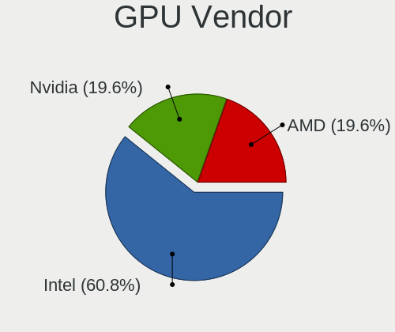
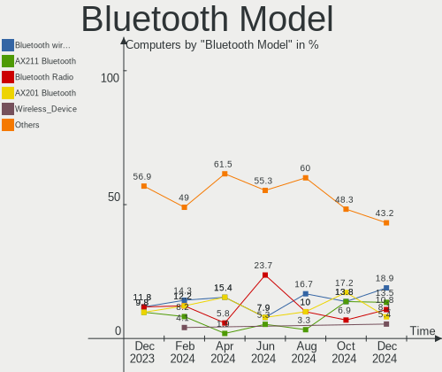
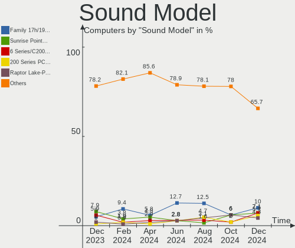

Kali Hardware Trends
--------------------

A project to identify most popular hardware characteristics and track their change
over time based on data collected by Kali users at https://Linux-Hardware.org.

Anyone can contribute to this report by the [hw-probe](https://github.com/linuxhw/hw-probe) tool:

    sudo -E hw-probe -all -upload

This is a report for all computer types. See also reports for [desktops](/Dist/Kali/Desktop/README.md) and [notebooks](/Dist/Kali/Notebook/README.md).

Full-feature report is available here: https://linux-hardware.org/?view=trends

Period: Jan, 2022.

Contents
--------

* [ System ](#system)
  - [ OS                       ](#os)
  - [ OS Family                ](#os-family)
  - [ Kernel                   ](#kernel)
  - [ Kernel Family            ](#kernel-family)
  - [ Kernel Major Ver.        ](#kernel-major-ver)
  - [ Arch                     ](#arch)
  - [ DE                       ](#de)
  - [ Display Server           ](#display-server)
  - [ Display Manager          ](#display-manager)
  - [ OS Lang                  ](#os-lang)
  - [ Boot Mode                ](#boot-mode)
  - [ Filesystem               ](#filesystem)
  - [ Part. scheme             ](#part-scheme)
  - [ Dual Boot with Linux/BSD ](#dual-boot-with-linuxbsd)
  - [ Dual Boot (Win)          ](#dual-boot-win)

* [ Board ](#board)
  - [ Vendor                   ](#vendor)
  - [ Model                    ](#model)
  - [ Model Family             ](#model-family)
  - [ MFG Year                 ](#mfg-year)
  - [ Form Factor              ](#form-factor)
  - [ Secure Boot              ](#secure-boot)
  - [ Coreboot                 ](#coreboot)
  - [ RAM Size                 ](#ram-size)
  - [ RAM Used                 ](#ram-used)
  - [ Total Drives             ](#total-drives)
  - [ Has CD-ROM               ](#has-cd-rom)
  - [ Has Ethernet             ](#has-ethernet)
  - [ Has WiFi                 ](#has-wifi)
  - [ Has Bluetooth            ](#has-bluetooth)

* [ Location ](#location)
  - [ Country                  ](#country)
  - [ City                     ](#city)

* [ Drives ](#drives)
  - [ Drive Vendor             ](#drive-vendor)
  - [ Drive Model              ](#drive-model)
  - [ HDD Vendor               ](#hdd-vendor)
  - [ SSD Vendor               ](#ssd-vendor)
  - [ Drive Kind               ](#drive-kind)
  - [ Drive Connector          ](#drive-connector)
  - [ Drive Size               ](#drive-size)
  - [ Space Total              ](#space-total)
  - [ Space Used               ](#space-used)
  - [ Malfunc. Drives          ](#malfunc-drives)
  - [ Malfunc. Drive Vendor    ](#malfunc-drive-vendor)
  - [ Malfunc. HDD Vendor      ](#malfunc-hdd-vendor)
  - [ Malfunc. Drive Kind      ](#malfunc-drive-kind)
  - [ Failed Drives            ](#failed-drives)
  - [ Failed Drive Vendor      ](#failed-drive-vendor)
  - [ Drive Status             ](#drive-status)

* [ Storage controller ](#storage-controller)
  - [ Storage Vendor           ](#storage-vendor)
  - [ Storage Model            ](#storage-model)
  - [ Storage Kind             ](#storage-kind)

* [ Processor ](#processor)
  - [ CPU Vendor               ](#cpu-vendor)
  - [ CPU Model                ](#cpu-model)
  - [ CPU Model Family         ](#cpu-model-family)
  - [ CPU Cores                ](#cpu-cores)
  - [ CPU Sockets              ](#cpu-sockets)
  - [ CPU Threads              ](#cpu-threads)
  - [ CPU Op-Modes             ](#cpu-op-modes)
  - [ CPU Microcode            ](#cpu-microcode)
  - [ CPU Microarch            ](#cpu-microarch)

* [ Graphics ](#graphics)
  - [ GPU Vendor               ](#gpu-vendor)
  - [ GPU Model                ](#gpu-model)
  - [ GPU Combo                ](#gpu-combo)
  - [ GPU Driver               ](#gpu-driver)
  - [ GPU Memory               ](#gpu-memory)

* [ Monitor ](#monitor)
  - [ Monitor Vendor           ](#monitor-vendor)
  - [ Monitor Model            ](#monitor-model)
  - [ Monitor Resolution       ](#monitor-resolution)
  - [ Monitor Diagonal         ](#monitor-diagonal)
  - [ Monitor Width            ](#monitor-width)
  - [ Aspect Ratio             ](#aspect-ratio)
  - [ Monitor Area             ](#monitor-area)
  - [ Pixel Density            ](#pixel-density)
  - [ Multiple Monitors        ](#multiple-monitors)

* [ Network ](#network)
  - [ Net Controller Vendor    ](#net-controller-vendor)
  - [ Net Controller Model     ](#net-controller-model)
  - [ Wireless Vendor          ](#wireless-vendor)
  - [ Wireless Model           ](#wireless-model)
  - [ Ethernet Vendor          ](#ethernet-vendor)
  - [ Ethernet Model           ](#ethernet-model)
  - [ Net Controller Kind      ](#net-controller-kind)
  - [ Used Controller          ](#used-controller)
  - [ NICs                     ](#nics)
  - [ IPv6                     ](#ipv6)

* [ Bluetooth ](#bluetooth)
  - [ Bluetooth Vendor         ](#bluetooth-vendor)
  - [ Bluetooth Model          ](#bluetooth-model)

* [ Sound ](#sound)
  - [ Sound Vendor             ](#sound-vendor)
  - [ Sound Model              ](#sound-model)

* [ Memory ](#memory)
  - [ Memory Vendor            ](#memory-vendor)
  - [ Memory Model             ](#memory-model)
  - [ Memory Kind              ](#memory-kind)
  - [ Memory Form Factor       ](#memory-form-factor)
  - [ Memory Size              ](#memory-size)
  - [ Memory Speed             ](#memory-speed)

* [ Printers & scanners ](#printers--scanners)
  - [ Printer Vendor           ](#printer-vendor)
  - [ Printer Model            ](#printer-model)
  - [ Scanner Vendor           ](#scanner-vendor)
  - [ Scanner Model            ](#scanner-model)

* [ Camera ](#camera)
  - [ Camera Vendor            ](#camera-vendor)
  - [ Camera Model             ](#camera-model)

* [ Security ](#security)
  - [ Fingerprint Vendor       ](#fingerprint-vendor)
  - [ Fingerprint Model        ](#fingerprint-model)
  - [ Chipcard Vendor          ](#chipcard-vendor)
  - [ Chipcard Model           ](#chipcard-model)

* [ Unsupported ](#unsupported)
  - [ Unsupported Devices      ](#unsupported-devices)
  - [ Unsupported Device Types ](#unsupported-device-types)

System
------

OS
--

Installed operating systems

| Name        | Computers | Percent |
|-------------|-----------|---------|
| Kali 2021.4 | 39        | 90.7%   |
| Kali 2021.3 | 4         | 9.3%    |

OS Family
---------

OS without a version

| Name | Computers | Percent |
|------|-----------|---------|
| Kali | 43        | 100%    |

Kernel
------

Version of the Linux kernel

| Version                          | Computers | Percent |
|----------------------------------|-----------|---------|
| 5.15.0-kali2-amd64               | 25        | 58.14%  |
| 5.14.0-kali4-amd64               | 7         | 16.28%  |
| 5.10.0-kali9-amd64               | 3         | 6.98%   |
| 5.4.83-Re4son-v8+                | 1         | 2.33%   |
| 5.4.129-23364085-abG991BXXU4BULF | 1         | 2.33%   |
| 5.15.5-custom                    | 1         | 2.33%   |
| 5.15.12-surface                  | 1         | 2.33%   |
| 5.15.0-kali3-amd64               | 1         | 2.33%   |
| 5.15.0-kali2-686-pae             | 1         | 2.33%   |
| 5.14.16-custom                   | 1         | 2.33%   |
| 5.14.0-kali2-amd64               | 1         | 2.33%   |

Kernel Family
-------------

Linux kernel without a distro release

| Version | Computers | Percent |
|---------|-----------|---------|
| 5.15.0  | 27        | 62.79%  |
| 5.14.0  | 8         | 18.6%   |
| 5.10.0  | 3         | 6.98%   |
| 5.4.83  | 1         | 2.33%   |
| 5.4.129 | 1         | 2.33%   |
| 5.15.5  | 1         | 2.33%   |
| 5.15.12 | 1         | 2.33%   |
| 5.14.16 | 1         | 2.33%   |

Kernel Major Ver.
-----------------

Linux kernel major version

| Version | Computers | Percent |
|---------|-----------|---------|
| 5.15    | 29        | 67.44%  |
| 5.14    | 9         | 20.93%  |
| 5.10    | 3         | 6.98%   |
| 5.4     | 2         | 4.65%   |

Arch
----

OS architecture (x86_64, i586, etc.)

| Name    | Computers | Percent |
|---------|-----------|---------|
| x86_64  | 40        | 93.02%  |
| aarch64 | 2         | 4.65%   |
| i686    | 1         | 2.33%   |

DE
--

Desktop Environment

| Name            | Computers | Percent |
|-----------------|-----------|---------|
| XFCE            | 18        | 41.86%  |
| GNOME           | 15        | 34.88%  |
| KDE5            | 6         | 13.95%  |
| LXDE            | 2         | 4.65%   |
| GNOME Flashback | 1         | 2.33%   |
| Unknown         | 1         | 2.33%   |

Display Server
--------------

X11 or Wayland

| Name    | Computers | Percent |
|---------|-----------|---------|
| X11     | 36        | 83.72%  |
| Wayland | 5         | 11.63%  |
| Tty     | 1         | 2.33%   |
| Unknown | 1         | 2.33%   |

Display Manager
---------------

SDDM, LightDM, etc.

| Name    | Computers | Percent |
|---------|-----------|---------|
| LightDM | 18        | 41.86%  |
| GDM3    | 11        | 25.58%  |
| Unknown | 9         | 20.93%  |
| SDDM    | 4         | 9.3%    |
| GDM     | 1         | 2.33%   |

OS Lang
-------

Language

| Lang  | Computers | Percent |
|-------|-----------|---------|
| en_US | 32        | 74.42%  |
| fr_FR | 2         | 4.65%   |
| de_DE | 2         | 4.65%   |
| tr_TR | 1         | 2.33%   |
| pt_BR | 1         | 2.33%   |
| pl_PL | 1         | 2.33%   |
| it_IT | 1         | 2.33%   |
| es_ES | 1         | 2.33%   |
| en_GB | 1         | 2.33%   |
| C     | 1         | 2.33%   |

Boot Mode
---------

EFI or BIOS

| Mode | Computers | Percent |
|------|-----------|---------|
| EFI  | 22        | 51.16%  |
| BIOS | 21        | 48.84%  |

Filesystem
----------

Type of filesystem

| Type    | Computers | Percent |
|---------|-----------|---------|
| Ext4    | 40        | 93.02%  |
| Btrfs   | 2         | 4.65%   |
| Overlay | 1         | 2.33%   |

Part. scheme
------------

Scheme of partitioning

| Type    | Computers | Percent |
|---------|-----------|---------|
| GPT     | 21        | 48.84%  |
| MBR     | 12        | 27.91%  |
| Unknown | 10        | 23.26%  |

Dual Boot with Linux/BSD
------------------------

Hosting more than one Linux/BSD

| Dual boot | Computers | Percent |
|-----------|-----------|---------|
| No        | 38        | 88.37%  |
| Yes       | 5         | 11.63%  |

Dual Boot (Win)
---------------

Hosting Linux and Windows

| Dual boot | Computers | Percent |
|-----------|-----------|---------|
| No        | 30        | 69.77%  |
| Yes       | 13        | 30.23%  |

Board
-----

Vendor
------

Motherboard manufacturer

| Name                    | Computers | Percent |
|-------------------------|-----------|---------|
| Dell                    | 11        | 25.58%  |
| Hewlett-Packard         | 7         | 16.28%  |
| Lenovo                  | 5         | 11.63%  |
| ASUSTek Computer        | 5         | 11.63%  |
| Unknown                 | 3         | 6.98%   |
| Sony                    | 2         | 4.65%   |
| Microsoft               | 2         | 4.65%   |
| Raspberry Pi Foundation | 1         | 2.33%   |
| Positivo                | 1         | 2.33%   |
| MSI                     | 1         | 2.33%   |
| Intel                   | 1         | 2.33%   |
| Gigabyte Technology     | 1         | 2.33%   |
| ECS                     | 1         | 2.33%   |
| Apple                   | 1         | 2.33%   |
| Acer                    | 1         | 2.33%   |

Model
-----

Motherboard model

| Name                               | Computers | Percent |
|------------------------------------|-----------|---------|
| Dell OptiPlex 980                  | 3         | 6.98%   |
| Unknown                            | 3         | 6.98%   |
| Sony VGN-AR825E                    | 1         | 2.33%   |
| Sony SVE1113M1EB                   | 1         | 2.33%   |
| RPi Raspberry Pi 3 Model B Rev 1.2 | 1         | 2.33%   |
| Positivo S14BW01                   | 1         | 2.33%   |
| MSI GP76 Leopard 10UE              | 1         | 2.33%   |
| Microsoft Surface Pro 7            | 1         | 2.33%   |
| Microsoft Surface Pro 3            | 1         | 2.33%   |
| Lenovo ThinkPad T480 20L50011US    | 1         | 2.33%   |
| Lenovo ThinkBook 15p 20V3          | 1         | 2.33%   |
| Lenovo IdeaPad 330-15IKB 81FE      | 1         | 2.33%   |
| Lenovo IdeaPad 330-15IKB 81DE      | 1         | 2.33%   |
| Lenovo G710 20252                  | 1         | 2.33%   |
| Intel H55                          | 1         | 2.33%   |
| HP ProBook 6560b                   | 1         | 2.33%   |
| HP EliteBook 8460p                 | 1         | 2.33%   |
| HP EliteBook 840 G2                | 1         | 2.33%   |
| HP EliteBook 820 G1                | 1         | 2.33%   |
| HP Compaq Elite 8300 CMT           | 1         | 2.33%   |
| HP 870-147c                        | 1         | 2.33%   |
| HP 22-b009na                       | 1         | 2.33%   |
| Gigabyte Z590 AORUS ULTRA          | 1         | 2.33%   |
| ECS H61H2-M4                       | 1         | 2.33%   |
| Dell Vostro 5590                   | 1         | 2.33%   |
| Dell Vostro 5581                   | 1         | 2.33%   |
| Dell Vostro 3558                   | 1         | 2.33%   |
| Dell Latitude 3510                 | 1         | 2.33%   |
| Dell Inspiron 7791 2n1             | 1         | 2.33%   |
| Dell Inspiron 7352                 | 1         | 2.33%   |
| Dell Inspiron 3721                 | 1         | 2.33%   |
| Dell Inspiron 3501                 | 1         | 2.33%   |
| ASUS X555LB                        | 1         | 2.33%   |
| ASUS Strix 17 GL703GE              | 1         | 2.33%   |
| ASUS ROG STRIX B365-G GAMING       | 1         | 2.33%   |
| ASUS P5K Deluxe                    | 1         | 2.33%   |
| ASUS F5R                           | 1         | 2.33%   |
| Apple MacBookPro14,1               | 1         | 2.33%   |
| Acer Aspire A515-44                | 1         | 2.33%   |

Model Family
------------

Motherboard model prefix

| Name               | Computers | Percent |
|--------------------|-----------|---------|
| Dell Inspiron      | 4         | 9.3%    |
| HP EliteBook       | 3         | 6.98%   |
| Dell Vostro        | 3         | 6.98%   |
| Dell OptiPlex      | 3         | 6.98%   |
| Unknown            | 3         | 6.98%   |
| Microsoft Surface  | 2         | 4.65%   |
| Lenovo IdeaPad     | 2         | 4.65%   |
| Sony VGN-AR825E    | 1         | 2.33%   |
| Sony SVE1113M1EB   | 1         | 2.33%   |
| RPi Raspberry      | 1         | 2.33%   |
| Positivo S14BW01   | 1         | 2.33%   |
| MSI GP76           | 1         | 2.33%   |
| Lenovo ThinkPad    | 1         | 2.33%   |
| Lenovo ThinkBook   | 1         | 2.33%   |
| Lenovo G710        | 1         | 2.33%   |
| Intel H55          | 1         | 2.33%   |
| HP ProBook         | 1         | 2.33%   |
| HP Compaq          | 1         | 2.33%   |
| HP 870-147c        | 1         | 2.33%   |
| HP 22-b009na       | 1         | 2.33%   |
| Gigabyte Z590      | 1         | 2.33%   |
| ECS H61H2-M4       | 1         | 2.33%   |
| Dell Latitude      | 1         | 2.33%   |
| ASUS X555LB        | 1         | 2.33%   |
| ASUS Strix         | 1         | 2.33%   |
| ASUS ROG           | 1         | 2.33%   |
| ASUS P5K           | 1         | 2.33%   |
| ASUS F5R           | 1         | 2.33%   |
| Apple MacBookPro14 | 1         | 2.33%   |
| Acer Aspire        | 1         | 2.33%   |

MFG Year
--------

Motherboard manufacture year

| Year    | Computers | Percent |
|---------|-----------|---------|
| 2020    | 5         | 11.63%  |
| 2019    | 5         | 11.63%  |
| 2018    | 5         | 11.63%  |
| 2015    | 5         | 11.63%  |
| 2013    | 4         | 9.3%    |
| 2021    | 3         | 6.98%   |
| 2016    | 3         | 6.98%   |
| 2010    | 3         | 6.98%   |
| 2011    | 2         | 4.65%   |
| 2007    | 2         | 4.65%   |
| Unknown | 2         | 4.65%   |
| 2017    | 1         | 2.33%   |
| 2014    | 1         | 2.33%   |
| 2012    | 1         | 2.33%   |
| 2008    | 1         | 2.33%   |

Form Factor
-----------

Physical design of the computer

| Name           | Computers | Percent |
|----------------|-----------|---------|
| Notebook       | 27        | 62.79%  |
| Desktop        | 10        | 23.26%  |
| System on chip | 2         | 4.65%   |
| Tablet         | 2         | 4.65%   |
| Convertible    | 1         | 2.33%   |
| All in one     | 1         | 2.33%   |

Secure Boot
-----------

Enabled or disabled

| State    | Computers | Percent |
|----------|-----------|---------|
| Disabled | 43        | 100%    |

Coreboot
--------

Have coreboot on board

| Used | Computers | Percent |
|------|-----------|---------|
| No   | 43        | 100%    |

RAM Size
--------

Total RAM memory

| Size in GB  | Computers | Percent |
|-------------|-----------|---------|
| 4.01-8.0    | 13        | 30.23%  |
| 8.01-16.0   | 10        | 23.26%  |
| 16.01-24.0  | 7         | 16.28%  |
| 32.01-64.0  | 4         | 9.3%    |
| 3.01-4.0    | 3         | 6.98%   |
| 1.01-2.0    | 2         | 4.65%   |
| 24.01-32.0  | 1         | 2.33%   |
| 2.01-3.0    | 1         | 2.33%   |
| 64.01-256.0 | 1         | 2.33%   |
| 0.51-1.0    | 1         | 2.33%   |

RAM Used
--------

Used RAM memory

| Used GB  | Computers | Percent |
|----------|-----------|---------|
| 2.01-3.0 | 13        | 30.23%  |
| 1.01-2.0 | 13        | 30.23%  |
| 3.01-4.0 | 9         | 20.93%  |
| 4.01-8.0 | 6         | 13.95%  |
| 0.51-1.0 | 1         | 2.33%   |
| 0.01-0.5 | 1         | 2.33%   |

Total Drives
------------

Number of drives on board

| Drives | Computers | Percent |
|--------|-----------|---------|
| 1      | 28        | 65.12%  |
| 2      | 11        | 25.58%  |
| 3      | 2         | 4.65%   |
| 4      | 1         | 2.33%   |
| 0      | 1         | 2.33%   |

Has CD-ROM
----------

Has CD-ROM on board

| Presented | Computers | Percent |
|-----------|-----------|---------|
| No        | 28        | 65.12%  |
| Yes       | 15        | 34.88%  |

Has Ethernet
------------

Has Ethernet on board

| Presented | Computers | Percent |
|-----------|-----------|---------|
| Yes       | 36        | 83.72%  |
| No        | 7         | 16.28%  |

Has WiFi
--------

Has WiFi module

| Presented | Computers | Percent |
|-----------|-----------|---------|
| Yes       | 39        | 90.7%   |
| No        | 4         | 9.3%    |

Has Bluetooth
-------------

Has Bluetooth module

| Presented | Computers | Percent |
|-----------|-----------|---------|
| Yes       | 28        | 65.12%  |
| No        | 15        | 34.88%  |

Location
--------

Country
-------

Geographic location (country)

| Country         | Computers | Percent |
|-----------------|-----------|---------|
| USA             | 15        | 34.88%  |
| Germany         | 6         | 13.95%  |
| France          | 3         | 6.98%   |
| Switzerland     | 2         | 4.65%   |
| Italy           | 2         | 4.65%   |
| Brazil          | 2         | 4.65%   |
| UK              | 1         | 2.33%   |
| Turkey          | 1         | 2.33%   |
| Spain           | 1         | 2.33%   |
| Philippines     | 1         | 2.33%   |
| North Macedonia | 1         | 2.33%   |
| Morocco         | 1         | 2.33%   |
| Kenya           | 1         | 2.33%   |
| Indonesia       | 1         | 2.33%   |
| India           | 1         | 2.33%   |
| Greece          | 1         | 2.33%   |
| Croatia         | 1         | 2.33%   |
| Canada          | 1         | 2.33%   |
| Algeria         | 1         | 2.33%   |

City
----

Geographic location (city)

| City           | Computers | Percent |
|----------------|-----------|---------|
| Sanger         | 3         | 6.98%   |
| Dresden        | 2         | 4.65%   |
| Zagreb         | 1         | 2.33%   |
| Weyburn        | 1         | 2.33%   |
| Wellingborough | 1         | 2.33%   |
| Tucson         | 1         | 2.33%   |
| Solingen       | 1         | 2.33%   |
| Sarasota       | 1         | 2.33%   |
| San Francisco  | 1         | 2.33%   |
| Ronnenberg     | 1         | 2.33%   |
| Romont         | 1         | 2.33%   |
| Roanoke        | 1         | 2.33%   |
| Rho            | 1         | 2.33%   |
| Picos          | 1         | 2.33%   |
| Paris          | 1         | 2.33%   |
| Paradise       | 1         | 2.33%   |
| Oulad Teima    | 1         | 2.33%   |
| Noisy-le-Sec   | 1         | 2.33%   |
| Naples         | 1         | 2.33%   |
| Nandlstadt     | 1         | 2.33%   |
| Nairobi        | 1         | 2.33%   |
| Manteca        | 1         | 2.33%   |
| Los Angeles    | 1         | 2.33%   |
| Kumanovo       | 1         | 2.33%   |
| Guelma         | 1         | 2.33%   |
| Grovetown      | 1         | 2.33%   |
| Goffstown      | 1         | 2.33%   |
| Geneva         | 1         | 2.33%   |
| Durham         | 1         | 2.33%   |
| Colombes       | 1         | 2.33%   |
| Chicago        | 1         | 2.33%   |
| Cagayan de Oro | 1         | 2.33%   |
| Bursa          | 1         | 2.33%   |
| Bielefeld      | 1         | 2.33%   |
| Bengaluru      | 1         | 2.33%   |
| Barcelona      | 1         | 2.33%   |
| Badung         | 1         | 2.33%   |
| Aurora         | 1         | 2.33%   |
| Athens         | 1         | 2.33%   |
| Arcos          | 1         | 2.33%   |

Drives
------

Drive Vendor
------------

Hard drive vendors

| Vendor              | Computers | Drives | Percent |
|---------------------|-----------|--------|---------|
| Seagate             | 10        | 10     | 17.24%  |
| WDC                 | 7         | 8      | 12.07%  |
| Unknown             | 6         | 7      | 10.34%  |
| Toshiba             | 5         | 5      | 8.62%   |
| SanDisk             | 4         | 4      | 6.9%    |
| Samsung Electronics | 4         | 4      | 6.9%    |
| Hitachi             | 4         | 4      | 6.9%    |
| SK Hynix            | 3         | 3      | 5.17%   |
| Kingston            | 2         | 2      | 3.45%   |
| UMIS                | 1         | 1      | 1.72%   |
| TYPEC 1T            | 1         | 1      | 1.72%   |
| SPCC                | 1         | 1      | 1.72%   |
| PNY                 | 1         | 1      | 1.72%   |
| MAXTOR              | 1         | 1      | 1.72%   |
| MARSHAL             | 1         | 1      | 1.72%   |
| LITEON              | 1         | 1      | 1.72%   |
| KingSpec            | 1         | 1      | 1.72%   |
| KingFast            | 1         | 1      | 1.72%   |
| Intel               | 1         | 1      | 1.72%   |
| Gigabyte Technology | 1         | 1      | 1.72%   |
| Apple               | 1         | 2      | 1.72%   |
| Unknown             | 1         | 1      | 1.72%   |

Drive Model
-----------

Hard drive models

| Model                                 | Computers | Percent |
|---------------------------------------|-----------|---------|
| Unknown SD/MMC/MS PRO 128GB           | 3         | 5%      |
| Seagate ST1000LM035-1RK172 1TB        | 3         | 5%      |
| Hitachi HDS721010CLA630 1TB           | 3         | 5%      |
| Toshiba MQ01ABD100 1TB                | 2         | 3.33%   |
| WDC WDS100T2B0A-00SM50 1TB SSD        | 1         | 1.67%   |
| WDC WD5000LPVT-75G33T0 500GB          | 1         | 1.67%   |
| WDC WD40EFAX-68JH4N0 4TB              | 1         | 1.67%   |
| WDC WD10SPZX-24Z10T0 1TB              | 1         | 1.67%   |
| WDC WD10EZEX-60WN4A0 1TB              | 1         | 1.67%   |
| WDC WD10EZEX-08WN4A0 1TB              | 1         | 1.67%   |
| WDC PC SN530 NVMe 256GB               | 1         | 1.67%   |
| WDC PC SN520 NVMe 512GB               | 1         | 1.67%   |
| Unknown SN64G  64GB                   | 1         | 1.67%   |
| Unknown MMC Card  64GB                | 1         | 1.67%   |
| Unknown MMC Card  134GB               | 1         | 1.67%   |
| Unknown M52532  32GB                  | 1         | 1.67%   |
| UMIS RPITJ1TBVME2HWD                  | 1         | 1.67%   |
| TYPEC 1T B PSSD 1TB                   | 1         | 1.67%   |
| Toshiba MQ01ABD050 500GB              | 1         | 1.67%   |
| Toshiba KBG40ZNS256G NVMe 256GB       | 1         | 1.67%   |
| Toshiba HDWE160 6TB                   | 1         | 1.67%   |
| SPCC M.2 PCIe SSD 512GB               | 1         | 1.67%   |
| SK Hynix NVMe SSD Drive 256GB         | 1         | 1.67%   |
| SK Hynix HFS256G3AMNB-2200A 256GB SSD | 1         | 1.67%   |
| SK Hynix HFM512GDJTNI-82A0A 512GB     | 1         | 1.67%   |
| Seagate ST9160821AS 160GB             | 1         | 1.67%   |
| Seagate ST500LT012-1DG142 500GB       | 1         | 1.67%   |
| Seagate ST500LM000-1EJ162 500GB       | 1         | 1.67%   |
| Seagate ST500DM002-1BD142 500GB       | 1         | 1.67%   |
| Seagate ST4000DM004-2CV104 4TB        | 1         | 1.67%   |
| Seagate ST3500312CS 500GB             | 1         | 1.67%   |
| Seagate ST1000LM024 HN-M101MBB 1TB    | 1         | 1.67%   |
| SanDisk Z400s 2.5 7MM 128GB SSD       | 1         | 1.67%   |
| SanDisk SSD PLUS 240GB                | 1         | 1.67%   |
| SanDisk SDSSDH3 1T02 1024GB           | 1         | 1.67%   |
| Sandisk NVMe SSD Drive 1TB            | 1         | 1.67%   |
| Samsung SSD 870 EVO 500GB             | 1         | 1.67%   |
| Samsung SSD 870 EVO 1TB               | 1         | 1.67%   |
| Samsung SSD 840 EVO 120GB             | 1         | 1.67%   |
| Samsung PM991 NVMe 256GB              | 1         | 1.67%   |
| PNY CS900 1TB SSD                     | 1         | 1.67%   |
| MAXTOR 6L300S0 304GB                  | 1         | 1.67%   |
| MARSHAL MAL2750SA-T54 752GB           | 1         | 1.67%   |
| LITEON IT LCS-128L9S-HP 128GB SSD     | 1         | 1.67%   |
| Kingston SV300S37A120G 120GB SSD      | 1         | 1.67%   |
| Kingston OM8PCP31024F-AI1 1TB         | 1         | 1.67%   |
| KingSpec P3-512 512GB                 | 1         | 1.67%   |
| KingFast 512GB                        | 1         | 1.67%   |
| Intel SSDPEKKF256G8L 256GB            | 1         | 1.67%   |
| Hitachi HTS547575A9E384 752GB         | 1         | 1.67%   |
| Gigabyte GP-AG41TB                    | 1         | 1.67%   |
| Apple SSD AP0512J 8.1KB               | 1         | 1.67%   |
| Unknown                               | 1         | 1.67%   |

HDD Vendor
----------

Hard disk drive vendors

| Vendor  | Computers | Drives | Percent |
|---------|-----------|--------|---------|
| Seagate | 10        | 10     | 35.71%  |
| WDC     | 5         | 5      | 17.86%  |
| Toshiba | 4         | 4      | 14.29%  |
| Hitachi | 4         | 4      | 14.29%  |
| Unknown | 3         | 3      | 10.71%  |
| MAXTOR  | 1         | 1      | 3.57%   |
| MARSHAL | 1         | 1      | 3.57%   |

SSD Vendor
----------

Solid state drive vendors

| Vendor              | Computers | Drives | Percent |
|---------------------|-----------|--------|---------|
| SanDisk             | 3         | 3      | 21.43%  |
| Samsung Electronics | 3         | 3      | 21.43%  |
| WDC                 | 1         | 1      | 7.14%   |
| TYPEC 1T            | 1         | 1      | 7.14%   |
| SK Hynix            | 1         | 1      | 7.14%   |
| PNY                 | 1         | 1      | 7.14%   |
| LITEON              | 1         | 1      | 7.14%   |
| Kingston            | 1         | 1      | 7.14%   |
| KingSpec            | 1         | 1      | 7.14%   |
| Unknown             | 1         | 1      | 7.14%   |

Drive Kind
----------

HDD or SSD

| Kind    | Computers | Drives | Percent |
|---------|-----------|--------|---------|
| HDD     | 23        | 28     | 46%     |
| NVMe    | 13        | 14     | 26%     |
| SSD     | 10        | 14     | 20%     |
| MMC     | 3         | 4      | 6%      |
| Unknown | 1         | 1      | 2%      |

Drive Connector
---------------

SATA, SAS, NVMe, etc.

| Type | Computers | Drives | Percent |
|------|-----------|--------|---------|
| SATA | 29        | 38     | 58%     |
| NVMe | 13        | 14     | 26%     |
| SAS  | 5         | 5      | 10%     |
| MMC  | 3         | 4      | 6%      |

Drive Size
----------

Size of hard drive

| Size in TB | Computers | Drives | Percent |
|------------|-----------|--------|---------|
| 0.51-1.0   | 18        | 19     | 48.65%  |
| 0.01-0.5   | 15        | 19     | 40.54%  |
| 3.01-4.0   | 2         | 2      | 5.41%   |
| 1.01-2.0   | 1         | 1      | 2.7%    |
| 4.01-10.0  | 1         | 1      | 2.7%    |

Space Total
-----------

Amount of disk space available on the file system

| Size in GB     | Computers | Percent |
|----------------|-----------|---------|
| 501-1000       | 12        | 27.91%  |
| 251-500        | 10        | 23.26%  |
| 101-250        | 9         | 20.93%  |
| 51-100         | 3         | 6.98%   |
| More than 3000 | 2         | 4.65%   |
| 1001-2000      | 2         | 4.65%   |
| 1-20           | 2         | 4.65%   |
| 21-50          | 1         | 2.33%   |
| 2001-3000      | 1         | 2.33%   |
| Unknown        | 1         | 2.33%   |

Space Used
----------

Amount of used disk space

| Used GB        | Computers | Percent |
|----------------|-----------|---------|
| 1-20           | 16        | 37.21%  |
| 101-250        | 8         | 18.6%   |
| 21-50          | 7         | 16.28%  |
| 51-100         | 4         | 9.3%    |
| 501-1000       | 3         | 6.98%   |
| 1001-2000      | 2         | 4.65%   |
| More than 3000 | 1         | 2.33%   |
| 251-500        | 1         | 2.33%   |
| Unknown        | 1         | 2.33%   |

Malfunc. Drives
---------------

Drive models with a malfunction

| Model                           | Computers | Drives | Percent |
|---------------------------------|-----------|--------|---------|
| Toshiba MQ01ABD100 1TB          | 1         | 1      | 12.5%   |
| Toshiba MQ01ABD050 500GB        | 1         | 1      | 12.5%   |
| SPCC M.2 PCIe SSD 512GB         | 1         | 1      | 12.5%   |
| Seagate ST9160821AS 160GB       | 1         | 1      | 12.5%   |
| Seagate ST500LT012-1DG142 500GB | 1         | 1      | 12.5%   |
| Seagate ST1000LM035-1RK172 1TB  | 1         | 1      | 12.5%   |
| MAXTOR 6L300S0 304GB            | 1         | 1      | 12.5%   |
| MARSHAL MAL2750SA-T54 752GB     | 1         | 1      | 12.5%   |

Malfunc. Drive Vendor
---------------------

Vendors of faulty drives

| Vendor  | Computers | Drives | Percent |
|---------|-----------|--------|---------|
| Seagate | 3         | 3      | 37.5%   |
| Toshiba | 2         | 2      | 25%     |
| SPCC    | 1         | 1      | 12.5%   |
| MAXTOR  | 1         | 1      | 12.5%   |
| MARSHAL | 1         | 1      | 12.5%   |

Malfunc. HDD Vendor
-------------------

Vendors of faulty HDD drives

| Vendor  | Computers | Drives | Percent |
|---------|-----------|--------|---------|
| Seagate | 3         | 3      | 42.86%  |
| Toshiba | 2         | 2      | 28.57%  |
| MAXTOR  | 1         | 1      | 14.29%  |
| MARSHAL | 1         | 1      | 14.29%  |

Malfunc. Drive Kind
-------------------

Kinds of faulty drives

| Kind | Computers | Drives | Percent |
|------|-----------|--------|---------|
| HDD  | 7         | 7      | 87.5%   |
| NVMe | 1         | 1      | 12.5%   |

Failed Drives
-------------

Failed drive models

| Model                         | Computers | Drives | Percent |
|-------------------------------|-----------|--------|---------|
| Hitachi HTS547575A9E384 752GB | 1         | 1      | 100%    |

Failed Drive Vendor
-------------------

Failed drive vendors

| Vendor  | Computers | Drives | Percent |
|---------|-----------|--------|---------|
| Hitachi | 1         | 1      | 100%    |

Drive Status
------------

Number of failed and malfunc. drives

| Status   | Computers | Drives | Percent |
|----------|-----------|--------|---------|
| Works    | 23        | 34     | 50%     |
| Detected | 14        | 18     | 30.43%  |
| Malfunc  | 8         | 8      | 17.39%  |
| Failed   | 1         | 1      | 2.17%   |

Storage controller
------------------

Storage Vendor
--------------

Storage controller vendors

| Vendor                      | Computers | Percent |
|-----------------------------|-----------|---------|
| Intel                       | 33        | 67.35%  |
| Sandisk                     | 3         | 6.12%   |
| AMD                         | 3         | 6.12%   |
| SK Hynix                    | 2         | 4.08%   |
| Union Memory (Shenzhen)     | 1         | 2.04%   |
| Silicon Motion              | 1         | 2.04%   |
| Samsung Electronics         | 1         | 2.04%   |
| Phison Electronics          | 1         | 2.04%   |
| KIOXIA                      | 1         | 2.04%   |
| Kingston Technology Company | 1         | 2.04%   |
| JMicron Technology          | 1         | 2.04%   |
| Apple                       | 1         | 2.04%   |

Storage Model
-------------

Storage controller models

| Model                                                                                   | Computers | Percent |
|-----------------------------------------------------------------------------------------|-----------|---------|
| Intel Wildcat Point-LP SATA Controller [AHCI Mode]                                      | 4         | 6.78%   |
| Intel Comet Lake SATA AHCI Controller                                                   | 3         | 5.08%   |
| Intel 5 Series/3400 Series Chipset PT IDER Controller                                   | 3         | 5.08%   |
| Sandisk Non-Volatile memory controller                                                  | 2         | 3.39%   |
| Intel Sunrise Point-LP SATA Controller [AHCI mode]                                      | 2         | 3.39%   |
| Intel SATA Controller [RAID mode]                                                       | 2         | 3.39%   |
| Intel 8 Series SATA Controller 1 [AHCI mode]                                            | 2         | 3.39%   |
| Intel 6 Series/C200 Series Chipset Family 6 port Mobile SATA AHCI Controller            | 2         | 3.39%   |
| AMD FCH SATA Controller [AHCI mode]                                                     | 2         | 3.39%   |
| Union Memory (Shenzhen) Non-Volatile memory controller                                  | 1         | 1.69%   |
| SK Hynix BC511                                                                          | 1         | 1.69%   |
| SK Hynix BC501 NVMe Solid State Drive                                                   | 1         | 1.69%   |
| Silicon Motion SM2263EN/SM2263XT SSD Controller                                         | 1         | 1.69%   |
| Sandisk PC SN520 NVMe SSD                                                               | 1         | 1.69%   |
| Samsung NVMe SSD Controller 980                                                         | 1         | 1.69%   |
| Phison E16 PCIe4 NVMe Controller                                                        | 1         | 1.69%   |
| KIOXIA Non-Volatile memory controller                                                   | 1         | 1.69%   |
| Kingston Company Company Non-Volatile memory controller                                 | 1         | 1.69%   |
| JMicron JMB363 SATA/IDE Controller                                                      | 1         | 1.69%   |
| Intel Volume Management Device NVMe RAID Controller                                     | 1         | 1.69%   |
| Intel Tiger Lake-LP SATA Controller [AHCI mode]                                         | 1         | 1.69%   |
| Intel SSD Pro 7600p/760p/E 6100p Series                                                 | 1         | 1.69%   |
| Intel Q170/Q150/B150/H170/H110/Z170/CM236 Chipset SATA Controller [AHCI Mode]           | 1         | 1.69%   |
| Intel Cannon Point-LP SATA Controller [AHCI Mode]                                       | 1         | 1.69%   |
| Intel Cannon Lake PCH SATA AHCI Controller                                              | 1         | 1.69%   |
| Intel Cannon Lake Mobile PCH SATA AHCI Controller                                       | 1         | 1.69%   |
| Intel Atom/Celeron/Pentium Processor x5-E8000/J3xxx/N3xxx Series SATA Controller        | 1         | 1.69%   |
| Intel 82801IR/IO/IH (ICH9R/DO/DH) 4 port SATA Controller [IDE mode]                     | 1         | 1.69%   |
| Intel 82801I (ICH9 Family) 2 port SATA Controller [IDE mode]                            | 1         | 1.69%   |
| Intel 82801HM/HEM (ICH8M/ICH8M-E) SATA Controller [AHCI mode]                           | 1         | 1.69%   |
| Intel 82801HM/HEM (ICH8M/ICH8M-E) IDE Controller                                        | 1         | 1.69%   |
| Intel 8 Series/C220 Series Chipset Family 2-port SATA Controller 2 [IDE mode]           | 1         | 1.69%   |
| Intel 8 Series Chipset Family 4-port SATA Controller 1 [IDE mode] - Mobile              | 1         | 1.69%   |
| Intel 7 Series/C210 Series Chipset Family 6-port SATA Controller [AHCI mode]            | 1         | 1.69%   |
| Intel 7 Series Chipset Family 6-port SATA Controller [AHCI mode]                        | 1         | 1.69%   |
| Intel 6 Series/C200 Series Chipset Family Desktop SATA Controller (IDE mode, ports 4-5) | 1         | 1.69%   |
| Intel 6 Series/C200 Series Chipset Family Desktop SATA Controller (IDE mode, ports 0-3) | 1         | 1.69%   |
| Intel 500 Series Chipset Family SATA AHCI Controller                                    | 1         | 1.69%   |
| Intel 5 Series/3400 Series Chipset 6 port SATA AHCI Controller                          | 1         | 1.69%   |
| Intel 5 Series/3400 Series Chipset 4 port SATA IDE Controller                           | 1         | 1.69%   |
| Intel 5 Series/3400 Series Chipset 2 port SATA IDE Controller                           | 1         | 1.69%   |
| Intel 400 Series Chipset Family SATA AHCI Controller                                    | 1         | 1.69%   |
| Intel 200 Series PCH SATA controller [AHCI mode]                                        | 1         | 1.69%   |
| Apple S3X NVMe Controller                                                               | 1         | 1.69%   |
| AMD SB600 Non-Raid-5 SATA                                                               | 1         | 1.69%   |
| AMD SB600 IDE                                                                           | 1         | 1.69%   |

Storage Kind
------------

Kind of storage controller (IDE, SATA, NVMe, SAS, ...)

| Kind | Computers | Percent |
|------|-----------|---------|
| SATA | 29        | 54.72%  |
| NVMe | 13        | 24.53%  |
| IDE  | 8         | 15.09%  |
| RAID | 3         | 5.66%   |

Processor
---------

CPU Vendor
----------

Processor vendors

| Vendor | Computers | Percent |
|--------|-----------|---------|
| Intel  | 39        | 90.7%   |
| ARM    | 2         | 4.65%   |
| AMD    | 2         | 4.65%   |

CPU Model
---------

Processor models

| Model                                   | Computers | Percent |
|-----------------------------------------|-----------|---------|
| Intel Core i5 CPU 650 @ 3.20GHz         | 3         | 6.98%   |
| Intel Core i7-10510U CPU @ 1.80GHz      | 2         | 4.65%   |
| ARM Processor                           | 2         | 4.65%   |
| Intel Pentium CPU 3550M @ 2.30GHz       | 1         | 2.33%   |
| Intel Pentium CPU 2117U @ 1.80GHz       | 1         | 2.33%   |
| Intel Core i9-8950HK CPU @ 2.90GHz      | 1         | 2.33%   |
| Intel Core i7-8750H CPU @ 2.20GHz       | 1         | 2.33%   |
| Intel Core i7-6700 CPU @ 3.40GHz        | 1         | 2.33%   |
| Intel Core i7-5500U CPU @ 2.40GHz       | 1         | 2.33%   |
| Intel Core i7-4650U CPU @ 1.70GHz       | 1         | 2.33%   |
| Intel Core i7-10870H CPU @ 2.20GHz      | 1         | 2.33%   |
| Intel Core i7-10750H CPU @ 2.60GHz      | 1         | 2.33%   |
| Intel Core i5-8350U CPU @ 1.70GHz       | 1         | 2.33%   |
| Intel Core i5-8265U CPU @ 1.60GHz       | 1         | 2.33%   |
| Intel Core i5-8250U CPU @ 1.60GHz       | 1         | 2.33%   |
| Intel Core i5-7360U CPU @ 2.30GHz       | 1         | 2.33%   |
| Intel Core i5-5300U CPU @ 2.30GHz       | 1         | 2.33%   |
| Intel Core i5-5200U CPU @ 2.20GHz       | 1         | 2.33%   |
| Intel Core i5-4310U CPU @ 2.00GHz       | 1         | 2.33%   |
| Intel Core i5-3470 CPU @ 3.20GHz        | 1         | 2.33%   |
| Intel Core i5-2540M CPU @ 2.60GHz       | 1         | 2.33%   |
| Intel Core i5-2520M CPU @ 2.50GHz       | 1         | 2.33%   |
| Intel Core i5-1035G4 CPU @ 1.10GHz      | 1         | 2.33%   |
| Intel Core i5 CPU 750 @ 2.67GHz         | 1         | 2.33%   |
| Intel Core i3-9100 CPU @ 3.60GHz        | 1         | 2.33%   |
| Intel Core i3-8130U CPU @ 2.20GHz       | 1         | 2.33%   |
| Intel Core i3-5005U CPU @ 2.00GHz       | 1         | 2.33%   |
| Intel Core i3-3220 CPU @ 3.30GHz        | 1         | 2.33%   |
| Intel Core i3-10110U CPU @ 2.10GHz      | 1         | 2.33%   |
| Intel Core Duo CPU T2450 @ 2.00GHz      | 1         | 2.33%   |
| Intel Core 2 Quad CPU @ 2.40GHz         | 1         | 2.33%   |
| Intel Core 2 Duo CPU T5750 @ 2.00GHz    | 1         | 2.33%   |
| Intel Celeron CPU N3010 @ 1.04GHz       | 1         | 2.33%   |
| Intel Celeron CPU J3060 @ 1.60GHz       | 1         | 2.33%   |
| Intel Atom x5-Z8350 CPU @ 1.44GHz       | 1         | 2.33%   |
| Intel 11th Gen Core i9-11900K @ 3.50GHz | 1         | 2.33%   |
| Intel 11th Gen Core i5-1135G7 @ 2.40GHz | 1         | 2.33%   |
| AMD Ryzen 7 4700U with Radeon Graphics  | 1         | 2.33%   |
| AMD E2-2000 APU with Radeon HD Graphics | 1         | 2.33%   |

CPU Model Family
----------------

Processor model prefix

| Model             | Computers | Percent |
|-------------------|-----------|---------|
| Intel Core i5     | 15        | 34.88%  |
| Intel Core i7     | 8         | 18.6%   |
| Intel Core i3     | 5         | 11.63%  |
| Other             | 4         | 9.3%    |
| Intel Pentium     | 2         | 4.65%   |
| Intel Celeron     | 2         | 4.65%   |
| Intel Core i9     | 1         | 2.33%   |
| Intel Core Duo    | 1         | 2.33%   |
| Intel Core 2 Quad | 1         | 2.33%   |
| Intel Core 2 Duo  | 1         | 2.33%   |
| Intel Atom        | 1         | 2.33%   |
| AMD Ryzen 7       | 1         | 2.33%   |
| AMD E2            | 1         | 2.33%   |

CPU Cores
---------

Number of processor cores

| Number  | Computers | Percent |
|---------|-----------|---------|
| 2       | 22        | 51.16%  |
| 4       | 13        | 30.23%  |
| 8       | 3         | 6.98%   |
| 6       | 3         | 6.98%   |
| Unknown | 2         | 4.65%   |

CPU Sockets
-----------

Number of sockets

| Number  | Computers | Percent |
|---------|-----------|---------|
| 1       | 41        | 95.35%  |
| Unknown | 2         | 4.65%   |

CPU Threads
-----------

Threads per core (Hyper-Threading)

| Number  | Computers | Percent |
|---------|-----------|---------|
| 2       | 27        | 62.79%  |
| 1       | 14        | 32.56%  |
| Unknown | 2         | 4.65%   |

CPU Op-Modes
------------

CPU Operation Modes (32-bit, 64-bit)

| Op mode        | Computers | Percent |
|----------------|-----------|---------|
| 32-bit, 64-bit | 41        | 95.35%  |
| 32-bit         | 1         | 2.33%   |
| Unknown        | 1         | 2.33%   |

CPU Microcode
-------------

Microcode number

| Number     | Computers | Percent |
|------------|-----------|---------|
| Unknown    | 5         | 11.63%  |
| 0x806ec    | 4         | 9.3%    |
| 0x306d4    | 4         | 9.3%    |
| 0x806ea    | 3         | 6.98%   |
| 0x406c4    | 3         | 6.98%   |
| 0x306a9    | 3         | 6.98%   |
| 0x20655    | 3         | 6.98%   |
| 0xa0652    | 2         | 4.65%   |
| 0x906ea    | 2         | 4.65%   |
| 0xa0671    | 1         | 2.33%   |
| 0x906eb    | 1         | 2.33%   |
| 0x806e9    | 1         | 2.33%   |
| 0x806c1    | 1         | 2.33%   |
| 0x706e5    | 1         | 2.33%   |
| 0x6fd      | 1         | 2.33%   |
| 0x6f7      | 1         | 2.33%   |
| 0x6ec      | 1         | 2.33%   |
| 0x506e3    | 1         | 2.33%   |
| 0x40651    | 1         | 2.33%   |
| 0x306c3    | 1         | 2.33%   |
| 0x206a7    | 1         | 2.33%   |
| 0x106e5    | 1         | 2.33%   |
| 0x08600103 | 1         | 2.33%   |

CPU Microarch
-------------

Microarchitecture

| Name        | Computers | Percent |
|-------------|-----------|---------|
| KabyLake    | 11        | 25.58%  |
| Broadwell   | 4         | 9.3%    |
| Westmere    | 3         | 6.98%   |
| Silvermont  | 3         | 6.98%   |
| IvyBridge   | 3         | 6.98%   |
| Haswell     | 3         | 6.98%   |
| SandyBridge | 2         | 4.65%   |
| Icelake     | 2         | 4.65%   |
| Core        | 2         | 4.65%   |
| CometLake   | 2         | 4.65%   |
| Unknown     | 2         | 4.65%   |
| Zen 2       | 1         | 2.33%   |
| TigerLake   | 1         | 2.33%   |
| Skylake     | 1         | 2.33%   |
| P6          | 1         | 2.33%   |
| Nehalem     | 1         | 2.33%   |
| Bobcat      | 1         | 2.33%   |

Graphics
--------

GPU Vendor
----------

Vendors of graphics cards

| Vendor | Computers | Percent |
|--------|-----------|---------|
| Intel  | 28        | 56%     |
| Nvidia | 15        | 30%     |
| AMD    | 7         | 14%     |

GPU Model
---------

Graphics card models

| Model                                                                                    | Computers | Percent |
|------------------------------------------------------------------------------------------|-----------|---------|
| Intel HD Graphics 5500                                                                   | 4         | 8%      |
| Intel UHD Graphics 620                                                                   | 3         | 6%      |
| Intel CometLake-U GT2 [UHD Graphics]                                                     | 3         | 6%      |
| Intel Atom/Celeron/Pentium Processor x5-E8000/J3xxx/N3xxx Integrated Graphics Controller | 3         | 6%      |
| AMD RV620 LE [Radeon HD 3450]                                                            | 3         | 6%      |
| Nvidia GP108M [GeForce MX250]                                                            | 2         | 4%      |
| Intel Haswell-ULT Integrated Graphics Controller                                         | 2         | 4%      |
| Intel CometLake-H GT2 [UHD Graphics]                                                     | 2         | 4%      |
| Intel CoffeeLake-H GT2 [UHD Graphics 630]                                                | 2         | 4%      |
| Intel 2nd Generation Core Processor Family Integrated Graphics Controller                | 2         | 4%      |
| Nvidia TU117M [GeForce GTX 1650 Ti Mobile]                                               | 1         | 2%      |
| Nvidia TU117M [GeForce GTX 1650 Mobile / Max-Q]                                          | 1         | 2%      |
| Nvidia TU116 [GeForce GTX 1650 SUPER]                                                    | 1         | 2%      |
| Nvidia GP108M [GeForce MX330]                                                            | 1         | 2%      |
| Nvidia GP107M [GeForce GTX 1050 Ti Mobile]                                               | 1         | 2%      |
| Nvidia GM108M [GeForce 940M]                                                             | 1         | 2%      |
| Nvidia GM107 [GeForce GTX 750 Ti]                                                        | 1         | 2%      |
| Nvidia GF119 [GeForce GT 610]                                                            | 1         | 2%      |
| Nvidia GF108 [GeForce GT 630]                                                            | 1         | 2%      |
| Nvidia GA106M [GeForce RTX 3060 Mobile / Max-Q]                                          | 1         | 2%      |
| Nvidia GA102 [GeForce RTX 3080]                                                          | 1         | 2%      |
| Nvidia G86M [GeForce 8400M GT]                                                           | 1         | 2%      |
| Nvidia G80 [GeForce 8800 GTS]                                                            | 1         | 2%      |
| Intel WhiskeyLake-U GT2 [UHD Graphics 620]                                               | 1         | 2%      |
| Intel TigerLake-LP GT2 [Iris Xe Graphics]                                                | 1         | 2%      |
| Intel Iris Plus Graphics G4 (Ice Lake)                                                   | 1         | 2%      |
| Intel Iris Plus Graphics 640                                                             | 1         | 2%      |
| Intel Haswell Integrated Graphics Controller                                             | 1         | 2%      |
| Intel CoffeeLake-S GT2 [UHD Graphics 630]                                                | 1         | 2%      |
| Intel 3rd Gen Core processor Graphics Controller                                         | 1         | 2%      |
| AMD Wrestler [Radeon HD 7340]                                                            | 1         | 2%      |
| AMD Renoir                                                                               | 1         | 2%      |
| AMD RC410M [Mobility Radeon Xpress 200M]                                                 | 1         | 2%      |
| AMD Oland PRO [Radeon R7 240/340 / Radeon 520]                                           | 1         | 2%      |

GPU Combo
---------

Combinations of graphics cards

| Name           | Computers | Percent |
|----------------|-----------|---------|
| 1 x Intel      | 19        | 44.19%  |
| Intel + Nvidia | 9         | 20.93%  |
| 1 x AMD        | 7         | 16.28%  |
| 1 x Nvidia     | 6         | 13.95%  |
| Other          | 2         | 4.65%   |

GPU Driver
----------

Free vs proprietary

| Driver      | Computers | Percent |
|-------------|-----------|---------|
| Free        | 38        | 88.37%  |
| Proprietary | 3         | 6.98%   |
| Unknown     | 2         | 4.65%   |

GPU Memory
----------

Total video memory

| Size in GB | Computers | Percent |
|------------|-----------|---------|
| Unknown    | 24        | 55.81%  |
| 0.01-0.5   | 7         | 16.28%  |
| 3.01-4.0   | 6         | 13.95%  |
| 1.01-2.0   | 5         | 11.63%  |
| 8.01-16.0  | 1         | 2.33%   |

Monitor
-------

Monitor Vendor
--------------

Monitor vendors

| Vendor                  | Computers | Percent |
|-------------------------|-----------|---------|
| Samsung Electronics     | 7         | 15.91%  |
| BOE                     | 6         | 13.64%  |
| AU Optronics            | 6         | 13.64%  |
| Chimei Innolux          | 5         | 11.36%  |
| Vizio                   | 3         | 6.82%   |
| LG Display              | 3         | 6.82%   |
| YTH                     | 1         | 2.27%   |
| Sony                    | 1         | 2.27%   |
| Sharp                   | 1         | 2.27%   |
| PANDA                   | 1         | 2.27%   |
| Hewlett-Packard         | 1         | 2.27%   |
| Goldstar                | 1         | 2.27%   |
| CSO                     | 1         | 2.27%   |
| Chi Mei Optoelectronics | 1         | 2.27%   |
| AUS                     | 1         | 2.27%   |
| ASUSTek Computer        | 1         | 2.27%   |
| Arnos Instruments       | 1         | 2.27%   |
| Apple                   | 1         | 2.27%   |
| Ancor Communications    | 1         | 2.27%   |
| Acer                    | 1         | 2.27%   |

Monitor Model
-------------

Monitor models

| Model                                                                    | Computers | Percent |
|--------------------------------------------------------------------------|-----------|---------|
| Vizio E260MV VIZ0062 1920x1080 509x286mm 23.0-inch                       | 3         | 6.38%   |
| YTH YTH156PC YTH1560 1920x1080 600x330mm 27.0-inch                       | 1         | 2.13%   |
| Sony TV SNY7A02 1360x768 487x274mm 22.0-inch                             | 1         | 2.13%   |
| Sharp HDMI SHP116E 1360x768 700x390mm 31.5-inch                          | 1         | 2.13%   |
| Samsung Electronics U28E590 SAM0C4D 3840x2160 607x345mm 27.5-inch        | 1         | 2.13%   |
| Samsung Electronics SA300/SA350 SAM07D2 1920x1080 477x268mm 21.5-inch    | 1         | 2.13%   |
| Samsung Electronics S24E450 SAM0C80 1920x1080 520x290mm 23.4-inch        | 1         | 2.13%   |
| Samsung Electronics S22D300 SAM0B3F 1920x1080 477x268mm 21.5-inch        | 1         | 2.13%   |
| Samsung Electronics S22D300 SAM0B3B 1920x1080 477x268mm 21.5-inch        | 1         | 2.13%   |
| Samsung Electronics LCD Monitor SEC544B 1600x900 344x194mm 15.5-inch     | 1         | 2.13%   |
| Samsung Electronics LCD Monitor SEC3542 2160x1440 254x169mm 12.0-inch    | 1         | 2.13%   |
| Samsung Electronics LCD Monitor SDC4C48 1920x1080 293x165mm 13.2-inch    | 1         | 2.13%   |
| Samsung Electronics LCD Monitor SAM0F39 1920x1080 1210x680mm 54.6-inch   | 1         | 2.13%   |
| Samsung Electronics LCD Monitor SAM0DF7 3840x2160 950x540mm 43.0-inch    | 1         | 2.13%   |
| PANDA LCD Monitor NCP006E 1920x1080 344x194mm 15.5-inch                  | 1         | 2.13%   |
| LG Display LCD Monitor LGD0555 2736x1824 260x173mm 12.3-inch             | 1         | 2.13%   |
| LG Display LCD Monitor LGD0404 1366x768 277x156mm 12.5-inch              | 1         | 2.13%   |
| LG Display LCD Monitor LGD02F1 1366x768 344x194mm 15.5-inch              | 1         | 2.13%   |
| Hewlett-Packard ALL-in-One HWP4265 1920x1080 476x268mm 21.5-inch         | 1         | 2.13%   |
| Goldstar ULTRAWIDE GSM59F1 2560x1080 677x290mm 29.0-inch                 | 1         | 2.13%   |
| CSO LCD Monitor CSO1500 3840x2160 344x194mm 15.5-inch                    | 1         | 2.13%   |
| Chimei Innolux LCD Monitor CMN176E 1920x1080 381x214mm 17.2-inch         | 1         | 2.13%   |
| Chimei Innolux LCD Monitor CMN1747 1920x1080 380x210mm 17.1-inch         | 1         | 2.13%   |
| Chimei Innolux LCD Monitor CMN1728 1600x900 382x215mm 17.3-inch          | 1         | 2.13%   |
| Chimei Innolux LCD Monitor CMN15DB 1366x768 344x193mm 15.5-inch          | 1         | 2.13%   |
| Chimei Innolux LCD Monitor CMN1495 1366x768 309x173mm 13.9-inch          | 1         | 2.13%   |
| Chi Mei Optoelectronics LCD Monitor CMO1526 1280x800 331x207mm 15.4-inch | 1         | 2.13%   |
| BOE LCD Monitor BOE08CD 1366x768 344x194mm 15.5-inch                     | 1         | 2.13%   |
| BOE LCD Monitor BOE07B4 1366x768 344x194mm 15.5-inch                     | 1         | 2.13%   |
| BOE LCD Monitor BOE0791 1920x1080 309x173mm 13.9-inch                    | 1         | 2.13%   |
| BOE LCD Monitor BOE078C 1920x1080 344x194mm 15.5-inch                    | 1         | 2.13%   |
| BOE LCD Monitor BOE0696 1366x768 309x173mm 13.9-inch                     | 1         | 2.13%   |
| BOE LCD Monitor BOE0620 1366x768 344x194mm 15.5-inch                     | 1         | 2.13%   |
| AUS LCD Monitor VG27AQL1A 2560x1440                                      | 1         | 2.13%   |
| AU Optronics LCD Monitor AUODF87 1920x1080 344x193mm 15.5-inch           | 1         | 2.13%   |
| AU Optronics LCD Monitor AUO429D 1920x1080 382x215mm 17.3-inch           | 1         | 2.13%   |
| AU Optronics LCD Monitor AUO32EC 1366x768 344x193mm 15.5-inch            | 1         | 2.13%   |
| AU Optronics LCD Monitor AUO313C 1366x768 309x173mm 13.9-inch            | 1         | 2.13%   |
| AU Optronics LCD Monitor AUO305C 1366x768 256x144mm 11.6-inch            | 1         | 2.13%   |
| AU Optronics LCD Monitor AUO23ED 1920x1080 344x194mm 15.5-inch           | 1         | 2.13%   |
| ASUSTek Computer VG27AQL1A AUS2705 2560x1440 600x340mm 27.2-inch         | 1         | 2.13%   |
| Arnos Instruments F-417 AIC7450 1280x1024 338x270mm 17.0-inch            | 1         | 2.13%   |
| Apple Color LCD APPA034 2880x1800 286x179mm 13.3-inch                    | 1         | 2.13%   |
| Ancor Communications VG248 ACI24A5 1920x1080 531x299mm 24.0-inch         | 1         | 2.13%   |
| Acer AL1916W ACRAD80 1440x900 410x257mm 19.1-inch                        | 1         | 2.13%   |

Monitor Resolution
------------------

Monitor screen resolution

| Resolution       | Computers | Percent |
|------------------|-----------|---------|
| 1920x1080 (FHD)  | 17        | 38.64%  |
| 1366x768 (WXGA)  | 11        | 25%     |
| 3840x2160 (4K)   | 4         | 9.09%   |
| 1600x900 (HD+)   | 2         | 4.55%   |
| 1360x768         | 2         | 4.55%   |
| 2880x1800        | 1         | 2.27%   |
| 2736x1824        | 1         | 2.27%   |
| 2560x1440 (QHD)  | 1         | 2.27%   |
| 2560x1080        | 1         | 2.27%   |
| 2160x1440        | 1         | 2.27%   |
| 1440x900 (WXGA+) | 1         | 2.27%   |
| 1280x800 (WXGA)  | 1         | 2.27%   |
| 1280x1024 (SXGA) | 1         | 2.27%   |

Monitor Diagonal
----------------

Diagonal size in inches

| Inches  | Computers | Percent |
|---------|-----------|---------|
| 15      | 13        | 28.26%  |
| 17      | 6         | 13.04%  |
| 26      | 4         | 8.7%    |
| 13      | 4         | 8.7%    |
| 27      | 3         | 6.52%   |
| 21      | 3         | 6.52%   |
| 12      | 2         | 4.35%   |
| 84      | 1         | 2.17%   |
| 54      | 1         | 2.17%   |
| 34      | 1         | 2.17%   |
| 31      | 1         | 2.17%   |
| 24      | 1         | 2.17%   |
| 23      | 1         | 2.17%   |
| 19      | 1         | 2.17%   |
| 18      | 1         | 2.17%   |
| 14      | 1         | 2.17%   |
| 11      | 1         | 2.17%   |
| Unknown | 1         | 2.17%   |

Monitor Width
-------------

Physical width

| Width in mm | Computers | Percent |
|-------------|-----------|---------|
| 301-350     | 18        | 39.13%  |
| 501-600     | 8         | 17.39%  |
| 401-500     | 5         | 10.87%  |
| 351-400     | 5         | 10.87%  |
| 201-300     | 4         | 8.7%    |
| 601-700     | 2         | 4.35%   |
| 701-800     | 1         | 2.17%   |
| 1501-2000   | 1         | 2.17%   |
| 1001-1500   | 1         | 2.17%   |
| Unknown     | 1         | 2.17%   |

Aspect Ratio
------------

Proportional relationship between the width and the height

| Ratio   | Computers | Percent |
|---------|-----------|---------|
| 16/9    | 34        | 82.93%  |
| 16/10   | 3         | 7.32%   |
| 5/4     | 1         | 2.44%   |
| 3/2     | 1         | 2.44%   |
| 21/9    | 1         | 2.44%   |
| Unknown | 1         | 2.44%   |

Monitor Area
------------

Area in inch

| Area in inch | Computers | Percent |
|----------------|-----------|---------|
| 101-110        | 13        | 28.89%  |
| 81-90          | 4         | 8.89%   |
| 251-300        | 4         | 8.89%   |
| 121-130        | 4         | 8.89%   |
| 301-350        | 3         | 6.67%   |
| 201-250        | 3         | 6.67%   |
| More than 1000 | 2         | 4.44%   |
| 71-80          | 2         | 4.44%   |
| 351-500        | 2         | 4.44%   |
| 151-200        | 2         | 4.44%   |
| 141-150        | 2         | 4.44%   |
| 61-70          | 1         | 2.22%   |
| 51-60          | 1         | 2.22%   |
| 131-140        | 1         | 2.22%   |
| Unknown        | 1         | 2.22%   |

Pixel Density
-------------

Pixels per inch

| Density       | Computers | Percent |
|---------------|-----------|---------|
| 101-120       | 17        | 36.96%  |
| 121-160       | 12        | 26.09%  |
| 51-100        | 12        | 26.09%  |
| More than 240 | 2         | 4.35%   |
| 1-50          | 2         | 4.35%   |
| Unknown       | 1         | 2.17%   |

Multiple Monitors
-----------------

Total monitors connected

| Total | Computers | Percent |
|-------|-----------|---------|
| 1     | 35        | 81.4%   |
| 2     | 4         | 9.3%    |
| 0     | 3         | 6.98%   |
| 4     | 1         | 2.33%   |

Network
-------

Net Controller Vendor
---------------------

Controller vendors

| Vendor                   | Computers | Percent |
|--------------------------|-----------|---------|
| Realtek Semiconductor    | 25        | 29.76%  |
| Intel                    | 25        | 29.76%  |
| Qualcomm Atheros         | 8         | 9.52%   |
| TP-Link                  | 4         | 4.76%   |
| Ralink Technology        | 4         | 4.76%   |
| Marvell Technology Group | 3         | 3.57%   |
| Broadcom                 | 3         | 3.57%   |
| Apple                    | 3         | 3.57%   |
| Samsung Electronics      | 2         | 2.38%   |
| Xiaomi                   | 1         | 1.19%   |
| T & A Mobile Phones      | 1         | 1.19%   |
| Microchip Technology     | 1         | 1.19%   |
| D-Link System            | 1         | 1.19%   |
| BUFFALO                  | 1         | 1.19%   |
| Broadcom Limited         | 1         | 1.19%   |
| ASIX Electronics         | 1         | 1.19%   |

Net Controller Model
--------------------

Controller models

| Model                                                                   | Computers | Percent |
|-------------------------------------------------------------------------|-----------|---------|
| Realtek RTL8111/8168/8411 PCI Express Gigabit Ethernet Controller       | 18        | 18.18%  |
| TP-Link TL-WN722N v2/v3 [Realtek RTL8188EUS]                            | 4         | 4.04%   |
| Ralink RT2870/RT3070 Wireless Adapter                                   | 3         | 3.03%   |
| Intel 82579LM Gigabit Network Connection (Lewisville)                   | 3         | 3.03%   |
| Apple iPad 3 (wifi)                                                     | 3         | 3.03%   |
| TP-Link TL-WN823N v2/v3 [Realtek RTL8192EU]                             | 2         | 2.02%   |
| Realtek RTL8188FTV 802.11b/g/n 1T1R 2.4G WLAN Adapter                   | 2         | 2.02%   |
| Realtek RTL810xE PCI Express Fast Ethernet controller                   | 2         | 2.02%   |
| Qualcomm Atheros QCA9565 / AR9565 Wireless Network Adapter              | 2         | 2.02%   |
| Qualcomm Atheros QCA6174 802.11ac Wireless Network Adapter              | 2         | 2.02%   |
| Intel Wireless 3165                                                     | 2         | 2.02%   |
| Intel Ethernet Controller I225-V                                        | 2         | 2.02%   |
| Intel Comet Lake PCH-LP CNVi WiFi                                       | 2         | 2.02%   |
| Intel Comet Lake PCH CNVi WiFi                                          | 2         | 2.02%   |
| Intel Centrino Advanced-N 6205 [Taylor Peak]                            | 2         | 2.02%   |
| Broadcom BCM43142 802.11b/g/n                                           | 2         | 2.02%   |
| Xiaomi Mi/Redmi series (RNDIS)                                          | 1         | 1.01%   |
| TP-Link Archer T2U PLUS [RTL8821AU]                                     | 1         | 1.01%   |
| T & A Mobile Phones MT65xx Android Phone                                | 1         | 1.01%   |
| Samsung GT-I9070 (network tethering, USB debugging enabled)             | 1         | 1.01%   |
| Samsung Galaxy series, misc. (tethering mode)                           | 1         | 1.01%   |
| Realtek RTL88x2bu [AC1200 Techkey]                                      | 1         | 1.01%   |
| Realtek RTL8814AU 802.11a/b/g/n/ac Wireless Adapter                     | 1         | 1.01%   |
| Realtek RTL8812AU 802.11a/b/g/n/ac 2T2R DB WLAN Adapter                 | 1         | 1.01%   |
| Realtek RTL8723BE PCIe Wireless Network Adapter                         | 1         | 1.01%   |
| Realtek RTL8192CU 802.11n WLAN Adapter                                  | 1         | 1.01%   |
| Realtek RTL8187 Wireless Adapter                                        | 1         | 1.01%   |
| Realtek RTL8153 Gigabit Ethernet Adapter                                | 1         | 1.01%   |
| Realtek RTL-8110SC/8169SC Gigabit Ethernet                              | 1         | 1.01%   |
| Ralink RT3572 Wireless Adapter                                          | 1         | 1.01%   |
| Qualcomm Atheros QCA8172 Fast Ethernet                                  | 1         | 1.01%   |
| Qualcomm Atheros Attansic L2 Fast Ethernet                              | 1         | 1.01%   |
| Qualcomm Atheros AR9485 Wireless Network Adapter                        | 1         | 1.01%   |
| Qualcomm Atheros AR8161 Gigabit Ethernet                                | 1         | 1.01%   |
| Qualcomm Atheros AR242x / AR542x Wireless Network Adapter (PCI-Express) | 1         | 1.01%   |
| Microchip SMSC9512/9514 Fast Ethernet Adapter                           | 1         | 1.01%   |
| Marvell Group 88W8897 [AVASTAR] 802.11ac Wireless                       | 1         | 1.01%   |
| Marvell Group 88E8056 PCI-E Gigabit Ethernet Controller                 | 1         | 1.01%   |
| Marvell Group 88E8055 PCI-E Gigabit Ethernet Controller                 | 1         | 1.01%   |
| Intel Wireless 8265 / 8275                                              | 1         | 1.01%   |
| Intel Wireless 7265                                                     | 1         | 1.01%   |
| Intel Wireless 7260                                                     | 1         | 1.01%   |
| Intel Wireless 3160                                                     | 1         | 1.01%   |
| Intel WiFi Link 5100                                                    | 1         | 1.01%   |
| Intel Wi-Fi 6 AX201                                                     | 1         | 1.01%   |
| Intel Wi-Fi 6 AX200                                                     | 1         | 1.01%   |
| Intel PRO/Wireless 4965 AG or AGN [Kedron] Network Connection           | 1         | 1.01%   |
| Intel Ice Lake-LP PCH CNVi WiFi                                         | 1         | 1.01%   |
| Intel Ethernet Connection I218-LM                                       | 1         | 1.01%   |
| Intel Ethernet Connection (4) I219-LM                                   | 1         | 1.01%   |
| Intel Ethernet Connection (3) I218-LM                                   | 1         | 1.01%   |
| Intel Ethernet Connection (2) I219-V                                    | 1         | 1.01%   |
| Intel Dual Band Wireless-AC 3168NGW [Stone Peak]                        | 1         | 1.01%   |
| Intel Dual Band Wireless-AC 3165 Plus Bluetooth                         | 1         | 1.01%   |
| Intel Cannon Point-LP CNVi [Wireless-AC]                                | 1         | 1.01%   |
| Intel Cannon Lake PCH CNVi WiFi                                         | 1         | 1.01%   |
| Intel 82578DM Gigabit Network Connection                                | 1         | 1.01%   |
| D-Link System DWA-125 Wireless N 150 Adapter(rev.A2) [Ralink RT3070]    | 1         | 1.01%   |
| BUFFALO WLI-UC-G300N Wireless LAN Adapter [Ralink RT2870]               | 1         | 1.01%   |
| Broadcom Limited BCM43142 802.11b/g/n                                   | 1         | 1.01%   |

Wireless Vendor
---------------

Wireless vendors

| Vendor                   | Computers | Percent |
|--------------------------|-----------|---------|
| Intel                    | 21        | 40.38%  |
| Realtek Semiconductor    | 7         | 13.46%  |
| Qualcomm Atheros         | 6         | 11.54%  |
| TP-Link                  | 4         | 7.69%   |
| Ralink Technology        | 4         | 7.69%   |
| Broadcom                 | 3         | 5.77%   |
| Apple                    | 3         | 5.77%   |
| Marvell Technology Group | 1         | 1.92%   |
| D-Link System            | 1         | 1.92%   |
| BUFFALO                  | 1         | 1.92%   |
| Broadcom Limited         | 1         | 1.92%   |

Wireless Model
--------------

Wireless models

| Model                                                                   | Computers | Percent |
|-------------------------------------------------------------------------|-----------|---------|
| TP-Link TL-WN722N v2/v3 [Realtek RTL8188EUS]                            | 4         | 7.14%   |
| Ralink RT2870/RT3070 Wireless Adapter                                   | 3         | 5.36%   |
| Apple iPad 3 (wifi)                                                     | 3         | 5.36%   |
| TP-Link TL-WN823N v2/v3 [Realtek RTL8192EU]                             | 2         | 3.57%   |
| Realtek RTL8188FTV 802.11b/g/n 1T1R 2.4G WLAN Adapter                   | 2         | 3.57%   |
| Qualcomm Atheros QCA9565 / AR9565 Wireless Network Adapter              | 2         | 3.57%   |
| Qualcomm Atheros QCA6174 802.11ac Wireless Network Adapter              | 2         | 3.57%   |
| Intel Wireless 3165                                                     | 2         | 3.57%   |
| Intel Comet Lake PCH-LP CNVi WiFi                                       | 2         | 3.57%   |
| Intel Comet Lake PCH CNVi WiFi                                          | 2         | 3.57%   |
| Intel Centrino Advanced-N 6205 [Taylor Peak]                            | 2         | 3.57%   |
| Broadcom BCM43142 802.11b/g/n                                           | 2         | 3.57%   |
| TP-Link Archer T2U PLUS [RTL8821AU]                                     | 1         | 1.79%   |
| Realtek RTL88x2bu [AC1200 Techkey]                                      | 1         | 1.79%   |
| Realtek RTL8814AU 802.11a/b/g/n/ac Wireless Adapter                     | 1         | 1.79%   |
| Realtek RTL8812AU 802.11a/b/g/n/ac 2T2R DB WLAN Adapter                 | 1         | 1.79%   |
| Realtek RTL8723BE PCIe Wireless Network Adapter                         | 1         | 1.79%   |
| Realtek RTL8192CU 802.11n WLAN Adapter                                  | 1         | 1.79%   |
| Realtek RTL8187 Wireless Adapter                                        | 1         | 1.79%   |
| Ralink RT3572 Wireless Adapter                                          | 1         | 1.79%   |
| Qualcomm Atheros AR9485 Wireless Network Adapter                        | 1         | 1.79%   |
| Qualcomm Atheros AR242x / AR542x Wireless Network Adapter (PCI-Express) | 1         | 1.79%   |
| Marvell Group 88W8897 [AVASTAR] 802.11ac Wireless                       | 1         | 1.79%   |
| Intel Wireless 8265 / 8275                                              | 1         | 1.79%   |
| Intel Wireless 7265                                                     | 1         | 1.79%   |
| Intel Wireless 7260                                                     | 1         | 1.79%   |
| Intel Wireless 3160                                                     | 1         | 1.79%   |
| Intel WiFi Link 5100                                                    | 1         | 1.79%   |
| Intel Wi-Fi 6 AX201                                                     | 1         | 1.79%   |
| Intel Wi-Fi 6 AX200                                                     | 1         | 1.79%   |
| Intel PRO/Wireless 4965 AG or AGN [Kedron] Network Connection           | 1         | 1.79%   |
| Intel Ice Lake-LP PCH CNVi WiFi                                         | 1         | 1.79%   |
| Intel Dual Band Wireless-AC 3168NGW [Stone Peak]                        | 1         | 1.79%   |
| Intel Dual Band Wireless-AC 3165 Plus Bluetooth                         | 1         | 1.79%   |
| Intel Cannon Point-LP CNVi [Wireless-AC]                                | 1         | 1.79%   |
| Intel Cannon Lake PCH CNVi WiFi                                         | 1         | 1.79%   |
| D-Link System DWA-125 Wireless N 150 Adapter(rev.A2) [Ralink RT3070]    | 1         | 1.79%   |
| BUFFALO WLI-UC-G300N Wireless LAN Adapter [Ralink RT2870]               | 1         | 1.79%   |
| Broadcom Limited BCM43142 802.11b/g/n                                   | 1         | 1.79%   |
| Broadcom BCM4350 802.11ac Wireless Network Adapter                      | 1         | 1.79%   |

Ethernet Vendor
---------------

Ethernet vendors

| Vendor                   | Computers | Percent |
|--------------------------|-----------|---------|
| Realtek Semiconductor    | 22        | 52.38%  |
| Intel                    | 10        | 23.81%  |
| Qualcomm Atheros         | 3         | 7.14%   |
| Samsung Electronics      | 2         | 4.76%   |
| Marvell Technology Group | 2         | 4.76%   |
| Xiaomi                   | 1         | 2.38%   |
| Microchip Technology     | 1         | 2.38%   |
| ASIX Electronics         | 1         | 2.38%   |

Ethernet Model
--------------

Ethernet models

| Model                                                             | Computers | Percent |
|-------------------------------------------------------------------|-----------|---------|
| Realtek RTL8111/8168/8411 PCI Express Gigabit Ethernet Controller | 18        | 42.86%  |
| Intel 82579LM Gigabit Network Connection (Lewisville)             | 3         | 7.14%   |
| Realtek RTL810xE PCI Express Fast Ethernet controller             | 2         | 4.76%   |
| Intel Ethernet Controller I225-V                                  | 2         | 4.76%   |
| Xiaomi Mi/Redmi series (RNDIS)                                    | 1         | 2.38%   |
| Samsung GT-I9070 (network tethering, USB debugging enabled)       | 1         | 2.38%   |
| Samsung Galaxy series, misc. (tethering mode)                     | 1         | 2.38%   |
| Realtek RTL8153 Gigabit Ethernet Adapter                          | 1         | 2.38%   |
| Realtek RTL-8110SC/8169SC Gigabit Ethernet                        | 1         | 2.38%   |
| Qualcomm Atheros QCA8172 Fast Ethernet                            | 1         | 2.38%   |
| Qualcomm Atheros Attansic L2 Fast Ethernet                        | 1         | 2.38%   |
| Qualcomm Atheros AR8161 Gigabit Ethernet                          | 1         | 2.38%   |
| Microchip SMSC9512/9514 Fast Ethernet Adapter                     | 1         | 2.38%   |
| Marvell Group 88E8056 PCI-E Gigabit Ethernet Controller           | 1         | 2.38%   |
| Marvell Group 88E8055 PCI-E Gigabit Ethernet Controller           | 1         | 2.38%   |
| Intel Ethernet Connection I218-LM                                 | 1         | 2.38%   |
| Intel Ethernet Connection (4) I219-LM                             | 1         | 2.38%   |
| Intel Ethernet Connection (3) I218-LM                             | 1         | 2.38%   |
| Intel Ethernet Connection (2) I219-V                              | 1         | 2.38%   |
| Intel 82578DM Gigabit Network Connection                          | 1         | 2.38%   |
| ASIX AX88179 Gigabit Ethernet                                     | 1         | 2.38%   |

Net Controller Kind
-------------------

Ethernet, WiFi or modem

| Kind     | Computers | Percent |
|----------|-----------|---------|
| WiFi     | 39        | 51.32%  |
| Ethernet | 36        | 47.37%  |
| Unknown  | 1         | 1.32%   |

Used Controller
---------------

Currently used network controller

| Kind     | Computers | Percent |
|----------|-----------|---------|
| WiFi     | 30        | 58.82%  |
| Ethernet | 21        | 41.18%  |

NICs
----

Total network controllers on board

| Total | Computers | Percent |
|-------|-----------|---------|
| 2     | 27        | 62.79%  |
| 1     | 13        | 30.23%  |
| 0     | 2         | 4.65%   |
| 3     | 1         | 2.33%   |

IPv6
----

IPv6 vs IPv4

| Used | Computers | Percent |
|------|-----------|---------|
| No   | 31        | 72.09%  |
| Yes  | 12        | 27.91%  |

Bluetooth
---------

Bluetooth Vendor
----------------

Controller vendors

| Vendor                          | Computers | Percent |
|---------------------------------|-----------|---------|
| Intel                           | 17        | 58.62%  |
| Lite-On Technology              | 2         | 6.9%    |
| Hewlett-Packard                 | 2         | 6.9%    |
| Unknown                         | 1         | 3.45%   |
| Realtek Semiconductor           | 1         | 3.45%   |
| Qualcomm Atheros Communications | 1         | 3.45%   |
| Marvell Semiconductor           | 1         | 3.45%   |
| Foxconn International           | 1         | 3.45%   |
| Foxconn / Hon Hai               | 1         | 3.45%   |
| Cambridge Silicon Radio         | 1         | 3.45%   |
| Broadcom                        | 1         | 3.45%   |

Bluetooth Model
---------------

Controller models

| Model                                               | Computers | Percent |
|-----------------------------------------------------|-----------|---------|
| Intel Bluetooth Device                              | 10        | 34.48%  |
| Intel Bluetooth 9460/9560 Jefferson Peak (JfP)      | 5         | 17.24%  |
| HP Broadcom 2070 Bluetooth Combo                    | 2         | 6.9%    |
| Unknown Bluetooth Device                            | 1         | 3.45%   |
| Realtek Bluetooth Radio                             | 1         | 3.45%   |
| Qualcomm Atheros  Bluetooth Device                  | 1         | 3.45%   |
| Marvell Bluetooth and Wireless LAN Composite Device | 1         | 3.45%   |
| Lite-On Broadcom BCM43142A0 Bluetooth Device        | 1         | 3.45%   |
| Lite-On Bluetooth Device                            | 1         | 3.45%   |
| Intel Wireless-AC 3168 Bluetooth                    | 1         | 3.45%   |
| Intel Bluetooth wireless interface                  | 1         | 3.45%   |
| Foxconn International BCM43142A0 Bluetooth module   | 1         | 3.45%   |
| Foxconn / Hon Hai Bluetooth USB Host Controller     | 1         | 3.45%   |
| Cambridge Silicon Radio Bluetooth Dongle (HCI mode) | 1         | 3.45%   |
| Broadcom BCM43142 Bluetooth 4.0                     | 1         | 3.45%   |

Sound
-----

Sound Vendor
------------

Sound card vendors

| Vendor               | Computers | Percent |
|----------------------|-----------|---------|
| Intel                | 37        | 71.15%  |
| Nvidia               | 8         | 15.38%  |
| AMD                  | 4         | 7.69%   |
| SteelSeries ApS      | 1         | 1.92%   |
| Giga-Byte Technology | 1         | 1.92%   |
| C-Media Electronics  | 1         | 1.92%   |

Sound Model
-----------

Sound card models

| Model                                                                                             | Computers | Percent |
|---------------------------------------------------------------------------------------------------|-----------|---------|
| Intel Wildcat Point-LP High Definition Audio Controller                                           | 4         | 6.56%   |
| Intel Sunrise Point-LP HD Audio                                                                   | 4         | 6.56%   |
| Intel Broadwell-U Audio Controller                                                                | 4         | 6.56%   |
| Intel 5 Series/3400 Series Chipset High Definition Audio                                          | 4         | 6.56%   |
| Intel Comet Lake PCH-LP cAVS                                                                      | 3         | 4.92%   |
| Intel 6 Series/C200 Series Chipset Family High Definition Audio Controller                        | 3         | 4.92%   |
| Nvidia TU107 GeForce GTX 1650 High Definition Audio Controller                                    | 2         | 3.28%   |
| Intel Haswell-ULT HD Audio Controller                                                             | 2         | 3.28%   |
| Intel Comet Lake PCH cAVS                                                                         | 2         | 3.28%   |
| Intel Cannon Lake PCH cAVS                                                                        | 2         | 3.28%   |
| Intel Atom/Celeron/Pentium Processor x5-E8000/J3xxx/N3xxx Series High Definition Audio Controller | 2         | 3.28%   |
| Intel 8 Series HD Audio Controller                                                                | 2         | 3.28%   |
| Intel 7 Series/C216 Chipset Family High Definition Audio Controller                               | 2         | 3.28%   |
| SteelSeries ApS SteelSeries Arctis 5                                                              | 1         | 1.64%   |
| Nvidia TU116 High Definition Audio Controller                                                     | 1         | 1.64%   |
| Nvidia GM107 High Definition Audio Controller [GeForce 940MX]                                     | 1         | 1.64%   |
| Nvidia GF119 HDMI Audio Controller                                                                | 1         | 1.64%   |
| Nvidia GF108 High Definition Audio Controller                                                     | 1         | 1.64%   |
| Nvidia GA102 High Definition Audio Controller                                                     | 1         | 1.64%   |
| Nvidia Audio device                                                                               | 1         | 1.64%   |
| Intel Xeon E3-1200 v3/4th Gen Core Processor HD Audio Controller                                  | 1         | 1.64%   |
| Intel Tiger Lake-LP Smart Sound Technology Audio Controller                                       | 1         | 1.64%   |
| Intel Tiger Lake-H HD Audio Controller                                                            | 1         | 1.64%   |
| Intel Ice Lake-LP Smart Sound Technology Audio Controller                                         | 1         | 1.64%   |
| Intel Cannon Point-LP High Definition Audio Controller                                            | 1         | 1.64%   |
| Intel 82801I (ICH9 Family) HD Audio Controller                                                    | 1         | 1.64%   |
| Intel 82801H (ICH8 Family) HD Audio Controller                                                    | 1         | 1.64%   |
| Intel 8 Series/C220 Series Chipset High Definition Audio Controller                               | 1         | 1.64%   |
| Intel 200 Series PCH HD Audio                                                                     | 1         | 1.64%   |
| Intel 100 Series/C230 Series Chipset Family HD Audio Controller                                   | 1         | 1.64%   |
| Giga-Byte Technology USB Audio                                                                    | 1         | 1.64%   |
| C-Media Electronics CM108 Audio Controller                                                        | 1         | 1.64%   |
| AMD Wrestler HDMI Audio                                                                           | 1         | 1.64%   |
| AMD SBx00 Azalia (Intel HDA)                                                                      | 1         | 1.64%   |
| AMD Renoir Radeon High Definition Audio Controller                                                | 1         | 1.64%   |
| AMD Oland/Hainan/Cape Verde/Pitcairn HDMI Audio [Radeon HD 7000 Series]                           | 1         | 1.64%   |
| AMD FCH Azalia Controller                                                                         | 1         | 1.64%   |
| AMD Family 17h (Models 10h-1fh) HD Audio Controller                                               | 1         | 1.64%   |

Memory
------

Memory Vendor
-------------

Memory module vendors

| Vendor              | Computers | Percent |
|---------------------|-----------|---------|
| Samsung Electronics | 13        | 31.71%  |
| SK Hynix            | 8         | 19.51%  |
| Unknown             | 6         | 14.63%  |
| Micron Technology   | 6         | 14.63%  |
| Corsair             | 2         | 4.88%   |
| TwinMOS             | 1         | 2.44%   |
| Ramaxel Technology  | 1         | 2.44%   |
| Multilaser          | 1         | 2.44%   |
| Kingston            | 1         | 2.44%   |
| HT Micron           | 1         | 2.44%   |
| Crucial             | 1         | 2.44%   |

Memory Model
------------

Memory module models

| Model                                                     | Computers | Percent |
|-----------------------------------------------------------|-----------|---------|
| Samsung RAM M471B5173DB0-YK0 4GB SODIMM DDR3 1600MT/s     | 3         | 6.52%   |
| SK Hynix RAM HMT351S6BFR8C-H9 4GB SODIMM DDR3 1333MT/s    | 2         | 4.35%   |
| Samsung RAM M471B1G73QH0-YK0 8192MB SODIMM DDR3 2667MT/s  | 2         | 4.35%   |
| Samsung RAM M471A1K43DB1-CWE 8GB SODIMM DDR4 3200MT/s     | 2         | 4.35%   |
| Unknown RAM Module 8GB SODIMM DDR4 2667MT/s               | 1         | 2.17%   |
| Unknown RAM Module 4GB SODIMM DDR3                        | 1         | 2.17%   |
| Unknown RAM Module 4GB DIMM DDR3 1333MT/s                 | 1         | 2.17%   |
| Unknown RAM Module 2GB SODIMM DDR2                        | 1         | 2.17%   |
| Unknown RAM Module 1GB SODIMM DDR2                        | 1         | 2.17%   |
| Unknown RAM Module 1GB SODIMM DDR                         | 1         | 2.17%   |
| Unknown RAM Module 1GB DIMM DDR 800MT/s                   | 1         | 2.17%   |
| TwinMOS RAM 9DPCBNZB-TATP 4GB DIMM DDR3 1333MT/s          | 1         | 2.17%   |
| SK Hynix RAM HMT451S6AFR8A-PB 4GB SODIMM DDR3 1600MT/s    | 1         | 2.17%   |
| SK Hynix RAM HMT41GU6MFR8C-PB 8GB DIMM DDR3 1600MT/s      | 1         | 2.17%   |
| SK Hynix RAM HMT351S6EFR8C-PB 4GB SODIMM DDR3 1600MT/s    | 1         | 2.17%   |
| SK Hynix RAM HMT125S6BFR8C-G7 2GB SODIMM DDR3 1333MT/s    | 1         | 2.17%   |
| SK Hynix RAM HMAA1GS6CMR6N-VK 8GB SODIMM DDR4 2667MT/s    | 1         | 2.17%   |
| SK Hynix RAM HMA81GS6DJR8N-XN 8GB SODIMM DDR4 3200MT/s    | 1         | 2.17%   |
| SK Hynix RAM HMA81GS6CJR8N-VK 8GB SODIMM DDR4 2667MT/s    | 1         | 2.17%   |
| Samsung RAM M471B5273DH0-CH9 4GB SODIMM DDR3 1334MT/s     | 1         | 2.17%   |
| Samsung RAM M471B1G73DB0-YK0 8GB SODIMM DDR3 1600MT/s     | 1         | 2.17%   |
| Samsung RAM M471A5244CB0-CRC 4096MB SODIMM DDR4 2667MT/s  | 1         | 2.17%   |
| Samsung RAM M471A2K43CB1-CTD 16384MB SODIMM DDR4 2667MT/s | 1         | 2.17%   |
| Samsung RAM M471A1K43DB1-CTD 8GB SODIMM DDR4 2667MT/s     | 1         | 2.17%   |
| Samsung RAM M471A1K43CB1-CTD 8GB SODIMM DDR4 2667MT/s     | 1         | 2.17%   |
| Samsung RAM M471A1G44AB0-CWE 8192MB SODIMM DDR4 3200MT/s  | 1         | 2.17%   |
| Samsung RAM M378B5173EB0-YK0 4GB DIMM DDR3 1600MT/s       | 1         | 2.17%   |
| Samsung RAM M378B5173DB0-CK0 4096MB DIMM DDR3 1600MT/s    | 1         | 2.17%   |
| Ramaxel RAM RMUA5110MB78HAF-2400 8GB DIMM DDR4 2400MT/s   | 1         | 2.17%   |
| Multilaser RAM MS3512NSZ-CA3G1 4GB SODIMM DDR3 1600MT/s   | 1         | 2.17%   |
| Micron RAM Module 4GB SODIMM LPDDR3 2133MT/s              | 1         | 2.17%   |
| Micron RAM 8KTF51264HZ-1G6E1 4096MB SODIMM DDR3 1600MT/s  | 1         | 2.17%   |
| Micron RAM 4ATS1G64HZ-2G3E1 8GB SODIMM DDR4 2667MT/s      | 1         | 2.17%   |
| Micron RAM 4ATF51264HZ-3G2J1 4GB SODIMM DDR4 3200MT/s     | 1         | 2.17%   |
| Micron RAM 16KTF51264HZ-1G6M1 4096MB SODIMM DDR3 1600MT/s | 1         | 2.17%   |
| Micron RAM 16JTF1G64AZ-1G6E1 8GB DIMM DDR3 1600MT/s       | 1         | 2.17%   |
| Kingston RAM 9905744-005.A00G 16GB SODIMM DDR4 2400MT/s   | 1         | 2.17%   |
| HT Micron RAM HTH5AN8G6NAFR-UHD 4GB SODIMM DDR4 2400MT/s  | 1         | 2.17%   |
| Crucial RAM CT8G4SFD824A.C16FBD2 8GB SODIMM DDR4 2400MT/s | 1         | 2.17%   |
| Corsair RAM CMT128GX4M4C3200C16 32GB DIMM DDR4 2133MT/s   | 1         | 2.17%   |
| Corsair RAM CMK32GX4M2B3000C15 16GB DIMM DDR4 3000MT/s    | 1         | 2.17%   |

Memory Kind
-----------

Memory module kinds

| Kind   | Computers | Percent |
|--------|-----------|---------|
| DDR4   | 15        | 46.88%  |
| DDR3   | 13        | 40.63%  |
| DDR    | 2         | 6.25%   |
| LPDDR3 | 1         | 3.13%   |
| DDR2   | 1         | 3.13%   |

Memory Form Factor
------------------

Physical design of the memory module

| Name   | Computers | Percent |
|--------|-----------|---------|
| SODIMM | 26        | 81.25%  |
| DIMM   | 6         | 18.75%  |

Memory Size
-----------

Memory module size

| Size  | Computers | Percent |
|-------|-----------|---------|
| 4096  | 15        | 39.47%  |
| 8192  | 14        | 36.84%  |
| 16384 | 3         | 7.89%   |
| 1024  | 3         | 7.89%   |
| 2048  | 2         | 5.26%   |
| 32768 | 1         | 2.63%   |

Memory Speed
------------

Memory module speed

| Speed   | Computers | Percent |
|---------|-----------|---------|
| 2667    | 9         | 23.68%  |
| 1600    | 9         | 23.68%  |
| 3200    | 5         | 13.16%  |
| 1333    | 4         | 10.53%  |
| 2400    | 3         | 7.89%   |
| Unknown | 3         | 7.89%   |
| 2133    | 2         | 5.26%   |
| 3000    | 1         | 2.63%   |
| 1334    | 1         | 2.63%   |
| 800     | 1         | 2.63%   |

Printers & scanners
-------------------

Printer Vendor
--------------

Printer device vendors

Zero info for selected period =(

Printer Model
-------------

Printer device models

Zero info for selected period =(

Scanner Vendor
--------------

Scanner device vendors

Zero info for selected period =(

Scanner Model
-------------

Scanner device models

Zero info for selected period =(

Camera
------

Camera Vendor
-------------

Camera device vendors

| Vendor                                 | Computers | Percent |
|----------------------------------------|-----------|---------|
| Realtek Semiconductor                  | 4         | 13.33%  |
| Acer                                   | 4         | 13.33%  |
| Chicony Electronics                    | 3         | 10%     |
| Syntek                                 | 2         | 6.67%   |
| Suyin                                  | 2         | 6.67%   |
| Sunplus Innovation Technology          | 2         | 6.67%   |
| Samsung Electronics                    | 2         | 6.67%   |
| Microdia                               | 2         | 6.67%   |
| IMC Networks                           | 2         | 6.67%   |
| Ricoh                                  | 1         | 3.33%   |
| Microsoft                              | 1         | 3.33%   |
| Logitech                               | 1         | 3.33%   |
| Lite-On Technology                     | 1         | 3.33%   |
| Google                                 | 1         | 3.33%   |
| Cheng Uei Precision Industry (Foxlink) | 1         | 3.33%   |
| Apple                                  | 1         | 3.33%   |

Camera Model
------------

Camera device models

| Model                                               | Computers | Percent |
|-----------------------------------------------------|-----------|---------|
| Realtek Integrated_Webcam_HD                        | 3         | 9.68%   |
| Sunplus Integrated_Webcam_HD                        | 2         | 6.45%   |
| Samsung Galaxy A5 (MTP)                             | 2         | 6.45%   |
| Syntek Integrated Camera                            | 1         | 3.23%   |
| Syntek EasyCamera                                   | 1         | 3.23%   |
| Suyin Integrated_Webcam_HD                          | 1         | 3.23%   |
| Suyin HP Integrated Webcam                          | 1         | 3.23%   |
| Ricoh Visual Communication Camera VGP-VCC6 [R5U870] | 1         | 3.23%   |
| Realtek USB Camera                                  | 1         | 3.23%   |
| Microsoft LifeCam Rear                              | 1         | 3.23%   |
| Microsoft LifeCam Front                             | 1         | 3.23%   |
| Microdia Laptop_Integrated_Webcam_HD                | 1         | 3.23%   |
| Microdia Integrated_Webcam_HD                       | 1         | 3.23%   |
| Logitech Webcam C270                                | 1         | 3.23%   |
| Lite-On HP HD Webcam                                | 1         | 3.23%   |
| IMC Networks USB2.0 HD UVC WebCam                   | 1         | 3.23%   |
| IMC Networks Integrated Camera                      | 1         | 3.23%   |
| Google Nexus/Pixel Device (MTP + debug)             | 1         | 3.23%   |
| Chicony VGA WebCam                                  | 1         | 3.23%   |
| Chicony Integrated HP HD Webcam                     | 1         | 3.23%   |
| Chicony HD User Facing                              | 1         | 3.23%   |
| Cheng Uei Precision Industry (Foxlink) HP HD Webcam | 1         | 3.23%   |
| Apple iPhone 5/5C/5S/6/SE                           | 1         | 3.23%   |
| Acer USB2.0 Camera                                  | 1         | 3.23%   |
| Acer Lenovo Integrated Webcam                       | 1         | 3.23%   |
| Acer HD Webcam                                      | 1         | 3.23%   |
| Acer EasyCamera                                     | 1         | 3.23%   |

Security
--------

Fingerprint Vendor
------------------

Fingerprint sensor vendors

| Vendor                | Computers | Percent |
|-----------------------|-----------|---------|
| Validity Sensors      | 3         | 60%     |
| Synaptics             | 1         | 20%     |
| Elan Microelectronics | 1         | 20%     |

Fingerprint Model
-----------------

Fingerprint sensor models

| Model                                            | Computers | Percent |
|--------------------------------------------------|-----------|---------|
| Validity Sensors VFS495 Fingerprint Reader       | 2         | 40%     |
| Validity Sensors VFS471 Fingerprint Reader       | 1         | 20%     |
| Synaptics Metallica MIS Touch Fingerprint Reader | 1         | 20%     |
| Elan ELAN:Fingerprint                            | 1         | 20%     |

Chipcard Vendor
---------------

Chipcard module vendors

| Vendor      | Computers | Percent |
|-------------|-----------|---------|
| Alcor Micro | 1         | 100%    |

Chipcard Model
--------------

Chipcard module models

| Model                               | Computers | Percent |
|-------------------------------------|-----------|---------|
| Alcor Micro AU9540 Smartcard Reader | 1         | 100%    |

Unsupported
-----------

Unsupported Devices
-------------------

Total unsupported devices on board

| Total | Computers | Percent |
|-------|-----------|---------|
| 0     | 24        | 55.81%  |
| 1     | 14        | 32.56%  |
| 2     | 5         | 11.63%  |

Unsupported Device Types
------------------------

Types of unsupported devices

| Type                     | Computers | Percent |
|--------------------------|-----------|---------|
| Net/wireless             | 9         | 37.5%   |
| Fingerprint reader       | 5         | 20.83%  |
| Multimedia controller    | 2         | 8.33%   |
| Card reader              | 2         | 8.33%   |
| Sound                    | 1         | 4.17%   |
| Network                  | 1         | 4.17%   |
| Graphics card            | 1         | 4.17%   |
| Dvb card                 | 1         | 4.17%   |
| Communication controller | 1         | 4.17%   |
| Camera                   | 1         | 4.17%   |

