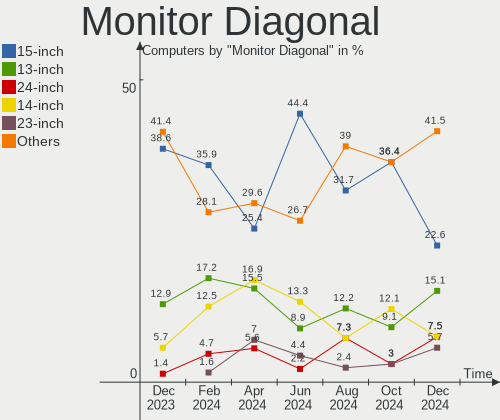
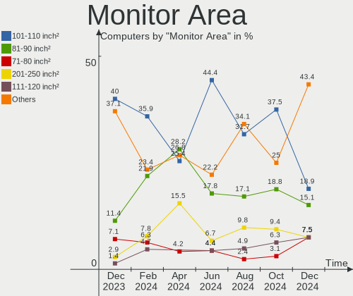
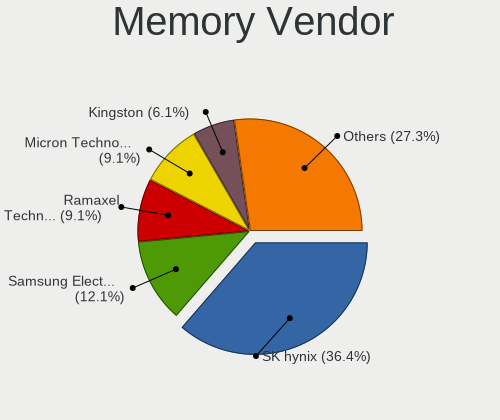
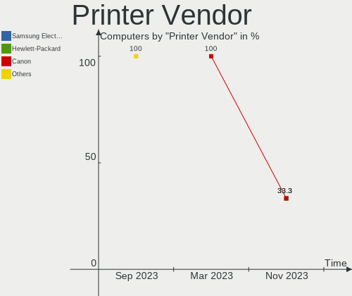
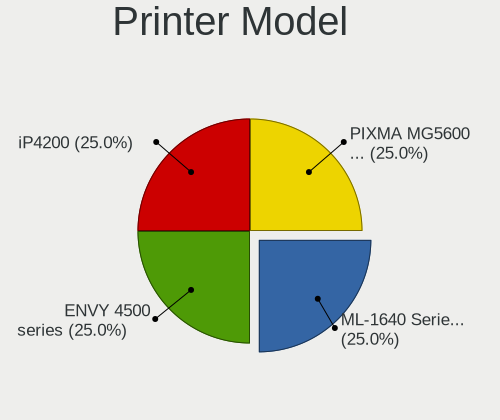

Kali Hardware Trends
--------------------

A project to identify most popular hardware characteristics and track their change
over time based on data collected by Kali users at https://Linux-Hardware.org.

Anyone can contribute to this report by the [hw-probe](https://github.com/linuxhw/hw-probe) tool:

    sudo -E hw-probe -all -upload

This is a report for all computer types. See also reports for [desktops](/Dist/Kali/Desktop/README.md) and [notebooks](/Dist/Kali/Notebook/README.md).

Full-feature report is available here: https://linux-hardware.org/?view=trends

Period: Mar, 2022.

Contents
--------

* [ System ](#system)
  - [ OS                       ](#os)
  - [ OS Family                ](#os-family)
  - [ Kernel                   ](#kernel)
  - [ Kernel Family            ](#kernel-family)
  - [ Kernel Major Ver.        ](#kernel-major-ver)
  - [ Arch                     ](#arch)
  - [ DE                       ](#de)
  - [ Display Server           ](#display-server)
  - [ Display Manager          ](#display-manager)
  - [ OS Lang                  ](#os-lang)
  - [ Boot Mode                ](#boot-mode)
  - [ Filesystem               ](#filesystem)
  - [ Part. scheme             ](#part-scheme)
  - [ Dual Boot with Linux/BSD ](#dual-boot-with-linuxbsd)
  - [ Dual Boot (Win)          ](#dual-boot-win)

* [ Board ](#board)
  - [ Vendor                   ](#vendor)
  - [ Model                    ](#model)
  - [ Model Family             ](#model-family)
  - [ MFG Year                 ](#mfg-year)
  - [ Form Factor              ](#form-factor)
  - [ Secure Boot              ](#secure-boot)
  - [ Coreboot                 ](#coreboot)
  - [ RAM Size                 ](#ram-size)
  - [ RAM Used                 ](#ram-used)
  - [ Total Drives             ](#total-drives)
  - [ Has CD-ROM               ](#has-cd-rom)
  - [ Has Ethernet             ](#has-ethernet)
  - [ Has WiFi                 ](#has-wifi)
  - [ Has Bluetooth            ](#has-bluetooth)

* [ Location ](#location)
  - [ Country                  ](#country)
  - [ City                     ](#city)

* [ Drives ](#drives)
  - [ Drive Vendor             ](#drive-vendor)
  - [ Drive Model              ](#drive-model)
  - [ HDD Vendor               ](#hdd-vendor)
  - [ SSD Vendor               ](#ssd-vendor)
  - [ Drive Kind               ](#drive-kind)
  - [ Drive Connector          ](#drive-connector)
  - [ Drive Size               ](#drive-size)
  - [ Space Total              ](#space-total)
  - [ Space Used               ](#space-used)
  - [ Malfunc. Drives          ](#malfunc-drives)
  - [ Malfunc. Drive Vendor    ](#malfunc-drive-vendor)
  - [ Malfunc. HDD Vendor      ](#malfunc-hdd-vendor)
  - [ Malfunc. Drive Kind      ](#malfunc-drive-kind)
  - [ Failed Drives            ](#failed-drives)
  - [ Failed Drive Vendor      ](#failed-drive-vendor)
  - [ Drive Status             ](#drive-status)

* [ Storage controller ](#storage-controller)
  - [ Storage Vendor           ](#storage-vendor)
  - [ Storage Model            ](#storage-model)
  - [ Storage Kind             ](#storage-kind)

* [ Processor ](#processor)
  - [ CPU Vendor               ](#cpu-vendor)
  - [ CPU Model                ](#cpu-model)
  - [ CPU Model Family         ](#cpu-model-family)
  - [ CPU Cores                ](#cpu-cores)
  - [ CPU Sockets              ](#cpu-sockets)
  - [ CPU Threads              ](#cpu-threads)
  - [ CPU Op-Modes             ](#cpu-op-modes)
  - [ CPU Microcode            ](#cpu-microcode)
  - [ CPU Microarch            ](#cpu-microarch)

* [ Graphics ](#graphics)
  - [ GPU Vendor               ](#gpu-vendor)
  - [ GPU Model                ](#gpu-model)
  - [ GPU Combo                ](#gpu-combo)
  - [ GPU Driver               ](#gpu-driver)
  - [ GPU Memory               ](#gpu-memory)

* [ Monitor ](#monitor)
  - [ Monitor Vendor           ](#monitor-vendor)
  - [ Monitor Model            ](#monitor-model)
  - [ Monitor Resolution       ](#monitor-resolution)
  - [ Monitor Diagonal         ](#monitor-diagonal)
  - [ Monitor Width            ](#monitor-width)
  - [ Aspect Ratio             ](#aspect-ratio)
  - [ Monitor Area             ](#monitor-area)
  - [ Pixel Density            ](#pixel-density)
  - [ Multiple Monitors        ](#multiple-monitors)

* [ Network ](#network)
  - [ Net Controller Vendor    ](#net-controller-vendor)
  - [ Net Controller Model     ](#net-controller-model)
  - [ Wireless Vendor          ](#wireless-vendor)
  - [ Wireless Model           ](#wireless-model)
  - [ Ethernet Vendor          ](#ethernet-vendor)
  - [ Ethernet Model           ](#ethernet-model)
  - [ Net Controller Kind      ](#net-controller-kind)
  - [ Used Controller          ](#used-controller)
  - [ NICs                     ](#nics)
  - [ IPv6                     ](#ipv6)

* [ Bluetooth ](#bluetooth)
  - [ Bluetooth Vendor         ](#bluetooth-vendor)
  - [ Bluetooth Model          ](#bluetooth-model)

* [ Sound ](#sound)
  - [ Sound Vendor             ](#sound-vendor)
  - [ Sound Model              ](#sound-model)

* [ Memory ](#memory)
  - [ Memory Vendor            ](#memory-vendor)
  - [ Memory Model             ](#memory-model)
  - [ Memory Kind              ](#memory-kind)
  - [ Memory Form Factor       ](#memory-form-factor)
  - [ Memory Size              ](#memory-size)
  - [ Memory Speed             ](#memory-speed)

* [ Printers & scanners ](#printers--scanners)
  - [ Printer Vendor           ](#printer-vendor)
  - [ Printer Model            ](#printer-model)
  - [ Scanner Vendor           ](#scanner-vendor)
  - [ Scanner Model            ](#scanner-model)

* [ Camera ](#camera)
  - [ Camera Vendor            ](#camera-vendor)
  - [ Camera Model             ](#camera-model)

* [ Security ](#security)
  - [ Fingerprint Vendor       ](#fingerprint-vendor)
  - [ Fingerprint Model        ](#fingerprint-model)
  - [ Chipcard Vendor          ](#chipcard-vendor)
  - [ Chipcard Model           ](#chipcard-model)

* [ Unsupported ](#unsupported)
  - [ Unsupported Devices      ](#unsupported-devices)
  - [ Unsupported Device Types ](#unsupported-device-types)

System
------

OS
--

Installed operating systems

| Name        | Computers | Percent |
|-------------|-----------|---------|
| Kali 2022.1 | 48        | 92.31%  |
| Kali 2021.4 | 4         | 7.69%   |

OS Family
---------

OS without a version

| Name | Computers | Percent |
|------|-----------|---------|
| Kali | 52        | 100%    |

Kernel
------

Version of the Linux kernel

| Version            | Computers | Percent |
|--------------------|-----------|---------|
| 5.15.0-kali3-amd64 | 14        | 26.92%  |
| 5.16.0-kali3-amd64 | 12        | 23.08%  |
| 5.16.0-kali1-amd64 | 9         | 17.31%  |
| 5.16.0-kali5-amd64 | 7         | 13.46%  |
| 5.16.0-kali6-amd64 | 2         | 3.85%   |
| 5.4.83-Re4son-v8l+ | 1         | 1.92%   |
| 5.16.14-custom     | 1         | 1.92%   |
| 5.14.21            | 1         | 1.92%   |
| 5.14.0-kali4-amd64 | 1         | 1.92%   |
| 5.10.0-kali7-amd64 | 1         | 1.92%   |
| 4.9.254-NetHunter  | 1         | 1.92%   |
| 4.19.87-23609661   | 1         | 1.92%   |
| 4.19.113-23222000  | 1         | 1.92%   |

Kernel Family
-------------

Linux kernel without a distro release

| Version  | Computers | Percent |
|----------|-----------|---------|
| 5.16.0   | 30        | 57.69%  |
| 5.15.0   | 14        | 26.92%  |
| 5.4.83   | 1         | 1.92%   |
| 5.16.14  | 1         | 1.92%   |
| 5.14.21  | 1         | 1.92%   |
| 5.14.0   | 1         | 1.92%   |
| 5.10.0   | 1         | 1.92%   |
| 4.9.254  | 1         | 1.92%   |
| 4.19.87  | 1         | 1.92%   |
| 4.19.113 | 1         | 1.92%   |

Kernel Major Ver.
-----------------

Linux kernel major version

| Version | Computers | Percent |
|---------|-----------|---------|
| 5.16    | 31        | 59.62%  |
| 5.15    | 14        | 26.92%  |
| 5.14    | 2         | 3.85%   |
| 4.19    | 2         | 3.85%   |
| 5.4     | 1         | 1.92%   |
| 5.10    | 1         | 1.92%   |
| 4.9     | 1         | 1.92%   |

Arch
----

OS architecture (x86_64, i586, etc.)

| Name    | Computers | Percent |
|---------|-----------|---------|
| x86_64  | 47        | 90.38%  |
| aarch64 | 5         | 9.62%   |

DE
--

Desktop Environment

| Name     | Computers | Percent |
|----------|-----------|---------|
| XFCE     | 31        | 59.62%  |
| GNOME    | 11        | 21.15%  |
| KDE5     | 7         | 13.46%  |
| MATE     | 1         | 1.92%   |
| Cinnamon | 1         | 1.92%   |
| Budgie   | 1         | 1.92%   |

Display Server
--------------

X11 or Wayland

| Name    | Computers | Percent |
|---------|-----------|---------|
| X11     | 49        | 94.23%  |
| Wayland | 3         | 5.77%   |

Display Manager
---------------

SDDM, LightDM, etc.

| Name    | Computers | Percent |
|---------|-----------|---------|
| LightDM | 29        | 55.77%  |
| Unknown | 11        | 21.15%  |
| GDM3    | 8         | 15.38%  |
| SDDM    | 4         | 7.69%   |

OS Lang
-------

Language

| Lang              | Computers | Percent |
|-------------------|-----------|---------|
| en_US             | 24        | 46.15%  |
| en_GB             | 4         | 7.69%   |
| de_DE             | 3         | 5.77%   |
| pt_BR             | 2         | 3.85%   |
| pl_PL             | 2         | 3.85%   |
| fr_FR             | 2         | 3.85%   |
| fr_CA             | 2         | 3.85%   |
| es_MX             | 2         | 3.85%   |
| tr_TR             | 1         | 1.92%   |
| ru_RU             | 1         | 1.92%   |
| fr_CH             | 1         | 1.92%   |
| es_VE             | 1         | 1.92%   |
| en_ZA             | 1         | 1.92%   |
| en_US.ISO-8859-15 | 1         | 1.92%   |
| en_IN             | 1         | 1.92%   |
| en_AU             | 1         | 1.92%   |
| de_CH             | 1         | 1.92%   |
| C                 | 1         | 1.92%   |
| Unknown           | 1         | 1.92%   |

Boot Mode
---------

EFI or BIOS

| Mode | Computers | Percent |
|------|-----------|---------|
| EFI  | 30        | 57.69%  |
| BIOS | 22        | 42.31%  |

Filesystem
----------

Type of filesystem

| Type    | Computers | Percent |
|---------|-----------|---------|
| Ext4    | 48        | 92.31%  |
| Overlay | 3         | 5.77%   |
| Btrfs   | 1         | 1.92%   |

Part. scheme
------------

Scheme of partitioning

| Type    | Computers | Percent |
|---------|-----------|---------|
| GPT     | 24        | 46.15%  |
| MBR     | 14        | 26.92%  |
| Unknown | 14        | 26.92%  |

Dual Boot with Linux/BSD
------------------------

Hosting more than one Linux/BSD

| Dual boot | Computers | Percent |
|-----------|-----------|---------|
| No        | 47        | 90.38%  |
| Yes       | 5         | 9.62%   |

Dual Boot (Win)
---------------

Hosting Linux and Windows

| Dual boot | Computers | Percent |
|-----------|-----------|---------|
| No        | 30        | 57.69%  |
| Yes       | 22        | 42.31%  |

Board
-----

Vendor
------

Motherboard manufacturer

| Name                    | Computers | Percent |
|-------------------------|-----------|---------|
| Hewlett-Packard         | 13        | 25%     |
| Dell                    | 9         | 17.31%  |
| ASUSTek Computer        | 6         | 11.54%  |
| MSI                     | 4         | 7.69%   |
| Acer                    | 4         | 7.69%   |
| Sony                    | 2         | 3.85%   |
| Gigabyte Technology     | 2         | 3.85%   |
| Apple                   | 2         | 3.85%   |
| Unknown                 | 2         | 3.85%   |
| Timi                    | 1         | 1.92%   |
| Raspberry Pi Foundation | 1         | 1.92%   |
| Qualcomm Technologies   | 1         | 1.92%   |
| Pine Microsystems       | 1         | 1.92%   |
| Pegatron                | 1         | 1.92%   |
| Microsoft               | 1         | 1.92%   |
| Lenovo                  | 1         | 1.92%   |
| HUAWEI                  | 1         | 1.92%   |

Model
-----

Motherboard model

| Name                                     | Computers | Percent |
|------------------------------------------|-----------|---------|
| HP Pavilion g6                           | 2         | 3.85%   |
| Acer Swift SF314-42                      | 2         | 3.85%   |
| Unknown                                  | 2         | 3.85%   |
| Timi Mi Laptop Pro 15                    | 1         | 1.92%   |
| Sony VPCEH10EB                           | 1         | 1.92%   |
| Sony VGN-NW265F                          | 1         | 1.92%   |
| RPi Raspberry Pi                         | 1         | 1.92%   |
| Qualcomm SDM845 v2.1 MTP PVT             | 1         | 1.92%   |
| Pine Microsystems Pine64 Pinebook Pro    | 1         | 1.92%   |
| Pegatron CQ1507LA                        | 1         | 1.92%   |
| MSI MS-7B12                              | 1         | 1.92%   |
| MSI MS-7A34                              | 1         | 1.92%   |
| MSI GP76 Leopard 10UE                    | 1         | 1.92%   |
| MSI GL63 8RC                             | 1         | 1.92%   |
| Microsoft Surface Pro 7                  | 1         | 1.92%   |
| Lenovo IdeaPad S540-15IWL GTX 81SW       | 1         | 1.92%   |
| HUAWEI HVY-WXX9                          | 1         | 1.92%   |
| HP Spectre x360 Convertible              | 1         | 1.92%   |
| HP ProBook 6570b                         | 1         | 1.92%   |
| HP ProBook 650 G1                        | 1         | 1.92%   |
| HP ProBook 6470b                         | 1         | 1.92%   |
| HP Pavilion Laptop 14-bf1xx              | 1         | 1.92%   |
| HP Pavilion Gaming Laptop 15-dk1xxx      | 1         | 1.92%   |
| HP Pavilion 14                           | 1         | 1.92%   |
| HP Notebook                              | 1         | 1.92%   |
| HP Laptop 15-da1xxx                      | 1         | 1.92%   |
| HP EliteBook 820 G3                      | 1         | 1.92%   |
| HP Compaq 620                            | 1         | 1.92%   |
| Gigabyte Z590 AORUS ULTRA                | 1         | 1.92%   |
| Gigabyte A520M S2H                       | 1         | 1.92%   |
| Dell Vostro 3590                         | 1         | 1.92%   |
| Dell Latitude E6530                      | 1         | 1.92%   |
| Dell Latitude E6510                      | 1         | 1.92%   |
| Dell Latitude E6430                      | 1         | 1.92%   |
| Dell Latitude 5480                       | 1         | 1.92%   |
| Dell Inspiron 7706 2n1                   | 1         | 1.92%   |
| Dell Inspiron 5566                       | 1         | 1.92%   |
| Dell Inspiron 3593                       | 1         | 1.92%   |
| Dell Inspiron 3542                       | 1         | 1.92%   |
| ASUS VivoBook_ASUSLaptop TP412FA_TP412FA | 1         | 1.92%   |
| ASUS TUF Z390-PLUS GAMING                | 1         | 1.92%   |
| ASUS ROG STRIX B365-G GAMING             | 1         | 1.92%   |
| ASUS PRIME X370-PRO                      | 1         | 1.92%   |
| ASUS H61-PLUS                            | 1         | 1.92%   |
| ASUS GL753VD                             | 1         | 1.92%   |
| Apple MacBookPro15,2                     | 1         | 1.92%   |
| Apple MacBookPro12,1                     | 1         | 1.92%   |
| Acer Aspire ES1-572                      | 1         | 1.92%   |
| Acer Aspire 5732Z                        | 1         | 1.92%   |

Model Family
------------

Motherboard model prefix

| Name                     | Computers | Percent |
|--------------------------|-----------|---------|
| HP Pavilion              | 5         | 9.62%   |
| Dell Latitude            | 4         | 7.69%   |
| Dell Inspiron            | 4         | 7.69%   |
| HP ProBook               | 3         | 5.77%   |
| Acer Swift               | 2         | 3.85%   |
| Acer Aspire              | 2         | 3.85%   |
| Unknown                  | 2         | 3.85%   |
| Timi Mi                  | 1         | 1.92%   |
| Sony VPCEH10EB           | 1         | 1.92%   |
| Sony VGN-NW265F          | 1         | 1.92%   |
| RPi Raspberry            | 1         | 1.92%   |
| Qualcomm SDM845          | 1         | 1.92%   |
| Pine Microsystems Pine64 | 1         | 1.92%   |
| Pegatron CQ1507LA        | 1         | 1.92%   |
| MSI MS-7B12              | 1         | 1.92%   |
| MSI MS-7A34              | 1         | 1.92%   |
| MSI GP76                 | 1         | 1.92%   |
| MSI GL63                 | 1         | 1.92%   |
| Microsoft Surface        | 1         | 1.92%   |
| Lenovo IdeaPad           | 1         | 1.92%   |
| HUAWEI HVY-WXX9          | 1         | 1.92%   |
| HP Spectre               | 1         | 1.92%   |
| HP Notebook              | 1         | 1.92%   |
| HP Laptop                | 1         | 1.92%   |
| HP EliteBook             | 1         | 1.92%   |
| HP Compaq                | 1         | 1.92%   |
| Gigabyte Z590            | 1         | 1.92%   |
| Gigabyte A520M           | 1         | 1.92%   |
| Dell Vostro              | 1         | 1.92%   |
| ASUS VivoBook            | 1         | 1.92%   |
| ASUS TUF                 | 1         | 1.92%   |
| ASUS ROG                 | 1         | 1.92%   |
| ASUS PRIME               | 1         | 1.92%   |
| ASUS H61-PLUS            | 1         | 1.92%   |
| ASUS GL753VD             | 1         | 1.92%   |
| Apple MacBookPro15       | 1         | 1.92%   |
| Apple MacBookPro12       | 1         | 1.92%   |

MFG Year
--------

Motherboard manufacture year

| Year    | Computers | Percent |
|---------|-----------|---------|
| 2020    | 8         | 15.38%  |
| 2019    | 7         | 13.46%  |
| 2018    | 5         | 9.62%   |
| Unknown | 5         | 9.62%   |
| 2017    | 4         | 7.69%   |
| 2016    | 4         | 7.69%   |
| 2012    | 4         | 7.69%   |
| 2011    | 4         | 7.69%   |
| 2013    | 3         | 5.77%   |
| 2021    | 2         | 3.85%   |
| 2010    | 2         | 3.85%   |
| 2009    | 2         | 3.85%   |
| 2015    | 1         | 1.92%   |
| 2014    | 1         | 1.92%   |

Form Factor
-----------

Physical design of the computer

| Name           | Computers | Percent |
|----------------|-----------|---------|
| Notebook       | 35        | 67.31%  |
| Desktop        | 9         | 17.31%  |
| System on chip | 4         | 7.69%   |
| Convertible    | 3         | 5.77%   |
| Tablet         | 1         | 1.92%   |

Secure Boot
-----------

Enabled or disabled

| State    | Computers | Percent |
|----------|-----------|---------|
| Disabled | 52        | 100%    |

Coreboot
--------

Have coreboot on board

| Used | Computers | Percent |
|------|-----------|---------|
| No   | 52        | 100%    |

RAM Size
--------

Total RAM memory

| Size in GB  | Computers | Percent |
|-------------|-----------|---------|
| 4.01-8.0    | 19        | 36.54%  |
| 3.01-4.0    | 10        | 19.23%  |
| 8.01-16.0   | 10        | 19.23%  |
| 16.01-24.0  | 8         | 15.38%  |
| 32.01-64.0  | 3         | 5.77%   |
| 24.01-32.0  | 1         | 1.92%   |
| 64.01-256.0 | 1         | 1.92%   |

RAM Used
--------

Used RAM memory

| Used GB   | Computers | Percent |
|-----------|-----------|---------|
| 2.01-3.0  | 18        | 34.62%  |
| 1.01-2.0  | 18        | 34.62%  |
| 4.01-8.0  | 10        | 19.23%  |
| 3.01-4.0  | 3         | 5.77%   |
| 0.51-1.0  | 2         | 3.85%   |
| 8.01-16.0 | 1         | 1.92%   |

Total Drives
------------

Number of drives on board

| Drives | Computers | Percent |
|--------|-----------|---------|
| 1      | 30        | 57.69%  |
| 2      | 13        | 25%     |
| 3      | 4         | 7.69%   |
| 0      | 3         | 5.77%   |
| 6      | 1         | 1.92%   |
| 4      | 1         | 1.92%   |

Has CD-ROM
----------

Has CD-ROM on board

| Presented | Computers | Percent |
|-----------|-----------|---------|
| No        | 36        | 69.23%  |
| Yes       | 16        | 30.77%  |

Has Ethernet
------------

Has Ethernet on board

| Presented | Computers | Percent |
|-----------|-----------|---------|
| Yes       | 39        | 75%     |
| No        | 13        | 25%     |

Has WiFi
--------

Has WiFi module

| Presented | Computers | Percent |
|-----------|-----------|---------|
| Yes       | 49        | 94.23%  |
| No        | 3         | 5.77%   |

Has Bluetooth
-------------

Has Bluetooth module

| Presented | Computers | Percent |
|-----------|-----------|---------|
| Yes       | 35        | 67.31%  |
| No        | 17        | 32.69%  |

Location
--------

Country
-------

Geographic location (country)

| Country      | Computers | Percent |
|--------------|-----------|---------|
| USA          | 10        | 19.23%  |
| Germany      | 6         | 11.54%  |
| Russia       | 3         | 5.77%   |
| Brazil       | 3         | 5.77%   |
| Turkey       | 2         | 3.85%   |
| Switzerland  | 2         | 3.85%   |
| South Africa | 2         | 3.85%   |
| Poland       | 2         | 3.85%   |
| Mexico       | 2         | 3.85%   |
| Iran         | 2         | 3.85%   |
| India        | 2         | 3.85%   |
| Greece       | 2         | 3.85%   |
| France       | 2         | 3.85%   |
| Canada       | 2         | 3.85%   |
| Venezuela    | 1         | 1.92%   |
| Sri Lanka    | 1         | 1.92%   |
| Spain        | 1         | 1.92%   |
| Serbia       | 1         | 1.92%   |
| Philippines  | 1         | 1.92%   |
| Pakistan     | 1         | 1.92%   |
| Indonesia    | 1         | 1.92%   |
| Finland      | 1         | 1.92%   |
| Egypt        | 1         | 1.92%   |
| Australia    | 1         | 1.92%   |

City
----

Geographic location (city)

| City              | Computers | Percent |
|-------------------|-----------|---------|
| Trois-Rivières   | 2         | 3.85%   |
| Munich            | 2         | 3.85%   |
| Caruaru           | 2         | 3.85%   |
| Zurich            | 1         | 1.92%   |
| Winnenden         | 1         | 1.92%   |
| Warsaw            | 1         | 1.92%   |
| Versailles        | 1         | 1.92%   |
| Vern-sur-Seiche   | 1         | 1.92%   |
| Vantaa            | 1         | 1.92%   |
| Tucson            | 1         | 1.92%   |
| Thessaloniki      | 1         | 1.92%   |
| St Petersburg     | 1         | 1.92%   |
| Şowmeeh Sarā    | 1         | 1.92%   |
| Sleman            | 1         | 1.92%   |
| Sioux Falls       | 1         | 1.92%   |
| Seattle           | 1         | 1.92%   |
| Roodepoort        | 1         | 1.92%   |
| Queretaro         | 1         | 1.92%   |
| Pretoria          | 1         | 1.92%   |
| Port Said         | 1         | 1.92%   |
| Ordu              | 1         | 1.92%   |
| Murfreesboro      | 1         | 1.92%   |
| Mumbai            | 1         | 1.92%   |
| Moscow            | 1         | 1.92%   |
| Modesto           | 1         | 1.92%   |
| Mexico City       | 1         | 1.92%   |
| Maracay           | 1         | 1.92%   |
| Magugpo Poblacion | 1         | 1.92%   |
| Madrid            | 1         | 1.92%   |
| Lyss              | 1         | 1.92%   |
| Lubawa            | 1         | 1.92%   |
| Lahore            | 1         | 1.92%   |
| Kirov             | 1         | 1.92%   |
| Khorramabad       | 1         | 1.92%   |
| Kayseri           | 1         | 1.92%   |
| Kaufbeuren        | 1         | 1.92%   |
| Jaciara           | 1         | 1.92%   |
| Hyderabad         | 1         | 1.92%   |
| Harrisonburg      | 1         | 1.92%   |
| Duisburg          | 1         | 1.92%   |
| Cooperstown       | 1         | 1.92%   |
| Colombo           | 1         | 1.92%   |
| Chania            | 1         | 1.92%   |
| Brisbane          | 1         | 1.92%   |
| Braunfels         | 1         | 1.92%   |
| Belgrade          | 1         | 1.92%   |
| Baltimore         | 1         | 1.92%   |
| Bakersfield       | 1         | 1.92%   |
| Avondale          | 1         | 1.92%   |

Drives
------

Drive Vendor
------------

Hard drive vendors

| Vendor              | Computers | Drives | Percent |
|---------------------|-----------|--------|---------|
| Seagate             | 17        | 18     | 23.61%  |
| Samsung Electronics | 8         | 9      | 11.11%  |
| Kingston            | 6         | 6      | 8.33%   |
| WDC                 | 5         | 6      | 6.94%   |
| Unknown             | 5         | 5      | 6.94%   |
| Hitachi             | 5         | 5      | 6.94%   |
| KIOXIA              | 3         | 3      | 4.17%   |
| Toshiba             | 2         | 3      | 2.78%   |
| LITEONIT            | 2         | 2      | 2.78%   |
| Apple               | 2         | 2      | 2.78%   |
| ZTE                 | 1         | 1      | 1.39%   |
| YMTC                | 1         | 1      | 1.39%   |
| UMIS                | 1         | 1      | 1.39%   |
| SPCC                | 1         | 1      | 1.39%   |
| SK Hynix            | 1         | 1      | 1.39%   |
| Silicon Motion      | 1         | 1      | 1.39%   |
| SanDisk             | 1         | 1      | 1.39%   |
| Patriot             | 1         | 1      | 1.39%   |
| Micron Technology   | 1         | 1      | 1.39%   |
| MAXTOR              | 1         | 1      | 1.39%   |
| KingFast            | 1         | 2      | 1.39%   |
| Intel               | 1         | 2      | 1.39%   |
| Gigabyte Technology | 1         | 1      | 1.39%   |
| Crucial             | 1         | 1      | 1.39%   |
| China               | 1         | 1      | 1.39%   |
| A-DATA Technology   | 1         | 1      | 1.39%   |
| Unknown             | 1         | 1      | 1.39%   |

Drive Model
-----------

Hard drive models

| Model                                   | Computers | Percent |
|-----------------------------------------|-----------|---------|
| Seagate ST1000LM035-1RK172 1TB          | 4         | 5.13%   |
| Seagate ST9320423AS 320GB               | 3         | 3.85%   |
| KIOXIA NVMe SSD Drive 256GB             | 2         | 2.56%   |
| Hitachi HTS547575A9E384 752GB           | 2         | 2.56%   |
| ZTE MMC Storage 8GB                     | 1         | 1.28%   |
| YMTC PC005 512GB                        | 1         | 1.28%   |
| WDC WDS100T2B0A-00SM50 1TB SSD          | 1         | 1.28%   |
| WDC WD5000BEVT-22ZAT0 500GB             | 1         | 1.28%   |
| WDC WD40EFAX-68JH4N0 4TB                | 1         | 1.28%   |
| WDC WD3200BEVS-26VAT0 320GB             | 1         | 1.28%   |
| WDC WD10SPZX-60Z10T0 1TB                | 1         | 1.28%   |
| WDC WD10JPVX-22JC3T0 1TB                | 1         | 1.28%   |
| Unknown SD/MMC/MS PRO 32GB              | 1         | 1.28%   |
| Unknown NCard  32GB                     | 1         | 1.28%   |
| Unknown MMC Card  7GB                   | 1         | 1.28%   |
| Unknown MMC Card  16GB                  | 1         | 1.28%   |
| Unknown DA4064  64GB                    | 1         | 1.28%   |
| UMIS RPFTJ128PDD2EWX 128GB              | 1         | 1.28%   |
| Toshiba KSG60ZMV256G M.2 2280 256GB SSD | 1         | 1.28%   |
| Toshiba HDWR160 6TB                     | 1         | 1.28%   |
| Toshiba HDWE150 5TB                     | 1         | 1.28%   |
| SPCC M.2 PCIe SSD 512GB                 | 1         | 1.28%   |
| SK Hynix BC501 NVMe 256GB               | 1         | 1.28%   |
| Silicon Motion NVME SSD 512GB           | 1         | 1.28%   |
| Seagate ST9500420AS 500GB               | 1         | 1.28%   |
| Seagate ST750LM022 HN-M750MBB 752GB     | 1         | 1.28%   |
| Seagate ST500LT012-1DG142 500GB         | 1         | 1.28%   |
| Seagate ST500DM002-1BD142 500GB         | 1         | 1.28%   |
| Seagate ST4000LM024-2AN17V 4TB          | 1         | 1.28%   |
| Seagate ST4000DM004-2CV104 4TB          | 1         | 1.28%   |
| Seagate ST3500413AS 500GB               | 1         | 1.28%   |
| Seagate ST2000DM008-2FR102 2TB          | 1         | 1.28%   |
| Seagate ST1000LM049-2GH172 1TB          | 1         | 1.28%   |
| Seagate ST1000LM048-2E7172 1TB          | 1         | 1.28%   |
| Seagate Expansion 320GB                 | 1         | 1.28%   |
| SanDisk SD7SN6S-256G-1006 256GB SSD     | 1         | 1.28%   |
| Samsung SSD 980 PRO 1TB                 | 1         | 1.28%   |
| Samsung SSD 980 500GB                   | 1         | 1.28%   |
| Samsung SSD 960 EVO 500GB               | 1         | 1.28%   |
| Samsung SSD 840 EVO 120GB               | 1         | 1.28%   |
| Samsung MZVPV256HDGL-000H1 256GB        | 1         | 1.28%   |
| Samsung MZVLQ1T0HALB-00000 1TB          | 1         | 1.28%   |
| Samsung MZNLN256HMHQ-000H1 256GB SSD    | 1         | 1.28%   |
| Samsung MZNLN256HAJQ-000H1 256GB SSD    | 1         | 1.28%   |
| Samsung HN-M101MBB 1TB                  | 1         | 1.28%   |
| Patriot Burst 240GB SSD                 | 1         | 1.28%   |
| Micron 2200_MTFDHBA512TCK 512GB         | 1         | 1.28%   |
| MAXTOR STM3250310AS 250GB               | 1         | 1.28%   |
| LITEONIT LCS-256M6S 2.5 7mm 256GB SSD   | 1         | 1.28%   |
| LITEONIT LCS-128M6S-HP 128GB SSD        | 1         | 1.28%   |
| KIOXIA KBG40ZNS256G NVMe 256GB          | 1         | 1.28%   |
| Kingston SV300S37A120G 120GB SSD        | 1         | 1.28%   |
| Kingston SNVS250G 250GB                 | 1         | 1.28%   |
| Kingston SA400S37480G 480GB SSD         | 1         | 1.28%   |
| Kingston SA400S37240G 240GB SSD         | 1         | 1.28%   |
| Kingston RBUSNS8180DS3128GJ 128GB SSD   | 1         | 1.28%   |
| Kingston OM8PCP31024F-AI1 1TB           | 1         | 1.28%   |
| KingFast 256GB                          | 1         | 1.28%   |
| KingFast 128GB                          | 1         | 1.28%   |
| Intel H10 HBRPEKNX0202AO NVMe 32GB      | 1         | 1.28%   |

HDD Vendor
----------

Hard disk drive vendors

| Vendor              | Computers | Drives | Percent |
|---------------------|-----------|--------|---------|
| Seagate             | 17        | 18     | 54.84%  |
| WDC                 | 5         | 5      | 16.13%  |
| Hitachi             | 5         | 5      | 16.13%  |
| Unknown             | 1         | 1      | 3.23%   |
| Toshiba             | 1         | 2      | 3.23%   |
| Samsung Electronics | 1         | 1      | 3.23%   |
| MAXTOR              | 1         | 1      | 3.23%   |

SSD Vendor
----------

Solid state drive vendors

| Vendor              | Computers | Drives | Percent |
|---------------------|-----------|--------|---------|
| Kingston            | 4         | 4      | 25%     |
| Samsung Electronics | 3         | 3      | 18.75%  |
| LITEONIT            | 2         | 2      | 12.5%   |
| WDC                 | 1         | 1      | 6.25%   |
| Toshiba             | 1         | 1      | 6.25%   |
| SanDisk             | 1         | 1      | 6.25%   |
| Patriot             | 1         | 1      | 6.25%   |
| China               | 1         | 1      | 6.25%   |
| Apple               | 1         | 1      | 6.25%   |
| Unknown             | 1         | 1      | 6.25%   |

Drive Kind
----------

HDD or SSD

| Kind    | Computers | Drives | Percent |
|---------|-----------|--------|---------|
| HDD     | 28        | 33     | 41.79%  |
| NVMe    | 19        | 22     | 28.36%  |
| SSD     | 14        | 16     | 20.9%   |
| MMC     | 4         | 4      | 5.97%   |
| Unknown | 2         | 3      | 2.99%   |

Drive Connector
---------------

SATA, SAS, NVMe, etc.

| Type | Computers | Drives | Percent |
|------|-----------|--------|---------|
| SATA | 35        | 49     | 57.38%  |
| NVMe | 19        | 22     | 31.15%  |
| MMC  | 4         | 4      | 6.56%   |
| SAS  | 3         | 3      | 4.92%   |

Drive Size
----------

Size of hard drive

| Size in TB | Computers | Drives | Percent |
|------------|-----------|--------|---------|
| 0.01-0.5   | 26        | 30     | 59.09%  |
| 0.51-1.0   | 13        | 13     | 29.55%  |
| 3.01-4.0   | 3         | 3      | 6.82%   |
| 1.01-2.0   | 1         | 1      | 2.27%   |
| 4.01-10.0  | 1         | 2      | 2.27%   |

Space Total
-----------

Amount of disk space available on the file system

| Size in GB     | Computers | Percent |
|----------------|-----------|---------|
| 101-250        | 19        | 36.54%  |
| 251-500        | 12        | 23.08%  |
| 21-50          | 7         | 13.46%  |
| 501-1000       | 4         | 7.69%   |
| More than 3000 | 2         | 3.85%   |
| 1001-2000      | 2         | 3.85%   |
| 51-100         | 2         | 3.85%   |
| Unknown        | 2         | 3.85%   |
| 2001-3000      | 1         | 1.92%   |
| 1-20           | 1         | 1.92%   |

Space Used
----------

Amount of used disk space

| Used GB   | Computers | Percent |
|-----------|-----------|---------|
| 1-20      | 22        | 42.31%  |
| 21-50     | 13        | 25%     |
| 101-250   | 6         | 11.54%  |
| 251-500   | 3         | 5.77%   |
| 51-100    | 3         | 5.77%   |
| Unknown   | 2         | 3.85%   |
| 2001-3000 | 1         | 1.92%   |
| 1001-2000 | 1         | 1.92%   |
| 501-1000  | 1         | 1.92%   |

Malfunc. Drives
---------------

Drive models with a malfunction

| Model                                   | Computers | Drives | Percent |
|-----------------------------------------|-----------|--------|---------|
| Seagate ST9320423AS 320GB               | 3         | 3      | 20%     |
| Seagate ST1000LM035-1RK172 1TB          | 2         | 2      | 13.33%  |
| WDC WD5000BEVT-22ZAT0 500GB             | 1         | 1      | 6.67%   |
| Toshiba KSG60ZMV256G M.2 2280 256GB SSD | 1         | 1      | 6.67%   |
| Seagate ST9500420AS 500GB               | 1         | 1      | 6.67%   |
| Seagate ST750LM022 HN-M750MBB 752GB     | 1         | 1      | 6.67%   |
| Seagate ST4000LM024-2AN17V 4TB          | 1         | 1      | 6.67%   |
| Seagate ST3500413AS 500GB               | 1         | 1      | 6.67%   |
| Seagate ST1000LM049-2GH172 1TB          | 1         | 1      | 6.67%   |
| Kingston SV300S37A120G 120GB SSD        | 1         | 1      | 6.67%   |
| Hitachi HTS547575A9E384 752GB           | 1         | 1      | 6.67%   |
| Hitachi HTS543232L9A300 320GB           | 1         | 1      | 6.67%   |

Malfunc. Drive Vendor
---------------------

Vendors of faulty drives

| Vendor   | Computers | Drives | Percent |
|----------|-----------|--------|---------|
| Seagate  | 10        | 10     | 66.67%  |
| Hitachi  | 2         | 2      | 13.33%  |
| WDC      | 1         | 1      | 6.67%   |
| Toshiba  | 1         | 1      | 6.67%   |
| Kingston | 1         | 1      | 6.67%   |

Malfunc. HDD Vendor
-------------------

Vendors of faulty HDD drives

| Vendor  | Computers | Drives | Percent |
|---------|-----------|--------|---------|
| Seagate | 10        | 10     | 76.92%  |
| Hitachi | 2         | 2      | 15.38%  |
| WDC     | 1         | 1      | 7.69%   |

Malfunc. Drive Kind
-------------------

Kinds of faulty drives

| Kind | Computers | Drives | Percent |
|------|-----------|--------|---------|
| HDD  | 13        | 13     | 86.67%  |
| SSD  | 2         | 2      | 13.33%  |

Failed Drives
-------------

Failed drive models

Zero info for selected period =(

Failed Drive Vendor
-------------------

Failed drive vendors

Zero info for selected period =(

Drive Status
------------

Number of failed and malfunc. drives

| Status   | Computers | Drives | Percent |
|----------|-----------|--------|---------|
| Works    | 27        | 42     | 45.76%  |
| Detected | 17        | 21     | 28.81%  |
| Malfunc  | 15        | 15     | 25.42%  |

Storage controller
------------------

Storage Vendor
--------------

Storage controller vendors

| Vendor                      | Computers | Percent |
|-----------------------------|-----------|---------|
| Intel                       | 36        | 59.02%  |
| Samsung Electronics         | 5         | 8.2%    |
| AMD                         | 5         | 8.2%    |
| KIOXIA                      | 3         | 4.92%   |
| Phison Electronics          | 2         | 3.28%   |
| Kingston Technology Company | 2         | 3.28%   |
| Yangtze Memory Technologies | 1         | 1.64%   |
| Union Memory (Shenzhen)     | 1         | 1.64%   |
| SK Hynix                    | 1         | 1.64%   |
| Silicon Motion              | 1         | 1.64%   |
| Micron/Crucial Technology   | 1         | 1.64%   |
| Micron Technology           | 1         | 1.64%   |
| Apple                       | 1         | 1.64%   |
| ADATA Technology            | 1         | 1.64%   |

Storage Model
-------------

Storage controller models

| Model                                                                            | Computers | Percent |
|----------------------------------------------------------------------------------|-----------|---------|
| Intel 82801 Mobile SATA Controller [RAID mode]                                   | 7         | 10.77%  |
| Intel Sunrise Point-LP SATA Controller [AHCI mode]                               | 6         | 9.23%   |
| AMD FCH SATA Controller [AHCI mode]                                              | 5         | 7.69%   |
| KIOXIA Non-Volatile memory controller                                            | 3         | 4.62%   |
| Intel 7 Series Chipset Family 6-port SATA Controller [AHCI mode]                 | 3         | 4.62%   |
| Samsung NVMe SSD Controller 980                                                  | 2         | 3.08%   |
| Intel Cannon Lake PCH SATA AHCI Controller                                       | 2         | 3.08%   |
| Intel 82801IBM/IEM (ICH9M/ICH9M-E) 4 port SATA Controller [AHCI mode]            | 2         | 3.08%   |
| Intel 6 Series/C200 Series Chipset Family 6 port Mobile SATA AHCI Controller     | 2         | 3.08%   |
| Yangtze Memory Non-Volatile memory controller                                    | 1         | 1.54%   |
| Union Memory (Shenzhen) Non-Volatile memory controller                           | 1         | 1.54%   |
| SK Hynix BC501 NVMe Solid State Drive                                            | 1         | 1.54%   |
| Silicon Motion SM2263EN/SM2263XT SSD Controller                                  | 1         | 1.54%   |
| Samsung NVMe SSD Controller SM961/PM961/SM963                                    | 1         | 1.54%   |
| Samsung NVMe SSD Controller SM951/PM951                                          | 1         | 1.54%   |
| Samsung NVMe SSD Controller PM9A1/PM9A3/980PRO                                   | 1         | 1.54%   |
| Samsung Electronics SATA controller                                              | 1         | 1.54%   |
| Phison E16 PCIe4 NVMe Controller                                                 | 1         | 1.54%   |
| Phison E12 NVMe Controller                                                       | 1         | 1.54%   |
| Micron/Crucial Non-Volatile memory controller                                    | 1         | 1.54%   |
| Micron Non-Volatile memory controller                                            | 1         | 1.54%   |
| Kingston Company Company Non-Volatile memory controller                          | 1         | 1.54%   |
| Kingston Company SNVS2000G [NV1 NVMe PCIe SSD 2TB]                               | 1         | 1.54%   |
| Intel Non-Volatile memory controller                                             | 1         | 1.54%   |
| Intel NM10/ICH7 Family SATA Controller [AHCI mode]                               | 1         | 1.54%   |
| Intel Ice Lake-LP SATA Controller [AHCI mode]                                    | 1         | 1.54%   |
| Intel HM170/QM170 Chipset SATA Controller [AHCI Mode]                            | 1         | 1.54%   |
| Intel Comet Lake SATA AHCI Controller                                            | 1         | 1.54%   |
| Intel Cannon Point-LP SATA Controller [AHCI Mode]                                | 1         | 1.54%   |
| Intel Cannon Lake Mobile PCH SATA AHCI Controller                                | 1         | 1.54%   |
| Intel Atom/Celeron/Pentium Processor x5-E8000/J3xxx/N3xxx Series SATA Controller | 1         | 1.54%   |
| Intel 82801IBM/IEM (ICH9M/ICH9M-E) 2 port SATA Controller [IDE mode]             | 1         | 1.54%   |
| Intel 8 Series/C220 Series Chipset Family 6-port SATA Controller 1 [AHCI mode]   | 1         | 1.54%   |
| Intel 8 Series SATA Controller 1 [AHCI mode]                                     | 1         | 1.54%   |
| Intel 6 Series/C200 Series Chipset Family 6 port Desktop SATA AHCI Controller    | 1         | 1.54%   |
| Intel 500 Series Chipset Family SATA AHCI Controller                             | 1         | 1.54%   |
| Intel 200 Series PCH SATA controller [AHCI mode]                                 | 1         | 1.54%   |
| Apple ANS2 NVMe Controller                                                       | 1         | 1.54%   |
| AMD X370 Series Chipset SATA Controller                                          | 1         | 1.54%   |
| AMD 500 Series Chipset SATA Controller                                           | 1         | 1.54%   |
| AMD 300 Series Chipset SATA Controller                                           | 1         | 1.54%   |
| ADATA XPG SX8200 Pro PCIe Gen3x4 M.2 2280 Solid State Drive                      | 1         | 1.54%   |

Storage Kind
------------

Kind of storage controller (IDE, SATA, NVMe, SAS, ...)

| Kind | Computers | Percent |
|------|-----------|---------|
| SATA | 33        | 55%     |
| NVMe | 19        | 31.67%  |
| RAID | 7         | 11.67%  |
| IDE  | 1         | 1.67%   |

Processor
---------

CPU Vendor
----------

Processor vendors

| Vendor   | Computers | Percent |
|----------|-----------|---------|
| Intel    | 41        | 78.85%  |
| AMD      | 6         | 11.54%  |
| ARM      | 3         | 5.77%   |
| QUALCOMM | 2         | 3.85%   |

CPU Model
---------

Processor models

| Model                                       | Computers | Percent |
|---------------------------------------------|-----------|---------|
| ARM Processor                               | 3         | 5.77%   |
| Intel Pentium Dual-Core CPU T4300 @ 2.10GHz | 2         | 3.85%   |
| Intel Core i7-1065G7 CPU @ 1.30GHz          | 2         | 3.85%   |
| Intel Core i5-10210U CPU @ 1.60GHz          | 2         | 3.85%   |
| AMD Ryzen 7 4700U with Radeon Graphics      | 2         | 3.85%   |
| QUALCOMM AArch64 Processor rev 12 (aarch64) | 1         | 1.92%   |
| QUALCOMM AArch64 Processor rev 0 (aarch64)  | 1         | 1.92%   |
| Intel Pentium CPU N3710 @ 1.60GHz           | 1         | 1.92%   |
| Intel Core i9-9900K CPU @ 3.60GHz           | 1         | 1.92%   |
| Intel Core i7-9700 CPU @ 3.00GHz            | 1         | 1.92%   |
| Intel Core i7-8565U CPU @ 1.80GHz           | 1         | 1.92%   |
| Intel Core i7-7700HQ CPU @ 2.80GHz          | 1         | 1.92%   |
| Intel Core i7-6600U CPU @ 2.60GHz           | 1         | 1.92%   |
| Intel Core i7-6500U CPU @ 2.50GHz           | 1         | 1.92%   |
| Intel Core i7-10870H CPU @ 2.20GHz          | 1         | 1.92%   |
| Intel Core i5-8300H CPU @ 2.30GHz           | 1         | 1.92%   |
| Intel Core i5-8265U CPU @ 1.60GHz           | 1         | 1.92%   |
| Intel Core i5-8259U CPU @ 2.30GHz           | 1         | 1.92%   |
| Intel Core i5-8250U CPU @ 1.60GHz           | 1         | 1.92%   |
| Intel Core i5-6300U CPU @ 2.40GHz           | 1         | 1.92%   |
| Intel Core i5-5257U CPU @ 2.70GHz           | 1         | 1.92%   |
| Intel Core i5-4210U CPU @ 1.70GHz           | 1         | 1.92%   |
| Intel Core i5-4200M CPU @ 2.50GHz           | 1         | 1.92%   |
| Intel Core i5-3340M CPU @ 2.70GHz           | 1         | 1.92%   |
| Intel Core i5-3320M CPU @ 2.60GHz           | 1         | 1.92%   |
| Intel Core i5-3230M CPU @ 2.60GHz           | 1         | 1.92%   |
| Intel Core i5-2430M CPU @ 2.40GHz           | 1         | 1.92%   |
| Intel Core i5-2410M CPU @ 2.30GHz           | 1         | 1.92%   |
| Intel Core i5-10300H CPU @ 2.50GHz          | 1         | 1.92%   |
| Intel Core i5 CPU M 540 @ 2.53GHz           | 1         | 1.92%   |
| Intel Core i3-9100 CPU @ 3.60GHz            | 1         | 1.92%   |
| Intel Core i3-8145U CPU @ 2.10GHz           | 1         | 1.92%   |
| Intel Core i3-7100U CPU @ 2.40GHz           | 1         | 1.92%   |
| Intel Core i3-6006U CPU @ 2.00GHz           | 1         | 1.92%   |
| Intel Core i3-3240 CPU @ 3.40GHz            | 1         | 1.92%   |
| Intel Core i3-3217U CPU @ 1.80GHz           | 1         | 1.92%   |
| Intel Core i3-2370M CPU @ 2.40GHz           | 1         | 1.92%   |
| Intel Core i3-2310M CPU @ 2.10GHz           | 1         | 1.92%   |
| Intel Core 2 Duo CPU T6670 @ 2.20GHz        | 1         | 1.92%   |
| Intel Atom CPU D525 @ 1.80GHz               | 1         | 1.92%   |
| Intel 11th Gen Core i9-11900K @ 3.50GHz     | 1         | 1.92%   |
| Intel 11th Gen Core i7-1165G7 @ 2.80GHz     | 1         | 1.92%   |
| AMD Ryzen 7 2700X Eight-Core Processor      | 1         | 1.92%   |
| AMD Ryzen 5 4600H with Radeon Graphics      | 1         | 1.92%   |
| AMD Ryzen 5 2600X Six-Core Processor        | 1         | 1.92%   |
| AMD Ryzen 3 1200 Quad-Core Processor        | 1         | 1.92%   |

CPU Model Family
----------------

Processor model prefix

| Model                   | Computers | Percent |
|-------------------------|-----------|---------|
| Intel Core i5           | 17        | 32.69%  |
| Intel Core i7           | 8         | 15.38%  |
| Intel Core i3           | 8         | 15.38%  |
| Other                   | 5         | 9.62%   |
| AMD Ryzen 7             | 3         | 5.77%   |
| QUALCOMM AArch64        | 2         | 3.85%   |
| Intel Pentium Dual-Core | 2         | 3.85%   |
| AMD Ryzen 5             | 2         | 3.85%   |
| Intel Pentium           | 1         | 1.92%   |
| Intel Core i9           | 1         | 1.92%   |
| Intel Core 2 Duo        | 1         | 1.92%   |
| Intel Atom              | 1         | 1.92%   |
| AMD Ryzen 3             | 1         | 1.92%   |

CPU Cores
---------

Number of processor cores

| Number  | Computers | Percent |
|---------|-----------|---------|
| 2       | 24        | 46.15%  |
| 4       | 17        | 32.69%  |
| 8       | 7         | 13.46%  |
| 6       | 2         | 3.85%   |
| Unknown | 2         | 3.85%   |

CPU Sockets
-----------

Number of sockets

| Number  | Computers | Percent |
|---------|-----------|---------|
| 1       | 49        | 94.23%  |
| Unknown | 2         | 3.85%   |
| 2       | 1         | 1.92%   |

CPU Threads
-----------

Threads per core (Hyper-Threading)

| Number  | Computers | Percent |
|---------|-----------|---------|
| 2       | 37        | 71.15%  |
| 1       | 13        | 25%     |
| Unknown | 2         | 3.85%   |

CPU Op-Modes
------------

CPU Operation Modes (32-bit, 64-bit)

| Op mode        | Computers | Percent |
|----------------|-----------|---------|
| 32-bit, 64-bit | 51        | 98.08%  |
| Unknown        | 1         | 1.92%   |

CPU Microcode
-------------

Microcode number

| Number     | Computers | Percent |
|------------|-----------|---------|
| Unknown    | 8         | 15.38%  |
| 0x806ec    | 5         | 9.62%   |
| 0x406e3    | 4         | 7.69%   |
| 0x306a9    | 4         | 7.69%   |
| 0x206a7    | 3         | 5.77%   |
| 0x1067a    | 3         | 5.77%   |
| 0xa0652    | 2         | 3.85%   |
| 0x906ed    | 2         | 3.85%   |
| 0x806ea    | 2         | 3.85%   |
| 0x706e5    | 2         | 3.85%   |
| 0xa0671    | 1         | 1.92%   |
| 0x906eb    | 1         | 1.92%   |
| 0x906ea    | 1         | 1.92%   |
| 0x906e9    | 1         | 1.92%   |
| 0x806e9    | 1         | 1.92%   |
| 0x806c1    | 1         | 1.92%   |
| 0x406c4    | 1         | 1.92%   |
| 0x40651    | 1         | 1.92%   |
| 0x306d4    | 1         | 1.92%   |
| 0x306c3    | 1         | 1.92%   |
| 0x20652    | 1         | 1.92%   |
| 0x106ca    | 1         | 1.92%   |
| 0x08600106 | 1         | 1.92%   |
| 0x08600104 | 1         | 1.92%   |
| 0x08600102 | 1         | 1.92%   |
| 0x0800820d | 1         | 1.92%   |
| 0x08001129 | 1         | 1.92%   |

CPU Microarch
-------------

Microarchitecture

| Name        | Computers | Percent |
|-------------|-----------|---------|
| KabyLake    | 13        | 25%     |
| IvyBridge   | 5         | 9.62%   |
| Unknown     | 5         | 9.62%   |
| Skylake     | 4         | 7.69%   |
| SandyBridge | 4         | 7.69%   |
| Zen 2       | 3         | 5.77%   |
| Penryn      | 3         | 5.77%   |
| IceLake     | 3         | 5.77%   |
| Zen+        | 2         | 3.85%   |
| Haswell     | 2         | 3.85%   |
| CometLake   | 2         | 3.85%   |
| Zen         | 1         | 1.92%   |
| Westmere    | 1         | 1.92%   |
| TigerLake   | 1         | 1.92%   |
| Silvermont  | 1         | 1.92%   |
| Broadwell   | 1         | 1.92%   |
| Bonnell     | 1         | 1.92%   |

Graphics
--------

GPU Vendor
----------

Vendors of graphics cards

| Vendor | Computers | Percent |
|--------|-----------|---------|
| Intel  | 37        | 58.73%  |
| Nvidia | 18        | 28.57%  |
| AMD    | 8         | 12.7%   |

GPU Model
---------

Graphics card models

| Model                                                                                    | Computers | Percent |
|------------------------------------------------------------------------------------------|-----------|---------|
| Intel Skylake GT2 [HD Graphics 520]                                                      | 4         | 6.35%   |
| Intel 3rd Gen Core processor Graphics Controller                                         | 4         | 6.35%   |
| Intel 2nd Generation Core Processor Family Integrated Graphics Controller                | 4         | 6.35%   |
| Intel WhiskeyLake-U GT2 [UHD Graphics 620]                                               | 3         | 4.76%   |
| AMD Renoir                                                                               | 3         | 4.76%   |
| Nvidia GP107M [GeForce GTX 1050 Mobile]                                                  | 2         | 3.17%   |
| Intel Mobile 4 Series Chipset Integrated Graphics Controller                             | 2         | 3.17%   |
| Intel Iris Plus Graphics G7                                                              | 2         | 3.17%   |
| Intel CometLake-U GT2 [UHD Graphics]                                                     | 2         | 3.17%   |
| Intel CometLake-H GT2 [UHD Graphics]                                                     | 2         | 3.17%   |
| Intel CoffeeLake-S GT2 [UHD Graphics 630]                                                | 2         | 3.17%   |
| Nvidia TU117M [GeForce GTX 1650 Mobile / Max-Q]                                          | 1         | 1.59%   |
| Nvidia TU117M                                                                            | 1         | 1.59%   |
| Nvidia TU116 [GeForce GTX 1650 SUPER]                                                    | 1         | 1.59%   |
| Nvidia TU104 [GeForce RTX 2070 SUPER]                                                    | 1         | 1.59%   |
| Nvidia GP108M [GeForce MX250]                                                            | 1         | 1.59%   |
| Nvidia GP108M [GeForce MX230]                                                            | 1         | 1.59%   |
| Nvidia GP108 [GeForce GT 1030]                                                           | 1         | 1.59%   |
| Nvidia GP107M [GeForce MX350]                                                            | 1         | 1.59%   |
| Nvidia GP102 [GeForce GTX 1080 Ti]                                                       | 1         | 1.59%   |
| Nvidia GM206 [GeForce GTX 960]                                                           | 1         | 1.59%   |
| Nvidia GM108M [GeForce 940MX]                                                            | 1         | 1.59%   |
| Nvidia GF117M [GeForce 610M/710M/810M/820M / GT 620M/625M/630M/720M]                     | 1         | 1.59%   |
| Nvidia GF108GLM [NVS 5200M]                                                              | 1         | 1.59%   |
| Nvidia GF108 [GeForce GT 630]                                                            | 1         | 1.59%   |
| Nvidia GA106M [GeForce RTX 3060 Mobile / Max-Q]                                          | 1         | 1.59%   |
| Nvidia GA102 [GeForce RTX 3080]                                                          | 1         | 1.59%   |
| Intel UHD Graphics 620                                                                   | 1         | 1.59%   |
| Intel TigerLake-LP GT2 [Iris Xe Graphics]                                                | 1         | 1.59%   |
| Intel Iris Graphics 6100                                                                 | 1         | 1.59%   |
| Intel HD Graphics 630                                                                    | 1         | 1.59%   |
| Intel HD Graphics 620                                                                    | 1         | 1.59%   |
| Intel Haswell-ULT Integrated Graphics Controller                                         | 1         | 1.59%   |
| Intel Core Processor Integrated Graphics Controller                                      | 1         | 1.59%   |
| Intel CoffeeLake-U GT3e [Iris Plus Graphics 655]                                         | 1         | 1.59%   |
| Intel CoffeeLake-H GT2 [UHD Graphics 630]                                                | 1         | 1.59%   |
| Intel Atom/Celeron/Pentium Processor x5-E8000/J3xxx/N3xxx Integrated Graphics Controller | 1         | 1.59%   |
| Intel Atom Processor D4xx/D5xx/N4xx/N5xx Integrated Graphics Controller                  | 1         | 1.59%   |
| Intel 4th Gen Core Processor Integrated Graphics Controller                              | 1         | 1.59%   |
| AMD Thames [Radeon HD 7500M/7600M Series]                                                | 1         | 1.59%   |
| AMD Seymour [Radeon HD 6400M/7400M Series]                                               | 1         | 1.59%   |
| AMD RV710/M92 [Mobility Radeon HD 4530/4570/545v]                                        | 1         | 1.59%   |
| AMD Jet PRO [Radeon R5 M230 / R7 M260DX / Radeon 520 Mobile]                             | 1         | 1.59%   |
| AMD Ellesmere [Radeon RX 470/480/570/570X/580/580X/590]                                  | 1         | 1.59%   |

GPU Combo
---------

Combinations of graphics cards

| Name           | Computers | Percent |
|----------------|-----------|---------|
| 1 x Intel      | 21        | 40.38%  |
| Intel + Nvidia | 11        | 21.15%  |
| 1 x Nvidia     | 7         | 13.46%  |
| Other          | 5         | 9.62%   |
| 1 x AMD        | 5         | 9.62%   |
| Intel + AMD    | 3         | 5.77%   |

GPU Driver
----------

Free vs proprietary

| Driver      | Computers | Percent |
|-------------|-----------|---------|
| Free        | 42        | 80.77%  |
| Unknown     | 6         | 11.54%  |
| Proprietary | 4         | 7.69%   |

GPU Memory
----------

Total video memory

| Size in GB | Computers | Percent |
|------------|-----------|---------|
| Unknown    | 30        | 57.69%  |
| 1.01-2.0   | 7         | 13.46%  |
| 3.01-4.0   | 5         | 9.62%   |
| 0.01-0.5   | 4         | 7.69%   |
| 7.01-8.0   | 2         | 3.85%   |
| 8.01-16.0  | 2         | 3.85%   |
| 0.51-1.0   | 2         | 3.85%   |

Monitor
-------

Monitor Vendor
--------------

Monitor vendors

| Vendor              | Computers | Percent |
|---------------------|-----------|---------|
| LG Display          | 14        | 24.56%  |
| Samsung Electronics | 8         | 14.04%  |
| Chimei Innolux      | 6         | 10.53%  |
| BOE                 | 5         | 8.77%   |
| Goldstar            | 4         | 7.02%   |
| AU Optronics        | 4         | 7.02%   |
| Hewlett-Packard     | 3         | 5.26%   |
| QCM                 | 2         | 3.51%   |
| Apple               | 2         | 3.51%   |
| Acer                | 2         | 3.51%   |
| Unknown             | 1         | 1.75%   |
| SKY                 | 1         | 1.75%   |
| Sharp               | 1         | 1.75%   |
| Philips             | 1         | 1.75%   |
| Dell                | 1         | 1.75%   |
| ASUSTek Computer    | 1         | 1.75%   |
| AOC                 | 1         | 1.75%   |

Monitor Model
-------------

Monitor models

| Model                                                                 | Computers | Percent |
|-----------------------------------------------------------------------|-----------|---------|
| QCM LCD Monitor QCM0001 2800x1752 270x170mm 12.6-inch                 | 2         | 3.33%   |
| AU Optronics LCD Monitor AUO38ED 1920x1080 344x193mm 15.5-inch        | 2         | 3.33%   |
| Unknown LCD Monitor SKYDATA S.P.A. TV-monitor 1360x768                | 1         | 1.67%   |
| SKY TV-monitor SKY1202 1920x1080 890x500mm 40.2-inch                  | 1         | 1.67%   |
| Sharp LQ156M1JW01 SHP14C3 1920x1080 344x194mm 15.5-inch               | 1         | 1.67%   |
| Samsung Electronics U28E590 SAM0C4D 3840x2160 607x345mm 27.5-inch     | 1         | 1.67%   |
| Samsung Electronics SyncMaster SAM02AD 1440x900 410x257mm 19.1-inch   | 1         | 1.67%   |
| Samsung Electronics SyncMaster SAM0273 1440x900 410x257mm 19.1-inch   | 1         | 1.67%   |
| Samsung Electronics SMB1630N SAM0630 1366x768 344x194mm 15.5-inch     | 1         | 1.67%   |
| Samsung Electronics SA300/SA350 SAM07D2 1920x1080 477x268mm 21.5-inch | 1         | 1.67%   |
| Samsung Electronics S24E450 SAM0C80 1920x1080 520x290mm 23.4-inch     | 1         | 1.67%   |
| Samsung Electronics S22D300 SAM0B3F 1920x1080 477x268mm 21.5-inch     | 1         | 1.67%   |
| Samsung Electronics LCD Monitor SEC544B 1600x900 310x174mm 14.0-inch  | 1         | 1.67%   |
| Samsung Electronics LCD Monitor SEC345A 1366x768 309x174mm 14.0-inch  | 1         | 1.67%   |
| Samsung Electronics LCD Monitor SEC3046 1366x768 344x193mm 15.5-inch  | 1         | 1.67%   |
| Samsung Electronics LCD Monitor SDC4742 1366x768 309x174mm 14.0-inch  | 1         | 1.67%   |
| Philips HDMI TV PHL4650 1280x768 576x324mm 26.0-inch                  | 1         | 1.67%   |
| LG Display LCD Monitor LGD065E 2560x1600 366x229mm 17.0-inch          | 1         | 1.67%   |
| LG Display LCD Monitor LGD062E 1920x1080 344x194mm 15.5-inch          | 1         | 1.67%   |
| LG Display LCD Monitor LGD05F6 1920x1080 309x174mm 14.0-inch          | 1         | 1.67%   |
| LG Display LCD Monitor LGD0555 1536x1024 263x175mm 12.4-inch          | 1         | 1.67%   |
| LG Display LCD Monitor LGD04E8 1920x1080 382x215mm 17.3-inch          | 1         | 1.67%   |
| LG Display LCD Monitor LGD0498 1366x768 277x156mm 12.5-inch           | 1         | 1.67%   |
| LG Display LCD Monitor LGD0456 1366x768 340x190mm 15.3-inch           | 1         | 1.67%   |
| LG Display LCD Monitor LGD03E0 1366x768 345x194mm 15.6-inch           | 1         | 1.67%   |
| LG Display LCD Monitor LGD0395 1366x768 344x194mm 15.5-inch           | 1         | 1.67%   |
| LG Display LCD Monitor LGD0384 1366x768 344x194mm 15.5-inch           | 1         | 1.67%   |
| LG Display LCD Monitor LGD032C 1920x1080 344x194mm 15.5-inch          | 1         | 1.67%   |
| LG Display LCD Monitor LGD02F2 1366x768 344x194mm 15.5-inch           | 1         | 1.67%   |
| LG Display LCD Monitor LGD02DF 1600x900 310x174mm 14.0-inch           | 1         | 1.67%   |
| LG Display LCD Monitor LGD02AD 1366x768 344x194mm 15.5-inch           | 1         | 1.67%   |
| Hewlett-Packard E240c HWP327E 1920x1080 510x290mm 23.1-inch           | 1         | 1.67%   |
| Hewlett-Packard 22w HPN342E 1920x1080 476x268mm 21.5-inch             | 1         | 1.67%   |
| Hewlett-Packard 21kd HWP3329 1920x1080 458x258mm 20.7-inch            | 1         | 1.67%   |
| Goldstar W1934 GSM4B7A 1440x900 410x256mm 19.0-inch                   | 1         | 1.67%   |
| Goldstar ULTRAWIDE GSM76F6 3440x1440 800x335mm 34.1-inch              | 1         | 1.67%   |
| Goldstar IPS234 GSM58D9 1920x1080 510x290mm 23.1-inch                 | 1         | 1.67%   |
| Goldstar HD GSM5ACB 1366x768 410x230mm 18.5-inch                      | 1         | 1.67%   |
| Dell P2213 DELF041 1680x1050 473x296mm 22.0-inch                      | 1         | 1.67%   |
| Chimei Innolux LCD Monitor CMN176E 1920x1080 381x214mm 17.2-inch      | 1         | 1.67%   |
| Chimei Innolux LCD Monitor CMN15D6 1920x1080 344x193mm 15.5-inch      | 1         | 1.67%   |
| Chimei Innolux LCD Monitor CMN15C6 1366x768 344x193mm 15.5-inch       | 1         | 1.67%   |
| Chimei Innolux LCD Monitor CMN14D5 1920x1080 309x173mm 13.9-inch      | 1         | 1.67%   |
| Chimei Innolux LCD Monitor CMN14D4 1920x1080 309x173mm 13.9-inch      | 1         | 1.67%   |
| Chimei Innolux LCD Monitor CMN1365 1920x1080 293x165mm 13.2-inch      | 1         | 1.67%   |
| BOE LCD Monitor BOE08E7 1920x1080 344x193mm 15.5-inch                 | 1         | 1.67%   |
| BOE LCD Monitor BOE0878 1920x1080 355x200mm 16.0-inch                 | 1         | 1.67%   |
| BOE LCD Monitor BOE0802 1920x1080 344x193mm 15.5-inch                 | 1         | 1.67%   |
| BOE LCD Monitor BOE06FB 1920x1080 344x194mm 15.5-inch                 | 1         | 1.67%   |
| BOE LCD Monitor BOE06E2 1920x1080 309x173mm 13.9-inch                 | 1         | 1.67%   |
| AU Optronics LCD Monitor AUO413D 1920x1080 309x173mm 13.9-inch        | 1         | 1.67%   |
| AU Optronics LCD Monitor AUO26EC 1366x768 344x193mm 15.5-inch         | 1         | 1.67%   |
| ASUSTek Computer VG27AQL1A AUS2705 2560x1440 600x340mm 27.2-inch      | 1         | 1.67%   |
| Apple Color LCD APPA03E 2560x1600 286x179mm 13.3-inch                 | 1         | 1.67%   |
| Apple Color LCD APPA029 2560x1600 286x179mm 13.3-inch                 | 1         | 1.67%   |
| AOC 2460 AOC2460 1920x1080 531x299mm 24.0-inch                        | 1         | 1.67%   |
| Acer XB273 GX ACR0746 1920x1080 598x336mm 27.0-inch                   | 1         | 1.67%   |
| Acer B243H ACR00D2 1920x1080 531x298mm 24.0-inch                      | 1         | 1.67%   |

Monitor Resolution
------------------

Monitor screen resolution

| Resolution         | Computers | Percent |
|--------------------|-----------|---------|
| 1920x1080 (FHD)    | 24        | 44.44%  |
| 1366x768 (WXGA)    | 13        | 24.07%  |
| 2560x1600          | 3         | 5.56%   |
| 1440x900 (WXGA+)   | 3         | 5.56%   |
| 2800x1752          | 2         | 3.7%    |
| 1600x900 (HD+)     | 2         | 3.7%    |
| 3840x2160 (4K)     | 1         | 1.85%   |
| 3440x1440          | 1         | 1.85%   |
| 2736x1824          | 1         | 1.85%   |
| 2560x1440 (QHD)    | 1         | 1.85%   |
| 1680x1050 (WSXGA+) | 1         | 1.85%   |
| 1360x768           | 1         | 1.85%   |
| 1280x768           | 1         | 1.85%   |

Monitor Diagonal
----------------

Diagonal size in inches

| Inches  | Computers | Percent |
|---------|-----------|---------|
| 15      | 18        | 31.58%  |
| 13      | 7         | 12.28%  |
| 17      | 4         | 7.02%   |
| 14      | 4         | 7.02%   |
| 27      | 3         | 5.26%   |
| 19      | 3         | 5.26%   |
| 66      | 2         | 3.51%   |
| 40      | 2         | 3.51%   |
| 24      | 2         | 3.51%   |
| 23      | 2         | 3.51%   |
| 21      | 2         | 3.51%   |
| 12      | 2         | 3.51%   |
| 34      | 1         | 1.75%   |
| 22      | 1         | 1.75%   |
| 20      | 1         | 1.75%   |
| 18      | 1         | 1.75%   |
| 16      | 1         | 1.75%   |
| Unknown | 1         | 1.75%   |

Monitor Width
-------------

Physical width

| Width in mm | Computers | Percent |
|-------------|-----------|---------|
| 301-350     | 26        | 45.61%  |
| 401-500     | 8         | 14.04%  |
| 501-600     | 6         | 10.53%  |
| 351-400     | 5         | 8.77%   |
| 201-300     | 5         | 8.77%   |
| 601-700     | 3         | 5.26%   |
| 801-900     | 2         | 3.51%   |
| 701-800     | 1         | 1.75%   |
| Unknown     | 1         | 1.75%   |

Aspect Ratio
------------

Proportional relationship between the width and the height

| Ratio   | Computers | Percent |
|---------|-----------|---------|
| 16/9    | 40        | 76.92%  |
| 16/10   | 7         | 13.46%  |
| 3/2     | 2         | 3.85%   |
| 0.45    | 2         | 3.85%   |
| Unknown | 1         | 1.92%   |

Monitor Area
------------

Area in inch²

| Area in inch² | Computers | Percent |
|----------------|-----------|---------|
| 101-110        | 19        | 33.93%  |
| 81-90          | 9         | 16.07%  |
| 201-250        | 5         | 8.93%   |
| 151-200        | 4         | 7.14%   |
| 121-130        | 4         | 7.14%   |
| 71-80          | 3         | 5.36%   |
| 301-350        | 3         | 5.36%   |
| 501-1000       | 3         | 5.36%   |
| More than 1000 | 2         | 3.57%   |
| 61-70          | 1         | 1.79%   |
| 251-300        | 1         | 1.79%   |
| 141-150        | 1         | 1.79%   |
| Unknown        | 1         | 1.79%   |

Pixel Density
-------------

Pixels per inch

| Density | Computers | Percent |
|---------|-----------|---------|
| 121-160 | 21        | 37.5%   |
| 101-120 | 15        | 26.79%  |
| 51-100  | 12        | 21.43%  |
| 161-240 | 4         | 7.14%   |
| 1-50    | 3         | 5.36%   |
| Unknown | 1         | 1.79%   |

Multiple Monitors
-----------------

Total monitors connected

| Total | Computers | Percent |
|-------|-----------|---------|
| 1     | 39        | 75%     |
| 2     | 9         | 17.31%  |
| 0     | 3         | 5.77%   |
| 4     | 1         | 1.92%   |

Network
-------

Net Controller Vendor
---------------------

Controller vendors

| Vendor                          | Computers | Percent |
|---------------------------------|-----------|---------|
| Intel                           | 25        | 27.47%  |
| Realtek Semiconductor           | 22        | 24.18%  |
| Qualcomm Atheros                | 15        | 16.48%  |
| Broadcom                        | 5         | 5.49%   |
| Ralink                          | 3         | 3.3%    |
| D-Link                          | 3         | 3.3%    |
| TP-Link                         | 2         | 2.2%    |
| Ralink Technology               | 2         | 2.2%    |
| Qualcomm Atheros Communications | 2         | 2.2%    |
| ASIX Electronics                | 2         | 2.2%    |
| ZTE WCDMA Technologies MSM      | 1         | 1.1%    |
| Samsung Electronics             | 1         | 1.1%    |
| NetGear                         | 1         | 1.1%    |
| MediaTek                        | 1         | 1.1%    |
| Marvell Technology Group        | 1         | 1.1%    |
| Hewlett-Packard                 | 1         | 1.1%    |
| Hawking Technologies            | 1         | 1.1%    |
| DisplayLink                     | 1         | 1.1%    |
| Dell                            | 1         | 1.1%    |
| ASUSTek Computer                | 1         | 1.1%    |

Net Controller Model
--------------------

Controller models

| Model                                                                                         | Computers | Percent |
|-----------------------------------------------------------------------------------------------|-----------|---------|
| Realtek RTL8111/8168/8411 PCI Express Gigabit Ethernet Controller                             | 11        | 10.28%  |
| Realtek RTL810xE PCI Express Fast Ethernet controller                                         | 8         | 7.48%   |
| Qualcomm Atheros QCA9565 / AR9565 Wireless Network Adapter                                    | 4         | 3.74%   |
| Intel Wi-Fi 6 AX200                                                                           | 4         | 3.74%   |
| Intel Cannon Lake PCH CNVi WiFi                                                               | 3         | 2.8%    |
| Realtek RTL8814AU 802.11a/b/g/n/ac Wireless Adapter                                           | 2         | 1.87%   |
| Realtek RTL8812AU 802.11a/b/g/n/ac 2T2R DB WLAN Adapter                                       | 2         | 1.87%   |
| Ralink RT3290 Wireless 802.11n 1T/1R PCIe                                                     | 2         | 1.87%   |
| Qualcomm Atheros QCA9377 802.11ac Wireless Network Adapter                                    | 2         | 1.87%   |
| Qualcomm Atheros AR9271 802.11n                                                               | 2         | 1.87%   |
| Qualcomm Atheros AR9285 Wireless Network Adapter (PCI-Express)                                | 2         | 1.87%   |
| Qualcomm Atheros AR8132 Fast Ethernet                                                         | 2         | 1.87%   |
| Intel Ethernet Controller I225-V                                                              | 2         | 1.87%   |
| Intel Cannon Point-LP CNVi [Wireless-AC]                                                      | 2         | 1.87%   |
| Intel 82579V Gigabit Network Connection                                                       | 2         | 1.87%   |
| Intel 82579LM Gigabit Network Connection (Lewisville)                                         | 2         | 1.87%   |
| ZTE WCDMA MSM ZTE Mobile Broadband Station                                                    | 1         | 0.93%   |
| TP-Link Archer T3U [Realtek RTL8812BU]                                                        | 1         | 0.93%   |
| TP-Link 802.11n NIC                                                                           | 1         | 0.93%   |
| Samsung Galaxy series, misc. (tethering mode)                                                 | 1         | 0.93%   |
| Realtek RTL8822CE 802.11ac PCIe Wireless Network Adapter                                      | 1         | 0.93%   |
| Realtek RTL8723DE Wireless Network Adapter                                                    | 1         | 0.93%   |
| Realtek RTL8187 Wireless Adapter                                                              | 1         | 0.93%   |
| Realtek RTL8153 Gigabit Ethernet Adapter                                                      | 1         | 0.93%   |
| Realtek Realtek 8812AU/8821AU 802.11ac WLAN Adapter [USB Wireless Dual-Band Adapter 2.4/5Ghz] | 1         | 0.93%   |
| Ralink RT2870/RT3070 Wireless Adapter                                                         | 1         | 0.93%   |
| Ralink MT7601U Wireless Adapter                                                               | 1         | 0.93%   |
| Ralink RT3090 Wireless 802.11n 1T/1R PCIe                                                     | 1         | 0.93%   |
| Qualcomm Atheros QCA8171 Gigabit Ethernet                                                     | 1         | 0.93%   |
| Qualcomm Atheros QCA6174 802.11ac Wireless Network Adapter                                    | 1         | 0.93%   |
| Qualcomm Atheros Killer E2500 Gigabit Ethernet Controller                                     | 1         | 0.93%   |
| Qualcomm Atheros AR9485 Wireless Network Adapter                                              | 1         | 0.93%   |
| Qualcomm Atheros AR928X Wireless Network Adapter (PCI-Express)                                | 1         | 0.93%   |
| Qualcomm Atheros AR9227 Wireless Network Adapter                                              | 1         | 0.93%   |
| NetGear A6100 AC600 DB Wireless Adapter [Realtek RTL8811AU]                                   | 1         | 0.93%   |
| MediaTek MT7612U 802.11a/b/g/n/ac Wireless Adapter                                            | 1         | 0.93%   |
| Marvell Group 88E8057 PCI-E Gigabit Ethernet Controller                                       | 1         | 0.93%   |
| Intel Wireless 8260                                                                           | 1         | 0.93%   |
| Intel Wireless 7265                                                                           | 1         | 0.93%   |
| Intel Wi-Fi 6 AX201                                                                           | 1         | 0.93%   |
| Intel Ice Lake-LP PCH CNVi WiFi                                                               | 1         | 0.93%   |
| Intel I211 Gigabit Network Connection                                                         | 1         | 0.93%   |
| Intel Ethernet Connection I219-LM                                                             | 1         | 0.93%   |
| Intel Ethernet Connection I217-V                                                              | 1         | 0.93%   |
| Intel Ethernet Connection (7) I219-V                                                          | 1         | 0.93%   |
| Intel Ethernet Connection (4) I219-LM                                                         | 1         | 0.93%   |
| Intel Ethernet Connection (2) I219-V                                                          | 1         | 0.93%   |
| Intel Dual Band Wireless-AC 3168NGW [Stone Peak]                                              | 1         | 0.93%   |
| Intel Comet Lake PCH-LP CNVi WiFi                                                             | 1         | 0.93%   |
| Intel Comet Lake PCH CNVi WiFi                                                                | 1         | 0.93%   |
| Intel Centrino Wireless-N 2200                                                                | 1         | 0.93%   |
| Intel Centrino Ultimate-N 6300                                                                | 1         | 0.93%   |
| Intel Centrino Advanced-N 6235                                                                | 1         | 0.93%   |
| Intel Centrino Advanced-N 6205 [Taylor Peak]                                                  | 1         | 0.93%   |
| Intel Centrino Advanced-N 6200                                                                | 1         | 0.93%   |
| Intel 82577LM Gigabit Network Connection                                                      | 1         | 0.93%   |
| HP lt4120 Snapdragon X5 LTE                                                                   | 1         | 0.93%   |
| Hawking 802.11ac NIC                                                                          | 1         | 0.93%   |
| DisplayLink Dell D3100 Docking Station                                                        | 1         | 0.93%   |
| Dell DW5560 miniPCIe HSPA+ Mobile Broadband Modem                                             | 1         | 0.93%   |

Wireless Vendor
---------------

Wireless vendors

| Vendor                          | Computers | Percent |
|---------------------------------|-----------|---------|
| Intel                           | 21        | 35.59%  |
| Qualcomm Atheros                | 12        | 20.34%  |
| Realtek Semiconductor           | 6         | 10.17%  |
| Broadcom                        | 4         | 6.78%   |
| Ralink                          | 3         | 5.08%   |
| D-Link                          | 3         | 5.08%   |
| TP-Link                         | 2         | 3.39%   |
| Ralink Technology               | 2         | 3.39%   |
| Qualcomm Atheros Communications | 2         | 3.39%   |
| NetGear                         | 1         | 1.69%   |
| MediaTek                        | 1         | 1.69%   |
| Hawking Technologies            | 1         | 1.69%   |
| ASUSTek Computer                | 1         | 1.69%   |

Wireless Model
--------------

Wireless models

| Model                                                                                         | Computers | Percent |
|-----------------------------------------------------------------------------------------------|-----------|---------|
| Qualcomm Atheros QCA9565 / AR9565 Wireless Network Adapter                                    | 4         | 6.56%   |
| Intel Wi-Fi 6 AX200                                                                           | 4         | 6.56%   |
| Intel Cannon Lake PCH CNVi WiFi                                                               | 3         | 4.92%   |
| Realtek RTL8814AU 802.11a/b/g/n/ac Wireless Adapter                                           | 2         | 3.28%   |
| Realtek RTL8812AU 802.11a/b/g/n/ac 2T2R DB WLAN Adapter                                       | 2         | 3.28%   |
| Ralink RT3290 Wireless 802.11n 1T/1R PCIe                                                     | 2         | 3.28%   |
| Qualcomm Atheros QCA9377 802.11ac Wireless Network Adapter                                    | 2         | 3.28%   |
| Qualcomm Atheros AR9271 802.11n                                                               | 2         | 3.28%   |
| Qualcomm Atheros AR9285 Wireless Network Adapter (PCI-Express)                                | 2         | 3.28%   |
| Intel Cannon Point-LP CNVi [Wireless-AC]                                                      | 2         | 3.28%   |
| TP-Link Archer T3U [Realtek RTL8812BU]                                                        | 1         | 1.64%   |
| TP-Link 802.11n NIC                                                                           | 1         | 1.64%   |
| Realtek RTL8822CE 802.11ac PCIe Wireless Network Adapter                                      | 1         | 1.64%   |
| Realtek RTL8723DE Wireless Network Adapter                                                    | 1         | 1.64%   |
| Realtek RTL8187 Wireless Adapter                                                              | 1         | 1.64%   |
| Realtek Realtek 8812AU/8821AU 802.11ac WLAN Adapter [USB Wireless Dual-Band Adapter 2.4/5Ghz] | 1         | 1.64%   |
| Ralink RT2870/RT3070 Wireless Adapter                                                         | 1         | 1.64%   |
| Ralink MT7601U Wireless Adapter                                                               | 1         | 1.64%   |
| Ralink RT3090 Wireless 802.11n 1T/1R PCIe                                                     | 1         | 1.64%   |
| Qualcomm Atheros QCA6174 802.11ac Wireless Network Adapter                                    | 1         | 1.64%   |
| Qualcomm Atheros AR9485 Wireless Network Adapter                                              | 1         | 1.64%   |
| Qualcomm Atheros AR928X Wireless Network Adapter (PCI-Express)                                | 1         | 1.64%   |
| Qualcomm Atheros AR9227 Wireless Network Adapter                                              | 1         | 1.64%   |
| NetGear A6100 AC600 DB Wireless Adapter [Realtek RTL8811AU]                                   | 1         | 1.64%   |
| MediaTek MT7612U 802.11a/b/g/n/ac Wireless Adapter                                            | 1         | 1.64%   |
| Intel Wireless 8260                                                                           | 1         | 1.64%   |
| Intel Wireless 7265                                                                           | 1         | 1.64%   |
| Intel Wi-Fi 6 AX201                                                                           | 1         | 1.64%   |
| Intel Ice Lake-LP PCH CNVi WiFi                                                               | 1         | 1.64%   |
| Intel Dual Band Wireless-AC 3168NGW [Stone Peak]                                              | 1         | 1.64%   |
| Intel Comet Lake PCH-LP CNVi WiFi                                                             | 1         | 1.64%   |
| Intel Comet Lake PCH CNVi WiFi                                                                | 1         | 1.64%   |
| Intel Centrino Wireless-N 2200                                                                | 1         | 1.64%   |
| Intel Centrino Ultimate-N 6300                                                                | 1         | 1.64%   |
| Intel Centrino Advanced-N 6235                                                                | 1         | 1.64%   |
| Intel Centrino Advanced-N 6205 [Taylor Peak]                                                  | 1         | 1.64%   |
| Intel Centrino Advanced-N 6200                                                                | 1         | 1.64%   |
| Hawking 802.11ac NIC                                                                          | 1         | 1.64%   |
| D-Link DWA-140 RangeBooster N Adapter(rev.B3) [Ralink RT5372]                                 | 1         | 1.64%   |
| D-Link DWA-123 Wireless N 150 Adapter (rev.D1)                                                | 1         | 1.64%   |
| D-Link 802.11ac NIC                                                                           | 1         | 1.64%   |
| Broadcom BCM4364 802.11ac Wireless Network Adapter                                            | 1         | 1.64%   |
| Broadcom BCM43602 802.11ac Wireless LAN SoC                                                   | 1         | 1.64%   |
| Broadcom BCM43228 802.11a/b/g/n                                                               | 1         | 1.64%   |
| Broadcom BCM4313 802.11bgn Wireless Network Adapter                                           | 1         | 1.64%   |
| ASUS 802.11ac NIC                                                                             | 1         | 1.64%   |

Ethernet Vendor
---------------

Ethernet vendors

| Vendor                   | Computers | Percent |
|--------------------------|-----------|---------|
| Realtek Semiconductor    | 20        | 45.45%  |
| Intel                    | 13        | 29.55%  |
| Qualcomm Atheros         | 4         | 9.09%   |
| ASIX Electronics         | 2         | 4.55%   |
| Samsung Electronics      | 1         | 2.27%   |
| Marvell Technology Group | 1         | 2.27%   |
| Hewlett-Packard          | 1         | 2.27%   |
| DisplayLink              | 1         | 2.27%   |
| Broadcom                 | 1         | 2.27%   |

Ethernet Model
--------------

Ethernet models

| Model                                                             | Computers | Percent |
|-------------------------------------------------------------------|-----------|---------|
| Realtek RTL8111/8168/8411 PCI Express Gigabit Ethernet Controller | 11        | 25%     |
| Realtek RTL810xE PCI Express Fast Ethernet controller             | 8         | 18.18%  |
| Qualcomm Atheros AR8132 Fast Ethernet                             | 2         | 4.55%   |
| Intel Ethernet Controller I225-V                                  | 2         | 4.55%   |
| Intel 82579V Gigabit Network Connection                           | 2         | 4.55%   |
| Intel 82579LM Gigabit Network Connection (Lewisville)             | 2         | 4.55%   |
| Samsung Galaxy series, misc. (tethering mode)                     | 1         | 2.27%   |
| Realtek RTL8153 Gigabit Ethernet Adapter                          | 1         | 2.27%   |
| Qualcomm Atheros QCA8171 Gigabit Ethernet                         | 1         | 2.27%   |
| Qualcomm Atheros Killer E2500 Gigabit Ethernet Controller         | 1         | 2.27%   |
| Marvell Group 88E8057 PCI-E Gigabit Ethernet Controller           | 1         | 2.27%   |
| Intel I211 Gigabit Network Connection                             | 1         | 2.27%   |
| Intel Ethernet Connection I219-LM                                 | 1         | 2.27%   |
| Intel Ethernet Connection I217-V                                  | 1         | 2.27%   |
| Intel Ethernet Connection (7) I219-V                              | 1         | 2.27%   |
| Intel Ethernet Connection (4) I219-LM                             | 1         | 2.27%   |
| Intel Ethernet Connection (2) I219-V                              | 1         | 2.27%   |
| Intel 82577LM Gigabit Network Connection                          | 1         | 2.27%   |
| HP lt4120 Snapdragon X5 LTE                                       | 1         | 2.27%   |
| DisplayLink Dell D3100 Docking Station                            | 1         | 2.27%   |
| Broadcom NetXtreme II BCM5709 Gigabit Ethernet                    | 1         | 2.27%   |
| ASIX AX88772B                                                     | 1         | 2.27%   |
| ASIX AX88179 Gigabit Ethernet                                     | 1         | 2.27%   |

Net Controller Kind
-------------------

Ethernet, WiFi or modem

| Kind     | Computers | Percent |
|----------|-----------|---------|
| WiFi     | 49        | 54.44%  |
| Ethernet | 39        | 43.33%  |
| Modem    | 2         | 2.22%   |

Used Controller
---------------

Currently used network controller

| Kind     | Computers | Percent |
|----------|-----------|---------|
| WiFi     | 36        | 63.16%  |
| Ethernet | 20        | 35.09%  |
| Modem    | 1         | 1.75%   |

NICs
----

Total network controllers on board

| Total | Computers | Percent |
|-------|-----------|---------|
| 2     | 32        | 61.54%  |
| 1     | 14        | 26.92%  |
| 0     | 5         | 9.62%   |
| 3     | 1         | 1.92%   |

IPv6
----

IPv6 vs IPv4

| Used | Computers | Percent |
|------|-----------|---------|
| No   | 35        | 67.31%  |
| Yes  | 17        | 32.69%  |

Bluetooth
---------

Bluetooth Vendor
----------------

Controller vendors

| Vendor                          | Computers | Percent |
|---------------------------------|-----------|---------|
| Intel                           | 17        | 48.57%  |
| Qualcomm Atheros Communications | 6         | 17.14%  |
| Dell                            | 3         | 8.57%   |
| Realtek Semiconductor           | 2         | 5.71%   |
| Ralink                          | 2         | 5.71%   |
| Lite-On Technology              | 2         | 5.71%   |
| Broadcom                        | 2         | 5.71%   |
| Apple                           | 1         | 2.86%   |

Bluetooth Model
---------------

Controller models

| Model                                          | Computers | Percent |
|------------------------------------------------|-----------|---------|
| Intel Bluetooth 9460/9560 Jefferson Peak (JfP) | 6         | 17.14%  |
| Qualcomm Atheros  Bluetooth Device             | 4         | 11.43%  |
| Intel AX200 Bluetooth                          | 4         | 11.43%  |
| Intel AX201 Bluetooth                          | 3         | 8.57%   |
| Realtek Bluetooth Radio                        | 2         | 5.71%   |
| Ralink RT3290 Bluetooth                        | 2         | 5.71%   |
| Intel Bluetooth wireless interface             | 2         | 5.71%   |
| Dell BCM20702A0 Bluetooth Module               | 2         | 5.71%   |
| Qualcomm Atheros AR9462 Bluetooth              | 1         | 2.86%   |
| Qualcomm Atheros AR3011 Bluetooth              | 1         | 2.86%   |
| Lite-On Qualcomm Atheros Bluetooth             | 1         | 2.86%   |
| Lite-On Bluetooth Device                       | 1         | 2.86%   |
| Intel Wireless-AC 3168 Bluetooth               | 1         | 2.86%   |
| Intel Centrino Bluetooth Wireless Transceiver  | 1         | 2.86%   |
| Dell DW375 Bluetooth Module                    | 1         | 2.86%   |
| Broadcom HP Portable SoftSailing               | 1         | 2.86%   |
| Broadcom BCM2070 Bluetooth Device              | 1         | 2.86%   |
| Apple Bluetooth Host Controller                | 1         | 2.86%   |

Sound
-----

Sound Vendor
------------

Sound card vendors

| Vendor               | Computers | Percent |
|----------------------|-----------|---------|
| Intel                | 41        | 64.06%  |
| Nvidia               | 11        | 17.19%  |
| AMD                  | 6         | 9.38%   |
| Texas Instruments    | 1         | 1.56%   |
| Razer                | 1         | 1.56%   |
| Logitech             | 1         | 1.56%   |
| Giga-Byte Technology | 1         | 1.56%   |
| Corsair              | 1         | 1.56%   |
| Apple                | 1         | 1.56%   |

Sound Model
-----------

Sound card models

| Model                                                                                             | Computers | Percent |
|---------------------------------------------------------------------------------------------------|-----------|---------|
| Intel Sunrise Point-LP HD Audio                                                                   | 6         | 8.57%   |
| Intel 7 Series/C216 Chipset Family High Definition Audio Controller                               | 6         | 8.57%   |
| Intel Cannon Point-LP High Definition Audio Controller                                            | 4         | 5.71%   |
| Intel Cannon Lake PCH cAVS                                                                        | 3         | 4.29%   |
| Intel 82801I (ICH9 Family) HD Audio Controller                                                    | 3         | 4.29%   |
| Intel 6 Series/C200 Series Chipset Family High Definition Audio Controller                        | 3         | 4.29%   |
| AMD Renoir Radeon High Definition Audio Controller                                                | 3         | 4.29%   |
| AMD Family 17h (Models 00h-0fh) HD Audio Controller                                               | 3         | 4.29%   |
| Nvidia TU107 GeForce GTX 1650 High Definition Audio Controller                                    | 2         | 2.86%   |
| Nvidia GF108 High Definition Audio Controller                                                     | 2         | 2.86%   |
| Intel Ice Lake-LP Smart Sound Technology Audio Controller                                         | 2         | 2.86%   |
| Intel Comet Lake PCH-LP cAVS                                                                      | 2         | 2.86%   |
| Intel Comet Lake PCH cAVS                                                                         | 2         | 2.86%   |
| AMD Family 17h/19h HD Audio Controller                                                            | 2         | 2.86%   |
| Texas Instruments PCM2902 Audio Codec                                                             | 1         | 1.43%   |
| Razer Seiren X                                                                                    | 1         | 1.43%   |
| Nvidia TU116 High Definition Audio Controller                                                     | 1         | 1.43%   |
| Nvidia TU104 HD Audio Controller                                                                  | 1         | 1.43%   |
| Nvidia GP108 High Definition Audio Controller                                                     | 1         | 1.43%   |
| Nvidia GP102 HDMI Audio Controller                                                                | 1         | 1.43%   |
| Nvidia GM206 High Definition Audio Controller                                                     | 1         | 1.43%   |
| Nvidia GA102 High Definition Audio Controller                                                     | 1         | 1.43%   |
| Nvidia Audio device                                                                               | 1         | 1.43%   |
| Logitech 960 Headset                                                                              | 1         | 1.43%   |
| Intel Xeon E3-1200 v3/4th Gen Core Processor HD Audio Controller                                  | 1         | 1.43%   |
| Intel Wildcat Point-LP High Definition Audio Controller                                           | 1         | 1.43%   |
| Intel Tiger Lake-LP Smart Sound Technology Audio Controller                                       | 1         | 1.43%   |
| Intel Tiger Lake-H HD Audio Controller                                                            | 1         | 1.43%   |
| Intel NM10/ICH7 Family High Definition Audio Controller                                           | 1         | 1.43%   |
| Intel Haswell-ULT HD Audio Controller                                                             | 1         | 1.43%   |
| Intel CM238 HD Audio Controller                                                                   | 1         | 1.43%   |
| Intel Broadwell-U Audio Controller                                                                | 1         | 1.43%   |
| Intel Atom/Celeron/Pentium Processor x5-E8000/J3xxx/N3xxx Series High Definition Audio Controller | 1         | 1.43%   |
| Intel 8 Series/C220 Series Chipset High Definition Audio Controller                               | 1         | 1.43%   |
| Intel 8 Series HD Audio Controller                                                                | 1         | 1.43%   |
| Intel 5 Series/3400 Series Chipset High Definition Audio                                          | 1         | 1.43%   |
| Intel 200 Series PCH HD Audio                                                                     | 1         | 1.43%   |
| Giga-Byte Technology USB Audio                                                                    | 1         | 1.43%   |
| Corsair VOID ELITE Surround USB Adapter                                                           | 1         | 1.43%   |
| Apple Audio Device                                                                                | 1         | 1.43%   |
| AMD Ellesmere HDMI Audio [Radeon RX 470/480 / 570/580/590]                                        | 1         | 1.43%   |

Memory
------

Memory Vendor
-------------

Memory module vendors

| Vendor              | Computers | Percent |
|---------------------|-----------|---------|
| SK Hynix            | 12        | 26.09%  |
| Samsung Electronics | 11        | 23.91%  |
| Crucial             | 5         | 10.87%  |
| Unknown             | 4         | 8.7%    |
| Corsair             | 4         | 8.7%    |
| Micron Technology   | 3         | 6.52%   |
| V-Color             | 1         | 2.17%   |
| Ramaxel Technology  | 1         | 2.17%   |
| Patriot             | 1         | 2.17%   |
| Nanya Technology    | 1         | 2.17%   |
| Kingston            | 1         | 2.17%   |
| G.Skill             | 1         | 2.17%   |
| A-DATA Technology   | 1         | 2.17%   |

Memory Model
------------

Memory module models

| Model                                                            | Computers | Percent |
|------------------------------------------------------------------|-----------|---------|
| SK Hynix RAM HMA81GS6JJR8N-VK 8GB SODIMM DDR4 2667MT/s           | 2         | 4.17%   |
| SK Hynix RAM HMA81GS6AFR8N-UH 8GB SODIMM DDR4 2667MT/s           | 2         | 4.17%   |
| Samsung RAM M471A1K43DB1-CWE 8192MB SODIMM DDR4 3200MT/s         | 2         | 4.17%   |
| V-Color RAM TA48G36S818BNK 8GB DIMM DDR4 3600MT/s                | 1         | 2.08%   |
| V-Color RAM TA48G36S818BN 8GB DIMM DDR4 3600MT/s                 | 1         | 2.08%   |
| Unknown RAM Module 8GB SODIMM LPDDR4 4266MT/s                    | 1         | 2.08%   |
| Unknown RAM Module 4GB SODIMM DDR3                               | 1         | 2.08%   |
| Unknown RAM Module 2GB SODIMM DDR2                               | 1         | 2.08%   |
| Unknown RAM Module 2GB SODIMM 800MT/s                            | 1         | 2.08%   |
| Unknown RAM Module 2048MB SODIMM DDR2                            | 1         | 2.08%   |
| SK Hynix RAM HMT451S6DFR8A-PB 4GB SODIMM DDR3 1600MT/s           | 1         | 2.08%   |
| SK Hynix RAM HMT451S6BFR8A-PB 4GB SODIMM DDR3 1600MT/s           | 1         | 2.08%   |
| SK Hynix RAM HMT351S6EFR8A-PB 4096MB SODIMM DDR3 1600MT/s        | 1         | 2.08%   |
| SK Hynix RAM HMT351S6CFR8A-PB 4GB SODIMM DDR3 1600MT/s           | 1         | 2.08%   |
| SK Hynix RAM HMT351S6BFR8C-H9 4GB SODIMM DDR3 1334MT/s           | 1         | 2.08%   |
| SK Hynix RAM HMT325S6BFR8C-H9 2GB SODIMM 1600MT/s                | 1         | 2.08%   |
| SK Hynix RAM HMA851S6CJR6N-VK 4GB SODIMM DDR4 2667MT/s           | 1         | 2.08%   |
| SK Hynix RAM H9CCNNNBJTMLAR-NUD 4GB Row Of Chips LPDDR3 1867MT/s | 1         | 2.08%   |
| Samsung RAM Module 8GB SODIMM DDR4 2133MT/s                      | 1         | 2.08%   |
| Samsung RAM M471B5773CHS-CF8 2048MB SODIMM DDR3 1067MT/s         | 1         | 2.08%   |
| Samsung RAM M471B5273DH0-CH9 4096MB SODIMM DDR3 1334MT/s         | 1         | 2.08%   |
| Samsung RAM M471A5244CB0-CTD 4096MB SODIMM DDR4 3266MT/s         | 1         | 2.08%   |
| Samsung RAM M471A5244BB0-CTD 4GB SODIMM DDR4 2667MT/s            | 1         | 2.08%   |
| Samsung RAM M471A1K43CB1-CTD 8192MB SODIMM DDR4 2667MT/s         | 1         | 2.08%   |
| Samsung RAM M471A1K43CB1-CRC 8GB SODIMM DDR4 2667MT/s            | 1         | 2.08%   |
| Samsung RAM K4UBE3D4AA-MGCL 8GB SODIMM LPDDR4 4266MT/s           | 1         | 2.08%   |
| Samsung RAM K4E6E304EC-EGCG 4GB Row Of Chips LPDDR3 2133MT/s     | 1         | 2.08%   |
| Ramaxel RAM RMSA3260ME78HAF-2666 8GB SODIMM DDR4 2667MT/s        | 1         | 2.08%   |
| Patriot RAM 2400 C16 Series 16GB DIMM DDR4 2400MT/s              | 1         | 2.08%   |
| Nanya RAM NT4GC64B8HG0NS-DI 4096MB SODIMM DDR3 1600MT/s          | 1         | 2.08%   |
| Micron RAM 8JSF25664HZ-1G4D1 2048MB SODIMM DDR3 1334MT/s         | 1         | 2.08%   |
| Micron RAM 4ATF51264HZ-2G3B1 4GB SODIMM DDR4 2400MT/s            | 1         | 2.08%   |
| Micron RAM 4ATF1G64HZ-3G2E1 8GB Row Of Chips DDR4 3200MT/s       | 1         | 2.08%   |
| Kingston RAM KHX1600C9S3L/4G 4GB SODIMM DDR3 1600MT/s            | 1         | 2.08%   |
| G.Skill RAM F4-3200C16-16GTZKW 16GB DIMM DDR4 3200MT/s           | 1         | 2.08%   |
| Crucial RAM CT8G4SFS8213.M8FA 8GB SODIMM DDR4 2133MT/s           | 1         | 2.08%   |
| Crucial RAM CT25664BF160B.D8FE 2GB SODIMM DDR3 1600MT/s          | 1         | 2.08%   |
| Crucial RAM CB16GS2400.C16J 16GB SODIMM DDR4 2400MT/s            | 1         | 2.08%   |
| Crucial RAM BLS8G4D26BFSC.16FBD2 8GB DIMM DDR4 2666MT/s          | 1         | 2.08%   |
| Crucial RAM BLS8G4D240FSC.16FBD 8GB DIMM DDR4 2667MT/s           | 1         | 2.08%   |
| Corsair RAM CMT128GX4M4C3200C16 32GB DIMM DDR4 3200MT/s          | 1         | 2.08%   |
| Corsair RAM CMSO8GX3M1C1600C11 8192MB SODIMM DDR3 1600MT/s       | 1         | 2.08%   |
| Corsair RAM CMK32GX4M2B3000C15 16GB DIMM DDR4 3000MT/s           | 1         | 2.08%   |
| Corsair RAM CMK16GX4M2B3200C16 8192MB DIMM DDR4 3600MT/s         | 1         | 2.08%   |
| A-DATA RAM AM1U16BC4P2-B19H 4GB SODIMM DDR3 1600MT/s             | 1         | 2.08%   |

Memory Kind
-----------

Memory module kinds

| Kind    | Computers | Percent |
|---------|-----------|---------|
| DDR4    | 20        | 55.56%  |
| DDR3    | 10        | 27.78%  |
| LPDDR4  | 2         | 5.56%   |
| LPDDR3  | 2         | 5.56%   |
| DDR2    | 1         | 2.78%   |
| Unknown | 1         | 2.78%   |

Memory Form Factor
------------------

Physical design of the memory module

| Name         | Computers | Percent |
|--------------|-----------|---------|
| SODIMM       | 27        | 75%     |
| DIMM         | 6         | 16.67%  |
| Row Of Chips | 3         | 8.33%   |

Memory Size
-----------

Memory module size

| Size  | Computers | Percent |
|-------|-----------|---------|
| 8192  | 17        | 45.95%  |
| 4096  | 12        | 32.43%  |
| 2048  | 4         | 10.81%  |
| 16384 | 3         | 8.11%   |
| 32768 | 1         | 2.7%    |

Memory Speed
------------

Memory module speed

| Speed   | Computers | Percent |
|---------|-----------|---------|
| 2667    | 9         | 21.95%  |
| 1600    | 7         | 17.07%  |
| 3200    | 5         | 12.2%   |
| 2133    | 3         | 7.32%   |
| 1334    | 3         | 7.32%   |
| 4266    | 2         | 4.88%   |
| 3600    | 2         | 4.88%   |
| 2400    | 2         | 4.88%   |
| Unknown | 2         | 4.88%   |
| 3266    | 1         | 2.44%   |
| 3000    | 1         | 2.44%   |
| 2666    | 1         | 2.44%   |
| 1867    | 1         | 2.44%   |
| 1067    | 1         | 2.44%   |
| 800     | 1         | 2.44%   |

Printers & scanners
-------------------

Printer Vendor
--------------

Printer device vendors

| Vendor | Computers | Percent |
|--------|-----------|---------|
| Canon  | 1         | 100%    |

Printer Model
-------------

Printer device models

| Model              | Computers | Percent |
|--------------------|-----------|---------|
| Canon G4000 series | 1         | 100%    |

Scanner Vendor
--------------

Scanner device vendors

Zero info for selected period =(

Scanner Model
-------------

Scanner device models

Zero info for selected period =(

Camera
------

Camera Vendor
-------------

Camera device vendors

| Vendor                                 | Computers | Percent |
|----------------------------------------|-----------|---------|
| Chicony Electronics                    | 9         | 25%     |
| Microdia                               | 6         | 16.67%  |
| IMC Networks                           | 3         | 8.33%   |
| Cheng Uei Precision Industry (Foxlink) | 3         | 8.33%   |
| Realtek Semiconductor                  | 2         | 5.56%   |
| Lite-On Technology                     | 2         | 5.56%   |
| Acer                                   | 2         | 5.56%   |
| Suyin                                  | 1         | 2.78%   |
| Sunplus Innovation Technology          | 1         | 2.78%   |
| Samsung Electronics                    | 1         | 2.78%   |
| Ricoh                                  | 1         | 2.78%   |
| Razer USA                              | 1         | 2.78%   |
| Quanta                                 | 1         | 2.78%   |
| Primax Electronics                     | 1         | 2.78%   |
| Pixart Imaging                         | 1         | 2.78%   |
| Apple                                  | 1         | 2.78%   |

Camera Model
------------

Camera device models

| Model                                                          | Computers | Percent |
|----------------------------------------------------------------|-----------|---------|
| Microdia Integrated_Webcam_HD                                  | 2         | 5.56%   |
| Lite-On HP HD Webcam                                           | 2         | 5.56%   |
| Chicony HP Wide Vision HD Camera                               | 2         | 5.56%   |
| Acer HD Webcam                                                 | 2         | 5.56%   |
| Suyin Acer/HP Integrated Webcam [CN0314]                       | 1         | 2.78%   |
| Sunplus HP Truevision Full HD                                  | 1         | 2.78%   |
| Samsung Galaxy series, misc. (MTP mode)                        | 1         | 2.78%   |
| Ricoh HD Webcam                                                | 1         | 2.78%   |
| Realtek Integrated_Webcam_HD                                   | 1         | 2.78%   |
| Realtek Acer 640 x 480 laptop camera                           | 1         | 2.78%   |
| Razer USA Gaming Webcam [Kiyo]                                 | 1         | 2.78%   |
| Quanta HD User Facing                                          | 1         | 2.78%   |
| Primax HP Webcam-101                                           | 1         | 2.78%   |
| Pixart Imaging USB_2.0_Webcam                                  | 1         | 2.78%   |
| Microdia Sony Visual Communication Camera                      | 1         | 2.78%   |
| Microdia Integrated Webcam HD                                  | 1         | 2.78%   |
| Microdia Integrated Webcam                                     | 1         | 2.78%   |
| Microdia HP Integrated Webcam                                  | 1         | 2.78%   |
| IMC Networks USB2.0 HD UVC WebCam                              | 1         | 2.78%   |
| IMC Networks Integrated Camera                                 | 1         | 2.78%   |
| IMC Networks HD Camera                                         | 1         | 2.78%   |
| Chicony XiaoMi USB 2.0 Webcam                                  | 1         | 2.78%   |
| Chicony USB2.0 VGA UVC WebCam                                  | 1         | 2.78%   |
| Chicony Sony Visual Communication Camera                       | 1         | 2.78%   |
| Chicony Integrated HP HD Webcam                                | 1         | 2.78%   |
| Chicony HP Truevision HD                                       | 1         | 2.78%   |
| Chicony HP HD Webcam [Fixed]                                   | 1         | 2.78%   |
| Chicony HD User Facing                                         | 1         | 2.78%   |
| Cheng Uei Precision Industry (Foxlink) Webcam                  | 1         | 2.78%   |
| Cheng Uei Precision Industry (Foxlink) HP TrueVision HD Camera | 1         | 2.78%   |
| Cheng Uei Precision Industry (Foxlink) HP Truevision HD        | 1         | 2.78%   |
| Apple iPhone 5/5C/5S/6/SE                                      | 1         | 2.78%   |

Security
--------

Fingerprint Vendor
------------------

Fingerprint sensor vendors

| Vendor                     | Computers | Percent |
|----------------------------|-----------|---------|
| Shenzhen Goodix Technology | 2         | 66.67%  |
| Elan Microelectronics      | 1         | 33.33%  |

Fingerprint Model
-----------------

Fingerprint sensor models

| Model                               | Computers | Percent |
|-------------------------------------|-----------|---------|
| Shenzhen Goodix  Fingerprint Device | 1         | 33.33%  |
| Shenzhen Goodix Fingerprint Reader  | 1         | 33.33%  |
| Elan ELAN:Fingerprint               | 1         | 33.33%  |

Chipcard Vendor
---------------

Chipcard module vendors

| Vendor   | Computers | Percent |
|----------|-----------|---------|
| Broadcom | 4         | 100%    |

Chipcard Model
--------------

Chipcard module models

| Model                                                                        | Computers | Percent |
|------------------------------------------------------------------------------|-----------|---------|
| Broadcom BCM5880 Secure Applications Processor with fingerprint touch sensor | 1         | 25%     |
| Broadcom BCM5880 Secure Applications Processor with fingerprint swipe sensor | 1         | 25%     |
| Broadcom BCM5880 Secure Applications Processor                               | 1         | 25%     |
| Broadcom 5880                                                                | 1         | 25%     |

Unsupported
-----------

Unsupported Devices
-------------------

Total unsupported devices on board

| Total | Computers | Percent |
|-------|-----------|---------|
| 0     | 30        | 57.69%  |
| 1     | 14        | 26.92%  |
| 2     | 7         | 13.46%  |
| 3     | 1         | 1.92%   |

Unsupported Device Types
------------------------

Types of unsupported devices

| Type                     | Computers | Percent |
|--------------------------|-----------|---------|
| Net/wireless             | 8         | 27.59%  |
| Chipcard                 | 4         | 13.79%  |
| Graphics card            | 3         | 10.34%  |
| Fingerprint reader       | 3         | 10.34%  |
| Network                  | 2         | 6.9%    |
| Multimedia controller    | 2         | 6.9%    |
| Camera                   | 2         | 6.9%    |
| Bluetooth                | 2         | 6.9%    |
| Sound                    | 1         | 3.45%   |
| Communication controller | 1         | 3.45%   |
| Card reader              | 1         | 3.45%   |

