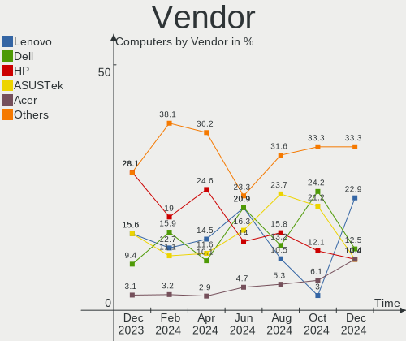
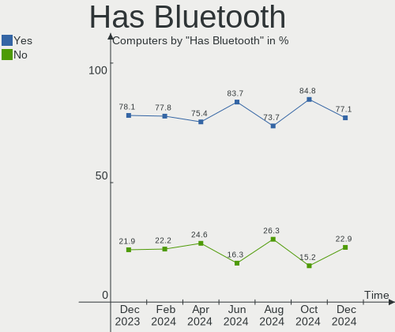
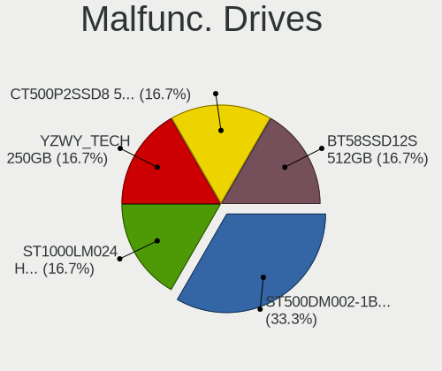
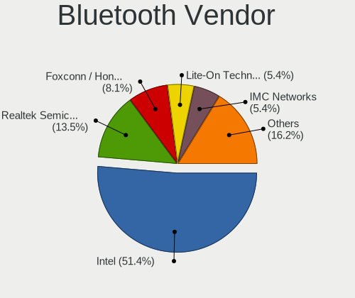
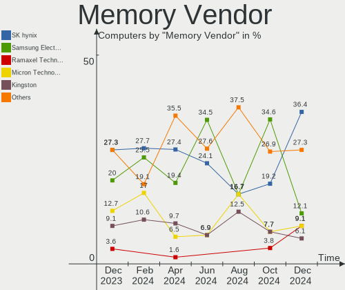
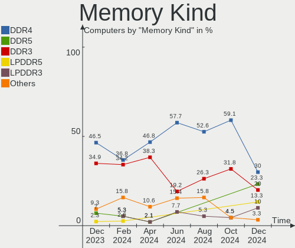
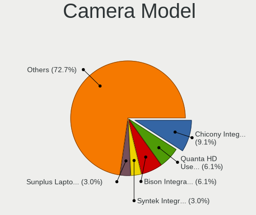

Kali - Hardware Trends
----------------------

A project to identify most popular hardware characteristics and track their change
over time based on data collected by Linux users at https://Linux-Hardware.org.

Anyone can contribute to this report by the [hw-probe](https://github.com/linuxhw/hw-probe) tool:

    sudo -E hw-probe -all -upload

This is a report for all computer types. See also reports for [desktops](/Dist/Kali/Desktop/README.md) and [notebooks](/Dist/Kali/Notebook/README.md).

This report is for one last month. Overall report since the beginning of time: [TestDays](https://github.com/linuxhw/TestDays)

Period: Aug, 2023.

Contents
--------

* [ System ](#system)
  - [ OS                       ](#os)
  - [ OS Family                ](#os-family)
  - [ Kernel                   ](#kernel)
  - [ Kernel Family            ](#kernel-family)
  - [ Kernel Major Ver.        ](#kernel-major-ver)
  - [ Arch                     ](#arch)
  - [ DE                       ](#de)
  - [ Display Server           ](#display-server)
  - [ Display Manager          ](#display-manager)
  - [ OS Lang                  ](#os-lang)
  - [ Boot Mode                ](#boot-mode)
  - [ Filesystem               ](#filesystem)
  - [ Part. scheme             ](#part-scheme)
  - [ Dual Boot with Linux/BSD ](#dual-boot-with-linuxbsd)
  - [ Dual Boot (Win)          ](#dual-boot-win)

* [ Board ](#board)
  - [ Vendor                   ](#vendor)
  - [ Model                    ](#model)
  - [ Model Family             ](#model-family)
  - [ MFG Year                 ](#mfg-year)
  - [ Form Factor              ](#form-factor)
  - [ Secure Boot              ](#secure-boot)
  - [ Coreboot                 ](#coreboot)
  - [ RAM Size                 ](#ram-size)
  - [ RAM Used                 ](#ram-used)
  - [ Total Drives             ](#total-drives)
  - [ Has CD-ROM               ](#has-cd-rom)
  - [ Has Ethernet             ](#has-ethernet)
  - [ Has WiFi                 ](#has-wifi)
  - [ Has Bluetooth            ](#has-bluetooth)

* [ Location ](#location)
  - [ Country                  ](#country)
  - [ City                     ](#city)

* [ Drives ](#drives)
  - [ Drive Vendor             ](#drive-vendor)
  - [ Drive Model              ](#drive-model)
  - [ HDD Vendor               ](#hdd-vendor)
  - [ SSD Vendor               ](#ssd-vendor)
  - [ Drive Kind               ](#drive-kind)
  - [ Drive Connector          ](#drive-connector)
  - [ Drive Size               ](#drive-size)
  - [ Space Total              ](#space-total)
  - [ Space Used               ](#space-used)
  - [ Malfunc. Drives          ](#malfunc-drives)
  - [ Malfunc. Drive Vendor    ](#malfunc-drive-vendor)
  - [ Malfunc. HDD Vendor      ](#malfunc-hdd-vendor)
  - [ Malfunc. Drive Kind      ](#malfunc-drive-kind)
  - [ Failed Drives            ](#failed-drives)
  - [ Failed Drive Vendor      ](#failed-drive-vendor)
  - [ Drive Status             ](#drive-status)

* [ Storage controller ](#storage-controller)
  - [ Storage Vendor           ](#storage-vendor)
  - [ Storage Model            ](#storage-model)
  - [ Storage Kind             ](#storage-kind)

* [ Processor ](#processor)
  - [ CPU Vendor               ](#cpu-vendor)
  - [ CPU Model                ](#cpu-model)
  - [ CPU Model Family         ](#cpu-model-family)
  - [ CPU Cores                ](#cpu-cores)
  - [ CPU Sockets              ](#cpu-sockets)
  - [ CPU Threads              ](#cpu-threads)
  - [ CPU Op-Modes             ](#cpu-op-modes)
  - [ CPU Microcode            ](#cpu-microcode)
  - [ CPU Microarch            ](#cpu-microarch)

* [ Graphics ](#graphics)
  - [ GPU Vendor               ](#gpu-vendor)
  - [ GPU Model                ](#gpu-model)
  - [ GPU Combo                ](#gpu-combo)
  - [ GPU Driver               ](#gpu-driver)
  - [ GPU Memory               ](#gpu-memory)

* [ Monitor ](#monitor)
  - [ Monitor Vendor           ](#monitor-vendor)
  - [ Monitor Model            ](#monitor-model)
  - [ Monitor Resolution       ](#monitor-resolution)
  - [ Monitor Diagonal         ](#monitor-diagonal)
  - [ Monitor Width            ](#monitor-width)
  - [ Aspect Ratio             ](#aspect-ratio)
  - [ Monitor Area             ](#monitor-area)
  - [ Pixel Density            ](#pixel-density)
  - [ Multiple Monitors        ](#multiple-monitors)

* [ Network ](#network)
  - [ Net Controller Vendor    ](#net-controller-vendor)
  - [ Net Controller Model     ](#net-controller-model)
  - [ Wireless Vendor          ](#wireless-vendor)
  - [ Wireless Model           ](#wireless-model)
  - [ Ethernet Vendor          ](#ethernet-vendor)
  - [ Ethernet Model           ](#ethernet-model)
  - [ Net Controller Kind      ](#net-controller-kind)
  - [ Used Controller          ](#used-controller)
  - [ NICs                     ](#nics)
  - [ IPv6                     ](#ipv6)

* [ Bluetooth ](#bluetooth)
  - [ Bluetooth Vendor         ](#bluetooth-vendor)
  - [ Bluetooth Model          ](#bluetooth-model)

* [ Sound ](#sound)
  - [ Sound Vendor             ](#sound-vendor)
  - [ Sound Model              ](#sound-model)

* [ Memory ](#memory)
  - [ Memory Vendor            ](#memory-vendor)
  - [ Memory Model             ](#memory-model)
  - [ Memory Kind              ](#memory-kind)
  - [ Memory Form Factor       ](#memory-form-factor)
  - [ Memory Size              ](#memory-size)
  - [ Memory Speed             ](#memory-speed)

* [ Printers & scanners ](#printers--scanners)
  - [ Printer Vendor           ](#printer-vendor)
  - [ Printer Model            ](#printer-model)
  - [ Scanner Vendor           ](#scanner-vendor)
  - [ Scanner Model            ](#scanner-model)

* [ Camera ](#camera)
  - [ Camera Vendor            ](#camera-vendor)
  - [ Camera Model             ](#camera-model)

* [ Security ](#security)
  - [ Fingerprint Vendor       ](#fingerprint-vendor)
  - [ Fingerprint Model        ](#fingerprint-model)
  - [ Chipcard Vendor          ](#chipcard-vendor)
  - [ Chipcard Model           ](#chipcard-model)

* [ Unsupported ](#unsupported)
  - [ Unsupported Devices      ](#unsupported-devices)
  - [ Unsupported Device Types ](#unsupported-device-types)

System
------

OS
--

Installed operating systems

| Name        | Computers | Percent |
|-------------|-----------|---------|
| Kali 2023.3 | 43        | 68.25%  |
| Kali 2023.2 | 18        | 28.57%  |
| Kali 2023.1 | 1         | 1.59%   |
| Kali 2022.4 | 1         | 1.59%   |

OS Family
---------

OS without a version

| Name | Computers | Percent |
|------|-----------|---------|
| Kali | 63        | 100%    |

Kernel
------

Version of the Linux kernel

| Version                                       | Computers | Percent |
|-----------------------------------------------|-----------|---------|
| 6.3.0-kali1-amd64                             | 47        | 74.6%   |
| 6.1.0-kali9-amd64                             | 5         | 7.94%   |
| 6.4.0-kali3-amd64                             | 4         | 6.35%   |
| 6.4.0-1-amd64                                 | 1         | 1.59%   |
| 6.1.0-kali5-amd64                             | 1         | 1.59%   |
| 6.0.0-kali3-amd64                             | 1         | 1.59%   |
| 5.15.44-Re4son-v7l+                           | 1         | 1.59%   |
| 5.15.44-Re4son-v7+                            | 1         | 1.59%   |
| 5.10.136-android12-9-26203352-abS908BXXS6CWF6 | 1         | 1.59%   |
| 4.14.254-20571-g474cebce577e                  | 1         | 1.59%   |

Kernel Family
-------------

Linux kernel without a distro release

| Version  | Computers | Percent |
|----------|-----------|---------|
| 6.3.0    | 47        | 74.6%   |
| 6.1.0    | 6         | 9.52%   |
| 6.4.0    | 5         | 7.94%   |
| 5.15.44  | 2         | 3.17%   |
| 6.0.0    | 1         | 1.59%   |
| 5.10.136 | 1         | 1.59%   |
| 4.14.254 | 1         | 1.59%   |

Kernel Major Ver.
-----------------

Linux kernel major version

| Version | Computers | Percent |
|---------|-----------|---------|
| 6.3     | 47        | 74.6%   |
| 6.1     | 6         | 9.52%   |
| 6.4     | 5         | 7.94%   |
| 5.15    | 2         | 3.17%   |
| 6.0     | 1         | 1.59%   |
| 5.10    | 1         | 1.59%   |
| 4.14    | 1         | 1.59%   |

Arch
----

OS architecture (x86_64, i586, etc.)

| Name    | Computers | Percent |
|---------|-----------|---------|
| x86_64  | 60        | 95.24%  |
| armv7l  | 2         | 3.17%   |
| aarch64 | 1         | 1.59%   |

DE
--

Desktop Environment

| Name             | Computers | Percent |
|------------------|-----------|---------|
| XFCE             | 34        | 53.97%  |
| GNOME            | 16        | 25.4%   |
| KDE5             | 10        | 15.87%  |
| MATE             | 1         | 1.59%   |
| lightdm-xsession | 1         | 1.59%   |
| Unknown          | 1         | 1.59%   |

Display Server
--------------

X11 or Wayland

| Name    | Computers | Percent |
|---------|-----------|---------|
| X11     | 51        | 80.95%  |
| Wayland | 10        | 15.87%  |
| Tty     | 2         | 3.17%   |

Display Manager
---------------

SDDM, LightDM, etc.

| Name    | Computers | Percent |
|---------|-----------|---------|
| LightDM | 28        | 44.44%  |
| Unknown | 17        | 26.98%  |
| GDM3    | 9         | 14.29%  |
| SDDM    | 8         | 12.7%   |
| GDM     | 1         | 1.59%   |

OS Lang
-------

Language

| Lang    | Computers | Percent |
|---------|-----------|---------|
| en_US   | 31        | 49.21%  |
| C       | 4         | 6.35%   |
| ru_RU   | 3         | 4.76%   |
| es_ES   | 3         | 4.76%   |
| en_AU   | 3         | 4.76%   |
| de_DE   | 3         | 4.76%   |
| Unknown | 3         | 4.76%   |
| pt_BR   | 2         | 3.17%   |
| es_AR   | 2         | 3.17%   |
| zh_CN   | 1         | 1.59%   |
| ur_PK   | 1         | 1.59%   |
| tr_TR   | 1         | 1.59%   |
| pt_PT   | 1         | 1.59%   |
| ja_JP   | 1         | 1.59%   |
| fr_FR   | 1         | 1.59%   |
| es_MX   | 1         | 1.59%   |
| en_IN   | 1         | 1.59%   |
| en_GB   | 1         | 1.59%   |

Boot Mode
---------

EFI or BIOS

| Mode | Computers | Percent |
|------|-----------|---------|
| EFI  | 40        | 63.49%  |
| BIOS | 23        | 36.51%  |

Filesystem
----------

Type of filesystem

| Type  | Computers | Percent |
|-------|-----------|---------|
| Ext4  | 59        | 93.65%  |
| Tmpfs | 3         | 4.76%   |
| F2fs  | 1         | 1.59%   |

Part. scheme
------------

Scheme of partitioning

| Type    | Computers | Percent |
|---------|-----------|---------|
| GPT     | 36        | 57.14%  |
| Unknown | 17        | 26.98%  |
| MBR     | 10        | 15.87%  |

Dual Boot with Linux/BSD
------------------------

Hosting more than one Linux/BSD

| Dual boot | Computers | Percent |
|-----------|-----------|---------|
| No        | 58        | 92.06%  |
| Yes       | 5         | 7.94%   |

Dual Boot (Win)
---------------

Hosting Linux and Windows

| Dual boot | Computers | Percent |
|-----------|-----------|---------|
| No        | 45        | 71.43%  |
| Yes       | 18        | 28.57%  |

Board
-----

Vendor
------

Motherboard manufacturer

| Name                    | Computers | Percent |
|-------------------------|-----------|---------|
| Lenovo                  | 9         | 14.29%  |
| Hewlett-Packard         | 9         | 14.29%  |
| Dell                    | 8         | 12.7%   |
| ASUSTek Computer        | 7         | 11.11%  |
| Apple                   | 6         | 9.52%   |
| Acer                    | 5         | 7.94%   |
| Google                  | 4         | 6.35%   |
| Samsung Electronics     | 2         | 3.17%   |
| Raspberry Pi Foundation | 2         | 3.17%   |
| MSI                     | 2         | 3.17%   |
| HUAWEI                  | 2         | 3.17%   |
| TrekStor                | 1         | 1.59%   |
| Panasonic               | 1         | 1.59%   |
| Gigabyte Technology     | 1         | 1.59%   |
| Fujitsu                 | 1         | 1.59%   |
| BANGHO                  | 1         | 1.59%   |
| Alienware               | 1         | 1.59%   |
| Unknown                 | 1         | 1.59%   |

Model
-----

Motherboard model

| Name                                    | Computers | Percent |
|-----------------------------------------|-----------|---------|
| HP EliteBook 840 G1                     | 2         | 3.17%   |
| Google Epaulette                        | 2         | 3.17%   |
| Apple MacBookPro8,1                     | 2         | 3.17%   |
| Apple iMac13,2                          | 2         | 3.17%   |
| TrekStor Primetab T13B                  | 1         | 1.59%   |
| Samsung 300E5EV/300E4EV/270E5EV/270E4EV | 1         | 1.59%   |
| Samsung 300E4C/300E5C/300E7C            | 1         | 1.59%   |
| RPi Raspberry Pi 400 Rev 1.1            | 1         | 1.59%   |
| RPi Raspberry Pi 3 Model B Rev 1.2      | 1         | 1.59%   |
| Panasonic CF-31RECAXDR                  | 1         | 1.59%   |
| MSI MS-7D15                             | 1         | 1.59%   |
| MSI MS-7C95                             | 1         | 1.59%   |
| Lenovo Yoga 300-11IBR 80M1              | 1         | 1.59%   |
| Lenovo V310-15ISK 80SY                  | 1         | 1.59%   |
| Lenovo ThinkPad P16s Gen 1 21CKCTO1WW   | 1         | 1.59%   |
| Lenovo ThinkPad E14 Gen 2 20TAS0U500    | 1         | 1.59%   |
| Lenovo ThinkCentre M900 10FM001JUS      | 1         | 1.59%   |
| Lenovo PIQY0                            | 1         | 1.59%   |
| Lenovo Legion Y740-17IRHg 81UJ          | 1         | 1.59%   |
| Lenovo IdeaPad S145-15IIL 82DJ          | 1         | 1.59%   |
| Lenovo G50-70 20351                     | 1         | 1.59%   |
| HUAWEI RLEF-XX                          | 1         | 1.59%   |
| HUAWEI BOM-WXX9                         | 1         | 1.59%   |
| HP ProBook 645 G1                       | 1         | 1.59%   |
| HP ProBook 640 G2                       | 1         | 1.59%   |
| HP Pavilion Notebook                    | 1         | 1.59%   |
| HP Pavilion Desktop TP01-2xxx           | 1         | 1.59%   |
| HP EliteDesk 800 G2 DM 35W              | 1         | 1.59%   |
| HP Bloog                                | 1         | 1.59%   |
| HP 250 G6 Notebook PC                   | 1         | 1.59%   |
| Google Kohaku                           | 1         | 1.59%   |
| Google Coral                            | 1         | 1.59%   |
| Gigabyte X79-UP4                        | 1         | 1.59%   |
| Fujitsu LIFEBOOK AH530                  | 1         | 1.59%   |
| Dell OptiPlex 3090                      | 1         | 1.59%   |
| Dell Latitude E4300                     | 1         | 1.59%   |
| Dell Latitude 5510                      | 1         | 1.59%   |
| Dell Latitude 5400                      | 1         | 1.59%   |
| Dell Latitude 5290 2-in-1               | 1         | 1.59%   |
| Dell Inspiron 5542                      | 1         | 1.59%   |

Model Family
------------

Motherboard model prefix

| Name                   | Computers | Percent |
|------------------------|-----------|---------|
| Dell Latitude          | 4         | 6.35%   |
| Dell Inspiron          | 3         | 4.76%   |
| ASUS ROG               | 3         | 4.76%   |
| Acer Nitro             | 3         | 4.76%   |
| RPi Raspberry          | 2         | 3.17%   |
| Lenovo ThinkPad        | 2         | 3.17%   |
| HP ProBook             | 2         | 3.17%   |
| HP Pavilion            | 2         | 3.17%   |
| HP EliteBook           | 2         | 3.17%   |
| Google Epaulette       | 2         | 3.17%   |
| Apple MacBookPro8      | 2         | 3.17%   |
| Apple iMac13           | 2         | 3.17%   |
| TrekStor Primetab      | 1         | 1.59%   |
| Samsung 300E5EV        | 1         | 1.59%   |
| Samsung 300E4C         | 1         | 1.59%   |
| Panasonic CF-31RECAXDR | 1         | 1.59%   |
| MSI MS-7D15            | 1         | 1.59%   |
| MSI MS-7C95            | 1         | 1.59%   |
| Lenovo Yoga            | 1         | 1.59%   |
| Lenovo V310-15ISK      | 1         | 1.59%   |
| Lenovo ThinkCentre     | 1         | 1.59%   |
| Lenovo PIQY0           | 1         | 1.59%   |
| Lenovo Legion          | 1         | 1.59%   |
| Lenovo IdeaPad         | 1         | 1.59%   |
| Lenovo G50-70          | 1         | 1.59%   |
| HUAWEI RLEF-XX         | 1         | 1.59%   |
| HUAWEI BOM-WXX9        | 1         | 1.59%   |
| HP EliteDesk           | 1         | 1.59%   |
| HP Bloog               | 1         | 1.59%   |
| HP 250                 | 1         | 1.59%   |
| Google Kohaku          | 1         | 1.59%   |
| Google Coral           | 1         | 1.59%   |
| Gigabyte X79-UP4       | 1         | 1.59%   |
| Fujitsu LIFEBOOK       | 1         | 1.59%   |
| Dell OptiPlex          | 1         | 1.59%   |
| BANGHO Suma            | 1         | 1.59%   |
| ASUS VivoBook          | 1         | 1.59%   |
| ASUS PRIME             | 1         | 1.59%   |
| ASUS N53SV             | 1         | 1.59%   |
| ASUS K55VD             | 1         | 1.59%   |

MFG Year
--------

Motherboard manufacture year

| Year    | Computers | Percent |
|---------|-----------|---------|
| 2021    | 8         | 12.7%   |
| 2020    | 8         | 12.7%   |
| 2018    | 5         | 7.94%   |
| 2012    | 5         | 7.94%   |
| 2022    | 4         | 6.35%   |
| 2019    | 4         | 6.35%   |
| 2017    | 4         | 6.35%   |
| 2016    | 4         | 6.35%   |
| 2015    | 4         | 6.35%   |
| 2013    | 4         | 6.35%   |
| 2010    | 3         | 4.76%   |
| Unknown | 3         | 4.76%   |
| 2023    | 2         | 3.17%   |
| 2014    | 2         | 3.17%   |
| 2011    | 2         | 3.17%   |
| 2008    | 1         | 1.59%   |

Form Factor
-----------

Physical design of the computer

| Name           | Computers | Percent |
|----------------|-----------|---------|
| Notebook       | 41        | 65.08%  |
| Desktop        | 13        | 20.63%  |
| System on chip | 3         | 4.76%   |
| Tablet         | 3         | 4.76%   |
| All in one     | 3         | 4.76%   |

Secure Boot
-----------

Enabled or disabled

| State    | Computers | Percent |
|----------|-----------|---------|
| Disabled | 63        | 100%    |

Coreboot
--------

Have coreboot on board

| Used | Computers | Percent |
|------|-----------|---------|
| No   | 58        | 92.06%  |
| Yes  | 5         | 7.94%   |

RAM Size
--------

Total RAM memory

| Size in GB | Computers | Percent |
|------------|-----------|---------|
| 3.01-4.0   | 18        | 28.57%  |
| 4.01-8.0   | 15        | 23.81%  |
| 16.01-24.0 | 10        | 15.87%  |
| 8.01-16.0  | 9         | 14.29%  |
| 32.01-64.0 | 7         | 11.11%  |
| 24.01-32.0 | 2         | 3.17%   |
| 1.01-2.0   | 1         | 1.59%   |
| 0.51-1.0   | 1         | 1.59%   |

RAM Used
--------

Used RAM memory

| Used GB   | Computers | Percent |
|-----------|-----------|---------|
| 2.01-3.0  | 25        | 39.68%  |
| 3.01-4.0  | 14        | 22.22%  |
| 1.01-2.0  | 10        | 15.87%  |
| 4.01-8.0  | 7         | 11.11%  |
| 0.51-1.0  | 3         | 4.76%   |
| 8.01-16.0 | 2         | 3.17%   |
| 0.01-0.5  | 2         | 3.17%   |

Total Drives
------------

Number of drives on board

| Drives | Computers | Percent |
|--------|-----------|---------|
| 1      | 45        | 71.43%  |
| 2      | 12        | 19.05%  |
| 5      | 2         | 3.17%   |
| 0      | 2         | 3.17%   |
| 4      | 1         | 1.59%   |
| 3      | 1         | 1.59%   |

Has CD-ROM
----------

Has CD-ROM on board

| Presented | Computers | Percent |
|-----------|-----------|---------|
| No        | 49        | 77.78%  |
| Yes       | 14        | 22.22%  |

Has Ethernet
------------

Has Ethernet on board

| Presented | Computers | Percent |
|-----------|-----------|---------|
| Yes       | 49        | 77.78%  |
| No        | 14        | 22.22%  |

Has WiFi
--------

Has WiFi module

| Presented | Computers | Percent |
|-----------|-----------|---------|
| Yes       | 55        | 87.3%   |
| No        | 8         | 12.7%   |

Has Bluetooth
-------------

Has Bluetooth module

| Presented | Computers | Percent |
|-----------|-----------|---------|
| Yes       | 54        | 85.71%  |
| No        | 9         | 14.29%  |

Location
--------

Country
-------

Geographic location (country)

| Country     | Computers | Percent |
|-------------|-----------|---------|
| USA         | 14        | 22.22%  |
| Germany     | 5         | 7.94%   |
| Russia      | 4         | 6.35%   |
| Spain       | 3         | 4.76%   |
| India       | 3         | 4.76%   |
| France      | 3         | 4.76%   |
| Australia   | 3         | 4.76%   |
| Turkey      | 2         | 3.17%   |
| Pakistan    | 2         | 3.17%   |
| Netherlands | 2         | 3.17%   |
| Kenya       | 2         | 3.17%   |
| Bulgaria    | 2         | 3.17%   |
| Brazil      | 2         | 3.17%   |
| Argentina   | 2         | 3.17%   |
| Venezuela   | 1         | 1.59%   |
| UK          | 1         | 1.59%   |
| Portugal    | 1         | 1.59%   |
| Poland      | 1         | 1.59%   |
| New Zealand | 1         | 1.59%   |
| Morocco     | 1         | 1.59%   |
| Mexico      | 1         | 1.59%   |
| Lebanon     | 1         | 1.59%   |
| Japan       | 1         | 1.59%   |
| Ethiopia    | 1         | 1.59%   |
| China       | 1         | 1.59%   |
| Canada      | 1         | 1.59%   |
| Azerbaijan  | 1         | 1.59%   |
| Algeria     | 1         | 1.59%   |

City
----

Geographic location (city)

| City            | Computers | Percent |
|-----------------|-----------|---------|
| Wichita         | 3         | 4.76%   |
| Sydney          | 2         | 3.17%   |
| Nairobi         | 2         | 3.17%   |
| Istanbul        | 2         | 3.17%   |
| Zaragoza        | 1         | 1.59%   |
| Zaandam         | 1         | 1.59%   |
| Valencia        | 1         | 1.59%   |
| Teteringen      | 1         | 1.59%   |
| Tacoma          | 1         | 1.59%   |
| Sofia           | 1         | 1.59%   |
| Salé           | 1         | 1.59%   |
| Reinbek         | 1         | 1.59%   |
| Querétaro City | 1         | 1.59%   |
| Perm            | 1         | 1.59%   |
| Penza           | 1         | 1.59%   |
| Paris           | 1         | 1.59%   |
| Omaha           | 1         | 1.59%   |
| Nuremberg       | 1         | 1.59%   |
| Nougaroulet     | 1         | 1.59%   |
| Muskego         | 1         | 1.59%   |
| Munich          | 1         | 1.59%   |
| Moscow          | 1         | 1.59%   |
| Morena          | 1         | 1.59%   |
| Montreal        | 1         | 1.59%   |
| Lilancun        | 1         | 1.59%   |
| Leipzig         | 1         | 1.59%   |
| Las Vegas       | 1         | 1.59%   |
| Lansing         | 1         | 1.59%   |
| Lahore          | 1         | 1.59%   |
| Kutno           | 1         | 1.59%   |
| Krasnodar       | 1         | 1.59%   |
| Ikegami         | 1         | 1.59%   |
| Hollywood       | 1         | 1.59%   |
| Gujranwala      | 1         | 1.59%   |
| Fürth          | 1         | 1.59%   |
| Fort Worth      | 1         | 1.59%   |
| Dunedin         | 1         | 1.59%   |
| Denver          | 1         | 1.59%   |
| Delhi           | 1         | 1.59%   |
| Dallas          | 1         | 1.59%   |

Drives
------

Drive Vendor
------------

Hard drive vendors

| Vendor                | Computers | Drives | Percent |
|-----------------------|-----------|--------|---------|
| WDC                   | 11        | 13     | 13.1%   |
| Samsung Electronics   | 11        | 11     | 13.1%   |
| Unknown               | 8         | 10     | 9.52%   |
| Seagate               | 8         | 8      | 9.52%   |
| Toshiba               | 5         | 5      | 5.95%   |
| SanDisk               | 5         | 5      | 5.95%   |
| Kingston              | 5         | 5      | 5.95%   |
| SK hynix              | 4         | 5      | 4.76%   |
| Apple                 | 3         | 4      | 3.57%   |
| XrayDisk              | 2         | 2      | 2.38%   |
| Intel                 | 2         | 2      | 2.38%   |
| Crucial               | 2         | 2      | 2.38%   |
| Vaseky                | 1         | 1      | 1.19%   |
| Transcend             | 1         | 1      | 1.19%   |
| SSSTC                 | 1         | 1      | 1.19%   |
| Silicon Motion        | 1         | 1      | 1.19%   |
| Realtek Semiconductor | 1         | 1      | 1.19%   |
| Phison                | 1         | 1      | 1.19%   |
| Patriot               | 1         | 1      | 1.19%   |
| OWC                   | 1         | 1      | 1.19%   |
| MSI                   | 1         | 1      | 1.19%   |
| Maxtor                | 1         | 1      | 1.19%   |
| Lenovo                | 1         | 1      | 1.19%   |
| KIOXIA                | 1         | 1      | 1.19%   |
| Initio                | 1         | 1      | 1.19%   |
| Hitachi               | 1         | 1      | 1.19%   |
| GOODRAM               | 1         | 1      | 1.19%   |
| China                 | 1         | 1      | 1.19%   |
| Best Buy              | 1         | 1      | 1.19%   |
| Unknown               | 1         | 1      | 1.19%   |

Drive Model
-----------

Hard drive models

| Model                                       | Computers | Percent |
|---------------------------------------------|-----------|---------|
| XrayDisk 480GB                              | 2         | 2.25%   |
| Unknown MMC Card  64GB                      | 2         | 2.25%   |
| Seagate ST9500325AS 500GB                   | 2         | 2.25%   |
| Seagate ST1000LM035-1RK172 1TB              | 2         | 2.25%   |
| WDC WDS240G2G0A-00JH30 240GB SSD            | 1         | 1.12%   |
| WDC WDS100T2B0A-00SM50 1TB SSD              | 1         | 1.12%   |
| WDC WD5000LUCT-63RC2Y0 500GB                | 1         | 1.12%   |
| WDC WD5000LPCX-00VHAT0 500GB                | 1         | 1.12%   |
| WDC WD40EFAX-68JH4N0 4TB                    | 1         | 1.12%   |
| WDC WD360GD-00FLC0 37GB                     | 1         | 1.12%   |
| WDC WD2000FYYZ-01UL1B2 2TB                  | 1         | 1.12%   |
| WDC WD15EADS-00P8B0 1TB                     | 1         | 1.12%   |
| WDC WD10SPZX-24Z10 1TB                      | 1         | 1.12%   |
| WDC WD10JPVX-75JC3T0 1TB                    | 1         | 1.12%   |
| WDC WD10JPVX-00JC3T0 1TB                    | 1         | 1.12%   |
| WDC WD Green 2.5 240GB SSD                  | 1         | 1.12%   |
| WDC PC SN530 SDBPNPZ-1T00-1006 1TB          | 1         | 1.12%   |
| Vaseky V800/240G 240GB SSD                  | 1         | 1.12%   |
| Unknown TA2964  64GB                        | 1         | 1.12%   |
| Unknown SEM64G  64GB                        | 1         | 1.12%   |
| Unknown SD256  256GB                        | 1         | 1.12%   |
| Unknown SD/MMC/MS PRO 1GB                   | 1         | 1.12%   |
| Unknown SC200  197GB                        | 1         | 1.12%   |
| Unknown MMC Card  32GB                      | 1         | 1.12%   |
| Unknown MMC Card  129GB                     | 1         | 1.12%   |
| Unknown hB8aP  32GB                         | 1         | 1.12%   |
| Transcend TS240GMTS420S 240GB SSD           | 1         | 1.12%   |
| Toshiba MQ01ABD100 1TB                      | 1         | 1.12%   |
| Toshiba MK5065GSXF 500GB                    | 1         | 1.12%   |
| Toshiba MK3276GSX 320GB                     | 1         | 1.12%   |
| Toshiba HDWR160 6TB                         | 1         | 1.12%   |
| Toshiba DT01ACA200 2TB                      | 1         | 1.12%   |
| SSSTC CL1-3D256 256GB                       | 1         | 1.12%   |
| SK hynix SKHynix_HFS256GDE9X081N 256GB      | 1         | 1.12%   |
| SK hynix PC601 NVMe 256GB                   | 1         | 1.12%   |
| SK hynix HFS128G39TND-N210A 128GB SSD       | 1         | 1.12%   |
| SK hynix BC501 NVMe Solid State Drive 512GB | 1         | 1.12%   |
| SK hynix BC501 HFM256GDJTNG-8310A 256GB     | 1         | 1.12%   |
| Silicon Motion PCIe-8 SSD 512GB             | 1         | 1.12%   |
| Seagate ST750LX003-1AC154 752GB             | 1         | 1.12%   |

HDD Vendor
----------

Hard disk drive vendors

| Vendor  | Computers | Drives | Percent |
|---------|-----------|--------|---------|
| WDC     | 8         | 9      | 32%     |
| Seagate | 8         | 8      | 32%     |
| Toshiba | 5         | 5      | 20%     |
| Unknown | 1         | 1      | 4%      |
| Maxtor  | 1         | 1      | 4%      |
| Initio  | 1         | 1      | 4%      |
| Hitachi | 1         | 1      | 4%      |

SSD Vendor
----------

Solid state drive vendors

| Vendor              | Computers | Drives | Percent |
|---------------------|-----------|--------|---------|
| Samsung Electronics | 5         | 5      | 21.74%  |
| WDC                 | 3         | 3      | 13.04%  |
| Kingston            | 2         | 2      | 8.7%    |
| Crucial             | 2         | 2      | 8.7%    |
| Vaseky              | 1         | 1      | 4.35%   |
| Transcend           | 1         | 1      | 4.35%   |
| SK hynix            | 1         | 1      | 4.35%   |
| SanDisk             | 1         | 1      | 4.35%   |
| Patriot             | 1         | 1      | 4.35%   |
| OWC                 | 1         | 1      | 4.35%   |
| Lenovo              | 1         | 1      | 4.35%   |
| Intel               | 1         | 1      | 4.35%   |
| GOODRAM             | 1         | 1      | 4.35%   |
| China               | 1         | 1      | 4.35%   |
| Unknown             | 1         | 1      | 4.35%   |

Drive Kind
----------

HDD or SSD

| Kind    | Computers | Drives | Percent |
|---------|-----------|--------|---------|
| NVMe    | 25        | 28     | 32.47%  |
| HDD     | 22        | 26     | 28.57%  |
| SSD     | 19        | 23     | 24.68%  |
| MMC     | 8         | 10     | 10.39%  |
| Unknown | 3         | 3      | 3.9%    |

Drive Connector
---------------

SATA, SAS, NVMe, etc.

| Type | Computers | Drives | Percent |
|------|-----------|--------|---------|
| SATA | 37        | 48     | 50.68%  |
| NVMe | 25        | 28     | 34.25%  |
| MMC  | 8         | 10     | 10.96%  |
| SAS  | 3         | 4      | 4.11%   |

Drive Size
----------

Size of hard drive

| Size in TB | Computers | Drives | Percent |
|------------|-----------|--------|---------|
| 0.01-0.5   | 26        | 30     | 57.78%  |
| 0.51-1.0   | 13        | 13     | 28.89%  |
| 1.01-2.0   | 3         | 3      | 6.67%   |
| 4.01-10.0  | 2         | 2      | 4.44%   |
| 3.01-4.0   | 1         | 1      | 2.22%   |

Space Total
-----------

Amount of disk space available on the file system

| Size in GB     | Computers | Percent |
|----------------|-----------|---------|
| 101-250        | 26        | 41.27%  |
| 501-1000       | 11        | 17.46%  |
| 251-500        | 9         | 14.29%  |
| 51-100         | 9         | 14.29%  |
| More than 3000 | 3         | 4.76%   |
| 1001-2000      | 2         | 3.17%   |
| Unknown        | 2         | 3.17%   |
| 21-50          | 1         | 1.59%   |

Space Used
----------

Amount of used disk space

| Used GB        | Computers | Percent |
|----------------|-----------|---------|
| 1-20           | 19        | 30.16%  |
| 21-50          | 17        | 26.98%  |
| 51-100         | 15        | 23.81%  |
| 101-250        | 5         | 7.94%   |
| 251-500        | 2         | 3.17%   |
| Unknown        | 2         | 3.17%   |
| More than 3000 | 1         | 1.59%   |
| 1001-2000      | 1         | 1.59%   |
| 501-1000       | 1         | 1.59%   |

Malfunc. Drives
---------------

Drive models with a malfunction

| Model                                 | Computers | Drives | Percent |
|---------------------------------------|-----------|--------|---------|
| WDC WD40EFAX-68JH4N0 4TB              | 1         | 1      | 20%     |
| WDC WD Green 2.5 240GB SSD            | 1         | 1      | 20%     |
| Toshiba MQ01ABD100 1TB                | 1         | 1      | 20%     |
| SK hynix HFS128G39TND-N210A 128GB SSD | 1         | 1      | 20%     |
| Kingston SUV400S37120G 120GB SSD      | 1         | 1      | 20%     |

Malfunc. Drive Vendor
---------------------

Vendors of faulty drives

| Vendor   | Computers | Drives | Percent |
|----------|-----------|--------|---------|
| WDC      | 2         | 2      | 40%     |
| Toshiba  | 1         | 1      | 20%     |
| SK hynix | 1         | 1      | 20%     |
| Kingston | 1         | 1      | 20%     |

Malfunc. HDD Vendor
-------------------

Vendors of faulty HDD drives

| Vendor  | Computers | Drives | Percent |
|---------|-----------|--------|---------|
| WDC     | 1         | 1      | 50%     |
| Toshiba | 1         | 1      | 50%     |

Malfunc. Drive Kind
-------------------

Kinds of faulty drives

| Kind | Computers | Drives | Percent |
|------|-----------|--------|---------|
| SSD  | 3         | 3      | 60%     |
| HDD  | 2         | 2      | 40%     |

Failed Drives
-------------

Failed drive models

Zero info for selected period =(

Failed Drive Vendor
-------------------

Failed drive vendors

Zero info for selected period =(

Drive Status
------------

Number of failed and malfunc. drives

| Status   | Computers | Drives | Percent |
|----------|-----------|--------|---------|
| Works    | 37        | 45     | 53.62%  |
| Detected | 27        | 40     | 39.13%  |
| Malfunc  | 5         | 5      | 7.25%   |

Storage controller
------------------

Storage Vendor
--------------

Storage controller vendors

| Vendor                         | Computers | Percent |
|--------------------------------|-----------|---------|
| Intel                          | 41        | 56.94%  |
| AMD                            | 7         | 9.72%   |
| Samsung Electronics            | 6         | 8.33%   |
| SanDisk                        | 4         | 5.56%   |
| SK hynix                       | 3         | 4.17%   |
| Kingston Technology Company    | 3         | 4.17%   |
| Apple                          | 2         | 2.78%   |
| Solid State Storage Technology | 1         | 1.39%   |
| Silicon Motion                 | 1         | 1.39%   |
| Realtek Semiconductor          | 1         | 1.39%   |
| Phison Electronics             | 1         | 1.39%   |
| Marvell Technology Group       | 1         | 1.39%   |
| KIOXIA                         | 1         | 1.39%   |

Storage Model
-------------

Storage controller models

| Model                                                                         | Computers | Percent |
|-------------------------------------------------------------------------------|-----------|---------|
| Intel 6 Series/C200 Series Chipset Family 6 port Mobile SATA AHCI Controller  | 5         | 6.67%   |
| Intel Sunrise Point-LP SATA Controller [AHCI mode]                            | 4         | 5.33%   |
| Intel Comet Lake SATA AHCI Controller                                         | 4         | 5.33%   |
| Intel 8 Series SATA Controller 1 [AHCI mode]                                  | 4         | 5.33%   |
| AMD FCH SATA Controller [AHCI mode]                                           | 4         | 5.33%   |
| Samsung NVMe SSD Controller 980                                               | 3         | 4%      |
| Intel 7 Series Chipset Family 6-port SATA Controller [AHCI mode]              | 3         | 4%      |
| AMD 500 Series Chipset SATA Controller                                        | 3         | 4%      |
| SanDisk WD Blue SN550 NVMe SSD                                                | 2         | 2.67%   |
| Intel Q170/Q150/B150/H170/H110/Z170/CM236 Chipset SATA Controller [AHCI Mode] | 2         | 2.67%   |
| Intel Atom Processor E3800 Series SATA AHCI Controller                        | 2         | 2.67%   |
| Intel 82801 Mobile SATA Controller [RAID mode]                                | 2         | 2.67%   |
| Intel 7 Series/C210 Series Chipset Family 6-port SATA Controller [AHCI mode]  | 2         | 2.67%   |
| Intel 500 Series Chipset Family SATA AHCI Controller                          | 2         | 2.67%   |
| Intel 5 Series/3400 Series Chipset 4 port SATA AHCI Controller                | 2         | 2.67%   |
| Intel 200 Series PCH SATA controller [AHCI mode]                              | 2         | 2.67%   |
| Apple ANS2 NVMe Controller                                                    | 2         | 2.67%   |
| Solid State Storage CL1-3D256-Q11 NVMe SSD M.2                                | 1         | 1.33%   |
| SK hynix PC601 NVMe Solid State Drive                                         | 1         | 1.33%   |
| SK hynix Gold P31/BC711/PC711 NVMe Solid State Drive                          | 1         | 1.33%   |
| SK hynix BC501 NVMe Solid State Drive                                         | 1         | 1.33%   |
| Silicon Motion Non-Volatile memory controller                                 | 1         | 1.33%   |
| Sandisk Western Digital WD Black SN850X NVMe SSD                              | 1         | 1.33%   |
| SanDisk WD Black SN770 / PC SN740 256GB / PC SN560 (DRAM-less) NVMe SSD       | 1         | 1.33%   |
| Samsung NVMe SSD Controller SM981/PM981/PM983                                 | 1         | 1.33%   |
| Samsung NVMe SSD Controller SM961/PM961/SM963                                 | 1         | 1.33%   |
| Samsung NVMe SSD Controller PM9A1/PM9A3/980PRO                                | 1         | 1.33%   |
| Realtek RTS5765DL NVMe SSD Controller (DRAM-less)                             | 1         | 1.33%   |
| Phison PS5013 E13 NVMe Controller                                             | 1         | 1.33%   |
| Marvell Group 88SE9172 SATA 6Gb/s Controller                                  | 1         | 1.33%   |
| KIOXIA NVMe SSD Controller BG4 (DRAM-less)                                    | 1         | 1.33%   |
| Kingston Company OM8PCP Design-In PCIe 3 NVMe SSD (DRAM-less)                 | 1         | 1.33%   |
| Kingston Company OM3PDP3 NVMe SSD                                             | 1         | 1.33%   |
| Kingston Company NVMe Controller                                              | 1         | 1.33%   |
| Intel SSD 600P Series                                                         | 1         | 1.33%   |
| Intel Ice Lake-LP SATA Controller [AHCI mode]                                 | 1         | 1.33%   |
| Intel Celeron N3350/Pentium N4200/Atom E3900 Series SATA AHCI Controller      | 1         | 1.33%   |
| Intel Cannon Point-LP SATA Controller [AHCI Mode]                             | 1         | 1.33%   |
| Intel Cannon Lake Mobile PCH SATA AHCI Controller                             | 1         | 1.33%   |
| Intel C600/X79 series chipset 6-Port SATA AHCI Controller                     | 1         | 1.33%   |

Storage Kind
------------

Kind of storage controller (IDE, SATA, NVMe, SAS, ...)

| Kind | Computers | Percent |
|------|-----------|---------|
| SATA | 46        | 63.89%  |
| NVMe | 24        | 33.33%  |
| RAID | 2         | 2.78%   |

Processor
---------

CPU Vendor
----------

Processor vendors

| Vendor | Computers | Percent |
|--------|-----------|---------|
| Intel  | 51        | 80.95%  |
| AMD    | 9         | 14.29%  |
| ARM    | 3         | 4.76%   |

CPU Model
---------

Processor models

| Model                                    | Computers | Percent |
|------------------------------------------|-----------|---------|
| Intel Pentium CPU N4200 @ 1.10GHz        | 3         | 4.76%   |
| Intel Core i5-6200U CPU @ 2.30GHz        | 2         | 3.17%   |
| Intel Core i5-4210U CPU @ 1.70GHz        | 2         | 3.17%   |
| Intel Core i5-3470S CPU @ 2.90GHz        | 2         | 3.17%   |
| Intel Core i3-4005U CPU @ 1.70GHz        | 2         | 3.17%   |
| Intel Celeron CPU N3060 @ 1.60GHz        | 2         | 3.17%   |
| Intel Pentium Silver N5030 CPU @ 1.10GHz | 1         | 1.59%   |
| Intel Pentium CPU P6200 @ 2.13GHz        | 1         | 1.59%   |
| Intel Pentium CPU N3540 @ 2.16GHz        | 1         | 1.59%   |
| Intel Core i9-10900KF CPU @ 3.70GHz      | 1         | 1.59%   |
| Intel Core i7-9750H CPU @ 2.60GHz        | 1         | 1.59%   |
| Intel Core i7-6700T CPU @ 2.80GHz        | 1         | 1.59%   |
| Intel Core i7-6500U CPU @ 2.50GHz        | 1         | 1.59%   |
| Intel Core i7-3820 CPU @ 3.60GHz         | 1         | 1.59%   |
| Intel Core i7-3630QM CPU @ 2.40GHz       | 1         | 1.59%   |
| Intel Core i7-2630QM CPU @ 2.00GHz       | 1         | 1.59%   |
| Intel Core i7-1068NG7 CPU @ 2.30GHz      | 1         | 1.59%   |
| Intel Core i5-9300H CPU @ 2.40GHz        | 1         | 1.59%   |
| Intel Core i5-8365U CPU @ 1.60GHz        | 1         | 1.59%   |
| Intel Core i5-8350U CPU @ 1.70GHz        | 1         | 1.59%   |
| Intel Core i5-8300H CPU @ 2.30GHz        | 1         | 1.59%   |
| Intel Core i5-8259U CPU @ 2.30GHz        | 1         | 1.59%   |
| Intel Core i5-7400 CPU @ 3.00GHz         | 1         | 1.59%   |
| Intel Core i5-6500T CPU @ 2.50GHz        | 1         | 1.59%   |
| Intel Core i5-2520M CPU @ 2.50GHz        | 1         | 1.59%   |
| Intel Core i5-2450M CPU @ 2.50GHz        | 1         | 1.59%   |
| Intel Core i5-2435M CPU @ 2.40GHz        | 1         | 1.59%   |
| Intel Core i5-2415M CPU @ 2.30GHz        | 1         | 1.59%   |
| Intel Core i5-10310U CPU @ 1.70GHz       | 1         | 1.59%   |
| Intel Core i5-10210U CPU @ 1.60GHz       | 1         | 1.59%   |
| Intel Core i5 CPU M 460 @ 2.53GHz        | 1         | 1.59%   |
| Intel Core i3-9100 CPU @ 3.60GHz         | 1         | 1.59%   |
| Intel Core i3-7020U CPU @ 2.30GHz        | 1         | 1.59%   |
| Intel Core i3-2328M CPU @ 2.20GHz        | 1         | 1.59%   |
| Intel Core i3-10105T CPU @ 3.00GHz       | 1         | 1.59%   |
| Intel Core i3-1005G1 CPU @ 1.20GHz       | 1         | 1.59%   |
| Intel Core 2 Duo CPU P9400 @ 2.40GHz     | 1         | 1.59%   |
| Intel Celeron CPU N3350 @ 1.10GHz        | 1         | 1.59%   |
| Intel Celeron CPU N2808 @ 1.58GHz        | 1         | 1.59%   |
| Intel Celeron CPU 847 @ 1.10GHz          | 1         | 1.59%   |

CPU Model Family
----------------

Processor model prefix

| Model                | Computers | Percent |
|----------------------|-----------|---------|
| Intel Core i5        | 20        | 31.75%  |
| Intel Core i7        | 7         | 11.11%  |
| Intel Core i3        | 7         | 11.11%  |
| Other                | 5         | 7.94%   |
| Intel Pentium        | 5         | 7.94%   |
| Intel Celeron        | 5         | 7.94%   |
| AMD Ryzen 5          | 3         | 4.76%   |
| ARM BCM              | 2         | 3.17%   |
| AMD Ryzen 7          | 2         | 3.17%   |
| Intel Pentium Silver | 1         | 1.59%   |
| Intel Core i9        | 1         | 1.59%   |
| Intel Core 2 Duo     | 1         | 1.59%   |
| AMD Ryzen 9          | 1         | 1.59%   |
| AMD Ryzen 5 PRO      | 1         | 1.59%   |
| AMD Ryzen 3          | 1         | 1.59%   |
| AMD A8               | 1         | 1.59%   |

CPU Cores
---------

Number of processor cores

| Number  | Computers | Percent |
|---------|-----------|---------|
| 4       | 25        | 39.68%  |
| 2       | 24        | 38.1%   |
| 6       | 6         | 9.52%   |
| 8       | 4         | 6.35%   |
| 16      | 1         | 1.59%   |
| 10      | 1         | 1.59%   |
| 1       | 1         | 1.59%   |
| Unknown | 1         | 1.59%   |

CPU Sockets
-----------

Number of sockets

| Number  | Computers | Percent |
|---------|-----------|---------|
| 1       | 62        | 98.41%  |
| Unknown | 1         | 1.59%   |

CPU Threads
-----------

Threads per core (Hyper-Threading)

| Number  | Computers | Percent |
|---------|-----------|---------|
| 2       | 42        | 66.67%  |
| 1       | 20        | 31.75%  |
| Unknown | 1         | 1.59%   |

CPU Op-Modes
------------

CPU Operation Modes (32-bit, 64-bit)

| Op mode        | Computers | Percent |
|----------------|-----------|---------|
| 32-bit, 64-bit | 60        | 95.24%  |
| Unknown        | 3         | 4.76%   |

CPU Microcode
-------------

Microcode number

| Number     | Computers | Percent |
|------------|-----------|---------|
| Unknown    | 48        | 76.19%  |
| 0x0a50000d | 2         | 3.17%   |
| 0x906ea    | 1         | 1.59%   |
| 0x806e9    | 1         | 1.59%   |
| 0x406e3    | 1         | 1.59%   |
| 0x40651    | 1         | 1.59%   |
| 0x30678    | 1         | 1.59%   |
| 0x206a7    | 1         | 1.59%   |
| 0x0a50000c | 1         | 1.59%   |
| 0x0a404102 | 1         | 1.59%   |
| 0x0a20120a | 1         | 1.59%   |
| 0x08608103 | 1         | 1.59%   |
| 0x08108109 | 1         | 1.59%   |
| 0x0600111f | 1         | 1.59%   |
| 0x00000000 | 1         | 1.59%   |

CPU Microarch
-------------

Microarchitecture

| Name             | Computers | Percent |
|------------------|-----------|---------|
| KabyLake         | 11        | 17.46%  |
| SandyBridge      | 8         | 12.7%   |
| Unknown          | 6         | 9.52%   |
| Zen 3            | 5         | 7.94%   |
| Skylake          | 5         | 7.94%   |
| Silvermont       | 4         | 6.35%   |
| Haswell          | 4         | 6.35%   |
| Goldmont         | 4         | 6.35%   |
| IvyBridge        | 3         | 4.76%   |
| IceLake          | 3         | 4.76%   |
| Westmere         | 2         | 3.17%   |
| CometLake        | 2         | 3.17%   |
| Zen+             | 1         | 1.59%   |
| TigerLake        | 1         | 1.59%   |
| Piledriver       | 1         | 1.59%   |
| Penryn           | 1         | 1.59%   |
| Goldmont plus    | 1         | 1.59%   |
| Alderlake Hybrid | 1         | 1.59%   |

Graphics
--------

GPU Vendor
----------

Vendors of graphics cards

| Vendor | Computers | Percent |
|--------|-----------|---------|
| Intel  | 45        | 65.22%  |
| Nvidia | 16        | 23.19%  |
| AMD    | 8         | 11.59%  |

GPU Model
---------

Graphics card models

| Model                                                                                    | Computers | Percent |
|------------------------------------------------------------------------------------------|-----------|---------|
| Intel 2nd Generation Core Processor Family Integrated Graphics Controller                | 7         | 10.14%  |
| Intel Haswell-ULT Integrated Graphics Controller                                         | 4         | 5.8%    |
| Intel Skylake GT2 [HD Graphics 520]                                                      | 3         | 4.35%   |
| Intel CoffeeLake-H GT2 [UHD Graphics 630]                                                | 3         | 4.35%   |
| Intel Apollo Lake [HD Graphics 505]                                                      | 3         | 4.35%   |
| Nvidia GK107M [GeForce GTX 660M Mac Edition]                                             | 2         | 2.9%    |
| Intel HD Graphics 530                                                                    | 2         | 2.9%    |
| Intel Core Processor Integrated Graphics Controller                                      | 2         | 2.9%    |
| Intel CometLake-U GT2 [UHD Graphics]                                                     | 2         | 2.9%    |
| Intel Atom/Celeron/Pentium Processor x5-E8000/J3xxx/N3xxx Integrated Graphics Controller | 2         | 2.9%    |
| Intel Atom Processor Z36xxx/Z37xxx Series Graphics & Display                             | 2         | 2.9%    |
| AMD Cezanne [Radeon Vega Series / Radeon Vega Mobile Series]                             | 2         | 2.9%    |
| Nvidia TU117M [GeForce MX450]                                                            | 1         | 1.45%   |
| Nvidia TU116 [GeForce GTX 1650 SUPER]                                                    | 1         | 1.45%   |
| Nvidia TU106BM [GeForce RTX 2060 Mobile]                                                 | 1         | 1.45%   |
| Nvidia GP107M [GeForce GTX 1050 Mobile]                                                  | 1         | 1.45%   |
| Nvidia GP107M [GeForce GTX 1050 3 GB Max-Q]                                              | 1         | 1.45%   |
| Nvidia GM108M [GeForce 940MX]                                                            | 1         | 1.45%   |
| Nvidia GF119M [GeForce 610M]                                                             | 1         | 1.45%   |
| Nvidia GF108M [GeForce GT 540M]                                                          | 1         | 1.45%   |
| Nvidia GF108 [GeForce GT 440]                                                            | 1         | 1.45%   |
| Nvidia GA106M [GeForce RTX 3060 Mobile / Max-Q]                                          | 1         | 1.45%   |
| Nvidia GA106 [GeForce RTX 3060 Lite Hash Rate]                                           | 1         | 1.45%   |
| Nvidia GA106 [Geforce RTX 3050]                                                          | 1         | 1.45%   |
| Nvidia GA102 [GeForce RTX 3080]                                                          | 1         | 1.45%   |
| Nvidia AD103 [GeForce RTX 4080]                                                          | 1         | 1.45%   |
| Intel WhiskeyLake-U GT2 [UHD Graphics 620]                                               | 1         | 1.45%   |
| Intel UHD Graphics 620                                                                   | 1         | 1.45%   |
| Intel TigerLake-LP GT2 [Iris Xe Graphics]                                                | 1         | 1.45%   |
| Intel RocketLake-S GT1 [UHD Graphics 730]                                                | 1         | 1.45%   |
| Intel Mobile 4 Series Chipset Integrated Graphics Controller                             | 1         | 1.45%   |
| Intel Iris Plus Graphics G7                                                              | 1         | 1.45%   |
| Intel Iris Plus Graphics G1 (Ice Lake)                                                   | 1         | 1.45%   |
| Intel HD Graphics 630                                                                    | 1         | 1.45%   |
| Intel HD Graphics 620                                                                    | 1         | 1.45%   |
| Intel HD Graphics 500                                                                    | 1         | 1.45%   |
| Intel GeminiLake [UHD Graphics 605]                                                      | 1         | 1.45%   |
| Intel CometLake-S GT2 [UHD Graphics 630]                                                 | 1         | 1.45%   |
| Intel CoffeeLake-U GT3e [Iris Plus Graphics 655]                                         | 1         | 1.45%   |
| Intel Alder Lake-P GT1 [UHD Graphics]                                                    | 1         | 1.45%   |

GPU Combo
---------

Combinations of graphics cards

| Name           | Computers | Percent |
|----------------|-----------|---------|
| 1 x Intel      | 34        | 53.97%  |
| 1 x Nvidia     | 8         | 12.7%   |
| Intel + Nvidia | 7         | 11.11%  |
| 1 x AMD        | 6         | 9.52%   |
| Other          | 5         | 7.94%   |
| 2 x Intel      | 1         | 1.59%   |
| Intel + AMD    | 1         | 1.59%   |
| AMD + Nvidia   | 1         | 1.59%   |

GPU Driver
----------

Free vs proprietary

| Driver      | Computers | Percent |
|-------------|-----------|---------|
| Free        | 54        | 85.71%  |
| Proprietary | 5         | 7.94%   |
| Unknown     | 4         | 6.35%   |

GPU Memory
----------

Total video memory

| Size in GB | Computers | Percent |
|------------|-----------|---------|
| Unknown    | 46        | 73.02%  |
| 3.01-4.0   | 3         | 4.76%   |
| 8.01-16.0  | 3         | 4.76%   |
| 0.51-1.0   | 3         | 4.76%   |
| 0.01-0.5   | 3         | 4.76%   |
| 7.01-8.0   | 2         | 3.17%   |
| 1.01-2.0   | 2         | 3.17%   |
| 2.01-3.0   | 1         | 1.59%   |

Monitor
-------

Monitor Vendor
--------------

Monitor vendors

| Vendor              | Computers | Percent |
|---------------------|-----------|---------|
| AU Optronics        | 11        | 17.19%  |
| BOE                 | 9         | 14.06%  |
| Chimei Innolux      | 7         | 10.94%  |
| Apple               | 7         | 10.94%  |
| Samsung Electronics | 6         | 9.38%   |
| LG Display          | 5         | 7.81%   |
| Dell                | 4         | 6.25%   |
| Toshiba             | 2         | 3.13%   |
| Philips             | 2         | 3.13%   |
| Hewlett-Packard     | 2         | 3.13%   |
| ViewSonic           | 1         | 1.56%   |
| Vestel              | 1         | 1.56%   |
| Sharp               | 1         | 1.56%   |
| PANDA               | 1         | 1.56%   |
| InfoVision          | 1         | 1.56%   |
| ASUSTek Computer    | 1         | 1.56%   |
| AOC                 | 1         | 1.56%   |
| Acer                | 1         | 1.56%   |
| Unknown             | 1         | 1.56%   |

Monitor Model
-------------

Monitor models

| Model                                                                 | Computers | Percent |
|-----------------------------------------------------------------------|-----------|---------|
| Chimei Innolux LCD Monitor CMN14A3 1600x900 309x174mm 14.0-inch       | 2         | 3.13%   |
| BOE LCD Monitor BOE0671 1366x768 344x194mm 15.5-inch                  | 2         | 3.13%   |
| AU Optronics LCD Monitor AUO303D 1920x1080 309x174mm 14.0-inch        | 2         | 3.13%   |
| Apple iMac APPB005 2560x1440 597x336mm 27.0-inch                      | 2         | 3.13%   |
| ViewSonic XG2405 VSC0D39 1920x1080 527x296mm 23.8-inch                | 1         | 1.56%   |
| Vestel LCD Monitor 50UHD_LCD_TV 3840x2160                             | 1         | 1.56%   |
| Toshiba SANTEC SLM LCD1000 1920x1080 708x398mm 32.0-inch              | 1         | 1.56%   |
| Toshiba LCD Monitor LCD2207 1280x800 287x180mm 13.3-inch              | 1         | 1.56%   |
| Sharp LCD Monitor SHP1479 1920x1280 259x173mm 12.3-inch               | 1         | 1.56%   |
| Samsung Electronics SA300/SA350 SAM078B 1600x900 443x249mm 20.0-inch  | 1         | 1.56%   |
| Samsung Electronics S24E450 SAM0C80 1920x1080 520x290mm 23.4-inch     | 1         | 1.56%   |
| Samsung Electronics LCD Monitor SEC5441 1280x800 331x207mm 15.4-inch  | 1         | 1.56%   |
| Samsung Electronics LCD Monitor SDC4142 3840x2160 294x165mm 13.3-inch | 1         | 1.56%   |
| Samsung Electronics LCD Monitor SAM03A7 1920x540                      | 1         | 1.56%   |
| Samsung Electronics LC27T55 SAM701E 1920x1080 609x349mm 27.6-inch     | 1         | 1.56%   |
| Philips PHL 276E8V PHLC18F 3840x2160 600x340mm 27.2-inch              | 1         | 1.56%   |
| Philips FTV PHL01EA 1920x1080 1440x810mm 65.0-inch                    | 1         | 1.56%   |
| PANDA LCD Monitor NCP004D 1920x1080 344x194mm 15.5-inch               | 1         | 1.56%   |
| LG Display LCD Monitor LGD05E0 1920x1080 382x215mm 17.3-inch          | 1         | 1.56%   |
| LG Display LCD Monitor LGD05D8 1920x1080 344x194mm 15.5-inch          | 1         | 1.56%   |
| LG Display LCD Monitor LGD0503 1366x768 344x194mm 15.5-inch           | 1         | 1.56%   |
| LG Display LCD Monitor LGD02DC 1366x768 344x194mm 15.5-inch           | 1         | 1.56%   |
| LG Display LCD Monitor LGD023F 1366x768 293x165mm 13.2-inch           | 1         | 1.56%   |
| InfoVision LCD Monitor IVO03FA 1366x768 223x125mm 10.1-inch           | 1         | 1.56%   |
| Hewlett-Packard V270 HPN3523 1920x1080 598x336mm 27.0-inch            | 1         | 1.56%   |
| Hewlett-Packard E201 HWP305C 1600x900 443x249mm 20.0-inch             | 1         | 1.56%   |
| Dell SE2417HG DELD08E 1920x1080 521x293mm 23.5-inch                   | 1         | 1.56%   |
| Dell P2312H DEL4077 1920x1080 510x287mm 23.0-inch                     | 1         | 1.56%   |
| Dell LCD Monitor U2718Q 3840x2160                                     | 1         | 1.56%   |
| Dell Inspiron 3043 DEL0690 1600x900 443x249mm 20.0-inch               | 1         | 1.56%   |
| Chimei Innolux LCD Monitor CMN1614 1920x1200 344x215mm 16.0-inch      | 1         | 1.56%   |
| Chimei Innolux LCD Monitor CMN15E6 1366x768 344x193mm 15.5-inch       | 1         | 1.56%   |
| Chimei Innolux LCD Monitor CMN15DB 1366x768 344x193mm 15.5-inch       | 1         | 1.56%   |
| Chimei Innolux LCD Monitor CMN1495 1366x768 309x173mm 13.9-inch       | 1         | 1.56%   |
| Chimei Innolux LCD Monitor CMN1424 1366x768 309x173mm 13.9-inch       | 1         | 1.56%   |
| BOE LCD Monitor BOE0A74 1920x1200 345x215mm 16.0-inch                 | 1         | 1.56%   |
| BOE LCD Monitor BOE08C7 1920x1080 309x174mm 14.0-inch                 | 1         | 1.56%   |
| BOE LCD Monitor BOE0872 1920x1080 344x194mm 15.5-inch                 | 1         | 1.56%   |
| BOE LCD Monitor BOE0869 1920x1080 344x194mm 15.5-inch                 | 1         | 1.56%   |
| BOE LCD Monitor BOE06A5 1366x768 344x194mm 15.5-inch                  | 1         | 1.56%   |

Monitor Resolution
------------------

Monitor screen resolution

| Resolution        | Computers | Percent |
|-------------------|-----------|---------|
| 1366x768 (WXGA)   | 20        | 31.75%  |
| 1920x1080 (FHD)   | 19        | 30.16%  |
| 1600x900 (HD+)    | 6         | 9.52%   |
| 3840x2160 (4K)    | 4         | 6.35%   |
| 1280x800 (WXGA)   | 3         | 4.76%   |
| 2560x1600         | 2         | 3.17%   |
| 2560x1440 (QHD)   | 2         | 3.17%   |
| 1920x1200 (WUXGA) | 2         | 3.17%   |
| 4480x1440         | 1         | 1.59%   |
| 2880x1800         | 1         | 1.59%   |
| 1920x540          | 1         | 1.59%   |
| 1920x1280         | 1         | 1.59%   |
| Unknown           | 1         | 1.59%   |

Monitor Diagonal
----------------

Diagonal size in inches

| Inches  | Computers | Percent |
|---------|-----------|---------|
| 15      | 17        | 27.42%  |
| 13      | 11        | 17.74%  |
| 14      | 8         | 12.9%   |
| 27      | 5         | 8.06%   |
| 23      | 3         | 4.84%   |
| 20      | 3         | 4.84%   |
| Unknown | 3         | 4.84%   |
| 16      | 2         | 3.23%   |
| 11      | 2         | 3.23%   |
| 72      | 1         | 1.61%   |
| 65      | 1         | 1.61%   |
| 32      | 1         | 1.61%   |
| 24      | 1         | 1.61%   |
| 19      | 1         | 1.61%   |
| 17      | 1         | 1.61%   |
| 12      | 1         | 1.61%   |
| 10      | 1         | 1.61%   |

Monitor Width
-------------

Physical width

| Width in mm | Computers | Percent |
|-------------|-----------|---------|
| 301-350     | 29        | 46.77%  |
| 201-300     | 12        | 19.35%  |
| 501-600     | 8         | 12.9%   |
| 401-500     | 4         | 6.45%   |
| Unknown     | 3         | 4.84%   |
| 351-400     | 2         | 3.23%   |
| 701-800     | 1         | 1.61%   |
| 601-700     | 1         | 1.61%   |
| 1501-2000   | 1         | 1.61%   |
| 1001-1500   | 1         | 1.61%   |

Aspect Ratio
------------

Proportional relationship between the width and the height

| Ratio   | Computers | Percent |
|---------|-----------|---------|
| 16/9    | 46        | 79.31%  |
| 16/10   | 8         | 13.79%  |
| Unknown | 3         | 5.17%   |
| 3/2     | 1         | 1.72%   |

Monitor Area
------------

Area in inch²

| Area in inch² | Computers | Percent |
|----------------|-----------|---------|
| 101-110        | 17        | 27.42%  |
| 81-90          | 14        | 22.58%  |
| 71-80          | 5         | 8.06%   |
| 301-350        | 5         | 8.06%   |
| 201-250        | 4         | 6.45%   |
| 151-200        | 4         | 6.45%   |
| Unknown        | 3         | 4.84%   |
| More than 1000 | 2         | 3.23%   |
| 51-60          | 2         | 3.23%   |
| 111-120        | 2         | 3.23%   |
| 61-70          | 1         | 1.61%   |
| 351-500        | 1         | 1.61%   |
| 41-50          | 1         | 1.61%   |
| 121-130        | 1         | 1.61%   |

Pixel Density
-------------

Pixels per inch

| Density       | Computers | Percent |
|---------------|-----------|---------|
| 101-120       | 21        | 34.43%  |
| 121-160       | 18        | 29.51%  |
| 51-100        | 11        | 18.03%  |
| 161-240       | 4         | 6.56%   |
| Unknown       | 3         | 4.92%   |
| More than 240 | 2         | 3.28%   |
| 1-50          | 2         | 3.28%   |

Multiple Monitors
-----------------

Total monitors connected

| Total | Computers | Percent |
|-------|-----------|---------|
| 1     | 52        | 82.54%  |
| 2     | 6         | 9.52%   |
| 0     | 4         | 6.35%   |
| 3     | 1         | 1.59%   |

Network
-------

Net Controller Vendor
---------------------

Controller vendors

| Vendor                | Computers | Percent |
|-----------------------|-----------|---------|
| Realtek Semiconductor | 34        | 31.19%  |
| Intel                 | 30        | 27.52%  |
| Qualcomm Atheros      | 13        | 11.93%  |
| Broadcom              | 9         | 8.26%   |
| TP-Link               | 5         | 4.59%   |
| MediaTek              | 4         | 3.67%   |
| Broadcom Limited      | 4         | 3.67%   |
| Ralink Technology     | 2         | 1.83%   |
| Hewlett-Packard       | 2         | 1.83%   |
| ASIX Electronics      | 2         | 1.83%   |
| Samsung Electronics   | 1         | 0.92%   |
| Qualcomm              | 1         | 0.92%   |
| Microchip Technology  | 1         | 0.92%   |
| D-Link                | 1         | 0.92%   |

Net Controller Model
--------------------

Controller models

| Model                                                             | Computers | Percent |
|-------------------------------------------------------------------|-----------|---------|
| Realtek RTL8111/8168/8411 PCI Express Gigabit Ethernet Controller | 19        | 15.32%  |
| Realtek RTL810xE PCI Express Fast Ethernet controller             | 5         | 4.03%   |
| Qualcomm Atheros QCA9565 / AR9565 Wireless Network Adapter        | 4         | 3.23%   |
| Qualcomm Atheros AR9285 Wireless Network Adapter (PCI-Express)    | 4         | 3.23%   |
| TP-Link TL-WN722N v2/v3 [Realtek RTL8188EUS]                      | 3         | 2.42%   |
| Qualcomm Atheros AR9485 Wireless Network Adapter                  | 3         | 2.42%   |
| Intel Wireless 7265                                               | 3         | 2.42%   |
| Intel Cannon Lake PCH CNVi WiFi                                   | 3         | 2.42%   |
| TP-Link Archer T4U ver.3                                          | 2         | 1.61%   |
| Realtek RTL8822CE 802.11ac PCIe Wireless Network Adapter          | 2         | 1.61%   |
| Realtek RTL8821CE 802.11ac PCIe Wireless Network Adapter          | 2         | 1.61%   |
| Realtek RTL8812AU 802.11a/b/g/n/ac 2T2R DB WLAN Adapter           | 2         | 1.61%   |
| Realtek RTL8188EUS 802.11n Wireless Network Adapter               | 2         | 1.61%   |
| Intel Wireless 8260                                               | 2         | 1.61%   |
| Intel Wireless 7260                                               | 2         | 1.61%   |
| Intel Wireless 3165                                               | 2         | 1.61%   |
| Intel Ethernet Controller I225-V                                  | 2         | 1.61%   |
| Intel Dual Band Wireless-AC 3168NGW [Stone Peak]                  | 2         | 1.61%   |
| Intel Comet Lake PCH-LP CNVi WiFi                                 | 2         | 1.61%   |
| Intel 82579LM Gigabit Network Connection (Lewisville)             | 2         | 1.61%   |
| HP lt4112 Gobi 4G Module Network Device                           | 2         | 1.61%   |
| Broadcom NetXtreme BCM57766 Gigabit Ethernet PCIe                 | 2         | 1.61%   |
| Broadcom NetXtreme BCM57765 Gigabit Ethernet PCIe                 | 2         | 1.61%   |
| Broadcom Limited BCM4331 802.11a/b/g/n                            | 2         | 1.61%   |
| Broadcom BCM4364 802.11ac Wireless Network Adapter                | 2         | 1.61%   |
| Broadcom BCM4331 802.11a/b/g/n                                    | 2         | 1.61%   |
| ASIX AX88179 Gigabit Ethernet                                     | 2         | 1.61%   |
| Samsung Galaxy series, misc. (tethering mode)                     | 1         | 0.81%   |
| Realtek RTL8814AU 802.11a/b/g/n/ac Wireless Adapter               | 1         | 0.81%   |
| Realtek RTL8723BE PCIe Wireless Network Adapter                   | 1         | 0.81%   |
| Realtek RTL8153 Gigabit Ethernet Adapter                          | 1         | 0.81%   |
| Realtek RTL8125 2.5GbE Controller                                 | 1         | 0.81%   |
| Realtek Killer E3000 2.5GbE Controller                            | 1         | 0.81%   |
| Realtek Killer E2600 Gigabit Ethernet Controller                  | 1         | 0.81%   |
| Realtek 802.11ac NIC                                              | 1         | 0.81%   |
| Ralink RT2870/RT3070 Wireless Adapter                             | 1         | 0.81%   |
| Ralink MT7601U Wireless Adapter                                   | 1         | 0.81%   |
| Qualcomm QCNFA765 Wireless Network Adapter                        | 1         | 0.81%   |
| Qualcomm Atheros QCA9377 802.11ac Wireless Network Adapter        | 1         | 0.81%   |
| Qualcomm Atheros AR9287 Wireless Network Adapter (PCI-Express)    | 1         | 0.81%   |

Wireless Vendor
---------------

Wireless vendors

| Vendor                | Computers | Percent |
|-----------------------|-----------|---------|
| Intel                 | 24        | 33.8%   |
| Qualcomm Atheros      | 13        | 18.31%  |
| Realtek Semiconductor | 10        | 14.08%  |
| Broadcom              | 7         | 9.86%   |
| TP-Link               | 5         | 7.04%   |
| MediaTek              | 3         | 4.23%   |
| Broadcom Limited      | 3         | 4.23%   |
| Ralink Technology     | 2         | 2.82%   |
| Hewlett-Packard       | 2         | 2.82%   |
| Qualcomm              | 1         | 1.41%   |
| D-Link                | 1         | 1.41%   |

Wireless Model
--------------

Wireless models

| Model                                                                | Computers | Percent |
|----------------------------------------------------------------------|-----------|---------|
| Qualcomm Atheros QCA9565 / AR9565 Wireless Network Adapter           | 4         | 5.56%   |
| Qualcomm Atheros AR9285 Wireless Network Adapter (PCI-Express)       | 4         | 5.56%   |
| TP-Link TL-WN722N v2/v3 [Realtek RTL8188EUS]                         | 3         | 4.17%   |
| Qualcomm Atheros AR9485 Wireless Network Adapter                     | 3         | 4.17%   |
| Intel Wireless 7265                                                  | 3         | 4.17%   |
| Intel Cannon Lake PCH CNVi WiFi                                      | 3         | 4.17%   |
| TP-Link Archer T4U ver.3                                             | 2         | 2.78%   |
| Realtek RTL8822CE 802.11ac PCIe Wireless Network Adapter             | 2         | 2.78%   |
| Realtek RTL8821CE 802.11ac PCIe Wireless Network Adapter             | 2         | 2.78%   |
| Realtek RTL8812AU 802.11a/b/g/n/ac 2T2R DB WLAN Adapter              | 2         | 2.78%   |
| Realtek RTL8188EUS 802.11n Wireless Network Adapter                  | 2         | 2.78%   |
| Intel Wireless 8260                                                  | 2         | 2.78%   |
| Intel Wireless 7260                                                  | 2         | 2.78%   |
| Intel Wireless 3165                                                  | 2         | 2.78%   |
| Intel Dual Band Wireless-AC 3168NGW [Stone Peak]                     | 2         | 2.78%   |
| Intel Comet Lake PCH-LP CNVi WiFi                                    | 2         | 2.78%   |
| HP lt4112 Gobi 4G Module Network Device                              | 2         | 2.78%   |
| Broadcom Limited BCM4331 802.11a/b/g/n                               | 2         | 2.78%   |
| Broadcom BCM4364 802.11ac Wireless Network Adapter                   | 2         | 2.78%   |
| Broadcom BCM4331 802.11a/b/g/n                                       | 2         | 2.78%   |
| Realtek RTL8814AU 802.11a/b/g/n/ac Wireless Adapter                  | 1         | 1.39%   |
| Realtek RTL8723BE PCIe Wireless Network Adapter                      | 1         | 1.39%   |
| Realtek 802.11ac NIC                                                 | 1         | 1.39%   |
| Ralink RT2870/RT3070 Wireless Adapter                                | 1         | 1.39%   |
| Ralink MT7601U Wireless Adapter                                      | 1         | 1.39%   |
| Qualcomm QCNFA765 Wireless Network Adapter                           | 1         | 1.39%   |
| Qualcomm Atheros QCA9377 802.11ac Wireless Network Adapter           | 1         | 1.39%   |
| Qualcomm Atheros AR9287 Wireless Network Adapter (PCI-Express)       | 1         | 1.39%   |
| MediaTek WiFi                                                        | 1         | 1.39%   |
| MediaTek MT7921 802.11ax PCI Express Wireless Network Adapter        | 1         | 1.39%   |
| MediaTek MT7612U 802.11a/b/g/n/ac Wireless Adapter                   | 1         | 1.39%   |
| Intel Wireless 8265 / 8275                                           | 1         | 1.39%   |
| Intel Wireless 3160                                                  | 1         | 1.39%   |
| Intel Wi-Fi 6 AX210/AX211/AX411 160MHz                               | 1         | 1.39%   |
| Intel Wi-Fi 6 AX201                                                  | 1         | 1.39%   |
| Intel Comet Lake PCH CNVi WiFi                                       | 1         | 1.39%   |
| Intel Centrino Advanced-N 6205 [Taylor Peak]                         | 1         | 1.39%   |
| Intel Cannon Point-LP CNVi [Wireless-AC]                             | 1         | 1.39%   |
| Intel Alder Lake-P PCH CNVi WiFi                                     | 1         | 1.39%   |
| D-Link DWA-171 AC600 DB Wireless Adapter(rev.A1) [Realtek RTL8811AU] | 1         | 1.39%   |

Ethernet Vendor
---------------

Ethernet vendors

| Vendor                | Computers | Percent |
|-----------------------|-----------|---------|
| Realtek Semiconductor | 27        | 52.94%  |
| Intel                 | 13        | 25.49%  |
| Broadcom              | 4         | 7.84%   |
| ASIX Electronics      | 2         | 3.92%   |
| Samsung Electronics   | 1         | 1.96%   |
| Qualcomm Atheros      | 1         | 1.96%   |
| Microchip Technology  | 1         | 1.96%   |
| MediaTek              | 1         | 1.96%   |
| Broadcom Limited      | 1         | 1.96%   |

Ethernet Model
--------------

Ethernet models

| Model                                                             | Computers | Percent |
|-------------------------------------------------------------------|-----------|---------|
| Realtek RTL8111/8168/8411 PCI Express Gigabit Ethernet Controller | 19        | 36.54%  |
| Realtek RTL810xE PCI Express Fast Ethernet controller             | 5         | 9.62%   |
| Intel Ethernet Controller I225-V                                  | 2         | 3.85%   |
| Intel 82579LM Gigabit Network Connection (Lewisville)             | 2         | 3.85%   |
| Broadcom NetXtreme BCM57766 Gigabit Ethernet PCIe                 | 2         | 3.85%   |
| Broadcom NetXtreme BCM57765 Gigabit Ethernet PCIe                 | 2         | 3.85%   |
| ASIX AX88179 Gigabit Ethernet                                     | 2         | 3.85%   |
| Samsung Galaxy series, misc. (tethering mode)                     | 1         | 1.92%   |
| Realtek RTL8153 Gigabit Ethernet Adapter                          | 1         | 1.92%   |
| Realtek RTL8125 2.5GbE Controller                                 | 1         | 1.92%   |
| Realtek Killer E3000 2.5GbE Controller                            | 1         | 1.92%   |
| Realtek Killer E2600 Gigabit Ethernet Controller                  | 1         | 1.92%   |
| Qualcomm Atheros AR8151 v1.0 Gigabit Ethernet                     | 1         | 1.92%   |
| Microchip SMSC9512/9514 Fast Ethernet Adapter                     | 1         | 1.92%   |
| MediaTek moto g22                                                 | 1         | 1.92%   |
| Intel Ethernet Connection I219-V                                  | 1         | 1.92%   |
| Intel Ethernet Connection I218-LM                                 | 1         | 1.92%   |
| Intel Ethernet Connection (6) I219-LM                             | 1         | 1.92%   |
| Intel Ethernet Connection (2) I219-V                              | 1         | 1.92%   |
| Intel Ethernet Connection (2) I219-LM                             | 1         | 1.92%   |
| Intel Ethernet Connection (11) I219-LM                            | 1         | 1.92%   |
| Intel Ethernet Connection (10) I219-V                             | 1         | 1.92%   |
| Intel Ethernet Connection (10) I219-LM                            | 1         | 1.92%   |
| Intel 82567LM Gigabit Network Connection                          | 1         | 1.92%   |
| Broadcom Limited NetLink BCM57781 Gigabit Ethernet PCIe           | 1         | 1.92%   |

Net Controller Kind
-------------------

Ethernet, WiFi or modem

| Kind     | Computers | Percent |
|----------|-----------|---------|
| WiFi     | 57        | 54.29%  |
| Ethernet | 48        | 45.71%  |

Used Controller
---------------

Currently used network controller

| Kind     | Computers | Percent |
|----------|-----------|---------|
| WiFi     | 42        | 63.64%  |
| Ethernet | 24        | 36.36%  |

NICs
----

Total network controllers on board

| Total | Computers | Percent |
|-------|-----------|---------|
| 2     | 39        | 61.9%   |
| 1     | 19        | 30.16%  |
| 0     | 4         | 6.35%   |
| 3     | 1         | 1.59%   |

IPv6
----

IPv6 vs IPv4

| Used | Computers | Percent |
|------|-----------|---------|
| No   | 48        | 76.19%  |
| Yes  | 15        | 23.81%  |

Bluetooth
---------

Bluetooth Vendor
----------------

Controller vendors

| Vendor                          | Computers | Percent |
|---------------------------------|-----------|---------|
| Intel                           | 23        | 41.07%  |
| Qualcomm Atheros Communications | 10        | 17.86%  |
| Realtek Semiconductor           | 5         | 8.93%   |
| Apple                           | 5         | 8.93%   |
| Realtek                         | 2         | 3.57%   |
| IMC Networks                    | 2         | 3.57%   |
| USI                             | 1         | 1.79%   |
| MediaTek                        | 1         | 1.79%   |
| Lite-On Technology              | 1         | 1.79%   |
| Foxconn / Hon Hai               | 1         | 1.79%   |
| Dell                            | 1         | 1.79%   |
| Cambridge Silicon Radio         | 1         | 1.79%   |
| Broadcom                        | 1         | 1.79%   |
| Askey Computer                  | 1         | 1.79%   |
| Alps Electric                   | 1         | 1.79%   |

Bluetooth Model
---------------

Controller models

| Model                                               | Computers | Percent |
|-----------------------------------------------------|-----------|---------|
| Intel Bluetooth wireless interface                  | 11        | 19.64%  |
| Intel AX201 Bluetooth                               | 5         | 8.93%   |
| Realtek Bluetooth Radio                             | 4         | 7.14%   |
| Qualcomm Atheros AR3012 Bluetooth 4.0               | 4         | 7.14%   |
| Intel Bluetooth 9460/9560 Jefferson Peak (JfP)      | 4         | 7.14%   |
| Qualcomm Atheros AR3011 Bluetooth                   | 3         | 5.36%   |
| Apple Bluetooth Host Controller                     | 3         | 5.36%   |
| Qualcomm Atheros  Bluetooth Device                  | 2         | 3.57%   |
| Intel Bluetooth Device                              | 2         | 3.57%   |
| Apple Bluetooth USB Host Controller                 | 2         | 3.57%   |
| USI Bluetooth Device                                | 1         | 1.79%   |
| Realtek RTL8723B Bluetooth                          | 1         | 1.79%   |
| Realtek Bluetooth Radio                             | 1         | 1.79%   |
| Realtek 802.11ac WLAN Adapter                       | 1         | 1.79%   |
| Qualcomm Atheros AR9462 Bluetooth                   | 1         | 1.79%   |
| MediaTek Wireless_Device                            | 1         | 1.79%   |
| Lite-On Wireless_Device                             | 1         | 1.79%   |
| Intel AX210 Bluetooth                               | 1         | 1.79%   |
| IMC Networks Bluetooth Radio                        | 1         | 1.79%   |
| IMC Networks Atheros AR3012 Bluetooth 4.0 Adapter   | 1         | 1.79%   |
| Foxconn / Hon Hai Broadcom Bluetooth 2.1 Device     | 1         | 1.79%   |
| Dell DW375 Bluetooth Module                         | 1         | 1.79%   |
| Cambridge Silicon Radio Bluetooth Dongle (HCI mode) | 1         | 1.79%   |
| Broadcom HP Portable Bumble Bee                     | 1         | 1.79%   |
| Askey Bluetooth Device                              | 1         | 1.79%   |
| Alps Electric UGTZ4 Bluetooth                       | 1         | 1.79%   |

Sound
-----

Sound Vendor
------------

Sound card vendors

| Vendor                | Computers | Percent |
|-----------------------|-----------|---------|
| Intel                 | 51        | 63.75%  |
| Nvidia                | 13        | 16.25%  |
| AMD                   | 11        | 13.75%  |
| Apple                 | 2         | 2.5%    |
| Tenx Technology       | 1         | 1.25%   |
| Barco Display Systems | 1         | 1.25%   |
| ASUSTek Computer      | 1         | 1.25%   |

Sound Model
-----------

Sound card models

| Model                                                                                             | Computers | Percent |
|---------------------------------------------------------------------------------------------------|-----------|---------|
| Intel Sunrise Point-LP HD Audio                                                                   | 5         | 5.62%   |
| Intel 7 Series/C216 Chipset Family High Definition Audio Controller                               | 5         | 5.62%   |
| Intel 6 Series/C200 Series Chipset Family High Definition Audio Controller                        | 5         | 5.62%   |
| AMD Family 17h/19h HD Audio Controller                                                            | 5         | 5.62%   |
| Intel Haswell-ULT HD Audio Controller                                                             | 4         | 4.49%   |
| Intel Celeron N3350/Pentium N4200/Atom E3900 Series Audio Cluster                                 | 4         | 4.49%   |
| Intel 8 Series HD Audio Controller                                                                | 4         | 4.49%   |
| Nvidia GA106 High Definition Audio Controller                                                     | 3         | 3.37%   |
| Intel Cannon Lake PCH cAVS                                                                        | 3         | 3.37%   |
| AMD Renoir Radeon High Definition Audio Controller                                                | 3         | 3.37%   |
| Nvidia GP107GL High Definition Audio Controller                                                   | 2         | 2.25%   |
| Nvidia GK107 HDMI Audio Controller                                                                | 2         | 2.25%   |
| Nvidia GF108 High Definition Audio Controller                                                     | 2         | 2.25%   |
| Intel Tiger Lake-H HD Audio Controller                                                            | 2         | 2.25%   |
| Intel Comet Lake PCH-LP cAVS                                                                      | 2         | 2.25%   |
| Intel Comet Lake PCH cAVS                                                                         | 2         | 2.25%   |
| Intel Cannon Point-LP High Definition Audio Controller                                            | 2         | 2.25%   |
| Intel Atom/Celeron/Pentium Processor x5-E8000/J3xxx/N3xxx Series High Definition Audio Controller | 2         | 2.25%   |
| Intel Atom Processor Z36xxx/Z37xxx Series High Definition Audio Controller                        | 2         | 2.25%   |
| Intel 5 Series/3400 Series Chipset High Definition Audio                                          | 2         | 2.25%   |
| Intel 200 Series PCH HD Audio                                                                     | 2         | 2.25%   |
| Intel 100 Series/C230 Series Chipset Family HD Audio Controller                                   | 2         | 2.25%   |
| Apple Audio Device                                                                                | 2         | 2.25%   |
| AMD Starship/Matisse HD Audio Controller                                                          | 2         | 2.25%   |
| Tenx Technology USB AUDIO                                                                         | 1         | 1.12%   |
| Nvidia TU116 High Definition Audio Controller                                                     | 1         | 1.12%   |
| Nvidia TU106 High Definition Audio Controller                                                     | 1         | 1.12%   |
| Nvidia GA102 High Definition Audio Controller                                                     | 1         | 1.12%   |
| Nvidia Audio device                                                                               | 1         | 1.12%   |
| Intel Tiger Lake-LP Smart Sound Technology Audio Controller                                       | 1         | 1.12%   |
| Intel Smart Sound Technology Audio Controller                                                     | 1         | 1.12%   |
| Intel Ice Lake-LP Smart Sound Technology Audio Controller                                         | 1         | 1.12%   |
| Intel Celeron/Pentium Silver Processor High Definition Audio                                      | 1         | 1.12%   |
| Intel C600/X79 series chipset High Definition Audio Controller                                    | 1         | 1.12%   |
| Intel Alder Lake PCH-P High Definition Audio Controller                                           | 1         | 1.12%   |
| Intel 82801I (ICH9 Family) HD Audio Controller                                                    | 1         | 1.12%   |
| Barco Display Systems USBFC1                                                                      | 1         | 1.12%   |
| ASUSTek Computer USB Audio                                                                        | 1         | 1.12%   |
| AMD Trinity HDMI Audio Controller                                                                 | 1         | 1.12%   |
| AMD Rembrandt Radeon High Definition Audio Controller                                             | 1         | 1.12%   |

Memory
------

Memory Vendor
-------------

Memory module vendors

| Vendor              | Computers | Percent |
|---------------------|-----------|---------|
| Micron Technology   | 12        | 24%     |
| SK hynix            | 11        | 22%     |
| Samsung Electronics | 9         | 18%     |
| Unknown             | 4         | 8%      |
| Ramaxel Technology  | 3         | 6%      |
| Corsair             | 3         | 6%      |
| Apacer              | 2         | 4%      |
| Smart Brazil        | 1         | 2%      |
| Smart               | 1         | 2%      |
| Kingston            | 1         | 2%      |
| G.Skill             | 1         | 2%      |
| Crucial             | 1         | 2%      |
| ASint Technology    | 1         | 2%      |

Memory Model
------------

Memory module models

| Model                                                              | Computers | Percent |
|--------------------------------------------------------------------|-----------|---------|
| SK hynix RAM HMA81GS6JJR8N-VK 8GB SODIMM DDR4 2667MT/s             | 3         | 5.56%   |
| Unknown RAM Module 4GB SODIMM DDR3 1333MT/s                        | 2         | 3.7%    |
| SK hynix RAM HMT451S6DFR8A-PB 4GB SODIMM DDR3 1600MT/s             | 2         | 3.7%    |
| Samsung RAM M471A5244CB0-CWE 4GB SODIMM DDR4 3200MT/s              | 2         | 3.7%    |
| Samsung RAM M471A1K43BB0-CPB 8GB SODIMM DDR4 2133MT/s              | 2         | 3.7%    |
| Apacer RAM 76.A302G.C4D0B 2GB SODIMM DDR3 1600MT/s                 | 2         | 3.7%    |
| Unknown RAM Module 2GB SODIMM DDR3 1600MT/s                        | 1         | 1.85%   |
| Unknown RAM Module 2GB Row Of Chips LPDDR4 4267MT/s                | 1         | 1.85%   |
| Smart RAM SH564568FH8NZPHSCR 2048MB SODIMM DDR3 1333MT/s           | 1         | 1.85%   |
| Smart Brazil RAM SMS4TDC3C0K0446SCG 4GB Row Of Chips DDR4 2667MT/s | 1         | 1.85%   |
| SK hynix RAM Module 8GB DIMM DDR4 2133MT/s                         | 1         | 1.85%   |
| SK hynix RAM Module 2GB SODIMM DDR3 1333MT/s                       | 1         | 1.85%   |
| SK hynix RAM HMT451S6AFR8A-PB 4GB SODIMM DDR3 1600MT/s             | 1         | 1.85%   |
| SK hynix RAM HMT425S6AFR6A-PB 2GB SODIMM DDR3 3200MT/s             | 1         | 1.85%   |
| SK hynix RAM HMA81GS6CJR8N-XN 8GB SODIMM DDR4 3200MT/s             | 1         | 1.85%   |
| SK hynix RAM H9HCNNNCPMALHR-NEE 8GB Row Of Chips LPDDR4 4800MT/s   | 1         | 1.85%   |
| Samsung RAM Module 4GB Row Of Chips LPDDR3 2133MT/s                | 1         | 1.85%   |
| Samsung RAM M471B5773CHS-CK0 2GB SODIMM DDR3 1600MT/s              | 1         | 1.85%   |
| Samsung RAM M471B5273CH0-CK0 4GB SODIMM DDR3 1600MT/s              | 1         | 1.85%   |
| Samsung RAM M471B1G73QH0-YK0 8GB SODIMM DDR3 1867MT/s              | 1         | 1.85%   |
| Samsung RAM M471B1G73EB0-YK0 8GB SODIMM DDR3 1600MT/s              | 1         | 1.85%   |
| Samsung RAM M471A1G44AB0-CTD 8GB Row Of Chips DDR4 2667MT/s        | 1         | 1.85%   |
| Samsung RAM K4F8E3S4HD-MGCL 1GB LPDDR4 2400MT/s                    | 1         | 1.85%   |
| Ramaxel RAM RMT3160ED58E9W1600 4GB SODIMM DDR3 1600MT/s            | 1         | 1.85%   |
| Ramaxel RAM RMSA3340MB88HBF-3200 16GB SODIMM DDR4 3200MT/s         | 1         | 1.85%   |
| Ramaxel RAM RMSA3260ME78HAF-2666 8GB SODIMM DDR4 2667MT/s          | 1         | 1.85%   |
| Micron RAM MT62F2G32D8DR-031 WT 8GB SODIMM LPDDR5 6400MT/s         | 1         | 1.85%   |
| Micron RAM MT53B256M32D1NP 1GB 2400MT/s                            | 1         | 1.85%   |
| Micron RAM MT52L1G32D4PG-093 8GB Row Of Chips LPDDR3 2133MT/s      | 1         | 1.85%   |
| Micron RAM Module 8GB SODIMM LPDDR3 2133MT/s                       | 1         | 1.85%   |
| Micron RAM Module 8GB SODIMM DDR4 2133MT/s                         | 1         | 1.85%   |
| Micron RAM Module 8GB DIMM DDR4 2133MT/s                           | 1         | 1.85%   |
| Micron RAM Module 2GB SODIMM DDR3 1333MT/s                         | 1         | 1.85%   |
| Micron RAM 8ATF2G64AZ-3G2F1 16GB DIMM DDR4 3200MT/s                | 1         | 1.85%   |
| Micron RAM 4ATF51264HZ-3G2J1 4GB SODIMM DDR4 3200MT/s              | 1         | 1.85%   |
| Micron RAM 4ATF1G64HZ-3G2B2 8GB SODIMM DDR4 3200MT/s               | 1         | 1.85%   |
| Micron RAM 16KTF51264HZ-1G4M1 4GB SODIMM DDR3 1334MT/s             | 1         | 1.85%   |
| Micron RAM 16JSF25664HZ-1G1F1 2GB SODIMM DDR3 1067MT/s             | 1         | 1.85%   |
| Kingston RAM 99U5624-001.A00G 8GB SODIMM DDR4 2667MT/s             | 1         | 1.85%   |
| Kingston RAM 9905744-035.A00G 16GB SODIMM DDR4 3200MT/s            | 1         | 1.85%   |

Memory Kind
-----------

Memory module kinds

| Kind   | Computers | Percent |
|--------|-----------|---------|
| DDR4   | 19        | 45.24%  |
| DDR3   | 15        | 35.71%  |
| LPDDR4 | 4         | 9.52%   |
| LPDDR3 | 3         | 7.14%   |
| LPDDR5 | 1         | 2.38%   |

Memory Form Factor
------------------

Physical design of the memory module

| Name         | Computers | Percent |
|--------------|-----------|---------|
| SODIMM       | 28        | 66.67%  |
| Row Of Chips | 6         | 14.29%  |
| DIMM         | 6         | 14.29%  |
| Unknown      | 2         | 4.76%   |

Memory Size
-----------

Memory module size

| Size  | Computers | Percent |
|-------|-----------|---------|
| 8192  | 19        | 38.78%  |
| 4096  | 10        | 20.41%  |
| 2048  | 10        | 20.41%  |
| 16384 | 8         | 16.33%  |
| 1024  | 2         | 4.08%   |

Memory Speed
------------

Memory module speed

| Speed | Computers | Percent |
|-------|-----------|---------|
| 1600  | 9         | 18.75%  |
| 3200  | 8         | 16.67%  |
| 2667  | 7         | 14.58%  |
| 2133  | 7         | 14.58%  |
| 1333  | 4         | 8.33%   |
| 3600  | 3         | 6.25%   |
| 2400  | 2         | 4.17%   |
| 1334  | 2         | 4.17%   |
| 6400  | 1         | 2.08%   |
| 4800  | 1         | 2.08%   |
| 4267  | 1         | 2.08%   |
| 3733  | 1         | 2.08%   |
| 3000  | 1         | 2.08%   |
| 1067  | 1         | 2.08%   |

Printers & scanners
-------------------

Printer Vendor
--------------

Printer device vendors

Zero info for selected period =(

Printer Model
-------------

Printer device models

Zero info for selected period =(

Scanner Vendor
--------------

Scanner device vendors

Zero info for selected period =(

Scanner Model
-------------

Scanner device models

Zero info for selected period =(

Camera
------

Camera Vendor
-------------

Camera device vendors

| Vendor                                 | Computers | Percent |
|----------------------------------------|-----------|---------|
| Quanta                                 | 7         | 16.28%  |
| Chicony Electronics                    | 6         | 13.95%  |
| Cheng Uei Precision Industry (Foxlink) | 6         | 13.95%  |
| Apple                                  | 6         | 13.95%  |
| Realtek Semiconductor                  | 4         | 9.3%    |
| Syntek                                 | 3         | 6.98%   |
| Sunplus Innovation Technology          | 2         | 4.65%   |
| Silicon Motion                         | 2         | 4.65%   |
| IMC Networks                           | 2         | 4.65%   |
| Bison Electronics                      | 2         | 4.65%   |
| Suyin                                  | 1         | 2.33%   |
| Microdia                               | 1         | 2.33%   |
| ALi                                    | 1         | 2.33%   |

Camera Model
------------

Camera device models

| Model                                                                      | Computers | Percent |
|----------------------------------------------------------------------------|-----------|---------|
| Realtek Integrated_Webcam_HD                                               | 2         | 4.44%   |
| Realtek HD WebCam                                                          | 2         | 4.44%   |
| Quanta HD User Facing                                                      | 2         | 4.44%   |
| Chicony HD User Facing                                                     | 2         | 4.44%   |
| Cheng Uei Precision Industry (Foxlink) HP HD Webcam                        | 2         | 4.44%   |
| Apple iPhone 5/5C/5S/6/SE/7/8/X                                            | 2         | 4.44%   |
| Apple FaceTime HD Camera (Built-in)                                        | 2         | 4.44%   |
| Apple FaceTime HD Camera                                                   | 2         | 4.44%   |
| Syntek USB Video Device                                                    | 1         | 2.22%   |
| Syntek Integrated Camera                                                   | 1         | 2.22%   |
| Syntek EasyCamera                                                          | 1         | 2.22%   |
| Suyin Integrated_Webcam_HD                                                 | 1         | 2.22%   |
| Sunplus USB 2.0 Camera                                                     | 1         | 2.22%   |
| Sunplus Integrated_Webcam_HD                                               | 1         | 2.22%   |
| Silicon Motion WebCam SC-13HDL11939N                                       | 1         | 2.22%   |
| Silicon Motion WebCam SC-10HDD12636N                                       | 1         | 2.22%   |
| Quanta USB2.0 VGA UVC WebCam                                               | 1         | 2.22%   |
| Quanta ov9734_techfront_camera                                             | 1         | 2.22%   |
| Quanta HP Wide Vision HD Camera                                            | 1         | 2.22%   |
| Quanta HP Webcam                                                           | 1         | 2.22%   |
| Quanta FHD Camera                                                          | 1         | 2.22%   |
| Microdia Integrated Webcam                                                 | 1         | 2.22%   |
| IMC Networks Lenovo EasyCamera                                             | 1         | 2.22%   |
| IMC Networks Integrated Camera                                             | 1         | 2.22%   |
| Chicony UVC 1.00 device HD UVC WebCam                                      | 1         | 2.22%   |
| Chicony Lenovo EasyCamera                                                  | 1         | 2.22%   |
| Chicony Integrated Camera                                                  | 1         | 2.22%   |
| Chicony 8M Camera                                                          | 1         | 2.22%   |
| Chicony 720p HD Camera                                                     | 1         | 2.22%   |
| Cheng Uei Precision Industry (Foxlink) USB HD Webcam                       | 1         | 2.22%   |
| Cheng Uei Precision Industry (Foxlink) HP Wide Vision HD integrated webcam | 1         | 2.22%   |
| Cheng Uei Precision Industry (Foxlink) HP HD Camera                        | 1         | 2.22%   |
| Cheng Uei Precision Industry (Foxlink) FH13FF-238                          | 1         | 2.22%   |
| Bison SunplusIT Integrated Camera                                          | 1         | 2.22%   |
| Bison Lenovo EasyCamera                                                    | 1         | 2.22%   |
| Apple iBridge                                                              | 1         | 2.22%   |
| ALi Gateway Webcam                                                         | 1         | 2.22%   |

Security
--------

Fingerprint Vendor
------------------

Fingerprint sensor vendors

| Vendor                     | Computers | Percent |
|----------------------------|-----------|---------|
| Shenzhen Goodix Technology | 2         | 66.67%  |
| Validity Sensors           | 1         | 33.33%  |

Fingerprint Model
-----------------

Fingerprint sensor models

| Model                                       | Computers | Percent |
|---------------------------------------------|-----------|---------|
| Shenzhen Goodix  FingerPrint Device         | 2         | 66.67%  |
| Validity Sensors VFS5011 Fingerprint Reader | 1         | 33.33%  |

Chipcard Vendor
---------------

Chipcard module vendors

| Vendor   | Computers | Percent |
|----------|-----------|---------|
| Broadcom | 2         | 100%    |

Chipcard Model
--------------

Chipcard module models

| Model                                          | Computers | Percent |
|------------------------------------------------|-----------|---------|
| Broadcom BCM5880 Secure Applications Processor | 1         | 50%     |
| Broadcom 5880                                  | 1         | 50%     |

Unsupported
-----------

Unsupported Devices
-------------------

Total unsupported devices on board

| Total | Computers | Percent |
|-------|-----------|---------|
| 0     | 44        | 69.84%  |
| 1     | 17        | 26.98%  |
| 2     | 2         | 3.17%   |

Unsupported Device Types
------------------------

Types of unsupported devices

| Type                  | Computers | Percent |
|-----------------------|-----------|---------|
| Net/wireless          | 6         | 28.57%  |
| Graphics card         | 5         | 23.81%  |
| Multimedia controller | 3         | 14.29%  |
| Fingerprint reader    | 3         | 14.29%  |
| Sound                 | 2         | 9.52%   |
| Camera                | 1         | 4.76%   |
| Bluetooth             | 1         | 4.76%   |

