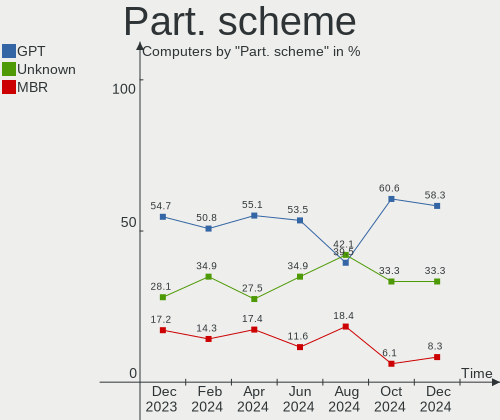
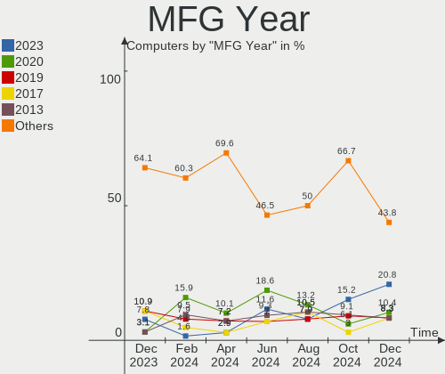
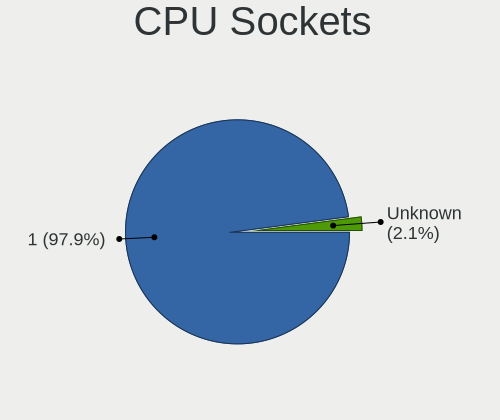
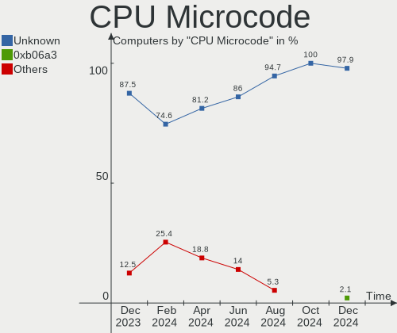
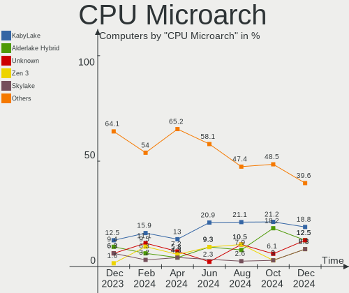
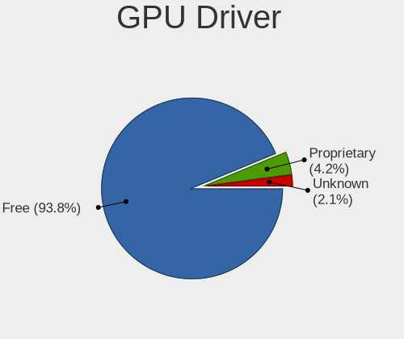
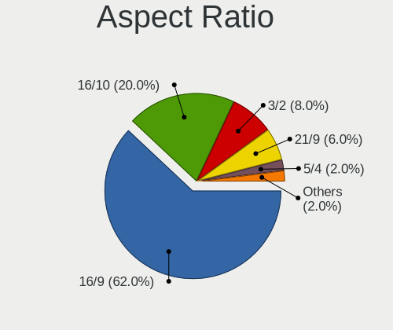
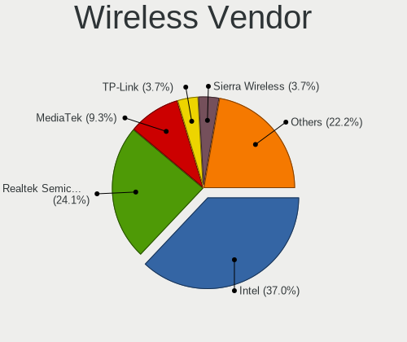

Kali Hardware Trends
--------------------

A project to identify most popular hardware characteristics and track their change
over time based on data collected by Kali users at https://Linux-Hardware.org.

Anyone can contribute to this report by the [hw-probe](https://github.com/linuxhw/hw-probe) tool:

    sudo -E hw-probe -all -upload

This is a report for all computer types. See also reports for [desktops](/Dist/Kali/Desktop/README.md) and [notebooks](/Dist/Kali/Notebook/README.md).

Full-feature report is available here: https://linux-hardware.org/?view=trends

Period: Feb, 2022.

Contents
--------

* [ System ](#system)
  - [ OS                       ](#os)
  - [ OS Family                ](#os-family)
  - [ Kernel                   ](#kernel)
  - [ Kernel Family            ](#kernel-family)
  - [ Kernel Major Ver.        ](#kernel-major-ver)
  - [ Arch                     ](#arch)
  - [ DE                       ](#de)
  - [ Display Server           ](#display-server)
  - [ Display Manager          ](#display-manager)
  - [ OS Lang                  ](#os-lang)
  - [ Boot Mode                ](#boot-mode)
  - [ Filesystem               ](#filesystem)
  - [ Part. scheme             ](#part-scheme)
  - [ Dual Boot with Linux/BSD ](#dual-boot-with-linuxbsd)
  - [ Dual Boot (Win)          ](#dual-boot-win)

* [ Board ](#board)
  - [ Vendor                   ](#vendor)
  - [ Model                    ](#model)
  - [ Model Family             ](#model-family)
  - [ MFG Year                 ](#mfg-year)
  - [ Form Factor              ](#form-factor)
  - [ Secure Boot              ](#secure-boot)
  - [ Coreboot                 ](#coreboot)
  - [ RAM Size                 ](#ram-size)
  - [ RAM Used                 ](#ram-used)
  - [ Total Drives             ](#total-drives)
  - [ Has CD-ROM               ](#has-cd-rom)
  - [ Has Ethernet             ](#has-ethernet)
  - [ Has WiFi                 ](#has-wifi)
  - [ Has Bluetooth            ](#has-bluetooth)

* [ Location ](#location)
  - [ Country                  ](#country)
  - [ City                     ](#city)

* [ Drives ](#drives)
  - [ Drive Vendor             ](#drive-vendor)
  - [ Drive Model              ](#drive-model)
  - [ HDD Vendor               ](#hdd-vendor)
  - [ SSD Vendor               ](#ssd-vendor)
  - [ Drive Kind               ](#drive-kind)
  - [ Drive Connector          ](#drive-connector)
  - [ Drive Size               ](#drive-size)
  - [ Space Total              ](#space-total)
  - [ Space Used               ](#space-used)
  - [ Malfunc. Drives          ](#malfunc-drives)
  - [ Malfunc. Drive Vendor    ](#malfunc-drive-vendor)
  - [ Malfunc. HDD Vendor      ](#malfunc-hdd-vendor)
  - [ Malfunc. Drive Kind      ](#malfunc-drive-kind)
  - [ Failed Drives            ](#failed-drives)
  - [ Failed Drive Vendor      ](#failed-drive-vendor)
  - [ Drive Status             ](#drive-status)

* [ Storage controller ](#storage-controller)
  - [ Storage Vendor           ](#storage-vendor)
  - [ Storage Model            ](#storage-model)
  - [ Storage Kind             ](#storage-kind)

* [ Processor ](#processor)
  - [ CPU Vendor               ](#cpu-vendor)
  - [ CPU Model                ](#cpu-model)
  - [ CPU Model Family         ](#cpu-model-family)
  - [ CPU Cores                ](#cpu-cores)
  - [ CPU Sockets              ](#cpu-sockets)
  - [ CPU Threads              ](#cpu-threads)
  - [ CPU Op-Modes             ](#cpu-op-modes)
  - [ CPU Microcode            ](#cpu-microcode)
  - [ CPU Microarch            ](#cpu-microarch)

* [ Graphics ](#graphics)
  - [ GPU Vendor               ](#gpu-vendor)
  - [ GPU Model                ](#gpu-model)
  - [ GPU Combo                ](#gpu-combo)
  - [ GPU Driver               ](#gpu-driver)
  - [ GPU Memory               ](#gpu-memory)

* [ Monitor ](#monitor)
  - [ Monitor Vendor           ](#monitor-vendor)
  - [ Monitor Model            ](#monitor-model)
  - [ Monitor Resolution       ](#monitor-resolution)
  - [ Monitor Diagonal         ](#monitor-diagonal)
  - [ Monitor Width            ](#monitor-width)
  - [ Aspect Ratio             ](#aspect-ratio)
  - [ Monitor Area             ](#monitor-area)
  - [ Pixel Density            ](#pixel-density)
  - [ Multiple Monitors        ](#multiple-monitors)

* [ Network ](#network)
  - [ Net Controller Vendor    ](#net-controller-vendor)
  - [ Net Controller Model     ](#net-controller-model)
  - [ Wireless Vendor          ](#wireless-vendor)
  - [ Wireless Model           ](#wireless-model)
  - [ Ethernet Vendor          ](#ethernet-vendor)
  - [ Ethernet Model           ](#ethernet-model)
  - [ Net Controller Kind      ](#net-controller-kind)
  - [ Used Controller          ](#used-controller)
  - [ NICs                     ](#nics)
  - [ IPv6                     ](#ipv6)

* [ Bluetooth ](#bluetooth)
  - [ Bluetooth Vendor         ](#bluetooth-vendor)
  - [ Bluetooth Model          ](#bluetooth-model)

* [ Sound ](#sound)
  - [ Sound Vendor             ](#sound-vendor)
  - [ Sound Model              ](#sound-model)

* [ Memory ](#memory)
  - [ Memory Vendor            ](#memory-vendor)
  - [ Memory Model             ](#memory-model)
  - [ Memory Kind              ](#memory-kind)
  - [ Memory Form Factor       ](#memory-form-factor)
  - [ Memory Size              ](#memory-size)
  - [ Memory Speed             ](#memory-speed)

* [ Printers & scanners ](#printers--scanners)
  - [ Printer Vendor           ](#printer-vendor)
  - [ Printer Model            ](#printer-model)
  - [ Scanner Vendor           ](#scanner-vendor)
  - [ Scanner Model            ](#scanner-model)

* [ Camera ](#camera)
  - [ Camera Vendor            ](#camera-vendor)
  - [ Camera Model             ](#camera-model)

* [ Security ](#security)
  - [ Fingerprint Vendor       ](#fingerprint-vendor)
  - [ Fingerprint Model        ](#fingerprint-model)
  - [ Chipcard Vendor          ](#chipcard-vendor)
  - [ Chipcard Model           ](#chipcard-model)

* [ Unsupported ](#unsupported)
  - [ Unsupported Devices      ](#unsupported-devices)
  - [ Unsupported Device Types ](#unsupported-device-types)

System
------

OS
--

Installed operating systems

| Name        | Computers | Percent |
|-------------|-----------|---------|
| Kali 2022.1 | 31        | 79.49%  |
| Kali 2021.4 | 7         | 17.95%  |
| Kali 2021.2 | 1         | 2.56%   |

OS Family
---------

OS without a version

| Name | Computers | Percent |
|------|-----------|---------|
| Kali | 39        | 100%    |

Kernel
------

Version of the Linux kernel

| Version              | Computers | Percent |
|----------------------|-----------|---------|
| 5.15.0-kali3-amd64   | 26        | 66.67%  |
| 5.16.0-kali1-amd64   | 4         | 10.26%  |
| 5.15.0-kali2-amd64   | 3         | 7.69%   |
| 5.14.0-kali4-amd64   | 3         | 7.69%   |
| 5.15.0-kali3-686-pae | 1         | 2.56%   |
| 5.10.0-kali9-amd64   | 1         | 2.56%   |
| 5.10.0-kali7-amd64   | 1         | 2.56%   |

Kernel Family
-------------

Linux kernel without a distro release

| Version | Computers | Percent |
|---------|-----------|---------|
| 5.15.0  | 30        | 76.92%  |
| 5.16.0  | 4         | 10.26%  |
| 5.14.0  | 3         | 7.69%   |
| 5.10.0  | 2         | 5.13%   |

Kernel Major Ver.
-----------------

Linux kernel major version

| Version | Computers | Percent |
|---------|-----------|---------|
| 5.15    | 30        | 76.92%  |
| 5.16    | 4         | 10.26%  |
| 5.14    | 3         | 7.69%   |
| 5.10    | 2         | 5.13%   |

Arch
----

OS architecture (x86_64, i586, etc.)

| Name   | Computers | Percent |
|--------|-----------|---------|
| x86_64 | 38        | 97.44%  |
| i686   | 1         | 2.56%   |

DE
--

Desktop Environment

| Name             | Computers | Percent |
|------------------|-----------|---------|
| XFCE             | 17        | 43.59%  |
| GNOME            | 11        | 28.21%  |
| KDE5             | 9         | 23.08%  |
| lightdm-xsession | 1         | 2.56%   |
| GNOME Classic    | 1         | 2.56%   |

Display Server
--------------

X11 or Wayland

| Name    | Computers | Percent |
|---------|-----------|---------|
| X11     | 37        | 94.87%  |
| Wayland | 2         | 5.13%   |

Display Manager
---------------

SDDM, LightDM, etc.

| Name    | Computers | Percent |
|---------|-----------|---------|
| LightDM | 14        | 35.9%   |
| Unknown | 13        | 33.33%  |
| GDM3    | 7         | 17.95%  |
| SDDM    | 5         | 12.82%  |

OS Lang
-------

Language

| Lang  | Computers | Percent |
|-------|-----------|---------|
| en_US | 22        | 56.41%  |
| fr_FR | 3         | 7.69%   |
| it_IT | 2         | 5.13%   |
| es_ES | 2         | 5.13%   |
| en_IN | 2         | 5.13%   |
| de_DE | 2         | 5.13%   |
| tr_TR | 1         | 2.56%   |
| ru_RU | 1         | 2.56%   |
| fa_IR | 1         | 2.56%   |
| es_MX | 1         | 2.56%   |
| en_ZA | 1         | 2.56%   |
| en_AU | 1         | 2.56%   |

Boot Mode
---------

EFI or BIOS

| Mode | Computers | Percent |
|------|-----------|---------|
| EFI  | 23        | 58.97%  |
| BIOS | 16        | 41.03%  |

Filesystem
----------

Type of filesystem

| Type    | Computers | Percent |
|---------|-----------|---------|
| Ext4    | 38        | 97.44%  |
| Overlay | 1         | 2.56%   |

Part. scheme
------------

Scheme of partitioning

| Type    | Computers | Percent |
|---------|-----------|---------|
| GPT     | 19        | 48.72%  |
| Unknown | 12        | 30.77%  |
| MBR     | 8         | 20.51%  |

Dual Boot with Linux/BSD
------------------------

Hosting more than one Linux/BSD

| Dual boot | Computers | Percent |
|-----------|-----------|---------|
| No        | 34        | 87.18%  |
| Yes       | 5         | 12.82%  |

Dual Boot (Win)
---------------

Hosting Linux and Windows

| Dual boot | Computers | Percent |
|-----------|-----------|---------|
| No        | 27        | 69.23%  |
| Yes       | 12        | 30.77%  |

Board
-----

Vendor
------

Motherboard manufacturer

| Name                | Computers | Percent |
|---------------------|-----------|---------|
| Hewlett-Packard     | 9         | 23.08%  |
| Lenovo              | 8         | 20.51%  |
| Dell                | 7         | 17.95%  |
| ASUSTek Computer    | 3         | 7.69%   |
| Samsung Electronics | 2         | 5.13%   |
| Gigabyte Technology | 2         | 5.13%   |
| Acer                | 2         | 5.13%   |
| Toshiba             | 1         | 2.56%   |
| Sony                | 1         | 2.56%   |
| powerinternational  | 1         | 2.56%   |
| Google              | 1         | 2.56%   |
| Fujitsu             | 1         | 2.56%   |
| Apple               | 1         | 2.56%   |

Model
-----

Motherboard model

| Name                                    | Computers | Percent |
|-----------------------------------------|-----------|---------|
| Dell Latitude E5430 non-vPro            | 2         | 5.13%   |
| Toshiba Satellite E55-A                 | 1         | 2.56%   |
| Sony VPCF115FM                          | 1         | 2.56%   |
| Samsung R59P/R60P/R61P                  | 1         | 2.56%   |
| Samsung 930QCG                          | 1         | 2.56%   |
| powerinternational Cepter N510-03       | 1         | 2.56%   |
| Lenovo Y520-15IKBM 80YY                 | 1         | 2.56%   |
| Lenovo ThinkPad Yoga 260 20FES2VR01     | 1         | 2.56%   |
| Lenovo ThinkPad W510 438923U            | 1         | 2.56%   |
| Lenovo ThinkPad T470 20HES18R2C         | 1         | 2.56%   |
| Lenovo Legion Y740-17IRHg 81UJ          | 1         | 2.56%   |
| Lenovo IdeaCentre G5 14IMB05 90N900FKTX | 1         | 2.56%   |
| Lenovo G560 20042                       | 1         | 2.56%   |
| Lenovo Flex 3-1120 80LX                 | 1         | 2.56%   |
| HP Spectre 13-SMB Pro Ultrabook         | 1         | 2.56%   |
| HP Snappy                               | 1         | 2.56%   |
| HP ProBook 4510s                        | 1         | 2.56%   |
| HP Pavilion Gaming Laptop 15-dk1xxx     | 1         | 2.56%   |
| HP Pavilion dv2000 (RR100EA#ABZ)        | 1         | 2.56%   |
| HP Pavilion 15                          | 1         | 2.56%   |
| HP ENVY TS 17                           | 1         | 2.56%   |
| HP EliteBook 840 G3                     | 1         | 2.56%   |
| HP Compaq Elite 8300 SFF                | 1         | 2.56%   |
| Google Peppy                            | 1         | 2.56%   |
| Gigabyte Z590 AORUS ULTRA               | 1         | 2.56%   |
| Gigabyte B85M-D3H                       | 1         | 2.56%   |
| Fujitsu LIFEBOOK E751                   | 1         | 2.56%   |
| Dell XPS 13 9350                        | 1         | 2.56%   |
| Dell OptiPlex 980                       | 1         | 2.56%   |
| Dell Latitude E6400                     | 1         | 2.56%   |
| Dell Inspiron 7300 2n1                  | 1         | 2.56%   |
| Dell Inspiron 5593                      | 1         | 2.56%   |
| ASUS ROG Zephyrus G14 GA401IV_GA401IV   | 1         | 2.56%   |
| ASUS ROG STRIX B365-G GAMING            | 1         | 2.56%   |
| ASUS ROG Maximus XI FORMULA             | 1         | 2.56%   |
| Apple MacBookPro15,2                    | 1         | 2.56%   |
| Acer Aspire V3-771                      | 1         | 2.56%   |
| Acer Aspire A515-51G                    | 1         | 2.56%   |

Model Family
------------

Motherboard model prefix

| Name                      | Computers | Percent |
|---------------------------|-----------|---------|
| Lenovo ThinkPad           | 3         | 7.69%   |
| HP Pavilion               | 3         | 7.69%   |
| Dell Latitude             | 3         | 7.69%   |
| ASUS ROG                  | 3         | 7.69%   |
| Dell Inspiron             | 2         | 5.13%   |
| Acer Aspire               | 2         | 5.13%   |
| Toshiba Satellite         | 1         | 2.56%   |
| Sony VPCF115FM            | 1         | 2.56%   |
| Samsung R59P              | 1         | 2.56%   |
| Samsung 930QCG            | 1         | 2.56%   |
| powerinternational Cepter | 1         | 2.56%   |
| Lenovo Y520-15IKBM        | 1         | 2.56%   |
| Lenovo Legion             | 1         | 2.56%   |
| Lenovo IdeaCentre         | 1         | 2.56%   |
| Lenovo G560               | 1         | 2.56%   |
| Lenovo Flex               | 1         | 2.56%   |
| HP Spectre                | 1         | 2.56%   |
| HP Snappy                 | 1         | 2.56%   |
| HP ProBook                | 1         | 2.56%   |
| HP ENVY                   | 1         | 2.56%   |
| HP EliteBook              | 1         | 2.56%   |
| HP Compaq                 | 1         | 2.56%   |
| Google Peppy              | 1         | 2.56%   |
| Gigabyte Z590             | 1         | 2.56%   |
| Gigabyte B85M-D3H         | 1         | 2.56%   |
| Fujitsu LIFEBOOK          | 1         | 2.56%   |
| Dell XPS                  | 1         | 2.56%   |
| Dell OptiPlex             | 1         | 2.56%   |
| Apple MacBookPro15        | 1         | 2.56%   |

MFG Year
--------

Motherboard manufacture year

| Year | Computers | Percent |
|------|-----------|---------|
| 2020 | 6         | 15.38%  |
| 2013 | 5         | 12.82%  |
| 2021 | 4         | 10.26%  |
| 2019 | 4         | 10.26%  |
| 2012 | 4         | 10.26%  |
| 2017 | 3         | 7.69%   |
| 2010 | 3         | 7.69%   |
| 2016 | 2         | 5.13%   |
| 2009 | 2         | 5.13%   |
| 2007 | 2         | 5.13%   |
| 2018 | 1         | 2.56%   |
| 2015 | 1         | 2.56%   |
| 2011 | 1         | 2.56%   |
| 2008 | 1         | 2.56%   |

Form Factor
-----------

Physical design of the computer

| Name        | Computers | Percent |
|-------------|-----------|---------|
| Notebook    | 29        | 74.36%  |
| Desktop     | 7         | 17.95%  |
| Convertible | 3         | 7.69%   |

Secure Boot
-----------

Enabled or disabled

| State    | Computers | Percent |
|----------|-----------|---------|
| Disabled | 39        | 100%    |

Coreboot
--------

Have coreboot on board

| Used | Computers | Percent |
|------|-----------|---------|
| No   | 37        | 94.87%  |
| Yes  | 2         | 5.13%   |

RAM Size
--------

Total RAM memory

| Size in GB  | Computers | Percent |
|-------------|-----------|---------|
| 4.01-8.0    | 11        | 28.21%  |
| 3.01-4.0    | 8         | 20.51%  |
| 8.01-16.0   | 6         | 15.38%  |
| 16.01-24.0  | 5         | 12.82%  |
| 32.01-64.0  | 3         | 7.69%   |
| 2.01-3.0    | 2         | 5.13%   |
| 1.01-2.0    | 2         | 5.13%   |
| 24.01-32.0  | 1         | 2.56%   |
| 64.01-256.0 | 1         | 2.56%   |

RAM Used
--------

Used RAM memory

| Used GB  | Computers | Percent |
|----------|-----------|---------|
| 2.01-3.0 | 14        | 35.9%   |
| 1.01-2.0 | 13        | 33.33%  |
| 3.01-4.0 | 6         | 15.38%  |
| 4.01-8.0 | 3         | 7.69%   |
| 0.51-1.0 | 3         | 7.69%   |

Total Drives
------------

Number of drives on board

| Drives | Computers | Percent |
|--------|-----------|---------|
| 1      | 30        | 76.92%  |
| 2      | 7         | 17.95%  |
| 8      | 1         | 2.56%   |
| 4      | 1         | 2.56%   |

Has CD-ROM
----------

Has CD-ROM on board

| Presented | Computers | Percent |
|-----------|-----------|---------|
| No        | 24        | 61.54%  |
| Yes       | 15        | 38.46%  |

Has Ethernet
------------

Has Ethernet on board

| Presented | Computers | Percent |
|-----------|-----------|---------|
| Yes       | 32        | 82.05%  |
| No        | 7         | 17.95%  |

Has WiFi
--------

Has WiFi module

| Presented | Computers | Percent |
|-----------|-----------|---------|
| Yes       | 38        | 97.44%  |
| No        | 1         | 2.56%   |

Has Bluetooth
-------------

Has Bluetooth module

| Presented | Computers | Percent |
|-----------|-----------|---------|
| Yes       | 27        | 69.23%  |
| No        | 12        | 30.77%  |

Location
--------

Country
-------

Geographic location (country)

| Country            | Computers | Percent |
|--------------------|-----------|---------|
| USA                | 10        | 25.64%  |
| Spain              | 4         | 10.26%  |
| Germany            | 4         | 10.26%  |
| France             | 3         | 7.69%   |
| Turkey             | 2         | 5.13%   |
| India              | 2         | 5.13%   |
| Ukraine            | 1         | 2.56%   |
| South Africa       | 1         | 2.56%   |
| Russia             | 1         | 2.56%   |
| Philippines        | 1         | 2.56%   |
| Mexico             | 1         | 2.56%   |
| Kyrgyzstan         | 1         | 2.56%   |
| Iraq               | 1         | 2.56%   |
| Iran               | 1         | 2.56%   |
| Finland            | 1         | 2.56%   |
| Ethiopia           | 1         | 2.56%   |
| Egypt              | 1         | 2.56%   |
| Dominican Republic | 1         | 2.56%   |
| Bulgaria           | 1         | 2.56%   |
| Australia          | 1         | 2.56%   |

City
----

Geographic location (city)

| City                       | Computers | Percent |
|----------------------------|-----------|---------|
| Wiesbaden                  | 1         | 2.56%   |
| Voronezh                   | 1         | 2.56%   |
| Villingen-Schwenningen     | 1         | 2.56%   |
| Van                        | 1         | 2.56%   |
| Tehran                     | 1         | 2.56%   |
| Sastamala                  | 1         | 2.56%   |
| Sanger                     | 1         | 2.56%   |
| San Diego                  | 1         | 2.56%   |
| Queretaro                  | 1         | 2.56%   |
| Pedroche                   | 1         | 2.56%   |
| Orlando                    | 1         | 2.56%   |
| Navi Mumbai                | 1         | 2.56%   |
| Morristown                 | 1         | 2.56%   |
| Montpellier                | 1         | 2.56%   |
| Millington                 | 1         | 2.56%   |
| Manteca                    | 1         | 2.56%   |
| Madrid                     | 1         | 2.56%   |
| Lucknow                    | 1         | 2.56%   |
| Las Palmas de Gran Canaria | 1         | 2.56%   |
| Ladysmith                  | 1         | 2.56%   |
| Kleve                      | 1         | 2.56%   |
| Kinston                    | 1         | 2.56%   |
| Istanbul                   | 1         | 2.56%   |
| Hamburg                    | 1         | 2.56%   |
| Erbil                      | 1         | 2.56%   |
| Davao City                 | 1         | 2.56%   |
| Daly City                  | 1         | 2.56%   |
| Cairo                      | 1         | 2.56%   |
| Burgas                     | 1         | 2.56%   |
| Brisbane                   | 1         | 2.56%   |
| Bishkek                    | 1         | 2.56%   |
| Bezpechna                  | 1         | 2.56%   |
| Berkeley                   | 1         | 2.56%   |
| Beaumont-sur-Oise          | 1         | 2.56%   |
| Barcelona                  | 1         | 2.56%   |
| Annonay                    | 1         | 2.56%   |
| Anchorage                  | 1         | 2.56%   |
| Alejandro Bass             | 1         | 2.56%   |
| Addis Ababa                | 1         | 2.56%   |

Drives
------

Drive Vendor
------------

Hard drive vendors

| Vendor              | Computers | Drives | Percent |
|---------------------|-----------|--------|---------|
| WDC                 | 7         | 8      | 14%     |
| Samsung Electronics | 7         | 11     | 14%     |
| Toshiba             | 5         | 5      | 10%     |
| Seagate             | 4         | 4      | 8%      |
| Sandisk             | 3         | 3      | 6%      |
| Intel               | 3         | 4      | 6%      |
| SPCC                | 2         | 2      | 4%      |
| Hitachi             | 2         | 2      | 4%      |
| Crucial             | 2         | 2      | 4%      |
| Unknown             | 1         | 1      | 2%      |
| Transcend           | 1         | 1      | 2%      |
| PNY                 | 1         | 1      | 2%      |
| Phison              | 1         | 1      | 2%      |
| LITEON              | 1         | 1      | 2%      |
| Lenovo              | 1         | 1      | 2%      |
| Kingston            | 1         | 1      | 2%      |
| KINGSPEED           | 1         | 1      | 2%      |
| Intenso             | 1         | 1      | 2%      |
| HS-SSD-C100         | 1         | 1      | 2%      |
| HGST                | 1         | 1      | 2%      |
| Gigabyte Technology | 1         | 1      | 2%      |
| Fujitsu             | 1         | 1      | 2%      |
| Apple               | 1         | 1      | 2%      |
| A-DATA Technology   | 1         | 1      | 2%      |

Drive Model
-----------

Hard drive models

| Model                                  | Computers | Percent |
|----------------------------------------|-----------|---------|
| WDC WDS100T2B0A-00SM50 1TB SSD         | 1         | 1.82%   |
| WDC WD7500BPVT-11A1YT0 752GB           | 1         | 1.82%   |
| WDC WD5000LPVX-60V0TT0 500GB           | 1         | 1.82%   |
| WDC WD5000LPVT-00FMCT0 500GB           | 1         | 1.82%   |
| WDC WD40EFAX-68JH4N0 4TB               | 1         | 1.82%   |
| WDC WD32 00BEVT-75ZCT0 320GB           | 1         | 1.82%   |
| WDC WD10SPZX-75Z10T3 1TB               | 1         | 1.82%   |
| WDC WD10EZEX-00WN4A0 1TB               | 1         | 1.82%   |
| Unknown DA4064  64GB                   | 1         | 1.82%   |
| Transcend TS128GMTS430S 128GB SSD      | 1         | 1.82%   |
| Toshiba THNSN5256GPU7 NVMe 256GB       | 1         | 1.82%   |
| Toshiba MQ01ABD100 1TB                 | 1         | 1.82%   |
| Toshiba MQ01ABD050V 500GB              | 1         | 1.82%   |
| Toshiba MK8052GSX 80GB                 | 1         | 1.82%   |
| Toshiba HDWE150 5TB                    | 1         | 1.82%   |
| SPCC Solid State Disk 256GB            | 1         | 1.82%   |
| SPCC M.2 SSD 256GB                     | 1         | 1.82%   |
| Seagate ST8000DM004-2CX188 8TB         | 1         | 1.82%   |
| Seagate ST500LT012-1DG142 500GB        | 1         | 1.82%   |
| Seagate ST4000DM004-2CV104 4TB         | 1         | 1.82%   |
| Seagate ST3500414CS 500GB              | 1         | 1.82%   |
| SanDisk SD8TN8U256G1001 256GB SSD      | 1         | 1.82%   |
| SanDisk SD6SN1M-256G-1006 256GB SSD    | 1         | 1.82%   |
| Sandisk NVMe SSD Drive 500GB           | 1         | 1.82%   |
| Samsung SSD 870 QVO 4TB                | 1         | 1.82%   |
| Samsung SSD 860 EVO 1TB                | 1         | 1.82%   |
| Samsung SSD 850 EVO 500GB              | 1         | 1.82%   |
| Samsung SSD 840 EVO 120GB              | 1         | 1.82%   |
| Samsung SM963 2.5" NVMe PCIe SSD 256GB | 1         | 1.82%   |
| Samsung NVMe SSD Drive 500GB           | 1         | 1.82%   |
| Samsung NVMe SSD Drive 2TB             | 1         | 1.82%   |
| Samsung MZVLB1T0HALR-000L2 1TB         | 1         | 1.82%   |
| Samsung MZALQ512HALU-000L1 512GB       | 1         | 1.82%   |
| Samsung HM250HI 250GB                  | 1         | 1.82%   |
| PNY ELITE PSSD 480GB                   | 1         | 1.82%   |
| Phison Sabrent Rocket Q 1TB            | 1         | 1.82%   |
| LITEON CV5-8Q256-HP 256GB SSD          | 1         | 1.82%   |
| Lenovo LENSE20256GMSP34MEAT2TA 256GB   | 1         | 1.82%   |
| Kingston SV300S37A120G 120GB SSD       | 1         | 1.82%   |
| KINGSPEED SATA3-256GB                  | 1         | 1.82%   |
| Intenso SSD 120GB                      | 1         | 1.82%   |
| Intel SSDPEKNW512G8 512GB              | 1         | 1.82%   |
| Intel NVMe SSD Drive 1024GB            | 1         | 1.82%   |
| Intel H10 HBRPEKNX0202AO NVMe 32GB     | 1         | 1.82%   |
| Intel H10 HBRPEKNX0202A NVMe 512GB     | 1         | 1.82%   |
| HS-SSD-C100 SSD 120G                   | 1         | 1.82%   |
| Hitachi HTS725032A9A364 320GB          | 1         | 1.82%   |
| Hitachi HDS721010CLA630 1TB            | 1         | 1.82%   |
| HGST HUH721008ALE604 8TB               | 1         | 1.82%   |
| Gigabyte GP-AG41TB                     | 1         | 1.82%   |
| Fujitsu MHY2160BH 160GB                | 1         | 1.82%   |
| Crucial CT240BX500SSD1 240GB           | 1         | 1.82%   |
| Crucial CT240BX200SSD1 240GB           | 1         | 1.82%   |
| Apple SSD AP0512M 500GB                | 1         | 1.82%   |
| A-DATA SU650 120GB SSD                 | 1         | 1.82%   |

HDD Vendor
----------

Hard disk drive vendors

| Vendor              | Computers | Drives | Percent |
|---------------------|-----------|--------|---------|
| WDC                 | 7         | 7      | 35%     |
| Toshiba             | 4         | 4      | 20%     |
| Seagate             | 4         | 4      | 20%     |
| Hitachi             | 2         | 2      | 10%     |
| Samsung Electronics | 1         | 1      | 5%      |
| HGST                | 1         | 1      | 5%      |
| Fujitsu             | 1         | 1      | 5%      |

SSD Vendor
----------

Solid state drive vendors

| Vendor              | Computers | Drives | Percent |
|---------------------|-----------|--------|---------|
| Samsung Electronics | 3         | 4      | 16.67%  |
| SPCC                | 2         | 2      | 11.11%  |
| SanDisk             | 2         | 2      | 11.11%  |
| Crucial             | 2         | 2      | 11.11%  |
| WDC                 | 1         | 1      | 5.56%   |
| Transcend           | 1         | 1      | 5.56%   |
| PNY                 | 1         | 1      | 5.56%   |
| LITEON              | 1         | 1      | 5.56%   |
| Kingston            | 1         | 1      | 5.56%   |
| KINGSPEED           | 1         | 1      | 5.56%   |
| Intenso             | 1         | 1      | 5.56%   |
| HS-SSD-C100         | 1         | 1      | 5.56%   |
| A-DATA Technology   | 1         | 1      | 5.56%   |

Drive Kind
----------

HDD or SSD

| Kind | Computers | Drives | Percent |
|------|-----------|--------|---------|
| HDD  | 17        | 20     | 36.96%  |
| SSD  | 15        | 19     | 32.61%  |
| NVMe | 13        | 16     | 28.26%  |
| MMC  | 1         | 1      | 2.17%   |

Drive Connector
---------------

SATA, SAS, NVMe, etc.

| Type | Computers | Drives | Percent |
|------|-----------|--------|---------|
| SATA | 27        | 37     | 62.79%  |
| NVMe | 13        | 16     | 30.23%  |
| SAS  | 2         | 2      | 4.65%   |
| MMC  | 1         | 1      | 2.33%   |

Drive Size
----------

Size of hard drive

| Size in TB | Computers | Drives | Percent |
|------------|-----------|--------|---------|
| 0.01-0.5   | 23        | 26     | 65.71%  |
| 0.51-1.0   | 7         | 7      | 20%     |
| 3.01-4.0   | 3         | 3      | 8.57%   |
| 4.01-10.0  | 2         | 3      | 5.71%   |

Space Total
-----------

Amount of disk space available on the file system

| Size in GB     | Computers | Percent |
|----------------|-----------|---------|
| 101-250        | 18        | 46.15%  |
| 251-500        | 8         | 20.51%  |
| 51-100         | 5         | 12.82%  |
| 501-1000       | 4         | 10.26%  |
| More than 3000 | 2         | 5.13%   |
| 21-50          | 1         | 2.56%   |
| 1001-2000      | 1         | 2.56%   |

Space Used
----------

Amount of used disk space

| Used GB   | Computers | Percent |
|-----------|-----------|---------|
| 1-20      | 14        | 35.9%   |
| 21-50     | 10        | 25.64%  |
| 101-250   | 6         | 15.38%  |
| 51-100    | 5         | 12.82%  |
| 2001-3000 | 2         | 5.13%   |
| 251-500   | 1         | 2.56%   |
| 1001-2000 | 1         | 2.56%   |

Malfunc. Drives
---------------

Drive models with a malfunction

| Model                         | Computers | Drives | Percent |
|-------------------------------|-----------|--------|---------|
| Toshiba MK8052GSX 80GB        | 1         | 1      | 50%     |
| Hitachi HTS725032A9A364 320GB | 1         | 1      | 50%     |

Malfunc. Drive Vendor
---------------------

Vendors of faulty drives

| Vendor  | Computers | Drives | Percent |
|---------|-----------|--------|---------|
| Toshiba | 1         | 1      | 50%     |
| Hitachi | 1         | 1      | 50%     |

Malfunc. HDD Vendor
-------------------

Vendors of faulty HDD drives

| Vendor  | Computers | Drives | Percent |
|---------|-----------|--------|---------|
| Toshiba | 1         | 1      | 50%     |
| Hitachi | 1         | 1      | 50%     |

Malfunc. Drive Kind
-------------------

Kinds of faulty drives

| Kind | Computers | Drives | Percent |
|------|-----------|--------|---------|
| HDD  | 2         | 2      | 100%    |

Failed Drives
-------------

Failed drive models

Zero info for selected period =(

Failed Drive Vendor
-------------------

Failed drive vendors

Zero info for selected period =(

Drive Status
------------

Number of failed and malfunc. drives

| Status   | Computers | Drives | Percent |
|----------|-----------|--------|---------|
| Works    | 24        | 32     | 61.54%  |
| Detected | 13        | 22     | 33.33%  |
| Malfunc  | 2         | 2      | 5.13%   |

Storage controller
------------------

Storage Vendor
--------------

Storage controller vendors

| Vendor                       | Computers | Percent |
|------------------------------|-----------|---------|
| Intel                        | 33        | 70.21%  |
| Samsung Electronics          | 5         | 10.64%  |
| AMD                          | 3         | 6.38%   |
| Phison Electronics           | 2         | 4.26%   |
| Toshiba America Info Systems | 1         | 2.13%   |
| Sandisk                      | 1         | 2.13%   |
| Lenovo                       | 1         | 2.13%   |
| Apple                        | 1         | 2.13%   |

Storage Model
-------------

Storage controller models

| Model                                                                          | Computers | Percent |
|--------------------------------------------------------------------------------|-----------|---------|
| Intel 82801 Mobile SATA Controller [RAID mode]                                 | 5         | 9.8%    |
| Intel Sunrise Point-LP SATA Controller [AHCI mode]                             | 4         | 7.84%   |
| Samsung NVMe SSD Controller SM981/PM981/PM983                                  | 3         | 5.88%   |
| Samsung NVMe SSD Controller 980                                                | 2         | 3.92%   |
| Intel SSD 660P Series                                                          | 2         | 3.92%   |
| Intel 8 Series/C220 Series Chipset Family 6-port SATA Controller 1 [AHCI mode] | 2         | 3.92%   |
| Intel 8 Series SATA Controller 1 [AHCI mode]                                   | 2         | 3.92%   |
| Intel 5 Series/3400 Series Chipset 6 port SATA AHCI Controller                 | 2         | 3.92%   |
| AMD FCH SATA Controller [AHCI mode]                                            | 2         | 3.92%   |
| Toshiba America Info Systems NVMe Controller                                   | 1         | 1.96%   |
| Sandisk WD Black SN750 / PC SN730 NVMe SSD                                     | 1         | 1.96%   |
| Phison E16 PCIe4 NVMe Controller                                               | 1         | 1.96%   |
| Phison E12 NVMe Controller                                                     | 1         | 1.96%   |
| Lenovo Non-Volatile memory controller                                          | 1         | 1.96%   |
| Intel SATA Controller [RAID mode]                                              | 1         | 1.96%   |
| Intel Non-Volatile memory controller                                           | 1         | 1.96%   |
| Intel HM170/QM170 Chipset SATA Controller [AHCI Mode]                          | 1         | 1.96%   |
| Intel Cannon Point-LP SATA Controller [AHCI Mode]                              | 1         | 1.96%   |
| Intel Cannon Lake PCH SATA AHCI Controller                                     | 1         | 1.96%   |
| Intel Cannon Lake Mobile PCH SATA AHCI Controller                              | 1         | 1.96%   |
| Intel Atom Processor E3800 Series SATA AHCI Controller                         | 1         | 1.96%   |
| Intel 82801IBM/IEM (ICH9M/ICH9M-E) 4 port SATA Controller [AHCI mode]          | 1         | 1.96%   |
| Intel 82801GBM/GHM (ICH7-M Family) SATA Controller [AHCI mode]                 | 1         | 1.96%   |
| Intel 82801G (ICH7 Family) IDE Controller                                      | 1         | 1.96%   |
| Intel 7 Series/C210 Series Chipset Family 4-port SATA Controller [IDE mode]    | 1         | 1.96%   |
| Intel 7 Series/C210 Series Chipset Family 2-port SATA Controller [IDE mode]    | 1         | 1.96%   |
| Intel 7 Series Chipset Family 6-port SATA Controller [AHCI mode]               | 1         | 1.96%   |
| Intel 6 Series/C200 Series Chipset Family 6 port Mobile SATA AHCI Controller   | 1         | 1.96%   |
| Intel 500 Series Chipset Family SATA AHCI Controller                           | 1         | 1.96%   |
| Intel 5 Series/3400 Series Chipset PT IDER Controller                          | 1         | 1.96%   |
| Intel 5 Series/3400 Series Chipset 4 port SATA AHCI Controller                 | 1         | 1.96%   |
| Intel 400 Series Chipset Family SATA AHCI Controller                           | 1         | 1.96%   |
| Intel 200 Series PCH SATA controller [AHCI mode]                               | 1         | 1.96%   |
| Apple ANS2 NVMe Controller                                                     | 1         | 1.96%   |
| AMD SB600 Non-Raid-5 SATA                                                      | 1         | 1.96%   |
| AMD SB600 IDE                                                                  | 1         | 1.96%   |

Storage Kind
------------

Kind of storage controller (IDE, SATA, NVMe, SAS, ...)

| Kind | Computers | Percent |
|------|-----------|---------|
| SATA | 26        | 53.06%  |
| NVMe | 13        | 26.53%  |
| RAID | 6         | 12.24%  |
| IDE  | 4         | 8.16%   |

Processor
---------

CPU Vendor
----------

Processor vendors

| Vendor | Computers | Percent |
|--------|-----------|---------|
| Intel  | 37        | 94.87%  |
| AMD    | 2         | 5.13%   |

CPU Model
---------

Processor models

| Model                                   | Computers | Percent |
|-----------------------------------------|-----------|---------|
| Intel Core i5-3210M CPU @ 2.50GHz       | 3         | 7.69%   |
| Intel Core i7-1065G7 CPU @ 1.30GHz      | 2         | 5.13%   |
| Intel Core i5-4200U CPU @ 1.60GHz       | 2         | 5.13%   |
| Intel Pentium Dual CPU T2390 @ 1.86GHz  | 1         | 2.56%   |
| Intel Pentium CPU P6200 @ 2.13GHz       | 1         | 2.56%   |
| Intel Pentium CPU G3260 @ 3.30GHz       | 1         | 2.56%   |
| Intel Genuine CPU T2050 @ 1.60GHz       | 1         | 2.56%   |
| Intel Core i9-9900K CPU @ 3.60GHz       | 1         | 2.56%   |
| Intel Core i7-9750H CPU @ 2.60GHz       | 1         | 2.56%   |
| Intel Core i7-6560U CPU @ 2.20GHz       | 1         | 2.56%   |
| Intel Core i7-4702MQ CPU @ 2.20GHz      | 1         | 2.56%   |
| Intel Core i7 CPU Q 820 @ 1.73GHz       | 1         | 2.56%   |
| Intel Core i7 CPU Q 720 @ 1.60GHz       | 1         | 2.56%   |
| Intel Core i5-8265U CPU @ 1.60GHz       | 1         | 2.56%   |
| Intel Core i5-8259U CPU @ 2.30GHz       | 1         | 2.56%   |
| Intel Core i5-7300U CPU @ 2.60GHz       | 1         | 2.56%   |
| Intel Core i5-7300HQ CPU @ 2.50GHz      | 1         | 2.56%   |
| Intel Core i5-7200U CPU @ 2.50GHz       | 1         | 2.56%   |
| Intel Core i5-6300U CPU @ 2.40GHz       | 1         | 2.56%   |
| Intel Core i5-6200U CPU @ 2.30GHz       | 1         | 2.56%   |
| Intel Core i5-2520M CPU @ 2.50GHz       | 1         | 2.56%   |
| Intel Core i5-10400F CPU @ 2.90GHz      | 1         | 2.56%   |
| Intel Core i5-10300H CPU @ 2.50GHz      | 1         | 2.56%   |
| Intel Core i5-10210U CPU @ 1.60GHz      | 1         | 2.56%   |
| Intel Core i5 CPU 650 @ 3.20GHz         | 1         | 2.56%   |
| Intel Core i3-9100 CPU @ 3.60GHz        | 1         | 2.56%   |
| Intel Core i3-2120 CPU @ 3.30GHz        | 1         | 2.56%   |
| Intel Core 2 Duo CPU T6570 @ 2.10GHz    | 1         | 2.56%   |
| Intel Core 2 Duo CPU P8700 @ 2.53GHz    | 1         | 2.56%   |
| Intel Celeron CPU N3350 @ 1.10GHz       | 1         | 2.56%   |
| Intel Celeron CPU N2840 @ 2.16GHz       | 1         | 2.56%   |
| Intel Celeron 2957U @ 1.40GHz           | 1         | 2.56%   |
| Intel 11th Gen Core i9-11900K @ 3.50GHz | 1         | 2.56%   |
| AMD Ryzen 9 4900HS with Radeon Graphics | 1         | 2.56%   |
| AMD A4-5000 APU with Radeon HD Graphics | 1         | 2.56%   |

CPU Model Family
----------------

Processor model prefix

| Model              | Computers | Percent |
|--------------------|-----------|---------|
| Intel Core i5      | 17        | 43.59%  |
| Intel Core i7      | 7         | 17.95%  |
| Intel Celeron      | 3         | 7.69%   |
| Intel Pentium      | 2         | 5.13%   |
| Intel Core i3      | 2         | 5.13%   |
| Intel Core 2 Duo   | 2         | 5.13%   |
| Other              | 1         | 2.56%   |
| Intel Pentium Dual | 1         | 2.56%   |
| Intel Genuine      | 1         | 2.56%   |
| Intel Core i9      | 1         | 2.56%   |
| AMD Ryzen 9        | 1         | 2.56%   |
| AMD A4             | 1         | 2.56%   |

CPU Cores
---------

Number of processor cores

| Number | Computers | Percent |
|--------|-----------|---------|
| 2      | 22        | 56.41%  |
| 4      | 12        | 30.77%  |
| 8      | 3         | 7.69%   |
| 6      | 2         | 5.13%   |

CPU Sockets
-----------

Number of sockets

| Number | Computers | Percent |
|--------|-----------|---------|
| 1      | 39        | 100%    |

CPU Threads
-----------

Threads per core (Hyper-Threading)

| Number | Computers | Percent |
|--------|-----------|---------|
| 2      | 27        | 69.23%  |
| 1      | 12        | 30.77%  |

CPU Op-Modes
------------

CPU Operation Modes (32-bit, 64-bit)

| Op mode        | Computers | Percent |
|----------------|-----------|---------|
| 32-bit, 64-bit | 37        | 94.87%  |
| 32-bit         | 1         | 2.56%   |
| Unknown        | 1         | 2.56%   |

CPU Microcode
-------------

Microcode number

| Number     | Computers | Percent |
|------------|-----------|---------|
| 0x406e3    | 3         | 7.69%   |
| 0x306a9    | 3         | 7.69%   |
| Unknown    | 3         | 7.69%   |
| 0x806e9    | 2         | 5.13%   |
| 0x706e5    | 2         | 5.13%   |
| 0x40651    | 2         | 5.13%   |
| 0x306c3    | 2         | 5.13%   |
| 0x206a7    | 2         | 5.13%   |
| 0x20655    | 2         | 5.13%   |
| 0x106e5    | 2         | 5.13%   |
| 0xa0671    | 1         | 2.56%   |
| 0xa0653    | 1         | 2.56%   |
| 0xa0652    | 1         | 2.56%   |
| 0x906ec    | 1         | 2.56%   |
| 0x906eb    | 1         | 2.56%   |
| 0x906ea    | 1         | 2.56%   |
| 0x906e9    | 1         | 2.56%   |
| 0x806ec    | 1         | 2.56%   |
| 0x806eb    | 1         | 2.56%   |
| 0x806ea    | 1         | 2.56%   |
| 0x6fd      | 1         | 2.56%   |
| 0x6e8      | 1         | 2.56%   |
| 0x506c9    | 1         | 2.56%   |
| 0x30678    | 1         | 2.56%   |
| 0x1067a    | 1         | 2.56%   |
| 0x0700010f | 1         | 2.56%   |

CPU Microarch
-------------

Microarchitecture

| Name        | Computers | Percent |
|-------------|-----------|---------|
| KabyLake    | 9         | 23.08%  |
| Haswell     | 5         | 12.82%  |
| Skylake     | 3         | 7.69%   |
| IvyBridge   | 3         | 7.69%   |
| Icelake     | 3         | 7.69%   |
| Westmere    | 2         | 5.13%   |
| SandyBridge | 2         | 5.13%   |
| Penryn      | 2         | 5.13%   |
| Nehalem     | 2         | 5.13%   |
| CometLake   | 2         | 5.13%   |
| Zen 2       | 1         | 2.56%   |
| Silvermont  | 1         | 2.56%   |
| P6          | 1         | 2.56%   |
| Jaguar      | 1         | 2.56%   |
| Goldmont    | 1         | 2.56%   |
| Core        | 1         | 2.56%   |

Graphics
--------

GPU Vendor
----------

Vendors of graphics cards

| Vendor | Computers | Percent |
|--------|-----------|---------|
| Intel  | 30        | 61.22%  |
| Nvidia | 15        | 30.61%  |
| AMD    | 4         | 8.16%   |

GPU Model
---------

Graphics card models

| Model                                                                         | Computers | Percent |
|-------------------------------------------------------------------------------|-----------|---------|
| Intel Haswell-ULT Integrated Graphics Controller                              | 3         | 5.88%   |
| Intel 3rd Gen Core processor Graphics Controller                              | 3         | 5.88%   |
| Nvidia TU116 [GeForce GTX 1650 SUPER]                                         | 2         | 3.92%   |
| Intel Skylake GT2 [HD Graphics 520]                                           | 2         | 3.92%   |
| Intel Mobile 4 Series Chipset Integrated Graphics Controller                  | 2         | 3.92%   |
| Intel Iris Plus Graphics G7                                                   | 2         | 3.92%   |
| Intel HD Graphics 620                                                         | 2         | 3.92%   |
| Intel CoffeeLake-S GT2 [UHD Graphics 630]                                     | 2         | 3.92%   |
| Nvidia TU117M                                                                 | 1         | 1.96%   |
| Nvidia TU106M [GeForce RTX 2060 Max-Q]                                        | 1         | 1.96%   |
| Nvidia TU106BM [GeForce RTX 2060 Mobile]                                      | 1         | 1.96%   |
| Nvidia GT218 [GeForce 210]                                                    | 1         | 1.96%   |
| Nvidia GT216M [GeForce GT 330M]                                               | 1         | 1.96%   |
| Nvidia GT216GLM [Quadro FX 880M]                                              | 1         | 1.96%   |
| Nvidia GP108M [GeForce MX150]                                                 | 1         | 1.96%   |
| Nvidia GP106M [GeForce GTX 1060 Mobile]                                       | 1         | 1.96%   |
| Nvidia GM108M [GeForce MX130]                                                 | 1         | 1.96%   |
| Nvidia GF108M [GeForce GT 620M/630M/635M/640M LE]                             | 1         | 1.96%   |
| Nvidia GF108GL [Quadro 600]                                                   | 1         | 1.96%   |
| Nvidia GA104 [GeForce RTX 3070]                                               | 1         | 1.96%   |
| Nvidia GA102 [GeForce RTX 3080]                                               | 1         | 1.96%   |
| Intel Xeon E3-1200 v3/4th Gen Core Processor Integrated Graphics Controller   | 1         | 1.96%   |
| Intel WhiskeyLake-U GT2 [UHD Graphics 620]                                    | 1         | 1.96%   |
| Intel Mobile 945GM/GMS/GME, 943/940GML Express Integrated Graphics Controller | 1         | 1.96%   |
| Intel Mobile 945GM/GMS, 943/940GML Express Integrated Graphics Controller     | 1         | 1.96%   |
| Intel Iris Graphics 540                                                       | 1         | 1.96%   |
| Intel HD Graphics 630                                                         | 1         | 1.96%   |
| Intel HD Graphics 500                                                         | 1         | 1.96%   |
| Intel Core Processor Integrated Graphics Controller                           | 1         | 1.96%   |
| Intel CometLake-U GT2 [UHD Graphics]                                          | 1         | 1.96%   |
| Intel CometLake-H GT2 [UHD Graphics]                                          | 1         | 1.96%   |
| Intel CoffeeLake-U GT3e [Iris Plus Graphics 655]                              | 1         | 1.96%   |
| Intel CoffeeLake-H GT2 [UHD Graphics 630]                                     | 1         | 1.96%   |
| Intel Atom Processor Z36xxx/Z37xxx Series Graphics & Display                  | 1         | 1.96%   |
| Intel 4th Gen Core Processor Integrated Graphics Controller                   | 1         | 1.96%   |
| Intel 2nd Generation Core Processor Family Integrated Graphics Controller     | 1         | 1.96%   |
| AMD Sun XT [Radeon HD 8670A/8670M/8690M / R5 M330 / M430 / Radeon 520 Mobile] | 1         | 1.96%   |
| AMD RV620 LE [Radeon HD 3450]                                                 | 1         | 1.96%   |
| AMD RS600M [Radeon Xpress 1250]                                               | 1         | 1.96%   |
| AMD Renoir                                                                    | 1         | 1.96%   |
| AMD Kabini [Radeon HD 8330]                                                   | 1         | 1.96%   |

GPU Combo
---------

Combinations of graphics cards

| Name           | Computers | Percent |
|----------------|-----------|---------|
| 1 x Intel      | 21        | 53.85%  |
| Intel + Nvidia | 8         | 20.51%  |
| 1 x Nvidia     | 6         | 15.38%  |
| 1 x AMD        | 2         | 5.13%   |
| 2 x AMD        | 1         | 2.56%   |
| AMD + Nvidia   | 1         | 2.56%   |

GPU Driver
----------

Free vs proprietary

| Driver      | Computers | Percent |
|-------------|-----------|---------|
| Free        | 34        | 87.18%  |
| Proprietary | 5         | 12.82%  |

GPU Memory
----------

Total video memory

| Size in GB | Computers | Percent |
|------------|-----------|---------|
| Unknown    | 24        | 61.54%  |
| 0.01-0.5   | 4         | 10.26%  |
| 0.51-1.0   | 3         | 7.69%   |
| 5.01-6.0   | 2         | 5.13%   |
| 3.01-4.0   | 2         | 5.13%   |
| 1.01-2.0   | 2         | 5.13%   |
| 7.01-8.0   | 1         | 2.56%   |
| 8.01-16.0  | 1         | 2.56%   |

Monitor
-------

Monitor Vendor
--------------

Monitor vendors

| Vendor               | Computers | Percent |
|----------------------|-----------|---------|
| AU Optronics         | 10        | 23.26%  |
| Samsung Electronics  | 6         | 13.95%  |
| BOE                  | 6         | 13.95%  |
| LG Display           | 3         | 6.98%   |
| Chimei Innolux       | 3         | 6.98%   |
| Dell                 | 2         | 4.65%   |
| Vizio                | 1         | 2.33%   |
| Sony                 | 1         | 2.33%   |
| Sharp                | 1         | 2.33%   |
| MSI                  | 1         | 2.33%   |
| LG Philips           | 1         | 2.33%   |
| Lenovo               | 1         | 2.33%   |
| InfoVision           | 1         | 2.33%   |
| Hewlett-Packard      | 1         | 2.33%   |
| Fujitsu Siemens      | 1         | 2.33%   |
| ASUSTek Computer     | 1         | 2.33%   |
| Apple                | 1         | 2.33%   |
| Ancor Communications | 1         | 2.33%   |
| Acer                 | 1         | 2.33%   |

Monitor Model
-------------

Monitor models

| Model                                                                 | Computers | Percent |
|-----------------------------------------------------------------------|-----------|---------|
| Samsung Electronics LCD Monitor SEC5441 1366x768 344x194mm 15.5-inch  | 2         | 4.35%   |
| Vizio E260MV VIZ0062 1920x1080 509x286mm 23.0-inch                    | 1         | 2.17%   |
| Sony LCD Monitor MS_0025 1920x1080 340x190mm 15.3-inch                | 1         | 2.17%   |
| Sharp LCD Monitor SHP144A 3200x1800 294x165mm 13.3-inch               | 1         | 2.17%   |
| Samsung Electronics U28E590 SAM0C4D 3840x2160 607x345mm 27.5-inch     | 1         | 2.17%   |
| Samsung Electronics SA300/SA350 SAM07D2 1920x1080 477x268mm 21.5-inch | 1         | 2.17%   |
| Samsung Electronics S24E450 SAM0C80 1920x1080 520x290mm 23.4-inch     | 1         | 2.17%   |
| Samsung Electronics S22D300 SAM0B3F 1920x1080 477x268mm 21.5-inch     | 1         | 2.17%   |
| Samsung Electronics LCD Monitor SEC3245 1366x768 344x194mm 15.5-inch  | 1         | 2.17%   |
| Samsung Electronics LCD Monitor C32JG5x 2560x1440                     | 1         | 2.17%   |
| Samsung Electronics C27F398 SAM0D44 1920x1080 598x336mm 27.0-inch     | 1         | 2.17%   |
| MSI Optix G24C MSI1462 1920x1080 521x293mm 23.5-inch                  | 1         | 2.17%   |
| LG Philips LCD Monitor LPLA500 1280x800 304x190mm 14.1-inch           | 1         | 2.17%   |
| LG Display LCD Monitor LGD05C8 1920x1080 344x194mm 15.5-inch          | 1         | 2.17%   |
| LG Display LCD Monitor LGD039F 1366x768 345x194mm 15.6-inch           | 1         | 2.17%   |
| LG Display LCD Monitor LGD033B 1366x768 344x194mm 15.5-inch           | 1         | 2.17%   |
| Lenovo LCD Monitor LEN40B1 1600x900 345x194mm 15.6-inch               | 1         | 2.17%   |
| InfoVision LCD Monitor IVO0489 1366x768 256x144mm 11.6-inch           | 1         | 2.17%   |
| Hewlett-Packard S2031 HWP2904 1600x900 440x250mm 19.9-inch            | 1         | 2.17%   |
| Fujitsu Siemens LL3200T FUS07BE 1600x900 442x249mm 20.0-inch          | 1         | 2.17%   |
| Dell P2219H DELA115 1920x1080 476x267mm 21.5-inch                     | 1         | 2.17%   |
| Dell 1707FP DEL4013 1280x1024 338x270mm 17.0-inch                     | 1         | 2.17%   |
| Chimei Innolux LCD Monitor CMN1728 1600x900 382x215mm 17.3-inch       | 1         | 2.17%   |
| Chimei Innolux LCD Monitor CMN1515 1920x1080 340x190mm 15.3-inch      | 1         | 2.17%   |
| Chimei Innolux LCD Monitor CMN1357 1920x1080 293x165mm 13.2-inch      | 1         | 2.17%   |
| BOE LCD Monitor BOE088C 1920x1080 293x165mm 13.2-inch                 | 1         | 2.17%   |
| BOE LCD Monitor BOE087A 1920x1080 294x165mm 13.3-inch                 | 1         | 2.17%   |
| BOE LCD Monitor BOE0819 1920x1080 344x194mm 15.5-inch                 | 1         | 2.17%   |
| BOE LCD Monitor BOE07A1 1920x1080 344x193mm 15.5-inch                 | 1         | 2.17%   |
| BOE LCD Monitor BOE0675 1366x768 344x194mm 15.5-inch                  | 1         | 2.17%   |
| BOE LCD Monitor BOE0582 1366x768 344x193mm 15.5-inch                  | 1         | 2.17%   |
| AU Optronics LCD Monitor AUOE68C 2560x1440 309x174mm 14.0-inch        | 1         | 2.17%   |
| AU Optronics LCD Monitor AUO313E 1600x900 309x174mm 14.0-inch         | 1         | 2.17%   |
| AU Optronics LCD Monitor AUO30ED 1920x1080 344x193mm 15.5-inch        | 1         | 2.17%   |
| AU Optronics LCD Monitor AUO235C 1366x768 256x144mm 11.6-inch         | 1         | 2.17%   |
| AU Optronics LCD Monitor AUO22EC 1366x768 344x193mm 15.5-inch         | 1         | 2.17%   |
| AU Optronics LCD Monitor AUO226D 1920x1080 276x155mm 12.5-inch        | 1         | 2.17%   |
| AU Optronics LCD Monitor AUO123D 1920x1080 309x173mm 13.9-inch        | 1         | 2.17%   |
| AU Optronics LCD Monitor AUO109E 1600x900 382x214mm 17.2-inch         | 1         | 2.17%   |
| AU Optronics LCD Monitor AUO103D 1920x1080 309x173mm 13.9-inch        | 1         | 2.17%   |
| AU Optronics LCD Monitor AUO103C 1366x768 309x173mm 13.9-inch         | 1         | 2.17%   |
| ASUSTek Computer VG27AQL1A AUS2705 2560x1440 600x340mm 27.2-inch      | 1         | 2.17%   |
| Apple Color LCD APPA03E 2560x1600 286x179mm 13.3-inch                 | 1         | 2.17%   |
| Ancor Communications ASUS VS208 ACI20D9 1600x900 443x249mm 20.0-inch  | 1         | 2.17%   |
| Acer G276HL ACR0300 1920x1080 598x336mm 27.0-inch                     | 1         | 2.17%   |

Monitor Resolution
------------------

Monitor screen resolution

| Resolution       | Computers | Percent |
|------------------|-----------|---------|
| 1920x1080 (FHD)  | 17        | 38.64%  |
| 1366x768 (WXGA)  | 10        | 22.73%  |
| 1600x900 (HD+)   | 8         | 18.18%  |
| 2560x1440 (QHD)  | 3         | 6.82%   |
| 3840x2160 (4K)   | 1         | 2.27%   |
| 3440x1440        | 1         | 2.27%   |
| 3200x1800 (QHD+) | 1         | 2.27%   |
| 2560x1600        | 1         | 2.27%   |
| 1280x800 (WXGA)  | 1         | 2.27%   |
| 1280x1024 (SXGA) | 1         | 2.27%   |

Monitor Diagonal
----------------

Diagonal size in inches

| Inches  | Computers | Percent |
|---------|-----------|---------|
| 15      | 14        | 31.11%  |
| 13      | 8         | 17.78%  |
| 27      | 4         | 8.89%   |
| 20      | 3         | 6.67%   |
| 17      | 3         | 6.67%   |
| 14      | 3         | 6.67%   |
| 21      | 2         | 4.44%   |
| 11      | 2         | 4.44%   |
| 34      | 1         | 2.22%   |
| 26      | 1         | 2.22%   |
| 24      | 1         | 2.22%   |
| 23      | 1         | 2.22%   |
| 12      | 1         | 2.22%   |
| Unknown | 1         | 2.22%   |

Monitor Width
-------------

Physical width

| Width in mm | Computers | Percent |
|-------------|-----------|---------|
| 301-350     | 18        | 40.91%  |
| 201-300     | 8         | 18.18%  |
| 501-600     | 6         | 13.64%  |
| 401-500     | 5         | 11.36%  |
| 351-400     | 4         | 9.09%   |
| 701-800     | 1         | 2.27%   |
| 601-700     | 1         | 2.27%   |
| Unknown     | 1         | 2.27%   |

Aspect Ratio
------------

Proportional relationship between the width and the height

| Ratio   | Computers | Percent |
|---------|-----------|---------|
| 16/9    | 34        | 87.18%  |
| 16/10   | 2         | 5.13%   |
| 5/4     | 1         | 2.56%   |
| 21/9    | 1         | 2.56%   |
| Unknown | 1         | 2.56%   |

Monitor Area
------------

Area in inch

| Area in inch | Computers | Percent |
|----------------|-----------|---------|
| 101-110        | 14        | 31.82%  |
| 81-90          | 6         | 13.64%  |
| 71-80          | 5         | 11.36%  |
| 301-350        | 4         | 9.09%   |
| 201-250        | 3         | 6.82%   |
| 151-200        | 3         | 6.82%   |
| 51-60          | 2         | 4.55%   |
| 61-70          | 1         | 2.27%   |
| 351-500        | 1         | 2.27%   |
| 251-300        | 1         | 2.27%   |
| 141-150        | 1         | 2.27%   |
| 131-140        | 1         | 2.27%   |
| 121-130        | 1         | 2.27%   |
| Unknown        | 1         | 2.27%   |

Pixel Density
-------------

Pixels per inch

| Density       | Computers | Percent |
|---------------|-----------|---------|
| 101-120       | 14        | 31.11%  |
| 51-100        | 12        | 26.67%  |
| 121-160       | 11        | 24.44%  |
| 161-240       | 6         | 13.33%  |
| More than 240 | 1         | 2.22%   |
| Unknown       | 1         | 2.22%   |

Multiple Monitors
-----------------

Total monitors connected

| Total | Computers | Percent |
|-------|-----------|---------|
| 1     | 32        | 82.05%  |
| 2     | 5         | 12.82%  |
| 4     | 1         | 2.56%   |
| 0     | 1         | 2.56%   |

Network
-------

Net Controller Vendor
---------------------

Controller vendors

| Vendor                   | Computers | Percent |
|--------------------------|-----------|---------|
| Intel                    | 24        | 33.33%  |
| Realtek Semiconductor    | 14        | 19.44%  |
| Qualcomm Atheros         | 7         | 9.72%   |
| Broadcom                 | 6         | 8.33%   |
| Ralink Technology        | 3         | 4.17%   |
| Marvell Technology Group | 3         | 4.17%   |
| TP-Link                  | 2         | 2.78%   |
| D-Link                   | 2         | 2.78%   |
| Broadcom Limited         | 2         | 2.78%   |
| Xiaomi                   | 1         | 1.39%   |
| Sierra Wireless          | 1         | 1.39%   |
| Ralink                   | 1         | 1.39%   |
| Motorola PCS             | 1         | 1.39%   |
| Microchip Technology     | 1         | 1.39%   |
| MediaTek                 | 1         | 1.39%   |
| DisplayLink              | 1         | 1.39%   |
| ASIX Electronics         | 1         | 1.39%   |
| Aquantia                 | 1         | 1.39%   |

Net Controller Model
--------------------

Controller models

| Model                                                                                         | Computers | Percent |
|-----------------------------------------------------------------------------------------------|-----------|---------|
| Realtek RTL8111/8168/8411 PCI Express Gigabit Ethernet Controller                             | 10        | 11.63%  |
| Realtek RTL810xE PCI Express Fast Ethernet controller                                         | 3         | 3.49%   |
| Qualcomm Atheros QCA9377 802.11ac Wireless Network Adapter                                    | 3         | 3.49%   |
| Realtek RTL8822CE 802.11ac PCIe Wireless Network Adapter                                      | 2         | 2.33%   |
| Ralink MT7601U Wireless Adapter                                                               | 2         | 2.33%   |
| Intel Wireless 8260                                                                           | 2         | 2.33%   |
| Intel Wireless 7260                                                                           | 2         | 2.33%   |
| Intel Wi-Fi 6 AX200                                                                           | 2         | 2.33%   |
| Intel Centrino Advanced-N 6205 [Taylor Peak]                                                  | 2         | 2.33%   |
| Intel Cannon Lake PCH CNVi WiFi                                                               | 2         | 2.33%   |
| Broadcom NetXtreme BCM5761 Gigabit Ethernet PCIe                                              | 2         | 2.33%   |
| Broadcom Limited BCM43225 802.11b/g/n                                                         | 2         | 2.33%   |
| Xiaomi Mi/Redmi series (RNDIS + ADB)                                                          | 1         | 1.16%   |
| TP-Link Archer T4U ver.3                                                                      | 1         | 1.16%   |
| TP-Link Archer T2U PLUS [RTL8821AU]                                                           | 1         | 1.16%   |
| TP-Link 802.11ac NIC                                                                          | 1         | 1.16%   |
| Sierra Wireless MC8305                                                                        | 1         | 1.16%   |
| Realtek RTL8812AU 802.11a/b/g/n/ac 2T2R DB WLAN Adapter                                       | 1         | 1.16%   |
| Realtek RTL8153 Gigabit Ethernet Adapter                                                      | 1         | 1.16%   |
| Realtek Realtek 8812AU/8821AU 802.11ac WLAN Adapter [USB Wireless Dual-Band Adapter 2.4/5Ghz] | 1         | 1.16%   |
| Ralink RT2870/RT3070 Wireless Adapter                                                         | 1         | 1.16%   |
| Ralink RT2561/RT61 802.11g PCI                                                                | 1         | 1.16%   |
| Qualcomm Atheros AR9462 Wireless Network Adapter                                              | 1         | 1.16%   |
| Qualcomm Atheros AR9287 Wireless Network Adapter (PCI-Express)                                | 1         | 1.16%   |
| Qualcomm Atheros AR8151 v2.0 Gigabit Ethernet                                                 | 1         | 1.16%   |
| Qualcomm Atheros AR242x / AR542x Wireless Network Adapter (PCI-Express)                       | 1         | 1.16%   |
| Motorola PCS moto g stylus                                                                    | 1         | 1.16%   |
| Microchip MCP2200 USB Serial Port Emulator                                                    | 1         | 1.16%   |
| MediaTek Wiko U316AT                                                                          | 1         | 1.16%   |
| Marvell Group 88E8072 PCI-E Gigabit Ethernet Controller                                       | 1         | 1.16%   |
| Marvell Group 88E8057 PCI-E Gigabit Ethernet Controller                                       | 1         | 1.16%   |
| Marvell Group 88E8039 PCI-E Fast Ethernet Controller                                          | 1         | 1.16%   |
| Intel Wireless 8265 / 8275                                                                    | 1         | 1.16%   |
| Intel Wireless 7265                                                                           | 1         | 1.16%   |
| Intel Wireless 3160                                                                           | 1         | 1.16%   |
| Intel PRO/Wireless 3945ABG [Golan] Network Connection                                         | 1         | 1.16%   |
| Intel PRO/100 VE Network Connection                                                           | 1         | 1.16%   |
| Intel Ice Lake-LP PCH CNVi WiFi                                                               | 1         | 1.16%   |
| Intel Ethernet Controller I225-V                                                              | 1         | 1.16%   |
| Intel Ethernet Connection I219-V                                                              | 1         | 1.16%   |
| Intel Ethernet Connection I219-LM                                                             | 1         | 1.16%   |
| Intel Ethernet Connection (7) I219-V                                                          | 1         | 1.16%   |
| Intel Ethernet Connection (4) I219-LM                                                         | 1         | 1.16%   |
| Intel Ethernet Connection (2) I219-V                                                          | 1         | 1.16%   |
| Intel Comet Lake PCH-LP CNVi WiFi                                                             | 1         | 1.16%   |
| Intel Centrino Wireless-N 2200                                                                | 1         | 1.16%   |
| Intel Centrino Wireless-N 1030 [Rainbow Peak]                                                 | 1         | 1.16%   |
| Intel Centrino Wireless-N 1000 [Condor Peak]                                                  | 1         | 1.16%   |
| Intel Centrino Advanced-N 6200                                                                | 1         | 1.16%   |
| Intel Cannon Point-LP CNVi [Wireless-AC]                                                      | 1         | 1.16%   |
| Intel 82579V Gigabit Network Connection                                                       | 1         | 1.16%   |
| Intel 82579LM Gigabit Network Connection (Lewisville)                                         | 1         | 1.16%   |
| Intel 82577LM Gigabit Network Connection                                                      | 1         | 1.16%   |
| Intel 82567LM Gigabit Network Connection                                                      | 1         | 1.16%   |
| DisplayLink Dell D3100 USB3.0 Dock                                                            | 1         | 1.16%   |
| D-Link DWA-140 RangeBooster N Adapter(rev.B3) [Ralink RT5372]                                 | 1         | 1.16%   |
| D-Link 802.11 n WLAN                                                                          | 1         | 1.16%   |
| Broadcom BCM4364 802.11ac Wireless Network Adapter                                            | 1         | 1.16%   |
| Broadcom BCM4360 802.11ac Wireless Network Adapter                                            | 1         | 1.16%   |
| Broadcom BCM4350 802.11ac Wireless Network Adapter                                            | 1         | 1.16%   |

Wireless Vendor
---------------

Wireless vendors

| Vendor                | Computers | Percent |
|-----------------------|-----------|---------|
| Intel                 | 21        | 44.68%  |
| Qualcomm Atheros      | 6         | 12.77%  |
| Broadcom              | 5         | 10.64%  |
| Realtek Semiconductor | 4         | 8.51%   |
| Ralink Technology     | 3         | 6.38%   |
| TP-Link               | 2         | 4.26%   |
| D-Link                | 2         | 4.26%   |
| Broadcom Limited      | 2         | 4.26%   |
| Sierra Wireless       | 1         | 2.13%   |
| Ralink                | 1         | 2.13%   |

Wireless Model
--------------

Wireless models

| Model                                                                                         | Computers | Percent |
|-----------------------------------------------------------------------------------------------|-----------|---------|
| Qualcomm Atheros QCA9377 802.11ac Wireless Network Adapter                                    | 3         | 6.25%   |
| Realtek RTL8822CE 802.11ac PCIe Wireless Network Adapter                                      | 2         | 4.17%   |
| Ralink MT7601U Wireless Adapter                                                               | 2         | 4.17%   |
| Intel Wireless 8260                                                                           | 2         | 4.17%   |
| Intel Wireless 7260                                                                           | 2         | 4.17%   |
| Intel Wi-Fi 6 AX200                                                                           | 2         | 4.17%   |
| Intel Centrino Advanced-N 6205 [Taylor Peak]                                                  | 2         | 4.17%   |
| Intel Cannon Lake PCH CNVi WiFi                                                               | 2         | 4.17%   |
| Broadcom Limited BCM43225 802.11b/g/n                                                         | 2         | 4.17%   |
| TP-Link Archer T4U ver.3                                                                      | 1         | 2.08%   |
| TP-Link Archer T2U PLUS [RTL8821AU]                                                           | 1         | 2.08%   |
| TP-Link 802.11ac NIC                                                                          | 1         | 2.08%   |
| Sierra Wireless MC8305                                                                        | 1         | 2.08%   |
| Realtek RTL8812AU 802.11a/b/g/n/ac 2T2R DB WLAN Adapter                                       | 1         | 2.08%   |
| Realtek Realtek 8812AU/8821AU 802.11ac WLAN Adapter [USB Wireless Dual-Band Adapter 2.4/5Ghz] | 1         | 2.08%   |
| Ralink RT2870/RT3070 Wireless Adapter                                                         | 1         | 2.08%   |
| Ralink RT2561/RT61 802.11g PCI                                                                | 1         | 2.08%   |
| Qualcomm Atheros AR9462 Wireless Network Adapter                                              | 1         | 2.08%   |
| Qualcomm Atheros AR9287 Wireless Network Adapter (PCI-Express)                                | 1         | 2.08%   |
| Qualcomm Atheros AR242x / AR542x Wireless Network Adapter (PCI-Express)                       | 1         | 2.08%   |
| Intel Wireless 8265 / 8275                                                                    | 1         | 2.08%   |
| Intel Wireless 7265                                                                           | 1         | 2.08%   |
| Intel Wireless 3160                                                                           | 1         | 2.08%   |
| Intel PRO/Wireless 3945ABG [Golan] Network Connection                                         | 1         | 2.08%   |
| Intel Ice Lake-LP PCH CNVi WiFi                                                               | 1         | 2.08%   |
| Intel Comet Lake PCH-LP CNVi WiFi                                                             | 1         | 2.08%   |
| Intel Centrino Wireless-N 2200                                                                | 1         | 2.08%   |
| Intel Centrino Wireless-N 1030 [Rainbow Peak]                                                 | 1         | 2.08%   |
| Intel Centrino Wireless-N 1000 [Condor Peak]                                                  | 1         | 2.08%   |
| Intel Centrino Advanced-N 6200                                                                | 1         | 2.08%   |
| Intel Cannon Point-LP CNVi [Wireless-AC]                                                      | 1         | 2.08%   |
| D-Link DWA-140 RangeBooster N Adapter(rev.B3) [Ralink RT5372]                                 | 1         | 2.08%   |
| D-Link 802.11 n WLAN                                                                          | 1         | 2.08%   |
| Broadcom BCM4364 802.11ac Wireless Network Adapter                                            | 1         | 2.08%   |
| Broadcom BCM4360 802.11ac Wireless Network Adapter                                            | 1         | 2.08%   |
| Broadcom BCM4350 802.11ac Wireless Network Adapter                                            | 1         | 2.08%   |
| Broadcom BCM43228 802.11a/b/g/n                                                               | 1         | 2.08%   |
| Broadcom BCM4313 802.11bgn Wireless Network Adapter                                           | 1         | 2.08%   |

Ethernet Vendor
---------------

Ethernet vendors

| Vendor                   | Computers | Percent |
|--------------------------|-----------|---------|
| Realtek Semiconductor    | 14        | 38.89%  |
| Intel                    | 11        | 30.56%  |
| Marvell Technology Group | 3         | 8.33%   |
| Broadcom                 | 2         | 5.56%   |
| Xiaomi                   | 1         | 2.78%   |
| Qualcomm Atheros         | 1         | 2.78%   |
| MediaTek                 | 1         | 2.78%   |
| DisplayLink              | 1         | 2.78%   |
| ASIX Electronics         | 1         | 2.78%   |
| Aquantia                 | 1         | 2.78%   |

Ethernet Model
--------------

Ethernet models

| Model                                                             | Computers | Percent |
|-------------------------------------------------------------------|-----------|---------|
| Realtek RTL8111/8168/8411 PCI Express Gigabit Ethernet Controller | 10        | 27.78%  |
| Realtek RTL810xE PCI Express Fast Ethernet controller             | 3         | 8.33%   |
| Broadcom NetXtreme BCM5761 Gigabit Ethernet PCIe                  | 2         | 5.56%   |
| Xiaomi Mi/Redmi series (RNDIS + ADB)                              | 1         | 2.78%   |
| Realtek RTL8153 Gigabit Ethernet Adapter                          | 1         | 2.78%   |
| Qualcomm Atheros AR8151 v2.0 Gigabit Ethernet                     | 1         | 2.78%   |
| MediaTek Wiko U316AT                                              | 1         | 2.78%   |
| Marvell Group 88E8072 PCI-E Gigabit Ethernet Controller           | 1         | 2.78%   |
| Marvell Group 88E8057 PCI-E Gigabit Ethernet Controller           | 1         | 2.78%   |
| Marvell Group 88E8039 PCI-E Fast Ethernet Controller              | 1         | 2.78%   |
| Intel PRO/100 VE Network Connection                               | 1         | 2.78%   |
| Intel Ethernet Controller I225-V                                  | 1         | 2.78%   |
| Intel Ethernet Connection I219-V                                  | 1         | 2.78%   |
| Intel Ethernet Connection I219-LM                                 | 1         | 2.78%   |
| Intel Ethernet Connection (7) I219-V                              | 1         | 2.78%   |
| Intel Ethernet Connection (4) I219-LM                             | 1         | 2.78%   |
| Intel Ethernet Connection (2) I219-V                              | 1         | 2.78%   |
| Intel 82579V Gigabit Network Connection                           | 1         | 2.78%   |
| Intel 82579LM Gigabit Network Connection (Lewisville)             | 1         | 2.78%   |
| Intel 82577LM Gigabit Network Connection                          | 1         | 2.78%   |
| Intel 82567LM Gigabit Network Connection                          | 1         | 2.78%   |
| DisplayLink Dell D3100 USB3.0 Dock                                | 1         | 2.78%   |
| ASIX AX88179 Gigabit Ethernet                                     | 1         | 2.78%   |
| Aquantia AQC111 NBase-T/IEEE 802.3bz Ethernet Controller [AQtion] | 1         | 2.78%   |

Net Controller Kind
-------------------

Ethernet, WiFi or modem

| Kind     | Computers | Percent |
|----------|-----------|---------|
| WiFi     | 38        | 52.78%  |
| Ethernet | 32        | 44.44%  |
| Modem    | 1         | 1.39%   |
| Unknown  | 1         | 1.39%   |

Used Controller
---------------

Currently used network controller

| Kind     | Computers | Percent |
|----------|-----------|---------|
| WiFi     | 30        | 62.5%   |
| Ethernet | 18        | 37.5%   |

NICs
----

Total network controllers on board

| Total | Computers | Percent |
|-------|-----------|---------|
| 2     | 26        | 66.67%  |
| 1     | 12        | 30.77%  |
| 4     | 1         | 2.56%   |

IPv6
----

IPv6 vs IPv4

| Used | Computers | Percent |
|------|-----------|---------|
| No   | 28        | 71.79%  |
| Yes  | 11        | 28.21%  |

Bluetooth
---------

Bluetooth Vendor
----------------

Controller vendors

| Vendor                          | Computers | Percent |
|---------------------------------|-----------|---------|
| Intel                           | 14        | 51.85%  |
| Realtek Semiconductor           | 3         | 11.11%  |
| Foxconn / Hon Hai               | 3         | 11.11%  |
| Qualcomm Atheros Communications | 2         | 7.41%   |
| Dell                            | 2         | 7.41%   |
| Broadcom                        | 2         | 7.41%   |
| Lite-On Technology              | 1         | 3.7%    |

Bluetooth Model
---------------

Controller models

| Model                                                                               | Computers | Percent |
|-------------------------------------------------------------------------------------|-----------|---------|
| Intel Bluetooth Device                                                              | 7         | 25.93%  |
| Intel Bluetooth wireless interface                                                  | 4         | 14.81%  |
| Realtek Bluetooth Radio                                                             | 3         | 11.11%  |
| Qualcomm Atheros  Bluetooth Device                                                  | 2         | 7.41%   |
| Intel AX201 Bluetooth                                                               | 2         | 7.41%   |
| Dell BCM20702A0                                                                     | 2         | 7.41%   |
| Lite-On Bluetooth Device                                                            | 1         | 3.7%    |
| Intel AX200 Bluetooth                                                               | 1         | 3.7%    |
| Foxconn / Hon Hai Foxconn T77H114 BCM2070 [Single-Chip Bluetooth 2.1 + EDR Adapter] | 1         | 3.7%    |
| Foxconn / Hon Hai Bluetooth Device                                                  | 1         | 3.7%    |
| Foxconn / Hon Hai BCM20702A0                                                        | 1         | 3.7%    |
| Broadcom BCM2045B (BDC-2.1)                                                         | 1         | 3.7%    |
| Broadcom BCM2045A0                                                                  | 1         | 3.7%    |

Sound
-----

Sound Vendor
------------

Sound card vendors

| Vendor                | Computers | Percent |
|-----------------------|-----------|---------|
| Intel                 | 35        | 63.64%  |
| Nvidia                | 13        | 23.64%  |
| AMD                   | 3         | 5.45%   |
| Realtek Semiconductor | 1         | 1.82%   |
| JMTek                 | 1         | 1.82%   |
| Barco Display Systems | 1         | 1.82%   |
| Apple                 | 1         | 1.82%   |

Sound Model
-----------

Sound card models

| Model                                                                      | Computers | Percent |
|----------------------------------------------------------------------------|-----------|---------|
| Intel Sunrise Point-LP HD Audio                                            | 5         | 8.06%   |
| Intel 7 Series/C216 Chipset Family High Definition Audio Controller        | 4         | 6.45%   |
| Intel 5 Series/3400 Series Chipset High Definition Audio                   | 4         | 6.45%   |
| Intel Haswell-ULT HD Audio Controller                                      | 3         | 4.84%   |
| Intel 8 Series HD Audio Controller                                         | 3         | 4.84%   |
| Nvidia TU116 High Definition Audio Controller                              | 2         | 3.23%   |
| Nvidia TU106 High Definition Audio Controller                              | 2         | 3.23%   |
| Nvidia GT216 HDMI Audio Controller                                         | 2         | 3.23%   |
| Nvidia GF108 High Definition Audio Controller                              | 2         | 3.23%   |
| Intel Xeon E3-1200 v3/4th Gen Core Processor HD Audio Controller           | 2         | 3.23%   |
| Intel Ice Lake-LP Smart Sound Technology Audio Controller                  | 2         | 3.23%   |
| Intel Cannon Point-LP High Definition Audio Controller                     | 2         | 3.23%   |
| Intel Cannon Lake PCH cAVS                                                 | 2         | 3.23%   |
| Intel 82801I (ICH9 Family) HD Audio Controller                             | 2         | 3.23%   |
| Intel 8 Series/C220 Series Chipset High Definition Audio Controller        | 2         | 3.23%   |
| Realtek Semiconductor USB Audio                                            | 1         | 1.61%   |
| Nvidia TU107 GeForce GTX 1650 High Definition Audio Controller             | 1         | 1.61%   |
| Nvidia High Definition Audio Controller                                    | 1         | 1.61%   |
| Nvidia GP106 High Definition Audio Controller                              | 1         | 1.61%   |
| Nvidia GA104 High Definition Audio Controller                              | 1         | 1.61%   |
| Nvidia GA102 High Definition Audio Controller                              | 1         | 1.61%   |
| JMTek JOUNIVO JV601                                                        | 1         | 1.61%   |
| Intel NM10/ICH7 Family High Definition Audio Controller                    | 1         | 1.61%   |
| Intel Comet Lake PCH-V cAVS                                                | 1         | 1.61%   |
| Intel Comet Lake PCH-LP cAVS                                               | 1         | 1.61%   |
| Intel Comet Lake PCH cAVS                                                  | 1         | 1.61%   |
| Intel CM238 HD Audio Controller                                            | 1         | 1.61%   |
| Intel Celeron N3350/Pentium N4200/Atom E3900 Series Audio Cluster          | 1         | 1.61%   |
| Intel Atom Processor Z36xxx/Z37xxx Series High Definition Audio Controller | 1         | 1.61%   |
| Intel 6 Series/C200 Series Chipset Family High Definition Audio Controller | 1         | 1.61%   |
| Intel 200 Series PCH HD Audio                                              | 1         | 1.61%   |
| Barco Display Systems USBFC1-A                                             | 1         | 1.61%   |
| Apple Audio Device                                                         | 1         | 1.61%   |
| AMD SBx00 Azalia (Intel HDA)                                               | 1         | 1.61%   |
| AMD Renoir Radeon High Definition Audio Controller                         | 1         | 1.61%   |
| AMD Kabini HDMI/DP Audio                                                   | 1         | 1.61%   |
| AMD FCH Azalia Controller                                                  | 1         | 1.61%   |
| AMD Family 17h/19h HD Audio Controller                                     | 1         | 1.61%   |

Memory
------

Memory Vendor
-------------

Memory module vendors

| Vendor              | Computers | Percent |
|---------------------|-----------|---------|
| Samsung Electronics | 8         | 22.86%  |
| SK Hynix            | 7         | 20%     |
| Ramaxel Technology  | 4         | 11.43%  |
| Unknown             | 3         | 8.57%   |
| Kingston            | 2         | 5.71%   |
| Elpida              | 2         | 5.71%   |
| Corsair             | 2         | 5.71%   |
| Puskill             | 1         | 2.86%   |
| Nanya Technology    | 1         | 2.86%   |
| Micron Technology   | 1         | 2.86%   |
| G.Skill             | 1         | 2.86%   |
| ASint Technology    | 1         | 2.86%   |
| A-DATA Technology   | 1         | 2.86%   |
| Unknown             | 1         | 2.86%   |

Memory Model
------------

Memory module models

| Model                                                            | Computers | Percent |
|------------------------------------------------------------------|-----------|---------|
| SK Hynix RAM HMT41GS6BFR8A-PB 8192MB SODIMM DDR3 1600MT/s        | 2         | 5.26%   |
| Unknown RAM Module 8GB SODIMM DDR3                               | 1         | 2.63%   |
| Unknown RAM Module 4GB SODIMM DDR3                               | 1         | 2.63%   |
| Unknown RAM Module 2GB SODIMM DRAM                               | 1         | 2.63%   |
| Unknown RAM Module 2GB SODIMM DDR2 533MT/s                       | 1         | 2.63%   |
| Unknown RAM Module 1GB SODIMM DDR2 533MT/s                       | 1         | 2.63%   |
| SK Hynix RAM HMT351U6CFR8C-PB 4GB DIMM DDR3 1600MT/s             | 1         | 2.63%   |
| SK Hynix RAM HMA851S6AFR6N-UH 4GB SODIMM DDR4 2667MT/s           | 1         | 2.63%   |
| SK Hynix RAM HMA81GS6JJR8N-VK 8GB SODIMM DDR4 2667MT/s           | 1         | 2.63%   |
| SK Hynix RAM H9HCNNN8KUMLHR 1GB 2400MT/s                         | 1         | 2.63%   |
| SK Hynix RAM H9CCNNNBJTALAR-NVD 4GB Row Of Chips LPDDR3 2133MT/s | 1         | 2.63%   |
| Samsung RAM Module 16GB SODIMM DDR4 2133MT/s                     | 1         | 2.63%   |
| Samsung RAM M471B5673EH1-CH9 2GB SODIMM DDR3 1334MT/s            | 1         | 2.63%   |
| Samsung RAM M471B5273DH0-CH9 4GB SODIMM DDR3 1334MT/s            | 1         | 2.63%   |
| Samsung RAM M471B5173DB0-YK0 4GB SODIMM DDR3 1600MT/s            | 1         | 2.63%   |
| Samsung RAM M471A1G44AB0-CWE 8GB SODIMM DDR4 3200MT/s            | 1         | 2.63%   |
| Samsung RAM M378A1K43EB2-CWE 8192MB DIMM DDR4 3200MT/s           | 1         | 2.63%   |
| Samsung RAM K4U6E3S4AA-MGCL 4GB Row Of Chips LPDDR4 4267MT/s     | 1         | 2.63%   |
| Samsung RAM K4E6E304EC-EGCG 4GB Row Of Chips LPDDR3 2133MT/s     | 1         | 2.63%   |
| Ramaxel RAM RMSA3260NA78HAF-2666 8GB SODIMM DDR4 2667MT/s        | 1         | 2.63%   |
| Ramaxel RAM RMSA3260ME78HAF-2666 8GB SODIMM DDR4 2667MT/s        | 1         | 2.63%   |
| Ramaxel RAM RMSA3260MB78HAF2400 8GB SODIMM DDR4 2400MT/s         | 1         | 2.63%   |
| Ramaxel RAM RMR5030MM58E8F1600 2GB DIMM DDR3 1600MT/s            | 1         | 2.63%   |
| Puskill RAM PJ16TFK512M8 8GB SODIMM DDR3 1600MT/s                | 1         | 2.63%   |
| Nanya RAM NT2GC64B8HC0NF-CG 2GB DIMM DDR3 1333MT/s               | 1         | 2.63%   |
| Micron RAM Module 2GB SODIMM DDR3 1333MT/s                       | 1         | 2.63%   |
| Kingston RAM KHX1600C10D3/8G 8GB DIMM DDR3 1867MT/s              | 1         | 2.63%   |
| Kingston RAM HP16D3LS1KBGH/4G 4GB SODIMM DDR3 1333MT/s           | 1         | 2.63%   |
| G.Skill RAM F4-2800C18-8GRS 8GB SODIMM DDR4 2400MT/s             | 1         | 2.63%   |
| Elpida RAM EDFA232A2MA-JD-F-R 4GB Chip LPDDR3 1867MT/s           | 1         | 2.63%   |
| Elpida RAM EBJ21UE8BDS0-AE-F 2GB SODIMM DDR3 1067MT/s            | 1         | 2.63%   |
| Corsair RAM CMT128GX4M4C3200C16 32GB DIMM DDR4 3200MT/s          | 1         | 2.63%   |
| Corsair RAM CMK32GX4M2B3000C15 16GB DIMM DDR4 3000MT/s           | 1         | 2.63%   |
| ASint RAM SSZ3128M8-EDJ1D 2GB SODIMM DDR3 1333MT/s               | 1         | 2.63%   |
| A-DATA RAM AM1U16BC2P1-B1AH 2GB SODIMM DDR3 4199MT/s             | 1         | 2.63%   |
| A-DATA RAM AM1L16BC4R1-B1MS 4GB SODIMM DDR3 1600MT/s             | 1         | 2.63%   |
| Unknown                                                          | 1         | 2.63%   |

Memory Kind
-----------

Memory module kinds

| Kind   | Computers | Percent |
|--------|-----------|---------|
| DDR3   | 12        | 41.38%  |
| DDR4   | 8         | 27.59%  |
| LPDDR4 | 3         | 10.34%  |
| LPDDR3 | 3         | 10.34%  |
| SDRAM  | 1         | 3.45%   |
| DRAM   | 1         | 3.45%   |
| DDR2   | 1         | 3.45%   |

Memory Form Factor
------------------

Physical design of the memory module

| Name         | Computers | Percent |
|--------------|-----------|---------|
| SODIMM       | 18        | 64.29%  |
| DIMM         | 5         | 17.86%  |
| Row Of Chips | 3         | 10.71%  |
| Chip         | 1         | 3.57%   |
| Unknown      | 1         | 3.57%   |

Memory Size
-----------

Memory module size

| Size  | Computers | Percent |
|-------|-----------|---------|
| 8192  | 10        | 30.3%   |
| 4096  | 10        | 30.3%   |
| 2048  | 8         | 24.24%  |
| 16384 | 2         | 6.06%   |
| 1024  | 2         | 6.06%   |
| 32768 | 1         | 3.03%   |

Memory Speed
------------

Memory module speed

| Speed   | Computers | Percent |
|---------|-----------|---------|
| 1600    | 6         | 18.18%  |
| 1333    | 4         | 12.12%  |
| 3200    | 3         | 9.09%   |
| 2667    | 3         | 9.09%   |
| 2400    | 3         | 9.09%   |
| 2133    | 3         | 9.09%   |
| 1867    | 2         | 6.06%   |
| 1334    | 2         | 6.06%   |
| Unknown | 2         | 6.06%   |
| 4267    | 1         | 3.03%   |
| 4199    | 1         | 3.03%   |
| 3000    | 1         | 3.03%   |
| 1067    | 1         | 3.03%   |
| 533     | 1         | 3.03%   |

Printers & scanners
-------------------

Printer Vendor
--------------

Printer device vendors

Zero info for selected period =(

Printer Model
-------------

Printer device models

Zero info for selected period =(

Scanner Vendor
--------------

Scanner device vendors

Zero info for selected period =(

Scanner Model
-------------

Scanner device models

Zero info for selected period =(

Camera
------

Camera Vendor
-------------

Camera device vendors

| Vendor                                 | Computers | Percent |
|----------------------------------------|-----------|---------|
| Chicony Electronics                    | 9         | 31.03%  |
| Realtek Semiconductor                  | 5         | 17.24%  |
| Lite-On Technology                     | 3         | 10.34%  |
| Microdia                               | 2         | 6.9%    |
| Acer                                   | 2         | 6.9%    |
| Z-Star Microelectronics                | 1         | 3.45%   |
| Unknown                                | 1         | 3.45%   |
| Suyin                                  | 1         | 3.45%   |
| Sunplus Innovation Technology          | 1         | 3.45%   |
| Logitech                               | 1         | 3.45%   |
| Lenovo                                 | 1         | 3.45%   |
| Cheng Uei Precision Industry (Foxlink) | 1         | 3.45%   |
| Apple                                  | 1         | 3.45%   |

Camera Model
------------

Camera device models

| Model                                         | Computers | Percent |
|-----------------------------------------------|-----------|---------|
| Chicony HD WebCam                             | 3         | 10%     |
| Realtek Integrated_Webcam_HD                  | 2         | 6.67%   |
| Chicony Integrated Camera                     | 2         | 6.67%   |
| Z-Star Vega USB 2.0 Camera                    | 1         | 3.33%   |
| Unknown 720p HD Camera                        | 1         | 3.33%   |
| Suyin Sony Visual Communication Camera        | 1         | 3.33%   |
| Sunplus Full HD webcam                        | 1         | 3.33%   |
| Realtek Lenovo EasyCamera                     | 1         | 3.33%   |
| Realtek HP TrueVision Full HD                 | 1         | 3.33%   |
| Realtek HP "Truevision HD" laptop camera      | 1         | 3.33%   |
| Microdia Integrated_Webcam_HD                 | 1         | 3.33%   |
| Microdia Integrated Webcam                    | 1         | 3.33%   |
| Logitech C922 Pro Stream Webcam               | 1         | 3.33%   |
| Lite-On TOSHIBA Web Camera - HD               | 1         | 3.33%   |
| Lite-On HP Wide Vision HD Camera              | 1         | 3.33%   |
| Lite-On HP HD Webcam                          | 1         | 3.33%   |
| Lenovo Integrated Webcam [R5U877]             | 1         | 3.33%   |
| Chicony USB2.0 HD UVC WebCam                  | 1         | 3.33%   |
| Chicony Lenovo EasyCamera                     | 1         | 3.33%   |
| Chicony Integrated IR Camera                  | 1         | 3.33%   |
| Chicony FJ Camera                             | 1         | 3.33%   |
| Chicony EasyCamera                            | 1         | 3.33%   |
| Cheng Uei Precision Industry (Foxlink) Webcam | 1         | 3.33%   |
| Apple iPhone 5/5C/5S/6/SE                     | 1         | 3.33%   |
| Acer SunplusIT Integrated Camera              | 1         | 3.33%   |
| Acer HP Webcam [2 MP Fixed]                   | 1         | 3.33%   |

Security
--------

Fingerprint Vendor
------------------

Fingerprint sensor vendors

| Vendor              | Computers | Percent |
|---------------------|-----------|---------|
| Validity Sensors    | 4         | 66.67%  |
| Samsung Electronics | 1         | 16.67%  |
| AuthenTec           | 1         | 16.67%  |

Fingerprint Model
-----------------

Fingerprint sensor models

| Model                                             | Computers | Percent |
|---------------------------------------------------|-----------|---------|
| Validity Sensors VFS7500 Touch Fingerprint Sensor | 1         | 16.67%  |
| Validity Sensors VFS495 Fingerprint Reader        | 1         | 16.67%  |
| Validity Sensors Synaptics WBDI                   | 1         | 16.67%  |
| Validity Sensors Swipe Fingerprint Sensor         | 1         | 16.67%  |
| Samsung Fingerprint Sensor Device - 730B          | 1         | 16.67%  |
| AuthenTec Fingerprint Sensor                      | 1         | 16.67%  |

Chipcard Vendor
---------------

Chipcard module vendors

| Vendor      | Computers | Percent |
|-------------|-----------|---------|
| O2 Micro    | 1         | 33.33%  |
| Broadcom    | 1         | 33.33%  |
| Alcor Micro | 1         | 33.33%  |

Chipcard Model
--------------

Chipcard module models

| Model                                          | Computers | Percent |
|------------------------------------------------|-----------|---------|
| O2 Micro OZ776 CCID Smartcard Reader           | 1         | 33.33%  |
| Broadcom BCM5880 Secure Applications Processor | 1         | 33.33%  |
| Alcor Micro AU9540 Smartcard Reader            | 1         | 33.33%  |

Unsupported
-----------

Unsupported Devices
-------------------

Total unsupported devices on board

| Total | Computers | Percent |
|-------|-----------|---------|
| 0     | 24        | 61.54%  |
| 1     | 11        | 28.21%  |
| 3     | 2         | 5.13%   |
| 2     | 2         | 5.13%   |

Unsupported Device Types
------------------------

Types of unsupported devices

| Type                  | Computers | Percent |
|-----------------------|-----------|---------|
| Fingerprint reader    | 6         | 30%     |
| Net/wireless          | 3         | 15%     |
| Chipcard              | 3         | 15%     |
| Multimedia controller | 2         | 10%     |
| Graphics card         | 2         | 10%     |
| Sound                 | 1         | 5%      |
| Net/ethernet          | 1         | 5%      |
| Card reader           | 1         | 5%      |
| Bluetooth             | 1         | 5%      |

