Kali - Hardware Trends
----------------------

A project to identify most popular hardware characteristics and track their change
over time based on data collected by Linux users at https://Linux-Hardware.org.

Anyone can contribute to this report by the [hw-probe](https://github.com/linuxhw/hw-probe) tool:

    sudo -E hw-probe -all -upload

This is a report for all computer types. See also reports for [desktops](/Dist/Kali/Desktop/README.md) and [notebooks](/Dist/Kali/Notebook/README.md).

This report is for one last month. Overall report since the beginning of time: [TestCoverage](https://github.com/linuxhw/TestCoverage)

Period: May, 2022.

Contents
--------

* [ System ](#system)
  - [ OS                       ](#os)
  - [ OS Family                ](#os-family)
  - [ Kernel                   ](#kernel)
  - [ Kernel Family            ](#kernel-family)
  - [ Kernel Major Ver.        ](#kernel-major-ver)
  - [ Arch                     ](#arch)
  - [ DE                       ](#de)
  - [ Display Server           ](#display-server)
  - [ Display Manager          ](#display-manager)
  - [ OS Lang                  ](#os-lang)
  - [ Boot Mode                ](#boot-mode)
  - [ Filesystem               ](#filesystem)
  - [ Part. scheme             ](#part-scheme)
  - [ Dual Boot with Linux/BSD ](#dual-boot-with-linuxbsd)
  - [ Dual Boot (Win)          ](#dual-boot-win)

* [ Board ](#board)
  - [ Vendor                   ](#vendor)
  - [ Model                    ](#model)
  - [ Model Family             ](#model-family)
  - [ MFG Year                 ](#mfg-year)
  - [ Form Factor              ](#form-factor)
  - [ Secure Boot              ](#secure-boot)
  - [ Coreboot                 ](#coreboot)
  - [ RAM Size                 ](#ram-size)
  - [ RAM Used                 ](#ram-used)
  - [ Total Drives             ](#total-drives)
  - [ Has CD-ROM               ](#has-cd-rom)
  - [ Has Ethernet             ](#has-ethernet)
  - [ Has WiFi                 ](#has-wifi)
  - [ Has Bluetooth            ](#has-bluetooth)

* [ Location ](#location)
  - [ Country                  ](#country)
  - [ City                     ](#city)

* [ Drives ](#drives)
  - [ Drive Vendor             ](#drive-vendor)
  - [ Drive Model              ](#drive-model)
  - [ HDD Vendor               ](#hdd-vendor)
  - [ SSD Vendor               ](#ssd-vendor)
  - [ Drive Kind               ](#drive-kind)
  - [ Drive Connector          ](#drive-connector)
  - [ Drive Size               ](#drive-size)
  - [ Space Total              ](#space-total)
  - [ Space Used               ](#space-used)
  - [ Malfunc. Drives          ](#malfunc-drives)
  - [ Malfunc. Drive Vendor    ](#malfunc-drive-vendor)
  - [ Malfunc. HDD Vendor      ](#malfunc-hdd-vendor)
  - [ Malfunc. Drive Kind      ](#malfunc-drive-kind)
  - [ Failed Drives            ](#failed-drives)
  - [ Failed Drive Vendor      ](#failed-drive-vendor)
  - [ Drive Status             ](#drive-status)

* [ Storage controller ](#storage-controller)
  - [ Storage Vendor           ](#storage-vendor)
  - [ Storage Model            ](#storage-model)
  - [ Storage Kind             ](#storage-kind)

* [ Processor ](#processor)
  - [ CPU Vendor               ](#cpu-vendor)
  - [ CPU Model                ](#cpu-model)
  - [ CPU Model Family         ](#cpu-model-family)
  - [ CPU Cores                ](#cpu-cores)
  - [ CPU Sockets              ](#cpu-sockets)
  - [ CPU Threads              ](#cpu-threads)
  - [ CPU Op-Modes             ](#cpu-op-modes)
  - [ CPU Microcode            ](#cpu-microcode)
  - [ CPU Microarch            ](#cpu-microarch)

* [ Graphics ](#graphics)
  - [ GPU Vendor               ](#gpu-vendor)
  - [ GPU Model                ](#gpu-model)
  - [ GPU Combo                ](#gpu-combo)
  - [ GPU Driver               ](#gpu-driver)
  - [ GPU Memory               ](#gpu-memory)

* [ Monitor ](#monitor)
  - [ Monitor Vendor           ](#monitor-vendor)
  - [ Monitor Model            ](#monitor-model)
  - [ Monitor Resolution       ](#monitor-resolution)
  - [ Monitor Diagonal         ](#monitor-diagonal)
  - [ Monitor Width            ](#monitor-width)
  - [ Aspect Ratio             ](#aspect-ratio)
  - [ Monitor Area             ](#monitor-area)
  - [ Pixel Density            ](#pixel-density)
  - [ Multiple Monitors        ](#multiple-monitors)

* [ Network ](#network)
  - [ Net Controller Vendor    ](#net-controller-vendor)
  - [ Net Controller Model     ](#net-controller-model)
  - [ Wireless Vendor          ](#wireless-vendor)
  - [ Wireless Model           ](#wireless-model)
  - [ Ethernet Vendor          ](#ethernet-vendor)
  - [ Ethernet Model           ](#ethernet-model)
  - [ Net Controller Kind      ](#net-controller-kind)
  - [ Used Controller          ](#used-controller)
  - [ NICs                     ](#nics)
  - [ IPv6                     ](#ipv6)

* [ Bluetooth ](#bluetooth)
  - [ Bluetooth Vendor         ](#bluetooth-vendor)
  - [ Bluetooth Model          ](#bluetooth-model)

* [ Sound ](#sound)
  - [ Sound Vendor             ](#sound-vendor)
  - [ Sound Model              ](#sound-model)

* [ Memory ](#memory)
  - [ Memory Vendor            ](#memory-vendor)
  - [ Memory Model             ](#memory-model)
  - [ Memory Kind              ](#memory-kind)
  - [ Memory Form Factor       ](#memory-form-factor)
  - [ Memory Size              ](#memory-size)
  - [ Memory Speed             ](#memory-speed)

* [ Printers & scanners ](#printers--scanners)
  - [ Printer Vendor           ](#printer-vendor)
  - [ Printer Model            ](#printer-model)
  - [ Scanner Vendor           ](#scanner-vendor)
  - [ Scanner Model            ](#scanner-model)

* [ Camera ](#camera)
  - [ Camera Vendor            ](#camera-vendor)
  - [ Camera Model             ](#camera-model)

* [ Security ](#security)
  - [ Fingerprint Vendor       ](#fingerprint-vendor)
  - [ Fingerprint Model        ](#fingerprint-model)
  - [ Chipcard Vendor          ](#chipcard-vendor)
  - [ Chipcard Model           ](#chipcard-model)

* [ Unsupported ](#unsupported)
  - [ Unsupported Devices      ](#unsupported-devices)
  - [ Unsupported Device Types ](#unsupported-device-types)

System
------

OS
--

Installed operating systems

| Name        | Computers | Percent |
|-------------|-----------|---------|
| Kali 2022.2 | 40        | 88.89%  |
| Kali 2022.1 | 4         | 8.89%   |
| Kali 2021.4 | 1         | 2.22%   |

OS Family
---------

OS without a version

| Name | Computers | Percent |
|------|-----------|---------|
| Kali | 45        | 100%    |

Kernel
------

Version of the Linux kernel

| Version            | Computers | Percent |
|--------------------|-----------|---------|
| 5.16.0-kali7-amd64 | 32        | 71.11%  |
| 5.15.0-kali3-amd64 | 6         | 13.33%  |
| 5.17.0-kali2-amd64 | 2         | 4.44%   |
| 5.17.0-kali1-amd64 | 1         | 2.22%   |
| 5.17.0-1-amd64     | 1         | 2.22%   |
| 5.16.0-kali6-amd64 | 1         | 2.22%   |
| 5.14.0-kali4-amd64 | 1         | 2.22%   |
| 4.19.113-23222000  | 1         | 2.22%   |

Kernel Family
-------------

Linux kernel without a distro release

| Version  | Computers | Percent |
|----------|-----------|---------|
| 5.16.0   | 33        | 73.33%  |
| 5.15.0   | 6         | 13.33%  |
| 5.17.0   | 4         | 8.89%   |
| 5.14.0   | 1         | 2.22%   |
| 4.19.113 | 1         | 2.22%   |

Kernel Major Ver.
-----------------

Linux kernel major version

| Version | Computers | Percent |
|---------|-----------|---------|
| 5.16    | 33        | 73.33%  |
| 5.15    | 6         | 13.33%  |
| 5.17    | 4         | 8.89%   |
| 5.14    | 1         | 2.22%   |
| 4.19    | 1         | 2.22%   |

Arch
----

OS architecture (x86_64, i586, etc.)

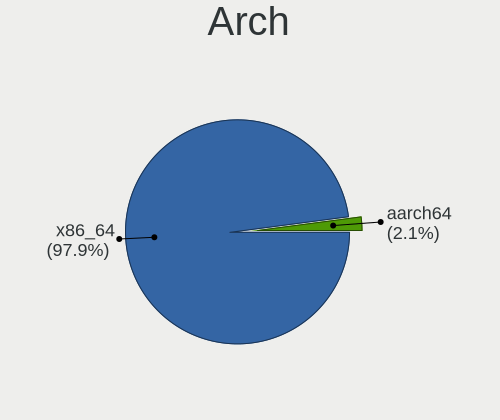

| Name    | Computers | Percent |
|---------|-----------|---------|
| x86_64  | 44        | 97.78%  |
| aarch64 | 1         | 2.22%   |

DE
--

Desktop Environment

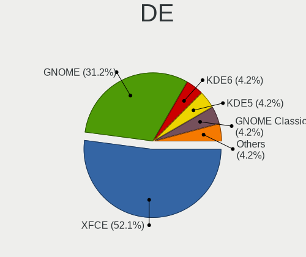

| Name             | Computers | Percent |
|------------------|-----------|---------|
| XFCE             | 22        | 48.89%  |
| GNOME            | 14        | 31.11%  |
| KDE5             | 6         | 13.33%  |
| lightdm-xsession | 1         | 2.22%   |
| GNOME Flashback  | 1         | 2.22%   |
| Cinnamon         | 1         | 2.22%   |

Display Server
--------------

X11 or Wayland

| Name    | Computers | Percent |
|---------|-----------|---------|
| X11     | 43        | 95.56%  |
| Wayland | 2         | 4.44%   |

Display Manager
---------------

SDDM, LightDM, etc.

| Name    | Computers | Percent |
|---------|-----------|---------|
| LightDM | 21        | 46.67%  |
| Unknown | 10        | 22.22%  |
| GDM3    | 9         | 20%     |
| SDDM    | 5         | 11.11%  |

OS Lang
-------

Language

| Lang  | Computers | Percent |
|-------|-----------|---------|
| en_US | 27        | 60%     |
| fr_FR | 5         | 11.11%  |
| de_DE | 3         | 6.67%   |
| en_AU | 2         | 4.44%   |
| tr_TR | 1         | 2.22%   |
| ru_RU | 1         | 2.22%   |
| pl_PL | 1         | 2.22%   |
| nb_NO | 1         | 2.22%   |
| es_ES | 1         | 2.22%   |
| en_NG | 1         | 2.22%   |
| en_GB | 1         | 2.22%   |
| en_CA | 1         | 2.22%   |

Boot Mode
---------

EFI or BIOS

| Mode | Computers | Percent |
|------|-----------|---------|
| EFI  | 31        | 68.89%  |
| BIOS | 14        | 31.11%  |

Filesystem
----------

Type of filesystem

| Type    | Computers | Percent |
|---------|-----------|---------|
| Ext4    | 43        | 95.56%  |
| Overlay | 1         | 2.22%   |
| Btrfs   | 1         | 2.22%   |

Part. scheme
------------

Scheme of partitioning

| Type    | Computers | Percent |
|---------|-----------|---------|
| GPT     | 27        | 60%     |
| Unknown | 10        | 22.22%  |
| MBR     | 8         | 17.78%  |

Dual Boot with Linux/BSD
------------------------

Hosting more than one Linux/BSD

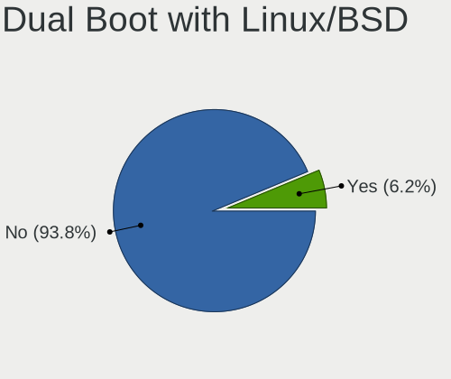

| Dual boot | Computers | Percent |
|-----------|-----------|---------|
| No        | 43        | 95.56%  |
| Yes       | 2         | 4.44%   |

Dual Boot (Win)
---------------

Hosting Linux and Windows

| Dual boot | Computers | Percent |
|-----------|-----------|---------|
| No        | 30        | 66.67%  |
| Yes       | 15        | 33.33%  |

Board
-----

Vendor
------

Motherboard manufacturer

| Name                | Computers | Percent |
|---------------------|-----------|---------|
| ASUSTek Computer    | 10        | 22.22%  |
| Lenovo              | 9         | 20%     |
| Hewlett-Packard     | 7         | 15.56%  |
| MSI                 | 5         | 11.11%  |
| Dell                | 4         | 8.89%   |
| Acer                | 2         | 4.44%   |
| Unknown             | 2         | 4.44%   |
| Sony                | 1         | 2.22%   |
| Razer               | 1         | 2.22%   |
| Protectli           | 1         | 2.22%   |
| Gigabyte Technology | 1         | 2.22%   |
| ASRock              | 1         | 2.22%   |
| ALLDOCUBE           | 1         | 2.22%   |

Model
-----

Motherboard model

| Name                                       | Computers | Percent |
|--------------------------------------------|-----------|---------|
| Unknown                                    | 2         | 4.44%   |
| Sony VPCF11JFX                             | 1         | 2.22%   |
| Razer Blade 14 - RZ09-0370                 | 1         | 2.22%   |
| Protectli FW4A                             | 1         | 2.22%   |
| MSI MS-7C37                                | 1         | 2.22%   |
| MSI MS-7A65                                | 1         | 2.22%   |
| MSI Katana GF76 12UEK                      | 1         | 2.22%   |
| MSI GP76 Leopard 10UE                      | 1         | 2.22%   |
| MSI GP62MVR 7RF                            | 1         | 2.22%   |
| Lenovo ThinkStation S20 4105L1U            | 1         | 2.22%   |
| Lenovo ThinkPad T490s 20NX0077MX           | 1         | 2.22%   |
| Lenovo ThinkPad qqqqS2E                    | 1         | 2.22%   |
| Lenovo ThinkPad L520 5017W5C               | 1         | 2.22%   |
| Lenovo Legion Y740-17IRHg 81UJ             | 1         | 2.22%   |
| Lenovo Legion 5 15IMH05H 81Y6              | 1         | 2.22%   |
| Lenovo IdeaPad C340-14IML 81TK             | 1         | 2.22%   |
| Lenovo IdeaPad 3 15ITL6 82H8               | 1         | 2.22%   |
| Lenovo IdeaPad 3 15IIL05 81WE              | 1         | 2.22%   |
| HP ProBook 6560b                           | 1         | 2.22%   |
| HP Pavilion Gaming Laptop 16-a0xxx         | 1         | 2.22%   |
| HP Notebook                                | 1         | 2.22%   |
| HP Laptop 15-bs0xx                         | 1         | 2.22%   |
| HP ENVY x360 Convertible 15m-ee0xxx        | 1         | 2.22%   |
| HP EliteBook 8460p                         | 1         | 2.22%   |
| HP 255 G6 Notebook PC                      | 1         | 2.22%   |
| Gigabyte H77M-D3H                          | 1         | 2.22%   |
| Dell XPS 13 9310 2-in-1                    | 1         | 2.22%   |
| Dell XPS 13 9305                           | 1         | 2.22%   |
| Dell Latitude 7400                         | 1         | 2.22%   |
| Dell Inspiron 15 3515                      | 1         | 2.22%   |
| ASUS ZenBook UX435EA_UX435EA               | 1         | 2.22%   |
| ASUS ZenBook S UX391UA                     | 1         | 2.22%   |
| ASUS X540LJ                                | 1         | 2.22%   |
| ASUS VivoBook_ASUSLaptop X515DA_M515DA     | 1         | 2.22%   |
| ASUS VivoBook_ASUSLaptop TP412FA_TP412FA   | 1         | 2.22%   |
| ASUS VivoBook 15_ASUS Laptop X540MA_X540MA | 1         | 2.22%   |
| ASUS ROG STRIX B365-G GAMING               | 1         | 2.22%   |
| ASUS P8H67-V                               | 1         | 2.22%   |
| ASUS GL552VW                               | 1         | 2.22%   |
| ASUS ASUS TUF Gaming F15 FX507ZE_FX507ZE   | 1         | 2.22%   |
| ASRock 4Core1600-GLAN                      | 1         | 2.22%   |
| ALLDOCUBE i1402A                           | 1         | 2.22%   |
| Acer Swift SF314-41                        | 1         | 2.22%   |
| Acer Nitro AN515-54                        | 1         | 2.22%   |

Model Family
------------

Motherboard model prefix

| Name                  | Computers | Percent |
|-----------------------|-----------|---------|
| Lenovo ThinkPad       | 3         | 6.67%   |
| Lenovo IdeaPad        | 3         | 6.67%   |
| ASUS VivoBook         | 3         | 6.67%   |
| Lenovo Legion         | 2         | 4.44%   |
| Dell XPS              | 2         | 4.44%   |
| ASUS ZenBook          | 2         | 4.44%   |
| Unknown               | 2         | 4.44%   |
| Sony VPCF11JFX        | 1         | 2.22%   |
| Razer Blade           | 1         | 2.22%   |
| Protectli FW4A        | 1         | 2.22%   |
| MSI MS-7C37           | 1         | 2.22%   |
| MSI MS-7A65           | 1         | 2.22%   |
| MSI Katana            | 1         | 2.22%   |
| MSI GP76              | 1         | 2.22%   |
| MSI GP62MVR           | 1         | 2.22%   |
| Lenovo ThinkStation   | 1         | 2.22%   |
| HP ProBook            | 1         | 2.22%   |
| HP Pavilion           | 1         | 2.22%   |
| HP Notebook           | 1         | 2.22%   |
| HP Laptop             | 1         | 2.22%   |
| HP ENVY               | 1         | 2.22%   |
| HP EliteBook          | 1         | 2.22%   |
| HP 255                | 1         | 2.22%   |
| Gigabyte H77M-D3H     | 1         | 2.22%   |
| Dell Latitude         | 1         | 2.22%   |
| Dell Inspiron         | 1         | 2.22%   |
| ASUS X540LJ           | 1         | 2.22%   |
| ASUS ROG              | 1         | 2.22%   |
| ASUS P8H67-V          | 1         | 2.22%   |
| ASUS GL552VW          | 1         | 2.22%   |
| ASUS ASUS             | 1         | 2.22%   |
| ASRock 4Core1600-GLAN | 1         | 2.22%   |
| ALLDOCUBE i1402A      | 1         | 2.22%   |
| Acer Swift            | 1         | 2.22%   |
| Acer Nitro            | 1         | 2.22%   |

MFG Year
--------

Motherboard manufacture year

| Year    | Computers | Percent |
|---------|-----------|---------|
| 2019    | 11        | 24.44%  |
| 2020    | 10        | 22.22%  |
| 2021    | 5         | 11.11%  |
| 2017    | 3         | 6.67%   |
| 2011    | 3         | 6.67%   |
| 2022    | 2         | 4.44%   |
| 2016    | 2         | 4.44%   |
| 2015    | 2         | 4.44%   |
| 2010    | 2         | 4.44%   |
| 2018    | 1         | 2.22%   |
| 2012    | 1         | 2.22%   |
| 2009    | 1         | 2.22%   |
| 2008    | 1         | 2.22%   |
| Unknown | 1         | 2.22%   |

Form Factor
-----------

Physical design of the computer

| Name           | Computers | Percent |
|----------------|-----------|---------|
| Notebook       | 32        | 71.11%  |
| Desktop        | 8         | 17.78%  |
| Convertible    | 4         | 8.89%   |
| System on chip | 1         | 2.22%   |

Secure Boot
-----------

Enabled or disabled

| State    | Computers | Percent |
|----------|-----------|---------|
| Disabled | 45        | 100%    |

Coreboot
--------

Have coreboot on board

| Used | Computers | Percent |
|------|-----------|---------|
| No   | 45        | 100%    |

RAM Size
--------

Total RAM memory

| Size in GB | Computers | Percent |
|------------|-----------|---------|
| 4.01-8.0   | 17        | 37.78%  |
| 16.01-24.0 | 12        | 26.67%  |
| 8.01-16.0  | 7         | 15.56%  |
| 32.01-64.0 | 5         | 11.11%  |
| 3.01-4.0   | 4         | 8.89%   |

RAM Used
--------

Used RAM memory

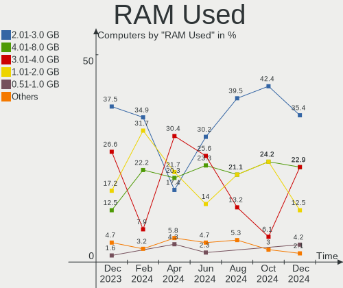

| Used GB   | Computers | Percent |
|-----------|-----------|---------|
| 2.01-3.0  | 18        | 40%     |
| 1.01-2.0  | 12        | 26.67%  |
| 3.01-4.0  | 9         | 20%     |
| 4.01-8.0  | 4         | 8.89%   |
| 8.01-16.0 | 1         | 2.22%   |
| 0.51-1.0  | 1         | 2.22%   |

Total Drives
------------

Number of drives on board

| Drives | Computers | Percent |
|--------|-----------|---------|
| 1      | 30        | 66.67%  |
| 2      | 9         | 20%     |
| 3      | 2         | 4.44%   |
| 0      | 2         | 4.44%   |
| 6      | 1         | 2.22%   |
| 4      | 1         | 2.22%   |

Has CD-ROM
----------

Has CD-ROM on board

| Presented | Computers | Percent |
|-----------|-----------|---------|
| No        | 33        | 73.33%  |
| Yes       | 12        | 26.67%  |

Has Ethernet
------------

Has Ethernet on board

| Presented | Computers | Percent |
|-----------|-----------|---------|
| Yes       | 32        | 71.11%  |
| No        | 13        | 28.89%  |

Has WiFi
--------

Has WiFi module

| Presented | Computers | Percent |
|-----------|-----------|---------|
| Yes       | 41        | 91.11%  |
| No        | 4         | 8.89%   |

Has Bluetooth
-------------

Has Bluetooth module

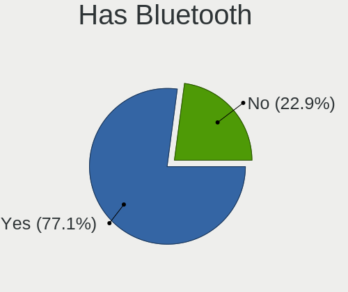

| Presented | Computers | Percent |
|-----------|-----------|---------|
| Yes       | 37        | 82.22%  |
| No        | 8         | 17.78%  |

Location
--------

Country
-------

Geographic location (country)

| Country     | Computers | Percent |
|-------------|-----------|---------|
| USA         | 7         | 15.56%  |
| Germany     | 5         | 11.11%  |
| France      | 5         | 11.11%  |
| Spain       | 2         | 4.44%   |
| Russia      | 2         | 4.44%   |
| Poland      | 2         | 4.44%   |
| Canada      | 2         | 4.44%   |
| Bulgaria    | 2         | 4.44%   |
| Australia   | 2         | 4.44%   |
| UK          | 1         | 2.22%   |
| Turkey      | 1         | 2.22%   |
| Switzerland | 1         | 2.22%   |
| Sweden      | 1         | 2.22%   |
| Pakistan    | 1         | 2.22%   |
| Norway      | 1         | 2.22%   |
| Nigeria     | 1         | 2.22%   |
| Netherlands | 1         | 2.22%   |
| Libya       | 1         | 2.22%   |
| Japan       | 1         | 2.22%   |
| Iran        | 1         | 2.22%   |
| Indonesia   | 1         | 2.22%   |
| Czechia     | 1         | 2.22%   |
| Chile       | 1         | 2.22%   |
| Brunei      | 1         | 2.22%   |
| Brazil      | 1         | 2.22%   |

City
----

Geographic location (city)

| City                 | Computers | Percent |
|----------------------|-----------|---------|
| Warsaw               | 2         | 4.44%   |
| Weyburn              | 1         | 2.22%   |
| Tyumen               | 1         | 2.22%   |
| Tripoli              | 1         | 2.22%   |
| Teresina             | 1         | 2.22%   |
| Tehran               | 1         | 2.22%   |
| Sofia                | 1         | 2.22%   |
| Rostov-on-Don        | 1         | 2.22%   |
| Pompano Beach        | 1         | 2.22%   |
| Pilsen               | 1         | 2.22%   |
| Paris                | 1         | 2.22%   |
| Palm Desert          | 1         | 2.22%   |
| Oslo                 | 1         | 2.22%   |
| Osaka                | 1         | 2.22%   |
| Odessa               | 1         | 2.22%   |
| Nancy                | 1         | 2.22%   |
| Munich               | 1         | 2.22%   |
| Multan               | 1         | 2.22%   |
| Modesto              | 1         | 2.22%   |
| Melbourne            | 1         | 2.22%   |
| Madrid               | 1         | 2.22%   |
| Lyss                 | 1         | 2.22%   |
| Lycksele             | 1         | 2.22%   |
| Les Clayes-sous-Bois | 1         | 2.22%   |
| Leipzig              | 1         | 2.22%   |
| Lansing              | 1         | 2.22%   |
| Lagos                | 1         | 2.22%   |
| Istanbul             | 1         | 2.22%   |
| Frankfurt am Main    | 1         | 2.22%   |
| Fort Lauderdale      | 1         | 2.22%   |
| El Bosque            | 1         | 2.22%   |
| Cologne              | 1         | 2.22%   |
| Châtillon           | 1         | 2.22%   |
| Castricum            | 1         | 2.22%   |
| Burlington           | 1         | 2.22%   |
| Burgas               | 1         | 2.22%   |
| Blieskastel          | 1         | 2.22%   |
| Bedee                | 1         | 2.22%   |
| Barcelona            | 1         | 2.22%   |
| Bandung              | 1         | 2.22%   |
| Bandar Seri Begawan  | 1         | 2.22%   |
| Ballarat             | 1         | 2.22%   |
| Balham               | 1         | 2.22%   |
| Arden                | 1         | 2.22%   |

Drives
------

Drive Vendor
------------

Hard drive vendors

| Vendor                  | Computers | Drives | Percent |
|-------------------------|-----------|--------|---------|
| WDC                     | 9         | 12     | 15.25%  |
| Seagate                 | 8         | 8      | 13.56%  |
| Samsung Electronics     | 7         | 8      | 11.86%  |
| Kingston                | 4         | 4      | 6.78%   |
| Sandisk                 | 3         | 3      | 5.08%   |
| Micron Technology       | 3         | 3      | 5.08%   |
| Toshiba                 | 2         | 3      | 3.39%   |
| SK Hynix                | 2         | 2      | 3.39%   |
| Union Memory (Shenzhen) | 1         | 1      | 1.69%   |
| Transcend               | 1         | 1      | 1.69%   |
| Team                    | 1         | 1      | 1.69%   |
| SSSTC                   | 1         | 1      | 1.69%   |
| PLEXTOR                 | 1         | 1      | 1.69%   |
| Patriot                 | 1         | 1      | 1.69%   |
| OCZ                     | 1         | 1      | 1.69%   |
| NE-512                  | 1         | 1      | 1.69%   |
| Lexar                   | 1         | 1      | 1.69%   |
| KIOXIA                  | 1         | 1      | 1.69%   |
| KingSpec                | 1         | 1      | 1.69%   |
| KingFast                | 1         | 1      | 1.69%   |
| Intel                   | 1         | 1      | 1.69%   |
| HS-SSD-G100N            | 1         | 1      | 1.69%   |
| HGST                    | 1         | 1      | 1.69%   |
| Fujitsu                 | 1         | 1      | 1.69%   |
| Dogfish                 | 1         | 1      | 1.69%   |
| Crucial                 | 1         | 1      | 1.69%   |
| Corsair                 | 1         | 1      | 1.69%   |
| China                   | 1         | 1      | 1.69%   |
| Unknown                 | 1         | 1      | 1.69%   |

Drive Model
-----------

Hard drive models

| Model                                        | Computers | Percent |
|----------------------------------------------|-----------|---------|
| WDC WDS500G3X0C-00SJG0 500GB                 | 1         | 1.56%   |
| WDC WDS100T2B0A-00SM50 1TB SSD               | 1         | 1.56%   |
| WDC WD7500AAVS-00D7B1 752GB                  | 1         | 1.56%   |
| WDC WD5000AAKX-083CA1 500GB                  | 1         | 1.56%   |
| WDC WD40EFAX-68JH4N0 4TB                     | 1         | 1.56%   |
| WDC WD30EZRX-00D8PB0 3TB                     | 1         | 1.56%   |
| WDC WD10EVDS-63U8B0 1TB                      | 1         | 1.56%   |
| WDC WD Elements 500GB                        | 1         | 1.56%   |
| WDC PC SN720 SDAPNTW-1T00-1006 1TB           | 1         | 1.56%   |
| WDC PC SN530 SDBPNPZ-256G-1002 256GB         | 1         | 1.56%   |
| WDC PC SN530 SDBPMPZ-512G-1101 512GB         | 1         | 1.56%   |
| WDC PC SN520 SDAPNUW-512G-1014 512GB         | 1         | 1.56%   |
| Union Memory (Shenzhen) NVMe SSD Drive 256GB | 1         | 1.56%   |
| Transcend TS120GSSD220S 120GB                | 1         | 1.56%   |
| Toshiba MQ01ABD075 752GB                     | 1         | 1.56%   |
| Toshiba HDWR160 6TB                          | 1         | 1.56%   |
| Toshiba HDWE150 5TB                          | 1         | 1.56%   |
| Team T253X2512G 512GB SSD                    | 1         | 1.56%   |
| SSSTC CL1-3D256-Q11 NVMe 256GB               | 1         | 1.56%   |
| SK Hynix SKHynix_HFS512GD9TNG-L5B0B 512GB    | 1         | 1.56%   |
| SK Hynix NVMe SSD Drive 256GB                | 1         | 1.56%   |
| Seagate ST500LT012-1DG142 500GB              | 1         | 1.56%   |
| Seagate ST4000DM005-2DP166 4TB               | 1         | 1.56%   |
| Seagate ST320LT007-9ZV142 320GB              | 1         | 1.56%   |
| Seagate ST2000DM008-2FR102 2TB               | 1         | 1.56%   |
| Seagate ST2000DM001-1CH164 2TB               | 1         | 1.56%   |
| Seagate ST1000LM049-2GH172 1TB               | 1         | 1.56%   |
| Seagate ST1000LM035-1RK172 1TB               | 1         | 1.56%   |
| Seagate Expansion 4TB                        | 1         | 1.56%   |
| SanDisk SD9SN8W256G1002 256GB SSD            | 1         | 1.56%   |
| SanDisk SD8SN8U-128G-1006 128GB SSD          | 1         | 1.56%   |
| Sandisk NVMe SSD Drive 512GB                 | 1         | 1.56%   |
| Samsung SSD 980 PRO 1TB                      | 1         | 1.56%   |
| Samsung SSD 960 EVO 250GB                    | 1         | 1.56%   |
| Samsung SSD 870 QVO 1TB                      | 1         | 1.56%   |
| Samsung SSD 840 EVO 120GB                    | 1         | 1.56%   |
| Samsung NVMe SSD Drive 1024GB                | 1         | 1.56%   |
| Samsung MZVLQ512HALU-000H1 512GB             | 1         | 1.56%   |
| Samsung MZVLQ1T0HBLB-00B00 1TB               | 1         | 1.56%   |
| Samsung MZVLB1T0HALR-000L2 1TB               | 1         | 1.56%   |
| PLEXTOR PH6-CE240 240GB SSD                  | 1         | 1.56%   |
| Patriot P200 2TB SSD                         | 1         | 1.56%   |
| OCZ VERTEX3 120GB SSD                        | 1         | 1.56%   |
| NE-512 Disk 512GB                            | 1         | 1.56%   |
| Micron MTFDHBA256TCK 256GB                   | 1         | 1.56%   |
| Micron 2450_MTFDKBA512TFK 512GB              | 1         | 1.56%   |
| Micron 2300 NVMe 512GB                       | 1         | 1.56%   |
| Lexar 128GB SSD                              | 1         | 1.56%   |
| KIOXIA KBG40ZPZ1T02 NVMe 1024GB              | 1         | 1.56%   |
| Kingston SV300S37A240G 240GB SSD             | 1         | 1.56%   |
| Kingston SV300S37A120G 120GB SSD             | 1         | 1.56%   |
| Kingston RBUSNS8180DS3128GJ 128GB SSD        | 1         | 1.56%   |
| Kingston OM8PCP31024F-AI1 1TB                | 1         | 1.56%   |
| KingSpec P3-512 512GB                        | 1         | 1.56%   |
| KingFast 512GB                               | 1         | 1.56%   |
| Intel SSDPEKNW512G8 512GB                    | 1         | 1.56%   |
| HS-SSD-G100N SSD 256G                        | 1         | 1.56%   |
| HGST HTS721010A9E630 1TB                     | 1         | 1.56%   |
| Fujitsu MHY2160BH 160GB                      | 1         | 1.56%   |
| Dogfish SSD 128GB                            | 1         | 1.56%   |

HDD Vendor
----------

Hard disk drive vendors

| Vendor  | Computers | Drives | Percent |
|---------|-----------|--------|---------|
| Seagate | 8         | 8      | 50%     |
| WDC     | 4         | 5      | 25%     |
| Toshiba | 2         | 3      | 12.5%   |
| HGST    | 1         | 1      | 6.25%   |
| Fujitsu | 1         | 1      | 6.25%   |

SSD Vendor
----------

Solid state drive vendors

| Vendor              | Computers | Drives | Percent |
|---------------------|-----------|--------|---------|
| Kingston            | 3         | 3      | 15%     |
| SanDisk             | 2         | 2      | 10%     |
| Samsung Electronics | 2         | 2      | 10%     |
| WDC                 | 1         | 1      | 5%      |
| Transcend           | 1         | 1      | 5%      |
| Team                | 1         | 1      | 5%      |
| PLEXTOR             | 1         | 1      | 5%      |
| Patriot             | 1         | 1      | 5%      |
| OCZ                 | 1         | 1      | 5%      |
| Lexar               | 1         | 1      | 5%      |
| KingSpec            | 1         | 1      | 5%      |
| HS-SSD-G100N        | 1         | 1      | 5%      |
| Dogfish             | 1         | 1      | 5%      |
| Crucial             | 1         | 1      | 5%      |
| China               | 1         | 1      | 5%      |
| Unknown             | 1         | 1      | 5%      |

Drive Kind
----------

HDD or SSD

| Kind    | Computers | Drives | Percent |
|---------|-----------|--------|---------|
| NVMe    | 22        | 24     | 40%     |
| SSD     | 17        | 20     | 30.91%  |
| HDD     | 14        | 18     | 25.45%  |
| Unknown | 2         | 2      | 3.64%   |

Drive Connector
---------------

SATA, SAS, NVMe, etc.

| Type | Computers | Drives | Percent |
|------|-----------|--------|---------|
| SATA | 26        | 38     | 50.98%  |
| NVMe | 22        | 23     | 43.14%  |
| SAS  | 3         | 3      | 5.88%   |

Drive Size
----------

Size of hard drive

| Size in TB | Computers | Drives | Percent |
|------------|-----------|--------|---------|
| 0.01-0.5   | 16        | 18     | 45.71%  |
| 0.51-1.0   | 11        | 11     | 31.43%  |
| 3.01-4.0   | 3         | 3      | 8.57%   |
| 1.01-2.0   | 3         | 3      | 8.57%   |
| 2.01-3.0   | 1         | 1      | 2.86%   |
| 4.01-10.0  | 1         | 2      | 2.86%   |

Space Total
-----------

Amount of disk space available on the file system

| Size in GB     | Computers | Percent |
|----------------|-----------|---------|
| 101-250        | 19        | 42.22%  |
| 251-500        | 11        | 24.44%  |
| 501-1000       | 5         | 11.11%  |
| More than 3000 | 2         | 4.44%   |
| 2001-3000      | 2         | 4.44%   |
| 1001-2000      | 2         | 4.44%   |
| 1-20           | 2         | 4.44%   |
| 51-100         | 1         | 2.22%   |
| Unknown        | 1         | 2.22%   |

Space Used
----------

Amount of used disk space

| Used GB        | Computers | Percent |
|----------------|-----------|---------|
| 1-20           | 17        | 37.78%  |
| 21-50          | 9         | 20%     |
| 51-100         | 6         | 13.33%  |
| 101-250        | 5         | 11.11%  |
| 1001-2000      | 2         | 4.44%   |
| 501-1000       | 2         | 4.44%   |
| More than 3000 | 1         | 2.22%   |
| 251-500        | 1         | 2.22%   |
| 2001-3000      | 1         | 2.22%   |
| Unknown        | 1         | 2.22%   |

Malfunc. Drives
---------------

Drive models with a malfunction

| Model                           | Computers | Drives | Percent |
|---------------------------------|-----------|--------|---------|
| WDC WD7500AAVS-00D7B1 752GB     | 1         | 1      | 12.5%   |
| WDC WD5000AAKX-083CA1 500GB     | 1         | 1      | 12.5%   |
| WDC WD10EVDS-63U8B0 1TB         | 1         | 1      | 12.5%   |
| Toshiba MQ01ABD075 752GB        | 1         | 1      | 12.5%   |
| Seagate ST500LT012-1DG142 500GB | 1         | 1      | 12.5%   |
| Patriot P200 2TB SSD            | 1         | 1      | 12.5%   |
| OCZ VERTEX3 120GB SSD           | 1         | 1      | 12.5%   |
| Fujitsu MHY2160BH 160GB         | 1         | 1      | 12.5%   |

Malfunc. Drive Vendor
---------------------

Vendors of faulty drives

| Vendor  | Computers | Drives | Percent |
|---------|-----------|--------|---------|
| WDC     | 3         | 3      | 37.5%   |
| Toshiba | 1         | 1      | 12.5%   |
| Seagate | 1         | 1      | 12.5%   |
| Patriot | 1         | 1      | 12.5%   |
| OCZ     | 1         | 1      | 12.5%   |
| Fujitsu | 1         | 1      | 12.5%   |

Malfunc. HDD Vendor
-------------------

Vendors of faulty HDD drives

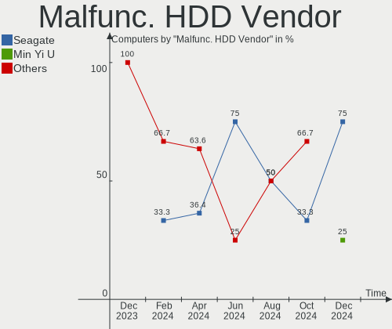

| Vendor  | Computers | Drives | Percent |
|---------|-----------|--------|---------|
| WDC     | 3         | 3      | 50%     |
| Toshiba | 1         | 1      | 16.67%  |
| Seagate | 1         | 1      | 16.67%  |
| Fujitsu | 1         | 1      | 16.67%  |

Malfunc. Drive Kind
-------------------

Kinds of faulty drives

| Kind | Computers | Drives | Percent |
|------|-----------|--------|---------|
| HDD  | 6         | 6      | 75%     |
| SSD  | 2         | 2      | 25%     |

Failed Drives
-------------

Failed drive models

Zero info for selected period =(

Failed Drive Vendor
-------------------

Failed drive vendors

Zero info for selected period =(

Drive Status
------------

Number of failed and malfunc. drives

| Status   | Computers | Drives | Percent |
|----------|-----------|--------|---------|
| Works    | 29        | 40     | 61.7%   |
| Detected | 11        | 16     | 23.4%   |
| Malfunc  | 7         | 8      | 14.89%  |

Storage controller
------------------

Storage Vendor
--------------

Storage controller vendors

| Vendor                         | Computers | Percent |
|--------------------------------|-----------|---------|
| Intel                          | 35        | 55.56%  |
| Sandisk                        | 6         | 9.52%   |
| Samsung Electronics            | 6         | 9.52%   |
| AMD                            | 4         | 6.35%   |
| Micron Technology              | 3         | 4.76%   |
| SK Hynix                       | 2         | 3.17%   |
| VIA Technologies               | 1         | 1.59%   |
| Union Memory (Shenzhen)        | 1         | 1.59%   |
| Solid State Storage Technology | 1         | 1.59%   |
| Phison Electronics             | 1         | 1.59%   |
| KIOXIA                         | 1         | 1.59%   |
| Kingston Technology Company    | 1         | 1.59%   |
| ASMedia Technology             | 1         | 1.59%   |

Storage Model
-------------

Storage controller models

| Model                                                                                   | Computers | Percent |
|-----------------------------------------------------------------------------------------|-----------|---------|
| Intel Volume Management Device NVMe RAID Controller                                     | 5         | 7.25%   |
| Intel 82801 Mobile SATA Controller [RAID mode]                                          | 4         | 5.8%    |
| AMD FCH SATA Controller [AHCI mode]                                                     | 4         | 5.8%    |
| Micron Non-Volatile memory controller                                                   | 3         | 4.35%   |
| Intel Sunrise Point-LP SATA Controller [AHCI mode]                                      | 3         | 4.35%   |
| Sandisk WD Black SN750 / PC SN730 NVMe SSD                                              | 2         | 2.9%    |
| Samsung NVMe SSD Controller SM981/PM981/PM983                                           | 2         | 2.9%    |
| Samsung NVMe SSD Controller 980                                                         | 2         | 2.9%    |
| Intel HM170/QM170 Chipset SATA Controller [AHCI Mode]                                   | 2         | 2.9%    |
| Intel Cannon Lake Mobile PCH SATA AHCI Controller                                       | 2         | 2.9%    |
| Intel 6 Series/C200 Series Chipset Family Mobile SATA Controller (IDE mode, ports 4-5)  | 2         | 2.9%    |
| Intel 6 Series/C200 Series Chipset Family Mobile SATA Controller (IDE mode, ports 0-3)  | 2         | 2.9%    |
| Intel 200 Series PCH SATA controller [AHCI mode]                                        | 2         | 2.9%    |
| VIA VT6415 PATA IDE Host Controller                                                     | 1         | 1.45%   |
| Union Memory (Shenzhen) Non-Volatile memory controller                                  | 1         | 1.45%   |
| Solid State Storage Non-Volatile memory controller                                      | 1         | 1.45%   |
| SK Hynix Non-Volatile memory controller                                                 | 1         | 1.45%   |
| SK Hynix BC501 NVMe Solid State Drive                                                   | 1         | 1.45%   |
| Sandisk WD Blue SN550 NVMe SSD                                                          | 1         | 1.45%   |
| Sandisk WD Blue SN500 / PC SN520 NVMe SSD                                               | 1         | 1.45%   |
| Sandisk WD Black 2018/SN750 / PC SN720 NVMe SSD                                         | 1         | 1.45%   |
| Sandisk Non-Volatile memory controller                                                  | 1         | 1.45%   |
| Samsung NVMe SSD Controller SM961/PM961/SM963                                           | 1         | 1.45%   |
| Samsung NVMe SSD Controller PM9A1/PM9A3/980PRO                                          | 1         | 1.45%   |
| Phison E16 PCIe4 NVMe Controller                                                        | 1         | 1.45%   |
| KIOXIA Non-Volatile memory controller                                                   | 1         | 1.45%   |
| Kingston Company Company Non-Volatile memory controller                                 | 1         | 1.45%   |
| Intel Wildcat Point-LP SATA Controller [AHCI Mode]                                      | 1         | 1.45%   |
| Intel Tiger Lake-LP SATA Controller [AHCI mode]                                         | 1         | 1.45%   |
| Intel SSD 660P Series                                                                   | 1         | 1.45%   |
| Intel NM10/ICH7 Family SATA Controller [IDE mode]                                       | 1         | 1.45%   |
| Intel Ice Lake-LP SATA Controller [AHCI mode]                                           | 1         | 1.45%   |
| Intel Comet Lake SATA AHCI Controller                                                   | 1         | 1.45%   |
| Intel Celeron/Pentium Silver Processor SATA Controller                                  | 1         | 1.45%   |
| Intel Cannon Lake PCH SATA AHCI Controller                                              | 1         | 1.45%   |
| Intel Atom Processor E3800 Series SATA AHCI Controller                                  | 1         | 1.45%   |
| Intel Alder Lake-P SATA AHCI Controller                                                 | 1         | 1.45%   |
| Intel 82801JI (ICH10 Family) SATA AHCI Controller                                       | 1         | 1.45%   |
| Intel 82801G (ICH7 Family) IDE Controller                                               | 1         | 1.45%   |
| Intel 8 Series SATA Controller 1 [AHCI mode]                                            | 1         | 1.45%   |
| Intel 7 Series/C210 Series Chipset Family 6-port SATA Controller [AHCI mode]            | 1         | 1.45%   |
| Intel 6 Series/C200 Series Chipset Family Desktop SATA Controller (IDE mode, ports 4-5) | 1         | 1.45%   |
| Intel 6 Series/C200 Series Chipset Family Desktop SATA Controller (IDE mode, ports 0-3) | 1         | 1.45%   |
| Intel 6 Series/C200 Series Chipset Family 6 port Mobile SATA AHCI Controller            | 1         | 1.45%   |
| Intel 5 Series/3400 Series Chipset 6 port SATA AHCI Controller                          | 1         | 1.45%   |
| Intel 400 Series Chipset Family SATA AHCI Controller                                    | 1         | 1.45%   |
| ASMedia ASM1062 Serial ATA Controller                                                   | 1         | 1.45%   |

Storage Kind
------------

Kind of storage controller (IDE, SATA, NVMe, SAS, ...)

| Kind | Computers | Percent |
|------|-----------|---------|
| SATA | 27        | 43.55%  |
| NVMe | 22        | 35.48%  |
| RAID | 9         | 14.52%  |
| IDE  | 4         | 6.45%   |

Processor
---------

CPU Vendor
----------

Processor vendors

| Vendor   | Computers | Percent |
|----------|-----------|---------|
| Intel    | 37        | 82.22%  |
| AMD      | 7         | 15.56%  |
| QUALCOMM | 1         | 2.22%   |

CPU Model
---------

Processor models

| Model                                         | Computers | Percent |
|-----------------------------------------------|-----------|---------|
| Intel 11th Gen Core i7-1165G7 @ 2.80GHz       | 3         | 6.67%   |
| Intel Core i7-9750H CPU @ 2.60GHz             | 2         | 4.44%   |
| Intel Core i7-10750H CPU @ 2.60GHz            | 2         | 4.44%   |
| Intel Core i5-8365U CPU @ 1.60GHz             | 2         | 4.44%   |
| Intel 12th Gen Core i7-12700H                 | 2         | 4.44%   |
| QUALCOMM AArch64 Processor rev 0 (aarch64)    | 1         | 2.22%   |
| Intel Xeon CPU W3530 @ 2.80GHz                | 1         | 2.22%   |
| Intel Core i9-8950HK CPU @ 2.90GHz            | 1         | 2.22%   |
| Intel Core i7-8550U CPU @ 1.80GHz             | 1         | 2.22%   |
| Intel Core i7-7700HQ CPU @ 2.80GHz            | 1         | 2.22%   |
| Intel Core i7-6700HQ CPU @ 2.60GHz            | 1         | 2.22%   |
| Intel Core i7-6660U CPU @ 2.40GHz             | 1         | 2.22%   |
| Intel Core i7-6500U CPU @ 2.50GHz             | 1         | 2.22%   |
| Intel Core i7-4600U CPU @ 2.10GHz             | 1         | 2.22%   |
| Intel Core i7-2620M CPU @ 2.70GHz             | 1         | 2.22%   |
| Intel Core i7-10870H CPU @ 2.20GHz            | 1         | 2.22%   |
| Intel Core i7 CPU Q 720 @ 1.60GHz             | 1         | 2.22%   |
| Intel Core i5-7400 CPU @ 3.00GHz              | 1         | 2.22%   |
| Intel Core i5-3470 CPU @ 3.20GHz              | 1         | 2.22%   |
| Intel Core i5-2410M CPU @ 2.30GHz             | 1         | 2.22%   |
| Intel Core i5-2400 CPU @ 3.10GHz              | 1         | 2.22%   |
| Intel Core i5-10210U CPU @ 1.60GHz            | 1         | 2.22%   |
| Intel Core i3-9100 CPU @ 3.60GHz              | 1         | 2.22%   |
| Intel Core i3-8145U CPU @ 2.10GHz             | 1         | 2.22%   |
| Intel Core i3-6006U CPU @ 2.00GHz             | 1         | 2.22%   |
| Intel Core i3-5005U CPU @ 2.00GHz             | 1         | 2.22%   |
| Intel Core i3-2310M CPU @ 2.10GHz             | 1         | 2.22%   |
| Intel Core i3-1005G1 CPU @ 1.20GHz            | 1         | 2.22%   |
| Intel Core 2 Duo CPU E6750 @ 2.66GHz          | 1         | 2.22%   |
| Intel Celeron N4000 CPU @ 1.10GHz             | 1         | 2.22%   |
| Intel Atom CPU E3845 @ 1.91GHz                | 1         | 2.22%   |
| Intel 11th Gen Core i3-1115G4 @ 3.00GHz       | 1         | 2.22%   |
| AMD Ryzen 9 5900HX with Radeon Graphics       | 1         | 2.22%   |
| AMD Ryzen 7 5800X 8-Core Processor            | 1         | 2.22%   |
| AMD Ryzen 7 4700U with Radeon Graphics        | 1         | 2.22%   |
| AMD Ryzen 5 3500U with Radeon Vega Mobile Gfx | 1         | 2.22%   |
| AMD Ryzen 5 3450U with Radeon Vega Mobile Gfx | 1         | 2.22%   |
| AMD E2-9000e RADEON R2, 4 COMPUTE CORES 2C+2G | 1         | 2.22%   |
| AMD Athlon 300U with Radeon Vega Mobile Gfx   | 1         | 2.22%   |

CPU Model Family
----------------

Processor model prefix

| Model            | Computers | Percent |
|------------------|-----------|---------|
| Intel Core i7    | 13        | 28.89%  |
| Intel Core i5    | 7         | 15.56%  |
| Other            | 6         | 13.33%  |
| Intel Core i3    | 6         | 13.33%  |
| AMD Ryzen 7      | 2         | 4.44%   |
| AMD Ryzen 5      | 2         | 4.44%   |
| QUALCOMM AArch64 | 1         | 2.22%   |
| Intel Xeon       | 1         | 2.22%   |
| Intel Core i9    | 1         | 2.22%   |
| Intel Core 2 Duo | 1         | 2.22%   |
| Intel Celeron    | 1         | 2.22%   |
| Intel Atom       | 1         | 2.22%   |
| AMD Ryzen 9      | 1         | 2.22%   |
| AMD E2           | 1         | 2.22%   |
| AMD Athlon       | 1         | 2.22%   |

CPU Cores
---------

Number of processor cores

| Number | Computers | Percent |
|--------|-----------|---------|
| 4      | 19        | 42.22%  |
| 2      | 15        | 33.33%  |
| 6      | 5         | 11.11%  |
| 8      | 4         | 8.89%   |
| 14     | 2         | 4.44%   |

CPU Sockets
-----------

Number of sockets

| Number | Computers | Percent |
|--------|-----------|---------|
| 1      | 44        | 97.78%  |
| 2      | 1         | 2.22%   |

CPU Threads
-----------

Threads per core (Hyper-Threading)

| Number | Computers | Percent |
|--------|-----------|---------|
| 2      | 35        | 77.78%  |
| 1      | 10        | 22.22%  |

CPU Op-Modes
------------

CPU Operation Modes (32-bit, 64-bit)

| Op mode        | Computers | Percent |
|----------------|-----------|---------|
| 32-bit, 64-bit | 45        | 100%    |

CPU Microcode
-------------

Microcode number

| Number     | Computers | Percent |
|------------|-----------|---------|
| 0x806ec    | 4         | 8.89%   |
| 0x806c1    | 4         | 8.89%   |
| 0xa0652    | 3         | 6.67%   |
| 0x906ea    | 3         | 6.67%   |
| 0x406e3    | 3         | 6.67%   |
| 0x206a7    | 3         | 6.67%   |
| 0x08108109 | 3         | 6.67%   |
| 0x906e9    | 2         | 4.44%   |
| 0x906a3    | 2         | 4.44%   |
| Unknown    | 2         | 4.44%   |
| 0x906eb    | 1         | 2.22%   |
| 0x806ea    | 1         | 2.22%   |
| 0x706e5    | 1         | 2.22%   |
| 0x706a1    | 1         | 2.22%   |
| 0x6fb      | 1         | 2.22%   |
| 0x506e3    | 1         | 2.22%   |
| 0x40651    | 1         | 2.22%   |
| 0x306d4    | 1         | 2.22%   |
| 0x306a9    | 1         | 2.22%   |
| 0x30679    | 1         | 2.22%   |
| 0x106e5    | 1         | 2.22%   |
| 0x106a5    | 1         | 2.22%   |
| 0x0a50000c | 1         | 2.22%   |
| 0x0a201016 | 1         | 2.22%   |
| 0x08600106 | 1         | 2.22%   |
| 0x06006705 | 1         | 2.22%   |

CPU Microarch
-------------

Microarchitecture

| Name             | Computers | Percent |
|------------------|-----------|---------|
| KabyLake         | 11        | 24.44%  |
| TigerLake        | 4         | 8.89%   |
| Skylake          | 4         | 8.89%   |
| SandyBridge      | 4         | 8.89%   |
| Zen+             | 3         | 6.67%   |
| CometLake        | 3         | 6.67%   |
| Zen 3            | 2         | 4.44%   |
| Nehalem          | 2         | 4.44%   |
| Alderlake Hybrid | 2         | 4.44%   |
| Zen 2            | 1         | 2.22%   |
| Silvermont       | 1         | 2.22%   |
| IvyBridge        | 1         | 2.22%   |
| IceLake          | 1         | 2.22%   |
| Haswell          | 1         | 2.22%   |
| Goldmont plus    | 1         | 2.22%   |
| Excavator        | 1         | 2.22%   |
| Core             | 1         | 2.22%   |
| Broadwell        | 1         | 2.22%   |
| Unknown          | 1         | 2.22%   |

Graphics
--------

GPU Vendor
----------

Vendors of graphics cards

| Vendor | Computers | Percent |
|--------|-----------|---------|
| Intel  | 32        | 55.17%  |
| Nvidia | 17        | 29.31%  |
| AMD    | 9         | 15.52%  |

GPU Model
---------

Graphics card models

| Model                                                                                 | Computers | Percent |
|---------------------------------------------------------------------------------------|-----------|---------|
| Intel 2nd Generation Core Processor Family Integrated Graphics Controller             | 4         | 6.9%    |
| Nvidia GA106M [GeForce RTX 3060 Mobile / Max-Q]                                       | 3         | 5.17%   |
| Intel WhiskeyLake-U GT2 [UHD Graphics 620]                                            | 3         | 5.17%   |
| Intel TigerLake-LP GT2 [Iris Xe Graphics]                                             | 3         | 5.17%   |
| Intel CometLake-H GT2 [UHD Graphics]                                                  | 3         | 5.17%   |
| Intel CoffeeLake-H GT2 [UHD Graphics 630]                                             | 3         | 5.17%   |
| AMD Picasso/Raven 2 [Radeon Vega Series / Radeon Vega Mobile Series]                  | 3         | 5.17%   |
| Nvidia TU117M [GeForce GTX 1650 Mobile / Max-Q]                                       | 2         | 3.45%   |
| Intel Skylake GT2 [HD Graphics 520]                                                   | 2         | 3.45%   |
| Intel HD Graphics 630                                                                 | 2         | 3.45%   |
| Intel Alder Lake-P Integrated Graphics Controller                                     | 2         | 3.45%   |
| Nvidia TU117M [GeForce GTX 1650 Ti Mobile]                                            | 1         | 1.72%   |
| Nvidia TU116M [GeForce GTX 1660 Ti Mobile]                                            | 1         | 1.72%   |
| Nvidia TU116 [GeForce GTX 1650 SUPER]                                                 | 1         | 1.72%   |
| Nvidia TU106BM [GeForce RTX 2060 Mobile]                                              | 1         | 1.72%   |
| Nvidia GT216M [GeForce GT 330M]                                                       | 1         | 1.72%   |
| Nvidia GP106M [GeForce GTX 1060 Mobile]                                               | 1         | 1.72%   |
| Nvidia GM204 [GeForce GTX 970]                                                        | 1         | 1.72%   |
| Nvidia GM107M [GeForce GTX 960M]                                                      | 1         | 1.72%   |
| Nvidia GK208BM [GeForce 920M]                                                         | 1         | 1.72%   |
| Nvidia GF108 [GeForce GT 430]                                                         | 1         | 1.72%   |
| Nvidia GA107M [GeForce RTX 3050 Ti Mobile]                                            | 1         | 1.72%   |
| Nvidia GA106 [GeForce RTX 3060 Lite Hash Rate]                                        | 1         | 1.72%   |
| Intel UHD Graphics 620                                                                | 1         | 1.72%   |
| Intel Tiger Lake UHD Graphics                                                         | 1         | 1.72%   |
| Intel Iris Plus Graphics G1 (Ice Lake)                                                | 1         | 1.72%   |
| Intel Iris Graphics 540                                                               | 1         | 1.72%   |
| Intel HD Graphics 5500                                                                | 1         | 1.72%   |
| Intel HD Graphics 530                                                                 | 1         | 1.72%   |
| Intel Haswell-ULT Integrated Graphics Controller                                      | 1         | 1.72%   |
| Intel GeminiLake [UHD Graphics 600]                                                   | 1         | 1.72%   |
| Intel CometLake-U GT2 [UHD Graphics]                                                  | 1         | 1.72%   |
| Intel Atom Processor Z36xxx/Z37xxx Series Graphics & Display                          | 1         | 1.72%   |
| AMD Topaz XT [Radeon R7 M260/M265 / M340/M360 / M440/M445 / 530/535 / 620/625 Mobile] | 1         | 1.72%   |
| AMD Stoney [Radeon R2/R3/R4/R5 Graphics]                                              | 1         | 1.72%   |
| AMD Renoir                                                                            | 1         | 1.72%   |
| AMD Cezanne                                                                           | 1         | 1.72%   |
| AMD Cedar [Radeon HD 5000/6000/7350/8350 Series]                                      | 1         | 1.72%   |
| AMD Caicos [Radeon HD 6450/7450/8450 / R5 230 OEM]                                    | 1         | 1.72%   |

GPU Combo
---------

Combinations of graphics cards

| Name           | Computers | Percent |
|----------------|-----------|---------|
| 1 x Intel      | 19        | 42.22%  |
| Intel + Nvidia | 11        | 24.44%  |
| 1 x AMD        | 6         | 13.33%  |
| 1 x Nvidia     | 5         | 11.11%  |
| Intel + AMD    | 2         | 4.44%   |
| Other          | 1         | 2.22%   |
| AMD + Nvidia   | 1         | 2.22%   |

GPU Driver
----------

Free vs proprietary

| Driver      | Computers | Percent |
|-------------|-----------|---------|
| Free        | 35        | 77.78%  |
| Proprietary | 7         | 15.56%  |
| Unknown     | 3         | 6.67%   |

GPU Memory
----------

Total video memory

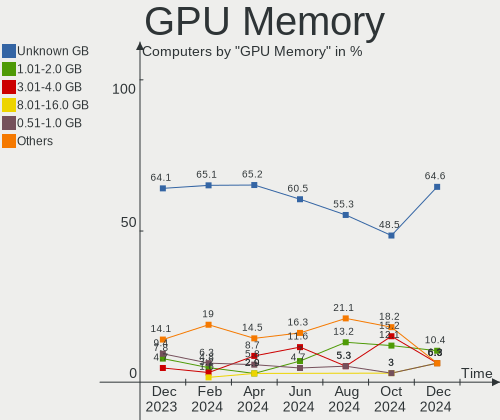

| Size in GB | Computers | Percent |
|------------|-----------|---------|
| Unknown    | 27        | 60%     |
| 1.01-2.0   | 7         | 15.56%  |
| 3.01-4.0   | 5         | 11.11%  |
| 0.51-1.0   | 2         | 4.44%   |
| 5.01-6.0   | 1         | 2.22%   |
| 2.01-3.0   | 1         | 2.22%   |
| 8.01-16.0  | 1         | 2.22%   |
| 0.01-0.5   | 1         | 2.22%   |

Monitor
-------

Monitor Vendor
--------------

Monitor vendors

| Vendor              | Computers | Percent |
|---------------------|-----------|---------|
| Chimei Innolux      | 8         | 17.78%  |
| BOE                 | 8         | 17.78%  |
| AU Optronics        | 8         | 17.78%  |
| Samsung Electronics | 4         | 8.89%   |
| Sharp               | 3         | 6.67%   |
| LG Display          | 3         | 6.67%   |
| Sony                | 2         | 4.44%   |
| Hewlett-Packard     | 2         | 4.44%   |
| YTH                 | 1         | 2.22%   |
| Toshiba             | 1         | 2.22%   |
| QCM                 | 1         | 2.22%   |
| NEC Computers       | 1         | 2.22%   |
| MSI                 | 1         | 2.22%   |
| Grundig             | 1         | 2.22%   |
| BenQ                | 1         | 2.22%   |

Monitor Model
-------------

Monitor models

| Model                                                                 | Computers | Percent |
|-----------------------------------------------------------------------|-----------|---------|
| BOE LCD Monitor BOE0687 1920x1080 344x193mm 15.5-inch                 | 2         | 4.26%   |
| YTH YTH156KC YTH1560 3840x2160 600x330mm 27.0-inch                    | 1         | 2.13%   |
| Toshiba H2C TSB8888 1280x1024 531x398mm 26.1-inch                     | 1         | 2.13%   |
| Sony TV SNY0801 1360x768                                              | 1         | 2.13%   |
| Sony Nvidia Defaul t Flat Panel MS_0025 1920x1080 360x200mm 16.2-inch | 1         | 2.13%   |
| Sharp LQ140M1JW49 SHP1523 1920x1080 309x174mm 14.0-inch               | 1         | 2.13%   |
| Sharp LCD Monitor SHP14F7 1920x1200 288x180mm 13.4-inch               | 1         | 2.13%   |
| Sharp LC-42SV49U SHP4249 1920x1080 930x523mm 42.0-inch                | 1         | 2.13%   |
| Samsung Electronics U28E590 SAM0C4E 3840x2160 610x350mm 27.7-inch     | 1         | 2.13%   |
| Samsung Electronics U28E590 SAM0C4D 3840x2160 607x345mm 27.5-inch     | 1         | 2.13%   |
| Samsung Electronics S24E450 SAM0C80 1920x1080 520x290mm 23.4-inch     | 1         | 2.13%   |
| Samsung Electronics S20B300 SAM08A8 1600x900 443x249mm 20.0-inch      | 1         | 2.13%   |
| Samsung Electronics LCD Monitor SMBX2450                              | 1         | 2.13%   |
| Samsung Electronics LCD Monitor SEC3052 1366x768 344x194mm 15.5-inch  | 1         | 2.13%   |
| QCM LCD Monitor QCM0001 1080x2280 800x450mm 36.1-inch                 | 1         | 2.13%   |
| NEC Computers LCD225WNXM NEC672E 1680x1050 433x270mm 20.1-inch        | 1         | 2.13%   |
| MSI LCD Monitor MSI3CA6 2560x1440 600x340mm 27.2-inch                 | 1         | 2.13%   |
| LG Display LCD Monitor LGD05F2 1920x1080 344x194mm 15.5-inch          | 1         | 2.13%   |
| LG Display LCD Monitor LGD05E0 1920x1080 382x215mm 17.3-inch          | 1         | 2.13%   |
| LG Display LCD Monitor LGD0563 1920x1080 344x194mm 15.5-inch          | 1         | 2.13%   |
| Hewlett-Packard LCD Monitor LA1951 3200x1080                          | 1         | 2.13%   |
| Hewlett-Packard 27f HPN354C 1920x1080 598x336mm 27.0-inch             | 1         | 2.13%   |
| Grundig WXGA GRU4448 1600x1200                                        | 1         | 2.13%   |
| Chimei Innolux LCD Monitor CMN176E 1920x1080 381x214mm 17.2-inch      | 1         | 2.13%   |
| Chimei Innolux LCD Monitor CMN1606 1920x1080 355x199mm 16.0-inch      | 1         | 2.13%   |
| Chimei Innolux LCD Monitor CMN15E7 1920x1080 344x193mm 15.5-inch      | 1         | 2.13%   |
| Chimei Innolux LCD Monitor CMN15D2 1920x1080 344x193mm 15.5-inch      | 1         | 2.13%   |
| Chimei Innolux LCD Monitor CMN15CA 1366x768 344x193mm 15.5-inch       | 1         | 2.13%   |
| Chimei Innolux LCD Monitor CMN153C 1920x1080 344x193mm 15.5-inch      | 1         | 2.13%   |
| Chimei Innolux LCD Monitor CMN14E4 1920x1080 309x173mm 13.9-inch      | 1         | 2.13%   |
| Chimei Innolux LCD Monitor CMN14D4 1920x1080 309x173mm 13.9-inch      | 1         | 2.13%   |
| BOE LCD Monitor BOE08DF 1920x1080 344x194mm 15.5-inch                 | 1         | 2.13%   |
| BOE LCD Monitor BOE08D5 1920x1080 344x194mm 15.5-inch                 | 1         | 2.13%   |
| BOE LCD Monitor BOE0868 1920x1080 309x174mm 14.0-inch                 | 1         | 2.13%   |
| BOE LCD Monitor BOE0812 1920x1080 344x194mm 15.5-inch                 | 1         | 2.13%   |
| BOE LCD Monitor BOE07E9 1920x1080 309x174mm 14.0-inch                 | 1         | 2.13%   |
| BOE LCD Monitor BOE06F2 1920x1080 309x173mm 13.9-inch                 | 1         | 2.13%   |
| BenQ GW2270 BNQ78DB 1920x1080 476x268mm 21.5-inch                     | 1         | 2.13%   |
| AU Optronics LCD Monitor AUO633D 1920x1080 309x174mm 14.0-inch        | 1         | 2.13%   |
| AU Optronics LCD Monitor AUO5B2D 1920x1080 293x162mm 13.2-inch        | 1         | 2.13%   |
| AU Optronics LCD Monitor AUO492D 1920x1080 293x165mm 13.2-inch        | 1         | 2.13%   |
| AU Optronics LCD Monitor AUO403D 1920x1080 309x174mm 14.0-inch        | 1         | 2.13%   |
| AU Optronics LCD Monitor AUO38ED 1920x1080 344x193mm 15.5-inch        | 1         | 2.13%   |
| AU Optronics LCD Monitor AUO313C 1366x768 309x173mm 13.9-inch         | 1         | 2.13%   |
| AU Optronics LCD Monitor AUO23EC 1366x768 344x193mm 15.5-inch         | 1         | 2.13%   |
| AU Optronics LCD Monitor AUO106C 1366x768 276x155mm 12.5-inch         | 1         | 2.13%   |

Monitor Resolution
------------------

Monitor screen resolution

| Resolution         | Computers | Percent |
|--------------------|-----------|---------|
| 1920x1080 (FHD)    | 29        | 63.04%  |
| 1366x768 (WXGA)    | 5         | 10.87%  |
| 3840x2160 (4K)     | 3         | 6.52%   |
| 3200x1080          | 1         | 2.17%   |
| 2800x1752          | 1         | 2.17%   |
| 2560x1440 (QHD)    | 1         | 2.17%   |
| 1920x1200 (WUXGA)  | 1         | 2.17%   |
| 1680x1050 (WSXGA+) | 1         | 2.17%   |
| 1600x900 (HD+)     | 1         | 2.17%   |
| 1360x768           | 1         | 2.17%   |
| 1280x1024 (SXGA)   | 1         | 2.17%   |
| Unknown            | 1         | 2.17%   |

Monitor Diagonal
----------------

Diagonal size in inches

| Inches  | Computers | Percent |
|---------|-----------|---------|
| 15      | 14        | 31.11%  |
| 13      | 7         | 15.56%  |
| 14      | 5         | 11.11%  |
| 27      | 4         | 8.89%   |
| 20      | 2         | 4.44%   |
| 17      | 2         | 4.44%   |
| 72      | 1         | 2.22%   |
| 66      | 1         | 2.22%   |
| 54      | 1         | 2.22%   |
| 42      | 1         | 2.22%   |
| 26      | 1         | 2.22%   |
| 24      | 1         | 2.22%   |
| 23      | 1         | 2.22%   |
| 21      | 1         | 2.22%   |
| 16      | 1         | 2.22%   |
| 12      | 1         | 2.22%   |
| Unknown | 1         | 2.22%   |

Monitor Width
-------------

Physical width

| Width in mm | Computers | Percent |
|-------------|-----------|---------|
| 301-350     | 23        | 51.11%  |
| 501-600     | 6         | 13.33%  |
| 201-300     | 4         | 8.89%   |
| 401-500     | 3         | 6.67%   |
| 351-400     | 3         | 6.67%   |
| 601-700     | 2         | 4.44%   |
| 1501-2000   | 1         | 2.22%   |
| 1001-1500   | 1         | 2.22%   |
| 901-1000    | 1         | 2.22%   |
| Unknown     | 1         | 2.22%   |

Aspect Ratio
------------

Proportional relationship between the width and the height

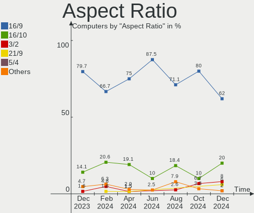

| Ratio   | Computers | Percent |
|---------|-----------|---------|
| 16/9    | 39        | 88.64%  |
| 16/10   | 2         | 4.55%   |
| 4/3     | 1         | 2.27%   |
| 0.45    | 1         | 2.27%   |
| Unknown | 1         | 2.27%   |

Monitor Area
------------

Area in inch²

| Area in inch² | Computers | Percent |
|----------------|-----------|---------|
| 101-110        | 15        | 33.33%  |
| 81-90          | 9         | 20%     |
| 301-350        | 5         | 11.11%  |
| More than 1000 | 3         | 6.67%   |
| 71-80          | 3         | 6.67%   |
| 201-250        | 3         | 6.67%   |
| 151-200        | 2         | 4.44%   |
| 121-130        | 2         | 4.44%   |
| 61-70          | 1         | 2.22%   |
| 501-1000       | 1         | 2.22%   |
| Unknown        | 1         | 2.22%   |

Pixel Density
-------------

Pixels per inch

| Density | Computers | Percent |
|---------|-----------|---------|
| 121-160 | 24        | 54.55%  |
| 51-100  | 8         | 18.18%  |
| 101-120 | 6         | 13.64%  |
| 161-240 | 3         | 6.82%   |
| 1-50    | 2         | 4.55%   |
| Unknown | 1         | 2.27%   |

Multiple Monitors
-----------------

Total monitors connected

| Total | Computers | Percent |
|-------|-----------|---------|
| 1     | 37        | 82.22%  |
| 2     | 5         | 11.11%  |
| 0     | 3         | 6.67%   |

Network
-------

Net Controller Vendor
---------------------

Controller vendors

| Vendor                          | Computers | Percent |
|---------------------------------|-----------|---------|
| Intel                           | 31        | 38.75%  |
| Realtek Semiconductor           | 22        | 27.5%   |
| Qualcomm Atheros                | 6         | 7.5%    |
| Broadcom                        | 4         | 5%      |
| Xiaomi                          | 3         | 3.75%   |
| TP-Link                         | 2         | 2.5%    |
| Ralink Technology               | 2         | 2.5%    |
| ASIX Electronics                | 2         | 2.5%    |
| Sierra Wireless                 | 1         | 1.25%   |
| Ralink                          | 1         | 1.25%   |
| Qualcomm Atheros Communications | 1         | 1.25%   |
| MediaTek                        | 1         | 1.25%   |
| Marvell Technology Group        | 1         | 1.25%   |
| Fitbit                          | 1         | 1.25%   |
| Fibocom                         | 1         | 1.25%   |
| D-Link                          | 1         | 1.25%   |

Net Controller Model
--------------------

Controller models

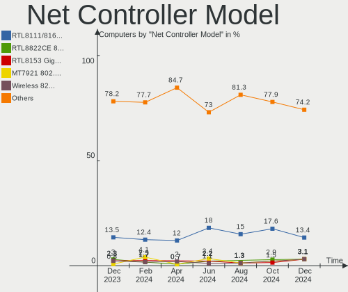

| Model                                                                                         | Computers | Percent |
|-----------------------------------------------------------------------------------------------|-----------|---------|
| Realtek RTL8111/8168/8411 PCI Express Gigabit Ethernet Controller                             | 13        | 14.77%  |
| Realtek RTL8821CE 802.11ac PCIe Wireless Network Adapter                                      | 3         | 3.41%   |
| Intel Wi-Fi 6 AX201                                                                           | 3         | 3.41%   |
| Intel Wi-Fi 6 AX200                                                                           | 3         | 3.41%   |
| Intel Comet Lake PCH CNVi WiFi                                                                | 3         | 3.41%   |
| Intel Cannon Point-LP CNVi [Wireless-AC]                                                      | 3         | 3.41%   |
| Xiaomi Mi/Redmi series (RNDIS)                                                                | 2         | 2.27%   |
| Realtek RTL8814AU 802.11a/b/g/n/ac Wireless Adapter                                           | 2         | 2.27%   |
| Realtek RTL8153 Gigabit Ethernet Adapter                                                      | 2         | 2.27%   |
| Realtek RTL810xE PCI Express Fast Ethernet controller                                         | 2         | 2.27%   |
| Ralink RT2870/RT3070 Wireless Adapter                                                         | 2         | 2.27%   |
| Intel Wireless 3165                                                                           | 2         | 2.27%   |
| Intel Ethernet Connection (2) I219-V                                                          | 2         | 2.27%   |
| Intel Dual Band Wireless-AC 3168NGW [Stone Peak]                                              | 2         | 2.27%   |
| Intel Cannon Lake PCH CNVi WiFi                                                               | 2         | 2.27%   |
| Intel Alder Lake-P PCH CNVi WiFi                                                              | 2         | 2.27%   |
| Xiaomi Mi/Redmi series (RNDIS + ADB)                                                          | 1         | 1.14%   |
| TP-Link TL-WN722N v2/v3 [Realtek RTL8188EUS]                                                  | 1         | 1.14%   |
| TP-Link Archer T2U PLUS [RTL8821AU]                                                           | 1         | 1.14%   |
| Sierra Wireless EM7345 4G LTE                                                                 | 1         | 1.14%   |
| Realtek RTL8812AU 802.11a/b/g/n/ac 2T2R DB WLAN Adapter                                       | 1         | 1.14%   |
| Realtek RTL8723DE Wireless Network Adapter                                                    | 1         | 1.14%   |
| Realtek RTL8192EU 802.11b/g/n WLAN Adapter                                                    | 1         | 1.14%   |
| Realtek Realtek 8812AU/8821AU 802.11ac WLAN Adapter [USB Wireless Dual-Band Adapter 2.4/5Ghz] | 1         | 1.14%   |
| Ralink RT5362 PCI 802.11n Wireless Network Adapter                                            | 1         | 1.14%   |
| Qualcomm Atheros QCA9565 / AR9565 Wireless Network Adapter                                    | 1         | 1.14%   |
| Qualcomm Atheros QCA6174 802.11ac Wireless Network Adapter                                    | 1         | 1.14%   |
| Qualcomm Atheros Killer E2500 Gigabit Ethernet Controller                                     | 1         | 1.14%   |
| Qualcomm Atheros AR9271 802.11n                                                               | 1         | 1.14%   |
| Qualcomm Atheros AR9287 Wireless Network Adapter (PCI-Express)                                | 1         | 1.14%   |
| Qualcomm Atheros AR8161 Gigabit Ethernet                                                      | 1         | 1.14%   |
| Qualcomm Atheros AR8151 v2.0 Gigabit Ethernet                                                 | 1         | 1.14%   |
| MediaTek MT65xx Preloader                                                                     | 1         | 1.14%   |
| Marvell Group 88E8057 PCI-E Gigabit Ethernet Controller                                       | 1         | 1.14%   |
| Intel Wireless 8265 / 8275                                                                    | 1         | 1.14%   |
| Intel Wireless 7265                                                                           | 1         | 1.14%   |
| Intel Wireless 7260                                                                           | 1         | 1.14%   |
| Intel Wi-Fi 6 AX210/AX211/AX411 160MHz                                                        | 1         | 1.14%   |
| Intel Ice Lake-LP PCH CNVi WiFi                                                               | 1         | 1.14%   |
| Intel Ethernet Controller I225-V                                                              | 1         | 1.14%   |
| Intel Ethernet Connection I218-LM                                                             | 1         | 1.14%   |
| Intel Ethernet Connection (6) I219-LM                                                         | 1         | 1.14%   |
| Intel Ethernet Connection (16) I219-LM                                                        | 1         | 1.14%   |
| Intel Comet Lake PCH-LP CNVi WiFi                                                             | 1         | 1.14%   |
| Intel 82583V Gigabit Network Connection                                                       | 1         | 1.14%   |
| Intel 82579V Gigabit Network Connection                                                       | 1         | 1.14%   |
| Intel 82579LM Gigabit Network Connection (Lewisville)                                         | 1         | 1.14%   |
| Fitbit Versa 2                                                                                | 1         | 1.14%   |
| Fibocom L830-EB-00 LTE WWAN Modem                                                             | 1         | 1.14%   |
| D-Link DUB-1312 Gigabit Ethernet Adapter                                                      | 1         | 1.14%   |
| Broadcom NetXtreme BCM5755 Gigabit Ethernet PCI Express                                       | 1         | 1.14%   |
| Broadcom BCM43224 802.11a/b/g/n                                                               | 1         | 1.14%   |
| Broadcom BCM43142 802.11b/g/n                                                                 | 1         | 1.14%   |
| Broadcom BCM4313 802.11bgn Wireless Network Adapter                                           | 1         | 1.14%   |
| ASIX AX88772B                                                                                 | 1         | 1.14%   |
| ASIX AX88772A Fast Ethernet                                                                   | 1         | 1.14%   |

Wireless Vendor
---------------

Wireless vendors

| Vendor                          | Computers | Percent |
|---------------------------------|-----------|---------|
| Intel                           | 26        | 53.06%  |
| Realtek Semiconductor           | 9         | 18.37%  |
| Qualcomm Atheros                | 3         | 6.12%   |
| Broadcom                        | 3         | 6.12%   |
| TP-Link                         | 2         | 4.08%   |
| Ralink Technology               | 2         | 4.08%   |
| Sierra Wireless                 | 1         | 2.04%   |
| Ralink                          | 1         | 2.04%   |
| Qualcomm Atheros Communications | 1         | 2.04%   |
| Fibocom                         | 1         | 2.04%   |

Wireless Model
--------------

Wireless models

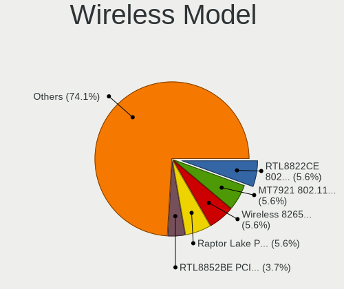

| Model                                                                                         | Computers | Percent |
|-----------------------------------------------------------------------------------------------|-----------|---------|
| Realtek RTL8821CE 802.11ac PCIe Wireless Network Adapter                                      | 3         | 6.12%   |
| Intel Wi-Fi 6 AX201                                                                           | 3         | 6.12%   |
| Intel Wi-Fi 6 AX200                                                                           | 3         | 6.12%   |
| Intel Comet Lake PCH CNVi WiFi                                                                | 3         | 6.12%   |
| Intel Cannon Point-LP CNVi [Wireless-AC]                                                      | 3         | 6.12%   |
| Realtek RTL8814AU 802.11a/b/g/n/ac Wireless Adapter                                           | 2         | 4.08%   |
| Ralink RT2870/RT3070 Wireless Adapter                                                         | 2         | 4.08%   |
| Intel Wireless 3165                                                                           | 2         | 4.08%   |
| Intel Dual Band Wireless-AC 3168NGW [Stone Peak]                                              | 2         | 4.08%   |
| Intel Cannon Lake PCH CNVi WiFi                                                               | 2         | 4.08%   |
| Intel Alder Lake-P PCH CNVi WiFi                                                              | 2         | 4.08%   |
| TP-Link TL-WN722N v2/v3 [Realtek RTL8188EUS]                                                  | 1         | 2.04%   |
| TP-Link Archer T2U PLUS [RTL8821AU]                                                           | 1         | 2.04%   |
| Sierra Wireless EM7345 4G LTE                                                                 | 1         | 2.04%   |
| Realtek RTL8812AU 802.11a/b/g/n/ac 2T2R DB WLAN Adapter                                       | 1         | 2.04%   |
| Realtek RTL8723DE Wireless Network Adapter                                                    | 1         | 2.04%   |
| Realtek RTL8192EU 802.11b/g/n WLAN Adapter                                                    | 1         | 2.04%   |
| Realtek Realtek 8812AU/8821AU 802.11ac WLAN Adapter [USB Wireless Dual-Band Adapter 2.4/5Ghz] | 1         | 2.04%   |
| Ralink RT5362 PCI 802.11n Wireless Network Adapter                                            | 1         | 2.04%   |
| Qualcomm Atheros QCA9565 / AR9565 Wireless Network Adapter                                    | 1         | 2.04%   |
| Qualcomm Atheros QCA6174 802.11ac Wireless Network Adapter                                    | 1         | 2.04%   |
| Qualcomm Atheros AR9271 802.11n                                                               | 1         | 2.04%   |
| Qualcomm Atheros AR9287 Wireless Network Adapter (PCI-Express)                                | 1         | 2.04%   |
| Intel Wireless 8265 / 8275                                                                    | 1         | 2.04%   |
| Intel Wireless 7265                                                                           | 1         | 2.04%   |
| Intel Wireless 7260                                                                           | 1         | 2.04%   |
| Intel Wi-Fi 6 AX210/AX211/AX411 160MHz                                                        | 1         | 2.04%   |
| Intel Ice Lake-LP PCH CNVi WiFi                                                               | 1         | 2.04%   |
| Intel Comet Lake PCH-LP CNVi WiFi                                                             | 1         | 2.04%   |
| Fibocom L830-EB-00 LTE WWAN Modem                                                             | 1         | 2.04%   |
| Broadcom BCM43224 802.11a/b/g/n                                                               | 1         | 2.04%   |
| Broadcom BCM43142 802.11b/g/n                                                                 | 1         | 2.04%   |
| Broadcom BCM4313 802.11bgn Wireless Network Adapter                                           | 1         | 2.04%   |

Ethernet Vendor
---------------

Ethernet vendors

| Vendor                   | Computers | Percent |
|--------------------------|-----------|---------|
| Realtek Semiconductor    | 17        | 45.95%  |
| Intel                    | 9         | 24.32%  |
| Xiaomi                   | 3         | 8.11%   |
| Qualcomm Atheros         | 3         | 8.11%   |
| ASIX Electronics         | 2         | 5.41%   |
| Marvell Technology Group | 1         | 2.7%    |
| D-Link                   | 1         | 2.7%    |
| Broadcom                 | 1         | 2.7%    |

Ethernet Model
--------------

Ethernet models

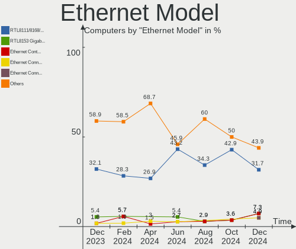

| Model                                                             | Computers | Percent |
|-------------------------------------------------------------------|-----------|---------|
| Realtek RTL8111/8168/8411 PCI Express Gigabit Ethernet Controller | 13        | 35.14%  |
| Xiaomi Mi/Redmi series (RNDIS)                                    | 2         | 5.41%   |
| Realtek RTL8153 Gigabit Ethernet Adapter                          | 2         | 5.41%   |
| Realtek RTL810xE PCI Express Fast Ethernet controller             | 2         | 5.41%   |
| Intel Ethernet Connection (2) I219-V                              | 2         | 5.41%   |
| Xiaomi Mi/Redmi series (RNDIS + ADB)                              | 1         | 2.7%    |
| Qualcomm Atheros Killer E2500 Gigabit Ethernet Controller         | 1         | 2.7%    |
| Qualcomm Atheros AR8161 Gigabit Ethernet                          | 1         | 2.7%    |
| Qualcomm Atheros AR8151 v2.0 Gigabit Ethernet                     | 1         | 2.7%    |
| Marvell Group 88E8057 PCI-E Gigabit Ethernet Controller           | 1         | 2.7%    |
| Intel Ethernet Controller I225-V                                  | 1         | 2.7%    |
| Intel Ethernet Connection I218-LM                                 | 1         | 2.7%    |
| Intel Ethernet Connection (6) I219-LM                             | 1         | 2.7%    |
| Intel Ethernet Connection (16) I219-LM                            | 1         | 2.7%    |
| Intel 82583V Gigabit Network Connection                           | 1         | 2.7%    |
| Intel 82579V Gigabit Network Connection                           | 1         | 2.7%    |
| Intel 82579LM Gigabit Network Connection (Lewisville)             | 1         | 2.7%    |
| D-Link DUB-1312 Gigabit Ethernet Adapter                          | 1         | 2.7%    |
| Broadcom NetXtreme BCM5755 Gigabit Ethernet PCI Express           | 1         | 2.7%    |
| ASIX AX88772B                                                     | 1         | 2.7%    |
| ASIX AX88772A Fast Ethernet                                       | 1         | 2.7%    |

Net Controller Kind
-------------------

Ethernet, WiFi or modem

| Kind     | Computers | Percent |
|----------|-----------|---------|
| WiFi     | 41        | 54.67%  |
| Ethernet | 32        | 42.67%  |
| Modem    | 2         | 2.67%   |

Used Controller
---------------

Currently used network controller

| Kind     | Computers | Percent |
|----------|-----------|---------|
| WiFi     | 27        | 64.29%  |
| Ethernet | 15        | 35.71%  |

NICs
----

Total network controllers on board

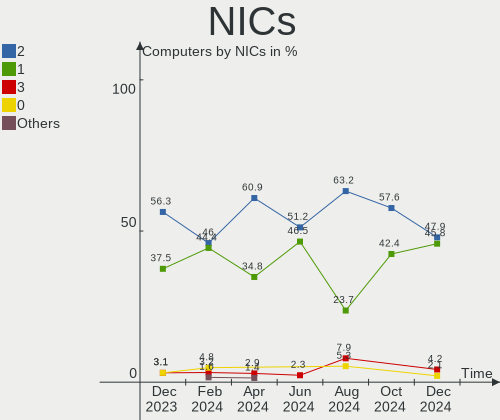

| Total | Computers | Percent |
|-------|-----------|---------|
| 2     | 22        | 48.89%  |
| 1     | 21        | 46.67%  |
| 4     | 1         | 2.22%   |
| 0     | 1         | 2.22%   |

IPv6
----

IPv6 vs IPv4

| Used | Computers | Percent |
|------|-----------|---------|
| No   | 32        | 71.11%  |
| Yes  | 13        | 28.89%  |

Bluetooth
---------

Bluetooth Vendor
----------------

Controller vendors

| Vendor                | Computers | Percent |
|-----------------------|-----------|---------|
| Intel                 | 26        | 70.27%  |
| Realtek Semiconductor | 3         | 8.11%   |
| IMC Networks          | 3         | 8.11%   |
| Lite-On Technology    | 1         | 2.7%    |
| Hewlett-Packard       | 1         | 2.7%    |
| Foxconn / Hon Hai     | 1         | 2.7%    |
| Edimax Technology     | 1         | 2.7%    |
| Broadcom              | 1         | 2.7%    |

Bluetooth Model
---------------

Controller models

| Model                                                                               | Computers | Percent |
|-------------------------------------------------------------------------------------|-----------|---------|
| Intel Bluetooth 9460/9560 Jefferson Peak (JfP)                                      | 8         | 21.62%  |
| Intel AX201 Bluetooth                                                               | 7         | 18.92%  |
| Intel Bluetooth wireless interface                                                  | 5         | 13.51%  |
| Intel AX200 Bluetooth                                                               | 3         | 8.11%   |
| Realtek Bluetooth Radio                                                             | 2         | 5.41%   |
| Intel Wireless-AC 3168 Bluetooth                                                    | 2         | 5.41%   |
| IMC Networks Bluetooth Radio                                                        | 2         | 5.41%   |
| Realtek  Bluetooth 4.2 Adapter                                                      | 1         | 2.7%    |
| Lite-On Bluetooth Device                                                            | 1         | 2.7%    |
| Intel AX210 Bluetooth                                                               | 1         | 2.7%    |
| IMC Networks Bluetooth Device                                                       | 1         | 2.7%    |
| HP Broadcom 2070 Bluetooth Combo                                                    | 1         | 2.7%    |
| Foxconn / Hon Hai Foxconn T77H114 BCM2070 [Single-Chip Bluetooth 2.1 + EDR Adapter] | 1         | 2.7%    |
| Edimax Bluetooth Device                                                             | 1         | 2.7%    |
| Broadcom BCM43142A0 Bluetooth 4.0                                                   | 1         | 2.7%    |

Sound
-----

Sound Vendor
------------

Sound card vendors

| Vendor                   | Computers | Percent |
|--------------------------|-----------|---------|
| Intel                    | 35        | 53.85%  |
| Nvidia                   | 16        | 24.62%  |
| AMD                      | 9         | 13.85%  |
| Realtek Semiconductor    | 2         | 3.08%   |
| SteelSeries ApS          | 1         | 1.54%   |
| Micro Star International | 1         | 1.54%   |
| ASUSTek Computer         | 1         | 1.54%   |

Sound Model
-----------

Sound card models

| Model                                                                             | Computers | Percent |
|-----------------------------------------------------------------------------------|-----------|---------|
| Nvidia Audio device                                                               | 5         | 6.94%   |
| AMD Family 17h/19h HD Audio Controller                                            | 5         | 6.94%   |
| Intel Tiger Lake-LP Smart Sound Technology Audio Controller                       | 4         | 5.56%   |
| Intel Sunrise Point-LP HD Audio                                                   | 4         | 5.56%   |
| Intel 6 Series/C200 Series Chipset Family High Definition Audio Controller        | 4         | 5.56%   |
| Nvidia TU107 GeForce GTX 1650 High Definition Audio Controller                    | 3         | 4.17%   |
| Intel Comet Lake PCH cAVS                                                         | 3         | 4.17%   |
| Intel Cannon Point-LP High Definition Audio Controller                            | 3         | 4.17%   |
| Intel Cannon Lake PCH cAVS                                                        | 3         | 4.17%   |
| AMD Raven/Raven2/Fenghuang HDMI/DP Audio Controller                               | 3         | 4.17%   |
| Realtek Semiconductor USB Audio                                                   | 2         | 2.78%   |
| Nvidia TU116 High Definition Audio Controller                                     | 2         | 2.78%   |
| Intel Alder Lake PCH-P High Definition Audio Controller                           | 2         | 2.78%   |
| Intel 200 Series PCH HD Audio                                                     | 2         | 2.78%   |
| SteelSeries ApS SteelSeries Arctis 5                                              | 1         | 1.39%   |
| Nvidia TU106 High Definition Audio Controller                                     | 1         | 1.39%   |
| Nvidia GT216 HDMI Audio Controller                                                | 1         | 1.39%   |
| Nvidia GP106 High Definition Audio Controller                                     | 1         | 1.39%   |
| Nvidia GM204 High Definition Audio Controller                                     | 1         | 1.39%   |
| Nvidia GK208 HDMI/DP Audio Controller                                             | 1         | 1.39%   |
| Nvidia GF108 High Definition Audio Controller                                     | 1         | 1.39%   |
| Micro Star International MSI GH50 Gaming Headset                                  | 1         | 1.39%   |
| Intel Wildcat Point-LP High Definition Audio Controller                           | 1         | 1.39%   |
| Intel NM10/ICH7 Family High Definition Audio Controller                           | 1         | 1.39%   |
| Intel Ice Lake-LP Smart Sound Technology Audio Controller                         | 1         | 1.39%   |
| Intel Haswell-ULT HD Audio Controller                                             | 1         | 1.39%   |
| Intel Comet Lake PCH-LP cAVS                                                      | 1         | 1.39%   |
| Intel CM238 HD Audio Controller                                                   | 1         | 1.39%   |
| Intel Celeron/Pentium Silver Processor High Definition Audio                      | 1         | 1.39%   |
| Intel Broadwell-U Audio Controller                                                | 1         | 1.39%   |
| Intel 82801JI (ICH10 Family) HD Audio Controller                                  | 1         | 1.39%   |
| Intel 8 Series HD Audio Controller                                                | 1         | 1.39%   |
| Intel 5 Series/3400 Series Chipset High Definition Audio                          | 1         | 1.39%   |
| Intel 100 Series/C230 Series Chipset Family HD Audio Controller                   | 1         | 1.39%   |
| ASUSTek Computer C-Media Audio                                                    | 1         | 1.39%   |
| AMD Starship/Matisse HD Audio Controller                                          | 1         | 1.39%   |
| AMD Renoir Radeon High Definition Audio Controller                                | 1         | 1.39%   |
| AMD High Definition Audio Controller                                              | 1         | 1.39%   |
| AMD Family 15h (Models 60h-6fh) Audio Controller                                  | 1         | 1.39%   |
| AMD Cedar HDMI Audio [Radeon HD 5400/6300/7300 Series]                            | 1         | 1.39%   |
| AMD Caicos HDMI Audio [Radeon HD 6450 / 7450/8450/8490 OEM / R5 230/235/235X OEM] | 1         | 1.39%   |

Memory
------

Memory Vendor
-------------

Memory module vendors

| Vendor              | Computers | Percent |
|---------------------|-----------|---------|
| Samsung Electronics | 13        | 32.5%   |
| Unknown             | 6         | 15%     |
| Micron Technology   | 5         | 12.5%   |
| SK Hynix            | 4         | 10%     |
| Kingston            | 4         | 10%     |
| Crucial             | 4         | 10%     |
| Ramaxel Technology  | 1         | 2.5%    |
| PNY                 | 1         | 2.5%    |
| Nanya Technology    | 1         | 2.5%    |
| Corsair             | 1         | 2.5%    |

Memory Model
------------

Memory module models

| Model                                                         | Computers | Percent |
|---------------------------------------------------------------|-----------|---------|
| Samsung RAM M471A1K43DB1-CWE 8GB SODIMM DDR4 3200MT/s         | 2         | 4.44%   |
| Micron RAM 4ATF51264HZ-3G2J1 4GB SODIMM DDR4 3200MT/s         | 2         | 4.44%   |
| Unknown RAM Module 4GB SODIMM DDR3                            | 1         | 2.22%   |
| Unknown RAM Module 4GB Row Of Chips LPDDR4 4267MT/s           | 1         | 2.22%   |
| Unknown RAM Module 4GB DIMM DDR3 1066MT/s                     | 1         | 2.22%   |
| Unknown RAM Module 2GB SODIMM DDR3                            | 1         | 2.22%   |
| Unknown RAM Module 2GB Row Of Chips LPDDR4 4267MT/s           | 1         | 2.22%   |
| Unknown RAM Module 2GB DIMM SDRAM                             | 1         | 2.22%   |
| Unknown RAM Module 1GB SODIMM LPDDR4 2400MT/s                 | 1         | 2.22%   |
| Unknown RAM Module 1GB DIMM SDRAM                             | 1         | 2.22%   |
| SK Hynix RAM HMT351S6CFR8C-PB 4GB SODIMM DDR3 1600MT/s        | 1         | 2.22%   |
| SK Hynix RAM HMA851S6JJR6N-VK 4GB SODIMM DDR4 2667MT/s        | 1         | 2.22%   |
| SK Hynix RAM HMA82GS6DJR8N-VK 16384MB SODIMM DDR4 2667MT/s    | 1         | 2.22%   |
| SK Hynix RAM HMA81GS6JJR8N-VK 8GB SODIMM DDR4 2667MT/s        | 1         | 2.22%   |
| Samsung RAM M471B5273DH0-YH9 4GB SODIMM DDR3 1600MT/s         | 1         | 2.22%   |
| Samsung RAM M471B5273DH0-CH9 4GB SODIMM DDR3 1334MT/s         | 1         | 2.22%   |
| Samsung RAM M471A5644EB0-CPB 2GB SODIMM DDR4 2133MT/s         | 1         | 2.22%   |
| Samsung RAM M471A5244CB0-CWE 4GB SODIMM DDR4 3200MT/s         | 1         | 2.22%   |
| Samsung RAM M471A5244CB0-CTD 4GB SODIMM DDR4 3266MT/s         | 1         | 2.22%   |
| Samsung RAM M471A5143DB0-CPB 4GB SODIMM DDR4 2133MT/s         | 1         | 2.22%   |
| Samsung RAM M471A1K43EB1-CWE 8GB SODIMM DDR4 3200MT/s         | 1         | 2.22%   |
| Samsung RAM M471A1K43BB1-CTD 8GB SODIMM DDR4 2667MT/s         | 1         | 2.22%   |
| Samsung RAM M471A1K43BB1-CRC 8GB SODIMM DDR4 2667MT/s         | 1         | 2.22%   |
| Samsung RAM M471A1G44AB0-CWE 8GB SODIMM DDR4 3200MT/s         | 1         | 2.22%   |
| Samsung RAM M471A1G43DB0-CPB 8GB SODIMM DDR4 2400MT/s         | 1         | 2.22%   |
| Samsung RAM M425R1GB4BB0-CQKOL 8GB SODIMM 4800MT/s            | 1         | 2.22%   |
| Samsung RAM K4E6E304EB-EGCG 4GB Row Of Chips LPDDR3 2133MT/s  | 1         | 2.22%   |
| Ramaxel RAM RMSA3260ME78HAF-2666 8GB SODIMM DDR4 2667MT/s     | 1         | 2.22%   |
| PNY RAM Module 8GB DIMM DDR3 1600MT/s                         | 1         | 2.22%   |
| Nanya RAM M2S8G64CC8HB5N-DI 8GB SODIMM DDR3 1600MT/s          | 1         | 2.22%   |
| Micron RAM Module 4GB Row Of Chips LPDDR3 1867MT/s            | 1         | 2.22%   |
| Micron RAM 8KTF51264HZ-1G9P2 4GB SODIMM DDR3 1867MT/s         | 1         | 2.22%   |
| Micron RAM 53E512M32D2NP-046 1GB Row Of Chips LPDDR4 4267MT/s | 1         | 2.22%   |
| Micron RAM 4ATF51264HZ-3G2J1 4GB Row Of Chips DDR4 3200MT/s   | 1         | 2.22%   |
| Kingston RAM MSI24D4S7D8MB-8 8GB SODIMM DDR4 2400MT/s         | 1         | 2.22%   |
| Kingston RAM KHX3200C16D4/8GX 8192MB DIMM DDR4 3533MT/s       | 1         | 2.22%   |
| Kingston RAM KHX2133C13S4/8G 8GB SODIMM DDR4 2133MT/s         | 1         | 2.22%   |
| Kingston RAM HP24D4S7S8MBP-8 8GB SODIMM DDR4 2400MT/s         | 1         | 2.22%   |
| Crucial RAM CT8G4SFS824A.C8FDD1 8GB SODIMM DDR4 2400MT/s      | 1         | 2.22%   |
| Crucial RAM CT8G4DFS8213.M8FB 8GB DIMM DDR4 2133MT/s          | 1         | 2.22%   |
| Crucial RAM CT4G4SFS824A.C8FF 4GB SODIMM DDR4 2400MT/s        | 1         | 2.22%   |
| Crucial RAM CT16G4SFD8266.M16FJ 16GB SODIMM DDR4 2667MT/s     | 1         | 2.22%   |
| Corsair RAM CMK32GX4M2B3000C15 16GB DIMM DDR4 3000MT/s        | 1         | 2.22%   |

Memory Kind
-----------

Memory module kinds

| Kind    | Computers | Percent |
|---------|-----------|---------|
| DDR4    | 20        | 57.14%  |
| DDR3    | 7         | 20%     |
| LPDDR4  | 4         | 11.43%  |
| LPDDR3  | 2         | 5.71%   |
| SDRAM   | 1         | 2.86%   |
| Unknown | 1         | 2.86%   |

Memory Form Factor
------------------

Physical design of the memory module

| Name         | Computers | Percent |
|--------------|-----------|---------|
| SODIMM       | 24        | 66.67%  |
| Row Of Chips | 6         | 16.67%  |
| DIMM         | 6         | 16.67%  |

Memory Size
-----------

Memory module size

| Size  | Computers | Percent |
|-------|-----------|---------|
| 8192  | 15        | 39.47%  |
| 4096  | 14        | 36.84%  |
| 2048  | 4         | 10.53%  |
| 16384 | 3         | 7.89%   |
| 1024  | 2         | 5.26%   |

Memory Speed
------------

Memory module speed

| Speed   | Computers | Percent |
|---------|-----------|---------|
| 3200    | 7         | 17.95%  |
| 2667    | 6         | 15.38%  |
| 2400    | 5         | 12.82%  |
| 2133    | 4         | 10.26%  |
| 1600    | 4         | 10.26%  |
| 4267    | 3         | 7.69%   |
| 1867    | 2         | 5.13%   |
| Unknown | 2         | 5.13%   |
| 4800    | 1         | 2.56%   |
| 3533    | 1         | 2.56%   |
| 3266    | 1         | 2.56%   |
| 3000    | 1         | 2.56%   |
| 1334    | 1         | 2.56%   |
| 1066    | 1         | 2.56%   |

Printers & scanners
-------------------

Printer Vendor
--------------

Printer device vendors

Zero info for selected period =(

Printer Model
-------------

Printer device models

Zero info for selected period =(

Scanner Vendor
--------------

Scanner device vendors

Zero info for selected period =(

Scanner Model
-------------

Scanner device models

Zero info for selected period =(

Camera
------

Camera Vendor
-------------

Camera device vendors

| Vendor                        | Computers | Percent |
|-------------------------------|-----------|---------|
| Microdia                      | 5         | 15.63%  |
| IMC Networks                  | 5         | 15.63%  |
| Chicony Electronics           | 5         | 15.63%  |
| Realtek Semiconductor         | 4         | 12.5%   |
| Acer                          | 3         | 9.38%   |
| Syntek                        | 2         | 6.25%   |
| Quanta                        | 2         | 6.25%   |
| Unknown                       | 1         | 3.13%   |
| Suyin                         | 1         | 3.13%   |
| Sunplus Innovation Technology | 1         | 3.13%   |
| Sonix Technology              | 1         | 3.13%   |
| Microsoft                     | 1         | 3.13%   |
| Jieli Technology              | 1         | 3.13%   |

Camera Model
------------

Camera device models

| Model                                | Computers | Percent |
|--------------------------------------|-----------|---------|
| Microdia Integrated_Webcam_HD        | 3         | 9.38%   |
| Chicony Integrated Camera            | 3         | 9.38%   |
| Syntek Integrated Camera             | 2         | 6.25%   |
| Realtek HP Webcam                    | 2         | 6.25%   |
| IMC Networks USB2.0 HD UVC WebCam    | 2         | 6.25%   |
| IMC Networks Integrated Camera       | 2         | 6.25%   |
| Acer HD Webcam                       | 2         | 6.25%   |
| Unknown HuddleCamHD                  | 1         | 3.13%   |
| Suyin HP TrueVision HD               | 1         | 3.13%   |
| Sunplus HP Universal Camera          | 1         | 3.13%   |
| Sonix USB2.0 HD UVC WebCam           | 1         | 3.13%   |
| Realtek USB2.0 VGA UVC WebCam        | 1         | 3.13%   |
| Realtek Integrated_Webcam_HD         | 1         | 3.13%   |
| Quanta USB2.0 VGA UVC WebCam         | 1         | 3.13%   |
| Quanta HD Webcam                     | 1         | 3.13%   |
| Microsoft Microsoft LifeCam Studio | 1         | 3.13%   |
| Microdia Webcam Vitade AF            | 1         | 3.13%   |
| Microdia USB 2.0 Camera              | 1         | 3.13%   |
| Jieli USB PHY 2.0                    | 1         | 3.13%   |
| IMC Networks HP TrueVision HD Camera | 1         | 3.13%   |
| Chicony USB2.0 VGA UVC WebCam        | 1         | 3.13%   |
| Chicony Integrated HP HD Webcam      | 1         | 3.13%   |
| Acer SunplusIT Integrated Camera     | 1         | 3.13%   |

Security
--------

Fingerprint Vendor
------------------

Fingerprint sensor vendors

| Vendor                     | Computers | Percent |
|----------------------------|-----------|---------|
| Shenzhen Goodix Technology | 4         | 57.14%  |
| Validity Sensors           | 1         | 14.29%  |
| Synaptics                  | 1         | 14.29%  |
| LighTuning Technology      | 1         | 14.29%  |

Fingerprint Model
-----------------

Fingerprint sensor models

| Model                                             | Computers | Percent |
|---------------------------------------------------|-----------|---------|
| Shenzhen Goodix  FingerPrint Device               | 2         | 28.57%  |
| Shenzhen Goodix Fingerprint Reader                | 2         | 28.57%  |
| Validity Sensors VFS471 Fingerprint Reader        | 1         | 14.29%  |
| Synaptics Prometheus MIS Touch Fingerprint Reader | 1         | 14.29%  |
| LighTuning EgisTec Touch Fingerprint Sensor       | 1         | 14.29%  |

Chipcard Vendor
---------------

Chipcard module vendors

| Vendor      | Computers | Percent |
|-------------|-----------|---------|
| Alcor Micro | 2         | 66.67%  |
| Broadcom    | 1         | 33.33%  |

Chipcard Model
--------------

Chipcard module models

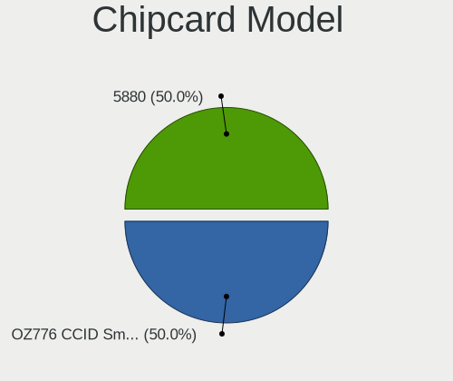

| Model                               | Computers | Percent |
|-------------------------------------|-----------|---------|
| Alcor Micro AU9540 Smartcard Reader | 2         | 66.67%  |
| Broadcom 58200                      | 1         | 33.33%  |

Unsupported
-----------

Unsupported Devices
-------------------

Total unsupported devices on board

| Total | Computers | Percent |
|-------|-----------|---------|
| 0     | 28        | 62.22%  |
| 1     | 16        | 35.56%  |
| 2     | 1         | 2.22%   |

Unsupported Device Types
------------------------

Types of unsupported devices

| Type               | Computers | Percent |
|--------------------|-----------|---------|
| Graphics card      | 6         | 33.33%  |
| Fingerprint reader | 5         | 27.78%  |
| Chipcard           | 3         | 16.67%  |
| Wireless           | 1         | 5.56%   |
| Net/wireless       | 1         | 5.56%   |
| Camera             | 1         | 5.56%   |
| Bluetooth          | 1         | 5.56%   |

