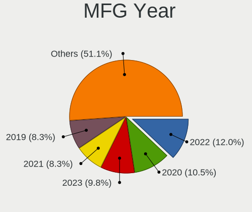
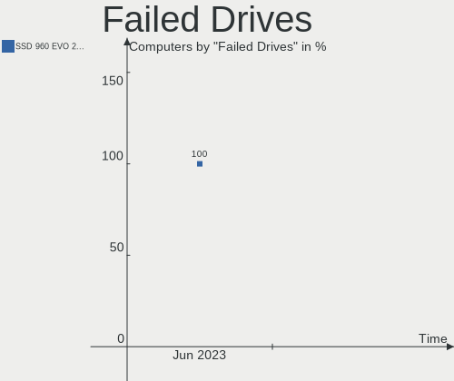
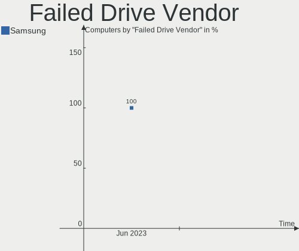
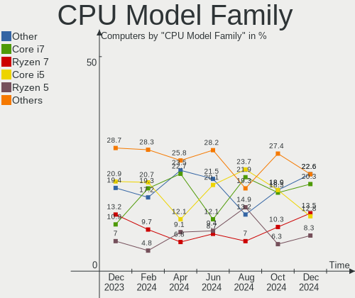
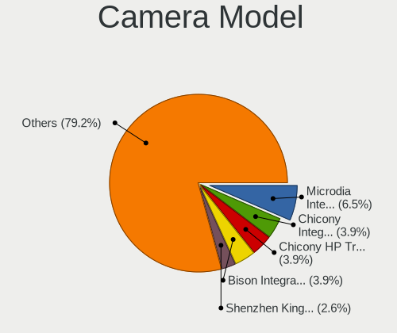

Kubuntu - Hardware Trends
-------------------------

A project to identify most popular hardware characteristics and track their change
over time based on data collected by Linux users at https://Linux-Hardware.org.

Anyone can contribute to this report by the [hw-probe](https://github.com/linuxhw/hw-probe) tool:

    sudo -E hw-probe -all -upload

This is a report for all computer types. See also reports for [desktops](/Dist/Kubuntu/Desktop/README.md) and [notebooks](/Dist/Kubuntu/Notebook/README.md).

This report is for one last month. Overall report since the beginning of time: [TestDays](https://github.com/linuxhw/TestDays)

Period: Jun, 2023.

Contents
--------

* [ System ](#system)
  - [ OS                       ](#os)
  - [ OS Family                ](#os-family)
  - [ Kernel                   ](#kernel)
  - [ Kernel Family            ](#kernel-family)
  - [ Kernel Major Ver.        ](#kernel-major-ver)
  - [ Arch                     ](#arch)
  - [ DE                       ](#de)
  - [ Display Server           ](#display-server)
  - [ Display Manager          ](#display-manager)
  - [ OS Lang                  ](#os-lang)
  - [ Boot Mode                ](#boot-mode)
  - [ Filesystem               ](#filesystem)
  - [ Part. scheme             ](#part-scheme)
  - [ Dual Boot with Linux/BSD ](#dual-boot-with-linuxbsd)
  - [ Dual Boot (Win)          ](#dual-boot-win)

* [ Board ](#board)
  - [ Vendor                   ](#vendor)
  - [ Model                    ](#model)
  - [ Model Family             ](#model-family)
  - [ MFG Year                 ](#mfg-year)
  - [ Form Factor              ](#form-factor)
  - [ Secure Boot              ](#secure-boot)
  - [ Coreboot                 ](#coreboot)
  - [ RAM Size                 ](#ram-size)
  - [ RAM Used                 ](#ram-used)
  - [ Total Drives             ](#total-drives)
  - [ Has CD-ROM               ](#has-cd-rom)
  - [ Has Ethernet             ](#has-ethernet)
  - [ Has WiFi                 ](#has-wifi)
  - [ Has Bluetooth            ](#has-bluetooth)

* [ Location ](#location)
  - [ Country                  ](#country)
  - [ City                     ](#city)

* [ Drives ](#drives)
  - [ Drive Vendor             ](#drive-vendor)
  - [ Drive Model              ](#drive-model)
  - [ HDD Vendor               ](#hdd-vendor)
  - [ SSD Vendor               ](#ssd-vendor)
  - [ Drive Kind               ](#drive-kind)
  - [ Drive Connector          ](#drive-connector)
  - [ Drive Size               ](#drive-size)
  - [ Space Total              ](#space-total)
  - [ Space Used               ](#space-used)
  - [ Malfunc. Drives          ](#malfunc-drives)
  - [ Malfunc. Drive Vendor    ](#malfunc-drive-vendor)
  - [ Malfunc. HDD Vendor      ](#malfunc-hdd-vendor)
  - [ Malfunc. Drive Kind      ](#malfunc-drive-kind)
  - [ Failed Drives            ](#failed-drives)
  - [ Failed Drive Vendor      ](#failed-drive-vendor)
  - [ Drive Status             ](#drive-status)

* [ Storage controller ](#storage-controller)
  - [ Storage Vendor           ](#storage-vendor)
  - [ Storage Model            ](#storage-model)
  - [ Storage Kind             ](#storage-kind)

* [ Processor ](#processor)
  - [ CPU Vendor               ](#cpu-vendor)
  - [ CPU Model                ](#cpu-model)
  - [ CPU Model Family         ](#cpu-model-family)
  - [ CPU Cores                ](#cpu-cores)
  - [ CPU Sockets              ](#cpu-sockets)
  - [ CPU Threads              ](#cpu-threads)
  - [ CPU Op-Modes             ](#cpu-op-modes)
  - [ CPU Microcode            ](#cpu-microcode)
  - [ CPU Microarch            ](#cpu-microarch)

* [ Graphics ](#graphics)
  - [ GPU Vendor               ](#gpu-vendor)
  - [ GPU Model                ](#gpu-model)
  - [ GPU Combo                ](#gpu-combo)
  - [ GPU Driver               ](#gpu-driver)
  - [ GPU Memory               ](#gpu-memory)

* [ Monitor ](#monitor)
  - [ Monitor Vendor           ](#monitor-vendor)
  - [ Monitor Model            ](#monitor-model)
  - [ Monitor Resolution       ](#monitor-resolution)
  - [ Monitor Diagonal         ](#monitor-diagonal)
  - [ Monitor Width            ](#monitor-width)
  - [ Aspect Ratio             ](#aspect-ratio)
  - [ Monitor Area             ](#monitor-area)
  - [ Pixel Density            ](#pixel-density)
  - [ Multiple Monitors        ](#multiple-monitors)

* [ Network ](#network)
  - [ Net Controller Vendor    ](#net-controller-vendor)
  - [ Net Controller Model     ](#net-controller-model)
  - [ Wireless Vendor          ](#wireless-vendor)
  - [ Wireless Model           ](#wireless-model)
  - [ Ethernet Vendor          ](#ethernet-vendor)
  - [ Ethernet Model           ](#ethernet-model)
  - [ Net Controller Kind      ](#net-controller-kind)
  - [ Used Controller          ](#used-controller)
  - [ NICs                     ](#nics)
  - [ IPv6                     ](#ipv6)

* [ Bluetooth ](#bluetooth)
  - [ Bluetooth Vendor         ](#bluetooth-vendor)
  - [ Bluetooth Model          ](#bluetooth-model)

* [ Sound ](#sound)
  - [ Sound Vendor             ](#sound-vendor)
  - [ Sound Model              ](#sound-model)

* [ Memory ](#memory)
  - [ Memory Vendor            ](#memory-vendor)
  - [ Memory Model             ](#memory-model)
  - [ Memory Kind              ](#memory-kind)
  - [ Memory Form Factor       ](#memory-form-factor)
  - [ Memory Size              ](#memory-size)
  - [ Memory Speed             ](#memory-speed)

* [ Printers & scanners ](#printers--scanners)
  - [ Printer Vendor           ](#printer-vendor)
  - [ Printer Model            ](#printer-model)
  - [ Scanner Vendor           ](#scanner-vendor)
  - [ Scanner Model            ](#scanner-model)

* [ Camera ](#camera)
  - [ Camera Vendor            ](#camera-vendor)
  - [ Camera Model             ](#camera-model)

* [ Security ](#security)
  - [ Fingerprint Vendor       ](#fingerprint-vendor)
  - [ Fingerprint Model        ](#fingerprint-model)
  - [ Chipcard Vendor          ](#chipcard-vendor)
  - [ Chipcard Model           ](#chipcard-model)

* [ Unsupported ](#unsupported)
  - [ Unsupported Devices      ](#unsupported-devices)
  - [ Unsupported Device Types ](#unsupported-device-types)

System
------

OS
--

Installed operating systems

| Name          | Computers | Percent |
|---------------|-----------|---------|
| Kubuntu 22.04 | 50        | 45.45%  |
| Kubuntu 23.04 | 48        | 43.64%  |
| Kubuntu 20.04 | 7         | 6.36%   |
| Kubuntu 22.10 | 3         | 2.73%   |
| Kubuntu 11    | 2         | 1.82%   |

OS Family
---------

OS without a version

| Name    | Computers | Percent |
|---------|-----------|---------|
| Kubuntu | 110       | 100%    |

Kernel
------

Version of the Linux kernel

| Version                | Computers | Percent |
|------------------------|-----------|---------|
| 6.2.0-20-generic       | 23        | 20.91%  |
| 6.2.0-23-generic       | 15        | 13.64%  |
| 5.15.0-73-generic      | 15        | 13.64%  |
| 5.19.0-43-generic      | 11        | 10%     |
| 5.19.0-45-generic      | 7         | 6.36%   |
| 5.15.0-75-generic      | 4         | 3.64%   |
| 5.19.0-46-generic      | 3         | 2.73%   |
| 5.19.0-42-generic      | 3         | 2.73%   |
| 6.3.8-x64v3-xanmod1    | 2         | 1.82%   |
| 6.2.0-24-generic       | 2         | 1.82%   |
| 6.2.0-1005-lowlatency  | 2         | 1.82%   |
| 5.4.0-150-generic      | 2         | 1.82%   |
| 6.3.8                  | 1         | 0.91%   |
| 6.3.7-060307-generic   | 1         | 0.91%   |
| 6.3.6-custom           | 1         | 0.91%   |
| 6.3.6-1-liquorix-amd64 | 1         | 0.91%   |
| 6.3.5-060305-generic   | 1         | 0.91%   |
| 6.3.0-060300-generic   | 1         | 0.91%   |
| 6.2.0-1003-lowlatency  | 1         | 0.91%   |
| 6.2.0-060200-generic   | 1         | 0.91%   |
| 6.1.12-060112-generic  | 1         | 0.91%   |
| 5.19.0-32-generic      | 1         | 0.91%   |
| 5.19.0-21-generic      | 1         | 0.91%   |
| 5.19.0-1027-lowlatency | 1         | 0.91%   |
| 5.19.0-1025-lowlatency | 1         | 0.91%   |
| 5.19.0-1023-lowlatency | 1         | 0.91%   |
| 5.19.0-1017-lowlatency | 1         | 0.91%   |
| 5.15.0-77-generic      | 1         | 0.91%   |
| 5.15.0-75-lowlatency   | 1         | 0.91%   |
| 5.15.0-74-lowlatency   | 1         | 0.91%   |
| 5.15.0-74-generic      | 1         | 0.91%   |
| 5.15.0-73-lowlatency   | 1         | 0.91%   |
| 5.15.0-71-generic      | 1         | 0.91%   |

Kernel Family
-------------

Linux kernel without a distro release

| Version | Computers | Percent |
|---------|-----------|---------|
| 6.2.0   | 44        | 40%     |
| 5.19.0  | 30        | 27.27%  |
| 5.15.0  | 25        | 22.73%  |
| 6.3.8   | 3         | 2.73%   |
| 6.3.6   | 2         | 1.82%   |
| 5.4.0   | 2         | 1.82%   |
| 6.3.7   | 1         | 0.91%   |
| 6.3.5   | 1         | 0.91%   |
| 6.3.0   | 1         | 0.91%   |
| 6.1.12  | 1         | 0.91%   |

Kernel Major Ver.
-----------------

Linux kernel major version

| Version | Computers | Percent |
|---------|-----------|---------|
| 6.2     | 44        | 40%     |
| 5.19    | 30        | 27.27%  |
| 5.15    | 25        | 22.73%  |
| 6.3     | 8         | 7.27%   |
| 5.4     | 2         | 1.82%   |
| 6.1     | 1         | 0.91%   |

Arch
----

OS architecture (x86_64, i586, etc.)

| Name   | Computers | Percent |
|--------|-----------|---------|
| x86_64 | 110       | 100%    |

DE
--

Desktop Environment

| Name     | Computers | Percent |
|----------|-----------|---------|
| KDE5     | 106       | 96.36%  |
| KDE      | 3         | 2.73%   |
| Cinnamon | 1         | 0.91%   |

Display Server
--------------

X11 or Wayland

| Name    | Computers | Percent |
|---------|-----------|---------|
| X11     | 93        | 84.55%  |
| Wayland | 15        | 13.64%  |
| Tty     | 2         | 1.82%   |

Display Manager
---------------

SDDM, LightDM, etc.

| Name    | Computers | Percent |
|---------|-----------|---------|
| SDDM    | 72        | 65.45%  |
| Unknown | 31        | 28.18%  |
| LightDM | 3         | 2.73%   |
| GDM3    | 2         | 1.82%   |
| GDM     | 2         | 1.82%   |

OS Lang
-------

Language

| Lang  | Computers | Percent |
|-------|-----------|---------|
| en_US | 54        | 49.09%  |
| en_GB | 12        | 10.91%  |
| de_DE | 7         | 6.36%   |
| ru_RU | 6         | 5.45%   |
| fr_FR | 5         | 4.55%   |
| pt_BR | 4         | 3.64%   |
| it_IT | 3         | 2.73%   |
| en_AU | 3         | 2.73%   |
| pl_PL | 2         | 1.82%   |
| es_CO | 2         | 1.82%   |
| es_CL | 2         | 1.82%   |
| zh_TW | 1         | 0.91%   |
| sv_SE | 1         | 0.91%   |
| pt_PT | 1         | 0.91%   |
| fr_BE | 1         | 0.91%   |
| fi_FI | 1         | 0.91%   |
| es_MX | 1         | 0.91%   |
| es_ES | 1         | 0.91%   |
| es_CR | 1         | 0.91%   |
| en_ZA | 1         | 0.91%   |
| en_NZ | 1         | 0.91%   |

Boot Mode
---------

EFI or BIOS

| Mode | Computers | Percent |
|------|-----------|---------|
| EFI  | 56        | 50.91%  |
| BIOS | 54        | 49.09%  |

Filesystem
----------

Type of filesystem

| Type    | Computers | Percent |
|---------|-----------|---------|
| Ext4    | 79        | 71.82%  |
| Tmpfs   | 22        | 20%     |
| Btrfs   | 4         | 3.64%   |
| Overlay | 2         | 1.82%   |
| Zfs     | 1         | 0.91%   |
| Xfs     | 1         | 0.91%   |
| F2fs    | 1         | 0.91%   |

Part. scheme
------------

Scheme of partitioning

| Type    | Computers | Percent |
|---------|-----------|---------|
| GPT     | 76        | 69.09%  |
| Unknown | 30        | 27.27%  |
| MBR     | 4         | 3.64%   |

Dual Boot with Linux/BSD
------------------------

Hosting more than one Linux/BSD

| Dual boot | Computers | Percent |
|-----------|-----------|---------|
| No        | 97        | 88.18%  |
| Yes       | 13        | 11.82%  |

Dual Boot (Win)
---------------

Hosting Linux and Windows

| Dual boot | Computers | Percent |
|-----------|-----------|---------|
| No        | 75        | 68.18%  |
| Yes       | 35        | 31.82%  |

Board
-----

Vendor
------

Motherboard manufacturer

| Name                | Computers | Percent |
|---------------------|-----------|---------|
| Lenovo              | 22        | 20%     |
| ASUSTek Computer    | 19        | 17.27%  |
| Hewlett-Packard     | 14        | 12.73%  |
| Gigabyte Technology | 8         | 7.27%   |
| Dell                | 8         | 7.27%   |
| Apple               | 6         | 5.45%   |
| MSI                 | 5         | 4.55%   |
| Intel               | 2         | 1.82%   |
| HUAWEI              | 2         | 1.82%   |
| Fujitsu             | 2         | 1.82%   |
| Biostar             | 2         | 1.82%   |
| AZW                 | 2         | 1.82%   |
| ASRock              | 2         | 1.82%   |
| Acer                | 2         | 1.82%   |
| XFX                 | 1         | 0.91%   |
| Supermicro          | 1         | 0.91%   |
| Seco                | 1         | 0.91%   |
| Schenker            | 1         | 0.91%   |
| Samsung Electronics | 1         | 0.91%   |
| Proline             | 1         | 0.91%   |
| Positivo            | 1         | 0.91%   |
| PC Specialist       | 1         | 0.91%   |
| Microsoft           | 1         | 0.91%   |
| Irbis               | 1         | 0.91%   |
| Huanan              | 1         | 0.91%   |
| Google              | 1         | 0.91%   |
| Framework           | 1         | 0.91%   |
| BESSTAR Tech        | 1         | 0.91%   |

Model
-----

Motherboard model

| Name                                   | Computers | Percent |
|----------------------------------------|-----------|---------|
| HP Notebook                            | 2         | 1.82%   |
| AZW SER                                | 2         | 1.82%   |
| XFX MI-9300-7AS9                       | 1         | 0.91%   |
| Supermicro C7H61                       | 1         | 0.91%   |
| Seco C40                               | 1         | 0.91%   |
| Schenker XMG PRO (E23)                 | 1         | 0.91%   |
| Samsung 550XCJ/550XCR                  | 1         | 0.91%   |
| Proline V1165C4                        | 1         | 0.91%   |
| Positivo POS-PIH81DI                   | 1         | 0.91%   |
| PC Specialist Initia Ii 15             | 1         | 0.91%   |
| MSI MS-7B78                            | 1         | 0.91%   |
| MSI MS-7846                            | 1         | 0.91%   |
| MSI MS-7817                            | 1         | 0.91%   |
| MSI GF63 Thin 11SC                     | 1         | 0.91%   |
| MSI 500-056                            | 1         | 0.91%   |
| Microsoft Surface Laptop 3             | 1         | 0.91%   |
| Lenovo Yoga Creator 7 15IMH05 82DS     | 1         | 0.91%   |
| Lenovo ThinkPad Z16 Gen 1 21D4CTO1WW   | 1         | 0.91%   |
| Lenovo ThinkPad T570 20H9000UUS        | 1         | 0.91%   |
| Lenovo ThinkPad T460 20FN004BMN        | 1         | 0.91%   |
| Lenovo ThinkPad T440p 20AN009CUS       | 1         | 0.91%   |
| Lenovo ThinkPad T14 Gen 2i 20W1S01500  | 1         | 0.91%   |
| Lenovo ThinkPad P15s Gen 2i 20W7S0SM01 | 1         | 0.91%   |
| Lenovo ThinkPad P14s Gen 2a 21A0CTO1WW | 1         | 0.91%   |
| Lenovo ThinkPad P14s Gen 1 20S5S01V00  | 1         | 0.91%   |
| Lenovo ThinkPad L15 Gen 2a 20X7S05600  | 1         | 0.91%   |
| Lenovo ThinkPad L15 Gen 1 20U3000SGE   | 1         | 0.91%   |
| Lenovo ThinkPad E15 Gen 2 20TD00GSPB   | 1         | 0.91%   |
| Lenovo ThinkPad E14 Gen 4 21E3000LAU   | 1         | 0.91%   |
| Lenovo ThinkCentre M92p 2992E5U        | 1         | 0.91%   |
| Lenovo ThinkCentre M720t m720t 10SR    | 1         | 0.91%   |
| Lenovo Slim 7 ProX 14ARH7 82V2         | 1         | 0.91%   |
| Lenovo Legion 5 Pro 16ARH7H 82RG       | 1         | 0.91%   |
| Lenovo IdeaPad S340-15API 81NC         | 1         | 0.91%   |
| Lenovo IdeaPad S340-14IIL 81VV         | 1         | 0.91%   |
| Lenovo IdeaPad 320-15IKB 80YE          | 1         | 0.91%   |
| Lenovo IdeaPad 3 15ABA7 82RN           | 1         | 0.91%   |
| Lenovo IdeaPad 1 15ADA7 82R1           | 1         | 0.91%   |
| Irbis NB123                            | 1         | 0.91%   |
| Intel SHARKBAY                         | 1         | 0.91%   |

Model Family
------------

Motherboard model prefix

| Name                 | Computers | Percent |
|----------------------|-----------|---------|
| Lenovo ThinkPad      | 12        | 10.91%  |
| Lenovo IdeaPad       | 5         | 4.55%   |
| ASUS VivoBook        | 5         | 4.55%   |
| Dell Latitude        | 4         | 3.64%   |
| HP Pavilion          | 3         | 2.73%   |
| ASUS PRIME           | 3         | 2.73%   |
| Lenovo ThinkCentre   | 2         | 1.82%   |
| HP Notebook          | 2         | 1.82%   |
| HP ENVY              | 2         | 1.82%   |
| Dell XPS             | 2         | 1.82%   |
| Dell G3              | 2         | 1.82%   |
| AZW SER              | 2         | 1.82%   |
| ASUS ASUS            | 2         | 1.82%   |
| XFX MI-9300-7AS9     | 1         | 0.91%   |
| Supermicro C7H61     | 1         | 0.91%   |
| Seco C40             | 1         | 0.91%   |
| Schenker XMG         | 1         | 0.91%   |
| Samsung 550XCJ       | 1         | 0.91%   |
| Proline V1165C4      | 1         | 0.91%   |
| Positivo POS-PIH81DI | 1         | 0.91%   |
| PC Specialist Initia | 1         | 0.91%   |
| MSI MS-7B78          | 1         | 0.91%   |
| MSI MS-7846          | 1         | 0.91%   |
| MSI MS-7817          | 1         | 0.91%   |
| MSI GF63             | 1         | 0.91%   |
| MSI 500-056          | 1         | 0.91%   |
| Microsoft Surface    | 1         | 0.91%   |
| Lenovo Yoga          | 1         | 0.91%   |
| Lenovo Slim          | 1         | 0.91%   |
| Lenovo Legion        | 1         | 0.91%   |
| Irbis NB123          | 1         | 0.91%   |
| Intel SHARKBAY       | 1         | 0.91%   |
| Intel NUC10i3FNH     | 1         | 0.91%   |
| HUAWEI NBLB-WAX9N    | 1         | 0.91%   |
| HUAWEI KLVD-WXX9     | 1         | 0.91%   |
| HP ZBook             | 1         | 0.91%   |
| HP ProBook           | 1         | 0.91%   |
| HP Laptop            | 1         | 0.91%   |
| HP EliteBook         | 1         | 0.91%   |
| HP Elite             | 1         | 0.91%   |

MFG Year
--------

Motherboard manufacture year

| Year | Computers | Percent |
|------|-----------|---------|
| 2021 | 21        | 19.09%  |
| 2022 | 17        | 15.45%  |
| 2019 | 15        | 13.64%  |
| 2020 | 9         | 8.18%   |
| 2013 | 9         | 8.18%   |
| 2018 | 6         | 5.45%   |
| 2017 | 5         | 4.55%   |
| 2015 | 4         | 3.64%   |
| 2014 | 4         | 3.64%   |
| 2012 | 4         | 3.64%   |
| 2011 | 4         | 3.64%   |
| 2023 | 3         | 2.73%   |
| 2016 | 3         | 2.73%   |
| 2009 | 3         | 2.73%   |
| 2008 | 2         | 1.82%   |
| 2010 | 1         | 0.91%   |

Form Factor
-----------

Physical design of the computer

| Name        | Computers | Percent |
|-------------|-----------|---------|
| Notebook    | 67        | 60.91%  |
| Desktop     | 34        | 30.91%  |
| Mini pc     | 3         | 2.73%   |
| All in one  | 3         | 2.73%   |
| Tablet      | 2         | 1.82%   |
| Convertible | 1         | 0.91%   |

Secure Boot
-----------

Enabled or disabled

| State    | Computers | Percent |
|----------|-----------|---------|
| Disabled | 96        | 87.27%  |
| Enabled  | 14        | 12.73%  |

Coreboot
--------

Have coreboot on board

| Used | Computers | Percent |
|------|-----------|---------|
| No   | 109       | 99.09%  |
| Yes  | 1         | 0.91%   |

RAM Size
--------

Total RAM memory

| Size in GB  | Computers | Percent |
|-------------|-----------|---------|
| 8.01-16.0   | 25        | 22.73%  |
| 16.01-24.0  | 22        | 20%     |
| 4.01-8.0    | 21        | 19.09%  |
| 32.01-64.0  | 18        | 16.36%  |
| 3.01-4.0    | 13        | 11.82%  |
| 24.01-32.0  | 6         | 5.45%   |
| 64.01-256.0 | 5         | 4.55%   |

RAM Used
--------

Used RAM memory

| Used GB    | Computers | Percent |
|------------|-----------|---------|
| 4.01-8.0   | 33        | 30%     |
| 2.01-3.0   | 24        | 21.82%  |
| 1.01-2.0   | 23        | 20.91%  |
| 3.01-4.0   | 22        | 20%     |
| 8.01-16.0  | 5         | 4.55%   |
| 16.01-24.0 | 2         | 1.82%   |
| 32.01-64.0 | 1         | 0.91%   |

Total Drives
------------

Number of drives on board

| Drives | Computers | Percent |
|--------|-----------|---------|
| 1      | 66        | 60%     |
| 2      | 28        | 25.45%  |
| 3      | 6         | 5.45%   |
| 4      | 3         | 2.73%   |
| 7      | 2         | 1.82%   |
| 6      | 2         | 1.82%   |
| 5      | 2         | 1.82%   |
| 0      | 1         | 0.91%   |

Has CD-ROM
----------

Has CD-ROM on board

| Presented | Computers | Percent |
|-----------|-----------|---------|
| No        | 86        | 78.18%  |
| Yes       | 24        | 21.82%  |

Has Ethernet
------------

Has Ethernet on board

| Presented | Computers | Percent |
|-----------|-----------|---------|
| Yes       | 82        | 74.55%  |
| No        | 28        | 25.45%  |

Has WiFi
--------

Has WiFi module

| Presented | Computers | Percent |
|-----------|-----------|---------|
| Yes       | 85        | 77.27%  |
| No        | 25        | 22.73%  |

Has Bluetooth
-------------

Has Bluetooth module

| Presented | Computers | Percent |
|-----------|-----------|---------|
| Yes       | 76        | 69.09%  |
| No        | 34        | 30.91%  |

Location
--------

Country
-------

Geographic location (country)

| Country      | Computers | Percent |
|--------------|-----------|---------|
| USA          | 27        | 24.55%  |
| UK           | 12        | 10.91%  |
| Germany      | 12        | 10.91%  |
| Russia       | 8         | 7.27%   |
| France       | 5         | 4.55%   |
| Brazil       | 5         | 4.55%   |
| Italy        | 4         | 3.64%   |
| Netherlands  | 3         | 2.73%   |
| Colombia     | 3         | 2.73%   |
| Australia    | 3         | 2.73%   |
| UAE          | 2         | 1.82%   |
| Serbia       | 2         | 1.82%   |
| Finland      | 2         | 1.82%   |
| Chile        | 2         | 1.82%   |
| Turkey       | 1         | 0.91%   |
| Taiwan       | 1         | 0.91%   |
| Sweden       | 1         | 0.91%   |
| Spain        | 1         | 0.91%   |
| South Africa | 1         | 0.91%   |
| Slovenia     | 1         | 0.91%   |
| Portugal     | 1         | 0.91%   |
| Poland       | 1         | 0.91%   |
| New Zealand  | 1         | 0.91%   |
| Nepal        | 1         | 0.91%   |
| Mexico       | 1         | 0.91%   |
| Ivory Coast  | 1         | 0.91%   |
| Israel       | 1         | 0.91%   |
| Greece       | 1         | 0.91%   |
| Denmark      | 1         | 0.91%   |
| Costa Rica   | 1         | 0.91%   |
| Canada       | 1         | 0.91%   |
| Bulgaria     | 1         | 0.91%   |
| Belgium      | 1         | 0.91%   |
| Austria      | 1         | 0.91%   |

City
----

Geographic location (city)

| City                    | Computers | Percent |
|-------------------------|-----------|---------|
| Moscow                  | 3         | 2.73%   |
| Vienna                  | 2         | 1.82%   |
| Valley Center           | 2         | 1.82%   |
| Minneapolis             | 2         | 1.82%   |
| London                  | 2         | 1.82%   |
| Dubai                   | 2         | 1.82%   |
| Yopal                   | 1         | 0.91%   |
| West Des Moines         | 1         | 0.91%   |
| West Bromwich           | 1         | 0.91%   |
| Washington              | 1         | 0.91%   |
| Viña del Mar           | 1         | 0.91%   |
| Valrico                 | 1         | 0.91%   |
| Valencia                | 1         | 0.91%   |
| Uckfield                | 1         | 0.91%   |
| Tzaneen                 | 1         | 0.91%   |
| Thunder Bay             | 1         | 0.91%   |
| Thessaloniki            | 1         | 0.91%   |
| Tel Aviv                | 1         | 0.91%   |
| Taichung                | 1         | 0.91%   |
| Sutton                  | 1         | 0.91%   |
| Stavropol               | 1         | 0.91%   |
| St Petersburg           | 1         | 0.91%   |
| Spokane                 | 1         | 0.91%   |
| Sparks                  | 1         | 0.91%   |
| Smythes Creek           | 1         | 0.91%   |
| Shumen                  | 1         | 0.91%   |
| Shelton                 | 1         | 0.91%   |
| Scottsdale              | 1         | 0.91%   |
| Schiedam                | 1         | 0.91%   |
| Santiago                | 1         | 0.91%   |
| Santa Maria di Sala     | 1         | 0.91%   |
| San Mateo               | 1         | 0.91%   |
| Salt Lake City          | 1         | 0.91%   |
| Saint-Georges-sur-Meuse | 1         | 0.91%   |
| Rybinsk                 | 1         | 0.91%   |
| Ronchis                 | 1         | 0.91%   |
| Rio de Janeiro          | 1         | 0.91%   |
| Recklinghausen          | 1         | 0.91%   |
| Raleigh                 | 1         | 0.91%   |
| Porto                   | 1         | 0.91%   |

Drives
------

Drive Vendor
------------

Hard drive vendors

| Vendor                      | Computers | Drives | Percent |
|-----------------------------|-----------|--------|---------|
| Samsung Electronics         | 28        | 38     | 17.28%  |
| WDC                         | 21        | 25     | 12.96%  |
| Seagate                     | 20        | 25     | 12.35%  |
| Sandisk                     | 13        | 15     | 8.02%   |
| Toshiba                     | 11        | 11     | 6.79%   |
| Kingston                    | 11        | 13     | 6.79%   |
| Micron Technology           | 8         | 8      | 4.94%   |
| SK hynix                    | 6         | 6      | 3.7%    |
| Intel                       | 5         | 5      | 3.09%   |
| Unknown                     | 4         | 4      | 2.47%   |
| Hitachi                     | 4         | 4      | 2.47%   |
| Phison Electronics          | 3         | 3      | 1.85%   |
| Crucial                     | 3         | 3      | 1.85%   |
| Kingston Technology Company | 2         | 2      | 1.23%   |
| HGST                        | 2         | 2      | 1.23%   |
| Gigabyte Technology         | 2         | 2      | 1.23%   |
| A-DATA Technology           | 2         | 2      | 1.23%   |
| SPCC                        | 1         | 5      | 0.62%   |
| Solid State Storage         | 1         | 1      | 0.62%   |
| Silicon Motion              | 1         | 1      | 0.62%   |
| PNY                         | 1         | 1      | 0.62%   |
| ORTIAL                      | 1         | 1      | 0.62%   |
| OCZ                         | 1         | 1      | 0.62%   |
| Netac                       | 1         | 1      | 0.62%   |
| Micron/Crucial Technology   | 1         | 1      | 0.62%   |
| Maxtor                      | 1         | 1      | 0.62%   |
| MAXIO Technology (Hangzhou) | 1         | 1      | 0.62%   |
| LITEONIT                    | 1         | 1      | 0.62%   |
| JMicron Technology          | 1         | 1      | 0.62%   |
| Intenso                     | 1         | 1      | 0.62%   |
| FURY                        | 1         | 2      | 0.62%   |
| DeLOCK                      | 1         | 1      | 0.62%   |
| ASMT                        | 1         | 1      | 0.62%   |
| Apple                       | 1         | 1      | 0.62%   |

Drive Model
-----------

Hard drive models

| Model                                               | Computers | Percent |
|-----------------------------------------------------|-----------|---------|
| Samsung NVMe SSD Controller SM981/PM981/PM983 250GB | 4         | 2.2%    |
| Toshiba MQ04ABF100 1TB                              | 3         | 1.65%   |
| Seagate ST500DM002-1BD142 500GB                     | 2         | 1.1%    |
| Seagate ST4000DM005-2DP166 4TB                      | 2         | 1.1%    |
| Seagate ST2000DM008-2FR102 2TB                      | 2         | 1.1%    |
| Seagate ST1000DM003-1ER162 1TB                      | 2         | 1.1%    |
| SanDisk NVMe SSD Drive 512GB                        | 2         | 1.1%    |
| SanDisk NVMe SSD Drive 1TB                          | 2         | 1.1%    |
| Samsung SSD 970 EVO Plus 1TB                        | 2         | 1.1%    |
| Samsung SSD 850 EVO 250GB                           | 2         | 1.1%    |
| Micron MTFDKCD512TFK 512GB                          | 2         | 1.1%    |
| Micron 3400_MTFDKBA1T0TFH 1024GB                    | 2         | 1.1%    |
| Kingston SNVS500G 500GB                             | 2         | 1.1%    |
| Kingston SA400S37240G 240GB SSD                     | 2         | 1.1%    |
| Kingston SA400S37120G 120GB SSD                     | 2         | 1.1%    |
| Intel SSD 660P Series 512GB                         | 2         | 1.1%    |
| Crucial CT1000MX500SSD1 1TB                         | 2         | 1.1%    |
| WDC WDS500G2B0A 500GB SSD                           | 1         | 0.55%   |
| WDC WDS500G1B0B-00AS40 500GB SSD                    | 1         | 0.55%   |
| WDC WDS240G2G0A-00JH30 240GB SSD                    | 1         | 0.55%   |
| WDC WDS200T1X0E-00AFY0 2TB                          | 1         | 0.55%   |
| WDC WDS100T2G0A-00JH30 1TB SSD                      | 1         | 0.55%   |
| WDC WDS100T1R0A-68A4W0 1TB SSD                      | 1         | 0.55%   |
| WDC WD5000LPZX-22Z10T0 500GB                        | 1         | 0.55%   |
| WDC WD5000AAKX-60U6AA0 500GB                        | 1         | 0.55%   |
| WDC WD40EZRZ-22GXCB0 4TB                            | 1         | 0.55%   |
| WDC WD3200BEVT-22ZCT0 320GB                         | 1         | 0.55%   |
| WDC WD3200AAJS-65M0A0 320GB                         | 1         | 0.55%   |
| WDC WD20EZAZ-00L9GB0 2TB                            | 1         | 0.55%   |
| WDC WD20EFRX-68EUZN0 2TB                            | 1         | 0.55%   |
| WDC WD10EZRX-00A8LB0 1TB                            | 1         | 0.55%   |
| WDC WD10EZEX-60WN4A0 1TB                            | 1         | 0.55%   |
| WDC WD10EZEX-08WN4A0 1TB                            | 1         | 0.55%   |
| WDC WD10EZEX-08M2NA0 1TB                            | 1         | 0.55%   |
| WDC WD10EZEX-00BN5A0 1TB                            | 1         | 0.55%   |
| WDC WD102KRYZ-01A5AB0 10TB                          | 1         | 0.55%   |
| WDC WD1003FZEX-00MK2A0 1TB                          | 1         | 0.55%   |
| WDC WD1001FALS-40U9B0 1TB                           | 1         | 0.55%   |
| WDC WD Blue SA510 M.2 2280 1000GB                   | 1         | 0.55%   |
| WDC PC SN520 SDAPMUW-512G-1101 512GB                | 1         | 0.55%   |

HDD Vendor
----------

Hard disk drive vendors

| Vendor              | Computers | Drives | Percent |
|---------------------|-----------|--------|---------|
| Seagate             | 20        | 25     | 40%     |
| WDC                 | 13        | 16     | 26%     |
| Toshiba             | 7         | 7      | 14%     |
| Hitachi             | 4         | 4      | 8%      |
| Samsung Electronics | 2         | 2      | 4%      |
| HGST                | 2         | 2      | 4%      |
| Maxtor              | 1         | 1      | 2%      |
| ASMT                | 1         | 1      | 2%      |

SSD Vendor
----------

Solid state drive vendors

| Vendor              | Computers | Drives | Percent |
|---------------------|-----------|--------|---------|
| Samsung Electronics | 10        | 16     | 22.22%  |
| Kingston            | 7         | 9      | 15.56%  |
| WDC                 | 6         | 6      | 13.33%  |
| SanDisk             | 4         | 4      | 8.89%   |
| Crucial             | 3         | 3      | 6.67%   |
| Intel               | 2         | 2      | 4.44%   |
| A-DATA Technology   | 2         | 2      | 4.44%   |
| Toshiba             | 1         | 1      | 2.22%   |
| SPCC                | 1         | 5      | 2.22%   |
| PNY                 | 1         | 1      | 2.22%   |
| ORTIAL              | 1         | 1      | 2.22%   |
| OCZ                 | 1         | 1      | 2.22%   |
| Micron Technology   | 1         | 1      | 2.22%   |
| LITEONIT            | 1         | 1      | 2.22%   |
| Intenso             | 1         | 1      | 2.22%   |
| Gigabyte Technology | 1         | 1      | 2.22%   |
| FURY                | 1         | 1      | 2.22%   |
| DeLOCK              | 1         | 1      | 2.22%   |

Drive Kind
----------

HDD or SSD

| Kind    | Computers | Drives | Percent |
|---------|-----------|--------|---------|
| NVMe    | 64        | 70     | 43.24%  |
| HDD     | 40        | 58     | 27.03%  |
| SSD     | 39        | 57     | 26.35%  |
| MMC     | 4         | 4      | 2.7%    |
| Unknown | 1         | 1      | 0.68%   |

Drive Connector
---------------

SATA, SAS, NVMe, etc.

| Type | Computers | Drives | Percent |
|------|-----------|--------|---------|
| NVMe | 63        | 69     | 47.37%  |
| SATA | 61        | 112    | 45.86%  |
| SAS  | 5         | 5      | 3.76%   |
| MMC  | 4         | 4      | 3.01%   |

Drive Size
----------

Size of hard drive

| Size in TB | Computers | Drives | Percent |
|------------|-----------|--------|---------|
| 0.01-0.5   | 37        | 53     | 43.02%  |
| 0.51-1.0   | 29        | 35     | 33.72%  |
| 1.01-2.0   | 12        | 18     | 13.95%  |
| 3.01-4.0   | 6         | 7      | 6.98%   |
| 4.01-10.0  | 2         | 2      | 2.33%   |

Space Total
-----------

Amount of disk space available on the file system

| Size in GB     | Computers | Percent |
|----------------|-----------|---------|
| 101-250        | 29        | 26.36%  |
| 501-1000       | 24        | 21.82%  |
| 251-500        | 20        | 18.18%  |
| 1001-2000      | 13        | 11.82%  |
| More than 3000 | 8         | 7.27%   |
| 51-100         | 7         | 6.36%   |
| 2001-3000      | 5         | 4.55%   |
| 21-50          | 2         | 1.82%   |
| 1-20           | 2         | 1.82%   |

Space Used
----------

Amount of used disk space

| Used GB        | Computers | Percent |
|----------------|-----------|---------|
| 1-20           | 23        | 20.91%  |
| 21-50          | 22        | 20%     |
| 101-250        | 17        | 15.45%  |
| 51-100         | 16        | 14.55%  |
| 501-1000       | 15        | 13.64%  |
| 251-500        | 9         | 8.18%   |
| 1001-2000      | 4         | 3.64%   |
| More than 3000 | 2         | 1.82%   |
| 2001-3000      | 2         | 1.82%   |

Malfunc. Drives
---------------

Drive models with a malfunction

| Model                                        | Computers | Drives | Percent |
|----------------------------------------------|-----------|--------|---------|
| WDC WD3200AAJS-65M0A0 320GB                  | 1         | 1      | 7.69%   |
| WDC WD20EFRX-68EUZN0 2TB                     | 1         | 2      | 7.69%   |
| WDC WD10EZEX-00BN5A0 1TB                     | 1         | 1      | 7.69%   |
| Toshiba THNSNK256GCS8 SATA 256GB SSD         | 1         | 1      | 7.69%   |
| Toshiba MQ04ABF100 1TB                       | 1         | 1      | 7.69%   |
| Toshiba MQ01ABD075 752GB                     | 1         | 1      | 7.69%   |
| Samsung Electronics SSD 840 PRO Series 256GB | 1         | 2      | 7.69%   |
| Samsung Electronics MZVLQ512HBLU-00B00 512GB | 1         | 1      | 7.69%   |
| Samsung Electronics HD501LJ 500GB            | 1         | 1      | 7.69%   |
| ORTIAL SSD 128GB                             | 1         | 1      | 7.69%   |
| OCZ VERTEX3 120GB SSD                        | 1         | 1      | 7.69%   |
| Intenso SSD Sata III 512GB                   | 1         | 1      | 7.69%   |
| Hitachi HTS545050A7E380 500GB                | 1         | 1      | 7.69%   |

Malfunc. Drive Vendor
---------------------

Vendors of faulty drives

| Vendor              | Computers | Drives | Percent |
|---------------------|-----------|--------|---------|
| WDC                 | 3         | 4      | 23.08%  |
| Toshiba             | 3         | 3      | 23.08%  |
| Samsung Electronics | 3         | 4      | 23.08%  |
| ORTIAL              | 1         | 1      | 7.69%   |
| OCZ                 | 1         | 1      | 7.69%   |
| Intenso             | 1         | 1      | 7.69%   |
| Hitachi             | 1         | 1      | 7.69%   |

Malfunc. HDD Vendor
-------------------

Vendors of faulty HDD drives

| Vendor              | Computers | Drives | Percent |
|---------------------|-----------|--------|---------|
| WDC                 | 3         | 4      | 42.86%  |
| Toshiba             | 2         | 2      | 28.57%  |
| Samsung Electronics | 1         | 1      | 14.29%  |
| Hitachi             | 1         | 1      | 14.29%  |

Malfunc. Drive Kind
-------------------

Kinds of faulty drives

| Kind | Computers | Drives | Percent |
|------|-----------|--------|---------|
| HDD  | 7         | 8      | 53.85%  |
| SSD  | 5         | 6      | 38.46%  |
| NVMe | 1         | 1      | 7.69%   |

Failed Drives
-------------

Failed drive models

| Model                                 | Computers | Drives | Percent |
|---------------------------------------|-----------|--------|---------|
| Samsung Electronics SSD 960 EVO 250GB | 1         | 2      | 100%    |

Failed Drive Vendor
-------------------

Failed drive vendors

| Vendor              | Computers | Drives | Percent |
|---------------------|-----------|--------|---------|
| Samsung Electronics | 1         | 2      | 100%    |

Drive Status
------------

Number of failed and malfunc. drives

| Status   | Computers | Drives | Percent |
|----------|-----------|--------|---------|
| Detected | 60        | 95     | 49.59%  |
| Works    | 48        | 78     | 39.67%  |
| Malfunc  | 12        | 15     | 9.92%   |
| Failed   | 1         | 2      | 0.83%   |

Storage controller
------------------

Storage Vendor
--------------

Storage controller vendors

| Vendor                         | Computers | Percent |
|--------------------------------|-----------|---------|
| Intel                          | 63        | 41.72%  |
| Samsung Electronics            | 19        | 12.58%  |
| AMD                            | 18        | 11.92%  |
| SanDisk                        | 13        | 8.61%   |
| Micron Technology              | 7         | 4.64%   |
| SK hynix                       | 6         | 3.97%   |
| Kingston Technology Company    | 5         | 3.31%   |
| Phison Electronics             | 4         | 2.65%   |
| Toshiba America Info Systems   | 3         | 1.99%   |
| Nvidia                         | 2         | 1.32%   |
| JMicron Technology             | 2         | 1.32%   |
| ASMedia Technology             | 2         | 1.32%   |
| Solid State Storage Technology | 1         | 0.66%   |
| Silicon Motion                 | 1         | 0.66%   |
| Netac Technology               | 1         | 0.66%   |
| Micron/Crucial Technology      | 1         | 0.66%   |
| MAXIO Technology (Hangzhou)    | 1         | 0.66%   |
| Marvell Technology Group       | 1         | 0.66%   |
| Apple                          | 1         | 0.66%   |

Storage Model
-------------

Storage controller models

| Model                                                                          | Computers | Percent |
|--------------------------------------------------------------------------------|-----------|---------|
| AMD FCH SATA Controller [AHCI mode]                                            | 15        | 9.26%   |
| Samsung NVMe SSD Controller SM981/PM981/PM983                                  | 9         | 5.56%   |
| Intel 8 Series/C220 Series Chipset Family 6-port SATA Controller 1 [AHCI mode] | 9         | 5.56%   |
| Intel Volume Management Device NVMe RAID Controller                            | 7         | 4.32%   |
| SanDisk Non-Volatile memory controller                                         | 5         | 3.09%   |
| Samsung NVMe SSD Controller 980                                                | 5         | 3.09%   |
| Micron NVMe Storage Controller                                                 | 5         | 3.09%   |
| Intel Comet Lake SATA AHCI Controller                                          | 5         | 3.09%   |
| Intel 82801 Mobile SATA Controller [RAID mode]                                 | 5         | 3.09%   |
| SK hynix Gold P31/BC711/PC711 NVMe Solid State Drive                           | 4         | 2.47%   |
| Intel 200 Series PCH SATA controller [AHCI mode]                               | 4         | 2.47%   |
| SanDisk PC SN520 NVMe SSD                                                      | 3         | 1.85%   |
| Samsung NVMe SSD Controller PM9A1/PM9A3/980PRO                                 | 3         | 1.85%   |
| Intel Sunrise Point-LP SATA Controller [AHCI mode]                             | 3         | 1.85%   |
| Intel Cannon Lake PCH SATA AHCI Controller                                     | 3         | 1.85%   |
| Intel 7 Series Chipset Family 6-port SATA Controller [AHCI mode]               | 3         | 1.85%   |
| Toshiba America Info Systems XG6 NVMe SSD Controller                           | 2         | 1.23%   |
| SanDisk WD PC SN810 / Black SN850 NVMe SSD                                     | 2         | 1.23%   |
| Samsung NVMe SSD Controller SM961/PM961/SM963                                  | 2         | 1.23%   |
| Phison PS5013 E13 NVMe Controller                                              | 2         | 1.23%   |
| Micron 2450 NVMe SSD (DRAM-less)                                               | 2         | 1.23%   |
| Kingston Company Company Non-Volatile memory controller                        | 2         | 1.23%   |
| Kingston Company OM3PDP3 NVMe SSD                                              | 2         | 1.23%   |
| Kingston Company NVMe Controller                                               | 2         | 1.23%   |
| Intel SSD 660P Series                                                          | 2         | 1.23%   |
| Intel Q170/Q150/B150/H170/H110/Z170/CM236 Chipset SATA Controller [AHCI Mode]  | 2         | 1.23%   |
| Intel Celeron/Pentium Silver Processor SATA Controller                         | 2         | 1.23%   |
| Intel Alder Lake-S PCH SATA Controller [AHCI Mode]                             | 2         | 1.23%   |
| Intel Alder Lake-P SATA AHCI Controller                                        | 2         | 1.23%   |
| Intel 82801IBM/IEM (ICH9M/ICH9M-E) 4 port SATA Controller [AHCI mode]          | 2         | 1.23%   |
| Intel 7 Series/C210 Series Chipset Family 6-port SATA Controller [AHCI mode]   | 2         | 1.23%   |
| Intel 6 Series/C200 Series Chipset Family 6 port Mobile SATA AHCI Controller   | 2         | 1.23%   |
| ASMedia ASM1062 Serial ATA Controller                                          | 2         | 1.23%   |
| AMD SB7x0/SB8x0/SB9x0 IDE Controller                                           | 2         | 1.23%   |
| Toshiba America Info Systems XG5 NVMe SSD Controller                           | 1         | 0.62%   |
| Solid State Storage CL1-3D256-Q11 NVMe SSD M.2                                 | 1         | 0.62%   |
| SK hynix BC511 NVMe SSD                                                        | 1         | 0.62%   |
| SK hynix BC501 NVMe Solid State Drive                                          | 1         | 0.62%   |
| Silicon Motion SM2262/SM2262EN SSD Controller                                  | 1         | 0.62%   |
| Sandisk Western Digital WD Black SN850X NVMe SSD                               | 1         | 0.62%   |

Storage Kind
------------

Kind of storage controller (IDE, SATA, NVMe, SAS, ...)

| Kind | Computers | Percent |
|------|-----------|---------|
| SATA | 70        | 46.98%  |
| NVMe | 63        | 42.28%  |
| RAID | 12        | 8.05%   |
| IDE  | 4         | 2.68%   |

Processor
---------

CPU Vendor
----------

Processor vendors

| Vendor | Computers | Percent |
|--------|-----------|---------|
| Intel  | 78        | 70.91%  |
| AMD    | 32        | 29.09%  |

CPU Model
---------

Processor models

| Model                                       | Computers | Percent |
|---------------------------------------------|-----------|---------|
| Intel Core i7-4790 CPU @ 3.60GHz            | 3         | 2.73%   |
| Intel Core i5-10210U CPU @ 1.60GHz          | 3         | 2.73%   |
| Intel 11th Gen Core i5-1135G7 @ 2.40GHz     | 3         | 2.73%   |
| AMD Ryzen 5 5500U with Radeon Graphics      | 3         | 2.73%   |
| Intel Core i7-3770 CPU @ 3.40GHz            | 2         | 1.82%   |
| Intel Core i5-8265U CPU @ 1.60GHz           | 2         | 1.82%   |
| Intel Core i5-6400 CPU @ 2.70GHz            | 2         | 1.82%   |
| Intel 12th Gen Core i7-1255U                | 2         | 1.82%   |
| Intel Xeon CPU E5-2697 v2 @ 2.70GHz         | 1         | 0.91%   |
| Intel Pentium Silver J5040 CPU @ 2.00GHz    | 1         | 0.91%   |
| Intel Pentium Gold G5500 CPU @ 3.80GHz      | 1         | 0.91%   |
| Intel Pentium Gold G5420 CPU @ 3.80GHz      | 1         | 0.91%   |
| Intel Pentium Dual-Core CPU T4400 @ 2.20GHz | 1         | 0.91%   |
| Intel Pentium CPU G3220 @ 3.00GHz           | 1         | 0.91%   |
| Intel Pentium CPU 4417U @ 2.30GHz           | 1         | 0.91%   |
| Intel Core i9-9900K CPU @ 3.60GHz           | 1         | 0.91%   |
| Intel Core i7-9750H CPU @ 2.60GHz           | 1         | 0.91%   |
| Intel Core i7-8700K CPU @ 3.70GHz           | 1         | 0.91%   |
| Intel Core i7-8565U CPU @ 1.80GHz           | 1         | 0.91%   |
| Intel Core i7-7700K CPU @ 4.20GHz           | 1         | 0.91%   |
| Intel Core i7-7500U CPU @ 2.70GHz           | 1         | 0.91%   |
| Intel Core i7-6600U CPU @ 2.60GHz           | 1         | 0.91%   |
| Intel Core i7-5600U CPU @ 2.60GHz           | 1         | 0.91%   |
| Intel Core i7-4770 CPU @ 3.40GHz            | 1         | 0.91%   |
| Intel Core i7-4710HQ CPU @ 2.50GHz          | 1         | 0.91%   |
| Intel Core i7-4600M CPU @ 2.90GHz           | 1         | 0.91%   |
| Intel Core i7-4510U CPU @ 2.00GHz           | 1         | 0.91%   |
| Intel Core i7-2640M CPU @ 2.80GHz           | 1         | 0.91%   |
| Intel Core i7-2630QM CPU @ 2.00GHz          | 1         | 0.91%   |
| Intel Core i7-10750H CPU @ 2.60GHz          | 1         | 0.91%   |
| Intel Core i7-10700 CPU @ 2.90GHz           | 1         | 0.91%   |
| Intel Core i7-10610U CPU @ 1.80GHz          | 1         | 0.91%   |
| Intel Core i7-10510U CPU @ 1.80GHz          | 1         | 0.91%   |
| Intel Core i5-9600KF CPU @ 3.70GHz          | 1         | 0.91%   |
| Intel Core i5-8300H CPU @ 2.30GHz           | 1         | 0.91%   |
| Intel Core i5-7300U CPU @ 2.60GHz           | 1         | 0.91%   |
| Intel Core i5-7200U CPU @ 2.50GHz           | 1         | 0.91%   |
| Intel Core i5-6500 CPU @ 3.20GHz            | 1         | 0.91%   |
| Intel Core i5-5257U CPU @ 2.70GHz           | 1         | 0.91%   |
| Intel Core i5-4310M CPU @ 2.70GHz           | 1         | 0.91%   |

CPU Model Family
----------------

Processor model prefix

| Model                   | Computers | Percent |
|-------------------------|-----------|---------|
| Intel Core i7           | 22        | 20%     |
| Intel Core i5           | 22        | 20%     |
| Other                   | 19        | 17.27%  |
| AMD Ryzen 7             | 7         | 6.36%   |
| AMD Ryzen 5             | 7         | 6.36%   |
| Intel Core i3           | 3         | 2.73%   |
| AMD Ryzen 9             | 3         | 2.73%   |
| Intel Pentium Gold      | 2         | 1.82%   |
| Intel Pentium           | 2         | 1.82%   |
| Intel Core 2 Duo        | 2         | 1.82%   |
| Intel Celeron           | 2         | 1.82%   |
| AMD Ryzen 7 PRO         | 2         | 1.82%   |
| AMD FX                  | 2         | 1.82%   |
| AMD Athlon              | 2         | 1.82%   |
| AMD A6                  | 2         | 1.82%   |
| Intel Xeon              | 1         | 0.91%   |
| Intel Pentium Silver    | 1         | 0.91%   |
| Intel Pentium Dual-Core | 1         | 0.91%   |
| Intel Core i9           | 1         | 0.91%   |
| AMD Ryzen Embedded      | 1         | 0.91%   |
| AMD Ryzen 5 PRO         | 1         | 0.91%   |
| AMD Ryzen 3 PRO         | 1         | 0.91%   |
| AMD Athlon II X3        | 1         | 0.91%   |
| AMD Athlon II X2        | 1         | 0.91%   |
| AMD A8                  | 1         | 0.91%   |
| AMD A10                 | 1         | 0.91%   |

CPU Cores
---------

Number of processor cores

| Number | Computers | Percent |
|--------|-----------|---------|
| 4      | 40        | 36.36%  |
| 2      | 33        | 30%     |
| 8      | 13        | 11.82%  |
| 6      | 12        | 10.91%  |
| 10     | 4         | 3.64%   |
| 24     | 2         | 1.82%   |
| 14     | 2         | 1.82%   |
| 12     | 2         | 1.82%   |
| 3      | 1         | 0.91%   |
| 1      | 1         | 0.91%   |

CPU Sockets
-----------

Number of sockets

| Number | Computers | Percent |
|--------|-----------|---------|
| 1      | 109       | 99.09%  |
| 2      | 1         | 0.91%   |

CPU Threads
-----------

Threads per core (Hyper-Threading)

| Number | Computers | Percent |
|--------|-----------|---------|
| 2      | 86        | 78.18%  |
| 1      | 24        | 21.82%  |

CPU Op-Modes
------------

CPU Operation Modes (32-bit, 64-bit)

| Op mode        | Computers | Percent |
|----------------|-----------|---------|
| 32-bit, 64-bit | 110       | 100%    |

CPU Microcode
-------------

Microcode number

| Number     | Computers | Percent |
|------------|-----------|---------|
| Unknown    | 66        | 60%     |
| 0x806ec    | 5         | 4.55%   |
| 0x806c1    | 3         | 2.73%   |
| 0x306c3    | 3         | 2.73%   |
| 0x0a50000c | 3         | 2.73%   |
| 0x0a404102 | 3         | 2.73%   |
| 0x906a4    | 2         | 1.82%   |
| 0x08608103 | 2         | 1.82%   |
| 0x906ed    | 1         | 0.91%   |
| 0x906eb    | 1         | 0.91%   |
| 0x906a3    | 1         | 0.91%   |
| 0x90672    | 1         | 0.91%   |
| 0x806ea    | 1         | 0.91%   |
| 0x806d1    | 1         | 0.91%   |
| 0x706a8    | 1         | 0.91%   |
| 0x506e3    | 1         | 0.91%   |
| 0x40651    | 1         | 0.91%   |
| 0x306e4    | 1         | 0.91%   |
| 0x306a9    | 1         | 0.91%   |
| 0x0a404101 | 1         | 0.91%   |
| 0x08108109 | 1         | 0.91%   |
| 0x08108102 | 1         | 0.91%   |
| 0x0810100b | 1         | 0.91%   |
| 0x0800820d | 1         | 0.91%   |
| 0x08001137 | 1         | 0.91%   |
| 0x08001126 | 1         | 0.91%   |
| 0x0600611a | 1         | 0.91%   |
| 0x06006118 | 1         | 0.91%   |
| 0x06001119 | 1         | 0.91%   |
| 0x06000852 | 1         | 0.91%   |
| 0x010000c8 | 1         | 0.91%   |

CPU Microarch
-------------

Microarchitecture

| Name             | Computers | Percent |
|------------------|-----------|---------|
| KabyLake         | 22        | 20%     |
| Unknown          | 12        | 10.91%  |
| Haswell          | 10        | 9.09%   |
| Zen+             | 7         | 6.36%   |
| TigerLake        | 7         | 6.36%   |
| IvyBridge        | 7         | 6.36%   |
| Alderlake Hybrid | 7         | 6.36%   |
| Zen 3            | 4         | 3.64%   |
| Skylake          | 4         | 3.64%   |
| Zen              | 3         | 2.73%   |
| SandyBridge      | 3         | 2.73%   |
| Piledriver       | 3         | 2.73%   |
| Penryn           | 3         | 2.73%   |
| CometLake        | 3         | 2.73%   |
| Zen 2            | 2         | 1.82%   |
| K10              | 2         | 1.82%   |
| Icelake          | 2         | 1.82%   |
| Goldmont plus    | 2         | 1.82%   |
| Excavator        | 2         | 1.82%   |
| Broadwell        | 2         | 1.82%   |
| Puma             | 1         | 0.91%   |
| Nehalem          | 1         | 0.91%   |
| Goldmont         | 1         | 0.91%   |

Graphics
--------

GPU Vendor
----------

Vendors of graphics cards

| Vendor | Computers | Percent |
|--------|-----------|---------|
| Intel  | 63        | 45.32%  |
| AMD    | 41        | 29.5%   |
| Nvidia | 35        | 25.18%  |

GPU Model
---------

Graphics card models

| Model                                                                       | Computers | Percent |
|-----------------------------------------------------------------------------|-----------|---------|
| Intel TigerLake-LP GT2 [Iris Xe Graphics]                                   | 6         | 4.29%   |
| Intel CometLake-U GT2 [UHD Graphics]                                        | 6         | 4.29%   |
| AMD Picasso/Raven 2 [Radeon Vega Series / Radeon Vega Mobile Series]        | 6         | 4.29%   |
| AMD Rembrandt [Radeon 680M]                                                 | 5         | 3.57%   |
| Intel Xeon E3-1200 v3/4th Gen Core Processor Integrated Graphics Controller | 4         | 2.86%   |
| Intel HD Graphics 620                                                       | 4         | 2.86%   |
| AMD Ellesmere [Radeon RX 470/480/570/570X/580/580X/590]                     | 4         | 2.86%   |
| Intel WhiskeyLake-U GT2 [UHD Graphics 620]                                  | 3         | 2.14%   |
| Intel Alder Lake-UP3 GT2 [Iris Xe Graphics]                                 | 3         | 2.14%   |
| Intel Alder Lake-P Integrated Graphics Controller                           | 3         | 2.14%   |
| Intel 4th Gen Core Processor Integrated Graphics Controller                 | 3         | 2.14%   |
| Intel 3rd Gen Core processor Graphics Controller                            | 3         | 2.14%   |
| AMD Lucienne                                                                | 3         | 2.14%   |
| AMD Cezanne [Radeon Vega Series / Radeon Vega Mobile Series]                | 3         | 2.14%   |
| Nvidia TU117M [GeForce GTX 1650 Ti Mobile]                                  | 2         | 1.43%   |
| Nvidia TU117M [GeForce GTX 1650 Mobile / Max-Q]                             | 2         | 1.43%   |
| Nvidia GM206 [GeForce GTX 960]                                              | 2         | 1.43%   |
| Nvidia GF116 [GeForce GTX 550 Ti]                                           | 2         | 1.43%   |
| Nvidia GA107M [GeForce RTX 3050 Ti Mobile]                                  | 2         | 1.43%   |
| Nvidia GA106M [GeForce RTX 3060 Mobile / Max-Q]                             | 2         | 1.43%   |
| Intel TigerLake-H GT1 [UHD Graphics]                                        | 2         | 1.43%   |
| Intel CometLake-H GT2 [UHD Graphics]                                        | 2         | 1.43%   |
| Intel CoffeeLake-S GT2 [UHD Graphics 630]                                   | 2         | 1.43%   |
| Intel CoffeeLake-H GT2 [UHD Graphics 630]                                   | 2         | 1.43%   |
| Intel 2nd Generation Core Processor Family Integrated Graphics Controller   | 2         | 1.43%   |
| AMD Wani [Radeon R5/R6/R7 Graphics]                                         | 2         | 1.43%   |
| AMD Renoir                                                                  | 2         | 1.43%   |
| Nvidia TU117M                                                               | 1         | 0.71%   |
| Nvidia TU117GLM [Quadro T500 Mobile]                                        | 1         | 0.71%   |
| Nvidia TU117 [GeForce GTX 1650]                                             | 1         | 0.71%   |
| Nvidia TU116M [GeForce GTX 1660 Ti Mobile]                                  | 1         | 0.71%   |
| Nvidia TU106M [GeForce RTX 2060 Max-Q]                                      | 1         | 0.71%   |
| Nvidia GP108M [GeForce MX230]                                               | 1         | 0.71%   |
| Nvidia GP108GLM [Quadro P520]                                               | 1         | 0.71%   |
| Nvidia GP107M [GeForce GTX 1050 Mobile]                                     | 1         | 0.71%   |
| Nvidia GP106 [GeForce GTX 1060 6GB]                                         | 1         | 0.71%   |
| Nvidia GM108M [GeForce MX110]                                               | 1         | 0.71%   |
| Nvidia GM108M [GeForce 940MX]                                               | 1         | 0.71%   |
| Nvidia GM107M [GeForce GTX 860M]                                            | 1         | 0.71%   |
| Nvidia GK208M [GeForce GT 730M]                                             | 1         | 0.71%   |

GPU Combo
---------

Combinations of graphics cards

| Name            | Computers | Percent |
|-----------------|-----------|---------|
| 1 x Intel       | 39        | 35.45%  |
| 1 x AMD         | 32        | 29.09%  |
| Intel + Nvidia  | 19        | 17.27%  |
| 1 x Nvidia      | 11        | 10%     |
| AMD + Nvidia    | 5         | 4.55%   |
| Intel + AMD     | 2         | 1.82%   |
| 2 x AMD         | 1         | 0.91%   |
| Intel + 2 x AMD | 1         | 0.91%   |

GPU Driver
----------

Free vs proprietary

| Driver      | Computers | Percent |
|-------------|-----------|---------|
| Free        | 85        | 77.27%  |
| Proprietary | 23        | 20.91%  |
| Unknown     | 2         | 1.82%   |

GPU Memory
----------

Total video memory

| Size in GB | Computers | Percent |
|------------|-----------|---------|
| Unknown    | 72        | 65.45%  |
| 3.01-4.0   | 10        | 9.09%   |
| 1.01-2.0   | 10        | 9.09%   |
| 0.01-0.5   | 7         | 6.36%   |
| 7.01-8.0   | 5         | 4.55%   |
| 5.01-6.0   | 2         | 1.82%   |
| 0.51-1.0   | 2         | 1.82%   |
| 2.01-3.0   | 1         | 0.91%   |
| 8.01-16.0  | 1         | 0.91%   |

Monitor
-------

Monitor Vendor
--------------

Monitor vendors

| Vendor                  | Computers | Percent |
|-------------------------|-----------|---------|
| BOE                     | 21        | 16.41%  |
| Samsung Electronics     | 18        | 14.06%  |
| AU Optronics            | 15        | 11.72%  |
| Chimei Innolux          | 11        | 8.59%   |
| Goldstar                | 9         | 7.03%   |
| Philips                 | 7         | 5.47%   |
| LG Display              | 5         | 3.91%   |
| Dell                    | 5         | 3.91%   |
| Apple                   | 5         | 3.91%   |
| Hewlett-Packard         | 4         | 3.13%   |
| BenQ                    | 4         | 3.13%   |
| AOC                     | 3         | 2.34%   |
| Ancor Communications    | 2         | 1.56%   |
| Vizio                   | 1         | 0.78%   |
| Vestel Elektronik       | 1         | 0.78%   |
| TMX                     | 1         | 0.78%   |
| Sony                    | 1         | 0.78%   |
| Sharp                   | 1         | 0.78%   |
| Sceptre Tech            | 1         | 0.78%   |
| PANDA                   | 1         | 0.78%   |
| ONKYO                   | 1         | 0.78%   |
| LG Philips              | 1         | 0.78%   |
| LG Electronics          | 1         | 0.78%   |
| Lenovo                  | 1         | 0.78%   |
| ITE                     | 1         | 0.78%   |
| INS                     | 1         | 0.78%   |
| Iiyama                  | 1         | 0.78%   |
| Fujitsu Siemens         | 1         | 0.78%   |
| DENON                   | 1         | 0.78%   |
| CSO                     | 1         | 0.78%   |
| Chi Mei Optoelectronics | 1         | 0.78%   |
| Acer                    | 1         | 0.78%   |

Monitor Model
-------------

Monitor models

| Model                                                                   | Computers | Percent |
|-------------------------------------------------------------------------|-----------|---------|
| Chimei Innolux LCD Monitor CMN15E7 1920x1080 344x193mm 15.5-inch        | 4         | 3.01%   |
| Samsung Electronics S24D300 SAM0B43 1920x1080 531x299mm 24.0-inch       | 2         | 1.5%    |
| Samsung Electronics LCD Monitor SDC415D 3840x2400 344x215mm 16.0-inch   | 2         | 1.5%    |
| Goldstar HDR 4K GSM7750 3840x2160 697x392mm 31.5-inch                   | 2         | 1.5%    |
| BenQ GL2450H BNQ78A7 1920x1080 531x298mm 24.0-inch                      | 2         | 1.5%    |
| Vizio VX32L HDTV10A VIZ0021 1366x768 700x390mm 31.5-inch                | 1         | 0.75%   |
| Vestel Elektronik '' VES2608 1280x768 620x390mm 28.8-inch               | 1         | 0.75%   |
| TMX TL160VDMP01 TMX1602 1920x1200 345x215mm 16.0-inch                   | 1         | 0.75%   |
| Sony TV SNY2801 1920x1080                                               | 1         | 0.75%   |
| Sharp LQ150P1JX51 SHP14B4 2496x1664 317x211mm 15.0-inch                 | 1         | 0.75%   |
| Sceptre Tech Sceptre F27 SPT0AD7 1920x1080 600x330mm 27.0-inch          | 1         | 0.75%   |
| Samsung Electronics U32J59x SAM0F52 3840x2160 697x392mm 31.5-inch       | 1         | 0.75%   |
| Samsung Electronics U32H85x SAM0E3C 3840x2160 697x392mm 31.5-inch       | 1         | 0.75%   |
| Samsung Electronics SMBX2331 SAM076F 1920x1080 509x286mm 23.0-inch      | 1         | 0.75%   |
| Samsung Electronics S24B150 SAM0983 1920x1080 521x293mm 23.5-inch       | 1         | 0.75%   |
| Samsung Electronics S22F350 SAM0D1A 1920x1080 477x268mm 21.5-inch       | 1         | 0.75%   |
| Samsung Electronics LCD Monitor SEC544B 1600x900 382x215mm 17.3-inch    | 1         | 0.75%   |
| Samsung Electronics LCD Monitor SDC4A49 2736x1824 260x173mm 12.3-inch   | 1         | 0.75%   |
| Samsung Electronics LCD Monitor SDC416D 2880x1800 312x195mm 14.5-inch   | 1         | 0.75%   |
| Samsung Electronics LCD Monitor SDC4165 3840x2400 344x215mm 16.0-inch   | 1         | 0.75%   |
| Samsung Electronics LCD Monitor SDC415F 3840x2160 344x194mm 15.5-inch   | 1         | 0.75%   |
| Samsung Electronics LCD Monitor SDC4142 3840x2160 294x165mm 13.3-inch   | 1         | 0.75%   |
| Samsung Electronics LCD Monitor SDC324C 1920x1080 344x194mm 15.5-inch   | 1         | 0.75%   |
| Samsung Electronics LCD Monitor SAM0D42 3840x2160 1872x1053mm 84.6-inch | 1         | 0.75%   |
| Samsung Electronics LCD Monitor SAM0C39 1920x1080 885x498mm 40.0-inch   | 1         | 0.75%   |
| Samsung Electronics LCD Monitor SAM090B 1920x1080 1210x680mm 54.6-inch  | 1         | 0.75%   |
| Samsung Electronics LCD Monitor SAM0679 1360x768 410x256mm 19.0-inch    | 1         | 0.75%   |
| Samsung Electronics EPSON PJ SECA514 1920x1080                          | 1         | 0.75%   |
| Philips PHL 288P6L PHL08F2 3840x2160 621x341mm 27.9-inch                | 1         | 0.75%   |
| Philips PHL 241B8Q PHL0929 1920x1080 527x296mm 23.8-inch                | 1         | 0.75%   |
| Philips PHL 223V5 PHLC0CF 1920x1080 477x268mm 21.5-inch                 | 1         | 0.75%   |
| Philips PHL 203V5 PHLC0CE 1600x900 430x240mm 19.4-inch                  | 1         | 0.75%   |
| Philips FTV PHL01EA 1920x1080 1440x810mm 65.0-inch                      | 1         | 0.75%   |
| Philips 27M1N3200V PHLC279 1920x1080 598x336mm 27.0-inch                | 1         | 0.75%   |
| Philips 191V PHL0887 1366x768 409x230mm 18.5-inch                       | 1         | 0.75%   |
| PANDA LCD Monitor NCP0050 1920x1080 309x174mm 14.0-inch                 | 1         | 0.75%   |
| ONKYO LCD Monitor TX-SR508                                              | 1         | 0.75%   |
| LG Philips LCD Monitor LPL0AA8 1440x900 331x207mm 15.4-inch             | 1         | 0.75%   |
| LG Electronics LCD Monitor D2342P 4800x1080                             | 1         | 0.75%   |
| LG Display LCD Monitor LGD06DA 1920x1080 344x194mm 15.5-inch            | 1         | 0.75%   |

Monitor Resolution
------------------

Monitor screen resolution

| Resolution         | Computers | Percent |
|--------------------|-----------|---------|
| 1920x1080 (FHD)    | 60        | 48.78%  |
| 1366x768 (WXGA)    | 14        | 11.38%  |
| 3840x2160 (4K)     | 13        | 10.57%  |
| 1600x900 (HD+)     | 4         | 3.25%   |
| 3840x2400          | 3         | 2.44%   |
| 1680x1050 (WSXGA+) | 3         | 2.44%   |
| 2560x1600          | 2         | 1.63%   |
| 2560x1440 (QHD)    | 2         | 1.63%   |
| 2560x1080          | 2         | 1.63%   |
| 1920x1200 (WUXGA)  | 2         | 1.63%   |
| 1440x900 (WXGA+)   | 2         | 1.63%   |
| 1280x800 (WXGA)    | 2         | 1.63%   |
| 4800x1080          | 1         | 0.81%   |
| 3840x1100          | 1         | 0.81%   |
| 3072x1920          | 1         | 0.81%   |
| 2880x1800          | 1         | 0.81%   |
| 2736x1824          | 1         | 0.81%   |
| 2496x1664          | 1         | 0.81%   |
| 2256x1504          | 1         | 0.81%   |
| 2160x1440          | 1         | 0.81%   |
| 1920x540           | 1         | 0.81%   |
| 1360x768           | 1         | 0.81%   |
| 1280x768           | 1         | 0.81%   |
| 1280x1024 (SXGA)   | 1         | 0.81%   |
| 1024x768 (XGA)     | 1         | 0.81%   |
| Unknown            | 1         | 0.81%   |

Monitor Diagonal
----------------

Diagonal size in inches

| Inches  | Computers | Percent |
|---------|-----------|---------|
| 15      | 30        | 23.26%  |
| 14      | 16        | 12.4%   |
| 13      | 11        | 8.53%   |
| 24      | 9         | 6.98%   |
| 23      | 8         | 6.2%    |
| 27      | 7         | 5.43%   |
| 31      | 6         | 4.65%   |
| 21      | 6         | 4.65%   |
| 17      | 6         | 4.65%   |
| 19      | 5         | 3.88%   |
| 16      | 5         | 3.88%   |
| 72      | 3         | 2.33%   |
| 11      | 3         | 2.33%   |
| Unknown | 3         | 2.33%   |
| 34      | 2         | 1.55%   |
| 84      | 1         | 0.78%   |
| 69      | 1         | 0.78%   |
| 65      | 1         | 0.78%   |
| 54      | 1         | 0.78%   |
| 47      | 1         | 0.78%   |
| 28      | 1         | 0.78%   |
| 22      | 1         | 0.78%   |
| 18      | 1         | 0.78%   |
| 12      | 1         | 0.78%   |

Monitor Width
-------------

Physical width

| Width in mm | Computers | Percent |
|-------------|-----------|---------|
| 301-350     | 52        | 41.27%  |
| 501-600     | 21        | 16.67%  |
| 201-300     | 13        | 10.32%  |
| 401-500     | 12        | 9.52%   |
| 601-700     | 8         | 6.35%   |
| 351-400     | 7         | 5.56%   |
| 1501-2000   | 5         | 3.97%   |
| 1001-1500   | 3         | 2.38%   |
| Unknown     | 3         | 2.38%   |
| 701-800     | 2         | 1.59%   |

Aspect Ratio
------------

Proportional relationship between the width and the height

| Ratio   | Computers | Percent |
|---------|-----------|---------|
| 16/9    | 87        | 75.65%  |
| 16/10   | 16        | 13.91%  |
| 3/2     | 4         | 3.48%   |
| Unknown | 3         | 2.61%   |
| 21/9    | 2         | 1.74%   |
| 5/4     | 1         | 0.87%   |
| 4/3     | 1         | 0.87%   |
| 3.40    | 1         | 0.87%   |

Monitor Area
------------

Area in inch²

| Area in inch² | Computers | Percent |
|----------------|-----------|---------|
| 101-110        | 30        | 23.44%  |
| 201-250        | 21        | 16.41%  |
| 81-90          | 20        | 15.63%  |
| 351-500        | 9         | 7.03%   |
| More than 1000 | 7         | 5.47%   |
| 301-350        | 7         | 5.47%   |
| 151-200        | 6         | 4.69%   |
| 121-130        | 6         | 4.69%   |
| 111-120        | 5         | 3.91%   |
| 71-80          | 4         | 3.13%   |
| 51-60          | 4         | 3.13%   |
| Unknown        | 3         | 2.34%   |
| 91-100         | 2         | 1.56%   |
| 61-70          | 1         | 0.78%   |
| 251-300        | 1         | 0.78%   |
| 141-150        | 1         | 0.78%   |
| 501-1000       | 1         | 0.78%   |

Pixel Density
-------------

Pixels per inch

| Density       | Computers | Percent |
|---------------|-----------|---------|
| 121-160       | 43        | 35.54%  |
| 51-100        | 30        | 24.79%  |
| 101-120       | 20        | 16.53%  |
| 161-240       | 12        | 9.92%   |
| More than 240 | 7         | 5.79%   |
| 1-50          | 6         | 4.96%   |
| Unknown       | 3         | 2.48%   |

Multiple Monitors
-----------------

Total monitors connected

| Total | Computers | Percent |
|-------|-----------|---------|
| 1     | 85        | 77.27%  |
| 2     | 20        | 18.18%  |
| 4     | 2         | 1.82%   |
| 0     | 2         | 1.82%   |
| 3     | 1         | 0.91%   |

Network
-------

Net Controller Vendor
---------------------

Controller vendors

| Vendor                | Computers | Percent |
|-----------------------|-----------|---------|
| Realtek Semiconductor | 53        | 34.64%  |
| Intel                 | 52        | 33.99%  |
| Qualcomm Atheros      | 12        | 7.84%   |
| MediaTek              | 9         | 5.88%   |
| Broadcom              | 8         | 5.23%   |
| Ralink                | 2         | 1.31%   |
| Lenovo                | 2         | 1.31%   |
| Hewlett-Packard       | 2         | 1.31%   |
| ASUSTek Computer      | 2         | 1.31%   |
| ASIX Electronics      | 2         | 1.31%   |
| U-Blox                | 1         | 0.65%   |
| Texas Instruments     | 1         | 0.65%   |
| Ralink Technology     | 1         | 0.65%   |
| Qualcomm              | 1         | 0.65%   |
| Nvidia                | 1         | 0.65%   |
| Google                | 1         | 0.65%   |
| Edimax Technology     | 1         | 0.65%   |
| Aquantia              | 1         | 0.65%   |
| Accton Technology     | 1         | 0.65%   |

Net Controller Model
--------------------

Controller models

| Model                                                             | Computers | Percent |
|-------------------------------------------------------------------|-----------|---------|
| Realtek RTL8111/8168/8411 PCI Express Gigabit Ethernet Controller | 37        | 19.89%  |
| Qualcomm Atheros QCA9377 802.11ac Wireless Network Adapter        | 5         | 2.69%   |
| Intel Wi-Fi 6 AX201                                               | 5         | 2.69%   |
| Intel Comet Lake PCH-LP CNVi WiFi                                 | 5         | 2.69%   |
| Intel Alder Lake-P PCH CNVi WiFi                                  | 5         | 2.69%   |
| Realtek RTL8821CE 802.11ac PCIe Wireless Network Adapter          | 4         | 2.15%   |
| Realtek RTL8153 Gigabit Ethernet Adapter                          | 4         | 2.15%   |
| MediaTek MT7922 802.11ax PCI Express Wireless Network Adapter     | 4         | 2.15%   |
| MediaTek MT7921 802.11ax PCI Express Wireless Network Adapter     | 4         | 2.15%   |
| Realtek RTL8125 2.5GbE Controller                                 | 3         | 1.61%   |
| Realtek RTL810xE PCI Express Fast Ethernet controller             | 3         | 1.61%   |
| Intel Wireless 8265 / 8275                                        | 3         | 1.61%   |
| Intel Wireless 7260                                               | 3         | 1.61%   |
| Intel Wi-Fi 6 AX210/AX211/AX411 160MHz                            | 3         | 1.61%   |
| Intel Wi-Fi 6 AX200                                               | 3         | 1.61%   |
| Intel I211 Gigabit Network Connection                             | 3         | 1.61%   |
| Intel Ethernet Connection I217-LM                                 | 3         | 1.61%   |
| Intel Ethernet Connection (2) I219-V                              | 3         | 1.61%   |
| Intel 82579LM Gigabit Network Connection (Lewisville)             | 3         | 1.61%   |
| Realtek RTL8852BE PCIe 802.11ax Wireless Network Controller       | 2         | 1.08%   |
| Realtek RTL8852AE 802.11ax PCIe Wireless Network Adapter          | 2         | 1.08%   |
| Realtek 802.11n WLAN Adapter                                      | 2         | 1.08%   |
| Qualcomm Atheros QCA6174 802.11ac Wireless Network Adapter        | 2         | 1.08%   |
| Intel Wireless 7265                                               | 2         | 1.08%   |
| Intel Tiger Lake PCH CNVi WiFi                                    | 2         | 1.08%   |
| Intel I210 Gigabit Network Connection                             | 2         | 1.08%   |
| Intel Ethernet Controller I225-V                                  | 2         | 1.08%   |
| Intel Ethernet Connection (16) I219-V                             | 2         | 1.08%   |
| Intel Ethernet Connection (10) I219-V                             | 2         | 1.08%   |
| Intel Comet Lake PCH CNVi WiFi                                    | 2         | 1.08%   |
| Intel Centrino Advanced-N 6205 [Taylor Peak]                      | 2         | 1.08%   |
| Broadcom NetXtreme BCM57765 Gigabit Ethernet PCIe                 | 2         | 1.08%   |
| Broadcom BCM43602 802.11ac Wireless LAN SoC                       | 2         | 1.08%   |
| Broadcom BCM4331 802.11a/b/g/n                                    | 2         | 1.08%   |
| ASIX AX88179 Gigabit Ethernet                                     | 2         | 1.08%   |
| U-Blox [u-blox 8]                                                 | 1         | 0.54%   |
| Texas Instruments TI CC2540 USB CDC                               | 1         | 0.54%   |
| Realtek RTL8723BE PCIe Wireless Network Adapter                   | 1         | 0.54%   |
| Realtek RTL8723AE PCIe Wireless Network Adapter                   | 1         | 0.54%   |
| Realtek RTL8188EE Wireless Network Adapter                        | 1         | 0.54%   |

Wireless Vendor
---------------

Wireless vendors

| Vendor                | Computers | Percent |
|-----------------------|-----------|---------|
| Intel                 | 42        | 47.73%  |
| Realtek Semiconductor | 13        | 14.77%  |
| Qualcomm Atheros      | 10        | 11.36%  |
| MediaTek              | 9         | 10.23%  |
| Broadcom              | 6         | 6.82%   |
| Ralink                | 2         | 2.27%   |
| ASUSTek Computer      | 2         | 2.27%   |
| Ralink Technology     | 1         | 1.14%   |
| Qualcomm              | 1         | 1.14%   |
| Hewlett-Packard       | 1         | 1.14%   |
| Edimax Technology     | 1         | 1.14%   |

Wireless Model
--------------

Wireless models

| Model                                                          | Computers | Percent |
|----------------------------------------------------------------|-----------|---------|
| Qualcomm Atheros QCA9377 802.11ac Wireless Network Adapter     | 5         | 5.62%   |
| Intel Wi-Fi 6 AX201                                            | 5         | 5.62%   |
| Intel Comet Lake PCH-LP CNVi WiFi                              | 5         | 5.62%   |
| Intel Alder Lake-P PCH CNVi WiFi                               | 5         | 5.62%   |
| Realtek RTL8821CE 802.11ac PCIe Wireless Network Adapter       | 4         | 4.49%   |
| MediaTek MT7922 802.11ax PCI Express Wireless Network Adapter  | 4         | 4.49%   |
| MediaTek MT7921 802.11ax PCI Express Wireless Network Adapter  | 4         | 4.49%   |
| Intel Wireless 8265 / 8275                                     | 3         | 3.37%   |
| Intel Wireless 7260                                            | 3         | 3.37%   |
| Intel Wi-Fi 6 AX210/AX211/AX411 160MHz                         | 3         | 3.37%   |
| Intel Wi-Fi 6 AX200                                            | 3         | 3.37%   |
| Realtek RTL8852BE PCIe 802.11ax Wireless Network Controller    | 2         | 2.25%   |
| Realtek RTL8852AE 802.11ax PCIe Wireless Network Adapter       | 2         | 2.25%   |
| Realtek 802.11n WLAN Adapter                                   | 2         | 2.25%   |
| Qualcomm Atheros QCA6174 802.11ac Wireless Network Adapter     | 2         | 2.25%   |
| Intel Wireless 7265                                            | 2         | 2.25%   |
| Intel Tiger Lake PCH CNVi WiFi                                 | 2         | 2.25%   |
| Intel Comet Lake PCH CNVi WiFi                                 | 2         | 2.25%   |
| Intel Centrino Advanced-N 6205 [Taylor Peak]                   | 2         | 2.25%   |
| Broadcom BCM43602 802.11ac Wireless LAN SoC                    | 2         | 2.25%   |
| Broadcom BCM4331 802.11a/b/g/n                                 | 2         | 2.25%   |
| Realtek RTL8723BE PCIe Wireless Network Adapter                | 1         | 1.12%   |
| Realtek RTL8723AE PCIe Wireless Network Adapter                | 1         | 1.12%   |
| Realtek RTL8188EE Wireless Network Adapter                     | 1         | 1.12%   |
| Ralink MT7601U Wireless Adapter                                | 1         | 1.12%   |
| Ralink RT5392 PCIe Wireless Network Adapter                    | 1         | 1.12%   |
| Ralink RT3290 Wireless 802.11n 1T/1R PCIe                      | 1         | 1.12%   |
| Qualcomm QCNFA765 Wireless Network Adapter                     | 1         | 1.12%   |
| Qualcomm Atheros AR9485 Wireless Network Adapter               | 1         | 1.12%   |
| Qualcomm Atheros AR928X Wireless Network Adapter (PCI-Express) | 1         | 1.12%   |
| Qualcomm Atheros AR9285 Wireless Network Adapter (PCI-Express) | 1         | 1.12%   |
| MediaTek MT7921K (RZ608) Wi-Fi 6E 80MHz                        | 1         | 1.12%   |
| Intel Wireless-AC 9260                                         | 1         | 1.12%   |
| Intel Wireless 8260                                            | 1         | 1.12%   |
| Intel Ultimate N WiFi Link 5300                                | 1         | 1.12%   |
| Intel Dual Band Wireless-AC 3168NGW [Stone Peak]               | 1         | 1.12%   |
| Intel Cannon Point-LP CNVi [Wireless-AC]                       | 1         | 1.12%   |
| Intel Cannon Lake PCH CNVi WiFi                                | 1         | 1.12%   |
| Intel Alder Lake-S PCH CNVi WiFi                               | 1         | 1.12%   |
| Intel 700 Series Chipset Family Wi-Fi                          | 1         | 1.12%   |

Ethernet Vendor
---------------

Ethernet vendors

| Vendor                | Computers | Percent |
|-----------------------|-----------|---------|
| Realtek Semiconductor | 46        | 51.69%  |
| Intel                 | 27        | 30.34%  |
| Broadcom              | 5         | 5.62%   |
| Qualcomm Atheros      | 3         | 3.37%   |
| Lenovo                | 2         | 2.25%   |
| ASIX Electronics      | 2         | 2.25%   |
| Nvidia                | 1         | 1.12%   |
| Google                | 1         | 1.12%   |
| Aquantia              | 1         | 1.12%   |
| Accton Technology     | 1         | 1.12%   |

Ethernet Model
--------------

Ethernet models

| Model                                                             | Computers | Percent |
|-------------------------------------------------------------------|-----------|---------|
| Realtek RTL8111/8168/8411 PCI Express Gigabit Ethernet Controller | 37        | 39.36%  |
| Realtek RTL8153 Gigabit Ethernet Adapter                          | 4         | 4.26%   |
| Realtek RTL8125 2.5GbE Controller                                 | 3         | 3.19%   |
| Realtek RTL810xE PCI Express Fast Ethernet controller             | 3         | 3.19%   |
| Intel I211 Gigabit Network Connection                             | 3         | 3.19%   |
| Intel Ethernet Connection I217-LM                                 | 3         | 3.19%   |
| Intel Ethernet Connection (2) I219-V                              | 3         | 3.19%   |
| Intel 82579LM Gigabit Network Connection (Lewisville)             | 3         | 3.19%   |
| Intel I210 Gigabit Network Connection                             | 2         | 2.13%   |
| Intel Ethernet Controller I225-V                                  | 2         | 2.13%   |
| Intel Ethernet Connection (16) I219-V                             | 2         | 2.13%   |
| Intel Ethernet Connection (10) I219-V                             | 2         | 2.13%   |
| Broadcom NetXtreme BCM57765 Gigabit Ethernet PCIe                 | 2         | 2.13%   |
| ASIX AX88179 Gigabit Ethernet                                     | 2         | 2.13%   |
| Realtek Killer E2600 Gigabit Ethernet Controller                  | 1         | 1.06%   |
| Qualcomm Atheros Killer E2500 Gigabit Ethernet Controller         | 1         | 1.06%   |
| Qualcomm Atheros AR8161 Gigabit Ethernet                          | 1         | 1.06%   |
| Qualcomm Atheros AR8121/AR8113/AR8114 Gigabit or Fast Ethernet    | 1         | 1.06%   |
| Nvidia MCP61 Ethernet                                             | 1         | 1.06%   |
| Lenovo USB-C to LAN                                               | 1         | 1.06%   |
| Lenovo ThinkPad Lan                                               | 1         | 1.06%   |
| Intel Ethernet Connection I219-LM                                 | 1         | 1.06%   |
| Intel Ethernet Connection (7) I219-V                              | 1         | 1.06%   |
| Intel Ethernet Connection (7) I219-LM                             | 1         | 1.06%   |
| Intel Ethernet Connection (4) I219-LM                             | 1         | 1.06%   |
| Intel Ethernet Connection (3) I218-LM                             | 1         | 1.06%   |
| Intel Ethernet Connection (13) I219-LM                            | 1         | 1.06%   |
| Intel Ethernet Connection (10) I219-LM                            | 1         | 1.06%   |
| Intel 82579V Gigabit Network Connection                           | 1         | 1.06%   |
| Intel 82574L Gigabit Network Connection                           | 1         | 1.06%   |
| Intel 82567LM Gigabit Network Connection                          | 1         | 1.06%   |
| Google Pixel 7 Pro                                                | 1         | 1.06%   |
| Broadcom NetXtreme BCM57766 Gigabit Ethernet PCIe                 | 1         | 1.06%   |
| Broadcom NetXtreme BCM5764M Gigabit Ethernet PCIe                 | 1         | 1.06%   |
| Broadcom NetLink BCM57785 Gigabit Ethernet PCIe                   | 1         | 1.06%   |
| Aquantia AQC107 NBase-T/IEEE 802.3bz Ethernet Controller [AQtion] | 1         | 1.06%   |
| Accton SMC2-1211TX                                                | 1         | 1.06%   |

Net Controller Kind
-------------------

Ethernet, WiFi or modem

| Kind     | Computers | Percent |
|----------|-----------|---------|
| WiFi     | 85        | 50%     |
| Ethernet | 82        | 48.24%  |
| Modem    | 3         | 1.76%   |

Used Controller
---------------

Currently used network controller

| Kind     | Computers | Percent |
|----------|-----------|---------|
| WiFi     | 73        | 65.18%  |
| Ethernet | 39        | 34.82%  |

NICs
----

Total network controllers on board

| Total | Computers | Percent |
|-------|-----------|---------|
| 2     | 54        | 49.09%  |
| 1     | 51        | 46.36%  |
| 3     | 2         | 1.82%   |
| 0     | 2         | 1.82%   |
| 4     | 1         | 0.91%   |

IPv6
----

IPv6 vs IPv4

| Used | Computers | Percent |
|------|-----------|---------|
| No   | 74        | 67.27%  |
| Yes  | 36        | 32.73%  |

Bluetooth
---------

Bluetooth Vendor
----------------

Controller vendors

| Vendor                          | Computers | Percent |
|---------------------------------|-----------|---------|
| Intel                           | 39        | 51.32%  |
| Realtek Semiconductor           | 9         | 11.84%  |
| Foxconn / Hon Hai               | 6         | 7.89%   |
| Apple                           | 6         | 7.89%   |
| Qualcomm Atheros Communications | 5         | 6.58%   |
| IMC Networks                    | 4         | 5.26%   |
| USI                             | 1         | 1.32%   |
| Toshiba                         | 1         | 1.32%   |
| Ralink                          | 1         | 1.32%   |
| MediaTek                        | 1         | 1.32%   |
| Dell                            | 1         | 1.32%   |
| Cambridge Silicon Radio         | 1         | 1.32%   |
| ASUSTek Computer                | 1         | 1.32%   |

Bluetooth Model
---------------

Controller models

| Model                                               | Computers | Percent |
|-----------------------------------------------------|-----------|---------|
| Intel AX201 Bluetooth                               | 13        | 16.88%  |
| Intel Bluetooth wireless interface                  | 8         | 10.39%  |
| Realtek Bluetooth Radio                             | 6         | 7.79%   |
| Qualcomm Atheros  Bluetooth Device                  | 5         | 6.49%   |
| Intel Bluetooth Device                              | 5         | 6.49%   |
| Intel Bluetooth 9460/9560 Jefferson Peak (JfP)      | 5         | 6.49%   |
| Realtek  Bluetooth 4.2 Adapter                      | 3         | 3.9%    |
| Intel AX210 Bluetooth                               | 3         | 3.9%    |
| Intel AX200 Bluetooth                               | 3         | 3.9%    |
| IMC Networks Wireless_Device                        | 3         | 3.9%    |
| Foxconn / Hon Hai Wireless_Device                   | 3         | 3.9%    |
| Intel Wireless-AC 9260 Bluetooth Adapter            | 2         | 2.6%    |
| Foxconn / Hon Hai MediaTek Bluetooth Adapter        | 2         | 2.6%    |
| Apple Built-in Bluetooth 2.0+EDR HCI                | 2         | 2.6%    |
| Apple Bluetooth USB Host Controller                 | 2         | 2.6%    |
| Apple Bluetooth Host Controller                     | 2         | 2.6%    |
| USI Bluetooth Device                                | 1         | 1.3%    |
| Toshiba RT Bluetooth Radio                          | 1         | 1.3%    |
| Ralink RT3290 Bluetooth                             | 1         | 1.3%    |
| MediaTek Wireless_Device                            | 1         | 1.3%    |
| Intel Wireless-AC 3168 Bluetooth                    | 1         | 1.3%    |
| IMC Networks Bluetooth Device                       | 1         | 1.3%    |
| Foxconn / Hon Hai Bluetooth Device                  | 1         | 1.3%    |
| Dell DW375 Bluetooth Module                         | 1         | 1.3%    |
| Cambridge Silicon Radio Bluetooth Dongle (HCI mode) | 1         | 1.3%    |
| ASUS ASUS USB-BT500                                 | 1         | 1.3%    |

Sound
-----

Sound Vendor
------------

Sound card vendors

| Vendor                   | Computers | Percent |
|--------------------------|-----------|---------|
| Intel                    | 77        | 48.73%  |
| AMD                      | 42        | 26.58%  |
| Nvidia                   | 21        | 13.29%  |
| C-Media Electronics      | 5         | 3.16%   |
| Logitech                 | 3         | 1.9%    |
| GN Netcom                | 2         | 1.27%   |
| Trust                    | 1         | 0.63%   |
| Realtek Semiconductor    | 1         | 0.63%   |
| Nordic Semiconductor ASA | 1         | 0.63%   |
| Medeli Electronics       | 1         | 0.63%   |
| Mackie Designs           | 1         | 0.63%   |
| Lenovo                   | 1         | 0.63%   |
| Corsair                  | 1         | 0.63%   |
| 2.4G Composite Device    | 1         | 0.63%   |

Sound Model
-----------

Sound card models

| Model                                                                      | Computers | Percent |
|----------------------------------------------------------------------------|-----------|---------|
| AMD Family 17h/19h HD Audio Controller                                     | 21        | 10.71%  |
| Intel 8 Series/C220 Series Chipset High Definition Audio Controller        | 9         | 4.59%   |
| AMD Renoir Radeon High Definition Audio Controller                         | 9         | 4.59%   |
| Intel Xeon E3-1200 v3/4th Gen Core Processor HD Audio Controller           | 7         | 3.57%   |
| Intel Tiger Lake-LP Smart Sound Technology Audio Controller                | 7         | 3.57%   |
| Intel Alder Lake PCH-P High Definition Audio Controller                    | 7         | 3.57%   |
| AMD Raven/Raven2/Fenghuang HDMI/DP Audio Controller                        | 7         | 3.57%   |
| Intel Sunrise Point-LP HD Audio                                            | 6         | 3.06%   |
| Intel Comet Lake PCH-LP cAVS                                               | 6         | 3.06%   |
| Intel Cannon Lake PCH cAVS                                                 | 5         | 2.55%   |
| Intel 7 Series/C216 Chipset Family High Definition Audio Controller        | 5         | 2.55%   |
| AMD Rembrandt Radeon High Definition Audio Controller                      | 5         | 2.55%   |
| Nvidia TU107 GeForce GTX 1650 High Definition Audio Controller             | 4         | 2.04%   |
| Intel 6 Series/C200 Series Chipset Family High Definition Audio Controller | 4         | 2.04%   |
| Intel 200 Series PCH HD Audio                                              | 4         | 2.04%   |
| AMD Ellesmere HDMI Audio [Radeon RX 470/480 / 570/580/590]                 | 4         | 2.04%   |
| Nvidia GF116 High Definition Audio Controller                              | 3         | 1.53%   |
| Nvidia GA106 High Definition Audio Controller                              | 3         | 1.53%   |
| Nvidia Audio device                                                        | 3         | 1.53%   |
| Intel Comet Lake PCH cAVS                                                  | 3         | 1.53%   |
| Intel Cannon Point-LP High Definition Audio Controller                     | 3         | 1.53%   |
| AMD Oland/Hainan/Cape Verde/Pitcairn HDMI Audio [Radeon HD 7000 Series]    | 3         | 1.53%   |
| AMD Kabini HDMI/DP Audio                                                   | 3         | 1.53%   |
| AMD FCH Azalia Controller                                                  | 3         | 1.53%   |
| AMD Family 17h (Models 00h-0fh) HD Audio Controller                        | 3         | 1.53%   |
| Intel Wildcat Point-LP High Definition Audio Controller                    | 2         | 1.02%   |
| Intel Tiger Lake-H HD Audio Controller                                     | 2         | 1.02%   |
| Intel Celeron/Pentium Silver Processor High Definition Audio               | 2         | 1.02%   |
| Intel Broadwell-U Audio Controller                                         | 2         | 1.02%   |
| Intel Alder Lake-S HD Audio Controller                                     | 2         | 1.02%   |
| Intel 82801I (ICH9 Family) HD Audio Controller                             | 2         | 1.02%   |
| Intel 100 Series/C230 Series Chipset Family HD Audio Controller            | 2         | 1.02%   |
| C-Media Electronics CMI8738/CMI8768 PCI Audio                              | 2         | 1.02%   |
| AMD SBx00 Azalia (Intel HDA)                                               | 2         | 1.02%   |
| AMD Family 15h (Models 60h-6fh) Audio Controller                           | 2         | 1.02%   |
| Trust Microphone                                                           | 1         | 0.51%   |
| Realtek Semiconductor USB Audio                                            | 1         | 0.51%   |
| Nvidia TU116 High Definition Audio Controller                              | 1         | 0.51%   |
| Nvidia TU106 High Definition Audio Controller                              | 1         | 0.51%   |
| Nvidia MCP79 High Definition Audio                                         | 1         | 0.51%   |

Memory
------

Memory Vendor
-------------

Memory module vendors

| Vendor              | Computers | Percent |
|---------------------|-----------|---------|
| Samsung Electronics | 18        | 22.5%   |
| Micron Technology   | 14        | 17.5%   |
| SK hynix            | 10        | 12.5%   |
| Crucial             | 9         | 11.25%  |
| Kingston            | 8         | 10%     |
| Corsair             | 5         | 6.25%   |
| Unknown (ABCD)      | 2         | 2.5%    |
| Unknown             | 2         | 2.5%    |
| Ramaxel Technology  | 2         | 2.5%    |
| Transcend           | 1         | 1.25%   |
| Teikon              | 1         | 1.25%   |
| Smart               | 1         | 1.25%   |
| Patriot             | 1         | 1.25%   |
| Micron/Elpida       | 1         | 1.25%   |
| G.Skill             | 1         | 1.25%   |
| Avant               | 1         | 1.25%   |
| Apacer              | 1         | 1.25%   |
| A-DATA Technology   | 1         | 1.25%   |
| Unknown             | 1         | 1.25%   |

Memory Model
------------

Memory module models

| Model                                                            | Computers | Percent |
|------------------------------------------------------------------|-----------|---------|
| SK hynix RAM HMAA1GS6CJR6N-XN 8GB SODIMM DDR4 3200MT/s           | 3         | 3.61%   |
| Unknown (ABCD) RAM 123456789012345678 3GB SODIMM LPDDR4 2400MT/s | 2         | 2.41%   |
| Samsung RAM M471A5244CB0-CRC 4GB SODIMM DDR4 2667MT/s            | 2         | 2.41%   |
| Samsung RAM M471A2G44AM0-CWE 16GB SODIMM DDR4 3200MT/s           | 2         | 2.41%   |
| Samsung RAM M471A1G44AB0-CWE 8GB SODIMM DDR4 3200MT/s            | 2         | 2.41%   |
| Micron RAM 4ATF51264HZ-2G6E1 4GB SODIMM DDR4 2667MT/s            | 2         | 2.41%   |
| Unknown RAM Module 8GB DIMM 667MT/s                              | 1         | 1.2%    |
| Unknown RAM Module 4GB DIMM 1600MT/s                             | 1         | 1.2%    |
| Unknown RAM Module 2GB DIMM 1600MT/s                             | 1         | 1.2%    |
| Transcend RAM JM2666HSE-16G 16GB SODIMM DDR4 2667MT/s            | 1         | 1.2%    |
| Teikon RAM TMT41GU6BFR8C-PBHJ 8GB DIMM DDR3 1600MT/s             | 1         | 1.2%    |
| Smart RAM SF4641G8CK8IEHLSBG 8GB DDR4 2667MT/s                   | 1         | 1.2%    |
| SK hynix RAM Module 4GB SODIMM DDR3 1600MT/s                     | 1         | 1.2%    |
| SK hynix RAM Module 2GB SODIMM DDR3 1067MT/s                     | 1         | 1.2%    |
| SK hynix RAM HMA81GS6DJR8N-XN 8GB SODIMM DDR4 3200MT/s           | 1         | 1.2%    |
| SK hynix RAM H9JCNNNFA5MLYR-N6E 8GB SODIMM LPDDR5 6400MT/s       | 1         | 1.2%    |
| SK hynix RAM H9JCNNNFA5MLYR-N6E 4GB Row Of Chips LPDDR5 6400MT/s | 1         | 1.2%    |
| SK hynix RAM H9CCNNNCLGALAR-NVD 8GB Row Of Chips LPDDR3 2133MT/s | 1         | 1.2%    |
| SK hynix RAM H5TC8G63AMR-PBR 4096MB SODIMM DDR3 1600MT/s         | 1         | 1.2%    |
| Samsung RAM Module 4GB Row Of Chips LPDDR3 2133MT/s              | 1         | 1.2%    |
| Samsung RAM M471B5273DH0-CH9 4GB SODIMM DDR3 1334MT/s            | 1         | 1.2%    |
| Samsung RAM M471B1G73EB0-YK0 8GB SODIMM DDR3 1600MT/s            | 1         | 1.2%    |
| Samsung RAM M471A1K43EB1-CWE 8GB SODIMM DDR4 3200MT/s            | 1         | 1.2%    |
| Samsung RAM M471A1G44BB0-CWE 8GB SODIMM DDR4 3200MT/s            | 1         | 1.2%    |
| Samsung RAM M471A1G44BB0-CWE 8GB Row Of Chips DDR4 3200MT/s      | 1         | 1.2%    |
| Samsung RAM M471A1G44AB0-CWE 8GB Row Of Chips DDR4 3200MT/s      | 1         | 1.2%    |
| Samsung RAM M425R2GA3BB0-CQKOL 16GB SODIMM DDR5 4800MT/s         | 1         | 1.2%    |
| Samsung RAM M386B4G70DM0 32GB DIMM DDR3 1333MT/s                 | 1         | 1.2%    |
| Samsung RAM M378A5143EB1-CPB 4GB DIMM DDR4 2400MT/s              | 1         | 1.2%    |
| Samsung RAM M378A1G43DB0-CPB 8GB DIMM DDR4 2133MT/s              | 1         | 1.2%    |
| Samsung RAM K4A8G165WC-BCTD 4GB SODIMM DDR4 2667MT/s             | 1         | 1.2%    |
| Ramaxel RAM RMSA3320ME88HBF-3200 16GB SODIMM DDR4 3200MT/s       | 1         | 1.2%    |
| Ramaxel RAM RMSA3270ME86H9F-2666 4GB SODIMM DDR4 2667MT/s        | 1         | 1.2%    |
| Patriot RAM 3200 C16 Series 8GB DIMM DDR4 3266MT/s               | 1         | 1.2%    |
| Micron/Elpida RAM Module 4GB Row Of Chips LPDDR3 1867MT/s        | 1         | 1.2%    |
| Micron RAM MTC8C1084S1SC48BA1 16GB SODIMM DDR5 4800MT/s          | 1         | 1.2%    |
| Micron RAM MTC4C10163S1SC48BA1 8GB SODIMM DDR5 4800MT/s          | 1         | 1.2%    |
| Micron RAM MT62F2G32D8DR-031 WT 8GB Row Of Chips LPDDR5 6400MT/s | 1         | 1.2%    |
| Micron RAM Module 4GB SODIMM DDR3 1067MT/s                       | 1         | 1.2%    |
| Micron RAM Module 2GB Row Of Chips LPDDR5 6400MT/s               | 1         | 1.2%    |

Memory Kind
-----------

Memory module kinds

| Kind    | Computers | Percent |
|---------|-----------|---------|
| DDR4    | 35        | 54.69%  |
| DDR3    | 14        | 21.88%  |
| LPDDR5  | 4         | 6.25%   |
| LPDDR3  | 3         | 4.69%   |
| DDR5    | 3         | 4.69%   |
| LPDDR4  | 2         | 3.13%   |
| Unknown | 2         | 3.13%   |
| SDRAM   | 1         | 1.56%   |

Memory Form Factor
------------------

Physical design of the memory module

| Name         | Computers | Percent |
|--------------|-----------|---------|
| SODIMM       | 35        | 53.03%  |
| DIMM         | 20        | 30.3%   |
| Row Of Chips | 10        | 15.15%  |
| Unknown      | 1         | 1.52%   |

Memory Size
-----------

Memory module size

| Size  | Computers | Percent |
|-------|-----------|---------|
| 8192  | 33        | 45.83%  |
| 4096  | 18        | 25%     |
| 16384 | 14        | 19.44%  |
| 2048  | 4         | 5.56%   |
| 32768 | 3         | 4.17%   |

Memory Speed
------------

Memory module speed

| Speed   | Computers | Percent |
|---------|-----------|---------|
| 3200    | 18        | 26.87%  |
| 2667    | 9         | 13.43%  |
| 1600    | 8         | 11.94%  |
| 2400    | 5         | 7.46%   |
| 6400    | 4         | 5.97%   |
| 4800    | 3         | 4.48%   |
| 2133    | 3         | 4.48%   |
| 1867    | 3         | 4.48%   |
| 1333    | 2         | 2.99%   |
| 3800    | 1         | 1.49%   |
| 3600    | 1         | 1.49%   |
| 3266    | 1         | 1.49%   |
| 2933    | 1         | 1.49%   |
| 2800    | 1         | 1.49%   |
| 2666    | 1         | 1.49%   |
| 2473    | 1         | 1.49%   |
| 1800    | 1         | 1.49%   |
| 1334    | 1         | 1.49%   |
| 1067    | 1         | 1.49%   |
| 667     | 1         | 1.49%   |
| Unknown | 1         | 1.49%   |

Printers & scanners
-------------------

Printer Vendor
--------------

Printer device vendors

| Vendor             | Computers | Percent |
|--------------------|-----------|---------|
| Canon              | 1         | 50%     |
| Brother Industries | 1         | 50%     |

Printer Model
-------------

Printer device models

| Model                    | Computers | Percent |
|--------------------------|-----------|---------|
| Canon PIXMA MX490 Series | 1         | 50%     |
| Brother HL-L2390DW       | 1         | 50%     |

Scanner Vendor
--------------

Scanner device vendors

Zero info for selected period =(

Scanner Model
-------------

Scanner device models

Zero info for selected period =(

Camera
------

Camera Vendor
-------------

Camera device vendors

| Vendor                                 | Computers | Percent |
|----------------------------------------|-----------|---------|
| IMC Networks                           | 16        | 21.33%  |
| Chicony Electronics                    | 9         | 12%     |
| Acer                                   | 6         | 8%      |
| Quanta                                 | 5         | 6.67%   |
| Microdia                               | 5         | 6.67%   |
| Apple                                  | 5         | 6.67%   |
| Sunplus Innovation Technology          | 4         | 5.33%   |
| Syntek                                 | 3         | 4%      |
| Realtek Semiconductor                  | 3         | 4%      |
| Logitech                               | 3         | 4%      |
| Cheng Uei Precision Industry (Foxlink) | 3         | 4%      |
| Bison Electronics                      | 3         | 4%      |
| Generalplus Technology                 | 2         | 2.67%   |
| USB Camera CS                          | 1         | 1.33%   |
| USB Camera                             | 1         | 1.33%   |
| Sonix Technology                       | 1         | 1.33%   |
| SN0002                                 | 1         | 1.33%   |
| Silicon Motion                         | 1         | 1.33%   |
| Microsoft                              | 1         | 1.33%   |
| Luxvisions Innotech Limited            | 1         | 1.33%   |
| GEMBIRD                                | 1         | 1.33%   |

Camera Model
------------

Camera device models

| Model                                               | Computers | Percent |
|-----------------------------------------------------|-----------|---------|
| IMC Networks Integrated Camera                      | 6         | 7.69%   |
| IMC Networks USB2.0 HD UVC WebCam                   | 5         | 6.41%   |
| Acer Integrated Camera                              | 4         | 5.13%   |
| Syntek Integrated Camera                            | 3         | 3.85%   |
| Microdia Integrated_Webcam_HD                       | 3         | 3.85%   |
| Chicony Integrated Camera                           | 3         | 3.85%   |
| Realtek Integrated_Webcam_HD                        | 2         | 2.56%   |
| Logitech C922 Pro Stream Webcam                     | 2         | 2.56%   |
| IMC Networks HD Camera                              | 2         | 2.56%   |
| Chicony HP Wide Vision HD Camera                    | 2         | 2.56%   |
| Apple FaceTime HD Camera (Built-in)                 | 2         | 2.56%   |
| Apple FaceTime HD Camera                            | 2         | 2.56%   |
| USB Camera USB Camera                               | 1         | 1.28%   |
| USB Camera CS USB Camera CS                         | 1         | 1.28%   |
| Sunplus Laptop_Integrated_Webcam_FHD                | 1         | 1.28%   |
| Sunplus Integrated_Webcam_HD                        | 1         | 1.28%   |
| Sunplus HD WebCam                                   | 1         | 1.28%   |
| Sunplus FHD Camera Microphone                       | 1         | 1.28%   |
| Sonix USB2.0 FHD UVC WebCam                         | 1         | 1.28%   |
| SN0002 1080P Web Camera                             | 1         | 1.28%   |
| Silicon Motion Web Camera                           | 1         | 1.28%   |
| Realtek Laptop Camera                               | 1         | 1.28%   |
| Quanta USB2.0 HD UVC WebCam                         | 1         | 1.28%   |
| Quanta HP Wide Vision HD Camera                     | 1         | 1.28%   |
| Quanta HP TrueVision HD Camera                      | 1         | 1.28%   |
| Quanta HP HD Camera                                 | 1         | 1.28%   |
| Quanta HP 2.0MP High Definition Webcam              | 1         | 1.28%   |
| Microsoft Surface Camera Front                      | 1         | 1.28%   |
| Microdia Sonix Integrated Webcam                    | 1         | 1.28%   |
| Microdia Camera                                     | 1         | 1.28%   |
| Luxvisions Innotech Limited HP TrueVision HD Camera | 1         | 1.28%   |
| Logitech Webcam C600                                | 1         | 1.28%   |
| IMC Networks USB2.0 VGA UVC WebCam                  | 1         | 1.28%   |
| IMC Networks USB2.0 UVC HD Webcam                   | 1         | 1.28%   |
| IMC Networks EasyCamera                             | 1         | 1.28%   |
| Generalplus WEB CAM                                 | 1         | 1.28%   |
| Generalplus GENERAL WEBCAM                          | 1         | 1.28%   |
| GEMBIRD Generic UVC 1.00 camera [AppoTech AX2311]   | 1         | 1.28%   |
| Chicony Integrated IR Camera                        | 1         | 1.28%   |
| Chicony Integrated HP HD Webcam                     | 1         | 1.28%   |

Security
--------

Fingerprint Vendor
------------------

Fingerprint sensor vendors

| Vendor                             | Computers | Percent |
|------------------------------------|-----------|---------|
| Validity Sensors                   | 4         | 30.77%  |
| Synaptics                          | 4         | 30.77%  |
| Shenzhen Goodix Technology         | 2         | 15.38%  |
| Realtek USB2.0 Finger Print Bridge | 2         | 15.38%  |
| Elan Microelectronics              | 1         | 7.69%   |

Fingerprint Model
-----------------

Fingerprint sensor models

| Model                                                           | Computers | Percent |
|-----------------------------------------------------------------|-----------|---------|
| Synaptics Prometheus MIS Touch Fingerprint Reader               | 2         | 15.38%  |
| Shenzhen Goodix  Fingerprint Device                             | 2         | 15.38%  |
| Realtek USB2.0 Finger Print Bridge FocalTech Fingerprint Device | 2         | 15.38%  |
| Validity Sensors VFS471 Fingerprint Reader                      | 1         | 7.69%   |
| Validity Sensors VFS 5011 fingerprint sensor                    | 1         | 7.69%   |
| Validity Sensors Synaptics WBDI                                 | 1         | 7.69%   |
| Validity Sensors Synaptics VFS7552 Touch Fingerprint Sensor     | 1         | 7.69%   |
| Synaptics WBDI                                                  | 1         | 7.69%   |
| Synaptics FS7604 Touch Fingerprint Sensor with PurePrint        | 1         | 7.69%   |
| Elan ELAN:ARM-M4                                                | 1         | 7.69%   |

Chipcard Vendor
---------------

Chipcard module vendors

| Vendor      | Computers | Percent |
|-------------|-----------|---------|
| Alcor Micro | 3         | 60%     |
| Broadcom    | 2         | 40%     |

Chipcard Model
--------------

Chipcard module models

| Model                                          | Computers | Percent |
|------------------------------------------------|-----------|---------|
| Alcor Micro AU9540 Smartcard Reader            | 3         | 60%     |
| Broadcom BCM5880 Secure Applications Processor | 2         | 40%     |

Unsupported
-----------

Unsupported Devices
-------------------

Total unsupported devices on board

| Total | Computers | Percent |
|-------|-----------|---------|
| 0     | 81        | 73.64%  |
| 1     | 24        | 21.82%  |
| 2     | 4         | 3.64%   |
| 3     | 1         | 0.91%   |

Unsupported Device Types
------------------------

Types of unsupported devices

| Type                  | Computers | Percent |
|-----------------------|-----------|---------|
| Fingerprint reader    | 13        | 37.14%  |
| Graphics card         | 6         | 17.14%  |
| Chipcard              | 4         | 11.43%  |
| Net/wireless          | 3         | 8.57%   |
| Camera                | 3         | 8.57%   |
| Multimedia controller | 2         | 5.71%   |
| Card reader           | 2         | 5.71%   |
| Storage               | 1         | 2.86%   |
| Bluetooth             | 1         | 2.86%   |

