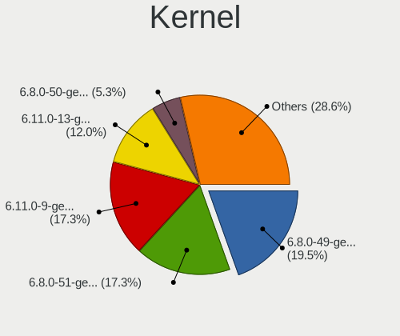
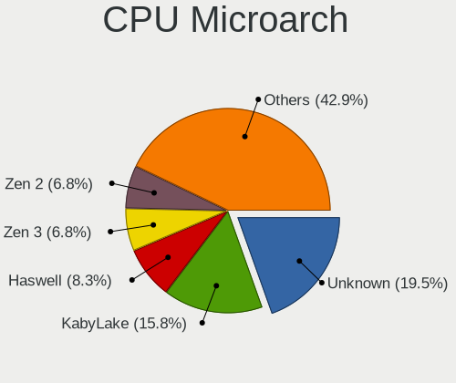
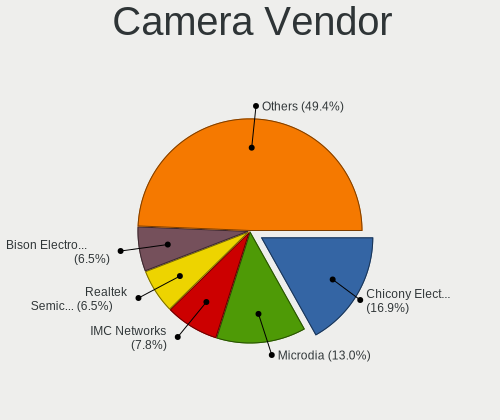
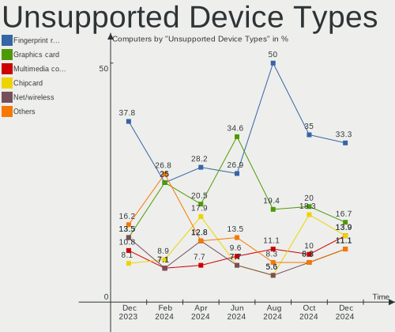

Kubuntu Hardware Trends
-----------------------

A project to identify most popular hardware characteristics and track their change
over time based on data collected by Kubuntu users at https://Linux-Hardware.org.

Anyone can contribute to this report by the [hw-probe](https://github.com/linuxhw/hw-probe) tool:

    sudo -E hw-probe -all -upload

This is a report for all computer types. See also reports for [desktops](/Dist/Kubuntu/Desktop/README.md) and [notebooks](/Dist/Kubuntu/Notebook/README.md).

Full-feature report is available here: https://linux-hardware.org/?view=trends

Period: Jan, 2022.

Contents
--------

* [ System ](#system)
  - [ OS                       ](#os)
  - [ OS Family                ](#os-family)
  - [ Kernel                   ](#kernel)
  - [ Kernel Family            ](#kernel-family)
  - [ Kernel Major Ver.        ](#kernel-major-ver)
  - [ Arch                     ](#arch)
  - [ DE                       ](#de)
  - [ Display Server           ](#display-server)
  - [ Display Manager          ](#display-manager)
  - [ OS Lang                  ](#os-lang)
  - [ Boot Mode                ](#boot-mode)
  - [ Filesystem               ](#filesystem)
  - [ Part. scheme             ](#part-scheme)
  - [ Dual Boot with Linux/BSD ](#dual-boot-with-linuxbsd)
  - [ Dual Boot (Win)          ](#dual-boot-win)

* [ Board ](#board)
  - [ Vendor                   ](#vendor)
  - [ Model                    ](#model)
  - [ Model Family             ](#model-family)
  - [ MFG Year                 ](#mfg-year)
  - [ Form Factor              ](#form-factor)
  - [ Secure Boot              ](#secure-boot)
  - [ Coreboot                 ](#coreboot)
  - [ RAM Size                 ](#ram-size)
  - [ RAM Used                 ](#ram-used)
  - [ Total Drives             ](#total-drives)
  - [ Has CD-ROM               ](#has-cd-rom)
  - [ Has Ethernet             ](#has-ethernet)
  - [ Has WiFi                 ](#has-wifi)
  - [ Has Bluetooth            ](#has-bluetooth)

* [ Location ](#location)
  - [ Country                  ](#country)
  - [ City                     ](#city)

* [ Drives ](#drives)
  - [ Drive Vendor             ](#drive-vendor)
  - [ Drive Model              ](#drive-model)
  - [ HDD Vendor               ](#hdd-vendor)
  - [ SSD Vendor               ](#ssd-vendor)
  - [ Drive Kind               ](#drive-kind)
  - [ Drive Connector          ](#drive-connector)
  - [ Drive Size               ](#drive-size)
  - [ Space Total              ](#space-total)
  - [ Space Used               ](#space-used)
  - [ Malfunc. Drives          ](#malfunc-drives)
  - [ Malfunc. Drive Vendor    ](#malfunc-drive-vendor)
  - [ Malfunc. HDD Vendor      ](#malfunc-hdd-vendor)
  - [ Malfunc. Drive Kind      ](#malfunc-drive-kind)
  - [ Failed Drives            ](#failed-drives)
  - [ Failed Drive Vendor      ](#failed-drive-vendor)
  - [ Drive Status             ](#drive-status)

* [ Storage controller ](#storage-controller)
  - [ Storage Vendor           ](#storage-vendor)
  - [ Storage Model            ](#storage-model)
  - [ Storage Kind             ](#storage-kind)

* [ Processor ](#processor)
  - [ CPU Vendor               ](#cpu-vendor)
  - [ CPU Model                ](#cpu-model)
  - [ CPU Model Family         ](#cpu-model-family)
  - [ CPU Cores                ](#cpu-cores)
  - [ CPU Sockets              ](#cpu-sockets)
  - [ CPU Threads              ](#cpu-threads)
  - [ CPU Op-Modes             ](#cpu-op-modes)
  - [ CPU Microcode            ](#cpu-microcode)
  - [ CPU Microarch            ](#cpu-microarch)

* [ Graphics ](#graphics)
  - [ GPU Vendor               ](#gpu-vendor)
  - [ GPU Model                ](#gpu-model)
  - [ GPU Combo                ](#gpu-combo)
  - [ GPU Driver               ](#gpu-driver)
  - [ GPU Memory               ](#gpu-memory)

* [ Monitor ](#monitor)
  - [ Monitor Vendor           ](#monitor-vendor)
  - [ Monitor Model            ](#monitor-model)
  - [ Monitor Resolution       ](#monitor-resolution)
  - [ Monitor Diagonal         ](#monitor-diagonal)
  - [ Monitor Width            ](#monitor-width)
  - [ Aspect Ratio             ](#aspect-ratio)
  - [ Monitor Area             ](#monitor-area)
  - [ Pixel Density            ](#pixel-density)
  - [ Multiple Monitors        ](#multiple-monitors)

* [ Network ](#network)
  - [ Net Controller Vendor    ](#net-controller-vendor)
  - [ Net Controller Model     ](#net-controller-model)
  - [ Wireless Vendor          ](#wireless-vendor)
  - [ Wireless Model           ](#wireless-model)
  - [ Ethernet Vendor          ](#ethernet-vendor)
  - [ Ethernet Model           ](#ethernet-model)
  - [ Net Controller Kind      ](#net-controller-kind)
  - [ Used Controller          ](#used-controller)
  - [ NICs                     ](#nics)
  - [ IPv6                     ](#ipv6)

* [ Bluetooth ](#bluetooth)
  - [ Bluetooth Vendor         ](#bluetooth-vendor)
  - [ Bluetooth Model          ](#bluetooth-model)

* [ Sound ](#sound)
  - [ Sound Vendor             ](#sound-vendor)
  - [ Sound Model              ](#sound-model)

* [ Memory ](#memory)
  - [ Memory Vendor            ](#memory-vendor)
  - [ Memory Model             ](#memory-model)
  - [ Memory Kind              ](#memory-kind)
  - [ Memory Form Factor       ](#memory-form-factor)
  - [ Memory Size              ](#memory-size)
  - [ Memory Speed             ](#memory-speed)

* [ Printers & scanners ](#printers--scanners)
  - [ Printer Vendor           ](#printer-vendor)
  - [ Printer Model            ](#printer-model)
  - [ Scanner Vendor           ](#scanner-vendor)
  - [ Scanner Model            ](#scanner-model)

* [ Camera ](#camera)
  - [ Camera Vendor            ](#camera-vendor)
  - [ Camera Model             ](#camera-model)

* [ Security ](#security)
  - [ Fingerprint Vendor       ](#fingerprint-vendor)
  - [ Fingerprint Model        ](#fingerprint-model)
  - [ Chipcard Vendor          ](#chipcard-vendor)
  - [ Chipcard Model           ](#chipcard-model)

* [ Unsupported ](#unsupported)
  - [ Unsupported Devices      ](#unsupported-devices)
  - [ Unsupported Device Types ](#unsupported-device-types)

System
------

OS
--

Installed operating systems

| Name          | Computers | Percent |
|---------------|-----------|---------|
| Kubuntu 20.04 | 37        | 39.36%  |
| Kubuntu 21.10 | 34        | 36.17%  |
| Kubuntu 11    | 11        | 11.7%   |
| Kubuntu 21.04 | 7         | 7.45%   |
| Kubuntu 18.04 | 4         | 4.26%   |
| Kubuntu 19.10 | 1         | 1.06%   |

OS Family
---------

OS without a version

| Name    | Computers | Percent |
|---------|-----------|---------|
| Kubuntu | 94        | 100%    |

Kernel
------

Version of the Linux kernel

| Version                    | Computers | Percent |
|----------------------------|-----------|---------|
| 5.13.0-27-generic          | 20        | 21.28%  |
| 5.13.0-25-generic          | 7         | 7.45%   |
| 5.13.0-23-generic          | 7         | 7.45%   |
| 5.11.0-44-generic          | 7         | 7.45%   |
| 5.13.0-22-generic          | 6         | 6.38%   |
| 5.4.0-96-generic           | 5         | 5.32%   |
| 5.11.0-46-generic          | 5         | 5.32%   |
| 5.4.0-94-generic           | 4         | 4.26%   |
| 5.4.0-92-generic           | 4         | 4.26%   |
| 5.4.0-91-generic           | 3         | 3.19%   |
| 5.13.0-19-generic          | 3         | 3.19%   |
| 5.11.0-49-generic          | 3         | 3.19%   |
| 5.11.0-41-generic          | 3         | 3.19%   |
| 5.13.0-25-lowlatency       | 2         | 2.13%   |
| 5.13.0-23-lowlatency       | 2         | 2.13%   |
| 5.11.0-43-generic          | 2         | 2.13%   |
| 5.9.0-050900-generic       | 1         | 1.06%   |
| 5.8.0-33-generic           | 1         | 1.06%   |
| 5.3.0-64-generic           | 1         | 1.06%   |
| 5.16.2-sparky-amd64        | 1         | 1.06%   |
| 5.16.0                     | 1         | 1.06%   |
| 5.15.15-76051515-generic   | 1         | 1.06%   |
| 5.15.0-15.1-liquorix-amd64 | 1         | 1.06%   |
| 5.14.9-xanmod2             | 1         | 1.06%   |
| 5.13.0-22-lowlatency       | 1         | 1.06%   |
| 5.11.0-37-generic          | 1         | 1.06%   |
| 5.10.0-1057-oem            | 1         | 1.06%   |

Kernel Family
-------------

Linux kernel without a distro release

| Version | Computers | Percent |
|---------|-----------|---------|
| 5.13.0  | 48        | 51.06%  |
| 5.11.0  | 21        | 22.34%  |
| 5.4.0   | 16        | 17.02%  |
| 5.9.0   | 1         | 1.06%   |
| 5.8.0   | 1         | 1.06%   |
| 5.3.0   | 1         | 1.06%   |
| 5.16.2  | 1         | 1.06%   |
| 5.16.0  | 1         | 1.06%   |
| 5.15.15 | 1         | 1.06%   |
| 5.15.0  | 1         | 1.06%   |
| 5.14.9  | 1         | 1.06%   |
| 5.10.0  | 1         | 1.06%   |

Kernel Major Ver.
-----------------

Linux kernel major version

| Version | Computers | Percent |
|---------|-----------|---------|
| 5.13    | 48        | 51.06%  |
| 5.11    | 21        | 22.34%  |
| 5.4     | 16        | 17.02%  |
| 5.16    | 2         | 2.13%   |
| 5.15    | 2         | 2.13%   |
| 5.9     | 1         | 1.06%   |
| 5.8     | 1         | 1.06%   |
| 5.3     | 1         | 1.06%   |
| 5.14    | 1         | 1.06%   |
| 5.10    | 1         | 1.06%   |

Arch
----

OS architecture (x86_64, i586, etc.)

| Name   | Computers | Percent |
|--------|-----------|---------|
| x86_64 | 94        | 100%    |

DE
--

Desktop Environment

| Name | Computers | Percent |
|------|-----------|---------|
| KDE5 | 92        | 97.87%  |
| KDE  | 2         | 2.13%   |

Display Server
--------------

X11 or Wayland

| Name    | Computers | Percent |
|---------|-----------|---------|
| X11     | 92        | 97.87%  |
| Wayland | 1         | 1.06%   |
| Tty     | 1         | 1.06%   |

Display Manager
---------------

SDDM, LightDM, etc.

| Name    | Computers | Percent |
|---------|-----------|---------|
| SDDM    | 65        | 69.15%  |
| Unknown | 20        | 21.28%  |
| LightDM | 3         | 3.19%   |
| GDM3    | 3         | 3.19%   |
| GDM     | 3         | 3.19%   |

OS Lang
-------

Language

| Lang  | Computers | Percent |
|-------|-----------|---------|
| en_US | 31        | 32.98%  |
| de_DE | 13        | 13.83%  |
| pt_BR | 5         | 5.32%   |
| en_GB | 5         | 5.32%   |
| pl_PL | 4         | 4.26%   |
| it_IT | 4         | 4.26%   |
| fr_FR | 4         | 4.26%   |
| ru_UA | 2         | 2.13%   |
| ru_RU | 2         | 2.13%   |
| en_IE | 2         | 2.13%   |
| en_CA | 2         | 2.13%   |
| en_AU | 2         | 2.13%   |
| tr_TR | 1         | 1.06%   |
| sl_SI | 1         | 1.06%   |
| id_ID | 1         | 1.06%   |
| hr_HR | 1         | 1.06%   |
| es_SV | 1         | 1.06%   |
| es_PY | 1         | 1.06%   |
| es_ES | 1         | 1.06%   |
| es_AR | 1         | 1.06%   |
| en_PK | 1         | 1.06%   |
| en_IN | 1         | 1.06%   |
| en_IL | 1         | 1.06%   |
| en_DE | 1         | 1.06%   |
| el_GR | 1         | 1.06%   |
| de_CH | 1         | 1.06%   |
| cs_CZ | 1         | 1.06%   |
| ca_ES | 1         | 1.06%   |
| C     | 1         | 1.06%   |
| bg_BG | 1         | 1.06%   |

Boot Mode
---------

EFI or BIOS

| Mode | Computers | Percent |
|------|-----------|---------|
| BIOS | 50        | 53.19%  |
| EFI  | 44        | 46.81%  |

Filesystem
----------

Type of filesystem

| Type    | Computers | Percent |
|---------|-----------|---------|
| Ext4    | 87        | 92.55%  |
| Btrfs   | 4         | 4.26%   |
| Overlay | 3         | 3.19%   |

Part. scheme
------------

Scheme of partitioning

| Type    | Computers | Percent |
|---------|-----------|---------|
| Unknown | 46        | 48.94%  |
| GPT     | 42        | 44.68%  |
| MBR     | 6         | 6.38%   |

Dual Boot with Linux/BSD
------------------------

Hosting more than one Linux/BSD

| Dual boot | Computers | Percent |
|-----------|-----------|---------|
| No        | 79        | 84.04%  |
| Yes       | 15        | 15.96%  |

Dual Boot (Win)
---------------

Hosting Linux and Windows

| Dual boot | Computers | Percent |
|-----------|-----------|---------|
| No        | 62        | 65.96%  |
| Yes       | 32        | 34.04%  |

Board
-----

Vendor
------

Motherboard manufacturer

| Name                | Computers | Percent |
|---------------------|-----------|---------|
| Lenovo              | 16        | 17.02%  |
| Dell                | 16        | 17.02%  |
| Hewlett-Packard     | 14        | 14.89%  |
| ASUSTek Computer    | 13        | 13.83%  |
| MSI                 | 7         | 7.45%   |
| Gigabyte Technology | 5         | 5.32%   |
| ASRock              | 5         | 5.32%   |
| Sony                | 3         | 3.19%   |
| Acer                | 3         | 3.19%   |
| Samsung Electronics | 2         | 2.13%   |
| Toshiba             | 1         | 1.06%   |
| System76            | 1         | 1.06%   |
| Packard Bell        | 1         | 1.06%   |
| Notebook            | 1         | 1.06%   |
| Irbis               | 1         | 1.06%   |
| Intel               | 1         | 1.06%   |
| HUAWEI              | 1         | 1.06%   |
| Fujitsu Siemens     | 1         | 1.06%   |
| Fujitsu             | 1         | 1.06%   |
| Biostar             | 1         | 1.06%   |

Model
-----

Motherboard model

| Name                                       | Computers | Percent |
|--------------------------------------------|-----------|---------|
| Toshiba Satellite S55-C                    | 1         | 1.06%   |
| System76 Serval WS                         | 1         | 1.06%   |
| Sony VPCSB1B9E                             | 1         | 1.06%   |
| Sony VPCCA35FA                             | 1         | 1.06%   |
| Sony SVD13213SGW                           | 1         | 1.06%   |
| Samsung R538/R578/R778                     | 1         | 1.06%   |
| Samsung 300E4A/300E5A/300E7A/3430EA/3530EA | 1         | 1.06%   |
| Packard Bell EasyNote TK85                 | 1         | 1.06%   |
| Notebook NH5x_NH7x_HHx_HJx_HKx             | 1         | 1.06%   |
| MSI MS-7D18                                | 1         | 1.06%   |
| MSI MS-7A40                                | 1         | 1.06%   |
| MSI MS-7851                                | 1         | 1.06%   |
| MSI MS-7792                                | 1         | 1.06%   |
| MSI GF63 Thin 10SCXR                       | 1         | 1.06%   |
| MSI GF63 Thin 10SC                         | 1         | 1.06%   |
| MSI GE62 2QD                               | 1         | 1.06%   |
| Lenovo Y520-15IKBN 80WK                    | 1         | 1.06%   |
| Lenovo ThinkStation E32 30A10057BR         | 1         | 1.06%   |
| Lenovo ThinkPad X1 Carbon 5th 20HQS08X1J   | 1         | 1.06%   |
| Lenovo ThinkPad T590 20N5S0MR00            | 1         | 1.06%   |
| Lenovo ThinkPad T14s Gen 1 20UH002XUS      | 1         | 1.06%   |
| Lenovo ThinkPad P51 20HHCTO1WW             | 1         | 1.06%   |
| Lenovo ThinkPad L440 20AT002YGE            | 1         | 1.06%   |
| Lenovo ThinkPad E595 20NF0000GE            | 1         | 1.06%   |
| Lenovo ThinkCentre M58 3231W2Y             | 1         | 1.06%   |
| Lenovo ThinkBook 15 G2 ITL 20VE            | 1         | 1.06%   |
| Lenovo Legion 5 17ACH6 82K0                | 1         | 1.06%   |
| Lenovo IdeaPad S145-15AST 81N3             | 1         | 1.06%   |
| Lenovo IdeaPad S145-15API 81V7             | 1         | 1.06%   |
| Lenovo IdeaPad 5 15ARE05 81YQ              | 1         | 1.06%   |
| Lenovo G500 20236                          | 1         | 1.06%   |
| Lenovo B590 20208                          | 1         | 1.06%   |
| Irbis NB120                                | 1         | 1.06%   |
| Intel NUC7i3BNK                            | 1         | 1.06%   |
| HUAWEI WRTD-WXX9                           | 1         | 1.06%   |
| HP ZBook Power G7 Mobile Workstation       | 1         | 1.06%   |
| HP ZBook 17 G2                             | 1         | 1.06%   |
| HP Z200 Workstation                        | 1         | 1.06%   |
| HP Victus by Laptop 16-e0xxx               | 1         | 1.06%   |
| HP Pavilion x360 Convertible               | 1         | 1.06%   |
| HP Pavilion Laptop 14-ce0xxx               | 1         | 1.06%   |
| HP Pavilion dv7                            | 1         | 1.06%   |
| HP Laptop 15z-ef1xxx                       | 1         | 1.06%   |
| HP Laptop 15s-eq0xxx                       | 1         | 1.06%   |
| HP G60                                     | 1         | 1.06%   |
| HP EliteBook 8570w                         | 1         | 1.06%   |
| HP Compaq Presario CQ40                    | 1         | 1.06%   |
| HP Compaq dc5700 Small Form Factor         | 1         | 1.06%   |
| HP 250 G5 Notebook PC                      | 1         | 1.06%   |
| Gigabyte X570 AORUS PRO                    | 1         | 1.06%   |
| Gigabyte GA-990X-Gaming SLI-CF             | 1         | 1.06%   |
| Gigabyte GA-870A-UD3                       | 1         | 1.06%   |
| Gigabyte B550 AORUS PRO AC                 | 1         | 1.06%   |
| Gigabyte A320M-H                           | 1         | 1.06%   |
| Fujitsu Siemens AMILO Xi 1526              | 1         | 1.06%   |
| Fujitsu LIFEBOOK E753                      | 1         | 1.06%   |
| Dell XPS 13 9310                           | 1         | 1.06%   |
| Dell Vostro 14 5410                        | 1         | 1.06%   |
| Dell Studio Slim 540s                      | 1         | 1.06%   |
| Dell Precision 5520                        | 1         | 1.06%   |

Model Family
------------

Motherboard model prefix

| Name                    | Computers | Percent |
|-------------------------|-----------|---------|
| Lenovo ThinkPad         | 6         | 6.38%   |
| Dell Latitude           | 6         | 6.38%   |
| Lenovo IdeaPad          | 3         | 3.19%   |
| HP Pavilion             | 3         | 3.19%   |
| Acer Aspire             | 3         | 3.19%   |
| MSI GF63                | 2         | 2.13%   |
| HP ZBook                | 2         | 2.13%   |
| HP Laptop               | 2         | 2.13%   |
| HP Compaq               | 2         | 2.13%   |
| Dell Precision          | 2         | 2.13%   |
| Dell OptiPlex           | 2         | 2.13%   |
| Toshiba Satellite       | 1         | 1.06%   |
| System76 Serval         | 1         | 1.06%   |
| Sony VPCSB1B9E          | 1         | 1.06%   |
| Sony VPCCA35FA          | 1         | 1.06%   |
| Sony SVD13213SGW        | 1         | 1.06%   |
| Samsung R538            | 1         | 1.06%   |
| Samsung 300E4A          | 1         | 1.06%   |
| Packard Bell EasyNote   | 1         | 1.06%   |
| Notebook NH5x           | 1         | 1.06%   |
| MSI MS-7D18             | 1         | 1.06%   |
| MSI MS-7A40             | 1         | 1.06%   |
| MSI MS-7851             | 1         | 1.06%   |
| MSI MS-7792             | 1         | 1.06%   |
| MSI GE62                | 1         | 1.06%   |
| Lenovo Y520-15IKBN      | 1         | 1.06%   |
| Lenovo ThinkStation     | 1         | 1.06%   |
| Lenovo ThinkCentre      | 1         | 1.06%   |
| Lenovo ThinkBook        | 1         | 1.06%   |
| Lenovo Legion           | 1         | 1.06%   |
| Lenovo G500             | 1         | 1.06%   |
| Lenovo B590             | 1         | 1.06%   |
| Irbis NB120             | 1         | 1.06%   |
| Intel NUC7i3BNK         | 1         | 1.06%   |
| HUAWEI WRTD-WXX9        | 1         | 1.06%   |
| HP Z200                 | 1         | 1.06%   |
| HP Victus               | 1         | 1.06%   |
| HP G60                  | 1         | 1.06%   |
| HP EliteBook            | 1         | 1.06%   |
| HP 250                  | 1         | 1.06%   |
| Gigabyte X570           | 1         | 1.06%   |
| Gigabyte GA-990X-Gaming | 1         | 1.06%   |
| Gigabyte GA-870A-UD3    | 1         | 1.06%   |
| Gigabyte B550           | 1         | 1.06%   |
| Gigabyte A320M-H        | 1         | 1.06%   |
| Fujitsu Siemens AMILO   | 1         | 1.06%   |
| Fujitsu LIFEBOOK        | 1         | 1.06%   |
| Dell XPS                | 1         | 1.06%   |
| Dell Vostro             | 1         | 1.06%   |
| Dell Studio             | 1         | 1.06%   |
| Dell PowerEdge          | 1         | 1.06%   |
| Dell Inspiron           | 1         | 1.06%   |
| Dell G5                 | 1         | 1.06%   |
| Biostar H81MGV3         | 1         | 1.06%   |
| ASUS VivoBook           | 1         | 1.06%   |
| ASUS S400CA             | 1         | 1.06%   |
| ASUS ROG                | 1         | 1.06%   |
| ASUS PRIME              | 1         | 1.06%   |
| ASUS P7P55D-E           | 1         | 1.06%   |
| ASUS Maximus            | 1         | 1.06%   |

MFG Year
--------

Motherboard manufacture year

| Year | Computers | Percent |
|------|-----------|---------|
| 2020 | 16        | 17.02%  |
| 2021 | 12        | 12.77%  |
| 2012 | 10        | 10.64%  |
| 2019 | 7         | 7.45%   |
| 2014 | 7         | 7.45%   |
| 2013 | 6         | 6.38%   |
| 2017 | 5         | 5.32%   |
| 2010 | 5         | 5.32%   |
| 2008 | 5         | 5.32%   |
| 2018 | 4         | 4.26%   |
| 2016 | 4         | 4.26%   |
| 2011 | 4         | 4.26%   |
| 2015 | 3         | 3.19%   |
| 2009 | 3         | 3.19%   |
| 2007 | 2         | 2.13%   |
| 2006 | 1         | 1.06%   |

Form Factor
-----------

Physical design of the computer

| Name        | Computers | Percent |
|-------------|-----------|---------|
| Notebook    | 59        | 62.77%  |
| Desktop     | 31        | 32.98%  |
| Tablet      | 1         | 1.06%   |
| Convertible | 1         | 1.06%   |
| Mini pc     | 1         | 1.06%   |
| Server      | 1         | 1.06%   |

Secure Boot
-----------

Enabled or disabled

| State    | Computers | Percent |
|----------|-----------|---------|
| Disabled | 87        | 92.55%  |
| Enabled  | 7         | 7.45%   |

Coreboot
--------

Have coreboot on board

| Used | Computers | Percent |
|------|-----------|---------|
| No   | 94        | 100%    |

RAM Size
--------

Total RAM memory

| Size in GB  | Computers | Percent |
|-------------|-----------|---------|
| 16.01-24.0  | 27        | 28.72%  |
| 4.01-8.0    | 18        | 19.15%  |
| 8.01-16.0   | 15        | 15.96%  |
| 3.01-4.0    | 11        | 11.7%   |
| 32.01-64.0  | 9         | 9.57%   |
| 64.01-256.0 | 5         | 5.32%   |
| 24.01-32.0  | 4         | 4.26%   |
| 1.01-2.0    | 3         | 3.19%   |
| 2.01-3.0    | 2         | 2.13%   |

RAM Used
--------

Used RAM memory

| Used GB    | Computers | Percent |
|------------|-----------|---------|
| 1.01-2.0   | 29        | 30.85%  |
| 4.01-8.0   | 25        | 26.6%   |
| 2.01-3.0   | 16        | 17.02%  |
| 8.01-16.0  | 11        | 11.7%   |
| 3.01-4.0   | 10        | 10.64%  |
| 0.51-1.0   | 2         | 2.13%   |
| 16.01-24.0 | 1         | 1.06%   |

Total Drives
------------

Number of drives on board

| Drives | Computers | Percent |
|--------|-----------|---------|
| 1      | 55        | 58.51%  |
| 2      | 23        | 24.47%  |
| 3      | 9         | 9.57%   |
| 5      | 3         | 3.19%   |
| 4      | 3         | 3.19%   |
| 9      | 1         | 1.06%   |

Has CD-ROM
----------

Has CD-ROM on board

| Presented | Computers | Percent |
|-----------|-----------|---------|
| No        | 59        | 62.77%  |
| Yes       | 35        | 37.23%  |

Has Ethernet
------------

Has Ethernet on board

| Presented | Computers | Percent |
|-----------|-----------|---------|
| Yes       | 83        | 88.3%   |
| No        | 11        | 11.7%   |

Has WiFi
--------

Has WiFi module

| Presented | Computers | Percent |
|-----------|-----------|---------|
| Yes       | 78        | 82.98%  |
| No        | 16        | 17.02%  |

Has Bluetooth
-------------

Has Bluetooth module

| Presented | Computers | Percent |
|-----------|-----------|---------|
| Yes       | 66        | 70.21%  |
| No        | 28        | 29.79%  |

Location
--------

Country
-------

Geographic location (country)

| Country      | Computers | Percent |
|--------------|-----------|---------|
| USA          | 14        | 14.89%  |
| Germany      | 14        | 14.89%  |
| France       | 7         | 7.45%   |
| UK           | 6         | 6.38%   |
| Spain        | 5         | 5.32%   |
| Italy        | 5         | 5.32%   |
| Brazil       | 5         | 5.32%   |
| Ukraine      | 4         | 4.26%   |
| Poland       | 3         | 3.19%   |
| Ireland      | 3         | 3.19%   |
| Austria      | 3         | 3.19%   |
| Slovenia     | 2         | 2.13%   |
| Russia       | 2         | 2.13%   |
| Czechia      | 2         | 2.13%   |
| Canada       | 2         | 2.13%   |
| Australia    | 2         | 2.13%   |
| Turkey       | 1         | 1.06%   |
| Switzerland  | 1         | 1.06%   |
| Saudi Arabia | 1         | 1.06%   |
| Paraguay     | 1         | 1.06%   |
| Pakistan     | 1         | 1.06%   |
| Netherlands  | 1         | 1.06%   |
| Israel       | 1         | 1.06%   |
| Indonesia    | 1         | 1.06%   |
| India        | 1         | 1.06%   |
| Hungary      | 1         | 1.06%   |
| Greece       | 1         | 1.06%   |
| El Salvador  | 1         | 1.06%   |
| Croatia      | 1         | 1.06%   |
| Bulgaria     | 1         | 1.06%   |
| Argentina    | 1         | 1.06%   |

City
----

Geographic location (city)

| City                  | Computers | Percent |
|-----------------------|-----------|---------|
| S??o Paulo            | 3         | 3.19%   |
| Paris                 | 3         | 3.19%   |
| Hamburg               | 3         | 3.19%   |
| Wigan                 | 2         | 2.13%   |
| Warsaw                | 2         | 2.13%   |
| Valencia              | 2         | 2.13%   |
| Schonaich             | 2         | 2.13%   |
| Kyiv                  | 2         | 2.13%   |
| Hailsham              | 2         | 2.13%   |
| Woodbine              | 1         | 1.06%   |
| Winter Park           | 1         | 1.06%   |
| Waukesha              | 1         | 1.06%   |
| Tiel                  | 1         | 1.06%   |
| Sydney                | 1         | 1.06%   |
| Spittal an der Drau   | 1         | 1.06%   |
| Soltau                | 1         | 1.06%   |
| Sofia                 | 1         | 1.06%   |
| Slovenj Gradec        | 1         | 1.06%   |
| Sligo                 | 1         | 1.06%   |
| Secaucus              | 1         | 1.06%   |
| Sciez                 | 1         | 1.06%   |
| San Salvador          | 1         | 1.06%   |
| Saint-Lin-Laurentides | 1         | 1.06%   |
| Ramacca               | 1         | 1.06%   |
| Praia Grande          | 1         | 1.06%   |
| Prague                | 1         | 1.06%   |
| Pouydesseaux          | 1         | 1.06%   |
| Portoro??             | 1         | 1.06%   |
| Philadelphia          | 1         | 1.06%   |
| Perth                 | 1         | 1.06%   |
| Osijek                | 1         | 1.06%   |
| Olivos                | 1         | 1.06%   |
| Odessa                | 1         | 1.06%   |
| Oberwil               | 1         | 1.06%   |
| Novosibirsk           | 1         | 1.06%   |
| Mijas                 | 1         | 1.06%   |
| Midleton              | 1         | 1.06%   |
| Manhattan Beach       | 1         | 1.06%   |
| Manchester            | 1         | 1.06%   |
| Lublin                | 1         | 1.06%   |
| Lepe                  | 1         | 1.06%   |
| Lawrenceburg          | 1         | 1.06%   |
| Krefeld               | 1         | 1.06%   |
| Klagenfurt            | 1         | 1.06%   |
| Kiskunhalas           | 1         | 1.06%   |
| Kharkiv               | 1         | 1.06%   |
| Kavala                | 1         | 1.06%   |
| Kaliningrad           | 1         | 1.06%   |
| Jeddah                | 1         | 1.06%   |
| Istanbul              | 1         | 1.06%   |
| Islamabad             | 1         | 1.06%   |
| Innsbruck             | 1         | 1.06%   |
| Hav?­?™ov             | 1         | 1.06%   |
| Hanover               | 1         | 1.06%   |
| Haifa                 | 1         | 1.06%   |
| Enghien-les-Bains     | 1         | 1.06%   |
| Emmerich              | 1         | 1.06%   |
| Durgapur              | 1         | 1.06%   |
| Duncan                | 1         | 1.06%   |
| Dublin                | 1         | 1.06%   |

Drives
------

Drive Vendor
------------

Hard drive vendors

| Vendor              | Computers | Drives  | Percent |
|---------------------|-----------|---------|---------|
| Samsung Electronics | 32        | 43      | 22.22%  |
| WDC                 | 22        | 24      | 15.28%  |
| Seagate             | 15        | 18      | 10.42%  |
| SanDisk             | 11        | 11      | 7.64%   |
| Kingston            | 11        | 11      | 7.64%   |
| Crucial             | 6         | 6       | 4.17%   |
| Toshiba             | 4         | 4       | 2.78%   |
| SK Hynix            | 3         | 3       | 2.08%   |
| Micron Technology   | 3         | 3       | 2.08%   |
| KIOXIA              | 3         | 3       | 2.08%   |
| Intel               | 3         | 3       | 2.08%   |
| Hitachi             | 3         | 3       | 2.08%   |
| PNY                 | 2         | 2       | 1.39%   |
| Phison              | 2         | 2       | 1.39%   |
| HGST                | 2         | 2       | 1.39%   |
| Verbatim            | 1         | 1       | 0.69%   |
| Unknown             | 1         | 2       | 0.69%   |
| Team                | 1         | 1       | 0.69%   |
| TCSUNBOW            | 1         | 1       | 0.69%   |
| SPCC                | 1         | 1       | 0.69%   |
| SABRENT             | 1         | 1       | 0.69%   |
| Realtek             | 1         | 1       | 0.69%   |
| Patriot             | 1         | 1       | 0.69%   |
| MAXTOR              | 1         | 1       | 0.69%   |
| LDLC                | 1         | 1       | 0.69%   |
| KIOXIA-EXCERIA      | 1         | 1       | 0.69%   |
| KingSpec            | 1         | 1       | 0.69%   |
| Intenso             | 1         | 1       | 0.69%   |
| Inateck             | 1         | 1       | 0.69%   |
| Hewlett-Packard     | 1         | Unknown | 0.69%   |
| GOODRAM             | 1         | 1       | 0.69%   |
| Corsair             | 1         | 1       | 0.69%   |
| China               | 1         | 1       | 0.69%   |
| ASMT                | 1         | 1       | 0.69%   |
| Apacer              | 1         | 1       | 0.69%   |
| A-DATA Technology   | 1         | 1       | 0.69%   |
| Unknown             | 1         | 1       | 0.69%   |

Drive Model
-----------

Hard drive models

| Model                                | Computers | Percent |
|--------------------------------------|-----------|---------|
| Samsung SSD 860 EVO 500GB            | 4         | 2.55%   |
| Seagate ST1000LM024 HN-M101MBB 1TB   | 3         | 1.91%   |
| Samsung SSD 970 EVO Plus 1TB         | 3         | 1.91%   |
| Sandisk NVMe SSD Drive 512GB         | 2         | 1.27%   |
| Samsung SSD 870 QVO 1TB              | 2         | 1.27%   |
| Samsung SSD 860 EVO 1TB              | 2         | 1.27%   |
| Samsung SSD 850 EVO 250GB            | 2         | 1.27%   |
| Samsung SSD 850 EVO 1TB              | 2         | 1.27%   |
| Samsung NVMe SSD Drive 2TB           | 2         | 1.27%   |
| Samsung NVMe SSD Drive 1TB           | 2         | 1.27%   |
| PNY CS900 240GB SSD                  | 2         | 1.27%   |
| Kingston SA400S37480G 480GB SSD      | 2         | 1.27%   |
| Crucial CT500MX500SSD1 500GB         | 2         | 1.27%   |
| WDC WDS500G2B0A-00SM50 500GB SSD     | 1         | 0.64%   |
| WDC WD7500BPVX-75JC3T0 752GB         | 1         | 0.64%   |
| WDC WD7500BPKX-22HPJT0 752GB         | 1         | 0.64%   |
| WDC WD60EZAZ-00ZGHB0 6TB             | 1         | 0.64%   |
| WDC WD5000LPVX-60V0TT0 500GB         | 1         | 0.64%   |
| WDC WD5000LPVT-22G33T0 500GB         | 1         | 0.64%   |
| WDC WD5000LPCX-24VHAT0 500GB         | 1         | 0.64%   |
| WDC WD5000BPKT-60PK4T0 500GB         | 1         | 0.64%   |
| WDC WD5000AZLX-08K2TA0 500GB         | 1         | 0.64%   |
| WDC WD20EZRZ-00Z5HB0 2TB             | 1         | 0.64%   |
| WDC WD20EZRX-00D8PB0 2TB             | 1         | 0.64%   |
| WDC WD20EURX-73T0FY0 2TB             | 1         | 0.64%   |
| WDC WD20EARX-00PASB0 2TB             | 1         | 0.64%   |
| WDC WD1600AAJS-22L7A0 160GB          | 1         | 0.64%   |
| WDC WD10SPZX-21Z10T0 1TB             | 1         | 0.64%   |
| WDC WD10JPVX-60JC3T0 1TB             | 1         | 0.64%   |
| WDC WD10EZRX-00A8LB0 1TB             | 1         | 0.64%   |
| WDC WD10EURX-83UY4Y0 1TB             | 1         | 0.64%   |
| WDC WD10EADS-00L5B1 1TB              | 1         | 0.64%   |
| WDC WD1002FAEX-00Z3A0 1TB            | 1         | 0.64%   |
| WDC PC SN730 SDBPNTY-512G-1006 512GB | 1         | 0.64%   |
| WDC PC SN530 NVMe 512GB              | 1         | 0.64%   |
| WDC PC SN520 SDAPNUW-512G-1006 512GB | 1         | 0.64%   |
| WDC PC SN520 SDAPMUW-512G-1001 512GB | 1         | 0.64%   |
| Verbatim Vi550 S3 SSD 512GB          | 1         | 0.64%   |
| Unknown SD/MMC 16GB                  | 1         | 0.64%   |
| Unknown M.S./M.S.Pro/HG 16GB         | 1         | 0.64%   |
| Toshiba THNSNJ128G8NY 128GB SSD      | 1         | 0.64%   |
| Toshiba MQ04ABF100 1TB               | 1         | 0.64%   |
| Toshiba MK2556GSY 250GB              | 1         | 0.64%   |
| Toshiba KBG30ZMV256G 256GB           | 1         | 0.64%   |
| Team TM8FPD512G 512GB                | 1         | 0.64%   |
| TCSUNBOW X3 240GB SSD                | 1         | 0.64%   |
| SPCC Solid State Disk 1024GB         | 1         | 0.64%   |
| SK Hynix NVMe SSD Drive 512GB        | 1         | 0.64%   |
| SK Hynix HFM512GDJTNI-82A0A 512GB    | 1         | 0.64%   |
| SK Hynix BC511 NVMe 512GB            | 1         | 0.64%   |
| Seagate ST500LT012-9WS142 500GB      | 1         | 0.64%   |
| Seagate ST4000DM000-2AE166 4TB       | 1         | 0.64%   |
| Seagate ST3160215AS 160GB            | 1         | 0.64%   |
| Seagate ST3000VN007-2AH16M 3TB       | 1         | 0.64%   |
| Seagate ST250DM000-1BD141 250GB      | 1         | 0.64%   |
| Seagate ST2000VM003-1ET164 2TB       | 1         | 0.64%   |
| Seagate ST2000LM007-1R8174 2TB       | 1         | 0.64%   |
| Seagate ST2000DM001-1E6164 2TB       | 1         | 0.64%   |
| Seagate ST2000DM 008-2FR102 2TB      | 1         | 0.64%   |
| Seagate ST1000LX015-1U7172 1TB       | 1         | 0.64%   |

HDD Vendor
----------

Hard disk drive vendors

| Vendor              | Computers | Drives | Percent |
|---------------------|-----------|--------|---------|
| WDC                 | 17        | 19     | 39.53%  |
| Seagate             | 15        | 18     | 34.88%  |
| Samsung Electronics | 3         | 3      | 6.98%   |
| Hitachi             | 3         | 3      | 6.98%   |
| Toshiba             | 2         | 2      | 4.65%   |
| HGST                | 2         | 2      | 4.65%   |
| MAXTOR              | 1         | 1      | 2.33%   |

SSD Vendor
----------

Solid state drive vendors

| Vendor              | Computers | Drives | Percent |
|---------------------|-----------|--------|---------|
| Samsung Electronics | 21        | 24     | 35.59%  |
| Kingston            | 8         | 8      | 13.56%  |
| SanDisk             | 6         | 6      | 10.17%  |
| Crucial             | 5         | 5      | 8.47%   |
| PNY                 | 2         | 2      | 3.39%   |
| WDC                 | 1         | 1      | 1.69%   |
| Verbatim            | 1         | 1      | 1.69%   |
| Toshiba             | 1         | 1      | 1.69%   |
| TCSUNBOW            | 1         | 1      | 1.69%   |
| SPCC                | 1         | 1      | 1.69%   |
| SABRENT             | 1         | 1      | 1.69%   |
| Patriot             | 1         | 1      | 1.69%   |
| LDLC                | 1         | 1      | 1.69%   |
| KIOXIA-EXCERIA      | 1         | 1      | 1.69%   |
| KingSpec            | 1         | 1      | 1.69%   |
| Intenso             | 1         | 1      | 1.69%   |
| Intel               | 1         | 1      | 1.69%   |
| GOODRAM             | 1         | 1      | 1.69%   |
| China               | 1         | 1      | 1.69%   |
| ASMT                | 1         | 1      | 1.69%   |
| Apacer              | 1         | 1      | 1.69%   |
| A-DATA Technology   | 1         | 1      | 1.69%   |

Drive Kind
----------

HDD or SSD

| Kind    | Computers | Drives | Percent |
|---------|-----------|--------|---------|
| SSD     | 49        | 62     | 37.69%  |
| HDD     | 39        | 48     | 30%     |
| NVMe    | 38        | 46     | 29.23%  |
| Unknown | 3         | 3      | 2.31%   |
| MMC     | 1         | 1      | 0.77%   |

Drive Connector
---------------

SATA, SAS, NVMe, etc.

| Type | Computers | Drives | Percent |
|------|-----------|--------|---------|
| SATA | 70        | 106    | 61.4%   |
| NVMe | 38        | 45     | 33.33%  |
| SAS  | 5         | 8      | 4.39%   |
| MMC  | 1         | 1      | 0.88%   |

Drive Size
----------

Size of hard drive

| Size in TB | Computers | Drives | Percent |
|------------|-----------|--------|---------|
| 0.01-0.5   | 48        | 61     | 52.75%  |
| 0.51-1.0   | 28        | 34     | 30.77%  |
| 1.01-2.0   | 10        | 10     | 10.99%  |
| 3.01-4.0   | 2         | 2      | 2.2%    |
| 4.01-10.0  | 2         | 2      | 2.2%    |
| 2.01-3.0   | 1         | 1      | 1.1%    |

Space Total
-----------

Amount of disk space available on the file system

| Size in GB     | Computers | Percent |
|----------------|-----------|---------|
| 251-500        | 31        | 32.98%  |
| 501-1000       | 21        | 22.34%  |
| 101-250        | 17        | 18.09%  |
| More than 3000 | 8         | 8.51%   |
| 1001-2000      | 7         | 7.45%   |
| 1-20           | 4         | 4.26%   |
| 2001-3000      | 3         | 3.19%   |
| 51-100         | 2         | 2.13%   |
| 21-50          | 1         | 1.06%   |

Space Used
----------

Amount of used disk space

| Used GB        | Computers | Percent |
|----------------|-----------|---------|
| 1-20           | 23        | 24.47%  |
| 101-250        | 16        | 17.02%  |
| 251-500        | 15        | 15.96%  |
| 501-1000       | 11        | 11.7%   |
| 51-100         | 11        | 11.7%   |
| 21-50          | 10        | 10.64%  |
| More than 3000 | 3         | 3.19%   |
| 1001-2000      | 3         | 3.19%   |
| 2001-3000      | 2         | 2.13%   |

Malfunc. Drives
---------------

Drive models with a malfunction

| Model                              | Computers | Drives | Percent |
|------------------------------------|-----------|--------|---------|
| WDC WD5000LPVX-60V0TT0 500GB       | 1         | 1      | 8.33%   |
| WDC WD5000LPVT-22G33T0 500GB       | 1         | 1      | 8.33%   |
| WDC WD1600AAJS-22L7A0 160GB        | 1         | 1      | 8.33%   |
| Seagate ST500LT012-9WS142 500GB    | 1         | 1      | 8.33%   |
| Seagate ST3160215AS 160GB          | 1         | 1      | 8.33%   |
| Seagate ST2000DM001-1E6164 2TB     | 1         | 1      | 8.33%   |
| Seagate ST1000LM035-1RK172 1TB     | 1         | 1      | 8.33%   |
| Seagate ST1000LM024 HN-M101MBB 1TB | 1         | 1      | 8.33%   |
| Seagate ST1000DM003-1CH162 1TB     | 1         | 1      | 8.33%   |
| SanDisk SSD PLUS 240 GB            | 1         | 1      | 8.33%   |
| Samsung Electronics HD103UJ 1TB    | 1         | 1      | 8.33%   |
| Samsung Electronics HD080HJ/ 80GB  | 1         | 1      | 8.33%   |

Malfunc. Drive Vendor
---------------------

Vendors of faulty drives

| Vendor              | Computers | Drives | Percent |
|---------------------|-----------|--------|---------|
| Seagate             | 6         | 6      | 50%     |
| WDC                 | 3         | 3      | 25%     |
| Samsung Electronics | 2         | 2      | 16.67%  |
| SanDisk             | 1         | 1      | 8.33%   |

Malfunc. HDD Vendor
-------------------

Vendors of faulty HDD drives

| Vendor              | Computers | Drives | Percent |
|---------------------|-----------|--------|---------|
| Seagate             | 6         | 6      | 54.55%  |
| WDC                 | 3         | 3      | 27.27%  |
| Samsung Electronics | 2         | 2      | 18.18%  |

Malfunc. Drive Kind
-------------------

Kinds of faulty drives

| Kind | Computers | Drives | Percent |
|------|-----------|--------|---------|
| HDD  | 9         | 11     | 90%     |
| SSD  | 1         | 1      | 10%     |

Failed Drives
-------------

Failed drive models

Zero info for selected period =(

Failed Drive Vendor
-------------------

Failed drive vendors

Zero info for selected period =(

Drive Status
------------

Number of failed and malfunc. drives

| Status   | Computers | Drives | Percent |
|----------|-----------|--------|---------|
| Detected | 50        | 88     | 48.54%  |
| Works    | 43        | 60     | 41.75%  |
| Malfunc  | 10        | 12     | 9.71%   |

Storage controller
------------------

Storage Vendor
--------------

Storage controller vendors

| Vendor                       | Computers | Percent |
|------------------------------|-----------|---------|
| Intel                        | 65        | 49.24%  |
| AMD                          | 17        | 12.88%  |
| Samsung Electronics          | 13        | 9.85%   |
| Sandisk                      | 9         | 6.82%   |
| ASMedia Technology           | 5         | 3.79%   |
| Toshiba America Info Systems | 3         | 2.27%   |
| SK Hynix                     | 3         | 2.27%   |
| Phison Electronics           | 3         | 2.27%   |
| Micron Technology            | 3         | 2.27%   |
| Kingston Technology Company  | 3         | 2.27%   |
| Marvell Technology Group     | 2         | 1.52%   |
| JMicron Technology           | 2         | 1.52%   |
| VIA Technologies             | 1         | 0.76%   |
| Silicon Motion               | 1         | 0.76%   |
| Micron/Crucial Technology    | 1         | 0.76%   |
| KIOXIA                       | 1         | 0.76%   |

Storage Model
-------------

Storage controller models

| Model                                                                                   | Computers | Percent |
|-----------------------------------------------------------------------------------------|-----------|---------|
| AMD FCH SATA Controller [AHCI mode]                                                     | 13        | 8.61%   |
| Samsung NVMe SSD Controller SM981/PM981/PM983                                           | 9         | 5.96%   |
| Intel 8 Series/C220 Series Chipset Family 6-port SATA Controller 1 [AHCI mode]          | 8         | 5.3%    |
| Intel 7 Series Chipset Family 6-port SATA Controller [AHCI mode]                        | 6         | 3.97%   |
| Sandisk WD Black SN750 / PC SN730 NVMe SSD                                              | 4         | 2.65%   |
| Intel Sunrise Point-LP SATA Controller [AHCI mode]                                      | 4         | 2.65%   |
| Intel 400 Series Chipset Family SATA AHCI Controller                                    | 4         | 2.65%   |
| ASMedia ASM1062 Serial ATA Controller                                                   | 4         | 2.65%   |
| SK Hynix BC511                                                                          | 3         | 1.99%   |
| Micron Non-Volatile memory controller                                                   | 3         | 1.99%   |
| Intel Volume Management Device NVMe RAID Controller                                     | 3         | 1.99%   |
| Intel Q170/Q150/B150/H170/H110/Z170/CM236 Chipset SATA Controller [AHCI Mode]           | 3         | 1.99%   |
| Intel 82801 Mobile SATA Controller [RAID mode]                                          | 3         | 1.99%   |
| Intel 6 Series/C200 Series Chipset Family 6 port Mobile SATA AHCI Controller            | 3         | 1.99%   |
| Intel 500 Series Chipset Family SATA AHCI Controller                                    | 3         | 1.99%   |
| Toshiba America Info Systems BG3 NVMe SSD Controller                                    | 2         | 1.32%   |
| Samsung NVMe SSD Controller SM961/PM961/SM963                                           | 2         | 1.32%   |
| Phison E12 NVMe Controller                                                              | 2         | 1.32%   |
| Kingston Company Company Non-Volatile memory controller                                 | 2         | 1.32%   |
| JMicron JMB363 SATA/IDE Controller                                                      | 2         | 1.32%   |
| Intel SSD 660P Series                                                                   | 2         | 1.32%   |
| Intel SATA Controller [RAID mode]                                                       | 2         | 1.32%   |
| Intel 82801IBM/IEM (ICH9M/ICH9M-E) 4 port SATA Controller [AHCI mode]                   | 2         | 1.32%   |
| Intel 82801G (ICH7 Family) IDE Controller                                               | 2         | 1.32%   |
| Intel 7 Series/C210 Series Chipset Family 6-port SATA Controller [AHCI mode]            | 2         | 1.32%   |
| Intel 6 Series/C200 Series Chipset Family Desktop SATA Controller (IDE mode, ports 4-5) | 2         | 1.32%   |
| Intel 6 Series/C200 Series Chipset Family Desktop SATA Controller (IDE mode, ports 0-3) | 2         | 1.32%   |
| Intel 5 Series/3400 Series Chipset 4 port SATA AHCI Controller                          | 2         | 1.32%   |
| AMD Starship/Matisse Chipset SATA Controller [AHCI mode]                                | 2         | 1.32%   |
| AMD SB7x0/SB8x0/SB9x0 SATA Controller [AHCI mode]                                       | 2         | 1.32%   |
| AMD 400 Series Chipset SATA Controller                                                  | 2         | 1.32%   |
| VIA VT6421 IDE/SATA Controller                                                          | 1         | 0.66%   |
| Toshiba America Info Systems XG6 NVMe SSD Controller                                    | 1         | 0.66%   |
| Silicon Motion SM2263EN/SM2263XT SSD Controller                                         | 1         | 0.66%   |
| Sandisk WD Blue SN570 NVMe SSD                                                          | 1         | 0.66%   |
| Sandisk WD Blue SN500 / PC SN520 NVMe SSD                                               | 1         | 0.66%   |
| Sandisk WD Black NVMe SSD                                                               | 1         | 0.66%   |
| Sandisk PC SN520 NVMe SSD                                                               | 1         | 0.66%   |
| Sandisk Non-Volatile memory controller                                                  | 1         | 0.66%   |
| Samsung XP941 PCIe SSD                                                                  | 1         | 0.66%   |
| Samsung NVMe SSD Controller PM9A1/PM9A3/980PRO                                          | 1         | 0.66%   |
| Samsung NVMe SSD Controller 980                                                         | 1         | 0.66%   |
| Phison E16 PCIe4 NVMe Controller                                                        | 1         | 0.66%   |
| Micron/Crucial Non-Volatile memory controller                                           | 1         | 0.66%   |
| Marvell Group 88SS9183 PCIe SSD Controller                                              | 1         | 0.66%   |
| Marvell Group 88SE914D SATA-600 Controller                                              | 1         | 0.66%   |
| KIOXIA Non-Volatile memory controller                                                   | 1         | 0.66%   |
| Kingston Company SNVS2000G [NV1 NVMe PCIe SSD 2TB]                                      | 1         | 0.66%   |
| Intel Wildcat Point-LP SATA Controller [AHCI Mode]                                      | 1         | 0.66%   |
| Intel Tiger Lake-LP SATA Controller [AHCI mode]                                         | 1         | 0.66%   |
| Intel NM10/ICH7 Family SATA Controller [IDE mode]                                       | 1         | 0.66%   |
| Intel NM10/ICH7 Family SATA Controller [AHCI mode]                                      | 1         | 0.66%   |
| Intel Celeron/Pentium Silver Processor SATA Controller                                  | 1         | 0.66%   |
| Intel C600/X79 series chipset 4-Port SATA IDE Controller                                | 1         | 0.66%   |
| Intel C600/X79 series chipset 2-Port SATA IDE Controller                                | 1         | 0.66%   |
| Intel Atom/Celeron/Pentium Processor x5-E8000/J3xxx/N3xxx Series SATA Controller        | 1         | 0.66%   |
| Intel 9 Series Chipset Family SATA Controller [AHCI Mode]                               | 1         | 0.66%   |
| Intel 82Q35 Express PT IDER Controller                                                  | 1         | 0.66%   |
| Intel 82801JI (ICH10 Family) 4 port SATA IDE Controller #1                              | 1         | 0.66%   |
| Intel 82801JI (ICH10 Family) 2 port SATA IDE Controller #2                              | 1         | 0.66%   |

Storage Kind
------------

Kind of storage controller (IDE, SATA, NVMe, SAS, ...)

| Kind | Computers | Percent |
|------|-----------|---------|
| SATA | 67        | 52.76%  |
| NVMe | 38        | 29.92%  |
| IDE  | 13        | 10.24%  |
| RAID | 9         | 7.09%   |

Processor
---------

CPU Vendor
----------

Processor vendors

| Vendor | Computers | Percent |
|--------|-----------|---------|
| Intel  | 73        | 77.66%  |
| AMD    | 21        | 22.34%  |

CPU Model
---------

Processor models

| Model                                         | Computers | Percent |
|-----------------------------------------------|-----------|---------|
| AMD Ryzen 7 3700U with Radeon Vega Mobile Gfx | 3         | 3.19%   |
| Intel Core i7-7700HQ CPU @ 2.80GHz            | 2         | 2.13%   |
| Intel Core i7-4790 CPU @ 3.60GHz              | 2         | 2.13%   |
| Intel Core i7-10850H CPU @ 2.70GHz            | 2         | 2.13%   |
| Intel Core i5-3570K CPU @ 3.40GHz             | 2         | 2.13%   |
| Intel Core i5-3230M CPU @ 2.60GHz             | 2         | 2.13%   |
| Intel Core i5-10300H CPU @ 2.50GHz            | 2         | 2.13%   |
| Intel Core i3-3217U CPU @ 1.80GHz             | 2         | 2.13%   |
| Intel Core i3-3110M CPU @ 2.40GHz             | 2         | 2.13%   |
| Intel Core 2 Duo CPU E8400 @ 3.00GHz          | 2         | 2.13%   |
| Intel 11th Gen Core i5-1135G7 @ 2.40GHz       | 2         | 2.13%   |
| AMD Ryzen 9 5950X 16-Core Processor           | 2         | 2.13%   |
| Intel Xeon CPU E5-2640 0 @ 2.50GHz            | 1         | 1.06%   |
| Intel Xeon CPU E3-1240 v3 @ 3.40GHz           | 1         | 1.06%   |
| Intel Pentium Dual-Core CPU T4300 @ 2.10GHz   | 1         | 1.06%   |
| Intel Pentium D CPU 3.40GHz                   | 1         | 1.06%   |
| Intel Pentium CPU N3700 @ 1.60GHz             | 1         | 1.06%   |
| Intel Pentium 4 CPU 3.00GHz                   | 1         | 1.06%   |
| Intel Genuine CPU 585 @ 2.16GHz               | 1         | 1.06%   |
| Intel Core i7-8565U CPU @ 1.80GHz             | 1         | 1.06%   |
| Intel Core i7-7820HQ CPU @ 2.90GHz            | 1         | 1.06%   |
| Intel Core i7-7700K CPU @ 4.20GHz             | 1         | 1.06%   |
| Intel Core i7-7600U CPU @ 2.80GHz             | 1         | 1.06%   |
| Intel Core i7-6820HQ CPU @ 2.70GHz            | 1         | 1.06%   |
| Intel Core i7-5500U CPU @ 2.40GHz             | 1         | 1.06%   |
| Intel Core i7-4790K CPU @ 4.00GHz             | 1         | 1.06%   |
| Intel Core i7-4770K CPU @ 3.50GHz             | 1         | 1.06%   |
| Intel Core i7-4770 CPU @ 3.40GHz              | 1         | 1.06%   |
| Intel Core i7-4720HQ CPU @ 2.60GHz            | 1         | 1.06%   |
| Intel Core i7-4710MQ CPU @ 2.50GHz            | 1         | 1.06%   |
| Intel Core i7-4710HQ CPU @ 2.50GHz            | 1         | 1.06%   |
| Intel Core i7-3770 CPU @ 3.40GHz              | 1         | 1.06%   |
| Intel Core i7-2670QM CPU @ 2.20GHz            | 1         | 1.06%   |
| Intel Core i7-2620M CPU @ 2.70GHz             | 1         | 1.06%   |
| Intel Core i7-2600K CPU @ 3.40GHz             | 1         | 1.06%   |
| Intel Core i5-8350U CPU @ 1.70GHz             | 1         | 1.06%   |
| Intel Core i5-8250U CPU @ 1.60GHz             | 1         | 1.06%   |
| Intel Core i5-7200U CPU @ 2.50GHz             | 1         | 1.06%   |
| Intel Core i5-6200U CPU @ 2.30GHz             | 1         | 1.06%   |
| Intel Core i5-4200U CPU @ 1.60GHz             | 1         | 1.06%   |
| Intel Core i5-4200M CPU @ 2.50GHz             | 1         | 1.06%   |
| Intel Core i5-3470T CPU @ 2.90GHz             | 1         | 1.06%   |
| Intel Core i5-3360M CPU @ 2.80GHz             | 1         | 1.06%   |
| Intel Core i5-3340M CPU @ 2.70GHz             | 1         | 1.06%   |
| Intel Core i5-2430M CPU @ 2.40GHz             | 1         | 1.06%   |
| Intel Core i5-10500H CPU @ 2.50GHz            | 1         | 1.06%   |
| Intel Core i5-10310U CPU @ 1.70GHz            | 1         | 1.06%   |
| Intel Core i5 CPU M 460 @ 2.53GHz             | 1         | 1.06%   |
| Intel Core i5 CPU 760 @ 2.80GHz               | 1         | 1.06%   |
| Intel Core i5 CPU 650 @ 3.20GHz               | 1         | 1.06%   |
| Intel Core i3-7100U CPU @ 2.40GHz             | 1         | 1.06%   |
| Intel Core i3-2350M CPU @ 2.30GHz             | 1         | 1.06%   |
| Intel Core i3 CPU M 380 @ 2.53GHz             | 1         | 1.06%   |
| Intel Core 2 Duo CPU T7300 @ 2.00GHz          | 1         | 1.06%   |
| Intel Core 2 Duo CPU E7400 @ 2.80GHz          | 1         | 1.06%   |
| Intel Core 2 CPU T5500 @ 1.66GHz              | 1         | 1.06%   |
| Intel Celeron N4020 CPU @ 1.10GHz             | 1         | 1.06%   |
| Intel Atom CPU D525 @ 1.80GHz                 | 1         | 1.06%   |
| Intel 11th Gen Core i7-1185G7 @ 3.00GHz       | 1         | 1.06%   |
| Intel 11th Gen Core i7-1180G7 @ 1.30GHz       | 1         | 1.06%   |

CPU Model Family
----------------

Processor model prefix

| Model                   | Computers | Percent |
|-------------------------|-----------|---------|
| Intel Core i7           | 22        | 23.4%   |
| Intel Core i5           | 21        | 22.34%  |
| Other                   | 9         | 9.57%   |
| Intel Core i3           | 7         | 7.45%   |
| AMD Ryzen 7             | 6         | 6.38%   |
| Intel Core 2 Duo        | 4         | 4.26%   |
| AMD Ryzen 9             | 4         | 4.26%   |
| AMD Ryzen 5             | 3         | 3.19%   |
| Intel Xeon              | 2         | 2.13%   |
| Intel Pentium Dual-Core | 1         | 1.06%   |
| Intel Pentium D         | 1         | 1.06%   |
| Intel Pentium 4         | 1         | 1.06%   |
| Intel Pentium           | 1         | 1.06%   |
| Intel Genuine           | 1         | 1.06%   |
| Intel Core 2            | 1         | 1.06%   |
| Intel Celeron           | 1         | 1.06%   |
| Intel Atom              | 1         | 1.06%   |
| AMD Ryzen Threadripper  | 1         | 1.06%   |
| AMD Ryzen 7 PRO         | 1         | 1.06%   |
| AMD Ryzen 3             | 1         | 1.06%   |
| AMD FX                  | 1         | 1.06%   |
| AMD Athlon II X4        | 1         | 1.06%   |
| AMD Athlon              | 1         | 1.06%   |
| AMD A6                  | 1         | 1.06%   |
| AMD A10                 | 1         | 1.06%   |

CPU Cores
---------

Number of processor cores

| Number | Computers | Percent |
|--------|-----------|---------|
| 4      | 40        | 42.55%  |
| 2      | 34        | 36.17%  |
| 8      | 6         | 6.38%   |
| 6      | 6         | 6.38%   |
| 16     | 3         | 3.19%   |
| 12     | 3         | 3.19%   |
| 1      | 2         | 2.13%   |

CPU Sockets
-----------

Number of sockets

| Number | Computers | Percent |
|--------|-----------|---------|
| 1      | 93        | 98.94%  |
| 2      | 1         | 1.06%   |

CPU Threads
-----------

Threads per core (Hyper-Threading)

| Number | Computers | Percent |
|--------|-----------|---------|
| 2      | 74        | 78.72%  |
| 1      | 20        | 21.28%  |

CPU Op-Modes
------------

CPU Operation Modes (32-bit, 64-bit)

| Op mode        | Computers | Percent |
|----------------|-----------|---------|
| 32-bit, 64-bit | 94        | 100%    |

CPU Microcode
-------------

Microcode number

| Number     | Computers | Percent |
|------------|-----------|---------|
| Unknown    | 23        | 24.47%  |
| 0x306a9    | 10        | 10.64%  |
| 0x306c3    | 9         | 9.57%   |
| 0xa0652    | 5         | 5.32%   |
| 0x806c1    | 4         | 4.26%   |
| 0x206a7    | 4         | 4.26%   |
| 0x1067a    | 4         | 4.26%   |
| 0x906e9    | 2         | 2.13%   |
| 0x806e9    | 2         | 2.13%   |
| 0x20655    | 2         | 2.13%   |
| 0x0a50000c | 2         | 2.13%   |
| 0x08108109 | 2         | 2.13%   |
| 0x08108102 | 2         | 2.13%   |
| 0xf43      | 1         | 1.06%   |
| 0xa0671    | 1         | 1.06%   |
| 0x806ec    | 1         | 1.06%   |
| 0x806ea    | 1         | 1.06%   |
| 0x806d1    | 1         | 1.06%   |
| 0x706a8    | 1         | 1.06%   |
| 0x6fd      | 1         | 1.06%   |
| 0x6fa      | 1         | 1.06%   |
| 0x6f6      | 1         | 1.06%   |
| 0x406e3    | 1         | 1.06%   |
| 0x406c3    | 1         | 1.06%   |
| 0x40651    | 1         | 1.06%   |
| 0x306d4    | 1         | 1.06%   |
| 0x106e5    | 1         | 1.06%   |
| 0x106ca    | 1         | 1.06%   |
| 0x08701013 | 1         | 1.06%   |
| 0x08600106 | 1         | 1.06%   |
| 0x08600104 | 1         | 1.06%   |
| 0x08600103 | 1         | 1.06%   |
| 0x08101016 | 1         | 1.06%   |
| 0x06001119 | 1         | 1.06%   |
| 0x010000db | 1         | 1.06%   |
| 0x00000000 | 1         | 1.06%   |

CPU Microarch
-------------

Microarchitecture

| Name          | Computers | Percent |
|---------------|-----------|---------|
| IvyBridge     | 12        | 12.77%  |
| KabyLake      | 11        | 11.7%   |
| Haswell       | 11        | 11.7%   |
| Zen 2         | 6         | 6.38%   |
| TigerLake     | 6         | 6.38%   |
| SandyBridge   | 6         | 6.38%   |
| Zen+          | 5         | 5.32%   |
| CometLake     | 5         | 5.32%   |
| Zen 3         | 4         | 4.26%   |
| Penryn        | 4         | 4.26%   |
| Westmere      | 3         | 3.19%   |
| Core          | 3         | 3.19%   |
| Zen           | 2         | 2.13%   |
| Skylake       | 2         | 2.13%   |
| Piledriver    | 2         | 2.13%   |
| NetBurst      | 2         | 2.13%   |
| Icelake       | 2         | 2.13%   |
| Silvermont    | 1         | 1.06%   |
| Nehalem       | 1         | 1.06%   |
| K10           | 1         | 1.06%   |
| Goldmont plus | 1         | 1.06%   |
| Excavator     | 1         | 1.06%   |
| Broadwell     | 1         | 1.06%   |
| Bonnell       | 1         | 1.06%   |
| Unknown       | 1         | 1.06%   |

Graphics
--------

GPU Vendor
----------

Vendors of graphics cards

| Vendor | Computers | Percent |
|--------|-----------|---------|
| Intel  | 54        | 45.38%  |
| Nvidia | 38        | 31.93%  |
| AMD    | 27        | 22.69%  |

GPU Model
---------

Graphics card models

| Model                                                                     | Computers | Percent |
|---------------------------------------------------------------------------|-----------|---------|
| Intel 3rd Gen Core processor Graphics Controller                          | 7         | 5.83%   |
| Intel TigerLake-LP GT2 [Iris Xe Graphics]                                 | 5         | 4.17%   |
| Intel CometLake-H GT2 [UHD Graphics]                                      | 5         | 4.17%   |
| Intel 2nd Generation Core Processor Family Integrated Graphics Controller | 5         | 4.17%   |
| AMD Picasso/Raven 2 [Radeon Vega Series / Radeon Vega Mobile Series]      | 5         | 4.17%   |
| AMD Renoir                                                                | 4         | 3.33%   |
| Nvidia TU117M [GeForce GTX 1650 Mobile / Max-Q]                           | 3         | 2.5%    |
| Intel IvyBridge GT2 [HD Graphics 4000]                                    | 3         | 2.5%    |
| Intel HD Graphics 630                                                     | 3         | 2.5%    |
| Intel HD Graphics 620                                                     | 3         | 2.5%    |
| Intel 4th Gen Core Processor Integrated Graphics Controller               | 3         | 2.5%    |
| Nvidia TU117M [GeForce MX450]                                             | 2         | 1.67%   |
| Nvidia GP104 [GeForce GTX 1070]                                           | 2         | 1.67%   |
| Nvidia GM107GLM [Quadro M1200 Mobile]                                     | 2         | 1.67%   |
| Intel UHD Graphics 620                                                    | 2         | 1.67%   |
| Intel Mobile 4 Series Chipset Integrated Graphics Controller              | 2         | 1.67%   |
| Intel 4 Series Chipset Integrated Graphics Controller                     | 2         | 1.67%   |
| AMD Whistler [Radeon HD 6630M/6650M/6750M/7670M/7690M]                    | 2         | 1.67%   |
| AMD Park [Mobility Radeon HD 5430/5450/5470]                              | 2         | 1.67%   |
| AMD Cezanne                                                               | 2         | 1.67%   |
| Nvidia TU117M                                                             | 1         | 0.83%   |
| Nvidia TU117GLM [Quadro T1000 Mobile]                                     | 1         | 0.83%   |
| Nvidia TU117BM [GeForce GTX 1650 Mobile Refresh]                          | 1         | 0.83%   |
| Nvidia TU116M [GeForce GTX 1660 Ti Mobile]                                | 1         | 0.83%   |
| Nvidia TU106M [GeForce RTX 2070 Mobile / Max-Q Refresh]                   | 1         | 0.83%   |
| Nvidia TU106M [GeForce RTX 2060 Mobile]                                   | 1         | 0.83%   |
| Nvidia TU104 [GeForce RTX 2070 SUPER]                                     | 1         | 0.83%   |
| Nvidia GT218 [ION]                                                        | 1         | 0.83%   |
| Nvidia GP108M [GeForce MX250]                                             | 1         | 0.83%   |
| Nvidia GP107M [GeForce MX350]                                             | 1         | 0.83%   |
| Nvidia GP107M [GeForce GTX 1050 Mobile]                                   | 1         | 0.83%   |
| Nvidia GP107GL [Quadro P400]                                              | 1         | 0.83%   |
| Nvidia GP107 [GeForce GTX 1050 Ti]                                        | 1         | 0.83%   |
| Nvidia GP102 [GeForce GTX 1080 Ti]                                        | 1         | 0.83%   |
| Nvidia GM206 [GeForce GTX 960]                                            | 1         | 0.83%   |
| Nvidia GM204 [GeForce GTX 970]                                            | 1         | 0.83%   |
| Nvidia GM107M [GeForce GTX 960M]                                          | 1         | 0.83%   |
| Nvidia GM107M [GeForce GTX 950M]                                          | 1         | 0.83%   |
| Nvidia GM107M [GeForce GTX 860M]                                          | 1         | 0.83%   |
| Nvidia GM107GLM [Quadro M1000M]                                           | 1         | 0.83%   |
| Nvidia GM107GLM [Quadro K2200M]                                           | 1         | 0.83%   |
| Nvidia GK208B [GeForce GT 710]                                            | 1         | 0.83%   |
| Nvidia GK208 [GeForce GT 630 Rev. 2]                                      | 1         | 0.83%   |
| Nvidia GK107GL [Quadro K600]                                              | 1         | 0.83%   |
| Nvidia GK106 [GeForce GTX 645 OEM]                                        | 1         | 0.83%   |
| Nvidia GK104 [GeForce GTX 760 OEM]                                        | 1         | 0.83%   |
| Nvidia GF119 [GeForce GT 610]                                             | 1         | 0.83%   |
| Nvidia GF117M [GeForce 610M/710M/810M/820M / GT 620M/625M/630M/720M]      | 1         | 0.83%   |
| Nvidia G73M [GeForce Go 7600]                                             | 1         | 0.83%   |
| Intel Xeon E3-1200 v2/3rd Gen Core processor Graphics Controller          | 1         | 0.83%   |
| Intel WhiskeyLake-U GT2 [UHD Graphics 620]                                | 1         | 0.83%   |
| Intel TigerLake-H GT1 [UHD Graphics]                                      | 1         | 0.83%   |
| Intel Tiger Lake Iris Xe Graphics                                         | 1         | 0.83%   |
| Intel Skylake GT2 [HD Graphics 520]                                       | 1         | 0.83%   |
| Intel RocketLake-S GT1 [UHD Graphics 750]                                 | 1         | 0.83%   |
| Intel Mobile GM965/GL960 Integrated Graphics Controller (secondary)       | 1         | 0.83%   |
| Intel Mobile GM965/GL960 Integrated Graphics Controller (primary)         | 1         | 0.83%   |
| Intel HD Graphics 5500                                                    | 1         | 0.83%   |
| Intel HD Graphics 530                                                     | 1         | 0.83%   |
| Intel Haswell-ULT Integrated Graphics Controller                          | 1         | 0.83%   |

GPU Combo
---------

Combinations of graphics cards

| Name           | Computers | Percent |
|----------------|-----------|---------|
| 1 x Intel      | 32        | 34.04%  |
| 1 x AMD        | 20        | 21.28%  |
| Intel + Nvidia | 18        | 19.15%  |
| 1 x Nvidia     | 17        | 18.09%  |
| Intel + AMD    | 4         | 4.26%   |
| AMD + Nvidia   | 3         | 3.19%   |

GPU Driver
----------

Free vs proprietary

| Driver      | Computers | Percent |
|-------------|-----------|---------|
| Free        | 67        | 71.28%  |
| Proprietary | 25        | 26.6%   |
| Unknown     | 2         | 2.13%   |

GPU Memory
----------

Total video memory

| Size in GB | Computers | Percent |
|------------|-----------|---------|
| Unknown    | 57        | 60.64%  |
| 1.01-2.0   | 12        | 12.77%  |
| 3.01-4.0   | 7         | 7.45%   |
| 0.51-1.0   | 7         | 7.45%   |
| 0.01-0.5   | 6         | 6.38%   |
| 7.01-8.0   | 3         | 3.19%   |
| 2.01-3.0   | 1         | 1.06%   |
| 8.01-16.0  | 1         | 1.06%   |

Monitor
-------

Monitor Vendor
--------------

Monitor vendors

| Vendor                  | Computers | Percent |
|-------------------------|-----------|---------|
| LG Display              | 17        | 14.05%  |
| Samsung Electronics     | 16        | 13.22%  |
| AU Optronics            | 14        | 11.57%  |
| Dell                    | 9         | 7.44%   |
| Acer                    | 6         | 4.96%   |
| Sharp                   | 5         | 4.13%   |
| Chimei Innolux          | 5         | 4.13%   |
| BOE                     | 5         | 4.13%   |
| Hewlett-Packard         | 4         | 3.31%   |
| AOC                     | 4         | 3.31%   |
| Ancor Communications    | 4         | 3.31%   |
| ViewSonic               | 3         | 2.48%   |
| Philips                 | 3         | 2.48%   |
| Iiyama                  | 3         | 2.48%   |
| Goldstar                | 3         | 2.48%   |
| PANDA                   | 2         | 1.65%   |
| Lenovo                  | 2         | 1.65%   |
| Chi Mei Optoelectronics | 2         | 1.65%   |
| BenQ                    | 2         | 1.65%   |
| Toshiba                 | 1         | 0.83%   |
| Sony                    | 1         | 0.83%   |
| PCT                     | 1         | 0.83%   |
| Panasonic               | 1         | 0.83%   |
| NEC Computers           | 1         | 0.83%   |
| JYC                     | 1         | 0.83%   |
| Idek Iiyama             | 1         | 0.83%   |
| Grundig                 | 1         | 0.83%   |
| GRM                     | 1         | 0.83%   |
| Eizo                    | 1         | 0.83%   |
| ASUSTek Computer        | 1         | 0.83%   |
| Apple                   | 1         | 0.83%   |

Monitor Model
-------------

Monitor models

| Model                                                                  | Computers | Percent |
|------------------------------------------------------------------------|-----------|---------|
| Lenovo LCD Monitor LEN40BA 1920x1080 344x194mm 15.5-inch               | 2         | 1.59%   |
| Iiyama PLX2283H IVM5638 1920x1080 477x268mm 21.5-inch                  | 2         | 1.59%   |
| Dell U2412M DELA07A 1920x1200 518x324mm 24.1-inch                      | 2         | 1.59%   |
| Dell P2415Q DELA0BE 3840x2160 527x296mm 23.8-inch                      | 2         | 1.59%   |
| ViewSonic VP2468 Series VSCB032 1920x1080 527x296mm 23.8-inch          | 1         | 0.79%   |
| ViewSonic VA2719-2K VSC6B34 2560x1440 597x336mm 27.0-inch              | 1         | 0.79%   |
| ViewSonic VA2448 SERIES VSC3828 1920x1080 521x293mm 23.5-inch          | 1         | 0.79%   |
| ViewSonic TD1630-3 VSCC234 1366x768 344x193mm 15.5-inch                | 1         | 0.79%   |
| Toshiba ScreenXpert TSB8888 1080x2160                                  | 1         | 0.79%   |
| Sony LCD Monitor TV                                                    | 1         | 0.79%   |
| Sharp LCD Monitor SHP1542 1920x1080 309x174mm 14.0-inch                | 1         | 0.79%   |
| Sharp LCD Monitor SHP1526 1920x1280 274x183mm 13.0-inch                | 1         | 0.79%   |
| Sharp LCD Monitor SHP14FA 3840x2400 288x180mm 13.4-inch                | 1         | 0.79%   |
| Sharp LCD Monitor SHP1476 3840x2160 346x194mm 15.6-inch                | 1         | 0.79%   |
| Sharp LCD Monitor SHP143E 3840x2160 346x194mm 15.6-inch                | 1         | 0.79%   |
| Samsung Electronics SyncMaster SAM0304 1680x1050 490x320mm 23.0-inch   | 1         | 0.79%   |
| Samsung Electronics SMS24A450 SAM083A 1920x1200 520x320mm 24.0-inch    | 1         | 0.79%   |
| Samsung Electronics S34J55x SAM0F71 3440x1440 797x333mm 34.0-inch      | 1         | 0.79%   |
| Samsung Electronics S24R65x SAM1023 1920x1080 530x300mm 24.0-inch      | 1         | 0.79%   |
| Samsung Electronics S24F350 SAM0D20 1920x1080 521x293mm 23.5-inch      | 1         | 0.79%   |
| Samsung Electronics LCD Monitor SEC544B 1600x900 344x194mm 15.5-inch   | 1         | 0.79%   |
| Samsung Electronics LCD Monitor SEC4D42 1280x800 303x190mm 14.1-inch   | 1         | 0.79%   |
| Samsung Electronics LCD Monitor SEC364D 1600x900 382x214mm 17.2-inch   | 1         | 0.79%   |
| Samsung Electronics LCD Monitor SEC3451 1366x768 344x194mm 15.5-inch   | 1         | 0.79%   |
| Samsung Electronics LCD Monitor SEC3350 1680x1050 331x207mm 15.4-inch  | 1         | 0.79%   |
| Samsung Electronics LCD Monitor SDC324C 1920x1080 344x194mm 15.5-inch  | 1         | 0.79%   |
| Samsung Electronics LCD Monitor SAM0B30 1920x1080 885x498mm 40.0-inch  | 1         | 0.79%   |
| Samsung Electronics LCD Monitor SAM0A7A 1920x1080 1060x626mm 48.5-inch | 1         | 0.79%   |
| Samsung Electronics LCD Monitor SAM0900 1366x768                       | 1         | 0.79%   |
| Samsung Electronics C27F390 SAM0D32 1920x1080 598x336mm 27.0-inch      | 1         | 0.79%   |
| Samsung Electronics C24F390 SAM0D2C 1920x1080 521x293mm 23.5-inch      | 1         | 0.79%   |
| Philips PHL 276E9Q PHLC17B 1920x1080 598x336mm 27.0-inch               | 1         | 0.79%   |
| Philips PHL 276E7 PHLC108 1920x1080 598x336mm 27.0-inch                | 1         | 0.79%   |
| Philips FTV PHL01EA 1920x1080 1440x810mm 65.0-inch                     | 1         | 0.79%   |
| PCT VGA TO HDMI PCTFB0E 1920x1200                                      | 1         | 0.79%   |
| PANDA LCD Monitor NCP0046 1920x1080 344x194mm 15.5-inch                | 1         | 0.79%   |
| PANDA LCD Monitor NCP002D 1920x1080 344x194mm 15.5-inch                | 1         | 0.79%   |
| Panasonic LCD Monitor MEI96A2 2880x1620 344x193mm 15.5-inch            | 1         | 0.79%   |
| NEC Computers EA234WMi NEC691E 1920x1080 509x286mm 23.0-inch           | 1         | 0.79%   |
| LG Display LCD Monitor LGD065A 1920x1080 344x194mm 15.5-inch           | 1         | 0.79%   |
| LG Display LCD Monitor LGD064C 1920x1080 344x194mm 15.5-inch           | 1         | 0.79%   |
| LG Display LCD Monitor LGD0625 1920x1080 344x194mm 15.5-inch           | 1         | 0.79%   |
| LG Display LCD Monitor LGD05FA 1920x1080 309x174mm 14.0-inch           | 1         | 0.79%   |
| LG Display LCD Monitor LGD05E5 1920x1080 344x194mm 15.5-inch           | 1         | 0.79%   |
| LG Display LCD Monitor LGD058B 2560x1440 309x174mm 14.0-inch           | 1         | 0.79%   |
| LG Display LCD Monitor LGD0533 1920x1080 344x194mm 15.5-inch           | 1         | 0.79%   |
| LG Display LCD Monitor LGD046C 1920x1080 382x215mm 17.3-inch           | 1         | 0.79%   |
| LG Display LCD Monitor LGD0456 1366x768 344x194mm 15.5-inch            | 1         | 0.79%   |
| LG Display LCD Monitor LGD03FC 1600x900 309x174mm 14.0-inch            | 1         | 0.79%   |
| LG Display LCD Monitor LGD0396 1600x900 382x215mm 17.3-inch            | 1         | 0.79%   |
| LG Display LCD Monitor LGD0353 1366x768 345x194mm 15.6-inch            | 1         | 0.79%   |
| LG Display LCD Monitor LGD033F 1366x768 309x174mm 14.0-inch            | 1         | 0.79%   |
| LG Display LCD Monitor LGD033A 1366x768 344x194mm 15.5-inch            | 1         | 0.79%   |
| LG Display LCD Monitor LGD02DF 1600x900 310x174mm 14.0-inch            | 1         | 0.79%   |
| LG Display LCD Monitor LGD02DC 1366x768 344x194mm 15.5-inch            | 1         | 0.79%   |
| LG Display LCD Monitor LGD0259 1920x1080 350x190mm 15.7-inch           | 1         | 0.79%   |
| JYC PC2TV JYC1001 1920x1080 708x398mm 32.0-inch                        | 1         | 0.79%   |
| Iiyama PLG2488H IVM6127 1920x1080 531x299mm 24.0-inch                  | 1         | 0.79%   |
| Idek Iiyama LCD Monitor PL2595W 5760x1200                              | 1         | 0.79%   |
| Idek Iiyama LCD Monitor PL2595W                                        | 1         | 0.79%   |

Monitor Resolution
------------------

Monitor screen resolution

| Resolution         | Computers | Percent |
|--------------------|-----------|---------|
| 1920x1080 (FHD)    | 52        | 47.27%  |
| 1366x768 (WXGA)    | 18        | 16.36%  |
| 1920x1200 (WUXGA)  | 6         | 5.45%   |
| 3840x2160 (4K)     | 5         | 4.55%   |
| 1600x900 (HD+)     | 5         | 4.55%   |
| 1280x1024 (SXGA)   | 5         | 4.55%   |
| 2560x1440 (QHD)    | 4         | 3.64%   |
| Unknown            | 3         | 2.73%   |
| 1680x1050 (WSXGA+) | 2         | 1.82%   |
| 5760x1200          | 1         | 0.91%   |
| 4480x1600          | 1         | 0.91%   |
| 3840x2400          | 1         | 0.91%   |
| 3840x1080          | 1         | 0.91%   |
| 3440x1440          | 1         | 0.91%   |
| 2560x1080          | 1         | 0.91%   |
| 2160x1440          | 1         | 0.91%   |
| 1920x1280          | 1         | 0.91%   |
| 1440x900 (WXGA+)   | 1         | 0.91%   |
| 1280x800 (WXGA)    | 1         | 0.91%   |

Monitor Diagonal
----------------

Diagonal size in inches

| Inches  | Computers | Percent |
|---------|-----------|---------|
| 15      | 32        | 26.45%  |
| 24      | 17        | 14.05%  |
| 17      | 10        | 8.26%   |
| 14      | 10        | 8.26%   |
| 27      | 9         | 7.44%   |
| 23      | 9         | 7.44%   |
| 21      | 7         | 5.79%   |
| 13      | 6         | 4.96%   |
| Unknown | 5         | 4.13%   |
| 31      | 2         | 1.65%   |
| 19      | 2         | 1.65%   |
| 11      | 2         | 1.65%   |
| 65      | 1         | 0.83%   |
| 54      | 1         | 0.83%   |
| 48      | 1         | 0.83%   |
| 40      | 1         | 0.83%   |
| 34      | 1         | 0.83%   |
| 32      | 1         | 0.83%   |
| 28      | 1         | 0.83%   |
| 26      | 1         | 0.83%   |
| 18      | 1         | 0.83%   |
| 16      | 1         | 0.83%   |

Monitor Width
-------------

Physical width

| Width in mm | Computers | Percent |
|-------------|-----------|---------|
| 301-350     | 47        | 40.52%  |
| 501-600     | 31        | 26.72%  |
| 351-400     | 11        | 9.48%   |
| 401-500     | 8         | 6.9%    |
| 201-300     | 5         | 4.31%   |
| Unknown     | 5         | 4.31%   |
| 601-700     | 3         | 2.59%   |
| 1001-1500   | 3         | 2.59%   |
| 701-800     | 2         | 1.72%   |
| 801-900     | 1         | 0.86%   |

Aspect Ratio
------------

Proportional relationship between the width and the height

| Ratio   | Computers | Percent |
|---------|-----------|---------|
| 16/9    | 73        | 74.49%  |
| 16/10   | 11        | 11.22%  |
| 5/4     | 4         | 4.08%   |
| Unknown | 4         | 4.08%   |
| 3/2     | 3         | 3.06%   |
| 21/9    | 2         | 2.04%   |
| 4/3     | 1         | 1.02%   |

Monitor Area
------------

Area in inch²

| Area in inch² | Computers | Percent |
|----------------|-----------|---------|
| 101-110        | 33        | 28.21%  |
| 201-250        | 19        | 16.24%  |
| 81-90          | 13        | 11.11%  |
| 301-350        | 10        | 8.55%   |
| 251-300        | 9         | 7.69%   |
| 121-130        | 8         | 6.84%   |
| 151-200        | 5         | 4.27%   |
| Unknown        | 5         | 4.27%   |
| 351-500        | 4         | 3.42%   |
| More than 1000 | 3         | 2.56%   |
| 71-80          | 3         | 2.56%   |
| 51-60          | 2         | 1.71%   |
| 141-150        | 2         | 1.71%   |
| 501-1000       | 1         | 0.85%   |

Pixel Density
-------------

Pixels per inch

| Density       | Computers | Percent |
|---------------|-----------|---------|
| 51-100        | 38        | 33.93%  |
| 121-160       | 35        | 31.25%  |
| 101-120       | 22        | 19.64%  |
| 161-240       | 5         | 4.46%   |
| Unknown       | 5         | 4.46%   |
| More than 240 | 4         | 3.57%   |
| 1-50          | 3         | 2.68%   |

Multiple Monitors
-----------------

Total monitors connected

| Total | Computers | Percent |
|-------|-----------|---------|
| 1     | 62        | 65.96%  |
| 2     | 23        | 24.47%  |
| 3     | 8         | 8.51%   |
| 0     | 1         | 1.06%   |

Network
-------

Net Controller Vendor
---------------------

Controller vendors

| Vendor                            | Computers | Percent |
|-----------------------------------|-----------|---------|
| Realtek Semiconductor             | 61        | 38.85%  |
| Intel                             | 51        | 32.48%  |
| Qualcomm Atheros                  | 13        | 8.28%   |
| Broadcom                          | 7         | 4.46%   |
| Broadcom Limited                  | 3         | 1.91%   |
| TP-Link                           | 2         | 1.27%   |
| Ralink Technology                 | 2         | 1.27%   |
| Qualcomm Atheros Communications   | 2         | 1.27%   |
| Qualcomm                          | 2         | 1.27%   |
| NetGear                           | 2         | 1.27%   |
| MEDIATEK                          | 2         | 1.27%   |
| Wilocity                          | 1         | 0.64%   |
| Sierra Wireless                   | 1         | 0.64%   |
| Samsung Electronics               | 1         | 0.64%   |
| Marvell Technology Group          | 1         | 0.64%   |
| Huawei Technologies               | 1         | 0.64%   |
| Ericsson Business Mobile Networks | 1         | 0.64%   |
| D-Link                            | 1         | 0.64%   |
| ASIX Electronics                  | 1         | 0.64%   |
| Arduino SA                        | 1         | 0.64%   |
| Aquantia                          | 1         | 0.64%   |

Net Controller Model
--------------------

Controller models

| Model                                                             | Computers | Percent |
|-------------------------------------------------------------------|-----------|---------|
| Realtek RTL8111/8168/8411 PCI Express Gigabit Ethernet Controller | 39        | 21.55%  |
| Realtek RTL8153 Gigabit Ethernet Adapter                          | 8         | 4.42%   |
| Intel Wireless 8265 / 8275                                        | 5         | 2.76%   |
| Intel Wi-Fi 6 AX201                                               | 5         | 2.76%   |
| Intel Comet Lake PCH CNVi WiFi                                    | 5         | 2.76%   |
| Realtek RTL810xE PCI Express Fast Ethernet controller             | 4         | 2.21%   |
| Intel Wi-Fi 6 AX200                                               | 4         | 2.21%   |
| Realtek RTL88x2bu [AC1200 Techkey]                                | 3         | 1.66%   |
| Realtek RTL8821CE 802.11ac PCIe Wireless Network Adapter          | 3         | 1.66%   |
| Realtek RTL8125 2.5GbE Controller                                 | 3         | 1.66%   |
| Qualcomm Atheros AR9485 Wireless Network Adapter                  | 3         | 1.66%   |
| Intel Wireless 7260                                               | 3         | 1.66%   |
| Intel I211 Gigabit Network Connection                             | 3         | 1.66%   |
| Intel Ethernet Connection I217-LM                                 | 3         | 1.66%   |
| Intel 82579LM Gigabit Network Connection (Lewisville)             | 3         | 1.66%   |
| Realtek RTL8822CE 802.11ac PCIe Wireless Network Adapter          | 2         | 1.1%    |
| Realtek RTL8821AE 802.11ac PCIe Wireless Network Adapter          | 2         | 1.1%    |
| Realtek RTL8169 PCI Gigabit Ethernet Controller                   | 2         | 1.1%    |
| Qualcomm Atheros QCA9377 802.11ac Wireless Network Adapter        | 2         | 1.1%    |
| Qualcomm Atheros QCA6174 802.11ac Wireless Network Adapter        | 2         | 1.1%    |
| Qualcomm Atheros AR9271 802.11n                                   | 2         | 1.1%    |
| NetGear WN111(v2) RangeMax Next Wireless [Atheros AR9170+AR9101]  | 2         | 1.1%    |
| MEDIATEK MT7921 802.11ax PCI Express Wireless Network Adapter     | 2         | 1.1%    |
| Intel Ethernet Connection I217-V                                  | 2         | 1.1%    |
| Intel Ethernet Connection (4) I219-LM                             | 2         | 1.1%    |
| Intel Centrino Advanced-N 6205 [Taylor Peak]                      | 2         | 1.1%    |
| Wilocity Wil6200 802.11ad Wireless Network Adapter                | 1         | 0.55%   |
| TP-Link TL-WN821N v5/v6 [RTL8192EU]                               | 1         | 0.55%   |
| TP-Link 802.11ac WLAN Adapter                                     | 1         | 0.55%   |
| Sierra Wireless EM7455                                            | 1         | 0.55%   |
| Samsung Galaxy series, misc. (tethering mode)                     | 1         | 0.55%   |
| Realtek RTL8852AE 802.11ax PCIe Wireless Network Adapter          | 1         | 0.55%   |
| Realtek RTL8822BE 802.11a/b/g/n/ac WiFi adapter                   | 1         | 0.55%   |
| Realtek RTL8723BU 802.11b/g/n WLAN Adapter                        | 1         | 0.55%   |
| Realtek RTL8723BE PCIe Wireless Network Adapter                   | 1         | 0.55%   |
| Realtek RTL8188EUS 802.11n Wireless Network Adapter               | 1         | 0.55%   |
| Realtek Killer E2500 Gigabit Ethernet Controller                  | 1         | 0.55%   |
| Ralink MT7610U ("Archer T2U" 2.4G+5G WLAN Adapter                 | 1         | 0.55%   |
| Ralink MT7601U Wireless Adapter                                   | 1         | 0.55%   |
| Qualcomm U673C                                                    | 1         | 0.55%   |
| Qualcomm QCA6390 Wireless Network Adapter [AX500-DBS (2x2)]       | 1         | 0.55%   |
| Qualcomm Atheros QCA9565 / AR9565 Wireless Network Adapter        | 1         | 0.55%   |
| Qualcomm Atheros Killer E220x Gigabit Ethernet Controller         | 1         | 0.55%   |
| Qualcomm Atheros AR9462 Wireless Network Adapter                  | 1         | 0.55%   |
| Qualcomm Atheros AR9287 Wireless Network Adapter (PCI-Express)    | 1         | 0.55%   |
| Qualcomm Atheros AR8162 Fast Ethernet                             | 1         | 0.55%   |
| Qualcomm Atheros AR8161 Gigabit Ethernet                          | 1         | 0.55%   |
| Qualcomm Atheros AR8151 v2.0 Gigabit Ethernet                     | 1         | 0.55%   |
| Marvell Group 88E8040 PCI-E Fast Ethernet Controller              | 1         | 0.55%   |
| Intel Wireless-AC 9260                                            | 1         | 0.55%   |
| Intel Wireless 8260                                               | 1         | 0.55%   |
| Intel Wireless 3165                                               | 1         | 0.55%   |
| Intel Wireless 3160                                               | 1         | 0.55%   |
| Intel Tiger Lake PCH CNVi WiFi                                    | 1         | 0.55%   |
| Intel PRO/Wireless 4965 AG or AGN [Kedron] Network Connection     | 1         | 0.55%   |
| Intel PRO/Wireless 3945ABG [Golan] Network Connection             | 1         | 0.55%   |
| Intel I350 Gigabit Network Connection                             | 1         | 0.55%   |
| Intel Ethernet Connection (6) I219-V                              | 1         | 0.55%   |
| Intel Ethernet Connection (5) I219-V                              | 1         | 0.55%   |
| Intel Ethernet Connection (2) I219-V                              | 1         | 0.55%   |

Wireless Vendor
---------------

Wireless vendors

| Vendor                          | Computers | Percent |
|---------------------------------|-----------|---------|
| Intel                           | 39        | 45.88%  |
| Realtek Semiconductor           | 15        | 17.65%  |
| Qualcomm Atheros                | 10        | 11.76%  |
| Broadcom                        | 5         | 5.88%   |
| TP-Link                         | 2         | 2.35%   |
| Ralink Technology               | 2         | 2.35%   |
| Qualcomm Atheros Communications | 2         | 2.35%   |
| NetGear                         | 2         | 2.35%   |
| MEDIATEK                        | 2         | 2.35%   |
| Broadcom Limited                | 2         | 2.35%   |
| Wilocity                        | 1         | 1.18%   |
| Sierra Wireless                 | 1         | 1.18%   |
| Qualcomm                        | 1         | 1.18%   |
| D-Link                          | 1         | 1.18%   |

Wireless Model
--------------

Wireless models

| Model                                                                | Computers | Percent |
|----------------------------------------------------------------------|-----------|---------|
| Intel Wireless 8265 / 8275                                           | 5         | 5.88%   |
| Intel Wi-Fi 6 AX201                                                  | 5         | 5.88%   |
| Intel Comet Lake PCH CNVi WiFi                                       | 5         | 5.88%   |
| Intel Wi-Fi 6 AX200                                                  | 4         | 4.71%   |
| Realtek RTL88x2bu [AC1200 Techkey]                                   | 3         | 3.53%   |
| Realtek RTL8821CE 802.11ac PCIe Wireless Network Adapter             | 3         | 3.53%   |
| Qualcomm Atheros AR9485 Wireless Network Adapter                     | 3         | 3.53%   |
| Intel Wireless 7260                                                  | 3         | 3.53%   |
| Realtek RTL8822CE 802.11ac PCIe Wireless Network Adapter             | 2         | 2.35%   |
| Realtek RTL8821AE 802.11ac PCIe Wireless Network Adapter             | 2         | 2.35%   |
| Qualcomm Atheros QCA9377 802.11ac Wireless Network Adapter           | 2         | 2.35%   |
| Qualcomm Atheros QCA6174 802.11ac Wireless Network Adapter           | 2         | 2.35%   |
| Qualcomm Atheros AR9271 802.11n                                      | 2         | 2.35%   |
| NetGear WN111(v2) RangeMax Next Wireless [Atheros AR9170+AR9101]     | 2         | 2.35%   |
| MEDIATEK MT7921 802.11ax PCI Express Wireless Network Adapter        | 2         | 2.35%   |
| Intel Centrino Advanced-N 6205 [Taylor Peak]                         | 2         | 2.35%   |
| Wilocity Wil6200 802.11ad Wireless Network Adapter                   | 1         | 1.18%   |
| TP-Link TL-WN821N v5/v6 [RTL8192EU]                                  | 1         | 1.18%   |
| TP-Link 802.11ac WLAN Adapter                                        | 1         | 1.18%   |
| Sierra Wireless EM7455                                               | 1         | 1.18%   |
| Realtek RTL8852AE 802.11ax PCIe Wireless Network Adapter             | 1         | 1.18%   |
| Realtek RTL8822BE 802.11a/b/g/n/ac WiFi adapter                      | 1         | 1.18%   |
| Realtek RTL8723BU 802.11b/g/n WLAN Adapter                           | 1         | 1.18%   |
| Realtek RTL8723BE PCIe Wireless Network Adapter                      | 1         | 1.18%   |
| Realtek RTL8188EUS 802.11n Wireless Network Adapter                  | 1         | 1.18%   |
| Ralink MT7610U ("Archer T2U" 2.4G+5G WLAN Adapter                    | 1         | 1.18%   |
| Ralink MT7601U Wireless Adapter                                      | 1         | 1.18%   |
| Qualcomm QCA6390 Wireless Network Adapter [AX500-DBS (2x2)]          | 1         | 1.18%   |
| Qualcomm Atheros QCA9565 / AR9565 Wireless Network Adapter           | 1         | 1.18%   |
| Qualcomm Atheros AR9462 Wireless Network Adapter                     | 1         | 1.18%   |
| Qualcomm Atheros AR9287 Wireless Network Adapter (PCI-Express)       | 1         | 1.18%   |
| Intel Wireless-AC 9260                                               | 1         | 1.18%   |
| Intel Wireless 8260                                                  | 1         | 1.18%   |
| Intel Wireless 3165                                                  | 1         | 1.18%   |
| Intel Wireless 3160                                                  | 1         | 1.18%   |
| Intel Tiger Lake PCH CNVi WiFi                                       | 1         | 1.18%   |
| Intel PRO/Wireless 4965 AG or AGN [Kedron] Network Connection        | 1         | 1.18%   |
| Intel PRO/Wireless 3945ABG [Golan] Network Connection                | 1         | 1.18%   |
| Intel Dual Band Wireless-AC 3168NGW [Stone Peak]                     | 1         | 1.18%   |
| Intel Comet Lake PCH-LP CNVi WiFi                                    | 1         | 1.18%   |
| Intel Centrino Wireless-N 135                                        | 1         | 1.18%   |
| Intel Centrino Wireless-N 1030 [Rainbow Peak]                        | 1         | 1.18%   |
| Intel Centrino Wireless-N 1000 [Condor Peak]                         | 1         | 1.18%   |
| Intel Centrino Wireless-N 100                                        | 1         | 1.18%   |
| Intel Centrino Advanced-N 6235                                       | 1         | 1.18%   |
| Intel Cannon Point-LP CNVi [Wireless-AC]                             | 1         | 1.18%   |
| D-Link DWA-171 AC600 DB Wireless Adapter(rev.A1) [Realtek RTL8811AU] | 1         | 1.18%   |
| Broadcom Limited BCM4321 802.11a/b/g/n                               | 1         | 1.18%   |
| Broadcom Limited BCM4306 802.11b/g Wireless LAN Controller           | 1         | 1.18%   |
| Broadcom BCM4360 802.11ac Wireless Network Adapter                   | 1         | 1.18%   |
| Broadcom BCM4352 802.11ac Wireless Network Adapter                   | 1         | 1.18%   |
| Broadcom BCM43142 802.11b/g/n                                        | 1         | 1.18%   |
| Broadcom BCM4313 802.11bgn Wireless Network Adapter                  | 1         | 1.18%   |
| Broadcom BCM4312 802.11b/g LP-PHY                                    | 1         | 1.18%   |

Ethernet Vendor
---------------

Ethernet vendors

| Vendor                   | Computers | Percent |
|--------------------------|-----------|---------|
| Realtek Semiconductor    | 54        | 60%     |
| Intel                    | 24        | 26.67%  |
| Qualcomm Atheros         | 4         | 4.44%   |
| Broadcom                 | 2         | 2.22%   |
| Samsung Electronics      | 1         | 1.11%   |
| Qualcomm                 | 1         | 1.11%   |
| Marvell Technology Group | 1         | 1.11%   |
| Broadcom Limited         | 1         | 1.11%   |
| ASIX Electronics         | 1         | 1.11%   |
| Aquantia                 | 1         | 1.11%   |

Ethernet Model
--------------

Ethernet models

| Model                                                             | Computers | Percent |
|-------------------------------------------------------------------|-----------|---------|
| Realtek RTL8111/8168/8411 PCI Express Gigabit Ethernet Controller | 39        | 41.94%  |
| Realtek RTL8153 Gigabit Ethernet Adapter                          | 8         | 8.6%    |
| Realtek RTL810xE PCI Express Fast Ethernet controller             | 4         | 4.3%    |
| Realtek RTL8125 2.5GbE Controller                                 | 3         | 3.23%   |
| Intel I211 Gigabit Network Connection                             | 3         | 3.23%   |
| Intel Ethernet Connection I217-LM                                 | 3         | 3.23%   |
| Intel 82579LM Gigabit Network Connection (Lewisville)             | 3         | 3.23%   |
| Realtek RTL8169 PCI Gigabit Ethernet Controller                   | 2         | 2.15%   |
| Intel Ethernet Connection I217-V                                  | 2         | 2.15%   |
| Intel Ethernet Connection (4) I219-LM                             | 2         | 2.15%   |
| Samsung Galaxy series, misc. (tethering mode)                     | 1         | 1.08%   |
| Realtek Killer E2500 Gigabit Ethernet Controller                  | 1         | 1.08%   |
| Qualcomm U673C                                                    | 1         | 1.08%   |
| Qualcomm Atheros Killer E220x Gigabit Ethernet Controller         | 1         | 1.08%   |
| Qualcomm Atheros AR8162 Fast Ethernet                             | 1         | 1.08%   |
| Qualcomm Atheros AR8161 Gigabit Ethernet                          | 1         | 1.08%   |
| Qualcomm Atheros AR8151 v2.0 Gigabit Ethernet                     | 1         | 1.08%   |
| Marvell Group 88E8040 PCI-E Fast Ethernet Controller              | 1         | 1.08%   |
| Intel I350 Gigabit Network Connection                             | 1         | 1.08%   |
| Intel Ethernet Connection (6) I219-V                              | 1         | 1.08%   |
| Intel Ethernet Connection (5) I219-V                              | 1         | 1.08%   |
| Intel Ethernet Connection (2) I219-V                              | 1         | 1.08%   |
| Intel Ethernet Connection (2) I218-V                              | 1         | 1.08%   |
| Intel Ethernet Connection (14) I219-V                             | 1         | 1.08%   |
| Intel Ethernet Connection (11) I219-LM                            | 1         | 1.08%   |
| Intel Ethernet Connection (10) I219-LM                            | 1         | 1.08%   |
| Intel 82578DM Gigabit Network Connection                          | 1         | 1.08%   |
| Intel 82567LM-3 Gigabit Network Connection                        | 1         | 1.08%   |
| Intel 82566DM-2 Gigabit Network Connection                        | 1         | 1.08%   |
| Broadcom NetLink BCM57785 Gigabit Ethernet PCIe                   | 1         | 1.08%   |
| Broadcom NetLink BCM57780 Gigabit Ethernet PCIe                   | 1         | 1.08%   |
| Broadcom Limited NetXtreme BCM5755 Gigabit Ethernet PCI Express   | 1         | 1.08%   |
| ASIX AX88179 Gigabit Ethernet                                     | 1         | 1.08%   |
| Aquantia AQC107 NBase-T/IEEE 802.3bz Ethernet Controller [AQtion] | 1         | 1.08%   |

Net Controller Kind
-------------------

Ethernet, WiFi or modem

| Kind     | Computers | Percent |
|----------|-----------|---------|
| Ethernet | 83        | 50.61%  |
| WiFi     | 78        | 47.56%  |
| Modem    | 3         | 1.83%   |

Used Controller
---------------

Currently used network controller

| Kind     | Computers | Percent |
|----------|-----------|---------|
| Ethernet | 74        | 50.34%  |
| WiFi     | 72        | 48.98%  |
| Modem    | 1         | 0.68%   |

NICs
----

Total network controllers on board

| Total | Computers | Percent |
|-------|-----------|---------|
| 2     | 57        | 60.64%  |
| 1     | 34        | 36.17%  |
| 0     | 2         | 2.13%   |
| 6     | 1         | 1.06%   |

IPv6
----

IPv6 vs IPv4

| Used | Computers | Percent |
|------|-----------|---------|
| No   | 81        | 86.17%  |
| Yes  | 13        | 13.83%  |

Bluetooth
---------

Bluetooth Vendor
----------------

Controller vendors

| Vendor                          | Computers | Percent |
|---------------------------------|-----------|---------|
| Intel                           | 30        | 44.12%  |
| Realtek Semiconductor           | 11        | 16.18%  |
| Cambridge Silicon Radio         | 7         | 10.29%  |
| Foxconn / Hon Hai               | 4         | 5.88%   |
| Qualcomm Atheros Communications | 3         | 4.41%   |
| Lite-On Technology              | 3         | 4.41%   |
| Dell                            | 2         | 2.94%   |
| Broadcom                        | 2         | 2.94%   |
| ASUSTek Computer                | 2         | 2.94%   |
| Integrated System Solution      | 1         | 1.47%   |
| IMC Networks                    | 1         | 1.47%   |
| Foxconn International           | 1         | 1.47%   |
| AboCom Systems                  | 1         | 1.47%   |

Bluetooth Model
---------------

Controller models

| Model                                                                               | Computers | Percent |
|-------------------------------------------------------------------------------------|-----------|---------|
| Intel Bluetooth Device                                                              | 20        | 28.99%  |
| Realtek Bluetooth Radio                                                             | 7         | 10.14%  |
| Cambridge Silicon Radio Bluetooth Dongle (HCI mode)                                 | 7         | 10.14%  |
| Intel Bluetooth wireless interface                                                  | 4         | 5.8%    |
| Realtek  Bluetooth 4.2 Adapter                                                      | 2         | 2.9%    |
| Intel Centrino Bluetooth Wireless Transceiver                                       | 2         | 2.9%    |
| Foxconn / Hon Hai Wireless_Device                                                   | 2         | 2.9%    |
| Foxconn / Hon Hai Foxconn T77H114 BCM2070 [Single-Chip Bluetooth 2.1 + EDR Adapter] | 2         | 2.9%    |
| Realtek RTL8822BE Bluetooth 4.2 Adapter                                             | 1         | 1.45%   |
| Realtek RTL8821A Bluetooth                                                          | 1         | 1.45%   |
| Qualcomm Atheros  Bluetooth Device                                                  | 1         | 1.45%   |
| Qualcomm Atheros AR9462 Bluetooth                                                   | 1         | 1.45%   |
| Qualcomm Atheros AR3011 Bluetooth                                                   | 1         | 1.45%   |
| Lite-On Qualcomm Atheros QCA9377 Bluetooth                                          | 1         | 1.45%   |
| Lite-On Bluetooth Radio                                                             | 1         | 1.45%   |
| Lite-On Bluetooth Device                                                            | 1         | 1.45%   |
| Intel Wireless-AC 9260 Bluetooth Adapter                                            | 1         | 1.45%   |
| Intel Wireless-AC 3168 Bluetooth                                                    | 1         | 1.45%   |
| Intel Centrino Advanced-N 6230 Bluetooth adapter                                    | 1         | 1.45%   |
| Intel Bluetooth 9460/9560 Jefferson Peak (JfP)                                      | 1         | 1.45%   |
| Integrated System Solution KY-BT100 Bluetooth Adapter                               | 1         | 1.45%   |
| IMC Networks Bluetooth Radio                                                        | 1         | 1.45%   |
| Foxconn International BCM43142A0 Bluetooth module                                   | 1         | 1.45%   |
| Foxconn / Hon Hai Bluetooth Device                                                  | 1         | 1.45%   |
| Dell Wireless 360 Bluetooth                                                         | 1         | 1.45%   |
| Dell BCM20702A0 Bluetooth Module                                                    | 1         | 1.45%   |
| Broadcom HP Portable SoftSailing                                                    | 1         | 1.45%   |
| Broadcom BCM2070 Bluetooth Device                                                   | 1         | 1.45%   |
| ASUS Bluetooth Device                                                               | 1         | 1.45%   |
| ASUS BCM20702A0                                                                     | 1         | 1.45%   |
| AboCom Systems AboCom Bluetooth Device                                              | 1         | 1.45%   |

Sound
-----

Sound Vendor
------------

Sound card vendors

| Vendor                | Computers | Percent |
|-----------------------|-----------|---------|
| Intel                 | 71        | 52.21%  |
| AMD                   | 26        | 19.12%  |
| Nvidia                | 23        | 16.91%  |
| Realtek Semiconductor | 3         | 2.21%   |
| GN Netcom             | 2         | 1.47%   |
| C-Media Electronics   | 2         | 1.47%   |
| TerraTec Electronic   | 1         | 0.74%   |
| RODE Microphones      | 1         | 0.74%   |
| Pro-Ject              | 1         | 0.74%   |
| Lenovo                | 1         | 0.74%   |
| Kingston Technology   | 1         | 0.74%   |
| JMTek                 | 1         | 0.74%   |
| Hewlett-Packard       | 1         | 0.74%   |
| Corsair               | 1         | 0.74%   |
| AUDIOLAB              | 1         | 0.74%   |

Sound Model
-----------

Sound card models

| Model                                                                                             | Computers | Percent |
|---------------------------------------------------------------------------------------------------|-----------|---------|
| AMD Family 17h (Models 10h-1fh) HD Audio Controller                                               | 12        | 7.55%   |
| Intel 7 Series/C216 Chipset Family High Definition Audio Controller                               | 10        | 6.29%   |
| Intel 8 Series/C220 Series Chipset High Definition Audio Controller                               | 9         | 5.66%   |
| Intel 6 Series/C200 Series Chipset Family High Definition Audio Controller                        | 7         | 4.4%    |
| Intel Tiger Lake-LP Smart Sound Technology Audio Controller                                       | 6         | 3.77%   |
| AMD Raven/Raven2/Fenghuang HDMI/DP Audio Controller                                               | 6         | 3.77%   |
| Intel Sunrise Point-LP HD Audio                                                                   | 5         | 3.14%   |
| Intel Comet Lake PCH cAVS                                                                         | 5         | 3.14%   |
| AMD Renoir Radeon High Definition Audio Controller                                                | 5         | 3.14%   |
| Intel 5 Series/3400 Series Chipset High Definition Audio                                          | 4         | 2.52%   |
| AMD Starship/Matisse HD Audio Controller                                                          | 4         | 2.52%   |
| Realtek Semiconductor USB Audio                                                                   | 3         | 1.89%   |
| Nvidia TU107 GeForce GTX 1650 High Definition Audio Controller                                    | 3         | 1.89%   |
| Intel Xeon E3-1200 v3/4th Gen Core Processor HD Audio Controller                                  | 3         | 1.89%   |
| Intel Tiger Lake-H HD Audio Controller                                                            | 3         | 1.89%   |
| Intel NM10/ICH7 Family High Definition Audio Controller                                           | 3         | 1.89%   |
| Intel CM238 HD Audio Controller                                                                   | 3         | 1.89%   |
| Intel 82801I (ICH9 Family) HD Audio Controller                                                    | 3         | 1.89%   |
| AMD Cedar HDMI Audio [Radeon HD 5400/6300/7300 Series]                                            | 3         | 1.89%   |
| Nvidia TU106 High Definition Audio Controller                                                     | 2         | 1.26%   |
| Nvidia GP107GL High Definition Audio Controller                                                   | 2         | 1.26%   |
| Nvidia GP104 High Definition Audio Controller                                                     | 2         | 1.26%   |
| Nvidia GM107 High Definition Audio Controller [GeForce 940MX]                                     | 2         | 1.26%   |
| Nvidia GK208 HDMI/DP Audio Controller                                                             | 2         | 1.26%   |
| Intel 82801H (ICH8 Family) HD Audio Controller                                                    | 2         | 1.26%   |
| Intel 100 Series/C230 Series Chipset Family HD Audio Controller                                   | 2         | 1.26%   |
| C-Media Electronics Blue Snowball                                                                 | 2         | 1.26%   |
| AMD SBx00 Azalia (Intel HDA)                                                                      | 2         | 1.26%   |
| TerraTec Electronic Aureon 5.1 MkII                                                               | 1         | 0.63%   |
| RODE Microphones RODE NT-USB                                                                      | 1         | 0.63%   |
| Pro-Ject Pre Box S2 Digital                                                                       | 1         | 0.63%   |
| Nvidia TU116 High Definition Audio Controller                                                     | 1         | 0.63%   |
| Nvidia TU104 HD Audio Controller                                                                  | 1         | 0.63%   |
| Nvidia High Definition Audio Controller                                                           | 1         | 0.63%   |
| Nvidia GP102 HDMI Audio Controller                                                                | 1         | 0.63%   |
| Nvidia GM206 High Definition Audio Controller                                                     | 1         | 0.63%   |
| Nvidia GM204 High Definition Audio Controller                                                     | 1         | 0.63%   |
| Nvidia GK107 HDMI Audio Controller                                                                | 1         | 0.63%   |
| Nvidia GK106 HDMI Audio Controller                                                                | 1         | 0.63%   |
| Nvidia GK104 HDMI Audio Controller                                                                | 1         | 0.63%   |
| Nvidia GF119 HDMI Audio Controller                                                                | 1         | 0.63%   |
| Lenovo ThinkPad USB-C Dock Audio                                                                  | 1         | 0.63%   |
| Kingston Technology HyperX 7.1 Audio                                                              | 1         | 0.63%   |
| JMTek USB PnP Audio Device                                                                        | 1         | 0.63%   |
| Intel Wildcat Point-LP High Definition Audio Controller                                           | 1         | 0.63%   |
| Intel Haswell-ULT HD Audio Controller                                                             | 1         | 0.63%   |
| Intel Comet Lake PCH-LP cAVS                                                                      | 1         | 0.63%   |
| Intel Celeron/Pentium Silver Processor High Definition Audio                                      | 1         | 0.63%   |
| Intel Cannon Point-LP High Definition Audio Controller                                            | 1         | 0.63%   |
| Intel Broadwell-U Audio Controller                                                                | 1         | 0.63%   |
| Intel Atom/Celeron/Pentium Processor x5-E8000/J3xxx/N3xxx Series High Definition Audio Controller | 1         | 0.63%   |
| Intel 9 Series Chipset Family HD Audio Controller                                                 | 1         | 0.63%   |
| Intel 82801JI (ICH10 Family) HD Audio Controller                                                  | 1         | 0.63%   |
| Intel 82801JD/DO (ICH10 Family) HD Audio Controller                                               | 1         | 0.63%   |
| Intel 8 Series HD Audio Controller                                                                | 1         | 0.63%   |
| Hewlett-Packard E243m                                                                             | 1         | 0.63%   |
| GN Netcom Jabra PRO 9460                                                                          | 1         | 0.63%   |
| GN Netcom Jabra Link 370                                                                          | 1         | 0.63%   |
| Corsair VOID PRO Wireless Gaming Headset                                                          | 1         | 0.63%   |
| C-Media Electronics TONOR TC-777 Audio Device                                                     | 1         | 0.63%   |

Memory
------

Memory Vendor
-------------

Memory module vendors

| Vendor              | Computers | Percent |
|---------------------|-----------|---------|
| Samsung Electronics | 19        | 31.67%  |
| SK Hynix            | 8         | 13.33%  |
| Crucial             | 8         | 13.33%  |
| Kingston            | 6         | 10%     |
| Micron Technology   | 4         | 6.67%   |
| Corsair             | 4         | 6.67%   |
| Unknown             | 2         | 3.33%   |
| Nanya Technology    | 2         | 3.33%   |
| Unknown (ABCD)      | 1         | 1.67%   |
| Transcend           | 1         | 1.67%   |
| SMART Brazil        | 1         | 1.67%   |
| Reboto              | 1         | 1.67%   |
| GOODRAM             | 1         | 1.67%   |
| Apacer              | 1         | 1.67%   |
| A-DATA Technology   | 1         | 1.67%   |

Memory Model
------------

Memory module models

| Model                                                            | Computers | Percent |
|------------------------------------------------------------------|-----------|---------|
| Samsung RAM M471B5173DB0-YK0 4GB SODIMM DDR3 1600MT/s            | 2         | 2.99%   |
| Samsung RAM M471A1K43CB1-CRC 8GB SODIMM DDR4 2667MT/s            | 2         | 2.99%   |
| Unknown RAM Module 4096MB Row Of Chips LPDDR4 4267MT/s           | 1         | 1.49%   |
| Unknown RAM Module 2048MB SODIMM DDR2 800MT/s                    | 1         | 1.49%   |
| Unknown (ABCD) RAM 123456789012345678 4GB SODIMM LPDDR3 2400MT/s | 1         | 1.49%   |
| Transcend RAM JM2666HSG-8G 8GB SODIMM DDR4 2667MT/s              | 1         | 1.49%   |
| SMART Brazil RAM SMS4TDC3C0K0446SCG 4096MB SODIMM DDR4 2667MT/s  | 1         | 1.49%   |
| SK Hynix RAM HMT451S6MFR8C-PB 4GB SODIMM DDR3 1600MT/s           | 1         | 1.49%   |
| SK Hynix RAM HMT451S6BFR8A-PB 4096MB SODIMM DDR3 1600MT/s        | 1         | 1.49%   |
| SK Hynix RAM HMT451S6AFR8A-PB 4GB SODIMM DDR3 1600MT/s           | 1         | 1.49%   |
| SK Hynix RAM HMT41GU6AFR8C-PB 8192MB DIMM DDR3 1600MT/s          | 1         | 1.49%   |
| SK Hynix RAM HMT41GS6BFR8A-PB 8192MB SODIMM DDR3 1600MT/s        | 1         | 1.49%   |
| SK Hynix RAM HMT351U7CFR8C-PB 4096MB DIMM DDR3 1600MT/s          | 1         | 1.49%   |
| SK Hynix RAM HMAA1GS6CMR8N-VK 8GB Row Of Chips DDR4 2667MT/s     | 1         | 1.49%   |
| SK Hynix RAM HMA851S6CJR6N-VK 4GB SODIMM DDR4 2667MT/s           | 1         | 1.49%   |
| SK Hynix RAM HMA81GS6AFR8N-UH 8192MB SODIMM DDR4 2667MT/s        | 1         | 1.49%   |
| SK Hynix RAM HCNNNFBMBLPR-NEE 2GB Row Of Chips LPDDR4 4267MT/s   | 1         | 1.49%   |
| Samsung RAM M471B5773CHS-CH9 2GB SODIMM DDR3 4199MT/s            | 1         | 1.49%   |
| Samsung RAM M471B5773CHS-CF8 2048MB SODIMM DDR3 1067MT/s         | 1         | 1.49%   |
| Samsung RAM M471B5173BH0-YK0 4GB SODIMM DDR3 1600MT/s            | 1         | 1.49%   |
| Samsung RAM M471B2873FHS-CF8 1GB SODIMM DDR3 1067MT/s            | 1         | 1.49%   |
| Samsung RAM M471B1G73DB0-YK0 8GB SODIMM DDR3 1600MT/s            | 1         | 1.49%   |
| Samsung RAM M471A5244CB0-CWE 4GB SODIMM DDR4 3200MT/s            | 1         | 1.49%   |
| Samsung RAM M471A5244CB0-CWE 4GB Row Of Chips DDR4 3200MT/s      | 1         | 1.49%   |
| Samsung RAM M471A2K43DB1-CWE 16GB SODIMM DDR4 3200MT/s           | 1         | 1.49%   |
| Samsung RAM M471A2K43DB1-CTD 16GB SODIMM DDR4 2667MT/s           | 1         | 1.49%   |
| Samsung RAM M471A2K43CB1-CTD 16384MB SODIMM DDR4 2667MT/s        | 1         | 1.49%   |
| Samsung RAM M471A2K43CB1-CRC 16GB SODIMM DDR4 2667MT/s           | 1         | 1.49%   |
| Samsung RAM M471A1K43DB1-CWE 8GB SODIMM DDR4 3200MT/s            | 1         | 1.49%   |
| Samsung RAM M471A1K43CB1-CTD 8GB SODIMM DDR4 2667MT/s            | 1         | 1.49%   |
| Samsung RAM M471A1G44BB0-CWE 8192MB SODIMM DDR4 3200MT/s         | 1         | 1.49%   |
| Samsung RAM M4 70T5267AZ3-CF7 4GB SODIMM DDR 800MT/s             | 1         | 1.49%   |
| Samsung RAM M391B5273DH0-CK0 4096MB DIMM DDR3 1600MT/s           | 1         | 1.49%   |
| Samsung RAM M378B1G73DB0-CK0 8192MB DIMM DDR3 2133MT/s           | 1         | 1.49%   |
| Samsung RAM K4EBE304EB-EGCF 8GB Row Of Chips LPDDR3 1867MT/s     | 1         | 1.49%   |
| Reboto RAM Module 8GB SODIMM DDR3 1600MT/s                       | 1         | 1.49%   |
| Reboto RAM DDR3 8G1600 8GB SODIMM DDR3 1600MT/s                  | 1         | 1.49%   |
| Nanya RAM NT8GA64D88CX3S-JR 8192MB SODIMM DDR4 3200MT/s          | 1         | 1.49%   |
| Nanya RAM NT4GC64B8HG0NS-CG 4096MB SODIMM DDR3 1334MT/s          | 1         | 1.49%   |
| Nanya RAM NT4GC64B8HB0NS-CG 4GB SODIMM DDR3 1334MT/s             | 1         | 1.49%   |
| Micron RAM Module 8192MB SODIMM DDR4 3200MT/s                    | 1         | 1.49%   |
| Micron RAM 8JTF5126 4HZ1G6D 1 4096MB SODIMM DDR3 1600MT/s        | 1         | 1.49%   |
| Micron RAM 4ATF1G64HZ-3G2E1 8GB SODIMM DDR4 3200MT/s             | 1         | 1.49%   |
| Micron RAM 16ATF4G64HZ-3G2B2 32GB SODIMM DDR4 3200MT/s           | 1         | 1.49%   |
| Kingston RAM Module 2048MB DIMM DDR2 800MT/s                     | 1         | 1.49%   |
| Kingston RAM KHX1866C10D3/8G 8192MB DIMM DDR3 1867MT/s           | 1         | 1.49%   |
| Kingston RAM HP687515-H66-MCN 4096MB SODIMM DDR3 1600MT/s        | 1         | 1.49%   |
| Kingston RAM HP26D4S9S8HJ-8 8GB SODIMM DDR4 2667MT/s             | 1         | 1.49%   |
| Kingston RAM ACR24D4S7S8MB-8 8GB SODIMM DDR4 2400MT/s            | 1         | 1.49%   |
| Kingston RAM 99U5428-078.A00LF 8GB SODIMM DDR3 1600MT/s          | 1         | 1.49%   |
| GOODRAM RAM GR3200S464L22/16G 16GB SODIMM DDR4 3200MT/s          | 1         | 1.49%   |
| Crucial RAM Module 4096MB SODIMM DDR3 1600MT/s                   | 1         | 1.49%   |
| Crucial RAM CT16G4SFRA266.M16FRS 16GB SODIMM DDR4 2667MT/s       | 1         | 1.49%   |
| Crucial RAM CT16G4SFD832A.M16FJ 16GB SODIMM DDR4 3200MT/s        | 1         | 1.49%   |
| Crucial RAM CT16G4SFD824A.C16FE 16384MB SODIMM DDR4 2400MT/s     | 1         | 1.49%   |
| Crucial RAM CT16G4DFRA32A.M16FR 16384MB DIMM DDR4 3200MT/s       | 1         | 1.49%   |
| Crucial RAM CT102464BF186D.M16 8GB SODIMM DDR3 1867MT/s          | 1         | 1.49%   |
| Crucial RAM CT102464BF160B.C16 8GB SODIMM DDR3 1600MT/s          | 1         | 1.49%   |
| Crucial RAM CT102464BA160B.C16 8GB DIMM DDR3 1600MT/s            | 1         | 1.49%   |
| Corsair RAM CMZ32GX3M4X1600C10 8192MB DIMM DDR3 1600MT/s         | 1         | 1.49%   |

Memory Kind
-----------

Memory module kinds

| Kind   | Computers | Percent |
|--------|-----------|---------|
| DDR4   | 27        | 50.94%  |
| DDR3   | 18        | 33.96%  |
| LPDDR4 | 3         | 5.66%   |
| DDR2   | 3         | 5.66%   |
| SDRAM  | 1         | 1.89%   |
| LPDDR3 | 1         | 1.89%   |

Memory Form Factor
------------------

Physical design of the memory module

| Name         | Computers | Percent |
|--------------|-----------|---------|
| SODIMM       | 37        | 69.81%  |
| DIMM         | 11        | 20.75%  |
| Row Of Chips | 5         | 9.43%   |

Memory Size
-----------

Memory module size

| Size  | Computers | Percent |
|-------|-----------|---------|
| 8192  | 24        | 42.11%  |
| 4096  | 15        | 26.32%  |
| 16384 | 11        | 19.3%   |
| 2048  | 5         | 8.77%   |
| 32768 | 1         | 1.75%   |
| 1024  | 1         | 1.75%   |

Memory Speed
------------

Memory module speed

| Speed | Computers | Percent |
|-------|-----------|---------|
| 3200  | 13        | 23.64%  |
| 1600  | 13        | 23.64%  |
| 2667  | 11        | 20%     |
| 2400  | 4         | 7.27%   |
| 800   | 3         | 5.45%   |
| 4267  | 2         | 3.64%   |
| 2133  | 2         | 3.64%   |
| 1867  | 2         | 3.64%   |
| 4199  | 1         | 1.82%   |
| 3800  | 1         | 1.82%   |
| 3400  | 1         | 1.82%   |
| 1334  | 1         | 1.82%   |
| 1067  | 1         | 1.82%   |

Printers & scanners
-------------------

Printer Vendor
--------------

Printer device vendors

| Vendor              | Computers | Percent |
|---------------------|-----------|---------|
| Xerox               | 1         | 25%     |
| Samsung Electronics | 1         | 25%     |
| Hewlett-Packard     | 1         | 25%     |
| Brother Industries  | 1         | 25%     |

Printer Model
-------------

Printer device models

| Model                   | Computers | Percent |
|-------------------------|-----------|---------|
| Xerox Phaser 6500DN     | 1         | 25%     |
| Samsung SCX-3200 Series | 1         | 25%     |
| HP LaserJet CP1025nw    | 1         | 25%     |
| Brother HL-2170W series | 1         | 25%     |

Scanner Vendor
--------------

Scanner device vendors

| Vendor          | Computers | Percent |
|-----------------|-----------|---------|
| Seiko Epson     | 1         | 33.33%  |
| Hewlett-Packard | 1         | 33.33%  |
| Canon           | 1         | 33.33%  |

Scanner Model
-------------

Scanner device models

| Model                              | Computers | Percent |
|------------------------------------|-----------|---------|
| Seiko Epson ES-D200 [GT-S50]       | 1         | 33.33%  |
| HP ScanJet 82x0C                   | 1         | 33.33%  |
| Canon CanoScan N670U/N676U/LiDE 20 | 1         | 33.33%  |

Camera
------

Camera Vendor
-------------

Camera device vendors

| Vendor                                 | Computers | Percent |
|----------------------------------------|-----------|---------|
| Chicony Electronics                    | 11        | 16.67%  |
| Sunplus Innovation Technology          | 7         | 10.61%  |
| Logitech                               | 6         | 9.09%   |
| IMC Networks                           | 5         | 7.58%   |
| Acer                                   | 5         | 7.58%   |
| Microdia                               | 4         | 6.06%   |
| Syntek                                 | 3         | 4.55%   |
| Realtek Semiconductor                  | 3         | 4.55%   |
| Z-Star Microelectronics                | 2         | 3.03%   |
| Ricoh                                  | 2         | 3.03%   |
| Quanta                                 | 2         | 3.03%   |
| Luxvisions Innotech Limited            | 2         | 3.03%   |
| USB Camera CS                          | 1         | 1.52%   |
| Suyin                                  | 1         | 1.52%   |
| Sonix Technology                       | 1         | 1.52%   |
| Silicon Motion                         | 1         | 1.52%   |
| Samsung Electronics                    | 1         | 1.52%   |
| Microsoft                              | 1         | 1.52%   |
| MacroSilicon                           | 1         | 1.52%   |
| Lite-On Technology                     | 1         | 1.52%   |
| KYE Systems (Mouse Systems)            | 1         | 1.52%   |
| Intel                                  | 1         | 1.52%   |
| DJJHPA1G4EP1ZW                         | 1         | 1.52%   |
| DigiTech                               | 1         | 1.52%   |
| Cheng Uei Precision Industry (Foxlink) | 1         | 1.52%   |
| Apple                                  | 1         | 1.52%   |

Camera Model
------------

Camera device models

| Model                                                                    | Computers | Percent |
|--------------------------------------------------------------------------|-----------|---------|
| Sunplus Integrated_Webcam_HD                                             | 4         | 5.97%   |
| Syntek Integrated Camera                                                 | 3         | 4.48%   |
| Acer Integrated Camera                                                   | 3         | 4.48%   |
| Z-Star Vimicro USB Camera (Altair)                                       | 2         | 2.99%   |
| Ricoh USB2.0 Camera                                                      | 2         | 2.99%   |
| Realtek Integrated_Webcam_HD                                             | 2         | 2.99%   |
| Microdia Integrated_Webcam_HD                                            | 2         | 2.99%   |
| IMC Networks Integrated Camera                                           | 2         | 2.99%   |
| Chicony USB2.0 Camera                                                    | 2         | 2.99%   |
| Chicony Integrated Camera                                                | 2         | 2.99%   |
| USB Camera CS USB Camera CS                                              | 1         | 1.49%   |
| Suyin Webcam-101                                                         | 1         | 1.49%   |
| Sunplus HP Universal Camera                                              | 1         | 1.49%   |
| Sunplus HD WebCam                                                        | 1         | 1.49%   |
| Sunplus Asus Webcam                                                      | 1         | 1.49%   |
| Sonix HP Webcam-101                                                      | 1         | 1.49%   |
| Silicon Motion WebCam SC-0311139N                                        | 1         | 1.49%   |
| Samsung Galaxy A5 (MTP)                                                  | 1         | 1.49%   |
| Realtek Rear Camera                                                      | 1         | 1.49%   |
| Realtek Front Camera                                                     | 1         | 1.49%   |
| Quanta HP TrueVision HD Camera                                           | 1         | 1.49%   |
| Quanta HD User Facing                                                    | 1         | 1.49%   |
| Microsoft Xbox NUI Camera                                                | 1         | 1.49%   |
| Microdia USB Live camera                                                 | 1         | 1.49%   |
| Microdia Laptop_Integrated_Webcam_E4HD                                   | 1         | 1.49%   |
| MacroSilicon MiraBox Capture                                             | 1         | 1.49%   |
| Luxvisions Innotech Limited HP Wide Vision HD Camera                     | 1         | 1.49%   |
| Luxvisions Innotech Limited HP TrueVision HD Camera                      | 1         | 1.49%   |
| Logitech Webcam C270                                                     | 1         | 1.49%   |
| Logitech Webcam C210                                                     | 1         | 1.49%   |
| Logitech Webcam C200                                                     | 1         | 1.49%   |
| Logitech Webcam C170                                                     | 1         | 1.49%   |
| Logitech HD Pro Webcam C920                                              | 1         | 1.49%   |
| Logitech C922 Pro Stream Webcam                                          | 1         | 1.49%   |
| Lite-On HP Wide Vision FHD Camera                                        | 1         | 1.49%   |
| KYE Systems (Mouse Systems) Genius WideCam F100                          | 1         | 1.49%   |
| Intel RealSense 3D Camera (Front F200)                                   | 1         | 1.49%   |
| IMC Networks USB2.0 HD UVC WebCam                                        | 1         | 1.49%   |
| IMC Networks USB2.0 HD IR UVC WebCam                                     | 1         | 1.49%   |
| IMC Networks HD Camera                                                   | 1         | 1.49%   |
| DJJHPA1G4EP1ZW HP HD Camera                                              | 1         | 1.49%   |
| DigiTech USB 2.0 PC Camera                                               | 1         | 1.49%   |
| Chicony Lenovo EasyCamera                                                | 1         | 1.49%   |
| Chicony Integrated Camera (1280x720@30)                                  | 1         | 1.49%   |
| Chicony HP Webcam                                                        | 1         | 1.49%   |
| Chicony HP Truevision HD                                                 | 1         | 1.49%   |
| Chicony HD WebCam                                                        | 1         | 1.49%   |
| Chicony EasyCamera                                                       | 1         | 1.49%   |
| Chicony 1.3M Webcam                                                      | 1         | 1.49%   |
| Cheng Uei Precision Industry (Foxlink) HP EliteBook integrated HD Webcam | 1         | 1.49%   |
| Apple iPhone 5/5C/5S/6/SE                                                | 1         | 1.49%   |
| Acer Lenovo Integrated Webcam                                            | 1         | 1.49%   |
| Acer HP TrueVision HD                                                    | 1         | 1.49%   |

Security
--------

Fingerprint Vendor
------------------

Fingerprint sensor vendors

| Vendor                     | Computers | Percent |
|----------------------------|-----------|---------|
| Validity Sensors           | 5         | 35.71%  |
| Shenzhen Goodix Technology | 3         | 21.43%  |
| Synaptics                  | 2         | 14.29%  |
| AuthenTec                  | 2         | 14.29%  |
| STMicroelectronics         | 1         | 7.14%   |
| DigitalPersona             | 1         | 7.14%   |

Fingerprint Model
-----------------

Fingerprint sensor models

| Model                                             | Computers | Percent |
|---------------------------------------------------|-----------|---------|
| Validity Sensors Synaptics WBDI                   | 2         | 14.29%  |
| Synaptics Prometheus MIS Touch Fingerprint Reader | 2         | 14.29%  |
| Validity Sensors VFS5011 Fingerprint Reader       | 1         | 7.14%   |
| Validity Sensors VFS495 Fingerprint Reader        | 1         | 7.14%   |
| Validity Sensors Fingerprint scanner              | 1         | 7.14%   |
| STMicroelectronics Fingerprint Reader             | 1         | 7.14%   |
| Shenzhen Goodix  FingerPrint Device               | 1         | 7.14%   |
| Shenzhen Goodix Fingerprint Reader                | 1         | 7.14%   |
| Shenzhen Goodix FingerPrint                       | 1         | 7.14%   |
| DigitalPersona Fingerprint Reader                 | 1         | 7.14%   |
| AuthenTec AES2810                                 | 1         | 7.14%   |
| AuthenTec AES1660 Fingerprint Sensor              | 1         | 7.14%   |

Chipcard Vendor
---------------

Chipcard module vendors

| Vendor                    | Computers | Percent |
|---------------------------|-----------|---------|
| O2 Micro                  | 2         | 25%     |
| Broadcom                  | 2         | 25%     |
| Realtek Semiconductor     | 1         | 12.5%   |
| Gemalto (was Gemplus)     | 1         | 12.5%   |
| Fujitsu Siemens Computers | 1         | 12.5%   |
| Alcor Micro               | 1         | 12.5%   |

Chipcard Model
--------------

Chipcard module models

| Model                                             | Computers | Percent |
|---------------------------------------------------|-----------|---------|
| O2 Micro OZ776 CCID Smartcard Reader              | 2         | 25%     |
| Realtek Semiconductor Smart Card Reader Interface | 1         | 12.5%   |
| Gemalto (was Gemplus) GemPC Twin SmartCard Reader | 1         | 12.5%   |
| Fujitsu Siemens Computers Keyboard KB SCR         | 1         | 12.5%   |
| Broadcom 5880                                     | 1         | 12.5%   |
| Broadcom 58200                                    | 1         | 12.5%   |
| Alcor Micro AU9540 Smartcard Reader               | 1         | 12.5%   |

Unsupported
-----------

Unsupported Devices
-------------------

Total unsupported devices on board

| Total | Computers | Percent |
|-------|-----------|---------|
| 0     | 60        | 63.83%  |
| 1     | 32        | 34.04%  |
| 2     | 2         | 2.13%   |

Unsupported Device Types
------------------------

Types of unsupported devices

| Type                     | Computers | Percent |
|--------------------------|-----------|---------|
| Fingerprint reader       | 14        | 38.89%  |
| Graphics card            | 7         | 19.44%  |
| Chipcard                 | 7         | 19.44%  |
| Net/wireless             | 3         | 8.33%   |
| Storage/ide              | 2         | 5.56%   |
| Multimedia controller    | 2         | 5.56%   |
| Communication controller | 1         | 2.78%   |

