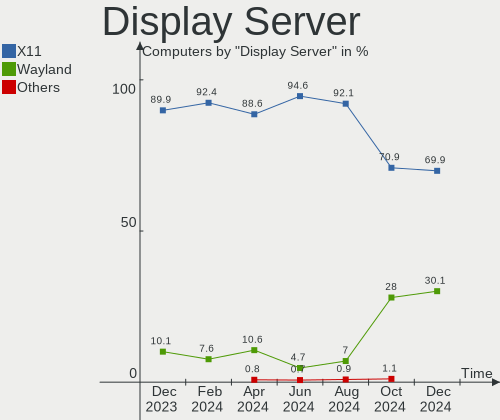
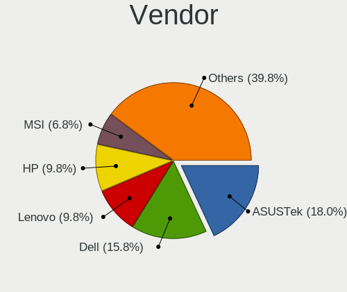
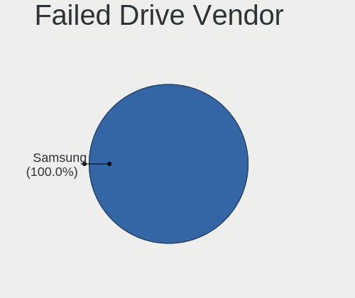
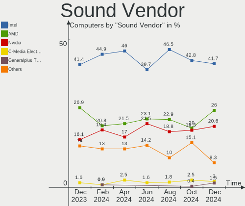

Kubuntu Hardware Trends
-----------------------

A project to identify most popular hardware characteristics and track their change
over time based on data collected by Kubuntu users at https://Linux-Hardware.org.

Anyone can contribute to this report by the [hw-probe](https://github.com/linuxhw/hw-probe) tool:

    sudo -E hw-probe -all -upload

This is a report for all computer types. See also reports for [desktops](/Dist/Kubuntu/Desktop/README.md) and [notebooks](/Dist/Kubuntu/Notebook/README.md).

Full-feature report is available here: https://linux-hardware.org/?view=trends

Period: Mar, 2022.

Contents
--------

* [ System ](#system)
  - [ OS                       ](#os)
  - [ OS Family                ](#os-family)
  - [ Kernel                   ](#kernel)
  - [ Kernel Family            ](#kernel-family)
  - [ Kernel Major Ver.        ](#kernel-major-ver)
  - [ Arch                     ](#arch)
  - [ DE                       ](#de)
  - [ Display Server           ](#display-server)
  - [ Display Manager          ](#display-manager)
  - [ OS Lang                  ](#os-lang)
  - [ Boot Mode                ](#boot-mode)
  - [ Filesystem               ](#filesystem)
  - [ Part. scheme             ](#part-scheme)
  - [ Dual Boot with Linux/BSD ](#dual-boot-with-linuxbsd)
  - [ Dual Boot (Win)          ](#dual-boot-win)

* [ Board ](#board)
  - [ Vendor                   ](#vendor)
  - [ Model                    ](#model)
  - [ Model Family             ](#model-family)
  - [ MFG Year                 ](#mfg-year)
  - [ Form Factor              ](#form-factor)
  - [ Secure Boot              ](#secure-boot)
  - [ Coreboot                 ](#coreboot)
  - [ RAM Size                 ](#ram-size)
  - [ RAM Used                 ](#ram-used)
  - [ Total Drives             ](#total-drives)
  - [ Has CD-ROM               ](#has-cd-rom)
  - [ Has Ethernet             ](#has-ethernet)
  - [ Has WiFi                 ](#has-wifi)
  - [ Has Bluetooth            ](#has-bluetooth)

* [ Location ](#location)
  - [ Country                  ](#country)
  - [ City                     ](#city)

* [ Drives ](#drives)
  - [ Drive Vendor             ](#drive-vendor)
  - [ Drive Model              ](#drive-model)
  - [ HDD Vendor               ](#hdd-vendor)
  - [ SSD Vendor               ](#ssd-vendor)
  - [ Drive Kind               ](#drive-kind)
  - [ Drive Connector          ](#drive-connector)
  - [ Drive Size               ](#drive-size)
  - [ Space Total              ](#space-total)
  - [ Space Used               ](#space-used)
  - [ Malfunc. Drives          ](#malfunc-drives)
  - [ Malfunc. Drive Vendor    ](#malfunc-drive-vendor)
  - [ Malfunc. HDD Vendor      ](#malfunc-hdd-vendor)
  - [ Malfunc. Drive Kind      ](#malfunc-drive-kind)
  - [ Failed Drives            ](#failed-drives)
  - [ Failed Drive Vendor      ](#failed-drive-vendor)
  - [ Drive Status             ](#drive-status)

* [ Storage controller ](#storage-controller)
  - [ Storage Vendor           ](#storage-vendor)
  - [ Storage Model            ](#storage-model)
  - [ Storage Kind             ](#storage-kind)

* [ Processor ](#processor)
  - [ CPU Vendor               ](#cpu-vendor)
  - [ CPU Model                ](#cpu-model)
  - [ CPU Model Family         ](#cpu-model-family)
  - [ CPU Cores                ](#cpu-cores)
  - [ CPU Sockets              ](#cpu-sockets)
  - [ CPU Threads              ](#cpu-threads)
  - [ CPU Op-Modes             ](#cpu-op-modes)
  - [ CPU Microcode            ](#cpu-microcode)
  - [ CPU Microarch            ](#cpu-microarch)

* [ Graphics ](#graphics)
  - [ GPU Vendor               ](#gpu-vendor)
  - [ GPU Model                ](#gpu-model)
  - [ GPU Combo                ](#gpu-combo)
  - [ GPU Driver               ](#gpu-driver)
  - [ GPU Memory               ](#gpu-memory)

* [ Monitor ](#monitor)
  - [ Monitor Vendor           ](#monitor-vendor)
  - [ Monitor Model            ](#monitor-model)
  - [ Monitor Resolution       ](#monitor-resolution)
  - [ Monitor Diagonal         ](#monitor-diagonal)
  - [ Monitor Width            ](#monitor-width)
  - [ Aspect Ratio             ](#aspect-ratio)
  - [ Monitor Area             ](#monitor-area)
  - [ Pixel Density            ](#pixel-density)
  - [ Multiple Monitors        ](#multiple-monitors)

* [ Network ](#network)
  - [ Net Controller Vendor    ](#net-controller-vendor)
  - [ Net Controller Model     ](#net-controller-model)
  - [ Wireless Vendor          ](#wireless-vendor)
  - [ Wireless Model           ](#wireless-model)
  - [ Ethernet Vendor          ](#ethernet-vendor)
  - [ Ethernet Model           ](#ethernet-model)
  - [ Net Controller Kind      ](#net-controller-kind)
  - [ Used Controller          ](#used-controller)
  - [ NICs                     ](#nics)
  - [ IPv6                     ](#ipv6)

* [ Bluetooth ](#bluetooth)
  - [ Bluetooth Vendor         ](#bluetooth-vendor)
  - [ Bluetooth Model          ](#bluetooth-model)

* [ Sound ](#sound)
  - [ Sound Vendor             ](#sound-vendor)
  - [ Sound Model              ](#sound-model)

* [ Memory ](#memory)
  - [ Memory Vendor            ](#memory-vendor)
  - [ Memory Model             ](#memory-model)
  - [ Memory Kind              ](#memory-kind)
  - [ Memory Form Factor       ](#memory-form-factor)
  - [ Memory Size              ](#memory-size)
  - [ Memory Speed             ](#memory-speed)

* [ Printers & scanners ](#printers--scanners)
  - [ Printer Vendor           ](#printer-vendor)
  - [ Printer Model            ](#printer-model)
  - [ Scanner Vendor           ](#scanner-vendor)
  - [ Scanner Model            ](#scanner-model)

* [ Camera ](#camera)
  - [ Camera Vendor            ](#camera-vendor)
  - [ Camera Model             ](#camera-model)

* [ Security ](#security)
  - [ Fingerprint Vendor       ](#fingerprint-vendor)
  - [ Fingerprint Model        ](#fingerprint-model)
  - [ Chipcard Vendor          ](#chipcard-vendor)
  - [ Chipcard Model           ](#chipcard-model)

* [ Unsupported ](#unsupported)
  - [ Unsupported Devices      ](#unsupported-devices)
  - [ Unsupported Device Types ](#unsupported-device-types)

System
------

OS
--

Installed operating systems

| Name          | Computers | Percent |
|---------------|-----------|---------|
| Kubuntu 20.04 | 40        | 42.55%  |
| Kubuntu 21.10 | 35        | 37.23%  |
| Kubuntu 11    | 10        | 10.64%  |
| Kubuntu 21.04 | 3         | 3.19%   |
| Kubuntu 22.04 | 2         | 2.13%   |
| Kubuntu 18.04 | 2         | 2.13%   |
| Kubuntu 2.0   | 1         | 1.06%   |
| Kubuntu 12.04 | 1         | 1.06%   |

OS Family
---------

OS without a version

| Name    | Computers | Percent |
|---------|-----------|---------|
| Kubuntu | 94        | 100%    |

Kernel
------

Version of the Linux kernel

| Version                   | Computers | Percent |
|---------------------------|-----------|---------|
| 5.13.0-35-generic         | 29        | 30.85%  |
| 5.13.0-30-generic         | 14        | 14.89%  |
| 5.13.0-37-generic         | 12        | 12.77%  |
| 5.4.0-105-generic         | 5         | 5.32%   |
| 5.4.0-100-generic         | 3         | 3.19%   |
| 5.4.0-104-generic         | 2         | 2.13%   |
| 5.13.0-39-generic         | 2         | 2.13%   |
| 5.13.0-35-lowlatency      | 2         | 2.13%   |
| 5.13.0-28-generic         | 2         | 2.13%   |
| 5.11.0-49-generic         | 2         | 2.13%   |
| 5.8.0-63-generic          | 1         | 1.06%   |
| 5.8.0-44-generic          | 1         | 1.06%   |
| 5.4.0-52-generic          | 1         | 1.06%   |
| 5.4.0-42-generic          | 1         | 1.06%   |
| 5.17.1-051701-generic     | 1         | 1.06%   |
| 5.17.0-051700rc7-generic  | 1         | 1.06%   |
| 5.17.0-051700-generic     | 1         | 1.06%   |
| 5.15.29-051529-generic    | 1         | 1.06%   |
| 5.15.0-18-generic         | 1         | 1.06%   |
| 5.14.0-1031-oem           | 1         | 1.06%   |
| 5.14.0-1024-oem           | 1         | 1.06%   |
| 5.13.0-38-generic         | 1         | 1.06%   |
| 5.13.0-36-generic         | 1         | 1.06%   |
| 5.13.0-32-generic         | 1         | 1.06%   |
| 5.13.0-19-generic         | 1         | 1.06%   |
| 5.13.0-1017-raspi         | 1         | 1.06%   |
| 5.10.86-051086-lowlatency | 1         | 1.06%   |
| 5.10.0-1038-oem           | 1         | 1.06%   |
| 4.15.0-171-generic        | 1         | 1.06%   |
| 4.15.0-169-generic        | 1         | 1.06%   |
| 3.13.0-117-generic        | 1         | 1.06%   |

Kernel Family
-------------

Linux kernel without a distro release

| Version | Computers | Percent |
|---------|-----------|---------|
| 5.13.0  | 66        | 70.21%  |
| 5.4.0   | 12        | 12.77%  |
| 5.8.0   | 2         | 2.13%   |
| 5.17.0  | 2         | 2.13%   |
| 5.14.0  | 2         | 2.13%   |
| 5.11.0  | 2         | 2.13%   |
| 4.15.0  | 2         | 2.13%   |
| 5.17.1  | 1         | 1.06%   |
| 5.15.29 | 1         | 1.06%   |
| 5.15.0  | 1         | 1.06%   |
| 5.10.86 | 1         | 1.06%   |
| 5.10.0  | 1         | 1.06%   |
| 3.13.0  | 1         | 1.06%   |

Kernel Major Ver.
-----------------

Linux kernel major version

| Version | Computers | Percent |
|---------|-----------|---------|
| 5.13    | 66        | 70.21%  |
| 5.4     | 12        | 12.77%  |
| 5.17    | 3         | 3.19%   |
| 5.8     | 2         | 2.13%   |
| 5.15    | 2         | 2.13%   |
| 5.14    | 2         | 2.13%   |
| 5.11    | 2         | 2.13%   |
| 5.10    | 2         | 2.13%   |
| 4.15    | 2         | 2.13%   |
| 3.13    | 1         | 1.06%   |

Arch
----

OS architecture (x86_64, i586, etc.)

| Name    | Computers | Percent |
|---------|-----------|---------|
| x86_64  | 93        | 98.94%  |
| aarch64 | 1         | 1.06%   |

DE
--

Desktop Environment

| Name | Computers | Percent |
|------|-----------|---------|
| KDE5 | 90        | 95.74%  |
| KDE  | 2         | 2.13%   |
| XFCE | 1         | 1.06%   |
| KDE4 | 1         | 1.06%   |

Display Server
--------------

X11 or Wayland

| Name    | Computers | Percent |
|---------|-----------|---------|
| X11     | 90        | 95.74%  |
| Wayland | 3         | 3.19%   |
| Tty     | 1         | 1.06%   |

Display Manager
---------------

SDDM, LightDM, etc.

| Name    | Computers | Percent |
|---------|-----------|---------|
| SDDM    | 66        | 70.21%  |
| Unknown | 21        | 22.34%  |
| LightDM | 4         | 4.26%   |
| GDM     | 2         | 2.13%   |
| GDM3    | 1         | 1.06%   |

OS Lang
-------

Language

| Lang  | Computers | Percent |
|-------|-----------|---------|
| en_US | 35        | 37.23%  |
| fr_FR | 6         | 6.38%   |
| en_GB | 6         | 6.38%   |
| de_DE | 6         | 6.38%   |
| it_IT | 4         | 4.26%   |
| ru_RU | 3         | 3.19%   |
| pt_BR | 3         | 3.19%   |
| sk_SK | 2         | 2.13%   |
| pl_PL | 2         | 2.13%   |
| hu_HU | 2         | 2.13%   |
| es_ES | 2         | 2.13%   |
| en_IN | 2         | 2.13%   |
| en_CA | 2         | 2.13%   |
| de_CH | 2         | 2.13%   |
| C     | 2         | 2.13%   |
| tr_TR | 1         | 1.06%   |
| sv_SE | 1         | 1.06%   |
| sr_RS | 1         | 1.06%   |
| hr_HR | 1         | 1.06%   |
| fr_DZ | 1         | 1.06%   |
| es_MX | 1         | 1.06%   |
| es_CL | 1         | 1.06%   |
| en_ZA | 1         | 1.06%   |
| en_SG | 1         | 1.06%   |
| en_IL | 1         | 1.06%   |
| en_IE | 1         | 1.06%   |
| en_HK | 1         | 1.06%   |
| en_AU | 1         | 1.06%   |
| de_AT | 1         | 1.06%   |
| be_BY | 1         | 1.06%   |

Boot Mode
---------

EFI or BIOS

| Mode | Computers | Percent |
|------|-----------|---------|
| EFI  | 52        | 55.32%  |
| BIOS | 42        | 44.68%  |

Filesystem
----------

Type of filesystem

| Type    | Computers | Percent |
|---------|-----------|---------|
| Ext4    | 89        | 94.68%  |
| Overlay | 2         | 2.13%   |
| Btrfs   | 2         | 2.13%   |
| Xfs     | 1         | 1.06%   |

Part. scheme
------------

Scheme of partitioning

| Type    | Computers | Percent |
|---------|-----------|---------|
| Unknown | 44        | 46.81%  |
| GPT     | 43        | 45.74%  |
| MBR     | 7         | 7.45%   |

Dual Boot with Linux/BSD
------------------------

Hosting more than one Linux/BSD

| Dual boot | Computers | Percent |
|-----------|-----------|---------|
| No        | 80        | 85.11%  |
| Yes       | 14        | 14.89%  |

Dual Boot (Win)
---------------

Hosting Linux and Windows

| Dual boot | Computers | Percent |
|-----------|-----------|---------|
| No        | 59        | 62.77%  |
| Yes       | 35        | 37.23%  |

Board
-----

Vendor
------

Motherboard manufacturer

| Name                    | Computers | Percent |
|-------------------------|-----------|---------|
| ASUSTek Computer        | 19        | 20.21%  |
| Dell                    | 16        | 17.02%  |
| Lenovo                  | 15        | 15.96%  |
| Hewlett-Packard         | 9         | 9.57%   |
| MSI                     | 7         | 7.45%   |
| Gigabyte Technology     | 5         | 5.32%   |
| ASRock                  | 4         | 4.26%   |
| Acer                    | 3         | 3.19%   |
| Apple                   | 2         | 2.13%   |
| Samsung Electronics     | 1         | 1.06%   |
| Razer                   | 1         | 1.06%   |
| Raspberry Pi Foundation | 1         | 1.06%   |
| Positivo                | 1         | 1.06%   |
| Pegatron                | 1         | 1.06%   |
| Panasonic               | 1         | 1.06%   |
| Packard Bell            | 1         | 1.06%   |
| Medion                  | 1         | 1.06%   |
| Intel                   | 1         | 1.06%   |
| HUAWEI                  | 1         | 1.06%   |
| GEO                     | 1         | 1.06%   |
| Foxconn                 | 1         | 1.06%   |
| Avell High Performance  | 1         | 1.06%   |
| Unknown                 | 1         | 1.06%   |

Model
-----

Motherboard model

| Name                                                 | Computers | Percent |
|------------------------------------------------------|-----------|---------|
| Lenovo IdeaPad S145-15IIL 82DJ                       | 2         | 2.13%   |
| Samsung 300E4Z/300E5Z/300E7Z                         | 1         | 1.06%   |
| Razer Blade 15 Advanced Model (Mid 2021) - RZ09-0409 | 1         | 1.06%   |
| RPi Raspberry Pi                                     | 1         | 1.06%   |
| Positivo Q232A                                       | 1         | 1.06%   |
| Pegatron TouchSmart 7320 Lavaca-B EU L6 PC           | 1         | 1.06%   |
| Panasonic FZ-M1CC-51BE                               | 1         | 1.06%   |
| Packard Bell IMEDIA S2885                            | 1         | 1.06%   |
| MSI MS-7C36                                          | 1         | 1.06%   |
| MSI MS-7B89                                          | 1         | 1.06%   |
| MSI MS-7817                                          | 1         | 1.06%   |
| MSI MS-7721                                          | 1         | 1.06%   |
| MSI Katana GF76 11UC                                 | 1         | 1.06%   |
| MSI GP76 Leopard 11UH                                | 1         | 1.06%   |
| MSI dx5150 SFF                                       | 1         | 1.06%   |
| Medion E2292 MD63390                                 | 1         | 1.06%   |
| Lenovo Yoga 730-15IKB 81CU                           | 1         | 1.06%   |
| Lenovo Yoga 7 14ITL5 82BH                            | 1         | 1.06%   |
| Lenovo ThinkPad X220 4290EC5                         | 1         | 1.06%   |
| Lenovo ThinkPad X1 Yoga Gen 6 20XYCTO1WW             | 1         | 1.06%   |
| Lenovo ThinkPad X1 Extreme 20MFS0PE00                | 1         | 1.06%   |
| Lenovo ThinkPad T540p 20BEA00FRT                     | 1         | 1.06%   |
| Lenovo ThinkPad T430 2347AT2                         | 1         | 1.06%   |
| Lenovo ThinkPad P1 Gen 3 20TH003SUS                  | 1         | 1.06%   |
| Lenovo ThinkPad L13 Yoga Gen 2 20VLS01500            | 1         | 1.06%   |
| Lenovo ThinkCentre Edge72 3484BTG                    | 1         | 1.06%   |
| Lenovo MIIX 320-10ICR 80XF                           | 1         | 1.06%   |
| Lenovo IdeaPad S530-13IWL 81J7                       | 1         | 1.06%   |
| Lenovo B580 20144                                    | 1         | 1.06%   |
| Intel DP965LT AAD41694-206                           | 1         | 1.06%   |
| HUAWEI BOHB-WAX9                                     | 1         | 1.06%   |
| HP Z440 Workstation                                  | 1         | 1.06%   |
| HP Z420 Workstation                                  | 1         | 1.06%   |
| HP Stream Notebook PC 14                             | 1         | 1.06%   |
| HP Spectre x360 Convertible                          | 1         | 1.06%   |
| HP ProDesk 600 G2 SFF                                | 1         | 1.06%   |
| HP ProBook 430 G2                                    | 1         | 1.06%   |
| HP Pavilion 14                                       | 1         | 1.06%   |
| HP OMEN by Desktop PC 870-2XX                        | 1         | 1.06%   |
| HP EliteBook 850 G5                                  | 1         | 1.06%   |
| Gigabyte Z590 AORUS PRO AX                           | 1         | 1.06%   |
| Gigabyte X570 AORUS PRO WIFI                         | 1         | 1.06%   |
| Gigabyte B75M-HD3                                    | 1         | 1.06%   |
| Gigabyte B450 AORUS M                                | 1         | 1.06%   |
| Gigabyte A320M-S2H V2                                | 1         | 1.06%   |
| GEO GeoFlex 110                                      | 1         | 1.06%   |
| Foxconn G41MXE/G41MXE-K                              | 1         | 1.06%   |
| Dell XPS 15 7590                                     | 1         | 1.06%   |
| Dell XPS 13 9310                                     | 1         | 1.06%   |
| Dell XPS 13 9305                                     | 1         | 1.06%   |
| Dell Vostro 5470                                     | 1         | 1.06%   |
| Dell Vostro 15 3515                                  | 1         | 1.06%   |
| Dell System Inspiron N7110                           | 1         | 1.06%   |
| Dell Precision WorkStation T5400                     | 1         | 1.06%   |
| Dell Precision Tower 5810                            | 1         | 1.06%   |
| Dell Precision T7610                                 | 1         | 1.06%   |
| Dell Precision M6300                                 | 1         | 1.06%   |
| Dell OptiPlex 9020                                   | 1         | 1.06%   |
| Dell Latitude E6530                                  | 1         | 1.06%   |
| Dell Latitude E6430                                  | 1         | 1.06%   |

Model Family
------------

Motherboard model prefix

| Name                        | Computers | Percent |
|-----------------------------|-----------|---------|
| Lenovo ThinkPad             | 7         | 7.45%   |
| Dell Precision              | 4         | 4.26%   |
| ASUS VivoBook               | 4         | 4.26%   |
| Lenovo IdeaPad              | 3         | 3.19%   |
| Dell XPS                    | 3         | 3.19%   |
| Dell Latitude               | 3         | 3.19%   |
| Lenovo Yoga                 | 2         | 2.13%   |
| Dell Vostro                 | 2         | 2.13%   |
| Dell Inspiron               | 2         | 2.13%   |
| ASUS Zenbook                | 2         | 2.13%   |
| ASUS ROG                    | 2         | 2.13%   |
| Samsung 300E4Z              | 1         | 1.06%   |
| Razer Blade                 | 1         | 1.06%   |
| RPi Raspberry               | 1         | 1.06%   |
| Positivo Q232A              | 1         | 1.06%   |
| Pegatron TouchSmart         | 1         | 1.06%   |
| Panasonic FZ-M1CC-51BE      | 1         | 1.06%   |
| Packard Bell IMEDIA         | 1         | 1.06%   |
| MSI MS-7C36                 | 1         | 1.06%   |
| MSI MS-7B89                 | 1         | 1.06%   |
| MSI MS-7817                 | 1         | 1.06%   |
| MSI MS-7721                 | 1         | 1.06%   |
| MSI Katana                  | 1         | 1.06%   |
| MSI GP76                    | 1         | 1.06%   |
| MSI dx5150                  | 1         | 1.06%   |
| Medion E2292                | 1         | 1.06%   |
| Lenovo ThinkCentre          | 1         | 1.06%   |
| Lenovo MIIX                 | 1         | 1.06%   |
| Lenovo B580                 | 1         | 1.06%   |
| Intel DP965LT               | 1         | 1.06%   |
| HUAWEI BOHB-WAX9            | 1         | 1.06%   |
| HP Z440                     | 1         | 1.06%   |
| HP Z420                     | 1         | 1.06%   |
| HP Stream                   | 1         | 1.06%   |
| HP Spectre                  | 1         | 1.06%   |
| HP ProDesk                  | 1         | 1.06%   |
| HP ProBook                  | 1         | 1.06%   |
| HP Pavilion                 | 1         | 1.06%   |
| HP OMEN                     | 1         | 1.06%   |
| HP EliteBook                | 1         | 1.06%   |
| Gigabyte Z590               | 1         | 1.06%   |
| Gigabyte X570               | 1         | 1.06%   |
| Gigabyte B75M-HD3           | 1         | 1.06%   |
| Gigabyte B450               | 1         | 1.06%   |
| Gigabyte A320M-S2H          | 1         | 1.06%   |
| GEO GeoFlex                 | 1         | 1.06%   |
| Foxconn G41MXE              | 1         | 1.06%   |
| Dell System                 | 1         | 1.06%   |
| Dell OptiPlex               | 1         | 1.06%   |
| Avell High Performance B.ON | 1         | 1.06%   |
| ASUS X555LNB                | 1         | 1.06%   |
| ASUS UX331UN                | 1         | 1.06%   |
| ASUS STRIX                  | 1         | 1.06%   |
| ASUS PRIME                  | 1         | 1.06%   |
| ASUS P8B75-M                | 1         | 1.06%   |
| ASUS N550LF                 | 1         | 1.06%   |
| ASUS K73E                   | 1         | 1.06%   |
| ASUS K55N                   | 1         | 1.06%   |
| ASUS K52Jr                  | 1         | 1.06%   |
| ASUS ASUS                   | 1         | 1.06%   |

MFG Year
--------

Motherboard manufacture year

| Year    | Computers | Percent |
|---------|-----------|---------|
| 2021    | 16        | 17.02%  |
| 2020    | 11        | 11.7%   |
| 2018    | 11        | 11.7%   |
| 2014    | 9         | 9.57%   |
| 2012    | 8         | 8.51%   |
| 2019    | 7         | 7.45%   |
| 2013    | 6         | 6.38%   |
| 2011    | 6         | 6.38%   |
| 2015    | 5         | 5.32%   |
| 2017    | 4         | 4.26%   |
| 2016    | 2         | 2.13%   |
| 2007    | 2         | 2.13%   |
| 2006    | 2         | 2.13%   |
| 2022    | 1         | 1.06%   |
| 2010    | 1         | 1.06%   |
| 2009    | 1         | 1.06%   |
| 2008    | 1         | 1.06%   |
| Unknown | 1         | 1.06%   |

Form Factor
-----------

Physical design of the computer

| Name           | Computers | Percent |
|----------------|-----------|---------|
| Notebook       | 50        | 53.19%  |
| Desktop        | 34        | 36.17%  |
| Convertible    | 8         | 8.51%   |
| System on chip | 1         | 1.06%   |
| Tablet         | 1         | 1.06%   |

Secure Boot
-----------

Enabled or disabled

| State    | Computers | Percent |
|----------|-----------|---------|
| Disabled | 86        | 91.49%  |
| Enabled  | 8         | 8.51%   |

Coreboot
--------

Have coreboot on board

| Used | Computers | Percent |
|------|-----------|---------|
| No   | 94        | 100%    |

RAM Size
--------

Total RAM memory

| Size in GB  | Computers | Percent |
|-------------|-----------|---------|
| 16.01-24.0  | 29        | 30.85%  |
| 4.01-8.0    | 24        | 25.53%  |
| 8.01-16.0   | 15        | 15.96%  |
| 3.01-4.0    | 10        | 10.64%  |
| 32.01-64.0  | 8         | 8.51%   |
| 64.01-256.0 | 4         | 4.26%   |
| 1.01-2.0    | 2         | 2.13%   |
| 24.01-32.0  | 1         | 1.06%   |
| 2.01-3.0    | 1         | 1.06%   |

RAM Used
--------

Used RAM memory

| Used GB    | Computers | Percent |
|------------|-----------|---------|
| 1.01-2.0   | 31        | 32.98%  |
| 2.01-3.0   | 19        | 20.21%  |
| 3.01-4.0   | 18        | 19.15%  |
| 4.01-8.0   | 15        | 15.96%  |
| 8.01-16.0  | 6         | 6.38%   |
| 24.01-32.0 | 2         | 2.13%   |
| 0.51-1.0   | 2         | 2.13%   |
| Unknown    | 1         | 1.06%   |

Total Drives
------------

Number of drives on board

| Drives | Computers | Percent |
|--------|-----------|---------|
| 1      | 51        | 54.26%  |
| 2      | 27        | 28.72%  |
| 4      | 6         | 6.38%   |
| 3      | 6         | 6.38%   |
| 5      | 3         | 3.19%   |
| 12     | 1         | 1.06%   |

Has CD-ROM
----------

Has CD-ROM on board

| Presented | Computers | Percent |
|-----------|-----------|---------|
| No        | 65        | 69.15%  |
| Yes       | 29        | 30.85%  |

Has Ethernet
------------

Has Ethernet on board

| Presented | Computers | Percent |
|-----------|-----------|---------|
| Yes       | 63        | 67.02%  |
| No        | 31        | 32.98%  |

Has WiFi
--------

Has WiFi module

| Presented | Computers | Percent |
|-----------|-----------|---------|
| Yes       | 77        | 81.91%  |
| No        | 17        | 18.09%  |

Has Bluetooth
-------------

Has Bluetooth module

| Presented | Computers | Percent |
|-----------|-----------|---------|
| Yes       | 61        | 64.89%  |
| No        | 33        | 35.11%  |

Location
--------

Country
-------

Geographic location (country)

| Country      | Computers | Percent |
|--------------|-----------|---------|
| USA          | 18        | 19.15%  |
| Germany      | 9         | 9.57%   |
| France       | 7         | 7.45%   |
| UK           | 6         | 6.38%   |
| Italy        | 6         | 6.38%   |
| Brazil       | 5         | 5.32%   |
| Russia       | 4         | 4.26%   |
| Switzerland  | 3         | 3.19%   |
| Turkey       | 2         | 2.13%   |
| Sweden       | 2         | 2.13%   |
| Spain        | 2         | 2.13%   |
| Slovakia     | 2         | 2.13%   |
| Poland       | 2         | 2.13%   |
| Mexico       | 2         | 2.13%   |
| India        | 2         | 2.13%   |
| Hungary      | 2         | 2.13%   |
| Canada       | 2         | 2.13%   |
| Ukraine      | 1         | 1.06%   |
| Thailand     | 1         | 1.06%   |
| South Africa | 1         | 1.06%   |
| Singapore    | 1         | 1.06%   |
| Serbia       | 1         | 1.06%   |
| Saudi Arabia | 1         | 1.06%   |
| Israel       | 1         | 1.06%   |
| Ireland      | 1         | 1.06%   |
| Indonesia    | 1         | 1.06%   |
| Hong Kong    | 1         | 1.06%   |
| Greece       | 1         | 1.06%   |
| Georgia      | 1         | 1.06%   |
| Croatia      | 1         | 1.06%   |
| Chile        | 1         | 1.06%   |
| Belarus      | 1         | 1.06%   |
| Austria      | 1         | 1.06%   |
| Australia    | 1         | 1.06%   |
| Algeria      | 1         | 1.06%   |

City
----

Geographic location (city)

| City                     | Computers | Percent |
|--------------------------|-----------|---------|
| Moscow                   | 4         | 4.26%   |
| Paris                    | 2         | 2.13%   |
| Milan                    | 2         | 2.13%   |
| Zurich                   | 1         | 1.06%   |
| Zaragoza                 | 1         | 1.06%   |
| Zagreb                   | 1         | 1.06%   |
| Washington               | 1         | 1.06%   |
| Warsaw                   | 1         | 1.06%   |
| Wadersloh                | 1         | 1.06%   |
| Vitória                 | 1         | 1.06%   |
| Trimmis                  | 1         | 1.06%   |
| Tours                    | 1         | 1.06%   |
| Toulouse                 | 1         | 1.06%   |
| Surat Thani              | 1         | 1.06%   |
| Stockholm                | 1         | 1.06%   |
| Stafa                    | 1         | 1.06%   |
| St. Petersburg           | 1         | 1.06%   |
| Sparks                   | 1         | 1.06%   |
| Singapore                | 1         | 1.06%   |
| Sherman Oaks             | 1         | 1.06%   |
| Savannah                 | 1         | 1.06%   |
| Santo Antonio da Platina | 1         | 1.06%   |
| Saint-Jerome             | 1         | 1.06%   |
| Rumsey                   | 1         | 1.06%   |
| Rozzano                  | 1         | 1.06%   |
| Rotthalmunster           | 1         | 1.06%   |
| Rotherhithe              | 1         | 1.06%   |
| Rocca Priora             | 1         | 1.06%   |
| Ringwood                 | 1         | 1.06%   |
| Rho                      | 1         | 1.06%   |
| Rennes                   | 1         | 1.06%   |
| Reading                  | 1         | 1.06%   |
| Presidente Dutra         | 1         | 1.06%   |
| Porto Alegre             | 1         | 1.06%   |
| Ponchatoula              | 1         | 1.06%   |
| Pomarede                 | 1         | 1.06%   |
| Plymouth                 | 1         | 1.06%   |
| Pátrai                  | 1         | 1.06%   |
| Oran                     | 1         | 1.06%   |
| Nussbach                 | 1         | 1.06%   |
| Newton                   | 1         | 1.06%   |
| New Ross                 | 1         | 1.06%   |
| Mumbai                   | 1         | 1.06%   |
| Missoula                 | 1         | 1.06%   |
| Minsk                    | 1         | 1.06%   |
| Mexico City              | 1         | 1.06%   |
| Memmingen                | 1         | 1.06%   |
| Martin                   | 1         | 1.06%   |
| Marseille                | 1         | 1.06%   |
| Manteca                  | 1         | 1.06%   |
| Maipu                    | 1         | 1.06%   |
| Lubliniec                | 1         | 1.06%   |
| Las Vegas                | 1         | 1.06%   |
| Laichingen               | 1         | 1.06%   |
| La Vergne                | 1         | 1.06%   |
| Kyiv                     | 1         | 1.06%   |
| Kowloon                  | 1         | 1.06%   |
| Kirkby-in-Furness        | 1         | 1.06%   |
| Kamenz                   | 1         | 1.06%   |
| K'alak'i T'bilisi        | 1         | 1.06%   |

Drives
------

Drive Vendor
------------

Hard drive vendors

| Vendor                         | Computers | Drives | Percent |
|--------------------------------|-----------|--------|---------|
| WDC                            | 27        | 46     | 18.37%  |
| Samsung Electronics            | 27        | 30     | 18.37%  |
| Seagate                        | 13        | 15     | 8.84%   |
| Kingston                       | 11        | 11     | 7.48%   |
| Unknown                        | 10        | 10     | 6.8%    |
| Toshiba                        | 9         | 11     | 6.12%   |
| SanDisk                        | 8         | 8      | 5.44%   |
| A-DATA Technology              | 5         | 5      | 3.4%    |
| Intel                          | 4         | 4      | 2.72%   |
| HGST                           | 4         | 3      | 2.72%   |
| SK Hynix                       | 3         | 3      | 2.04%   |
| Hitachi                        | 3         | 3      | 2.04%   |
| Micron Technology              | 2         | 2      | 1.36%   |
| KIOXIA                         | 2         | 2      | 1.36%   |
| Apple                          | 2         | 3      | 1.36%   |
| Team                           | 1         | 1      | 0.68%   |
| Solid State Storage Technology | 1         | 1      | 0.68%   |
| Silicon Motion                 | 1         | 1      | 0.68%   |
| ShanDianZhe                    | 1         | 1      | 0.68%   |
| sage                           | 1         | 1      | 0.68%   |
| PNY                            | 1         | 1      | 0.68%   |
| Phison                         | 1         | 1      | 0.68%   |
| Mushkin                        | 1         | 1      | 0.68%   |
| MAXTOR                         | 1         | 1      | 0.68%   |
| Intenso                        | 1         | 1      | 0.68%   |
| Hewlett-Packard                | 1         | 1      | 0.68%   |
| GOODRAM                        | 1         | 1      | 0.68%   |
| Fujitsu                        | 1         | 1      | 0.68%   |
| Crucial                        | 1         | 1      | 0.68%   |
| China                          | 1         | 1      | 0.68%   |
| BHT                            | 1         | 1      | 0.68%   |
| Unknown                        | 1         | 1      | 0.68%   |

Drive Model
-----------

Hard drive models

| Model                                | Computers | Percent |
|--------------------------------------|-----------|---------|
| WDC WD10EZEX-60WN4A0 1TB             | 2         | 1.21%   |
| Unknown MMC Card  32GB               | 2         | 1.21%   |
| Toshiba MQ04ABF100 1TB               | 2         | 1.21%   |
| Sandisk NVMe SSD Drive 512GB         | 2         | 1.21%   |
| Samsung SSD 870 QVO 2TB              | 2         | 1.21%   |
| Samsung SSD 860 EVO 250GB            | 2         | 1.21%   |
| Samsung SSD 850 EVO 500GB            | 2         | 1.21%   |
| Kingston SA400S37480G 480GB SSD      | 2         | 1.21%   |
| Kingston OM8PCP3512F-AI1 512GB       | 2         | 1.21%   |
| Intel SSDPEKNW512G8 512GB            | 2         | 1.21%   |
| A-DATA SU650 480GB SSD               | 2         | 1.21%   |
| WDC WDS500G2B0A-00SM50 500GB SSD     | 1         | 0.61%   |
| WDC WDBNCE5000PNC 500GB SSD          | 1         | 0.61%   |
| WDC WD800JD-75MSA3 80GB              | 1         | 0.61%   |
| WDC WD6401AALS-22A7B2 640GB          | 1         | 0.61%   |
| WDC WD6400BPVT-75HXZT3 640GB         | 1         | 0.61%   |
| WDC WD6400BPVT-22HXZT3 640GB         | 1         | 0.61%   |
| WDC WD5000BPVT-08HXZT3 500GB         | 1         | 0.61%   |
| WDC WD5000AVJS-63TRA0 500GB          | 1         | 0.61%   |
| WDC WD5000AADS-67S9B1 500GB          | 1         | 0.61%   |
| WDC WD5000AADS-00S9B0 500GB          | 1         | 0.61%   |
| WDC WD40EMRX-82UZ0N0 4TB             | 1         | 0.61%   |
| WDC WD4003FZEX-00Z4SA0 4TB           | 1         | 0.61%   |
| WDC WD3200LPVX-75V0TT0 320GB         | 1         | 0.61%   |
| WDC WD3200JD-22KLB0 320GB            | 1         | 0.61%   |
| WDC WD3200AAKX-22ERMA0 320GB         | 1         | 0.61%   |
| WDC WD3200AAKX-00ERMA0 320GB         | 1         | 0.61%   |
| WDC WD3200AAJS-00L7A0 320GB          | 1         | 0.61%   |
| WDC WD3200AAJB-56R1A0 320GB          | 1         | 0.61%   |
| WDC WD30EZRX-00MMMB0 3TB             | 1         | 0.61%   |
| WDC WD30EZRX-00D 3TB                 | 1         | 0.61%   |
| WDC WD30EZRS-11J99B1 3TB             | 1         | 0.61%   |
| WDC WD20EZRZ-00Z5HB0 2TB             | 1         | 0.61%   |
| WDC WD20EFRX-68EUZN0 2TB             | 1         | 0.61%   |
| WDC WD20EARX-00PASB0 2TB             | 1         | 0.61%   |
| WDC WD2003FYYS-02W0B0 2TB            | 1         | 0.61%   |
| WDC WD10SPZX-21Z10T0 1TB             | 1         | 0.61%   |
| WDC WD10SPZX-00Z10T0 1TB             | 1         | 0.61%   |
| WDC WD10JPVX-75JC3T0 1TB             | 1         | 0.61%   |
| WDC WD10EZEX-21M2NA0 1TB             | 1         | 0.61%   |
| WDC WD10EZEX-00BN5A0 1TB             | 1         | 0.61%   |
| WDC WD10EACS-65D6B0 1TB              | 1         | 0.61%   |
| WDC WD10EACS-32ZJB0 1TB              | 1         | 0.61%   |
| WDC WD10EACS-00ZJB0 1TB              | 1         | 0.61%   |
| WDC WD10EACS-00C7B0 1TB              | 1         | 0.61%   |
| WDC WD1003FZEX-00MK2A0 1TB           | 1         | 0.61%   |
| WDC WD1003FZEX-00K3CA0 1TB           | 1         | 0.61%   |
| WDC WD1001FALS-40U9B0 1TB            | 1         | 0.61%   |
| WDC PC SN730 SDBPNTY-1T00-1101 1TB   | 1         | 0.61%   |
| WDC PC SN730 NVMe 512GB              | 1         | 0.61%   |
| WDC PC SN530 SDBPNPZ-512G-1114 512GB | 1         | 0.61%   |
| Unknown SU32G  32GB                  | 1         | 0.61%   |
| Unknown SD32G  32GB                  | 1         | 0.61%   |
| Unknown SD/MMC/MS PRO 32GB           | 1         | 0.61%   |
| Unknown SC128  128GB                 | 1         | 0.61%   |
| Unknown MMC Card  64GB               | 1         | 0.61%   |
| Unknown MMC Card  16GB               | 1         | 0.61%   |
| Unknown MMC Card  128GB              | 1         | 0.61%   |
| Unknown EC2QT  64GB                  | 1         | 0.61%   |
| Toshiba THNSN5512GPUK 512GB          | 1         | 0.61%   |

HDD Vendor
----------

Hard disk drive vendors

| Vendor              | Computers | Drives | Percent |
|---------------------|-----------|--------|---------|
| WDC                 | 23        | 41     | 38.33%  |
| Seagate             | 12        | 14     | 20%     |
| Toshiba             | 7         | 9      | 11.67%  |
| Samsung Electronics | 6         | 6      | 10%     |
| HGST                | 4         | 3      | 6.67%   |
| Hitachi             | 3         | 3      | 5%      |
| Unknown             | 1         | 1      | 1.67%   |
| sage                | 1         | 1      | 1.67%   |
| MAXTOR              | 1         | 1      | 1.67%   |
| Hewlett-Packard     | 1         | 1      | 1.67%   |
| Fujitsu             | 1         | 1      | 1.67%   |

SSD Vendor
----------

Solid state drive vendors

| Vendor              | Computers | Drives | Percent |
|---------------------|-----------|--------|---------|
| Samsung Electronics | 12        | 15     | 30%     |
| Kingston            | 7         | 7      | 17.5%   |
| SanDisk             | 4         | 4      | 10%     |
| A-DATA Technology   | 3         | 3      | 7.5%    |
| WDC                 | 2         | 2      | 5%      |
| Team                | 1         | 1      | 2.5%    |
| ShanDianZhe         | 1         | 1      | 2.5%    |
| PNY                 | 1         | 1      | 2.5%    |
| Mushkin             | 1         | 1      | 2.5%    |
| Micron Technology   | 1         | 1      | 2.5%    |
| Intenso             | 1         | 1      | 2.5%    |
| Intel               | 1         | 1      | 2.5%    |
| GOODRAM             | 1         | 1      | 2.5%    |
| Crucial             | 1         | 1      | 2.5%    |
| China               | 1         | 1      | 2.5%    |
| BHT                 | 1         | 1      | 2.5%    |
| Apple               | 1         | 1      | 2.5%    |

Drive Kind
----------

HDD or SSD

| Kind    | Computers | Drives | Percent |
|---------|-----------|--------|---------|
| HDD     | 41        | 81     | 33.06%  |
| SSD     | 37        | 43     | 29.84%  |
| NVMe    | 34        | 35     | 27.42%  |
| MMC     | 11        | 13     | 8.87%   |
| Unknown | 1         | 1      | 0.81%   |

Drive Connector
---------------

SATA, SAS, NVMe, etc.

| Type | Computers | Drives | Percent |
|------|-----------|--------|---------|
| SATA | 60        | 116    | 54.05%  |
| NVMe | 34        | 35     | 30.63%  |
| MMC  | 11        | 13     | 9.91%   |
| SAS  | 6         | 9      | 5.41%   |

Drive Size
----------

Size of hard drive

| Size in TB | Computers | Drives | Percent |
|------------|-----------|--------|---------|
| 0.01-0.5   | 43        | 63     | 48.31%  |
| 0.51-1.0   | 28        | 39     | 31.46%  |
| 1.01-2.0   | 10        | 12     | 11.24%  |
| 3.01-4.0   | 3         | 4      | 3.37%   |
| 2.01-3.0   | 3         | 4      | 3.37%   |
| 4.01-10.0  | 2         | 2      | 2.25%   |

Space Total
-----------

Amount of disk space available on the file system

| Size in GB     | Computers | Percent |
|----------------|-----------|---------|
| 251-500        | 24        | 25.53%  |
| 101-250        | 18        | 19.15%  |
| 501-1000       | 14        | 14.89%  |
| More than 3000 | 9         | 9.57%   |
| 1001-2000      | 9         | 9.57%   |
| 51-100         | 8         | 8.51%   |
| 21-50          | 4         | 4.26%   |
| 2001-3000      | 4         | 4.26%   |
| 1-20           | 3         | 3.19%   |
| Unknown        | 1         | 1.06%   |

Space Used
----------

Amount of used disk space

| Used GB        | Computers | Percent |
|----------------|-----------|---------|
| 1-20           | 28        | 29.79%  |
| 21-50          | 14        | 14.89%  |
| 251-500        | 12        | 12.77%  |
| 101-250        | 12        | 12.77%  |
| 51-100         | 9         | 9.57%   |
| 501-1000       | 8         | 8.51%   |
| 1001-2000      | 6         | 6.38%   |
| More than 3000 | 4         | 4.26%   |
| Unknown        | 1         | 1.06%   |

Malfunc. Drives
---------------

Drive models with a malfunction

| Model                               | Computers | Drives | Percent |
|-------------------------------------|-----------|--------|---------|
| WDC WD4003FZEX-00Z4SA0 4TB          | 1         | 2      | 10%     |
| WDC WD3200JD-22KLB0 320GB           | 1         | 1      | 10%     |
| WDC WD3200AAJB-56R1A0 320GB         | 1         | 1      | 10%     |
| WDC WD20EFRX-68EUZN0 2TB            | 1         | 2      | 10%     |
| WDC WD10EZEX-21M2NA0 1TB            | 1         | 1      | 10%     |
| WDC WD1001FALS-40U9B0 1TB           | 1         | 1      | 10%     |
| Seagate ST9500325AS 500GB           | 1         | 1      | 10%     |
| Seagate ST500LM012 HN-M500MBB 500GB | 1         | 1      | 10%     |
| Samsung Electronics HM160HI 160GB   | 1         | 1      | 10%     |
| Fujitsu MHV2060BH PL 64GB           | 1         | 1      | 10%     |

Malfunc. Drive Vendor
---------------------

Vendors of faulty drives

| Vendor              | Computers | Drives | Percent |
|---------------------|-----------|--------|---------|
| WDC                 | 4         | 8      | 50%     |
| Seagate             | 2         | 2      | 25%     |
| Samsung Electronics | 1         | 1      | 12.5%   |
| Fujitsu             | 1         | 1      | 12.5%   |

Malfunc. HDD Vendor
-------------------

Vendors of faulty HDD drives

| Vendor              | Computers | Drives | Percent |
|---------------------|-----------|--------|---------|
| WDC                 | 4         | 8      | 50%     |
| Seagate             | 2         | 2      | 25%     |
| Samsung Electronics | 1         | 1      | 12.5%   |
| Fujitsu             | 1         | 1      | 12.5%   |

Malfunc. Drive Kind
-------------------

Kinds of faulty drives

| Kind | Computers | Drives | Percent |
|------|-----------|--------|---------|
| HDD  | 6         | 12     | 100%    |

Failed Drives
-------------

Failed drive models

| Model                     | Computers | Drives | Percent |
|---------------------------|-----------|--------|---------|
| Intel SSDSC2KB960G8 960GB | 1         | 1      | 100%    |

Failed Drive Vendor
-------------------

Failed drive vendors

| Vendor | Computers | Drives | Percent |
|--------|-----------|--------|---------|
| Intel  | 1         | 1      | 100%    |

Drive Status
------------

Number of failed and malfunc. drives

| Status   | Computers | Drives | Percent |
|----------|-----------|--------|---------|
| Detected | 52        | 87     | 49.52%  |
| Works    | 46        | 73     | 43.81%  |
| Malfunc  | 6         | 12     | 5.71%   |
| Failed   | 1         | 1      | 0.95%   |

Storage controller
------------------

Storage Vendor
--------------

Storage controller vendors

| Vendor                         | Computers | Percent |
|--------------------------------|-----------|---------|
| Intel                          | 60        | 53.57%  |
| AMD                            | 13        | 11.61%  |
| Samsung Electronics            | 10        | 8.93%   |
| Sandisk                        | 5         | 4.46%   |
| Kingston Technology Company    | 4         | 3.57%   |
| Toshiba America Info Systems   | 3         | 2.68%   |
| Marvell Technology Group       | 3         | 2.68%   |
| SK Hynix                       | 2         | 1.79%   |
| ADATA Technology               | 2         | 1.79%   |
| Solid State Storage Technology | 1         | 0.89%   |
| Silicon Motion                 | 1         | 0.89%   |
| Phison Electronics             | 1         | 0.89%   |
| Nvidia                         | 1         | 0.89%   |
| Micron Technology              | 1         | 0.89%   |
| KIOXIA                         | 1         | 0.89%   |
| JMicron Technology             | 1         | 0.89%   |
| Broadcom / LSI                 | 1         | 0.89%   |
| ASMedia Technology             | 1         | 0.89%   |
| Apple                          | 1         | 0.89%   |

Storage Model
-------------

Storage controller models

| Model                                                                          | Computers | Percent |
|--------------------------------------------------------------------------------|-----------|---------|
| AMD FCH SATA Controller [AHCI mode]                                            | 11        | 8.15%   |
| Intel Volume Management Device NVMe RAID Controller                            | 7         | 5.19%   |
| Samsung NVMe SSD Controller SM981/PM981/PM983                                  | 6         | 4.44%   |
| Intel 8 Series/C220 Series Chipset Family 6-port SATA Controller 1 [AHCI mode] | 5         | 3.7%    |
| Intel 8 Series SATA Controller 1 [AHCI mode]                                   | 5         | 3.7%    |
| Intel 6 Series/C200 Series Chipset Family 6 port Mobile SATA AHCI Controller   | 5         | 3.7%    |
| Intel 82801 Mobile SATA Controller [RAID mode]                                 | 4         | 2.96%   |
| Intel Tiger Lake-LP SATA Controller [AHCI mode]                                | 3         | 2.22%   |
| Intel Sunrise Point-LP SATA Controller [AHCI mode]                             | 3         | 2.22%   |
| Intel SSD 660P Series                                                          | 3         | 2.22%   |
| Toshiba America Info Systems XG6 NVMe SSD Controller                           | 2         | 1.48%   |
| Sandisk WD Blue SN550 NVMe SSD                                                 | 2         | 1.48%   |
| Sandisk WD Black SN750 / PC SN730 NVMe SSD                                     | 2         | 1.48%   |
| Samsung NVMe SSD Controller PM9A1/PM9A3/980PRO                                 | 2         | 1.48%   |
| Kingston Company Company Non-Volatile memory controller                        | 2         | 1.48%   |
| Kingston Company A2000 NVMe SSD                                                | 2         | 1.48%   |
| Intel Q170/Q150/B150/H170/H110/Z170/CM236 Chipset SATA Controller [AHCI Mode]  | 2         | 1.48%   |
| Intel Celeron/Pentium Silver Processor SATA Controller                         | 2         | 1.48%   |
| Intel C610/X99 series chipset sSATA Controller [AHCI mode]                     | 2         | 1.48%   |
| Intel C610/X99 series chipset 6-Port SATA Controller [AHCI mode]               | 2         | 1.48%   |
| Intel C600/X79 series chipset IDE-r Controller                                 | 2         | 1.48%   |
| Intel 7 Series/C210 Series Chipset Family 4-port SATA Controller [IDE mode]    | 2         | 1.48%   |
| Intel 7 Series/C210 Series Chipset Family 2-port SATA Controller [IDE mode]    | 2         | 1.48%   |
| Intel 6 Series/C200 Series Chipset Family 6 port Desktop SATA AHCI Controller  | 2         | 1.48%   |
| Intel 500 Series Chipset Family SATA AHCI Controller                           | 2         | 1.48%   |
| AMD 400 Series Chipset SATA Controller                                         | 2         | 1.48%   |
| ADATA Non-Volatile memory controller                                           | 2         | 1.48%   |
| Toshiba America Info Systems XG4 NVMe SSD Controller                           | 1         | 0.74%   |
| Solid State Storage Non-Volatile memory controller                             | 1         | 0.74%   |
| SK Hynix PC401 NVMe Solid State Drive 256GB                                    | 1         | 0.74%   |
| SK Hynix Gold P31 SSD                                                          | 1         | 0.74%   |
| Silicon Motion SM2263EN/SM2263XT SSD Controller                                | 1         | 0.74%   |
| Sandisk PC SN520 NVMe SSD                                                      | 1         | 0.74%   |
| Samsung NVMe SSD Controller 980                                                | 1         | 0.74%   |
| Samsung Electronics SATA controller                                            | 1         | 0.74%   |
| Phison E12 NVMe Controller                                                     | 1         | 0.74%   |
| Nvidia MCP61 SATA Controller                                                   | 1         | 0.74%   |
| Nvidia MCP61 IDE                                                               | 1         | 0.74%   |
| Micron Non-Volatile memory controller                                          | 1         | 0.74%   |
| Marvell Group 88SE9172 SATA 6Gb/s Controller                                   | 1         | 0.74%   |
| Marvell Group 88SE9128 PCIe SATA 6 Gb/s RAID controller                        | 1         | 0.74%   |
| Marvell Group 88SE6101/6102 single-port PATA133 interface                      | 1         | 0.74%   |
| KIOXIA Non-Volatile memory controller                                          | 1         | 0.74%   |
| JMicron JMB368 IDE controller                                                  | 1         | 0.74%   |
| JMicron JMB363 SATA/IDE Controller                                             | 1         | 0.74%   |
| Intel Wildcat Point-LP SATA Controller [AHCI Mode]                             | 1         | 0.74%   |
| Intel NM10/ICH7 Family SATA Controller [IDE mode]                              | 1         | 0.74%   |
| Intel Ice Lake-LP SATA Controller [AHCI mode]                                  | 1         | 0.74%   |
| Intel Comet Lake SATA AHCI Controller                                          | 1         | 0.74%   |
| Intel Comet Lake PCH-LP SATA RAID Premium Controller                           | 1         | 0.74%   |
| Intel Cannon Lake PCH SATA AHCI Controller                                     | 1         | 0.74%   |
| Intel Cannon Lake Mobile PCH SATA AHCI Controller                              | 1         | 0.74%   |
| Intel C602 chipset 4-Port SATA Storage Control Unit                            | 1         | 0.74%   |
| Intel C600/X79 series chipset SATA RAID Controller                             | 1         | 0.74%   |
| Intel C600/X79 series chipset 6-Port SATA AHCI Controller                      | 1         | 0.74%   |
| Intel 9 Series Chipset Family SATA Controller [AHCI Mode]                      | 1         | 0.74%   |
| Intel 82801HM/HEM (ICH8M/ICH8M-E) SATA Controller [IDE mode]                   | 1         | 0.74%   |
| Intel 82801HM/HEM (ICH8M/ICH8M-E) IDE Controller                               | 1         | 0.74%   |
| Intel 82801HB (ICH8) 4 port SATA Controller [AHCI mode]                        | 1         | 0.74%   |
| Intel 82801G (ICH7 Family) IDE Controller                                      | 1         | 0.74%   |

Storage Kind
------------

Kind of storage controller (IDE, SATA, NVMe, SAS, ...)

| Kind | Computers | Percent |
|------|-----------|---------|
| SATA | 57        | 47.9%   |
| NVMe | 34        | 28.57%  |
| RAID | 13        | 10.92%  |
| IDE  | 13        | 10.92%  |
| SAS  | 2         | 1.68%   |

Processor
---------

CPU Vendor
----------

Processor vendors

| Vendor | Computers | Percent |
|--------|-----------|---------|
| Intel  | 77        | 81.91%  |
| AMD    | 16        | 17.02%  |
| ARM    | 1         | 1.06%   |

CPU Model
---------

Processor models

| Model                                       | Computers | Percent |
|---------------------------------------------|-----------|---------|
| Intel 11th Gen Core i7-1165G7 @ 2.80GHz     | 7         | 7.45%   |
| Intel Core i7-8550U CPU @ 1.80GHz           | 3         | 3.19%   |
| Intel Xeon CPU E5-1620 v3 @ 3.50GHz         | 2         | 2.13%   |
| Intel Core i5-8250U CPU @ 1.60GHz           | 2         | 2.13%   |
| Intel Core i5-4460 CPU @ 3.20GHz            | 2         | 2.13%   |
| Intel Core i5-4200U CPU @ 1.60GHz           | 2         | 2.13%   |
| Intel Atom x5-Z8350 CPU @ 1.44GHz           | 2         | 2.13%   |
| Intel 11th Gen Core i7-11800H @ 2.30GHz     | 2         | 2.13%   |
| Intel 11th Gen Core i5-1135G7 @ 2.40GHz     | 2         | 2.13%   |
| AMD Ryzen 9 3900X 12-Core Processor         | 2         | 2.13%   |
| AMD Ryzen 7 5800H with Radeon Graphics      | 2         | 2.13%   |
| Intel Xeon CPU X5450 @ 3.00GHz              | 1         | 1.06%   |
| Intel Xeon CPU E5-2643 0 @ 3.30GHz          | 1         | 1.06%   |
| Intel Xeon CPU E5-1650 v2 @ 3.50GHz         | 1         | 1.06%   |
| Intel Pentium Silver N5000 CPU @ 1.10GHz    | 1         | 1.06%   |
| Intel Pentium Dual-Core CPU E5500 @ 2.80GHz | 1         | 1.06%   |
| Intel Pentium CPU G645 @ 2.90GHz            | 1         | 1.06%   |
| Intel Pentium CPU B950 @ 2.10GHz            | 1         | 1.06%   |
| Intel Core i9-10900K CPU @ 3.70GHz          | 1         | 1.06%   |
| Intel Core i9-10885H CPU @ 2.40GHz          | 1         | 1.06%   |
| Intel Core i7-9750H CPU @ 2.60GHz           | 1         | 1.06%   |
| Intel Core i7-8750H CPU @ 2.20GHz           | 1         | 1.06%   |
| Intel Core i7-8650U CPU @ 1.90GHz           | 1         | 1.06%   |
| Intel Core i7-8565U CPU @ 1.80GHz           | 1         | 1.06%   |
| Intel Core i7-7700 CPU @ 3.60GHz            | 1         | 1.06%   |
| Intel Core i7-6500U CPU @ 2.50GHz           | 1         | 1.06%   |
| Intel Core i7-4790K CPU @ 4.00GHz           | 1         | 1.06%   |
| Intel Core i7-4770 CPU @ 3.40GHz            | 1         | 1.06%   |
| Intel Core i7-4700MQ CPU @ 2.40GHz          | 1         | 1.06%   |
| Intel Core i7-3540M CPU @ 3.00GHz           | 1         | 1.06%   |
| Intel Core i7-2670QM CPU @ 2.20GHz          | 1         | 1.06%   |
| Intel Core i7-2630QM CPU @ 2.00GHz          | 1         | 1.06%   |
| Intel Core i7-1065G7 CPU @ 1.30GHz          | 1         | 1.06%   |
| Intel Core i5-9400F CPU @ 2.90GHz           | 1         | 1.06%   |
| Intel Core i5-7400 CPU @ 3.00GHz            | 1         | 1.06%   |
| Intel Core i5-7360U CPU @ 2.30GHz           | 1         | 1.06%   |
| Intel Core i5-6500 CPU @ 3.20GHz            | 1         | 1.06%   |
| Intel Core i5-5257U CPU @ 2.70GHz           | 1         | 1.06%   |
| Intel Core i5-4302Y CPU @ 1.60GHz           | 1         | 1.06%   |
| Intel Core i5-4210U CPU @ 1.70GHz           | 1         | 1.06%   |
| Intel Core i5-3570K CPU @ 3.40GHz           | 1         | 1.06%   |
| Intel Core i5-3470 CPU @ 3.20GHz            | 1         | 1.06%   |
| Intel Core i5-3340M CPU @ 2.70GHz           | 1         | 1.06%   |
| Intel Core i5-3320M CPU @ 2.60GHz           | 1         | 1.06%   |
| Intel Core i5-2520M CPU @ 2.50GHz           | 1         | 1.06%   |
| Intel Core i5-2430M CPU @ 2.40GHz           | 1         | 1.06%   |
| Intel Core i5-10400F CPU @ 2.90GHz          | 1         | 1.06%   |
| Intel Core i5-1035G1 CPU @ 1.00GHz          | 1         | 1.06%   |
| Intel Core i5-10210U CPU @ 1.60GHz          | 1         | 1.06%   |
| Intel Core i3-5010U CPU @ 2.10GHz           | 1         | 1.06%   |
| Intel Core i3-4130 CPU @ 3.40GHz            | 1         | 1.06%   |
| Intel Core i3-4030U CPU @ 1.90GHz           | 1         | 1.06%   |
| Intel Core i3-2328M CPU @ 2.20GHz           | 1         | 1.06%   |
| Intel Core i3-2120 CPU @ 3.30GHz            | 1         | 1.06%   |
| Intel Core i3-10110U CPU @ 2.10GHz          | 1         | 1.06%   |
| Intel Core i3 CPU M 350 @ 2.27GHz           | 1         | 1.06%   |
| Intel Core 2 Duo CPU T9300 @ 2.50GHz        | 1         | 1.06%   |
| Intel Core 2 Duo CPU E6550 @ 2.33GHz        | 1         | 1.06%   |
| Intel Celeron N4020 CPU @ 1.10GHz           | 1         | 1.06%   |
| Intel Celeron CPU 3867U @ 1.80GHz           | 1         | 1.06%   |

CPU Model Family
----------------

Processor model prefix

| Model                   | Computers | Percent |
|-------------------------|-----------|---------|
| Intel Core i5           | 22        | 23.4%   |
| Other                   | 16        | 17.02%  |
| Intel Core i7           | 16        | 17.02%  |
| Intel Core i3           | 7         | 7.45%   |
| Intel Xeon              | 5         | 5.32%   |
| AMD Ryzen 7             | 4         | 4.26%   |
| AMD Ryzen 9             | 3         | 3.19%   |
| Intel Pentium           | 2         | 2.13%   |
| Intel Core i9           | 2         | 2.13%   |
| Intel Core 2 Duo        | 2         | 2.13%   |
| Intel Celeron           | 2         | 2.13%   |
| Intel Atom              | 2         | 2.13%   |
| AMD Ryzen 5             | 2         | 2.13%   |
| AMD A4                  | 2         | 2.13%   |
| Intel Pentium Silver    | 1         | 1.06%   |
| Intel Pentium Dual-Core | 1         | 1.06%   |
| AMD Sempron             | 1         | 1.06%   |
| AMD FX                  | 1         | 1.06%   |
| AMD Athlon X4           | 1         | 1.06%   |
| AMD Athlon 64           | 1         | 1.06%   |
| AMD A8                  | 1         | 1.06%   |

CPU Cores
---------

Number of processor cores

| Number | Computers | Percent |
|--------|-----------|---------|
| 4      | 43        | 45.74%  |
| 2      | 28        | 29.79%  |
| 8      | 9         | 9.57%   |
| 6      | 7         | 7.45%   |
| 1      | 3         | 3.19%   |
| 12     | 2         | 2.13%   |
| 16     | 1         | 1.06%   |
| 10     | 1         | 1.06%   |

CPU Sockets
-----------

Number of sockets

| Number | Computers | Percent |
|--------|-----------|---------|
| 1      | 93        | 98.94%  |
| 2      | 1         | 1.06%   |

CPU Threads
-----------

Threads per core (Hyper-Threading)

| Number | Computers | Percent |
|--------|-----------|---------|
| 2      | 72        | 76.6%   |
| 1      | 22        | 23.4%   |

CPU Op-Modes
------------

CPU Operation Modes (32-bit, 64-bit)

| Op mode        | Computers | Percent |
|----------------|-----------|---------|
| 32-bit, 64-bit | 93        | 98.94%  |
| Unknown        | 1         | 1.06%   |

CPU Microcode
-------------

Microcode number

| Number     | Computers | Percent |
|------------|-----------|---------|
| Unknown    | 26        | 27.66%  |
| 0x806c1    | 9         | 9.57%   |
| 0x806ea    | 6         | 6.38%   |
| 0x206a7    | 6         | 6.38%   |
| 0x40651    | 5         | 5.32%   |
| 0x906ea    | 3         | 3.19%   |
| 0x806ec    | 3         | 3.19%   |
| 0x906e9    | 2         | 2.13%   |
| 0x806d1    | 2         | 2.13%   |
| 0x706e5    | 2         | 2.13%   |
| 0x406c4    | 2         | 2.13%   |
| 0x306d4    | 2         | 2.13%   |
| 0x08701021 | 2         | 2.13%   |
| 0xa0671    | 1         | 1.06%   |
| 0xa0653    | 1         | 1.06%   |
| 0xa0652    | 1         | 1.06%   |
| 0x806e9    | 1         | 1.06%   |
| 0x706a1    | 1         | 1.06%   |
| 0x6fb      | 1         | 1.06%   |
| 0x506e3    | 1         | 1.06%   |
| 0x406e3    | 1         | 1.06%   |
| 0x306f2    | 1         | 1.06%   |
| 0x306e4    | 1         | 1.06%   |
| 0x306c3    | 1         | 1.06%   |
| 0x306a9    | 1         | 1.06%   |
| 0x206d7    | 1         | 1.06%   |
| 0x1067a    | 1         | 1.06%   |
| 0x10676    | 1         | 1.06%   |
| 0x0a50000c | 1         | 1.06%   |
| 0x0a201009 | 1         | 1.06%   |
| 0x08701013 | 1         | 1.06%   |
| 0x08108109 | 1         | 1.06%   |
| 0x0800820d | 1         | 1.06%   |
| 0x07030105 | 1         | 1.06%   |
| 0x06001119 | 1         | 1.06%   |
| 0x06000852 | 1         | 1.06%   |
| 0x00000000 | 1         | 1.06%   |

CPU Microarch
-------------

Microarchitecture

| Name          | Computers | Percent |
|---------------|-----------|---------|
| KabyLake      | 16        | 17.02%  |
| Haswell       | 13        | 13.83%  |
| TigerLake     | 11        | 11.7%   |
| SandyBridge   | 9         | 9.57%   |
| IvyBridge     | 6         | 6.38%   |
| Icelake       | 5         | 5.32%   |
| Zen 2         | 4         | 4.26%   |
| Zen 3         | 3         | 3.19%   |
| Piledriver    | 3         | 3.19%   |
| Penryn        | 3         | 3.19%   |
| CometLake     | 3         | 3.19%   |
| Zen+          | 2         | 2.13%   |
| Skylake       | 2         | 2.13%   |
| Silvermont    | 2         | 2.13%   |
| K8 Hammer     | 2         | 2.13%   |
| Goldmont plus | 2         | 2.13%   |
| Broadwell     | 2         | 2.13%   |
| Unknown       | 2         | 2.13%   |
| Westmere      | 1         | 1.06%   |
| Steamroller   | 1         | 1.06%   |
| Puma          | 1         | 1.06%   |
| Core          | 1         | 1.06%   |

Graphics
--------

GPU Vendor
----------

Vendors of graphics cards

| Vendor | Computers | Percent |
|--------|-----------|---------|
| Intel  | 59        | 51.3%   |
| Nvidia | 40        | 34.78%  |
| AMD    | 16        | 13.91%  |

GPU Model
---------

Graphics card models

| Model                                                                                    | Computers | Percent |
|------------------------------------------------------------------------------------------|-----------|---------|
| Intel TigerLake-LP GT2 [Iris Xe Graphics]                                                | 11        | 9.4%    |
| Intel 2nd Generation Core Processor Family Integrated Graphics Controller                | 8         | 6.84%   |
| Intel UHD Graphics 620                                                                   | 6         | 5.13%   |
| Intel Haswell-ULT Integrated Graphics Controller                                         | 4         | 3.42%   |
| Nvidia GP108M [GeForce MX150]                                                            | 3         | 2.56%   |
| Nvidia GA107M [GeForce RTX 3050 Mobile]                                                  | 3         | 2.56%   |
| Intel TigerLake-H GT1 [UHD Graphics]                                                     | 3         | 2.56%   |
| Nvidia TU117M [GeForce GTX 1650 Mobile / Max-Q]                                          | 2         | 1.71%   |
| Nvidia TU116 [GeForce GTX 1660 Ti]                                                       | 2         | 1.71%   |
| Nvidia GM108M [GeForce 840M]                                                             | 2         | 1.71%   |
| Nvidia GF108GLM [NVS 5200M]                                                              | 2         | 1.71%   |
| Nvidia GA104M [GeForce RTX 3080 Mobile / Max-Q 8GB/16GB]                                 | 2         | 1.71%   |
| Intel Xeon E3-1200 v3/4th Gen Core Processor Integrated Graphics Controller              | 2         | 1.71%   |
| Intel CometLake-U GT2 [UHD Graphics]                                                     | 2         | 1.71%   |
| Intel CoffeeLake-H GT2 [UHD Graphics 630]                                                | 2         | 1.71%   |
| Intel Atom/Celeron/Pentium Processor x5-E8000/J3xxx/N3xxx Integrated Graphics Controller | 2         | 1.71%   |
| Intel 3rd Gen Core processor Graphics Controller                                         | 2         | 1.71%   |
| AMD Cezanne                                                                              | 2         | 1.71%   |
| Nvidia TU117M [GeForce MX450]                                                            | 1         | 0.85%   |
| Nvidia TU117GLM [Quadro T2000 Mobile / Max-Q]                                            | 1         | 0.85%   |
| Nvidia TU117 [GeForce GTX 1650]                                                          | 1         | 0.85%   |
| Nvidia TU116 [GeForce GTX 1660 SUPER]                                                    | 1         | 0.85%   |
| Nvidia TU116 [GeForce GTX 1650 SUPER]                                                    | 1         | 0.85%   |
| Nvidia GP107M [GeForce GTX 1050 Ti Mobile]                                               | 1         | 0.85%   |
| Nvidia GP107 [GeForce GTX 1050 Ti]                                                       | 1         | 0.85%   |
| Nvidia GP106 [GeForce GTX 1060 3GB]                                                      | 1         | 0.85%   |
| Nvidia GP104 [GeForce GTX 1070]                                                          | 1         | 0.85%   |
| Nvidia GP102 [GeForce GTX 1080 Ti]                                                       | 1         | 0.85%   |
| Nvidia GK208M [GeForce GT 740M]                                                          | 1         | 0.85%   |
| Nvidia GK208M [GeForce GT 730M]                                                          | 1         | 0.85%   |
| Nvidia GK107M [GeForce GT 745M]                                                          | 1         | 0.85%   |
| Nvidia GK107GL [Quadro K600]                                                             | 1         | 0.85%   |
| Nvidia GK107GL [Quadro K420]                                                             | 1         | 0.85%   |
| Nvidia GK106GL [Quadro K4000]                                                            | 1         | 0.85%   |
| Nvidia GF119 [NVS 310]                                                                   | 1         | 0.85%   |
| Nvidia GF108M [GeForce GT 525M]                                                          | 1         | 0.85%   |
| Nvidia GF108 [GeForce GT 730]                                                            | 1         | 0.85%   |
| Nvidia GF108 [GeForce GT 630]                                                            | 1         | 0.85%   |
| Nvidia GF104 [GeForce GTX 460]                                                           | 1         | 0.85%   |
| Nvidia GA104 [GeForce RTX 3070]                                                          | 1         | 0.85%   |
| Nvidia G84GLM [Quadro FX 1600M]                                                          | 1         | 0.85%   |
| Nvidia G72 [GeForce 7300 GS]                                                             | 1         | 0.85%   |
| Intel WhiskeyLake-U GT2 [UHD Graphics 620]                                               | 1         | 0.85%   |
| Intel Skylake GT2 [HD Graphics 520]                                                      | 1         | 0.85%   |
| Intel Kaby Lake-U GT1 Integrated Graphics Controller                                     | 1         | 0.85%   |
| Intel IvyBridge GT2 [HD Graphics 4000]                                                   | 1         | 0.85%   |
| Intel Iris Plus Graphics G7                                                              | 1         | 0.85%   |
| Intel Iris Plus Graphics G1 (Ice Lake)                                                   | 1         | 0.85%   |
| Intel Iris Plus Graphics 640                                                             | 1         | 0.85%   |
| Intel Iris Graphics 6100                                                                 | 1         | 0.85%   |
| Intel HD Graphics 5500                                                                   | 1         | 0.85%   |
| Intel HD Graphics 530                                                                    | 1         | 0.85%   |
| Intel Haswell-ULT High Definition Audio Controller [HD Graphics]                         | 1         | 0.85%   |
| Intel GeminiLake [UHD Graphics 605]                                                      | 1         | 0.85%   |
| Intel GeminiLake [UHD Graphics 600]                                                      | 1         | 0.85%   |
| Intel CometLake-H GT2 [UHD Graphics]                                                     | 1         | 0.85%   |
| Intel 4th Generation Core Processor Family Integrated Graphics Controller                | 1         | 0.85%   |
| Intel 4th Gen Core Processor Integrated Graphics Controller                              | 1         | 0.85%   |
| Intel 4 Series Chipset Integrated Graphics Controller                                    | 1         | 0.85%   |
| AMD Trinity [Radeon HD 7640G]                                                            | 1         | 0.85%   |

GPU Combo
---------

Combinations of graphics cards

| Name           | Computers | Percent |
|----------------|-----------|---------|
| 1 x Intel      | 38        | 40.43%  |
| 1 x Nvidia     | 20        | 21.28%  |
| Intel + Nvidia | 19        | 20.21%  |
| 1 x AMD        | 13        | 13.83%  |
| 2 x AMD        | 2         | 2.13%   |
| Other          | 1         | 1.06%   |
| AMD + Nvidia   | 1         | 1.06%   |

GPU Driver
----------

Free vs proprietary

| Driver      | Computers | Percent |
|-------------|-----------|---------|
| Free        | 65        | 69.15%  |
| Proprietary | 26        | 27.66%  |
| Unknown     | 3         | 3.19%   |

GPU Memory
----------

Total video memory

| Size in GB | Computers | Percent |
|------------|-----------|---------|
| Unknown    | 54        | 57.45%  |
| 1.01-2.0   | 13        | 13.83%  |
| 3.01-4.0   | 6         | 6.38%   |
| 0.01-0.5   | 6         | 6.38%   |
| 0.51-1.0   | 5         | 5.32%   |
| 7.01-8.0   | 4         | 4.26%   |
| 5.01-6.0   | 3         | 3.19%   |
| 2.01-3.0   | 2         | 2.13%   |
| 8.01-16.0  | 1         | 1.06%   |

Monitor
-------

Monitor Vendor
--------------

Monitor vendors

| Vendor                  | Computers | Percent |
|-------------------------|-----------|---------|
| Samsung Electronics     | 19        | 16.96%  |
| LG Display              | 11        | 9.82%   |
| Chimei Innolux          | 9         | 8.04%   |
| Hewlett-Packard         | 8         | 7.14%   |
| BOE                     | 8         | 7.14%   |
| AU Optronics            | 8         | 7.14%   |
| Sharp                   | 4         | 3.57%   |
| Philips                 | 4         | 3.57%   |
| Goldstar                | 4         | 3.57%   |
| Dell                    | 4         | 3.57%   |
| BenQ                    | 4         | 3.57%   |
| Acer                    | 4         | 3.57%   |
| AOC                     | 3         | 2.68%   |
| Ancor Communications    | 3         | 2.68%   |
| Toshiba                 | 2         | 1.79%   |
| Apple                   | 2         | 1.79%   |
| Xiaomi                  | 1         | 0.89%   |
| ViewSonic               | 1         | 0.89%   |
| UTV                     | 1         | 0.89%   |
| Sony                    | 1         | 0.89%   |
| Sceptre                 | 1         | 0.89%   |
| PANDA                   | 1         | 0.89%   |
| NEC Computers           | 1         | 0.89%   |
| Lenovo                  | 1         | 0.89%   |
| KDC                     | 1         | 0.89%   |
| Iiyama                  | 1         | 0.89%   |
| EMP                     | 1         | 0.89%   |
| CPT                     | 1         | 0.89%   |
| Chi Mei Optoelectronics | 1         | 0.89%   |
| ASUSTek Computer        | 1         | 0.89%   |
| Unknown                 | 1         | 0.89%   |

Monitor Model
-------------

Monitor models

| Model                                                                          | Computers | Percent |
|--------------------------------------------------------------------------------|-----------|---------|
| Dell U3415W DELA0A6 3440x1440 798x335mm 34.1-inch                              | 2         | 1.74%   |
| Xiaomi Mi TV XMD00E1 3840x2160 708x398mm 32.0-inch                             | 1         | 0.87%   |
| ViewSonic VA2448 SERIES VSC3828 1920x1080 521x293mm 23.5-inch                  | 1         | 0.87%   |
| UTV MONITOR UTV002F 3840x2160 1872x1053mm 84.6-inch                            | 1         | 0.87%   |
| Toshiba TV TSB010B 1920x1080 926x523mm 41.9-inch                               | 1         | 0.87%   |
| Toshiba ScreenXpert TSB8888 1080x2160                                          | 1         | 0.87%   |
| Sony TV SNYC901 1920x1080                                                      | 1         | 0.87%   |
| Sharp LQ156T1JW03 SHP1529 2560x1440 344x194mm 15.5-inch                        | 1         | 0.87%   |
| Sharp LCD Monitor SHP14F9 1920x1200 288x180mm 13.4-inch                        | 1         | 0.87%   |
| Sharp LCD Monitor SHP14AE 1920x1080 294x165mm 13.3-inch                        | 1         | 0.87%   |
| Sharp LCD Monitor SHP1479 1920x1280 259x173mm 12.3-inch                        | 1         | 0.87%   |
| Sceptre LCD Monitor E24                                                        | 1         | 0.87%   |
| Samsung Electronics U32R59x SAM0F96 3840x2160 700x390mm 31.5-inch              | 1         | 0.87%   |
| Samsung Electronics U32R59x SAM0F94 3840x2160 697x392mm 31.5-inch              | 1         | 0.87%   |
| Samsung Electronics T24C300 SAM0A99 1920x1080 521x293mm 23.5-inch              | 1         | 0.87%   |
| Samsung Electronics SyncMaster SAM0017 1024x768 300x230mm 14.9-inch            | 1         | 0.87%   |
| Samsung Electronics SMBX2450 SAM0721 1920x1080 530x300mm 24.0-inch             | 1         | 0.87%   |
| Samsung Electronics S34J55x SAM0F70 3440x1440 800x330mm 34.1-inch              | 1         | 0.87%   |
| Samsung Electronics S24R35x SAM100E 1920x1080 527x296mm 23.8-inch              | 1         | 0.87%   |
| Samsung Electronics LCD Monitor SMS24A350H                                     | 1         | 0.87%   |
| Samsung Electronics LCD Monitor SEC544B 1600x900 310x174mm 14.0-inch           | 1         | 0.87%   |
| Samsung Electronics LCD Monitor SEC3859 1366x768 293x165mm 13.2-inch           | 1         | 0.87%   |
| Samsung Electronics LCD Monitor SEC324C 1600x900 310x174mm 14.0-inch           | 1         | 0.87%   |
| Samsung Electronics LCD Monitor SEC3155 1920x1200 367x230mm 17.1-inch          | 1         | 0.87%   |
| Samsung Electronics LCD Monitor SEC3152 1366x768 344x194mm 15.5-inch           | 1         | 0.87%   |
| Samsung Electronics LCD Monitor SDCA029 3840x2160 344x194mm 15.5-inch          | 1         | 0.87%   |
| Samsung Electronics LCD Monitor SDC4171 2880x1800 302x189mm 14.0-inch          | 1         | 0.87%   |
| Samsung Electronics LCD Monitor SDC415D 3840x2400 344x215mm 16.0-inch          | 1         | 0.87%   |
| Samsung Electronics LCD Monitor SDC4154 2880x1800 302x189mm 14.0-inch          | 1         | 0.87%   |
| Samsung Electronics LCD Monitor SAM7016 3840x2160 950x540mm 43.0-inch          | 1         | 0.87%   |
| Samsung Electronics LCD Monitor SAM07BB 1360x768 410x256mm 19.0-inch           | 1         | 0.87%   |
| Samsung Electronics LCD Monitor SAM02A3 1360x768                               | 1         | 0.87%   |
| Samsung Electronics C24F390 SAM0D2D 1920x1080 521x293mm 23.5-inch              | 1         | 0.87%   |
| Philips PHL 345E2 PHLC237 3440x1440 800x335mm 34.1-inch                        | 1         | 0.87%   |
| Philips PHL 288P6L PHL08F2 3840x2160 621x341mm 27.9-inch                       | 1         | 0.87%   |
| Philips LCD Monitor PHL 275E1 4480x1440                                        | 1         | 0.87%   |
| Philips 220AW PHL0855 1680x1050 434x270mm 20.1-inch                            | 1         | 0.87%   |
| PANDA LM116LF3L01 NCP000A 1920x1080 256x144mm 11.6-inch                        | 1         | 0.87%   |
| NEC Computers LCD Monitor EA241WM                                              | 1         | 0.87%   |
| LG Display LCD Monitor LGD0682 1920x1200 302x188mm 14.0-inch                   | 1         | 0.87%   |
| LG Display LCD Monitor LGD05EA 1920x1080 294x165mm 13.3-inch                   | 1         | 0.87%   |
| LG Display LCD Monitor LGD0599 1920x1080 309x174mm 14.0-inch                   | 1         | 0.87%   |
| LG Display LCD Monitor LGD0563 1920x1080 344x194mm 15.5-inch                   | 1         | 0.87%   |
| LG Display LCD Monitor LGD045D 1366x768 345x194mm 15.6-inch                    | 1         | 0.87%   |
| LG Display LCD Monitor LGD033F 1366x768 310x174mm 14.0-inch                    | 1         | 0.87%   |
| LG Display LCD Monitor LGD033E 1366x768 309x174mm 14.0-inch                    | 1         | 0.87%   |
| LG Display LCD Monitor LGD032C 1920x1080 344x194mm 15.5-inch                   | 1         | 0.87%   |
| LG Display LCD Monitor LGD02DC 1366x768 344x194mm 15.5-inch                    | 1         | 0.87%   |
| LG Display LCD Monitor LGD02D3 1366x768 277x156mm 12.5-inch                    | 1         | 0.87%   |
| LG Display LCD Monitor LGD02D1 1600x900 382x215mm 17.3-inch                    | 1         | 0.87%   |
| Lenovo LEN L22e-20 LEN65DE 1920x1080 476x268mm 21.5-inch                       | 1         | 0.87%   |
| KDC LCD Monitor KDC0830 1920x1080 344x193mm 15.5-inch                          | 1         | 0.87%   |
| Iiyama PL2273HDS IVM561A 1920x1080 477x268mm 21.5-inch                         | 1         | 0.87%   |
| Hewlett-Packard Z27 HPN3535 3840x2160 597x336mm 27.0-inch                      | 1         | 0.87%   |
| Hewlett-Packard Z24n G2 HPN3485 1920x1200 518x324mm 24.1-inch                  | 1         | 0.87%   |
| Hewlett-Packard x20LED HWP2910 1600x900 443x249mm 20.0-inch                    | 1         | 0.87%   |
| Hewlett-Packard V28 4K HPN367F 3840x2160 621x341mm 27.9-inch                   | 1         | 0.87%   |
| Hewlett-Packard TouchSmart HP_touchsmart HWP4211 1920x1080 509x286mm 23.0-inch | 1         | 0.87%   |
| Hewlett-Packard E243i HPN3462 1920x1200 518x324mm 24.1-inch                    | 1         | 0.87%   |
| Hewlett-Packard 24mh HPN366E 1920x1080 527x296mm 23.8-inch                     | 1         | 0.87%   |

Monitor Resolution
------------------

Monitor screen resolution

| Resolution         | Computers | Percent |
|--------------------|-----------|---------|
| 1920x1080 (FHD)    | 47        | 43.52%  |
| 1366x768 (WXGA)    | 14        | 12.96%  |
| 3840x2160 (4K)     | 8         | 7.41%   |
| 2560x1440 (QHD)    | 5         | 4.63%   |
| Unknown            | 5         | 4.63%   |
| 1920x1200 (WUXGA)  | 4         | 3.7%    |
| 1600x900 (HD+)     | 4         | 3.7%    |
| 3440x1440          | 3         | 2.78%   |
| 2880x1800          | 3         | 2.78%   |
| 3840x1080          | 2         | 1.85%   |
| 1680x1050 (WSXGA+) | 2         | 1.85%   |
| 4480x1440          | 1         | 0.93%   |
| 3840x2400          | 1         | 0.93%   |
| 2560x1600          | 1         | 0.93%   |
| 2560x1080          | 1         | 0.93%   |
| 1920x540           | 1         | 0.93%   |
| 1920x1280          | 1         | 0.93%   |
| 1600x1200          | 1         | 0.93%   |
| 1360x768           | 1         | 0.93%   |
| 1280x800 (WXGA)    | 1         | 0.93%   |
| 1280x1024 (SXGA)   | 1         | 0.93%   |
| 1024x768 (XGA)     | 1         | 0.93%   |

Monitor Diagonal
----------------

Diagonal size in inches

| Inches  | Computers | Percent |
|---------|-----------|---------|
| 15      | 25        | 22.94%  |
| 13      | 12        | 11.01%  |
| 27      | 9         | 8.26%   |
| 14      | 9         | 8.26%   |
| 23      | 8         | 7.34%   |
| 24      | 7         | 6.42%   |
| Unknown | 7         | 6.42%   |
| 21      | 5         | 4.59%   |
| 17      | 5         | 4.59%   |
| 34      | 4         | 3.67%   |
| 84      | 2         | 1.83%   |
| 72      | 2         | 1.83%   |
| 31      | 2         | 1.83%   |
| 22      | 2         | 1.83%   |
| 12      | 2         | 1.83%   |
| 11      | 2         | 1.83%   |
| 43      | 1         | 0.92%   |
| 26      | 1         | 0.92%   |
| 25      | 1         | 0.92%   |
| 20      | 1         | 0.92%   |
| 19      | 1         | 0.92%   |
| 16      | 1         | 0.92%   |

Monitor Width
-------------

Physical width

| Width in mm | Computers | Percent |
|-------------|-----------|---------|
| 301-350     | 37        | 34.58%  |
| 501-600     | 21        | 19.63%  |
| 201-300     | 13        | 12.15%  |
| 401-500     | 9         | 8.41%   |
| Unknown     | 7         | 6.54%   |
| 351-400     | 6         | 5.61%   |
| 601-700     | 5         | 4.67%   |
| 701-800     | 4         | 3.74%   |
| 1501-2000   | 4         | 3.74%   |
| 901-1000    | 1         | 0.93%   |

Aspect Ratio
------------

Proportional relationship between the width and the height

| Ratio   | Computers | Percent |
|---------|-----------|---------|
| 16/9    | 69        | 71.13%  |
| 16/10   | 14        | 14.43%  |
| Unknown | 5         | 5.15%   |
| 21/9    | 4         | 4.12%   |
| 4/3     | 3         | 3.09%   |
| 32/9    | 1         | 1.03%   |
| 3/2     | 1         | 1.03%   |

Monitor Area
------------

Area in inch²

| Area in inch² | Computers | Percent |
|----------------|-----------|---------|
| 101-110        | 24        | 22.43%  |
| 201-250        | 16        | 14.95%  |
| 81-90          | 13        | 12.15%  |
| 301-350        | 10        | 9.35%   |
| 71-80          | 8         | 7.48%   |
| Unknown        | 7         | 6.54%   |
| 351-500        | 6         | 5.61%   |
| 251-300        | 5         | 4.67%   |
| More than 1000 | 4         | 3.74%   |
| 121-130        | 4         | 3.74%   |
| 61-70          | 2         | 1.87%   |
| 51-60          | 2         | 1.87%   |
| 151-200        | 2         | 1.87%   |
| 111-120        | 2         | 1.87%   |
| 131-140        | 1         | 0.93%   |
| 501-1000       | 1         | 0.93%   |

Pixel Density
-------------

Pixels per inch

| Density       | Computers | Percent |
|---------------|-----------|---------|
| 51-100        | 29        | 27.62%  |
| 121-160       | 27        | 25.71%  |
| 101-120       | 23        | 21.9%   |
| 161-240       | 12        | 11.43%  |
| Unknown       | 7         | 6.67%   |
| More than 240 | 5         | 4.76%   |
| 1-50          | 2         | 1.9%    |

Multiple Monitors
-----------------

Total monitors connected

| Total | Computers | Percent |
|-------|-----------|---------|
| 1     | 70        | 74.47%  |
| 2     | 22        | 23.4%   |
| 4     | 1         | 1.06%   |
| 3     | 1         | 1.06%   |

Network
-------

Net Controller Vendor
---------------------

Controller vendors

| Vendor                            | Computers | Percent |
|-----------------------------------|-----------|---------|
| Intel                             | 57        | 43.18%  |
| Realtek Semiconductor             | 35        | 26.52%  |
| Qualcomm Atheros                  | 10        | 7.58%   |
| Broadcom                          | 8         | 6.06%   |
| Ralink                            | 3         | 2.27%   |
| NetGear                           | 3         | 2.27%   |
| MEDIATEK                          | 2         | 1.52%   |
| Broadcom Limited                  | 2         | 1.52%   |
| Aquantia                          | 2         | 1.52%   |
| TP-Link                           | 1         | 0.76%   |
| Sierra Wireless                   | 1         | 0.76%   |
| Ralink Technology                 | 1         | 0.76%   |
| Nvidia                            | 1         | 0.76%   |
| JMicron Technology                | 1         | 0.76%   |
| Fitbit                            | 1         | 0.76%   |
| Fibocom                           | 1         | 0.76%   |
| Ericsson Business Mobile Networks | 1         | 0.76%   |
| Edimax Technology                 | 1         | 0.76%   |
| ASIX Electronics                  | 1         | 0.76%   |

Net Controller Model
--------------------

Controller models

| Model                                                             | Computers | Percent |
|-------------------------------------------------------------------|-----------|---------|
| Realtek RTL8111/8168/8411 PCI Express Gigabit Ethernet Controller | 23        | 15.33%  |
| Intel Wi-Fi 6 AX201                                               | 10        | 6.67%   |
| Intel Wi-Fi 6 AX200                                               | 7         | 4.67%   |
| Intel 82579LM Gigabit Network Connection (Lewisville)             | 6         | 4%      |
| Intel Wireless 7260                                               | 4         | 2.67%   |
| Realtek RTL8153 Gigabit Ethernet Adapter                          | 3         | 2%      |
| Intel Wireless 3165                                               | 3         | 2%      |
| Intel I211 Gigabit Network Connection                             | 3         | 2%      |
| Intel Ethernet Connection I217-LM                                 | 3         | 2%      |
| Realtek RTL8125 2.5GbE Controller                                 | 2         | 1.33%   |
| Ralink RT5390 Wireless 802.11n 1T/1R PCIe                         | 2         | 1.33%   |
| Qualcomm Atheros QCA6174 802.11ac Wireless Network Adapter        | 2         | 1.33%   |
| NetGear A6100 AC600 DB Wireless Adapter [Realtek RTL8811AU]       | 2         | 1.33%   |
| Intel Wireless 8265 / 8275                                        | 2         | 1.33%   |
| Intel Wireless 7265                                               | 2         | 1.33%   |
| Intel Wi-Fi 6 AX210/AX211/AX411 160MHz                            | 2         | 1.33%   |
| Intel I210 Gigabit Network Connection                             | 2         | 1.33%   |
| Intel Ethernet Controller I225-V                                  | 2         | 1.33%   |
| Intel Ethernet Connection (13) I219-V                             | 2         | 1.33%   |
| Intel Dual Band Wireless-AC 3168NGW [Stone Peak]                  | 2         | 1.33%   |
| Intel Comet Lake PCH-LP CNVi WiFi                                 | 2         | 1.33%   |
| Intel Comet Lake PCH CNVi WiFi                                    | 2         | 1.33%   |
| Intel Centrino Ultimate-N 6300                                    | 2         | 1.33%   |
| Intel Centrino Advanced-N 6205 [Taylor Peak]                      | 2         | 1.33%   |
| Broadcom BCM43142 802.11b/g/n                                     | 2         | 1.33%   |
| Aquantia AQC107 NBase-T/IEEE 802.3bz Ethernet Controller [AQtion] | 2         | 1.33%   |
| TP-Link 802.11ac WLAN Adapter                                     | 1         | 0.67%   |
| Sierra Wireless EM7305                                            | 1         | 0.67%   |
| Realtek RTL8822BE 802.11a/b/g/n/ac WiFi adapter                   | 1         | 0.67%   |
| Realtek RTL8821CE 802.11ac PCIe Wireless Network Adapter          | 1         | 0.67%   |
| Realtek RTL8723BU 802.11b/g/n WLAN Adapter                        | 1         | 0.67%   |
| Realtek RTL8723BE PCIe Wireless Network Adapter                   | 1         | 0.67%   |
| Realtek RTL8192EU 802.11b/g/n WLAN Adapter                        | 1         | 0.67%   |
| Realtek RTL8192EE PCIe Wireless Network Adapter                   | 1         | 0.67%   |
| Realtek RTL810xE PCI Express Fast Ethernet controller             | 1         | 0.67%   |
| Realtek RTL-8100/8101L/8139 PCI Fast Ethernet Adapter             | 1         | 0.67%   |
| Realtek Killer E2600 Gigabit Ethernet Controller                  | 1         | 0.67%   |
| Realtek 802.11ac NIC                                              | 1         | 0.67%   |
| Ralink RT2870/RT3070 Wireless Adapter                             | 1         | 0.67%   |
| Ralink RT2790 Wireless 802.11n 1T/2R PCIe                         | 1         | 0.67%   |
| Qualcomm Atheros QCA9377 802.11ac Wireless Network Adapter        | 1         | 0.67%   |
| Qualcomm Atheros QCA8171 Gigabit Ethernet                         | 1         | 0.67%   |
| Qualcomm Atheros Killer E220x Gigabit Ethernet Controller         | 1         | 0.67%   |
| Qualcomm Atheros AR9462 Wireless Network Adapter                  | 1         | 0.67%   |
| Qualcomm Atheros AR93xx Wireless Network Adapter                  | 1         | 0.67%   |
| Qualcomm Atheros AR9287 Wireless Network Adapter (PCI-Express)    | 1         | 0.67%   |
| Qualcomm Atheros AR9285 Wireless Network Adapter (PCI-Express)    | 1         | 0.67%   |
| Qualcomm Atheros AR8151 v2.0 Gigabit Ethernet                     | 1         | 0.67%   |
| Nvidia MCP61 Ethernet                                             | 1         | 0.67%   |
| NetGear A6150                                                     | 1         | 0.67%   |
| MEDIATEK RZ608 Wi-Fi 6E 80MHz                                     | 1         | 0.67%   |
| MEDIATEK MT7921 802.11ax PCI Express Wireless Network Adapter     | 1         | 0.67%   |
| JMicron JMC250 PCI Express Gigabit Ethernet Controller            | 1         | 0.67%   |
| Intel Tiger Lake PCH CNVi WiFi                                    | 1         | 0.67%   |
| Intel PRO/Wireless 4965 AG or AGN [Kedron] Network Connection     | 1         | 0.67%   |
| Intel Ice Lake-LP PCH CNVi WiFi                                   | 1         | 0.67%   |
| Intel Gemini Lake PCH CNVi WiFi                                   | 1         | 0.67%   |
| Intel Ethernet Connection (7) I219-V                              | 1         | 0.67%   |
| Intel Ethernet Connection (4) I219-LM                             | 1         | 0.67%   |
| Intel Ethernet Connection (2) I219-V                              | 1         | 0.67%   |

Wireless Vendor
---------------

Wireless vendors

| Vendor                | Computers | Percent |
|-----------------------|-----------|---------|
| Intel                 | 48        | 60%     |
| Realtek Semiconductor | 7         | 8.75%   |
| Qualcomm Atheros      | 7         | 8.75%   |
| Broadcom              | 5         | 6.25%   |
| Ralink                | 3         | 3.75%   |
| NetGear               | 3         | 3.75%   |
| MEDIATEK              | 2         | 2.5%    |
| TP-Link               | 1         | 1.25%   |
| Sierra Wireless       | 1         | 1.25%   |
| Ralink Technology     | 1         | 1.25%   |
| Edimax Technology     | 1         | 1.25%   |
| Broadcom Limited      | 1         | 1.25%   |

Wireless Model
--------------

Wireless models

| Model                                                          | Computers | Percent |
|----------------------------------------------------------------|-----------|---------|
| Intel Wi-Fi 6 AX201                                            | 10        | 12.35%  |
| Intel Wi-Fi 6 AX200                                            | 7         | 8.64%   |
| Intel Wireless 7260                                            | 4         | 4.94%   |
| Intel Wireless 3165                                            | 3         | 3.7%    |
| Ralink RT5390 Wireless 802.11n 1T/1R PCIe                      | 2         | 2.47%   |
| Qualcomm Atheros QCA6174 802.11ac Wireless Network Adapter     | 2         | 2.47%   |
| NetGear A6100 AC600 DB Wireless Adapter [Realtek RTL8811AU]    | 2         | 2.47%   |
| Intel Wireless 8265 / 8275                                     | 2         | 2.47%   |
| Intel Wireless 7265                                            | 2         | 2.47%   |
| Intel Wi-Fi 6 AX210/AX211/AX411 160MHz                         | 2         | 2.47%   |
| Intel Dual Band Wireless-AC 3168NGW [Stone Peak]               | 2         | 2.47%   |
| Intel Comet Lake PCH-LP CNVi WiFi                              | 2         | 2.47%   |
| Intel Comet Lake PCH CNVi WiFi                                 | 2         | 2.47%   |
| Intel Centrino Ultimate-N 6300                                 | 2         | 2.47%   |
| Intel Centrino Advanced-N 6205 [Taylor Peak]                   | 2         | 2.47%   |
| Broadcom BCM43142 802.11b/g/n                                  | 2         | 2.47%   |
| TP-Link 802.11ac WLAN Adapter                                  | 1         | 1.23%   |
| Sierra Wireless EM7305                                         | 1         | 1.23%   |
| Realtek RTL8822BE 802.11a/b/g/n/ac WiFi adapter                | 1         | 1.23%   |
| Realtek RTL8821CE 802.11ac PCIe Wireless Network Adapter       | 1         | 1.23%   |
| Realtek RTL8723BU 802.11b/g/n WLAN Adapter                     | 1         | 1.23%   |
| Realtek RTL8723BE PCIe Wireless Network Adapter                | 1         | 1.23%   |
| Realtek RTL8192EU 802.11b/g/n WLAN Adapter                     | 1         | 1.23%   |
| Realtek RTL8192EE PCIe Wireless Network Adapter                | 1         | 1.23%   |
| Realtek 802.11ac NIC                                           | 1         | 1.23%   |
| Ralink RT2870/RT3070 Wireless Adapter                          | 1         | 1.23%   |
| Ralink RT2790 Wireless 802.11n 1T/2R PCIe                      | 1         | 1.23%   |
| Qualcomm Atheros QCA9377 802.11ac Wireless Network Adapter     | 1         | 1.23%   |
| Qualcomm Atheros AR9462 Wireless Network Adapter               | 1         | 1.23%   |
| Qualcomm Atheros AR93xx Wireless Network Adapter               | 1         | 1.23%   |
| Qualcomm Atheros AR9287 Wireless Network Adapter (PCI-Express) | 1         | 1.23%   |
| Qualcomm Atheros AR9285 Wireless Network Adapter (PCI-Express) | 1         | 1.23%   |
| NetGear A6150                                                  | 1         | 1.23%   |
| MEDIATEK RZ608 Wi-Fi 6E 80MHz                                  | 1         | 1.23%   |
| MEDIATEK MT7921 802.11ax PCI Express Wireless Network Adapter  | 1         | 1.23%   |
| Intel Tiger Lake PCH CNVi WiFi                                 | 1         | 1.23%   |
| Intel PRO/Wireless 4965 AG or AGN [Kedron] Network Connection  | 1         | 1.23%   |
| Intel Ice Lake-LP PCH CNVi WiFi                                | 1         | 1.23%   |
| Intel Gemini Lake PCH CNVi WiFi                                | 1         | 1.23%   |
| Intel Centrino Wireless-N 2230                                 | 1         | 1.23%   |
| Intel Centrino Wireless-N 130                                  | 1         | 1.23%   |
| Intel Centrino Wireless-N 1030 [Rainbow Peak]                  | 1         | 1.23%   |
| Intel Cannon Point-LP CNVi [Wireless-AC]                       | 1         | 1.23%   |
| Intel Cannon Lake PCH CNVi WiFi                                | 1         | 1.23%   |
| Edimax RTL8192S WLAN Adapter                                   | 1         | 1.23%   |
| Broadcom Limited BCM43142 802.11b/g/n                          | 1         | 1.23%   |
| Broadcom BCM43602 802.11ac Wireless LAN SoC                    | 1         | 1.23%   |
| Broadcom BCM4350 802.11ac Wireless Network Adapter             | 1         | 1.23%   |
| Broadcom BCM43228 802.11a/b/g/n                                | 1         | 1.23%   |

Ethernet Vendor
---------------

Ethernet vendors

| Vendor                | Computers | Percent |
|-----------------------|-----------|---------|
| Realtek Semiconductor | 31        | 46.97%  |
| Intel                 | 22        | 33.33%  |
| Qualcomm Atheros      | 3         | 4.55%   |
| Broadcom              | 3         | 4.55%   |
| Aquantia              | 2         | 3.03%   |
| Nvidia                | 1         | 1.52%   |
| JMicron Technology    | 1         | 1.52%   |
| Fibocom               | 1         | 1.52%   |
| Broadcom Limited      | 1         | 1.52%   |
| ASIX Electronics      | 1         | 1.52%   |

Ethernet Model
--------------

Ethernet models

| Model                                                             | Computers | Percent |
|-------------------------------------------------------------------|-----------|---------|
| Realtek RTL8111/8168/8411 PCI Express Gigabit Ethernet Controller | 23        | 34.33%  |
| Intel 82579LM Gigabit Network Connection (Lewisville)             | 6         | 8.96%   |
| Realtek RTL8153 Gigabit Ethernet Adapter                          | 3         | 4.48%   |
| Intel I211 Gigabit Network Connection                             | 3         | 4.48%   |
| Intel Ethernet Connection I217-LM                                 | 3         | 4.48%   |
| Realtek RTL8125 2.5GbE Controller                                 | 2         | 2.99%   |
| Intel I210 Gigabit Network Connection                             | 2         | 2.99%   |
| Intel Ethernet Controller I225-V                                  | 2         | 2.99%   |
| Intel Ethernet Connection (13) I219-V                             | 2         | 2.99%   |
| Aquantia AQC107 NBase-T/IEEE 802.3bz Ethernet Controller [AQtion] | 2         | 2.99%   |
| Realtek RTL810xE PCI Express Fast Ethernet controller             | 1         | 1.49%   |
| Realtek RTL-8100/8101L/8139 PCI Fast Ethernet Adapter             | 1         | 1.49%   |
| Realtek Killer E2600 Gigabit Ethernet Controller                  | 1         | 1.49%   |
| Qualcomm Atheros QCA8171 Gigabit Ethernet                         | 1         | 1.49%   |
| Qualcomm Atheros Killer E220x Gigabit Ethernet Controller         | 1         | 1.49%   |
| Qualcomm Atheros AR8151 v2.0 Gigabit Ethernet                     | 1         | 1.49%   |
| Nvidia MCP61 Ethernet                                             | 1         | 1.49%   |
| JMicron JMC250 PCI Express Gigabit Ethernet Controller            | 1         | 1.49%   |
| Intel Ethernet Connection (7) I219-V                              | 1         | 1.49%   |
| Intel Ethernet Connection (4) I219-LM                             | 1         | 1.49%   |
| Intel Ethernet Connection (2) I219-V                              | 1         | 1.49%   |
| Intel Ethernet Connection (2) I219-LM                             | 1         | 1.49%   |
| Intel Ethernet Connection (2) I218-LM                             | 1         | 1.49%   |
| Fibocom L831-EAU-00                                               | 1         | 1.49%   |
| Broadcom NetXtreme BCM5754 Gigabit Ethernet PCI Express           | 1         | 1.49%   |
| Broadcom NetXtreme BCM5751 Gigabit Ethernet PCI Express           | 1         | 1.49%   |
| Broadcom NetLink BCM57785 Gigabit Ethernet PCIe                   | 1         | 1.49%   |
| Broadcom Limited NetXtreme BCM5756ME Gigabit Ethernet PCI Express | 1         | 1.49%   |
| ASIX AX88179 Gigabit Ethernet                                     | 1         | 1.49%   |

Net Controller Kind
-------------------

Ethernet, WiFi or modem

| Kind     | Computers | Percent |
|----------|-----------|---------|
| WiFi     | 77        | 54.23%  |
| Ethernet | 63        | 44.37%  |
| Modem    | 2         | 1.41%   |

Used Controller
---------------

Currently used network controller

| Kind     | Computers | Percent |
|----------|-----------|---------|
| WiFi     | 61        | 58.1%   |
| Ethernet | 44        | 41.9%   |

NICs
----

Total network controllers on board

| Total | Computers | Percent |
|-------|-----------|---------|
| 1     | 53        | 56.38%  |
| 2     | 34        | 36.17%  |
| 3     | 4         | 4.26%   |
| 0     | 3         | 3.19%   |

IPv6
----

IPv6 vs IPv4

| Used | Computers | Percent |
|------|-----------|---------|
| No   | 57        | 60.64%  |
| Yes  | 37        | 39.36%  |

Bluetooth
---------

Bluetooth Vendor
----------------

Controller vendors

| Vendor                          | Computers | Percent |
|---------------------------------|-----------|---------|
| Intel                           | 42        | 65.63%  |
| Cambridge Silicon Radio         | 5         | 7.81%   |
| Broadcom                        | 4         | 6.25%   |
| Realtek Semiconductor           | 3         | 4.69%   |
| Qualcomm Atheros Communications | 2         | 3.13%   |
| Lite-On Technology              | 2         | 3.13%   |
| Dell                            | 2         | 3.13%   |
| ASUSTek Computer                | 2         | 3.13%   |
| IMC Networks                    | 1         | 1.56%   |
| Apple                           | 1         | 1.56%   |

Bluetooth Model
---------------

Controller models

| Model                                               | Computers | Percent |
|-----------------------------------------------------|-----------|---------|
| Intel AX201 Bluetooth                               | 14        | 21.88%  |
| Intel Bluetooth wireless interface                  | 11        | 17.19%  |
| Intel AX200 Bluetooth                               | 7         | 10.94%  |
| Intel Bluetooth 9460/9560 Jefferson Peak (JfP)      | 5         | 7.81%   |
| Cambridge Silicon Radio Bluetooth Dongle (HCI mode) | 5         | 7.81%   |
| Realtek Bluetooth Radio                             | 2         | 3.13%   |
| Qualcomm Atheros  Bluetooth Device                  | 2         | 3.13%   |
| Intel Centrino Advanced-N 6230 Bluetooth adapter    | 2         | 3.13%   |
| Intel AX210 Bluetooth                               | 2         | 3.13%   |
| Realtek RTL8822BE Bluetooth 4.2 Adapter             | 1         | 1.56%   |
| Lite-On Broadcom BCM43142A0 Bluetooth Device        | 1         | 1.56%   |
| Lite-On Bluetooth Device                            | 1         | 1.56%   |
| Intel Wireless-AC 3168 Bluetooth                    | 1         | 1.56%   |
| IMC Networks Wireless_Device                        | 1         | 1.56%   |
| Dell Wireless 360 Bluetooth                         | 1         | 1.56%   |
| Dell BCM20702A0 Bluetooth Module                    | 1         | 1.56%   |
| Broadcom BCM43142A0 Bluetooth Device                | 1         | 1.56%   |
| Broadcom BCM43142A0 Bluetooth 4.0                   | 1         | 1.56%   |
| Broadcom BCM20702 Bluetooth 4.0 [ThinkPad]          | 1         | 1.56%   |
| Broadcom ANYCOM Blue USB-200/250                    | 1         | 1.56%   |
| ASUS Qualcomm Bluetooth 4.1                         | 1         | 1.56%   |
| ASUS BT-253 Bluetooth Adapter                       | 1         | 1.56%   |
| Apple Bluetooth Host Controller                     | 1         | 1.56%   |

Sound
-----

Sound Vendor
------------

Sound card vendors

| Vendor                | Computers | Percent |
|-----------------------|-----------|---------|
| Intel                 | 76        | 56.3%   |
| Nvidia                | 26        | 19.26%  |
| AMD                   | 20        | 14.81%  |
| Razer USA             | 2         | 1.48%   |
| Logitech              | 2         | 1.48%   |
| Tenx Technology       | 1         | 0.74%   |
| Samsung Electronics   | 1         | 0.74%   |
| Realtek Semiconductor | 1         | 0.74%   |
| Plantronics           | 1         | 0.74%   |
| Hewlett-Packard       | 1         | 0.74%   |
| Giga-Byte Technology  | 1         | 0.74%   |
| ESS Technology        | 1         | 0.74%   |
| Creative Labs         | 1         | 0.74%   |
| Corsair               | 1         | 0.74%   |

Sound Model
-----------

Sound card models

| Model                                                                                   | Computers | Percent |
|-----------------------------------------------------------------------------------------|-----------|---------|
| Intel Tiger Lake-LP Smart Sound Technology Audio Controller                             | 11        | 7.1%    |
| Intel Sunrise Point-LP HD Audio                                                         | 9         | 5.81%   |
| Intel 6 Series/C200 Series Chipset Family High Definition Audio Controller              | 7         | 4.52%   |
| Intel 7 Series/C216 Chipset Family High Definition Audio Controller                     | 6         | 3.87%   |
| Nvidia GF108 High Definition Audio Controller                                           | 5         | 3.23%   |
| Intel Haswell-ULT HD Audio Controller                                                   | 5         | 3.23%   |
| Intel 8 Series/C220 Series Chipset High Definition Audio Controller                     | 5         | 3.23%   |
| Intel 8 Series HD Audio Controller                                                      | 5         | 3.23%   |
| AMD Starship/Matisse HD Audio Controller                                                | 5         | 3.23%   |
| Nvidia TU116 High Definition Audio Controller                                           | 4         | 2.58%   |
| Intel Xeon E3-1200 v3/4th Gen Core Processor HD Audio Controller                        | 4         | 2.58%   |
| Intel Tiger Lake-H HD Audio Controller                                                  | 4         | 2.58%   |
| AMD Oland/Hainan/Cape Verde/Pitcairn HDMI Audio [Radeon HD 7000 Series]                 | 4         | 2.58%   |
| AMD FCH Azalia Controller                                                               | 4         | 2.58%   |
| Nvidia TU107 GeForce GTX 1650 High Definition Audio Controller                          | 3         | 1.94%   |
| Nvidia GA104 High Definition Audio Controller                                           | 3         | 1.94%   |
| Intel Cannon Lake PCH cAVS                                                              | 3         | 1.94%   |
| AMD Family 17h/19h HD Audio Controller                                                  | 3         | 1.94%   |
| Nvidia GP107GL High Definition Audio Controller                                         | 2         | 1.29%   |
| Nvidia GK107 HDMI Audio Controller                                                      | 2         | 1.29%   |
| Intel Wildcat Point-LP High Definition Audio Controller                                 | 2         | 1.29%   |
| Intel Ice Lake-LP Smart Sound Technology Audio Controller                               | 2         | 1.29%   |
| Intel Comet Lake PCH-LP cAVS                                                            | 2         | 1.29%   |
| Intel Comet Lake PCH cAVS                                                               | 2         | 1.29%   |
| Intel Celeron/Pentium Silver Processor High Definition Audio                            | 2         | 1.29%   |
| Intel C610/X99 series chipset HD Audio Controller                                       | 2         | 1.29%   |
| Intel C600/X79 series chipset High Definition Audio Controller                          | 2         | 1.29%   |
| Intel Broadwell-U Audio Controller                                                      | 2         | 1.29%   |
| Intel 82801H (ICH8 Family) HD Audio Controller                                          | 2         | 1.29%   |
| Intel 100 Series/C230 Series Chipset Family HD Audio Controller                         | 2         | 1.29%   |
| AMD Trinity HDMI Audio Controller                                                       | 2         | 1.29%   |
| AMD Renoir Radeon High Definition Audio Controller                                      | 2         | 1.29%   |
| Tenx Technology USB AUDIO                                                               | 1         | 0.65%   |
| Samsung Electronics USBC Headset                                                        | 1         | 0.65%   |
| Realtek Semiconductor USB Audio                                                         | 1         | 0.65%   |
| Razer USA Razer Nari                                                                    | 1         | 0.65%   |
| Razer USA Kraken 7.1 V2                                                                 | 1         | 0.65%   |
| Plantronics BT600                                                                       | 1         | 0.65%   |
| Nvidia MCP61 High Definition Audio                                                      | 1         | 0.65%   |
| Nvidia GP106 High Definition Audio Controller                                           | 1         | 0.65%   |
| Nvidia GP104 High Definition Audio Controller                                           | 1         | 0.65%   |
| Nvidia GP102 HDMI Audio Controller                                                      | 1         | 0.65%   |
| Nvidia GK106 HDMI Audio Controller                                                      | 1         | 0.65%   |
| Nvidia GF119 HDMI Audio Controller                                                      | 1         | 0.65%   |
| Nvidia GF104 High Definition Audio Controller                                           | 1         | 0.65%   |
| Logitech [G533 Wireless Headset Dongle]                                                 | 1         | 0.65%   |
| Logitech G930                                                                           | 1         | 0.65%   |
| Intel NM10/ICH7 Family High Definition Audio Controller                                 | 1         | 0.65%   |
| Intel Comet Lake PCH-V cAVS                                                             | 1         | 0.65%   |
| Intel Cannon Point-LP High Definition Audio Controller                                  | 1         | 0.65%   |
| Intel Atom/Celeron/Pentium Processor x5-E8000/J3xxx/N3xxx Series Low Power Engine Audio | 1         | 0.65%   |
| Intel 9 Series Chipset Family HD Audio Controller                                       | 1         | 0.65%   |
| Intel 631xESB/632xESB High Definition Audio Controller                                  | 1         | 0.65%   |
| Intel 5 Series/3400 Series Chipset High Definition Audio                                | 1         | 0.65%   |
| Intel 200 Series PCH HD Audio                                                           | 1         | 0.65%   |
| Hewlett-Packard USB Audio                                                               | 1         | 0.65%   |
| Giga-Byte Technology USB Audio                                                          | 1         | 0.65%   |
| ESS Technology ES1938/ES1946/ES1969 Solo-1 Audiodrive                                   | 1         | 0.65%   |
| Creative Labs EMU10k1 [Sound Blaster Live! Series]                                      | 1         | 0.65%   |
| Corsair HS70 Pro Wireless Gaming Headset                                                | 1         | 0.65%   |

Memory
------

Memory Vendor
-------------

Memory module vendors

| Vendor              | Computers | Percent |
|---------------------|-----------|---------|
| Samsung Electronics | 17        | 25.76%  |
| Kingston            | 10        | 15.15%  |
| Micron Technology   | 9         | 13.64%  |
| G.Skill             | 7         | 10.61%  |
| SK Hynix            | 5         | 7.58%   |
| Unknown             | 4         | 6.06%   |
| Crucial             | 3         | 4.55%   |
| Corsair             | 3         | 4.55%   |
| V-GeN               | 1         | 1.52%   |
| Unknown (ABCD)      | 1         | 1.52%   |
| Transcend           | 1         | 1.52%   |
| Team                | 1         | 1.52%   |
| Smart               | 1         | 1.52%   |
| Patriot             | 1         | 1.52%   |
| Nanya Technology    | 1         | 1.52%   |
| Centon              | 1         | 1.52%   |

Memory Model
------------

Memory module models

| Model                                                               | Computers | Percent |
|---------------------------------------------------------------------|-----------|---------|
| Samsung RAM M471B5273DH0-CH9 4096MB SODIMM DDR3 1334MT/s            | 3         | 4.55%   |
| Samsung RAM M471A1G44AB0-CWE 8GB SODIMM DDR4 3200MT/s               | 2         | 3.03%   |
| V-GeN RAM D3R4GS16B8R 4096MB SODIMM DDR3 1600MT/s                   | 1         | 1.52%   |
| Unknown RAM Module 4096MB SODIMM DDR3 1600MT/s                      | 1         | 1.52%   |
| Unknown RAM Module 4096MB Row Of Chips LPDDR3 1867MT/s              | 1         | 1.52%   |
| Unknown RAM Module 2GB Row Of Chips LPDDR4 4267MT/s                 | 1         | 1.52%   |
| Unknown RAM Module 2048MB Row Of Chips LPDDR4 4267MT/s              | 1         | 1.52%   |
| Unknown (ABCD) RAM 123456789012345678 2048MB SODIMM LPDDR4 2400MT/s | 1         | 1.52%   |
| Transcend RAM Module 256MB DIMM DDR2 667MT/s                        | 1         | 1.52%   |
| Team RAM TEAMGROUP-UD3-1600 8192MB DIMM DDR3 1600MT/s               | 1         | 1.52%   |
| Smart RAM SMS4WEC8C1K0446FCG 8192MB SODIMM DDR4 3200MT/s            | 1         | 1.52%   |
| SK Hynix RAM Module 512MB DIMM DDR2 667MT/s                         | 1         | 1.52%   |
| SK Hynix RAM Module 4096MB SODIMM DDR3 1867MT/s                     | 1         | 1.52%   |
| SK Hynix RAM HMAA4GS6AJR8N-XN 32GB SODIMM DDR4 3200MT/s             | 1         | 1.52%   |
| SK Hynix RAM HMA81GS6DJR8N-XN 8GB SODIMM DDR4 3200MT/s              | 1         | 1.52%   |
| SK Hynix RAM HMA81GS6CJR8N-VK 8192MB SODIMM DDR4 2667MT/s           | 1         | 1.52%   |
| Samsung RAM UBE3D4AA-MGCR 8GB Row Of Chips LPDDR4 4267MT/s          | 1         | 1.52%   |
| Samsung RAM Module 8192MB SODIMM DDR4 2400MT/s                      | 1         | 1.52%   |
| Samsung RAM M471B5173QH0-YK0 4096MB SODIMM DDR3 1600MT/s            | 1         | 1.52%   |
| Samsung RAM M471B1G73BH0-YK0 8192MB SODIMM DDR3 1600MT/s            | 1         | 1.52%   |
| Samsung RAM M471A5244CB0-CTD 4096MB SODIMM DDR4 3266MT/s            | 1         | 1.52%   |
| Samsung RAM M471A1K43DB1-CWE 8192MB SODIMM DDR4 3200MT/s            | 1         | 1.52%   |
| Samsung RAM M471A1K43BB1-CTD 8GB SODIMM DDR4 2667MT/s               | 1         | 1.52%   |
| Samsung RAM M471A1G44AB0-CWE 8GB Row Of Chips DDR4 3200MT/s         | 1         | 1.52%   |
| Samsung RAM M378B5273DH0-CK0 4GB DIMM DDR3 2200MT/s                 | 1         | 1.52%   |
| Samsung RAM M378B5273CH0-CK0 4GB DIMM DDR3 2000MT/s                 | 1         | 1.52%   |
| Samsung RAM M3 78T2953EZ3-CF7 1GB DIMM DDR2 800MT/s                 | 1         | 1.52%   |
| Samsung RAM K4E6E304EB-EGCF 4GB Row Of Chips LPDDR3 1867MT/s        | 1         | 1.52%   |
| Patriot RAM 3000 C16 Series 16GB DIMM DDR4 3200MT/s                 | 1         | 1.52%   |
| Nanya RAM NT2GC64B88B0NS-CG 2048MB SODIMM DDR3 1334MT/s             | 1         | 1.52%   |
| Micron RAM MT53E1G32D2NP-046 8GB SODIMM LPDDR4 4266MT/s             | 1         | 1.52%   |
| Micron RAM Module 8192MB SODIMM DDR4 3200MT/s                       | 1         | 1.52%   |
| Micron RAM Module 4GB SODIMM LPDDR3 2133MT/s                        | 1         | 1.52%   |
| Micron RAM Module 16384MB SODIMM DDR4 2400MT/s                      | 1         | 1.52%   |
| Micron RAM M471A2K43CB1-CTD 16384MB SODIMM DDR4 2400MT/s            | 1         | 1.52%   |
| Micron RAM 8ATF1G64HZ-2G6J1 8192MB SODIMM DDR4 2667MT/s             | 1         | 1.52%   |
| Micron RAM 53E1G32D4NQ-046 2GB Row Of Chips LPDDR4 4267MT/s         | 1         | 1.52%   |
| Micron RAM 53E1G32D2NP-046 2GB Row Of Chips LPDDR4 4267MT/s         | 1         | 1.52%   |
| Micron RAM 16JTF51264AZ-1G6K1 4GB DIMM DDR3 1600MT/s                | 1         | 1.52%   |
| Kingston RAM Module 1024MB DIMM DDR2 667MT/s                        | 1         | 1.52%   |
| Kingston RAM KHX3000C15D4/8GX 8GB DIMM DDR4 3400MT/s                | 1         | 1.52%   |
| Kingston RAM KHX2400C15D4/4G 4GB DIMM DDR4 3151MT/s                 | 1         | 1.52%   |
| Kingston RAM KHX2400C15/8G 8GB DIMM DDR4 2933MT/s                   | 1         | 1.52%   |
| Kingston RAM K821PJ-MID 16GB SODIMM DDR4 2400MT/s                   | 1         | 1.52%   |
| Kingston RAM HP16D3LS1KBG/4G 4096MB SODIMM DDR3 1600MT/s            | 1         | 1.52%   |
| Kingston RAM 99U5428-080.A00LF 8GB SODIMM DDR3 1333MT/s             | 1         | 1.52%   |
| Kingston RAM 9905702-120.A00G 8GB DIMM DDR4 2667MT/s                | 1         | 1.52%   |
| Kingston RAM 9905428-427.A00LF 8GB SODIMM DDR3 1600MT/s             | 1         | 1.52%   |
| Kingston RAM 9905428-045.A00LF 4096MB SODIMM DDR3 1334MT/s          | 1         | 1.52%   |
| G.Skill RAM F4-3600C18-32GTZR 32GB DIMM DDR4 3600MT/s               | 1         | 1.52%   |
| G.Skill RAM F4-3600C16-16GTZNC 16384MB DIMM DDR4 3600MT/s           | 1         | 1.52%   |
| G.Skill RAM F4-3200C16-8GIS 8192MB DIMM DDR4 3200MT/s               | 1         | 1.52%   |
| G.Skill RAM F4-3200C16-32GVK 32GB DIMM DDR4 3200MT/s                | 1         | 1.52%   |
| G.Skill RAM F4-3000C16-16GISB 16GB DIMM DDR4 3000MT/s               | 1         | 1.52%   |
| G.Skill RAM F3-2133C10-8GXM 8192MB DIMM DDR3 2132MT/s               | 1         | 1.52%   |
| G.Skill RAM F3-1600C11-8GNT 8GB DIMM DDR3 1600MT/s                  | 1         | 1.52%   |
| Crucial RAM CB16GS2666.C8ET 16GB SODIMM DDR4 2667MT/s               | 1         | 1.52%   |
| Crucial RAM BLS16G4D32AESB.M16FE 16384MB DIMM DDR4 3400MT/s         | 1         | 1.52%   |
| Crucial RAM BL8G36C16U4R.M8FE1 8192MB DIMM DDR4 3600MT/s            | 1         | 1.52%   |
| Corsair RAM Module 4GB DIMM DDR3 1867MT/s                           | 1         | 1.52%   |

Memory Kind
-----------

Memory module kinds

| Kind   | Computers | Percent |
|--------|-----------|---------|
| DDR4   | 28        | 49.12%  |
| DDR3   | 17        | 29.82%  |
| LPDDR4 | 7         | 12.28%  |
| LPDDR3 | 3         | 5.26%   |
| DDR2   | 2         | 3.51%   |

Memory Form Factor
------------------

Physical design of the memory module

| Name         | Computers | Percent |
|--------------|-----------|---------|
| SODIMM       | 30        | 52.63%  |
| DIMM         | 19        | 33.33%  |
| Row Of Chips | 8         | 14.04%  |

Memory Size
-----------

Memory module size

| Size  | Computers | Percent |
|-------|-----------|---------|
| 8192  | 27        | 43.55%  |
| 4096  | 16        | 25.81%  |
| 16384 | 7         | 11.29%  |
| 2048  | 5         | 8.06%   |
| 32768 | 3         | 4.84%   |
| 1024  | 2         | 3.23%   |
| 512   | 1         | 1.61%   |
| 256   | 1         | 1.61%   |

Memory Speed
------------

Memory module speed

| Speed | Computers | Percent |
|-------|-----------|---------|
| 3200  | 11        | 17.74%  |
| 1600  | 8         | 12.9%   |
| 4267  | 5         | 8.06%   |
| 2667  | 5         | 8.06%   |
| 2400  | 5         | 8.06%   |
| 1867  | 4         | 6.45%   |
| 1334  | 4         | 6.45%   |
| 3600  | 3         | 4.84%   |
| 3400  | 2         | 3.23%   |
| 3266  | 2         | 3.23%   |
| 4266  | 1         | 1.61%   |
| 3151  | 1         | 1.61%   |
| 3000  | 1         | 1.61%   |
| 2933  | 1         | 1.61%   |
| 2200  | 1         | 1.61%   |
| 2133  | 1         | 1.61%   |
| 2132  | 1         | 1.61%   |
| 2000  | 1         | 1.61%   |
| 1800  | 1         | 1.61%   |
| 1333  | 1         | 1.61%   |
| 880   | 1         | 1.61%   |
| 800   | 1         | 1.61%   |
| 667   | 1         | 1.61%   |

Printers & scanners
-------------------

Printer Vendor
--------------

Printer device vendors

| Vendor                 | Computers | Percent |
|------------------------|-----------|---------|
| Samsung Electronics    | 1         | 25%     |
| Panasonic (Matsushita) | 1         | 25%     |
| Hewlett-Packard        | 1         | 25%     |
| Brother Industries     | 1         | 25%     |

Printer Model
-------------

Printer device models

| Model                              | Computers | Percent |
|------------------------------------|-----------|---------|
| Samsung CLP-360 Series             | 1         | 25%     |
| Panasonic (Matsushita) KX-MB1500CX | 1         | 25%     |
| HP LaserJet M101-M106              | 1         | 25%     |
| Brother HL-5450DN series           | 1         | 25%     |

Scanner Vendor
--------------

Scanner device vendors

| Vendor          | Computers | Percent |
|-----------------|-----------|---------|
| Canon           | 2         | 66.67%  |
| Hewlett-Packard | 1         | 33.33%  |

Scanner Model
-------------

Scanner device models

| Model                   | Computers | Percent |
|-------------------------|-----------|---------|
| HP ScanJet 3770         | 1         | 33.33%  |
| Canon CanoScan LiDE 220 | 1         | 33.33%  |
| Canon CanoScan LiDE 110 | 1         | 33.33%  |

Camera
------

Camera Vendor
-------------

Camera device vendors

| Vendor                        | Computers | Percent |
|-------------------------------|-----------|---------|
| IMC Networks                  | 13        | 19.4%   |
| Chicony Electronics           | 9         | 13.43%  |
| Acer                          | 9         | 13.43%  |
| Microdia                      | 8         | 11.94%  |
| Logitech                      | 7         | 10.45%  |
| Realtek Semiconductor         | 4         | 5.97%   |
| Syntek                        | 3         | 4.48%   |
| Suyin                         | 3         | 4.48%   |
| Sunplus Innovation Technology | 3         | 4.48%   |
| Alcor Micro                   | 3         | 4.48%   |
| Silicon Motion                | 1         | 1.49%   |
| Quanta                        | 1         | 1.49%   |
| Novatek Microelectronics      | 1         | 1.49%   |
| Genesys Logic                 | 1         | 1.49%   |
| EMEET                         | 1         | 1.49%   |

Camera Model
------------

Camera device models

| Model                                    | Computers | Percent |
|------------------------------------------|-----------|---------|
| IMC Networks USB2.0 HD UVC WebCam        | 7         | 10.29%  |
| Acer Integrated Camera                   | 4         | 5.88%   |
| Syntek Integrated Camera                 | 3         | 4.41%   |
| Microdia Integrated_Webcam_HD            | 3         | 4.41%   |
| Realtek Integrated_Webcam_HD             | 2         | 2.94%   |
| Microdia Webcam Vitade AF                | 2         | 2.94%   |
| Microdia Integrated Webcam               | 2         | 2.94%   |
| Chicony Integrated Camera                | 2         | 2.94%   |
| Alcor Micro USB 2.0 PC cam               | 2         | 2.94%   |
| Acer HD Webcam                           | 2         | 2.94%   |
| Suyin HP Wide Vision FHD Camera          | 1         | 1.47%   |
| Suyin HP Truevision HD                   | 1         | 1.47%   |
| Suyin 1.3M HD WebCam                     | 1         | 1.47%   |
| Sunplus Laptop_Integrated_Webcam_HD      | 1         | 1.47%   |
| Sunplus Integrated_Webcam_HD             | 1         | 1.47%   |
| Sunplus HD User Facing                   | 1         | 1.47%   |
| Silicon Motion WebCam SC-03FFL11939N     | 1         | 1.47%   |
| Realtek USB Camera                       | 1         | 1.47%   |
| Realtek HP "Truevision HD" laptop camera | 1         | 1.47%   |
| Quanta HP HD Camera                      | 1         | 1.47%   |
| Novatek HP High Definition 2MP Webcam    | 1         | 1.47%   |
| Microdia Hy-HD-Camera                    | 1         | 1.47%   |
| Logitech Webcam Pro 9000                 | 1         | 1.47%   |
| Logitech Webcam C930e                    | 1         | 1.47%   |
| Logitech Webcam C270                     | 1         | 1.47%   |
| Logitech Webcam C210                     | 1         | 1.47%   |
| Logitech HD Pro Webcam C920              | 1         | 1.47%   |
| Logitech BRIO                            | 1         | 1.47%   |
| Logitech B525 HD Webcam                  | 1         | 1.47%   |
| IMC Networks UVC VGA Webcam              | 1         | 1.47%   |
| IMC Networks USB2.0 VGA UVC WebCam       | 1         | 1.47%   |
| IMC Networks USB FHD Webcam              | 1         | 1.47%   |
| IMC Networks Integrated RGB Camera       | 1         | 1.47%   |
| IMC Networks Integrated Camera           | 1         | 1.47%   |
| IMC Networks HD Camera                   | 1         | 1.47%   |
| Genesys Logic Camera                     | 1         | 1.47%   |
| EMEET HD Webcam C960                     | 1         | 1.47%   |
| Chicony UVC 1.00 device HD UVC WebCam    | 1         | 1.47%   |
| Chicony thinkpad t430s camera            | 1         | 1.47%   |
| Chicony Lenovo Integrated Camera (0.3MP) | 1         | 1.47%   |
| Chicony HP HD Webcam                     | 1         | 1.47%   |
| Chicony HD WebCam (Asus N-series)        | 1         | 1.47%   |
| Chicony HD User Facing                   | 1         | 1.47%   |
| Chicony 2.0M UVC Webcam / CNF7129        | 1         | 1.47%   |
| Alcor Micro USB 2.0 Camera               | 1         | 1.47%   |
| Acer USB2.0 Camera                       | 1         | 1.47%   |
| Acer USB HD Webcam                       | 1         | 1.47%   |
| Acer Integrated IR Camera                | 1         | 1.47%   |
| Acer Integrated 5M Camera                | 1         | 1.47%   |

Security
--------

Fingerprint Vendor
------------------

Fingerprint sensor vendors

| Vendor                     | Computers | Percent |
|----------------------------|-----------|---------|
| Synaptics                  | 5         | 45.45%  |
| Shenzhen Goodix Technology | 3         | 27.27%  |
| Validity Sensors           | 2         | 18.18%  |
| LighTuning Technology      | 1         | 9.09%   |

Fingerprint Model
-----------------

Fingerprint sensor models

| Model                                                                      | Computers | Percent |
|----------------------------------------------------------------------------|-----------|---------|
| Synaptics Prometheus MIS Touch Fingerprint Reader                          | 2         | 18.18%  |
| Validity Sensors VFS 5011 fingerprint sensor                               | 1         | 9.09%   |
| Validity Sensors Synaptics VFS7552 Touch Fingerprint Sensor with PurePrint | 1         | 9.09%   |
| Synaptics  WBDI                                                            | 1         | 9.09%   |
| Synaptics Metallica MIS Touch Fingerprint Reader                           | 1         | 9.09%   |
| Shenzhen Goodix  Fingerprint Device                                        | 1         | 9.09%   |
| Shenzhen Goodix Fingerprint Reader                                         | 1         | 9.09%   |
| Shenzhen Goodix FingerPrint                                                | 1         | 9.09%   |
| LighTuning EgisTec Touch Fingerprint Sensor                                | 1         | 9.09%   |
| Unknown                                                                    | 1         | 9.09%   |

Chipcard Vendor
---------------

Chipcard module vendors

| Vendor              | Computers | Percent |
|---------------------|-----------|---------|
| Alcor Micro         | 2         | 40%     |
| Upek                | 1         | 20%     |
| O2 Micro            | 1         | 20%     |
| Chicony Electronics | 1         | 20%     |

Chipcard Model
--------------

Chipcard module models

| Model                                                      | Computers | Percent |
|------------------------------------------------------------|-----------|---------|
| Alcor Micro AU9540 Smartcard Reader                        | 2         | 40%     |
| Upek TouchChip Fingerprint Coprocessor (WBF advanced mode) | 1         | 20%     |
| O2 Micro OZ776 CCID Smartcard Reader                       | 1         | 20%     |
| Chicony Electronics HP Skylab USB Smartcard Keyboard       | 1         | 20%     |

Unsupported
-----------

Unsupported Devices
-------------------

Total unsupported devices on board

| Total | Computers | Percent |
|-------|-----------|---------|
| 0     | 65        | 69.15%  |
| 1     | 27        | 28.72%  |
| 2     | 2         | 2.13%   |

Unsupported Device Types
------------------------

Types of unsupported devices

| Type                  | Computers | Percent |
|-----------------------|-----------|---------|
| Fingerprint reader    | 10        | 31.25%  |
| Graphics card         | 6         | 18.75%  |
| Net/wireless          | 5         | 15.63%  |
| Multimedia controller | 4         | 12.5%   |
| Chipcard              | 4         | 12.5%   |
| Unassigned class      | 2         | 6.25%   |
| Sound                 | 1         | 3.13%   |

