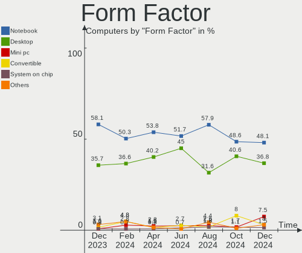
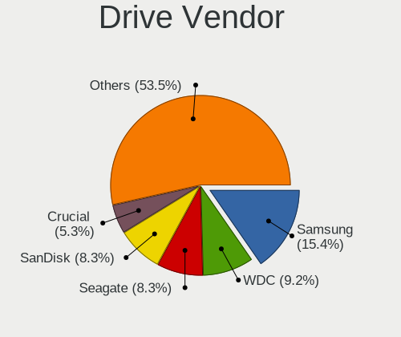
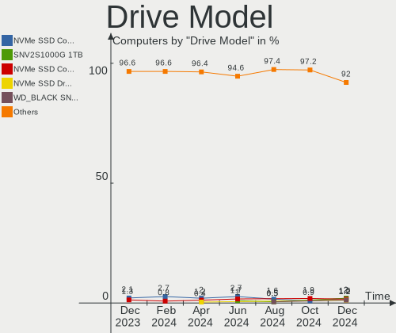
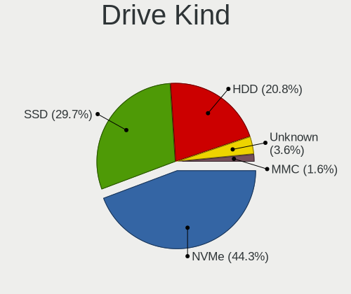
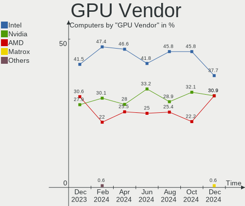
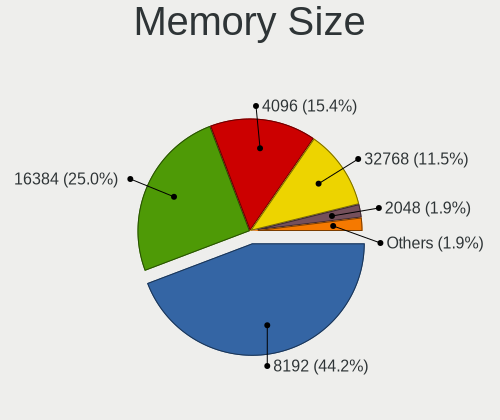
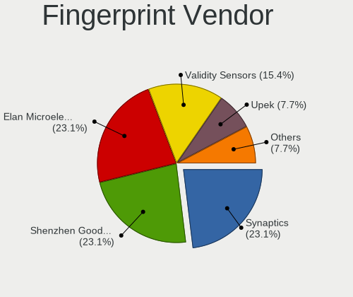

Kubuntu - Hardware Trends
-------------------------

A project to identify most popular hardware characteristics and track their change
over time based on data collected by Linux users at https://Linux-Hardware.org.

Anyone can contribute to this report by the [hw-probe](https://github.com/linuxhw/hw-probe) tool:

    sudo -E hw-probe -all -upload

This is a report for all computer types. See also reports for [desktops](/Dist/Kubuntu/Desktop/README.md) and [notebooks](/Dist/Kubuntu/Notebook/README.md).

This report is for one last month. Overall report since the beginning of time: [TestDays](https://github.com/linuxhw/TestDays)

Period: Dec, 2024.

Contents
--------

* [ System ](#system)
  - [ OS                       ](#os)
  - [ OS Family                ](#os-family)
  - [ Kernel                   ](#kernel)
  - [ Kernel Family            ](#kernel-family)
  - [ Kernel Major Ver.        ](#kernel-major-ver)
  - [ Arch                     ](#arch)
  - [ DE                       ](#de)
  - [ Display Server           ](#display-server)
  - [ Display Manager          ](#display-manager)
  - [ OS Lang                  ](#os-lang)
  - [ Boot Mode                ](#boot-mode)
  - [ Filesystem               ](#filesystem)
  - [ Part. scheme             ](#part-scheme)
  - [ Dual Boot with Linux/BSD ](#dual-boot-with-linuxbsd)
  - [ Dual Boot (Win)          ](#dual-boot-win)

* [ Board ](#board)
  - [ Vendor                   ](#vendor)
  - [ Model                    ](#model)
  - [ Model Family             ](#model-family)
  - [ MFG Year                 ](#mfg-year)
  - [ Form Factor              ](#form-factor)
  - [ Secure Boot              ](#secure-boot)
  - [ Coreboot                 ](#coreboot)
  - [ RAM Size                 ](#ram-size)
  - [ RAM Used                 ](#ram-used)
  - [ Total Drives             ](#total-drives)
  - [ Has CD-ROM               ](#has-cd-rom)
  - [ Has Ethernet             ](#has-ethernet)
  - [ Has WiFi                 ](#has-wifi)
  - [ Has Bluetooth            ](#has-bluetooth)

* [ Location ](#location)
  - [ Country                  ](#country)
  - [ City                     ](#city)

* [ Drives ](#drives)
  - [ Drive Vendor             ](#drive-vendor)
  - [ Drive Model              ](#drive-model)
  - [ HDD Vendor               ](#hdd-vendor)
  - [ SSD Vendor               ](#ssd-vendor)
  - [ Drive Kind               ](#drive-kind)
  - [ Drive Connector          ](#drive-connector)
  - [ Drive Size               ](#drive-size)
  - [ Space Total              ](#space-total)
  - [ Space Used               ](#space-used)
  - [ Malfunc. Drives          ](#malfunc-drives)
  - [ Malfunc. Drive Vendor    ](#malfunc-drive-vendor)
  - [ Malfunc. HDD Vendor      ](#malfunc-hdd-vendor)
  - [ Malfunc. Drive Kind      ](#malfunc-drive-kind)
  - [ Failed Drives            ](#failed-drives)
  - [ Failed Drive Vendor      ](#failed-drive-vendor)
  - [ Drive Status             ](#drive-status)

* [ Storage controller ](#storage-controller)
  - [ Storage Vendor           ](#storage-vendor)
  - [ Storage Model            ](#storage-model)
  - [ Storage Kind             ](#storage-kind)

* [ Processor ](#processor)
  - [ CPU Vendor               ](#cpu-vendor)
  - [ CPU Model                ](#cpu-model)
  - [ CPU Model Family         ](#cpu-model-family)
  - [ CPU Cores                ](#cpu-cores)
  - [ CPU Sockets              ](#cpu-sockets)
  - [ CPU Threads              ](#cpu-threads)
  - [ CPU Op-Modes             ](#cpu-op-modes)
  - [ CPU Microcode            ](#cpu-microcode)
  - [ CPU Microarch            ](#cpu-microarch)

* [ Graphics ](#graphics)
  - [ GPU Vendor               ](#gpu-vendor)
  - [ GPU Model                ](#gpu-model)
  - [ GPU Combo                ](#gpu-combo)
  - [ GPU Driver               ](#gpu-driver)
  - [ GPU Memory               ](#gpu-memory)

* [ Monitor ](#monitor)
  - [ Monitor Vendor           ](#monitor-vendor)
  - [ Monitor Model            ](#monitor-model)
  - [ Monitor Resolution       ](#monitor-resolution)
  - [ Monitor Diagonal         ](#monitor-diagonal)
  - [ Monitor Width            ](#monitor-width)
  - [ Aspect Ratio             ](#aspect-ratio)
  - [ Monitor Area             ](#monitor-area)
  - [ Pixel Density            ](#pixel-density)
  - [ Multiple Monitors        ](#multiple-monitors)

* [ Network ](#network)
  - [ Net Controller Vendor    ](#net-controller-vendor)
  - [ Net Controller Model     ](#net-controller-model)
  - [ Wireless Vendor          ](#wireless-vendor)
  - [ Wireless Model           ](#wireless-model)
  - [ Ethernet Vendor          ](#ethernet-vendor)
  - [ Ethernet Model           ](#ethernet-model)
  - [ Net Controller Kind      ](#net-controller-kind)
  - [ Used Controller          ](#used-controller)
  - [ NICs                     ](#nics)
  - [ IPv6                     ](#ipv6)

* [ Bluetooth ](#bluetooth)
  - [ Bluetooth Vendor         ](#bluetooth-vendor)
  - [ Bluetooth Model          ](#bluetooth-model)

* [ Sound ](#sound)
  - [ Sound Vendor             ](#sound-vendor)
  - [ Sound Model              ](#sound-model)

* [ Memory ](#memory)
  - [ Memory Vendor            ](#memory-vendor)
  - [ Memory Model             ](#memory-model)
  - [ Memory Kind              ](#memory-kind)
  - [ Memory Form Factor       ](#memory-form-factor)
  - [ Memory Size              ](#memory-size)
  - [ Memory Speed             ](#memory-speed)

* [ Printers & scanners ](#printers--scanners)
  - [ Printer Vendor           ](#printer-vendor)
  - [ Printer Model            ](#printer-model)
  - [ Scanner Vendor           ](#scanner-vendor)
  - [ Scanner Model            ](#scanner-model)

* [ Camera ](#camera)
  - [ Camera Vendor            ](#camera-vendor)
  - [ Camera Model             ](#camera-model)

* [ Security ](#security)
  - [ Fingerprint Vendor       ](#fingerprint-vendor)
  - [ Fingerprint Model        ](#fingerprint-model)
  - [ Chipcard Vendor          ](#chipcard-vendor)
  - [ Chipcard Model           ](#chipcard-model)

* [ Unsupported ](#unsupported)
  - [ Unsupported Devices      ](#unsupported-devices)
  - [ Unsupported Device Types ](#unsupported-device-types)

System
------

OS
--

Installed operating systems

| Name          | Computers | Percent |
|---------------|-----------|---------|
| Kubuntu 24.04 | 68        | 51.13%  |
| Kubuntu 24.10 | 51        | 38.35%  |
| Kubuntu 22.04 | 12        | 9.02%   |
| Kubuntu 20.04 | 2         | 1.5%    |

OS Family
---------

OS without a version

| Name    | Computers | Percent |
|---------|-----------|---------|
| Kubuntu | 133       | 100%    |

Kernel
------

Version of the Linux kernel

| Version                  | Computers | Percent |
|--------------------------|-----------|---------|
| 6.8.0-49-generic         | 26        | 19.55%  |
| 6.8.0-51-generic         | 23        | 17.29%  |
| 6.11.0-9-generic         | 23        | 17.29%  |
| 6.11.0-13-generic        | 16        | 12.03%  |
| 6.8.0-50-generic         | 7         | 5.26%   |
| 6.11.0-8-generic         | 5         | 3.76%   |
| 6.8.0-49-lowlatency      | 4         | 3.01%   |
| 6.11.0-12-generic        | 4         | 3.01%   |
| 6.8.0-48-generic         | 3         | 2.26%   |
| 6.8.0-50-lowlatency      | 2         | 1.5%    |
| 5.15.0-126-lowlatency    | 2         | 1.5%    |
| 4.9.140-l4t              | 2         | 1.5%    |
| 6.8.0-47-lowlatency      | 1         | 0.75%   |
| 6.8.0-41-generic         | 1         | 0.75%   |
| 6.8.0-38-generic         | 1         | 0.75%   |
| 6.8.0-31-generic         | 1         | 0.75%   |
| 6.8.0-1018-nvidia        | 1         | 0.75%   |
| 6.2.0-39-generic         | 1         | 0.75%   |
| 6.12.3-061203-generic    | 1         | 0.75%   |
| 6.11.10-1-liquorix-amd64 | 1         | 0.75%   |
| 6.11.0-1005-lowlatency   | 1         | 0.75%   |
| 6.11.0-1002-nvidia       | 1         | 0.75%   |
| 5.4.0-193-generic        | 1         | 0.75%   |
| 5.15.0-130-generic       | 1         | 0.75%   |
| 5.15.0-126-generic       | 1         | 0.75%   |
| 5.15.0-125-generic       | 1         | 0.75%   |
| 5.15.0-124-generic       | 1         | 0.75%   |
| 5.15.0-102-generic       | 1         | 0.75%   |

Kernel Family
-------------

Linux kernel without a distro release

| Version | Computers | Percent |
|---------|-----------|---------|
| 6.8.0   | 70        | 52.63%  |
| 6.11.0  | 50        | 37.59%  |
| 5.15.0  | 7         | 5.26%   |
| 4.9.140 | 2         | 1.5%    |
| 6.2.0   | 1         | 0.75%   |
| 6.12.3  | 1         | 0.75%   |
| 6.11.10 | 1         | 0.75%   |
| 5.4.0   | 1         | 0.75%   |

Kernel Major Ver.
-----------------

Linux kernel major version

| Version | Computers | Percent |
|---------|-----------|---------|
| 6.8     | 70        | 52.63%  |
| 6.11    | 51        | 38.35%  |
| 5.15    | 7         | 5.26%   |
| 4.9     | 2         | 1.5%    |
| 6.2     | 1         | 0.75%   |
| 6.12    | 1         | 0.75%   |
| 5.4     | 1         | 0.75%   |

Arch
----

OS architecture (x86_64, i586, etc.)

| Name    | Computers | Percent |
|---------|-----------|---------|
| x86_64  | 131       | 98.5%   |
| aarch64 | 2         | 1.5%    |

DE
--

Desktop Environment

| Name | Computers | Percent |
|------|-----------|---------|
| KDE5 | 80        | 60.15%  |
| KDE6 | 48        | 36.09%  |
| KDE  | 5         | 3.76%   |

Display Server
--------------

X11 or Wayland

| Name    | Computers | Percent |
|---------|-----------|---------|
| X11     | 93        | 69.92%  |
| Wayland | 40        | 30.08%  |

Display Manager
---------------

SDDM, LightDM, etc.

| Name    | Computers | Percent |
|---------|-----------|---------|
| SDDM    | 79        | 59.4%   |
| Unknown | 52        | 39.1%   |
| LightDM | 1         | 0.75%   |
| GDM3    | 1         | 0.75%   |

OS Lang
-------

Language

| Lang  | Computers | Percent |
|-------|-----------|---------|
| en_US | 65        | 48.87%  |
| de_DE | 15        | 11.28%  |
| it_IT | 10        | 7.52%   |
| en_GB | 8         | 6.02%   |
| pt_BR | 6         | 4.51%   |
| fr_FR | 5         | 3.76%   |
| es_ES | 5         | 3.76%   |
| en_CA | 3         | 2.26%   |
| pt_PT | 2         | 1.5%    |
| pl_PL | 2         | 1.5%    |
| tr_TR | 1         | 0.75%   |
| ru_RU | 1         | 0.75%   |
| nl_BE | 1         | 0.75%   |
| lt_LT | 1         | 0.75%   |
| fr_BE | 1         | 0.75%   |
| fi_FI | 1         | 0.75%   |
| en_NZ | 1         | 0.75%   |
| en_IN | 1         | 0.75%   |
| en_AU | 1         | 0.75%   |
| cs_CZ | 1         | 0.75%   |
| C     | 1         | 0.75%   |
| ar_EG | 1         | 0.75%   |

Boot Mode
---------

EFI or BIOS

| Mode | Computers | Percent |
|------|-----------|---------|
| BIOS | 96        | 72.18%  |
| EFI  | 37        | 27.82%  |

Filesystem
----------

Type of filesystem

| Type    | Computers | Percent |
|---------|-----------|---------|
| Ext4    | 81        | 60.9%   |
| Tmpfs   | 41        | 30.83%  |
| Btrfs   | 9         | 6.77%   |
| Overlay | 2         | 1.5%    |

Part. scheme
------------

Scheme of partitioning

| Type    | Computers | Percent |
|---------|-----------|---------|
| GPT     | 75        | 56.39%  |
| Unknown | 52        | 39.1%   |
| MBR     | 6         | 4.51%   |

Dual Boot with Linux/BSD
------------------------

Hosting more than one Linux/BSD

| Dual boot | Computers | Percent |
|-----------|-----------|---------|
| No        | 121       | 90.98%  |
| Yes       | 12        | 9.02%   |

Dual Boot (Win)
---------------

Hosting Linux and Windows

| Dual boot | Computers | Percent |
|-----------|-----------|---------|
| No        | 98        | 73.68%  |
| Yes       | 35        | 26.32%  |

Board
-----

Vendor
------

Motherboard manufacturer

| Name                                 | Computers | Percent |
|--------------------------------------|-----------|---------|
| ASUSTek Computer                     | 24        | 18.05%  |
| Dell                                 | 21        | 15.79%  |
| Lenovo                               | 13        | 9.77%   |
| Hewlett-Packard                      | 13        | 9.77%   |
| MSI                                  | 9         | 6.77%   |
| Gigabyte Technology                  | 7         | 5.26%   |
| Intel                                | 5         | 3.76%   |
| ASRock                               | 5         | 3.76%   |
| Unknown                              | 5         | 3.76%   |
| Apple                                | 4         | 3.01%   |
| Acer                                 | 4         | 3.01%   |
| Samsung Electronics                  | 3         | 2.26%   |
| Panasonic                            | 2         | 1.5%    |
| Fujitsu                              | 2         | 1.5%    |
| AZW                                  | 2         | 1.5%    |
| ZOTAC                                | 1         | 0.75%   |
| Shenzhen Meigao Electronic Equipment | 1         | 0.75%   |
| Pegatron                             | 1         | 0.75%   |
| IBM                                  | 1         | 0.75%   |
| HUAWEI                               | 1         | 0.75%   |
| Huanan                               | 1         | 0.75%   |
| Google                               | 1         | 0.75%   |
| GEEKOM                               | 1         | 0.75%   |
| Dynabook                             | 1         | 0.75%   |
| Clevo                                | 1         | 0.75%   |
| Chuwi                                | 1         | 0.75%   |
| CBR                                  | 1         | 0.75%   |
| Biostar                              | 1         | 0.75%   |
| AMI                                  | 1         | 0.75%   |

Model
-----

Motherboard model

| Name                                                  | Computers | Percent |
|-------------------------------------------------------|-----------|---------|
| Unknown                                               | 5         | 3.76%   |
| MSI MS-7E26                                           | 2         | 1.5%    |
| ASUS All Series                                       | 2         | 1.5%    |
| ZOTAC ZBOX-ECM73070C/7307LH/53060C                    | 1         | 0.75%   |
| Shenzhen Meigao Electronic Equipment EliteMini Series | 1         | 0.75%   |
| Samsung 950XDB/951XDB/950XDY                          | 1         | 0.75%   |
| Samsung 950QDB                                        | 1         | 0.75%   |
| Samsung 730U3E/740U3E                                 | 1         | 0.75%   |
| Pegatron HPE-505cs                                    | 1         | 0.75%   |
| Panasonic CF-31SBLEB1M                                | 1         | 0.75%   |
| Panasonic CF-191DCSG1M                                | 1         | 0.75%   |
| MSI MS-7E12                                           | 1         | 0.75%   |
| MSI MS-7C79                                           | 1         | 0.75%   |
| MSI MS-7B86                                           | 1         | 0.75%   |
| MSI MS-7B78                                           | 1         | 0.75%   |
| MSI MS-7642                                           | 1         | 0.75%   |
| MSI GF65 Thin 9SD                                     | 1         | 0.75%   |
| MSI Creator Z17 A12UGST                               | 1         | 0.75%   |
| Lenovo V15 G4 AMN 82YU                                | 1         | 0.75%   |
| Lenovo ThinkPad X13 Gen 1 20UF000ACD                  | 1         | 0.75%   |
| Lenovo ThinkPad X1 Carbon Gen 10 21CBCTO1WW           | 1         | 0.75%   |
| Lenovo ThinkPad E15 Gen 2 20TD00B7US                  | 1         | 0.75%   |
| Lenovo ThinkPad E14 Gen 5 21JKCTO1WW                  | 1         | 0.75%   |
| Lenovo ThinkCentre M910t 10MM000KUS                   | 1         | 0.75%   |
| Lenovo ThinkCentre M910q 10MUS2NV00                   | 1         | 0.75%   |
| Lenovo LOQ 15IRX9 83DV                                | 1         | 0.75%   |
| Lenovo Legion 5 15IMH05 82AU                          | 1         | 0.75%   |
| Lenovo IdeaPadFlex 5 14IAU7 82R7                      | 1         | 0.75%   |
| Lenovo IdeaPad Slim 5 14IRL8 82XD                     | 1         | 0.75%   |
| Lenovo IdeaPad Gaming 3 15IHU6 82K1                   | 1         | 0.75%   |
| Lenovo 300w Gen 3 82J1                                | 1         | 0.75%   |
| Intel ParX T100c G6 Server                            | 1         | 0.75%   |
| Intel NUC9VXQNX                                       | 1         | 0.75%   |
| Intel NUC13ANKi5                                      | 1         | 0.75%   |
| Intel NUC12WSHi5                                      | 1         | 0.75%   |
| Intel DP55WB AAE64798-207                             | 1         | 0.75%   |
| IBM System x3650 -[7979PUV]                           | 1         | 0.75%   |
| HUAWEI NBLK-WAX9X                                     | 1         | 0.75%   |
| Huanan X99-TF                                         | 1         | 0.75%   |
| HP ZBook 14u G6                                       | 1         | 0.75%   |

Model Family
------------

Motherboard model prefix

| Name                                           | Computers | Percent |
|------------------------------------------------|-----------|---------|
| Dell Inspiron                                  | 6         | 4.51%   |
| ASUS ROG                                       | 6         | 4.51%   |
| HP Pavilion                                    | 5         | 3.76%   |
| Unknown                                        | 5         | 3.76%   |
| Lenovo ThinkPad                                | 4         | 3.01%   |
| Dell Precision                                 | 4         | 3.01%   |
| Dell Latitude                                  | 4         | 3.01%   |
| HP Laptop                                      | 3         | 2.26%   |
| Dell XPS                                       | 3         | 2.26%   |
| Dell OptiPlex                                  | 3         | 2.26%   |
| ASUS VivoBook                                  | 3         | 2.26%   |
| ASUS ASUS                                      | 3         | 2.26%   |
| Acer Aspire                                    | 3         | 2.26%   |
| MSI MS-7E26                                    | 2         | 1.5%    |
| Lenovo ThinkCentre                             | 2         | 1.5%    |
| Lenovo IdeaPad                                 | 2         | 1.5%    |
| Gigabyte B550                                  | 2         | 1.5%    |
| ASUS TUF                                       | 2         | 1.5%    |
| ASUS PRIME                                     | 2         | 1.5%    |
| ASUS All                                       | 2         | 1.5%    |
| ASRock B550                                    | 2         | 1.5%    |
| ZOTAC ZBOX-ECM73070C                           | 1         | 0.75%   |
| Shenzhen Meigao Electronic Equipment EliteMini | 1         | 0.75%   |
| Samsung 950XDB                                 | 1         | 0.75%   |
| Samsung 950QDB                                 | 1         | 0.75%   |
| Samsung 730U3E                                 | 1         | 0.75%   |
| Pegatron HPE-505cs                             | 1         | 0.75%   |
| Panasonic CF-31SBLEB1M                         | 1         | 0.75%   |
| Panasonic CF-191DCSG1M                         | 1         | 0.75%   |
| MSI MS-7E12                                    | 1         | 0.75%   |
| MSI MS-7C79                                    | 1         | 0.75%   |
| MSI MS-7B86                                    | 1         | 0.75%   |
| MSI MS-7B78                                    | 1         | 0.75%   |
| MSI MS-7642                                    | 1         | 0.75%   |
| MSI GF65                                       | 1         | 0.75%   |
| MSI Creator                                    | 1         | 0.75%   |
| Lenovo V15                                     | 1         | 0.75%   |
| Lenovo LOQ                                     | 1         | 0.75%   |
| Lenovo Legion                                  | 1         | 0.75%   |
| Lenovo IdeaPadFlex                             | 1         | 0.75%   |

MFG Year
--------

Motherboard manufacture year

| Year    | Computers | Percent |
|---------|-----------|---------|
| 2022    | 16        | 12.03%  |
| 2020    | 14        | 10.53%  |
| 2023    | 13        | 9.77%   |
| 2021    | 11        | 8.27%   |
| 2019    | 11        | 8.27%   |
| 2024    | 10        | 7.52%   |
| 2018    | 9         | 6.77%   |
| 2017    | 9         | 6.77%   |
| 2012    | 7         | 5.26%   |
| 2013    | 6         | 4.51%   |
| 2016    | 5         | 3.76%   |
| 2014    | 5         | 3.76%   |
| 2011    | 5         | 3.76%   |
| 2015    | 4         | 3.01%   |
| 2010    | 2         | 1.5%    |
| 2009    | 2         | 1.5%    |
| Unknown | 2         | 1.5%    |
| 2008    | 1         | 0.75%   |
| 2007    | 1         | 0.75%   |

Form Factor
-----------

Physical design of the computer

| Name           | Computers | Percent |
|----------------|-----------|---------|
| Notebook       | 64        | 48.12%  |
| Desktop        | 49        | 36.84%  |
| Mini pc        | 10        | 7.52%   |
| Convertible    | 4         | 3.01%   |
| System on chip | 2         | 1.5%    |
| All in one     | 2         | 1.5%    |
| Server         | 2         | 1.5%    |

Secure Boot
-----------

Enabled or disabled

| State    | Computers | Percent |
|----------|-----------|---------|
| Disabled | 124       | 93.23%  |
| Enabled  | 9         | 6.77%   |

Coreboot
--------

Have coreboot on board

| Used | Computers | Percent |
|------|-----------|---------|
| No   | 132       | 99.25%  |
| Yes  | 1         | 0.75%   |

RAM Size
--------

Total RAM memory

| Size in GB  | Computers | Percent |
|-------------|-----------|---------|
| 32.01-64.0  | 35        | 26.32%  |
| 8.01-16.0   | 33        | 24.81%  |
| 4.01-8.0    | 25        | 18.8%   |
| 16.01-24.0  | 24        | 18.05%  |
| 64.01-256.0 | 8         | 6.02%   |
| 24.01-32.0  | 4         | 3.01%   |
| 3.01-4.0    | 3         | 2.26%   |
| 2.01-3.0    | 1         | 0.75%   |

RAM Used
--------

Used RAM memory

| Used GB    | Computers | Percent |
|------------|-----------|---------|
| 4.01-8.0   | 38        | 28.57%  |
| 3.01-4.0   | 31        | 23.31%  |
| 2.01-3.0   | 30        | 22.56%  |
| 1.01-2.0   | 13        | 9.77%   |
| 8.01-16.0  | 13        | 9.77%   |
| 16.01-24.0 | 4         | 3.01%   |
| 24.01-32.0 | 3         | 2.26%   |
| 32.01-64.0 | 1         | 0.75%   |

Total Drives
------------

Number of drives on board

| Drives | Computers | Percent |
|--------|-----------|---------|
| 1      | 67        | 50.38%  |
| 2      | 37        | 27.82%  |
| 3      | 12        | 9.02%   |
| 4      | 11        | 8.27%   |
| 5      | 3         | 2.26%   |
| 6      | 2         | 1.5%    |
| 8      | 1         | 0.75%   |

Has CD-ROM
----------

Has CD-ROM on board

| Presented | Computers | Percent |
|-----------|-----------|---------|
| No        | 99        | 74.44%  |
| Yes       | 34        | 25.56%  |

Has Ethernet
------------

Has Ethernet on board

| Presented | Computers | Percent |
|-----------|-----------|---------|
| Yes       | 110       | 82.71%  |
| No        | 23        | 17.29%  |

Has WiFi
--------

Has WiFi module

| Presented | Computers | Percent |
|-----------|-----------|---------|
| Yes       | 100       | 75.19%  |
| No        | 33        | 24.81%  |

Has Bluetooth
-------------

Has Bluetooth module

| Presented | Computers | Percent |
|-----------|-----------|---------|
| Yes       | 102       | 76.69%  |
| No        | 31        | 23.31%  |

Location
--------

Country
-------

Geographic location (country)

| Country     | Computers | Percent |
|-------------|-----------|---------|
| USA         | 34        | 25.56%  |
| Germany     | 14        | 10.53%  |
| Italy       | 13        | 9.77%   |
| France      | 6         | 4.51%   |
| Brazil      | 5         | 3.76%   |
| UK          | 4         | 3.01%   |
| Spain       | 4         | 3.01%   |
| Russia      | 4         | 3.01%   |
| Ireland     | 4         | 3.01%   |
| Canada      | 4         | 3.01%   |
| Belgium     | 4         | 3.01%   |
| Portugal    | 3         | 2.26%   |
| Finland     | 3         | 2.26%   |
| Egypt       | 3         | 2.26%   |
| Serbia      | 2         | 1.5%    |
| Poland      | 2         | 1.5%    |
| Indonesia   | 2         | 1.5%    |
| India       | 2         | 1.5%    |
| Greece      | 2         | 1.5%    |
| Australia   | 2         | 1.5%    |
| Turkey      | 1         | 0.75%   |
| Thailand    | 1         | 0.75%   |
| Norway      | 1         | 0.75%   |
| New Zealand | 1         | 0.75%   |
| Netherlands | 1         | 0.75%   |
| Myanmar     | 1         | 0.75%   |
| Moldova     | 1         | 0.75%   |
| Malaysia    | 1         | 0.75%   |
| Kuwait      | 1         | 0.75%   |
| Jordan      | 1         | 0.75%   |
| Japan       | 1         | 0.75%   |
| Iceland     | 1         | 0.75%   |
| Czechia     | 1         | 0.75%   |
| China       | 1         | 0.75%   |
| Barbados    | 1         | 0.75%   |
| Algeria     | 1         | 0.75%   |

City
----

Geographic location (city)

| City                 | Computers | Percent |
|----------------------|-----------|---------|
| Dublin               | 3         | 2.26%   |
| Richmond             | 2         | 1.5%    |
| Lewis Center         | 2         | 1.5%    |
| Helsinki             | 2         | 1.5%    |
| Hamburg              | 2         | 1.5%    |
| Dieterskirchen       | 2         | 1.5%    |
| Cairo                | 2         | 1.5%    |
| Belgrade             | 2         | 1.5%    |
| Zagarolo             | 1         | 0.75%   |
| Yangon               | 1         | 0.75%   |
| Warsaw               | 1         | 0.75%   |
| Verviers             | 1         | 0.75%   |
| Verona               | 1         | 0.75%   |
| Valongo              | 1         | 0.75%   |
| Ústí nad Labem     | 1         | 0.75%   |
| Turin                | 1         | 0.75%   |
| Trieste              | 1         | 0.75%   |
| Tomsk                | 1         | 0.75%   |
| Thornton             | 1         | 0.75%   |
| Thessaloniki         | 1         | 0.75%   |
| Stuttgart            | 1         | 0.75%   |
| St. Catharines       | 1         | 0.75%   |
| Spresiano            | 1         | 0.75%   |
| Southwark            | 1         | 0.75%   |
| Siziano              | 1         | 0.75%   |
| Sao José dos Campos | 1         | 0.75%   |
| San Francisco        | 1         | 0.75%   |
| San Bernardino       | 1         | 0.75%   |
| Sacramento           | 1         | 0.75%   |
| Rotherham            | 1         | 0.75%   |
| Rome                 | 1         | 0.75%   |
| Rochdale             | 1         | 0.75%   |
| Rio de Janeiro       | 1         | 0.75%   |
| Ridgeley             | 1         | 0.75%   |
| Reykjavik            | 1         | 0.75%   |
| Reus                 | 1         | 0.75%   |
| Ratingen             | 1         | 0.75%   |
| Putney               | 1         | 0.75%   |
| Portland             | 1         | 0.75%   |
| Pontianak            | 1         | 0.75%   |

Drives
------

Drive Vendor
------------

Hard drive vendors

| Vendor                       | Computers | Drives | Percent |
|------------------------------|-----------|--------|---------|
| Samsung Electronics          | 35        | 41     | 15.35%  |
| WDC                          | 21        | 27     | 9.21%   |
| Seagate                      | 19        | 26     | 8.33%   |
| SanDisk                      | 19        | 21     | 8.33%   |
| Crucial                      | 12        | 13     | 5.26%   |
| Kingston                     | 10        | 10     | 4.39%   |
| SK hynix                     | 9         | 9      | 3.95%   |
| Micron Technology            | 8         | 8      | 3.51%   |
| Toshiba                      | 7         | 7      | 3.07%   |
| Unknown                      | 6         | 6      | 2.63%   |
| PNY                          | 6         | 6      | 2.63%   |
| Kingston Technology Company  | 6         | 6      | 2.63%   |
| Phison Electronics           | 5         | 5      | 2.19%   |
| Silicon Motion               | 4         | 4      | 1.75%   |
| Team                         | 3         | 3      | 1.32%   |
| KIOXIA                       | 3         | 3      | 1.32%   |
| JMicron Technology           | 3         | 4      | 1.32%   |
| Intel                        | 3         | 4      | 1.32%   |
| Hitachi                      | 3         | 3      | 1.32%   |
| SPCC                         | 2         | 2      | 0.88%   |
| SD                           | 2         | 2      | 0.88%   |
| Realtek Semiconductor        | 2         | 2      | 0.88%   |
| Realtek                      | 2         | 2      | 0.88%   |
| Micron/Crucial Technology    | 2         | 2      | 0.88%   |
| MAXIO Technology (Hangzhou)  | 2         | 4      | 0.88%   |
| China                        | 2         | 2      | 0.88%   |
| Apple                        | 2         | 2      | 0.88%   |
| A-DATA Technology            | 2         | 2      | 0.88%   |
| XPG                          | 1         | 1      | 0.44%   |
| Union Memory (Shenzhen)      | 1         | 1      | 0.44%   |
| UMIS                         | 1         | 1      | 0.44%   |
| TO Exter                     | 1         | 1      | 0.44%   |
| TCSUNBOW                     | 1         | 1      | 0.44%   |
| Shenzhen Longsys Electronics | 1         | 1      | 0.44%   |
| PNY USB                      | 1         | 1      | 0.44%   |
| Phison                       | 1         | 1      | 0.44%   |
| Patriot                      | 1         | 1      | 0.44%   |
| ORICO                        | 1         | 1      | 0.44%   |
| OCZ                          | 1         | 1      | 0.44%   |
| Netac                        | 1         | 1      | 0.44%   |

Drive Model
-----------

Hard drive models

| Model                                                | Computers | Percent |
|------------------------------------------------------|-----------|---------|
| Samsung NVMe SSD Controller SM981/PM981/PM983 512GB  | 5         | 2%      |
| Kingston Company SNV2S1000G 1TB                      | 5         | 2%      |
| Samsung NVMe SSD Controller PM9A1/PM9A3/980PRO 512GB | 4         | 1.6%    |
| Unknown NVMe SSD Drive 512GB                         | 3         | 1.2%    |
| Sandisk WD_BLACK SN850X 2000GB                       | 3         | 1.2%    |
| Samsung SSD 870 QVO 2TB                              | 3         | 1.2%    |
| Samsung SSD 860 EVO 500GB                            | 3         | 1.2%    |
| Phison E12 NVMe Controller 480GB                     | 3         | 1.2%    |
| Kingston SA400S37480G 480GB SSD                      | 3         | 1.2%    |
| WDC WDS250G2B0A-00SM50 250GB SSD                     | 2         | 0.8%    |
| Silicon Motion SM2262/SM2262EN SSD Controller 2TB    | 2         | 0.8%    |
| Seagate ST4000VN008-2DR166 4TB                       | 2         | 0.8%    |
| Sandisk WD Blue SN550 NVMe SSD 256GB                 | 2         | 0.8%    |
| Samsung SSD 860 EVO 1TB                              | 2         | 0.8%    |
| Realtek RTL9210B-CG 500GB                            | 2         | 0.8%    |
| Crucial CT240BX500SSD1 240GB                         | 2         | 0.8%    |
| Crucial CT2000P3SSD8 2TB                             | 2         | 0.8%    |
| XPG SPECTRIX S40G 1TB                                | 1         | 0.4%    |
| WDC WUH721414ALE6L4 14TB                             | 1         | 0.4%    |
| WDC WDS500G1B0B-00AS40 500GB SSD                     | 1         | 0.4%    |
| WDC WD7500AARS-00Y5B1 752GB                          | 1         | 0.4%    |
| WDC WD60EFRX-68MYMN1 6TB                             | 1         | 0.4%    |
| WDC WD5000AURX-63UY4Y0 500GB                         | 1         | 0.4%    |
| WDC WD5000AAKS-00TMA0 500GB                          | 1         | 0.4%    |
| WDC WD40EZRZ-00GXCB0 4TB                             | 1         | 0.4%    |
| WDC WD40EZRX-00SPEB0 4TB                             | 1         | 0.4%    |
| WDC WD40EFAX-68JH4N1 4TB                             | 1         | 0.4%    |
| WDC WD3200AAJS-60Z0A0 320GB                          | 1         | 0.4%    |
| WDC WD30EZRX-00D8PB0 3TB                             | 1         | 0.4%    |
| WDC WD2500BEVT-08A23T1 250GB                         | 1         | 0.4%    |
| WDC WD2500AAKX-60U6AA0 250GB                         | 1         | 0.4%    |
| WDC WD20EZRX-00D8PB0 2TB                             | 1         | 0.4%    |
| WDC WD20EARS-00MVWB0 2TB                             | 1         | 0.4%    |
| WDC WD2003FZEX-00SRLA0 2TB                           | 1         | 0.4%    |
| WDC WD1600AAJS-75M0A0 160GB                          | 1         | 0.4%    |
| WDC WD1200BEVS-08RST2 120GB                          | 1         | 0.4%    |
| WDC WD10JPVX-75JC3T0 1TB                             | 1         | 0.4%    |
| WDC WD10EZRZ-00HTKB0 1TB                             | 1         | 0.4%    |
| WDC WD10EZRX-00L4HB0 1TB                             | 1         | 0.4%    |
| WDC WD10EZEX-60M2NA0 1TB                             | 1         | 0.4%    |

HDD Vendor
----------

Hard disk drive vendors

| Vendor              | Computers | Drives | Percent |
|---------------------|-----------|--------|---------|
| WDC                 | 19        | 23     | 36.54%  |
| Seagate             | 18        | 24     | 34.62%  |
| Toshiba             | 4         | 4      | 7.69%   |
| Hitachi             | 3         | 3      | 5.77%   |
| JMicron Technology  | 2         | 3      | 3.85%   |
| Unknown             | 1         | 1      | 1.92%   |
| TO Exter            | 1         | 1      | 1.92%   |
| Samsung Electronics | 1         | 1      | 1.92%   |
| Inateck             | 1         | 2      | 1.92%   |
| HGST                | 1         | 1      | 1.92%   |
| Fujitsu             | 1         | 1      | 1.92%   |

SSD Vendor
----------

Solid state drive vendors

| Vendor              | Computers | Drives | Percent |
|---------------------|-----------|--------|---------|
| Samsung Electronics | 16        | 19     | 22.86%  |
| Crucial             | 8         | 8      | 11.43%  |
| PNY                 | 5         | 5      | 7.14%   |
| Kingston            | 5         | 5      | 7.14%   |
| SanDisk             | 4         | 4      | 5.71%   |
| WDC                 | 3         | 4      | 4.29%   |
| SK hynix            | 3         | 3      | 4.29%   |
| Team                | 2         | 2      | 2.86%   |
| Intel               | 2         | 3      | 2.86%   |
| China               | 2         | 2      | 2.86%   |
| Apple               | 2         | 2      | 2.86%   |
| Toshiba             | 1         | 1      | 1.43%   |
| TCSUNBOW            | 1         | 1      | 1.43%   |
| SPCC                | 1         | 1      | 1.43%   |
| Seagate             | 1         | 1      | 1.43%   |
| SD                  | 1         | 1      | 1.43%   |
| PNY USB             | 1         | 1      | 1.43%   |
| Patriot             | 1         | 1      | 1.43%   |
| OCZ                 | 1         | 1      | 1.43%   |
| Netac               | 1         | 1      | 1.43%   |
| Micron Technology   | 1         | 1      | 1.43%   |
| LITEONIT            | 1         | 1      | 1.43%   |
| Intenso             | 1         | 1      | 1.43%   |
| GOODRAM             | 1         | 1      | 1.43%   |
| GLOWAY              | 1         | 1      | 1.43%   |
| Emtec               | 1         | 1      | 1.43%   |
| EAGET               | 1         | 1      | 1.43%   |
| Apacer              | 1         | 1      | 1.43%   |
| A-DATA Technology   | 1         | 1      | 1.43%   |

Drive Kind
----------

HDD or SSD

| Kind    | Computers | Drives | Percent |
|---------|-----------|--------|---------|
| NVMe    | 85        | 106    | 44.27%  |
| SSD     | 57        | 75     | 29.69%  |
| HDD     | 40        | 64     | 20.83%  |
| Unknown | 7         | 7      | 3.65%   |
| MMC     | 3         | 3      | 1.56%   |

Drive Connector
---------------

SATA, SAS, NVMe, etc.

| Type | Computers | Drives | Percent |
|------|-----------|--------|---------|
| NVMe | 85        | 103    | 48.57%  |
| SATA | 70        | 127    | 40%     |
| SAS  | 17        | 22     | 9.71%   |
| MMC  | 3         | 3      | 1.71%   |

Drive Size
----------

Size of hard drive

| Size in TB | Computers | Drives | Percent |
|------------|-----------|--------|---------|
| 0.01-0.5   | 49        | 66     | 43.75%  |
| 0.51-1.0   | 33        | 39     | 29.46%  |
| 1.01-2.0   | 15        | 17     | 13.39%  |
| 3.01-4.0   | 9         | 9      | 8.04%   |
| 4.01-10.0  | 4         | 4      | 3.57%   |
| 2.01-3.0   | 1         | 1      | 0.89%   |
| 10.01-20.0 | 1         | 3      | 0.89%   |

Space Total
-----------

Amount of disk space available on the file system

| Size in GB     | Computers | Percent |
|----------------|-----------|---------|
| 251-500        | 27        | 20.3%   |
| 501-1000       | 26        | 19.55%  |
| 101-250        | 25        | 18.8%   |
| 1001-2000      | 19        | 14.29%  |
| More than 3000 | 16        | 12.03%  |
| 2001-3000      | 7         | 5.26%   |
| 51-100         | 6         | 4.51%   |
| 1-20           | 3         | 2.26%   |
| 21-50          | 2         | 1.5%    |
| Unknown        | 2         | 1.5%    |

Space Used
----------

Amount of used disk space

| Used GB        | Computers | Percent |
|----------------|-----------|---------|
| 21-50          | 25        | 18.8%   |
| 101-250        | 23        | 17.29%  |
| 251-500        | 19        | 14.29%  |
| 1-20           | 17        | 12.78%  |
| 501-1000       | 17        | 12.78%  |
| 51-100         | 15        | 11.28%  |
| More than 3000 | 7         | 5.26%   |
| 2001-3000      | 4         | 3.01%   |
| 1001-2000      | 4         | 3.01%   |
| Unknown        | 2         | 1.5%    |

Malfunc. Drives
---------------

Drive models with a malfunction

| Model                          | Computers | Drives | Percent |
|--------------------------------|-----------|--------|---------|
| XPG SPECTRIX S40G 1TB          | 1         | 1      | 20%     |
| WDC WD7500AARS-00Y5B1 752GB    | 1         | 1      | 20%     |
| WDC WD30EZRX-00D8PB0 3TB       | 1         | 1      | 20%     |
| WDC WD10EACS-00ZJB0 1TB        | 1         | 1      | 20%     |
| Seagate ST2000DM001-9YN164 2TB | 1         | 1      | 20%     |

Malfunc. Drive Vendor
---------------------

Vendors of faulty drives

| Vendor  | Computers | Drives | Percent |
|---------|-----------|--------|---------|
| WDC     | 3         | 3      | 60%     |
| XPG     | 1         | 1      | 20%     |
| Seagate | 1         | 1      | 20%     |

Malfunc. HDD Vendor
-------------------

Vendors of faulty HDD drives

| Vendor  | Computers | Drives | Percent |
|---------|-----------|--------|---------|
| WDC     | 3         | 3      | 75%     |
| Seagate | 1         | 1      | 25%     |

Malfunc. Drive Kind
-------------------

Kinds of faulty drives

| Kind | Computers | Drives | Percent |
|------|-----------|--------|---------|
| HDD  | 4         | 4      | 80%     |
| NVMe | 1         | 1      | 20%     |

Failed Drives
-------------

Failed drive models

Zero info for selected period =(

Failed Drive Vendor
-------------------

Failed drive vendors

Zero info for selected period =(

Drive Status
------------

Number of failed and malfunc. drives

| Status   | Computers | Drives | Percent |
|----------|-----------|--------|---------|
| Detected | 101       | 185    | 68.71%  |
| Works    | 42        | 65     | 28.57%  |
| Malfunc  | 4         | 5      | 2.72%   |

Storage controller
------------------

Storage Vendor
--------------

Storage controller vendors

| Vendor                                  | Computers | Percent |
|-----------------------------------------|-----------|---------|
| Intel                                   | 69        | 34.5%   |
| AMD                                     | 28        | 14%     |
| Samsung Electronics                     | 21        | 10.5%   |
| SanDisk                                 | 16        | 8%      |
| Kingston Technology Company             | 11        | 5.5%    |
| Phison Electronics                      | 9         | 4.5%    |
| Micron Technology                       | 8         | 4%      |
| SK hynix                                | 6         | 3%      |
| Micron/Crucial Technology               | 5         | 2.5%    |
| Silicon Motion                          | 3         | 1.5%    |
| Realtek Semiconductor                   | 3         | 1.5%    |
| MAXIO Technology (Hangzhou)             | 3         | 1.5%    |
| KIOXIA                                  | 3         | 1.5%    |
| Toshiba America Info Systems            | 2         | 1%      |
| Unknown                                 | 2         | 1%      |
| Silicon Image                           | 1         | 0.5%    |
| Shenzhen Unionmemory Information System | 1         | 0.5%    |
| Shenzhen Longsys Electronics            | 1         | 0.5%    |
| Marvell Technology Group                | 1         | 0.5%    |
| LSI Logic / Symbios Logic               | 1         | 0.5%    |
| JMicron Technology                      | 1         | 0.5%    |
| INNOGRIT                                | 1         | 0.5%    |
| Biwin Storage Technology                | 1         | 0.5%    |
| ASMedia Technology                      | 1         | 0.5%    |
| ADATA Technology                        | 1         | 0.5%    |
| Adaptec                                 | 1         | 0.5%    |

Storage Model
-------------

Storage controller models

| Model                                                                          | Computers | Percent |
|--------------------------------------------------------------------------------|-----------|---------|
| AMD FCH SATA Controller [AHCI mode]                                            | 16        | 7.27%   |
| Intel Volume Management Device NVMe RAID Controller                            | 7         | 3.18%   |
| Samsung NVMe SSD Controller SM981/PM981/PM983                                  | 6         | 2.73%   |
| Intel Sunrise Point-LP SATA Controller [AHCI mode]                             | 6         | 2.73%   |
| Samsung NVMe SSD Controller PM9A1/PM9A3/980PRO                                 | 5         | 2.27%   |
| Samsung NVMe SSD Controller 980 (DRAM-less)                                    | 5         | 2.27%   |
| AMD 600 Series Chipset SATA Controller                                         | 5         | 2.27%   |
| AMD 500 Series Chipset SATA Controller                                         | 5         | 2.27%   |
| AMD 400 Series Chipset SATA Controller                                         | 5         | 2.27%   |
| SanDisk WD Black SN770 / PC SN740 256GB / PC SN560 (DRAM-less) NVMe SSD        | 4         | 1.82%   |
| Phison E12 NVMe Controller                                                     | 4         | 1.82%   |
| Intel 200 Series PCH SATA controller [AHCI mode]                               | 4         | 1.82%   |
| Sandisk WD Black SN850X NVMe SSD                                               | 3         | 1.36%   |
| Phison PS5013-E13 PCIe3 NVMe Controller (DRAM-less)                            | 3         | 1.36%   |
| Kingston Company NV2 NVMe SSD [E21T] (DRAM-less)                               | 3         | 1.36%   |
| Intel Volume Management Device NVMe RAID Controller Intel Corporation          | 3         | 1.36%   |
| Intel Q170/Q150/B150/H170/H110/Z170/CM236 Chipset SATA Controller [AHCI Mode]  | 3         | 1.36%   |
| Intel Alder Lake-P SATA AHCI Controller                                        | 3         | 1.36%   |
| Intel 8 Series/C220 Series Chipset Family 6-port SATA Controller 1 [AHCI mode] | 3         | 1.36%   |
| Intel 7 Series Chipset Family 6-port SATA Controller [AHCI mode]               | 3         | 1.36%   |
| Intel 6 Series/C200 Series Chipset Family 6 port Desktop SATA AHCI Controller  | 3         | 1.36%   |
| SK hynix Gold P31/BC711/PC711 NVMe Solid State Drive                           | 2         | 0.91%   |
| SK hynix BC901 NVMe Solid State Drive (DRAM-less)                              | 2         | 0.91%   |
| Silicon Motion SM2263EN/SM2263XT (DRAM-less) NVMe SSD Controllers              | 2         | 0.91%   |
| SanDisk Ultra 3D / WD PC SN530, IX SN530, Blue SN550 NVMe SSD (DRAM-less)      | 2         | 0.91%   |
| SanDisk Extreme Pro / WD Black SN750 / PC SN730 / Red SN700 NVMe SSD           | 2         | 0.91%   |
| Samsung S4LN053X01 AHCI SSD Controller(Apple slot)                             | 2         | 0.91%   |
| Samsung NVMe SSD Controller PM9B1 (DRAM-less)                                  | 2         | 0.91%   |
| Realtek RTS5765DL NVMe SSD Controller (DRAM-less)                              | 2         | 0.91%   |
| Micron/Crucial P5 Plus NVMe PCIe SSD                                           | 2         | 0.91%   |
| Micron/Crucial P2 [Nick P2] / P3 / P3 Plus NVMe PCIe SSD (DRAM-less)           | 2         | 0.91%   |
| Micron 2450 NVMe SSD [HendrixV] (DRAM-less)                                    | 2         | 0.91%   |
| Micron 2400 NVMe SSD (DRAM-less)                                               | 2         | 0.91%   |
| MAXIO (Hangzhou) NVMe SSD Controller MAP1602 (DRAM-less)                       | 2         | 0.91%   |
| Kingston Company NV2 NVMe SSD [SM2267XT] (DRAM-less)                           | 2         | 0.91%   |
| Intel SATA Controller [RAID mode]                                              | 2         | 0.91%   |
| Intel Ice Lake-LP SATA Controller [AHCI mode]                                  | 2         | 0.91%   |
| Intel Comet Lake SATA AHCI Controller                                          | 2         | 0.91%   |
| Intel Cannon Lake PCH SATA AHCI Controller                                     | 2         | 0.91%   |
| Intel Cannon Lake Mobile PCH SATA AHCI Controller                              | 2         | 0.91%   |

Storage Kind
------------

Kind of storage controller (IDE, SATA, NVMe, SAS, ...)

| Kind | Computers | Percent |
|------|-----------|---------|
| SATA | 84        | 43.98%  |
| NVMe | 83        | 43.46%  |
| RAID | 17        | 8.9%    |
| IDE  | 6         | 3.14%   |
| SAS  | 1         | 0.52%   |

Processor
---------

CPU Vendor
----------

Processor vendors

| Vendor | Computers | Percent |
|--------|-----------|---------|
| Intel  | 87        | 65.41%  |
| AMD    | 44        | 33.08%  |
| ARM    | 2         | 1.5%    |

CPU Model
---------

Processor models

| Model                                   | Computers | Percent |
|-----------------------------------------|-----------|---------|
| Intel 11th Gen Core i7-1165G7 @ 2.80GHz | 4         | 3.01%   |
| Intel Core i5-3320M CPU @ 2.60GHz       | 3         | 2.26%   |
| Intel Core i9-10900K CPU @ 3.70GHz      | 2         | 1.5%    |
| Intel Core i7-8700 CPU @ 3.20GHz        | 2         | 1.5%    |
| Intel Core i7-7700K CPU @ 4.20GHz       | 2         | 1.5%    |
| Intel 12th Gen Core i7-1270P            | 2         | 1.5%    |
| Intel 12th Gen Core i7-12700H           | 2         | 1.5%    |
| Intel 11th Gen Core i5-1135G7 @ 2.40GHz | 2         | 1.5%    |
| ARM Processor                           | 2         | 1.5%    |
| AMD Ryzen 7 7735HS with Radeon Graphics | 2         | 1.5%    |
| AMD Ryzen 7 5825U with Radeon Graphics  | 2         | 1.5%    |
| AMD Ryzen 7 5700U with Radeon Graphics  | 2         | 1.5%    |
| AMD Ryzen 7 2700X Eight-Core Processor  | 2         | 1.5%    |
| Intel Xeon E-2286M CPU @ 2.40GHz        | 1         | 0.75%   |
| Intel Xeon CPU E5450 @ 3.00GHz          | 1         | 0.75%   |
| Intel Xeon CPU E5-2678 v3 @ 2.50GHz     | 1         | 0.75%   |
| Intel Xeon CPU E5-2643 0 @ 3.30GHz      | 1         | 0.75%   |
| Intel Xeon CPU E3-1230 v6 @ 3.50GHz     | 1         | 0.75%   |
| Intel N95                               | 1         | 0.75%   |
| Intel Core Ultra 9 185H                 | 1         | 0.75%   |
| Intel Core i9-9980HK CPU @ 2.40GHz      | 1         | 0.75%   |
| Intel Core i7-8700K CPU @ 3.70GHz       | 1         | 0.75%   |
| Intel Core i7-8665U CPU @ 1.90GHz       | 1         | 0.75%   |
| Intel Core i7-8550U CPU @ 1.80GHz       | 1         | 0.75%   |
| Intel Core i7-7700HQ CPU @ 2.80GHz      | 1         | 0.75%   |
| Intel Core i7-7700 CPU @ 3.60GHz        | 1         | 0.75%   |
| Intel Core i7-7500U CPU @ 2.70GHz       | 1         | 0.75%   |
| Intel Core i7-6700K CPU @ 4.00GHz       | 1         | 0.75%   |
| Intel Core i7-6500U CPU @ 2.50GHz       | 1         | 0.75%   |
| Intel Core i7-5960X CPU @ 3.00GHz       | 1         | 0.75%   |
| Intel Core i7-4800MQ CPU @ 2.70GHz      | 1         | 0.75%   |
| Intel Core i7-4790K CPU @ 4.00GHz       | 1         | 0.75%   |
| Intel Core i7-4770HQ CPU @ 2.20GHz      | 1         | 0.75%   |
| Intel Core i7-4700HQ CPU @ 2.40GHz      | 1         | 0.75%   |
| Intel Core i7-4500U CPU @ 1.80GHz       | 1         | 0.75%   |
| Intel Core i7-3770K CPU @ 3.50GHz       | 1         | 0.75%   |
| Intel Core i7-3770 CPU @ 3.40GHz        | 1         | 0.75%   |
| Intel Core i7-3537U CPU @ 2.00GHz       | 1         | 0.75%   |
| Intel Core i7-2720QM CPU @ 2.20GHz      | 1         | 0.75%   |
| Intel Core i7-10750H CPU @ 2.60GHz      | 1         | 0.75%   |

CPU Model Family
----------------

Processor model prefix

| Model            | Computers | Percent |
|------------------|-----------|---------|
| Other            | 30        | 22.56%  |
| Intel Core i7    | 27        | 20.3%   |
| AMD Ryzen 7      | 18        | 13.53%  |
| Intel Core i5    | 17        | 12.78%  |
| AMD Ryzen 5      | 11        | 8.27%   |
| Intel Xeon       | 5         | 3.76%   |
| Intel Core i3    | 4         | 3.01%   |
| AMD Ryzen 9      | 4         | 3.01%   |
| Intel Core i9    | 3         | 2.26%   |
| Intel Core 2 Duo | 3         | 2.26%   |
| AMD Ryzen 3      | 2         | 1.5%    |
| Intel Core       | 1         | 0.75%   |
| Intel Celeron    | 1         | 0.75%   |
| AMD Ryzen 7 PRO  | 1         | 0.75%   |
| AMD Ryzen 5 PRO  | 1         | 0.75%   |
| AMD Ryzen 3 PRO  | 1         | 0.75%   |
| AMD Phenom II X6 | 1         | 0.75%   |
| AMD FX           | 1         | 0.75%   |
| AMD E1           | 1         | 0.75%   |
| AMD A8           | 1         | 0.75%   |

CPU Cores
---------

Number of processor cores

| Number  | Computers | Percent |
|---------|-----------|---------|
| 4       | 43        | 32.33%  |
| 8       | 27        | 20.3%   |
| 2       | 23        | 17.29%  |
| 6       | 17        | 12.78%  |
| 12      | 7         | 5.26%   |
| 10      | 6         | 4.51%   |
| 16      | 4         | 3.01%   |
| 14      | 4         | 3.01%   |
| Unknown | 2         | 1.5%    |

CPU Sockets
-----------

Number of sockets

| Number  | Computers | Percent |
|---------|-----------|---------|
| 1       | 130       | 97.74%  |
| Unknown | 2         | 1.5%    |
| 2       | 1         | 0.75%   |

CPU Threads
-----------

Threads per core (Hyper-Threading)

| Number  | Computers | Percent |
|---------|-----------|---------|
| 2       | 108       | 81.2%   |
| 1       | 23        | 17.29%  |
| Unknown | 2         | 1.5%    |

CPU Op-Modes
------------

CPU Operation Modes (32-bit, 64-bit)

| Op mode        | Computers | Percent |
|----------------|-----------|---------|
| 32-bit, 64-bit | 131       | 98.5%   |
| 64-bit         | 2         | 1.5%    |

CPU Microcode
-------------

Microcode number

| Number     | Computers | Percent |
|------------|-----------|---------|
| Unknown    | 130       | 97.74%  |
| 0xa0652    | 1         | 0.75%   |
| 0x08608103 | 1         | 0.75%   |
| 0x08001137 | 1         | 0.75%   |

CPU Microarch
-------------

Microarchitecture

| Name             | Computers | Percent |
|------------------|-----------|---------|
| Unknown          | 26        | 19.55%  |
| KabyLake         | 21        | 15.79%  |
| Haswell          | 11        | 8.27%   |
| Zen 3            | 9         | 6.77%   |
| Zen 2            | 9         | 6.77%   |
| Alderlake Hybrid | 9         | 6.77%   |
| TigerLake        | 8         | 6.02%   |
| SandyBridge      | 6         | 4.51%   |
| IvyBridge        | 6         | 4.51%   |
| Zen              | 5         | 3.76%   |
| CometLake        | 4         | 3.01%   |
| Zen+             | 3         | 2.26%   |
| Skylake          | 3         | 2.26%   |
| IceLake          | 3         | 2.26%   |
| Piledriver       | 2         | 1.5%    |
| Penryn           | 2         | 1.5%    |
| Core             | 2         | 1.5%    |
| Puma             | 1         | 0.75%   |
| Nehalem          | 1         | 0.75%   |
| K10              | 1         | 0.75%   |
| Goldmont plus    | 1         | 0.75%   |

Graphics
--------

GPU Vendor
----------

Vendors of graphics cards

| Vendor                     | Computers | Percent |
|----------------------------|-----------|---------|
| Intel                      | 61        | 37.65%  |
| Nvidia                     | 50        | 30.86%  |
| AMD                        | 50        | 30.86%  |
| Matrox Electronics Systems | 1         | 0.62%   |

GPU Model
---------

Graphics card models

| Model                                                                     | Computers | Percent |
|---------------------------------------------------------------------------|-----------|---------|
| Intel TigerLake-LP GT2 [Iris Xe Graphics]                                 | 7         | 4.19%   |
| AMD Ellesmere [Radeon RX 470/480/570/570X/580/580X/590]                   | 7         | 4.19%   |
| Intel Raptor Lake-P [UHD Graphics]                                        | 5         | 2.99%   |
| Intel HD Graphics 630                                                     | 4         | 2.4%    |
| Intel 3rd Gen Core processor Graphics Controller                          | 4         | 2.4%    |
| Intel 2nd Generation Core Processor Family Integrated Graphics Controller | 4         | 2.4%    |
| AMD Renoir [Radeon Vega Series / Radeon Vega Mobile Series]               | 4         | 2.4%    |
| AMD Rembrandt [Radeon 680M]                                               | 4         | 2.4%    |
| Intel HD Graphics 620                                                     | 3         | 1.8%    |
| Intel Alder Lake-P GT2 [Iris Xe Graphics]                                 | 3         | 1.8%    |
| AMD Cezanne [Radeon Vega Series / Radeon Vega Mobile Series]              | 3         | 1.8%    |
| AMD Barcelo                                                               | 3         | 1.8%    |
| Nvidia TU117M [GeForce GTX 1650 Mobile / Max-Q]                           | 2         | 1.2%    |
| Nvidia GP107 [GeForce GTX 1050 Ti]                                        | 2         | 1.2%    |
| Nvidia GA106 [GeForce RTX 3060 Lite Hash Rate]                            | 2         | 1.2%    |
| Nvidia GA104 [Geforce RTX 3070 Ti Laptop GPU]                             | 2         | 1.2%    |
| Intel UHD Graphics 620                                                    | 2         | 1.2%    |
| Intel Skylake GT2 [HD Graphics 520]                                       | 2         | 1.2%    |
| Intel Haswell-ULT Integrated Graphics Controller                          | 2         | 1.2%    |
| Intel CoffeeLake-H GT2 [UHD Graphics 630]                                 | 2         | 1.2%    |
| Intel Alder Lake-UP3 GT2 [Iris Xe Graphics]                               | 2         | 1.2%    |
| Intel Alder Lake-P Integrated Graphics Controller                         | 2         | 1.2%    |
| AMD Raven Ridge [Radeon Vega Series / Radeon Vega Mobile Series]          | 2         | 1.2%    |
| AMD Picasso/Raven 2 [Radeon Vega Series / Radeon Vega Mobile Series]      | 2         | 1.2%    |
| AMD Navi 14 [Radeon RX 5500/5500M / Pro 5500M]                            | 2         | 1.2%    |
| AMD Mendocino                                                             | 2         | 1.2%    |
| AMD Lucienne                                                              | 2         | 1.2%    |
| AMD Lexa PRO [Radeon 540/540X/550/550X / RX 540X/550/550X]                | 2         | 1.2%    |
| Nvidia TU117M [GeForce GTX 1650 Ti Mobile]                                | 1         | 0.6%    |
| Nvidia TU116M [GeForce GTX 1660 Ti Mobile]                                | 1         | 0.6%    |
| Nvidia TU116 [GeForce GTX 1660 Ti]                                        | 1         | 0.6%    |
| Nvidia TU116 [GeForce GTX 1660 SUPER]                                     | 1         | 0.6%    |
| Nvidia GP108 [GeForce GT 1030]                                            | 1         | 0.6%    |
| Nvidia GP107M [GeForce GTX 1050 Mobile]                                   | 1         | 0.6%    |
| Nvidia GP107GL [Quadro P620]                                              | 1         | 0.6%    |
| Nvidia GP107 [GeForce GTX 1050 3GB]                                       | 1         | 0.6%    |
| Nvidia GP104GL [Tesla P4]                                                 | 1         | 0.6%    |
| Nvidia GP104 [GeForce GTX 1080]                                           | 1         | 0.6%    |
| Nvidia GP104 [GeForce GTX 1070]                                           | 1         | 0.6%    |
| Nvidia GP102 [GeForce GTX 1080 Ti]                                        | 1         | 0.6%    |

GPU Combo
---------

Combinations of graphics cards

| Name            | Computers | Percent |
|-----------------|-----------|---------|
| 1 x Intel       | 39        | 29.32%  |
| 1 x AMD         | 37        | 27.82%  |
| 1 x Nvidia      | 25        | 18.8%   |
| Intel + Nvidia  | 16        | 12.03%  |
| AMD + Nvidia    | 5         | 3.76%   |
| Intel + AMD     | 4         | 3.01%   |
| 2 x AMD         | 3         | 2.26%   |
| Other           | 2         | 1.5%    |
| 2 x Nvidia      | 1         | 0.75%   |
| Nvidia + Matrox | 1         | 0.75%   |

GPU Driver
----------

Free vs proprietary

| Driver      | Computers | Percent |
|-------------|-----------|---------|
| Free        | 83        | 62.41%  |
| Proprietary | 31        | 23.31%  |
| Unknown     | 19        | 14.29%  |

GPU Memory
----------

Total video memory

| Size in GB | Computers | Percent |
|------------|-----------|---------|
| Unknown    | 96        | 72.18%  |
| 3.01-4.0   | 9         | 6.77%   |
| 7.01-8.0   | 7         | 5.26%   |
| 1.01-2.0   | 7         | 5.26%   |
| 0.01-0.5   | 6         | 4.51%   |
| 8.01-16.0  | 4         | 3.01%   |
| 5.01-6.0   | 2         | 1.5%    |
| 2.01-3.0   | 1         | 0.75%   |
| 16.01-24.0 | 1         | 0.75%   |

Monitor
-------

Monitor Vendor
--------------

Monitor vendors

| Vendor                  | Computers | Percent |
|-------------------------|-----------|---------|
| Samsung Electronics     | 20        | 13.07%  |
| BOE                     | 17        | 11.11%  |
| Chimei Innolux          | 15        | 9.8%    |
| AU Optronics            | 13        | 8.5%    |
| Goldstar                | 11        | 7.19%   |
| Dell                    | 10        | 6.54%   |
| Hewlett-Packard         | 9         | 5.88%   |
| Philips                 | 6         | 3.92%   |
| BenQ                    | 6         | 3.92%   |
| Unknown                 | 3         | 1.96%   |
| PANDA                   | 3         | 1.96%   |
| LG Display              | 3         | 1.96%   |
| Gigabyte Technology     | 3         | 1.96%   |
| Apple                   | 3         | 1.96%   |
| AOC                     | 3         | 1.96%   |
| Vestel Elektronik       | 2         | 1.31%   |
| SKG                     | 2         | 1.31%   |
| Sharp                   | 2         | 1.31%   |
| LG Philips              | 2         | 1.31%   |
| Iiyama                  | 2         | 1.31%   |
| Chi Mei Optoelectronics | 2         | 1.31%   |
| Acer                    | 2         | 1.31%   |
| Vizio                   | 1         | 0.65%   |
| Viotek                  | 1         | 0.65%   |
| ViewSonic               | 1         | 0.65%   |
| Pixio                   | 1         | 0.65%   |
| Onkyo                   | 1         | 0.65%   |
| NEC Computers           | 1         | 0.65%   |
| Mi                      | 1         | 0.65%   |
| InfoVision              | 1         | 0.65%   |
| IBM                     | 1         | 0.65%   |
| HUAWEI                  | 1         | 0.65%   |
| HKC                     | 1         | 0.65%   |
| HannStar                | 1         | 0.65%   |
| Denver                  | 1         | 0.65%   |
| Ancor Communications    | 1         | 0.65%   |

Monitor Model
-------------

Monitor models

| Model                                                                 | Computers | Percent |
|-----------------------------------------------------------------------|-----------|---------|
| Unknown LCD Monitor FFFF 2288x1287 2550x2550mm 142.0-inch             | 3         | 1.88%   |
| Vestel Elektronik 49FHD_LCD_TV VES3700 1920x1080 1280x720mm 57.8-inch | 2         | 1.25%   |
| SKG DEXP DF24N2 SKG2413 1920x1080 597x336mm 27.0-inch                 | 2         | 1.25%   |
| Samsung Electronics LCD Monitor SDC4159 1920x1080 344x194mm 15.5-inch | 2         | 1.25%   |
| Samsung Electronics C24F390 SAM0D2C 1920x1080 521x293mm 23.5-inch     | 2         | 1.25%   |
| Goldstar FULL HD GSM5B55 1920x1080 480x270mm 21.7-inch                | 2         | 1.25%   |
| Chimei Innolux LCD Monitor CMN15D5 1920x1080 344x193mm 15.5-inch      | 2         | 1.25%   |
| BenQ GW2480 BNQ78E7 1920x1080 527x296mm 23.8-inch                     | 2         | 1.25%   |
| Vizio D32hn-D0 VIZ1007 1366x768 698x392mm 31.5-inch                   | 1         | 0.63%   |
| Viotek SUW49DA VTK0490 2560x1440 1194x336mm 48.8-inch                 | 1         | 0.63%   |
| ViewSonic VA1655-FHD VSC313C 1920x1080 344x194mm 15.5-inch            | 1         | 0.63%   |
| Sharp LQ133M1JW28 SHP1483 1920x1080 294x165mm 13.3-inch               | 1         | 0.63%   |
| Sharp LCD Monitor SHP1548 1920x1200 288x180mm 13.4-inch               | 1         | 0.63%   |
| Samsung Electronics U32R59x SAM0F96 3840x2160 700x390mm 31.5-inch     | 1         | 0.63%   |
| Samsung Electronics U32R59x SAM0F94 3840x2160 697x392mm 31.5-inch     | 1         | 0.63%   |
| Samsung Electronics U32J59x SAM0F33 3840x2160 697x392mm 31.5-inch     | 1         | 0.63%   |
| Samsung Electronics U28D590 SAM0B81 3840x2160 608x345mm 27.5-inch     | 1         | 0.63%   |
| Samsung Electronics SyncMaster SAM05CC 1920x1080 530x300mm 24.0-inch  | 1         | 0.63%   |
| Samsung Electronics SyncMaster SAM05C8 1920x1080 521x293mm 23.5-inch  | 1         | 0.63%   |
| Samsung Electronics S34CG50 SAM730E 3440x1440 798x334mm 34.1-inch     | 1         | 0.63%   |
| Samsung Electronics S27H85x SAM0E0F 2560x1440 600x340mm 27.2-inch     | 1         | 0.63%   |
| Samsung Electronics S24F350 SAM0D20 1920x1080 521x293mm 23.5-inch     | 1         | 0.63%   |
| Samsung Electronics LS24AG30x SAM7179 1920x1080 527x296mm 23.8-inch   | 1         | 0.63%   |
| Samsung Electronics LCD Monitor SDC8B4F 1920x1080 344x194mm 15.5-inch | 1         | 0.63%   |
| Samsung Electronics LCD Monitor SDC4187 1920x1200 302x189mm 14.0-inch | 1         | 0.63%   |
| Samsung Electronics LCD Monitor SAM7241 3840x2160 700x390mm 31.5-inch | 1         | 0.63%   |
| Samsung Electronics LC34G55T SAM711A 3440x1440 798x334mm 34.1-inch    | 1         | 0.63%   |
| Samsung Electronics LC24RG50 SAM0F91 1920x1080 532x304mm 24.1-inch    | 1         | 0.63%   |
| Samsung Electronics Color LCD SDCA029 2160x1440 252x168mm 11.9-inch   | 1         | 0.63%   |
| Samsung Electronics C49RG9x SAM0F9A 3840x1080 1193x336mm 48.8-inch    | 1         | 0.63%   |
| Pixio HDMI WAM2700 2560x1440 597x336mm 27.0-inch                      | 1         | 0.63%   |
| Philips PHL 325E1 PHLC20E 2560x1440 697x392mm 31.5-inch               | 1         | 0.63%   |
| Philips PHL 275E1 PHLC20C 2560x1440 597x336mm 27.0-inch               | 1         | 0.63%   |
| Philips PHL 243B1 PHL0942 1920x1080 527x296mm 23.8-inch               | 1         | 0.63%   |
| Philips PHL 221S8L PHL091C 1920x1080 477x268mm 21.5-inch              | 1         | 0.63%   |
| Philips PHI22PFL3405H PHLD072 1920x1080 640x360mm 28.9-inch           | 1         | 0.63%   |
| Philips FTV PHL01EA 1920x1080 1440x810mm 65.0-inch                    | 1         | 0.63%   |
| PANDA LCD Monitor NCP005E 1920x1080 309x174mm 14.0-inch               | 1         | 0.63%   |
| PANDA LCD Monitor NCP004D 1920x1080 344x194mm 15.5-inch               | 1         | 0.63%   |
| PANDA LCD Monitor NCP0046 1920x1080 344x194mm 15.5-inch               | 1         | 0.63%   |

Monitor Resolution
------------------

Monitor screen resolution

| Resolution         | Computers | Percent |
|--------------------|-----------|---------|
| 1920x1080 (FHD)    | 72        | 50.7%   |
| 3840x2160 (4K)     | 15        | 10.56%  |
| 1920x1200 (WUXGA)  | 12        | 8.45%   |
| 2560x1440 (QHD)    | 11        | 7.75%   |
| 3440x1440          | 5         | 3.52%   |
| 1366x768 (WXGA)    | 5         | 3.52%   |
| 2288x1287          | 3         | 2.11%   |
| 1600x900 (HD+)     | 3         | 2.11%   |
| 2880x1800          | 2         | 1.41%   |
| 2560x1600          | 2         | 1.41%   |
| 1680x1050 (WSXGA+) | 2         | 1.41%   |
| 1280x1024 (SXGA)   | 2         | 1.41%   |
| 3840x1080          | 1         | 0.7%    |
| 2560x1080          | 1         | 0.7%    |
| 2256x1504          | 1         | 0.7%    |
| 2160x1440          | 1         | 0.7%    |
| 1920x540           | 1         | 0.7%    |
| 1440x900 (WXGA+)   | 1         | 0.7%    |
| 1280x800 (WXGA)    | 1         | 0.7%    |
| 1024x768 (XGA)     | 1         | 0.7%    |

Monitor Diagonal
----------------

Diagonal size in inches

| Inches | Computers | Percent |
|--------|-----------|---------|
| 15     | 33        | 21.85%  |
| 24     | 17        | 11.26%  |
| 27     | 14        | 9.27%   |
| 23     | 14        | 9.27%   |
| 13     | 13        | 8.61%   |
| 31     | 9         | 5.96%   |
| 14     | 9         | 5.96%   |
| 34     | 6         | 3.97%   |
| 21     | 6         | 3.97%   |
| 17     | 5         | 3.31%   |
| 16     | 5         | 3.31%   |
| 142    | 3         | 1.99%   |
| 20     | 3         | 1.99%   |
| 19     | 3         | 1.99%   |
| 84     | 2         | 1.32%   |
| 48     | 2         | 1.32%   |
| 65     | 1         | 0.66%   |
| 49     | 1         | 0.66%   |
| 39     | 1         | 0.66%   |
| 38     | 1         | 0.66%   |
| 32     | 1         | 0.66%   |
| 28     | 1         | 0.66%   |
| 22     | 1         | 0.66%   |

Monitor Width
-------------

Physical width

| Width in mm    | Computers | Percent |
|----------------|-----------|---------|
| 301-350        | 52        | 35.62%  |
| 501-600        | 39        | 26.71%  |
| 601-700        | 11        | 7.53%   |
| 401-500        | 11        | 7.53%   |
| 201-300        | 8         | 5.48%   |
| 701-800        | 7         | 4.79%   |
| 351-400        | 7         | 4.79%   |
| 1001-1500      | 4         | 2.74%   |
| More than 2000 | 3         | 2.05%   |
| 1501-2000      | 2         | 1.37%   |
| 801-900        | 1         | 0.68%   |
| 901-1000       | 1         | 0.68%   |

Aspect Ratio
------------

Proportional relationship between the width and the height

| Ratio | Computers | Percent |
|-------|-----------|---------|
| 16/9  | 91        | 69.47%  |
| 16/10 | 22        | 16.79%  |
| 21/9  | 7         | 5.34%   |
| 32/9  | 3         | 2.29%   |
| 1.00  | 3         | 2.29%   |
| 3/2   | 2         | 1.53%   |
| 6/5   | 1         | 0.76%   |
| 5/4   | 1         | 0.76%   |
| 4/3   | 1         | 0.76%   |

Monitor Area
------------

Area in inch²

| Area in inch² | Computers | Percent |
|----------------|-----------|---------|
| 101-110        | 34        | 22.97%  |
| 201-250        | 27        | 18.24%  |
| 351-500        | 17        | 11.49%  |
| 81-90          | 15        | 10.14%  |
| 301-350        | 14        | 9.46%   |
| 151-200        | 8         | 5.41%   |
| More than 1000 | 6         | 4.05%   |
| 71-80          | 6         | 4.05%   |
| 251-300        | 6         | 4.05%   |
| 121-130        | 5         | 3.38%   |
| 111-120        | 5         | 3.38%   |
| 501-1000       | 5         | 3.38%   |

Pixel Density
-------------

Pixels per inch

| Density       | Computers | Percent |
|---------------|-----------|---------|
| 51-100        | 54        | 36.99%  |
| 121-160       | 45        | 30.82%  |
| 101-120       | 25        | 17.12%  |
| 161-240       | 16        | 10.96%  |
| 1-50          | 5         | 3.42%   |
| More than 240 | 1         | 0.68%   |

Multiple Monitors
-----------------

Total monitors connected

| Total | Computers | Percent |
|-------|-----------|---------|
| 1     | 91        | 68.42%  |
| 2     | 35        | 26.32%  |
| 3     | 3         | 2.26%   |
| 0     | 3         | 2.26%   |
| 4     | 1         | 0.75%   |

Network
-------

Net Controller Vendor
---------------------

Controller vendors

| Vendor                   | Computers | Percent |
|--------------------------|-----------|---------|
| Intel                    | 77        | 37.75%  |
| Realtek Semiconductor    | 70        | 34.31%  |
| MediaTek                 | 13        | 6.37%   |
| Broadcom                 | 12        | 5.88%   |
| Qualcomm Atheros         | 8         | 3.92%   |
| TP-Link                  | 3         | 1.47%   |
| Sierra Wireless          | 3         | 1.47%   |
| Samsung Electronics      | 3         | 1.47%   |
| Ralink Technology        | 2         | 0.98%   |
| Marvell Technology Group | 2         | 0.98%   |
| ASIX Electronics         | 2         | 0.98%   |
| Realtek                  | 1         | 0.49%   |
| OPPO Electronics         | 1         | 0.49%   |
| Lenovo                   | 1         | 0.49%   |
| JMicron Technology       | 1         | 0.49%   |
| Dell                     | 1         | 0.49%   |
| D-Link                   | 1         | 0.49%   |
| Broadcom Limited         | 1         | 0.49%   |
| ASUSTek Computer         | 1         | 0.49%   |
| Aquantia                 | 1         | 0.49%   |

Net Controller Model
--------------------

Controller models

| Model                                                                  | Computers | Percent |
|------------------------------------------------------------------------|-----------|---------|
| Realtek RTL8111/8168/8211/8411 PCI Express Gigabit Ethernet Controller | 39        | 16.12%  |
| Realtek RTL8125 2.5GbE Controller                                      | 13        | 5.37%   |
| Intel Wi-Fi 6 AX200                                                    | 11        | 4.55%   |
| Realtek RTL8153 Gigabit Ethernet Adapter                               | 8         | 3.31%   |
| Intel Alder Lake-P PCH CNVi WiFi                                       | 7         | 2.89%   |
| Realtek RTL8852BE PCIe 802.11ax Wireless Network Controller            | 6         | 2.48%   |
| MediaTek MT7922 802.11ax PCI Express Wireless Network Adapter          | 5         | 2.07%   |
| Intel Wireless 8265 / 8275                                             | 5         | 2.07%   |
| Intel Wi-Fi 6E(802.11ax) AX210/AX1675* 2x2 [Typhoon Peak]              | 5         | 2.07%   |
| Intel Raptor Lake PCH CNVi WiFi                                        | 5         | 2.07%   |
| Realtek RTL8821CE 802.11ac PCIe Wireless Network Adapter               | 4         | 1.65%   |
| MediaTek MT7921 802.11ax PCI Express Wireless Network Adapter          | 4         | 1.65%   |
| Intel Wi-Fi 6 AX201                                                    | 4         | 1.65%   |
| Intel I211 Gigabit Network Connection                                  | 4         | 1.65%   |
| Intel I210 Gigabit Network Connection                                  | 4         | 1.65%   |
| Intel Ethernet Controller I225-V                                       | 4         | 1.65%   |
| Intel Centrino Advanced-N 6235                                         | 4         | 1.65%   |
| Intel 82579LM Gigabit Network Connection (Lewisville)                  | 4         | 1.65%   |
| Samsung Galaxy series, misc. (tethering mode)                          | 3         | 1.24%   |
| Realtek RTL810xE PCI Express Fast Ethernet controller                  | 3         | 1.24%   |
| Qualcomm Atheros QCA9377 802.11ac Wireless Network Adapter             | 3         | 1.24%   |
| Intel Ethernet Connection (4) I219-LM                                  | 3         | 1.24%   |
| Intel Comet Lake PCH CNVi WiFi                                         | 3         | 1.24%   |
| Broadcom BCM4360 802.11ac Dual Band Wireless Network Adapter           | 3         | 1.24%   |
| Realtek RTL8822CE 802.11ac PCIe Wireless Network Adapter               | 2         | 0.83%   |
| Realtek 802.11ac NIC                                                   | 2         | 0.83%   |
| MediaTek Wi-Fi 6E MT7902 Wireless Network Adapter                      | 2         | 0.83%   |
| Intel Wireless 7265                                                    | 2         | 0.83%   |
| Intel Raptor Lake-S PCH CNVi WiFi                                      | 2         | 0.83%   |
| Intel Ethernet Controller I226-V                                       | 2         | 0.83%   |
| Intel Ethernet Connection I217-LM                                      | 2         | 0.83%   |
| Intel Ethernet Connection (7) I219-V                                   | 2         | 0.83%   |
| Intel Ethernet Connection (7) I219-LM                                  | 2         | 0.83%   |
| Intel Ethernet Connection (2) I219-V                                   | 2         | 0.83%   |
| Intel Ethernet Connection (2) I219-LM                                  | 2         | 0.83%   |
| Intel Ethernet Connection (16) I219-V                                  | 2         | 0.83%   |
| Intel Cannon Lake PCH CNVi WiFi                                        | 2         | 0.83%   |
| Broadcom NetXtreme BCM57765 Gigabit Ethernet PCIe                      | 2         | 0.83%   |
| Broadcom BCM4356 802.11ac Wireless Network Adapter                     | 2         | 0.83%   |
| ASIX AX88179 Gigabit Ethernet                                          | 2         | 0.83%   |

Wireless Vendor
---------------

Wireless vendors

| Vendor                | Computers | Percent |
|-----------------------|-----------|---------|
| Intel                 | 60        | 54.05%  |
| Realtek Semiconductor | 12        | 10.81%  |
| MediaTek              | 11        | 9.91%   |
| Broadcom              | 9         | 8.11%   |
| Qualcomm Atheros      | 6         | 5.41%   |
| TP-Link               | 3         | 2.7%    |
| Sierra Wireless       | 3         | 2.7%    |
| Ralink Technology     | 2         | 1.8%    |
| Realtek               | 1         | 0.9%    |
| Dell                  | 1         | 0.9%    |
| D-Link                | 1         | 0.9%    |
| Broadcom Limited      | 1         | 0.9%    |
| ASUSTek Computer      | 1         | 0.9%    |

Wireless Model
--------------

Wireless models

| Model                                                         | Computers | Percent |
|---------------------------------------------------------------|-----------|---------|
| Intel Wi-Fi 6 AX200                                           | 11        | 9.91%   |
| Intel Alder Lake-P PCH CNVi WiFi                              | 7         | 6.31%   |
| Intel Wireless 8265 / 8275                                    | 5         | 4.5%    |
| Intel Wi-Fi 6E(802.11ax) AX210/AX1675* 2x2 [Typhoon Peak]     | 5         | 4.5%    |
| Intel Raptor Lake PCH CNVi WiFi                               | 5         | 4.5%    |
| Realtek RTL8821CE 802.11ac PCIe Wireless Network Adapter      | 4         | 3.6%    |
| MediaTek MT7922 802.11ax PCI Express Wireless Network Adapter | 4         | 3.6%    |
| MediaTek MT7921 802.11ax PCI Express Wireless Network Adapter | 4         | 3.6%    |
| Intel Wi-Fi 6 AX201                                           | 4         | 3.6%    |
| Intel Centrino Advanced-N 6235                                | 4         | 3.6%    |
| Realtek RTL8852BE PCIe 802.11ax Wireless Network Controller   | 3         | 2.7%    |
| Qualcomm Atheros QCA9377 802.11ac Wireless Network Adapter    | 3         | 2.7%    |
| Intel Comet Lake PCH CNVi WiFi                                | 3         | 2.7%    |
| Broadcom BCM4360 802.11ac Dual Band Wireless Network Adapter  | 3         | 2.7%    |
| Realtek RTL8822CE 802.11ac PCIe Wireless Network Adapter      | 2         | 1.8%    |
| Realtek 802.11ac NIC                                          | 2         | 1.8%    |
| MediaTek Wi-Fi 6E MT7902 Wireless Network Adapter             | 2         | 1.8%    |
| Intel Wireless 7265                                           | 2         | 1.8%    |
| Intel Raptor Lake-S PCH CNVi WiFi                             | 2         | 1.8%    |
| Intel Cannon Lake PCH CNVi WiFi                               | 2         | 1.8%    |
| Broadcom BCM4356 802.11ac Wireless Network Adapter            | 2         | 1.8%    |
| TP-Link RTL8812AU Archer T4U 802.11ac                         | 1         | 0.9%    |
| TP-Link Archer T4U ver.3                                      | 1         | 0.9%    |
| TP-Link 802.11ac NIC                                          | 1         | 0.9%    |
| Sierra Wireless MC8305 Modem                                  | 1         | 0.9%    |
| Sierra Wireless MC7750                                        | 1         | 0.9%    |
| Sierra Wireless EM7305 Modem                                  | 1         | 0.9%    |
| Realtek RTL8852AE WiFi 6 802.11ax PCIe Adapter                | 1         | 0.9%    |
| Realtek 802.11ac WLAN Adapter                                 | 1         | 0.9%    |
| Ralink RT5370 Wireless Adapter                                | 1         | 0.9%    |
| Ralink RT2870 Wireless Adapter                                | 1         | 0.9%    |
| Qualcomm Atheros QCA6174 802.11ac Wireless Network Adapter    | 1         | 0.9%    |
| Qualcomm Atheros AR9485 Wireless Network Adapter              | 1         | 0.9%    |
| Qualcomm Atheros AR93xx Wireless Network Adapter              | 1         | 0.9%    |
| MediaTek MT7921K (RZ608) Wi-Fi 6E 80MHz                       | 1         | 0.9%    |
| Intel Wireless 3160                                           | 1         | 0.9%    |
| Intel Tiger Lake PCH CNVi WiFi                                | 1         | 0.9%    |
| Intel PRO/Wireless 4965 AG or AGN [Kedron] Network Connection | 1         | 0.9%    |
| Intel Meteor Lake PCH CNVi WiFi                               | 1         | 0.9%    |
| Intel Ice Lake-LP PCH CNVi WiFi                               | 1         | 0.9%    |

Ethernet Vendor
---------------

Ethernet vendors

| Vendor                   | Computers | Percent |
|--------------------------|-----------|---------|
| Realtek Semiconductor    | 63        | 52.07%  |
| Intel                    | 39        | 32.23%  |
| Broadcom                 | 5         | 4.13%   |
| Samsung Electronics      | 3         | 2.48%   |
| Qualcomm Atheros         | 2         | 1.65%   |
| Marvell Technology Group | 2         | 1.65%   |
| ASIX Electronics         | 2         | 1.65%   |
| OPPO Electronics         | 1         | 0.83%   |
| MediaTek                 | 1         | 0.83%   |
| Lenovo                   | 1         | 0.83%   |
| JMicron Technology       | 1         | 0.83%   |
| Aquantia                 | 1         | 0.83%   |

Ethernet Model
--------------

Ethernet models

| Model                                                                  | Computers | Percent |
|------------------------------------------------------------------------|-----------|---------|
| Realtek RTL8111/8168/8211/8411 PCI Express Gigabit Ethernet Controller | 39        | 30%     |
| Realtek RTL8125 2.5GbE Controller                                      | 13        | 10%     |
| Realtek RTL8153 Gigabit Ethernet Adapter                               | 8         | 6.15%   |
| Intel I211 Gigabit Network Connection                                  | 4         | 3.08%   |
| Intel I210 Gigabit Network Connection                                  | 4         | 3.08%   |
| Intel Ethernet Controller I225-V                                       | 4         | 3.08%   |
| Intel 82579LM Gigabit Network Connection (Lewisville)                  | 4         | 3.08%   |
| Samsung Galaxy series, misc. (tethering mode)                          | 3         | 2.31%   |
| Realtek RTL8852BE PCIe 802.11ax Wireless Network Controller            | 3         | 2.31%   |
| Realtek RTL810xE PCI Express Fast Ethernet controller                  | 3         | 2.31%   |
| Intel Ethernet Connection (4) I219-LM                                  | 3         | 2.31%   |
| Intel Ethernet Controller I226-V                                       | 2         | 1.54%   |
| Intel Ethernet Connection I217-LM                                      | 2         | 1.54%   |
| Intel Ethernet Connection (7) I219-V                                   | 2         | 1.54%   |
| Intel Ethernet Connection (7) I219-LM                                  | 2         | 1.54%   |
| Intel Ethernet Connection (2) I219-V                                   | 2         | 1.54%   |
| Intel Ethernet Connection (2) I219-LM                                  | 2         | 1.54%   |
| Intel Ethernet Connection (16) I219-V                                  | 2         | 1.54%   |
| Broadcom NetXtreme BCM57765 Gigabit Ethernet PCIe                      | 2         | 1.54%   |
| ASIX AX88179 Gigabit Ethernet                                          | 2         | 1.54%   |
| Realtek RT8126 PCIe Ethernet Controller                                | 1         | 0.77%   |
| Realtek Killer E3000 2.5GbE Controller                                 | 1         | 0.77%   |
| Realtek Killer E2600 GbE Controller                                    | 1         | 0.77%   |
| Qualcomm Atheros QCA8171 Gigabit Ethernet                              | 1         | 0.77%   |
| Qualcomm Atheros Killer E2500 Gigabit Ethernet Controller              | 1         | 0.77%   |
| OPPO OnePlus Nord 4                                                    | 1         | 0.77%   |
| MediaTek MT7922 802.11ax PCI Express Wireless Network Adapter          | 1         | 0.77%   |
| Marvell Group 88E8055 PCI-E Gigabit Ethernet Controller                | 1         | 0.77%   |
| Marvell Group 88E8040 PCI-E Fast Ethernet Controller                   | 1         | 0.77%   |
| Lenovo ThinkPad TBT 3 Dock                                             | 1         | 0.77%   |
| JMicron JMC250 PCI Express Gigabit Ethernet Controller                 | 1         | 0.77%   |
| Intel Ethernet Controller I219-LM                                      | 1         | 0.77%   |
| Intel Ethernet Connection (6) I219-LM                                  | 1         | 0.77%   |
| Intel Ethernet Connection (5) I219-LM                                  | 1         | 0.77%   |
| Intel Ethernet Connection (23) I219-V                                  | 1         | 0.77%   |
| Intel Ethernet Connection (2) I218-V                                   | 1         | 0.77%   |
| Intel Ethernet Connection (2) I218-LM                                  | 1         | 0.77%   |
| Intel Ethernet Connection (16) I219-LM                                 | 1         | 0.77%   |
| Intel 82578DC Gigabit Network Connection                               | 1         | 0.77%   |
| Intel 82567LM-3 Gigabit Network Connection                             | 1         | 0.77%   |

Net Controller Kind
-------------------

Ethernet, WiFi or modem

| Kind     | Computers | Percent |
|----------|-----------|---------|
| Ethernet | 110       | 51.89%  |
| WiFi     | 101       | 47.64%  |
| Unknown  | 1         | 0.47%   |

Used Controller
---------------

Currently used network controller

| Kind     | Computers | Percent |
|----------|-----------|---------|
| WiFi     | 76        | 55.88%  |
| Ethernet | 60        | 44.12%  |

NICs
----

Total network controllers on board

| Total | Computers | Percent |
|-------|-----------|---------|
| 2     | 70        | 52.63%  |
| 1     | 57        | 42.86%  |
| 3     | 6         | 4.51%   |

IPv6
----

IPv6 vs IPv4

| Used | Computers | Percent |
|------|-----------|---------|
| No   | 81        | 60.9%   |
| Yes  | 52        | 39.1%   |

Bluetooth
---------

Bluetooth Vendor
----------------

Controller vendors

| Vendor                          | Computers | Percent |
|---------------------------------|-----------|---------|
| Intel                           | 55        | 52.88%  |
| Realtek Semiconductor           | 9         | 8.65%   |
| IMC Networks                    | 8         | 7.69%   |
| Cambridge Silicon Radio         | 6         | 5.77%   |
| MediaTek                        | 5         | 4.81%   |
| Foxconn / Hon Hai               | 5         | 4.81%   |
| Apple                           | 4         | 3.85%   |
| Dell                            | 3         | 2.88%   |
| Qualcomm Atheros Communications | 2         | 1.92%   |
| Lite-On Technology              | 2         | 1.92%   |
| Realtek                         | 1         | 0.96%   |
| Edimax Technology               | 1         | 0.96%   |
| Broadcom                        | 1         | 0.96%   |
| ASUSTek Computer                | 1         | 0.96%   |
| Actions                         | 1         | 0.96%   |

Bluetooth Model
---------------

Controller models

| Model                                               | Computers | Percent |
|-----------------------------------------------------|-----------|---------|
| Intel AX211 Bluetooth                               | 11        | 10.58%  |
| Intel AX201 Bluetooth                               | 10        | 9.62%   |
| Intel AX200 Bluetooth                               | 10        | 9.62%   |
| Intel Bluetooth wireless interface                  | 8         | 7.69%   |
| Intel Bluetooth 9460/9560 Jefferson Peak (JfP)      | 6         | 5.77%   |
| Cambridge Silicon Radio Bluetooth Dongle (HCI mode) | 6         | 5.77%   |
| Realtek Bluetooth Radio                             | 5         | 4.81%   |
| MediaTek Wireless_Device                            | 5         | 4.81%   |
| Intel Centrino Bluetooth Wireless Transceiver       | 4         | 3.85%   |
| Intel AX210 Bluetooth                               | 4         | 3.85%   |
| IMC Networks Bluetooth Radio                        | 4         | 3.85%   |
| Foxconn / Hon Hai Wireless_Device                   | 3         | 2.88%   |
| Apple Bluetooth Host Controller                     | 3         | 2.88%   |
| Realtek  Bluetooth 4.2 Adapter                      | 2         | 1.92%   |
| Qualcomm Atheros  Bluetooth Device                  | 2         | 1.92%   |
| IMC Networks Wireless_Device                        | 2         | 1.92%   |
| Realtek Bluetooth 5.4 Radio                         | 1         | 0.96%   |
| Realtek 802.11ac WLAN Adapter                       | 1         | 0.96%   |
| Realtek Bluetooth Radio                             | 1         | 0.96%   |
| Lite-On Wireless_Device                             | 1         | 0.96%   |
| Lite-On Qualcomm Atheros QCA9377 Bluetooth          | 1         | 0.96%   |
| Intel Wireless-AC 3168 Bluetooth                    | 1         | 0.96%   |
| Intel Centrino Advanced-N 6230 Bluetooth adapter    | 1         | 0.96%   |
| IMC Networks Bluetooth Device                       | 1         | 0.96%   |
| IMC Networks BCM20702A0                             | 1         | 0.96%   |
| Foxconn / Hon Hai MediaTek MT7921 Bluetooth         | 1         | 0.96%   |
| Foxconn / Hon Hai MediaTek Bluetooth Adapter        | 1         | 0.96%   |
| Edimax Bluetooth Adapter                            | 1         | 0.96%   |
| Dell Wireless 355 Bluetooth                         | 1         | 0.96%   |
| Dell Broadcom BCM20702A0 Bluetooth                  | 1         | 0.96%   |
| Dell BCM20702A0 Bluetooth Module                    | 1         | 0.96%   |
| Broadcom BCM43142 Bluetooth 4.0                     | 1         | 0.96%   |
| ASUS Broadcom BCM20702A0 Bluetooth                  | 1         | 0.96%   |
| Apple Built-in Bluetooth 2.0+EDR HCI                | 1         | 0.96%   |
| Actions general adapter                             | 1         | 0.96%   |

Sound
-----

Sound Vendor
------------

Sound card vendors

| Vendor                               | Computers | Percent |
|--------------------------------------|-----------|---------|
| Intel                                | 85        | 41.67%  |
| AMD                                  | 53        | 25.98%  |
| Nvidia                               | 42        | 20.59%  |
| C-Media Electronics                  | 4         | 1.96%   |
| Generalplus Technology               | 3         | 1.47%   |
| Texas Instruments                    | 2         | 0.98%   |
| Logitech                             | 2         | 0.98%   |
| Creative Labs                        | 2         | 0.98%   |
| ASUSTek Computer                     | 2         | 0.98%   |
| Unknown                              | 1         | 0.49%   |
| Thesycon Systemsoftware & Consulting | 1         | 0.49%   |
| SteelSeries ApS                      | 1         | 0.49%   |
| Sony                                 | 1         | 0.49%   |
| Microsoft                            | 1         | 0.49%   |
| JMTek                                | 1         | 0.49%   |
| GN Netcom                            | 1         | 0.49%   |
| FiiO Electronics Technology          | 1         | 0.49%   |
| BEHRINGER International              | 1         | 0.49%   |

Sound Model
-----------

Sound card models

| Model                                                                      | Computers | Percent |
|----------------------------------------------------------------------------|-----------|---------|
| AMD Family 17h/19h/1ah HD Audio Controller                                 | 29        | 11.84%  |
| AMD Renoir Radeon High Definition Audio Controller                         | 14        | 5.71%   |
| AMD Rembrandt Radeon High Definition Audio Controller                      | 9         | 3.67%   |
| Intel Tiger Lake-LP Smart Sound Technology Audio Controller                | 8         | 3.27%   |
| AMD Ellesmere HDMI Audio [Radeon RX 470/480 / 570/580/590]                 | 8         | 3.27%   |
| Intel Sunrise Point-LP HD Audio                                            | 7         | 2.86%   |
| Intel Alder Lake PCH-P High Definition Audio Controller                    | 7         | 2.86%   |
| Intel Raptor Lake-P/U/H cAVS                                               | 6         | 2.45%   |
| Intel Cannon Lake PCH cAVS                                                 | 6         | 2.45%   |
| Intel 8 Series/C220 Series Chipset High Definition Audio Controller        | 6         | 2.45%   |
| Intel 6 Series/C200 Series Chipset Family High Definition Audio Controller | 6         | 2.45%   |
| Intel 200 Series PCH HD Audio                                              | 6         | 2.45%   |
| AMD Starship/Matisse HD Audio Controller                                   | 6         | 2.45%   |
| Nvidia GP107GL High Definition Audio Controller                            | 5         | 2.04%   |
| Intel 7 Series/C216 Chipset Family High Definition Audio Controller        | 5         | 2.04%   |
| Nvidia GA106 High Definition Audio Controller                              | 4         | 1.63%   |
| Nvidia GA104 High Definition Audio Controller                              | 4         | 1.63%   |
| Intel Comet Lake PCH cAVS                                                  | 4         | 1.63%   |
| AMD Raven/Raven2/Fenghuang HDMI/DP Audio Controller                        | 4         | 1.63%   |
| Nvidia TU116 High Definition Audio Controller                              | 3         | 1.22%   |
| Nvidia GM204 High Definition Audio Controller                              | 3         | 1.22%   |
| Nvidia GM107 High Definition Audio Controller [GeForce 940MX]              | 3         | 1.22%   |
| Nvidia GK208 HDMI/DP Audio Controller                                      | 3         | 1.22%   |
| Nvidia AD104 High Definition Audio Controller                              | 3         | 1.22%   |
| Intel Ice Lake-LP Smart Sound Technology Audio Controller                  | 3         | 1.22%   |
| AMD Family 17h (Models 00h-0fh) HD Audio Controller                        | 3         | 1.22%   |
| Nvidia GP104 High Definition Audio Controller                              | 2         | 0.82%   |
| Nvidia GA107 High Definition Audio Controller                              | 2         | 0.82%   |
| Nvidia GA102 High Definition Audio Controller                              | 2         | 0.82%   |
| Intel Raptor Lake High Definition Audio Controller                         | 2         | 0.82%   |
| Intel Haswell-ULT HD Audio Controller                                      | 2         | 0.82%   |
| Intel Crystal Well HD Audio Controller                                     | 2         | 0.82%   |
| Intel CM238 HD Audio Controller                                            | 2         | 0.82%   |
| Intel C610/X99 series chipset HD Audio Controller                          | 2         | 0.82%   |
| Intel 82801H (ICH8 Family) HD Audio Controller                             | 2         | 0.82%   |
| Intel 8 Series HD Audio Controller                                         | 2         | 0.82%   |
| Generalplus Technology USB Audio Device                                    | 2         | 0.82%   |
| ASUSTek Computer USB Audio                                                 | 2         | 0.82%   |
| AMD Turks HDMI Audio [Radeon HD 6500/6600 / 6700M Series]                  | 2         | 0.82%   |
| AMD SBx00 Azalia (Intel HDA)                                               | 2         | 0.82%   |

Memory
------

Memory Vendor
-------------

Memory module vendors

| Vendor              | Computers | Percent |
|---------------------|-----------|---------|
| Samsung Electronics | 12        | 21.43%  |
| Micron Technology   | 9         | 16.07%  |
| Kingston            | 7         | 12.5%   |
| G.Skill             | 5         | 8.93%   |
| Crucial             | 5         | 8.93%   |
| Corsair             | 5         | 8.93%   |
| SK hynix            | 4         | 7.14%   |
| Timetec             | 2         | 3.57%   |
| A-DATA Technology   | 2         | 3.57%   |
| Unknown (0x0CC7)    | 1         | 1.79%   |
| Team                | 1         | 1.79%   |
| Silicon Power       | 1         | 1.79%   |
| Patriot             | 1         | 1.79%   |
| GOODRAM             | 1         | 1.79%   |

Memory Model
------------

Memory module models

| Model                                                            | Computers | Percent |
|------------------------------------------------------------------|-----------|---------|
| Samsung RAM UBE3D4AA-MGCR 2GB Row Of Chips LPDDR4 4267MT/s       | 2         | 3.33%   |
| Samsung RAM M471A1K43EB1-CWE 8GB SODIMM DDR4 3200MT/s            | 2         | 3.33%   |
| Micron RAM Module 8GB SODIMM DDR3 1600MT/s                       | 2         | 3.33%   |
| Micron RAM 4ATF1G64HZ-3G2E2 8GB SODIMM DDR4 3200MT/s             | 2         | 3.33%   |
| Unknown (0x0CC7) RAM DDR4 NB 8G 3200 8GB SODIMM DDR4 3200MT/s    | 1         | 1.67%   |
| Timetec RAM Module 4GB SODIMM DDR3 1333MT/s                      | 1         | 1.67%   |
| Timetec RAM ED4-2400 16GB DIMM DDR4 2400MT/s                     | 1         | 1.67%   |
| Team RAM TEAMGROUP-UD4-3600 8GB DIMM DDR4 3733MT/s               | 1         | 1.67%   |
| SK hynix RAM HMT451S6MFR8A-PB 4GB SODIMM DDR3 1600MT/s           | 1         | 1.67%   |
| SK hynix RAM HMT451S6AFR8A-PB 4GB SODIMM DDR3 1600MT/s           | 1         | 1.67%   |
| SK hynix RAM HMT451S6AFR6A-PB 4GB SODIMM DDR3 1600MT/s           | 1         | 1.67%   |
| SK hynix RAM HMAA1GS6CJR6N-XN 8GB SODIMM DDR4 3200MT/s           | 1         | 1.67%   |
| SK hynix RAM HMA851S6AFR6N-UH 4GB SODIMM DDR4 2667MT/s           | 1         | 1.67%   |
| Silicon Power RAM Module 8GB DIMM DDR4 2400MT/s                  | 1         | 1.67%   |
| Samsung RAM MT53D512M64D4RQ-046 8GB Row Of Chips LPDDR4 3733MT/s | 1         | 1.67%   |
| Samsung RAM Module 1GB Row Of Chips LPDDR4 2667MT/s              | 1         | 1.67%   |
| Samsung RAM M471A5244CB0-CRC 4GB SODIMM DDR4 2667MT/s            | 1         | 1.67%   |
| Samsung RAM M471A2K43EB1-CWE 16GB SODIMM DDR4 3200MT/s           | 1         | 1.67%   |
| Samsung RAM M471A1K43CB1-CRC 8GB SODIMM DDR4 2667MT/s            | 1         | 1.67%   |
| Samsung RAM M471A1G44BB0-CWE 8GB SODIMM DDR4 3200MT/s            | 1         | 1.67%   |
| Samsung RAM M378B5173EB0-YK0 4GB DIMM DDR3 1600MT/s              | 1         | 1.67%   |
| Samsung RAM K3LK6K6@BM-BGCP 4GB Row Of Chips LPDDR5 6400MT/s     | 1         | 1.67%   |
| Samsung RAM K3KL9L90CM-MGCT 8GB SODIMM LPDDR5 7500MT/s           | 1         | 1.67%   |
| Patriot RAM 3000 C16 Series 16GB DIMM DDR4 3200MT/s              | 1         | 1.67%   |
| Micron RAM MT62F2G32D4DS-026 WT 8192MB Row Of Chips 7500MT/s     | 1         | 1.67%   |
| Micron RAM MT40A2G16TBB-062E:F 16GB SODIMM DDR4 3200MT/s         | 1         | 1.67%   |
| Micron RAM 9ASF1G72AZ-2G3B1 8GB DIMM DDR4 2400MT/s               | 1         | 1.67%   |
| Micron RAM 8ATF1G64AZ-2G3E1 8GB DIMM DDR4 2666MT/s               | 1         | 1.67%   |
| Micron RAM 4ATF1G64HZ-3G2F1 8GB SODIMM DDR4 3200MT/s             | 1         | 1.67%   |
| Micron RAM 18ASF1G72AZ-2G6B1 8GB DIMM DDR4 2667MT/s              | 1         | 1.67%   |
| Kingston RAM KHX2400C11D3/4GX 4GB DIMM DDR3 2400MT/s             | 1         | 1.67%   |
| Kingston RAM KF548S38-16 16GB SODIMM DDR5 4800MT/s               | 1         | 1.67%   |
| Kingston RAM HP32D4S2S1ME-8 8GB SODIMM DDR4 3200MT/s             | 1         | 1.67%   |
| Kingston RAM 99U5428-040.A01LF 4GB SODIMM DDR3 1334MT/s          | 1         | 1.67%   |
| Kingston RAM 9965745-028.A00G 16GB DIMM DDR4 2667MT/s            | 1         | 1.67%   |
| Kingston RAM 9905789-103.A00G 32GB SODIMM DDR5 5600MT/s          | 1         | 1.67%   |
| Kingston RAM 9905471-001.A01LF 2GB DIMM DDR3 1600MT/s            | 1         | 1.67%   |
| Kingston RAM 9905428-012.A00LF 4GB SODIMM DDR3 1334MT/s          | 1         | 1.67%   |
| GOODRAM RAM GR2666S464L19/16G 16GB SODIMM DDR4 2667MT/s          | 1         | 1.67%   |
| G.Skill RAM F5-6000J3636F16G 16GB DIMM DDR5 6400MT/s             | 1         | 1.67%   |

Memory Kind
-----------

Memory module kinds

| Kind    | Computers | Percent |
|---------|-----------|---------|
| DDR4    | 22        | 44%     |
| DDR3    | 10        | 20%     |
| DDR5    | 9         | 18%     |
| LPDDR4  | 5         | 10%     |
| LPDDR5  | 3         | 6%      |
| Unknown | 1         | 2%      |

Memory Form Factor
------------------

Physical design of the memory module

| Name         | Computers | Percent |
|--------------|-----------|---------|
| SODIMM       | 26        | 53.06%  |
| DIMM         | 17        | 34.69%  |
| Row Of Chips | 6         | 12.24%  |

Memory Size
-----------

Memory module size

| Size  | Computers | Percent |
|-------|-----------|---------|
| 8192  | 23        | 44.23%  |
| 16384 | 13        | 25%     |
| 4096  | 8         | 15.38%  |
| 32768 | 6         | 11.54%  |
| 2048  | 1         | 1.92%   |
| 1024  | 1         | 1.92%   |

Memory Speed
------------

Memory module speed

| Speed | Computers | Percent |
|-------|-----------|---------|
| 3200  | 14        | 27.45%  |
| 1600  | 8         | 15.69%  |
| 2667  | 6         | 11.76%  |
| 4800  | 4         | 7.84%   |
| 5600  | 3         | 5.88%   |
| 2400  | 3         | 5.88%   |
| 7500  | 2         | 3.92%   |
| 6400  | 2         | 3.92%   |
| 4267  | 2         | 3.92%   |
| 3733  | 2         | 3.92%   |
| 6000  | 1         | 1.96%   |
| 3534  | 1         | 1.96%   |
| 2666  | 1         | 1.96%   |
| 1334  | 1         | 1.96%   |
| 1333  | 1         | 1.96%   |

Printers & scanners
-------------------

Printer Vendor
--------------

Printer device vendors

| Vendor             | Computers | Percent |
|--------------------|-----------|---------|
| Brother Industries | 2         | 66.67%  |
| Zebra              | 1         | 33.33%  |

Printer Model
-------------

Printer device models

| Model                      | Computers | Percent |
|----------------------------|-----------|---------|
| Zebra ZTC ZM400-200dpi ZPL | 1         | 25%     |
| Brother MFC-L2707DW        | 1         | 25%     |
| Brother HL-L3290CDW        | 1         | 25%     |
| Brother HL-2240D series    | 1         | 25%     |

Scanner Vendor
--------------

Scanner device vendors

| Vendor      | Computers | Percent |
|-------------|-----------|---------|
| Seiko Epson | 1         | 100%    |

Scanner Model
-------------

Scanner device models

| Model                                 | Computers | Percent |
|---------------------------------------|-----------|---------|
| Seiko Epson GT-F600 [Perfection 4180] | 1         | 100%    |

Camera
------

Camera Vendor
-------------

Camera device vendors

| Vendor                                 | Computers | Percent |
|----------------------------------------|-----------|---------|
| Chicony Electronics                    | 13        | 16.88%  |
| Microdia                               | 10        | 12.99%  |
| IMC Networks                           | 6         | 7.79%   |
| Realtek Semiconductor                  | 5         | 6.49%   |
| Bison Electronics                      | 5         | 6.49%   |
| Luxvisions Innotech Limited            | 3         | 3.9%    |
| Logitech                               | 3         | 3.9%    |
| Suyin                                  | 2         | 2.6%    |
| Sunplus Innovation Technology          | 2         | 2.6%    |
| Sonix Technology                       | 2         | 2.6%    |
| Shenzhen Kingcome Optoelectronic       | 2         | 2.6%    |
| Quanta                                 | 2         | 2.6%    |
| Apple                                  | 2         | 2.6%    |
| Z-Star Microelectronics                | 1         | 1.3%    |
| Trust                                  | 1         | 1.3%    |
| Syntek                                 | 1         | 1.3%    |
| Silicon Motion                         | 1         | 1.3%    |
| ShineTech                              | 1         | 1.3%    |
| Samsung Electronics                    | 1         | 1.3%    |
| Pixart Imaging                         | 1         | 1.3%    |
| OmniVision Technologies                | 1         | 1.3%    |
| Linux Foundation                       | 1         | 1.3%    |
| JOURIST-DC80                           | 1         | 1.3%    |
| Intel                                  | 1         | 1.3%    |
| Hewlett-Packard                        | 1         | 1.3%    |
| GEMBIRD                                | 1         | 1.3%    |
| EVGA                                   | 1         | 1.3%    |
| eMeet                                  | 1         | 1.3%    |
| DX-230705-A                            | 1         | 1.3%    |
| Cheng Uei Precision Industry (Foxlink) | 1         | 1.3%    |
| ARC International                      | 1         | 1.3%    |
| Alcor Micro                            | 1         | 1.3%    |
| Acer                                   | 1         | 1.3%    |

Camera Model
------------

Camera device models

| Model                                             | Computers | Percent |
|---------------------------------------------------|-----------|---------|
| Microdia Integrated_Webcam_HD                     | 5         | 6.49%   |
| Chicony Integrated Camera                         | 3         | 3.9%    |
| Chicony HP TrueVision HD Camera                   | 3         | 3.9%    |
| Bison Integrated Camera                           | 3         | 3.9%    |
| Shenzhen Kingcome Optoelectronic 720p HD Camera   | 2         | 2.6%    |
| Realtek Integrated_Webcam_FHD                     | 2         | 2.6%    |
| IMC Networks USB2.0 HD UVC WebCam                 | 2         | 2.6%    |
| Chicony HP Wide Vision HD Camera                  | 2         | 2.6%    |
| Chicony FJ Camera                                 | 2         | 2.6%    |
| Apple FaceTime HD Camera (Built-in)               | 2         | 2.6%    |
| Z-Star 338 Camera                                 | 1         | 1.3%    |
| Trust Trust Full HD Webcam                        | 1         | 1.3%    |
| Syntek Integrated Camera                          | 1         | 1.3%    |
| Suyin HD WebCam                                   | 1         | 1.3%    |
| Suyin Acer CrystalEye Webcam                      | 1         | 1.3%    |
| Sunplus Integrated_Webcam_HD                      | 1         | 1.3%    |
| Sunplus HD 720P webcam                            | 1         | 1.3%    |
| Sonix ASUS HD webcam                              | 1         | 1.3%    |
| Sonix ASUS FHD webcam                             | 1         | 1.3%    |
| Silicon Motion WebCam SC-10HDP12631N              | 1         | 1.3%    |
| ShineTech USB2.0 HD UVC WebCam                    | 1         | 1.3%    |
| Samsung Galaxy series, misc. (MTP mode)           | 1         | 1.3%    |
| Realtek Integrated_Webcam_HD                      | 1         | 1.3%    |
| Realtek Integrated Webcam HD                      | 1         | 1.3%    |
| Realtek HP Wide Vision HD Camera                  | 1         | 1.3%    |
| Quanta VGA WebCam                                 | 1         | 1.3%    |
| Quanta HD User Facing                             | 1         | 1.3%    |
| Pixart Imaging GE 1.3 MP MiniCam Pro              | 1         | 1.3%    |
| OmniVision OV2640 Webcam                          | 1         | 1.3%    |
| Microdia Webcam Vitade AF                         | 1         | 1.3%    |
| Microdia USB 2.0 Camera                           | 1         | 1.3%    |
| Microdia Laptop_Integrated_Webcam_HD              | 1         | 1.3%    |
| Microdia Integrated_Webcam_FHD                    | 1         | 1.3%    |
| Microdia Integrated Webcam                        | 1         | 1.3%    |
| Luxvisions Innotech Limited Integrated RGB Camera | 1         | 1.3%    |
| Luxvisions Innotech Limited Integrated Camera 5M  | 1         | 1.3%    |
| Luxvisions Innotech Limited Integrated Camera     | 1         | 1.3%    |
| Logitech StreamCam                                | 1         | 1.3%    |
| Logitech QuickCam Pro 9000                        | 1         | 1.3%    |
| Logitech HD Pro Webcam C920                       | 1         | 1.3%    |

Security
--------

Fingerprint Vendor
------------------

Fingerprint sensor vendors

| Vendor                     | Computers | Percent |
|----------------------------|-----------|---------|
| Synaptics                  | 3         | 23.08%  |
| Shenzhen Goodix Technology | 3         | 23.08%  |
| Elan Microelectronics      | 3         | 23.08%  |
| Validity Sensors           | 2         | 15.38%  |
| Upek                       | 1         | 7.69%   |
| AuthenTec                  | 1         | 7.69%   |

Fingerprint Model
-----------------

Fingerprint sensor models

| Model                                             | Computers | Percent |
|---------------------------------------------------|-----------|---------|
| Elan ELAN:ARM-M4                                  | 3         | 23.08%  |
| Validity Sensors Swipe Fingerprint Sensor         | 2         | 15.38%  |
| Shenzhen Goodix  Fingerprint Device               | 2         | 15.38%  |
| Upek TCS5B Fingerprint sensor                     | 1         | 7.69%   |
| Synaptics Prometheus MIS Touch Fingerprint Reader | 1         | 7.69%   |
| Synaptics Prometheus Fingerprint Reader           | 1         | 7.69%   |
| Synaptics Fingerprint reader [HP G6]              | 1         | 7.69%   |
| Shenzhen Goodix Fingerprint Reader                | 1         | 7.69%   |
| AuthenTec AES2501 Fingerprint Sensor              | 1         | 7.69%   |

Chipcard Vendor
---------------

Chipcard module vendors

| Vendor                | Computers | Percent |
|-----------------------|-----------|---------|
| Broadcom              | 4         | 66.67%  |
| Gemalto (was Gemplus) | 2         | 33.33%  |

Chipcard Model
--------------

Chipcard module models

| Model                                             | Computers | Percent |
|---------------------------------------------------|-----------|---------|
| Gemalto (was Gemplus) GemPC Twin SmartCard Reader | 2         | 33.33%  |
| Broadcom 5880                                     | 2         | 33.33%  |
| Broadcom BCM5880 Secure Applications Processor    | 1         | 16.67%  |
| Broadcom 58200                                    | 1         | 16.67%  |

Unsupported
-----------

Unsupported Devices
-------------------

Total unsupported devices on board

| Total | Computers | Percent |
|-------|-----------|---------|
| 0     | 99        | 74.44%  |
| 1     | 31        | 23.31%  |
| 2     | 3         | 2.26%   |

Unsupported Device Types
------------------------

Types of unsupported devices

| Type                  | Computers | Percent |
|-----------------------|-----------|---------|
| Fingerprint reader    | 12        | 33.33%  |
| Graphics card         | 6         | 16.67%  |
| Multimedia controller | 5         | 13.89%  |
| Chipcard              | 5         | 13.89%  |
| Net/wireless          | 4         | 11.11%  |
| Unassigned class      | 2         | 5.56%   |
| Network               | 1         | 2.78%   |
| Camera                | 1         | 2.78%   |

