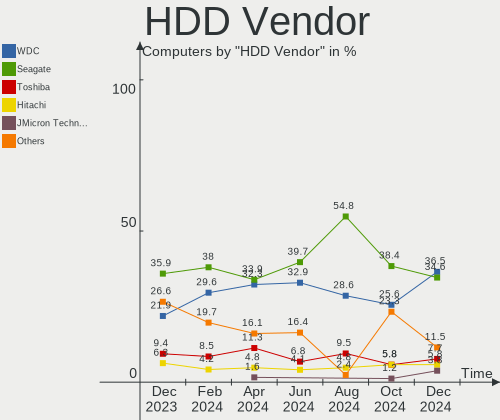
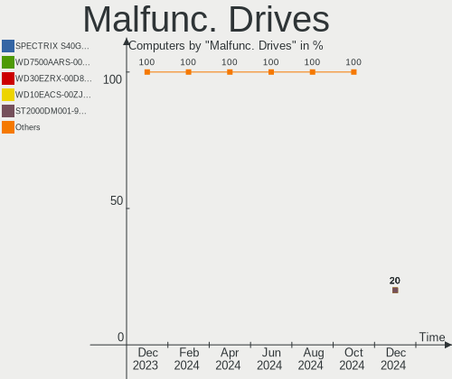
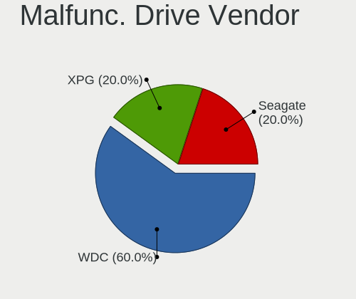
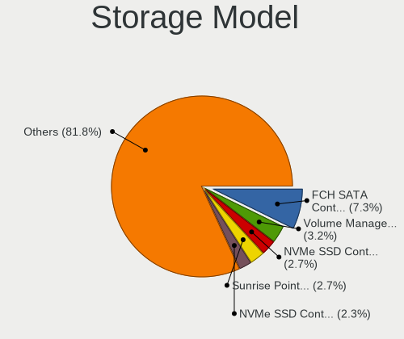
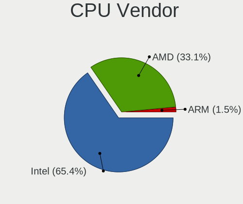
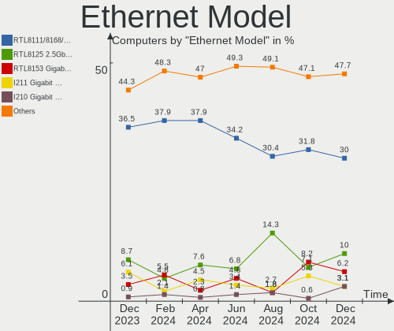
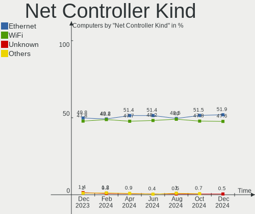

Kubuntu - Hardware Trends
-------------------------

A project to identify most popular hardware characteristics and track their change
over time based on data collected by Linux users at https://Linux-Hardware.org.

Anyone can contribute to this report by the [hw-probe](https://github.com/linuxhw/hw-probe) tool:

    sudo -E hw-probe -all -upload

This is a report for all computer types. See also reports for [desktops](/Dist/Kubuntu/Desktop/README.md) and [notebooks](/Dist/Kubuntu/Notebook/README.md).

This report is for one last month. Overall report since the beginning of time: [TestCoverage](https://github.com/linuxhw/TestCoverage)

Period: May, 2022.

Contents
--------

* [ System ](#system)
  - [ OS                       ](#os)
  - [ OS Family                ](#os-family)
  - [ Kernel                   ](#kernel)
  - [ Kernel Family            ](#kernel-family)
  - [ Kernel Major Ver.        ](#kernel-major-ver)
  - [ Arch                     ](#arch)
  - [ DE                       ](#de)
  - [ Display Server           ](#display-server)
  - [ Display Manager          ](#display-manager)
  - [ OS Lang                  ](#os-lang)
  - [ Boot Mode                ](#boot-mode)
  - [ Filesystem               ](#filesystem)
  - [ Part. scheme             ](#part-scheme)
  - [ Dual Boot with Linux/BSD ](#dual-boot-with-linuxbsd)
  - [ Dual Boot (Win)          ](#dual-boot-win)

* [ Board ](#board)
  - [ Vendor                   ](#vendor)
  - [ Model                    ](#model)
  - [ Model Family             ](#model-family)
  - [ MFG Year                 ](#mfg-year)
  - [ Form Factor              ](#form-factor)
  - [ Secure Boot              ](#secure-boot)
  - [ Coreboot                 ](#coreboot)
  - [ RAM Size                 ](#ram-size)
  - [ RAM Used                 ](#ram-used)
  - [ Total Drives             ](#total-drives)
  - [ Has CD-ROM               ](#has-cd-rom)
  - [ Has Ethernet             ](#has-ethernet)
  - [ Has WiFi                 ](#has-wifi)
  - [ Has Bluetooth            ](#has-bluetooth)

* [ Location ](#location)
  - [ Country                  ](#country)
  - [ City                     ](#city)

* [ Drives ](#drives)
  - [ Drive Vendor             ](#drive-vendor)
  - [ Drive Model              ](#drive-model)
  - [ HDD Vendor               ](#hdd-vendor)
  - [ SSD Vendor               ](#ssd-vendor)
  - [ Drive Kind               ](#drive-kind)
  - [ Drive Connector          ](#drive-connector)
  - [ Drive Size               ](#drive-size)
  - [ Space Total              ](#space-total)
  - [ Space Used               ](#space-used)
  - [ Malfunc. Drives          ](#malfunc-drives)
  - [ Malfunc. Drive Vendor    ](#malfunc-drive-vendor)
  - [ Malfunc. HDD Vendor      ](#malfunc-hdd-vendor)
  - [ Malfunc. Drive Kind      ](#malfunc-drive-kind)
  - [ Failed Drives            ](#failed-drives)
  - [ Failed Drive Vendor      ](#failed-drive-vendor)
  - [ Drive Status             ](#drive-status)

* [ Storage controller ](#storage-controller)
  - [ Storage Vendor           ](#storage-vendor)
  - [ Storage Model            ](#storage-model)
  - [ Storage Kind             ](#storage-kind)

* [ Processor ](#processor)
  - [ CPU Vendor               ](#cpu-vendor)
  - [ CPU Model                ](#cpu-model)
  - [ CPU Model Family         ](#cpu-model-family)
  - [ CPU Cores                ](#cpu-cores)
  - [ CPU Sockets              ](#cpu-sockets)
  - [ CPU Threads              ](#cpu-threads)
  - [ CPU Op-Modes             ](#cpu-op-modes)
  - [ CPU Microcode            ](#cpu-microcode)
  - [ CPU Microarch            ](#cpu-microarch)

* [ Graphics ](#graphics)
  - [ GPU Vendor               ](#gpu-vendor)
  - [ GPU Model                ](#gpu-model)
  - [ GPU Combo                ](#gpu-combo)
  - [ GPU Driver               ](#gpu-driver)
  - [ GPU Memory               ](#gpu-memory)

* [ Monitor ](#monitor)
  - [ Monitor Vendor           ](#monitor-vendor)
  - [ Monitor Model            ](#monitor-model)
  - [ Monitor Resolution       ](#monitor-resolution)
  - [ Monitor Diagonal         ](#monitor-diagonal)
  - [ Monitor Width            ](#monitor-width)
  - [ Aspect Ratio             ](#aspect-ratio)
  - [ Monitor Area             ](#monitor-area)
  - [ Pixel Density            ](#pixel-density)
  - [ Multiple Monitors        ](#multiple-monitors)

* [ Network ](#network)
  - [ Net Controller Vendor    ](#net-controller-vendor)
  - [ Net Controller Model     ](#net-controller-model)
  - [ Wireless Vendor          ](#wireless-vendor)
  - [ Wireless Model           ](#wireless-model)
  - [ Ethernet Vendor          ](#ethernet-vendor)
  - [ Ethernet Model           ](#ethernet-model)
  - [ Net Controller Kind      ](#net-controller-kind)
  - [ Used Controller          ](#used-controller)
  - [ NICs                     ](#nics)
  - [ IPv6                     ](#ipv6)

* [ Bluetooth ](#bluetooth)
  - [ Bluetooth Vendor         ](#bluetooth-vendor)
  - [ Bluetooth Model          ](#bluetooth-model)

* [ Sound ](#sound)
  - [ Sound Vendor             ](#sound-vendor)
  - [ Sound Model              ](#sound-model)

* [ Memory ](#memory)
  - [ Memory Vendor            ](#memory-vendor)
  - [ Memory Model             ](#memory-model)
  - [ Memory Kind              ](#memory-kind)
  - [ Memory Form Factor       ](#memory-form-factor)
  - [ Memory Size              ](#memory-size)
  - [ Memory Speed             ](#memory-speed)

* [ Printers & scanners ](#printers--scanners)
  - [ Printer Vendor           ](#printer-vendor)
  - [ Printer Model            ](#printer-model)
  - [ Scanner Vendor           ](#scanner-vendor)
  - [ Scanner Model            ](#scanner-model)

* [ Camera ](#camera)
  - [ Camera Vendor            ](#camera-vendor)
  - [ Camera Model             ](#camera-model)

* [ Security ](#security)
  - [ Fingerprint Vendor       ](#fingerprint-vendor)
  - [ Fingerprint Model        ](#fingerprint-model)
  - [ Chipcard Vendor          ](#chipcard-vendor)
  - [ Chipcard Model           ](#chipcard-model)

* [ Unsupported ](#unsupported)
  - [ Unsupported Devices      ](#unsupported-devices)
  - [ Unsupported Device Types ](#unsupported-device-types)

System
------

OS
--

Installed operating systems

| Name          | Computers | Percent |
|---------------|-----------|---------|
| Kubuntu 22.04 | 50        | 50%     |
| Kubuntu 20.04 | 25        | 25%     |
| Kubuntu 11    | 12        | 12%     |
| Kubuntu 21.10 | 9         | 9%      |
| Kubuntu 18.04 | 2         | 2%      |
| Kubuntu 21.04 | 1         | 1%      |
| Kubuntu 2.0   | 1         | 1%      |

OS Family
---------

OS without a version

| Name    | Computers | Percent |
|---------|-----------|---------|
| Kubuntu | 100       | 100%    |

Kernel
------

Version of the Linux kernel

| Version                | Computers | Percent |
|------------------------|-----------|---------|
| 5.15.0-27-generic      | 16        | 16%     |
| 5.13.0-40-generic      | 12        | 12%     |
| 5.13.0-41-generic      | 11        | 11%     |
| 5.15.0-33-generic      | 10        | 10%     |
| 5.15.0-30-generic      | 10        | 10%     |
| 5.13.0-44-generic      | 7         | 7%      |
| 5.4.0-110-generic      | 6         | 6%      |
| 5.4.0-109-generic      | 4         | 4%      |
| 5.4.0-113-generic      | 3         | 3%      |
| 5.15.0-30-lowlatency   | 3         | 3%      |
| 5.15.0-25-generic      | 3         | 3%      |
| 5.15.0-32-generic      | 2         | 2%      |
| 5.15.0-27-lowlatency   | 2         | 2%      |
| 5.4.0-91-generic       | 1         | 1%      |
| 5.4.0-59-generic       | 1         | 1%      |
| 5.17.5-051705-generic  | 1         | 1%      |
| 5.15.29-051529-generic | 1         | 1%      |
| 5.15.13-051513-generic | 1         | 1%      |
| 5.15.0-29-generic      | 1         | 1%      |
| 5.15.0-10033-tuxedo    | 1         | 1%      |
| 5.11.0-49-generic      | 1         | 1%      |
| 5.11.0-27-generic      | 1         | 1%      |
| 5.10.0-1052-oem        | 1         | 1%      |
| 4.15.0-156-generic     | 1         | 1%      |

Kernel Family
-------------

Linux kernel without a distro release

| Version | Computers | Percent |
|---------|-----------|---------|
| 5.15.0  | 48        | 48%     |
| 5.13.0  | 30        | 30%     |
| 5.4.0   | 15        | 15%     |
| 5.11.0  | 2         | 2%      |
| 5.17.5  | 1         | 1%      |
| 5.15.29 | 1         | 1%      |
| 5.15.13 | 1         | 1%      |
| 5.10.0  | 1         | 1%      |
| 4.15.0  | 1         | 1%      |

Kernel Major Ver.
-----------------

Linux kernel major version

| Version | Computers | Percent |
|---------|-----------|---------|
| 5.15    | 50        | 50%     |
| 5.13    | 30        | 30%     |
| 5.4     | 15        | 15%     |
| 5.11    | 2         | 2%      |
| 5.17    | 1         | 1%      |
| 5.10    | 1         | 1%      |
| 4.15    | 1         | 1%      |

Arch
----

OS architecture (x86_64, i586, etc.)

| Name   | Computers | Percent |
|--------|-----------|---------|
| x86_64 | 100       | 100%    |

DE
--

Desktop Environment

| Name | Computers | Percent |
|------|-----------|---------|
| KDE5 | 99        | 99%     |
| KDE  | 1         | 1%      |

Display Server
--------------

X11 or Wayland

| Name    | Computers | Percent |
|---------|-----------|---------|
| X11     | 98        | 98%     |
| Wayland | 1         | 1%      |
| Tty     | 1         | 1%      |

Display Manager
---------------

SDDM, LightDM, etc.

| Name    | Computers | Percent |
|---------|-----------|---------|
| SDDM    | 69        | 69%     |
| Unknown | 29        | 29%     |
| LightDM | 1         | 1%      |
| GDM3    | 1         | 1%      |

OS Lang
-------

Language

| Lang   | Computers | Percent |
|--------|-----------|---------|
| en_US  | 44        | 44%     |
| de_DE  | 9         | 9%      |
| fr_FR  | 7         | 7%      |
| ru_RU  | 5         | 5%      |
| en_GB  | 5         | 5%      |
| pt_BR  | 4         | 4%      |
| en_CA  | 4         | 4%      |
| en_AU  | 3         | 3%      |
| es_ES  | 2         | 2%      |
| en_ZA  | 2         | 2%      |
| de_AT  | 2         | 2%      |
| tr_TR  | 1         | 1%      |
| sv_SE  | 1         | 1%      |
| sl_SI  | 1         | 1%      |
| pl_PL  | 1         | 1%      |
| hu_HU  | 1         | 1%      |
| hr_HR  | 1         | 1%      |
| es_MX  | 1         | 1%      |
| es_EC  | 1         | 1%      |
| es_CO  | 1         | 1%      |
| en_PH  | 1         | 1%      |
| en_NZ  | 1         | 1%      |
| en_001 | 1         | 1%      |
| cs_CZ  | 1         | 1%      |

Boot Mode
---------

EFI or BIOS

| Mode | Computers | Percent |
|------|-----------|---------|
| EFI  | 51        | 51%     |
| BIOS | 49        | 49%     |

Filesystem
----------

Type of filesystem

| Type    | Computers | Percent |
|---------|-----------|---------|
| Ext4    | 90        | 90%     |
| Btrfs   | 6         | 6%      |
| Xfs     | 2         | 2%      |
| Zfs     | 1         | 1%      |
| Overlay | 1         | 1%      |

Part. scheme
------------

Scheme of partitioning

| Type    | Computers | Percent |
|---------|-----------|---------|
| Unknown | 49        | 49%     |
| GPT     | 43        | 43%     |
| MBR     | 8         | 8%      |

Dual Boot with Linux/BSD
------------------------

Hosting more than one Linux/BSD

| Dual boot | Computers | Percent |
|-----------|-----------|---------|
| No        | 87        | 87%     |
| Yes       | 13        | 13%     |

Dual Boot (Win)
---------------

Hosting Linux and Windows

| Dual boot | Computers | Percent |
|-----------|-----------|---------|
| No        | 63        | 63%     |
| Yes       | 37        | 37%     |

Board
-----

Vendor
------

Motherboard manufacturer

| Name                | Computers | Percent |
|---------------------|-----------|---------|
| ASUSTek Computer    | 22        | 22%     |
| Hewlett-Packard     | 16        | 16%     |
| Lenovo              | 12        | 12%     |
| Dell                | 10        | 10%     |
| Gigabyte Technology | 8         | 8%      |
| Acer                | 7         | 7%      |
| MSI                 | 6         | 6%      |
| Toshiba             | 2         | 2%      |
| HUAWEI              | 2         | 2%      |
| ASRock              | 2         | 2%      |
| Apple               | 2         | 2%      |
| TUXEDO              | 1         | 1%      |
| Supermicro          | 1         | 1%      |
| Razer               | 1         | 1%      |
| Positivo            | 1         | 1%      |
| Microsoft           | 1         | 1%      |
| Medion              | 1         | 1%      |
| Intel               | 1         | 1%      |
| Google              | 1         | 1%      |
| Fujitsu             | 1         | 1%      |
| Foxconn             | 1         | 1%      |
| Alienware           | 1         | 1%      |

Model
-----

Motherboard model

| Name                                   | Computers | Percent |
|----------------------------------------|-----------|---------|
| HP ProBook 6470b                       | 2         | 2%      |
| ASUS All Series                        | 2         | 2%      |
| TUXEDO Polaris 15 AMD Gen1             | 1         | 1%      |
| Toshiba Satellite C650D                | 1         | 1%      |
| Toshiba PORTEGE Z10t-A                 | 1         | 1%      |
| Supermicro X8ST3                       | 1         | 1%      |
| Razer Blade 15 Mid 2019-Base           | 1         | 1%      |
| Positivo POS-PIQ57BQ                   | 1         | 1%      |
| MSI p6-2475ea                          | 1         | 1%      |
| MSI MS-7C56                            | 1         | 1%      |
| MSI MS-7B89                            | 1         | 1%      |
| MSI MS-7B84                            | 1         | 1%      |
| MSI MS-7B79                            | 1         | 1%      |
| MSI MS-7B78                            | 1         | 1%      |
| Microsoft Surface Pro 3                | 1         | 1%      |
| Medion S6445 MD61489                   | 1         | 1%      |
| Lenovo Yoga C930-13IKB 81C4            | 1         | 1%      |
| Lenovo ThinkPad X201 3680AC2           | 1         | 1%      |
| Lenovo ThinkPad T430 2347AT2           | 1         | 1%      |
| Lenovo ThinkPad T400 6474AL9           | 1         | 1%      |
| Lenovo ThinkPad E14 20RBS25S00         | 1         | 1%      |
| Lenovo ThinkCentre M90p 5864AL2        | 1         | 1%      |
| Lenovo ThinkCentre M83 10AHS2XB00      | 1         | 1%      |
| Lenovo IdeaPad L340-15IRH Gaming 81LK  | 1         | 1%      |
| Lenovo IdeaPad Gaming 3 15IHU6 82K1    | 1         | 1%      |
| Lenovo IdeaPad 500-15ISK 80NT          | 1         | 1%      |
| Lenovo IdeaPad 3 15ITL6 82H8           | 1         | 1%      |
| Lenovo G780 20138                      | 1         | 1%      |
| Intel MAHOBAY                          | 1         | 1%      |
| HUAWEI HVY-WXX9                        | 1         | 1%      |
| HUAWEI CREM-WXX9                       | 1         | 1%      |
| HP ProBook 6570b                       | 1         | 1%      |
| HP ProBook 6450b                       | 1         | 1%      |
| HP ProBook 470 G1                      | 1         | 1%      |
| HP Pavilion x360 Convertible 14-dw1xxx | 1         | 1%      |
| HP Pavilion Laptop 15-cw1xxx           | 1         | 1%      |
| HP Pavilion Laptop 13-bb0xxx           | 1         | 1%      |
| HP Pavilion Gaming Laptop 15z-ec200    | 1         | 1%      |
| HP Pavilion g4                         | 1         | 1%      |
| HP Pavilion dv7                        | 1         | 1%      |
| HP EliteDesk 800 G1 SFF                | 1         | 1%      |
| HP Compaq 8100 Elite CMT PC            | 1         | 1%      |
| HP 2000                                | 1         | 1%      |
| HP 15                                  | 1         | 1%      |
| Google Coral                           | 1         | 1%      |
| Gigabyte Z370P D3                      | 1         | 1%      |
| Gigabyte Z270-HD3P                     | 1         | 1%      |
| Gigabyte X570 GAMING X                 | 1         | 1%      |
| Gigabyte GA-78LMT-S2P                  | 1         | 1%      |
| Gigabyte F2A88XM-D3H                   | 1         | 1%      |
| Gigabyte B85M-D2V                      | 1         | 1%      |
| Gigabyte AORUS 15 XE4                  | 1         | 1%      |
| Gigabyte 990FXA-UD3                    | 1         | 1%      |
| Fujitsu ESPRIMO E710                   | 1         | 1%      |
| Foxconn p6-2346eg                      | 1         | 1%      |
| Dell XPS 13 9370                       | 1         | 1%      |
| Dell Vostro 5625                       | 1         | 1%      |
| Dell Vostro 5481                       | 1         | 1%      |
| Dell Precision Tower 7810              | 1         | 1%      |
| Dell Precision 7710                    | 1         | 1%      |

Model Family
------------

Motherboard model prefix

| Name                  | Computers | Percent |
|-----------------------|-----------|---------|
| HP Pavilion           | 6         | 6%      |
| HP ProBook            | 5         | 5%      |
| ASUS ROG              | 5         | 5%      |
| Lenovo ThinkPad       | 4         | 4%      |
| Lenovo IdeaPad        | 4         | 4%      |
| Acer Aspire           | 4         | 4%      |
| Dell Inspiron         | 3         | 3%      |
| ASUS TUF              | 3         | 3%      |
| ASUS PRIME            | 3         | 3%      |
| Lenovo ThinkCentre    | 2         | 2%      |
| Dell Vostro           | 2         | 2%      |
| Dell Precision        | 2         | 2%      |
| ASUS VivoBook         | 2         | 2%      |
| ASUS All              | 2         | 2%      |
| TUXEDO Polaris        | 1         | 1%      |
| Toshiba Satellite     | 1         | 1%      |
| Toshiba PORTEGE       | 1         | 1%      |
| Supermicro X8ST3      | 1         | 1%      |
| Razer Blade           | 1         | 1%      |
| Positivo POS-PIQ57BQ  | 1         | 1%      |
| MSI p6-2475ea         | 1         | 1%      |
| MSI MS-7C56           | 1         | 1%      |
| MSI MS-7B89           | 1         | 1%      |
| MSI MS-7B84           | 1         | 1%      |
| MSI MS-7B79           | 1         | 1%      |
| MSI MS-7B78           | 1         | 1%      |
| Microsoft Surface     | 1         | 1%      |
| Medion S6445          | 1         | 1%      |
| Lenovo Yoga           | 1         | 1%      |
| Lenovo G780           | 1         | 1%      |
| Intel MAHOBAY         | 1         | 1%      |
| HUAWEI HVY-WXX9       | 1         | 1%      |
| HUAWEI CREM-WXX9      | 1         | 1%      |
| HP EliteDesk          | 1         | 1%      |
| HP Compaq             | 1         | 1%      |
| HP 2000               | 1         | 1%      |
| HP 15                 | 1         | 1%      |
| Google Coral          | 1         | 1%      |
| Gigabyte Z370P        | 1         | 1%      |
| Gigabyte Z270-HD3P    | 1         | 1%      |
| Gigabyte X570         | 1         | 1%      |
| Gigabyte GA-78LMT-S2P | 1         | 1%      |
| Gigabyte F2A88XM-D3H  | 1         | 1%      |
| Gigabyte B85M-D2V     | 1         | 1%      |
| Gigabyte AORUS        | 1         | 1%      |
| Gigabyte 990FXA-UD3   | 1         | 1%      |
| Fujitsu ESPRIMO       | 1         | 1%      |
| Foxconn p6-2346eg     | 1         | 1%      |
| Dell XPS              | 1         | 1%      |
| Dell Latitude         | 1         | 1%      |
| Dell G7               | 1         | 1%      |
| ASUS X550JX           | 1         | 1%      |
| ASUS X540LA           | 1         | 1%      |
| ASUS P8B75-M          | 1         | 1%      |
| ASUS P7P55D-E         | 1         | 1%      |
| ASUS P7H55-M          | 1         | 1%      |
| ASUS F1A75-M          | 1         | 1%      |
| ASUS EB1501P          | 1         | 1%      |
| ASRock B560M          | 1         | 1%      |
| ASRock B460           | 1         | 1%      |

MFG Year
--------

Motherboard manufacture year

| Year | Computers | Percent |
|------|-----------|---------|
| 2021 | 13        | 13%     |
| 2020 | 13        | 13%     |
| 2018 | 12        | 12%     |
| 2013 | 12        | 12%     |
| 2019 | 10        | 10%     |
| 2012 | 10        | 10%     |
| 2010 | 9         | 9%      |
| 2017 | 6         | 6%      |
| 2015 | 4         | 4%      |
| 2016 | 3         | 3%      |
| 2011 | 2         | 2%      |
| 2008 | 2         | 2%      |
| 2022 | 1         | 1%      |
| 2014 | 1         | 1%      |
| 2009 | 1         | 1%      |
| 2007 | 1         | 1%      |

Form Factor
-----------

Physical design of the computer

| Name        | Computers | Percent |
|-------------|-----------|---------|
| Notebook    | 54        | 54%     |
| Desktop     | 42        | 42%     |
| Convertible | 3         | 3%      |
| Tablet      | 1         | 1%      |

Secure Boot
-----------

Enabled or disabled

| State    | Computers | Percent |
|----------|-----------|---------|
| Disabled | 95        | 95%     |
| Enabled  | 5         | 5%      |

Coreboot
--------

Have coreboot on board

| Used | Computers | Percent |
|------|-----------|---------|
| No   | 99        | 99%     |
| Yes  | 1         | 1%      |

RAM Size
--------

Total RAM memory

| Size in GB  | Computers | Percent |
|-------------|-----------|---------|
| 16.01-24.0  | 29        | 29%     |
| 4.01-8.0    | 23        | 23%     |
| 8.01-16.0   | 19        | 19%     |
| 3.01-4.0    | 11        | 11%     |
| 32.01-64.0  | 8         | 8%      |
| 64.01-256.0 | 6         | 6%      |
| 24.01-32.0  | 2         | 2%      |
| 2.01-3.0    | 2         | 2%      |

RAM Used
--------

Used RAM memory

| Used GB   | Computers | Percent |
|-----------|-----------|---------|
| 2.01-3.0  | 30        | 30%     |
| 1.01-2.0  | 27        | 27%     |
| 4.01-8.0  | 24        | 24%     |
| 3.01-4.0  | 17        | 17%     |
| 8.01-16.0 | 2         | 2%      |

Total Drives
------------

Number of drives on board

| Drives | Computers | Percent |
|--------|-----------|---------|
| 1      | 47        | 47%     |
| 2      | 32        | 32%     |
| 4      | 7         | 7%      |
| 3      | 7         | 7%      |
| 5      | 4         | 4%      |
| 6      | 2         | 2%      |
| 0      | 1         | 1%      |

Has CD-ROM
----------

Has CD-ROM on board

| Presented | Computers | Percent |
|-----------|-----------|---------|
| No        | 65        | 65%     |
| Yes       | 35        | 35%     |

Has Ethernet
------------

Has Ethernet on board

| Presented | Computers | Percent |
|-----------|-----------|---------|
| Yes       | 88        | 88%     |
| No        | 12        | 12%     |

Has WiFi
--------

Has WiFi module

| Presented | Computers | Percent |
|-----------|-----------|---------|
| Yes       | 76        | 76%     |
| No        | 24        | 24%     |

Has Bluetooth
-------------

Has Bluetooth module

| Presented | Computers | Percent |
|-----------|-----------|---------|
| Yes       | 62        | 62%     |
| No        | 38        | 38%     |

Location
--------

Country
-------

Geographic location (country)

| Country      | Computers | Percent |
|--------------|-----------|---------|
| USA          | 20        | 20%     |
| Germany      | 10        | 10%     |
| France       | 9         | 9%      |
| Russia       | 6         | 6%      |
| UK           | 5         | 5%      |
| Canada       | 5         | 5%      |
| Brazil       | 5         | 5%      |
| Spain        | 3         | 3%      |
| Australia    | 3         | 3%      |
| Switzerland  | 2         | 2%      |
| South Africa | 2         | 2%      |
| Netherlands  | 2         | 2%      |
| Indonesia    | 2         | 2%      |
| Austria      | 2         | 2%      |
| UAE          | 1         | 1%      |
| Turkey       | 1         | 1%      |
| Sweden       | 1         | 1%      |
| Sri Lanka    | 1         | 1%      |
| Slovenia     | 1         | 1%      |
| Serbia       | 1         | 1%      |
| Portugal     | 1         | 1%      |
| Poland       | 1         | 1%      |
| Philippines  | 1         | 1%      |
| Paraguay     | 1         | 1%      |
| New Zealand  | 1         | 1%      |
| Mexico       | 1         | 1%      |
| Kyrgyzstan   | 1         | 1%      |
| Hungary      | 1         | 1%      |
| Greece       | 1         | 1%      |
| Georgia      | 1         | 1%      |
| Ecuador      | 1         | 1%      |
| Denmark      | 1         | 1%      |
| Czechia      | 1         | 1%      |
| Croatia      | 1         | 1%      |
| Colombia     | 1         | 1%      |
| Bulgaria     | 1         | 1%      |
| Belgium      | 1         | 1%      |
| Bangladesh   | 1         | 1%      |

City
----

Geographic location (city)

| City                   | Computers | Percent |
|------------------------|-----------|---------|
| Moscow                 | 3         | 3%      |
| Berlin                 | 3         | 3%      |
| Perth Amboy            | 2         | 2%      |
| Paris                  | 2         | 2%      |
| Johannesburg           | 2         | 2%      |
| Jakarta                | 2         | 2%      |
| Dallas                 | 2         | 2%      |
| Casa Grande            | 2         | 2%      |
| Brisbane               | 2         | 2%      |
| Zapopan                | 1         | 1%      |
| Wroclaw                | 1         | 1%      |
| Woodbine               | 1         | 1%      |
| Weimar                 | 1         | 1%      |
| Vitoria-Gasteiz        | 1         | 1%      |
| Vienna                 | 1         | 1%      |
| Vermilion              | 1         | 1%      |
| Toronto                | 1         | 1%      |
| Szekszárd             | 1         | 1%      |
| St. Petersburg         | 1         | 1%      |
| St Petersburg          | 1         | 1%      |
| Solna                  | 1         | 1%      |
| Sofia                  | 1         | 1%      |
| Sherpur                | 1         | 1%      |
| Sesvete                | 1         | 1%      |
| Seattle                | 1         | 1%      |
| Saskatoon              | 1         | 1%      |
| Sao Paulo              | 1         | 1%      |
| San Pedro              | 1         | 1%      |
| San Bernardino         | 1         | 1%      |
| Salzburg               | 1         | 1%      |
| Saint-Mandrier-sur-Mer | 1         | 1%      |
| Reigate                | 1         | 1%      |
| Quito                  | 1         | 1%      |
| Prague                 | 1         | 1%      |
| Porto                  | 1         | 1%      |
| Phoenix                | 1         | 1%      |
| Pass Christian         | 1         | 1%      |
| Oviedo                 | 1         | 1%      |
| Novosibirsk            | 1         | 1%      |
| Northwood              | 1         | 1%      |
| North Kingstown        | 1         | 1%      |
| Nittel                 | 1         | 1%      |
| Nieuwegein             | 1         | 1%      |
| Nice                   | 1         | 1%      |
| Napier City            | 1         | 1%      |
| Montreal               | 1         | 1%      |
| Midlothian             | 1         | 1%      |
| Medellín              | 1         | 1%      |
| Malton                 | 1         | 1%      |
| Madrid                 | 1         | 1%      |
| Mâcon                 | 1         | 1%      |
| Longmont               | 1         | 1%      |
| Liverpool              | 1         | 1%      |
| Limbach-Oberfrohna     | 1         | 1%      |
| Lesicno                | 1         | 1%      |
| Leipzig                | 1         | 1%      |
| Laval                  | 1         | 1%      |
| Lauf an der Pegnitz    | 1         | 1%      |
| Katerini               | 1         | 1%      |
| K'alak'i T'bilisi      | 1         | 1%      |

Drives
------

Drive Vendor
------------

Hard drive vendors

| Vendor                         | Computers | Drives | Percent |
|--------------------------------|-----------|--------|---------|
| Samsung Electronics            | 32        | 38     | 19.51%  |
| Seagate                        | 27        | 42     | 16.46%  |
| WDC                            | 15        | 18     | 9.15%   |
| SanDisk                        | 12        | 12     | 7.32%   |
| Kingston                       | 11        | 11     | 6.71%   |
| Toshiba                        | 10        | 11     | 6.1%    |
| Intel                          | 7         | 8      | 4.27%   |
| Crucial                        | 6         | 7      | 3.66%   |
| Hitachi                        | 4         | 4      | 2.44%   |
| SK Hynix                       | 3         | 3      | 1.83%   |
| A-DATA Technology              | 3         | 3      | 1.83%   |
| Unknown                        | 2         | 2      | 1.22%   |
| Phison                         | 2         | 2      | 1.22%   |
| LITEON                         | 2         | 2      | 1.22%   |
| HGST                           | 2         | 2      | 1.22%   |
| Apple                          | 2         | 3      | 1.22%   |
| Unknown                        | 2         | 2      | 1.22%   |
| Verbatim                       | 1         | 1      | 0.61%   |
| UMIS                           | 1         | 1      | 0.61%   |
| Transcend                      | 1         | 1      | 0.61%   |
| Solid State Storage Technology | 1         | 1      | 0.61%   |
| Silicon Motion                 | 1         | 1      | 0.61%   |
| Realtek Semiconductor          | 1         | 1      | 0.61%   |
| PNY                            | 1         | 1      | 0.61%   |
| Patriot                        | 1         | 1      | 0.61%   |
| OCZ                            | 1         | 1      | 0.61%   |
| Netac                          | 1         | 1      | 0.61%   |
| Micron/Crucial Technology      | 1         | 1      | 0.61%   |
| Micron Technology              | 1         | 1      | 0.61%   |
| MAXTOR                         | 1         | 1      | 0.61%   |
| LDLC                           | 1         | 2      | 0.61%   |
| KIOXIA                         | 1         | 1      | 0.61%   |
| INNOVATION IT                  | 1         | 1      | 0.61%   |
| Inateck                        | 1         | 1      | 0.61%   |
| HGST HTS                       | 1         | 1      | 0.61%   |
| Gigabyte Technology            | 1         | 1      | 0.61%   |
| DREVO                          | 1         | 1      | 0.61%   |
| Corsair                        | 1         | 1      | 0.61%   |
| China                          | 1         | 1      | 0.61%   |

Drive Model
-----------

Hard drive models

| Model                                    | Computers | Percent |
|------------------------------------------|-----------|---------|
| Kingston SA400S37240G 240GB SSD          | 4         | 2.17%   |
| Seagate ST3500413AS 500GB                | 3         | 1.63%   |
| SanDisk SSD PLUS 120GB                   | 3         | 1.63%   |
| Samsung SSD 850 EVO 500GB                | 3         | 1.63%   |
| Samsung NVMe SSD Drive 500GB             | 3         | 1.63%   |
| WDC WD5000AADS-00S9B0 500GB              | 2         | 1.09%   |
| SK Hynix NVMe SSD Drive 512GB            | 2         | 1.09%   |
| Seagate ST4000DM004-2CV104 4TB           | 2         | 1.09%   |
| Seagate ST2000DM008-2FR102 2TB           | 2         | 1.09%   |
| Seagate ST1000LM035-1RK172 1TB           | 2         | 1.09%   |
| Seagate ST1000LM024 HN-M101MBB 1TB       | 2         | 1.09%   |
| Seagate ST1000DM010-2EP102 1TB           | 2         | 1.09%   |
| Samsung SSD 860 EVO M.2 500GB            | 2         | 1.09%   |
| Samsung SSD 850 EVO 1TB                  | 2         | 1.09%   |
| Crucial CT500MX500SSD1 500GB             | 2         | 1.09%   |
| Unknown                                  | 2         | 1.09%   |
| WDC WDS100T2G0A-00JH30 1TB SSD           | 1         | 0.54%   |
| WDC WD7500BPKX-75HPJT0 752GB             | 1         | 0.54%   |
| WDC WD5000LUCT-63RC2Y0 500GB             | 1         | 0.54%   |
| WDC WD5000BPVT-75HXZT3 500GB             | 1         | 0.54%   |
| WDC WD5000BPKX-22HPJT0 500GB             | 1         | 0.54%   |
| WDC WD5000AURX-63UY4Y0 500GB             | 1         | 0.54%   |
| WDC WD5000AAKX-75U6AA0 500GB             | 1         | 0.54%   |
| WDC WD5000AADS-67S9B1 500GB              | 1         | 0.54%   |
| WDC WD40EFAX-68JH4N1 4TB                 | 1         | 0.54%   |
| WDC WD3200AAJS-22B4A0 320GB              | 1         | 0.54%   |
| WDC WD30EFRX-68EUZN0 3TB                 | 1         | 0.54%   |
| WDC WD10SPZX-24Z10 1TB                   | 1         | 0.54%   |
| WDC WD10SPSX-60A6WT0 1TB                 | 1         | 0.54%   |
| WDC WD10SPCX-60KHST0 1TB                 | 1         | 0.54%   |
| WDC WD10JPLX-00MBPT0 1TB                 | 1         | 0.54%   |
| WDC PC SN730 SDBPNTY-512G                | 1         | 0.54%   |
| Verbatim Vi550 S3 SSD 256GB              | 1         | 0.54%   |
| Unknown hB8aP  32GB                      | 1         | 0.54%   |
| Unknown 00000  8GB                       | 1         | 0.54%   |
| UMIS RPJTJ256MEE1OWX 256GB               | 1         | 0.54%   |
| Transcend TS1TMTE220S 1TB                | 1         | 0.54%   |
| Toshiba THNSNJ256GMCU 256GB SSD          | 1         | 0.54%   |
| Toshiba THNSNH512GCST 512GB SSD          | 1         | 0.54%   |
| Toshiba NVMe SSD Drive 512GB             | 1         | 0.54%   |
| Toshiba MQ01ABD075 752GB                 | 1         | 0.54%   |
| Toshiba MQ01ABD050V 500GB                | 1         | 0.54%   |
| Toshiba MK3261GSYN 320GB                 | 1         | 0.54%   |
| Toshiba KXG50ZNV256G NVMe 256GB          | 1         | 0.54%   |
| Toshiba HDWE140 4TB                      | 1         | 0.54%   |
| Toshiba DT01ACA200 2TB                   | 1         | 0.54%   |
| Toshiba DT01ACA100 1TB                   | 1         | 0.54%   |
| Solid State Storage NVMe SSD Drive 256GB | 1         | 0.54%   |
| SK Hynix HFS512GD9TNG-62A0A 512GB        | 1         | 0.54%   |
| Silicon Motion PCIe-8 SSD 512GB          | 1         | 0.54%   |
| Seagate ST95005620AS 500GB               | 1         | 0.54%   |
| Seagate ST9500325AS 500GB                | 1         | 0.54%   |
| Seagate ST9250827AS 250GB                | 1         | 0.54%   |
| Seagate ST9250320AS 250GB                | 1         | 0.54%   |
| Seagate ST9160412AS 160GB                | 1         | 0.54%   |
| Seagate ST500LT012-9WS142 500GB          | 1         | 0.54%   |
| Seagate ST500LT012-1DG142 500GB          | 1         | 0.54%   |
| Seagate ST500LM012 HN-M500MBB 500GB      | 1         | 0.54%   |
| Seagate ST3400833AS 400GB                | 1         | 0.54%   |
| Seagate ST3400620AS 400GB                | 1         | 0.54%   |

HDD Vendor
----------

Hard disk drive vendors

| Vendor              | Computers | Drives | Percent |
|---------------------|-----------|--------|---------|
| Seagate             | 25        | 38     | 45.45%  |
| WDC                 | 14        | 16     | 25.45%  |
| Toshiba             | 6         | 7      | 10.91%  |
| Hitachi             | 4         | 4      | 7.27%   |
| Samsung Electronics | 3         | 3      | 5.45%   |
| HGST                | 2         | 2      | 3.64%   |
| HGST HTS            | 1         | 1      | 1.82%   |

SSD Vendor
----------

Solid state drive vendors

| Vendor              | Computers | Drives | Percent |
|---------------------|-----------|--------|---------|
| Samsung Electronics | 21        | 23     | 33.87%  |
| SanDisk             | 10        | 10     | 16.13%  |
| Kingston            | 7         | 7      | 11.29%  |
| Crucial             | 5         | 6      | 8.06%   |
| Toshiba             | 2         | 2      | 3.23%   |
| LITEON              | 2         | 2      | 3.23%   |
| Intel               | 2         | 2      | 3.23%   |
| A-DATA Technology   | 2         | 2      | 3.23%   |
| WDC                 | 1         | 1      | 1.61%   |
| Verbatim            | 1         | 1      | 1.61%   |
| PNY                 | 1         | 1      | 1.61%   |
| Patriot             | 1         | 1      | 1.61%   |
| OCZ                 | 1         | 1      | 1.61%   |
| Netac               | 1         | 1      | 1.61%   |
| MAXTOR              | 1         | 1      | 1.61%   |
| INNOVATION IT       | 1         | 1      | 1.61%   |
| DREVO               | 1         | 1      | 1.61%   |
| Corsair             | 1         | 1      | 1.61%   |
| Apple               | 1         | 1      | 1.61%   |

Drive Kind
----------

HDD or SSD

| Kind    | Computers | Drives | Percent |
|---------|-----------|--------|---------|
| SSD     | 52        | 65     | 37.41%  |
| HDD     | 43        | 71     | 30.94%  |
| NVMe    | 37        | 49     | 26.62%  |
| MMC     | 4         | 4      | 2.88%   |
| Unknown | 3         | 4      | 2.16%   |

Drive Connector
---------------

SATA, SAS, NVMe, etc.

| Type | Computers | Drives | Percent |
|------|-----------|--------|---------|
| SATA | 73        | 133    | 61.34%  |
| NVMe | 37        | 49     | 31.09%  |
| SAS  | 5         | 7      | 4.2%    |
| MMC  | 4         | 4      | 3.36%   |

Drive Size
----------

Size of hard drive

| Size in TB | Computers | Drives | Percent |
|------------|-----------|--------|---------|
| 0.01-0.5   | 58        | 74     | 54.21%  |
| 0.51-1.0   | 32        | 39     | 29.91%  |
| 1.01-2.0   | 7         | 9      | 6.54%   |
| 3.01-4.0   | 6         | 8      | 5.61%   |
| 2.01-3.0   | 3         | 5      | 2.8%    |
| 10.01-20.0 | 1         | 1      | 0.93%   |

Space Total
-----------

Amount of disk space available on the file system

| Size in GB     | Computers | Percent |
|----------------|-----------|---------|
| 101-250        | 23        | 23%     |
| 501-1000       | 19        | 19%     |
| 251-500        | 16        | 16%     |
| 1001-2000      | 13        | 13%     |
| More than 3000 | 12        | 12%     |
| 2001-3000      | 6         | 6%      |
| 51-100         | 6         | 6%      |
| 21-50          | 4         | 4%      |
| 1-20           | 1         | 1%      |

Space Used
----------

Amount of used disk space

| Used GB        | Computers | Percent |
|----------------|-----------|---------|
| 1-20           | 22        | 22%     |
| 21-50          | 14        | 14%     |
| 101-250        | 14        | 14%     |
| 51-100         | 14        | 14%     |
| 501-1000       | 10        | 10%     |
| 251-500        | 9         | 9%      |
| 2001-3000      | 7         | 7%      |
| 1001-2000      | 6         | 6%      |
| More than 3000 | 4         | 4%      |

Malfunc. Drives
---------------

Drive models with a malfunction

| Model                               | Computers | Drives | Percent |
|-------------------------------------|-----------|--------|---------|
| Toshiba MQ01ABD075 752GB            | 1         | 1      | 16.67%  |
| Seagate ST500LT012-9WS142 500GB     | 1         | 1      | 16.67%  |
| Seagate ST31500341AS 1TB            | 1         | 1      | 16.67%  |
| Samsung Electronics SSD 870 EVO 1TB | 1         | 1      | 16.67%  |
| Crucial CT128M550SSD1 128GB         | 1         | 1      | 16.67%  |
| A-DATA Technology SP550 240GB SSD   | 1         | 1      | 16.67%  |

Malfunc. Drive Vendor
---------------------

Vendors of faulty drives

| Vendor              | Computers | Drives | Percent |
|---------------------|-----------|--------|---------|
| Seagate             | 2         | 2      | 33.33%  |
| Toshiba             | 1         | 1      | 16.67%  |
| Samsung Electronics | 1         | 1      | 16.67%  |
| Crucial             | 1         | 1      | 16.67%  |
| A-DATA Technology   | 1         | 1      | 16.67%  |

Malfunc. HDD Vendor
-------------------

Vendors of faulty HDD drives

| Vendor  | Computers | Drives | Percent |
|---------|-----------|--------|---------|
| Seagate | 2         | 2      | 66.67%  |
| Toshiba | 1         | 1      | 33.33%  |

Malfunc. Drive Kind
-------------------

Kinds of faulty drives

| Kind | Computers | Drives | Percent |
|------|-----------|--------|---------|
| SSD  | 3         | 3      | 50%     |
| HDD  | 3         | 3      | 50%     |

Failed Drives
-------------

Failed drive models

Zero info for selected period =(

Failed Drive Vendor
-------------------

Failed drive vendors

Zero info for selected period =(

Drive Status
------------

Number of failed and malfunc. drives

| Status   | Computers | Drives | Percent |
|----------|-----------|--------|---------|
| Detected | 53        | 96     | 48.62%  |
| Works    | 50        | 91     | 45.87%  |
| Malfunc  | 6         | 6      | 5.5%    |

Storage controller
------------------

Storage Vendor
--------------

Storage controller vendors

| Vendor                         | Computers | Percent |
|--------------------------------|-----------|---------|
| Intel                          | 67        | 49.63%  |
| AMD                            | 25        | 18.52%  |
| Samsung Electronics            | 12        | 8.89%   |
| Kingston Technology Company    | 4         | 2.96%   |
| SK Hynix                       | 3         | 2.22%   |
| Sandisk                        | 3         | 2.22%   |
| Toshiba America Info Systems   | 2         | 1.48%   |
| Silicon Motion                 | 2         | 1.48%   |
| Seagate Technology             | 2         | 1.48%   |
| Phison Electronics             | 2         | 1.48%   |
| Micron Technology              | 2         | 1.48%   |
| JMicron Technology             | 2         | 1.48%   |
| Union Memory (Shenzhen)        | 1         | 0.74%   |
| Solid State Storage Technology | 1         | 0.74%   |
| Realtek Semiconductor          | 1         | 0.74%   |
| Micron/Crucial Technology      | 1         | 0.74%   |
| Marvell Technology Group       | 1         | 0.74%   |
| KIOXIA                         | 1         | 0.74%   |
| ASMedia Technology             | 1         | 0.74%   |
| Apple                          | 1         | 0.74%   |
| ADATA Technology               | 1         | 0.74%   |

Storage Model
-------------

Storage controller models

| Model                                                                            | Computers | Percent |
|----------------------------------------------------------------------------------|-----------|---------|
| AMD FCH SATA Controller [AHCI mode]                                              | 18        | 11.32%  |
| Intel 7 Series Chipset Family 6-port SATA Controller [AHCI mode]                 | 7         | 4.4%    |
| Intel Volume Management Device NVMe RAID Controller                              | 6         | 3.77%   |
| Intel 82801 Mobile SATA Controller [RAID mode]                                   | 6         | 3.77%   |
| Intel 8 Series/C220 Series Chipset Family 6-port SATA Controller 1 [AHCI mode]   | 6         | 3.77%   |
| AMD 400 Series Chipset SATA Controller                                           | 6         | 3.77%   |
| Samsung NVMe SSD Controller SM981/PM981/PM983                                    | 5         | 3.14%   |
| Samsung NVMe SSD Controller 980                                                  | 4         | 2.52%   |
| Intel SSD 660P Series                                                            | 4         | 2.52%   |
| Intel 5 Series/3400 Series Chipset 6 port SATA AHCI Controller                   | 4         | 2.52%   |
| Intel 400 Series Chipset Family SATA AHCI Controller                             | 4         | 2.52%   |
| Intel Tiger Lake-LP SATA Controller [AHCI mode]                                  | 3         | 1.89%   |
| Intel 82801IBM/IEM (ICH9M/ICH9M-E) 4 port SATA Controller [AHCI mode]            | 3         | 1.89%   |
| Intel 5 Series/3400 Series Chipset 4 port SATA IDE Controller                    | 3         | 1.89%   |
| Intel 5 Series/3400 Series Chipset 2 port SATA IDE Controller                    | 3         | 1.89%   |
| Intel 200 Series PCH SATA controller [AHCI mode]                                 | 3         | 1.89%   |
| AMD SB7x0/SB8x0/SB9x0 SATA Controller [AHCI mode]                                | 3         | 1.89%   |
| Sandisk WD Black SN750 / PC SN730 NVMe SSD                                       | 2         | 1.26%   |
| Samsung NVMe SSD Controller PM9A1/PM9A3/980PRO                                   | 2         | 1.26%   |
| Micron Non-Volatile memory controller                                            | 2         | 1.26%   |
| Kingston Company OM3PDP3 NVMe SSD                                                | 2         | 1.26%   |
| Kingston Company A2000 NVMe SSD                                                  | 2         | 1.26%   |
| Intel Wildcat Point-LP SATA Controller [AHCI Mode]                               | 2         | 1.26%   |
| Intel Cannon Lake Mobile PCH SATA AHCI Controller                                | 2         | 1.26%   |
| Intel 8 Series SATA Controller 1 [AHCI mode]                                     | 2         | 1.26%   |
| Intel 7 Series/C210 Series Chipset Family 6-port SATA Controller [AHCI mode]     | 2         | 1.26%   |
| AMD 500 Series Chipset SATA Controller                                           | 2         | 1.26%   |
| Union Memory (Shenzhen) Non-Volatile memory controller                           | 1         | 0.63%   |
| Toshiba America Info Systems XG4 NVMe SSD Controller                             | 1         | 0.63%   |
| Toshiba America Info Systems Toshiba America Info Non-Volatile memory controller | 1         | 0.63%   |
| Solid State Storage Non-Volatile memory controller                               | 1         | 0.63%   |
| SK Hynix PC401 NVMe Solid State Drive 256GB                                      | 1         | 0.63%   |
| SK Hynix Gold P31 SSD                                                            | 1         | 0.63%   |
| SK Hynix BC511                                                                   | 1         | 0.63%   |
| Silicon Motion SM2262/SM2262EN SSD Controller                                    | 1         | 0.63%   |
| Silicon Motion Non-Volatile memory controller                                    | 1         | 0.63%   |
| Seagate FireCuda 530 SSD                                                         | 1         | 0.63%   |
| Seagate FireCuda 520 SSD                                                         | 1         | 0.63%   |
| Sandisk WD Black 2018/SN750 / PC SN720 NVMe SSD                                  | 1         | 0.63%   |
| Samsung NVMe SSD Controller SM961/PM961/SM963                                    | 1         | 0.63%   |
| Samsung Apple PCIe SSD                                                           | 1         | 0.63%   |
| Realtek Realtek Non-Volatile memory controller                                   | 1         | 0.63%   |
| Phison E18 PCIe4 NVMe Controller                                                 | 1         | 0.63%   |
| Phison E16 PCIe4 NVMe Controller                                                 | 1         | 0.63%   |
| Micron/Crucial P2 NVMe PCIe SSD                                                  | 1         | 0.63%   |
| Marvell Group 88SE914D SATA-600 Controller                                       | 1         | 0.63%   |
| KIOXIA Non-Volatile memory controller                                            | 1         | 0.63%   |
| JMicron JMB368 IDE controller                                                    | 1         | 0.63%   |
| JMicron JMB363 SATA/IDE Controller                                               | 1         | 0.63%   |
| Intel Sunrise Point-LP SATA Controller [AHCI mode]                               | 1         | 0.63%   |
| Intel Q170/Q150/B150/H170/H110/Z170/CM236 Chipset SATA Controller [AHCI Mode]    | 1         | 0.63%   |
| Intel Non-Volatile memory controller                                             | 1         | 0.63%   |
| Intel NM10/ICH7 Family SATA Controller [AHCI mode]                               | 1         | 0.63%   |
| Intel Ice Lake-LP SATA Controller [AHCI mode]                                    | 1         | 0.63%   |
| Intel HM170/QM170 Chipset SATA Controller [AHCI Mode]                            | 1         | 0.63%   |
| Intel Comet Lake SATA AHCI Controller                                            | 1         | 0.63%   |
| Intel Celeron/Pentium Silver Processor SATA Controller                           | 1         | 0.63%   |
| Intel Cannon Point-LP SATA Controller [AHCI Mode]                                | 1         | 0.63%   |
| Intel C610/X99 series chipset sSATA Controller [AHCI mode]                       | 1         | 0.63%   |
| Intel C600/X79 series chipset SATA RAID Controller                               | 1         | 0.63%   |

Storage Kind
------------

Kind of storage controller (IDE, SATA, NVMe, SAS, ...)

| Kind | Computers | Percent |
|------|-----------|---------|
| SATA | 79        | 57.66%  |
| NVMe | 37        | 27.01%  |
| RAID | 13        | 9.49%   |
| IDE  | 8         | 5.84%   |

Processor
---------

CPU Vendor
----------

Processor vendors

| Vendor | Computers | Percent |
|--------|-----------|---------|
| Intel  | 72        | 72%     |
| AMD    | 28        | 28%     |

CPU Model
---------

Processor models

| Model                                   | Computers | Percent |
|-----------------------------------------|-----------|---------|
| Intel Core i7-8550U CPU @ 1.80GHz       | 3         | 3%      |
| Intel Core i5-3320M CPU @ 2.60GHz       | 3         | 3%      |
| Intel 11th Gen Core i5-1135G7 @ 2.40GHz | 3         | 3%      |
| AMD Ryzen 7 2700X Eight-Core Processor  | 3         | 3%      |
| Intel Core i7-1065G7 CPU @ 1.30GHz      | 2         | 2%      |
| Intel Core i5-10400F CPU @ 2.90GHz      | 2         | 2%      |
| AMD Ryzen 9 5900X 12-Core Processor     | 2         | 2%      |
| AMD Ryzen 7 5800H with Radeon Graphics  | 2         | 2%      |
| AMD Ryzen 5 4600H with Radeon Graphics  | 2         | 2%      |
| Intel Xeon CPU E5-2630 v3 @ 2.40GHz     | 1         | 1%      |
| Intel Xeon CPU E3-1275 V2 @ 3.50GHz     | 1         | 1%      |
| Intel Pentium CPU N4200 @ 1.10GHz       | 1         | 1%      |
| Intel Pentium CPU G3430 @ 3.30GHz       | 1         | 1%      |
| Intel Pentium CPU G3220 @ 3.00GHz       | 1         | 1%      |
| Intel Pentium CPU G2030 @ 3.00GHz       | 1         | 1%      |
| Intel Core i7-9750H CPU @ 2.60GHz       | 1         | 1%      |
| Intel Core i7-8750H CPU @ 2.20GHz       | 1         | 1%      |
| Intel Core i7-8700K CPU @ 3.70GHz       | 1         | 1%      |
| Intel Core i7-8565U CPU @ 1.80GHz       | 1         | 1%      |
| Intel Core i7-7700HQ CPU @ 2.80GHz      | 1         | 1%      |
| Intel Core i7-6820HQ CPU @ 2.70GHz      | 1         | 1%      |
| Intel Core i7-6700 CPU @ 3.40GHz        | 1         | 1%      |
| Intel Core i7-4790K CPU @ 4.00GHz       | 1         | 1%      |
| Intel Core i7-4770HQ CPU @ 2.20GHz      | 1         | 1%      |
| Intel Core i7-4770 CPU @ 3.40GHz        | 1         | 1%      |
| Intel Core i7-4720HQ CPU @ 2.60GHz      | 1         | 1%      |
| Intel Core i7-4700MQ CPU @ 2.40GHz      | 1         | 1%      |
| Intel Core i7-4510U CPU @ 2.00GHz       | 1         | 1%      |
| Intel Core i7-3612QM CPU @ 2.10GHz      | 1         | 1%      |
| Intel Core i7-3537U CPU @ 2.00GHz       | 1         | 1%      |
| Intel Core i7-10750H CPU @ 2.60GHz      | 1         | 1%      |
| Intel Core i7 CPU 960 @ 3.20GHz         | 1         | 1%      |
| Intel Core i5-9300H CPU @ 2.40GHz       | 1         | 1%      |
| Intel Core i5-8265U CPU @ 1.60GHz       | 1         | 1%      |
| Intel Core i5-7500 CPU @ 3.40GHz        | 1         | 1%      |
| Intel Core i5-6267U CPU @ 2.90GHz       | 1         | 1%      |
| Intel Core i5-6200U CPU @ 2.30GHz       | 1         | 1%      |
| Intel Core i5-4690 CPU @ 3.50GHz        | 1         | 1%      |
| Intel Core i5-4300U CPU @ 1.90GHz       | 1         | 1%      |
| Intel Core i5-4300M CPU @ 2.60GHz       | 1         | 1%      |
| Intel Core i5-3570K CPU @ 3.40GHz       | 1         | 1%      |
| Intel Core i5-3439Y CPU @ 1.50GHz       | 1         | 1%      |
| Intel Core i5-3350P CPU @ 3.10GHz       | 1         | 1%      |
| Intel Core i5-3210M CPU @ 2.50GHz       | 1         | 1%      |
| Intel Core i5-10400 CPU @ 2.90GHz       | 1         | 1%      |
| Intel Core i5-10210U CPU @ 1.60GHz      | 1         | 1%      |
| Intel Core i5 CPU M 520 @ 2.40GHz       | 1         | 1%      |
| Intel Core i5 CPU M 450 @ 2.40GHz       | 1         | 1%      |
| Intel Core i5 CPU 760 @ 2.80GHz         | 1         | 1%      |
| Intel Core i5 CPU 750 @ 2.67GHz         | 1         | 1%      |
| Intel Core i5 CPU 650 @ 3.20GHz         | 1         | 1%      |
| Intel Core i3-5020U CPU @ 2.20GHz       | 1         | 1%      |
| Intel Core i3-5005U CPU @ 2.00GHz       | 1         | 1%      |
| Intel Core i3-4000M CPU @ 2.40GHz       | 1         | 1%      |
| Intel Core i3-10100F CPU @ 3.60GHz      | 1         | 1%      |
| Intel Core i3 CPU 540 @ 3.07GHz         | 1         | 1%      |
| Intel Core i3 CPU 530 @ 2.93GHz         | 1         | 1%      |
| Intel Core 2 Quad CPU Q9000 @ 2.00GHz   | 1         | 1%      |
| Intel Core 2 Duo CPU P8400 @ 2.26GHz    | 1         | 1%      |
| Intel Core 2 CPU T5600 @ 1.83GHz        | 1         | 1%      |

CPU Model Family
----------------

Processor model prefix

| Model                   | Computers | Percent |
|-------------------------|-----------|---------|
| Intel Core i5           | 24        | 24%     |
| Intel Core i7           | 22        | 22%     |
| Other                   | 8         | 8%      |
| AMD Ryzen 7             | 8         | 8%      |
| AMD Ryzen 5             | 7         | 7%      |
| Intel Core i3           | 6         | 6%      |
| Intel Pentium           | 4         | 4%      |
| AMD Ryzen 9             | 4         | 4%      |
| AMD A8                  | 3         | 3%      |
| Intel Xeon              | 2         | 2%      |
| AMD FX                  | 2         | 2%      |
| Intel Core 2 Quad       | 1         | 1%      |
| Intel Core 2 Duo        | 1         | 1%      |
| Intel Core 2            | 1         | 1%      |
| Intel Celeron Dual-Core | 1         | 1%      |
| Intel Celeron           | 1         | 1%      |
| Intel Atom              | 1         | 1%      |
| AMD Ryzen Threadripper  | 1         | 1%      |
| AMD E                   | 1         | 1%      |
| AMD A6                  | 1         | 1%      |
| AMD A10                 | 1         | 1%      |

CPU Cores
---------

Number of processor cores

| Number | Computers | Percent |
|--------|-----------|---------|
| 4      | 40        | 40%     |
| 2      | 32        | 32%     |
| 6      | 12        | 12%     |
| 8      | 10        | 10%     |
| 12     | 3         | 3%      |
| 16     | 2         | 2%      |
| 14     | 1         | 1%      |

CPU Sockets
-----------

Number of sockets

| Number | Computers | Percent |
|--------|-----------|---------|
| 1      | 100       | 100%    |

CPU Threads
-----------

Threads per core (Hyper-Threading)

| Number | Computers | Percent |
|--------|-----------|---------|
| 2      | 81        | 81%     |
| 1      | 19        | 19%     |

CPU Op-Modes
------------

CPU Operation Modes (32-bit, 64-bit)

| Op mode        | Computers | Percent |
|----------------|-----------|---------|
| 32-bit, 64-bit | 100       | 100%    |

CPU Microcode
-------------

Microcode number

| Number     | Computers | Percent |
|------------|-----------|---------|
| Unknown    | 27        | 27%     |
| 0x306a9    | 8         | 8%      |
| 0x306c3    | 6         | 6%      |
| 0x806c1    | 4         | 4%      |
| 0xa0653    | 3         | 3%      |
| 0x20655    | 3         | 3%      |
| 0x1067a    | 3         | 3%      |
| 0x0a50000c | 3         | 3%      |
| 0x0800820d | 3         | 3%      |
| 0x906ea    | 2         | 2%      |
| 0x806eb    | 2         | 2%      |
| 0x806ea    | 2         | 2%      |
| 0x506e3    | 2         | 2%      |
| 0x306d4    | 2         | 2%      |
| 0x106e5    | 2         | 2%      |
| 0x0a201204 | 2         | 2%      |
| 0x06001119 | 2         | 2%      |
| 0x06000852 | 2         | 2%      |
| 0x03000027 | 2         | 2%      |
| 0xa0655    | 1         | 1%      |
| 0x906e9    | 1         | 1%      |
| 0x90672    | 1         | 1%      |
| 0x806c2    | 1         | 1%      |
| 0x706e5    | 1         | 1%      |
| 0x706a1    | 1         | 1%      |
| 0x6f6      | 1         | 1%      |
| 0x40661    | 1         | 1%      |
| 0x40651    | 1         | 1%      |
| 0x306f2    | 1         | 1%      |
| 0x20652    | 1         | 1%      |
| 0x106ca    | 1         | 1%      |
| 0x106a5    | 1         | 1%      |
| 0x0a201009 | 1         | 1%      |
| 0x08701021 | 1         | 1%      |
| 0x08600106 | 1         | 1%      |
| 0x08600103 | 1         | 1%      |
| 0x08108102 | 1         | 1%      |
| 0x08101016 | 1         | 1%      |
| 0x0600611a | 1         | 1%      |

CPU Microarch
-------------

Microarchitecture

| Name          | Computers | Percent |
|---------------|-----------|---------|
| Haswell       | 13        | 13%     |
| KabyLake      | 12        | 12%     |
| IvyBridge     | 11        | 11%     |
| Zen 3         | 10        | 10%     |
| TigerLake     | 6         | 6%      |
| Zen+          | 5         | 5%      |
| Westmere      | 5         | 5%      |
| CometLake     | 5         | 5%      |
| Skylake       | 4         | 4%      |
| Piledriver    | 4         | 4%      |
| Zen 2         | 3         | 3%      |
| Penryn        | 3         | 3%      |
| Nehalem       | 3         | 3%      |
| Zen           | 2         | 2%      |
| K10 Llano     | 2         | 2%      |
| IceLake       | 2         | 2%      |
| Broadwell     | 2         | 2%      |
| Unknown       | 2         | 2%      |
| Goldmont plus | 1         | 1%      |
| Goldmont      | 1         | 1%      |
| Excavator     | 1         | 1%      |
| Core          | 1         | 1%      |
| Bonnell       | 1         | 1%      |
| Bobcat        | 1         | 1%      |

Graphics
--------

GPU Vendor
----------

Vendors of graphics cards

| Vendor                     | Computers | Percent |
|----------------------------|-----------|---------|
| Intel                      | 55        | 43.65%  |
| Nvidia                     | 42        | 33.33%  |
| AMD                        | 28        | 22.22%  |
| Matrox Electronics Systems | 1         | 0.79%   |

GPU Model
---------

Graphics card models

| Model                                                                         | Computers | Percent |
|-------------------------------------------------------------------------------|-----------|---------|
| Intel 3rd Gen Core processor Graphics Controller                              | 7         | 5.43%   |
| Intel TigerLake-LP GT2 [Iris Xe Graphics]                                     | 6         | 4.65%   |
| AMD Cezanne                                                                   | 5         | 3.88%   |
| Intel Xeon E3-1200 v3/4th Gen Core Processor Integrated Graphics Controller   | 4         | 3.1%    |
| Intel 4th Gen Core Processor Integrated Graphics Controller                   | 4         | 3.1%    |
| Nvidia GP107 [GeForce GTX 1050 Ti]                                            | 3         | 2.33%   |
| Intel UHD Graphics 620                                                        | 3         | 2.33%   |
| Intel Core Processor Integrated Graphics Controller                           | 3         | 2.33%   |
| Intel CoffeeLake-H GT2 [UHD Graphics 630]                                     | 3         | 2.33%   |
| AMD Ellesmere [Radeon RX 470/480/570/570X/580/580X/590]                       | 3         | 2.33%   |
| Nvidia TU106M [GeForce RTX 2060 Mobile]                                       | 2         | 1.55%   |
| Nvidia GP108 [GeForce GT 1030]                                                | 2         | 1.55%   |
| Nvidia GM206 [GeForce GTX 960]                                                | 2         | 1.55%   |
| Nvidia GA107M [GeForce RTX 3050 Mobile]                                       | 2         | 1.55%   |
| Intel WhiskeyLake-U GT2 [UHD Graphics 620]                                    | 2         | 1.55%   |
| Intel Mobile 4 Series Chipset Integrated Graphics Controller                  | 2         | 1.55%   |
| Intel Iris Plus Graphics G7                                                   | 2         | 1.55%   |
| Intel HD Graphics 5500                                                        | 2         | 1.55%   |
| Intel HD Graphics 530                                                         | 2         | 1.55%   |
| Intel Haswell-ULT Integrated Graphics Controller                              | 2         | 1.55%   |
| AMD Renoir                                                                    | 2         | 1.55%   |
| AMD Cedar [Radeon HD 5000/6000/7350/8350 Series]                              | 2         | 1.55%   |
| Nvidia TU117M [GeForce GTX 1650 Mobile / Max-Q]                               | 1         | 0.78%   |
| Nvidia TU117M                                                                 | 1         | 0.78%   |
| Nvidia TU117 [GeForce GTX 1650]                                               | 1         | 0.78%   |
| Nvidia TU116M [GeForce GTX 1660 Ti Mobile]                                    | 1         | 0.78%   |
| Nvidia TU102 [GeForce RTX 2080 Ti]                                            | 1         | 0.78%   |
| Nvidia GT218 [ION]                                                            | 1         | 0.78%   |
| Nvidia GT215 [GeForce GT 240]                                                 | 1         | 0.78%   |
| Nvidia GT200b [GeForce GTX 275]                                               | 1         | 0.78%   |
| Nvidia GP108M [GeForce MX150]                                                 | 1         | 0.78%   |
| Nvidia GP107M [GeForce GTX 1050 Ti Mobile]                                    | 1         | 0.78%   |
| Nvidia GP107GL [Quadro P400]                                                  | 1         | 0.78%   |
| Nvidia GP106M [GeForce GTX 1060 Mobile]                                       | 1         | 0.78%   |
| Nvidia GP106 [GeForce GTX 1060 6GB]                                           | 1         | 0.78%   |
| Nvidia GP104 [GeForce GTX 1070]                                               | 1         | 0.78%   |
| Nvidia GP104 [GeForce GTX 1070 Ti]                                            | 1         | 0.78%   |
| Nvidia GM204GL [Quadro M4000]                                                 | 1         | 0.78%   |
| Nvidia GM108M [GeForce MX130]                                                 | 1         | 0.78%   |
| Nvidia GM107M [GeForce GTX 950M]                                              | 1         | 0.78%   |
| Nvidia GK208B [GeForce GT 710]                                                | 1         | 0.78%   |
| Nvidia GK107M [GeForce GT 640M]                                               | 1         | 0.78%   |
| Nvidia GK106M [GeForce GTX 770M]                                              | 1         | 0.78%   |
| Nvidia GF119 [GeForce GT 620 OEM]                                             | 1         | 0.78%   |
| Nvidia GF119 [GeForce GT 610]                                                 | 1         | 0.78%   |
| Nvidia GF116 [GeForce GTX 550 Ti]                                             | 1         | 0.78%   |
| Nvidia GF108M [GeForce GT 635M]                                               | 1         | 0.78%   |
| Nvidia GF108 [GeForce GT 620]                                                 | 1         | 0.78%   |
| Nvidia GF106 [GeForce GTS 450]                                                | 1         | 0.78%   |
| Nvidia GF100GL [Quadro 4000]                                                  | 1         | 0.78%   |
| Nvidia GA104M [GeForce RTX 3070 Mobile / Max-Q]                               | 1         | 0.78%   |
| Nvidia GA104 [Geforce RTX 3070 Ti Laptop GPU]                                 | 1         | 0.78%   |
| Nvidia GA102 [GeForce RTX 3090]                                               | 1         | 0.78%   |
| Matrox Electronics Systems MGA G200eW WPCM450                                 | 1         | 0.78%   |
| Intel Xeon E3-1200 v2/3rd Gen Core processor Graphics Controller              | 1         | 0.78%   |
| Intel Skylake GT2 [HD Graphics 520]                                           | 1         | 0.78%   |
| Intel Mobile 945GM/GMS/GME, 943/940GML Express Integrated Graphics Controller | 1         | 0.78%   |
| Intel Mobile 945GM/GMS, 943/940GML Express Integrated Graphics Controller     | 1         | 0.78%   |
| Intel IvyBridge GT2 [HD Graphics 4000]                                        | 1         | 0.78%   |
| Intel Iris Graphics 550                                                       | 1         | 0.78%   |

GPU Combo
---------

Combinations of graphics cards

| Name            | Computers | Percent |
|-----------------|-----------|---------|
| 1 x Intel       | 36        | 36%     |
| 1 x Nvidia      | 23        | 23%     |
| 1 x AMD         | 17        | 17%     |
| Intel + Nvidia  | 13        | 13%     |
| Intel + AMD     | 4         | 4%      |
| AMD + Nvidia    | 4         | 4%      |
| 2 x AMD         | 2         | 2%      |
| Nvidia + Matrox | 1         | 1%      |

GPU Driver
----------

Free vs proprietary

| Driver      | Computers | Percent |
|-------------|-----------|---------|
| Free        | 72        | 72%     |
| Proprietary | 28        | 28%     |

GPU Memory
----------

Total video memory

| Size in GB | Computers | Percent |
|------------|-----------|---------|
| Unknown    | 53        | 53%     |
| 1.01-2.0   | 12        | 12%     |
| 0.51-1.0   | 10        | 10%     |
| 3.01-4.0   | 8         | 8%      |
| 0.01-0.5   | 7         | 7%      |
| 7.01-8.0   | 5         | 5%      |
| 8.01-16.0  | 2         | 2%      |
| 5.01-6.0   | 1         | 1%      |
| 2.01-3.0   | 1         | 1%      |
| 16.01-24.0 | 1         | 1%      |

Monitor
-------

Monitor Vendor
--------------

Monitor vendors

| Vendor              | Computers | Percent |
|---------------------|-----------|---------|
| LG Display          | 14        | 11.48%  |
| Samsung Electronics | 13        | 10.66%  |
| BOE                 | 12        | 9.84%   |
| AU Optronics        | 11        | 9.02%   |
| Dell                | 10        | 8.2%    |
| Chimei Innolux      | 10        | 8.2%    |
| Goldstar            | 9         | 7.38%   |
| Hewlett-Packard     | 7         | 5.74%   |
| ASUSTek Computer    | 5         | 4.1%    |
| BenQ                | 4         | 3.28%   |
| Acer                | 4         | 3.28%   |
| Apple               | 3         | 2.46%   |
| Sharp               | 2         | 1.64%   |
| LG Electronics      | 2         | 1.64%   |
| Lenovo              | 2         | 1.64%   |
| AOC                 | 2         | 1.64%   |
| Vizio               | 1         | 0.82%   |
| Sony                | 1         | 0.82%   |
| PiLot               | 1         | 0.82%   |
| Philips             | 1         | 0.82%   |
| NCS                 | 1         | 0.82%   |
| Medion              | 1         | 0.82%   |
| Iiyama              | 1         | 0.82%   |
| Idek Iiyama         | 1         | 0.82%   |
| HJW                 | 1         | 0.82%   |
| Denver              | 1         | 0.82%   |
| DENON               | 1         | 0.82%   |
| CHD                 | 1         | 0.82%   |

Monitor Model
-------------

Monitor models

| Model                                                                 | Computers | Percent |
|-----------------------------------------------------------------------|-----------|---------|
| Samsung Electronics C24F390 SAM0D2C 1920x1080 521x293mm 23.5-inch     | 2         | 1.57%   |
| Goldstar HDR WFHD GSM7714 2560x1080 798x334mm 34.1-inch               | 2         | 1.57%   |
| Dell U2412M DELA07A 1920x1200 518x324mm 24.1-inch                     | 2         | 1.57%   |
| Vizio D55u-D1 VIZ1011 3840x2160 1210x680mm 54.6-inch                  | 1         | 0.79%   |
| Sony LCD Monitor TV                                                   | 1         | 0.79%   |
| Sharp LCD Monitor SHP148B 3840x2160 294x165mm 13.3-inch               | 1         | 0.79%   |
| Sharp LCD Monitor SHP1450 3840x2160 350x190mm 15.7-inch               | 1         | 0.79%   |
| Samsung Electronics SyncMaster SAM05CC 1920x1080 530x300mm 24.0-inch  | 1         | 0.79%   |
| Samsung Electronics SyncMaster SAM01E1 1280x1024 376x301mm 19.0-inch  | 1         | 0.79%   |
| Samsung Electronics SyncMaster SAM01B7 1280x1024 338x270mm 17.0-inch  | 1         | 0.79%   |
| Samsung Electronics SMS27A350H SAM07CE 1920x1080 598x336mm 27.0-inch  | 1         | 0.79%   |
| Samsung Electronics S24F350 SAM0D20 1920x1080 521x293mm 23.5-inch     | 1         | 0.79%   |
| Samsung Electronics LCD Monitor SEC4256 1600x900 382x215mm 17.3-inch  | 1         | 0.79%   |
| Samsung Electronics LCD Monitor SEC4142 1280x800 303x190mm 14.1-inch  | 1         | 0.79%   |
| Samsung Electronics LCD Monitor SEC3542 2160x1440 254x169mm 12.0-inch | 1         | 0.79%   |
| Samsung Electronics LCD Monitor SEC324C 1600x900 310x174mm 14.0-inch  | 1         | 0.79%   |
| Samsung Electronics LCD Monitor SEC3150 1366x768 344x193mm 15.5-inch  | 1         | 0.79%   |
| Samsung Electronics LCD Monitor SDC4E51 1366x768 344x194mm 15.5-inch  | 1         | 0.79%   |
| Samsung Electronics C27F390 SAM0D32 1920x1080 598x336mm 27.0-inch     | 1         | 0.79%   |
| PiLot POLYTRON-TV PLT0014 1920x1080 521x293mm 23.5-inch               | 1         | 0.79%   |
| Philips 240B PHL087F 1920x1200 519x324mm 24.1-inch                    | 1         | 0.79%   |
| NCS LCD Monitor NCS2275 1920x1080 256x192mm 12.6-inch                 | 1         | 0.79%   |
| Medion MD 20130 MED3616 1920x1200 550x344mm 25.5-inch                 | 1         | 0.79%   |
| LG Electronics LCD Monitor LG ULTRAWIDE 1920x1080                     | 1         | 0.79%   |
| LG Electronics LCD Monitor L1770HR 1280x1024                          | 1         | 0.79%   |
| LG Display LCD Monitor LGD05E5 1920x1080 344x194mm 15.5-inch          | 1         | 0.79%   |
| LG Display LCD Monitor LGD05BC 3840x2160 309x174mm 14.0-inch          | 1         | 0.79%   |
| LG Display LCD Monitor LGD0459 1920x1080 382x215mm 17.3-inch          | 1         | 0.79%   |
| LG Display LCD Monitor LGD0456 1366x768 344x194mm 15.5-inch           | 1         | 0.79%   |
| LG Display LCD Monitor LGD039D 1366x768 344x194mm 15.5-inch           | 1         | 0.79%   |
| LG Display LCD Monitor LGD0396 1600x900 380x210mm 17.1-inch           | 1         | 0.79%   |
| LG Display LCD Monitor LGD0395 1366x768 344x194mm 15.5-inch           | 1         | 0.79%   |
| LG Display LCD Monitor LGD0386 1366x768 309x174mm 14.0-inch           | 1         | 0.79%   |
| LG Display LCD Monitor LGD0357 1600x900 382x215mm 17.3-inch           | 1         | 0.79%   |
| LG Display LCD Monitor LGD02F2 1366x768 344x194mm 15.5-inch           | 1         | 0.79%   |
| LG Display LCD Monitor LGD02E9 1366x768 309x174mm 14.0-inch           | 1         | 0.79%   |
| LG Display LCD Monitor LGD02DA 1920x1080 382x215mm 17.3-inch          | 1         | 0.79%   |
| LG Display LCD Monitor LGD0254 1600x900 310x174mm 14.0-inch           | 1         | 0.79%   |
| LG Display LCD Monitor LGD01DD 1600x900 382x215mm 17.3-inch           | 1         | 0.79%   |
| Lenovo LCD Monitor LEN4035 1280x800 303x190mm 14.1-inch               | 1         | 0.79%   |
| Lenovo LCD Monitor LEN4011 1280x800 261x163mm 12.1-inch               | 1         | 0.79%   |
| Iiyama PL3288UH IVM1176 3840x2160 698x393mm 31.5-inch                 | 1         | 0.79%   |
| Idek Iiyama LCD Monitor PL2792UH 3840x2160                            | 1         | 0.79%   |
| HJW HDMI TO USB HJW0001 1920x1080 708x398mm 32.0-inch                 | 1         | 0.79%   |
| Hewlett-Packard LA2306 HWP294B 1920x1080 509x286mm 23.0-inch          | 1         | 0.79%   |
| Hewlett-Packard 27cw HWP3194 1920x1080 598x336mm 27.0-inch            | 1         | 0.79%   |
| Hewlett-Packard 24w HPN3431 1920x1080 527x296mm 23.8-inch             | 1         | 0.79%   |
| Hewlett-Packard 24mh HPN366E 1920x1080 527x296mm 23.8-inch            | 1         | 0.79%   |
| Hewlett-Packard 24f HPN3545 1920x1080 527x296mm 23.8-inch             | 1         | 0.79%   |
| Hewlett-Packard 2310 HWP288F 1920x1080 510x290mm 23.1-inch            | 1         | 0.79%   |
| Hewlett-Packard 2010 HWP2889 1600x900 442x249mm 20.0-inch             | 1         | 0.79%   |
| Goldstar W2243C GSM575E 1920x1080 477x268mm 21.5-inch                 | 1         | 0.79%   |
| Goldstar ULTRAWIDE GSM59F1 2560x1080 673x284mm 28.8-inch              | 1         | 0.79%   |
| Goldstar LX26W GSM5652 1680x1050 474x296mm 22.0-inch                  | 1         | 0.79%   |
| Goldstar IPS FULLHD GSM5AB8 1920x1080 480x270mm 21.7-inch             | 1         | 0.79%   |
| Goldstar HDR 4K GSM7706 3840x2160 600x340mm 27.2-inch                 | 1         | 0.79%   |
| Goldstar FULL HD GSM5B55 1920x1080 480x270mm 21.7-inch                | 1         | 0.79%   |
| Goldstar 24EN33 GSM59E3 1920x1080 531x299mm 24.0-inch                 | 1         | 0.79%   |
| Denver 274K144IGHUCA LHC2700 3840x2160 597x336mm 27.0-inch            | 1         | 0.79%   |
| DENON AVR DON0063 1920x1080                                           | 1         | 0.79%   |

Monitor Resolution
------------------

Monitor screen resolution

| Resolution         | Computers | Percent |
|--------------------|-----------|---------|
| 1920x1080 (FHD)    | 50        | 42.37%  |
| 3840x2160 (4K)     | 11        | 9.32%   |
| 2560x1440 (QHD)    | 10        | 8.47%   |
| 1366x768 (WXGA)    | 10        | 8.47%   |
| 1600x900 (HD+)     | 7         | 5.93%   |
| 1920x1200 (WUXGA)  | 5         | 4.24%   |
| 1680x1050 (WSXGA+) | 5         | 4.24%   |
| 1280x1024 (SXGA)   | 4         | 3.39%   |
| 2560x1080          | 3         | 2.54%   |
| 1280x800 (WXGA)    | 3         | 2.54%   |
| 2880x1800          | 2         | 1.69%   |
| Unknown            | 2         | 1.69%   |
| 4480x1600          | 1         | 0.85%   |
| 3840x1080          | 1         | 0.85%   |
| 3440x1440          | 1         | 0.85%   |
| 2520x1680          | 1         | 0.85%   |
| 2160x1440          | 1         | 0.85%   |
| 1440x900 (WXGA+)   | 1         | 0.85%   |

Monitor Diagonal
----------------

Diagonal size in inches

| Inches  | Computers | Percent |
|---------|-----------|---------|
| 15      | 32        | 26.45%  |
| 24      | 12        | 9.92%   |
| 27      | 11        | 9.09%   |
| 14      | 9         | 7.44%   |
| 17      | 8         | 6.61%   |
| 23      | 7         | 5.79%   |
| 13      | 7         | 5.79%   |
| Unknown | 6         | 4.96%   |
| 22      | 5         | 4.13%   |
| 34      | 4         | 3.31%   |
| 31      | 4         | 3.31%   |
| 21      | 3         | 2.48%   |
| 16      | 3         | 2.48%   |
| 12      | 2         | 1.65%   |
| 72      | 1         | 0.83%   |
| 54      | 1         | 0.83%   |
| 32      | 1         | 0.83%   |
| 25      | 1         | 0.83%   |
| 20      | 1         | 0.83%   |
| 19      | 1         | 0.83%   |
| 18      | 1         | 0.83%   |
| 11      | 1         | 0.83%   |

Monitor Width
-------------

Physical width

| Width in mm | Computers | Percent |
|-------------|-----------|---------|
| 301-350     | 48        | 40.34%  |
| 501-600     | 29        | 24.37%  |
| 401-500     | 10        | 8.4%    |
| 351-400     | 9         | 7.56%   |
| 201-300     | 6         | 5.04%   |
| Unknown     | 6         | 5.04%   |
| 701-800     | 5         | 4.2%    |
| 601-700     | 4         | 3.36%   |
| 1501-2000   | 1         | 0.84%   |
| 1001-1500   | 1         | 0.84%   |

Aspect Ratio
------------

Proportional relationship between the width and the height

| Ratio   | Computers | Percent |
|---------|-----------|---------|
| 16/9    | 76        | 71.03%  |
| 16/10   | 15        | 14.02%  |
| Unknown | 6         | 5.61%   |
| 21/9    | 4         | 3.74%   |
| 5/4     | 3         | 2.8%    |
| 3/2     | 2         | 1.87%   |
| 4/3     | 1         | 0.93%   |

Monitor Area
------------

Area in inch²

| Area in inch² | Computers | Percent |
|----------------|-----------|---------|
| 101-110        | 33        | 27.5%   |
| 201-250        | 21        | 17.5%   |
| 81-90          | 13        | 10.83%  |
| 301-350        | 11        | 9.17%   |
| 351-500        | 9         | 7.5%    |
| 121-130        | 6         | 5%      |
| Unknown        | 6         | 5%      |
| 251-300        | 5         | 4.17%   |
| 71-80          | 4         | 3.33%   |
| 151-200        | 4         | 3.33%   |
| More than 1000 | 2         | 1.67%   |
| 141-150        | 2         | 1.67%   |
| 111-120        | 2         | 1.67%   |
| 61-70          | 1         | 0.83%   |
| 51-60          | 1         | 0.83%   |

Pixel Density
-------------

Pixels per inch

| Density       | Computers | Percent |
|---------------|-----------|---------|
| 51-100        | 37        | 32.17%  |
| 121-160       | 32        | 27.83%  |
| 101-120       | 26        | 22.61%  |
| 161-240       | 9         | 7.83%   |
| Unknown       | 6         | 5.22%   |
| More than 240 | 4         | 3.48%   |
| 1-50          | 1         | 0.87%   |

Multiple Monitors
-----------------

Total monitors connected

| Total | Computers | Percent |
|-------|-----------|---------|
| 1     | 74        | 74%     |
| 2     | 23        | 23%     |
| 3     | 2         | 2%      |
| 4     | 1         | 1%      |

Network
-------

Net Controller Vendor
---------------------

Controller vendors

| Vendor                   | Computers | Percent |
|--------------------------|-----------|---------|
| Realtek Semiconductor    | 60        | 39.22%  |
| Intel                    | 48        | 31.37%  |
| Qualcomm Atheros         | 18        | 11.76%  |
| Broadcom                 | 9         | 5.88%   |
| MEDIATEK                 | 4         | 2.61%   |
| TP-Link                  | 3         | 1.96%   |
| Ralink                   | 2         | 1.31%   |
| Aquantia                 | 2         | 1.31%   |
| Xiaomi                   | 1         | 0.65%   |
| Samsung Electronics      | 1         | 0.65%   |
| Marvell Technology Group | 1         | 0.65%   |
| Huawei Technologies      | 1         | 0.65%   |
| Google                   | 1         | 0.65%   |
| D-Link                   | 1         | 0.65%   |
| ASIX Electronics         | 1         | 0.65%   |

Net Controller Model
--------------------

Controller models

| Model                                                                  | Computers | Percent |
|------------------------------------------------------------------------|-----------|---------|
| Realtek RTL8111/8168/8411 PCI Express Gigabit Ethernet Controller      | 41        | 22.65%  |
| Realtek RTL810xE PCI Express Fast Ethernet controller                  | 6         | 3.31%   |
| Intel Wi-Fi 6 AX200                                                    | 5         | 2.76%   |
| Realtek RTL8822CE 802.11ac PCIe Wireless Network Adapter               | 4         | 2.21%   |
| MEDIATEK MT7921 802.11ax PCI Express Wireless Network Adapter          | 4         | 2.21%   |
| Intel Wi-Fi 6 AX201                                                    | 4         | 2.21%   |
| Intel Ethernet Connection I217-LM                                      | 4         | 2.21%   |
| Intel 82579V Gigabit Network Connection                                | 4         | 2.21%   |
| Realtek RTL88x2bu [AC1200 Techkey]                                     | 3         | 1.66%   |
| Realtek RTL8153 Gigabit Ethernet Adapter                               | 3         | 1.66%   |
| Qualcomm Atheros QCA9377 802.11ac Wireless Network Adapter             | 3         | 1.66%   |
| Intel I211 Gigabit Network Connection                                  | 3         | 1.66%   |
| Intel Cannon Lake PCH CNVi WiFi                                        | 3         | 1.66%   |
| Intel 82578DM Gigabit Network Connection                               | 3         | 1.66%   |
| TP-Link 802.11ac WLAN Adapter                                          | 2         | 1.1%    |
| Realtek RTL8188EE Wireless Network Adapter                             | 2         | 1.1%    |
| Realtek RTL8188CE 802.11b/g/n WiFi Adapter                             | 2         | 1.1%    |
| Realtek RTL8152 Fast Ethernet Adapter                                  | 2         | 1.1%    |
| Realtek RTL8125 2.5GbE Controller                                      | 2         | 1.1%    |
| Realtek Killer E2600 Gigabit Ethernet Controller                       | 2         | 1.1%    |
| Realtek 802.11ac NIC                                                   | 2         | 1.1%    |
| Qualcomm Atheros QCA9565 / AR9565 Wireless Network Adapter             | 2         | 1.1%    |
| Qualcomm Atheros QCA6174 802.11ac Wireless Network Adapter             | 2         | 1.1%    |
| Qualcomm Atheros AR9485 Wireless Network Adapter                       | 2         | 1.1%    |
| Qualcomm Atheros AR8161 Gigabit Ethernet                               | 2         | 1.1%    |
| Intel Wireless 8260                                                    | 2         | 1.1%    |
| Intel Ethernet Controller I225-V                                       | 2         | 1.1%    |
| Intel Centrino Advanced-N 6205 [Taylor Peak]                           | 2         | 1.1%    |
| Intel Cannon Point-LP CNVi [Wireless-AC]                               | 2         | 1.1%    |
| Intel 82579LM Gigabit Network Connection (Lewisville)                  | 2         | 1.1%    |
| Xiaomi Mi/Redmi series (RNDIS)                                         | 1         | 0.55%   |
| TP-Link USB 10/100/1000 LAN                                            | 1         | 0.55%   |
| Samsung Galaxy series, misc. (tethering mode)                          | 1         | 0.55%   |
| Realtek RTL8852AE 802.11ax PCIe Wireless Network Adapter               | 1         | 0.55%   |
| Realtek RTL8821CE 802.11ac PCIe Wireless Network Adapter               | 1         | 0.55%   |
| Realtek RTL8821AE 802.11ac PCIe Wireless Network Adapter               | 1         | 0.55%   |
| Realtek RTL8188GU 802.11n WLAN Adapter (After Modeswitch)              | 1         | 0.55%   |
| Realtek RTL8188FTV 802.11b/g/n 1T1R 2.4G WLAN Adapter                  | 1         | 0.55%   |
| Realtek RTL8188EUS 802.11n Wireless Network Adapter                    | 1         | 0.55%   |
| Realtek RTL-8100/8101L/8139 PCI Fast Ethernet Adapter                  | 1         | 0.55%   |
| Ralink RT5390R 802.11bgn PCIe Wireless Network Adapter                 | 1         | 0.55%   |
| Ralink RT2790 Wireless 802.11n 1T/2R PCIe                              | 1         | 0.55%   |
| Qualcomm Atheros Killer E2400 Gigabit Ethernet Controller              | 1         | 0.55%   |
| Qualcomm Atheros Killer E220x Gigabit Ethernet Controller              | 1         | 0.55%   |
| Qualcomm Atheros AR9462 Wireless Network Adapter                       | 1         | 0.55%   |
| Qualcomm Atheros AR9227 Wireless Network Adapter                       | 1         | 0.55%   |
| Qualcomm Atheros AR8162 Fast Ethernet                                  | 1         | 0.55%   |
| Qualcomm Atheros AR8152 v2.0 Fast Ethernet                             | 1         | 0.55%   |
| Qualcomm Atheros AR5416 Wireless Network Adapter [AR5008 802.11(a)bgn] | 1         | 0.55%   |
| Marvell Group 88W8897 [AVASTAR] 802.11ac Wireless                      | 1         | 0.55%   |
| Intel Wireless-AC 9260                                                 | 1         | 0.55%   |
| Intel Wireless 7265                                                    | 1         | 0.55%   |
| Intel Wireless 3165                                                    | 1         | 0.55%   |
| Intel Wi-Fi 6 AX210/AX211/AX411 160MHz                                 | 1         | 0.55%   |
| Intel Ultimate N WiFi Link 5300                                        | 1         | 0.55%   |
| Intel PRO/Wireless 5100 AGN [Shiloh] Network Connection                | 1         | 0.55%   |
| Intel PRO/Wireless 3945ABG [Golan] Network Connection                  | 1         | 0.55%   |
| Intel Ice Lake-LP PCH CNVi WiFi                                        | 1         | 0.55%   |
| Intel Ethernet Connection I219-LM                                      | 1         | 0.55%   |
| Intel Ethernet Connection (2) I219-V                                   | 1         | 0.55%   |

Wireless Vendor
---------------

Wireless vendors

| Vendor                   | Computers | Percent |
|--------------------------|-----------|---------|
| Intel                    | 33        | 42.31%  |
| Realtek Semiconductor    | 16        | 20.51%  |
| Qualcomm Atheros         | 12        | 15.38%  |
| Broadcom                 | 7         | 8.97%   |
| MEDIATEK                 | 4         | 5.13%   |
| TP-Link                  | 2         | 2.56%   |
| Ralink                   | 2         | 2.56%   |
| Marvell Technology Group | 1         | 1.28%   |
| D-Link                   | 1         | 1.28%   |

Wireless Model
--------------

Wireless models

| Model                                                                  | Computers | Percent |
|------------------------------------------------------------------------|-----------|---------|
| Intel Wi-Fi 6 AX200                                                    | 5         | 6.17%   |
| Realtek RTL8822CE 802.11ac PCIe Wireless Network Adapter               | 4         | 4.94%   |
| MEDIATEK MT7921 802.11ax PCI Express Wireless Network Adapter          | 4         | 4.94%   |
| Intel Wi-Fi 6 AX201                                                    | 4         | 4.94%   |
| Realtek RTL88x2bu [AC1200 Techkey]                                     | 3         | 3.7%    |
| Qualcomm Atheros QCA9377 802.11ac Wireless Network Adapter             | 3         | 3.7%    |
| Intel Cannon Lake PCH CNVi WiFi                                        | 3         | 3.7%    |
| TP-Link 802.11ac WLAN Adapter                                          | 2         | 2.47%   |
| Realtek RTL8188EE Wireless Network Adapter                             | 2         | 2.47%   |
| Realtek RTL8188CE 802.11b/g/n WiFi Adapter                             | 2         | 2.47%   |
| Realtek 802.11ac NIC                                                   | 2         | 2.47%   |
| Qualcomm Atheros QCA9565 / AR9565 Wireless Network Adapter             | 2         | 2.47%   |
| Qualcomm Atheros QCA6174 802.11ac Wireless Network Adapter             | 2         | 2.47%   |
| Qualcomm Atheros AR9485 Wireless Network Adapter                       | 2         | 2.47%   |
| Intel Wireless 8260                                                    | 2         | 2.47%   |
| Intel Centrino Advanced-N 6205 [Taylor Peak]                           | 2         | 2.47%   |
| Intel Cannon Point-LP CNVi [Wireless-AC]                               | 2         | 2.47%   |
| Realtek RTL8852AE 802.11ax PCIe Wireless Network Adapter               | 1         | 1.23%   |
| Realtek RTL8821CE 802.11ac PCIe Wireless Network Adapter               | 1         | 1.23%   |
| Realtek RTL8821AE 802.11ac PCIe Wireless Network Adapter               | 1         | 1.23%   |
| Realtek RTL8188GU 802.11n WLAN Adapter (After Modeswitch)              | 1         | 1.23%   |
| Realtek RTL8188FTV 802.11b/g/n 1T1R 2.4G WLAN Adapter                  | 1         | 1.23%   |
| Realtek RTL8188EUS 802.11n Wireless Network Adapter                    | 1         | 1.23%   |
| Ralink RT5390R 802.11bgn PCIe Wireless Network Adapter                 | 1         | 1.23%   |
| Ralink RT2790 Wireless 802.11n 1T/2R PCIe                              | 1         | 1.23%   |
| Qualcomm Atheros AR9462 Wireless Network Adapter                       | 1         | 1.23%   |
| Qualcomm Atheros AR9227 Wireless Network Adapter                       | 1         | 1.23%   |
| Qualcomm Atheros AR5416 Wireless Network Adapter [AR5008 802.11(a)bgn] | 1         | 1.23%   |
| Marvell Group 88W8897 [AVASTAR] 802.11ac Wireless                      | 1         | 1.23%   |
| Intel Wireless-AC 9260                                                 | 1         | 1.23%   |
| Intel Wireless 7265                                                    | 1         | 1.23%   |
| Intel Wireless 3165                                                    | 1         | 1.23%   |
| Intel Wi-Fi 6 AX210/AX211/AX411 160MHz                                 | 1         | 1.23%   |
| Intel Ultimate N WiFi Link 5300                                        | 1         | 1.23%   |
| Intel PRO/Wireless 5100 AGN [Shiloh] Network Connection                | 1         | 1.23%   |
| Intel PRO/Wireless 3945ABG [Golan] Network Connection                  | 1         | 1.23%   |
| Intel Ice Lake-LP PCH CNVi WiFi                                        | 1         | 1.23%   |
| Intel Dual Band Wireless-AC 3168NGW [Stone Peak]                       | 1         | 1.23%   |
| Intel Dual Band Wireless-AC 3165 Plus Bluetooth                        | 1         | 1.23%   |
| Intel Comet Lake PCH-LP CNVi WiFi                                      | 1         | 1.23%   |
| Intel Comet Lake PCH CNVi WiFi                                         | 1         | 1.23%   |
| Intel Centrino Wireless-N 1000 [Condor Peak]                           | 1         | 1.23%   |
| Intel Centrino Advanced-N 6235                                         | 1         | 1.23%   |
| Intel Alder Lake-S PCH CNVi WiFi                                       | 1         | 1.23%   |
| D-Link 802.11ac NIC                                                    | 1         | 1.23%   |
| Broadcom BCM43602 802.11ac Wireless LAN SoC                            | 1         | 1.23%   |
| Broadcom BCM4360 802.11ac Wireless Network Adapter                     | 1         | 1.23%   |
| Broadcom BCM4352 802.11ac Wireless Network Adapter                     | 1         | 1.23%   |
| Broadcom BCM43228 802.11a/b/g/n                                        | 1         | 1.23%   |
| Broadcom BCM43142 802.11b/g/n                                          | 1         | 1.23%   |
| Broadcom BCM4313 802.11bgn Wireless Network Adapter                    | 1         | 1.23%   |
| Broadcom BCM4312 802.11b/g LP-PHY                                      | 1         | 1.23%   |

Ethernet Vendor
---------------

Ethernet vendors

| Vendor                | Computers | Percent |
|-----------------------|-----------|---------|
| Realtek Semiconductor | 53        | 55.21%  |
| Intel                 | 27        | 28.13%  |
| Qualcomm Atheros      | 6         | 6.25%   |
| Broadcom              | 2         | 2.08%   |
| Aquantia              | 2         | 2.08%   |
| Xiaomi                | 1         | 1.04%   |
| TP-Link               | 1         | 1.04%   |
| Samsung Electronics   | 1         | 1.04%   |
| Huawei Technologies   | 1         | 1.04%   |
| Google                | 1         | 1.04%   |
| ASIX Electronics      | 1         | 1.04%   |

Ethernet Model
--------------

Ethernet models

| Model                                                               | Computers | Percent |
|---------------------------------------------------------------------|-----------|---------|
| Realtek RTL8111/8168/8411 PCI Express Gigabit Ethernet Controller   | 41        | 41%     |
| Realtek RTL810xE PCI Express Fast Ethernet controller               | 6         | 6%      |
| Intel Ethernet Connection I217-LM                                   | 4         | 4%      |
| Intel 82579V Gigabit Network Connection                             | 4         | 4%      |
| Realtek RTL8153 Gigabit Ethernet Adapter                            | 3         | 3%      |
| Intel I211 Gigabit Network Connection                               | 3         | 3%      |
| Intel 82578DM Gigabit Network Connection                            | 3         | 3%      |
| Realtek RTL8152 Fast Ethernet Adapter                               | 2         | 2%      |
| Realtek RTL8125 2.5GbE Controller                                   | 2         | 2%      |
| Realtek Killer E2600 Gigabit Ethernet Controller                    | 2         | 2%      |
| Qualcomm Atheros AR8161 Gigabit Ethernet                            | 2         | 2%      |
| Intel Ethernet Controller I225-V                                    | 2         | 2%      |
| Intel 82579LM Gigabit Network Connection (Lewisville)               | 2         | 2%      |
| Xiaomi Mi/Redmi series (RNDIS)                                      | 1         | 1%      |
| TP-Link USB 10/100/1000 LAN                                         | 1         | 1%      |
| Samsung Galaxy series, misc. (tethering mode)                       | 1         | 1%      |
| Realtek RTL-8100/8101L/8139 PCI Fast Ethernet Adapter               | 1         | 1%      |
| Qualcomm Atheros Killer E2400 Gigabit Ethernet Controller           | 1         | 1%      |
| Qualcomm Atheros Killer E220x Gigabit Ethernet Controller           | 1         | 1%      |
| Qualcomm Atheros AR8162 Fast Ethernet                               | 1         | 1%      |
| Qualcomm Atheros AR8152 v2.0 Fast Ethernet                          | 1         | 1%      |
| Intel Ethernet Connection I219-LM                                   | 1         | 1%      |
| Intel Ethernet Connection (2) I219-V                                | 1         | 1%      |
| Intel Ethernet Connection (2) I219-LM                               | 1         | 1%      |
| Intel Ethernet Connection (12) I219-V                               | 1         | 1%      |
| Intel Ethernet Connection (11) I219-V                               | 1         | 1%      |
| Intel 82577LM Gigabit Network Connection                            | 1         | 1%      |
| Intel 82577LC Gigabit Network Connection                            | 1         | 1%      |
| Intel 82574L Gigabit Network Connection                             | 1         | 1%      |
| Intel 82567LM Gigabit Network Connection                            | 1         | 1%      |
| Huawei MAR-LX1A                                                     | 1         | 1%      |
| Google Nexus/Pixel Device (tether)                                  | 1         | 1%      |
| Broadcom NetXtreme BCM5753M Gigabit Ethernet PCI Express            | 1         | 1%      |
| Broadcom NetLink BCM57780 Gigabit Ethernet PCIe                     | 1         | 1%      |
| ASIX AX88179 Gigabit Ethernet                                       | 1         | 1%      |
| Aquantia AQC113CS NBase-T/IEEE 802.3bz Ethernet Controller [AQtion] | 1         | 1%      |
| Aquantia AQC107 NBase-T/IEEE 802.3bz Ethernet Controller [AQtion]   | 1         | 1%      |

Net Controller Kind
-------------------

Ethernet, WiFi or modem

| Kind     | Computers | Percent |
|----------|-----------|---------|
| Ethernet | 88        | 53.66%  |
| WiFi     | 76        | 46.34%  |

Used Controller
---------------

Currently used network controller

| Kind     | Computers | Percent |
|----------|-----------|---------|
| WiFi     | 58        | 54.21%  |
| Ethernet | 49        | 45.79%  |

NICs
----

Total network controllers on board

| Total | Computers | Percent |
|-------|-----------|---------|
| 2     | 54        | 54%     |
| 1     | 42        | 42%     |
| 3     | 4         | 4%      |

IPv6
----

IPv6 vs IPv4

| Used | Computers | Percent |
|------|-----------|---------|
| No   | 67        | 67%     |
| Yes  | 33        | 33%     |

Bluetooth
---------

Bluetooth Vendor
----------------

Controller vendors

| Vendor                          | Computers | Percent |
|---------------------------------|-----------|---------|
| Intel                           | 27        | 43.55%  |
| Cambridge Silicon Radio         | 6         | 9.68%   |
| IMC Networks                    | 5         | 8.06%   |
| Broadcom                        | 5         | 8.06%   |
| Realtek Semiconductor           | 4         | 6.45%   |
| Qualcomm Atheros Communications | 3         | 4.84%   |
| Lite-On Technology              | 3         | 4.84%   |
| Foxconn / Hon Hai               | 3         | 4.84%   |
| Hewlett-Packard                 | 2         | 3.23%   |
| Realtek                         | 1         | 1.61%   |
| Marvell Semiconductor           | 1         | 1.61%   |
| Foxconn International           | 1         | 1.61%   |
| Apple                           | 1         | 1.61%   |

Bluetooth Model
---------------

Controller models

| Model                                               | Computers | Percent |
|-----------------------------------------------------|-----------|---------|
| Intel Bluetooth 9460/9560 Jefferson Peak (JfP)      | 6         | 9.68%   |
| Intel AX201 Bluetooth                               | 6         | 9.68%   |
| Cambridge Silicon Radio Bluetooth Dongle (HCI mode) | 6         | 9.68%   |
| Intel Bluetooth wireless interface                  | 5         | 8.06%   |
| Intel AX200 Bluetooth                               | 5         | 8.06%   |
| Broadcom HP Portable SoftSailing                    | 3         | 4.84%   |
| Realtek Bluetooth Radio                             | 2         | 3.23%   |
| Qualcomm Atheros  Bluetooth Device                  | 2         | 3.23%   |
| Lite-On Wireless_Device                             | 2         | 3.23%   |
| IMC Networks Bluetooth Device                       | 2         | 3.23%   |
| Foxconn / Hon Hai Bluetooth Device                  | 2         | 3.23%   |
| Realtek  Bluetooth 4.2 Adapter                      | 1         | 1.61%   |
| Realtek 802.11ac WLAN Adapter                       | 1         | 1.61%   |
| Realtek Bluetooth Radio                             | 1         | 1.61%   |
| Qualcomm Atheros AR3012 Bluetooth                   | 1         | 1.61%   |
| Marvell Bluetooth and Wireless LAN Composite Device | 1         | 1.61%   |
| Lite-On Qualcomm Atheros QCA9377 Bluetooth          | 1         | 1.61%   |
| Intel Wireless-AC 9260 Bluetooth Adapter            | 1         | 1.61%   |
| Intel Wireless-AC 3168 Bluetooth                    | 1         | 1.61%   |
| Intel Centrino Bluetooth Wireless Transceiver       | 1         | 1.61%   |
| Intel Bluetooth Device                              | 1         | 1.61%   |
| Intel AX210 Bluetooth                               | 1         | 1.61%   |
| IMC Networks Wireless_Device                        | 1         | 1.61%   |
| IMC Networks Bluetooth Radio                        | 1         | 1.61%   |
| IMC Networks BCM20702A0                             | 1         | 1.61%   |
| HP Broadcom 2070 Bluetooth Combo                    | 1         | 1.61%   |
| HP Bluetooth 2.0 Interface [Broadcom BCM2045]       | 1         | 1.61%   |
| Foxconn International BCM43142A0 Bluetooth module   | 1         | 1.61%   |
| Foxconn / Hon Hai Wireless_Device                   | 1         | 1.61%   |
| Broadcom BCM20702 Bluetooth 4.0 [ThinkPad]          | 1         | 1.61%   |
| Broadcom BCM2070 Bluetooth 2.1 + EDR                | 1         | 1.61%   |
| Apple Bluetooth Host Controller                     | 1         | 1.61%   |

Sound
-----

Sound Vendor
------------

Sound card vendors

| Vendor                 | Computers | Percent |
|------------------------|-----------|---------|
| Intel                  | 71        | 44.65%  |
| AMD                    | 36        | 22.64%  |
| Nvidia                 | 35        | 22.01%  |
| C-Media Electronics    | 3         | 1.89%   |
| Logitech               | 2         | 1.26%   |
| GN Netcom              | 2         | 1.26%   |
| Creative Labs          | 2         | 1.26%   |
| Razer USA              | 1         | 0.63%   |
| M-Audio                | 1         | 0.63%   |
| JMTek                  | 1         | 0.63%   |
| Generalplus Technology | 1         | 0.63%   |
| Corsair                | 1         | 0.63%   |
| Bose                   | 1         | 0.63%   |
| ASUSTek Computer       | 1         | 0.63%   |
| Arturia                | 1         | 0.63%   |

Sound Model
-----------

Sound card models

| Model                                                                   | Computers | Percent |
|-------------------------------------------------------------------------|-----------|---------|
| Intel 7 Series/C216 Chipset Family High Definition Audio Controller     | 10        | 5.43%   |
| AMD Family 17h/19h HD Audio Controller                                  | 10        | 5.43%   |
| Intel 8 Series/C220 Series Chipset High Definition Audio Controller     | 9         | 4.89%   |
| Intel Xeon E3-1200 v3/4th Gen Core Processor HD Audio Controller        | 7         | 3.8%    |
| Intel 5 Series/3400 Series Chipset High Definition Audio                | 7         | 3.8%    |
| Intel Tiger Lake-LP Smart Sound Technology Audio Controller             | 6         | 3.26%   |
| AMD Renoir Radeon High Definition Audio Controller                      | 6         | 3.26%   |
| Nvidia GP107GL High Definition Audio Controller                         | 5         | 2.72%   |
| Intel Sunrise Point-LP HD Audio                                         | 5         | 2.72%   |
| AMD Family 17h (Models 00h-0fh) HD Audio Controller                     | 5         | 2.72%   |
| AMD Starship/Matisse HD Audio Controller                                | 4         | 2.17%   |
| AMD FCH Azalia Controller                                               | 4         | 2.17%   |
| Nvidia TU107 GeForce GTX 1650 High Definition Audio Controller          | 3         | 1.63%   |
| Intel Comet Lake PCH-V cAVS                                             | 3         | 1.63%   |
| Intel Cannon Lake PCH cAVS                                              | 3         | 1.63%   |
| Intel 82801I (ICH9 Family) HD Audio Controller                          | 3         | 1.63%   |
| Intel 200 Series PCH HD Audio                                           | 3         | 1.63%   |
| AMD SBx00 Azalia (Intel HDA)                                            | 3         | 1.63%   |
| AMD Ellesmere HDMI Audio [Radeon RX 470/480 / 570/580/590]              | 3         | 1.63%   |
| Nvidia TU106 High Definition Audio Controller                           | 2         | 1.09%   |
| Nvidia High Definition Audio Controller                                 | 2         | 1.09%   |
| Nvidia GP108 High Definition Audio Controller                           | 2         | 1.09%   |
| Nvidia GP106 High Definition Audio Controller                           | 2         | 1.09%   |
| Nvidia GP104 High Definition Audio Controller                           | 2         | 1.09%   |
| Nvidia GM206 High Definition Audio Controller                           | 2         | 1.09%   |
| Nvidia GF119 HDMI Audio Controller                                      | 2         | 1.09%   |
| Nvidia GF108 High Definition Audio Controller                           | 2         | 1.09%   |
| Nvidia GA104 High Definition Audio Controller                           | 2         | 1.09%   |
| Intel Wildcat Point-LP High Definition Audio Controller                 | 2         | 1.09%   |
| Intel NM10/ICH7 Family High Definition Audio Controller                 | 2         | 1.09%   |
| Intel Ice Lake-LP Smart Sound Technology Audio Controller               | 2         | 1.09%   |
| Intel Haswell-ULT HD Audio Controller                                   | 2         | 1.09%   |
| Intel Cannon Point-LP High Definition Audio Controller                  | 2         | 1.09%   |
| Intel Broadwell-U Audio Controller                                      | 2         | 1.09%   |
| Intel 8 Series HD Audio Controller                                      | 2         | 1.09%   |
| Creative Labs EMU10k1 [Sound Blaster Live! Series]                      | 2         | 1.09%   |
| AMD Raven/Raven2/Fenghuang HDMI/DP Audio Controller                     | 2         | 1.09%   |
| AMD Oland/Hainan/Cape Verde/Pitcairn HDMI Audio [Radeon HD 7000 Series] | 2         | 1.09%   |
| AMD Navi 21/23 HDMI/DP Audio Controller                                 | 2         | 1.09%   |
| AMD Cedar HDMI Audio [Radeon HD 5400/6300/7300 Series]                  | 2         | 1.09%   |
| Razer USA Kraken Tournament Edition                                     | 1         | 0.54%   |
| Nvidia TU116 High Definition Audio Controller                           | 1         | 0.54%   |
| Nvidia TU102 High Definition Audio Controller                           | 1         | 0.54%   |
| Nvidia GM204 High Definition Audio Controller                           | 1         | 0.54%   |
| Nvidia GK208 HDMI/DP Audio Controller                                   | 1         | 0.54%   |
| Nvidia GK106 HDMI Audio Controller                                      | 1         | 0.54%   |
| Nvidia GF116 High Definition Audio Controller                           | 1         | 0.54%   |
| Nvidia GF110 High Definition Audio Controller                           | 1         | 0.54%   |
| Nvidia GF106 High Definition Audio Controller                           | 1         | 0.54%   |
| Nvidia GA102 High Definition Audio Controller                           | 1         | 0.54%   |
| M-Audio AIR 192 8                                                       | 1         | 0.54%   |
| Logitech H390 headset with microphone                                   | 1         | 0.54%   |
| Logitech G935 Gaming Headset                                            | 1         | 0.54%   |
| JMTek USB PnP Audio Device                                              | 1         | 0.54%   |
| Intel Crystal Well HD Audio Controller                                  | 1         | 0.54%   |
| Intel Comet Lake PCH-LP cAVS                                            | 1         | 0.54%   |
| Intel Comet Lake PCH cAVS                                               | 1         | 0.54%   |
| Intel CM238 HD Audio Controller                                         | 1         | 0.54%   |
| Intel Celeron/Pentium Silver Processor High Definition Audio            | 1         | 0.54%   |
| Intel Celeron N3350/Pentium N4200/Atom E3900 Series Audio Cluster       | 1         | 0.54%   |

Memory
------

Memory Vendor
-------------

Memory module vendors

| Vendor              | Computers | Percent |
|---------------------|-----------|---------|
| SK Hynix            | 16        | 22.54%  |
| Kingston            | 14        | 19.72%  |
| Samsung Electronics | 13        | 18.31%  |
| Micron Technology   | 6         | 8.45%   |
| Unknown             | 5         | 7.04%   |
| Crucial             | 4         | 5.63%   |
| G.Skill             | 3         | 4.23%   |
| Nanya Technology    | 2         | 2.82%   |
| Corsair             | 2         | 2.82%   |
| A-DATA Technology   | 2         | 2.82%   |
| Silicon Power       | 1         | 1.41%   |
| Qimonda             | 1         | 1.41%   |
| PNY                 | 1         | 1.41%   |
| Patriot             | 1         | 1.41%   |

Memory Model
------------

Memory module models

| Model                                                             | Computers | Percent |
|-------------------------------------------------------------------|-----------|---------|
| SK Hynix RAM HMA81GS6AFR8N-UH 8GB SODIMM DDR4 2667MT/s            | 2         | 2.63%   |
| Samsung RAM M471A5244CB0-CWE 4GB SODIMM DDR4 3200MT/s             | 2         | 2.63%   |
| Crucial RAM CT16G4SFD8213.C16FAD 16384MB SODIMM DDR4 2133MT/s     | 2         | 2.63%   |
| Unknown RAM Module 4GB SODIMM DDR3 1333MT/s                       | 1         | 1.32%   |
| Unknown RAM Module 2GB SODIMM DDR3 1600MT/s                       | 1         | 1.32%   |
| Unknown RAM Module 2048MB SODIMM DDR2 800MT/s                     | 1         | 1.32%   |
| Unknown RAM Module 16GB DIMM DDR4 2667MT/s                        | 1         | 1.32%   |
| Unknown RAM 3600 C20 Series 32GB DIMM DDR4 3666MT/s               | 1         | 1.32%   |
| SK Hynix RAM Module 8GB SODIMM DDR3 1600MT/s                      | 1         | 1.32%   |
| SK Hynix RAM HMT451U6BFR8A-PB 4GB DIMM DDR3 1600MT/s              | 1         | 1.32%   |
| SK Hynix RAM HMT451U6AFR8A-PB 4GB DIMM DDR3 1600MT/s              | 1         | 1.32%   |
| SK Hynix RAM HMT451S6AFR8A-PB 4GB SODIMM DDR3 1600MT/s            | 1         | 1.32%   |
| SK Hynix RAM HMT351U6EFR8C-PB 4096MB DIMM DDR3 1600MT/s           | 1         | 1.32%   |
| SK Hynix RAM HMT351S6CFR8C-H9 4096MB SODIMM DDR3 1334MT/s         | 1         | 1.32%   |
| SK Hynix RAM HMT351S6AFR8C-H9 4GB SODIMM DDR3 1334MT/s            | 1         | 1.32%   |
| SK Hynix RAM HMT112S6TFR8C-H9 1GB SODIMM DDR3 1333MT/s            | 1         | 1.32%   |
| SK Hynix RAM HMP351S6AFR8C-S6 4GB SODIMM DDR2 800MT/s             | 1         | 1.32%   |
| SK Hynix RAM HMAA1GS6CJR6N-XN 8GB SODIMM DDR4 3200MT/s            | 1         | 1.32%   |
| SK Hynix RAM HMA851S6DJR6N-XN 4GB SODIMM DDR4 3200MT/s            | 1         | 1.32%   |
| SK Hynix RAM HMA851S6DJR6N-XN 4GB Row Of Chips DDR4 3200MT/s      | 1         | 1.32%   |
| SK Hynix RAM HMA82GS6AFR8N-UH 16384MB SODIMM DDR4 2667MT/s        | 1         | 1.32%   |
| SK Hynix RAM HMA81GS6DJR8N-XN 8GB SODIMM DDR4 3200MT/s            | 1         | 1.32%   |
| SK Hynix RAM HMA81GS6CJR8N-VK 8192MB SODIMM DDR4 2667MT/s         | 1         | 1.32%   |
| SK Hynix RAM H5ANAG6NCMR-XNC 8GB Row Of Chips DDR4 3200MT/s       | 1         | 1.32%   |
| Silicon Power RAM Module 8GB SODIMM DDR3 1600MT/s                 | 1         | 1.32%   |
| Samsung RAM M471B5173QH0-YK0 4GB SODIMM DDR3 1600MT/s             | 1         | 1.32%   |
| Samsung RAM M471B5173EB0-YK0 4GB SODIMM DDR3 1600MT/s             | 1         | 1.32%   |
| Samsung RAM M471B5173BH0-CK0 4GB DDR3 1600MT/s                    | 1         | 1.32%   |
| Samsung RAM M471A5244CB0-CWE 4GB Row Of Chips DDR4 3200MT/s       | 1         | 1.32%   |
| Samsung RAM M471A1K43DB1-CTD 8GB SODIMM DDR4 2667MT/s             | 1         | 1.32%   |
| Samsung RAM M471A1G44AB0-CWE 8GB SODIMM DDR4 3200MT/s             | 1         | 1.32%   |
| Samsung RAM M471A1G44AB0-CWE 8GB Row Of Chips DDR4 3200MT/s       | 1         | 1.32%   |
| Samsung RAM M4 70T5663QZ3-CF7 2GB SODIMM DDR2 2048MT/s            | 1         | 1.32%   |
| Samsung RAM M4 70T5663EH3-CF7 2GB SODIMM DDR2 975MT/s             | 1         | 1.32%   |
| Samsung RAM M378B5673EH1-CH9 2048MB DIMM DDR3 1333MT/s            | 1         | 1.32%   |
| Samsung RAM K4F8E304HB-MGCj 4GB SODIMM DDR4 2400MT/s              | 1         | 1.32%   |
| Qimonda RAM 64T128021HDL3SB 1GB SODIMM DDR2 667MT/s               | 1         | 1.32%   |
| PNY RAM 8GBF1X08QFHH38-135-K 8GB DIMM DDR4 3200MT/s               | 1         | 1.32%   |
| Patriot RAM PSD416G26662 16GB DIMM DDR4 2667MT/s                  | 1         | 1.32%   |
| Nanya RAM NT4GC64B8HG0NF-DI 4096MB DIMM DDR3 1600MT/s             | 1         | 1.32%   |
| Nanya RAM M2S4G64CB8HG4N-DI 4GB SODIMM DDR3 1600MT/s              | 1         | 1.32%   |
| Micron RAM MT52L512M32D2PF-10 4096MB Row Of Chips LPDDR3 1867MT/s | 1         | 1.32%   |
| Micron RAM 9ASF51272PZ-2G3B1 4GB RIMM DDR4 2400MT/s               | 1         | 1.32%   |
| Micron RAM 4ATF51264HZ-2G6E1 4GB SODIMM DDR4 2667MT/s             | 1         | 1.32%   |
| Micron RAM 4ATF1G64HZ-3G2E1 8192MB Row Of Chips DDR4 3200MT/s     | 1         | 1.32%   |
| Micron RAM 4ATF1G64HZ-3G2B2 8GB SODIMM DDR4 3200MT/s              | 1         | 1.32%   |
| Micron RAM 4471A5244CB0-CWE 4GB SODIMM DDR4 3200MT/s              | 1         | 1.32%   |
| Micron RAM 36ASF4G72PZ-2G3B1 32GB RIMM DDR4 2400MT/s              | 1         | 1.32%   |
| Kingston RAM KP223C-ELD 2GB DIMM DDR3 1600MT/s                    | 1         | 1.32%   |
| Kingston RAM KHX3466C19D4/16G 16GB DIMM DDR4 3467MT/s             | 1         | 1.32%   |
| Kingston RAM KHX3200C16D4/8GX 8192MB DIMM DDR4 3533MT/s           | 1         | 1.32%   |
| Kingston RAM KHX2400C15/8G 8192MB DIMM DDR4 2933MT/s              | 1         | 1.32%   |
| Kingston RAM KF2666C16D4/4G 4096MB DIMM DDR4 2666MT/s             | 1         | 1.32%   |
| Kingston RAM ASU1333D3S9DR8/2G 2048MB SODIMM DDR3 4199MT/s        | 1         | 1.32%   |
| Kingston RAM ACR16D3LU1KBG/4G 4GB DIMM DDR3 1600MT/s              | 1         | 1.32%   |
| Kingston RAM 99U5469-051.A00LF 4096MB SODIMM DDR3 1600MT/s        | 1         | 1.32%   |
| Kingston RAM 99U5428-101.A00LF 8GB SODIMM DDR3 1600MT/s           | 1         | 1.32%   |
| Kingston RAM 99U5428-063.A00LF 8192MB SODIMM DDR3 1600MT/s        | 1         | 1.32%   |
| Kingston RAM 99U5428-046.A00LF 4GB SODIMM DDR3 1600MT/s           | 1         | 1.32%   |
| Kingston RAM 9965745-028.A00G 16384MB DIMM DDR4 2666MT/s          | 1         | 1.32%   |

Memory Kind
-----------

Memory module kinds

| Kind    | Computers | Percent |
|---------|-----------|---------|
| DDR4    | 33        | 52.38%  |
| DDR3    | 20        | 31.75%  |
| SDRAM   | 4         | 6.35%   |
| DDR2    | 3         | 4.76%   |
| LPDDR4  | 1         | 1.59%   |
| LPDDR3  | 1         | 1.59%   |
| Unknown | 1         | 1.59%   |

Memory Form Factor
------------------

Physical design of the memory module

| Name         | Computers | Percent |
|--------------|-----------|---------|
| SODIMM       | 34        | 54.84%  |
| DIMM         | 20        | 32.26%  |
| Row Of Chips | 6         | 9.68%   |
| RIMM         | 1         | 1.61%   |
| Unknown      | 1         | 1.61%   |

Memory Size
-----------

Memory module size

| Size  | Computers | Percent |
|-------|-----------|---------|
| 4096  | 23        | 34.33%  |
| 8192  | 22        | 32.84%  |
| 16384 | 10        | 14.93%  |
| 2048  | 8         | 11.94%  |
| 32768 | 2         | 2.99%   |
| 1024  | 2         | 2.99%   |

Memory Speed
------------

Memory module speed

| Speed | Computers | Percent |
|-------|-----------|---------|
| 1600  | 17        | 26.15%  |
| 3200  | 13        | 20%     |
| 2667  | 9         | 13.85%  |
| 1333  | 4         | 6.15%   |
| 2133  | 3         | 4.62%   |
| 2666  | 2         | 3.08%   |
| 2400  | 2         | 3.08%   |
| 2048  | 2         | 3.08%   |
| 800   | 2         | 3.08%   |
| 6000  | 1         | 1.54%   |
| 4199  | 1         | 1.54%   |
| 3666  | 1         | 1.54%   |
| 3533  | 1         | 1.54%   |
| 3467  | 1         | 1.54%   |
| 3466  | 1         | 1.54%   |
| 3066  | 1         | 1.54%   |
| 2933  | 1         | 1.54%   |
| 1867  | 1         | 1.54%   |
| 1334  | 1         | 1.54%   |
| 667   | 1         | 1.54%   |

Printers & scanners
-------------------

Printer Vendor
--------------

Printer device vendors

| Vendor          | Computers | Percent |
|-----------------|-----------|---------|
| Seiko Epson     | 1         | 33.33%  |
| SAT             | 1         | 33.33%  |
| Hewlett-Packard | 1         | 33.33%  |

Printer Model
-------------

Printer device models

| Model                    | Computers | Percent |
|--------------------------|-----------|---------|
| Seiko Epson L3110 Series | 1         | 33.33%  |
| SAT SAT38TUSE            | 1         | 33.33%  |
| HP LaserJet 1022         | 1         | 33.33%  |

Scanner Vendor
--------------

Scanner device vendors

| Vendor         | Computers | Percent |
|----------------|-----------|---------|
| Canon          | 2         | 66.67%  |
| Mustek Systems | 1         | 33.33%  |

Scanner Model
-------------

Scanner device models

| Model                                      | Computers | Percent |
|--------------------------------------------|-----------|---------|
| Mustek Systems ScanExpress A3 USB 1200 PRO | 1         | 33.33%  |
| Canon CanoScan LiDE 50/LiDE 35/LiDE 40     | 1         | 33.33%  |
| Canon CanoScan LiDE 220                    | 1         | 33.33%  |

Camera
------

Camera Vendor
-------------

Camera device vendors

| Vendor                                 | Computers | Percent |
|----------------------------------------|-----------|---------|
| Chicony Electronics                    | 16        | 24.24%  |
| Logitech                               | 9         | 13.64%  |
| IMC Networks                           | 6         | 9.09%   |
| Sunplus Innovation Technology          | 5         | 7.58%   |
| Microdia                               | 5         | 7.58%   |
| Realtek Semiconductor                  | 3         | 4.55%   |
| Cheng Uei Precision Industry (Foxlink) | 3         | 4.55%   |
| Acer                                   | 3         | 4.55%   |
| Samsung Electronics                    | 2         | 3.03%   |
| Quanta                                 | 2         | 3.03%   |
| Microsoft                              | 2         | 3.03%   |
| Luxvisions Innotech Limited            | 2         | 3.03%   |
| Mimaki Engineering                     | 1         | 1.52%   |
| Lite-On Technology                     | 1         | 1.52%   |
| Hewlett-Packard                        | 1         | 1.52%   |
| Goodong                                | 1         | 1.52%   |
| GEMBIRD                                | 1         | 1.52%   |
| Cubeternet                             | 1         | 1.52%   |
| Creative Technology                    | 1         | 1.52%   |
| Apple                                  | 1         | 1.52%   |

Camera Model
------------

Camera device models

| Model                                                                      | Computers | Percent |
|----------------------------------------------------------------------------|-----------|---------|
| Sunplus Integrated_Webcam_HD                                               | 3         | 4.41%   |
| Logitech C922 Pro Stream Webcam                                            | 3         | 4.41%   |
| Chicony HD WebCam                                                          | 3         | 4.41%   |
| Chicony HD User Facing                                                     | 3         | 4.41%   |
| Samsung Galaxy A5 (MTP)                                                    | 2         | 2.94%   |
| Quanta HD User Facing                                                      | 2         | 2.94%   |
| Luxvisions Innotech Limited HP Wide Vision HD Camera                       | 2         | 2.94%   |
| Logitech Webcam C310                                                       | 2         | 2.94%   |
| Logitech Webcam C270                                                       | 2         | 2.94%   |
| IMC Networks Integrated Camera                                             | 2         | 2.94%   |
| Chicony USB2.0 VGA UVC WebCam                                              | 2         | 2.94%   |
| Sunplus Laptop Integrated Webcam FHD                                       | 1         | 1.47%   |
| Sunplus HD WebCam                                                          | 1         | 1.47%   |
| Realtek USB Camera                                                         | 1         | 1.47%   |
| Realtek Integrated_Webcam_HD                                               | 1         | 1.47%   |
| Realtek Integrated Webcam                                                  | 1         | 1.47%   |
| Mimaki Engineering HD WEB CAMERA                                           | 1         | 1.47%   |
| Microsoft LifeCam Rear                                                     | 1         | 1.47%   |
| Microsoft LifeCam Front                                                    | 1         | 1.47%   |
| Microsoft LifeCam Cinema                                                   | 1         | 1.47%   |
| Microdia USB 2.0 Camera                                                    | 1         | 1.47%   |
| Microdia Integrated_Webcam_HD                                              | 1         | 1.47%   |
| Microdia Integrated_Webcam_FHD                                             | 1         | 1.47%   |
| Microdia Integrated Webcam                                                 | 1         | 1.47%   |
| Microdia HP Webcam-101                                                     | 1         | 1.47%   |
| Logitech Webcam C930e                                                      | 1         | 1.47%   |
| Logitech C920 PRO HD Webcam                                                | 1         | 1.47%   |
| Lite-On Integrated Camera                                                  | 1         | 1.47%   |
| IMC Networks USB2.0 HD UVC WebCam                                          | 1         | 1.47%   |
| IMC Networks USB Camera                                                    | 1         | 1.47%   |
| IMC Networks HP TrueVision HD Camera                                       | 1         | 1.47%   |
| IMC Networks HD Camera                                                     | 1         | 1.47%   |
| HP Webcam 1300                                                             | 1         | 1.47%   |
| Goodong USB Camera                                                         | 1         | 1.47%   |
| GEMBIRD USB2.0 PC CAMERA                                                   | 1         | 1.47%   |
| Cubeternet USB2.0 Camera                                                   | 1         | 1.47%   |
| Creative Live! Cam Chat HD [VF0700]                                        | 1         | 1.47%   |
| Chicony USB2.0 HD UVC WebCam                                               | 1         | 1.47%   |
| Chicony TOSHIBA Web Camera - HD                                            | 1         | 1.47%   |
| Chicony TOSHIBA Web Camera - 3M                                            | 1         | 1.47%   |
| Chicony thinkpad t430s camera                                              | 1         | 1.47%   |
| Chicony Lenovo EasyCamera                                                  | 1         | 1.47%   |
| Chicony Integrated HP HD Webcam                                            | 1         | 1.47%   |
| Chicony Integrated Camera                                                  | 1         | 1.47%   |
| Chicony HP Truevision HD                                                   | 1         | 1.47%   |
| Chicony HP HD Webcam                                                       | 1         | 1.47%   |
| Cheng Uei Precision Industry (Foxlink) HP Wide Vision HD Integrated Webcam | 1         | 1.47%   |
| Cheng Uei Precision Industry (Foxlink) HP Webcam-101                       | 1         | 1.47%   |
| Cheng Uei Precision Industry (Foxlink) HD Camera                           | 1         | 1.47%   |
| Apple iBridge                                                              | 1         | 1.47%   |
| Acer Lenovo EasyCamera                                                     | 1         | 1.47%   |
| Acer Integrated Camera                                                     | 1         | 1.47%   |
| Acer HP Webcam                                                             | 1         | 1.47%   |

Security
--------

Fingerprint Vendor
------------------

Fingerprint sensor vendors

| Vendor                     | Computers | Percent |
|----------------------------|-----------|---------|
| Shenzhen Goodix Technology | 4         | 36.36%  |
| Elan Microelectronics      | 3         | 27.27%  |
| Validity Sensors           | 2         | 18.18%  |
| Synaptics                  | 1         | 9.09%   |
| AuthenTec                  | 1         | 9.09%   |

Fingerprint Model
-----------------

Fingerprint sensor models

| Model                                      | Computers | Percent |
|--------------------------------------------|-----------|---------|
| Shenzhen Goodix  FingerPrint Device        | 4         | 36.36%  |
| Elan ELAN:ARM-M4                           | 2         | 18.18%  |
| Validity Sensors VFS491                    | 1         | 9.09%   |
| Validity Sensors VFS451 Fingerprint Reader | 1         | 9.09%   |
| Synaptics  WBDI                            | 1         | 9.09%   |
| Elan ELAN:Fingerprint                      | 1         | 9.09%   |
| AuthenTec AES2501 Fingerprint Sensor       | 1         | 9.09%   |

Chipcard Vendor
---------------

Chipcard module vendors

| Vendor                | Computers | Percent |
|-----------------------|-----------|---------|
| Upek                  | 1         | 33.33%  |
| Gemalto (was Gemplus) | 1         | 33.33%  |
| Broadcom              | 1         | 33.33%  |

Chipcard Model
--------------

Chipcard module models

| Model                                                      | Computers | Percent |
|------------------------------------------------------------|-----------|---------|
| Upek TouchChip Fingerprint Coprocessor (WBF advanced mode) | 1         | 33.33%  |
| Gemalto (was Gemplus) GemPC Twin SmartCard Reader          | 1         | 33.33%  |
| Broadcom BCM5880 Secure Applications Processor             | 1         | 33.33%  |

Unsupported
-----------

Unsupported Devices
-------------------

Total unsupported devices on board

| Total | Computers | Percent |
|-------|-----------|---------|
| 0     | 72        | 72%     |
| 1     | 24        | 24%     |
| 2     | 4         | 4%      |

Unsupported Device Types
------------------------

Types of unsupported devices

| Type                     | Computers | Percent |
|--------------------------|-----------|---------|
| Fingerprint reader       | 11        | 34.38%  |
| Net/wireless             | 6         | 18.75%  |
| Camera                   | 4         | 12.5%   |
| Chipcard                 | 3         | 9.38%   |
| Multimedia controller    | 2         | 6.25%   |
| Graphics card            | 2         | 6.25%   |
| Communication controller | 2         | 6.25%   |
| Unassigned class         | 1         | 3.13%   |
| Storage/ide              | 1         | 3.13%   |

