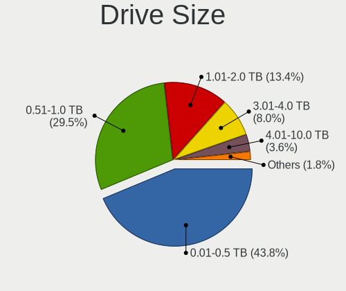
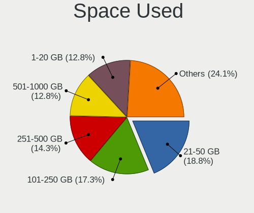
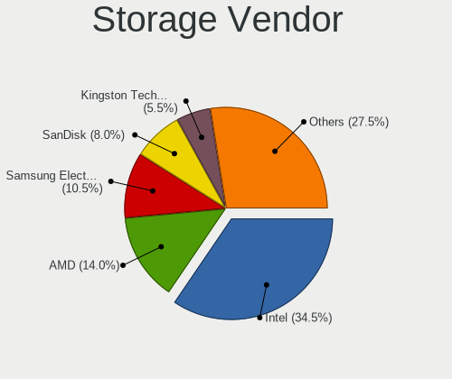
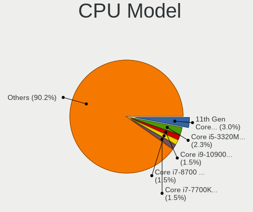
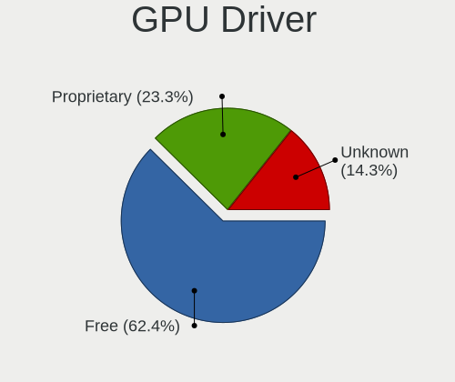

Kubuntu - Hardware Trends
-------------------------

A project to identify most popular hardware characteristics and track their change
over time based on data collected by Linux users at https://Linux-Hardware.org.

Anyone can contribute to this report by the [hw-probe](https://github.com/linuxhw/hw-probe) tool:

    sudo -E hw-probe -all -upload

This is a report for all computer types. See also reports for [desktops](/Dist/Kubuntu/Desktop/README.md) and [notebooks](/Dist/Kubuntu/Notebook/README.md).

This report is for one last month. Overall report since the beginning of time: [TestDays](https://github.com/linuxhw/TestDays)

Period: Feb, 2023.

Contents
--------

* [ System ](#system)
  - [ OS                       ](#os)
  - [ OS Family                ](#os-family)
  - [ Kernel                   ](#kernel)
  - [ Kernel Family            ](#kernel-family)
  - [ Kernel Major Ver.        ](#kernel-major-ver)
  - [ Arch                     ](#arch)
  - [ DE                       ](#de)
  - [ Display Server           ](#display-server)
  - [ Display Manager          ](#display-manager)
  - [ OS Lang                  ](#os-lang)
  - [ Boot Mode                ](#boot-mode)
  - [ Filesystem               ](#filesystem)
  - [ Part. scheme             ](#part-scheme)
  - [ Dual Boot with Linux/BSD ](#dual-boot-with-linuxbsd)
  - [ Dual Boot (Win)          ](#dual-boot-win)

* [ Board ](#board)
  - [ Vendor                   ](#vendor)
  - [ Model                    ](#model)
  - [ Model Family             ](#model-family)
  - [ MFG Year                 ](#mfg-year)
  - [ Form Factor              ](#form-factor)
  - [ Secure Boot              ](#secure-boot)
  - [ Coreboot                 ](#coreboot)
  - [ RAM Size                 ](#ram-size)
  - [ RAM Used                 ](#ram-used)
  - [ Total Drives             ](#total-drives)
  - [ Has CD-ROM               ](#has-cd-rom)
  - [ Has Ethernet             ](#has-ethernet)
  - [ Has WiFi                 ](#has-wifi)
  - [ Has Bluetooth            ](#has-bluetooth)

* [ Location ](#location)
  - [ Country                  ](#country)
  - [ City                     ](#city)

* [ Drives ](#drives)
  - [ Drive Vendor             ](#drive-vendor)
  - [ Drive Model              ](#drive-model)
  - [ HDD Vendor               ](#hdd-vendor)
  - [ SSD Vendor               ](#ssd-vendor)
  - [ Drive Kind               ](#drive-kind)
  - [ Drive Connector          ](#drive-connector)
  - [ Drive Size               ](#drive-size)
  - [ Space Total              ](#space-total)
  - [ Space Used               ](#space-used)
  - [ Malfunc. Drives          ](#malfunc-drives)
  - [ Malfunc. Drive Vendor    ](#malfunc-drive-vendor)
  - [ Malfunc. HDD Vendor      ](#malfunc-hdd-vendor)
  - [ Malfunc. Drive Kind      ](#malfunc-drive-kind)
  - [ Failed Drives            ](#failed-drives)
  - [ Failed Drive Vendor      ](#failed-drive-vendor)
  - [ Drive Status             ](#drive-status)

* [ Storage controller ](#storage-controller)
  - [ Storage Vendor           ](#storage-vendor)
  - [ Storage Model            ](#storage-model)
  - [ Storage Kind             ](#storage-kind)

* [ Processor ](#processor)
  - [ CPU Vendor               ](#cpu-vendor)
  - [ CPU Model                ](#cpu-model)
  - [ CPU Model Family         ](#cpu-model-family)
  - [ CPU Cores                ](#cpu-cores)
  - [ CPU Sockets              ](#cpu-sockets)
  - [ CPU Threads              ](#cpu-threads)
  - [ CPU Op-Modes             ](#cpu-op-modes)
  - [ CPU Microcode            ](#cpu-microcode)
  - [ CPU Microarch            ](#cpu-microarch)

* [ Graphics ](#graphics)
  - [ GPU Vendor               ](#gpu-vendor)
  - [ GPU Model                ](#gpu-model)
  - [ GPU Combo                ](#gpu-combo)
  - [ GPU Driver               ](#gpu-driver)
  - [ GPU Memory               ](#gpu-memory)

* [ Monitor ](#monitor)
  - [ Monitor Vendor           ](#monitor-vendor)
  - [ Monitor Model            ](#monitor-model)
  - [ Monitor Resolution       ](#monitor-resolution)
  - [ Monitor Diagonal         ](#monitor-diagonal)
  - [ Monitor Width            ](#monitor-width)
  - [ Aspect Ratio             ](#aspect-ratio)
  - [ Monitor Area             ](#monitor-area)
  - [ Pixel Density            ](#pixel-density)
  - [ Multiple Monitors        ](#multiple-monitors)

* [ Network ](#network)
  - [ Net Controller Vendor    ](#net-controller-vendor)
  - [ Net Controller Model     ](#net-controller-model)
  - [ Wireless Vendor          ](#wireless-vendor)
  - [ Wireless Model           ](#wireless-model)
  - [ Ethernet Vendor          ](#ethernet-vendor)
  - [ Ethernet Model           ](#ethernet-model)
  - [ Net Controller Kind      ](#net-controller-kind)
  - [ Used Controller          ](#used-controller)
  - [ NICs                     ](#nics)
  - [ IPv6                     ](#ipv6)

* [ Bluetooth ](#bluetooth)
  - [ Bluetooth Vendor         ](#bluetooth-vendor)
  - [ Bluetooth Model          ](#bluetooth-model)

* [ Sound ](#sound)
  - [ Sound Vendor             ](#sound-vendor)
  - [ Sound Model              ](#sound-model)

* [ Memory ](#memory)
  - [ Memory Vendor            ](#memory-vendor)
  - [ Memory Model             ](#memory-model)
  - [ Memory Kind              ](#memory-kind)
  - [ Memory Form Factor       ](#memory-form-factor)
  - [ Memory Size              ](#memory-size)
  - [ Memory Speed             ](#memory-speed)

* [ Printers & scanners ](#printers--scanners)
  - [ Printer Vendor           ](#printer-vendor)
  - [ Printer Model            ](#printer-model)
  - [ Scanner Vendor           ](#scanner-vendor)
  - [ Scanner Model            ](#scanner-model)

* [ Camera ](#camera)
  - [ Camera Vendor            ](#camera-vendor)
  - [ Camera Model             ](#camera-model)

* [ Security ](#security)
  - [ Fingerprint Vendor       ](#fingerprint-vendor)
  - [ Fingerprint Model        ](#fingerprint-model)
  - [ Chipcard Vendor          ](#chipcard-vendor)
  - [ Chipcard Model           ](#chipcard-model)

* [ Unsupported ](#unsupported)
  - [ Unsupported Devices      ](#unsupported-devices)
  - [ Unsupported Device Types ](#unsupported-device-types)

System
------

OS
--

Installed operating systems

| Name          | Computers | Percent |
|---------------|-----------|---------|
| Kubuntu 22.04 | 67        | 47.86%  |
| Kubuntu 22.10 | 62        | 44.29%  |
| Kubuntu 23.04 | 5         | 3.57%   |
| Kubuntu 20.04 | 3         | 2.14%   |
| Kubuntu 21.10 | 1         | 0.71%   |
| Kubuntu 18.04 | 1         | 0.71%   |
| Kubuntu 12.04 | 1         | 0.71%   |

OS Family
---------

OS without a version

| Name    | Computers | Percent |
|---------|-----------|---------|
| Kubuntu | 140       | 100%    |

Kernel
------

Version of the Linux kernel

| Version                  | Computers | Percent |
|--------------------------|-----------|---------|
| 5.19.0-31-generic        | 38        | 27.14%  |
| 5.15.0-60-generic        | 30        | 21.43%  |
| 5.19.0-29-generic        | 12        | 8.57%   |
| 5.15.0-58-generic        | 11        | 7.86%   |
| 5.19.0-32-generic        | 6         | 4.29%   |
| 5.19.0-35-generic        | 5         | 3.57%   |
| 5.15.0-60-lowlatency     | 3         | 2.14%   |
| 5.15.0-58-lowlatency     | 3         | 2.14%   |
| 6.1.9-060109-generic     | 2         | 1.43%   |
| 6.1.12-060112-generic    | 2         | 1.43%   |
| 6.1.0-1006-oem           | 2         | 1.43%   |
| 5.4.0-137-generic        | 2         | 1.43%   |
| 5.19.0-21-generic        | 2         | 1.43%   |
| 6.2.0-060200-generic     | 1         | 0.71%   |
| 6.1.8-060108-generic     | 1         | 0.71%   |
| 6.1.7-060107-generic     | 1         | 0.71%   |
| 6.1.5-060105-generic     | 1         | 0.71%   |
| 6.1.11-custom            | 1         | 0.71%   |
| 6.1.11-060111-generic    | 1         | 0.71%   |
| 6.1.0-14-generic         | 1         | 0.71%   |
| 6.0.9-060009-generic     | 1         | 0.71%   |
| 6.0.0+                   | 1         | 0.71%   |
| 5.4.0-90-generic         | 1         | 0.71%   |
| 5.19.0-28-generic        | 1         | 0.71%   |
| 5.18.19-051819-generic   | 1         | 0.71%   |
| 5.18.10-76051810-generic | 1         | 0.71%   |
| 5.17.0-1020-oem          | 1         | 0.71%   |
| 5.15.0-57-generic        | 1         | 0.71%   |
| 5.15.0-56-generic        | 1         | 0.71%   |
| 5.15.0-46-generic        | 1         | 0.71%   |
| 5.15.0-43-generic        | 1         | 0.71%   |
| 5.15.0-25-generic        | 1         | 0.71%   |
| 5.13.0-39-generic        | 1         | 0.71%   |
| 5.13.0-28-generic        | 1         | 0.71%   |
| 3.13.0-117-generic       | 1         | 0.71%   |

Kernel Family
-------------

Linux kernel without a distro release

| Version | Computers | Percent |
|---------|-----------|---------|
| 5.19.0  | 64        | 45.71%  |
| 5.15.0  | 52        | 37.14%  |
| 6.1.0   | 3         | 2.14%   |
| 5.4.0   | 3         | 2.14%   |
| 6.1.9   | 2         | 1.43%   |
| 6.1.12  | 2         | 1.43%   |
| 6.1.11  | 2         | 1.43%   |
| 5.13.0  | 2         | 1.43%   |
| 6.2.0   | 1         | 0.71%   |
| 6.1.8   | 1         | 0.71%   |
| 6.1.7   | 1         | 0.71%   |
| 6.1.5   | 1         | 0.71%   |
| 6.0.9   | 1         | 0.71%   |
| 6.0.0   | 1         | 0.71%   |
| 5.18.19 | 1         | 0.71%   |
| 5.18.10 | 1         | 0.71%   |
| 5.17.0  | 1         | 0.71%   |
| 3.13.0  | 1         | 0.71%   |

Kernel Major Ver.
-----------------

Linux kernel major version

| Version | Computers | Percent |
|---------|-----------|---------|
| 5.19    | 64        | 45.71%  |
| 5.15    | 52        | 37.14%  |
| 6.1     | 12        | 8.57%   |
| 5.4     | 3         | 2.14%   |
| 6.0     | 2         | 1.43%   |
| 5.18    | 2         | 1.43%   |
| 5.13    | 2         | 1.43%   |
| 6.2     | 1         | 0.71%   |
| 5.17    | 1         | 0.71%   |
| 3.13    | 1         | 0.71%   |

Arch
----

OS architecture (x86_64, i586, etc.)

| Name   | Computers | Percent |
|--------|-----------|---------|
| x86_64 | 140       | 100%    |

DE
--

Desktop Environment

| Name  | Computers | Percent |
|-------|-----------|---------|
| KDE5  | 133       | 95%     |
| KDE   | 3         | 2.14%   |
| GNOME | 2         | 1.43%   |
| LXQt  | 1         | 0.71%   |
| KDE4  | 1         | 0.71%   |

Display Server
--------------

X11 or Wayland

| Name    | Computers | Percent |
|---------|-----------|---------|
| X11     | 123       | 87.86%  |
| Wayland | 15        | 10.71%  |
| Tty     | 2         | 1.43%   |

Display Manager
---------------

SDDM, LightDM, etc.

| Name    | Computers | Percent |
|---------|-----------|---------|
| SDDM    | 95        | 67.86%  |
| Unknown | 33        | 23.57%  |
| GDM3    | 8         | 5.71%   |
| LightDM | 3         | 2.14%   |
| GDM     | 1         | 0.71%   |

OS Lang
-------

Language

| Lang   | Computers | Percent |
|--------|-----------|---------|
| en_US  | 66        | 47.14%  |
| de_DE  | 12        | 8.57%   |
| it_IT  | 10        | 7.14%   |
| fr_FR  | 6         | 4.29%   |
| pt_BR  | 5         | 3.57%   |
| en_CA  | 5         | 3.57%   |
| ru_RU  | 4         | 2.86%   |
| pl_PL  | 4         | 2.86%   |
| en_IN  | 4         | 2.86%   |
| en_GB  | 4         | 2.86%   |
| es_MX  | 2         | 1.43%   |
| en_SG  | 2         | 1.43%   |
| en_AU  | 2         | 1.43%   |
| zh_CN  | 1         | 0.71%   |
| tr_TR  | 1         | 0.71%   |
| nl_NL  | 1         | 0.71%   |
| hu_HU  | 1         | 0.71%   |
| fr_BE  | 1         | 0.71%   |
| es_US  | 1         | 0.71%   |
| es_SV  | 1         | 0.71%   |
| es_ES  | 1         | 0.71%   |
| es_CR  | 1         | 0.71%   |
| es_419 | 1         | 0.71%   |
| en_PH  | 1         | 0.71%   |
| en_IL  | 1         | 0.71%   |
| de_CH  | 1         | 0.71%   |
| cs_CZ  | 1         | 0.71%   |

Boot Mode
---------

EFI or BIOS

| Mode | Computers | Percent |
|------|-----------|---------|
| BIOS | 70        | 50%     |
| EFI  | 70        | 50%     |

Filesystem
----------

Type of filesystem

| Type    | Computers | Percent |
|---------|-----------|---------|
| Ext4    | 130       | 92.86%  |
| Btrfs   | 5         | 3.57%   |
| Overlay | 3         | 2.14%   |
| Zfs     | 1         | 0.71%   |
| Ext3    | 1         | 0.71%   |

Part. scheme
------------

Scheme of partitioning

| Type    | Computers | Percent |
|---------|-----------|---------|
| GPT     | 97        | 69.29%  |
| Unknown | 34        | 24.29%  |
| MBR     | 9         | 6.43%   |

Dual Boot with Linux/BSD
------------------------

Hosting more than one Linux/BSD

| Dual boot | Computers | Percent |
|-----------|-----------|---------|
| No        | 123       | 87.86%  |
| Yes       | 17        | 12.14%  |

Dual Boot (Win)
---------------

Hosting Linux and Windows

| Dual boot | Computers | Percent |
|-----------|-----------|---------|
| No        | 87        | 62.14%  |
| Yes       | 53        | 37.86%  |

Board
-----

Vendor
------

Motherboard manufacturer

| Name                | Computers | Percent |
|---------------------|-----------|---------|
| ASUSTek Computer    | 23        | 16.43%  |
| Lenovo              | 22        | 15.71%  |
| Hewlett-Packard     | 19        | 13.57%  |
| Dell                | 15        | 10.71%  |
| Gigabyte Technology | 13        | 9.29%   |
| MSI                 | 10        | 7.14%   |
| ASRock              | 7         | 5%      |
| Acer                | 6         | 4.29%   |
| Intel               | 4         | 2.86%   |
| Apple               | 4         | 2.86%   |
| Samsung Electronics | 2         | 1.43%   |
| Alienware           | 2         | 1.43%   |
| System76            | 1         | 0.71%   |
| Shuttle             | 1         | 0.71%   |
| Pegatron            | 1         | 0.71%   |
| ONN                 | 1         | 0.71%   |
| HUAWEI              | 1         | 0.71%   |
| GPU Company         | 1         | 0.71%   |
| Google              | 1         | 0.71%   |
| Fujitsu             | 1         | 0.71%   |
| Framework           | 1         | 0.71%   |
| ECS                 | 1         | 0.71%   |
| Digibras            | 1         | 0.71%   |
| Chuwi               | 1         | 0.71%   |
| A-DATA Technology   | 1         | 0.71%   |

Model
-----

Motherboard model

| Name                                   | Computers | Percent |
|----------------------------------------|-----------|---------|
| Dell Precision 7540                    | 2         | 1.43%   |
| ASUS TUF Gaming FX705DT_FX705DT        | 2         | 1.43%   |
| System76 Gazelle                       | 1         | 0.71%   |
| Shuttle DL10J                          | 1         | 0.71%   |
| Samsung 950QDB                         | 1         | 0.71%   |
| Samsung 305E4A/305E5A/305E7A           | 1         | 0.71%   |
| Pegatron SM 3330B                      | 1         | 0.71%   |
| ONN 100002435                          | 1         | 0.71%   |
| MSI MS-7D75                            | 1         | 0.71%   |
| MSI MS-7D15                            | 1         | 0.71%   |
| MSI MS-7C91                            | 1         | 0.71%   |
| MSI MS-7B89                            | 1         | 0.71%   |
| MSI MS-7B85                            | 1         | 0.71%   |
| MSI MS-7816                            | 1         | 0.71%   |
| MSI MS-7693                            | 1         | 0.71%   |
| MSI GS73 Stealth 8RF                   | 1         | 0.71%   |
| MSI GE75 Raider 9SE                    | 1         | 0.71%   |
| MSI GE62VR 6RF                         | 1         | 0.71%   |
| Lenovo ZHAOYANG K4e-ITL 82Q1           | 1         | 0.71%   |
| Lenovo ThinkPad Yoga 11e 20DAS02S00    | 1         | 0.71%   |
| Lenovo ThinkPad X230 23256N6           | 1         | 0.71%   |
| Lenovo ThinkPad X1 Yoga 4th 20QFCTO1WW | 1         | 0.71%   |
| Lenovo ThinkPad W530 2463A49           | 1         | 0.71%   |
| Lenovo ThinkPad T470 20HES3X300        | 1         | 0.71%   |
| Lenovo ThinkPad T460 20FMS66R00        | 1         | 0.71%   |
| Lenovo ThinkPad T450 20BV0001US        | 1         | 0.71%   |
| Lenovo ThinkPad T440p 20AWS3E201       | 1         | 0.71%   |
| Lenovo ThinkPad T14 Gen 1 20S0000JGE   | 1         | 0.71%   |
| Lenovo ThinkPad L430 24663D1           | 1         | 0.71%   |
| Lenovo ThinkPad L15 Gen 2 20X300P0GE   | 1         | 0.71%   |
| Lenovo ThinkPad L13 20R30006PB         | 1         | 0.71%   |
| Lenovo ThinkPad E14 Gen 4 21EB000KAU   | 1         | 0.71%   |
| Lenovo ThinkPad E14 20RAS1AQ00         | 1         | 0.71%   |
| Lenovo ThinkBook 15 G2 ITL 20VE        | 1         | 0.71%   |
| Lenovo IdeaPad U310 Touch              | 1         | 0.71%   |
| Lenovo IdeaPad S340-15API 81NC         | 1         | 0.71%   |
| Lenovo IdeaPad S145-15API 81V7         | 1         | 0.71%   |
| Lenovo IdeaPad 5 Pro 14ACN6 82L7       | 1         | 0.71%   |
| Lenovo IdeaPad 320-15ISK 80XH          | 1         | 0.71%   |
| Lenovo IdeaPad 3 15ADA05 81W1          | 1         | 0.71%   |

Model Family
------------

Motherboard model prefix

| Name             | Computers | Percent |
|------------------|-----------|---------|
| Lenovo ThinkPad  | 14        | 10%     |
| Lenovo IdeaPad   | 6         | 4.29%   |
| HP Pavilion      | 5         | 3.57%   |
| Dell Precision   | 4         | 2.86%   |
| ASUS VivoBook    | 4         | 2.86%   |
| ASUS ROG         | 4         | 2.86%   |
| ASUS PRIME       | 4         | 2.86%   |
| HP ProBook       | 3         | 2.14%   |
| Dell Inspiron    | 3         | 2.14%   |
| ASUS TUF         | 3         | 2.14%   |
| HP Compaq        | 2         | 1.43%   |
| Dell XPS         | 2         | 1.43%   |
| Dell OptiPlex    | 2         | 1.43%   |
| ASUS ASUS        | 2         | 1.43%   |
| Acer Swift       | 2         | 1.43%   |
| Acer Nitro       | 2         | 1.43%   |
| Acer Aspire      | 2         | 1.43%   |
| System76 Gazelle | 1         | 0.71%   |
| Shuttle DL10J    | 1         | 0.71%   |
| Samsung 950QDB   | 1         | 0.71%   |
| Samsung 305E4A   | 1         | 0.71%   |
| Pegatron SM      | 1         | 0.71%   |
| ONN 100002435    | 1         | 0.71%   |
| MSI MS-7D75      | 1         | 0.71%   |
| MSI MS-7D15      | 1         | 0.71%   |
| MSI MS-7C91      | 1         | 0.71%   |
| MSI MS-7B89      | 1         | 0.71%   |
| MSI MS-7B85      | 1         | 0.71%   |
| MSI MS-7816      | 1         | 0.71%   |
| MSI MS-7693      | 1         | 0.71%   |
| MSI GS73         | 1         | 0.71%   |
| MSI GE75         | 1         | 0.71%   |
| MSI GE62VR       | 1         | 0.71%   |
| Lenovo ZHAOYANG  | 1         | 0.71%   |
| Lenovo ThinkBook | 1         | 0.71%   |
| Intel NUC12WSKi7 | 1         | 0.71%   |
| Intel NUC12WSHi7 | 1         | 0.71%   |
| Intel NUC12WSHi5 | 1         | 0.71%   |
| Intel DP965LT    | 1         | 0.71%   |
| HUAWEI CREM-WXX9 | 1         | 0.71%   |

MFG Year
--------

Motherboard manufacture year

| Year | Computers | Percent |
|------|-----------|---------|
| 2022 | 20        | 14.29%  |
| 2021 | 20        | 14.29%  |
| 2019 | 19        | 13.57%  |
| 2020 | 16        | 11.43%  |
| 2018 | 11        | 7.86%   |
| 2017 | 7         | 5%      |
| 2014 | 7         | 5%      |
| 2013 | 7         | 5%      |
| 2012 | 7         | 5%      |
| 2016 | 5         | 3.57%   |
| 2011 | 5         | 3.57%   |
| 2015 | 4         | 2.86%   |
| 2010 | 4         | 2.86%   |
| 2009 | 3         | 2.14%   |
| 2023 | 2         | 1.43%   |
| 2008 | 1         | 0.71%   |
| 2007 | 1         | 0.71%   |
| 2006 | 1         | 0.71%   |

Form Factor
-----------

Physical design of the computer

| Name        | Computers | Percent |
|-------------|-----------|---------|
| Notebook    | 78        | 55.71%  |
| Desktop     | 48        | 34.29%  |
| Convertible | 5         | 3.57%   |
| Mini pc     | 4         | 2.86%   |
| All in one  | 4         | 2.86%   |
| Tablet      | 1         | 0.71%   |

Secure Boot
-----------

Enabled or disabled

| State    | Computers | Percent |
|----------|-----------|---------|
| Disabled | 128       | 91.43%  |
| Enabled  | 12        | 8.57%   |

Coreboot
--------

Have coreboot on board

| Used | Computers | Percent |
|------|-----------|---------|
| No   | 139       | 99.29%  |
| Yes  | 1         | 0.71%   |

RAM Size
--------

Total RAM memory

| Size in GB      | Computers | Percent |
|-----------------|-----------|---------|
| 4.01-8.0        | 37        | 26.43%  |
| 16.01-24.0      | 33        | 23.57%  |
| 8.01-16.0       | 22        | 15.71%  |
| 32.01-64.0      | 18        | 12.86%  |
| 64.01-256.0     | 11        | 7.86%   |
| 3.01-4.0        | 9         | 6.43%   |
| 24.01-32.0      | 6         | 4.29%   |
| 1.01-2.0        | 2         | 1.43%   |
| More than 256.0 | 1         | 0.71%   |
| 2.01-3.0        | 1         | 0.71%   |

RAM Used
--------

Used RAM memory

| Used GB    | Computers | Percent |
|------------|-----------|---------|
| 4.01-8.0   | 43        | 30.71%  |
| 2.01-3.0   | 37        | 26.43%  |
| 3.01-4.0   | 29        | 20.71%  |
| 1.01-2.0   | 20        | 14.29%  |
| 8.01-16.0  | 5         | 3.57%   |
| 16.01-24.0 | 2         | 1.43%   |
| 0.51-1.0   | 2         | 1.43%   |
| 32.01-64.0 | 1         | 0.71%   |
| Unknown    | 1         | 0.71%   |

Total Drives
------------

Number of drives on board

| Drives | Computers | Percent |
|--------|-----------|---------|
| 1      | 58        | 41.43%  |
| 2      | 52        | 37.14%  |
| 3      | 18        | 12.86%  |
| 4      | 8         | 5.71%   |
| 5      | 2         | 1.43%   |
| 9      | 1         | 0.71%   |
| 7      | 1         | 0.71%   |

Has CD-ROM
----------

Has CD-ROM on board

| Presented | Computers | Percent |
|-----------|-----------|---------|
| No        | 107       | 76.43%  |
| Yes       | 33        | 23.57%  |

Has Ethernet
------------

Has Ethernet on board

| Presented | Computers | Percent |
|-----------|-----------|---------|
| Yes       | 115       | 82.14%  |
| No        | 25        | 17.86%  |

Has WiFi
--------

Has WiFi module

| Presented | Computers | Percent |
|-----------|-----------|---------|
| Yes       | 113       | 80.71%  |
| No        | 27        | 19.29%  |

Has Bluetooth
-------------

Has Bluetooth module

| Presented | Computers | Percent |
|-----------|-----------|---------|
| Yes       | 98        | 70%     |
| No        | 42        | 30%     |

Location
--------

Country
-------

Geographic location (country)

| Country      | Computers | Percent |
|--------------|-----------|---------|
| USA          | 35        | 25%     |
| Germany      | 14        | 10%     |
| Italy        | 13        | 9.29%   |
| France       | 8         | 5.71%   |
| Russia       | 7         | 5%      |
| UK           | 5         | 3.57%   |
| Poland       | 5         | 3.57%   |
| Canada       | 5         | 3.57%   |
| Brazil       | 5         | 3.57%   |
| India        | 4         | 2.86%   |
| Mexico       | 3         | 2.14%   |
| Belgium      | 3         | 2.14%   |
| Turkey       | 2         | 1.43%   |
| Singapore    | 2         | 1.43%   |
| Indonesia    | 2         | 1.43%   |
| Australia    | 2         | 1.43%   |
| Thailand     | 1         | 0.71%   |
| Switzerland  | 1         | 0.71%   |
| Sweden       | 1         | 0.71%   |
| Spain        | 1         | 0.71%   |
| Slovenia     | 1         | 0.71%   |
| Slovakia     | 1         | 0.71%   |
| Saudi Arabia | 1         | 0.71%   |
| Philippines  | 1         | 0.71%   |
| Paraguay     | 1         | 0.71%   |
| Norway       | 1         | 0.71%   |
| Netherlands  | 1         | 0.71%   |
| Latvia       | 1         | 0.71%   |
| Israel       | 1         | 0.71%   |
| Hungary      | 1         | 0.71%   |
| Guatemala    | 1         | 0.71%   |
| Finland      | 1         | 0.71%   |
| El Salvador  | 1         | 0.71%   |
| Denmark      | 1         | 0.71%   |
| Czechia      | 1         | 0.71%   |
| Costa Rica   | 1         | 0.71%   |
| China        | 1         | 0.71%   |
| Chile        | 1         | 0.71%   |
| Bulgaria     | 1         | 0.71%   |
| Austria      | 1         | 0.71%   |

City
----

Geographic location (city)

| City                   | Computers | Percent |
|------------------------|-----------|---------|
| Moscow                 | 3         | 2.14%   |
| Singapore              | 2         | 1.43%   |
| Paris                  | 2         | 1.43%   |
| Mexico City            | 2         | 1.43%   |
| Lakeland               | 2         | 1.43%   |
| Karlsruhe              | 2         | 1.43%   |
| Houston                | 2         | 1.43%   |
| Hamburg                | 2         | 1.43%   |
| Genoa                  | 2         | 1.43%   |
| Wilhelmshaven          | 1         | 0.71%   |
| Waterbury              | 1         | 0.71%   |
| Voronezh               | 1         | 0.71%   |
| Villingen-Schwenningen | 1         | 0.71%   |
| Vallendar              | 1         | 0.71%   |
| Tyumen                 | 1         | 0.71%   |
| Tournai                | 1         | 0.71%   |
| Toronto                | 1         | 0.71%   |
| Terranuova Bracciolini | 1         | 0.71%   |
| Taranto                | 1         | 0.71%   |
| Taquaritinga           | 1         | 0.71%   |
| Tampa                  | 1         | 0.71%   |
| Sunderland             | 1         | 0.71%   |
| Somerville             | 1         | 0.71%   |
| Sofia                  | 1         | 0.71%   |
| Sidoarjo               | 1         | 0.71%   |
| Schweinfurt            | 1         | 0.71%   |
| Scandale               | 1         | 0.71%   |
| Sao Joao das Missoes   | 1         | 0.71%   |
| Santa Ana              | 1         | 0.71%   |
| San Lorenzo            | 1         | 0.71%   |
| San Lazzaro di Savena  | 1         | 0.71%   |
| San Diego              | 1         | 0.71%   |
| Saint Johns            | 1         | 0.71%   |
| Rouen                  | 1         | 0.71%   |
| Riyadh                 | 1         | 0.71%   |
| Rio Segundo            | 1         | 0.71%   |
| Riga                   | 1         | 0.71%   |
| Rho                    | 1         | 0.71%   |
| Reno                   | 1         | 0.71%   |
| Prague                 | 1         | 0.71%   |

Drives
------

Drive Vendor
------------

Hard drive vendors

| Vendor                    | Computers | Drives | Percent |
|---------------------------|-----------|--------|---------|
| Samsung Electronics       | 41        | 48     | 17.15%  |
| WDC                       | 30        | 32     | 12.55%  |
| Seagate                   | 30        | 39     | 12.55%  |
| SanDisk                   | 17        | 20     | 7.11%   |
| Toshiba                   | 16        | 18     | 6.69%   |
| Kingston                  | 14        | 15     | 5.86%   |
| Crucial                   | 13        | 15     | 5.44%   |
| Intel                     | 8         | 12     | 3.35%   |
| SK hynix                  | 7         | 10     | 2.93%   |
| Unknown                   | 6         | 7      | 2.51%   |
| China                     | 5         | 5      | 2.09%   |
| SPCC                      | 4         | 4      | 1.67%   |
| Micron Technology         | 4         | 4      | 1.67%   |
| HGST                      | 4         | 4      | 1.67%   |
| Unknown                   | 4         | 4      | 1.67%   |
| Phison Electronics        | 3         | 3      | 1.26%   |
| Maxtor                    | 3         | 4      | 1.26%   |
| OCZ                       | 2         | 2      | 0.84%   |
| Micron/Crucial Technology | 2         | 2      | 0.84%   |
| JMicron Technology        | 2         | 2      | 0.84%   |
| Hitachi                   | 2         | 2      | 0.84%   |
| ADATA Technology          | 2         | 2      | 0.84%   |
| WALRAM                    | 1         | 1      | 0.42%   |
| UMIS                      | 1         | 1      | 0.42%   |
| Timetec                   | 1         | 1      | 0.42%   |
| Smartbuy                  | 1         | 1      | 0.42%   |
| PNY                       | 1         | 1      | 0.42%   |
| Phison                    | 1         | 1      | 0.42%   |
| LITEONIT                  | 1         | 1      | 0.42%   |
| Lexar                     | 1         | 1      | 0.42%   |
| KIOXIA                    | 1         | 1      | 0.42%   |
| Intenso                   | 1         | 1      | 0.42%   |
| HUSKY                     | 1         | 1      | 0.42%   |
| HIKSEMI                   | 1         | 1      | 0.42%   |
| GOODRAM                   | 1         | 1      | 0.42%   |
| Gigabyte Technology       | 1         | 1      | 0.42%   |
| FORESEE                   | 1         | 1      | 0.42%   |
| CT500MX5                  | 1         | 1      | 0.42%   |
| CT1000P2                  | 1         | 1      | 0.42%   |
| BAITITON                  | 1         | 1      | 0.42%   |

Drive Model
-----------

Hard drive models

| Model                                                 | Computers | Percent |
|-------------------------------------------------------|-----------|---------|
| Seagate ST4000DM004-2CV104 4TB                        | 5         | 1.93%   |
| Unknown                                               | 4         | 1.54%   |
| Seagate ST500LM012 HN-M500MBB 500GB                   | 3         | 1.16%   |
| Seagate ST2000LM015-2E8174 2TB                        | 3         | 1.16%   |
| Sandisk WD Black SN750 / PC SN730 NVMe SSD 512GB      | 3         | 1.16%   |
| Samsung SSD 860 EVO 250GB                             | 3         | 1.16%   |
| Samsung NVMe SSD Controller SM981/PM981/PM983 250GB   | 3         | 1.16%   |
| Kingston SNVS500G 500GB                               | 3         | 1.16%   |
| Crucial CT240BX500SSD1 240GB                          | 3         | 1.16%   |
| Unknown MMC Card  64GB                                | 2         | 0.77%   |
| Toshiba MQ01ABD100 1TB                                | 2         | 0.77%   |
| Toshiba HDWD110 1TB                                   | 2         | 0.77%   |
| SPCC Solid State Disk 512GB                           | 2         | 0.77%   |
| Seagate ST500LM021-1KJ152 500GB                       | 2         | 0.77%   |
| Seagate ST1000LM048-2E7172 1TB                        | 2         | 0.77%   |
| Seagate ST1000LM035-1RK172 1TB                        | 2         | 0.77%   |
| Seagate ST1000DM003-1CH162 1TB                        | 2         | 0.77%   |
| Sandisk WD Blue SN550 NVMe SSD 1TB                    | 2         | 0.77%   |
| Sandisk WD Black 2018/SN750 / PC SN720 NVMe SSD 512GB | 2         | 0.77%   |
| Samsung SSD 980 PRO 2TB                               | 2         | 0.77%   |
| Samsung SSD 980 PRO 1TB                               | 2         | 0.77%   |
| Samsung SSD 870 QVO 2TB                               | 2         | 0.77%   |
| Samsung SSD 870 EVO 1TB                               | 2         | 0.77%   |
| Samsung SSD 850 EVO mSATA 500GB                       | 2         | 0.77%   |
| Samsung MZVLQ1T0HALB-00000 1024GB                     | 2         | 0.77%   |
| Samsung MZVLB256HBHQ-000L7 256GB                      | 2         | 0.77%   |
| Phison E12 NVMe Controller 1024GB                     | 2         | 0.77%   |
| Micron/Crucial P1 NVMe PCIe SSD 500GB                 | 2         | 0.77%   |
| Kingston SUV400S37240G 240GB SSD                      | 2         | 0.77%   |
| Kingston SA400S37480G 480GB SSD                       | 2         | 0.77%   |
| Intel SSD 660P Series 1024GB                          | 2         | 0.77%   |
| HGST HTS721010A9E630 1TB                              | 2         | 0.77%   |
| China SSD 128GB                                       | 2         | 0.77%   |
| WDC WDS250G2B0B-00YS70 250GB SSD                      | 1         | 0.39%   |
| WDC WDS240G2G0A-00JH30 240GB SSD                      | 1         | 0.39%   |
| WDC WDS200T2B0C-00PXH0 2TB                            | 1         | 0.39%   |
| WDC WDS200T2B0B-00YS70 2TB SSD                        | 1         | 0.39%   |
| WDC WDBNCE5000PNC 500GB SSD                           | 1         | 0.39%   |
| WDC WD60EZAZ-00SF3B0 6TB                              | 1         | 0.39%   |
| WDC WD6003FZBX-00K5WB0 6TB                            | 1         | 0.39%   |

HDD Vendor
----------

Hard disk drive vendors

| Vendor              | Computers | Drives | Percent |
|---------------------|-----------|--------|---------|
| Seagate             | 30        | 39     | 41.1%   |
| WDC                 | 20        | 22     | 27.4%   |
| Toshiba             | 11        | 13     | 15.07%  |
| HGST                | 4         | 4      | 5.48%   |
| Maxtor              | 3         | 4      | 4.11%   |
| Hitachi             | 2         | 2      | 2.74%   |
| Samsung Electronics | 1         | 2      | 1.37%   |
| JMicron Technology  | 1         | 1      | 1.37%   |
| Apple               | 1         | 1      | 1.37%   |

SSD Vendor
----------

Solid state drive vendors

| Vendor              | Computers | Drives | Percent |
|---------------------|-----------|--------|---------|
| Samsung Electronics | 21        | 22     | 28.77%  |
| Kingston            | 9         | 9      | 12.33%  |
| Crucial             | 9         | 11     | 12.33%  |
| WDC                 | 5         | 5      | 6.85%   |
| China               | 5         | 5      | 6.85%   |
| SPCC                | 3         | 3      | 4.11%   |
| SanDisk             | 3         | 3      | 4.11%   |
| OCZ                 | 2         | 2      | 2.74%   |
| Intel               | 2         | 5      | 2.74%   |
| Toshiba             | 1         | 1      | 1.37%   |
| PNY                 | 1         | 1      | 1.37%   |
| Micron Technology   | 1         | 1      | 1.37%   |
| LITEONIT            | 1         | 1      | 1.37%   |
| Lexar               | 1         | 1      | 1.37%   |
| Intenso             | 1         | 1      | 1.37%   |
| HUSKY               | 1         | 1      | 1.37%   |
| HIKSEMI             | 1         | 1      | 1.37%   |
| GOODRAM             | 1         | 1      | 1.37%   |
| FORESEE             | 1         | 1      | 1.37%   |
| CT500MX5            | 1         | 1      | 1.37%   |
| CT1000P2            | 1         | 1      | 1.37%   |
| BAITITON            | 1         | 1      | 1.37%   |
| Unknown             | 1         | 1      | 1.37%   |

Drive Kind
----------

HDD or SSD

| Kind    | Computers | Drives | Percent |
|---------|-----------|--------|---------|
| NVMe    | 79        | 94     | 37.09%  |
| HDD     | 62        | 88     | 29.11%  |
| SSD     | 60        | 79     | 28.17%  |
| MMC     | 8         | 9      | 3.76%   |
| Unknown | 4         | 4      | 1.88%   |

Drive Connector
---------------

SATA, SAS, NVMe, etc.

| Type | Computers | Drives | Percent |
|------|-----------|--------|---------|
| SATA | 88        | 163    | 48.35%  |
| NVMe | 79        | 94     | 43.41%  |
| MMC  | 8         | 9      | 4.4%    |
| SAS  | 7         | 8      | 3.85%   |

Drive Size
----------

Size of hard drive

| Size in TB | Computers | Drives | Percent |
|------------|-----------|--------|---------|
| 0.01-0.5   | 55        | 78     | 44.35%  |
| 0.51-1.0   | 38        | 49     | 30.65%  |
| 1.01-2.0   | 15        | 16     | 12.1%   |
| 3.01-4.0   | 8         | 12     | 6.45%   |
| 4.01-10.0  | 6         | 9      | 4.84%   |
| 2.01-3.0   | 1         | 1      | 0.81%   |
| 10.01-20.0 | 1         | 2      | 0.81%   |

Space Total
-----------

Amount of disk space available on the file system

| Size in GB     | Computers | Percent |
|----------------|-----------|---------|
| 251-500        | 36        | 25.71%  |
| 101-250        | 26        | 18.57%  |
| 501-1000       | 22        | 15.71%  |
| More than 3000 | 20        | 14.29%  |
| 1001-2000      | 19        | 13.57%  |
| 2001-3000      | 7         | 5%      |
| 1-20           | 5         | 3.57%   |
| 51-100         | 3         | 2.14%   |
| 21-50          | 2         | 1.43%   |

Space Used
----------

Amount of used disk space

| Used GB        | Computers | Percent |
|----------------|-----------|---------|
| 101-250        | 28        | 20%     |
| 1-20           | 27        | 19.29%  |
| 51-100         | 21        | 15%     |
| 251-500        | 19        | 13.57%  |
| 1001-2000      | 14        | 10%     |
| 21-50          | 13        | 9.29%   |
| More than 3000 | 9         | 6.43%   |
| 501-1000       | 6         | 4.29%   |
| 2001-3000      | 3         | 2.14%   |

Malfunc. Drives
---------------

Drive models with a malfunction

| Model                               | Computers | Drives | Percent |
|-------------------------------------|-----------|--------|---------|
| WDC WD5000AAKS-00V1A0 500GB         | 1         | 1      | 5.88%   |
| WDC WD3200AAJB-56R1A0 320GB         | 1         | 1      | 5.88%   |
| WDC WD10EZRX-00L4HB0 1TB            | 1         | 1      | 5.88%   |
| WDC WD10EACS-65D6B0 1TB             | 1         | 1      | 5.88%   |
| Seagate ST3160827AS 160GB           | 1         | 1      | 5.88%   |
| Seagate ST3160023A 160GB            | 1         | 1      | 5.88%   |
| Seagate ST2000LM015-2E8174 2TB      | 1         | 1      | 5.88%   |
| Seagate ST2000LM007-1R8174 2TB      | 1         | 1      | 5.88%   |
| Seagate ST1000LM035-1RK172 1TB      | 1         | 1      | 5.88%   |
| Samsung Electronics SSD 870 EVO 1TB | 1         | 1      | 5.88%   |
| Maxtor 6V160E0 160GB                | 1         | 1      | 5.88%   |
| LITEONIT LMT-128M3M 128GB SSD       | 1         | 1      | 5.88%   |
| Kingston SUV400S37240G 240GB SSD    | 1         | 1      | 5.88%   |
| Intenso TOP M.2 SATA 256GB SSD      | 1         | 1      | 5.88%   |
| Intel SSDSC2KW010X6 1TB             | 1         | 4      | 5.88%   |
| Crucial CT525MX300SSD1 528GB        | 1         | 1      | 5.88%   |
| BAITITON BT58SSD09S 240GB           | 1         | 1      | 5.88%   |

Malfunc. Drive Vendor
---------------------

Vendors of faulty drives

| Vendor              | Computers | Drives | Percent |
|---------------------|-----------|--------|---------|
| Seagate             | 5         | 5      | 29.41%  |
| WDC                 | 4         | 4      | 23.53%  |
| Samsung Electronics | 1         | 1      | 5.88%   |
| Maxtor              | 1         | 1      | 5.88%   |
| LITEONIT            | 1         | 1      | 5.88%   |
| Kingston            | 1         | 1      | 5.88%   |
| Intenso             | 1         | 1      | 5.88%   |
| Intel               | 1         | 4      | 5.88%   |
| Crucial             | 1         | 1      | 5.88%   |
| BAITITON            | 1         | 1      | 5.88%   |

Malfunc. HDD Vendor
-------------------

Vendors of faulty HDD drives

| Vendor  | Computers | Drives | Percent |
|---------|-----------|--------|---------|
| Seagate | 5         | 5      | 50%     |
| WDC     | 4         | 4      | 40%     |
| Maxtor  | 1         | 1      | 10%     |

Malfunc. Drive Kind
-------------------

Kinds of faulty drives

| Kind | Computers | Drives | Percent |
|------|-----------|--------|---------|
| HDD  | 8         | 10     | 53.33%  |
| SSD  | 7         | 10     | 46.67%  |

Failed Drives
-------------

Failed drive models

Zero info for selected period =(

Failed Drive Vendor
-------------------

Failed drive vendors

Zero info for selected period =(

Drive Status
------------

Number of failed and malfunc. drives

| Status   | Computers | Drives | Percent |
|----------|-----------|--------|---------|
| Detected | 73        | 132    | 45.34%  |
| Works    | 73        | 122    | 45.34%  |
| Malfunc  | 15        | 20     | 9.32%   |

Storage controller
------------------

Storage Vendor
--------------

Storage controller vendors

| Vendor                       | Computers | Percent |
|------------------------------|-----------|---------|
| Intel                        | 90        | 44.78%  |
| AMD                          | 29        | 14.43%  |
| Samsung Electronics          | 22        | 10.95%  |
| SanDisk                      | 19        | 9.45%   |
| SK hynix                     | 7         | 3.48%   |
| Phison Electronics           | 7         | 3.48%   |
| Micron/Crucial Technology    | 6         | 2.99%   |
| Kingston Technology Company  | 5         | 2.49%   |
| Toshiba America Info Systems | 3         | 1.49%   |
| Micron Technology            | 3         | 1.49%   |
| Nvidia                       | 2         | 1%      |
| ADATA Technology             | 2         | 1%      |
| Union Memory (Shenzhen)      | 1         | 0.5%    |
| Silicon Motion               | 1         | 0.5%    |
| OCZ Technology Group         | 1         | 0.5%    |
| Marvell Technology Group     | 1         | 0.5%    |
| KIOXIA                       | 1         | 0.5%    |
| ASMedia Technology           | 1         | 0.5%    |

Storage Model
-------------

Storage controller models

| Model                                                                          | Computers | Percent |
|--------------------------------------------------------------------------------|-----------|---------|
| AMD FCH SATA Controller [AHCI mode]                                            | 14        | 6.28%   |
| Samsung NVMe SSD Controller SM981/PM981/PM983                                  | 9         | 4.04%   |
| Samsung NVMe SSD Controller 980                                                | 8         | 3.59%   |
| Intel Volume Management Device NVMe RAID Controller                            | 8         | 3.59%   |
| SanDisk Non-Volatile memory controller                                         | 7         | 3.14%   |
| Intel Sunrise Point-LP SATA Controller [AHCI mode]                             | 7         | 3.14%   |
| Intel 7 Series Chipset Family 6-port SATA Controller [AHCI mode]               | 7         | 3.14%   |
| Samsung NVMe SSD Controller PM9A1/PM9A3/980PRO                                 | 6         | 2.69%   |
| AMD 400 Series Chipset SATA Controller                                         | 6         | 2.69%   |
| Intel Celeron/Pentium Silver Processor SATA Controller                         | 5         | 2.24%   |
| Intel Cannon Lake Mobile PCH SATA AHCI Controller                              | 5         | 2.24%   |
| Intel 82801 Mobile SATA Controller [RAID mode]                                 | 5         | 2.24%   |
| SanDisk WD Black SN750 / PC SN730 NVMe SSD                                     | 4         | 1.79%   |
| Micron/Crucial P2 NVMe PCIe SSD                                                | 4         | 1.79%   |
| Intel 8 Series/C220 Series Chipset Family 6-port SATA Controller 1 [AHCI mode] | 4         | 1.79%   |
| AMD SATA controller                                                            | 4         | 1.79%   |
| AMD 500 Series Chipset SATA Controller                                         | 4         | 1.79%   |
| SanDisk WD Blue SN550 NVMe SSD                                                 | 3         | 1.35%   |
| SanDisk WD Black 2018/SN750 / PC SN720 NVMe SSD                                | 3         | 1.35%   |
| Phison PS5013 E13 NVMe Controller                                              | 3         | 1.35%   |
| Phison E12 NVMe Controller                                                     | 3         | 1.35%   |
| Micron Non-Volatile memory controller                                          | 3         | 1.35%   |
| Kingston Company Company Non-Volatile memory controller                        | 3         | 1.35%   |
| Intel SATA controller                                                          | 3         | 1.35%   |
| Intel Comet Lake SATA AHCI Controller                                          | 3         | 1.35%   |
| Intel Alder Lake-P SATA AHCI Controller                                        | 3         | 1.35%   |
| Intel 500 Series Chipset Family SATA AHCI Controller                           | 3         | 1.35%   |
| AMD SB7x0/SB8x0/SB9x0 SATA Controller [AHCI mode]                              | 3         | 1.35%   |
| AMD SB7x0/SB8x0/SB9x0 IDE Controller                                           | 3         | 1.35%   |
| Toshiba America Info Systems XG5 NVMe SSD Controller                           | 2         | 0.9%    |
| SK hynix Gold P31/PC711 NVMe Solid State Drive                                 | 2         | 0.9%    |
| SK hynix BC511                                                                 | 2         | 0.9%    |
| SanDisk WD PC SN810 / Black SN850 NVMe SSD                                     | 2         | 0.9%    |
| SanDisk WD Blue SN570 NVMe SSD                                                 | 2         | 0.9%    |
| Micron/Crucial P1 NVMe PCIe SSD                                                | 2         | 0.9%    |
| Intel Wildcat Point-LP SATA Controller [AHCI Mode]                             | 2         | 0.9%    |
| Intel Tiger Lake-LP SATA Controller                                            | 2         | 0.9%    |
| Intel SSD 660P Series                                                          | 2         | 0.9%    |
| Intel SATA Controller [RAID mode]                                              | 2         | 0.9%    |
| Intel Non-Volatile memory controller                                           | 2         | 0.9%    |

Storage Kind
------------

Kind of storage controller (IDE, SATA, NVMe, SAS, ...)

| Kind | Computers | Percent |
|------|-----------|---------|
| SATA | 99        | 48.53%  |
| NVMe | 79        | 38.73%  |
| RAID | 17        | 8.33%   |
| IDE  | 9         | 4.41%   |

Processor
---------

CPU Vendor
----------

Processor vendors

| Vendor | Computers | Percent |
|--------|-----------|---------|
| Intel  | 99        | 70.71%  |
| AMD    | 41        | 29.29%  |

CPU Model
---------

Processor models

| Model                                         | Computers | Percent |
|-----------------------------------------------|-----------|---------|
| Intel 12th Gen Core i7-1260P                  | 4         | 2.86%   |
| Intel 11th Gen Core i7-1165G7 @ 2.80GHz       | 4         | 2.86%   |
| Intel Core i7-9750H CPU @ 2.60GHz             | 3         | 2.14%   |
| Intel Core i5-7200U CPU @ 2.50GHz             | 3         | 2.14%   |
| Intel Core i5-10210U CPU @ 1.60GHz            | 3         | 2.14%   |
| AMD Ryzen 7 5800H with Radeon Graphics        | 3         | 2.14%   |
| AMD Ryzen 5 5600X 6-Core Processor            | 3         | 2.14%   |
| AMD Ryzen 5 5600U with Radeon Graphics        | 3         | 2.14%   |
| Intel Core i7-8700 CPU @ 3.20GHz              | 2         | 1.43%   |
| Intel Core i7-8550U CPU @ 1.80GHz             | 2         | 1.43%   |
| Intel Core i5-9600K CPU @ 3.70GHz             | 2         | 1.43%   |
| Intel Core i5-2430M CPU @ 2.40GHz             | 2         | 1.43%   |
| Intel Celeron N4020 CPU @ 1.10GHz             | 2         | 1.43%   |
| Intel 13th Gen Core i9-13900K                 | 2         | 1.43%   |
| AMD Ryzen 9 7950X 16-Core Processor           | 2         | 1.43%   |
| AMD Ryzen 9 6900HX with Radeon Graphics       | 2         | 1.43%   |
| AMD Ryzen 7 3750H with Radeon Vega Mobile Gfx | 2         | 1.43%   |
| AMD Ryzen 7 3700X 8-Core Processor            | 2         | 1.43%   |
| AMD Ryzen 7 3700U with Radeon Vega Mobile Gfx | 2         | 1.43%   |
| AMD Ryzen 5 3500U with Radeon Vega Mobile Gfx | 2         | 1.43%   |
| AMD Phenom II X4 955 Processor                | 2         | 1.43%   |
| Intel Xeon CPU W3580 @ 3.33GHz                | 1         | 0.71%   |
| Intel Xeon CPU E5-2697 v4 @ 2.30GHz           | 1         | 0.71%   |
| Intel Xeon CPU E3-1246 v3 @ 3.50GHz           | 1         | 0.71%   |
| Intel Pentium Silver N5030 CPU @ 1.10GHz      | 1         | 0.71%   |
| Intel Pentium Silver J5040 CPU @ 2.00GHz      | 1         | 0.71%   |
| Intel Pentium CPU N3520 @ 2.16GHz             | 1         | 0.71%   |
| Intel Pentium CPU 6405U @ 2.40GHz             | 1         | 0.71%   |
| Intel Core i9-9980HK CPU @ 2.40GHz            | 1         | 0.71%   |
| Intel Core i7-9700 CPU @ 3.00GHz              | 1         | 0.71%   |
| Intel Core i7-8750H CPU @ 2.20GHz             | 1         | 0.71%   |
| Intel Core i7-8665U CPU @ 1.90GHz             | 1         | 0.71%   |
| Intel Core i7-7700HQ CPU @ 2.80GHz            | 1         | 0.71%   |
| Intel Core i7-7500U CPU @ 2.70GHz             | 1         | 0.71%   |
| Intel Core i7-6800K CPU @ 3.40GHz             | 1         | 0.71%   |
| Intel Core i7-6700HQ CPU @ 2.60GHz            | 1         | 0.71%   |
| Intel Core i7-6600U CPU @ 2.60GHz             | 1         | 0.71%   |
| Intel Core i7-5500U CPU @ 2.40GHz             | 1         | 0.71%   |
| Intel Core i7-4980HQ CPU @ 2.80GHz            | 1         | 0.71%   |
| Intel Core i7-4790 CPU @ 3.60GHz              | 1         | 0.71%   |

CPU Model Family
----------------

Processor model prefix

| Model                | Computers | Percent |
|----------------------|-----------|---------|
| Intel Core i5        | 27        | 19.29%  |
| Intel Core i7        | 25        | 17.86%  |
| Other                | 21        | 15%     |
| AMD Ryzen 7          | 13        | 9.29%   |
| AMD Ryzen 5          | 13        | 9.29%   |
| Intel Core i3        | 8         | 5.71%   |
| Intel Celeron        | 6         | 4.29%   |
| AMD Ryzen 9          | 6         | 4.29%   |
| Intel Xeon           | 3         | 2.14%   |
| Intel Core 2 Duo     | 3         | 2.14%   |
| Intel Pentium Silver | 2         | 1.43%   |
| Intel Pentium        | 2         | 1.43%   |
| AMD Ryzen 3          | 2         | 1.43%   |
| AMD Phenom II X4     | 2         | 1.43%   |
| Intel Core i9        | 1         | 0.71%   |
| Intel Core 2 Quad    | 1         | 0.71%   |
| AMD Sempron          | 1         | 0.71%   |
| AMD Ryzen 7 PRO      | 1         | 0.71%   |
| AMD Phenom           | 1         | 0.71%   |
| AMD FX               | 1         | 0.71%   |
| AMD A6               | 1         | 0.71%   |

CPU Cores
---------

Number of processor cores

| Number | Computers | Percent |
|--------|-----------|---------|
| 4      | 53        | 37.86%  |
| 2      | 31        | 22.14%  |
| 6      | 23        | 16.43%  |
| 8      | 15        | 10.71%  |
| 12     | 6         | 4.29%   |
| 16     | 3         | 2.14%   |
| 10     | 3         | 2.14%   |
| 24     | 2         | 1.43%   |
| 36     | 1         | 0.71%   |
| 14     | 1         | 0.71%   |
| 3      | 1         | 0.71%   |
| 1      | 1         | 0.71%   |

CPU Sockets
-----------

Number of sockets

| Number | Computers | Percent |
|--------|-----------|---------|
| 1      | 139       | 99.29%  |
| 2      | 1         | 0.71%   |

CPU Threads
-----------

Threads per core (Hyper-Threading)

| Number | Computers | Percent |
|--------|-----------|---------|
| 2      | 109       | 77.86%  |
| 1      | 31        | 22.14%  |

CPU Op-Modes
------------

CPU Operation Modes (32-bit, 64-bit)

| Op mode        | Computers | Percent |
|----------------|-----------|---------|
| 32-bit, 64-bit | 140       | 100%    |

CPU Microcode
-------------

Microcode number

| Number     | Computers | Percent |
|------------|-----------|---------|
| Unknown    | 58        | 41.43%  |
| 0x0a50000c | 6         | 4.29%   |
| 0x906a3    | 5         | 3.57%   |
| 0x306c3    | 5         | 3.57%   |
| 0x306a9    | 5         | 3.57%   |
| 0x806ec    | 4         | 2.86%   |
| 0x806c1    | 4         | 2.86%   |
| 0x906ea    | 3         | 2.14%   |
| 0x806ea    | 3         | 2.14%   |
| 0x806e9    | 3         | 2.14%   |
| 0x0a601203 | 3         | 2.14%   |
| 0x0a50000d | 3         | 2.14%   |
| 0x08701021 | 3         | 2.14%   |
| 0xa0653    | 2         | 1.43%   |
| 0x906ed    | 2         | 1.43%   |
| 0x706a8    | 2         | 1.43%   |
| 0x406f1    | 2         | 1.43%   |
| 0x08108102 | 2         | 1.43%   |
| 0xb06f2    | 1         | 0.71%   |
| 0xa0671    | 1         | 0.71%   |
| 0xa0655    | 1         | 0.71%   |
| 0xa0652    | 1         | 0.71%   |
| 0x906e9    | 1         | 0.71%   |
| 0x906a4    | 1         | 0.71%   |
| 0x806d1    | 1         | 0.71%   |
| 0x806c2    | 1         | 0.71%   |
| 0x706e5    | 1         | 0.71%   |
| 0x706a1    | 1         | 0.71%   |
| 0x6fb      | 1         | 0.71%   |
| 0x506e3    | 1         | 0.71%   |
| 0x406e3    | 1         | 0.71%   |
| 0x40661    | 1         | 0.71%   |
| 0x306d4    | 1         | 0.71%   |
| 0x206a7    | 1         | 0.71%   |
| 0x20655    | 1         | 0.71%   |
| 0x1067a    | 1         | 0.71%   |
| 0x0a404101 | 1         | 0.71%   |
| 0x0a20120a | 1         | 0.71%   |
| 0x0a201016 | 1         | 0.71%   |
| 0x08101016 | 1         | 0.71%   |

CPU Microarch
-------------

Microarchitecture

| Name             | Computers | Percent |
|------------------|-----------|---------|
| KabyLake         | 26        | 18.57%  |
| Unknown          | 15        | 10.71%  |
| Zen 3            | 14        | 10%     |
| IvyBridge        | 9         | 6.43%   |
| Haswell          | 9         | 6.43%   |
| Zen+             | 7         | 5%      |
| TigerLake        | 7         | 5%      |
| Goldmont plus    | 6         | 4.29%   |
| Alderlake Hybrid | 6         | 4.29%   |
| Zen 2            | 5         | 3.57%   |
| Skylake          | 4         | 2.86%   |
| SandyBridge      | 4         | 2.86%   |
| CometLake        | 4         | 2.86%   |
| Broadwell        | 4         | 2.86%   |
| Penryn           | 3         | 2.14%   |
| K10              | 3         | 2.14%   |
| IceLake          | 3         | 2.14%   |
| Westmere         | 2         | 1.43%   |
| Silvermont       | 2         | 1.43%   |
| Nehalem          | 2         | 1.43%   |
| Zen              | 1         | 0.71%   |
| Piledriver       | 1         | 0.71%   |
| K8 & K10 hybrid  | 1         | 0.71%   |
| K10 Llano        | 1         | 0.71%   |
| Core             | 1         | 0.71%   |

Graphics
--------

GPU Vendor
----------

Vendors of graphics cards

| Vendor            | Computers | Percent |
|-------------------|-----------|---------|
| Intel             | 83        | 45.86%  |
| AMD               | 49        | 27.07%  |
| Nvidia            | 48        | 26.52%  |
| ASPEED Technology | 1         | 0.55%   |

GPU Model
---------

Graphics card models

| Model                                                                       | Computers | Percent |
|-----------------------------------------------------------------------------|-----------|---------|
| AMD Cezanne [Radeon Vega Series / Radeon Vega Mobile Series]                | 10        | 5.49%   |
| Intel TigerLake-LP GT2 [Iris Xe Graphics]                                   | 7         | 3.85%   |
| Intel 3rd Gen Core processor Graphics Controller                            | 7         | 3.85%   |
| AMD Picasso/Raven 2 [Radeon Vega Series / Radeon Vega Mobile Series]        | 7         | 3.85%   |
| Intel Alder Lake-P Integrated Graphics Controller                           | 6         | 3.3%    |
| Intel HD Graphics 620                                                       | 5         | 2.75%   |
| Intel CoffeeLake-H GT2 [UHD Graphics 630]                                   | 5         | 2.75%   |
| AMD Ellesmere [Radeon RX 470/480/570/570X/580/580X/590]                     | 5         | 2.75%   |
| Intel GeminiLake [UHD Graphics 600]                                         | 4         | 2.2%    |
| Intel CometLake-U GT2 [UHD Graphics]                                        | 4         | 2.2%    |
| Intel 2nd Generation Core Processor Family Integrated Graphics Controller   | 4         | 2.2%    |
| AMD Raphael                                                                 | 4         | 2.2%    |
| Nvidia TU117M [GeForce GTX 1650 Mobile / Max-Q]                             | 3         | 1.65%   |
| Nvidia GA107M [GeForce RTX 3050 Ti Mobile]                                  | 3         | 1.65%   |
| Nvidia GA107M [GeForce RTX 3050 Mobile]                                     | 3         | 1.65%   |
| Intel Xeon E3-1200 v3/4th Gen Core Processor Integrated Graphics Controller | 3         | 1.65%   |
| Intel UHD Graphics 620                                                      | 3         | 1.65%   |
| AMD Rembrandt [Radeon 680M]                                                 | 3         | 1.65%   |
| Nvidia TU117M [GeForce MX450]                                               | 2         | 1.1%    |
| Nvidia GP107 [GeForce GTX 1050 Ti]                                          | 2         | 1.1%    |
| Nvidia GA104M [GeForce RTX 3070 Mobile / Max-Q]                             | 2         | 1.1%    |
| Intel WhiskeyLake-U GT2 [UHD Graphics 620]                                  | 2         | 1.1%    |
| Intel HD Graphics 5500                                                      | 2         | 1.1%    |
| Intel GeminiLake [UHD Graphics 605]                                         | 2         | 1.1%    |
| Intel CometLake-S GT2 [UHD Graphics 630]                                    | 2         | 1.1%    |
| Intel CoffeeLake-S GT2 [UHD Graphics 630]                                   | 2         | 1.1%    |
| Intel Atom Processor Z36xxx/Z37xxx Series Graphics & Display                | 2         | 1.1%    |
| Intel Alder Lake-UP3 GT2 [Iris Xe Graphics]                                 | 2         | 1.1%    |
| Intel 4th Generation Core Processor Family Integrated Graphics Controller   | 2         | 1.1%    |
| Intel 4th Gen Core Processor Integrated Graphics Controller                 | 2         | 1.1%    |
| AMD Lexa XT [Radeon PRO WX 3200]                                            | 2         | 1.1%    |
| Nvidia TU117M [GeForce GTX 1650 Ti Mobile]                                  | 1         | 0.55%   |
| Nvidia TU117 [GeForce GTX 1650]                                             | 1         | 0.55%   |
| Nvidia TU116 [GeForce GTX 1660 SUPER]                                       | 1         | 0.55%   |
| Nvidia TU106M [GeForce RTX 2060 Mobile]                                     | 1         | 0.55%   |
| Nvidia TU106 [GeForce RTX 2070]                                             | 1         | 0.55%   |
| Nvidia TU106 [GeForce RTX 2060 Rev. A]                                      | 1         | 0.55%   |
| Nvidia TU104 [GeForce RTX 2080 SUPER]                                       | 1         | 0.55%   |
| Nvidia NV43 [GeForce 6600]                                                  | 1         | 0.55%   |
| Nvidia MCP89 [GeForce 320M]                                                 | 1         | 0.55%   |

GPU Combo
---------

Combinations of graphics cards

| Name            | Computers | Percent |
|-----------------|-----------|---------|
| 1 x Intel       | 53        | 37.86%  |
| 1 x AMD         | 29        | 20.71%  |
| 1 x Nvidia      | 19        | 13.57%  |
| Intel + Nvidia  | 17        | 12.14%  |
| AMD + Nvidia    | 11        | 7.86%   |
| Intel + AMD     | 8         | 5.71%   |
| Other           | 1         | 0.71%   |
| 2 x AMD         | 1         | 0.71%   |
| Nvidia + ASPEED | 1         | 0.71%   |

GPU Driver
----------

Free vs proprietary

| Driver      | Computers | Percent |
|-------------|-----------|---------|
| Free        | 100       | 71.43%  |
| Proprietary | 39        | 27.86%  |
| Unknown     | 1         | 0.71%   |

GPU Memory
----------

Total video memory

| Size in GB | Computers | Percent |
|------------|-----------|---------|
| Unknown    | 92        | 65.71%  |
| 0.01-0.5   | 13        | 9.29%   |
| 7.01-8.0   | 9         | 6.43%   |
| 3.01-4.0   | 7         | 5%      |
| 1.01-2.0   | 7         | 5%      |
| 5.01-6.0   | 4         | 2.86%   |
| 0.51-1.0   | 4         | 2.86%   |
| 8.01-16.0  | 3         | 2.14%   |
| 16.01-24.0 | 1         | 0.71%   |

Monitor
-------

Monitor Vendor
--------------

Monitor vendors

| Vendor               | Computers | Percent |
|----------------------|-----------|---------|
| Samsung Electronics  | 22        | 13.02%  |
| AU Optronics         | 18        | 10.65%  |
| BOE                  | 17        | 10.06%  |
| Chimei Innolux       | 16        | 9.47%   |
| LG Display           | 12        | 7.1%    |
| Goldstar             | 10        | 5.92%   |
| Dell                 | 9         | 5.33%   |
| Ancor Communications | 8         | 4.73%   |
| ASUSTek Computer     | 6         | 3.55%   |
| BenQ                 | 5         | 2.96%   |
| Philips              | 4         | 2.37%   |
| Apple                | 4         | 2.37%   |
| NEC Computers        | 3         | 1.78%   |
| Lenovo               | 3         | 1.78%   |
| AOC                  | 3         | 1.78%   |
| Wacom                | 2         | 1.18%   |
| ViewSonic            | 2         | 1.18%   |
| PANDA                | 2         | 1.18%   |
| LED                  | 2         | 1.18%   |
| Iiyama               | 2         | 1.18%   |
| Hewlett-Packard      | 2         | 1.18%   |
| Acer                 | 2         | 1.18%   |
| Xiaomi               | 1         | 0.59%   |
| Sony                 | 1         | 0.59%   |
| Sharp                | 1         | 0.59%   |
| RS                   | 1         | 0.59%   |
| Pixio                | 1         | 0.59%   |
| MSI                  | 1         | 0.59%   |
| Marantz              | 1         | 0.59%   |
| LG Electronics       | 1         | 0.59%   |
| JINGLITAI            | 1         | 0.59%   |
| Insignia             | 1         | 0.59%   |
| InfoVision           | 1         | 0.59%   |
| Idek Iiyama          | 1         | 0.59%   |
| Grundig              | 1         | 0.59%   |
| CVT                  | 1         | 0.59%   |
| CSO                  | 1         | 0.59%   |

Monitor Model
-------------

Monitor models

| Model                                                                 | Computers | Percent |
|-----------------------------------------------------------------------|-----------|---------|
| Chimei Innolux LCD Monitor CMN14D4 1920x1080 309x173mm 13.9-inch      | 4         | 2.31%   |
| Goldstar HDR 4K GSM7707 3840x2160 600x340mm 27.2-inch                 | 2         | 1.16%   |
| Chimei Innolux LCD Monitor CMN1521 1920x1080 344x193mm 15.5-inch      | 2         | 1.16%   |
| AU Optronics LCD Monitor AUO429D 1920x1080 382x215mm 17.3-inch        | 2         | 1.16%   |
| Xiaomi Mi TV XMD00E1 3840x2160 708x398mm 32.0-inch                    | 1         | 0.58%   |
| Wacom CintiqPro24P WAC1063 3840x2160 522x293mm 23.6-inch              | 1         | 0.58%   |
| Wacom Cintiq 21UX 2 WAC1022 1600x1200 432x324mm 21.3-inch             | 1         | 0.58%   |
| ViewSonic VX2758-Series VSCA738 2560x1440 598x336mm 27.0-inch         | 1         | 0.58%   |
| ViewSonic VX1935wm-3 VSCB81E 1440x900 410x256mm 19.0-inch             | 1         | 0.58%   |
| Sony TV SNYD301 1360x768                                              | 1         | 0.58%   |
| Sharp LCD Monitor SHP1517 3840x2400 366x229mm 17.0-inch               | 1         | 0.58%   |
| Samsung Electronics U32J59x SAM0F35 3840x2160 697x392mm 31.5-inch     | 1         | 0.58%   |
| Samsung Electronics T27C370 SAM0ADC 1920x1080 598x336mm 27.0-inch     | 1         | 0.58%   |
| Samsung Electronics S27R35x SAM1053 1920x1080 598x336mm 27.0-inch     | 1         | 0.58%   |
| Samsung Electronics S27B350 SAM08DC 1920x1080 598x336mm 27.0-inch     | 1         | 0.58%   |
| Samsung Electronics S24F350 SAM0D20 1920x1080 521x293mm 23.5-inch     | 1         | 0.58%   |
| Samsung Electronics S24D300 SAM0B43 1920x1080 531x299mm 24.0-inch     | 1         | 0.58%   |
| Samsung Electronics LS27AG30x SAM717A 1920x1080 597x336mm 27.0-inch   | 1         | 0.58%   |
| Samsung Electronics LCD Monitor SEC4249 1366x768 309x174mm 14.0-inch  | 1         | 0.58%   |
| Samsung Electronics LCD Monitor SEC354C 1366x768 353x198mm 15.9-inch  | 1         | 0.58%   |
| Samsung Electronics LCD Monitor SEC345A 1366x768 309x174mm 14.0-inch  | 1         | 0.58%   |
| Samsung Electronics LCD Monitor SEC3254 1600x900 367x230mm 17.1-inch  | 1         | 0.58%   |
| Samsung Electronics LCD Monitor SEC314F 1600x900 382x215mm 17.3-inch  | 1         | 0.58%   |
| Samsung Electronics LCD Monitor SEC3047 1366x768 277x156mm 12.5-inch  | 1         | 0.58%   |
| Samsung Electronics LCD Monitor SDC4171 2880x1800 302x189mm 14.0-inch | 1         | 0.58%   |
| Samsung Electronics LCD Monitor SDC415D 3840x2400 344x215mm 16.0-inch | 1         | 0.58%   |
| Samsung Electronics LCD Monitor SDC4159 1920x1080 344x194mm 15.5-inch | 1         | 0.58%   |
| Samsung Electronics LCD Monitor SDC354A 1366x768 344x194mm 15.5-inch  | 1         | 0.58%   |
| Samsung Electronics LCD Monitor SAM0E99 1366x768 609x347mm 27.6-inch  | 1         | 0.58%   |
| Samsung Electronics LCD Monitor SAM0C44 3840x2160 890x500mm 40.2-inch | 1         | 0.58%   |
| Samsung Electronics LCD Monitor SAM0B60 1920x1080 887x500mm 40.1-inch | 1         | 0.58%   |
| Samsung Electronics LC32T55 SAM7025 1920x1080 699x393mm 31.6-inch     | 1         | 0.58%   |
| Samsung Electronics C24F390 SAM0D2C 1920x1080 521x293mm 23.5-inch     | 1         | 0.58%   |
| RS LM-1901 BTC1908 1280x1024 376x301mm 19.0-inch                      | 1         | 0.58%   |
| Pixio U28T4K WAM2800 3840x2160 620x350mm 28.0-inch                    | 1         | 0.58%   |
| Philips PHL 345B1C PHL093D 3440x1440 797x334mm 34.0-inch              | 1         | 0.58%   |
| Philips PHL 242V8 PHLC219 1920x1080 527x296mm 23.8-inch               | 1         | 0.58%   |
| Philips 231PQPY PHL08BC 1920x1080 509x286mm 23.0-inch                 | 1         | 0.58%   |
| Philips 17S PHL0877 1280x1024 337x270mm 17.0-inch                     | 1         | 0.58%   |
| PANDA LCD Monitor NCP0063 1920x1080 344x194mm 15.5-inch               | 1         | 0.58%   |

Monitor Resolution
------------------

Monitor screen resolution

| Resolution         | Computers | Percent |
|--------------------|-----------|---------|
| 1920x1080 (FHD)    | 76        | 47.8%   |
| 3840x2160 (4K)     | 17        | 10.69%  |
| 1366x768 (WXGA)    | 17        | 10.69%  |
| 2560x1440 (QHD)    | 10        | 6.29%   |
| 1920x1200 (WUXGA)  | 6         | 3.77%   |
| 1600x900 (HD+)     | 6         | 3.77%   |
| 1280x1024 (SXGA)   | 4         | 2.52%   |
| 1440x900 (WXGA+)   | 3         | 1.89%   |
| Unknown            | 3         | 1.89%   |
| 3840x2400          | 2         | 1.26%   |
| 3840x1080          | 2         | 1.26%   |
| 3440x1440          | 2         | 1.26%   |
| 2880x1800          | 2         | 1.26%   |
| 2560x1080          | 2         | 1.26%   |
| 1360x768           | 2         | 1.26%   |
| 2560x1600          | 1         | 0.63%   |
| 2520x1680          | 1         | 0.63%   |
| 2256x1504          | 1         | 0.63%   |
| 1680x1050 (WSXGA+) | 1         | 0.63%   |
| 1600x1200          | 1         | 0.63%   |

Monitor Diagonal
----------------

Diagonal size in inches

| Inches  | Computers | Percent |
|---------|-----------|---------|
| 15      | 33        | 19.53%  |
| 27      | 21        | 12.43%  |
| 14      | 16        | 9.47%   |
| 24      | 15        | 8.88%   |
| 13      | 13        | 7.69%   |
| 17      | 12        | 7.1%    |
| 23      | 10        | 5.92%   |
| 21      | 6         | 3.55%   |
| 31      | 5         | 2.96%   |
| Unknown | 5         | 2.96%   |
| 34      | 4         | 2.37%   |
| 19      | 4         | 2.37%   |
| 11      | 4         | 2.37%   |
| 16      | 3         | 1.78%   |
| 54      | 2         | 1.18%   |
| 32      | 2         | 1.18%   |
| 25      | 2         | 1.18%   |
| 84      | 1         | 0.59%   |
| 72      | 1         | 0.59%   |
| 69      | 1         | 0.59%   |
| 49      | 1         | 0.59%   |
| 48      | 1         | 0.59%   |
| 46      | 1         | 0.59%   |
| 43      | 1         | 0.59%   |
| 28      | 1         | 0.59%   |
| 26      | 1         | 0.59%   |
| 20      | 1         | 0.59%   |
| 18      | 1         | 0.59%   |
| 12      | 1         | 0.59%   |

Monitor Width
-------------

Physical width

| Width in mm | Computers | Percent |
|-------------|-----------|---------|
| 301-350     | 59        | 36.2%   |
| 501-600     | 39        | 23.93%  |
| 351-400     | 15        | 9.2%    |
| 601-700     | 11        | 6.75%   |
| 201-300     | 10        | 6.13%   |
| 401-500     | 9         | 5.52%   |
| 701-800     | 6         | 3.68%   |
| 1001-1500   | 5         | 3.07%   |
| Unknown     | 5         | 3.07%   |
| 1501-2000   | 3         | 1.84%   |
| 901-1000    | 1         | 0.61%   |

Aspect Ratio
------------

Proportional relationship between the width and the height

| Ratio   | Computers | Percent |
|---------|-----------|---------|
| 16/9    | 115       | 77.7%   |
| 16/10   | 17        | 11.49%  |
| Unknown | 5         | 3.38%   |
| 21/9    | 4         | 2.7%    |
| 5/4     | 3         | 2.03%   |
| 3/2     | 2         | 1.35%   |
| 4/3     | 1         | 0.68%   |
| 32/9    | 1         | 0.68%   |

Monitor Area
------------

Area in inch

| Area in inch | Computers | Percent |
|----------------|-----------|---------|
| 101-110        | 34        | 20.36%  |
| 81-90          | 24        | 14.37%  |
| 201-250        | 24        | 14.37%  |
| 301-350        | 23        | 13.77%  |
| 351-500        | 10        | 5.99%   |
| 121-130        | 10        | 5.99%   |
| 151-200        | 7         | 4.19%   |
| More than 1000 | 6         | 3.59%   |
| 251-300        | 6         | 3.59%   |
| Unknown        | 5         | 2.99%   |
| 71-80          | 4         | 2.4%    |
| 51-60          | 4         | 2.4%    |
| 501-1000       | 3         | 1.8%    |
| 141-150        | 2         | 1.2%    |
| 111-120        | 2         | 1.2%    |
| 61-70          | 1         | 0.6%    |
| 131-140        | 1         | 0.6%    |
| 91-100         | 1         | 0.6%    |

Pixel Density
-------------

Pixels per inch

| Density       | Computers | Percent |
|---------------|-----------|---------|
| 121-160       | 55        | 34.38%  |
| 51-100        | 49        | 30.63%  |
| 101-120       | 25        | 15.63%  |
| 161-240       | 15        | 9.38%   |
| More than 240 | 6         | 3.75%   |
| 1-50          | 5         | 3.13%   |
| Unknown       | 5         | 3.13%   |

Multiple Monitors
-----------------

Total monitors connected

| Total | Computers | Percent |
|-------|-----------|---------|
| 1     | 110       | 78.57%  |
| 2     | 21        | 15%     |
| 3     | 6         | 4.29%   |
| 0     | 2         | 1.43%   |
| 4     | 1         | 0.71%   |

Network
-------

Net Controller Vendor
---------------------

Controller vendors

| Vendor                            | Computers | Percent |
|-----------------------------------|-----------|---------|
| Realtek Semiconductor             | 77        | 38.31%  |
| Intel                             | 65        | 32.34%  |
| Qualcomm Atheros                  | 19        | 9.45%   |
| MediaTek                          | 15        | 7.46%   |
| Broadcom                          | 6         | 2.99%   |
| Ralink                            | 3         | 1.49%   |
| TP-Link                           | 2         | 1%      |
| Samsung Electronics               | 2         | 1%      |
| ZyDAS                             | 1         | 0.5%    |
| Ralink Technology                 | 1         | 0.5%    |
| Qualcomm Atheros Communications   | 1         | 0.5%    |
| Nvidia                            | 1         | 0.5%    |
| NIIMBOT                           | 1         | 0.5%    |
| Lenovo                            | 1         | 0.5%    |
| Ericsson Business Mobile Networks | 1         | 0.5%    |
| DisplayLink                       | 1         | 0.5%    |
| D-Link                            | 1         | 0.5%    |
| Broadcom Limited                  | 1         | 0.5%    |
| ASIX Electronics                  | 1         | 0.5%    |
| Aquantia                          | 1         | 0.5%    |

Net Controller Model
--------------------

Controller models

| Model                                                             | Computers | Percent |
|-------------------------------------------------------------------|-----------|---------|
| Realtek RTL8111/8168/8411 PCI Express Gigabit Ethernet Controller | 46        | 18.62%  |
| Realtek RTL8125 2.5GbE Controller                                 | 10        | 4.05%   |
| MediaTek MT7921 802.11ax PCI Express Wireless Network Adapter     | 9         | 3.64%   |
| Realtek RTL8821CE 802.11ac PCIe Wireless Network Adapter          | 7         | 2.83%   |
| Intel Alder Lake-P PCH CNVi WiFi                                  | 7         | 2.83%   |
| Realtek RTL810xE PCI Express Fast Ethernet controller             | 6         | 2.43%   |
| Intel Ethernet Controller I225-V                                  | 6         | 2.43%   |
| Realtek RTL8153 Gigabit Ethernet Adapter                          | 5         | 2.02%   |
| Qualcomm Atheros QCA9377 802.11ac Wireless Network Adapter        | 5         | 2.02%   |
| MediaTek MT7922 802.11ax PCI Express Wireless Network Adapter     | 5         | 2.02%   |
| Intel Wi-Fi 6 AX210/AX211/AX411 160MHz                            | 5         | 2.02%   |
| Realtek RTL8822CE 802.11ac PCIe Wireless Network Adapter          | 4         | 1.62%   |
| Intel Wi-Fi 6 AX200                                               | 4         | 1.62%   |
| Intel Comet Lake PCH-LP CNVi WiFi                                 | 4         | 1.62%   |
| Intel Centrino Advanced-N 6205 [Taylor Peak]                      | 4         | 1.62%   |
| Intel Cannon Lake PCH CNVi WiFi                                   | 4         | 1.62%   |
| Intel 82579LM Gigabit Network Connection (Lewisville)             | 4         | 1.62%   |
| Realtek RTL8188CE 802.11b/g/n WiFi Adapter                        | 3         | 1.21%   |
| Qualcomm Atheros QCA6174 802.11ac Wireless Network Adapter        | 3         | 1.21%   |
| Qualcomm Atheros Killer E2400 Gigabit Ethernet Controller         | 3         | 1.21%   |
| Intel Wireless 3165                                               | 3         | 1.21%   |
| Intel Wi-Fi 6 AX201                                               | 3         | 1.21%   |
| Intel Ethernet Connection (7) I219-LM                             | 3         | 1.21%   |
| Intel Ethernet Connection (10) I219-V                             | 3         | 1.21%   |
| Samsung Galaxy series, misc. (tethering mode)                     | 2         | 0.81%   |
| Realtek RTL8821AE 802.11ac PCIe Wireless Network Adapter          | 2         | 0.81%   |
| Realtek Killer E2600 Gigabit Ethernet Controller                  | 2         | 0.81%   |
| Qualcomm Atheros Killer E2500 Gigabit Ethernet Controller         | 2         | 0.81%   |
| Qualcomm Atheros Killer E220x Gigabit Ethernet Controller         | 2         | 0.81%   |
| Qualcomm Atheros AR9485 Wireless Network Adapter                  | 2         | 0.81%   |
| Intel Wireless 8265 / 8275                                        | 2         | 0.81%   |
| Intel Wireless 8260                                               | 2         | 0.81%   |
| Intel Wireless 7265                                               | 2         | 0.81%   |
| Intel Wireless 7260                                               | 2         | 0.81%   |
| Intel I211 Gigabit Network Connection                             | 2         | 0.81%   |
| Intel Ethernet Connection I219-LM                                 | 2         | 0.81%   |
| Intel Ethernet Connection I217-LM                                 | 2         | 0.81%   |
| Intel Ethernet Connection (2) I218-V                              | 2         | 0.81%   |
| Intel Dual Band Wireless-AC 3168NGW [Stone Peak]                  | 2         | 0.81%   |
| Intel Cannon Point-LP CNVi [Wireless-AC]                          | 2         | 0.81%   |

Wireless Vendor
---------------

Wireless vendors

| Vendor                            | Computers | Percent |
|-----------------------------------|-----------|---------|
| Intel                             | 52        | 44.83%  |
| Realtek Semiconductor             | 25        | 21.55%  |
| Qualcomm Atheros                  | 13        | 11.21%  |
| MediaTek                          | 13        | 11.21%  |
| Ralink                            | 3         | 2.59%   |
| TP-Link                           | 2         | 1.72%   |
| Broadcom                          | 2         | 1.72%   |
| ZyDAS                             | 1         | 0.86%   |
| Ralink Technology                 | 1         | 0.86%   |
| Qualcomm Atheros Communications   | 1         | 0.86%   |
| Ericsson Business Mobile Networks | 1         | 0.86%   |
| D-Link                            | 1         | 0.86%   |
| Broadcom Limited                  | 1         | 0.86%   |

Wireless Model
--------------

Wireless models

| Model                                                         | Computers | Percent |
|---------------------------------------------------------------|-----------|---------|
| Realtek RTL8821CE 802.11ac PCIe Wireless Network Adapter      | 7         | 5.98%   |
| MediaTek MT7921 802.11ax PCI Express Wireless Network Adapter | 7         | 5.98%   |
| Intel Alder Lake-P PCH CNVi WiFi                              | 7         | 5.98%   |
| Qualcomm Atheros QCA9377 802.11ac Wireless Network Adapter    | 5         | 4.27%   |
| MediaTek MT7922 802.11ax PCI Express Wireless Network Adapter | 5         | 4.27%   |
| Intel Wi-Fi 6 AX210/AX211/AX411 160MHz                        | 5         | 4.27%   |
| Realtek RTL8822CE 802.11ac PCIe Wireless Network Adapter      | 4         | 3.42%   |
| Intel Wi-Fi 6 AX200                                           | 4         | 3.42%   |
| Intel Comet Lake PCH-LP CNVi WiFi                             | 4         | 3.42%   |
| Intel Centrino Advanced-N 6205 [Taylor Peak]                  | 4         | 3.42%   |
| Intel Cannon Lake PCH CNVi WiFi                               | 4         | 3.42%   |
| Realtek RTL8188CE 802.11b/g/n WiFi Adapter                    | 3         | 2.56%   |
| Qualcomm Atheros QCA6174 802.11ac Wireless Network Adapter    | 3         | 2.56%   |
| Intel Wireless 3165                                           | 3         | 2.56%   |
| Intel Wi-Fi 6 AX201                                           | 3         | 2.56%   |
| Realtek RTL8821AE 802.11ac PCIe Wireless Network Adapter      | 2         | 1.71%   |
| Qualcomm Atheros AR9485 Wireless Network Adapter              | 2         | 1.71%   |
| Intel Wireless 8265 / 8275                                    | 2         | 1.71%   |
| Intel Wireless 8260                                           | 2         | 1.71%   |
| Intel Wireless 7265                                           | 2         | 1.71%   |
| Intel Wireless 7260                                           | 2         | 1.71%   |
| Intel Dual Band Wireless-AC 3168NGW [Stone Peak]              | 2         | 1.71%   |
| Intel Cannon Point-LP CNVi [Wireless-AC]                      | 2         | 1.71%   |
| ZyDAS ZD1211 802.11g                                          | 1         | 0.85%   |
| TP-Link TL-WN822N Version 4 RTL8192EU                         | 1         | 0.85%   |
| TP-Link 802.11ac WLAN Adapter                                 | 1         | 0.85%   |
| Realtek RTL8852AE 802.11ax PCIe Wireless Network Adapter      | 1         | 0.85%   |
| Realtek RTL8822BE 802.11a/b/g/n/ac WiFi adapter               | 1         | 0.85%   |
| Realtek RTL8723BE PCIe Wireless Network Adapter               | 1         | 0.85%   |
| Realtek RTL8192EE PCIe Wireless Network Adapter               | 1         | 0.85%   |
| Realtek RTL8188FTV 802.11b/g/n 1T1R 2.4G WLAN Adapter         | 1         | 0.85%   |
| Realtek RTL8188EUS 802.11n Wireless Network Adapter           | 1         | 0.85%   |
| Realtek RTL8188EE Wireless Network Adapter                    | 1         | 0.85%   |
| Realtek Realtek Network controller                            | 1         | 0.85%   |
| Realtek 802.11n WLAN Adapter                                  | 1         | 0.85%   |
| Realtek 802.11ac NIC                                          | 1         | 0.85%   |
| Ralink RT5370 Wireless Adapter                                | 1         | 0.85%   |
| Ralink RT5390 Wireless 802.11n 1T/1R PCIe                     | 1         | 0.85%   |
| Ralink RT3290 Wireless 802.11n 1T/1R PCIe                     | 1         | 0.85%   |
| Ralink RT3090 Wireless 802.11n 1T/1R PCIe                     | 1         | 0.85%   |

Ethernet Vendor
---------------

Ethernet vendors

| Vendor                | Computers | Percent |
|-----------------------|-----------|---------|
| Realtek Semiconductor | 67        | 54.03%  |
| Intel                 | 36        | 29.03%  |
| Qualcomm Atheros      | 8         | 6.45%   |
| Broadcom              | 4         | 3.23%   |
| Samsung Electronics   | 2         | 1.61%   |
| MediaTek              | 2         | 1.61%   |
| Nvidia                | 1         | 0.81%   |
| Lenovo                | 1         | 0.81%   |
| DisplayLink           | 1         | 0.81%   |
| ASIX Electronics      | 1         | 0.81%   |
| Aquantia              | 1         | 0.81%   |

Ethernet Model
--------------

Ethernet models

| Model                                                             | Computers | Percent |
|-------------------------------------------------------------------|-----------|---------|
| Realtek RTL8111/8168/8411 PCI Express Gigabit Ethernet Controller | 46        | 35.66%  |
| Realtek RTL8125 2.5GbE Controller                                 | 10        | 7.75%   |
| Realtek RTL810xE PCI Express Fast Ethernet controller             | 6         | 4.65%   |
| Intel Ethernet Controller I225-V                                  | 6         | 4.65%   |
| Realtek RTL8153 Gigabit Ethernet Adapter                          | 5         | 3.88%   |
| Intel 82579LM Gigabit Network Connection (Lewisville)             | 4         | 3.1%    |
| Qualcomm Atheros Killer E2400 Gigabit Ethernet Controller         | 3         | 2.33%   |
| Intel Ethernet Connection (7) I219-LM                             | 3         | 2.33%   |
| Intel Ethernet Connection (10) I219-V                             | 3         | 2.33%   |
| Samsung Galaxy series, misc. (tethering mode)                     | 2         | 1.55%   |
| Realtek Killer E2600 Gigabit Ethernet Controller                  | 2         | 1.55%   |
| Qualcomm Atheros Killer E2500 Gigabit Ethernet Controller         | 2         | 1.55%   |
| Qualcomm Atheros Killer E220x Gigabit Ethernet Controller         | 2         | 1.55%   |
| MediaTek MT7921 802.11ax PCI Express Wireless Network Adapter     | 2         | 1.55%   |
| Intel I211 Gigabit Network Connection                             | 2         | 1.55%   |
| Intel Ethernet Connection I219-LM                                 | 2         | 1.55%   |
| Intel Ethernet Connection I217-LM                                 | 2         | 1.55%   |
| Intel Ethernet Connection (2) I218-V                              | 2         | 1.55%   |
| Broadcom NetXtreme BCM57765 Gigabit Ethernet PCIe                 | 2         | 1.55%   |
| Realtek RTL-8100/8101L/8139 PCI Fast Ethernet Adapter             | 1         | 0.78%   |
| Realtek Realtek Ethernet controller                               | 1         | 0.78%   |
| Qualcomm Atheros AR8161 Gigabit Ethernet                          | 1         | 0.78%   |
| Nvidia MCP77 Ethernet                                             | 1         | 0.78%   |
| Lenovo ThinkPad Lan                                               | 1         | 0.78%   |
| Intel I210 Gigabit Network Connection                             | 1         | 0.78%   |
| Intel Ethernet Controller I226-V                                  | 1         | 0.78%   |
| Intel Ethernet Connection I217-V                                  | 1         | 0.78%   |
| Intel Ethernet Connection (7) I219-V                              | 1         | 0.78%   |
| Intel Ethernet Connection (6) I219-LM                             | 1         | 0.78%   |
| Intel Ethernet Connection (4) I219-LM                             | 1         | 0.78%   |
| Intel Ethernet Connection (3) I218-LM                             | 1         | 0.78%   |
| Intel Ethernet Connection (2) I219-V                              | 1         | 0.78%   |
| Intel Ethernet Connection (16) I219-LM                            | 1         | 0.78%   |
| Intel Ethernet Connection (13) I219-V                             | 1         | 0.78%   |
| Intel 82579V Gigabit Network Connection                           | 1         | 0.78%   |
| Intel 82566DM-2 Gigabit Network Connection                        | 1         | 0.78%   |
| DisplayLink Quad Video Dock                                       | 1         | 0.78%   |
| Broadcom NetXtreme BCM5764M Gigabit Ethernet PCIe                 | 1         | 0.78%   |
| Broadcom NetXtreme BCM5761 Gigabit Ethernet PCIe                  | 1         | 0.78%   |
| Broadcom NetXtreme BCM5721 Gigabit Ethernet PCI Express           | 1         | 0.78%   |

Net Controller Kind
-------------------

Ethernet, WiFi or modem

| Kind     | Computers | Percent |
|----------|-----------|---------|
| Ethernet | 115       | 50.22%  |
| WiFi     | 113       | 49.34%  |
| Modem    | 1         | 0.44%   |

Used Controller
---------------

Currently used network controller

| Kind     | Computers | Percent |
|----------|-----------|---------|
| WiFi     | 88        | 59.06%  |
| Ethernet | 61        | 40.94%  |

NICs
----

Total network controllers on board

| Total | Computers | Percent |
|-------|-----------|---------|
| 2     | 85        | 60.71%  |
| 1     | 51        | 36.43%  |
| 3     | 2         | 1.43%   |
| 0     | 2         | 1.43%   |

IPv6
----

IPv6 vs IPv4

| Used | Computers | Percent |
|------|-----------|---------|
| No   | 92        | 65.71%  |
| Yes  | 48        | 34.29%  |

Bluetooth
---------

Bluetooth Vendor
----------------

Controller vendors

| Vendor                          | Computers | Percent |
|---------------------------------|-----------|---------|
| Intel                           | 45        | 45%     |
| Realtek Semiconductor           | 12        | 12%     |
| IMC Networks                    | 8         | 8%      |
| Foxconn / Hon Hai               | 8         | 8%      |
| Qualcomm Atheros Communications | 6         | 6%      |
| Lite-On Technology              | 4         | 4%      |
| Cambridge Silicon Radio         | 4         | 4%      |
| Apple                           | 4         | 4%      |
| MediaTek                        | 2         | 2%      |
| Broadcom                        | 2         | 2%      |
| ASUSTek Computer                | 2         | 2%      |
| Ralink                          | 1         | 1%      |
| Edimax Technology               | 1         | 1%      |
| Conwise Technology              | 1         | 1%      |

Bluetooth Model
---------------

Controller models

| Model                                               | Computers | Percent |
|-----------------------------------------------------|-----------|---------|
| Intel Bluetooth wireless interface                  | 10        | 10%     |
| Intel AX201 Bluetooth                               | 9         | 9%      |
| Realtek Bluetooth Radio                             | 7         | 7%      |
| Intel Bluetooth 9460/9560 Jefferson Peak (JfP)      | 7         | 7%      |
| Foxconn / Hon Hai Wireless_Device                   | 7         | 7%      |
| Intel Bluetooth Device                              | 6         | 6%      |
| Intel AX210 Bluetooth                               | 5         | 5%      |
| Qualcomm Atheros  Bluetooth Device                  | 4         | 4%      |
| IMC Networks Bluetooth Radio                        | 4         | 4%      |
| Cambridge Silicon Radio Bluetooth Dongle (HCI mode) | 4         | 4%      |
| Realtek  Bluetooth 4.2 Adapter                      | 3         | 3%      |
| Lite-On Wireless_Device                             | 3         | 3%      |
| Intel AX200 Bluetooth                               | 3         | 3%      |
| IMC Networks Wireless_Device                        | 3         | 3%      |
| MediaTek Wireless_Device                            | 2         | 2%      |
| Intel Wireless-AC 3168 Bluetooth                    | 2         | 2%      |
| ASUS ASUS USB-BT500                                 | 2         | 2%      |
| Apple Built-in Bluetooth 2.0+EDR HCI                | 2         | 2%      |
| Realtek RTL8821A Bluetooth                          | 1         | 1%      |
| Realtek CSR BS8510                                  | 1         | 1%      |
| Ralink RT3290 Bluetooth                             | 1         | 1%      |
| Qualcomm Atheros QCA61x4 Bluetooth 4.0              | 1         | 1%      |
| Qualcomm Atheros AR3012 Bluetooth 4.0               | 1         | 1%      |
| Lite-On Bluetooth Device                            | 1         | 1%      |
| Intel Wireless-AC 9260 Bluetooth Adapter            | 1         | 1%      |
| Intel Centrino Bluetooth Wireless Transceiver       | 1         | 1%      |
| Intel Centrino Advanced-N 6230 Bluetooth adapter    | 1         | 1%      |
| IMC Networks Bluetooth Device                       | 1         | 1%      |
| Foxconn / Hon Hai BT                                | 1         | 1%      |
| Edimax Bluetooth Adapter                            | 1         | 1%      |
| Conwise CW6622                                      | 1         | 1%      |
| Broadcom Bluetooth 3.0 Device                       | 1         | 1%      |
| Broadcom BCM20702 Bluetooth 4.0 [ThinkPad]          | 1         | 1%      |
| Apple Bluetooth USB Host Controller                 | 1         | 1%      |
| Apple Bluetooth Host Controller                     | 1         | 1%      |

Sound
-----

Sound Vendor
------------

Sound card vendors

| Vendor                   | Computers | Percent |
|--------------------------|-----------|---------|
| Intel                    | 96        | 44.65%  |
| AMD                      | 49        | 22.79%  |
| Nvidia                   | 38        | 17.67%  |
| ASUSTek Computer         | 3         | 1.4%    |
| Lenovo                   | 2         | 0.93%   |
| Hewlett-Packard          | 2         | 0.93%   |
| Focusrite-Novation       | 2         | 0.93%   |
| C-Media Electronics      | 2         | 0.93%   |
| VIA Technologies         | 1         | 0.47%   |
| Texas Instruments        | 1         | 0.47%   |
| Tenx Technology          | 1         | 0.47%   |
| TEAC                     | 1         | 0.47%   |
| SteelSeries ApS          | 1         | 0.47%   |
| SAVITECH                 | 1         | 0.47%   |
| Realtek Semiconductor    | 1         | 0.47%   |
| Micro Star International | 1         | 0.47%   |
| Mark of the Unicorn      | 1         | 0.47%   |
| Logitech                 | 1         | 0.47%   |
| Kingston Technology      | 1         | 0.47%   |
| JMTek                    | 1         | 0.47%   |
| GN Netcom                | 1         | 0.47%   |
| Generalplus Technology   | 1         | 0.47%   |
| ESS Technology           | 1         | 0.47%   |
| Creative Labs            | 1         | 0.47%   |
| Corsair                  | 1         | 0.47%   |
| Blue Microphones         | 1         | 0.47%   |
| Antlion Audio            | 1         | 0.47%   |
| AKAI Professional M.I.   | 1         | 0.47%   |
| Unknown                  | 1         | 0.47%   |

Sound Model
-----------

Sound card models

| Model                                                                      | Computers | Percent |
|----------------------------------------------------------------------------|-----------|---------|
| AMD Family 17h/19h HD Audio Controller                                     | 25        | 9.77%   |
| AMD Renoir Radeon High Definition Audio Controller                         | 11        | 4.3%    |
| Intel Sunrise Point-LP HD Audio                                            | 10        | 3.91%   |
| Intel 7 Series/C216 Chipset Family High Definition Audio Controller        | 9         | 3.52%   |
| Intel Xeon E3-1200 v3/4th Gen Core Processor HD Audio Controller           | 8         | 3.13%   |
| Intel Cannon Lake PCH cAVS                                                 | 8         | 3.13%   |
| Intel Alder Lake PCH-P High Definition Audio Controller                    | 8         | 3.13%   |
| AMD Starship/Matisse HD Audio Controller                                   | 8         | 3.13%   |
| Intel Tiger Lake-LP Smart Sound Technology Audio Controller                | 7         | 2.73%   |
| Intel 8 Series/C220 Series Chipset High Definition Audio Controller        | 7         | 2.73%   |
| AMD Rembrandt Radeon High Definition Audio Controller                      | 7         | 2.73%   |
| Intel Celeron/Pentium Silver Processor High Definition Audio               | 6         | 2.34%   |
| AMD Raven/Raven2/Fenghuang HDMI/DP Audio Controller                        | 6         | 2.34%   |
| Nvidia TU107 GeForce GTX 1650 High Definition Audio Controller             | 5         | 1.95%   |
| Intel Comet Lake PCH-LP cAVS                                               | 5         | 1.95%   |
| Intel Audio device                                                         | 5         | 1.95%   |
| AMD Ellesmere HDMI Audio [Radeon RX 470/480 / 570/580/590]                 | 5         | 1.95%   |
| Nvidia GA104 High Definition Audio Controller                              | 4         | 1.56%   |
| Nvidia Audio device                                                        | 4         | 1.56%   |
| Intel 6 Series/C200 Series Chipset Family High Definition Audio Controller | 4         | 1.56%   |
| AMD SBx00 Azalia (Intel HDA)                                               | 4         | 1.56%   |
| Nvidia TU106 High Definition Audio Controller                              | 3         | 1.17%   |
| Nvidia GP107GL High Definition Audio Controller                            | 3         | 1.17%   |
| Intel 5 Series/3400 Series Chipset High Definition Audio                   | 3         | 1.17%   |
| ASUSTek Computer USB Audio                                                 | 3         | 1.17%   |
| AMD Navi 21/23 HDMI/DP Audio Controller                                    | 3         | 1.17%   |
| Nvidia High Definition Audio Controller                                    | 2         | 0.78%   |
| Nvidia GP106 High Definition Audio Controller                              | 2         | 0.78%   |
| Nvidia GA102 High Definition Audio Controller                              | 2         | 0.78%   |
| Intel Wildcat Point-LP High Definition Audio Controller                    | 2         | 0.78%   |
| Intel Tiger Lake-H HD Audio Controller                                     | 2         | 0.78%   |
| Intel Cannon Point-LP High Definition Audio Controller                     | 2         | 0.78%   |
| Intel C610/X99 series chipset HD Audio Controller                          | 2         | 0.78%   |
| Intel Broadwell-U Audio Controller                                         | 2         | 0.78%   |
| Intel Atom Processor Z36xxx/Z37xxx Series High Definition Audio Controller | 2         | 0.78%   |
| Intel 9 Series Chipset Family HD Audio Controller                          | 2         | 0.78%   |
| Intel 200 Series PCH HD Audio                                              | 2         | 0.78%   |
| Intel 100 Series/C230 Series Chipset Family HD Audio Controller            | 2         | 0.78%   |
| Hewlett-Packard USB Audio                                                  | 2         | 0.78%   |
| AMD Oland/Hainan/Cape Verde/Pitcairn HDMI Audio [Radeon HD 7000 Series]    | 2         | 0.78%   |

Memory
------

Memory Vendor
-------------

Memory module vendors

| Vendor              | Computers | Percent |
|---------------------|-----------|---------|
| Samsung Electronics | 23        | 21.9%   |
| SK hynix            | 14        | 13.33%  |
| Micron Technology   | 12        | 11.43%  |
| Kingston            | 10        | 9.52%   |
| Crucial             | 10        | 9.52%   |
| G.Skill             | 5         | 4.76%   |
| Unknown             | 4         | 3.81%   |
| Corsair             | 4         | 3.81%   |
| Ramaxel Technology  | 3         | 2.86%   |
| A-DATA Technology   | 3         | 2.86%   |
| Unknown             | 3         | 2.86%   |
| AMD                 | 2         | 1.9%    |
| V-GeN               | 1         | 0.95%   |
| Unknown (ABCD)      | 1         | 0.95%   |
| Transcend           | 1         | 0.95%   |
| Toshiba             | 1         | 0.95%   |
| Silicon Power       | 1         | 0.95%   |
| PNY                 | 1         | 0.95%   |
| Nanya Technology    | 1         | 0.95%   |
| Goldkey             | 1         | 0.95%   |
| ff                  | 1         | 0.95%   |
| Elpida              | 1         | 0.95%   |
| Avant               | 1         | 0.95%   |
| 4ea5                | 1         | 0.95%   |

Memory Model
------------

Memory module models

| Model                                                            | Computers | Percent |
|------------------------------------------------------------------|-----------|---------|
| Samsung RAM M471A1G44AB0-CWE 8GB SODIMM DDR4 3200MT/s            | 4         | 3.7%    |
| Unknown                                                          | 3         | 2.78%   |
| SK hynix RAM HMA81GS6AFR8N-UH 8GB SODIMM DDR4 2667MT/s           | 2         | 1.85%   |
| Samsung RAM M471A5244CB0-CTD 4GB SODIMM DDR4 3266MT/s            | 2         | 1.85%   |
| Samsung RAM M471A5244CB0-CRC 4GB SODIMM DDR4 2667MT/s            | 2         | 1.85%   |
| Crucial RAM CT32G4SFD832A.M16FF 32GB SODIMM DDR4 3200MT/s        | 2         | 1.85%   |
| A-DATA RAM AO1P24HC8T1-BPGS 8GB SODIMM DDR4 2400MT/s             | 2         | 1.85%   |
| V-GeN RAM D3R4GL16B8R 4GB DIMM DDR3 1600MT/s                     | 1         | 0.93%   |
| Unknown RAM Module 8GB SODIMM DDR4 2133MT/s                      | 1         | 0.93%   |
| Unknown RAM Module 8GB SODIMM DDR3 1333MT/s                      | 1         | 0.93%   |
| Unknown RAM Module 4GB DIMM 667MT/s                              | 1         | 0.93%   |
| Unknown RAM Module 2GB DIMM DDR 1066MT/s                         | 1         | 0.93%   |
| Unknown (ABCD) RAM 123456789012345678 2GB SODIMM LPDDR4 2400MT/s | 1         | 0.93%   |
| Transcend RAM Module 256MB DIMM DDR2 667MT/s                     | 1         | 0.93%   |
| Toshiba RAM 9905711-004.A00G 4GB SODIMM DDR4 2400MT/s            | 1         | 0.93%   |
| SK hynix RAM MPPU4GBPC1600 0 4GB DIMM DDR3 1600MT/s              | 1         | 0.93%   |
| SK hynix RAM Module 8GB SODIMM DDR4 2133MT/s                     | 1         | 0.93%   |
| SK hynix RAM Module 8GB Row Of Chips LPDDR3 2133MT/s             | 1         | 0.93%   |
| SK hynix RAM Module 512MB DIMM DDR2 667MT/s                      | 1         | 0.93%   |
| SK hynix RAM HMT451S6MFR8A-PB 4GB SODIMM DDR3 1600MT/s           | 1         | 0.93%   |
| SK hynix RAM HMT351S6EFR8C-PB 4GB SODIMM DDR3 1600MT/s           | 1         | 0.93%   |
| SK hynix RAM HMCG88MEBSA092N 32GB SODIMM DDR5 4800MT/s           | 1         | 0.93%   |
| SK hynix RAM HMAA2GS6AJR8N-XN 16GB SODIMM DDR4 3200MT/s          | 1         | 0.93%   |
| SK hynix RAM HMAA1GS6CJR6N-XN 8GB SODIMM DDR4 3200MT/s           | 1         | 0.93%   |
| SK hynix RAM HMA851S6CJR6N-XN 4GB SODIMM DDR4 3200MT/s           | 1         | 0.93%   |
| SK hynix RAM HMA851S6AFR6N-UH 4GB SODIMM DDR4 2667MT/s           | 1         | 0.93%   |
| SK hynix RAM HMA81GS6DJR8N-XN 8GB SODIMM DDR4 3200MT/s           | 1         | 0.93%   |
| SK hynix RAM HMA81GS6CJR8N-VK 8GB SODIMM DDR4 2667MT/s           | 1         | 0.93%   |
| Silicon Power RAM Module 16GB DIMM DDR4 2666MT/s                 | 1         | 0.93%   |
| Samsung RAM UBE3D4AA-MGCR 2GB Row Of Chips LPDDR4 4267MT/s       | 1         | 0.93%   |
| Samsung RAM U6E3S4AA-MGCR 1GB Row Of Chips LPDDR4 4267MT/s       | 1         | 0.93%   |
| Samsung RAM Module 8GB SODIMM DDR4 3200MT/s                      | 1         | 0.93%   |
| Samsung RAM M471B5173DB0-YK0 4GB SODIMM DDR3 1600MT/s            | 1         | 0.93%   |
| Samsung RAM M471B5173CB0-YK0 4GB SODIMM DDR3 1600MT/s            | 1         | 0.93%   |
| Samsung RAM M471B1G73EB0-YK0 8192MB SODIMM DDR3 1600MT/s         | 1         | 0.93%   |
| Samsung RAM M471B1G73DB0-YK0 8192MB SODIMM DDR3 1600MT/s         | 1         | 0.93%   |
| Samsung RAM M471B1G73BH0-YK0 8GB SODIMM DDR3 1600MT/s            | 1         | 0.93%   |
| Samsung RAM M471B1G73BH0-CK0 8GB SODIMM DDR3 1600MT/s            | 1         | 0.93%   |
| Samsung RAM M471A4G43MB1-CTD 32GB SODIMM DDR4 2667MT/s           | 1         | 0.93%   |
| Samsung RAM M471A1K43EB1-CWE 8GB SODIMM DDR4 3200MT/s            | 1         | 0.93%   |

Memory Kind
-----------

Memory module kinds

| Kind    | Computers | Percent |
|---------|-----------|---------|
| DDR4    | 55        | 60.44%  |
| DDR3    | 14        | 15.38%  |
| LPDDR4  | 8         | 8.79%   |
| DDR5    | 7         | 7.69%   |
| DDR2    | 2         | 2.2%    |
| Unknown | 2         | 2.2%    |
| LPDDR5  | 1         | 1.1%    |
| LPDDR3  | 1         | 1.1%    |
| DDR     | 1         | 1.1%    |

Memory Form Factor
------------------

Physical design of the memory module

| Name         | Computers | Percent |
|--------------|-----------|---------|
| SODIMM       | 54        | 60%     |
| DIMM         | 29        | 32.22%  |
| Row Of Chips | 6         | 6.67%   |
| Unknown      | 1         | 1.11%   |

Memory Size
-----------

Memory module size

| Size  | Computers | Percent |
|-------|-----------|---------|
| 8192  | 47        | 48.45%  |
| 4096  | 18        | 18.56%  |
| 16384 | 15        | 15.46%  |
| 32768 | 10        | 10.31%  |
| 2048  | 3         | 3.09%   |
| 1024  | 2         | 2.06%   |
| 512   | 1         | 1.03%   |
| 256   | 1         | 1.03%   |

Memory Speed
------------

Memory module speed

| Speed | Computers | Percent |
|-------|-----------|---------|
| 3200  | 25        | 27.17%  |
| 2667  | 12        | 13.04%  |
| 1600  | 12        | 13.04%  |
| 2400  | 8         | 8.7%    |
| 2133  | 5         | 5.43%   |
| 4800  | 4         | 4.35%   |
| 4267  | 4         | 4.35%   |
| 6000  | 2         | 2.17%   |
| 3600  | 2         | 2.17%   |
| 3266  | 2         | 2.17%   |
| 2666  | 2         | 2.17%   |
| 667   | 2         | 2.17%   |
| 52217 | 1         | 1.09%   |
| 6400  | 1         | 1.09%   |
| 5200  | 1         | 1.09%   |
| 4266  | 1         | 1.09%   |
| 3866  | 1         | 1.09%   |
| 3333  | 1         | 1.09%   |
| 3151  | 1         | 1.09%   |
| 2176  | 1         | 1.09%   |
| 1867  | 1         | 1.09%   |
| 1866  | 1         | 1.09%   |
| 1333  | 1         | 1.09%   |
| 1066  | 1         | 1.09%   |

Printers & scanners
-------------------

Printer Vendor
--------------

Printer device vendors

| Vendor              | Computers | Percent |
|---------------------|-----------|---------|
| Hewlett-Packard     | 3         | 75%     |
| QinHeng Electronics | 1         | 25%     |

Printer Model
-------------

Printer device models

| Model                            | Computers | Percent |
|----------------------------------|-----------|---------|
| QinHeng CH340S                   | 1         | 25%     |
| HP LaserJet Professional P 1102w | 1         | 25%     |
| HP LaserJet P2015 series         | 1         | 25%     |
| HP LaserJet 1020                 | 1         | 25%     |

Scanner Vendor
--------------

Scanner device vendors

| Vendor | Computers | Percent |
|--------|-----------|---------|
| Canon  | 1         | 100%    |

Scanner Model
-------------

Scanner device models

| Model                   | Computers | Percent |
|-------------------------|-----------|---------|
| Canon CanoScan LiDE 210 | 1         | 100%    |

Camera
------

Camera Vendor
-------------

Camera device vendors

| Vendor                                 | Computers | Percent |
|----------------------------------------|-----------|---------|
| Chicony Electronics                    | 18        | 20%     |
| IMC Networks                           | 10        | 11.11%  |
| Quanta                                 | 9         | 10%     |
| Realtek Semiconductor                  | 8         | 8.89%   |
| Microdia                               | 7         | 7.78%   |
| Cheng Uei Precision Industry (Foxlink) | 5         | 5.56%   |
| Acer                                   | 5         | 5.56%   |
| Sunplus Innovation Technology          | 4         | 4.44%   |
| Logitech                               | 4         | 4.44%   |
| Syntek                                 | 3         | 3.33%   |
| Apple                                  | 3         | 3.33%   |
| Unknown                                | 2         | 2.22%   |
| Samsung Electronics                    | 2         | 2.22%   |
| Suyin                                  | 1         | 1.11%   |
| Sonix Technology                       | 1         | 1.11%   |
| Silicon Motion                         | 1         | 1.11%   |
| ShineTech                              | 1         | 1.11%   |
| Pixart Imaging                         | 1         | 1.11%   |
| Philips (or NXP)                       | 1         | 1.11%   |
| icSpring                               | 1         | 1.11%   |
| Google                                 | 1         | 1.11%   |
| Generalplus Technology                 | 1         | 1.11%   |
| Creative Technology                    | 1         | 1.11%   |

Camera Model
------------

Camera device models

| Model                                                                      | Computers | Percent |
|----------------------------------------------------------------------------|-----------|---------|
| Chicony Integrated Camera                                                  | 7         | 7.61%   |
| IMC Networks USB2.0 HD UVC WebCam                                          | 5         | 5.43%   |
| Microdia Integrated_Webcam_HD                                              | 4         | 4.35%   |
| Syntek Integrated Camera                                                   | 3         | 3.26%   |
| Quanta HD User Facing                                                      | 3         | 3.26%   |
| IMC Networks Integrated Camera                                             | 3         | 3.26%   |
| Samsung Galaxy A5 (MTP)                                                    | 2         | 2.17%   |
| Realtek Integrated_Webcam_HD                                               | 2         | 2.17%   |
| Quanta HP Wide Vision HD Camera                                            | 2         | 2.17%   |
| Microdia Integrated_Webcam_FHD                                             | 2         | 2.17%   |
| Chicony HP Wide Vision HD Camera                                           | 2         | 2.17%   |
| Chicony HP Truevision HD camera                                            | 2         | 2.17%   |
| Cheng Uei Precision Industry (Foxlink) HP Wide Vision HD Integrated Webcam | 2         | 2.17%   |
| Acer Integrated Camera                                                     | 2         | 2.17%   |
| Unknown HD camera                                                          | 1         | 1.09%   |
| Unknown 720p HD Camera                                                     | 1         | 1.09%   |
| Suyin UVC HD Webcam                                                        | 1         | 1.09%   |
| Sunplus Laptop_Integrated_Webcam_HD                                        | 1         | 1.09%   |
| Sunplus Integrated_Webcam_FHD                                              | 1         | 1.09%   |
| Sunplus HP HD Webcam [Fixed]                                               | 1         | 1.09%   |
| Sunplus FHD Camera Microphone                                              | 1         | 1.09%   |
| Sonix USB2.0 HD UVC WebCam                                                 | 1         | 1.09%   |
| Silicon Motion WebCam SCB-1100N                                            | 1         | 1.09%   |
| ShineTech HD Camera                                                        | 1         | 1.09%   |
| Realtek USB Camera                                                         | 1         | 1.09%   |
| Realtek MTD camera                                                         | 1         | 1.09%   |
| Realtek Integrated Webcam                                                  | 1         | 1.09%   |
| Realtek Front Camera                                                       | 1         | 1.09%   |
| Realtek EasyCamera                                                         | 1         | 1.09%   |
| Realtek Back Camera                                                        | 1         | 1.09%   |
| Realtek 2SF022                                                             | 1         | 1.09%   |
| Quanta USB2.0 HD UVC WebCam                                                | 1         | 1.09%   |
| Quanta HP HD Camera                                                        | 1         | 1.09%   |
| Quanta HP 2.0MP High Definition Webcam                                     | 1         | 1.09%   |
| Quanta HD Webcam                                                           | 1         | 1.09%   |
| Pixart Imaging USB2.0_Camera                                               | 1         | 1.09%   |
| Philips (or NXP) Camera                                                    | 1         | 1.09%   |
| Microdia CameraA                                                           | 1         | 1.09%   |
| Logitech StreamCam                                                         | 1         | 1.09%   |
| Logitech HD Pro Webcam C920                                                | 1         | 1.09%   |

Security
--------

Fingerprint Vendor
------------------

Fingerprint sensor vendors

| Vendor                             | Computers | Percent |
|------------------------------------|-----------|---------|
| Validity Sensors                   | 3         | 27.27%  |
| Synaptics                          | 3         | 27.27%  |
| Elan Microelectronics              | 2         | 18.18%  |
| Upek                               | 1         | 9.09%   |
| Shenzhen Goodix Technology         | 1         | 9.09%   |
| Realtek USB2.0 Finger Print Bridge | 1         | 9.09%   |

Fingerprint Model
-----------------

Fingerprint sensor models

| Model                                                           | Computers | Percent |
|-----------------------------------------------------------------|-----------|---------|
| Validity Sensors VFS 5011 fingerprint sensor                    | 2         | 18.18%  |
| Synaptics Prometheus MIS Touch Fingerprint Reader               | 2         | 18.18%  |
| Validity Sensors VFS495 Fingerprint Reader                      | 1         | 9.09%   |
| Upek Biometric Touchchip/Touchstrip Fingerprint Sensor          | 1         | 9.09%   |
| Shenzhen Goodix Fingerprint Reader                              | 1         | 9.09%   |
| Realtek USB2.0 Finger Print Bridge FocalTech Fingerprint Device | 1         | 9.09%   |
| Elan ELAN:Fingerprint                                           | 1         | 9.09%   |
| Elan ELAN:ARM-M4                                                | 1         | 9.09%   |
| Unknown                                                         | 1         | 9.09%   |

Chipcard Vendor
---------------

Chipcard module vendors

| Vendor      | Computers | Percent |
|-------------|-----------|---------|
| Alcor Micro | 4         | 57.14%  |
| Broadcom    | 2         | 28.57%  |
| Yubico.com  | 1         | 14.29%  |

Chipcard Model
--------------

Chipcard module models

| Model                               | Computers | Percent |
|-------------------------------------|-----------|---------|
| Alcor Micro AU9540 Smartcard Reader | 4         | 57.14%  |
| Broadcom 58200                      | 2         | 28.57%  |
| Yubico.com Yubikey 4 U2F+CCID       | 1         | 14.29%  |

Unsupported
-----------

Unsupported Devices
-------------------

Total unsupported devices on board

| Total | Computers | Percent |
|-------|-----------|---------|
| 0     | 104       | 74.29%  |
| 1     | 30        | 21.43%  |
| 2     | 5         | 3.57%   |
| 3     | 1         | 0.71%   |

Unsupported Device Types
------------------------

Types of unsupported devices

| Type                     | Computers | Percent |
|--------------------------|-----------|---------|
| Fingerprint reader       | 11        | 26.83%  |
| Graphics card            | 7         | 17.07%  |
| Chipcard                 | 6         | 14.63%  |
| Camera                   | 4         | 9.76%   |
| Net/wireless             | 3         | 7.32%   |
| Unassigned class         | 2         | 4.88%   |
| Bluetooth                | 2         | 4.88%   |
| Network                  | 1         | 2.44%   |
| Multimedia controller    | 1         | 2.44%   |
| Firewire controller      | 1         | 2.44%   |
| Dvb card                 | 1         | 2.44%   |
| Communication controller | 1         | 2.44%   |
| Card reader              | 1         | 2.44%   |

