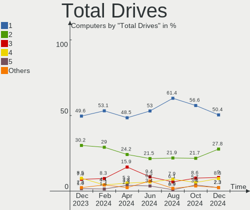
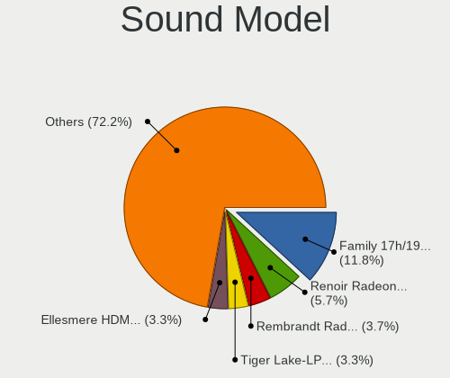
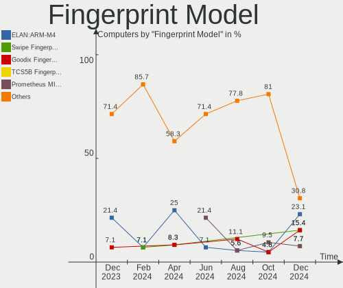

Kubuntu Hardware Trends
-----------------------

A project to identify most popular hardware characteristics and track their change
over time based on data collected by Kubuntu users at https://Linux-Hardware.org.

Anyone can contribute to the study by uploading probes of their computers by
the [hw-probe](https://github.com/linuxhw/hw-probe) tool:

    sudo -E hw-probe -all -upload

This is a report for all computer types. See also reports for [desktops](/Dist/Kubuntu/Desktop/README.md) and [notebooks](/Dist/Kubuntu/Notebook/README.md).

Full-feature report is available here: https://linux-hardware.org/?view=trends

Period: Apr, 2021.

Contents
--------

- [ OS                       ](#os)
- [ OS Family                ](#os-family)
- [ Kernel                   ](#kernel)
- [ Kernel Family            ](#kernel-family)
- [ Kernel Major Ver.        ](#kernel-major-ver)
- [ Arch                     ](#arch)
- [ DE                       ](#de)
- [ Display Server           ](#display-server)
- [ Display Manager          ](#display-manager)
- [ OS Lang                  ](#os-lang)
- [ Boot Mode                ](#boot-mode)
- [ Filesystem               ](#filesystem)
- [ Part. scheme             ](#part-scheme)
- [ Dual Boot with Linux/BSD ](#dual-boot-with-linux/bsd)
- [ Dual Boot (Win)          ](#dual-boot-win)
- [ Country                  ](#country)
- [ City                     ](#city)
- [ Vendor                   ](#vendor)
- [ Model                    ](#model)
- [ Model Family             ](#model-family)
- [ MFG Year                 ](#mfg-year)
- [ Form Factor              ](#form-factor)
- [ Secure Boot              ](#secure-boot)
- [ Coreboot                 ](#coreboot)
- [ RAM Size                 ](#ram-size)
- [ RAM Used                 ](#ram-used)
- [ Has CD-ROM               ](#has-cd-rom)
- [ Total Drives             ](#total-drives)
- [ Has Ethernet             ](#has-ethernet)
- [ Has WiFi                 ](#has-wifi)
- [ Has Bluetooth            ](#has-bluetooth)
- [ Drive Vendor             ](#drive-vendor)
- [ Drive Model              ](#drive-model)
- [ HDD Vendor               ](#hdd-vendor)
- [ SSD Vendor               ](#ssd-vendor)
- [ Drive Kind               ](#drive-kind)
- [ Drive Connector          ](#drive-connector)
- [ Drive Size               ](#drive-size)
- [ Space Total              ](#space-total)
- [ Space Used               ](#space-used)
- [ Malfunc. Drives          ](#malfunc-drives)
- [ Malfunc. Drive Vendor    ](#malfunc-drive-vendor)
- [ Malfunc. HDD Vendor      ](#malfunc-hdd-vendor)
- [ Malfunc. Drive Kind      ](#malfunc-drive-kind)
- [ Failed Drives            ](#failed-drives)
- [ Failed Drive Vendor      ](#failed-drive-vendor)
- [ Drive Status             ](#drive-status)
- [ Storage Vendor           ](#storage-vendor)
- [ Storage Model            ](#storage-model)
- [ Storage Kind             ](#storage-kind)
- [ CPU Vendor               ](#cpu-vendor)
- [ CPU Model                ](#cpu-model)
- [ CPU Model Family         ](#cpu-model-family)
- [ CPU Cores                ](#cpu-cores)
- [ CPU Sockets              ](#cpu-sockets)
- [ CPU Threads              ](#cpu-threads)
- [ CPU Op-Modes             ](#cpu-op-modes)
- [ CPU Microcode            ](#cpu-microcode)
- [ CPU Microarch            ](#cpu-microarch)
- [ GPU Vendor               ](#gpu-vendor)
- [ GPU Model                ](#gpu-model)
- [ GPU Combo                ](#gpu-combo)
- [ GPU Driver               ](#gpu-driver)
- [ GPU Memory               ](#gpu-memory)
- [ Monitor Vendor           ](#monitor-vendor)
- [ Monitor Model            ](#monitor-model)
- [ Monitor Resolution       ](#monitor-resolution)
- [ Monitor Diagonal         ](#monitor-diagonal)
- [ Monitor Width            ](#monitor-width)
- [ Aspect Ratio             ](#aspect-ratio)
- [ Monitor Area             ](#monitor-area)
- [ Pixel Density            ](#pixel-density)
- [ Multiple Monitors        ](#multiple-monitors)
- [ Net Controller Vendor    ](#net-controller-vendor)
- [ Net Controller Model     ](#net-controller-model)
- [ Wireless Vendor          ](#wireless-vendor)
- [ Wireless Model           ](#wireless-model)
- [ Ethernet Vendor          ](#ethernet-vendor)
- [ Ethernet Model           ](#ethernet-model)
- [ Net Controller Kind      ](#net-controller-kind)
- [ Used Controller          ](#used-controller)
- [ NICs                     ](#nics)
- [ IPv6                     ](#ipv6)
- [ Memory Vendor            ](#memory-vendor)
- [ Memory Model             ](#memory-model)
- [ Memory Kind              ](#memory-kind)
- [ Memory Form Factor       ](#memory-form-factor)
- [ Memory Size              ](#memory-size)
- [ Memory Speed             ](#memory-speed)
- [ Sound Vendor             ](#sound-vendor)
- [ Sound Model              ](#sound-model)
- [ Camera Vendor            ](#camera-vendor)
- [ Camera Model             ](#camera-model)
- [ Fingerprint Vendor       ](#fingerprint-vendor)
- [ Fingerprint Model        ](#fingerprint-model)
- [ Chipcard Vendor          ](#chipcard-vendor)
- [ Chipcard Model           ](#chipcard-model)
- [ Printer Vendor           ](#printer-vendor)
- [ Printer Model            ](#printer-model)
- [ Scanner Vendor           ](#scanner-vendor)
- [ Scanner Model            ](#scanner-model)
- [ Bluetooth Vendor         ](#bluetooth-vendor)
- [ Bluetooth Model          ](#bluetooth-model)
- [ Unsupported Devices      ](#unsupported-devices)
- [ Unsupported Device Types ](#unsupported-device-types)

OS
--

Installed operating systems

| Name          | Computers | Percent |
|---------------|-----------|---------|
| Kubuntu 20.04 | 66        | 62.26%  |
| Kubuntu 20.10 | 23        | 21.7%   |
| Kubuntu 21.04 | 8         | 7.55%   |
| Kubuntu 18.04 | 5         | 4.72%   |
| Kubuntu 19.10 | 2         | 1.89%   |
| Kubuntu 12.04 | 1         | 0.94%   |
| Kubuntu       | 1         | 0.94%   |

OS Family
---------

OS without a version

| Name    | Computers | Percent |
|---------|-----------|---------|
| Kubuntu | 106       | 100%    |

Kernel
------

Version of the Linux kernel

| Version                   | Computers | Percent |
|---------------------------|-----------|---------|
| 5.8.0-48-generic          | 26        | 24.53%  |
| 5.8.0-50-generic          | 19        | 17.92%  |
| 5.4.0-72-generic          | 13        | 12.26%  |
| 5.4.0-70-generic          | 6         | 5.66%   |
| 5.8.0-49-generic          | 4         | 3.77%   |
| 5.11.0-16-generic         | 4         | 3.77%   |
| 5.11.0-13-generic         | 4         | 3.77%   |
| 5.8.0-45-generic          | 3         | 2.83%   |
| 5.8.0-50-lowlatency       | 2         | 1.89%   |
| 5.4.0-71-generic          | 2         | 1.89%   |
| 5.4.0-70-lowlatency       | 2         | 1.89%   |
| 5.3.0-64-generic          | 2         | 1.89%   |
| 5.11.15-051115-generic    | 2         | 1.89%   |
| 5.8.0-48-lowlatency       | 1         | 0.94%   |
| 5.8.0-43-generic          | 1         | 0.94%   |
| 5.8.0-28-generic          | 1         | 0.94%   |
| 5.8.0-25-lowlatency       | 1         | 0.94%   |
| 5.8.0-25-generic          | 1         | 0.94%   |
| 5.5.6-050506-generic      | 1         | 0.94%   |
| 5.4.78-arnold             | 1         | 0.94%   |
| 5.4.0-65-generic          | 1         | 0.94%   |
| 5.4.0-53-generic          | 1         | 0.94%   |
| 5.4.0-40-generic          | 1         | 0.94%   |
| 5.12.0-051200rc6-generic  | 1         | 0.94%   |
| 5.11.12-051112-lowlatency | 1         | 0.94%   |
| 5.11.12-051112-generic    | 1         | 0.94%   |
| 5.11.11-xanmod1           | 1         | 0.94%   |
| 5.10.26-xanmod1           | 1         | 0.94%   |
| 4.15.0-108-generic        | 1         | 0.94%   |
| 3.13.0-117-generic        | 1         | 0.94%   |

Kernel Family
-------------

Linux kernel without a distro release

| Version | Computers | Percent |
|---------|-----------|---------|
| 5.8.0   | 59        | 55.66%  |
| 5.4.0   | 26        | 24.53%  |
| 5.11.0  | 8         | 7.55%   |
| 5.3.0   | 2         | 1.89%   |
| 5.11.15 | 2         | 1.89%   |
| 5.11.12 | 2         | 1.89%   |
| 5.5.6   | 1         | 0.94%   |
| 5.4.78  | 1         | 0.94%   |
| 5.12.0  | 1         | 0.94%   |
| 5.11.11 | 1         | 0.94%   |
| 5.10.26 | 1         | 0.94%   |
| 4.15.0  | 1         | 0.94%   |
| 3.13.0  | 1         | 0.94%   |

Kernel Major Ver.
-----------------

Linux kernel major version

| Version | Computers | Percent |
|---------|-----------|---------|
| 5.8     | 59        | 55.66%  |
| 5.4     | 27        | 25.47%  |
| 5.11    | 13        | 12.26%  |
| 5.3     | 2         | 1.89%   |
| 5.5     | 1         | 0.94%   |
| 5.12    | 1         | 0.94%   |
| 5.10    | 1         | 0.94%   |
| 4.15    | 1         | 0.94%   |
| 3.13    | 1         | 0.94%   |

Arch
----

OS architecture (x86_64, i586, etc.)

| Name   | Computers | Percent |
|--------|-----------|---------|
| x86_64 | 106       | 100%    |

DE
--

Desktop Environment

| Name  | Computers | Percent |
|-------|-----------|---------|
| KDE5  | 52        | 49.06%  |
| KDE   | 51        | 48.11%  |
| GNOME | 2         | 1.89%   |
| KDE4  | 1         | 0.94%   |

Display Server
--------------

X11 or Wayland

| Name    | Computers | Percent |
|---------|-----------|---------|
| X11     | 105       | 99.06%  |
| Wayland | 1         | 0.94%   |

Display Manager
---------------

SDDM, LightDM, etc.

| Name    | Computers | Percent |
|---------|-----------|---------|
| Unknown | 50        | 47.17%  |
| SDDM    | 49        | 46.23%  |
| GDM     | 4         | 3.77%   |
| TDM     | 2         | 1.89%   |
| LightDM | 1         | 0.94%   |

OS Lang
-------

Language

| Lang  | Computers | Percent |
|-------|-----------|---------|
| en_US | 36        | 33.96%  |
| pt_BR | 10        | 9.43%   |
| de_DE | 7         | 6.6%    |
| ru_RU | 6         | 5.66%   |
| it_IT | 6         | 5.66%   |
| fr_FR | 5         | 4.72%   |
| pl_PL | 4         | 3.77%   |
| en_CA | 4         | 3.77%   |
| en_AU | 4         | 3.77%   |
| ru_UA | 2         | 1.89%   |
| nl_NL | 2         | 1.89%   |
| en_IL | 2         | 1.89%   |
| en_GB | 2         | 1.89%   |
| el_GR | 2         | 1.89%   |
| de_CH | 2         | 1.89%   |
| id_ID | 1         | 0.94%   |
| fr_CH | 1         | 0.94%   |
| fr_CA | 1         | 0.94%   |
| fi_FI | 1         | 0.94%   |
| eu_ES | 1         | 0.94%   |
| es_UY | 1         | 0.94%   |
| es_MX | 1         | 0.94%   |
| es_ES | 1         | 0.94%   |
| es_CL | 1         | 0.94%   |
| en_IN | 1         | 0.94%   |
| en_DE | 1         | 0.94%   |
| C     | 1         | 0.94%   |

Boot Mode
---------

EFI or BIOS

| Mode | Computers | Percent |
|------|-----------|---------|
| EFI  | 68        | 64.15%  |
| BIOS | 38        | 35.85%  |

Filesystem
----------

Type of filesystem

| Type  | Computers | Percent |
|-------|-----------|---------|
| Ext4  | 97        | 91.51%  |
| Btrfs | 5         | 4.72%   |
| Xfs   | 3         | 2.83%   |
| Zfs   | 1         | 0.94%   |

Part. scheme
------------

Scheme of partitioning

| Type    | Computers | Percent |
|---------|-----------|---------|
| Unknown | 51        | 48.11%  |
| GPT     | 46        | 43.4%   |
| MBR     | 9         | 8.49%   |

Dual Boot with Linux/BSD
------------------------

Hosting more than one Linux/BSD

| Dual boot | Computers | Percent |
|-----------|-----------|---------|
| No        | 92        | 86.79%  |
| Yes       | 14        | 13.21%  |

Dual Boot (Win)
---------------

Hosting Linux and Windows

| Dual boot | Computers | Percent |
|-----------|-----------|---------|
| No        | 56        | 52.83%  |
| Yes       | 50        | 47.17%  |

Country
-------

Geographic location (country)

| Country      | Computers | Percent |
|--------------|-----------|---------|
| USA          | 12        | 11.32%  |
| Russia       | 11        | 10.38%  |
| Brazil       | 11        | 10.38%  |
| Germany      | 10        | 9.43%   |
| Italy        | 8         | 7.55%   |
| France       | 7         | 6.6%    |
| Poland       | 5         | 4.72%   |
| Canada       | 4         | 3.77%   |
| Australia    | 4         | 3.77%   |
| Ukraine      | 3         | 2.83%   |
| Netherlands  | 3         | 2.83%   |
| Greece       | 3         | 2.83%   |
| Switzerland  | 2         | 1.89%   |
| Spain        | 2         | 1.89%   |
| Mexico       | 2         | 1.89%   |
| Israel       | 2         | 1.89%   |
| Vietnam      | 1         | 0.94%   |
| Vatican      | 1         | 0.94%   |
| Uruguay      | 1         | 0.94%   |
| UK           | 1         | 0.94%   |
| UAE          | 1         | 0.94%   |
| Suriname     | 1         | 0.94%   |
| Saudi Arabia | 1         | 0.94%   |
| Peru         | 1         | 0.94%   |
| Norway       | 1         | 0.94%   |
| Iran         | 1         | 0.94%   |
| Indonesia    | 1         | 0.94%   |
| India        | 1         | 0.94%   |
| Finland      | 1         | 0.94%   |
| Egypt        | 1         | 0.94%   |
| Czechia      | 1         | 0.94%   |
| Chile        | 1         | 0.94%   |
| Bulgaria     | 1         | 0.94%   |

City
----

Geographic location (city)

| City                   | Computers | Percent |
|------------------------|-----------|---------|
| Hamburg                | 5         | 4.72%   |
| São Paulo             | 4         | 3.77%   |
| Moscow                 | 3         | 2.83%   |
| Milan                  | 2         | 1.89%   |
| Melbourne              | 2         | 1.89%   |
| Kyiv                   | 2         | 1.89%   |
| Athens                 | 2         | 1.89%   |
| Zurich                 | 1         | 0.94%   |
| Washington             | 1         | 0.94%   |
| Warsaw                 | 1         | 0.94%   |
| Warren                 | 1         | 0.94%   |
| Volos                  | 1         | 0.94%   |
| Vatican City           | 1         | 0.94%   |
| Urussu                 | 1         | 0.94%   |
| Townsville             | 1         | 0.94%   |
| Toronto                | 1         | 0.94%   |
| Tel Aviv               | 1         | 0.94%   |
| Tabriz                 | 1         | 0.94%   |
| Surat                  | 1         | 0.94%   |
| Sunnyvale              | 1         | 0.94%   |
| Sulmin                 | 1         | 0.94%   |
| South Deerfield        | 1         | 0.94%   |
| Sofia                  | 1         | 0.94%   |
| Shangrila              | 1         | 0.94%   |
| Selden                 | 1         | 0.94%   |
| Schiedam               | 1         | 0.94%   |
| Santiago               | 1         | 0.94%   |
| San Diego              | 1         | 0.94%   |
| Saint-Genis-Pouilly    | 1         | 0.94%   |
| Ryazan                 | 1         | 0.94%   |
| Rovaniemi              | 1         | 0.94%   |
| Rome                   | 1         | 0.94%   |
| Rio Grande             | 1         | 0.94%   |
| Riehen                 | 1         | 0.94%   |
| Ribeirão Preto        | 1         | 0.94%   |
| Puno                   | 1         | 0.94%   |
| Prague                 | 1         | 0.94%   |
| Paris                  | 1         | 0.94%   |
| Paramaribo             | 1         | 0.94%   |
| Padova                 | 1         | 0.94%   |
| Ottawa                 | 1         | 0.94%   |
| Oslo                   | 1         | 0.94%   |
| Oryol                  | 1         | 0.94%   |
| Novotroitsk            | 1         | 0.94%   |
| Novosibirsk            | 1         | 0.94%   |
| Nieuw-Vennep           | 1         | 0.94%   |
| Nevers                 | 1         | 0.94%   |
| Monthyon               | 1         | 0.94%   |
| Modena                 | 1         | 0.94%   |
| Mexico City            | 1         | 0.94%   |
| Lorraine               | 1         | 0.94%   |
| Little Marlow          | 1         | 0.94%   |
| Leme                   | 1         | 0.94%   |
| La Rochelle            | 1         | 0.94%   |
| La Paz                 | 1         | 0.94%   |
| Krasnogorsk            | 1         | 0.94%   |
| Krakow                 | 1         | 0.94%   |
| Kirchheim bei Muenchen | 1         | 0.94%   |
| Jerusalem              | 1         | 0.94%   |
| Jena                   | 1         | 0.94%   |

Vendor
------

Motherboard manufacturer

| Name                | Computers | Percent |
|---------------------|-----------|---------|
| Dell                | 16        | 15.09%  |
| ASUSTek Computer    | 16        | 15.09%  |
| Gigabyte Technology | 14        | 13.21%  |
| Hewlett-Packard     | 13        | 12.26%  |
| Lenovo              | 11        | 10.38%  |
| Acer                | 8         | 7.55%   |
| MSI                 | 7         | 6.6%    |
| Apple               | 5         | 4.72%   |
| ASRock              | 4         | 3.77%   |
| Toshiba             | 2         | 1.89%   |
| Intel               | 2         | 1.89%   |
| HUAWEI              | 2         | 1.89%   |
| Wortmann AG         | 1         | 0.94%   |
| LG Electronics      | 1         | 0.94%   |
| Hampoo              | 1         | 0.94%   |
| Entroware           | 1         | 0.94%   |
| Alienware           | 1         | 0.94%   |
| Unknown             | 1         | 0.94%   |

Model
-----

Motherboard model

| Name                                      | Computers | Percent |
|-------------------------------------------|-----------|---------|
| HUAWEI NBLK-WAX9X                         | 2         | 1.89%   |
| Apple iMac18,2                            | 2         | 1.89%   |
| Acer Aspire A514-53                       | 2         | 1.89%   |
| Wortmann AG TERRA_PC                      | 1         | 0.94%   |
| Toshiba Satellite E45-B                   | 1         | 0.94%   |
| Toshiba Satellite C850-BLK                | 1         | 0.94%   |
| MSI MS-7C52                               | 1         | 0.94%   |
| MSI MS-7C02                               | 1         | 0.94%   |
| MSI MS-7A34                               | 1         | 0.94%   |
| MSI MS-7A33                               | 1         | 0.94%   |
| MSI MS-7996                               | 1         | 0.94%   |
| MSI MS-7673                               | 1         | 0.94%   |
| MSI GX60 3CC                              | 1         | 0.94%   |
| LG A410-K.BE43P1                          | 1         | 0.94%   |
| Lenovo XiaoXin Air 12 80UN                | 1         | 0.94%   |
| Lenovo ThinkPad X250 20CLS1G70A           | 1         | 0.94%   |
| Lenovo ThinkPad X1 Extreme 2nd 20QVS0FP00 | 1         | 0.94%   |
| Lenovo ThinkPad T590 20N4CTO1WW           | 1         | 0.94%   |
| Lenovo ThinkPad T470 20HES18S03           | 1         | 0.94%   |
| Lenovo ThinkPad T440s 20ARS45U00          | 1         | 0.94%   |
| Lenovo ThinkPad T420s 4170CTO             | 1         | 0.94%   |
| Lenovo Legion Y7000P 81LD                 | 1         | 0.94%   |
| Lenovo Legion 7 15IMH05 81YT              | 1         | 0.94%   |
| Lenovo IdeaPad C340-14IWL 81RL            | 1         | 0.94%   |
| Lenovo IdeaPad 500-15ISK 80NT             | 1         | 0.94%   |
| Intel NUC7i3BNK                           | 1         | 0.94%   |
| Intel DP965LT AAD41694-206                | 1         | 0.94%   |
| HP t620 Quad Core TC                      | 1         | 0.94%   |
| HP ProDesk 600 G1 SFF                     | 1         | 0.94%   |
| HP ProBook 455 G7                         | 1         | 0.94%   |
| HP Pavilion Laptop 17-ar0xx               | 1         | 0.94%   |
| HP Pavilion dv7                           | 1         | 0.94%   |
| HP Laptop 15-bs0xx                        | 1         | 0.94%   |
| HP ENVY 17                                | 1         | 0.94%   |
| HP EliteBook 845 G7 Notebook PC           | 1         | 0.94%   |
| HP Compaq Elite 8300 SFF                  | 1         | 0.94%   |
| HP Compaq 6200 Pro SFF PC                 | 1         | 0.94%   |
| HP All-in-One 24-df0xxx                   | 1         | 0.94%   |
| HP 255 G1                                 | 1         | 0.94%   |
| HP 15                                     | 1         | 0.94%   |
| Hampoo Magic 11.6                         | 1         | 0.94%   |
| Gigabyte Z170X-Gaming 5                   | 1         | 0.94%   |
| Gigabyte P67A-D3-B3                       | 1         | 0.94%   |
| Gigabyte GA-78LMT-USB3                    | 1         | 0.94%   |
| Gigabyte F2A88X-D3HP                      | 1         | 0.94%   |
| Gigabyte B85M-HD3                         | 1         | 0.94%   |
| Gigabyte B75M-HD3                         | 1         | 0.94%   |
| Gigabyte B550 AORUS ELITE                 | 1         | 0.94%   |
| Gigabyte B450M GAMING                     | 1         | 0.94%   |
| Gigabyte B450M DS3H                       | 1         | 0.94%   |
| Gigabyte B450 AORUS PRO WIFI              | 1         | 0.94%   |
| Gigabyte B365M DS3H                       | 1         | 0.94%   |
| Gigabyte AX370-Gaming K7                  | 1         | 0.94%   |
| Gigabyte AORUS 5 SB                       | 1         | 0.94%   |
| Gigabyte A320M-H                          | 1         | 0.94%   |
| Entroware Proteus                         | 1         | 0.94%   |
| Dell XPS 15 9570                          | 1         | 0.94%   |
| Dell XPS 15 9500                          | 1         | 0.94%   |
| Dell XPS 15 7590                          | 1         | 0.94%   |
| Dell XPS 13 9300                          | 1         | 0.94%   |

Model Family
------------

Motherboard model prefix

| Name                   | Computers | Percent |
|------------------------|-----------|---------|
| Lenovo ThinkPad        | 6         | 5.66%   |
| Acer Aspire            | 6         | 5.66%   |
| Dell XPS               | 4         | 3.77%   |
| Dell Inspiron          | 4         | 3.77%   |
| Dell Latitude          | 3         | 2.83%   |
| ASUS ROG               | 3         | 2.83%   |
| ASUS PRIME             | 3         | 2.83%   |
| Toshiba Satellite      | 2         | 1.89%   |
| Lenovo Legion          | 2         | 1.89%   |
| Lenovo IdeaPad         | 2         | 1.89%   |
| HUAWEI NBLK-WAX9X      | 2         | 1.89%   |
| HP Pavilion            | 2         | 1.89%   |
| HP Compaq              | 2         | 1.89%   |
| Gigabyte B450M         | 2         | 1.89%   |
| Dell OptiPlex          | 2         | 1.89%   |
| Apple iMac18           | 2         | 1.89%   |
| Wortmann AG TERRA      | 1         | 0.94%   |
| MSI MS-7C52            | 1         | 0.94%   |
| MSI MS-7C02            | 1         | 0.94%   |
| MSI MS-7A34            | 1         | 0.94%   |
| MSI MS-7A33            | 1         | 0.94%   |
| MSI MS-7996            | 1         | 0.94%   |
| MSI MS-7673            | 1         | 0.94%   |
| MSI GX60               | 1         | 0.94%   |
| LG A410-K.BE43P1       | 1         | 0.94%   |
| Lenovo XiaoXin         | 1         | 0.94%   |
| Intel NUC7i3BNK        | 1         | 0.94%   |
| Intel DP965LT          | 1         | 0.94%   |
| HP t620                | 1         | 0.94%   |
| HP ProDesk             | 1         | 0.94%   |
| HP ProBook             | 1         | 0.94%   |
| HP Laptop              | 1         | 0.94%   |
| HP ENVY                | 1         | 0.94%   |
| HP EliteBook           | 1         | 0.94%   |
| HP All-in-One          | 1         | 0.94%   |
| HP 255                 | 1         | 0.94%   |
| HP 15                  | 1         | 0.94%   |
| Hampoo Magic           | 1         | 0.94%   |
| Gigabyte Z170X-Gaming  | 1         | 0.94%   |
| Gigabyte P67A-D3-B3    | 1         | 0.94%   |
| Gigabyte GA-78LMT-USB3 | 1         | 0.94%   |
| Gigabyte F2A88X-D3HP   | 1         | 0.94%   |
| Gigabyte B85M-HD3      | 1         | 0.94%   |
| Gigabyte B75M-HD3      | 1         | 0.94%   |
| Gigabyte B550          | 1         | 0.94%   |
| Gigabyte B450          | 1         | 0.94%   |
| Gigabyte B365M         | 1         | 0.94%   |
| Gigabyte AX370-Gaming  | 1         | 0.94%   |
| Gigabyte AORUS         | 1         | 0.94%   |
| Gigabyte A320M-H       | 1         | 0.94%   |
| Entroware Proteus      | 1         | 0.94%   |
| Dell Vostro            | 1         | 0.94%   |
| Dell Studio            | 1         | 0.94%   |
| Dell Precision         | 1         | 0.94%   |
| ASUS X555YI            | 1         | 0.94%   |
| ASUS X510UAR           | 1         | 0.94%   |
| ASUS X401U             | 1         | 0.94%   |
| ASUS P8H61-M           | 1         | 0.94%   |
| ASUS M4N68T-M          | 1         | 0.94%   |
| ASUS K53E              | 1         | 0.94%   |

MFG Year
--------

Motherboard manufacture year

| Year    | Computers | Percent |
|---------|-----------|---------|
| 2020    | 29        | 27.36%  |
| 2019    | 13        | 12.26%  |
| 2013    | 10        | 9.43%   |
| 2021    | 9         | 8.49%   |
| 2018    | 9         | 8.49%   |
| 2014    | 8         | 7.55%   |
| 2017    | 7         | 6.6%    |
| 2012    | 4         | 3.77%   |
| 2011    | 4         | 3.77%   |
| 2009    | 4         | 3.77%   |
| 2016    | 3         | 2.83%   |
| 2015    | 3         | 2.83%   |
| 2010    | 1         | 0.94%   |
| 2007    | 1         | 0.94%   |
| Unknown | 1         | 0.94%   |

Form Factor
-----------

Physical design of the computer

| Name        | Computers | Percent |
|-------------|-----------|---------|
| Notebook    | 51        | 48.11%  |
| Desktop     | 47        | 44.34%  |
| All in one  | 5         | 4.72%   |
| Mini pc     | 2         | 1.89%   |
| Convertible | 1         | 0.94%   |

Secure Boot
-----------

Enabled or disabled

| State    | Computers | Percent |
|----------|-----------|---------|
| Disabled | 98        | 92.45%  |
| Enabled  | 8         | 7.55%   |

Coreboot
--------

Have coreboot on board

| Used | Computers | Percent |
|------|-----------|---------|
| No   | 106       | 100%    |

RAM Size
--------

Total RAM memory

| Size in GB  | Computers | Percent |
|-------------|-----------|---------|
| 4.01-8.0    | 26        | 24.53%  |
| 16.01-24.0  | 26        | 24.53%  |
| 8.01-16.0   | 22        | 20.75%  |
| 3.01-4.0    | 14        | 13.21%  |
| 32.01-64.0  | 12        | 11.32%  |
| 64.01-256.0 | 2         | 1.89%   |
| 1.01-2.0    | 2         | 1.89%   |
| 24.01-32.0  | 1         | 0.94%   |
| 2.01-3.0    | 1         | 0.94%   |

RAM Used
--------

Used RAM memory

| Used GB    | Computers | Percent |
|------------|-----------|---------|
| 1.01-2.0   | 30        | 28.3%   |
| 4.01-8.0   | 25        | 23.58%  |
| 2.01-3.0   | 25        | 23.58%  |
| 3.01-4.0   | 14        | 13.21%  |
| 0.51-1.0   | 6         | 5.66%   |
| 8.01-16.0  | 4         | 3.77%   |
| 16.01-24.0 | 1         | 0.94%   |
| Unknown    | 1         | 0.94%   |

Has CD-ROM
----------

Has CD-ROM on board

| Presented | Computers | Percent |
|-----------|-----------|---------|
| No        | 64        | 60.38%  |
| Yes       | 42        | 39.62%  |

Total Drives
------------

Number of drives on board

| Drives | Computers | Percent |
|--------|-----------|---------|
| 1      | 59        | 55.66%  |
| 2      | 25        | 23.58%  |
| 3      | 11        | 10.38%  |
| 4      | 6         | 5.66%   |
| 5      | 3         | 2.83%   |
| 6      | 2         | 1.89%   |

Has Ethernet
------------

Has Ethernet on board

| Presented | Computers | Percent |
|-----------|-----------|---------|
| Yes       | 95        | 89.62%  |
| No        | 11        | 10.38%  |

Has WiFi
--------

Has WiFi module

| Presented | Computers | Percent |
|-----------|-----------|---------|
| Yes       | 74        | 69.81%  |
| No        | 32        | 30.19%  |

Has Bluetooth
-------------

Has Bluetooth module

| Presented | Computers | Percent |
|-----------|-----------|---------|
| Yes       | 72        | 67.92%  |
| No        | 34        | 32.08%  |

Drive Vendor
------------

Hard drive vendors

| Vendor                | Computers | Drives | Percent |
|-----------------------|-----------|--------|---------|
| Samsung Electronics   | 33        | 40     | 19.64%  |
| WDC                   | 29        | 35     | 17.26%  |
| Seagate               | 25        | 29     | 14.88%  |
| Toshiba               | 12        | 12     | 7.14%   |
| Sandisk               | 9         | 9      | 5.36%   |
| Kingston              | 7         | 8      | 4.17%   |
| Intel                 | 6         | 6      | 3.57%   |
| Hitachi               | 4         | 4      | 2.38%   |
| Unknown               | 3         | 3      | 1.79%   |
| LITEON                | 3         | 3      | 1.79%   |
| GOODRAM               | 3         | 4      | 1.79%   |
| Crucial               | 3         | 4      | 1.79%   |
| Apple                 | 3         | 3      | 1.79%   |
| A-DATA Technology     | 3         | 3      | 1.79%   |
| Silicon Motion        | 2         | 2      | 1.19%   |
| Micron Technology     | 2         | 2      | 1.19%   |
| China                 | 2         | 2      | 1.19%   |
| XrayDisk              | 1         | 1      | 0.6%    |
| XPG                   | 1         | 1      | 0.6%    |
| WDC WDS4              | 1         | 1      | 0.6%    |
| Transcend             | 1         | 1      | 0.6%    |
| SMI                   | 1         | 1      | 0.6%    |
| SK Hynix              | 1         | 1      | 0.6%    |
| Realtek Semiconductor | 1         | 1      | 0.6%    |
| PNY                   | 1         | 1      | 0.6%    |
| Phison                | 1         | 1      | 0.6%    |
| NE-1TB                | 1         | 1      | 0.6%    |
| MDT                   | 1         | 1      | 0.6%    |
| Lenovo                | 1         | 1      | 0.6%    |
| LaCie                 | 1         | 1      | 0.6%    |
| KIOXIA                | 1         | 1      | 0.6%    |
| KingSpec              | 1         | 1      | 0.6%    |
| HGST                  | 1         | 1      | 0.6%    |
| Fujitsu               | 1         | 1      | 0.6%    |
| Biwin                 | 1         | 1      | 0.6%    |
| ADATA Technology      | 1         | 1      | 0.6%    |

Drive Model
-----------

Hard drive models

| Model                                   | Computers | Percent |
|-----------------------------------------|-----------|---------|
| Samsung SSD 860 EVO 500GB               | 4         | 2.15%   |
| WDC WDS500G2B0C-00PXH0 500GB            | 2         | 1.08%   |
| WDC WDS240G2G0A-00JH30 240GB SSD        | 2         | 1.08%   |
| WDC WD20EZRZ-00Z5HB0 2TB                | 2         | 1.08%   |
| WDC WD10JPVX-22JC3T0 1TB                | 2         | 1.08%   |
| Unknown MMC Card  128GB                 | 2         | 1.08%   |
| Toshiba MQ01ABD100 1TB                  | 2         | 1.08%   |
| Seagate ST4000DM004-2CV104 4TB          | 2         | 1.08%   |
| Seagate ST3500418AS 500GB               | 2         | 1.08%   |
| Seagate ST1000DM003-1CH162 1TB          | 2         | 1.08%   |
| Seagate Expansion 4TB                   | 2         | 1.08%   |
| Samsung SSD 970 EVO Plus 500GB          | 2         | 1.08%   |
| Samsung SSD 970 EVO 500GB               | 2         | 1.08%   |
| Samsung SSD 860 EVO 250GB               | 2         | 1.08%   |
| Samsung NVMe SSD Drive 512GB            | 2         | 1.08%   |
| Samsung MZVLQ512HALU-000H1 512GB        | 2         | 1.08%   |
| Kingston SHFS37A120G 120GB SSD          | 2         | 1.08%   |
| GOODRAM SSD 120GB                       | 2         | 1.08%   |
| Apple HDD HTS541010A9E632 1TB           | 2         | 1.08%   |
| XrayDisk 512GB                          | 1         | 0.54%   |
| XPG NVMe SSD Drive 512GB                | 1         | 0.54%   |
| WDC WDS500G3X0C-00SJG0 500GB            | 1         | 0.54%   |
| WDC WDS500G2B0B-00YS70 500GB SSD        | 1         | 0.54%   |
| WDC WDS500G1B0B-00AS40 500GB SSD        | 1         | 0.54%   |
| WDC WDS4 80G2G0A-00JH30 480GB SSD       | 1         | 0.54%   |
| WDC WDS240G2G0B-00EPW0 240GB SSD        | 1         | 0.54%   |
| WDC WDS200T2B0B 2TB SSD                 | 1         | 0.54%   |
| WDC WDS100T3X0C-00SJG0 1TB              | 1         | 0.54%   |
| WDC WDS100T2B0A-00SM50 1TB SSD          | 1         | 0.54%   |
| WDC WD5000HHTZ-04N21V0 500GB            | 1         | 0.54%   |
| WDC WD40PURZ-85TTDY0 4TB                | 1         | 0.54%   |
| WDC WD40EZRZ-00GXCB0 4TB                | 1         | 0.54%   |
| WDC WD40EFRX-68N32N0 4TB                | 1         | 0.54%   |
| WDC WD40EFAX-68JH4N0 4TB                | 1         | 0.54%   |
| WDC WD3200BEKT-75F3T0 320GB             | 1         | 0.54%   |
| WDC WD3200AAJB-56R1A0 320GB             | 1         | 0.54%   |
| WDC WD30EFRX-68EUZN0 3TB                | 1         | 0.54%   |
| WDC WD2500AAKX-603CA0 250GB             | 1         | 0.54%   |
| WDC WD20EZRX-00DC0B0 2TB                | 1         | 0.54%   |
| WDC WD2005FBYZ-01YCBB3 2TB              | 1         | 0.54%   |
| WDC WD2003FZEX-00SRLA0 2TB              | 1         | 0.54%   |
| WDC WD10SPZX-21Z10T0 1TB                | 1         | 0.54%   |
| WDC WD10JPVX-08JC3T5 1TB                | 1         | 0.54%   |
| WDC WD10JPVX-00JC3T0 1TB                | 1         | 0.54%   |
| WDC WD10EZEX-75WN4A0 1TB                | 1         | 0.54%   |
| WDC WD10EZEX-08M2NA0 1TB                | 1         | 0.54%   |
| WDC WD1003FZEX-00MK2A0 1TB              | 1         | 0.54%   |
| WDC WD1003FZEX-00K3CA0 1TB              | 1         | 0.54%   |
| WDC PC SN730 SDBPNTY-256G-1027 256GB    | 1         | 0.54%   |
| Unknown SD64G  64GB                     | 1         | 0.54%   |
| Transcend TS120GMTS420S 120GB SSD       | 1         | 0.54%   |
| Toshiba THNSNJ128GMCU 128GB SSD         | 1         | 0.54%   |
| Toshiba THNSNJ128GCSU 128GB SSD         | 1         | 0.54%   |
| Toshiba MQ04ABF100 1TB                  | 1         | 0.54%   |
| Toshiba MK6459GSXP 640GB                | 1         | 0.54%   |
| Toshiba MK2035GSS 200GB                 | 1         | 0.54%   |
| Toshiba KXG60ZNV1T02 NVMe 1024GB        | 1         | 0.54%   |
| Toshiba KSG60ZMV512G M.2 2280 512GB SSD | 1         | 0.54%   |
| Toshiba HDWD130 3TB                     | 1         | 0.54%   |
| Toshiba HDWD120 2TB                     | 1         | 0.54%   |

HDD Vendor
----------

Hard disk drive vendors

| Vendor              | Computers | Drives | Percent |
|---------------------|-----------|--------|---------|
| Seagate             | 23        | 27     | 37.1%   |
| WDC                 | 18        | 23     | 29.03%  |
| Toshiba             | 8         | 8      | 12.9%   |
| Samsung Electronics | 4         | 4      | 6.45%   |
| Hitachi             | 4         | 4      | 6.45%   |
| Apple               | 2         | 2      | 3.23%   |
| LaCie               | 1         | 1      | 1.61%   |
| HGST                | 1         | 1      | 1.61%   |
| Fujitsu             | 1         | 1      | 1.61%   |

SSD Vendor
----------

Solid state drive vendors

| Vendor              | Computers | Drives | Percent |
|---------------------|-----------|--------|---------|
| Samsung Electronics | 21        | 22     | 32.81%  |
| WDC                 | 7         | 7      | 10.94%  |
| SanDisk             | 7         | 7      | 10.94%  |
| Kingston            | 5         | 6      | 7.81%   |
| Toshiba             | 3         | 3      | 4.69%   |
| GOODRAM             | 3         | 4      | 4.69%   |
| Crucial             | 3         | 4      | 4.69%   |
| A-DATA Technology   | 3         | 3      | 4.69%   |
| LITEON              | 2         | 2      | 3.13%   |
| Intel               | 2         | 2      | 3.13%   |
| China               | 2         | 2      | 3.13%   |
| WDC WDS4            | 1         | 1      | 1.56%   |
| Transcend           | 1         | 1      | 1.56%   |
| SMI                 | 1         | 1      | 1.56%   |
| Seagate             | 1         | 1      | 1.56%   |
| PNY                 | 1         | 1      | 1.56%   |
| KingSpec            | 1         | 1      | 1.56%   |

Drive Kind
----------

HDD or SSD

| Kind    | Computers | Drives | Percent |
|---------|-----------|--------|---------|
| SSD     | 54        | 68     | 35.29%  |
| HDD     | 53        | 71     | 34.64%  |
| NVMe    | 38        | 41     | 24.84%  |
| MMC     | 4         | 4      | 2.61%   |
| Unknown | 4         | 4      | 2.61%   |

Drive Connector
---------------

SATA, SAS, NVMe, etc.

| Type | Computers | Drives | Percent |
|------|-----------|--------|---------|
| SATA | 82        | 136    | 63.08%  |
| NVMe | 38        | 41     | 29.23%  |
| SAS  | 6         | 7      | 4.62%   |
| MMC  | 4         | 4      | 3.08%   |

Drive Size
----------

Size of hard drive

| Size in TB | Computers | Drives | Percent |
|------------|-----------|--------|---------|
| 0.01-0.5   | 63        | 79     | 54.31%  |
| 0.51-1.0   | 30        | 33     | 25.86%  |
| 1.01-2.0   | 13        | 13     | 11.21%  |
| 3.01-4.0   | 8         | 12     | 6.9%    |
| 2.01-3.0   | 2         | 2      | 1.72%   |

Space Total
-----------

Amount of disk space available on the file system

| Size in GB     | Computers | Percent |
|----------------|-----------|---------|
| 101-250        | 30        | 28.3%   |
| 251-500        | 22        | 20.75%  |
| 501-1000       | 20        | 18.87%  |
| 1001-2000      | 13        | 12.26%  |
| More than 3000 | 10        | 9.43%   |
| 21-50          | 6         | 5.66%   |
| 51-100         | 4         | 3.77%   |
| 1-20           | 1         | 0.94%   |

Space Used
----------

Amount of used disk space

| Used GB        | Computers | Percent |
|----------------|-----------|---------|
| 1-20           | 32        | 30.19%  |
| 21-50          | 18        | 16.98%  |
| 101-250        | 14        | 13.21%  |
| 51-100         | 13        | 12.26%  |
| 251-500        | 10        | 9.43%   |
| 501-1000       | 8         | 7.55%   |
| 1001-2000      | 5         | 4.72%   |
| More than 3000 | 4         | 3.77%   |
| 2001-3000      | 2         | 1.89%   |

Malfunc. Drives
---------------

Drive models with a malfunction

| Model                                        | Computers | Drives | Percent |
|----------------------------------------------|-----------|--------|---------|
| WDC WD3200BEKT-75F3T0 320GB                  | 1         | 1      | 7.14%   |
| WDC WD3200AAJB-56R1A0 320GB                  | 1         | 1      | 7.14%   |
| WDC WD10JPVX-22JC3T0 1TB                     | 1         | 1      | 7.14%   |
| Toshiba MQ04ABF100 1TB                       | 1         | 1      | 7.14%   |
| Seagate ST320LT007-9ZV142 320GB              | 1         | 1      | 7.14%   |
| Seagate ST31000524AS 1TB                     | 1         | 1      | 7.14%   |
| SanDisk SD9SN8W-128G-1006 128GB SSD          | 1         | 1      | 7.14%   |
| Samsung Electronics SSD 840 PRO Series 128GB | 1         | 1      | 7.14%   |
| Samsung Electronics HM160HI 160GB            | 1         | 1      | 7.14%   |
| Samsung Electronics HD501LJ 500GB            | 1         | 1      | 7.14%   |
| Kingston SMS200S3240G 240GB SSD              | 1         | 1      | 7.14%   |
| Hitachi HTS547564A9E384 640GB                | 1         | 1      | 7.14%   |
| Crucial CT1050MX300SSD1 1050GB               | 1         | 1      | 7.14%   |
| Apple HDD HTS541010A9E632 1TB                | 1         | 1      | 7.14%   |

Malfunc. Drive Vendor
---------------------

Vendors of faulty drives

| Vendor              | Computers | Drives | Percent |
|---------------------|-----------|--------|---------|
| Samsung Electronics | 3         | 3      | 23.08%  |
| WDC                 | 2         | 3      | 15.38%  |
| Seagate             | 2         | 2      | 15.38%  |
| Toshiba             | 1         | 1      | 7.69%   |
| SanDisk             | 1         | 1      | 7.69%   |
| Kingston            | 1         | 1      | 7.69%   |
| Hitachi             | 1         | 1      | 7.69%   |
| Crucial             | 1         | 1      | 7.69%   |
| Apple               | 1         | 1      | 7.69%   |

Malfunc. HDD Vendor
-------------------

Vendors of faulty HDD drives

| Vendor              | Computers | Drives | Percent |
|---------------------|-----------|--------|---------|
| WDC                 | 2         | 3      | 22.22%  |
| Seagate             | 2         | 2      | 22.22%  |
| Samsung Electronics | 2         | 2      | 22.22%  |
| Toshiba             | 1         | 1      | 11.11%  |
| Hitachi             | 1         | 1      | 11.11%  |
| Apple               | 1         | 1      | 11.11%  |

Malfunc. Drive Kind
-------------------

Kinds of faulty drives

| Kind | Computers | Drives | Percent |
|------|-----------|--------|---------|
| HDD  | 7         | 10     | 63.64%  |
| SSD  | 4         | 4      | 36.36%  |

Failed Drives
-------------

Failed drive models

Zero info for selected period =(

Failed Drive Vendor
-------------------

Failed drive vendors

Zero info for selected period =(

Drive Status
------------

Number of failed and malfunc. drives

| Status   | Computers | Drives | Percent |
|----------|-----------|--------|---------|
| Works    | 54        | 88     | 46.15%  |
| Detected | 52        | 86     | 44.44%  |
| Malfunc  | 11        | 14     | 9.4%    |

Storage Vendor
--------------

Storage controller vendors

| Vendor                       | Computers | Percent |
|------------------------------|-----------|---------|
| Intel                        | 68        | 50.75%  |
| AMD                          | 24        | 17.91%  |
| Samsung Electronics          | 12        | 8.96%   |
| Sandisk                      | 6         | 4.48%   |
| Nvidia                       | 4         | 2.99%   |
| Silicon Motion               | 3         | 2.24%   |
| Micron Technology            | 2         | 1.49%   |
| Kingston Technology Company  | 2         | 1.49%   |
| ADATA Technology             | 2         | 1.49%   |
| Toshiba America Info Systems | 1         | 0.75%   |
| SK Hynix                     | 1         | 0.75%   |
| Realtek Semiconductor        | 1         | 0.75%   |
| Phison Electronics           | 1         | 0.75%   |
| Marvell Technology Group     | 1         | 0.75%   |
| Lite-On Technology           | 1         | 0.75%   |
| Lenovo                       | 1         | 0.75%   |
| KIOXIA                       | 1         | 0.75%   |
| Broadcom / LSI               | 1         | 0.75%   |
| ASMedia Technology           | 1         | 0.75%   |
| Apple                        | 1         | 0.75%   |

Storage Model
-------------

Storage controller models

| Model                                                                                   | Computers | Percent |
|-----------------------------------------------------------------------------------------|-----------|---------|
| AMD FCH SATA Controller [AHCI mode]                                                     | 19        | 12.03%  |
| Samsung NVMe SSD Controller SM981/PM981/PM983                                           | 9         | 5.7%    |
| Intel Sunrise Point-LP SATA Controller [AHCI mode]                                      | 6         | 3.8%    |
| Intel 8 Series/C220 Series Chipset Family 6-port SATA Controller 1 [AHCI mode]          | 6         | 3.8%    |
| Intel Q170/Q150/B150/H170/H110/Z170/CM236 Chipset SATA Controller [AHCI Mode]           | 5         | 3.16%   |
| Intel 82801 Mobile SATA Controller [RAID mode]                                          | 5         | 3.16%   |
| AMD 400 Series Chipset SATA Controller                                                  | 5         | 3.16%   |
| Intel Ice Lake-LP SATA Controller [AHCI mode]                                           | 4         | 2.53%   |
| Intel 7 Series Chipset Family 6-port SATA Controller [AHCI mode]                        | 4         | 2.53%   |
| Intel 6 Series/C200 Series Chipset Family Desktop SATA Controller (IDE mode, ports 4-5) | 4         | 2.53%   |
| Intel 6 Series/C200 Series Chipset Family Desktop SATA Controller (IDE mode, ports 0-3) | 4         | 2.53%   |
| Intel 200 Series PCH SATA controller [AHCI mode]                                        | 4         | 2.53%   |
| Silicon Motion SM2263EN/SM2263XT SSD Controller                                         | 3         | 1.9%    |
| Sandisk WD Black SN750 / PC SN730 NVMe SSD                                              | 3         | 1.9%    |
| Intel Cannon Lake Mobile PCH SATA AHCI Controller                                       | 3         | 1.9%    |
| Intel 400 Series Chipset Family SATA AHCI Controller                                    | 3         | 1.9%    |
| Sandisk WD Blue SN550 NVMe SSD                                                          | 2         | 1.27%   |
| Samsung NVMe Controller                                                                 | 2         | 1.27%   |
| Nvidia MCP79 AHCI Controller                                                            | 2         | 1.27%   |
| Nvidia MCP61 SATA Controller                                                            | 2         | 1.27%   |
| Nvidia MCP61 IDE                                                                        | 2         | 1.27%   |
| Micron Non-Volatile memory controller                                                   | 2         | 1.27%   |
| Intel SSD 600P Series                                                                   | 2         | 1.27%   |
| Intel Cannon Point-LP SATA Controller [AHCI Mode]                                       | 2         | 1.27%   |
| Intel 8 Series SATA Controller 1 [AHCI mode]                                            | 2         | 1.27%   |
| Intel 6 Series/C200 Series Chipset Family 6 port Mobile SATA AHCI Controller            | 2         | 1.27%   |
| Intel 6 Series/C200 Series Chipset Family 6 port Desktop SATA AHCI Controller           | 2         | 1.27%   |
| AMD X370 Series Chipset SATA Controller                                                 | 2         | 1.27%   |
| AMD Starship/Matisse Chipset SATA Controller [AHCI mode]                                | 2         | 1.27%   |
| AMD FCH SATA Controller D                                                               | 2         | 1.27%   |
| AMD FCH IDE Controller                                                                  | 2         | 1.27%   |
| Toshiba America Info Systems XG6 NVMe SSD Controller                                    | 1         | 0.63%   |
| SK Hynix Non-Volatile memory controller                                                 | 1         | 0.63%   |
| Sandisk WD Blue SN500 / PC SN520 NVMe SSD                                               | 1         | 0.63%   |
| Samsung NVMe SSD Controller PM9A1/980PRO                                                | 1         | 0.63%   |
| Realtek Realtek Non-Volatile memory controller                                          | 1         | 0.63%   |
| Phison E12 NVMe Controller                                                              | 1         | 0.63%   |
| Marvell Group 88SE6101/6102 single-port PATA133 interface                               | 1         | 0.63%   |
| Lite-On Non-Volatile memory controller                                                  | 1         | 0.63%   |
| Lenovo Non-Volatile memory controller                                                   | 1         | 0.63%   |
| KIOXIA Non-Volatile memory controller                                                   | 1         | 0.63%   |
| Kingston Company U-SNS8154P3 NVMe SSD                                                   | 1         | 0.63%   |
| Kingston Company Company Non-Volatile memory controller                                 | 1         | 0.63%   |
| Intel Wildcat Point-LP SATA Controller [AHCI Mode]                                      | 1         | 0.63%   |
| Intel Volume Management Device NVMe RAID Controller                                     | 1         | 0.63%   |
| Intel SSD 660P Series                                                                   | 1         | 0.63%   |
| Intel NM10/ICH7 Family SATA Controller [IDE mode]                                       | 1         | 0.63%   |
| Intel Comet Lake SATA AHCI Controller                                                   | 1         | 0.63%   |
| Intel Celeron/Pentium Silver Processor SATA Controller                                  | 1         | 0.63%   |
| Intel Celeron N3350/Pentium N4200/Atom E3900 Series SATA AHCI Controller                | 1         | 0.63%   |
| Intel C620 Series Chipset Family IDE Redirection                                        | 1         | 0.63%   |
| Intel C600/X79 series chipset SATA RAID Controller                                      | 1         | 0.63%   |
| Intel C600/X79 series chipset 6-Port SATA AHCI Controller                               | 1         | 0.63%   |
| Intel 82801JD/DO (ICH10 Family) SATA AHCI Controller                                    | 1         | 0.63%   |
| Intel 82801HB (ICH8) 4 port SATA Controller [AHCI mode]                                 | 1         | 0.63%   |
| Intel 82801G (ICH7 Family) IDE Controller                                               | 1         | 0.63%   |
| Intel 7 Series/C210 Series Chipset Family 6-port SATA Controller [AHCI mode]            | 1         | 0.63%   |
| Intel 7 Series/C210 Series Chipset Family 4-port SATA Controller [IDE mode]             | 1         | 0.63%   |
| Intel 7 Series/C210 Series Chipset Family 2-port SATA Controller [IDE mode]             | 1         | 0.63%   |
| Intel 500 Series Chipset Family SATA AHCI Controller                                    | 1         | 0.63%   |

Storage Kind
------------

Kind of storage controller (IDE, SATA, NVMe, SAS, ...)

| Kind | Computers | Percent |
|------|-----------|---------|
| SATA | 81        | 58.7%   |
| NVMe | 37        | 26.81%  |
| IDE  | 14        | 10.14%  |
| RAID | 6         | 4.35%   |

CPU Vendor
----------

Processor vendors

| Vendor | Computers | Percent |
|--------|-----------|---------|
| Intel  | 77        | 72.64%  |
| AMD    | 29        | 27.36%  |

CPU Model
---------

Processor models

| Model                                         | Computers | Percent |
|-----------------------------------------------|-----------|---------|
| Intel Core i7-10750H CPU @ 2.60GHz            | 4         | 3.77%   |
| AMD Ryzen 7 3700X 8-Core Processor            | 4         | 3.77%   |
| Intel Core i5-6200U CPU @ 2.30GHz             | 3         | 2.83%   |
| Intel Core i5-8250U CPU @ 1.60GHz             | 2         | 1.89%   |
| Intel Core i5-7400 CPU @ 3.00GHz              | 2         | 1.89%   |
| Intel Core i5-4570 CPU @ 3.20GHz              | 2         | 1.89%   |
| Intel Core i5-3470 CPU @ 3.20GHz              | 2         | 1.89%   |
| Intel Core i5-2400 CPU @ 3.10GHz              | 2         | 1.89%   |
| Intel Core i5-1035G1 CPU @ 1.00GHz            | 2         | 1.89%   |
| Intel Core i3-1005G1 CPU @ 1.20GHz            | 2         | 1.89%   |
| AMD Ryzen 5 3500U with Radeon Vega Mobile Gfx | 2         | 1.89%   |
| AMD Ryzen 5 1600X Six-Core Processor          | 2         | 1.89%   |
| Intel Xeon W-2150B CPU @ 3.00GHz              | 1         | 0.94%   |
| Intel Xeon Bronze 3106 CPU @ 1.70GHz          | 1         | 0.94%   |
| Intel Pentium Silver J5040 CPU @ 2.00GHz      | 1         | 0.94%   |
| Intel Pentium D CPU 3.40GHz                   | 1         | 0.94%   |
| Intel Pentium CPU G4400 @ 3.30GHz             | 1         | 0.94%   |
| Intel Pentium CPU G3220 @ 3.00GHz             | 1         | 0.94%   |
| Intel Core m3-6Y30 CPU @ 0.90GHz              | 1         | 0.94%   |
| Intel Core i9-9880H CPU @ 2.30GHz             | 1         | 0.94%   |
| Intel Core i7-9750H CPU @ 2.60GHz             | 1         | 0.94%   |
| Intel Core i7-9700 CPU @ 3.00GHz              | 1         | 0.94%   |
| Intel Core i7-8750H CPU @ 2.20GHz             | 1         | 0.94%   |
| Intel Core i7-8700K CPU @ 3.70GHz             | 1         | 0.94%   |
| Intel Core i7-8565U CPU @ 1.80GHz             | 1         | 0.94%   |
| Intel Core i7-7700K CPU @ 4.20GHz             | 1         | 0.94%   |
| Intel Core i7-7700 CPU @ 3.60GHz              | 1         | 0.94%   |
| Intel Core i7-7500U CPU @ 2.70GHz             | 1         | 0.94%   |
| Intel Core i7-5600U CPU @ 2.60GHz             | 1         | 0.94%   |
| Intel Core i7-4790 CPU @ 3.60GHz              | 1         | 0.94%   |
| Intel Core i7-4720HQ CPU @ 2.60GHz            | 1         | 0.94%   |
| Intel Core i7-4700MQ CPU @ 2.40GHz            | 1         | 0.94%   |
| Intel Core i7-4600U CPU @ 2.10GHz             | 1         | 0.94%   |
| Intel Core i7-3820 CPU @ 3.60GHz              | 1         | 0.94%   |
| Intel Core i7-2620M CPU @ 2.70GHz             | 1         | 0.94%   |
| Intel Core i7-2600 CPU @ 3.40GHz              | 1         | 0.94%   |
| Intel Core i7-1065G7 CPU @ 1.30GHz            | 1         | 0.94%   |
| Intel Core i7 CPU Q 720 @ 1.60GHz             | 1         | 0.94%   |
| Intel Core i5-9400F CPU @ 2.90GHz             | 1         | 0.94%   |
| Intel Core i5-8300H CPU @ 2.30GHz             | 1         | 0.94%   |
| Intel Core i5-8265U CPU @ 1.60GHz             | 1         | 0.94%   |
| Intel Core i5-7300U CPU @ 2.60GHz             | 1         | 0.94%   |
| Intel Core i5-7200U CPU @ 2.50GHz             | 1         | 0.94%   |
| Intel Core i5-6600K CPU @ 3.50GHz             | 1         | 0.94%   |
| Intel Core i5-5300U CPU @ 2.30GHz             | 1         | 0.94%   |
| Intel Core i5-4690S CPU @ 3.20GHz             | 1         | 0.94%   |
| Intel Core i5-4210U CPU @ 1.70GHz             | 1         | 0.94%   |
| Intel Core i5-3470T CPU @ 2.90GHz             | 1         | 0.94%   |
| Intel Core i5-3230M CPU @ 2.60GHz             | 1         | 0.94%   |
| Intel Core i5-2540M CPU @ 2.60GHz             | 1         | 0.94%   |
| Intel Core i5-2500 CPU @ 3.30GHz              | 1         | 0.94%   |
| Intel Core i5-2450M CPU @ 2.50GHz             | 1         | 0.94%   |
| Intel Core i5-10500 CPU @ 3.10GHz             | 1         | 0.94%   |
| Intel Core i5-10400 CPU @ 2.90GHz             | 1         | 0.94%   |
| Intel Core i5-10210U CPU @ 1.60GHz            | 1         | 0.94%   |
| Intel Core i5 CPU M 480 @ 2.67GHz             | 1         | 0.94%   |
| Intel Core i3-8145U CPU @ 2.10GHz             | 1         | 0.94%   |
| Intel Core i3-7100U CPU @ 2.40GHz             | 1         | 0.94%   |
| Intel Core i3-3217U CPU @ 1.80GHz             | 1         | 0.94%   |
| Intel Core i3-2120 CPU @ 3.30GHz              | 1         | 0.94%   |

CPU Model Family
----------------

Processor model prefix

| Model                   | Computers | Percent |
|-------------------------|-----------|---------|
| Intel Core i5           | 33        | 31.13%  |
| Intel Core i7           | 22        | 20.75%  |
| AMD Ryzen 5             | 8         | 7.55%   |
| Intel Core i3           | 7         | 6.6%    |
| AMD Ryzen 7             | 6         | 5.66%   |
| Intel Core 2 Duo        | 4         | 3.77%   |
| Intel Pentium           | 2         | 1.89%   |
| Intel Celeron           | 2         | 1.89%   |
| AMD A8                  | 2         | 1.89%   |
| AMD A10                 | 2         | 1.89%   |
| Intel Xeon Bronze       | 1         | 0.94%   |
| Intel Xeon              | 1         | 0.94%   |
| Intel Pentium Silver    | 1         | 0.94%   |
| Intel Pentium D         | 1         | 0.94%   |
| Intel Core m3           | 1         | 0.94%   |
| Intel Core i9           | 1         | 0.94%   |
| Intel Atom              | 1         | 0.94%   |
| AMD Sempron             | 1         | 0.94%   |
| AMD Ryzen 7 PRO         | 1         | 0.94%   |
| AMD Ryzen 3             | 1         | 0.94%   |
| AMD GX                  | 1         | 0.94%   |
| AMD FX                  | 1         | 0.94%   |
| AMD E1                  | 1         | 0.94%   |
| AMD C-60                | 1         | 0.94%   |
| AMD Athlon II X4        | 1         | 0.94%   |
| AMD Athlon II X2        | 1         | 0.94%   |
| AMD Athlon II Dual-Core | 1         | 0.94%   |
| AMD Athlon              | 1         | 0.94%   |

CPU Cores
---------

Number of processor cores

| Number | Computers | Percent |
|--------|-----------|---------|
| 2      | 41        | 38.68%  |
| 4      | 39        | 36.79%  |
| 6      | 14        | 13.21%  |
| 8      | 9         | 8.49%   |
| 16     | 1         | 0.94%   |
| 10     | 1         | 0.94%   |
| 1      | 1         | 0.94%   |

CPU Sockets
-----------

Number of sockets

| Number | Computers | Percent |
|--------|-----------|---------|
| 1      | 105       | 99.06%  |
| 2      | 1         | 0.94%   |

CPU Threads
-----------

Threads per core (Hyper-Threading)

| Number | Computers | Percent |
|--------|-----------|---------|
| 2      | 71        | 66.98%  |
| 1      | 35        | 33.02%  |

CPU Op-Modes
------------

CPU Operation Modes (32-bit, 64-bit)

| Op mode        | Computers | Percent |
|----------------|-----------|---------|
| 32-bit, 64-bit | 106       | 100%    |

CPU Microcode
-------------

Microcode number

| Number     | Computers | Percent |
|------------|-----------|---------|
| Unknown    | 19        | 17.92%  |
| 0x206a7    | 7         | 6.6%    |
| 0x306a9    | 5         | 4.72%   |
| 0x906ea    | 4         | 3.77%   |
| 0x906e9    | 4         | 3.77%   |
| 0x706e5    | 4         | 3.77%   |
| 0x406e3    | 4         | 3.77%   |
| 0x306c3    | 4         | 3.77%   |
| 0x08108109 | 4         | 3.77%   |
| 0xa0653    | 3         | 2.83%   |
| 0xa0652    | 3         | 2.83%   |
| 0x806ec    | 3         | 2.83%   |
| 0x806e9    | 3         | 2.83%   |
| 0x1067a    | 3         | 2.83%   |
| 0x08701021 | 3         | 2.83%   |
| 0x906ed    | 2         | 1.89%   |
| 0x806ea    | 2         | 1.89%   |
| 0x506e3    | 2         | 1.89%   |
| 0x40651    | 2         | 1.89%   |
| 0x08600106 | 2         | 1.89%   |
| 0x0800820d | 2         | 1.89%   |
| 0x06006118 | 2         | 1.89%   |
| 0x06001119 | 2         | 1.89%   |
| 0x05000119 | 2         | 1.89%   |
| 0xf64      | 1         | 0.94%   |
| 0x706a8    | 1         | 0.94%   |
| 0x6fb      | 1         | 0.94%   |
| 0x506c9    | 1         | 0.94%   |
| 0x50654    | 1         | 0.94%   |
| 0x406c4    | 1         | 0.94%   |
| 0x306d4    | 1         | 0.94%   |
| 0x106e5    | 1         | 0.94%   |
| 0x08701013 | 1         | 0.94%   |
| 0x08108102 | 1         | 0.94%   |
| 0x08001138 | 1         | 0.94%   |
| 0x08001126 | 1         | 0.94%   |
| 0x07030105 | 1         | 0.94%   |
| 0x07000110 | 1         | 0.94%   |
| 0x010000c7 | 1         | 0.94%   |

CPU Microarch
-------------

Microarchitecture

| Name          | Computers | Percent |
|---------------|-----------|---------|
| KabyLake      | 21        | 19.81%  |
| SandyBridge   | 9         | 8.49%   |
| Haswell       | 9         | 8.49%   |
| Zen+          | 8         | 7.55%   |
| Skylake       | 8         | 7.55%   |
| CometLake     | 7         | 6.6%    |
| Zen 2         | 6         | 5.66%   |
| IvyBridge     | 6         | 5.66%   |
| IceLake       | 5         | 4.72%   |
| K10           | 4         | 3.77%   |
| Zen           | 3         | 2.83%   |
| Penryn        | 3         | 2.83%   |
| Piledriver    | 2         | 1.89%   |
| Excavator     | 2         | 1.89%   |
| Broadwell     | 2         | 1.89%   |
| Bobcat        | 2         | 1.89%   |
| Westmere      | 1         | 0.94%   |
| Silvermont    | 1         | 0.94%   |
| Puma          | 1         | 0.94%   |
| NetBurst      | 1         | 0.94%   |
| Nehalem       | 1         | 0.94%   |
| Jaguar        | 1         | 0.94%   |
| Goldmont plus | 1         | 0.94%   |
| Goldmont      | 1         | 0.94%   |
| Core          | 1         | 0.94%   |

GPU Vendor
----------

Vendors of graphics cards

| Vendor | Computers | Percent |
|--------|-----------|---------|
| Intel  | 51        | 43.22%  |
| Nvidia | 39        | 33.05%  |
| AMD    | 28        | 23.73%  |

GPU Model
---------

Graphics card models

| Model                                                                                    | Computers | Percent |
|------------------------------------------------------------------------------------------|-----------|---------|
| AMD Picasso                                                                              | 6         | 4.92%   |
| Intel Iris Plus Graphics G1 (Ice Lake)                                                   | 4         | 3.28%   |
| Intel HD Graphics 620                                                                    | 4         | 3.28%   |
| Intel CometLake-H GT2 [UHD Graphics]                                                     | 4         | 3.28%   |
| Intel CoffeeLake-H GT2 [UHD Graphics 630]                                                | 4         | 3.28%   |
| Intel Xeon E3-1200 v3/4th Gen Core Processor Integrated Graphics Controller              | 3         | 2.46%   |
| Intel WhiskeyLake-U GT2 [UHD Graphics 620]                                               | 3         | 2.46%   |
| Intel Skylake GT2 [HD Graphics 520]                                                      | 3         | 2.46%   |
| Intel 3rd Gen Core processor Graphics Controller                                         | 3         | 2.46%   |
| Intel 2nd Generation Core Processor Family Integrated Graphics Controller                | 3         | 2.46%   |
| AMD Baffin [Radeon RX 460/560D / Pro 450/455/460/555/555X/560/560X]                      | 3         | 2.46%   |
| Nvidia TU117M [GeForce GTX 1650 Ti Mobile]                                               | 2         | 1.64%   |
| Nvidia TU117M [GeForce GTX 1650 Mobile / Max-Q]                                          | 2         | 1.64%   |
| Nvidia GP107M [GeForce GTX 1050 Ti Mobile]                                               | 2         | 1.64%   |
| Nvidia GP106 [GeForce GTX 1060 6GB]                                                      | 2         | 1.64%   |
| Nvidia GF108 [GeForce GT 630]                                                            | 2         | 1.64%   |
| Nvidia C79 [GeForce 9400]                                                                | 2         | 1.64%   |
| Nvidia C61 [GeForce 7025 / nForce 630a]                                                  | 2         | 1.64%   |
| Intel UHD Graphics 620                                                                   | 2         | 1.64%   |
| Intel HD Graphics 5500                                                                   | 2         | 1.64%   |
| Intel Haswell-ULT Integrated Graphics Controller                                         | 2         | 1.64%   |
| Intel CometLake-S GT2 [UHD Graphics 630]                                                 | 2         | 1.64%   |
| Intel 4th Gen Core Processor Integrated Graphics Controller                              | 2         | 1.64%   |
| AMD Wani [Radeon R5/R6/R7 Graphics]                                                      | 2         | 1.64%   |
| AMD Topaz XT [Radeon R7 M260/M265 / M340/M360 / M440/M445 / 530/535 / 620/625 Mobile]    | 2         | 1.64%   |
| AMD Renoir                                                                               | 2         | 1.64%   |
| Nvidia TU116M [GeForce GTX 1660 Ti Mobile]                                               | 1         | 0.82%   |
| Nvidia TU116 [GeForce GTX 1660]                                                          | 1         | 0.82%   |
| Nvidia TU116 [GeForce GTX 1660 SUPER]                                                    | 1         | 0.82%   |
| Nvidia TU116 [GeForce GTX 1650 SUPER]                                                    | 1         | 0.82%   |
| Nvidia TU106BM [GeForce RTX 2070 Mobile]                                                 | 1         | 0.82%   |
| Nvidia TU106 [GeForce RTX 2060 SUPER]                                                    | 1         | 0.82%   |
| Nvidia GT218M [GeForce 310M]                                                             | 1         | 0.82%   |
| Nvidia GT218 [GeForce 8400 GS Rev. 3]                                                    | 1         | 0.82%   |
| Nvidia GP108 [GeForce GT 1030]                                                           | 1         | 0.82%   |
| Nvidia GP107 [GeForce GTX 1050 Ti]                                                       | 1         | 0.82%   |
| Nvidia GP104 [GeForce GTX 1080]                                                          | 1         | 0.82%   |
| Nvidia GP102 [GeForce GTX 1080 Ti]                                                       | 1         | 0.82%   |
| Nvidia GM206 [GeForce GTX 960]                                                           | 1         | 0.82%   |
| Nvidia GM206 [GeForce GTX 950]                                                           | 1         | 0.82%   |
| Nvidia GM204M [GeForce GTX 970M]                                                         | 1         | 0.82%   |
| Nvidia GM204 [GeForce GTX 970]                                                           | 1         | 0.82%   |
| Nvidia GM107M [GeForce GTX 950M]                                                         | 1         | 0.82%   |
| Nvidia GK208M [GeForce GT 740M]                                                          | 1         | 0.82%   |
| Nvidia GK208B [GeForce GT 730]                                                           | 1         | 0.82%   |
| Nvidia GK208B [GeForce GT 710]                                                           | 1         | 0.82%   |
| Nvidia GK107 [GeForce GT 740]                                                            | 1         | 0.82%   |
| Nvidia GF119M [NVS 4200M]                                                                | 1         | 0.82%   |
| Nvidia GF119 [GeForce GT 610]                                                            | 1         | 0.82%   |
| Nvidia GF116 [GeForce GTX 550 Ti]                                                        | 1         | 0.82%   |
| Nvidia GA106 [GeForce RTX 3060]                                                          | 1         | 0.82%   |
| Intel Xeon E3-1200 v2/3rd Gen Core processor Graphics Controller                         | 1         | 0.82%   |
| Intel Iris Plus Graphics G7                                                              | 1         | 0.82%   |
| Intel HD Graphics 515                                                                    | 1         | 0.82%   |
| Intel HD Graphics 510                                                                    | 1         | 0.82%   |
| Intel HD Graphics 500                                                                    | 1         | 0.82%   |
| Intel GeminiLake [UHD Graphics 605]                                                      | 1         | 0.82%   |
| Intel CometLake-U GT2 [UHD Graphics]                                                     | 1         | 0.82%   |
| Intel CoffeeLake-S GT2 [UHD Graphics 630]                                                | 1         | 0.82%   |
| Intel Atom/Celeron/Pentium Processor x5-E8000/J3xxx/N3xxx Integrated Graphics Controller | 1         | 0.82%   |

GPU Combo
---------

Combinations of graphics cards

| Name           | Computers | Percent |
|----------------|-----------|---------|
| 1 x Intel      | 39        | 36.79%  |
| 1 x Nvidia     | 28        | 26.42%  |
| 1 x AMD        | 23        | 21.7%   |
| Intel + Nvidia | 11        | 10.38%  |
| 2 x AMD        | 4         | 3.77%   |
| Intel + AMD    | 1         | 0.94%   |

GPU Driver
----------

Free vs proprietary

| Driver      | Computers | Percent |
|-------------|-----------|---------|
| Free        | 74        | 69.81%  |
| Proprietary | 28        | 26.42%  |
| Unknown     | 4         | 3.77%   |

GPU Memory
----------

Total video memory

| Size in GB | Computers | Percent |
|------------|-----------|---------|
| Unknown    | 53        | 50%     |
| 3.01-4.0   | 11        | 10.38%  |
| 1.01-2.0   | 11        | 10.38%  |
| 0.51-1.0   | 11        | 10.38%  |
| 0.01-0.5   | 8         | 7.55%   |
| 7.01-8.0   | 4         | 3.77%   |
| 5.01-6.0   | 4         | 3.77%   |
| 8.01-16.0  | 3         | 2.83%   |
| 2.01-3.0   | 1         | 0.94%   |

Monitor Vendor
--------------

Monitor vendors

| Vendor                  | Computers | Percent |
|-------------------------|-----------|---------|
| LG Display              | 13        | 11.5%   |
| Samsung Electronics     | 12        | 10.62%  |
| Dell                    | 11        | 9.73%   |
| Chimei Innolux          | 11        | 9.73%   |
| BOE                     | 8         | 7.08%   |
| AU Optronics            | 8         | 7.08%   |
| Goldstar                | 6         | 5.31%   |
| Acer                    | 5         | 4.42%   |
| Philips                 | 4         | 3.54%   |
| BenQ                    | 4         | 3.54%   |
| Apple                   | 4         | 3.54%   |
| Sharp                   | 3         | 2.65%   |
| AOC                     | 3         | 2.65%   |
| ViewSonic               | 2         | 1.77%   |
| NEC Computers           | 2         | 1.77%   |
| Lenovo                  | 2         | 1.77%   |
| Hewlett-Packard         | 2         | 1.77%   |
| Viotek                  | 1         | 0.88%   |
| Unknown                 | 1         | 0.88%   |
| Sony                    | 1         | 0.88%   |
| Semp Toshiba            | 1         | 0.88%   |
| SEG                     | 1         | 0.88%   |
| PANDA                   | 1         | 0.88%   |
| Onkyo                   | 1         | 0.88%   |
| Medion                  | 1         | 0.88%   |
| Gigabyte Technology     | 1         | 0.88%   |
| Gateway                 | 1         | 0.88%   |
| Chi Mei Optoelectronics | 1         | 0.88%   |
| ASUSTek Computer        | 1         | 0.88%   |
| Ancor Communications    | 1         | 0.88%   |

Monitor Model
-------------

Monitor models

| Model                                                                 | Computers | Percent |
|-----------------------------------------------------------------------|-----------|---------|
| Samsung Electronics S22F350 SAM0D1A 1920x1080 480x270mm 21.7-inch     | 2         | 1.68%   |
| Chimei Innolux LCD Monitor CMN14D6 1366x768 309x173mm 13.9-inch       | 2         | 1.68%   |
| Apple iMac APPAE19 3840x2160 475x267mm 21.5-inch                      | 2         | 1.68%   |
| Viotek FI24D VTK0238 2560x1440 530x290mm 23.8-inch                    | 1         | 0.84%   |
| ViewSonic VX1935wm VSC2A1E 1440x900 408x255mm 18.9-inch               | 1         | 0.84%   |
| ViewSonic VA2718-FHD VSCD839 1920x1080 598x336mm 27.0-inch            | 1         | 0.84%   |
| Unknown LCD Monitor GBT AORUS CV27F 1920x1080                         | 1         | 0.84%   |
| Sony TV SNY6604 1920x1080 1600x900mm 72.3-inch                        | 1         | 0.84%   |
| Sharp LCD Monitor SHP14D1 1920x1200 336x210mm 15.6-inch               | 1         | 0.84%   |
| Sharp LCD Monitor SHP14CB 1920x1200 288x180mm 13.4-inch               | 1         | 0.84%   |
| Sharp LCD Monitor SHP149A 1920x1080 344x194mm 15.5-inch               | 1         | 0.84%   |
| Semp Toshiba MLE1951 STI1951 1366x768 410x230mm 18.5-inch             | 1         | 0.84%   |
| SEG RM170 SEG1A85 1280x1024                                           | 1         | 0.84%   |
| Samsung Electronics SyncMaster SAM027F 1680x1050 474x296mm 22.0-inch  | 1         | 0.84%   |
| Samsung Electronics SMBX2450 SAM0721 1920x1080 530x300mm 24.0-inch    | 1         | 0.84%   |
| Samsung Electronics S24F350 SAM0D20 1920x1080 521x293mm 23.5-inch     | 1         | 0.84%   |
| Samsung Electronics S24E391 SAM0C12 1920x1080 521x293mm 23.5-inch     | 1         | 0.84%   |
| Samsung Electronics S24D390 SAM0B65 1920x1080 520x290mm 23.4-inch     | 1         | 0.84%   |
| Samsung Electronics S24B300 SAM08B4 1920x1080 521x293mm 23.5-inch     | 1         | 0.84%   |
| Samsung Electronics LCD Monitor SMBX2450 3840x1080                    | 1         | 0.84%   |
| Samsung Electronics LCD Monitor SMBX2450                              | 1         | 0.84%   |
| Samsung Electronics LCD Monitor SEC5441 1366x768 344x194mm 15.5-inch  | 1         | 0.84%   |
| Samsung Electronics LCD Monitor SEC3154 1366x768 293x165mm 13.2-inch  | 1         | 0.84%   |
| Samsung Electronics LCD Monitor SDC8B4F 1920x1080 344x194mm 15.5-inch | 1         | 0.84%   |
| Samsung Electronics Color LCD SDCA029 2160x1440 252x168mm 11.9-inch   | 1         | 0.84%   |
| Samsung Electronics C27F390 SAM0D32 1920x1080 600x340mm 27.2-inch     | 1         | 0.84%   |
| Philips PHL 242V8 PHLC219 1920x1080 527x296mm 23.8-inch               | 1         | 0.84%   |
| Philips PHL 241B7QUB PHL0932 1920x1080 527x296mm 23.8-inch            | 1         | 0.84%   |
| Philips LCD Monitor PHILIPS FTV 3600x1080                             | 1         | 0.84%   |
| Philips 19B PHL0879 1280x1024 376x301mm 19.0-inch                     | 1         | 0.84%   |
| PANDA LM156LF1L03 NCP001C 1920x1080 344x194mm 15.5-inch               | 1         | 0.84%   |
| Onkyo TX-NR535 ONK0E51 3840x2160 1095x616mm 49.5-inch                 | 1         | 0.84%   |
| NEC Computers LCD1970NX NEC6662 1280x1024 380x300mm 19.1-inch         | 1         | 0.84%   |
| NEC Computers EA241WM NEC674F 1920x1200 518x324mm 24.1-inch           | 1         | 0.84%   |
| Medion MD 20165 MED3623 1920x1080 478x269mm 21.6-inch                 | 1         | 0.84%   |
| LG Display LCD Monitor LGD065A 1920x1080 344x194mm 15.5-inch          | 1         | 0.84%   |
| LG Display LCD Monitor LGD0625 1920x1080 344x194mm 15.5-inch          | 1         | 0.84%   |
| LG Display LCD Monitor LGD0573 1920x1080 344x194mm 15.5-inch          | 1         | 0.84%   |
| LG Display LCD Monitor LGD056D 1920x1080 380x210mm 17.1-inch          | 1         | 0.84%   |
| LG Display LCD Monitor LGD0563 1920x1080 344x194mm 15.5-inch          | 1         | 0.84%   |
| LG Display LCD Monitor LGD0558 1920x1080 309x174mm 14.0-inch          | 1         | 0.84%   |
| LG Display LCD Monitor LGD0459 1920x1080 382x215mm 17.3-inch          | 1         | 0.84%   |
| LG Display LCD Monitor LGD0406 1920x1080 309x175mm 14.0-inch          | 1         | 0.84%   |
| LG Display LCD Monitor LGD0395 1366x768 344x194mm 15.5-inch           | 1         | 0.84%   |
| LG Display LCD Monitor LGD02E9 1366x768 309x174mm 14.0-inch           | 1         | 0.84%   |
| LG Display LCD Monitor LGD02DC 1366x768 344x194mm 15.5-inch           | 1         | 0.84%   |
| LG Display LCD Monitor LGD0259 1920x1080 350x190mm 15.7-inch          | 1         | 0.84%   |
| LG Display LCD Monitor LGD021D 1600x900 382x215mm 17.3-inch           | 1         | 0.84%   |
| Lenovo LI2215sD LEN65CC 1920x1080 476x267mm 21.5-inch                 | 1         | 0.84%   |
| Lenovo LEN L1900pA LEN114F 1280x1024 376x301mm 19.0-inch              | 1         | 0.84%   |
| Hewlett-Packard x20LED HWP2910 1600x900 443x249mm 20.0-inch           | 1         | 0.84%   |
| Hewlett-Packard ALL-in-One HPN4018 1920x1080 527x297mm 23.8-inch      | 1         | 0.84%   |
| Goldstar ULTRAWIDE GSM76E4 3440x1440 800x335mm 34.1-inch              | 1         | 0.84%   |
| Goldstar LG UltraFine GSM5B11                                         | 1         | 0.84%   |
| Goldstar IPS FULLHD GSM5AB6 1920x1080 480x270mm 21.7-inch             | 1         | 0.84%   |
| Goldstar E2250 GSM578D 1680x1050 480x270mm 21.7-inch                  | 1         | 0.84%   |
| Goldstar D2342P GSM5842 1920x1080 510x290mm 23.1-inch                 | 1         | 0.84%   |
| Goldstar D2342P GSM5841 1920x1080 510x290mm 23.1-inch                 | 1         | 0.84%   |
| Gigabyte Technology G32QC GBT3200 2560x1440 697x392mm 31.5-inch       | 1         | 0.84%   |
| Gateway LCD Monitor FPD2185W                                          | 1         | 0.84%   |

Monitor Resolution
------------------

Monitor screen resolution

| Resolution         | Computers | Percent |
|--------------------|-----------|---------|
| 1920x1080 (FHD)    | 54        | 50%     |
| 1366x768 (WXGA)    | 16        | 14.81%  |
| 2560x1440 (QHD)    | 7         | 6.48%   |
| 3840x2160 (4K)     | 6         | 5.56%   |
| 1920x1200 (WUXGA)  | 5         | 4.63%   |
| 1600x900 (HD+)     | 5         | 4.63%   |
| 1280x1024 (SXGA)   | 5         | 4.63%   |
| Unknown            | 3         | 2.78%   |
| 1680x1050 (WSXGA+) | 2         | 1.85%   |
| 3840x1080          | 1         | 0.93%   |
| 3600x1080          | 1         | 0.93%   |
| 3440x1440          | 1         | 0.93%   |
| 2560x1080          | 1         | 0.93%   |
| 1440x900 (WXGA+)   | 1         | 0.93%   |

Monitor Diagonal
----------------

Diagonal size in inches

| Inches  | Computers | Percent |
|---------|-----------|---------|
| 15      | 27        | 23.48%  |
| 23      | 12        | 10.43%  |
| 27      | 10        | 8.7%    |
| 24      | 10        | 8.7%    |
| 21      | 10        | 8.7%    |
| 14      | 8         | 6.96%   |
| 13      | 8         | 6.96%   |
| 17      | 6         | 5.22%   |
| Unknown | 5         | 4.35%   |
| 20      | 3         | 2.61%   |
| 19      | 3         | 2.61%   |
| 18      | 3         | 2.61%   |
| 31      | 2         | 1.74%   |
| 22      | 2         | 1.74%   |
| 72      | 1         | 0.87%   |
| 49      | 1         | 0.87%   |
| 34      | 1         | 0.87%   |
| 33      | 1         | 0.87%   |
| 28      | 1         | 0.87%   |
| 12      | 1         | 0.87%   |

Monitor Width
-------------

Physical width

| Width in mm | Computers | Percent |
|-------------|-----------|---------|
| 301-350     | 42        | 37.17%  |
| 501-600     | 30        | 26.55%  |
| 401-500     | 17        | 15.04%  |
| 351-400     | 10        | 8.85%   |
| Unknown     | 5         | 4.42%   |
| 601-700     | 3         | 2.65%   |
| 701-800     | 2         | 1.77%   |
| 201-300     | 2         | 1.77%   |
| 1501-2000   | 1         | 0.88%   |
| 1001-1500   | 1         | 0.88%   |

Aspect Ratio
------------

Proportional relationship between the width and the height

| Ratio   | Computers | Percent |
|---------|-----------|---------|
| 16/9    | 84        | 80%     |
| 16/10   | 10        | 9.52%   |
| 5/4     | 5         | 4.76%   |
| Unknown | 4         | 3.81%   |
| 21/9    | 2         | 1.9%    |

Monitor Area
------------

Area in inch²

| Area in inch² | Computers | Percent |
|----------------|-----------|---------|
| 201-250        | 27        | 23.48%  |
| 101-110        | 26        | 22.61%  |
| 81-90          | 15        | 13.04%  |
| 151-200        | 11        | 9.57%   |
| 301-350        | 10        | 8.7%    |
| 121-130        | 5         | 4.35%   |
| Unknown        | 5         | 4.35%   |
| 351-500        | 4         | 3.48%   |
| 251-300        | 4         | 3.48%   |
| 141-150        | 3         | 2.61%   |
| More than 1000 | 2         | 1.74%   |
| 71-80          | 1         | 0.87%   |
| 61-70          | 1         | 0.87%   |
| 91-100         | 1         | 0.87%   |

Pixel Density
-------------

Pixels per inch

| Density       | Computers | Percent |
|---------------|-----------|---------|
| 51-100        | 45        | 39.47%  |
| 121-160       | 33        | 28.95%  |
| 101-120       | 25        | 21.93%  |
| Unknown       | 5         | 4.39%   |
| 161-240       | 4         | 3.51%   |
| More than 240 | 1         | 0.88%   |
| 1-50          | 1         | 0.88%   |

Multiple Monitors
-----------------

Total monitors connected

| Total | Computers | Percent |
|-------|-----------|---------|
| 1     | 84        | 79.25%  |
| 2     | 16        | 15.09%  |
| 0     | 4         | 3.77%   |
| 3     | 2         | 1.89%   |

Net Controller Vendor
---------------------

Controller vendors

| Vendor                | Computers | Percent |
|-----------------------|-----------|---------|
| Realtek Semiconductor | 65        | 41.94%  |
| Intel                 | 47        | 30.32%  |
| Qualcomm Atheros      | 18        | 11.61%  |
| Broadcom              | 6         | 3.87%   |
| TP-Link               | 4         | 2.58%   |
| Ralink                | 3         | 1.94%   |
| Ralink Technology     | 2         | 1.29%   |
| Nvidia                | 2         | 1.29%   |
| Broadcom Limited      | 2         | 1.29%   |
| U.S. Robotics         | 1         | 0.65%   |
| Samsung Electronics   | 1         | 0.65%   |
| NetGear               | 1         | 0.65%   |
| Linksys               | 1         | 0.65%   |
| D-Link System         | 1         | 0.65%   |
| Aquantia              | 1         | 0.65%   |

Net Controller Model
--------------------

Controller models

| Model                                                                                 | Computers | Percent |
|---------------------------------------------------------------------------------------|-----------|---------|
| Realtek RTL8111/8168/8411 PCI Express Gigabit Ethernet Controller                     | 49        | 26.63%  |
| Intel Wi-Fi 6 AX200                                                                   | 8         | 4.35%   |
| Realtek RTL8153 Gigabit Ethernet Adapter                                              | 6         | 3.26%   |
| Realtek RTL810xE PCI Express Fast Ethernet controller                                 | 5         | 2.72%   |
| Qualcomm Atheros QCA9377 802.11ac Wireless Network Adapter                            | 5         | 2.72%   |
| Intel Wireless 8265 / 8275                                                            | 5         | 2.72%   |
| Intel Wireless 7265                                                                   | 4         | 2.17%   |
| Realtek RTL-8100/8101L/8139 PCI Fast Ethernet Adapter                                 | 3         | 1.63%   |
| Qualcomm Atheros QCA6174 802.11ac Wireless Network Adapter                            | 3         | 1.63%   |
| Qualcomm Atheros Killer E220x Gigabit Ethernet Controller                             | 3         | 1.63%   |
| Qualcomm Atheros AR9485 Wireless Network Adapter                                      | 3         | 1.63%   |
| Intel I211 Gigabit Network Connection                                                 | 3         | 1.63%   |
| Intel Ethernet Connection (4) I219-LM                                                 | 3         | 1.63%   |
| Intel Ethernet Connection (2) I219-V                                                  | 3         | 1.63%   |
| Intel Dual Band Wireless-AC 3168NGW [Stone Peak]                                      | 3         | 1.63%   |
| Intel Comet Lake PCH CNVi WiFi                                                        | 3         | 1.63%   |
| Intel 82579LM Gigabit Network Connection (Lewisville)                                 | 3         | 1.63%   |
| TP-Link TL-WN722N v2                                                                  | 2         | 1.09%   |
| Ralink RT3290 Wireless 802.11n 1T/1R PCIe                                             | 2         | 1.09%   |
| Qualcomm Atheros AR9285 Wireless Network Adapter (PCI-Express)                        | 2         | 1.09%   |
| Nvidia MCP79 Ethernet                                                                 | 2         | 1.09%   |
| Intel Wireless 7260                                                                   | 2         | 1.09%   |
| Intel Killer Wi-Fi 6 AX1650i 160MHz Wireless Network Adapter (201NGW)                 | 2         | 1.09%   |
| Intel Ethernet Connection (3) I218-LM                                                 | 2         | 1.09%   |
| Intel Dual Band Wireless-AC 3165 Plus Bluetooth                                       | 2         | 1.09%   |
| Broadcom NetXtreme BCM57766 Gigabit Ethernet PCIe                                     | 2         | 1.09%   |
| Broadcom BCM43602 802.11ac Wireless LAN SoC                                           | 2         | 1.09%   |
| U.S. Robotics USR5637 56K Faxmodem                                                    | 1         | 0.54%   |
| TP-Link AC600 wireless Realtek RTL8811AU [Archer T2U Nano]                            | 1         | 0.54%   |
| TP-Link 802.11ac NIC                                                                  | 1         | 0.54%   |
| Samsung Galaxy series, misc. (tethering mode)                                         | 1         | 0.54%   |
| Realtek RTL88x2bu [AC1200 Techkey]                                                    | 1         | 0.54%   |
| Realtek RTL8822CE 802.11ac PCIe Wireless Network Adapter                              | 1         | 0.54%   |
| Realtek RTL8822BE 802.11a/b/g/n/ac WiFi adapter                                       | 1         | 0.54%   |
| Realtek RTL8821CE 802.11ac PCIe Wireless Network Adapter                              | 1         | 0.54%   |
| Realtek RTL8821AE 802.11ac PCIe Wireless Network Adapter                              | 1         | 0.54%   |
| Realtek RTL8723BE PCIe Wireless Network Adapter                                       | 1         | 0.54%   |
| Realtek RTL8723AE PCIe Wireless Network Adapter                                       | 1         | 0.54%   |
| Realtek RTL8188EUS 802.11n Wireless Network Adapter                                   | 1         | 0.54%   |
| Realtek RTL8188CE 802.11b/g/n WiFi Adapter                                            | 1         | 0.54%   |
| Realtek RTL8125 2.5GbE Controller                                                     | 1         | 0.54%   |
| Realtek 802.11ac NIC                                                                  | 1         | 0.54%   |
| Ralink RT2870/RT3070 Wireless Adapter                                                 | 1         | 0.54%   |
| Ralink MT7601U Wireless Adapter                                                       | 1         | 0.54%   |
| Ralink RT3090 Wireless 802.11n 1T/1R PCIe                                             | 1         | 0.54%   |
| Qualcomm Atheros QCA9565 / AR9565 Wireless Network Adapter                            | 1         | 0.54%   |
| Qualcomm Atheros QCA8171 Gigabit Ethernet                                             | 1         | 0.54%   |
| Qualcomm Atheros Killer E2500 Gigabit Ethernet Controller                             | 1         | 0.54%   |
| Qualcomm Atheros AR8151 v2.0 Gigabit Ethernet                                         | 1         | 0.54%   |
| Qualcomm Atheros AR5418 Wireless Network Adapter [AR5008E 802.11(a)bgn] (PCI-Express) | 1         | 0.54%   |
| NetGear A6100 AC600 DB Wireless Adapter [Realtek RTL8811AU]                           | 1         | 0.54%   |
| Linksys AE1200 802.11bgn Wireless Adapter [Broadcom BCM43235]                         | 1         | 0.54%   |
| Intel Wireless-AC 9260                                                                | 1         | 0.54%   |
| Intel Wireless 3165                                                                   | 1         | 0.54%   |
| Intel Wireless 3160                                                                   | 1         | 0.54%   |
| Intel I210 Gigabit Network Connection                                                 | 1         | 0.54%   |
| Intel Ethernet Connection I218-LM                                                     | 1         | 0.54%   |
| Intel Ethernet Connection I217-V                                                      | 1         | 0.54%   |
| Intel Ethernet Connection I217-LM                                                     | 1         | 0.54%   |
| Intel Ethernet Connection (7) I219-LM                                                 | 1         | 0.54%   |

Wireless Vendor
---------------

Wireless vendors

| Vendor                | Computers | Percent |
|-----------------------|-----------|---------|
| Intel                 | 35        | 44.87%  |
| Qualcomm Atheros      | 15        | 19.23%  |
| Realtek Semiconductor | 10        | 12.82%  |
| TP-Link               | 4         | 5.13%   |
| Broadcom              | 4         | 5.13%   |
| Ralink                | 3         | 3.85%   |
| Ralink Technology     | 2         | 2.56%   |
| Broadcom Limited      | 2         | 2.56%   |
| NetGear               | 1         | 1.28%   |
| Linksys               | 1         | 1.28%   |
| D-Link System         | 1         | 1.28%   |

Wireless Model
--------------

Wireless models

| Model                                                                                 | Computers | Percent |
|---------------------------------------------------------------------------------------|-----------|---------|
| Intel Wi-Fi 6 AX200                                                                   | 8         | 10.26%  |
| Qualcomm Atheros QCA9377 802.11ac Wireless Network Adapter                            | 5         | 6.41%   |
| Intel Wireless 8265 / 8275                                                            | 5         | 6.41%   |
| Intel Wireless 7265                                                                   | 4         | 5.13%   |
| Qualcomm Atheros QCA6174 802.11ac Wireless Network Adapter                            | 3         | 3.85%   |
| Qualcomm Atheros AR9485 Wireless Network Adapter                                      | 3         | 3.85%   |
| Intel Dual Band Wireless-AC 3168NGW [Stone Peak]                                      | 3         | 3.85%   |
| Intel Comet Lake PCH CNVi WiFi                                                        | 3         | 3.85%   |
| TP-Link TL-WN722N v2                                                                  | 2         | 2.56%   |
| Ralink RT3290 Wireless 802.11n 1T/1R PCIe                                             | 2         | 2.56%   |
| Qualcomm Atheros AR9285 Wireless Network Adapter (PCI-Express)                        | 2         | 2.56%   |
| Intel Wireless 7260                                                                   | 2         | 2.56%   |
| Intel Killer Wi-Fi 6 AX1650i 160MHz Wireless Network Adapter (201NGW)                 | 2         | 2.56%   |
| Intel Dual Band Wireless-AC 3165 Plus Bluetooth                                       | 2         | 2.56%   |
| Broadcom BCM43602 802.11ac Wireless LAN SoC                                           | 2         | 2.56%   |
| TP-Link AC600 wireless Realtek RTL8811AU [Archer T2U Nano]                            | 1         | 1.28%   |
| TP-Link 802.11ac NIC                                                                  | 1         | 1.28%   |
| Realtek RTL88x2bu [AC1200 Techkey]                                                    | 1         | 1.28%   |
| Realtek RTL8822CE 802.11ac PCIe Wireless Network Adapter                              | 1         | 1.28%   |
| Realtek RTL8822BE 802.11a/b/g/n/ac WiFi adapter                                       | 1         | 1.28%   |
| Realtek RTL8821CE 802.11ac PCIe Wireless Network Adapter                              | 1         | 1.28%   |
| Realtek RTL8821AE 802.11ac PCIe Wireless Network Adapter                              | 1         | 1.28%   |
| Realtek RTL8723BE PCIe Wireless Network Adapter                                       | 1         | 1.28%   |
| Realtek RTL8723AE PCIe Wireless Network Adapter                                       | 1         | 1.28%   |
| Realtek RTL8188EUS 802.11n Wireless Network Adapter                                   | 1         | 1.28%   |
| Realtek RTL8188CE 802.11b/g/n WiFi Adapter                                            | 1         | 1.28%   |
| Realtek 802.11ac NIC                                                                  | 1         | 1.28%   |
| Ralink RT2870/RT3070 Wireless Adapter                                                 | 1         | 1.28%   |
| Ralink MT7601U Wireless Adapter                                                       | 1         | 1.28%   |
| Ralink RT3090 Wireless 802.11n 1T/1R PCIe                                             | 1         | 1.28%   |
| Qualcomm Atheros QCA9565 / AR9565 Wireless Network Adapter                            | 1         | 1.28%   |
| Qualcomm Atheros AR5418 Wireless Network Adapter [AR5008E 802.11(a)bgn] (PCI-Express) | 1         | 1.28%   |
| NetGear A6100 AC600 DB Wireless Adapter [Realtek RTL8811AU]                           | 1         | 1.28%   |
| Linksys AE1200 802.11bgn Wireless Adapter [Broadcom BCM43235]                         | 1         | 1.28%   |
| Intel Wireless-AC 9260                                                                | 1         | 1.28%   |
| Intel Wireless 3165                                                                   | 1         | 1.28%   |
| Intel Wireless 3160                                                                   | 1         | 1.28%   |
| Intel Comet Lake PCH-LP CNVi WiFi                                                     | 1         | 1.28%   |
| Intel Centrino Wireless-N 2230                                                        | 1         | 1.28%   |
| Intel Cannon Point-LP CNVi [Wireless-AC]                                              | 1         | 1.28%   |
| D-Link System DWA-125 Wireless N 150 Adapter(rev.A1) [Ralink RT3070]                  | 1         | 1.28%   |
| Broadcom Limited BCM4321 802.11a/b/g/n                                                | 1         | 1.28%   |
| Broadcom Limited BCM4312 802.11b/g LP-PHY                                             | 1         | 1.28%   |
| Broadcom BCM4364 802.11ac Wireless Network Adapter                                    | 1         | 1.28%   |
| Broadcom BCM4322 802.11a/b/g/n Wireless LAN Controller                                | 1         | 1.28%   |

Ethernet Vendor
---------------

Ethernet vendors

| Vendor                | Computers | Percent |
|-----------------------|-----------|---------|
| Realtek Semiconductor | 62        | 62%     |
| Intel                 | 24        | 24%     |
| Qualcomm Atheros      | 6         | 6%      |
| Broadcom              | 4         | 4%      |
| Nvidia                | 2         | 2%      |
| Samsung Electronics   | 1         | 1%      |
| Aquantia              | 1         | 1%      |

Ethernet Model
--------------

Ethernet models

| Model                                                             | Computers | Percent |
|-------------------------------------------------------------------|-----------|---------|
| Realtek RTL8111/8168/8411 PCI Express Gigabit Ethernet Controller | 49        | 46.67%  |
| Realtek RTL8153 Gigabit Ethernet Adapter                          | 6         | 5.71%   |
| Realtek RTL810xE PCI Express Fast Ethernet controller             | 5         | 4.76%   |
| Realtek RTL-8100/8101L/8139 PCI Fast Ethernet Adapter             | 3         | 2.86%   |
| Qualcomm Atheros Killer E220x Gigabit Ethernet Controller         | 3         | 2.86%   |
| Intel I211 Gigabit Network Connection                             | 3         | 2.86%   |
| Intel Ethernet Connection (4) I219-LM                             | 3         | 2.86%   |
| Intel Ethernet Connection (2) I219-V                              | 3         | 2.86%   |
| Intel 82579LM Gigabit Network Connection (Lewisville)             | 3         | 2.86%   |
| Nvidia MCP79 Ethernet                                             | 2         | 1.9%    |
| Intel Ethernet Connection (3) I218-LM                             | 2         | 1.9%    |
| Broadcom NetXtreme BCM57766 Gigabit Ethernet PCIe                 | 2         | 1.9%    |
| Samsung Galaxy series, misc. (tethering mode)                     | 1         | 0.95%   |
| Realtek RTL8125 2.5GbE Controller                                 | 1         | 0.95%   |
| Qualcomm Atheros QCA8171 Gigabit Ethernet                         | 1         | 0.95%   |
| Qualcomm Atheros Killer E2500 Gigabit Ethernet Controller         | 1         | 0.95%   |
| Qualcomm Atheros AR8151 v2.0 Gigabit Ethernet                     | 1         | 0.95%   |
| Intel I210 Gigabit Network Connection                             | 1         | 0.95%   |
| Intel Ethernet Connection I218-LM                                 | 1         | 0.95%   |
| Intel Ethernet Connection I217-V                                  | 1         | 0.95%   |
| Intel Ethernet Connection I217-LM                                 | 1         | 0.95%   |
| Intel Ethernet Connection (7) I219-LM                             | 1         | 0.95%   |
| Intel Ethernet Connection (6) I219-V                              | 1         | 0.95%   |
| Intel Ethernet Connection (3) I219-LM                             | 1         | 0.95%   |
| Intel Ethernet Connection (14) I219-V                             | 1         | 0.95%   |
| Intel Ethernet Connection (12) I219-V                             | 1         | 0.95%   |
| Intel 82574L Gigabit Network Connection                           | 1         | 0.95%   |
| Intel 82573L Gigabit Ethernet Controller                          | 1         | 0.95%   |
| Intel 82567LM-3 Gigabit Network Connection                        | 1         | 0.95%   |
| Intel 82557/8/9/0/1 Ethernet Pro 100                              | 1         | 0.95%   |
| Broadcom NetLink BCM57785 Gigabit Ethernet PCIe                   | 1         | 0.95%   |
| Broadcom NetLink BCM57781 Gigabit Ethernet PCIe                   | 1         | 0.95%   |
| Aquantia AQC107 NBase-T/IEEE 802.3bz Ethernet Controller [AQtion] | 1         | 0.95%   |

Net Controller Kind
-------------------

Ethernet, WiFi or modem

| Kind     | Computers | Percent |
|----------|-----------|---------|
| Ethernet | 95        | 55.88%  |
| WiFi     | 74        | 43.53%  |
| Modem    | 1         | 0.59%   |

Used Controller
---------------

Currently used network controller

| Kind     | Computers | Percent |
|----------|-----------|---------|
| Ethernet | 74        | 54.41%  |
| WiFi     | 62        | 45.59%  |

NICs
----

Total network controllers on board

| Total | Computers | Percent |
|-------|-----------|---------|
| 2     | 60        | 56.6%   |
| 1     | 43        | 40.57%  |
| 0     | 2         | 1.89%   |
| 3     | 1         | 0.94%   |

IPv6
----

IPv6 vs IPv4

| Used | Computers | Percent |
|------|-----------|---------|
| No   | 80        | 75.47%  |
| Yes  | 26        | 24.53%  |

Memory Vendor
-------------

Memory module vendors

| Vendor              | Computers | Percent |
|---------------------|-----------|---------|
| SK Hynix            | 21        | 29.58%  |
| Kingston            | 12        | 16.9%   |
| Samsung Electronics | 10        | 14.08%  |
| Corsair             | 8         | 11.27%  |
| Micron Technology   | 5         | 7.04%   |
| Crucial             | 4         | 5.63%   |
| Unknown             | 3         | 4.23%   |
| G.Skill             | 2         | 2.82%   |
| A-DATA Technology   | 2         | 2.82%   |
| Unknown (0x29E)     | 1         | 1.41%   |
| Patriot             | 1         | 1.41%   |
| GOODRAM             | 1         | 1.41%   |
| AMD                 | 1         | 1.41%   |

Memory Model
------------

Memory module models

| Model                                                        | Computers | Percent |
|--------------------------------------------------------------|-----------|---------|
| SK Hynix RAM HMA851S6CJR6N-VK 4GB Row Of Chips DDR4 2667MT/s | 2         | 2.67%   |
| SK Hynix RAM HMA851S6CJR6N-VK 4096MB SODIMM DDR4 2667MT/s    | 2         | 2.67%   |
| Corsair RAM CMK16GX4M2B3200C16 8GB DIMM DDR4 3266MT/s        | 2         | 2.67%   |
| Unknown RAM Module 8192MB Row Of Chips LPDDR4 4267MT/s       | 1         | 1.33%   |
| Unknown RAM Module 4096MB DIMM 1333MT/s                      | 1         | 1.33%   |
| Unknown RAM Module 2GB DIMM 1066MT/s                         | 1         | 1.33%   |
| Unknown (0x29E) RAM Module 8192MB SODIMM DDR4 2400MT/s       | 1         | 1.33%   |
| SK Hynix RAM Module 32GB SODIMM DDR4 2666MT/s                | 1         | 1.33%   |
| SK Hynix RAM Module 2048MB DIMM DDR3 1066MT/s                | 1         | 1.33%   |
| SK Hynix RAM Module 16GB SODIMM DDR4 3200MT/s                | 1         | 1.33%   |
| SK Hynix RAM Module 16384MB SODIMM DDR4 3200MT/s             | 1         | 1.33%   |
| SK Hynix RAM HMT851S6AMR6A-PB 4096MB Chip DDR3 1600MT/s      | 1         | 1.33%   |
| SK Hynix RAM HMT451S6DFR8A-PB 4GB SODIMM DDR3 1600MT/s       | 1         | 1.33%   |
| SK Hynix RAM HMT451S6BFR8A-PB 4096MB SODIMM DDR3 1600MT/s    | 1         | 1.33%   |
| SK Hynix RAM HMT41GS6BFR8A-PB 8GB SODIMM DDR3 1600MT/s       | 1         | 1.33%   |
| SK Hynix RAM HMT41GS6AFR8A-PB 8192MB SODIMM DDR3 1600MT/s    | 1         | 1.33%   |
| SK Hynix RAM HMT351S6EFR8A-PB 4096MB SODIMM DDR3 1600MT/s    | 1         | 1.33%   |
| SK Hynix RAM HMA851S6AFR6N-UH 4GB SODIMM DDR4 2667MT/s       | 1         | 1.33%   |
| SK Hynix RAM HMA82GU6CJR8N-XN 16GB DIMM DDR4 3200MT/s        | 1         | 1.33%   |
| SK Hynix RAM HMA82GS6CJR8N-VK 16384MB SODIMM DDR4 2667MT/s   | 1         | 1.33%   |
| SK Hynix RAM HMA82GR7JJR8N-VK 16384MB DIMM DDR4 2666MT/s     | 1         | 1.33%   |
| SK Hynix RAM HMA81GS6DJR8N-VK 8GB SODIMM DDR4 2667MT/s       | 1         | 1.33%   |
| SK Hynix RAM HMA81GS6CJR8N-VK 8192MB SODIMM DDR4 2667MT/s    | 1         | 1.33%   |
| SK Hynix RAM HMA81GS6AFR8N-UH 8192MB SODIMM DDR4 2667MT/s    | 1         | 1.33%   |
| SK Hynix RAM HMA425S6AFR6N-TF 2048MB SODIMM DDR4 2133MT/s    | 1         | 1.33%   |
| SK Hynix RAM HMA41GS6AFR8N-TF 8192MB SODIMM DDR4 2133MT/s    | 1         | 1.33%   |
| Samsung RAM Module 8192MB Row Of Chips LPDDR3 2133MT/s       | 1         | 1.33%   |
| Samsung RAM M471B5273DH0-CH9 4GB SODIMM DDR3 1334MT/s        | 1         | 1.33%   |
| Samsung RAM M471B5273CH0-CH9 4GB SODIMM DDR3 1334MT/s        | 1         | 1.33%   |
| Samsung RAM M471B5173QH0-YK0 4096MB SODIMM DDR3 1600MT/s     | 1         | 1.33%   |
| Samsung RAM M471B1G73EB0-YK0 8192MB SODIMM DDR3 1600MT/s     | 1         | 1.33%   |
| Samsung RAM M471A5244CB0-CRC 4096MB SODIMM DDR4 2667MT/s     | 1         | 1.33%   |
| Samsung RAM M471A2K43DB1-CTD 16384MB SODIMM DDR4 2667MT/s    | 1         | 1.33%   |
| Samsung RAM M471A1K43EB1-CWE 8192MB SODIMM DDR4 3200MT/s     | 1         | 1.33%   |
| Samsung RAM M471A1K43DB1-CWE 8192MB SODIMM DDR4 3200MT/s     | 1         | 1.33%   |
| Samsung RAM M471A1K43CB1-CRC 8GB SODIMM DDR4 2667MT/s        | 1         | 1.33%   |
| Patriot RAM PSD416G21332 16384MB DIMM DDR4 2666MT/s          | 1         | 1.33%   |
| Micron RAM Module 4096MB SODIMM DDR4 3200MT/s                | 1         | 1.33%   |
| Micron RAM Module 4096MB SODIMM DDR4 2400MT/s                | 1         | 1.33%   |
| Micron RAM ITC 4096MB DIMM DDR3 1648MT/s                     | 1         | 1.33%   |
| Micron RAM 8ATF1G64HZ-3G2J1 8GB SODIMM DDR4 3200MT/s         | 1         | 1.33%   |
| Micron RAM 8ATF1G64HZ-2G3B1 8192MB SODIMM DDR4 2400MT/s      | 1         | 1.33%   |
| Kingston RAM MSI16D3LS1KFG/8G 8192MB SODIMM DDR3 1600MT/s    | 1         | 1.33%   |
| Kingston RAM Module 1024MB DIMM DDR2 667MT/s                 | 1         | 1.33%   |
| Kingston RAM KHX3200C16D4/8GX 8GB DIMM DDR4 3533MT/s         | 1         | 1.33%   |
| Kingston RAM KHX3000C15/16GX 16384MB DIMM DDR4 3200MT/s      | 1         | 1.33%   |
| Kingston RAM KHX2666C16/8G 8GB DIMM DDR4 3200MT/s            | 1         | 1.33%   |
| Kingston RAM KHX1866C10D3/8G 8GB DIMM DDR3 2133MT/s          | 1         | 1.33%   |
| Kingston RAM KHX1600C10D3/ 4GB DIMM DDR3 1600MT/s            | 1         | 1.33%   |
| Kingston RAM ACR26D4S9S8ME-8 8192MB SODIMM DDR4 2667MT/s     | 1         | 1.33%   |
| Kingston RAM ACR26D4S9S1KA-4 4096MB SODIMM DDR4 2667MT/s     | 1         | 1.33%   |
| Kingston RAM 99U5471-050.A00LF 8192MB DIMM DDR3 1600MT/s     | 1         | 1.33%   |
| Kingston RAM 99U5428-101.A00LF 8GB SODIMM DDR3 1600MT/s      | 1         | 1.33%   |
| Kingston RAM 9905700-012.A00G 8192MB SODIMM DDR4 2667MT/s    | 1         | 1.33%   |
| Kingston RAM 9905594-016.A00LF 2048MB SODIMM DDR3 1333MT/s   | 1         | 1.33%   |
| GOODRAM RAM GR2400D464L17S/4G 4096MB DIMM DDR4 2400MT/s      | 1         | 1.33%   |
| G.Skill RAM F4-3200C14-8GFX 8192MB DIMM DDR4 3733MT/s        | 1         | 1.33%   |
| G.Skill RAM F3-1600C11-8GIS 8192MB DIMM DDR3 1333MT/s        | 1         | 1.33%   |
| Crucial RAM CT8G4DFRA266.C8FB 8192MB DIMM DDR4 2667MT/s      | 1         | 1.33%   |
| Crucial RAM CT16G4DFD824A.C16FBD 16384MB DIMM DDR4 2933MT/s  | 1         | 1.33%   |

Memory Kind
-----------

Memory module kinds

| Kind    | Computers | Percent |
|---------|-----------|---------|
| DDR4    | 42        | 64.62%  |
| DDR3    | 17        | 26.15%  |
| LPDDR4  | 2         | 3.08%   |
| Unknown | 2         | 3.08%   |
| LPDDR3  | 1         | 1.54%   |
| DDR2    | 1         | 1.54%   |

Memory Form Factor
------------------

Physical design of the memory module

| Name         | Computers | Percent |
|--------------|-----------|---------|
| SODIMM       | 32        | 49.23%  |
| DIMM         | 28        | 43.08%  |
| Row Of Chips | 4         | 6.15%   |
| Chip         | 1         | 1.54%   |

Memory Size
-----------

Memory module size

| Size  | Computers | Percent |
|-------|-----------|---------|
| 8192  | 30        | 43.48%  |
| 4096  | 21        | 30.43%  |
| 16384 | 12        | 17.39%  |
| 2048  | 4         | 5.8%    |
| 32768 | 1         | 1.45%   |
| 1024  | 1         | 1.45%   |

Memory Speed
------------

Memory module speed

| Speed | Computers | Percent |
|-------|-----------|---------|
| 2667  | 14        | 21.21%  |
| 3200  | 10        | 15.15%  |
| 1600  | 10        | 15.15%  |
| 2133  | 6         | 9.09%   |
| 1333  | 5         | 7.58%   |
| 2400  | 4         | 6.06%   |
| 2666  | 3         | 4.55%   |
| 3266  | 2         | 3.03%   |
| 2933  | 2         | 3.03%   |
| 1334  | 2         | 3.03%   |
| 1066  | 2         | 3.03%   |
| 4267  | 1         | 1.52%   |
| 3733  | 1         | 1.52%   |
| 3533  | 1         | 1.52%   |
| 3400  | 1         | 1.52%   |
| 1648  | 1         | 1.52%   |
| 667   | 1         | 1.52%   |

Sound Vendor
------------

Sound card vendors

| Vendor                     | Computers | Percent |
|----------------------------|-----------|---------|
| Intel                      | 72        | 43.64%  |
| AMD                        | 35        | 21.21%  |
| Nvidia                     | 33        | 20%     |
| C-Media Electronics        | 4         | 2.42%   |
| VIA Technologies           | 2         | 1.21%   |
| Realtek Semiconductor      | 2         | 1.21%   |
| Razer USA                  | 2         | 1.21%   |
| Creative Labs              | 2         | 1.21%   |
| Trust                      | 1         | 0.61%   |
| Pro-Ject                   | 1         | 0.61%   |
| PreSonus Audio Electronics | 1         | 0.61%   |
| NanosIC                    | 1         | 0.61%   |
| Mark of the Unicorn        | 1         | 0.61%   |
| JMTek                      | 1         | 0.61%   |
| GN Netcom                  | 1         | 0.61%   |
| Generalplus Technology     | 1         | 0.61%   |
| Fry's Electronics          | 1         | 0.61%   |
| ESS Technology             | 1         | 0.61%   |
| Dell                       | 1         | 0.61%   |
| Creative Technology        | 1         | 0.61%   |
| Apple                      | 1         | 0.61%   |

Sound Model
-----------

Sound card models

| Model                                                                       | Computers | Percent |
|-----------------------------------------------------------------------------|-----------|---------|
| Intel Sunrise Point-LP HD Audio                                             | 9         | 4.69%   |
| Intel 6 Series/C200 Series Chipset Family High Definition Audio Controller  | 8         | 4.17%   |
| AMD Family 17h (Models 10h-1fh) HD Audio Controller                         | 8         | 4.17%   |
| Intel 8 Series/C220 Series Chipset High Definition Audio Controller         | 7         | 3.65%   |
| Intel 7 Series/C216 Chipset Family High Definition Audio Controller         | 6         | 3.13%   |
| AMD Raven/Raven2/Fenghuang HDMI/DP Audio Controller                         | 6         | 3.13%   |
| Intel Xeon E3-1200 v3/4th Gen Core Processor HD Audio Controller            | 5         | 2.6%    |
| Intel Ice Lake-LP Smart Sound Technology Audio Controller                   | 5         | 2.6%    |
| Intel 100 Series/C230 Series Chipset Family HD Audio Controller             | 5         | 2.6%    |
| AMD FCH Azalia Controller                                                   | 5         | 2.6%    |
| AMD Family 17h (Models 00h-0fh) HD Audio Controller                         | 5         | 2.6%    |
| Nvidia TU116 High Definition Audio Controller                               | 4         | 2.08%   |
| Intel Comet Lake PCH cAVS                                                   | 4         | 2.08%   |
| Intel Cannon Lake PCH cAVS                                                  | 4         | 2.08%   |
| Intel 200 Series PCH HD Audio                                               | 4         | 2.08%   |
| AMD Starship/Matisse HD Audio Controller                                    | 4         | 2.08%   |
| AMD Kabini HDMI/DP Audio                                                    | 4         | 2.08%   |
| Intel Cannon Point-LP High Definition Audio Controller                      | 3         | 1.56%   |
| Realtek Semiconductor USB Audio                                             | 2         | 1.04%   |
| Nvidia TU107 GeForce GTX 1650 High Definition Audio Controller              | 2         | 1.04%   |
| Nvidia TU106 High Definition Audio Controller                               | 2         | 1.04%   |
| Nvidia MCP79 High Definition Audio                                          | 2         | 1.04%   |
| Nvidia MCP61 High Definition Audio                                          | 2         | 1.04%   |
| Nvidia High Definition Audio Controller                                     | 2         | 1.04%   |
| Nvidia GP107GL High Definition Audio Controller                             | 2         | 1.04%   |
| Nvidia GP106 High Definition Audio Controller                               | 2         | 1.04%   |
| Nvidia GM206 High Definition Audio Controller                               | 2         | 1.04%   |
| Nvidia GK208 HDMI/DP Audio Controller                                       | 2         | 1.04%   |
| Nvidia GF119 HDMI Audio Controller                                          | 2         | 1.04%   |
| Nvidia GF108 High Definition Audio Controller                               | 2         | 1.04%   |
| Intel Wildcat Point-LP High Definition Audio Controller                     | 2         | 1.04%   |
| Intel Haswell-ULT HD Audio Controller                                       | 2         | 1.04%   |
| Intel Comet Lake PCH-V Smart Sound Technology Audio Controller              | 2         | 1.04%   |
| Intel Broadwell-U Audio Controller                                          | 2         | 1.04%   |
| Intel 8 Series HD Audio Controller                                          | 2         | 1.04%   |
| Intel 5 Series/3400 Series Chipset High Definition Audio                    | 2         | 1.04%   |
| C-Media Electronics USB Advanced Audio Device                               | 2         | 1.04%   |
| AMD Wrestler HDMI Audio                                                     | 2         | 1.04%   |
| AMD Trinity HDMI Audio Controller                                           | 2         | 1.04%   |
| AMD SBx00 Azalia (Intel HDA)                                                | 2         | 1.04%   |
| AMD RV710/730 HDMI Audio [Radeon HD 4000 series]                            | 2         | 1.04%   |
| AMD Renoir Radeon High Definition Audio Controller                          | 2         | 1.04%   |
| AMD Family 15h (Models 60h-6fh) Audio Controller                            | 2         | 1.04%   |
| AMD Ellesmere HDMI Audio [Radeon RX 470/480 / 570/580/590]                  | 2         | 1.04%   |
| AMD Baffin HDMI/DP Audio [Radeon RX 550 640SP / RX 560/560X]                | 2         | 1.04%   |
| VIA Technologies VT1720/24 [Envy24PT/HT] PCI Multi-Channel Audio Controller | 1         | 0.52%   |
| VIA Technologies ICE1712 [Envy24] PCI Multi-Channel I/O Controller          | 1         | 0.52%   |
| Trust GXT 232 Microphone                                                    | 1         | 0.52%   |
| Razer USA Nommo Chroma                                                      | 1         | 0.52%   |
| Razer USA Kraken 7.1 Chroma                                                 | 1         | 0.52%   |
| Pro-Ject Pre Box S2 Digital                                                 | 1         | 0.52%   |
| PreSonus Audio Electronics AudioBox 1818 VSL                                | 1         | 0.52%   |
| Nvidia GP108 High Definition Audio Controller                               | 1         | 0.52%   |
| Nvidia GP104 High Definition Audio Controller                               | 1         | 0.52%   |
| Nvidia GP102 HDMI Audio Controller                                          | 1         | 0.52%   |
| Nvidia GM204 High Definition Audio Controller                               | 1         | 0.52%   |
| Nvidia GK107 HDMI Audio Controller                                          | 1         | 0.52%   |
| Nvidia GF116 High Definition Audio Controller                               | 1         | 0.52%   |
| Nvidia Audio device                                                         | 1         | 0.52%   |
| NanosIC EKSA E900Plus                                                       | 1         | 0.52%   |

Camera Vendor
-------------

Camera device vendors

| Vendor                                 | Computers | Percent |
|----------------------------------------|-----------|---------|
| Chicony Electronics                    | 14        | 21.21%  |
| Microdia                               | 8         | 12.12%  |
| IMC Networks                           | 7         | 10.61%  |
| Realtek Semiconductor                  | 6         | 9.09%   |
| Quanta                                 | 5         | 7.58%   |
| Sunplus Innovation Technology          | 4         | 6.06%   |
| Logitech                               | 3         | 4.55%   |
| Apple                                  | 3         | 4.55%   |
| Suyin                                  | 2         | 3.03%   |
| Cheng Uei Precision Industry (Foxlink) | 2         | 3.03%   |
| Acer                                   | 2         | 3.03%   |
| Z-Star Microelectronics                | 1         | 1.52%   |
| Xiongmai                               | 1         | 1.52%   |
| Syntek                                 | 1         | 1.52%   |
| Samsung Electronics                    | 1         | 1.52%   |
| Nikon                                  | 1         | 1.52%   |
| Microsoft                              | 1         | 1.52%   |
| Luxvisions Innotech Limited            | 1         | 1.52%   |
| Lite-On Technology                     | 1         | 1.52%   |
| Intel                                  | 1         | 1.52%   |
| Alcor Micro                            | 1         | 1.52%   |

Camera Model
------------

Camera device models

| Model                                                                         | Computers | Percent |
|-------------------------------------------------------------------------------|-----------|---------|
| Microdia Integrated_Webcam_HD                                                 | 5         | 7.46%   |
| Chicony Integrated Camera                                                     | 3         | 4.48%   |
| Sunplus Integrated_Webcam_HD                                                  | 2         | 2.99%   |
| Realtek USB Camera                                                            | 2         | 2.99%   |
| Realtek Integrated_Webcam_HD                                                  | 2         | 2.99%   |
| Quanta HD User Facing                                                         | 2         | 2.99%   |
| IMC Networks ov9734_azurewave_camera                                          | 2         | 2.99%   |
| IMC Networks Integrated Camera                                                | 2         | 2.99%   |
| Chicony USB2.0 Camera                                                         | 2         | 2.99%   |
| Chicony HD WebCam                                                             | 2         | 2.99%   |
| Chicony HD User Facing                                                        | 2         | 2.99%   |
| Apple FaceTime HD Camera (Built-in)                                           | 2         | 2.99%   |
| Z-Star Altair USB2.0 Camera                                                   | 1         | 1.49%   |
| Xiongmai web camera                                                           | 1         | 1.49%   |
| Syntek Integrated Camera                                                      | 1         | 1.49%   |
| Suyin HP webcam [dv6-1190en]                                                  | 1         | 1.49%   |
| Suyin HP Truevision HD                                                        | 1         | 1.49%   |
| Sunplus SPCA2087 PC Camera                                                    | 1         | 1.49%   |
| Sunplus HD WebCam                                                             | 1         | 1.49%   |
| Samsung Galaxy A5 (MTP)                                                       | 1         | 1.49%   |
| Realtek LG Webcam                                                             | 1         | 1.49%   |
| Realtek Integrated Webcam HD                                                  | 1         | 1.49%   |
| Quanta HP TrueVision HD Camera                                                | 1         | 1.49%   |
| Quanta HP HD Camera                                                           | 1         | 1.49%   |
| Quanta HD Webcam                                                              | 1         | 1.49%   |
| Nikon DSC D750                                                                | 1         | 1.49%   |
| Microsoft LifeCam Cinema                                                      | 1         | 1.49%   |
| Microdia Webcam Vitade AF                                                     | 1         | 1.49%   |
| Microdia Laptop_Integrated_Webcam_2M                                          | 1         | 1.49%   |
| Microdia Camera                                                               | 1         | 1.49%   |
| Luxvisions Innotech Limited HP HD Camera                                      | 1         | 1.49%   |
| Logitech Webcam C300                                                          | 1         | 1.49%   |
| Logitech Webcam C270                                                          | 1         | 1.49%   |
| Logitech HD Pro Webcam C920                                                   | 1         | 1.49%   |
| Lite-On TOSHIBA Web Camera                                                    | 1         | 1.49%   |
| Intel RealSense 3D Camera (Front F200)                                        | 1         | 1.49%   |
| IMC Networks XHC Camera                                                       | 1         | 1.49%   |
| IMC Networks VGA UVC WebCam                                                   | 1         | 1.49%   |
| IMC Networks UVC VGA Webcam                                                   | 1         | 1.49%   |
| Chicony USB2.0 FHD UVC WebCam                                                 | 1         | 1.49%   |
| Chicony TOSHIBA Web Camera - HD                                               | 1         | 1.49%   |
| Chicony Integrated IR Camera                                                  | 1         | 1.49%   |
| Chicony Integrated Camera (1280x720@30)                                       | 1         | 1.49%   |
| Chicony HP Wide Vision HD Camera                                              | 1         | 1.49%   |
| Chicony HP Truevision HD                                                      | 1         | 1.49%   |
| Cheng Uei Precision Industry (Foxlink) SunplusIT INC. HP Truevision HD Webcam | 1         | 1.49%   |
| Cheng Uei Precision Industry (Foxlink) HP TrueVision HD Camera                | 1         | 1.49%   |
| Apple Built-in iSight                                                         | 1         | 1.49%   |
| Alcor Micro USB 2.0 PC Camera                                                 | 1         | 1.49%   |
| Acer Lenovo EasyCamera                                                        | 1         | 1.49%   |
| Acer Integrated Camera                                                        | 1         | 1.49%   |

Fingerprint Vendor
------------------

Fingerprint sensor vendors

| Vendor                     | Computers | Percent |
|----------------------------|-----------|---------|
| Synaptics                  | 5         | 29.41%  |
| Shenzhen Goodix Technology | 5         | 29.41%  |
| Validity Sensors           | 3         | 17.65%  |
| Upek                       | 1         | 5.88%   |
| STMicroelectronics         | 1         | 5.88%   |
| LighTuning Technology      | 1         | 5.88%   |
| Elan Microelectronics      | 1         | 5.88%   |

Fingerprint Model
-----------------

Fingerprint sensor models

| Model                                                     | Computers | Percent |
|-----------------------------------------------------------|-----------|---------|
| Synaptics  FS7604 Touch Fingerprint Sensor with PurePrint | 2         | 11.76%  |
| Synaptics Prometheus MIS Touch Fingerprint Reader         | 2         | 11.76%  |
| Shenzhen Goodix  Fingerprint Device                       | 2         | 11.76%  |
| Shenzhen Goodix FingerPrint                               | 2         | 11.76%  |
| Validity Sensors VFS 5011 fingerprint sensor              | 1         | 5.88%   |
| Validity Sensors Synaptics WBDI                           | 1         | 5.88%   |
| Validity Sensors Swipe Fingerprint Sensor                 | 1         | 5.88%   |
| Upek Biometric Touchchip/Touchstrip Fingerprint Sensor    | 1         | 5.88%   |
| STMicroelectronics Fingerprint Reader                     | 1         | 5.88%   |
| Shenzhen Goodix Fingerprint Reader                        | 1         | 5.88%   |
| LighTuning EgisTec Touch Fingerprint Sensor               | 1         | 5.88%   |
| Elan ELAN:Fingerprint                                     | 1         | 5.88%   |
| Unknown                                                   | 1         | 5.88%   |

Chipcard Vendor
---------------

Chipcard module vendors

| Vendor      | Computers | Percent |
|-------------|-----------|---------|
| Broadcom    | 2         | 50%     |
| Alcor Micro | 2         | 50%     |

Chipcard Model
--------------

Chipcard module models

| Model                                          | Computers | Percent |
|------------------------------------------------|-----------|---------|
| Alcor Micro AU9540 Smartcard Reader            | 2         | 50%     |
| Broadcom BCM5880 Secure Applications Processor | 1         | 25%     |
| Broadcom 5880                                  | 1         | 25%     |

Printer Vendor
--------------

Printer device vendors

| Vendor                 | Computers | Percent |
|------------------------|-----------|---------|
| Panasonic (Matsushita) | 1         | 100%    |

Printer Model
-------------

Printer device models

| Model                              | Computers | Percent |
|------------------------------------|-----------|---------|
| Panasonic (Matsushita) KX-MB1500CX | 1         | 100%    |

Scanner Vendor
--------------

Scanner device vendors

Zero info for selected period =(

Scanner Model
-------------

Scanner device models

Zero info for selected period =(

Bluetooth Vendor
----------------

Controller vendors

| Vendor                          | Computers | Percent |
|---------------------------------|-----------|---------|
| Intel                           | 32        | 43.84%  |
| Cambridge Silicon Radio         | 11        | 15.07%  |
| Qualcomm Atheros Communications | 7         | 9.59%   |
| Realtek Semiconductor           | 5         | 6.85%   |
| Apple                           | 4         | 5.48%   |
| IMC Networks                    | 3         | 4.11%   |
| Realtek                         | 2         | 2.74%   |
| Ralink                          | 2         | 2.74%   |
| Lite-On Technology              | 2         | 2.74%   |
| Broadcom                        | 2         | 2.74%   |
| ASUSTek Computer                | 2         | 2.74%   |
| Toshiba                         | 1         | 1.37%   |

Bluetooth Model
---------------

Controller models

| Model                                               | Computers | Percent |
|-----------------------------------------------------|-----------|---------|
| Intel Bluetooth Device                              | 20        | 27.4%   |
| Cambridge Silicon Radio Bluetooth Dongle (HCI mode) | 11        | 15.07%  |
| Intel Bluetooth wireless interface                  | 7         | 9.59%   |
| Qualcomm Atheros  Bluetooth Device                  | 5         | 6.85%   |
| Realtek Bluetooth Radio                             | 4         | 5.48%   |
| Intel Wireless-AC 3168 Bluetooth                    | 3         | 4.11%   |
| Apple Bluetooth USB Host Controller                 | 3         | 4.11%   |
| Realtek Bluetooth Radio                             | 2         | 2.74%   |
| Ralink RT3290 Bluetooth                             | 2         | 2.74%   |
| Qualcomm Atheros QCA61x4 Bluetooth 4.0              | 2         | 2.74%   |
| ASUS Broadcom BCM20702A0 Bluetooth                  | 2         | 2.74%   |
| Toshiba RT Bluetooth Radio                          | 1         | 1.37%   |
| Realtek  Bluetooth 4.2 Adapter                      | 1         | 1.37%   |
| Lite-On Qualcomm Atheros QCA9377 Bluetooth          | 1         | 1.37%   |
| Lite-On Bluetooth Device                            | 1         | 1.37%   |
| Intel Wireless-AC 9260 Bluetooth Adapter            | 1         | 1.37%   |
| Intel Bluetooth 9460/9560 Jefferson Peak (JfP)      | 1         | 1.37%   |
| IMC Networks Bluetooth Radio                        | 1         | 1.37%   |
| IMC Networks Bluetooth Device                       | 1         | 1.37%   |
| IMC Networks Atheros AR3012 Bluetooth 4.0 Adapter   | 1         | 1.37%   |
| Broadcom BCM92045B3 ROM                             | 1         | 1.37%   |
| Broadcom BCM2045B (BDC-2.1)                         | 1         | 1.37%   |
| Apple Built-in Bluetooth 2.0+EDR HCI                | 1         | 1.37%   |

Unsupported Devices
-------------------

Total unsupported devices on board

| Total | Computers | Percent |
|-------|-----------|---------|
| 0     | 71        | 66.98%  |
| 1     | 24        | 22.64%  |
| 2     | 10        | 9.43%   |
| 4     | 1         | 0.94%   |

Unsupported Device Types
------------------------

Types of unsupported devices

| Type                  | Computers | Percent |
|-----------------------|-----------|---------|
| Fingerprint reader    | 16        | 39.02%  |
| Graphics card         | 7         | 17.07%  |
| Sound                 | 4         | 9.76%   |
| Chipcard              | 4         | 9.76%   |
| Bluetooth             | 3         | 7.32%   |
| Net/wireless          | 2         | 4.88%   |
| Camera                | 2         | 4.88%   |
| Unassigned class      | 1         | 2.44%   |
| Storage               | 1         | 2.44%   |
| Multimedia controller | 1         | 2.44%   |

