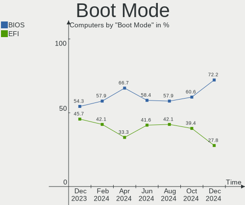
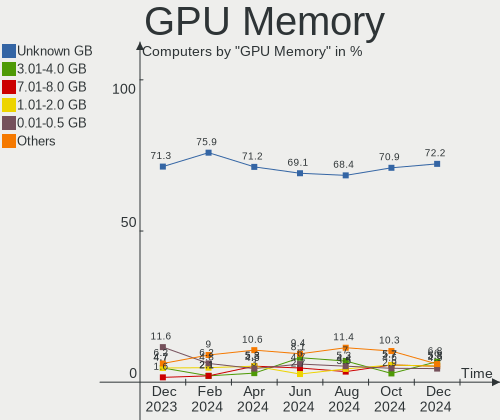
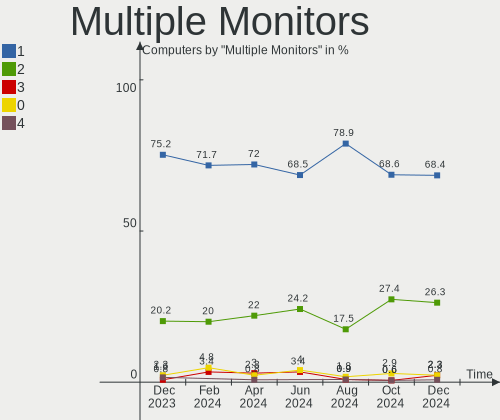

Kubuntu - Hardware Trends
-------------------------

A project to identify most popular hardware characteristics and track their change
over time based on data collected by Linux users at https://Linux-Hardware.org.

Anyone can contribute to this report by the [hw-probe](https://github.com/linuxhw/hw-probe) tool:

    sudo -E hw-probe -all -upload

This is a report for all computer types. See also reports for [desktops](/Dist/Kubuntu/Desktop/README.md) and [notebooks](/Dist/Kubuntu/Notebook/README.md).

This report is for one last month. Overall report since the beginning of time: [TestCoverage](https://github.com/linuxhw/TestCoverage)

Period: Jun, 2022.

Contents
--------

* [ System ](#system)
  - [ OS                       ](#os)
  - [ OS Family                ](#os-family)
  - [ Kernel                   ](#kernel)
  - [ Kernel Family            ](#kernel-family)
  - [ Kernel Major Ver.        ](#kernel-major-ver)
  - [ Arch                     ](#arch)
  - [ DE                       ](#de)
  - [ Display Server           ](#display-server)
  - [ Display Manager          ](#display-manager)
  - [ OS Lang                  ](#os-lang)
  - [ Boot Mode                ](#boot-mode)
  - [ Filesystem               ](#filesystem)
  - [ Part. scheme             ](#part-scheme)
  - [ Dual Boot with Linux/BSD ](#dual-boot-with-linuxbsd)
  - [ Dual Boot (Win)          ](#dual-boot-win)

* [ Board ](#board)
  - [ Vendor                   ](#vendor)
  - [ Model                    ](#model)
  - [ Model Family             ](#model-family)
  - [ MFG Year                 ](#mfg-year)
  - [ Form Factor              ](#form-factor)
  - [ Secure Boot              ](#secure-boot)
  - [ Coreboot                 ](#coreboot)
  - [ RAM Size                 ](#ram-size)
  - [ RAM Used                 ](#ram-used)
  - [ Total Drives             ](#total-drives)
  - [ Has CD-ROM               ](#has-cd-rom)
  - [ Has Ethernet             ](#has-ethernet)
  - [ Has WiFi                 ](#has-wifi)
  - [ Has Bluetooth            ](#has-bluetooth)

* [ Location ](#location)
  - [ Country                  ](#country)
  - [ City                     ](#city)

* [ Drives ](#drives)
  - [ Drive Vendor             ](#drive-vendor)
  - [ Drive Model              ](#drive-model)
  - [ HDD Vendor               ](#hdd-vendor)
  - [ SSD Vendor               ](#ssd-vendor)
  - [ Drive Kind               ](#drive-kind)
  - [ Drive Connector          ](#drive-connector)
  - [ Drive Size               ](#drive-size)
  - [ Space Total              ](#space-total)
  - [ Space Used               ](#space-used)
  - [ Malfunc. Drives          ](#malfunc-drives)
  - [ Malfunc. Drive Vendor    ](#malfunc-drive-vendor)
  - [ Malfunc. HDD Vendor      ](#malfunc-hdd-vendor)
  - [ Malfunc. Drive Kind      ](#malfunc-drive-kind)
  - [ Failed Drives            ](#failed-drives)
  - [ Failed Drive Vendor      ](#failed-drive-vendor)
  - [ Drive Status             ](#drive-status)

* [ Storage controller ](#storage-controller)
  - [ Storage Vendor           ](#storage-vendor)
  - [ Storage Model            ](#storage-model)
  - [ Storage Kind             ](#storage-kind)

* [ Processor ](#processor)
  - [ CPU Vendor               ](#cpu-vendor)
  - [ CPU Model                ](#cpu-model)
  - [ CPU Model Family         ](#cpu-model-family)
  - [ CPU Cores                ](#cpu-cores)
  - [ CPU Sockets              ](#cpu-sockets)
  - [ CPU Threads              ](#cpu-threads)
  - [ CPU Op-Modes             ](#cpu-op-modes)
  - [ CPU Microcode            ](#cpu-microcode)
  - [ CPU Microarch            ](#cpu-microarch)

* [ Graphics ](#graphics)
  - [ GPU Vendor               ](#gpu-vendor)
  - [ GPU Model                ](#gpu-model)
  - [ GPU Combo                ](#gpu-combo)
  - [ GPU Driver               ](#gpu-driver)
  - [ GPU Memory               ](#gpu-memory)

* [ Monitor ](#monitor)
  - [ Monitor Vendor           ](#monitor-vendor)
  - [ Monitor Model            ](#monitor-model)
  - [ Monitor Resolution       ](#monitor-resolution)
  - [ Monitor Diagonal         ](#monitor-diagonal)
  - [ Monitor Width            ](#monitor-width)
  - [ Aspect Ratio             ](#aspect-ratio)
  - [ Monitor Area             ](#monitor-area)
  - [ Pixel Density            ](#pixel-density)
  - [ Multiple Monitors        ](#multiple-monitors)

* [ Network ](#network)
  - [ Net Controller Vendor    ](#net-controller-vendor)
  - [ Net Controller Model     ](#net-controller-model)
  - [ Wireless Vendor          ](#wireless-vendor)
  - [ Wireless Model           ](#wireless-model)
  - [ Ethernet Vendor          ](#ethernet-vendor)
  - [ Ethernet Model           ](#ethernet-model)
  - [ Net Controller Kind      ](#net-controller-kind)
  - [ Used Controller          ](#used-controller)
  - [ NICs                     ](#nics)
  - [ IPv6                     ](#ipv6)

* [ Bluetooth ](#bluetooth)
  - [ Bluetooth Vendor         ](#bluetooth-vendor)
  - [ Bluetooth Model          ](#bluetooth-model)

* [ Sound ](#sound)
  - [ Sound Vendor             ](#sound-vendor)
  - [ Sound Model              ](#sound-model)

* [ Memory ](#memory)
  - [ Memory Vendor            ](#memory-vendor)
  - [ Memory Model             ](#memory-model)
  - [ Memory Kind              ](#memory-kind)
  - [ Memory Form Factor       ](#memory-form-factor)
  - [ Memory Size              ](#memory-size)
  - [ Memory Speed             ](#memory-speed)

* [ Printers & scanners ](#printers--scanners)
  - [ Printer Vendor           ](#printer-vendor)
  - [ Printer Model            ](#printer-model)
  - [ Scanner Vendor           ](#scanner-vendor)
  - [ Scanner Model            ](#scanner-model)

* [ Camera ](#camera)
  - [ Camera Vendor            ](#camera-vendor)
  - [ Camera Model             ](#camera-model)

* [ Security ](#security)
  - [ Fingerprint Vendor       ](#fingerprint-vendor)
  - [ Fingerprint Model        ](#fingerprint-model)
  - [ Chipcard Vendor          ](#chipcard-vendor)
  - [ Chipcard Model           ](#chipcard-model)

* [ Unsupported ](#unsupported)
  - [ Unsupported Devices      ](#unsupported-devices)
  - [ Unsupported Device Types ](#unsupported-device-types)

System
------

OS
--

Installed operating systems

| Name          | Computers | Percent |
|---------------|-----------|---------|
| Kubuntu 22.04 | 64        | 59.26%  |
| Kubuntu 20.04 | 13        | 12.04%  |
| Kubuntu 11.1  | 10        | 9.26%   |
| Kubuntu 11    | 9         | 8.33%   |
| Kubuntu 21.10 | 6         | 5.56%   |
| Kubuntu 21.04 | 2         | 1.85%   |
| Kubuntu 18.04 | 2         | 1.85%   |
| Kubuntu 22.10 | 1         | 0.93%   |
| Kubuntu 2.0   | 1         | 0.93%   |

OS Family
---------

OS without a version

| Name    | Computers | Percent |
|---------|-----------|---------|
| Kubuntu | 108       | 100%    |

Kernel
------

Version of the Linux kernel

| Version                    | Computers | Percent |
|----------------------------|-----------|---------|
| 5.15.0-40-generic          | 15        | 13.89%  |
| 5.13.0-51-generic          | 11        | 10.19%  |
| 5.15.0-37-generic          | 10        | 9.26%   |
| 5.13.0-44-generic          | 10        | 9.26%   |
| 5.15.0-39-generic          | 7         | 6.48%   |
| 5.15.0-33-generic          | 7         | 6.48%   |
| 5.15.0-25-generic          | 7         | 6.48%   |
| 5.15.0-35-generic          | 6         | 5.56%   |
| 5.13.0-48-generic          | 6         | 5.56%   |
| 5.4.0-113-generic          | 4         | 3.7%    |
| 5.13.0-46-generic          | 3         | 2.78%   |
| 5.11.0-49-generic          | 2         | 1.85%   |
| 5.4.0-120-lowlatency       | 1         | 0.93%   |
| 5.4.0-120-generic          | 1         | 0.93%   |
| 5.4.0-117-generic          | 1         | 0.93%   |
| 5.18.8-051808-generic      | 1         | 0.93%   |
| 5.18.4-xanmod1-x64v2       | 1         | 0.93%   |
| 5.18.4-xanmod1             | 1         | 0.93%   |
| 5.18.4-vitodoc             | 1         | 0.93%   |
| 5.17.4-051704-generic      | 1         | 0.93%   |
| 5.17.14-xanmod1            | 1         | 0.93%   |
| 5.17.0-12.1-liquorix-amd64 | 1         | 0.93%   |
| 5.16.2-051602-generic      | 1         | 0.93%   |
| 5.15.0-37-lowlatency       | 1         | 0.93%   |
| 5.15.0-35-lowlatency       | 1         | 0.93%   |
| 5.15.0-24-lowlatency       | 1         | 0.93%   |
| 5.15.0-1007-oracle         | 1         | 0.93%   |
| 5.15.0-10033-tuxedo        | 1         | 0.93%   |
| 5.14.0-1038-oem            | 1         | 0.93%   |
| 5.13.0-52-generic          | 1         | 0.93%   |
| 5.13.0-48-lowlatency       | 1         | 0.93%   |
| 5.11.0-46-generic          | 1         | 0.93%   |

Kernel Family
-------------

Linux kernel without a distro release

| Version | Computers | Percent |
|---------|-----------|---------|
| 5.15.0  | 57        | 52.78%  |
| 5.13.0  | 32        | 29.63%  |
| 5.4.0   | 7         | 6.48%   |
| 5.18.4  | 3         | 2.78%   |
| 5.11.0  | 3         | 2.78%   |
| 5.18.8  | 1         | 0.93%   |
| 5.17.4  | 1         | 0.93%   |
| 5.17.14 | 1         | 0.93%   |
| 5.17.0  | 1         | 0.93%   |
| 5.16.2  | 1         | 0.93%   |
| 5.14.0  | 1         | 0.93%   |

Kernel Major Ver.
-----------------

Linux kernel major version

| Version | Computers | Percent |
|---------|-----------|---------|
| 5.15    | 57        | 52.78%  |
| 5.13    | 32        | 29.63%  |
| 5.4     | 7         | 6.48%   |
| 5.18    | 4         | 3.7%    |
| 5.17    | 3         | 2.78%   |
| 5.11    | 3         | 2.78%   |
| 5.16    | 1         | 0.93%   |
| 5.14    | 1         | 0.93%   |

Arch
----

OS architecture (x86_64, i586, etc.)

| Name   | Computers | Percent |
|--------|-----------|---------|
| x86_64 | 108       | 100%    |

DE
--

Desktop Environment

| Name | Computers | Percent |
|------|-----------|---------|
| KDE5 | 108       | 100%    |

Display Server
--------------

X11 or Wayland

| Name    | Computers | Percent |
|---------|-----------|---------|
| X11     | 102       | 94.44%  |
| Wayland | 6         | 5.56%   |

Display Manager
---------------

SDDM, LightDM, etc.

| Name    | Computers | Percent |
|---------|-----------|---------|
| SDDM    | 68        | 62.96%  |
| Unknown | 30        | 27.78%  |
| GDM3    | 5         | 4.63%   |
| LightDM | 3         | 2.78%   |
| GDM     | 2         | 1.85%   |

OS Lang
-------

Language

| Lang    | Computers | Percent |
|---------|-----------|---------|
| en_US   | 47        | 43.52%  |
| de_DE   | 9         | 8.33%   |
| en_GB   | 7         | 6.48%   |
| ru_RU   | 6         | 5.56%   |
| it_IT   | 6         | 5.56%   |
| fr_FR   | 6         | 5.56%   |
| es_ES   | 5         | 4.63%   |
| pt_BR   | 4         | 3.7%    |
| pl_PL   | 2         | 1.85%   |
| es_AR   | 2         | 1.85%   |
| en_ZA   | 2         | 1.85%   |
| en_IN   | 2         | 1.85%   |
| zh_TW   | 1         | 0.93%   |
| pt_PT   | 1         | 0.93%   |
| nl_NL   | 1         | 0.93%   |
| hu_HU   | 1         | 0.93%   |
| es_MX   | 1         | 0.93%   |
| en_NZ   | 1         | 0.93%   |
| en_IL   | 1         | 0.93%   |
| en_AU   | 1         | 0.93%   |
| de_CH   | 1         | 0.93%   |
| Default | 1         | 0.93%   |

Boot Mode
---------

EFI or BIOS

| Mode | Computers | Percent |
|------|-----------|---------|
| BIOS | 54        | 50%     |
| EFI  | 54        | 50%     |

Filesystem
----------

Type of filesystem

| Type    | Computers | Percent |
|---------|-----------|---------|
| Ext4    | 96        | 88.89%  |
| Btrfs   | 6         | 5.56%   |
| Overlay | 5         | 4.63%   |
| Xfs     | 1         | 0.93%   |

Part. scheme
------------

Scheme of partitioning

| Type    | Computers | Percent |
|---------|-----------|---------|
| Unknown | 55        | 50.93%  |
| GPT     | 51        | 47.22%  |
| MBR     | 2         | 1.85%   |

Dual Boot with Linux/BSD
------------------------

Hosting more than one Linux/BSD

| Dual boot | Computers | Percent |
|-----------|-----------|---------|
| No        | 97        | 89.81%  |
| Yes       | 11        | 10.19%  |

Dual Boot (Win)
---------------

Hosting Linux and Windows

| Dual boot | Computers | Percent |
|-----------|-----------|---------|
| No        | 66        | 61.11%  |
| Yes       | 42        | 38.89%  |

Board
-----

Vendor
------

Motherboard manufacturer

| Name                | Computers | Percent |
|---------------------|-----------|---------|
| Hewlett-Packard     | 18        | 16.67%  |
| ASUSTek Computer    | 18        | 16.67%  |
| Dell                | 17        | 15.74%  |
| Lenovo              | 9         | 8.33%   |
| MSI                 | 7         | 6.48%   |
| Gigabyte Technology | 6         | 5.56%   |
| ASRock              | 4         | 3.7%    |
| Apple               | 4         | 3.7%    |
| Toshiba             | 3         | 2.78%   |
| Acer                | 3         | 2.78%   |
| Samsung Electronics | 2         | 1.85%   |
| Medion              | 2         | 1.85%   |
| TUXEDO              | 1         | 0.93%   |
| System76            | 1         | 0.93%   |
| SLIMBOOK            | 1         | 0.93%   |
| SK hynix            | 1         | 0.93%   |
| Positivo            | 1         | 0.93%   |
| Packard Bell        | 1         | 0.93%   |
| Jumper              | 1         | 0.93%   |
| Intel               | 1         | 0.93%   |
| Huanan              | 1         | 0.93%   |
| HONOR               | 1         | 0.93%   |
| Haier               | 1         | 0.93%   |
| GPU Company         | 1         | 0.93%   |
| Clevo               | 1         | 0.93%   |
| AZW                 | 1         | 0.93%   |
| ABIT                | 1         | 0.93%   |

Model
-----

Motherboard model

| Name                                        | Computers | Percent |
|---------------------------------------------|-----------|---------|
| TUXEDO InfinityBook S 15 Gen6               | 1         | 0.93%   |
| Toshiba Satellite L655                      | 1         | 0.93%   |
| Toshiba Satellite L50-A-1D6                 | 1         | 0.93%   |
| Toshiba Satellite C75D-A                    | 1         | 0.93%   |
| System76 Kudu Professional                  | 1         | 0.93%   |
| SLIMBOOK PROX15-AMD                         | 1         | 0.93%   |
| SK hynix Onnyx III                          | 1         | 0.93%   |
| Samsung RV411/RV511/E3511/S3511/RV711/E3411 | 1         | 0.93%   |
| Samsung 300E4C/300E5C/300E7C                | 1         | 0.93%   |
| Positivo Q464C                              | 1         | 0.93%   |
| Packard Bell H17HV                          | 1         | 0.93%   |
| MSI Raider GE66 12UGS                       | 1         | 0.93%   |
| MSI MS-7D54                                 | 1         | 0.93%   |
| MSI MS-7C37                                 | 1         | 0.93%   |
| MSI MS-7B79                                 | 1         | 0.93%   |
| MSI MS-7A78                                 | 1         | 0.93%   |
| MSI GP76 Leopard 11UH                       | 1         | 0.93%   |
| MSI CX61 2PC                                | 1         | 0.93%   |
| Medion E3216 MD60900                        | 1         | 0.93%   |
| Medion E23403                               | 1         | 0.93%   |
| Lenovo V130-15IGM 81HL                      | 1         | 0.93%   |
| Lenovo ThinkPad X61 Tablet 7762H7U          | 1         | 0.93%   |
| Lenovo ThinkPad X1 Extreme 20MGS06400       | 1         | 0.93%   |
| Lenovo ThinkPad P15s Gen 1 20T4000CGE       | 1         | 0.93%   |
| Lenovo ThinkPad P15 Gen 1 20SUS1TB04        | 1         | 0.93%   |
| Lenovo ThinkPad P1 Gen 3 20TH003SUS         | 1         | 0.93%   |
| Lenovo ThinkBook 15 G2 ITL 20VE             | 1         | 0.93%   |
| Lenovo ThinkBook 14-IML 20RV                | 1         | 0.93%   |
| Lenovo IdeaPad 5 15ARE05 81YQ               | 1         | 0.93%   |
| Jumper EZpad                                | 1         | 0.93%   |
| Intel X99                                   | 1         | 0.93%   |
| Huanan X99-F8 GAMING V5.0                   | 1         | 0.93%   |
| HONOR BOHK-WAX9X                            | 1         | 0.93%   |
| HP ZBook Firefly 14 G7 Mobile Workstation   | 1         | 0.93%   |
| HP xw8600 Workstation                       | 1         | 0.93%   |
| HP Stream Laptop 11-ak0xxx                  | 1         | 0.93%   |
| HP ProBook 650 G2                           | 1         | 0.93%   |
| HP Pavilion Laptop 15-eh1xxx                | 1         | 0.93%   |
| HP Pavilion Gaming Laptop 15-ec1xxx         | 1         | 0.93%   |
| HP Pavilion dv7                             | 1         | 0.93%   |
| HP Pavilion dv6                             | 1         | 0.93%   |
| HP OMEN by Laptop 17-cb0xxx                 | 1         | 0.93%   |
| HP ENVY x360 Convertible 13-ay0xxx          | 1         | 0.93%   |
| HP EliteBook 8460p                          | 1         | 0.93%   |
| HP EliteBook 845 G7 Notebook PC             | 1         | 0.93%   |
| HP EliteBook 840 G6                         | 1         | 0.93%   |
| HP EliteBook 820 G1                         | 1         | 0.93%   |
| HP EliteBook 2570p                          | 1         | 0.93%   |
| HP Compaq dc5700 Small Form Factor          | 1         | 0.93%   |
| HP 620                                      | 1         | 0.93%   |
| HP 15                                       | 1         | 0.93%   |
| Haier A1420EM                               | 1         | 0.93%   |
| GPU Company GWTC116-2                       | 1         | 0.93%   |
| Gigabyte Z490 AORUS ELITE AC                | 1         | 0.93%   |
| Gigabyte Z270-HD3P                          | 1         | 0.93%   |
| Gigabyte X570 AORUS PRO                     | 1         | 0.93%   |
| Gigabyte GA-78LMT-USB3 6.0                  | 1         | 0.93%   |
| Gigabyte B450M DS3H                         | 1         | 0.93%   |
| Gigabyte A320M-S2H V2                       | 1         | 0.93%   |
| Dell XPS 8300                               | 1         | 0.93%   |

Model Family
------------

Motherboard model prefix

| Name                   | Computers | Percent |
|------------------------|-----------|---------|
| Lenovo ThinkPad        | 5         | 4.63%   |
| HP EliteBook           | 5         | 4.63%   |
| Dell Latitude          | 5         | 4.63%   |
| Dell Inspiron          | 5         | 4.63%   |
| HP Pavilion            | 4         | 3.7%    |
| ASUS ROG               | 4         | 3.7%    |
| Toshiba Satellite      | 3         | 2.78%   |
| Dell XPS               | 3         | 2.78%   |
| Dell OptiPlex          | 3         | 2.78%   |
| Lenovo ThinkBook       | 2         | 1.85%   |
| ASUS ZenBook           | 2         | 1.85%   |
| ASUS TUF               | 2         | 1.85%   |
| TUXEDO InfinityBook    | 1         | 0.93%   |
| System76 Kudu          | 1         | 0.93%   |
| SLIMBOOK PROX15-AMD    | 1         | 0.93%   |
| SK hynix Onnyx         | 1         | 0.93%   |
| Samsung RV411          | 1         | 0.93%   |
| Samsung 300E4C         | 1         | 0.93%   |
| Positivo Q464C         | 1         | 0.93%   |
| Packard Bell H17HV     | 1         | 0.93%   |
| MSI Raider             | 1         | 0.93%   |
| MSI MS-7D54            | 1         | 0.93%   |
| MSI MS-7C37            | 1         | 0.93%   |
| MSI MS-7B79            | 1         | 0.93%   |
| MSI MS-7A78            | 1         | 0.93%   |
| MSI GP76               | 1         | 0.93%   |
| MSI CX61               | 1         | 0.93%   |
| Medion E3216           | 1         | 0.93%   |
| Medion E23403          | 1         | 0.93%   |
| Lenovo V130-15IGM      | 1         | 0.93%   |
| Lenovo IdeaPad         | 1         | 0.93%   |
| Jumper EZpad           | 1         | 0.93%   |
| Intel X99              | 1         | 0.93%   |
| Huanan X99-F8          | 1         | 0.93%   |
| HONOR BOHK-WAX9X       | 1         | 0.93%   |
| HP ZBook               | 1         | 0.93%   |
| HP xw8600              | 1         | 0.93%   |
| HP Stream              | 1         | 0.93%   |
| HP ProBook             | 1         | 0.93%   |
| HP OMEN                | 1         | 0.93%   |
| HP ENVY                | 1         | 0.93%   |
| HP Compaq              | 1         | 0.93%   |
| HP 620                 | 1         | 0.93%   |
| HP 15                  | 1         | 0.93%   |
| Haier A1420EM          | 1         | 0.93%   |
| GPU Company GWTC116-2  | 1         | 0.93%   |
| Gigabyte Z490          | 1         | 0.93%   |
| Gigabyte Z270-HD3P     | 1         | 0.93%   |
| Gigabyte X570          | 1         | 0.93%   |
| Gigabyte GA-78LMT-USB3 | 1         | 0.93%   |
| Gigabyte B450M         | 1         | 0.93%   |
| Gigabyte A320M-S2H     | 1         | 0.93%   |
| Dell Precision         | 1         | 0.93%   |
| Clevo Modified         | 1         | 0.93%   |
| AZW Gemini             | 1         | 0.93%   |
| ASUS X550JF            | 1         | 0.93%   |
| ASUS WS                | 1         | 0.93%   |
| ASUS UX51VZ            | 1         | 0.93%   |
| ASUS TX201LA           | 1         | 0.93%   |
| ASUS P5QC              | 1         | 0.93%   |

MFG Year
--------

Motherboard manufacture year

| Year | Computers | Percent |
|------|-----------|---------|
| 2020 | 20        | 18.52%  |
| 2019 | 17        | 15.74%  |
| 2021 | 10        | 9.26%   |
| 2018 | 9         | 8.33%   |
| 2013 | 7         | 6.48%   |
| 2022 | 5         | 4.63%   |
| 2014 | 5         | 4.63%   |
| 2012 | 5         | 4.63%   |
| 2011 | 5         | 4.63%   |
| 2008 | 5         | 4.63%   |
| 2017 | 4         | 3.7%    |
| 2016 | 4         | 3.7%    |
| 2015 | 4         | 3.7%    |
| 2010 | 3         | 2.78%   |
| 2009 | 3         | 2.78%   |
| 2007 | 1         | 0.93%   |
| 2006 | 1         | 0.93%   |

Form Factor
-----------

Physical design of the computer

| Name        | Computers | Percent |
|-------------|-----------|---------|
| Notebook    | 66        | 61.11%  |
| Desktop     | 35        | 32.41%  |
| Convertible | 5         | 4.63%   |
| All in one  | 2         | 1.85%   |

Secure Boot
-----------

Enabled or disabled

| State    | Computers | Percent |
|----------|-----------|---------|
| Disabled | 99        | 91.67%  |
| Enabled  | 9         | 8.33%   |

Coreboot
--------

Have coreboot on board

| Used | Computers | Percent |
|------|-----------|---------|
| No   | 108       | 100%    |

RAM Size
--------

Total RAM memory

| Size in GB  | Computers | Percent |
|-------------|-----------|---------|
| 16.01-24.0  | 30        | 27.78%  |
| 8.01-16.0   | 19        | 17.59%  |
| 4.01-8.0    | 18        | 16.67%  |
| 32.01-64.0  | 17        | 15.74%  |
| 3.01-4.0    | 16        | 14.81%  |
| 64.01-256.0 | 6         | 5.56%   |
| 24.01-32.0  | 1         | 0.93%   |
| 1.01-2.0    | 1         | 0.93%   |

RAM Used
--------

Used RAM memory

| Used GB    | Computers | Percent |
|------------|-----------|---------|
| 2.01-3.0   | 29        | 26.85%  |
| 1.01-2.0   | 25        | 23.15%  |
| 3.01-4.0   | 23        | 21.3%   |
| 4.01-8.0   | 21        | 19.44%  |
| 8.01-16.0  | 6         | 5.56%   |
| 0.51-1.0   | 3         | 2.78%   |
| 16.01-24.0 | 1         | 0.93%   |

Total Drives
------------

Number of drives on board

| Drives | Computers | Percent |
|--------|-----------|---------|
| 1      | 72        | 66.67%  |
| 2      | 18        | 16.67%  |
| 3      | 8         | 7.41%   |
| 4      | 5         | 4.63%   |
| 6      | 2         | 1.85%   |
| 11     | 1         | 0.93%   |
| 10     | 1         | 0.93%   |
| 5      | 1         | 0.93%   |

Has CD-ROM
----------

Has CD-ROM on board

| Presented | Computers | Percent |
|-----------|-----------|---------|
| No        | 75        | 69.44%  |
| Yes       | 33        | 30.56%  |

Has Ethernet
------------

Has Ethernet on board

| Presented | Computers | Percent |
|-----------|-----------|---------|
| Yes       | 88        | 81.48%  |
| No        | 20        | 18.52%  |

Has WiFi
--------

Has WiFi module

| Presented | Computers | Percent |
|-----------|-----------|---------|
| Yes       | 93        | 86.11%  |
| No        | 15        | 13.89%  |

Has Bluetooth
-------------

Has Bluetooth module

| Presented | Computers | Percent |
|-----------|-----------|---------|
| Yes       | 75        | 69.44%  |
| No        | 33        | 30.56%  |

Location
--------

Country
-------

Geographic location (country)

| Country      | Computers | Percent |
|--------------|-----------|---------|
| USA          | 22        | 20.37%  |
| Germany      | 11        | 10.19%  |
| Russia       | 8         | 7.41%   |
| Italy        | 8         | 7.41%   |
| France       | 8         | 7.41%   |
| Spain        | 6         | 5.56%   |
| UK           | 4         | 3.7%    |
| Poland       | 4         | 3.7%    |
| Brazil       | 4         | 3.7%    |
| Switzerland  | 3         | 2.78%   |
| Slovenia     | 3         | 2.78%   |
| Netherlands  | 3         | 2.78%   |
| Argentina    | 3         | 2.78%   |
| South Africa | 2         | 1.85%   |
| Mexico       | 2         | 1.85%   |
| India        | 2         | 1.85%   |
| Hungary      | 2         | 1.85%   |
| Taiwan       | 1         | 0.93%   |
| Sweden       | 1         | 0.93%   |
| Portugal     | 1         | 0.93%   |
| New Zealand  | 1         | 0.93%   |
| Myanmar      | 1         | 0.93%   |
| Malta        | 1         | 0.93%   |
| Malaysia     | 1         | 0.93%   |
| Israel       | 1         | 0.93%   |
| Indonesia    | 1         | 0.93%   |
| Denmark      | 1         | 0.93%   |
| Chile        | 1         | 0.93%   |
| Belarus      | 1         | 0.93%   |
| Austria      | 1         | 0.93%   |

City
----

Geographic location (city)

| City                   | Computers | Percent |
|------------------------|-----------|---------|
| Moscow                 | 3         | 2.78%   |
| St Petersburg          | 2         | 1.85%   |
| Marseille              | 2         | 1.85%   |
| Madrid                 | 2         | 1.85%   |
| Hamburg                | 2         | 1.85%   |
| Chenove                | 2         | 1.85%   |
| Zwijndrecht            | 1         | 0.93%   |
| Zaragoza               | 1         | 0.93%   |
| Ypsilanti              | 1         | 0.93%   |
| Yekaterinburg          | 1         | 0.93%   |
| Yangon                 | 1         | 0.93%   |
| Wilmington             | 1         | 0.93%   |
| Waukee                 | 1         | 0.93%   |
| Washington             | 1         | 0.93%   |
| Warsaw                 | 1         | 0.93%   |
| Vrhnika                | 1         | 0.93%   |
| Ustron                 | 1         | 0.93%   |
| Union City             | 1         | 0.93%   |
| Tirschenreuth          | 1         | 0.93%   |
| Therwil                | 1         | 0.93%   |
| Terneuzen              | 1         | 0.93%   |
| Tel Aviv               | 1         | 0.93%   |
| Tainan City            | 1         | 0.93%   |
| Sunbury-on-Thames      | 1         | 0.93%   |
| Summerville            | 1         | 0.93%   |
| Steinhausen            | 1         | 0.93%   |
| Sliema                 | 1         | 0.93%   |
| Seville                | 1         | 0.93%   |
| Sedziszow Malopolski   | 1         | 0.93%   |
| Seattle                | 1         | 0.93%   |
| Saint-Germain-en-Laye  | 1         | 0.93%   |
| Rozzano                | 1         | 0.93%   |
| Rouvray-Saint-Denis    | 1         | 0.93%   |
| Rotenburg an der Fulda | 1         | 0.93%   |
| Rio de Janeiro         | 1         | 0.93%   |
| Ridgefield             | 1         | 0.93%   |
| Redditch               | 1         | 0.93%   |
| Pretoria               | 1         | 0.93%   |
| Potenza                | 1         | 0.93%   |
| Porto                  | 1         | 0.93%   |
| Pomarede               | 1         | 0.93%   |
| Picerno                | 1         | 0.93%   |
| Penza                  | 1         | 0.93%   |
| Parma                  | 1         | 0.93%   |
| Owings Mills           | 1         | 0.93%   |
| Nyiregyhaza            | 1         | 0.93%   |
| Newton                 | 1         | 0.93%   |
| Murska Sobota          | 1         | 0.93%   |
| Murcia                 | 1         | 0.93%   |
| Munich                 | 1         | 0.93%   |
| Mossingen              | 1         | 0.93%   |
| Moosseedorf            | 1         | 0.93%   |
| Monclova               | 1         | 0.93%   |
| Missoula               | 1         | 0.93%   |
| Mira                   | 1         | 0.93%   |
| Minsk                  | 1         | 0.93%   |
| Milan                  | 1         | 0.93%   |
| Miami                  | 1         | 0.93%   |
| Las Vegas              | 1         | 0.93%   |
| Kuala Lumpur           | 1         | 0.93%   |

Drives
------

Drive Vendor
------------

Hard drive vendors

| Vendor              | Computers | Drives | Percent |
|---------------------|-----------|--------|---------|
| WDC                 | 27        | 43     | 17.42%  |
| Samsung Electronics | 26        | 32     | 16.77%  |
| Seagate             | 18        | 28     | 11.61%  |
| Kingston            | 12        | 13     | 7.74%   |
| Unknown             | 11        | 12     | 7.1%    |
| Toshiba             | 9         | 9      | 5.81%   |
| Crucial             | 7         | 7      | 4.52%   |
| SK hynix            | 6         | 6      | 3.87%   |
| SanDisk             | 5         | 8      | 3.23%   |
| Hitachi             | 5         | 5      | 3.23%   |
| Intel               | 4         | 6      | 2.58%   |
| A-DATA Technology   | 4         | 4      | 2.58%   |
| Apple               | 3         | 3      | 1.94%   |
| JMicron Technology  | 2         | 2      | 1.29%   |
| HGST                | 2         | 2      | 1.29%   |
| XPG                 | 1         | 1      | 0.65%   |
| Transcend           | 1         | 1      | 0.65%   |
| Team                | 1         | 1      | 0.65%   |
| Silicon Motion      | 1         | 1      | 0.65%   |
| PNY                 | 1         | 1      | 0.65%   |
| Phison              | 1         | 1      | 0.65%   |
| Patriot             | 1         | 1      | 0.65%   |
| Micron Technology   | 1         | 1      | 0.65%   |
| Leven               | 1         | 1      | 0.65%   |
| KIOXIA              | 1         | 1      | 0.65%   |
| KingSpec            | 1         | 1      | 0.65%   |
| Intenso             | 1         | 1      | 0.65%   |
| Hewlett-Packard     | 1         | 1      | 0.65%   |
| China               | 1         | 1      | 0.65%   |

Drive Model
-----------

Hard drive models

| Model                                 | Computers | Percent |
|---------------------------------------|-----------|---------|
| Crucial CT240BX500SSD1 240GB          | 3         | 1.7%    |
| WDC WD10EZEX-22MFCA0 1TB              | 2         | 1.14%   |
| Unknown MMC Card  64GB                | 2         | 1.14%   |
| Seagate ST500LM012 HN-M500MBB 500GB   | 2         | 1.14%   |
| Samsung SSD 970 EVO 1TB               | 2         | 1.14%   |
| Samsung SSD 860 EVO 500GB             | 2         | 1.14%   |
| Samsung SSD 860 EVO 2TB               | 2         | 1.14%   |
| Samsung SSD 850 EVO 500GB             | 2         | 1.14%   |
| Samsung MZVLB512HBJQ-000L2 512GB      | 2         | 1.14%   |
| Kingston SA400S37240G 240GB SSD       | 2         | 1.14%   |
| Kingston SA400S37120G 120GB SSD       | 2         | 1.14%   |
| Intel SSDPEKNW512G8 512GB             | 2         | 1.14%   |
| XPG NVMe SSD Drive 1024GB             | 1         | 0.57%   |
| WDC WDS500G2B0C-00PXH0 500GB          | 1         | 0.57%   |
| WDC WDS500G1X0E-00AFY0 500GB          | 1         | 0.57%   |
| WDC WDS480G2G0C-00AJM0 480GB          | 1         | 0.57%   |
| WDC WDS250G2B0C-00PXH0 250GB          | 1         | 0.57%   |
| WDC WDS240G2G0A-00JH30 240GB SSD      | 1         | 0.57%   |
| WDC WDS120G2G0A-00JH30 120GB SSD      | 1         | 0.57%   |
| WDC WDS120G1G0B-00RC30 120GB SSD      | 1         | 0.57%   |
| WDC WDS100T2B0C-00PXH0 1TB            | 1         | 0.57%   |
| WDC WDS100T2B0B-00YS70 1TB SSD        | 1         | 0.57%   |
| WDC WD7500BPVX-22JC3T0 752GB          | 1         | 0.57%   |
| WDC WD5000BEVT-00A0RT0 500GB          | 1         | 0.57%   |
| WDC WD5000AZLX-08K2TA0 500GB          | 1         | 0.57%   |
| WDC WD5000AAKX-753CA1 500GB           | 1         | 0.57%   |
| WDC WD40EZRZ-00GXCB0 4TB              | 1         | 0.57%   |
| WDC WD40EZRX-22SPEB0 4TB              | 1         | 0.57%   |
| WDC WD40EFRX-68N32N0 4TB              | 1         | 0.57%   |
| WDC WD3200BEVT-22A23T0 320GB          | 1         | 0.57%   |
| WDC WD3200AAKX-22ERMA0 320GB          | 1         | 0.57%   |
| WDC WD3200AAKX-00ERMA0 320GB          | 1         | 0.57%   |
| WDC WD30EZRZ-00Z5HB0 3TB              | 1         | 0.57%   |
| WDC WD30EZRX-00MMMB0 3TB              | 1         | 0.57%   |
| WDC WD20EARX-32PASB0 2TB              | 1         | 0.57%   |
| WDC WD1600BEVT-22ZCT0 160GB           | 1         | 0.57%   |
| WDC WD10SPZX-60Z10T1 1TB              | 1         | 0.57%   |
| WDC WD10EURX-63UY4Y0 1TB              | 1         | 0.57%   |
| WDC WD10EURX-63C57Y0 1TB              | 1         | 0.57%   |
| WDC WD1002FAEX-00Z3A0 1TB             | 1         | 0.57%   |
| WDC PC SN730 SDBQNTY-1T00-1001 1TB    | 1         | 0.57%   |
| WDC PC SN730 SDBPNTY-512G-1027 512GB  | 1         | 0.57%   |
| WDC PC SN730 NVMe 256GB               | 1         | 0.57%   |
| WDC PC SN720 SDAQNTW-512G-1001 512GB  | 1         | 0.57%   |
| WDC PC SN530 SDBPNPZ-512G-1006 512GB  | 1         | 0.57%   |
| Unknown SLD128  128GB                 | 1         | 0.57%   |
| Unknown SD/MMC/MS PRO 128GB           | 1         | 0.57%   |
| Unknown SB32G  32GB                   | 1         | 0.57%   |
| Unknown Sabrent Disk Dev 240GB        | 1         | 0.57%   |
| Unknown S11-256G-PHISON-SSD-B27 256GB | 1         | 0.57%   |
| Unknown MMC64G  64GB                  | 1         | 0.57%   |
| Unknown MMC Card  196GB               | 1         | 0.57%   |
| Unknown BJTD4R  32GB                  | 1         | 0.57%   |
| Unknown Biwin  64GB                   | 1         | 0.57%   |
| Unknown 256GB PCS 2.5" S              | 1         | 0.57%   |
| Transcend TS256GSSD370S 256GB         | 1         | 0.57%   |
| Toshiba NVMe SSD Drive 2TB            | 1         | 0.57%   |
| Toshiba NVMe SSD Drive 1024GB         | 1         | 0.57%   |
| Toshiba MQ01ABD100 1TB                | 1         | 0.57%   |
| Toshiba MQ01ABD075 752GB              | 1         | 0.57%   |

HDD Vendor
----------

Hard disk drive vendors

| Vendor              | Computers | Drives | Percent |
|---------------------|-----------|--------|---------|
| Seagate             | 18        | 28     | 33.96%  |
| WDC                 | 17        | 29     | 32.08%  |
| Hitachi             | 5         | 5      | 9.43%   |
| Toshiba             | 4         | 4      | 7.55%   |
| Samsung Electronics | 3         | 3      | 5.66%   |
| Unknown             | 2         | 2      | 3.77%   |
| HGST                | 2         | 2      | 3.77%   |
| JMicron Technology  | 1         | 1      | 1.89%   |
| Apple               | 1         | 1      | 1.89%   |

SSD Vendor
----------

Solid state drive vendors

| Vendor              | Computers | Drives | Percent |
|---------------------|-----------|--------|---------|
| Samsung Electronics | 14        | 17     | 27.45%  |
| Kingston            | 7         | 7      | 13.73%  |
| Crucial             | 7         | 7      | 13.73%  |
| WDC                 | 4         | 4      | 7.84%   |
| SanDisk             | 3         | 6      | 5.88%   |
| A-DATA Technology   | 3         | 3      | 5.88%   |
| Unknown             | 2         | 2      | 3.92%   |
| Toshiba             | 2         | 2      | 3.92%   |
| Transcend           | 1         | 1      | 1.96%   |
| Team                | 1         | 1      | 1.96%   |
| Patriot             | 1         | 1      | 1.96%   |
| KingSpec            | 1         | 1      | 1.96%   |
| JMicron Technology  | 1         | 1      | 1.96%   |
| Intenso             | 1         | 1      | 1.96%   |
| Hewlett-Packard     | 1         | 1      | 1.96%   |
| China               | 1         | 1      | 1.96%   |
| Apple               | 1         | 1      | 1.96%   |

Drive Kind
----------

HDD or SSD

| Kind    | Computers | Drives | Percent |
|---------|-----------|--------|---------|
| SSD     | 47        | 57     | 32.87%  |
| NVMe    | 45        | 53     | 31.47%  |
| HDD     | 42        | 75     | 29.37%  |
| MMC     | 8         | 8      | 5.59%   |
| Unknown | 1         | 1      | 0.7%    |

Drive Connector
---------------

SATA, SAS, NVMe, etc.

| Type | Computers | Drives | Percent |
|------|-----------|--------|---------|
| SATA | 72        | 124    | 54.14%  |
| NVMe | 45        | 53     | 33.83%  |
| SAS  | 8         | 9      | 6.02%   |
| MMC  | 8         | 8      | 6.02%   |

Drive Size
----------

Size of hard drive

| Size in TB | Computers | Drives | Percent |
|------------|-----------|--------|---------|
| 0.01-0.5   | 56        | 72     | 58.33%  |
| 0.51-1.0   | 18        | 25     | 18.75%  |
| 1.01-2.0   | 11        | 13     | 11.46%  |
| 3.01-4.0   | 5         | 13     | 5.21%   |
| 2.01-3.0   | 4         | 4      | 4.17%   |
| 4.01-10.0  | 2         | 5      | 2.08%   |

Space Total
-----------

Amount of disk space available on the file system

| Size in GB     | Computers | Percent |
|----------------|-----------|---------|
| 251-500        | 25        | 23.15%  |
| 101-250        | 25        | 23.15%  |
| 501-1000       | 16        | 14.81%  |
| More than 3000 | 12        | 11.11%  |
| 1001-2000      | 10        | 9.26%   |
| 1-20           | 7         | 6.48%   |
| 51-100         | 6         | 5.56%   |
| 2001-3000      | 3         | 2.78%   |
| Unknown        | 3         | 2.78%   |
| 21-50          | 1         | 0.93%   |

Space Used
----------

Amount of used disk space

| Used GB        | Computers | Percent |
|----------------|-----------|---------|
| 1-20           | 33        | 30.56%  |
| 101-250        | 19        | 17.59%  |
| 21-50          | 14        | 12.96%  |
| 251-500        | 12        | 11.11%  |
| 51-100         | 9         | 8.33%   |
| 501-1000       | 8         | 7.41%   |
| 1001-2000      | 5         | 4.63%   |
| 2001-3000      | 3         | 2.78%   |
| Unknown        | 3         | 2.78%   |
| More than 3000 | 2         | 1.85%   |

Malfunc. Drives
---------------

Drive models with a malfunction

| Model                                | Computers | Drives | Percent |
|--------------------------------------|-----------|--------|---------|
| Toshiba MQ01ABD075 752GB             | 1         | 1      | 10%     |
| SK hynix BC711 HFM512GD3JX013N 512GB | 1         | 1      | 10%     |
| Seagate ST500LM012 HN-M500MBB 500GB  | 1         | 1      | 10%     |
| Seagate ST1000DM003-1CH162 1TB       | 1         | 1      | 10%     |
| Samsung Electronics SSD 970 EVO 1TB  | 1         | 1      | 10%     |
| Samsung Electronics HD103SI 1TB      | 1         | 1      | 10%     |
| Hitachi HTS545050B9A300 500GB        | 1         | 1      | 10%     |
| Hitachi HDP725050GLA360 500GB        | 1         | 1      | 10%     |
| HGST HTS721010A9E630 1TB             | 1         | 1      | 10%     |
| A-DATA Technology SX8200PNP 1TB      | 1         | 1      | 10%     |

Malfunc. Drive Vendor
---------------------

Vendors of faulty drives

| Vendor              | Computers | Drives | Percent |
|---------------------|-----------|--------|---------|
| Samsung Electronics | 2         | 2      | 22.22%  |
| Hitachi             | 2         | 2      | 22.22%  |
| Toshiba             | 1         | 1      | 11.11%  |
| SK hynix            | 1         | 1      | 11.11%  |
| Seagate             | 1         | 2      | 11.11%  |
| HGST                | 1         | 1      | 11.11%  |
| A-DATA Technology   | 1         | 1      | 11.11%  |

Malfunc. HDD Vendor
-------------------

Vendors of faulty HDD drives

| Vendor              | Computers | Drives | Percent |
|---------------------|-----------|--------|---------|
| Hitachi             | 2         | 2      | 33.33%  |
| Toshiba             | 1         | 1      | 16.67%  |
| Seagate             | 1         | 2      | 16.67%  |
| Samsung Electronics | 1         | 1      | 16.67%  |
| HGST                | 1         | 1      | 16.67%  |

Malfunc. Drive Kind
-------------------

Kinds of faulty drives

| Kind | Computers | Drives | Percent |
|------|-----------|--------|---------|
| HDD  | 5         | 7      | 62.5%   |
| NVMe | 3         | 3      | 37.5%   |

Failed Drives
-------------

Failed drive models

Zero info for selected period =(

Failed Drive Vendor
-------------------

Failed drive vendors

Zero info for selected period =(

Drive Status
------------

Number of failed and malfunc. drives

| Status   | Computers | Drives | Percent |
|----------|-----------|--------|---------|
| Detected | 63        | 104    | 52.5%   |
| Works    | 49        | 80     | 40.83%  |
| Malfunc  | 8         | 10     | 6.67%   |

Storage controller
------------------

Storage Vendor
--------------

Storage controller vendors

| Vendor                       | Computers | Percent |
|------------------------------|-----------|---------|
| Intel                        | 70        | 49.3%   |
| AMD                          | 20        | 14.08%  |
| SanDisk                      | 11        | 7.75%   |
| Samsung Electronics          | 10        | 7.04%   |
| SK hynix                     | 6         | 4.23%   |
| Kingston Technology Company  | 6         | 4.23%   |
| Toshiba America Info Systems | 3         | 2.11%   |
| ASMedia Technology           | 3         | 2.11%   |
| Phison Electronics           | 2         | 1.41%   |
| Marvell Technology Group     | 2         | 1.41%   |
| ADATA Technology             | 2         | 1.41%   |
| Silicon Motion               | 1         | 0.7%    |
| Nvidia                       | 1         | 0.7%    |
| Micron Technology            | 1         | 0.7%    |
| KIOXIA                       | 1         | 0.7%    |
| JMicron Technology           | 1         | 0.7%    |
| Broadcom / LSI               | 1         | 0.7%    |
| Apple                        | 1         | 0.7%    |

Storage Model
-------------

Storage controller models

| Model                                                                            | Computers | Percent |
|----------------------------------------------------------------------------------|-----------|---------|
| AMD FCH SATA Controller [AHCI mode]                                              | 17        | 10.37%  |
| Samsung NVMe SSD Controller SM981/PM981/PM983                                    | 7         | 4.27%   |
| Intel Volume Management Device NVMe RAID Controller                              | 7         | 4.27%   |
| Intel 7 Series Chipset Family 6-port SATA Controller [AHCI mode]                 | 6         | 3.66%   |
| Intel 8 Series/C220 Series Chipset Family 6-port SATA Controller 1 [AHCI mode]   | 5         | 3.05%   |
| Intel 8 Series SATA Controller 1 [AHCI mode]                                     | 5         | 3.05%   |
| SanDisk WD Blue SN550 NVMe SSD                                                   | 4         | 2.44%   |
| SanDisk WD Black SN750 / PC SN730 NVMe SSD                                       | 4         | 2.44%   |
| Intel Celeron N3350/Pentium N4200/Atom E3900 Series SATA AHCI Controller         | 4         | 2.44%   |
| Intel 82801IBM/IEM (ICH9M/ICH9M-E) 4 port SATA Controller [AHCI mode]            | 4         | 2.44%   |
| Intel 82801 Mobile SATA Controller [RAID mode]                                   | 4         | 2.44%   |
| Intel 200 Series PCH SATA controller [AHCI mode]                                 | 4         | 2.44%   |
| Kingston Company Company Non-Volatile memory controller                          | 3         | 1.83%   |
| Intel SSD 660P Series                                                            | 3         | 1.83%   |
| Intel SATA Controller [RAID mode]                                                | 3         | 1.83%   |
| Intel Celeron/Pentium Silver Processor SATA Controller                           | 3         | 1.83%   |
| Intel C610/X99 series chipset 6-Port SATA Controller [AHCI mode]                 | 3         | 1.83%   |
| AMD SB7x0/SB8x0/SB9x0 IDE Controller                                             | 3         | 1.83%   |
| Toshiba America Info Systems XG6 NVMe SSD Controller                             | 2         | 1.22%   |
| SK hynix Non-Volatile memory controller                                          | 2         | 1.22%   |
| SK hynix Gold P31 SSD                                                            | 2         | 1.22%   |
| Samsung NVMe SSD Controller PM9A1/PM9A3/980PRO                                   | 2         | 1.22%   |
| Kingston Company A2000 NVMe SSD                                                  | 2         | 1.22%   |
| Intel Tiger Lake-LP SATA Controller [AHCI mode]                                  | 2         | 1.22%   |
| Intel Sunrise Point-LP SATA Controller [AHCI mode]                               | 2         | 1.22%   |
| Intel Comet Lake SATA AHCI Controller                                            | 2         | 1.22%   |
| Intel C610/X99 series chipset sSATA Controller [AHCI mode]                       | 2         | 1.22%   |
| Intel 82801JI (ICH10 Family) SATA AHCI Controller                                | 2         | 1.22%   |
| Intel 6 Series/C200 Series Chipset Family 6 port Mobile SATA AHCI Controller     | 2         | 1.22%   |
| Intel 500 Series Chipset Family SATA AHCI Controller                             | 2         | 1.22%   |
| ASMedia ASM1062 Serial ATA Controller                                            | 2         | 1.22%   |
| AMD SB7x0/SB8x0/SB9x0 SATA Controller [IDE mode]                                 | 2         | 1.22%   |
| AMD 400 Series Chipset SATA Controller                                           | 2         | 1.22%   |
| ADATA XPG SX8200 Pro PCIe Gen3x4 M.2 2280 Solid State Drive                      | 2         | 1.22%   |
| Toshiba America Info Systems Toshiba America Info Non-Volatile memory controller | 1         | 0.61%   |
| SK hynix PC300 NVMe Solid State Drive 256GB                                      | 1         | 0.61%   |
| SK hynix BC511                                                                   | 1         | 0.61%   |
| Silicon Motion SM2263EN/SM2263XT SSD Controller                                  | 1         | 0.61%   |
| SanDisk WD PC SN810 / Black SN850 NVMe SSD                                       | 1         | 0.61%   |
| SanDisk WD Black 2018/SN750 / PC SN720 NVMe SSD                                  | 1         | 0.61%   |
| SanDisk Non-Volatile memory controller                                           | 1         | 0.61%   |
| Samsung Apple PCIe SSD                                                           | 1         | 0.61%   |
| Phison E16 PCIe4 NVMe Controller                                                 | 1         | 0.61%   |
| Phison E12 NVMe Controller                                                       | 1         | 0.61%   |
| Nvidia MCP79 AHCI Controller                                                     | 1         | 0.61%   |
| Micron Non-Volatile memory controller                                            | 1         | 0.61%   |
| Marvell Group 88SE9230 PCIe 2.0 x2 4-port SATA 6 Gb/s RAID Controller            | 1         | 0.61%   |
| Marvell Group 88SE9172 SATA 6Gb/s Controller                                     | 1         | 0.61%   |
| KIOXIA Non-Volatile memory controller                                            | 1         | 0.61%   |
| Kingston Company OM3PDP3 NVMe SSD                                                | 1         | 0.61%   |
| JMicron JMB363 SATA/IDE Controller                                               | 1         | 0.61%   |
| Intel Q170/Q150/B150/H170/H110/Z170/CM236 Chipset SATA Controller [AHCI Mode]    | 1         | 0.61%   |
| Intel Non-Volatile memory controller                                             | 1         | 0.61%   |
| Intel HM170/QM170 Chipset SATA Controller [AHCI Mode]                            | 1         | 0.61%   |
| Intel Comet Lake PCH-LP SATA RAID Premium Controller                             | 1         | 0.61%   |
| Intel Cannon Lake Mobile PCH SATA AHCI Controller                                | 1         | 0.61%   |
| Intel Alder Lake-S PCH SATA Controller [AHCI Mode]                               | 1         | 0.61%   |
| Intel 82801IR/IO/IH (ICH9R/DO/DH) 4 port SATA Controller [IDE mode]              | 1         | 0.61%   |
| Intel 82801I (ICH9 Family) 2 port SATA Controller [IDE mode]                     | 1         | 0.61%   |
| Intel 82801HR/HO/HH (ICH8R/DO/DH) 2 port SATA Controller [IDE mode]              | 1         | 0.61%   |

Storage Kind
------------

Kind of storage controller (IDE, SATA, NVMe, SAS, ...)

| Kind | Computers | Percent |
|------|-----------|---------|
| SATA | 75        | 52.45%  |
| NVMe | 44        | 30.77%  |
| RAID | 15        | 10.49%  |
| IDE  | 8         | 5.59%   |
| SCSI | 1         | 0.7%    |

Processor
---------

CPU Vendor
----------

Processor vendors

| Vendor | Computers | Percent |
|--------|-----------|---------|
| Intel  | 84        | 77.78%  |
| AMD    | 24        | 22.22%  |

CPU Model
---------

Processor models

| Model                                       | Computers | Percent |
|---------------------------------------------|-----------|---------|
| Intel Core i7-4510U CPU @ 2.00GHz           | 3         | 2.78%   |
| Intel Core i7-10510U CPU @ 1.80GHz          | 3         | 2.78%   |
| Intel 11th Gen Core i7-1165G7 @ 2.80GHz     | 3         | 2.78%   |
| AMD Ryzen 9 3900X 12-Core Processor         | 3         | 2.78%   |
| Intel Pentium Dual-Core CPU T4500 @ 2.30GHz | 2         | 1.85%   |
| Intel Core i7-4770S CPU @ 3.10GHz           | 2         | 1.85%   |
| Intel Core i5-2520M CPU @ 2.50GHz           | 2         | 1.85%   |
| Intel Celeron N4020 CPU @ 1.10GHz           | 2         | 1.85%   |
| Intel 12th Gen Core i7-12700H               | 2         | 1.85%   |
| AMD Ryzen 9 5950X 16-Core Processor         | 2         | 1.85%   |
| Intel Xeon CPU X5690 @ 3.47GHz              | 1         | 0.93%   |
| Intel Xeon CPU X5450 @ 3.00GHz              | 1         | 0.93%   |
| Intel Xeon CPU E5-4627 v4 @ 2.60GHz         | 1         | 0.93%   |
| Intel Xeon CPU E5-2650 v3 @ 2.30GHz         | 1         | 0.93%   |
| Intel Xeon CPU E5-1620 v2 @ 3.70GHz         | 1         | 0.93%   |
| Intel Pentium Silver N5000 CPU @ 1.10GHz    | 1         | 0.93%   |
| Intel Pentium Dual-Core CPU T4200 @ 2.00GHz | 1         | 0.93%   |
| Intel Pentium D CPU 3.40GHz                 | 1         | 0.93%   |
| Intel Pentium CPU N4200 @ 1.10GHz           | 1         | 0.93%   |
| Intel Pentium CPU J4205 @ 1.50GHz           | 1         | 0.93%   |
| Intel Core i9-9900 CPU @ 3.10GHz            | 1         | 0.93%   |
| Intel Core i9-10980XE CPU @ 3.00GHz         | 1         | 0.93%   |
| Intel Core i9-10885H CPU @ 2.40GHz          | 1         | 0.93%   |
| Intel Core i7-9850H CPU @ 2.60GHz           | 1         | 0.93%   |
| Intel Core i7-9750H CPU @ 2.60GHz           | 1         | 0.93%   |
| Intel Core i7-8750H CPU @ 2.20GHz           | 1         | 0.93%   |
| Intel Core i7-8700K CPU @ 3.70GHz           | 1         | 0.93%   |
| Intel Core i7-8559U CPU @ 2.70GHz           | 1         | 0.93%   |
| Intel Core i7-7700K CPU @ 4.20GHz           | 1         | 0.93%   |
| Intel Core i7-7700HQ CPU @ 2.80GHz          | 1         | 0.93%   |
| Intel Core i7-6820HQ CPU @ 2.70GHz          | 1         | 0.93%   |
| Intel Core i7-5820K CPU @ 3.30GHz           | 1         | 0.93%   |
| Intel Core i7-4750HQ CPU @ 2.00GHz          | 1         | 0.93%   |
| Intel Core i7-4710MQ CPU @ 2.50GHz          | 1         | 0.93%   |
| Intel Core i7-4700MQ CPU @ 2.40GHz          | 1         | 0.93%   |
| Intel Core i7-3632QM CPU @ 2.20GHz          | 1         | 0.93%   |
| Intel Core i7-3537U CPU @ 2.00GHz           | 1         | 0.93%   |
| Intel Core i7-3520M CPU @ 2.90GHz           | 1         | 0.93%   |
| Intel Core i7-2670QM CPU @ 2.20GHz          | 1         | 0.93%   |
| Intel Core i7-10750H CPU @ 2.60GHz          | 1         | 0.93%   |
| Intel Core i7-10700 CPU @ 2.90GHz           | 1         | 0.93%   |
| Intel Core i5-8365U CPU @ 1.60GHz           | 1         | 0.93%   |
| Intel Core i5-8250U CPU @ 1.60GHz           | 1         | 0.93%   |
| Intel Core i5-7500 CPU @ 3.40GHz            | 1         | 0.93%   |
| Intel Core i5-4210U CPU @ 1.70GHz           | 1         | 0.93%   |
| Intel Core i5-4200U CPU @ 1.60GHz           | 1         | 0.93%   |
| Intel Core i5-4200M CPU @ 2.50GHz           | 1         | 0.93%   |
| Intel Core i5-3337U CPU @ 1.80GHz           | 1         | 0.93%   |
| Intel Core i5-3317U CPU @ 1.70GHz           | 1         | 0.93%   |
| Intel Core i5-2410M CPU @ 2.30GHz           | 1         | 0.93%   |
| Intel Core i5-2320 CPU @ 3.00GHz            | 1         | 0.93%   |
| Intel Core i5-10210U CPU @ 1.60GHz          | 1         | 0.93%   |
| Intel Core i5 CPU M 460 @ 2.53GHz           | 1         | 0.93%   |
| Intel Core i3-6100U CPU @ 2.30GHz           | 1         | 0.93%   |
| Intel Core i3-6006U CPU @ 2.00GHz           | 1         | 0.93%   |
| Intel Core i3-4130 CPU @ 3.40GHz            | 1         | 0.93%   |
| Intel Core i3-1005G1 CPU @ 1.20GHz          | 1         | 0.93%   |
| Intel Core i3 CPU M 380 @ 2.53GHz           | 1         | 0.93%   |
| Intel Core 2 Quad CPU Q9550 @ 2.83GHz       | 1         | 0.93%   |
| Intel Core 2 Duo CPU T9600 @ 2.80GHz        | 1         | 0.93%   |

CPU Model Family
----------------

Processor model prefix

| Model                   | Computers | Percent |
|-------------------------|-----------|---------|
| Intel Core i7           | 26        | 24.07%  |
| Intel Core i5           | 14        | 12.96%  |
| Other                   | 13        | 12.04%  |
| AMD Ryzen 7             | 7         | 6.48%   |
| AMD Ryzen 9             | 6         | 5.56%   |
| Intel Xeon              | 5         | 4.63%   |
| Intel Core i3           | 5         | 4.63%   |
| Intel Celeron           | 5         | 4.63%   |
| Intel Core 2 Duo        | 4         | 3.7%    |
| AMD Ryzen 5             | 4         | 3.7%    |
| Intel Pentium Dual-Core | 3         | 2.78%   |
| Intel Core i9           | 3         | 2.78%   |
| Intel Pentium           | 2         | 1.85%   |
| AMD FX                  | 2         | 1.85%   |
| Intel Pentium Silver    | 1         | 0.93%   |
| Intel Pentium D         | 1         | 0.93%   |
| Intel Core 2 Quad       | 1         | 0.93%   |
| Intel Atom              | 1         | 0.93%   |
| AMD Sempron             | 1         | 0.93%   |
| AMD Ryzen Threadripper  | 1         | 0.93%   |
| AMD Ryzen 7 PRO         | 1         | 0.93%   |
| AMD Ryzen 3             | 1         | 0.93%   |
| AMD A6                  | 1         | 0.93%   |

CPU Cores
---------

Number of processor cores

| Number | Computers | Percent |
|--------|-----------|---------|
| 4      | 38        | 35.19%  |
| 2      | 31        | 28.7%   |
| 8      | 14        | 12.96%  |
| 6      | 11        | 10.19%  |
| 12     | 5         | 4.63%   |
| 16     | 3         | 2.78%   |
| 14     | 2         | 1.85%   |
| 20     | 1         | 0.93%   |
| 18     | 1         | 0.93%   |
| 10     | 1         | 0.93%   |
| 1      | 1         | 0.93%   |

CPU Sockets
-----------

Number of sockets

| Number | Computers | Percent |
|--------|-----------|---------|
| 1      | 105       | 97.22%  |
| 2      | 3         | 2.78%   |

CPU Threads
-----------

Threads per core (Hyper-Threading)

| Number | Computers | Percent |
|--------|-----------|---------|
| 2      | 81        | 75%     |
| 1      | 27        | 25%     |

CPU Op-Modes
------------

CPU Operation Modes (32-bit, 64-bit)

| Op mode        | Computers | Percent |
|----------------|-----------|---------|
| 32-bit, 64-bit | 108       | 100%    |

CPU Microcode
-------------

Microcode number

| Number     | Computers | Percent |
|------------|-----------|---------|
| Unknown    | 34        | 31.48%  |
| 0x806ec    | 5         | 4.63%   |
| 0x40651    | 4         | 3.7%    |
| 0x306a9    | 4         | 3.7%    |
| 0x1067a    | 4         | 3.7%    |
| 0x906ea    | 3         | 2.78%   |
| 0x806c1    | 3         | 2.78%   |
| 0x206a7    | 3         | 2.78%   |
| 0x08600106 | 3         | 2.78%   |
| 0x906e9    | 2         | 1.85%   |
| 0x906a3    | 2         | 1.85%   |
| 0x506c9    | 2         | 1.85%   |
| 0x406e3    | 2         | 1.85%   |
| 0x306c3    | 2         | 1.85%   |
| 0x10676    | 2         | 1.85%   |
| 0x0a201205 | 2         | 1.85%   |
| 0x08701021 | 2         | 1.85%   |
| 0x08001137 | 2         | 1.85%   |
| 0xa0671    | 1         | 0.93%   |
| 0xa0655    | 1         | 0.93%   |
| 0x906ed    | 1         | 0.93%   |
| 0x90672    | 1         | 0.93%   |
| 0x806ea    | 1         | 0.93%   |
| 0x806d1    | 1         | 0.93%   |
| 0x806c2    | 1         | 0.93%   |
| 0x706e5    | 1         | 0.93%   |
| 0x706a8    | 1         | 0.93%   |
| 0x6fb      | 1         | 0.93%   |
| 0x506e3    | 1         | 0.93%   |
| 0x50657    | 1         | 0.93%   |
| 0x406f1    | 1         | 0.93%   |
| 0x406c4    | 1         | 0.93%   |
| 0x40661    | 1         | 0.93%   |
| 0x306f2    | 1         | 0.93%   |
| 0x306e4    | 1         | 0.93%   |
| 0x20655    | 1         | 0.93%   |
| 0x0a50000c | 1         | 0.93%   |
| 0x08701013 | 1         | 0.93%   |
| 0x08608103 | 1         | 0.93%   |
| 0x08600103 | 1         | 0.93%   |
| 0x08108109 | 1         | 0.93%   |
| 0x0800820d | 1         | 0.93%   |
| 0x0700010f | 1         | 0.93%   |
| 0x06000852 | 1         | 0.93%   |
| 0x010000c8 | 1         | 0.93%   |

CPU Microarch
-------------

Microarchitecture

| Name             | Computers | Percent |
|------------------|-----------|---------|
| KabyLake         | 15        | 13.89%  |
| Haswell          | 14        | 12.96%  |
| Zen 2            | 8         | 7.41%   |
| Penryn           | 8         | 7.41%   |
| TigerLake        | 6         | 5.56%   |
| IvyBridge        | 6         | 5.56%   |
| SandyBridge      | 5         | 4.63%   |
| Zen+             | 4         | 3.7%    |
| Zen 3            | 4         | 3.7%    |
| Skylake          | 4         | 3.7%    |
| Goldmont plus    | 4         | 3.7%    |
| Goldmont         | 4         | 3.7%    |
| Unknown          | 4         | 3.7%    |
| Westmere         | 3         | 2.78%   |
| Icelake          | 3         | 2.78%   |
| CometLake        | 3         | 2.78%   |
| Alderlake Hybrid | 3         | 2.78%   |
| Zen              | 2         | 1.85%   |
| Piledriver       | 2         | 1.85%   |
| Silvermont       | 1         | 0.93%   |
| NetBurst         | 1         | 0.93%   |
| K10              | 1         | 0.93%   |
| Jaguar           | 1         | 0.93%   |
| Core             | 1         | 0.93%   |
| Broadwell        | 1         | 0.93%   |

Graphics
--------

GPU Vendor
----------

Vendors of graphics cards

| Vendor | Computers | Percent |
|--------|-----------|---------|
| Intel  | 60        | 46.15%  |
| Nvidia | 45        | 34.62%  |
| AMD    | 25        | 19.23%  |

GPU Model
---------

Graphics card models

| Model                                                                              | Computers | Percent |
|------------------------------------------------------------------------------------|-----------|---------|
| Intel TigerLake-LP GT2 [Iris Xe Graphics]                                          | 6         | 4.51%   |
| Intel Haswell-ULT Integrated Graphics Controller                                   | 5         | 3.76%   |
| Intel 3rd Gen Core processor Graphics Controller                                   | 5         | 3.76%   |
| AMD Renoir                                                                         | 5         | 3.76%   |
| Intel CometLake-U GT2 [UHD Graphics]                                               | 4         | 3.01%   |
| Intel Mobile 4 Series Chipset Integrated Graphics Controller                       | 3         | 2.26%   |
| Intel GeminiLake [UHD Graphics 600]                                                | 3         | 2.26%   |
| Intel 4th Gen Core Processor Integrated Graphics Controller                        | 3         | 2.26%   |
| Intel 2nd Generation Core Processor Family Integrated Graphics Controller          | 3         | 2.26%   |
| AMD Picasso/Raven 2 [Radeon Vega Series / Radeon Vega Mobile Series]               | 3         | 2.26%   |
| Nvidia TU117GLM [Quadro T1000 Mobile]                                              | 2         | 1.5%    |
| Nvidia TU104 [GeForce RTX 2080 SUPER]                                              | 2         | 1.5%    |
| Nvidia GP108GLM [Quadro P520]                                                      | 2         | 1.5%    |
| Nvidia GK208M [GeForce GT 740M]                                                    | 2         | 1.5%    |
| Nvidia GF117M [GeForce 610M/710M/810M/820M / GT 620M/625M/630M/720M]               | 2         | 1.5%    |
| Intel Xeon E3-1200 v3/4th Gen Core Processor Integrated Graphics Controller        | 2         | 1.5%    |
| Intel TigerLake-H GT1 [UHD Graphics]                                               | 2         | 1.5%    |
| Intel Skylake GT2 [HD Graphics 520]                                                | 2         | 1.5%    |
| Intel HD Graphics 500                                                              | 2         | 1.5%    |
| Intel Celeron N3350/Pentium N4200/Atom E3900 Series Integrated Graphics Controller | 2         | 1.5%    |
| Intel Alder Lake-P Integrated Graphics Controller                                  | 2         | 1.5%    |
| AMD Tahiti XT [Radeon HD 7970/8970 OEM / R9 280X]                                  | 2         | 1.5%    |
| AMD Ellesmere [Radeon RX 470/480/570/570X/580/580X/590]                            | 2         | 1.5%    |
| Nvidia TU117M [GeForce GTX 1650 Ti Mobile]                                         | 1         | 0.75%   |
| Nvidia TU117M [GeForce GTX 1650 Mobile / Max-Q]                                    | 1         | 0.75%   |
| Nvidia TU117GLM [Quadro T2000 Mobile / Max-Q]                                      | 1         | 0.75%   |
| Nvidia TU117 [GeForce GTX 1650]                                                    | 1         | 0.75%   |
| Nvidia TU116 [GeForce GTX 1660 SUPER]                                              | 1         | 0.75%   |
| Nvidia TU116 [GeForce GTX 1650 SUPER]                                              | 1         | 0.75%   |
| Nvidia TU106M [GeForce RTX 2060 Mobile]                                            | 1         | 0.75%   |
| Nvidia TU106BM [GeForce RTX 2070 Mobile / Max-Q]                                   | 1         | 0.75%   |
| Nvidia TU106 [GeForce RTX 2060 SUPER]                                              | 1         | 0.75%   |
| Nvidia TU102 [GeForce RTX 2080 Ti Rev. A]                                          | 1         | 0.75%   |
| Nvidia GT218M [GeForce 315M]                                                       | 1         | 0.75%   |
| Nvidia GT218 [GeForce 210]                                                         | 1         | 0.75%   |
| Nvidia GT200GL [Quadro FX 5800]                                                    | 1         | 0.75%   |
| Nvidia GP108 [GeForce GT 1030]                                                     | 1         | 0.75%   |
| Nvidia GP107M [GeForce GTX 1050 Ti Mobile]                                         | 1         | 0.75%   |
| Nvidia GP107M [GeForce GTX 1050 Mobile]                                            | 1         | 0.75%   |
| Nvidia GP107 [GeForce GTX 1050 Ti]                                                 | 1         | 0.75%   |
| Nvidia GP106GL [Quadro P2000]                                                      | 1         | 0.75%   |
| Nvidia GP106 [GeForce GTX 1060 6GB]                                                | 1         | 0.75%   |
| Nvidia GP106 [GeForce GTX 1060 3GB]                                                | 1         | 0.75%   |
| Nvidia GP104 [GeForce GTX 1070]                                                    | 1         | 0.75%   |
| Nvidia GM108M [GeForce 930M]                                                       | 1         | 0.75%   |
| Nvidia GM107M [GeForce GTX 860M]                                                   | 1         | 0.75%   |
| Nvidia GK107M [GeForce GT 750M]                                                    | 1         | 0.75%   |
| Nvidia GK107M [GeForce GT 740M]                                                    | 1         | 0.75%   |
| Nvidia GK107M [GeForce GT 650M]                                                    | 1         | 0.75%   |
| Nvidia GK107 [GeForce GTX 650]                                                     | 1         | 0.75%   |
| Nvidia GK106GL [Quadro K4000]                                                      | 1         | 0.75%   |
| Nvidia GF108 [GeForce GT 730]                                                      | 1         | 0.75%   |
| Nvidia GA107M [GeForce RTX 3050 Mobile]                                            | 1         | 0.75%   |
| Nvidia GA104M [GeForce RTX 3080 Mobile / Max-Q 8GB/16GB]                           | 1         | 0.75%   |
| Nvidia GA104 [Geforce RTX 3070 Ti Laptop GPU]                                      | 1         | 0.75%   |
| Nvidia G98M [GeForce 9200M GS]                                                     | 1         | 0.75%   |
| Nvidia G96CM [GeForce 9600M GT]                                                    | 1         | 0.75%   |
| Nvidia G92 [GeForce 9800 GT]                                                       | 1         | 0.75%   |
| Nvidia C79 [GeForce 9400M]                                                         | 1         | 0.75%   |
| Intel WhiskeyLake-U GT2 [UHD Graphics 620]                                         | 1         | 0.75%   |

GPU Combo
---------

Combinations of graphics cards

| Name           | Computers | Percent |
|----------------|-----------|---------|
| 1 x Intel      | 39        | 36.11%  |
| 1 x Nvidia     | 26        | 24.07%  |
| 1 x AMD        | 18        | 16.67%  |
| Intel + Nvidia | 17        | 15.74%  |
| Intel + AMD    | 4         | 3.7%    |
| 2 x AMD        | 2         | 1.85%   |
| 2 x Nvidia     | 1         | 0.93%   |
| AMD + Nvidia   | 1         | 0.93%   |

GPU Driver
----------

Free vs proprietary

| Driver      | Computers | Percent |
|-------------|-----------|---------|
| Free        | 82        | 75.93%  |
| Proprietary | 25        | 23.15%  |
| Unknown     | 1         | 0.93%   |

GPU Memory
----------

Total video memory

| Size in GB | Computers | Percent |
|------------|-----------|---------|
| Unknown    | 64        | 59.26%  |
| 1.01-2.0   | 10        | 9.26%   |
| 7.01-8.0   | 7         | 6.48%   |
| 0.51-1.0   | 7         | 6.48%   |
| 3.01-4.0   | 6         | 5.56%   |
| 0.01-0.5   | 6         | 5.56%   |
| 5.01-6.0   | 4         | 3.7%    |
| 2.01-3.0   | 2         | 1.85%   |
| 4.01-5.0   | 1         | 0.93%   |
| 8.01-16.0  | 1         | 0.93%   |

Monitor
-------

Monitor Vendor
--------------

Monitor vendors

| Vendor                  | Computers | Percent |
|-------------------------|-----------|---------|
| Chimei Innolux          | 19        | 14.5%   |
| AU Optronics            | 16        | 12.21%  |
| Samsung Electronics     | 15        | 11.45%  |
| Dell                    | 11        | 8.4%    |
| BOE                     | 8         | 6.11%   |
| LG Display              | 7         | 5.34%   |
| Goldstar                | 6         | 4.58%   |
| Sharp                   | 5         | 3.82%   |
| AOC                     | 5         | 3.82%   |
| Sony                    | 4         | 3.05%   |
| Acer                    | 4         | 3.05%   |
| Philips                 | 3         | 2.29%   |
| Hewlett-Packard         | 3         | 2.29%   |
| BenQ                    | 3         | 2.29%   |
| Chi Mei Optoelectronics | 2         | 1.53%   |
| Apple                   | 2         | 1.53%   |
| Ancor Communications    | 2         | 1.53%   |
| ___                     | 1         | 0.76%   |
| Unknown                 | 1         | 0.76%   |
| Tatung                  | 1         | 0.76%   |
| STD                     | 1         | 0.76%   |
| SLD                     | 1         | 0.76%   |
| Skyworth                | 1         | 0.76%   |
| RTK                     | 1         | 0.76%   |
| NEC Computers           | 1         | 0.76%   |
| LG Philips              | 1         | 0.76%   |
| Lenovo                  | 1         | 0.76%   |
| InfoVision              | 1         | 0.76%   |
| Iiyama                  | 1         | 0.76%   |
| Fujitsu Siemens         | 1         | 0.76%   |
| Compal                  | 1         | 0.76%   |
| CHR                     | 1         | 0.76%   |
| ASUSTek Computer        | 1         | 0.76%   |

Monitor Model
-------------

Monitor models

| Model                                                                 | Computers | Percent |
|-----------------------------------------------------------------------|-----------|---------|
| Dell P2719H DEL4184 1920x1080 598x336mm 27.0-inch                     | 2         | 1.49%   |
| Chimei Innolux LCD Monitor CMN15E8 1920x1080 340x190mm 15.3-inch      | 2         | 1.49%   |
| Chimei Innolux LCD Monitor CMN1521 1920x1080 344x193mm 15.5-inch      | 2         | 1.49%   |
| BenQ GL2450H BNQ78A7 1920x1080 531x298mm 24.0-inch                    | 2         | 1.49%   |
| AU Optronics LCD Monitor AUO2E3C 1366x768 309x173mm 13.9-inch         | 2         | 1.49%   |
| ___ LCDTV16 ___9000 1360x768                                          | 1         | 0.75%   |
| Unknown LCD TV 9000 1360x768 1600x900mm 72.3-inch                     | 1         | 0.75%   |
| Tatung V22A100 TAT1600 1360x768 480x270mm 21.7-inch                   | 1         | 0.75%   |
| STD LED STD0001 2560x1440 330x220mm 15.6-inch                         | 1         | 0.75%   |
| Sony TV SNYEE01 1920x1080                                             | 1         | 0.75%   |
| Sony TV SNYC901 1920x1080                                             | 1         | 0.75%   |
| Sony TV SNY4602 1360x768                                              | 1         | 0.75%   |
| Sony TV *02 SNY9403 1920x1080 1218x685mm 55.0-inch                    | 1         | 0.75%   |
| SLD LCD Monitor SLD003C 1366x768 309x173mm 13.9-inch                  | 1         | 0.75%   |
| Skyworth SII SPRT RPT SII9575 1920x1080 698x392mm 31.5-inch           | 1         | 0.75%   |
| Sharp LQ156T1JW04 SHP153C 2560x1440 344x194mm 15.5-inch               | 1         | 0.75%   |
| Sharp LQ156M1JW01 SHP14C3 1920x1080 344x194mm 15.5-inch               | 1         | 0.75%   |
| Sharp LCD Monitor SHP1542 1920x1080 309x174mm 14.0-inch               | 1         | 0.75%   |
| Sharp LCD Monitor SHP14BA 1920x1080 344x194mm 15.5-inch               | 1         | 0.75%   |
| Sharp LCD Monitor SHP1453 1920x1080 346x194mm 15.6-inch               | 1         | 0.75%   |
| Samsung Electronics U28D590 SAM0B81 3840x2160 608x345mm 27.5-inch     | 1         | 0.75%   |
| Samsung Electronics U28D590 SAM0B80 3840x2160 607x345mm 27.5-inch     | 1         | 0.75%   |
| Samsung Electronics SyncMaster SAM02D0 1280x1024 376x301mm 19.0-inch  | 1         | 0.75%   |
| Samsung Electronics SyncMaster SAM0225 1440x900 410x257mm 19.1-inch   | 1         | 0.75%   |
| Samsung Electronics SyncMaster SAM01DA 1280x1024 376x301mm 19.0-inch  | 1         | 0.75%   |
| Samsung Electronics SMS24A450 SAM083A 1920x1200 518x324mm 24.1-inch   | 1         | 0.75%   |
| Samsung Electronics SM2333TN SAM06FC 1920x1080 477x268mm 21.5-inch    | 1         | 0.75%   |
| Samsung Electronics S27B350 SAM08DC 1920x1080 598x336mm 27.0-inch     | 1         | 0.75%   |
| Samsung Electronics S24F350 SAM0D20 1920x1080 521x293mm 23.5-inch     | 1         | 0.75%   |
| Samsung Electronics LCD Monitor SEC5441 1366x768 344x194mm 15.5-inch  | 1         | 0.75%   |
| Samsung Electronics LCD Monitor SDC4C48 1920x1080 344x194mm 15.5-inch | 1         | 0.75%   |
| Samsung Electronics LCD Monitor SDC4651 1366x768 344x194mm 15.5-inch  | 1         | 0.75%   |
| Samsung Electronics LCD Monitor SDC4171 2880x1800 302x189mm 14.0-inch | 1         | 0.75%   |
| Samsung Electronics LCD Monitor SDC4158 1920x1080 294x165mm 13.3-inch | 1         | 0.75%   |
| Samsung Electronics LCD Monitor SAM0B7C 1920x1080 480x270mm 21.7-inch | 1         | 0.75%   |
| Samsung Electronics LCD Monitor SAM0A74 1280x720 949x543mm 43.0-inch  | 1         | 0.75%   |
| Samsung Electronics LCD Monitor LC27T55 1920x1080                     | 1         | 0.75%   |
| RTK LCD Monitor RTK1D1A 1920x1080 1020x570mm 46.0-inch                | 1         | 0.75%   |
| Philips PHL 246V5 PHLC0C5 1920x1080 531x299mm 24.0-inch               | 1         | 0.75%   |
| Philips PHL 242V8 PHLC219 1920x1080 527x296mm 23.8-inch               | 1         | 0.75%   |
| Philips FTV PHL01EA 1920x1080 1440x810mm 65.0-inch                    | 1         | 0.75%   |
| NEC Computers EA275UHD NEC2BAF 3840x2160 597x336mm 27.0-inch          | 1         | 0.75%   |
| LG Philips LCD Monitor LPLA104 1440x900 370x230mm 17.2-inch           | 1         | 0.75%   |
| LG Display LCD Monitor LGD068D 1920x1080 309x174mm 14.0-inch          | 1         | 0.75%   |
| LG Display LCD Monitor LGD0490 1920x1080 309x174mm 14.0-inch          | 1         | 0.75%   |
| LG Display LCD Monitor LGD03EE 1366x768 277x156mm 12.5-inch           | 1         | 0.75%   |
| LG Display LCD Monitor LGD039F 1366x768 345x194mm 15.6-inch           | 1         | 0.75%   |
| LG Display LCD Monitor LGD0395 1366x768 344x194mm 15.5-inch           | 1         | 0.75%   |
| LG Display LCD Monitor LGD0323 1920x1080 345x194mm 15.6-inch          | 1         | 0.75%   |
| LG Display LCD Monitor LGD01C5 1366x768 293x165mm 13.2-inch           | 1         | 0.75%   |
| Lenovo LCD Monitor LEN4002 1024x768 245x184mm 12.1-inch               | 1         | 0.75%   |
| InfoVision LCD Monitor IVO8C78 1920x1080 309x174mm 14.0-inch          | 1         | 0.75%   |
| Iiyama PL2409HD IVM560C 1920x1080 521x293mm 23.5-inch                 | 1         | 0.75%   |
| Hewlett-Packard Z27 HPN3536 3840x2160 597x336mm 27.0-inch             | 1         | 0.75%   |
| Hewlett-Packard LA2405 HWP284B 1920x1200 518x324mm 24.1-inch          | 1         | 0.75%   |
| Hewlett-Packard 22y HPN3503 1920x1080 477x268mm 21.5-inch             | 1         | 0.75%   |
| Goldstar ULTRAWIDE GSM76F9 2560x1080 531x298mm 24.0-inch              | 1         | 0.75%   |
| Goldstar ULTRAWIDE GSM5AE2 3440x1440 800x335mm 34.1-inch              | 1         | 0.75%   |
| Goldstar ULTRAWIDE GSM59F1 2560x1080 673x284mm 28.8-inch              | 1         | 0.75%   |
| Goldstar M2362D GSM5758 1920x1080 598x336mm 27.0-inch                 | 1         | 0.75%   |

Monitor Resolution
------------------

Monitor screen resolution

| Resolution        | Computers | Percent |
|-------------------|-----------|---------|
| 1920x1080 (FHD)   | 61        | 49.19%  |
| 1366x768 (WXGA)   | 21        | 16.94%  |
| 3840x2160 (4K)    | 7         | 5.65%   |
| 2560x1440 (QHD)   | 5         | 4.03%   |
| 1440x900 (WXGA+)  | 5         | 4.03%   |
| 2560x1600         | 3         | 2.42%   |
| 2560x1080         | 3         | 2.42%   |
| 1600x900 (HD+)    | 3         | 2.42%   |
| 1360x768          | 3         | 2.42%   |
| 1280x1024 (SXGA)  | 3         | 2.42%   |
| 3440x1440         | 2         | 1.61%   |
| 1920x1200 (WUXGA) | 2         | 1.61%   |
| 3840x1080         | 1         | 0.81%   |
| 2880x1800         | 1         | 0.81%   |
| 1280x800 (WXGA)   | 1         | 0.81%   |
| 1280x720 (HD)     | 1         | 0.81%   |
| 1024x768 (XGA)    | 1         | 0.81%   |
| Unknown           | 1         | 0.81%   |

Monitor Diagonal
----------------

Diagonal size in inches

| Inches  | Computers | Percent |
|---------|-----------|---------|
| 15      | 32        | 24.62%  |
| 13      | 13        | 10%     |
| 27      | 12        | 9.23%   |
| 24      | 10        | 7.69%   |
| 23      | 10        | 7.69%   |
| 14      | 10        | 7.69%   |
| 17      | 6         | 4.62%   |
| 21      | 5         | 3.85%   |
| 19      | 5         | 3.85%   |
| 72      | 4         | 3.08%   |
| 34      | 4         | 3.08%   |
| Unknown | 4         | 3.08%   |
| 12      | 3         | 2.31%   |
| 11      | 3         | 2.31%   |
| 18      | 2         | 1.54%   |
| 65      | 1         | 0.77%   |
| 57      | 1         | 0.77%   |
| 55      | 1         | 0.77%   |
| 46      | 1         | 0.77%   |
| 43      | 1         | 0.77%   |
| 40      | 1         | 0.77%   |
| 31      | 1         | 0.77%   |

Monitor Width
-------------

Physical width

| Width in mm | Computers | Percent |
|-------------|-----------|---------|
| 301-350     | 47        | 37.3%   |
| 501-600     | 26        | 20.63%  |
| 201-300     | 13        | 10.32%  |
| 351-400     | 10        | 7.94%   |
| 401-500     | 9         | 7.14%   |
| 701-800     | 4         | 3.17%   |
| 1501-2000   | 4         | 3.17%   |
| 1001-1500   | 4         | 3.17%   |
| Unknown     | 4         | 3.17%   |
| 601-700     | 3         | 2.38%   |
| 801-900     | 1         | 0.79%   |
| 901-1000    | 1         | 0.79%   |

Aspect Ratio
------------

Proportional relationship between the width and the height

| Ratio   | Computers | Percent |
|---------|-----------|---------|
| 16/9    | 85        | 78.7%   |
| 16/10   | 12        | 11.11%  |
| 21/9    | 4         | 3.7%    |
| 5/4     | 3         | 2.78%   |
| Unknown | 3         | 2.78%   |
| 4/3     | 1         | 0.93%   |

Monitor Area
------------

Area in inch

| Area in inch | Computers | Percent |
|----------------|-----------|---------|
| 101-110        | 32        | 25.4%   |
| 81-90          | 17        | 13.49%  |
| 201-250        | 16        | 12.7%   |
| 301-350        | 12        | 9.52%   |
| 151-200        | 8         | 6.35%   |
| More than 1000 | 6         | 4.76%   |
| 71-80          | 6         | 4.76%   |
| 351-500        | 5         | 3.97%   |
| Unknown        | 4         | 3.17%   |
| 61-70          | 3         | 2.38%   |
| 51-60          | 3         | 2.38%   |
| 251-300        | 3         | 2.38%   |
| 131-140        | 3         | 2.38%   |
| 121-130        | 3         | 2.38%   |
| 501-1000       | 3         | 2.38%   |
| 141-150        | 2         | 1.59%   |

Pixel Density
-------------

Pixels per inch

| Density       | Computers | Percent |
|---------------|-----------|---------|
| 121-160       | 36        | 30%     |
| 51-100        | 35        | 29.17%  |
| 101-120       | 26        | 21.67%  |
| 161-240       | 10        | 8.33%   |
| 1-50          | 7         | 5.83%   |
| Unknown       | 4         | 3.33%   |
| More than 240 | 2         | 1.67%   |

Multiple Monitors
-----------------

Total monitors connected

| Total | Computers | Percent |
|-------|-----------|---------|
| 1     | 80        | 74.07%  |
| 2     | 23        | 21.3%   |
| 3     | 4         | 3.7%    |
| 0     | 1         | 0.93%   |

Network
-------

Net Controller Vendor
---------------------

Controller vendors

| Vendor                          | Computers | Percent |
|---------------------------------|-----------|---------|
| Realtek Semiconductor           | 60        | 34.09%  |
| Intel                           | 59        | 33.52%  |
| Qualcomm Atheros                | 15        | 8.52%   |
| Broadcom                        | 13        | 7.39%   |
| Qualcomm Atheros Communications | 3         | 1.7%    |
| Broadcom Limited                | 3         | 1.7%    |
| ASIX Electronics                | 3         | 1.7%    |
| Samsung Electronics             | 2         | 1.14%   |
| Ralink Technology               | 2         | 1.14%   |
| MediaTek                        | 2         | 1.14%   |
| Lenovo                          | 2         | 1.14%   |
| Aquantia                        | 2         | 1.14%   |
| Wilocity                        | 1         | 0.57%   |
| TP-Link                         | 1         | 0.57%   |
| Ralink                          | 1         | 0.57%   |
| Nvidia                          | 1         | 0.57%   |
| Micro Star International        | 1         | 0.57%   |
| Linksys                         | 1         | 0.57%   |
| Edimax Technology               | 1         | 0.57%   |
| Dell                            | 1         | 0.57%   |
| D-Link                          | 1         | 0.57%   |
| ASUSTek Computer                | 1         | 0.57%   |

Net Controller Model
--------------------

Controller models

| Model                                                                      | Computers | Percent |
|----------------------------------------------------------------------------|-----------|---------|
| Realtek RTL8111/8168/8411 PCI Express Gigabit Ethernet Controller          | 30        | 15.08%  |
| Intel Wi-Fi 6 AX200                                                        | 7         | 3.52%   |
| Intel Wi-Fi 6 AX201                                                        | 6         | 3.02%   |
| Realtek RTL8822CE 802.11ac PCIe Wireless Network Adapter                   | 5         | 2.51%   |
| Realtek RTL8153 Gigabit Ethernet Adapter                                   | 5         | 2.51%   |
| Realtek RTL8125 2.5GbE Controller                                          | 5         | 2.51%   |
| Realtek RTL810xE PCI Express Fast Ethernet controller                      | 5         | 2.51%   |
| Intel I211 Gigabit Network Connection                                      | 5         | 2.51%   |
| Intel Comet Lake PCH-LP CNVi WiFi                                          | 4         | 2.01%   |
| Broadcom BCM4313 802.11bgn Wireless Network Adapter                        | 4         | 2.01%   |
| Qualcomm Atheros QCA9565 / AR9565 Wireless Network Adapter                 | 3         | 1.51%   |
| Qualcomm Atheros AR9271 802.11n                                            | 3         | 1.51%   |
| Intel Wireless-AC 9260                                                     | 3         | 1.51%   |
| Intel Wireless 7260                                                        | 3         | 1.51%   |
| Intel Comet Lake PCH CNVi WiFi                                             | 3         | 1.51%   |
| Intel Alder Lake-P PCH CNVi WiFi                                           | 3         | 1.51%   |
| Intel 82579LM Gigabit Network Connection (Lewisville)                      | 3         | 1.51%   |
| ASIX AX88179 Gigabit Ethernet                                              | 3         | 1.51%   |
| Realtek RTL8188EE Wireless Network Adapter                                 | 2         | 1.01%   |
| Realtek 802.11n WLAN Adapter                                               | 2         | 1.01%   |
| Qualcomm Atheros QCA6174 802.11ac Wireless Network Adapter                 | 2         | 1.01%   |
| Qualcomm Atheros Killer E2500 Gigabit Ethernet Controller                  | 2         | 1.01%   |
| Qualcomm Atheros AR9485 Wireless Network Adapter                           | 2         | 1.01%   |
| Lenovo USB-C Dock Ethernet                                                 | 2         | 1.01%   |
| Intel Wireless 8260                                                        | 2         | 1.01%   |
| Intel Wireless 3165                                                        | 2         | 1.01%   |
| Intel Wi-Fi 6 AX210/AX211/AX411 160MHz                                     | 2         | 1.01%   |
| Intel Tiger Lake PCH CNVi WiFi                                             | 2         | 1.01%   |
| Intel Ethernet Connection I217-LM                                          | 2         | 1.01%   |
| Aquantia AQC107 NBase-T/IEEE 802.3bz Ethernet Controller [AQtion]          | 2         | 1.01%   |
| Wilocity Wil6200 802.11ad Wireless Network Adapter                         | 1         | 0.5%    |
| TP-Link Archer T9UH v1 [Realtek RTL8814AU]                                 | 1         | 0.5%    |
| Samsung GT-I9070 (network tethering, USB debugging enabled)                | 1         | 0.5%    |
| Samsung Galaxy series, misc. (tethering mode)                              | 1         | 0.5%    |
| Realtek RTL8821AE 802.11ac PCIe Wireless Network Adapter                   | 1         | 0.5%    |
| Realtek RTL8812AU 802.11a/b/g/n/ac 2T2R DB WLAN Adapter                    | 1         | 0.5%    |
| Realtek RTL8723BU 802.11b/g/n WLAN Adapter                                 | 1         | 0.5%    |
| Realtek RTL8723AE PCIe Wireless Network Adapter                            | 1         | 0.5%    |
| Realtek RTL8192EU 802.11b/g/n WLAN Adapter                                 | 1         | 0.5%    |
| Realtek RTL8169 PCI Gigabit Ethernet Controller                            | 1         | 0.5%    |
| Realtek RTL8152 Fast Ethernet Adapter                                      | 1         | 0.5%    |
| Realtek RTL-8110SC/8169SC Gigabit Ethernet                                 | 1         | 0.5%    |
| Realtek Killer E3000 2.5GbE Controller                                     | 1         | 0.5%    |
| Realtek Killer E2600 Gigabit Ethernet Controller                           | 1         | 0.5%    |
| Realtek 802.11ac NIC                                                       | 1         | 0.5%    |
| Ralink RT2870/RT3070 Wireless Adapter                                      | 1         | 0.5%    |
| Ralink MT7601U Wireless Adapter                                            | 1         | 0.5%    |
| Ralink RT3090 Wireless 802.11n 1T/1R PCIe                                  | 1         | 0.5%    |
| Qualcomm Atheros QCA9377 802.11ac Wireless Network Adapter                 | 1         | 0.5%    |
| Qualcomm Atheros QCA8171 Gigabit Ethernet                                  | 1         | 0.5%    |
| Qualcomm Atheros AR9287 Wireless Network Adapter (PCI-Express)             | 1         | 0.5%    |
| Qualcomm Atheros AR8162 Fast Ethernet                                      | 1         | 0.5%    |
| Qualcomm Atheros AR8161 Gigabit Ethernet                                   | 1         | 0.5%    |
| Qualcomm Atheros AR8151 v2.0 Gigabit Ethernet                              | 1         | 0.5%    |
| Qualcomm Atheros AR8121/AR8113/AR8114 Gigabit or Fast Ethernet             | 1         | 0.5%    |
| Nvidia MCP79 Ethernet                                                      | 1         | 0.5%    |
| Micro Star International MS-3871 802.11bgn Wireless Module [Ralink RT8070] | 1         | 0.5%    |
| MediaTek WLAN controller                                                   | 1         | 0.5%    |
| MediaTek TECNO SPARK 3                                                     | 1         | 0.5%    |
| Linksys WUSB6100M 802.11a/b/g/n/ac Wireless Adapter                        | 1         | 0.5%    |

Wireless Vendor
---------------

Wireless vendors

| Vendor                          | Computers | Percent |
|---------------------------------|-----------|---------|
| Intel                           | 45        | 46.88%  |
| Realtek Semiconductor           | 15        | 15.63%  |
| Broadcom                        | 11        | 11.46%  |
| Qualcomm Atheros                | 9         | 9.38%   |
| Qualcomm Atheros Communications | 3         | 3.13%   |
| Ralink Technology               | 2         | 2.08%   |
| Broadcom Limited                | 2         | 2.08%   |
| Wilocity                        | 1         | 1.04%   |
| TP-Link                         | 1         | 1.04%   |
| Ralink                          | 1         | 1.04%   |
| Micro Star International        | 1         | 1.04%   |
| MediaTek                        | 1         | 1.04%   |
| Linksys                         | 1         | 1.04%   |
| Edimax Technology               | 1         | 1.04%   |
| D-Link                          | 1         | 1.04%   |
| ASUSTek Computer                | 1         | 1.04%   |

Wireless Model
--------------

Wireless models

| Model                                                                      | Computers | Percent |
|----------------------------------------------------------------------------|-----------|---------|
| Intel Wi-Fi 6 AX200                                                        | 7         | 7.22%   |
| Intel Wi-Fi 6 AX201                                                        | 6         | 6.19%   |
| Realtek RTL8822CE 802.11ac PCIe Wireless Network Adapter                   | 5         | 5.15%   |
| Intel Comet Lake PCH-LP CNVi WiFi                                          | 4         | 4.12%   |
| Broadcom BCM4313 802.11bgn Wireless Network Adapter                        | 4         | 4.12%   |
| Qualcomm Atheros QCA9565 / AR9565 Wireless Network Adapter                 | 3         | 3.09%   |
| Qualcomm Atheros AR9271 802.11n                                            | 3         | 3.09%   |
| Intel Wireless-AC 9260                                                     | 3         | 3.09%   |
| Intel Wireless 7260                                                        | 3         | 3.09%   |
| Intel Comet Lake PCH CNVi WiFi                                             | 3         | 3.09%   |
| Intel Alder Lake-P PCH CNVi WiFi                                           | 3         | 3.09%   |
| Realtek RTL8188EE Wireless Network Adapter                                 | 2         | 2.06%   |
| Realtek 802.11n WLAN Adapter                                               | 2         | 2.06%   |
| Qualcomm Atheros QCA6174 802.11ac Wireless Network Adapter                 | 2         | 2.06%   |
| Qualcomm Atheros AR9485 Wireless Network Adapter                           | 2         | 2.06%   |
| Intel Wireless 8260                                                        | 2         | 2.06%   |
| Intel Wireless 3165                                                        | 2         | 2.06%   |
| Intel Wi-Fi 6 AX210/AX211/AX411 160MHz                                     | 2         | 2.06%   |
| Intel Tiger Lake PCH CNVi WiFi                                             | 2         | 2.06%   |
| Wilocity Wil6200 802.11ad Wireless Network Adapter                         | 1         | 1.03%   |
| TP-Link Archer T9UH v1 [Realtek RTL8814AU]                                 | 1         | 1.03%   |
| Realtek RTL8821AE 802.11ac PCIe Wireless Network Adapter                   | 1         | 1.03%   |
| Realtek RTL8812AU 802.11a/b/g/n/ac 2T2R DB WLAN Adapter                    | 1         | 1.03%   |
| Realtek RTL8723BU 802.11b/g/n WLAN Adapter                                 | 1         | 1.03%   |
| Realtek RTL8723AE PCIe Wireless Network Adapter                            | 1         | 1.03%   |
| Realtek RTL8192EU 802.11b/g/n WLAN Adapter                                 | 1         | 1.03%   |
| Realtek 802.11ac NIC                                                       | 1         | 1.03%   |
| Ralink RT2870/RT3070 Wireless Adapter                                      | 1         | 1.03%   |
| Ralink MT7601U Wireless Adapter                                            | 1         | 1.03%   |
| Ralink RT3090 Wireless 802.11n 1T/1R PCIe                                  | 1         | 1.03%   |
| Qualcomm Atheros QCA9377 802.11ac Wireless Network Adapter                 | 1         | 1.03%   |
| Qualcomm Atheros AR9287 Wireless Network Adapter (PCI-Express)             | 1         | 1.03%   |
| Micro Star International MS-3871 802.11bgn Wireless Module [Ralink RT8070] | 1         | 1.03%   |
| MediaTek WLAN controller                                                   | 1         | 1.03%   |
| Linksys WUSB6100M 802.11a/b/g/n/ac Wireless Adapter                        | 1         | 1.03%   |
| Intel Wireless 8265 / 8275                                                 | 1         | 1.03%   |
| Intel WiFi Link 5100                                                       | 1         | 1.03%   |
| Intel PRO/Wireless 3945ABG [Golan] Network Connection                      | 1         | 1.03%   |
| Intel Ice Lake-LP PCH CNVi WiFi                                            | 1         | 1.03%   |
| Intel Dual Band Wireless-AC 3165 Plus Bluetooth                            | 1         | 1.03%   |
| Intel Centrino Ultimate-N 6300                                             | 1         | 1.03%   |
| Intel Centrino Advanced-N 6235                                             | 1         | 1.03%   |
| Intel Centrino Advanced-N 6205 [Taylor Peak]                               | 1         | 1.03%   |
| Intel Cannon Lake PCH CNVi WiFi                                            | 1         | 1.03%   |
| Edimax EW-7811Un 802.11n Wireless Adapter [Realtek RTL8188CUS]             | 1         | 1.03%   |
| D-Link DWA-131 Wireless N Nano Adapter (Rev. E1) [Realtek RTL8192EU]       | 1         | 1.03%   |
| Broadcom Limited BCM4360 802.11ac Wireless Network Adapter                 | 1         | 1.03%   |
| Broadcom Limited BCM4312 802.11b/g LP-PHY                                  | 1         | 1.03%   |
| Broadcom BCM4364 802.11ac Wireless Network Adapter                         | 1         | 1.03%   |
| Broadcom BCM4360 802.11ac Wireless Network Adapter                         | 1         | 1.03%   |
| Broadcom BCM43228 802.11a/b/g/n                                            | 1         | 1.03%   |
| Broadcom BCM43224 802.11a/b/g/n                                            | 1         | 1.03%   |
| Broadcom BCM4322 802.11a/b/g/n Wireless LAN Controller                     | 1         | 1.03%   |
| Broadcom BCM43142 802.11b/g/n                                              | 1         | 1.03%   |
| Broadcom BCM4312 802.11b/g LP-PHY                                          | 1         | 1.03%   |
| ASUS USB-N13 802.11n Network Adapter (rev. B1) [Realtek RTL8192CU]         | 1         | 1.03%   |

Ethernet Vendor
---------------

Ethernet vendors

| Vendor                | Computers | Percent |
|-----------------------|-----------|---------|
| Realtek Semiconductor | 48        | 48.98%  |
| Intel                 | 27        | 27.55%  |
| Qualcomm Atheros      | 7         | 7.14%   |
| Broadcom              | 4         | 4.08%   |
| ASIX Electronics      | 3         | 3.06%   |
| Samsung Electronics   | 2         | 2.04%   |
| Lenovo                | 2         | 2.04%   |
| Aquantia              | 2         | 2.04%   |
| Nvidia                | 1         | 1.02%   |
| MediaTek              | 1         | 1.02%   |
| Broadcom Limited      | 1         | 1.02%   |

Ethernet Model
--------------

Ethernet models

| Model                                                                         | Computers | Percent |
|-------------------------------------------------------------------------------|-----------|---------|
| Realtek RTL8111/8168/8411 PCI Express Gigabit Ethernet Controller             | 30        | 29.7%   |
| Realtek RTL8153 Gigabit Ethernet Adapter                                      | 5         | 4.95%   |
| Realtek RTL8125 2.5GbE Controller                                             | 5         | 4.95%   |
| Realtek RTL810xE PCI Express Fast Ethernet controller                         | 5         | 4.95%   |
| Intel I211 Gigabit Network Connection                                         | 5         | 4.95%   |
| Intel 82579LM Gigabit Network Connection (Lewisville)                         | 3         | 2.97%   |
| ASIX AX88179 Gigabit Ethernet                                                 | 3         | 2.97%   |
| Qualcomm Atheros Killer E2500 Gigabit Ethernet Controller                     | 2         | 1.98%   |
| Lenovo USB-C Dock Ethernet                                                    | 2         | 1.98%   |
| Intel Ethernet Connection I217-LM                                             | 2         | 1.98%   |
| Aquantia AQC107 NBase-T/IEEE 802.3bz Ethernet Controller [AQtion]             | 2         | 1.98%   |
| Samsung GT-I9070 (network tethering, USB debugging enabled)                   | 1         | 0.99%   |
| Samsung Galaxy series, misc. (tethering mode)                                 | 1         | 0.99%   |
| Realtek RTL8169 PCI Gigabit Ethernet Controller                               | 1         | 0.99%   |
| Realtek RTL8152 Fast Ethernet Adapter                                         | 1         | 0.99%   |
| Realtek RTL-8110SC/8169SC Gigabit Ethernet                                    | 1         | 0.99%   |
| Realtek Killer E3000 2.5GbE Controller                                        | 1         | 0.99%   |
| Realtek Killer E2600 Gigabit Ethernet Controller                              | 1         | 0.99%   |
| Qualcomm Atheros QCA8171 Gigabit Ethernet                                     | 1         | 0.99%   |
| Qualcomm Atheros AR8162 Fast Ethernet                                         | 1         | 0.99%   |
| Qualcomm Atheros AR8161 Gigabit Ethernet                                      | 1         | 0.99%   |
| Qualcomm Atheros AR8151 v2.0 Gigabit Ethernet                                 | 1         | 0.99%   |
| Qualcomm Atheros AR8121/AR8113/AR8114 Gigabit or Fast Ethernet                | 1         | 0.99%   |
| Nvidia MCP79 Ethernet                                                         | 1         | 0.99%   |
| MediaTek TECNO SPARK 3                                                        | 1         | 0.99%   |
| Intel I210 Gigabit Network Connection                                         | 1         | 0.99%   |
| Intel Ethernet Controller I225-V                                              | 1         | 0.99%   |
| Intel Ethernet Connection I219-V                                              | 1         | 0.99%   |
| Intel Ethernet Connection I218-V                                              | 1         | 0.99%   |
| Intel Ethernet Connection I218-LM                                             | 1         | 0.99%   |
| Intel Ethernet Connection (9) I219-V                                          | 1         | 0.99%   |
| Intel Ethernet Connection (7) I219-V                                          | 1         | 0.99%   |
| Intel Ethernet Connection (7) I219-LM                                         | 1         | 0.99%   |
| Intel Ethernet Connection (6) I219-LM                                         | 1         | 0.99%   |
| Intel Ethernet Connection (4) I219-LM                                         | 1         | 0.99%   |
| Intel Ethernet Connection (2) I219-V                                          | 1         | 0.99%   |
| Intel Ethernet Connection (2) I219-LM                                         | 1         | 0.99%   |
| Intel Ethernet Connection (2) I218-V                                          | 1         | 0.99%   |
| Intel Ethernet Connection (11) I219-V                                         | 1         | 0.99%   |
| Intel Ethernet Connection (10) I219-V                                         | 1         | 0.99%   |
| Intel 82574L Gigabit Network Connection                                       | 1         | 0.99%   |
| Intel 82571EB/82571GB Gigabit Ethernet Controller D0/D1 (copper applications) | 1         | 0.99%   |
| Intel 82566MM Gigabit Network Connection                                      | 1         | 0.99%   |
| Broadcom NetXtreme BCM57786 Gigabit Ethernet PCIe                             | 1         | 0.99%   |
| Broadcom NetXtreme BCM57762 Gigabit Ethernet PCIe                             | 1         | 0.99%   |
| Broadcom NetXtreme BCM5755 Gigabit Ethernet PCI Express                       | 1         | 0.99%   |
| Broadcom NetLink BCM57788 Gigabit Ethernet PCIe                               | 1         | 0.99%   |
| Broadcom Limited NetXtreme BCM5755 Gigabit Ethernet PCI Express               | 1         | 0.99%   |

Net Controller Kind
-------------------

Ethernet, WiFi or modem

| Kind     | Computers | Percent |
|----------|-----------|---------|
| WiFi     | 93        | 51.1%   |
| Ethernet | 88        | 48.35%  |
| Modem    | 1         | 0.55%   |

Used Controller
---------------

Currently used network controller

| Kind     | Computers | Percent |
|----------|-----------|---------|
| WiFi     | 73        | 62.93%  |
| Ethernet | 43        | 37.07%  |

NICs
----

Total network controllers on board

| Total | Computers | Percent |
|-------|-----------|---------|
| 2     | 56        | 51.85%  |
| 1     | 40        | 37.04%  |
| 0     | 6         | 5.56%   |
| 3     | 4         | 3.7%    |
| 6     | 1         | 0.93%   |
| 4     | 1         | 0.93%   |

IPv6
----

IPv6 vs IPv4

| Used | Computers | Percent |
|------|-----------|---------|
| No   | 80        | 74.07%  |
| Yes  | 28        | 25.93%  |

Bluetooth
---------

Bluetooth Vendor
----------------

Controller vendors

| Vendor                          | Computers | Percent |
|---------------------------------|-----------|---------|
| Intel                           | 41        | 53.95%  |
| Realtek Semiconductor           | 5         | 6.58%   |
| Cambridge Silicon Radio         | 5         | 6.58%   |
| Qualcomm Atheros Communications | 4         | 5.26%   |
| Broadcom                        | 4         | 5.26%   |
| Lite-On Technology              | 3         | 3.95%   |
| IMC Networks                    | 3         | 3.95%   |
| Apple                           | 3         | 3.95%   |
| Toshiba                         | 2         | 2.63%   |
| Realtek                         | 1         | 1.32%   |
| Ralink Technology               | 1         | 1.32%   |
| Micro Star International        | 1         | 1.32%   |
| Hewlett-Packard                 | 1         | 1.32%   |
| Dell                            | 1         | 1.32%   |
| ASUSTek Computer                | 1         | 1.32%   |

Bluetooth Model
---------------

Controller models

| Model                                               | Computers | Percent |
|-----------------------------------------------------|-----------|---------|
| Intel Bluetooth Device                              | 16        | 20.78%  |
| Intel Bluetooth wireless interface                  | 9         | 11.69%  |
| Intel AX200 Bluetooth                               | 7         | 9.09%   |
| Realtek Bluetooth Radio                             | 5         | 6.49%   |
| Cambridge Silicon Radio Bluetooth Dongle (HCI mode) | 5         | 6.49%   |
| Intel Bluetooth 9460/9560 Jefferson Peak (JfP)      | 4         | 5.19%   |
| Intel Wireless-AC 9260 Bluetooth Adapter            | 3         | 3.9%    |
| Intel AX210 Bluetooth                               | 2         | 2.6%    |
| Apple Bluetooth USB Host Controller                 | 2         | 2.6%    |
| Toshiba Bluetooth Device                            | 1         | 1.3%    |
| Toshiba Askey Bluetooth Module                      | 1         | 1.3%    |
| Realtek Bluetooth Radio                             | 1         | 1.3%    |
| Ralink Motorola BC4 Bluetooth 3.0+HS Adapter        | 1         | 1.3%    |
| Qualcomm Atheros  Bluetooth Device                  | 1         | 1.3%    |
| Qualcomm Atheros QCA61x4 Bluetooth 4.0              | 1         | 1.3%    |
| Qualcomm Atheros AR9462 Bluetooth                   | 1         | 1.3%    |
| Qualcomm Atheros AR3012 Bluetooth 4.0               | 1         | 1.3%    |
| Micro Star International Bluetooth Device           | 1         | 1.3%    |
| Lite-On Broadcom BCM43142A0 Bluetooth Device        | 1         | 1.3%    |
| Lite-On Atheros Bluetooth                           | 1         | 1.3%    |
| Lite-On Atheros AR3012 Bluetooth                    | 1         | 1.3%    |
| Intel Centrino Bluetooth Wireless Transceiver       | 1         | 1.3%    |
| IMC Networks Wireless_Device                        | 1         | 1.3%    |
| IMC Networks Bluetooth Radio                        | 1         | 1.3%    |
| IMC Networks Bluetooth                              | 1         | 1.3%    |
| HP Broadcom 2070 Bluetooth Combo                    | 1         | 1.3%    |
| Dell BCM20702A0 Bluetooth Module                    | 1         | 1.3%    |
| Broadcom HP Portable SoftSailing                    | 1         | 1.3%    |
| Broadcom BCM2070 Bluetooth Device                   | 1         | 1.3%    |
| Broadcom BCM2070 Bluetooth 2.1 + EDR                | 1         | 1.3%    |
| Broadcom BCM2045B (BDC-2) [Bluetooth Controller]    | 1         | 1.3%    |
| ASUS Bluetooth Device                               | 1         | 1.3%    |
| Apple Built-in Bluetooth 2.0+EDR HCI                | 1         | 1.3%    |

Sound
-----

Sound Vendor
------------

Sound card vendors

| Vendor                   | Computers | Percent |
|--------------------------|-----------|---------|
| Intel                    | 82        | 50.31%  |
| AMD                      | 31        | 19.02%  |
| Nvidia                   | 30        | 18.4%   |
| C-Media Electronics      | 4         | 2.45%   |
| Lenovo                   | 2         | 1.23%   |
| TerraTec Electronic      | 1         | 0.61%   |
| Sony                     | 1         | 0.61%   |
| Realtek Semiconductor    | 1         | 0.61%   |
| Micro Star International | 1         | 0.61%   |
| Logitech                 | 1         | 0.61%   |
| Kingston Technology      | 1         | 0.61%   |
| JMTek                    | 1         | 0.61%   |
| GN Netcom                | 1         | 0.61%   |
| Cyber Acoustics          | 1         | 0.61%   |
| Corsair                  | 1         | 0.61%   |
| Bose                     | 1         | 0.61%   |
| ASUSTek Computer         | 1         | 0.61%   |
| Arturia                  | 1         | 0.61%   |
| Apple                    | 1         | 0.61%   |

Sound Model
-----------

Sound card models

| Model                                                                      | Computers | Percent |
|----------------------------------------------------------------------------|-----------|---------|
| AMD Family 17h/19h HD Audio Controller                                     | 11        | 5.82%   |
| Intel 8 Series/C220 Series Chipset High Definition Audio Controller        | 7         | 3.7%    |
| Intel Xeon E3-1200 v3/4th Gen Core Processor HD Audio Controller           | 6         | 3.17%   |
| Intel Tiger Lake-LP Smart Sound Technology Audio Controller                | 6         | 3.17%   |
| Intel 7 Series/C216 Chipset Family High Definition Audio Controller        | 6         | 3.17%   |
| AMD Starship/Matisse HD Audio Controller                                   | 6         | 3.17%   |
| AMD Renoir Radeon High Definition Audio Controller                         | 6         | 3.17%   |
| Nvidia TU107 GeForce GTX 1650 High Definition Audio Controller             | 5         | 2.65%   |
| Intel Haswell-ULT HD Audio Controller                                      | 5         | 2.65%   |
| Intel 82801I (ICH9 Family) HD Audio Controller                             | 5         | 2.65%   |
| Intel 8 Series HD Audio Controller                                         | 5         | 2.65%   |
| Intel Comet Lake PCH-LP cAVS                                               | 4         | 2.12%   |
| Intel Celeron/Pentium Silver Processor High Definition Audio               | 4         | 2.12%   |
| Intel Celeron N3350/Pentium N4200/Atom E3900 Series Audio Cluster          | 4         | 2.12%   |
| Intel Cannon Lake PCH cAVS                                                 | 4         | 2.12%   |
| Intel 6 Series/C200 Series Chipset Family High Definition Audio Controller | 4         | 2.12%   |
| Intel 200 Series PCH HD Audio                                              | 4         | 2.12%   |
| Nvidia TU106 High Definition Audio Controller                              | 3         | 1.59%   |
| Nvidia GP106 High Definition Audio Controller                              | 3         | 1.59%   |
| Nvidia GK107 HDMI Audio Controller                                         | 3         | 1.59%   |
| Intel Tiger Lake-H HD Audio Controller                                     | 3         | 1.59%   |
| Intel Sunrise Point-LP HD Audio                                            | 3         | 1.59%   |
| Intel Comet Lake PCH cAVS                                                  | 3         | 1.59%   |
| Intel C610/X99 series chipset HD Audio Controller                          | 3         | 1.59%   |
| Intel Alder Lake PCH-P High Definition Audio Controller                    | 3         | 1.59%   |
| AMD SBx00 Azalia (Intel HDA)                                               | 3         | 1.59%   |
| AMD Raven/Raven2/Fenghuang HDMI/DP Audio Controller                        | 3         | 1.59%   |
| AMD Ellesmere HDMI Audio [Radeon RX 470/480 / 570/580/590]                 | 3         | 1.59%   |
| Nvidia TU116 High Definition Audio Controller                              | 2         | 1.06%   |
| Nvidia TU104 HD Audio Controller                                           | 2         | 1.06%   |
| Nvidia High Definition Audio Controller                                    | 2         | 1.06%   |
| Nvidia GP107GL High Definition Audio Controller                            | 2         | 1.06%   |
| Nvidia GA104 High Definition Audio Controller                              | 2         | 1.06%   |
| Lenovo ThinkPad USB-C Dock Gen2 USB Audio                                  | 2         | 1.06%   |
| Intel Cannon Point-LP High Definition Audio Controller                     | 2         | 1.06%   |
| Intel 82801JI (ICH10 Family) HD Audio Controller                           | 2         | 1.06%   |
| Intel 82801H (ICH8 Family) HD Audio Controller                             | 2         | 1.06%   |
| Intel 5 Series/3400 Series Chipset High Definition Audio                   | 2         | 1.06%   |
| AMD Tahiti HDMI Audio [Radeon HD 7870 XT / 7950/7970]                      | 2         | 1.06%   |
| AMD Family 17h (Models 00h-0fh) HD Audio Controller                        | 2         | 1.06%   |
| AMD Cedar HDMI Audio [Radeon HD 5400/6300/7300 Series]                     | 2         | 1.06%   |
| TerraTec Electronic Aureon 5.1 MkII                                        | 1         | 0.53%   |
| Sony Wireless Headset                                                      | 1         | 0.53%   |
| Realtek Semiconductor USB Audio                                            | 1         | 0.53%   |
| Nvidia TU102 High Definition Audio Controller                              | 1         | 0.53%   |
| Nvidia MCP79 High Definition Audio                                         | 1         | 0.53%   |
| Nvidia GP108 High Definition Audio Controller                              | 1         | 0.53%   |
| Nvidia GP104 High Definition Audio Controller                              | 1         | 0.53%   |
| Nvidia GK106 HDMI Audio Controller                                         | 1         | 0.53%   |
| Nvidia GF108 High Definition Audio Controller                              | 1         | 0.53%   |
| Micro Star International USB Audio                                         | 1         | 0.53%   |
| Logitech G935 Gaming Headset                                               | 1         | 0.53%   |
| Kingston Technology HyperX 7.1 Audio                                       | 1         | 0.53%   |
| JMTek USB PnP Audio Device                                                 | 1         | 0.53%   |
| Intel Ice Lake-LP Smart Sound Technology Audio Controller                  | 1         | 0.53%   |
| Intel Crystal Well HD Audio Controller                                     | 1         | 0.53%   |
| Intel CM238 HD Audio Controller                                            | 1         | 0.53%   |
| Intel C600/X79 series chipset High Definition Audio Controller             | 1         | 0.53%   |
| Intel Alder Lake-S HD Audio Controller                                     | 1         | 0.53%   |
| Intel 631xESB/632xESB High Definition Audio Controller                     | 1         | 0.53%   |

Memory
------

Memory Vendor
-------------

Memory module vendors

| Vendor              | Computers | Percent |
|---------------------|-----------|---------|
| Samsung Electronics | 18        | 28.13%  |
| Kingston            | 10        | 15.63%  |
| SK hynix            | 9         | 14.06%  |
| Corsair             | 6         | 9.38%   |
| Crucial             | 4         | 6.25%   |
| Unknown             | 3         | 4.69%   |
| Micron Technology   | 3         | 4.69%   |
| G.Skill             | 3         | 4.69%   |
| Elpida              | 2         | 3.13%   |
| A-DATA Technology   | 2         | 3.13%   |
| Unknown (ABCD)      | 1         | 1.56%   |
| Team                | 1         | 1.56%   |
| Atermiter           | 1         | 1.56%   |
| Unknown             | 1         | 1.56%   |

Memory Model
------------

Memory module models

| Model                                                           | Computers | Percent |
|-----------------------------------------------------------------|-----------|---------|
| Elpida RAM EBJ40UG8BBU0-GN-F 4GB SODIMM DDR3 1600MT/s           | 2         | 2.86%   |
| Unknown RAM Module 8192MB SODIMM DDR3 1600MT/s                  | 1         | 1.43%   |
| Unknown RAM Module 8192MB DIMM 1333MT/s                         | 1         | 1.43%   |
| Unknown RAM Module 4096MB DIMM 1333MT/s                         | 1         | 1.43%   |
| Unknown RAM Module 2GB SODIMM DDR2 667MT/s                      | 1         | 1.43%   |
| Unknown (ABCD) RAM 123456789012345678 2GB DIMM LPDDR4 2400MT/s  | 1         | 1.43%   |
| Team RAM TEAMGROUP-UD4-3200 8GB DIMM DDR4 3733MT/s              | 1         | 1.43%   |
| SK hynix RAM Module 8192MB SODIMM DDR4 2667MT/s                 | 1         | 1.43%   |
| SK hynix RAM HYMP151F72CP4N3-Y5 4096MB FB-DIMM DDR2 667MT/s     | 1         | 1.43%   |
| SK hynix RAM HMT41GS6AFR8A-PB 8192MB SODIMM DDR3 1600MT/s       | 1         | 1.43%   |
| SK hynix RAM HMP31GF7EMR4C-Y5D5 8192MB FB-DIMM DDR2 667MT/s     | 1         | 1.43%   |
| SK hynix RAM HMP31GF7AFR4C-Y5D5 8192MB FB-DIMM DDR2 667MT/s     | 1         | 1.43%   |
| SK hynix RAM HMAA1GS6CMR6N-VK 8GB SODIMM DDR4 2667MT/s          | 1         | 1.43%   |
| SK hynix RAM HMAA1GS6CMR6N-VK 8GB Row Of Chips DDR4 2667MT/s    | 1         | 1.43%   |
| SK hynix RAM HMAA1GS6CJR6N-XN 8192MB Row Of Chips DDR4 3200MT/s | 1         | 1.43%   |
| SK hynix RAM HMA41GS6AFR8N-TF 8GB SODIMM DDR4 2667MT/s          | 1         | 1.43%   |
| SK hynix RAM HCNNNCPMBLHR-NEE 2GB Row Of Chips LPDDR4 4267MT/s  | 1         | 1.43%   |
| SK hynix RAM H9JCNNNCP3MLYR-N6E 2GB Row Of Chips 6400MT/s       | 1         | 1.43%   |
| Samsung RAM UBE3D4AA-MGCR 2GB Row Of Chips LPDDR4 4267MT/s      | 1         | 1.43%   |
| Samsung RAM Module 8192MB DIMM DDR3 1333MT/s                    | 1         | 1.43%   |
| Samsung RAM Module 16384MB DIMM DDR3 1333MT/s                   | 1         | 1.43%   |
| Samsung RAM M471B5273CH0-CH9 4GB SODIMM DDR3 1334MT/s           | 1         | 1.43%   |
| Samsung RAM M471B5173QH0-YK0 4GB SODIMM DDR3 1600MT/s           | 1         | 1.43%   |
| Samsung RAM M471B5173EB0-YK0 4GB SODIMM DDR3 1600MT/s           | 1         | 1.43%   |
| Samsung RAM M471B1G73DB0-YK0 8GB SODIMM DDR3 1600MT/s           | 1         | 1.43%   |
| Samsung RAM M471A5244BB0-CRC 8GB SODIMM DDR4 2667MT/s           | 1         | 1.43%   |
| Samsung RAM M471A4G43AB1-CWE 32GB SODIMM DDR4 3200MT/s          | 1         | 1.43%   |
| Samsung RAM M471A2K43DB1-CTD 16384MB SODIMM DDR4 2667MT/s       | 1         | 1.43%   |
| Samsung RAM M471A2G44AM0-CWE 16384MB SODIMM DDR4 3200MT/s       | 1         | 1.43%   |
| Samsung RAM M471A1K43EB1-CWE 8GB SODIMM DDR4 3200MT/s           | 1         | 1.43%   |
| Samsung RAM M471A1K43DB1-CWE 8GB SODIMM DDR4 3200MT/s           | 1         | 1.43%   |
| Samsung RAM M471A1K43CB1-CTD 8GB SODIMM DDR4 2667MT/s           | 1         | 1.43%   |
| Samsung RAM M471A1G44AB0-CWE 8GB Row Of Chips DDR4 3200MT/s     | 1         | 1.43%   |
| Samsung RAM M425R2GA3BB0-CQKOD 16GB SODIMM 4800MT/s             | 1         | 1.43%   |
| Samsung RAM M425R1GB4BB0-CQKOL 8GB SODIMM 4800MT/s              | 1         | 1.43%   |
| Samsung RAM K4EBE3 4EC-EGCG 8GB Row Of Chips LPDDR3 2133MT/s    | 1         | 1.43%   |
| Samsung RAM K4A8G165WC-BCWE 4GB Row Of Chips DDR4 3200MT/s      | 1         | 1.43%   |
| Micron RAM Module 4GB DIMM DDR3 1866MT/s                        | 1         | 1.43%   |
| Micron RAM Module 16384MB SODIMM DDR4 2667MT/s                  | 1         | 1.43%   |
| Micron RAM 8ATF1G64AZ-2G6E1 8GB DIMM DDR4 2667MT/s              | 1         | 1.43%   |
| Kingston RAM Module 8GB SODIMM DDR4 3200MT/s                    | 1         | 1.43%   |
| Kingston RAM KMKYF9-MID 8GB SODIMM DDR4 2400MT/s                | 1         | 1.43%   |
| Kingston RAM KHX2666C15S4/16G 16GB SODIMM DDR4 2667MT/s         | 1         | 1.43%   |
| Kingston RAM KHX2400C15/8G 8GB DIMM DDR4 2933MT/s               | 1         | 1.43%   |
| Kingston RAM 99U5469-051.A00LF 4GB SODIMM DDR3 1600MT/s         | 1         | 1.43%   |
| Kingston RAM 99U5469-046.A00LF 4GB SODIMM DDR3 1333MT/s         | 1         | 1.43%   |
| Kingston RAM 9965639-002.A02G 8GB DIMM DDR4 2133MT/s            | 1         | 1.43%   |
| Kingston RAM 9905744-062.A00G 32GB SODIMM DDR4 3200MT/s         | 1         | 1.43%   |
| Kingston RAM 9905702-120.A00G 8GB DIMM DDR4 2667MT/s            | 1         | 1.43%   |
| Kingston RAM 9905428-087.A00LF 8GB SODIMM DDR3 1600MT/s         | 1         | 1.43%   |
| G.Skill RAM F4-3600C16-8GTZNC 8GB DIMM DDR4 3800MT/s            | 1         | 1.43%   |
| G.Skill RAM F4-3600C16-16GTZNC 16GB DIMM DDR4 3600MT/s          | 1         | 1.43%   |
| G.Skill RAM F4-3200C16-16GVK 16GB DIMM DDR4 3600MT/s            | 1         | 1.43%   |
| Crucial RAM CT8G4SFS824A.M8FD 8192MB SODIMM DDR4 2400MT/s       | 1         | 1.43%   |
| Crucial RAM CB16GS2666.C8ET 16GB SODIMM DDR4 2667MT/s           | 1         | 1.43%   |
| Crucial RAM BLS8G4S240FSD.16FAR 8192MB SODIMM DDR4 2133MT/s     | 1         | 1.43%   |
| Crucial RAM BLS16G4D30AESB.M16FE 16GB DIMM DDR4 3200MT/s        | 1         | 1.43%   |
| Corsair RAM Module 16GB DIMM DDR4 2133MT/s                      | 1         | 1.43%   |
| Corsair RAM CMW32GX4M2A2666C16 16GB DIMM DDR4 2667MT/s          | 1         | 1.43%   |
| Corsair RAM CMK32GX5M2B5600C36 16GB DIMM 5800MT/s               | 1         | 1.43%   |

Memory Kind
-----------

Memory module kinds

| Kind    | Computers | Percent |
|---------|-----------|---------|
| DDR4    | 35        | 61.4%   |
| DDR3    | 10        | 17.54%  |
| Unknown | 5         | 8.77%   |
| LPDDR4  | 3         | 5.26%   |
| DDR2    | 3         | 5.26%   |
| LPDDR3  | 1         | 1.75%   |

Memory Form Factor
------------------

Physical design of the memory module

| Name         | Computers | Percent |
|--------------|-----------|---------|
| SODIMM       | 28        | 48.28%  |
| DIMM         | 21        | 36.21%  |
| Row Of Chips | 8         | 13.79%  |
| FB-DIMM      | 1         | 1.72%   |

Memory Size
-----------

Memory module size

| Size  | Computers | Percent |
|-------|-----------|---------|
| 8192  | 31        | 50.82%  |
| 16384 | 15        | 24.59%  |
| 4096  | 9         | 14.75%  |
| 32768 | 3         | 4.92%   |
| 2048  | 3         | 4.92%   |

Memory Speed
------------

Memory module speed

| Speed | Computers | Percent |
|-------|-----------|---------|
| 2667  | 13        | 21.31%  |
| 3200  | 11        | 18.03%  |
| 1600  | 7         | 11.48%  |
| 2400  | 4         | 6.56%   |
| 2133  | 4         | 6.56%   |
| 3600  | 3         | 4.92%   |
| 1333  | 3         | 4.92%   |
| 4800  | 2         | 3.28%   |
| 4267  | 2         | 3.28%   |
| 667   | 2         | 3.28%   |
| 6400  | 1         | 1.64%   |
| 5800  | 1         | 1.64%   |
| 3800  | 1         | 1.64%   |
| 3733  | 1         | 1.64%   |
| 3466  | 1         | 1.64%   |
| 2933  | 1         | 1.64%   |
| 2800  | 1         | 1.64%   |
| 1866  | 1         | 1.64%   |
| 1334  | 1         | 1.64%   |
| 1066  | 1         | 1.64%   |

Printers & scanners
-------------------

Printer Vendor
--------------

Printer device vendors

| Vendor             | Computers | Percent |
|--------------------|-----------|---------|
| Hewlett-Packard    | 2         | 66.67%  |
| Brother Industries | 1         | 33.33%  |

Printer Model
-------------

Printer device models

| Model                  | Computers | Percent |
|------------------------|-----------|---------|
| HP LaserJet 1022       | 1         | 33.33%  |
| HP DeskJet 3700 series | 1         | 33.33%  |
| Brother DCP-L2540DW    | 1         | 33.33%  |

Scanner Vendor
--------------

Scanner device vendors

| Vendor      | Computers | Percent |
|-------------|-----------|---------|
| Seiko Epson | 1         | 50%     |
| Canon       | 1         | 50%     |

Scanner Model
-------------

Scanner device models

| Model                                       | Computers | Percent |
|---------------------------------------------|-----------|---------|
| Seiko Epson GT-X820 [Perfection V600 Photo] | 1         | 50%     |
| Canon CanoScan LiDE 210                     | 1         | 50%     |

Camera
------

Camera Vendor
-------------

Camera device vendors

| Vendor                                 | Computers | Percent |
|----------------------------------------|-----------|---------|
| Chicony Electronics                    | 17        | 21.79%  |
| Microdia                               | 8         | 10.26%  |
| Acer                                   | 8         | 10.26%  |
| IMC Networks                           | 6         | 7.69%   |
| Sunplus Innovation Technology          | 5         | 6.41%   |
| Realtek Semiconductor                  | 5         | 6.41%   |
| Quanta                                 | 5         | 6.41%   |
| Logitech                               | 3         | 3.85%   |
| Cheng Uei Precision Industry (Foxlink) | 3         | 3.85%   |
| Y Media                                | 2         | 2.56%   |
| Silicon Motion                         | 2         | 2.56%   |
| Microsoft                              | 2         | 2.56%   |
| Luxvisions Innotech Limited            | 2         | 2.56%   |
| Suyin                                  | 1         | 1.28%   |
| SunplusIT                              | 1         | 1.28%   |
| Sunplus Technology                     | 1         | 1.28%   |
| Samsung Electronics                    | 1         | 1.28%   |
| MacroSilicon                           | 1         | 1.28%   |
| Lite-On Technology                     | 1         | 1.28%   |
| Lenovo                                 | 1         | 1.28%   |
| Importek                               | 1         | 1.28%   |
| Generalplus Technology                 | 1         | 1.28%   |
| Apple                                  | 1         | 1.28%   |

Camera Model
------------

Camera device models

| Model                                                           | Computers | Percent |
|-----------------------------------------------------------------|-----------|---------|
| Microdia Integrated_Webcam_HD                                   | 5         | 6.33%   |
| Acer Integrated Camera                                          | 4         | 5.06%   |
| Sunplus Integrated_Webcam_HD                                    | 3         | 3.8%    |
| IMC Networks USB2.0 HD UVC WebCam                               | 3         | 3.8%    |
| Chicony Integrated Camera                                       | 3         | 3.8%    |
| Chicony HD Webcam                                               | 3         | 3.8%    |
| Y Media USB Camera                                              | 2         | 2.53%   |
| Realtek Integrated_Webcam_HD                                    | 2         | 2.53%   |
| Luxvisions Innotech Limited HP HD Camera                        | 2         | 2.53%   |
| Logitech HD Pro Webcam C920                                     | 2         | 2.53%   |
| IMC Networks Integrated Camera                                  | 2         | 2.53%   |
| Chicony USB2.0 HD UVC WebCam                                    | 2         | 2.53%   |
| Suyin HP webcam [dv6-1190en]                                    | 1         | 1.27%   |
| SunplusIT MTD camera                                            | 1         | 1.27%   |
| Sunplus HD Camera                                               | 1         | 1.27%   |
| Sunplus MTD Camera                                              | 1         | 1.27%   |
| Sunplus Full HD webcam                                          | 1         | 1.27%   |
| Silicon Motion WebCam SCB-0385N                                 | 1         | 1.27%   |
| Silicon Motion WebCam SC-13HDL11939N                            | 1         | 1.27%   |
| Samsung Galaxy series, misc. (MTP mode)                         | 1         | 1.27%   |
| Realtek USB2.0 camera                                           | 1         | 1.27%   |
| Realtek USB Camera                                              | 1         | 1.27%   |
| Realtek HP Webcam                                               | 1         | 1.27%   |
| Quanta USB2.0 HD UVC WebCam                                     | 1         | 1.27%   |
| Quanta HP Wide Vision HD Camera                                 | 1         | 1.27%   |
| Quanta HP TrueVision HD Camera                                  | 1         | 1.27%   |
| Quanta HD User Facing                                           | 1         | 1.27%   |
| Quanta HD Camera                                                | 1         | 1.27%   |
| Microsoft LifeCam Studio                                        | 1         | 1.27%   |
| Microsoft LifeCam Cinema                                        | 1         | 1.27%   |
| Microdia Laptop_Integrated_Webcam_HD                            | 1         | 1.27%   |
| Microdia Integrated Camera                                      | 1         | 1.27%   |
| Microdia Dell Laptop Integrated Webcam HD                       | 1         | 1.27%   |
| MacroSilicon MiraBox Capture                                    | 1         | 1.27%   |
| Logitech BRIO Ultra HD Webcam                                   | 1         | 1.27%   |
| Lite-On TOSHIBA Web Camera - HD                                 | 1         | 1.27%   |
| Lenovo FHD Webcam                                               | 1         | 1.27%   |
| Importek Laptop Integrated Webcam                               | 1         | 1.27%   |
| IMC Networks USB Camera                                         | 1         | 1.27%   |
| Generalplus 808 Camera                                          | 1         | 1.27%   |
| Chicony USB2.0 Camera                                           | 1         | 1.27%   |
| Chicony TOSHIBA Web Camera - HD                                 | 1         | 1.27%   |
| Chicony Integrated HP HD Webcam                                 | 1         | 1.27%   |
| Chicony HP Wide Vision HD Camera                                | 1         | 1.27%   |
| Chicony HP Truevision HD                                        | 1         | 1.27%   |
| Chicony HP Laptop Integrated Webcam [2 MP Fixed]                | 1         | 1.27%   |
| Chicony HP HD Webcam [Fixed]                                    | 1         | 1.27%   |
| Chicony 2M UVC Webcam                                           | 1         | 1.27%   |
| Chicony 1.3M UVC Webcam                                         | 1         | 1.27%   |
| Cheng Uei Precision Industry (Foxlink) HP Wide Vision HD Camera | 1         | 1.27%   |
| Cheng Uei Precision Industry (Foxlink) HP HD Webcam             | 1         | 1.27%   |
| Cheng Uei Precision Industry (Foxlink) HP HD Camera             | 1         | 1.27%   |
| Apple Built-in iSight                                           | 1         | 1.27%   |
| Acer MSI Integrated Webcam                                      | 1         | 1.27%   |
| Acer Integrated IR Camera                                       | 1         | 1.27%   |
| Acer HP TrueVision HD Webcam                                    | 1         | 1.27%   |
| Acer HD Webcam                                                  | 1         | 1.27%   |
| Acer BisonCam, NB Pro                                           | 1         | 1.27%   |

Security
--------

Fingerprint Vendor
------------------

Fingerprint sensor vendors

| Vendor                     | Computers | Percent |
|----------------------------|-----------|---------|
| Synaptics                  | 9         | 50%     |
| Shenzhen Goodix Technology | 4         | 22.22%  |
| Validity Sensors           | 3         | 16.67%  |
| STMicroelectronics         | 1         | 5.56%   |
| Elan Microelectronics      | 1         | 5.56%   |

Fingerprint Model
-----------------

Fingerprint sensor models

| Model                                                     | Computers | Percent |
|-----------------------------------------------------------|-----------|---------|
| Shenzhen Goodix  Fingerprint Device                       | 4         | 22.22%  |
| Synaptics Prometheus MIS Touch Fingerprint Reader         | 3         | 16.67%  |
| Synaptics  FS7604 Touch Fingerprint Sensor with PurePrint | 2         | 11.11%  |
| Validity Sensors VFS7552 Touch Fingerprint Sensor         | 1         | 5.56%   |
| Validity Sensors VFS471 Fingerprint Reader                | 1         | 5.56%   |
| Validity Sensors Fingerprint scanner                      | 1         | 5.56%   |
| Synaptics WBDI Device                                     | 1         | 5.56%   |
| Synaptics  WBDI Fingerprint Reader - USB 052              | 1         | 5.56%   |
| Synaptics Metallica MIS Touch Fingerprint Reader          | 1         | 5.56%   |
| STMicroelectronics Fingerprint Reader                     | 1         | 5.56%   |
| Elan ELAN:ARM-M4                                          | 1         | 5.56%   |
| Unknown                                                   | 1         | 5.56%   |

Chipcard Vendor
---------------

Chipcard module vendors

| Vendor      | Computers | Percent |
|-------------|-----------|---------|
| Broadcom    | 3         | 60%     |
| Alcor Micro | 2         | 40%     |

Chipcard Model
--------------

Chipcard module models

| Model                                                                        | Computers | Percent |
|------------------------------------------------------------------------------|-----------|---------|
| Broadcom 5880                                                                | 2         | 40%     |
| Alcor Micro AU9540 Smartcard Reader                                          | 2         | 40%     |
| Broadcom BCM5880 Secure Applications Processor with fingerprint swipe sensor | 1         | 20%     |

Unsupported
-----------

Unsupported Devices
-------------------

Total unsupported devices on board

| Total | Computers | Percent |
|-------|-----------|---------|
| 0     | 68        | 62.96%  |
| 1     | 31        | 28.7%   |
| 2     | 7         | 6.48%   |
| 9     | 1         | 0.93%   |
| 3     | 1         | 0.93%   |

Unsupported Device Types
------------------------

Types of unsupported devices

| Type                     | Computers | Percent |
|--------------------------|-----------|---------|
| Fingerprint reader       | 18        | 36%     |
| Multimedia controller    | 6         | 12%     |
| Chipcard                 | 5         | 10%     |
| Net/wireless             | 4         | 8%      |
| Graphics card            | 4         | 8%      |
| Unassigned class         | 3         | 6%      |
| Sound                    | 2         | 4%      |
| Card reader              | 2         | 4%      |
| Camera                   | 2         | 4%      |
| Bluetooth                | 2         | 4%      |
| Storage                  | 1         | 2%      |
| Communication controller | 1         | 2%      |

