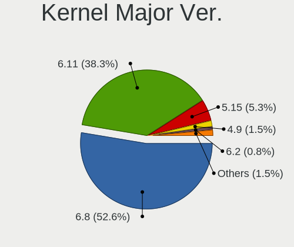
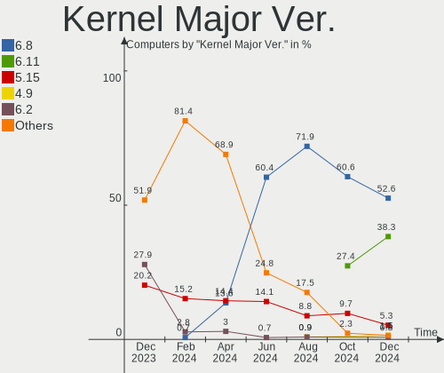
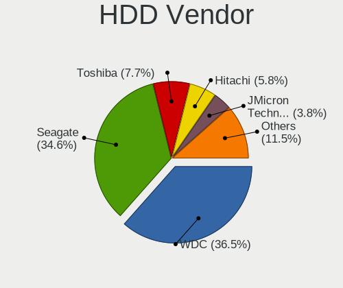
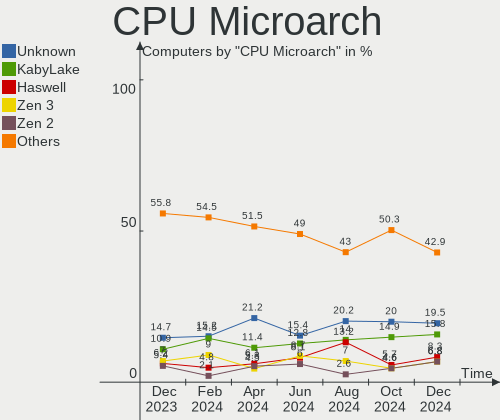
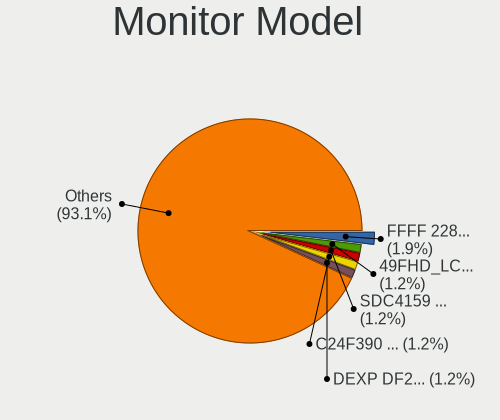
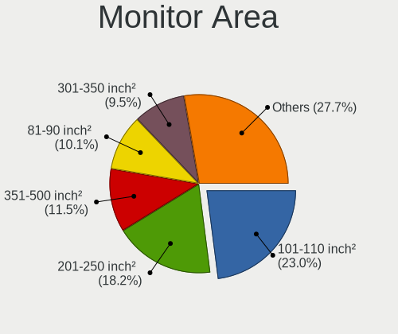
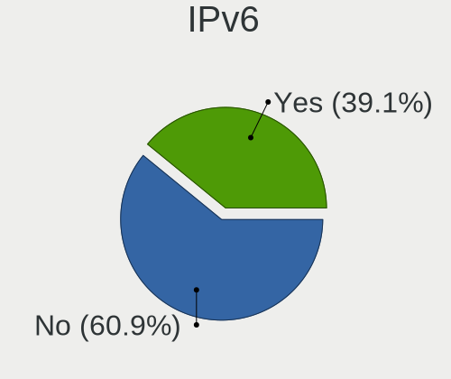

Kubuntu - Hardware Trends
-------------------------

A project to identify most popular hardware characteristics and track their change
over time based on data collected by Linux users at https://Linux-Hardware.org.

Anyone can contribute to this report by the [hw-probe](https://github.com/linuxhw/hw-probe) tool:

    sudo -E hw-probe -all -upload

This is a report for all computer types. See also reports for [desktops](/Dist/Kubuntu/Desktop/README.md) and [notebooks](/Dist/Kubuntu/Notebook/README.md).

This report is for one last month. Overall report since the beginning of time: [TestDays](https://github.com/linuxhw/TestDays)

Period: Aug, 2023.

Contents
--------

* [ System ](#system)
  - [ OS                       ](#os)
  - [ OS Family                ](#os-family)
  - [ Kernel                   ](#kernel)
  - [ Kernel Family            ](#kernel-family)
  - [ Kernel Major Ver.        ](#kernel-major-ver)
  - [ Arch                     ](#arch)
  - [ DE                       ](#de)
  - [ Display Server           ](#display-server)
  - [ Display Manager          ](#display-manager)
  - [ OS Lang                  ](#os-lang)
  - [ Boot Mode                ](#boot-mode)
  - [ Filesystem               ](#filesystem)
  - [ Part. scheme             ](#part-scheme)
  - [ Dual Boot with Linux/BSD ](#dual-boot-with-linuxbsd)
  - [ Dual Boot (Win)          ](#dual-boot-win)

* [ Board ](#board)
  - [ Vendor                   ](#vendor)
  - [ Model                    ](#model)
  - [ Model Family             ](#model-family)
  - [ MFG Year                 ](#mfg-year)
  - [ Form Factor              ](#form-factor)
  - [ Secure Boot              ](#secure-boot)
  - [ Coreboot                 ](#coreboot)
  - [ RAM Size                 ](#ram-size)
  - [ RAM Used                 ](#ram-used)
  - [ Total Drives             ](#total-drives)
  - [ Has CD-ROM               ](#has-cd-rom)
  - [ Has Ethernet             ](#has-ethernet)
  - [ Has WiFi                 ](#has-wifi)
  - [ Has Bluetooth            ](#has-bluetooth)

* [ Location ](#location)
  - [ Country                  ](#country)
  - [ City                     ](#city)

* [ Drives ](#drives)
  - [ Drive Vendor             ](#drive-vendor)
  - [ Drive Model              ](#drive-model)
  - [ HDD Vendor               ](#hdd-vendor)
  - [ SSD Vendor               ](#ssd-vendor)
  - [ Drive Kind               ](#drive-kind)
  - [ Drive Connector          ](#drive-connector)
  - [ Drive Size               ](#drive-size)
  - [ Space Total              ](#space-total)
  - [ Space Used               ](#space-used)
  - [ Malfunc. Drives          ](#malfunc-drives)
  - [ Malfunc. Drive Vendor    ](#malfunc-drive-vendor)
  - [ Malfunc. HDD Vendor      ](#malfunc-hdd-vendor)
  - [ Malfunc. Drive Kind      ](#malfunc-drive-kind)
  - [ Failed Drives            ](#failed-drives)
  - [ Failed Drive Vendor      ](#failed-drive-vendor)
  - [ Drive Status             ](#drive-status)

* [ Storage controller ](#storage-controller)
  - [ Storage Vendor           ](#storage-vendor)
  - [ Storage Model            ](#storage-model)
  - [ Storage Kind             ](#storage-kind)

* [ Processor ](#processor)
  - [ CPU Vendor               ](#cpu-vendor)
  - [ CPU Model                ](#cpu-model)
  - [ CPU Model Family         ](#cpu-model-family)
  - [ CPU Cores                ](#cpu-cores)
  - [ CPU Sockets              ](#cpu-sockets)
  - [ CPU Threads              ](#cpu-threads)
  - [ CPU Op-Modes             ](#cpu-op-modes)
  - [ CPU Microcode            ](#cpu-microcode)
  - [ CPU Microarch            ](#cpu-microarch)

* [ Graphics ](#graphics)
  - [ GPU Vendor               ](#gpu-vendor)
  - [ GPU Model                ](#gpu-model)
  - [ GPU Combo                ](#gpu-combo)
  - [ GPU Driver               ](#gpu-driver)
  - [ GPU Memory               ](#gpu-memory)

* [ Monitor ](#monitor)
  - [ Monitor Vendor           ](#monitor-vendor)
  - [ Monitor Model            ](#monitor-model)
  - [ Monitor Resolution       ](#monitor-resolution)
  - [ Monitor Diagonal         ](#monitor-diagonal)
  - [ Monitor Width            ](#monitor-width)
  - [ Aspect Ratio             ](#aspect-ratio)
  - [ Monitor Area             ](#monitor-area)
  - [ Pixel Density            ](#pixel-density)
  - [ Multiple Monitors        ](#multiple-monitors)

* [ Network ](#network)
  - [ Net Controller Vendor    ](#net-controller-vendor)
  - [ Net Controller Model     ](#net-controller-model)
  - [ Wireless Vendor          ](#wireless-vendor)
  - [ Wireless Model           ](#wireless-model)
  - [ Ethernet Vendor          ](#ethernet-vendor)
  - [ Ethernet Model           ](#ethernet-model)
  - [ Net Controller Kind      ](#net-controller-kind)
  - [ Used Controller          ](#used-controller)
  - [ NICs                     ](#nics)
  - [ IPv6                     ](#ipv6)

* [ Bluetooth ](#bluetooth)
  - [ Bluetooth Vendor         ](#bluetooth-vendor)
  - [ Bluetooth Model          ](#bluetooth-model)

* [ Sound ](#sound)
  - [ Sound Vendor             ](#sound-vendor)
  - [ Sound Model              ](#sound-model)

* [ Memory ](#memory)
  - [ Memory Vendor            ](#memory-vendor)
  - [ Memory Model             ](#memory-model)
  - [ Memory Kind              ](#memory-kind)
  - [ Memory Form Factor       ](#memory-form-factor)
  - [ Memory Size              ](#memory-size)
  - [ Memory Speed             ](#memory-speed)

* [ Printers & scanners ](#printers--scanners)
  - [ Printer Vendor           ](#printer-vendor)
  - [ Printer Model            ](#printer-model)
  - [ Scanner Vendor           ](#scanner-vendor)
  - [ Scanner Model            ](#scanner-model)

* [ Camera ](#camera)
  - [ Camera Vendor            ](#camera-vendor)
  - [ Camera Model             ](#camera-model)

* [ Security ](#security)
  - [ Fingerprint Vendor       ](#fingerprint-vendor)
  - [ Fingerprint Model        ](#fingerprint-model)
  - [ Chipcard Vendor          ](#chipcard-vendor)
  - [ Chipcard Model           ](#chipcard-model)

* [ Unsupported ](#unsupported)
  - [ Unsupported Devices      ](#unsupported-devices)
  - [ Unsupported Device Types ](#unsupported-device-types)

System
------

OS
--

Installed operating systems

| Name          | Computers | Percent |
|---------------|-----------|---------|
| Kubuntu 22.04 | 58        | 46.03%  |
| Kubuntu 23.04 | 57        | 45.24%  |
| Kubuntu 11    | 5         | 3.97%   |
| Kubuntu 23.10 | 3         | 2.38%   |
| Kubuntu 20.04 | 3         | 2.38%   |

OS Family
---------

OS without a version

| Name    | Computers | Percent |
|---------|-----------|---------|
| Kubuntu | 126       | 100%    |

Kernel
------

Version of the Linux kernel

| Version               | Computers | Percent |
|-----------------------|-----------|---------|
| 6.2.0-26-generic      | 43        | 34.13%  |
| 6.2.0-27-generic      | 25        | 19.84%  |
| 5.15.0-78-generic     | 16        | 12.7%   |
| 5.15.0-79-generic     | 6         | 4.76%   |
| 6.2.0-31-generic      | 5         | 3.97%   |
| 6.2.0-1009-lowlatency | 3         | 2.38%   |
| 5.15.0-75-generic     | 3         | 2.38%   |
| 6.4.8-060408-generic  | 2         | 1.59%   |
| 6.4.10-060410-generic | 2         | 1.59%   |
| 6.3.0-7-generic       | 2         | 1.59%   |
| 6.2.0-25-generic      | 2         | 1.59%   |
| 6.2.0-1007-lowlatency | 2         | 1.59%   |
| 5.15.0-82-generic     | 2         | 1.59%   |
| 6.4.8-x64v3-xanmod1   | 1         | 0.79%   |
| 6.4.0-060400-generic  | 1         | 0.79%   |
| 6.2.0-20-generic      | 1         | 0.79%   |
| 6.2.0-1011-lowlatency | 1         | 0.79%   |
| 6.2.0-060200-generic  | 1         | 0.79%   |
| 5.4.0-155-generic     | 1         | 0.79%   |
| 5.19.0-50-generic     | 1         | 0.79%   |
| 5.19.0-46-generic     | 1         | 0.79%   |
| 5.19.0-43-generic     | 1         | 0.79%   |
| 5.19.0-41-generic     | 1         | 0.79%   |
| 5.19.0-32-generic     | 1         | 0.79%   |
| 5.15.0-76-generic     | 1         | 0.79%   |
| 5.15.0-47-generic     | 1         | 0.79%   |

Kernel Family
-------------

Linux kernel without a distro release

| Version | Computers | Percent |
|---------|-----------|---------|
| 6.2.0   | 83        | 65.87%  |
| 5.15.0  | 29        | 23.02%  |
| 5.19.0  | 5         | 3.97%   |
| 6.4.8   | 3         | 2.38%   |
| 6.4.10  | 2         | 1.59%   |
| 6.3.0   | 2         | 1.59%   |
| 6.4.0   | 1         | 0.79%   |
| 5.4.0   | 1         | 0.79%   |

Kernel Major Ver.
-----------------

Linux kernel major version

| Version | Computers | Percent |
|---------|-----------|---------|
| 6.2     | 83        | 65.87%  |
| 5.15    | 29        | 23.02%  |
| 6.4     | 6         | 4.76%   |
| 5.19    | 5         | 3.97%   |
| 6.3     | 2         | 1.59%   |
| 5.4     | 1         | 0.79%   |

Arch
----

OS architecture (x86_64, i586, etc.)

| Name   | Computers | Percent |
|--------|-----------|---------|
| x86_64 | 126       | 100%    |

DE
--

Desktop Environment

| Name | Computers | Percent |
|------|-----------|---------|
| KDE5 | 125       | 99.21%  |
| KDE  | 1         | 0.79%   |

Display Server
--------------

X11 or Wayland

| Name    | Computers | Percent |
|---------|-----------|---------|
| X11     | 116       | 92.06%  |
| Wayland | 9         | 7.14%   |
| Tty     | 1         | 0.79%   |

Display Manager
---------------

SDDM, LightDM, etc.

| Name    | Computers | Percent |
|---------|-----------|---------|
| SDDM    | 74        | 58.73%  |
| Unknown | 45        | 35.71%  |
| GDM3    | 4         | 3.17%   |
| LightDM | 3         | 2.38%   |

OS Lang
-------

Language

| Lang                 | Computers | Percent |
|----------------------|-----------|---------|
| en_US                | 60        | 47.62%  |
| de_DE                | 18        | 14.29%  |
| en_GB                | 11        | 8.73%   |
| ru_RU                | 4         | 3.17%   |
| pt_BR                | 4         | 3.17%   |
| it_IT                | 4         | 3.17%   |
| cs_CZ                | 3         | 2.38%   |
| fr_FR                | 2         | 1.59%   |
| fr_BE                | 2         | 1.59%   |
| es_ES                | 2         | 1.59%   |
| en_CA                | 2         | 1.59%   |
| C                    | 2         | 1.59%   |
| الافتراضيّ | 1         | 0.79%   |
| zh_HK                | 1         | 0.79%   |
| zh_CN                | 1         | 0.79%   |
| es_PA                | 1         | 0.79%   |
| es_MX                | 1         | 0.79%   |
| es_CO                | 1         | 0.79%   |
| en_ZA                | 1         | 0.79%   |
| en_SG                | 1         | 0.79%   |
| en_IN                | 1         | 0.79%   |
| en_CH                | 1         | 0.79%   |
| en_AU                | 1         | 0.79%   |
| de_CH                | 1         | 0.79%   |

Boot Mode
---------

EFI or BIOS

| Mode | Computers | Percent |
|------|-----------|---------|
| BIOS | 76        | 60.32%  |
| EFI  | 50        | 39.68%  |

Filesystem
----------

Type of filesystem

| Type    | Computers | Percent |
|---------|-----------|---------|
| Ext4    | 91        | 72.22%  |
| Tmpfs   | 26        | 20.63%  |
| Btrfs   | 5         | 3.97%   |
| Xfs     | 2         | 1.59%   |
| Overlay | 2         | 1.59%   |

Part. scheme
------------

Scheme of partitioning

| Type    | Computers | Percent |
|---------|-----------|---------|
| GPT     | 75        | 59.52%  |
| Unknown | 44        | 34.92%  |
| MBR     | 7         | 5.56%   |

Dual Boot with Linux/BSD
------------------------

Hosting more than one Linux/BSD

| Dual boot | Computers | Percent |
|-----------|-----------|---------|
| No        | 109       | 86.51%  |
| Yes       | 17        | 13.49%  |

Dual Boot (Win)
---------------

Hosting Linux and Windows

| Dual boot | Computers | Percent |
|-----------|-----------|---------|
| No        | 91        | 72.22%  |
| Yes       | 35        | 27.78%  |

Board
-----

Vendor
------

Motherboard manufacturer

| Name                   | Computers | Percent |
|------------------------|-----------|---------|
| ASUSTek Computer       | 20        | 15.87%  |
| Lenovo                 | 18        | 14.29%  |
| Dell                   | 16        | 12.7%   |
| Hewlett-Packard        | 14        | 11.11%  |
| MSI                    | 11        | 8.73%   |
| Gigabyte Technology    | 10        | 7.94%   |
| ASRock                 | 5         | 3.97%   |
| Acer                   | 4         | 3.17%   |
| Intel                  | 3         | 2.38%   |
| AZW                    | 3         | 2.38%   |
| HUAWEI                 | 2         | 1.59%   |
| Fujitsu                | 2         | 1.59%   |
| Toshiba                | 1         | 0.79%   |
| TECNO                  | 1         | 0.79%   |
| System76               | 1         | 0.79%   |
| Sony                   | 1         | 0.79%   |
| Schenker               | 1         | 0.79%   |
| Packard Bell           | 1         | 0.79%   |
| mPTech                 | 1         | 0.79%   |
| Medion                 | 1         | 0.79%   |
| LG Electronics         | 1         | 0.79%   |
| Irbis                  | 1         | 0.79%   |
| HPE                    | 1         | 0.79%   |
| GPU Company            | 1         | 0.79%   |
| GPD                    | 1         | 0.79%   |
| Google                 | 1         | 0.79%   |
| Avell High Performance | 1         | 0.79%   |
| AMI                    | 1         | 0.79%   |
| Alienware              | 1         | 0.79%   |
| Unknown                | 1         | 0.79%   |

Model
-----

Motherboard model

| Name                                     | Computers | Percent |
|------------------------------------------|-----------|---------|
| Dell XPS 15 9530                         | 2         | 1.59%   |
| AZW SER                                  | 2         | 1.59%   |
| Toshiba Satellite P850                   | 1         | 0.79%   |
| TECNO MEGABOOK T1                        | 1         | 0.79%   |
| System76 Galago Pro                      | 1         | 0.79%   |
| Sony VPCEC390X                           | 1         | 0.79%   |
| Schenker XMG PRO (E23)                   | 1         | 0.79%   |
| Packard Bell EasyNote LS11HR             | 1         | 0.79%   |
| MSI MS-7D74                              | 1         | 0.79%   |
| MSI MS-7C95                              | 1         | 0.79%   |
| MSI MS-7C86                              | 1         | 0.79%   |
| MSI MS-7C56                              | 1         | 0.79%   |
| MSI MS-7C52                              | 1         | 0.79%   |
| MSI MS-7C09                              | 1         | 0.79%   |
| MSI MS-7B86                              | 1         | 0.79%   |
| MSI MS-7B78                              | 1         | 0.79%   |
| MSI MS-7A69                              | 1         | 0.79%   |
| MSI MS-7893                              | 1         | 0.79%   |
| MSI GL65 9SE                             | 1         | 0.79%   |
| mPTech ARC 11.6 128GB HD                 | 1         | 0.79%   |
| Medion P651x series                      | 1         | 0.79%   |
| LG 17Z90N-V.AA72A8                       | 1         | 0.79%   |
| Lenovo Z70-80 80FG                       | 1         | 0.79%   |
| Lenovo Yoga Slim 7 Pro 16ACH6 82QQ       | 1         | 0.79%   |
| Lenovo Yoga 6 13ALC6 82ND                | 1         | 0.79%   |
| Lenovo ThinkPad X230 23256N6             | 1         | 0.79%   |
| Lenovo ThinkPad X1 Yoga 3rd 20LES3485R   | 1         | 0.79%   |
| Lenovo ThinkPad X1 Carbon 2nd 20A8S1WM01 | 1         | 0.79%   |
| Lenovo ThinkPad W510 4391EC4             | 1         | 0.79%   |
| Lenovo ThinkPad T480 20L50000MC          | 1         | 0.79%   |
| Lenovo ThinkPad T14s Gen 4 21F6CTO1WW    | 1         | 0.79%   |
| Lenovo ThinkPad Edge E540 20C600J3GE     | 1         | 0.79%   |
| Lenovo ThinkCentre M920q 10RRS1P400      | 1         | 0.79%   |
| Lenovo ThinkBook 14s Yoga G3 IRU 21JG    | 1         | 0.79%   |
| Lenovo Legion Pro 5 16IRX8 82WK          | 1         | 0.79%   |
| Lenovo Legion 5 15ARH05H 82B1            | 1         | 0.79%   |
| Lenovo IdeaPad Z580                      | 1         | 0.79%   |
| Lenovo IdeaPad 5 14ITL05 82FE            | 1         | 0.79%   |
| Lenovo IdeaPad 300-14ISK 80Q6            | 1         | 0.79%   |
| Lenovo IdeaPad 3 14ALC6 82KT             | 1         | 0.79%   |

Model Family
------------

Motherboard model prefix

| Name                  | Computers | Percent |
|-----------------------|-----------|---------|
| Lenovo ThinkPad       | 7         | 5.56%   |
| Dell XPS              | 5         | 3.97%   |
| ASUS ROG              | 5         | 3.97%   |
| Lenovo IdeaPad        | 4         | 3.17%   |
| Dell Precision        | 4         | 3.17%   |
| ASUS PRIME            | 4         | 3.17%   |
| Dell Latitude         | 3         | 2.38%   |
| ASUS TUF              | 3         | 2.38%   |
| Lenovo Yoga           | 2         | 1.59%   |
| Lenovo Legion         | 2         | 1.59%   |
| HP ZBook              | 2         | 1.59%   |
| HP ProBook            | 2         | 1.59%   |
| HP Pavilion           | 2         | 1.59%   |
| HP EliteBook          | 2         | 1.59%   |
| Gigabyte B550         | 2         | 1.59%   |
| Dell OptiPlex         | 2         | 1.59%   |
| AZW SER               | 2         | 1.59%   |
| Acer Nitro            | 2         | 1.59%   |
| Acer Aspire           | 2         | 1.59%   |
| Toshiba Satellite     | 1         | 0.79%   |
| TECNO MEGABOOK        | 1         | 0.79%   |
| System76 Galago       | 1         | 0.79%   |
| Sony VPCEC390X        | 1         | 0.79%   |
| Schenker XMG          | 1         | 0.79%   |
| Packard Bell EasyNote | 1         | 0.79%   |
| MSI MS-7D74           | 1         | 0.79%   |
| MSI MS-7C95           | 1         | 0.79%   |
| MSI MS-7C86           | 1         | 0.79%   |
| MSI MS-7C56           | 1         | 0.79%   |
| MSI MS-7C52           | 1         | 0.79%   |
| MSI MS-7C09           | 1         | 0.79%   |
| MSI MS-7B86           | 1         | 0.79%   |
| MSI MS-7B78           | 1         | 0.79%   |
| MSI MS-7A69           | 1         | 0.79%   |
| MSI MS-7893           | 1         | 0.79%   |
| MSI GL65              | 1         | 0.79%   |
| mPTech ARC            | 1         | 0.79%   |
| Medion P651x          | 1         | 0.79%   |
| LG 17Z90N-V.AA72A8    | 1         | 0.79%   |
| Lenovo Z70-80         | 1         | 0.79%   |

MFG Year
--------

Motherboard manufacture year

| Year | Computers | Percent |
|------|-----------|---------|
| 2021 | 18        | 14.29%  |
| 2020 | 14        | 11.11%  |
| 2022 | 12        | 9.52%   |
| 2023 | 11        | 8.73%   |
| 2019 | 10        | 7.94%   |
| 2012 | 9         | 7.14%   |
| 2017 | 8         | 6.35%   |
| 2014 | 8         | 6.35%   |
| 2018 | 7         | 5.56%   |
| 2011 | 6         | 4.76%   |
| 2010 | 6         | 4.76%   |
| 2015 | 5         | 3.97%   |
| 2016 | 4         | 3.17%   |
| 2013 | 4         | 3.17%   |
| 2009 | 3         | 2.38%   |
| 2008 | 1         | 0.79%   |

Form Factor
-----------

Physical design of the computer

| Name        | Computers | Percent |
|-------------|-----------|---------|
| Notebook    | 62        | 49.21%  |
| Desktop     | 53        | 42.06%  |
| Convertible | 5         | 3.97%   |
| Mini pc     | 4         | 3.17%   |
| Tablet      | 1         | 0.79%   |
| Server      | 1         | 0.79%   |

Secure Boot
-----------

Enabled or disabled

| State    | Computers | Percent |
|----------|-----------|---------|
| Disabled | 124       | 98.41%  |
| Enabled  | 2         | 1.59%   |

Coreboot
--------

Have coreboot on board

| Used | Computers | Percent |
|------|-----------|---------|
| No   | 124       | 98.41%  |
| Yes  | 2         | 1.59%   |

RAM Size
--------

Total RAM memory

| Size in GB  | Computers | Percent |
|-------------|-----------|---------|
| 16.01-24.0  | 38        | 30.16%  |
| 32.01-64.0  | 23        | 18.25%  |
| 4.01-8.0    | 17        | 13.49%  |
| 8.01-16.0   | 16        | 12.7%   |
| 64.01-256.0 | 15        | 11.9%   |
| 3.01-4.0    | 10        | 7.94%   |
| 24.01-32.0  | 7         | 5.56%   |

RAM Used
--------

Used RAM memory

| Used GB    | Computers | Percent |
|------------|-----------|---------|
| 2.01-3.0   | 34        | 26.98%  |
| 4.01-8.0   | 32        | 25.4%   |
| 3.01-4.0   | 24        | 19.05%  |
| 8.01-16.0  | 17        | 13.49%  |
| 1.01-2.0   | 12        | 9.52%   |
| 24.01-32.0 | 3         | 2.38%   |
| 16.01-24.0 | 3         | 2.38%   |
| 32.01-64.0 | 1         | 0.79%   |

Total Drives
------------

Number of drives on board

| Drives | Computers | Percent |
|--------|-----------|---------|
| 1      | 55        | 43.65%  |
| 2      | 34        | 26.98%  |
| 3      | 18        | 14.29%  |
| 4      | 12        | 9.52%   |
| 5      | 3         | 2.38%   |
| 8      | 2         | 1.59%   |
| 6      | 2         | 1.59%   |

Has CD-ROM
----------

Has CD-ROM on board

| Presented | Computers | Percent |
|-----------|-----------|---------|
| No        | 98        | 77.78%  |
| Yes       | 28        | 22.22%  |

Has Ethernet
------------

Has Ethernet on board

| Presented | Computers | Percent |
|-----------|-----------|---------|
| Yes       | 107       | 84.92%  |
| No        | 19        | 15.08%  |

Has WiFi
--------

Has WiFi module

| Presented | Computers | Percent |
|-----------|-----------|---------|
| Yes       | 98        | 77.78%  |
| No        | 28        | 22.22%  |

Has Bluetooth
-------------

Has Bluetooth module

| Presented | Computers | Percent |
|-----------|-----------|---------|
| Yes       | 86        | 68.25%  |
| No        | 40        | 31.75%  |

Location
--------

Country
-------

Geographic location (country)

| Country      | Computers | Percent |
|--------------|-----------|---------|
| USA          | 24        | 19.05%  |
| Germany      | 20        | 15.87%  |
| UK           | 11        | 8.73%   |
| Switzerland  | 6         | 4.76%   |
| Russia       | 6         | 4.76%   |
| Brazil       | 6         | 4.76%   |
| Czechia      | 5         | 3.97%   |
| Poland       | 4         | 3.17%   |
| France       | 4         | 3.17%   |
| Spain        | 3         | 2.38%   |
| Italy        | 3         | 2.38%   |
| Turkey       | 2         | 1.59%   |
| Netherlands  | 2         | 1.59%   |
| India        | 2         | 1.59%   |
| Hungary      | 2         | 1.59%   |
| Canada       | 2         | 1.59%   |
| Vietnam      | 1         | 0.79%   |
| Taiwan       | 1         | 0.79%   |
| Sweden       | 1         | 0.79%   |
| South Korea  | 1         | 0.79%   |
| South Africa | 1         | 0.79%   |
| Slovenia     | 1         | 0.79%   |
| Singapore    | 1         | 0.79%   |
| Saudi Arabia | 1         | 0.79%   |
| Réunion     | 1         | 0.79%   |
| Portugal     | 1         | 0.79%   |
| Panama       | 1         | 0.79%   |
| Mexico       | 1         | 0.79%   |
| Luxembourg   | 1         | 0.79%   |
| Kazakhstan   | 1         | 0.79%   |
| Jordan       | 1         | 0.79%   |
| Greece       | 1         | 0.79%   |
| Finland      | 1         | 0.79%   |
| Croatia      | 1         | 0.79%   |
| Colombia     | 1         | 0.79%   |
| China        | 1         | 0.79%   |
| Bulgaria     | 1         | 0.79%   |
| Belgium      | 1         | 0.79%   |
| Austria      | 1         | 0.79%   |
| Australia    | 1         | 0.79%   |

City
----

Geographic location (city)

| City               | Computers | Percent |
|--------------------|-----------|---------|
| Berlin             | 3         | 2.38%   |
| Sao Paulo          | 2         | 1.59%   |
| Oberburg           | 2         | 1.59%   |
| Munich             | 2         | 1.59%   |
| Moscow             | 2         | 1.59%   |
| London             | 2         | 1.59%   |
| Abtwil             | 2         | 1.59%   |
| Zurich             | 1         | 0.79%   |
| Zamora             | 1         | 0.79%   |
| Worcester Park     | 1         | 0.79%   |
| Warsaw             | 1         | 0.79%   |
| Vol'ginskiy        | 1         | 0.79%   |
| Virginia Beach     | 1         | 0.79%   |
| Villamartin        | 1         | 0.79%   |
| Vienna             | 1         | 0.79%   |
| Varna              | 1         | 0.79%   |
| Ulm                | 1         | 0.79%   |
| Uelversheim        | 1         | 0.79%   |
| Tuusula            | 1         | 0.79%   |
| Trescore Balneario | 1         | 0.79%   |
| Tilburg            | 1         | 0.79%   |
| Szigetszentmiklos  | 1         | 0.79%   |
| Sutton in Ashfield | 1         | 0.79%   |
| Straznice          | 1         | 0.79%   |
| St Petersburg      | 1         | 0.79%   |
| Sisak              | 1         | 0.79%   |
| Singapore          | 1         | 0.79%   |
| Simpsonville       | 1         | 0.79%   |
| Seville            | 1         | 0.79%   |
| San Miguelito      | 1         | 0.79%   |
| San Antonio        | 1         | 0.79%   |
| Rome               | 1         | 0.79%   |
| Rochdale           | 1         | 0.79%   |
| Remscheid          | 1         | 0.79%   |
| Prague             | 1         | 0.79%   |
| Porto Alegre       | 1         | 0.79%   |
| Portimao           | 1         | 0.79%   |
| Platteville        | 1         | 0.79%   |
| Pirey              | 1         | 0.79%   |
| Pilsen             | 1         | 0.79%   |

Drives
------

Drive Vendor
------------

Hard drive vendors

| Vendor                      | Computers | Drives | Percent |
|-----------------------------|-----------|--------|---------|
| Samsung Electronics         | 37        | 54     | 16.59%  |
| Seagate                     | 26        | 36     | 11.66%  |
| WDC                         | 24        | 31     | 10.76%  |
| SanDisk                     | 24        | 29     | 10.76%  |
| Toshiba                     | 11        | 11     | 4.93%   |
| Crucial                     | 11        | 15     | 4.93%   |
| Kingston                    | 8         | 9      | 3.59%   |
| SK hynix                    | 5         | 5      | 2.24%   |
| Intel                       | 5         | 5      | 2.24%   |
| Hitachi                     | 5         | 5      | 2.24%   |
| Unknown                     | 4         | 4      | 1.79%   |
| Phison Electronics          | 4         | 4      | 1.79%   |
| KIOXIA                      | 4         | 4      | 1.79%   |
| HGST                        | 4         | 5      | 1.79%   |
| A-DATA Technology           | 4         | 5      | 1.79%   |
| SPCC                        | 3         | 3      | 1.35%   |
| Silicon Motion              | 3         | 3      | 1.35%   |
| PNY                         | 3         | 3      | 1.35%   |
| Micron Technology           | 3         | 3      | 1.35%   |
| Kingston Technology Company | 3         | 3      | 1.35%   |
| China                       | 3         | 3      | 1.35%   |
| Unknown                     | 3         | 3      | 1.35%   |
| Phison                      | 2         | 2      | 0.9%    |
| LITEON                      | 2         | 2      | 0.9%    |
| Wibtek                      | 1         | 1      | 0.45%   |
| Team                        | 1         | 1      | 0.45%   |
| Smartbuy                    | 1         | 1      | 0.45%   |
| Seagate Technology          | 1         | 1      | 0.45%   |
| S3+                         | 1         | 1      | 0.45%   |
| Realtek Semiconductor       | 1         | 1      | 0.45%   |
| Patriot                     | 1         | 1      | 0.45%   |
| Netac                       | 1         | 1      | 0.45%   |
| Neo                         | 1         | 1      | 0.45%   |
| Micron/Crucial Technology   | 1         | 1      | 0.45%   |
| MAXIO Technology (Hangzhou) | 1         | 1      | 0.45%   |
| Lenovo                      | 1         | 1      | 0.45%   |
| KIOXIA-EXCERIA              | 1         | 1      | 0.45%   |
| Kimtigo                     | 1         | 1      | 0.45%   |
| JMicron Technology          | 1         | 1      | 0.45%   |
| Integral                    | 1         | 1      | 0.45%   |

Drive Model
-----------

Hard drive models

| Model                                                 | Computers | Percent |
|-------------------------------------------------------|-----------|---------|
| Samsung NVMe SSD Controller PM9A1/PM9A3/980PRO 1024GB | 7         | 2.77%   |
| Samsung SSD 860 EVO 500GB                             | 6         | 2.37%   |
| Sandisk WD Black SN850 256GB                          | 4         | 1.58%   |
| Samsung SSD 850 EVO 500GB                             | 4         | 1.58%   |
| Samsung NVMe SSD Controller SM981/PM981/PM983 500GB   | 3         | 1.19%   |
| Phison PS5013 E13 NVMe Controller 512GB               | 3         | 1.19%   |
| Unknown                                               | 3         | 1.19%   |
| WDC WD10EZEX-60WN4A0 1TB                              | 2         | 0.79%   |
| Toshiba DT01ACA200 2TB                                | 2         | 0.79%   |
| Silicon Motion SM2263EN/SM2263XT SSD Controller 256GB | 2         | 0.79%   |
| Seagate ST4000DM004-2CV104 4TB                        | 2         | 0.79%   |
| Seagate ST2000DM008-2FR102 2TB                        | 2         | 0.79%   |
| Seagate ST1000LM035-1RK172 1TB                        | 2         | 0.79%   |
| Seagate ST1000LM024 HN-M101MBB 1TB                    | 2         | 0.79%   |
| Sandisk WDC PC SN530 SDBPMPZ-256G-1101 256GB          | 2         | 0.79%   |
| Sandisk WD Blue SN550 NVMe SSD 250GB                  | 2         | 0.79%   |
| SanDisk SSD PLUS 240GB                                | 2         | 0.79%   |
| SanDisk NVMe SSD Drive 2TB                            | 2         | 0.79%   |
| Samsung SSD 870 QVO 1TB                               | 2         | 0.79%   |
| Kingston SNVS500G 500GB                               | 2         | 0.79%   |
| Intel SSDPEKNU512GZ 512GB                             | 2         | 0.79%   |
| HGST HTS541010A9E680 1TB                              | 2         | 0.79%   |
| Crucial CT1000P2SSD8 1TB                              | 2         | 0.79%   |
| Crucial CT1000BX500SSD1 1TB                           | 2         | 0.79%   |
| Wibtek W800S 512GB                                    | 1         | 0.4%    |
| WDC WDS500G1B0B-00AS40 500GB SSD                      | 1         | 0.4%    |
| WDC WDS250G2B0A 250GB SSD                             | 1         | 0.4%    |
| WDC WDS240G2G0A-00JH30 240GB SSD                      | 1         | 0.4%    |
| WDC WDS100T2B0A 1TB SSD                               | 1         | 0.4%    |
| WDC WD6003FZBX-00K5WB0 6TB                            | 1         | 0.4%    |
| WDC WD6003FZBX-00GXAB0 6TB                            | 1         | 0.4%    |
| WDC WD5000LPLX-08ZNTT0 500GB                          | 1         | 0.4%    |
| WDC WD5000LPCX-24VHAT0 500GB                          | 1         | 0.4%    |
| WDC WD40PURX-64AKYY0 4TB                              | 1         | 0.4%    |
| WDC WD40EZRZ-22GXCB0 4TB                              | 1         | 0.4%    |
| WDC WD40EZRZ-00WN9B0 4TB                              | 1         | 0.4%    |
| WDC WD40EFRX-68N32N0 4TB                              | 1         | 0.4%    |
| WDC WD30EZRX-00MMMB0 3TB                              | 1         | 0.4%    |
| WDC WD20EZRZ-00Z5HB0 2TB                              | 1         | 0.4%    |
| WDC WD20EARS-60MVWB0 2TB                              | 1         | 0.4%    |

HDD Vendor
----------

Hard disk drive vendors

| Vendor              | Computers | Drives | Percent |
|---------------------|-----------|--------|---------|
| Seagate             | 24        | 34     | 38.1%   |
| WDC                 | 17        | 23     | 26.98%  |
| Toshiba             | 10        | 10     | 15.87%  |
| Hitachi             | 5         | 5      | 7.94%   |
| HGST                | 4         | 5      | 6.35%   |
| Samsung Electronics | 2         | 2      | 3.17%   |
| Apple               | 1         | 1      | 1.59%   |

SSD Vendor
----------

Solid state drive vendors

| Vendor              | Computers | Drives | Percent |
|---------------------|-----------|--------|---------|
| Samsung Electronics | 18        | 22     | 25%     |
| SanDisk             | 11        | 11     | 15.28%  |
| Crucial             | 7         | 9      | 9.72%   |
| WDC                 | 6         | 7      | 8.33%   |
| Kingston            | 5         | 6      | 6.94%   |
| PNY                 | 3         | 3      | 4.17%   |
| China               | 3         | 3      | 4.17%   |
| SPCC                | 2         | 2      | 2.78%   |
| LITEON              | 2         | 2      | 2.78%   |
| A-DATA Technology   | 2         | 2      | 2.78%   |
| Team                | 1         | 1      | 1.39%   |
| Smartbuy            | 1         | 1      | 1.39%   |
| Seagate             | 1         | 1      | 1.39%   |
| S3+                 | 1         | 1      | 1.39%   |
| Patriot             | 1         | 1      | 1.39%   |
| Neo                 | 1         | 1      | 1.39%   |
| KIOXIA-EXCERIA      | 1         | 1      | 1.39%   |
| Kimtigo             | 1         | 1      | 1.39%   |
| JMicron Technology  | 1         | 1      | 1.39%   |
| Integral            | 1         | 1      | 1.39%   |
| Emtec               | 1         | 2      | 1.39%   |
| Corsair             | 1         | 1      | 1.39%   |
| Unknown             | 1         | 1      | 1.39%   |

Drive Kind
----------

HDD or SSD

| Kind    | Computers | Drives | Percent |
|---------|-----------|--------|---------|
| NVMe    | 73        | 100    | 39.04%  |
| SSD     | 58        | 81     | 31.02%  |
| HDD     | 47        | 80     | 25.13%  |
| MMC     | 6         | 6      | 3.21%   |
| Unknown | 3         | 3      | 1.6%    |

Drive Connector
---------------

SATA, SAS, NVMe, etc.

| Type | Computers | Drives | Percent |
|------|-----------|--------|---------|
| SATA | 82        | 157    | 49.4%   |
| NVMe | 73        | 100    | 43.98%  |
| MMC  | 6         | 6      | 3.61%   |
| SAS  | 5         | 7      | 3.01%   |

Drive Size
----------

Size of hard drive

| Size in TB | Computers | Drives | Percent |
|------------|-----------|--------|---------|
| 0.01-0.5   | 48        | 68     | 39.02%  |
| 0.51-1.0   | 46        | 55     | 37.4%   |
| 1.01-2.0   | 12        | 14     | 9.76%   |
| 3.01-4.0   | 8         | 9      | 6.5%    |
| 4.01-10.0  | 7         | 13     | 5.69%   |
| 2.01-3.0   | 2         | 2      | 1.63%   |

Space Total
-----------

Amount of disk space available on the file system

| Size in GB     | Computers | Percent |
|----------------|-----------|---------|
| 501-1000       | 28        | 22.22%  |
| 251-500        | 25        | 19.84%  |
| 101-250        | 25        | 19.84%  |
| 1001-2000      | 19        | 15.08%  |
| More than 3000 | 17        | 13.49%  |
| 2001-3000      | 5         | 3.97%   |
| 51-100         | 5         | 3.97%   |
| 1-20           | 1         | 0.79%   |
| Unknown        | 1         | 0.79%   |

Space Used
----------

Amount of used disk space

| Used GB        | Computers | Percent |
|----------------|-----------|---------|
| 101-250        | 26        | 20.63%  |
| 51-100         | 21        | 16.67%  |
| 251-500        | 18        | 14.29%  |
| 21-50          | 15        | 11.9%   |
| 1-20           | 15        | 11.9%   |
| 501-1000       | 12        | 9.52%   |
| More than 3000 | 8         | 6.35%   |
| 1001-2000      | 7         | 5.56%   |
| 2001-3000      | 3         | 2.38%   |
| Unknown        | 1         | 0.79%   |

Malfunc. Drives
---------------

Drive models with a malfunction

| Model                                    | Computers | Drives | Percent |
|------------------------------------------|-----------|--------|---------|
| WDC WD40EFRX-68N32N0 4TB                 | 1         | 2      | 6.25%   |
| WDC WD30EZRX-00MMMB0 3TB                 | 1         | 1      | 6.25%   |
| WDC WD10EZEX-22MFCA0 1TB                 | 1         | 1      | 6.25%   |
| WDC WD10EAVS-00D7B1 1TB                  | 1         | 1      | 6.25%   |
| Toshiba MQ01ABD075 752GB                 | 1         | 1      | 6.25%   |
| Seagate ST9500325AS 500GB                | 1         | 1      | 6.25%   |
| Seagate ST3500320AS 500GB                | 1         | 1      | 6.25%   |
| SanDisk SSD PLUS 240GB                   | 1         | 1      | 6.25%   |
| SanDisk SDSSDXPS480G 480GB               | 1         | 1      | 6.25%   |
| Samsung Electronics SSD 970 EVO Plus 1TB | 1         | 1      | 6.25%   |
| Samsung Electronics HD501LJ 500GB        | 1         | 1      | 6.25%   |
| Neo Forza NFS121SA312-6007000 120GB SSD  | 1         | 1      | 6.25%   |
| LITEON CV8-8E128-HP 128GB SSD            | 1         | 1      | 6.25%   |
| Intel SSDPEKNU512GZ 512GB                | 1         | 1      | 6.25%   |
| HGST HTS541010A9E680 1TB                 | 1         | 1      | 6.25%   |
| Apple HDD HTS541010A9E662 1TB            | 1         | 1      | 6.25%   |

Malfunc. Drive Vendor
---------------------

Vendors of faulty drives

| Vendor              | Computers | Drives | Percent |
|---------------------|-----------|--------|---------|
| WDC                 | 4         | 5      | 25%     |
| Seagate             | 2         | 2      | 12.5%   |
| SanDisk             | 2         | 2      | 12.5%   |
| Samsung Electronics | 2         | 2      | 12.5%   |
| Toshiba             | 1         | 1      | 6.25%   |
| Neo                 | 1         | 1      | 6.25%   |
| LITEON              | 1         | 1      | 6.25%   |
| Intel               | 1         | 1      | 6.25%   |
| HGST                | 1         | 1      | 6.25%   |
| Apple               | 1         | 1      | 6.25%   |

Malfunc. HDD Vendor
-------------------

Vendors of faulty HDD drives

| Vendor              | Computers | Drives | Percent |
|---------------------|-----------|--------|---------|
| WDC                 | 4         | 5      | 40%     |
| Seagate             | 2         | 2      | 20%     |
| Toshiba             | 1         | 1      | 10%     |
| Samsung Electronics | 1         | 1      | 10%     |
| HGST                | 1         | 1      | 10%     |
| Apple               | 1         | 1      | 10%     |

Malfunc. Drive Kind
-------------------

Kinds of faulty drives

| Kind | Computers | Drives | Percent |
|------|-----------|--------|---------|
| HDD  | 8         | 11     | 57.14%  |
| SSD  | 4         | 4      | 28.57%  |
| NVMe | 2         | 2      | 14.29%  |

Failed Drives
-------------

Failed drive models

Zero info for selected period =(

Failed Drive Vendor
-------------------

Failed drive vendors

Zero info for selected period =(

Drive Status
------------

Number of failed and malfunc. drives

| Status   | Computers | Drives | Percent |
|----------|-----------|--------|---------|
| Detected | 79        | 156    | 54.86%  |
| Works    | 52        | 97     | 36.11%  |
| Malfunc  | 13        | 17     | 9.03%   |

Storage controller
------------------

Storage Vendor
--------------

Storage controller vendors

| Vendor                      | Computers | Percent |
|-----------------------------|-----------|---------|
| Intel                       | 72        | 36.73%  |
| AMD                         | 34        | 17.35%  |
| Samsung Electronics         | 20        | 10.2%   |
| SanDisk                     | 15        | 7.65%   |
| Phison Electronics          | 6         | 3.06%   |
| Kingston Technology Company | 6         | 3.06%   |
| SK hynix                    | 5         | 2.55%   |
| Micron/Crucial Technology   | 5         | 2.55%   |
| KIOXIA                      | 5         | 2.55%   |
| ASMedia Technology          | 4         | 2.04%   |
| Silicon Motion              | 3         | 1.53%   |
| Realtek Semiconductor       | 3         | 1.53%   |
| Micron Technology           | 3         | 1.53%   |
| Seagate Technology          | 2         | 1.02%   |
| MAXIO Technology (Hangzhou) | 2         | 1.02%   |
| Marvell Technology Group    | 2         | 1.02%   |
| LSI Logic / Symbios Logic   | 2         | 1.02%   |
| JMicron Technology          | 2         | 1.02%   |
| ADATA Technology            | 2         | 1.02%   |
| Nvidia                      | 1         | 0.51%   |
| Lenovo                      | 1         | 0.51%   |
| Biwin Storage Technology    | 1         | 0.51%   |

Storage Model
-------------

Storage controller models

| Model                                                                          | Computers | Percent |
|--------------------------------------------------------------------------------|-----------|---------|
| AMD FCH SATA Controller [AHCI mode]                                            | 22        | 10.14%  |
| Samsung NVMe SSD Controller PM9A1/PM9A3/980PRO                                 | 10        | 4.61%   |
| Samsung NVMe SSD Controller SM981/PM981/PM983                                  | 8         | 3.69%   |
| AMD 500 Series Chipset SATA Controller                                         | 7         | 3.23%   |
| Intel Volume Management Device NVMe RAID Controller                            | 6         | 2.76%   |
| SanDisk WD PC SN810 / Black SN850 NVMe SSD                                     | 5         | 2.3%    |
| Intel Sunrise Point-LP SATA Controller [AHCI mode]                             | 5         | 2.3%    |
| Intel 200 Series PCH SATA controller [AHCI mode]                               | 5         | 2.3%    |
| AMD 400 Series Chipset SATA Controller                                         | 5         | 2.3%    |
| Micron/Crucial P2 [Nick P2] / P3 / P3 Plus NVMe PCIe SSD (DRAM-less)           | 4         | 1.84%   |
| Intel SSD 670p Series [Keystone Harbor]                                        | 4         | 1.84%   |
| Intel Cannon Lake PCH SATA AHCI Controller                                     | 4         | 1.84%   |
| Intel 8 Series/C220 Series Chipset Family 6-port SATA Controller 1 [AHCI mode] | 4         | 1.84%   |
| Intel 7 Series Chipset Family 6-port SATA Controller [AHCI mode]               | 4         | 1.84%   |
| ASMedia ASM1062 Serial ATA Controller                                          | 4         | 1.84%   |
| AMD SB7x0/SB8x0/SB9x0 SATA Controller [AHCI mode]                              | 4         | 1.84%   |
| SK hynix Platinum P41/PC801 NVMe Solid State Drive                             | 3         | 1.38%   |
| Silicon Motion SM2263EN/SM2263XT (DRAM-less) NVMe SSD Controllers              | 3         | 1.38%   |
| SanDisk WD Blue SN550 NVMe SSD                                                 | 3         | 1.38%   |
| Phison PS5013 E13 NVMe Controller                                              | 3         | 1.38%   |
| Kingston Company Company Non-Volatile memory controller                        | 3         | 1.38%   |
| Intel Volume Management Device NVMe RAID Controller Intel Corporation          | 3         | 1.38%   |
| Intel 82801 Mobile SATA Controller [RAID mode]                                 | 3         | 1.38%   |
| AMD X370 Series Chipset SATA Controller                                        | 3         | 1.38%   |
| Seagate FireCuda/IronWolf 510 SSD                                              | 2         | 0.92%   |
| SanDisk WD Black SN770 / PC SN740 256GB / PC SN560 (DRAM-less) NVMe SSD        | 2         | 0.92%   |
| SanDisk PC SN530 NVMe SSD (DRAM-less)                                          | 2         | 0.92%   |
| Micron 2400 NVMe SSD (DRAM-less)                                               | 2         | 0.92%   |
| MAXIO (Hangzhou) NVMe SSD Controller MAP1202                                   | 2         | 0.92%   |
| KIOXIA NVMe SSD Controller BG5 (DRAM-less)                                     | 2         | 0.92%   |
| KIOXIA NVMe SSD Controller BG4 (DRAM-less)                                     | 2         | 0.92%   |
| Intel Wildcat Point-LP SATA Controller [AHCI Mode]                             | 2         | 0.92%   |
| Intel Q170/Q150/B150/H170/H110/Z170/CM236 Chipset SATA Controller [AHCI Mode]  | 2         | 0.92%   |
| Intel Jasper Lake SATA AHCI Controller                                         | 2         | 0.92%   |
| Intel Alder Lake-S PCH SATA Controller [AHCI Mode]                             | 2         | 0.92%   |
| Intel 82801JI (ICH10 Family) 4 port SATA IDE Controller #1                     | 2         | 0.92%   |
| Intel 82801JI (ICH10 Family) 2 port SATA IDE Controller #2                     | 2         | 0.92%   |
| Intel 6 Series/C200 Series Chipset Family 6 port Mobile SATA AHCI Controller   | 2         | 0.92%   |
| Intel 6 Series/C200 Series Chipset Family 6 port Desktop SATA AHCI Controller  | 2         | 0.92%   |
| Intel 400 Series Chipset Family SATA AHCI Controller                           | 2         | 0.92%   |

Storage Kind
------------

Kind of storage controller (IDE, SATA, NVMe, SAS, ...)

| Kind | Computers | Percent |
|------|-----------|---------|
| SATA | 88        | 48.62%  |
| NVMe | 71        | 39.23%  |
| RAID | 12        | 6.63%   |
| IDE  | 8         | 4.42%   |
| SAS  | 1         | 0.55%   |
| SCSI | 1         | 0.55%   |

Processor
---------

CPU Vendor
----------

Processor vendors

| Vendor | Computers | Percent |
|--------|-----------|---------|
| Intel  | 86        | 68.25%  |
| AMD    | 40        | 31.75%  |

CPU Model
---------

Processor models

| Model                                       | Computers | Percent |
|---------------------------------------------|-----------|---------|
| AMD Ryzen 5 5500U with Radeon Graphics      | 4         | 3.17%   |
| AMD Ryzen 5 3600 6-Core Processor           | 4         | 3.17%   |
| Intel Core i5-7200U CPU @ 2.50GHz           | 3         | 2.38%   |
| Intel Core i7-6700HQ CPU @ 2.60GHz          | 2         | 1.59%   |
| Intel Core i7-5500U CPU @ 2.40GHz           | 2         | 1.59%   |
| Intel Core i5-2400 CPU @ 3.10GHz            | 2         | 1.59%   |
| Intel Core i5-1035G1 CPU @ 1.00GHz          | 2         | 1.59%   |
| Intel 13th Gen Core i7-13700H               | 2         | 1.59%   |
| Intel 13th Gen Core i7-1355U                | 2         | 1.59%   |
| Intel 11th Gen Core i5-1135G7 @ 2.40GHz     | 2         | 1.59%   |
| AMD Ryzen 7 5800X 8-Core Processor          | 2         | 1.59%   |
| AMD Ryzen 7 5800H with Radeon Graphics      | 2         | 1.59%   |
| AMD Ryzen 7 4800H with Radeon Graphics      | 2         | 1.59%   |
| AMD Ryzen 7 3700X 8-Core Processor          | 2         | 1.59%   |
| AMD Ryzen 5 1600X Six-Core Processor        | 2         | 1.59%   |
| Intel Xeon CPU W5580 @ 3.20GHz              | 1         | 0.79%   |
| Intel Xeon CPU W3580 @ 3.33GHz              | 1         | 0.79%   |
| Intel Xeon CPU E5-2667 v4 @ 3.20GHz         | 1         | 0.79%   |
| Intel Xeon CPU E3-1225 v5 @ 3.30GHz         | 1         | 0.79%   |
| Intel Pentium Silver N6000 @ 1.10GHz        | 1         | 0.79%   |
| Intel Pentium Dual-Core CPU T4500 @ 2.30GHz | 1         | 0.79%   |
| Intel Pentium CPU G4600 @ 3.60GHz           | 1         | 0.79%   |
| Intel Core i9-9900K CPU @ 3.60GHz           | 1         | 0.79%   |
| Intel Core i9-7900X CPU @ 3.30GHz           | 1         | 0.79%   |
| Intel Core i9-10900T CPU @ 1.90GHz          | 1         | 0.79%   |
| Intel Core i7-9750H CPU @ 2.60GHz           | 1         | 0.79%   |
| Intel Core i7-8665U CPU @ 1.90GHz           | 1         | 0.79%   |
| Intel Core i7-8650U CPU @ 1.90GHz           | 1         | 0.79%   |
| Intel Core i7-7700K CPU @ 4.20GHz           | 1         | 0.79%   |
| Intel Core i7-7500U CPU @ 2.70GHz           | 1         | 0.79%   |
| Intel Core i7-4790S CPU @ 3.20GHz           | 1         | 0.79%   |
| Intel Core i7-4700MQ CPU @ 2.40GHz          | 1         | 0.79%   |
| Intel Core i7-3630QM CPU @ 2.40GHz          | 1         | 0.79%   |
| Intel Core i7-2670QM CPU @ 2.20GHz          | 1         | 0.79%   |
| Intel Core i7-2640M CPU @ 2.80GHz           | 1         | 0.79%   |
| Intel Core i7-2630QM CPU @ 2.00GHz          | 1         | 0.79%   |
| Intel Core i7-2600K CPU @ 3.40GHz           | 1         | 0.79%   |
| Intel Core i7-1065G7 CPU @ 1.30GHz          | 1         | 0.79%   |
| Intel Core i7 CPU Q 820 @ 1.73GHz           | 1         | 0.79%   |
| Intel Core i5-9600K CPU @ 3.70GHz           | 1         | 0.79%   |

CPU Model Family
----------------

Processor model prefix

| Model                   | Computers | Percent |
|-------------------------|-----------|---------|
| Intel Core i5           | 25        | 19.84%  |
| Other                   | 24        | 19.05%  |
| Intel Core i7           | 18        | 14.29%  |
| AMD Ryzen 5             | 15        | 11.9%   |
| AMD Ryzen 7             | 13        | 10.32%  |
| Intel Xeon              | 4         | 3.17%   |
| Intel Celeron           | 4         | 3.17%   |
| AMD Ryzen 9             | 4         | 3.17%   |
| Intel Core i9           | 3         | 2.38%   |
| Intel Core i3           | 3         | 2.38%   |
| AMD FX                  | 2         | 1.59%   |
| Intel Pentium Silver    | 1         | 0.79%   |
| Intel Pentium Dual-Core | 1         | 0.79%   |
| Intel Pentium           | 1         | 0.79%   |
| Intel Core 2 Quad       | 1         | 0.79%   |
| Intel Core 2 Duo        | 1         | 0.79%   |
| Intel Atom              | 1         | 0.79%   |
| AMD Ryzen Threadripper  | 1         | 0.79%   |
| AMD Phenom II X4        | 1         | 0.79%   |
| AMD Athlon II           | 1         | 0.79%   |
| AMD Athlon 64 X2        | 1         | 0.79%   |
| AMD A10                 | 1         | 0.79%   |

CPU Cores
---------

Number of processor cores

| Number | Computers | Percent |
|--------|-----------|---------|
| 4      | 37        | 29.37%  |
| 2      | 26        | 20.63%  |
| 8      | 19        | 15.08%  |
| 6      | 19        | 15.08%  |
| 10     | 8         | 6.35%   |
| 16     | 5         | 3.97%   |
| 12     | 5         | 3.97%   |
| 14     | 3         | 2.38%   |
| 24     | 2         | 1.59%   |
| 32     | 1         | 0.79%   |
| 3      | 1         | 0.79%   |

CPU Sockets
-----------

Number of sockets

| Number | Computers | Percent |
|--------|-----------|---------|
| 1      | 125       | 99.21%  |
| 2      | 1         | 0.79%   |

CPU Threads
-----------

Threads per core (Hyper-Threading)

| Number | Computers | Percent |
|--------|-----------|---------|
| 2      | 97        | 76.98%  |
| 1      | 29        | 23.02%  |

CPU Op-Modes
------------

CPU Operation Modes (32-bit, 64-bit)

| Op mode        | Computers | Percent |
|----------------|-----------|---------|
| 32-bit, 64-bit | 126       | 100%    |

CPU Microcode
-------------

Microcode number

| Number     | Computers | Percent |
|------------|-----------|---------|
| Unknown    | 96        | 76.19%  |
| 0x0a601203 | 2         | 1.59%   |
| 0x0a50000c | 2         | 1.59%   |
| 0x08701030 | 2         | 1.59%   |
| 0xb06a3    | 1         | 0.79%   |
| 0xb06a2    | 1         | 0.79%   |
| 0x906e9    | 1         | 0.79%   |
| 0x90672    | 1         | 0.79%   |
| 0x806ea    | 1         | 0.79%   |
| 0x806c1    | 1         | 0.79%   |
| 0x706e5    | 1         | 0.79%   |
| 0x506e3    | 1         | 0.79%   |
| 0x306d4    | 1         | 0.79%   |
| 0x306c3    | 1         | 0.79%   |
| 0x206a7    | 1         | 0.79%   |
| 0x20655    | 1         | 0.79%   |
| 0x0a704103 | 1         | 0.79%   |
| 0x0a201025 | 1         | 0.79%   |
| 0x08701021 | 1         | 0.79%   |
| 0x08608103 | 1         | 0.79%   |
| 0x08608102 | 1         | 0.79%   |
| 0x08600106 | 1         | 0.79%   |
| 0x0830107a | 1         | 0.79%   |
| 0x0800820d | 1         | 0.79%   |
| 0x08001138 | 1         | 0.79%   |
| 0x08001126 | 1         | 0.79%   |
| 0x06006118 | 1         | 0.79%   |
| 0x0600063e | 1         | 0.79%   |

CPU Microarch
-------------

Microarchitecture

| Name             | Computers | Percent |
|------------------|-----------|---------|
| Unknown          | 22        | 17.46%  |
| KabyLake         | 17        | 13.49%  |
| Zen 2            | 12        | 9.52%   |
| Zen 3            | 8         | 6.35%   |
| SandyBridge      | 8         | 6.35%   |
| Alderlake Hybrid | 7         | 5.56%   |
| Haswell          | 6         | 4.76%   |
| Skylake          | 5         | 3.97%   |
| IvyBridge        | 5         | 3.97%   |
| TigerLake        | 4         | 3.17%   |
| IceLake          | 4         | 3.17%   |
| Zen+             | 3         | 2.38%   |
| Zen              | 3         | 2.38%   |
| Penryn           | 3         | 2.38%   |
| Nehalem          | 3         | 2.38%   |
| Broadwell        | 3         | 2.38%   |
| Westmere         | 2         | 1.59%   |
| K10              | 2         | 1.59%   |
| CometLake        | 2         | 1.59%   |
| Silvermont       | 1         | 0.79%   |
| Piledriver       | 1         | 0.79%   |
| K8 Hammer        | 1         | 0.79%   |
| Goldmont plus    | 1         | 0.79%   |
| Goldmont         | 1         | 0.79%   |
| Excavator        | 1         | 0.79%   |
| Bulldozer        | 1         | 0.79%   |

Graphics
--------

GPU Vendor
----------

Vendors of graphics cards

| Vendor            | Computers | Percent |
|-------------------|-----------|---------|
| Intel             | 71        | 44.94%  |
| Nvidia            | 50        | 31.65%  |
| AMD               | 36        | 22.78%  |
| ASPEED Technology | 1         | 0.63%   |

GPU Model
---------

Graphics card models

| Model                                                                       | Computers | Percent |
|-----------------------------------------------------------------------------|-----------|---------|
| Intel 2nd Generation Core Processor Family Integrated Graphics Controller   | 7         | 4.29%   |
| Intel Raptor Lake-P [Iris Xe Graphics]                                      | 5         | 3.07%   |
| AMD Renoir                                                                  | 5         | 3.07%   |
| Intel TigerLake-LP GT2 [Iris Xe Graphics]                                   | 4         | 2.45%   |
| Intel HD Graphics 620                                                       | 4         | 2.45%   |
| Intel 3rd Gen Core processor Graphics Controller                            | 4         | 2.45%   |
| AMD Lucienne                                                                | 4         | 2.45%   |
| AMD Ellesmere [Radeon RX 470/480/570/570X/580/580X/590]                     | 4         | 2.45%   |
| Intel JasperLake [UHD Graphics]                                             | 3         | 1.84%   |
| Intel Alder Lake-UP3 GT2 [Iris Xe Graphics]                                 | 3         | 1.84%   |
| AMD Raphael                                                                 | 3         | 1.84%   |
| AMD Navi 22 [Radeon RX 6700/6700 XT/6750 XT / 6800M/6850M XT]               | 3         | 1.84%   |
| AMD Cezanne [Radeon Vega Series / Radeon Vega Mobile Series]                | 3         | 1.84%   |
| Nvidia TU117M [GeForce GTX 1650 Mobile / Max-Q]                             | 2         | 1.23%   |
| Nvidia TU117 [GeForce GTX 1650]                                             | 2         | 1.23%   |
| Nvidia GP107 [GeForce GTX 1050 Ti]                                          | 2         | 1.23%   |
| Nvidia GA107M [GeForce RTX 3050 Mobile]                                     | 2         | 1.23%   |
| Nvidia GA106M [GeForce RTX 3060 Mobile / Max-Q]                             | 2         | 1.23%   |
| Nvidia GA106 [GeForce RTX 3060 Lite Hash Rate]                              | 2         | 1.23%   |
| Nvidia AD107M [GeForce RTX 4060 Max-Q / Mobile]                             | 2         | 1.23%   |
| Intel Xeon E3-1200 v3/4th Gen Core Processor Integrated Graphics Controller | 2         | 1.23%   |
| Intel UHD Graphics 620                                                      | 2         | 1.23%   |
| Intel Raptor Lake-S UHD Graphics                                            | 2         | 1.23%   |
| Intel Iris Plus Graphics G1 (Ice Lake)                                      | 2         | 1.23%   |
| Intel HD Graphics 630                                                       | 2         | 1.23%   |
| Intel HD Graphics 5500                                                      | 2         | 1.23%   |
| Intel HD Graphics 530                                                       | 2         | 1.23%   |
| Intel CoffeeLake-S GT2 [UHD Graphics 630]                                   | 2         | 1.23%   |
| Intel Alder Lake-P Integrated Graphics Controller                           | 2         | 1.23%   |
| Intel Alder Lake-HX GT1 [UHD Graphics 770]                                  | 2         | 1.23%   |
| Intel 4th Gen Core Processor Integrated Graphics Controller                 | 2         | 1.23%   |
| Nvidia TU117M [GeForce MX450]                                               | 1         | 0.61%   |
| Nvidia TU116M [GeForce GTX 1660 Ti Mobile]                                  | 1         | 0.61%   |
| Nvidia TU106M [GeForce RTX 2060 Mobile]                                     | 1         | 0.61%   |
| Nvidia TU106 [GeForce RTX 2060 Rev. A]                                      | 1         | 0.61%   |
| Nvidia TU104 [GeForce RTX 2070 SUPER]                                       | 1         | 0.61%   |
| Nvidia TU102 [TITAN RTX]                                                    | 1         | 0.61%   |
| Nvidia GT216GLM [Quadro FX 880M]                                            | 1         | 0.61%   |
| Nvidia GT200GL [Quadro FX 4800]                                             | 1         | 0.61%   |
| Nvidia GP108 [GeForce GT 1030]                                              | 1         | 0.61%   |

GPU Combo
---------

Combinations of graphics cards

| Name           | Computers | Percent |
|----------------|-----------|---------|
| 1 x Intel      | 44        | 34.92%  |
| 1 x Nvidia     | 23        | 18.25%  |
| 1 x AMD        | 23        | 18.25%  |
| Intel + Nvidia | 19        | 15.08%  |
| AMD + Nvidia   | 6         | 4.76%   |
| Intel + AMD    | 5         | 3.97%   |
| 2 x Nvidia     | 2         | 1.59%   |
| 2 x AMD        | 2         | 1.59%   |
| 2 x Intel      | 1         | 0.79%   |
| 1 x ASPEED     | 1         | 0.79%   |

GPU Driver
----------

Free vs proprietary

| Driver      | Computers | Percent |
|-------------|-----------|---------|
| Free        | 84        | 66.67%  |
| Proprietary | 41        | 32.54%  |
| Unknown     | 1         | 0.79%   |

GPU Memory
----------

Total video memory

| Size in GB | Computers | Percent |
|------------|-----------|---------|
| Unknown    | 82        | 65.08%  |
| 3.01-4.0   | 8         | 6.35%   |
| 1.01-2.0   | 8         | 6.35%   |
| 0.01-0.5   | 8         | 6.35%   |
| 7.01-8.0   | 6         | 4.76%   |
| 8.01-16.0  | 4         | 3.17%   |
| 5.01-6.0   | 3         | 2.38%   |
| 16.01-24.0 | 3         | 2.38%   |
| 0.51-1.0   | 3         | 2.38%   |
| 2.01-3.0   | 1         | 0.79%   |

Monitor
-------

Monitor Vendor
--------------

Monitor vendors

| Vendor                  | Computers | Percent |
|-------------------------|-----------|---------|
| BOE                     | 16        | 10.39%  |
| Samsung Electronics     | 15        | 9.74%   |
| LG Display              | 14        | 9.09%   |
| Dell                    | 11        | 7.14%   |
| AU Optronics            | 10        | 6.49%   |
| Goldstar                | 7         | 4.55%   |
| Chimei Innolux          | 7         | 4.55%   |
| AOC                     | 7         | 4.55%   |
| Acer                    | 7         | 4.55%   |
| Iiyama                  | 6         | 3.9%    |
| Sharp                   | 5         | 3.25%   |
| Hewlett-Packard         | 5         | 3.25%   |
| Lenovo                  | 4         | 2.6%    |
| Ancor Communications    | 4         | 2.6%    |
| Philips                 | 3         | 1.95%   |
| Sceptre Tech            | 2         | 1.3%    |
| PANDA                   | 2         | 1.3%    |
| InfoVision              | 2         | 1.3%    |
| Gigabyte Technology     | 2         | 1.3%    |
| Eizo                    | 2         | 1.3%    |
| Chi Mei Optoelectronics | 2         | 1.3%    |
| BenQ                    | 2         | 1.3%    |
| ASUSTek Computer        | 2         | 1.3%    |
| Wacom                   | 1         | 0.65%   |
| ViewSonic               | 1         | 0.65%   |
| Unknown                 | 1         | 0.65%   |
| TMX                     | 1         | 0.65%   |
| Sony                    | 1         | 0.65%   |
| SAC                     | 1         | 0.65%   |
| RTK                     | 1         | 0.65%   |
| ONKYO                   | 1         | 0.65%   |
| NEC Computers           | 1         | 0.65%   |
| MSI                     | 1         | 0.65%   |
| MiTAC                   | 1         | 0.65%   |
| Mi                      | 1         | 0.65%   |
| LG Electronics          | 1         | 0.65%   |
| HUAWEI                  | 1         | 0.65%   |
| Hitachi                 | 1         | 0.65%   |
| CSO                     | 1         | 0.65%   |
| CHD                     | 1         | 0.65%   |

Monitor Model
-------------

Monitor models

| Model                                                                  | Computers | Percent |
|------------------------------------------------------------------------|-----------|---------|
| Goldstar ULTRAWIDE GSM59F1 2560x1080 673x284mm 28.8-inch               | 3         | 1.91%   |
| Wacom CintiqPro24P WAC1063 3840x2160 522x293mm 23.6-inch               | 1         | 0.64%   |
| ViewSonic VX3276-QHD VSCE635 2560x1440 698x393mm 31.5-inch             | 1         | 0.64%   |
| Unknown LCD Monitor Dell SE2717H/HX 1920x1080                          | 1         | 0.64%   |
| TMX TL070FVXS01-0 TMX0002 1920x1080 160x100mm 7.4-inch                 | 1         | 0.64%   |
| Sony LCD Monitor MS_0025 1920x1080 380x210mm 17.1-inch                 | 1         | 0.64%   |
| Sharp LQ133M1JW65 SHP156E 1920x1080 294x165mm 13.3-inch                | 1         | 0.64%   |
| Sharp LCD Monitor SHP1548 1920x1200 288x180mm 13.4-inch                | 1         | 0.64%   |
| Sharp LCD Monitor SHP1517 3840x2400 366x229mm 17.0-inch                | 1         | 0.64%   |
| Sharp LCD Monitor SHP1515 1920x1200 336x210mm 15.6-inch                | 1         | 0.64%   |
| Sharp LCD Monitor SHP1453 1920x1080 346x194mm 15.6-inch                | 1         | 0.64%   |
| Sceptre Tech Sceptre Q27 SPT0AD2 2560x1440 597x336mm 27.0-inch         | 1         | 0.64%   |
| Sceptre Tech Sceptre F27 SPT0AD7 1920x1080 600x330mm 27.0-inch         | 1         | 0.64%   |
| Samsung Electronics U28E590 SAM0C4D 3840x2160 607x345mm 27.5-inch      | 1         | 0.64%   |
| Samsung Electronics U28E570 SAM0D6F 3840x2160 607x345mm 27.5-inch      | 1         | 0.64%   |
| Samsung Electronics SMT22A550 SAM07AE 1920x1080 477x268mm 21.5-inch    | 1         | 0.64%   |
| Samsung Electronics S24R35x SAM100E 1920x1080 521x293mm 23.5-inch      | 1         | 0.64%   |
| Samsung Electronics Odyssey G8 SAM7231 3440x1440 809x354mm 34.8-inch   | 1         | 0.64%   |
| Samsung Electronics LF24T35 SAM707D 1920x1080 528x297mm 23.9-inch      | 1         | 0.64%   |
| Samsung Electronics LCD Monitor SEC544B 1600x900 382x214mm 17.2-inch   | 1         | 0.64%   |
| Samsung Electronics LCD Monitor SEC5441 1280x800 331x207mm 15.4-inch   | 1         | 0.64%   |
| Samsung Electronics LCD Monitor SEC4252 1366x768 344x194mm 15.5-inch   | 1         | 0.64%   |
| Samsung Electronics LCD Monitor SEC3551 1366x768 344x194mm 15.5-inch   | 1         | 0.64%   |
| Samsung Electronics LCD Monitor SEC3047 1366x768 277x156mm 12.5-inch   | 1         | 0.64%   |
| Samsung Electronics LCD Monitor SDC4171 2880x1800 302x189mm 14.0-inch  | 1         | 0.64%   |
| Samsung Electronics LCD Monitor SDC414D 3456x2160 336x210mm 15.6-inch  | 1         | 0.64%   |
| Samsung Electronics LCD Monitor SAM094D 1920x1080 1210x680mm 54.6-inch | 1         | 0.64%   |
| Samsung Electronics LCD Monitor SAM069B 1920x1080 890x500mm 40.2-inch  | 1         | 0.64%   |
| Samsung Electronics LC24RG50 SAM0F90 1920x1080 532x304mm 24.1-inch     | 1         | 0.64%   |
| SAC DP1 SAC3236 2560x1440 697x393mm 31.5-inch                          | 1         | 0.64%   |
| RTK LCD Monitor RTK1D1A 1920x1080 1020x570mm 46.0-inch                 | 1         | 0.64%   |
| Philips PHL 242E1GZ PHLC24C 1920x1080 527x296mm 23.8-inch              | 1         | 0.64%   |
| Philips PHL 240V5A PHLC10C 1920x1080 527x296mm 23.8-inch               | 1         | 0.64%   |
| Philips PHL 223V5 PHLC0CF 1920x1080 477x268mm 21.5-inch                | 1         | 0.64%   |
| PANDA LM116LF3L02 NCP000A 1920x1080 256x144mm 11.6-inch                | 1         | 0.64%   |
| PANDA LCD Monitor NCP004A 1920x1080 309x174mm 14.0-inch                | 1         | 0.64%   |
| ONKYO LCD Monitor TX-SR508                                             | 1         | 0.64%   |
| NEC Computers E233WM NEC2BE4 1920x1080 509x286mm 23.0-inch             | 1         | 0.64%   |
| MSI G27CQ4 MSI3CB0 2560x1440 597x336mm 27.0-inch                       | 1         | 0.64%   |
| MiTAC TV MTCEE01 1920x1080                                             | 1         | 0.64%   |

Monitor Resolution
------------------

Monitor screen resolution

| Resolution         | Computers | Percent |
|--------------------|-----------|---------|
| 1920x1080 (FHD)    | 64        | 46.38%  |
| 1366x768 (WXGA)    | 15        | 10.87%  |
| 2560x1440 (QHD)    | 14        | 10.14%  |
| 3840x2160 (4K)     | 12        | 8.7%    |
| 1920x1200 (WUXGA)  | 7         | 5.07%   |
| 1600x900 (HD+)     | 6         | 4.35%   |
| 3440x1440          | 4         | 2.9%    |
| 2560x1600          | 3         | 2.17%   |
| 2560x1080          | 3         | 2.17%   |
| 1680x1050 (WSXGA+) | 2         | 1.45%   |
| 4800x1080          | 1         | 0.72%   |
| 3840x2400          | 1         | 0.72%   |
| 3456x2160          | 1         | 0.72%   |
| 2880x1800          | 1         | 0.72%   |
| 2160x1440          | 1         | 0.72%   |
| 1440x900 (WXGA+)   | 1         | 0.72%   |
| 1280x1024 (SXGA)   | 1         | 0.72%   |
| Unknown            | 1         | 0.72%   |

Monitor Diagonal
----------------

Diagonal size in inches

| Inches  | Computers | Percent |
|---------|-----------|---------|
| 24      | 22        | 14.67%  |
| 15      | 22        | 14.67%  |
| 27      | 17        | 11.33%  |
| 17      | 13        | 8.67%   |
| 14      | 13        | 8.67%   |
| 23      | 11        | 7.33%   |
| 13      | 10        | 6.67%   |
| 21      | 9         | 6%      |
| 34      | 7         | 4.67%   |
| 31      | 5         | 3.33%   |
| 20      | 3         | 2%      |
| 16      | 3         | 2%      |
| 11      | 3         | 2%      |
| 46      | 2         | 1.33%   |
| Unknown | 2         | 1.33%   |
| 84      | 1         | 0.67%   |
| 72      | 1         | 0.67%   |
| 54      | 1         | 0.67%   |
| 25      | 1         | 0.67%   |
| 19      | 1         | 0.67%   |
| 12      | 1         | 0.67%   |
| 10      | 1         | 0.67%   |
| 7       | 1         | 0.67%   |

Monitor Width
-------------

Physical width

| Width in mm | Computers | Percent |
|-------------|-----------|---------|
| 501-600     | 43        | 29.45%  |
| 301-350     | 43        | 29.45%  |
| 401-500     | 14        | 9.59%   |
| 351-400     | 13        | 8.9%    |
| 201-300     | 10        | 6.85%   |
| 601-700     | 8         | 5.48%   |
| 701-800     | 6         | 4.11%   |
| 1001-1500   | 3         | 2.05%   |
| 1501-2000   | 2         | 1.37%   |
| Unknown     | 2         | 1.37%   |
| 801-900     | 1         | 0.68%   |
| 101-200     | 1         | 0.68%   |

Aspect Ratio
------------

Proportional relationship between the width and the height

| Ratio   | Computers | Percent |
|---------|-----------|---------|
| 16/9    | 96        | 75%     |
| 16/10   | 20        | 15.63%  |
| 21/9    | 7         | 5.47%   |
| 3/2     | 2         | 1.56%   |
| Unknown | 2         | 1.56%   |
| 5/4     | 1         | 0.78%   |

Monitor Area
------------

Area in inch²

| Area in inch² | Computers | Percent |
|----------------|-----------|---------|
| 201-250        | 27        | 18.24%  |
| 101-110        | 21        | 14.19%  |
| 81-90          | 19        | 12.84%  |
| 301-350        | 17        | 11.49%  |
| 351-500        | 12        | 8.11%   |
| 121-130        | 12        | 8.11%   |
| 251-300        | 11        | 7.43%   |
| 151-200        | 6         | 4.05%   |
| 71-80          | 4         | 2.7%    |
| 111-120        | 4         | 2.7%    |
| More than 1000 | 3         | 2.03%   |
| 51-60          | 3         | 2.03%   |
| 501-1000       | 2         | 1.35%   |
| Unknown        | 2         | 1.35%   |
| 61-70          | 1         | 0.68%   |
| 41-50          | 1         | 0.68%   |
| 1-40           | 1         | 0.68%   |
| 141-150        | 1         | 0.68%   |
| 91-100         | 1         | 0.68%   |

Pixel Density
-------------

Pixels per inch

| Density       | Computers | Percent |
|---------------|-----------|---------|
| 51-100        | 49        | 34.51%  |
| 121-160       | 35        | 24.65%  |
| 101-120       | 31        | 21.83%  |
| 161-240       | 16        | 11.27%  |
| More than 240 | 5         | 3.52%   |
| 1-50          | 4         | 2.82%   |
| Unknown       | 2         | 1.41%   |

Multiple Monitors
-----------------

Total monitors connected

| Total | Computers | Percent |
|-------|-----------|---------|
| 1     | 89        | 70.63%  |
| 2     | 30        | 23.81%  |
| 3     | 4         | 3.17%   |
| 0     | 3         | 2.38%   |

Network
-------

Net Controller Vendor
---------------------

Controller vendors

| Vendor                     | Computers | Percent |
|----------------------------|-----------|---------|
| Intel                      | 78        | 39.59%  |
| Realtek Semiconductor      | 69        | 35.03%  |
| Qualcomm Atheros           | 11        | 5.58%   |
| MediaTek                   | 10        | 5.08%   |
| TP-Link                    | 6         | 3.05%   |
| Broadcom                   | 4         | 2.03%   |
| ASIX Electronics           | 3         | 1.52%   |
| ZyXEL Communications       | 1         | 0.51%   |
| ZTE WCDMA Technologies MSM | 1         | 0.51%   |
| Xiaomi                     | 1         | 0.51%   |
| Wilocity                   | 1         | 0.51%   |
| Solarflare Communications  | 1         | 0.51%   |
| Ralink Technology          | 1         | 0.51%   |
| Nvidia                     | 1         | 0.51%   |
| NetGear                    | 1         | 0.51%   |
| Marvell Technology Group   | 1         | 0.51%   |
| Linksys                    | 1         | 0.51%   |
| Lenovo                     | 1         | 0.51%   |
| Huawei Technologies        | 1         | 0.51%   |
| Hewlett-Packard            | 1         | 0.51%   |
| Edimax Technology          | 1         | 0.51%   |
| Broadcom Limited           | 1         | 0.51%   |
| Aquantia                   | 1         | 0.51%   |

Net Controller Model
--------------------

Controller models

| Model                                                             | Computers | Percent |
|-------------------------------------------------------------------|-----------|---------|
| Realtek RTL8111/8168/8411 PCI Express Gigabit Ethernet Controller | 36        | 15.52%  |
| Realtek RTL8125 2.5GbE Controller                                 | 11        | 4.74%   |
| Intel I211 Gigabit Network Connection                             | 9         | 3.88%   |
| Realtek RTL8153 Gigabit Ethernet Adapter                          | 6         | 2.59%   |
| Intel Alder Lake-P PCH CNVi WiFi                                  | 6         | 2.59%   |
| Intel Raptor Lake PCH CNVi WiFi                                   | 5         | 2.16%   |
| Intel 82579LM Gigabit Network Connection (Lewisville)             | 5         | 2.16%   |
| Realtek RTL810xE PCI Express Fast Ethernet controller             | 4         | 1.72%   |
| MediaTek MT7922 802.11ax PCI Express Wireless Network Adapter     | 4         | 1.72%   |
| Intel Wireless 8265 / 8275                                        | 4         | 1.72%   |
| Intel Wi-Fi 6 AX200                                               | 4         | 1.72%   |
| Intel Ethernet Connection (2) I219-V                              | 4         | 1.72%   |
| Realtek RTL8821CE 802.11ac PCIe Wireless Network Adapter          | 3         | 1.29%   |
| MediaTek MT7921 802.11ax PCI Express Wireless Network Adapter     | 3         | 1.29%   |
| Intel Wireless 7260                                               | 3         | 1.29%   |
| Intel Wi-Fi 6 AX210/AX211/AX411 160MHz                            | 3         | 1.29%   |
| Intel Wi-Fi 6 AX201                                               | 3         | 1.29%   |
| Intel Ice Lake-LP PCH CNVi WiFi                                   | 3         | 1.29%   |
| Intel I210 Gigabit Network Connection                             | 3         | 1.29%   |
| Intel 700 Series Chipset Family Wi-Fi                             | 3         | 1.29%   |
| ASIX AX88179 Gigabit Ethernet                                     | 3         | 1.29%   |
| TP-Link TL-WN823N v2/v3 [Realtek RTL8192EU]                       | 2         | 0.86%   |
| TP-Link 802.11ac NIC                                              | 2         | 0.86%   |
| Realtek RTL8852AE 802.11ax PCIe Wireless Network Adapter          | 2         | 0.86%   |
| Realtek RTL8822CE 802.11ac PCIe Wireless Network Adapter          | 2         | 0.86%   |
| Realtek Killer E2600 Gigabit Ethernet Controller                  | 2         | 0.86%   |
| Qualcomm Atheros QCA6174 802.11ac Wireless Network Adapter        | 2         | 0.86%   |
| Qualcomm Atheros AR9485 Wireless Network Adapter                  | 2         | 0.86%   |
| MediaTek MT7921K (RZ608) Wi-Fi 6E 80MHz                           | 2         | 0.86%   |
| Intel Wireless 7265                                               | 2         | 0.86%   |
| Intel Ethernet Controller I225-V                                  | 2         | 0.86%   |
| Intel Ethernet Connection I217-LM                                 | 2         | 0.86%   |
| Intel Ethernet Connection (7) I219-LM                             | 2         | 0.86%   |
| Intel Ethernet Connection (2) I219-LM                             | 2         | 0.86%   |
| Intel Ethernet Connection (16) I219-LM                            | 2         | 0.86%   |
| Intel Dual Band Wireless-AC 3168NGW [Stone Peak]                  | 2         | 0.86%   |
| Intel Centrino Ultimate-N 6300                                    | 2         | 0.86%   |
| Intel Alder Lake-S PCH CNVi WiFi                                  | 2         | 0.86%   |
| ZyXEL ZyXEL Dual-Band Wireless AC USB Adapter                     | 1         | 0.43%   |
| ZTE WCDMA MSM SCSI CD-ROM 2.31                                    | 1         | 0.43%   |

Wireless Vendor
---------------

Wireless vendors

| Vendor                | Computers | Percent |
|-----------------------|-----------|---------|
| Intel                 | 56        | 53.33%  |
| Realtek Semiconductor | 19        | 18.1%   |
| MediaTek              | 9         | 8.57%   |
| Qualcomm Atheros      | 8         | 7.62%   |
| TP-Link               | 5         | 4.76%   |
| ZyXEL Communications  | 1         | 0.95%   |
| Wilocity              | 1         | 0.95%   |
| Ralink Technology     | 1         | 0.95%   |
| NetGear               | 1         | 0.95%   |
| Linksys               | 1         | 0.95%   |
| Hewlett-Packard       | 1         | 0.95%   |
| Edimax Technology     | 1         | 0.95%   |
| Broadcom              | 1         | 0.95%   |

Wireless Model
--------------

Wireless models

| Model                                                         | Computers | Percent |
|---------------------------------------------------------------|-----------|---------|
| Intel Alder Lake-P PCH CNVi WiFi                              | 6         | 5.61%   |
| Intel Raptor Lake PCH CNVi WiFi                               | 5         | 4.67%   |
| MediaTek MT7922 802.11ax PCI Express Wireless Network Adapter | 4         | 3.74%   |
| Intel Wireless 8265 / 8275                                    | 4         | 3.74%   |
| Intel Wi-Fi 6 AX200                                           | 4         | 3.74%   |
| Realtek RTL8821CE 802.11ac PCIe Wireless Network Adapter      | 3         | 2.8%    |
| MediaTek MT7921 802.11ax PCI Express Wireless Network Adapter | 3         | 2.8%    |
| Intel Wireless 7260                                           | 3         | 2.8%    |
| Intel Wi-Fi 6 AX210/AX211/AX411 160MHz                        | 3         | 2.8%    |
| Intel Wi-Fi 6 AX201                                           | 3         | 2.8%    |
| Intel Ice Lake-LP PCH CNVi WiFi                               | 3         | 2.8%    |
| Intel 700 Series Chipset Family Wi-Fi                         | 3         | 2.8%    |
| TP-Link TL-WN823N v2/v3 [Realtek RTL8192EU]                   | 2         | 1.87%   |
| TP-Link 802.11ac NIC                                          | 2         | 1.87%   |
| Realtek RTL8852AE 802.11ax PCIe Wireless Network Adapter      | 2         | 1.87%   |
| Realtek RTL8822CE 802.11ac PCIe Wireless Network Adapter      | 2         | 1.87%   |
| Qualcomm Atheros QCA6174 802.11ac Wireless Network Adapter    | 2         | 1.87%   |
| Qualcomm Atheros AR9485 Wireless Network Adapter              | 2         | 1.87%   |
| MediaTek MT7921K (RZ608) Wi-Fi 6E 80MHz                       | 2         | 1.87%   |
| Intel Wireless 7265                                           | 2         | 1.87%   |
| Intel Dual Band Wireless-AC 3168NGW [Stone Peak]              | 2         | 1.87%   |
| Intel Centrino Ultimate-N 6300                                | 2         | 1.87%   |
| Intel Alder Lake-S PCH CNVi WiFi                              | 2         | 1.87%   |
| ZyXEL ZyXEL Dual-Band Wireless AC USB Adapter                 | 1         | 0.93%   |
| Wilocity Wil6200 802.11ad Wireless Network Adapter            | 1         | 0.93%   |
| TP-Link TL-WN821N Version 5 RTL8192EU                         | 1         | 0.93%   |
| Realtek RTL88x2bu [AC1200 Techkey]                            | 1         | 0.93%   |
| Realtek RTL8812AE 802.11ac PCIe Wireless Network Adapter      | 1         | 0.93%   |
| Realtek RTL8723BU 802.11b/g/n WLAN Adapter                    | 1         | 0.93%   |
| Realtek RTL8723BE PCIe Wireless Network Adapter               | 1         | 0.93%   |
| Realtek RTL8192SE Wireless LAN Controller                     | 1         | 0.93%   |
| Realtek RTL8192CU 802.11n WLAN Adapter                        | 1         | 0.93%   |
| Realtek RTL8192CE PCIe Wireless Network Adapter               | 1         | 0.93%   |
| Realtek RTL8191SEvB Wireless LAN Controller                   | 1         | 0.93%   |
| Realtek RTL8188EUS 802.11n Wireless Network Adapter           | 1         | 0.93%   |
| Realtek RTL8188ETV Wireless LAN 802.11n Network Adapter       | 1         | 0.93%   |
| Realtek RTL8188CUS 802.11n WLAN Adapter                       | 1         | 0.93%   |
| Realtek 802.11n WLAN Adapter                                  | 1         | 0.93%   |
| Realtek 802.11ax WLAN Adapter                                 | 1         | 0.93%   |
| Ralink RT5370 Wireless Adapter                                | 1         | 0.93%   |

Ethernet Vendor
---------------

Ethernet vendors

| Vendor                     | Computers | Percent |
|----------------------------|-----------|---------|
| Realtek Semiconductor      | 57        | 47.5%   |
| Intel                      | 42        | 35%     |
| Qualcomm Atheros           | 4         | 3.33%   |
| Broadcom                   | 3         | 2.5%    |
| ASIX Electronics           | 3         | 2.5%    |
| ZTE WCDMA Technologies MSM | 1         | 0.83%   |
| Xiaomi                     | 1         | 0.83%   |
| TP-Link                    | 1         | 0.83%   |
| Solarflare Communications  | 1         | 0.83%   |
| Nvidia                     | 1         | 0.83%   |
| MediaTek                   | 1         | 0.83%   |
| Marvell Technology Group   | 1         | 0.83%   |
| Lenovo                     | 1         | 0.83%   |
| Huawei Technologies        | 1         | 0.83%   |
| Broadcom Limited           | 1         | 0.83%   |
| Aquantia                   | 1         | 0.83%   |

Ethernet Model
--------------

Ethernet models

| Model                                                                          | Computers | Percent |
|--------------------------------------------------------------------------------|-----------|---------|
| Realtek RTL8111/8168/8411 PCI Express Gigabit Ethernet Controller              | 36        | 28.8%   |
| Realtek RTL8125 2.5GbE Controller                                              | 11        | 8.8%    |
| Intel I211 Gigabit Network Connection                                          | 9         | 7.2%    |
| Realtek RTL8153 Gigabit Ethernet Adapter                                       | 6         | 4.8%    |
| Intel 82579LM Gigabit Network Connection (Lewisville)                          | 5         | 4%      |
| Realtek RTL810xE PCI Express Fast Ethernet controller                          | 4         | 3.2%    |
| Intel Ethernet Connection (2) I219-V                                           | 4         | 3.2%    |
| Intel I210 Gigabit Network Connection                                          | 3         | 2.4%    |
| ASIX AX88179 Gigabit Ethernet                                                  | 3         | 2.4%    |
| Realtek Killer E2600 Gigabit Ethernet Controller                               | 2         | 1.6%    |
| Intel Ethernet Controller I225-V                                               | 2         | 1.6%    |
| Intel Ethernet Connection I217-LM                                              | 2         | 1.6%    |
| Intel Ethernet Connection (7) I219-LM                                          | 2         | 1.6%    |
| Intel Ethernet Connection (2) I219-LM                                          | 2         | 1.6%    |
| Intel Ethernet Connection (16) I219-LM                                         | 2         | 1.6%    |
| ZTE WCDMA MSM SCSI CD-ROM 2.31                                                 | 1         | 0.8%    |
| Xiaomi Mi/Redmi series (RNDIS + ADB)                                           | 1         | 0.8%    |
| TP-Link UE300 10/100/1000 LAN (ethernet mode) [Realtek RTL8153]                | 1         | 0.8%    |
| Solarflare SFC9020 10G Ethernet Controller                                     | 1         | 0.8%    |
| Realtek RTL-8100/8101L/8139 PCI Fast Ethernet Adapter                          | 1         | 0.8%    |
| Qualcomm Atheros Killer E2500 Gigabit Ethernet Controller                      | 1         | 0.8%    |
| Qualcomm Atheros Killer E220x Gigabit Ethernet Controller                      | 1         | 0.8%    |
| Qualcomm Atheros AR8151 v2.0 Gigabit Ethernet                                  | 1         | 0.8%    |
| Qualcomm Atheros AR8121/AR8113/AR8114 Gigabit or Fast Ethernet                 | 1         | 0.8%    |
| Nvidia MCP61 Ethernet                                                          | 1         | 0.8%    |
| MediaTek moto g22                                                              | 1         | 0.8%    |
| Marvell Group Yukon Optima 88E8059 [PCIe Gigabit Ethernet Controller with AVB] | 1         | 0.8%    |
| Lenovo ThinkPad Dock Ethernet [Realtek RTL8153B]                               | 1         | 0.8%    |
| Intel Ethernet Controller I219-LM                                              | 1         | 0.8%    |
| Intel Ethernet Connection I218-LM                                              | 1         | 0.8%    |
| Intel Ethernet Connection (7) I219-V                                           | 1         | 0.8%    |
| Intel Ethernet Connection (6) I219-LM                                          | 1         | 0.8%    |
| Intel Ethernet Connection (4) I219-V                                           | 1         | 0.8%    |
| Intel Ethernet Connection (4) I219-LM                                          | 1         | 0.8%    |
| Intel Ethernet Connection (3) I218-LM                                          | 1         | 0.8%    |
| Intel Ethernet Connection (2) I218-LM                                          | 1         | 0.8%    |
| Intel Ethernet Connection (17) I219-LM                                         | 1         | 0.8%    |
| Intel Ethernet Connection (14) I219-LM                                         | 1         | 0.8%    |
| Intel 82579V Gigabit Network Connection                                        | 1         | 0.8%    |
| Intel 82577LM Gigabit Network Connection                                       | 1         | 0.8%    |

Net Controller Kind
-------------------

Ethernet, WiFi or modem

| Kind     | Computers | Percent |
|----------|-----------|---------|
| Ethernet | 106       | 51.96%  |
| WiFi     | 98        | 48.04%  |

Used Controller
---------------

Currently used network controller

| Kind     | Computers | Percent |
|----------|-----------|---------|
| Ethernet | 67        | 50.38%  |
| WiFi     | 66        | 49.62%  |

NICs
----

Total network controllers on board

| Total | Computers | Percent |
|-------|-----------|---------|
| 2     | 61        | 48.41%  |
| 1     | 54        | 42.86%  |
| 3     | 6         | 4.76%   |
| 0     | 4         | 3.17%   |
| 6     | 1         | 0.79%   |

IPv6
----

IPv6 vs IPv4

| Used | Computers | Percent |
|------|-----------|---------|
| No   | 83        | 65.87%  |
| Yes  | 43        | 34.13%  |

Bluetooth
---------

Bluetooth Vendor
----------------

Controller vendors

| Vendor                          | Computers | Percent |
|---------------------------------|-----------|---------|
| Intel                           | 50        | 57.47%  |
| Cambridge Silicon Radio         | 7         | 8.05%   |
| Realtek Semiconductor           | 6         | 6.9%    |
| Qualcomm Atheros Communications | 4         | 4.6%    |
| Foxconn / Hon Hai               | 4         | 4.6%    |
| MediaTek                        | 3         | 3.45%   |
| Lite-On Technology              | 3         | 3.45%   |
| IMC Networks                    | 3         | 3.45%   |
| Realtek                         | 2         | 2.3%    |
| Broadcom                        | 2         | 2.3%    |
| TP-Link                         | 1         | 1.15%   |
| Dell                            | 1         | 1.15%   |
| ASUSTek Computer                | 1         | 1.15%   |

Bluetooth Model
---------------

Controller models

| Model                                                                               | Computers | Percent |
|-------------------------------------------------------------------------------------|-----------|---------|
| Intel Bluetooth Device                                                              | 14        | 16.09%  |
| Intel Bluetooth wireless interface                                                  | 12        | 13.79%  |
| Intel AX201 Bluetooth                                                               | 9         | 10.34%  |
| Cambridge Silicon Radio Bluetooth Dongle (HCI mode)                                 | 7         | 8.05%   |
| Realtek Bluetooth Radio                                                             | 5         | 5.75%   |
| Intel Bluetooth 9460/9560 Jefferson Peak (JfP)                                      | 5         | 5.75%   |
| Intel AX200 Bluetooth                                                               | 4         | 4.6%    |
| MediaTek Wireless_Device                                                            | 3         | 3.45%   |
| Intel AX210 Bluetooth                                                               | 3         | 3.45%   |
| Foxconn / Hon Hai Wireless_Device                                                   | 3         | 3.45%   |
| Realtek 802.11ac WLAN Adapter                                                       | 2         | 2.3%    |
| Intel Centrino Bluetooth Wireless Transceiver                                       | 2         | 2.3%    |
| IMC Networks Wireless_Device                                                        | 2         | 2.3%    |
| TP-Link UB5A Adapter                                                                | 1         | 1.15%   |
| Realtek  Bluetooth 4.2 Adapter                                                      | 1         | 1.15%   |
| Qualcomm Atheros QCA61x4 Bluetooth 4.0                                              | 1         | 1.15%   |
| Qualcomm Atheros Bluetooth USB Host Controller                                      | 1         | 1.15%   |
| Qualcomm Atheros AR3012 Bluetooth 4.0                                               | 1         | 1.15%   |
| Qualcomm Atheros AR3011 Bluetooth                                                   | 1         | 1.15%   |
| Lite-On Wireless_Device                                                             | 1         | 1.15%   |
| Lite-On Qualcomm Atheros QCA9377 Bluetooth                                          | 1         | 1.15%   |
| Lite-On BCM20702A0                                                                  | 1         | 1.15%   |
| Intel Wireless-AC 9260 Bluetooth Adapter                                            | 1         | 1.15%   |
| IMC Networks Bluetooth Radio                                                        | 1         | 1.15%   |
| Foxconn / Hon Hai Foxconn T77H114 BCM2070 [Single-Chip Bluetooth 2.1 + EDR Adapter] | 1         | 1.15%   |
| Dell DW375 Bluetooth Module                                                         | 1         | 1.15%   |
| Broadcom Bluetooth Controller                                                       | 1         | 1.15%   |
| Broadcom BCM20702 Bluetooth 4.0 [ThinkPad]                                          | 1         | 1.15%   |
| ASUS Bluetooth Device                                                               | 1         | 1.15%   |

Sound
-----

Sound Vendor
------------

Sound card vendors

| Vendor                       | Computers | Percent |
|------------------------------|-----------|---------|
| Intel                        | 84        | 44.21%  |
| AMD                          | 43        | 22.63%  |
| Nvidia                       | 40        | 21.05%  |
| C-Media Electronics          | 5         | 2.63%   |
| Texas Instruments            | 2         | 1.05%   |
| Realtek Semiconductor        | 2         | 1.05%   |
| Lenovo                       | 2         | 1.05%   |
| TEAC                         | 1         | 0.53%   |
| SteelSeries ApS              | 1         | 0.53%   |
| SAVITECH                     | 1         | 0.53%   |
| Micro Star International     | 1         | 0.53%   |
| KTMicro                      | 1         | 0.53%   |
| Hewlett-Packard              | 1         | 0.53%   |
| GN Netcom                    | 1         | 0.53%   |
| Giga-Byte Technology         | 1         | 0.53%   |
| Focusrite-Novation           | 1         | 0.53%   |
| D&M Holdings (Denon/Marantz) | 1         | 0.53%   |
| Conexant Systems             | 1         | 0.53%   |
| ASUSTek Computer             | 1         | 0.53%   |

Sound Model
-----------

Sound card models

| Model                                                                      | Computers | Percent |
|----------------------------------------------------------------------------|-----------|---------|
| AMD Family 17h/19h HD Audio Controller                                     | 14        | 6.33%   |
| AMD Starship/Matisse HD Audio Controller                                   | 11        | 4.98%   |
| AMD Renoir Radeon High Definition Audio Controller                         | 10        | 4.52%   |
| Intel Sunrise Point-LP HD Audio                                            | 7         | 3.17%   |
| Intel 6 Series/C200 Series Chipset Family High Definition Audio Controller | 7         | 3.17%   |
| Intel 7 Series/C216 Chipset Family High Definition Audio Controller        | 6         | 2.71%   |
| Intel Raptor Lake-P/U/H cAVS                                               | 5         | 2.26%   |
| Intel Cannon Lake PCH cAVS                                                 | 5         | 2.26%   |
| Intel Alder Lake PCH-P High Definition Audio Controller                    | 5         | 2.26%   |
| Intel 8 Series/C220 Series Chipset High Definition Audio Controller        | 5         | 2.26%   |
| AMD Navi 21/23 HDMI/DP Audio Controller                                    | 5         | 2.26%   |
| AMD Family 17h (Models 00h-0fh) HD Audio Controller                        | 5         | 2.26%   |
| Nvidia GA106 High Definition Audio Controller                              | 4         | 1.81%   |
| Nvidia Audio device                                                        | 4         | 1.81%   |
| Intel Xeon E3-1200 v3/4th Gen Core Processor HD Audio Controller           | 4         | 1.81%   |
| Intel Tiger Lake-LP Smart Sound Technology Audio Controller                | 4         | 1.81%   |
| Intel 200 Series PCH HD Audio                                              | 4         | 1.81%   |
| AMD SBx00 Azalia (Intel HDA)                                               | 4         | 1.81%   |
| AMD Ellesmere HDMI Audio [Radeon RX 470/480 / 570/580/590]                 | 4         | 1.81%   |
| Nvidia TU107 GeForce GTX 1650 High Definition Audio Controller             | 3         | 1.36%   |
| Nvidia GP107GL High Definition Audio Controller                            | 3         | 1.36%   |
| Nvidia GF108 High Definition Audio Controller                              | 3         | 1.36%   |
| Intel Jasper Lake HD Audio                                                 | 3         | 1.36%   |
| Intel Ice Lake-LP Smart Sound Technology Audio Controller                  | 3         | 1.36%   |
| Intel Alder Lake-S HD Audio Controller                                     | 3         | 1.36%   |
| Intel 82801JI (ICH10 Family) HD Audio Controller                           | 3         | 1.36%   |
| Intel 700 Series Chipset Family Precise Touch and Stylus Port #1           | 3         | 1.36%   |
| Intel 5 Series/3400 Series Chipset High Definition Audio                   | 3         | 1.36%   |
| AMD Rembrandt Radeon High Definition Audio Controller                      | 3         | 1.36%   |
| Texas Instruments PCM2902 Audio Codec                                      | 2         | 0.9%    |
| Realtek Semiconductor USB Audio                                            | 2         | 0.9%    |
| Nvidia TU106 High Definition Audio Controller                              | 2         | 0.9%    |
| Nvidia GP106 High Definition Audio Controller                              | 2         | 0.9%    |
| Nvidia GP104 High Definition Audio Controller                              | 2         | 0.9%    |
| Nvidia GM107 High Definition Audio Controller [GeForce 940MX]              | 2         | 0.9%    |
| Nvidia GF119 HDMI Audio Controller                                         | 2         | 0.9%    |
| Nvidia GA102 High Definition Audio Controller                              | 2         | 0.9%    |
| Intel Wildcat Point-LP High Definition Audio Controller                    | 2         | 0.9%    |
| Intel Tiger Lake-H HD Audio Controller                                     | 2         | 0.9%    |
| Intel Broadwell-U Audio Controller                                         | 2         | 0.9%    |

Memory
------

Memory Vendor
-------------

Memory module vendors

| Vendor              | Computers | Percent |
|---------------------|-----------|---------|
| Samsung Electronics | 16        | 19.28%  |
| SK hynix            | 13        | 15.66%  |
| Micron Technology   | 12        | 14.46%  |
| Corsair             | 10        | 12.05%  |
| Kingston            | 7         | 8.43%   |
| Crucial             | 6         | 7.23%   |
| Unknown             | 5         | 6.02%   |
| A-DATA Technology   | 4         | 4.82%   |
| Unknown (ABCD)      | 2         | 2.41%   |
| Unknown             | 2         | 2.41%   |
| Smart               | 1         | 1.2%    |
| Silicon Power       | 1         | 1.2%    |
| Patriot             | 1         | 1.2%    |
| GOODRAM             | 1         | 1.2%    |
| G.Skill             | 1         | 1.2%    |
| Elpida              | 1         | 1.2%    |

Memory Model
------------

Memory module models

| Model                                                            | Computers | Percent |
|------------------------------------------------------------------|-----------|---------|
| Unknown (ABCD) RAM 123456789012345678 4GB SODIMM LPDDR4 2400MT/s | 2         | 2.27%   |
| SK hynix RAM Module 8GB SODIMM DDR4 2133MT/s                     | 2         | 2.27%   |
| Samsung RAM M471B1G73DB0-YK0 8GB SODIMM DDR3 1600MT/s            | 2         | 2.27%   |
| Micron RAM Module 8GB SODIMM DDR4 3200MT/s                       | 2         | 2.27%   |
| Crucial RAM CT16G4SFRA32A.M8FF 16GB SODIMM DDR4 3200MT/s         | 2         | 2.27%   |
| Corsair RAM CMK16GX4M2B3200C16 8GB DIMM DDR4 3600MT/s            | 2         | 2.27%   |
| Unknown                                                          | 2         | 2.27%   |
| Unknown RAM Module 8GB DIMM DDR3 800MT/s                         | 1         | 1.14%   |
| Unknown RAM Module 4GB SODIMM DDR3                               | 1         | 1.14%   |
| Unknown RAM Module 4GB SODIMM 800MT/s                            | 1         | 1.14%   |
| Unknown RAM Module 4GB DIMM DDR2 266MT/s                         | 1         | 1.14%   |
| Unknown RAM Module 2GB DIMM 1333MT/s                             | 1         | 1.14%   |
| Smart RAM SMS4WEC8C1K0446FCG 8GB SODIMM DDR4 3200MT/s            | 1         | 1.14%   |
| SK hynix RAM Module 16GB SODIMM DDR4 3200MT/s                    | 1         | 1.14%   |
| SK hynix RAM HMT41GS6BFR8A-PB 8192MB SODIMM DDR3 1600MT/s        | 1         | 1.14%   |
| SK hynix RAM HMT41GS6AFR8A-PB 8GB SODIMM DDR3 1600MT/s           | 1         | 1.14%   |
| SK hynix RAM HMT351S6CFR8C-PB 4GB SODIMM DDR3 1600MT/s           | 1         | 1.14%   |
| SK hynix RAM HMT351S6BFR8C-H9 4GB SODIMM DDR3 1333MT/s           | 1         | 1.14%   |
| SK hynix RAM HMCG88MEBSA092N 32GB SODIMM DDR5 4800MT/s           | 1         | 1.14%   |
| SK hynix RAM HMCG78MEBSA095N 16GB SODIMM DDR5 4800MT/s           | 1         | 1.14%   |
| SK hynix RAM HMCG66AGBSA092N 8GB SODIMM DDR5 5600MT/s            | 1         | 1.14%   |
| SK hynix RAM HMAA1GS6CMR6N-XN 8GB SODIMM DDR4 3200MT/s           | 1         | 1.14%   |
| SK hynix RAM HMA81GU7MFR8N-TF 8GB DIMM DDR4 2133MT/s             | 1         | 1.14%   |
| SK hynix RAM HMA81GU7CJR8N-VK 8GB DIMM DDR4 2667MT/s             | 1         | 1.14%   |
| SK hynix RAM HMA81GS6CJR8N-VK 8GB SODIMM DDR4 2667MT/s           | 1         | 1.14%   |
| SK hynix RAM HMA81GR7MFR8N-UH 8GB DIMM DDR4 2400MT/s             | 1         | 1.14%   |
| Silicon Power RAM SP008GBLFU240B02 8GB DIMM DDR4 2400MT/s        | 1         | 1.14%   |
| Samsung RAM M471B5674-H0-YK0--- 4GB Chip DDR3 1600MT/s           | 1         | 1.14%   |
| Samsung RAM M471B5273DH0-CH9 4GB SODIMM DDR3 1334MT/s            | 1         | 1.14%   |
| Samsung RAM M471B5173EB0-YK0 4GB SODIMM DDR3 1600MT/s            | 1         | 1.14%   |
| Samsung RAM M471B1G73EB0-YK0 8GB SODIMM DDR3 1600MT/s            | 1         | 1.14%   |
| Samsung RAM M471A1K43CB1-CTD 8GB SODIMM DDR4 2667MT/s            | 1         | 1.14%   |
| Samsung RAM M471A1G44AB0-CWE 8GB Row Of Chips DDR4 3200MT/s      | 1         | 1.14%   |
| Samsung RAM M425R1GB4BB0-CWMOD 8GB SODIMM DDR5 5600MT/s          | 1         | 1.14%   |
| Samsung RAM M391B5773CH0-YH9 2GB DIMM DDR3 1333MT/s              | 1         | 1.14%   |
| Samsung RAM M378B5173EB0-YK0 4GB DIMM DDR3 1600MT/s              | 1         | 1.14%   |
| Samsung RAM M378A5244CB0-CTD 4GB DIMM DDR4 3334MT/s              | 1         | 1.14%   |
| Samsung RAM M378A4G43MB1-CTD 32GB DIMM DDR4 3466MT/s             | 1         | 1.14%   |
| Samsung RAM M378A2G43MX3-CWE 16GB DIMM DDR4 3200MT/s             | 1         | 1.14%   |
| Samsung RAM K4EBE304EB-EGCG 8GB Row Of Chips LPDDR3 2133MT/s     | 1         | 1.14%   |

Memory Kind
-----------

Memory module kinds

| Kind    | Computers | Percent |
|---------|-----------|---------|
| DDR4    | 33        | 48.53%  |
| DDR3    | 16        | 23.53%  |
| DDR5    | 7         | 10.29%  |
| LPDDR4  | 6         | 8.82%   |
| LPDDR5  | 2         | 2.94%   |
| Unknown | 2         | 2.94%   |
| LPDDR3  | 1         | 1.47%   |
| DDR2    | 1         | 1.47%   |

Memory Form Factor
------------------

Physical design of the memory module

| Name         | Computers | Percent |
|--------------|-----------|---------|
| SODIMM       | 34        | 50%     |
| DIMM         | 25        | 36.76%  |
| Row Of Chips | 8         | 11.76%  |
| Chip         | 1         | 1.47%   |

Memory Size
-----------

Memory module size

| Size  | Computers | Percent |
|-------|-----------|---------|
| 8192  | 36        | 48%     |
| 4096  | 14        | 18.67%  |
| 16384 | 13        | 17.33%  |
| 32768 | 7         | 9.33%   |
| 2048  | 4         | 5.33%   |
| 12288 | 1         | 1.33%   |

Memory Speed
------------

Memory module speed

| Speed   | Computers | Percent |
|---------|-----------|---------|
| 3200    | 15        | 19.74%  |
| 1600    | 8         | 10.53%  |
| 2667    | 7         | 9.21%   |
| 1333    | 6         | 7.89%   |
| 3600    | 5         | 6.58%   |
| 2400    | 5         | 6.58%   |
| 2133    | 5         | 6.58%   |
| 4800    | 4         | 5.26%   |
| 5600    | 2         | 2.63%   |
| 4267    | 2         | 2.63%   |
| 2800    | 2         | 2.63%   |
| 1334    | 2         | 2.63%   |
| 800     | 2         | 2.63%   |
| 7500    | 1         | 1.32%   |
| 6400    | 1         | 1.32%   |
| 5808    | 1         | 1.32%   |
| 3733    | 1         | 1.32%   |
| 3466    | 1         | 1.32%   |
| 3334    | 1         | 1.32%   |
| 2666    | 1         | 1.32%   |
| 1800    | 1         | 1.32%   |
| 1648    | 1         | 1.32%   |
| 266     | 1         | 1.32%   |
| Unknown | 1         | 1.32%   |

Printers & scanners
-------------------

Printer Vendor
--------------

Printer device vendors

| Vendor             | Computers | Percent |
|--------------------|-----------|---------|
| Seiko Epson        | 2         | 50%     |
| Canon              | 1         | 25%     |
| Brother Industries | 1         | 25%     |

Printer Model
-------------

Printer device models

| Model                      | Computers | Percent |
|----------------------------|-----------|---------|
| Seiko Epson XP-7100 Series | 1         | 25%     |
| Seiko Epson XP-2200 Series | 1         | 25%     |
| Canon LBP6020              | 1         | 25%     |
| Brother DCP-J1050DW        | 1         | 25%     |

Scanner Vendor
--------------

Scanner device vendors

| Vendor | Computers | Percent |
|--------|-----------|---------|
| Canon  | 1         | 100%    |

Scanner Model
-------------

Scanner device models

| Model                              | Computers | Percent |
|------------------------------------|-----------|---------|
| Canon CanoScan N670U/N676U/LiDE 20 | 1         | 100%    |

Camera
------

Camera Vendor
-------------

Camera device vendors

| Vendor                                 | Computers | Percent |
|----------------------------------------|-----------|---------|
| Chicony Electronics                    | 14        | 18.18%  |
| Logitech                               | 10        | 12.99%  |
| Microdia                               | 9         | 11.69%  |
| Cheng Uei Precision Industry (Foxlink) | 6         | 7.79%   |
| IMC Networks                           | 5         | 6.49%   |
| Syntek                                 | 4         | 5.19%   |
| Sunplus Innovation Technology          | 4         | 5.19%   |
| Bison Electronics                      | 4         | 5.19%   |
| Realtek Semiconductor                  | 3         | 3.9%    |
| Alcor Micro                            | 3         | 3.9%    |
| Quanta                                 | 2         | 2.6%    |
| USB Camera CS                          | 1         | 1.3%    |
| Suyin                                  | 1         | 1.3%    |
| SunplusIT                              | 1         | 1.3%    |
| Samsung Electronics                    | 1         | 1.3%    |
| OPPO Electronics                       | 1         | 1.3%    |
| MacroSilicon                           | 1         | 1.3%    |
| Luxvisions Innotech Limited            | 1         | 1.3%    |
| Lite-On Technology                     | 1         | 1.3%    |
| Lenovo                                 | 1         | 1.3%    |
| icSpring                               | 1         | 1.3%    |
| GEMBIRD                                | 1         | 1.3%    |
| Apple                                  | 1         | 1.3%    |
| Anker PowerConf C200                   | 1         | 1.3%    |

Camera Model
------------

Camera device models

| Model                                                           | Computers | Percent |
|-----------------------------------------------------------------|-----------|---------|
| Microdia Integrated_Webcam_HD                                   | 4         | 5.13%   |
| Chicony Integrated Camera                                       | 4         | 5.13%   |
| Syntek Integrated Camera                                        | 3         | 3.85%   |
| Logitech HD Pro Webcam C920                                     | 3         | 3.85%   |
| Chicony HP HD Camera                                            | 3         | 3.85%   |
| Quanta HD User Facing                                           | 2         | 2.56%   |
| Microdia Integrated_Webcam_FHD                                  | 2         | 2.56%   |
| Logitech Webcam C270                                            | 2         | 2.56%   |
| Logitech HD Webcam C615                                         | 2         | 2.56%   |
| IMC Networks USB2.0 HD UVC WebCam                               | 2         | 2.56%   |
| Cheng Uei Precision Industry (Foxlink) HP Wide Vision HD Camera | 2         | 2.56%   |
| Bison HD Webcam                                                 | 2         | 2.56%   |
| Alcor Micro USB 2.0 PC cam                                      | 2         | 2.56%   |
| USB Camera CS USB Camera CS                                     | 1         | 1.28%   |
| Syntek Lenovo EasyCamera                                        | 1         | 1.28%   |
| Suyin 1.3M HD WebCam                                            | 1         | 1.28%   |
| SunplusIT USB Camera                                            | 1         | 1.28%   |
| Sunplus Lenovo EasyCamera                                       | 1         | 1.28%   |
| Sunplus Laptop_Integrated_Webcam_FHD                            | 1         | 1.28%   |
| Sunplus Integrated_Webcam_HD                                    | 1         | 1.28%   |
| Sunplus Integrated_Webcam_FHD                                   | 1         | 1.28%   |
| Samsung Galaxy series, misc. (MTP mode)                         | 1         | 1.28%   |
| Realtek MTD camera                                              | 1         | 1.28%   |
| Realtek LG Camera                                               | 1         | 1.28%   |
| Realtek FULL HD 1080P Webcam                                    | 1         | 1.28%   |
| OPPO Oppo N1                                                    | 1         | 1.28%   |
| Microdia Webcam                                                 | 1         | 1.28%   |
| Microdia Laptop_Integrated_Webcam_HD                            | 1         | 1.28%   |
| Microdia Laptop_Integrated_Webcam_FHD                           | 1         | 1.28%   |
| MacroSilicon USB Video                                          | 1         | 1.28%   |
| Luxvisions Innotech Limited HP HD Camera                        | 1         | 1.28%   |
| Logitech HD Webcam C910                                         | 1         | 1.28%   |
| Logitech HD Webcam C525                                         | 1         | 1.28%   |
| Logitech C922 Pro Stream Webcam                                 | 1         | 1.28%   |
| Lite-On Integrated Camera                                       | 1         | 1.28%   |
| Lenovo Integrated Webcam [R5U877]                               | 1         | 1.28%   |
| IMC Networks Integrated Camera                                  | 1         | 1.28%   |
| IMC Networks HD Camera                                          | 1         | 1.28%   |
| IMC Networks 2M Integrated Webcam                               | 1         | 1.28%   |
| icSpring camera                                                 | 1         | 1.28%   |

Security
--------

Fingerprint Vendor
------------------

Fingerprint sensor vendors

| Vendor                     | Computers | Percent |
|----------------------------|-----------|---------|
| Validity Sensors           | 5         | 38.46%  |
| Synaptics                  | 4         | 30.77%  |
| Shenzhen Goodix Technology | 3         | 23.08%  |
| Upek                       | 1         | 7.69%   |

Fingerprint Model
-----------------

Fingerprint sensor models

| Model                                                    | Computers | Percent |
|----------------------------------------------------------|-----------|---------|
| Validity Sensors VFS495 Fingerprint Reader               | 3         | 23.08%  |
| Shenzhen Goodix  FingerPrint Device                      | 3         | 23.08%  |
| Synaptics Metallica MIS Touch Fingerprint Reader         | 2         | 15.38%  |
| Validity Sensors VFS5011 Fingerprint Reader              | 1         | 7.69%   |
| Validity Sensors VFS 5011 fingerprint sensor             | 1         | 7.69%   |
| Upek Biometric Touchchip/Touchstrip Fingerprint Sensor   | 1         | 7.69%   |
| Synaptics WBDI                                           | 1         | 7.69%   |
| Synaptics FS7604 Touch Fingerprint Sensor with PurePrint | 1         | 7.69%   |

Chipcard Vendor
---------------

Chipcard module vendors

| Vendor      | Computers | Percent |
|-------------|-----------|---------|
| Broadcom    | 4         | 50%     |
| Alcor Micro | 2         | 25%     |
| OmniKey     | 1         | 12.5%   |
| Lenovo      | 1         | 12.5%   |

Chipcard Model
--------------

Chipcard module models

| Model                                          | Computers | Percent |
|------------------------------------------------|-----------|---------|
| Broadcom BCM5880 Secure Applications Processor | 2         | 25%     |
| Broadcom 58200                                 | 2         | 25%     |
| Alcor Micro AU9540 Smartcard Reader            | 2         | 25%     |
| OmniKey CardMan 3021 / 3121                    | 1         | 12.5%   |
| Lenovo Integrated Smart Card Reader            | 1         | 12.5%   |

Unsupported
-----------

Unsupported Devices
-------------------

Total unsupported devices on board

| Total | Computers | Percent |
|-------|-----------|---------|
| 0     | 89        | 70.63%  |
| 1     | 31        | 24.6%   |
| 2     | 6         | 4.76%   |

Unsupported Device Types
------------------------

Types of unsupported devices

| Type                  | Computers | Percent |
|-----------------------|-----------|---------|
| Fingerprint reader    | 13        | 31.71%  |
| Graphics card         | 7         | 17.07%  |
| Chipcard              | 6         | 14.63%  |
| Net/wireless          | 4         | 9.76%   |
| Camera                | 4         | 9.76%   |
| Storage               | 2         | 4.88%   |
| Bluetooth             | 2         | 4.88%   |
| Unassigned class      | 1         | 2.44%   |
| Sound                 | 1         | 2.44%   |
| Multimedia controller | 1         | 2.44%   |

