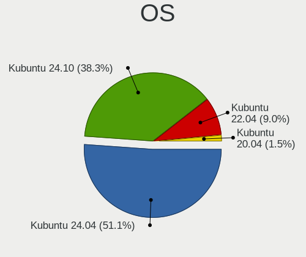
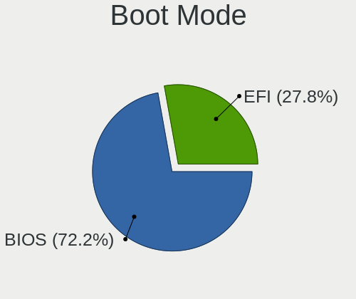
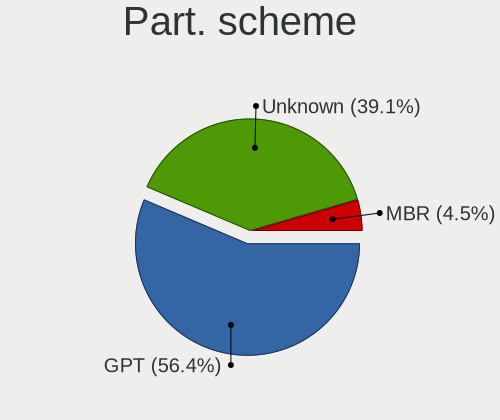
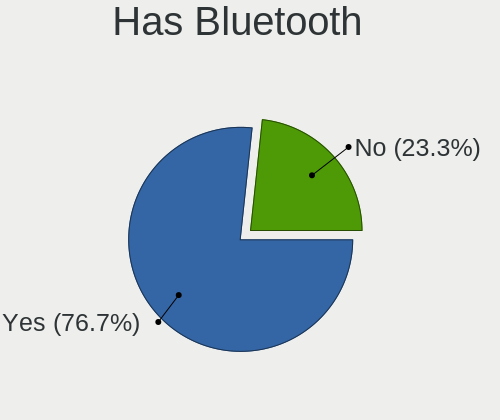
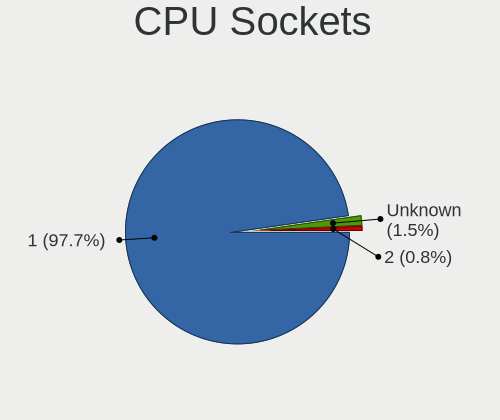
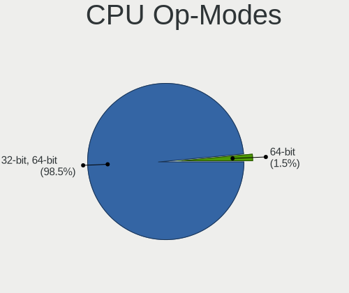

Kubuntu Hardware Trends
-----------------------

A project to identify most popular hardware characteristics and track their change
over time based on data collected by Kubuntu users at https://Linux-Hardware.org.

Anyone can contribute to this report by the [hw-probe](https://github.com/linuxhw/hw-probe) tool:

    sudo -E hw-probe -all -upload

This is a report for all computer types. See also reports for [desktops](/Dist/Kubuntu/Desktop/README.md) and [notebooks](/Dist/Kubuntu/Notebook/README.md).

Full-feature report is available here: https://linux-hardware.org/?view=trends

Period: Feb, 2022.

Contents
--------

* [ System ](#system)
  - [ OS                       ](#os)
  - [ OS Family                ](#os-family)
  - [ Kernel                   ](#kernel)
  - [ Kernel Family            ](#kernel-family)
  - [ Kernel Major Ver.        ](#kernel-major-ver)
  - [ Arch                     ](#arch)
  - [ DE                       ](#de)
  - [ Display Server           ](#display-server)
  - [ Display Manager          ](#display-manager)
  - [ OS Lang                  ](#os-lang)
  - [ Boot Mode                ](#boot-mode)
  - [ Filesystem               ](#filesystem)
  - [ Part. scheme             ](#part-scheme)
  - [ Dual Boot with Linux/BSD ](#dual-boot-with-linuxbsd)
  - [ Dual Boot (Win)          ](#dual-boot-win)

* [ Board ](#board)
  - [ Vendor                   ](#vendor)
  - [ Model                    ](#model)
  - [ Model Family             ](#model-family)
  - [ MFG Year                 ](#mfg-year)
  - [ Form Factor              ](#form-factor)
  - [ Secure Boot              ](#secure-boot)
  - [ Coreboot                 ](#coreboot)
  - [ RAM Size                 ](#ram-size)
  - [ RAM Used                 ](#ram-used)
  - [ Total Drives             ](#total-drives)
  - [ Has CD-ROM               ](#has-cd-rom)
  - [ Has Ethernet             ](#has-ethernet)
  - [ Has WiFi                 ](#has-wifi)
  - [ Has Bluetooth            ](#has-bluetooth)

* [ Location ](#location)
  - [ Country                  ](#country)
  - [ City                     ](#city)

* [ Drives ](#drives)
  - [ Drive Vendor             ](#drive-vendor)
  - [ Drive Model              ](#drive-model)
  - [ HDD Vendor               ](#hdd-vendor)
  - [ SSD Vendor               ](#ssd-vendor)
  - [ Drive Kind               ](#drive-kind)
  - [ Drive Connector          ](#drive-connector)
  - [ Drive Size               ](#drive-size)
  - [ Space Total              ](#space-total)
  - [ Space Used               ](#space-used)
  - [ Malfunc. Drives          ](#malfunc-drives)
  - [ Malfunc. Drive Vendor    ](#malfunc-drive-vendor)
  - [ Malfunc. HDD Vendor      ](#malfunc-hdd-vendor)
  - [ Malfunc. Drive Kind      ](#malfunc-drive-kind)
  - [ Failed Drives            ](#failed-drives)
  - [ Failed Drive Vendor      ](#failed-drive-vendor)
  - [ Drive Status             ](#drive-status)

* [ Storage controller ](#storage-controller)
  - [ Storage Vendor           ](#storage-vendor)
  - [ Storage Model            ](#storage-model)
  - [ Storage Kind             ](#storage-kind)

* [ Processor ](#processor)
  - [ CPU Vendor               ](#cpu-vendor)
  - [ CPU Model                ](#cpu-model)
  - [ CPU Model Family         ](#cpu-model-family)
  - [ CPU Cores                ](#cpu-cores)
  - [ CPU Sockets              ](#cpu-sockets)
  - [ CPU Threads              ](#cpu-threads)
  - [ CPU Op-Modes             ](#cpu-op-modes)
  - [ CPU Microcode            ](#cpu-microcode)
  - [ CPU Microarch            ](#cpu-microarch)

* [ Graphics ](#graphics)
  - [ GPU Vendor               ](#gpu-vendor)
  - [ GPU Model                ](#gpu-model)
  - [ GPU Combo                ](#gpu-combo)
  - [ GPU Driver               ](#gpu-driver)
  - [ GPU Memory               ](#gpu-memory)

* [ Monitor ](#monitor)
  - [ Monitor Vendor           ](#monitor-vendor)
  - [ Monitor Model            ](#monitor-model)
  - [ Monitor Resolution       ](#monitor-resolution)
  - [ Monitor Diagonal         ](#monitor-diagonal)
  - [ Monitor Width            ](#monitor-width)
  - [ Aspect Ratio             ](#aspect-ratio)
  - [ Monitor Area             ](#monitor-area)
  - [ Pixel Density            ](#pixel-density)
  - [ Multiple Monitors        ](#multiple-monitors)

* [ Network ](#network)
  - [ Net Controller Vendor    ](#net-controller-vendor)
  - [ Net Controller Model     ](#net-controller-model)
  - [ Wireless Vendor          ](#wireless-vendor)
  - [ Wireless Model           ](#wireless-model)
  - [ Ethernet Vendor          ](#ethernet-vendor)
  - [ Ethernet Model           ](#ethernet-model)
  - [ Net Controller Kind      ](#net-controller-kind)
  - [ Used Controller          ](#used-controller)
  - [ NICs                     ](#nics)
  - [ IPv6                     ](#ipv6)

* [ Bluetooth ](#bluetooth)
  - [ Bluetooth Vendor         ](#bluetooth-vendor)
  - [ Bluetooth Model          ](#bluetooth-model)

* [ Sound ](#sound)
  - [ Sound Vendor             ](#sound-vendor)
  - [ Sound Model              ](#sound-model)

* [ Memory ](#memory)
  - [ Memory Vendor            ](#memory-vendor)
  - [ Memory Model             ](#memory-model)
  - [ Memory Kind              ](#memory-kind)
  - [ Memory Form Factor       ](#memory-form-factor)
  - [ Memory Size              ](#memory-size)
  - [ Memory Speed             ](#memory-speed)

* [ Printers & scanners ](#printers--scanners)
  - [ Printer Vendor           ](#printer-vendor)
  - [ Printer Model            ](#printer-model)
  - [ Scanner Vendor           ](#scanner-vendor)
  - [ Scanner Model            ](#scanner-model)

* [ Camera ](#camera)
  - [ Camera Vendor            ](#camera-vendor)
  - [ Camera Model             ](#camera-model)

* [ Security ](#security)
  - [ Fingerprint Vendor       ](#fingerprint-vendor)
  - [ Fingerprint Model        ](#fingerprint-model)
  - [ Chipcard Vendor          ](#chipcard-vendor)
  - [ Chipcard Model           ](#chipcard-model)

* [ Unsupported ](#unsupported)
  - [ Unsupported Devices      ](#unsupported-devices)
  - [ Unsupported Device Types ](#unsupported-device-types)

System
------

OS
--

Installed operating systems

| Name          | Computers | Percent |
|---------------|-----------|---------|
| Kubuntu 20.04 | 52        | 46.02%  |
| Kubuntu 21.10 | 39        | 34.51%  |
| Kubuntu 11    | 8         | 7.08%   |
| Kubuntu 22.04 | 6         | 5.31%   |
| Kubuntu 21.04 | 3         | 2.65%   |
| Kubuntu 18.04 | 2         | 1.77%   |
| Kubuntu 20.10 | 1         | 0.88%   |
| Kubuntu 19.04 | 1         | 0.88%   |
| Kubuntu 16.04 | 1         | 0.88%   |

OS Family
---------

OS without a version

| Name    | Computers | Percent |
|---------|-----------|---------|
| Kubuntu | 113       | 100%    |

Kernel
------

Version of the Linux kernel

| Version                  | Computers | Percent |
|--------------------------|-----------|---------|
| 5.13.0-28-generic        | 44        | 38.94%  |
| 5.13.0-30-generic        | 21        | 18.58%  |
| 5.4.0-99-generic         | 8         | 7.08%   |
| 5.4.0-97-generic         | 5         | 4.42%   |
| 5.15.0-18-generic        | 4         | 3.54%   |
| 5.13.0-27-generic        | 3         | 2.65%   |
| 5.4.0-100-generic        | 2         | 1.77%   |
| 5.13.0-30-lowlatency     | 2         | 1.77%   |
| 5.13.0-19-generic        | 2         | 1.77%   |
| 5.11.0-49-generic        | 2         | 1.77%   |
| 5.8.0-63-lowlatency      | 1         | 0.88%   |
| 5.8.0-63-generic         | 1         | 0.88%   |
| 5.4.0-65-generic         | 1         | 0.88%   |
| 5.4.0-42-generic         | 1         | 0.88%   |
| 5.17.0-rc3-arm64#        | 1         | 0.88%   |
| 5.17.0-051700rc5-generic | 1         | 0.88%   |
| 5.17.0-051700rc4-generic | 1         | 0.88%   |
| 5.16.8-051608-generic    | 1         | 0.88%   |
| 5.16.5                   | 1         | 0.88%   |
| 5.16.10-051610-generic   | 1         | 0.88%   |
| 5.15.0-22-generic        | 1         | 0.88%   |
| 5.14.21-051421-generic   | 1         | 0.88%   |
| 5.13.0-29-lowlatency     | 1         | 0.88%   |
| 5.13.0-29-generic        | 1         | 0.88%   |
| 5.13.0-28-lowlatency     | 1         | 0.88%   |
| 5.13.0-23-generic        | 1         | 0.88%   |
| 5.13.0-22-generic        | 1         | 0.88%   |
| 5.11.0-25-generic        | 1         | 0.88%   |
| 5.0.0-38-generic         | 1         | 0.88%   |
| 4.4.0-210-generic        | 1         | 0.88%   |

Kernel Family
-------------

Linux kernel without a distro release

| Version | Computers | Percent |
|---------|-----------|---------|
| 5.13.0  | 77        | 68.14%  |
| 5.4.0   | 17        | 15.04%  |
| 5.15.0  | 5         | 4.42%   |
| 5.17.0  | 3         | 2.65%   |
| 5.11.0  | 3         | 2.65%   |
| 5.8.0   | 2         | 1.77%   |
| 5.16.8  | 1         | 0.88%   |
| 5.16.5  | 1         | 0.88%   |
| 5.16.10 | 1         | 0.88%   |
| 5.14.21 | 1         | 0.88%   |
| 5.0.0   | 1         | 0.88%   |
| 4.4.0   | 1         | 0.88%   |

Kernel Major Ver.
-----------------

Linux kernel major version

| Version | Computers | Percent |
|---------|-----------|---------|
| 5.13    | 77        | 68.14%  |
| 5.4     | 17        | 15.04%  |
| 5.15    | 5         | 4.42%   |
| 5.17    | 3         | 2.65%   |
| 5.16    | 3         | 2.65%   |
| 5.11    | 3         | 2.65%   |
| 5.8     | 2         | 1.77%   |
| 5.14    | 1         | 0.88%   |
| 5.0     | 1         | 0.88%   |
| 4.4     | 1         | 0.88%   |

Arch
----

OS architecture (x86_64, i586, etc.)

| Name    | Computers | Percent |
|---------|-----------|---------|
| x86_64  | 111       | 98.23%  |
| i686    | 1         | 0.88%   |
| aarch64 | 1         | 0.88%   |

DE
--

Desktop Environment

| Name     | Computers | Percent |
|----------|-----------|---------|
| KDE5     | 109       | 96.46%  |
| KDE      | 2         | 1.77%   |
| MATE     | 1         | 0.88%   |
| Cinnamon | 1         | 0.88%   |

Display Server
--------------

X11 or Wayland

| Name    | Computers | Percent |
|---------|-----------|---------|
| X11     | 106       | 93.81%  |
| Wayland | 5         | 4.42%   |
| Tty     | 2         | 1.77%   |

Display Manager
---------------

SDDM, LightDM, etc.

| Name    | Computers | Percent |
|---------|-----------|---------|
| SDDM    | 82        | 72.57%  |
| Unknown | 19        | 16.81%  |
| LightDM | 7         | 6.19%   |
| GDM3    | 3         | 2.65%   |
| GDM     | 2         | 1.77%   |

OS Lang
-------

Language

| Lang  | Computers | Percent |
|-------|-----------|---------|
| en_US | 43        | 38.05%  |
| fr_FR | 9         | 7.96%   |
| de_DE | 9         | 7.96%   |
| ru_RU | 6         | 5.31%   |
| en_GB | 5         | 4.42%   |
| hu_HU | 4         | 3.54%   |
| es_ES | 4         | 3.54%   |
| C     | 4         | 3.54%   |
| pt_BR | 3         | 2.65%   |
| pl_PL | 3         | 2.65%   |
| it_IT | 3         | 2.65%   |
| sv_SE | 2         | 1.77%   |
| es_AR | 2         | 1.77%   |
| el_GR | 2         | 1.77%   |
| be_BY | 2         | 1.77%   |
| uk_UA | 1         | 0.88%   |
| sl_SI | 1         | 0.88%   |
| ro_RO | 1         | 0.88%   |
| hr_HR | 1         | 0.88%   |
| es_CR | 1         | 0.88%   |
| en_ZA | 1         | 0.88%   |
| en_NZ | 1         | 0.88%   |
| en_IN | 1         | 0.88%   |
| en_CA | 1         | 0.88%   |
| en_AU | 1         | 0.88%   |
| de_AT | 1         | 0.88%   |
| cs_CZ | 1         | 0.88%   |

Boot Mode
---------

EFI or BIOS

| Mode | Computers | Percent |
|------|-----------|---------|
| EFI  | 64        | 56.64%  |
| BIOS | 49        | 43.36%  |

Filesystem
----------

Type of filesystem

| Type    | Computers | Percent |
|---------|-----------|---------|
| Ext4    | 109       | 96.46%  |
| Overlay | 2         | 1.77%   |
| Xfs     | 1         | 0.88%   |
| Btrfs   | 1         | 0.88%   |

Part. scheme
------------

Scheme of partitioning

| Type    | Computers | Percent |
|---------|-----------|---------|
| GPT     | 54        | 47.79%  |
| Unknown | 51        | 45.13%  |
| MBR     | 8         | 7.08%   |

Dual Boot with Linux/BSD
------------------------

Hosting more than one Linux/BSD

| Dual boot | Computers | Percent |
|-----------|-----------|---------|
| No        | 99        | 87.61%  |
| Yes       | 14        | 12.39%  |

Dual Boot (Win)
---------------

Hosting Linux and Windows

| Dual boot | Computers | Percent |
|-----------|-----------|---------|
| No        | 74        | 65.49%  |
| Yes       | 39        | 34.51%  |

Board
-----

Vendor
------

Motherboard manufacturer

| Name                | Computers | Percent |
|---------------------|-----------|---------|
| ASUSTek Computer    | 21        | 18.58%  |
| Lenovo              | 18        | 15.93%  |
| Hewlett-Packard     | 13        | 11.5%   |
| Dell                | 13        | 11.5%   |
| MSI                 | 12        | 10.62%  |
| Gigabyte Technology | 7         | 6.19%   |
| Acer                | 3         | 2.65%   |
| Timi                | 2         | 1.77%   |
| Medion              | 2         | 1.77%   |
| Intel               | 2         | 1.77%   |
| ASRock              | 2         | 1.77%   |
| Unknown             | 2         | 1.77%   |
| Toshiba             | 1         | 0.88%   |
| SUPoX COMPUTER      | 1         | 0.88%   |
| Supermicro          | 1         | 0.88%   |
| Sony                | 1         | 0.88%   |
| Semp Toshiba        | 1         | 0.88%   |
| Schenker            | 1         | 0.88%   |
| Samsung Electronics | 1         | 0.88%   |
| LG Electronics      | 1         | 0.88%   |
| HUAWEI              | 1         | 0.88%   |
| Google              | 1         | 0.88%   |
| Gateway             | 1         | 0.88%   |
| Fujitsu Siemens     | 1         | 0.88%   |
| Fujitsu             | 1         | 0.88%   |
| Digma               | 1         | 0.88%   |
| Biostar             | 1         | 0.88%   |
| Apple               | 1         | 0.88%   |

Model
-----

Motherboard model

| Name                                       | Computers | Percent |
|--------------------------------------------|-----------|---------|
| ASUS All Series                            | 3         | 2.65%   |
| HP Notebook                                | 2         | 1.77%   |
| ASUS TUF X470-PLUS GAMING                  | 2         | 1.77%   |
| Unknown                                    | 2         | 1.77%   |
| Toshiba Satellite S55-C                    | 1         | 0.88%   |
| Timi RedmiBook 14 II                       | 1         | 0.88%   |
| Timi Mi Laptop Air 12.5                    | 1         | 0.88%   |
| SUPoX COMPUTER B250A-BTC PRO               | 1         | 0.88%   |
| Supermicro X10DAi                          | 1         | 0.88%   |
| Sony VPCF236FM                             | 1         | 0.88%   |
| Semp Toshiba IS 1412                       | 1         | 0.88%   |
| Schenker VIA 15                            | 1         | 0.88%   |
| Samsung 300E4A/300E5A/300E7A/3430EA/3530EA | 1         | 0.88%   |
| MSI Prestige 14 A10RB                      | 1         | 0.88%   |
| MSI MS-7D54                                | 1         | 0.88%   |
| MSI MS-7C94                                | 1         | 0.88%   |
| MSI MS-7C34                                | 1         | 0.88%   |
| MSI MS-7B89                                | 1         | 0.88%   |
| MSI MS-7A40                                | 1         | 0.88%   |
| MSI MS-7A34                                | 1         | 0.88%   |
| MSI MS-7971                                | 1         | 0.88%   |
| MSI MS-7817                                | 1         | 0.88%   |
| MSI MS-7502                                | 1         | 0.88%   |
| MSI Katana GF76 11UC                       | 1         | 0.88%   |
| MSI GE62 6QD                               | 1         | 0.88%   |
| Medion S23003                              | 1         | 0.88%   |
| Medion E4241 MD60996                       | 1         | 0.88%   |
| LG 16Z90P-G.AA78C                          | 1         | 0.88%   |
| Lenovo V580c 20160                         | 1         | 0.88%   |
| Lenovo V14-IIL 82C4                        | 1         | 0.88%   |
| Lenovo V14 G2 ITL 82NM                     | 1         | 0.88%   |
| Lenovo ThinkPad Yoga 260 20FES20200        | 1         | 0.88%   |
| Lenovo ThinkPad T460s 20F9S1G200           | 1         | 0.88%   |
| Lenovo ThinkPad T430 23495P8               | 1         | 0.88%   |
| Lenovo ThinkPad T14s Gen 1 20UH001QGE      | 1         | 0.88%   |
| Lenovo ThinkPad L430 2468CTO               | 1         | 0.88%   |
| Lenovo ThinkPad L14 Gen 2 20X1S07900       | 1         | 0.88%   |
| Lenovo ThinkPad L14 Gen 1 20U5S01S00       | 1         | 0.88%   |
| Lenovo ThinkPad E14 20RBS25S00             | 1         | 0.88%   |
| Lenovo ThinkCentre M92p 32381Q4            | 1         | 0.88%   |
| Lenovo Legion 5 17ACH6 82K0                | 1         | 0.88%   |
| Lenovo IdeaPad S145-15API 81UT             | 1         | 0.88%   |
| Lenovo IdeaPad 3 15ARE05 81W4              | 1         | 0.88%   |
| Lenovo G710 20252                          | 1         | 0.88%   |
| Lenovo G500 20236                          | 1         | 0.88%   |
| Lenovo G50-70 20351                        | 1         | 0.88%   |
| Intel NUC8i5BEH                            | 1         | 0.88%   |
| Intel NUC7i7BNH                            | 1         | 0.88%   |
| HUAWEI HVY-WXX9                            | 1         | 0.88%   |
| HP Victus by Laptop 16-e0xxx               | 1         | 0.88%   |
| HP Spectre x360 2-in-1 Laptop 16-f0xxx     | 1         | 0.88%   |
| HP Pavilion Laptop 14-ce0xxx               | 1         | 0.88%   |
| HP Pavilion dv6                            | 1         | 0.88%   |
| HP Laptop 15g-br1xx                        | 1         | 0.88%   |
| HP ENVY x360 Convertible 15-ee0xxx         | 1         | 0.88%   |
| HP EliteBook 8760w                         | 1         | 0.88%   |
| HP EliteBook 8570w                         | 1         | 0.88%   |
| HP Compaq Presario CQ71                    | 1         | 0.88%   |
| HP Compaq dc5700 Small Form Factor         | 1         | 0.88%   |
| HP 290 G2 MT Business PC                   | 1         | 0.88%   |

Model Family
------------

Motherboard model prefix

| Name                     | Computers | Percent |
|--------------------------|-----------|---------|
| Lenovo ThinkPad          | 8         | 7.08%   |
| Dell Latitude            | 4         | 3.54%   |
| Dell Inspiron            | 4         | 3.54%   |
| ASUS TUF                 | 3         | 2.65%   |
| ASUS All                 | 3         | 2.65%   |
| Acer Aspire              | 3         | 2.65%   |
| Lenovo IdeaPad           | 2         | 1.77%   |
| HP Pavilion              | 2         | 1.77%   |
| HP Notebook              | 2         | 1.77%   |
| HP EliteBook             | 2         | 1.77%   |
| HP Compaq                | 2         | 1.77%   |
| Dell OptiPlex            | 2         | 1.77%   |
| ASUS ROG                 | 2         | 1.77%   |
| ASUS ASUS                | 2         | 1.77%   |
| Unknown                  | 2         | 1.77%   |
| Toshiba Satellite        | 1         | 0.88%   |
| Timi RedmiBook           | 1         | 0.88%   |
| Timi Mi                  | 1         | 0.88%   |
| SUPoX COMPUTER B250A-BTC | 1         | 0.88%   |
| Supermicro X10DAi        | 1         | 0.88%   |
| Sony VPCF236FM           | 1         | 0.88%   |
| Semp Toshiba IS          | 1         | 0.88%   |
| Schenker VIA             | 1         | 0.88%   |
| Samsung 300E4A           | 1         | 0.88%   |
| MSI Prestige             | 1         | 0.88%   |
| MSI MS-7D54              | 1         | 0.88%   |
| MSI MS-7C94              | 1         | 0.88%   |
| MSI MS-7C34              | 1         | 0.88%   |
| MSI MS-7B89              | 1         | 0.88%   |
| MSI MS-7A40              | 1         | 0.88%   |
| MSI MS-7A34              | 1         | 0.88%   |
| MSI MS-7971              | 1         | 0.88%   |
| MSI MS-7817              | 1         | 0.88%   |
| MSI MS-7502              | 1         | 0.88%   |
| MSI Katana               | 1         | 0.88%   |
| MSI GE62                 | 1         | 0.88%   |
| Medion S23003            | 1         | 0.88%   |
| Medion E4241             | 1         | 0.88%   |
| LG 16Z90P-G.AA78C        | 1         | 0.88%   |
| Lenovo V580c             | 1         | 0.88%   |
| Lenovo V14-IIL           | 1         | 0.88%   |
| Lenovo V14               | 1         | 0.88%   |
| Lenovo ThinkCentre       | 1         | 0.88%   |
| Lenovo Legion            | 1         | 0.88%   |
| Lenovo G710              | 1         | 0.88%   |
| Lenovo G500              | 1         | 0.88%   |
| Lenovo G50-70            | 1         | 0.88%   |
| Intel NUC8i5BEH          | 1         | 0.88%   |
| Intel NUC7i7BNH          | 1         | 0.88%   |
| HUAWEI HVY-WXX9          | 1         | 0.88%   |
| HP Victus                | 1         | 0.88%   |
| HP Spectre               | 1         | 0.88%   |
| HP Laptop                | 1         | 0.88%   |
| HP ENVY                  | 1         | 0.88%   |
| HP 290                   | 1         | 0.88%   |
| Google Homestar          | 1         | 0.88%   |
| Gigabyte P55A-UD3        | 1         | 0.88%   |
| Gigabyte H81M-H          | 1         | 0.88%   |
| Gigabyte H410M           | 1         | 0.88%   |
| Gigabyte F2A88XM-D3HP    | 1         | 0.88%   |

MFG Year
--------

Motherboard manufacture year

| Year    | Computers | Percent |
|---------|-----------|---------|
| 2021    | 16        | 14.16%  |
| 2017    | 15        | 13.27%  |
| 2018    | 13        | 11.5%   |
| 2020    | 12        | 10.62%  |
| 2019    | 11        | 9.73%   |
| 2011    | 9         | 7.96%   |
| 2013    | 7         | 6.19%   |
| 2012    | 7         | 6.19%   |
| 2015    | 5         | 4.42%   |
| 2014    | 4         | 3.54%   |
| 2008    | 4         | 3.54%   |
| 2016    | 3         | 2.65%   |
| 2009    | 3         | 2.65%   |
| 2010    | 1         | 0.88%   |
| 2007    | 1         | 0.88%   |
| 2006    | 1         | 0.88%   |
| Unknown | 1         | 0.88%   |

Form Factor
-----------

Physical design of the computer

| Name           | Computers | Percent |
|----------------|-----------|---------|
| Notebook       | 62        | 54.87%  |
| Desktop        | 43        | 38.05%  |
| Convertible    | 4         | 3.54%   |
| Mini pc        | 2         | 1.77%   |
| System on chip | 1         | 0.88%   |
| Server         | 1         | 0.88%   |

Secure Boot
-----------

Enabled or disabled

| State    | Computers | Percent |
|----------|-----------|---------|
| Disabled | 105       | 92.92%  |
| Enabled  | 8         | 7.08%   |

Coreboot
--------

Have coreboot on board

| Used | Computers | Percent |
|------|-----------|---------|
| No   | 113       | 100%    |

RAM Size
--------

Total RAM memory

| Size in GB  | Computers | Percent |
|-------------|-----------|---------|
| 16.01-24.0  | 30        | 26.55%  |
| 8.01-16.0   | 22        | 19.47%  |
| 4.01-8.0    | 21        | 18.58%  |
| 3.01-4.0    | 17        | 15.04%  |
| 32.01-64.0  | 13        | 11.5%   |
| 24.01-32.0  | 4         | 3.54%   |
| 64.01-256.0 | 4         | 3.54%   |
| 2.01-3.0    | 2         | 1.77%   |

RAM Used
--------

Used RAM memory

| Used GB    | Computers | Percent |
|------------|-----------|---------|
| 2.01-3.0   | 33        | 29.2%   |
| 1.01-2.0   | 29        | 25.66%  |
| 4.01-8.0   | 25        | 22.12%  |
| 3.01-4.0   | 12        | 10.62%  |
| 8.01-16.0  | 11        | 9.73%   |
| 16.01-24.0 | 3         | 2.65%   |

Total Drives
------------

Number of drives on board

| Drives | Computers | Percent |
|--------|-----------|---------|
| 1      | 61        | 53.98%  |
| 2      | 34        | 30.09%  |
| 3      | 7         | 6.19%   |
| 4      | 6         | 5.31%   |
| 5      | 4         | 3.54%   |
| 6      | 1         | 0.88%   |

Has CD-ROM
----------

Has CD-ROM on board

| Presented | Computers | Percent |
|-----------|-----------|---------|
| No        | 71        | 62.83%  |
| Yes       | 42        | 37.17%  |

Has Ethernet
------------

Has Ethernet on board

| Presented | Computers | Percent |
|-----------|-----------|---------|
| Yes       | 96        | 84.96%  |
| No        | 17        | 15.04%  |

Has WiFi
--------

Has WiFi module

| Presented | Computers | Percent |
|-----------|-----------|---------|
| Yes       | 85        | 75.22%  |
| No        | 28        | 24.78%  |

Has Bluetooth
-------------

Has Bluetooth module

| Presented | Computers | Percent |
|-----------|-----------|---------|
| Yes       | 70        | 61.95%  |
| No        | 43        | 38.05%  |

Location
--------

Country
-------

Geographic location (country)

| Country      | Computers | Percent |
|--------------|-----------|---------|
| USA          | 15        | 13.27%  |
| Germany      | 14        | 12.39%  |
| France       | 9         | 7.96%   |
| Russia       | 7         | 6.19%   |
| Brazil       | 7         | 6.19%   |
| Spain        | 5         | 4.42%   |
| Hungary      | 5         | 4.42%   |
| UK           | 4         | 3.54%   |
| Ukraine      | 3         | 2.65%   |
| Romania      | 3         | 2.65%   |
| Netherlands  | 3         | 2.65%   |
| Italy        | 3         | 2.65%   |
| Belarus      | 3         | 2.65%   |
| Switzerland  | 2         | 1.77%   |
| Sweden       | 2         | 1.77%   |
| Slovenia     | 2         | 1.77%   |
| Poland       | 2         | 1.77%   |
| Greece       | 2         | 1.77%   |
| Czechia      | 2         | 1.77%   |
| Argentina    | 2         | 1.77%   |
| Yemen        | 1         | 0.88%   |
| Turkey       | 1         | 0.88%   |
| Taiwan       | 1         | 0.88%   |
| South Korea  | 1         | 0.88%   |
| South Africa | 1         | 0.88%   |
| Serbia       | 1         | 0.88%   |
| Norway       | 1         | 0.88%   |
| Mexico       | 1         | 0.88%   |
| Martinique   | 1         | 0.88%   |
| Lithuania    | 1         | 0.88%   |
| Israel       | 1         | 0.88%   |
| India        | 1         | 0.88%   |
| Croatia      | 1         | 0.88%   |
| Costa Rica   | 1         | 0.88%   |
| China        | 1         | 0.88%   |
| Chile        | 1         | 0.88%   |
| Canada       | 1         | 0.88%   |
| Australia    | 1         | 0.88%   |

City
----

Geographic location (city)

| City                        | Computers | Percent |
|-----------------------------|-----------|---------|
| Moscow                      | 4         | 3.54%   |
| Minsk                       | 3         | 2.65%   |
| Cologne                     | 3         | 2.65%   |
| Budapest                    | 3         | 2.65%   |
| Zurich                      | 2         | 1.77%   |
| Paris                       | 2         | 1.77%   |
| Obninsk                     | 2         | 1.77%   |
| Madrid                      | 2         | 1.77%   |
| Broken Arrow                | 2         | 1.77%   |
| Zabreh                      | 1         | 0.88%   |
| Wroclaw                     | 1         | 0.88%   |
| Wildflecken                 | 1         | 0.88%   |
| Villa Nueva                 | 1         | 0.88%   |
| Venlo                       | 1         | 0.88%   |
| Tychy                       | 1         | 0.88%   |
| Toulouse                    | 1         | 0.88%   |
| Tel Aviv                    | 1         | 0.88%   |
| Târgu Mureş           | 1         | 0.88%   |
| Taipei                      | 1         | 0.88%   |
| Szeged                      | 1         | 0.88%   |
| Sydney                      | 1         | 0.88%   |
| Sutton                      | 1         | 0.88%   |
| Strullendorf                | 1         | 0.88%   |
| Seoul                       | 1         | 0.88%   |
| Schifferstadt               | 1         | 0.88%   |
| São Paulo                | 1         | 0.88%   |
| São Carlos               | 1         | 0.88%   |
| Sault Ste. Marie            | 1         | 0.88%   |
| Sanaa                       | 1         | 0.88%   |
| San Francisco del Rincón | 1         | 0.88%   |
| Saint-Mandrier-sur-Mer      | 1         | 0.88%   |
| Sacramento                  | 1         | 0.88%   |
| Ryazan                      | 1         | 0.88%   |
| Rochester                   | 1         | 0.88%   |
| Rocca Priora                | 1         | 0.88%   |
| Rio de Janeiro              | 1         | 0.88%   |
| Rethymno                    | 1         | 0.88%   |
| Prague                      | 1         | 0.88%   |
| Port Montt                  | 1         | 0.88%   |
| Plattsmouth                 | 1         | 0.88%   |
| Phoenix                     | 1         | 0.88%   |
| Perugia                     | 1         | 0.88%   |
| Oxfordshire                 | 1         | 0.88%   |
| Oslo                        | 1         | 0.88%   |
| Nova Kakhovka               | 1         | 0.88%   |
| New York                    | 1         | 0.88%   |
| Nîmes                    | 1         | 0.88%   |
| Natal                       | 1         | 0.88%   |
| Milton                      | 1         | 0.88%   |
| Meyzieu                     | 1         | 0.88%   |
| Mendon                      | 1         | 0.88%   |
| Marseille                   | 1         | 0.88%   |
| Maracai                     | 1         | 0.88%   |
| Ljutomer                    | 1         | 0.88%   |
| Ljubljana                   | 1         | 0.88%   |
| Lith                        | 1         | 0.88%   |
| Leesburg                    | 1         | 0.88%   |
| Le Lamentin                 | 1         | 0.88%   |
| Lüdenscheid              | 1         | 0.88%   |
| Las Vegas                   | 1         | 0.88%   |

Drives
------

Drive Vendor
------------

Hard drive vendors

| Vendor                         | Computers | Drives | Percent |
|--------------------------------|-----------|--------|---------|
| Samsung Electronics            | 40        | 47     | 23.26%  |
| WDC                            | 33        | 41     | 19.19%  |
| Seagate                        | 18        | 23     | 10.47%  |
| Kingston                       | 13        | 16     | 7.56%   |
| SanDisk                        | 10        | 10     | 5.81%   |
| Toshiba                        | 9         | 12     | 5.23%   |
| Crucial                        | 8         | 9      | 4.65%   |
| Intel                          | 5         | 6      | 2.91%   |
| Unknown                        | 4         | 4      | 2.33%   |
| SK Hynix                       | 4         | 4      | 2.33%   |
| Hitachi                        | 3         | 3      | 1.74%   |
| Solid State Storage Technology | 2         | 2      | 1.16%   |
| KIOXIA                         | 2         | 2      | 1.16%   |
| Unknown                        | 2         | 2      | 1.16%   |
| Zheino                         | 1         | 1      | 0.58%   |
| XPG                            | 1         | 1      | 0.58%   |
| Verbatim                       | 1         | 1      | 0.58%   |
| Team                           | 1         | 1      | 0.58%   |
| Silicon Motion                 | 1         | 1      | 0.58%   |
| Realtek Semiconductor          | 1         | 1      | 0.58%   |
| PNY                            | 1         | 1      | 0.58%   |
| Patriot                        | 1         | 1      | 0.58%   |
| Micron Technology              | 1         | 1      | 0.58%   |
| LITEONIT                       | 1         | 1      | 0.58%   |
| LITEON                         | 1         | 1      | 0.58%   |
| Lexar                          | 1         | 1      | 0.58%   |
| LDLC                           | 1         | 2      | 0.58%   |
| KingSpec                       | 1         | 1      | 0.58%   |
| KingFast                       | 1         | 1      | 0.58%   |
| ipTIME                         | 1         | 1      | 0.58%   |
| HGST                           | 1         | 1      | 0.58%   |
| ASM1153U                       | 1         | 1      | 0.58%   |
| AMD                            | 1         | 1      | 0.58%   |

Drive Model
-----------

Hard drive models

| Model                                    | Computers | Percent |
|------------------------------------------|-----------|---------|
| Seagate ST1000LM024 HN-M101MBB 1TB       | 4         | 2.07%   |
| Samsung SSD 970 EVO Plus 500GB           | 4         | 2.07%   |
| WDC WDS500G2B0A-00SM50 500GB SSD         | 3         | 1.55%   |
| Samsung SSD 870 EVO 250GB                | 3         | 1.55%   |
| Samsung SSD 850 EVO 250GB                | 3         | 1.55%   |
| Kingston SA400S37240G 240GB SSD          | 3         | 1.55%   |
| WDC WD20EARX-00PASB0 2TB                 | 2         | 1.04%   |
| WDC WD1002FAEX-00Z3A0 1TB                | 2         | 1.04%   |
| Toshiba DT01ACA200 2TB                   | 2         | 1.04%   |
| Solid State Storage NVMe SSD Drive 256GB | 2         | 1.04%   |
| Seagate ST2000DM008-2FR102 2TB           | 2         | 1.04%   |
| Seagate ST2000DM001-1ER164 2TB           | 2         | 1.04%   |
| Sandisk NVMe SSD Drive 256GB             | 2         | 1.04%   |
| Samsung SSD 860 EVO 250GB                | 2         | 1.04%   |
| Samsung SSD 850 EVO 500GB                | 2         | 1.04%   |
| Samsung NVMe SSD Drive 500GB             | 2         | 1.04%   |
| Samsung NVMe SSD Drive 1TB               | 2         | 1.04%   |
| Samsung HM500JI 500GB                    | 2         | 1.04%   |
| Kingston SV300S37A120G 120GB SSD         | 2         | 1.04%   |
| Kingston SHSS37A240G 240GB SSD           | 2         | 1.04%   |
| Unknown                                  | 2         | 1.04%   |
| Zheino CHN 25SATAS3 128 128GB SSD        | 1         | 0.52%   |
| XPG SPECTRIX S40G 4TB                    | 1         | 0.52%   |
| WDC WDS500G2B0C-00PXH0 500GB             | 1         | 0.52%   |
| WDC WDS500G2B0B-00YS70 500GB SSD         | 1         | 0.52%   |
| WDC WDS250G2B0A-00SM50 250GB SSD         | 1         | 0.52%   |
| WDC WDS240G2G0C-00AJM0 240GB             | 1         | 0.52%   |
| WDC WDS200T1X0E-00AFY0 2TB               | 1         | 0.52%   |
| WDC WDS100T2B0C-00PXH0 1TB               | 1         | 0.52%   |
| WDC WDS100T2B0C 1TB                      | 1         | 0.52%   |
| WDC WDS100T2B0A-00SM50 1TB SSD           | 1         | 0.52%   |
| WDC WD6400BPVT-22HXZT3 640GB             | 1         | 0.52%   |
| WDC WD60PURX-64T0ZY0 6TB                 | 1         | 0.52%   |
| WDC WD5000LPZX-80Z10T0 500GB             | 1         | 0.52%   |
| WDC WD5000BPVT-00HXZT3 500GB             | 1         | 0.52%   |
| WDC WD5000AZLX-08K2TA0 500GB             | 1         | 0.52%   |
| WDC WD5000AAKX-75U6AA0 500GB             | 1         | 0.52%   |
| WDC WD40EZRZ-00GXCB0 4TB                 | 1         | 0.52%   |
| WDC WD3200BPVT-22JJ5T0 320GB             | 1         | 0.52%   |
| WDC WD3200AAJB-00J3A0 320GB              | 1         | 0.52%   |
| WDC WD20EZRX-00D8PB0 2TB                 | 1         | 0.52%   |
| WDC WD10SPZX-24Z10 1TB                   | 1         | 0.52%   |
| WDC WD10JPVX-60JC3T1 1TB                 | 1         | 0.52%   |
| WDC WD10EZRZ-00HTKB0 1TB                 | 1         | 0.52%   |
| WDC WD10EZEX-60WN4A0 1TB                 | 1         | 0.52%   |
| WDC WD10EZEX-08WN4A0 1TB                 | 1         | 0.52%   |
| WDC WD10EARS-00Y5B1 1TB                  | 1         | 0.52%   |
| WDC WD10EALX-009BA0 1TB                  | 1         | 0.52%   |
| WDC WD10EALX-008EA0 1TB                  | 1         | 0.52%   |
| WDC WD10EADX-22TDHB0 1TB                 | 1         | 0.52%   |
| WDC WD10EACS-00ZJB0 1TB                  | 1         | 0.52%   |
| WDC PC SN730 SDBPNTY-512G-1006 512GB     | 1         | 0.52%   |
| WDC PC SN730 SDBPNTY-1T00-1032 1TB       | 1         | 0.52%   |
| WDC PC SN730 SDBPNTY-1T00-1006 1TB       | 1         | 0.52%   |
| WDC PC SN520 SDAPNUW-256G-1006 256GB     | 1         | 0.52%   |
| WDC PC SN520 SDAPMUW-128G-1101 128GB     | 1         | 0.52%   |
| Verbatim Vi500 S3 120GB SSD              | 1         | 0.52%   |
| Unknown SD/MMC/MS PRO 64GB               | 1         | 0.52%   |
| Unknown MMC128  128GB                    | 1         | 0.52%   |
| Unknown MMC Card  32GB                   | 1         | 0.52%   |

HDD Vendor
----------

Hard disk drive vendors

| Vendor              | Computers | Drives | Percent |
|---------------------|-----------|--------|---------|
| WDC                 | 21        | 25     | 34.43%  |
| Seagate             | 18        | 23     | 29.51%  |
| Samsung Electronics | 9         | 9      | 14.75%  |
| Toshiba             | 7         | 10     | 11.48%  |
| Hitachi             | 3         | 3      | 4.92%   |
| Unknown             | 1         | 1      | 1.64%   |
| ipTIME              | 1         | 1      | 1.64%   |
| HGST                | 1         | 1      | 1.64%   |

SSD Vendor
----------

Solid state drive vendors

| Vendor              | Computers | Drives | Percent |
|---------------------|-----------|--------|---------|
| Samsung Electronics | 20        | 22     | 32.26%  |
| Kingston            | 11        | 13     | 17.74%  |
| Crucial             | 7         | 8      | 11.29%  |
| WDC                 | 6         | 6      | 9.68%   |
| SanDisk             | 6         | 6      | 9.68%   |
| Intel               | 2         | 2      | 3.23%   |
| Zheino              | 1         | 1      | 1.61%   |
| Verbatim            | 1         | 1      | 1.61%   |
| Toshiba             | 1         | 1      | 1.61%   |
| Patriot             | 1         | 1      | 1.61%   |
| LITEONIT            | 1         | 1      | 1.61%   |
| LITEON              | 1         | 1      | 1.61%   |
| Lexar               | 1         | 1      | 1.61%   |
| KingSpec            | 1         | 1      | 1.61%   |
| KingFast            | 1         | 1      | 1.61%   |
| Unknown             | 1         | 1      | 1.61%   |

Drive Kind
----------

HDD or SSD

| Kind    | Computers | Drives | Percent |
|---------|-----------|--------|---------|
| SSD     | 55        | 67     | 35.48%  |
| NVMe    | 47        | 54     | 30.32%  |
| HDD     | 47        | 73     | 30.32%  |
| MMC     | 4         | 4      | 2.58%   |
| Unknown | 2         | 3      | 1.29%   |

Drive Connector
---------------

SATA, SAS, NVMe, etc.

| Type | Computers | Drives | Percent |
|------|-----------|--------|---------|
| SATA | 81        | 138    | 59.12%  |
| NVMe | 47        | 54     | 34.31%  |
| SAS  | 5         | 5      | 3.65%   |
| MMC  | 4         | 4      | 2.92%   |

Drive Size
----------

Size of hard drive

| Size in TB | Computers | Drives | Percent |
|------------|-----------|--------|---------|
| 0.01-0.5   | 59        | 71     | 52.68%  |
| 0.51-1.0   | 35        | 43     | 31.25%  |
| 1.01-2.0   | 13        | 20     | 11.61%  |
| 3.01-4.0   | 3         | 4      | 2.68%   |
| 4.01-10.0  | 2         | 2      | 1.79%   |

Space Total
-----------

Amount of disk space available on the file system

| Size in GB     | Computers | Percent |
|----------------|-----------|---------|
| 251-500        | 30        | 26.55%  |
| 101-250        | 29        | 25.66%  |
| 501-1000       | 19        | 16.81%  |
| 1001-2000      | 12        | 10.62%  |
| More than 3000 | 9         | 7.96%   |
| 2001-3000      | 5         | 4.42%   |
| 51-100         | 5         | 4.42%   |
| 21-50          | 3         | 2.65%   |
| 1-20           | 1         | 0.88%   |

Space Used
----------

Amount of used disk space

| Used GB        | Computers | Percent |
|----------------|-----------|---------|
| 1-20           | 28        | 24.78%  |
| 101-250        | 19        | 16.81%  |
| 51-100         | 18        | 15.93%  |
| 21-50          | 16        | 14.16%  |
| 251-500        | 11        | 9.73%   |
| 501-1000       | 10        | 8.85%   |
| 1001-2000      | 6         | 5.31%   |
| More than 3000 | 3         | 2.65%   |
| 2001-3000      | 2         | 1.77%   |

Malfunc. Drives
---------------

Drive models with a malfunction

| Model                                 | Computers | Drives | Percent |
|---------------------------------------|-----------|--------|---------|
| XPG SPECTRIX S40G 4TB                 | 1         | 1      | 8.33%   |
| WDC WD10JPVX-60JC3T1 1TB              | 1         | 1      | 8.33%   |
| WDC WD10EZRZ-00HTKB0 1TB              | 1         | 1      | 8.33%   |
| Toshiba MK7559GSXP 752GB              | 1         | 1      | 8.33%   |
| Toshiba DT01ACA200 2TB                | 1         | 1      | 8.33%   |
| Seagate ST3320613AS 320GB             | 1         | 1      | 8.33%   |
| Seagate ST1000LM024 HN-M101MBB 1TB    | 1         | 1      | 8.33%   |
| SanDisk SSD PLUS 240GB                | 1         | 1      | 8.33%   |
| Samsung Electronics SSD 840 EVO 500GB | 1         | 1      | 8.33%   |
| Samsung Electronics HD642JJ 640GB     | 1         | 1      | 8.33%   |
| Intel SSDSA2M080G2GC 80GB             | 1         | 1      | 8.33%   |
| HGST HTS721010A9E630 1TB              | 1         | 1      | 8.33%   |

Malfunc. Drive Vendor
---------------------

Vendors of faulty drives

| Vendor              | Computers | Drives | Percent |
|---------------------|-----------|--------|---------|
| WDC                 | 2         | 2      | 16.67%  |
| Toshiba             | 2         | 2      | 16.67%  |
| Seagate             | 2         | 2      | 16.67%  |
| Samsung Electronics | 2         | 2      | 16.67%  |
| XPG                 | 1         | 1      | 8.33%   |
| SanDisk             | 1         | 1      | 8.33%   |
| Intel               | 1         | 1      | 8.33%   |
| HGST                | 1         | 1      | 8.33%   |

Malfunc. HDD Vendor
-------------------

Vendors of faulty HDD drives

| Vendor              | Computers | Drives | Percent |
|---------------------|-----------|--------|---------|
| WDC                 | 2         | 2      | 25%     |
| Toshiba             | 2         | 2      | 25%     |
| Seagate             | 2         | 2      | 25%     |
| Samsung Electronics | 1         | 1      | 12.5%   |
| HGST                | 1         | 1      | 12.5%   |

Malfunc. Drive Kind
-------------------

Kinds of faulty drives

| Kind | Computers | Drives | Percent |
|------|-----------|--------|---------|
| HDD  | 8         | 8      | 66.67%  |
| SSD  | 3         | 3      | 25%     |
| NVMe | 1         | 1      | 8.33%   |

Failed Drives
-------------

Failed drive models

Zero info for selected period =(

Failed Drive Vendor
-------------------

Failed drive vendors

Zero info for selected period =(

Drive Status
------------

Number of failed and malfunc. drives

| Status   | Computers | Drives | Percent |
|----------|-----------|--------|---------|
| Detected | 57        | 100    | 45.97%  |
| Works    | 55        | 89     | 44.35%  |
| Malfunc  | 12        | 12     | 9.68%   |

Storage controller
------------------

Storage Vendor
--------------

Storage controller vendors

| Vendor                         | Computers | Percent |
|--------------------------------|-----------|---------|
| Intel                          | 73        | 46.79%  |
| AMD                            | 27        | 17.31%  |
| Samsung Electronics            | 16        | 10.26%  |
| Sandisk                        | 13        | 8.33%   |
| SK Hynix                       | 4         | 2.56%   |
| ASMedia Technology             | 4         | 2.56%   |
| Solid State Storage Technology | 2         | 1.28%   |
| Silicon Motion                 | 2         | 1.28%   |
| Realtek Semiconductor          | 2         | 1.28%   |
| KIOXIA                         | 2         | 1.28%   |
| Kingston Technology Company    | 2         | 1.28%   |
| Integrated Technology Express  | 2         | 1.28%   |
| VIA Technologies               | 1         | 0.64%   |
| Toshiba America Info Systems   | 1         | 0.64%   |
| Phison Electronics             | 1         | 0.64%   |
| Nvidia                         | 1         | 0.64%   |
| Micron/Crucial Technology      | 1         | 0.64%   |
| Micron Technology              | 1         | 0.64%   |
| Marvell Technology Group       | 1         | 0.64%   |

Storage Model
-------------

Storage controller models

| Model                                                                          | Computers | Percent |
|--------------------------------------------------------------------------------|-----------|---------|
| AMD FCH SATA Controller [AHCI mode]                                            | 23        | 13.07%  |
| Samsung NVMe SSD Controller SM981/PM981/PM983                                  | 13        | 7.39%   |
| AMD 400 Series Chipset SATA Controller                                         | 8         | 4.55%   |
| Intel 8 Series/C220 Series Chipset Family 6-port SATA Controller 1 [AHCI mode] | 7         | 3.98%   |
| Intel 6 Series/C200 Series Chipset Family 6 port Mobile SATA AHCI Controller   | 7         | 3.98%   |
| Intel Sunrise Point-LP SATA Controller [AHCI mode]                             | 6         | 3.41%   |
| Intel 7 Series Chipset Family 6-port SATA Controller [AHCI mode]               | 6         | 3.41%   |
| Sandisk WD Black SN750 / PC SN730 NVMe SSD                                     | 4         | 2.27%   |
| Sandisk WD Blue SN550 NVMe SSD                                                 | 3         | 1.7%    |
| Intel Volume Management Device NVMe RAID Controller                            | 3         | 1.7%    |
| Intel HM170/QM170 Chipset SATA Controller [AHCI Mode]                          | 3         | 1.7%    |
| Intel 82801IBM/IEM (ICH9M/ICH9M-E) 4 port SATA Controller [AHCI mode]          | 3         | 1.7%    |
| Intel 6 Series/C200 Series Chipset Family 6 port Desktop SATA AHCI Controller  | 3         | 1.7%    |
| Intel 500 Series Chipset Family SATA AHCI Controller                           | 3         | 1.7%    |
| Intel 200 Series PCH SATA controller [AHCI mode]                               | 3         | 1.7%    |
| AMD 300 Series Chipset SATA Controller                                         | 3         | 1.7%    |
| Solid State Storage Non-Volatile memory controller                             | 2         | 1.14%   |
| Silicon Motion SM2263EN/SM2263XT SSD Controller                                | 2         | 1.14%   |
| Sandisk WD Blue SN500 / PC SN520 NVMe SSD                                      | 2         | 1.14%   |
| KIOXIA Non-Volatile memory controller                                          | 2         | 1.14%   |
| Intel Q170/Q150/B150/H170/H110/Z170/CM236 Chipset SATA Controller [AHCI Mode]  | 2         | 1.14%   |
| Intel Ice Lake-LP SATA Controller [AHCI mode]                                  | 2         | 1.14%   |
| Intel Comet Lake SATA AHCI Controller                                          | 2         | 1.14%   |
| Intel Cannon Point-LP SATA Controller [AHCI Mode]                              | 2         | 1.14%   |
| Intel Cannon Lake PCH SATA AHCI Controller                                     | 2         | 1.14%   |
| Intel 8 Series SATA Controller 1 [AHCI mode]                                   | 2         | 1.14%   |
| Intel 7 Series/C210 Series Chipset Family 6-port SATA Controller [AHCI mode]   | 2         | 1.14%   |
| Integrated Express IT8213 IDE Controller                                       | 2         | 1.14%   |
| ASMedia ASM1062 Serial ATA Controller                                          | 2         | 1.14%   |
| VIA VT6415 PATA IDE Host Controller                                            | 1         | 0.57%   |
| Toshiba America Info Systems XG6 NVMe SSD Controller                           | 1         | 0.57%   |
| SK Hynix Non-Volatile memory controller                                        | 1         | 0.57%   |
| SK Hynix Gold P31 SSD                                                          | 1         | 0.57%   |
| SK Hynix BC511                                                                 | 1         | 0.57%   |
| SK Hynix BC501 NVMe Solid State Drive                                          | 1         | 0.57%   |
| Sandisk WD PC SN810 / Black SN850 NVMe SSD                                     | 1         | 0.57%   |
| Sandisk WD Blue SN570 NVMe SSD                                                 | 1         | 0.57%   |
| Sandisk PC SN520 NVMe SSD                                                      | 1         | 0.57%   |
| Sandisk Non-Volatile memory controller                                         | 1         | 0.57%   |
| Samsung NVMe SSD Controller PM9A1/PM9A3/980PRO                                 | 1         | 0.57%   |
| Samsung NVMe SSD Controller 980                                                | 1         | 0.57%   |
| Samsung Electronics SATA controller                                            | 1         | 0.57%   |
| Realtek RTS5763DL NVMe SSD Controller                                          | 1         | 0.57%   |
| Realtek Realtek Non-Volatile memory controller                                 | 1         | 0.57%   |
| Phison E12 NVMe Controller                                                     | 1         | 0.57%   |
| Nvidia MCP61 SATA Controller                                                   | 1         | 0.57%   |
| Nvidia MCP61 IDE                                                               | 1         | 0.57%   |
| Micron/Crucial P1 NVMe PCIe SSD                                                | 1         | 0.57%   |
| Micron Non-Volatile memory controller                                          | 1         | 0.57%   |
| Marvell Group 88SE9215 PCIe 2.0 x1 4-port SATA 6 Gb/s Controller               | 1         | 0.57%   |
| Marvell Group 88SE9128 PCIe SATA 6 Gb/s RAID controller                        | 1         | 0.57%   |
| Kingston Company Company Non-Volatile memory controller                        | 1         | 0.57%   |
| Kingston Company A2000 NVMe SSD                                                | 1         | 0.57%   |
| Intel Wildcat Point-LP SATA Controller [AHCI Mode]                             | 1         | 0.57%   |
| Intel Tiger Lake-LP SATA Controller [AHCI mode]                                | 1         | 0.57%   |
| Intel SSD Pro 7600p/760p/E 6100p Series                                        | 1         | 0.57%   |
| Intel SSD 660P Series                                                          | 1         | 0.57%   |
| Intel Non-Volatile memory controller                                           | 1         | 0.57%   |
| Intel Celeron/Pentium Silver Processor SATA Controller                         | 1         | 0.57%   |
| Intel Celeron N3350/Pentium N4200/Atom E3900 Series SATA AHCI Controller       | 1         | 0.57%   |

Storage Kind
------------

Kind of storage controller (IDE, SATA, NVMe, SAS, ...)

| Kind | Computers | Percent |
|------|-----------|---------|
| SATA | 93        | 61.18%  |
| NVMe | 47        | 30.92%  |
| IDE  | 8         | 5.26%   |
| RAID | 4         | 2.63%   |

Processor
---------

CPU Vendor
----------

Processor vendors

| Vendor   | Computers | Percent |
|----------|-----------|---------|
| Intel    | 79        | 69.91%  |
| AMD      | 33        | 29.2%   |
| QUALCOMM | 1         | 0.88%   |

CPU Model
---------

Processor models

| Model                                         | Computers | Percent |
|-----------------------------------------------|-----------|---------|
| AMD Ryzen 5 4500U with Radeon Graphics        | 4         | 3.54%   |
| AMD Ryzen 7 3700X 8-Core Processor            | 3         | 2.65%   |
| Intel Core i7-7700HQ CPU @ 2.80GHz            | 2         | 1.77%   |
| Intel Core i7-4790K CPU @ 4.00GHz             | 2         | 1.77%   |
| Intel Core i7-10510U CPU @ 1.80GHz            | 2         | 1.77%   |
| Intel Core i5-8250U CPU @ 1.60GHz             | 2         | 1.77%   |
| Intel Core i5-6300U CPU @ 2.40GHz             | 2         | 1.77%   |
| Intel Atom x5-Z8350 CPU @ 1.44GHz             | 2         | 1.77%   |
| Intel 11th Gen Core i7-1165G7 @ 2.80GHz       | 2         | 1.77%   |
| Intel 11th Gen Core i5-11400H @ 2.70GHz       | 2         | 1.77%   |
| Intel 11th Gen Core i5-1135G7 @ 2.40GHz       | 2         | 1.77%   |
| AMD Ryzen 5 3500U with Radeon Vega Mobile Gfx | 2         | 1.77%   |
| AMD Ryzen 5 3400G with Radeon Vega Graphics   | 2         | 1.77%   |
| AMD Ryzen 5 2400G with Radeon Vega Graphics   | 2         | 1.77%   |
| QUALCOMM Processor                            | 1         | 0.88%   |
| Intel Xeon Gold 6130 CPU @ 2.10GHz            | 1         | 0.88%   |
| Intel Xeon CPU L5420 @ 2.50GHz                | 1         | 0.88%   |
| Intel Xeon CPU E5-2603 v4 @ 1.70GHz           | 1         | 0.88%   |
| Intel Pentium Silver N6000 @ 1.10GHz          | 1         | 0.88%   |
| Intel Pentium Dual-Core CPU T4300 @ 2.10GHz   | 1         | 0.88%   |
| Intel Pentium D CPU 3.40GHz                   | 1         | 0.88%   |
| Intel Pentium CPU G645 @ 2.90GHz              | 1         | 0.88%   |
| Intel Pentium CPU G4560 @ 3.50GHz             | 1         | 0.88%   |
| Intel Core m3-8100Y CPU @ 1.10GHz             | 1         | 0.88%   |
| Intel Core i7-8700K CPU @ 3.70GHz             | 1         | 0.88%   |
| Intel Core i7-8700 CPU @ 3.20GHz              | 1         | 0.88%   |
| Intel Core i7-7820HQ CPU @ 2.90GHz            | 1         | 0.88%   |
| Intel Core i7-7700 CPU @ 3.60GHz              | 1         | 0.88%   |
| Intel Core i7-7567U CPU @ 3.50GHz             | 1         | 0.88%   |
| Intel Core i7-6700HQ CPU @ 2.60GHz            | 1         | 0.88%   |
| Intel Core i7-6600U CPU @ 2.60GHz             | 1         | 0.88%   |
| Intel Core i7-5500U CPU @ 2.40GHz             | 1         | 0.88%   |
| Intel Core i7-4720HQ CPU @ 2.60GHz            | 1         | 0.88%   |
| Intel Core i7-4702MQ CPU @ 2.20GHz            | 1         | 0.88%   |
| Intel Core i7-4600U CPU @ 2.10GHz             | 1         | 0.88%   |
| Intel Core i7-3612QM CPU @ 2.10GHz            | 1         | 0.88%   |
| Intel Core i7-3610QM CPU @ 2.30GHz            | 1         | 0.88%   |
| Intel Core i7-2760QM CPU @ 2.40GHz            | 1         | 0.88%   |
| Intel Core i7-2670QM CPU @ 2.20GHz            | 1         | 0.88%   |
| Intel Core i7-2640M CPU @ 2.80GHz             | 1         | 0.88%   |
| Intel Core i7-2630QM CPU @ 2.00GHz            | 1         | 0.88%   |
| Intel Core i7-1065G7 CPU @ 1.30GHz            | 1         | 0.88%   |
| Intel Core i7 CPU 870 @ 2.93GHz               | 1         | 0.88%   |
| Intel Core i5-8500 CPU @ 3.00GHz              | 1         | 0.88%   |
| Intel Core i5-8265U CPU @ 1.60GHz             | 1         | 0.88%   |
| Intel Core i5-8259U CPU @ 2.30GHz             | 1         | 0.88%   |
| Intel Core i5-6400 CPU @ 2.70GHz              | 1         | 0.88%   |
| Intel Core i5-4690 CPU @ 3.50GHz              | 1         | 0.88%   |
| Intel Core i5-4570T CPU @ 2.90GHz             | 1         | 0.88%   |
| Intel Core i5-4440 CPU @ 3.10GHz              | 1         | 0.88%   |
| Intel Core i5-3470T CPU @ 2.90GHz             | 1         | 0.88%   |
| Intel Core i5-3470 CPU @ 3.20GHz              | 1         | 0.88%   |
| Intel Core i5-3360M CPU @ 2.80GHz             | 1         | 0.88%   |
| Intel Core i5-3320M CPU @ 2.60GHz             | 1         | 0.88%   |
| Intel Core i5-3230M CPU @ 2.60GHz             | 1         | 0.88%   |
| Intel Core i5-2520M CPU @ 2.50GHz             | 1         | 0.88%   |
| Intel Core i5-2500 CPU @ 3.30GHz              | 1         | 0.88%   |
| Intel Core i5-2430M CPU @ 2.40GHz             | 1         | 0.88%   |
| Intel Core i5-2320 CPU @ 3.00GHz              | 1         | 0.88%   |
| Intel Core i5-10210U CPU @ 1.60GHz            | 1         | 0.88%   |

CPU Model Family
----------------

Processor model prefix

| Model                   | Computers | Percent |
|-------------------------|-----------|---------|
| Intel Core i7           | 25        | 22.12%  |
| Intel Core i5           | 21        | 18.58%  |
| AMD Ryzen 5             | 16        | 14.16%  |
| Other                   | 10        | 8.85%   |
| Intel Core i3           | 7         | 6.19%   |
| AMD Ryzen 7             | 7         | 6.19%   |
| Intel Core 2 Duo        | 3         | 2.65%   |
| Intel Xeon              | 2         | 1.77%   |
| Intel Pentium           | 2         | 1.77%   |
| Intel Celeron           | 2         | 1.77%   |
| Intel Atom              | 2         | 1.77%   |
| AMD Ryzen 9             | 2         | 1.77%   |
| AMD A10                 | 2         | 1.77%   |
| Intel Xeon Gold         | 1         | 0.88%   |
| Intel Pentium Silver    | 1         | 0.88%   |
| Intel Pentium Dual-Core | 1         | 0.88%   |
| Intel Pentium D         | 1         | 0.88%   |
| Intel Core m3           | 1         | 0.88%   |
| Intel Celeron Dual-Core | 1         | 0.88%   |
| AMD Ryzen 7 PRO         | 1         | 0.88%   |
| AMD Ryzen 5 PRO         | 1         | 0.88%   |
| AMD Ryzen 3             | 1         | 0.88%   |
| AMD FX                  | 1         | 0.88%   |
| AMD Athlon X2           | 1         | 0.88%   |
| AMD A6                  | 1         | 0.88%   |

CPU Cores
---------

Number of processor cores

| Number | Computers | Percent |
|--------|-----------|---------|
| 4      | 49        | 43.36%  |
| 2      | 34        | 30.09%  |
| 6      | 17        | 15.04%  |
| 8      | 10        | 8.85%   |
| 12     | 2         | 1.77%   |
| 16     | 1         | 0.88%   |

CPU Sockets
-----------

Number of sockets

| Number | Computers | Percent |
|--------|-----------|---------|
| 1      | 113       | 100%    |

CPU Threads
-----------

Threads per core (Hyper-Threading)

| Number | Computers | Percent |
|--------|-----------|---------|
| 2      | 85        | 75.22%  |
| 1      | 28        | 24.78%  |

CPU Op-Modes
------------

CPU Operation Modes (32-bit, 64-bit)

| Op mode        | Computers | Percent |
|----------------|-----------|---------|
| 32-bit, 64-bit | 113       | 100%    |

CPU Microcode
-------------

Microcode number

| Number     | Computers | Percent |
|------------|-----------|---------|
| Unknown    | 23        | 20.35%  |
| 0x206a7    | 9         | 7.96%   |
| 0x08600106 | 8         | 7.08%   |
| 0x306c3    | 7         | 6.19%   |
| 0x306a9    | 7         | 6.19%   |
| 0x806c1    | 4         | 3.54%   |
| 0x08701021 | 4         | 3.54%   |
| 0x906e9    | 3         | 2.65%   |
| 0x806ea    | 3         | 2.65%   |
| 0x406e3    | 3         | 2.65%   |
| 0x906ea    | 2         | 1.77%   |
| 0x806ec    | 2         | 1.77%   |
| 0x806e9    | 2         | 1.77%   |
| 0x806d1    | 2         | 1.77%   |
| 0x506e3    | 2         | 1.77%   |
| 0x1067a    | 2         | 1.77%   |
| 0x0a50000c | 2         | 1.77%   |
| 0x0a201016 | 2         | 1.77%   |
| 0x08108109 | 2         | 1.77%   |
| 0x08108102 | 2         | 1.77%   |
| 0x08101016 | 2         | 1.77%   |
| 0xa0653    | 1         | 0.88%   |
| 0x906c0    | 1         | 0.88%   |
| 0x806c2    | 1         | 0.88%   |
| 0x706e5    | 1         | 0.88%   |
| 0x706a8    | 1         | 0.88%   |
| 0x6fd      | 1         | 0.88%   |
| 0x6fb      | 1         | 0.88%   |
| 0x506c9    | 1         | 0.88%   |
| 0x406f1    | 1         | 0.88%   |
| 0x406c4    | 1         | 0.88%   |
| 0x40651    | 1         | 0.88%   |
| 0x10676    | 1         | 0.88%   |
| 0x08701013 | 1         | 0.88%   |
| 0x08608102 | 1         | 0.88%   |
| 0x0800820d | 1         | 0.88%   |
| 0x08001126 | 1         | 0.88%   |
| 0x0600611a | 1         | 0.88%   |
| 0x06003106 | 1         | 0.88%   |
| 0x06000852 | 1         | 0.88%   |
| 0x02000057 | 1         | 0.88%   |

CPU Microarch
-------------

Microarchitecture

| Name            | Computers | Percent |
|-----------------|-----------|---------|
| KabyLake        | 17        | 15.04%  |
| Zen 2           | 14        | 12.39%  |
| SandyBridge     | 10        | 8.85%   |
| Haswell         | 10        | 8.85%   |
| IvyBridge       | 8         | 7.08%   |
| Zen+            | 6         | 5.31%   |
| TigerLake       | 6         | 5.31%   |
| Skylake         | 6         | 5.31%   |
| Zen 3           | 4         | 3.54%   |
| Penryn          | 4         | 3.54%   |
| Icelake         | 4         | 3.54%   |
| Zen             | 3         | 2.65%   |
| Unknown         | 3         | 2.65%   |
| Silvermont      | 2         | 1.77%   |
| Core            | 2         | 1.77%   |
| Broadwell       | 2         | 1.77%   |
| Westmere        | 1         | 0.88%   |
| Tremont         | 1         | 0.88%   |
| Steamroller     | 1         | 0.88%   |
| Piledriver      | 1         | 0.88%   |
| NetBurst        | 1         | 0.88%   |
| Nehalem         | 1         | 0.88%   |
| K8 & K10 hybrid | 1         | 0.88%   |
| Jaguar          | 1         | 0.88%   |
| Goldmont plus   | 1         | 0.88%   |
| Goldmont        | 1         | 0.88%   |
| Excavator       | 1         | 0.88%   |
| CometLake       | 1         | 0.88%   |

Graphics
--------

GPU Vendor
----------

Vendors of graphics cards

| Vendor            | Computers | Percent |
|-------------------|-----------|---------|
| Intel             | 59        | 43.07%  |
| Nvidia            | 42        | 30.66%  |
| AMD               | 35        | 25.55%  |
| ASPEED Technology | 1         | 0.73%   |

GPU Model
---------

Graphics card models

| Model                                                                                    | Computers | Percent |
|------------------------------------------------------------------------------------------|-----------|---------|
| AMD Renoir                                                                               | 8         | 5.8%    |
| Intel 2nd Generation Core Processor Family Integrated Graphics Controller                | 7         | 5.07%   |
| Intel TigerLake-LP GT2 [Iris Xe Graphics]                                                | 6         | 4.35%   |
| Intel 3rd Gen Core processor Graphics Controller                                         | 4         | 2.9%    |
| AMD Picasso/Raven 2 [Radeon Vega Series / Radeon Vega Mobile Series]                     | 4         | 2.9%    |
| Nvidia GK208B [GeForce GT 710]                                                           | 3         | 2.17%   |
| Intel Skylake GT2 [HD Graphics 520]                                                      | 3         | 2.17%   |
| Intel Mobile 4 Series Chipset Integrated Graphics Controller                             | 3         | 2.17%   |
| Intel HD Graphics 630                                                                    | 3         | 2.17%   |
| Intel CometLake-U GT2 [UHD Graphics]                                                     | 3         | 2.17%   |
| Nvidia GP108M [GeForce MX250]                                                            | 2         | 1.45%   |
| Nvidia GP107M [GeForce MX350]                                                            | 2         | 1.45%   |
| Nvidia GP107M [GeForce GTX 1050 Mobile]                                                  | 2         | 1.45%   |
| Nvidia GF117M [GeForce 610M/710M/810M/820M / GT 620M/625M/630M/720M]                     | 2         | 1.45%   |
| Nvidia GF104 [GeForce GTX 460]                                                           | 2         | 1.45%   |
| Nvidia GA107M [GeForce RTX 3050 Mobile]                                                  | 2         | 1.45%   |
| Intel Xeon E3-1200 v3/4th Gen Core Processor Integrated Graphics Controller              | 2         | 1.45%   |
| Intel Xeon E3-1200 v2/3rd Gen Core processor Graphics Controller                         | 2         | 1.45%   |
| Intel UHD Graphics 620                                                                   | 2         | 1.45%   |
| Intel TigerLake-H GT1 [UHD Graphics]                                                     | 2         | 1.45%   |
| Intel HD Graphics 530                                                                    | 2         | 1.45%   |
| Intel Haswell-ULT Integrated Graphics Controller                                         | 2         | 1.45%   |
| Intel CoffeeLake-S GT2 [UHD Graphics 630]                                                | 2         | 1.45%   |
| Intel Atom/Celeron/Pentium Processor x5-E8000/J3xxx/N3xxx Integrated Graphics Controller | 2         | 1.45%   |
| Intel 4th Gen Core Processor Integrated Graphics Controller                              | 2         | 1.45%   |
| AMD Raven Ridge [Radeon Vega Series / Radeon Vega Mobile Series]                         | 2         | 1.45%   |
| AMD Juniper XT [Radeon HD 5770]                                                          | 2         | 1.45%   |
| AMD Ellesmere [Radeon RX 470/480/570/570X/580/580X/590]                                  | 2         | 1.45%   |
| AMD Cezanne                                                                              | 2         | 1.45%   |
| Nvidia TU117M [GeForce GTX 1650 Mobile / Max-Q]                                          | 1         | 0.72%   |
| Nvidia TU117BM [GeForce GTX 1650 Mobile Refresh]                                         | 1         | 0.72%   |
| Nvidia TU116 [GeForce GTX 1660]                                                          | 1         | 0.72%   |
| Nvidia TU116 [GeForce GTX 1660 Ti]                                                       | 1         | 0.72%   |
| Nvidia TU116 [GeForce GTX 1660 SUPER]                                                    | 1         | 0.72%   |
| Nvidia TU106 [GeForce RTX 2060 Rev. A]                                                   | 1         | 0.72%   |
| Nvidia TU104 [GeForce RTX 2070 SUPER]                                                    | 1         | 0.72%   |
| Nvidia TU102GL [Quadro RTX 6000/8000]                                                    | 1         | 0.72%   |
| Nvidia GT218 [GeForce 210]                                                               | 1         | 0.72%   |
| Nvidia GP108M [GeForce MX230]                                                            | 1         | 0.72%   |
| Nvidia GP107 [GeForce GTX 1050]                                                          | 1         | 0.72%   |
| Nvidia GP107 [GeForce GTX 1050 Ti]                                                       | 1         | 0.72%   |
| Nvidia GP104 [GeForce GTX 1070]                                                          | 1         | 0.72%   |
| Nvidia GM206 [GeForce GTX 750 v2]                                                        | 1         | 0.72%   |
| Nvidia GM108M [GeForce MX130]                                                            | 1         | 0.72%   |
| Nvidia GM107M [GeForce GTX 960M]                                                         | 1         | 0.72%   |
| Nvidia GM107M [GeForce GTX 950M]                                                         | 1         | 0.72%   |
| Nvidia GM107 [GeForce 940MX]                                                             | 1         | 0.72%   |
| Nvidia GK208M [GeForce GT 740M]                                                          | 1         | 0.72%   |
| Nvidia GK208B [GeForce GT 730]                                                           | 1         | 0.72%   |
| Nvidia GF114M [GeForce GTX 670M]                                                         | 1         | 0.72%   |
| Nvidia GF108M [GeForce GT 540M]                                                          | 1         | 0.72%   |
| Nvidia GF108M [GeForce GT 525M]                                                          | 1         | 0.72%   |
| Nvidia GF108 [GeForce GT 630]                                                            | 1         | 0.72%   |
| Nvidia GF104GLM [Quadro 3000M]                                                           | 1         | 0.72%   |
| Nvidia GA106M [GeForce RTX 3060 Mobile / Max-Q]                                          | 1         | 0.72%   |
| Nvidia GA104 [GeForce RTX 3060 Ti Lite Hash Rate]                                        | 1         | 0.72%   |
| Intel WhiskeyLake-U GT2 [UHD Graphics 620]                                               | 1         | 0.72%   |
| Intel UHD Graphics 615                                                                   | 1         | 0.72%   |
| Intel Mobile GM965/GL960 Integrated Graphics Controller (secondary)                      | 1         | 0.72%   |
| Intel Mobile GM965/GL960 Integrated Graphics Controller (primary)                        | 1         | 0.72%   |

GPU Combo
---------

Combinations of graphics cards

| Name           | Computers | Percent |
|----------------|-----------|---------|
| 1 x Intel      | 37        | 32.74%  |
| 1 x AMD        | 28        | 24.78%  |
| 1 x Nvidia     | 22        | 19.47%  |
| Intel + Nvidia | 17        | 15.04%  |
| Intel + AMD    | 4         | 3.54%   |
| AMD + Nvidia   | 3         | 2.65%   |
| Other          | 1         | 0.88%   |
| 1 x ASPEED     | 1         | 0.88%   |

GPU Driver
----------

Free vs proprietary

| Driver      | Computers | Percent |
|-------------|-----------|---------|
| Free        | 79        | 69.91%  |
| Proprietary | 31        | 27.43%  |
| Unknown     | 3         | 2.65%   |

GPU Memory
----------

Total video memory

| Size in GB | Computers | Percent |
|------------|-----------|---------|
| Unknown    | 57        | 50.44%  |
| 1.01-2.0   | 21        | 18.58%  |
| 0.51-1.0   | 10        | 8.85%   |
| 0.01-0.5   | 10        | 8.85%   |
| 3.01-4.0   | 5         | 4.42%   |
| 7.01-8.0   | 4         | 3.54%   |
| 5.01-6.0   | 4         | 3.54%   |
| 32.01-64.0 | 1         | 0.88%   |
| 2.01-3.0   | 1         | 0.88%   |

Monitor
-------

Monitor Vendor
--------------

Monitor vendors

| Vendor                  | Computers | Percent |
|-------------------------|-----------|---------|
| Samsung Electronics     | 21        | 17.36%  |
| BOE                     | 14        | 11.57%  |
| LG Display              | 13        | 10.74%  |
| Chimei Innolux          | 13        | 10.74%  |
| Goldstar                | 10        | 8.26%   |
| Dell                    | 10        | 8.26%   |
| AOC                     | 8         | 6.61%   |
| AU Optronics            | 5         | 4.13%   |
| Philips                 | 4         | 3.31%   |
| BenQ                    | 3         | 2.48%   |
| Chi Mei Optoelectronics | 2         | 1.65%   |
| Acer                    | 2         | 1.65%   |
| Xiaomi                  | 1         | 0.83%   |
| ViewSonic               | 1         | 0.83%   |
| STA                     | 1         | 0.83%   |
| Sharp                   | 1         | 0.83%   |
| PLN                     | 1         | 0.83%   |
| Panasonic               | 1         | 0.83%   |
| NEC Computers           | 1         | 0.83%   |
| MTD                     | 1         | 0.83%   |
| JCH                     | 1         | 0.83%   |
| Iiyama                  | 1         | 0.83%   |
| Hewlett-Packard         | 1         | 0.83%   |
| DENON                   | 1         | 0.83%   |
| CPT                     | 1         | 0.83%   |
| ASUSTek Computer        | 1         | 0.83%   |
| Apple                   | 1         | 0.83%   |
| Ancor Communications    | 1         | 0.83%   |

Monitor Model
-------------

Monitor models

| Model                                                                  | Computers | Percent |
|------------------------------------------------------------------------|-----------|---------|
| Samsung Electronics LCD Monitor SEC5441 1366x768 344x194mm 15.5-inch   | 2         | 1.54%   |
| Samsung Electronics C24F390 SAM0D2C 1920x1080 521x293mm 23.5-inch      | 2         | 1.54%   |
| Goldstar IPS FULLHD GSM5AB8 1920x1080 480x270mm 21.7-inch              | 2         | 1.54%   |
| Dell U2412M DELA07B 1920x1200 518x324mm 24.1-inch                      | 2         | 1.54%   |
| AOC 2470W AOC2470 1920x1080 520x290mm 23.4-inch                        | 2         | 1.54%   |
| Xiaomi Mi TV XMD00E1 3840x2160 708x398mm 32.0-inch                     | 1         | 0.77%   |
| ViewSonic LCD Monitor VSC3E32 1920x1080 600x340mm 27.2-inch            | 1         | 0.77%   |
| STA LCD Monitor STA5DCA 1366x768 256x144mm 11.6-inch                   | 1         | 0.77%   |
| Sharp LCD Monitor SHP1476 3840x2160 346x194mm 15.6-inch                | 1         | 0.77%   |
| Samsung Electronics U32H75x SAM0E02 3840x2160 697x392mm 31.5-inch      | 1         | 0.77%   |
| Samsung Electronics U28E590 SAM0C4D 3840x2160 607x345mm 27.5-inch      | 1         | 0.77%   |
| Samsung Electronics SyncMaster SAM01AE 1600x1200 408x306mm 20.1-inch   | 1         | 0.77%   |
| Samsung Electronics S24R65x SAM1027 1920x1080 527x296mm 23.8-inch      | 1         | 0.77%   |
| Samsung Electronics S24R65x SAM1024 1920x1080 527x296mm 23.8-inch      | 1         | 0.77%   |
| Samsung Electronics S24F350 SAM0D20 1920x1080 521x293mm 23.5-inch      | 1         | 0.77%   |
| Samsung Electronics LS49A950U SAM71CE 3840x1080 1192x336mm 48.8-inch   | 1         | 0.77%   |
| Samsung Electronics LCD Monitor SyncMaster 1680x1050                   | 1         | 0.77%   |
| Samsung Electronics LCD Monitor SMS24A350H                             | 1         | 0.77%   |
| Samsung Electronics LCD Monitor SEC544B 1600x900 382x214mm 17.2-inch   | 1         | 0.77%   |
| Samsung Electronics LCD Monitor SEC364D 1600x900 382x214mm 17.2-inch   | 1         | 0.77%   |
| Samsung Electronics LCD Monitor SEC3152 1366x768 344x194mm 15.5-inch   | 1         | 0.77%   |
| Samsung Electronics LCD Monitor SDC5441 1366x768 344x194mm 15.5-inch   | 1         | 0.77%   |
| Samsung Electronics LCD Monitor SDC4852 1366x768 344x194mm 15.5-inch   | 1         | 0.77%   |
| Samsung Electronics LCD Monitor SDC4162 1920x1080 290x170mm 13.2-inch  | 1         | 0.77%   |
| Samsung Electronics LCD Monitor SDC4161 1920x1080 344x194mm 15.5-inch  | 1         | 0.77%   |
| Samsung Electronics LCD Monitor SDC415C 3840x2400 344x215mm 16.0-inch  | 1         | 0.77%   |
| Samsung Electronics LCD Monitor SAM0A7A 1920x1080 1060x626mm 48.5-inch | 1         | 0.77%   |
| PLN LCD Monitor PCT2435 3840x1080                                      | 1         | 0.77%   |
| PLN LCD Monitor PCT2435                                                | 1         | 0.77%   |
| Philips PHL 276E9Q PHLC17B 1920x1080 598x336mm 27.0-inch               | 1         | 0.77%   |
| Philips LCD Monitor PHL 275E1 4480x1440                                | 1         | 0.77%   |
| Philips 245P PHL089E 1920x1200 519x324mm 24.1-inch                     | 1         | 0.77%   |
| Philips 227ELH PHLC07B 1920x1080 480x268mm 21.6-inch                   | 1         | 0.77%   |
| Panasonic TV MEIC301 1920x1080 698x392mm 31.5-inch                     | 1         | 0.77%   |
| NEC Computers P241W NEC685B 1920x1200 518x324mm 24.1-inch              | 1         | 0.77%   |
| MTD LCD Monitor MTD0001 1280x800 303x190mm 14.1-inch                   | 1         | 0.77%   |
| LG Display LP156WH1-TLA3 LGD01C2 1366x768 344x194mm 15.5-inch          | 1         | 0.77%   |
| LG Display LCD Monitor LGD0694 2560x1600 344x215mm 16.0-inch           | 1         | 0.77%   |
| LG Display LCD Monitor LGD065E 2560x1600 366x229mm 17.0-inch           | 1         | 0.77%   |
| LG Display LCD Monitor LGD05F1 1920x1080 309x174mm 14.0-inch           | 1         | 0.77%   |
| LG Display LCD Monitor LGD0551 1920x1080 309x174mm 14.0-inch           | 1         | 0.77%   |
| LG Display LCD Monitor LGD04E8 1920x1080 382x215mm 17.3-inch           | 1         | 0.77%   |
| LG Display LCD Monitor LGD049B 1920x1080 344x194mm 15.5-inch           | 1         | 0.77%   |
| LG Display LCD Monitor LGD046F 1920x1080 344x194mm 15.5-inch           | 1         | 0.77%   |
| LG Display LCD Monitor LGD0456 1366x768 344x194mm 15.5-inch            | 1         | 0.77%   |
| LG Display LCD Monitor LGD0362 1600x900 309x174mm 14.0-inch            | 1         | 0.77%   |
| LG Display LCD Monitor LGD033A 1366x768 344x194mm 15.5-inch            | 1         | 0.77%   |
| LG Display LCD Monitor LGD02DC 1366x768 344x194mm 15.5-inch            | 1         | 0.77%   |
| LG Display LCD Monitor LGD0259 1920x1080 345x194mm 15.6-inch           | 1         | 0.77%   |
| JCH UDEA Monitor JCHE276 1920x1080 480x270mm 21.7-inch                 | 1         | 0.77%   |
| Iiyama PL2796QS IVM666B 2560x1440 597x336mm 27.0-inch                  | 1         | 0.77%   |
| Hewlett-Packard LV1911 HWP3005 1366x768 410x230mm 18.5-inch            | 1         | 0.77%   |
| Goldstar W2242 GSM5677 1680x1050 474x296mm 22.0-inch                   | 1         | 0.77%   |
| Goldstar ULTRAWIDE GSM76FA 2560x1080 531x298mm 24.0-inch               | 1         | 0.77%   |
| Goldstar ULTRAWIDE GSM76E4 3440x1440 800x335mm 34.1-inch               | 1         | 0.77%   |
| Goldstar ULTRAWIDE GSM59F1 2560x1080 673x284mm 28.8-inch               | 1         | 0.77%   |
| Goldstar Ultra HD GSM5B09 3840x2160 600x340mm 27.2-inch                | 1         | 0.77%   |
| Goldstar LX26W GSM5652 1680x1050 474x296mm 22.0-inch                   | 1         | 0.77%   |
| Goldstar LG ULTRAWIDE GSM76F9 2560x1080 800x340mm 34.2-inch            | 1         | 0.77%   |
| Goldstar LG ULTRAWIDE GSM5AE2 3440x1440 800x340mm 34.2-inch            | 1         | 0.77%   |

Monitor Resolution
------------------

Monitor screen resolution

| Resolution         | Computers | Percent |
|--------------------|-----------|---------|
| 1920x1080 (FHD)    | 61        | 50.83%  |
| 1366x768 (WXGA)    | 15        | 12.5%   |
| 3840x2160 (4K)     | 6         | 5%      |
| 1920x1200 (WUXGA)  | 5         | 4.17%   |
| 3840x1080          | 4         | 3.33%   |
| 2560x1440 (QHD)    | 4         | 3.33%   |
| 1600x900 (HD+)     | 4         | 3.33%   |
| Unknown            | 4         | 3.33%   |
| 2560x1600          | 3         | 2.5%    |
| 1680x1050 (WSXGA+) | 3         | 2.5%    |
| 1280x800 (WXGA)    | 3         | 2.5%    |
| 3440x1440          | 2         | 1.67%   |
| 2560x1080          | 2         | 1.67%   |
| 4480x1440          | 1         | 0.83%   |
| 3840x2400          | 1         | 0.83%   |
| 1600x1200          | 1         | 0.83%   |
| 1280x1024 (SXGA)   | 1         | 0.83%   |

Monitor Diagonal
----------------

Diagonal size in inches

| Inches  | Computers | Percent |
|---------|-----------|---------|
| 15      | 29        | 23.58%  |
| 23      | 11        | 8.94%   |
| 14      | 11        | 8.94%   |
| 27      | 9         | 7.32%   |
| 24      | 9         | 7.32%   |
| 21      | 9         | 7.32%   |
| 17      | 7         | 5.69%   |
| 13      | 7         | 5.69%   |
| Unknown | 6         | 4.88%   |
| 16      | 5         | 4.07%   |
| 34      | 4         | 3.25%   |
| 48      | 2         | 1.63%   |
| 31      | 2         | 1.63%   |
| 18      | 2         | 1.63%   |
| 12      | 2         | 1.63%   |
| 72      | 1         | 0.81%   |
| 43      | 1         | 0.81%   |
| 29      | 1         | 0.81%   |
| 26      | 1         | 0.81%   |
| 22      | 1         | 0.81%   |
| 20      | 1         | 0.81%   |
| 19      | 1         | 0.81%   |
| 11      | 1         | 0.81%   |

Monitor Width
-------------

Physical width

| Width in mm | Computers | Percent |
|-------------|-----------|---------|
| 301-350     | 45        | 37.5%   |
| 501-600     | 26        | 21.67%  |
| 401-500     | 14        | 11.67%  |
| 351-400     | 13        | 10.83%  |
| Unknown     | 6         | 5%      |
| 201-300     | 5         | 4.17%   |
| 701-800     | 4         | 3.33%   |
| 601-700     | 3         | 2.5%    |
| 1001-1500   | 2         | 1.67%   |
| 1501-2000   | 1         | 0.83%   |
| 901-1000    | 1         | 0.83%   |

Aspect Ratio
------------

Proportional relationship between the width and the height

| Ratio   | Computers | Percent |
|---------|-----------|---------|
| 16/9    | 85        | 76.58%  |
| 16/10   | 12        | 10.81%  |
| Unknown | 6         | 5.41%   |
| 21/9    | 4         | 3.6%    |
| 5/4     | 1         | 0.9%    |
| 4/3     | 1         | 0.9%    |
| 32/9    | 1         | 0.9%    |
| 3/2     | 1         | 0.9%    |

Monitor Area
------------

Area in inch²

| Area in inch² | Computers | Percent |
|----------------|-----------|---------|
| 101-110        | 30        | 24.79%  |
| 201-250        | 23        | 19.01%  |
| 81-90          | 17        | 14.05%  |
| 301-350        | 10        | 8.26%   |
| 351-500        | 6         | 4.96%   |
| 121-130        | 6         | 4.96%   |
| Unknown        | 6         | 4.96%   |
| 251-300        | 5         | 4.13%   |
| 151-200        | 3         | 2.48%   |
| 111-120        | 3         | 2.48%   |
| More than 1000 | 2         | 1.65%   |
| 71-80          | 2         | 1.65%   |
| 141-150        | 2         | 1.65%   |
| 501-1000       | 2         | 1.65%   |
| 61-70          | 1         | 0.83%   |
| 51-60          | 1         | 0.83%   |
| 131-140        | 1         | 0.83%   |
| 91-100         | 1         | 0.83%   |

Pixel Density
-------------

Pixels per inch

| Density       | Computers | Percent |
|---------------|-----------|---------|
| 121-160       | 37        | 31.36%  |
| 51-100        | 34        | 28.81%  |
| 101-120       | 31        | 26.27%  |
| 161-240       | 6         | 5.08%   |
| Unknown       | 6         | 5.08%   |
| More than 240 | 2         | 1.69%   |
| 1-50          | 2         | 1.69%   |

Multiple Monitors
-----------------

Total monitors connected

| Total | Computers | Percent |
|-------|-----------|---------|
| 1     | 77        | 68.14%  |
| 2     | 29        | 25.66%  |
| 0     | 5         | 4.42%   |
| 3     | 2         | 1.77%   |

Network
-------

Net Controller Vendor
---------------------

Controller vendors

| Vendor                          | Computers | Percent |
|---------------------------------|-----------|---------|
| Realtek Semiconductor           | 66        | 40%     |
| Intel                           | 58        | 35.15%  |
| Qualcomm Atheros                | 17        | 10.3%   |
| Broadcom                        | 5         | 3.03%   |
| Qualcomm Atheros Communications | 3         | 1.82%   |
| TP-Link                         | 2         | 1.21%   |
| MEDIATEK                        | 2         | 1.21%   |
| Broadcom Limited                | 2         | 1.21%   |
| Xiaomi                          | 1         | 0.61%   |
| Samsung Electronics             | 1         | 0.61%   |
| Ralink Technology               | 1         | 0.61%   |
| Oculus VR                       | 1         | 0.61%   |
| NetGear                         | 1         | 0.61%   |
| Marvell Technology Group        | 1         | 0.61%   |
| Lenovo                          | 1         | 0.61%   |
| IMC Networks                    | 1         | 0.61%   |
| Dell                            | 1         | 0.61%   |
| Aquantia                        | 1         | 0.61%   |

Net Controller Model
--------------------

Controller models

| Model                                                                                         | Computers | Percent |
|-----------------------------------------------------------------------------------------------|-----------|---------|
| Realtek RTL8111/8168/8411 PCI Express Gigabit Ethernet Controller                             | 49        | 24.75%  |
| Intel Wi-Fi 6 AX200                                                                           | 8         | 4.04%   |
| Intel 82579LM Gigabit Network Connection (Lewisville)                                         | 6         | 3.03%   |
| Realtek RTL810xE PCI Express Fast Ethernet controller                                         | 5         | 2.53%   |
| Qualcomm Atheros QCA9377 802.11ac Wireless Network Adapter                                    | 4         | 2.02%   |
| Qualcomm Atheros QCA6174 802.11ac Wireless Network Adapter                                    | 4         | 2.02%   |
| Intel Wi-Fi 6 AX201                                                                           | 4         | 2.02%   |
| Realtek RTL8125 2.5GbE Controller                                                             | 3         | 1.52%   |
| Qualcomm Atheros AR9271 802.11n                                                               | 3         | 1.52%   |
| Intel Wireless 8265 / 8275                                                                    | 3         | 1.52%   |
| Intel Ethernet Connection I219-LM                                                             | 3         | 1.52%   |
| Intel Dual Band Wireless-AC 3168NGW [Stone Peak]                                              | 3         | 1.52%   |
| Intel Comet Lake PCH-LP CNVi WiFi                                                             | 3         | 1.52%   |
| Intel Centrino Advanced-N 6205 [Taylor Peak]                                                  | 3         | 1.52%   |
| Realtek RTL8852AE 802.11ax PCIe Wireless Network Adapter                                      | 2         | 1.01%   |
| Realtek RTL8822CE 802.11ac PCIe Wireless Network Adapter                                      | 2         | 1.01%   |
| Realtek RTL8812AE 802.11ac PCIe Wireless Network Adapter                                      | 2         | 1.01%   |
| Realtek RTL8188EE Wireless Network Adapter                                                    | 2         | 1.01%   |
| Qualcomm Atheros QCA9565 / AR9565 Wireless Network Adapter                                    | 2         | 1.01%   |
| Qualcomm Atheros AR9285 Wireless Network Adapter (PCI-Express)                                | 2         | 1.01%   |
| MEDIATEK MT7921 802.11ax PCI Express Wireless Network Adapter                                 | 2         | 1.01%   |
| Intel Wireless 8260                                                                           | 2         | 1.01%   |
| Intel Wireless 7265                                                                           | 2         | 1.01%   |
| Intel Wireless 7260                                                                           | 2         | 1.01%   |
| Intel Wireless 3165                                                                           | 2         | 1.01%   |
| Intel Wi-Fi 6 AX210/AX211/AX411 160MHz                                                        | 2         | 1.01%   |
| Intel Tiger Lake PCH CNVi WiFi                                                                | 2         | 1.01%   |
| Intel I211 Gigabit Network Connection                                                         | 2         | 1.01%   |
| Intel I210 Gigabit Network Connection                                                         | 2         | 1.01%   |
| Intel Ethernet Connection (2) I219-V                                                          | 2         | 1.01%   |
| Intel Centrino Wireless-N 1000 [Condor Peak]                                                  | 2         | 1.01%   |
| Broadcom NetXtreme BCM57762 Gigabit Ethernet PCIe                                             | 2         | 1.01%   |
| Xiaomi Mi/Redmi series (RNDIS)                                                                | 1         | 0.51%   |
| TP-Link Archer T2U PLUS [RTL8821AU]                                                           | 1         | 0.51%   |
| TP-Link 802.11ac WLAN Adapter                                                                 | 1         | 0.51%   |
| Samsung Galaxy series, misc. (tethering mode)                                                 | 1         | 0.51%   |
| Realtek USB 10/100/1G/2.5G LAN                                                                | 1         | 0.51%   |
| Realtek RTL8821CE 802.11ac PCIe Wireless Network Adapter                                      | 1         | 0.51%   |
| Realtek RTL8821AE 802.11ac PCIe Wireless Network Adapter                                      | 1         | 0.51%   |
| Realtek RTL8188FTV 802.11b/g/n 1T1R 2.4G WLAN Adapter                                         | 1         | 0.51%   |
| Realtek RTL8188CE 802.11b/g/n WiFi Adapter                                                    | 1         | 0.51%   |
| Realtek RTL8187B Wireless 802.11g 54Mbps Network Adapter                                      | 1         | 0.51%   |
| Realtek RTL8169 PCI Gigabit Ethernet Controller                                               | 1         | 0.51%   |
| Realtek RTL8153 Gigabit Ethernet Adapter                                                      | 1         | 0.51%   |
| Realtek RTL8152 Fast Ethernet Adapter                                                         | 1         | 0.51%   |
| Realtek RTL-8100/8101L/8139 PCI Fast Ethernet Adapter                                         | 1         | 0.51%   |
| Realtek Realtek 8812AU/8821AU 802.11ac WLAN Adapter [USB Wireless Dual-Band Adapter 2.4/5Ghz] | 1         | 0.51%   |
| Realtek Killer E3000 2.5GbE Controller                                                        | 1         | 0.51%   |
| Realtek Killer E2600 Gigabit Ethernet Controller                                              | 1         | 0.51%   |
| Realtek 802.11ac NIC                                                                          | 1         | 0.51%   |
| Ralink MT7601U Wireless Adapter                                                               | 1         | 0.51%   |
| Qualcomm Atheros QCA8172 Fast Ethernet                                                        | 1         | 0.51%   |
| Qualcomm Atheros QCA8171 Gigabit Ethernet                                                     | 1         | 0.51%   |
| Qualcomm Atheros Killer E2400 Gigabit Ethernet Controller                                     | 1         | 0.51%   |
| Qualcomm Atheros AR9485 Wireless Network Adapter                                              | 1         | 0.51%   |
| Qualcomm Atheros AR9287 Wireless Network Adapter (PCI-Express)                                | 1         | 0.51%   |
| Qualcomm Atheros AR8162 Fast Ethernet                                                         | 1         | 0.51%   |
| Qualcomm Atheros AR8151 v2.0 Gigabit Ethernet                                                 | 1         | 0.51%   |
| Qualcomm Atheros AR8151 v1.0 Gigabit Ethernet                                                 | 1         | 0.51%   |
| Oculus VR Rift S                                                                              | 1         | 0.51%   |

Wireless Vendor
---------------

Wireless vendors

| Vendor                          | Computers | Percent |
|---------------------------------|-----------|---------|
| Intel                           | 46        | 52.27%  |
| Realtek Semiconductor           | 15        | 17.05%  |
| Qualcomm Atheros                | 14        | 15.91%  |
| Qualcomm Atheros Communications | 3         | 3.41%   |
| Broadcom                        | 3         | 3.41%   |
| TP-Link                         | 2         | 2.27%   |
| MEDIATEK                        | 2         | 2.27%   |
| Ralink Technology               | 1         | 1.14%   |
| NetGear                         | 1         | 1.14%   |
| IMC Networks                    | 1         | 1.14%   |

Wireless Model
--------------

Wireless models

| Model                                                                                         | Computers | Percent |
|-----------------------------------------------------------------------------------------------|-----------|---------|
| Intel Wi-Fi 6 AX200                                                                           | 8         | 8.99%   |
| Qualcomm Atheros QCA9377 802.11ac Wireless Network Adapter                                    | 4         | 4.49%   |
| Qualcomm Atheros QCA6174 802.11ac Wireless Network Adapter                                    | 4         | 4.49%   |
| Intel Wi-Fi 6 AX201                                                                           | 4         | 4.49%   |
| Qualcomm Atheros AR9271 802.11n                                                               | 3         | 3.37%   |
| Intel Wireless 8265 / 8275                                                                    | 3         | 3.37%   |
| Intel Dual Band Wireless-AC 3168NGW [Stone Peak]                                              | 3         | 3.37%   |
| Intel Comet Lake PCH-LP CNVi WiFi                                                             | 3         | 3.37%   |
| Intel Centrino Advanced-N 6205 [Taylor Peak]                                                  | 3         | 3.37%   |
| Realtek RTL8852AE 802.11ax PCIe Wireless Network Adapter                                      | 2         | 2.25%   |
| Realtek RTL8822CE 802.11ac PCIe Wireless Network Adapter                                      | 2         | 2.25%   |
| Realtek RTL8812AE 802.11ac PCIe Wireless Network Adapter                                      | 2         | 2.25%   |
| Realtek RTL8188EE Wireless Network Adapter                                                    | 2         | 2.25%   |
| Qualcomm Atheros QCA9565 / AR9565 Wireless Network Adapter                                    | 2         | 2.25%   |
| Qualcomm Atheros AR9285 Wireless Network Adapter (PCI-Express)                                | 2         | 2.25%   |
| MEDIATEK MT7921 802.11ax PCI Express Wireless Network Adapter                                 | 2         | 2.25%   |
| Intel Wireless 8260                                                                           | 2         | 2.25%   |
| Intel Wireless 7265                                                                           | 2         | 2.25%   |
| Intel Wireless 7260                                                                           | 2         | 2.25%   |
| Intel Wireless 3165                                                                           | 2         | 2.25%   |
| Intel Wi-Fi 6 AX210/AX211/AX411 160MHz                                                        | 2         | 2.25%   |
| Intel Tiger Lake PCH CNVi WiFi                                                                | 2         | 2.25%   |
| Intel Centrino Wireless-N 1000 [Condor Peak]                                                  | 2         | 2.25%   |
| TP-Link Archer T2U PLUS [RTL8821AU]                                                           | 1         | 1.12%   |
| TP-Link 802.11ac WLAN Adapter                                                                 | 1         | 1.12%   |
| Realtek RTL8821CE 802.11ac PCIe Wireless Network Adapter                                      | 1         | 1.12%   |
| Realtek RTL8821AE 802.11ac PCIe Wireless Network Adapter                                      | 1         | 1.12%   |
| Realtek RTL8188FTV 802.11b/g/n 1T1R 2.4G WLAN Adapter                                         | 1         | 1.12%   |
| Realtek RTL8188CE 802.11b/g/n WiFi Adapter                                                    | 1         | 1.12%   |
| Realtek RTL8187B Wireless 802.11g 54Mbps Network Adapter                                      | 1         | 1.12%   |
| Realtek Realtek 8812AU/8821AU 802.11ac WLAN Adapter [USB Wireless Dual-Band Adapter 2.4/5Ghz] | 1         | 1.12%   |
| Realtek 802.11ac NIC                                                                          | 1         | 1.12%   |
| Ralink MT7601U Wireless Adapter                                                               | 1         | 1.12%   |
| Qualcomm Atheros AR9485 Wireless Network Adapter                                              | 1         | 1.12%   |
| Qualcomm Atheros AR9287 Wireless Network Adapter (PCI-Express)                                | 1         | 1.12%   |
| NetGear WNA1100 Wireless-N 150 [Atheros AR9271]                                               | 1         | 1.12%   |
| Intel Wireless-AC 9260                                                                        | 1         | 1.12%   |
| Intel Wi-Fi 6 AX201 160MHz                                                                    | 1         | 1.12%   |
| Intel Ultimate N WiFi Link 5300                                                               | 1         | 1.12%   |
| Intel Ice Lake-LP PCH CNVi WiFi                                                               | 1         | 1.12%   |
| Intel Centrino Wireless-N 6150                                                                | 1         | 1.12%   |
| Intel Centrino Wireless-N 135                                                                 | 1         | 1.12%   |
| Intel Centrino Wireless-N 100                                                                 | 1         | 1.12%   |
| Intel Centrino Wireless-N + WiMAX 6150                                                        | 1         | 1.12%   |
| Intel Cannon Point-LP CNVi [Wireless-AC]                                                      | 1         | 1.12%   |
| IMC Networks AW-NU222 802.11bgn Wireless Module [Ralink RT2770+RT2720]                        | 1         | 1.12%   |
| Broadcom BCM4331 802.11a/b/g/n                                                                | 1         | 1.12%   |
| Broadcom BCM43142 802.11b/g/n                                                                 | 1         | 1.12%   |
| Broadcom BCM4312 802.11b/g LP-PHY                                                             | 1         | 1.12%   |

Ethernet Vendor
---------------

Ethernet vendors

| Vendor                   | Computers | Percent |
|--------------------------|-----------|---------|
| Realtek Semiconductor    | 60        | 58.82%  |
| Intel                    | 26        | 25.49%  |
| Qualcomm Atheros         | 6         | 5.88%   |
| Broadcom                 | 3         | 2.94%   |
| Broadcom Limited         | 2         | 1.96%   |
| Xiaomi                   | 1         | 0.98%   |
| Samsung Electronics      | 1         | 0.98%   |
| Marvell Technology Group | 1         | 0.98%   |
| Lenovo                   | 1         | 0.98%   |
| Aquantia                 | 1         | 0.98%   |

Ethernet Model
--------------

Ethernet models

| Model                                                             | Computers | Percent |
|-------------------------------------------------------------------|-----------|---------|
| Realtek RTL8111/8168/8411 PCI Express Gigabit Ethernet Controller | 49        | 45.79%  |
| Intel 82579LM Gigabit Network Connection (Lewisville)             | 6         | 5.61%   |
| Realtek RTL810xE PCI Express Fast Ethernet controller             | 5         | 4.67%   |
| Realtek RTL8125 2.5GbE Controller                                 | 3         | 2.8%    |
| Intel Ethernet Connection I219-LM                                 | 3         | 2.8%    |
| Intel I211 Gigabit Network Connection                             | 2         | 1.87%   |
| Intel I210 Gigabit Network Connection                             | 2         | 1.87%   |
| Intel Ethernet Connection (2) I219-V                              | 2         | 1.87%   |
| Broadcom NetXtreme BCM57762 Gigabit Ethernet PCIe                 | 2         | 1.87%   |
| Xiaomi Mi/Redmi series (RNDIS)                                    | 1         | 0.93%   |
| Samsung Galaxy series, misc. (tethering mode)                     | 1         | 0.93%   |
| Realtek USB 10/100/1G/2.5G LAN                                    | 1         | 0.93%   |
| Realtek RTL8169 PCI Gigabit Ethernet Controller                   | 1         | 0.93%   |
| Realtek RTL8153 Gigabit Ethernet Adapter                          | 1         | 0.93%   |
| Realtek RTL8152 Fast Ethernet Adapter                             | 1         | 0.93%   |
| Realtek RTL-8100/8101L/8139 PCI Fast Ethernet Adapter             | 1         | 0.93%   |
| Realtek Killer E3000 2.5GbE Controller                            | 1         | 0.93%   |
| Realtek Killer E2600 Gigabit Ethernet Controller                  | 1         | 0.93%   |
| Qualcomm Atheros QCA8172 Fast Ethernet                            | 1         | 0.93%   |
| Qualcomm Atheros QCA8171 Gigabit Ethernet                         | 1         | 0.93%   |
| Qualcomm Atheros Killer E2400 Gigabit Ethernet Controller         | 1         | 0.93%   |
| Qualcomm Atheros AR8162 Fast Ethernet                             | 1         | 0.93%   |
| Qualcomm Atheros AR8151 v2.0 Gigabit Ethernet                     | 1         | 0.93%   |
| Qualcomm Atheros AR8151 v1.0 Gigabit Ethernet                     | 1         | 0.93%   |
| Marvell Group 88E8040 PCI-E Fast Ethernet Controller              | 1         | 0.93%   |
| Lenovo USB-C Dock Ethernet                                        | 1         | 0.93%   |
| Intel Ethernet Controller I225-V                                  | 1         | 0.93%   |
| Intel Ethernet Connection I218-LM                                 | 1         | 0.93%   |
| Intel Ethernet Connection I217-V                                  | 1         | 0.93%   |
| Intel Ethernet Connection I217-LM                                 | 1         | 0.93%   |
| Intel Ethernet Connection (7) I219-V                              | 1         | 0.93%   |
| Intel Ethernet Connection (6) I219-V                              | 1         | 0.93%   |
| Intel Ethernet Connection (5) I219-LM                             | 1         | 0.93%   |
| Intel Ethernet Connection (4) I219-V                              | 1         | 0.93%   |
| Intel Ethernet Connection (14) I219-V                             | 1         | 0.93%   |
| Intel Ethernet Connection (13) I219-V                             | 1         | 0.93%   |
| Intel 82562V-2 10/100 Network Connection                          | 1         | 0.93%   |
| Broadcom NetXtreme BCM57765 Gigabit Ethernet PCIe                 | 1         | 0.93%   |
| Broadcom NetLink BCM57785 Gigabit Ethernet PCIe                   | 1         | 0.93%   |
| Broadcom Limited NetXtreme BCM5755 Gigabit Ethernet PCI Express   | 1         | 0.93%   |
| Broadcom Limited NetXtreme BCM5722 Gigabit Ethernet PCI Express   | 1         | 0.93%   |
| Aquantia AQC107 NBase-T/IEEE 802.3bz Ethernet Controller [AQtion] | 1         | 0.93%   |

Net Controller Kind
-------------------

Ethernet, WiFi or modem

| Kind     | Computers | Percent |
|----------|-----------|---------|
| Ethernet | 95        | 52.2%   |
| WiFi     | 85        | 46.7%   |
| Modem    | 2         | 1.1%    |

Used Controller
---------------

Currently used network controller

| Kind     | Computers | Percent |
|----------|-----------|---------|
| Ethernet | 85        | 52.15%  |
| WiFi     | 77        | 47.24%  |
| Modem    | 1         | 0.61%   |

NICs
----

Total network controllers on board

| Total | Computers | Percent |
|-------|-----------|---------|
| 2     | 64        | 56.64%  |
| 1     | 42        | 37.17%  |
| 0     | 4         | 3.54%   |
| 3     | 2         | 1.77%   |
| 4     | 1         | 0.88%   |

IPv6
----

IPv6 vs IPv4

| Used | Computers | Percent |
|------|-----------|---------|
| No   | 81        | 71.68%  |
| Yes  | 32        | 28.32%  |

Bluetooth
---------

Bluetooth Vendor
----------------

Controller vendors

| Vendor                          | Computers | Percent |
|---------------------------------|-----------|---------|
| Intel                           | 37        | 51.39%  |
| Qualcomm Atheros Communications | 5         | 6.94%   |
| Cambridge Silicon Radio         | 5         | 6.94%   |
| Realtek Semiconductor           | 4         | 5.56%   |
| Broadcom                        | 4         | 5.56%   |
| IMC Networks                    | 3         | 4.17%   |
| Realtek                         | 2         | 2.78%   |
| Qualcomm Atheros                | 2         | 2.78%   |
| Dell                            | 2         | 2.78%   |
| ASUSTek Computer                | 2         | 2.78%   |
| Taiyo Yuden                     | 1         | 1.39%   |
| Lite-On Technology              | 1         | 1.39%   |
| Hewlett-Packard                 | 1         | 1.39%   |
| Foxconn International           | 1         | 1.39%   |
| Foxconn / Hon Hai               | 1         | 1.39%   |
| Apple                           | 1         | 1.39%   |

Bluetooth Model
---------------

Controller models

| Model                                               | Computers | Percent |
|-----------------------------------------------------|-----------|---------|
| Intel Bluetooth Device                              | 11        | 15.28%  |
| Intel AX201 Bluetooth                               | 8         | 11.11%  |
| Intel AX200 Bluetooth                               | 7         | 9.72%   |
| Intel Bluetooth wireless interface                  | 6         | 8.33%   |
| Qualcomm Atheros  Bluetooth Device                  | 5         | 6.94%   |
| Cambridge Silicon Radio Bluetooth Dongle (HCI mode) | 5         | 6.94%   |
| Realtek Bluetooth Radio                             | 3         | 4.17%   |
| Intel Wireless-AC 3168 Bluetooth                    | 3         | 4.17%   |
| Realtek Bluetooth Radio                             | 2         | 2.78%   |
| Qualcomm Atheros AR3012 Bluetooth 4.0               | 2         | 2.78%   |
| Taiyo Yuden Bluetooth Device (V2.1+EDR)             | 1         | 1.39%   |
| Realtek  Bluetooth 4.2 Adapter                      | 1         | 1.39%   |
| Lite-On Bluetooth Device                            | 1         | 1.39%   |
| Intel Wireless-AC 9260 Bluetooth Adapter            | 1         | 1.39%   |
| Intel Centrino Bluetooth Wireless Transceiver       | 1         | 1.39%   |
| IMC Networks Wireless_Device                        | 1         | 1.39%   |
| IMC Networks Bluetooth Radio                        | 1         | 1.39%   |
| IMC Networks Atheros AR3012 Bluetooth 4.0 Adapter   | 1         | 1.39%   |
| HP Broadcom 2070 Bluetooth Combo                    | 1         | 1.39%   |
| Foxconn International BCM43142A0 Bluetooth module   | 1         | 1.39%   |
| Foxconn / Hon Hai Wireless_Device                   | 1         | 1.39%   |
| Dell Wireless 355 Bluetooth                         | 1         | 1.39%   |
| Dell DW375 Bluetooth Module                         | 1         | 1.39%   |
| Broadcom HP Portable SoftSailing                    | 1         | 1.39%   |
| Broadcom Bluetooth 3.0 Dongle                       | 1         | 1.39%   |
| Broadcom BCM20702A0 Bluetooth 4.0                   | 1         | 1.39%   |
| Broadcom BCM20702 Bluetooth 4.0 [ThinkPad]          | 1         | 1.39%   |
| ASUS Qualcomm Bluetooth 4.1                         | 1         | 1.39%   |
| ASUS Broadcom BCM20702A0 Bluetooth                  | 1         | 1.39%   |
| Apple Bluetooth Host Controller                     | 1         | 1.39%   |

Sound
-----

Sound Vendor
------------

Sound card vendors

| Vendor                    | Computers | Percent |
|---------------------------|-----------|---------|
| Intel                     | 77        | 47.53%  |
| AMD                       | 38        | 23.46%  |
| Nvidia                    | 27        | 16.67%  |
| C-Media Electronics       | 4         | 2.47%   |
| Conexant Systems          | 2         | 1.23%   |
| Texas Instruments         | 1         | 0.62%   |
| Tenx Technology           | 1         | 0.62%   |
| Sennheiser Communications | 1         | 0.62%   |
| ROCCAT                    | 1         | 0.62%   |
| Plantronics               | 1         | 0.62%   |
| Micro Star International  | 1         | 0.62%   |
| Lenovo                    | 1         | 0.62%   |
| JMTek                     | 1         | 0.62%   |
| Google                    | 1         | 0.62%   |
| GN Netcom                 | 1         | 0.62%   |
| Creative Labs             | 1         | 0.62%   |
| Corsair                   | 1         | 0.62%   |
| ASUSTek Computer          | 1         | 0.62%   |
| Alesis                    | 1         | 0.62%   |

Sound Model
-----------

Sound card models

| Model                                                                      | Computers | Percent |
|----------------------------------------------------------------------------|-----------|---------|
| AMD Family 17h/19h HD Audio Controller                                     | 16        | 8.29%   |
| Intel 6 Series/C200 Series Chipset Family High Definition Audio Controller | 10        | 5.18%   |
| AMD Renoir Radeon High Definition Audio Controller                         | 10        | 5.18%   |
| Intel 7 Series/C216 Chipset Family High Definition Audio Controller        | 8         | 4.15%   |
| AMD Starship/Matisse HD Audio Controller                                   | 8         | 4.15%   |
| Intel Sunrise Point-LP HD Audio                                            | 7         | 3.63%   |
| Intel 8 Series/C220 Series Chipset High Definition Audio Controller        | 7         | 3.63%   |
| Intel Tiger Lake-LP Smart Sound Technology Audio Controller                | 6         | 3.11%   |
| AMD Raven/Raven2/Fenghuang HDMI/DP Audio Controller                        | 6         | 3.11%   |
| Nvidia GK208 HDMI/DP Audio Controller                                      | 4         | 2.07%   |
| Intel Xeon E3-1200 v3/4th Gen Core Processor HD Audio Controller           | 4         | 2.07%   |
| Intel 82801I (ICH9 Family) HD Audio Controller                             | 4         | 2.07%   |
| Nvidia TU116 High Definition Audio Controller                              | 3         | 1.55%   |
| Nvidia GF108 High Definition Audio Controller                              | 3         | 1.55%   |
| Nvidia GF104 High Definition Audio Controller                              | 3         | 1.55%   |
| Intel Tiger Lake-H HD Audio Controller                                     | 3         | 1.55%   |
| Intel Comet Lake PCH-LP cAVS                                               | 3         | 1.55%   |
| Intel CM238 HD Audio Controller                                            | 3         | 1.55%   |
| Intel 200 Series PCH HD Audio                                              | 3         | 1.55%   |
| AMD Family 17h (Models 00h-0fh) HD Audio Controller                        | 3         | 1.55%   |
| Nvidia TU107 GeForce GTX 1650 High Definition Audio Controller             | 2         | 1.04%   |
| Nvidia GP107GL High Definition Audio Controller                            | 2         | 1.04%   |
| Intel Ice Lake-LP Smart Sound Technology Audio Controller                  | 2         | 1.04%   |
| Intel Haswell-ULT HD Audio Controller                                      | 2         | 1.04%   |
| Intel Cannon Point-LP High Definition Audio Controller                     | 2         | 1.04%   |
| Intel Cannon Lake PCH cAVS                                                 | 2         | 1.04%   |
| Intel 82801H (ICH8 Family) HD Audio Controller                             | 2         | 1.04%   |
| Intel 8 Series HD Audio Controller                                         | 2         | 1.04%   |
| Intel 5 Series/3400 Series Chipset High Definition Audio                   | 2         | 1.04%   |
| Intel 100 Series/C230 Series Chipset Family HD Audio Controller            | 2         | 1.04%   |
| AMD Redwood HDMI Audio [Radeon HD 5000 Series]                             | 2         | 1.04%   |
| AMD Oland/Hainan/Cape Verde/Pitcairn HDMI Audio [Radeon HD 7000 Series]    | 2         | 1.04%   |
| AMD Kabini HDMI/DP Audio                                                   | 2         | 1.04%   |
| AMD Juniper HDMI Audio [Radeon HD 5700 Series]                             | 2         | 1.04%   |
| AMD FCH Azalia Controller                                                  | 2         | 1.04%   |
| AMD Ellesmere HDMI Audio [Radeon RX 470/480 / 570/580/590]                 | 2         | 1.04%   |
| Texas Instruments PCM2704 16-bit stereo audio DAC                          | 1         | 0.52%   |
| Tenx Technology USB AUDIO                                                  | 1         | 0.52%   |
| Sennheiser Communications Headset [PC 8]                                   | 1         | 0.52%   |
| ROCCAT Juke                                                                | 1         | 0.52%   |
| Plantronics Poly Voyager Base CD                                           | 1         | 0.52%   |
| Nvidia TU106 High Definition Audio Controller                              | 1         | 0.52%   |
| Nvidia TU104 HD Audio Controller                                           | 1         | 0.52%   |
| Nvidia TU102 High Definition Audio Controller                              | 1         | 0.52%   |
| Nvidia MCP61 High Definition Audio                                         | 1         | 0.52%   |
| Nvidia High Definition Audio Controller                                    | 1         | 0.52%   |
| Nvidia GP104 High Definition Audio Controller                              | 1         | 0.52%   |
| Nvidia GM206 High Definition Audio Controller                              | 1         | 0.52%   |
| Nvidia GM107 High Definition Audio Controller [GeForce 940MX]              | 1         | 0.52%   |
| Nvidia GF114 HDMI Audio Controller                                         | 1         | 0.52%   |
| Nvidia GA104 High Definition Audio Controller                              | 1         | 0.52%   |
| Nvidia Audio device                                                        | 1         | 0.52%   |
| Micro Star International USB Audio                                         | 1         | 0.52%   |
| Lenovo ThinkPad USB-C Dock Gen2 USB Audio                                  | 1         | 0.52%   |
| JMTek USB PnP Audio Device                                                 | 1         | 0.52%   |
| Intel Wildcat Point-LP High Definition Audio Controller                    | 1         | 0.52%   |
| Intel Lewisburg MROM 0                                                     | 1         | 0.52%   |
| Intel Jasper Lake HD Audio                                                 | 1         | 0.52%   |
| Intel Celeron/Pentium Silver Processor High Definition Audio               | 1         | 0.52%   |
| Intel Celeron N3350/Pentium N4200/Atom E3900 Series Audio Cluster          | 1         | 0.52%   |

Memory
------

Memory Vendor
-------------

Memory module vendors

| Vendor              | Computers | Percent |
|---------------------|-----------|---------|
| Samsung Electronics | 20        | 24.69%  |
| Micron Technology   | 11        | 13.58%  |
| Kingston            | 10        | 12.35%  |
| Crucial             | 9         | 11.11%  |
| Unknown             | 6         | 7.41%   |
| SK Hynix            | 6         | 7.41%   |
| Corsair             | 6         | 7.41%   |
| G.Skill             | 4         | 4.94%   |
| Unknown (ABCD)      | 1         | 1.23%   |
| Transcend           | 1         | 1.23%   |
| Team                | 1         | 1.23%   |
| Nanya Technology    | 1         | 1.23%   |
| GOODRAM             | 1         | 1.23%   |
| Elpida              | 1         | 1.23%   |
| ankowall            | 1         | 1.23%   |
| A-DATA Technology   | 1         | 1.23%   |
| Unknown             | 1         | 1.23%   |

Memory Model
------------

Memory module models

| Model                                                         | Computers | Percent |
|---------------------------------------------------------------|-----------|---------|
| Samsung RAM M471B5173QH0-YK0 4096MB SODIMM DDR3 1600MT/s      | 2         | 2.38%   |
| Samsung RAM M471B5173EB0-YK0 4GB SODIMM DDR3 1600MT/s         | 2         | 2.38%   |
| Kingston RAM KHX3000C15D4/8GX 8GB DIMM DDR4 3400MT/s          | 2         | 2.38%   |
| Unknown RAM Module 8192MB SODIMM DDR4 2400MT/s                | 1         | 1.19%   |
| Unknown RAM Module 4GB SODIMM DDR3                            | 1         | 1.19%   |
| Unknown RAM Module 4GB DIMM 1600MT/s                          | 1         | 1.19%   |
| Unknown RAM Module 4GB Chip DDR4 2133MT/s                     | 1         | 1.19%   |
| Unknown RAM Module 4096MB DIMM DDR3 1333MT/s                  | 1         | 1.19%   |
| Unknown RAM Module 1024MB SODIMM DDR3 1866MT/s                | 1         | 1.19%   |
| Unknown (ABCD) RAM 123456789012345678 4GB DIMM DDR4 2400MT/s  | 1         | 1.19%   |
| Transcend RAM JM2666HSH-4G 4096MB Row Of Chips DDR4 2667MT/s  | 1         | 1.19%   |
| Team RAM TEAMGROUP-SD4-3200 16GB SODIMM DDR4 3200MT/s         | 1         | 1.19%   |
| SK Hynix RAM Module 4096MB SODIMM DDR3 1066MT/s               | 1         | 1.19%   |
| SK Hynix RAM HMT41GS6BFR8A-PB 8192MB SODIMM DDR3 1600MT/s     | 1         | 1.19%   |
| SK Hynix RAM HMA851S6CJR6N-XN 4096MB SODIMM DDR4 3200MT/s     | 1         | 1.19%   |
| SK Hynix RAM HMA451S6AFR8N-TF 4GB SODIMM DDR4 2133MT/s        | 1         | 1.19%   |
| SK Hynix RAM HMA41GS6AFR8N-TF 8GB SODIMM DDR4 2667MT/s        | 1         | 1.19%   |
| SK Hynix RAM H5ANBG6NAMR-XNC 16GB Row Of Chips DDR4 3200MT/s  | 1         | 1.19%   |
| Samsung RAM UBE3D4AA-MGCR 2GB Row Of Chips LPDDR4 4267MT/s    | 1         | 1.19%   |
| Samsung RAM Module 8GB DIMM DDR4 2666MT/s                     | 1         | 1.19%   |
| Samsung RAM M471B5173DB0-YK0 4GB SODIMM DDR3 1600MT/s         | 1         | 1.19%   |
| Samsung RAM M471A5644EB0-CPB 2GB SODIMM DDR4 2133MT/s         | 1         | 1.19%   |
| Samsung RAM M471A5244CB0-CWE 4GB SODIMM DDR4 3200MT/s         | 1         | 1.19%   |
| Samsung RAM M471A4G43MB1-CTD 32GB SODIMM DDR4 2667MT/s        | 1         | 1.19%   |
| Samsung RAM M471A2K43CB1-CTD 16GB SODIMM DDR4 2667MT/s        | 1         | 1.19%   |
| Samsung RAM M471A2K43CB1-CRC 16GB SODIMM DDR4 2667MT/s        | 1         | 1.19%   |
| Samsung RAM M471A2G44AM0-CWE 16GB SODIMM DDR4 3200MT/s        | 1         | 1.19%   |
| Samsung RAM M471A1K43DB1-CWE 8GB SODIMM DDR4 3200MT/s         | 1         | 1.19%   |
| Samsung RAM M471A1K43DB1-CTD 8GB SODIMM DDR4 2667MT/s         | 1         | 1.19%   |
| Samsung RAM M471A1K43BB1-CTD 8GB SODIMM DDR4 2667MT/s         | 1         | 1.19%   |
| Samsung RAM M471A1K43BB1-CRC 8192MB SODIMM DDR4 2667MT/s      | 1         | 1.19%   |
| Samsung RAM M471A1G44AB0-CWE 8GB Row Of Chips DDR4 3200MT/s   | 1         | 1.19%   |
| Samsung RAM M471A1G44AB0-CTD 8GB SODIMM DDR4 2667MT/s         | 1         | 1.19%   |
| Samsung RAM K3QF3F30BM-AGCF 2GB Row Of Chips LPDDR3 1867MT/s  | 1         | 1.19%   |
| Nanya RAM NT2GC64B88B0NS-CG 2GB SODIMM DDR3 1334MT/s          | 1         | 1.19%   |
| Micron RAM MT53E512M32D2NP-046 4GB SODIMM LPDDR4 4266MT/s     | 1         | 1.19%   |
| Micron RAM 8ATF1G64HZ-2G6D1 8GB SODIMM DDR4 2667MT/s          | 1         | 1.19%   |
| Micron RAM 8ATF1G64HZ-2G3H1 8192MB SODIMM DDR4 2400MT/s       | 1         | 1.19%   |
| Micron RAM 8ATF1G64AZ-2G1A1 8192MB DIMM DDR4 2133MT/s         | 1         | 1.19%   |
| Micron RAM 4ATF51264HZ-3G2J1 4GB SODIMM DDR4 3200MT/s         | 1         | 1.19%   |
| Micron RAM 4ATF51264HZ-3G2E1 4GB SODIMM DDR4 3200MT/s         | 1         | 1.19%   |
| Micron RAM 4ATF51264HZ-2G6E! 4GB SODIMM DDR4 2400MT/s         | 1         | 1.19%   |
| Micron RAM 4ATF1G64HZ-3G2E1 8192MB Row Of Chips DDR4 3200MT/s | 1         | 1.19%   |
| Micron RAM 4471A5244CB0-CWE 4096MB SODIMM DDR4 3200MT/s       | 1         | 1.19%   |
| Micron RAM 18ASF2G72PZ-2G6D1 16GB DIMM DDR4 2667MT/s          | 1         | 1.19%   |
| Micron RAM 16JSF51264HZ-1G4D1 4GB SODIMM DDR3 1334MT/s        | 1         | 1.19%   |
| Kingston RAM KY7N41-MIE 8192MB DIMM DDR4 2666MT/s             | 1         | 1.19%   |
| Kingston RAM KHX2400C15D4/4G 4GB DIMM DDR4 3151MT/s           | 1         | 1.19%   |
| Kingston RAM KHX2400C15/16G 16GB DIMM DDR4 3334MT/s           | 1         | 1.19%   |
| Kingston RAM KHX1866C11D3/4G 4GB DIMM DDR3 1904MT/s           | 1         | 1.19%   |
| Kingston RAM 99U5584-003.A00LF 4096MB DIMM DDR3 1600MT/s      | 1         | 1.19%   |
| Kingston RAM 99U5428-018.A00LF 8GB SODIMM DDR3 1600MT/s       | 1         | 1.19%   |
| Kingston RAM 9965596-036.B00G 8192MB DIMM DDR4 2400MT/s       | 1         | 1.19%   |
| Kingston RAM 9905703-011.A00G 16GB SODIMM DDR4 2400MT/s       | 1         | 1.19%   |
| GOODRAM RAM GR3200S464L22/16G 16GB SODIMM DDR4 3200MT/s       | 1         | 1.19%   |
| G.Skill RAM F4-3600C16-8GVK 8192MB DIMM DDR4 3600MT/s         | 1         | 1.19%   |
| G.Skill RAM F4-3200C16-8GVKB 8GB DIMM DDR4 2933MT/s           | 1         | 1.19%   |
| G.Skill RAM F4-3200C16-16GIS 16GB DIMM DDR4 3600MT/s          | 1         | 1.19%   |
| G.Skill RAM F4-3000C15-8GVGB 8GB DIMM DDR4 3066MT/s           | 1         | 1.19%   |
| Elpida RAM EBE21UE8ACUA-8G-E 2GB SODIMM DDR2 975MT/s          | 1         | 1.19%   |

Memory Kind
-----------

Memory module kinds

| Kind    | Computers | Percent |
|---------|-----------|---------|
| DDR4    | 46        | 65.71%  |
| DDR3    | 18        | 25.71%  |
| LPDDR4  | 3         | 4.29%   |
| LPDDR3  | 1         | 1.43%   |
| DDR2    | 1         | 1.43%   |
| Unknown | 1         | 1.43%   |

Memory Form Factor
------------------

Physical design of the memory module

| Name         | Computers | Percent |
|--------------|-----------|---------|
| SODIMM       | 41        | 56.94%  |
| DIMM         | 24        | 33.33%  |
| Row Of Chips | 6         | 8.33%   |
| Chip         | 1         | 1.39%   |

Memory Size
-----------

Memory module size

| Size  | Computers | Percent |
|-------|-----------|---------|
| 8192  | 30        | 40%     |
| 4096  | 21        | 28%     |
| 16384 | 15        | 20%     |
| 2048  | 4         | 5.33%   |
| 32768 | 3         | 4%      |
| 1024  | 2         | 2.67%   |

Memory Speed
------------

Memory module speed

| Speed   | Computers | Percent |
|---------|-----------|---------|
| 3200    | 15        | 19.48%  |
| 2667    | 13        | 16.88%  |
| 1600    | 11        | 14.29%  |
| 2400    | 7         | 9.09%   |
| 2133    | 4         | 5.19%   |
| 3600    | 3         | 3.9%    |
| 1334    | 3         | 3.9%    |
| 3400    | 2         | 2.6%    |
| 2666    | 2         | 2.6%    |
| 1333    | 2         | 2.6%    |
| 4267    | 1         | 1.3%    |
| 4266    | 1         | 1.3%    |
| 3466    | 1         | 1.3%    |
| 3334    | 1         | 1.3%    |
| 3151    | 1         | 1.3%    |
| 3066    | 1         | 1.3%    |
| 2800    | 1         | 1.3%    |
| 1904    | 1         | 1.3%    |
| 1867    | 1         | 1.3%    |
| 1866    | 1         | 1.3%    |
| 1200    | 1         | 1.3%    |
| 1066    | 1         | 1.3%    |
| 975     | 1         | 1.3%    |
| 800     | 1         | 1.3%    |
| Unknown | 1         | 1.3%    |

Printers & scanners
-------------------

Printer Vendor
--------------

Printer device vendors

| Vendor          | Computers | Percent |
|-----------------|-----------|---------|
| Hewlett-Packard | 2         | 66.67%  |
| Canon           | 1         | 33.33%  |

Printer Model
-------------

Printer device models

| Model                        | Computers | Percent |
|------------------------------|-----------|---------|
| HP OfficeJet Pro 9010 series | 1         | 33.33%  |
| HP Deskjet 2540 series       | 1         | 33.33%  |
| Canon PIXMA MP250            | 1         | 33.33%  |

Scanner Vendor
--------------

Scanner device vendors

Zero info for selected period =(

Scanner Model
-------------

Scanner device models

Zero info for selected period =(

Camera
------

Camera Vendor
-------------

Camera device vendors

| Vendor                                 | Computers | Percent |
|----------------------------------------|-----------|---------|
| IMC Networks                           | 9         | 12.86%  |
| Realtek Semiconductor                  | 8         | 11.43%  |
| Logitech                               | 8         | 11.43%  |
| Acer                                   | 8         | 11.43%  |
| Chicony Electronics                    | 7         | 10%     |
| Sunplus Innovation Technology          | 4         | 5.71%   |
| Quanta                                 | 4         | 5.71%   |
| Microdia                               | 4         | 5.71%   |
| Syntek                                 | 2         | 2.86%   |
| Apple                                  | 2         | 2.86%   |
| Z-Star Microelectronics                | 1         | 1.43%   |
| Yealink Network Technology             | 1         | 1.43%   |
| Suyin                                  | 1         | 1.43%   |
| Sonix Technology                       | 1         | 1.43%   |
| Silicon Motion                         | 1         | 1.43%   |
| Samsung Electronics                    | 1         | 1.43%   |
| Ricoh                                  | 1         | 1.43%   |
| Microsoft                              | 1         | 1.43%   |
| GoPro                                  | 1         | 1.43%   |
| Genesys Logic                          | 1         | 1.43%   |
| DJKANA1BIF866I                         | 1         | 1.43%   |
| Cubeternet                             | 1         | 1.43%   |
| Cheng Uei Precision Industry (Foxlink) | 1         | 1.43%   |
| ALi                                    | 1         | 1.43%   |

Camera Model
------------

Camera device models

| Model                                            | Computers | Percent |
|--------------------------------------------------|-----------|---------|
| Realtek Integrated_Webcam_HD                     | 4         | 5.71%   |
| Acer Integrated Camera                           | 4         | 5.71%   |
| Logitech HD Pro Webcam C920                      | 3         | 4.29%   |
| IMC Networks USB2.0 HD UVC WebCam                | 3         | 4.29%   |
| IMC Networks Integrated Camera                   | 3         | 4.29%   |
| Chicony Integrated Camera                        | 3         | 4.29%   |
| Syntek Integrated Camera                         | 2         | 2.86%   |
| Microdia Integrated_Webcam_HD                    | 2         | 2.86%   |
| Logitech Webcam C930e                            | 2         | 2.86%   |
| Logitech Webcam C270                             | 2         | 2.86%   |
| Z-Star Venus USB2.0 Camera                       | 1         | 1.43%   |
| Yealink Network UVC30                            | 1         | 1.43%   |
| Suyin 1.3M HD WebCam                             | 1         | 1.43%   |
| Sunplus XiaoMi USB 2.0 Webcam                    | 1         | 1.43%   |
| Sunplus WebCamera                                | 1         | 1.43%   |
| Sunplus HP Universal Camera                      | 1         | 1.43%   |
| Sunplus ASUS Webcam                              | 1         | 1.43%   |
| Sonix USB2.0 HD UVC WebCam                       | 1         | 1.43%   |
| Silicon Motion WebCam SC-0311139N                | 1         | 1.43%   |
| Samsung Galaxy A5 (MTP)                          | 1         | 1.43%   |
| Ricoh USB2.0 Camera                              | 1         | 1.43%   |
| Realtek USB Camera                               | 1         | 1.43%   |
| Realtek LG Camera                                | 1         | 1.43%   |
| Realtek Integrated_Webcam_FHD                    | 1         | 1.43%   |
| Realtek Integrated Webcam_HD                     | 1         | 1.43%   |
| Quanta Laptop_Integrated_Webcam_2HDM             | 1         | 1.43%   |
| Quanta HP Webcam-101                             | 1         | 1.43%   |
| Quanta HP Webcam                                 | 1         | 1.43%   |
| Quanta HD User Facing                            | 1         | 1.43%   |
| Microsoft LifeCam HD-3000                        | 1         | 1.43%   |
| Microdia Integrated Webcam                       | 1         | 1.43%   |
| Microdia HP Webcam                               | 1         | 1.43%   |
| Logitech Webcam C600                             | 1         | 1.43%   |
| IMC Networks USB2.0 VGA UVC WebCam               | 1         | 1.43%   |
| IMC Networks USB2.0 HD IR UVC WebCam             | 1         | 1.43%   |
| IMC Networks HD Camera                           | 1         | 1.43%   |
| GoPro HERO9                                      | 1         | 1.43%   |
| Genesys Logic USB2.0 UVC PC Camera               | 1         | 1.43%   |
| DJKANA1BIF866I HP Wide Vision HD Camera          | 1         | 1.43%   |
| Cubeternet USB2.0 Camera                         | 1         | 1.43%   |
| Chicony Lenovo EasyCamera                        | 1         | 1.43%   |
| Chicony HP Wide Vision HD Camera                 | 1         | 1.43%   |
| Chicony HD Webcam                                | 1         | 1.43%   |
| Chicony CNF8161                                  | 1         | 1.43%   |
| Cheng Uei Precision Industry (Foxlink) HP Webcam | 1         | 1.43%   |
| Apple iPhone 5/5C/5S/6/SE                        | 1         | 1.43%   |
| Apple FaceTime HD Camera                         | 1         | 1.43%   |
| ALi Gateway Webcam                               | 1         | 1.43%   |
| Acer Lenovo Integrated Webcam                    | 1         | 1.43%   |
| Acer Lenovo EasyCamera                           | 1         | 1.43%   |
| Acer HD Webcam                                   | 1         | 1.43%   |
| Acer HD Camera                                   | 1         | 1.43%   |

Security
--------

Fingerprint Vendor
------------------

Fingerprint sensor vendors

| Vendor                     | Computers | Percent |
|----------------------------|-----------|---------|
| Validity Sensors           | 4         | 33.33%  |
| Synaptics                  | 3         | 25%     |
| Shenzhen Goodix Technology | 3         | 25%     |
| Upek                       | 1         | 8.33%   |
| AuthenTec                  | 1         | 8.33%   |

Fingerprint Model
-----------------

Fingerprint sensor models

| Model                                                  | Computers | Percent |
|--------------------------------------------------------|-----------|---------|
| Validity Sensors VFS7500 Touch Fingerprint Sensor      | 2         | 16.67%  |
| Synaptics Prometheus MIS Touch Fingerprint Reader      | 2         | 16.67%  |
| Shenzhen Goodix  Fingerprint Device                    | 2         | 16.67%  |
| Validity Sensors VFS7552 Touch Fingerprint Sensor      | 1         | 8.33%   |
| Validity Sensors VFS471 Fingerprint Reader             | 1         | 8.33%   |
| Upek Biometric Touchchip/Touchstrip Fingerprint Sensor | 1         | 8.33%   |
| Shenzhen Goodix Fingerprint Reader                     | 1         | 8.33%   |
| AuthenTec AES2501 Fingerprint Sensor                   | 1         | 8.33%   |
| Unknown                                                | 1         | 8.33%   |

Chipcard Vendor
---------------

Chipcard module vendors

| Vendor                | Computers | Percent |
|-----------------------|-----------|---------|
| Alcor Micro           | 3         | 37.5%   |
| Broadcom              | 2         | 25%     |
| Upek                  | 1         | 12.5%   |
| O2 Micro              | 1         | 12.5%   |
| Advanced Card Systems | 1         | 12.5%   |

Chipcard Model
--------------

Chipcard module models

| Model                                                      | Computers | Percent |
|------------------------------------------------------------|-----------|---------|
| Alcor Micro AU9540 Smartcard Reader                        | 3         | 37.5%   |
| Upek TouchChip Fingerprint Coprocessor (WBF advanced mode) | 1         | 12.5%   |
| O2 Micro OZ776 CCID Smartcard Reader                       | 1         | 12.5%   |
| Broadcom BCM5880 Secure Applications Processor             | 1         | 12.5%   |
| Broadcom 5880                                              | 1         | 12.5%   |
| Advanced Card Systems ACR38 SmartCard Reader               | 1         | 12.5%   |

Unsupported
-----------

Unsupported Devices
-------------------

Total unsupported devices on board

| Total | Computers | Percent |
|-------|-----------|---------|
| 0     | 80        | 70.8%   |
| 1     | 26        | 23.01%  |
| 2     | 5         | 4.42%   |
| 4     | 1         | 0.88%   |
| 3     | 1         | 0.88%   |

Unsupported Device Types
------------------------

Types of unsupported devices

| Type                     | Computers | Percent |
|--------------------------|-----------|---------|
| Fingerprint reader       | 12        | 29.27%  |
| Graphics card            | 8         | 19.51%  |
| Chipcard                 | 8         | 19.51%  |
| Net/wireless             | 3         | 7.32%   |
| Multimedia controller    | 3         | 7.32%   |
| Unassigned class         | 2         | 4.88%   |
| Communication controller | 2         | 4.88%   |
| Sound                    | 1         | 2.44%   |
| Camera                   | 1         | 2.44%   |
| Bluetooth                | 1         | 2.44%   |

