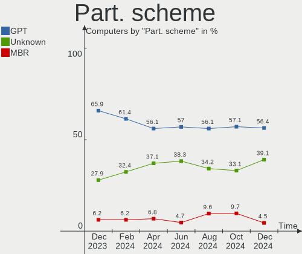
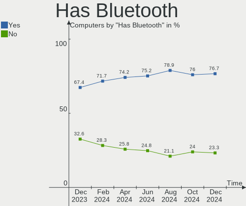
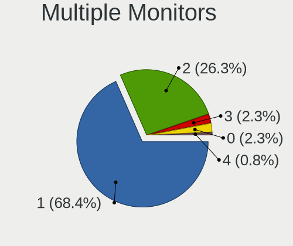
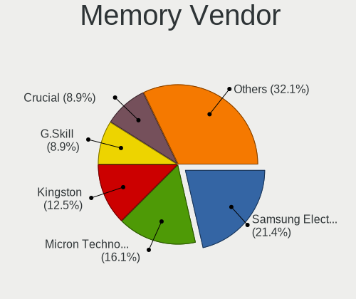
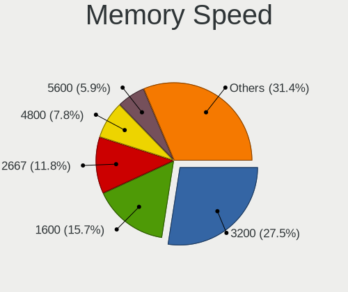
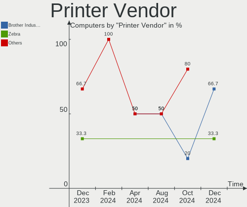
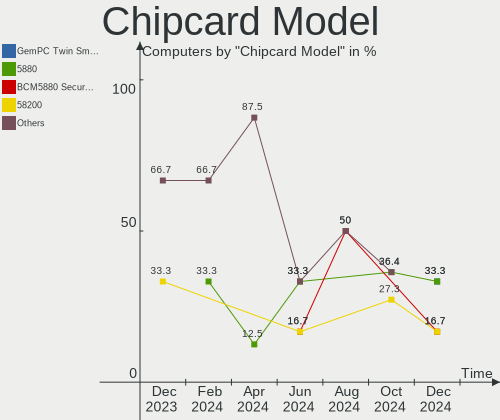
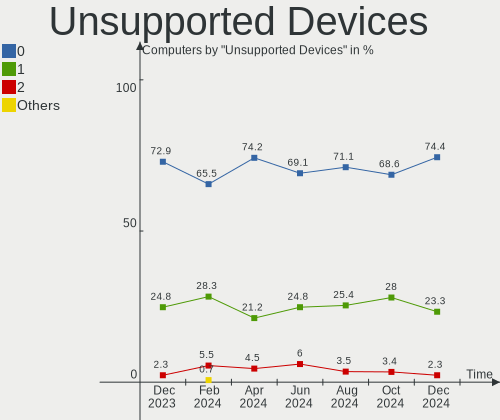

Kubuntu - Hardware Trends
-------------------------

A project to identify most popular hardware characteristics and track their change
over time based on data collected by Linux users at https://Linux-Hardware.org.

Anyone can contribute to this report by the [hw-probe](https://github.com/linuxhw/hw-probe) tool:

    sudo -E hw-probe -all -upload

This is a report for all computer types. See also reports for [desktops](/Dist/Kubuntu/Desktop/README.md) and [notebooks](/Dist/Kubuntu/Notebook/README.md).

This report is for one last month. Overall report since the beginning of time: [TestCoverage](https://github.com/linuxhw/TestCoverage)

Period: Oct, 2022.

Contents
--------

* [ System ](#system)
  - [ OS                       ](#os)
  - [ OS Family                ](#os-family)
  - [ Kernel                   ](#kernel)
  - [ Kernel Family            ](#kernel-family)
  - [ Kernel Major Ver.        ](#kernel-major-ver)
  - [ Arch                     ](#arch)
  - [ DE                       ](#de)
  - [ Display Server           ](#display-server)
  - [ Display Manager          ](#display-manager)
  - [ OS Lang                  ](#os-lang)
  - [ Boot Mode                ](#boot-mode)
  - [ Filesystem               ](#filesystem)
  - [ Part. scheme             ](#part-scheme)
  - [ Dual Boot with Linux/BSD ](#dual-boot-with-linuxbsd)
  - [ Dual Boot (Win)          ](#dual-boot-win)

* [ Board ](#board)
  - [ Vendor                   ](#vendor)
  - [ Model                    ](#model)
  - [ Model Family             ](#model-family)
  - [ MFG Year                 ](#mfg-year)
  - [ Form Factor              ](#form-factor)
  - [ Secure Boot              ](#secure-boot)
  - [ Coreboot                 ](#coreboot)
  - [ RAM Size                 ](#ram-size)
  - [ RAM Used                 ](#ram-used)
  - [ Total Drives             ](#total-drives)
  - [ Has CD-ROM               ](#has-cd-rom)
  - [ Has Ethernet             ](#has-ethernet)
  - [ Has WiFi                 ](#has-wifi)
  - [ Has Bluetooth            ](#has-bluetooth)

* [ Location ](#location)
  - [ Country                  ](#country)
  - [ City                     ](#city)

* [ Drives ](#drives)
  - [ Drive Vendor             ](#drive-vendor)
  - [ Drive Model              ](#drive-model)
  - [ HDD Vendor               ](#hdd-vendor)
  - [ SSD Vendor               ](#ssd-vendor)
  - [ Drive Kind               ](#drive-kind)
  - [ Drive Connector          ](#drive-connector)
  - [ Drive Size               ](#drive-size)
  - [ Space Total              ](#space-total)
  - [ Space Used               ](#space-used)
  - [ Malfunc. Drives          ](#malfunc-drives)
  - [ Malfunc. Drive Vendor    ](#malfunc-drive-vendor)
  - [ Malfunc. HDD Vendor      ](#malfunc-hdd-vendor)
  - [ Malfunc. Drive Kind      ](#malfunc-drive-kind)
  - [ Failed Drives            ](#failed-drives)
  - [ Failed Drive Vendor      ](#failed-drive-vendor)
  - [ Drive Status             ](#drive-status)

* [ Storage controller ](#storage-controller)
  - [ Storage Vendor           ](#storage-vendor)
  - [ Storage Model            ](#storage-model)
  - [ Storage Kind             ](#storage-kind)

* [ Processor ](#processor)
  - [ CPU Vendor               ](#cpu-vendor)
  - [ CPU Model                ](#cpu-model)
  - [ CPU Model Family         ](#cpu-model-family)
  - [ CPU Cores                ](#cpu-cores)
  - [ CPU Sockets              ](#cpu-sockets)
  - [ CPU Threads              ](#cpu-threads)
  - [ CPU Op-Modes             ](#cpu-op-modes)
  - [ CPU Microcode            ](#cpu-microcode)
  - [ CPU Microarch            ](#cpu-microarch)

* [ Graphics ](#graphics)
  - [ GPU Vendor               ](#gpu-vendor)
  - [ GPU Model                ](#gpu-model)
  - [ GPU Combo                ](#gpu-combo)
  - [ GPU Driver               ](#gpu-driver)
  - [ GPU Memory               ](#gpu-memory)

* [ Monitor ](#monitor)
  - [ Monitor Vendor           ](#monitor-vendor)
  - [ Monitor Model            ](#monitor-model)
  - [ Monitor Resolution       ](#monitor-resolution)
  - [ Monitor Diagonal         ](#monitor-diagonal)
  - [ Monitor Width            ](#monitor-width)
  - [ Aspect Ratio             ](#aspect-ratio)
  - [ Monitor Area             ](#monitor-area)
  - [ Pixel Density            ](#pixel-density)
  - [ Multiple Monitors        ](#multiple-monitors)

* [ Network ](#network)
  - [ Net Controller Vendor    ](#net-controller-vendor)
  - [ Net Controller Model     ](#net-controller-model)
  - [ Wireless Vendor          ](#wireless-vendor)
  - [ Wireless Model           ](#wireless-model)
  - [ Ethernet Vendor          ](#ethernet-vendor)
  - [ Ethernet Model           ](#ethernet-model)
  - [ Net Controller Kind      ](#net-controller-kind)
  - [ Used Controller          ](#used-controller)
  - [ NICs                     ](#nics)
  - [ IPv6                     ](#ipv6)

* [ Bluetooth ](#bluetooth)
  - [ Bluetooth Vendor         ](#bluetooth-vendor)
  - [ Bluetooth Model          ](#bluetooth-model)

* [ Sound ](#sound)
  - [ Sound Vendor             ](#sound-vendor)
  - [ Sound Model              ](#sound-model)

* [ Memory ](#memory)
  - [ Memory Vendor            ](#memory-vendor)
  - [ Memory Model             ](#memory-model)
  - [ Memory Kind              ](#memory-kind)
  - [ Memory Form Factor       ](#memory-form-factor)
  - [ Memory Size              ](#memory-size)
  - [ Memory Speed             ](#memory-speed)

* [ Printers & scanners ](#printers--scanners)
  - [ Printer Vendor           ](#printer-vendor)
  - [ Printer Model            ](#printer-model)
  - [ Scanner Vendor           ](#scanner-vendor)
  - [ Scanner Model            ](#scanner-model)

* [ Camera ](#camera)
  - [ Camera Vendor            ](#camera-vendor)
  - [ Camera Model             ](#camera-model)

* [ Security ](#security)
  - [ Fingerprint Vendor       ](#fingerprint-vendor)
  - [ Fingerprint Model        ](#fingerprint-model)
  - [ Chipcard Vendor          ](#chipcard-vendor)
  - [ Chipcard Model           ](#chipcard-model)

* [ Unsupported ](#unsupported)
  - [ Unsupported Devices      ](#unsupported-devices)
  - [ Unsupported Device Types ](#unsupported-device-types)

System
------

OS
--

Installed operating systems

| Name          | Computers | Percent |
|---------------|-----------|---------|
| Kubuntu 22.04 | 101       | 67.33%  |
| Kubuntu 20.04 | 23        | 15.33%  |
| Kubuntu 22.10 | 12        | 8%      |
| Kubuntu 11    | 10        | 6.67%   |
| Kubuntu 18.04 | 2         | 1.33%   |
| Kubuntu 21.10 | 1         | 0.67%   |
| Kubuntu 21.04 | 1         | 0.67%   |

OS Family
---------

OS without a version

| Name    | Computers | Percent |
|---------|-----------|---------|
| Kubuntu | 150       | 100%    |

Kernel
------

Version of the Linux kernel

| Version                | Computers | Percent |
|------------------------|-----------|---------|
| 5.15.0-52-generic      | 33        | 22%     |
| 5.15.0-48-generic      | 33        | 22%     |
| 5.15.0-50-generic      | 25        | 16.67%  |
| 5.19.0-23-generic      | 7         | 4.67%   |
| 5.15.0-43-generic      | 5         | 3.33%   |
| 5.15.0-48-lowlatency   | 4         | 2.67%   |
| 5.15.0-46-generic      | 4         | 2.67%   |
| 5.4.0-131-generic      | 3         | 2%      |
| 5.4.0-126-generic      | 3         | 2%      |
| 5.17.0-1017-oem        | 3         | 2%      |
| 6.0.1-060001-generic   | 2         | 1.33%   |
| 5.19.0-21-generic      | 2         | 1.33%   |
| 5.15.0-53-generic      | 2         | 1.33%   |
| 5.15.0-52-lowlatency   | 2         | 1.33%   |
| 5.15.0-47-generic      | 2         | 1.33%   |
| 6.0.3-060003-generic   | 1         | 0.67%   |
| 6.0.0-t2               | 1         | 0.67%   |
| 6.0.0-060000-generic   | 1         | 0.67%   |
| 5.4.0-79-generic       | 1         | 0.67%   |
| 5.4.0-120-generic      | 1         | 0.67%   |
| 5.19.12-xanmod1        | 1         | 0.67%   |
| 5.19.11-051911-generic | 1         | 0.67%   |
| 5.19.0-19-generic      | 1         | 0.67%   |
| 5.19.0-1009-lowlatency | 1         | 0.67%   |
| 5.17.0-1020-oem        | 1         | 0.67%   |
| 5.16.11-051611-generic | 1         | 0.67%   |
| 5.15.65-xanmod1        | 1         | 0.67%   |
| 5.15.0-50-lowlatency   | 1         | 0.67%   |
| 5.15.0-47-lowlatency   | 1         | 0.67%   |
| 5.15.0-10050-tuxedo    | 1         | 0.67%   |
| 5.13.0-52-generic      | 1         | 0.67%   |
| 5.13.0-44-generic      | 1         | 0.67%   |
| 5.11.0-49-lowlatency   | 1         | 0.67%   |
| 5.11.0-24-generic      | 1         | 0.67%   |
| 4.15.0-194-generic     | 1         | 0.67%   |

Kernel Family
-------------

Linux kernel without a distro release

| Version | Computers | Percent |
|---------|-----------|---------|
| 5.15.0  | 113       | 75.33%  |
| 5.19.0  | 11        | 7.33%   |
| 5.4.0   | 8         | 5.33%   |
| 5.17.0  | 4         | 2.67%   |
| 6.0.1   | 2         | 1.33%   |
| 6.0.0   | 2         | 1.33%   |
| 5.13.0  | 2         | 1.33%   |
| 5.11.0  | 2         | 1.33%   |
| 6.0.3   | 1         | 0.67%   |
| 5.19.12 | 1         | 0.67%   |
| 5.19.11 | 1         | 0.67%   |
| 5.16.11 | 1         | 0.67%   |
| 5.15.65 | 1         | 0.67%   |
| 4.15.0  | 1         | 0.67%   |

Kernel Major Ver.
-----------------

Linux kernel major version

| Version | Computers | Percent |
|---------|-----------|---------|
| 5.15    | 114       | 76%     |
| 5.19    | 13        | 8.67%   |
| 5.4     | 8         | 5.33%   |
| 6.0     | 5         | 3.33%   |
| 5.17    | 4         | 2.67%   |
| 5.13    | 2         | 1.33%   |
| 5.11    | 2         | 1.33%   |
| 5.16    | 1         | 0.67%   |
| 4.15    | 1         | 0.67%   |

Arch
----

OS architecture (x86_64, i586, etc.)

| Name   | Computers | Percent |
|--------|-----------|---------|
| x86_64 | 150       | 100%    |

DE
--

Desktop Environment

| Name       | Computers | Percent |
|------------|-----------|---------|
| KDE5       | 144       | 96%     |
| GNOME      | 3         | 2%      |
| X-Cinnamon | 1         | 0.67%   |
| KDE        | 1         | 0.67%   |
| i3         | 1         | 0.67%   |

Display Server
--------------

X11 or Wayland

| Name    | Computers | Percent |
|---------|-----------|---------|
| X11     | 147       | 98%     |
| Wayland | 2         | 1.33%   |
| Tty     | 1         | 0.67%   |

Display Manager
---------------

SDDM, LightDM, etc.

| Name    | Computers | Percent |
|---------|-----------|---------|
| SDDM    | 99        | 66%     |
| Unknown | 37        | 24.67%  |
| LightDM | 7         | 4.67%   |
| GDM3    | 5         | 3.33%   |
| SLiM    | 1         | 0.67%   |
| GDM     | 1         | 0.67%   |

OS Lang
-------

Language

| Lang    | Computers | Percent |
|---------|-----------|---------|
| en_US   | 63        | 42%     |
| it_IT   | 22        | 14.67%  |
| de_DE   | 11        | 7.33%   |
| fr_FR   | 8         | 5.33%   |
| ru_RU   | 4         | 2.67%   |
| pt_BR   | 3         | 2%      |
| pl_PL   | 3         | 2%      |
| nl_NL   | 2         | 1.33%   |
| nl_BE   | 2         | 1.33%   |
| hu_HU   | 2         | 1.33%   |
| es_ES   | 2         | 1.33%   |
| es_CL   | 2         | 1.33%   |
| es_AR   | 2         | 1.33%   |
| en_PH   | 2         | 1.33%   |
| en_NZ   | 2         | 1.33%   |
| en_IN   | 2         | 1.33%   |
| en_AU   | 2         | 1.33%   |
| el_GR   | 2         | 1.33%   |
| C       | 2         | 1.33%   |
| zh_CN   | 1         | 0.67%   |
| uk_UA   | 1         | 0.67%   |
| ru_UA   | 1         | 0.67%   |
| ko_KR   | 1         | 0.67%   |
| fr_BE   | 1         | 0.67%   |
| en_ZA   | 1         | 0.67%   |
| en_SG   | 1         | 0.67%   |
| en_GB   | 1         | 0.67%   |
| en_DK   | 1         | 0.67%   |
| en_CA   | 1         | 0.67%   |
| de_LU   | 1         | 0.67%   |
| Default | 1         | 0.67%   |

Boot Mode
---------

EFI or BIOS

| Mode | Computers | Percent |
|------|-----------|---------|
| EFI  | 79        | 52.67%  |
| BIOS | 71        | 47.33%  |

Filesystem
----------

Type of filesystem

| Type    | Computers | Percent |
|---------|-----------|---------|
| Ext4    | 137       | 91.33%  |
| Overlay | 6         | 4%      |
| Btrfs   | 4         | 2.67%   |
| Ext2    | 2         | 1.33%   |
| Ext3    | 1         | 0.67%   |

Part. scheme
------------

Scheme of partitioning

| Type    | Computers | Percent |
|---------|-----------|---------|
| GPT     | 102       | 68%     |
| Unknown | 37        | 24.67%  |
| MBR     | 11        | 7.33%   |

Dual Boot with Linux/BSD
------------------------

Hosting more than one Linux/BSD

| Dual boot | Computers | Percent |
|-----------|-----------|---------|
| No        | 136       | 90.67%  |
| Yes       | 14        | 9.33%   |

Dual Boot (Win)
---------------

Hosting Linux and Windows

| Dual boot | Computers | Percent |
|-----------|-----------|---------|
| No        | 93        | 62%     |
| Yes       | 57        | 38%     |

Board
-----

Vendor
------

Motherboard manufacturer

| Name                | Computers | Percent |
|---------------------|-----------|---------|
| ASUSTek Computer    | 29        | 19.33%  |
| Lenovo              | 28        | 18.67%  |
| Hewlett-Packard     | 20        | 13.33%  |
| Dell                | 18        | 12%     |
| Gigabyte Technology | 10        | 6.67%   |
| Acer                | 8         | 5.33%   |
| MSI                 | 6         | 4%      |
| ASRock              | 5         | 3.33%   |
| Apple               | 4         | 2.67%   |
| Shuttle             | 2         | 1.33%   |
| Samsung Electronics | 2         | 1.33%   |
| HUAWEI              | 2         | 1.33%   |
| TUXEDO              | 1         | 0.67%   |
| Toshiba             | 1         | 0.67%   |
| Tactus              | 1         | 0.67%   |
| Sony                | 1         | 0.67%   |
| Notebook            | 1         | 0.67%   |
| Medion              | 1         | 0.67%   |
| LG Electronics      | 1         | 0.67%   |
| JWIPC               | 1         | 0.67%   |
| Intel               | 1         | 0.67%   |
| Haier               | 1         | 0.67%   |
| GPU Company         | 1         | 0.67%   |
| Google              | 1         | 0.67%   |
| Gateway             | 1         | 0.67%   |
| EVGA                | 1         | 0.67%   |
| AZW                 | 1         | 0.67%   |
| AMI                 | 1         | 0.67%   |

Model
-----

Motherboard model

| Name                                     | Computers | Percent |
|------------------------------------------|-----------|---------|
| TUXEDO Stellaris AMD Gen3 (CZN)          | 1         | 0.67%   |
| Toshiba Satellite NB10t-A-102            | 1         | 0.67%   |
| Tactus GeoBook 140                       | 1         | 0.67%   |
| Sony VPCL12M1E                           | 1         | 0.67%   |
| Shuttle XS35V4                           | 1         | 0.67%   |
| Shuttle SH61R                            | 1         | 0.67%   |
| Samsung R430/P430/R480                   | 1         | 0.67%   |
| Samsung 767XCL                           | 1         | 0.67%   |
| Notebook PD5x_7xPNP_PNR_PNN_PNT          | 1         | 0.67%   |
| MSI MS-7C80                              | 1         | 0.67%   |
| MSI MS-7B84                              | 1         | 0.67%   |
| MSI MS-7A40                              | 1         | 0.67%   |
| MSI MS-7996                              | 1         | 0.67%   |
| MSI MS-7971                              | 1         | 0.67%   |
| MSI MS-7641                              | 1         | 0.67%   |
| Medion H110H4-EM2                        | 1         | 0.67%   |
| LG 16T90P-K.ADB9U1                       | 1         | 0.67%   |
| Lenovo ZHAOYANG E53-80 81CM              | 1         | 0.67%   |
| Lenovo Yoga C930-13IKB 81C4              | 1         | 0.67%   |
| Lenovo Yoga 2 13 20344                   | 1         | 0.67%   |
| Lenovo V15-IGL 82C3                      | 1         | 0.67%   |
| Lenovo V15 G2 ALC 82KD                   | 1         | 0.67%   |
| Lenovo ThinkPad X230 23256N6             | 1         | 0.67%   |
| Lenovo ThinkPad X1 Carbon 4th 20FB003TUK | 1         | 0.67%   |
| Lenovo ThinkPad T430 2342A19             | 1         | 0.67%   |
| Lenovo ThinkPad P73 20QRS00100           | 1         | 0.67%   |
| Lenovo ThinkPad L15 Gen 2 20X3006YUS     | 1         | 0.67%   |
| Lenovo ThinkPad L15 Gen 1 20U8S0AH00     | 1         | 0.67%   |
| Lenovo ThinkPad E590 20NB005MUS          | 1         | 0.67%   |
| Lenovo ThinkCentre M90p 5498A2U          | 1         | 0.67%   |
| Lenovo ThinkCentre A70 7844H9G           | 1         | 0.67%   |
| Lenovo ThinkBook 15 G3 ACL 21A4          | 1         | 0.67%   |
| Lenovo ThinkBook 14-IIL 20SL             | 1         | 0.67%   |
| Lenovo ThinkBook 14 G4 ABA 21DK          | 1         | 0.67%   |
| Lenovo MIIX 510-12IKB 80XE               | 1         | 0.67%   |
| Lenovo Legion 5 17ACH6 82K0              | 1         | 0.67%   |
| Lenovo Legion 5 15ACH6H 82JU             | 1         | 0.67%   |
| Lenovo IdeaPadFlex 5 14ALC7 82R9         | 1         | 0.67%   |
| Lenovo IdeaPad Y510P 20217               | 1         | 0.67%   |
| Lenovo IdeaPad Gaming 3 15ACH6 82K2      | 1         | 0.67%   |

Model Family
------------

Motherboard model prefix

| Name               | Computers | Percent |
|--------------------|-----------|---------|
| Lenovo ThinkPad    | 7         | 4.67%   |
| Lenovo IdeaPad     | 6         | 4%      |
| ASUS ROG           | 6         | 4%      |
| Acer Aspire        | 6         | 4%      |
| ASUS PRIME         | 5         | 3.33%   |
| HP ProBook         | 4         | 2.67%   |
| Dell Latitude      | 4         | 2.67%   |
| Lenovo ThinkBook   | 3         | 2%      |
| HP Pavilion        | 3         | 2%      |
| HP Laptop          | 3         | 2%      |
| Dell Vostro        | 3         | 2%      |
| Dell Precision     | 3         | 2%      |
| Dell OptiPlex      | 3         | 2%      |
| Dell Inspiron      | 3         | 2%      |
| Lenovo Yoga        | 2         | 1.33%   |
| Lenovo ThinkCentre | 2         | 1.33%   |
| Lenovo Legion      | 2         | 1.33%   |
| HP EliteBook       | 2         | 1.33%   |
| Dell XPS           | 2         | 1.33%   |
| ASUS TUF           | 2         | 1.33%   |
| ASUS M5A78L-M      | 2         | 1.33%   |
| TUXEDO Stellaris   | 1         | 0.67%   |
| Toshiba Satellite  | 1         | 0.67%   |
| Tactus GeoBook     | 1         | 0.67%   |
| Sony VPCL12M1E     | 1         | 0.67%   |
| Shuttle XS35V4     | 1         | 0.67%   |
| Shuttle SH61R      | 1         | 0.67%   |
| Samsung R430       | 1         | 0.67%   |
| Samsung 767XCL     | 1         | 0.67%   |
| Notebook PD5x      | 1         | 0.67%   |
| MSI MS-7C80        | 1         | 0.67%   |
| MSI MS-7B84        | 1         | 0.67%   |
| MSI MS-7A40        | 1         | 0.67%   |
| MSI MS-7996        | 1         | 0.67%   |
| MSI MS-7971        | 1         | 0.67%   |
| MSI MS-7641        | 1         | 0.67%   |
| Medion H110H4-EM2  | 1         | 0.67%   |
| LG 16T90P-K.ADB9U1 | 1         | 0.67%   |
| Lenovo ZHAOYANG    | 1         | 0.67%   |
| Lenovo V15-IGL     | 1         | 0.67%   |

MFG Year
--------

Motherboard manufacture year

| Year | Computers | Percent |
|------|-----------|---------|
| 2021 | 24        | 16%     |
| 2020 | 21        | 14%     |
| 2012 | 14        | 9.33%   |
| 2019 | 12        | 8%      |
| 2018 | 12        | 8%      |
| 2022 | 10        | 6.67%   |
| 2016 | 9         | 6%      |
| 2014 | 9         | 6%      |
| 2011 | 9         | 6%      |
| 2010 | 7         | 4.67%   |
| 2017 | 6         | 4%      |
| 2009 | 6         | 4%      |
| 2013 | 4         | 2.67%   |
| 2015 | 3         | 2%      |
| 2008 | 3         | 2%      |
| 2007 | 1         | 0.67%   |

Form Factor
-----------

Physical design of the computer

| Name        | Computers | Percent |
|-------------|-----------|---------|
| Notebook    | 80        | 53.33%  |
| Desktop     | 57        | 38%     |
| Convertible | 5         | 3.33%   |
| Mini pc     | 3         | 2%      |
| Tablet      | 2         | 1.33%   |
| Server      | 2         | 1.33%   |
| All in one  | 1         | 0.67%   |

Secure Boot
-----------

Enabled or disabled

| State    | Computers | Percent |
|----------|-----------|---------|
| Disabled | 138       | 92%     |
| Enabled  | 12        | 8%      |

Coreboot
--------

Have coreboot on board

| Used | Computers | Percent |
|------|-----------|---------|
| No   | 149       | 99.33%  |
| Yes  | 1         | 0.67%   |

RAM Size
--------

Total RAM memory

| Size in GB  | Computers | Percent |
|-------------|-----------|---------|
| 8.01-16.0   | 35        | 23.33%  |
| 16.01-24.0  | 31        | 20.67%  |
| 32.01-64.0  | 29        | 19.33%  |
| 4.01-8.0    | 23        | 15.33%  |
| 3.01-4.0    | 21        | 14%     |
| 24.01-32.0  | 6         | 4%      |
| 64.01-256.0 | 3         | 2%      |
| 2.01-3.0    | 1         | 0.67%   |
| 1.01-2.0    | 1         | 0.67%   |

RAM Used
--------

Used RAM memory

| Used GB    | Computers | Percent |
|------------|-----------|---------|
| 2.01-3.0   | 38        | 25.33%  |
| 4.01-8.0   | 36        | 24%     |
| 1.01-2.0   | 33        | 22%     |
| 3.01-4.0   | 26        | 17.33%  |
| 8.01-16.0  | 13        | 8.67%   |
| 0.51-1.0   | 3         | 2%      |
| 24.01-32.0 | 1         | 0.67%   |

Total Drives
------------

Number of drives on board

| Drives | Computers | Percent |
|--------|-----------|---------|
| 1      | 80        | 53.33%  |
| 2      | 40        | 26.67%  |
| 3      | 13        | 8.67%   |
| 4      | 9         | 6%      |
| 5      | 6         | 4%      |
| 7      | 1         | 0.67%   |
| 6      | 1         | 0.67%   |

Has CD-ROM
----------

Has CD-ROM on board

| Presented | Computers | Percent |
|-----------|-----------|---------|
| No        | 103       | 68.67%  |
| Yes       | 47        | 31.33%  |

Has Ethernet
------------

Has Ethernet on board

| Presented | Computers | Percent |
|-----------|-----------|---------|
| Yes       | 130       | 86.67%  |
| No        | 20        | 13.33%  |

Has WiFi
--------

Has WiFi module

| Presented | Computers | Percent |
|-----------|-----------|---------|
| Yes       | 114       | 76%     |
| No        | 36        | 24%     |

Has Bluetooth
-------------

Has Bluetooth module

| Presented | Computers | Percent |
|-----------|-----------|---------|
| Yes       | 96        | 64%     |
| No        | 54        | 36%     |

Location
--------

Country
-------

Geographic location (country)

| Country       | Computers | Percent |
|---------------|-----------|---------|
| Italy         | 30        | 20%     |
| USA           | 28        | 18.67%  |
| Germany       | 12        | 8%      |
| France        | 10        | 6.67%   |
| Poland        | 5         | 3.33%   |
| Brazil        | 4         | 2.67%   |
| Belgium       | 4         | 2.67%   |
| Russia        | 3         | 2%      |
| Netherlands   | 3         | 2%      |
| Hungary       | 3         | 2%      |
| Argentina     | 3         | 2%      |
| Ukraine       | 2         | 1.33%   |
| Turkey        | 2         | 1.33%   |
| Spain         | 2         | 1.33%   |
| Philippines   | 2         | 1.33%   |
| New Zealand   | 2         | 1.33%   |
| Mexico        | 2         | 1.33%   |
| Indonesia     | 2         | 1.33%   |
| India         | 2         | 1.33%   |
| Greece        | 2         | 1.33%   |
| Chile         | 2         | 1.33%   |
| Australia     | 2         | 1.33%   |
| Vietnam       | 1         | 0.67%   |
| UK            | 1         | 0.67%   |
| Switzerland   | 1         | 0.67%   |
| South Korea   | 1         | 0.67%   |
| South Africa  | 1         | 0.67%   |
| Slovenia      | 1         | 0.67%   |
| Singapore     | 1         | 0.67%   |
| Serbia        | 1         | 0.67%   |
| Romania       | 1         | 0.67%   |
| Pakistan      | 1         | 0.67%   |
| Malaysia      | 1         | 0.67%   |
| Luxembourg    | 1         | 0.67%   |
| Lithuania     | 1         | 0.67%   |
| Liechtenstein | 1         | 0.67%   |
| Japan         | 1         | 0.67%   |
| Ireland       | 1         | 0.67%   |
| Estonia       | 1         | 0.67%   |
| Ecuador       | 1         | 0.67%   |

City
----

Geographic location (city)

| City                    | Computers | Percent |
|-------------------------|-----------|---------|
| Milan                   | 7         | 4.67%   |
| Wroclaw                 | 3         | 2%      |
| Paris                   | 3         | 2%      |
| Moscow                  | 3         | 2%      |
| Turin                   | 2         | 1.33%   |
| Rio de Janeiro          | 2         | 1.33%   |
| Palermo                 | 2         | 1.33%   |
| Granozzo con Monticello | 2         | 1.33%   |
| Dallas                  | 2         | 1.33%   |
| Budapest                | 2         | 1.33%   |
| Berlin                  | 2         | 1.33%   |
| Zonhoven                | 1         | 0.67%   |
| Zollikofen              | 1         | 0.67%   |
| Yerevan                 | 1         | 0.67%   |
| Whangarei               | 1         | 0.67%   |
| Weimar                  | 1         | 0.67%   |
| Walbach                 | 1         | 0.67%   |
| Vitebsk                 | 1         | 0.67%   |
| Vilnius                 | 1         | 0.67%   |
| Varna                   | 1         | 0.67%   |
| Valencia                | 1         | 0.67%   |
| Valdivia                | 1         | 0.67%   |
| Trieste                 | 1         | 0.67%   |
| Treviolo                | 1         | 0.67%   |
| Tijuana                 | 1         | 0.67%   |
| Tholey                  | 1         | 0.67%   |
| Syeverodonets'k         | 1         | 0.67%   |
| Surabaya                | 1         | 0.67%   |
| Stuttgart               | 1         | 0.67%   |
| Singapore               | 1         | 0.67%   |
| Seville                 | 1         | 0.67%   |
| Scottsbluff             | 1         | 0.67%   |
| Schaumburg              | 1         | 0.67%   |
| Schaan                  | 1         | 0.67%   |
| Savignano sul Rubicone  | 1         | 0.67%   |
| Saskatoon               | 1         | 0.67%   |
| Sappemeer               | 1         | 0.67%   |
| Santo André            | 1         | 0.67%   |
| San Pietro in Volta     | 1         | 0.67%   |
| San Leonardo            | 1         | 0.67%   |

Drives
------

Drive Vendor
------------

Hard drive vendors

| Vendor                         | Computers | Drives | Percent |
|--------------------------------|-----------|--------|---------|
| Samsung Electronics            | 45        | 54     | 18.91%  |
| WDC                            | 31        | 37     | 13.03%  |
| Seagate                        | 30        | 36     | 12.61%  |
| Toshiba                        | 13        | 16     | 5.46%   |
| Crucial                        | 13        | 13     | 5.46%   |
| Sandisk                        | 12        | 12     | 5.04%   |
| Kingston                       | 11        | 11     | 4.62%   |
| Micron Technology              | 6         | 6      | 2.52%   |
| Intel                          | 6         | 6      | 2.52%   |
| HGST                           | 6         | 7      | 2.52%   |
| Unknown                        | 5         | 5      | 2.1%    |
| Hitachi                        | 5         | 5      | 2.1%    |
| SK hynix                       | 4         | 5      | 1.68%   |
| PNY                            | 4         | 4      | 1.68%   |
| KIOXIA                         | 4         | 4      | 1.68%   |
| Phison                         | 3         | 3      | 1.26%   |
| Lexar                          | 3         | 3      | 1.26%   |
| Emtec                          | 3         | 3      | 1.26%   |
| Patriot                        | 2         | 2      | 0.84%   |
| LITEONIT                       | 2         | 2      | 0.84%   |
| KIOXIA-EXCERIA                 | 2         | 2      | 0.84%   |
| Kingston Technology Company    | 2         | 2      | 0.84%   |
| Intenso                        | 2         | 2      | 0.84%   |
| Apple                          | 2         | 2      | 0.84%   |
| WALRAM                         | 1         | 1      | 0.42%   |
| Verbatim                       | 1         | 1      | 0.42%   |
| tecmiyo                        | 1         | 1      | 0.42%   |
| Solid State Storage Technology | 1         | 1      | 0.42%   |
| Smart                          | 1         | 1      | 0.42%   |
| SABRENT                        | 1         | 3      | 0.42%   |
| Plextor                        | 1         | 1      | 0.42%   |
| Phison Electronics             | 1         | 1      | 0.42%   |
| Netac                          | 1         | 1      | 0.42%   |
| MidasForce                     | 1         | 1      | 0.42%   |
| Micron/Crucial Technology      | 1         | 1      | 0.42%   |
| Maxtor                         | 1         | 1      | 0.42%   |
| HS-SSD-C100                    | 1         | 1      | 0.42%   |
| HPE                            | 1         | 6      | 0.42%   |
| Hewlett-Packard                | 1         | 1      | 0.42%   |
| Gigabyte Technology            | 1         | 1      | 0.42%   |

Drive Model
-----------

Hard drive models

| Model                            | Computers | Percent |
|----------------------------------|-----------|---------|
| Samsung SSD 970 EVO Plus 1TB     | 4         | 1.57%   |
| Samsung SSD 860 EVO 500GB        | 4         | 1.57%   |
| Unknown MMC Card  64GB           | 3         | 1.18%   |
| Samsung SSD 980 500GB            | 3         | 1.18%   |
| Crucial CT500P2SSD8 500GB        | 3         | 1.18%   |
| WDC WD20EZRZ-00Z5HB0 2TB         | 2         | 0.78%   |
| Toshiba MQ04ABF100 1TB           | 2         | 0.78%   |
| SK hynix HFM001TD3JX013N 1TB     | 2         | 0.78%   |
| Seagate ST9750420AS 752GB        | 2         | 0.78%   |
| Seagate ST9500325AS 500GB        | 2         | 0.78%   |
| Seagate ST4000DM004-2CV104 4TB   | 2         | 0.78%   |
| Seagate ST2000VM003-1CT164 2TB   | 2         | 0.78%   |
| Seagate ST2000LM007-1R8174 2TB   | 2         | 0.78%   |
| SanDisk SSD PLUS 480GB           | 2         | 0.78%   |
| Samsung SSD 980 PRO 1TB          | 2         | 0.78%   |
| Samsung SSD 970 EVO Plus 250GB   | 2         | 0.78%   |
| Samsung SSD 850 EVO 250GB        | 2         | 0.78%   |
| Samsung HD103SJ 1TB              | 2         | 0.78%   |
| PNY CS900 480GB SSD              | 2         | 0.78%   |
| KIOXIA KBG40ZNS512G NVMe 512GB   | 2         | 0.78%   |
| Kingston SA2000M81000G 1TB       | 2         | 0.78%   |
| Intel SSD 660P Series 1024GB     | 2         | 0.78%   |
| HGST HTS721010A9E630 1TB         | 2         | 0.78%   |
| Crucial CT500MX500SSD1 500GB     | 2         | 0.78%   |
| Crucial CT1000MX500SSD1 1TB      | 2         | 0.78%   |
| Crucial CT1000BX500SSD1 1TB      | 2         | 0.78%   |
| WDC WDS240G2G0B-00EPW0 240GB SSD | 1         | 0.39%   |
| WDC WDS100T1X0E-00AFY0 1TB       | 1         | 0.39%   |
| WDC WDBNCE0010PNC 1TB SSD        | 1         | 0.39%   |
| WDC WD8004FRYZ-01VAEB0 8TB       | 1         | 0.39%   |
| WDC WD6400BEVT-22A0RT0 640GB     | 1         | 0.39%   |
| WDC WD6400AAKS-22A7B2 640GB      | 1         | 0.39%   |
| WDC WD5000BEVT-22A0RT0 500GB     | 1         | 0.39%   |
| WDC WD5000AAKX-001CA0 500GB      | 1         | 0.39%   |
| WDC WD40EZRX-22SPEB0 4TB         | 1         | 0.39%   |
| WDC WD30EZRX-00SPEB0 3TB         | 1         | 0.39%   |
| WDC WD20EZRX-00D8PB0 2TB         | 1         | 0.39%   |
| WDC WD20EARX-00PASB0 2TB         | 1         | 0.39%   |
| WDC WD2003FZEX-00SRLA0 2TB       | 1         | 0.39%   |
| WDC WD2002FFSX-68PF8N0 2TB       | 1         | 0.39%   |

HDD Vendor
----------

Hard disk drive vendors

| Vendor              | Computers | Drives | Percent |
|---------------------|-----------|--------|---------|
| Seagate             | 29        | 35     | 35.37%  |
| WDC                 | 24        | 29     | 29.27%  |
| Toshiba             | 11        | 12     | 13.41%  |
| HGST                | 6         | 7      | 7.32%   |
| Hitachi             | 5         | 5      | 6.1%    |
| Samsung Electronics | 4         | 5      | 4.88%   |
| SABRENT             | 1         | 3      | 1.22%   |
| Maxtor              | 1         | 1      | 1.22%   |
| HPE                 | 1         | 6      | 1.22%   |

SSD Vendor
----------

Solid state drive vendors

| Vendor              | Computers | Drives | Percent |
|---------------------|-----------|--------|---------|
| Samsung Electronics | 20        | 22     | 26.67%  |
| Crucial             | 9         | 9      | 12%     |
| SanDisk             | 7         | 7      | 9.33%   |
| Kingston            | 5         | 5      | 6.67%   |
| PNY                 | 3         | 3      | 4%      |
| Lexar               | 3         | 3      | 4%      |
| Intel               | 3         | 3      | 4%      |
| WDC                 | 2         | 2      | 2.67%   |
| Patriot             | 2         | 2      | 2.67%   |
| LITEONIT            | 2         | 2      | 2.67%   |
| Emtec               | 2         | 2      | 2.67%   |
| Verbatim            | 1         | 1      | 1.33%   |
| Toshiba             | 1         | 1      | 1.33%   |
| tecmiyo             | 1         | 1      | 1.33%   |
| Smart               | 1         | 1      | 1.33%   |
| SK hynix            | 1         | 1      | 1.33%   |
| Plextor             | 1         | 1      | 1.33%   |
| Netac               | 1         | 1      | 1.33%   |
| MidasForce          | 1         | 1      | 1.33%   |
| Micron Technology   | 1         | 1      | 1.33%   |
| KIOXIA-EXCERIA      | 1         | 1      | 1.33%   |
| Intenso             | 1         | 1      | 1.33%   |
| Hewlett-Packard     | 1         | 1      | 1.33%   |
| Gigabyte Technology | 1         | 1      | 1.33%   |
| Dogfish             | 1         | 1      | 1.33%   |
| Corsair             | 1         | 3      | 1.33%   |
| China               | 1         | 1      | 1.33%   |
| Apple               | 1         | 1      | 1.33%   |

Drive Kind
----------

HDD or SSD

| Kind    | Computers | Drives | Percent |
|---------|-----------|--------|---------|
| NVMe    | 67        | 80     | 32.52%  |
| SSD     | 64        | 79     | 31.07%  |
| HDD     | 64        | 103    | 31.07%  |
| Unknown | 6         | 6      | 2.91%   |
| MMC     | 5         | 5      | 2.43%   |

Drive Connector
---------------

SATA, SAS, NVMe, etc.

| Type | Computers | Drives | Percent |
|------|-----------|--------|---------|
| SATA | 96        | 177    | 54.86%  |
| NVMe | 66        | 79     | 37.71%  |
| SAS  | 8         | 12     | 4.57%   |
| MMC  | 5         | 5      | 2.86%   |

Drive Size
----------

Size of hard drive

| Size in TB | Computers | Drives | Percent |
|------------|-----------|--------|---------|
| 0.01-0.5   | 69        | 100    | 50.36%  |
| 0.51-1.0   | 36        | 43     | 26.28%  |
| 1.01-2.0   | 18        | 23     | 13.14%  |
| 3.01-4.0   | 6         | 7      | 4.38%   |
| 2.01-3.0   | 4         | 5      | 2.92%   |
| 4.01-10.0  | 3         | 3      | 2.19%   |
| 10.01-20.0 | 1         | 1      | 0.73%   |

Space Total
-----------

Amount of disk space available on the file system

| Size in GB     | Computers | Percent |
|----------------|-----------|---------|
| 251-500        | 34        | 22.67%  |
| 101-250        | 29        | 19.33%  |
| 501-1000       | 26        | 17.33%  |
| 1001-2000      | 15        | 10%     |
| More than 3000 | 13        | 8.67%   |
| 2001-3000      | 12        | 8%      |
| 1-20           | 8         | 5.33%   |
| 51-100         | 8         | 5.33%   |
| 21-50          | 5         | 3.33%   |

Space Used
----------

Amount of used disk space

| Used GB        | Computers | Percent |
|----------------|-----------|---------|
| 1-20           | 35        | 23.33%  |
| 101-250        | 26        | 17.33%  |
| 21-50          | 25        | 16.67%  |
| 251-500        | 22        | 14.67%  |
| 51-100         | 12        | 8%      |
| 1001-2000      | 10        | 6.67%   |
| 501-1000       | 9         | 6%      |
| More than 3000 | 7         | 4.67%   |
| 2001-3000      | 4         | 2.67%   |

Malfunc. Drives
---------------

Drive models with a malfunction

| Model                            | Computers | Drives | Percent |
|----------------------------------|-----------|--------|---------|
| WDC WDS240G2G0B-00EPW0 240GB SSD | 1         | 1      | 6.25%   |
| WDC WD5000BEVT-22A0RT0 500GB     | 1         | 1      | 6.25%   |
| WDC WD30EZRX-00SPEB0 3TB         | 1         | 1      | 6.25%   |
| WDC WD10EZEX-21WN4A0 1TB         | 1         | 1      | 6.25%   |
| WDC WD10EZEX-08M2NA0 1TB         | 1         | 1      | 6.25%   |
| WDC WD10EARS-00MVWB0 1TB         | 1         | 1      | 6.25%   |
| Toshiba MQ04ABF100 1TB           | 1         | 1      | 6.25%   |
| tecmiyo SATA SSD 128GB           | 1         | 1      | 6.25%   |
| Seagate ST9750420AS 752GB        | 1         | 1      | 6.25%   |
| Seagate ST500DM002-1BD142 500GB  | 1         | 1      | 6.25%   |
| Seagate ST320LT020-9YG142 320GB  | 1         | 1      | 6.25%   |
| Seagate ST31500341AS 1TB         | 1         | 1      | 6.25%   |
| Intel SSDSC2KW120H6 120GB        | 1         | 1      | 6.25%   |
| Hitachi HTS547550A9E384 500GB    | 1         | 1      | 6.25%   |
| HGST HTS721010A9E630 1TB         | 1         | 1      | 6.25%   |
| Crucial CT120M500SSD1 120GB      | 1         | 1      | 6.25%   |

Malfunc. Drive Vendor
---------------------

Vendors of faulty drives

| Vendor  | Computers | Drives | Percent |
|---------|-----------|--------|---------|
| WDC     | 5         | 6      | 33.33%  |
| Seagate | 4         | 4      | 26.67%  |
| Toshiba | 1         | 1      | 6.67%   |
| tecmiyo | 1         | 1      | 6.67%   |
| Intel   | 1         | 1      | 6.67%   |
| Hitachi | 1         | 1      | 6.67%   |
| HGST    | 1         | 1      | 6.67%   |
| Crucial | 1         | 1      | 6.67%   |

Malfunc. HDD Vendor
-------------------

Vendors of faulty HDD drives

| Vendor  | Computers | Drives | Percent |
|---------|-----------|--------|---------|
| WDC     | 4         | 5      | 36.36%  |
| Seagate | 4         | 4      | 36.36%  |
| Toshiba | 1         | 1      | 9.09%   |
| Hitachi | 1         | 1      | 9.09%   |
| HGST    | 1         | 1      | 9.09%   |

Malfunc. Drive Kind
-------------------

Kinds of faulty drives

| Kind | Computers | Drives | Percent |
|------|-----------|--------|---------|
| HDD  | 11        | 12     | 73.33%  |
| SSD  | 4         | 4      | 26.67%  |

Failed Drives
-------------

Failed drive models

Zero info for selected period =(

Failed Drive Vendor
-------------------

Failed drive vendors

Zero info for selected period =(

Drive Status
------------

Number of failed and malfunc. drives

| Status   | Computers | Drives | Percent |
|----------|-----------|--------|---------|
| Works    | 79        | 131    | 48.17%  |
| Detected | 70        | 126    | 42.68%  |
| Malfunc  | 15        | 16     | 9.15%   |

Storage controller
------------------

Storage Vendor
--------------

Storage controller vendors

| Vendor                         | Computers | Percent |
|--------------------------------|-----------|---------|
| Intel                          | 95        | 45.02%  |
| AMD                            | 33        | 15.64%  |
| Samsung Electronics            | 24        | 11.37%  |
| SanDisk                        | 11        | 5.21%   |
| Kingston Technology Company    | 8         | 3.79%   |
| Phison Electronics             | 5         | 2.37%   |
| Micron/Crucial Technology      | 5         | 2.37%   |
| Micron Technology              | 5         | 2.37%   |
| KIOXIA                         | 5         | 2.37%   |
| Toshiba America Info Systems   | 3         | 1.42%   |
| SK hynix                       | 3         | 1.42%   |
| Marvell Technology Group       | 3         | 1.42%   |
| JMicron Technology             | 3         | 1.42%   |
| ASMedia Technology             | 3         | 1.42%   |
| Solid State Storage Technology | 1         | 0.47%   |
| Nvidia                         | 1         | 0.47%   |
| Hewlett-Packard                | 1         | 0.47%   |
| Apple                          | 1         | 0.47%   |
| ADATA Technology               | 1         | 0.47%   |

Storage Model
-------------

Storage controller models

| Model                                                                          | Computers | Percent |
|--------------------------------------------------------------------------------|-----------|---------|
| AMD FCH SATA Controller [AHCI mode]                                            | 20        | 8.44%   |
| Samsung NVMe SSD Controller SM981/PM981/PM983                                  | 11        | 4.64%   |
| Intel Volume Management Device NVMe RAID Controller                            | 9         | 3.8%    |
| Intel Sunrise Point-LP SATA Controller [AHCI mode]                             | 9         | 3.8%    |
| Samsung NVMe SSD Controller 980                                                | 7         | 2.95%   |
| Intel 7 Series Chipset Family 6-port SATA Controller [AHCI mode]               | 6         | 2.53%   |
| Phison E12 NVMe Controller                                                     | 5         | 2.11%   |
| Micron Non-Volatile memory controller                                          | 5         | 2.11%   |
| Intel Celeron/Pentium Silver Processor SATA Controller                         | 5         | 2.11%   |
| AMD 400 Series Chipset SATA Controller                                         | 5         | 2.11%   |
| SanDisk WD Blue SN550 NVMe SSD                                                 | 4         | 1.69%   |
| Samsung NVMe SSD Controller PM9A1/PM9A3/980PRO                                 | 4         | 1.69%   |
| Micron/Crucial P2 NVMe PCIe SSD                                                | 4         | 1.69%   |
| KIOXIA NVMe SSD Controller BG4                                                 | 4         | 1.69%   |
| Intel Q170/Q150/B150/H170/H110/Z170/CM236 Chipset SATA Controller [AHCI Mode]  | 4         | 1.69%   |
| Intel 82801 Mobile SATA Controller [RAID mode]                                 | 4         | 1.69%   |
| Intel 8 Series/C220 Series Chipset Family 6-port SATA Controller 1 [AHCI mode] | 4         | 1.69%   |
| Intel 6 Series/C200 Series Chipset Family 6 port Desktop SATA AHCI Controller  | 4         | 1.69%   |
| Intel 200 Series PCH SATA controller [AHCI mode]                               | 4         | 1.69%   |
| Kingston Company Company Non-Volatile memory controller                        | 3         | 1.27%   |
| Kingston Company A2000 NVMe SSD                                                | 3         | 1.27%   |
| JMicron JMB363 SATA/IDE Controller                                             | 3         | 1.27%   |
| Intel Tiger Lake-LP SATA Controller                                            | 3         | 1.27%   |
| Intel Comet Lake SATA AHCI Controller                                          | 3         | 1.27%   |
| Intel Atom Processor E3800 Series SATA AHCI Controller                         | 3         | 1.27%   |
| Intel 8 Series SATA Controller 1 [AHCI mode]                                   | 3         | 1.27%   |
| Intel 7 Series/C210 Series Chipset Family 6-port SATA Controller [AHCI mode]   | 3         | 1.27%   |
| Intel 500 Series Chipset Family SATA AHCI Controller                           | 3         | 1.27%   |
| ASMedia ASM1062 Serial ATA Controller                                          | 3         | 1.27%   |
| AMD SB7x0/SB8x0/SB9x0 IDE Controller                                           | 3         | 1.27%   |
| AMD FCH SATA Controller D                                                      | 3         | 1.27%   |
| AMD 500 Series Chipset SATA Controller                                         | 3         | 1.27%   |
| Toshiba America Info Systems XG6 NVMe SSD Controller                           | 2         | 0.84%   |
| SK hynix Gold P31 SSD                                                          | 2         | 0.84%   |
| SanDisk WD PC SN810 / Black SN850 NVMe SSD                                     | 2         | 0.84%   |
| SanDisk Non-Volatile memory controller                                         | 2         | 0.84%   |
| Marvell Group 88SE9172 SATA 6Gb/s Controller                                   | 2         | 0.84%   |
| Intel SSD 660P Series                                                          | 2         | 0.84%   |
| Intel SATA Controller [RAID mode]                                              | 2         | 0.84%   |
| Intel Alder Lake-S PCH SATA Controller [AHCI Mode]                             | 2         | 0.84%   |

Storage Kind
------------

Kind of storage controller (IDE, SATA, NVMe, SAS, ...)

| Kind | Computers | Percent |
|------|-----------|---------|
| SATA | 106       | 51.46%  |
| NVMe | 66        | 32.04%  |
| RAID | 18        | 8.74%   |
| IDE  | 16        | 7.77%   |

Processor
---------

CPU Vendor
----------

Processor vendors

| Vendor | Computers | Percent |
|--------|-----------|---------|
| Intel  | 110       | 73.33%  |
| AMD    | 40        | 26.67%  |

CPU Model
---------

Processor models

| Model                                       | Computers | Percent |
|---------------------------------------------|-----------|---------|
| AMD Ryzen 7 5700U with Radeon Graphics      | 5         | 3.33%   |
| Intel Celeron N4020 CPU @ 1.10GHz           | 4         | 2.67%   |
| Intel 11th Gen Core i7-1165G7 @ 2.80GHz     | 4         | 2.67%   |
| AMD Ryzen 7 5800H with Radeon Graphics      | 4         | 2.67%   |
| Intel Core i7-9750H CPU @ 2.60GHz           | 3         | 2%      |
| Intel Core i7-8550U CPU @ 1.80GHz           | 3         | 2%      |
| Intel Core 2 Duo CPU E7500 @ 2.93GHz        | 3         | 2%      |
| Intel Pentium CPU G2020 @ 2.90GHz           | 2         | 1.33%   |
| Intel Core i7-3770K CPU @ 3.50GHz           | 2         | 1.33%   |
| Intel Core i7-3720QM CPU @ 2.60GHz          | 2         | 1.33%   |
| Intel Core i7-3632QM CPU @ 2.20GHz          | 2         | 1.33%   |
| Intel Core i7-1065G7 CPU @ 1.30GHz          | 2         | 1.33%   |
| Intel Core i5-7200U CPU @ 2.50GHz           | 2         | 1.33%   |
| Intel Core i5-6200U CPU @ 2.30GHz           | 2         | 1.33%   |
| Intel Core i5-3320M CPU @ 2.60GHz           | 2         | 1.33%   |
| Intel 11th Gen Core i5-1135G7 @ 2.40GHz     | 2         | 1.33%   |
| Intel 11th Gen Core i3-1115G4 @ 3.00GHz     | 2         | 1.33%   |
| AMD Ryzen 9 5900X 12-Core Processor         | 2         | 1.33%   |
| AMD Ryzen 5 1600 Six-Core Processor         | 2         | 1.33%   |
| AMD FX-8320 Eight-Core Processor            | 2         | 1.33%   |
| Intel Xeon E-2388G CPU @ 3.20GHz            | 1         | 0.67%   |
| Intel Xeon CPU X5260 @ 3.33GHz              | 1         | 0.67%   |
| Intel Xeon CPU X3440 @ 2.53GHz              | 1         | 0.67%   |
| Intel Xeon CPU W3530 @ 2.80GHz              | 1         | 0.67%   |
| Intel Xeon CPU E5-2620 v4 @ 2.10GHz         | 1         | 0.67%   |
| Intel Pentium Silver N5030 CPU @ 1.10GHz    | 1         | 0.67%   |
| Intel Pentium Dual-Core CPU T4400 @ 2.20GHz | 1         | 0.67%   |
| Intel Pentium CPU N3540 @ 2.16GHz           | 1         | 0.67%   |
| Intel Pentium CPU N3510 @ 1.99GHz           | 1         | 0.67%   |
| Intel Pentium CPU G4600 @ 3.60GHz           | 1         | 0.67%   |
| Intel Pentium CPU G4400 @ 3.30GHz           | 1         | 0.67%   |
| Intel Pentium CPU 6405U @ 2.40GHz           | 1         | 0.67%   |
| Intel Core i9-9980HK CPU @ 2.40GHz          | 1         | 0.67%   |
| Intel Core i9-9900K CPU @ 3.60GHz           | 1         | 0.67%   |
| Intel Core i7-9700 CPU @ 3.00GHz            | 1         | 0.67%   |
| Intel Core i7-8750H CPU @ 2.20GHz           | 1         | 0.67%   |
| Intel Core i7-8700K CPU @ 3.70GHz           | 1         | 0.67%   |
| Intel Core i7-8700 CPU @ 3.20GHz            | 1         | 0.67%   |
| Intel Core i7-8565U CPU @ 1.80GHz           | 1         | 0.67%   |
| Intel Core i7-7700K CPU @ 4.20GHz           | 1         | 0.67%   |

CPU Model Family
----------------

Processor model prefix

| Model                   | Computers | Percent |
|-------------------------|-----------|---------|
| Intel Core i7           | 34        | 22.67%  |
| Intel Core i5           | 24        | 16%     |
| AMD Ryzen 7             | 16        | 10.67%  |
| Other                   | 15        | 10%     |
| Intel Celeron           | 10        | 6.67%   |
| AMD Ryzen 5             | 9         | 6%      |
| Intel Pentium           | 7         | 4.67%   |
| Intel Xeon              | 5         | 3.33%   |
| Intel Core i3           | 5         | 3.33%   |
| Intel Core 2 Duo        | 5         | 3.33%   |
| AMD Ryzen 9             | 4         | 2.67%   |
| Intel Core i9           | 2         | 1.33%   |
| AMD Ryzen 7 PRO         | 2         | 1.33%   |
| AMD FX                  | 2         | 1.33%   |
| Intel Pentium Silver    | 1         | 0.67%   |
| Intel Pentium Dual-Core | 1         | 0.67%   |
| Intel Atom              | 1         | 0.67%   |
| AMD Ryzen 5 PRO         | 1         | 0.67%   |
| AMD Phenom II X6        | 1         | 0.67%   |
| AMD Phenom II X4        | 1         | 0.67%   |
| AMD E1                  | 1         | 0.67%   |
| AMD Athlon II X4        | 1         | 0.67%   |
| AMD A6                  | 1         | 0.67%   |
| AMD A4                  | 1         | 0.67%   |

CPU Cores
---------

Number of processor cores

| Number | Computers | Percent |
|--------|-----------|---------|
| 4      | 57        | 38%     |
| 2      | 39        | 26%     |
| 8      | 25        | 16.67%  |
| 6      | 18        | 12%     |
| 12     | 3         | 2%      |
| 16     | 2         | 1.33%   |
| 14     | 2         | 1.33%   |
| 1      | 2         | 1.33%   |
| 10     | 1         | 0.67%   |
| 5      | 1         | 0.67%   |

CPU Sockets
-----------

Number of sockets

| Number | Computers | Percent |
|--------|-----------|---------|
| 1      | 149       | 99.33%  |
| 2      | 1         | 0.67%   |

CPU Threads
-----------

Threads per core (Hyper-Threading)

| Number | Computers | Percent |
|--------|-----------|---------|
| 2      | 111       | 74%     |
| 1      | 39        | 26%     |

CPU Op-Modes
------------

CPU Operation Modes (32-bit, 64-bit)

| Op mode        | Computers | Percent |
|----------------|-----------|---------|
| 32-bit, 64-bit | 150       | 100%    |

CPU Microcode
-------------

Microcode number

| Number     | Computers | Percent |
|------------|-----------|---------|
| Unknown    | 58        | 38.67%  |
| 0x306a9    | 8         | 5.33%   |
| 0x806c1    | 6         | 4%      |
| 0x0a50000c | 6         | 4%      |
| 0x906ea    | 5         | 3.33%   |
| 0x08608103 | 5         | 3.33%   |
| 0x906e9    | 3         | 2%      |
| 0x906a3    | 3         | 2%      |
| 0x806ea    | 3         | 2%      |
| 0x40651    | 3         | 2%      |
| 0x306c3    | 3         | 2%      |
| 0x1067a    | 3         | 2%      |
| 0x08600106 | 3         | 2%      |
| 0xa0653    | 2         | 1.33%   |
| 0x806eb    | 2         | 1.33%   |
| 0x706e5    | 2         | 1.33%   |
| 0x706a8    | 2         | 1.33%   |
| 0x406e3    | 2         | 1.33%   |
| 0x30678    | 2         | 1.33%   |
| 0x106e5    | 2         | 1.33%   |
| 0x06000852 | 2         | 1.33%   |
| 0x03000027 | 2         | 1.33%   |
| 0xa0671    | 1         | 0.67%   |
| 0xa0652    | 1         | 0.67%   |
| 0x906ed    | 1         | 0.67%   |
| 0x906ec    | 1         | 0.67%   |
| 0x906a4    | 1         | 0.67%   |
| 0x90675    | 1         | 0.67%   |
| 0x806ec    | 1         | 0.67%   |
| 0x806d1    | 1         | 0.67%   |
| 0x806a1    | 1         | 0.67%   |
| 0x506e3    | 1         | 0.67%   |
| 0x406f1    | 1         | 0.67%   |
| 0x30673    | 1         | 0.67%   |
| 0x10676    | 1         | 0.67%   |
| 0x0a50000d | 1         | 0.67%   |
| 0x0a20120a | 1         | 0.67%   |
| 0x0a201016 | 1         | 0.67%   |
| 0x0a201005 | 1         | 0.67%   |
| 0x08701021 | 1         | 0.67%   |

CPU Microarch
-------------

Microarchitecture

| Name             | Computers | Percent |
|------------------|-----------|---------|
| KabyLake         | 27        | 18%     |
| IvyBridge        | 16        | 10.67%  |
| Zen 3            | 13        | 8.67%   |
| Unknown          | 9         | 6%      |
| TigerLake        | 8         | 5.33%   |
| Haswell          | 8         | 5.33%   |
| Zen 2            | 6         | 4%      |
| Penryn           | 6         | 4%      |
| Goldmont plus    | 6         | 4%      |
| Skylake          | 5         | 3.33%   |
| Nehalem          | 5         | 3.33%   |
| Alderlake Hybrid | 5         | 3.33%   |
| Zen+             | 4         | 2.67%   |
| Silvermont       | 4         | 2.67%   |
| SandyBridge      | 4         | 2.67%   |
| Icelake          | 4         | 2.67%   |
| CometLake        | 4         | 2.67%   |
| Zen              | 3         | 2%      |
| K10              | 3         | 2%      |
| Westmere         | 2         | 1.33%   |
| Piledriver       | 2         | 1.33%   |
| K10 Llano        | 2         | 1.33%   |
| Core             | 2         | 1.33%   |
| Jaguar           | 1         | 0.67%   |
| Broadwell        | 1         | 0.67%   |

Graphics
--------

GPU Vendor
----------

Vendors of graphics cards

| Vendor                     | Computers | Percent |
|----------------------------|-----------|---------|
| Intel                      | 73        | 40.33%  |
| Nvidia                     | 66        | 36.46%  |
| AMD                        | 40        | 22.1%   |
| Matrox Electronics Systems | 1         | 0.55%   |
| ASPEED Technology          | 1         | 0.55%   |

GPU Model
---------

Graphics card models

| Model                                                                     | Computers | Percent |
|---------------------------------------------------------------------------|-----------|---------|
| Intel 3rd Gen Core processor Graphics Controller                          | 8         | 4.37%   |
| Nvidia GP107 [GeForce GTX 1050 Ti]                                        | 6         | 3.28%   |
| Intel TigerLake-LP GT2 [Iris Xe Graphics]                                 | 6         | 3.28%   |
| AMD Lucienne                                                              | 6         | 3.28%   |
| AMD Cezanne                                                               | 6         | 3.28%   |
| Intel UHD Graphics 620                                                    | 5         | 2.73%   |
| Intel GeminiLake [UHD Graphics 600]                                       | 5         | 2.73%   |
| Intel CoffeeLake-H GT2 [UHD Graphics 630]                                 | 4         | 2.19%   |
| AMD Renoir                                                                | 4         | 2.19%   |
| Nvidia GK208B [GeForce GT 710]                                            | 3         | 1.64%   |
| Intel Skylake GT2 [HD Graphics 520]                                       | 3         | 1.64%   |
| Intel HD Graphics 620                                                     | 3         | 1.64%   |
| Intel Haswell-ULT Integrated Graphics Controller                          | 3         | 1.64%   |
| Intel Atom Processor Z36xxx/Z37xxx Series Graphics & Display              | 3         | 1.64%   |
| Intel Alder Lake-P Integrated Graphics Controller                         | 3         | 1.64%   |
| Intel 4th Gen Core Processor Integrated Graphics Controller               | 3         | 1.64%   |
| Nvidia TU106M [GeForce RTX 2060 Mobile]                                   | 2         | 1.09%   |
| Nvidia GP107M [GeForce GTX 1050 Mobile]                                   | 2         | 1.09%   |
| Nvidia GP104 [GeForce GTX 1070]                                           | 2         | 1.09%   |
| Nvidia GK208B [GeForce GT 720]                                            | 2         | 1.09%   |
| Nvidia GK107M [GeForce GT 650M Mac Edition]                               | 2         | 1.09%   |
| Nvidia GA106M [GeForce RTX 3060 Mobile / Max-Q]                           | 2         | 1.09%   |
| Intel Xeon E3-1200 v2/3rd Gen Core processor Graphics Controller          | 2         | 1.09%   |
| Intel WhiskeyLake-U GT2 [UHD Graphics 620]                                | 2         | 1.09%   |
| Intel Tiger Lake UHD Graphics                                             | 2         | 1.09%   |
| Intel Iris Plus Graphics G7                                               | 2         | 1.09%   |
| Intel HD Graphics 630                                                     | 2         | 1.09%   |
| Intel CometLake-H GT2 [UHD Graphics]                                      | 2         | 1.09%   |
| Intel 2nd Generation Core Processor Family Integrated Graphics Controller | 2         | 1.09%   |
| AMD Cedar [Radeon HD 5000/6000/7350/8350 Series]                          | 2         | 1.09%   |
| AMD Cape Verde XT [Radeon HD 7770/8760 / R7 250X]                         | 2         | 1.09%   |
| Nvidia TU117M                                                             | 1         | 0.55%   |
| Nvidia TU117GLM [T550 Laptop GPU]                                         | 1         | 0.55%   |
| Nvidia TU117GLM [Quadro T2000 Mobile / Max-Q]                             | 1         | 0.55%   |
| Nvidia TU117BM [GeForce GTX 1650 Mobile Refresh]                          | 1         | 0.55%   |
| Nvidia TU116 [GeForce GTX 1660 Ti]                                        | 1         | 0.55%   |
| Nvidia TU116 [GeForce GTX 1650]                                           | 1         | 0.55%   |
| Nvidia TU106M [GeForce RTX 2070 Mobile]                                   | 1         | 0.55%   |
| Nvidia TU106BM [GeForce RTX 2070 Mobile / Max-Q]                          | 1         | 0.55%   |
| Nvidia TU106 [GeForce RTX 2060 Rev. A]                                    | 1         | 0.55%   |

GPU Combo
---------

Combinations of graphics cards

| Name            | Computers | Percent |
|-----------------|-----------|---------|
| 1 x Intel       | 47        | 31.33%  |
| 1 x Nvidia      | 40        | 26.67%  |
| 1 x AMD         | 30        | 20%     |
| Intel + Nvidia  | 19        | 12.67%  |
| Intel + AMD     | 5         | 3.33%   |
| AMD + Nvidia    | 5         | 3.33%   |
| 2 x Nvidia      | 1         | 0.67%   |
| 2 x Intel       | 1         | 0.67%   |
| Nvidia + ASPEED | 1         | 0.67%   |
| 1 x Matrox      | 1         | 0.67%   |

GPU Driver
----------

Free vs proprietary

| Driver      | Computers | Percent |
|-------------|-----------|---------|
| Free        | 99        | 66%     |
| Proprietary | 48        | 32%     |
| Unknown     | 3         | 2%      |

GPU Memory
----------

Total video memory

| Size in GB | Computers | Percent |
|------------|-----------|---------|
| Unknown    | 83        | 55.33%  |
| 0.01-0.5   | 17        | 11.33%  |
| 3.01-4.0   | 14        | 9.33%   |
| 1.01-2.0   | 13        | 8.67%   |
| 0.51-1.0   | 9         | 6%      |
| 7.01-8.0   | 7         | 4.67%   |
| 5.01-6.0   | 4         | 2.67%   |
| 2.01-3.0   | 1         | 0.67%   |
| 16.01-24.0 | 1         | 0.67%   |
| 8.01-16.0  | 1         | 0.67%   |

Monitor
-------

Monitor Vendor
--------------

Monitor vendors

| Vendor                  | Computers | Percent |
|-------------------------|-----------|---------|
| Samsung Electronics     | 30        | 17.05%  |
| Chimei Innolux          | 20        | 11.36%  |
| AU Optronics            | 20        | 11.36%  |
| BOE                     | 15        | 8.52%   |
| LG Display              | 12        | 6.82%   |
| Goldstar                | 12        | 6.82%   |
| Hewlett-Packard         | 10        | 5.68%   |
| Dell                    | 9         | 5.11%   |
| Philips                 | 5         | 2.84%   |
| BenQ                    | 4         | 2.27%   |
| Apple                   | 4         | 2.27%   |
| Sony                    | 2         | 1.14%   |
| Sharp                   | 2         | 1.14%   |
| PANDA                   | 2         | 1.14%   |
| MSI                     | 2         | 1.14%   |
| HKC                     | 2         | 1.14%   |
| Gigabyte Technology     | 2         | 1.14%   |
| AOC                     | 2         | 1.14%   |
| Acer                    | 2         | 1.14%   |
| Vizio                   | 1         | 0.57%   |
| Toshiba                 | 1         | 0.57%   |
| SLD                     | 1         | 0.57%   |
| PAR                     | 1         | 0.57%   |
| Panasonic               | 1         | 0.57%   |
| NEC Computers           | 1         | 0.57%   |
| Medion                  | 1         | 0.57%   |
| LG Electronics          | 1         | 0.57%   |
| Lenovo                  | 1         | 0.57%   |
| Iiyama                  | 1         | 0.57%   |
| Idek Iiyama             | 1         | 0.57%   |
| IBM                     | 1         | 0.57%   |
| Eizo                    | 1         | 0.57%   |
| Denver                  | 1         | 0.57%   |
| CVT                     | 1         | 0.57%   |
| CPT                     | 1         | 0.57%   |
| Chi Mei Optoelectronics | 1         | 0.57%   |
| ASUSTek Computer        | 1         | 0.57%   |
| AIO                     | 1         | 0.57%   |

Monitor Model
-------------

Monitor models

| Model                                                                 | Computers | Percent |
|-----------------------------------------------------------------------|-----------|---------|
| Samsung Electronics LCD Monitor SEC5441 1366x768 344x194mm 15.5-inch  | 2         | 1.09%   |
| Samsung Electronics C27F390 SAM0D32 1920x1080 598x336mm 27.0-inch     | 2         | 1.09%   |
| PANDA LCD Monitor NCP0040 1920x1080 344x194mm 15.5-inch               | 2         | 1.09%   |
| Chimei Innolux LCD Monitor CMN176C 1920x1080 381x214mm 17.2-inch      | 2         | 1.09%   |
| Chimei Innolux LCD Monitor CMN15F5 1920x1080 344x193mm 15.5-inch      | 2         | 1.09%   |
| Chimei Innolux LCD Monitor CMN1521 1920x1080 344x193mm 15.5-inch      | 2         | 1.09%   |
| BOE LCD Monitor BOE069B 1600x900 382x215mm 17.3-inch                  | 2         | 1.09%   |
| AU Optronics LCD Monitor AUO21ED 1920x1080 344x193mm 15.5-inch        | 2         | 1.09%   |
| Vizio E320-B0 VIZ1007 1366x768 697x392mm 31.5-inch                    | 1         | 0.55%   |
| Toshiba TV TSB0108 1920x540 698x393mm 31.5-inch                       | 1         | 0.55%   |
| Sony Nvidia Defaul t Flat Panel MS_0025 1920x1080 531x299mm 24.0-inch | 1         | 0.55%   |
| Sony LCD Monitor TV                                                   | 1         | 0.55%   |
| SLD LCD Monitor SLD003C 1366x768 309x173mm 13.9-inch                  | 1         | 0.55%   |
| Sharp LCD Monitor SHP1548 1920x1200 288x180mm 13.4-inch               | 1         | 0.55%   |
| Sharp LCD Monitor SHP1453 1920x1080 346x194mm 15.6-inch               | 1         | 0.55%   |
| Samsung Electronics U28H75x SAM0DFF 3840x2160 608x345mm 27.5-inch     | 1         | 0.55%   |
| Samsung Electronics U28E590 SAM0C4D 3840x2160 607x345mm 27.5-inch     | 1         | 0.55%   |
| Samsung Electronics T27B300 SAM0933 1920x1080 598x336mm 27.0-inch     | 1         | 0.55%   |
| Samsung Electronics T24D390 SAM0B6E 1920x1080 521x293mm 23.5-inch     | 1         | 0.55%   |
| Samsung Electronics SMT24A550 SAM07B5 1920x1080 531x299mm 24.0-inch   | 1         | 0.55%   |
| Samsung Electronics SMS24A450 SAM083A 1920x1200 518x324mm 24.1-inch   | 1         | 0.55%   |
| Samsung Electronics SMEX2220 SAM0686 1920x1080 477x268mm 21.5-inch    | 1         | 0.55%   |
| Samsung Electronics S27C450 SAM09D1 1920x1080 598x336mm 27.0-inch     | 1         | 0.55%   |
| Samsung Electronics S27B350 SAM08DC 1920x1080 598x336mm 27.0-inch     | 1         | 0.55%   |
| Samsung Electronics S24F350 SAM0D21 1920x1080 521x293mm 23.5-inch     | 1         | 0.55%   |
| Samsung Electronics S24D330 SAM0D92 1920x1080 531x299mm 24.0-inch     | 1         | 0.55%   |
| Samsung Electronics S19A10N SAM083E 1366x768 410x230mm 18.5-inch      | 1         | 0.55%   |
| Samsung Electronics LF27T35 SAM707F 1920x1080 598x337mm 27.0-inch     | 1         | 0.55%   |
| Samsung Electronics LCD Monitor SEC5044 1920x1080 382x215mm 17.3-inch | 1         | 0.55%   |
| Samsung Electronics LCD Monitor SEC4145 1366x768 310x170mm 13.9-inch  | 1         | 0.55%   |
| Samsung Electronics LCD Monitor SEC3651 1366x768 344x194mm 15.5-inch  | 1         | 0.55%   |
| Samsung Electronics LCD Monitor SEC3047 1366x768 277x156mm 12.5-inch  | 1         | 0.55%   |
| Samsung Electronics LCD Monitor SDC4951 1366x768 344x194mm 15.5-inch  | 1         | 0.55%   |
| Samsung Electronics LCD Monitor SDC4154 2880x1800 302x189mm 14.0-inch | 1         | 0.55%   |
| Samsung Electronics LCD Monitor SAM0E83 3840x2160 950x540mm 43.0-inch | 1         | 0.55%   |
| Samsung Electronics LCD Monitor SAM0B30 1920x1080 885x498mm 40.0-inch | 1         | 0.55%   |
| Samsung Electronics LCD Monitor SAM04FD 1360x768                      | 1         | 0.55%   |
| Samsung Electronics LCD Monitor SAM03FB 1280x720                      | 1         | 0.55%   |
| Samsung Electronics LCD Monitor S22F350 1920x1080                     | 1         | 0.55%   |
| Samsung Electronics C27F591 SAM0D37 1920x1080 598x336mm 27.0-inch     | 1         | 0.55%   |

Monitor Resolution
------------------

Monitor screen resolution

| Resolution         | Computers | Percent |
|--------------------|-----------|---------|
| 1920x1080 (FHD)    | 82        | 48.52%  |
| 1366x768 (WXGA)    | 28        | 16.57%  |
| 3840x2160 (4K)     | 10        | 5.92%   |
| 2560x1440 (QHD)    | 9         | 5.33%   |
| 1920x1200 (WUXGA)  | 5         | 2.96%   |
| 1600x900 (HD+)     | 5         | 2.96%   |
| 1680x1050 (WSXGA+) | 4         | 2.37%   |
| 2560x1080          | 3         | 1.78%   |
| Unknown            | 3         | 1.78%   |
| 3840x1200          | 2         | 1.18%   |
| 2880x1800          | 2         | 1.18%   |
| 2560x1600          | 2         | 1.18%   |
| 1440x900 (WXGA+)   | 2         | 1.18%   |
| 1280x800 (WXGA)    | 2         | 1.18%   |
| 1280x1024 (SXGA)   | 2         | 1.18%   |
| 1024x768 (XGA)     | 2         | 1.18%   |
| 4480x1600          | 1         | 0.59%   |
| 3840x1600          | 1         | 0.59%   |
| 3072x1920          | 1         | 0.59%   |
| 2240x1400          | 1         | 0.59%   |
| 1920x540           | 1         | 0.59%   |
| 1280x720 (HD)      | 1         | 0.59%   |

Monitor Diagonal
----------------

Diagonal size in inches

| Inches  | Computers | Percent |
|---------|-----------|---------|
| 15      | 51        | 29.14%  |
| 27      | 21        | 12%     |
| 24      | 15        | 8.57%   |
| 23      | 13        | 7.43%   |
| 14      | 12        | 6.86%   |
| 13      | 11        | 6.29%   |
| 17      | 9         | 5.14%   |
| Unknown | 8         | 4.57%   |
| 21      | 6         | 3.43%   |
| 31      | 5         | 2.86%   |
| 20      | 3         | 1.71%   |
| 16      | 3         | 1.71%   |
| 34      | 2         | 1.14%   |
| 22      | 2         | 1.14%   |
| 19      | 2         | 1.14%   |
| 84      | 1         | 0.57%   |
| 78      | 1         | 0.57%   |
| 72      | 1         | 0.57%   |
| 54      | 1         | 0.57%   |
| 42      | 1         | 0.57%   |
| 37      | 1         | 0.57%   |
| 32      | 1         | 0.57%   |
| 28      | 1         | 0.57%   |
| 18      | 1         | 0.57%   |
| 12      | 1         | 0.57%   |
| 11      | 1         | 0.57%   |
| 10      | 1         | 0.57%   |

Monitor Width
-------------

Physical width

| Width in mm | Computers | Percent |
|-------------|-----------|---------|
| 301-350     | 72        | 42.11%  |
| 501-600     | 44        | 25.73%  |
| 401-500     | 13        | 7.6%    |
| 351-400     | 11        | 6.43%   |
| 601-700     | 8         | 4.68%   |
| Unknown     | 8         | 4.68%   |
| 201-300     | 6         | 3.51%   |
| 701-800     | 3         | 1.75%   |
| 1501-2000   | 3         | 1.75%   |
| 801-900     | 1         | 0.58%   |
| 1001-1500   | 1         | 0.58%   |
| 901-1000    | 1         | 0.58%   |

Aspect Ratio
------------

Proportional relationship between the width and the height

| Ratio   | Computers | Percent |
|---------|-----------|---------|
| 16/9    | 120       | 77.92%  |
| 16/10   | 19        | 12.34%  |
| Unknown | 7         | 4.55%   |
| 21/9    | 4         | 2.6%    |
| 5/4     | 2         | 1.3%    |
| 4/3     | 2         | 1.3%    |

Monitor Area
------------

Area in inch²

| Area in inch² | Computers | Percent |
|----------------|-----------|---------|
| 101-110        | 51        | 29.65%  |
| 201-250        | 28        | 16.28%  |
| 301-350        | 21        | 12.21%  |
| 81-90          | 20        | 11.63%  |
| 351-500        | 8         | 4.65%   |
| 121-130        | 8         | 4.65%   |
| Unknown        | 8         | 4.65%   |
| 151-200        | 6         | 3.49%   |
| 251-300        | 5         | 2.91%   |
| More than 1000 | 4         | 2.33%   |
| 71-80          | 3         | 1.74%   |
| 111-120        | 3         | 1.74%   |
| 141-150        | 2         | 1.16%   |
| 501-1000       | 2         | 1.16%   |
| 61-70          | 1         | 0.58%   |
| 51-60          | 1         | 0.58%   |
| 41-50          | 1         | 0.58%   |

Pixel Density
-------------

Pixels per inch

| Density       | Computers | Percent |
|---------------|-----------|---------|
| 51-100        | 56        | 33.94%  |
| 121-160       | 47        | 28.48%  |
| 101-120       | 35        | 21.21%  |
| 161-240       | 11        | 6.67%   |
| Unknown       | 8         | 4.85%   |
| More than 240 | 4         | 2.42%   |
| 1-50          | 4         | 2.42%   |

Multiple Monitors
-----------------

Total monitors connected

| Total | Computers | Percent |
|-------|-----------|---------|
| 1     | 108       | 72%     |
| 2     | 37        | 24.67%  |
| 0     | 3         | 2%      |
| 3     | 2         | 1.33%   |

Network
-------

Net Controller Vendor
---------------------

Controller vendors

| Vendor                          | Computers | Percent |
|---------------------------------|-----------|---------|
| Realtek Semiconductor           | 94        | 41.23%  |
| Intel                           | 64        | 28.07%  |
| Qualcomm Atheros                | 17        | 7.46%   |
| Broadcom                        | 14        | 6.14%   |
| MediaTek                        | 10        | 4.39%   |
| Samsung Electronics             | 4         | 1.75%   |
| TP-Link                         | 2         | 0.88%   |
| Ralink Technology               | 2         | 0.88%   |
| Marvell Technology Group        | 2         | 0.88%   |
| Broadcom Limited                | 2         | 0.88%   |
| Apple                           | 2         | 0.88%   |
| Wacom                           | 1         | 0.44%   |
| Sierra Wireless                 | 1         | 0.44%   |
| Qualcomm Atheros Communications | 1         | 0.44%   |
| OnePlus                         | 1         | 0.44%   |
| Nvidia                          | 1         | 0.44%   |
| NetGear                         | 1         | 0.44%   |
| Lenovo                          | 1         | 0.44%   |
| ICS Advent                      | 1         | 0.44%   |
| Fibocom                         | 1         | 0.44%   |
| Dell                            | 1         | 0.44%   |
| D-Link System                   | 1         | 0.44%   |
| Bose                            | 1         | 0.44%   |
| AVM                             | 1         | 0.44%   |
| ASUSTek Computer                | 1         | 0.44%   |
| ASIX Electronics                | 1         | 0.44%   |

Net Controller Model
--------------------

Controller models

| Model                                                             | Computers | Percent |
|-------------------------------------------------------------------|-----------|---------|
| Realtek RTL8111/8168/8411 PCI Express Gigabit Ethernet Controller | 69        | 26.04%  |
| Intel Wi-Fi 6 AX200                                               | 8         | 3.02%   |
| MediaTek MT7921 802.11ax PCI Express Wireless Network Adapter     | 7         | 2.64%   |
| Realtek RTL8821CE 802.11ac PCIe Wireless Network Adapter          | 6         | 2.26%   |
| Intel 82579LM Gigabit Network Connection (Lewisville)             | 6         | 2.26%   |
| Realtek RTL8822CE 802.11ac PCIe Wireless Network Adapter          | 5         | 1.89%   |
| Realtek RTL8153 Gigabit Ethernet Adapter                          | 5         | 1.89%   |
| Realtek RTL810xE PCI Express Fast Ethernet controller             | 5         | 1.89%   |
| Realtek RTL8125 2.5GbE Controller                                 | 4         | 1.51%   |
| Qualcomm Atheros QCA6174 802.11ac Wireless Network Adapter        | 4         | 1.51%   |
| Intel Wi-Fi 6 AX201                                               | 4         | 1.51%   |
| Intel Centrino Advanced-N 6205 [Taylor Peak]                      | 4         | 1.51%   |
| Intel Alder Lake-P PCH CNVi WiFi                                  | 4         | 1.51%   |
| Realtek RTL8852AE 802.11ax PCIe Wireless Network Adapter          | 3         | 1.13%   |
| Intel Wireless-AC 9260                                            | 3         | 1.13%   |
| Intel Wireless 7260                                               | 3         | 1.13%   |
| Intel Ethernet Controller I225-V                                  | 3         | 1.13%   |
| Intel Ethernet Connection (7) I219-V                              | 3         | 1.13%   |
| Intel Ethernet Connection (2) I219-V                              | 3         | 1.13%   |
| Intel Cannon Lake PCH CNVi WiFi                                   | 3         | 1.13%   |
| Broadcom BCM4313 802.11bgn Wireless Network Adapter               | 3         | 1.13%   |
| Samsung GT-I9070 (network tethering, USB debugging enabled)       | 2         | 0.75%   |
| Samsung Galaxy series, misc. (tethering mode)                     | 2         | 0.75%   |
| Realtek RTL8821AE 802.11ac PCIe Wireless Network Adapter          | 2         | 0.75%   |
| Realtek 802.11n WLAN Adapter                                      | 2         | 0.75%   |
| Qualcomm Atheros QCA9565 / AR9565 Wireless Network Adapter        | 2         | 0.75%   |
| Qualcomm Atheros QCA9377 802.11ac Wireless Network Adapter        | 2         | 0.75%   |
| Qualcomm Atheros AR9485 Wireless Network Adapter                  | 2         | 0.75%   |
| Qualcomm Atheros AR9462 Wireless Network Adapter                  | 2         | 0.75%   |
| Qualcomm Atheros AR9285 Wireless Network Adapter (PCI-Express)    | 2         | 0.75%   |
| Intel Wireless 8260                                               | 2         | 0.75%   |
| Intel Gemini Lake PCH CNVi WiFi                                   | 2         | 0.75%   |
| Intel Ethernet Connection I219-V                                  | 2         | 0.75%   |
| Intel Ethernet Connection (13) I219-V                             | 2         | 0.75%   |
| Intel 82579V Gigabit Network Connection                           | 2         | 0.75%   |
| Intel 82574L Gigabit Network Connection                           | 2         | 0.75%   |
| Wacom ACK-40401 [Wireless Accessory Kit]                          | 1         | 0.38%   |
| TP-Link TL-WN722N v2/v3 [Realtek RTL8188EUS]                      | 1         | 0.38%   |
| TP-Link 802.11ac WLAN Adapter                                     | 1         | 0.38%   |
| Sierra Wireless EM7455 Qualcomm Snapdragon X7 LTE-A               | 1         | 0.38%   |

Wireless Vendor
---------------

Wireless vendors

| Vendor                          | Computers | Percent |
|---------------------------------|-----------|---------|
| Intel                           | 45        | 37.5%   |
| Realtek Semiconductor           | 26        | 21.67%  |
| Qualcomm Atheros                | 15        | 12.5%   |
| MediaTek                        | 10        | 8.33%   |
| Broadcom                        | 10        | 8.33%   |
| TP-Link                         | 2         | 1.67%   |
| Ralink Technology               | 2         | 1.67%   |
| Broadcom Limited                | 2         | 1.67%   |
| Wacom                           | 1         | 0.83%   |
| Sierra Wireless                 | 1         | 0.83%   |
| Qualcomm Atheros Communications | 1         | 0.83%   |
| NetGear                         | 1         | 0.83%   |
| Fibocom                         | 1         | 0.83%   |
| D-Link System                   | 1         | 0.83%   |
| AVM                             | 1         | 0.83%   |
| ASUSTek Computer                | 1         | 0.83%   |

Wireless Model
--------------

Wireless models

| Model                                                          | Computers | Percent |
|----------------------------------------------------------------|-----------|---------|
| Intel Wi-Fi 6 AX200                                            | 8         | 6.67%   |
| MediaTek MT7921 802.11ax PCI Express Wireless Network Adapter  | 7         | 5.83%   |
| Realtek RTL8821CE 802.11ac PCIe Wireless Network Adapter       | 6         | 5%      |
| Realtek RTL8822CE 802.11ac PCIe Wireless Network Adapter       | 5         | 4.17%   |
| Qualcomm Atheros QCA6174 802.11ac Wireless Network Adapter     | 4         | 3.33%   |
| Intel Wi-Fi 6 AX201                                            | 4         | 3.33%   |
| Intel Centrino Advanced-N 6205 [Taylor Peak]                   | 4         | 3.33%   |
| Intel Alder Lake-P PCH CNVi WiFi                               | 4         | 3.33%   |
| Realtek RTL8852AE 802.11ax PCIe Wireless Network Adapter       | 3         | 2.5%    |
| Intel Wireless-AC 9260                                         | 3         | 2.5%    |
| Intel Wireless 7260                                            | 3         | 2.5%    |
| Intel Cannon Lake PCH CNVi WiFi                                | 3         | 2.5%    |
| Broadcom BCM4313 802.11bgn Wireless Network Adapter            | 3         | 2.5%    |
| Realtek RTL8821AE 802.11ac PCIe Wireless Network Adapter       | 2         | 1.67%   |
| Realtek 802.11n WLAN Adapter                                   | 2         | 1.67%   |
| Qualcomm Atheros QCA9565 / AR9565 Wireless Network Adapter     | 2         | 1.67%   |
| Qualcomm Atheros QCA9377 802.11ac Wireless Network Adapter     | 2         | 1.67%   |
| Qualcomm Atheros AR9485 Wireless Network Adapter               | 2         | 1.67%   |
| Qualcomm Atheros AR9462 Wireless Network Adapter               | 2         | 1.67%   |
| Qualcomm Atheros AR9285 Wireless Network Adapter (PCI-Express) | 2         | 1.67%   |
| Intel Wireless 8260                                            | 2         | 1.67%   |
| Intel Gemini Lake PCH CNVi WiFi                                | 2         | 1.67%   |
| Wacom ACK-40401 [Wireless Accessory Kit]                       | 1         | 0.83%   |
| TP-Link TL-WN722N v2/v3 [Realtek RTL8188EUS]                   | 1         | 0.83%   |
| TP-Link 802.11ac WLAN Adapter                                  | 1         | 0.83%   |
| Sierra Wireless EM7455 Qualcomm Snapdragon X7 LTE-A            | 1         | 0.83%   |
| Realtek RTL88x2bu [AC1200 Techkey]                             | 1         | 0.83%   |
| Realtek RTL8822BE 802.11a/b/g/n/ac WiFi adapter                | 1         | 0.83%   |
| Realtek RTL8723BE PCIe Wireless Network Adapter                | 1         | 0.83%   |
| Realtek RTL8192EU 802.11b/g/n WLAN Adapter                     | 1         | 0.83%   |
| Realtek RTL8192EE PCIe Wireless Network Adapter                | 1         | 0.83%   |
| Realtek RTL8188EE Wireless Network Adapter                     | 1         | 0.83%   |
| Realtek Realtek Network controller                             | 1         | 0.83%   |
| Realtek 802.11ac NIC                                           | 1         | 0.83%   |
| Ralink RT5370 Wireless Adapter                                 | 1         | 0.83%   |
| Ralink MT7601U Wireless Adapter                                | 1         | 0.83%   |
| Qualcomm Atheros AR9271 802.11n                                | 1         | 0.83%   |
| Qualcomm Atheros AR928X Wireless Network Adapter (PCI-Express) | 1         | 0.83%   |
| NetGear A6100 AC600 DB Wireless Adapter [Realtek RTL8811AU]    | 1         | 0.83%   |
| MediaTek WLAN controller                                       | 1         | 0.83%   |

Ethernet Vendor
---------------

Ethernet vendors

| Vendor                   | Computers | Percent |
|--------------------------|-----------|---------|
| Realtek Semiconductor    | 83        | 59.29%  |
| Intel                    | 34        | 24.29%  |
| Broadcom                 | 6         | 4.29%   |
| Samsung Electronics      | 4         | 2.86%   |
| Qualcomm Atheros         | 4         | 2.86%   |
| Marvell Technology Group | 2         | 1.43%   |
| Apple                    | 2         | 1.43%   |
| OnePlus                  | 1         | 0.71%   |
| Nvidia                   | 1         | 0.71%   |
| Lenovo                   | 1         | 0.71%   |
| ICS Advent               | 1         | 0.71%   |
| ASIX Electronics         | 1         | 0.71%   |

Ethernet Model
--------------

Ethernet models

| Model                                                             | Computers | Percent |
|-------------------------------------------------------------------|-----------|---------|
| Realtek RTL8111/8168/8411 PCI Express Gigabit Ethernet Controller | 69        | 48.25%  |
| Intel 82579LM Gigabit Network Connection (Lewisville)             | 6         | 4.2%    |
| Realtek RTL8153 Gigabit Ethernet Adapter                          | 5         | 3.5%    |
| Realtek RTL810xE PCI Express Fast Ethernet controller             | 5         | 3.5%    |
| Realtek RTL8125 2.5GbE Controller                                 | 4         | 2.8%    |
| Intel Ethernet Controller I225-V                                  | 3         | 2.1%    |
| Intel Ethernet Connection (7) I219-V                              | 3         | 2.1%    |
| Intel Ethernet Connection (2) I219-V                              | 3         | 2.1%    |
| Samsung GT-I9070 (network tethering, USB debugging enabled)       | 2         | 1.4%    |
| Samsung Galaxy series, misc. (tethering mode)                     | 2         | 1.4%    |
| Intel Ethernet Connection I219-V                                  | 2         | 1.4%    |
| Intel Ethernet Connection (13) I219-V                             | 2         | 1.4%    |
| Intel 82579V Gigabit Network Connection                           | 2         | 1.4%    |
| Intel 82574L Gigabit Network Connection                           | 2         | 1.4%    |
| Realtek RTL8169 PCI Gigabit Ethernet Controller                   | 1         | 0.7%    |
| Realtek RTL8152 Fast Ethernet Adapter                             | 1         | 0.7%    |
| Realtek Killer E3000 2.5GbE Controller                            | 1         | 0.7%    |
| Qualcomm Atheros QCA8171 Gigabit Ethernet                         | 1         | 0.7%    |
| Qualcomm Atheros Killer E2500 Gigabit Ethernet Controller         | 1         | 0.7%    |
| Qualcomm Atheros AR8161 Gigabit Ethernet                          | 1         | 0.7%    |
| Qualcomm Atheros AR8132 Fast Ethernet                             | 1         | 0.7%    |
| OnePlus OnePlus                                                   | 1         | 0.7%    |
| Nvidia MCP55 Ethernet                                             | 1         | 0.7%    |
| Marvell Group 88E8055 PCI-E Gigabit Ethernet Controller           | 1         | 0.7%    |
| Marvell Group 88E8040 PCI-E Fast Ethernet Controller              | 1         | 0.7%    |
| Lenovo Android                                                    | 1         | 0.7%    |
| Intel I211 Gigabit Network Connection                             | 1         | 0.7%    |
| Intel I210 Gigabit Network Connection                             | 1         | 0.7%    |
| Intel Ethernet Connection I217-V                                  | 1         | 0.7%    |
| Intel Ethernet Connection (4) I219-LM                             | 1         | 0.7%    |
| Intel Ethernet Connection (17) I219-V                             | 1         | 0.7%    |
| Intel Ethernet Connection (16) I219-LM                            | 1         | 0.7%    |
| Intel Ethernet Connection (14) I219-LM                            | 1         | 0.7%    |
| Intel Ethernet Connection (11) I219-V                             | 1         | 0.7%    |
| Intel 82578DM Gigabit Network Connection                          | 1         | 0.7%    |
| Intel 82567V-2 Gigabit Network Connection                         | 1         | 0.7%    |
| Intel 82567LM-3 Gigabit Network Connection                        | 1         | 0.7%    |
| ICS Advent 10/100M LAN                                            | 1         | 0.7%    |
| Broadcom NetXtreme BCM57786 Gigabit Ethernet PCIe                 | 1         | 0.7%    |
| Broadcom NetXtreme BCM57765 Gigabit Ethernet PCIe                 | 1         | 0.7%    |

Net Controller Kind
-------------------

Ethernet, WiFi or modem

| Kind     | Computers | Percent |
|----------|-----------|---------|
| Ethernet | 130       | 52.85%  |
| WiFi     | 114       | 46.34%  |
| Modem    | 2         | 0.81%   |

Used Controller
---------------

Currently used network controller

| Kind     | Computers | Percent |
|----------|-----------|---------|
| WiFi     | 86        | 55.48%  |
| Ethernet | 69        | 44.52%  |

NICs
----

Total network controllers on board

| Total | Computers | Percent |
|-------|-----------|---------|
| 2     | 82        | 54.67%  |
| 1     | 61        | 40.67%  |
| 3     | 3         | 2%      |
| 0     | 3         | 2%      |
| 4     | 1         | 0.67%   |

IPv6
----

IPv6 vs IPv4

| Used | Computers | Percent |
|------|-----------|---------|
| No   | 110       | 73.33%  |
| Yes  | 40        | 26.67%  |

Bluetooth
---------

Bluetooth Vendor
----------------

Controller vendors

| Vendor                          | Computers | Percent |
|---------------------------------|-----------|---------|
| Intel                           | 38        | 39.18%  |
| Realtek Semiconductor           | 15        | 15.46%  |
| Cambridge Silicon Radio         | 12        | 12.37%  |
| Foxconn / Hon Hai               | 7         | 7.22%   |
| Qualcomm Atheros Communications | 6         | 6.19%   |
| Lite-On Technology              | 4         | 4.12%   |
| Broadcom                        | 4         | 4.12%   |
| IMC Networks                    | 3         | 3.09%   |
| Realtek                         | 2         | 2.06%   |
| ASUSTek Computer                | 2         | 2.06%   |
| Apple                           | 2         | 2.06%   |
| Toshiba                         | 1         | 1.03%   |
| MediaTek                        | 1         | 1.03%   |

Bluetooth Model
---------------

Controller models

| Model                                                                               | Computers | Percent |
|-------------------------------------------------------------------------------------|-----------|---------|
| Realtek Bluetooth Radio                                                             | 12        | 12.37%  |
| Cambridge Silicon Radio Bluetooth Dongle (HCI mode)                                 | 12        | 12.37%  |
| Intel Bluetooth wireless interface                                                  | 9         | 9.28%   |
| Intel Bluetooth 9460/9560 Jefferson Peak (JfP)                                      | 7         | 7.22%   |
| Intel AX200 Bluetooth                                                               | 7         | 7.22%   |
| Intel AX201 Bluetooth                                                               | 6         | 6.19%   |
| Intel Bluetooth Device                                                              | 5         | 5.15%   |
| Foxconn / Hon Hai Wireless_Device                                                   | 5         | 5.15%   |
| Realtek  Bluetooth 4.2 Adapter                                                      | 3         | 3.09%   |
| Intel Wireless-AC 9260 Bluetooth Adapter                                            | 3         | 3.09%   |
| Realtek Bluetooth Radio                                                             | 2         | 2.06%   |
| Qualcomm Atheros  Bluetooth Device                                                  | 2         | 2.06%   |
| Qualcomm Atheros QCA61x4 Bluetooth 4.0                                              | 2         | 2.06%   |
| IMC Networks Wireless_Device                                                        | 2         | 2.06%   |
| Broadcom BCM20702A0 Bluetooth 4.0                                                   | 2         | 2.06%   |
| Toshiba Bluetooth Device                                                            | 1         | 1.03%   |
| Qualcomm Atheros Bluetooth USB Host Controller                                      | 1         | 1.03%   |
| Qualcomm Atheros AR3012 Bluetooth 4.0                                               | 1         | 1.03%   |
| MediaTek Wireless_Device                                                            | 1         | 1.03%   |
| Lite-On Wireless_Device                                                             | 1         | 1.03%   |
| Lite-On Qualcomm Atheros QCA9377 Bluetooth                                          | 1         | 1.03%   |
| Lite-On Bluetooth Device                                                            | 1         | 1.03%   |
| Lite-On BCM43142A0                                                                  | 1         | 1.03%   |
| Intel Wireless-AC 3168 Bluetooth                                                    | 1         | 1.03%   |
| IMC Networks Bluetooth Radio                                                        | 1         | 1.03%   |
| Foxconn / Hon Hai Foxconn T77H114 BCM2070 [Single-Chip Bluetooth 2.1 + EDR Adapter] | 1         | 1.03%   |
| Foxconn / Hon Hai BT                                                                | 1         | 1.03%   |
| Broadcom HP Portable Bumble Bee                                                     | 1         | 1.03%   |
| Broadcom BCM20702 Bluetooth 4.0 [ThinkPad]                                          | 1         | 1.03%   |
| ASUS Qualcomm Bluetooth 4.1                                                         | 1         | 1.03%   |
| ASUS Broadcom BCM20702A0 Bluetooth                                                  | 1         | 1.03%   |
| Apple Bluetooth USB Host Controller                                                 | 1         | 1.03%   |
| Apple Bluetooth Host Controller                                                     | 1         | 1.03%   |

Sound
-----

Sound Vendor
------------

Sound card vendors

| Vendor              | Computers | Percent |
|---------------------|-----------|---------|
| Intel               | 104       | 45.02%  |
| Nvidia              | 55        | 23.81%  |
| AMD                 | 50        | 21.65%  |
| C-Media Electronics | 4         | 1.73%   |
| Razer USA           | 2         | 0.87%   |
| Corsair             | 2         | 0.87%   |
| ZOOM                | 1         | 0.43%   |
| Yamaha              | 1         | 0.43%   |
| Texas Instruments   | 1         | 0.43%   |
| TerraTec Electronic | 1         | 0.43%   |
| Tenx Technology     | 1         | 0.43%   |
| Logitech            | 1         | 0.43%   |
| Lenovo              | 1         | 0.43%   |
| KORG                | 1         | 0.43%   |
| Kingston Technology | 1         | 0.43%   |
| Hewlett-Packard     | 1         | 0.43%   |
| Hangzhou Worlde     | 1         | 0.43%   |
| Blue Microphones    | 1         | 0.43%   |
| ASUSTek Computer    | 1         | 0.43%   |
| Apple               | 1         | 0.43%   |

Sound Model
-----------

Sound card models

| Model                                                                      | Computers | Percent |
|----------------------------------------------------------------------------|-----------|---------|
| AMD Family 17h/19h HD Audio Controller                                     | 22        | 8.3%    |
| AMD Renoir Radeon High Definition Audio Controller                         | 15        | 5.66%   |
| Intel Sunrise Point-LP HD Audio                                            | 12        | 4.53%   |
| Intel 7 Series/C216 Chipset Family High Definition Audio Controller        | 12        | 4.53%   |
| Nvidia GP107GL High Definition Audio Controller                            | 8         | 3.02%   |
| Intel Tiger Lake-LP Smart Sound Technology Audio Controller                | 8         | 3.02%   |
| Intel 6 Series/C200 Series Chipset Family High Definition Audio Controller | 8         | 3.02%   |
| Intel Celeron/Pentium Silver Processor High Definition Audio               | 6         | 2.26%   |
| Intel Cannon Lake PCH cAVS                                                 | 6         | 2.26%   |
| AMD Starship/Matisse HD Audio Controller                                   | 6         | 2.26%   |
| Nvidia TU106 High Definition Audio Controller                              | 5         | 1.89%   |
| Nvidia GK208 HDMI/DP Audio Controller                                      | 5         | 1.89%   |
| Intel 5 Series/3400 Series Chipset High Definition Audio                   | 5         | 1.89%   |
| AMD SBx00 Azalia (Intel HDA)                                               | 5         | 1.89%   |
| AMD Oland/Hainan/Cape Verde/Pitcairn HDMI Audio [Radeon HD 7000 Series]    | 5         | 1.89%   |
| Nvidia High Definition Audio Controller                                    | 4         | 1.51%   |
| Nvidia GM107 High Definition Audio Controller [GeForce 940MX]              | 4         | 1.51%   |
| Nvidia GK107 HDMI Audio Controller                                         | 4         | 1.51%   |
| Nvidia GA104 High Definition Audio Controller                              | 4         | 1.51%   |
| Intel Alder Lake PCH-P High Definition Audio Controller                    | 4         | 1.51%   |
| Intel 8 Series/C220 Series Chipset High Definition Audio Controller        | 4         | 1.51%   |
| Intel 200 Series PCH HD Audio                                              | 4         | 1.51%   |
| Intel 100 Series/C230 Series Chipset Family HD Audio Controller            | 4         | 1.51%   |
| AMD Family 17h (Models 00h-0fh) HD Audio Controller                        | 4         | 1.51%   |
| Nvidia TU107 GeForce GTX 1650 High Definition Audio Controller             | 3         | 1.13%   |
| Nvidia GP104 High Definition Audio Controller                              | 3         | 1.13%   |
| Nvidia GA106 High Definition Audio Controller                              | 3         | 1.13%   |
| Intel Xeon E3-1200 v3/4th Gen Core Processor HD Audio Controller           | 3         | 1.13%   |
| Intel Haswell-ULT HD Audio Controller                                      | 3         | 1.13%   |
| Intel Comet Lake PCH cAVS                                                  | 3         | 1.13%   |
| Intel Atom Processor Z36xxx/Z37xxx Series High Definition Audio Controller | 3         | 1.13%   |
| Intel 82801JI (ICH10 Family) HD Audio Controller                           | 3         | 1.13%   |
| Intel 8 Series HD Audio Controller                                         | 3         | 1.13%   |
| AMD FCH Azalia Controller                                                  | 3         | 1.13%   |
| Nvidia TU116 High Definition Audio Controller                              | 2         | 0.75%   |
| Nvidia GK104 HDMI Audio Controller                                         | 2         | 0.75%   |
| Nvidia GF119 HDMI Audio Controller                                         | 2         | 0.75%   |
| Intel Ice Lake-LP Smart Sound Technology Audio Controller                  | 2         | 0.75%   |
| Intel Comet Lake PCH-LP cAVS                                               | 2         | 0.75%   |
| Intel Cannon Point-LP High Definition Audio Controller                     | 2         | 0.75%   |

Memory
------

Memory Vendor
-------------

Memory module vendors

| Vendor              | Computers | Percent |
|---------------------|-----------|---------|
| Samsung Electronics | 25        | 22.94%  |
| SK hynix            | 20        | 18.35%  |
| Micron Technology   | 14        | 12.84%  |
| Kingston            | 14        | 12.84%  |
| Crucial             | 10        | 9.17%   |
| Unknown             | 7         | 6.42%   |
| Corsair             | 6         | 5.5%    |
| Unknown (ABCD)      | 2         | 1.83%   |
| Teikon              | 1         | 0.92%   |
| Patriot             | 1         | 0.92%   |
| Nanya Technology    | 1         | 0.92%   |
| Lexar               | 1         | 0.92%   |
| Hewlett-Packard     | 1         | 0.92%   |
| GOODRAM             | 1         | 0.92%   |
| G.Skill             | 1         | 0.92%   |
| Elpida              | 1         | 0.92%   |
| Atermiter           | 1         | 0.92%   |
| A-DATA Technology   | 1         | 0.92%   |
| Unknown             | 1         | 0.92%   |

Memory Model
------------

Memory module models

| Model                                                            | Computers | Percent |
|------------------------------------------------------------------|-----------|---------|
| Samsung RAM M471B1G73DB0-YK0 8GB SODIMM DDR3 1600MT/s            | 3         | 2.61%   |
| Unknown (ABCD) RAM 123456789012345678 2GB SODIMM LPDDR4 2400MT/s | 2         | 1.74%   |
| SK hynix RAM HMT351S6CFR8C-PB 4GB SODIMM DDR3 1600MT/s           | 2         | 1.74%   |
| SK hynix RAM HMA81GS6DJR8N-XN 8GB SODIMM DDR4 3200MT/s           | 2         | 1.74%   |
| SK hynix RAM HMA81GS6AFR8N-UH 8GB SODIMM DDR4 2667MT/s           | 2         | 1.74%   |
| Samsung RAM M471B5173DB0-YK0 4GB SODIMM DDR3 1600MT/s            | 2         | 1.74%   |
| Samsung RAM M471A2G43AB2-CWE 16GB SODIMM DDR4 3200MT/s           | 2         | 1.74%   |
| Samsung RAM M471A1K43DB1-CWE 8GB SODIMM DDR4 3200MT/s            | 2         | 1.74%   |
| Samsung RAM M471A1G44AB0-CWE 8GB SODIMM DDR4 3200MT/s            | 2         | 1.74%   |
| Unknown RAM Module 8GB DIMM DDR3 1333MT/s                        | 1         | 0.87%   |
| Unknown RAM Module 8192MB DIMM DDR3 1333MT/s                     | 1         | 0.87%   |
| Unknown RAM Module 8192MB DIMM 1600MT/s                          | 1         | 0.87%   |
| Unknown RAM Module 4096MB DIMM 1333MT/s                          | 1         | 0.87%   |
| Unknown RAM Module 2GB SODIMM DDR2                               | 1         | 0.87%   |
| Unknown RAM Module 2GB SODIMM 800MT/s                            | 1         | 0.87%   |
| Unknown RAM Module 2048MB DIMM 1333MT/s                          | 1         | 0.87%   |
| Unknown RAM Module 16GB DIMM DDR4 2667MT/s                       | 1         | 0.87%   |
| Teikon RAM TML251S6EFR8A-PBHC 4GB SODIMM DDR3 1600MT/s           | 1         | 0.87%   |
| SK hynix RAM Module 8GB SODIMM DDR4 2400MT/s                     | 1         | 0.87%   |
| SK hynix RAM Module 8GB SODIMM DDR4 2133MT/s                     | 1         | 0.87%   |
| SK hynix RAM Module 4GB SODIMM DDR3 1600MT/s                     | 1         | 0.87%   |
| SK hynix RAM Module 4GB Row Of Chips LPDDR4 4267MT/s             | 1         | 0.87%   |
| SK hynix RAM HYMP351F72AMP4D2Y5 4096MB FB-DIMM DDR2 667MT/s      | 1         | 0.87%   |
| SK hynix RAM HMT451S6BFR8A-PB 4GB SODIMM DDR3 1600MT/s           | 1         | 0.87%   |
| SK hynix RAM HMT325S6CFR8C-PB 2GB SODIMM DDR3 1600MT/s           | 1         | 0.87%   |
| SK hynix RAM HMAA2GS6CJR8N-XN 16GB SODIMM DDR4 3200MT/s          | 1         | 0.87%   |
| SK hynix RAM HMAA1GS6DMR6N-XN 8GB Row Of Chips DDR4 3200MT/s     | 1         | 0.87%   |
| SK hynix RAM HMAA1GS6CJR6N-XN 8GB SODIMM DDR4 3200MT/s           | 1         | 0.87%   |
| SK hynix RAM HMAA1GS6CJR6N-XN 8GB Row Of Chips DDR4 3200MT/s     | 1         | 0.87%   |
| SK hynix RAM HMAA1GS6CJR6N-XN 8192MB SODIMM DDR4 3200MT/s        | 1         | 0.87%   |
| SK hynix RAM HMA81GS6JJR8N-VK 8GB SODIMM DDR4 2667MT/s           | 1         | 0.87%   |
| SK hynix RAM HMA81GS6CJR8N-XN 8192MB SODIMM DDR4 3200MT/s        | 1         | 0.87%   |
| SK hynix RAM HMA451U6AFR8N-TF 4096MB DIMM DDR4 2133MT/s          | 1         | 0.87%   |
| Samsung RAM U6E3S4AA-MGCR 4GB Row Of Chips LPDDR4 4267MT/s       | 1         | 0.87%   |
| Samsung RAM Module 8GB SODIMM DDR4 2400MT/s                      | 1         | 0.87%   |
| Samsung RAM Module 8GB SODIMM DDR4 2133MT/s                      | 1         | 0.87%   |
| Samsung RAM Module 4GB SODIMM DDR3 1600MT/s                      | 1         | 0.87%   |
| Samsung RAM M471B1G73EB0-YK0 8GB SODIMM DDR3 1600MT/s            | 1         | 0.87%   |
| Samsung RAM M471A4G43AB1-CWE 32GB SODIMM DDR4 3200MT/s           | 1         | 0.87%   |
| Samsung RAM M471A2K43DB1-CWE 16GB SODIMM DDR4 3200MT/s           | 1         | 0.87%   |

Memory Kind
-----------

Memory module kinds

| Kind    | Computers | Percent |
|---------|-----------|---------|
| DDR4    | 54        | 58.7%   |
| DDR3    | 23        | 25%     |
| LPDDR4  | 5         | 5.43%   |
| Unknown | 3         | 3.26%   |
| LPDDR5  | 2         | 2.17%   |
| DDR2    | 2         | 2.17%   |
| SDRAM   | 1         | 1.09%   |
| LPDDR3  | 1         | 1.09%   |
| DDR5    | 1         | 1.09%   |

Memory Form Factor
------------------

Physical design of the memory module

| Name         | Computers | Percent |
|--------------|-----------|---------|
| SODIMM       | 58        | 60.42%  |
| DIMM         | 28        | 29.17%  |
| Row Of Chips | 8         | 8.33%   |
| FB-DIMM      | 1         | 1.04%   |
| Chip         | 1         | 1.04%   |

Memory Size
-----------

Memory module size

| Size  | Computers | Percent |
|-------|-----------|---------|
| 8192  | 44        | 43.56%  |
| 16384 | 24        | 23.76%  |
| 4096  | 22        | 21.78%  |
| 2048  | 7         | 6.93%   |
| 32768 | 3         | 2.97%   |
| 1024  | 1         | 0.99%   |

Memory Speed
------------

Memory module speed

| Speed   | Computers | Percent |
|---------|-----------|---------|
| 3200    | 29        | 29.9%   |
| 1600    | 22        | 22.68%  |
| 2400    | 10        | 10.31%  |
| 2667    | 9         | 9.28%   |
| 1333    | 5         | 5.15%   |
| 3600    | 4         | 4.12%   |
| 4267    | 3         | 3.09%   |
| 2133    | 3         | 3.09%   |
| 6400    | 2         | 2.06%   |
| 8400    | 1         | 1.03%   |
| 4800    | 1         | 1.03%   |
| 3400    | 1         | 1.03%   |
| 3334    | 1         | 1.03%   |
| 3066    | 1         | 1.03%   |
| 1867    | 1         | 1.03%   |
| 1334    | 1         | 1.03%   |
| 800     | 1         | 1.03%   |
| 667     | 1         | 1.03%   |
| Unknown | 1         | 1.03%   |

Printers & scanners
-------------------

Printer Vendor
--------------

Printer device vendors

| Vendor             | Computers | Percent |
|--------------------|-----------|---------|
| Seiko Epson        | 2         | 28.57%  |
| Canon              | 2         | 28.57%  |
| Zebra              | 1         | 14.29%  |
| Hewlett-Packard    | 1         | 14.29%  |
| Brother Industries | 1         | 14.29%  |

Printer Model
-------------

Printer device models

| Model                                                  | Computers | Percent |
|--------------------------------------------------------|-----------|---------|
| Zebra ZTC LP2844-Z-200dpi                              | 1         | 14.29%  |
| Seiko Epson ME Office 600F/Stylus Office BX300F/TX300F | 1         | 14.29%  |
| Seiko Epson L3110 Series                               | 1         | 14.29%  |
| HP DeskJet D2300                                       | 1         | 14.29%  |
| Canon LaserShot LBP-1120 Printer                       | 1         | 14.29%  |
| Canon iP2600 series                                    | 1         | 14.29%  |
| Brother HL-2230 series                                 | 1         | 14.29%  |

Scanner Vendor
--------------

Scanner device vendors

Zero info for selected period =(

Scanner Model
-------------

Scanner device models

Zero info for selected period =(

Camera
------

Camera Vendor
-------------

Camera device vendors

| Vendor                                 | Computers | Percent |
|----------------------------------------|-----------|---------|
| Chicony Electronics                    | 18        | 18.37%  |
| Microdia                               | 12        | 12.24%  |
| Logitech                               | 8         | 8.16%   |
| Realtek Semiconductor                  | 7         | 7.14%   |
| IMC Networks                           | 7         | 7.14%   |
| Cheng Uei Precision Industry (Foxlink) | 6         | 6.12%   |
| Acer                                   | 5         | 5.1%    |
| Quanta                                 | 4         | 4.08%   |
| Syntek                                 | 3         | 3.06%   |
| Luxvisions Innotech Limited            | 3         | 3.06%   |
| Apple                                  | 3         | 3.06%   |
| Suyin                                  | 2         | 2.04%   |
| Lite-On Technology                     | 2         | 2.04%   |
| Alcor Micro                            | 2         | 2.04%   |
| Z-Star Microelectronics                | 1         | 1.02%   |
| Y Media                                | 1         | 1.02%   |
| Xiaomi                                 | 1         | 1.02%   |
| Unknown                                | 1         | 1.02%   |
| SunplusIT                              | 1         | 1.02%   |
| Sunplus Technology                     | 1         | 1.02%   |
| Sunplus Innovation Technology          | 1         | 1.02%   |
| Silicon Motion                         | 1         | 1.02%   |
| Samsung Electronics                    | 1         | 1.02%   |
| Ricoh                                  | 1         | 1.02%   |
| Microsoft                              | 1         | 1.02%   |
| Lenovo                                 | 1         | 1.02%   |
| Goodong Industry                       | 1         | 1.02%   |
| Cubeternet                             | 1         | 1.02%   |
| Creative Technology                    | 1         | 1.02%   |
| AVerMedia Technologies                 | 1         | 1.02%   |

Camera Model
------------

Camera device models

| Model                                                           | Computers | Percent |
|-----------------------------------------------------------------|-----------|---------|
| Microdia Integrated_Webcam_HD                                   | 4         | 4.08%   |
| Chicony Integrated Camera                                       | 4         | 4.08%   |
| Acer Integrated Camera                                          | 4         | 4.08%   |
| Syntek Integrated Camera                                        | 3         | 3.06%   |
| Microdia Webcam Vitade AF                                       | 3         | 3.06%   |
| IMC Networks Integrated Camera                                  | 3         | 3.06%   |
| Chicony HP TrueVision HD Camera                                 | 3         | 3.06%   |
| Luxvisions Innotech Limited Integrated Camera                   | 2         | 2.04%   |
| Chicony Integrated Camera (1280x720@30)                         | 2         | 2.04%   |
| Chicony HP HD Camera                                            | 2         | 2.04%   |
| Chicony HD User Facing                                          | 2         | 2.04%   |
| Cheng Uei Precision Industry (Foxlink) HP Wide Vision HD Camera | 2         | 2.04%   |
| Cheng Uei Precision Industry (Foxlink) HP TrueVision HD Camera  | 2         | 2.04%   |
| Apple FaceTime HD Camera (Built-in)                             | 2         | 2.04%   |
| Z-Star Webcam                                                   | 1         | 1.02%   |
| Y Media USB Camera                                              | 1         | 1.02%   |
| Xiaomi MI 9                                                     | 1         | 1.02%   |
| Unknown HD camera                                               | 1         | 1.02%   |
| Suyin HP Integrated Webcam                                      | 1         | 1.02%   |
| Suyin Acer/HP Integrated Webcam [CN0314]                        | 1         | 1.02%   |
| SunplusIT USB camera                                            | 1         | 1.02%   |
| Sunplus 1.3M HD WebCam                                          | 1         | 1.02%   |
| Sunplus SPCA2281 Web Camera                                     | 1         | 1.02%   |
| Silicon Motion 300k Pixel Camera                                | 1         | 1.02%   |
| Samsung Galaxy series, misc. (MTP mode)                         | 1         | 1.02%   |
| Ricoh Sony Vaio Integrated Webcam                               | 1         | 1.02%   |
| Realtek USB2.0 VGA UVC WebCam                                   | 1         | 1.02%   |
| Realtek USB Camera                                              | 1         | 1.02%   |
| Realtek Lenovo EasyCamera                                       | 1         | 1.02%   |
| Realtek Integrated_Webcam_HD                                    | 1         | 1.02%   |
| Realtek Integrated Webcam HD                                    | 1         | 1.02%   |
| Realtek HD WebCam                                               | 1         | 1.02%   |
| Realtek 2SF022                                                  | 1         | 1.02%   |
| Quanta USB HD Webcam                                            | 1         | 1.02%   |
| Quanta ov9734_techfront_camera                                  | 1         | 1.02%   |
| Quanta HP HD Camera                                             | 1         | 1.02%   |
| Quanta Acer FHD User Facing                                     | 1         | 1.02%   |
| Microsoft LifeCam HD-3000                                       | 1         | 1.02%   |
| Microdia USB Live camera                                        | 1         | 1.02%   |
| Microdia Laptop_Integrated_Webcam_HD                            | 1         | 1.02%   |

Security
--------

Fingerprint Vendor
------------------

Fingerprint sensor vendors

| Vendor                     | Computers | Percent |
|----------------------------|-----------|---------|
| Synaptics                  | 4         | 33.33%  |
| Validity Sensors           | 3         | 25%     |
| Shenzhen Goodix Technology | 3         | 25%     |
| Elan Microelectronics      | 2         | 16.67%  |

Fingerprint Model
-----------------

Fingerprint sensor models

| Model                                                     | Computers | Percent |
|-----------------------------------------------------------|-----------|---------|
| Validity Sensors VFS495 Fingerprint Reader                | 2         | 16.67%  |
| Shenzhen Goodix  FingerPrint Device                       | 2         | 16.67%  |
| Elan ELAN:ARM-M4                                          | 2         | 16.67%  |
| Validity Sensors VFS7500 Touch Fingerprint Sensor         | 1         | 8.33%   |
| Synaptics  WBDI Fingerprint Reader - USB 052              | 1         | 8.33%   |
| Synaptics  WBDI                                           | 1         | 8.33%   |
| Synaptics  FS7604 Touch Fingerprint Sensor with PurePrint | 1         | 8.33%   |
| Synaptics Metallica MIS Touch Fingerprint Reader          | 1         | 8.33%   |
| Shenzhen Goodix Fingerprint Reader                        | 1         | 8.33%   |

Chipcard Vendor
---------------

Chipcard module vendors

| Vendor                   | Computers | Percent |
|--------------------------|-----------|---------|
| Broadcom                 | 3         | 42.86%  |
| Reiner SCT Kartensysteme | 1         | 14.29%  |
| O2 Micro                 | 1         | 14.29%  |
| BIT4ID                   | 1         | 14.29%  |
| Alcor Micro              | 1         | 14.29%  |

Chipcard Model
--------------

Chipcard module models

| Model                                                                      | Computers | Percent |
|----------------------------------------------------------------------------|-----------|---------|
| Reiner SCT Kartensysteme cyberJack RFID basis contactless smartcard reader | 1         | 14.29%  |
| O2 Micro OZ776 CCID Smartcard Reader                                       | 1         | 14.29%  |
| Broadcom BCM5880 Secure Applications Processor                             | 1         | 14.29%  |
| Broadcom 5880                                                              | 1         | 14.29%  |
| Broadcom 58200                                                             | 1         | 14.29%  |
| BIT4ID miniLector EVO                                                      | 1         | 14.29%  |
| Alcor Micro AU9540 Smartcard Reader                                        | 1         | 14.29%  |

Unsupported
-----------

Unsupported Devices
-------------------

Total unsupported devices on board

| Total | Computers | Percent |
|-------|-----------|---------|
| 0     | 111       | 74%     |
| 1     | 29        | 19.33%  |
| 2     | 9         | 6%      |
| 4     | 1         | 0.67%   |

Unsupported Device Types
------------------------

Types of unsupported devices

| Type                     | Computers | Percent |
|--------------------------|-----------|---------|
| Fingerprint reader       | 12        | 26.09%  |
| Graphics card            | 10        | 21.74%  |
| Chipcard                 | 6         | 13.04%  |
| Sound                    | 3         | 6.52%   |
| Net/wireless             | 3         | 6.52%   |
| Camera                   | 3         | 6.52%   |
| Communication controller | 2         | 4.35%   |
| Unassigned class         | 1         | 2.17%   |
| Storage/ide              | 1         | 2.17%   |
| Storage                  | 1         | 2.17%   |
| Network                  | 1         | 2.17%   |
| Net/ethernet             | 1         | 2.17%   |
| Multimedia controller    | 1         | 2.17%   |
| Bluetooth                | 1         | 2.17%   |

