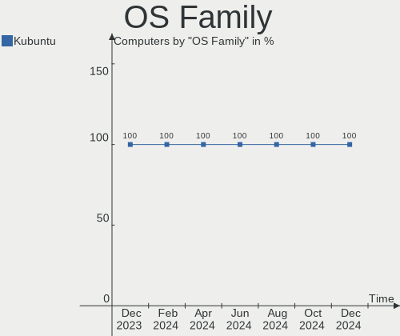
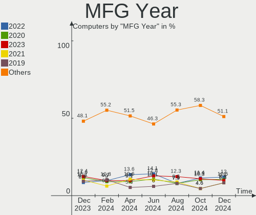
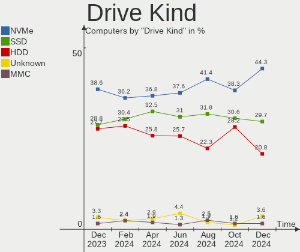
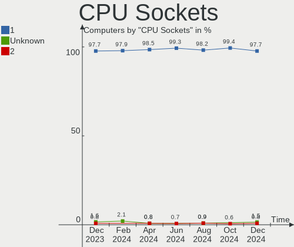
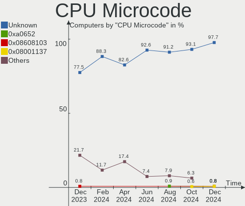
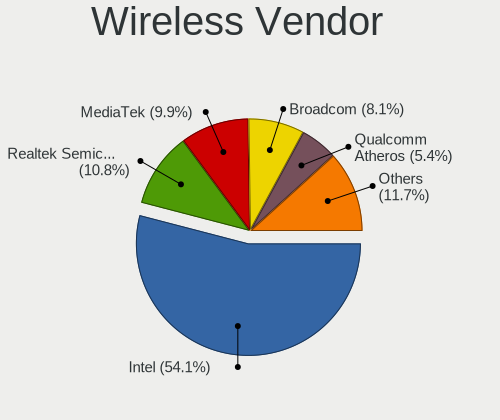
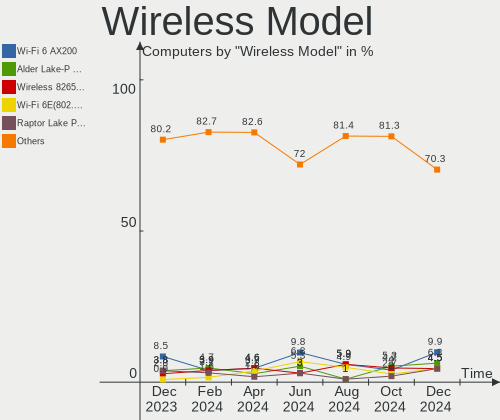
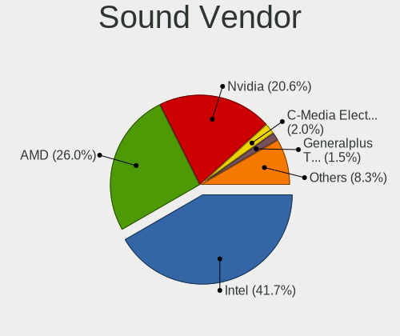
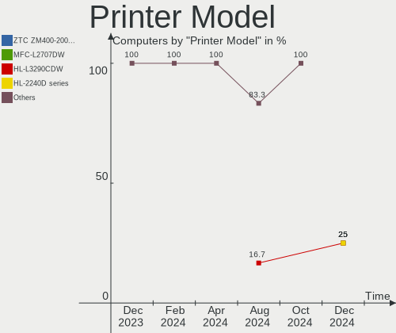

Kubuntu Hardware Trends
-----------------------

A project to identify most popular hardware characteristics and track their change
over time based on data collected by Kubuntu users at https://Linux-Hardware.org.

Anyone can contribute to this report by the [hw-probe](https://github.com/linuxhw/hw-probe) tool:

    sudo -E hw-probe -all -upload

This is a report for all computer types. See also reports for [desktops](/Dist/Kubuntu/Desktop/README.md) and [notebooks](/Dist/Kubuntu/Notebook/README.md).

Full-feature report is available here: https://linux-hardware.org/?view=trends

Period: Oct, 2021.

Contents
--------

* [ System ](#system)
  - [ OS                       ](#os)
  - [ OS Family                ](#os-family)
  - [ Kernel                   ](#kernel)
  - [ Kernel Family            ](#kernel-family)
  - [ Kernel Major Ver.        ](#kernel-major-ver)
  - [ Arch                     ](#arch)
  - [ DE                       ](#de)
  - [ Display Server           ](#display-server)
  - [ Display Manager          ](#display-manager)
  - [ OS Lang                  ](#os-lang)
  - [ Boot Mode                ](#boot-mode)
  - [ Filesystem               ](#filesystem)
  - [ Part. scheme             ](#part-scheme)
  - [ Dual Boot with Linux/BSD ](#dual-boot-with-linuxbsd)
  - [ Dual Boot (Win)          ](#dual-boot-win)

* [ Board ](#board)
  - [ Vendor                   ](#vendor)
  - [ Model                    ](#model)
  - [ Model Family             ](#model-family)
  - [ MFG Year                 ](#mfg-year)
  - [ Form Factor              ](#form-factor)
  - [ Secure Boot              ](#secure-boot)
  - [ Coreboot                 ](#coreboot)
  - [ RAM Size                 ](#ram-size)
  - [ RAM Used                 ](#ram-used)
  - [ Total Drives             ](#total-drives)
  - [ Has CD-ROM               ](#has-cd-rom)
  - [ Has Ethernet             ](#has-ethernet)
  - [ Has WiFi                 ](#has-wifi)
  - [ Has Bluetooth            ](#has-bluetooth)

* [ Location ](#location)
  - [ Country                  ](#country)
  - [ City                     ](#city)

* [ Drives ](#drives)
  - [ Drive Vendor             ](#drive-vendor)
  - [ Drive Model              ](#drive-model)
  - [ HDD Vendor               ](#hdd-vendor)
  - [ SSD Vendor               ](#ssd-vendor)
  - [ Drive Kind               ](#drive-kind)
  - [ Drive Connector          ](#drive-connector)
  - [ Drive Size               ](#drive-size)
  - [ Space Total              ](#space-total)
  - [ Space Used               ](#space-used)
  - [ Malfunc. Drives          ](#malfunc-drives)
  - [ Malfunc. Drive Vendor    ](#malfunc-drive-vendor)
  - [ Malfunc. HDD Vendor      ](#malfunc-hdd-vendor)
  - [ Malfunc. Drive Kind      ](#malfunc-drive-kind)
  - [ Failed Drives            ](#failed-drives)
  - [ Failed Drive Vendor      ](#failed-drive-vendor)
  - [ Drive Status             ](#drive-status)

* [ Storage controller ](#storage-controller)
  - [ Storage Vendor           ](#storage-vendor)
  - [ Storage Model            ](#storage-model)
  - [ Storage Kind             ](#storage-kind)

* [ Processor ](#processor)
  - [ CPU Vendor               ](#cpu-vendor)
  - [ CPU Model                ](#cpu-model)
  - [ CPU Model Family         ](#cpu-model-family)
  - [ CPU Cores                ](#cpu-cores)
  - [ CPU Sockets              ](#cpu-sockets)
  - [ CPU Threads              ](#cpu-threads)
  - [ CPU Op-Modes             ](#cpu-op-modes)
  - [ CPU Microcode            ](#cpu-microcode)
  - [ CPU Microarch            ](#cpu-microarch)

* [ Graphics ](#graphics)
  - [ GPU Vendor               ](#gpu-vendor)
  - [ GPU Model                ](#gpu-model)
  - [ GPU Combo                ](#gpu-combo)
  - [ GPU Driver               ](#gpu-driver)
  - [ GPU Memory               ](#gpu-memory)

* [ Monitor ](#monitor)
  - [ Monitor Vendor           ](#monitor-vendor)
  - [ Monitor Model            ](#monitor-model)
  - [ Monitor Resolution       ](#monitor-resolution)
  - [ Monitor Diagonal         ](#monitor-diagonal)
  - [ Monitor Width            ](#monitor-width)
  - [ Aspect Ratio             ](#aspect-ratio)
  - [ Monitor Area             ](#monitor-area)
  - [ Pixel Density            ](#pixel-density)
  - [ Multiple Monitors        ](#multiple-monitors)

* [ Network ](#network)
  - [ Net Controller Vendor    ](#net-controller-vendor)
  - [ Net Controller Model     ](#net-controller-model)
  - [ Wireless Vendor          ](#wireless-vendor)
  - [ Wireless Model           ](#wireless-model)
  - [ Ethernet Vendor          ](#ethernet-vendor)
  - [ Ethernet Model           ](#ethernet-model)
  - [ Net Controller Kind      ](#net-controller-kind)
  - [ Used Controller          ](#used-controller)
  - [ NICs                     ](#nics)
  - [ IPv6                     ](#ipv6)

* [ Bluetooth ](#bluetooth)
  - [ Bluetooth Vendor         ](#bluetooth-vendor)
  - [ Bluetooth Model          ](#bluetooth-model)

* [ Sound ](#sound)
  - [ Sound Vendor             ](#sound-vendor)
  - [ Sound Model              ](#sound-model)

* [ Memory ](#memory)
  - [ Memory Vendor            ](#memory-vendor)
  - [ Memory Model             ](#memory-model)
  - [ Memory Kind              ](#memory-kind)
  - [ Memory Form Factor       ](#memory-form-factor)
  - [ Memory Size              ](#memory-size)
  - [ Memory Speed             ](#memory-speed)

* [ Printers & scanners ](#printers--scanners)
  - [ Printer Vendor           ](#printer-vendor)
  - [ Printer Model            ](#printer-model)
  - [ Scanner Vendor           ](#scanner-vendor)
  - [ Scanner Model            ](#scanner-model)

* [ Camera ](#camera)
  - [ Camera Vendor            ](#camera-vendor)
  - [ Camera Model             ](#camera-model)

* [ Security ](#security)
  - [ Fingerprint Vendor       ](#fingerprint-vendor)
  - [ Fingerprint Model        ](#fingerprint-model)
  - [ Chipcard Vendor          ](#chipcard-vendor)
  - [ Chipcard Model           ](#chipcard-model)

* [ Unsupported ](#unsupported)
  - [ Unsupported Devices      ](#unsupported-devices)
  - [ Unsupported Device Types ](#unsupported-device-types)

System
------

OS
--

Installed operating systems

| Name          | Computers | Percent |
|---------------|-----------|---------|
| Kubuntu 20.04 | 53        | 49.07%  |
| Kubuntu 21.04 | 27        | 25%     |
| Kubuntu 21.10 | 17        | 15.74%  |
| Kubuntu 20.10 | 6         | 5.56%   |
| Kubuntu 18.04 | 3         | 2.78%   |
| Kubuntu 22.04 | 1         | 0.93%   |
| Kubuntu       | 1         | 0.93%   |

OS Family
---------

OS without a version

| Name    | Computers | Percent |
|---------|-----------|---------|
| Kubuntu | 108       | 100%    |

Kernel
------

Version of the Linux kernel

| Version                | Computers | Percent |
|------------------------|-----------|---------|
| 5.11.0-37-generic      | 37        | 34.26%  |
| 5.11.0-38-generic      | 15        | 13.89%  |
| 5.13.0-20-generic      | 8         | 7.41%   |
| 5.13.0-19-generic      | 8         | 7.41%   |
| 5.4.0-88-generic       | 6         | 5.56%   |
| 5.4.0-89-generic       | 5         | 4.63%   |
| 5.8.0-63-generic       | 4         | 3.7%    |
| 5.8.0-63-lowlatency    | 3         | 2.78%   |
| 5.4.0-87-generic       | 2         | 1.85%   |
| 5.11.0-37-lowlatency   | 2         | 1.85%   |
| 5.8.18-050818-generic  | 1         | 0.93%   |
| 5.8.0-50-generic       | 1         | 0.93%   |
| 5.8.0-49-generic       | 1         | 0.93%   |
| 5.8.0-45-generic       | 1         | 0.93%   |
| 5.8.0-43-generic       | 1         | 0.93%   |
| 5.6.15-050615-generic  | 1         | 0.93%   |
| 5.4.0-60-generic       | 1         | 0.93%   |
| 5.14.9-xanmod2         | 1         | 0.93%   |
| 5.14.12-051412-generic | 1         | 0.93%   |
| 5.14.10-mainline       | 1         | 0.93%   |
| 5.13.0-21-generic      | 1         | 0.93%   |
| 5.13.0-17-generic      | 1         | 0.93%   |
| 5.11.0-39-generic      | 1         | 0.93%   |
| 5.11.0-36-generic      | 1         | 0.93%   |
| 5.11.0-34-generic      | 1         | 0.93%   |
| 5.11.0-27-generic      | 1         | 0.93%   |
| 5.11.0-16-generic      | 1         | 0.93%   |
| 5.10.0-1050-oem        | 1         | 0.93%   |

Kernel Family
-------------

Linux kernel without a distro release

| Version | Computers | Percent |
|---------|-----------|---------|
| 5.11.0  | 59        | 54.63%  |
| 5.13.0  | 18        | 16.67%  |
| 5.4.0   | 14        | 12.96%  |
| 5.8.0   | 11        | 10.19%  |
| 5.8.18  | 1         | 0.93%   |
| 5.6.15  | 1         | 0.93%   |
| 5.14.9  | 1         | 0.93%   |
| 5.14.12 | 1         | 0.93%   |
| 5.14.10 | 1         | 0.93%   |
| 5.10.0  | 1         | 0.93%   |

Kernel Major Ver.
-----------------

Linux kernel major version

| Version | Computers | Percent |
|---------|-----------|---------|
| 5.11    | 59        | 54.63%  |
| 5.13    | 18        | 16.67%  |
| 5.4     | 14        | 12.96%  |
| 5.8     | 12        | 11.11%  |
| 5.14    | 3         | 2.78%   |
| 5.6     | 1         | 0.93%   |
| 5.10    | 1         | 0.93%   |

Arch
----

OS architecture (x86_64, i586, etc.)

| Name   | Computers | Percent |
|--------|-----------|---------|
| x86_64 | 108       | 100%    |

DE
--

Desktop Environment

| Name | Computers | Percent |
|------|-----------|---------|
| KDE5 | 105       | 97.22%  |
| KDE  | 3         | 2.78%   |

Display Server
--------------

X11 or Wayland

| Name    | Computers | Percent |
|---------|-----------|---------|
| X11     | 103       | 95.37%  |
| Wayland | 4         | 3.7%    |
| Tty     | 1         | 0.93%   |

Display Manager
---------------

SDDM, LightDM, etc.

| Name    | Computers | Percent |
|---------|-----------|---------|
| SDDM    | 89        | 82.41%  |
| Unknown | 10        | 9.26%   |
| GDM     | 4         | 3.7%    |
| LightDM | 3         | 2.78%   |
| GDM3    | 2         | 1.85%   |

OS Lang
-------

Language

| Lang  | Computers | Percent |
|-------|-----------|---------|
| en_US | 51        | 47.22%  |
| fr_FR | 11        | 10.19%  |
| en_GB | 8         | 7.41%   |
| ru_RU | 5         | 4.63%   |
| pl_PL | 3         | 2.78%   |
| en_CA | 3         | 2.78%   |
| ru_UA | 2         | 1.85%   |
| pt_BR | 2         | 1.85%   |
| en_ZA | 2         | 1.85%   |
| de_DE | 2         | 1.85%   |
| C     | 2         | 1.85%   |
| zh_TW | 1         | 0.93%   |
| zh_CN | 1         | 0.93%   |
| nl_NL | 1         | 0.93%   |
| nl_BE | 1         | 0.93%   |
| it_IT | 1         | 0.93%   |
| es_VE | 1         | 0.93%   |
| es_MX | 1         | 0.93%   |
| es_HN | 1         | 0.93%   |
| es_ES | 1         | 0.93%   |
| es_EC | 1         | 0.93%   |
| es_CR | 1         | 0.93%   |
| es_AR | 1         | 0.93%   |
| en_IE | 1         | 0.93%   |
| en_AU | 1         | 0.93%   |
| de_CH | 1         | 0.93%   |
| de_AT | 1         | 0.93%   |
| cs_CZ | 1         | 0.93%   |

Boot Mode
---------

EFI or BIOS

| Mode | Computers | Percent |
|------|-----------|---------|
| EFI  | 70        | 64.81%  |
| BIOS | 38        | 35.19%  |

Filesystem
----------

Type of filesystem

| Type    | Computers | Percent |
|---------|-----------|---------|
| Ext4    | 98        | 90.74%  |
| Btrfs   | 5         | 4.63%   |
| Overlay | 3         | 2.78%   |
| Zfs     | 1         | 0.93%   |
| ExX4    | 1         | 0.93%   |

Part. scheme
------------

Scheme of partitioning

| Type    | Computers | Percent |
|---------|-----------|---------|
| GPT     | 64        | 59.26%  |
| Unknown | 34        | 31.48%  |
| MBR     | 10        | 9.26%   |

Dual Boot with Linux/BSD
------------------------

Hosting more than one Linux/BSD

| Dual boot | Computers | Percent |
|-----------|-----------|---------|
| No        | 99        | 91.67%  |
| Yes       | 9         | 8.33%   |

Dual Boot (Win)
---------------

Hosting Linux and Windows

| Dual boot | Computers | Percent |
|-----------|-----------|---------|
| No        | 59        | 54.63%  |
| Yes       | 49        | 45.37%  |

Board
-----

Vendor
------

Motherboard manufacturer

| Name                | Computers | Percent |
|---------------------|-----------|---------|
| Lenovo              | 18        | 16.67%  |
| ASUSTek Computer    | 16        | 14.81%  |
| Hewlett-Packard     | 14        | 12.96%  |
| Dell                | 13        | 12.04%  |
| MSI                 | 9         | 8.33%   |
| Gigabyte Technology | 8         | 7.41%   |
| ASRock              | 4         | 3.7%    |
| Notebook            | 3         | 2.78%   |
| Intel               | 3         | 2.78%   |
| Apple               | 3         | 2.78%   |
| Acer                | 3         | 2.78%   |
| Timi                | 2         | 1.85%   |
| TUXEDO              | 1         | 0.93%   |
| Toshiba             | 1         | 0.93%   |
| SLIMBOOK            | 1         | 0.93%   |
| Samsung Electronics | 1         | 0.93%   |
| GPU Company         | 1         | 0.93%   |
| Google              | 1         | 0.93%   |
| Gateway             | 1         | 0.93%   |
| Fujitsu             | 1         | 0.93%   |
| CyberPowerPC        | 1         | 0.93%   |
| Chuwi               | 1         | 0.93%   |
| BESSTAR Tech        | 1         | 0.93%   |
| Unknown             | 1         | 0.93%   |

Model
-----

Motherboard model

| Name                                              | Computers | Percent |
|---------------------------------------------------|-----------|---------|
| Gigabyte A320M-S2H V2                             | 2         | 1.85%   |
| Gigabyte 970A-DS3P                                | 2         | 1.85%   |
| ASUS PRIME B450M-A                                | 2         | 1.85%   |
| TUXEDO Pulse 15 Gen1                              | 1         | 0.93%   |
| Toshiba PORTEGE R830                              | 1         | 0.93%   |
| Timi A35                                          | 1         | 0.93%   |
| Timi A34                                          | 1         | 0.93%   |
| SLIMBOOK PROX15-AMD                               | 1         | 0.93%   |
| Samsung DP505/DM515                               | 1         | 0.93%   |
| Notebook PB50_70RF,RD,RC                          | 1         | 0.93%   |
| Notebook P775DM3(-G)                              | 1         | 0.93%   |
| Notebook NS50MU                                   | 1         | 0.93%   |
| MSI Traveller 1591                                | 1         | 0.93%   |
| MSI Prestige 15 A11SCX                            | 1         | 0.93%   |
| MSI MS-7C37                                       | 1         | 0.93%   |
| MSI MS-7C02                                       | 1         | 0.93%   |
| MSI MS-7B93                                       | 1         | 0.93%   |
| MSI MS-7A34                                       | 1         | 0.93%   |
| MSI MS-7A32                                       | 1         | 0.93%   |
| MSI MS-7788                                       | 1         | 0.93%   |
| MSI GF65 Thin 10SDR                               | 1         | 0.93%   |
| Lenovo Z70-80 80FG                                | 1         | 0.93%   |
| Lenovo Yoga 9 14ITL5 82BG                         | 1         | 0.93%   |
| Lenovo Yoga 7 14ITL5 82BH                         | 1         | 0.93%   |
| Lenovo ThinkPad X230 Tablet 34382BG               | 1         | 0.93%   |
| Lenovo ThinkPad X230 2325L19                      | 1         | 0.93%   |
| Lenovo ThinkPad X220 Tablet 4299FK6               | 1         | 0.93%   |
| Lenovo ThinkPad T490 20N2CTO1WW                   | 1         | 0.93%   |
| Lenovo ThinkPad P14s Gen 2a 21A0CTO1WW            | 1         | 0.93%   |
| Lenovo ThinkPad P14s Gen 1 20Y1001HRT             | 1         | 0.93%   |
| Lenovo ThinkPad P14s Gen 1 20S40023US             | 1         | 0.93%   |
| Lenovo ThinkPad L14 Gen 2 20X1S07900              | 1         | 0.93%   |
| Lenovo ThinkCentre M71e 3157RV2                   | 1         | 0.93%   |
| Lenovo IdeaPad S145-15AST 81N3                    | 1         | 0.93%   |
| Lenovo IdeaPad L340-15IRH Gaming 81LK             | 1         | 0.93%   |
| Lenovo IdeaPad 3 15IIL05 81WE                     | 1         | 0.93%   |
| Lenovo H50-55 90BG003JUS                          | 1         | 0.93%   |
| Lenovo G500 20236                                 | 1         | 0.93%   |
| Lenovo G50-45 80MQ                                | 1         | 0.93%   |
| Intel NUC7i3BNK                                   | 1         | 0.93%   |
| Intel DH67CL AAG10212-206                         | 1         | 0.93%   |
| Intel D54250WYK H13922-303                        | 1         | 0.93%   |
| HP ZBook Studio G3                                | 1         | 0.93%   |
| HP ZBook Firefly 15 inch G8 Mobile Workstation PC | 1         | 0.93%   |
| HP Z440 Workstation                               | 1         | 0.93%   |
| HP ProBook 5320m                                  | 1         | 0.93%   |
| HP ProBook 4530s                                  | 1         | 0.93%   |
| HP ProBook 450 G8 Notebook PC                     | 1         | 0.93%   |
| HP Pavilion Laptop 15-eg0xxx                      | 1         | 0.93%   |
| HP Pavilion Desktop TP01-1xxx                     | 1         | 0.93%   |
| HP Laptop 15s-eq0xxx                              | 1         | 0.93%   |
| HP Laptop 15-da0xxx                               | 1         | 0.93%   |
| HP Laptop 15-bw0xx                                | 1         | 0.93%   |
| HP ENVY Laptop 17-ce1xxx                          | 1         | 0.93%   |
| HP EliteBook 2760p                                | 1         | 0.93%   |
| HP 245 G8 Notebook PC                             | 1         | 0.93%   |
| GPU Company GWTC116-2                             | 1         | 0.93%   |
| Google Kohaku                                     | 1         | 0.93%   |
| Gigabyte H55N-USB3                                | 1         | 0.93%   |
| Gigabyte B450 AORUS ELITE                         | 1         | 0.93%   |

Model Family
------------

Motherboard model prefix

| Name                  | Computers | Percent |
|-----------------------|-----------|---------|
| Lenovo ThinkPad       | 8         | 7.41%   |
| ASUS PRIME            | 5         | 4.63%   |
| Dell Inspiron         | 4         | 3.7%    |
| Lenovo IdeaPad        | 3         | 2.78%   |
| HP ProBook            | 3         | 2.78%   |
| HP Laptop             | 3         | 2.78%   |
| Gigabyte A320M-S2H    | 3         | 2.78%   |
| Dell Precision        | 3         | 2.78%   |
| Dell Latitude         | 3         | 2.78%   |
| ASUS ASUS             | 3         | 2.78%   |
| Lenovo Yoga           | 2         | 1.85%   |
| HP ZBook              | 2         | 1.85%   |
| HP Pavilion           | 2         | 1.85%   |
| Gigabyte 970A-DS3P    | 2         | 1.85%   |
| ASUS VivoBook         | 2         | 1.85%   |
| ASUS ROG              | 2         | 1.85%   |
| Acer Aspire           | 2         | 1.85%   |
| TUXEDO Pulse          | 1         | 0.93%   |
| Toshiba PORTEGE       | 1         | 0.93%   |
| Timi A35              | 1         | 0.93%   |
| Timi A34              | 1         | 0.93%   |
| SLIMBOOK PROX15-AMD   | 1         | 0.93%   |
| Samsung DP505         | 1         | 0.93%   |
| Notebook PB50         | 1         | 0.93%   |
| Notebook P775DM3(-G)  | 1         | 0.93%   |
| Notebook NS50MU       | 1         | 0.93%   |
| MSI Traveller         | 1         | 0.93%   |
| MSI Prestige          | 1         | 0.93%   |
| MSI MS-7C37           | 1         | 0.93%   |
| MSI MS-7C02           | 1         | 0.93%   |
| MSI MS-7B93           | 1         | 0.93%   |
| MSI MS-7A34           | 1         | 0.93%   |
| MSI MS-7A32           | 1         | 0.93%   |
| MSI MS-7788           | 1         | 0.93%   |
| MSI GF65              | 1         | 0.93%   |
| Lenovo Z70-80         | 1         | 0.93%   |
| Lenovo ThinkCentre    | 1         | 0.93%   |
| Lenovo H50-55         | 1         | 0.93%   |
| Lenovo G500           | 1         | 0.93%   |
| Lenovo G50-45         | 1         | 0.93%   |
| Intel NUC7i3BNK       | 1         | 0.93%   |
| Intel DH67CL          | 1         | 0.93%   |
| Intel D54250WYK       | 1         | 0.93%   |
| HP Z440               | 1         | 0.93%   |
| HP ENVY               | 1         | 0.93%   |
| HP EliteBook          | 1         | 0.93%   |
| HP 245                | 1         | 0.93%   |
| GPU Company GWTC116-2 | 1         | 0.93%   |
| Google Kohaku         | 1         | 0.93%   |
| Gigabyte H55N-USB3    | 1         | 0.93%   |
| Gigabyte B450         | 1         | 0.93%   |
| Gigabyte AX370-Gaming | 1         | 0.93%   |
| Gateway NV55S         | 1         | 0.93%   |
| Fujitsu ESPRIMO       | 1         | 0.93%   |
| Dell XPS              | 1         | 0.93%   |
| Dell Vostro           | 1         | 0.93%   |
| Dell PowerEdge        | 1         | 0.93%   |
| CyberPowerPC TRACER   | 1         | 0.93%   |
| Chuwi GemiBook        | 1         | 0.93%   |
| BESSTAR Tech Z83-F    | 1         | 0.93%   |

MFG Year
--------

Motherboard manufacture year

| Year | Computers | Percent |
|------|-----------|---------|
| 2021 | 38        | 35.19%  |
| 2020 | 25        | 23.15%  |
| 2019 | 12        | 11.11%  |
| 2012 | 7         | 6.48%   |
| 2016 | 6         | 5.56%   |
| 2018 | 5         | 4.63%   |
| 2014 | 3         | 2.78%   |
| 2011 | 3         | 2.78%   |
| 2015 | 2         | 1.85%   |
| 2013 | 2         | 1.85%   |
| 2010 | 2         | 1.85%   |
| 2008 | 2         | 1.85%   |
| 2009 | 1         | 0.93%   |

Form Factor
-----------

Physical design of the computer

| Name        | Computers | Percent |
|-------------|-----------|---------|
| Notebook    | 64        | 59.26%  |
| Desktop     | 34        | 31.48%  |
| Convertible | 4         | 3.7%    |
| Mini pc     | 3         | 2.78%   |
| All in one  | 2         | 1.85%   |
| Server      | 1         | 0.93%   |

Secure Boot
-----------

Enabled or disabled

| State    | Computers | Percent |
|----------|-----------|---------|
| Disabled | 93        | 86.11%  |
| Enabled  | 15        | 13.89%  |

Coreboot
--------

Have coreboot on board

| Used | Computers | Percent |
|------|-----------|---------|
| No   | 107       | 99.07%  |
| Yes  | 1         | 0.93%   |

RAM Size
--------

Total RAM memory

| Size in GB  | Computers | Percent |
|-------------|-----------|---------|
| 16.01-24.0  | 30        | 27.78%  |
| 32.01-64.0  | 20        | 18.52%  |
| 4.01-8.0    | 17        | 15.74%  |
| 8.01-16.0   | 17        | 15.74%  |
| 3.01-4.0    | 15        | 13.89%  |
| 24.01-32.0  | 5         | 4.63%   |
| 64.01-256.0 | 2         | 1.85%   |
| 2.01-3.0    | 1         | 0.93%   |
| 1.01-2.0    | 1         | 0.93%   |

RAM Used
--------

Used RAM memory

| Used GB    | Computers | Percent |
|------------|-----------|---------|
| 2.01-3.0   | 36        | 33.33%  |
| 4.01-8.0   | 29        | 26.85%  |
| 1.01-2.0   | 19        | 17.59%  |
| 3.01-4.0   | 13        | 12.04%  |
| 8.01-16.0  | 9         | 8.33%   |
| 24.01-32.0 | 1         | 0.93%   |
| 16.01-24.0 | 1         | 0.93%   |

Total Drives
------------

Number of drives on board

| Drives | Computers | Percent |
|--------|-----------|---------|
| 1      | 63        | 58.33%  |
| 2      | 25        | 23.15%  |
| 4      | 7         | 6.48%   |
| 3      | 7         | 6.48%   |
| 5      | 4         | 3.7%    |
| 6      | 2         | 1.85%   |

Has CD-ROM
----------

Has CD-ROM on board

| Presented | Computers | Percent |
|-----------|-----------|---------|
| No        | 81        | 75%     |
| Yes       | 27        | 25%     |

Has Ethernet
------------

Has Ethernet on board

| Presented | Computers | Percent |
|-----------|-----------|---------|
| Yes       | 90        | 83.33%  |
| No        | 18        | 16.67%  |

Has WiFi
--------

Has WiFi module

| Presented | Computers | Percent |
|-----------|-----------|---------|
| Yes       | 85        | 78.7%   |
| No        | 23        | 21.3%   |

Has Bluetooth
-------------

Has Bluetooth module

| Presented | Computers | Percent |
|-----------|-----------|---------|
| Yes       | 75        | 69.44%  |
| No        | 33        | 30.56%  |

Location
--------

Country
-------

Geographic location (country)

| Country      | Computers | Percent |
|--------------|-----------|---------|
| USA          | 19        | 17.59%  |
| France       | 14        | 12.96%  |
| UK           | 8         | 7.41%   |
| Russia       | 7         | 6.48%   |
| Ukraine      | 5         | 4.63%   |
| Germany      | 5         | 4.63%   |
| Poland       | 4         | 3.7%    |
| Netherlands  | 4         | 3.7%    |
| Italy        | 3         | 2.78%   |
| Canada       | 3         | 2.78%   |
| Brazil       | 3         | 2.78%   |
| Belgium      | 3         | 2.78%   |
| Spain        | 2         | 1.85%   |
| South Africa | 2         | 1.85%   |
| Ireland      | 2         | 1.85%   |
| Czechia      | 2         | 1.85%   |
| Austria      | 2         | 1.85%   |
| Argentina    | 2         | 1.85%   |
| Venezuela    | 1         | 0.93%   |
| Turkey       | 1         | 0.93%   |
| Taiwan       | 1         | 0.93%   |
| Switzerland  | 1         | 0.93%   |
| Sweden       | 1         | 0.93%   |
| Serbia       | 1         | 0.93%   |
| Norway       | 1         | 0.93%   |
| Mexico       | 1         | 0.93%   |
| Hungary      | 1         | 0.93%   |
| Honduras     | 1         | 0.93%   |
| Finland      | 1         | 0.93%   |
| Egypt        | 1         | 0.93%   |
| Ecuador      | 1         | 0.93%   |
| Costa Rica   | 1         | 0.93%   |
| China        | 1         | 0.93%   |
| Bulgaria     | 1         | 0.93%   |
| Azerbaijan   | 1         | 0.93%   |
| Australia    | 1         | 0.93%   |

City
----

Geographic location (city)

| City                      | Computers | Percent |
|---------------------------|-----------|---------|
| Villemomble               | 2         | 1.85%   |
| Vienna                    | 2         | 1.85%   |
| San Diego                 | 2         | 1.85%   |
| Paris                     | 2         | 1.85%   |
| Odessa                    | 2         | 1.85%   |
| Novosibirsk               | 2         | 1.85%   |
| London                    | 2         | 1.85%   |
| Dublin                    | 2         | 1.85%   |
| Xalapa                    | 1         | 0.93%   |
| Wyoming                   | 1         | 0.93%   |
| Westmead                  | 1         | 0.93%   |
| Warsaw                    | 1         | 0.93%   |
| Wallisellen               | 1         | 0.93%   |
| Wallenhorst               | 1         | 0.93%   |
| Voorhout                  | 1         | 0.93%   |
| Vladivostok               | 1         | 0.93%   |
| Valencia                  | 1         | 0.93%   |
| Usol'ye-Sibirskoye        | 1         | 0.93%   |
| Uppsala                   | 1         | 0.93%   |
| Tomaszowice               | 1         | 0.93%   |
| Tegucigalpa               | 1         | 0.93%   |
| Taoyuan District          | 1         | 0.93%   |
| Tampa                     | 1         | 0.93%   |
| Tambau                    | 1         | 0.93%   |
| South Surrey              | 1         | 0.93%   |
| Solon                     | 1         | 0.93%   |
| Sofia                     | 1         | 0.93%   |
| S??o Carlos               | 1         | 0.93%   |
| Santo Andr?©              | 1         | 0.93%   |
| San Francisco             | 1         | 0.93%   |
| Salt Lake City            | 1         | 0.93%   |
| Saint-Hilaire-de-Brethmas | 1         | 0.93%   |
| Royal Leamington Spa      | 1         | 0.93%   |
| Roubaix                   | 1         | 0.93%   |
| Rotterdam                 | 1         | 0.93%   |
| Rosario                   | 1         | 0.93%   |
| Rome                      | 1         | 0.93%   |
| Recklinghausen            | 1         | 0.93%   |
| R??ros                    | 1         | 0.93%   |
| Pretoria                  | 1         | 0.93%   |
| Prague                    | 1         | 0.93%   |
| Pardubice                 | 1         | 0.93%   |
| Palaiseau                 | 1         | 0.93%   |
| Owensboro                 | 1         | 0.93%   |
| Orange                    | 1         | 0.93%   |
| Oosterzele                | 1         | 0.93%   |
| Omsk                      | 1         | 0.93%   |
| Nysa                      | 1         | 0.93%   |
| Nova Milanese             | 1         | 0.93%   |
| Moscow                    | 1         | 0.93%   |
| Morpeth                   | 1         | 0.93%   |
| Montreal                  | 1         | 0.93%   |
| Miami                     | 1         | 0.93%   |
| Merris                    | 1         | 0.93%   |
| Madrid                    | 1         | 0.93%   |
| Lublin                    | 1         | 0.93%   |
| Los Angeles               | 1         | 0.93%   |
| Las Vegas                 | 1         | 0.93%   |
| Kyiv                      | 1         | 0.93%   |
| Kharkiv                   | 1         | 0.93%   |

Drives
------

Drive Vendor
------------

Hard drive vendors

| Vendor              | Computers | Drives | Percent |
|---------------------|-----------|--------|---------|
| Samsung Electronics | 33        | 44     | 19.88%  |
| Seagate             | 22        | 26     | 13.25%  |
| WDC                 | 19        | 27     | 11.45%  |
| Kingston            | 12        | 12     | 7.23%   |
| Toshiba             | 10        | 11     | 6.02%   |
| Intel               | 8         | 10     | 4.82%   |
| Crucial             | 7         | 7      | 4.22%   |
| Unknown             | 6         | 7      | 3.61%   |
| SK Hynix            | 5         | 5      | 3.01%   |
| KIOXIA              | 5         | 5      | 3.01%   |
| Hitachi             | 5         | 5      | 3.01%   |
| Micron Technology   | 4         | 4      | 2.41%   |
| HGST                | 3         | 3      | 1.81%   |
| China               | 3         | 3      | 1.81%   |
| A-DATA Technology   | 3         | 4      | 1.81%   |
| SSSTC               | 2         | 2      | 1.2%    |
| JMicron             | 2         | 2      | 1.2%    |
| Zheino              | 1         | 1      | 0.6%    |
| Transcend           | 1         | 1      | 0.6%    |
| Team                | 1         | 1      | 0.6%    |
| Super Talent        | 1         | 1      | 0.6%    |
| STM                 | 1         | 1      | 0.6%    |
| Silicon Motion      | 1         | 1      | 0.6%    |
| SanDisk             | 1         | 1      | 0.6%    |
| PLEXTOR             | 1         | 1      | 0.6%    |
| Phison              | 1         | 1      | 0.6%    |
| Netac               | 1         | 1      | 0.6%    |
| MAXTOR              | 1         | 1      | 0.6%    |
| LITEONIT            | 1         | 1      | 0.6%    |
| KingSpec            | 1         | 1      | 0.6%    |
| Gigabyte Technology | 1         | 1      | 0.6%    |
| Apple               | 1         | 1      | 0.6%    |
| Apacer              | 1         | 1      | 0.6%    |
| AEGO                | 1         | 1      | 0.6%    |

Drive Model
-----------

Hard drive models

| Model                                  | Computers | Percent |
|----------------------------------------|-----------|---------|
| Samsung NVMe SSD Drive 1TB             | 4         | 2.14%   |
| Seagate ST2000DM001-1ER164 2TB         | 3         | 1.6%    |
| Samsung SSD 860 EVO 1TB                | 3         | 1.6%    |
| Samsung SSD 840 EVO 250GB              | 3         | 1.6%    |
| Unknown MMC Card  64GB                 | 2         | 1.07%   |
| Toshiba HDWD110 1TB                    | 2         | 1.07%   |
| Seagate ST2000DM008-2FR102 2TB         | 2         | 1.07%   |
| Seagate ST1000LM035-1RK172 1TB         | 2         | 1.07%   |
| Seagate ST1000LM024 HN-M101MBB 1TB     | 2         | 1.07%   |
| Seagate ST1000DM003-1ER162 1TB         | 2         | 1.07%   |
| Samsung SSD PM830 2.5 7mm 128GB        | 2         | 1.07%   |
| Samsung SSD 970 EVO Plus 500GB         | 2         | 1.07%   |
| Samsung PM963 2.5" NVMe PCIe SSD 512GB | 2         | 1.07%   |
| Samsung NVMe SSD Drive 500GB           | 2         | 1.07%   |
| Samsung MZVLB512HBJQ-000L7 512GB       | 2         | 1.07%   |
| KIOXIA KBG40ZNV512G 512GB              | 2         | 1.07%   |
| Kingston SA400S37240G 240GB SSD        | 2         | 1.07%   |
| Kingston RBUSNS8154P3256GJ1 256GB      | 2         | 1.07%   |
| Zheino CHN 25SATA01M 030 32GB SSD      | 1         | 0.53%   |
| WDC WDS500G3X0C-00SJG0 500GB           | 1         | 0.53%   |
| WDC WDS240G2G0A-00JH30 240GB SSD       | 1         | 0.53%   |
| WDC WDS100T3X0C-00SJG0 1TB             | 1         | 0.53%   |
| WDC WD5000LPVX-75V0TT0 500GB           | 1         | 0.53%   |
| WDC WD5000LPCX-24C6HT0 500GB           | 1         | 0.53%   |
| WDC WD5000AAKS-00A7B0 500GB            | 1         | 0.53%   |
| WDC WD40PURZ-85AKKY0 4TB               | 1         | 0.53%   |
| WDC WD40EZAZ-00SF3B0 4TB               | 1         | 0.53%   |
| WDC WD30PURX-64P6ZY0 3TB               | 1         | 0.53%   |
| WDC WD30EZRZ-00Z5HB0 3TB               | 1         | 0.53%   |
| WDC WD20EFRX-68EUZN0 2TB               | 1         | 0.53%   |
| WDC WD20EARX-008FB0 2TB                | 1         | 0.53%   |
| WDC WD20EARS-00MVWB0 2TB               | 1         | 0.53%   |
| WDC WD2003FZEX-00SRLA0 2TB             | 1         | 0.53%   |
| WDC WD10SPZX-24Z10 1TB                 | 1         | 0.53%   |
| WDC WD10SPSX-08A6W 1TB                 | 1         | 0.53%   |
| WDC WD10JPCX-24UE4T0 1TB               | 1         | 0.53%   |
| WDC WD10EZEX-75WN4A0 1TB               | 1         | 0.53%   |
| WDC WD10EZEX-00WN4A0 1TB               | 1         | 0.53%   |
| WDC WD10EARS-00MVWB0 1TB               | 1         | 0.53%   |
| WDC PC SN730 SDBPNTY-512G-1101 512GB   | 1         | 0.53%   |
| WDC PC SN730 SDBPNTY-512G-1006 512GB   | 1         | 0.53%   |
| WDC PC SN530 SDBPNPZ-1T00-1002 1TB     | 1         | 0.53%   |
| Unknown TPH00500500GB 80               | 1         | 0.53%   |
| Unknown SD32G  32GB                    | 1         | 0.53%   |
| Unknown MMC Card  32GB                 | 1         | 0.53%   |
| Unknown MMC Card  2GB                  | 1         | 0.53%   |
| Unknown ED2S5  128GB                   | 1         | 0.53%   |
| Transcend TS256GMTE220S 256GB          | 1         | 0.53%   |
| Toshiba THNSNC128GMLJ 128GB SSD        | 1         | 0.53%   |
| Toshiba NVMe SSD Drive 512GB           | 1         | 0.53%   |
| Toshiba NVMe SSD Drive 256GB           | 1         | 0.53%   |
| Toshiba MK7575GSX 752GB                | 1         | 0.53%   |
| Toshiba MK2035GSS 200GB                | 1         | 0.53%   |
| Toshiba KXG50PNV1T02 NVMe 1024GB       | 1         | 0.53%   |
| Toshiba HDWD240 4TB                    | 1         | 0.53%   |
| Toshiba HDWD120 2TB                    | 1         | 0.53%   |
| Team T2535T120G 120GB SSD              | 1         | 0.53%   |
| Super Talent FTM56N325H 256GB SSD      | 1         | 0.53%   |
| STM STLINK 3MB                         | 1         | 0.53%   |
| SSSTC CL1-3D256 256GB                  | 1         | 0.53%   |

HDD Vendor
----------

Hard disk drive vendors

| Vendor              | Computers | Drives | Percent |
|---------------------|-----------|--------|---------|
| Seagate             | 22        | 26     | 40%     |
| WDC                 | 14        | 21     | 25.45%  |
| Toshiba             | 6         | 7      | 10.91%  |
| Hitachi             | 5         | 5      | 9.09%   |
| Samsung Electronics | 3         | 3      | 5.45%   |
| HGST                | 3         | 3      | 5.45%   |
| MAXTOR              | 1         | 1      | 1.82%   |
| JMicron             | 1         | 1      | 1.82%   |

SSD Vendor
----------

Solid state drive vendors

| Vendor              | Computers | Drives | Percent |
|---------------------|-----------|--------|---------|
| Samsung Electronics | 17        | 19     | 31.48%  |
| Kingston            | 7         | 7      | 12.96%  |
| Crucial             | 6         | 6      | 11.11%  |
| Intel               | 4         | 5      | 7.41%   |
| China               | 3         | 3      | 5.56%   |
| Micron Technology   | 2         | 2      | 3.7%    |
| Zheino              | 1         | 1      | 1.85%   |
| WDC                 | 1         | 1      | 1.85%   |
| Toshiba             | 1         | 1      | 1.85%   |
| Team                | 1         | 1      | 1.85%   |
| Super Talent        | 1         | 1      | 1.85%   |
| SK Hynix            | 1         | 1      | 1.85%   |
| SanDisk             | 1         | 1      | 1.85%   |
| PLEXTOR             | 1         | 1      | 1.85%   |
| Netac               | 1         | 1      | 1.85%   |
| LITEONIT            | 1         | 1      | 1.85%   |
| KingSpec            | 1         | 1      | 1.85%   |
| Apple               | 1         | 1      | 1.85%   |
| Apacer              | 1         | 1      | 1.85%   |
| AEGO                | 1         | 1      | 1.85%   |
| A-DATA Technology   | 1         | 1      | 1.85%   |

Drive Kind
----------

HDD or SSD

| Kind    | Computers | Drives | Percent |
|---------|-----------|--------|---------|
| NVMe    | 53        | 61     | 35.81%  |
| SSD     | 45        | 57     | 30.41%  |
| HDD     | 42        | 67     | 28.38%  |
| MMC     | 5         | 6      | 3.38%   |
| Unknown | 3         | 3      | 2.03%   |

Drive Connector
---------------

SATA, SAS, NVMe, etc.

| Type | Computers | Drives | Percent |
|------|-----------|--------|---------|
| SATA | 67        | 120    | 51.15%  |
| NVMe | 53        | 61     | 40.46%  |
| SAS  | 6         | 7      | 4.58%   |
| MMC  | 5         | 6      | 3.82%   |

Drive Size
----------

Size of hard drive

| Size in TB | Computers | Drives | Percent |
|------------|-----------|--------|---------|
| 0.01-0.5   | 46        | 56     | 46%     |
| 0.51-1.0   | 30        | 36     | 30%     |
| 1.01-2.0   | 16        | 22     | 16%     |
| 3.01-4.0   | 4         | 6      | 4%      |
| 2.01-3.0   | 4         | 4      | 4%      |

Space Total
-----------

Amount of disk space available on the file system

| Size in GB     | Computers | Percent |
|----------------|-----------|---------|
| 501-1000       | 26        | 24.07%  |
| 101-250        | 25        | 23.15%  |
| 251-500        | 23        | 21.3%   |
| 1001-2000      | 9         | 8.33%   |
| More than 3000 | 8         | 7.41%   |
| 2001-3000      | 6         | 5.56%   |
| 51-100         | 6         | 5.56%   |
| 1-20           | 4         | 3.7%    |
| 21-50          | 1         | 0.93%   |

Space Used
----------

Amount of used disk space

| Used GB        | Computers | Percent |
|----------------|-----------|---------|
| 1-20           | 29        | 26.85%  |
| 101-250        | 16        | 14.81%  |
| 501-1000       | 16        | 14.81%  |
| 251-500        | 14        | 12.96%  |
| 51-100         | 14        | 12.96%  |
| 21-50          | 10        | 9.26%   |
| More than 3000 | 5         | 4.63%   |
| 1001-2000      | 3         | 2.78%   |
| 2001-3000      | 1         | 0.93%   |

Malfunc. Drives
---------------

Drive models with a malfunction

| Model                                            | Computers | Drives | Percent |
|--------------------------------------------------|-----------|--------|---------|
| WDC WD5000LPVX-75V0TT0 500GB                     | 1         | 1      | 6.67%   |
| WDC WD5000AAKS-00A7B0 500GB                      | 1         | 1      | 6.67%   |
| WDC WD30PURX-64P6ZY0 3TB                         | 1         | 1      | 6.67%   |
| WDC WD20EARX-008FB0 2TB                          | 1         | 1      | 6.67%   |
| SK Hynix SC401 SATA 512GB SSD                    | 1         | 1      | 6.67%   |
| Seagate ST1000LM035-1RK172 1TB                   | 1         | 1      | 6.67%   |
| Seagate ST1000LM024 HN-M101MBB 1TB               | 1         | 1      | 6.67%   |
| Samsung Electronics MZVLB1T0HALR-000L2 1TB       | 1         | 1      | 6.67%   |
| Samsung Electronics MZNLH128HBHQ-000H1 128GB SSD | 1         | 1      | 6.67%   |
| Intel SSDSA2M160G2GC 160GB                       | 1         | 1      | 6.67%   |
| Intel SSDPEKKW512G7 512GB                        | 1         | 1      | 6.67%   |
| Intel SSDPEKKW256G7 256GB                        | 1         | 1      | 6.67%   |
| Hitachi HDS723020BLA642 2TB                      | 1         | 1      | 6.67%   |
| HGST HTS725050A7E630 500GB                       | 1         | 1      | 6.67%   |
| Crucial CT525MX300SSD4 528GB                     | 1         | 1      | 6.67%   |

Malfunc. Drive Vendor
---------------------

Vendors of faulty drives

| Vendor              | Computers | Drives | Percent |
|---------------------|-----------|--------|---------|
| WDC                 | 4         | 4      | 26.67%  |
| Intel               | 3         | 3      | 20%     |
| Seagate             | 2         | 2      | 13.33%  |
| Samsung Electronics | 2         | 2      | 13.33%  |
| SK Hynix            | 1         | 1      | 6.67%   |
| Hitachi             | 1         | 1      | 6.67%   |
| HGST                | 1         | 1      | 6.67%   |
| Crucial             | 1         | 1      | 6.67%   |

Malfunc. HDD Vendor
-------------------

Vendors of faulty HDD drives

| Vendor  | Computers | Drives | Percent |
|---------|-----------|--------|---------|
| WDC     | 4         | 4      | 50%     |
| Seagate | 2         | 2      | 25%     |
| Hitachi | 1         | 1      | 12.5%   |
| HGST    | 1         | 1      | 12.5%   |

Malfunc. Drive Kind
-------------------

Kinds of faulty drives

| Kind | Computers | Drives | Percent |
|------|-----------|--------|---------|
| HDD  | 7         | 8      | 50%     |
| SSD  | 4         | 4      | 28.57%  |
| NVMe | 3         | 3      | 21.43%  |

Failed Drives
-------------

Failed drive models

Zero info for selected period =(

Failed Drive Vendor
-------------------

Failed drive vendors

Zero info for selected period =(

Drive Status
------------

Number of failed and malfunc. drives

| Status   | Computers | Drives | Percent |
|----------|-----------|--------|---------|
| Works    | 68        | 104    | 56.67%  |
| Detected | 38        | 75     | 31.67%  |
| Malfunc  | 14        | 15     | 11.67%  |

Storage controller
------------------

Storage Vendor
--------------

Storage controller vendors

| Vendor                         | Computers | Percent |
|--------------------------------|-----------|---------|
| Intel                          | 60        | 40.27%  |
| AMD                            | 32        | 21.48%  |
| Samsung Electronics            | 19        | 12.75%  |
| Toshiba America Info Systems   | 5         | 3.36%   |
| Sandisk                        | 5         | 3.36%   |
| Kingston Technology Company    | 5         | 3.36%   |
| SK Hynix                       | 4         | 2.68%   |
| KIOXIA                         | 3         | 2.01%   |
| Solid State Storage Technology | 2         | 1.34%   |
| Silicon Motion                 | 2         | 1.34%   |
| Realtek Semiconductor          | 2         | 1.34%   |
| Phison Electronics             | 2         | 1.34%   |
| Nvidia                         | 2         | 1.34%   |
| Micron Technology              | 2         | 1.34%   |
| ASMedia Technology             | 2         | 1.34%   |
| Micron/Crucial Technology      | 1         | 0.67%   |
| Marvell Technology Group       | 1         | 0.67%   |

Storage Model
-------------

Storage controller models

| Model                                                                            | Computers | Percent |
|----------------------------------------------------------------------------------|-----------|---------|
| AMD FCH SATA Controller [AHCI mode]                                              | 26        | 15.12%  |
| Samsung NVMe SSD Controller SM981/PM981/PM983                                    | 12        | 6.98%   |
| Intel 82801 Mobile SATA Controller [RAID mode]                                   | 7         | 4.07%   |
| Intel Volume Management Device NVMe RAID Controller                              | 6         | 3.49%   |
| Samsung NVMe SSD Controller 980                                                  | 5         | 2.91%   |
| Intel 7 Series Chipset Family 6-port SATA Controller [AHCI mode]                 | 5         | 2.91%   |
| Intel 6 Series/C200 Series Chipset Family 6 port Mobile SATA AHCI Controller     | 5         | 2.91%   |
| AMD 300 Series Chipset SATA Controller                                           | 5         | 2.91%   |
| Intel Cannon Lake Mobile PCH SATA AHCI Controller                                | 4         | 2.33%   |
| AMD 400 Series Chipset SATA Controller                                           | 4         | 2.33%   |
| Toshiba America Info Systems XG6 NVMe SSD Controller                             | 3         | 1.74%   |
| SK Hynix Gold P31 SSD                                                            | 3         | 1.74%   |
| Sandisk WD Black SN750 / PC SN730 NVMe SSD                                       | 3         | 1.74%   |
| KIOXIA Non-Volatile memory controller                                            | 3         | 1.74%   |
| Intel Q170/Q150/B150/H170/H110/Z170/CM236 Chipset SATA Controller [AHCI Mode]    | 3         | 1.74%   |
| Intel Comet Lake SATA AHCI Controller                                            | 3         | 1.74%   |
| Intel Celeron/Pentium Silver Processor SATA Controller                           | 3         | 1.74%   |
| Solid State Storage Non-Volatile memory controller                               | 2         | 1.16%   |
| Silicon Motion SM2262/SM2262EN SSD Controller                                    | 2         | 1.16%   |
| Samsung NVMe SSD Controller SM961/PM961/SM963                                    | 2         | 1.16%   |
| Realtek RTS5763DL NVMe SSD Controller                                            | 2         | 1.16%   |
| Phison E16 PCIe4 NVMe Controller                                                 | 2         | 1.16%   |
| Micron Non-Volatile memory controller                                            | 2         | 1.16%   |
| Kingston Company U-SNS8154P3 NVMe SSD                                            | 2         | 1.16%   |
| Kingston Company A2000 NVMe SSD                                                  | 2         | 1.16%   |
| Intel Sunrise Point-LP SATA Controller [AHCI mode]                               | 2         | 1.16%   |
| Intel SSD 660P Series                                                            | 2         | 1.16%   |
| Intel SSD 600P Series                                                            | 2         | 1.16%   |
| Intel NM10/ICH7 Family SATA Controller [IDE mode]                                | 2         | 1.16%   |
| Intel Ice Lake-LP SATA Controller [AHCI mode]                                    | 2         | 1.16%   |
| Intel 8 Series SATA Controller 1 [AHCI mode]                                     | 2         | 1.16%   |
| Intel 6 Series/C200 Series Chipset Family 6 port Desktop SATA AHCI Controller    | 2         | 1.16%   |
| Intel 5 Series/3400 Series Chipset 6 port SATA AHCI Controller                   | 2         | 1.16%   |
| Intel 400 Series Chipset Family SATA AHCI Controller                             | 2         | 1.16%   |
| ASMedia ASM1062 Serial ATA Controller                                            | 2         | 1.16%   |
| AMD X370 Series Chipset SATA Controller                                          | 2         | 1.16%   |
| AMD Starship/Matisse Chipset SATA Controller [AHCI mode]                         | 2         | 1.16%   |
| AMD SB7x0/SB8x0/SB9x0 SATA Controller [AHCI mode]                                | 2         | 1.16%   |
| AMD SB7x0/SB8x0/SB9x0 IDE Controller                                             | 2         | 1.16%   |
| Toshiba America Info Systems Toshiba America Info Non-Volatile memory controller | 1         | 0.58%   |
| Toshiba America Info Systems BG3 NVMe SSD Controller                             | 1         | 0.58%   |
| SK Hynix Non-Volatile memory controller                                          | 1         | 0.58%   |
| Sandisk WD Blue SN550 NVMe SSD                                                   | 1         | 0.58%   |
| Sandisk WD Black 2018/SN750 / PC SN720 NVMe SSD                                  | 1         | 0.58%   |
| Samsung NVMe SSD Controller PM9A1/PM9A3/980PRO                                   | 1         | 0.58%   |
| Samsung Apple PCIe SSD                                                           | 1         | 0.58%   |
| Nvidia nForce SATA Controller                                                    | 1         | 0.58%   |
| Nvidia MCP79 AHCI Controller                                                     | 1         | 0.58%   |
| Micron/Crucial P2 NVMe PCIe SSD                                                  | 1         | 0.58%   |
| Marvell Group 88SE9215 PCIe 2.0 x1 4-port SATA 6 Gb/s Controller                 | 1         | 0.58%   |
| Kingston Company Company Non-Volatile memory controller                          | 1         | 0.58%   |
| Intel Wildcat Point-LP SATA Controller [AHCI Mode]                               | 1         | 0.58%   |
| Intel SSD Pro 7600p/760p/E 6100p Series                                          | 1         | 0.58%   |
| Intel SATA Controller [RAID mode]                                                | 1         | 0.58%   |
| Intel Cannon Point-LP SATA Controller [AHCI Mode]                                | 1         | 0.58%   |
| Intel C610/X99 series chipset sSATA Controller [RAID mode]                       | 1         | 0.58%   |
| Intel C600/X79 series chipset SATA RAID Controller                               | 1         | 0.58%   |
| Intel C600/X79 series chipset 4-Port SATA IDE Controller                         | 1         | 0.58%   |
| Intel C600/X79 series chipset 2-Port SATA IDE Controller                         | 1         | 0.58%   |
| Intel 82801HM/HEM (ICH8M/ICH8M-E) SATA Controller [AHCI mode]                    | 1         | 0.58%   |

Storage Kind
------------

Kind of storage controller (IDE, SATA, NVMe, SAS, ...)

| Kind | Computers | Percent |
|------|-----------|---------|
| SATA | 75        | 50%     |
| NVMe | 53        | 35.33%  |
| RAID | 15        | 10%     |
| IDE  | 7         | 4.67%   |

Processor
---------

CPU Vendor
----------

Processor vendors

| Vendor | Computers | Percent |
|--------|-----------|---------|
| Intel  | 72        | 66.67%  |
| AMD    | 36        | 33.33%  |

CPU Model
---------

Processor models

| Model                                       | Computers | Percent |
|---------------------------------------------|-----------|---------|
| Intel Core i7-10510U CPU @ 1.80GHz          | 4         | 3.7%    |
| Intel 11th Gen Core i7-1165G7 @ 2.80GHz     | 4         | 3.7%    |
| Intel Core i5-1035G1 CPU @ 1.00GHz          | 3         | 2.78%   |
| Intel 11th Gen Core i7-11370H @ 3.30GHz     | 3         | 2.78%   |
| Intel 11th Gen Core i5-1135G7 @ 2.40GHz     | 3         | 2.78%   |
| AMD Ryzen 7 4800H with Radeon Graphics      | 3         | 2.78%   |
| AMD Ryzen 5 3600 6-Core Processor           | 3         | 2.78%   |
| Intel Core i7-9750H CPU @ 2.60GHz           | 2         | 1.85%   |
| Intel Core i7-8565U CPU @ 1.80GHz           | 2         | 1.85%   |
| Intel Core i7-2640M CPU @ 2.80GHz           | 2         | 1.85%   |
| Intel Core i5-8250U CPU @ 1.60GHz           | 2         | 1.85%   |
| Intel Core i5-3320M CPU @ 2.60GHz           | 2         | 1.85%   |
| Intel Celeron N4020 CPU @ 1.10GHz           | 2         | 1.85%   |
| Intel 11th Gen Core i7-1185G7 @ 3.00GHz     | 2         | 1.85%   |
| AMD Ryzen 9 3900X 12-Core Processor         | 2         | 1.85%   |
| AMD Ryzen 5 5600X 6-Core Processor          | 2         | 1.85%   |
| AMD Ryzen 5 1600 Six-Core Processor         | 2         | 1.85%   |
| Intel Xeon CPU X5450 @ 3.00GHz              | 1         | 0.93%   |
| Intel Xeon CPU E5-2640 0 @ 2.50GHz          | 1         | 0.93%   |
| Intel Xeon CPU E5-1650 v3 @ 3.50GHz         | 1         | 0.93%   |
| Intel Pentium Dual-Core CPU E5800 @ 3.20GHz | 1         | 0.93%   |
| Intel Pentium Dual CPU T3200 @ 2.00GHz      | 1         | 0.93%   |
| Intel Pentium CPU G630 @ 2.70GHz            | 1         | 0.93%   |
| Intel Core i9-10885H CPU @ 2.40GHz          | 1         | 0.93%   |
| Intel Core i7-8850H CPU @ 2.60GHz           | 1         | 0.93%   |
| Intel Core i7-8650U CPU @ 1.90GHz           | 1         | 0.93%   |
| Intel Core i7-6700HQ CPU @ 2.60GHz          | 1         | 0.93%   |
| Intel Core i7-5500U CPU @ 2.40GHz           | 1         | 0.93%   |
| Intel Core i7-4810MQ CPU @ 2.80GHz          | 1         | 0.93%   |
| Intel Core i7-4510U CPU @ 2.00GHz           | 1         | 0.93%   |
| Intel Core i7-2620M CPU @ 2.70GHz           | 1         | 0.93%   |
| Intel Core i7-2600 CPU @ 3.40GHz            | 1         | 0.93%   |
| Intel Core i7-10750H CPU @ 2.60GHz          | 1         | 0.93%   |
| Intel Core i7-10700 CPU @ 2.90GHz           | 1         | 0.93%   |
| Intel Core i5-9600K CPU @ 3.70GHz           | 1         | 0.93%   |
| Intel Core i5-9300H CPU @ 2.40GHz           | 1         | 0.93%   |
| Intel Core i5-8350U CPU @ 1.70GHz           | 1         | 0.93%   |
| Intel Core i5-6600K CPU @ 3.50GHz           | 1         | 0.93%   |
| Intel Core i5-6400 CPU @ 2.70GHz            | 1         | 0.93%   |
| Intel Core i5-4278U CPU @ 2.60GHz           | 1         | 0.93%   |
| Intel Core i5-4250U CPU @ 1.30GHz           | 1         | 0.93%   |
| Intel Core i5-3380M CPU @ 2.90GHz           | 1         | 0.93%   |
| Intel Core i5-3317U CPU @ 1.70GHz           | 1         | 0.93%   |
| Intel Core i5-2520M CPU @ 2.50GHz           | 1         | 0.93%   |
| Intel Core i5-10300H CPU @ 2.50GHz          | 1         | 0.93%   |
| Intel Core i5-10210U CPU @ 1.60GHz          | 1         | 0.93%   |
| Intel Core i3-7100U CPU @ 2.40GHz           | 1         | 0.93%   |
| Intel Core i3-3217U CPU @ 1.80GHz           | 1         | 0.93%   |
| Intel Core i3-3110M CPU @ 2.40GHz           | 1         | 0.93%   |
| Intel Core i3-2350M CPU @ 2.30GHz           | 1         | 0.93%   |
| Intel Core i3-2100 CPU @ 3.10GHz            | 1         | 0.93%   |
| Intel Core i3 CPU M 350 @ 2.27GHz           | 1         | 0.93%   |
| Intel Core i3 CPU 540 @ 3.07GHz             | 1         | 0.93%   |
| Intel Core 2 Duo CPU E8135 @ 2.66GHz        | 1         | 0.93%   |
| Intel Celeron J4125 CPU @ 2.00GHz           | 1         | 0.93%   |
| Intel Atom x5-Z8350 CPU @ 1.44GHz           | 1         | 0.93%   |
| Intel 11th Gen Core i7-11800H @ 2.30GHz     | 1         | 0.93%   |
| Intel 11th Gen Core i5-11300H @ 3.10GHz     | 1         | 0.93%   |
| AMD Ryzen 9 3950X 16-Core Processor         | 1         | 0.93%   |
| AMD Ryzen 7 PRO 4750U with Radeon Graphics  | 1         | 0.93%   |

CPU Model Family
----------------

Processor model prefix

| Model                   | Computers | Percent |
|-------------------------|-----------|---------|
| Intel Core i7           | 20        | 18.52%  |
| Intel Core i5           | 19        | 17.59%  |
| Other                   | 14        | 12.96%  |
| AMD Ryzen 5             | 10        | 9.26%   |
| AMD Ryzen 7             | 8         | 7.41%   |
| Intel Core i3           | 7         | 6.48%   |
| Intel Xeon              | 3         | 2.78%   |
| Intel Celeron           | 3         | 2.78%   |
| AMD Ryzen 9             | 3         | 2.78%   |
| AMD A6                  | 3         | 2.78%   |
| AMD A10                 | 3         | 2.78%   |
| AMD Ryzen 3             | 2         | 1.85%   |
| AMD FX                  | 2         | 1.85%   |
| Intel Pentium Dual-Core | 1         | 0.93%   |
| Intel Pentium Dual      | 1         | 0.93%   |
| Intel Pentium           | 1         | 0.93%   |
| Intel Core i9           | 1         | 0.93%   |
| Intel Core 2 Duo        | 1         | 0.93%   |
| Intel Atom              | 1         | 0.93%   |
| AMD Ryzen 7 PRO         | 1         | 0.93%   |
| AMD Ryzen 5 PRO         | 1         | 0.93%   |
| AMD QC                  | 1         | 0.93%   |
| AMD Athlon X2           | 1         | 0.93%   |
| AMD Athlon              | 1         | 0.93%   |

CPU Cores
---------

Number of processor cores

| Number | Computers | Percent |
|--------|-----------|---------|
| 4      | 45        | 41.67%  |
| 2      | 32        | 29.63%  |
| 6      | 15        | 13.89%  |
| 8      | 12        | 11.11%  |
| 12     | 3         | 2.78%   |
| 16     | 1         | 0.93%   |

CPU Sockets
-----------

Number of sockets

| Number | Computers | Percent |
|--------|-----------|---------|
| 1      | 107       | 99.07%  |
| 2      | 1         | 0.93%   |

CPU Threads
-----------

Threads per core (Hyper-Threading)

| Number | Computers | Percent |
|--------|-----------|---------|
| 2      | 89        | 82.41%  |
| 1      | 19        | 17.59%  |

CPU Op-Modes
------------

CPU Operation Modes (32-bit, 64-bit)

| Op mode        | Computers | Percent |
|----------------|-----------|---------|
| 32-bit, 64-bit | 108       | 100%    |

CPU Microcode
-------------

Microcode number

| Number     | Computers | Percent |
|------------|-----------|---------|
| Unknown    | 24        | 22.22%  |
| 0x806c1    | 11        | 10.19%  |
| 0x206a7    | 7         | 6.48%   |
| 0x306a9    | 6         | 5.56%   |
| 0x08701021 | 6         | 5.56%   |
| 0x906ea    | 4         | 3.7%    |
| 0x806ec    | 4         | 3.7%    |
| 0x806ea    | 3         | 2.78%   |
| 0x706e5    | 3         | 2.78%   |
| 0x706a8    | 3         | 2.78%   |
| 0x40651    | 3         | 2.78%   |
| 0xa0652    | 2         | 1.85%   |
| 0x506e3    | 2         | 1.85%   |
| 0x08108109 | 2         | 1.85%   |
| 0x08001138 | 2         | 1.85%   |
| 0x0700010f | 2         | 1.85%   |
| 0xa0655    | 1         | 0.93%   |
| 0x906ec    | 1         | 0.93%   |
| 0x806eb    | 1         | 0.93%   |
| 0x806d1    | 1         | 0.93%   |
| 0x306f2    | 1         | 0.93%   |
| 0x306d4    | 1         | 0.93%   |
| 0x306c3    | 1         | 0.93%   |
| 0x20655    | 1         | 0.93%   |
| 0x20652    | 1         | 0.93%   |
| 0x1067a    | 1         | 0.93%   |
| 0x10676    | 1         | 0.93%   |
| 0x0a50000c | 1         | 0.93%   |
| 0x0a201016 | 1         | 0.93%   |
| 0x08701013 | 1         | 0.93%   |
| 0x08600106 | 1         | 0.93%   |
| 0x08600104 | 1         | 0.93%   |
| 0x08600103 | 1         | 0.93%   |
| 0x08101016 | 1         | 0.93%   |
| 0x08001137 | 1         | 0.93%   |
| 0x0600611a | 1         | 0.93%   |
| 0x06003106 | 1         | 0.93%   |
| 0x06000852 | 1         | 0.93%   |
| 0x03000027 | 1         | 0.93%   |
| 0x02000032 | 1         | 0.93%   |

CPU Microarch
-------------

Microarchitecture

| Name            | Computers | Percent |
|-----------------|-----------|---------|
| KabyLake        | 17        | 15.74%  |
| Zen 2           | 13        | 12.04%  |
| TigerLake       | 13        | 12.04%  |
| SandyBridge     | 9         | 8.33%   |
| IvyBridge       | 6         | 5.56%   |
| Zen             | 5         | 4.63%   |
| Haswell         | 5         | 4.63%   |
| Zen+            | 4         | 3.7%    |
| Zen 3           | 4         | 3.7%    |
| Icelake         | 4         | 3.7%    |
| CometLake       | 4         | 3.7%    |
| Skylake         | 3         | 2.78%   |
| Penryn          | 3         | 2.78%   |
| Goldmont plus   | 3         | 2.78%   |
| Excavator       | 3         | 2.78%   |
| Westmere        | 2         | 1.85%   |
| Piledriver      | 2         | 1.85%   |
| Jaguar          | 2         | 1.85%   |
| Steamroller     | 1         | 0.93%   |
| Silvermont      | 1         | 0.93%   |
| K8 & K10 hybrid | 1         | 0.93%   |
| K10 Llano       | 1         | 0.93%   |
| Core            | 1         | 0.93%   |
| Broadwell       | 1         | 0.93%   |

Graphics
--------

GPU Vendor
----------

Vendors of graphics cards

| Vendor | Computers | Percent |
|--------|-----------|---------|
| Intel  | 64        | 48.12%  |
| Nvidia | 38        | 28.57%  |
| AMD    | 31        | 23.31%  |

GPU Model
---------

Graphics card models

| Model                                                                                    | Computers | Percent |
|------------------------------------------------------------------------------------------|-----------|---------|
| Intel TigerLake-LP GT2 [Iris Xe Graphics]                                                | 13        | 9.63%   |
| Intel 3rd Gen Core processor Graphics Controller                                         | 6         | 4.44%   |
| Intel 2nd Generation Core Processor Family Integrated Graphics Controller                | 6         | 4.44%   |
| Intel CometLake-U GT2 [UHD Graphics]                                                     | 5         | 3.7%    |
| Intel UHD Graphics 620                                                                   | 4         | 2.96%   |
| Intel CoffeeLake-H GT2 [UHD Graphics 630]                                                | 4         | 2.96%   |
| AMD Renoir                                                                               | 4         | 2.96%   |
| Intel Iris Plus Graphics G1 (Ice Lake)                                                   | 3         | 2.22%   |
| Intel Haswell-ULT Integrated Graphics Controller                                         | 3         | 2.22%   |
| Intel GeminiLake [UHD Graphics 600]                                                      | 3         | 2.22%   |
| Intel CometLake-H GT2 [UHD Graphics]                                                     | 3         | 2.22%   |
| Nvidia TU117M [GeForce MX450]                                                            | 2         | 1.48%   |
| Nvidia TU117M [GeForce GTX 1650 Ti Mobile]                                               | 2         | 1.48%   |
| Nvidia TU116 [GeForce GTX 1660]                                                          | 2         | 1.48%   |
| Nvidia GP108M [GeForce MX250]                                                            | 2         | 1.48%   |
| Nvidia GP108 [GeForce GT 1030]                                                           | 2         | 1.48%   |
| Intel WhiskeyLake-U GT2 [UHD Graphics 620]                                               | 2         | 1.48%   |
| Intel HD Graphics 530                                                                    | 2         | 1.48%   |
| Intel Core Processor Integrated Graphics Controller                                      | 2         | 1.48%   |
| AMD Wani [Radeon R5/R6/R7 Graphics]                                                      | 2         | 1.48%   |
| AMD Vega 10 XL/XT [Radeon RX Vega 56/64]                                                 | 2         | 1.48%   |
| AMD Picasso                                                                              | 2         | 1.48%   |
| AMD Navi 21 [Radeon RX 6800/6800 XT / 6900 XT]                                           | 2         | 1.48%   |
| AMD Navi 10 [Radeon RX 5600 OEM/5600 XT / 5700/5700 XT]                                  | 2         | 1.48%   |
| AMD Baffin [Radeon RX 460/560D / Pro 450/455/460/555/555X/560/560X]                      | 2         | 1.48%   |
| Nvidia TU117M [GeForce GTX 1650 Mobile / Max-Q]                                          | 1         | 0.74%   |
| Nvidia TU117M                                                                            | 1         | 0.74%   |
| Nvidia TU116M [GeForce GTX 1660 Ti Mobile]                                               | 1         | 0.74%   |
| Nvidia TU106M [GeForce RTX 2070 Mobile]                                                  | 1         | 0.74%   |
| Nvidia TU106 [GeForce RTX 2060 Rev. A]                                                   | 1         | 0.74%   |
| Nvidia GP108GLM [Quadro P520]                                                            | 1         | 0.74%   |
| Nvidia GP107M [GeForce GTX 1050 3 GB Max-Q]                                              | 1         | 0.74%   |
| Nvidia GP107GLM [Quadro P620]                                                            | 1         | 0.74%   |
| Nvidia GP107GLM [Quadro P2000 Mobile]                                                    | 1         | 0.74%   |
| Nvidia GP106BM [GeForce GTX 1060 Mobile 6GB]                                             | 1         | 0.74%   |
| Nvidia GP106 [GeForce GTX 1060 6GB]                                                      | 1         | 0.74%   |
| Nvidia GP104 [GeForce GTX 1070]                                                          | 1         | 0.74%   |
| Nvidia GM108M [GeForce 840M]                                                             | 1         | 0.74%   |
| Nvidia GM107GLM [Quadro M1000M]                                                          | 1         | 0.74%   |
| Nvidia GM107GL [Quadro K620]                                                             | 1         | 0.74%   |
| Nvidia GM107GL [Quadro K2200]                                                            | 1         | 0.74%   |
| Nvidia GK110BGL [Tesla K40m]                                                             | 1         | 0.74%   |
| Nvidia GK107 [GeForce GTX 650]                                                           | 1         | 0.74%   |
| Nvidia GF119 [GeForce GT 610]                                                            | 1         | 0.74%   |
| Nvidia GF117M [GeForce 610M/710M/810M/820M / GT 620M/625M/630M/720M]                     | 1         | 0.74%   |
| Nvidia GF108M [GeForce GT 620M/630M/635M/640M LE]                                        | 1         | 0.74%   |
| Nvidia GF108 [GeForce GT 430]                                                            | 1         | 0.74%   |
| Nvidia GA106M [GeForce RTX 3060 Mobile / Max-Q]                                          | 1         | 0.74%   |
| Nvidia GA104M [GeForce RTX 3070 Mobile / Max-Q]                                          | 1         | 0.74%   |
| Nvidia GA102 [GeForce RTX 3080 Ti]                                                       | 1         | 0.74%   |
| Nvidia G92 [GeForce 8800 GT]                                                             | 1         | 0.74%   |
| Nvidia C79 [GeForce 9400]                                                                | 1         | 0.74%   |
| Nvidia C77 [GeForce 9100M G]                                                             | 1         | 0.74%   |
| Intel TigerLake-H GT1 [UHD Graphics]                                                     | 1         | 0.74%   |
| Intel Mobile GM965/GL960 Integrated Graphics Controller (secondary)                      | 1         | 0.74%   |
| Intel Mobile GM965/GL960 Integrated Graphics Controller (primary)                        | 1         | 0.74%   |
| Intel HD Graphics 620                                                                    | 1         | 0.74%   |
| Intel HD Graphics 5500                                                                   | 1         | 0.74%   |
| Intel CometLake-S GT2 [UHD Graphics 630]                                                 | 1         | 0.74%   |
| Intel Atom/Celeron/Pentium Processor x5-E8000/J3xxx/N3xxx Integrated Graphics Controller | 1         | 0.74%   |

GPU Combo
---------

Combinations of graphics cards

| Name           | Computers | Percent |
|----------------|-----------|---------|
| 1 x Intel      | 42        | 38.89%  |
| 1 x AMD        | 25        | 23.15%  |
| Intel + Nvidia | 20        | 18.52%  |
| 1 x Nvidia     | 15        | 13.89%  |
| AMD + Nvidia   | 3         | 2.78%   |
| Intel + AMD    | 2         | 1.85%   |
| 2 x AMD        | 1         | 0.93%   |

GPU Driver
----------

Free vs proprietary

| Driver      | Computers | Percent |
|-------------|-----------|---------|
| Free        | 79        | 73.15%  |
| Proprietary | 29        | 26.85%  |

GPU Memory
----------

Total video memory

| Size in GB | Computers | Percent |
|------------|-----------|---------|
| Unknown    | 61        | 56.48%  |
| 3.01-4.0   | 10        | 9.26%   |
| 0.01-0.5   | 9         | 8.33%   |
| 7.01-8.0   | 7         | 6.48%   |
| 1.01-2.0   | 7         | 6.48%   |
| 5.01-6.0   | 5         | 4.63%   |
| 0.51-1.0   | 4         | 3.7%    |
| 8.01-16.0  | 3         | 2.78%   |
| 2.01-3.0   | 2         | 1.85%   |

Monitor
-------

Monitor Vendor
--------------

Monitor vendors

| Vendor                  | Computers | Percent |
|-------------------------|-----------|---------|
| Samsung Electronics     | 16        | 11.85%  |
| LG Display              | 15        | 11.11%  |
| Chimei Innolux          | 13        | 9.63%   |
| Dell                    | 11        | 8.15%   |
| BOE                     | 10        | 7.41%   |
| AU Optronics            | 10        | 7.41%   |
| PANDA                   | 5         | 3.7%    |
| Goldstar                | 5         | 3.7%    |
| BenQ                    | 5         | 3.7%    |
| AOC                     | 5         | 3.7%    |
| Acer                    | 5         | 3.7%    |
| Sharp                   | 4         | 2.96%   |
| Ancor Communications    | 4         | 2.96%   |
| Hewlett-Packard         | 2         | 1.48%   |
| HannStar                | 2         | 1.48%   |
| Chi Mei Optoelectronics | 2         | 1.48%   |
| Apple                   | 2         | 1.48%   |
| Unknown (XXX)           | 1         | 0.74%   |
| Unknown                 | 1         | 0.74%   |
| Sony                    | 1         | 0.74%   |
| Sceptre Tech            | 1         | 0.74%   |
| SAC                     | 1         | 0.74%   |
| Philips                 | 1         | 0.74%   |
| OVR                     | 1         | 0.74%   |
| ONN                     | 1         | 0.74%   |
| OEM                     | 1         | 0.74%   |
| NEC Computers           | 1         | 0.74%   |
| MSI                     | 1         | 0.74%   |
| LG Electronics          | 1         | 0.74%   |
| InfoVision              | 1         | 0.74%   |
| Iiyama                  | 1         | 0.74%   |
| HJW                     | 1         | 0.74%   |
| HCG                     | 1         | 0.74%   |
| CTX                     | 1         | 0.74%   |
| Belinea                 | 1         | 0.74%   |
| ASUSTek Computer        | 1         | 0.74%   |

Monitor Model
-------------

Monitor models

| Model                                                                 | Computers | Percent |
|-----------------------------------------------------------------------|-----------|---------|
| LG Display LCD Monitor LGD02D8 1366x768 277x156mm 12.5-inch           | 3         | 2.16%   |
| Sharp LQ156M1JW01 SHP14C3 1920x1080 344x194mm 15.5-inch               | 2         | 1.44%   |
| Samsung Electronics Color LCD SDCA029 2160x1440 252x168mm 11.9-inch   | 2         | 1.44%   |
| PANDA LCD Monitor NCP004D 1920x1080 344x194mm 15.5-inch               | 2         | 1.44%   |
| LG Display LCD Monitor LGD0469 1920x1080 382x215mm 17.3-inch          | 2         | 1.44%   |
| Goldstar LG ULTRAWIDE GSM59F1 1920x1080 580x240mm 24.7-inch           | 2         | 1.44%   |
| Chimei Innolux LCD Monitor CMN15E6 1366x768 344x193mm 15.5-inch       | 2         | 1.44%   |
| Chimei Innolux LCD Monitor CMN14D4 1920x1080 309x173mm 13.9-inch      | 2         | 1.44%   |
| AU Optronics LCD Monitor AUO573D 1920x1080 309x174mm 14.0-inch        | 2         | 1.44%   |
| Unknown LCD Monitor SAMSUNG                                           | 1         | 0.72%   |
| Unknown (XXX) Beyond TV XXX2851 3840x2160 1209x680mm 54.6-inch        | 1         | 0.72%   |
| Sony TV SNYEE01 1920x1080 1600x900mm 72.3-inch                        | 1         | 0.72%   |
| Sharp LCD Monitor SHP148D 3840x2160 344x194mm 15.5-inch               | 1         | 0.72%   |
| SHARP LCD Monitor HDMI                                                | 1         | 0.72%   |
| Sceptre Tech E248W-1920 SPT099D 1920x1080 443x249mm 20.0-inch         | 1         | 0.72%   |
| Samsung Electronics U28E850 SAM0CCB 3840x2160 607x345mm 27.5-inch     | 1         | 0.72%   |
| Samsung Electronics T22C301 SAM0AD2 1920x1080 477x268mm 21.5-inch     | 1         | 0.72%   |
| Samsung Electronics SyncMaster SAM03E5 1680x1050 470x300mm 22.0-inch  | 1         | 0.72%   |
| Samsung Electronics SMT27A300 SAM087A 1920x1080 598x336mm 27.0-inch   | 1         | 0.72%   |
| Samsung Electronics S24C650 SAM09E9 1920x1080 521x293mm 23.5-inch     | 1         | 0.72%   |
| Samsung Electronics LF24T35 SAM707D 1920x1080 528x297mm 23.9-inch     | 1         | 0.72%   |
| Samsung Electronics LCD Monitor SyncMaster 4480x1080                  | 1         | 0.72%   |
| Samsung Electronics LCD Monitor SEC5741 1280x800 261x163mm 12.1-inch  | 1         | 0.72%   |
| Samsung Electronics LCD Monitor SEC4351 1366x768 344x194mm 15.5-inch  | 1         | 0.72%   |
| Samsung Electronics LCD Monitor SDC4150 3456x2160 336x210mm 15.6-inch | 1         | 0.72%   |
| Samsung Electronics LCD Monitor SDC4142 3840x2160 294x165mm 13.3-inch | 1         | 0.72%   |
| Samsung Electronics LCD Monitor SAM0C44 3840x2160 890x500mm 40.2-inch | 1         | 0.72%   |
| Samsung Electronics LCD Monitor SAM0509 1920x1080                     | 1         | 0.72%   |
| Samsung Electronics DM700A-D SEM0324 1920x1080 520x290mm 23.4-inch    | 1         | 0.72%   |
| Samsung Electronics C32JG5x SAM0FDE 2560x1440 697x392mm 31.5-inch     | 1         | 0.72%   |
| Samsung Electronics C27F398 SAM0D44 1920x1080 598x336mm 27.0-inch     | 1         | 0.72%   |
| SAC LED MONITOR SAC952D 1920x1080 443x249mm 20.0-inch                 | 1         | 0.72%   |
| Philips LCD Monitor PHL 233V5 1920x1080                               | 1         | 0.72%   |
| PANDA LCD Monitor NCP005C 2560x1600 302x189mm 14.0-inch               | 1         | 0.72%   |
| PANDA LCD Monitor NCP0046 1920x1080 344x194mm 15.5-inch               | 1         | 0.72%   |
| PANDA LCD Monitor NCP002E 1920x1080 344x194mm 15.5-inch               | 1         | 0.72%   |
| OVR Rift DK2 OVR0003 1080x1920 71x126mm 5.7-inch                      | 1         | 0.72%   |
| ONN ONA18HO015 ONN0101 1920x1080 698x393mm 31.5-inch                  | 1         | 0.72%   |
| OEM 32W_LCD_TV OEM3700 1920x1080                                      | 1         | 0.72%   |
| NEC Computers LCD2070WNX NEC66BA 1680x1050 433x270mm 20.1-inch        | 1         | 0.72%   |
| MSI Optix MAG27CQ MSI1462 2560x1440 597x336mm 27.0-inch               | 1         | 0.72%   |
| LG Electronics LCD Monitor 27GL850 4480x1440                          | 1         | 0.72%   |
| LG Display LCD Monitor LGD061F 1920x1080 309x174mm 14.0-inch          | 1         | 0.72%   |
| LG Display LCD Monitor LGD060F 1920x1080 309x174mm 14.0-inch          | 1         | 0.72%   |
| LG Display LCD Monitor LGD05E6 1920x1080 344x194mm 15.5-inch          | 1         | 0.72%   |
| LG Display LCD Monitor LGD0599 1920x1080 309x174mm 14.0-inch          | 1         | 0.72%   |
| LG Display LCD Monitor LGD0563 1920x1080 344x194mm 15.5-inch          | 1         | 0.72%   |
| LG Display LCD Monitor LGD046F 1920x1080 344x194mm 15.5-inch          | 1         | 0.72%   |
| LG Display LCD Monitor LGD0468 1366x768 340x190mm 15.3-inch           | 1         | 0.72%   |
| LG Display LCD Monitor LGD03AB 1366x768 344x194mm 15.5-inch           | 1         | 0.72%   |
| LG Display LCD Monitor LGD033E 1366x768 309x174mm 14.0-inch           | 1         | 0.72%   |
| LG Display LCD Monitor LGD033A 1366x768 340x190mm 15.3-inch           | 1         | 0.72%   |
| InfoVision LCD Monitor IVO057D 1920x1080 309x174mm 14.0-inch          | 1         | 0.72%   |
| Iiyama PL2294H IVM563B 1920x1080 476x268mm 21.5-inch                  | 1         | 0.72%   |
| HJW MACROSILICON HJW1836 1680x1050 530x290mm 23.8-inch                | 1         | 0.72%   |
| Hewlett-Packard 24ec HPN3500 1920x1080 527x296mm 23.8-inch            | 1         | 0.72%   |
| Hewlett-Packard 24cw HWP3257 1920x1080 530x300mm 24.0-inch            | 1         | 0.72%   |
| HCG AVR254/5/354 HCG0163 1920x540                                     | 1         | 0.72%   |
| HannStar HZ281H HSD6735 1920x1200 593x371mm 27.5-inch                 | 1         | 0.72%   |
| HannStar HE247DPB HSD49B7 1920x1080 521x293mm 23.5-inch               | 1         | 0.72%   |

Monitor Resolution
------------------

Monitor screen resolution

| Resolution         | Computers | Percent |
|--------------------|-----------|---------|
| 1920x1080 (FHD)    | 58        | 46.4%   |
| 1366x768 (WXGA)    | 20        | 16%     |
| 2560x1440 (QHD)    | 10        | 8%      |
| 3840x2160 (4K)     | 8         | 6.4%    |
| 1680x1050 (WSXGA+) | 4         | 3.2%    |
| 2560x1080          | 3         | 2.4%    |
| 1920x1200 (WUXGA)  | 3         | 2.4%    |
| Unknown            | 3         | 2.4%    |
| 3440x1440          | 2         | 1.6%    |
| 1920x540           | 2         | 1.6%    |
| 1280x800 (WXGA)    | 2         | 1.6%    |
| 4480x1440          | 1         | 0.8%    |
| 4480x1080          | 1         | 0.8%    |
| 3840x1080          | 1         | 0.8%    |
| 3456x2160          | 1         | 0.8%    |
| 2560x1600          | 1         | 0.8%    |
| 2160x1440          | 1         | 0.8%    |
| 1440x900 (WXGA+)   | 1         | 0.8%    |
| 1400x1050          | 1         | 0.8%    |
| 1280x1024 (SXGA)   | 1         | 0.8%    |
| 1080x1920          | 1         | 0.8%    |

Monitor Diagonal
----------------

Diagonal size in inches

| Inches  | Computers | Percent |
|---------|-----------|---------|
| 15      | 36        | 27.27%  |
| 27      | 12        | 9.09%   |
| 24      | 11        | 8.33%   |
| 23      | 10        | 7.58%   |
| 14      | 10        | 7.58%   |
| 13      | 10        | 7.58%   |
| 21      | 7         | 5.3%    |
| 17      | 7         | 5.3%    |
| Unknown | 7         | 5.3%    |
| 34      | 4         | 3.03%   |
| 12      | 4         | 3.03%   |
| 31      | 3         | 2.27%   |
| 22      | 3         | 2.27%   |
| 84      | 1         | 0.76%   |
| 72      | 1         | 0.76%   |
| 54      | 1         | 0.76%   |
| 42      | 1         | 0.76%   |
| 28      | 1         | 0.76%   |
| 20      | 1         | 0.76%   |
| 11      | 1         | 0.76%   |
| 5       | 1         | 0.76%   |

Monitor Width
-------------

Physical width

| Width in mm | Computers | Percent |
|-------------|-----------|---------|
| 301-350     | 51        | 39.84%  |
| 501-600     | 29        | 22.66%  |
| 401-500     | 11        | 8.59%   |
| 201-300     | 10        | 7.81%   |
| Unknown     | 7         | 5.47%   |
| 351-400     | 6         | 4.69%   |
| 601-700     | 5         | 3.91%   |
| 701-800     | 4         | 3.13%   |
| 1501-2000   | 2         | 1.56%   |
| 1001-1500   | 1         | 0.78%   |
| 901-1000    | 1         | 0.78%   |
| 1-100       | 1         | 0.78%   |

Aspect Ratio
------------

Proportional relationship between the width and the height

| Ratio   | Computers | Percent |
|---------|-----------|---------|
| 16/9    | 84        | 75.68%  |
| 16/10   | 13        | 11.71%  |
| 21/9    | 5         | 4.5%    |
| Unknown | 5         | 4.5%    |
| 5/4     | 1         | 0.9%    |
| 32/9    | 1         | 0.9%    |
| 3/2     | 1         | 0.9%    |
| 0.56    | 1         | 0.9%    |

Monitor Area
------------

Area in inch²

| Area in inch² | Computers | Percent |
|----------------|-----------|---------|
| 101-110        | 36        | 27.69%  |
| 201-250        | 23        | 17.69%  |
| 81-90          | 16        | 12.31%  |
| 301-350        | 12        | 9.23%   |
| 351-500        | 7         | 5.38%   |
| Unknown        | 7         | 5.38%   |
| 121-130        | 5         | 3.85%   |
| 71-80          | 4         | 3.08%   |
| 61-70          | 4         | 3.08%   |
| 251-300        | 4         | 3.08%   |
| 151-200        | 4         | 3.08%   |
| More than 1000 | 3         | 2.31%   |
| 51-60          | 1         | 0.77%   |
| 1-40           | 1         | 0.77%   |
| 141-150        | 1         | 0.77%   |
| 131-140        | 1         | 0.77%   |
| 501-1000       | 1         | 0.77%   |

Pixel Density
-------------

Pixels per inch

| Density       | Computers | Percent |
|---------------|-----------|---------|
| 121-160       | 43        | 34.96%  |
| 51-100        | 35        | 28.46%  |
| 101-120       | 26        | 21.14%  |
| Unknown       | 7         | 5.69%   |
| More than 240 | 6         | 4.88%   |
| 161-240       | 5         | 4.07%   |
| 1-50          | 1         | 0.81%   |

Multiple Monitors
-----------------

Total monitors connected

| Total | Computers | Percent |
|-------|-----------|---------|
| 1     | 82        | 75.93%  |
| 2     | 18        | 16.67%  |
| 3     | 6         | 5.56%   |
| 4     | 1         | 0.93%   |
| 0     | 1         | 0.93%   |

Network
-------

Net Controller Vendor
---------------------

Controller vendors

| Vendor                | Computers | Percent |
|-----------------------|-----------|---------|
| Realtek Semiconductor | 67        | 41.61%  |
| Intel                 | 58        | 36.02%  |
| Qualcomm Atheros      | 11        | 6.83%   |
| Broadcom              | 5         | 3.11%   |
| TP-Link               | 3         | 1.86%   |
| Ralink Technology     | 2         | 1.24%   |
| Ralink                | 2         | 1.24%   |
| MEDIATEK              | 2         | 1.24%   |
| DisplayLink           | 2         | 1.24%   |
| Broadcom Limited      | 2         | 1.24%   |
| Toshiba               | 1         | 0.62%   |
| Sigma Designs         | 1         | 0.62%   |
| Samsung Electronics   | 1         | 0.62%   |
| Nvidia                | 1         | 0.62%   |
| Motorola PCS          | 1         | 0.62%   |
| Hewlett-Packard       | 1         | 0.62%   |
| ASUSTek Computer      | 1         | 0.62%   |

Net Controller Model
--------------------

Controller models

| Model                                                             | Computers | Percent |
|-------------------------------------------------------------------|-----------|---------|
| Realtek RTL8111/8168/8411 PCI Express Gigabit Ethernet Controller | 47        | 25.13%  |
| Intel Wi-Fi 6 AX201                                               | 11        | 5.88%   |
| Intel Wi-Fi 6 AX200                                               | 8         | 4.28%   |
| Realtek RTL8821CE 802.11ac PCIe Wireless Network Adapter          | 6         | 3.21%   |
| Intel I211 Gigabit Network Connection                             | 6         | 3.21%   |
| Intel Comet Lake PCH-LP CNVi WiFi                                 | 5         | 2.67%   |
| Intel 82579LM Gigabit Network Connection (Lewisville)             | 5         | 2.67%   |
| Realtek RTL8153 Gigabit Ethernet Adapter                          | 4         | 2.14%   |
| Realtek 802.11ac NIC                                              | 4         | 2.14%   |
| Intel Centrino Advanced-N 6205 [Taylor Peak]                      | 4         | 2.14%   |
| Realtek RTL8822CE 802.11ac PCIe Wireless Network Adapter          | 3         | 1.6%    |
| Realtek RTL8125 2.5GbE Controller                                 | 3         | 1.6%    |
| Realtek RTL810xE PCI Express Fast Ethernet controller             | 3         | 1.6%    |
| Intel Wireless 8265 / 8275                                        | 3         | 1.6%    |
| Ralink MT7601U Wireless Adapter                                   | 2         | 1.07%   |
| Qualcomm Atheros QCA9565 / AR9565 Wireless Network Adapter        | 2         | 1.07%   |
| MEDIATEK Network controller                                       | 2         | 1.07%   |
| Intel Wireless 8260                                               | 2         | 1.07%   |
| Intel Ice Lake-LP PCH CNVi WiFi                                   | 2         | 1.07%   |
| Intel Ethernet Connection (4) I219-LM                             | 2         | 1.07%   |
| Intel Ethernet Connection (2) I219-V                              | 2         | 1.07%   |
| Intel Comet Lake PCH CNVi WiFi                                    | 2         | 1.07%   |
| TP-Link TL-WN722N v2/v3 [Realtek RTL8188EUS]                      | 1         | 0.53%   |
| TP-Link Archer T4U ver.3                                          | 1         | 0.53%   |
| TP-Link 802.11ac WLAN Adapter                                     | 1         | 0.53%   |
| Toshiba F5521gw                                                   | 1         | 0.53%   |
| Sigma Designs Aeotec Z-Stick Gen5 (ZW090) - UZB                   | 1         | 0.53%   |
| Samsung GT-I9070 (network tethering, USB debugging enabled)       | 1         | 0.53%   |
| Realtek RTL88x2bu [AC1200 Techkey]                                | 1         | 0.53%   |
| Realtek RTL8852AE 802.11ax PCIe Wireless Network Adapter          | 1         | 0.53%   |
| Realtek RTL8821AE 802.11ac PCIe Wireless Network Adapter          | 1         | 0.53%   |
| Realtek RTL8723DE Wireless Network Adapter                        | 1         | 0.53%   |
| Realtek RTL8192EE PCIe Wireless Network Adapter                   | 1         | 0.53%   |
| Realtek RTL-8100/8101L/8139 PCI Fast Ethernet Adapter             | 1         | 0.53%   |
| Realtek 802.11n WLAN Adapter                                      | 1         | 0.53%   |
| Ralink RT3592 Wireless 802.11abgn 2T/2R PCIe                      | 1         | 0.53%   |
| Ralink RT2790 Wireless 802.11n 1T/2R PCIe                         | 1         | 0.53%   |
| Qualcomm Atheros QCA9377 802.11ac Wireless Network Adapter        | 1         | 0.53%   |
| Qualcomm Atheros QCA6174 802.11ac Wireless Network Adapter        | 1         | 0.53%   |
| Qualcomm Atheros Killer E2500 Gigabit Ethernet Controller         | 1         | 0.53%   |
| Qualcomm Atheros Killer E2400 Gigabit Ethernet Controller         | 1         | 0.53%   |
| Qualcomm Atheros AR9485 Wireless Network Adapter                  | 1         | 0.53%   |
| Qualcomm Atheros AR9462 Wireless Network Adapter                  | 1         | 0.53%   |
| Qualcomm Atheros AR928X Wireless Network Adapter (PCI-Express)    | 1         | 0.53%   |
| Qualcomm Atheros AR9287 Wireless Network Adapter (PCI-Express)    | 1         | 0.53%   |
| Qualcomm Atheros AR8162 Fast Ethernet                             | 1         | 0.53%   |
| Nvidia MCP79 Ethernet                                             | 1         | 0.53%   |
| Motorola PCS moto g(7)                                            | 1         | 0.53%   |
| Intel Wireless 7265                                               | 1         | 0.53%   |
| Intel Wireless 7260                                               | 1         | 0.53%   |
| Intel Wireless 3160                                               | 1         | 0.53%   |
| Intel Tiger Lake PCH CNVi WiFi                                    | 1         | 0.53%   |
| Intel I350 Gigabit Network Connection                             | 1         | 0.53%   |
| Intel Gemini Lake PCH CNVi WiFi                                   | 1         | 0.53%   |
| Intel Ethernet Connection I218-V                                  | 1         | 0.53%   |
| Intel Ethernet Connection I217-LM                                 | 1         | 0.53%   |
| Intel Ethernet Connection (6) I219-V                              | 1         | 0.53%   |
| Intel Ethernet Connection (2) I219-LM                             | 1         | 0.53%   |
| Intel Ethernet Connection (2) I218-LM                             | 1         | 0.53%   |
| Intel Ethernet Connection (13) I219-V                             | 1         | 0.53%   |

Wireless Vendor
---------------

Wireless vendors

| Vendor                | Computers | Percent |
|-----------------------|-----------|---------|
| Intel                 | 47        | 53.41%  |
| Realtek Semiconductor | 19        | 21.59%  |
| Qualcomm Atheros      | 8         | 9.09%   |
| TP-Link               | 3         | 3.41%   |
| Broadcom              | 3         | 3.41%   |
| Ralink Technology     | 2         | 2.27%   |
| Ralink                | 2         | 2.27%   |
| MEDIATEK              | 2         | 2.27%   |
| Broadcom Limited      | 1         | 1.14%   |
| ASUSTek Computer      | 1         | 1.14%   |

Wireless Model
--------------

Wireless models

| Model                                                          | Computers | Percent |
|----------------------------------------------------------------|-----------|---------|
| Intel Wi-Fi 6 AX201                                            | 11        | 12.5%   |
| Intel Wi-Fi 6 AX200                                            | 8         | 9.09%   |
| Realtek RTL8821CE 802.11ac PCIe Wireless Network Adapter       | 6         | 6.82%   |
| Intel Comet Lake PCH-LP CNVi WiFi                              | 5         | 5.68%   |
| Realtek 802.11ac NIC                                           | 4         | 4.55%   |
| Intel Centrino Advanced-N 6205 [Taylor Peak]                   | 4         | 4.55%   |
| Realtek RTL8822CE 802.11ac PCIe Wireless Network Adapter       | 3         | 3.41%   |
| Intel Wireless 8265 / 8275                                     | 3         | 3.41%   |
| Ralink MT7601U Wireless Adapter                                | 2         | 2.27%   |
| Qualcomm Atheros QCA9565 / AR9565 Wireless Network Adapter     | 2         | 2.27%   |
| MEDIATEK Network controller                                    | 2         | 2.27%   |
| Intel Wireless 8260                                            | 2         | 2.27%   |
| Intel Ice Lake-LP PCH CNVi WiFi                                | 2         | 2.27%   |
| Intel Comet Lake PCH CNVi WiFi                                 | 2         | 2.27%   |
| TP-Link TL-WN722N v2/v3 [Realtek RTL8188EUS]                   | 1         | 1.14%   |
| TP-Link Archer T4U ver.3                                       | 1         | 1.14%   |
| TP-Link 802.11ac WLAN Adapter                                  | 1         | 1.14%   |
| Realtek RTL88x2bu [AC1200 Techkey]                             | 1         | 1.14%   |
| Realtek RTL8852AE 802.11ax PCIe Wireless Network Adapter       | 1         | 1.14%   |
| Realtek RTL8821AE 802.11ac PCIe Wireless Network Adapter       | 1         | 1.14%   |
| Realtek RTL8723DE Wireless Network Adapter                     | 1         | 1.14%   |
| Realtek RTL8192EE PCIe Wireless Network Adapter                | 1         | 1.14%   |
| Realtek 802.11n WLAN Adapter                                   | 1         | 1.14%   |
| Ralink RT3592 Wireless 802.11abgn 2T/2R PCIe                   | 1         | 1.14%   |
| Ralink RT2790 Wireless 802.11n 1T/2R PCIe                      | 1         | 1.14%   |
| Qualcomm Atheros QCA9377 802.11ac Wireless Network Adapter     | 1         | 1.14%   |
| Qualcomm Atheros QCA6174 802.11ac Wireless Network Adapter     | 1         | 1.14%   |
| Qualcomm Atheros AR9485 Wireless Network Adapter               | 1         | 1.14%   |
| Qualcomm Atheros AR9462 Wireless Network Adapter               | 1         | 1.14%   |
| Qualcomm Atheros AR928X Wireless Network Adapter (PCI-Express) | 1         | 1.14%   |
| Qualcomm Atheros AR9287 Wireless Network Adapter (PCI-Express) | 1         | 1.14%   |
| Intel Wireless 7265                                            | 1         | 1.14%   |
| Intel Wireless 7260                                            | 1         | 1.14%   |
| Intel Wireless 3160                                            | 1         | 1.14%   |
| Intel Tiger Lake PCH CNVi WiFi                                 | 1         | 1.14%   |
| Intel Gemini Lake PCH CNVi WiFi                                | 1         | 1.14%   |
| Intel Dual Band Wireless-AC 3168NGW [Stone Peak]               | 1         | 1.14%   |
| Intel Centrino Wireless-N 135                                  | 1         | 1.14%   |
| Intel Centrino Ultimate-N 6300                                 | 1         | 1.14%   |
| Intel Centrino Advanced-N 6230 [Rainbow Peak]                  | 1         | 1.14%   |
| Intel Cannon Point-LP CNVi [Wireless-AC]                       | 1         | 1.14%   |
| Broadcom Limited BCM4360 802.11ac Wireless Network Adapter     | 1         | 1.14%   |
| Broadcom BCM4331 802.11a/b/g/n                                 | 1         | 1.14%   |
| Broadcom BCM4322 802.11a/b/g/n Wireless LAN Controller         | 1         | 1.14%   |
| Broadcom BCM4313 802.11bgn Wireless Network Adapter            | 1         | 1.14%   |
| ASUS WL-167G v3 802.11n Adapter [Realtek RTL8188SU]            | 1         | 1.14%   |

Ethernet Vendor
---------------

Ethernet vendors

| Vendor                | Computers | Percent |
|-----------------------|-----------|---------|
| Realtek Semiconductor | 57        | 60.64%  |
| Intel                 | 25        | 26.6%   |
| Qualcomm Atheros      | 3         | 3.19%   |
| Broadcom              | 3         | 3.19%   |
| DisplayLink           | 2         | 2.13%   |
| Samsung Electronics   | 1         | 1.06%   |
| Nvidia                | 1         | 1.06%   |
| Motorola PCS          | 1         | 1.06%   |
| Broadcom Limited      | 1         | 1.06%   |

Ethernet Model
--------------

Ethernet models

| Model                                                             | Computers | Percent |
|-------------------------------------------------------------------|-----------|---------|
| Realtek RTL8111/8168/8411 PCI Express Gigabit Ethernet Controller | 47        | 48.96%  |
| Intel I211 Gigabit Network Connection                             | 6         | 6.25%   |
| Intel 82579LM Gigabit Network Connection (Lewisville)             | 5         | 5.21%   |
| Realtek RTL8153 Gigabit Ethernet Adapter                          | 4         | 4.17%   |
| Realtek RTL8125 2.5GbE Controller                                 | 3         | 3.13%   |
| Realtek RTL810xE PCI Express Fast Ethernet controller             | 3         | 3.13%   |
| Intel Ethernet Connection (4) I219-LM                             | 2         | 2.08%   |
| Intel Ethernet Connection (2) I219-V                              | 2         | 2.08%   |
| Samsung GT-I9070 (network tethering, USB debugging enabled)       | 1         | 1.04%   |
| Realtek RTL-8100/8101L/8139 PCI Fast Ethernet Adapter             | 1         | 1.04%   |
| Qualcomm Atheros Killer E2500 Gigabit Ethernet Controller         | 1         | 1.04%   |
| Qualcomm Atheros Killer E2400 Gigabit Ethernet Controller         | 1         | 1.04%   |
| Qualcomm Atheros AR8162 Fast Ethernet                             | 1         | 1.04%   |
| Nvidia MCP79 Ethernet                                             | 1         | 1.04%   |
| Motorola PCS moto g(7)                                            | 1         | 1.04%   |
| Intel I350 Gigabit Network Connection                             | 1         | 1.04%   |
| Intel Ethernet Connection I218-V                                  | 1         | 1.04%   |
| Intel Ethernet Connection I217-LM                                 | 1         | 1.04%   |
| Intel Ethernet Connection (6) I219-V                              | 1         | 1.04%   |
| Intel Ethernet Connection (2) I219-LM                             | 1         | 1.04%   |
| Intel Ethernet Connection (2) I218-LM                             | 1         | 1.04%   |
| Intel Ethernet Connection (13) I219-V                             | 1         | 1.04%   |
| Intel Ethernet Connection (11) I219-LM                            | 1         | 1.04%   |
| Intel Ethernet Connection (10) I219-V                             | 1         | 1.04%   |
| Intel 82579V Gigabit Network Connection                           | 1         | 1.04%   |
| DisplayLink LAPDOCK                                               | 1         | 1.04%   |
| DisplayLink Dell 4-in-1 Adapter                                   | 1         | 1.04%   |
| Broadcom NetXtreme BCM57766 Gigabit Ethernet PCIe                 | 1         | 1.04%   |
| Broadcom NetXtreme BCM57765 Gigabit Ethernet PCIe                 | 1         | 1.04%   |
| Broadcom NetXtreme BCM57762 Gigabit Ethernet PCIe                 | 1         | 1.04%   |
| Broadcom NetXtreme BCM5761 Gigabit Ethernet PCIe                  | 1         | 1.04%   |
| Broadcom Limited NetLink BCM57785 Gigabit Ethernet PCIe           | 1         | 1.04%   |

Net Controller Kind
-------------------

Ethernet, WiFi or modem

| Kind     | Computers | Percent |
|----------|-----------|---------|
| Ethernet | 90        | 50.56%  |
| WiFi     | 85        | 47.75%  |
| Modem    | 3         | 1.69%   |

Used Controller
---------------

Currently used network controller

| Kind     | Computers | Percent |
|----------|-----------|---------|
| WiFi     | 77        | 55.8%   |
| Ethernet | 61        | 44.2%   |

NICs
----

Total network controllers on board

| Total | Computers | Percent |
|-------|-----------|---------|
| 2     | 54        | 50%     |
| 1     | 50        | 46.3%   |
| 3     | 3         | 2.78%   |
| 0     | 1         | 0.93%   |

IPv6
----

IPv6 vs IPv4

| Used | Computers | Percent |
|------|-----------|---------|
| No   | 86        | 79.63%  |
| Yes  | 22        | 20.37%  |

Bluetooth
---------

Bluetooth Vendor
----------------

Controller vendors

| Vendor                          | Computers | Percent |
|---------------------------------|-----------|---------|
| Intel                           | 39        | 52%     |
| Realtek Semiconductor           | 11        | 14.67%  |
| Cambridge Silicon Radio         | 6         | 8%      |
| Qualcomm Atheros Communications | 4         | 5.33%   |
| IMC Networks                    | 3         | 4%      |
| Broadcom                        | 3         | 4%      |
| Apple                           | 3         | 4%      |
| Hewlett-Packard                 | 2         | 2.67%   |
| Foxconn / Hon Hai               | 2         | 2.67%   |
| Ralink Technology               | 1         | 1.33%   |
| Lite-On Technology              | 1         | 1.33%   |

Bluetooth Model
---------------

Controller models

| Model                                               | Computers | Percent |
|-----------------------------------------------------|-----------|---------|
| Intel AX201 Bluetooth                               | 18        | 24%     |
| Intel AX200 Bluetooth                               | 8         | 10.67%  |
| Realtek Bluetooth Radio                             | 7         | 9.33%   |
| Cambridge Silicon Radio Bluetooth Dongle (HCI mode) | 6         | 8%      |
| Intel Bluetooth Device                              | 5         | 6.67%   |
| Intel Bluetooth 9460/9560 Jefferson Peak (JfP)      | 4         | 5.33%   |
| Realtek  Bluetooth 4.2 Adapter                      | 3         | 4%      |
| Intel Bluetooth wireless interface                  | 3         | 4%      |
| Qualcomm Atheros  Bluetooth Device                  | 2         | 2.67%   |
| Qualcomm Atheros AR3012 Bluetooth 4.0               | 2         | 2.67%   |
| IMC Networks Bluetooth Radio                        | 2         | 2.67%   |
| HP Broadcom 2070 Bluetooth Combo                    | 2         | 2.67%   |
| Apple Bluetooth Host Controller                     | 2         | 2.67%   |
| Realtek RTL8821A Bluetooth                          | 1         | 1.33%   |
| Ralink CSR BS8510                                   | 1         | 1.33%   |
| Lite-On Bluetooth Radio                             | 1         | 1.33%   |
| Intel Wireless-AC 3168 Bluetooth                    | 1         | 1.33%   |
| IMC Networks Wireless_Device                        | 1         | 1.33%   |
| Foxconn / Hon Hai Wireless_Device                   | 1         | 1.33%   |
| Foxconn / Hon Hai Bluetooth Device                  | 1         | 1.33%   |
| Broadcom BCM20702 Bluetooth 4.0 [ThinkPad]          | 1         | 1.33%   |
| Broadcom BCM2045B (BDC-2.1)                         | 1         | 1.33%   |
| Broadcom BCM2045 Bluetooth                          | 1         | 1.33%   |
| Apple Built-in Bluetooth 2.0+EDR HCI                | 1         | 1.33%   |

Sound
-----

Sound Vendor
------------

Sound card vendors

| Vendor                    | Computers | Percent |
|---------------------------|-----------|---------|
| Intel                     | 68        | 45.33%  |
| AMD                       | 38        | 25.33%  |
| Nvidia                    | 25        | 16.67%  |
| C-Media Electronics       | 4         | 2.67%   |
| Texas Instruments         | 2         | 1.33%   |
| Logitech                  | 2         | 1.33%   |
| Yamaha                    | 1         | 0.67%   |
| Tenx Technology           | 1         | 0.67%   |
| Sony                      | 1         | 0.67%   |
| Sennheiser Communications | 1         | 0.67%   |
| Pro-Ject                  | 1         | 0.67%   |
| Nordic Semiconductor ASA  | 1         | 0.67%   |
| GN Netcom                 | 1         | 0.67%   |
| Fry's Electronics         | 1         | 0.67%   |
| Dell                      | 1         | 0.67%   |
| Corsair                   | 1         | 0.67%   |
| CMX Systems               | 1         | 0.67%   |

Sound Model
-----------

Sound card models

| Model                                                                      | Computers | Percent |
|----------------------------------------------------------------------------|-----------|---------|
| Intel Tiger Lake-LP Smart Sound Technology Audio Controller                | 13        | 7.14%   |
| AMD Starship/Matisse HD Audio Controller                                   | 11        | 6.04%   |
| AMD Family 17h (Models 10h-1fh) HD Audio Controller                        | 10        | 5.49%   |
| Intel 6 Series/C200 Series Chipset Family High Definition Audio Controller | 8         | 4.4%    |
| Intel 7 Series/C216 Chipset Family High Definition Audio Controller        | 6         | 3.3%    |
| Intel Comet Lake PCH-LP cAVS                                               | 5         | 2.75%   |
| AMD Renoir Radeon High Definition Audio Controller                         | 5         | 2.75%   |
| Intel Sunrise Point-LP HD Audio                                            | 4         | 2.2%    |
| Intel Comet Lake PCH cAVS                                                  | 4         | 2.2%    |
| Intel Cannon Lake PCH cAVS                                                 | 4         | 2.2%    |
| AMD Navi 21 HDMI Audio [Radeon RX 6800/6800 XT / 6900 XT]                  | 4         | 2.2%    |
| AMD Kabini HDMI/DP Audio                                                   | 4         | 2.2%    |
| AMD Family 17h (Models 00h-0fh) HD Audio Controller                        | 4         | 2.2%    |
| Nvidia TU116 High Definition Audio Controller                              | 3         | 1.65%   |
| Nvidia GM107 High Definition Audio Controller [GeForce 940MX]              | 3         | 1.65%   |
| Intel Ice Lake-LP Smart Sound Technology Audio Controller                  | 3         | 1.65%   |
| Intel Haswell-ULT HD Audio Controller                                      | 3         | 1.65%   |
| Intel Celeron/Pentium Silver Processor High Definition Audio               | 3         | 1.65%   |
| Intel 8 Series HD Audio Controller                                         | 3         | 1.65%   |
| Intel 100 Series/C230 Series Chipset Family HD Audio Controller            | 3         | 1.65%   |
| AMD FCH Azalia Controller                                                  | 3         | 1.65%   |
| AMD Family 15h (Models 60h-6fh) Audio Controller                           | 3         | 1.65%   |
| AMD Baffin HDMI/DP Audio [Radeon RX 550 640SP / RX 560/560X]               | 3         | 1.65%   |
| Nvidia TU107 GeForce GTX 1650 High Definition Audio Controller             | 2         | 1.1%    |
| Nvidia TU106 High Definition Audio Controller                              | 2         | 1.1%    |
| Nvidia GP108 High Definition Audio Controller                              | 2         | 1.1%    |
| Nvidia GP106 High Definition Audio Controller                              | 2         | 1.1%    |
| Nvidia GF108 High Definition Audio Controller                              | 2         | 1.1%    |
| Intel NM10/ICH7 Family High Definition Audio Controller                    | 2         | 1.1%    |
| Intel Cannon Point-LP High Definition Audio Controller                     | 2         | 1.1%    |
| Intel 5 Series/3400 Series Chipset High Definition Audio                   | 2         | 1.1%    |
| C-Media Electronics Audio Adapter (Unitek Y-247A)                          | 2         | 1.1%    |
| AMD Vega 10 HDMI Audio [Radeon Vega 56/64]                                 | 2         | 1.1%    |
| AMD SBx00 Azalia (Intel HDA)                                               | 2         | 1.1%    |
| AMD Raven/Raven2/Fenghuang HDMI/DP Audio Controller                        | 2         | 1.1%    |
| AMD Oland/Hainan/Cape Verde/Pitcairn HDMI Audio [Radeon HD 7000 Series]    | 2         | 1.1%    |
| AMD Navi 10 HDMI Audio                                                     | 2         | 1.1%    |
| Yamaha Steinberg UR22mkII                                                  | 1         | 0.55%   |
| Texas Instruments PCM2900C Audio CODEC                                     | 1         | 0.55%   |
| Texas Instruments PCM2702 16-bit stereo audio DAC                          | 1         | 0.55%   |
| Tenx Technology USB AUDIO                                                  | 1         | 0.55%   |
| Sony DualShock 4 [CUH-ZCT2x]                                               | 1         | 0.55%   |
| Sennheiser Communications SP 20 for Lync                                   | 1         | 0.55%   |
| Pro-Ject Pre Box S2 Digital                                                | 1         | 0.55%   |
| Nvidia MCP79 High Definition Audio                                         | 1         | 0.55%   |
| Nvidia MCP72XE/MCP72P/MCP78U/MCP78S High Definition Audio                  | 1         | 0.55%   |
| Nvidia GP107GL High Definition Audio Controller                            | 1         | 0.55%   |
| Nvidia GP104 High Definition Audio Controller                              | 1         | 0.55%   |
| Nvidia GK107 HDMI Audio Controller                                         | 1         | 0.55%   |
| Nvidia GF119 HDMI Audio Controller                                         | 1         | 0.55%   |
| Nvidia GA104 High Definition Audio Controller                              | 1         | 0.55%   |
| Nvidia GA102 High Definition Audio Controller                              | 1         | 0.55%   |
| Nvidia Audio device                                                        | 1         | 0.55%   |
| Nordic Semiconductor ASA Mic Device                                        | 1         | 0.55%   |
| Logitech Yeti X                                                            | 1         | 0.55%   |
| Logitech G930                                                              | 1         | 0.55%   |
| Logitech 960 Headset                                                       | 1         | 0.55%   |
| Intel Xeon E3-1200 v3/4th Gen Core Processor HD Audio Controller           | 1         | 0.55%   |
| Intel Wildcat Point-LP High Definition Audio Controller                    | 1         | 0.55%   |
| Intel Tiger Lake-H HD Audio Controller                                     | 1         | 0.55%   |

Memory
------

Memory Vendor
-------------

Memory module vendors

| Vendor              | Computers | Percent |
|---------------------|-----------|---------|
| Samsung Electronics | 28        | 28.57%  |
| Micron Technology   | 14        | 14.29%  |
| Kingston            | 13        | 13.27%  |
| SK Hynix            | 10        | 10.2%   |
| Corsair             | 6         | 6.12%   |
| Crucial             | 5         | 5.1%    |
| G.Skill             | 4         | 4.08%   |
| Unknown             | 3         | 3.06%   |
| Elpida              | 3         | 3.06%   |
| Unknown (ABCD)      | 2         | 2.04%   |
| Ramaxel Technology  | 2         | 2.04%   |
| Wilk                | 1         | 1.02%   |
| Team                | 1         | 1.02%   |
| GOODRAM             | 1         | 1.02%   |
| Gloway              | 1         | 1.02%   |
| GeIL                | 1         | 1.02%   |
| Axiom               | 1         | 1.02%   |
| Apacer              | 1         | 1.02%   |
| A-DATA Technology   | 1         | 1.02%   |

Memory Model
------------

Memory module models

| Model                                                             | Computers | Percent |
|-------------------------------------------------------------------|-----------|---------|
| Samsung RAM M471A1G44AB0-CWE 8GB SODIMM DDR4 3200MT/s             | 3         | 2.73%   |
| Unknown (ABCD) RAM 123456789012345678 2048MB SODIMM DDR3 2400MT/s | 2         | 1.82%   |
| SK Hynix RAM HMT351S6CFR8C-PB 4096MB SODIMM DDR3 1600MT/s         | 2         | 1.82%   |
| Samsung RAM Module 4GB SODIMM DDR3 1600MT/s                       | 2         | 1.82%   |
| Samsung RAM M471B5173DB0-YK0 4GB SODIMM DDR3 1600MT/s             | 2         | 1.82%   |
| Samsung RAM M471A2K43DB1-CWE 16GB SODIMM DDR4 3200MT/s            | 2         | 1.82%   |
| Samsung RAM M471A2G44AM0-CWE 16GB SODIMM DDR4 3200MT/s            | 2         | 1.82%   |
| Samsung RAM M471A1K43DB1-CTD 8192MB SODIMM DDR4 2667MT/s          | 2         | 1.82%   |
| Samsung RAM M471A1K43BB1-CTD 8192MB SODIMM DDR4 2667MT/s          | 2         | 1.82%   |
| Samsung RAM M471A1G44AB0-CWE 8192MB Row Of Chips DDR4 3200MT/s    | 2         | 1.82%   |
| Elpida RAM EBJ40UG8BBU0-GN-F 4GB SODIMM DDR3 1600MT/s             | 2         | 1.82%   |
| Wilk RAM GR3200S464L22S/8G 8GB SODIMM DDR4 3200MT/s               | 1         | 0.91%   |
| Unknown RAM Module 4GB LPDDR3 2133MT/s                            | 1         | 0.91%   |
| Unknown RAM Module 4096MB DIMM DDR2 1067MT/s                      | 1         | 0.91%   |
| Unknown RAM Module 2GB DIMM 1333MT/s                              | 1         | 0.91%   |
| Team RAM TEAMGROUP-SD4-2666 16GB SODIMM DDR4 2667MT/s             | 1         | 0.91%   |
| SK Hynix RAM Module 32GB SODIMM DDR4 3200MT/s                     | 1         | 0.91%   |
| SK Hynix RAM Module 16GB SODIMM DDR4 2133MT/s                     | 1         | 0.91%   |
| SK Hynix RAM Module 16GB DIMM DDR4 3200MT/s                       | 1         | 0.91%   |
| SK Hynix RAM HMT451U6BFR8C-PB 4GB DIMM DDR3                       | 1         | 0.91%   |
| SK Hynix RAM HMT451S6AFR8C-PB 4GB SODIMM DDR3 1600MT/s            | 1         | 0.91%   |
| SK Hynix RAM HMT41GU6BFR8C-PB 8192MB DIMM DDR3 1600MT/s           | 1         | 0.91%   |
| SK Hynix RAM HMT41GS6AFR8A-PB 8GB SODIMM DDR3 1600MT/s            | 1         | 0.91%   |
| SK Hynix RAM HMAA2GS6CJR8N-XN 16GB SODIMM DDR4 3200MT/s           | 1         | 0.91%   |
| SK Hynix RAM HMA81GS6CJR8N-VK 8GB SODIMM DDR4 2667MT/s            | 1         | 0.91%   |
| SK Hynix RAM HMA42GR7MFR4N-TF 16384MB DIMM DDR4 2133MT/s          | 1         | 0.91%   |
| SK Hynix RAM HMA42GR7AFR4N-TF 16384MB DIMM DDR4 2133MT/s          | 1         | 0.91%   |
| Samsung RAM Module 2GB SODIMM DDR3 1333MT/s                       | 1         | 0.91%   |
| Samsung RAM M471B5273EB0-YK0 4096MB SODIMM DDR3 1600MT/s          | 1         | 0.91%   |
| Samsung RAM M471B5273DH0-CK0 4GB SODIMM DDR3 1600MT/s             | 1         | 0.91%   |
| Samsung RAM M471B5273CH0-YK0 4096MB SODIMM DDR3 1600MT/s          | 1         | 0.91%   |
| Samsung RAM M471B5273CH0-CH9 4096MB SODIMM DDR3 1334MT/s          | 1         | 0.91%   |
| Samsung RAM M471B5173QH0-YK0 4GB SODIMM DDR3 1600MT/s             | 1         | 0.91%   |
| Samsung RAM M471B5173BH0-CK0 4096MB SODIMM DDR3 1600MT/s          | 1         | 0.91%   |
| Samsung RAM M471B1G73EB0-YK0 8192MB SODIMM DDR3 1600MT/s          | 1         | 0.91%   |
| Samsung RAM M471A5244CB0-CWE 4GB SODIMM DDR4 3200MT/s             | 1         | 0.91%   |
| Samsung RAM M471A5244CB0-CTD 4GB Row Of Chips DDR4 2667MT/s       | 1         | 0.91%   |
| Samsung RAM M471A2K43DB1-CTD 16GB SODIMM DDR4 2667MT/s            | 1         | 0.91%   |
| Samsung RAM M471A1K43DB1-CWE 8GB SODIMM DDR4 3200MT/s             | 1         | 0.91%   |
| Samsung RAM M471A1K43CB1-CTD 8GB SODIMM DDR4 2667MT/s             | 1         | 0.91%   |
| Samsung RAM M471A1K43CB1-CRC 8GB SODIMM DDR4 2667MT/s             | 1         | 0.91%   |
| Samsung RAM M393A2G40DB0-CPB 16384MB DIMM DDR4 2133MT/s           | 1         | 0.91%   |
| Ramaxel RAM RMT3170MN68F9F1600 4GB SODIMM DDR3 1600MT/s           | 1         | 0.91%   |
| Ramaxel RAM RMSA3320ME88HBF-3200 16384MB SODIMM DDR4 3200MT/s     | 1         | 0.91%   |
| Micron RAM 8ATF1G64HZ-3G2J1 8GB SODIMM DDR4 3200MT/s              | 1         | 0.91%   |
| Micron RAM 8ATF1G64HZ-2G6D1 8GB SODIMM DDR4 2667MT/s              | 1         | 0.91%   |
| Micron RAM 53E1G32D2NP-046 2048MB Row Of Chips LPDDR4 4267MT/s    | 1         | 0.91%   |
| Micron RAM 4ATS2G64HZ-3G2B1 16GB SODIMM DDR4 3200MT/s             | 1         | 0.91%   |
| Micron RAM 4ATF51264HZ-3G2J1 4GB SODIMM DDR4 3200MT/s             | 1         | 0.91%   |
| Micron RAM 4ATF51264HZ-2G6E1 4096MB SODIMM DDR4 2667MT/s          | 1         | 0.91%   |
| Micron RAM 4ATF51264HZ-2G3E1 4096MB SODIMM DDR4 2667MT/s          | 1         | 0.91%   |
| Micron RAM 4ATF1G64HZ-3G2E2 8GB SODIMM DDR4 3200MT/s              | 1         | 0.91%   |
| Micron RAM 4ATF1G64HZ-3G2E1 8GB SODIMM DDR4 3200MT/s              | 1         | 0.91%   |
| Micron RAM 4ATF1G64HZ-3G2E1 8192MB Row Of Chips DDR4 3200MT/s     | 1         | 0.91%   |
| Micron RAM 16KTF51264HZ-1G6M1 4GB SODIMM DDR3 1600MT/s            | 1         | 0.91%   |
| Micron RAM 16JTF1G64HZ-1G6E1 8192MB SODIMM DDR3 1600MT/s          | 1         | 0.91%   |
| Micron RAM 16ATF2G64HZ-3G2J1 16384MB SODIMM DDR4 3200MT/s         | 1         | 0.91%   |
| Micron RAM 16ATF2G64HZ-2G6E1 16GB SODIMM DDR4 2667MT/s            | 1         | 0.91%   |
| Kingston RAM KNWMX1-ETF 4096MB SODIMM DDR3 1600MT/s               | 1         | 0.91%   |
| Kingston RAM KHX3200C18D4/8G 8192MB DIMM DDR4 3333MT/s            | 1         | 0.91%   |

Memory Kind
-----------

Memory module kinds

| Kind    | Computers | Percent |
|---------|-----------|---------|
| DDR4    | 53        | 63.1%   |
| DDR3    | 25        | 29.76%  |
| LPDDR4  | 3         | 3.57%   |
| LPDDR3  | 1         | 1.19%   |
| DDR2    | 1         | 1.19%   |
| Unknown | 1         | 1.19%   |

Memory Form Factor
------------------

Physical design of the memory module

| Name         | Computers | Percent |
|--------------|-----------|---------|
| SODIMM       | 57        | 67.86%  |
| DIMM         | 21        | 25%     |
| Row Of Chips | 5         | 5.95%   |
| Unknown      | 1         | 1.19%   |

Memory Size
-----------

Memory module size

| Size  | Computers | Percent |
|-------|-----------|---------|
| 8192  | 35        | 38.46%  |
| 4096  | 31        | 34.07%  |
| 16384 | 21        | 23.08%  |
| 2048  | 3         | 3.3%    |
| 32768 | 1         | 1.1%    |

Memory Speed
------------

Memory module speed

| Speed | Computers | Percent |
|-------|-----------|---------|
| 3200  | 27        | 28.72%  |
| 1600  | 21        | 22.34%  |
| 2667  | 14        | 14.89%  |
| 2400  | 7         | 7.45%   |
| 2133  | 6         | 6.38%   |
| 1333  | 6         | 6.38%   |
| 3600  | 4         | 4.26%   |
| 4267  | 1         | 1.06%   |
| 3800  | 1         | 1.06%   |
| 3400  | 1         | 1.06%   |
| 3333  | 1         | 1.06%   |
| 3151  | 1         | 1.06%   |
| 3000  | 1         | 1.06%   |
| 2933  | 1         | 1.06%   |
| 1334  | 1         | 1.06%   |
| 1067  | 1         | 1.06%   |

Printers & scanners
-------------------

Printer Vendor
--------------

Printer device vendors

| Vendor          | Computers | Percent |
|-----------------|-----------|---------|
| Hewlett-Packard | 1         | 50%     |
| Canon           | 1         | 50%     |

Printer Model
-------------

Printer device models

| Model                     | Computers | Percent |
|---------------------------|-----------|---------|
| HP LaserJet P2015 series  | 1         | 50%     |
| Canon PIXMA MG2500 Series | 1         | 50%     |

Scanner Vendor
--------------

Scanner device vendors

Zero info for selected period =(

Scanner Model
-------------

Scanner device models

Zero info for selected period =(

Camera
------

Camera Vendor
-------------

Camera device vendors

| Vendor                                 | Computers | Percent |
|----------------------------------------|-----------|---------|
| Chicony Electronics                    | 17        | 20.99%  |
| Microdia                               | 8         | 9.88%   |
| Realtek Semiconductor                  | 6         | 7.41%   |
| IMC Networks                           | 6         | 7.41%   |
| Logitech                               | 5         | 6.17%   |
| Acer                                   | 5         | 6.17%   |
| Sunplus Innovation Technology          | 4         | 4.94%   |
| Lite-On Technology                     | 4         | 4.94%   |
| Luxvisions Innotech Limited            | 3         | 3.7%    |
| Apple                                  | 3         | 3.7%    |
| Syntek                                 | 2         | 2.47%   |
| Suyin                                  | 2         | 2.47%   |
| Samsung Electronics                    | 2         | 2.47%   |
| Cheng Uei Precision Industry (Foxlink) | 2         | 2.47%   |
| Z-Star Microelectronics                | 1         | 1.23%   |
| SunplusIT                              | 1         | 1.23%   |
| Sonix Technology                       | 1         | 1.23%   |
| Silicon Motion                         | 1         | 1.23%   |
| Oculus VR                              | 1         | 1.23%   |
| Microsoft                              | 1         | 1.23%   |
| MacroSilicon                           | 1         | 1.23%   |
| Lenovo                                 | 1         | 1.23%   |
| HDR webcam                             | 1         | 1.23%   |
| Generalplus Technology                 | 1         | 1.23%   |
| DJKANA1RSF34LM                         | 1         | 1.23%   |
| ARC International                      | 1         | 1.23%   |

Camera Model
------------

Camera device models

| Model                                                        | Computers | Percent |
|--------------------------------------------------------------|-----------|---------|
| Chicony Integrated Camera                                    | 7         | 8.54%   |
| Realtek Integrated_Webcam_HD                                 | 4         | 4.88%   |
| Microdia Integrated_Webcam_HD                                | 3         | 3.66%   |
| Sunplus Integrated_Webcam_HD                                 | 2         | 2.44%   |
| Samsung Galaxy A5 (MTP)                                      | 2         | 2.44%   |
| Luxvisions Innotech Limited HP HD Camera                     | 2         | 2.44%   |
| Logitech HD Pro Webcam C920                                  | 2         | 2.44%   |
| IMC Networks USB2.0 VGA UVC WebCam                           | 2         | 2.44%   |
| Chicony HP Webcam                                            | 2         | 2.44%   |
| Chicony HD Webcam                                            | 2         | 2.44%   |
| Z-Star Venus USB2.0 Camera                                   | 1         | 1.22%   |
| Syntek Lenovo EasyCamera                                     | 1         | 1.22%   |
| Syntek Integrated Camera                                     | 1         | 1.22%   |
| Suyin HD WebCam                                              | 1         | 1.22%   |
| Suyin 1.3M HD WebCam                                         | 1         | 1.22%   |
| SunplusIT MTD camera                                         | 1         | 1.22%   |
| Sunplus HP HD Webcam [Fixed]                                 | 1         | 1.22%   |
| Sunplus HD User Facing                                       | 1         | 1.22%   |
| Sonix USB2.0 HD UVC WebCam                                   | 1         | 1.22%   |
| Silicon Motion WebCam SC-10IRR13340N                         | 1         | 1.22%   |
| Realtek USB Camera                                           | 1         | 1.22%   |
| Realtek TOSHIBA Web Camera                                   | 1         | 1.22%   |
| Oculus VR Camera DK2                                         | 1         | 1.22%   |
| Microsoft LifeCam HD-3000                                    | 1         | 1.22%   |
| Microdia Webcam Vitade AF                                    | 1         | 1.22%   |
| Microdia USB 2.0 Camera                                      | 1         | 1.22%   |
| Microdia Sonix USB 2.0 Camera                                | 1         | 1.22%   |
| Microdia Integrated Webcam                                   | 1         | 1.22%   |
| Microdia Dell Laptop Integrated Webcam HD                    | 1         | 1.22%   |
| MacroSilicon USB Video                                       | 1         | 1.22%   |
| Luxvisions Innotech Limited HP TrueVision HD Camera          | 1         | 1.22%   |
| Logitech Webcam C270                                         | 1         | 1.22%   |
| Logitech Webcam C170                                         | 1         | 1.22%   |
| Logitech C922 Pro Stream Webcam                              | 1         | 1.22%   |
| Lite-On Integrated Camera                                    | 1         | 1.22%   |
| Lite-On HP Wide Vision HD Camera                             | 1         | 1.22%   |
| Lite-On HP TrueVision HD Camera                              | 1         | 1.22%   |
| Lite-On HP HD Camera                                         | 1         | 1.22%   |
| Lenovo FHD Webcam                                            | 1         | 1.22%   |
| IMC Networks XiaoMi Webcam                                   | 1         | 1.22%   |
| IMC Networks USB2.0 HD UVC WebCam                            | 1         | 1.22%   |
| IMC Networks USB2.0 HD IR UVC WebCam                         | 1         | 1.22%   |
| IMC Networks Integrated Camera                               | 1         | 1.22%   |
| HDR webcam HDR webcam                                        | 1         | 1.22%   |
| Generalplus 808 Camera                                       | 1         | 1.22%   |
| DJKANA1RSF34LM HP Wide Vision HD Camera                      | 1         | 1.22%   |
| Chicony USB2.0 Camera                                        | 1         | 1.22%   |
| Chicony USB 2.0 Camera                                       | 1         | 1.22%   |
| Chicony Lenovo EasyCamera                                    | 1         | 1.22%   |
| Chicony HP HD Webcam [Fixed]                                 | 1         | 1.22%   |
| Chicony HD User Facing                                       | 1         | 1.22%   |
| Chicony 8M Camera                                            | 1         | 1.22%   |
| Chicony 720p HD Camera                                       | 1         | 1.22%   |
| Cheng Uei Precision Industry (Foxlink) XiaoMi USB 2.0 Webcam | 1         | 1.22%   |
| Cheng Uei Precision Industry (Foxlink) Webcam                | 1         | 1.22%   |
| ARC International Camera                                     | 1         | 1.22%   |
| Apple iPhone 5/5C/5S/6/SE                                    | 1         | 1.22%   |
| Apple FaceTime HD Camera                                     | 1         | 1.22%   |
| Apple Built-in iSight                                        | 1         | 1.22%   |
| Acer ThinkPad Integrated Camera                              | 1         | 1.22%   |

Security
--------

Fingerprint Vendor
------------------

Fingerprint sensor vendors

| Vendor                     | Computers | Percent |
|----------------------------|-----------|---------|
| Synaptics                  | 8         | 53.33%  |
| Validity Sensors           | 2         | 13.33%  |
| Shenzhen Goodix Technology | 2         | 13.33%  |
| LighTuning Technology      | 1         | 6.67%   |
| Elan Microelectronics      | 1         | 6.67%   |
| AuthenTec                  | 1         | 6.67%   |

Fingerprint Model
-----------------

Fingerprint sensor models

| Model                                             | Computers | Percent |
|---------------------------------------------------|-----------|---------|
| Synaptics Prometheus MIS Touch Fingerprint Reader | 4         | 26.67%  |
| Unknown                                           | 3         | 20%     |
| Shenzhen Goodix Fingerprint Reader                | 2         | 13.33%  |
| Validity Sensors VFS495 Fingerprint Reader        | 1         | 6.67%   |
| Validity Sensors VFS471 Fingerprint Reader        | 1         | 6.67%   |
| Synaptics WBDI Device                             | 1         | 6.67%   |
| LighTuning EgisTec Touch Fingerprint Sensor       | 1         | 6.67%   |
| Elan ELAN:Fingerprint                             | 1         | 6.67%   |
| AuthenTec Fingerprint Sensor                      | 1         | 6.67%   |

Chipcard Vendor
---------------

Chipcard module vendors

| Vendor      | Computers | Percent |
|-------------|-----------|---------|
| Broadcom    | 3         | 50%     |
| Alcor Micro | 2         | 33.33%  |
| Upek        | 1         | 16.67%  |

Chipcard Model
--------------

Chipcard module models

| Model                                                      | Computers | Percent |
|------------------------------------------------------------|-----------|---------|
| Alcor Micro AU9540 Smartcard Reader                        | 2         | 33.33%  |
| Upek TouchChip Fingerprint Coprocessor (WBF advanced mode) | 1         | 16.67%  |
| Broadcom BCM5880 Secure Applications Processor             | 1         | 16.67%  |
| Broadcom 5880                                              | 1         | 16.67%  |
| Broadcom 58200                                             | 1         | 16.67%  |

Unsupported
-----------

Unsupported Devices
-------------------

Total unsupported devices on board

| Total | Computers | Percent |
|-------|-----------|---------|
| 0     | 80        | 74.07%  |
| 1     | 25        | 23.15%  |
| 2     | 2         | 1.85%   |
| 3     | 1         | 0.93%   |

Unsupported Device Types
------------------------

Types of unsupported devices

| Type                     | Computers | Percent |
|--------------------------|-----------|---------|
| Fingerprint reader       | 14        | 45.16%  |
| Net/wireless             | 5         | 16.13%  |
| Graphics card            | 5         | 16.13%  |
| Chipcard                 | 5         | 16.13%  |
| Unassigned class         | 1         | 3.23%   |
| Communication controller | 1         | 3.23%   |

