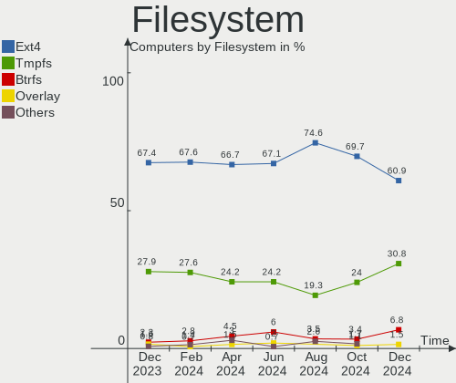
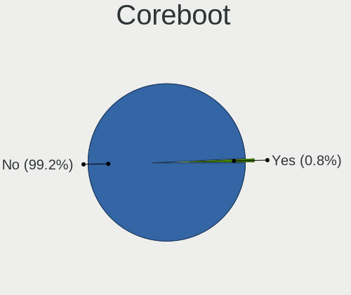
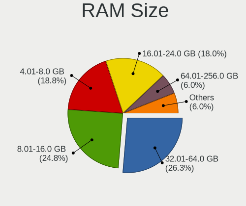
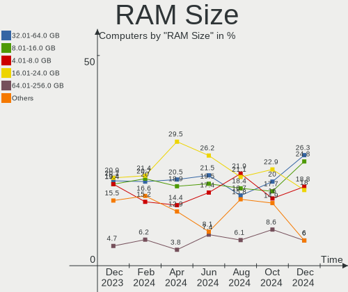
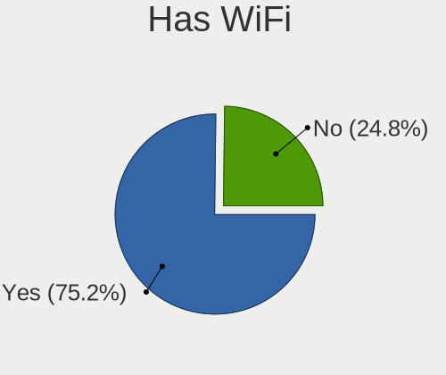

Kubuntu Hardware Trends
-----------------------

A project to identify most popular hardware characteristics and track their change
over time based on data collected by Kubuntu users at https://Linux-Hardware.org.

Anyone can contribute to the study by uploading probes of their computers by
the [hw-probe](https://github.com/linuxhw/hw-probe) tool:

    sudo -E hw-probe -all -upload

This is a report for all computer types. See also reports for [desktops](/Dist/Kubuntu/Desktop/README.md) and [notebooks](/Dist/Kubuntu/Notebook/README.md).

Full-feature report is available here: https://linux-hardware.org/?view=trends

Period: Jun, 2021.

Contents
--------

- [ OS                       ](#os)
- [ OS Family                ](#os-family)
- [ Kernel                   ](#kernel)
- [ Kernel Family            ](#kernel-family)
- [ Kernel Major Ver.        ](#kernel-major-ver)
- [ Arch                     ](#arch)
- [ DE                       ](#de)
- [ Display Server           ](#display-server)
- [ Display Manager          ](#display-manager)
- [ OS Lang                  ](#os-lang)
- [ Boot Mode                ](#boot-mode)
- [ Filesystem               ](#filesystem)
- [ Part. scheme             ](#part-scheme)
- [ Dual Boot with Linux/BSD ](#dual-boot-with-linux/bsd)
- [ Dual Boot (Win)          ](#dual-boot-win)
- [ Country                  ](#country)
- [ City                     ](#city)
- [ Vendor                   ](#vendor)
- [ Model                    ](#model)
- [ Model Family             ](#model-family)
- [ MFG Year                 ](#mfg-year)
- [ Form Factor              ](#form-factor)
- [ Secure Boot              ](#secure-boot)
- [ Coreboot                 ](#coreboot)
- [ RAM Size                 ](#ram-size)
- [ RAM Used                 ](#ram-used)
- [ Has CD-ROM               ](#has-cd-rom)
- [ Total Drives             ](#total-drives)
- [ Has Ethernet             ](#has-ethernet)
- [ Has WiFi                 ](#has-wifi)
- [ Has Bluetooth            ](#has-bluetooth)
- [ Drive Vendor             ](#drive-vendor)
- [ Drive Model              ](#drive-model)
- [ HDD Vendor               ](#hdd-vendor)
- [ SSD Vendor               ](#ssd-vendor)
- [ Drive Kind               ](#drive-kind)
- [ Drive Connector          ](#drive-connector)
- [ Drive Size               ](#drive-size)
- [ Space Total              ](#space-total)
- [ Space Used               ](#space-used)
- [ Malfunc. Drives          ](#malfunc-drives)
- [ Malfunc. Drive Vendor    ](#malfunc-drive-vendor)
- [ Malfunc. HDD Vendor      ](#malfunc-hdd-vendor)
- [ Malfunc. Drive Kind      ](#malfunc-drive-kind)
- [ Failed Drives            ](#failed-drives)
- [ Failed Drive Vendor      ](#failed-drive-vendor)
- [ Drive Status             ](#drive-status)
- [ Storage Vendor           ](#storage-vendor)
- [ Storage Model            ](#storage-model)
- [ Storage Kind             ](#storage-kind)
- [ CPU Vendor               ](#cpu-vendor)
- [ CPU Model                ](#cpu-model)
- [ CPU Model Family         ](#cpu-model-family)
- [ CPU Cores                ](#cpu-cores)
- [ CPU Sockets              ](#cpu-sockets)
- [ CPU Threads              ](#cpu-threads)
- [ CPU Op-Modes             ](#cpu-op-modes)
- [ CPU Microcode            ](#cpu-microcode)
- [ CPU Microarch            ](#cpu-microarch)
- [ GPU Vendor               ](#gpu-vendor)
- [ GPU Model                ](#gpu-model)
- [ GPU Combo                ](#gpu-combo)
- [ GPU Driver               ](#gpu-driver)
- [ GPU Memory               ](#gpu-memory)
- [ Monitor Vendor           ](#monitor-vendor)
- [ Monitor Model            ](#monitor-model)
- [ Monitor Resolution       ](#monitor-resolution)
- [ Monitor Diagonal         ](#monitor-diagonal)
- [ Monitor Width            ](#monitor-width)
- [ Aspect Ratio             ](#aspect-ratio)
- [ Monitor Area             ](#monitor-area)
- [ Pixel Density            ](#pixel-density)
- [ Multiple Monitors        ](#multiple-monitors)
- [ Net Controller Vendor    ](#net-controller-vendor)
- [ Net Controller Model     ](#net-controller-model)
- [ Wireless Vendor          ](#wireless-vendor)
- [ Wireless Model           ](#wireless-model)
- [ Ethernet Vendor          ](#ethernet-vendor)
- [ Ethernet Model           ](#ethernet-model)
- [ Net Controller Kind      ](#net-controller-kind)
- [ Used Controller          ](#used-controller)
- [ NICs                     ](#nics)
- [ IPv6                     ](#ipv6)
- [ Memory Vendor            ](#memory-vendor)
- [ Memory Model             ](#memory-model)
- [ Memory Kind              ](#memory-kind)
- [ Memory Form Factor       ](#memory-form-factor)
- [ Memory Size              ](#memory-size)
- [ Memory Speed             ](#memory-speed)
- [ Sound Vendor             ](#sound-vendor)
- [ Sound Model              ](#sound-model)
- [ Camera Vendor            ](#camera-vendor)
- [ Camera Model             ](#camera-model)
- [ Fingerprint Vendor       ](#fingerprint-vendor)
- [ Fingerprint Model        ](#fingerprint-model)
- [ Chipcard Vendor          ](#chipcard-vendor)
- [ Chipcard Model           ](#chipcard-model)
- [ Printer Vendor           ](#printer-vendor)
- [ Printer Model            ](#printer-model)
- [ Scanner Vendor           ](#scanner-vendor)
- [ Scanner Model            ](#scanner-model)
- [ Bluetooth Vendor         ](#bluetooth-vendor)
- [ Bluetooth Model          ](#bluetooth-model)
- [ Unsupported Devices      ](#unsupported-devices)
- [ Unsupported Device Types ](#unsupported-device-types)

OS
--

Installed operating systems

| Name          | Computers | Percent |
|---------------|-----------|---------|
| Kubuntu 20.04 | 49        | 59.76%  |
| Kubuntu 21.04 | 24        | 29.27%  |
| Kubuntu 20.10 | 5         | 6.1%    |
| Kubuntu 18.04 | 4         | 4.88%   |

OS Family
---------

OS without a version

| Name    | Computers | Percent |
|---------|-----------|---------|
| Kubuntu | 82        | 100%    |

Kernel
------

Version of the Linux kernel

| Version                  | Computers | Percent |
|--------------------------|-----------|---------|
| 5.8.0-55-generic         | 21        | 25.61%  |
| 5.4.0-74-generic         | 11        | 13.41%  |
| 5.11.0-18-generic        | 11        | 13.41%  |
| 5.11.0-22-generic        | 5         | 6.1%    |
| 5.8.0-53-generic         | 4         | 4.88%   |
| 5.12.8-xanmod1           | 2         | 2.44%   |
| 5.11.0-19-lowlatency     | 2         | 2.44%   |
| 5.11.0-18-lowlatency     | 2         | 2.44%   |
| 5.8.0-59-generic         | 1         | 1.22%   |
| 5.8.0-57-generic         | 1         | 1.22%   |
| 5.8.0-56-generic         | 1         | 1.22%   |
| 5.8.0-48-generic         | 1         | 1.22%   |
| 5.8.0-43-generic         | 1         | 1.22%   |
| 5.8.0-41-generic         | 1         | 1.22%   |
| 5.8.0-33-generic         | 1         | 1.22%   |
| 5.8.0-25-generic         | 1         | 1.22%   |
| 5.5.5-050505-generic     | 1         | 1.22%   |
| 5.4.0-78-generic         | 1         | 1.22%   |
| 5.4.0-75-generic         | 1         | 1.22%   |
| 5.4.0-74-lowlatency      | 1         | 1.22%   |
| 5.4.0-73-generic         | 1         | 1.22%   |
| 5.4.0-72-generic         | 1         | 1.22%   |
| 5.4.0-42-generic         | 1         | 1.22%   |
| 5.12.9-xanmod1           | 1         | 1.22%   |
| 5.12.9-051209-lowlatency | 1         | 1.22%   |
| 5.12.7-051207-generic    | 1         | 1.22%   |
| 5.12.10-051210-generic   | 1         | 1.22%   |
| 5.11.17-xanmod1          | 1         | 1.22%   |
| 5.11.0-20-lowlatency     | 1         | 1.22%   |
| 5.11.0-16-lowlatency     | 1         | 1.22%   |
| 5.10.23-051023-generic   | 1         | 1.22%   |
| 4.15.0-143-generic       | 1         | 1.22%   |

Kernel Family
-------------

Linux kernel without a distro release

| Version | Computers | Percent |
|---------|-----------|---------|
| 5.8.0   | 33        | 40.24%  |
| 5.11.0  | 22        | 26.83%  |
| 5.4.0   | 17        | 20.73%  |
| 5.12.9  | 2         | 2.44%   |
| 5.12.8  | 2         | 2.44%   |
| 5.5.5   | 1         | 1.22%   |
| 5.12.7  | 1         | 1.22%   |
| 5.12.10 | 1         | 1.22%   |
| 5.11.17 | 1         | 1.22%   |
| 5.10.23 | 1         | 1.22%   |
| 4.15.0  | 1         | 1.22%   |

Kernel Major Ver.
-----------------

Linux kernel major version

| Version | Computers | Percent |
|---------|-----------|---------|
| 5.8     | 33        | 40.24%  |
| 5.11    | 23        | 28.05%  |
| 5.4     | 17        | 20.73%  |
| 5.12    | 6         | 7.32%   |
| 5.5     | 1         | 1.22%   |
| 5.10    | 1         | 1.22%   |
| 4.15    | 1         | 1.22%   |

Arch
----

OS architecture (x86_64, i586, etc.)

| Name   | Computers | Percent |
|--------|-----------|---------|
| x86_64 | 82        | 100%    |

DE
--

Desktop Environment

| Name  | Computers | Percent |
|-------|-----------|---------|
| KDE   | 45        | 54.88%  |
| KDE5  | 36        | 43.9%   |
| GNOME | 1         | 1.22%   |

Display Server
--------------

X11 or Wayland

| Name    | Computers | Percent |
|---------|-----------|---------|
| X11     | 80        | 97.56%  |
| Wayland | 2         | 2.44%   |

Display Manager
---------------

SDDM, LightDM, etc.

| Name    | Computers | Percent |
|---------|-----------|---------|
| Unknown | 45        | 54.88%  |
| SDDM    | 32        | 39.02%  |
| GDM     | 3         | 3.66%   |
| TDM     | 2         | 2.44%   |

OS Lang
-------

Language

| Lang  | Computers | Percent |
|-------|-----------|---------|
| en_US | 31        | 37.8%   |
| ru_RU | 6         | 7.32%   |
| fr_FR | 6         | 7.32%   |
| en_GB | 6         | 7.32%   |
| de_DE | 6         | 7.32%   |
| pt_BR | 5         | 6.1%    |
| en_AU | 5         | 6.1%    |
| it_IT | 3         | 3.66%   |
| es_CO | 2         | 2.44%   |
| zh_TW | 1         | 1.22%   |
| sk_SK | 1         | 1.22%   |
| pt_PT | 1         | 1.22%   |
| pl_PL | 1         | 1.22%   |
| fr_CH | 1         | 1.22%   |
| es_VE | 1         | 1.22%   |
| es_CL | 1         | 1.22%   |
| en_IN | 1         | 1.22%   |
| en_DK | 1         | 1.22%   |
| en_CA | 1         | 1.22%   |
| ca_ES | 1         | 1.22%   |
| C     | 1         | 1.22%   |

Boot Mode
---------

EFI or BIOS

| Mode | Computers | Percent |
|------|-----------|---------|
| EFI  | 47        | 57.32%  |
| BIOS | 35        | 42.68%  |

Filesystem
----------

Type of filesystem

| Type    | Computers | Percent |
|---------|-----------|---------|
| Ext4    | 73        | 89.02%  |
| Btrfs   | 5         | 6.1%    |
| Overlay | 3         | 3.66%   |
| Zfs     | 1         | 1.22%   |

Part. scheme
------------

Scheme of partitioning

| Type    | Computers | Percent |
|---------|-----------|---------|
| Unknown | 45        | 54.88%  |
| GPT     | 32        | 39.02%  |
| MBR     | 5         | 6.1%    |

Dual Boot with Linux/BSD
------------------------

Hosting more than one Linux/BSD

| Dual boot | Computers | Percent |
|-----------|-----------|---------|
| No        | 72        | 87.8%   |
| Yes       | 10        | 12.2%   |

Dual Boot (Win)
---------------

Hosting Linux and Windows

| Dual boot | Computers | Percent |
|-----------|-----------|---------|
| No        | 59        | 71.95%  |
| Yes       | 23        | 28.05%  |

Country
-------

Geographic location (country)

| Country      | Computers | Percent |
|--------------|-----------|---------|
| USA          | 13        | 15.85%  |
| Germany      | 10        | 12.2%   |
| Russia       | 8         | 9.76%   |
| France       | 7         | 8.54%   |
| Brazil       | 6         | 7.32%   |
| UK           | 5         | 6.1%    |
| Australia    | 5         | 6.1%    |
| Spain        | 3         | 3.66%   |
| Italy        | 3         | 3.66%   |
| Colombia     | 3         | 3.66%   |
| Switzerland  | 2         | 2.44%   |
| Greece       | 2         | 2.44%   |
| Vietnam      | 1         | 1.22%   |
| Venezuela    | 1         | 1.22%   |
| Taiwan       | 1         | 1.22%   |
| Sweden       | 1         | 1.22%   |
| Slovakia     | 1         | 1.22%   |
| Saudi Arabia | 1         | 1.22%   |
| Portugal     | 1         | 1.22%   |
| Poland       | 1         | 1.22%   |
| India        | 1         | 1.22%   |
| Croatia      | 1         | 1.22%   |
| Chile        | 1         | 1.22%   |
| Canada       | 1         | 1.22%   |
| Belgium      | 1         | 1.22%   |
| Belarus      | 1         | 1.22%   |
| Argentina    | 1         | 1.22%   |

City
----

Geographic location (city)

| City                | Computers | Percent |
|---------------------|-----------|---------|
| Moscow              | 3         | 3.66%   |
| London              | 3         | 3.66%   |
| Hamburg             | 2         | 2.44%   |
| Geisenhausen        | 2         | 2.44%   |
| Berlin              | 2         | 2.44%   |
| Zagreb              | 1         | 1.22%   |
| Yekaterinburg       | 1         | 1.22%   |
| Wroclaw             | 1         | 1.22%   |
| Winnsboro           | 1         | 1.22%   |
| West Chicago        | 1         | 1.22%   |
| Waseca              | 1         | 1.22%   |
| Warren              | 1         | 1.22%   |
| Vladivostok         | 1         | 1.22%   |
| Villeneuve-le-Roi   | 1         | 1.22%   |
| Toronto             | 1         | 1.22%   |
| Thessaloniki        | 1         | 1.22%   |
| Taichung            | 1         | 1.22%   |
| Tabuk               | 1         | 1.22%   |
| Surry Hills         | 1         | 1.22%   |
| Sun City Center     | 1         | 1.22%   |
| Strongsville        | 1         | 1.22%   |
| St Petersburg       | 1         | 1.22%   |
| Sesimbra            | 1         | 1.22%   |
| Schollenberg        | 1         | 1.22%   |
| Sarandi             | 1         | 1.22%   |
| Santo André        | 1         | 1.22%   |
| Santiago            | 1         | 1.22%   |
| San Francisco       | 1         | 1.22%   |
| Rosario             | 1         | 1.22%   |
| Plano               | 1         | 1.22%   |
| Paris               | 1         | 1.22%   |
| Ostseebad Binz      | 1         | 1.22%   |
| Odintsovo           | 1         | 1.22%   |
| Nitra               | 1         | 1.22%   |
| Munich              | 1         | 1.22%   |
| Moskovskiy          | 1         | 1.22%   |
| Melbourne           | 1         | 1.22%   |
| Maracai             | 1         | 1.22%   |
| Magenta             | 1         | 1.22%   |
| Madrid              | 1         | 1.22%   |
| Madison             | 1         | 1.22%   |
| Lesigny             | 1         | 1.22%   |
| Lepe                | 1         | 1.22%   |
| Kidderminster       | 1         | 1.22%   |
| Karlsruhe           | 1         | 1.22%   |
| Itaborai            | 1         | 1.22%   |
| Ipiales             | 1         | 1.22%   |
| Ho Chi Minh City    | 1         | 1.22%   |
| Grand Junction      | 1         | 1.22%   |
| Gothenburg          | 1         | 1.22%   |
| Fribourg            | 1         | 1.22%   |
| Fornaci di Barga    | 1         | 1.22%   |
| Finsterwalde        | 1         | 1.22%   |
| Derby               | 1         | 1.22%   |
| Delhi               | 1         | 1.22%   |
| Créteil            | 1         | 1.22%   |
| Couzeix             | 1         | 1.22%   |
| Chicago             | 1         | 1.22%   |
| Charenton-le-Pont   | 1         | 1.22%   |
| Casalecchio di Reno | 1         | 1.22%   |

Vendor
------

Motherboard manufacturer

| Name                | Computers | Percent |
|---------------------|-----------|---------|
| Dell                | 14        | 17.07%  |
| Lenovo              | 11        | 13.41%  |
| Hewlett-Packard     | 9         | 10.98%  |
| ASUSTek Computer    | 9         | 10.98%  |
| MSI                 | 7         | 8.54%   |
| ASRock              | 6         | 7.32%   |
| Gigabyte Technology | 5         | 6.1%    |
| Intel               | 4         | 4.88%   |
| Acer                | 4         | 4.88%   |
| System76            | 2         | 2.44%   |
| HUAWEI              | 2         | 2.44%   |
| Biostar             | 2         | 2.44%   |
| Unknown             | 2         | 2.44%   |
| Toshiba             | 1         | 1.22%   |
| Microsoft           | 1         | 1.22%   |
| Fujitsu             | 1         | 1.22%   |
| Apple               | 1         | 1.22%   |
| AMD                 | 1         | 1.22%   |

Model
-----

Motherboard model

| Name                                 | Computers | Percent |
|--------------------------------------|-----------|---------|
| HP EliteBook 850 G1                  | 2         | 2.44%   |
| Unknown                              | 2         | 2.44%   |
| Toshiba QOSMIO X70-A                 | 1         | 1.22%   |
| System76 Oryx Pro                    | 1         | 1.22%   |
| System76 Kudu Professional           | 1         | 1.22%   |
| MSI Vig644M                          | 1         | 1.22%   |
| MSI MS-7D18                          | 1         | 1.22%   |
| MSI MS-7C94                          | 1         | 1.22%   |
| MSI MS-7C37                          | 1         | 1.22%   |
| MSI MS-7A32                          | 1         | 1.22%   |
| MSI MS-7758                          | 1         | 1.22%   |
| MSI MS-7693                          | 1         | 1.22%   |
| Microsoft Surface Pro 3              | 1         | 1.22%   |
| Lenovo Yoga 3 14 80JH                | 1         | 1.22%   |
| Lenovo Yoga 14sACH 2021 82MS         | 1         | 1.22%   |
| Lenovo ThinkPad X230 2325AT6         | 1         | 1.22%   |
| Lenovo ThinkPad T470p 20J60042MZ     | 1         | 1.22%   |
| Lenovo ThinkPad L14 Gen 1 20U6S12200 | 1         | 1.22%   |
| Lenovo ThinkCentre M75e 5042A6U      | 1         | 1.22%   |
| Lenovo IdeaPad S145-15API 81V7       | 1         | 1.22%   |
| Lenovo IdeaPad Gaming 3 15IMH05 81Y4 | 1         | 1.22%   |
| Lenovo IdeaPad D330-10IGM 81H3       | 1         | 1.22%   |
| Lenovo IdeaPad 330-15IKB 81FE        | 1         | 1.22%   |
| Lenovo IdeaPad 320-15ABR 80XS        | 1         | 1.22%   |
| Intel X99                            | 1         | 1.22%   |
| Intel NUC7i3BNK                      | 1         | 1.22%   |
| Intel H55                            | 1         | 1.22%   |
| Intel ChiefRiver                     | 1         | 1.22%   |
| HUAWEI NBLK-WAX9X                    | 1         | 1.22%   |
| HUAWEI HLYL-WXX9                     | 1         | 1.22%   |
| HP ProDesk 400 G1 MT                 | 1         | 1.22%   |
| HP ProBook 450 G7                    | 1         | 1.22%   |
| HP Pavilion Gaming Laptop 15-cx0xxx  | 1         | 1.22%   |
| HP Pavilion Desktop PC 570-p0xx      | 1         | 1.22%   |
| HP Laptop 15-ef1xxx                  | 1         | 1.22%   |
| HP Compaq 8200 Elite SFF PC          | 1         | 1.22%   |
| HP Compaq 8100 Elite CMT PC          | 1         | 1.22%   |
| Gigabyte P67A-UD4                    | 1         | 1.22%   |
| Gigabyte H81M-H                      | 1         | 1.22%   |
| Gigabyte GA-78LMT-USB3               | 1         | 1.22%   |
| Gigabyte F2A78M-DS2                  | 1         | 1.22%   |
| Gigabyte B150M-D3H                   | 1         | 1.22%   |
| Fujitsu B-201-CFL                    | 1         | 1.22%   |
| Dell XPS 13 7390                     | 1         | 1.22%   |
| Dell OptiPlex 9020                   | 1         | 1.22%   |
| Dell OptiPlex 790                    | 1         | 1.22%   |
| Dell OptiPlex 7440 AIO               | 1         | 1.22%   |
| Dell Latitude E6520                  | 1         | 1.22%   |
| Dell Latitude E6410                  | 1         | 1.22%   |
| Dell Latitude E6330                  | 1         | 1.22%   |
| Dell Latitude E5570                  | 1         | 1.22%   |
| Dell Latitude E5430 non-vPro         | 1         | 1.22%   |
| Dell Latitude 5590                   | 1         | 1.22%   |
| Dell Latitude 5580                   | 1         | 1.22%   |
| Dell Latitude 5501                   | 1         | 1.22%   |
| Dell Latitude 3400                   | 1         | 1.22%   |
| Dell G3 3590                         | 1         | 1.22%   |
| Biostar TB250-BTC                    | 1         | 1.22%   |
| Biostar TA790GXB A2+                 | 1         | 1.22%   |
| ASUS ZenBook UX425IA_UM425IA         | 1         | 1.22%   |

Model Family
------------

Motherboard model prefix

| Name                   | Computers | Percent |
|------------------------|-----------|---------|
| Dell Latitude          | 9         | 10.98%  |
| Lenovo IdeaPad         | 5         | 6.1%    |
| Acer Aspire            | 4         | 4.88%   |
| Lenovo ThinkPad        | 3         | 3.66%   |
| Dell OptiPlex          | 3         | 3.66%   |
| Lenovo Yoga            | 2         | 2.44%   |
| HP Pavilion            | 2         | 2.44%   |
| HP EliteBook           | 2         | 2.44%   |
| HP Compaq              | 2         | 2.44%   |
| ASUS VivoBook          | 2         | 2.44%   |
| ASUS PRIME             | 2         | 2.44%   |
| Unknown                | 2         | 2.44%   |
| Toshiba QOSMIO         | 1         | 1.22%   |
| System76 Oryx          | 1         | 1.22%   |
| System76 Kudu          | 1         | 1.22%   |
| MSI Vig644M            | 1         | 1.22%   |
| MSI MS-7D18            | 1         | 1.22%   |
| MSI MS-7C94            | 1         | 1.22%   |
| MSI MS-7C37            | 1         | 1.22%   |
| MSI MS-7A32            | 1         | 1.22%   |
| MSI MS-7758            | 1         | 1.22%   |
| MSI MS-7693            | 1         | 1.22%   |
| Microsoft Surface      | 1         | 1.22%   |
| Lenovo ThinkCentre     | 1         | 1.22%   |
| Intel X99              | 1         | 1.22%   |
| Intel NUC7i3BNK        | 1         | 1.22%   |
| Intel H55              | 1         | 1.22%   |
| Intel ChiefRiver       | 1         | 1.22%   |
| HUAWEI NBLK-WAX9X      | 1         | 1.22%   |
| HUAWEI HLYL-WXX9       | 1         | 1.22%   |
| HP ProDesk             | 1         | 1.22%   |
| HP ProBook             | 1         | 1.22%   |
| HP Laptop              | 1         | 1.22%   |
| Gigabyte P67A-UD4      | 1         | 1.22%   |
| Gigabyte H81M-H        | 1         | 1.22%   |
| Gigabyte GA-78LMT-USB3 | 1         | 1.22%   |
| Gigabyte F2A78M-DS2    | 1         | 1.22%   |
| Gigabyte B150M-D3H     | 1         | 1.22%   |
| Fujitsu B-201-CFL      | 1         | 1.22%   |
| Dell XPS               | 1         | 1.22%   |
| Dell G3                | 1         | 1.22%   |
| Biostar TB250-BTC      | 1         | 1.22%   |
| Biostar TA790GXB       | 1         | 1.22%   |
| ASUS ZenBook           | 1         | 1.22%   |
| ASUS TUF               | 1         | 1.22%   |
| ASUS P8Z77-V           | 1         | 1.22%   |
| ASUS P5Q               | 1         | 1.22%   |
| ASUS All               | 1         | 1.22%   |
| ASRock Z390            | 1         | 1.22%   |
| ASRock Z170            | 1         | 1.22%   |
| ASRock H61M-VS         | 1         | 1.22%   |
| ASRock B460            | 1         | 1.22%   |
| ASRock B360M           | 1         | 1.22%   |
| ASRock AB350           | 1         | 1.22%   |
| Apple MacBookPro14     | 1         | 1.22%   |
| AMD AOPW-PLUS          | 1         | 1.22%   |

MFG Year
--------

Motherboard manufacture year

| Year | Computers | Percent |
|------|-----------|---------|
| 2020 | 21        | 25.61%  |
| 2018 | 12        | 14.63%  |
| 2019 | 9         | 10.98%  |
| 2021 | 8         | 9.76%   |
| 2014 | 6         | 7.32%   |
| 2012 | 5         | 6.1%    |
| 2013 | 4         | 4.88%   |
| 2011 | 4         | 4.88%   |
| 2017 | 3         | 3.66%   |
| 2016 | 3         | 3.66%   |
| 2015 | 3         | 3.66%   |
| 2010 | 3         | 3.66%   |
| 2009 | 1         | 1.22%   |

Form Factor
-----------

Physical design of the computer

| Name       | Computers | Percent |
|------------|-----------|---------|
| Notebook   | 41        | 50%     |
| Desktop    | 36        | 43.9%   |
| Tablet     | 2         | 2.44%   |
| Mini pc    | 1         | 1.22%   |
| All in one | 1         | 1.22%   |
| Server     | 1         | 1.22%   |

Secure Boot
-----------

Enabled or disabled

| State    | Computers | Percent |
|----------|-----------|---------|
| Disabled | 76        | 92.68%  |
| Enabled  | 6         | 7.32%   |

Coreboot
--------

Have coreboot on board

| Used | Computers | Percent |
|------|-----------|---------|
| No   | 82        | 100%    |

RAM Size
--------

Total RAM memory

| Size in GB  | Computers | Percent |
|-------------|-----------|---------|
| 16.01-24.0  | 25        | 30.49%  |
| 4.01-8.0    | 20        | 24.39%  |
| 8.01-16.0   | 13        | 15.85%  |
| 32.01-64.0  | 10        | 12.2%   |
| 3.01-4.0    | 10        | 12.2%   |
| 64.01-256.0 | 2         | 2.44%   |
| 24.01-32.0  | 1         | 1.22%   |
| 2.01-3.0    | 1         | 1.22%   |

RAM Used
--------

Used RAM memory

| Used GB    | Computers | Percent |
|------------|-----------|---------|
| 4.01-8.0   | 28        | 34.15%  |
| 1.01-2.0   | 22        | 26.83%  |
| 2.01-3.0   | 13        | 15.85%  |
| 3.01-4.0   | 9         | 10.98%  |
| 8.01-16.0  | 6         | 7.32%   |
| 16.01-24.0 | 2         | 2.44%   |
| 0.51-1.0   | 2         | 2.44%   |

Has CD-ROM
----------

Has CD-ROM on board

| Presented | Computers | Percent |
|-----------|-----------|---------|
| No        | 54        | 65.85%  |
| Yes       | 28        | 34.15%  |

Total Drives
------------

Number of drives on board

| Drives | Computers | Percent |
|--------|-----------|---------|
| 1      | 47        | 57.32%  |
| 2      | 17        | 20.73%  |
| 3      | 9         | 10.98%  |
| 5      | 3         | 3.66%   |
| 4      | 3         | 3.66%   |
| 7      | 2         | 2.44%   |
| 6      | 1         | 1.22%   |

Has Ethernet
------------

Has Ethernet on board

| Presented | Computers | Percent |
|-----------|-----------|---------|
| Yes       | 68        | 82.93%  |
| No        | 14        | 17.07%  |

Has WiFi
--------

Has WiFi module

| Presented | Computers | Percent |
|-----------|-----------|---------|
| Yes       | 58        | 70.73%  |
| No        | 24        | 29.27%  |

Has Bluetooth
-------------

Has Bluetooth module

| Presented | Computers | Percent |
|-----------|-----------|---------|
| Yes       | 51        | 62.2%   |
| No        | 31        | 37.8%   |

Drive Vendor
------------

Hard drive vendors

| Vendor                    | Computers | Drives | Percent |
|---------------------------|-----------|--------|---------|
| Samsung Electronics       | 31        | 42     | 24.03%  |
| WDC                       | 19        | 28     | 14.73%  |
| Seagate                   | 19        | 28     | 14.73%  |
| Unknown                   | 8         | 8      | 6.2%    |
| Sandisk                   | 6         | 7      | 4.65%   |
| Kingston                  | 5         | 5      | 3.88%   |
| SK Hynix                  | 4         | 4      | 3.1%    |
| Hitachi                   | 3         | 4      | 2.33%   |
| Crucial                   | 3         | 3      | 2.33%   |
| Transcend                 | 2         | 2      | 1.55%   |
| Toshiba                   | 2         | 2      | 1.55%   |
| OCZ                       | 2         | 2      | 1.55%   |
| Micron/Crucial Technology | 2         | 2      | 1.55%   |
| KingSpec                  | 2         | 2      | 1.55%   |
| Intel                     | 2         | 2      | 1.55%   |
| XPG                       | 1         | 1      | 0.78%   |
| VENO                      | 1         | 1      | 0.78%   |
| Union Memory              | 1         | 1      | 0.78%   |
| TCSUNBOW                  | 1         | 1      | 0.78%   |
| Silicon Motion            | 1         | 1      | 0.78%   |
| PNY USB                   | 1         | 1      | 0.78%   |
| Phison                    | 1         | 1      | 0.78%   |
| Patriot                   | 1         | 1      | 0.78%   |
| Netac                     | 1         | 1      | 0.78%   |
| Micron Technology         | 1         | 1      | 0.78%   |
| Maxtor                    | 1         | 1      | 0.78%   |
| Lite-On                   | 1         | 1      | 0.78%   |
| KIOXIA                    | 1         | 1      | 0.78%   |
| HGST                      | 1         | 1      | 0.78%   |
| Hewlett-Packard           | 1         | 1      | 0.78%   |
| Corsair                   | 1         | 1      | 0.78%   |
| China                     | 1         | 1      | 0.78%   |
| Apple                     | 1         | 2      | 0.78%   |
| A-DATA Technology         | 1         | 1      | 0.78%   |

Drive Model
-----------

Hard drive models

| Model                                   | Computers | Percent |
|-----------------------------------------|-----------|---------|
| Samsung NVMe SSD Drive 512GB            | 4         | 2.61%   |
| Samsung NVMe SSD Drive 1TB              | 4         | 2.61%   |
| Seagate Expansion Desk 2TB              | 3         | 1.96%   |
| Samsung SSD 850 EVO 250GB               | 3         | 1.96%   |
| Samsung NVMe SSD Drive 500GB            | 3         | 1.96%   |
| WDC WD1003FZEX-00MK2A0 1TB              | 2         | 1.31%   |
| WDC WD1003FZEX-00K3CA0 1TB              | 2         | 1.31%   |
| Seagate ST2000DM001-1CH164 2TB          | 2         | 1.31%   |
| Seagate ST2000DL003-9VT166 2TB          | 2         | 1.31%   |
| Samsung SSD 870 EVO 1TB                 | 2         | 1.31%   |
| Samsung SSD 860 QVO 1TB                 | 2         | 1.31%   |
| KingSpec P3-512 512GB                   | 2         | 1.31%   |
| XPG NVMe SSD Drive 512GB                | 1         | 0.65%   |
| WDC WDS240G2G0A-00JH30 240GB SSD        | 1         | 0.65%   |
| WDC WDS120G1G0A-00SS50 120GB SSD        | 1         | 0.65%   |
| WDC WDS100T2B0B-00YS70 1TB SSD          | 1         | 0.65%   |
| WDC WD5001FZWX-00ZHUA0 5TB              | 1         | 0.65%   |
| WDC WD5000AAKX-22ERMA0 500GB            | 1         | 0.65%   |
| WDC WD5000AAKS-00V1A0 500GB             | 1         | 0.65%   |
| WDC WD5000AAKS-00A7B2 500GB             | 1         | 0.65%   |
| WDC WD40EZRZ-00WN9B0 4TB                | 1         | 0.65%   |
| WDC WD2500KS-00MJB0 250GB               | 1         | 0.65%   |
| WDC WD2500JS-00NCB1 250GB               | 1         | 0.65%   |
| WDC WD2500BEVT-22A23T0 250GB            | 1         | 0.65%   |
| WDC WD20EZRZ-00Z5HB0 2TB                | 1         | 0.65%   |
| WDC WD20EFRX-68EUZN0 2TB                | 1         | 0.65%   |
| WDC WD2003FZEX-00Z4SA0 2TB              | 1         | 0.65%   |
| WDC WD15EADS-00P8B0 1TB                 | 1         | 0.65%   |
| WDC WD10SPZX-24Z10T0 1TB                | 1         | 0.65%   |
| WDC WD10SPZX-24Z10 1TB                  | 1         | 0.65%   |
| WDC WD10SPCX-60KHST0 1TB                | 1         | 0.65%   |
| WDC WD10EZEX-60WN4A0 1TB                | 1         | 0.65%   |
| WDC WD10EZEX-60M2NA0 1TB                | 1         | 0.65%   |
| WDC WD10EADS-00M2B0 1TB                 | 1         | 0.65%   |
| WDC PC SN730 SDBPNTY-512G-1027 512GB    | 1         | 0.65%   |
| WDC PC SN730 NVMe 512GB                 | 1         | 0.65%   |
| WDC PC SN520 NVMe 512GB                 | 1         | 0.65%   |
| VENO SCORP SSD 240GB                    | 1         | 0.65%   |
| Unknown SD128  128GB                    | 1         | 0.65%   |
| Unknown SD/MMC/MS PRO 128GB             | 1         | 0.65%   |
| Unknown RZX-19SSD6G/120G 120GB          | 1         | 0.65%   |
| Unknown MMC Card  7GB                   | 1         | 0.65%   |
| Unknown MMC Card  32GB                  | 1         | 0.65%   |
| Unknown MMC Card  128GB                 | 1         | 0.65%   |
| Unknown DA4064  64GB                    | 1         | 0.65%   |
| Unknown 00000  4GB                      | 1         | 0.65%   |
| Union Memory UMIS RPJTJ256MEE1OWX 256GB | 1         | 0.65%   |
| Transcend TS480GSSD220S 480GB           | 1         | 0.65%   |
| Transcend TS256GSSD230S 256GB           | 1         | 0.65%   |
| Toshiba THNSNH256GMCT 256GB SSD         | 1         | 0.65%   |
| Toshiba DT01ACA050 500GB                | 1         | 0.65%   |
| TCSUNBOW X3 240GB SSD                   | 1         | 0.65%   |
| SK Hynix NVMe SSD Drive 1024GB          | 1         | 0.65%   |
| SK Hynix HFS128G32TND-N210A 128GB SSD   | 1         | 0.65%   |
| SK Hynix HFM512GDJTNI-82A0A 512GB       | 1         | 0.65%   |
| SK Hynix BC511 NVMe 256GB               | 1         | 0.65%   |
| Silicon Motion NVMe SSD Drive 1024GB    | 1         | 0.65%   |
| Seagate ST500LM024-1RS152 500GB         | 1         | 0.65%   |
| Seagate ST5000DM000-1FK178 5TB          | 1         | 0.65%   |
| Seagate ST4000DM005-2DP166 4TB          | 1         | 0.65%   |

HDD Vendor
----------

Hard disk drive vendors

| Vendor              | Computers | Drives | Percent |
|---------------------|-----------|--------|---------|
| Seagate             | 18        | 24     | 43.9%   |
| WDC                 | 14        | 22     | 34.15%  |
| Hitachi             | 3         | 4      | 7.32%   |
| Samsung Electronics | 2         | 2      | 4.88%   |
| Toshiba             | 1         | 1      | 2.44%   |
| Maxtor              | 1         | 1      | 2.44%   |
| HGST                | 1         | 1      | 2.44%   |
| Hewlett-Packard     | 1         | 1      | 2.44%   |

SSD Vendor
----------

Solid state drive vendors

| Vendor              | Computers | Drives | Percent |
|---------------------|-----------|--------|---------|
| Samsung Electronics | 16        | 20     | 32%     |
| SanDisk             | 5         | 5      | 10%     |
| Kingston            | 4         | 4      | 8%      |
| WDC                 | 3         | 3      | 6%      |
| Crucial             | 3         | 3      | 6%      |
| Transcend           | 2         | 2      | 4%      |
| OCZ                 | 2         | 2      | 4%      |
| KingSpec            | 2         | 2      | 4%      |
| Intel               | 2         | 2      | 4%      |
| VENO                | 1         | 1      | 2%      |
| Unknown             | 1         | 1      | 2%      |
| Toshiba             | 1         | 1      | 2%      |
| TCSUNBOW            | 1         | 1      | 2%      |
| SK Hynix            | 1         | 1      | 2%      |
| Seagate             | 1         | 1      | 2%      |
| PNY USB             | 1         | 1      | 2%      |
| Patriot             | 1         | 1      | 2%      |
| Netac               | 1         | 1      | 2%      |
| China               | 1         | 1      | 2%      |
| A-DATA Technology   | 1         | 1      | 2%      |

Drive Kind
----------

HDD or SSD

| Kind    | Computers | Drives | Percent |
|---------|-----------|--------|---------|
| SSD     | 41        | 54     | 35.04%  |
| NVMe    | 35        | 41     | 29.91%  |
| HDD     | 32        | 56     | 27.35%  |
| MMC     | 6         | 6      | 5.13%   |
| Unknown | 3         | 4      | 2.56%   |

Drive Connector
---------------

SATA, SAS, NVMe, etc.

| Type | Computers | Drives | Percent |
|------|-----------|--------|---------|
| SATA | 59        | 104    | 54.13%  |
| NVMe | 35        | 41     | 32.11%  |
| SAS  | 9         | 10     | 8.26%   |
| MMC  | 6         | 6      | 5.5%    |

Drive Size
----------

Size of hard drive

| Size in TB | Computers | Drives | Percent |
|------------|-----------|--------|---------|
| 0.01-0.5   | 39        | 51     | 46.43%  |
| 0.51-1.0   | 25        | 32     | 29.76%  |
| 1.01-2.0   | 13        | 19     | 15.48%  |
| 3.01-4.0   | 3         | 3      | 3.57%   |
| 2.01-3.0   | 2         | 3      | 2.38%   |
| 4.01-10.0  | 2         | 2      | 2.38%   |

Space Total
-----------

Amount of disk space available on the file system

| Size in GB     | Computers | Percent |
|----------------|-----------|---------|
| 251-500        | 26        | 31.71%  |
| 101-250        | 20        | 24.39%  |
| 1001-2000      | 9         | 10.98%  |
| 501-1000       | 8         | 9.76%   |
| More than 3000 | 6         | 7.32%   |
| 2001-3000      | 5         | 6.1%    |
| 51-100         | 5         | 6.1%    |
| 1-20           | 3         | 3.66%   |

Space Used
----------

Amount of used disk space

| Used GB        | Computers | Percent |
|----------------|-----------|---------|
| 1-20           | 21        | 25.61%  |
| 101-250        | 16        | 19.51%  |
| 51-100         | 14        | 17.07%  |
| 251-500        | 11        | 13.41%  |
| 1001-2000      | 5         | 6.1%    |
| 501-1000       | 5         | 6.1%    |
| 21-50          | 4         | 4.88%   |
| More than 3000 | 3         | 3.66%   |
| 2001-3000      | 3         | 3.66%   |

Malfunc. Drives
---------------

Drive models with a malfunction

| Model                               | Computers | Drives | Percent |
|-------------------------------------|-----------|--------|---------|
| WDC WD5000AAKS-00V1A0 500GB         | 1         | 1      | 12.5%   |
| WDC WD10EZEX-60M2NA0 1TB            | 1         | 1      | 12.5%   |
| Seagate ST3250410AS 250GB           | 1         | 1      | 12.5%   |
| Seagate ST1000DM003-9YN162 1TB      | 1         | 1      | 12.5%   |
| SanDisk SD9SN8W-256G-1006 256GB SSD | 1         | 1      | 12.5%   |
| OCZ AGILITY3 120GB SSD              | 1         | 1      | 12.5%   |
| Intel SSDSCKKW240H6 240GB           | 1         | 1      | 12.5%   |
| Hitachi HDS721010CLA332 1TB         | 1         | 1      | 12.5%   |

Malfunc. Drive Vendor
---------------------

Vendors of faulty drives

| Vendor  | Computers | Drives | Percent |
|---------|-----------|--------|---------|
| WDC     | 2         | 2      | 25%     |
| Seagate | 2         | 2      | 25%     |
| SanDisk | 1         | 1      | 12.5%   |
| OCZ     | 1         | 1      | 12.5%   |
| Intel   | 1         | 1      | 12.5%   |
| Hitachi | 1         | 1      | 12.5%   |

Malfunc. HDD Vendor
-------------------

Vendors of faulty HDD drives

| Vendor  | Computers | Drives | Percent |
|---------|-----------|--------|---------|
| WDC     | 2         | 2      | 40%     |
| Seagate | 2         | 2      | 40%     |
| Hitachi | 1         | 1      | 20%     |

Malfunc. Drive Kind
-------------------

Kinds of faulty drives

| Kind | Computers | Drives | Percent |
|------|-----------|--------|---------|
| HDD  | 4         | 5      | 66.67%  |
| SSD  | 2         | 3      | 33.33%  |

Failed Drives
-------------

Failed drive models

Zero info for selected period =(

Failed Drive Vendor
-------------------

Failed drive vendors

Zero info for selected period =(

Drive Status
------------

Number of failed and malfunc. drives

| Status   | Computers | Drives | Percent |
|----------|-----------|--------|---------|
| Detected | 53        | 96     | 54.08%  |
| Works    | 39        | 57     | 39.8%   |
| Malfunc  | 6         | 8      | 6.12%   |

Storage Vendor
--------------

Storage controller vendors

| Vendor                      | Computers | Percent |
|-----------------------------|-----------|---------|
| Intel                       | 53        | 48.18%  |
| AMD                         | 19        | 17.27%  |
| Samsung Electronics         | 12        | 10.91%  |
| Sandisk                     | 5         | 4.55%   |
| ASMedia Technology          | 4         | 3.64%   |
| SK Hynix                    | 3         | 2.73%   |
| Phison Electronics          | 2         | 1.82%   |
| Micron/Crucial Technology   | 2         | 1.82%   |
| Union Memory (Shenzhen)     | 1         | 0.91%   |
| Silicon Motion              | 1         | 0.91%   |
| Micron Technology           | 1         | 0.91%   |
| Marvell Technology Group    | 1         | 0.91%   |
| Lite-On Technology          | 1         | 0.91%   |
| KIOXIA                      | 1         | 0.91%   |
| Kingston Technology Company | 1         | 0.91%   |
| JMicron Technology          | 1         | 0.91%   |
| Apple                       | 1         | 0.91%   |
| ADATA Technology            | 1         | 0.91%   |

Storage Model
-------------

Storage controller models

| Model                                                                                   | Computers | Percent |
|-----------------------------------------------------------------------------------------|-----------|---------|
| AMD FCH SATA Controller [AHCI mode]                                                     | 13        | 10.74%  |
| Samsung NVMe SSD Controller SM981/PM981/PM983                                           | 8         | 6.61%   |
| Intel 8 Series/C220 Series Chipset Family 6-port SATA Controller 1 [AHCI mode]          | 6         | 4.96%   |
| Intel Cannon Lake Mobile PCH SATA AHCI Controller                                       | 4         | 3.31%   |
| Intel 82801 Mobile SATA Controller [RAID mode]                                          | 4         | 3.31%   |
| Intel 7 Series Chipset Family 6-port SATA Controller [AHCI mode]                        | 4         | 3.31%   |
| Intel 6 Series/C200 Series Chipset Family 6 port Desktop SATA AHCI Controller           | 4         | 3.31%   |
| ASMedia ASM1062 Serial ATA Controller                                                   | 4         | 3.31%   |
| AMD SB7x0/SB8x0/SB9x0 SATA Controller [IDE mode]                                        | 4         | 3.31%   |
| Intel Sunrise Point-LP SATA Controller [AHCI mode]                                      | 3         | 2.48%   |
| Intel Q170/Q150/B150/H170/H110/Z170/CM236 Chipset SATA Controller [AHCI Mode]           | 3         | 2.48%   |
| Intel Cannon Lake PCH SATA AHCI Controller                                              | 3         | 2.48%   |
| Intel 8 Series SATA Controller 1 [AHCI mode]                                            | 3         | 2.48%   |
| AMD SB7x0/SB8x0/SB9x0 IDE Controller                                                    | 3         | 2.48%   |
| SK Hynix BC511                                                                          | 2         | 1.65%   |
| Sandisk WD Black SN750 / PC SN730 NVMe SSD                                              | 2         | 1.65%   |
| Samsung NVMe SSD Controller SM961/PM961/SM963                                           | 2         | 1.65%   |
| Samsung NVMe Controller                                                                 | 2         | 1.65%   |
| Phison E16 PCIe4 NVMe Controller                                                        | 2         | 1.65%   |
| Intel Wildcat Point-LP SATA Controller [AHCI Mode]                                      | 2         | 1.65%   |
| Intel SATA Controller [RAID mode]                                                       | 2         | 1.65%   |
| Intel Celeron/Pentium Silver Processor SATA Controller                                  | 2         | 1.65%   |
| Intel 5 Series/3400 Series Chipset 6 port SATA AHCI Controller                          | 2         | 1.65%   |
| Intel 400 Series Chipset Family SATA AHCI Controller                                    | 2         | 1.65%   |
| AMD 300 Series Chipset SATA Controller                                                  | 2         | 1.65%   |
| Union Memory (Shenzhen) Non-Volatile memory controller                                  | 1         | 0.83%   |
| SK Hynix NVMe SSD Controller                                                            | 1         | 0.83%   |
| Silicon Motion SM2263EN/SM2263XT SSD Controller                                         | 1         | 0.83%   |
| Sandisk WD Blue SN500 / PC SN520 NVMe SSD                                               | 1         | 0.83%   |
| Sandisk WD Black 2018/SN750 / PC SN720 NVMe SSD                                         | 1         | 0.83%   |
| Sandisk PC SN520 NVMe SSD                                                               | 1         | 0.83%   |
| Micron/Crucial NVMe Controller                                                          | 1         | 0.83%   |
| Micron/Crucial Non-Volatile memory controller                                           | 1         | 0.83%   |
| Micron Non-Volatile memory controller                                                   | 1         | 0.83%   |
| Marvell Group 88SE9128 PCIe SATA 6 Gb/s RAID controller                                 | 1         | 0.83%   |
| Lite-On Non-Volatile memory controller                                                  | 1         | 0.83%   |
| KIOXIA Non-Volatile memory controller                                                   | 1         | 0.83%   |
| Kingston Company A2000 NVMe SSD                                                         | 1         | 0.83%   |
| JMicron JMB361 AHCI/IDE                                                                 | 1         | 0.83%   |
| Intel Comet Lake SATA AHCI Controller                                                   | 1         | 0.83%   |
| Intel Cannon Point-LP SATA Controller [AHCI Mode]                                       | 1         | 0.83%   |
| Intel 82801JI (ICH10 Family) 4 port SATA IDE Controller #1                              | 1         | 0.83%   |
| Intel 82801JI (ICH10 Family) 2 port SATA IDE Controller #2                              | 1         | 0.83%   |
| Intel 82801IBM/IEM (ICH9M/ICH9M-E) 4 port SATA Controller [AHCI mode]                   | 1         | 0.83%   |
| Intel 7 Series/C210 Series Chipset Family 6-port SATA Controller [AHCI mode]            | 1         | 0.83%   |
| Intel 6 Series/C200 Series Chipset Family Desktop SATA Controller (IDE mode, ports 4-5) | 1         | 0.83%   |
| Intel 6 Series/C200 Series Chipset Family Desktop SATA Controller (IDE mode, ports 0-3) | 1         | 0.83%   |
| Intel 6 Series/C200 Series Chipset Family 6 port Mobile SATA AHCI Controller            | 1         | 0.83%   |
| Intel 500 Series Chipset Family SATA AHCI Controller                                    | 1         | 0.83%   |
| Intel 200 Series PCH SATA controller [AHCI mode]                                        | 1         | 0.83%   |
| Apple S3X NVMe Controller                                                               | 1         | 0.83%   |
| AMD X370 Series Chipset SATA Controller                                                 | 1         | 0.83%   |
| AMD Starship/Matisse Chipset SATA Controller [AHCI mode]                                | 1         | 0.83%   |
| AMD SB7x0/SB8x0/SB9x0 SATA Controller [AHCI mode]                                       | 1         | 0.83%   |
| AMD FCH SATA Controller D                                                               | 1         | 0.83%   |
| AMD FCH IDE Controller                                                                  | 1         | 0.83%   |
| AMD 400 Series Chipset SATA Controller                                                  | 1         | 0.83%   |
| ADATA XPG SX8200 Pro PCIe Gen3x4 M.2 2280 Solid State Drive                             | 1         | 0.83%   |

Storage Kind
------------

Kind of storage controller (IDE, SATA, NVMe, SAS, ...)

| Kind | Computers | Percent |
|------|-----------|---------|
| SATA | 64        | 59.26%  |
| NVMe | 32        | 29.63%  |
| RAID | 6         | 5.56%   |
| IDE  | 6         | 5.56%   |

CPU Vendor
----------

Processor vendors

| Vendor | Computers | Percent |
|--------|-----------|---------|
| Intel  | 58        | 70.73%  |
| AMD    | 24        | 29.27%  |

CPU Model
---------

Processor models

| Model                                         | Computers | Percent |
|-----------------------------------------------|-----------|---------|
| Intel Core i5-4300U CPU @ 1.90GHz             | 3         | 3.66%   |
| AMD Ryzen 7 4700U with Radeon Graphics        | 3         | 3.66%   |
| AMD Ryzen 5 3500U with Radeon Vega Mobile Gfx | 3         | 3.66%   |
| Intel Core i7-6700 CPU @ 3.40GHz              | 2         | 2.44%   |
| Intel Core i7-5500U CPU @ 2.40GHz             | 2         | 2.44%   |
| Intel Core i5-8250U CPU @ 1.60GHz             | 2         | 2.44%   |
| Intel Core i5-3320M CPU @ 2.60GHz             | 2         | 2.44%   |
| Intel Xeon CPU E5-2660 v3 @ 2.60GHz           | 1         | 1.22%   |
| Intel Pentium CPU G3220 @ 3.00GHz             | 1         | 1.22%   |
| Intel Pentium CPU B960 @ 2.20GHz              | 1         | 1.22%   |
| Intel Genuine CPU U4100 @ 1.30GHz             | 1         | 1.22%   |
| Intel Genuine CPU 0000 @ 2.70GHz              | 1         | 1.22%   |
| Intel Core i9-9900K CPU @ 3.60GHz             | 1         | 1.22%   |
| Intel Core i7-9850H CPU @ 2.60GHz             | 1         | 1.22%   |
| Intel Core i7-9750H CPU @ 2.60GHz             | 1         | 1.22%   |
| Intel Core i7-8750H CPU @ 2.20GHz             | 1         | 1.22%   |
| Intel Core i7-7700HQ CPU @ 2.80GHz            | 1         | 1.22%   |
| Intel Core i7-6700K CPU @ 4.00GHz             | 1         | 1.22%   |
| Intel Core i7-6600U CPU @ 2.60GHz             | 1         | 1.22%   |
| Intel Core i7-4910MQ CPU @ 2.90GHz            | 1         | 1.22%   |
| Intel Core i7-4770 CPU @ 3.40GHz              | 1         | 1.22%   |
| Intel Core i7-4712MQ CPU @ 2.30GHz            | 1         | 1.22%   |
| Intel Core i7-4700MQ CPU @ 2.40GHz            | 1         | 1.22%   |
| Intel Core i7-3770 CPU @ 3.40GHz              | 1         | 1.22%   |
| Intel Core i7-2600K CPU @ 3.40GHz             | 1         | 1.22%   |
| Intel Core i7-2600 CPU @ 3.40GHz              | 1         | 1.22%   |
| Intel Core i7-10510U CPU @ 1.80GHz            | 1         | 1.22%   |
| Intel Core i5-9500E CPU @ 3.00GHz             | 1         | 1.22%   |
| Intel Core i5-9400F CPU @ 2.90GHz             | 1         | 1.22%   |
| Intel Core i5-8365U CPU @ 1.60GHz             | 1         | 1.22%   |
| Intel Core i5-8300H CPU @ 2.30GHz             | 1         | 1.22%   |
| Intel Core i5-7360U CPU @ 2.30GHz             | 1         | 1.22%   |
| Intel Core i5-6300U CPU @ 2.40GHz             | 1         | 1.22%   |
| Intel Core i5-4440 CPU @ 3.10GHz              | 1         | 1.22%   |
| Intel Core i5-4430 CPU @ 3.00GHz              | 1         | 1.22%   |
| Intel Core i5-3470 CPU @ 3.20GHz              | 1         | 1.22%   |
| Intel Core i5-3340M CPU @ 2.70GHz             | 1         | 1.22%   |
| Intel Core i5-3337U CPU @ 1.80GHz             | 1         | 1.22%   |
| Intel Core i5-2520M CPU @ 2.50GHz             | 1         | 1.22%   |
| Intel Core i5-2400 CPU @ 3.10GHz              | 1         | 1.22%   |
| Intel Core i5-10400F CPU @ 2.90GHz            | 1         | 1.22%   |
| Intel Core i5-10300H CPU @ 2.50GHz            | 1         | 1.22%   |
| Intel Core i5 CPU M 560 @ 2.67GHz             | 1         | 1.22%   |
| Intel Core i5 CPU 660 @ 3.33GHz               | 1         | 1.22%   |
| Intel Core i5 CPU 650 @ 3.20GHz               | 1         | 1.22%   |
| Intel Core i3-7100U CPU @ 2.40GHz             | 1         | 1.22%   |
| Intel Core i3-2120 CPU @ 3.30GHz              | 1         | 1.22%   |
| Intel Core i3-2100 CPU @ 3.10GHz              | 1         | 1.22%   |
| Intel Core i3-10110U CPU @ 2.10GHz            | 1         | 1.22%   |
| Intel Core 2 Quad CPU Q9505 @ 2.83GHz         | 1         | 1.22%   |
| Intel Celeron N4020 CPU @ 1.10GHz             | 1         | 1.22%   |
| Intel Celeron N4000 CPU @ 1.10GHz             | 1         | 1.22%   |
| Intel Celeron J4125 CPU @ 2.00GHz             | 1         | 1.22%   |
| Intel 11th Gen Core i5-11600 @ 2.80GHz        | 1         | 1.22%   |
| AMD Ryzen 9 5950X 16-Core Processor           | 1         | 1.22%   |
| AMD Ryzen 9 3900X 12-Core Processor           | 1         | 1.22%   |
| AMD Ryzen 7 PRO 3700 8-Core Processor         | 1         | 1.22%   |
| AMD Ryzen 7 5800H with Radeon Graphics        | 1         | 1.22%   |
| AMD Ryzen 7 3700X 8-Core Processor            | 1         | 1.22%   |
| AMD Ryzen 7 1700X Eight-Core Processor        | 1         | 1.22%   |

CPU Model Family
----------------

Processor model prefix

| Model             | Computers | Percent |
|-------------------|-----------|---------|
| Intel Core i5     | 25        | 30.49%  |
| Intel Core i7     | 18        | 21.95%  |
| AMD Ryzen 7       | 6         | 7.32%   |
| AMD Ryzen 5       | 6         | 7.32%   |
| Intel Core i3     | 4         | 4.88%   |
| Intel Celeron     | 3         | 3.66%   |
| Intel Pentium     | 2         | 2.44%   |
| Intel Genuine     | 2         | 2.44%   |
| AMD Ryzen 9       | 2         | 2.44%   |
| Other             | 1         | 1.22%   |
| Intel Xeon        | 1         | 1.22%   |
| Intel Core i9     | 1         | 1.22%   |
| Intel Core 2 Quad | 1         | 1.22%   |
| AMD Ryzen 7 PRO   | 1         | 1.22%   |
| AMD Ryzen 5 PRO   | 1         | 1.22%   |
| AMD Phenom II X4  | 1         | 1.22%   |
| AMD Opteron       | 1         | 1.22%   |
| AMD FX            | 1         | 1.22%   |
| AMD Athlon II X4  | 1         | 1.22%   |
| AMD Athlon II X2  | 1         | 1.22%   |
| AMD A8            | 1         | 1.22%   |
| AMD A4            | 1         | 1.22%   |
| AMD A12           | 1         | 1.22%   |

CPU Cores
---------

Number of processor cores

| Number | Computers | Percent |
|--------|-----------|---------|
| 4      | 29        | 35.37%  |
| 2      | 27        | 32.93%  |
| 6      | 11        | 13.41%  |
| 8      | 9         | 10.98%  |
| 1      | 2         | 2.44%   |
| 20     | 1         | 1.22%   |
| 16     | 1         | 1.22%   |
| 12     | 1         | 1.22%   |
| 3      | 1         | 1.22%   |

CPU Sockets
-----------

Number of sockets

| Number | Computers | Percent |
|--------|-----------|---------|
| 1      | 81        | 98.78%  |
| 2      | 1         | 1.22%   |

CPU Threads
-----------

Threads per core (Hyper-Threading)

| Number | Computers | Percent |
|--------|-----------|---------|
| 2      | 61        | 74.39%  |
| 1      | 21        | 25.61%  |

CPU Op-Modes
------------

CPU Operation Modes (32-bit, 64-bit)

| Op mode        | Computers | Percent |
|----------------|-----------|---------|
| 32-bit, 64-bit | 82        | 100%    |

CPU Microcode
-------------

Microcode number

| Number     | Computers | Percent |
|------------|-----------|---------|
| Unknown    | 21        | 25.61%  |
| 0x206a7    | 6         | 7.32%   |
| 0x306c3    | 5         | 6.1%    |
| 0x306a9    | 4         | 4.88%   |
| 0x806ec    | 3         | 3.66%   |
| 0x506e3    | 3         | 3.66%   |
| 0x40651    | 3         | 3.66%   |
| 0x08701021 | 3         | 3.66%   |
| 0x906ea    | 2         | 2.44%   |
| 0x806ea    | 2         | 2.44%   |
| 0x706a8    | 2         | 2.44%   |
| 0x20652    | 2         | 2.44%   |
| 0x08600106 | 2         | 2.44%   |
| 0x08600104 | 2         | 2.44%   |
| 0xa0671    | 1         | 1.22%   |
| 0xa0655    | 1         | 1.22%   |
| 0xa0652    | 1         | 1.22%   |
| 0x906ed    | 1         | 1.22%   |
| 0x906ec    | 1         | 1.22%   |
| 0x906e9    | 1         | 1.22%   |
| 0x806e9    | 1         | 1.22%   |
| 0x706a1    | 1         | 1.22%   |
| 0x406e3    | 1         | 1.22%   |
| 0x306f2    | 1         | 1.22%   |
| 0x1067a    | 1         | 1.22%   |
| 0x08600103 | 1         | 1.22%   |
| 0x08108109 | 1         | 1.22%   |
| 0x0800820d | 1         | 1.22%   |
| 0x08001138 | 1         | 1.22%   |
| 0x0800111c | 1         | 1.22%   |
| 0x0600611a | 1         | 1.22%   |
| 0x06006118 | 1         | 1.22%   |
| 0x06000852 | 1         | 1.22%   |
| 0x010000db | 1         | 1.22%   |
| 0x010000c8 | 1         | 1.22%   |
| 0x010000c7 | 1         | 1.22%   |

CPU Microarch
-------------

Microarchitecture

| Name          | Computers | Percent |
|---------------|-----------|---------|
| KabyLake      | 15        | 18.29%  |
| Haswell       | 11        | 13.41%  |
| Zen 2         | 8         | 9.76%   |
| SandyBridge   | 7         | 8.54%   |
| Skylake       | 6         | 7.32%   |
| IvyBridge     | 6         | 7.32%   |
| Zen+          | 4         | 4.88%   |
| K10           | 4         | 4.88%   |
| Westmere      | 3         | 3.66%   |
| Goldmont plus | 3         | 3.66%   |
| Zen 3         | 2         | 2.44%   |
| Zen           | 2         | 2.44%   |
| Piledriver    | 2         | 2.44%   |
| Penryn        | 2         | 2.44%   |
| Excavator     | 2         | 2.44%   |
| CometLake     | 2         | 2.44%   |
| Broadwell     | 2         | 2.44%   |
| Unknown       | 1         | 1.22%   |

GPU Vendor
----------

Vendors of graphics cards

| Vendor | Computers | Percent |
|--------|-----------|---------|
| Intel  | 46        | 47.42%  |
| Nvidia | 29        | 29.9%   |
| AMD    | 22        | 22.68%  |

GPU Model
---------

Graphics card models

| Model                                                                                 | Computers | Percent |
|---------------------------------------------------------------------------------------|-----------|---------|
| AMD Renoir                                                                            | 5         | 5.15%   |
| Intel Xeon E3-1200 v3/4th Gen Core Processor Integrated Graphics Controller           | 4         | 4.12%   |
| Intel CoffeeLake-H GT2 [UHD Graphics 630]                                             | 4         | 4.12%   |
| Intel 3rd Gen Core processor Graphics Controller                                      | 4         | 4.12%   |
| Intel Haswell-ULT Integrated Graphics Controller                                      | 3         | 3.09%   |
| Intel GeminiLake [UHD Graphics 600]                                                   | 3         | 3.09%   |
| Intel 4th Gen Core Processor Integrated Graphics Controller                           | 3         | 3.09%   |
| Intel 2nd Generation Core Processor Family Integrated Graphics Controller             | 3         | 3.09%   |
| AMD Picasso                                                                           | 3         | 3.09%   |
| Nvidia GT218 [GeForce 210]                                                            | 2         | 2.06%   |
| Nvidia GP108 [GeForce GT 1030]                                                        | 2         | 2.06%   |
| Nvidia GK208B [GeForce GT 710]                                                        | 2         | 2.06%   |
| Nvidia GF117M [GeForce 610M/710M/810M/820M / GT 620M/625M/630M/720M]                  | 2         | 2.06%   |
| Intel Xeon E3-1200 v2/3rd Gen Core processor Graphics Controller                      | 2         | 2.06%   |
| Intel UHD Graphics 620                                                                | 2         | 2.06%   |
| Intel Skylake GT2 [HD Graphics 520]                                                   | 2         | 2.06%   |
| Intel HD Graphics 5500                                                                | 2         | 2.06%   |
| Intel HD Graphics 530                                                                 | 2         | 2.06%   |
| Intel Core Processor Integrated Graphics Controller                                   | 2         | 2.06%   |
| Intel CometLake-U GT2 [UHD Graphics]                                                  | 2         | 2.06%   |
| AMD Vega 10 XL/XT [Radeon RX Vega 56/64]                                              | 2         | 2.06%   |
| AMD Ellesmere [Radeon RX 470/480/570/570X/580/580X/590]                               | 2         | 2.06%   |
| Nvidia TU117M                                                                         | 1         | 1.03%   |
| Nvidia TU117 [GeForce GTX 1650]                                                       | 1         | 1.03%   |
| Nvidia TU116M [GeForce GTX 1660 Ti Mobile]                                            | 1         | 1.03%   |
| Nvidia TU116 [GeForce GTX 1660]                                                       | 1         | 1.03%   |
| Nvidia TU106M [GeForce RTX 2070 Mobile]                                               | 1         | 1.03%   |
| Nvidia TU104 [GeForce RTX 2080 SUPER]                                                 | 1         | 1.03%   |
| Nvidia GP107M [GeForce MX150]                                                         | 1         | 1.03%   |
| Nvidia GP107M [GeForce GTX 1050 Mobile]                                               | 1         | 1.03%   |
| Nvidia GP107 [GeForce GTX 1050 Ti]                                                    | 1         | 1.03%   |
| Nvidia GP106 [GeForce GTX 1060 6GB]                                                   | 1         | 1.03%   |
| Nvidia GP106 [GeForce GTX 1060 3GB]                                                   | 1         | 1.03%   |
| Nvidia GP104 [GeForce GTX 1080]                                                       | 1         | 1.03%   |
| Nvidia GM204 [GeForce GTX 970]                                                        | 1         | 1.03%   |
| Nvidia GM200 [GeForce GTX 980 Ti]                                                     | 1         | 1.03%   |
| Nvidia GM108M [GeForce 940MX]                                                         | 1         | 1.03%   |
| Nvidia GM108M [GeForce 840M]                                                          | 1         | 1.03%   |
| Nvidia GM107 [GeForce GTX 750 Ti]                                                     | 1         | 1.03%   |
| Nvidia GK208B [GeForce GT 730]                                                        | 1         | 1.03%   |
| Nvidia GK106M [GeForce GTX 770M]                                                      | 1         | 1.03%   |
| Nvidia GF108 [GeForce GT 730]                                                         | 1         | 1.03%   |
| Nvidia GF108 [GeForce GT 630]                                                         | 1         | 1.03%   |
| Intel WhiskeyLake-U GT2 [UHD Graphics 620]                                            | 1         | 1.03%   |
| Intel RocketLake-S GT1 [UHD Graphics 750]                                             | 1         | 1.03%   |
| Intel Mobile 4 Series Chipset Integrated Graphics Controller                          | 1         | 1.03%   |
| Intel Iris Plus Graphics 640                                                          | 1         | 1.03%   |
| Intel HD Graphics 630                                                                 | 1         | 1.03%   |
| Intel HD Graphics 620                                                                 | 1         | 1.03%   |
| Intel CometLake-S GT2 [UHD Graphics 630]                                              | 1         | 1.03%   |
| Intel CometLake-H GT2 [UHD Graphics]                                                  | 1         | 1.03%   |
| AMD Wani [Radeon R5/R6/R7 Graphics]                                                   | 1         | 1.03%   |
| AMD Vega 20 [Radeon VII]                                                              | 1         | 1.03%   |
| AMD Turks PRO [Radeon HD 6570/7570/8550 / R5 230]                                     | 1         | 1.03%   |
| AMD Topaz XT [Radeon R7 M260/M265 / M340/M360 / M440/M445 / 530/535 / 620/625 Mobile] | 1         | 1.03%   |
| AMD RS780L [Radeon 3000]                                                              | 1         | 1.03%   |
| AMD RS780D [Radeon HD 3300]                                                           | 1         | 1.03%   |
| AMD Redwood PRO [Radeon HD 5550/5570/5630/6510/6610/7570]                             | 1         | 1.03%   |
| AMD Pitcairn PRO [Radeon HD 7850 / R7 265 / R9 270 1024SP]                            | 1         | 1.03%   |
| AMD Cezanne                                                                           | 1         | 1.03%   |

GPU Combo
---------

Combinations of graphics cards

| Name           | Computers | Percent |
|----------------|-----------|---------|
| 1 x Intel      | 32        | 39.02%  |
| 1 x AMD        | 20        | 24.39%  |
| 1 x Nvidia     | 17        | 20.73%  |
| Intel + Nvidia | 11        | 13.41%  |
| Intel + AMD    | 1         | 1.22%   |
| AMD + Nvidia   | 1         | 1.22%   |

GPU Driver
----------

Free vs proprietary

| Driver      | Computers | Percent |
|-------------|-----------|---------|
| Free        | 62        | 75.61%  |
| Proprietary | 20        | 24.39%  |

GPU Memory
----------

Total video memory

| Size in GB | Computers | Percent |
|------------|-----------|---------|
| Unknown    | 48        | 58.54%  |
| 0.01-0.5   | 8         | 9.76%   |
| 7.01-8.0   | 7         | 8.54%   |
| 0.51-1.0   | 6         | 7.32%   |
| 1.01-2.0   | 5         | 6.1%    |
| 5.01-6.0   | 3         | 3.66%   |
| 3.01-4.0   | 3         | 3.66%   |
| 2.01-3.0   | 2         | 2.44%   |

Monitor Vendor
--------------

Monitor vendors

| Vendor                  | Computers | Percent |
|-------------------------|-----------|---------|
| Samsung Electronics     | 13        | 13.27%  |
| Chimei Innolux          | 10        | 10.2%   |
| BOE                     | 10        | 10.2%   |
| Dell                    | 9         | 9.18%   |
| AU Optronics            | 9         | 9.18%   |
| LG Display              | 5         | 5.1%    |
| Iiyama                  | 5         | 5.1%    |
| Hewlett-Packard         | 5         | 5.1%    |
| Goldstar                | 3         | 3.06%   |
| BenQ                    | 3         | 3.06%   |
| Ancor Communications    | 3         | 3.06%   |
| Philips                 | 2         | 2.04%   |
| AUS                     | 2         | 2.04%   |
| AOC                     | 2         | 2.04%   |
| Acer                    | 2         | 2.04%   |
| VST                     | 1         | 1.02%   |
| ViewSonic               | 1         | 1.02%   |
| Unknown                 | 1         | 1.02%   |
| TXD                     | 1         | 1.02%   |
| Toshiba                 | 1         | 1.02%   |
| STD                     | 1         | 1.02%   |
| Sony                    | 1         | 1.02%   |
| Sanyo                   | 1         | 1.02%   |
| PANDA                   | 1         | 1.02%   |
| LG Electronics          | 1         | 1.02%   |
| Lenovo Group Limited    | 1         | 1.02%   |
| Lenovo                  | 1         | 1.02%   |
| CSO                     | 1         | 1.02%   |
| Chi Mei Optoelectronics | 1         | 1.02%   |
| Apple                   | 1         | 1.02%   |

Monitor Model
-------------

Monitor models

| Model                                                                  | Computers | Percent |
|------------------------------------------------------------------------|-----------|---------|
| Chimei Innolux LCD Monitor CMN15DB 1366x768 344x193mm 15.5-inch        | 2         | 1.98%   |
| BOE LCD Monitor BOE06CB 1920x1080 344x194mm 15.5-inch                  | 2         | 1.98%   |
| AU Optronics LCD Monitor AUO35ED 1920x1080 344x193mm 15.5-inch         | 2         | 1.98%   |
| VST HDMI VST6611 1366x768 576x324mm 26.0-inch                          | 1         | 0.99%   |
| ViewSonic VX1935wm VSC2A1E 1440x900 408x255mm 18.9-inch                | 1         | 0.99%   |
| Unknown LCD Monitor SAMSUNG 3840x2160                                  | 1         | 0.99%   |
| TXD HDMI TXD0027 1680x1050 474x296mm 22.0-inch                         | 1         | 0.99%   |
| Toshiba LCD-MONITOR LCD1885 1366x768 410x230mm 18.5-inch               | 1         | 0.99%   |
| STD STD HDMI TV STD00C7 1920x1080 698x392mm 31.5-inch                  | 1         | 0.99%   |
| Sony SDM-X202 SNY0AA0 1600x1200 408x306mm 20.1-inch                    | 1         | 0.99%   |
| Sanyo LCD SAN0BA2 1360x768 760x450mm 34.8-inch                         | 1         | 0.99%   |
| Samsung Electronics U32R59x SAM0F94 3840x2160 697x392mm 31.5-inch      | 1         | 0.99%   |
| Samsung Electronics SyncMaster STN0046 1280x1024 338x270mm 17.0-inch   | 1         | 0.99%   |
| Samsung Electronics SyncMaster SAM0569 1680x1050 459x296mm 21.5-inch   | 1         | 0.99%   |
| Samsung Electronics SMC23A550U SAM07F4 1920x1080 510x287mm 23.0-inch   | 1         | 0.99%   |
| Samsung Electronics SMB2030N SAM0634 1440x900 440x250mm 19.9-inch      | 1         | 0.99%   |
| Samsung Electronics S27D390 SAM0B67 1920x1080 600x340mm 27.2-inch      | 1         | 0.99%   |
| Samsung Electronics S24B300 SAM08CC 1920x1080 521x293mm 23.5-inch      | 1         | 0.99%   |
| Samsung Electronics LCD Monitor SEC5441 1366x768 344x194mm 15.5-inch   | 1         | 0.99%   |
| Samsung Electronics LCD Monitor SEC3542 2160x1440 250x170mm 11.9-inch  | 1         | 0.99%   |
| Samsung Electronics LCD Monitor SAM0E35 1920x1080 1210x680mm 54.6-inch | 1         | 0.99%   |
| Samsung Electronics LCD Monitor SAM0A7C 1920x1080 700x390mm 31.5-inch  | 1         | 0.99%   |
| Samsung Electronics LCD Monitor SAM0902 1920x1080 1020x570mm 46.0-inch | 1         | 0.99%   |
| Samsung Electronics LCD Monitor SAM04FD 1920x1080                      | 1         | 0.99%   |
| Philips PHL 276E7 PHLC108 1920x1080 598x336mm 27.0-inch                | 1         | 0.99%   |
| Philips PHL 243V7 PHLC155 1920x1080 530x300mm 24.0-inch                | 1         | 0.99%   |
| PANDA LCD Monitor NCP0035 1920x1080 309x174mm 14.0-inch                | 1         | 0.99%   |
| LG Electronics LCD Monitor MP59HT 1920x1080                            | 1         | 0.99%   |
| LG Display LCD Monitor LGD065A 1920x1080 344x194mm 15.5-inch           | 1         | 0.99%   |
| LG Display LCD Monitor LGD0502 2560x1440 310x174mm 14.0-inch           | 1         | 0.99%   |
| LG Display LCD Monitor LGD047A 1920x1080 309x174mm 14.0-inch           | 1         | 0.99%   |
| LG Display LCD Monitor LGD033E 1366x768 309x174mm 14.0-inch            | 1         | 0.99%   |
| LG Display LCD Monitor LGD02EC 1366x768 293x165mm 13.2-inch            | 1         | 0.99%   |
| Lenovo LEN L171 LEN240B 1280x1024 337x270mm 17.0-inch                  | 1         | 0.99%   |
| Lenovo Group Limited LCD Monitor L2251p Wide                           | 1         | 0.99%   |
| Iiyama PLE2208HDD IVM5616 1920x1080 477x268mm 21.5-inch                | 1         | 0.99%   |
| Iiyama PLB2712HDS IVM6602 1920x1080 598x336mm 27.0-inch                | 1         | 0.99%   |
| Iiyama PL2791Q IVM6647 2560x1440 597x336mm 27.0-inch                   | 1         | 0.99%   |
| Iiyama PL2783Q IVM661F 2560x1440 597x336mm 27.0-inch                   | 1         | 0.99%   |
| Iiyama PL2483H IVM6138 1920x1080 531x299mm 24.0-inch                   | 1         | 0.99%   |
| Iiyama PL2409HD IVM560C 1920x1080 521x293mm 23.5-inch                  | 1         | 0.99%   |
| Hewlett-Packard W2072a HWP3000 1600x900 443x249mm 20.0-inch            | 1         | 0.99%   |
| Hewlett-Packard LCD Monitor LP2475w 3600x1200                          | 1         | 0.99%   |
| Hewlett-Packard 27fw HPN354A 1920x1080 598x336mm 27.0-inch             | 1         | 0.99%   |
| Hewlett-Packard 25xi HWP3035 1920x1080 553x311mm 25.0-inch             | 1         | 0.99%   |
| Hewlett-Packard 24w HPN3431 1920x1080 527x296mm 23.8-inch              | 1         | 0.99%   |
| Goldstar LG ULTRAWIDE GSM59F1 1920x1080 580x240mm 24.7-inch            | 1         | 0.99%   |
| Goldstar 24EA53 GSM59AC 1920x1080 510x290mm 23.1-inch                  | 1         | 0.99%   |
| Goldstar 22MP55 GSM5A25 1680x1050 480x270mm 21.7-inch                  | 1         | 0.99%   |
| Dell UP2716D DEL40DD 2560x1440 597x336mm 27.0-inch                     | 1         | 0.99%   |
| Dell U2913WM DEL408A 2560x1080 673x284mm 28.8-inch                     | 1         | 0.99%   |
| Dell U2412M DELA07B 1920x1200 518x324mm 24.1-inch                      | 1         | 0.99%   |
| Dell U2412M DELA07A 1920x1200 518x324mm 24.1-inch                      | 1         | 0.99%   |
| Dell P2719HC DEL4186 1920x1080 598x336mm 27.0-inch                     | 1         | 0.99%   |
| Dell P2717H DEL40F6 1920x1080 598x336mm 27.0-inch                      | 1         | 0.99%   |
| Dell P2415Q DELA0BF 2048x1280 530x300mm 24.0-inch                      | 1         | 0.99%   |
| Dell P2012H DEL4079 1600x900 443x249mm 20.0-inch                       | 1         | 0.99%   |
| Dell OptiPlex 7440 DEL93EC 1920x1080 510x287mm 23.0-inch               | 1         | 0.99%   |
| Dell LCD Monitor U2414H 5760x1080                                      | 1         | 0.99%   |
| Dell LCD Monitor E2214H                                                | 1         | 0.99%   |

Monitor Resolution
------------------

Monitor screen resolution

| Resolution         | Computers | Percent |
|--------------------|-----------|---------|
| 1920x1080 (FHD)    | 38        | 43.18%  |
| 1366x768 (WXGA)    | 18        | 20.45%  |
| 3840x2160 (4K)     | 4         | 4.55%   |
| 2560x1440 (QHD)    | 4         | 4.55%   |
| 1600x900 (HD+)     | 4         | 4.55%   |
| 2880x1800          | 2         | 2.27%   |
| 2560x1080          | 2         | 2.27%   |
| 1920x1200 (WUXGA)  | 2         | 2.27%   |
| 1680x1050 (WSXGA+) | 2         | 2.27%   |
| 1360x768           | 2         | 2.27%   |
| 1280x1024 (SXGA)   | 2         | 2.27%   |
| Unknown            | 2         | 2.27%   |
| 5760x1080          | 1         | 1.14%   |
| 3840x1080          | 1         | 1.14%   |
| 3600x1200          | 1         | 1.14%   |
| 2160x1440          | 1         | 1.14%   |
| 1600x1200          | 1         | 1.14%   |
| 1440x900 (WXGA+)   | 1         | 1.14%   |

Monitor Diagonal
----------------

Diagonal size in inches

| Inches  | Computers | Percent |
|---------|-----------|---------|
| 15      | 21        | 22.34%  |
| 27      | 10        | 10.64%  |
| Unknown | 8         | 8.51%   |
| 24      | 7         | 7.45%   |
| 14      | 6         | 6.38%   |
| 13      | 6         | 6.38%   |
| 23      | 5         | 5.32%   |
| 17      | 5         | 5.32%   |
| 20      | 4         | 4.26%   |
| 31      | 3         | 3.19%   |
| 21      | 3         | 3.19%   |
| 18      | 3         | 3.19%   |
| 34      | 2         | 2.13%   |
| 22      | 2         | 2.13%   |
| 16      | 2         | 2.13%   |
| 54      | 1         | 1.06%   |
| 46      | 1         | 1.06%   |
| 28      | 1         | 1.06%   |
| 26      | 1         | 1.06%   |
| 25      | 1         | 1.06%   |
| 12      | 1         | 1.06%   |
| 11      | 1         | 1.06%   |

Monitor Width
-------------

Physical width

| Width in mm | Computers | Percent |
|-------------|-----------|---------|
| 301-350     | 30        | 33.33%  |
| 501-600     | 21        | 23.33%  |
| 401-500     | 11        | 12.22%  |
| Unknown     | 8         | 8.89%   |
| 351-400     | 6         | 6.67%   |
| 201-300     | 6         | 6.67%   |
| 601-700     | 4         | 4.44%   |
| 701-800     | 2         | 2.22%   |
| 1001-1500   | 2         | 2.22%   |

Aspect Ratio
------------

Proportional relationship between the width and the height

| Ratio   | Computers | Percent |
|---------|-----------|---------|
| 16/9    | 65        | 76.47%  |
| 16/10   | 8         | 9.41%   |
| Unknown | 7         | 8.24%   |
| 5/4     | 2         | 2.35%   |
| 21/9    | 2         | 2.35%   |
| 4/3     | 1         | 1.18%   |

Monitor Area
------------

Area in inch²

| Area in inch² | Computers | Percent |
|----------------|-----------|---------|
| 101-110        | 23        | 25%     |
| 201-250        | 13        | 14.13%  |
| 301-350        | 10        | 10.87%  |
| 81-90          | 8         | 8.7%    |
| Unknown        | 8         | 8.7%    |
| 251-300        | 5         | 5.43%   |
| 151-200        | 5         | 5.43%   |
| 71-80          | 4         | 4.35%   |
| 351-500        | 4         | 4.35%   |
| 141-150        | 4         | 4.35%   |
| 121-130        | 2         | 2.17%   |
| 501-1000       | 2         | 2.17%   |
| More than 1000 | 1         | 1.09%   |
| 61-70          | 1         | 1.09%   |
| 51-60          | 1         | 1.09%   |
| 131-140        | 1         | 1.09%   |

Pixel Density
-------------

Pixels per inch

| Density       | Computers | Percent |
|---------------|-----------|---------|
| 51-100        | 34        | 36.96%  |
| 121-160       | 23        | 25%     |
| 101-120       | 17        | 18.48%  |
| Unknown       | 8         | 8.7%    |
| 1-50          | 4         | 4.35%   |
| 161-240       | 4         | 4.35%   |
| More than 240 | 2         | 2.17%   |

Multiple Monitors
-----------------

Total monitors connected

| Total | Computers | Percent |
|-------|-----------|---------|
| 1     | 61        | 74.39%  |
| 2     | 18        | 21.95%  |
| 3     | 3         | 3.66%   |

Net Controller Vendor
---------------------

Controller vendors

| Vendor                   | Computers | Percent |
|--------------------------|-----------|---------|
| Realtek Semiconductor    | 41        | 35.96%  |
| Intel                    | 41        | 35.96%  |
| Qualcomm Atheros         | 13        | 11.4%   |
| Ralink Technology        | 3         | 2.63%   |
| Broadcom                 | 3         | 2.63%   |
| TP-Link                  | 2         | 1.75%   |
| Marvell Technology Group | 2         | 1.75%   |
| Linksys                  | 2         | 1.75%   |
| SEGGER                   | 1         | 0.88%   |
| Samsung Electronics      | 1         | 0.88%   |
| Ralink                   | 1         | 0.88%   |
| MediaTek                 | 1         | 0.88%   |
| DisplayLink              | 1         | 0.88%   |
| ASUSTek Computer         | 1         | 0.88%   |
| Aquantia                 | 1         | 0.88%   |

Net Controller Model
--------------------

Controller models

| Model                                                             | Computers | Percent |
|-------------------------------------------------------------------|-----------|---------|
| Realtek RTL8111/8168/8411 PCI Express Gigabit Ethernet Controller | 32        | 23.02%  |
| Intel Wireless 8265 / 8275                                        | 6         | 4.32%   |
| Intel Wi-Fi 6 AX200                                               | 6         | 4.32%   |
| Qualcomm Atheros QCA9377 802.11ac Wireless Network Adapter        | 5         | 3.6%    |
| Intel 82579LM Gigabit Network Connection (Lewisville)             | 5         | 3.6%    |
| Intel I211 Gigabit Network Connection                             | 4         | 2.88%   |
| Ralink MT7601U Wireless Adapter                                   | 3         | 2.16%   |
| Intel Wireless 7260                                               | 3         | 2.16%   |
| Intel Centrino Advanced-N 6205 [Taylor Peak]                      | 3         | 2.16%   |
| Intel Cannon Lake PCH CNVi WiFi                                   | 3         | 2.16%   |
| Realtek RTL88x2bu [AC1200 Techkey]                                | 2         | 1.44%   |
| Realtek RTL8822CE 802.11ac PCIe Wireless Network Adapter          | 2         | 1.44%   |
| Realtek RTL8153 Gigabit Ethernet Adapter                          | 2         | 1.44%   |
| Realtek RTL8125 2.5GbE Controller                                 | 2         | 1.44%   |
| Intel Wireless-AC 9260                                            | 2         | 1.44%   |
| Intel Wireless 8260                                               | 2         | 1.44%   |
| Intel Ethernet Connection I218-LM                                 | 2         | 1.44%   |
| Intel Ethernet Connection (7) I219-V                              | 2         | 1.44%   |
| Intel Ethernet Connection (7) I219-LM                             | 2         | 1.44%   |
| Intel Ethernet Connection (4) I219-LM                             | 2         | 1.44%   |
| Intel Ethernet Connection (2) I219-V                              | 2         | 1.44%   |
| Broadcom BCM4313 802.11bgn Wireless Network Adapter               | 2         | 1.44%   |
| TP-Link UE300 10/100/1000 LAN (ethernet mode) [Realtek RTL8153]   | 1         | 0.72%   |
| TP-Link TL-WN822N Version 4 RTL8192EU                             | 1         | 0.72%   |
| SEGGER J-Link Ultra                                               | 1         | 0.72%   |
| Samsung Galaxy series, misc. (tethering mode)                     | 1         | 0.72%   |
| Realtek RTL8822BE 802.11a/b/g/n/ac WiFi adapter                   | 1         | 0.72%   |
| Realtek RTL8821CE 802.11ac PCIe Wireless Network Adapter          | 1         | 0.72%   |
| Realtek RTL8723BU 802.11b/g/n WLAN Adapter                        | 1         | 0.72%   |
| Realtek RTL8192CU 802.11n WLAN Adapter                            | 1         | 0.72%   |
| Realtek RTL8191SU 802.11n WLAN Adapter                            | 1         | 0.72%   |
| Realtek RTL810xE PCI Express Fast Ethernet controller             | 1         | 0.72%   |
| Ralink RT3290 Wireless 802.11n 1T/1R PCIe                         | 1         | 0.72%   |
| Qualcomm Atheros QCA9565 / AR9565 Wireless Network Adapter        | 1         | 0.72%   |
| Qualcomm Atheros QCA6174 802.11ac Wireless Network Adapter        | 1         | 0.72%   |
| Qualcomm Atheros Killer E220x Gigabit Ethernet Controller         | 1         | 0.72%   |
| Qualcomm Atheros AR9485 Wireless Network Adapter                  | 1         | 0.72%   |
| Qualcomm Atheros AR928X Wireless Network Adapter (PCI-Express)    | 1         | 0.72%   |
| Qualcomm Atheros AR9285 Wireless Network Adapter (PCI-Express)    | 1         | 0.72%   |
| Qualcomm Atheros AR8161 Gigabit Ethernet                          | 1         | 0.72%   |
| Qualcomm Atheros AR8152 v2.0 Fast Ethernet                        | 1         | 0.72%   |
| Qualcomm Atheros AR8131 Gigabit Ethernet                          | 1         | 0.72%   |
| Qualcomm Atheros AR8121/AR8113/AR8114 Gigabit or Fast Ethernet    | 1         | 0.72%   |
| MediaTek Phh-Treble with GApps                                    | 1         | 0.72%   |
| Marvell Group 88W8897 [AVASTAR] 802.11ac Wireless                 | 1         | 0.72%   |
| Marvell Group 88E8057 PCI-E Gigabit Ethernet Controller           | 1         | 0.72%   |
| Linksys WUSB54G v4 802.11g Adapter [Ralink RT2500USB]             | 1         | 0.72%   |
| Linksys AE1200 802.11bgn Wireless Adapter [Broadcom BCM43235]     | 1         | 0.72%   |
| Intel Wireless 7265                                               | 1         | 0.72%   |
| Intel Wireless 3160                                               | 1         | 0.72%   |
| Intel I210 Gigabit Network Connection                             | 1         | 0.72%   |
| Intel Ethernet Connection I219-LM                                 | 1         | 0.72%   |
| Intel Ethernet Connection I217-LM                                 | 1         | 0.72%   |
| Intel Ethernet Connection (5) I219-V                              | 1         | 0.72%   |
| Intel Ethernet Connection (2) I219-LM                             | 1         | 0.72%   |
| Intel Ethernet Connection (12) I219-V                             | 1         | 0.72%   |
| Intel Dual Band Wireless-AC 3165 Plus Bluetooth                   | 1         | 0.72%   |
| Intel Comet Lake PCH-LP CNVi WiFi                                 | 1         | 0.72%   |
| Intel Comet Lake PCH CNVi WiFi                                    | 1         | 0.72%   |
| Intel Centrino Advanced-N 6200                                    | 1         | 0.72%   |

Wireless Vendor
---------------

Wireless vendors

| Vendor                   | Computers | Percent |
|--------------------------|-----------|---------|
| Intel                    | 31        | 50%     |
| Qualcomm Atheros         | 10        | 16.13%  |
| Realtek Semiconductor    | 9         | 14.52%  |
| Ralink Technology        | 3         | 4.84%   |
| Broadcom                 | 3         | 4.84%   |
| Linksys                  | 2         | 3.23%   |
| TP-Link                  | 1         | 1.61%   |
| Ralink                   | 1         | 1.61%   |
| Marvell Technology Group | 1         | 1.61%   |
| ASUSTek Computer         | 1         | 1.61%   |

Wireless Model
--------------

Wireless models

| Model                                                          | Computers | Percent |
|----------------------------------------------------------------|-----------|---------|
| Intel Wireless 8265 / 8275                                     | 6         | 9.68%   |
| Intel Wi-Fi 6 AX200                                            | 6         | 9.68%   |
| Qualcomm Atheros QCA9377 802.11ac Wireless Network Adapter     | 5         | 8.06%   |
| Ralink MT7601U Wireless Adapter                                | 3         | 4.84%   |
| Intel Wireless 7260                                            | 3         | 4.84%   |
| Intel Centrino Advanced-N 6205 [Taylor Peak]                   | 3         | 4.84%   |
| Intel Cannon Lake PCH CNVi WiFi                                | 3         | 4.84%   |
| Realtek RTL88x2bu [AC1200 Techkey]                             | 2         | 3.23%   |
| Realtek RTL8822CE 802.11ac PCIe Wireless Network Adapter       | 2         | 3.23%   |
| Intel Wireless-AC 9260                                         | 2         | 3.23%   |
| Intel Wireless 8260                                            | 2         | 3.23%   |
| Broadcom BCM4313 802.11bgn Wireless Network Adapter            | 2         | 3.23%   |
| TP-Link TL-WN822N Version 4 RTL8192EU                          | 1         | 1.61%   |
| Realtek RTL8822BE 802.11a/b/g/n/ac WiFi adapter                | 1         | 1.61%   |
| Realtek RTL8821CE 802.11ac PCIe Wireless Network Adapter       | 1         | 1.61%   |
| Realtek RTL8723BU 802.11b/g/n WLAN Adapter                     | 1         | 1.61%   |
| Realtek RTL8192CU 802.11n WLAN Adapter                         | 1         | 1.61%   |
| Realtek RTL8191SU 802.11n WLAN Adapter                         | 1         | 1.61%   |
| Ralink RT3290 Wireless 802.11n 1T/1R PCIe                      | 1         | 1.61%   |
| Qualcomm Atheros QCA9565 / AR9565 Wireless Network Adapter     | 1         | 1.61%   |
| Qualcomm Atheros QCA6174 802.11ac Wireless Network Adapter     | 1         | 1.61%   |
| Qualcomm Atheros AR9485 Wireless Network Adapter               | 1         | 1.61%   |
| Qualcomm Atheros AR928X Wireless Network Adapter (PCI-Express) | 1         | 1.61%   |
| Qualcomm Atheros AR9285 Wireless Network Adapter (PCI-Express) | 1         | 1.61%   |
| Marvell Group 88W8897 [AVASTAR] 802.11ac Wireless              | 1         | 1.61%   |
| Linksys WUSB54G v4 802.11g Adapter [Ralink RT2500USB]          | 1         | 1.61%   |
| Linksys AE1200 802.11bgn Wireless Adapter [Broadcom BCM43235]  | 1         | 1.61%   |
| Intel Wireless 7265                                            | 1         | 1.61%   |
| Intel Wireless 3160                                            | 1         | 1.61%   |
| Intel Dual Band Wireless-AC 3165 Plus Bluetooth                | 1         | 1.61%   |
| Intel Comet Lake PCH-LP CNVi WiFi                              | 1         | 1.61%   |
| Intel Comet Lake PCH CNVi WiFi                                 | 1         | 1.61%   |
| Intel Centrino Advanced-N 6200                                 | 1         | 1.61%   |
| Broadcom BCM4350 802.11ac Wireless Network Adapter             | 1         | 1.61%   |
| ASUS 802.11ac NIC                                              | 1         | 1.61%   |

Ethernet Vendor
---------------

Ethernet vendors

| Vendor                   | Computers | Percent |
|--------------------------|-----------|---------|
| Realtek Semiconductor    | 37        | 50.68%  |
| Intel                    | 24        | 32.88%  |
| Qualcomm Atheros         | 5         | 6.85%   |
| TP-Link                  | 1         | 1.37%   |
| Samsung Electronics      | 1         | 1.37%   |
| MediaTek                 | 1         | 1.37%   |
| Marvell Technology Group | 1         | 1.37%   |
| DisplayLink              | 1         | 1.37%   |
| Broadcom                 | 1         | 1.37%   |
| Aquantia                 | 1         | 1.37%   |

Ethernet Model
--------------

Ethernet models

| Model                                                             | Computers | Percent |
|-------------------------------------------------------------------|-----------|---------|
| Realtek RTL8111/8168/8411 PCI Express Gigabit Ethernet Controller | 32        | 42.11%  |
| Intel 82579LM Gigabit Network Connection (Lewisville)             | 5         | 6.58%   |
| Intel I211 Gigabit Network Connection                             | 4         | 5.26%   |
| Realtek RTL8153 Gigabit Ethernet Adapter                          | 2         | 2.63%   |
| Realtek RTL8125 2.5GbE Controller                                 | 2         | 2.63%   |
| Intel Ethernet Connection I218-LM                                 | 2         | 2.63%   |
| Intel Ethernet Connection (7) I219-V                              | 2         | 2.63%   |
| Intel Ethernet Connection (7) I219-LM                             | 2         | 2.63%   |
| Intel Ethernet Connection (4) I219-LM                             | 2         | 2.63%   |
| Intel Ethernet Connection (2) I219-V                              | 2         | 2.63%   |
| TP-Link UE300 10/100/1000 LAN (ethernet mode) [Realtek RTL8153]   | 1         | 1.32%   |
| Samsung Galaxy series, misc. (tethering mode)                     | 1         | 1.32%   |
| Realtek RTL810xE PCI Express Fast Ethernet controller             | 1         | 1.32%   |
| Qualcomm Atheros Killer E220x Gigabit Ethernet Controller         | 1         | 1.32%   |
| Qualcomm Atheros AR8161 Gigabit Ethernet                          | 1         | 1.32%   |
| Qualcomm Atheros AR8152 v2.0 Fast Ethernet                        | 1         | 1.32%   |
| Qualcomm Atheros AR8131 Gigabit Ethernet                          | 1         | 1.32%   |
| Qualcomm Atheros AR8121/AR8113/AR8114 Gigabit or Fast Ethernet    | 1         | 1.32%   |
| MediaTek Phh-Treble with GApps                                    | 1         | 1.32%   |
| Marvell Group 88E8057 PCI-E Gigabit Ethernet Controller           | 1         | 1.32%   |
| Intel I210 Gigabit Network Connection                             | 1         | 1.32%   |
| Intel Ethernet Connection I219-LM                                 | 1         | 1.32%   |
| Intel Ethernet Connection I217-LM                                 | 1         | 1.32%   |
| Intel Ethernet Connection (5) I219-V                              | 1         | 1.32%   |
| Intel Ethernet Connection (2) I219-LM                             | 1         | 1.32%   |
| Intel Ethernet Connection (12) I219-V                             | 1         | 1.32%   |
| Intel 82578DM Gigabit Network Connection                          | 1         | 1.32%   |
| Intel 82577LM Gigabit Network Connection                          | 1         | 1.32%   |
| DisplayLink Dell Universal Dock D6000                             | 1         | 1.32%   |
| Broadcom NetXtreme BCM5761 Gigabit Ethernet PCIe                  | 1         | 1.32%   |
| Aquantia AQC107 NBase-T/IEEE 802.3bz Ethernet Controller [AQtion] | 1         | 1.32%   |

Net Controller Kind
-------------------

Ethernet, WiFi or modem

| Kind     | Computers | Percent |
|----------|-----------|---------|
| Ethernet | 68        | 53.54%  |
| WiFi     | 58        | 45.67%  |
| Modem    | 1         | 0.79%   |

Used Controller
---------------

Currently used network controller

| Kind     | Computers | Percent |
|----------|-----------|---------|
| Ethernet | 55        | 51.4%   |
| WiFi     | 52        | 48.6%   |

NICs
----

Total network controllers on board

| Total | Computers | Percent |
|-------|-----------|---------|
| 1     | 46        | 56.1%   |
| 2     | 35        | 42.68%  |
| 4     | 1         | 1.22%   |

IPv6
----

IPv6 vs IPv4

| Used | Computers | Percent |
|------|-----------|---------|
| No   | 63        | 76.83%  |
| Yes  | 19        | 23.17%  |

Memory Vendor
-------------

Memory module vendors

| Vendor              | Computers | Percent |
|---------------------|-----------|---------|
| SK Hynix            | 14        | 25.45%  |
| Kingston            | 10        | 18.18%  |
| Samsung Electronics | 9         | 16.36%  |
| Micron Technology   | 6         | 10.91%  |
| Unknown             | 5         | 9.09%   |
| G.Skill             | 4         | 7.27%   |
| Transcend           | 2         | 3.64%   |
| SMART Brazil        | 1         | 1.82%   |
| Ramaxel Technology  | 1         | 1.82%   |
| Nanya Technology    | 1         | 1.82%   |
| Crucial             | 1         | 1.82%   |
| Corsair             | 1         | 1.82%   |

Memory Model
------------

Memory module models

| Model                                                            | Computers | Percent |
|------------------------------------------------------------------|-----------|---------|
| Samsung RAM M471B1G73QH0-YK0 8GB SODIMM DDR3 1600MT/s            | 2         | 3.17%   |
| Unknown RAM Module 8GB DIMM 1600MT/s                             | 1         | 1.59%   |
| Unknown RAM Module 4GB DIMM 1600MT/s                             | 1         | 1.59%   |
| Unknown RAM Module 4096MB SODIMM DDR3 1600MT/s                   | 1         | 1.59%   |
| Unknown RAM Module 2GB DIMM 1066MT/s                             | 1         | 1.59%   |
| Unknown RAM Module 2048MB DIMM DDR2 400MT/s                      | 1         | 1.59%   |
| Unknown RAM BL51264BA160A.16FH 4GB DIMM DDR3 1333MT/s            | 1         | 1.59%   |
| Transcend RAM TX2133KLN-8GK 4096MB DIMM DDR3 2000MT/s            | 1         | 1.59%   |
| Transcend RAM JM1333KLH-8G 8192MB DIMM DDR3 1333MT/s             | 1         | 1.59%   |
| SMART Brazil RAM SMS4TDC3C0K0446SCG 4GB SODIMM DDR4 2667MT/s     | 1         | 1.59%   |
| SK Hynix RAM Module 16384MB SODIMM DDR4 3200MT/s                 | 1         | 1.59%   |
| SK Hynix RAM HMT451S6BFR8A-PB 4GB SODIMM DDR3 1600MT/s           | 1         | 1.59%   |
| SK Hynix RAM HMT351U6CFR8C-PB 4096MB DIMM DDR3 1800MT/s          | 1         | 1.59%   |
| SK Hynix RAM HMT325S6CFR8C-H9 2GB SODIMM DDR3 1333MT/s           | 1         | 1.59%   |
| SK Hynix RAM HMAA1GS6CMR6N-VK 8GB Row Of Chips DDR4 2667MT/s     | 1         | 1.59%   |
| SK Hynix RAM HMA851S6JJR6N-VK 4GB SODIMM DDR4 2667MT/s           | 1         | 1.59%   |
| SK Hynix RAM HMA851S6CJR6N-VK 4GB SODIMM DDR4 2667MT/s           | 1         | 1.59%   |
| SK Hynix RAM HMA851S6CJR6N-VK 4GB Row Of Chips DDR4 2667MT/s     | 1         | 1.59%   |
| SK Hynix RAM HMA82GS6DJR8N-VK 16384MB SODIMM DDR4 2667MT/s       | 1         | 1.59%   |
| SK Hynix RAM HMA81GS6DJR8N-XN 8GB SODIMM DDR4 3200MT/s           | 1         | 1.59%   |
| SK Hynix RAM HMA451S6AFR8N-TF 4096MB SODIMM DDR4 2133MT/s        | 1         | 1.59%   |
| SK Hynix RAM H9CCNNNCLGALAR-NVD 8GB Row Of Chips LPDDR3 2133MT/s | 1         | 1.59%   |
| SK Hynix RAM H9CCNNNBJTMLAR-NUD 4GB SODIMM LPDDR3 1867MT/s       | 1         | 1.59%   |
| SK Hynix RAM GKE160SO102408-3000 16384MB SODIMM DDR4 3000MT/s    | 1         | 1.59%   |
| Samsung RAM Module 8192MB SODIMM DDR4 3200MT/s                   | 1         | 1.59%   |
| Samsung RAM Module 1024MB SODIMM LPDDR4 2133MT/s                 | 1         | 1.59%   |
| Samsung RAM M471B5273EB0-CK0 4096MB SODIMM DDR3 4199MT/s         | 1         | 1.59%   |
| Samsung RAM M471A5244CB0-CWE 4GB SODIMM DDR4 3200MT/s            | 1         | 1.59%   |
| Samsung RAM M471A1K43DB1-CWE 8GB SODIMM DDR4 3200MT/s            | 1         | 1.59%   |
| Samsung RAM M471A1K43DB1-CTD 8GB SODIMM DDR4 2667MT/s            | 1         | 1.59%   |
| Samsung RAM M378B5773DH0-CK0 2048MB DIMM SDRAM 1600MT/s          | 1         | 1.59%   |
| Samsung RAM M378B5773CH0-CK0 2048MB DIMM SDRAM 1600MT/s          | 1         | 1.59%   |
| Samsung RAM M378B1G73QH0-CK0 8GB DIMM DDR3 1600MT/s              | 1         | 1.59%   |
| Samsung RAM M378B1G73DB0-CK0 8GB DIMM DDR3 2133MT/s              | 1         | 1.59%   |
| Ramaxel RAM RMSA3300ME78HBF-2666 16384MB SODIMM DDR4 2667MT/s    | 1         | 1.59%   |
| Nanya RAM NT2GC64B88B0NS-CG 2GB SODIMM DDR3 1334MT/s             | 1         | 1.59%   |
| Micron RAM MT53E1G32D4NQ-046 8192MB SODIMM LPDDR4 4266MT/s       | 1         | 1.59%   |
| Micron RAM Module 4096MB SODIMM LPDDR3 2133MT/s                  | 1         | 1.59%   |
| Micron RAM 8JTF25664AZ-1G4M1 2048MB DIMM DDR3 1333MT/s           | 1         | 1.59%   |
| Micron RAM 8ATF1G64HZ-2G6D1 8GB SODIMM DDR4 2667MT/s             | 1         | 1.59%   |
| Micron RAM 8ATF1G64HZ-2G3H1 8192MB SODIMM DDR4 2400MT/s          | 1         | 1.59%   |
| Micron RAM 16ATF1G64HZ-2G1A2 8192MB SODIMM DDR4 2133MT/s         | 1         | 1.59%   |
| Kingston RAM LV32D4S2S8HD-8 8GB SODIMM DDR4 3200MT/s             | 1         | 1.59%   |
| Kingston RAM KMKYF9-MIB 8192MB SODIMM DDR4 2400MT/s              | 1         | 1.59%   |
| Kingston RAM KHX3200C16D4/8GX 8192MB DIMM DDR4 3533MT/s          | 1         | 1.59%   |
| Kingston RAM KHX3200C16D4/32GX 32GB DIMM DDR4 3200MT/s           | 1         | 1.59%   |
| Kingston RAM 99U5584-005.A00LF 4096MB DIMM DDR3 1600MT/s         | 1         | 1.59%   |
| Kingston RAM 99U5471-054.A 8192MB DIMM DDR3 1600MT/s             | 1         | 1.59%   |
| Kingston RAM 99U5471-053.A00LF 8192MB DIMM DDR3 1600MT/s         | 1         | 1.59%   |
| Kingston RAM 99U5471-037.A00LF 8192MB DIMM DDR3 1600MT/s         | 1         | 1.59%   |
| Kingston RAM 9905599-020.A00G 8GB DIMM DDR4 2133MT/s             | 1         | 1.59%   |
| Kingston RAM 9905471-053.A00LF 8192MB DIMM DDR3 1600MT/s         | 1         | 1.59%   |
| Kingston RAM 9905471-011.A00LF 4GB DIMM 1600MT/s                 | 1         | 1.59%   |
| Kingston RAM 9905471-009.A00LF 4GB DIMM DDR3 1333MT/s            | 1         | 1.59%   |
| Kingston RAM 9905471-006.A01LF 4096MB DIMM DDR3 1333MT/s         | 1         | 1.59%   |
| G.Skill RAM F4-3200C16-8GTZB 8192MB DIMM DDR4 3200MT/s           | 1         | 1.59%   |
| G.Skill RAM F4-3200C16-8GFX 8GB DIMM DDR4 3200MT/s               | 1         | 1.59%   |
| G.Skill RAM F4-3200C16-16GVK 16384MB DIMM DDR4 3600MT/s          | 1         | 1.59%   |
| G.Skill RAM F4-3200C14-8GFX 8GB DIMM DDR4 3733MT/s               | 1         | 1.59%   |
| G.Skill RAM F3-17000CL11-4GBXL 4GB DIMM DDR3 2400MT/s            | 1         | 1.59%   |

Memory Kind
-----------

Memory module kinds

| Kind    | Computers | Percent |
|---------|-----------|---------|
| DDR4    | 26        | 53.06%  |
| DDR3    | 13        | 26.53%  |
| LPDDR3  | 3         | 6.12%   |
| SDRAM   | 2         | 4.08%   |
| LPDDR4  | 2         | 4.08%   |
| Unknown | 2         | 4.08%   |
| DDR2    | 1         | 2.04%   |

Memory Form Factor
------------------

Physical design of the memory module

| Name         | Computers | Percent |
|--------------|-----------|---------|
| SODIMM       | 26        | 53.06%  |
| DIMM         | 20        | 40.82%  |
| Row Of Chips | 3         | 6.12%   |

Memory Size
-----------

Memory module size

| Size  | Computers | Percent |
|-------|-----------|---------|
| 8192  | 25        | 46.3%   |
| 4096  | 16        | 29.63%  |
| 16384 | 6         | 11.11%  |
| 2048  | 5         | 9.26%   |
| 32768 | 1         | 1.85%   |
| 1024  | 1         | 1.85%   |

Memory Speed
------------

Memory module speed

| Speed | Computers | Percent |
|-------|-----------|---------|
| 3200  | 10        | 17.86%  |
| 1600  | 10        | 17.86%  |
| 2667  | 9         | 16.07%  |
| 2133  | 7         | 12.5%   |
| 1333  | 5         | 8.93%   |
| 2400  | 3         | 5.36%   |
| 4266  | 1         | 1.79%   |
| 4199  | 1         | 1.79%   |
| 3733  | 1         | 1.79%   |
| 3600  | 1         | 1.79%   |
| 3533  | 1         | 1.79%   |
| 3000  | 1         | 1.79%   |
| 2000  | 1         | 1.79%   |
| 1867  | 1         | 1.79%   |
| 1800  | 1         | 1.79%   |
| 1334  | 1         | 1.79%   |
| 1066  | 1         | 1.79%   |
| 400   | 1         | 1.79%   |

Sound Vendor
------------

Sound card vendors

| Vendor                 | Computers | Percent |
|------------------------|-----------|---------|
| Intel                  | 56        | 43.75%  |
| AMD                    | 28        | 21.88%  |
| Nvidia                 | 24        | 18.75%  |
| C-Media Electronics    | 5         | 3.91%   |
| Realtek Semiconductor  | 3         | 2.34%   |
| ASUSTek Computer       | 2         | 1.56%   |
| ZOOM                   | 1         | 0.78%   |
| Texas Instruments      | 1         | 0.78%   |
| SteelSeries ApS        | 1         | 0.78%   |
| Schiit Audio           | 1         | 0.78%   |
| Razer USA              | 1         | 0.78%   |
| Pro-Ject               | 1         | 0.78%   |
| Generalplus Technology | 1         | 0.78%   |
| Creative Technology    | 1         | 0.78%   |
| Creative Labs          | 1         | 0.78%   |
| Best Buy               | 1         | 0.78%   |

Sound Model
-----------

Sound card models

| Model                                                                      | Computers | Percent |
|----------------------------------------------------------------------------|-----------|---------|
| AMD Family 17h (Models 10h-1fh) HD Audio Controller                        | 9         | 5.84%   |
| Intel Cannon Lake PCH cAVS                                                 | 7         | 4.55%   |
| Intel 8 Series/C220 Series Chipset High Definition Audio Controller        | 7         | 4.55%   |
| Intel 7 Series/C216 Chipset Family High Definition Audio Controller        | 7         | 4.55%   |
| Intel Xeon E3-1200 v3/4th Gen Core Processor HD Audio Controller           | 6         | 3.9%    |
| Intel 6 Series/C200 Series Chipset Family High Definition Audio Controller | 6         | 3.9%    |
| AMD Renoir Radeon High Definition Audio Controller                         | 6         | 3.9%    |
| Intel Sunrise Point-LP HD Audio                                            | 5         | 3.25%   |
| AMD SBx00 Azalia (Intel HDA)                                               | 5         | 3.25%   |
| AMD Starship/Matisse HD Audio Controller                                   | 4         | 2.6%    |
| Nvidia GK208 HDMI/DP Audio Controller                                      | 3         | 1.95%   |
| Intel Haswell-ULT HD Audio Controller                                      | 3         | 1.95%   |
| Intel Celeron/Pentium Silver Processor High Definition Audio               | 3         | 1.95%   |
| Intel 8 Series HD Audio Controller                                         | 3         | 1.95%   |
| Intel 5 Series/3400 Series Chipset High Definition Audio                   | 3         | 1.95%   |
| Intel 100 Series/C230 Series Chipset Family HD Audio Controller            | 3         | 1.95%   |
| AMD Raven/Raven2/Fenghuang HDMI/DP Audio Controller                        | 3         | 1.95%   |
| Realtek Semiconductor USB Audio                                            | 2         | 1.3%    |
| Nvidia TU116 High Definition Audio Controller                              | 2         | 1.3%    |
| Nvidia TU107 GeForce GTX 1650 High Definition Audio Controller             | 2         | 1.3%    |
| Nvidia High Definition Audio Controller                                    | 2         | 1.3%    |
| Nvidia GP108 High Definition Audio Controller                              | 2         | 1.3%    |
| Nvidia GP107GL High Definition Audio Controller                            | 2         | 1.3%    |
| Nvidia GP106 High Definition Audio Controller                              | 2         | 1.3%    |
| Nvidia GF108 High Definition Audio Controller                              | 2         | 1.3%    |
| Intel Wildcat Point-LP High Definition Audio Controller                    | 2         | 1.3%    |
| Intel Comet Lake PCH-LP cAVS                                               | 2         | 1.3%    |
| Intel Broadwell-U Audio Controller                                         | 2         | 1.3%    |
| AMD Vega 10 HDMI Audio [Radeon Vega 56/64]                                 | 2         | 1.3%    |
| AMD Family 17h (Models 00h-0fh) HD Audio Controller                        | 2         | 1.3%    |
| AMD Family 15h (Models 60h-6fh) Audio Controller                           | 2         | 1.3%    |
| AMD Ellesmere HDMI Audio [Radeon RX 470/480 / 570/580/590]                 | 2         | 1.3%    |
| ZOOM U-22                                                                  | 1         | 0.65%   |
| Texas Instruments PCM2902 Audio Codec                                      | 1         | 0.65%   |
| SteelSeries ApS SteelSeries Arctis 7                                       | 1         | 0.65%   |
| Schiit Audio Schiit Hel                                                    | 1         | 0.65%   |
| Realtek Semiconductor Realtek USB2.0 Audio                                 | 1         | 0.65%   |
| Razer USA Nommo Chroma                                                     | 1         | 0.65%   |
| Pro-Ject Pre Box S2 Digital                                                | 1         | 0.65%   |
| Nvidia TU106 High Definition Audio Controller                              | 1         | 0.65%   |
| Nvidia TU104 HD Audio Controller                                           | 1         | 0.65%   |
| Nvidia GP104 High Definition Audio Controller                              | 1         | 0.65%   |
| Nvidia GM204 High Definition Audio Controller                              | 1         | 0.65%   |
| Nvidia GM200 High Definition Audio                                         | 1         | 0.65%   |
| Nvidia GM107 High Definition Audio Controller [GeForce 940MX]              | 1         | 0.65%   |
| Nvidia GK106 HDMI Audio Controller                                         | 1         | 0.65%   |
| Intel Tiger Lake-H HD Audio Controller                                     | 1         | 0.65%   |
| Intel Comet Lake PCH-V Smart Sound Technology Audio Controller             | 1         | 0.65%   |
| Intel Comet Lake PCH cAVS                                                  | 1         | 0.65%   |
| Intel CM238 HD Audio Controller                                            | 1         | 0.65%   |
| Intel Cannon Point-LP High Definition Audio Controller                     | 1         | 0.65%   |
| Intel C610/X99 series chipset HD Audio Controller                          | 1         | 0.65%   |
| Intel 82801I (ICH9 Family) HD Audio Controller                             | 1         | 0.65%   |
| Intel 200 Series PCH HD Audio                                              | 1         | 0.65%   |
| Generalplus Technology USB Audio Device                                    | 1         | 0.65%   |
| Creative Technology SB X-Fi Surround 5.1                                   | 1         | 0.65%   |
| Creative Labs EMU20k1 [Sound Blaster X-Fi Series]                          | 1         | 0.65%   |
| C-Media Electronics USB Audio Device                                       | 1         | 0.65%   |
| C-Media Electronics USB Advanced Audio Device                              | 1         | 0.65%   |
| C-Media Electronics Schiit Modi 3                                          | 1         | 0.65%   |

Camera Vendor
-------------

Camera device vendors

| Vendor                        | Computers | Percent |
|-------------------------------|-----------|---------|
| Logitech                      | 6         | 12.24%  |
| Realtek Semiconductor         | 5         | 10.2%   |
| IMC Networks                  | 5         | 10.2%   |
| Chicony Electronics           | 5         | 10.2%   |
| Microdia                      | 4         | 8.16%   |
| Acer                          | 4         | 8.16%   |
| Syntek                        | 3         | 6.12%   |
| Sunplus Innovation Technology | 3         | 6.12%   |
| Quanta                        | 3         | 6.12%   |
| ARC International             | 2         | 4.08%   |
| Unknown                       | 1         | 2.04%   |
| Samsung Electronics           | 1         | 2.04%   |
| Ricoh                         | 1         | 2.04%   |
| Microsoft                     | 1         | 2.04%   |
| Image Processor               | 1         | 2.04%   |
| Huawei Technologies           | 1         | 2.04%   |
| Genesys Logic                 | 1         | 2.04%   |
| GEMBIRD                       | 1         | 2.04%   |
| Creative Technology           | 1         | 2.04%   |

Camera Model
------------

Camera device models

| Model                                    | Computers | Percent |
|------------------------------------------|-----------|---------|
| Realtek Integrated_Webcam_HD             | 3         | 5.88%   |
| Syntek Integrated Camera                 | 2         | 3.92%   |
| Sunplus Integrated_Webcam_HD             | 2         | 3.92%   |
| Logitech HD Webcam C615                  | 2         | 3.92%   |
| IMC Networks USB2.0 HD UVC WebCam        | 2         | 3.92%   |
| Chicony Integrated Camera                | 2         | 3.92%   |
| Chicony HD WebCam                        | 2         | 3.92%   |
| ARC International Camera                 | 2         | 3.92%   |
| Unknown Integrated RGB Camera            | 1         | 1.96%   |
| Syntek EasyCamera                        | 1         | 1.96%   |
| Sunplus Integrated_Webcam_FHD            | 1         | 1.96%   |
| Samsung Galaxy A5 (MTP)                  | 1         | 1.96%   |
| Ricoh HD Webcam                          | 1         | 1.96%   |
| Realtek USB Camera                       | 1         | 1.96%   |
| Realtek EasyCamera                       | 1         | 1.96%   |
| Quanta ov9734_techfront_camera           | 1         | 1.96%   |
| Quanta HP HD Camera                      | 1         | 1.96%   |
| Quanta HD User Facing                    | 1         | 1.96%   |
| Microsoft LifeCam Rear                   | 1         | 1.96%   |
| Microsoft LifeCam Front                  | 1         | 1.96%   |
| Microdia Sonix USB 2.0 Camera            | 1         | 1.96%   |
| Microdia Laptop_Integrated_Webcam_E4HD   | 1         | 1.96%   |
| Microdia Integrated_Webcam_HD            | 1         | 1.96%   |
| Microdia Dell Integrated HD Webcam       | 1         | 1.96%   |
| Logitech Webcam Pro 9000                 | 1         | 1.96%   |
| Logitech Webcam C270                     | 1         | 1.96%   |
| Logitech QuickCam E 3500                 | 1         | 1.96%   |
| Logitech QuickCam Communicate MP/S5500   | 1         | 1.96%   |
| Logitech CrystalCam                      | 1         | 1.96%   |
| IMC Networks USB2.0 VGA UVC WebCam       | 1         | 1.96%   |
| IMC Networks ov9734_azurewave_camera     | 1         | 1.96%   |
| IMC Networks HP TrueVision HD Camera     | 1         | 1.96%   |
| Image Processor USB 2.0 PC Cam           | 1         | 1.96%   |
| Huawei HiCamera                          | 1         | 1.96%   |
| Genesys Logic USB2.0 UVC PC Camera       | 1         | 1.96%   |
| GEMBIRD USB2.0 PC CAMERA                 | 1         | 1.96%   |
| Creative Live! Cam Chat HD [VF0700]      | 1         | 1.96%   |
| Chicony HP Wide Vision HD Camera         | 1         | 1.96%   |
| Acer Lenovo EasyCamera integrated webcam | 1         | 1.96%   |
| Acer Integrated Camera                   | 1         | 1.96%   |
| Acer BisonCam,NB Pro                     | 1         | 1.96%   |
| Acer BisonCam, NB Pro                    | 1         | 1.96%   |

Fingerprint Vendor
------------------

Fingerprint sensor vendors

| Vendor                     | Computers | Percent |
|----------------------------|-----------|---------|
| Shenzhen Goodix Technology | 3         | 50%     |
| Validity Sensors           | 1         | 16.67%  |
| Synaptics                  | 1         | 16.67%  |
| Elan Microelectronics      | 1         | 16.67%  |

Fingerprint Model
-----------------

Fingerprint sensor models

| Model                               | Computers | Percent |
|-------------------------------------|-----------|---------|
| Shenzhen Goodix Fingerprint Reader  | 2         | 33.33%  |
| Validity Sensors Synaptics WBDI     | 1         | 16.67%  |
| Shenzhen Goodix  Fingerprint Device | 1         | 16.67%  |
| Elan ELAN:Fingerprint               | 1         | 16.67%  |
| Unknown                             | 1         | 16.67%  |

Chipcard Vendor
---------------

Chipcard module vendors

| Vendor      | Computers | Percent |
|-------------|-----------|---------|
| Broadcom    | 6         | 66.67%  |
| Alcor Micro | 2         | 22.22%  |
| Clay Logic  | 1         | 11.11%  |

Chipcard Model
--------------

Chipcard module models

| Model                                          | Computers | Percent |
|------------------------------------------------|-----------|---------|
| Broadcom BCM5880 Secure Applications Processor | 3         | 33.33%  |
| Broadcom 5880                                  | 2         | 22.22%  |
| Alcor Micro AU9540 Smartcard Reader            | 2         | 22.22%  |
| Clay Logic Nitrokey Pro                        | 1         | 11.11%  |
| Broadcom 58200                                 | 1         | 11.11%  |

Printer Vendor
--------------

Printer device vendors

| Vendor             | Computers | Percent |
|--------------------|-----------|---------|
| Hewlett-Packard    | 3         | 60%     |
| Canon              | 1         | 20%     |
| Brother Industries | 1         | 20%     |

Printer Model
-------------

Printer device models

| Model                        | Computers | Percent |
|------------------------------|-----------|---------|
| HP OfficeJet Pro 8020 series | 1         | 20%     |
| HP Laser 107a                | 1         | 20%     |
| HP ENVY 5000 series          | 1         | 20%     |
| Canon LiDE 400               | 1         | 20%     |
| Brother MFC-L2710DW series   | 1         | 20%     |

Scanner Vendor
--------------

Scanner device vendors

Zero info for selected period =(

Scanner Model
-------------

Scanner device models

Zero info for selected period =(

Bluetooth Vendor
----------------

Controller vendors

| Vendor                          | Computers | Percent |
|---------------------------------|-----------|---------|
| Intel                           | 25        | 48.08%  |
| Cambridge Silicon Radio         | 7         | 13.46%  |
| Qualcomm Atheros Communications | 5         | 9.62%   |
| Realtek Semiconductor           | 3         | 5.77%   |
| Broadcom                        | 3         | 5.77%   |
| Realtek                         | 2         | 3.85%   |
| Dell                            | 2         | 3.85%   |
| Toshiba                         | 1         | 1.92%   |
| Ralink                          | 1         | 1.92%   |
| Marvell Semiconductor           | 1         | 1.92%   |
| Lite-On Technology              | 1         | 1.92%   |
| ASUSTek Computer                | 1         | 1.92%   |

Bluetooth Model
---------------

Controller models

| Model                                               | Computers | Percent |
|-----------------------------------------------------|-----------|---------|
| Intel Bluetooth wireless interface                  | 12        | 23.08%  |
| Cambridge Silicon Radio Bluetooth Dongle (HCI mode) | 7         | 13.46%  |
| Intel AX200 Bluetooth                               | 6         | 11.54%  |
| Qualcomm Atheros  Bluetooth Device                  | 5         | 9.62%   |
| Intel Bluetooth 9460/9560 Jefferson Peak (JfP)      | 3         | 5.77%   |
| Realtek Bluetooth Radio                             | 2         | 3.85%   |
| Realtek Bluetooth Radio                             | 2         | 3.85%   |
| Intel Wireless-AC 9260 Bluetooth Adapter            | 2         | 3.85%   |
| Intel Bluetooth Device                              | 2         | 3.85%   |
| Broadcom BCM20702A0 Bluetooth 4.0                   | 2         | 3.85%   |
| Toshiba Askey Bluetooth Module                      | 1         | 1.92%   |
| Realtek  Bluetooth 4.2 Adapter                      | 1         | 1.92%   |
| Ralink RT3290 Bluetooth                             | 1         | 1.92%   |
| Marvell Bluetooth and Wireless LAN Composite Device | 1         | 1.92%   |
| Lite-On Bluetooth Device                            | 1         | 1.92%   |
| Dell DW375 Bluetooth Module                         | 1         | 1.92%   |
| Dell BCM20702A0 Bluetooth Module                    | 1         | 1.92%   |
| Broadcom Bluetooth                                  | 1         | 1.92%   |
| ASUS Broadcom BCM20702A0 Bluetooth                  | 1         | 1.92%   |

Unsupported Devices
-------------------

Total unsupported devices on board

| Total | Computers | Percent |
|-------|-----------|---------|
| 0     | 56        | 68.29%  |
| 1     | 22        | 26.83%  |
| 2     | 4         | 4.88%   |

Unsupported Device Types
------------------------

Types of unsupported devices

| Type                     | Computers | Percent |
|--------------------------|-----------|---------|
| Chipcard                 | 8         | 26.67%  |
| Fingerprint reader       | 6         | 20%     |
| Net/wireless             | 3         | 10%     |
| Graphics card            | 3         | 10%     |
| Multimedia controller    | 2         | 6.67%   |
| Communication controller | 2         | 6.67%   |
| Unassigned class         | 1         | 3.33%   |
| Storage                  | 1         | 3.33%   |
| Net/ethernet             | 1         | 3.33%   |
| Firewire controller      | 1         | 3.33%   |
| Camera                   | 1         | 3.33%   |
| Bluetooth                | 1         | 3.33%   |

