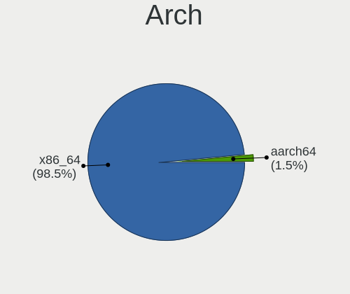
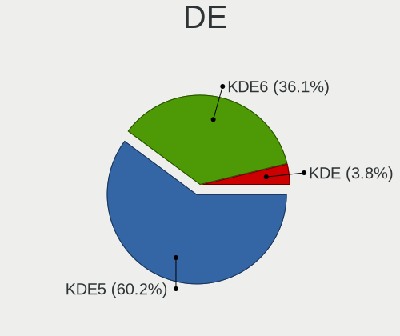
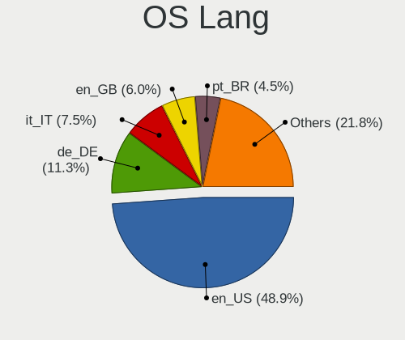
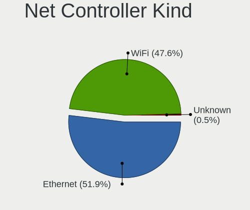
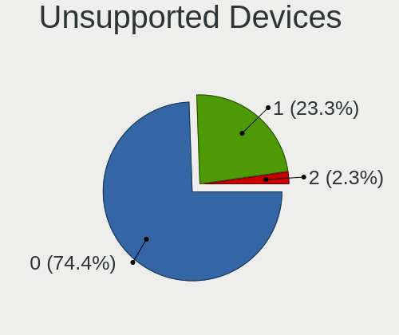

Kubuntu - Hardware Trends
-------------------------

A project to identify most popular hardware characteristics and track their change
over time based on data collected by Linux users at https://Linux-Hardware.org.

Anyone can contribute to this report by the [hw-probe](https://github.com/linuxhw/hw-probe) tool:

    sudo -E hw-probe -all -upload

This is a report for all computer types. See also reports for [desktops](/Dist/Kubuntu/Desktop/README.md) and [notebooks](/Dist/Kubuntu/Notebook/README.md).

This report is for one last month. Overall report since the beginning of time: [TestDays](https://github.com/linuxhw/TestDays)

Period: Mar, 2023.

Contents
--------

* [ System ](#system)
  - [ OS                       ](#os)
  - [ OS Family                ](#os-family)
  - [ Kernel                   ](#kernel)
  - [ Kernel Family            ](#kernel-family)
  - [ Kernel Major Ver.        ](#kernel-major-ver)
  - [ Arch                     ](#arch)
  - [ DE                       ](#de)
  - [ Display Server           ](#display-server)
  - [ Display Manager          ](#display-manager)
  - [ OS Lang                  ](#os-lang)
  - [ Boot Mode                ](#boot-mode)
  - [ Filesystem               ](#filesystem)
  - [ Part. scheme             ](#part-scheme)
  - [ Dual Boot with Linux/BSD ](#dual-boot-with-linuxbsd)
  - [ Dual Boot (Win)          ](#dual-boot-win)

* [ Board ](#board)
  - [ Vendor                   ](#vendor)
  - [ Model                    ](#model)
  - [ Model Family             ](#model-family)
  - [ MFG Year                 ](#mfg-year)
  - [ Form Factor              ](#form-factor)
  - [ Secure Boot              ](#secure-boot)
  - [ Coreboot                 ](#coreboot)
  - [ RAM Size                 ](#ram-size)
  - [ RAM Used                 ](#ram-used)
  - [ Total Drives             ](#total-drives)
  - [ Has CD-ROM               ](#has-cd-rom)
  - [ Has Ethernet             ](#has-ethernet)
  - [ Has WiFi                 ](#has-wifi)
  - [ Has Bluetooth            ](#has-bluetooth)

* [ Location ](#location)
  - [ Country                  ](#country)
  - [ City                     ](#city)

* [ Drives ](#drives)
  - [ Drive Vendor             ](#drive-vendor)
  - [ Drive Model              ](#drive-model)
  - [ HDD Vendor               ](#hdd-vendor)
  - [ SSD Vendor               ](#ssd-vendor)
  - [ Drive Kind               ](#drive-kind)
  - [ Drive Connector          ](#drive-connector)
  - [ Drive Size               ](#drive-size)
  - [ Space Total              ](#space-total)
  - [ Space Used               ](#space-used)
  - [ Malfunc. Drives          ](#malfunc-drives)
  - [ Malfunc. Drive Vendor    ](#malfunc-drive-vendor)
  - [ Malfunc. HDD Vendor      ](#malfunc-hdd-vendor)
  - [ Malfunc. Drive Kind      ](#malfunc-drive-kind)
  - [ Failed Drives            ](#failed-drives)
  - [ Failed Drive Vendor      ](#failed-drive-vendor)
  - [ Drive Status             ](#drive-status)

* [ Storage controller ](#storage-controller)
  - [ Storage Vendor           ](#storage-vendor)
  - [ Storage Model            ](#storage-model)
  - [ Storage Kind             ](#storage-kind)

* [ Processor ](#processor)
  - [ CPU Vendor               ](#cpu-vendor)
  - [ CPU Model                ](#cpu-model)
  - [ CPU Model Family         ](#cpu-model-family)
  - [ CPU Cores                ](#cpu-cores)
  - [ CPU Sockets              ](#cpu-sockets)
  - [ CPU Threads              ](#cpu-threads)
  - [ CPU Op-Modes             ](#cpu-op-modes)
  - [ CPU Microcode            ](#cpu-microcode)
  - [ CPU Microarch            ](#cpu-microarch)

* [ Graphics ](#graphics)
  - [ GPU Vendor               ](#gpu-vendor)
  - [ GPU Model                ](#gpu-model)
  - [ GPU Combo                ](#gpu-combo)
  - [ GPU Driver               ](#gpu-driver)
  - [ GPU Memory               ](#gpu-memory)

* [ Monitor ](#monitor)
  - [ Monitor Vendor           ](#monitor-vendor)
  - [ Monitor Model            ](#monitor-model)
  - [ Monitor Resolution       ](#monitor-resolution)
  - [ Monitor Diagonal         ](#monitor-diagonal)
  - [ Monitor Width            ](#monitor-width)
  - [ Aspect Ratio             ](#aspect-ratio)
  - [ Monitor Area             ](#monitor-area)
  - [ Pixel Density            ](#pixel-density)
  - [ Multiple Monitors        ](#multiple-monitors)

* [ Network ](#network)
  - [ Net Controller Vendor    ](#net-controller-vendor)
  - [ Net Controller Model     ](#net-controller-model)
  - [ Wireless Vendor          ](#wireless-vendor)
  - [ Wireless Model           ](#wireless-model)
  - [ Ethernet Vendor          ](#ethernet-vendor)
  - [ Ethernet Model           ](#ethernet-model)
  - [ Net Controller Kind      ](#net-controller-kind)
  - [ Used Controller          ](#used-controller)
  - [ NICs                     ](#nics)
  - [ IPv6                     ](#ipv6)

* [ Bluetooth ](#bluetooth)
  - [ Bluetooth Vendor         ](#bluetooth-vendor)
  - [ Bluetooth Model          ](#bluetooth-model)

* [ Sound ](#sound)
  - [ Sound Vendor             ](#sound-vendor)
  - [ Sound Model              ](#sound-model)

* [ Memory ](#memory)
  - [ Memory Vendor            ](#memory-vendor)
  - [ Memory Model             ](#memory-model)
  - [ Memory Kind              ](#memory-kind)
  - [ Memory Form Factor       ](#memory-form-factor)
  - [ Memory Size              ](#memory-size)
  - [ Memory Speed             ](#memory-speed)

* [ Printers & scanners ](#printers--scanners)
  - [ Printer Vendor           ](#printer-vendor)
  - [ Printer Model            ](#printer-model)
  - [ Scanner Vendor           ](#scanner-vendor)
  - [ Scanner Model            ](#scanner-model)

* [ Camera ](#camera)
  - [ Camera Vendor            ](#camera-vendor)
  - [ Camera Model             ](#camera-model)

* [ Security ](#security)
  - [ Fingerprint Vendor       ](#fingerprint-vendor)
  - [ Fingerprint Model        ](#fingerprint-model)
  - [ Chipcard Vendor          ](#chipcard-vendor)
  - [ Chipcard Model           ](#chipcard-model)

* [ Unsupported ](#unsupported)
  - [ Unsupported Devices      ](#unsupported-devices)
  - [ Unsupported Device Types ](#unsupported-device-types)

System
------

OS
--

Installed operating systems

| Name          | Computers | Percent |
|---------------|-----------|---------|
| Kubuntu 22.04 | 71        | 46.71%  |
| Kubuntu 22.10 | 65        | 42.76%  |
| Kubuntu 23.04 | 6         | 3.95%   |
| Kubuntu 20.04 | 4         | 2.63%   |
| Kubuntu 11    | 4         | 2.63%   |
| Kubuntu 18.04 | 2         | 1.32%   |

OS Family
---------

OS without a version

| Name    | Computers | Percent |
|---------|-----------|---------|
| Kubuntu | 152       | 100%    |

Kernel
------

Version of the Linux kernel

| Version                | Computers | Percent |
|------------------------|-----------|---------|
| 5.19.0-35-generic      | 64        | 42.11%  |
| 5.15.0-67-generic      | 25        | 16.45%  |
| 5.19.0-38-generic      | 17        | 11.18%  |
| 5.19.0-32-generic      | 4         | 2.63%   |
| 6.2.0-18-generic       | 3         | 1.97%   |
| 5.19.0-21-generic      | 3         | 1.97%   |
| 6.2.5-060205-generic   | 2         | 1.32%   |
| 6.2.2-060202-generic   | 2         | 1.32%   |
| 5.19.0-31-generic      | 2         | 1.32%   |
| 5.19.0-1021-lowlatency | 2         | 1.32%   |
| 5.19.0-1018-lowlatency | 2         | 1.32%   |
| 5.15.0-69-generic      | 2         | 1.32%   |
| 5.15.0-67-lowlatency   | 2         | 1.32%   |
| 5.15.0-60-generic      | 2         | 1.32%   |
| 6.2.8-060208-generic   | 1         | 0.66%   |
| 6.2.7-060207-generic   | 1         | 0.66%   |
| 6.2.1-060201-generic   | 1         | 0.66%   |
| 6.1.18-060118-generic  | 1         | 0.66%   |
| 6.1.12-060112-generic  | 1         | 0.66%   |
| 6.1.0-16-generic       | 1         | 0.66%   |
| 6.1.0-1007-oem         | 1         | 0.66%   |
| 5.4.0-144-generic      | 1         | 0.66%   |
| 5.4.0-131-generic      | 1         | 0.66%   |
| 5.19.17-051917-generic | 1         | 0.66%   |
| 5.19.0-40-generic      | 1         | 0.66%   |
| 5.19.0-37-generic      | 1         | 0.66%   |
| 5.19.0-26-generic      | 1         | 0.66%   |
| 5.19.0-1015-lowlatency | 1         | 0.66%   |
| 5.15.0-58-lowlatency   | 1         | 0.66%   |
| 5.15.0-47-generic      | 1         | 0.66%   |
| 5.15.0-25-generic      | 1         | 0.66%   |
| 5.14.0-1054-oem        | 1         | 0.66%   |
| 5.11.0-43-generic      | 1         | 0.66%   |
| 4.15.0-206-generic     | 1         | 0.66%   |

Kernel Family
-------------

Linux kernel without a distro release

| Version | Computers | Percent |
|---------|-----------|---------|
| 5.19.0  | 98        | 64.47%  |
| 5.15.0  | 34        | 22.37%  |
| 6.2.0   | 3         | 1.97%   |
| 6.2.5   | 2         | 1.32%   |
| 6.2.2   | 2         | 1.32%   |
| 6.1.0   | 2         | 1.32%   |
| 5.4.0   | 2         | 1.32%   |
| 6.2.8   | 1         | 0.66%   |
| 6.2.7   | 1         | 0.66%   |
| 6.2.1   | 1         | 0.66%   |
| 6.1.18  | 1         | 0.66%   |
| 6.1.12  | 1         | 0.66%   |
| 5.19.17 | 1         | 0.66%   |
| 5.14.0  | 1         | 0.66%   |
| 5.11.0  | 1         | 0.66%   |
| 4.15.0  | 1         | 0.66%   |

Kernel Major Ver.
-----------------

Linux kernel major version

| Version | Computers | Percent |
|---------|-----------|---------|
| 5.19    | 99        | 65.13%  |
| 5.15    | 34        | 22.37%  |
| 6.2     | 10        | 6.58%   |
| 6.1     | 4         | 2.63%   |
| 5.4     | 2         | 1.32%   |
| 5.14    | 1         | 0.66%   |
| 5.11    | 1         | 0.66%   |
| 4.15    | 1         | 0.66%   |

Arch
----

OS architecture (x86_64, i586, etc.)

| Name   | Computers | Percent |
|--------|-----------|---------|
| x86_64 | 152       | 100%    |

DE
--

Desktop Environment

| Name     | Computers | Percent |
|----------|-----------|---------|
| KDE5     | 145       | 95.39%  |
| KDE      | 4         | 2.63%   |
| XFCE     | 1         | 0.66%   |
| GNOME    | 1         | 0.66%   |
| Cinnamon | 1         | 0.66%   |

Display Server
--------------

X11 or Wayland

| Name    | Computers | Percent |
|---------|-----------|---------|
| X11     | 139       | 91.45%  |
| Wayland | 12        | 7.89%   |
| Tty     | 1         | 0.66%   |

Display Manager
---------------

SDDM, LightDM, etc.

| Name    | Computers | Percent |
|---------|-----------|---------|
| SDDM    | 98        | 64.47%  |
| Unknown | 41        | 26.97%  |
| GDM3    | 7         | 4.61%   |
| LightDM | 5         | 3.29%   |
| GDM     | 1         | 0.66%   |

OS Lang
-------

Language

| Lang  | Computers | Percent |
|-------|-----------|---------|
| en_US | 60        | 39.47%  |
| de_DE | 14        | 9.21%   |
| pt_BR | 10        | 6.58%   |
| fr_FR | 10        | 6.58%   |
| en_GB | 8         | 5.26%   |
| en_CA | 7         | 4.61%   |
| ru_RU | 6         | 3.95%   |
| en_IN | 6         | 3.95%   |
| it_IT | 4         | 2.63%   |
| nl_NL | 3         | 1.97%   |
| zh_CN | 2         | 1.32%   |
| tr_TR | 2         | 1.32%   |
| es_ES | 2         | 1.32%   |
| en_AU | 2         | 1.32%   |
| de_AT | 2         | 1.32%   |
| C     | 2         | 1.32%   |
| sl_SI | 1         | 0.66%   |
| pl_PL | 1         | 0.66%   |
| hu_HU | 1         | 0.66%   |
| fr_CH | 1         | 0.66%   |
| fr_BE | 1         | 0.66%   |
| es_VE | 1         | 0.66%   |
| es_PY | 1         | 0.66%   |
| es_CR | 1         | 0.66%   |
| es_CL | 1         | 0.66%   |
| en_ZA | 1         | 0.66%   |
| en_SG | 1         | 0.66%   |
| ca_ES | 1         | 0.66%   |

Boot Mode
---------

EFI or BIOS

| Mode | Computers | Percent |
|------|-----------|---------|
| BIOS | 76        | 50%     |
| EFI  | 76        | 50%     |

Filesystem
----------

Type of filesystem

| Type  | Computers | Percent |
|-------|-----------|---------|
| Ext4  | 141       | 92.76%  |
| Btrfs | 9         | 5.92%   |
| Xfs   | 2         | 1.32%   |

Part. scheme
------------

Scheme of partitioning

| Type    | Computers | Percent |
|---------|-----------|---------|
| GPT     | 105       | 69.08%  |
| Unknown | 39        | 25.66%  |
| MBR     | 8         | 5.26%   |

Dual Boot with Linux/BSD
------------------------

Hosting more than one Linux/BSD

| Dual boot | Computers | Percent |
|-----------|-----------|---------|
| No        | 138       | 90.79%  |
| Yes       | 14        | 9.21%   |

Dual Boot (Win)
---------------

Hosting Linux and Windows

| Dual boot | Computers | Percent |
|-----------|-----------|---------|
| No        | 98        | 64.47%  |
| Yes       | 54        | 35.53%  |

Board
-----

Vendor
------

Motherboard manufacturer

| Name                   | Computers | Percent |
|------------------------|-----------|---------|
| ASUSTek Computer       | 27        | 17.76%  |
| Lenovo                 | 26        | 17.11%  |
| Dell                   | 20        | 13.16%  |
| Hewlett-Packard        | 17        | 11.18%  |
| Gigabyte Technology    | 16        | 10.53%  |
| MSI                    | 11        | 7.24%   |
| HUAWEI                 | 5         | 3.29%   |
| Acer                   | 5         | 3.29%   |
| Intel                  | 4         | 2.63%   |
| Apple                  | 3         | 1.97%   |
| Toshiba                | 2         | 1.32%   |
| Supermicro             | 1         | 0.66%   |
| Sony                   | 1         | 0.66%   |
| Samsung Electronics    | 1         | 0.66%   |
| Notebook               | 1         | 0.66%   |
| Motion Computing       | 1         | 0.66%   |
| Maibenben              | 1         | 0.66%   |
| HONOR                  | 1         | 0.66%   |
| GEO                    | 1         | 0.66%   |
| Digibras               | 1         | 0.66%   |
| Datto                  | 1         | 0.66%   |
| Chuwi                  | 1         | 0.66%   |
| Carbon Systems         | 1         | 0.66%   |
| Avell High Performance | 1         | 0.66%   |
| ASRockRack             | 1         | 0.66%   |
| Alienware              | 1         | 0.66%   |
| Unknown                | 1         | 0.66%   |

Model
-----

Motherboard model

| Name                                   | Computers | Percent |
|----------------------------------------|-----------|---------|
| MSI MS-7C91                            | 3         | 1.97%   |
| HUAWEI HVY-WXX9                        | 2         | 1.32%   |
| HP Laptop 15-ef2xxx                    | 2         | 1.32%   |
| Dell Latitude E6420                    | 2         | 1.32%   |
| Dell Latitude 5420                     | 2         | 1.32%   |
| Dell Inspiron 15-3567                  | 2         | 1.32%   |
| ASUS ROG Maximus XII FORMULA           | 2         | 1.32%   |
| ASUS All Series                        | 2         | 1.32%   |
| Toshiba Satellite L515                 | 1         | 0.66%   |
| Toshiba QOSMIO X70-A                   | 1         | 0.66%   |
| Supermicro PIO-1UDP10-01-AI036         | 1         | 0.66%   |
| Sony VGN-NW270F                        | 1         | 0.66%   |
| Samsung 950QDB                         | 1         | 0.66%   |
| Notebook NV4xPZ                        | 1         | 0.66%   |
| MSI MS-7D43                            | 1         | 0.66%   |
| MSI MS-7C86                            | 1         | 0.66%   |
| MSI MS-7B24                            | 1         | 0.66%   |
| MSI MS-7971                            | 1         | 0.66%   |
| MSI MS-7816                            | 1         | 0.66%   |
| MSI MS-7693                            | 1         | 0.66%   |
| MSI Modern 15 A5M                      | 1         | 0.66%   |
| MSI GE70 2PE                           | 1         | 0.66%   |
| Motion Computing J3600                 | 1         | 0.66%   |
| Maibenben JinMai6 series               | 1         | 0.66%   |
| Lenovo Yoga C740-15IML 81TD            | 1         | 0.66%   |
| Lenovo XiaoXin-15ARE 2020 81YR         | 1         | 0.66%   |
| Lenovo ThinkStation P300 30AH004MUS    | 1         | 0.66%   |
| Lenovo ThinkPad X390 20Q0000SMX        | 1         | 0.66%   |
| Lenovo ThinkPad X230 23256N6           | 1         | 0.66%   |
| Lenovo ThinkPad X13 Gen 2a 20XH0076IG  | 1         | 0.66%   |
| Lenovo ThinkPad X1 Yoga 2nd 20JES0FE00 | 1         | 0.66%   |
| Lenovo ThinkPad T480 20L6S3H102        | 1         | 0.66%   |
| Lenovo ThinkPad T470 W10DG 20JNA03XUS  | 1         | 0.66%   |
| Lenovo ThinkPad SL 2743NSC             | 1         | 0.66%   |
| Lenovo ThinkPad E480 20KNA01HIG        | 1         | 0.66%   |
| Lenovo ThinkPad E15 Gen 4 21E6004KGE   | 1         | 0.66%   |
| Lenovo ThinkCentre M93 10A4S03D00      | 1         | 0.66%   |
| Lenovo ThinkCentre M58 9728AHG         | 1         | 0.66%   |
| Lenovo ThinkBook 15 G2 ITL 20VE        | 1         | 0.66%   |
| Lenovo ThinkBook 14 G2 ITL 20VD        | 1         | 0.66%   |

Model Family
------------

Motherboard model prefix

| Name                           | Computers | Percent |
|--------------------------------|-----------|---------|
| Lenovo ThinkPad                | 9         | 5.92%   |
| Dell Inspiron                  | 6         | 3.95%   |
| Lenovo IdeaPad                 | 5         | 3.29%   |
| Dell XPS                       | 5         | 3.29%   |
| Dell Latitude                  | 5         | 3.29%   |
| ASUS ROG                       | 5         | 3.29%   |
| ASUS PRIME                     | 5         | 3.29%   |
| MSI MS-7C91                    | 3         | 1.97%   |
| Lenovo Legion                  | 3         | 1.97%   |
| HP Laptop                      | 3         | 1.97%   |
| ASUS VivoBook                  | 3         | 1.97%   |
| Acer Aspire                    | 3         | 1.97%   |
| Lenovo ThinkCentre             | 2         | 1.32%   |
| Lenovo ThinkBook               | 2         | 1.32%   |
| Lenovo IdeaCentre              | 2         | 1.32%   |
| HUAWEI HVY-WXX9                | 2         | 1.32%   |
| HP ZBook                       | 2         | 1.32%   |
| HP Pavilion                    | 2         | 1.32%   |
| HP EliteDesk                   | 2         | 1.32%   |
| HP EliteBook                   | 2         | 1.32%   |
| Gigabyte B550                  | 2         | 1.32%   |
| Dell Vostro                    | 2         | 1.32%   |
| ASUS ASUS                      | 2         | 1.32%   |
| ASUS All                       | 2         | 1.32%   |
| Acer Nitro                     | 2         | 1.32%   |
| Toshiba Satellite              | 1         | 0.66%   |
| Toshiba QOSMIO                 | 1         | 0.66%   |
| Supermicro PIO-1UDP10-01-AI036 | 1         | 0.66%   |
| Sony VGN-NW270F                | 1         | 0.66%   |
| Samsung 950QDB                 | 1         | 0.66%   |
| Notebook NV4xPZ                | 1         | 0.66%   |
| MSI MS-7D43                    | 1         | 0.66%   |
| MSI MS-7C86                    | 1         | 0.66%   |
| MSI MS-7B24                    | 1         | 0.66%   |
| MSI MS-7971                    | 1         | 0.66%   |
| MSI MS-7816                    | 1         | 0.66%   |
| MSI MS-7693                    | 1         | 0.66%   |
| MSI Modern                     | 1         | 0.66%   |
| MSI GE70                       | 1         | 0.66%   |
| Motion Computing J3600         | 1         | 0.66%   |

MFG Year
--------

Motherboard manufacture year

| Year | Computers | Percent |
|------|-----------|---------|
| 2021 | 28        | 18.42%  |
| 2022 | 20        | 13.16%  |
| 2020 | 20        | 13.16%  |
| 2019 | 14        | 9.21%   |
| 2015 | 12        | 7.89%   |
| 2013 | 9         | 5.92%   |
| 2018 | 8         | 5.26%   |
| 2014 | 7         | 4.61%   |
| 2017 | 6         | 3.95%   |
| 2012 | 6         | 3.95%   |
| 2011 | 6         | 3.95%   |
| 2016 | 5         | 3.29%   |
| 2010 | 3         | 1.97%   |
| 2009 | 3         | 1.97%   |
| 2008 | 3         | 1.97%   |
| 2023 | 1         | 0.66%   |
| 2007 | 1         | 0.66%   |

Form Factor
-----------

Physical design of the computer

| Name        | Computers | Percent |
|-------------|-----------|---------|
| Notebook    | 81        | 53.29%  |
| Desktop     | 59        | 38.82%  |
| Convertible | 6         | 3.95%   |
| Mini pc     | 3         | 1.97%   |
| All in one  | 2         | 1.32%   |
| Server      | 1         | 0.66%   |

Secure Boot
-----------

Enabled or disabled

| State    | Computers | Percent |
|----------|-----------|---------|
| Disabled | 134       | 88.16%  |
| Enabled  | 18        | 11.84%  |

Coreboot
--------

Have coreboot on board

| Used | Computers | Percent |
|------|-----------|---------|
| No   | 152       | 100%    |

RAM Size
--------

Total RAM memory

| Size in GB      | Computers | Percent |
|-----------------|-----------|---------|
| 16.01-24.0      | 41        | 26.97%  |
| 4.01-8.0        | 31        | 20.39%  |
| 8.01-16.0       | 29        | 19.08%  |
| 32.01-64.0      | 28        | 18.42%  |
| 3.01-4.0        | 10        | 6.58%   |
| 64.01-256.0     | 9         | 5.92%   |
| 24.01-32.0      | 3         | 1.97%   |
| More than 256.0 | 1         | 0.66%   |

RAM Used
--------

Used RAM memory

| Used GB    | Computers | Percent |
|------------|-----------|---------|
| 4.01-8.0   | 45        | 29.61%  |
| 2.01-3.0   | 37        | 24.34%  |
| 3.01-4.0   | 32        | 21.05%  |
| 1.01-2.0   | 23        | 15.13%  |
| 8.01-16.0  | 8         | 5.26%   |
| 16.01-24.0 | 4         | 2.63%   |
| 32.01-64.0 | 1         | 0.66%   |
| 24.01-32.0 | 1         | 0.66%   |
| 0.51-1.0   | 1         | 0.66%   |

Total Drives
------------

Number of drives on board

| Drives | Computers | Percent |
|--------|-----------|---------|
| 1      | 94        | 61.84%  |
| 2      | 36        | 23.68%  |
| 3      | 13        | 8.55%   |
| 4      | 6         | 3.95%   |
| 5      | 2         | 1.32%   |
| 7      | 1         | 0.66%   |

Has CD-ROM
----------

Has CD-ROM on board

| Presented | Computers | Percent |
|-----------|-----------|---------|
| No        | 113       | 74.34%  |
| Yes       | 39        | 25.66%  |

Has Ethernet
------------

Has Ethernet on board

| Presented | Computers | Percent |
|-----------|-----------|---------|
| Yes       | 124       | 81.58%  |
| No        | 28        | 18.42%  |

Has WiFi
--------

Has WiFi module

| Presented | Computers | Percent |
|-----------|-----------|---------|
| Yes       | 120       | 78.95%  |
| No        | 32        | 21.05%  |

Has Bluetooth
-------------

Has Bluetooth module

| Presented | Computers | Percent |
|-----------|-----------|---------|
| Yes       | 110       | 72.37%  |
| No        | 42        | 27.63%  |

Location
--------

Country
-------

Geographic location (country)

| Country                | Computers | Percent |
|------------------------|-----------|---------|
| USA                    | 38        | 25%     |
| Germany                | 20        | 13.16%  |
| Brazil                 | 11        | 7.24%   |
| France                 | 10        | 6.58%   |
| Canada                 | 8         | 5.26%   |
| UK                     | 7         | 4.61%   |
| India                  | 6         | 3.95%   |
| Russia                 | 5         | 3.29%   |
| Netherlands            | 5         | 3.29%   |
| Italy                  | 5         | 3.29%   |
| Turkey                 | 3         | 1.97%   |
| Spain                  | 3         | 1.97%   |
| Sweden                 | 2         | 1.32%   |
| Romania                | 2         | 1.32%   |
| Poland                 | 2         | 1.32%   |
| China                  | 2         | 1.32%   |
| Belgium                | 2         | 1.32%   |
| Austria                | 2         | 1.32%   |
| Australia              | 2         | 1.32%   |
| Venezuela              | 1         | 0.66%   |
| Tanzania               | 1         | 0.66%   |
| Switzerland            | 1         | 0.66%   |
| South Africa           | 1         | 0.66%   |
| Slovenia               | 1         | 0.66%   |
| Slovakia               | 1         | 0.66%   |
| Singapore              | 1         | 0.66%   |
| Serbia                 | 1         | 0.66%   |
| Réunion               | 1         | 0.66%   |
| Paraguay               | 1         | 0.66%   |
| Mexico                 | 1         | 0.66%   |
| Malaysia               | 1         | 0.66%   |
| Luxembourg             | 1         | 0.66%   |
| Finland                | 1         | 0.66%   |
| Costa Rica             | 1         | 0.66%   |
| Chile                  | 1         | 0.66%   |
| Bosnia and Herzegovina | 1         | 0.66%   |

City
----

Geographic location (city)

| City                 | Computers | Percent |
|----------------------|-----------|---------|
| Castro Valley        | 3         | 1.97%   |
| Vienna               | 2         | 1.32%   |
| San Francisco        | 2         | 1.32%   |
| Porto Alegre         | 2         | 1.32%   |
| Montreal             | 2         | 1.32%   |
| Lexington            | 2         | 1.32%   |
| Hanover              | 2         | 1.32%   |
| Hamburg              | 2         | 1.32%   |
| Frankfurt am Main    | 2         | 1.32%   |
| Dallas               | 2         | 1.32%   |
| Caruaru              | 2         | 1.32%   |
| Bengaluru            | 2         | 1.32%   |
| Zuid-Scharwoude      | 1         | 0.66%   |
| Yaroslavl            | 1         | 0.66%   |
| Xiamen               | 1         | 0.66%   |
| Xi'an                | 1         | 0.66%   |
| Xalapa               | 1         | 0.66%   |
| Wroclaw              | 1         | 0.66%   |
| Waldkraiburg         | 1         | 0.66%   |
| Vsevolozhsk          | 1         | 0.66%   |
| Umeå                | 1         | 0.66%   |
| Uettligen            | 1         | 0.66%   |
| Tubbergen            | 1         | 0.66%   |
| Tres Cantos          | 1         | 0.66%   |
| Tournefeuille        | 1         | 0.66%   |
| Takoma Park          | 1         | 0.66%   |
| Suhl                 | 1         | 0.66%   |
| Strasbourg           | 1         | 0.66%   |
| Steenbergen          | 1         | 0.66%   |
| St Petersburg        | 1         | 0.66%   |
| Springfield          | 1         | 0.66%   |
| Spring Valley        | 1         | 0.66%   |
| Spring Hill          | 1         | 0.66%   |
| Spanga               | 1         | 0.66%   |
| Somerville           | 1         | 0.66%   |
| Singapore            | 1         | 0.66%   |
| Sfantu Gheorghe      | 1         | 0.66%   |
| Seattle              | 1         | 0.66%   |
| Sao Joao das Missoes | 1         | 0.66%   |
| Santos               | 1         | 0.66%   |

Drives
------

Drive Vendor
------------

Hard drive vendors

| Vendor                      | Computers | Drives | Percent |
|-----------------------------|-----------|--------|---------|
| Samsung Electronics         | 41        | 53     | 18.47%  |
| WDC                         | 29        | 30     | 13.06%  |
| Seagate                     | 19        | 21     | 8.56%   |
| Sandisk                     | 17        | 19     | 7.66%   |
| Intel                       | 14        | 14     | 6.31%   |
| Crucial                     | 11        | 15     | 4.95%   |
| Toshiba                     | 10        | 10     | 4.5%    |
| Kingston                    | 9         | 9      | 4.05%   |
| A-DATA Technology           | 6         | 6      | 2.7%    |
| Unknown                     | 5         | 5      | 2.25%   |
| Hitachi                     | 5         | 5      | 2.25%   |
| SK hynix                    | 4         | 4      | 1.8%    |
| Netac                       | 4         | 4      | 1.8%    |
| Kingston Technology Company | 4         | 4      | 1.8%    |
| Micron Technology           | 3         | 3      | 1.35%   |
| China                       | 3         | 3      | 1.35%   |
| Phison Electronics          | 2         | 2      | 0.9%    |
| Phison                      | 2         | 2      | 0.9%    |
| Micron/Crucial Technology   | 2         | 2      | 0.9%    |
| Maxtor                      | 2         | 2      | 0.9%    |
| KIOXIA                      | 2         | 2      | 0.9%    |
| Corsair                     | 2         | 2      | 0.9%    |
| Apple                       | 2         | 2      | 0.9%    |
| YMTC                        | 1         | 1      | 0.45%   |
| Verbatim                    | 1         | 1      | 0.45%   |
| UMIS                        | 1         | 1      | 0.45%   |
| SSSTC                       | 1         | 1      | 0.45%   |
| SPCC                        | 1         | 1      | 0.45%   |
| Silicon Motion              | 1         | 1      | 0.45%   |
| PNY                         | 1         | 1      | 0.45%   |
| Patriot                     | 1         | 1      | 0.45%   |
| LITEONIT                    | 1         | 1      | 0.45%   |
| Lexar                       | 1         | 1      | 0.45%   |
| KIOXIA-EXCERIA              | 1         | 1      | 0.45%   |
| Kimtigo                     | 1         | 1      | 0.45%   |
| HUSKY                       | 1         | 1      | 0.45%   |
| Hoodisk                     | 1         | 1      | 0.45%   |
| Hjwdz                       | 1         | 1      | 0.45%   |
| HGST                        | 1         | 1      | 0.45%   |
| Hewlett-Packard             | 1         | 1      | 0.45%   |

Drive Model
-----------

Hard drive models

| Model                                               | Computers | Percent |
|-----------------------------------------------------|-----------|---------|
| Samsung SSD 860 EVO 500GB                           | 3         | 1.28%   |
| Kingston Company A2000 NVMe SSD 500GB               | 3         | 1.28%   |
| Intel SSDPEKNU512GZ 512GB                           | 3         | 1.28%   |
| Crucial CT2000MX500SSD1 2TB                         | 3         | 1.28%   |
| WDC WDS240G2G0A-00JH30 240GB SSD                    | 2         | 0.85%   |
| WDC WD5000AAKX-22ERMA0 500GB                        | 2         | 0.85%   |
| WDC WD20EARX-00PASB0 2TB                            | 2         | 0.85%   |
| WDC WD10EZEX-60WN4A0 1TB                            | 2         | 0.85%   |
| Toshiba HDWD110 1TB                                 | 2         | 0.85%   |
| Seagate ST2000LM007-1R8174 2TB                      | 2         | 0.85%   |
| Seagate ST2000DM001-1ER164 2TB                      | 2         | 0.85%   |
| Seagate ST1000LM014-1EJ164-SSHD 1TB                 | 2         | 0.85%   |
| Seagate ST1000DM003-9YN162 1TB                      | 2         | 0.85%   |
| SanDisk SSD PLUS 480GB                              | 2         | 0.85%   |
| SanDisk NVMe SSD Drive 1TB                          | 2         | 0.85%   |
| Samsung SSD 980 PRO 500GB                           | 2         | 0.85%   |
| Samsung SSD 980 PRO 1TB                             | 2         | 0.85%   |
| Samsung SSD 970 EVO Plus 500GB                      | 2         | 0.85%   |
| Samsung SSD 970 EVO Plus 2TB                        | 2         | 0.85%   |
| Samsung SSD 970 EVO Plus 250GB                      | 2         | 0.85%   |
| Samsung SSD 860 EVO 250GB                           | 2         | 0.85%   |
| Samsung SSD 850 EVO 500GB                           | 2         | 0.85%   |
| Samsung SSD 850 EVO 250GB                           | 2         | 0.85%   |
| Samsung NVMe SSD Controller SM981/PM981/PM983 250GB | 2         | 0.85%   |
| Micron/Crucial P2 NVMe PCIe SSD 1TB                 | 2         | 0.85%   |
| Kingston SNVS2000G 2TB                              | 2         | 0.85%   |
| Kingston SA400S37240G 240GB SSD                     | 2         | 0.85%   |
| Intel SSDPEKNW512GZL 512GB                          | 2         | 0.85%   |
| Intel SSDPEKNU512GZH 512GB                          | 2         | 0.85%   |
| Crucial CT240BX500SSD1 240GB                        | 2         | 0.85%   |
| YMTC PC005 512GB                                    | 1         | 0.43%   |
| WDC WDS200T2B0B-00YS70 2TB SSD                      | 1         | 0.43%   |
| WDC WD80EFBX-68AZZN0 8TB                            | 1         | 0.43%   |
| WDC WD60EZAZ-00SF3B0 6TB                            | 1         | 0.43%   |
| WDC WD5000AAKX-001CA0 500GB                         | 1         | 0.43%   |
| WDC WD5000AAKS-22V1A0 500GB                         | 1         | 0.43%   |
| WDC WD40EZRZ-00GXCB0 4TB                            | 1         | 0.43%   |
| WDC WD3200BEVT-22ZCT0 320GB                         | 1         | 0.43%   |
| WDC WD2500KS-00MJB0 250GB                           | 1         | 0.43%   |
| WDC WD2002FYPS-02W3B0 2TB                           | 1         | 0.43%   |

HDD Vendor
----------

Hard disk drive vendors

| Vendor              | Computers | Drives | Percent |
|---------------------|-----------|--------|---------|
| WDC                 | 21        | 22     | 36.21%  |
| Seagate             | 18        | 20     | 31.03%  |
| Toshiba             | 7         | 7      | 12.07%  |
| Hitachi             | 5         | 5      | 8.62%   |
| Samsung Electronics | 2         | 2      | 3.45%   |
| Maxtor              | 2         | 2      | 3.45%   |
| Unknown             | 1         | 1      | 1.72%   |
| HGST                | 1         | 1      | 1.72%   |
| Apple               | 1         | 1      | 1.72%   |

SSD Vendor
----------

Solid state drive vendors

| Vendor              | Computers | Drives | Percent |
|---------------------|-----------|--------|---------|
| Samsung Electronics | 18        | 22     | 25.35%  |
| Crucial             | 10        | 14     | 14.08%  |
| SanDisk             | 8         | 9      | 11.27%  |
| Kingston            | 4         | 4      | 5.63%   |
| WDC                 | 3         | 3      | 4.23%   |
| Intel               | 3         | 3      | 4.23%   |
| China               | 3         | 3      | 4.23%   |
| A-DATA Technology   | 3         | 3      | 4.23%   |
| Netac               | 2         | 2      | 2.82%   |
| Corsair             | 2         | 2      | 2.82%   |
| Verbatim            | 1         | 1      | 1.41%   |
| Toshiba             | 1         | 1      | 1.41%   |
| SK hynix            | 1         | 1      | 1.41%   |
| PNY                 | 1         | 1      | 1.41%   |
| Patriot             | 1         | 1      | 1.41%   |
| Micron Technology   | 1         | 1      | 1.41%   |
| LITEONIT            | 1         | 1      | 1.41%   |
| Kimtigo             | 1         | 1      | 1.41%   |
| HUSKY               | 1         | 1      | 1.41%   |
| Hoodisk             | 1         | 1      | 1.41%   |
| Hewlett-Packard     | 1         | 1      | 1.41%   |
| faspeed             | 1         | 1      | 1.41%   |
| Dogfish             | 1         | 1      | 1.41%   |
| CT500BX5            | 1         | 1      | 1.41%   |
| Apple               | 1         | 1      | 1.41%   |

Drive Kind
----------

HDD or SSD

| Kind    | Computers | Drives | Percent |
|---------|-----------|--------|---------|
| NVMe    | 84        | 97     | 42.21%  |
| SSD     | 61        | 80     | 30.65%  |
| HDD     | 49        | 61     | 24.62%  |
| MMC     | 3         | 3      | 1.51%   |
| Unknown | 2         | 2      | 1.01%   |

Drive Connector
---------------

SATA, SAS, NVMe, etc.

| Type | Computers | Drives | Percent |
|------|-----------|--------|---------|
| SATA | 89        | 136    | 48.9%   |
| NVMe | 83        | 96     | 45.6%   |
| SAS  | 7         | 8      | 3.85%   |
| MMC  | 3         | 3      | 1.65%   |

Drive Size
----------

Size of hard drive

| Size in TB | Computers | Drives | Percent |
|------------|-----------|--------|---------|
| 0.01-0.5   | 57        | 73     | 50%     |
| 0.51-1.0   | 35        | 39     | 30.7%   |
| 1.01-2.0   | 14        | 21     | 12.28%  |
| 3.01-4.0   | 4         | 4      | 3.51%   |
| 4.01-10.0  | 3         | 3      | 2.63%   |
| 2.01-3.0   | 1         | 1      | 0.88%   |

Space Total
-----------

Amount of disk space available on the file system

| Size in GB     | Computers | Percent |
|----------------|-----------|---------|
| 501-1000       | 40        | 26.32%  |
| 101-250        | 35        | 23.03%  |
| 251-500        | 31        | 20.39%  |
| 1001-2000      | 22        | 14.47%  |
| More than 3000 | 10        | 6.58%   |
| 2001-3000      | 7         | 4.61%   |
| 51-100         | 3         | 1.97%   |
| 21-50          | 2         | 1.32%   |
| 1-20           | 1         | 0.66%   |
| Unknown        | 1         | 0.66%   |

Space Used
----------

Amount of used disk space

| Used GB        | Computers | Percent |
|----------------|-----------|---------|
| 101-250        | 29        | 19.08%  |
| 21-50          | 24        | 15.79%  |
| 51-100         | 23        | 15.13%  |
| 1-20           | 22        | 14.47%  |
| 501-1000       | 21        | 13.82%  |
| 251-500        | 19        | 12.5%   |
| 1001-2000      | 9         | 5.92%   |
| More than 3000 | 3         | 1.97%   |
| 2001-3000      | 1         | 0.66%   |
| Unknown        | 1         | 0.66%   |

Malfunc. Drives
---------------

Drive models with a malfunction

| Model                          | Computers | Drives | Percent |
|--------------------------------|-----------|--------|---------|
| WDC WD40EZRZ-00GXCB0 4TB       | 1         | 1      | 10%     |
| WDC WD10EZEX-60WN4A0 1TB       | 1         | 1      | 10%     |
| WDC WD10EURX-73C57Y0 1TB       | 1         | 1      | 10%     |
| Toshiba MQ01ABF032 320GB       | 1         | 1      | 10%     |
| Seagate ST3250310AS 250GB      | 1         | 1      | 10%     |
| Seagate ST2000DX001-1NS164 2TB | 1         | 1      | 10%     |
| SanDisk SSD PLUS 480GB         | 1         | 2      | 10%     |
| Crucial CT512M550SSD1 512GB    | 1         | 1      | 10%     |
| Crucial CT1050MX300SSD1 1TB    | 1         | 1      | 10%     |
| A-DATA Technology FALCON 1TB   | 1         | 1      | 10%     |

Malfunc. Drive Vendor
---------------------

Vendors of faulty drives

| Vendor            | Computers | Drives | Percent |
|-------------------|-----------|--------|---------|
| WDC               | 3         | 3      | 30%     |
| Seagate           | 2         | 2      | 20%     |
| Crucial           | 2         | 2      | 20%     |
| Toshiba           | 1         | 1      | 10%     |
| SanDisk           | 1         | 2      | 10%     |
| A-DATA Technology | 1         | 1      | 10%     |

Malfunc. HDD Vendor
-------------------

Vendors of faulty HDD drives

| Vendor  | Computers | Drives | Percent |
|---------|-----------|--------|---------|
| WDC     | 3         | 3      | 50%     |
| Seagate | 2         | 2      | 33.33%  |
| Toshiba | 1         | 1      | 16.67%  |

Malfunc. Drive Kind
-------------------

Kinds of faulty drives

| Kind | Computers | Drives | Percent |
|------|-----------|--------|---------|
| HDD  | 6         | 6      | 60%     |
| SSD  | 3         | 4      | 30%     |
| NVMe | 1         | 1      | 10%     |

Failed Drives
-------------

Failed drive models

| Model                | Computers | Drives | Percent |
|----------------------|-----------|--------|---------|
| Acer SSD FA100 256GB | 1         | 1      | 100%    |

Failed Drive Vendor
-------------------

Failed drive vendors

| Vendor | Computers | Drives | Percent |
|--------|-----------|--------|---------|
| Acer   | 1         | 1      | 100%    |

Drive Status
------------

Number of failed and malfunc. drives

| Status   | Computers | Drives | Percent |
|----------|-----------|--------|---------|
| Works    | 78        | 108    | 46.99%  |
| Detected | 77        | 123    | 46.39%  |
| Malfunc  | 10        | 11     | 6.02%   |
| Failed   | 1         | 1      | 0.6%    |

Storage controller
------------------

Storage Vendor
--------------

Storage controller vendors

| Vendor                         | Computers | Percent |
|--------------------------------|-----------|---------|
| Intel                          | 98        | 45.79%  |
| AMD                            | 29        | 13.55%  |
| Samsung Electronics            | 25        | 11.68%  |
| SanDisk                        | 14        | 6.54%   |
| Kingston Technology Company    | 9         | 4.21%   |
| Phison Electronics             | 4         | 1.87%   |
| Toshiba America Info Systems   | 3         | 1.4%    |
| SK hynix                       | 3         | 1.4%    |
| Micron/Crucial Technology      | 3         | 1.4%    |
| ASMedia Technology             | 3         | 1.4%    |
| ADATA Technology               | 3         | 1.4%    |
| Realtek Semiconductor          | 2         | 0.93%   |
| Netac Technology               | 2         | 0.93%   |
| Micron Technology              | 2         | 0.93%   |
| Marvell Technology Group       | 2         | 0.93%   |
| JMicron Technology             | 2         | 0.93%   |
| Yangtze Memory Technologies    | 1         | 0.47%   |
| Union Memory (Shenzhen)        | 1         | 0.47%   |
| Solid State Storage Technology | 1         | 0.47%   |
| Silicon Motion                 | 1         | 0.47%   |
| Shenzhen Longsys Electronics   | 1         | 0.47%   |
| Seagate Technology             | 1         | 0.47%   |
| LSI Logic / Symbios Logic      | 1         | 0.47%   |
| KIOXIA                         | 1         | 0.47%   |
| INNOGRIT                       | 1         | 0.47%   |
| Unknown                        | 1         | 0.47%   |

Storage Model
-------------

Storage controller models

| Model                                                                          | Computers | Percent |
|--------------------------------------------------------------------------------|-----------|---------|
| AMD FCH SATA Controller [AHCI mode]                                            | 20        | 8.3%    |
| Samsung NVMe SSD Controller SM981/PM981/PM983                                  | 14        | 5.81%   |
| Intel Volume Management Device NVMe RAID Controller                            | 11        | 4.56%   |
| Intel 8 Series/C220 Series Chipset Family 6-port SATA Controller 1 [AHCI mode] | 11        | 4.56%   |
| Intel Sunrise Point-LP SATA Controller [AHCI mode]                             | 8         | 3.32%   |
| Intel Non-Volatile memory controller                                           | 7         | 2.9%    |
| Samsung NVMe SSD Controller PM9A1/PM9A3/980PRO                                 | 6         | 2.49%   |
| Intel 500 Series Chipset Family SATA AHCI Controller                           | 6         | 2.49%   |
| AMD 500 Series Chipset SATA Controller                                         | 6         | 2.49%   |
| Intel Cannon Lake Mobile PCH SATA AHCI Controller                              | 5         | 2.07%   |
| SanDisk Non-Volatile memory controller                                         | 4         | 1.66%   |
| Samsung NVMe SSD Controller 980                                                | 4         | 1.66%   |
| Intel 6 Series/C200 Series Chipset Family 6 port Desktop SATA AHCI Controller  | 4         | 1.66%   |
| Toshiba America Info Systems XG6 NVMe SSD Controller                           | 3         | 1.24%   |
| SanDisk WD Blue SN570 NVMe SSD 1TB                                             | 3         | 1.24%   |
| SanDisk WD Blue SN550 NVMe SSD                                                 | 3         | 1.24%   |
| Samsung NVMe SSD Controller SM951/PM951                                        | 3         | 1.24%   |
| Kingston Company A2000 NVMe SSD                                                | 3         | 1.24%   |
| Intel Tiger Lake-LP SATA Controller                                            | 3         | 1.24%   |
| Intel Comet Lake SATA AHCI Controller                                          | 3         | 1.24%   |
| Intel 9 Series Chipset Family SATA Controller [AHCI Mode]                      | 3         | 1.24%   |
| Intel 82801IBM/IEM (ICH9M/ICH9M-E) 4 port SATA Controller [AHCI mode]          | 3         | 1.24%   |
| Intel 82801 Mobile SATA Controller [RAID mode]                                 | 3         | 1.24%   |
| Intel 7 Series Chipset Family 6-port SATA Controller [AHCI mode]               | 3         | 1.24%   |
| ASMedia ASM1062 Serial ATA Controller                                          | 3         | 1.24%   |
| SanDisk WD Black SN750 / PC SN730 NVMe SSD                                     | 2         | 0.83%   |
| Realtek NVMe Controller                                                        | 2         | 0.83%   |
| Phison E18 PCIe4 NVMe Controller                                               | 2         | 0.83%   |
| Netac Non-Volatile memory controller                                           | 2         | 0.83%   |
| Micron/Crucial P2 NVMe PCIe SSD                                                | 2         | 0.83%   |
| Micron NVMe Storage Controller                                                 | 2         | 0.83%   |
| Kingston Company U-SNS8154P3 NVMe SSD                                          | 2         | 0.83%   |
| Kingston Company NVMe Controller                                               | 2         | 0.83%   |
| JMicron JMB363 SATA/IDE Controller                                             | 2         | 0.83%   |
| Intel Wildcat Point-LP SATA Controller [AHCI Mode]                             | 2         | 0.83%   |
| Intel SSD 600P Series                                                          | 2         | 0.83%   |
| Intel Q170/Q150/B150/H170/H110/Z170/CM236 Chipset SATA Controller [AHCI Mode]  | 2         | 0.83%   |
| Intel Cannon Point-LP SATA Controller [AHCI Mode]                              | 2         | 0.83%   |
| Intel Cannon Lake PCH SATA AHCI Controller                                     | 2         | 0.83%   |
| Intel C600/X79 series chipset 6-Port SATA AHCI Controller                      | 2         | 0.83%   |

Storage Kind
------------

Kind of storage controller (IDE, SATA, NVMe, SAS, ...)

| Kind | Computers | Percent |
|------|-----------|---------|
| SATA | 108       | 50.23%  |
| NVMe | 83        | 38.6%   |
| RAID | 16        | 7.44%   |
| IDE  | 7         | 3.26%   |
| SAS  | 1         | 0.47%   |

Processor
---------

CPU Vendor
----------

Processor vendors

| Vendor | Computers | Percent |
|--------|-----------|---------|
| Intel  | 109       | 71.71%  |
| AMD    | 43        | 28.29%  |

CPU Model
---------

Processor models

| Model                                       | Computers | Percent |
|---------------------------------------------|-----------|---------|
| Intel 11th Gen Core i7-1165G7 @ 2.80GHz     | 5         | 3.29%   |
| AMD Ryzen 7 5800H with Radeon Graphics      | 5         | 3.29%   |
| Intel Core i7-4700MQ CPU @ 2.40GHz          | 3         | 1.97%   |
| Intel Core i5-10210U CPU @ 1.60GHz          | 3         | 1.97%   |
| Intel 11th Gen Core i5-1135G7 @ 2.40GHz     | 3         | 1.97%   |
| AMD Ryzen 5 5500U with Radeon Graphics      | 3         | 1.97%   |
| Intel Core i7-9750H CPU @ 2.60GHz           | 2         | 1.32%   |
| Intel Core i7-8750H CPU @ 2.20GHz           | 2         | 1.32%   |
| Intel Core i7-4790K CPU @ 4.00GHz           | 2         | 1.32%   |
| Intel Core i7-2640M CPU @ 2.80GHz           | 2         | 1.32%   |
| Intel Core i5-7300U CPU @ 2.60GHz           | 2         | 1.32%   |
| Intel Core i5-2520M CPU @ 2.50GHz           | 2         | 1.32%   |
| Intel Core i5-10400F CPU @ 2.90GHz          | 2         | 1.32%   |
| Intel 12th Gen Core i7-1260P                | 2         | 1.32%   |
| AMD Ryzen 9 5900X 12-Core Processor         | 2         | 1.32%   |
| AMD Ryzen 7 5700U with Radeon Graphics      | 2         | 1.32%   |
| AMD Ryzen 5 4600H with Radeon Graphics      | 2         | 1.32%   |
| AMD FX-6300 Six-Core Processor              | 2         | 1.32%   |
| Intel Xeon CPU E5-2667 v2 @ 3.30GHz         | 1         | 0.66%   |
| Intel Xeon CPU E3-1241 v3 @ 3.50GHz         | 1         | 0.66%   |
| Intel Pentium Dual-Core CPU T4400 @ 2.20GHz | 1         | 0.66%   |
| Intel Pentium CPU N3520 @ 2.16GHz           | 1         | 0.66%   |
| Intel Core M-5Y71 CPU @ 1.20GHz             | 1         | 0.66%   |
| Intel Core i9-9900K CPU @ 3.60GHz           | 1         | 0.66%   |
| Intel Core i9-10900T CPU @ 1.90GHz          | 1         | 0.66%   |
| Intel Core i9-10900K CPU @ 3.70GHz          | 1         | 0.66%   |
| Intel Core i9-10850K CPU @ 3.60GHz          | 1         | 0.66%   |
| Intel Core i7-9850H CPU @ 2.60GHz           | 1         | 0.66%   |
| Intel Core i7-8650U CPU @ 1.90GHz           | 1         | 0.66%   |
| Intel Core i7-8565U CPU @ 1.80GHz           | 1         | 0.66%   |
| Intel Core i7-6600U CPU @ 2.60GHz           | 1         | 0.66%   |
| Intel Core i7-4820K CPU @ 3.70GHz           | 1         | 0.66%   |
| Intel Core i7-4770S CPU @ 3.10GHz           | 1         | 0.66%   |
| Intel Core i7-4770 CPU @ 3.40GHz            | 1         | 0.66%   |
| Intel Core i7-4710HQ CPU @ 2.50GHz          | 1         | 0.66%   |
| Intel Core i7-3770K CPU @ 3.50GHz           | 1         | 0.66%   |
| Intel Core i7-3687U CPU @ 2.10GHz           | 1         | 0.66%   |
| Intel Core i7-3630QM CPU @ 2.40GHz          | 1         | 0.66%   |
| Intel Core i7-10875H CPU @ 2.30GHz          | 1         | 0.66%   |
| Intel Core i7-10700F CPU @ 2.90GHz          | 1         | 0.66%   |

CPU Model Family
----------------

Processor model prefix

| Model                   | Computers | Percent |
|-------------------------|-----------|---------|
| Intel Core i5           | 30        | 19.74%  |
| Intel Core i7           | 27        | 17.76%  |
| Other                   | 23        | 15.13%  |
| AMD Ryzen 7             | 18        | 11.84%  |
| Intel Core i3           | 10        | 6.58%   |
| AMD Ryzen 5             | 8         | 5.26%   |
| AMD Ryzen 9             | 6         | 3.95%   |
| Intel Celeron           | 5         | 3.29%   |
| Intel Core i9           | 4         | 2.63%   |
| Intel Core 2 Duo        | 4         | 2.63%   |
| Intel Xeon              | 2         | 1.32%   |
| AMD FX                  | 2         | 1.32%   |
| AMD A6                  | 2         | 1.32%   |
| Intel Pentium Dual-Core | 1         | 0.66%   |
| Intel Pentium           | 1         | 0.66%   |
| Intel Core M            | 1         | 0.66%   |
| Intel Core 2 Quad       | 1         | 0.66%   |
| AMD Ryzen 7 PRO         | 1         | 0.66%   |
| AMD PRO A10             | 1         | 0.66%   |
| AMD Opteron             | 1         | 0.66%   |
| AMD GX                  | 1         | 0.66%   |
| AMD EPYC                | 1         | 0.66%   |
| AMD A8                  | 1         | 0.66%   |
| AMD A10                 | 1         | 0.66%   |

CPU Cores
---------

Number of processor cores

| Number | Computers | Percent |
|--------|-----------|---------|
| 4      | 53        | 34.87%  |
| 2      | 36        | 23.68%  |
| 8      | 25        | 16.45%  |
| 6      | 17        | 11.18%  |
| 12     | 6         | 3.95%   |
| 16     | 4         | 2.63%   |
| 14     | 4         | 2.63%   |
| 10     | 4         | 2.63%   |
| 3      | 2         | 1.32%   |
| 32     | 1         | 0.66%   |

CPU Sockets
-----------

Number of sockets

| Number | Computers | Percent |
|--------|-----------|---------|
| 1      | 150       | 98.68%  |
| 4      | 1         | 0.66%   |
| 2      | 1         | 0.66%   |

CPU Threads
-----------

Threads per core (Hyper-Threading)

| Number | Computers | Percent |
|--------|-----------|---------|
| 2      | 124       | 81.58%  |
| 1      | 28        | 18.42%  |

CPU Op-Modes
------------

CPU Operation Modes (32-bit, 64-bit)

| Op mode        | Computers | Percent |
|----------------|-----------|---------|
| 32-bit, 64-bit | 152       | 100%    |

CPU Microcode
-------------

Microcode number

| Number     | Computers | Percent |
|------------|-----------|---------|
| Unknown    | 71        | 46.71%  |
| 0x806c1    | 7         | 4.61%   |
| 0x906a3    | 6         | 3.95%   |
| 0x0a50000c | 5         | 3.29%   |
| 0x306c3    | 4         | 2.63%   |
| 0x1067a    | 4         | 2.63%   |
| 0x906ea    | 3         | 1.97%   |
| 0x806ec    | 3         | 1.97%   |
| 0x406e3    | 3         | 1.97%   |
| 0x306a9    | 3         | 1.97%   |
| 0x806ea    | 2         | 1.32%   |
| 0x306e4    | 2         | 1.32%   |
| 0x08608103 | 2         | 1.32%   |
| 0x08600106 | 2         | 1.32%   |
| 0x06006705 | 2         | 1.32%   |
| 0xb0671    | 1         | 0.66%   |
| 0xa0671    | 1         | 0.66%   |
| 0xa0655    | 1         | 0.66%   |
| 0xa0653    | 1         | 0.66%   |
| 0x906ed    | 1         | 0.66%   |
| 0x906ec    | 1         | 0.66%   |
| 0x906e9    | 1         | 0.66%   |
| 0x906a4    | 1         | 0.66%   |
| 0x90672    | 1         | 0.66%   |
| 0x806e9    | 1         | 0.66%   |
| 0x806d1    | 1         | 0.66%   |
| 0x806c2    | 1         | 0.66%   |
| 0x706a1    | 1         | 0.66%   |
| 0x506e3    | 1         | 0.66%   |
| 0x306d4    | 1         | 0.66%   |
| 0x30673    | 1         | 0.66%   |
| 0x206a7    | 1         | 0.66%   |
| 0x20655    | 1         | 0.66%   |
| 0x106a5    | 1         | 0.66%   |
| 0x0a601201 | 1         | 0.66%   |
| 0x0a50000d | 1         | 0.66%   |
| 0x0a404102 | 1         | 0.66%   |
| 0x0a404101 | 1         | 0.66%   |
| 0x0a20120a | 1         | 0.66%   |
| 0x0a201205 | 1         | 0.66%   |

CPU Microarch
-------------

Microarchitecture

| Name             | Computers | Percent |
|------------------|-----------|---------|
| KabyLake         | 24        | 15.79%  |
| Haswell          | 16        | 10.53%  |
| Zen 3            | 13        | 8.55%   |
| Unknown          | 13        | 8.55%   |
| TigerLake        | 10        | 6.58%   |
| IvyBridge        | 10        | 6.58%   |
| CometLake        | 9         | 5.92%   |
| Alderlake Hybrid | 8         | 5.26%   |
| Zen 2            | 7         | 4.61%   |
| SandyBridge      | 6         | 3.95%   |
| Penryn           | 6         | 3.95%   |
| Skylake          | 5         | 3.29%   |
| Excavator        | 4         | 2.63%   |
| Piledriver       | 3         | 1.97%   |
| IceLake          | 3         | 1.97%   |
| Zen+             | 2         | 1.32%   |
| Zen              | 2         | 1.32%   |
| Westmere         | 2         | 1.32%   |
| Silvermont       | 2         | 1.32%   |
| Broadwell        | 2         | 1.32%   |
| Tremont          | 1         | 0.66%   |
| Steamroller      | 1         | 0.66%   |
| Nehalem          | 1         | 0.66%   |
| Jaguar           | 1         | 0.66%   |
| Goldmont plus    | 1         | 0.66%   |

Graphics
--------

GPU Vendor
----------

Vendors of graphics cards

| Vendor                     | Computers | Percent |
|----------------------------|-----------|---------|
| Intel                      | 81        | 44.26%  |
| Nvidia                     | 55        | 30.05%  |
| AMD                        | 44        | 24.04%  |
| Matrox Electronics Systems | 2         | 1.09%   |
| ATI Technologies           | 1         | 0.55%   |

GPU Model
---------

Graphics card models

| Model                                                                       | Computers | Percent |
|-----------------------------------------------------------------------------|-----------|---------|
| Intel TigerLake-LP GT2 [Iris Xe Graphics]                                   | 10        | 5.46%   |
| Intel Xeon E3-1200 v3/4th Gen Core Processor Integrated Graphics Controller | 7         | 3.83%   |
| AMD Cezanne [Radeon Vega Series / Radeon Vega Mobile Series]                | 6         | 3.28%   |
| Intel 2nd Generation Core Processor Family Integrated Graphics Controller   | 5         | 2.73%   |
| AMD Renoir                                                                  | 5         | 2.73%   |
| AMD Lucienne                                                                | 5         | 2.73%   |
| Intel WhiskeyLake-U GT2 [UHD Graphics 620]                                  | 4         | 2.19%   |
| Intel HD Graphics 620                                                       | 4         | 2.19%   |
| Intel CometLake-U GT2 [UHD Graphics]                                        | 4         | 2.19%   |
| Intel CoffeeLake-H GT2 [UHD Graphics 630]                                   | 4         | 2.19%   |
| Intel Alder Lake-P Integrated Graphics Controller                           | 4         | 2.19%   |
| Intel 3rd Gen Core processor Graphics Controller                            | 4         | 2.19%   |
| AMD Ellesmere [Radeon RX 470/480/570/570X/580/580X/590]                     | 4         | 2.19%   |
| Nvidia GA107M [GeForce RTX 3050 Ti Mobile]                                  | 3         | 1.64%   |
| Nvidia GA106M [GeForce RTX 3060 Mobile / Max-Q]                             | 3         | 1.64%   |
| Intel UHD Graphics 620                                                      | 3         | 1.64%   |
| Intel Skylake GT2 [HD Graphics 520]                                         | 3         | 1.64%   |
| Intel Mobile 4 Series Chipset Integrated Graphics Controller                | 3         | 1.64%   |
| Intel 4th Gen Core Processor Integrated Graphics Controller                 | 3         | 1.64%   |
| AMD Rembrandt [Radeon 680M]                                                 | 3         | 1.64%   |
| Nvidia TU102 [GeForce RTX 2080 Ti Rev. A]                                   | 2         | 1.09%   |
| Nvidia GM204 [GeForce GTX 970]                                              | 2         | 1.09%   |
| Nvidia GK208B [GeForce GT 710]                                              | 2         | 1.09%   |
| Nvidia GA107M [GeForce RTX 3050 Mobile]                                     | 2         | 1.09%   |
| Nvidia GA104 [GeForce RTX 3060 Ti Lite Hash Rate]                           | 2         | 1.09%   |
| Matrox Electronics Systems MGA G200eW WPCM450                               | 2         | 1.09%   |
| Intel TigerLake-H GT1 [UHD Graphics]                                        | 2         | 1.09%   |
| Intel CometLake-H GT2 [UHD Graphics]                                        | 2         | 1.09%   |
| Intel Atom Processor Z36xxx/Z37xxx Series Graphics & Display                | 2         | 1.09%   |
| Intel 4th Generation Core Processor Family Integrated Graphics Controller   | 2         | 1.09%   |
| AMD Stoney [Radeon R2/R3/R4/R5 Graphics]                                    | 2         | 1.09%   |
| AMD Navi 22 [Radeon RX 6700/6700 XT/6750 XT / 6800M/6850M XT]               | 2         | 1.09%   |
| Nvidia TU117M [GeForce GTX 1650 Ti Mobile]                                  | 1         | 0.55%   |
| Nvidia TU117M [GeForce GTX 1650 Mobile / Max-Q]                             | 1         | 0.55%   |
| Nvidia TU117GLM [Quadro T2000 Mobile / Max-Q]                               | 1         | 0.55%   |
| Nvidia TU117BM [GeForce GTX 1650 Mobile Refresh]                            | 1         | 0.55%   |
| Nvidia TU117 [GeForce GTX 1650]                                             | 1         | 0.55%   |
| Nvidia TU116M [GeForce GTX 1660 Ti Mobile]                                  | 1         | 0.55%   |
| Nvidia TU116 [GeForce GTX 1660 SUPER]                                       | 1         | 0.55%   |
| Nvidia TU106M [GeForce RTX 2070 Mobile]                                     | 1         | 0.55%   |

GPU Combo
---------

Combinations of graphics cards

| Name            | Computers | Percent |
|-----------------|-----------|---------|
| 1 x Intel       | 59        | 38.82%  |
| 1 x AMD         | 37        | 24.34%  |
| 1 x Nvidia      | 29        | 19.08%  |
| Intel + Nvidia  | 18        | 11.84%  |
| AMD + Nvidia    | 7         | 4.61%   |
| Nvidia + Matrox | 1         | 0.66%   |
| AMD + Matrox    | 1         | 0.66%   |

GPU Driver
----------

Free vs proprietary

| Driver      | Computers | Percent |
|-------------|-----------|---------|
| Free        | 107       | 70.39%  |
| Proprietary | 44        | 28.95%  |
| Unknown     | 1         | 0.66%   |

GPU Memory
----------

Total video memory

| Size in GB | Computers | Percent |
|------------|-----------|---------|
| Unknown    | 90        | 59.21%  |
| 0.01-0.5   | 14        | 9.21%   |
| 3.01-4.0   | 12        | 7.89%   |
| 1.01-2.0   | 12        | 7.89%   |
| 7.01-8.0   | 8         | 5.26%   |
| 0.51-1.0   | 8         | 5.26%   |
| 5.01-6.0   | 4         | 2.63%   |
| 8.01-16.0  | 3         | 1.97%   |
| 2.01-3.0   | 1         | 0.66%   |

Monitor
-------

Monitor Vendor
--------------

Monitor vendors

| Vendor               | Computers | Percent |
|----------------------|-----------|---------|
| Samsung Electronics  | 25        | 12.89%  |
| BOE                  | 21        | 10.82%  |
| Chimei Innolux       | 18        | 9.28%   |
| AU Optronics         | 15        | 7.73%   |
| LG Display           | 14        | 7.22%   |
| Dell                 | 14        | 7.22%   |
| Goldstar             | 11        | 5.67%   |
| Hewlett-Packard      | 9         | 4.64%   |
| ASUSTek Computer     | 9         | 4.64%   |
| Sharp                | 7         | 3.61%   |
| Philips              | 6         | 3.09%   |
| Iiyama               | 5         | 2.58%   |
| BenQ                 | 5         | 2.58%   |
| AOC                  | 4         | 2.06%   |
| Acer                 | 4         | 2.06%   |
| Ancor Communications | 3         | 1.55%   |
| Lenovo               | 2         | 1.03%   |
| Apple                | 2         | 1.03%   |
| Unknown              | 2         | 1.03%   |
| ViewSonic            | 1         | 0.52%   |
| Unknown (XXX)        | 1         | 0.52%   |
| Unknown              | 1         | 0.52%   |
| Toshiba              | 1         | 0.52%   |
| Sony                 | 1         | 0.52%   |
| Sceptre Tech         | 1         | 0.52%   |
| MiTAC                | 1         | 0.52%   |
| Mi                   | 1         | 0.52%   |
| Medion               | 1         | 0.52%   |
| LG Electronics       | 1         | 0.52%   |
| Hitachi              | 1         | 0.52%   |
| HannStar             | 1         | 0.52%   |
| Grundig              | 1         | 0.52%   |
| ELD                  | 1         | 0.52%   |
| DTV                  | 1         | 0.52%   |
| CTV                  | 1         | 0.52%   |
| CSO                  | 1         | 0.52%   |
| CHD                  | 1         | 0.52%   |

Monitor Model
-------------

Monitor models

| Model                                                                 | Computers | Percent |
|-----------------------------------------------------------------------|-----------|---------|
| Chimei Innolux LCD Monitor CMN153B 1920x1080 344x193mm 15.5-inch      | 3         | 1.52%   |
| Samsung Electronics SyncMaster SAM0587 1920x1200 518x324mm 24.1-inch  | 2         | 1.02%   |
| Samsung Electronics LCD Monitor SDC415D 3840x2400 344x215mm 16.0-inch | 2         | 1.02%   |
| Samsung Electronics LCD Monitor SAM0A7C 1366x768 698x393mm 31.5-inch  | 2         | 1.02%   |
| Goldstar Ultra HD GSM5B08 3840x2160 600x340mm 27.2-inch               | 2         | 1.02%   |
| Chimei Innolux LCD Monitor CMN15DB 1366x768 344x193mm 15.5-inch       | 2         | 1.02%   |
| Unknown                                                               | 2         | 1.02%   |
| ViewSonic LCD Monitor VX2270 SERIES 3840x1080                         | 1         | 0.51%   |
| ViewSonic LCD Monitor VX2270 SERIES                                   | 1         | 0.51%   |
| Unknown LCD Monitor FFFF 2288x1287 2550x2550mm 142.0-inch             | 1         | 0.51%   |
| Unknown (XXX) Beyond TV XXX2851 1920x1080 1209x680mm 54.6-inch        | 1         | 0.51%   |
| Toshiba ScreenXpert TSB8888 1080x2160                                 | 1         | 0.51%   |
| Sony TV SNYD301 1360x768                                              | 1         | 0.51%   |
| Sharp PN-E471 SHP21B2 1920x1080 1040x585mm 47.0-inch                  | 1         | 0.51%   |
| Sharp LQ125T1JX03 SHP142C 2560x1440 277x155mm 12.5-inch               | 1         | 0.51%   |
| Sharp LCD Monitor SHP154D 1920x1080 309x174mm 14.0-inch               | 1         | 0.51%   |
| Sharp LCD Monitor SHP14F9 1920x1200 288x180mm 13.4-inch               | 1         | 0.51%   |
| Sharp LCD Monitor SHP14D6 3840x2400 366x229mm 17.0-inch               | 1         | 0.51%   |
| Sharp LCD Monitor SHP149A 1920x1080 344x194mm 15.5-inch               | 1         | 0.51%   |
| Sharp LCD Monitor SHP147B 1920x1080 290x170mm 13.2-inch               | 1         | 0.51%   |
| Sceptre Tech Sceptre L24 SPT098C 1920x1080 530x300mm 24.0-inch        | 1         | 0.51%   |
| Samsung Electronics T22B300 SAM092B 1920x1080 477x268mm 21.5-inch     | 1         | 0.51%   |
| Samsung Electronics SyncMaster SAM0589 1920x1080 521x293mm 23.5-inch  | 1         | 0.51%   |
| Samsung Electronics SyncMaster SAM0192 1280x1024 338x270mm 17.0-inch  | 1         | 0.51%   |
| Samsung Electronics SMBX2350 SAM071E 1920x1080 509x286mm 23.0-inch    | 1         | 0.51%   |
| Samsung Electronics SMBX2250 SAM071B 1920x1080 477x268mm 21.5-inch    | 1         | 0.51%   |
| Samsung Electronics SA300/SA350 SAM0795 1920x1080 521x293mm 23.5-inch | 1         | 0.51%   |
| Samsung Electronics S24R65x SAM1023 1920x1080 527x296mm 23.8-inch     | 1         | 0.51%   |
| Samsung Electronics S22E450 SAM0C7B 1680x1050 473x291mm 21.9-inch     | 1         | 0.51%   |
| Samsung Electronics LF24T35 SAM707D 1920x1080 528x297mm 23.9-inch     | 1         | 0.51%   |
| Samsung Electronics LCD Monitor SyncMaster 6160x1440                  | 1         | 0.51%   |
| Samsung Electronics LCD Monitor SEC5A42 1366x768 309x174mm 14.0-inch  | 1         | 0.51%   |
| Samsung Electronics LCD Monitor SEC3047 1366x768 277x156mm 12.5-inch  | 1         | 0.51%   |
| Samsung Electronics LCD Monitor SDC4159 1920x1080 344x194mm 15.5-inch | 1         | 0.51%   |
| Samsung Electronics LCD Monitor SAM7017 3840x2160 950x540mm 43.0-inch | 1         | 0.51%   |
| Samsung Electronics LCD Monitor SAM03BB 1920x1080 886x498mm 40.0-inch | 1         | 0.51%   |
| Samsung Electronics LCD Monitor SAM0200 1280x720                      | 1         | 0.51%   |
| Samsung Electronics LC49G95T SAM7052 3840x1080 1193x336mm 48.8-inch   | 1         | 0.51%   |
| Samsung Electronics C27F398 SAM0D45 1920x1080 598x336mm 27.0-inch     | 1         | 0.51%   |
| Samsung Electronics C24F390 SAM0D2C 1920x1080 521x293mm 23.5-inch     | 1         | 0.51%   |

Monitor Resolution
------------------

Monitor screen resolution

| Resolution         | Computers | Percent |
|--------------------|-----------|---------|
| 1920x1080 (FHD)    | 90        | 50.56%  |
| 1366x768 (WXGA)    | 19        | 10.67%  |
| 2560x1440 (QHD)    | 12        | 6.74%   |
| 3840x2160 (4K)     | 11        | 6.18%   |
| 1920x1200 (WUXGA)  | 11        | 6.18%   |
| 3440x1440          | 5         | 2.81%   |
| 3840x2400          | 3         | 1.69%   |
| 2160x1440          | 3         | 1.69%   |
| Unknown            | 3         | 1.69%   |
| 3840x1080          | 2         | 1.12%   |
| 2560x1600          | 2         | 1.12%   |
| 1600x900 (HD+)     | 2         | 1.12%   |
| 1440x900 (WXGA+)   | 2         | 1.12%   |
| 1360x768           | 2         | 1.12%   |
| 1280x800 (WXGA)    | 2         | 1.12%   |
| 1280x1024 (SXGA)   | 2         | 1.12%   |
| 6160x1440          | 1         | 0.56%   |
| 3280x1080          | 1         | 0.56%   |
| 2288x1287          | 1         | 0.56%   |
| 2240x1400          | 1         | 0.56%   |
| 1680x1050 (WSXGA+) | 1         | 0.56%   |
| 1600x1200          | 1         | 0.56%   |
| 1280x720 (HD)      | 1         | 0.56%   |

Monitor Diagonal
----------------

Diagonal size in inches

| Inches  | Computers | Percent |
|---------|-----------|---------|
| 15      | 29        | 15.59%  |
| 27      | 19        | 10.22%  |
| 23      | 18        | 9.68%   |
| 14      | 17        | 9.14%   |
| 24      | 16        | 8.6%    |
| 13      | 16        | 8.6%    |
| 21      | 14        | 7.53%   |
| 17      | 12        | 6.45%   |
| Unknown | 8         | 4.3%    |
| 16      | 6         | 3.23%   |
| 31      | 5         | 2.69%   |
| 72      | 3         | 1.61%   |
| 34      | 3         | 1.61%   |
| 84      | 2         | 1.08%   |
| 40      | 2         | 1.08%   |
| 19      | 2         | 1.08%   |
| 18      | 2         | 1.08%   |
| 12      | 2         | 1.08%   |
| 142     | 1         | 0.54%   |
| 63      | 1         | 0.54%   |
| 54      | 1         | 0.54%   |
| 48      | 1         | 0.54%   |
| 47      | 1         | 0.54%   |
| 35      | 1         | 0.54%   |
| 33      | 1         | 0.54%   |
| 32      | 1         | 0.54%   |
| 26      | 1         | 0.54%   |
| 11      | 1         | 0.54%   |

Monitor Width
-------------

Physical width

| Width in mm    | Computers | Percent |
|----------------|-----------|---------|
| 301-350        | 57        | 31.49%  |
| 501-600        | 49        | 27.07%  |
| 401-500        | 17        | 9.39%   |
| 351-400        | 13        | 7.18%   |
| 201-300        | 13        | 7.18%   |
| Unknown        | 8         | 4.42%   |
| 601-700        | 6         | 3.31%   |
| 701-800        | 5         | 2.76%   |
| 1501-2000      | 5         | 2.76%   |
| 1001-1500      | 4         | 2.21%   |
| 801-900        | 3         | 1.66%   |
| More than 2000 | 1         | 0.55%   |

Aspect Ratio
------------

Proportional relationship between the width and the height

| Ratio   | Computers | Percent |
|---------|-----------|---------|
| 16/9    | 122       | 75.31%  |
| 16/10   | 22        | 13.58%  |
| Unknown | 7         | 4.32%   |
| 21/9    | 4         | 2.47%   |
| 3/2     | 3         | 1.85%   |
| 5/4     | 1         | 0.62%   |
| 4/3     | 1         | 0.62%   |
| 32/9    | 1         | 0.62%   |
| 1.00    | 1         | 0.62%   |

Monitor Area
------------

Area in inch²

| Area in inch² | Computers | Percent |
|----------------|-----------|---------|
| 201-250        | 34        | 18.58%  |
| 101-110        | 31        | 16.94%  |
| 81-90          | 25        | 13.66%  |
| 301-350        | 20        | 10.93%  |
| 351-500        | 11        | 6.01%   |
| 121-130        | 11        | 6.01%   |
| More than 1000 | 8         | 4.37%   |
| Unknown        | 8         | 4.37%   |
| 71-80          | 7         | 3.83%   |
| 251-300        | 7         | 3.83%   |
| 151-200        | 6         | 3.28%   |
| 111-120        | 4         | 2.19%   |
| 501-1000       | 4         | 2.19%   |
| 141-150        | 3         | 1.64%   |
| 61-70          | 2         | 1.09%   |
| 51-60          | 1         | 0.55%   |
| 91-100         | 1         | 0.55%   |

Pixel Density
-------------

Pixels per inch

| Density       | Computers | Percent |
|---------------|-----------|---------|
| 51-100        | 53        | 29.61%  |
| 121-160       | 49        | 27.37%  |
| 101-120       | 40        | 22.35%  |
| 161-240       | 19        | 10.61%  |
| Unknown       | 8         | 4.47%   |
| 1-50          | 7         | 3.91%   |
| More than 240 | 3         | 1.68%   |

Multiple Monitors
-----------------

Total monitors connected

| Total | Computers | Percent |
|-------|-----------|---------|
| 1     | 106       | 69.74%  |
| 2     | 42        | 27.63%  |
| 3     | 4         | 2.63%   |

Network
-------

Net Controller Vendor
---------------------

Controller vendors

| Vendor                     | Computers | Percent |
|----------------------------|-----------|---------|
| Intel                      | 86        | 36.75%  |
| Realtek Semiconductor      | 81        | 34.62%  |
| Qualcomm Atheros           | 19        | 8.12%   |
| MediaTek                   | 10        | 4.27%   |
| Broadcom                   | 6         | 2.56%   |
| ASIX Electronics           | 4         | 1.71%   |
| Aquantia                   | 3         | 1.28%   |
| TP-Link                    | 2         | 0.85%   |
| Ralink Technology          | 2         | 0.85%   |
| Broadcom Limited           | 2         | 0.85%   |
| Xiaomi                     | 1         | 0.43%   |
| Wacom                      | 1         | 0.43%   |
| Sierra Wireless            | 1         | 0.43%   |
| Shenzhen Goodix Technology | 1         | 0.43%   |
| Samsung Electronics        | 1         | 0.43%   |
| Ralink                     | 1         | 0.43%   |
| Motorola PCS               | 1         | 0.43%   |
| Mellanox Technologies      | 1         | 0.43%   |
| Marvell Technology Group   | 1         | 0.43%   |
| Lenovo                     | 1         | 0.43%   |
| JMicron Technology         | 1         | 0.43%   |
| Huawei Technologies        | 1         | 0.43%   |
| Fibocom                    | 1         | 0.43%   |
| DisplayLink                | 1         | 0.43%   |
| Dell                       | 1         | 0.43%   |
| D-Link                     | 1         | 0.43%   |
| Belkin Components          | 1         | 0.43%   |
| Apple                      | 1         | 0.43%   |
| American Megatrends        | 1         | 0.43%   |

Net Controller Model
--------------------

Controller models

| Model                                                             | Computers | Percent |
|-------------------------------------------------------------------|-----------|---------|
| Realtek RTL8111/8168/8411 PCI Express Gigabit Ethernet Controller | 47        | 17.15%  |
| Realtek RTL8125 2.5GbE Controller                                 | 12        | 4.38%   |
| Intel Wi-Fi 6 AX200                                               | 10        | 3.65%   |
| Intel Wi-Fi 6 AX201                                               | 9         | 3.28%   |
| Intel Alder Lake-P PCH CNVi WiFi                                  | 7         | 2.55%   |
| Realtek RTL810xE PCI Express Fast Ethernet controller             | 6         | 2.19%   |
| Realtek RTL8822CE 802.11ac PCIe Wireless Network Adapter          | 5         | 1.82%   |
| MediaTek MT7921 802.11ax PCI Express Wireless Network Adapter     | 5         | 1.82%   |
| Intel Ethernet Controller I225-V                                  | 5         | 1.82%   |
| Intel 82579LM Gigabit Network Connection (Lewisville)             | 5         | 1.82%   |
| Intel Wireless 7265                                               | 4         | 1.46%   |
| Intel Ethernet Connection I217-LM                                 | 4         | 1.46%   |
| Intel Comet Lake PCH-LP CNVi WiFi                                 | 4         | 1.46%   |
| Intel Comet Lake PCH CNVi WiFi                                    | 4         | 1.46%   |
| Intel 82579V Gigabit Network Connection                           | 4         | 1.46%   |
| ASIX AX88179 Gigabit Ethernet                                     | 4         | 1.46%   |
| Realtek RTL8852AE 802.11ax PCIe Wireless Network Adapter          | 3         | 1.09%   |
| Realtek RTL8821CE 802.11ac PCIe Wireless Network Adapter          | 3         | 1.09%   |
| Realtek RTL8153 Gigabit Ethernet Adapter                          | 3         | 1.09%   |
| Qualcomm Atheros QCA9377 802.11ac Wireless Network Adapter        | 3         | 1.09%   |
| Qualcomm Atheros Killer E220x Gigabit Ethernet Controller         | 3         | 1.09%   |
| Intel Wireless 8265 / 8275                                        | 3         | 1.09%   |
| Intel Wireless 8260                                               | 3         | 1.09%   |
| Intel Wireless 3160                                               | 3         | 1.09%   |
| Intel Wi-Fi 6 AX210/AX211/AX411 160MHz                            | 3         | 1.09%   |
| Intel Ethernet Connection I219-LM                                 | 3         | 1.09%   |
| Intel Ethernet Connection (4) I219-LM                             | 3         | 1.09%   |
| Intel Ethernet Connection (14) I219-V                             | 3         | 1.09%   |
| Intel Cannon Lake PCH CNVi WiFi                                   | 3         | 1.09%   |
| Aquantia AQC107 NBase-T/IEEE 802.3bz Ethernet Controller [AQtion] | 3         | 1.09%   |
| Realtek RTL8812AU 802.11a/b/g/n/ac 2T2R DB WLAN Adapter           | 2         | 0.73%   |
| Realtek Killer E2600 Gigabit Ethernet Controller                  | 2         | 0.73%   |
| Realtek 802.11ac NIC                                              | 2         | 0.73%   |
| Qualcomm Atheros QCA9565 / AR9565 Wireless Network Adapter        | 2         | 0.73%   |
| Qualcomm Atheros QCA6174 802.11ac Wireless Network Adapter        | 2         | 0.73%   |
| Qualcomm Atheros AR9485 Wireless Network Adapter                  | 2         | 0.73%   |
| Qualcomm Atheros AR9285 Wireless Network Adapter (PCI-Express)    | 2         | 0.73%   |
| MediaTek MT7922 802.11ax PCI Express Wireless Network Adapter     | 2         | 0.73%   |
| MediaTek MT7921K (RZ608) Wi-Fi 6E 80MHz                           | 2         | 0.73%   |
| Intel Wireless 7260                                               | 2         | 0.73%   |

Wireless Vendor
---------------

Wireless vendors

| Vendor                | Computers | Percent |
|-----------------------|-----------|---------|
| Intel                 | 67        | 52.34%  |
| Realtek Semiconductor | 21        | 16.41%  |
| Qualcomm Atheros      | 14        | 10.94%  |
| MediaTek              | 10        | 7.81%   |
| Broadcom              | 3         | 2.34%   |
| TP-Link               | 2         | 1.56%   |
| Ralink Technology     | 2         | 1.56%   |
| Broadcom Limited      | 2         | 1.56%   |
| Wacom                 | 1         | 0.78%   |
| Sierra Wireless       | 1         | 0.78%   |
| Ralink                | 1         | 0.78%   |
| Fibocom               | 1         | 0.78%   |
| Dell                  | 1         | 0.78%   |
| D-Link                | 1         | 0.78%   |
| Belkin Components     | 1         | 0.78%   |

Wireless Model
--------------

Wireless models

| Model                                                          | Computers | Percent |
|----------------------------------------------------------------|-----------|---------|
| Intel Wi-Fi 6 AX200                                            | 10        | 7.75%   |
| Intel Wi-Fi 6 AX201                                            | 9         | 6.98%   |
| Intel Alder Lake-P PCH CNVi WiFi                               | 7         | 5.43%   |
| Realtek RTL8822CE 802.11ac PCIe Wireless Network Adapter       | 5         | 3.88%   |
| MediaTek MT7921 802.11ax PCI Express Wireless Network Adapter  | 5         | 3.88%   |
| Intel Wireless 7265                                            | 4         | 3.1%    |
| Intel Comet Lake PCH-LP CNVi WiFi                              | 4         | 3.1%    |
| Intel Comet Lake PCH CNVi WiFi                                 | 4         | 3.1%    |
| Realtek RTL8852AE 802.11ax PCIe Wireless Network Adapter       | 3         | 2.33%   |
| Realtek RTL8821CE 802.11ac PCIe Wireless Network Adapter       | 3         | 2.33%   |
| Qualcomm Atheros QCA9377 802.11ac Wireless Network Adapter     | 3         | 2.33%   |
| Intel Wireless 8265 / 8275                                     | 3         | 2.33%   |
| Intel Wireless 8260                                            | 3         | 2.33%   |
| Intel Wireless 3160                                            | 3         | 2.33%   |
| Intel Wi-Fi 6 AX210/AX211/AX411 160MHz                         | 3         | 2.33%   |
| Intel Cannon Lake PCH CNVi WiFi                                | 3         | 2.33%   |
| Realtek RTL8812AU 802.11a/b/g/n/ac 2T2R DB WLAN Adapter        | 2         | 1.55%   |
| Realtek 802.11ac NIC                                           | 2         | 1.55%   |
| Qualcomm Atheros QCA9565 / AR9565 Wireless Network Adapter     | 2         | 1.55%   |
| Qualcomm Atheros QCA6174 802.11ac Wireless Network Adapter     | 2         | 1.55%   |
| Qualcomm Atheros AR9485 Wireless Network Adapter               | 2         | 1.55%   |
| Qualcomm Atheros AR9285 Wireless Network Adapter (PCI-Express) | 2         | 1.55%   |
| MediaTek MT7922 802.11ax PCI Express Wireless Network Adapter  | 2         | 1.55%   |
| MediaTek MT7921K (RZ608) Wi-Fi 6E 80MHz                        | 2         | 1.55%   |
| Intel Wireless 7260                                            | 2         | 1.55%   |
| Intel Wireless 3165                                            | 2         | 1.55%   |
| Intel Centrino Advanced-N 6235                                 | 2         | 1.55%   |
| Intel Cannon Point-LP CNVi [Wireless-AC]                       | 2         | 1.55%   |
| Wacom ACK-40401 [Wireless Accessory Kit]                       | 1         | 0.78%   |
| TP-Link Archer T2U PLUS [RTL8821AU]                            | 1         | 0.78%   |
| TP-Link 802.11ac WLAN Adapter                                  | 1         | 0.78%   |
| Sierra Wireless MC7710                                         | 1         | 0.78%   |
| Realtek RTL88x2bu [AC1200 Techkey]                             | 1         | 0.78%   |
| Realtek RTL8852BE PCIe 802.11ax Wireless Network Controller    | 1         | 0.78%   |
| Realtek RTL8814AU 802.11a/b/g/n/ac Wireless Adapter            | 1         | 0.78%   |
| Realtek RTL8192EU 802.11b/g/n WLAN Adapter                     | 1         | 0.78%   |
| Realtek RTL8191SU 802.11n WLAN Adapter                         | 1         | 0.78%   |
| Realtek RTL8188CE 802.11b/g/n WiFi Adapter                     | 1         | 0.78%   |
| Realtek 802.11ac WLAN Adapter                                  | 1         | 0.78%   |
| Ralink RT2870/RT3070 Wireless Adapter                          | 1         | 0.78%   |

Ethernet Vendor
---------------

Ethernet vendors

| Vendor                   | Computers | Percent |
|--------------------------|-----------|---------|
| Realtek Semiconductor    | 68        | 48.92%  |
| Intel                    | 43        | 30.94%  |
| Qualcomm Atheros         | 5         | 3.6%    |
| Broadcom                 | 5         | 3.6%    |
| ASIX Electronics         | 4         | 2.88%   |
| Aquantia                 | 3         | 2.16%   |
| Xiaomi                   | 1         | 0.72%   |
| Samsung Electronics      | 1         | 0.72%   |
| Motorola PCS             | 1         | 0.72%   |
| Mellanox Technologies    | 1         | 0.72%   |
| Marvell Technology Group | 1         | 0.72%   |
| Lenovo                   | 1         | 0.72%   |
| JMicron Technology       | 1         | 0.72%   |
| Huawei Technologies      | 1         | 0.72%   |
| DisplayLink              | 1         | 0.72%   |
| Apple                    | 1         | 0.72%   |
| American Megatrends      | 1         | 0.72%   |

Ethernet Model
--------------

Ethernet models

| Model                                                             | Computers | Percent |
|-------------------------------------------------------------------|-----------|---------|
| Realtek RTL8111/8168/8411 PCI Express Gigabit Ethernet Controller | 47        | 32.64%  |
| Realtek RTL8125 2.5GbE Controller                                 | 12        | 8.33%   |
| Realtek RTL810xE PCI Express Fast Ethernet controller             | 6         | 4.17%   |
| Intel Ethernet Controller I225-V                                  | 5         | 3.47%   |
| Intel 82579LM Gigabit Network Connection (Lewisville)             | 5         | 3.47%   |
| Intel Ethernet Connection I217-LM                                 | 4         | 2.78%   |
| Intel 82579V Gigabit Network Connection                           | 4         | 2.78%   |
| ASIX AX88179 Gigabit Ethernet                                     | 4         | 2.78%   |
| Realtek RTL8153 Gigabit Ethernet Adapter                          | 3         | 2.08%   |
| Qualcomm Atheros Killer E220x Gigabit Ethernet Controller         | 3         | 2.08%   |
| Intel Ethernet Connection I219-LM                                 | 3         | 2.08%   |
| Intel Ethernet Connection (4) I219-LM                             | 3         | 2.08%   |
| Intel Ethernet Connection (14) I219-V                             | 3         | 2.08%   |
| Aquantia AQC107 NBase-T/IEEE 802.3bz Ethernet Controller [AQtion] | 3         | 2.08%   |
| Realtek Killer E2600 Gigabit Ethernet Controller                  | 2         | 1.39%   |
| Intel I210 Gigabit Network Connection                             | 2         | 1.39%   |
| Intel Ethernet Connection (2) I219-V                              | 2         | 1.39%   |
| Intel 82567LM-3 Gigabit Network Connection                        | 2         | 1.39%   |
| Broadcom NetXtreme BCM57766 Gigabit Ethernet PCIe                 | 2         | 1.39%   |
| Xiaomi Mi/Redmi series (RNDIS)                                    | 1         | 0.69%   |
| Samsung GT-I9070 (network tethering, USB debugging enabled)       | 1         | 0.69%   |
| Realtek PCIe GbE Family Controller                                | 1         | 0.69%   |
| Qualcomm Atheros Killer E2500 Gigabit Ethernet Controller         | 1         | 0.69%   |
| Qualcomm Atheros AR8161 Gigabit Ethernet                          | 1         | 0.69%   |
| Motorola PCS moto g pure                                          | 1         | 0.69%   |
| Mellanox MT27700 Family [ConnectX-4]                              | 1         | 0.69%   |
| Marvell Group 88E8057 PCI-E Gigabit Ethernet Controller           | 1         | 0.69%   |
| Lenovo ThinkPad Dock Ethernet [Realtek RTL8153B]                  | 1         | 0.69%   |
| JMicron JMC250 PCI Express Gigabit Ethernet Controller            | 1         | 0.69%   |
| Intel I211 Gigabit Network Connection                             | 1         | 0.69%   |
| Intel Ethernet Controller X710 for 10GBASE-T                      | 1         | 0.69%   |
| Intel Ethernet Controller 10-Gigabit X540-AT2                     | 1         | 0.69%   |
| Intel Ethernet Connection (7) I219-V                              | 1         | 0.69%   |
| Intel Ethernet Connection (7) I219-LM                             | 1         | 0.69%   |
| Intel Ethernet Connection (6) I219-V                              | 1         | 0.69%   |
| Intel Ethernet Connection (3) I218-V                              | 1         | 0.69%   |
| Intel Ethernet Connection (16) I219-V                             | 1         | 0.69%   |
| Intel Ethernet Connection (13) I219-V                             | 1         | 0.69%   |
| Intel Ethernet Connection (13) I219-LM                            | 1         | 0.69%   |
| Intel 82574L Gigabit Network Connection                           | 1         | 0.69%   |

Net Controller Kind
-------------------

Ethernet, WiFi or modem

| Kind     | Computers | Percent |
|----------|-----------|---------|
| Ethernet | 124       | 50.61%  |
| WiFi     | 120       | 48.98%  |
| Unknown  | 1         | 0.41%   |

Used Controller
---------------

Currently used network controller

| Kind     | Computers | Percent |
|----------|-----------|---------|
| WiFi     | 86        | 54.43%  |
| Ethernet | 72        | 45.57%  |

NICs
----

Total network controllers on board

| Total | Computers | Percent |
|-------|-----------|---------|
| 2     | 78        | 51.32%  |
| 1     | 66        | 43.42%  |
| 3     | 6         | 3.95%   |
| 5     | 1         | 0.66%   |
| 4     | 1         | 0.66%   |

IPv6
----

IPv6 vs IPv4

| Used | Computers | Percent |
|------|-----------|---------|
| No   | 110       | 72.37%  |
| Yes  | 42        | 27.63%  |

Bluetooth
---------

Bluetooth Vendor
----------------

Controller vendors

| Vendor                          | Computers | Percent |
|---------------------------------|-----------|---------|
| Intel                           | 62        | 55.86%  |
| Realtek Semiconductor           | 11        | 9.91%   |
| Qualcomm Atheros Communications | 8         | 7.21%   |
| Cambridge Silicon Radio         | 6         | 5.41%   |
| IMC Networks                    | 4         | 3.6%    |
| Foxconn / Hon Hai               | 3         | 2.7%    |
| Apple                           | 3         | 2.7%    |
| Realtek                         | 2         | 1.8%    |
| MediaTek                        | 2         | 1.8%    |
| ASUSTek Computer                | 2         | 1.8%    |
| TP-Link                         | 1         | 0.9%    |
| Toshiba                         | 1         | 0.9%    |
| SINO WEALTH                     | 1         | 0.9%    |
| Ralink                          | 1         | 0.9%    |
| Lite-On Technology              | 1         | 0.9%    |
| Hewlett-Packard                 | 1         | 0.9%    |
| Edimax Technology               | 1         | 0.9%    |
| Dell                            | 1         | 0.9%    |

Bluetooth Model
---------------

Controller models

| Model                                               | Computers | Percent |
|-----------------------------------------------------|-----------|---------|
| Intel AX201 Bluetooth                               | 20        | 18.02%  |
| Intel Bluetooth wireless interface                  | 16        | 14.41%  |
| Realtek Bluetooth Radio                             | 11        | 9.91%   |
| Intel AX200 Bluetooth                               | 11        | 9.91%   |
| Intel Bluetooth 9460/9560 Jefferson Peak (JfP)      | 7         | 6.31%   |
| Cambridge Silicon Radio Bluetooth Dongle (HCI mode) | 6         | 5.41%   |
| Qualcomm Atheros  Bluetooth Device                  | 5         | 4.5%    |
| Intel Bluetooth Device                              | 3         | 2.7%    |
| Intel AX210 Bluetooth                               | 3         | 2.7%    |
| IMC Networks Wireless_Device                        | 3         | 2.7%    |
| Foxconn / Hon Hai Wireless_Device                   | 3         | 2.7%    |
| Apple Bluetooth Host Controller                     | 3         | 2.7%    |
| Realtek Bluetooth Radio                             | 2         | 1.8%    |
| Qualcomm Atheros QCA61x4 Bluetooth 4.0              | 2         | 1.8%    |
| MediaTek Wireless_Device                            | 2         | 1.8%    |
| Intel Centrino Bluetooth Wireless Transceiver       | 2         | 1.8%    |
| TP-Link UB500 Adapter                               | 1         | 0.9%    |
| Toshiba Askey Bluetooth Module                      | 1         | 0.9%    |
| SINO WEALTH RK Bluetooth Keyboar                    | 1         | 0.9%    |
| Ralink RT3290 Bluetooth                             | 1         | 0.9%    |
| Qualcomm Atheros AR3012 Bluetooth 4.0               | 1         | 0.9%    |
| Lite-On Wireless_Device                             | 1         | 0.9%    |
| IMC Networks Atheros AR3012 Bluetooth 4.0 Adapter   | 1         | 0.9%    |
| HP Broadcom 2070 Bluetooth Combo                    | 1         | 0.9%    |
| Edimax Bluetooth Adapter                            | 1         | 0.9%    |
| Dell DW375 Bluetooth Module                         | 1         | 0.9%    |
| ASUS BT-270 Bluetooth Adapter                       | 1         | 0.9%    |
| ASUS Broadcom BCM20702A0 Bluetooth                  | 1         | 0.9%    |

Sound
-----

Sound Vendor
------------

Sound card vendors

| Vendor                  | Computers | Percent |
|-------------------------|-----------|---------|
| Intel                   | 107       | 45.15%  |
| AMD                     | 52        | 21.94%  |
| Nvidia                  | 46        | 19.41%  |
| C-Media Electronics     | 5         | 2.11%   |
| Corsair                 | 3         | 1.27%   |
| Texas Instruments       | 2         | 0.84%   |
| Razer USA               | 2         | 0.84%   |
| Logitech                | 2         | 0.84%   |
| Focusrite-Novation      | 2         | 0.84%   |
| ASUSTek Computer        | 2         | 0.84%   |
| VIA Technologies        | 1         | 0.42%   |
| Turtle Beach            | 1         | 0.42%   |
| Princeton Technology    | 1         | 0.42%   |
| Lenovo                  | 1         | 0.42%   |
| Kingston Technology     | 1         | 0.42%   |
| JMTek                   | 1         | 0.42%   |
| Hewlett-Packard         | 1         | 0.42%   |
| GN Netcom               | 1         | 0.42%   |
| Generalplus Technology  | 1         | 0.42%   |
| CTX Opto-Electronics    | 1         | 0.42%   |
| Creative Technology     | 1         | 0.42%   |
| BEHRINGER International | 1         | 0.42%   |
| ATI Technologies        | 1         | 0.42%   |
| Astro Gaming            | 1         | 0.42%   |

Sound Model
-----------

Sound card models

| Model                                                                      | Computers | Percent |
|----------------------------------------------------------------------------|-----------|---------|
| AMD Family 17h/19h HD Audio Controller                                     | 21        | 7.53%   |
| AMD Renoir Radeon High Definition Audio Controller                         | 15        | 5.38%   |
| Intel 8 Series/C220 Series Chipset High Definition Audio Controller        | 12        | 4.3%    |
| Intel Xeon E3-1200 v3/4th Gen Core Processor HD Audio Controller           | 11        | 3.94%   |
| Intel Tiger Lake-LP Smart Sound Technology Audio Controller                | 10        | 3.58%   |
| Intel Sunrise Point-LP HD Audio                                            | 10        | 3.58%   |
| Intel 6 Series/C200 Series Chipset Family High Definition Audio Controller | 8         | 2.87%   |
| Intel Cannon Lake PCH cAVS                                                 | 7         | 2.51%   |
| Intel Alder Lake PCH-P High Definition Audio Controller                    | 7         | 2.51%   |
| AMD Starship/Matisse HD Audio Controller                                   | 7         | 2.51%   |
| Intel 7 Series/C216 Chipset Family High Definition Audio Controller        | 6         | 2.15%   |
| Nvidia GA106 High Definition Audio Controller                              | 5         | 1.79%   |
| Nvidia GA104 High Definition Audio Controller                              | 5         | 1.79%   |
| Nvidia TU107 GeForce GTX 1650 High Definition Audio Controller             | 4         | 1.43%   |
| Nvidia Audio device                                                        | 4         | 1.43%   |
| Intel Tiger Lake-H HD Audio Controller                                     | 4         | 1.43%   |
| Intel Smart Sound Technology (SST) Audio Controller                        | 4         | 1.43%   |
| Intel Comet Lake PCH-LP cAVS                                               | 4         | 1.43%   |
| Intel Comet Lake PCH cAVS                                                  | 4         | 1.43%   |
| Intel Cannon Point-LP High Definition Audio Controller                     | 4         | 1.43%   |
| Intel 82801I (ICH9 Family) HD Audio Controller                             | 4         | 1.43%   |
| AMD Family 15h (Models 60h-6fh) Audio Controller                           | 4         | 1.43%   |
| AMD Ellesmere HDMI Audio [Radeon RX 470/480 / 570/580/590]                 | 4         | 1.43%   |
| Nvidia TU106 High Definition Audio Controller                              | 3         | 1.08%   |
| Nvidia GK208 HDMI/DP Audio Controller                                      | 3         | 1.08%   |
| Intel 9 Series Chipset Family HD Audio Controller                          | 3         | 1.08%   |
| AMD Rembrandt Radeon High Definition Audio Controller                      | 3         | 1.08%   |
| AMD Navi 21/23 HDMI/DP Audio Controller                                    | 3         | 1.08%   |
| Nvidia TU116 High Definition Audio Controller                              | 2         | 0.72%   |
| Nvidia TU102 High Definition Audio Controller                              | 2         | 0.72%   |
| Nvidia High Definition Audio Controller                                    | 2         | 0.72%   |
| Nvidia GP104 High Definition Audio Controller                              | 2         | 0.72%   |
| Nvidia GM204 High Definition Audio Controller                              | 2         | 0.72%   |
| Nvidia GF119 HDMI Audio Controller                                         | 2         | 0.72%   |
| Nvidia GF108 High Definition Audio Controller                              | 2         | 0.72%   |
| Intel Wildcat Point-LP High Definition Audio Controller                    | 2         | 0.72%   |
| Intel Broadwell-U Audio Controller                                         | 2         | 0.72%   |
| Intel Atom Processor Z36xxx/Z37xxx Series High Definition Audio Controller | 2         | 0.72%   |
| Intel Alder Lake-S HD Audio Controller                                     | 2         | 0.72%   |
| Intel 82801JI (ICH10 Family) HD Audio Controller                           | 2         | 0.72%   |

Memory
------

Memory Vendor
-------------

Memory module vendors

| Vendor              | Computers | Percent |
|---------------------|-----------|---------|
| SK hynix            | 21        | 18.75%  |
| Samsung Electronics | 21        | 18.75%  |
| Micron Technology   | 16        | 14.29%  |
| Kingston            | 11        | 9.82%   |
| Crucial             | 10        | 8.93%   |
| G.Skill             | 7         | 6.25%   |
| Corsair             | 7         | 6.25%   |
| Unknown             | 4         | 3.57%   |
| Ramaxel Technology  | 3         | 2.68%   |
| Patriot             | 2         | 1.79%   |
| A-DATA Technology   | 2         | 1.79%   |
| Unknown (ABCD)      | 1         | 0.89%   |
| Unknown (8AD6)      | 1         | 0.89%   |
| Smart               | 1         | 0.89%   |
| Neo Forza           | 1         | 0.89%   |
| Nanya Technology    | 1         | 0.89%   |
| GOODRAM             | 1         | 0.89%   |
| Avant               | 1         | 0.89%   |
| ASint Technology    | 1         | 0.89%   |

Memory Model
------------

Memory module models

| Model                                                            | Computers | Percent |
|------------------------------------------------------------------|-----------|---------|
| Micron RAM 8ATF1G64HZ-3G2R1 8GB SODIMM DDR4 3200MT/s             | 3         | 2.56%   |
| SK hynix RAM HMAA1GS6CJR6N-XN 8GB Row Of Chips DDR4 3200MT/s     | 2         | 1.71%   |
| SK hynix RAM HMA81GS6CJR8N-XN 8GB SODIMM DDR4 3200MT/s           | 2         | 1.71%   |
| Samsung RAM M471B1G73DB0-YK0 8GB SODIMM DDR3 1600MT/s            | 2         | 1.71%   |
| Micron RAM Module 16GB SODIMM DDR4 3200MT/s                      | 2         | 1.71%   |
| Micron RAM 4ATF1G64HZ-3G2E1 8GB Row Of Chips DDR4 3200MT/s       | 2         | 1.71%   |
| Crucial RAM CT8G4SFRA32A.C8FN 8GB SODIMM DDR4 3200MT/s           | 2         | 1.71%   |
| Unknown RAM Module 8GB DIMM 400MT/s                              | 1         | 0.85%   |
| Unknown RAM Module 2GB SODIMM DDR2 667MT/s                       | 1         | 0.85%   |
| Unknown RAM Module 2GB Row Of Chips LPDDR4 4267MT/s              | 1         | 0.85%   |
| Unknown RAM Module 16GB Row Of Chips LPDDR4 4267MT/s             | 1         | 0.85%   |
| Unknown (ABCD) RAM 123456789012345678 1GB DIMM DDR3 2400MT/s     | 1         | 0.85%   |
| Unknown (8AD6) RAM FD4AS3200C8GZH 8GB SODIMM DDR4 3200MT/s       | 1         | 0.85%   |
| Smart RAM Module 8GB SODIMM DDR4 2133MT/s                        | 1         | 0.85%   |
| SK hynix RAM Module 8GB SODIMM DDR3 1600MT/s                     | 1         | 0.85%   |
| SK hynix RAM M471A1K43CB1-CTD 8GB SODIMM DDR4 2400MT/s           | 1         | 0.85%   |
| SK hynix RAM HMT451S6BFR8A-PB 4GB SODIMM DDR3 1600MT/s           | 1         | 0.85%   |
| SK hynix RAM HMT425S6AFR6A-PB 2GB DIMM DDR3 1600MT/s             | 1         | 0.85%   |
| SK hynix RAM HMT41GU6BFR8A-PB 8GB DIMM DDR3 2000MT/s             | 1         | 0.85%   |
| SK hynix RAM HMT351U6CFR8C-PB 4GB DIMM DDR3 1600MT/s             | 1         | 0.85%   |
| SK hynix RAM HMT351S6BFR8C-H9 4GB SODIMM DDR3 1333MT/s           | 1         | 0.85%   |
| SK hynix RAM HMCG78MEBSA092N 16GB SODIMM DDR5 4800MT/s           | 1         | 0.85%   |
| SK hynix RAM HMAA2GS6CJR8N-XN 16GB SODIMM DDR4 3200MT/s          | 1         | 0.85%   |
| SK hynix RAM HMAA1GS6CMR6N-VK 8GB SODIMM DDR4 2667MT/s           | 1         | 0.85%   |
| SK hynix RAM HMA851S6CJR6N-VK 8GB SODIMM DDR4 2667MT/s           | 1         | 0.85%   |
| SK hynix RAM HMA851S6CJR6N-UH 4GB SODIMM DDR4 2400MT/s           | 1         | 0.85%   |
| SK hynix RAM HMA81GS6JJR8N-VK 8GB SODIMM DDR4 2667MT/s           | 1         | 0.85%   |
| SK hynix RAM HMA81GS6AFR8N-UH 8GB SODIMM DDR4 2667MT/s           | 1         | 0.85%   |
| SK hynix RAM HMA41GS6AFR8N-TF 8GB SODIMM DDR4 2667MT/s           | 1         | 0.85%   |
| SK hynix RAM H9JCNNNFA5MLYR-N6E 8GB SODIMM LPDDR5 6400MT/s       | 1         | 0.85%   |
| SK hynix RAM H9JCNNNCP3MLYR-N6E 2GB Row Of Chips LPDDR5 6400MT/s | 1         | 0.85%   |
| Samsung RAM UBE3D4AA-MGCR 2GB Row Of Chips LPDDR4 4267MT/s       | 1         | 0.85%   |
| Samsung RAM U6E3S4AA-MGCR 1GB Row Of Chips LPDDR4 4267MT/s       | 1         | 0.85%   |
| Samsung RAM Module 8GB SODIMM DDR4 2400MT/s                      | 1         | 0.85%   |
| Samsung RAM Module 8GB DIMM DDR4 3200MT/s                        | 1         | 0.85%   |
| Samsung RAM Module 16GB SODIMM DDR4 3200MT/s                     | 1         | 0.85%   |
| Samsung RAM M471B1G73EB0-YK0 8GB SODIMM DDR3 1600MT/s            | 1         | 0.85%   |
| Samsung RAM M471A1K43DB1-CTD 8GB SODIMM DDR4 2667MT/s            | 1         | 0.85%   |
| Samsung RAM M471A1K43CB1-CRC 8GB SODIMM DDR4 2667MT/s            | 1         | 0.85%   |
| Samsung RAM M471A1K43BB1-CRC 8GB SODIMM DDR4 2667MT/s            | 1         | 0.85%   |

Memory Kind
-----------

Memory module kinds

| Kind    | Computers | Percent |
|---------|-----------|---------|
| DDR4    | 57        | 61.29%  |
| DDR3    | 19        | 20.43%  |
| LPDDR4  | 7         | 7.53%   |
| DDR5    | 4         | 4.3%    |
| LPDDR5  | 3         | 3.23%   |
| SDRAM   | 1         | 1.08%   |
| DDR2    | 1         | 1.08%   |
| Unknown | 1         | 1.08%   |

Memory Form Factor
------------------

Physical design of the memory module

| Name         | Computers | Percent |
|--------------|-----------|---------|
| SODIMM       | 50        | 53.76%  |
| DIMM         | 29        | 31.18%  |
| Row Of Chips | 14        | 15.05%  |

Memory Size
-----------

Memory module size

| Size  | Computers | Percent |
|-------|-----------|---------|
| 8192  | 50        | 50%     |
| 16384 | 26        | 26%     |
| 4096  | 13        | 13%     |
| 2048  | 7         | 7%      |
| 32768 | 4         | 4%      |

Memory Speed
------------

Memory module speed

| Speed | Computers | Percent |
|-------|-----------|---------|
| 3200  | 27        | 26.47%  |
| 2667  | 14        | 13.73%  |
| 1600  | 12        | 11.76%  |
| 2400  | 10        | 9.8%    |
| 3600  | 6         | 5.88%   |
| 1333  | 6         | 5.88%   |
| 4267  | 4         | 3.92%   |
| 6400  | 3         | 2.94%   |
| 4800  | 3         | 2.94%   |
| 3666  | 2         | 1.96%   |
| 3466  | 2         | 1.96%   |
| 2133  | 2         | 1.96%   |
| 5600  | 1         | 0.98%   |
| 4266  | 1         | 0.98%   |
| 3866  | 1         | 0.98%   |
| 3733  | 1         | 0.98%   |
| 3066  | 1         | 0.98%   |
| 3000  | 1         | 0.98%   |
| 2000  | 1         | 0.98%   |
| 1867  | 1         | 0.98%   |
| 1334  | 1         | 0.98%   |
| 667   | 1         | 0.98%   |
| 400   | 1         | 0.98%   |

Printers & scanners
-------------------

Printer Vendor
--------------

Printer device vendors

Zero info for selected period =(

Printer Model
-------------

Printer device models

Zero info for selected period =(

Scanner Vendor
--------------

Scanner device vendors

Zero info for selected period =(

Scanner Model
-------------

Scanner device models

Zero info for selected period =(

Camera
------

Camera Vendor
-------------

Camera device vendors

| Vendor                                 | Computers | Percent |
|----------------------------------------|-----------|---------|
| IMC Networks                           | 12        | 12.12%  |
| Microdia                               | 11        | 11.11%  |
| Realtek Semiconductor                  | 10        | 10.1%   |
| Quanta                                 | 10        | 10.1%   |
| Logitech                               | 9         | 9.09%   |
| Chicony Electronics                    | 9         | 9.09%   |
| Acer                                   | 9         | 9.09%   |
| Sunplus Innovation Technology          | 6         | 6.06%   |
| Sonix Technology                       | 3         | 3.03%   |
| Apple                                  | 3         | 3.03%   |
| Syntek                                 | 2         | 2.02%   |
| Samsung Electronics                    | 2         | 2.02%   |
| Lite-On Technology                     | 2         | 2.02%   |
| Cheng Uei Precision Industry (Foxlink) | 2         | 2.02%   |
| YGTek                                  | 1         | 1.01%   |
| The Imaging Source Europe              | 1         | 1.01%   |
| Suyin                                  | 1         | 1.01%   |
| Shenzhen Kingcome Optoelectronic       | 1         | 1.01%   |
| Primax Electronics                     | 1         | 1.01%   |
| Luxvisions Innotech Limited            | 1         | 1.01%   |
| Lenovo                                 | 1         | 1.01%   |
| Generalplus Technology                 | 1         | 1.01%   |
| Anker PowerConf C200                   | 1         | 1.01%   |

Camera Model
------------

Camera device models

| Model                                           | Computers | Percent |
|-------------------------------------------------|-----------|---------|
| Microdia Integrated_Webcam_HD                   | 6         | 6.06%   |
| IMC Networks Integrated Camera                  | 6         | 6.06%   |
| Logitech HD Pro Webcam C920                     | 5         | 5.05%   |
| Sunplus Integrated_Webcam_HD                    | 3         | 3.03%   |
| Realtek Integrated_Webcam_HD                    | 3         | 3.03%   |
| Quanta HP TrueVision HD Camera                  | 3         | 3.03%   |
| IMC Networks HD Camera                          | 3         | 3.03%   |
| Acer Integrated Camera                          | 3         | 3.03%   |
| Syntek Integrated Camera                        | 2         | 2.02%   |
| Sonix USB2.0 HD UVC WebCam                      | 2         | 2.02%   |
| Samsung Galaxy A5 (MTP)                         | 2         | 2.02%   |
| Realtek USB Camera                              | 2         | 2.02%   |
| Realtek Integrated Webcam                       | 2         | 2.02%   |
| Quanta HD User Facing                           | 2         | 2.02%   |
| Microdia Webcam Vitade AF                       | 2         | 2.02%   |
| Microdia Integrated_Webcam_FHD                  | 2         | 2.02%   |
| Logitech Webcam C270                            | 2         | 2.02%   |
| Chicony Integrated Camera                       | 2         | 2.02%   |
| Acer Integrated RGB Camera                      | 2         | 2.02%   |
| Acer HD Webcam                                  | 2         | 2.02%   |
| YGTek Webcam                                    | 1         | 1.01%   |
| The Imaging Source Europe DFx 21BU04 Camera     | 1         | 1.01%   |
| Suyin USB 2.0 Camera                            | 1         | 1.01%   |
| Sunplus Hy HD Camera                            | 1         | 1.01%   |
| Sunplus HD WebCam                               | 1         | 1.01%   |
| Sunplus Asus Webcam                             | 1         | 1.01%   |
| Sonix USB2.0 FHD UVC WebCam                     | 1         | 1.01%   |
| Shenzhen Kingcome Optoelectronic 720p HD Camera | 1         | 1.01%   |
| Realtek USB2.0 HD UVC WebCam                    | 1         | 1.01%   |
| Realtek USB Video device                        | 1         | 1.01%   |
| Realtek Integrated_Webcam_FHD                   | 1         | 1.01%   |
| Quanta USB2.0 HD UVC WebCam                     | 1         | 1.01%   |
| Quanta HP Wide Vision HD Camera                 | 1         | 1.01%   |
| Quanta HP HD Camera                             | 1         | 1.01%   |
| Quanta HD Webcam                                | 1         | 1.01%   |
| Quanta HD Camera                                | 1         | 1.01%   |
| Primax HP HD Webcam [Fixed]                     | 1         | 1.01%   |
| Microdia Camera                                 | 1         | 1.01%   |
| Luxvisions Innotech Limited Integrated Camera   | 1         | 1.01%   |
| Logitech HD Webcam C525                         | 1         | 1.01%   |

Security
--------

Fingerprint Vendor
------------------

Fingerprint sensor vendors

| Vendor                             | Computers | Percent |
|------------------------------------|-----------|---------|
| Shenzhen Goodix Technology         | 9         | 36%     |
| Synaptics                          | 6         | 24%     |
| Validity Sensors                   | 3         | 12%     |
| Realtek USB2.0 Finger Print Bridge | 2         | 8%      |
| Elan Microelectronics              | 2         | 8%      |
| Upek                               | 1         | 4%      |
| LighTuning Technology              | 1         | 4%      |
| AuthenTec                          | 1         | 4%      |

Fingerprint Model
-----------------

Fingerprint sensor models

| Model                                                           | Computers | Percent |
|-----------------------------------------------------------------|-----------|---------|
| Shenzhen Goodix  Fingerprint Device                             | 5         | 20%     |
| Shenzhen Goodix Fingerprint Reader                              | 2         | 8%      |
| Shenzhen Goodix FingerPrint                                     | 2         | 8%      |
| Realtek USB2.0 Finger Print Bridge FocalTech Fingerprint Device | 2         | 8%      |
| Elan ELAN:ARM-M4                                                | 2         | 8%      |
| Validity Sensors VFS495 Fingerprint Reader                      | 1         | 4%      |
| Validity Sensors Synaptics WBDI                                 | 1         | 4%      |
| Validity Sensors Swipe Fingerprint Sensor                       | 1         | 4%      |
| Upek Biometric Touchchip/Touchstrip Fingerprint Sensor          | 1         | 4%      |
| Synaptics WBDI                                                  | 1         | 4%      |
| Synaptics  VFS7552 Touch Fingerprint Sensor with PurePrint      | 1         | 4%      |
| Synaptics Prometheus MIS Touch Fingerprint Reader               | 1         | 4%      |
| Synaptics Metallica MOH Touch Fingerprint Reader                | 1         | 4%      |
| Synaptics Metallica MIS Touch Fingerprint Reader                | 1         | 4%      |
| Synaptics FS7604 Touch Fingerprint Sensor with PurePrint        | 1         | 4%      |
| LighTuning EgisTec Touch Fingerprint Sensor                     | 1         | 4%      |
| AuthenTec AES2550 Fingerprint Sensor                            | 1         | 4%      |

Chipcard Vendor
---------------

Chipcard module vendors

| Vendor                | Computers | Percent |
|-----------------------|-----------|---------|
| Broadcom              | 5         | 62.5%   |
| Clay Logic            | 1         | 12.5%   |
| Alcor Micro           | 1         | 12.5%   |
| Advanced Card Systems | 1         | 12.5%   |

Chipcard Model
--------------

Chipcard module models

| Model                                          | Computers | Percent |
|------------------------------------------------|-----------|---------|
| Broadcom BCM5880 Secure Applications Processor | 2         | 25%     |
| Broadcom 58200                                 | 2         | 25%     |
| Clay Logic Nitrokey Pro                        | 1         | 12.5%   |
| Broadcom 5880                                  | 1         | 12.5%   |
| Alcor Micro AU9540 Smartcard Reader            | 1         | 12.5%   |
| Advanced Card Systems ACR39U                   | 1         | 12.5%   |

Unsupported
-----------

Unsupported Devices
-------------------

Total unsupported devices on board

| Total | Computers | Percent |
|-------|-----------|---------|
| 0     | 96        | 63.16%  |
| 1     | 44        | 28.95%  |
| 2     | 11        | 7.24%   |
| 3     | 1         | 0.66%   |

Unsupported Device Types
------------------------

Types of unsupported devices

| Type                     | Computers | Percent |
|--------------------------|-----------|---------|
| Fingerprint reader       | 24        | 36.36%  |
| Graphics card            | 9         | 13.64%  |
| Camera                   | 8         | 12.12%  |
| Net/wireless             | 7         | 10.61%  |
| Chipcard                 | 7         | 10.61%  |
| Storage                  | 2         | 3.03%   |
| Multimedia controller    | 2         | 3.03%   |
| Bluetooth                | 2         | 3.03%   |
| Storage/ide              | 1         | 1.52%   |
| Sound                    | 1         | 1.52%   |
| Network                  | 1         | 1.52%   |
| Net/ethernet             | 1         | 1.52%   |
| Communication controller | 1         | 1.52%   |

