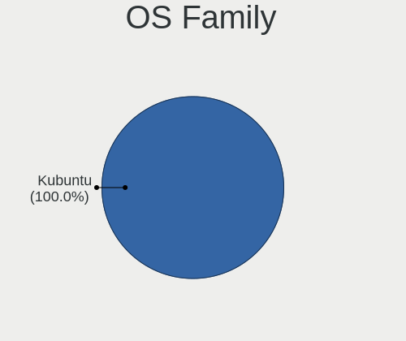
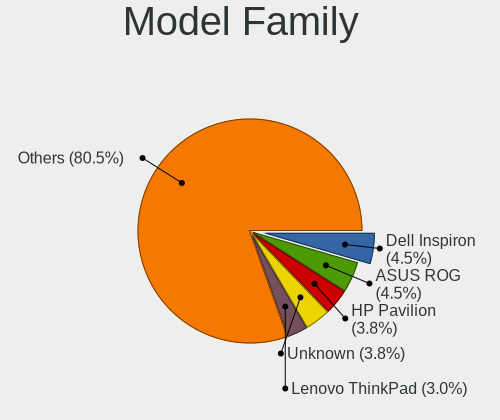
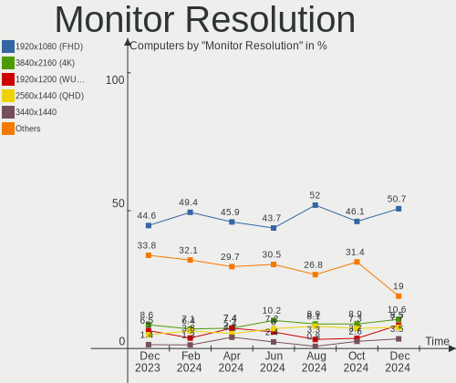
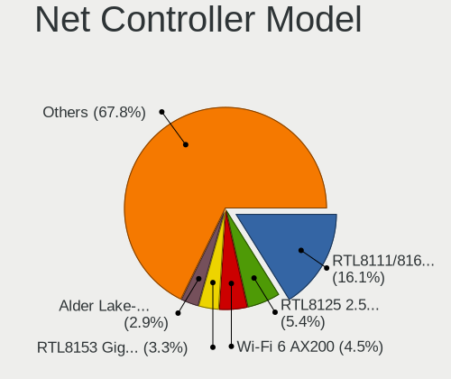
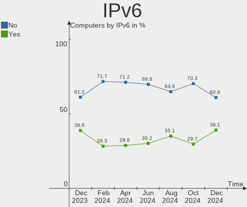
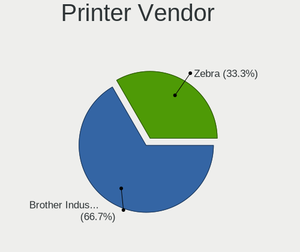

Kubuntu - Hardware Trends
-------------------------

A project to identify most popular hardware characteristics and track their change
over time based on data collected by Linux users at https://Linux-Hardware.org.

Anyone can contribute to this report by the [hw-probe](https://github.com/linuxhw/hw-probe) tool:

    sudo -E hw-probe -all -upload

This is a report for all computer types. See also reports for [desktops](/Dist/Kubuntu/Desktop/README.md) and [notebooks](/Dist/Kubuntu/Notebook/README.md).

This report is for one last month. Overall report since the beginning of time: [TestDays](https://github.com/linuxhw/TestDays)

Period: Jan, 2024.

Contents
--------

* [ System ](#system)
  - [ OS                       ](#os)
  - [ OS Family                ](#os-family)
  - [ Kernel                   ](#kernel)
  - [ Kernel Family            ](#kernel-family)
  - [ Kernel Major Ver.        ](#kernel-major-ver)
  - [ Arch                     ](#arch)
  - [ DE                       ](#de)
  - [ Display Server           ](#display-server)
  - [ Display Manager          ](#display-manager)
  - [ OS Lang                  ](#os-lang)
  - [ Boot Mode                ](#boot-mode)
  - [ Filesystem               ](#filesystem)
  - [ Part. scheme             ](#part-scheme)
  - [ Dual Boot with Linux/BSD ](#dual-boot-with-linuxbsd)
  - [ Dual Boot (Win)          ](#dual-boot-win)

* [ Board ](#board)
  - [ Vendor                   ](#vendor)
  - [ Model                    ](#model)
  - [ Model Family             ](#model-family)
  - [ MFG Year                 ](#mfg-year)
  - [ Form Factor              ](#form-factor)
  - [ Secure Boot              ](#secure-boot)
  - [ Coreboot                 ](#coreboot)
  - [ RAM Size                 ](#ram-size)
  - [ RAM Used                 ](#ram-used)
  - [ Total Drives             ](#total-drives)
  - [ Has CD-ROM               ](#has-cd-rom)
  - [ Has Ethernet             ](#has-ethernet)
  - [ Has WiFi                 ](#has-wifi)
  - [ Has Bluetooth            ](#has-bluetooth)

* [ Location ](#location)
  - [ Country                  ](#country)
  - [ City                     ](#city)

* [ Drives ](#drives)
  - [ Drive Vendor             ](#drive-vendor)
  - [ Drive Model              ](#drive-model)
  - [ HDD Vendor               ](#hdd-vendor)
  - [ SSD Vendor               ](#ssd-vendor)
  - [ Drive Kind               ](#drive-kind)
  - [ Drive Connector          ](#drive-connector)
  - [ Drive Size               ](#drive-size)
  - [ Space Total              ](#space-total)
  - [ Space Used               ](#space-used)
  - [ Malfunc. Drives          ](#malfunc-drives)
  - [ Malfunc. Drive Vendor    ](#malfunc-drive-vendor)
  - [ Malfunc. HDD Vendor      ](#malfunc-hdd-vendor)
  - [ Malfunc. Drive Kind      ](#malfunc-drive-kind)
  - [ Failed Drives            ](#failed-drives)
  - [ Failed Drive Vendor      ](#failed-drive-vendor)
  - [ Drive Status             ](#drive-status)

* [ Storage controller ](#storage-controller)
  - [ Storage Vendor           ](#storage-vendor)
  - [ Storage Model            ](#storage-model)
  - [ Storage Kind             ](#storage-kind)

* [ Processor ](#processor)
  - [ CPU Vendor               ](#cpu-vendor)
  - [ CPU Model                ](#cpu-model)
  - [ CPU Model Family         ](#cpu-model-family)
  - [ CPU Cores                ](#cpu-cores)
  - [ CPU Sockets              ](#cpu-sockets)
  - [ CPU Threads              ](#cpu-threads)
  - [ CPU Op-Modes             ](#cpu-op-modes)
  - [ CPU Microcode            ](#cpu-microcode)
  - [ CPU Microarch            ](#cpu-microarch)

* [ Graphics ](#graphics)
  - [ GPU Vendor               ](#gpu-vendor)
  - [ GPU Model                ](#gpu-model)
  - [ GPU Combo                ](#gpu-combo)
  - [ GPU Driver               ](#gpu-driver)
  - [ GPU Memory               ](#gpu-memory)

* [ Monitor ](#monitor)
  - [ Monitor Vendor           ](#monitor-vendor)
  - [ Monitor Model            ](#monitor-model)
  - [ Monitor Resolution       ](#monitor-resolution)
  - [ Monitor Diagonal         ](#monitor-diagonal)
  - [ Monitor Width            ](#monitor-width)
  - [ Aspect Ratio             ](#aspect-ratio)
  - [ Monitor Area             ](#monitor-area)
  - [ Pixel Density            ](#pixel-density)
  - [ Multiple Monitors        ](#multiple-monitors)

* [ Network ](#network)
  - [ Net Controller Vendor    ](#net-controller-vendor)
  - [ Net Controller Model     ](#net-controller-model)
  - [ Wireless Vendor          ](#wireless-vendor)
  - [ Wireless Model           ](#wireless-model)
  - [ Ethernet Vendor          ](#ethernet-vendor)
  - [ Ethernet Model           ](#ethernet-model)
  - [ Net Controller Kind      ](#net-controller-kind)
  - [ Used Controller          ](#used-controller)
  - [ NICs                     ](#nics)
  - [ IPv6                     ](#ipv6)

* [ Bluetooth ](#bluetooth)
  - [ Bluetooth Vendor         ](#bluetooth-vendor)
  - [ Bluetooth Model          ](#bluetooth-model)

* [ Sound ](#sound)
  - [ Sound Vendor             ](#sound-vendor)
  - [ Sound Model              ](#sound-model)

* [ Memory ](#memory)
  - [ Memory Vendor            ](#memory-vendor)
  - [ Memory Model             ](#memory-model)
  - [ Memory Kind              ](#memory-kind)
  - [ Memory Form Factor       ](#memory-form-factor)
  - [ Memory Size              ](#memory-size)
  - [ Memory Speed             ](#memory-speed)

* [ Printers & scanners ](#printers--scanners)
  - [ Printer Vendor           ](#printer-vendor)
  - [ Printer Model            ](#printer-model)
  - [ Scanner Vendor           ](#scanner-vendor)
  - [ Scanner Model            ](#scanner-model)

* [ Camera ](#camera)
  - [ Camera Vendor            ](#camera-vendor)
  - [ Camera Model             ](#camera-model)

* [ Security ](#security)
  - [ Fingerprint Vendor       ](#fingerprint-vendor)
  - [ Fingerprint Model        ](#fingerprint-model)
  - [ Chipcard Vendor          ](#chipcard-vendor)
  - [ Chipcard Model           ](#chipcard-model)

* [ Unsupported ](#unsupported)
  - [ Unsupported Devices      ](#unsupported-devices)
  - [ Unsupported Device Types ](#unsupported-device-types)

System
------

OS
--

Installed operating systems

| Name          | Computers | Percent |
|---------------|-----------|---------|
| Kubuntu 22.04 | 69        | 46%     |
| Kubuntu 23.10 | 68        | 45.33%  |
| Kubuntu 18.04 | 4         | 2.67%   |
| Kubuntu 24.04 | 3         | 2%      |
| Kubuntu 23.04 | 2         | 1.33%   |
| Kubuntu 20.04 | 2         | 1.33%   |
| Kubuntu 21.10 | 1         | 0.67%   |
| Kubuntu 11    | 1         | 0.67%   |

OS Family
---------

OS without a version

| Name    | Computers | Percent |
|---------|-----------|---------|
| Kubuntu | 150       | 100%    |

Kernel
------

Version of the Linux kernel

| Version                  | Computers | Percent |
|--------------------------|-----------|---------|
| 6.5.0-14-generic         | 53        | 35.33%  |
| 5.15.0-91-generic        | 22        | 14.67%  |
| 6.5.0-15-generic         | 20        | 13.33%  |
| 6.2.0-39-generic         | 13        | 8.67%   |
| 6.5.0-9-generic          | 5         | 3.33%   |
| 6.6.0-14-generic         | 3         | 2%      |
| 6.5.0-14-lowlatency      | 3         | 2%      |
| 5.4.0-150-generic        | 3         | 2%      |
| 6.5.0-17-generic         | 2         | 1.33%   |
| 6.5.0-15-lowlatency      | 2         | 1.33%   |
| 6.5.0-1003-intel-opt     | 2         | 1.33%   |
| 6.2.0-26-generic         | 2         | 1.33%   |
| 5.15.0-75-generic        | 2         | 1.33%   |
| 6.7.1-060701-generic     | 1         | 0.67%   |
| 6.7.1                    | 1         | 0.67%   |
| 6.7.0-060700-generic     | 1         | 0.67%   |
| 6.6.8-060608-generic     | 1         | 0.67%   |
| 6.6.10-1-liquorix-amd64  | 1         | 0.67%   |
| 6.5.0-13-generic         | 1         | 0.67%   |
| 6.2.8-060208-generic     | 1         | 0.67%   |
| 6.2.0-36-generic         | 1         | 0.67%   |
| 6.2.0-1018-lowlatency    | 1         | 0.67%   |
| 6.1.69-t2-jammy          | 1         | 0.67%   |
| 5.4.0-169-generic        | 1         | 0.67%   |
| 5.19.0-38-generic        | 1         | 0.67%   |
| 5.15.0-92-generic        | 1         | 0.67%   |
| 5.15.0-91-lowlatency     | 1         | 0.67%   |
| 5.15.0-89-generic        | 1         | 0.67%   |
| 5.13.0-48-generic        | 1         | 0.67%   |
| 5.10.160-rockchip-rk3588 | 1         | 0.67%   |
| 4.15.0-33-generic        | 1         | 0.67%   |

Kernel Family
-------------

Linux kernel without a distro release

| Version  | Computers | Percent |
|----------|-----------|---------|
| 6.5.0    | 88        | 58.67%  |
| 5.15.0   | 27        | 18%     |
| 6.2.0    | 17        | 11.33%  |
| 5.4.0    | 4         | 2.67%   |
| 6.6.0    | 3         | 2%      |
| 6.7.1    | 2         | 1.33%   |
| 6.7.0    | 1         | 0.67%   |
| 6.6.8    | 1         | 0.67%   |
| 6.6.10   | 1         | 0.67%   |
| 6.2.8    | 1         | 0.67%   |
| 6.1.69   | 1         | 0.67%   |
| 5.19.0   | 1         | 0.67%   |
| 5.13.0   | 1         | 0.67%   |
| 5.10.160 | 1         | 0.67%   |
| 4.15.0   | 1         | 0.67%   |

Kernel Major Ver.
-----------------

Linux kernel major version

| Version | Computers | Percent |
|---------|-----------|---------|
| 6.5     | 88        | 58.67%  |
| 5.15    | 27        | 18%     |
| 6.2     | 18        | 12%     |
| 6.6     | 5         | 3.33%   |
| 5.4     | 4         | 2.67%   |
| 6.7     | 3         | 2%      |
| 6.1     | 1         | 0.67%   |
| 5.19    | 1         | 0.67%   |
| 5.13    | 1         | 0.67%   |
| 5.10    | 1         | 0.67%   |
| 4.15    | 1         | 0.67%   |

Arch
----

OS architecture (x86_64, i586, etc.)

| Name    | Computers | Percent |
|---------|-----------|---------|
| x86_64  | 148       | 98.67%  |
| i686    | 1         | 0.67%   |
| aarch64 | 1         | 0.67%   |

DE
--

Desktop Environment

| Name  | Computers | Percent |
|-------|-----------|---------|
| KDE5  | 145       | 96.67%  |
| KDE   | 4         | 2.67%   |
| Unity | 1         | 0.67%   |

Display Server
--------------

X11 or Wayland

| Name    | Computers | Percent |
|---------|-----------|---------|
| X11     | 130       | 86.67%  |
| Wayland | 15        | 10%     |
| Tty     | 5         | 3.33%   |

Display Manager
---------------

SDDM, LightDM, etc.

| Name    | Computers | Percent |
|---------|-----------|---------|
| SDDM    | 94        | 62.67%  |
| Unknown | 49        | 32.67%  |
| LightDM | 5         | 3.33%   |
| GDM3    | 2         | 1.33%   |

OS Lang
-------

Language

| Lang  | Computers | Percent |
|-------|-----------|---------|
| en_US | 77        | 51.33%  |
| de_DE | 13        | 8.67%   |
| fr_FR | 10        | 6.67%   |
| en_GB | 7         | 4.67%   |
| ru_RU | 6         | 4%      |
| it_IT | 6         | 4%      |
| en_CA | 5         | 3.33%   |
| C     | 4         | 2.67%   |
| en_AU | 3         | 2%      |
| cs_CZ | 3         | 2%      |
| zh_CN | 2         | 1.33%   |
| pl_PL | 2         | 1.33%   |
| en_IN | 2         | 1.33%   |
| de_CH | 2         | 1.33%   |
| sv_SE | 1         | 0.67%   |
| sl_SI | 1         | 0.67%   |
| nl_BE | 1         | 0.67%   |
| es_ES | 1         | 0.67%   |
| es_AR | 1         | 0.67%   |
| en_PH | 1         | 0.67%   |
| en_NG | 1         | 0.67%   |
| el_GR | 1         | 0.67%   |

Boot Mode
---------

EFI or BIOS

| Mode | Computers | Percent |
|------|-----------|---------|
| BIOS | 81        | 54%     |
| EFI  | 69        | 46%     |

Filesystem
----------

Type of filesystem

| Type    | Computers | Percent |
|---------|-----------|---------|
| Ext4    | 107       | 71.33%  |
| Tmpfs   | 31        | 20.67%  |
| Btrfs   | 5         | 3.33%   |
| Xfs     | 2         | 1.33%   |
| Overlay | 2         | 1.33%   |
| Zfs     | 1         | 0.67%   |
| F2fs    | 1         | 0.67%   |
| Unknown | 1         | 0.67%   |

Part. scheme
------------

Scheme of partitioning

| Type    | Computers | Percent |
|---------|-----------|---------|
| GPT     | 95        | 63.33%  |
| Unknown | 47        | 31.33%  |
| MBR     | 8         | 5.33%   |

Dual Boot with Linux/BSD
------------------------

Hosting more than one Linux/BSD

| Dual boot | Computers | Percent |
|-----------|-----------|---------|
| No        | 135       | 90%     |
| Yes       | 15        | 10%     |

Dual Boot (Win)
---------------

Hosting Linux and Windows

| Dual boot | Computers | Percent |
|-----------|-----------|---------|
| No        | 116       | 77.33%  |
| Yes       | 34        | 22.67%  |

Board
-----

Vendor
------

Motherboard manufacturer

| Name                             | Computers | Percent |
|----------------------------------|-----------|---------|
| ASUSTek Computer                 | 26        | 17.33%  |
| Dell                             | 20        | 13.33%  |
| MSI                              | 19        | 12.67%  |
| Hewlett-Packard                  | 18        | 12%     |
| Lenovo                           | 15        | 10%     |
| Acer                             | 8         | 5.33%   |
| Gigabyte Technology              | 7         | 4.67%   |
| Apple                            | 4         | 2.67%   |
| Medion                           | 3         | 2%      |
| Intel                            | 3         | 2%      |
| ASRock                           | 3         | 2%      |
| Unknown                          | 3         | 2%      |
| Samsung Electronics              | 2         | 1.33%   |
| HUAWEI                           | 2         | 1.33%   |
| Google                           | 2         | 1.33%   |
| Biostar                          | 2         | 1.33%   |
| AZW                              | 2         | 1.33%   |
| VALE                             | 1         | 0.67%   |
| Toshiba                          | 1         | 0.67%   |
| System76                         | 1         | 0.67%   |
| Sony                             | 1         | 0.67%   |
| Rockchip                         | 1         | 0.67%   |
| Packard Bell                     | 1         | 0.67%   |
| Micro Computer (HK) Tech Limited | 1         | 0.67%   |
| Mediacom                         | 1         | 0.67%   |
| Infinix                          | 1         | 0.67%   |
| Great Wall                       | 1         | 0.67%   |
| Fujitsu                          | 1         | 0.67%   |

Model
-----

Motherboard model

| Name                                              | Computers | Percent |
|---------------------------------------------------|-----------|---------|
| Unknown                                           | 3         | 2%      |
| MSI MS-7B51                                       | 2         | 1.33%   |
| ASUS TUF Gaming X570-PLUS                         | 2         | 1.33%   |
| ASUS M4A89GTD-PRO/USB3                            | 2         | 1.33%   |
| VALE Notebook Slim S132                           | 1         | 0.67%   |
| Toshiba Satellite P300                            | 1         | 0.67%   |
| System76 Pangolin                                 | 1         | 0.67%   |
| Sony VGN-CS190N                                   | 1         | 0.67%   |
| Samsung RV420/RV520/RV720/E3530/S3530/E3420/E3520 | 1         | 0.67%   |
| Samsung 300E5M/300E5L                             | 1         | 0.67%   |
| Rockchip RK3588 OPi 5 Plus                        | 1         | 0.67%   |
| Packard Bell EasyNote TS11HR                      | 1         | 0.67%   |
| MSI Summit E16Flip A12UCT                         | 1         | 0.67%   |
| MSI MS-7E26                                       | 1         | 0.67%   |
| MSI MS-7D70                                       | 1         | 0.67%   |
| MSI MS-7D43                                       | 1         | 0.67%   |
| MSI MS-7D18                                       | 1         | 0.67%   |
| MSI MS-7D17                                       | 1         | 0.67%   |
| MSI MS-7C96                                       | 1         | 0.67%   |
| MSI MS-7C89                                       | 1         | 0.67%   |
| MSI MS-7B86                                       | 1         | 0.67%   |
| MSI MS-7B78                                       | 1         | 0.67%   |
| MSI MS-7B61                                       | 1         | 0.67%   |
| MSI MS-7B00                                       | 1         | 0.67%   |
| MSI MS-7A38                                       | 1         | 0.67%   |
| MSI MS-7673                                       | 1         | 0.67%   |
| MSI Creator Z17 A12UGST                           | 1         | 0.67%   |
| MSI Creator M16 A12UC                             | 1         | 0.67%   |
| MSI 500-056                                       | 1         | 0.67%   |
| Micro (HK) Tech Limited Venus series              | 1         | 0.67%   |
| Medion S14409                                     | 1         | 0.67%   |
| Medion MS-7800                                    | 1         | 0.67%   |
| Medion Akoya P2120 D MD8836/2452                  | 1         | 0.67%   |
| Mediacom WinPad 11,6 FullHD- WPU11                | 1         | 0.67%   |
| Lenovo Yoga Slim 7 Pro 14ARH7 82UU                | 1         | 0.67%   |
| Lenovo V15 G3 IAP 82TT                            | 1         | 0.67%   |
| Lenovo ThinkStation P720 30BBS4RV00               | 1         | 0.67%   |
| Lenovo ThinkPad X230 2325BA3                      | 1         | 0.67%   |
| Lenovo ThinkPad Twist 334729G                     | 1         | 0.67%   |
| Lenovo ThinkPad T495 20NJ000XIX                   | 1         | 0.67%   |

Model Family
------------

Motherboard model prefix

| Name                  | Computers | Percent |
|-----------------------|-----------|---------|
| Lenovo ThinkPad       | 8         | 5.33%   |
| Dell Latitude         | 7         | 4.67%   |
| Dell Inspiron         | 6         | 4%      |
| ASUS ROG              | 6         | 4%      |
| ASUS VivoBook         | 5         | 3.33%   |
| Acer Aspire           | 5         | 3.33%   |
| HP ProBook            | 3         | 2%      |
| HP EliteBook          | 3         | 2%      |
| Dell OptiPlex         | 3         | 2%      |
| ASUS TUF              | 3         | 2%      |
| ASUS PRIME            | 3         | 2%      |
| Unknown               | 3         | 2%      |
| MSI MS-7B51           | 2         | 1.33%   |
| MSI Creator           | 2         | 1.33%   |
| Lenovo IdeaPad        | 2         | 1.33%   |
| HP Pavilion           | 2         | 1.33%   |
| HP OMEN               | 2         | 1.33%   |
| HP Laptop             | 2         | 1.33%   |
| Dell XPS              | 2         | 1.33%   |
| ASUS SABERTOOTH       | 2         | 1.33%   |
| ASUS M4A89GTD-PRO     | 2         | 1.33%   |
| VALE Notebook         | 1         | 0.67%   |
| Toshiba Satellite     | 1         | 0.67%   |
| System76 Pangolin     | 1         | 0.67%   |
| Sony VGN-CS190N       | 1         | 0.67%   |
| Samsung RV420         | 1         | 0.67%   |
| Samsung 300E5M        | 1         | 0.67%   |
| Rockchip RK3588       | 1         | 0.67%   |
| Packard Bell EasyNote | 1         | 0.67%   |
| MSI Summit            | 1         | 0.67%   |
| MSI MS-7E26           | 1         | 0.67%   |
| MSI MS-7D70           | 1         | 0.67%   |
| MSI MS-7D43           | 1         | 0.67%   |
| MSI MS-7D18           | 1         | 0.67%   |
| MSI MS-7D17           | 1         | 0.67%   |
| MSI MS-7C96           | 1         | 0.67%   |
| MSI MS-7C89           | 1         | 0.67%   |
| MSI MS-7B86           | 1         | 0.67%   |
| MSI MS-7B78           | 1         | 0.67%   |
| MSI MS-7B61           | 1         | 0.67%   |

MFG Year
--------

Motherboard manufacture year

| Year    | Computers | Percent |
|---------|-----------|---------|
| 2022    | 21        | 14%     |
| 2021    | 16        | 10.67%  |
| 2019    | 16        | 10.67%  |
| 2023    | 14        | 9.33%   |
| 2020    | 13        | 8.67%   |
| 2017    | 10        | 6.67%   |
| 2012    | 10        | 6.67%   |
| 2011    | 10        | 6.67%   |
| 2018    | 8         | 5.33%   |
| 2014    | 8         | 5.33%   |
| 2015    | 5         | 3.33%   |
| 2016    | 4         | 2.67%   |
| 2013    | 4         | 2.67%   |
| 2010    | 4         | 2.67%   |
| 2008    | 3         | 2%      |
| 2007    | 2         | 1.33%   |
| 2009    | 1         | 0.67%   |
| Unknown | 1         | 0.67%   |

Form Factor
-----------

Physical design of the computer

| Name           | Computers | Percent |
|----------------|-----------|---------|
| Notebook       | 76        | 50.67%  |
| Desktop        | 63        | 42%     |
| Convertible    | 3         | 2%      |
| Tablet         | 2         | 1.33%   |
| Mini pc        | 2         | 1.33%   |
| All in one     | 2         | 1.33%   |
| System on chip | 1         | 0.67%   |
| Server         | 1         | 0.67%   |

Secure Boot
-----------

Enabled or disabled

| State    | Computers | Percent |
|----------|-----------|---------|
| Disabled | 139       | 92.67%  |
| Enabled  | 11        | 7.33%   |

Coreboot
--------

Have coreboot on board

| Used | Computers | Percent |
|------|-----------|---------|
| No   | 148       | 98.67%  |
| Yes  | 2         | 1.33%   |

RAM Size
--------

Total RAM memory

| Size in GB  | Computers | Percent |
|-------------|-----------|---------|
| 8.01-16.0   | 40        | 26.67%  |
| 4.01-8.0    | 32        | 21.33%  |
| 32.01-64.0  | 29        | 19.33%  |
| 16.01-24.0  | 27        | 18%     |
| 3.01-4.0    | 8         | 5.33%   |
| 64.01-256.0 | 7         | 4.67%   |
| 24.01-32.0  | 4         | 2.67%   |
| 1.01-2.0    | 3         | 2%      |

RAM Used
--------

Used RAM memory

| Used GB    | Computers | Percent |
|------------|-----------|---------|
| 4.01-8.0   | 42        | 28%     |
| 1.01-2.0   | 32        | 21.33%  |
| 3.01-4.0   | 31        | 20.67%  |
| 2.01-3.0   | 27        | 18%     |
| 8.01-16.0  | 11        | 7.33%   |
| 16.01-24.0 | 3         | 2%      |
| 0.51-1.0   | 2         | 1.33%   |
| 32.01-64.0 | 1         | 0.67%   |
| 24.01-32.0 | 1         | 0.67%   |

Total Drives
------------

Number of drives on board

| Drives | Computers | Percent |
|--------|-----------|---------|
| 1      | 86        | 57.33%  |
| 2      | 36        | 24%     |
| 3      | 10        | 6.67%   |
| 4      | 8         | 5.33%   |
| 5      | 5         | 3.33%   |
| 11     | 1         | 0.67%   |
| 9      | 1         | 0.67%   |
| 8      | 1         | 0.67%   |
| 7      | 1         | 0.67%   |
| 6      | 1         | 0.67%   |

Has CD-ROM
----------

Has CD-ROM on board

| Presented | Computers | Percent |
|-----------|-----------|---------|
| No        | 109       | 72.67%  |
| Yes       | 41        | 27.33%  |

Has Ethernet
------------

Has Ethernet on board

| Presented | Computers | Percent |
|-----------|-----------|---------|
| Yes       | 124       | 82.67%  |
| No        | 26        | 17.33%  |

Has WiFi
--------

Has WiFi module

| Presented | Computers | Percent |
|-----------|-----------|---------|
| Yes       | 119       | 79.33%  |
| No        | 31        | 20.67%  |

Has Bluetooth
-------------

Has Bluetooth module

| Presented | Computers | Percent |
|-----------|-----------|---------|
| Yes       | 103       | 68.67%  |
| No        | 47        | 31.33%  |

Location
--------

Country
-------

Geographic location (country)

| Country     | Computers | Percent |
|-------------|-----------|---------|
| USA         | 41        | 27.33%  |
| Germany     | 17        | 11.33%  |
| France      | 11        | 7.33%   |
| Russia      | 9         | 6%      |
| UK          | 8         | 5.33%   |
| Italy       | 8         | 5.33%   |
| Canada      | 5         | 3.33%   |
| Brazil      | 4         | 2.67%   |
| Switzerland | 3         | 2%      |
| Poland      | 3         | 2%      |
| Austria     | 3         | 2%      |
| Australia   | 3         | 2%      |
| Argentina   | 3         | 2%      |
| Sweden      | 2         | 1.33%   |
| Spain       | 2         | 1.33%   |
| India       | 2         | 1.33%   |
| Czechia     | 2         | 1.33%   |
| China       | 2         | 1.33%   |
| Vietnam     | 1         | 0.67%   |
| Venezuela   | 1         | 0.67%   |
| Turkey      | 1         | 0.67%   |
| Thailand    | 1         | 0.67%   |
| Slovenia    | 1         | 0.67%   |
| Portugal    | 1         | 0.67%   |
| Philippines | 1         | 0.67%   |
| Peru        | 1         | 0.67%   |
| Paraguay    | 1         | 0.67%   |
| Nigeria     | 1         | 0.67%   |
| Mexico      | 1         | 0.67%   |
| Mauritius   | 1         | 0.67%   |
| Ireland     | 1         | 0.67%   |
| Iran        | 1         | 0.67%   |
| Hungary     | 1         | 0.67%   |
| Greece      | 1         | 0.67%   |
| Finland     | 1         | 0.67%   |
| Egypt       | 1         | 0.67%   |
| Cyprus      | 1         | 0.67%   |
| Belgium     | 1         | 0.67%   |
| Belarus     | 1         | 0.67%   |
| Bangladesh  | 1         | 0.67%   |

City
----

Geographic location (city)

| City                 | Computers | Percent |
|----------------------|-----------|---------|
| Victoria             | 3         | 2%      |
| Hamburg              | 3         | 2%      |
| Warsaw               | 2         | 1.33%   |
| Vienna               | 2         | 1.33%   |
| Pardubice            | 2         | 1.33%   |
| Moscow               | 2         | 1.33%   |
| Medford              | 2         | 1.33%   |
| Denver               | 2         | 1.33%   |
| Buenos Aires         | 2         | 1.33%   |
| Bensheim             | 2         | 1.33%   |
| Zogno                | 1         | 0.67%   |
| Zhaoqing             | 1         | 0.67%   |
| Wolverhampton        | 1         | 0.67%   |
| Wil                  | 1         | 0.67%   |
| West Valley City     | 1         | 0.67%   |
| Vidnoye              | 1         | 0.67%   |
| Valrico              | 1         | 0.67%   |
| Valer’yanovo       | 1         | 0.67%   |
| Vaihingen an der Enz | 1         | 0.67%   |
| Tulsa                | 1         | 0.67%   |
| Trout Creek          | 1         | 0.67%   |
| Tomsk                | 1         | 0.67%   |
| Tlalpan              | 1         | 0.67%   |
| Thessaloniki         | 1         | 0.67%   |
| Tampere              | 1         | 0.67%   |
| Sydney               | 1         | 0.67%   |
| Surgut               | 1         | 0.67%   |
| Stockholm            | 1         | 0.67%   |
| Stade                | 1         | 0.67%   |
| St Louis             | 1         | 0.67%   |
| Şişli              | 1         | 0.67%   |
| Silver Spring        | 1         | 0.67%   |
| Shinnston            | 1         | 0.67%   |
| Sherpur              | 1         | 0.67%   |
| Shenzhen             | 1         | 0.67%   |
| Santa Cruz           | 1         | 0.67%   |
| San Francisco        | 1         | 0.67%   |
| San Antonio          | 1         | 0.67%   |
| Salem                | 1         | 0.67%   |
| Saint-Raphaël       | 1         | 0.67%   |

Drives
------

Drive Vendor
------------

Hard drive vendors

| Vendor                       | Computers | Drives | Percent |
|------------------------------|-----------|--------|---------|
| Samsung Electronics          | 42        | 61     | 17.65%  |
| WDC                          | 23        | 40     | 9.66%   |
| Seagate                      | 23        | 29     | 9.66%   |
| SanDisk                      | 16        | 17     | 6.72%   |
| Kingston                     | 14        | 15     | 5.88%   |
| Unknown                      | 11        | 13     | 4.62%   |
| SK hynix                     | 11        | 11     | 4.62%   |
| Crucial                      | 11        | 11     | 4.62%   |
| Toshiba                      | 9         | 10     | 3.78%   |
| Intel                        | 6         | 6      | 2.52%   |
| Silicon Motion               | 5         | 5      | 2.1%    |
| Micron Technology            | 5         | 5      | 2.1%    |
| Hitachi                      | 4         | 4      | 1.68%   |
| A-DATA Technology            | 4         | 4      | 1.68%   |
| Patriot                      | 3         | 3      | 1.26%   |
| MAXIO Technology (Hangzhou)  | 3         | 4      | 1.26%   |
| KIOXIA                       | 3         | 3      | 1.26%   |
| Kingston Technology Company  | 3         | 4      | 1.26%   |
| HGST                         | 3         | 3      | 1.26%   |
| Apple                        | 3         | 4      | 1.26%   |
| Transcend                    | 2         | 2      | 0.84%   |
| SPCC                         | 2         | 2      | 0.84%   |
| Shenzhen Longsys Electronics | 2         | 2      | 0.84%   |
| SABRENT                      | 2         | 2      | 0.84%   |
| Realtek                      | 2         | 2      | 0.84%   |
| PNY                          | 2         | 2      | 0.84%   |
| Phison Electronics           | 2         | 3      | 0.84%   |
| Micron/Crucial Technology    | 2         | 2      | 0.84%   |
| Lexar                        | 2         | 2      | 0.84%   |
| Intenso                      | 2         | 2      | 0.84%   |
| Unknown                      | 2         | 2      | 0.84%   |
| WD MediaMax                  | 1         | 1      | 0.42%   |
| UMIS                         | 1         | 1      | 0.42%   |
| SMI                          | 1         | 1      | 0.42%   |
| Realtek Semiconductor        | 1         | 1      | 0.42%   |
| Plextor                      | 1         | 1      | 0.42%   |
| Maxtor                       | 1         | 1      | 0.42%   |
| Mass                         | 1         | 1      | 0.42%   |
| KingSpec                     | 1         | 1      | 0.42%   |
| GOODRAM                      | 1         | 1      | 0.42%   |

Drive Model
-----------

Hard drive models

| Model                                                 | Computers | Percent |
|-------------------------------------------------------|-----------|---------|
| Samsung NVMe SSD Controller PM9A1/PM9A3/980PRO 2TB    | 6         | 2.19%   |
| SanDisk NVMe SSD Drive 2TB                            | 3         | 1.09%   |
| Samsung SSD 870 EVO 1TB                               | 3         | 1.09%   |
| Samsung NVMe SSD Controller SM981/PM981/PM983 1TB     | 3         | 1.09%   |
| Kingston SA400S37480G 480GB SSD                       | 3         | 1.09%   |
| WDC WD40EFRX-68WT0N0 4TB                              | 2         | 0.73%   |
| WDC WD10EZEX-08WN4A0 1TB                              | 2         | 0.73%   |
| WDC WD1003FZEX-00K3CA0 1TB                            | 2         | 0.73%   |
| Unknown MMC Card  32GB                                | 2         | 0.73%   |
| Toshiba MQ01ABD100 1TB                                | 2         | 0.73%   |
| SK hynix BC501 NVMe Solid State Drive 512GB           | 2         | 0.73%   |
| Silicon Motion SM2263EN/SM2263XT SSD Controller 128GB | 2         | 0.73%   |
| Silicon Motion PCIe-8 SSD 512GB                       | 2         | 0.73%   |
| Seagate ST31000528AS 1TB                              | 2         | 0.73%   |
| Seagate ST2000DM008-2FR102 2TB                        | 2         | 0.73%   |
| Samsung SSD 980 PRO 1TB                               | 2         | 0.73%   |
| Samsung SSD 870 QVO 4TB                               | 2         | 0.73%   |
| Samsung SSD 870 QVO 2TB                               | 2         | 0.73%   |
| Samsung SSD 860 QVO 1TB                               | 2         | 0.73%   |
| Samsung SSD 860 EVO 500GB                             | 2         | 0.73%   |
| Samsung SSD 850 EVO 500GB                             | 2         | 0.73%   |
| Samsung MZVL21T0HCLR-00B00 1TB                        | 2         | 0.73%   |
| SABRENT Disk 500GB                                    | 2         | 0.73%   |
| Realtek RTL9210B-CG 1024GB                            | 2         | 0.73%   |
| Micron/Crucial P2 NVMe PCIe SSD 1TB                   | 2         | 0.73%   |
| Micron 2450_MTFDKBA512TFK 512GB                       | 2         | 0.73%   |
| MAXIO (Hangzhou) NVMe SSD Controller MAP1202 512GB    | 2         | 0.73%   |
| Kingston Company SNV2S1000G 1TB                       | 2         | 0.73%   |
| Kingston SA400S37960G 960GB SSD                       | 2         | 0.73%   |
| Crucial CT500MX500SSD1 500GB                          | 2         | 0.73%   |
| Crucial CT1000MX500SSD1 1TB                           | 2         | 0.73%   |
| Unknown                                               | 2         | 0.73%   |
| WDC WDS500G1B0B-00AS40 500GB SSD                      | 1         | 0.36%   |
| WDC WDS480G2G0C-00AJM0 480GB                          | 1         | 0.36%   |
| WDC WDS200T2B0A-00SM50 2TB SSD                        | 1         | 0.36%   |
| WDC WD80EAZZ-00BKLB0 8TB                              | 1         | 0.36%   |
| WDC WD5000LPVT-75G33T0 500GB                          | 1         | 0.36%   |
| WDC WD5000LPCX-24C6HT0 500GB                          | 1         | 0.36%   |
| WDC WD5000AAKX-001CA0 500GB                           | 1         | 0.36%   |
| WDC WD40EZRZ-00WN9B0 4TB                              | 1         | 0.36%   |

HDD Vendor
----------

Hard disk drive vendors

| Vendor              | Computers | Drives | Percent |
|---------------------|-----------|--------|---------|
| Seagate             | 22        | 28     | 36.67%  |
| WDC                 | 18        | 34     | 30%     |
| Toshiba             | 8         | 9      | 13.33%  |
| Hitachi             | 4         | 4      | 6.67%   |
| HGST                | 3         | 3      | 5%      |
| Samsung Electronics | 2         | 2      | 3.33%   |
| Unknown             | 1         | 1      | 1.67%   |
| Maxtor              | 1         | 1      | 1.67%   |
| External            | 1         | 1      | 1.67%   |

SSD Vendor
----------

Solid state drive vendors

| Vendor              | Computers | Drives | Percent |
|---------------------|-----------|--------|---------|
| Samsung Electronics | 21        | 28     | 25.3%   |
| Kingston            | 10        | 10     | 12.05%  |
| Crucial             | 10        | 10     | 12.05%  |
| SanDisk             | 6         | 6      | 7.23%   |
| Intel               | 4         | 4      | 4.82%   |
| A-DATA Technology   | 4         | 4      | 4.82%   |
| WDC                 | 3         | 4      | 3.61%   |
| SK hynix            | 3         | 3      | 3.61%   |
| Patriot             | 3         | 3      | 3.61%   |
| Transcend           | 2         | 2      | 2.41%   |
| SABRENT             | 2         | 2      | 2.41%   |
| PNY                 | 2         | 2      | 2.41%   |
| Lexar               | 2         | 2      | 2.41%   |
| SPCC                | 1         | 1      | 1.2%    |
| Seagate             | 1         | 1      | 1.2%    |
| Plextor             | 1         | 1      | 1.2%    |
| Micron Technology   | 1         | 1      | 1.2%    |
| KingSpec            | 1         | 1      | 1.2%    |
| Intenso             | 1         | 1      | 1.2%    |
| GOODRAM             | 1         | 1      | 1.2%    |
| FORESEE             | 1         | 1      | 1.2%    |
| Corsair             | 1         | 1      | 1.2%    |
| Apple               | 1         | 1      | 1.2%    |
| Unknown             | 1         | 1      | 1.2%    |

Drive Kind
----------

HDD or SSD

| Kind    | Computers | Drives | Percent |
|---------|-----------|--------|---------|
| NVMe    | 81        | 99     | 37.33%  |
| SSD     | 71        | 91     | 32.72%  |
| HDD     | 50        | 83     | 23.04%  |
| MMC     | 9         | 10     | 4.15%   |
| Unknown | 6         | 6      | 2.76%   |

Drive Connector
---------------

SATA, SAS, NVMe, etc.

| Type | Computers | Drives | Percent |
|------|-----------|--------|---------|
| SATA | 91        | 165    | 46.67%  |
| NVMe | 80        | 97     | 41.03%  |
| SAS  | 15        | 17     | 7.69%   |
| MMC  | 9         | 10     | 4.62%   |

Drive Size
----------

Size of hard drive

| Size in TB | Computers | Drives | Percent |
|------------|-----------|--------|---------|
| 0.01-0.5   | 66        | 79     | 49.25%  |
| 0.51-1.0   | 34        | 48     | 25.37%  |
| 1.01-2.0   | 16        | 20     | 11.94%  |
| 3.01-4.0   | 8         | 15     | 5.97%   |
| 4.01-10.0  | 5         | 6      | 3.73%   |
| 2.01-3.0   | 3         | 4      | 2.24%   |
| 10.01-20.0 | 2         | 2      | 1.49%   |

Space Total
-----------

Amount of disk space available on the file system

| Size in GB     | Computers | Percent |
|----------------|-----------|---------|
| 251-500        | 35        | 23.33%  |
| 501-1000       | 34        | 22.67%  |
| 101-250        | 33        | 22%     |
| 1001-2000      | 18        | 12%     |
| More than 3000 | 13        | 8.67%   |
| 51-100         | 6         | 4%      |
| 2001-3000      | 4         | 2.67%   |
| 1-20           | 4         | 2.67%   |
| 21-50          | 2         | 1.33%   |
| Unknown        | 1         | 0.67%   |

Space Used
----------

Amount of used disk space

| Used GB        | Computers | Percent |
|----------------|-----------|---------|
| 1-20           | 30        | 20%     |
| 21-50          | 29        | 19.33%  |
| 101-250        | 25        | 16.67%  |
| 251-500        | 19        | 12.67%  |
| 501-1000       | 16        | 10.67%  |
| 51-100         | 16        | 10.67%  |
| More than 3000 | 6         | 4%      |
| 1001-2000      | 6         | 4%      |
| 2001-3000      | 2         | 1.33%   |
| Unknown        | 1         | 0.67%   |

Malfunc. Drives
---------------

Drive models with a malfunction

| Model                                        | Computers | Drives | Percent |
|----------------------------------------------|-----------|--------|---------|
| WDC WD5000LPCX-24C6HT0 500GB                 | 1         | 1      | 6.25%   |
| WDC WD40EZRZ-00WN9B0 4TB                     | 1         | 1      | 6.25%   |
| WDC WD40EFAX-68JH4N1 4TB                     | 1         | 4      | 6.25%   |
| WDC WD3200JD-22KLB0 320GB                    | 1         | 1      | 6.25%   |
| WDC WD20EARX-00PASB0 2TB                     | 1         | 1      | 6.25%   |
| WDC WD1001FALS-40U9B0 1TB                    | 1         | 1      | 6.25%   |
| SK hynix SC210 mSATA 256GB SSD               | 1         | 1      | 6.25%   |
| Seagate ST3320620AS 320GB                    | 1         | 1      | 6.25%   |
| Seagate ST31000340AS 1TB                     | 1         | 1      | 6.25%   |
| Seagate ST1000LM024 HN-M101MBB 1TB           | 1         | 1      | 6.25%   |
| Samsung Electronics SSD 870 EVO 1TB          | 1         | 1      | 6.25%   |
| Samsung Electronics SSD 840 PRO Series 256GB | 1         | 2      | 6.25%   |
| Samsung Electronics HD501LJ 500GB            | 1         | 1      | 6.25%   |
| Maxtor STM3250310AS 250GB                    | 1         | 1      | 6.25%   |
| HGST HTS545050A7E680 500GB                   | 1         | 1      | 6.25%   |
| Crucial CT128MX100SSD1 128GB                 | 1         | 1      | 6.25%   |

Malfunc. Drive Vendor
---------------------

Vendors of faulty drives

| Vendor              | Computers | Drives | Percent |
|---------------------|-----------|--------|---------|
| WDC                 | 4         | 9      | 28.57%  |
| Seagate             | 3         | 3      | 21.43%  |
| Samsung Electronics | 3         | 4      | 21.43%  |
| SK hynix            | 1         | 1      | 7.14%   |
| Maxtor              | 1         | 1      | 7.14%   |
| HGST                | 1         | 1      | 7.14%   |
| Crucial             | 1         | 1      | 7.14%   |

Malfunc. HDD Vendor
-------------------

Vendors of faulty HDD drives

| Vendor              | Computers | Drives | Percent |
|---------------------|-----------|--------|---------|
| WDC                 | 4         | 9      | 40%     |
| Seagate             | 3         | 3      | 30%     |
| Samsung Electronics | 1         | 1      | 10%     |
| Maxtor              | 1         | 1      | 10%     |
| HGST                | 1         | 1      | 10%     |

Malfunc. Drive Kind
-------------------

Kinds of faulty drives

| Kind | Computers | Drives | Percent |
|------|-----------|--------|---------|
| HDD  | 10        | 15     | 71.43%  |
| SSD  | 4         | 5      | 28.57%  |

Failed Drives
-------------

Failed drive models

Zero info for selected period =(

Failed Drive Vendor
-------------------

Failed drive vendors

Zero info for selected period =(

Drive Status
------------

Number of failed and malfunc. drives

| Status   | Computers | Drives | Percent |
|----------|-----------|--------|---------|
| Detected | 89        | 152    | 52.98%  |
| Works    | 67        | 117    | 39.88%  |
| Malfunc  | 12        | 20     | 7.14%   |

Storage controller
------------------

Storage Vendor
--------------

Storage controller vendors

| Vendor                                  | Computers | Percent |
|-----------------------------------------|-----------|---------|
| Intel                                   | 83        | 39.34%  |
| AMD                                     | 35        | 16.59%  |
| Samsung Electronics                     | 25        | 11.85%  |
| SanDisk                                 | 12        | 5.69%   |
| SK hynix                                | 8         | 3.79%   |
| Kingston Technology Company             | 8         | 3.79%   |
| Silicon Motion                          | 5         | 2.37%   |
| Micron Technology                       | 4         | 1.9%    |
| JMicron Technology                      | 4         | 1.9%    |
| Phison Electronics                      | 3         | 1.42%   |
| Micron/Crucial Technology               | 3         | 1.42%   |
| MAXIO Technology (Hangzhou)             | 3         | 1.42%   |
| Toshiba America Info Systems            | 2         | 0.95%   |
| Shenzhen Longsys Electronics            | 2         | 0.95%   |
| Realtek Semiconductor                   | 2         | 0.95%   |
| KIOXIA                                  | 2         | 0.95%   |
| ASMedia Technology                      | 2         | 0.95%   |
| Apple                                   | 2         | 0.95%   |
| Zhaoxin                                 | 1         | 0.47%   |
| Union Memory (Shenzhen)                 | 1         | 0.47%   |
| Silicon Image                           | 1         | 0.47%   |
| Marvell Technology Group                | 1         | 0.47%   |
| Jiangsu Xinsheng Intelligent Technology | 1         | 0.47%   |
| ADATA Technology                        | 1         | 0.47%   |

Storage Model
-------------

Storage controller models

| Model                                                                          | Computers | Percent |
|--------------------------------------------------------------------------------|-----------|---------|
| AMD FCH SATA Controller [AHCI mode]                                            | 25        | 10.64%  |
| Samsung NVMe SSD Controller PM9A1/PM9A3/980PRO                                 | 12        | 5.11%   |
| Samsung NVMe SSD Controller SM981/PM981/PM983                                  | 9         | 3.83%   |
| Intel 7 Series Chipset Family 6-port SATA Controller [AHCI mode]               | 9         | 3.83%   |
| Intel 7 Series/C210 Series Chipset Family 6-port SATA Controller [AHCI mode]   | 5         | 2.13%   |
| Samsung NVMe SSD Controller 980 (DRAM-less)                                    | 4         | 1.7%    |
| Intel Sunrise Point-LP SATA Controller [AHCI mode]                             | 4         | 1.7%    |
| Intel SATA Controller [RAID mode]                                              | 4         | 1.7%    |
| Intel Alder Lake-P SATA AHCI Controller                                        | 4         | 1.7%    |
| Intel 82801 Mobile SATA Controller [RAID mode]                                 | 4         | 1.7%    |
| Intel 8 Series/C220 Series Chipset Family 6-port SATA Controller 1 [AHCI mode] | 4         | 1.7%    |
| AMD 600 Series Chipset SATA Controller                                         | 4         | 1.7%    |
| AMD 400 Series Chipset SATA Controller                                         | 4         | 1.7%    |
| Sandisk WD Black SN850X NVMe SSD                                               | 3         | 1.28%   |
| Micron/Crucial P2 [Nick P2] / P3 / P3 Plus NVMe PCIe SSD (DRAM-less)           | 3         | 1.28%   |
| Micron 2450 NVMe SSD [HendrixV] (DRAM-less)                                    | 3         | 1.28%   |
| Kingston Company NV2 NVMe SSD SM2267XT (DRAM-less)                             | 3         | 1.28%   |
| Intel Q170/Q150/B150/H170/H110/Z170/CM236 Chipset SATA Controller [AHCI Mode]  | 3         | 1.28%   |
| Intel Ice Lake-LP SATA Controller [AHCI mode]                                  | 3         | 1.28%   |
| Intel 82801IBM/IEM (ICH9M/ICH9M-E) 4 port SATA Controller [AHCI mode]          | 3         | 1.28%   |
| Intel 6 Series/C200 Series Chipset Family 6 port Mobile SATA AHCI Controller   | 3         | 1.28%   |
| Intel 500 Series Chipset Family SATA AHCI Controller                           | 3         | 1.28%   |
| Intel 400 Series Chipset Family SATA AHCI Controller                           | 3         | 1.28%   |
| AMD 500 Series Chipset SATA Controller                                         | 3         | 1.28%   |
| SK hynix Gold P31/BC711/PC711 NVMe Solid State Drive                           | 2         | 0.85%   |
| SK hynix BC511 NVMe SSD                                                        | 2         | 0.85%   |
| SK hynix BC501 NVMe Solid State Drive                                          | 2         | 0.85%   |
| Silicon Motion SM2263EN/SM2263XT (DRAM-less) NVMe SSD Controllers              | 2         | 0.85%   |
| Silicon Motion Non-Volatile memory controller                                  | 2         | 0.85%   |
| Sandisk WD PC SN740 NVMe SSD 512GB (DRAM-less)                                 | 2         | 0.85%   |
| SanDisk Ultra 3D / WD Blue SN550 NVMe SSD                                      | 2         | 0.85%   |
| Realtek RTS5765DL NVMe SSD Controller (DRAM-less)                              | 2         | 0.85%   |
| MAXIO (Hangzhou) NVMe SSD Controller MAP1202 (DRAM-less)                       | 2         | 0.85%   |
| KIOXIA NVMe SSD Controller BG4 (DRAM-less)                                     | 2         | 0.85%   |
| Kingston Company KC3000/FURY Renegade NVMe SSD E18                             | 2         | 0.85%   |
| Kingston Company A2000 NVMe SSD SM2263EN                                       | 2         | 0.85%   |
| JMicron JMB368 IDE controller                                                  | 2         | 0.85%   |
| JMicron JMB361 AHCI/IDE                                                        | 2         | 0.85%   |
| Intel Volume Management Device NVMe RAID Controller Intel Corporation          | 2         | 0.85%   |
| Intel Volume Management Device NVMe RAID Controller                            | 2         | 0.85%   |

Storage Kind
------------

Kind of storage controller (IDE, SATA, NVMe, SAS, ...)

| Kind | Computers | Percent |
|------|-----------|---------|
| SATA | 104       | 51.23%  |
| NVMe | 79        | 38.92%  |
| RAID | 13        | 6.4%    |
| IDE  | 7         | 3.45%   |

Processor
---------

CPU Vendor
----------

Processor vendors

| Vendor       | Computers | Percent |
|--------------|-----------|---------|
| Intel        | 104       | 69.33%  |
| AMD          | 44        | 29.33%  |
| CentaurHauls | 1         | 0.67%   |
| ARM          | 1         | 0.67%   |

CPU Model
---------

Processor models

| Model                                    | Computers | Percent |
|------------------------------------------|-----------|---------|
| Intel 11th Gen Core i5-1135G7 @ 2.40GHz  | 4         | 2.67%   |
| Intel Core i7-1065G7 CPU @ 1.30GHz       | 3         | 2%      |
| Intel Core i5-3210M CPU @ 2.50GHz        | 3         | 2%      |
| AMD Ryzen 7 5700U with Radeon Graphics   | 3         | 2%      |
| AMD Ryzen 5 3600 6-Core Processor        | 3         | 2%      |
| Intel Pentium CPU N4200 @ 1.10GHz        | 2         | 1.33%   |
| Intel Core i7-3770 CPU @ 3.40GHz         | 2         | 1.33%   |
| Intel Core i5-2500K CPU @ 3.30GHz        | 2         | 1.33%   |
| Intel Core i5-2410M CPU @ 2.30GHz        | 2         | 1.33%   |
| Intel 13th Gen Core i7-1355U             | 2         | 1.33%   |
| Intel 12th Gen Core i7-12700H            | 2         | 1.33%   |
| Intel 12th Gen Core i5-1245U             | 2         | 1.33%   |
| Intel 12th Gen Core i5-1240P             | 2         | 1.33%   |
| AMD Ryzen 7 3700X 8-Core Processor       | 2         | 1.33%   |
| AMD Ryzen 7 2700X Eight-Core Processor   | 2         | 1.33%   |
| AMD Ryzen 5 2600 Six-Core Processor      | 2         | 1.33%   |
| Intel Xeon Gold 5118 CPU @ 2.30GHz       | 1         | 0.67%   |
| Intel Xeon CPU E5-1680 v2 @ 3.00GHz      | 1         | 0.67%   |
| Intel Pentium Silver N5000 CPU @ 1.10GHz | 1         | 0.67%   |
| Intel Pentium Gold G6400 CPU @ 4.00GHz   | 1         | 0.67%   |
| Intel Pentium CPU G645 @ 2.90GHz         | 1         | 0.67%   |
| Intel N100                               | 1         | 0.67%   |
| Intel Core i7-9750H CPU @ 2.60GHz        | 1         | 0.67%   |
| Intel Core i7-9700 CPU @ 3.00GHz         | 1         | 0.67%   |
| Intel Core i7-8700 CPU @ 3.20GHz         | 1         | 0.67%   |
| Intel Core i7-8650U CPU @ 1.90GHz        | 1         | 0.67%   |
| Intel Core i7-7500U CPU @ 2.70GHz        | 1         | 0.67%   |
| Intel Core i7-4790 CPU @ 3.60GHz         | 1         | 0.67%   |
| Intel Core i7-4770 CPU @ 3.40GHz         | 1         | 0.67%   |
| Intel Core i7-3740QM CPU @ 2.70GHz       | 1         | 0.67%   |
| Intel Core i7-3630QM CPU @ 2.40GHz       | 1         | 0.67%   |
| Intel Core i7-3540M CPU @ 3.00GHz        | 1         | 0.67%   |
| Intel Core i7-3517U CPU @ 1.90GHz        | 1         | 0.67%   |
| Intel Core i7-2600 CPU @ 3.40GHz         | 1         | 0.67%   |
| Intel Core i7-10870H CPU @ 2.20GHz       | 1         | 0.67%   |
| Intel Core i7-10750H CPU @ 2.60GHz       | 1         | 0.67%   |
| Intel Core i7-10510U CPU @ 1.80GHz       | 1         | 0.67%   |
| Intel Core i5-9600K CPU @ 3.70GHz        | 1         | 0.67%   |
| Intel Core i5-8250U CPU @ 1.60GHz        | 1         | 0.67%   |
| Intel Core i5-7440HQ CPU @ 2.80GHz       | 1         | 0.67%   |

CPU Model Family
----------------

Processor model prefix

| Model                | Computers | Percent |
|----------------------|-----------|---------|
| Intel Core i5        | 32        | 21.33%  |
| Other                | 29        | 19.33%  |
| Intel Core i7        | 20        | 13.33%  |
| AMD Ryzen 5          | 15        | 10%     |
| AMD Ryzen 7          | 11        | 7.33%   |
| Intel Core i3        | 9         | 6%      |
| AMD Ryzen 9          | 7         | 4.67%   |
| Intel Pentium        | 3         | 2%      |
| Intel Core 2 Duo     | 3         | 2%      |
| Intel Atom           | 3         | 2%      |
| Intel Celeron        | 2         | 1.33%   |
| AMD Phenom II X4     | 2         | 1.33%   |
| AMD A8               | 2         | 1.33%   |
| AMD A10              | 2         | 1.33%   |
| Intel Xeon Gold      | 1         | 0.67%   |
| Intel Xeon           | 1         | 0.67%   |
| Intel Pentium Silver | 1         | 0.67%   |
| Intel Pentium Gold   | 1         | 0.67%   |
| Intel Core 2 Quad    | 1         | 0.67%   |
| AMD Ryzen 7 PRO      | 1         | 0.67%   |
| AMD Ryzen 5 PRO      | 1         | 0.67%   |
| AMD Ryzen 3          | 1         | 0.67%   |
| AMD Phenom II X6     | 1         | 0.67%   |
| AMD FX               | 1         | 0.67%   |

CPU Cores
---------

Number of processor cores

| Number | Computers | Percent |
|--------|-----------|---------|
| 4      | 48        | 32%     |
| 2      | 38        | 25.33%  |
| 6      | 24        | 16%     |
| 8      | 19        | 12.67%  |
| 10     | 7         | 4.67%   |
| 12     | 5         | 3.33%   |
| 14     | 4         | 2.67%   |
| 16     | 3         | 2%      |
| 24     | 2         | 1.33%   |

CPU Sockets
-----------

Number of sockets

| Number | Computers | Percent |
|--------|-----------|---------|
| 1      | 148       | 98.67%  |
| 2      | 2         | 1.33%   |

CPU Threads
-----------

Threads per core (Hyper-Threading)

| Number | Computers | Percent |
|--------|-----------|---------|
| 2      | 109       | 72.67%  |
| 1      | 41        | 27.33%  |

CPU Op-Modes
------------

CPU Operation Modes (32-bit, 64-bit)

| Op mode        | Computers | Percent |
|----------------|-----------|---------|
| 32-bit, 64-bit | 149       | 99.33%  |
| 64-bit         | 1         | 0.67%   |

CPU Microcode
-------------

Microcode number

| Number     | Computers | Percent |
|------------|-----------|---------|
| Unknown    | 106       | 70.67%  |
| 0x206a7    | 4         | 2.67%   |
| 0x0a601206 | 4         | 2.67%   |
| 0x306a9    | 3         | 2%      |
| 0x0a50000d | 3         | 2%      |
| 0x08701030 | 3         | 2%      |
| 0x306c3    | 2         | 1.33%   |
| 0x0a50000c | 2         | 1.33%   |
| 0x08701021 | 2         | 1.33%   |
| 0x08608103 | 2         | 1.33%   |
| 0xa0653    | 1         | 0.67%   |
| 0x906ed    | 1         | 0.67%   |
| 0x906ea    | 1         | 0.67%   |
| 0x906a4    | 1         | 0.67%   |
| 0x906a3    | 1         | 0.67%   |
| 0x6fd      | 1         | 0.67%   |
| 0x30678    | 1         | 0.67%   |
| 0x0a404102 | 1         | 0.67%   |
| 0x0a201016 | 1         | 0.67%   |
| 0x08a00008 | 1         | 0.67%   |
| 0x08608104 | 1         | 0.67%   |
| 0x08600106 | 1         | 0.67%   |
| 0x08108109 | 1         | 0.67%   |
| 0x08101007 | 1         | 0.67%   |
| 0x0800820d | 1         | 0.67%   |
| 0x08001126 | 1         | 0.67%   |
| 0x06006118 | 1         | 0.67%   |
| 0x06001119 | 1         | 0.67%   |
| 0x010000c8 | 1         | 0.67%   |

CPU Microarch
-------------

Microarchitecture

| Name             | Computers | Percent |
|------------------|-----------|---------|
| Unknown          | 26        | 17.33%  |
| IvyBridge        | 14        | 9.33%   |
| KabyLake         | 13        | 8.67%   |
| SandyBridge      | 10        | 6.67%   |
| Haswell          | 9         | 6%      |
| Alderlake Hybrid | 9         | 6%      |
| Zen+             | 8         | 5.33%   |
| Zen 2            | 8         | 5.33%   |
| Zen 3            | 7         | 4.67%   |
| IceLake          | 7         | 4.67%   |
| TigerLake        | 5         | 3.33%   |
| CometLake        | 5         | 3.33%   |
| Skylake          | 4         | 2.67%   |
| Silvermont       | 3         | 2%      |
| Piledriver       | 3         | 2%      |
| Penryn           | 3         | 2%      |
| K10              | 3         | 2%      |
| Goldmont plus    | 3         | 2%      |
| Zen              | 2         | 1.33%   |
| Goldmont         | 2         | 1.33%   |
| Broadwell        | 2         | 1.33%   |
| Westmere         | 1         | 0.67%   |
| Excavator        | 1         | 0.67%   |
| Core             | 1         | 0.67%   |
| Bulldozer        | 1         | 0.67%   |

Graphics
--------

GPU Vendor
----------

Vendors of graphics cards

| Vendor  | Computers | Percent |
|---------|-----------|---------|
| Intel   | 84        | 48%     |
| AMD     | 46        | 26.29%  |
| Nvidia  | 44        | 25.14%  |
| Zhaoxin | 1         | 0.57%   |

GPU Model
---------

Graphics card models

| Model                                                                                    | Computers | Percent |
|------------------------------------------------------------------------------------------|-----------|---------|
| Intel 2nd Generation Core Processor Family Integrated Graphics Controller                | 7         | 3.89%   |
| Intel 3rd Gen Core processor Graphics Controller                                         | 6         | 3.33%   |
| Intel Xeon E3-1200 v3/4th Gen Core Processor Integrated Graphics Controller              | 5         | 2.78%   |
| Intel TigerLake-LP GT2 [Iris Xe Graphics]                                                | 5         | 2.78%   |
| AMD Cezanne [Radeon Vega Series / Radeon Vega Mobile Series]                             | 5         | 2.78%   |
| Nvidia GA107M [GeForce RTX 3050 Mobile]                                                  | 4         | 2.22%   |
| Intel Alder Lake-UP3 GT2 [Iris Xe Graphics]                                              | 4         | 2.22%   |
| Intel Alder Lake-P GT2 [Iris Xe Graphics]                                                | 4         | 2.22%   |
| AMD Raphael                                                                              | 4         | 2.22%   |
| AMD Lucienne                                                                             | 4         | 2.22%   |
| Nvidia GP107 [GeForce GTX 1050 Ti]                                                       | 3         | 1.67%   |
| Nvidia GA106 [GeForce RTX 3060 Lite Hash Rate]                                           | 3         | 1.67%   |
| Nvidia GA106 [Geforce RTX 3050]                                                          | 3         | 1.67%   |
| Intel Raptor Lake-P [Iris Xe Graphics]                                                   | 3         | 1.67%   |
| Intel Iris Plus Graphics G7                                                              | 3         | 1.67%   |
| Intel HD Graphics 620                                                                    | 3         | 1.67%   |
| AMD Picasso/Raven 2 [Radeon Vega Series / Radeon Vega Mobile Series]                     | 3         | 1.67%   |
| AMD Navi 22 [Radeon RX 6700/6700 XT/6750 XT / 6800M/6850M XT]                            | 3         | 1.67%   |
| Nvidia TU117M [GeForce GTX 1650 Mobile / Max-Q]                                          | 2         | 1.11%   |
| Nvidia GM204 [GeForce GTX 970]                                                           | 2         | 1.11%   |
| Nvidia GK208B [GeForce GT 730]                                                           | 2         | 1.11%   |
| Nvidia GA106M [GeForce RTX 3060 Mobile / Max-Q]                                          | 2         | 1.11%   |
| Intel UHD Graphics 620                                                                   | 2         | 1.11%   |
| Intel Skylake GT2 [HD Graphics 520]                                                      | 2         | 1.11%   |
| Intel IvyBridge GT2 [HD Graphics 4000]                                                   | 2         | 1.11%   |
| Intel Iris Plus Graphics G1 (Ice Lake)                                                   | 2         | 1.11%   |
| Intel HD Graphics 5500                                                                   | 2         | 1.11%   |
| Intel Haswell-ULT Integrated Graphics Controller                                         | 2         | 1.11%   |
| Intel GeminiLake [UHD Graphics 600]                                                      | 2         | 1.11%   |
| Intel CometLake-H GT2 [UHD Graphics]                                                     | 2         | 1.11%   |
| Intel Atom/Celeron/Pentium Processor x5-E8000/J3xxx/N3xxx Integrated Graphics Controller | 2         | 1.11%   |
| Intel Apollo Lake [HD Graphics 505]                                                      | 2         | 1.11%   |
| Intel Alder Lake-UP3 GT1 [UHD Graphics]                                                  | 2         | 1.11%   |
| Intel Alder Lake-N [UHD Graphics]                                                        | 2         | 1.11%   |
| AMD Thames [Radeon HD 7550M/7570M/7650M]                                                 | 2         | 1.11%   |
| AMD Rembrandt [Radeon 680M]                                                              | 2         | 1.11%   |
| AMD Lexa PRO [Radeon 540/540X/550/550X / RX 540X/550/550X]                               | 2         | 1.11%   |
| AMD Ellesmere [Radeon RX 470/480/570/570X/580/580X/590]                                  | 2         | 1.11%   |
| Zhaoxin KX-6000 C-960 GPU                                                                | 1         | 0.56%   |
| Nvidia TU116 [GeForce GTX 1660 SUPER]                                                    | 1         | 0.56%   |

GPU Combo
---------

Combinations of graphics cards

| Name           | Computers | Percent |
|----------------|-----------|---------|
| 1 x Intel      | 63        | 42%     |
| 1 x AMD        | 31        | 20.67%  |
| 1 x Nvidia     | 24        | 16%     |
| Intel + Nvidia | 13        | 8.67%   |
| AMD + Nvidia   | 6         | 4%      |
| 2 x AMD        | 5         | 3.33%   |
| Intel + AMD    | 4         | 2.67%   |
| Other          | 2         | 1.33%   |
| 2 x Nvidia     | 1         | 0.67%   |
| 1 x Zhaoxin    | 1         | 0.67%   |

GPU Driver
----------

Free vs proprietary

| Driver      | Computers | Percent |
|-------------|-----------|---------|
| Free        | 117       | 78%     |
| Proprietary | 30        | 20%     |
| Unknown     | 3         | 2%      |

GPU Memory
----------

Total video memory

| Size in GB | Computers | Percent |
|------------|-----------|---------|
| Unknown    | 100       | 66.67%  |
| 0.01-0.5   | 12        | 8%      |
| 3.01-4.0   | 9         | 6%      |
| 1.01-2.0   | 7         | 4.67%   |
| 7.01-8.0   | 6         | 4%      |
| 0.51-1.0   | 6         | 4%      |
| 8.01-16.0  | 5         | 3.33%   |
| 5.01-6.0   | 3         | 2%      |
| 2.01-3.0   | 1         | 0.67%   |
| 16.01-24.0 | 1         | 0.67%   |

Monitor
-------

Monitor Vendor
--------------

Monitor vendors

| Vendor              | Computers | Percent |
|---------------------|-----------|---------|
| Samsung Electronics | 18        | 9.89%   |
| LG Display          | 18        | 9.89%   |
| Chimei Innolux      | 18        | 9.89%   |
| AU Optronics        | 14        | 7.69%   |
| Dell                | 13        | 7.14%   |
| BOE                 | 13        | 7.14%   |
| Goldstar            | 12        | 6.59%   |
| Acer                | 8         | 4.4%    |
| AOC                 | 7         | 3.85%   |
| BenQ                | 6         | 3.3%    |
| Philips             | 4         | 2.2%    |
| Iiyama              | 4         | 2.2%    |
| ASUSTek Computer    | 4         | 2.2%    |
| Hewlett-Packard     | 3         | 1.65%   |
| Apple               | 3         | 1.65%   |
| Sony                | 2         | 1.1%    |
| ONN                 | 2         | 1.1%    |
| MSI                 | 2         | 1.1%    |
| Gigabyte Technology | 2         | 1.1%    |
| Westinghouse        | 1         | 0.55%   |
| Vizio               | 1         | 0.55%   |
| ViewSonic           | 1         | 0.55%   |
| Unknown (XXX)       | 1         | 0.55%   |
| TMX                 | 1         | 0.55%   |
| SKY                 | 1         | 0.55%   |
| Sharp               | 1         | 0.55%   |
| Roku                | 1         | 0.55%   |
| Razer               | 1         | 0.55%   |
| Plain Tree Systems  | 1         | 0.55%   |
| PANDA               | 1         | 0.55%   |
| Panasonic           | 1         | 0.55%   |
| Packard Bell        | 1         | 0.55%   |
| ONKYO               | 1         | 0.55%   |
| NCS                 | 1         | 0.55%   |
| Medion              | 1         | 0.55%   |
| LG Philips          | 1         | 0.55%   |
| LG Electronics      | 1         | 0.55%   |
| KDB                 | 1         | 0.55%   |
| JRY                 | 1         | 0.55%   |
| InfoVision          | 1         | 0.55%   |

Monitor Model
-------------

Monitor models

| Model                                                                   | Computers | Percent |
|-------------------------------------------------------------------------|-----------|---------|
| LG Display LCD Monitor LGD0563 1920x1080 344x194mm 15.5-inch            | 2         | 1.05%   |
| Goldstar ULTRAWIDE GSM59F1 2560x1080 673x284mm 28.8-inch                | 2         | 1.05%   |
| Chimei Innolux LCD Monitor CMN151E 1920x1080 344x193mm 15.5-inch        | 2         | 1.05%   |
| BOE LCD Monitor BOE0872 1920x1080 344x194mm 15.5-inch                   | 2         | 1.05%   |
| BOE LCD Monitor BOE084E 1920x1080 382x215mm 17.3-inch                   | 2         | 1.05%   |
| AU Optronics LCD Monitor AUO82ED 1920x1080 344x194mm 15.5-inch          | 2         | 1.05%   |
| Westinghouse WD32HT1360 WET0025 1366x768 700x390mm 31.5-inch            | 1         | 0.53%   |
| Vizio E32-C1 VIZ1004 1920x1080 698x392mm 31.5-inch                      | 1         | 0.53%   |
| ViewSonic VA2247-FHD VSC2F3B 1920x1080 477x268mm 21.5-inch              | 1         | 0.53%   |
| Unknown (XXX) Beyond TV XXX2851 2560x1440 1209x680mm 54.6-inch          | 1         | 0.53%   |
| TMX TL156MDMP01-0 TMX1560 3200x2000 336x210mm 15.6-inch                 | 1         | 0.53%   |
| Sony LG TV SNY050B 1920x540                                             | 1         | 0.53%   |
| Sony AVSYSTEM SNY050A 1280x720 708x398mm 32.0-inch                      | 1         | 0.53%   |
| SKY TV MONITOR SKY0030 3840x2160 708x398mm 32.0-inch                    | 1         | 0.53%   |
| Sharp LCD Monitor SHP14A8 3840x2400 288x180mm 13.4-inch                 | 1         | 0.53%   |
| Samsung Electronics U32H85x SAM0E3C 3840x2160 697x392mm 31.5-inch       | 1         | 0.53%   |
| Samsung Electronics SyncMaster SAM0589 1920x1080 521x293mm 23.5-inch    | 1         | 0.53%   |
| Samsung Electronics SyncMaster SAM0564 1360x768 410x230mm 18.5-inch     | 1         | 0.53%   |
| Samsung Electronics SMS27A850T SAM0888 2560x1440 518x324mm 24.1-inch    | 1         | 0.53%   |
| Samsung Electronics SMEX2220 SAM0686 1920x1080 477x268mm 21.5-inch      | 1         | 0.53%   |
| Samsung Electronics SME1920N SAM06A3 1366x768 410x230mm 18.5-inch       | 1         | 0.53%   |
| Samsung Electronics SMBX2331 SAM076F 1920x1080 509x286mm 23.0-inch      | 1         | 0.53%   |
| Samsung Electronics SA300/SA350 SAM0790 1920x1080 510x287mm 23.0-inch   | 1         | 0.53%   |
| Samsung Electronics SA300/SA350 SAM078F 1920x1080 477x268mm 21.5-inch   | 1         | 0.53%   |
| Samsung Electronics S24F350 SAM0D20 1920x1080 521x293mm 23.5-inch       | 1         | 0.53%   |
| Samsung Electronics S24D300 SAM0B43 1920x1080 531x299mm 24.0-inch       | 1         | 0.53%   |
| Samsung Electronics S24B150 SAM0983 1920x1080 521x293mm 23.5-inch       | 1         | 0.53%   |
| Samsung Electronics LF24T35 SAM707E 1920x1080 528x297mm 23.9-inch       | 1         | 0.53%   |
| Samsung Electronics LCD Monitor SEC5441 1366x768 344x194mm 15.5-inch    | 1         | 0.53%   |
| Samsung Electronics LCD Monitor SEC4542 1366x768 309x174mm 14.0-inch    | 1         | 0.53%   |
| Samsung Electronics LCD Monitor SEC3659 1600x900 344x194mm 15.5-inch    | 1         | 0.53%   |
| Samsung Electronics LCD Monitor SEC304F 1680x945 409x230mm 18.5-inch    | 1         | 0.53%   |
| Samsung Electronics LCD Monitor SDC417A 2880x1800 302x189mm 14.0-inch   | 1         | 0.53%   |
| Samsung Electronics LCD Monitor SDC4161 1920x1080 344x194mm 15.5-inch   | 1         | 0.53%   |
| Samsung Electronics LCD Monitor SAM0FA1 3840x2160 1872x1053mm 84.6-inch | 1         | 0.53%   |
| Samsung Electronics LCD Monitor SAM0C39 1920x1080 885x498mm 40.0-inch   | 1         | 0.53%   |
| Roku TV RKU1E02 1920x1080 698x392mm 31.5-inch                           | 1         | 0.53%   |
| Razer RZ39-0276 RZR1401 2560x1440 597x336mm 27.0-inch                   | 1         | 0.53%   |
| Plain Tree Systems Monitor PTS06A5 1280x1024 337x270mm 17.0-inch        | 1         | 0.53%   |
| Philips PHL 276E7 PHLC108 1920x1080 598x336mm 27.0-inch                 | 1         | 0.53%   |

Monitor Resolution
------------------

Monitor screen resolution

| Resolution         | Computers | Percent |
|--------------------|-----------|---------|
| 1920x1080 (FHD)    | 87        | 50.29%  |
| 1366x768 (WXGA)    | 25        | 14.45%  |
| 3840x2160 (4K)     | 13        | 7.51%   |
| 2560x1440 (QHD)    | 11        | 6.36%   |
| 2560x1600          | 5         | 2.89%   |
| 2560x1080          | 4         | 2.31%   |
| 1440x900 (WXGA+)   | 4         | 2.31%   |
| 3440x1440          | 3         | 1.73%   |
| 1680x1050 (WSXGA+) | 3         | 1.73%   |
| 1600x900 (HD+)     | 3         | 1.73%   |
| 1280x1024 (SXGA)   | 3         | 1.73%   |
| 2880x1800          | 2         | 1.16%   |
| 1920x1200 (WUXGA)  | 2         | 1.16%   |
| 4800x1080          | 1         | 0.58%   |
| 3840x2400          | 1         | 0.58%   |
| 3200x2000          | 1         | 0.58%   |
| 2240x1400          | 1         | 0.58%   |
| 1680x945           | 1         | 0.58%   |
| 1360x768           | 1         | 0.58%   |
| 1280x800 (WXGA)    | 1         | 0.58%   |
| Unknown            | 1         | 0.58%   |

Monitor Diagonal
----------------

Diagonal size in inches

| Inches  | Computers | Percent |
|---------|-----------|---------|
| 15      | 34        | 18.68%  |
| 23      | 22        | 12.09%  |
| 27      | 17        | 9.34%   |
| 24      | 16        | 8.79%   |
| 14      | 16        | 8.79%   |
| 13      | 13        | 7.14%   |
| 17      | 9         | 4.95%   |
| 21      | 8         | 4.4%    |
| 31      | 7         | 3.85%   |
| 34      | 6         | 3.3%    |
| 18      | 6         | 3.3%    |
| 16      | 4         | 2.2%    |
| 84      | 3         | 1.65%   |
| 54      | 3         | 1.65%   |
| 20      | 3         | 1.65%   |
| 32      | 2         | 1.1%    |
| 22      | 2         | 1.1%    |
| 12      | 2         | 1.1%    |
| 11      | 2         | 1.1%    |
| 72      | 1         | 0.55%   |
| 59      | 1         | 0.55%   |
| 41      | 1         | 0.55%   |
| 28      | 1         | 0.55%   |
| 19      | 1         | 0.55%   |
| 10      | 1         | 0.55%   |
| Unknown | 1         | 0.55%   |

Monitor Width
-------------

Physical width

| Width in mm | Computers | Percent |
|-------------|-----------|---------|
| 301-350     | 58        | 33.14%  |
| 501-600     | 49        | 28%     |
| 401-500     | 18        | 10.29%  |
| 201-300     | 15        | 8.57%   |
| 601-700     | 9         | 5.14%   |
| 701-800     | 8         | 4.57%   |
| 351-400     | 8         | 4.57%   |
| 1501-2000   | 4         | 2.29%   |
| 1001-1500   | 4         | 2.29%   |
| 901-1000    | 1         | 0.57%   |
| Unknown     | 1         | 0.57%   |

Aspect Ratio
------------

Proportional relationship between the width and the height

| Ratio   | Computers | Percent |
|---------|-----------|---------|
| 16/9    | 122       | 77.71%  |
| 16/10   | 23        | 14.65%  |
| 21/9    | 7         | 4.46%   |
| 5/4     | 2         | 1.27%   |
| 4/3     | 2         | 1.27%   |
| Unknown | 1         | 0.64%   |

Monitor Area
------------

Area in inch²

| Area in inch² | Computers | Percent |
|----------------|-----------|---------|
| 201-250        | 37        | 20.44%  |
| 101-110        | 35        | 19.34%  |
| 81-90          | 20        | 11.05%  |
| 301-350        | 17        | 9.39%   |
| 351-500        | 15        | 8.29%   |
| 151-200        | 10        | 5.52%   |
| More than 1000 | 8         | 4.42%   |
| 71-80          | 8         | 4.42%   |
| 141-150        | 6         | 3.31%   |
| 121-130        | 6         | 3.31%   |
| 251-300        | 5         | 2.76%   |
| 131-140        | 3         | 1.66%   |
| 111-120        | 3         | 1.66%   |
| 61-70          | 2         | 1.1%    |
| 51-60          | 2         | 1.1%    |
| 41-50          | 1         | 0.55%   |
| 501-1000       | 1         | 0.55%   |
| 91-100         | 1         | 0.55%   |
| Unknown        | 1         | 0.55%   |

Pixel Density
-------------

Pixels per inch

| Density       | Computers | Percent |
|---------------|-----------|---------|
| 51-100        | 62        | 36.69%  |
| 121-160       | 49        | 28.99%  |
| 101-120       | 37        | 21.89%  |
| 161-240       | 12        | 7.1%    |
| More than 240 | 4         | 2.37%   |
| 1-50          | 4         | 2.37%   |
| Unknown       | 1         | 0.59%   |

Multiple Monitors
-----------------

Total monitors connected

| Total | Computers | Percent |
|-------|-----------|---------|
| 1     | 113       | 75.33%  |
| 2     | 27        | 18%     |
| 3     | 6         | 4%      |
| 4     | 2         | 1.33%   |
| 0     | 2         | 1.33%   |

Network
-------

Net Controller Vendor
---------------------

Controller vendors

| Vendor                            | Computers | Percent |
|-----------------------------------|-----------|---------|
| Realtek Semiconductor             | 89        | 37.87%  |
| Intel                             | 84        | 35.74%  |
| Qualcomm Atheros                  | 14        | 5.96%   |
| MediaTek                          | 12        | 5.11%   |
| Broadcom                          | 8         | 3.4%    |
| TP-Link                           | 3         | 1.28%   |
| Ralink                            | 3         | 1.28%   |
| Marvell Technology Group          | 2         | 0.85%   |
| DisplayLink                       | 2         | 0.85%   |
| ASIX Electronics                  | 2         | 0.85%   |
| Xiaomi                            | 1         | 0.43%   |
| Texas Instruments                 | 1         | 0.43%   |
| Samsung Electronics               | 1         | 0.43%   |
| Razer USA                         | 1         | 0.43%   |
| Quectel Wireless Solutions        | 1         | 0.43%   |
| NetGear                           | 1         | 0.43%   |
| Lenovo                            | 1         | 0.43%   |
| IMC Networks                      | 1         | 0.43%   |
| Hewlett-Packard                   | 1         | 0.43%   |
| Ericsson Business Mobile Networks | 1         | 0.43%   |
| Edimax Technology                 | 1         | 0.43%   |
| D-Link                            | 1         | 0.43%   |
| Broadcom Limited                  | 1         | 0.43%   |
| ASUSTek Computer                  | 1         | 0.43%   |
| Aquantia                          | 1         | 0.43%   |
| Apple                             | 1         | 0.43%   |

Net Controller Model
--------------------

Controller models

| Model                                                                  | Computers | Percent |
|------------------------------------------------------------------------|-----------|---------|
| Realtek RTL8111/8168/8211/8411 PCI Express Gigabit Ethernet Controller | 54        | 19.93%  |
| Realtek RTL8125 2.5GbE Controller                                      | 9         | 3.32%   |
| Intel Wi-Fi 6E(802.11ax) AX210/AX1675* 2x2 [Typhoon Peak]              | 9         | 3.32%   |
| Intel Alder Lake-P PCH CNVi WiFi                                       | 9         | 3.32%   |
| Realtek RTL8153 Gigabit Ethernet Adapter                               | 7         | 2.58%   |
| Realtek RTL810xE PCI Express Fast Ethernet controller                  | 7         | 2.58%   |
| Intel I211 Gigabit Network Connection                                  | 7         | 2.58%   |
| Intel 82579LM Gigabit Network Connection (Lewisville)                  | 7         | 2.58%   |
| MediaTek MT7921 802.11ax PCI Express Wireless Network Adapter          | 6         | 2.21%   |
| Intel Wi-Fi 6 AX200                                                    | 6         | 2.21%   |
| Qualcomm Atheros QCA9377 802.11ac Wireless Network Adapter             | 4         | 1.48%   |
| Intel Wi-Fi 5(802.11ac) Wireless-AC 9x6x [Thunder Peak]                | 4         | 1.48%   |
| Intel Ethernet Controller I225-V                                       | 4         | 1.48%   |
| Intel Ethernet Connection I217-LM                                      | 4         | 1.48%   |
| Realtek RTL88x2bu [AC1200 Techkey]                                     | 3         | 1.11%   |
| Realtek RTL8821CE 802.11ac PCIe Wireless Network Adapter               | 3         | 1.11%   |
| Qualcomm Atheros QCA9565 / AR9565 Wireless Network Adapter             | 3         | 1.11%   |
| MediaTek MT7921K (RZ608) Wi-Fi 6E 80MHz                                | 3         | 1.11%   |
| Intel Wireless 8265 / 8275                                             | 3         | 1.11%   |
| Intel Wireless 7265                                                    | 3         | 1.11%   |
| Intel Wireless 7260                                                    | 3         | 1.11%   |
| Intel Wireless 3160                                                    | 3         | 1.11%   |
| Intel Wi-Fi 6 AX201                                                    | 3         | 1.11%   |
| Intel I210 Gigabit Network Connection                                  | 3         | 1.11%   |
| Intel Centrino Advanced-N 6205 [Taylor Peak]                           | 3         | 1.11%   |
| TP-Link 802.11ac WLAN Adapter                                          | 2         | 0.74%   |
| Realtek RTL8852BE PCIe 802.11ax Wireless Network Controller            | 2         | 0.74%   |
| Realtek RTL8822CE 802.11ac PCIe Wireless Network Adapter               | 2         | 0.74%   |
| Realtek RTL8192EU 802.11b/g/n WLAN Adapter                             | 2         | 0.74%   |
| Ralink RT3290 Wireless 802.11n 1T/1R PCIe                              | 2         | 0.74%   |
| Qualcomm Atheros QCA6174 802.11ac Wireless Network Adapter             | 2         | 0.74%   |
| MediaTek MT7922 802.11ax PCI Express Wireless Network Adapter          | 2         | 0.74%   |
| Intel Wireless 8260                                                    | 2         | 0.74%   |
| Intel WiFi Link 5100                                                   | 2         | 0.74%   |
| Intel Raptor Lake PCH CNVi WiFi                                        | 2         | 0.74%   |
| Intel Ice Lake-LP PCH CNVi WiFi                                        | 2         | 0.74%   |
| Intel Ethernet Connection (7) I219-V                                   | 2         | 0.74%   |
| Intel Ethernet Connection (4) I219-LM                                  | 2         | 0.74%   |
| Intel Ethernet Connection (16) I219-V                                  | 2         | 0.74%   |
| ASIX AX88179 Gigabit Ethernet                                          | 2         | 0.74%   |

Wireless Vendor
---------------

Wireless vendors

| Vendor                     | Computers | Percent |
|----------------------------|-----------|---------|
| Intel                      | 64        | 52.46%  |
| Realtek Semiconductor      | 17        | 13.93%  |
| MediaTek                   | 12        | 9.84%   |
| Qualcomm Atheros           | 11        | 9.02%   |
| Broadcom                   | 6         | 4.92%   |
| Ralink                     | 3         | 2.46%   |
| TP-Link                    | 2         | 1.64%   |
| Quectel Wireless Solutions | 1         | 0.82%   |
| NetGear                    | 1         | 0.82%   |
| IMC Networks               | 1         | 0.82%   |
| Edimax Technology          | 1         | 0.82%   |
| D-Link                     | 1         | 0.82%   |
| Broadcom Limited           | 1         | 0.82%   |
| ASUSTek Computer           | 1         | 0.82%   |

Wireless Model
--------------

Wireless models

| Model                                                         | Computers | Percent |
|---------------------------------------------------------------|-----------|---------|
| Intel Wi-Fi 6E(802.11ax) AX210/AX1675* 2x2 [Typhoon Peak]     | 9         | 7.26%   |
| Intel Alder Lake-P PCH CNVi WiFi                              | 9         | 7.26%   |
| MediaTek MT7921 802.11ax PCI Express Wireless Network Adapter | 6         | 4.84%   |
| Intel Wi-Fi 6 AX200                                           | 6         | 4.84%   |
| Qualcomm Atheros QCA9377 802.11ac Wireless Network Adapter    | 4         | 3.23%   |
| Intel Wi-Fi 5(802.11ac) Wireless-AC 9x6x [Thunder Peak]       | 4         | 3.23%   |
| Realtek RTL88x2bu [AC1200 Techkey]                            | 3         | 2.42%   |
| Realtek RTL8821CE 802.11ac PCIe Wireless Network Adapter      | 3         | 2.42%   |
| Qualcomm Atheros QCA9565 / AR9565 Wireless Network Adapter    | 3         | 2.42%   |
| MediaTek MT7921K (RZ608) Wi-Fi 6E 80MHz                       | 3         | 2.42%   |
| Intel Wireless 8265 / 8275                                    | 3         | 2.42%   |
| Intel Wireless 7265                                           | 3         | 2.42%   |
| Intel Wireless 7260                                           | 3         | 2.42%   |
| Intel Wireless 3160                                           | 3         | 2.42%   |
| Intel Wi-Fi 6 AX201                                           | 3         | 2.42%   |
| Intel Centrino Advanced-N 6205 [Taylor Peak]                  | 3         | 2.42%   |
| TP-Link 802.11ac WLAN Adapter                                 | 2         | 1.61%   |
| Realtek RTL8852BE PCIe 802.11ax Wireless Network Controller   | 2         | 1.61%   |
| Realtek RTL8822CE 802.11ac PCIe Wireless Network Adapter      | 2         | 1.61%   |
| Realtek RTL8192EU 802.11b/g/n WLAN Adapter                    | 2         | 1.61%   |
| Ralink RT3290 Wireless 802.11n 1T/1R PCIe                     | 2         | 1.61%   |
| Qualcomm Atheros QCA6174 802.11ac Wireless Network Adapter    | 2         | 1.61%   |
| MediaTek MT7922 802.11ax PCI Express Wireless Network Adapter | 2         | 1.61%   |
| Intel Wireless 8260                                           | 2         | 1.61%   |
| Intel WiFi Link 5100                                          | 2         | 1.61%   |
| Intel Raptor Lake PCH CNVi WiFi                               | 2         | 1.61%   |
| Intel Ice Lake-LP PCH CNVi WiFi                               | 2         | 1.61%   |
| Realtek RTL8811AU 802.11a/b/g/n/ac WLAN Adapter               | 1         | 0.81%   |
| Realtek RTL8723BU 802.11b/g/n WLAN Adapter                    | 1         | 0.81%   |
| Realtek RTL8723BE PCIe Wireless Network Adapter               | 1         | 0.81%   |
| Realtek RTL8188FTV 802.11b/g/n 1T1R 2.4G WLAN Adapter         | 1         | 0.81%   |
| Realtek 802.11ac WLAN Adapter                                 | 1         | 0.81%   |
| Realtek 802.11ac NIC                                          | 1         | 0.81%   |
| Ralink RT2561/RT61 802.11g PCI                                | 1         | 0.81%   |
| Quectel Wireless Solutions Quectel EM05-CE                    | 1         | 0.81%   |
| Qualcomm Atheros AR9485 Wireless Network Adapter              | 1         | 0.81%   |
| Qualcomm Atheros AR93xx Wireless Network Adapter              | 1         | 0.81%   |
| NetGear A6210                                                 | 1         | 0.81%   |
| MediaTek Wi-Fi 6E MT7902 Wireless Network Adapter             | 1         | 0.81%   |
| Intel Wireless Gigabit 17265                                  | 1         | 0.81%   |

Ethernet Vendor
---------------

Ethernet vendors

| Vendor                   | Computers | Percent |
|--------------------------|-----------|---------|
| Realtek Semiconductor    | 78        | 56.93%  |
| Intel                    | 40        | 29.2%   |
| Broadcom                 | 4         | 2.92%   |
| Qualcomm Atheros         | 3         | 2.19%   |
| Marvell Technology Group | 2         | 1.46%   |
| DisplayLink              | 2         | 1.46%   |
| ASIX Electronics         | 2         | 1.46%   |
| Xiaomi                   | 1         | 0.73%   |
| TP-Link                  | 1         | 0.73%   |
| Samsung Electronics      | 1         | 0.73%   |
| Lenovo                   | 1         | 0.73%   |
| Aquantia                 | 1         | 0.73%   |
| Apple                    | 1         | 0.73%   |

Ethernet Model
--------------

Ethernet models

| Model                                                                  | Computers | Percent |
|------------------------------------------------------------------------|-----------|---------|
| Realtek RTL8111/8168/8211/8411 PCI Express Gigabit Ethernet Controller | 54        | 38.03%  |
| Realtek RTL8125 2.5GbE Controller                                      | 9         | 6.34%   |
| Realtek RTL8153 Gigabit Ethernet Adapter                               | 7         | 4.93%   |
| Realtek RTL810xE PCI Express Fast Ethernet controller                  | 7         | 4.93%   |
| Intel I211 Gigabit Network Connection                                  | 7         | 4.93%   |
| Intel 82579LM Gigabit Network Connection (Lewisville)                  | 7         | 4.93%   |
| Intel Ethernet Controller I225-V                                       | 4         | 2.82%   |
| Intel Ethernet Connection I217-LM                                      | 4         | 2.82%   |
| Intel I210 Gigabit Network Connection                                  | 3         | 2.11%   |
| Intel Ethernet Connection (7) I219-V                                   | 2         | 1.41%   |
| Intel Ethernet Connection (4) I219-LM                                  | 2         | 1.41%   |
| Intel Ethernet Connection (16) I219-V                                  | 2         | 1.41%   |
| ASIX AX88179 Gigabit Ethernet                                          | 2         | 1.41%   |
| Xiaomi Mi/Redmi series (RNDIS)                                         | 1         | 0.7%    |
| TP-Link UE300 10/100/1000 LAN (ethernet mode) [Realtek RTL8153]        | 1         | 0.7%    |
| Samsung GT-I9070 (network tethering, USB debugging enabled)            | 1         | 0.7%    |
| Realtek RTL-8100/8101L/8139 PCI Fast Ethernet Adapter                  | 1         | 0.7%    |
| Realtek Killer E3000 2.5GbE Controller                                 | 1         | 0.7%    |
| Realtek Killer E2600 GbE Controller                                    | 1         | 0.7%    |
| Qualcomm Atheros Killer E2500 Gigabit Ethernet Controller              | 1         | 0.7%    |
| Qualcomm Atheros AR8161 Gigabit Ethernet                               | 1         | 0.7%    |
| Qualcomm Atheros AR8151 v2.0 Gigabit Ethernet                          | 1         | 0.7%    |
| Marvell Group 88E8040T PCI-E Fast Ethernet Controller                  | 1         | 0.7%    |
| Marvell Group 88E8040 PCI-E Fast Ethernet Controller                   | 1         | 0.7%    |
| Lenovo USB-C Dock Ethernet                                             | 1         | 0.7%    |
| Intel Ethernet Controller I226-V                                       | 1         | 0.7%    |
| Intel Ethernet Connection I218-V                                       | 1         | 0.7%    |
| Intel Ethernet Connection (5) I219-LM                                  | 1         | 0.7%    |
| Intel Ethernet Connection (3) I219-LM                                  | 1         | 0.7%    |
| Intel Ethernet Connection (3) I218-LM                                  | 1         | 0.7%    |
| Intel Ethernet Connection (2) I219-V                                   | 1         | 0.7%    |
| Intel Ethernet Connection (16) I219-LM                                 | 1         | 0.7%    |
| Intel Ethernet Connection (14) I219-V                                  | 1         | 0.7%    |
| Intel Ethernet Connection (12) I219-V                                  | 1         | 0.7%    |
| Intel 82579V Gigabit Network Connection                                | 1         | 0.7%    |
| Intel 82577LC Gigabit Network Connection                               | 1         | 0.7%    |
| Intel 82572EI Gigabit Ethernet Controller (Copper)                     | 1         | 0.7%    |
| DisplayLink USB3.0 Dual Video Dock                                     | 1         | 0.7%    |
| DisplayLink USB-C Triple-4K Dock                                       | 1         | 0.7%    |
| Broadcom NetXtreme BCM57786 Gigabit Ethernet PCIe                      | 1         | 0.7%    |

Net Controller Kind
-------------------

Ethernet, WiFi or modem

| Kind     | Computers | Percent |
|----------|-----------|---------|
| Ethernet | 124       | 50%     |
| WiFi     | 119       | 47.98%  |
| Modem    | 4         | 1.61%   |
| Unknown  | 1         | 0.4%    |

Used Controller
---------------

Currently used network controller

| Kind     | Computers | Percent |
|----------|-----------|---------|
| WiFi     | 91        | 55.83%  |
| Ethernet | 72        | 44.17%  |

NICs
----

Total network controllers on board

| Total | Computers | Percent |
|-------|-----------|---------|
| 1     | 69        | 46%     |
| 2     | 67        | 44.67%  |
| 3     | 11        | 7.33%   |
| 0     | 3         | 2%      |

IPv6
----

IPv6 vs IPv4

| Used | Computers | Percent |
|------|-----------|---------|
| No   | 105       | 70%     |
| Yes  | 45        | 30%     |

Bluetooth
---------

Bluetooth Vendor
----------------

Controller vendors

| Vendor                          | Computers | Percent |
|---------------------------------|-----------|---------|
| Intel                           | 55        | 52.88%  |
| Qualcomm Atheros Communications | 8         | 7.69%   |
| Realtek Semiconductor           | 7         | 6.73%   |
| Cambridge Silicon Radio         | 7         | 6.73%   |
| IMC Networks                    | 6         | 5.77%   |
| MediaTek                        | 5         | 4.81%   |
| Broadcom                        | 5         | 4.81%   |
| Lite-On Technology              | 3         | 2.88%   |
| Ralink                          | 2         | 1.92%   |
| Apple                           | 2         | 1.92%   |
| TP-Link                         | 1         | 0.96%   |
| Realtek                         | 1         | 0.96%   |
| Foxconn / Hon Hai               | 1         | 0.96%   |
| Alps Electric                   | 1         | 0.96%   |

Bluetooth Model
---------------

Controller models

| Model                                               | Computers | Percent |
|-----------------------------------------------------|-----------|---------|
| Intel Bluetooth wireless interface                  | 14        | 13.46%  |
| Intel Bluetooth Device                              | 10        | 9.62%   |
| Intel AX201 Bluetooth                               | 9         | 8.65%   |
| Intel AX210 Bluetooth                               | 8         | 7.69%   |
| Cambridge Silicon Radio Bluetooth Dongle (HCI mode) | 7         | 6.73%   |
| Realtek Bluetooth Radio                             | 6         | 5.77%   |
| Qualcomm Atheros  Bluetooth Device                  | 5         | 4.81%   |
| MediaTek Wireless_Device                            | 5         | 4.81%   |
| Intel AX200 Bluetooth                               | 5         | 4.81%   |
| Intel Wireless-AC 9260 Bluetooth Adapter            | 4         | 3.85%   |
| Intel Bluetooth 9460/9560 Jefferson Peak (JfP)      | 4         | 3.85%   |
| IMC Networks Wireless_Device                        | 4         | 3.85%   |
| Broadcom HP Portable SoftSailing                    | 3         | 2.88%   |
| Ralink RT3290 Bluetooth                             | 2         | 1.92%   |
| Apple Bluetooth Host Controller                     | 2         | 1.92%   |
| TP-Link UB500 Adapter                               | 1         | 0.96%   |
| Realtek Bluetooth 5.3 Radio                         | 1         | 0.96%   |
| Realtek Bluetooth Radio                             | 1         | 0.96%   |
| Qualcomm Atheros Bluetooth USB Host Controller      | 1         | 0.96%   |
| Qualcomm Atheros AR9462 Bluetooth                   | 1         | 0.96%   |
| Qualcomm Atheros AR3011 Bluetooth                   | 1         | 0.96%   |
| Lite-On Wireless_Device                             | 1         | 0.96%   |
| Lite-On Qualcomm Atheros QCA9377 Bluetooth          | 1         | 0.96%   |
| Lite-On Bluetooth Device                            | 1         | 0.96%   |
| Intel Centrino Bluetooth Wireless Transceiver       | 1         | 0.96%   |
| IMC Networks Bluetooth Radio                        | 1         | 0.96%   |
| IMC Networks BCM20702A0                             | 1         | 0.96%   |
| Foxconn / Hon Hai Wireless_Device                   | 1         | 0.96%   |
| Broadcom BCM20702 Bluetooth 4.0 [ThinkPad]          | 1         | 0.96%   |
| Broadcom BCM2070 Bluetooth Device                   | 1         | 0.96%   |
| Alps Electric BCM2046 Bluetooth Device              | 1         | 0.96%   |

Sound
-----

Sound Vendor
------------

Sound card vendors

| Vendor                   | Computers | Percent |
|--------------------------|-----------|---------|
| Intel                    | 101       | 44.49%  |
| AMD                      | 54        | 23.79%  |
| Nvidia                   | 35        | 15.42%  |
| Logitech                 | 4         | 1.76%   |
| Generalplus Technology   | 3         | 1.32%   |
| Tenx Technology          | 2         | 0.88%   |
| Razer USA                | 2         | 0.88%   |
| Micro Star International | 2         | 0.88%   |
| C-Media Electronics      | 2         | 0.88%   |
| ASUSTek Computer         | 2         | 0.88%   |
| Zhaoxin                  | 1         | 0.44%   |
| Trust                    | 1         | 0.44%   |
| Silicon Motion           | 1         | 0.44%   |
| Shure                    | 1         | 0.44%   |
| Samson Technologies      | 1         | 0.44%   |
| RODE Microphones         | 1         | 0.44%   |
| Lenovo                   | 1         | 0.44%   |
| Kingston Technology      | 1         | 0.44%   |
| JMTek                    | 1         | 0.44%   |
| Hewlett-Packard          | 1         | 0.44%   |
| Google                   | 1         | 0.44%   |
| Focusrite-Novation       | 1         | 0.44%   |
| Elite Silicon            | 1         | 0.44%   |
| Dell                     | 1         | 0.44%   |
| Creative Labs            | 1         | 0.44%   |
| Beyerdynamic             | 1         | 0.44%   |
| BEHRINGER International  | 1         | 0.44%   |
| Apple                    | 1         | 0.44%   |
| Anlya.cn                 | 1         | 0.44%   |
| AlfaPlus Semiconductor   | 1         | 0.44%   |

Sound Model
-----------

Sound card models

| Model                                                                      | Computers | Percent |
|----------------------------------------------------------------------------|-----------|---------|
| AMD Family 17h/19h HD Audio Controller                                     | 19        | 6.99%   |
| Intel 7 Series/C216 Chipset Family High Definition Audio Controller        | 14        | 5.15%   |
| Intel Alder Lake PCH-P High Definition Audio Controller                    | 11        | 4.04%   |
| AMD Renoir Radeon High Definition Audio Controller                         | 10        | 3.68%   |
| Intel 6 Series/C200 Series Chipset Family High Definition Audio Controller | 9         | 3.31%   |
| Nvidia GA106 High Definition Audio Controller                              | 8         | 2.94%   |
| Intel Sunrise Point-LP HD Audio                                            | 8         | 2.94%   |
| AMD Starship/Matisse HD Audio Controller                                   | 7         | 2.57%   |
| AMD Rembrandt Radeon High Definition Audio Controller                      | 7         | 2.57%   |
| Intel 8 Series/C220 Series Chipset High Definition Audio Controller        | 6         | 2.21%   |
| AMD Family 17h (Models 00h-0fh) HD Audio Controller                        | 6         | 2.21%   |
| Intel Xeon E3-1200 v3/4th Gen Core Processor HD Audio Controller           | 5         | 1.84%   |
| Intel Tiger Lake-LP Smart Sound Technology Audio Controller                | 5         | 1.84%   |
| Intel Ice Lake-LP Smart Sound Technology Audio Controller                  | 5         | 1.84%   |
| AMD Navi 21/23 HDMI/DP Audio Controller                                    | 5         | 1.84%   |
| Nvidia GP107GL High Definition Audio Controller                            | 4         | 1.47%   |
| Intel Raptor Lake-P/U/H cAVS                                               | 4         | 1.47%   |
| AMD SBx00 Azalia (Intel HDA)                                               | 4         | 1.47%   |
| AMD Raven/Raven2/Fenghuang HDMI/DP Audio Controller                        | 4         | 1.47%   |
| Nvidia GP104 High Definition Audio Controller                              | 3         | 1.1%    |
| Intel Tiger Lake-H HD Audio Controller                                     | 3         | 1.1%    |
| Intel Comet Lake PCH cAVS                                                  | 3         | 1.1%    |
| Intel Celeron/Pentium Silver Processor High Definition Audio               | 3         | 1.1%    |
| Intel Cannon Lake PCH cAVS                                                 | 3         | 1.1%    |
| Intel 82801I (ICH9 Family) HD Audio Controller                             | 3         | 1.1%    |
| Generalplus Technology USB Audio Device                                    | 3         | 1.1%    |
| AMD Turks HDMI Audio [Radeon HD 6500/6600 / 6700M Series]                  | 3         | 1.1%    |
| AMD Oland/Hainan/Cape Verde/Pitcairn HDMI Audio [Radeon HD 7000 Series]    | 3         | 1.1%    |
| AMD FCH Azalia Controller                                                  | 3         | 1.1%    |
| Tenx Technology USB AUDIO                                                  | 2         | 0.74%   |
| Nvidia GM204 High Definition Audio Controller                              | 2         | 0.74%   |
| Nvidia GM107 High Definition Audio Controller [GeForce 940MX]              | 2         | 0.74%   |
| Nvidia GK208 HDMI/DP Audio Controller                                      | 2         | 0.74%   |
| Nvidia Audio device                                                        | 2         | 0.74%   |
| Intel Wildcat Point-LP High Definition Audio Controller                    | 2         | 0.74%   |
| Intel Haswell-ULT HD Audio Controller                                      | 2         | 0.74%   |
| Intel Comet Lake PCH-V cAVS                                                | 2         | 0.74%   |
| Intel Celeron N3350/Pentium N4200/Atom E3900 Series Audio Cluster          | 2         | 0.74%   |
| Intel Broadwell-U Audio Controller                                         | 2         | 0.74%   |
| Intel Alder Lake-S HD Audio Controller                                     | 2         | 0.74%   |

Memory
------

Memory Vendor
-------------

Memory module vendors

| Vendor                     | Computers | Percent |
|----------------------------|-----------|---------|
| Samsung Electronics        | 22        | 19.82%  |
| SK hynix                   | 16        | 14.41%  |
| Kingston                   | 14        | 12.61%  |
| Micron Technology          | 13        | 11.71%  |
| G.Skill                    | 10        | 9.01%   |
| Corsair                    | 7         | 6.31%   |
| Unknown                    | 5         | 4.5%    |
| Crucial                    | 5         | 4.5%    |
| Unknown                    | 5         | 4.5%    |
| Unknown (ABCD)             | 2         | 1.8%    |
| Elpida                     | 2         | 1.8%    |
| A-DATA Technology          | 2         | 1.8%    |
| Xi'an UniIC Semiconductors | 1         | 0.9%    |
| V-Color                    | 1         | 0.9%    |
| Team                       | 1         | 0.9%    |
| Nanya Technology           | 1         | 0.9%    |
| MLLSE                      | 1         | 0.9%    |
| Lexar                      | 1         | 0.9%    |
| ff                         | 1         | 0.9%    |
| 4ea5                       | 1         | 0.9%    |

Memory Model
------------

Memory module models

| Model                                                               | Computers | Percent |
|---------------------------------------------------------------------|-----------|---------|
| Unknown                                                             | 5         | 4.35%   |
| SK hynix RAM HMT351S6CFR8C-PB 4GB SODIMM DDR3 1600MT/s              | 2         | 1.74%   |
| SK hynix RAM HMAA1GS6CJR6N-XN 8GB SODIMM DDR4 3200MT/s              | 2         | 1.74%   |
| Samsung RAM M471A1K43DB1-CWE 8GB SODIMM DDR4 3200MT/s               | 2         | 1.74%   |
| Samsung RAM M471A1G44BB0-CWE 8GB SODIMM DDR4 3200MT/s               | 2         | 1.74%   |
| Samsung RAM M471A1G44AB0-CWE 8GB SODIMM DDR4 3200MT/s               | 2         | 1.74%   |
| Micron RAM 8ATF1G64HZ-3G2J1 8GB SODIMM DDR4 3200MT/s                | 2         | 1.74%   |
| Micron RAM 4ATF1G64HZ-3G2F1 8GB SODIMM DDR4 3200MT/s                | 2         | 1.74%   |
| Xi'an UniIC Semiconductors RAM Module 8GB DIMM DDR4 3200MT/s        | 1         | 0.87%   |
| V-Color RAM Module 16GB DIMM DDR3 1866MT/s                          | 1         | 0.87%   |
| Unknown RAM Module 8GB SODIMM DDR3 1333MT/s                         | 1         | 0.87%   |
| Unknown RAM Module 8GB DIMM DDR3 1600MT/s                           | 1         | 0.87%   |
| Unknown RAM Module 4GB DIMM 1333MT/s                                | 1         | 0.87%   |
| Unknown RAM Module 2GB SODIMM DDR3 1066MT/s                         | 1         | 0.87%   |
| Unknown RAM Module 1GB SODIMM DDR2                                  | 1         | 0.87%   |
| Unknown (ABCD) RAM 123456789012345678 2GB DIMM LPDDR4 2400MT/s      | 1         | 0.87%   |
| Unknown (ABCD) RAM 123456789012345678 2048MB SODIMM LPDDR4 2400MT/s | 1         | 0.87%   |
| Team RAM TEAMGROUP-UD4-2666 16GB DIMM DDR4 3200MT/s                 | 1         | 0.87%   |
| SK hynix RAM Module 8GB SODIMM DDR4 2400MT/s                        | 1         | 0.87%   |
| SK hynix RAM Module 4GB SODIMM DDR4 2400MT/s                        | 1         | 0.87%   |
| SK hynix RAM Module 16GB SODIMM DDR4 2400MT/s                       | 1         | 0.87%   |
| SK hynix RAM HYMP125S64CP8-Y5 2048MB SODIMM DDR2 667MT/s            | 1         | 0.87%   |
| SK hynix RAM HMT451U6AFR8C-PB 4GB DIMM DDR3 1600MT/s                | 1         | 0.87%   |
| SK hynix RAM HMT41GU6MFR8C-PB 8GB DIMM DDR3 1600MT/s                | 1         | 0.87%   |
| SK hynix RAM HMT351U6CFR8C-H9 4GB DIMM DDR3 1600MT/s                | 1         | 0.87%   |
| SK hynix RAM HMT125S6TFR8C-H9 2GB SODIMM DDR3 1334MT/s              | 1         | 0.87%   |
| SK hynix RAM HMA81GS6DJR8N-XN 8GB SODIMM DDR4 3200MT/s              | 1         | 0.87%   |
| SK hynix RAM HMA81GS6CJR8N-XN 8192MB SODIMM DDR4 3200MT/s           | 1         | 0.87%   |
| SK hynix RAM H9JCNNNFA5MLYR-N6E 4GB Row Of Chips LPDDR5 6400MT/s    | 1         | 0.87%   |
| SK hynix RAM H9HCNNNFAMALTR-NEE 16GB Row Of Chips LPDDR4 3733MT/s   | 1         | 0.87%   |
| Samsung RAM Module 4GB Row Of Chips LPDDR5 4000MT/s                 | 1         | 0.87%   |
| Samsung RAM M471B5773CHS-CH9 2048MB SODIMM DDR3 4199MT/s            | 1         | 0.87%   |
| Samsung RAM M471B5273DH0-CH9 4GB SODIMM DDR3 1334MT/s               | 1         | 0.87%   |
| Samsung RAM M471B5273CH0-CH9 4GB SODIMM DDR3 1334MT/s               | 1         | 0.87%   |
| Samsung RAM M471B5173DB0-YK0 4GB SODIMM DDR3 1600MT/s               | 1         | 0.87%   |
| Samsung RAM M471B1G73QH0-YK0 8GB SODIMM DDR3 1600MT/s               | 1         | 0.87%   |
| Samsung RAM M471A5244CB0-CWE 4GB Row Of Chips DDR4 3200MT/s         | 1         | 0.87%   |
| Samsung RAM M471A5143DB0-CPB 4GB SODIMM DDR4 2133MT/s               | 1         | 0.87%   |
| Samsung RAM M471A2K43EB1-CWE 16GB SODIMM DDR4 3200MT/s              | 1         | 0.87%   |
| Samsung RAM M471A2K43BB1-CRC 16GB SODIMM DDR4 2400MT/s              | 1         | 0.87%   |

Memory Kind
-----------

Memory module kinds

| Kind    | Computers | Percent |
|---------|-----------|---------|
| DDR4    | 46        | 51.69%  |
| DDR3    | 23        | 25.84%  |
| DDR5    | 6         | 6.74%   |
| LPDDR5  | 5         | 5.62%   |
| LPDDR4  | 4         | 4.49%   |
| DDR2    | 2         | 2.25%   |
| SDRAM   | 1         | 1.12%   |
| LPDDR3  | 1         | 1.12%   |
| Unknown | 1         | 1.12%   |

Memory Form Factor
------------------

Physical design of the memory module

| Name         | Computers | Percent |
|--------------|-----------|---------|
| SODIMM       | 46        | 51.69%  |
| DIMM         | 32        | 35.96%  |
| Row Of Chips | 9         | 10.11%  |
| DIP          | 1         | 1.12%   |
| Unknown      | 1         | 1.12%   |

Memory Size
-----------

Memory module size

| Size  | Computers | Percent |
|-------|-----------|---------|
| 8192  | 44        | 44.44%  |
| 16384 | 22        | 22.22%  |
| 4096  | 18        | 18.18%  |
| 32768 | 7         | 7.07%   |
| 2048  | 6         | 6.06%   |
| 1024  | 2         | 2.02%   |

Memory Speed
------------

Memory module speed

| Speed   | Computers | Percent |
|---------|-----------|---------|
| 3200    | 26        | 25.74%  |
| 1600    | 14        | 13.86%  |
| 2400    | 11        | 10.89%  |
| 2667    | 9         | 8.91%   |
| 1333    | 6         | 5.94%   |
| 6400    | 5         | 4.95%   |
| 3600    | 4         | 3.96%   |
| 2133    | 4         | 3.96%   |
| 1334    | 4         | 3.96%   |
| 4800    | 3         | 2.97%   |
| 1066    | 3         | 2.97%   |
| 6000    | 2         | 1.98%   |
| 1866    | 2         | 1.98%   |
| 4199    | 1         | 0.99%   |
| 4000    | 1         | 0.99%   |
| 3733    | 1         | 0.99%   |
| 3334    | 1         | 0.99%   |
| 2933    | 1         | 0.99%   |
| 2666    | 1         | 0.99%   |
| 667     | 1         | 0.99%   |
| Unknown | 1         | 0.99%   |

Printers & scanners
-------------------

Printer Vendor
--------------

Printer device vendors

| Vendor             | Computers | Percent |
|--------------------|-----------|---------|
| Brother Industries | 1         | 100%    |

Printer Model
-------------

Printer device models

| Model                         | Computers | Percent |
|-------------------------------|-----------|---------|
| Brother HL-2030 Laser Printer | 1         | 100%    |

Scanner Vendor
--------------

Scanner device vendors

| Vendor      | Computers | Percent |
|-------------|-----------|---------|
| Seiko Epson | 1         | 100%    |

Scanner Model
-------------

Scanner device models

| Model                      | Computers | Percent |
|----------------------------|-----------|---------|
| Seiko Epson Perfection 660 | 1         | 100%    |

Camera
------

Camera Vendor
-------------

Camera device vendors

| Vendor                                 | Computers | Percent |
|----------------------------------------|-----------|---------|
| Microdia                               | 13        | 14.44%  |
| Chicony Electronics                    | 13        | 14.44%  |
| Sunplus Innovation Technology          | 9         | 10%     |
| Logitech                               | 9         | 10%     |
| Quanta                                 | 5         | 5.56%   |
| Acer                                   | 5         | 5.56%   |
| IMC Networks                           | 4         | 4.44%   |
| Suyin                                  | 3         | 3.33%   |
| Luxvisions Innotech Limited            | 3         | 3.33%   |
| Cheng Uei Precision Industry (Foxlink) | 3         | 3.33%   |
| Apple                                  | 3         | 3.33%   |
| USB Camera                             | 2         | 2.22%   |
| Sonix Technology                       | 2         | 2.22%   |
| Silicon Motion                         | 2         | 2.22%   |
| Realtek Semiconductor                  | 2         | 2.22%   |
| Primax Electronics                     | 2         | 2.22%   |
| ShineTech                              | 1         | 1.11%   |
| ShineOptics                            | 1         | 1.11%   |
| Samsung Electronics                    | 1         | 1.11%   |
| Ricoh                                  | 1         | 1.11%   |
| Razer USA                              | 1         | 1.11%   |
| Microsoft                              | 1         | 1.11%   |
| KYE Systems (Mouse Systems)            | 1         | 1.11%   |
| Generalplus Technology                 | 1         | 1.11%   |
| Bison Electronics                      | 1         | 1.11%   |
| 8SSC21D67422V1SR3AV5KW1                | 1         | 1.11%   |

Camera Model
------------

Camera device models

| Model                                                    | Computers | Percent |
|----------------------------------------------------------|-----------|---------|
| Logitech Webcam C270                                     | 5         | 5.49%   |
| Microdia Integrated_Webcam_HD                            | 4         | 4.4%    |
| Sunplus Integrated_Webcam_HD                             | 3         | 3.3%    |
| Microdia Integrated_Webcam_FHD                           | 3         | 3.3%    |
| USB Camera USB Camera                                    | 2         | 2.2%    |
| Quanta HP TrueVision HD Camera                           | 2         | 2.2%    |
| Primax HP HD Webcam [Fixed]                              | 2         | 2.2%    |
| Microdia Webcam Vitade AF                                | 2         | 2.2%    |
| Microdia USB 2.0 Camera                                  | 2         | 2.2%    |
| Luxvisions Innotech Limited HP Wide Vision HD Camera     | 2         | 2.2%    |
| Logitech C922 Pro Stream Webcam                          | 2         | 2.2%    |
| Chicony HP TrueVision HD                                 | 2         | 2.2%    |
| Chicony HD User Facing                                   | 2         | 2.2%    |
| Apple FaceTime HD Camera (Built-in)                      | 2         | 2.2%    |
| Acer Integrated RGB Camera                               | 2         | 2.2%    |
| Suyin Integrated_Webcam_HD                               | 1         | 1.1%    |
| Suyin Acer/HP Integrated Webcam [CN0314]                 | 1         | 1.1%    |
| Suyin 1.3M HD WebCam                                     | 1         | 1.1%    |
| Sunplus MTD camera                                       | 1         | 1.1%    |
| Sunplus Laptop Integrated Webcam FHD                     | 1         | 1.1%    |
| Sunplus Integrated_Webcam_FHD                            | 1         | 1.1%    |
| Sunplus Integrated Camera                                | 1         | 1.1%    |
| Sunplus Dell Integrated Webcam                           | 1         | 1.1%    |
| Sunplus ASUS Webcam                                      | 1         | 1.1%    |
| Sonix USB2.0 FHD UVC WebCam                              | 1         | 1.1%    |
| Sonix USB Camera                                         | 1         | 1.1%    |
| Silicon Motion WebCam SC-0311139N                        | 1         | 1.1%    |
| Silicon Motion Web Camera                                | 1         | 1.1%    |
| ShineTech USB2.0 HD UVC WebCam                           | 1         | 1.1%    |
| ShineOptics HD Camera                                    | 1         | 1.1%    |
| Samsung Galaxy (debugging mode)                          | 1         | 1.1%    |
| Ricoh Sony Visual Communication Camera Integrated Webcam | 1         | 1.1%    |
| Realtek USB Camera                                       | 1         | 1.1%    |
| Realtek Integrated_Webcam_HD                             | 1         | 1.1%    |
| Razer USA Razer Ripsaw HD - Game Capture Card            | 1         | 1.1%    |
| Razer USA Gaming Webcam [Kiyo]                           | 1         | 1.1%    |
| Quanta VGA WebCam                                        | 1         | 1.1%    |
| Quanta ov9734_techfront_camera                           | 1         | 1.1%    |
| Quanta HD User Facing                                    | 1         | 1.1%    |
| Microsoft LifeCam HD-3000                                | 1         | 1.1%    |

Security
--------

Fingerprint Vendor
------------------

Fingerprint sensor vendors

| Vendor                             | Computers | Percent |
|------------------------------------|-----------|---------|
| Validity Sensors                   | 4         | 30.77%  |
| Shenzhen Goodix Technology         | 4         | 30.77%  |
| Synaptics                          | 2         | 15.38%  |
| Upek                               | 1         | 7.69%   |
| Realtek USB2.0 Finger Print Bridge | 1         | 7.69%   |
| Dell                               | 1         | 7.69%   |

Fingerprint Model
-----------------

Fingerprint sensor models

| Model                                                                      | Computers | Percent |
|----------------------------------------------------------------------------|-----------|---------|
| Shenzhen Goodix  Fingerprint Device                                        | 3         | 23.08%  |
| Validity Sensors VFS491                                                    | 2         | 15.38%  |
| Synaptics Prometheus MIS Touch Fingerprint Reader                          | 2         | 15.38%  |
| Validity Sensors VFS5011 Fingerprint Reader                                | 1         | 7.69%   |
| Validity Sensors Synaptics VFS7552 Touch Fingerprint Sensor with PurePrint | 1         | 7.69%   |
| Upek Biometric Touchchip/Touchstrip Fingerprint Sensor                     | 1         | 7.69%   |
| Shenzhen Goodix Fingerprint Reader                                         | 1         | 7.69%   |
| Realtek USB2.0 Finger Print Bridge FocalTech Fingerprint Device            | 1         | 7.69%   |
| Dell MS819 Wired Mouse With Fingerprint Reader                             | 1         | 7.69%   |

Chipcard Vendor
---------------

Chipcard module vendors

| Vendor      | Computers | Percent |
|-------------|-----------|---------|
| Broadcom    | 5         | 71.43%  |
| Alcor Micro | 2         | 28.57%  |

Chipcard Model
--------------

Chipcard module models

| Model                                          | Computers | Percent |
|------------------------------------------------|-----------|---------|
| Broadcom 5880                                  | 2         | 28.57%  |
| Broadcom 58200                                 | 2         | 28.57%  |
| Alcor Micro AU9540 Smartcard Reader            | 2         | 28.57%  |
| Broadcom BCM5880 Secure Applications Processor | 1         | 14.29%  |

Unsupported
-----------

Unsupported Devices
-------------------

Total unsupported devices on board

| Total | Computers | Percent |
|-------|-----------|---------|
| 0     | 107       | 71.33%  |
| 1     | 36        | 24%     |
| 2     | 5         | 3.33%   |
| 3     | 2         | 1.33%   |

Unsupported Device Types
------------------------

Types of unsupported devices

| Type                  | Computers | Percent |
|-----------------------|-----------|---------|
| Fingerprint reader    | 12        | 24%     |
| Multimedia controller | 7         | 14%     |
| Chipcard              | 7         | 14%     |
| Net/wireless          | 5         | 10%     |
| Graphics card         | 4         | 8%      |
| Bluetooth             | 4         | 8%      |
| Sound                 | 3         | 6%      |
| Storage               | 2         | 4%      |
| Unassigned class      | 1         | 2%      |
| Storage/nvme          | 1         | 2%      |
| Storage/ide           | 1         | 2%      |
| Net/ethernet          | 1         | 2%      |
| Card reader           | 1         | 2%      |
| Camera                | 1         | 2%      |

