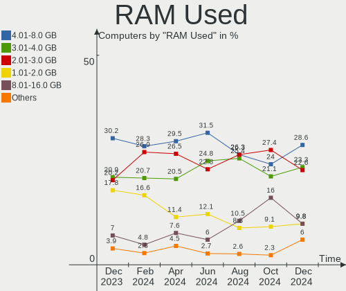
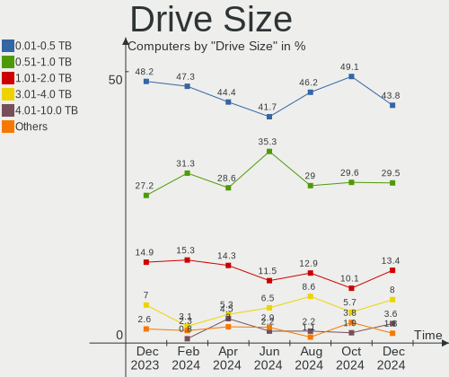
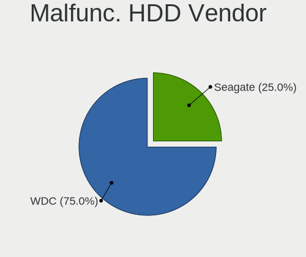
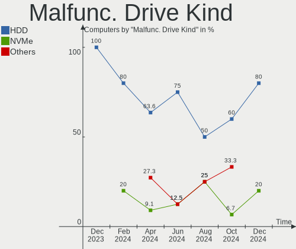
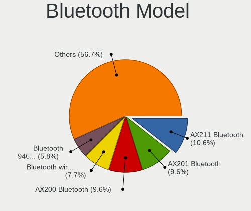
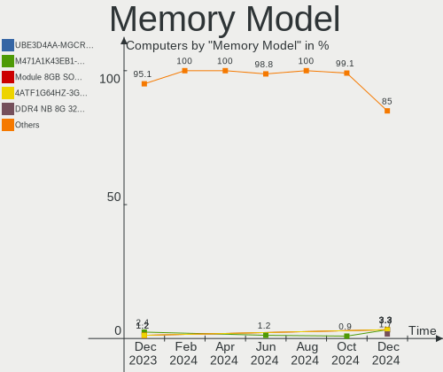

Kubuntu Hardware Trends
-----------------------

A project to identify most popular hardware characteristics and track their change
over time based on data collected by Linux users at https://Linux-Hardware.org.

Anyone can contribute to this report by the [hw-probe](https://github.com/linuxhw/hw-probe) tool:

    sudo -E hw-probe -all -upload

This is a report for all computer types. See also reports for [desktops](/Dist/Kubuntu/Desktop/README.md) and [notebooks](/Dist/Kubuntu/Notebook/README.md).

Full-feature report is available here: https://linux-hardware.org/?view=trends

Period: Jul, 2021.

Contents
--------

* [ System ](#system)
  - [ OS                       ](#os)
  - [ OS Family                ](#os-family)
  - [ Kernel                   ](#kernel)
  - [ Kernel Family            ](#kernel-family)
  - [ Kernel Major Ver.        ](#kernel-major-ver)
  - [ Arch                     ](#arch)
  - [ DE                       ](#de)
  - [ Display Server           ](#display-server)
  - [ Display Manager          ](#display-manager)
  - [ OS Lang                  ](#os-lang)
  - [ Boot Mode                ](#boot-mode)
  - [ Filesystem               ](#filesystem)
  - [ Part. scheme             ](#part-scheme)
  - [ Dual Boot with Linux/BSD ](#dual-boot-with-linuxbsd)
  - [ Dual Boot (Win)          ](#dual-boot-win)

* [ Board ](#board)
  - [ Vendor                   ](#vendor)
  - [ Model                    ](#model)
  - [ Model Family             ](#model-family)
  - [ MFG Year                 ](#mfg-year)
  - [ Form Factor              ](#form-factor)
  - [ Secure Boot              ](#secure-boot)
  - [ Coreboot                 ](#coreboot)
  - [ RAM Size                 ](#ram-size)
  - [ RAM Used                 ](#ram-used)
  - [ Total Drives             ](#total-drives)
  - [ Has CD-ROM               ](#has-cd-rom)
  - [ Has Ethernet             ](#has-ethernet)
  - [ Has WiFi                 ](#has-wifi)
  - [ Has Bluetooth            ](#has-bluetooth)

* [ Location ](#location)
  - [ Country                  ](#country)
  - [ City                     ](#city)

* [ Drives ](#drives)
  - [ Drive Vendor             ](#drive-vendor)
  - [ Drive Model              ](#drive-model)
  - [ HDD Vendor               ](#hdd-vendor)
  - [ SSD Vendor               ](#ssd-vendor)
  - [ Drive Kind               ](#drive-kind)
  - [ Drive Connector          ](#drive-connector)
  - [ Drive Size               ](#drive-size)
  - [ Space Total              ](#space-total)
  - [ Space Used               ](#space-used)
  - [ Malfunc. Drives          ](#malfunc-drives)
  - [ Malfunc. Drive Vendor    ](#malfunc-drive-vendor)
  - [ Malfunc. HDD Vendor      ](#malfunc-hdd-vendor)
  - [ Malfunc. Drive Kind      ](#malfunc-drive-kind)
  - [ Failed Drives            ](#failed-drives)
  - [ Failed Drive Vendor      ](#failed-drive-vendor)
  - [ Drive Status             ](#drive-status)

* [ Storage controller ](#storage-controller)
  - [ Storage Vendor           ](#storage-vendor)
  - [ Storage Model            ](#storage-model)
  - [ Storage Kind             ](#storage-kind)

* [ Processor ](#processor)
  - [ CPU Vendor               ](#cpu-vendor)
  - [ CPU Model                ](#cpu-model)
  - [ CPU Model Family         ](#cpu-model-family)
  - [ CPU Cores                ](#cpu-cores)
  - [ CPU Sockets              ](#cpu-sockets)
  - [ CPU Threads              ](#cpu-threads)
  - [ CPU Op-Modes             ](#cpu-op-modes)
  - [ CPU Microcode            ](#cpu-microcode)
  - [ CPU Microarch            ](#cpu-microarch)

* [ Graphics ](#graphics)
  - [ GPU Vendor               ](#gpu-vendor)
  - [ GPU Model                ](#gpu-model)
  - [ GPU Combo                ](#gpu-combo)
  - [ GPU Driver               ](#gpu-driver)
  - [ GPU Memory               ](#gpu-memory)

* [ Monitor ](#monitor)
  - [ Monitor Vendor           ](#monitor-vendor)
  - [ Monitor Model            ](#monitor-model)
  - [ Monitor Resolution       ](#monitor-resolution)
  - [ Monitor Diagonal         ](#monitor-diagonal)
  - [ Monitor Width            ](#monitor-width)
  - [ Aspect Ratio             ](#aspect-ratio)
  - [ Monitor Area             ](#monitor-area)
  - [ Pixel Density            ](#pixel-density)
  - [ Multiple Monitors        ](#multiple-monitors)

* [ Network ](#network)
  - [ Net Controller Vendor    ](#net-controller-vendor)
  - [ Net Controller Model     ](#net-controller-model)
  - [ Wireless Vendor          ](#wireless-vendor)
  - [ Wireless Model           ](#wireless-model)
  - [ Ethernet Vendor          ](#ethernet-vendor)
  - [ Ethernet Model           ](#ethernet-model)
  - [ Net Controller Kind      ](#net-controller-kind)
  - [ Used Controller          ](#used-controller)
  - [ NICs                     ](#nics)
  - [ IPv6                     ](#ipv6)

* [ Bluetooth ](#bluetooth)
  - [ Bluetooth Vendor         ](#bluetooth-vendor)
  - [ Bluetooth Model          ](#bluetooth-model)

* [ Sound ](#sound)
  - [ Sound Vendor             ](#sound-vendor)
  - [ Sound Model              ](#sound-model)

* [ Memory ](#memory)
  - [ Memory Vendor            ](#memory-vendor)
  - [ Memory Model             ](#memory-model)
  - [ Memory Kind              ](#memory-kind)
  - [ Memory Form Factor       ](#memory-form-factor)
  - [ Memory Size              ](#memory-size)
  - [ Memory Speed             ](#memory-speed)

* [ Printers & scanners ](#printers-&-scanners)
  - [ Printer Vendor           ](#printer-vendor)
  - [ Printer Model            ](#printer-model)
  - [ Scanner Vendor           ](#scanner-vendor)
  - [ Scanner Model            ](#scanner-model)

* [ Camera ](#camera)
  - [ Camera Vendor            ](#camera-vendor)
  - [ Camera Model             ](#camera-model)

* [ Security ](#security)
  - [ Fingerprint Vendor       ](#fingerprint-vendor)
  - [ Fingerprint Model        ](#fingerprint-model)
  - [ Chipcard Vendor          ](#chipcard-vendor)
  - [ Chipcard Model           ](#chipcard-model)

* [ Unsupported ](#unsupported)
  - [ Unsupported Devices      ](#unsupported-devices)
  - [ Unsupported Device Types ](#unsupported-device-types)

System
------

OS
--

Installed operating systems

| Name          | Computers | Percent |
|---------------|-----------|---------|
| Kubuntu 20.04 | 52        | 47.71%  |
| Kubuntu 21.04 | 43        | 39.45%  |
| Kubuntu 20.10 | 7         | 6.42%   |
| Kubuntu 18.04 | 5         | 4.59%   |
| Kubuntu       | 2         | 1.83%   |

OS Family
---------

OS without a version

| Name    | Computers | Percent |
|---------|-----------|---------|
| Kubuntu | 109       | 100%    |

Kernel
------

Version of the Linux kernel

| Version                  | Computers | Percent |
|--------------------------|-----------|---------|
| 5.11.0-22-generic        | 22        | 20.18%  |
| 5.8.0-59-generic         | 15        | 13.76%  |
| 5.8.0-63-generic         | 12        | 11.01%  |
| 5.4.0-77-generic         | 11        | 10.09%  |
| 5.11.0-25-generic        | 11        | 10.09%  |
| 5.4.0-80-generic         | 5         | 4.59%   |
| 5.11.0-22-lowlatency     | 3         | 2.75%   |
| 5.4.0-26-generic         | 2         | 1.83%   |
| 5.11.0-24-lowlatency     | 2         | 1.83%   |
| 5.11.0-24-generic        | 2         | 1.83%   |
| 5.8.18-050818-generic    | 1         | 0.92%   |
| 5.8.0-63-lowlatency      | 1         | 0.92%   |
| 5.8.0-53-lowlatency      | 1         | 0.92%   |
| 5.8.0-48-generic         | 1         | 0.92%   |
| 5.8.0-44-generic         | 1         | 0.92%   |
| 5.8.0-41-generic         | 1         | 0.92%   |
| 5.8.0-25-generic         | 1         | 0.92%   |
| 5.4.0-79-generic         | 1         | 0.92%   |
| 5.4.0-74-generic         | 1         | 0.92%   |
| 5.4.0-73-generic         | 1         | 0.92%   |
| 5.4.0-67-generic         | 1         | 0.92%   |
| 5.4.0-66-generic         | 1         | 0.92%   |
| 5.4.0-58-generic         | 1         | 0.92%   |
| 5.13.6-051306-lowlatency | 1         | 0.92%   |
| 5.13.4-051304-generic    | 1         | 0.92%   |
| 5.13.2-051302-generic    | 1         | 0.92%   |
| 5.13.1-051301-generic    | 1         | 0.92%   |
| 5.12.9-051209-generic    | 1         | 0.92%   |
| 5.11.0-19-lowlatency     | 1         | 0.92%   |
| 5.11.0-16-generic        | 1         | 0.92%   |
| 5.10.0-1034-oem          | 1         | 0.92%   |
| 5.10.0-1029-oem          | 1         | 0.92%   |
| 4.15.0-151-generic       | 1         | 0.92%   |
| 4.15.0-147-generic       | 1         | 0.92%   |

Kernel Family
-------------

Linux kernel without a distro release

| Version | Computers | Percent |
|---------|-----------|---------|
| 5.11.0  | 42        | 38.53%  |
| 5.8.0   | 33        | 30.28%  |
| 5.4.0   | 24        | 22.02%  |
| 5.10.0  | 2         | 1.83%   |
| 4.15.0  | 2         | 1.83%   |
| 5.8.18  | 1         | 0.92%   |
| 5.13.6  | 1         | 0.92%   |
| 5.13.4  | 1         | 0.92%   |
| 5.13.2  | 1         | 0.92%   |
| 5.13.1  | 1         | 0.92%   |
| 5.12.9  | 1         | 0.92%   |

Kernel Major Ver.
-----------------

Linux kernel major version

| Version | Computers | Percent |
|---------|-----------|---------|
| 5.11    | 42        | 38.53%  |
| 5.8     | 34        | 31.19%  |
| 5.4     | 24        | 22.02%  |
| 5.13    | 4         | 3.67%   |
| 5.10    | 2         | 1.83%   |
| 4.15    | 2         | 1.83%   |
| 5.12    | 1         | 0.92%   |

Arch
----

OS architecture (x86_64, i586, etc.)

| Name   | Computers | Percent |
|--------|-----------|---------|
| x86_64 | 109       | 100%    |

DE
--

Desktop Environment

| Name | Computers | Percent |
|------|-----------|---------|
| KDE5 | 63        | 57.8%   |
| KDE  | 46        | 42.2%   |

Display Server
--------------

X11 or Wayland

| Name    | Computers | Percent |
|---------|-----------|---------|
| X11     | 106       | 97.25%  |
| Wayland | 3         | 2.75%   |

Display Manager
---------------

SDDM, LightDM, etc.

| Name    | Computers | Percent |
|---------|-----------|---------|
| SDDM    | 60        | 55.05%  |
| Unknown | 44        | 40.37%  |
| TDM     | 4         | 3.67%   |
| GDM     | 1         | 0.92%   |

OS Lang
-------

Language

| Lang  | Computers | Percent |
|-------|-----------|---------|
| en_US | 45        | 41.28%  |
| de_DE | 12        | 11.01%  |
| pt_BR | 7         | 6.42%   |
| en_GB | 6         | 5.5%    |
| ru_RU | 4         | 3.67%   |
| fr_FR | 4         | 3.67%   |
| pl_PL | 3         | 2.75%   |
| es_ES | 3         | 2.75%   |
| en_AU | 3         | 2.75%   |
| ru_UA | 2         | 1.83%   |
| en_CA | 2         | 1.83%   |
| C     | 2         | 1.83%   |
| tr_TR | 1         | 0.92%   |
| nl_NL | 1         | 0.92%   |
| ja_JP | 1         | 0.92%   |
| it_IT | 1         | 0.92%   |
| fr_BE | 1         | 0.92%   |
| es_VE | 1         | 0.92%   |
| es_SV | 1         | 0.92%   |
| es_MX | 1         | 0.92%   |
| en_ZA | 1         | 0.92%   |
| en_IN | 1         | 0.92%   |
| en_IE | 1         | 0.92%   |
| en_DK | 1         | 0.92%   |
| en_DE | 1         | 0.92%   |
| el_GR | 1         | 0.92%   |
| da_DK | 1         | 0.92%   |
| az_IR | 1         | 0.92%   |

Boot Mode
---------

EFI or BIOS

| Mode | Computers | Percent |
|------|-----------|---------|
| EFI  | 60        | 55.05%  |
| BIOS | 49        | 44.95%  |

Filesystem
----------

Type of filesystem

| Type    | Computers | Percent |
|---------|-----------|---------|
| Ext4    | 101       | 92.66%  |
| Btrfs   | 4         | 3.67%   |
| Overlay | 3         | 2.75%   |
| Zfs     | 1         | 0.92%   |

Part. scheme
------------

Scheme of partitioning

| Type    | Computers | Percent |
|---------|-----------|---------|
| GPT     | 54        | 49.54%  |
| Unknown | 44        | 40.37%  |
| MBR     | 11        | 10.09%  |

Dual Boot with Linux/BSD
------------------------

Hosting more than one Linux/BSD

| Dual boot | Computers | Percent |
|-----------|-----------|---------|
| No        | 93        | 85.32%  |
| Yes       | 16        | 14.68%  |

Dual Boot (Win)
---------------

Hosting Linux and Windows

| Dual boot | Computers | Percent |
|-----------|-----------|---------|
| No        | 67        | 61.47%  |
| Yes       | 42        | 38.53%  |

Board
-----

Vendor
------

Motherboard manufacturer

| Name                   | Computers | Percent |
|------------------------|-----------|---------|
| Lenovo                 | 19        | 17.43%  |
| ASUSTek Computer       | 18        | 16.51%  |
| Dell                   | 17        | 15.6%   |
| Hewlett-Packard        | 15        | 13.76%  |
| MSI                    | 10        | 9.17%   |
| Gigabyte Technology    | 6         | 5.5%    |
| ASRock                 | 5         | 4.59%   |
| Samsung Electronics    | 2         | 1.83%   |
| Acer                   | 2         | 1.83%   |
| Timi                   | 1         | 0.92%   |
| Shuttle                | 1         | 0.92%   |
| Purism                 | 1         | 0.92%   |
| Notebook               | 1         | 0.92%   |
| Microsoft              | 1         | 0.92%   |
| Intel                  | 1         | 0.92%   |
| Google                 | 1         | 0.92%   |
| Fujitsu                | 1         | 0.92%   |
| Foxconn                | 1         | 0.92%   |
| Entroware              | 1         | 0.92%   |
| Colorful Technology    | 1         | 0.92%   |
| Chuwi                  | 1         | 0.92%   |
| Alienware              | 1         | 0.92%   |
| ,PC Specialist Limited | 1         | 0.92%   |
| Unknown                | 1         | 0.92%   |

Model
-----

Motherboard model

| Name                                         | Computers | Percent |
|----------------------------------------------|-----------|---------|
| Lenovo Legion 5 15ARH05H 82B1                | 2         | 1.83%   |
| HP Pavilion dv6                              | 2         | 1.83%   |
| HP Pavilion 15                               | 2         | 1.83%   |
| Timi A35S                                    | 1         | 0.92%   |
| Shuttle SH67H3                               | 1         | 0.92%   |
| Samsung 300E5K/300E5Q                        | 1         | 0.92%   |
| Samsung 300E4C/300E5C/300E7C                 | 1         | 0.92%   |
| Purism Librem 15 v3                          | 1         | 0.92%   |
| Notebook P65_P67RGRERA                       | 1         | 0.92%   |
| MSI Vig644M                                  | 1         | 0.92%   |
| MSI MS-7D18                                  | 1         | 0.92%   |
| MSI MS-7C91                                  | 1         | 0.92%   |
| MSI MS-7C86                                  | 1         | 0.92%   |
| MSI MS-7B85                                  | 1         | 0.92%   |
| MSI MS-7817                                  | 1         | 0.92%   |
| MSI MS-7693                                  | 1         | 0.92%   |
| MSI MS-7673                                  | 1         | 0.92%   |
| MSI Modern 14 B4MW                           | 1         | 0.92%   |
| MSI GE620/GE620DX/FX620DX/FX623              | 1         | 0.92%   |
| Microsoft Surface Pro 3                      | 1         | 0.92%   |
| Lenovo Z50-75 80EC                           | 1         | 0.92%   |
| Lenovo Yoga 2 Pro 20266                      | 1         | 0.92%   |
| Lenovo V14 G2 ITL 82KA                       | 1         | 0.92%   |
| Lenovo V130-14IGM 81HM                       | 1         | 0.92%   |
| Lenovo ThinkPad X1 Titanium Gen 1 20QA000DUS | 1         | 0.92%   |
| Lenovo ThinkPad X1 Carbon 6th 20KHCTO1WW     | 1         | 0.92%   |
| Lenovo ThinkPad W540 20BG001SGE              | 1         | 0.92%   |
| Lenovo ThinkPad T460 20FN002VUS              | 1         | 0.92%   |
| Lenovo ThinkPad T410 2537VTZ                 | 1         | 0.92%   |
| Lenovo ThinkPad P15v Gen 1 20TQCTO1WW        | 1         | 0.92%   |
| Lenovo ThinkPad L390 20NR001EGE              | 1         | 0.92%   |
| Lenovo ThinkCentre M82 2929AZ6               | 1         | 0.92%   |
| Lenovo ThinkCentre E73 10AU00B5SA            | 1         | 0.92%   |
| Lenovo ThinkBook 14 G2 ITL 20VD              | 1         | 0.92%   |
| Lenovo Legion Y540-15IRH-PG0 81SY            | 1         | 0.92%   |
| Lenovo Legion 5 Pro 16ACH6H 82JQ             | 1         | 0.92%   |
| Lenovo G400s VILG1                           | 1         | 0.92%   |
| Intel NUC7i3BNK                              | 1         | 0.92%   |
| HP ZBook Power G7 Mobile Workstation         | 1         | 0.92%   |
| HP t610 PLUS WW Thin Client                  | 1         | 0.92%   |
| HP ProBook 445 G7                            | 1         | 0.92%   |
| HP Pavilion Notebook                         | 1         | 0.92%   |
| HP Pavilion Gaming Laptop 17-cd0xxx          | 1         | 0.92%   |
| HP Pavilion g6                               | 1         | 0.92%   |
| HP ENVY x360 Convertible 15m-dr1xxx          | 1         | 0.92%   |
| HP ENVY x360 Convertible                     | 1         | 0.92%   |
| HP EliteBook 850 G3                          | 1         | 0.92%   |
| HP EliteBook 845 G7 Notebook PC              | 1         | 0.92%   |
| HP EliteBook 840 G6                          | 1         | 0.92%   |
| Google Cyan                                  | 1         | 0.92%   |
| Gigabyte X58-USB3                            | 1         | 0.92%   |
| Gigabyte X570 AORUS ELITE                    | 1         | 0.92%   |
| Gigabyte P67A-UD7-B3                         | 1         | 0.92%   |
| Gigabyte GA-790XT-USB3                       | 1         | 0.92%   |
| Gigabyte B550M AORUS ELITE                   | 1         | 0.92%   |
| Gigabyte AX370-Gaming K5                     | 1         | 0.92%   |
| Fujitsu FMVS03004                            | 1         | 0.92%   |
| Foxconn ELA01                                | 1         | 0.92%   |
| Entroware Apollo                             | 1         | 0.92%   |
| Dell XPS 8700                                | 1         | 0.92%   |

Model Family
------------

Motherboard model prefix

| Name                   | Computers | Percent |
|------------------------|-----------|---------|
| Lenovo ThinkPad        | 7         | 6.42%   |
| HP Pavilion            | 7         | 6.42%   |
| Lenovo Legion          | 4         | 3.67%   |
| Dell XPS               | 4         | 3.67%   |
| Dell Latitude          | 4         | 3.67%   |
| Dell Inspiron          | 4         | 3.67%   |
| HP EliteBook           | 3         | 2.75%   |
| ASUS ROG               | 3         | 2.75%   |
| ASUS PRIME             | 3         | 2.75%   |
| Lenovo ThinkCentre     | 2         | 1.83%   |
| HP ENVY                | 2         | 1.83%   |
| Dell OptiPlex          | 2         | 1.83%   |
| Timi A35S              | 1         | 0.92%   |
| Shuttle SH67H3         | 1         | 0.92%   |
| Samsung 300E5K         | 1         | 0.92%   |
| Samsung 300E4C         | 1         | 0.92%   |
| Purism Librem          | 1         | 0.92%   |
| Notebook P65           | 1         | 0.92%   |
| MSI Vig644M            | 1         | 0.92%   |
| MSI MS-7D18            | 1         | 0.92%   |
| MSI MS-7C91            | 1         | 0.92%   |
| MSI MS-7C86            | 1         | 0.92%   |
| MSI MS-7B85            | 1         | 0.92%   |
| MSI MS-7817            | 1         | 0.92%   |
| MSI MS-7693            | 1         | 0.92%   |
| MSI MS-7673            | 1         | 0.92%   |
| MSI Modern             | 1         | 0.92%   |
| MSI GE620              | 1         | 0.92%   |
| Microsoft Surface      | 1         | 0.92%   |
| Lenovo Z50-75          | 1         | 0.92%   |
| Lenovo Yoga            | 1         | 0.92%   |
| Lenovo V14             | 1         | 0.92%   |
| Lenovo V130-14IGM      | 1         | 0.92%   |
| Lenovo ThinkBook       | 1         | 0.92%   |
| Lenovo G400s           | 1         | 0.92%   |
| Intel NUC7i3BNK        | 1         | 0.92%   |
| HP ZBook               | 1         | 0.92%   |
| HP t610                | 1         | 0.92%   |
| HP ProBook             | 1         | 0.92%   |
| Google Cyan            | 1         | 0.92%   |
| Gigabyte X58-USB3      | 1         | 0.92%   |
| Gigabyte X570          | 1         | 0.92%   |
| Gigabyte P67A-UD7-B3   | 1         | 0.92%   |
| Gigabyte GA-790XT-USB3 | 1         | 0.92%   |
| Gigabyte B550M         | 1         | 0.92%   |
| Gigabyte AX370-Gaming  | 1         | 0.92%   |
| Fujitsu FMVS03004      | 1         | 0.92%   |
| Foxconn ELA01          | 1         | 0.92%   |
| Entroware Apollo       | 1         | 0.92%   |
| Dell Vostro            | 1         | 0.92%   |
| Dell Precision         | 1         | 0.92%   |
| Dell G3                | 1         | 0.92%   |
| Colorful C.H81A-BTC    | 1         | 0.92%   |
| Chuwi GemiBook         | 1         | 0.92%   |
| ASUS ZenBook           | 1         | 0.92%   |
| ASUS VivoBook          | 1         | 0.92%   |
| ASUS TUF               | 1         | 0.92%   |
| ASUS P6T               | 1         | 0.92%   |
| ASUS P5G41T-M          | 1         | 0.92%   |
| ASUS N550JK            | 1         | 0.92%   |

MFG Year
--------

Motherboard manufacture year

| Year | Computers | Percent |
|------|-----------|---------|
| 2020 | 24        | 22.02%  |
| 2021 | 23        | 21.1%   |
| 2018 | 12        | 11.01%  |
| 2013 | 10        | 9.17%   |
| 2015 | 9         | 8.26%   |
| 2019 | 8         | 7.34%   |
| 2011 | 7         | 6.42%   |
| 2016 | 4         | 3.67%   |
| 2014 | 3         | 2.75%   |
| 2012 | 3         | 2.75%   |
| 2010 | 3         | 2.75%   |
| 2017 | 2         | 1.83%   |
| 2008 | 1         | 0.92%   |

Form Factor
-----------

Physical design of the computer

| Name        | Computers | Percent |
|-------------|-----------|---------|
| Notebook    | 61        | 55.96%  |
| Desktop     | 42        | 38.53%  |
| Convertible | 3         | 2.75%   |
| Mini pc     | 2         | 1.83%   |
| Tablet      | 1         | 0.92%   |

Secure Boot
-----------

Enabled or disabled

| State    | Computers | Percent |
|----------|-----------|---------|
| Disabled | 100       | 91.74%  |
| Enabled  | 9         | 8.26%   |

Coreboot
--------

Have coreboot on board

| Used | Computers | Percent |
|------|-----------|---------|
| No   | 107       | 98.17%  |
| Yes  | 2         | 1.83%   |

RAM Size
--------

Total RAM memory

| Size in GB  | Computers | Percent |
|-------------|-----------|---------|
| 4.01-8.0    | 26        | 23.85%  |
| 16.01-24.0  | 25        | 22.94%  |
| 32.01-64.0  | 19        | 17.43%  |
| 8.01-16.0   | 19        | 17.43%  |
| 3.01-4.0    | 9         | 8.26%   |
| 64.01-256.0 | 6         | 5.5%    |
| 24.01-32.0  | 4         | 3.67%   |
| 1.01-2.0    | 1         | 0.92%   |

RAM Used
--------

Used RAM memory

| Used GB    | Computers | Percent |
|------------|-----------|---------|
| 2.01-3.0   | 27        | 24.77%  |
| 4.01-8.0   | 26        | 23.85%  |
| 1.01-2.0   | 25        | 22.94%  |
| 3.01-4.0   | 17        | 15.6%   |
| 8.01-16.0  | 10        | 9.17%   |
| 0.51-1.0   | 3         | 2.75%   |
| 32.01-64.0 | 1         | 0.92%   |

Total Drives
------------

Number of drives on board

| Drives | Computers | Percent |
|--------|-----------|---------|
| 1      | 60        | 55.05%  |
| 2      | 28        | 25.69%  |
| 3      | 6         | 5.5%    |
| 5      | 4         | 3.67%   |
| 4      | 4         | 3.67%   |
| 7      | 2         | 1.83%   |
| 6      | 2         | 1.83%   |
| 12     | 1         | 0.92%   |
| 8      | 1         | 0.92%   |
| 0      | 1         | 0.92%   |

Has CD-ROM
----------

Has CD-ROM on board

| Presented | Computers | Percent |
|-----------|-----------|---------|
| No        | 74        | 67.89%  |
| Yes       | 35        | 32.11%  |

Has Ethernet
------------

Has Ethernet on board

| Presented | Computers | Percent |
|-----------|-----------|---------|
| Yes       | 92        | 84.4%   |
| No        | 17        | 15.6%   |

Has WiFi
--------

Has WiFi module

| Presented | Computers | Percent |
|-----------|-----------|---------|
| Yes       | 92        | 84.4%   |
| No        | 17        | 15.6%   |

Has Bluetooth
-------------

Has Bluetooth module

| Presented | Computers | Percent |
|-----------|-----------|---------|
| Yes       | 75        | 68.81%  |
| No        | 34        | 31.19%  |

Location
--------

Country
-------

Geographic location (country)

| Country      | Computers | Percent |
|--------------|-----------|---------|
| Germany      | 21        | 19.27%  |
| USA          | 20        | 18.35%  |
| UK           | 8         | 7.34%   |
| Spain        | 8         | 7.34%   |
| Brazil       | 7         | 6.42%   |
| France       | 6         | 5.5%    |
| Russia       | 4         | 3.67%   |
| Netherlands  | 3         | 2.75%   |
| Canada       | 3         | 2.75%   |
| Belgium      | 3         | 2.75%   |
| Australia    | 3         | 2.75%   |
| Ukraine      | 2         | 1.83%   |
| Mexico       | 2         | 1.83%   |
| Iran         | 2         | 1.83%   |
| Venezuela    | 1         | 0.92%   |
| Turkey       | 1         | 0.92%   |
| South Korea  | 1         | 0.92%   |
| South Africa | 1         | 0.92%   |
| Romania      | 1         | 0.92%   |
| Poland       | 1         | 0.92%   |
| Pakistan     | 1         | 0.92%   |
| Kuwait       | 1         | 0.92%   |
| Japan        | 1         | 0.92%   |
| India        | 1         | 0.92%   |
| Greece       | 1         | 0.92%   |
| Estonia      | 1         | 0.92%   |
| El Salvador  | 1         | 0.92%   |
| Denmark      | 1         | 0.92%   |
| Colombia     | 1         | 0.92%   |
| Belarus      | 1         | 0.92%   |
| Argentina    | 1         | 0.92%   |

City
----

Geographic location (city)

| City                        | Computers | Percent |
|-----------------------------|-----------|---------|
| Frankfurt am Main           | 4         | 3.67%   |
| Rio de Janeiro              | 3         | 2.75%   |
| Sydney                      | 2         | 1.83%   |
| Santo André                | 2         | 1.83%   |
| Odintsovo                   | 2         | 1.83%   |
| Munich                      | 2         | 1.83%   |
| London                      | 2         | 1.83%   |
| Lepe                        | 2         | 1.83%   |
| Yuba City                   | 1         | 0.92%   |
| Worcester                   | 1         | 0.92%   |
| Windeck                     | 1         | 0.92%   |
| Whittier                    | 1         | 0.92%   |
| Watertown                   | 1         | 0.92%   |
| Veldhoven                   | 1         | 0.92%   |
| Valencia                    | 1         | 0.92%   |
| Toyama                      | 1         | 0.92%   |
| Toronto                     | 1         | 0.92%   |
| Titisee-Neustadt            | 1         | 0.92%   |
| Tehran                      | 1         | 0.92%   |
| Stuttgart                   | 1         | 0.92%   |
| Stratfield Mortimer         | 1         | 0.92%   |
| Starnberg                   | 1         | 0.92%   |
| Springboro                  | 1         | 0.92%   |
| Silver Spring               | 1         | 0.92%   |
| Senden                      | 1         | 0.92%   |
| Seattle                     | 1         | 0.92%   |
| Santa Rosa                  | 1         | 0.92%   |
| Sant Cugat del Vallès      | 1         | 0.92%   |
| Sandy                       | 1         | 0.92%   |
| San Salvador                | 1         | 0.92%   |
| San Francisco               | 1         | 0.92%   |
| San Cristóbal de La Laguna | 1         | 0.92%   |
| Salzgitter                  | 1         | 0.92%   |
| Safety Bay                  | 1         | 0.92%   |
| Rostov                      | 1         | 0.92%   |
| Plano                       | 1         | 0.92%   |
| Peterborough                | 1         | 0.92%   |
| Paris                       | 1         | 0.92%   |
| Oxford                      | 1         | 0.92%   |
| Old Bridge                  | 1         | 0.92%   |
| Oberursel                   | 1         | 0.92%   |
| Nunez                       | 1         | 0.92%   |
| Moscow                      | 1         | 0.92%   |
| Montreal                    | 1         | 0.92%   |
| Minsk                       | 1         | 0.92%   |
| Metepec                     | 1         | 0.92%   |
| Maurecourt                  | 1         | 0.92%   |
| Marseille                   | 1         | 0.92%   |
| Marktoberdorf               | 1         | 0.92%   |
| Manchester-by-the-Sea       | 1         | 0.92%   |
| Madrid                      | 1         | 0.92%   |
| Lufkin                      | 1         | 0.92%   |
| Lodz                        | 1         | 0.92%   |
| Lewisham                    | 1         | 0.92%   |
| Leipzig                     | 1         | 0.92%   |
| Lehrte                      | 1         | 0.92%   |
| Lancaster                   | 1         | 0.92%   |
| L'Isle-d'Abeau              | 1         | 0.92%   |
| Kuwait City                 | 1         | 0.92%   |
| Konya                       | 1         | 0.92%   |

Drives
------

Drive Vendor
------------

Hard drive vendors

| Vendor              | Computers | Drives | Percent |
|---------------------|-----------|--------|---------|
| Samsung Electronics | 32        | 40     | 19.05%  |
| WDC                 | 27        | 45     | 16.07%  |
| Seagate             | 25        | 31     | 14.88%  |
| SanDisk             | 12        | 15     | 7.14%   |
| SK Hynix            | 9         | 10     | 5.36%   |
| Kingston            | 8         | 9      | 4.76%   |
| Toshiba             | 6         | 7      | 3.57%   |
| Unknown             | 5         | 6      | 2.98%   |
| Intel               | 5         | 8      | 2.98%   |
| Hitachi             | 5         | 8      | 2.98%   |
| Crucial             | 4         | 6      | 2.38%   |
| SPCC                | 3         | 3      | 1.79%   |
| KIOXIA              | 3         | 3      | 1.79%   |
| Intenso             | 3         | 3      | 1.79%   |
| PNY                 | 2         | 2      | 1.19%   |
| Patriot             | 2         | 2      | 1.19%   |
| HGST                | 2         | 2      | 1.19%   |
| A-DATA Technology   | 2         | 2      | 1.19%   |
| XPG                 | 1         | 1      | 0.6%    |
| VENO                | 1         | 1      | 0.6%    |
| Union Memory        | 1         | 1      | 0.6%    |
| TUSUNBOW            | 1         | 1      | 0.6%    |
| Phison              | 1         | 1      | 0.6%    |
| OCZ                 | 1         | 1      | 0.6%    |
| Micron Technology   | 1         | 1      | 0.6%    |
| LITEON              | 1         | 1      | 0.6%    |
| Leven               | 1         | 1      | 0.6%    |
| JMicron             | 1         | 2      | 0.6%    |
| Corsair             | 1         | 1      | 0.6%    |
| China               | 1         | 1      | 0.6%    |
| ASMedia             | 1         | 1      | 0.6%    |

Drive Model
-----------

Hard drive models

| Model                                | Computers | Percent |
|--------------------------------------|-----------|---------|
| SanDisk SSD PLUS 240GB               | 4         | 1.96%   |
| Samsung SSD 860 EVO 1TB              | 3         | 1.47%   |
| WDC WD40EFRX-68WT0N0 4TB             | 2         | 0.98%   |
| WDC WD30EZRX-00MMMB0 3TB             | 2         | 0.98%   |
| WDC PC SN730 NVMe 1024GB             | 2         | 0.98%   |
| Toshiba MQ01ABD100 1TB               | 2         | 0.98%   |
| Seagate ST2000DM008-2FR102 2TB       | 2         | 0.98%   |
| Seagate ST2000DM001-1CH164 2TB       | 2         | 0.98%   |
| Seagate ST1000LM024 HN-M101MBB 1TB   | 2         | 0.98%   |
| SanDisk SSD PLUS 1000GB              | 2         | 0.98%   |
| Samsung SSD 850 EVO 250GB            | 2         | 0.98%   |
| Samsung NVMe SSD Drive 512GB         | 2         | 0.98%   |
| Samsung NVMe SSD Drive 500GB         | 2         | 0.98%   |
| Intenso SATA III SSD 480GB           | 2         | 0.98%   |
| HGST HTS721010A9E630 1TB             | 2         | 0.98%   |
| Crucial CT1000MX500SSD1 1TB          | 2         | 0.98%   |
| XPG NVMe SSD Drive 1024GB            | 1         | 0.49%   |
| WDC WDS500G2B0A-00SM50 500GB SSD     | 1         | 0.49%   |
| WDC WDS240G2G0A-00JH30 240GB SSD     | 1         | 0.49%   |
| WDC WDS200T2B0B-00YS70 2TB SSD       | 1         | 0.49%   |
| WDC WDS200T2B0B 2TB SSD              | 1         | 0.49%   |
| WDC WD7500AACS-65D6B0 752GB          | 1         | 0.49%   |
| WDC WD60EZRZ-00GZ5B1 6TB             | 1         | 0.49%   |
| WDC WD60EZAZ-00ZGHB0 6TB             | 1         | 0.49%   |
| WDC WD5000AVJS-63TRA0 500GB          | 1         | 0.49%   |
| WDC WD5000AAVS-00G9B1 500GB          | 1         | 0.49%   |
| WDC WD5000AAKS-00V1A0 500GB          | 1         | 0.49%   |
| WDC WD5000AAJS-08A8B0 500GB          | 1         | 0.49%   |
| WDC WD40EZRZ-00GXCB0 4TB             | 1         | 0.49%   |
| WDC WD3200JD-22KLB0 320GB            | 1         | 0.49%   |
| WDC WD3200AAJS-08L7A0 320GB          | 1         | 0.49%   |
| WDC WD20EZRX-00DC0B0 2TB             | 1         | 0.49%   |
| WDC WD20EFRX-68EUZN0 2TB             | 1         | 0.49%   |
| WDC WD20EARS-00MVWB0 2TB             | 1         | 0.49%   |
| WDC WD2001FASS-00W2B0 2TB            | 1         | 0.49%   |
| WDC WD120EMFZ-11A6JA0 12TB           | 1         | 0.49%   |
| WDC WD10SPZX-80Z10T2 1TB             | 1         | 0.49%   |
| WDC WD10SPZX-75Z10T2 1TB             | 1         | 0.49%   |
| WDC WD10SPZX-21Z10T0 1TB             | 1         | 0.49%   |
| WDC WD10JPCX-24UE4T0 1TB             | 1         | 0.49%   |
| WDC WD10EZEX-08WN4A0 1TB             | 1         | 0.49%   |
| WDC WD10EZEX-08M2NA0 1TB             | 1         | 0.49%   |
| WDC WD10EZEX-00BN5A0 1TB             | 1         | 0.49%   |
| WDC WD10EACS-32ZJB0 1TB              | 1         | 0.49%   |
| WDC WD10EACS-00C7B0 1TB              | 1         | 0.49%   |
| WDC WD1003FZEX-00MK2A0 1TB           | 1         | 0.49%   |
| WDC WD1003FZEX-00K3CA0 1TB           | 1         | 0.49%   |
| WDC WD1003FBYX-01Y7B0 1TB            | 1         | 0.49%   |
| WDC WD1002FAEX-00Z3A0 1TB            | 1         | 0.49%   |
| WDC WD1001FALS-40U9B0 1TB            | 1         | 0.49%   |
| WDC WD1001FALS-00J7B1 1TB            | 1         | 0.49%   |
| WDC PC SN730 SDBQNTY-1T00-1001 1TB   | 1         | 0.49%   |
| WDC PC SN730 NVMe 512GB              | 1         | 0.49%   |
| WDC PC SN530 SDBPNPZ-256G-1006 256GB | 1         | 0.49%   |
| VENO SCORP SSD 240GB                 | 1         | 0.49%   |
| Unknown SD/MMC 64GB                  | 1         | 0.49%   |
| Unknown RZX-19SSD6G/480G 480GB       | 1         | 0.49%   |
| Unknown MMC Card  16GB               | 1         | 0.49%   |
| Unknown M.S./M.S.Pro/HG 16GB         | 1         | 0.49%   |
| Unknown EC1S5  64GB                  | 1         | 0.49%   |

HDD Vendor
----------

Hard disk drive vendors

| Vendor              | Computers | Drives | Percent |
|---------------------|-----------|--------|---------|
| Seagate             | 24        | 30     | 42.11%  |
| WDC                 | 19        | 36     | 33.33%  |
| Hitachi             | 5         | 8      | 8.77%   |
| Toshiba             | 3         | 4      | 5.26%   |
| Samsung Electronics | 2         | 2      | 3.51%   |
| HGST                | 2         | 2      | 3.51%   |
| Unknown             | 1         | 1      | 1.75%   |
| ASMedia             | 1         | 1      | 1.75%   |

SSD Vendor
----------

Solid state drive vendors

| Vendor              | Computers | Drives | Percent |
|---------------------|-----------|--------|---------|
| Samsung Electronics | 22        | 23     | 30.56%  |
| SanDisk             | 11        | 13     | 15.28%  |
| Kingston            | 7         | 8      | 9.72%   |
| WDC                 | 4         | 4      | 5.56%   |
| Crucial             | 4         | 6      | 5.56%   |
| SPCC                | 3         | 3      | 4.17%   |
| SK Hynix            | 3         | 3      | 4.17%   |
| Intenso             | 3         | 3      | 4.17%   |
| PNY                 | 2         | 2      | 2.78%   |
| Patriot             | 2         | 2      | 2.78%   |
| VENO                | 1         | 1      | 1.39%   |
| Unknown             | 1         | 1      | 1.39%   |
| TUSUNBOW            | 1         | 1      | 1.39%   |
| OCZ                 | 1         | 1      | 1.39%   |
| Micron Technology   | 1         | 1      | 1.39%   |
| LITEON              | 1         | 1      | 1.39%   |
| Leven               | 1         | 1      | 1.39%   |
| JMicron             | 1         | 2      | 1.39%   |
| Intel               | 1         | 2      | 1.39%   |
| China               | 1         | 1      | 1.39%   |
| A-DATA Technology   | 1         | 1      | 1.39%   |

Drive Kind
----------

HDD or SSD

| Kind    | Computers | Drives | Percent |
|---------|-----------|--------|---------|
| SSD     | 58        | 80     | 39.46%  |
| HDD     | 45        | 84     | 30.61%  |
| NVMe    | 40        | 47     | 27.21%  |
| MMC     | 2         | 2      | 1.36%   |
| Unknown | 2         | 3      | 1.36%   |

Drive Connector
---------------

SATA, SAS, NVMe, etc.

| Type | Computers | Drives | Percent |
|------|-----------|--------|---------|
| SATA | 79        | 158    | 61.72%  |
| NVMe | 40        | 47     | 31.25%  |
| SAS  | 7         | 9      | 5.47%   |
| MMC  | 2         | 2      | 1.56%   |

Drive Size
----------

Size of hard drive

| Size in TB | Computers | Drives | Percent |
|------------|-----------|--------|---------|
| 0.01-0.5   | 55        | 73     | 46.22%  |
| 0.51-1.0   | 37        | 56     | 31.09%  |
| 1.01-2.0   | 12        | 18     | 10.08%  |
| 3.01-4.0   | 6         | 6      | 5.04%   |
| 2.01-3.0   | 4         | 5      | 3.36%   |
| 4.01-10.0  | 4         | 4      | 3.36%   |
| 10.01-20.0 | 1         | 2      | 0.84%   |

Space Total
-----------

Amount of disk space available on the file system

| Size in GB     | Computers | Percent |
|----------------|-----------|---------|
| 251-500        | 29        | 26.61%  |
| 101-250        | 28        | 25.69%  |
| 501-1000       | 19        | 17.43%  |
| 1001-2000      | 12        | 11.01%  |
| More than 3000 | 11        | 10.09%  |
| 1-20           | 7         | 6.42%   |
| 2001-3000      | 2         | 1.83%   |
| 21-50          | 1         | 0.92%   |

Space Used
----------

Amount of used disk space

| Used GB        | Computers | Percent |
|----------------|-----------|---------|
| 1-20           | 25        | 22.94%  |
| 101-250        | 21        | 19.27%  |
| 251-500        | 15        | 13.76%  |
| 21-50          | 13        | 11.93%  |
| 51-100         | 11        | 10.09%  |
| 501-1000       | 10        | 9.17%   |
| More than 3000 | 5         | 4.59%   |
| 1001-2000      | 5         | 4.59%   |
| 2001-3000      | 4         | 3.67%   |

Malfunc. Drives
---------------

Drive models with a malfunction

| Model                              | Computers | Drives | Percent |
|------------------------------------|-----------|--------|---------|
| WDC WD5000AAVS-00G9B1 500GB        | 1         | 1      | 6.67%   |
| WDC WD5000AAKS-00V1A0 500GB        | 1         | 1      | 6.67%   |
| WDC WD3200JD-22KLB0 320GB          | 1         | 1      | 6.67%   |
| WDC WD20EFRX-68EUZN0 2TB           | 1         | 2      | 6.67%   |
| WDC WD10EZEX-08WN4A0 1TB           | 1         | 1      | 6.67%   |
| WDC WD1001FALS-40U9B0 1TB          | 1         | 1      | 6.67%   |
| Toshiba MQ01ABD100 1TB             | 1         | 1      | 6.67%   |
| Seagate ST500LM000-1EJ162 500GB    | 1         | 1      | 6.67%   |
| Seagate ST3500418AS 500GB          | 1         | 1      | 6.67%   |
| Seagate ST32000542AS 2TB           | 1         | 1      | 6.67%   |
| Seagate ST1000LM035-1RK172 1TB     | 1         | 1      | 6.67%   |
| Seagate ST1000LM024 HN-M101MBB 1TB | 1         | 1      | 6.67%   |
| Seagate ST1000LM014-SSHD-8GB       | 1         | 1      | 6.67%   |
| Intel SSDSA2M040G2GC 40GB          | 1         | 2      | 6.67%   |
| Crucial CT275MX300SSD1 275GB       | 1         | 2      | 6.67%   |

Malfunc. Drive Vendor
---------------------

Vendors of faulty drives

| Vendor  | Computers | Drives | Percent |
|---------|-----------|--------|---------|
| Seagate | 6         | 6      | 46.15%  |
| WDC     | 4         | 7      | 30.77%  |
| Toshiba | 1         | 1      | 7.69%   |
| Intel   | 1         | 2      | 7.69%   |
| Crucial | 1         | 2      | 7.69%   |

Malfunc. HDD Vendor
-------------------

Vendors of faulty HDD drives

| Vendor  | Computers | Drives | Percent |
|---------|-----------|--------|---------|
| Seagate | 6         | 6      | 54.55%  |
| WDC     | 4         | 7      | 36.36%  |
| Toshiba | 1         | 1      | 9.09%   |

Malfunc. Drive Kind
-------------------

Kinds of faulty drives

| Kind | Computers | Drives | Percent |
|------|-----------|--------|---------|
| HDD  | 10        | 14     | 83.33%  |
| SSD  | 2         | 4      | 16.67%  |

Failed Drives
-------------

Failed drive models

Zero info for selected period =(

Failed Drive Vendor
-------------------

Failed drive vendors

Zero info for selected period =(

Drive Status
------------

Number of failed and malfunc. drives

| Status   | Computers | Drives | Percent |
|----------|-----------|--------|---------|
| Works    | 63        | 109    | 51.64%  |
| Detected | 47        | 89     | 38.52%  |
| Malfunc  | 12        | 18     | 9.84%   |

Storage controller
------------------

Storage Vendor
--------------

Storage controller vendors

| Vendor                       | Computers | Percent |
|------------------------------|-----------|---------|
| Intel                        | 64        | 43.84%  |
| AMD                          | 36        | 24.66%  |
| Samsung Electronics          | 14        | 9.59%   |
| Sandisk                      | 7         | 4.79%   |
| SK Hynix                     | 6         | 4.11%   |
| Toshiba America Info Systems | 3         | 2.05%   |
| Marvell Technology Group     | 3         | 2.05%   |
| KIOXIA                       | 3         | 2.05%   |
| JMicron Technology           | 3         | 2.05%   |
| Phison Electronics           | 2         | 1.37%   |
| Union Memory (Shenzhen)      | 1         | 0.68%   |
| Kingston Technology Company  | 1         | 0.68%   |
| ADATA Technology             | 1         | 0.68%   |
| Adaptec                      | 1         | 0.68%   |
| 3ware                        | 1         | 0.68%   |

Storage Model
-------------

Storage controller models

| Model                                                                                   | Computers | Percent |
|-----------------------------------------------------------------------------------------|-----------|---------|
| AMD FCH SATA Controller [AHCI mode]                                                     | 23        | 13.69%  |
| Intel 8 Series/C220 Series Chipset Family 6-port SATA Controller 1 [AHCI mode]          | 8         | 4.76%   |
| Samsung NVMe SSD Controller SM981/PM981/PM983                                           | 6         | 3.57%   |
| Intel 82801 Mobile SATA Controller [RAID mode]                                          | 6         | 3.57%   |
| AMD Starship/Matisse Chipset SATA Controller [AHCI mode]                                | 6         | 3.57%   |
| Intel Volume Management Device NVMe RAID Controller                                     | 5         | 2.98%   |
| Sandisk WD Black SN750 / PC SN730 NVMe SSD                                              | 4         | 2.38%   |
| Samsung NVMe Controller                                                                 | 4         | 2.38%   |
| Intel Sunrise Point-LP SATA Controller [AHCI mode]                                      | 4         | 2.38%   |
| Intel HM170/QM170 Chipset SATA Controller [AHCI Mode]                                   | 4         | 2.38%   |
| Intel 7 Series Chipset Family 6-port SATA Controller [AHCI mode]                        | 4         | 2.38%   |
| Intel 6 Series/C200 Series Chipset Family 6 port Mobile SATA AHCI Controller            | 4         | 2.38%   |
| Intel 6 Series/C200 Series Chipset Family 6 port Desktop SATA AHCI Controller           | 4         | 2.38%   |
| AMD SB7x0/SB8x0/SB9x0 IDE Controller                                                    | 4         | 2.38%   |
| Toshiba America Info Systems XG6 NVMe SSD Controller                                    | 3         | 1.79%   |
| Samsung NVMe SSD Controller SM961/PM961/SM963                                           | 3         | 1.79%   |
| KIOXIA Non-Volatile memory controller                                                   | 3         | 1.79%   |
| Intel Wildcat Point-LP SATA Controller [AHCI Mode]                                      | 3         | 1.79%   |
| Intel Tiger Lake-LP SATA Controller [AHCI mode]                                         | 3         | 1.79%   |
| Intel Non-Volatile memory controller                                                    | 3         | 1.79%   |
| Intel Cannon Lake Mobile PCH SATA AHCI Controller                                       | 3         | 1.79%   |
| AMD SB7x0/SB8x0/SB9x0 SATA Controller [IDE mode]                                        | 3         | 1.79%   |
| AMD SB7x0/SB8x0/SB9x0 SATA Controller [AHCI mode]                                       | 3         | 1.79%   |
| SK Hynix NVMe SSD Controller                                                            | 2         | 1.19%   |
| SK Hynix BC511                                                                          | 2         | 1.19%   |
| Sandisk WD Blue SN550 NVMe SSD                                                          | 2         | 1.19%   |
| Phison E12 NVMe Controller                                                              | 2         | 1.19%   |
| Marvell Group 88SE9128 PCIe SATA 6 Gb/s RAID controller                                 | 2         | 1.19%   |
| JMicron JMB363 SATA/IDE Controller                                                      | 2         | 1.19%   |
| Intel Celeron/Pentium Silver Processor SATA Controller                                  | 2         | 1.19%   |
| Intel Cannon Point-LP SATA Controller [AHCI Mode]                                       | 2         | 1.19%   |
| Intel 82801JI (ICH10 Family) 4 port SATA IDE Controller #1                              | 2         | 1.19%   |
| Intel 82801JI (ICH10 Family) 2 port SATA IDE Controller #2                              | 2         | 1.19%   |
| Intel 8 Series SATA Controller 1 [AHCI mode]                                            | 2         | 1.19%   |
| Intel 7 Series/C210 Series Chipset Family 6-port SATA Controller [AHCI mode]            | 2         | 1.19%   |
| Intel 400 Series Chipset Family SATA AHCI Controller                                    | 2         | 1.19%   |
| AMD X370 Series Chipset SATA Controller                                                 | 2         | 1.19%   |
| AMD FCH IDE Controller                                                                  | 2         | 1.19%   |
| AMD 400 Series Chipset SATA Controller                                                  | 2         | 1.19%   |
| Union Memory (Shenzhen) Non-Volatile memory controller                                  | 1         | 0.6%    |
| SK Hynix Non-Volatile memory controller                                                 | 1         | 0.6%    |
| SK Hynix BC501 NVMe Solid State Drive                                                   | 1         | 0.6%    |
| Sandisk WD Black 2018/SN750 / PC SN720 NVMe SSD                                         | 1         | 0.6%    |
| Samsung NVMe SSD Controller PM9A1/PM9A3/980PRO                                          | 1         | 0.6%    |
| Samsung Electronics SATA controller                                                     | 1         | 0.6%    |
| Marvell Group 88SE6111/6121 SATA II / PATA Controller                                   | 1         | 0.6%    |
| Kingston Company A2000 NVMe SSD                                                         | 1         | 0.6%    |
| JMicron JMB368 IDE controller                                                           | 1         | 0.6%    |
| JMicron JMB362 SATA Controller                                                          | 1         | 0.6%    |
| Intel SSD Pro 7600p/760p/E 6100p Series                                                 | 1         | 0.6%    |
| Intel NM10/ICH7 Family SATA Controller [IDE mode]                                       | 1         | 0.6%    |
| Intel 82801JI (ICH10 Family) SATA AHCI Controller                                       | 1         | 0.6%    |
| Intel 82801G (ICH7 Family) IDE Controller                                               | 1         | 0.6%    |
| Intel 6 Series/C200 Series Chipset Family Desktop SATA Controller (IDE mode, ports 4-5) | 1         | 0.6%    |
| Intel 6 Series/C200 Series Chipset Family Desktop SATA Controller (IDE mode, ports 0-3) | 1         | 0.6%    |
| Intel 500 Series Chipset Family SATA AHCI Controller                                    | 1         | 0.6%    |
| Intel 5 Series/3400 Series Chipset 6 port SATA AHCI Controller                          | 1         | 0.6%    |
| AMD FCH SATA Controller D                                                               | 1         | 0.6%    |
| AMD 300 Series Chipset SATA Controller                                                  | 1         | 0.6%    |
| ADATA XPG SX8200 Pro PCIe Gen3x4 M.2 2280 Solid State Drive                             | 1         | 0.6%    |

Storage Kind
------------

Kind of storage controller (IDE, SATA, NVMe, SAS, ...)

| Kind | Computers | Percent |
|------|-----------|---------|
| SATA | 86        | 56.95%  |
| NVMe | 40        | 26.49%  |
| RAID | 12        | 7.95%   |
| IDE  | 12        | 7.95%   |
| SCSI | 1         | 0.66%   |

Processor
---------

CPU Vendor
----------

Processor vendors

| Vendor | Computers | Percent |
|--------|-----------|---------|
| Intel  | 72        | 66.06%  |
| AMD    | 37        | 33.94%  |

CPU Model
---------

Processor models

| Model                                    | Computers | Percent |
|------------------------------------------|-----------|---------|
| AMD Ryzen 9 3900X 12-Core Processor      | 3         | 2.75%   |
| AMD Ryzen 5 3600 6-Core Processor        | 3         | 2.75%   |
| Intel Core i9-10885H CPU @ 2.40GHz       | 2         | 1.83%   |
| Intel Core i7-8565U CPU @ 1.80GHz        | 2         | 1.83%   |
| Intel Core i7-7700HQ CPU @ 2.80GHz       | 2         | 1.83%   |
| Intel Core i7-6700HQ CPU @ 2.60GHz       | 2         | 1.83%   |
| Intel Core i7-6600U CPU @ 2.60GHz        | 2         | 1.83%   |
| Intel Core i7-5500U CPU @ 2.40GHz        | 2         | 1.83%   |
| Intel Core i7-4770 CPU @ 3.40GHz         | 2         | 1.83%   |
| Intel Core i5-2500K CPU @ 3.30GHz        | 2         | 1.83%   |
| Intel Core i3-3110M CPU @ 2.40GHz        | 2         | 1.83%   |
| Intel 11th Gen Core i5-1135G7 @ 2.40GHz  | 2         | 1.83%   |
| AMD Ryzen 9 5900X 12-Core Processor      | 2         | 1.83%   |
| AMD Ryzen 7 5800H with Radeon Graphics   | 2         | 1.83%   |
| AMD Ryzen 7 4800H with Radeon Graphics   | 2         | 1.83%   |
| AMD Ryzen 5 4500U with Radeon Graphics   | 2         | 1.83%   |
| Intel Xeon CPU E3-1240 V2 @ 3.40GHz      | 1         | 0.92%   |
| Intel Pentium Silver N5000 CPU @ 1.10GHz | 1         | 0.92%   |
| Intel Pentium CPU G3220 @ 3.00GHz        | 1         | 0.92%   |
| Intel Core i7-9750H CPU @ 2.60GHz        | 1         | 0.92%   |
| Intel Core i7-8850H CPU @ 2.60GHz        | 1         | 0.92%   |
| Intel Core i7-8750H CPU @ 2.20GHz        | 1         | 0.92%   |
| Intel Core i7-8665U CPU @ 1.90GHz        | 1         | 0.92%   |
| Intel Core i7-8550U CPU @ 1.80GHz        | 1         | 0.92%   |
| Intel Core i7-6500U CPU @ 2.50GHz        | 1         | 0.92%   |
| Intel Core i7-4930MX CPU @ 3.00GHz       | 1         | 0.92%   |
| Intel Core i7-4720HQ CPU @ 2.60GHz       | 1         | 0.92%   |
| Intel Core i7-4700HQ CPU @ 2.40GHz       | 1         | 0.92%   |
| Intel Core i7-4650U CPU @ 1.70GHz        | 1         | 0.92%   |
| Intel Core i7-4510U CPU @ 2.00GHz        | 1         | 0.92%   |
| Intel Core i7-3632QM CPU @ 2.20GHz       | 1         | 0.92%   |
| Intel Core i7-3540M CPU @ 3.00GHz        | 1         | 0.92%   |
| Intel Core i7-2670QM CPU @ 2.20GHz       | 1         | 0.92%   |
| Intel Core i7-2600K CPU @ 3.40GHz        | 1         | 0.92%   |
| Intel Core i7-2600 CPU @ 3.40GHz         | 1         | 0.92%   |
| Intel Core i7-10850H CPU @ 2.70GHz       | 1         | 0.92%   |
| Intel Core i7-10750H CPU @ 2.60GHz       | 1         | 0.92%   |
| Intel Core i7-10700K CPU @ 3.80GHz       | 1         | 0.92%   |
| Intel Core i7-10700 CPU @ 2.90GHz        | 1         | 0.92%   |
| Intel Core i7-10510U CPU @ 1.80GHz       | 1         | 0.92%   |
| Intel Core i7 CPU 960 @ 3.20GHz          | 1         | 0.92%   |
| Intel Core i7 CPU 920 @ 2.67GHz          | 1         | 0.92%   |
| Intel Core i5-9300H CPU @ 2.40GHz        | 1         | 0.92%   |
| Intel Core i5-8365U CPU @ 1.60GHz        | 1         | 0.92%   |
| Intel Core i5-8265U CPU @ 1.60GHz        | 1         | 0.92%   |
| Intel Core i5-5300U CPU @ 2.30GHz        | 1         | 0.92%   |
| Intel Core i5-4570 CPU @ 3.20GHz         | 1         | 0.92%   |
| Intel Core i5-4460S CPU @ 2.90GHz        | 1         | 0.92%   |
| Intel Core i5-4460 CPU @ 3.20GHz         | 1         | 0.92%   |
| Intel Core i5-3470 CPU @ 3.20GHz         | 1         | 0.92%   |
| Intel Core i5-3320M CPU @ 2.60GHz        | 1         | 0.92%   |
| Intel Core i5-3210M CPU @ 2.50GHz        | 1         | 0.92%   |
| Intel Core i5-2430M CPU @ 2.40GHz        | 1         | 0.92%   |
| Intel Core i5-2410M CPU @ 2.30GHz        | 1         | 0.92%   |
| Intel Core i5 CPU M 560 @ 2.67GHz        | 1         | 0.92%   |
| Intel Core i3-7100U CPU @ 2.40GHz        | 1         | 0.92%   |
| Intel Core i3-2350M CPU @ 2.30GHz        | 1         | 0.92%   |
| Intel Core i3-2120 CPU @ 3.30GHz         | 1         | 0.92%   |
| Intel Core 2 Quad CPU Q8400 @ 2.66GHz    | 1         | 0.92%   |
| Intel Core 2 Duo CPU E7200 @ 2.53GHz     | 1         | 0.92%   |

CPU Model Family
----------------

Processor model prefix

| Model                | Computers | Percent |
|----------------------|-----------|---------|
| Intel Core i7        | 35        | 32.11%  |
| Intel Core i5        | 15        | 13.76%  |
| Other                | 9         | 8.26%   |
| AMD Ryzen 7          | 7         | 6.42%   |
| AMD Ryzen 5          | 7         | 6.42%   |
| AMD Ryzen 9          | 6         | 5.5%    |
| Intel Core i3        | 5         | 4.59%   |
| AMD FX               | 3         | 2.75%   |
| AMD A4               | 3         | 2.75%   |
| Intel Core i9        | 2         | 1.83%   |
| Intel Celeron        | 2         | 1.83%   |
| AMD A10              | 2         | 1.83%   |
| Intel Xeon           | 1         | 0.92%   |
| Intel Pentium Silver | 1         | 0.92%   |
| Intel Pentium        | 1         | 0.92%   |
| Intel Core 2 Quad    | 1         | 0.92%   |
| Intel Core 2 Duo     | 1         | 0.92%   |
| AMD Ryzen 7 PRO      | 1         | 0.92%   |
| AMD Ryzen 5 PRO      | 1         | 0.92%   |
| AMD Phenom II X4     | 1         | 0.92%   |
| AMD Phenom II X2     | 1         | 0.92%   |
| AMD G                | 1         | 0.92%   |
| AMD Athlon II X4     | 1         | 0.92%   |
| AMD A8               | 1         | 0.92%   |
| AMD A6               | 1         | 0.92%   |

CPU Cores
---------

Number of processor cores

| Number | Computers | Percent |
|--------|-----------|---------|
| 4      | 44        | 40.37%  |
| 2      | 31        | 28.44%  |
| 8      | 13        | 11.93%  |
| 6      | 13        | 11.93%  |
| 12     | 6         | 5.5%    |
| 3      | 1         | 0.92%   |
| 1      | 1         | 0.92%   |

CPU Sockets
-----------

Number of sockets

| Number | Computers | Percent |
|--------|-----------|---------|
| 1      | 109       | 100%    |

CPU Threads
-----------

Threads per core (Hyper-Threading)

| Number | Computers | Percent |
|--------|-----------|---------|
| 2      | 85        | 77.98%  |
| 1      | 24        | 22.02%  |

CPU Op-Modes
------------

CPU Operation Modes (32-bit, 64-bit)

| Op mode        | Computers | Percent |
|----------------|-----------|---------|
| 32-bit, 64-bit | 109       | 100%    |

CPU Microcode
-------------

Microcode number

| Number     | Computers | Percent |
|------------|-----------|---------|
| Unknown    | 27        | 24.77%  |
| 0x08701021 | 8         | 7.34%   |
| 0x306c3    | 6         | 5.5%    |
| 0x306a9    | 6         | 5.5%    |
| 0x206a7    | 5         | 4.59%   |
| 0x806ec    | 4         | 3.67%   |
| 0x806c1    | 4         | 3.67%   |
| 0xa0652    | 3         | 2.75%   |
| 0x406e3    | 3         | 2.75%   |
| 0x08600106 | 3         | 2.75%   |
| 0xa0655    | 2         | 1.83%   |
| 0x906e9    | 2         | 1.83%   |
| 0x506e3    | 2         | 1.83%   |
| 0x40651    | 2         | 1.83%   |
| 0x306d4    | 2         | 1.83%   |
| 0x106a5    | 2         | 1.83%   |
| 0x08600104 | 2         | 1.83%   |
| 0x06001119 | 2         | 1.83%   |
| 0x010000c8 | 2         | 1.83%   |
| 0xa0671    | 1         | 0.92%   |
| 0x906ea    | 1         | 0.92%   |
| 0x806eb    | 1         | 0.92%   |
| 0x806ea    | 1         | 0.92%   |
| 0x806d1    | 1         | 0.92%   |
| 0x706a1    | 1         | 0.92%   |
| 0x406c4    | 1         | 0.92%   |
| 0x20655    | 1         | 0.92%   |
| 0x1067a    | 1         | 0.92%   |
| 0x10676    | 1         | 0.92%   |
| 0x0a50000c | 1         | 0.92%   |
| 0x0a201009 | 1         | 0.92%   |
| 0x0a201006 | 1         | 0.92%   |
| 0x08001138 | 1         | 0.92%   |
| 0x06006704 | 1         | 0.92%   |
| 0x06006118 | 1         | 0.92%   |
| 0x06003106 | 1         | 0.92%   |
| 0x06003104 | 1         | 0.92%   |
| 0x06000852 | 1         | 0.92%   |
| 0x05000119 | 1         | 0.92%   |
| 0x03000027 | 1         | 0.92%   |
| 0x010000db | 1         | 0.92%   |

CPU Microarch
-------------

Microarchitecture

| Name          | Computers | Percent |
|---------------|-----------|---------|
| Zen 2         | 16        | 14.68%  |
| KabyLake      | 14        | 12.84%  |
| Haswell       | 11        | 10.09%  |
| SandyBridge   | 9         | 8.26%   |
| IvyBridge     | 8         | 7.34%   |
| TigerLake     | 6         | 5.5%    |
| CometLake     | 6         | 5.5%    |
| Skylake       | 5         | 4.59%   |
| Zen 3         | 4         | 3.67%   |
| Piledriver    | 4         | 3.67%   |
| K10 Llano     | 3         | 2.75%   |
| K10           | 3         | 2.75%   |
| Broadwell     | 3         | 2.75%   |
| Zen           | 2         | 1.83%   |
| Steamroller   | 2         | 1.83%   |
| Penryn        | 2         | 1.83%   |
| Nehalem       | 2         | 1.83%   |
| Goldmont plus | 2         | 1.83%   |
| Excavator     | 2         | 1.83%   |
| Westmere      | 1         | 0.92%   |
| Silvermont    | 1         | 0.92%   |
| Icelake       | 1         | 0.92%   |
| Bobcat        | 1         | 0.92%   |
| Unknown       | 1         | 0.92%   |

Graphics
--------

GPU Vendor
----------

Vendors of graphics cards

| Vendor | Computers | Percent |
|--------|-----------|---------|
| Intel  | 57        | 42.54%  |
| Nvidia | 44        | 32.84%  |
| AMD    | 33        | 24.63%  |

GPU Model
---------

Graphics card models

| Model                                                                       | Computers | Percent |
|-----------------------------------------------------------------------------|-----------|---------|
| AMD Renoir                                                                  | 7         | 5.11%   |
| Intel 3rd Gen Core processor Graphics Controller                            | 6         | 4.38%   |
| Intel WhiskeyLake-U GT2 [UHD Graphics 620]                                  | 5         | 3.65%   |
| Intel TigerLake-LP GT2 [Iris Xe Graphics]                                   | 5         | 3.65%   |
| Intel 2nd Generation Core Processor Family Integrated Graphics Controller   | 5         | 3.65%   |
| Intel CometLake-H GT2 [UHD Graphics]                                        | 4         | 2.92%   |
| Nvidia GP108 [GeForce GT 1030]                                              | 3         | 2.19%   |
| Nvidia GK208B [GeForce GT 710]                                              | 3         | 2.19%   |
| Intel Xeon E3-1200 v3/4th Gen Core Processor Integrated Graphics Controller | 3         | 2.19%   |
| Intel Skylake GT2 [HD Graphics 520]                                         | 3         | 2.19%   |
| Intel HD Graphics 5500                                                      | 3         | 2.19%   |
| Intel CoffeeLake-H GT2 [UHD Graphics 630]                                   | 3         | 2.19%   |
| Intel 4th Gen Core Processor Integrated Graphics Controller                 | 3         | 2.19%   |
| AMD Ellesmere [Radeon RX 470/480/570/570X/580/580X/590]                     | 3         | 2.19%   |
| Nvidia GP107 [GeForce GTX 1050 Ti]                                          | 2         | 1.46%   |
| Nvidia GM204M [GeForce GTX 970M]                                            | 2         | 1.46%   |
| Intel HD Graphics 630                                                       | 2         | 1.46%   |
| Intel Haswell-ULT Integrated Graphics Controller                            | 2         | 1.46%   |
| Intel CometLake-S GT2 [UHD Graphics 630]                                    | 2         | 1.46%   |
| AMD Navi 10 [Radeon RX 5600 OEM/5600 XT / 5700/5700 XT]                     | 2         | 1.46%   |
| Nvidia TU117M [GeForce GTX 1650 Ti Mobile]                                  | 1         | 0.73%   |
| Nvidia TU117M [GeForce GTX 1650 Mobile / Max-Q]                             | 1         | 0.73%   |
| Nvidia TU116M [GeForce GTX 1660 Ti Mobile]                                  | 1         | 0.73%   |
| Nvidia TU106M [GeForce RTX 2060 Mobile]                                     | 1         | 0.73%   |
| Nvidia TU106M [GeForce RTX 2060 Max-Q]                                      | 1         | 0.73%   |
| Nvidia TU104 [GeForce RTX 2070 SUPER]                                       | 1         | 0.73%   |
| Nvidia GP108M [GeForce MX230]                                               | 1         | 0.73%   |
| Nvidia GP107M [GeForce GTX 1050 Ti Mobile]                                  | 1         | 0.73%   |
| Nvidia GP107M [GeForce GTX 1050 Mobile]                                     | 1         | 0.73%   |
| Nvidia GP107M [GeForce GTX 1050 3 GB Max-Q]                                 | 1         | 0.73%   |
| Nvidia GP107GLM [Quadro P620]                                               | 1         | 0.73%   |
| Nvidia GP107GLM [Quadro P1000 Mobile]                                       | 1         | 0.73%   |
| Nvidia GP107 [GeForce GTX 1050]                                             | 1         | 0.73%   |
| Nvidia GP106M [GeForce GTX 1060 Mobile]                                     | 1         | 0.73%   |
| Nvidia GP106 [GeForce GTX 1060 6GB]                                         | 1         | 0.73%   |
| Nvidia GP104 [GeForce GTX 1070]                                             | 1         | 0.73%   |
| Nvidia GP102 [GeForce GTX 1080 Ti]                                          | 1         | 0.73%   |
| Nvidia GM108M [GeForce 940MX]                                               | 1         | 0.73%   |
| Nvidia GM107M [GeForce GTX 850M]                                            | 1         | 0.73%   |
| Nvidia GM107 [GeForce GTX 745]                                              | 1         | 0.73%   |
| Nvidia GK208BM [GeForce 910M]                                               | 1         | 0.73%   |
| Nvidia GK208B [GeForce GT 730]                                              | 1         | 0.73%   |
| Nvidia GK107 [GeForce GT 640]                                               | 1         | 0.73%   |
| Nvidia GK106GLM [Quadro K2100M]                                             | 1         | 0.73%   |
| Nvidia GK106 [GeForce GTX 660]                                              | 1         | 0.73%   |
| Nvidia GK104 [GeForce GTX 760]                                              | 1         | 0.73%   |
| Nvidia GF119M [GeForce 610M]                                                | 1         | 0.73%   |
| Nvidia GF117M [GeForce 610M/710M/810M/820M / GT 620M/625M/630M/720M]        | 1         | 0.73%   |
| Nvidia GF116M [GeForce GT 555M/635M]                                        | 1         | 0.73%   |
| Nvidia GF108GLM [NVS 5200M]                                                 | 1         | 0.73%   |
| Nvidia GF106GL [Quadro 2000]                                                | 1         | 0.73%   |
| Nvidia GA107M [GeForce RTX 3050 Ti Mobile]                                  | 1         | 0.73%   |
| Nvidia GA104M [GeForce RTX 3070 Mobile / Max-Q]                             | 1         | 0.73%   |
| Nvidia G92 [GeForce GTS 250]                                                | 1         | 0.73%   |
| Intel UHD Graphics 620                                                      | 1         | 0.73%   |
| Intel TigerLake-H GT1 [UHD Graphics]                                        | 1         | 0.73%   |
| Intel Tiger Lake Iris Xe Graphics                                           | 1         | 0.73%   |
| Intel RocketLake-S GT1 [UHD Graphics 750]                                   | 1         | 0.73%   |
| Intel HD Graphics 620                                                       | 1         | 0.73%   |
| Intel HD Graphics 530                                                       | 1         | 0.73%   |

GPU Combo
---------

Combinations of graphics cards

| Name           | Computers | Percent |
|----------------|-----------|---------|
| 1 x Intel      | 34        | 31.19%  |
| 1 x AMD        | 25        | 22.94%  |
| 1 x Nvidia     | 22        | 20.18%  |
| Intel + Nvidia | 20        | 18.35%  |
| 2 x AMD        | 3         | 2.75%   |
| Intel + AMD    | 3         | 2.75%   |
| AMD + Nvidia   | 2         | 1.83%   |

GPU Driver
----------

Free vs proprietary

| Driver      | Computers | Percent |
|-------------|-----------|---------|
| Free        | 91        | 83.49%  |
| Proprietary | 15        | 13.76%  |
| Unknown     | 3         | 2.75%   |

GPU Memory
----------

Total video memory

| Size in GB | Computers | Percent |
|------------|-----------|---------|
| Unknown    | 55        | 50.46%  |
| 1.01-2.0   | 16        | 14.68%  |
| 0.51-1.0   | 11        | 10.09%  |
| 0.01-0.5   | 9         | 8.26%   |
| 3.01-4.0   | 7         | 6.42%   |
| 7.01-8.0   | 6         | 5.5%    |
| 5.01-6.0   | 2         | 1.83%   |
| 8.01-16.0  | 2         | 1.83%   |
| 2.01-3.0   | 1         | 0.92%   |

Monitor
-------

Monitor Vendor
--------------

Monitor vendors

| Vendor                  | Computers | Percent |
|-------------------------|-----------|---------|
| Samsung Electronics     | 18        | 14.88%  |
| Chimei Innolux          | 13        | 10.74%  |
| BOE                     | 11        | 9.09%   |
| LG Display              | 10        | 8.26%   |
| Dell                    | 10        | 8.26%   |
| AU Optronics            | 7         | 5.79%   |
| Philips                 | 6         | 4.96%   |
| Goldstar                | 6         | 4.96%   |
| Sharp                   | 4         | 3.31%   |
| Hewlett-Packard         | 4         | 3.31%   |
| Acer                    | 4         | 3.31%   |
| Sony                    | 2         | 1.65%   |
| Ancor Communications    | 2         | 1.65%   |
| Vizio                   | 1         | 0.83%   |
| ViewSonic               | 1         | 0.83%   |
| Unknown                 | 1         | 0.83%   |
| Toshiba                 | 1         | 0.83%   |
| Sceptre Tech            | 1         | 0.83%   |
| PRISM+                  | 1         | 0.83%   |
| PRI                     | 1         | 0.83%   |
| PANDA                   | 1         | 0.83%   |
| Panasonic               | 1         | 0.83%   |
| Medion                  | 1         | 0.83%   |
| LG Electronics          | 1         | 0.83%   |
| Lenovo                  | 1         | 0.83%   |
| KTC                     | 1         | 0.83%   |
| InfoVision              | 1         | 0.83%   |
| Iiyama                  | 1         | 0.83%   |
| Idek Iiyama             | 1         | 0.83%   |
| HannStar                | 1         | 0.83%   |
| Haier                   | 1         | 0.83%   |
| Fujitsu Siemens         | 1         | 0.83%   |
| Eizo                    | 1         | 0.83%   |
| Chi Mei Optoelectronics | 1         | 0.83%   |
| BenQ                    | 1         | 0.83%   |
| ASUSTek Computer        | 1         | 0.83%   |
| AOC                     | 1         | 0.83%   |

Monitor Model
-------------

Monitor models

| Model                                                                 | Computers | Percent |
|-----------------------------------------------------------------------|-----------|---------|
| Philips PHL 328E1 PHLC204 3840x2160 697x392mm 31.5-inch               | 2         | 1.54%   |
| Philips PHL 243V5 PHLC0D1 1920x1080 521x293mm 23.5-inch               | 2         | 1.54%   |
| Chimei Innolux LCD Monitor CMN15D3 1920x1080 344x193mm 15.5-inch      | 2         | 1.54%   |
| Vizio E40-D0 VIZ2001 1920x1080 885x498mm 40.0-inch                    | 1         | 0.77%   |
| ViewSonic VA2431 Series VSCD824 1920x1080 521x293mm 23.5-inch         | 1         | 0.77%   |
| Unknown LCD Monitor SAMSUNG 1920x1080                                 | 1         | 0.77%   |
| Toshiba LCD Monitor TV 1920x1080                                      | 1         | 0.77%   |
| Sony TV SNYEA01 1920x1080 1600x900mm 72.3-inch                        | 1         | 0.77%   |
| Sony TV SNY0801 1360x768 1600x900mm 72.3-inch                         | 1         | 0.77%   |
| Sharp LQ133M1JW01 SHP141B 1920x1080 294x165mm 13.3-inch               | 1         | 0.77%   |
| Sharp LCD Monitor SHP14D6 3840x2400 366x229mm 17.0-inch               | 1         | 0.77%   |
| Sharp LCD Monitor SHP14D0 3840x2400 336x210mm 15.6-inch               | 1         | 0.77%   |
| Sharp LCD Monitor SHP1430 3840x2160 350x190mm 15.7-inch               | 1         | 0.77%   |
| Sceptre Tech Sceptre C35 SPT0DB7 3440x1440 820x350mm 35.1-inch        | 1         | 0.77%   |
| Samsung Electronics SyncMaster STN0046 1280x1024 338x270mm 17.0-inch  | 1         | 0.77%   |
| Samsung Electronics SyncMaster SAM0483 1440x900 408x255mm 18.9-inch   | 1         | 0.77%   |
| Samsung Electronics SyncMaster SAM036D 1920x1080                      | 1         | 0.77%   |
| Samsung Electronics S24E650 SAM0CB8 1920x1080 521x293mm 23.5-inch     | 1         | 0.77%   |
| Samsung Electronics LCD Monitor SEC5441 1366x768 344x194mm 15.5-inch  | 1         | 0.77%   |
| Samsung Electronics LCD Monitor SEC4251 1366x768 344x194mm 15.5-inch  | 1         | 0.77%   |
| Samsung Electronics LCD Monitor SEC3651 1366x768 344x194mm 15.5-inch  | 1         | 0.77%   |
| Samsung Electronics LCD Monitor SEC364D 1600x900 382x214mm 17.2-inch  | 1         | 0.77%   |
| Samsung Electronics LCD Monitor SEC3542 2160x1440 250x170mm 11.9-inch | 1         | 0.77%   |
| Samsung Electronics LCD Monitor SDC4551 1366x768 344x194mm 15.5-inch  | 1         | 0.77%   |
| Samsung Electronics LCD Monitor SDC424A 3200x1800 293x165mm 13.2-inch | 1         | 0.77%   |
| Samsung Electronics LCD Monitor SDC4150 3456x2160 336x210mm 15.6-inch | 1         | 0.77%   |
| Samsung Electronics LCD Monitor SDC414D 1366x768 309x174mm 14.0-inch  | 1         | 0.77%   |
| Samsung Electronics LCD Monitor SDC324C 1920x1080 344x194mm 15.5-inch | 1         | 0.77%   |
| Samsung Electronics LCD Monitor SAM0FEE 3840x2160 950x540mm 43.0-inch | 1         | 0.77%   |
| Samsung Electronics LCD Monitor C24F390 3840x1080                     | 1         | 0.77%   |
| Samsung Electronics LCD Monitor C24F390                               | 1         | 0.77%   |
| Samsung Electronics C27F390 SAM0D32 1920x1080 600x340mm 27.2-inch     | 1         | 0.77%   |
| Samsung Electronics C24F390 SAM0D2C 1920x1080 520x290mm 23.4-inch     | 1         | 0.77%   |
| PRISM+ ULTRON 2754C INN0027 1920x1080 598x337mm 27.0-inch             | 1         | 0.77%   |
| PRI BBY LCD TV PRI0032 1360x768 530x398mm 26.1-inch                   | 1         | 0.77%   |
| Philips PHL 278E9Q PHLC17F 1920x1080 598x336mm 27.0-inch              | 1         | 0.77%   |
| Philips PHL 276E7 PHLC108 1920x1080 598x336mm 27.0-inch               | 1         | 0.77%   |
| PANDA LCD Monitor NCP0035 1920x1080 309x174mm 14.0-inch               | 1         | 0.77%   |
| Panasonic VVX13F009G00 MEI96A2 1920x1080 290x170mm 13.2-inch          | 1         | 0.77%   |
| Medion MD 21147 MED3661 1920x1080 597x336mm 27.0-inch                 | 1         | 0.77%   |
| LG Electronics LCD Monitor LG IPS FULLHD                              | 1         | 0.77%   |
| LG Electronics LCD Monitor 22M35 3840x1080                            | 1         | 0.77%   |
| LG Display LCD Monitor LGD064C 1920x1080 344x194mm 15.5-inch          | 1         | 0.77%   |
| LG Display LCD Monitor LGD063F 1920x1080 382x215mm 17.3-inch          | 1         | 0.77%   |
| LG Display LCD Monitor LGD053B 1920x1080 294x165mm 13.3-inch          | 1         | 0.77%   |
| LG Display LCD Monitor LGD04A7 1920x1080 340x190mm 15.3-inch          | 1         | 0.77%   |
| LG Display LCD Monitor LGD046F 1920x1080 344x194mm 15.5-inch          | 1         | 0.77%   |
| LG Display LCD Monitor LGD0459 1920x1080 382x215mm 17.3-inch          | 1         | 0.77%   |
| LG Display LCD Monitor LGD0384 1366x768 344x194mm 15.5-inch           | 1         | 0.77%   |
| LG Display LCD Monitor LGD02F2 1366x768 344x194mm 15.5-inch           | 1         | 0.77%   |
| LG Display LCD Monitor LGD02DF 1600x900 310x174mm 14.0-inch           | 1         | 0.77%   |
| LG Display LCD Monitor LGD02DC 1366x768 344x194mm 15.5-inch           | 1         | 0.77%   |
| Lenovo LCD Monitor LEN4035 1280x800 304x190mm 14.1-inch               | 1         | 0.77%   |
| KTC 32T55-H-CS KTC3200 1360x768 698x392mm 31.5-inch                   | 1         | 0.77%   |
| InfoVision LCD Monitor IVO8C78 1920x1080 309x174mm 14.0-inch          | 1         | 0.77%   |
| Iiyama PLE2208HDD IVM5616 1920x1080 477x268mm 21.5-inch               | 1         | 0.77%   |
| Idek Iiyama LCD Monitor PL2595W 5760x1200                             | 1         | 0.77%   |
| Idek Iiyama LCD Monitor PL2595W                                       | 1         | 0.77%   |
| Hewlett-Packard L1740 HWP2649 1280x1024 330x270mm 16.8-inch           | 1         | 0.77%   |
| Hewlett-Packard E243i HPN3462 1920x1200 518x324mm 24.1-inch           | 1         | 0.77%   |

Monitor Resolution
------------------

Monitor screen resolution

| Resolution         | Computers | Percent |
|--------------------|-----------|---------|
| 1920x1080 (FHD)    | 56        | 47.86%  |
| 1366x768 (WXGA)    | 12        | 10.26%  |
| 3840x2160 (4K)     | 8         | 6.84%   |
| 2560x1440 (QHD)    | 5         | 4.27%   |
| 1280x1024 (SXGA)   | 4         | 3.42%   |
| 3440x1440          | 3         | 2.56%   |
| 1680x1050 (WSXGA+) | 3         | 2.56%   |
| 1600x900 (HD+)     | 3         | 2.56%   |
| Unknown            | 3         | 2.56%   |
| 3840x2400          | 2         | 1.71%   |
| 3840x1080          | 2         | 1.71%   |
| 3456x2160          | 2         | 1.71%   |
| 2560x1080          | 2         | 1.71%   |
| 2160x1440          | 2         | 1.71%   |
| 1920x1200 (WUXGA)  | 2         | 1.71%   |
| 1600x1200          | 2         | 1.71%   |
| 1360x768           | 2         | 1.71%   |
| 5760x1200          | 1         | 0.85%   |
| 3200x1800 (QHD+)   | 1         | 0.85%   |
| 1440x900 (WXGA+)   | 1         | 0.85%   |
| 1280x800 (WXGA)    | 1         | 0.85%   |

Monitor Diagonal
----------------

Diagonal size in inches

| Inches  | Computers | Percent |
|---------|-----------|---------|
| 15      | 34        | 27.87%  |
| 13      | 10        | 8.2%    |
| 27      | 9         | 7.38%   |
| 24      | 9         | 7.38%   |
| 23      | 9         | 7.38%   |
| 14      | 9         | 7.38%   |
| 17      | 8         | 6.56%   |
| 21      | 7         | 5.74%   |
| Unknown | 6         | 4.92%   |
| 34      | 3         | 2.46%   |
| 72      | 2         | 1.64%   |
| 31      | 2         | 1.64%   |
| 22      | 2         | 1.64%   |
| 19      | 2         | 1.64%   |
| 84      | 1         | 0.82%   |
| 40      | 1         | 0.82%   |
| 39      | 1         | 0.82%   |
| 35      | 1         | 0.82%   |
| 32      | 1         | 0.82%   |
| 28      | 1         | 0.82%   |
| 26      | 1         | 0.82%   |
| 20      | 1         | 0.82%   |
| 18      | 1         | 0.82%   |
| 11      | 1         | 0.82%   |

Monitor Width
-------------

Physical width

| Width in mm | Computers | Percent |
|-------------|-----------|---------|
| 301-350     | 48        | 39.67%  |
| 501-600     | 26        | 21.49%  |
| 401-500     | 11        | 9.09%   |
| 351-400     | 9         | 7.44%   |
| 201-300     | 7         | 5.79%   |
| Unknown     | 6         | 4.96%   |
| 701-800     | 4         | 3.31%   |
| 601-700     | 4         | 3.31%   |
| 801-900     | 3         | 2.48%   |
| 1501-2000   | 3         | 2.48%   |

Aspect Ratio
------------

Proportional relationship between the width and the height

| Ratio   | Computers | Percent |
|---------|-----------|---------|
| 16/9    | 80        | 72.73%  |
| 16/10   | 13        | 11.82%  |
| 21/9    | 5         | 4.55%   |
| Unknown | 5         | 4.55%   |
| 5/4     | 4         | 3.64%   |
| 4/3     | 2         | 1.82%   |
| 3/2     | 1         | 0.91%   |

Monitor Area
------------

Area in inch²

| Area in inch² | Computers | Percent |
|----------------|-----------|---------|
| 101-110        | 34        | 28.1%   |
| 201-250        | 19        | 15.7%   |
| 81-90          | 13        | 10.74%  |
| 301-350        | 10        | 8.26%   |
| 351-500        | 7         | 5.79%   |
| 71-80          | 6         | 4.96%   |
| 251-300        | 6         | 4.96%   |
| 151-200        | 6         | 4.96%   |
| Unknown        | 6         | 4.96%   |
| 121-130        | 5         | 4.13%   |
| More than 1000 | 3         | 2.48%   |
| 141-150        | 2         | 1.65%   |
| 501-1000       | 2         | 1.65%   |
| 51-60          | 1         | 0.83%   |
| 131-140        | 1         | 0.83%   |

Pixel Density
-------------

Pixels per inch

| Density       | Computers | Percent |
|---------------|-----------|---------|
| 51-100        | 38        | 32.48%  |
| 121-160       | 33        | 28.21%  |
| 101-120       | 24        | 20.51%  |
| More than 240 | 8         | 6.84%   |
| Unknown       | 6         | 5.13%   |
| 161-240       | 5         | 4.27%   |
| 1-50          | 3         | 2.56%   |

Multiple Monitors
-----------------

Total monitors connected

| Total | Computers | Percent |
|-------|-----------|---------|
| 1     | 79        | 72.48%  |
| 2     | 24        | 22.02%  |
| 0     | 4         | 3.67%   |
| 4     | 1         | 0.92%   |
| 3     | 1         | 0.92%   |

Network
-------

Net Controller Vendor
---------------------

Controller vendors

| Vendor                   | Computers | Percent |
|--------------------------|-----------|---------|
| Realtek Semiconductor    | 69        | 39.66%  |
| Intel                    | 61        | 35.06%  |
| Qualcomm Atheros         | 16        | 9.2%    |
| Ralink Technology        | 5         | 2.87%   |
| Broadcom                 | 5         | 2.87%   |
| Microsoft                | 3         | 1.72%   |
| D-Link                   | 3         | 1.72%   |
| TP-Link                  | 2         | 1.15%   |
| Ralink                   | 2         | 1.15%   |
| Qualcomm                 | 2         | 1.15%   |
| Marvell Technology Group | 2         | 1.15%   |
| ASUSTek Computer         | 2         | 1.15%   |
| T & A Mobile Phones      | 1         | 0.57%   |
| Lenovo                   | 1         | 0.57%   |

Net Controller Model
--------------------

Controller models

| Model                                                                          | Computers | Percent |
|--------------------------------------------------------------------------------|-----------|---------|
| Realtek RTL8111/8168/8411 PCI Express Gigabit Ethernet Controller              | 47        | 23.38%  |
| Intel Wi-Fi 6 AX200                                                            | 12        | 5.97%   |
| Realtek RTL8125 2.5GbE Controller                                              | 7         | 3.48%   |
| Realtek RTL8153 Gigabit Ethernet Adapter                                       | 6         | 2.99%   |
| Intel I211 Gigabit Network Connection                                          | 6         | 2.99%   |
| Realtek RTL810xE PCI Express Fast Ethernet controller                          | 5         | 2.49%   |
| Intel Wi-Fi 6 AX201                                                            | 5         | 2.49%   |
| Intel 82579LM Gigabit Network Connection (Lewisville)                          | 5         | 2.49%   |
| Intel Wireless-AC 9260                                                         | 4         | 1.99%   |
| Intel Wireless 7265                                                            | 4         | 1.99%   |
| Qualcomm Atheros AR9485 Wireless Network Adapter                               | 3         | 1.49%   |
| Intel Wireless 8260                                                            | 3         | 1.49%   |
| Intel Wireless 7260                                                            | 3         | 1.49%   |
| Intel Cannon Lake PCH CNVi WiFi                                                | 3         | 1.49%   |
| Realtek RTL8822CE 802.11ac PCIe Wireless Network Adapter                       | 2         | 1%      |
| Realtek RTL8822BE 802.11a/b/g/n/ac WiFi adapter                                | 2         | 1%      |
| Realtek RTL8192EE PCIe Wireless Network Adapter                                | 2         | 1%      |
| Realtek RTL8188EUS 802.11n Wireless Network Adapter                            | 2         | 1%      |
| Realtek RTL8188EE Wireless Network Adapter                                     | 2         | 1%      |
| Ralink RT5572 Wireless Adapter                                                 | 2         | 1%      |
| Qualcomm QCA6390 Wireless Network Adapter [AX500-DBS (2x2)]                    | 2         | 1%      |
| Qualcomm Atheros QCA9565 / AR9565 Wireless Network Adapter                     | 2         | 1%      |
| Qualcomm Atheros QCA9377 802.11ac Wireless Network Adapter                     | 2         | 1%      |
| Qualcomm Atheros QCA6174 802.11ac Wireless Network Adapter                     | 2         | 1%      |
| Microsoft Xbox 360 Wireless Adapter                                            | 2         | 1%      |
| Intel Wireless 8265 / 8275                                                     | 2         | 1%      |
| Intel Ethernet Connection I219-LM                                              | 2         | 1%      |
| Intel Comet Lake PCH CNVi WiFi                                                 | 2         | 1%      |
| Intel 82574L Gigabit Network Connection                                        | 2         | 1%      |
| Broadcom BCM4360 802.11ac Wireless Network Adapter                             | 2         | 1%      |
| TP-Link UE300 10/100/1000 LAN (ethernet mode) [Realtek RTL8153]                | 1         | 0.5%    |
| TP-Link TL-WN822N Version 4 RTL8192EU                                          | 1         | 0.5%    |
| T & A Mobile Phones Android                                                    | 1         | 0.5%    |
| Realtek USB 10/100/1G/2.5G LAN                                                 | 1         | 0.5%    |
| Realtek RTL88x2bu [AC1200 Techkey]                                             | 1         | 0.5%    |
| Realtek RTL8723BE PCIe Wireless Network Adapter                                | 1         | 0.5%    |
| Realtek RTL8192CE PCIe Wireless Network Adapter                                | 1         | 0.5%    |
| Realtek RTL8191SEvB Wireless LAN Controller                                    | 1         | 0.5%    |
| Realtek Realtek Network controller                                             | 1         | 0.5%    |
| Ralink RT5370 Wireless Adapter                                                 | 1         | 0.5%    |
| Ralink RT2070 Wireless Adapter                                                 | 1         | 0.5%    |
| Ralink MT7601U Wireless Adapter                                                | 1         | 0.5%    |
| Ralink RT5390 [802.11 b/g/n 1T1R G-band PCI Express Single Chip]               | 1         | 0.5%    |
| Ralink RT2800 802.11n PCI                                                      | 1         | 0.5%    |
| Qualcomm Atheros QCA8171 Gigabit Ethernet                                      | 1         | 0.5%    |
| Qualcomm Atheros Killer E220x Gigabit Ethernet Controller                      | 1         | 0.5%    |
| Qualcomm Atheros AR93xx Wireless Network Adapter                               | 1         | 0.5%    |
| Qualcomm Atheros AR9285 Wireless Network Adapter (PCI-Express)                 | 1         | 0.5%    |
| Qualcomm Atheros AR9227 Wireless Network Adapter                               | 1         | 0.5%    |
| Qualcomm Atheros AR8162 Fast Ethernet                                          | 1         | 0.5%    |
| Qualcomm Atheros AR8151 v2.0 Gigabit Ethernet                                  | 1         | 0.5%    |
| Qualcomm Atheros AR5413/AR5414 Wireless Network Adapter [AR5006X(S) 802.11abg] | 1         | 0.5%    |
| Microsoft RTL8153 GigE [Surface Ethernet Adapter]                              | 1         | 0.5%    |
| Marvell Group 88W8897 [AVASTAR] 802.11ac Wireless                              | 1         | 0.5%    |
| Marvell Group 88E8056 PCI-E Gigabit Ethernet Controller                        | 1         | 0.5%    |
| Lenovo Ethernet adapter [U2L 100P-Y1]                                          | 1         | 0.5%    |
| Intel Wireless 3165                                                            | 1         | 0.5%    |
| Intel Tiger Lake PCH CNVi WiFi                                                 | 1         | 0.5%    |
| Intel Gemini Lake PCH CNVi WiFi                                                | 1         | 0.5%    |
| Intel Ethernet Connection I217-V                                               | 1         | 0.5%    |

Wireless Vendor
---------------

Wireless vendors

| Vendor                   | Computers | Percent |
|--------------------------|-----------|---------|
| Intel                    | 48        | 48.98%  |
| Realtek Semiconductor    | 15        | 15.31%  |
| Qualcomm Atheros         | 13        | 13.27%  |
| Ralink Technology        | 5         | 5.1%    |
| Broadcom                 | 4         | 4.08%   |
| D-Link                   | 3         | 3.06%   |
| Ralink                   | 2         | 2.04%   |
| Qualcomm                 | 2         | 2.04%   |
| Microsoft                | 2         | 2.04%   |
| ASUSTek Computer         | 2         | 2.04%   |
| TP-Link                  | 1         | 1.02%   |
| Marvell Technology Group | 1         | 1.02%   |

Wireless Model
--------------

Wireless models

| Model                                                                          | Computers | Percent |
|--------------------------------------------------------------------------------|-----------|---------|
| Intel Wi-Fi 6 AX200                                                            | 12        | 12.24%  |
| Intel Wi-Fi 6 AX201                                                            | 5         | 5.1%    |
| Intel Wireless-AC 9260                                                         | 4         | 4.08%   |
| Intel Wireless 7265                                                            | 4         | 4.08%   |
| Qualcomm Atheros AR9485 Wireless Network Adapter                               | 3         | 3.06%   |
| Intel Wireless 8260                                                            | 3         | 3.06%   |
| Intel Wireless 7260                                                            | 3         | 3.06%   |
| Intel Cannon Lake PCH CNVi WiFi                                                | 3         | 3.06%   |
| Realtek RTL8822CE 802.11ac PCIe Wireless Network Adapter                       | 2         | 2.04%   |
| Realtek RTL8822BE 802.11a/b/g/n/ac WiFi adapter                                | 2         | 2.04%   |
| Realtek RTL8192EE PCIe Wireless Network Adapter                                | 2         | 2.04%   |
| Realtek RTL8188EUS 802.11n Wireless Network Adapter                            | 2         | 2.04%   |
| Realtek RTL8188EE Wireless Network Adapter                                     | 2         | 2.04%   |
| Ralink RT5572 Wireless Adapter                                                 | 2         | 2.04%   |
| Qualcomm QCA6390 Wireless Network Adapter [AX500-DBS (2x2)]                    | 2         | 2.04%   |
| Qualcomm Atheros QCA9565 / AR9565 Wireless Network Adapter                     | 2         | 2.04%   |
| Qualcomm Atheros QCA9377 802.11ac Wireless Network Adapter                     | 2         | 2.04%   |
| Qualcomm Atheros QCA6174 802.11ac Wireless Network Adapter                     | 2         | 2.04%   |
| Microsoft Xbox 360 Wireless Adapter                                            | 2         | 2.04%   |
| Intel Wireless 8265 / 8275                                                     | 2         | 2.04%   |
| Intel Comet Lake PCH CNVi WiFi                                                 | 2         | 2.04%   |
| Broadcom BCM4360 802.11ac Wireless Network Adapter                             | 2         | 2.04%   |
| TP-Link TL-WN822N Version 4 RTL8192EU                                          | 1         | 1.02%   |
| Realtek RTL88x2bu [AC1200 Techkey]                                             | 1         | 1.02%   |
| Realtek RTL8723BE PCIe Wireless Network Adapter                                | 1         | 1.02%   |
| Realtek RTL8192CE PCIe Wireless Network Adapter                                | 1         | 1.02%   |
| Realtek RTL8191SEvB Wireless LAN Controller                                    | 1         | 1.02%   |
| Realtek Realtek Network controller                                             | 1         | 1.02%   |
| Ralink RT5370 Wireless Adapter                                                 | 1         | 1.02%   |
| Ralink RT2070 Wireless Adapter                                                 | 1         | 1.02%   |
| Ralink MT7601U Wireless Adapter                                                | 1         | 1.02%   |
| Ralink RT5390 [802.11 b/g/n 1T1R G-band PCI Express Single Chip]               | 1         | 1.02%   |
| Ralink RT2800 802.11n PCI                                                      | 1         | 1.02%   |
| Qualcomm Atheros AR93xx Wireless Network Adapter                               | 1         | 1.02%   |
| Qualcomm Atheros AR9285 Wireless Network Adapter (PCI-Express)                 | 1         | 1.02%   |
| Qualcomm Atheros AR9227 Wireless Network Adapter                               | 1         | 1.02%   |
| Qualcomm Atheros AR5413/AR5414 Wireless Network Adapter [AR5006X(S) 802.11abg] | 1         | 1.02%   |
| Marvell Group 88W8897 [AVASTAR] 802.11ac Wireless                              | 1         | 1.02%   |
| Intel Wireless 3165                                                            | 1         | 1.02%   |
| Intel Tiger Lake PCH CNVi WiFi                                                 | 1         | 1.02%   |
| Intel Gemini Lake PCH CNVi WiFi                                                | 1         | 1.02%   |
| Intel Dual Band Wireless-AC 3165 Plus Bluetooth                                | 1         | 1.02%   |
| Intel Comet Lake PCH-LP CNVi WiFi                                              | 1         | 1.02%   |
| Intel Centrino Wireless-N 135                                                  | 1         | 1.02%   |
| Intel Centrino Wireless-N 130                                                  | 1         | 1.02%   |
| Intel Centrino Wireless-N 1030 [Rainbow Peak]                                  | 1         | 1.02%   |
| Intel Centrino Advanced-N 6205 [Taylor Peak]                                   | 1         | 1.02%   |
| Intel Cannon Point-LP CNVi [Wireless-AC]                                       | 1         | 1.02%   |
| D-Link DWA-140 RangeBooster N Adapter(rev.B3) [Ralink RT5372]                  | 1         | 1.02%   |
| D-Link DWA-125 Wireless N 150 Adapter(rev.A3) [Ralink RT5370]                  | 1         | 1.02%   |
| D-Link 802.11ac NIC                                                            | 1         | 1.02%   |
| Broadcom BCM43228 802.11a/b/g/n                                                | 1         | 1.02%   |
| Broadcom BCM4313 802.11bgn Wireless Network Adapter                            | 1         | 1.02%   |
| ASUS N10 Nano 802.11n Network Adapter [Realtek RTL8192CU]                      | 1         | 1.02%   |
| ASUS 802.11ac NIC                                                              | 1         | 1.02%   |

Ethernet Vendor
---------------

Ethernet vendors

| Vendor                   | Computers | Percent |
|--------------------------|-----------|---------|
| Realtek Semiconductor    | 62        | 62.63%  |
| Intel                    | 27        | 27.27%  |
| Qualcomm Atheros         | 4         | 4.04%   |
| TP-Link                  | 1         | 1.01%   |
| T & A Mobile Phones      | 1         | 1.01%   |
| Microsoft                | 1         | 1.01%   |
| Marvell Technology Group | 1         | 1.01%   |
| Lenovo                   | 1         | 1.01%   |
| Broadcom                 | 1         | 1.01%   |

Ethernet Model
--------------

Ethernet models

| Model                                                             | Computers | Percent |
|-------------------------------------------------------------------|-----------|---------|
| Realtek RTL8111/8168/8411 PCI Express Gigabit Ethernet Controller | 47        | 45.63%  |
| Realtek RTL8125 2.5GbE Controller                                 | 7         | 6.8%    |
| Realtek RTL8153 Gigabit Ethernet Adapter                          | 6         | 5.83%   |
| Intel I211 Gigabit Network Connection                             | 6         | 5.83%   |
| Realtek RTL810xE PCI Express Fast Ethernet controller             | 5         | 4.85%   |
| Intel 82579LM Gigabit Network Connection (Lewisville)             | 5         | 4.85%   |
| Intel Ethernet Connection I219-LM                                 | 2         | 1.94%   |
| Intel 82574L Gigabit Network Connection                           | 2         | 1.94%   |
| TP-Link UE300 10/100/1000 LAN (ethernet mode) [Realtek RTL8153]   | 1         | 0.97%   |
| T & A Mobile Phones Android                                       | 1         | 0.97%   |
| Realtek USB 10/100/1G/2.5G LAN                                    | 1         | 0.97%   |
| Qualcomm Atheros QCA8171 Gigabit Ethernet                         | 1         | 0.97%   |
| Qualcomm Atheros Killer E220x Gigabit Ethernet Controller         | 1         | 0.97%   |
| Qualcomm Atheros AR8162 Fast Ethernet                             | 1         | 0.97%   |
| Qualcomm Atheros AR8151 v2.0 Gigabit Ethernet                     | 1         | 0.97%   |
| Microsoft RTL8153 GigE [Surface Ethernet Adapter]                 | 1         | 0.97%   |
| Marvell Group 88E8056 PCI-E Gigabit Ethernet Controller           | 1         | 0.97%   |
| Lenovo Ethernet adapter [U2L 100P-Y1]                             | 1         | 0.97%   |
| Intel Ethernet Connection I217-V                                  | 1         | 0.97%   |
| Intel Ethernet Connection I217-LM                                 | 1         | 0.97%   |
| Intel Ethernet Connection (7) I219-LM                             | 1         | 0.97%   |
| Intel Ethernet Connection (6) I219-V                              | 1         | 0.97%   |
| Intel Ethernet Connection (6) I219-LM                             | 1         | 0.97%   |
| Intel Ethernet Connection (4) I219-V                              | 1         | 0.97%   |
| Intel Ethernet Connection (3) I218-LM                             | 1         | 0.97%   |
| Intel Ethernet Connection (11) I219-V                             | 1         | 0.97%   |
| Intel Ethernet Connection (10) I219-LM                            | 1         | 0.97%   |
| Intel 82577LM Gigabit Network Connection                          | 1         | 0.97%   |
| Intel 82572EI Gigabit Ethernet Controller (Copper)                | 1         | 0.97%   |
| Intel 82571EB/82571GB Gigabit Ethernet Controller (Copper)        | 1         | 0.97%   |
| Broadcom NetLink BCM57781 Gigabit Ethernet PCIe                   | 1         | 0.97%   |

Net Controller Kind
-------------------

Ethernet, WiFi or modem

| Kind     | Computers | Percent |
|----------|-----------|---------|
| WiFi     | 92        | 50%     |
| Ethernet | 92        | 50%     |

Used Controller
---------------

Currently used network controller

| Kind     | Computers | Percent |
|----------|-----------|---------|
| WiFi     | 80        | 54.05%  |
| Ethernet | 68        | 45.95%  |

NICs
----

Total network controllers on board

| Total | Computers | Percent |
|-------|-----------|---------|
| 2     | 61        | 55.96%  |
| 1     | 45        | 41.28%  |
| 3     | 2         | 1.83%   |
| 6     | 1         | 0.92%   |

IPv6
----

IPv6 vs IPv4

| Used | Computers | Percent |
|------|-----------|---------|
| No   | 85        | 77.98%  |
| Yes  | 24        | 22.02%  |

Bluetooth
---------

Bluetooth Vendor
----------------

Controller vendors

| Vendor                          | Computers | Percent |
|---------------------------------|-----------|---------|
| Intel                           | 45        | 60%     |
| Cambridge Silicon Radio         | 6         | 8%      |
| Realtek Semiconductor           | 5         | 6.67%   |
| Qualcomm Atheros Communications | 5         | 6.67%   |
| Broadcom                        | 4         | 5.33%   |
| Lite-On Technology              | 3         | 4%      |
| ASUSTek Computer                | 2         | 2.67%   |
| Ralink Technology               | 1         | 1.33%   |
| Marvell Semiconductor           | 1         | 1.33%   |
| IMC Networks                    | 1         | 1.33%   |
| Dell                            | 1         | 1.33%   |
| D-Link                          | 1         | 1.33%   |

Bluetooth Model
---------------

Controller models

| Model                                               | Computers | Percent |
|-----------------------------------------------------|-----------|---------|
| Intel Bluetooth wireless interface                  | 13        | 17.33%  |
| Intel AX200 Bluetooth                               | 12        | 16%     |
| Intel AX201 Bluetooth                               | 9         | 12%     |
| Cambridge Silicon Radio Bluetooth Dongle (HCI mode) | 6         | 8%      |
| Intel Bluetooth 9460/9560 Jefferson Peak (JfP)      | 5         | 6.67%   |
| Realtek Bluetooth Radio                             | 3         | 4%      |
| Intel Wireless-AC 9260 Bluetooth Adapter            | 3         | 4%      |
| Qualcomm Atheros AR3012 Bluetooth 4.0               | 2         | 2.67%   |
| Lite-On Bluetooth Device                            | 2         | 2.67%   |
| Intel Centrino Advanced-N 6230 Bluetooth adapter    | 2         | 2.67%   |
| Realtek RTL8723B Bluetooth                          | 1         | 1.33%   |
| Realtek  Bluetooth 4.2 Adapter                      | 1         | 1.33%   |
| Ralink CSR BS8510                                   | 1         | 1.33%   |
| Qualcomm Atheros  Bluetooth Device                  | 1         | 1.33%   |
| Qualcomm Atheros QCA61x4 Bluetooth 4.0              | 1         | 1.33%   |
| Qualcomm Atheros Bluetooth USB Host Controller      | 1         | 1.33%   |
| Marvell Bluetooth and Wireless LAN Composite Device | 1         | 1.33%   |
| Lite-On Atheros AR3012 Bluetooth                    | 1         | 1.33%   |
| Intel Centrino Bluetooth Wireless Transceiver       | 1         | 1.33%   |
| IMC Networks Bluetooth Radio                        | 1         | 1.33%   |
| Dell BCM20702A0 Bluetooth Module                    | 1         | 1.33%   |
| D-Link DBT-122 Bluetooth adapter                    | 1         | 1.33%   |
| Broadcom BCM92046DG-CL1ROM Bluetooth 2.1 Adapter    | 1         | 1.33%   |
| Broadcom BCM2070 Bluetooth 2.1 + EDR                | 1         | 1.33%   |
| Broadcom BCM2045B (BDC-2.1)                         | 1         | 1.33%   |
| Broadcom BCM2035B3 Bluetooth Adapter                | 1         | 1.33%   |
| ASUS Broadcom BCM20702A0 Bluetooth                  | 1         | 1.33%   |
| ASUS Bluetooth Radio                                | 1         | 1.33%   |

Sound
-----

Sound Vendor
------------

Sound card vendors

| Vendor                  | Computers | Percent |
|-------------------------|-----------|---------|
| Intel                   | 70        | 40.46%  |
| AMD                     | 40        | 23.12%  |
| Nvidia                  | 34        | 19.65%  |
| Creative Labs           | 4         | 2.31%   |
| Logitech                | 3         | 1.73%   |
| Razer USA               | 2         | 1.16%   |
| QinHeng Electronics     | 2         | 1.16%   |
| GN Netcom               | 2         | 1.16%   |
| C-Media Electronics     | 2         | 1.16%   |
| Yamaha                  | 1         | 0.58%   |
| Winbond Electronics     | 1         | 0.58%   |
| USB MICROPHONE          | 1         | 0.58%   |
| Pro-Ject                | 1         | 0.58%   |
| Microsoft               | 1         | 0.58%   |
| Kingston Technology     | 1         | 0.58%   |
| iConnectivity           | 1         | 0.58%   |
| Hewlett-Packard         | 1         | 0.58%   |
| Hangzhou Worlde         | 1         | 0.58%   |
| GYROCOM C&C             | 1         | 0.58%   |
| Guillemot               | 1         | 0.58%   |
| Creative Technology     | 1         | 0.58%   |
| BEHRINGER International | 1         | 0.58%   |
| AKAI Professional M.I.  | 1         | 0.58%   |

Sound Model
-----------

Sound card models

| Model                                                                      | Computers | Percent |
|----------------------------------------------------------------------------|-----------|---------|
| AMD Family 17h (Models 10h-1fh) HD Audio Controller                        | 10        | 4.83%   |
| Intel 6 Series/C200 Series Chipset Family High Definition Audio Controller | 9         | 4.35%   |
| AMD Starship/Matisse HD Audio Controller                                   | 9         | 4.35%   |
| Intel 8 Series/C220 Series Chipset High Definition Audio Controller        | 8         | 3.86%   |
| Intel 7 Series/C216 Chipset Family High Definition Audio Controller        | 8         | 3.86%   |
| Nvidia GP107GL High Definition Audio Controller                            | 7         | 3.38%   |
| AMD FCH Azalia Controller                                                  | 7         | 3.38%   |
| Intel Xeon E3-1200 v3/4th Gen Core Processor HD Audio Controller           | 6         | 2.9%    |
| Intel Tiger Lake-LP Smart Sound Technology Audio Controller                | 6         | 2.9%    |
| AMD SBx00 Azalia (Intel HDA)                                               | 6         | 2.9%    |
| AMD Renoir Radeon High Definition Audio Controller                         | 6         | 2.9%    |
| Nvidia GK208 HDMI/DP Audio Controller                                      | 5         | 2.42%   |
| Intel Cannon Point-LP High Definition Audio Controller                     | 5         | 2.42%   |
| Intel Sunrise Point-LP HD Audio                                            | 4         | 1.93%   |
| Intel Comet Lake PCH cAVS                                                  | 4         | 1.93%   |
| Intel Cannon Lake PCH cAVS                                                 | 4         | 1.93%   |
| Nvidia GP108 High Definition Audio Controller                              | 3         | 1.45%   |
| Intel Wildcat Point-LP High Definition Audio Controller                    | 3         | 1.45%   |
| Intel Broadwell-U Audio Controller                                         | 3         | 1.45%   |
| Intel 82801JI (ICH10 Family) HD Audio Controller                           | 3         | 1.45%   |
| AMD Ellesmere HDMI Audio [Radeon RX 470/480 / 570/580/590]                 | 3         | 1.45%   |
| Nvidia TU106 High Definition Audio Controller                              | 2         | 0.97%   |
| Nvidia GP106 High Definition Audio Controller                              | 2         | 0.97%   |
| Nvidia GK106 HDMI Audio Controller                                         | 2         | 0.97%   |
| Logitech G935 Gaming Headset                                               | 2         | 0.97%   |
| Intel Tiger Lake-H HD Audio Controller                                     | 2         | 0.97%   |
| Intel Haswell-ULT HD Audio Controller                                      | 2         | 0.97%   |
| Intel Comet Lake PCH-V Smart Sound Technology Audio Controller             | 2         | 0.97%   |
| Intel CM238 HD Audio Controller                                            | 2         | 0.97%   |
| Intel Celeron/Pentium Silver Processor High Definition Audio               | 2         | 0.97%   |
| Intel 8 Series HD Audio Controller                                         | 2         | 0.97%   |
| Intel 100 Series/C230 Series Chipset Family HD Audio Controller            | 2         | 0.97%   |
| Creative Labs CA0106/CA0111 [SB Live!/Audigy/X-Fi Series]                  | 2         | 0.97%   |
| AMD Navi 10 HDMI Audio                                                     | 2         | 0.97%   |
| AMD Kaveri HDMI/DP Audio Controller                                        | 2         | 0.97%   |
| AMD Family 15h (Models 60h-6fh) Audio Controller                           | 2         | 0.97%   |
| AMD BeaverCreek HDMI Audio [Radeon HD 6500D and 6400G-6600G series]        | 2         | 0.97%   |
| Yamaha AG06/AG03                                                           | 1         | 0.48%   |
| Winbond Electronics SADES Knight Pro                                       | 1         | 0.48%   |
| USB MICROPHONE USB MICROPHONE                                              | 1         | 0.48%   |
| Razer USA Razer Seiren X                                                   | 1         | 0.48%   |
| Razer USA Nari Ultimate                                                    | 1         | 0.48%   |
| QinHeng Electronics Multimedia audio controller                            | 1         | 0.48%   |
| QinHeng Electronics CH345 MIDI adapter                                     | 1         | 0.48%   |
| Pro-Ject Pre Box S2 Digital                                                | 1         | 0.48%   |
| Nvidia TU116 High Definition Audio Controller                              | 1         | 0.48%   |
| Nvidia TU107 GeForce GTX 1650 High Definition Audio Controller             | 1         | 0.48%   |
| Nvidia TU104 HD Audio Controller                                           | 1         | 0.48%   |
| Nvidia GP104 High Definition Audio Controller                              | 1         | 0.48%   |
| Nvidia GP102 HDMI Audio Controller                                         | 1         | 0.48%   |
| Nvidia GM204 High Definition Audio Controller                              | 1         | 0.48%   |
| Nvidia GM107 High Definition Audio Controller [GeForce 940MX]              | 1         | 0.48%   |
| Nvidia GK107 HDMI Audio Controller                                         | 1         | 0.48%   |
| Nvidia GK104 HDMI Audio Controller                                         | 1         | 0.48%   |
| Nvidia GF116 High Definition Audio Controller                              | 1         | 0.48%   |
| Nvidia GF108 High Definition Audio Controller                              | 1         | 0.48%   |
| Nvidia GF106 High Definition Audio Controller                              | 1         | 0.48%   |
| Nvidia GA104 High Definition Audio Controller                              | 1         | 0.48%   |
| Microsoft Surface Pro 3 Docking Station Audio Device                       | 1         | 0.48%   |
| Logitech Headset H340                                                      | 1         | 0.48%   |

Memory
------

Memory Vendor
-------------

Memory module vendors

| Vendor              | Computers | Percent |
|---------------------|-----------|---------|
| Samsung Electronics | 21        | 23.86%  |
| Unknown             | 12        | 13.64%  |
| SK Hynix            | 11        | 12.5%   |
| Kingston            | 9         | 10.23%  |
| Micron Technology   | 7         | 7.95%   |
| Corsair             | 7         | 7.95%   |
| Crucial             | 5         | 5.68%   |
| G.Skill             | 4         | 4.55%   |
| Smart               | 2         | 2.27%   |
| Ramaxel Technology  | 2         | 2.27%   |
| A-DATA Technology   | 2         | 2.27%   |
| Unknown (ABCD)      | 1         | 1.14%   |
| Teikon              | 1         | 1.14%   |
| Silicon Power       | 1         | 1.14%   |
| Nanya Technology    | 1         | 1.14%   |
| Hewlett-Packard     | 1         | 1.14%   |
| Elpida              | 1         | 1.14%   |

Memory Model
------------

Memory module models

| Model                                                               | Computers | Percent |
|---------------------------------------------------------------------|-----------|---------|
| Samsung RAM M471B5273DH0-CH9 4GB SODIMM DDR3 1334MT/s               | 2         | 2.06%   |
| Samsung RAM M471A1G44AB0-CWE 8192MB Row Of Chips DDR4 3200MT/s      | 2         | 2.06%   |
| Unknown RAM UBE3D4AA-MGCR 8192MB Row Of Chips LPDDR4 4267MT/s       | 1         | 1.03%   |
| Unknown RAM Module 8GB DIMM DDR3 1600MT/s                           | 1         | 1.03%   |
| Unknown RAM Module 8GB DIMM 1600MT/s                                | 1         | 1.03%   |
| Unknown RAM Module 8192MB DIMM DDR3 1333MT/s                        | 1         | 1.03%   |
| Unknown RAM Module 4GB SODIMM                                       | 1         | 1.03%   |
| Unknown RAM Module 4GB DIMM DDR3 1333MT/s                           | 1         | 1.03%   |
| Unknown RAM Module 4GB DIMM 400MT/s                                 | 1         | 1.03%   |
| Unknown RAM Module 4096MB DIMM DDR3 800MT/s                         | 1         | 1.03%   |
| Unknown RAM Module 2GB DIMM 400MT/s                                 | 1         | 1.03%   |
| Unknown RAM Module 2048MB DIMM DDR2 800MT/s                         | 1         | 1.03%   |
| Unknown RAM Module 2048MB DIMM 1066MT/s                             | 1         | 1.03%   |
| Unknown RAM Module 16384MB Row Of Chips DDR4 3200MT/s               | 1         | 1.03%   |
| Unknown RAM imation 16384MB DIMM DDR4 2667MT/s                      | 1         | 1.03%   |
| Unknown RAM 4ATS2G64AZ-3G2B1 16384MB Row Of Chips DDR4 3200MT/s     | 1         | 1.03%   |
| Unknown (ABCD) RAM 123456789012345678 1536MB SODIMM LPDDR3 2400MT/s | 1         | 1.03%   |
| Teikon RAM TML251S6EFR8A-PBHC 4GB SODIMM DDR3 1600MT/s              | 1         | 1.03%   |
| Smart RAM SF5641G8CJ8NWMNSEG 8192MB SODIMM DDR3 1600MT/s            | 1         | 1.03%   |
| Smart RAM SF4641G8CK8IEHLSBG 8GB SODIMM DDR4 2667MT/s               | 1         | 1.03%   |
| SK Hynix RAM Module 32GB SODIMM DDR4 3200MT/s                       | 1         | 1.03%   |
| SK Hynix RAM HMT451U6AFR8C-PB 4096MB DIMM DDR3 1600MT/s             | 1         | 1.03%   |
| SK Hynix RAM HMT41GS6AFR8A-PB 8GB SODIMM DDR3 1600MT/s              | 1         | 1.03%   |
| SK Hynix RAM HMT351U6CFR8C-PB 4096MB DIMM DDR3 1800MT/s             | 1         | 1.03%   |
| SK Hynix RAM HMT351U6CFR8C-H9 4GB DIMM DDR3 1600MT/s                | 1         | 1.03%   |
| SK Hynix RAM HMT351S6CFR8C-H9 4GB SODIMM DDR3 1334MT/s              | 1         | 1.03%   |
| SK Hynix RAM HMT325U6EFR8C-PB 2048MB DIMM DDR3 1600MT/s             | 1         | 1.03%   |
| SK Hynix RAM HMA851S6JJR6N-VK 4GB SODIMM DDR4 2667MT/s              | 1         | 1.03%   |
| SK Hynix RAM HMA82GU6JJR8N-VK 16GB DIMM DDR4 2666MT/s               | 1         | 1.03%   |
| SK Hynix RAM HMA82GS6DJR8N-XN 16GB SODIMM DDR4 3200MT/s             | 1         | 1.03%   |
| SK Hynix RAM HMA81GS6DJR8N-XN 8GB SODIMM DDR4 3200MT/s              | 1         | 1.03%   |
| SK Hynix RAM HMA81GS6CJR8N-VK 8192MB SODIMM DDR4 2667MT/s           | 1         | 1.03%   |
| Silicon Power RAM SP008GBSTU160N02 8GB SODIMM DDR3 1600MT/s         | 1         | 1.03%   |
| Samsung RAM Module 8192MB SODIMM DDR4 3200MT/s                      | 1         | 1.03%   |
| Samsung RAM Module 8192MB SODIMM DDR4 2133MT/s                      | 1         | 1.03%   |
| Samsung RAM Module 4096MB DIMM DDR3 800MT/s                         | 1         | 1.03%   |
| Samsung RAM M471B5773DH0-CK0 2GB SODIMM DDR3 1600MT/s               | 1         | 1.03%   |
| Samsung RAM M471B5773DH0-CH9 2048MB SODIMM DDR3 1600MT/s            | 1         | 1.03%   |
| Samsung RAM M471B5674QH0-YK0 2GB SODIMM DDR3 1600MT/s               | 1         | 1.03%   |
| Samsung RAM M471B5673FH0-CH9 2048MB SODIMM DDR3 1334MT/s            | 1         | 1.03%   |
| Samsung RAM M471B5273DH0-CK0 4GB SODIMM DDR3 1600MT/s               | 1         | 1.03%   |
| Samsung RAM M471B5173DB0-YK0 4096MB SODIMM DDR3 1600MT/s            | 1         | 1.03%   |
| Samsung RAM M471B1G73QH0-YK0 8GB SODIMM DDR3 1600MT/s               | 1         | 1.03%   |
| Samsung RAM M471B1G73EB0-YK0 8192MB SODIMM DDR3 1600MT/s            | 1         | 1.03%   |
| Samsung RAM M471A2K43DB1-CWE 16GB SODIMM DDR4 3200MT/s              | 1         | 1.03%   |
| Samsung RAM M471A2K43DB1-CTD 16GB SODIMM DDR4 2667MT/s              | 1         | 1.03%   |
| Samsung RAM M471A2K43BB1-CPB 16384MB SODIMM DDR4 2133MT/s           | 1         | 1.03%   |
| Samsung RAM M471A2G43AB2-CWE 16GB SODIMM DDR4 3200MT/s              | 1         | 1.03%   |
| Samsung RAM M471A1K43DB1-CTD 8GB SODIMM DDR4 2667MT/s               | 1         | 1.03%   |
| Samsung RAM M471A1K43CB1-CTD 8192MB SODIMM DDR4 2667MT/s            | 1         | 1.03%   |
| Samsung RAM M471A1G44AB0-CWE 8GB SODIMM DDR4 3200MT/s               | 1         | 1.03%   |
| Samsung RAM M378B5773DH0-CK0 2048MB DIMM DDR3 1600MT/s              | 1         | 1.03%   |
| Samsung RAM M378B5173DB0-CK0 4096MB DIMM DDR3 1600MT/s              | 1         | 1.03%   |
| Samsung RAM DDR3 1600 4G 4GB SODIMM DDR3 1333MT/s                   | 1         | 1.03%   |
| Ramaxel RAM RMSA3300ME78HBF-2666 16GB SODIMM DDR4 2667MT/s          | 1         | 1.03%   |
| Ramaxel RAM RMSA3270MB86H9F2400 4GB SODIMM DDR4 2400MT/s            | 1         | 1.03%   |
| Nanya RAM NT8GC64B8HB0NS-DI 8GB SODIMM DDR3 1600MT/s                | 1         | 1.03%   |
| Micron RAM MT52L1G32D4PG-093 8GB Row Of Chips LPDDR3 2133MT/s       | 1         | 1.03%   |
| Micron RAM Module 2GB SODIMM DDR3 1600MT/s                          | 1         | 1.03%   |
| Micron RAM 8JTF25664AZ-1G4M1 2048MB DIMM DDR3 1333MT/s              | 1         | 1.03%   |

Memory Kind
-----------

Memory module kinds

| Kind    | Computers | Percent |
|---------|-----------|---------|
| DDR4    | 42        | 53.85%  |
| DDR3    | 27        | 34.62%  |
| Unknown | 4         | 5.13%   |
| LPDDR4  | 2         | 2.56%   |
| SDRAM   | 1         | 1.28%   |
| LPDDR3  | 1         | 1.28%   |
| DDR2    | 1         | 1.28%   |

Memory Form Factor
------------------

Physical design of the memory module

| Name         | Computers | Percent |
|--------------|-----------|---------|
| SODIMM       | 41        | 52.56%  |
| DIMM         | 31        | 39.74%  |
| Row Of Chips | 6         | 7.69%   |

Memory Size
-----------

Memory module size

| Size  | Computers | Percent |
|-------|-----------|---------|
| 8192  | 30        | 34.88%  |
| 4096  | 24        | 27.91%  |
| 16384 | 19        | 22.09%  |
| 2048  | 11        | 12.79%  |
| 32768 | 2         | 2.33%   |

Memory Speed
------------

Memory module speed

| Speed   | Computers | Percent |
|---------|-----------|---------|
| 1600    | 20        | 24.39%  |
| 3200    | 16        | 19.51%  |
| 2667    | 9         | 10.98%  |
| 2400    | 5         | 6.1%    |
| 2133    | 5         | 6.1%    |
| 1333    | 5         | 6.1%    |
| 3600    | 4         | 4.88%   |
| 1334    | 4         | 4.88%   |
| 3000    | 2         | 2.44%   |
| 2666    | 2         | 2.44%   |
| 800     | 2         | 2.44%   |
| 4267    | 1         | 1.22%   |
| 3866    | 1         | 1.22%   |
| 3800    | 1         | 1.22%   |
| 3400    | 1         | 1.22%   |
| 1800    | 1         | 1.22%   |
| 1066    | 1         | 1.22%   |
| 400     | 1         | 1.22%   |
| Unknown | 1         | 1.22%   |

Printers & scanners
-------------------

Printer Vendor
--------------

Printer device vendors

| Vendor              | Computers | Percent |
|---------------------|-----------|---------|
| Hewlett-Packard     | 2         | 66.67%  |
| Prolific Technology | 1         | 33.33%  |

Printer Model
-------------

Printer device models

| Model                         | Computers | Percent |
|-------------------------------|-----------|---------|
| Prolific PL2305 Parallel Port | 1         | 25%     |
| HP ENVY 5000 series           | 1         | 25%     |
| HP DeskJet 930c               | 1         | 25%     |
| HP DeskJet 2700 series        | 1         | 25%     |

Scanner Vendor
--------------

Scanner device vendors

| Vendor          | Computers | Percent |
|-----------------|-----------|---------|
| Hewlett-Packard | 1         | 100%    |

Scanner Model
-------------

Scanner device models

| Model            | Computers | Percent |
|------------------|-----------|---------|
| HP ScanJet G4010 | 1         | 100%    |

Camera
------

Camera Vendor
-------------

Camera device vendors

| Vendor                                 | Computers | Percent |
|----------------------------------------|-----------|---------|
| Chicony Electronics                    | 11        | 15.07%  |
| Realtek Semiconductor                  | 8         | 10.96%  |
| Acer                                   | 8         | 10.96%  |
| Microdia                               | 7         | 9.59%   |
| IMC Networks                           | 6         | 8.22%   |
| Sunplus Innovation Technology          | 5         | 6.85%   |
| Cheng Uei Precision Industry (Foxlink) | 4         | 5.48%   |
| Quanta                                 | 3         | 4.11%   |
| Syntek                                 | 2         | 2.74%   |
| Silicon Motion                         | 2         | 2.74%   |
| Luxvisions Innotech Limited            | 2         | 2.74%   |
| Lite-On Technology                     | 2         | 2.74%   |
| Z-Star Microelectronics                | 1         | 1.37%   |
| WCM_USB                                | 1         | 1.37%   |
| Suyin                                  | 1         | 1.37%   |
| Samsung Electronics                    | 1         | 1.37%   |
| Razer USA                              | 1         | 1.37%   |
| Microsoft                              | 1         | 1.37%   |
| MediaTek                               | 1         | 1.37%   |
| Logitech                               | 1         | 1.37%   |
| Linux Foundation                       | 1         | 1.37%   |
| Lenovo                                 | 1         | 1.37%   |
| Huawei Technologies                    | 1         | 1.37%   |
| Cubeternet                             | 1         | 1.37%   |
| Alcor Micro                            | 1         | 1.37%   |

Camera Model
------------

Camera device models

| Model                                                                         | Computers | Percent |
|-------------------------------------------------------------------------------|-----------|---------|
| Realtek Integrated_Webcam_HD                                                  | 5         | 6.76%   |
| Chicony Integrated Camera                                                     | 4         | 5.41%   |
| Sunplus Integrated_Webcam_HD                                                  | 3         | 4.05%   |
| IMC Networks Integrated Camera                                                | 3         | 4.05%   |
| Acer Integrated Camera                                                        | 3         | 4.05%   |
| Microdia Integrated_Webcam_HD                                                 | 2         | 2.7%    |
| Microdia Dell Integrated HD Webcam                                            | 2         | 2.7%    |
| Luxvisions Innotech Limited HP HD Camera                                      | 2         | 2.7%    |
| Lite-On Integrated Camera                                                     | 2         | 2.7%    |
| IMC Networks USB2.0 HD UVC WebCam                                             | 2         | 2.7%    |
| Chicony HD WebCam                                                             | 2         | 2.7%    |
| Acer BisonCam, NB Pro                                                         | 2         | 2.7%    |
| Z-Star WebCam SC-03FFL11739P                                                  | 1         | 1.35%   |
| WCM_USB WEB CAM                                                               | 1         | 1.35%   |
| Syntek Lenovo EasyCamera                                                      | 1         | 1.35%   |
| Syntek Integrated Camera                                                      | 1         | 1.35%   |
| Suyin HP TrueVision HD Integrated Webcam                                      | 1         | 1.35%   |
| Sunplus SPCA Camera                                                           | 1         | 1.35%   |
| Sunplus Aukey-PC-LM1E Camera                                                  | 1         | 1.35%   |
| Silicon Motion WebCam SC-0311139N                                             | 1         | 1.35%   |
| Silicon Motion Web Camera                                                     | 1         | 1.35%   |
| Samsung Galaxy A5 (MTP)                                                       | 1         | 1.35%   |
| Realtek Integrated Webcam                                                     | 1         | 1.35%   |
| Realtek HP Wide Vision FHD Camera                                             | 1         | 1.35%   |
| Realtek Full HD webcam                                                        | 1         | 1.35%   |
| Razer USA Razer Kiyo                                                          | 1         | 1.35%   |
| Quanta HP Wide Vision HD Camera                                               | 1         | 1.35%   |
| Quanta HP HD Camera                                                           | 1         | 1.35%   |
| Quanta HD Webcam                                                              | 1         | 1.35%   |
| Microsoft LifeCam HD-3000                                                     | 1         | 1.35%   |
| Microdia Webcam Vitade AF                                                     | 1         | 1.35%   |
| Microdia Laptop_Integrated_Webcam_HD                                          | 1         | 1.35%   |
| Microdia Integrated Webcam                                                    | 1         | 1.35%   |
| MediaTek Lenny4                                                               | 1         | 1.35%   |
| Logitech HD Webcam C525                                                       | 1         | 1.35%   |
| Linux Foundation USB Webcam gadget                                            | 1         | 1.35%   |
| Lenovo Integrated Webcam [R5U877]                                             | 1         | 1.35%   |
| IMC Networks XiaoMi Webcam                                                    | 1         | 1.35%   |
| Huawei UVC Camera                                                             | 1         | 1.35%   |
| Cubeternet GL-UPC822 UVC WebCam                                               | 1         | 1.35%   |
| Chicony USB2.0 Camera                                                         | 1         | 1.35%   |
| Chicony Integrated IR Camera                                                  | 1         | 1.35%   |
| Chicony HP Truevision HD                                                      | 1         | 1.35%   |
| Chicony HP HD Camera                                                          | 1         | 1.35%   |
| Chicony HD WebCam (Asus N-series)                                             | 1         | 1.35%   |
| Chicony FJ Camera                                                             | 1         | 1.35%   |
| Cheng Uei Precision Industry (Foxlink) SunplusIT INC. HP Truevision HD Webcam | 1         | 1.35%   |
| Cheng Uei Precision Industry (Foxlink) HP Wide Vision HD Integrated Webcam    | 1         | 1.35%   |
| Cheng Uei Precision Industry (Foxlink) HP Wide Vision HD                      | 1         | 1.35%   |
| Cheng Uei Precision Industry (Foxlink) HP Webcam-101                          | 1         | 1.35%   |
| Alcor Micro HD WebCam                                                         | 1         | 1.35%   |
| Acer Lenovo EasyCamera integrated webcam                                      | 1         | 1.35%   |
| Acer Lenovo EasyCamera                                                        | 1         | 1.35%   |
| Acer HD Webcam                                                                | 1         | 1.35%   |

Security
--------

Fingerprint Vendor
------------------

Fingerprint sensor vendors

| Vendor                     | Computers | Percent |
|----------------------------|-----------|---------|
| Validity Sensors           | 5         | 33.33%  |
| Synaptics                  | 5         | 33.33%  |
| Shenzhen Goodix Technology | 3         | 20%     |
| Upek                       | 1         | 6.67%   |
| LighTuning Technology      | 1         | 6.67%   |

Fingerprint Model
-----------------

Fingerprint sensor models

| Model                                                     | Computers | Percent |
|-----------------------------------------------------------|-----------|---------|
| Validity Sensors Fingerprint scanner                      | 2         | 13.33%  |
| Shenzhen Goodix FingerPrint                               | 2         | 13.33%  |
| Validity Sensors VFS495 Fingerprint Reader                | 1         | 6.67%   |
| Validity Sensors VFS 5011 fingerprint sensor              | 1         | 6.67%   |
| Validity Sensors Swipe Fingerprint Sensor                 | 1         | 6.67%   |
| Upek Biometric Touchchip/Touchstrip Fingerprint Sensor    | 1         | 6.67%   |
| Synaptics  FS7604 Touch Fingerprint Sensor with PurePrint | 1         | 6.67%   |
| Synaptics Prometheus MIS Touch Fingerprint Reader         | 1         | 6.67%   |
| Synaptics Metallica MOH Touch Fingerprint Reader          | 1         | 6.67%   |
| Synaptics Metallica MIS Touch Fingerprint Reader          | 1         | 6.67%   |
| Shenzhen Goodix Fingerprint Reader                        | 1         | 6.67%   |
| LighTuning ES603 Swipe Fingerprint Sensor                 | 1         | 6.67%   |
| Unknown                                                   | 1         | 6.67%   |

Chipcard Vendor
---------------

Chipcard module vendors

| Vendor      | Computers | Percent |
|-------------|-----------|---------|
| Alcor Micro | 2         | 33.33%  |
| Watchdata   | 1         | 16.67%  |
| OmniKey     | 1         | 16.67%  |
| O2 Micro    | 1         | 16.67%  |
| Broadcom    | 1         | 16.67%  |

Chipcard Model
--------------

Chipcard module models

| Model                                | Computers | Percent |
|--------------------------------------|-----------|---------|
| Watchdata USB Key                    | 1         | 16.67%  |
| OmniKey CardMan 1021                 | 1         | 16.67%  |
| O2 Micro OZ776 CCID Smartcard Reader | 1         | 16.67%  |
| Broadcom 5880                        | 1         | 16.67%  |
| Alcor Micro Watchdata W 1981         | 1         | 16.67%  |
| Alcor Micro AU9540 Smartcard Reader  | 1         | 16.67%  |

Unsupported
-----------

Unsupported Devices
-------------------

Total unsupported devices on board

| Total | Computers | Percent |
|-------|-----------|---------|
| 0     | 76        | 69.72%  |
| 1     | 26        | 23.85%  |
| 2     | 7         | 6.42%   |

Unsupported Device Types
------------------------

Types of unsupported devices

| Type                     | Computers | Percent |
|--------------------------|-----------|---------|
| Fingerprint reader       | 15        | 37.5%   |
| Graphics card            | 8         | 20%     |
| Net/wireless             | 6         | 15%     |
| Chipcard                 | 3         | 7.5%    |
| Multimedia controller    | 2         | 5%      |
| Camera                   | 2         | 5%      |
| Sound                    | 1         | 2.5%    |
| Communication controller | 1         | 2.5%    |
| Card reader              | 1         | 2.5%    |
| Bluetooth                | 1         | 2.5%    |

