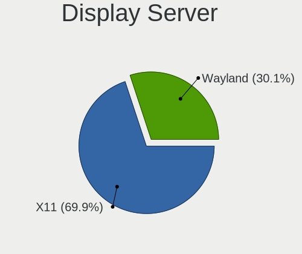
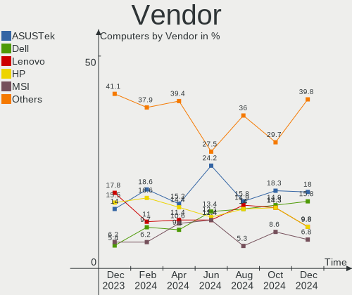
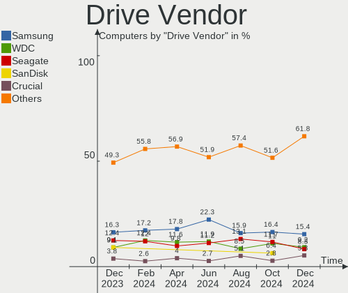
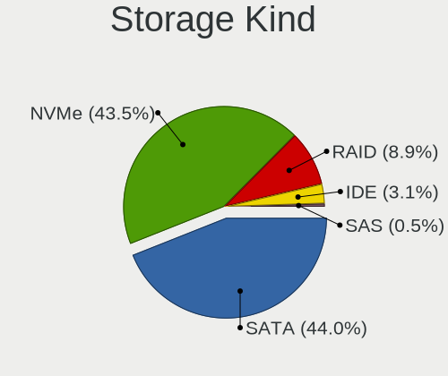
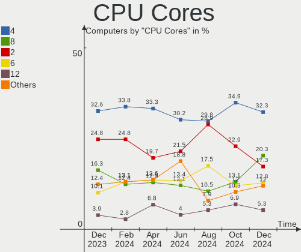
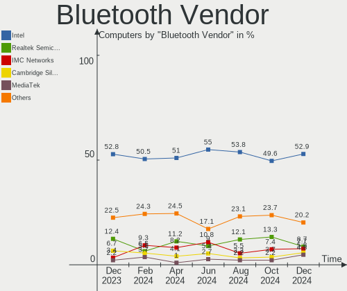
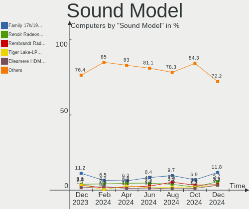
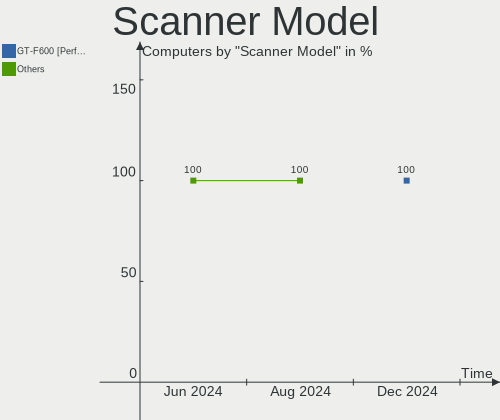

Kubuntu Hardware Trends
-----------------------

A project to identify most popular hardware characteristics and track their change
over time based on data collected by Kubuntu users at https://Linux-Hardware.org.

Anyone can contribute to this report by the [hw-probe](https://github.com/linuxhw/hw-probe) tool:

    sudo -E hw-probe -all -upload

This is a report for all computer types. See also reports for [desktops](/Dist/Kubuntu/Desktop/README.md) and [notebooks](/Dist/Kubuntu/Notebook/README.md).

Full-feature report is available here: https://linux-hardware.org/?view=trends

Period: Dec, 2021.

Contents
--------

* [ System ](#system)
  - [ OS                       ](#os)
  - [ OS Family                ](#os-family)
  - [ Kernel                   ](#kernel)
  - [ Kernel Family            ](#kernel-family)
  - [ Kernel Major Ver.        ](#kernel-major-ver)
  - [ Arch                     ](#arch)
  - [ DE                       ](#de)
  - [ Display Server           ](#display-server)
  - [ Display Manager          ](#display-manager)
  - [ OS Lang                  ](#os-lang)
  - [ Boot Mode                ](#boot-mode)
  - [ Filesystem               ](#filesystem)
  - [ Part. scheme             ](#part-scheme)
  - [ Dual Boot with Linux/BSD ](#dual-boot-with-linuxbsd)
  - [ Dual Boot (Win)          ](#dual-boot-win)

* [ Board ](#board)
  - [ Vendor                   ](#vendor)
  - [ Model                    ](#model)
  - [ Model Family             ](#model-family)
  - [ MFG Year                 ](#mfg-year)
  - [ Form Factor              ](#form-factor)
  - [ Secure Boot              ](#secure-boot)
  - [ Coreboot                 ](#coreboot)
  - [ RAM Size                 ](#ram-size)
  - [ RAM Used                 ](#ram-used)
  - [ Total Drives             ](#total-drives)
  - [ Has CD-ROM               ](#has-cd-rom)
  - [ Has Ethernet             ](#has-ethernet)
  - [ Has WiFi                 ](#has-wifi)
  - [ Has Bluetooth            ](#has-bluetooth)

* [ Location ](#location)
  - [ Country                  ](#country)
  - [ City                     ](#city)

* [ Drives ](#drives)
  - [ Drive Vendor             ](#drive-vendor)
  - [ Drive Model              ](#drive-model)
  - [ HDD Vendor               ](#hdd-vendor)
  - [ SSD Vendor               ](#ssd-vendor)
  - [ Drive Kind               ](#drive-kind)
  - [ Drive Connector          ](#drive-connector)
  - [ Drive Size               ](#drive-size)
  - [ Space Total              ](#space-total)
  - [ Space Used               ](#space-used)
  - [ Malfunc. Drives          ](#malfunc-drives)
  - [ Malfunc. Drive Vendor    ](#malfunc-drive-vendor)
  - [ Malfunc. HDD Vendor      ](#malfunc-hdd-vendor)
  - [ Malfunc. Drive Kind      ](#malfunc-drive-kind)
  - [ Failed Drives            ](#failed-drives)
  - [ Failed Drive Vendor      ](#failed-drive-vendor)
  - [ Drive Status             ](#drive-status)

* [ Storage controller ](#storage-controller)
  - [ Storage Vendor           ](#storage-vendor)
  - [ Storage Model            ](#storage-model)
  - [ Storage Kind             ](#storage-kind)

* [ Processor ](#processor)
  - [ CPU Vendor               ](#cpu-vendor)
  - [ CPU Model                ](#cpu-model)
  - [ CPU Model Family         ](#cpu-model-family)
  - [ CPU Cores                ](#cpu-cores)
  - [ CPU Sockets              ](#cpu-sockets)
  - [ CPU Threads              ](#cpu-threads)
  - [ CPU Op-Modes             ](#cpu-op-modes)
  - [ CPU Microcode            ](#cpu-microcode)
  - [ CPU Microarch            ](#cpu-microarch)

* [ Graphics ](#graphics)
  - [ GPU Vendor               ](#gpu-vendor)
  - [ GPU Model                ](#gpu-model)
  - [ GPU Combo                ](#gpu-combo)
  - [ GPU Driver               ](#gpu-driver)
  - [ GPU Memory               ](#gpu-memory)

* [ Monitor ](#monitor)
  - [ Monitor Vendor           ](#monitor-vendor)
  - [ Monitor Model            ](#monitor-model)
  - [ Monitor Resolution       ](#monitor-resolution)
  - [ Monitor Diagonal         ](#monitor-diagonal)
  - [ Monitor Width            ](#monitor-width)
  - [ Aspect Ratio             ](#aspect-ratio)
  - [ Monitor Area             ](#monitor-area)
  - [ Pixel Density            ](#pixel-density)
  - [ Multiple Monitors        ](#multiple-monitors)

* [ Network ](#network)
  - [ Net Controller Vendor    ](#net-controller-vendor)
  - [ Net Controller Model     ](#net-controller-model)
  - [ Wireless Vendor          ](#wireless-vendor)
  - [ Wireless Model           ](#wireless-model)
  - [ Ethernet Vendor          ](#ethernet-vendor)
  - [ Ethernet Model           ](#ethernet-model)
  - [ Net Controller Kind      ](#net-controller-kind)
  - [ Used Controller          ](#used-controller)
  - [ NICs                     ](#nics)
  - [ IPv6                     ](#ipv6)

* [ Bluetooth ](#bluetooth)
  - [ Bluetooth Vendor         ](#bluetooth-vendor)
  - [ Bluetooth Model          ](#bluetooth-model)

* [ Sound ](#sound)
  - [ Sound Vendor             ](#sound-vendor)
  - [ Sound Model              ](#sound-model)

* [ Memory ](#memory)
  - [ Memory Vendor            ](#memory-vendor)
  - [ Memory Model             ](#memory-model)
  - [ Memory Kind              ](#memory-kind)
  - [ Memory Form Factor       ](#memory-form-factor)
  - [ Memory Size              ](#memory-size)
  - [ Memory Speed             ](#memory-speed)

* [ Printers & scanners ](#printers--scanners)
  - [ Printer Vendor           ](#printer-vendor)
  - [ Printer Model            ](#printer-model)
  - [ Scanner Vendor           ](#scanner-vendor)
  - [ Scanner Model            ](#scanner-model)

* [ Camera ](#camera)
  - [ Camera Vendor            ](#camera-vendor)
  - [ Camera Model             ](#camera-model)

* [ Security ](#security)
  - [ Fingerprint Vendor       ](#fingerprint-vendor)
  - [ Fingerprint Model        ](#fingerprint-model)
  - [ Chipcard Vendor          ](#chipcard-vendor)
  - [ Chipcard Model           ](#chipcard-model)

* [ Unsupported ](#unsupported)
  - [ Unsupported Devices      ](#unsupported-devices)
  - [ Unsupported Device Types ](#unsupported-device-types)

System
------

OS
--

Installed operating systems

| Name          | Computers | Percent |
|---------------|-----------|---------|
| Kubuntu 21.10 | 45        | 45.45%  |
| Kubuntu 20.04 | 37        | 37.37%  |
| Kubuntu 21.04 | 9         | 9.09%   |
| Kubuntu 22.04 | 5         | 5.05%   |
| Kubuntu 20.10 | 2         | 2.02%   |
| Kubuntu 18.04 | 1         | 1.01%   |

OS Family
---------

OS without a version

| Name    | Computers | Percent |
|---------|-----------|---------|
| Kubuntu | 99        | 100%    |

Kernel
------

Version of the Linux kernel

| Version                  | Computers | Percent |
|--------------------------|-----------|---------|
| 5.13.0-22-generic        | 25        | 25.25%  |
| 5.11.0-41-generic        | 13        | 13.13%  |
| 5.11.0-43-generic        | 11        | 11.11%  |
| 5.4.0-91-generic         | 9         | 9.09%   |
| 5.13.0-22-lowlatency     | 7         | 7.07%   |
| 5.13.0-19-generic        | 5         | 5.05%   |
| 5.13.0-23-generic        | 4         | 4.04%   |
| 5.8.0-63-generic         | 2         | 2.02%   |
| 5.11.0-44-generic        | 2         | 2.02%   |
| 5.11.0-27-generic        | 2         | 2.02%   |
| 5.10.0-1052-oem          | 2         | 2.02%   |
| 5.16.0-051600rc3-generic | 1         | 1.01%   |
| 5.15.7-051507-generic    | 1         | 1.01%   |
| 5.15.6-051506-lowlatency | 1         | 1.01%   |
| 5.15.6-051506-generic    | 1         | 1.01%   |
| 5.15.5-core              | 1         | 1.01%   |
| 5.15.12-051512-generic   | 1         | 1.01%   |
| 5.15.10                  | 1         | 1.01%   |
| 5.15.0-13-lowlatency     | 1         | 1.01%   |
| 5.15.0-13-generic        | 1         | 1.01%   |
| 5.15.0-051500-generic    | 1         | 1.01%   |
| 5.14.9-051409-generic    | 1         | 1.01%   |
| 5.13.0-21-lowlatency     | 1         | 1.01%   |
| 5.13.0-21-generic        | 1         | 1.01%   |
| 5.12.6-051206-generic    | 1         | 1.01%   |
| 5.11.0-41-lowlatency     | 1         | 1.01%   |
| 5.11.0-40-generic        | 1         | 1.01%   |
| 5.11.0-18-generic        | 1         | 1.01%   |

Kernel Family
-------------

Linux kernel without a distro release

| Version | Computers | Percent |
|---------|-----------|---------|
| 5.13.0  | 43        | 43.43%  |
| 5.11.0  | 31        | 31.31%  |
| 5.4.0   | 9         | 9.09%   |
| 5.15.0  | 3         | 3.03%   |
| 5.8.0   | 2         | 2.02%   |
| 5.15.6  | 2         | 2.02%   |
| 5.10.0  | 2         | 2.02%   |
| 5.16.0  | 1         | 1.01%   |
| 5.15.7  | 1         | 1.01%   |
| 5.15.5  | 1         | 1.01%   |
| 5.15.12 | 1         | 1.01%   |
| 5.15.10 | 1         | 1.01%   |
| 5.14.9  | 1         | 1.01%   |
| 5.12.6  | 1         | 1.01%   |

Kernel Major Ver.
-----------------

Linux kernel major version

| Version | Computers | Percent |
|---------|-----------|---------|
| 5.13    | 43        | 43.43%  |
| 5.11    | 31        | 31.31%  |
| 5.4     | 9         | 9.09%   |
| 5.15    | 9         | 9.09%   |
| 5.8     | 2         | 2.02%   |
| 5.10    | 2         | 2.02%   |
| 5.16    | 1         | 1.01%   |
| 5.14    | 1         | 1.01%   |
| 5.12    | 1         | 1.01%   |

Arch
----

OS architecture (x86_64, i586, etc.)

| Name   | Computers | Percent |
|--------|-----------|---------|
| x86_64 | 99        | 100%    |

DE
--

Desktop Environment

| Name   | Computers | Percent |
|--------|-----------|---------|
| KDE5   | 95        | 95.96%  |
| KDE    | 2         | 2.02%   |
| GNOME  | 1         | 1.01%   |
| Budgie | 1         | 1.01%   |

Display Server
--------------

X11 or Wayland

| Name    | Computers | Percent |
|---------|-----------|---------|
| X11     | 93        | 93.94%  |
| Wayland | 5         | 5.05%   |
| Tty     | 1         | 1.01%   |

Display Manager
---------------

SDDM, LightDM, etc.

| Name    | Computers | Percent |
|---------|-----------|---------|
| SDDM    | 77        | 77.78%  |
| Unknown | 13        | 13.13%  |
| GDM     | 5         | 5.05%   |
| LightDM | 3         | 3.03%   |
| GDM3    | 1         | 1.01%   |

OS Lang
-------

Language

| Lang  | Computers | Percent |
|-------|-----------|---------|
| en_US | 36        | 36.36%  |
| de_DE | 10        | 10.1%   |
| fr_FR | 8         | 8.08%   |
| en_AU | 6         | 6.06%   |
| ru_RU | 4         | 4.04%   |
| it_IT | 4         | 4.04%   |
| pt_BR | 3         | 3.03%   |
| en_IN | 3         | 3.03%   |
| ru_UA | 2         | 2.02%   |
| fr_BE | 2         | 2.02%   |
| es_MX | 2         | 2.02%   |
| es_ES | 2         | 2.02%   |
| de_AT | 2         | 2.02%   |
| cs_CZ | 2         | 2.02%   |
| zh_CN | 1         | 1.01%   |
| sv_SE | 1         | 1.01%   |
| sk_SK | 1         | 1.01%   |
| pt_PT | 1         | 1.01%   |
| pl_PL | 1         | 1.01%   |
| nl_NL | 1         | 1.01%   |
| hu_HU | 1         | 1.01%   |
| en_ZA | 1         | 1.01%   |
| en_NL | 1         | 1.01%   |
| en_GB | 1         | 1.01%   |
| en_CA | 1         | 1.01%   |
| C     | 1         | 1.01%   |
| be_BY | 1         | 1.01%   |

Boot Mode
---------

EFI or BIOS

| Mode | Computers | Percent |
|------|-----------|---------|
| EFI  | 59        | 59.6%   |
| BIOS | 40        | 40.4%   |

Filesystem
----------

Type of filesystem

| Type    | Computers | Percent |
|---------|-----------|---------|
| Ext4    | 93        | 93.94%  |
| Btrfs   | 4         | 4.04%   |
| Overlay | 2         | 2.02%   |

Part. scheme
------------

Scheme of partitioning

| Type    | Computers | Percent |
|---------|-----------|---------|
| GPT     | 49        | 49.49%  |
| Unknown | 45        | 45.45%  |
| MBR     | 5         | 5.05%   |

Dual Boot with Linux/BSD
------------------------

Hosting more than one Linux/BSD

| Dual boot | Computers | Percent |
|-----------|-----------|---------|
| No        | 81        | 81.82%  |
| Yes       | 18        | 18.18%  |

Dual Boot (Win)
---------------

Hosting Linux and Windows

| Dual boot | Computers | Percent |
|-----------|-----------|---------|
| No        | 56        | 56.57%  |
| Yes       | 43        | 43.43%  |

Board
-----

Vendor
------

Motherboard manufacturer

| Name                | Computers | Percent |
|---------------------|-----------|---------|
| ASUSTek Computer    | 20        | 20.2%   |
| Lenovo              | 17        | 17.17%  |
| Hewlett-Packard     | 14        | 14.14%  |
| Dell                | 13        | 13.13%  |
| Gigabyte Technology | 9         | 9.09%   |
| MSI                 | 7         | 7.07%   |
| ASRock              | 6         | 6.06%   |
| Acer                | 4         | 4.04%   |
| Intel               | 2         | 2.02%   |
| Unknown             | 2         | 2.02%   |
| Timi                | 1         | 1.01%   |
| Mediacom            | 1         | 1.01%   |
| HUAWEI              | 1         | 1.01%   |
| Chuwi               | 1         | 1.01%   |
| Apple               | 1         | 1.01%   |

Model
-----

Motherboard model

| Name                                  | Computers | Percent |
|---------------------------------------|-----------|---------|
| Gigabyte H110M-S2H                    | 2         | 2.02%   |
| ASUS ROG Zephyrus M16 GU603HE_GU603HE | 2         | 2.02%   |
| Unknown                               | 2         | 2.02%   |
| Timi Mi Gaming Laptop 15.6            | 1         | 1.01%   |
| MSI Pulse GL76 11UEK                  | 1         | 1.01%   |
| MSI MS-7D18                           | 1         | 1.01%   |
| MSI MS-7C09                           | 1         | 1.01%   |
| MSI MS-7C02                           | 1         | 1.01%   |
| MSI GE75 Raider 10SE                  | 1         | 1.01%   |
| MSI GE62 2QD                          | 1         | 1.01%   |
| MSI Delta 15 A5EFK                    | 1         | 1.01%   |
| Mediacom M-SB151                      | 1         | 1.01%   |
| Lenovo Z50-70 20354                   | 1         | 1.01%   |
| Lenovo V580c 20160                    | 1         | 1.01%   |
| Lenovo ThinkPad L15 Gen 2 20X3005FSP  | 1         | 1.01%   |
| Lenovo ThinkPad E480 20KN001QRT       | 1         | 1.01%   |
| Lenovo ThinkPad E15 Gen 3 20YGS02R00  | 1         | 1.01%   |
| Lenovo ThinkPad E15 Gen 2 20TD0019RI  | 1         | 1.01%   |
| Lenovo ThinkCentre M93p 10AAS11Y00    | 1         | 1.01%   |
| Lenovo ThinkBook 14 G3 ACL 21A2       | 1         | 1.01%   |
| Lenovo ThinkBook 13s G2 ITL 20V9      | 1         | 1.01%   |
| Lenovo Product                        | 1         | 1.01%   |
| Lenovo Legion Y530-15ICH 81FV         | 1         | 1.01%   |
| Lenovo Legion 5 15ARH05H 82B1         | 1         | 1.01%   |
| Lenovo IdeaPad D330-10IGM 81H3        | 1         | 1.01%   |
| Lenovo IdeaPad C340-14IML 81TK        | 1         | 1.01%   |
| Lenovo G710 20252                     | 1         | 1.01%   |
| Lenovo G505 20240                     | 1         | 1.01%   |
| Lenovo G500 20236                     | 1         | 1.01%   |
| Intel X99 V1.0                        | 1         | 1.01%   |
| Intel NUC7i3BNK                       | 1         | 1.01%   |
| HUAWEI NBLK-WAX9X                     | 1         | 1.01%   |
| HP ZBook 15 G4                        | 1         | 1.01%   |
| HP Z2 Tower G5 Workstation            | 1         | 1.01%   |
| HP Spectre x360 Convertible 13-aw2xxx | 1         | 1.01%   |
| HP ProBook 640 G4                     | 1         | 1.01%   |
| HP Presario CQ57                      | 1         | 1.01%   |
| HP Pavilion g6                        | 1         | 1.01%   |
| HP Pavilion dv6                       | 1         | 1.01%   |
| HP Laptop 15-ef0xxx                   | 1         | 1.01%   |
| HP Laptop 15-db0xxx                   | 1         | 1.01%   |
| HP ENVY Laptop 17-ce1xxx              | 1         | 1.01%   |
| HP ENVY Laptop 13-aq1xxx              | 1         | 1.01%   |
| HP EliteDesk 800 G3 DM 35W            | 1         | 1.01%   |
| HP 870-119                            | 1         | 1.01%   |
| HP 250 G5 Notebook PC                 | 1         | 1.01%   |
| Gigabyte X470 AORUS GAMING 7 WIFI     | 1         | 1.01%   |
| Gigabyte P35-DS3L                     | 1         | 1.01%   |
| Gigabyte GA-870A-UD3                  | 1         | 1.01%   |
| Gigabyte B550M DS3H                   | 1         | 1.01%   |
| Gigabyte B550 VISION D-P              | 1         | 1.01%   |
| Gigabyte B150M-HD3-CF                 | 1         | 1.01%   |
| Gigabyte A320M-S2H                    | 1         | 1.01%   |
| Dell XPS 15 9550                      | 1         | 1.01%   |
| Dell XPS 15 9500                      | 1         | 1.01%   |
| Dell XPS 13 7390                      | 1         | 1.01%   |
| Dell Precision 5520                   | 1         | 1.01%   |
| Dell Precision 5510                   | 1         | 1.01%   |
| Dell PowerEdge T620                   | 1         | 1.01%   |
| Dell Latitude E5530 non-vPro          | 1         | 1.01%   |

Model Family
------------

Motherboard model prefix

| Name                  | Computers | Percent |
|-----------------------|-----------|---------|
| ASUS ROG              | 7         | 7.07%   |
| Lenovo ThinkPad       | 4         | 4.04%   |
| Dell Latitude         | 4         | 4.04%   |
| Dell XPS              | 3         | 3.03%   |
| Dell Inspiron         | 3         | 3.03%   |
| ASUS VivoBook         | 3         | 3.03%   |
| Acer Aspire           | 3         | 3.03%   |
| Lenovo ThinkBook      | 2         | 2.02%   |
| Lenovo Legion         | 2         | 2.02%   |
| Lenovo IdeaPad        | 2         | 2.02%   |
| HP Pavilion           | 2         | 2.02%   |
| HP Laptop             | 2         | 2.02%   |
| HP ENVY               | 2         | 2.02%   |
| Gigabyte H110M-S2H    | 2         | 2.02%   |
| Dell Precision        | 2         | 2.02%   |
| ASUS ZenBook          | 2         | 2.02%   |
| Unknown               | 2         | 2.02%   |
| Timi Mi               | 1         | 1.01%   |
| MSI Pulse             | 1         | 1.01%   |
| MSI MS-7D18           | 1         | 1.01%   |
| MSI MS-7C09           | 1         | 1.01%   |
| MSI MS-7C02           | 1         | 1.01%   |
| MSI GE75              | 1         | 1.01%   |
| MSI GE62              | 1         | 1.01%   |
| MSI Delta             | 1         | 1.01%   |
| Mediacom M-SB151      | 1         | 1.01%   |
| Lenovo Z50-70         | 1         | 1.01%   |
| Lenovo V580c          | 1         | 1.01%   |
| Lenovo ThinkCentre    | 1         | 1.01%   |
| Lenovo Product        | 1         | 1.01%   |
| Lenovo G710           | 1         | 1.01%   |
| Lenovo G505           | 1         | 1.01%   |
| Lenovo G500           | 1         | 1.01%   |
| Intel X99             | 1         | 1.01%   |
| Intel NUC7i3BNK       | 1         | 1.01%   |
| HUAWEI NBLK-WAX9X     | 1         | 1.01%   |
| HP ZBook              | 1         | 1.01%   |
| HP Z2                 | 1         | 1.01%   |
| HP Spectre            | 1         | 1.01%   |
| HP ProBook            | 1         | 1.01%   |
| HP Presario           | 1         | 1.01%   |
| HP EliteDesk          | 1         | 1.01%   |
| HP 870-119            | 1         | 1.01%   |
| HP 250                | 1         | 1.01%   |
| Gigabyte X470         | 1         | 1.01%   |
| Gigabyte P35-DS3L     | 1         | 1.01%   |
| Gigabyte GA-870A-UD3  | 1         | 1.01%   |
| Gigabyte B550M        | 1         | 1.01%   |
| Gigabyte B550         | 1         | 1.01%   |
| Gigabyte B150M-HD3-CF | 1         | 1.01%   |
| Gigabyte A320M-S2H    | 1         | 1.01%   |
| Dell PowerEdge        | 1         | 1.01%   |
| Chuwi GemiBook        | 1         | 1.01%   |
| ASUS X580VD           | 1         | 1.01%   |
| ASUS TUF              | 1         | 1.01%   |
| ASUS PRIME            | 1         | 1.01%   |
| ASUS P8B75-M          | 1         | 1.01%   |
| ASUS M4A785TD-M       | 1         | 1.01%   |
| ASUS K72Jr            | 1         | 1.01%   |
| ASUS ASUS             | 1         | 1.01%   |

MFG Year
--------

Motherboard manufacture year

| Year | Computers | Percent |
|------|-----------|---------|
| 2021 | 35        | 35.35%  |
| 2020 | 16        | 16.16%  |
| 2019 | 11        | 11.11%  |
| 2013 | 7         | 7.07%   |
| 2018 | 4         | 4.04%   |
| 2017 | 4         | 4.04%   |
| 2016 | 4         | 4.04%   |
| 2015 | 4         | 4.04%   |
| 2010 | 4         | 4.04%   |
| 2014 | 3         | 3.03%   |
| 2012 | 3         | 3.03%   |
| 2011 | 3         | 3.03%   |
| 2007 | 1         | 1.01%   |

Form Factor
-----------

Physical design of the computer

| Name        | Computers | Percent |
|-------------|-----------|---------|
| Notebook    | 57        | 57.58%  |
| Desktop     | 35        | 35.35%  |
| Convertible | 2         | 2.02%   |
| Mini pc     | 2         | 2.02%   |
| Tablet      | 1         | 1.01%   |
| All in one  | 1         | 1.01%   |
| Server      | 1         | 1.01%   |

Secure Boot
-----------

Enabled or disabled

| State    | Computers | Percent |
|----------|-----------|---------|
| Disabled | 92        | 92.93%  |
| Enabled  | 7         | 7.07%   |

Coreboot
--------

Have coreboot on board

| Used | Computers | Percent |
|------|-----------|---------|
| No   | 99        | 100%    |

RAM Size
--------

Total RAM memory

| Size in GB  | Computers | Percent |
|-------------|-----------|---------|
| 16.01-24.0  | 39        | 39.39%  |
| 8.01-16.0   | 19        | 19.19%  |
| 4.01-8.0    | 18        | 18.18%  |
| 32.01-64.0  | 16        | 16.16%  |
| 3.01-4.0    | 2         | 2.02%   |
| 64.01-256.0 | 2         | 2.02%   |
| 1.01-2.0    | 2         | 2.02%   |
| 24.01-32.0  | 1         | 1.01%   |

RAM Used
--------

Used RAM memory

| Used GB    | Computers | Percent |
|------------|-----------|---------|
| 2.01-3.0   | 34        | 34.34%  |
| 1.01-2.0   | 20        | 20.2%   |
| 3.01-4.0   | 18        | 18.18%  |
| 4.01-8.0   | 17        | 17.17%  |
| 8.01-16.0  | 5         | 5.05%   |
| 16.01-24.0 | 2         | 2.02%   |
| 0.51-1.0   | 2         | 2.02%   |
| 24.01-32.0 | 1         | 1.01%   |

Total Drives
------------

Number of drives on board

| Drives | Computers | Percent |
|--------|-----------|---------|
| 1      | 50        | 50.51%  |
| 2      | 26        | 26.26%  |
| 3      | 16        | 16.16%  |
| 4      | 4         | 4.04%   |
| 5      | 2         | 2.02%   |
| 9      | 1         | 1.01%   |

Has CD-ROM
----------

Has CD-ROM on board

| Presented | Computers | Percent |
|-----------|-----------|---------|
| No        | 72        | 72.73%  |
| Yes       | 27        | 27.27%  |

Has Ethernet
------------

Has Ethernet on board

| Presented | Computers | Percent |
|-----------|-----------|---------|
| Yes       | 82        | 82.83%  |
| No        | 17        | 17.17%  |

Has WiFi
--------

Has WiFi module

| Presented | Computers | Percent |
|-----------|-----------|---------|
| Yes       | 76        | 76.77%  |
| No        | 23        | 23.23%  |

Has Bluetooth
-------------

Has Bluetooth module

| Presented | Computers | Percent |
|-----------|-----------|---------|
| Yes       | 69        | 69.7%   |
| No        | 30        | 30.3%   |

Location
--------

Country
-------

Geographic location (country)

| Country      | Computers | Percent |
|--------------|-----------|---------|
| USA          | 17        | 17.17%  |
| Germany      | 11        | 11.11%  |
| France       | 9         | 9.09%   |
| Italy        | 6         | 6.06%   |
| Australia    | 6         | 6.06%   |
| Ukraine      | 4         | 4.04%   |
| Spain        | 4         | 4.04%   |
| Russia       | 4         | 4.04%   |
| Brazil       | 4         | 4.04%   |
| Turkey       | 3         | 3.03%   |
| India        | 3         | 3.03%   |
| UK           | 2         | 2.02%   |
| Mexico       | 2         | 2.02%   |
| Iran         | 2         | 2.02%   |
| Czechia      | 2         | 2.02%   |
| China        | 2         | 2.02%   |
| Belgium      | 2         | 2.02%   |
| Austria      | 2         | 2.02%   |
| Vietnam      | 1         | 1.01%   |
| Uzbekistan   | 1         | 1.01%   |
| Sweden       | 1         | 1.01%   |
| South Africa | 1         | 1.01%   |
| Slovakia     | 1         | 1.01%   |
| Serbia       | 1         | 1.01%   |
| Romania      | 1         | 1.01%   |
| Portugal     | 1         | 1.01%   |
| Poland       | 1         | 1.01%   |
| Japan        | 1         | 1.01%   |
| Hungary      | 1         | 1.01%   |
| Croatia      | 1         | 1.01%   |
| Canada       | 1         | 1.01%   |
| Belarus      | 1         | 1.01%   |

City
----

Geographic location (city)

| City               | Computers | Percent |
|--------------------|-----------|---------|
| Villemomble        | 2         | 2.02%   |
| Sydney             | 2         | 2.02%   |
| Shanghai           | 2         | 2.02%   |
| Schonaich          | 2         | 2.02%   |
| S??o Paulo         | 2         | 2.02%   |
| Moscow             | 2         | 2.02%   |
| Kyiv               | 2         | 2.02%   |
| Istanbul           | 2         | 2.02%   |
| Canberra           | 2         | 2.02%   |
| Berlin             | 2         | 2.02%   |
| Zagreb             | 1         | 1.01%   |
| Wolgast            | 1         | 1.01%   |
| Warsaw             | 1         | 1.01%   |
| Vicosa do Ceara    | 1         | 1.01%   |
| Tyumen             | 1         | 1.01%   |
| Turin              | 1         | 1.01%   |
| Townsville         | 1         | 1.01%   |
| Toluca             | 1         | 1.01%   |
| Thousand Oaks      | 1         | 1.01%   |
| Tehran             | 1         | 1.01%   |
| Southend-on-Sea    | 1         | 1.01%   |
| Somerville         | 1         | 1.01%   |
| Secaucus           | 1         | 1.01%   |
| Sankt P?¶lten      | 1         | 1.01%   |
| San Miguel el Alto | 1         | 1.01%   |
| Roissy-en-Brie     | 1         | 1.01%   |
| Rho                | 1         | 1.01%   |
| Reichertshofen     | 1         | 1.01%   |
| Pune               | 1         | 1.01%   |
| Prague             | 1         | 1.01%   |
| Potchefstroom      | 1         | 1.01%   |
| Portland           | 1         | 1.01%   |
| Poitiers           | 1         | 1.01%   |
| Perth              | 1         | 1.01%   |
| Pata               | 1         | 1.01%   |
| Paris              | 1         | 1.01%   |
| Orlando            | 1         | 1.01%   |
| Nauheim            | 1         | 1.01%   |
| Minsk              | 1         | 1.01%   |
| Milan              | 1         | 1.01%   |
| Mieuxce            | 1         | 1.01%   |
| Middleburg         | 1         | 1.01%   |
| M??laga            | 1         | 1.01%   |
| Madrid             | 1         | 1.01%   |
| Lyon               | 1         | 1.01%   |
| Lule??             | 1         | 1.01%   |
| London             | 1         | 1.01%   |
| Leverkusen         | 1         | 1.01%   |
| Lepe               | 1         | 1.01%   |
| Le Havre           | 1         | 1.01%   |
| Lancaster          | 1         | 1.01%   |
| Kremenchug         | 1         | 1.01%   |
| Krasnoyarsk        | 1         | 1.01%   |
| Kolkata            | 1         | 1.01%   |
| Kharkiv            | 1         | 1.01%   |
| Kerrville          | 1         | 1.01%   |
| Karaj              | 1         | 1.01%   |
| Jihlava            | 1         | 1.01%   |
| Jamaica Plain      | 1         | 1.01%   |
| Jacksonville       | 1         | 1.01%   |

Drives
------

Drive Vendor
------------

Hard drive vendors

| Vendor                    | Computers | Drives | Percent |
|---------------------------|-----------|--------|---------|
| WDC                       | 27        | 32     | 17.2%   |
| Samsung Electronics       | 27        | 39     | 17.2%   |
| Seagate                   | 24        | 34     | 15.29%  |
| Intel                     | 12        | 12     | 7.64%   |
| Toshiba                   | 8         | 8      | 5.1%    |
| Crucial                   | 8         | 9      | 5.1%    |
| Micron Technology         | 6         | 7      | 3.82%   |
| Kingston                  | 6         | 6      | 3.82%   |
| Unknown                   | 4         | 5      | 2.55%   |
| SanDisk                   | 4         | 4      | 2.55%   |
| HGST                      | 4         | 4      | 2.55%   |
| SK Hynix                  | 3         | 3      | 1.91%   |
| A-DATA Technology         | 3         | 3      | 1.91%   |
| XPG                       | 2         | 2      | 1.27%   |
| Transcend                 | 2         | 2      | 1.27%   |
| Zheino                    | 1         | 1      | 0.64%   |
| SSSTC                     | 1         | 1      | 0.64%   |
| Silicon Motion            | 1         | 1      | 0.64%   |
| SABRENT                   | 1         | 1      | 0.64%   |
| PLEXTOR                   | 1         | 1      | 0.64%   |
| Micron/Crucial Technology | 1         | 1      | 0.64%   |
| LITEON                    | 1         | 1      | 0.64%   |
| LIO-ORG                   | 1         | 1      | 0.64%   |
| KIOXIA                    | 1         | 1      | 0.64%   |
| KingSpec                  | 1         | 1      | 0.64%   |
| JMicron                   | 1         | 1      | 0.64%   |
| Hitachi                   | 1         | 1      | 0.64%   |
| Fujitsu                   | 1         | 1      | 0.64%   |
| ASMT                      | 1         | 1      | 0.64%   |
| Apple                     | 1         | 1      | 0.64%   |
| Apacer                    | 1         | 1      | 0.64%   |
| Unknown                   | 1         | 1      | 0.64%   |

Drive Model
-----------

Hard drive models

| Model                                   | Computers | Percent |
|-----------------------------------------|-----------|---------|
| Intel NVMe SSD Drive 512GB              | 4         | 2.22%   |
| Seagate ST1000LM024 HN-M101MBB 1TB      | 3         | 1.67%   |
| WDC PC SN530 SDBPMPZ-512G-1101 512GB    | 2         | 1.11%   |
| Toshiba MQ04ABF100 1TB                  | 2         | 1.11%   |
| SK Hynix NVMe SSD Drive 256GB           | 2         | 1.11%   |
| Seagate ST500DM002-1BD142 500GB         | 2         | 1.11%   |
| Seagate Backup+ Hub BK 8TB              | 2         | 1.11%   |
| Samsung SSD 860 EVO 1TB                 | 2         | 1.11%   |
| Samsung SSD 850 EVO 500GB               | 2         | 1.11%   |
| Samsung NVMe SSD Drive 500GB            | 2         | 1.11%   |
| Intel SSDPEKNW512G8 512GB               | 2         | 1.11%   |
| Intel SSDPEKNW010T8 1TB                 | 2         | 1.11%   |
| Crucial CT1000MX500SSD1 1TB             | 2         | 1.11%   |
| Zheino CHN 25SATAS3 128 128GB SSD       | 1         | 0.56%   |
| XPG NVMe SSD Drive 512GB                | 1         | 0.56%   |
| XPG GAMMIX S11 Pro 1TB                  | 1         | 0.56%   |
| WDC WDS240G2G0A-00JH30 240GB SSD        | 1         | 0.56%   |
| WDC WDS200T2B0A-00SM50 2TB SSD          | 1         | 0.56%   |
| WDC WDS120G2G0A-00JH30 120GB SSD        | 1         | 0.56%   |
| WDC WDS100T2B0C-00PXH0 1TB              | 1         | 0.56%   |
| WDC WDS100T1X0E-00AFY0 1TB              | 1         | 0.56%   |
| WDC WDBNCE5000PNC 500GB SSD             | 1         | 0.56%   |
| WDC WD5000LPVT-24G33T1 500GB            | 1         | 0.56%   |
| WDC WD5000LPLX-60ZNTT1 500GB            | 1         | 0.56%   |
| WDC WD5000LPCX-24C6HT0 500GB            | 1         | 0.56%   |
| WDC WD5000AZLX-21K2TA0 500GB            | 1         | 0.56%   |
| WDC WD5000AURX-63UY4Y0 500GB            | 1         | 0.56%   |
| WDC WD5000AAKX-60U6AA0 500GB            | 1         | 0.56%   |
| WDC WD5000AAKS-07TMA0 500GB             | 1         | 0.56%   |
| WDC WD5000AAJS-00A8B0 500GB             | 1         | 0.56%   |
| WDC WD5000AADS-67S9B1 500GB             | 1         | 0.56%   |
| WDC WD40EFAX-68JH4N1 4TB                | 1         | 0.56%   |
| WDC WD3200BPVT-00ZEST0 320GB            | 1         | 0.56%   |
| WDC WD20EZRX-00D8PB0 2TB                | 1         | 0.56%   |
| WDC WD20EARX-32PASB0 2TB                | 1         | 0.56%   |
| WDC WD20EARX-00PASB0 2TB                | 1         | 0.56%   |
| WDC WD10JPVX-60JC3T0 1TB                | 1         | 0.56%   |
| WDC WD10EZRZ-00HTKB0 1TB                | 1         | 0.56%   |
| WDC WD10EZEX-75M2NA0 1TB                | 1         | 0.56%   |
| WDC WD10EZEX-22RKKA0 1TB                | 1         | 0.56%   |
| WDC WD10EZEX-08WN4A0 1TB                | 1         | 0.56%   |
| WDC WD My Passport 261B 500GB           | 1         | 0.56%   |
| WDC PC SN730 SDBPNTY-512G-1027 512GB    | 1         | 0.56%   |
| WDC PC SN520 SDAPNUW-512G-1006 512GB    | 1         | 0.56%   |
| WDC PC SN520 SDAPNUW-256G-1006 256GB    | 1         | 0.56%   |
| Unknown SD32G  32GB                     | 1         | 0.56%   |
| Unknown SD/MMC/MS PRO 7GB               | 1         | 0.56%   |
| Unknown MMC Card  64GB                  | 1         | 0.56%   |
| Unknown MMC Card  32GB                  | 1         | 0.56%   |
| Unknown MMC Card  128GB                 | 1         | 0.56%   |
| Transcend TS32GSSD370S 32GB             | 1         | 0.56%   |
| Transcend TS1TMTE220S 1TB               | 1         | 0.56%   |
| Toshiba THNSNJ128G8NY 128GB SSD         | 1         | 0.56%   |
| Toshiba THNSN5512GPU7 NVMe 512GB        | 1         | 0.56%   |
| Toshiba NVMe SSD Drive 512GB            | 1         | 0.56%   |
| Toshiba NVMe SSD Drive 256GB            | 1         | 0.56%   |
| Toshiba KXG6AZNV512G 512GB              | 1         | 0.56%   |
| Toshiba KSG60ZMV512G M.2 2280 512GB SSD | 1         | 0.56%   |
| SSSTC CL1-3D256-Q11 NVMe 256GB          | 1         | 0.56%   |
| SK Hynix HFS256G39TND-N210A 256GB SSD   | 1         | 0.56%   |

HDD Vendor
----------

Hard disk drive vendors

| Vendor              | Computers | Drives | Percent |
|---------------------|-----------|--------|---------|
| Seagate             | 23        | 30     | 43.4%   |
| WDC                 | 16        | 20     | 30.19%  |
| HGST                | 4         | 4      | 7.55%   |
| Samsung Electronics | 3         | 4      | 5.66%   |
| Toshiba             | 2         | 2      | 3.77%   |
| Unknown             | 1         | 1      | 1.89%   |
| SABRENT             | 1         | 1      | 1.89%   |
| LIO-ORG             | 1         | 1      | 1.89%   |
| Hitachi             | 1         | 1      | 1.89%   |
| Fujitsu             | 1         | 1      | 1.89%   |

SSD Vendor
----------

Solid state drive vendors

| Vendor              | Computers | Drives | Percent |
|---------------------|-----------|--------|---------|
| Samsung Electronics | 11        | 14     | 26.19%  |
| Crucial             | 7         | 8      | 16.67%  |
| WDC                 | 4         | 4      | 9.52%   |
| Kingston            | 4         | 4      | 9.52%   |
| SanDisk             | 3         | 3      | 7.14%   |
| Toshiba             | 2         | 2      | 4.76%   |
| A-DATA Technology   | 2         | 2      | 4.76%   |
| Zheino              | 1         | 1      | 2.38%   |
| Transcend           | 1         | 1      | 2.38%   |
| SK Hynix            | 1         | 1      | 2.38%   |
| Micron Technology   | 1         | 1      | 2.38%   |
| KingSpec            | 1         | 1      | 2.38%   |
| Intel               | 1         | 1      | 2.38%   |
| ASMT                | 1         | 1      | 2.38%   |
| Apple               | 1         | 1      | 2.38%   |
| Apacer              | 1         | 1      | 2.38%   |

Drive Kind
----------

HDD or SSD

| Kind    | Computers | Drives | Percent |
|---------|-----------|--------|---------|
| NVMe    | 54        | 66     | 38.3%   |
| HDD     | 42        | 65     | 29.79%  |
| SSD     | 38        | 46     | 26.95%  |
| MMC     | 4         | 5      | 2.84%   |
| Unknown | 3         | 5      | 2.13%   |

Drive Connector
---------------

SATA, SAS, NVMe, etc.

| Type | Computers | Drives | Percent |
|------|-----------|--------|---------|
| SATA | 67        | 104    | 50.76%  |
| NVMe | 54        | 66     | 40.91%  |
| SAS  | 7         | 12     | 5.3%    |
| MMC  | 4         | 5      | 3.03%   |

Drive Size
----------

Size of hard drive

| Size in TB | Computers | Drives | Percent |
|------------|-----------|--------|---------|
| 0.01-0.5   | 45        | 57     | 50%     |
| 0.51-1.0   | 28        | 35     | 31.11%  |
| 1.01-2.0   | 9         | 11     | 10%     |
| 3.01-4.0   | 4         | 4      | 4.44%   |
| 2.01-3.0   | 2         | 2      | 2.22%   |
| 4.01-10.0  | 2         | 2      | 2.22%   |

Space Total
-----------

Amount of disk space available on the file system

| Size in GB     | Computers | Percent |
|----------------|-----------|---------|
| 251-500        | 31        | 31.31%  |
| 101-250        | 26        | 26.26%  |
| 501-1000       | 13        | 13.13%  |
| More than 3000 | 10        | 10.1%   |
| 1001-2000      | 10        | 10.1%   |
| 51-100         | 5         | 5.05%   |
| 2001-3000      | 2         | 2.02%   |
| 21-50          | 1         | 1.01%   |
| 1-20           | 1         | 1.01%   |

Space Used
----------

Amount of used disk space

| Used GB        | Computers | Percent |
|----------------|-----------|---------|
| 101-250        | 24        | 24.24%  |
| 21-50          | 18        | 18.18%  |
| 1-20           | 17        | 17.17%  |
| 501-1000       | 10        | 10.1%   |
| 251-500        | 9         | 9.09%   |
| 51-100         | 9         | 9.09%   |
| More than 3000 | 7         | 7.07%   |
| 1001-2000      | 5         | 5.05%   |

Malfunc. Drives
---------------

Drive models with a malfunction

| Model                                 | Computers | Drives | Percent |
|---------------------------------------|-----------|--------|---------|
| WDC WD5000LPVT-24G33T1 500GB          | 1         | 1      | 9.09%   |
| WDC WD10EZEX-75M2NA0 1TB              | 1         | 1      | 9.09%   |
| Seagate ST31000524AS 1TB              | 1         | 1      | 9.09%   |
| Seagate ST1000LM048-2E7172 1TB        | 1         | 1      | 9.09%   |
| Seagate ST1000LM024 HN-M101MBB 1TB    | 1         | 1      | 9.09%   |
| Seagate ST1000DM003-1SB102 1TB        | 1         | 1      | 9.09%   |
| SanDisk SSD PLUS 480GB                | 1         | 1      | 9.09%   |
| Samsung Electronics SSD 960 PRO 512GB | 1         | 1      | 9.09%   |
| Samsung Electronics SSD 960 EVO 1TB   | 1         | 1      | 9.09%   |
| Samsung Electronics SP1614N 160GB     | 1         | 1      | 9.09%   |
| Samsung Electronics HD502HJ 500GB     | 1         | 1      | 9.09%   |

Malfunc. Drive Vendor
---------------------

Vendors of faulty drives

| Vendor              | Computers | Drives | Percent |
|---------------------|-----------|--------|---------|
| Seagate             | 4         | 4      | 40%     |
| Samsung Electronics | 3         | 4      | 30%     |
| WDC                 | 2         | 2      | 20%     |
| SanDisk             | 1         | 1      | 10%     |

Malfunc. HDD Vendor
-------------------

Vendors of faulty HDD drives

| Vendor              | Computers | Drives | Percent |
|---------------------|-----------|--------|---------|
| Seagate             | 4         | 4      | 57.14%  |
| WDC                 | 2         | 2      | 28.57%  |
| Samsung Electronics | 1         | 2      | 14.29%  |

Malfunc. Drive Kind
-------------------

Kinds of faulty drives

| Kind | Computers | Drives | Percent |
|------|-----------|--------|---------|
| HDD  | 7         | 8      | 70%     |
| NVMe | 2         | 2      | 20%     |
| SSD  | 1         | 1      | 10%     |

Failed Drives
-------------

Failed drive models

Zero info for selected period =(

Failed Drive Vendor
-------------------

Failed drive vendors

Zero info for selected period =(

Drive Status
------------

Number of failed and malfunc. drives

| Status   | Computers | Drives | Percent |
|----------|-----------|--------|---------|
| Works    | 53        | 87     | 46.49%  |
| Detected | 51        | 89     | 44.74%  |
| Malfunc  | 10        | 11     | 8.77%   |

Storage controller
------------------

Storage Vendor
--------------

Storage controller vendors

| Vendor                         | Computers | Percent |
|--------------------------------|-----------|---------|
| Intel                          | 67        | 47.52%  |
| AMD                            | 22        | 15.6%   |
| Samsung Electronics            | 17        | 12.06%  |
| Sandisk                        | 8         | 5.67%   |
| Toshiba America Info Systems   | 5         | 3.55%   |
| Micron Technology              | 5         | 3.55%   |
| ADATA Technology               | 3         | 2.13%   |
| SK Hynix                       | 2         | 1.42%   |
| Silicon Motion                 | 2         | 1.42%   |
| Micron/Crucial Technology      | 2         | 1.42%   |
| Lite-On Technology             | 2         | 1.42%   |
| JMicron Technology             | 2         | 1.42%   |
| Solid State Storage Technology | 1         | 0.71%   |
| Seagate Technology             | 1         | 0.71%   |
| Kingston Technology Company    | 1         | 0.71%   |
| ASMedia Technology             | 1         | 0.71%   |

Storage Model
-------------

Storage controller models

| Model                                                                            | Computers | Percent |
|----------------------------------------------------------------------------------|-----------|---------|
| AMD FCH SATA Controller [AHCI mode]                                              | 13        | 7.78%   |
| Samsung NVMe SSD Controller SM981/PM981/PM983                                    | 10        | 5.99%   |
| Intel 82801 Mobile SATA Controller [RAID mode]                                   | 8         | 4.79%   |
| Intel SSD 660P Series                                                            | 7         | 4.19%   |
| Intel Q170/Q150/B150/H170/H110/Z170/CM236 Chipset SATA Controller [AHCI Mode]    | 7         | 4.19%   |
| Intel 8 Series/C220 Series Chipset Family 6-port SATA Controller 1 [AHCI mode]   | 7         | 4.19%   |
| Intel Volume Management Device NVMe RAID Controller                              | 6         | 3.59%   |
| Intel Sunrise Point-LP SATA Controller [AHCI mode]                               | 6         | 3.59%   |
| Micron Non-Volatile memory controller                                            | 5         | 2.99%   |
| AMD Starship/Matisse Chipset SATA Controller [AHCI mode]                         | 5         | 2.99%   |
| Samsung NVMe SSD Controller 980                                                  | 4         | 2.4%    |
| AMD 400 Series Chipset SATA Controller                                           | 4         | 2.4%    |
| Toshiba America Info Systems XG6 NVMe SSD Controller                             | 3         | 1.8%    |
| Sandisk Non-Volatile memory controller                                           | 3         | 1.8%    |
| Samsung NVMe SSD Controller SM961/PM961/SM963                                    | 3         | 1.8%    |
| Intel Tiger Lake-LP SATA Controller [AHCI mode]                                  | 3         | 1.8%    |
| Intel Non-Volatile memory controller                                             | 3         | 1.8%    |
| Intel Comet Lake SATA AHCI Controller                                            | 3         | 1.8%    |
| Intel Celeron/Pentium Silver Processor SATA Controller                           | 3         | 1.8%    |
| Intel 7 Series Chipset Family 6-port SATA Controller [AHCI mode]                 | 3         | 1.8%    |
| Intel 500 Series Chipset Family SATA AHCI Controller                             | 3         | 1.8%    |
| ADATA XPG SX8200 Pro PCIe Gen3x4 M.2 2280 Solid State Drive                      | 3         | 1.8%    |
| Sandisk WD PC SN810 / Black SN850 NVMe SSD                                       | 2         | 1.2%    |
| Sandisk WD Blue SN500 / PC SN520 NVMe SSD                                        | 2         | 1.2%    |
| Intel Cannon Lake Mobile PCH SATA AHCI Controller                                | 2         | 1.2%    |
| Intel 200 Series PCH SATA controller [AHCI mode]                                 | 2         | 1.2%    |
| AMD SB7x0/SB8x0/SB9x0 SATA Controller [IDE mode]                                 | 2         | 1.2%    |
| AMD SB7x0/SB8x0/SB9x0 IDE Controller                                             | 2         | 1.2%    |
| Toshiba America Info Systems Toshiba America Info Non-Volatile memory controller | 1         | 0.6%    |
| Toshiba America Info Systems NVMe Controller                                     | 1         | 0.6%    |
| Solid State Storage Non-Volatile memory controller                               | 1         | 0.6%    |
| SK Hynix Non-Volatile memory controller                                          | 1         | 0.6%    |
| SK Hynix BC501 NVMe Solid State Drive                                            | 1         | 0.6%    |
| Silicon Motion SM2263EN/SM2263XT SSD Controller                                  | 1         | 0.6%    |
| Silicon Motion SM2262/SM2262EN SSD Controller                                    | 1         | 0.6%    |
| Seagate FireCuda 510 SSD                                                         | 1         | 0.6%    |
| Sandisk WD Black SN750 / PC SN730 NVMe SSD                                       | 1         | 0.6%    |
| Samsung NVMe SSD Controller PM9A1/PM9A3/980PRO                                   | 1         | 0.6%    |
| Samsung Electronics SATA controller                                              | 1         | 0.6%    |
| Micron/Crucial P2 NVMe PCIe SSD                                                  | 1         | 0.6%    |
| Micron/Crucial NVMe Controller                                                   | 1         | 0.6%    |
| Lite-On Non-Volatile memory controller                                           | 1         | 0.6%    |
| Lite-On M8Pe Series NVMe SSD                                                     | 1         | 0.6%    |
| Kingston Company Company Non-Volatile memory controller                          | 1         | 0.6%    |
| JMicron JMB368 IDE controller                                                    | 1         | 0.6%    |
| JMicron JMB363 SATA/IDE Controller                                               | 1         | 0.6%    |
| Intel NVMe Optane Memory Series                                                  | 1         | 0.6%    |
| Intel HM170/QM170 Chipset SATA Controller [AHCI Mode]                            | 1         | 0.6%    |
| Intel Comet Lake PCH-H RAID                                                      | 1         | 0.6%    |
| Intel C600/X79 series chipset 4-Port SATA IDE Controller                         | 1         | 0.6%    |
| Intel C600/X79 series chipset 2-Port SATA IDE Controller                         | 1         | 0.6%    |
| Intel 9 Series Chipset Family SATA Controller [AHCI Mode]                        | 1         | 0.6%    |
| Intel 82801IB (ICH9) 2 port SATA Controller [IDE mode]                           | 1         | 0.6%    |
| Intel 82801I (ICH9 Family) 2 port SATA Controller [IDE mode]                     | 1         | 0.6%    |
| Intel 82801HM/HEM (ICH8M/ICH8M-E) SATA Controller [AHCI mode]                    | 1         | 0.6%    |
| Intel 82801HM/HEM (ICH8M/ICH8M-E) IDE Controller                                 | 1         | 0.6%    |
| Intel 8 Series SATA Controller 1 [AHCI mode]                                     | 1         | 0.6%    |
| Intel 7 Series/C210 Series Chipset Family 6-port SATA Controller [AHCI mode]     | 1         | 0.6%    |
| Intel 7 Series/C210 Series Chipset Family 4-port SATA Controller [IDE mode]      | 1         | 0.6%    |
| Intel 7 Series/C210 Series Chipset Family 2-port SATA Controller [IDE mode]      | 1         | 0.6%    |

Storage Kind
------------

Kind of storage controller (IDE, SATA, NVMe, SAS, ...)

| Kind | Computers | Percent |
|------|-----------|---------|
| SATA | 70        | 47.95%  |
| NVMe | 53        | 36.3%   |
| RAID | 15        | 10.27%  |
| IDE  | 8         | 5.48%   |

Processor
---------

CPU Vendor
----------

Processor vendors

| Vendor | Computers | Percent |
|--------|-----------|---------|
| Intel  | 73        | 73.74%  |
| AMD    | 26        | 26.26%  |

CPU Model
---------

Processor models

| Model                                         | Computers | Percent |
|-----------------------------------------------|-----------|---------|
| Intel 11th Gen Core i7-1165G7 @ 2.80GHz       | 7         | 7.07%   |
| AMD Ryzen 5 3600 6-Core Processor             | 4         | 4.04%   |
| Intel Core i7-10750H CPU @ 2.60GHz            | 3         | 3.03%   |
| Intel Core i7-10510U CPU @ 1.80GHz            | 3         | 3.03%   |
| Intel 11th Gen Core i7-11800H @ 2.30GHz       | 3         | 3.03%   |
| Intel Core i7-9750H CPU @ 2.60GHz             | 2         | 2.02%   |
| Intel Core i7-7820HQ CPU @ 2.90GHz            | 2         | 2.02%   |
| Intel Core i5-8250U CPU @ 1.60GHz             | 2         | 2.02%   |
| Intel 11th Gen Core i5-1135G7 @ 2.40GHz       | 2         | 2.02%   |
| AMD Ryzen 7 5700U with Radeon Graphics        | 2         | 2.02%   |
| AMD Ryzen 7 2700X Eight-Core Processor        | 2         | 2.02%   |
| AMD Ryzen 5 3500U with Radeon Vega Mobile Gfx | 2         | 2.02%   |
| Intel Xeon CPU X3440 @ 2.53GHz                | 1         | 1.01%   |
| Intel Xeon CPU E5-2640 0 @ 2.50GHz            | 1         | 1.01%   |
| Intel Xeon CPU E5-2620 v3 @ 2.40GHz           | 1         | 1.01%   |
| Intel Core i9-10900K CPU @ 3.70GHz            | 1         | 1.01%   |
| Intel Core i7-8700 CPU @ 3.20GHz              | 1         | 1.01%   |
| Intel Core i7-8550U CPU @ 1.80GHz             | 1         | 1.01%   |
| Intel Core i7-7700T CPU @ 2.90GHz             | 1         | 1.01%   |
| Intel Core i7-7700HQ CPU @ 2.80GHz            | 1         | 1.01%   |
| Intel Core i7-7700 CPU @ 3.60GHz              | 1         | 1.01%   |
| Intel Core i7-6820HQ CPU @ 2.70GHz            | 1         | 1.01%   |
| Intel Core i7-6700K CPU @ 4.00GHz             | 1         | 1.01%   |
| Intel Core i7-6700HQ CPU @ 2.60GHz            | 1         | 1.01%   |
| Intel Core i7-6700 CPU @ 3.40GHz              | 1         | 1.01%   |
| Intel Core i7-6600U CPU @ 2.60GHz             | 1         | 1.01%   |
| Intel Core i7-6500U CPU @ 2.50GHz             | 1         | 1.01%   |
| Intel Core i7-4980HQ CPU @ 2.80GHz            | 1         | 1.01%   |
| Intel Core i7-4790K CPU @ 4.00GHz             | 1         | 1.01%   |
| Intel Core i7-4720HQ CPU @ 2.60GHz            | 1         | 1.01%   |
| Intel Core i7-4702MQ CPU @ 2.20GHz            | 1         | 1.01%   |
| Intel Core i7-4510U CPU @ 2.00GHz             | 1         | 1.01%   |
| Intel Core i7-3770 CPU @ 3.40GHz              | 1         | 1.01%   |
| Intel Core i7-3612QM CPU @ 2.10GHz            | 1         | 1.01%   |
| Intel Core i7-3520M CPU @ 2.90GHz             | 1         | 1.01%   |
| Intel Core i7-10710U CPU @ 1.10GHz            | 1         | 1.01%   |
| Intel Core i7-10700K CPU @ 3.80GHz            | 1         | 1.01%   |
| Intel Core i7-1065G7 CPU @ 1.30GHz            | 1         | 1.01%   |
| Intel Core i5-8300H CPU @ 2.30GHz             | 1         | 1.01%   |
| Intel Core i5-7300U CPU @ 2.60GHz             | 1         | 1.01%   |
| Intel Core i5-6400 CPU @ 2.70GHz              | 1         | 1.01%   |
| Intel Core i5-6200U CPU @ 2.30GHz             | 1         | 1.01%   |
| Intel Core i5-4570T CPU @ 2.90GHz             | 1         | 1.01%   |
| Intel Core i5-4440S CPU @ 2.80GHz             | 1         | 1.01%   |
| Intel Core i5-4440 CPU @ 3.10GHz              | 1         | 1.01%   |
| Intel Core i5-4430 CPU @ 3.00GHz              | 1         | 1.01%   |
| Intel Core i5-3570K CPU @ 3.40GHz             | 1         | 1.01%   |
| Intel Core i5-3230M CPU @ 2.60GHz             | 1         | 1.01%   |
| Intel Core i5-2430M CPU @ 2.40GHz             | 1         | 1.01%   |
| Intel Core i5-10400F CPU @ 2.90GHz            | 1         | 1.01%   |
| Intel Core i5-10210U CPU @ 1.60GHz            | 1         | 1.01%   |
| Intel Core i3-7100U CPU @ 2.40GHz             | 1         | 1.01%   |
| Intel Core i3-3110M CPU @ 2.40GHz             | 1         | 1.01%   |
| Intel Core i3 CPU M 350 @ 2.27GHz             | 1         | 1.01%   |
| Intel Core 2 Duo CPU T7300 @ 2.00GHz          | 1         | 1.01%   |
| Intel Core 2 Duo CPU E6550 @ 2.33GHz          | 1         | 1.01%   |
| Intel Celeron N4100 CPU @ 1.10GHz             | 1         | 1.01%   |
| Intel Celeron N4020 CPU @ 1.10GHz             | 1         | 1.01%   |
| Intel Celeron N4000 CPU @ 1.10GHz             | 1         | 1.01%   |
| Intel Celeron J4115 CPU @ 1.80GHz             | 1         | 1.01%   |

CPU Model Family
----------------

Processor model prefix

| Model                  | Computers | Percent |
|------------------------|-----------|---------|
| Intel Core i7          | 32        | 32.32%  |
| Intel Core i5          | 15        | 15.15%  |
| Other                  | 13        | 13.13%  |
| AMD Ryzen 5            | 10        | 10.1%   |
| AMD Ryzen 7            | 6         | 6.06%   |
| Intel Celeron          | 4         | 4.04%   |
| Intel Xeon             | 3         | 3.03%   |
| Intel Core i3          | 3         | 3.03%   |
| Intel Core 2 Duo       | 2         | 2.02%   |
| AMD A6                 | 2         | 2.02%   |
| Intel Core i9          | 1         | 1.01%   |
| AMD Ryzen Threadripper | 1         | 1.01%   |
| AMD Ryzen 9            | 1         | 1.01%   |
| AMD Ryzen 3            | 1         | 1.01%   |
| AMD Phenom II X4       | 1         | 1.01%   |
| AMD E1                 | 1         | 1.01%   |
| AMD C-50               | 1         | 1.01%   |
| AMD Athlon II X4       | 1         | 1.01%   |
| AMD A8                 | 1         | 1.01%   |

CPU Cores
---------

Number of processor cores

| Number | Computers | Percent |
|--------|-----------|---------|
| 4      | 49        | 49.49%  |
| 2      | 20        | 20.2%   |
| 6      | 16        | 16.16%  |
| 8      | 10        | 10.1%   |
| 16     | 2         | 2.02%   |
| 12     | 1         | 1.01%   |
| 10     | 1         | 1.01%   |

CPU Sockets
-----------

Number of sockets

| Number | Computers | Percent |
|--------|-----------|---------|
| 1      | 98        | 98.99%  |
| 2      | 1         | 1.01%   |

CPU Threads
-----------

Threads per core (Hyper-Threading)

| Number | Computers | Percent |
|--------|-----------|---------|
| 2      | 81        | 81.82%  |
| 1      | 18        | 18.18%  |

CPU Op-Modes
------------

CPU Operation Modes (32-bit, 64-bit)

| Op mode        | Computers | Percent |
|----------------|-----------|---------|
| 32-bit, 64-bit | 99        | 100%    |

CPU Microcode
-------------

Microcode number

| Number     | Computers | Percent |
|------------|-----------|---------|
| Unknown    | 27        | 27.27%  |
| 0x806c1    | 8         | 8.08%   |
| 0x306c3    | 6         | 6.06%   |
| 0x906e9    | 4         | 4.04%   |
| 0x306a9    | 4         | 4.04%   |
| 0x08108109 | 4         | 4.04%   |
| 0x906ea    | 3         | 3.03%   |
| 0x806ec    | 3         | 3.03%   |
| 0x806d1    | 3         | 3.03%   |
| 0xa0655    | 2         | 2.02%   |
| 0xa0652    | 2         | 2.02%   |
| 0x806ea    | 2         | 2.02%   |
| 0x706a1    | 2         | 2.02%   |
| 0x506e3    | 2         | 2.02%   |
| 0x406e3    | 2         | 2.02%   |
| 0x0a50000c | 2         | 2.02%   |
| 0x0a201016 | 2         | 2.02%   |
| 0x08701021 | 2         | 2.02%   |
| 0x08608103 | 2         | 2.02%   |
| 0x0800820d | 2         | 2.02%   |
| 0xa0671    | 1         | 1.01%   |
| 0xa0653    | 1         | 1.01%   |
| 0x706e5    | 1         | 1.01%   |
| 0x706a8    | 1         | 1.01%   |
| 0x6fa      | 1         | 1.01%   |
| 0x20655    | 1         | 1.01%   |
| 0x106e5    | 1         | 1.01%   |
| 0x08701013 | 1         | 1.01%   |
| 0x08101016 | 1         | 1.01%   |
| 0x0700010f | 1         | 1.01%   |
| 0x06006705 | 1         | 1.01%   |
| 0x05000029 | 1         | 1.01%   |
| 0x03000027 | 1         | 1.01%   |
| 0x010000db | 1         | 1.01%   |
| 0x010000c8 | 1         | 1.01%   |

CPU Microarch
-------------

Microarchitecture

| Name          | Computers | Percent |
|---------------|-----------|---------|
| KabyLake      | 18        | 18.18%  |
| Haswell       | 10        | 10.1%   |
| TigerLake     | 9         | 9.09%   |
| Skylake       | 8         | 8.08%   |
| CometLake     | 7         | 7.07%   |
| Zen+          | 6         | 6.06%   |
| IvyBridge     | 6         | 6.06%   |
| Zen 2         | 5         | 5.05%   |
| Icelake       | 5         | 5.05%   |
| Zen 3         | 4         | 4.04%   |
| Goldmont plus | 4         | 4.04%   |
| Zen           | 2         | 2.02%   |
| SandyBridge   | 2         | 2.02%   |
| K10           | 2         | 2.02%   |
| Core          | 2         | 2.02%   |
| Unknown       | 2         | 2.02%   |
| Westmere      | 1         | 1.01%   |
| Piledriver    | 1         | 1.01%   |
| Nehalem       | 1         | 1.01%   |
| K10 Llano     | 1         | 1.01%   |
| Jaguar        | 1         | 1.01%   |
| Excavator     | 1         | 1.01%   |
| Bobcat        | 1         | 1.01%   |

Graphics
--------

GPU Vendor
----------

Vendors of graphics cards

| Vendor | Computers | Percent |
|--------|-----------|---------|
| Intel  | 62        | 49.21%  |
| Nvidia | 33        | 26.19%  |
| AMD    | 31        | 24.6%   |

GPU Model
---------

Graphics card models

| Model                                                                                 | Computers | Percent |
|---------------------------------------------------------------------------------------|-----------|---------|
| Intel TigerLake-LP GT2 [Iris Xe Graphics]                                             | 9         | 6.98%   |
| Intel HD Graphics 630                                                                 | 5         | 3.88%   |
| Intel Xeon E3-1200 v3/4th Gen Core Processor Integrated Graphics Controller           | 4         | 3.1%    |
| Intel GeminiLake [UHD Graphics 600]                                                   | 4         | 3.1%    |
| Intel CometLake-U GT2 [UHD Graphics]                                                  | 4         | 3.1%    |
| Intel 3rd Gen Core processor Graphics Controller                                      | 4         | 3.1%    |
| AMD Picasso/Raven 2 [Radeon Vega Series / Radeon Vega Mobile Series]                  | 4         | 3.1%    |
| Nvidia TU116M [GeForce GTX 1660 Ti Mobile]                                            | 3         | 2.33%   |
| Intel UHD Graphics 620                                                                | 3         | 2.33%   |
| Intel TigerLake-H GT1 [UHD Graphics]                                                  | 3         | 2.33%   |
| Intel Skylake GT2 [HD Graphics 520]                                                   | 3         | 2.33%   |
| Intel HD Graphics 530                                                                 | 3         | 2.33%   |
| Intel CometLake-H GT2 [UHD Graphics]                                                  | 3         | 2.33%   |
| Intel CoffeeLake-H GT2 [UHD Graphics 630]                                             | 3         | 2.33%   |
| AMD Ellesmere [Radeon RX 470/480/570/570X/580/580X/590]                               | 3         | 2.33%   |
| Nvidia GP107M [GeForce GTX 1050 Mobile]                                               | 2         | 1.55%   |
| Nvidia GM107M [GeForce GTX 960M]                                                      | 2         | 1.55%   |
| Nvidia GK208B [GeForce GT 710]                                                        | 2         | 1.55%   |
| Nvidia GA107M [GeForce RTX 3050 Ti Mobile]                                            | 2         | 1.55%   |
| Intel HD Graphics 620                                                                 | 2         | 1.55%   |
| Intel CometLake-S GT2 [UHD Graphics 630]                                              | 2         | 1.55%   |
| Intel 4th Gen Core Processor Integrated Graphics Controller                           | 2         | 1.55%   |
| AMD Lucienne                                                                          | 2         | 1.55%   |
| AMD Cezanne                                                                           | 2         | 1.55%   |
| AMD Baffin [Radeon RX 550 640SP / RX 560/560X]                                        | 2         | 1.55%   |
| Nvidia TU117M [GeForce MX450]                                                         | 1         | 0.78%   |
| Nvidia TU117M [GeForce GTX 1650 Ti Mobile]                                            | 1         | 0.78%   |
| Nvidia TU117M [GeForce GTX 1650 Mobile / Max-Q]                                       | 1         | 0.78%   |
| Nvidia TU116 [GeForce GTX 1660 Ti]                                                    | 1         | 0.78%   |
| Nvidia TU106M [GeForce RTX 2060 Mobile]                                               | 1         | 0.78%   |
| Nvidia TU102 [GeForce RTX 2080 Ti Rev. A]                                             | 1         | 0.78%   |
| Nvidia GT218 [GeForce 210]                                                            | 1         | 0.78%   |
| Nvidia GP108M [GeForce MX250]                                                         | 1         | 0.78%   |
| Nvidia GP107 [GeForce GTX 1050 Ti]                                                    | 1         | 0.78%   |
| Nvidia GP106GL [Quadro P2200]                                                         | 1         | 0.78%   |
| Nvidia GP106 [GeForce GTX 1060 6GB]                                                   | 1         | 0.78%   |
| Nvidia GM108M [GeForce 840M]                                                          | 1         | 0.78%   |
| Nvidia GM107M [GeForce GTX 950M]                                                      | 1         | 0.78%   |
| Nvidia GM107GLM [Quadro M1200 Mobile]                                                 | 1         | 0.78%   |
| Nvidia GM107GLM [Quadro M1000M]                                                       | 1         | 0.78%   |
| Nvidia GK208M [GeForce GT 740M]                                                       | 1         | 0.78%   |
| Nvidia GK106 [GeForce GTX 650 Ti]                                                     | 1         | 0.78%   |
| Nvidia GK106 [GeForce GTX 650 OEM]                                                    | 1         | 0.78%   |
| Nvidia GF117M [GeForce 610M/710M/810M/820M / GT 620M/625M/630M/720M]                  | 1         | 0.78%   |
| Nvidia GA106M [GeForce RTX 3060 Mobile / Max-Q]                                       | 1         | 0.78%   |
| Nvidia GA106 [GeForce RTX 3060 Lite Hash Rate]                                        | 1         | 0.78%   |
| Nvidia GA104 [GeForce RTX 3060 Ti Lite Hash Rate]                                     | 1         | 0.78%   |
| Intel RocketLake-S GT1 [UHD Graphics 750]                                             | 1         | 0.78%   |
| Intel Mobile GM965/GL960 Integrated Graphics Controller (secondary)                   | 1         | 0.78%   |
| Intel Mobile GM965/GL960 Integrated Graphics Controller (primary)                     | 1         | 0.78%   |
| Intel IvyBridge GT2 [HD Graphics 4000]                                                | 1         | 0.78%   |
| Intel Iris Plus Graphics G7                                                           | 1         | 0.78%   |
| Intel Haswell-ULT Integrated Graphics Controller                                      | 1         | 0.78%   |
| Intel Comet Lake UHD Graphics                                                         | 1         | 0.78%   |
| Intel CoffeeLake-S GT2 [UHD Graphics 630]                                             | 1         | 0.78%   |
| Intel 2nd Generation Core Processor Family Integrated Graphics Controller             | 1         | 0.78%   |
| AMD Wrestler [Radeon HD 6250]                                                         | 1         | 0.78%   |
| AMD Whistler [Radeon HD 6630M/6650M/6750M/7670M/7690M]                                | 1         | 0.78%   |
| AMD Venus XT [Radeon HD 8870M / R9 M270X/M370X]                                       | 1         | 0.78%   |
| AMD Topaz XT [Radeon R7 M260/M265 / M340/M360 / M440/M445 / 530/535 / 620/625 Mobile] | 1         | 0.78%   |

GPU Combo
---------

Combinations of graphics cards

| Name           | Computers | Percent |
|----------------|-----------|---------|
| 1 x Intel      | 36        | 36.36%  |
| 1 x AMD        | 26        | 26.26%  |
| Intel + Nvidia | 21        | 21.21%  |
| 1 x Nvidia     | 11        | 11.11%  |
| 2 x AMD        | 2         | 2.02%   |
| Intel + AMD    | 2         | 2.02%   |
| AMD + Nvidia   | 1         | 1.01%   |

GPU Driver
----------

Free vs proprietary

| Driver      | Computers | Percent |
|-------------|-----------|---------|
| Free        | 74        | 74.75%  |
| Proprietary | 24        | 24.24%  |
| Unknown     | 1         | 1.01%   |

GPU Memory
----------

Total video memory

| Size in GB | Computers | Percent |
|------------|-----------|---------|
| Unknown    | 59        | 59.6%   |
| 3.01-4.0   | 8         | 8.08%   |
| 1.01-2.0   | 8         | 8.08%   |
| 0.51-1.0   | 7         | 7.07%   |
| 0.01-0.5   | 6         | 6.06%   |
| 7.01-8.0   | 4         | 4.04%   |
| 5.01-6.0   | 4         | 4.04%   |
| 8.01-16.0  | 2         | 2.02%   |
| 4.01-5.0   | 1         | 1.01%   |

Monitor
-------

Monitor Vendor
--------------

Monitor vendors

| Vendor                  | Computers | Percent |
|-------------------------|-----------|---------|
| Samsung Electronics     | 18        | 14.75%  |
| BOE                     | 12        | 9.84%   |
| Dell                    | 10        | 8.2%    |
| Chimei Innolux          | 10        | 8.2%    |
| AU Optronics            | 10        | 8.2%    |
| Acer                    | 8         | 6.56%   |
| Sharp                   | 6         | 4.92%   |
| LG Display              | 4         | 3.28%   |
| Hewlett-Packard         | 4         | 3.28%   |
| Goldstar                | 4         | 3.28%   |
| BenQ                    | 4         | 3.28%   |
| Philips                 | 3         | 2.46%   |
| Iiyama                  | 3         | 2.46%   |
| Chi Mei Optoelectronics | 3         | 2.46%   |
| Ancor Communications    | 3         | 2.46%   |
| ViewSonic               | 2         | 1.64%   |
| PANDA                   | 2         | 1.64%   |
| NEC Computers           | 2         | 1.64%   |
| InfoVision              | 2         | 1.64%   |
| Toshiba                 | 1         | 0.82%   |
| Sony                    | 1         | 0.82%   |
| QUS                     | 1         | 0.82%   |
| Medion                  | 1         | 0.82%   |
| LG Electronics          | 1         | 0.82%   |
| Lenovo                  | 1         | 0.82%   |
| HKC                     | 1         | 0.82%   |
| DENON                   | 1         | 0.82%   |
| Compal                  | 1         | 0.82%   |
| ASUSTek Computer        | 1         | 0.82%   |
| Apple                   | 1         | 0.82%   |
| AOC                     | 1         | 0.82%   |

Monitor Model
-------------

Monitor models

| Model                                                                    | Computers | Percent |
|--------------------------------------------------------------------------|-----------|---------|
| Sharp LCD Monitor SHP143E 3840x2160 346x194mm 15.6-inch                  | 2         | 1.59%   |
| Chi Mei Optoelectronics LCD Monitor CMO15A2 1366x768 344x193mm 15.5-inch | 2         | 1.59%   |
| AU Optronics LCD Monitor AUOC199 2560x1600 344x215mm 16.0-inch           | 2         | 1.59%   |
| ViewSonic XG2405 VSC0D39 1920x1080 530x300mm 24.0-inch                   | 1         | 0.79%   |
| ViewSonic VG2030wm VSCA51E 1680x1050 433x270mm 20.1-inch                 | 1         | 0.79%   |
| Toshiba ScreenXpert TSB8888 1080x2160                                    | 1         | 0.79%   |
| Sony TV SNY7702 1920x1080 886x498mm 40.0-inch                            | 1         | 0.79%   |
| Sharp LQ156M1JW03 SHP155D 1920x1080 344x194mm 15.5-inch                  | 1         | 0.79%   |
| Sharp LCD Monitor SHP14D1 1920x1200 336x210mm 15.6-inch                  | 1         | 0.79%   |
| Sharp LCD Monitor SHP14AD 3840x2160 294x165mm 13.3-inch                  | 1         | 0.79%   |
| Sharp LCD Monitor SHP1476 3840x2160 346x194mm 15.6-inch                  | 1         | 0.79%   |
| Samsung Electronics U32J59x SAM0F35 3840x2160 697x392mm 31.5-inch        | 1         | 0.79%   |
| Samsung Electronics U28E590 SAM0C4D 3840x2160 607x345mm 27.5-inch        | 1         | 0.79%   |
| Samsung Electronics SyncMaster SAM0524 1920x1080 477x268mm 21.5-inch     | 1         | 0.79%   |
| Samsung Electronics SyncMaster SAM01CE 1024x768 304x228mm 15.0-inch      | 1         | 0.79%   |
| Samsung Electronics SMB1940 SAM06B9 1280x1024 376x301mm 19.0-inch        | 1         | 0.79%   |
| Samsung Electronics S34J55x SAM0F71 3440x1440 797x333mm 34.0-inch        | 1         | 0.79%   |
| Samsung Electronics S27E330 SAM0D90 1920x1080 598x336mm 27.0-inch        | 1         | 0.79%   |
| Samsung Electronics S22F350 SAM0D1A 1920x1080 480x270mm 21.7-inch        | 1         | 0.79%   |
| Samsung Electronics S22C450 SAM09C6 1680x1050 473x291mm 21.9-inch        | 1         | 0.79%   |
| Samsung Electronics LU28R55 SAM1017 3840x2160 630x360mm 28.6-inch        | 1         | 0.79%   |
| Samsung Electronics LCD Monitor SEC5441 1366x768 344x194mm 15.5-inch     | 1         | 0.79%   |
| Samsung Electronics LCD Monitor SEC3350 1680x1050 331x207mm 15.4-inch    | 1         | 0.79%   |
| Samsung Electronics LCD Monitor SEC3152 1366x768 344x194mm 15.5-inch     | 1         | 0.79%   |
| Samsung Electronics LCD Monitor SDC434B 3840x2160 340x190mm 15.3-inch    | 1         | 0.79%   |
| Samsung Electronics LCD Monitor SDC324C 1920x1080 344x194mm 15.5-inch    | 1         | 0.79%   |
| Samsung Electronics LCD Monitor SAM7103 3840x2160 700x390mm 31.5-inch    | 1         | 0.79%   |
| Samsung Electronics LCD Monitor SAM0E27 1920x1080 1210x680mm 54.6-inch   | 1         | 0.79%   |
| Samsung Electronics LCD Monitor SAM0A74 1280x720 949x543mm 43.0-inch     | 1         | 0.79%   |
| Samsung Electronics LCD Monitor SAM03D4 1920x1080                        | 1         | 0.79%   |
| QUS Monitor QUS3536 3840x2160 800x450mm 36.1-inch                        | 1         | 0.79%   |
| Philips PHL 276E7 PHLC108 1920x1080 598x336mm 27.0-inch                  | 1         | 0.79%   |
| Philips LCD Monitor PHL0001 1920x1080 710x400mm 32.1-inch                | 1         | 0.79%   |
| Philips FTV PHL01EA 1920x1080 1440x810mm 65.0-inch                       | 1         | 0.79%   |
| PANDA LM156LF1L03 NCP001C 1920x1080 344x194mm 15.5-inch                  | 1         | 0.79%   |
| PANDA LCD Monitor NCP0042 1920x1080 344x194mm 15.5-inch                  | 1         | 0.79%   |
| NEC Computers LCD2180UX NEC662C 1600x1200 430x320mm 21.1-inch            | 1         | 0.79%   |
| NEC Computers LCD2070WNX NEC66BA 1680x1050 433x270mm 20.1-inch           | 1         | 0.79%   |
| Medion MD 20122 MED3601 1680x1050 474x296mm 22.0-inch                    | 1         | 0.79%   |
| LG Electronics LCD Monitor LG HD 1366x768                                | 1         | 0.79%   |
| LG Display LCD Monitor LGD0615 1920x1080 382x215mm 17.3-inch             | 1         | 0.79%   |
| LG Display LCD Monitor LGD057E 1920x1080 344x194mm 15.5-inch             | 1         | 0.79%   |
| LG Display LCD Monitor LGD046F 1920x1080 344x194mm 15.5-inch             | 1         | 0.79%   |
| LG Display LCD Monitor LGD033A 1366x768 340x190mm 15.3-inch              | 1         | 0.79%   |
| Lenovo LCD Monitor LEN40BA 1920x1080 344x194mm 15.5-inch                 | 1         | 0.79%   |
| InfoVision M140NWR2 R1 IVO057A 1366x768 309x174mm 14.0-inch              | 1         | 0.79%   |
| InfoVision LCD Monitor IVO854A 1920x1200 286x179mm 13.3-inch             | 1         | 0.79%   |
| Iiyama PLX2283H IVM5638 1920x1080 477x268mm 21.5-inch                    | 1         | 0.79%   |
| Iiyama PLT2250MTS IVM5613 1680x1050 480x270mm 21.7-inch                  | 1         | 0.79%   |
| Iiyama PLE2607WS IVM5608 1920x1200 550x344mm 25.5-inch                   | 1         | 0.79%   |
| HKC LCD Monitor HKC36B1 1366x768 309x174mm 14.0-inch                     | 1         | 0.79%   |
| Hewlett-Packard Z27 HPN3535 3840x2160 597x336mm 27.0-inch                | 1         | 0.79%   |
| Hewlett-Packard P222va HWP322B 1920x1080 476x268mm 21.5-inch             | 1         | 0.79%   |
| Hewlett-Packard LA2306 HWP2949 1920x1080 509x286mm 23.0-inch             | 1         | 0.79%   |
| Hewlett-Packard 24w HPN3431 1920x1080 527x296mm 23.8-inch                | 1         | 0.79%   |
| Hewlett-Packard 24es HWP3320 1920x1080 527x296mm 23.8-inch               | 1         | 0.79%   |
| Goldstar HDR 4K GSM7706 3840x2160 600x340mm 27.2-inch                    | 1         | 0.79%   |
| Goldstar E2441 GSM5820 1920x1080 531x299mm 24.0-inch                     | 1         | 0.79%   |
| Goldstar 22MP55 GSM5A24 1680x1050 480x270mm 21.7-inch                    | 1         | 0.79%   |
| Goldstar 22M35 GSM5A31 1920x1080 480x270mm 21.7-inch                     | 1         | 0.79%   |

Monitor Resolution
------------------

Monitor screen resolution

| Resolution         | Computers | Percent |
|--------------------|-----------|---------|
| 1920x1080 (FHD)    | 58        | 51.33%  |
| 3840x2160 (4K)     | 13        | 11.5%   |
| 1366x768 (WXGA)    | 13        | 11.5%   |
| 1680x1050 (WSXGA+) | 6         | 5.31%   |
| 1280x1024 (SXGA)   | 4         | 3.54%   |
| 2560x1600          | 3         | 2.65%   |
| 3440x1440          | 2         | 1.77%   |
| 2560x1440 (QHD)    | 2         | 1.77%   |
| 1920x1200 (WUXGA)  | 2         | 1.77%   |
| 3840x1600          | 1         | 0.88%   |
| 3840x1080          | 1         | 0.88%   |
| 2880x1800          | 1         | 0.88%   |
| 2160x1440          | 1         | 0.88%   |
| 1600x900 (HD+)     | 1         | 0.88%   |
| 1600x1200          | 1         | 0.88%   |
| 1360x768           | 1         | 0.88%   |
| 1280x720 (HD)      | 1         | 0.88%   |
| 1024x768 (XGA)     | 1         | 0.88%   |
| Unknown            | 1         | 0.88%   |

Monitor Diagonal
----------------

Diagonal size in inches

| Inches  | Computers | Percent |
|---------|-----------|---------|
| 15      | 35        | 28%     |
| 13      | 12        | 9.6%    |
| 21      | 11        | 8.8%    |
| 24      | 10        | 8%      |
| 27      | 9         | 7.2%    |
| 23      | 9         | 7.2%    |
| 17      | 8         | 6.4%    |
| 22      | 3         | 2.4%    |
| 14      | 3         | 2.4%    |
| Unknown | 3         | 2.4%    |
| 43      | 2         | 1.6%    |
| 34      | 2         | 1.6%    |
| 31      | 2         | 1.6%    |
| 20      | 2         | 1.6%    |
| 16      | 2         | 1.6%    |
| 65      | 1         | 0.8%    |
| 54      | 1         | 0.8%    |
| 50      | 1         | 0.8%    |
| 46      | 1         | 0.8%    |
| 40      | 1         | 0.8%    |
| 37      | 1         | 0.8%    |
| 36      | 1         | 0.8%    |
| 29      | 1         | 0.8%    |
| 28      | 1         | 0.8%    |
| 26      | 1         | 0.8%    |
| 25      | 1         | 0.8%    |
| 19      | 1         | 0.8%    |

Monitor Width
-------------

Physical width

| Width in mm | Computers | Percent |
|-------------|-----------|---------|
| 301-350     | 47        | 38.52%  |
| 501-600     | 28        | 22.95%  |
| 401-500     | 15        | 12.3%   |
| 351-400     | 8         | 6.56%   |
| 601-700     | 5         | 4.1%    |
| 201-300     | 5         | 4.1%    |
| 1001-1500   | 4         | 3.28%   |
| 701-800     | 3         | 2.46%   |
| Unknown     | 3         | 2.46%   |
| 801-900     | 2         | 1.64%   |
| 901-1000    | 2         | 1.64%   |

Aspect Ratio
------------

Proportional relationship between the width and the height

| Ratio   | Computers | Percent |
|---------|-----------|---------|
| 16/9    | 79        | 75.24%  |
| 16/10   | 14        | 13.33%  |
| 5/4     | 3         | 2.86%   |
| 4/3     | 3         | 2.86%   |
| 21/9    | 3         | 2.86%   |
| Unknown | 2         | 1.9%    |
| 3/2     | 1         | 0.95%   |

Monitor Area
------------

Area in inch²

| Area in inch² | Computers | Percent |
|----------------|-----------|---------|
| 101-110        | 35        | 29.17%  |
| 201-250        | 26        | 21.67%  |
| 81-90          | 10        | 8.33%   |
| 301-350        | 10        | 8.33%   |
| 351-500        | 6         | 5%      |
| 501-1000       | 6         | 5%      |
| 71-80          | 5         | 4.17%   |
| 151-200        | 5         | 4.17%   |
| 121-130        | 5         | 4.17%   |
| More than 1000 | 3         | 2.5%    |
| Unknown        | 3         | 2.5%    |
| 141-150        | 2         | 1.67%   |
| 111-120        | 2         | 1.67%   |
| 251-300        | 1         | 0.83%   |
| 131-140        | 1         | 0.83%   |

Pixel Density
-------------

Pixels per inch

| Density       | Computers | Percent |
|---------------|-----------|---------|
| 121-160       | 35        | 30.97%  |
| 51-100        | 34        | 30.09%  |
| 101-120       | 23        | 20.35%  |
| 161-240       | 10        | 8.85%   |
| More than 240 | 5         | 4.42%   |
| 1-50          | 3         | 2.65%   |
| Unknown       | 3         | 2.65%   |

Multiple Monitors
-----------------

Total monitors connected

| Total | Computers | Percent |
|-------|-----------|---------|
| 1     | 73        | 73.74%  |
| 2     | 20        | 20.2%   |
| 3     | 4         | 4.04%   |
| 4     | 1         | 1.01%   |
| 0     | 1         | 1.01%   |

Network
-------

Net Controller Vendor
---------------------

Controller vendors

| Vendor                | Computers | Percent |
|-----------------------|-----------|---------|
| Realtek Semiconductor | 59        | 39.86%  |
| Intel                 | 57        | 38.51%  |
| Qualcomm Atheros      | 12        | 8.11%   |
| Broadcom              | 7         | 4.73%   |
| MEDIATEK              | 3         | 2.03%   |
| Aquantia              | 2         | 1.35%   |
| Xiaomi                | 1         | 0.68%   |
| Wilocity              | 1         | 0.68%   |
| Ralink Technology     | 1         | 0.68%   |
| Ralink                | 1         | 0.68%   |
| Microsoft             | 1         | 0.68%   |
| Huawei Technologies   | 1         | 0.68%   |
| Broadcom Limited      | 1         | 0.68%   |
| ASIX Electronics      | 1         | 0.68%   |

Net Controller Model
--------------------

Controller models

| Model                                                                                         | Computers | Percent |
|-----------------------------------------------------------------------------------------------|-----------|---------|
| Realtek RTL8111/8168/8411 PCI Express Gigabit Ethernet Controller                             | 43        | 25.6%   |
| Intel Wi-Fi 6 AX201                                                                           | 8         | 4.76%   |
| Intel Wireless 8265 / 8275                                                                    | 6         | 3.57%   |
| Intel Wi-Fi 6 AX200                                                                           | 5         | 2.98%   |
| Realtek RTL810xE PCI Express Fast Ethernet controller                                         | 4         | 2.38%   |
| Intel I211 Gigabit Network Connection                                                         | 4         | 2.38%   |
| Intel Comet Lake PCH-LP CNVi WiFi                                                             | 4         | 2.38%   |
| Realtek RTL8153 Gigabit Ethernet Adapter                                                      | 3         | 1.79%   |
| Intel Wireless 3165                                                                           | 3         | 1.79%   |
| Intel Ethernet Controller I225-V                                                              | 3         | 1.79%   |
| Intel Comet Lake PCH CNVi WiFi                                                                | 3         | 1.79%   |
| Broadcom BCM4313 802.11bgn Wireless Network Adapter                                           | 3         | 1.79%   |
| Realtek RTL8822CE 802.11ac PCIe Wireless Network Adapter                                      | 2         | 1.19%   |
| Realtek RTL8821CE 802.11ac PCIe Wireless Network Adapter                                      | 2         | 1.19%   |
| Realtek RTL8723BU 802.11b/g/n WLAN Adapter                                                    | 2         | 1.19%   |
| Realtek RTL8125 2.5GbE Controller                                                             | 2         | 1.19%   |
| Realtek Realtek Ethernet controller                                                           | 2         | 1.19%   |
| Qualcomm Atheros QCA8172 Fast Ethernet                                                        | 2         | 1.19%   |
| Qualcomm Atheros QCA6174 802.11ac Wireless Network Adapter                                    | 2         | 1.19%   |
| Qualcomm Atheros AR9227 Wireless Network Adapter                                              | 2         | 1.19%   |
| MEDIATEK Network controller                                                                   | 2         | 1.19%   |
| Intel Ethernet Connection I217-V                                                              | 2         | 1.19%   |
| Intel Ethernet Connection (4) I219-LM                                                         | 2         | 1.19%   |
| Intel Dual Band Wireless-AC 3165 Plus Bluetooth                                               | 2         | 1.19%   |
| Intel Cannon Lake PCH CNVi WiFi                                                               | 2         | 1.19%   |
| Broadcom BCM43602 802.11ac Wireless LAN SoC                                                   | 2         | 1.19%   |
| Broadcom BCM43142 802.11b/g/n                                                                 | 2         | 1.19%   |
| Xiaomi Mi/Redmi series (RNDIS + ADB)                                                          | 1         | 0.6%    |
| Wilocity Wil6200 802.11ad Wireless Network Adapter                                            | 1         | 0.6%    |
| Realtek RTL8852AE 802.11ax PCIe Wireless Network Adapter                                      | 1         | 0.6%    |
| Realtek RTL8723DE Wireless Network Adapter                                                    | 1         | 0.6%    |
| Realtek RTL8723BE PCIe Wireless Network Adapter                                               | 1         | 0.6%    |
| Realtek RTL8192CE PCIe Wireless Network Adapter                                               | 1         | 0.6%    |
| Realtek RTL8188EUS 802.11n Wireless Network Adapter                                           | 1         | 0.6%    |
| Realtek RTL8187 Wireless Adapter                                                              | 1         | 0.6%    |
| Realtek RTL8152 Fast Ethernet Adapter                                                         | 1         | 0.6%    |
| Realtek Realtek 8812AU/8821AU 802.11ac WLAN Adapter [USB Wireless Dual-Band Adapter 2.4/5Ghz] | 1         | 0.6%    |
| Realtek 802.11ac NIC                                                                          | 1         | 0.6%    |
| Ralink MT7601U Wireless Adapter                                                               | 1         | 0.6%    |
| Ralink RT3290 Wireless 802.11n 1T/1R PCIe                                                     | 1         | 0.6%    |
| Qualcomm Atheros QCA9565 / AR9565 Wireless Network Adapter                                    | 1         | 0.6%    |
| Qualcomm Atheros Killer E2500 Gigabit Ethernet Controller                                     | 1         | 0.6%    |
| Qualcomm Atheros Killer E220x Gigabit Ethernet Controller                                     | 1         | 0.6%    |
| Qualcomm Atheros AR9462 Wireless Network Adapter                                              | 1         | 0.6%    |
| Qualcomm Atheros AR9285 Wireless Network Adapter (PCI-Express)                                | 1         | 0.6%    |
| Qualcomm Atheros AR8162 Fast Ethernet                                                         | 1         | 0.6%    |
| Qualcomm Atheros AR8131 Gigabit Ethernet                                                      | 1         | 0.6%    |
| Microsoft Wireless XBox Controller Dongle                                                     | 1         | 0.6%    |
| MediaTek WP5 Pro                                                                              | 1         | 0.6%    |
| Intel Wireless-AC 9260                                                                        | 1         | 0.6%    |
| Intel Wireless 8260                                                                           | 1         | 0.6%    |
| Intel Wireless 7265                                                                           | 1         | 0.6%    |
| Intel Wireless 7260                                                                           | 1         | 0.6%    |
| Intel Wireless 3160                                                                           | 1         | 0.6%    |
| Intel Wi-Fi 6 AX210/AX211/AX411 160MHz                                                        | 1         | 0.6%    |
| Intel Tiger Lake PCH CNVi WiFi                                                                | 1         | 0.6%    |
| Intel I350 Gigabit Network Connection                                                         | 1         | 0.6%    |
| Intel Gemini Lake PCH CNVi WiFi                                                               | 1         | 0.6%    |
| Intel Ethernet Connection I217-LM                                                             | 1         | 0.6%    |
| Intel Ethernet Connection (5) I219-LM                                                         | 1         | 0.6%    |

Wireless Vendor
---------------

Wireless vendors

| Vendor                | Computers | Percent |
|-----------------------|-----------|---------|
| Intel                 | 43        | 55.13%  |
| Realtek Semiconductor | 14        | 17.95%  |
| Qualcomm Atheros      | 7         | 8.97%   |
| Broadcom              | 7         | 8.97%   |
| MEDIATEK              | 2         | 2.56%   |
| Wilocity              | 1         | 1.28%   |
| Ralink Technology     | 1         | 1.28%   |
| Ralink                | 1         | 1.28%   |
| Microsoft             | 1         | 1.28%   |
| Broadcom Limited      | 1         | 1.28%   |

Wireless Model
--------------

Wireless models

| Model                                                                                         | Computers | Percent |
|-----------------------------------------------------------------------------------------------|-----------|---------|
| Intel Wi-Fi 6 AX201                                                                           | 8         | 10.26%  |
| Intel Wireless 8265 / 8275                                                                    | 6         | 7.69%   |
| Intel Wi-Fi 6 AX200                                                                           | 5         | 6.41%   |
| Intel Comet Lake PCH-LP CNVi WiFi                                                             | 4         | 5.13%   |
| Intel Wireless 3165                                                                           | 3         | 3.85%   |
| Intel Comet Lake PCH CNVi WiFi                                                                | 3         | 3.85%   |
| Broadcom BCM4313 802.11bgn Wireless Network Adapter                                           | 3         | 3.85%   |
| Realtek RTL8822CE 802.11ac PCIe Wireless Network Adapter                                      | 2         | 2.56%   |
| Realtek RTL8821CE 802.11ac PCIe Wireless Network Adapter                                      | 2         | 2.56%   |
| Realtek RTL8723BU 802.11b/g/n WLAN Adapter                                                    | 2         | 2.56%   |
| Qualcomm Atheros QCA6174 802.11ac Wireless Network Adapter                                    | 2         | 2.56%   |
| Qualcomm Atheros AR9227 Wireless Network Adapter                                              | 2         | 2.56%   |
| MEDIATEK Network controller                                                                   | 2         | 2.56%   |
| Intel Dual Band Wireless-AC 3165 Plus Bluetooth                                               | 2         | 2.56%   |
| Intel Cannon Lake PCH CNVi WiFi                                                               | 2         | 2.56%   |
| Broadcom BCM43602 802.11ac Wireless LAN SoC                                                   | 2         | 2.56%   |
| Broadcom BCM43142 802.11b/g/n                                                                 | 2         | 2.56%   |
| Wilocity Wil6200 802.11ad Wireless Network Adapter                                            | 1         | 1.28%   |
| Realtek RTL8852AE 802.11ax PCIe Wireless Network Adapter                                      | 1         | 1.28%   |
| Realtek RTL8723DE Wireless Network Adapter                                                    | 1         | 1.28%   |
| Realtek RTL8723BE PCIe Wireless Network Adapter                                               | 1         | 1.28%   |
| Realtek RTL8192CE PCIe Wireless Network Adapter                                               | 1         | 1.28%   |
| Realtek RTL8188EUS 802.11n Wireless Network Adapter                                           | 1         | 1.28%   |
| Realtek RTL8187 Wireless Adapter                                                              | 1         | 1.28%   |
| Realtek Realtek 8812AU/8821AU 802.11ac WLAN Adapter [USB Wireless Dual-Band Adapter 2.4/5Ghz] | 1         | 1.28%   |
| Realtek 802.11ac NIC                                                                          | 1         | 1.28%   |
| Ralink MT7601U Wireless Adapter                                                               | 1         | 1.28%   |
| Ralink RT3290 Wireless 802.11n 1T/1R PCIe                                                     | 1         | 1.28%   |
| Qualcomm Atheros QCA9565 / AR9565 Wireless Network Adapter                                    | 1         | 1.28%   |
| Qualcomm Atheros AR9462 Wireless Network Adapter                                              | 1         | 1.28%   |
| Qualcomm Atheros AR9285 Wireless Network Adapter (PCI-Express)                                | 1         | 1.28%   |
| Microsoft Wireless XBox Controller Dongle                                                     | 1         | 1.28%   |
| Intel Wireless-AC 9260                                                                        | 1         | 1.28%   |
| Intel Wireless 8260                                                                           | 1         | 1.28%   |
| Intel Wireless 7265                                                                           | 1         | 1.28%   |
| Intel Wireless 7260                                                                           | 1         | 1.28%   |
| Intel Wireless 3160                                                                           | 1         | 1.28%   |
| Intel Wi-Fi 6 AX210/AX211/AX411 160MHz                                                        | 1         | 1.28%   |
| Intel Tiger Lake PCH CNVi WiFi                                                                | 1         | 1.28%   |
| Intel Gemini Lake PCH CNVi WiFi                                                               | 1         | 1.28%   |
| Intel Dual Band Wireless-AC 3168NGW [Stone Peak]                                              | 1         | 1.28%   |
| Intel Centrino Wireless-N 135                                                                 | 1         | 1.28%   |
| Broadcom Limited BCM4321 802.11a/b/g/n                                                        | 1         | 1.28%   |

Ethernet Vendor
---------------

Ethernet vendors

| Vendor                | Computers | Percent |
|-----------------------|-----------|---------|
| Realtek Semiconductor | 54        | 60.67%  |
| Intel                 | 22        | 24.72%  |
| Qualcomm Atheros      | 6         | 6.74%   |
| Aquantia              | 2         | 2.25%   |
| Xiaomi                | 1         | 1.12%   |
| MediaTek              | 1         | 1.12%   |
| Huawei Technologies   | 1         | 1.12%   |
| Broadcom              | 1         | 1.12%   |
| ASIX Electronics      | 1         | 1.12%   |

Ethernet Model
--------------

Ethernet models

| Model                                                             | Computers | Percent |
|-------------------------------------------------------------------|-----------|---------|
| Realtek RTL8111/8168/8411 PCI Express Gigabit Ethernet Controller | 43        | 47.78%  |
| Realtek RTL810xE PCI Express Fast Ethernet controller             | 4         | 4.44%   |
| Intel I211 Gigabit Network Connection                             | 4         | 4.44%   |
| Realtek RTL8153 Gigabit Ethernet Adapter                          | 3         | 3.33%   |
| Intel Ethernet Controller I225-V                                  | 3         | 3.33%   |
| Realtek RTL8125 2.5GbE Controller                                 | 2         | 2.22%   |
| Realtek Realtek Ethernet controller                               | 2         | 2.22%   |
| Qualcomm Atheros QCA8172 Fast Ethernet                            | 2         | 2.22%   |
| Intel Ethernet Connection I217-V                                  | 2         | 2.22%   |
| Intel Ethernet Connection (4) I219-LM                             | 2         | 2.22%   |
| Xiaomi Mi/Redmi series (RNDIS + ADB)                              | 1         | 1.11%   |
| Realtek RTL8152 Fast Ethernet Adapter                             | 1         | 1.11%   |
| Qualcomm Atheros Killer E2500 Gigabit Ethernet Controller         | 1         | 1.11%   |
| Qualcomm Atheros Killer E220x Gigabit Ethernet Controller         | 1         | 1.11%   |
| Qualcomm Atheros AR8162 Fast Ethernet                             | 1         | 1.11%   |
| Qualcomm Atheros AR8131 Gigabit Ethernet                          | 1         | 1.11%   |
| MediaTek WP5 Pro                                                  | 1         | 1.11%   |
| Intel I350 Gigabit Network Connection                             | 1         | 1.11%   |
| Intel Ethernet Connection I217-LM                                 | 1         | 1.11%   |
| Intel Ethernet Connection (5) I219-LM                             | 1         | 1.11%   |
| Intel Ethernet Connection (4) I219-V                              | 1         | 1.11%   |
| Intel Ethernet Connection (2) I219-LM                             | 1         | 1.11%   |
| Intel Ethernet Connection (2) I218-V                              | 1         | 1.11%   |
| Intel Ethernet Connection (13) I219-V                             | 1         | 1.11%   |
| Intel Ethernet Connection (11) I219-V                             | 1         | 1.11%   |
| Intel Ethernet Connection (11) I219-LM                            | 1         | 1.11%   |
| Intel Ethernet Connection (10) I219-V                             | 1         | 1.11%   |
| Intel 82579LM Gigabit Network Connection (Lewisville)             | 1         | 1.11%   |
| Huawei ELE-AL00                                                   | 1         | 1.11%   |
| Broadcom NetXtreme BCM5761 Gigabit Ethernet PCIe                  | 1         | 1.11%   |
| ASIX AX88179 Gigabit Ethernet                                     | 1         | 1.11%   |
| Aquantia AQC107 NBase-T/IEEE 802.3bz Ethernet Controller [AQtion] | 1         | 1.11%   |
| Aquantia AQC100 10G Ethernet MAC controller [AQtion]              | 1         | 1.11%   |

Net Controller Kind
-------------------

Ethernet, WiFi or modem

| Kind     | Computers | Percent |
|----------|-----------|---------|
| Ethernet | 82        | 51.9%   |
| WiFi     | 76        | 48.1%   |

Used Controller
---------------

Currently used network controller

| Kind     | Computers | Percent |
|----------|-----------|---------|
| Ethernet | 72        | 52.17%  |
| WiFi     | 66        | 47.83%  |

NICs
----

Total network controllers on board

| Total | Computers | Percent |
|-------|-----------|---------|
| 2     | 51        | 51.52%  |
| 1     | 46        | 46.46%  |
| 6     | 1         | 1.01%   |
| 0     | 1         | 1.01%   |

IPv6
----

IPv6 vs IPv4

| Used | Computers | Percent |
|------|-----------|---------|
| No   | 79        | 79.8%   |
| Yes  | 20        | 20.2%   |

Bluetooth
---------

Bluetooth Vendor
----------------

Controller vendors

| Vendor                          | Computers | Percent |
|---------------------------------|-----------|---------|
| Intel                           | 41        | 58.57%  |
| Cambridge Silicon Radio         | 8         | 11.43%  |
| Realtek Semiconductor           | 5         | 7.14%   |
| IMC Networks                    | 3         | 4.29%   |
| Qualcomm Atheros Communications | 2         | 2.86%   |
| Lite-On Technology              | 2         | 2.86%   |
| Broadcom                        | 2         | 2.86%   |
| Realtek                         | 1         | 1.43%   |
| Ralink                          | 1         | 1.43%   |
| Foxconn International           | 1         | 1.43%   |
| Edimax Technology               | 1         | 1.43%   |
| Dell                            | 1         | 1.43%   |
| ASUSTek Computer                | 1         | 1.43%   |
| Apple                           | 1         | 1.43%   |

Bluetooth Model
---------------

Controller models

| Model                                                   | Computers | Percent |
|---------------------------------------------------------|-----------|---------|
| Intel Bluetooth Device                                  | 25        | 35.71%  |
| Intel Bluetooth wireless interface                      | 8         | 11.43%  |
| Cambridge Silicon Radio Bluetooth Dongle (HCI mode)     | 8         | 11.43%  |
| Intel AX200 Bluetooth                                   | 5         | 7.14%   |
| Realtek  Bluetooth 4.2 Adapter                          | 2         | 2.86%   |
| Realtek Bluetooth Radio                                 | 2         | 2.86%   |
| Lite-On Bluetooth Device                                | 2         | 2.86%   |
| IMC Networks Wireless_Device                            | 2         | 2.86%   |
| Realtek RTL8723B Bluetooth                              | 1         | 1.43%   |
| Realtek Bluetooth Radio                                 | 1         | 1.43%   |
| Ralink RT3290 Bluetooth                                 | 1         | 1.43%   |
| Qualcomm Atheros AR3012 Bluetooth 4.0                   | 1         | 1.43%   |
| Qualcomm Atheros AR3011 Bluetooth                       | 1         | 1.43%   |
| Intel Wireless-AC 9260 Bluetooth Adapter                | 1         | 1.43%   |
| Intel Wireless-AC 3168 Bluetooth                        | 1         | 1.43%   |
| Intel Centrino Bluetooth Wireless Transceiver           | 1         | 1.43%   |
| IMC Networks Bluetooth Radio                            | 1         | 1.43%   |
| Foxconn International BCM43142A0 Bluetooth module       | 1         | 1.43%   |
| Edimax EW-7611ULB 802.11b/g/n and Bluetooth 4.0 Adapter | 1         | 1.43%   |
| Dell Wireless 360 Bluetooth                             | 1         | 1.43%   |
| Broadcom BCM20703A1 Bluetooth 4.1 + LE                  | 1         | 1.43%   |
| Broadcom BCM2070 Bluetooth 2.1 + EDR                    | 1         | 1.43%   |
| ASUS Bluetooth Device                                   | 1         | 1.43%   |
| Apple Bluetooth Host Controller                         | 1         | 1.43%   |

Sound
-----

Sound Vendor
------------

Sound card vendors

| Vendor                               | Computers | Percent |
|--------------------------------------|-----------|---------|
| Intel                                | 72        | 50%     |
| AMD                                  | 33        | 22.92%  |
| Nvidia                               | 20        | 13.89%  |
| GN Netcom                            | 3         | 2.08%   |
| Texas Instruments                    | 2         | 1.39%   |
| Logitech                             | 2         | 1.39%   |
| Focusrite-Novation                   | 2         | 1.39%   |
| C-Media Electronics                  | 2         | 1.39%   |
| VIA Technologies                     | 1         | 0.69%   |
| Thesycon Systemsoftware & Consulting | 1         | 0.69%   |
| Samson Technologies                  | 1         | 0.69%   |
| Realtek Semiconductor                | 1         | 0.69%   |
| JMTek                                | 1         | 0.69%   |
| Hint                                 | 1         | 0.69%   |
| Creative Labs                        | 1         | 0.69%   |
| Conexant Systems                     | 1         | 0.69%   |

Sound Model
-----------

Sound card models

| Model                                                                      | Computers | Percent |
|----------------------------------------------------------------------------|-----------|---------|
| AMD Family 17h (Models 10h-1fh) HD Audio Controller                        | 10        | 5.85%   |
| Intel Tiger Lake-LP Smart Sound Technology Audio Controller                | 9         | 5.26%   |
| Intel Sunrise Point-LP HD Audio                                            | 8         | 4.68%   |
| Intel 8 Series/C220 Series Chipset High Definition Audio Controller        | 8         | 4.68%   |
| Intel Xeon E3-1200 v3/4th Gen Core Processor HD Audio Controller           | 6         | 3.51%   |
| Intel 7 Series/C216 Chipset Family High Definition Audio Controller        | 6         | 3.51%   |
| Intel 100 Series/C230 Series Chipset Family HD Audio Controller            | 6         | 3.51%   |
| Intel Comet Lake PCH-LP cAVS                                               | 5         | 2.92%   |
| Intel Comet Lake PCH cAVS                                                  | 5         | 2.92%   |
| AMD Starship/Matisse HD Audio Controller                                   | 5         | 2.92%   |
| AMD Raven/Raven2/Fenghuang HDMI/DP Audio Controller                        | 5         | 2.92%   |
| Nvidia TU116 High Definition Audio Controller                              | 4         | 2.34%   |
| Nvidia Audio device                                                        | 4         | 2.34%   |
| Intel Tiger Lake-H HD Audio Controller                                     | 4         | 2.34%   |
| Intel Celeron/Pentium Silver Processor High Definition Audio               | 4         | 2.34%   |
| AMD Renoir Radeon High Definition Audio Controller                         | 4         | 2.34%   |
| AMD Baffin HDMI/DP Audio [Radeon RX 550 640SP / RX 560/560X]               | 4         | 2.34%   |
| Intel CM238 HD Audio Controller                                            | 3         | 1.75%   |
| Intel Cannon Lake PCH cAVS                                                 | 3         | 1.75%   |
| AMD SBx00 Azalia (Intel HDA)                                               | 3         | 1.75%   |
| AMD Oland/Hainan/Cape Verde/Pitcairn HDMI Audio [Radeon HD 7000 Series]    | 3         | 1.75%   |
| AMD FCH Azalia Controller                                                  | 3         | 1.75%   |
| AMD Ellesmere HDMI Audio [Radeon RX 470/480 / 570/580/590]                 | 3         | 1.75%   |
| Nvidia GP107GL High Definition Audio Controller                            | 2         | 1.17%   |
| Nvidia GP106 High Definition Audio Controller                              | 2         | 1.17%   |
| Nvidia GK208 HDMI/DP Audio Controller                                      | 2         | 1.17%   |
| Nvidia GK106 HDMI Audio Controller                                         | 2         | 1.17%   |
| Intel 5 Series/3400 Series Chipset High Definition Audio                   | 2         | 1.17%   |
| Intel 200 Series PCH HD Audio                                              | 2         | 1.17%   |
| Focusrite-Novation Scarlett 2i2 Camera                                     | 2         | 1.17%   |
| AMD Navi 21 HDMI Audio [Radeon RX 6800/6800 XT / 6900 XT]                  | 2         | 1.17%   |
| AMD Family 17h (Models 00h-0fh) HD Audio Controller                        | 2         | 1.17%   |
| VIA Technologies ICE1712 [Envy24] PCI Multi-Channel I/O Controller         | 1         | 0.58%   |
| Thesycon Systemsoftware & Consulting USB HiRes Audio                       | 1         | 0.58%   |
| Texas Instruments PCM2902 Audio Codec                                      | 1         | 0.58%   |
| Texas Instruments PCM2900C Audio CODEC                                     | 1         | 0.58%   |
| Samson Technologies C01U condenser microphone                              | 1         | 0.58%   |
| Realtek Semiconductor USB Audio                                            | 1         | 0.58%   |
| Nvidia TU106 High Definition Audio Controller                              | 1         | 0.58%   |
| Nvidia TU102 High Definition Audio Controller                              | 1         | 0.58%   |
| Nvidia High Definition Audio Controller                                    | 1         | 0.58%   |
| Nvidia GA104 High Definition Audio Controller                              | 1         | 0.58%   |
| Logitech Blue Snowball                                                     | 1         | 0.58%   |
| Logitech 960 Headset                                                       | 1         | 0.58%   |
| JMTek Widget C                                                             | 1         | 0.58%   |
| Intel Ice Lake-LP Smart Sound Technology Audio Controller                  | 1         | 0.58%   |
| Intel Haswell-ULT HD Audio Controller                                      | 1         | 0.58%   |
| Intel Audio device                                                         | 1         | 0.58%   |
| Intel 9 Series Chipset Family HD Audio Controller                          | 1         | 0.58%   |
| Intel 82801I (ICH9 Family) HD Audio Controller                             | 1         | 0.58%   |
| Intel 82801H (ICH8 Family) HD Audio Controller                             | 1         | 0.58%   |
| Intel 8 Series HD Audio Controller                                         | 1         | 0.58%   |
| Intel 6 Series/C200 Series Chipset Family High Definition Audio Controller | 1         | 0.58%   |
| Hint Miditrak 2120                                                         | 1         | 0.58%   |
| Hint Audiotrak INCA88                                                      | 1         | 0.58%   |
| GN Netcom Jabra UC VOICE 550a MS                                           | 1         | 0.58%   |
| GN Netcom Jabra Link 380                                                   | 1         | 0.58%   |
| GN Netcom Jabra EVOLVE 20 SE MS                                            | 1         | 0.58%   |
| Creative Labs Sound Core3D [Sound Blaster Recon3D / Z-Series]              | 1         | 0.58%   |
| Conexant Systems DELL UZ2215H                                              | 1         | 0.58%   |

Memory
------

Memory Vendor
-------------

Memory module vendors

| Vendor              | Computers | Percent |
|---------------------|-----------|---------|
| Samsung Electronics | 15        | 20%     |
| Kingston            | 13        | 17.33%  |
| SK Hynix            | 10        | 13.33%  |
| Micron Technology   | 8         | 10.67%  |
| Crucial             | 6         | 8%      |
| Corsair             | 5         | 6.67%   |
| Unknown             | 4         | 5.33%   |
| G.Skill             | 3         | 4%      |
| Unknown (ABCD)      | 2         | 2.67%   |
| A-DATA Technology   | 2         | 2.67%   |
| Unknown (0x0C97)    | 1         | 1.33%   |
| Transcend           | 1         | 1.33%   |
| SHARETRONIC         | 1         | 1.33%   |
| Ramaxel Technology  | 1         | 1.33%   |
| Nanya Technology    | 1         | 1.33%   |
| KingFast            | 1         | 1.33%   |
| Elpida              | 1         | 1.33%   |

Memory Model
------------

Memory module models

| Model                                                            | Computers | Percent |
|------------------------------------------------------------------|-----------|---------|
| Unknown (ABCD) RAM 123456789012345678 2GB SODIMM LPDDR4 2400MT/s | 2         | 2.44%   |
| SK Hynix RAM HMAA1GS6CJR6N-XN 8192MB SODIMM DDR4 3200MT/s        | 2         | 2.44%   |
| Samsung RAM M471A1K43DB1-CTD 8GB SODIMM DDR4 2667MT/s            | 2         | 2.44%   |
| Samsung RAM M471A1K43CB1-CRC 8192MB SODIMM DDR4 2667MT/s         | 2         | 2.44%   |
| Micron RAM 8ATF1G64HZ-3G2J1 8GB SODIMM DDR4 3200MT/s             | 2         | 2.44%   |
| Micron RAM 4ATF1G64HZ-3G2E1 8GB SODIMM DDR4 3200MT/s             | 2         | 2.44%   |
| G.Skill RAM F4-3200C14-8GFX 8GB DIMM DDR4 3733MT/s               | 2         | 2.44%   |
| Unknown RAM Module 4GB SODIMM DDR4 2667MT/s                      | 1         | 1.22%   |
| Unknown RAM Module 4GB DIMM SDRAM                                | 1         | 1.22%   |
| Unknown RAM Module 4GB DIMM 1333MT/s                             | 1         | 1.22%   |
| Unknown RAM Module 4096MB DIMM 1333MT/s                          | 1         | 1.22%   |
| Unknown RAM Module 2048MB DIMM 1333MT/s                          | 1         | 1.22%   |
| Unknown (0x0C97) RAM TXU8G1M2666C19 8GB DIMM DDR4 2667MT/s       | 1         | 1.22%   |
| Transcend RAM JM3200HSE-16G 16384MB SODIMM DDR4 3200MT/s         | 1         | 1.22%   |
| SK Hynix RAM Module 8GB SODIMM DDR3 1600MT/s                     | 1         | 1.22%   |
| SK Hynix RAM Module 16GB SODIMM DDR4 2400MT/s                    | 1         | 1.22%   |
| SK Hynix RAM HMT41GS6BFR8A-PB 8192MB SODIMM DDR3 1600MT/s        | 1         | 1.22%   |
| SK Hynix RAM HMA851S6DJR6N-XN 4096MB SODIMM DDR4 3200MT/s        | 1         | 1.22%   |
| SK Hynix RAM HMA851S6CJR6N-VK 4096MB SODIMM DDR4 2667MT/s        | 1         | 1.22%   |
| SK Hynix RAM HMA82GS6DJR8N-XN 16GB SODIMM DDR4 3200MT/s          | 1         | 1.22%   |
| SK Hynix RAM HMA81GS6AFR8N-UH 8GB SODIMM DDR4 2667MT/s           | 1         | 1.22%   |
| SK Hynix RAM HMA41GS6AFR8N-TF 8GB SODIMM DDR4 2667MT/s           | 1         | 1.22%   |
| SHARETRONIC RAM Module 2048MB SODIMM DDR3 800MT/s                | 1         | 1.22%   |
| Samsung RAM UBE3D4AA-MGCR 2GB Row Of Chips LPDDR4 4267MT/s       | 1         | 1.22%   |
| Samsung RAM Module 16384MB DIMM DDR4 3200MT/s                    | 1         | 1.22%   |
| Samsung RAM M471B5173DB0-YK0 4096MB SODIMM DDR3 1600MT/s         | 1         | 1.22%   |
| Samsung RAM M471A5244CB0-CTD 4GB Row Of Chips DDR4 2667MT/s      | 1         | 1.22%   |
| Samsung RAM M471A2K43DB1-CTD 16384MB SODIMM DDR4 2667MT/s        | 1         | 1.22%   |
| Samsung RAM M471A1K43EB1-CWE 8GB SODIMM DDR4 3200MT/s            | 1         | 1.22%   |
| Samsung RAM M471A1K43DB1-CWE 8192MB SODIMM DDR4 3200MT/s         | 1         | 1.22%   |
| Samsung RAM M471A1G44AB0-CWE 8GB SODIMM DDR4 3200MT/s            | 1         | 1.22%   |
| Samsung RAM M471A1G44AB0-CWE 8GB Row Of Chips DDR4 3200MT/s      | 1         | 1.22%   |
| Samsung RAM M471A1G43DB0-CPB 8GB SODIMM DDR4 2400MT/s            | 1         | 1.22%   |
| Samsung RAM M4 70T5267AZ3-CF7 4GB SODIMM DDR 800MT/s             | 1         | 1.22%   |
| Samsung RAM 16G2400CL17 16GB SODIMM DDR4 2400MT/s                | 1         | 1.22%   |
| Ramaxel RAM RMSA3320ME88HBF-3200 16384MB SODIMM DDR4 3200MT/s    | 1         | 1.22%   |
| Nanya RAM NT2GC64B88B0NS-CG 2GB SODIMM DDR3 1334MT/s             | 1         | 1.22%   |
| Micron RAM MT53E1G32D4NQ-046 8GB Row Of Chips LPDDR4 4267MT/s    | 1         | 1.22%   |
| Micron RAM 53E1G32D2NP-046 2GB Row Of Chips LPDDR4 4267MT/s      | 1         | 1.22%   |
| Micron RAM 4ATF51264HZ-3G2J1 4096MB SODIMM DDR4 3200MT/s         | 1         | 1.22%   |
| Micron RAM 4ATF1G64HZ-3G2E2 8192MB SODIMM DDR4 3200MT/s          | 1         | 1.22%   |
| Micron RAM 16KTF51264HZ-1G6M1 4096MB SODIMM DDR3 1600MT/s        | 1         | 1.22%   |
| Micron RAM 16ATF2G64HZ-3G2J1 16GB SODIMM DDR4 3200MT/s           | 1         | 1.22%   |
| Kingston RAM KHX2666C16/8G 8GB DIMM DDR4 3200MT/s                | 1         | 1.22%   |
| Kingston RAM KHX2666C15S4/16G 16384MB SODIMM DDR4 2667MT/s       | 1         | 1.22%   |
| Kingston RAM KHX2400C14S4/8G 8GB SODIMM DDR4 2400MT/s            | 1         | 1.22%   |
| Kingston RAM KHX2400C11D3/8GX 8192MB DIMM DDR3 2400MT/s          | 1         | 1.22%   |
| Kingston RAM KHX2133C14D4/8G 8GB DIMM DDR4 2667MT/s              | 1         | 1.22%   |
| Kingston RAM HP536727-H41-ELD 4096MB SODIMM DDR3 1600MT/s        | 1         | 1.22%   |
| Kingston RAM HP26D4S9S8HJ-8 8192MB SODIMM DDR4 2667MT/s          | 1         | 1.22%   |
| Kingston RAM 99U5712-002.A00G 16384MB SODIMM DDR4 2667MT/s       | 1         | 1.22%   |
| Kingston RAM 99U5702-101.A00G 8192MB DIMM DDR4 2133MT/s          | 1         | 1.22%   |
| Kingston RAM 99U5428-078.A00LF 8GB SODIMM DDR3 1600MT/s          | 1         | 1.22%   |
| Kingston RAM 99U5428-018.A00LF 8192MB SODIMM DDR3 1600MT/s       | 1         | 1.22%   |
| Kingston RAM 9905744-076.A00G 16GB SODIMM DDR4 2667MT/s          | 1         | 1.22%   |
| Kingston RAM 9905702-120.A00G 8192MB DIMM DDR4 2667MT/s          | 1         | 1.22%   |
| Kingston RAM 9905700-047.A00G 16384MB SODIMM DDR4 2667MT/s       | 1         | 1.22%   |
| Kingston RAM 9905630-059.A00G 16GB SODIMM DDR4 2400MT/s          | 1         | 1.22%   |
| Kingston RAM 9905624-043.A00G 8192MB SODIMM DDR4 2667MT/s        | 1         | 1.22%   |
| KingFast RAM KF2666NDCD4 8192MB SODIMM DDR4 2667MT/s             | 1         | 1.22%   |

Memory Kind
-----------

Memory module kinds

| Kind    | Computers | Percent |
|---------|-----------|---------|
| DDR4    | 45        | 70.31%  |
| DDR3    | 10        | 15.63%  |
| LPDDR4  | 5         | 7.81%   |
| Unknown | 2         | 3.13%   |
| SDRAM   | 1         | 1.56%   |
| DDR2    | 1         | 1.56%   |

Memory Form Factor
------------------

Physical design of the memory module

| Name         | Computers | Percent |
|--------------|-----------|---------|
| SODIMM       | 41        | 63.08%  |
| DIMM         | 19        | 29.23%  |
| Row Of Chips | 5         | 7.69%   |

Memory Size
-----------

Memory module size

| Size  | Computers | Percent |
|-------|-----------|---------|
| 8192  | 35        | 50%     |
| 16384 | 17        | 24.29%  |
| 4096  | 12        | 17.14%  |
| 2048  | 4         | 5.71%   |
| 32768 | 2         | 2.86%   |

Memory Speed
------------

Memory module speed

| Speed   | Computers | Percent |
|---------|-----------|---------|
| 2667    | 19        | 27.54%  |
| 3200    | 15        | 21.74%  |
| 2400    | 9         | 13.04%  |
| 1600    | 7         | 10.14%  |
| 4267    | 3         | 4.35%   |
| 3733    | 3         | 4.35%   |
| 3600    | 3         | 4.35%   |
| 1334    | 2         | 2.9%    |
| 1333    | 2         | 2.9%    |
| 800     | 2         | 2.9%    |
| 3466    | 1         | 1.45%   |
| 3400    | 1         | 1.45%   |
| 2133    | 1         | 1.45%   |
| Unknown | 1         | 1.45%   |

Printers & scanners
-------------------

Printer Vendor
--------------

Printer device vendors

| Vendor              | Computers | Percent |
|---------------------|-----------|---------|
| Xerox               | 1         | 33.33%  |
| Samsung Electronics | 1         | 33.33%  |
| Brother Industries  | 1         | 33.33%  |

Printer Model
-------------

Printer device models

| Model                   | Computers | Percent |
|-------------------------|-----------|---------|
| Xerox Phaser 6500DN     | 1         | 33.33%  |
| Samsung CLX-3170 Series | 1         | 33.33%  |
| Brother DCP-J140W       | 1         | 33.33%  |

Scanner Vendor
--------------

Scanner device vendors

| Vendor | Computers | Percent |
|--------|-----------|---------|
| Canon  | 2         | 100%    |

Scanner Model
-------------

Scanner device models

| Model                   | Computers | Percent |
|-------------------------|-----------|---------|
| Canon CanoScan LIDE 25  | 1         | 50%     |
| Canon CanoScan LiDE 220 | 1         | 50%     |

Camera
------

Camera Vendor
-------------

Camera device vendors

| Vendor                                 | Computers | Percent |
|----------------------------------------|-----------|---------|
| IMC Networks                           | 16        | 23.19%  |
| Chicony Electronics                    | 11        | 15.94%  |
| Microdia                               | 7         | 10.14%  |
| Acer                                   | 7         | 10.14%  |
| Realtek Semiconductor                  | 6         | 8.7%    |
| Logitech                               | 6         | 8.7%    |
| Sunplus Innovation Technology          | 4         | 5.8%    |
| Genesys Logic                          | 3         | 4.35%   |
| Generalplus Technology                 | 2         | 2.9%    |
| Z-Star Microelectronics                | 1         | 1.45%   |
| USB Camera                             | 1         | 1.45%   |
| Silicon Motion                         | 1         | 1.45%   |
| Luxvisions Innotech Limited            | 1         | 1.45%   |
| Lite-On Technology                     | 1         | 1.45%   |
| Cheng Uei Precision Industry (Foxlink) | 1         | 1.45%   |
| ARC International                      | 1         | 1.45%   |

Camera Model
------------

Camera device models

| Model                                                           | Computers | Percent |
|-----------------------------------------------------------------|-----------|---------|
| IMC Networks USB2.0 HD UVC WebCam                               | 8         | 11.59%  |
| IMC Networks Integrated Camera                                  | 5         | 7.25%   |
| Sunplus Integrated_Webcam_HD                                    | 3         | 4.35%   |
| Microdia Webcam Vitade AF                                       | 3         | 4.35%   |
| Microdia Integrated_Webcam_HD                                   | 3         | 4.35%   |
| Chicony Integrated Camera                                       | 3         | 4.35%   |
| Acer HD Webcam                                                  | 3         | 4.35%   |
| Logitech Webcam C270                                            | 2         | 2.9%    |
| Logitech HD Pro Webcam C920                                     | 2         | 2.9%    |
| Genesys Logic Camera                                            | 2         | 2.9%    |
| Generalplus GENERAL WEBCAM                                      | 2         | 2.9%    |
| Chicony HP HD Camera                                            | 2         | 2.9%    |
| Z-Star Vimicro USB2.0 Camera                                    | 1         | 1.45%   |
| USB Camera USB Camera                                           | 1         | 1.45%   |
| Sunplus XiaoMi USB 2.0 Webcam                                   | 1         | 1.45%   |
| Silicon Motion 2M Rear Camera                                   | 1         | 1.45%   |
| Realtek Lenovo EasyCamera                                       | 1         | 1.45%   |
| Realtek Integrated_Webcam_HD                                    | 1         | 1.45%   |
| Realtek Integrated_Webcam_FHD                                   | 1         | 1.45%   |
| Realtek Integrated Webcam                                       | 1         | 1.45%   |
| Realtek Integrated Camera 2M                                    | 1         | 1.45%   |
| Realtek HK 2M CAM                                               | 1         | 1.45%   |
| Microdia USB Live camera                                        | 1         | 1.45%   |
| Luxvisions Innotech Limited HP TrueVision HD Camera             | 1         | 1.45%   |
| Logitech Webcam C210                                            | 1         | 1.45%   |
| Logitech HD Webcam C510                                         | 1         | 1.45%   |
| Lite-On HP Webcam                                               | 1         | 1.45%   |
| IMC Networks USB2.0 VGA UVC WebCam                              | 1         | 1.45%   |
| IMC Networks ov9734_azurewave_camera                            | 1         | 1.45%   |
| IMC Networks Integrated Webcam                                  | 1         | 1.45%   |
| Genesys Logic USB2.0 Digital Camera                             | 1         | 1.45%   |
| Chicony Lenovo EasyCamera                                       | 1         | 1.45%   |
| Chicony HP Webcam-101                                           | 1         | 1.45%   |
| Chicony HP Webcam                                               | 1         | 1.45%   |
| Chicony HP Truevision HD                                        | 1         | 1.45%   |
| Chicony HP True Vision HD Camera                                | 1         | 1.45%   |
| Chicony HD WebCam                                               | 1         | 1.45%   |
| Cheng Uei Precision Industry (Foxlink) HP Wide Vision HD Camera | 1         | 1.45%   |
| ARC International Camera                                        | 1         | 1.45%   |
| Acer SunplusIT Integrated Camera                                | 1         | 1.45%   |
| Acer Lenovo Integrated Webcam                                   | 1         | 1.45%   |
| Acer Lenovo EasyCamera                                          | 1         | 1.45%   |
| Acer Integrated Camera                                          | 1         | 1.45%   |

Security
--------

Fingerprint Vendor
------------------

Fingerprint sensor vendors

| Vendor                     | Computers | Percent |
|----------------------------|-----------|---------|
| Shenzhen Goodix Technology | 6         | 40%     |
| Synaptics                  | 5         | 33.33%  |
| Validity Sensors           | 2         | 13.33%  |
| Upek                       | 1         | 6.67%   |
| STMicroelectronics         | 1         | 6.67%   |

Fingerprint Model
-----------------

Fingerprint sensor models

| Model                                                  | Computers | Percent |
|--------------------------------------------------------|-----------|---------|
| Shenzhen Goodix  FingerPrint Device                    | 4         | 26.67%  |
| Unknown                                                | 3         | 20%     |
| Validity Sensors VFS495 Fingerprint Reader             | 1         | 6.67%   |
| Validity Sensors Fingerprint scanner                   | 1         | 6.67%   |
| Upek Biometric Touchchip/Touchstrip Fingerprint Sensor | 1         | 6.67%   |
| Synaptics Prometheus MIS Touch Fingerprint Reader      | 1         | 6.67%   |
| Synaptics Metallica MOH Touch Fingerprint Reader       | 1         | 6.67%   |
| STMicroelectronics Fingerprint Reader                  | 1         | 6.67%   |
| Shenzhen Goodix Fingerprint Reader                     | 1         | 6.67%   |
| Shenzhen Goodix FingerPrint                            | 1         | 6.67%   |

Chipcard Vendor
---------------

Chipcard module vendors

| Vendor                | Computers | Percent |
|-----------------------|-----------|---------|
| O2 Micro              | 2         | 33.33%  |
| Realtek Semiconductor | 1         | 16.67%  |
| Gemalto (was Gemplus) | 1         | 16.67%  |
| Broadcom              | 1         | 16.67%  |
| Alcor Micro           | 1         | 16.67%  |

Chipcard Model
--------------

Chipcard module models

| Model                                             | Computers | Percent |
|---------------------------------------------------|-----------|---------|
| O2 Micro OZ776 CCID Smartcard Reader              | 2         | 33.33%  |
| Realtek Semiconductor Smart Card Reader Interface | 1         | 16.67%  |
| Gemalto (was Gemplus) GemPC Twin SmartCard Reader | 1         | 16.67%  |
| Broadcom 5880                                     | 1         | 16.67%  |
| Alcor Micro AU9540 Smartcard Reader               | 1         | 16.67%  |

Unsupported
-----------

Unsupported Devices
-------------------

Total unsupported devices on board

| Total | Computers | Percent |
|-------|-----------|---------|
| 0     | 69        | 69.7%   |
| 1     | 25        | 25.25%  |
| 2     | 3         | 3.03%   |
| 4     | 1         | 1.01%   |
| 3     | 1         | 1.01%   |

Unsupported Device Types
------------------------

Types of unsupported devices

| Type                     | Computers | Percent |
|--------------------------|-----------|---------|
| Fingerprint reader       | 14        | 37.84%  |
| Graphics card            | 6         | 16.22%  |
| Chipcard                 | 5         | 13.51%  |
| Net/wireless             | 3         | 8.11%   |
| Sound                    | 2         | 5.41%   |
| Multimedia controller    | 2         | 5.41%   |
| Communication controller | 2         | 5.41%   |
| Bluetooth                | 2         | 5.41%   |
| Net/ethernet             | 1         | 2.7%    |

