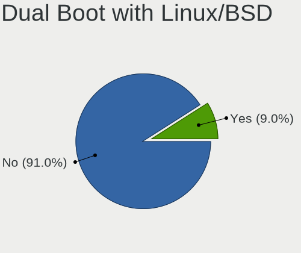
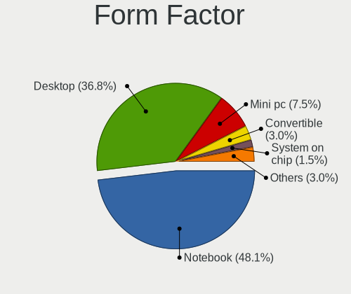
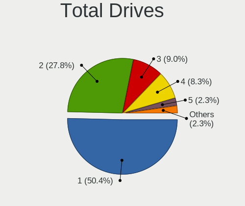
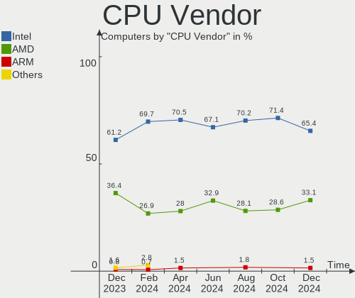
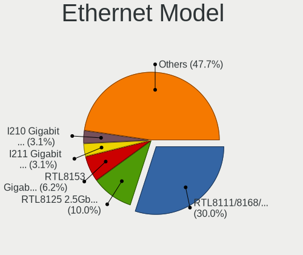
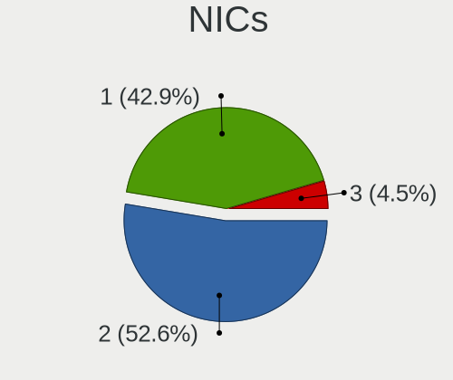

Kubuntu - Hardware Trends
-------------------------

A project to identify most popular hardware characteristics and track their change
over time based on data collected by Linux users at https://Linux-Hardware.org.

Anyone can contribute to this report by the [hw-probe](https://github.com/linuxhw/hw-probe) tool:

    sudo -E hw-probe -all -upload

This is a report for all computer types. See also reports for [desktops](/Dist/Kubuntu/Desktop/README.md) and [notebooks](/Dist/Kubuntu/Notebook/README.md).

This report is for one last month. Overall report since the beginning of time: [TestCoverage](https://github.com/linuxhw/TestCoverage)

Period: Jan, 2023.

Contents
--------

* [ System ](#system)
  - [ OS                       ](#os)
  - [ OS Family                ](#os-family)
  - [ Kernel                   ](#kernel)
  - [ Kernel Family            ](#kernel-family)
  - [ Kernel Major Ver.        ](#kernel-major-ver)
  - [ Arch                     ](#arch)
  - [ DE                       ](#de)
  - [ Display Server           ](#display-server)
  - [ Display Manager          ](#display-manager)
  - [ OS Lang                  ](#os-lang)
  - [ Boot Mode                ](#boot-mode)
  - [ Filesystem               ](#filesystem)
  - [ Part. scheme             ](#part-scheme)
  - [ Dual Boot with Linux/BSD ](#dual-boot-with-linuxbsd)
  - [ Dual Boot (Win)          ](#dual-boot-win)

* [ Board ](#board)
  - [ Vendor                   ](#vendor)
  - [ Model                    ](#model)
  - [ Model Family             ](#model-family)
  - [ MFG Year                 ](#mfg-year)
  - [ Form Factor              ](#form-factor)
  - [ Secure Boot              ](#secure-boot)
  - [ Coreboot                 ](#coreboot)
  - [ RAM Size                 ](#ram-size)
  - [ RAM Used                 ](#ram-used)
  - [ Total Drives             ](#total-drives)
  - [ Has CD-ROM               ](#has-cd-rom)
  - [ Has Ethernet             ](#has-ethernet)
  - [ Has WiFi                 ](#has-wifi)
  - [ Has Bluetooth            ](#has-bluetooth)

* [ Location ](#location)
  - [ Country                  ](#country)
  - [ City                     ](#city)

* [ Drives ](#drives)
  - [ Drive Vendor             ](#drive-vendor)
  - [ Drive Model              ](#drive-model)
  - [ HDD Vendor               ](#hdd-vendor)
  - [ SSD Vendor               ](#ssd-vendor)
  - [ Drive Kind               ](#drive-kind)
  - [ Drive Connector          ](#drive-connector)
  - [ Drive Size               ](#drive-size)
  - [ Space Total              ](#space-total)
  - [ Space Used               ](#space-used)
  - [ Malfunc. Drives          ](#malfunc-drives)
  - [ Malfunc. Drive Vendor    ](#malfunc-drive-vendor)
  - [ Malfunc. HDD Vendor      ](#malfunc-hdd-vendor)
  - [ Malfunc. Drive Kind      ](#malfunc-drive-kind)
  - [ Failed Drives            ](#failed-drives)
  - [ Failed Drive Vendor      ](#failed-drive-vendor)
  - [ Drive Status             ](#drive-status)

* [ Storage controller ](#storage-controller)
  - [ Storage Vendor           ](#storage-vendor)
  - [ Storage Model            ](#storage-model)
  - [ Storage Kind             ](#storage-kind)

* [ Processor ](#processor)
  - [ CPU Vendor               ](#cpu-vendor)
  - [ CPU Model                ](#cpu-model)
  - [ CPU Model Family         ](#cpu-model-family)
  - [ CPU Cores                ](#cpu-cores)
  - [ CPU Sockets              ](#cpu-sockets)
  - [ CPU Threads              ](#cpu-threads)
  - [ CPU Op-Modes             ](#cpu-op-modes)
  - [ CPU Microcode            ](#cpu-microcode)
  - [ CPU Microarch            ](#cpu-microarch)

* [ Graphics ](#graphics)
  - [ GPU Vendor               ](#gpu-vendor)
  - [ GPU Model                ](#gpu-model)
  - [ GPU Combo                ](#gpu-combo)
  - [ GPU Driver               ](#gpu-driver)
  - [ GPU Memory               ](#gpu-memory)

* [ Monitor ](#monitor)
  - [ Monitor Vendor           ](#monitor-vendor)
  - [ Monitor Model            ](#monitor-model)
  - [ Monitor Resolution       ](#monitor-resolution)
  - [ Monitor Diagonal         ](#monitor-diagonal)
  - [ Monitor Width            ](#monitor-width)
  - [ Aspect Ratio             ](#aspect-ratio)
  - [ Monitor Area             ](#monitor-area)
  - [ Pixel Density            ](#pixel-density)
  - [ Multiple Monitors        ](#multiple-monitors)

* [ Network ](#network)
  - [ Net Controller Vendor    ](#net-controller-vendor)
  - [ Net Controller Model     ](#net-controller-model)
  - [ Wireless Vendor          ](#wireless-vendor)
  - [ Wireless Model           ](#wireless-model)
  - [ Ethernet Vendor          ](#ethernet-vendor)
  - [ Ethernet Model           ](#ethernet-model)
  - [ Net Controller Kind      ](#net-controller-kind)
  - [ Used Controller          ](#used-controller)
  - [ NICs                     ](#nics)
  - [ IPv6                     ](#ipv6)

* [ Bluetooth ](#bluetooth)
  - [ Bluetooth Vendor         ](#bluetooth-vendor)
  - [ Bluetooth Model          ](#bluetooth-model)

* [ Sound ](#sound)
  - [ Sound Vendor             ](#sound-vendor)
  - [ Sound Model              ](#sound-model)

* [ Memory ](#memory)
  - [ Memory Vendor            ](#memory-vendor)
  - [ Memory Model             ](#memory-model)
  - [ Memory Kind              ](#memory-kind)
  - [ Memory Form Factor       ](#memory-form-factor)
  - [ Memory Size              ](#memory-size)
  - [ Memory Speed             ](#memory-speed)

* [ Printers & scanners ](#printers--scanners)
  - [ Printer Vendor           ](#printer-vendor)
  - [ Printer Model            ](#printer-model)
  - [ Scanner Vendor           ](#scanner-vendor)
  - [ Scanner Model            ](#scanner-model)

* [ Camera ](#camera)
  - [ Camera Vendor            ](#camera-vendor)
  - [ Camera Model             ](#camera-model)

* [ Security ](#security)
  - [ Fingerprint Vendor       ](#fingerprint-vendor)
  - [ Fingerprint Model        ](#fingerprint-model)
  - [ Chipcard Vendor          ](#chipcard-vendor)
  - [ Chipcard Model           ](#chipcard-model)

* [ Unsupported ](#unsupported)
  - [ Unsupported Devices      ](#unsupported-devices)
  - [ Unsupported Device Types ](#unsupported-device-types)

System
------

OS
--

Installed operating systems

| Name          | Computers | Percent |
|---------------|-----------|---------|
| Kubuntu 22.04 | 77        | 50.99%  |
| Kubuntu 22.10 | 55        | 36.42%  |
| Kubuntu 20.04 | 11        | 7.28%   |
| Kubuntu 18.04 | 4         | 2.65%   |
| Kubuntu 23.04 | 3         | 1.99%   |
| Kubuntu 11    | 1         | 0.66%   |

OS Family
---------

OS without a version

| Name    | Computers | Percent |
|---------|-----------|---------|
| Kubuntu | 151       | 100%    |

Kernel
------

Version of the Linux kernel

| Version                     | Computers | Percent |
|-----------------------------|-----------|---------|
| 5.15.0-58-generic           | 30        | 19.87%  |
| 5.15.0-56-generic           | 25        | 16.56%  |
| 5.19.0-29-generic           | 20        | 13.25%  |
| 5.19.0-26-generic           | 13        | 8.61%   |
| 5.15.0-57-generic           | 12        | 7.95%   |
| 5.19.0-28-generic           | 7         | 4.64%   |
| 5.19.0-21-generic           | 5         | 3.31%   |
| 5.19.0-31-generic           | 3         | 1.99%   |
| 5.4.0-137-generic           | 2         | 1.32%   |
| 5.4.0-136-generic           | 2         | 1.32%   |
| 5.19.0-30-generic           | 2         | 1.32%   |
| 5.17.0-1026-oem             | 2         | 1.32%   |
| 5.15.0-58-lowlatency        | 2         | 1.32%   |
| 5.15.0-43-lowlatency        | 2         | 1.32%   |
| 5.15.0-25-generic           | 2         | 1.32%   |
| 6.1.8-060108-generic        | 1         | 0.66%   |
| 6.1.7-060107-generic        | 1         | 0.66%   |
| 6.1.6-060106-generic        | 1         | 0.66%   |
| 6.1.5-x64v3-xanmod1         | 1         | 0.66%   |
| 6.1.5-060105-generic        | 1         | 0.66%   |
| 6.1.1-060101-generic        | 1         | 0.66%   |
| 6.1.0-060100rc4-generic     | 1         | 0.66%   |
| 6.0.9-060009-generic        | 1         | 0.66%   |
| 6.0.0-1009-oem              | 1         | 0.66%   |
| 6.0.0                       | 1         | 0.66%   |
| 5.4.0-81-generic            | 1         | 0.66%   |
| 5.4.0-132-generic           | 1         | 0.66%   |
| 5.19.0-1015-lowlatency      | 1         | 0.66%   |
| 5.19.0-1014-lowlatency      | 1         | 0.66%   |
| 5.17.0-1019-oem             | 1         | 0.66%   |
| 5.15.0-57-lowlatency        | 1         | 0.66%   |
| 5.15.0-43-generic           | 1         | 0.66%   |
| 5.15.0-39-generic           | 1         | 0.66%   |
| 5.15.0-322205121620-generic | 1         | 0.66%   |
| 5.13.0-22-generic           | 1         | 0.66%   |
| 5.10.0-051000-generic       | 1         | 0.66%   |
| 4.15.0-166-generic          | 1         | 0.66%   |

Kernel Family
-------------

Linux kernel without a distro release

| Version | Computers | Percent |
|---------|-----------|---------|
| 5.15.0  | 77        | 50.99%  |
| 5.19.0  | 52        | 34.44%  |
| 5.4.0   | 6         | 3.97%   |
| 5.17.0  | 3         | 1.99%   |
| 6.1.5   | 2         | 1.32%   |
| 6.0.0   | 2         | 1.32%   |
| 6.1.8   | 1         | 0.66%   |
| 6.1.7   | 1         | 0.66%   |
| 6.1.6   | 1         | 0.66%   |
| 6.1.1   | 1         | 0.66%   |
| 6.1.0   | 1         | 0.66%   |
| 6.0.9   | 1         | 0.66%   |
| 5.13.0  | 1         | 0.66%   |
| 5.10.0  | 1         | 0.66%   |
| 4.15.0  | 1         | 0.66%   |

Kernel Major Ver.
-----------------

Linux kernel major version

| Version | Computers | Percent |
|---------|-----------|---------|
| 5.15    | 77        | 50.99%  |
| 5.19    | 52        | 34.44%  |
| 6.1     | 7         | 4.64%   |
| 5.4     | 6         | 3.97%   |
| 6.0     | 3         | 1.99%   |
| 5.17    | 3         | 1.99%   |
| 5.13    | 1         | 0.66%   |
| 5.10    | 1         | 0.66%   |
| 4.15    | 1         | 0.66%   |

Arch
----

OS architecture (x86_64, i586, etc.)

| Name   | Computers | Percent |
|--------|-----------|---------|
| x86_64 | 151       | 100%    |

DE
--

Desktop Environment

| Name   | Computers | Percent |
|--------|-----------|---------|
| KDE5   | 143       | 94.7%   |
| KDE    | 4         | 2.65%   |
| GNOME  | 3         | 1.99%   |
| Budgie | 1         | 0.66%   |

Display Server
--------------

X11 or Wayland

| Name    | Computers | Percent |
|---------|-----------|---------|
| X11     | 143       | 94.7%   |
| Wayland | 7         | 4.64%   |
| Tty     | 1         | 0.66%   |

Display Manager
---------------

SDDM, LightDM, etc.

| Name    | Computers | Percent |
|---------|-----------|---------|
| SDDM    | 102       | 67.55%  |
| Unknown | 42        | 27.81%  |
| GDM3    | 5         | 3.31%   |
| LightDM | 2         | 1.32%   |

OS Lang
-------

Language

| Lang    | Computers | Percent |
|---------|-----------|---------|
| en_US   | 73        | 48.34%  |
| de_DE   | 13        | 8.61%   |
| ru_RU   | 10        | 6.62%   |
| en_GB   | 7         | 4.64%   |
| it_IT   | 6         | 3.97%   |
| fr_FR   | 6         | 3.97%   |
| es_ES   | 6         | 3.97%   |
| pl_PL   | 4         | 2.65%   |
| el_GR   | 3         | 1.99%   |
| pt_BR   | 2         | 1.32%   |
| en_NZ   | 2         | 1.32%   |
| en_CA   | 2         | 1.32%   |
| C       | 2         | 1.32%   |
| zh_CN   | 1         | 0.66%   |
| tr_TR   | 1         | 0.66%   |
| sv_SE   | 1         | 0.66%   |
| osa_US  | 1         | 0.66%   |
| lt_LT   | 1         | 0.66%   |
| es_US   | 1         | 0.66%   |
| es_419  | 1         | 0.66%   |
| en_SG   | 1         | 0.66%   |
| en_IN   | 1         | 0.66%   |
| en_IE   | 1         | 0.66%   |
| en_DE   | 1         | 0.66%   |
| en_AU   | 1         | 0.66%   |
| de_AT   | 1         | 0.66%   |
| Default | 1         | 0.66%   |
| cs_CZ   | 1         | 0.66%   |

Boot Mode
---------

EFI or BIOS

| Mode | Computers | Percent |
|------|-----------|---------|
| EFI  | 83        | 54.97%  |
| BIOS | 68        | 45.03%  |

Filesystem
----------

Type of filesystem

| Type    | Computers | Percent |
|---------|-----------|---------|
| Ext4    | 137       | 90.73%  |
| Overlay | 6         | 3.97%   |
| Btrfs   | 6         | 3.97%   |
| Zfs     | 1         | 0.66%   |
| Xfs     | 1         | 0.66%   |

Part. scheme
------------

Scheme of partitioning

| Type    | Computers | Percent |
|---------|-----------|---------|
| GPT     | 96        | 63.58%  |
| Unknown | 42        | 27.81%  |
| MBR     | 13        | 8.61%   |

Dual Boot with Linux/BSD
------------------------

Hosting more than one Linux/BSD

| Dual boot | Computers | Percent |
|-----------|-----------|---------|
| No        | 133       | 88.08%  |
| Yes       | 18        | 11.92%  |

Dual Boot (Win)
---------------

Hosting Linux and Windows

| Dual boot | Computers | Percent |
|-----------|-----------|---------|
| No        | 100       | 66.23%  |
| Yes       | 51        | 33.77%  |

Board
-----

Vendor
------

Motherboard manufacturer

| Name                | Computers | Percent |
|---------------------|-----------|---------|
| ASUSTek Computer    | 26        | 17.22%  |
| Dell                | 23        | 15.23%  |
| Lenovo              | 21        | 13.91%  |
| Hewlett-Packard     | 21        | 13.91%  |
| MSI                 | 15        | 9.93%   |
| Acer                | 14        | 9.27%   |
| Gigabyte Technology | 8         | 5.3%    |
| ASRock              | 4         | 2.65%   |
| Notebook            | 2         | 1.32%   |
| HUAWEI              | 2         | 1.32%   |
| Google              | 2         | 1.32%   |
| Apple               | 2         | 1.32%   |
| TrekStor            | 1         | 0.66%   |
| Sony                | 1         | 0.66%   |
| Microsoft           | 1         | 0.66%   |
| Medion              | 1         | 0.66%   |
| MACHENIKE           | 1         | 0.66%   |
| Framework           | 1         | 0.66%   |
| Dynabook            | 1         | 0.66%   |
| Carbon Systems      | 1         | 0.66%   |
| AZW                 | 1         | 0.66%   |
| Alienware           | 1         | 0.66%   |
| Unknown             | 1         | 0.66%   |

Model
-----

Motherboard model

| Name                                        | Computers | Percent |
|---------------------------------------------|-----------|---------|
| HP Notebook                                 | 2         | 1.32%   |
| Dell OptiPlex 7040                          | 2         | 1.32%   |
| Dell OptiPlex 7010                          | 2         | 1.32%   |
| ASRock A320M-HDV R4.0                       | 2         | 1.32%   |
| TrekStor Surfbook A13B                      | 1         | 0.66%   |
| Sony SVE1513B4E                             | 1         | 0.66%   |
| Notebook W35xSS_370SS                       | 1         | 0.66%   |
| Notebook NP5x_NP6x_NP7xPNK_PNH_PNJ          | 1         | 0.66%   |
| MSI Raider GE76 12UGS                       | 1         | 0.66%   |
| MSI Raider GE67HX 12UGS                     | 1         | 0.66%   |
| MSI Prestige 15 A12SC                       | 1         | 0.66%   |
| MSI Prestige 14 A10RAS                      | 1         | 0.66%   |
| MSI MS-7D18                                 | 1         | 0.66%   |
| MSI MS-7C95                                 | 1         | 0.66%   |
| MSI MS-7C71                                 | 1         | 0.66%   |
| MSI MS-7A34                                 | 1         | 0.66%   |
| MSI MS-7A32                                 | 1         | 0.66%   |
| MSI GS66 Stealth 10SE                       | 1         | 0.66%   |
| MSI CML-U PRO Cubi 5 (MS-B183)              | 1         | 0.66%   |
| MSI CML-U PRO 24X 10M (MS-AEC2)             | 1         | 0.66%   |
| MSI Bravo 17 A4DDK                          | 1         | 0.66%   |
| MSI Bravo 15 B5DD                           | 1         | 0.66%   |
| MSI Alpha 17 B5EEK                          | 1         | 0.66%   |
| Microsoft Surface Laptop                    | 1         | 0.66%   |
| Medion E15410                               | 1         | 0.66%   |
| MACHENIKE MACHCREATOR-16                    | 1         | 0.66%   |
| Lenovo V15 G2 ITL 82KB                      | 1         | 0.66%   |
| Lenovo ThinkPad X260 20F5S28R00             | 1         | 0.66%   |
| Lenovo ThinkPad X230 23256N6                | 1         | 0.66%   |
| Lenovo ThinkPad X1 Yoga 2nd 20JES2DN1A      | 1         | 0.66%   |
| Lenovo ThinkPad X1 Extreme Gen 5 21DECTO1WW | 1         | 0.66%   |
| Lenovo ThinkPad X1 Carbon 5th 20HQS03P00    | 1         | 0.66%   |
| Lenovo ThinkPad T580 20LA0025MX             | 1         | 0.66%   |
| Lenovo ThinkPad L430 24663D1                | 1         | 0.66%   |
| Lenovo ThinkPad L380 20M6S2YE00             | 1         | 0.66%   |
| Lenovo ThinkCentre M75s-1 11AAS24H00        | 1         | 0.66%   |
| Lenovo ThinkCentre M72e 35951A1             | 1         | 0.66%   |
| Lenovo Legion S7 15ACH6 82K8                | 1         | 0.66%   |
| Lenovo Legion 5 Pro 16ACH6H 82JQ            | 1         | 0.66%   |
| Lenovo Legion 5 17ACH6 82K0                 | 1         | 0.66%   |

Model Family
------------

Motherboard model prefix

| Name               | Computers | Percent |
|--------------------|-----------|---------|
| Lenovo ThinkPad    | 8         | 5.3%    |
| Dell OptiPlex      | 6         | 3.97%   |
| Acer Aspire        | 6         | 3.97%   |
| Lenovo IdeaPad     | 5         | 3.31%   |
| Dell Inspiron      | 5         | 3.31%   |
| ASUS ROG           | 5         | 3.31%   |
| Lenovo Legion      | 4         | 2.65%   |
| HP Laptop          | 4         | 2.65%   |
| Dell Precision     | 4         | 2.65%   |
| Dell Latitude      | 4         | 2.65%   |
| ASUS PRIME         | 4         | 2.65%   |
| HP ENVY            | 3         | 1.99%   |
| ASUS Zenbook       | 3         | 1.99%   |
| ASUS TUF           | 3         | 1.99%   |
| Acer Swift         | 3         | 1.99%   |
| Acer Nitro         | 3         | 1.99%   |
| MSI Raider         | 2         | 1.32%   |
| MSI Prestige       | 2         | 1.32%   |
| MSI CML-U          | 2         | 1.32%   |
| MSI Bravo          | 2         | 1.32%   |
| Lenovo ThinkCentre | 2         | 1.32%   |
| HP Spectre         | 2         | 1.32%   |
| HP ProBook         | 2         | 1.32%   |
| HP Notebook        | 2         | 1.32%   |
| HP EliteBook       | 2         | 1.32%   |
| HP Compaq          | 2         | 1.32%   |
| Dell XPS           | 2         | 1.32%   |
| ASRock A320M-HDV   | 2         | 1.32%   |
| TrekStor Surfbook  | 1         | 0.66%   |
| Sony SVE1513B4E    | 1         | 0.66%   |
| Notebook W35xSS    | 1         | 0.66%   |
| Notebook NP5x      | 1         | 0.66%   |
| MSI MS-7D18        | 1         | 0.66%   |
| MSI MS-7C95        | 1         | 0.66%   |
| MSI MS-7C71        | 1         | 0.66%   |
| MSI MS-7A34        | 1         | 0.66%   |
| MSI MS-7A32        | 1         | 0.66%   |
| MSI GS66           | 1         | 0.66%   |
| MSI Alpha          | 1         | 0.66%   |
| Microsoft Surface  | 1         | 0.66%   |

MFG Year
--------

Motherboard manufacture year

| Year | Computers | Percent |
|------|-----------|---------|
| 2020 | 27        | 17.88%  |
| 2021 | 24        | 15.89%  |
| 2022 | 18        | 11.92%  |
| 2017 | 17        | 11.26%  |
| 2019 | 12        | 7.95%   |
| 2018 | 11        | 7.28%   |
| 2012 | 11        | 7.28%   |
| 2016 | 7         | 4.64%   |
| 2014 | 6         | 3.97%   |
| 2015 | 4         | 2.65%   |
| 2009 | 4         | 2.65%   |
| 2013 | 3         | 1.99%   |
| 2011 | 2         | 1.32%   |
| 2010 | 2         | 1.32%   |
| 2023 | 1         | 0.66%   |
| 2008 | 1         | 0.66%   |
| 2007 | 1         | 0.66%   |

Form Factor
-----------

Physical design of the computer

| Name        | Computers | Percent |
|-------------|-----------|---------|
| Notebook    | 85        | 56.29%  |
| Desktop     | 54        | 35.76%  |
| Convertible | 7         | 4.64%   |
| Tablet      | 2         | 1.32%   |
| Mini pc     | 2         | 1.32%   |
| All in one  | 1         | 0.66%   |

Secure Boot
-----------

Enabled or disabled

| State    | Computers | Percent |
|----------|-----------|---------|
| Disabled | 135       | 89.4%   |
| Enabled  | 16        | 10.6%   |

Coreboot
--------

Have coreboot on board

| Used | Computers | Percent |
|------|-----------|---------|
| No   | 149       | 98.68%  |
| Yes  | 2         | 1.32%   |

RAM Size
--------

Total RAM memory

| Size in GB  | Computers | Percent |
|-------------|-----------|---------|
| 16.01-24.0  | 46        | 30.46%  |
| 4.01-8.0    | 33        | 21.85%  |
| 8.01-16.0   | 28        | 18.54%  |
| 32.01-64.0  | 20        | 13.25%  |
| 3.01-4.0    | 9         | 5.96%   |
| 64.01-256.0 | 8         | 5.3%    |
| 24.01-32.0  | 5         | 3.31%   |
| 2.01-3.0    | 1         | 0.66%   |
| 1.01-2.0    | 1         | 0.66%   |

RAM Used
--------

Used RAM memory

| Used GB    | Computers | Percent |
|------------|-----------|---------|
| 2.01-3.0   | 47        | 31.13%  |
| 4.01-8.0   | 45        | 29.8%   |
| 3.01-4.0   | 31        | 20.53%  |
| 1.01-2.0   | 17        | 11.26%  |
| 8.01-16.0  | 9         | 5.96%   |
| 16.01-24.0 | 1         | 0.66%   |
| 0.51-1.0   | 1         | 0.66%   |

Total Drives
------------

Number of drives on board

| Drives | Computers | Percent |
|--------|-----------|---------|
| 1      | 86        | 56.95%  |
| 2      | 35        | 23.18%  |
| 3      | 14        | 9.27%   |
| 4      | 7         | 4.64%   |
| 7      | 4         | 2.65%   |
| 5      | 3         | 1.99%   |
| 6      | 2         | 1.32%   |

Has CD-ROM
----------

Has CD-ROM on board

| Presented | Computers | Percent |
|-----------|-----------|---------|
| No        | 118       | 78.15%  |
| Yes       | 33        | 21.85%  |

Has Ethernet
------------

Has Ethernet on board

| Presented | Computers | Percent |
|-----------|-----------|---------|
| Yes       | 114       | 75.5%   |
| No        | 37        | 24.5%   |

Has WiFi
--------

Has WiFi module

| Presented | Computers | Percent |
|-----------|-----------|---------|
| Yes       | 117       | 77.48%  |
| No        | 34        | 22.52%  |

Has Bluetooth
-------------

Has Bluetooth module

| Presented | Computers | Percent |
|-----------|-----------|---------|
| Yes       | 113       | 74.83%  |
| No        | 38        | 25.17%  |

Location
--------

Country
-------

Geographic location (country)

| Country      | Computers | Percent |
|--------------|-----------|---------|
| USA          | 42        | 27.81%  |
| Germany      | 18        | 11.92%  |
| Spain        | 8         | 5.3%    |
| UK           | 7         | 4.64%   |
| Russia       | 7         | 4.64%   |
| France       | 7         | 4.64%   |
| Italy        | 6         | 3.97%   |
| Canada       | 5         | 3.31%   |
| Poland       | 4         | 2.65%   |
| Netherlands  | 4         | 2.65%   |
| Slovakia     | 2         | 1.32%   |
| Portugal     | 2         | 1.32%   |
| New Zealand  | 2         | 1.32%   |
| Mexico       | 2         | 1.32%   |
| Greece       | 2         | 1.32%   |
| Georgia      | 2         | 1.32%   |
| Finland      | 2         | 1.32%   |
| Brazil       | 2         | 1.32%   |
| Belgium      | 2         | 1.32%   |
| Turkey       | 1         | 0.66%   |
| Sweden       | 1         | 0.66%   |
| Sri Lanka    | 1         | 0.66%   |
| South Korea  | 1         | 0.66%   |
| Singapore    | 1         | 0.66%   |
| Serbia       | 1         | 0.66%   |
| Saudi Arabia | 1         | 0.66%   |
| Romania      | 1         | 0.66%   |
| Pakistan     | 1         | 0.66%   |
| Nicaragua    | 1         | 0.66%   |
| Lithuania    | 1         | 0.66%   |
| Kazakhstan   | 1         | 0.66%   |
| Japan        | 1         | 0.66%   |
| Ireland      | 1         | 0.66%   |
| Iran         | 1         | 0.66%   |
| Indonesia    | 1         | 0.66%   |
| India        | 1         | 0.66%   |
| Denmark      | 1         | 0.66%   |
| Czechia      | 1         | 0.66%   |
| Croatia      | 1         | 0.66%   |
| Bulgaria     | 1         | 0.66%   |

City
----

Geographic location (city)

| City           | Computers | Percent |
|----------------|-----------|---------|
| New York       | 3         | 1.99%   |
| Moscow         | 3         | 1.99%   |
| Wroclaw        | 2         | 1.32%   |
| Staten Island  | 2         | 1.32%   |
| Paris          | 2         | 1.32%   |
| Montreal       | 2         | 1.32%   |
| Madrid         | 2         | 1.32%   |
| Houston        | 2         | 1.32%   |
| Chatham        | 2         | 1.32%   |
| Berlin         | 2         | 1.32%   |
| Batumi         | 2         | 1.32%   |
| Argenteuil     | 2         | 1.32%   |
| Albuquerque    | 2         | 1.32%   |
| Žilina        | 1         | 0.66%   |
| Wolfsburg      | 1         | 0.66%   |
| Weimar         | 1         | 0.66%   |
| Waterville     | 1         | 0.66%   |
| Walled Lake    | 1         | 0.66%   |
| Volgograd      | 1         | 0.66%   |
| Vilnius        | 1         | 0.66%   |
| Vienna         | 1         | 0.66%   |
| Vancouver      | 1         | 0.66%   |
| Valparaiso     | 1         | 0.66%   |
| Turku          | 1         | 0.66%   |
| Tulsa          | 1         | 0.66%   |
| Toronto        | 1         | 0.66%   |
| Tokyo          | 1         | 0.66%   |
| Stuttgart      | 1         | 0.66%   |
| St. Petersburg | 1         | 0.66%   |
| Springfield    | 1         | 0.66%   |
| Sofia          | 1         | 0.66%   |
| Snezhinsk      | 1         | 0.66%   |
| Smolec         | 1         | 0.66%   |
| Singapore      | 1         | 0.66%   |
| Seville        | 1         | 0.66%   |
| Seattle        | 1         | 0.66%   |
| Saveh          | 1         | 0.66%   |
| Sassari        | 1         | 0.66%   |
| Sao Paulo      | 1         | 0.66%   |
| Salem          | 1         | 0.66%   |

Drives
------

Drive Vendor
------------

Hard drive vendors

| Vendor                         | Computers | Drives | Percent |
|--------------------------------|-----------|--------|---------|
| Samsung Electronics            | 45        | 55     | 18.6%   |
| WDC                            | 37        | 47     | 15.29%  |
| Seagate                        | 28        | 39     | 11.57%  |
| Sandisk                        | 14        | 16     | 5.79%   |
| Toshiba                        | 11        | 12     | 4.55%   |
| Kingston                       | 11        | 11     | 4.55%   |
| Micron Technology              | 10        | 10     | 4.13%   |
| Unknown                        | 7         | 9      | 2.89%   |
| SK hynix                       | 7         | 7      | 2.89%   |
| KIOXIA                         | 7         | 7      | 2.89%   |
| Phison Electronics             | 5         | 5      | 2.07%   |
| Intel                          | 5         | 5      | 2.07%   |
| Hitachi                        | 5         | 6      | 2.07%   |
| HGST                           | 4         | 4      | 1.65%   |
| China                          | 4         | 4      | 1.65%   |
| PNY                            | 3         | 3      | 1.24%   |
| Crucial                        | 3         | 3      | 1.24%   |
| Team                           | 2         | 2      | 0.83%   |
| SABRENT                        | 2         | 2      | 0.83%   |
| Realtek Semiconductor          | 2         | 2      | 0.83%   |
| Phison                         | 2         | 3      | 0.83%   |
| Patriot                        | 2         | 2      | 0.83%   |
| Micron/Crucial Technology      | 2         | 2      | 0.83%   |
| Apacer                         | 2         | 2      | 0.83%   |
| A-DATA Technology              | 2         | 2      | 0.83%   |
| WALRAM                         | 1         | 1      | 0.41%   |
| ValueTech                      | 1         | 1      | 0.41%   |
| Union Memory                   | 1         | 1      | 0.41%   |
| UMIS                           | 1         | 1      | 0.41%   |
| T-FORCE                        | 1         | 1      | 0.41%   |
| SPCC                           | 1         | 1      | 0.41%   |
| Solid State Storage Technology | 1         | 1      | 0.41%   |
| Solid State Storage            | 1         | 1      | 0.41%   |
| Silicon Motion                 | 1         | 1      | 0.41%   |
| Pioneer                        | 1         | 1      | 0.41%   |
| Linux                          | 1         | 1      | 0.41%   |
| KIOXIA-EXCERIA                 | 1         | 1      | 0.41%   |
| Jumper                         | 1         | 1      | 0.41%   |
| Intenso                        | 1         | 1      | 0.41%   |
| Integral                       | 1         | 1      | 0.41%   |

Drive Model
-----------

Hard drive models

| Model                                                | Computers | Percent |
|------------------------------------------------------|-----------|---------|
| Samsung SSD 970 EVO Plus 1TB                         | 4         | 1.5%    |
| Seagate ST2000DM008-2FR102 2TB                       | 3         | 1.12%   |
| Samsung SSD 860 EVO 500GB                            | 3         | 1.12%   |
| Samsung NVMe SSD Controller SM981/PM981/PM983 500GB  | 3         | 1.12%   |
| Samsung NVMe SSD Controller PM9A1/PM9A3/980PRO 512GB | 3         | 1.12%   |
| Intel SSD 660P Series 512GB                          | 3         | 1.12%   |
| WDC WD10EZEX-08WN4A0 1TB                             | 2         | 0.75%   |
| Unknown MMC Card  64GB                               | 2         | 0.75%   |
| Unknown MMC Card  32GB                               | 2         | 0.75%   |
| Toshiba MQ01ABD100 1TB                               | 2         | 0.75%   |
| SK hynix SKHynix_HFS001TDE9X084N 1TB                 | 2         | 0.75%   |
| Seagate ST500LM021-1KJ152 500GB                      | 2         | 0.75%   |
| Seagate ST4000VN008-2DR166 4TB                       | 2         | 0.75%   |
| Seagate ST4000DM004-2CV104 4TB                       | 2         | 0.75%   |
| Seagate ST2000LX001-1RG174 2TB                       | 2         | 0.75%   |
| SanDisk SSD PLUS 480GB                               | 2         | 0.75%   |
| Samsung SSD 980 PRO 1TB                              | 2         | 0.75%   |
| Samsung SSD 870 QVO 1TB                              | 2         | 0.75%   |
| SABRENT Disk 4TB                                     | 2         | 0.75%   |
| Micron 2450_MTFDKBA1T0TFK 1TB                        | 2         | 0.75%   |
| KIOXIA KBG40ZNS512G NVMe 512GB                       | 2         | 0.75%   |
| KIOXIA KBG40ZNS256G NVMe 256GB                       | 2         | 0.75%   |
| Kingston SA400S37480G 480GB SSD                      | 2         | 0.75%   |
| Kingston SA400S37240G 240GB SSD                      | 2         | 0.75%   |
| WDC WDS500G1B0B-00AS40 500GB SSD                     | 1         | 0.37%   |
| WDC WDS250G2B0A-00SM50 250GB SSD                     | 1         | 0.37%   |
| WDC WDS200T3X0C-00SJG0 2TB                           | 1         | 0.37%   |
| WDC WDS200T2B0C-00PXH0 2TB                           | 1         | 0.37%   |
| WDC WDBNCE5000PNC 500GB SSD                          | 1         | 0.37%   |
| WDC WD7500BPKX-80HPJT0 752GB                         | 1         | 0.37%   |
| WDC WD6003FZBX-00K5WB0 6TB                           | 1         | 0.37%   |
| WDC WD5000LPCX-21VHAT0 500GB                         | 1         | 0.37%   |
| WDC WD5000AZRX-00A3KB0 500GB                         | 1         | 0.37%   |
| WDC WD5000AZLX-60K2TA0 500GB                         | 1         | 0.37%   |
| WDC WD5000AAKX-75U6AA0 500GB                         | 1         | 0.37%   |
| WDC WD5000AAKX-08ERMA0 500GB                         | 1         | 0.37%   |
| WDC WD5000AAKS-00M9A0 500GB                          | 1         | 0.37%   |
| WDC WD40EZRX-00SPEB0 4TB                             | 1         | 0.37%   |
| WDC WD40EZAZ-00SF3B0 4TB                             | 1         | 0.37%   |
| WDC WD4003FZEX-00Z4SA0 4TB                           | 1         | 0.37%   |

HDD Vendor
----------

Hard disk drive vendors

| Vendor              | Computers | Drives | Percent |
|---------------------|-----------|--------|---------|
| WDC                 | 27        | 36     | 37.5%   |
| Seagate             | 26        | 34     | 36.11%  |
| Toshiba             | 6         | 7      | 8.33%   |
| Hitachi             | 5         | 6      | 6.94%   |
| HGST                | 4         | 4      | 5.56%   |
| Samsung Electronics | 2         | 2      | 2.78%   |
| SABRENT             | 2         | 2      | 2.78%   |

SSD Vendor
----------

Solid state drive vendors

| Vendor              | Computers | Drives | Percent |
|---------------------|-----------|--------|---------|
| Samsung Electronics | 18        | 20     | 27.69%  |
| SanDisk             | 7         | 7      | 10.77%  |
| Kingston            | 7         | 7      | 10.77%  |
| WDC                 | 5         | 5      | 7.69%   |
| China               | 4         | 4      | 6.15%   |
| PNY                 | 3         | 3      | 4.62%   |
| Team                | 2         | 2      | 3.08%   |
| Patriot             | 2         | 2      | 3.08%   |
| Crucial             | 2         | 2      | 3.08%   |
| Apacer              | 2         | 2      | 3.08%   |
| A-DATA Technology   | 2         | 2      | 3.08%   |
| ValueTech           | 1         | 1      | 1.54%   |
| Toshiba             | 1         | 1      | 1.54%   |
| T-FORCE             | 1         | 1      | 1.54%   |
| SK hynix            | 1         | 1      | 1.54%   |
| Seagate             | 1         | 1      | 1.54%   |
| Pioneer             | 1         | 1      | 1.54%   |
| Jumper              | 1         | 1      | 1.54%   |
| Intenso             | 1         | 1      | 1.54%   |
| Intel               | 1         | 1      | 1.54%   |
| Integral            | 1         | 1      | 1.54%   |
| BAITITON            | 1         | 1      | 1.54%   |

Drive Kind
----------

HDD or SSD

| Kind    | Computers | Drives | Percent |
|---------|-----------|--------|---------|
| NVMe    | 90        | 104    | 41.67%  |
| HDD     | 60        | 91     | 27.78%  |
| SSD     | 53        | 67     | 24.54%  |
| MMC     | 7         | 7      | 3.24%   |
| Unknown | 6         | 11     | 2.78%   |

Drive Connector
---------------

SATA, SAS, NVMe, etc.

| Type | Computers | Drives | Percent |
|------|-----------|--------|---------|
| NVMe | 90        | 104    | 48.13%  |
| SATA | 79        | 150    | 42.25%  |
| SAS  | 11        | 19     | 5.88%   |
| MMC  | 7         | 7      | 3.74%   |

Drive Size
----------

Size of hard drive

| Size in TB | Computers | Drives | Percent |
|------------|-----------|--------|---------|
| 0.01-0.5   | 55        | 80     | 46.22%  |
| 0.51-1.0   | 34        | 43     | 28.57%  |
| 1.01-2.0   | 15        | 16     | 12.61%  |
| 3.01-4.0   | 10        | 12     | 8.4%    |
| 4.01-10.0  | 3         | 4      | 2.52%   |
| 2.01-3.0   | 2         | 3      | 1.68%   |

Space Total
-----------

Amount of disk space available on the file system

| Size in GB     | Computers | Percent |
|----------------|-----------|---------|
| 251-500        | 34        | 22.52%  |
| 101-250        | 28        | 18.54%  |
| 501-1000       | 27        | 17.88%  |
| 1001-2000      | 23        | 15.23%  |
| More than 3000 | 17        | 11.26%  |
| 2001-3000      | 9         | 5.96%   |
| 1-20           | 5         | 3.31%   |
| 51-100         | 5         | 3.31%   |
| 21-50          | 2         | 1.32%   |
| Unknown        | 1         | 0.66%   |

Space Used
----------

Amount of used disk space

| Used GB        | Computers | Percent |
|----------------|-----------|---------|
| 101-250        | 37        | 24.5%   |
| 1-20           | 21        | 13.91%  |
| 21-50          | 20        | 13.25%  |
| 51-100         | 18        | 11.92%  |
| 251-500        | 17        | 11.26%  |
| 501-1000       | 16        | 10.6%   |
| More than 3000 | 8         | 5.3%    |
| 1001-2000      | 8         | 5.3%    |
| 2001-3000      | 5         | 3.31%   |
| Unknown        | 1         | 0.66%   |

Malfunc. Drives
---------------

Drive models with a malfunction

| Model                             | Computers | Drives | Percent |
|-----------------------------------|-----------|--------|---------|
| WDC WD5000AZRX-00A3KB0 500GB      | 1         | 1      | 8.33%   |
| WDC WD5000AAKS-00M9A0 500GB       | 1         | 1      | 8.33%   |
| WDC WD10EARS-00MVWB0 1TB          | 1         | 1      | 8.33%   |
| WDC WD10EADS-00L5B1 1TB           | 1         | 1      | 8.33%   |
| T-FORCE SSD 512GB                 | 1         | 1      | 8.33%   |
| Seagate ST500DM002-1BD142 500GB   | 1         | 1      | 8.33%   |
| Seagate ST4000VN008-2DR166 4TB    | 1         | 2      | 8.33%   |
| Seagate ST3500630AS 500GB         | 1         | 1      | 8.33%   |
| Seagate ST1000DX001-SSHD-8GB      | 1         | 1      | 8.33%   |
| Samsung Electronics HD501LJ 500GB | 1         | 1      | 8.33%   |
| Kingston SA400S37480G 480GB SSD   | 1         | 1      | 8.33%   |
| BAITITON BT58SSD09S 240GB         | 1         | 1      | 8.33%   |

Malfunc. Drive Vendor
---------------------

Vendors of faulty drives

| Vendor              | Computers | Drives | Percent |
|---------------------|-----------|--------|---------|
| WDC                 | 3         | 4      | 30%     |
| Seagate             | 3         | 5      | 30%     |
| T-FORCE             | 1         | 1      | 10%     |
| Samsung Electronics | 1         | 1      | 10%     |
| Kingston            | 1         | 1      | 10%     |
| BAITITON            | 1         | 1      | 10%     |

Malfunc. HDD Vendor
-------------------

Vendors of faulty HDD drives

| Vendor              | Computers | Drives | Percent |
|---------------------|-----------|--------|---------|
| WDC                 | 3         | 4      | 42.86%  |
| Seagate             | 3         | 5      | 42.86%  |
| Samsung Electronics | 1         | 1      | 14.29%  |

Malfunc. Drive Kind
-------------------

Kinds of faulty drives

| Kind | Computers | Drives | Percent |
|------|-----------|--------|---------|
| HDD  | 6         | 10     | 66.67%  |
| SSD  | 3         | 3      | 33.33%  |

Failed Drives
-------------

Failed drive models

Zero info for selected period =(

Failed Drive Vendor
-------------------

Failed drive vendors

Zero info for selected period =(

Drive Status
------------

Number of failed and malfunc. drives

| Status   | Computers | Drives | Percent |
|----------|-----------|--------|---------|
| Detected | 79        | 146    | 47.31%  |
| Works    | 79        | 121    | 47.31%  |
| Malfunc  | 9         | 13     | 5.39%   |

Storage controller
------------------

Storage Vendor
--------------

Storage controller vendors

| Vendor                         | Computers | Percent |
|--------------------------------|-----------|---------|
| Intel                          | 84        | 39.07%  |
| AMD                            | 34        | 15.81%  |
| Samsung Electronics            | 28        | 13.02%  |
| SanDisk                        | 12        | 5.58%   |
| Micron Technology              | 9         | 4.19%   |
| KIOXIA                         | 9         | 4.19%   |
| SK hynix                       | 6         | 2.79%   |
| Phison Electronics             | 5         | 2.33%   |
| Kingston Technology Company    | 4         | 1.86%   |
| Toshiba America Info Systems   | 3         | 1.4%    |
| Realtek Semiconductor          | 3         | 1.4%    |
| Micron/Crucial Technology      | 3         | 1.4%    |
| Marvell Technology Group       | 3         | 1.4%    |
| Union Memory (Shenzhen)        | 2         | 0.93%   |
| Solid State Storage Technology | 2         | 0.93%   |
| Silicon Motion                 | 2         | 0.93%   |
| Silicon Image                  | 1         | 0.47%   |
| Seagate Technology             | 1         | 0.47%   |
| LSI Logic / Symbios Logic      | 1         | 0.47%   |
| JMicron Technology             | 1         | 0.47%   |
| ASMedia Technology             | 1         | 0.47%   |
| ADATA Technology               | 1         | 0.47%   |

Storage Model
-------------

Storage controller models

| Model                                                                          | Computers | Percent |
|--------------------------------------------------------------------------------|-----------|---------|
| AMD FCH SATA Controller [AHCI mode]                                            | 27        | 11.39%  |
| Samsung NVMe SSD Controller SM981/PM981/PM983                                  | 13        | 5.49%   |
| Intel Volume Management Device NVMe RAID Controller                            | 10        | 4.22%   |
| Micron Non-Volatile memory controller                                          | 9         | 3.8%    |
| Intel 7 Series Chipset Family 6-port SATA Controller [AHCI mode]               | 9         | 3.8%    |
| Samsung NVMe SSD Controller PM9A1/PM9A3/980PRO                                 | 8         | 3.38%   |
| KIOXIA NVMe SSD Controller BG4                                                 | 8         | 3.38%   |
| Intel SATA Controller [RAID mode]                                              | 7         | 2.95%   |
| Intel Comet Lake SATA AHCI Controller                                          | 6         | 2.53%   |
| Intel Sunrise Point-LP SATA Controller [AHCI mode]                             | 5         | 2.11%   |
| Intel 200 Series PCH SATA controller [AHCI mode]                               | 5         | 2.11%   |
| SanDisk Non-Volatile memory controller                                         | 4         | 1.69%   |
| Samsung NVMe SSD Controller 980                                                | 4         | 1.69%   |
| Kingston Company Company Non-Volatile memory controller                        | 4         | 1.69%   |
| Intel 6 Series/C200 Series Chipset Family 6 port Desktop SATA AHCI Controller  | 4         | 1.69%   |
| AMD 500 Series Chipset SATA Controller                                         | 4         | 1.69%   |
| SK hynix Gold P31/PC711 NVMe Solid State Drive                                 | 3         | 1.27%   |
| SanDisk WD Blue SN550 NVMe SSD                                                 | 3         | 1.27%   |
| Samsung NVMe SSD Controller SM961/PM961/SM963                                  | 3         | 1.27%   |
| Realtek Realtek Non-Volatile memory controller                                 | 3         | 1.27%   |
| Intel Tiger Lake-LP SATA Controller                                            | 3         | 1.27%   |
| Intel SSD 660P Series                                                          | 3         | 1.27%   |
| Intel Celeron/Pentium Silver Processor SATA Controller                         | 3         | 1.27%   |
| Intel 82801 Mobile SATA Controller [RAID mode]                                 | 3         | 1.27%   |
| Intel 8 Series/C220 Series Chipset Family 6-port SATA Controller 1 [AHCI mode] | 3         | 1.27%   |
| Intel 7 Series/C210 Series Chipset Family 6-port SATA Controller [AHCI mode]   | 3         | 1.27%   |
| Intel 500 Series Chipset Family SATA AHCI Controller                           | 3         | 1.27%   |
| AMD FCH SATA Controller D                                                      | 3         | 1.27%   |
| AMD 400 Series Chipset SATA Controller                                         | 3         | 1.27%   |
| Union Memory (Shenzhen) Non-Volatile memory controller                         | 2         | 0.84%   |
| Toshiba America Info Systems BG3 NVMe SSD Controller                           | 2         | 0.84%   |
| Solid State Storage Non-Volatile memory controller                             | 2         | 0.84%   |
| SK hynix BC501 NVMe Solid State Drive                                          | 2         | 0.84%   |
| Silicon Motion SM2262/SM2262EN SSD Controller                                  | 2         | 0.84%   |
| SanDisk WD PC SN810 / Black SN850 NVMe SSD                                     | 2         | 0.84%   |
| SanDisk WD Black 2018/SN750 / PC SN720 NVMe SSD                                | 2         | 0.84%   |
| Phison Electronics Non-Volatile memory controller                              | 2         | 0.84%   |
| Micron/Crucial P5 Plus NVMe PCIe SSD                                           | 2         | 0.84%   |
| Intel Q170/Q150/B150/H170/H110/Z170/CM236 Chipset SATA Controller [AHCI Mode]  | 2         | 0.84%   |
| Intel Ice Lake-LP SATA Controller [AHCI mode]                                  | 2         | 0.84%   |

Storage Kind
------------

Kind of storage controller (IDE, SATA, NVMe, SAS, ...)

| Kind | Computers | Percent |
|------|-----------|---------|
| SATA | 96        | 45.07%  |
| NVMe | 89        | 41.78%  |
| RAID | 20        | 9.39%   |
| IDE  | 7         | 3.29%   |
| SCSI | 1         | 0.47%   |

Processor
---------

CPU Vendor
----------

Processor vendors

| Vendor | Computers | Percent |
|--------|-----------|---------|
| Intel  | 102       | 67.55%  |
| AMD    | 49        | 32.45%  |

CPU Model
---------

Processor models

| Model                                         | Computers | Percent |
|-----------------------------------------------|-----------|---------|
| AMD Ryzen 7 5800H with Radeon Graphics        | 6         | 3.97%   |
| Intel 12th Gen Core i7-12700H                 | 5         | 3.31%   |
| Intel 11th Gen Core i5-1135G7 @ 2.40GHz       | 5         | 3.31%   |
| Intel Core i7-3770 CPU @ 3.40GHz              | 3         | 1.99%   |
| Intel Core i5-3320M CPU @ 2.60GHz             | 3         | 1.99%   |
| Intel Core i5-3230M CPU @ 2.60GHz             | 3         | 1.99%   |
| Intel 11th Gen Core i7-1165G7 @ 2.80GHz       | 3         | 1.99%   |
| Intel Pentium CPU 6405U @ 2.40GHz             | 2         | 1.32%   |
| Intel Core i7-8700K CPU @ 3.70GHz             | 2         | 1.32%   |
| Intel Core i7-7700HQ CPU @ 2.80GHz            | 2         | 1.32%   |
| Intel Core i7-1065G7 CPU @ 1.30GHz            | 2         | 1.32%   |
| Intel Core i5-8250U CPU @ 1.60GHz             | 2         | 1.32%   |
| Intel Core i5-7200U CPU @ 2.50GHz             | 2         | 1.32%   |
| Intel Core i5-10210U CPU @ 1.60GHz            | 2         | 1.32%   |
| Intel Core i3-6100T CPU @ 3.20GHz             | 2         | 1.32%   |
| Intel Celeron CPU N3350 @ 1.10GHz             | 2         | 1.32%   |
| AMD Ryzen 9 6900HX with Radeon Graphics       | 2         | 1.32%   |
| AMD Ryzen 7 6800H with Radeon Graphics        | 2         | 1.32%   |
| AMD Ryzen 7 5700X 8-Core Processor            | 2         | 1.32%   |
| AMD Ryzen 7 5700G with Radeon Graphics        | 2         | 1.32%   |
| AMD Ryzen 7 4800H with Radeon Graphics        | 2         | 1.32%   |
| AMD Ryzen 7 4700U with Radeon Graphics        | 2         | 1.32%   |
| AMD Ryzen 7 3750H with Radeon Vega Mobile Gfx | 2         | 1.32%   |
| AMD Ryzen 5 5500U with Radeon Graphics        | 2         | 1.32%   |
| AMD Ryzen 5 4500U with Radeon Graphics        | 2         | 1.32%   |
| AMD Ryzen 5 1600X Six-Core Processor          | 2         | 1.32%   |
| Intel Xeon E-2224 CPU @ 3.40GHz               | 1         | 0.66%   |
| Intel Xeon CPU X5450 @ 3.00GHz                | 1         | 0.66%   |
| Intel Xeon CPU W5580 @ 3.20GHz                | 1         | 0.66%   |
| Intel Xeon CPU W3580 @ 3.33GHz                | 1         | 0.66%   |
| Intel Pentium Silver N5000 CPU @ 1.10GHz      | 1         | 0.66%   |
| Intel Pentium Dual-Core CPU E5800 @ 3.20GHz   | 1         | 0.66%   |
| Intel Pentium CPU G4400 @ 3.30GHz             | 1         | 0.66%   |
| Intel Core m3-8100Y CPU @ 1.10GHz             | 1         | 0.66%   |
| Intel Core i9-8950HK CPU @ 2.90GHz            | 1         | 0.66%   |
| Intel Core i7-8750H CPU @ 2.20GHz             | 1         | 0.66%   |
| Intel Core i7-8550U CPU @ 1.80GHz             | 1         | 0.66%   |
| Intel Core i7-7700K CPU @ 4.20GHz             | 1         | 0.66%   |
| Intel Core i7-7600U CPU @ 2.80GHz             | 1         | 0.66%   |
| Intel Core i7-7500U CPU @ 2.70GHz             | 1         | 0.66%   |

CPU Model Family
----------------

Processor model prefix

| Model                   | Computers | Percent |
|-------------------------|-----------|---------|
| Intel Core i7           | 28        | 18.54%  |
| AMD Ryzen 7             | 25        | 16.56%  |
| Intel Core i5           | 24        | 15.89%  |
| Other                   | 23        | 15.23%  |
| AMD Ryzen 5             | 11        | 7.28%   |
| Intel Core i3           | 9         | 5.96%   |
| Intel Celeron           | 5         | 3.31%   |
| Intel Xeon              | 4         | 2.65%   |
| Intel Pentium           | 3         | 1.99%   |
| AMD Ryzen 9             | 3         | 1.99%   |
| Intel Core 2 Duo        | 2         | 1.32%   |
| AMD Ryzen 5 PRO         | 2         | 1.32%   |
| AMD A6                  | 2         | 1.32%   |
| Intel Pentium Silver    | 1         | 0.66%   |
| Intel Pentium Dual-Core | 1         | 0.66%   |
| Intel Core m3           | 1         | 0.66%   |
| Intel Core i9           | 1         | 0.66%   |
| Intel Atom              | 1         | 0.66%   |
| AMD Ryzen Threadripper  | 1         | 0.66%   |
| AMD Ryzen 7 PRO         | 1         | 0.66%   |
| AMD Ryzen 3             | 1         | 0.66%   |
| AMD FX                  | 1         | 0.66%   |
| AMD A8                  | 1         | 0.66%   |

CPU Cores
---------

Number of processor cores

| Number | Computers | Percent |
|--------|-----------|---------|
| 4      | 48        | 31.79%  |
| 2      | 40        | 26.49%  |
| 8      | 29        | 19.21%  |
| 6      | 22        | 14.57%  |
| 14     | 7         | 4.64%   |
| 32     | 1         | 0.66%   |
| 16     | 1         | 0.66%   |
| 12     | 1         | 0.66%   |
| 10     | 1         | 0.66%   |
| 1      | 1         | 0.66%   |

CPU Sockets
-----------

Number of sockets

| Number | Computers | Percent |
|--------|-----------|---------|
| 1      | 150       | 99.34%  |
| 2      | 1         | 0.66%   |

CPU Threads
-----------

Threads per core (Hyper-Threading)

| Number | Computers | Percent |
|--------|-----------|---------|
| 2      | 126       | 83.44%  |
| 1      | 25        | 16.56%  |

CPU Op-Modes
------------

CPU Operation Modes (32-bit, 64-bit)

| Op mode        | Computers | Percent |
|----------------|-----------|---------|
| 32-bit, 64-bit | 151       | 100%    |

CPU Microcode
-------------

Microcode number

| Number     | Computers | Percent |
|------------|-----------|---------|
| Unknown    | 61        | 40.4%   |
| 0x906a3    | 8         | 5.3%    |
| 0x806c1    | 6         | 3.97%   |
| 0x806e9    | 5         | 3.31%   |
| 0x806ea    | 4         | 2.65%   |
| 0x506e3    | 4         | 2.65%   |
| 0x306a9    | 4         | 2.65%   |
| 0x906ea    | 3         | 1.99%   |
| 0x906e9    | 3         | 1.99%   |
| 0x0a50000c | 3         | 1.99%   |
| 0x08608103 | 3         | 1.99%   |
| 0x806ec    | 2         | 1.32%   |
| 0x706e5    | 2         | 1.32%   |
| 0x706a1    | 2         | 1.32%   |
| 0x506c9    | 2         | 1.32%   |
| 0x206a7    | 2         | 1.32%   |
| 0x0a404102 | 2         | 1.32%   |
| 0x08701021 | 2         | 1.32%   |
| 0x08600106 | 2         | 1.32%   |
| 0x08600104 | 2         | 1.32%   |
| 0x08001138 | 2         | 1.32%   |
| 0xa0671    | 1         | 0.66%   |
| 0xa0655    | 1         | 0.66%   |
| 0xa0653    | 1         | 0.66%   |
| 0x906a4    | 1         | 0.66%   |
| 0x90675    | 1         | 0.66%   |
| 0x90672    | 1         | 0.66%   |
| 0x706a8    | 1         | 0.66%   |
| 0x406e3    | 1         | 0.66%   |
| 0x406c4    | 1         | 0.66%   |
| 0x40661    | 1         | 0.66%   |
| 0x306c3    | 1         | 0.66%   |
| 0x106a5    | 1         | 0.66%   |
| 0x1067a    | 1         | 0.66%   |
| 0x10676    | 1         | 0.66%   |
| 0x0a50000d | 1         | 0.66%   |
| 0x0a404101 | 1         | 0.66%   |
| 0x0a201205 | 1         | 0.66%   |
| 0x0a008203 | 1         | 0.66%   |
| 0x08600109 | 1         | 0.66%   |

CPU Microarch
-------------

Microarchitecture

| Name             | Computers | Percent |
|------------------|-----------|---------|
| KabyLake         | 26        | 17.22%  |
| IvyBridge        | 13        | 8.61%   |
| Zen 3            | 12        | 7.95%   |
| Alderlake Hybrid | 11        | 7.28%   |
| Unknown          | 11        | 7.28%   |
| Zen 2            | 9         | 5.96%   |
| TigerLake        | 9         | 5.96%   |
| Zen+             | 8         | 5.3%    |
| Skylake          | 7         | 4.64%   |
| Haswell          | 7         | 4.64%   |
| Zen              | 5         | 3.31%   |
| Icelake          | 5         | 3.31%   |
| CometLake        | 5         | 3.31%   |
| SandyBridge      | 4         | 2.65%   |
| Penryn           | 4         | 2.65%   |
| Nehalem          | 3         | 1.99%   |
| Goldmont plus    | 3         | 1.99%   |
| Silvermont       | 2         | 1.32%   |
| Goldmont         | 2         | 1.32%   |
| Excavator        | 2         | 1.32%   |
| Steamroller      | 1         | 0.66%   |
| Puma             | 1         | 0.66%   |
| Piledriver       | 1         | 0.66%   |

Graphics
--------

GPU Vendor
----------

Vendors of graphics cards

| Vendor | Computers | Percent |
|--------|-----------|---------|
| Intel  | 80        | 44.94%  |
| Nvidia | 53        | 29.78%  |
| AMD    | 45        | 25.28%  |

GPU Model
---------

Graphics card models

| Model                                                                                    | Computers | Percent |
|------------------------------------------------------------------------------------------|-----------|---------|
| Intel TigerLake-LP GT2 [Iris Xe Graphics]                                                | 8         | 4.37%   |
| Intel Alder Lake-P Integrated Graphics Controller                                        | 8         | 4.37%   |
| Intel 3rd Gen Core processor Graphics Controller                                         | 8         | 4.37%   |
| AMD Cezanne [Radeon Vega Series / Radeon Vega Mobile Series]                             | 8         | 4.37%   |
| AMD Renoir                                                                               | 7         | 3.83%   |
| Intel HD Graphics 620                                                                    | 5         | 2.73%   |
| AMD Rembrandt [Radeon 680M]                                                              | 5         | 2.73%   |
| AMD Picasso/Raven 2 [Radeon Vega Series / Radeon Vega Mobile Series]                     | 5         | 2.73%   |
| Intel UHD Graphics 620                                                                   | 4         | 2.19%   |
| Intel HD Graphics 530                                                                    | 4         | 2.19%   |
| Nvidia TU117M [GeForce GTX 1650 Mobile / Max-Q]                                          | 3         | 1.64%   |
| Nvidia GA104 [Geforce RTX 3070 Ti Laptop GPU]                                            | 3         | 1.64%   |
| Intel IvyBridge GT2 [HD Graphics 4000]                                                   | 3         | 1.64%   |
| Intel HD Graphics 630                                                                    | 3         | 1.64%   |
| Intel CometLake-U GT2 [UHD Graphics]                                                     | 3         | 1.64%   |
| Intel 4th Gen Core Processor Integrated Graphics Controller                              | 3         | 1.64%   |
| AMD Lucienne                                                                             | 3         | 1.64%   |
| AMD Ellesmere [Radeon RX 470/480/570/570X/580/580X/590]                                  | 3         | 1.64%   |
| Nvidia TU104 [GeForce RTX 2060]                                                          | 2         | 1.09%   |
| Nvidia GP107 [GeForce GTX 1050 Ti]                                                       | 2         | 1.09%   |
| Nvidia GM107 [GeForce GTX 750 Ti]                                                        | 2         | 1.09%   |
| Nvidia GA107M [GeForce RTX 3050 Ti Mobile]                                               | 2         | 1.09%   |
| Nvidia GA107M [GeForce RTX 3050 Mobile]                                                  | 2         | 1.09%   |
| Nvidia GA106 [GeForce RTX 3060 Lite Hash Rate]                                           | 2         | 1.09%   |
| Intel Skylake GT2 [HD Graphics 520]                                                      | 2         | 1.09%   |
| Intel Iris Plus Graphics G7                                                              | 2         | 1.09%   |
| Intel Iris Plus Graphics G1 (Ice Lake)                                                   | 2         | 1.09%   |
| Intel HD Graphics 500                                                                    | 2         | 1.09%   |
| Intel GeminiLake [UHD Graphics 600]                                                      | 2         | 1.09%   |
| Intel Comet Lake-U GT2 [UHD Graphics 620]                                                | 2         | 1.09%   |
| Intel CoffeeLake-H GT2 [UHD Graphics 630]                                                | 2         | 1.09%   |
| Intel Atom/Celeron/Pentium Processor x5-E8000/J3xxx/N3xxx Integrated Graphics Controller | 2         | 1.09%   |
| Intel 2nd Generation Core Processor Family Integrated Graphics Controller                | 2         | 1.09%   |
| AMD Sun XT [Radeon HD 8670A/8670M/8690M / R5 M330 / M430 / Radeon 520 Mobile]            | 2         | 1.09%   |
| AMD Navi 14 [Radeon RX 5500/5500M / Pro 5500M]                                           | 2         | 1.09%   |
| Nvidia TU117BM [GeForce GTX 1650 Mobile Refresh]                                         | 1         | 0.55%   |
| Nvidia TU117 [GeForce GTX 1650]                                                          | 1         | 0.55%   |
| Nvidia TU116 [GeForce GTX 1660]                                                          | 1         | 0.55%   |
| Nvidia TU116 [GeForce GTX 1660 Ti]                                                       | 1         | 0.55%   |
| Nvidia TU106M [GeForce RTX 2060 Mobile]                                                  | 1         | 0.55%   |

GPU Combo
---------

Combinations of graphics cards

| Name           | Computers | Percent |
|----------------|-----------|---------|
| 1 x Intel      | 59        | 39.07%  |
| 1 x AMD        | 33        | 21.85%  |
| 1 x Nvidia     | 29        | 19.21%  |
| Intel + Nvidia | 18        | 11.92%  |
| AMD + Nvidia   | 6         | 3.97%   |
| 2 x AMD        | 4         | 2.65%   |
| Intel + AMD    | 2         | 1.32%   |

GPU Driver
----------

Free vs proprietary

| Driver      | Computers | Percent |
|-------------|-----------|---------|
| Free        | 108       | 71.52%  |
| Proprietary | 39        | 25.83%  |
| Unknown     | 4         | 2.65%   |

GPU Memory
----------

Total video memory

| Size in GB | Computers | Percent |
|------------|-----------|---------|
| Unknown    | 98        | 64.9%   |
| 0.01-0.5   | 17        | 11.26%  |
| 7.01-8.0   | 7         | 4.64%   |
| 3.01-4.0   | 7         | 4.64%   |
| 5.01-6.0   | 6         | 3.97%   |
| 1.01-2.0   | 6         | 3.97%   |
| 8.01-16.0  | 5         | 3.31%   |
| 0.51-1.0   | 3         | 1.99%   |
| 2.01-3.0   | 1         | 0.66%   |
| 16.01-24.0 | 1         | 0.66%   |

Monitor
-------

Monitor Vendor
--------------

Monitor vendors

| Vendor               | Computers | Percent |
|----------------------|-----------|---------|
| BOE                  | 27        | 15.88%  |
| AU Optronics         | 22        | 12.94%  |
| Samsung Electronics  | 20        | 11.76%  |
| Goldstar             | 15        | 8.82%   |
| Dell                 | 14        | 8.24%   |
| Chimei Innolux       | 14        | 8.24%   |
| LG Display           | 8         | 4.71%   |
| Acer                 | 6         | 3.53%   |
| Philips              | 4         | 2.35%   |
| Lenovo               | 4         | 2.35%   |
| InfoVision           | 4         | 2.35%   |
| Sharp                | 3         | 1.76%   |
| Hewlett-Packard      | 3         | 1.76%   |
| AOC                  | 3         | 1.76%   |
| Ancor Communications | 3         | 1.76%   |
| Vizio                | 1         | 0.59%   |
| ViewSonic            | 1         | 0.59%   |
| Sony                 | 1         | 0.59%   |
| Sceptre Tech         | 1         | 0.59%   |
| RTK                  | 1         | 0.59%   |
| Panasonic            | 1         | 0.59%   |
| Onkyo                | 1         | 0.59%   |
| NEC Computers        | 1         | 0.59%   |
| MSI                  | 1         | 0.59%   |
| Iiyama               | 1         | 0.59%   |
| GreenWood            | 1         | 0.59%   |
| Gateway              | 1         | 0.59%   |
| Fujitsu Siemens      | 1         | 0.59%   |
| Denver               | 1         | 0.59%   |
| CSO                  | 1         | 0.59%   |
| BUBALUS              | 1         | 0.59%   |
| BenQ                 | 1         | 0.59%   |
| AUS                  | 1         | 0.59%   |
| ASUSTek Computer     | 1         | 0.59%   |
| Apple                | 1         | 0.59%   |

Monitor Model
-------------

Monitor models

| Model                                                                 | Computers | Percent |
|-----------------------------------------------------------------------|-----------|---------|
| Samsung Electronics LCD Monitor SEC5441 1366x768 344x194mm 15.5-inch  | 2         | 1.12%   |
| Chimei Innolux LCD Monitor CMN175C 1920x1080 381x214mm 17.2-inch      | 2         | 1.12%   |
| Chimei Innolux LCD Monitor CMN15E7 1920x1080 344x193mm 15.5-inch      | 2         | 1.12%   |
| BOE LCD Monitor BOE08D5 1920x1080 344x194mm 15.5-inch                 | 2         | 1.12%   |
| BOE LCD Monitor BOE06A9 1920x1080 344x193mm 15.5-inch                 | 2         | 1.12%   |
| AU Optronics LCD Monitor AUO139D 1920x1080 381x214mm 17.2-inch        | 2         | 1.12%   |
| Vizio V435-J01 VIZ1039 3840x2160 941x529mm 42.5-inch                  | 1         | 0.56%   |
| ViewSonic VA2261 VSC0F30 1920x1080 477x268mm 21.5-inch                | 1         | 0.56%   |
| Sony TV SNYEA01 1920x1080                                             | 1         | 0.56%   |
| Sharp LQ173M1JW08 SHP1544 1920x1080 382x215mm 17.3-inch               | 1         | 0.56%   |
| Sharp LQ156M1JW03 SHP14C5 1920x1080 344x194mm 15.5-inch               | 1         | 0.56%   |
| Sharp LCD Monitor SHP1476 3840x2160 346x194mm 15.6-inch               | 1         | 0.56%   |
| Sceptre Tech Sceptre C35 SPT0DB7 3440x1440 819x346mm 35.0-inch        | 1         | 0.56%   |
| Samsung Electronics T24D390 SAM0B6E 1920x1080 521x293mm 23.5-inch     | 1         | 0.56%   |
| Samsung Electronics SyncMaster SAM0498 1600x900 443x249mm 20.0-inch   | 1         | 0.56%   |
| Samsung Electronics SyncMaster SAM0351 1680x1050 459x296mm 21.5-inch  | 1         | 0.56%   |
| Samsung Electronics SA300/SA350 SAM078A 1366x768 410x230mm 18.5-inch  | 1         | 0.56%   |
| Samsung Electronics S27B550 SAM091A 1920x1080 598x336mm 27.0-inch     | 1         | 0.56%   |
| Samsung Electronics S24R35xFZ SAM71A8 1920x1080 527x296mm 23.8-inch   | 1         | 0.56%   |
| Samsung Electronics S24D391 SAM0B87 1920x1080 521x293mm 23.5-inch     | 1         | 0.56%   |
| Samsung Electronics LF24T450F SAM7094 1920x1080 527x296mm 23.8-inch   | 1         | 0.56%   |
| Samsung Electronics LCD Monitor SEC345A 1366x768 309x174mm 14.0-inch  | 1         | 0.56%   |
| Samsung Electronics LCD Monitor SEC3047 1366x768 277x156mm 12.5-inch  | 1         | 0.56%   |
| Samsung Electronics LCD Monitor SDC4C51 1366x768 344x194mm 15.5-inch  | 1         | 0.56%   |
| Samsung Electronics LCD Monitor SDC4179 2560x1440 344x194mm 15.5-inch | 1         | 0.56%   |
| Samsung Electronics LCD Monitor SDC4171 2880x1800 302x189mm 14.0-inch | 1         | 0.56%   |
| Samsung Electronics LCD Monitor SDC4154 2880x1800 302x189mm 14.0-inch | 1         | 0.56%   |
| Samsung Electronics LCD Monitor SDC4148 3000x2000 285x190mm 13.5-inch | 1         | 0.56%   |
| Samsung Electronics LCD Monitor SDC324C 1920x1080 344x194mm 15.5-inch | 1         | 0.56%   |
| Samsung Electronics LCD Monitor SAM0900 1366x768 410x230mm 18.5-inch  | 1         | 0.56%   |
| Samsung Electronics LCD Monitor SAM0509 1920x1080                     | 1         | 0.56%   |
| Samsung Electronics LCD Monitor S22F350 1920x1080                     | 1         | 0.56%   |
| Samsung Electronics LC27G5xT SAM7079 2560x1440 597x336mm 27.0-inch    | 1         | 0.56%   |
| RTK AIO PC RTK2136 1920x1080 527x296mm 23.8-inch                      | 1         | 0.56%   |
| Philips PHL 288E2 PHLC231 3840x2160 620x340mm 27.8-inch               | 1         | 0.56%   |
| Philips PHL 276E7 PHLC108 1920x1080 598x336mm 27.0-inch               | 1         | 0.56%   |
| Philips PHL 241V8 PHLC212 1920x1080 527x296mm 23.8-inch               | 1         | 0.56%   |
| Philips FTV PHL04C3 1920x1080 1440x810mm 65.0-inch                    | 1         | 0.56%   |
| Panasonic VVX14P048M00 MEI96A2 3000x2000 285x190mm 13.5-inch          | 1         | 0.56%   |
| Onkyo TX-SR508 ONK0A42 1920x540 708x398mm 32.0-inch                   | 1         | 0.56%   |

Monitor Resolution
------------------

Monitor screen resolution

| Resolution         | Computers | Percent |
|--------------------|-----------|---------|
| 1920x1080 (FHD)    | 91        | 55.49%  |
| 1366x768 (WXGA)    | 21        | 12.8%   |
| 2560x1440 (QHD)    | 13        | 7.93%   |
| 3840x2160 (4K)     | 10        | 6.1%    |
| 1920x1200 (WUXGA)  | 5         | 3.05%   |
| 2880x1800          | 3         | 1.83%   |
| 2560x1600          | 3         | 1.83%   |
| 3440x1440          | 2         | 1.22%   |
| 2560x1080          | 2         | 1.22%   |
| 1680x1050 (WSXGA+) | 2         | 1.22%   |
| 1600x900 (HD+)     | 2         | 1.22%   |
| 5760x1080          | 1         | 0.61%   |
| 3840x2400          | 1         | 0.61%   |
| 3840x1600          | 1         | 0.61%   |
| 3000x2000          | 1         | 0.61%   |
| 2256x1504          | 1         | 0.61%   |
| 2160x1440          | 1         | 0.61%   |
| 1920x540           | 1         | 0.61%   |
| 1440x900 (WXGA+)   | 1         | 0.61%   |
| 1280x800 (WXGA)    | 1         | 0.61%   |
| Unknown            | 1         | 0.61%   |

Monitor Diagonal
----------------

Diagonal size in inches

| Inches  | Computers | Percent |
|---------|-----------|---------|
| 15      | 42        | 24.14%  |
| 23      | 17        | 9.77%   |
| 14      | 16        | 9.2%    |
| 27      | 15        | 8.62%   |
| 24      | 13        | 7.47%   |
| 17      | 13        | 7.47%   |
| 13      | 13        | 7.47%   |
| 21      | 12        | 6.9%    |
| 31      | 4         | 2.3%    |
| 16      | 4         | 2.3%    |
| Unknown | 4         | 2.3%    |
| 18      | 3         | 1.72%   |
| 34      | 2         | 1.15%   |
| 20      | 2         | 1.15%   |
| 12      | 2         | 1.15%   |
| 11      | 2         | 1.15%   |
| 72      | 1         | 0.57%   |
| 69      | 1         | 0.57%   |
| 65      | 1         | 0.57%   |
| 37      | 1         | 0.57%   |
| 35      | 1         | 0.57%   |
| 32      | 1         | 0.57%   |
| 28      | 1         | 0.57%   |
| 22      | 1         | 0.57%   |
| 19      | 1         | 0.57%   |
| 10      | 1         | 0.57%   |

Monitor Width
-------------

Physical width

| Width in mm | Computers | Percent |
|-------------|-----------|---------|
| 301-350     | 63        | 37.06%  |
| 501-600     | 42        | 24.71%  |
| 401-500     | 18        | 10.59%  |
| 351-400     | 15        | 8.82%   |
| 201-300     | 14        | 8.24%   |
| 601-700     | 6         | 3.53%   |
| Unknown     | 4         | 2.35%   |
| 701-800     | 3         | 1.76%   |
| 801-900     | 2         | 1.18%   |
| 1501-2000   | 2         | 1.18%   |
| 1001-1500   | 1         | 0.59%   |

Aspect Ratio
------------

Proportional relationship between the width and the height

| Ratio   | Computers | Percent |
|---------|-----------|---------|
| 16/9    | 123       | 82%     |
| 16/10   | 16        | 10.67%  |
| 21/9    | 5         | 3.33%   |
| 3/2     | 3         | 2%      |
| Unknown | 3         | 2%      |

Monitor Area
------------

Area in inch²

| Area in inch² | Computers | Percent |
|----------------|-----------|---------|
| 101-110        | 42        | 24.42%  |
| 201-250        | 33        | 19.19%  |
| 81-90          | 23        | 13.37%  |
| 301-350        | 15        | 8.72%   |
| 121-130        | 13        | 7.56%   |
| 351-500        | 8         | 4.65%   |
| 151-200        | 7         | 4.07%   |
| 71-80          | 6         | 3.49%   |
| 251-300        | 4         | 2.33%   |
| 111-120        | 4         | 2.33%   |
| Unknown        | 4         | 2.33%   |
| More than 1000 | 3         | 1.74%   |
| 141-150        | 3         | 1.74%   |
| 61-70          | 2         | 1.16%   |
| 51-60          | 2         | 1.16%   |
| 41-50          | 1         | 0.58%   |
| 501-1000       | 1         | 0.58%   |
| 91-100         | 1         | 0.58%   |

Pixel Density
-------------

Pixels per inch

| Density       | Computers | Percent |
|---------------|-----------|---------|
| 121-160       | 56        | 33.94%  |
| 51-100        | 45        | 27.27%  |
| 101-120       | 30        | 18.18%  |
| 161-240       | 21        | 12.73%  |
| More than 240 | 6         | 3.64%   |
| Unknown       | 4         | 2.42%   |
| 1-50          | 3         | 1.82%   |

Multiple Monitors
-----------------

Total monitors connected

| Total | Computers | Percent |
|-------|-----------|---------|
| 1     | 113       | 74.83%  |
| 2     | 30        | 19.87%  |
| 0     | 5         | 3.31%   |
| 3     | 3         | 1.99%   |

Network
-------

Net Controller Vendor
---------------------

Controller vendors

| Vendor                   | Computers | Percent |
|--------------------------|-----------|---------|
| Realtek Semiconductor    | 80        | 38.28%  |
| Intel                    | 78        | 37.32%  |
| Qualcomm Atheros         | 17        | 8.13%   |
| MediaTek                 | 9         | 4.31%   |
| Broadcom                 | 9         | 4.31%   |
| TP-Link                  | 4         | 1.91%   |
| Marvell Technology Group | 2         | 0.96%   |
| Sierra Wireless          | 1         | 0.48%   |
| Samsung Electronics      | 1         | 0.48%   |
| Ralink Technology        | 1         | 0.48%   |
| Qualcomm                 | 1         | 0.48%   |
| NetGear                  | 1         | 0.48%   |
| Lenovo                   | 1         | 0.48%   |
| DisplayLink              | 1         | 0.48%   |
| D-Link                   | 1         | 0.48%   |
| Broadcom Limited         | 1         | 0.48%   |
| Aquantia                 | 1         | 0.48%   |

Net Controller Model
--------------------

Controller models

| Model                                                             | Computers | Percent |
|-------------------------------------------------------------------|-----------|---------|
| Realtek RTL8111/8168/8411 PCI Express Gigabit Ethernet Controller | 49        | 20%     |
| Realtek RTL8125 2.5GbE Controller                                 | 9         | 3.67%   |
| Intel Wi-Fi 6 AX200                                               | 8         | 3.27%   |
| Intel Alder Lake-P PCH CNVi WiFi                                  | 8         | 3.27%   |
| Realtek RTL8821CE 802.11ac PCIe Wireless Network Adapter          | 7         | 2.86%   |
| Intel Wi-Fi 6 AX201                                               | 7         | 2.86%   |
| Intel 82579LM Gigabit Network Connection (Lewisville)             | 6         | 2.45%   |
| Realtek RTL8822CE 802.11ac PCIe Wireless Network Adapter          | 5         | 2.04%   |
| Realtek RTL810xE PCI Express Fast Ethernet controller             | 5         | 2.04%   |
| Qualcomm Atheros QCA6174 802.11ac Wireless Network Adapter        | 5         | 2.04%   |
| MediaTek MT7921 802.11ax PCI Express Wireless Network Adapter     | 5         | 2.04%   |
| Realtek RTL8153 Gigabit Ethernet Adapter                          | 4         | 1.63%   |
| Qualcomm Atheros QCA9377 802.11ac Wireless Network Adapter        | 4         | 1.63%   |
| Intel Wireless 8265 / 8275                                        | 4         | 1.63%   |
| Intel Ethernet Connection (2) I219-V                              | 4         | 1.63%   |
| Intel Comet Lake PCH-LP CNVi WiFi                                 | 4         | 1.63%   |
| Realtek RTL8852AE 802.11ax PCIe Wireless Network Adapter          | 3         | 1.22%   |
| Realtek RTL8723BE PCIe Wireless Network Adapter                   | 3         | 1.22%   |
| Qualcomm Atheros AR9462 Wireless Network Adapter                  | 3         | 1.22%   |
| Intel Wi-Fi 6 AX210/AX211/AX411 160MHz                            | 3         | 1.22%   |
| Intel I211 Gigabit Network Connection                             | 3         | 1.22%   |
| Intel Ethernet Controller I225-V                                  | 3         | 1.22%   |
| Intel Ethernet Connection (7) I219-LM                             | 3         | 1.22%   |
| Intel Ethernet Connection (4) I219-V                              | 3         | 1.22%   |
| Intel Dual Band Wireless-AC 3168NGW [Stone Peak]                  | 3         | 1.22%   |
| Intel Comet Lake PCH CNVi WiFi                                    | 3         | 1.22%   |
| Intel Centrino Advanced-N 6205 [Taylor Peak]                      | 3         | 1.22%   |
| Intel 82579V Gigabit Network Connection                           | 3         | 1.22%   |
| Realtek Killer E3000 2.5GbE Controller                            | 2         | 0.82%   |
| Realtek Killer E2600 Gigabit Ethernet Controller                  | 2         | 0.82%   |
| Qualcomm Atheros AR9485 Wireless Network Adapter                  | 2         | 0.82%   |
| MediaTek WLAN controller                                          | 2         | 0.82%   |
| Intel Wireless 7265                                               | 2         | 0.82%   |
| Intel Wireless 3165                                               | 2         | 0.82%   |
| Intel Ice Lake-LP PCH CNVi WiFi                                   | 2         | 0.82%   |
| Intel Ethernet Connection (2) I219-LM                             | 2         | 0.82%   |
| Intel Cannon Lake PCH CNVi WiFi                                   | 2         | 0.82%   |
| Broadcom NetXtreme BCM5761 Gigabit Ethernet PCIe                  | 2         | 0.82%   |
| Broadcom NetLink BCM57785 Gigabit Ethernet PCIe                   | 2         | 0.82%   |
| TP-Link UE300 10/100/1000 LAN (ethernet mode) [Realtek RTL8153]   | 1         | 0.41%   |

Wireless Vendor
---------------

Wireless vendors

| Vendor                   | Computers | Percent |
|--------------------------|-----------|---------|
| Intel                    | 56        | 47.06%  |
| Realtek Semiconductor    | 26        | 21.85%  |
| Qualcomm Atheros         | 15        | 12.61%  |
| MediaTek                 | 9         | 7.56%   |
| TP-Link                  | 3         | 2.52%   |
| Broadcom                 | 3         | 2.52%   |
| Sierra Wireless          | 1         | 0.84%   |
| Ralink Technology        | 1         | 0.84%   |
| Qualcomm                 | 1         | 0.84%   |
| NetGear                  | 1         | 0.84%   |
| Marvell Technology Group | 1         | 0.84%   |
| D-Link                   | 1         | 0.84%   |
| Broadcom Limited         | 1         | 0.84%   |

Wireless Model
--------------

Wireless models

| Model                                                          | Computers | Percent |
|----------------------------------------------------------------|-----------|---------|
| Intel Wi-Fi 6 AX200                                            | 8         | 6.67%   |
| Intel Alder Lake-P PCH CNVi WiFi                               | 8         | 6.67%   |
| Realtek RTL8821CE 802.11ac PCIe Wireless Network Adapter       | 7         | 5.83%   |
| Intel Wi-Fi 6 AX201                                            | 7         | 5.83%   |
| Realtek RTL8822CE 802.11ac PCIe Wireless Network Adapter       | 5         | 4.17%   |
| Qualcomm Atheros QCA6174 802.11ac Wireless Network Adapter     | 5         | 4.17%   |
| MediaTek MT7921 802.11ax PCI Express Wireless Network Adapter  | 5         | 4.17%   |
| Qualcomm Atheros QCA9377 802.11ac Wireless Network Adapter     | 4         | 3.33%   |
| Intel Wireless 8265 / 8275                                     | 4         | 3.33%   |
| Intel Comet Lake PCH-LP CNVi WiFi                              | 4         | 3.33%   |
| Realtek RTL8852AE 802.11ax PCIe Wireless Network Adapter       | 3         | 2.5%    |
| Realtek RTL8723BE PCIe Wireless Network Adapter                | 3         | 2.5%    |
| Qualcomm Atheros AR9462 Wireless Network Adapter               | 3         | 2.5%    |
| Intel Wi-Fi 6 AX210/AX211/AX411 160MHz                         | 3         | 2.5%    |
| Intel Dual Band Wireless-AC 3168NGW [Stone Peak]               | 3         | 2.5%    |
| Intel Comet Lake PCH CNVi WiFi                                 | 3         | 2.5%    |
| Intel Centrino Advanced-N 6205 [Taylor Peak]                   | 3         | 2.5%    |
| Qualcomm Atheros AR9485 Wireless Network Adapter               | 2         | 1.67%   |
| MediaTek WLAN controller                                       | 2         | 1.67%   |
| Intel Wireless 7265                                            | 2         | 1.67%   |
| Intel Wireless 3165                                            | 2         | 1.67%   |
| Intel Ice Lake-LP PCH CNVi WiFi                                | 2         | 1.67%   |
| Intel Cannon Lake PCH CNVi WiFi                                | 2         | 1.67%   |
| TP-Link TL-WN821N v5/v6 [RTL8192EU]                            | 1         | 0.83%   |
| TP-Link Archer T9UH v1 [Realtek RTL8814AU]                     | 1         | 0.83%   |
| TP-Link 802.11ac WLAN Adapter                                  | 1         | 0.83%   |
| Sierra Wireless EM7455                                         | 1         | 0.83%   |
| Realtek RTL88x2bu [AC1200 Techkey]                             | 1         | 0.83%   |
| Realtek RTL8821AE 802.11ac PCIe Wireless Network Adapter       | 1         | 0.83%   |
| Realtek RTL8723DE Wireless Network Adapter                     | 1         | 0.83%   |
| Realtek RTL8723BU 802.11b/g/n WLAN Adapter                     | 1         | 0.83%   |
| Realtek RTL8188EUS 802.11n Wireless Network Adapter            | 1         | 0.83%   |
| Realtek RTL8188EE Wireless Network Adapter                     | 1         | 0.83%   |
| Realtek RTL8188CE 802.11b/g/n WiFi Adapter                     | 1         | 0.83%   |
| Realtek 802.11ac NIC                                           | 1         | 0.83%   |
| Ralink RT5370 Wireless Adapter                                 | 1         | 0.83%   |
| Qualcomm QCNFA765 Wireless Network Adapter                     | 1         | 0.83%   |
| Qualcomm Atheros AR9285 Wireless Network Adapter (PCI-Express) | 1         | 0.83%   |
| NetGear WNDA3100v2 802.11abgn [Broadcom BCM4323]               | 1         | 0.83%   |
| MediaTek MT7922 802.11ax PCI Express Wireless Network Adapter  | 1         | 0.83%   |

Ethernet Vendor
---------------

Ethernet vendors

| Vendor                   | Computers | Percent |
|--------------------------|-----------|---------|
| Realtek Semiconductor    | 70        | 57.38%  |
| Intel                    | 36        | 29.51%  |
| Broadcom                 | 8         | 6.56%   |
| Qualcomm Atheros         | 2         | 1.64%   |
| TP-Link                  | 1         | 0.82%   |
| Samsung Electronics      | 1         | 0.82%   |
| Marvell Technology Group | 1         | 0.82%   |
| Lenovo                   | 1         | 0.82%   |
| DisplayLink              | 1         | 0.82%   |
| Aquantia                 | 1         | 0.82%   |

Ethernet Model
--------------

Ethernet models

| Model                                                             | Computers | Percent |
|-------------------------------------------------------------------|-----------|---------|
| Realtek RTL8111/8168/8411 PCI Express Gigabit Ethernet Controller | 49        | 39.2%   |
| Realtek RTL8125 2.5GbE Controller                                 | 9         | 7.2%    |
| Intel 82579LM Gigabit Network Connection (Lewisville)             | 6         | 4.8%    |
| Realtek RTL810xE PCI Express Fast Ethernet controller             | 5         | 4%      |
| Realtek RTL8153 Gigabit Ethernet Adapter                          | 4         | 3.2%    |
| Intel Ethernet Connection (2) I219-V                              | 4         | 3.2%    |
| Intel I211 Gigabit Network Connection                             | 3         | 2.4%    |
| Intel Ethernet Controller I225-V                                  | 3         | 2.4%    |
| Intel Ethernet Connection (7) I219-LM                             | 3         | 2.4%    |
| Intel Ethernet Connection (4) I219-V                              | 3         | 2.4%    |
| Intel 82579V Gigabit Network Connection                           | 3         | 2.4%    |
| Realtek Killer E3000 2.5GbE Controller                            | 2         | 1.6%    |
| Realtek Killer E2600 Gigabit Ethernet Controller                  | 2         | 1.6%    |
| Intel Ethernet Connection (2) I219-LM                             | 2         | 1.6%    |
| Broadcom NetXtreme BCM5761 Gigabit Ethernet PCIe                  | 2         | 1.6%    |
| Broadcom NetLink BCM57785 Gigabit Ethernet PCIe                   | 2         | 1.6%    |
| TP-Link UE300 10/100/1000 LAN (ethernet mode) [Realtek RTL8153]   | 1         | 0.8%    |
| Samsung GT-I9070 (network tethering, USB debugging enabled)       | 1         | 0.8%    |
| Qualcomm Atheros QCA8171 Gigabit Ethernet                         | 1         | 0.8%    |
| Qualcomm Atheros Killer E2500 Gigabit Ethernet Controller         | 1         | 0.8%    |
| Marvell Group 88E8056 PCI-E Gigabit Ethernet Controller           | 1         | 0.8%    |
| Lenovo TB-8705F                                                   | 1         | 0.8%    |
| Intel I210 Gigabit Network Connection                             | 1         | 0.8%    |
| Intel Ethernet Controller X550                                    | 1         | 0.8%    |
| Intel Ethernet controller                                         | 1         | 0.8%    |
| Intel Ethernet Connection I219-LM                                 | 1         | 0.8%    |
| Intel Ethernet Connection (6) I219-V                              | 1         | 0.8%    |
| Intel Ethernet Connection (5) I219-LM                             | 1         | 0.8%    |
| Intel Ethernet Connection (4) I219-LM                             | 1         | 0.8%    |
| Intel Ethernet Connection (14) I219-V                             | 1         | 0.8%    |
| Intel 82567LM-3 Gigabit Network Connection                        | 1         | 0.8%    |
| Intel 82566DM-2 Gigabit Network Connection                        | 1         | 0.8%    |
| DisplayLink Dell Universal Dock D6000                             | 1         | 0.8%    |
| Broadcom NetXtreme BCM57766 Gigabit Ethernet PCIe                 | 1         | 0.8%    |
| Broadcom NetXtreme BCM57762 Gigabit Ethernet PCIe                 | 1         | 0.8%    |
| Broadcom NetXtreme BCM5721 Gigabit Ethernet PCI Express           | 1         | 0.8%    |
| Broadcom NetLink BCM5784M Gigabit Ethernet PCIe                   | 1         | 0.8%    |
| Broadcom NetLink BCM57780 Gigabit Ethernet PCIe                   | 1         | 0.8%    |
| Aquantia AQC107 NBase-T/IEEE 802.3bz Ethernet Controller [AQtion] | 1         | 0.8%    |

Net Controller Kind
-------------------

Ethernet, WiFi or modem

| Kind     | Computers | Percent |
|----------|-----------|---------|
| WiFi     | 116       | 50.43%  |
| Ethernet | 114       | 49.57%  |

Used Controller
---------------

Currently used network controller

| Kind     | Computers | Percent |
|----------|-----------|---------|
| WiFi     | 95        | 60.51%  |
| Ethernet | 62        | 39.49%  |

NICs
----

Total network controllers on board

| Total | Computers | Percent |
|-------|-----------|---------|
| 1     | 75        | 49.67%  |
| 2     | 70        | 46.36%  |
| 3     | 3         | 1.99%   |
| 0     | 2         | 1.32%   |
| 4     | 1         | 0.66%   |

IPv6
----

IPv6 vs IPv4

| Used | Computers | Percent |
|------|-----------|---------|
| No   | 105       | 69.54%  |
| Yes  | 46        | 30.46%  |

Bluetooth
---------

Bluetooth Vendor
----------------

Controller vendors

| Vendor                          | Computers | Percent |
|---------------------------------|-----------|---------|
| Intel                           | 51        | 44.35%  |
| Realtek Semiconductor           | 15        | 13.04%  |
| IMC Networks                    | 8         | 6.96%   |
| Foxconn / Hon Hai               | 7         | 6.09%   |
| Cambridge Silicon Radio         | 7         | 6.09%   |
| Qualcomm Atheros Communications | 6         | 5.22%   |
| Broadcom                        | 5         | 4.35%   |
| Lite-On Technology              | 4         | 3.48%   |
| Realtek                         | 3         | 2.61%   |
| Apple                           | 2         | 1.74%   |
| TP-Link                         | 1         | 0.87%   |
| Micro Star International        | 1         | 0.87%   |
| MediaTek                        | 1         | 0.87%   |
| Marvell Semiconductor           | 1         | 0.87%   |
| Edimax Technology               | 1         | 0.87%   |
| Dell                            | 1         | 0.87%   |
| ASUSTek Computer                | 1         | 0.87%   |

Bluetooth Model
---------------

Controller models

| Model                                                    | Computers | Percent |
|----------------------------------------------------------|-----------|---------|
| Intel Bluetooth Device                                   | 19        | 16.38%  |
| Realtek Bluetooth Radio                                  | 12        | 10.34%  |
| Intel Bluetooth wireless interface                       | 11        | 9.48%   |
| Intel Bluetooth 9460/9560 Jefferson Peak (JfP)           | 8         | 6.9%    |
| Intel AX200 Bluetooth                                    | 7         | 6.03%   |
| Cambridge Silicon Radio Bluetooth Dongle (HCI mode)      | 7         | 6.03%   |
| Qualcomm Atheros  Bluetooth Device                       | 6         | 5.17%   |
| Realtek Bluetooth Radio                                  | 3         | 2.59%   |
| Intel Wireless-AC 3168 Bluetooth                         | 3         | 2.59%   |
| Intel AX210 Bluetooth                                    | 3         | 2.59%   |
| IMC Networks Wireless_Device                             | 3         | 2.59%   |
| IMC Networks Bluetooth Radio                             | 3         | 2.59%   |
| Foxconn / Hon Hai Wireless_Device                        | 3         | 2.59%   |
| Foxconn / Hon Hai Bluetooth Device                       | 3         | 2.59%   |
| Realtek  Bluetooth 4.2 Adapter                           | 2         | 1.72%   |
| Lite-On Wireless_Device                                  | 2         | 1.72%   |
| Lite-On Bluetooth Device                                 | 2         | 1.72%   |
| Broadcom BCM20702 Bluetooth 4.0 [ThinkPad]               | 2         | 1.72%   |
| TP-Link TPuLink UB500 Adapter                            | 1         | 0.86%   |
| Realtek 802.11n WLAN Adapter                             | 1         | 0.86%   |
| Micro Star International MS-6970 BToes Bluetooth adapter | 1         | 0.86%   |
| MediaTek Wireless_Device                                 | 1         | 0.86%   |
| Marvell Bluetooth and Wireless LAN Composite             | 1         | 0.86%   |
| Intel Wireless-AC 9260 Bluetooth Adapter                 | 1         | 0.86%   |
| IMC Networks Bluetooth Device                            | 1         | 0.86%   |
| IMC Networks Atheros AR3012 Bluetooth 4.0 Adapter        | 1         | 0.86%   |
| Foxconn / Hon Hai Bluetooth USB Host Controller          | 1         | 0.86%   |
| Edimax Bluetooth Adapter                                 | 1         | 0.86%   |
| Dell Wireless 360 Bluetooth                              | 1         | 0.86%   |
| Broadcom HP Portable SoftSailing                         | 1         | 0.86%   |
| Broadcom BCM20702A0 Bluetooth 4.0                        | 1         | 0.86%   |
| Broadcom BCM20702A0                                      | 1         | 0.86%   |
| ASUS Broadcom BCM20702A0 Bluetooth                       | 1         | 0.86%   |
| Apple Bluetooth USB Host Controller                      | 1         | 0.86%   |
| Apple Bluetooth Host Controller                          | 1         | 0.86%   |

Sound
-----

Sound Vendor
------------

Sound card vendors

| Vendor                 | Computers | Percent |
|------------------------|-----------|---------|
| Intel                  | 99        | 46.7%   |
| AMD                    | 53        | 25%     |
| Nvidia                 | 39        | 18.4%   |
| C-Media Electronics    | 5         | 2.36%   |
| SteelSeries ApS        | 3         | 1.42%   |
| Texas Instruments      | 1         | 0.47%   |
| Tenx Technology        | 1         | 0.47%   |
| Princeton Technology   | 1         | 0.47%   |
| Microsoft              | 1         | 0.47%   |
| Logitech               | 1         | 0.47%   |
| GYROCOM C&C            | 1         | 0.47%   |
| GN Netcom              | 1         | 0.47%   |
| Generalplus Technology | 1         | 0.47%   |
| DSEA A/S               | 1         | 0.47%   |
| Dell                   | 1         | 0.47%   |
| Creative Technology    | 1         | 0.47%   |
| Creative Labs          | 1         | 0.47%   |
| ASUSTek Computer       | 1         | 0.47%   |

Sound Model
-----------

Sound card models

| Model                                                                      | Computers | Percent |
|----------------------------------------------------------------------------|-----------|---------|
| AMD Family 17h/19h HD Audio Controller                                     | 32        | 12.55%  |
| AMD Renoir Radeon High Definition Audio Controller                         | 15        | 5.88%   |
| Intel 7 Series/C216 Chipset Family High Definition Audio Controller        | 13        | 5.1%    |
| Intel Sunrise Point-LP HD Audio                                            | 12        | 4.71%   |
| Intel Alder Lake PCH-P High Definition Audio Controller                    | 10        | 3.92%   |
| Intel Tiger Lake-LP Smart Sound Technology Audio Controller                | 9         | 3.53%   |
| AMD Family 17h (Models 00h-0fh) HD Audio Controller                        | 7         | 2.75%   |
| Nvidia GA104 High Definition Audio Controller                              | 5         | 1.96%   |
| Intel Comet Lake PCH-LP cAVS                                               | 5         | 1.96%   |
| Intel 200 Series PCH HD Audio                                              | 5         | 1.96%   |
| Intel 100 Series/C230 Series Chipset Family HD Audio Controller            | 5         | 1.96%   |
| AMD Starship/Matisse HD Audio Controller                                   | 5         | 1.96%   |
| AMD Rembrandt Radeon High Definition Audio Controller                      | 5         | 1.96%   |
| AMD Raven/Raven2/Fenghuang HDMI/DP Audio Controller                        | 5         | 1.96%   |
| Nvidia GA106 High Definition Audio Controller                              | 4         | 1.57%   |
| Nvidia Audio device                                                        | 4         | 1.57%   |
| Intel Ice Lake-LP Smart Sound Technology Audio Controller                  | 4         | 1.57%   |
| Intel Cannon Lake PCH cAVS                                                 | 4         | 1.57%   |
| Intel 8 Series/C220 Series Chipset High Definition Audio Controller        | 4         | 1.57%   |
| Intel 6 Series/C200 Series Chipset Family High Definition Audio Controller | 4         | 1.57%   |
| AMD Navi 21/23 HDMI/DP Audio Controller                                    | 4         | 1.57%   |
| Nvidia TU107 GeForce GTX 1650 High Definition Audio Controller             | 3         | 1.18%   |
| Nvidia GP107GL High Definition Audio Controller                            | 3         | 1.18%   |
| Intel Xeon E3-1200 v3/4th Gen Core Processor HD Audio Controller           | 3         | 1.18%   |
| Intel Comet Lake PCH cAVS                                                  | 3         | 1.18%   |
| Intel Celeron/Pentium Silver Processor High Definition Audio               | 3         | 1.18%   |
| AMD Ellesmere HDMI Audio [Radeon RX 470/480 / 570/580/590]                 | 3         | 1.18%   |
| SteelSeries ApS SteelSeries Arctis 7                                       | 2         | 0.78%   |
| Nvidia TU116 High Definition Audio Controller                              | 2         | 0.78%   |
| Nvidia TU106 High Definition Audio Controller                              | 2         | 0.78%   |
| Nvidia TU104 HD Audio Controller                                           | 2         | 0.78%   |
| Nvidia High Definition Audio Controller                                    | 2         | 0.78%   |
| Nvidia GP104 High Definition Audio Controller                              | 2         | 0.78%   |
| Nvidia GM107 High Definition Audio Controller [GeForce 940MX]              | 2         | 0.78%   |
| Intel CM238 HD Audio Controller                                            | 2         | 0.78%   |
| Intel Celeron N3350/Pentium N4200/Atom E3900 Series Audio Cluster          | 2         | 0.78%   |
| Intel Audio device                                                         | 2         | 0.78%   |
| Intel Alder Lake-S HD Audio Controller                                     | 2         | 0.78%   |
| Intel 9 Series Chipset Family HD Audio Controller                          | 2         | 0.78%   |
| Intel 82801JI (ICH10 Family) HD Audio Controller                           | 2         | 0.78%   |

Memory
------

Memory Vendor
-------------

Memory module vendors

| Vendor              | Computers | Percent |
|---------------------|-----------|---------|
| Samsung Electronics | 31        | 28.44%  |
| SK hynix            | 20        | 18.35%  |
| Kingston            | 11        | 10.09%  |
| Crucial             | 11        | 10.09%  |
| Micron Technology   | 9         | 8.26%   |
| Corsair             | 7         | 6.42%   |
| G.Skill             | 4         | 3.67%   |
| Unknown             | 3         | 2.75%   |
| Unknown (ABCD)      | 2         | 1.83%   |
| Unknown             | 2         | 1.83%   |
| Nanya Technology    | 2         | 1.83%   |
| Wilk                | 1         | 0.92%   |
| Transcend           | 1         | 0.92%   |
| Team                | 1         | 0.92%   |
| Qumo                | 1         | 0.92%   |
| GOODRAM             | 1         | 0.92%   |
| Essencore Limited   | 1         | 0.92%   |
| A-DATA Technology   | 1         | 0.92%   |

Memory Model
------------

Memory module models

| Model                                                            | Computers | Percent |
|------------------------------------------------------------------|-----------|---------|
| SK hynix RAM HMA81GS6AFR8N-UH 8192MB SODIMM DDR4 2667MT/s        | 3         | 2.63%   |
| Unknown                                                          | 3         | 2.63%   |
| Unknown (ABCD) RAM 123456789012345678 2GB SODIMM LPDDR4 2400MT/s | 2         | 1.75%   |
| Samsung RAM M471B1G73DB0-YK0 8GB SODIMM DDR3 1600MT/s            | 2         | 1.75%   |
| Samsung RAM M471A1K43DB1-CWE 8GB SODIMM DDR4 3200MT/s            | 2         | 1.75%   |
| Samsung RAM M471A1K43CB1-CRC 8GB SODIMM DDR4 2667MT/s            | 2         | 1.75%   |
| Samsung RAM M471A1G44AB0-CWE 8GB Row Of Chips DDR4 3200MT/s      | 2         | 1.75%   |
| Samsung RAM M471A1G43DB0-CPB 8GB SODIMM DDR4 2400MT/s            | 2         | 1.75%   |
| Samsung RAM M425R2GA3BB0-CQKOL 16GB SODIMM DDR5 4800MT/s         | 2         | 1.75%   |
| Micron RAM 4ATF51264HZ-3G2J1 4GB SODIMM DDR4 3200MT/s            | 2         | 1.75%   |
| Kingston RAM KHYXPX-MIE 8GB SODIMM DDR4 2667MT/s                 | 2         | 1.75%   |
| Crucial RAM CT16G4SFD832A.M16FRS 16GB SODIMM DDR4 3200MT/s       | 2         | 1.75%   |
| Wilk RAM GR3200S464L22/16G 16GB SODIMM DDR4 3200MT/s             | 1         | 0.88%   |
| Unknown RAM Module 8GB DIMM DDR3 1600MT/s                        | 1         | 0.88%   |
| Unknown RAM Module 4GB DIMM 1333MT/s                             | 1         | 0.88%   |
| Transcend RAM JM3200HSB-16G 16GB SODIMM DDR4 3200MT/s            | 1         | 0.88%   |
| Team RAM TEAMGROUP-UD4-3200 8GB DIMM DDR4 3733MT/s               | 1         | 0.88%   |
| SK hynix RAM Module 8GB SODIMM DDR3 1600MT/s                     | 1         | 0.88%   |
| SK hynix RAM Module 2GB SODIMM DDR3 1600MT/s                     | 1         | 0.88%   |
| SK hynix RAM HMT451S6BFR8A-PB 4GB SODIMM DDR3 1600MT/s           | 1         | 0.88%   |
| SK hynix RAM HMAA1GS6CJR6N-XN 8GB SODIMM DDR4 3200MT/s           | 1         | 0.88%   |
| SK hynix RAM HMA851S6DJR6N-XN 4GB Row Of Chips DDR4 3200MT/s     | 1         | 0.88%   |
| SK hynix RAM HMA851S6CJR6N-XN 4GB Row Of Chips DDR4 3200MT/s     | 1         | 0.88%   |
| SK hynix RAM HMA851S6CJR6N-VK 4GB Row Of Chips DDR4 2667MT/s     | 1         | 0.88%   |
| SK hynix RAM HMA851S6AFR6N-UH 4GB SODIMM DDR4 2667MT/s           | 1         | 0.88%   |
| SK hynix RAM HMA82GS6JJR8N-VK 16GB SODIMM DDR4 2667MT/s          | 1         | 0.88%   |
| SK hynix RAM HMA81GU6DJR8N-XN 8GB DIMM DDR4 3200MT/s             | 1         | 0.88%   |
| SK hynix RAM HMA81GS6MFR8N-UH 8192MB SODIMM DDR4 2400MT/s        | 1         | 0.88%   |
| SK hynix RAM HMA81GS6JJR8N-VK 8GB SODIMM DDR4 2667MT/s           | 1         | 0.88%   |
| SK hynix RAM HMA81GS6DJR8N-XN 8GB SODIMM DDR4 3200MT/s           | 1         | 0.88%   |
| SK hynix RAM HMA81GS6CJR8N-XN 8GB SODIMM DDR4 3200MT/s           | 1         | 0.88%   |
| SK hynix RAM H9JCNNNCP3MLYR-N6E 2GB Row Of Chips LPDDR5 6400MT/s | 1         | 0.88%   |
| SK hynix RAM H9HCNNNCPMMLXR-NEE 2GB Row Of Chips LPDDR4 4267MT/s | 1         | 0.88%   |
| SK hynix RAM H5TC4G63CFR-PBA 2GB SODIMM DDR3 1600MT/s            | 1         | 0.88%   |
| SK hynix RAM H5AN8G6NCJR-XNC 4GB Row Of Chips DDR4 3200MT/s      | 1         | 0.88%   |
| Samsung RAM Module 8GB SODIMM DDR4 2400MT/s                      | 1         | 0.88%   |
| Samsung RAM Module 4GB Row Of Chips LPDDR3 1867MT/s              | 1         | 0.88%   |
| Samsung RAM Module 16GB SODIMM DDR5 4800MT/s                     | 1         | 0.88%   |
| Samsung RAM Module 16GB SODIMM DDR4 2667MT/s                     | 1         | 0.88%   |
| Samsung RAM M471B5173EB0-YK0 4GB SODIMM DDR3 1600MT/s            | 1         | 0.88%   |

Memory Kind
-----------

Memory module kinds

| Kind    | Computers | Percent |
|---------|-----------|---------|
| DDR4    | 61        | 64.89%  |
| DDR3    | 15        | 15.96%  |
| DDR5    | 6         | 6.38%   |
| LPDDR4  | 5         | 5.32%   |
| LPDDR3  | 4         | 4.26%   |
| LPDDR5  | 2         | 2.13%   |
| Unknown | 1         | 1.06%   |

Memory Form Factor
------------------

Physical design of the memory module

| Name         | Computers | Percent |
|--------------|-----------|---------|
| SODIMM       | 55        | 57.89%  |
| DIMM         | 26        | 27.37%  |
| Row Of Chips | 13        | 13.68%  |
| Unknown      | 1         | 1.05%   |

Memory Size
-----------

Memory module size

| Size  | Computers | Percent |
|-------|-----------|---------|
| 8192  | 49        | 49%     |
| 16384 | 20        | 20%     |
| 4096  | 18        | 18%     |
| 32768 | 7         | 7%      |
| 2048  | 6         | 6%      |

Memory Speed
------------

Memory module speed

| Speed | Computers | Percent |
|-------|-----------|---------|
| 3200  | 28        | 27.72%  |
| 2667  | 18        | 17.82%  |
| 1600  | 12        | 11.88%  |
| 2400  | 10        | 9.9%    |
| 4800  | 5         | 4.95%   |
| 3600  | 5         | 4.95%   |
| 2133  | 5         | 4.95%   |
| 1867  | 3         | 2.97%   |
| 1333  | 3         | 2.97%   |
| 6400  | 2         | 1.98%   |
| 4267  | 2         | 1.98%   |
| 5600  | 1         | 0.99%   |
| 4133  | 1         | 0.99%   |
| 3866  | 1         | 0.99%   |
| 3733  | 1         | 0.99%   |
| 3266  | 1         | 0.99%   |
| 2933  | 1         | 0.99%   |
| 2666  | 1         | 0.99%   |
| 1334  | 1         | 0.99%   |

Printers & scanners
-------------------

Printer Vendor
--------------

Printer device vendors

| Vendor              | Computers | Percent |
|---------------------|-----------|---------|
| Hewlett-Packard     | 2         | 28.57%  |
| Brother Industries  | 2         | 28.57%  |
| Seiko Epson         | 1         | 14.29%  |
| Samsung Electronics | 1         | 14.29%  |
| Dymo-CoStar         | 1         | 14.29%  |

Printer Model
-------------

Printer device models

| Model                                 | Computers | Percent |
|---------------------------------------|-----------|---------|
| Seiko Epson ET-2700 Series            | 1         | 14.29%  |
| Samsung M2020 Series                  | 1         | 14.29%  |
| HP DeskJet 2700 series                | 1         | 14.29%  |
| HP ColorLaserJet M253-M254            | 1         | 14.29%  |
| Dymo-CoStar DYMO LabelWriter 4XL      | 1         | 14.29%  |
| Brother PT-P700 P-touch Label Printer | 1         | 14.29%  |
| Brother HL-L2390DW                    | 1         | 14.29%  |

Scanner Vendor
--------------

Scanner device vendors

| Vendor      | Computers | Percent |
|-------------|-----------|---------|
| Seiko Epson | 2         | 100%    |

Scanner Model
-------------

Scanner device models

| Model                                       | Computers | Percent |
|---------------------------------------------|-----------|---------|
| Seiko Epson GT-X820 [Perfection V600 Photo] | 2         | 100%    |

Camera
------

Camera Vendor
-------------

Camera device vendors

| Vendor                                 | Computers | Percent |
|----------------------------------------|-----------|---------|
| Chicony Electronics                    | 15        | 16.13%  |
| Quanta                                 | 14        | 15.05%  |
| Acer                                   | 13        | 13.98%  |
| Sunplus Innovation Technology          | 8         | 8.6%    |
| IMC Networks                           | 7         | 7.53%   |
| Microdia                               | 5         | 5.38%   |
| Syntek                                 | 4         | 4.3%    |
| Realtek Semiconductor                  | 4         | 4.3%    |
| Logitech                               | 4         | 4.3%    |
| Cheng Uei Precision Industry (Foxlink) | 4         | 4.3%    |
| Suyin                                  | 2         | 2.15%   |
| Luxvisions Innotech Limited            | 2         | 2.15%   |
| ARC International                      | 2         | 2.15%   |
| Y Media                                | 1         | 1.08%   |
| Trust                                  | 1         | 1.08%   |
| Sonix Technology                       | 1         | 1.08%   |
| Silicon Motion                         | 1         | 1.08%   |
| Samsung Electronics                    | 1         | 1.08%   |
| Razer USA                              | 1         | 1.08%   |
| OYT Tech                               | 1         | 1.08%   |
| Apple                                  | 1         | 1.08%   |
| Alcor Micro                            | 1         | 1.08%   |

Camera Model
------------

Camera device models

| Model                                                          | Computers | Percent |
|----------------------------------------------------------------|-----------|---------|
| Acer Integrated Camera                                         | 5         | 5.38%   |
| Syntek Integrated Camera                                       | 4         | 4.3%    |
| Sunplus Integrated_Webcam_HD                                   | 4         | 4.3%    |
| Chicony Integrated Camera                                      | 4         | 4.3%    |
| Microdia Integrated_Webcam_HD                                  | 3         | 3.23%   |
| IMC Networks USB2.0 HD UVC WebCam                              | 3         | 3.23%   |
| Chicony HD Webcam                                              | 3         | 3.23%   |
| Acer HD Camera                                                 | 3         | 3.23%   |
| Sunplus HD WebCam                                              | 2         | 2.15%   |
| Quanta USB2.0 HD UVC WebCam                                    | 2         | 2.15%   |
| Quanta HP TrueVision HD Camera                                 | 2         | 2.15%   |
| Quanta HD Webcam                                               | 2         | 2.15%   |
| Quanta HD User Facing                                          | 2         | 2.15%   |
| Quanta ACER HD User Facing                                     | 2         | 2.15%   |
| Chicony Integrated Camera (1280x720@30)                        | 2         | 2.15%   |
| Chicony HP TrueVision HD                                       | 2         | 2.15%   |
| Cheng Uei Precision Industry (Foxlink) HP TrueVision HD Camera | 2         | 2.15%   |
| ARC International Camera                                       | 2         | 2.15%   |
| Acer HD Webcam                                                 | 2         | 2.15%   |
| Y Media USB Camera                                             | 1         | 1.08%   |
| Trust USB Camera                                               | 1         | 1.08%   |
| Suyin VGA Webcam                                               | 1         | 1.08%   |
| Suyin HD WebCam                                                | 1         | 1.08%   |
| Sunplus HD 720P webcam                                         | 1         | 1.08%   |
| Sunplus Asus Webcam                                            | 1         | 1.08%   |
| Sonix USB2.0 VGAUVC WebCam                                     | 1         | 1.08%   |
| Silicon Motion 300k Pixel Camera                               | 1         | 1.08%   |
| Samsung Galaxy A5 (MTP)                                        | 1         | 1.08%   |
| Realtek Laptop Camera                                          | 1         | 1.08%   |
| Realtek Integrated_Webcam_HD                                   | 1         | 1.08%   |
| Realtek Integrated Webcam                                      | 1         | 1.08%   |
| Realtek Full HD webcam                                         | 1         | 1.08%   |
| Razer USA Razer Kiyo Pro                                       | 1         | 1.08%   |
| Quanta Integrated_Webcam_2M                                    | 1         | 1.08%   |
| Quanta HP Wide Vision HD Camera                                | 1         | 1.08%   |
| Quanta HP True Vision HD Camera                                | 1         | 1.08%   |
| Quanta HP HD Camera                                            | 1         | 1.08%   |
| OYT Tech OYV1RDFF5                                             | 1         | 1.08%   |
| Microdia Webcam Vitade AF                                      | 1         | 1.08%   |
| Microdia HP Webcam                                             | 1         | 1.08%   |

Security
--------

Fingerprint Vendor
------------------

Fingerprint sensor vendors

| Vendor                     | Computers | Percent |
|----------------------------|-----------|---------|
| Synaptics                  | 8         | 44.44%  |
| Validity Sensors           | 4         | 22.22%  |
| Shenzhen Goodix Technology | 3         | 16.67%  |
| LighTuning Technology      | 2         | 11.11%  |
| Upek                       | 1         | 5.56%   |

Fingerprint Model
-----------------

Fingerprint sensor models

| Model                                                  | Computers | Percent |
|--------------------------------------------------------|-----------|---------|
| Unknown                                                | 6         | 33.33%  |
| Shenzhen Goodix  Fingerprint Device                    | 3         | 16.67%  |
| Validity Sensors Synaptics WBDI                        | 2         | 11.11%  |
| Validity Sensors VFS7552 Touch Fingerprint Sensor      | 1         | 5.56%   |
| Validity Sensors Swipe Fingerprint Sensor              | 1         | 5.56%   |
| Upek Biometric Touchchip/Touchstrip Fingerprint Sensor | 1         | 5.56%   |
| Synaptics  WBDI                                        | 1         | 5.56%   |
| Synaptics Metallica MIS Touch Fingerprint Reader       | 1         | 5.56%   |
| LighTuning Fingerprint Sensor                          | 1         | 5.56%   |
| LighTuning EgisTec Touch Fingerprint Sensor            | 1         | 5.56%   |

Chipcard Vendor
---------------

Chipcard module vendors

| Vendor                | Computers | Percent |
|-----------------------|-----------|---------|
| Broadcom              | 3         | 60%     |
| Alcor Micro           | 1         | 20%     |
| Advanced Card Systems | 1         | 20%     |

Chipcard Model
--------------

Chipcard module models

| Model                               | Computers | Percent |
|-------------------------------------|-----------|---------|
| Broadcom 5880                       | 2         | 40%     |
| Broadcom 58200                      | 1         | 20%     |
| Alcor Micro AU9540 Smartcard Reader | 1         | 20%     |
| Advanced Card Systems ACR39U        | 1         | 20%     |

Unsupported
-----------

Unsupported Devices
-------------------

Total unsupported devices on board

| Total | Computers | Percent |
|-------|-----------|---------|
| 0     | 109       | 72.19%  |
| 1     | 39        | 25.83%  |
| 2     | 2         | 1.32%   |
| 4     | 1         | 0.66%   |

Unsupported Device Types
------------------------

Types of unsupported devices

| Type                  | Computers | Percent |
|-----------------------|-----------|---------|
| Fingerprint reader    | 17        | 36.96%  |
| Graphics card         | 6         | 13.04%  |
| Net/wireless          | 5         | 10.87%  |
| Multimedia controller | 5         | 10.87%  |
| Camera                | 5         | 10.87%  |
| Chipcard              | 4         | 8.7%    |
| Sound                 | 1         | 2.17%   |
| Modem                 | 1         | 2.17%   |
| Card reader           | 1         | 2.17%   |
| Bluetooth             | 1         | 2.17%   |

