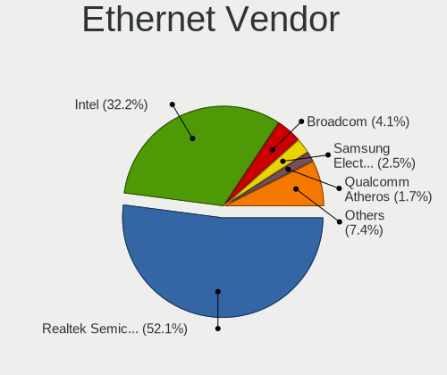

Kubuntu - Hardware Trends
-------------------------

A project to identify most popular hardware characteristics and track their change
over time based on data collected by Linux users at https://Linux-Hardware.org.

Anyone can contribute to this report by the [hw-probe](https://github.com/linuxhw/hw-probe) tool:

    sudo -E hw-probe -all -upload

This is a report for all computer types. See also reports for [desktops](/Dist/Kubuntu/Desktop/README.md) and [notebooks](/Dist/Kubuntu/Notebook/README.md).

This report is for one last month. Overall report since the beginning of time: [TestDays](https://github.com/linuxhw/TestDays)

Period: Apr, 2024.

Contents
--------

* [ System ](#system)
  - [ OS                       ](#os)
  - [ OS Family                ](#os-family)
  - [ Kernel                   ](#kernel)
  - [ Kernel Family            ](#kernel-family)
  - [ Kernel Major Ver.        ](#kernel-major-ver)
  - [ Arch                     ](#arch)
  - [ DE                       ](#de)
  - [ Display Server           ](#display-server)
  - [ Display Manager          ](#display-manager)
  - [ OS Lang                  ](#os-lang)
  - [ Boot Mode                ](#boot-mode)
  - [ Filesystem               ](#filesystem)
  - [ Part. scheme             ](#part-scheme)
  - [ Dual Boot with Linux/BSD ](#dual-boot-with-linuxbsd)
  - [ Dual Boot (Win)          ](#dual-boot-win)

* [ Board ](#board)
  - [ Vendor                   ](#vendor)
  - [ Model                    ](#model)
  - [ Model Family             ](#model-family)
  - [ MFG Year                 ](#mfg-year)
  - [ Form Factor              ](#form-factor)
  - [ Secure Boot              ](#secure-boot)
  - [ Coreboot                 ](#coreboot)
  - [ RAM Size                 ](#ram-size)
  - [ RAM Used                 ](#ram-used)
  - [ Total Drives             ](#total-drives)
  - [ Has CD-ROM               ](#has-cd-rom)
  - [ Has Ethernet             ](#has-ethernet)
  - [ Has WiFi                 ](#has-wifi)
  - [ Has Bluetooth            ](#has-bluetooth)

* [ Location ](#location)
  - [ Country                  ](#country)
  - [ City                     ](#city)

* [ Drives ](#drives)
  - [ Drive Vendor             ](#drive-vendor)
  - [ Drive Model              ](#drive-model)
  - [ HDD Vendor               ](#hdd-vendor)
  - [ SSD Vendor               ](#ssd-vendor)
  - [ Drive Kind               ](#drive-kind)
  - [ Drive Connector          ](#drive-connector)
  - [ Drive Size               ](#drive-size)
  - [ Space Total              ](#space-total)
  - [ Space Used               ](#space-used)
  - [ Malfunc. Drives          ](#malfunc-drives)
  - [ Malfunc. Drive Vendor    ](#malfunc-drive-vendor)
  - [ Malfunc. HDD Vendor      ](#malfunc-hdd-vendor)
  - [ Malfunc. Drive Kind      ](#malfunc-drive-kind)
  - [ Failed Drives            ](#failed-drives)
  - [ Failed Drive Vendor      ](#failed-drive-vendor)
  - [ Drive Status             ](#drive-status)

* [ Storage controller ](#storage-controller)
  - [ Storage Vendor           ](#storage-vendor)
  - [ Storage Model            ](#storage-model)
  - [ Storage Kind             ](#storage-kind)

* [ Processor ](#processor)
  - [ CPU Vendor               ](#cpu-vendor)
  - [ CPU Model                ](#cpu-model)
  - [ CPU Model Family         ](#cpu-model-family)
  - [ CPU Cores                ](#cpu-cores)
  - [ CPU Sockets              ](#cpu-sockets)
  - [ CPU Threads              ](#cpu-threads)
  - [ CPU Op-Modes             ](#cpu-op-modes)
  - [ CPU Microcode            ](#cpu-microcode)
  - [ CPU Microarch            ](#cpu-microarch)

* [ Graphics ](#graphics)
  - [ GPU Vendor               ](#gpu-vendor)
  - [ GPU Model                ](#gpu-model)
  - [ GPU Combo                ](#gpu-combo)
  - [ GPU Driver               ](#gpu-driver)
  - [ GPU Memory               ](#gpu-memory)

* [ Monitor ](#monitor)
  - [ Monitor Vendor           ](#monitor-vendor)
  - [ Monitor Model            ](#monitor-model)
  - [ Monitor Resolution       ](#monitor-resolution)
  - [ Monitor Diagonal         ](#monitor-diagonal)
  - [ Monitor Width            ](#monitor-width)
  - [ Aspect Ratio             ](#aspect-ratio)
  - [ Monitor Area             ](#monitor-area)
  - [ Pixel Density            ](#pixel-density)
  - [ Multiple Monitors        ](#multiple-monitors)

* [ Network ](#network)
  - [ Net Controller Vendor    ](#net-controller-vendor)
  - [ Net Controller Model     ](#net-controller-model)
  - [ Wireless Vendor          ](#wireless-vendor)
  - [ Wireless Model           ](#wireless-model)
  - [ Ethernet Vendor          ](#ethernet-vendor)
  - [ Ethernet Model           ](#ethernet-model)
  - [ Net Controller Kind      ](#net-controller-kind)
  - [ Used Controller          ](#used-controller)
  - [ NICs                     ](#nics)
  - [ IPv6                     ](#ipv6)

* [ Bluetooth ](#bluetooth)
  - [ Bluetooth Vendor         ](#bluetooth-vendor)
  - [ Bluetooth Model          ](#bluetooth-model)

* [ Sound ](#sound)
  - [ Sound Vendor             ](#sound-vendor)
  - [ Sound Model              ](#sound-model)

* [ Memory ](#memory)
  - [ Memory Vendor            ](#memory-vendor)
  - [ Memory Model             ](#memory-model)
  - [ Memory Kind              ](#memory-kind)
  - [ Memory Form Factor       ](#memory-form-factor)
  - [ Memory Size              ](#memory-size)
  - [ Memory Speed             ](#memory-speed)

* [ Printers & scanners ](#printers--scanners)
  - [ Printer Vendor           ](#printer-vendor)
  - [ Printer Model            ](#printer-model)
  - [ Scanner Vendor           ](#scanner-vendor)
  - [ Scanner Model            ](#scanner-model)

* [ Camera ](#camera)
  - [ Camera Vendor            ](#camera-vendor)
  - [ Camera Model             ](#camera-model)

* [ Security ](#security)
  - [ Fingerprint Vendor       ](#fingerprint-vendor)
  - [ Fingerprint Model        ](#fingerprint-model)
  - [ Chipcard Vendor          ](#chipcard-vendor)
  - [ Chipcard Model           ](#chipcard-model)

* [ Unsupported ](#unsupported)
  - [ Unsupported Devices      ](#unsupported-devices)
  - [ Unsupported Device Types ](#unsupported-device-types)

System
------

OS
--

Installed operating systems

| Name          | Computers | Percent |
|---------------|-----------|---------|
| Kubuntu 22.04 | 59        | 44.7%   |
| Kubuntu 23.10 | 48        | 36.36%  |
| Kubuntu 24.04 | 17        | 12.88%  |
| Kubuntu 20.04 | 4         | 3.03%   |
| Kubuntu 23.04 | 2         | 1.52%   |
| Kubuntu 2.1   | 1         | 0.76%   |
| Kubuntu 18.04 | 1         | 0.76%   |

OS Family
---------

OS without a version

| Name    | Computers | Percent |
|---------|-----------|---------|
| Kubuntu | 132       | 100%    |

Kernel
------

Version of the Linux kernel

| Version                | Computers | Percent |
|------------------------|-----------|---------|
| 6.5.0-28-generic       | 31        | 23.48%  |
| 6.5.0-27-generic       | 25        | 18.94%  |
| 6.5.0-26-generic       | 14        | 10.61%  |
| 6.8.0-31-generic       | 12        | 9.09%   |
| 5.15.0-102-generic     | 8         | 6.06%   |
| 6.5.0-9-generic        | 4         | 3.03%   |
| 5.15.0-101-generic     | 4         | 3.03%   |
| 6.5.0-28-lowlatency    | 3         | 2.27%   |
| 6.5.0-26-lowlatency    | 3         | 2.27%   |
| 6.8.1-060801-generic   | 2         | 1.52%   |
| 6.5.0-27-lowlatency    | 2         | 1.52%   |
| 6.2.0-39-generic       | 2         | 1.52%   |
| 5.15.0-94-generic      | 2         | 1.52%   |
| 5.15.0-91-generic      | 2         | 1.52%   |
| 6.8.6-3-liquorix-amd64 | 1         | 0.76%   |
| 6.8.0-28-generic       | 1         | 0.76%   |
| 6.8.0-22-generic       | 1         | 0.76%   |
| 6.8.0-1004-raspi       | 1         | 0.76%   |
| 6.6.28-custom          | 1         | 0.76%   |
| 6.6.25-t2-mantic       | 1         | 0.76%   |
| 6.5.0-25-generic       | 1         | 0.76%   |
| 6.5.0-18-generic       | 1         | 0.76%   |
| 6.5.0-15-lowlatency    | 1         | 0.76%   |
| 6.5.0-15-generic       | 1         | 0.76%   |
| 6.5.0-1013-laptop      | 1         | 0.76%   |
| 6.2.0-26-generic       | 1         | 0.76%   |
| 6.2.0-1018-lowlatency  | 1         | 0.76%   |
| 5.4.0-125-generic      | 1         | 0.76%   |
| 5.15.13-051513-generic | 1         | 0.76%   |
| 5.15.0-86-generic      | 1         | 0.76%   |
| 5.15.0-57-generic      | 1         | 0.76%   |
| 4.15.0-213-generic     | 1         | 0.76%   |

Kernel Family
-------------

Linux kernel without a distro release

| Version | Computers | Percent |
|---------|-----------|---------|
| 6.5.0   | 87        | 65.91%  |
| 5.15.0  | 18        | 13.64%  |
| 6.8.0   | 15        | 11.36%  |
| 6.2.0   | 4         | 3.03%   |
| 6.8.1   | 2         | 1.52%   |
| 6.8.6   | 1         | 0.76%   |
| 6.6.28  | 1         | 0.76%   |
| 6.6.25  | 1         | 0.76%   |
| 5.4.0   | 1         | 0.76%   |
| 5.15.13 | 1         | 0.76%   |
| 4.15.0  | 1         | 0.76%   |

Kernel Major Ver.
-----------------

Linux kernel major version

| Version | Computers | Percent |
|---------|-----------|---------|
| 6.5     | 87        | 65.91%  |
| 5.15    | 19        | 14.39%  |
| 6.8     | 18        | 13.64%  |
| 6.2     | 4         | 3.03%   |
| 6.6     | 2         | 1.52%   |
| 5.4     | 1         | 0.76%   |
| 4.15    | 1         | 0.76%   |

Arch
----

OS architecture (x86_64, i586, etc.)

| Name    | Computers | Percent |
|---------|-----------|---------|
| x86_64  | 130       | 98.48%  |
| aarch64 | 2         | 1.52%   |

DE
--

Desktop Environment

| Name  | Computers | Percent |
|-------|-----------|---------|
| KDE5  | 127       | 96.21%  |
| KDE   | 2         | 1.52%   |
| XFCE  | 1         | 0.76%   |
| KDE6  | 1         | 0.76%   |
| GNOME | 1         | 0.76%   |

Display Server
--------------

X11 or Wayland

| Name    | Computers | Percent |
|---------|-----------|---------|
| X11     | 117       | 88.64%  |
| Wayland | 14        | 10.61%  |
| Tty     | 1         | 0.76%   |

Display Manager
---------------

SDDM, LightDM, etc.

| Name    | Computers | Percent |
|---------|-----------|---------|
| SDDM    | 76        | 57.58%  |
| Unknown | 49        | 37.12%  |
| GDM3    | 4         | 3.03%   |
| LightDM | 2         | 1.52%   |
| GDM     | 1         | 0.76%   |

OS Lang
-------

Language

| Lang           | Computers | Percent |
|----------------|-----------|---------|
| en_US          | 60        | 45.45%  |
| pt_BR          | 10        | 7.58%   |
| de_DE          | 8         | 6.06%   |
| it_IT          | 7         | 5.3%    |
| en_GB          | 7         | 5.3%    |
| ru_RU          | 6         | 4.55%   |
| fr_FR          | 3         | 2.27%   |
| en_CA          | 3         | 2.27%   |
| es_ES          | 2         | 1.52%   |
| en_ZA          | 2         | 1.52%   |
| en_NZ          | 2         | 1.52%   |
| en_IN          | 2         | 1.52%   |
| en_AU          | 2         | 1.52%   |
| tr_TR          | 1         | 0.76%   |
| pt_PT          | 1         | 0.76%   |
| nl_NL          | 1         | 0.76%   |
| nl_BE          | 1         | 0.76%   |
| nb_NO          | 1         | 0.76%   |
| hr_HR          | 1         | 0.76%   |
| fr_CA          | 1         | 0.76%   |
| es_VE          | 1         | 0.76%   |
| es_CR          | 1         | 0.76%   |
| en_ZW          | 1         | 0.76%   |
| en_SG          | 1         | 0.76%   |
| en_IL          | 1         | 0.76%   |
| en_DK          | 1         | 0.76%   |
| en_AG          | 1         | 0.76%   |
| de_LU          | 1         | 0.76%   |
| de_AT          | 1         | 0.76%   |
| ca_ES@valencia | 1         | 0.76%   |
| C              | 1         | 0.76%   |

Boot Mode
---------

EFI or BIOS

| Mode | Computers | Percent |
|------|-----------|---------|
| BIOS | 88        | 66.67%  |
| EFI  | 44        | 33.33%  |

Filesystem
----------

Type of filesystem

| Type    | Computers | Percent |
|---------|-----------|---------|
| Ext4    | 88        | 66.67%  |
| Tmpfs   | 32        | 24.24%  |
| Btrfs   | 6         | 4.55%   |
| Zfs     | 3         | 2.27%   |
| Overlay | 2         | 1.52%   |
| Ext2    | 1         | 0.76%   |

Part. scheme
------------

Scheme of partitioning

| Type    | Computers | Percent |
|---------|-----------|---------|
| GPT     | 74        | 56.06%  |
| Unknown | 49        | 37.12%  |
| MBR     | 9         | 6.82%   |

Dual Boot with Linux/BSD
------------------------

Hosting more than one Linux/BSD

| Dual boot | Computers | Percent |
|-----------|-----------|---------|
| No        | 116       | 87.88%  |
| Yes       | 16        | 12.12%  |

Dual Boot (Win)
---------------

Hosting Linux and Windows

| Dual boot | Computers | Percent |
|-----------|-----------|---------|
| No        | 92        | 69.7%   |
| Yes       | 40        | 30.3%   |

Board
-----

Vendor
------

Motherboard manufacturer

| Name                    | Computers | Percent |
|-------------------------|-----------|---------|
| ASUSTek Computer        | 20        | 15.15%  |
| Hewlett-Packard         | 19        | 14.39%  |
| Lenovo                  | 15        | 11.36%  |
| MSI                     | 14        | 10.61%  |
| Gigabyte Technology     | 13        | 9.85%   |
| Dell                    | 12        | 9.09%   |
| Acer                    | 7         | 5.3%    |
| ASRock                  | 3         | 2.27%   |
| Apple                   | 3         | 2.27%   |
| Samsung Electronics     | 2         | 1.52%   |
| Intel                   | 2         | 1.52%   |
| Fujitsu                 | 2         | 1.52%   |
| Unknown                 | 2         | 1.52%   |
| Toshiba                 | 1         | 0.76%   |
| Timi                    | 1         | 0.76%   |
| TECNO                   | 1         | 0.76%   |
| Raspberry Pi Foundation | 1         | 0.76%   |
| Pegatron                | 1         | 0.76%   |
| Maibenben               | 1         | 0.76%   |
| JWIPC                   | 1         | 0.76%   |
| Intel Client Systems    | 1         | 0.76%   |
| HUAWEI                  | 1         | 0.76%   |
| Framework               | 1         | 0.76%   |
| EXTRA Computer          | 1         | 0.76%   |
| ECS                     | 1         | 0.76%   |
| DERE                    | 1         | 0.76%   |
| Clevo                   | 1         | 0.76%   |
| Carbon Systems          | 1         | 0.76%   |
| AZW                     | 1         | 0.76%   |
| Avell High Performance  | 1         | 0.76%   |
| Alienware               | 1         | 0.76%   |

Model
-----

Motherboard model

| Name                                       | Computers | Percent |
|--------------------------------------------|-----------|---------|
| Unknown                                    | 3         | 2.27%   |
| MSI MS-7C91                                | 2         | 1.52%   |
| Dell OptiPlex 7040                         | 2         | 1.52%   |
| Toshiba TECRA R850                         | 1         | 0.76%   |
| Timi RedmiBook Pro 14S                     | 1         | 0.76%   |
| TECNO MEGABOOK T1                          | 1         | 0.76%   |
| Samsung 950XED                             | 1         | 0.76%   |
| Samsung 550XDA                             | 1         | 0.76%   |
| RPi Raspberry Pi                           | 1         | 0.76%   |
| Pegatron TouchSmart 7320 Lavaca-B EU L6 PC | 1         | 0.76%   |
| MSI Prestige 14Evo A11M                    | 1         | 0.76%   |
| MSI MS-7E06                                | 1         | 0.76%   |
| MSI MS-7D91                                | 1         | 0.76%   |
| MSI MS-7D46                                | 1         | 0.76%   |
| MSI MS-7D25                                | 1         | 0.76%   |
| MSI MS-7C71                                | 1         | 0.76%   |
| MSI MS-7C02                                | 1         | 0.76%   |
| MSI MS-7B85                                | 1         | 0.76%   |
| MSI MS-7B78                                | 1         | 0.76%   |
| MSI MS-7786                                | 1         | 0.76%   |
| MSI Katana GF76 11SC                       | 1         | 0.76%   |
| MSI Creator B660 P100A (MS-B929)           | 1         | 0.76%   |
| Maibenben MaiBook M                        | 1         | 0.76%   |
| Lenovo Z70-80 80FG                         | 1         | 0.76%   |
| Lenovo V310-14ISK 80SX                     | 1         | 0.76%   |
| Lenovo ThinkPad X13s Gen 1 21BYS03Y00      | 1         | 0.76%   |
| Lenovo ThinkPad W540 20BHS0KY08            | 1         | 0.76%   |
| Lenovo ThinkPad T570 20H9CTO1WW            | 1         | 0.76%   |
| Lenovo ThinkPad T530 2359CTO               | 1         | 0.76%   |
| Lenovo ThinkPad T450 20BUS0B000            | 1         | 0.76%   |
| Lenovo ThinkPad T14 Gen 3 21AH00DFPB       | 1         | 0.76%   |
| Lenovo ThinkPad E590 20NB005MUS            | 1         | 0.76%   |
| Lenovo ThinkPad E520 1143R77               | 1         | 0.76%   |
| Lenovo ThinkBook 16 G4+ IAP 21CY           | 1         | 0.76%   |
| Lenovo ThinkBook 15 G2 ITL 20VE            | 1         | 0.76%   |
| Lenovo Legion Slim 5 16APH8 82Y9           | 1         | 0.76%   |
| Lenovo IdeaPad 330S-15IKB 81F5             | 1         | 0.76%   |
| Lenovo IdeaPad 3 15ABA7 82RN               | 1         | 0.76%   |
| JWIPC BF24                                 | 1         | 0.76%   |
| Intel X99                                  | 1         | 0.76%   |

Model Family
------------

Motherboard model prefix

| Name                | Computers | Percent |
|---------------------|-----------|---------|
| Lenovo ThinkPad     | 8         | 6.06%   |
| ASUS ROG            | 6         | 4.55%   |
| Dell Inspiron       | 5         | 3.79%   |
| Acer Aspire         | 5         | 3.79%   |
| HP Pavilion         | 4         | 3.03%   |
| HP Laptop           | 4         | 3.03%   |
| Dell OptiPlex       | 3         | 2.27%   |
| Unknown             | 3         | 2.27%   |
| MSI MS-7C91         | 2         | 1.52%   |
| Lenovo ThinkBook    | 2         | 1.52%   |
| Lenovo IdeaPad      | 2         | 1.52%   |
| HP ProBook          | 2         | 1.52%   |
| Gigabyte Z790       | 2         | 1.52%   |
| Dell Latitude       | 2         | 1.52%   |
| ASUS TUF            | 2         | 1.52%   |
| ASUS PRIME          | 2         | 1.52%   |
| Acer Nitro          | 2         | 1.52%   |
| Toshiba TECRA       | 1         | 0.76%   |
| Timi RedmiBook      | 1         | 0.76%   |
| TECNO MEGABOOK      | 1         | 0.76%   |
| Samsung 950XED      | 1         | 0.76%   |
| Samsung 550XDA      | 1         | 0.76%   |
| RPi Raspberry       | 1         | 0.76%   |
| Pegatron TouchSmart | 1         | 0.76%   |
| MSI Prestige        | 1         | 0.76%   |
| MSI MS-7E06         | 1         | 0.76%   |
| MSI MS-7D91         | 1         | 0.76%   |
| MSI MS-7D46         | 1         | 0.76%   |
| MSI MS-7D25         | 1         | 0.76%   |
| MSI MS-7C71         | 1         | 0.76%   |
| MSI MS-7C02         | 1         | 0.76%   |
| MSI MS-7B85         | 1         | 0.76%   |
| MSI MS-7B78         | 1         | 0.76%   |
| MSI MS-7786         | 1         | 0.76%   |
| MSI Katana          | 1         | 0.76%   |
| MSI Creator         | 1         | 0.76%   |
| Maibenben MaiBook   | 1         | 0.76%   |
| Lenovo Z70-80       | 1         | 0.76%   |
| Lenovo V310-14ISK   | 1         | 0.76%   |
| Lenovo Legion       | 1         | 0.76%   |

MFG Year
--------

Motherboard manufacture year

| Year    | Computers | Percent |
|---------|-----------|---------|
| 2022    | 18        | 13.64%  |
| 2021    | 14        | 10.61%  |
| 2020    | 13        | 9.85%   |
| 2023    | 12        | 9.09%   |
| 2018    | 12        | 9.09%   |
| 2017    | 9         | 6.82%   |
| 2012    | 9         | 6.82%   |
| 2019    | 7         | 5.3%    |
| 2016    | 7         | 5.3%    |
| 2011    | 7         | 5.3%    |
| 2013    | 5         | 3.79%   |
| 2014    | 4         | 3.03%   |
| 2010    | 3         | 2.27%   |
| 2008    | 3         | 2.27%   |
| 2024    | 2         | 1.52%   |
| 2015    | 2         | 1.52%   |
| 2009    | 2         | 1.52%   |
| 2007    | 2         | 1.52%   |
| Unknown | 1         | 0.76%   |

Form Factor
-----------

Physical design of the computer

| Name           | Computers | Percent |
|----------------|-----------|---------|
| Notebook       | 71        | 53.79%  |
| Desktop        | 53        | 40.15%  |
| Mini pc        | 3         | 2.27%   |
| Tablet         | 2         | 1.52%   |
| Convertible    | 2         | 1.52%   |
| System on chip | 1         | 0.76%   |

Secure Boot
-----------

Enabled or disabled

| State    | Computers | Percent |
|----------|-----------|---------|
| Disabled | 128       | 96.97%  |
| Enabled  | 4         | 3.03%   |

Coreboot
--------

Have coreboot on board

| Used | Computers | Percent |
|------|-----------|---------|
| No   | 131       | 99.24%  |
| Yes  | 1         | 0.76%   |

RAM Size
--------

Total RAM memory

| Size in GB  | Computers | Percent |
|-------------|-----------|---------|
| 16.01-24.0  | 39        | 29.55%  |
| 32.01-64.0  | 27        | 20.45%  |
| 8.01-16.0   | 25        | 18.94%  |
| 4.01-8.0    | 19        | 14.39%  |
| 3.01-4.0    | 10        | 7.58%   |
| 24.01-32.0  | 5         | 3.79%   |
| 64.01-256.0 | 5         | 3.79%   |
| 2.01-3.0    | 1         | 0.76%   |
| 1.01-2.0    | 1         | 0.76%   |

RAM Used
--------

Used RAM memory

| Used GB    | Computers | Percent |
|------------|-----------|---------|
| 4.01-8.0   | 39        | 29.55%  |
| 2.01-3.0   | 35        | 26.52%  |
| 3.01-4.0   | 27        | 20.45%  |
| 1.01-2.0   | 15        | 11.36%  |
| 8.01-16.0  | 10        | 7.58%   |
| 24.01-32.0 | 3         | 2.27%   |
| 16.01-24.0 | 3         | 2.27%   |

Total Drives
------------

Number of drives on board

| Drives | Computers | Percent |
|--------|-----------|---------|
| 1      | 64        | 48.48%  |
| 2      | 32        | 24.24%  |
| 3      | 21        | 15.91%  |
| 4      | 7         | 5.3%    |
| 5      | 5         | 3.79%   |
| 6      | 2         | 1.52%   |
| 7      | 1         | 0.76%   |

Has CD-ROM
----------

Has CD-ROM on board

| Presented | Computers | Percent |
|-----------|-----------|---------|
| No        | 95        | 71.97%  |
| Yes       | 37        | 28.03%  |

Has Ethernet
------------

Has Ethernet on board

| Presented | Computers | Percent |
|-----------|-----------|---------|
| Yes       | 111       | 84.09%  |
| No        | 21        | 15.91%  |

Has WiFi
--------

Has WiFi module

| Presented | Computers | Percent |
|-----------|-----------|---------|
| Yes       | 105       | 79.55%  |
| No        | 27        | 20.45%  |

Has Bluetooth
-------------

Has Bluetooth module

| Presented | Computers | Percent |
|-----------|-----------|---------|
| Yes       | 98        | 74.24%  |
| No        | 34        | 25.76%  |

Location
--------

Country
-------

Geographic location (country)

| Country      | Computers | Percent |
|--------------|-----------|---------|
| USA          | 27        | 20.45%  |
| Germany      | 14        | 10.61%  |
| Brazil       | 11        | 8.33%   |
| Russia       | 8         | 6.06%   |
| Italy        | 8         | 6.06%   |
| UK           | 6         | 4.55%   |
| Norway       | 5         | 3.79%   |
| France       | 5         | 3.79%   |
| Canada       | 4         | 3.03%   |
| Switzerland  | 3         | 2.27%   |
| Spain        | 3         | 2.27%   |
| India        | 3         | 2.27%   |
| Belgium      | 3         | 2.27%   |
| Turkey       | 2         | 1.52%   |
| Sweden       | 2         | 1.52%   |
| South Africa | 2         | 1.52%   |
| Poland       | 2         | 1.52%   |
| New Zealand  | 2         | 1.52%   |
| Bulgaria     | 2         | 1.52%   |
| Australia    | 2         | 1.52%   |
| Zimbabwe     | 1         | 0.76%   |
| Venezuela    | 1         | 0.76%   |
| Slovakia     | 1         | 0.76%   |
| Singapore    | 1         | 0.76%   |
| Serbia       | 1         | 0.76%   |
| Portugal     | 1         | 0.76%   |
| Netherlands  | 1         | 0.76%   |
| Malaysia     | 1         | 0.76%   |
| Luxembourg   | 1         | 0.76%   |
| Israel       | 1         | 0.76%   |
| Indonesia    | 1         | 0.76%   |
| Greece       | 1         | 0.76%   |
| Denmark      | 1         | 0.76%   |
| Costa Rica   | 1         | 0.76%   |
| China        | 1         | 0.76%   |
| Bangladesh   | 1         | 0.76%   |
| Austria      | 1         | 0.76%   |
| Argentina    | 1         | 0.76%   |

City
----

Geographic location (city)

| City             | Computers | Percent |
|------------------|-----------|---------|
| Sao Paulo        | 3         | 2.27%   |
| Rio Grande       | 3         | 2.27%   |
| Zurich           | 2         | 1.52%   |
| Trondheim        | 2         | 1.52%   |
| Sydney           | 2         | 1.52%   |
| Sofia            | 2         | 1.52%   |
| Munich           | 2         | 1.52%   |
| Moscow           | 2         | 1.52%   |
| Zuid-Scharwoude  | 1         | 0.76%   |
| Wellington       | 1         | 0.76%   |
| Wasen            | 1         | 0.76%   |
| Volgograd        | 1         | 0.76%   |
| Vienna           | 1         | 0.76%   |
| Vaudreuil-Dorion | 1         | 0.76%   |
| Terzigno         | 1         | 0.76%   |
| Surabaya         | 1         | 0.76%   |
| Stockholm        | 1         | 0.76%   |
| Stadtlohn        | 1         | 0.76%   |
| St Petersburg    | 1         | 0.76%   |
| Southwark        | 1         | 0.76%   |
| Solingen         | 1         | 0.76%   |
| Singapore        | 1         | 0.76%   |
| Silver Spring    | 1         | 0.76%   |
| Shimla           | 1         | 0.76%   |
| Secaucus         | 1         | 0.76%   |
| Sealy            | 1         | 0.76%   |
| Santo André     | 1         | 0.76%   |
| Rotselaar        | 1         | 0.76%   |
| Rome             | 1         | 0.76%   |
| Richmond         | 1         | 0.76%   |
| Reggio Calabria  | 1         | 0.76%   |
| Pune             | 1         | 0.76%   |
| Providence       | 1         | 0.76%   |
| Pratt            | 1         | 0.76%   |
| Porto-Vecchio    | 1         | 0.76%   |
| Port Elizabeth   | 1         | 0.76%   |
| Pleasanton       | 1         | 0.76%   |
| Plattsmouth      | 1         | 0.76%   |
| Phoenix          | 1         | 0.76%   |
| Penza            | 1         | 0.76%   |

Drives
------

Drive Vendor
------------

Hard drive vendors

| Vendor                      | Computers | Drives | Percent |
|-----------------------------|-----------|--------|---------|
| Samsung Electronics         | 40        | 57     | 17.78%  |
| WDC                         | 26        | 32     | 11.56%  |
| Seagate                     | 22        | 29     | 9.78%   |
| SanDisk                     | 16        | 19     | 7.11%   |
| Intel                       | 10        | 11     | 4.44%   |
| Crucial                     | 9         | 14     | 4%      |
| Toshiba                     | 8         | 10     | 3.56%   |
| Micron Technology           | 7         | 7      | 3.11%   |
| Kingston                    | 7         | 7      | 3.11%   |
| Unknown                     | 6         | 6      | 2.67%   |
| China                       | 6         | 6      | 2.67%   |
| SK hynix                    | 5         | 5      | 2.22%   |
| HGST                        | 5         | 5      | 2.22%   |
| A-DATA Technology           | 5         | 5      | 2.22%   |
| SPCC                        | 4         | 4      | 1.78%   |
| Silicon Motion              | 3         | 3      | 1.33%   |
| Phison Electronics          | 3         | 3      | 1.33%   |
| KIOXIA                      | 3         | 3      | 1.33%   |
| Hitachi                     | 3         | 3      | 1.33%   |
| Apple                       | 3         | 3      | 1.33%   |
| Unknown                     | 3         | 3      | 1.33%   |
| PNY                         | 2         | 2      | 0.89%   |
| Micron/Crucial Technology   | 2         | 2      | 0.89%   |
| MAXIO Technology (Hangzhou) | 2         | 2      | 0.89%   |
| Lite-On Technology          | 2         | 2      | 0.89%   |
| Kingston Technology Company | 2         | 2      | 0.89%   |
| JMicron Technology          | 2         | 2      | 0.89%   |
| Intenso                     | 2         | 2      | 0.89%   |
| ADATA Technology            | 2         | 2      | 0.89%   |
| T-FORCE                     | 1         | 1      | 0.44%   |
| StoreJet                    | 1         | 1      | 0.44%   |
| SSK SD30                    | 1         | 1      | 0.44%   |
| SCCTS-603-001T              | 1         | 1      | 0.44%   |
| Realtek Semiconductor       | 1         | 1      | 0.44%   |
| Phison                      | 1         | 1      | 0.44%   |
| Patriot                     | 1         | 1      | 0.44%   |
| Neo                         | 1         | 1      | 0.44%   |
| MicroFrom                   | 1         | 1      | 0.44%   |
| LITEONIT                    | 1         | 1      | 0.44%   |
| Lexar                       | 1         | 1      | 0.44%   |

Drive Model
-----------

Hard drive models

| Model                                              | Computers | Percent |
|----------------------------------------------------|-----------|---------|
| Samsung NVMe SSD Controller SM981/PM981/PM983 1TB  | 5         | 2.01%   |
| Samsung NVMe SSD Controller PM9A1/PM9A3/980PRO 1TB | 3         | 1.2%    |
| Samsung MZVL2512HCJQ-00B00 512GB                   | 3         | 1.2%    |
| Intel SSDPEKNU512GZ 512GB                          | 3         | 1.2%    |
| HGST HTS721010A9E630 1TB                           | 3         | 1.2%    |
| Unknown                                            | 3         | 1.2%    |
| WDC WDS100T2B0A-00SM50 1TB SSD                     | 2         | 0.8%    |
| WDC WD5000AAKX-001CA0 500GB                        | 2         | 0.8%    |
| WDC WD10EZEX-08WN4A0 1TB                           | 2         | 0.8%    |
| Seagate ST8000DM004-2CX188 8TB                     | 2         | 0.8%    |
| Seagate ST31000528AS 1TB                           | 2         | 0.8%    |
| Seagate ST2000DM006-2DM164 2TB                     | 2         | 0.8%    |
| Sandisk WD Blue SN550 NVMe SSD 2TB                 | 2         | 0.8%    |
| Samsung SSD 980 PRO 1TB                            | 2         | 0.8%    |
| Samsung SSD 980 500GB                              | 2         | 0.8%    |
| Samsung SSD 860 EVO 500GB                          | 2         | 0.8%    |
| Samsung PSSD T7 1TB                                | 2         | 0.8%    |
| Samsung NVMe SSD Controller SM961/PM961/SM963 1TB  | 2         | 0.8%    |
| Lite-On CX2-8B256-Q11 NVMe LITEON 256GB            | 2         | 0.8%    |
| Intel SSD 660P Series 1024GB                       | 2         | 0.8%    |
| HGST HTS541010A9E680 1TB                           | 2         | 0.8%    |
| Crucial CT1000MX500SSD1 1TB                        | 2         | 0.8%    |
| WDC WDS500G2B0A 500GB SSD                          | 1         | 0.4%    |
| WDC WDS500G1B0B-00AS40 500GB SSD                   | 1         | 0.4%    |
| WDC WDS200T2B0A-00SM50 2TB SSD                     | 1         | 0.4%    |
| WDC WDBNCE5000PNC 500GB SSD                        | 1         | 0.4%    |
| WDC WDBNCE0010PNC 1TB SSD                          | 1         | 0.4%    |
| WDC WD7500AADS-00M2B0 752GB                        | 1         | 0.4%    |
| WDC WD5000AZLX-08K2TA0 500GB                       | 1         | 0.4%    |
| WDC WD5000AURX-63UY4Y0 500GB                       | 1         | 0.4%    |
| WDC WD5000AAKX-753CA1 500GB                        | 1         | 0.4%    |
| WDC WD40EZRZ-22GXCB0 4TB                           | 1         | 0.4%    |
| WDC WD40EFAX-68JH4N1 4TB                           | 1         | 0.4%    |
| WDC WD4003FRYZ-01F0DB0 4TB                         | 1         | 0.4%    |
| WDC WD30EZRZ-00GXCB0 3TB                           | 1         | 0.4%    |
| WDC WD2500AAKX-00ERMA0 250GB                       | 1         | 0.4%    |
| WDC WD20EARX-00ZUDB0 2TB                           | 1         | 0.4%    |
| WDC WD20EARS-00MVWB0 2TB                           | 1         | 0.4%    |
| WDC WD10SPZX-21Z10T0 1TB                           | 1         | 0.4%    |
| WDC WD10JPVX-60JC3T0 1TB                           | 1         | 0.4%    |

HDD Vendor
----------

Hard disk drive vendors

| Vendor              | Computers | Drives | Percent |
|---------------------|-----------|--------|---------|
| Seagate             | 21        | 28     | 33.87%  |
| WDC                 | 20        | 24     | 32.26%  |
| Toshiba             | 7         | 9      | 11.29%  |
| HGST                | 5         | 5      | 8.06%   |
| Hitachi             | 3         | 3      | 4.84%   |
| Samsung Electronics | 2         | 2      | 3.23%   |
| Unknown             | 1         | 1      | 1.61%   |
| StoreJet            | 1         | 1      | 1.61%   |
| JMicron Technology  | 1         | 1      | 1.61%   |
| Apple               | 1         | 1      | 1.61%   |

SSD Vendor
----------

Solid state drive vendors

| Vendor              | Computers | Drives | Percent |
|---------------------|-----------|--------|---------|
| Samsung Electronics | 17        | 19     | 22.08%  |
| Crucial             | 9         | 14     | 11.69%  |
| WDC                 | 7         | 8      | 9.09%   |
| SanDisk             | 7         | 7      | 9.09%   |
| China               | 6         | 6      | 7.79%   |
| A-DATA Technology   | 4         | 4      | 5.19%   |
| SPCC                | 3         | 3      | 3.9%    |
| Kingston            | 3         | 3      | 3.9%    |
| Intel               | 3         | 3      | 3.9%    |
| Unknown             | 3         | 3      | 3.9%    |
| PNY                 | 2         | 2      | 2.6%    |
| Micron Technology   | 2         | 2      | 2.6%    |
| Toshiba             | 1         | 1      | 1.3%    |
| SCCTS-603-001T      | 1         | 1      | 1.3%    |
| Patriot             | 1         | 1      | 1.3%    |
| Neo                 | 1         | 1      | 1.3%    |
| LITEONIT            | 1         | 1      | 1.3%    |
| Lexar               | 1         | 1      | 1.3%    |
| Kingmax             | 1         | 1      | 1.3%    |
| Intenso             | 1         | 1      | 1.3%    |
| Gigabyte Technology | 1         | 1      | 1.3%    |
| DST                 | 1         | 1      | 1.3%    |
| Apple               | 1         | 1      | 1.3%    |

Drive Kind
----------

HDD or SSD

| Kind    | Computers | Drives | Percent |
|---------|-----------|--------|---------|
| NVMe    | 78        | 95     | 37.14%  |
| SSD     | 68        | 85     | 32.38%  |
| HDD     | 54        | 75     | 25.71%  |
| Unknown | 6         | 7      | 2.86%   |
| MMC     | 4         | 4      | 1.9%    |

Drive Connector
---------------

SATA, SAS, NVMe, etc.

| Type | Computers | Drives | Percent |
|------|-----------|--------|---------|
| SATA | 88        | 148    | 47.06%  |
| NVMe | 77        | 92     | 41.18%  |
| SAS  | 18        | 22     | 9.63%   |
| MMC  | 4         | 4      | 2.14%   |

Drive Size
----------

Size of hard drive

| Size in TB | Computers | Drives | Percent |
|------------|-----------|--------|---------|
| 0.01-0.5   | 58        | 70     | 44.27%  |
| 0.51-1.0   | 37        | 45     | 28.24%  |
| 1.01-2.0   | 19        | 26     | 14.5%   |
| 3.01-4.0   | 8         | 8      | 6.11%   |
| 4.01-10.0  | 5         | 7      | 3.82%   |
| 10.01-20.0 | 3         | 3      | 2.29%   |
| 2.01-3.0   | 1         | 1      | 0.76%   |

Space Total
-----------

Amount of disk space available on the file system

| Size in GB     | Computers | Percent |
|----------------|-----------|---------|
| 101-250        | 30        | 22.73%  |
| 501-1000       | 25        | 18.94%  |
| 251-500        | 23        | 17.42%  |
| 1001-2000      | 19        | 14.39%  |
| More than 3000 | 13        | 9.85%   |
| 2001-3000      | 9         | 6.82%   |
| 1-20           | 5         | 3.79%   |
| 51-100         | 5         | 3.79%   |
| 21-50          | 2         | 1.52%   |
| Unknown        | 1         | 0.76%   |

Space Used
----------

Amount of used disk space

| Used GB        | Computers | Percent |
|----------------|-----------|---------|
| 1-20           | 23        | 17.42%  |
| 51-100         | 23        | 17.42%  |
| 21-50          | 20        | 15.15%  |
| 101-250        | 20        | 15.15%  |
| 501-1000       | 14        | 10.61%  |
| 251-500        | 13        | 9.85%   |
| 1001-2000      | 8         | 6.06%   |
| More than 3000 | 7         | 5.3%    |
| 2001-3000      | 3         | 2.27%   |
| Unknown        | 1         | 0.76%   |

Malfunc. Drives
---------------

Drive models with a malfunction

| Model                                   | Computers | Drives | Percent |
|-----------------------------------------|-----------|--------|---------|
| WDC WD10JPVX-60JC3T0 1TB                | 1         | 1      | 9.09%   |
| WDC WD10EZEX-22MFCA0 1TB                | 1         | 1      | 9.09%   |
| Toshiba DT01ACA100 1TB                  | 1         | 2      | 9.09%   |
| Seagate ST9320421AS 320GB               | 1         | 1      | 9.09%   |
| Seagate ST4000NM0053 4TB                | 1         | 1      | 9.09%   |
| Samsung Electronics SSD 870 EVO 250GB   | 1         | 1      | 9.09%   |
| Samsung Electronics HD501LJ 500GB       | 1         | 1      | 9.09%   |
| Neo Forza NFS121SA312-6007000 120GB SSD | 1         | 1      | 9.09%   |
| Intel SSDPEKNU512GZ 512GB               | 1         | 1      | 9.09%   |
| Hitachi HTS543232A7A384 320GB           | 1         | 1      | 9.09%   |
| China SSD 480GB                         | 1         | 1      | 9.09%   |

Malfunc. Drive Vendor
---------------------

Vendors of faulty drives

| Vendor              | Computers | Drives | Percent |
|---------------------|-----------|--------|---------|
| WDC                 | 2         | 2      | 18.18%  |
| Seagate             | 2         | 2      | 18.18%  |
| Samsung Electronics | 2         | 2      | 18.18%  |
| Toshiba             | 1         | 2      | 9.09%   |
| Neo                 | 1         | 1      | 9.09%   |
| Intel               | 1         | 1      | 9.09%   |
| Hitachi             | 1         | 1      | 9.09%   |
| China               | 1         | 1      | 9.09%   |

Malfunc. HDD Vendor
-------------------

Vendors of faulty HDD drives

| Vendor              | Computers | Drives | Percent |
|---------------------|-----------|--------|---------|
| WDC                 | 2         | 2      | 28.57%  |
| Seagate             | 2         | 2      | 28.57%  |
| Toshiba             | 1         | 2      | 14.29%  |
| Samsung Electronics | 1         | 1      | 14.29%  |
| Hitachi             | 1         | 1      | 14.29%  |

Malfunc. Drive Kind
-------------------

Kinds of faulty drives

| Kind | Computers | Drives | Percent |
|------|-----------|--------|---------|
| HDD  | 7         | 8      | 63.64%  |
| SSD  | 3         | 3      | 27.27%  |
| NVMe | 1         | 1      | 9.09%   |

Failed Drives
-------------

Failed drive models

Zero info for selected period =(

Failed Drive Vendor
-------------------

Failed drive vendors

Zero info for selected period =(

Drive Status
------------

Number of failed and malfunc. drives

| Status   | Computers | Drives | Percent |
|----------|-----------|--------|---------|
| Detected | 82        | 170    | 56.94%  |
| Works    | 52        | 84     | 36.11%  |
| Malfunc  | 10        | 12     | 6.94%   |

Storage controller
------------------

Storage Vendor
--------------

Storage controller vendors

| Vendor                      | Computers | Percent |
|-----------------------------|-----------|---------|
| Intel                       | 82        | 42.05%  |
| AMD                         | 31        | 15.9%   |
| Samsung Electronics         | 27        | 13.85%  |
| SanDisk                     | 9         | 4.62%   |
| Kingston Technology Company | 6         | 3.08%   |
| SK hynix                    | 5         | 2.56%   |
| Phison Electronics          | 5         | 2.56%   |
| Micron Technology           | 5         | 2.56%   |
| MAXIO Technology (Hangzhou) | 3         | 1.54%   |
| KIOXIA                      | 3         | 1.54%   |
| JMicron Technology          | 3         | 1.54%   |
| ADATA Technology            | 3         | 1.54%   |
| Silicon Motion              | 2         | 1.03%   |
| Micron/Crucial Technology   | 2         | 1.03%   |
| Marvell Technology Group    | 2         | 1.03%   |
| Lite-On Technology          | 2         | 1.03%   |
| Solidigm                    | 1         | 0.51%   |
| Realtek Semiconductor       | 1         | 0.51%   |
| Promise Technology          | 1         | 0.51%   |
| Nvidia                      | 1         | 0.51%   |
| ASMedia Technology          | 1         | 0.51%   |

Storage Model
-------------

Storage controller models

| Model                                                                          | Computers | Percent |
|--------------------------------------------------------------------------------|-----------|---------|
| AMD FCH SATA Controller [AHCI mode]                                            | 18        | 8.26%   |
| Samsung NVMe SSD Controller SM981/PM981/PM983                                  | 8         | 3.67%   |
| Samsung NVMe SSD Controller PM9A1/PM9A3/980PRO                                 | 7         | 3.21%   |
| AMD 400 Series Chipset SATA Controller                                         | 7         | 3.21%   |
| Samsung NVMe SSD Controller 980 (DRAM-less)                                    | 6         | 2.75%   |
| Intel 8 Series/C220 Series Chipset Family 6-port SATA Controller 1 [AHCI mode] | 6         | 2.75%   |
| Intel Sunrise Point-LP SATA Controller [AHCI mode]                             | 5         | 2.29%   |
| AMD SB7x0/SB8x0/SB9x0 SATA Controller [AHCI mode]                              | 5         | 2.29%   |
| Intel Volume Management Device NVMe RAID Controller                            | 4         | 1.83%   |
| Intel SSD 670p Series [Keystone Harbor]                                        | 4         | 1.83%   |
| Intel Raptor Lake SATA AHCI Controller                                         | 4         | 1.83%   |
| Intel Alder Lake-S PCH SATA Controller [AHCI Mode]                             | 4         | 1.83%   |
| Intel 82801 Mobile SATA Controller [RAID mode]                                 | 4         | 1.83%   |
| Intel 6 Series/C200 Series Chipset Family 6 port Mobile SATA AHCI Controller   | 4         | 1.83%   |
| Samsung NVMe SSD Controller SM961/PM961/SM963                                  | 3         | 1.38%   |
| Micron 2450 NVMe SSD [HendrixV] (DRAM-less)                                    | 3         | 1.38%   |
| Kingston Company A2000 NVMe SSD SM2263EN                                       | 3         | 1.38%   |
| Intel Wildcat Point-LP SATA Controller [AHCI Mode]                             | 3         | 1.38%   |
| Intel Tiger Lake SATA AHCI Controller                                          | 3         | 1.38%   |
| Intel SSD 660P Series                                                          | 3         | 1.38%   |
| Intel 200 Series PCH SATA controller [AHCI mode]                               | 3         | 1.38%   |
| AMD 600 Series Chipset SATA Controller                                         | 3         | 1.38%   |
| AMD 500 Series Chipset SATA Controller                                         | 3         | 1.38%   |
| SK hynix Platinum P41/PC801 NVMe Solid State Drive                             | 2         | 0.92%   |
| SK hynix Gold P31/BC711/PC711 NVMe Solid State Drive                           | 2         | 0.92%   |
| Silicon Motion SM2262/SM2262EN SSD Controller                                  | 2         | 0.92%   |
| SanDisk WD Black SN770 / PC SN740 256GB / PC SN560 (DRAM-less) NVMe SSD        | 2         | 0.92%   |
| SanDisk Ultra 3D / WD Blue SN550 NVMe SSD                                      | 2         | 0.92%   |
| Samsung NVMe SSD Controller S4LV008[Pascal]                                    | 2         | 0.92%   |
| Phison PS5021-E21 PCIe4 NVMe Controller (DRAM-less)                            | 2         | 0.92%   |
| Phison PS5013-E13 PCIe3 NVMe Controller (DRAM-less)                            | 2         | 0.92%   |
| Micron 2210 NVMe SSD [Cobain]                                                  | 2         | 0.92%   |
| Lite-On CX2-8B256, CX2-8B512 NVMe SSD                                          | 2         | 0.92%   |
| JMicron JMB363 SATA/IDE Controller                                             | 2         | 0.92%   |
| Intel Volume Management Device NVMe RAID Controller Intel Corporation          | 2         | 0.92%   |
| Intel Tiger Lake-LP SATA Controller                                            | 2         | 0.92%   |
| Intel SATA Controller [RAID mode]                                              | 2         | 0.92%   |
| Intel Q170/Q150/B150/H170/H110/Z170/CM236 Chipset SATA Controller [AHCI Mode]  | 2         | 0.92%   |
| Intel HM170/QM170 Chipset SATA Controller [AHCI Mode]                          | 2         | 0.92%   |
| Intel Comet Lake SATA AHCI Controller                                          | 2         | 0.92%   |

Storage Kind
------------

Kind of storage controller (IDE, SATA, NVMe, SAS, ...)

| Kind | Computers | Percent |
|------|-----------|---------|
| SATA | 96        | 50.26%  |
| NVMe | 73        | 38.22%  |
| RAID | 13        | 6.81%   |
| IDE  | 9         | 4.71%   |

Processor
---------

CPU Vendor
----------

Processor vendors

| Vendor | Computers | Percent |
|--------|-----------|---------|
| Intel  | 93        | 70.45%  |
| AMD    | 37        | 28.03%  |
| ARM    | 2         | 1.52%   |

CPU Model
---------

Processor models

| Model                                   | Computers | Percent |
|-----------------------------------------|-----------|---------|
| Intel Core i7-2640M CPU @ 2.80GHz       | 3         | 2.27%   |
| Intel 11th Gen Core i7-1165G7 @ 2.80GHz | 3         | 2.27%   |
| AMD Ryzen 7 2700X Eight-Core Processor  | 3         | 2.27%   |
| Intel Core i7-6700 CPU @ 3.40GHz        | 2         | 1.52%   |
| Intel Core i7-3630QM CPU @ 2.40GHz      | 2         | 1.52%   |
| Intel Core i7-14700K                    | 2         | 1.52%   |
| Intel Core i5-7200U CPU @ 2.50GHz       | 2         | 1.52%   |
| Intel Core i5-5300U CPU @ 2.30GHz       | 2         | 1.52%   |
| Intel Core i3-6006U CPU @ 2.00GHz       | 2         | 1.52%   |
| Intel 12th Gen Core i7-1255U            | 2         | 1.52%   |
| Intel 12th Gen Core i5-1235U            | 2         | 1.52%   |
| Intel 11th Gen Core i5-11400H @ 2.70GHz | 2         | 1.52%   |
| Intel 11th Gen Core i5-1135G7 @ 2.40GHz | 2         | 1.52%   |
| ARM Processor                           | 2         | 1.52%   |
| AMD Ryzen 7 5700U with Radeon Graphics  | 2         | 1.52%   |
| AMD Ryzen 5 5625U with Radeon Graphics  | 2         | 1.52%   |
| AMD Ryzen 5 5500U with Radeon Graphics  | 2         | 1.52%   |
| AMD Ryzen 5 4500U with Radeon Graphics  | 2         | 1.52%   |
| AMD Ryzen 5 3600 6-Core Processor       | 2         | 1.52%   |
| AMD Ryzen 5 1600X Six-Core Processor    | 2         | 1.52%   |
| Intel Xeon CPU E5-2660 v3 @ 2.60GHz     | 1         | 0.76%   |
| Intel Pentium Gold G5420 CPU @ 3.80GHz  | 1         | 0.76%   |
| Intel Pentium CPU N4200 @ 1.10GHz       | 1         | 0.76%   |
| Intel Pentium CPU N3540 @ 2.16GHz       | 1         | 0.76%   |
| Intel Pentium CPU G850 @ 2.90GHz        | 1         | 0.76%   |
| Intel N200                              | 1         | 0.76%   |
| Intel Core i9-7900X CPU @ 3.30GHz       | 1         | 0.76%   |
| Intel Core i7-9750H CPU @ 2.60GHz       | 1         | 0.76%   |
| Intel Core i7-9700K CPU @ 3.60GHz       | 1         | 0.76%   |
| Intel Core i7-8750H CPU @ 2.20GHz       | 1         | 0.76%   |
| Intel Core i7-8705G CPU @ 3.10GHz       | 1         | 0.76%   |
| Intel Core i7-8700 CPU @ 3.20GHz        | 1         | 0.76%   |
| Intel Core i7-8550U CPU @ 1.80GHz       | 1         | 0.76%   |
| Intel Core i7-7700T CPU @ 2.90GHz       | 1         | 0.76%   |
| Intel Core i7-7700HQ CPU @ 2.80GHz      | 1         | 0.76%   |
| Intel Core i7-6700HQ CPU @ 2.60GHz      | 1         | 0.76%   |
| Intel Core i7-5500U CPU @ 2.40GHz       | 1         | 0.76%   |
| Intel Core i7-4870HQ CPU @ 2.50GHz      | 1         | 0.76%   |
| Intel Core i7-4800MQ CPU @ 2.70GHz      | 1         | 0.76%   |
| Intel Core i7-4790 CPU @ 3.60GHz        | 1         | 0.76%   |

CPU Model Family
----------------

Processor model prefix

| Model              | Computers | Percent |
|--------------------|-----------|---------|
| Other              | 31        | 23.48%  |
| Intel Core i7      | 30        | 22.73%  |
| Intel Core i5      | 16        | 12.12%  |
| AMD Ryzen 5        | 12        | 9.09%   |
| AMD Ryzen 7        | 9         | 6.82%   |
| AMD Ryzen 9        | 7         | 5.3%    |
| Intel Core i3      | 4         | 3.03%   |
| Intel Celeron      | 4         | 3.03%   |
| Intel Pentium      | 3         | 2.27%   |
| Intel Core 2 Duo   | 3         | 2.27%   |
| AMD FX             | 3         | 2.27%   |
| AMD A4             | 2         | 1.52%   |
| Intel Xeon         | 1         | 0.76%   |
| Intel Pentium Gold | 1         | 0.76%   |
| Intel Core i9      | 1         | 0.76%   |
| Intel Core 2 Quad  | 1         | 0.76%   |
| AMD Ryzen 7 PRO    | 1         | 0.76%   |
| AMD Opteron        | 1         | 0.76%   |
| AMD Athlon II X2   | 1         | 0.76%   |
| AMD Athlon 64 X2   | 1         | 0.76%   |

CPU Cores
---------

Number of processor cores

| Number  | Computers | Percent |
|---------|-----------|---------|
| 4       | 44        | 33.33%  |
| 2       | 26        | 19.7%   |
| 6       | 18        | 13.64%  |
| 8       | 17        | 12.88%  |
| 12      | 9         | 6.82%   |
| 10      | 7         | 5.3%    |
| 16      | 5         | 3.79%   |
| 20      | 2         | 1.52%   |
| 14      | 2         | 1.52%   |
| 3       | 1         | 0.76%   |
| Unknown | 1         | 0.76%   |

CPU Sockets
-----------

Number of sockets

| Number  | Computers | Percent |
|---------|-----------|---------|
| 1       | 130       | 98.48%  |
| 2       | 1         | 0.76%   |
| Unknown | 1         | 0.76%   |

CPU Threads
-----------

Threads per core (Hyper-Threading)

| Number  | Computers | Percent |
|---------|-----------|---------|
| 2       | 101       | 76.52%  |
| 1       | 30        | 22.73%  |
| Unknown | 1         | 0.76%   |

CPU Op-Modes
------------

CPU Operation Modes (32-bit, 64-bit)

| Op mode        | Computers | Percent |
|----------------|-----------|---------|
| 32-bit, 64-bit | 130       | 98.48%  |
| 64-bit         | 2         | 1.52%   |

CPU Microcode
-------------

Microcode number

| Number     | Computers | Percent |
|------------|-----------|---------|
| Unknown    | 109       | 82.58%  |
| 0x06000852 | 3         | 2.27%   |
| 0x906ea    | 2         | 1.52%   |
| 0x0800820d | 2         | 1.52%   |
| 0xb06a2    | 1         | 0.76%   |
| 0x906e9    | 1         | 0.76%   |
| 0x806eb    | 1         | 0.76%   |
| 0x806ea    | 1         | 0.76%   |
| 0x706a8    | 1         | 0.76%   |
| 0x30678    | 1         | 0.76%   |
| 0x0a704104 | 1         | 0.76%   |
| 0x0a601203 | 1         | 0.76%   |
| 0x0a50000c | 1         | 0.76%   |
| 0x0a201016 | 1         | 0.76%   |
| 0x08600104 | 1         | 0.76%   |
| 0x08600103 | 1         | 0.76%   |
| 0x08001138 | 1         | 0.76%   |
| 0x08001126 | 1         | 0.76%   |
| 0x07030105 | 1         | 0.76%   |
| 0x010000c8 | 1         | 0.76%   |

CPU Microarch
-------------

Microarchitecture

| Name             | Computers | Percent |
|------------------|-----------|---------|
| Unknown          | 28        | 21.21%  |
| KabyLake         | 15        | 11.36%  |
| Haswell          | 8         | 6.06%   |
| Zen 2            | 7         | 5.3%    |
| TigerLake        | 7         | 5.3%    |
| Skylake          | 7         | 5.3%    |
| Zen 3            | 6         | 4.55%   |
| SandyBridge      | 6         | 4.55%   |
| Zen+             | 5         | 3.79%   |
| IvyBridge        | 5         | 3.79%   |
| Alderlake Hybrid | 5         | 3.79%   |
| Westmere         | 4         | 3.03%   |
| Piledriver       | 3         | 2.27%   |
| IceLake          | 3         | 2.27%   |
| CometLake        | 3         | 2.27%   |
| Broadwell        | 3         | 2.27%   |
| Zen              | 2         | 1.52%   |
| Silvermont       | 2         | 1.52%   |
| Penryn           | 2         | 1.52%   |
| Core             | 2         | 1.52%   |
| Tremont          | 1         | 0.76%   |
| Puma             | 1         | 0.76%   |
| Nehalem          | 1         | 0.76%   |
| K8 Hammer        | 1         | 0.76%   |
| K10 Llano        | 1         | 0.76%   |
| K10              | 1         | 0.76%   |
| Goldmont plus    | 1         | 0.76%   |
| Goldmont         | 1         | 0.76%   |
| Bulldozer        | 1         | 0.76%   |

Graphics
--------

GPU Vendor
----------

Vendors of graphics cards

| Vendor | Computers | Percent |
|--------|-----------|---------|
| Intel  | 75        | 46.58%  |
| Nvidia | 45        | 27.95%  |
| AMD    | 41        | 25.47%  |

GPU Model
---------

Graphics card models

| Model                                                                         | Computers | Percent |
|-------------------------------------------------------------------------------|-----------|---------|
| Intel TigerLake-LP GT2 [Iris Xe Graphics]                                     | 6         | 3.61%   |
| Intel 2nd Generation Core Processor Family Integrated Graphics Controller     | 5         | 3.01%   |
| Intel Core Processor Integrated Graphics Controller                           | 4         | 2.41%   |
| Intel Alder Lake-UP3 GT2 [Iris Xe Graphics]                                   | 4         | 2.41%   |
| AMD Renoir [Radeon RX Vega 6 (Ryzen 4000/5000 Mobile Series)]                 | 4         | 2.41%   |
| AMD Lucienne                                                                  | 4         | 2.41%   |
| Intel UHD Graphics 620                                                        | 3         | 1.81%   |
| Intel TigerLake-H GT1 [UHD Graphics]                                          | 3         | 1.81%   |
| Intel Raptor Lake-P [Iris Xe Graphics]                                        | 3         | 1.81%   |
| Intel HD Graphics 630                                                         | 3         | 1.81%   |
| Intel HD Graphics 5500                                                        | 3         | 1.81%   |
| Intel HD Graphics 530                                                         | 3         | 1.81%   |
| Intel AlderLake-S GT1                                                         | 3         | 1.81%   |
| Intel Alder Lake-P GT2 [Iris Xe Graphics]                                     | 3         | 1.81%   |
| Intel 4th Gen Core Processor Integrated Graphics Controller                   | 3         | 1.81%   |
| Intel 3rd Gen Core processor Graphics Controller                              | 3         | 1.81%   |
| AMD Raphael                                                                   | 3         | 1.81%   |
| AMD Navi 10 [Radeon RX 5600 OEM/5600 XT / 5700/5700 XT]                       | 3         | 1.81%   |
| AMD Ellesmere [Radeon RX 470/480/570/570X/580/580X/590]                       | 3         | 1.81%   |
| Nvidia TU117M [GeForce GTX 1650 Mobile / Max-Q]                               | 2         | 1.2%    |
| Nvidia TU116M [GeForce GTX 1660 Ti Mobile]                                    | 2         | 1.2%    |
| Nvidia GM107M [GeForce GTX 950M]                                              | 2         | 1.2%    |
| Nvidia GA106 [GeForce RTX 3060 Lite Hash Rate]                                | 2         | 1.2%    |
| Nvidia GA104 [GeForce RTX 3060 Ti Lite Hash Rate]                             | 2         | 1.2%    |
| Intel Xeon E3-1200 v3/4th Gen Core Processor Integrated Graphics Controller   | 2         | 1.2%    |
| Intel HD Graphics 620                                                         | 2         | 1.2%    |
| Intel CoffeeLake-S GT2 [UHD Graphics 630]                                     | 2         | 1.2%    |
| Intel CoffeeLake-H GT2 [UHD Graphics 630]                                     | 2         | 1.2%    |
| AMD Turks GL [FirePro V3900]                                                  | 2         | 1.2%    |
| AMD Sun XT [Radeon HD 8670A/8670M/8690M / R5 M330 / M430 / Radeon 520 Mobile] | 2         | 1.2%    |
| AMD Seymour [Radeon HD 6400M/7400M Series]                                    | 2         | 1.2%    |
| AMD Phoenix1                                                                  | 2         | 1.2%    |
| AMD Lexa PRO [Radeon 540/540X/550/550X / RX 540X/550/550X]                    | 2         | 1.2%    |
| AMD Barcelo                                                                   | 2         | 1.2%    |
| Nvidia TU106M [GeForce RTX 2060 Max-Q]                                        | 1         | 0.6%    |
| Nvidia TU104 [GeForce RTX 2070 SUPER]                                         | 1         | 0.6%    |
| Nvidia TU104 [GeForce RTX 2060]                                               | 1         | 0.6%    |
| Nvidia GT200 [GeForce GTX 260]                                                | 1         | 0.6%    |
| Nvidia GP108 [GeForce GT 1030]                                                | 1         | 0.6%    |
| Nvidia GP107M [GeForce GTX 1050 Mobile]                                       | 1         | 0.6%    |

GPU Combo
---------

Combinations of graphics cards

| Name           | Computers | Percent |
|----------------|-----------|---------|
| 1 x Intel      | 47        | 35.61%  |
| 1 x AMD        | 27        | 20.45%  |
| 1 x Nvidia     | 26        | 19.7%   |
| Intel + Nvidia | 16        | 12.12%  |
| Intel + AMD    | 7         | 5.3%    |
| 2 x AMD        | 4         | 3.03%   |
| AMD + Nvidia   | 3         | 2.27%   |
| Other          | 2         | 1.52%   |

GPU Driver
----------

Free vs proprietary

| Driver      | Computers | Percent |
|-------------|-----------|---------|
| Free        | 96        | 72.73%  |
| Proprietary | 30        | 22.73%  |
| Unknown     | 6         | 4.55%   |

GPU Memory
----------

Total video memory

| Size in GB | Computers | Percent |
|------------|-----------|---------|
| Unknown    | 94        | 71.21%  |
| 7.01-8.0   | 7         | 5.3%    |
| 1.01-2.0   | 7         | 5.3%    |
| 8.01-16.0  | 7         | 5.3%    |
| 0.01-0.5   | 6         | 4.55%   |
| 3.01-4.0   | 4         | 3.03%   |
| 0.51-1.0   | 4         | 3.03%   |
| 5.01-6.0   | 2         | 1.52%   |
| 16.01-24.0 | 1         | 0.76%   |

Monitor
-------

Monitor Vendor
--------------

Monitor vendors

| Vendor                  | Computers | Percent |
|-------------------------|-----------|---------|
| BOE                     | 19        | 12.26%  |
| Samsung Electronics     | 17        | 10.97%  |
| Chimei Innolux          | 13        | 8.39%   |
| AU Optronics            | 12        | 7.74%   |
| Goldstar                | 11        | 7.1%    |
| Dell                    | 9         | 5.81%   |
| Hewlett-Packard         | 7         | 4.52%   |
| AOC                     | 7         | 4.52%   |
| LG Display              | 6         | 3.87%   |
| Acer                    | 5         | 3.23%   |
| Iiyama                  | 4         | 2.58%   |
| BenQ                    | 4         | 2.58%   |
| Lenovo                  | 3         | 1.94%   |
| ASUSTek Computer        | 3         | 1.94%   |
| Apple                   | 3         | 1.94%   |
| ViewSonic               | 2         | 1.29%   |
| Toshiba                 | 2         | 1.29%   |
| Sharp                   | 2         | 1.29%   |
| Philips                 | 2         | 1.29%   |
| PANDA                   | 2         | 1.29%   |
| Panasonic               | 2         | 1.29%   |
| Chi Mei Optoelectronics | 2         | 1.29%   |
| ___                     | 1         | 0.65%   |
| Unknown                 | 1         | 0.65%   |
| TMX                     | 1         | 0.65%   |
| SuperFrame              | 1         | 0.65%   |
| Sceptre Tech            | 1         | 0.65%   |
| RTK                     | 1         | 0.65%   |
| PAR                     | 1         | 0.65%   |
| Onkyo                   | 1         | 0.65%   |
| MSI                     | 1         | 0.65%   |
| Mi                      | 1         | 0.65%   |
| Insignia                | 1         | 0.65%   |
| InfoVision              | 1         | 0.65%   |
| Gigabyte Technology     | 1         | 0.65%   |
| Envision Peripherals    | 1         | 0.65%   |
| Eizo                    | 1         | 0.65%   |
| CSO                     | 1         | 0.65%   |
| Aosiman                 | 1         | 0.65%   |
| Unknown                 | 1         | 0.65%   |

Monitor Model
-------------

Monitor models

| Model                                                                   | Computers | Percent |
|-------------------------------------------------------------------------|-----------|---------|
| Hewlett-Packard w1907 HWP26A3 1440x900 408x255mm 18.9-inch              | 2         | 1.23%   |
| Chimei Innolux LCD Monitor CMN15E8 1920x1080 344x193mm 15.5-inch        | 2         | 1.23%   |
| BOE LCD Monitor BOE08F5 1920x1080 344x194mm 15.5-inch                   | 2         | 1.23%   |
| Acer H233H ACR00A0 1920x1080 510x287mm 23.0-inch                        | 2         | 1.23%   |
| ___ ZeroMOD ___3132 504x315 150x100mm 7.1-inch                          | 1         | 0.62%   |
| ViewSonic XG2703-GS VSCBA32 2560x1440 598x336mm 27.0-inch               | 1         | 0.62%   |
| ViewSonic VG2236 SERIES VSCE726 1920x1080 477x268mm 21.5-inch           | 1         | 0.62%   |
| Unknown LCD Monitor FFFF 2288x1287 2550x2550mm 142.0-inch               | 1         | 0.62%   |
| Toshiba LCD-MONITOR LCDE980 1440x900 408x255mm 18.9-inch                | 1         | 0.62%   |
| Toshiba Internal LCD TOS5092 1600x900 344x193mm 15.5-inch               | 1         | 0.62%   |
| TMX TL156VDXP01 TMX1560 1920x1080 344x194mm 15.5-inch                   | 1         | 0.62%   |
| SuperFrame SFP2701G SUE2712 2560x1440 530x280mm 23.6-inch               | 1         | 0.62%   |
| Sharp LQ133M1JW12 SHP1433 1920x1080 294x165mm 13.3-inch                 | 1         | 0.62%   |
| Sharp LCD Monitor SHP1479 1920x1280 259x173mm 12.3-inch                 | 1         | 0.62%   |
| Sceptre Tech E246W-1080p SPT2422 1920x1080 521x293mm 23.5-inch          | 1         | 0.62%   |
| Samsung Electronics S27F350 SAM0D22 1920x1080 600x340mm 27.2-inch       | 1         | 0.62%   |
| Samsung Electronics S24D360 SAM0B25 1920x1080 521x293mm 23.5-inch       | 1         | 0.62%   |
| Samsung Electronics S20B300 SAM08A8 1600x900 443x249mm 20.0-inch        | 1         | 0.62%   |
| Samsung Electronics LU28R55 SAM1015 3840x2160 630x360mm 28.6-inch       | 1         | 0.62%   |
| Samsung Electronics LF22T35 SAM707B 1920x1080 477x268mm 21.5-inch       | 1         | 0.62%   |
| Samsung Electronics LCD Monitor SEC5742 1366x768 309x174mm 14.0-inch    | 1         | 0.62%   |
| Samsung Electronics LCD Monitor SEC5441 1366x768 344x194mm 15.5-inch    | 1         | 0.62%   |
| Samsung Electronics LCD Monitor SEC3551 1366x768 344x194mm 15.5-inch    | 1         | 0.62%   |
| Samsung Electronics LCD Monitor SEC3358 1280x800 331x207mm 15.4-inch    | 1         | 0.62%   |
| Samsung Electronics LCD Monitor SEC3152 1366x768 344x194mm 15.5-inch    | 1         | 0.62%   |
| Samsung Electronics LCD Monitor SDC4163 3456x2160 288x180mm 13.4-inch   | 1         | 0.62%   |
| Samsung Electronics LCD Monitor SDC4161 1920x1080 344x194mm 15.5-inch   | 1         | 0.62%   |
| Samsung Electronics LCD Monitor SDC4159 1920x1080 344x194mm 15.5-inch   | 1         | 0.62%   |
| Samsung Electronics LCD Monitor SAM0FA1 3840x2160 1872x1053mm 84.6-inch | 1         | 0.62%   |
| Samsung Electronics LCD Monitor SAM094D 1920x1080 890x500mm 40.2-inch   | 1         | 0.62%   |
| Samsung Electronics LCD Monitor SAM065E 1360x768 410x256mm 19.0-inch    | 1         | 0.62%   |
| Samsung Electronics LCD Monitor SAM04FB 1920x1080                       | 1         | 0.62%   |
| Samsung Electronics LC27RG50 SAM100A 1920x1080 532x304mm 24.1-inch      | 1         | 0.62%   |
| Samsung Electronics C27F390 SAM0D32 1920x1080 598x336mm 27.0-inch       | 1         | 0.62%   |
| RTK Verbatim M14 RTK0001 1920x1080 300x190mm 14.0-inch                  | 1         | 0.62%   |
| Philips PHL 273V7 PHLC156 1920x1080 598x336mm 27.0-inch                 | 1         | 0.62%   |
| Philips PHL 272V8 PHLC21A 1920x1080 598x336mm 27.0-inch                 | 1         | 0.62%   |
| PAR LED1920X1080 PAR9C63 1920x1080 710x400mm 32.1-inch                  | 1         | 0.62%   |
| PANDA LCD Monitor NCP006A 2560x1600 302x189mm 14.0-inch                 | 1         | 0.62%   |
| PANDA LCD Monitor NCP005F 1920x1080 344x194mm 15.5-inch                 | 1         | 0.62%   |

Monitor Resolution
------------------

Monitor screen resolution

| Resolution         | Computers | Percent |
|--------------------|-----------|---------|
| 1920x1080 (FHD)    | 68        | 45.95%  |
| 1366x768 (WXGA)    | 13        | 8.78%   |
| 3840x2160 (4K)     | 11        | 7.43%   |
| 1920x1200 (WUXGA)  | 11        | 7.43%   |
| 2560x1440 (QHD)    | 8         | 5.41%   |
| 3440x1440          | 6         | 4.05%   |
| 1600x900 (HD+)     | 4         | 2.7%    |
| 1440x900 (WXGA+)   | 4         | 2.7%    |
| 2560x1600          | 3         | 2.03%   |
| 2560x1080          | 3         | 2.03%   |
| 2880x1800          | 2         | 1.35%   |
| 1920x540           | 2         | 1.35%   |
| 1280x800 (WXGA)    | 2         | 1.35%   |
| 504x315            | 1         | 0.68%   |
| 480x1920           | 1         | 0.68%   |
| 3840x1600          | 1         | 0.68%   |
| 3456x2160          | 1         | 0.68%   |
| 3200x2000          | 1         | 0.68%   |
| 2288x1287          | 1         | 0.68%   |
| 2160x1440          | 1         | 0.68%   |
| 1920x1280          | 1         | 0.68%   |
| 1680x1050 (WSXGA+) | 1         | 0.68%   |
| 1360x768           | 1         | 0.68%   |
| 1280x1024 (SXGA)   | 1         | 0.68%   |

Monitor Diagonal
----------------

Diagonal size in inches

| Inches  | Computers | Percent |
|---------|-----------|---------|
| 15      | 43        | 27.39%  |
| 23      | 15        | 9.55%   |
| 27      | 12        | 7.64%   |
| 17      | 11        | 7.01%   |
| 24      | 10        | 6.37%   |
| 34      | 8         | 5.1%    |
| 14      | 8         | 5.1%    |
| 21      | 7         | 4.46%   |
| 13      | 7         | 4.46%   |
| 19      | 4         | 2.55%   |
| 32      | 3         | 1.91%   |
| 31      | 3         | 1.91%   |
| 28      | 3         | 1.91%   |
| 18      | 3         | 1.91%   |
| 16      | 3         | 1.91%   |
| Unknown | 3         | 1.91%   |
| 20      | 2         | 1.27%   |
| 142     | 1         | 0.64%   |
| 84      | 1         | 0.64%   |
| 72      | 1         | 0.64%   |
| 54      | 1         | 0.64%   |
| 40      | 1         | 0.64%   |
| 37      | 1         | 0.64%   |
| 29      | 1         | 0.64%   |
| 26      | 1         | 0.64%   |
| 22      | 1         | 0.64%   |
| 12      | 1         | 0.64%   |
| 11      | 1         | 0.64%   |
| 7       | 1         | 0.64%   |

Monitor Width
-------------

Physical width

| Width in mm    | Computers | Percent |
|----------------|-----------|---------|
| 301-350        | 56        | 36.6%   |
| 501-600        | 35        | 22.88%  |
| 401-500        | 16        | 10.46%  |
| 701-800        | 11        | 7.19%   |
| 351-400        | 11        | 7.19%   |
| 601-700        | 7         | 4.58%   |
| 201-300        | 7         | 4.58%   |
| Unknown        | 3         | 1.96%   |
| 801-900        | 2         | 1.31%   |
| 1501-2000      | 2         | 1.31%   |
| More than 2000 | 1         | 0.65%   |
| 101-200        | 1         | 0.65%   |
| 1001-1500      | 1         | 0.65%   |

Aspect Ratio
------------

Proportional relationship between the width and the height

| Ratio | Computers | Percent |
|-------|-----------|---------|
| 16/9  | 97        | 68.31%  |
| 16/10 | 28        | 19.72%  |
| 21/9  | 10        | 7.04%   |
| 3/2   | 3         | 2.11%   |
| 5/4   | 1         | 0.7%    |
| 32/9  | 1         | 0.7%    |
| 1.00  | 1         | 0.7%    |
| 0.25  | 1         | 0.7%    |

Monitor Area
------------

Area in inch²

| Area in inch² | Computers | Percent |
|----------------|-----------|---------|
| 101-110        | 43        | 27.56%  |
| 201-250        | 22        | 14.1%   |
| 351-500        | 17        | 10.9%   |
| 301-350        | 13        | 8.33%   |
| 81-90          | 12        | 7.69%   |
| 251-300        | 9         | 5.77%   |
| 151-200        | 9         | 5.77%   |
| 121-130        | 8         | 5.13%   |
| More than 1000 | 4         | 2.56%   |
| 71-80          | 3         | 1.92%   |
| 141-150        | 3         | 1.92%   |
| 111-120        | 3         | 1.92%   |
| Unknown        | 3         | 1.92%   |
| 131-140        | 2         | 1.28%   |
| 501-1000       | 2         | 1.28%   |
| 61-70          | 1         | 0.64%   |
| 51-60          | 1         | 0.64%   |
| 1-40           | 1         | 0.64%   |

Pixel Density
-------------

Pixels per inch

| Density       | Computers | Percent |
|---------------|-----------|---------|
| 51-100        | 50        | 34.01%  |
| 121-160       | 44        | 29.93%  |
| 101-120       | 29        | 19.73%  |
| 161-240       | 14        | 9.52%   |
| More than 240 | 4         | 2.72%   |
| 1-50          | 3         | 2.04%   |
| Unknown       | 3         | 2.04%   |

Multiple Monitors
-----------------

Total monitors connected

| Total | Computers | Percent |
|-------|-----------|---------|
| 1     | 95        | 71.97%  |
| 2     | 29        | 21.97%  |
| 3     | 4         | 3.03%   |
| 0     | 3         | 2.27%   |
| 4     | 1         | 0.76%   |

Network
-------

Net Controller Vendor
---------------------

Controller vendors

| Vendor                    | Computers | Percent |
|---------------------------|-----------|---------|
| Realtek Semiconductor     | 78        | 37.5%   |
| Intel                     | 69        | 33.17%  |
| Qualcomm Atheros          | 14        | 6.73%   |
| MediaTek                  | 9         | 4.33%   |
| TP-Link                   | 5         | 2.4%    |
| Samsung Electronics       | 5         | 2.4%    |
| Broadcom                  | 5         | 2.4%    |
| Ralink                    | 4         | 1.92%   |
| Ralink Technology         | 3         | 1.44%   |
| ASIX Electronics          | 3         | 1.44%   |
| OPPO Electronics          | 2         | 0.96%   |
| Xiaomi                    | 1         | 0.48%   |
| Solarflare Communications | 1         | 0.48%   |
| Raspberry Pi              | 1         | 0.48%   |
| Qualcomm                  | 1         | 0.48%   |
| Nvidia                    | 1         | 0.48%   |
| Microsoft                 | 1         | 0.48%   |
| Marvell Technology Group  | 1         | 0.48%   |
| Google                    | 1         | 0.48%   |
| Dell                      | 1         | 0.48%   |
| ASUSTek Computer          | 1         | 0.48%   |
| Aquantia                  | 1         | 0.48%   |

Net Controller Model
--------------------

Controller models

| Model                                                                  | Computers | Percent |
|------------------------------------------------------------------------|-----------|---------|
| Realtek RTL8111/8168/8211/8411 PCI Express Gigabit Ethernet Controller | 50        | 20.58%  |
| Realtek RTL8125 2.5GbE Controller                                      | 10        | 4.12%   |
| Intel Wireless 7265                                                    | 7         | 2.88%   |
| Intel I211 Gigabit Network Connection                                  | 6         | 2.47%   |
| Realtek RTL810xE PCI Express Fast Ethernet controller                  | 5         | 2.06%   |
| Intel Wireless 8265 / 8275                                             | 5         | 2.06%   |
| Intel Wi-Fi 6 AX201                                                    | 5         | 2.06%   |
| Intel Wi-Fi 6 AX200                                                    | 5         | 2.06%   |
| MediaTek MT7921 802.11ax PCI Express Wireless Network Adapter          | 4         | 1.65%   |
| Intel Wi-Fi 6E(802.11ax) AX210/AX1675* 2x2 [Typhoon Peak]              | 4         | 1.65%   |
| Intel Tiger Lake PCH CNVi WiFi                                         | 4         | 1.65%   |
| Intel Raptor Lake-S PCH CNVi WiFi                                      | 4         | 1.65%   |
| Intel Ethernet Controller I225-V                                       | 4         | 1.65%   |
| Samsung Galaxy series, misc. (tethering mode)                          | 3         | 1.23%   |
| Realtek RTL8822CE 802.11ac PCIe Wireless Network Adapter               | 3         | 1.23%   |
| Realtek RTL8821CE 802.11ac PCIe Wireless Network Adapter               | 3         | 1.23%   |
| Realtek RTL8153 Gigabit Ethernet Adapter                               | 3         | 1.23%   |
| Qualcomm Atheros QCA9377 802.11ac Wireless Network Adapter             | 3         | 1.23%   |
| Qualcomm Atheros Killer E2500 Gigabit Ethernet Controller              | 3         | 1.23%   |
| Intel Ethernet Connection I217-LM                                      | 3         | 1.23%   |
| Intel Alder Lake-P PCH CNVi WiFi                                       | 3         | 1.23%   |
| ASIX AX88179 Gigabit Ethernet                                          | 3         | 1.23%   |
| TP-Link UE300 10/100/1000 LAN (ethernet mode) [Realtek RTL8153]        | 2         | 0.82%   |
| Samsung GT-I9070 (network tethering, USB debugging enabled)            | 2         | 0.82%   |
| Realtek RTL8152 Fast Ethernet Adapter                                  | 2         | 0.82%   |
| Ralink MT7601U Wireless Adapter                                        | 2         | 0.82%   |
| Qualcomm Atheros QCA9565 / AR9565 Wireless Network Adapter             | 2         | 0.82%   |
| Qualcomm Atheros QCA6174 802.11ac Wireless Network Adapter             | 2         | 0.82%   |
| Qualcomm Atheros AR9485 Wireless Network Adapter                       | 2         | 0.82%   |
| Qualcomm Atheros AR8161 Gigabit Ethernet                               | 2         | 0.82%   |
| OPPO SM8350-MTP _SN:9338D66C                                           | 2         | 0.82%   |
| MediaTek Wi-Fi 6E MT7902 Wireless Network Adapter                      | 2         | 0.82%   |
| MediaTek MT7922 802.11ax PCI Express Wireless Network Adapter          | 2         | 0.82%   |
| Intel Wi-Fi 5(802.11ac) Wireless-AC 9x6x [Thunder Peak]                | 2         | 0.82%   |
| Intel Raptor Lake PCH CNVi WiFi                                        | 2         | 0.82%   |
| Intel Ethernet Connection (3) I218-LM                                  | 2         | 0.82%   |
| Intel Ethernet Connection (2) I219-LM                                  | 2         | 0.82%   |
| Intel Ethernet Connection (16) I219-V                                  | 2         | 0.82%   |
| Intel Comet Lake PCH CNVi WiFi                                         | 2         | 0.82%   |
| Intel Alder Lake-S PCH CNVi WiFi                                       | 2         | 0.82%   |

Wireless Vendor
---------------

Wireless vendors

| Vendor                | Computers | Percent |
|-----------------------|-----------|---------|
| Intel                 | 55        | 49.55%  |
| Realtek Semiconductor | 19        | 17.12%  |
| Qualcomm Atheros      | 10        | 9.01%   |
| MediaTek              | 9         | 8.11%   |
| Ralink                | 4         | 3.6%    |
| Broadcom              | 4         | 3.6%    |
| TP-Link               | 3         | 2.7%    |
| Ralink Technology     | 3         | 2.7%    |
| Qualcomm              | 1         | 0.9%    |
| Microsoft             | 1         | 0.9%    |
| Dell                  | 1         | 0.9%    |
| ASUSTek Computer      | 1         | 0.9%    |

Wireless Model
--------------

Wireless models

| Model                                                                 | Computers | Percent |
|-----------------------------------------------------------------------|-----------|---------|
| Intel Wireless 7265                                                   | 7         | 6.31%   |
| Intel Wireless 8265 / 8275                                            | 5         | 4.5%    |
| Intel Wi-Fi 6 AX201                                                   | 5         | 4.5%    |
| Intel Wi-Fi 6 AX200                                                   | 5         | 4.5%    |
| MediaTek MT7921 802.11ax PCI Express Wireless Network Adapter         | 4         | 3.6%    |
| Intel Wi-Fi 6E(802.11ax) AX210/AX1675* 2x2 [Typhoon Peak]             | 4         | 3.6%    |
| Intel Tiger Lake PCH CNVi WiFi                                        | 4         | 3.6%    |
| Intel Raptor Lake-S PCH CNVi WiFi                                     | 4         | 3.6%    |
| Realtek RTL8822CE 802.11ac PCIe Wireless Network Adapter              | 3         | 2.7%    |
| Realtek RTL8821CE 802.11ac PCIe Wireless Network Adapter              | 3         | 2.7%    |
| Qualcomm Atheros QCA9377 802.11ac Wireless Network Adapter            | 3         | 2.7%    |
| Intel Alder Lake-P PCH CNVi WiFi                                      | 3         | 2.7%    |
| Ralink MT7601U Wireless Adapter                                       | 2         | 1.8%    |
| Qualcomm Atheros QCA9565 / AR9565 Wireless Network Adapter            | 2         | 1.8%    |
| Qualcomm Atheros QCA6174 802.11ac Wireless Network Adapter            | 2         | 1.8%    |
| Qualcomm Atheros AR9485 Wireless Network Adapter                      | 2         | 1.8%    |
| MediaTek Wi-Fi 6E MT7902 Wireless Network Adapter                     | 2         | 1.8%    |
| MediaTek MT7922 802.11ax PCI Express Wireless Network Adapter         | 2         | 1.8%    |
| Intel Wi-Fi 5(802.11ac) Wireless-AC 9x6x [Thunder Peak]               | 2         | 1.8%    |
| Intel Raptor Lake PCH CNVi WiFi                                       | 2         | 1.8%    |
| Intel Comet Lake PCH CNVi WiFi                                        | 2         | 1.8%    |
| Intel Alder Lake-S PCH CNVi WiFi                                      | 2         | 1.8%    |
| Broadcom BCM43602 802.11ac Wireless LAN SoC                           | 2         | 1.8%    |
| TP-Link TL-WN722N v2/v3 [Realtek RTL8188EUS]                          | 1         | 0.9%    |
| TP-Link 802.11ac WLAN Adapter                                         | 1         | 0.9%    |
| TP-Link 802.11ac NIC                                                  | 1         | 0.9%    |
| Realtek RTL88x2bu [AC1200 Techkey]                                    | 1         | 0.9%    |
| Realtek RTL8852BE PCIe 802.11ax Wireless Network Controller [1T1R]    | 1         | 0.9%    |
| Realtek RTL8852AE WiFi 6 802.11ax PCIe Adapter                        | 1         | 0.9%    |
| Realtek RTL8822BE 802.11a/b/g/n/ac WiFi adapter                       | 1         | 0.9%    |
| Realtek RTL8821AE 802.11ac PCIe Wireless Network Adapter              | 1         | 0.9%    |
| Realtek RTL8812AE 802.11ac PCIe Wireless Network Adapter              | 1         | 0.9%    |
| Realtek RTL8723DE Wireless Network Adapter                            | 1         | 0.9%    |
| Realtek RTL8723AE PCIe Wireless Network Adapter                       | 1         | 0.9%    |
| Realtek RTL8192CE PCIe Wireless Network Adapter                       | 1         | 0.9%    |
| Realtek RTL8188CUS 802.11n WLAN Adapter                               | 1         | 0.9%    |
| Realtek RTL8188CE 802.11b/g/n WiFi Adapter                            | 1         | 0.9%    |
| Realtek RTL8187 Wireless Adapter                                      | 1         | 0.9%    |
| Realtek 802.11ac WLAN Adapter                                         | 1         | 0.9%    |
| Ralink Airlink101 AWLL6070 802.11bgn Wireless Adapter [Ralink RT2770] | 1         | 0.9%    |

Ethernet Vendor
---------------

Ethernet vendors

| Vendor                    | Computers | Percent |
|---------------------------|-----------|---------|
| Realtek Semiconductor     | 70        | 54.69%  |
| Intel                     | 32        | 25%     |
| Samsung Electronics       | 5         | 3.91%   |
| Qualcomm Atheros          | 5         | 3.91%   |
| ASIX Electronics          | 3         | 2.34%   |
| TP-Link                   | 2         | 1.56%   |
| OPPO Electronics          | 2         | 1.56%   |
| Broadcom                  | 2         | 1.56%   |
| Xiaomi                    | 1         | 0.78%   |
| Solarflare Communications | 1         | 0.78%   |
| Raspberry Pi              | 1         | 0.78%   |
| Nvidia                    | 1         | 0.78%   |
| Marvell Technology Group  | 1         | 0.78%   |
| Google                    | 1         | 0.78%   |
| Aquantia                  | 1         | 0.78%   |

Ethernet Model
--------------

Ethernet models

| Model                                                                  | Computers | Percent |
|------------------------------------------------------------------------|-----------|---------|
| Realtek RTL8111/8168/8211/8411 PCI Express Gigabit Ethernet Controller | 50        | 37.88%  |
| Realtek RTL8125 2.5GbE Controller                                      | 10        | 7.58%   |
| Intel I211 Gigabit Network Connection                                  | 6         | 4.55%   |
| Realtek RTL810xE PCI Express Fast Ethernet controller                  | 5         | 3.79%   |
| Intel Ethernet Controller I225-V                                       | 4         | 3.03%   |
| Samsung Galaxy series, misc. (tethering mode)                          | 3         | 2.27%   |
| Realtek RTL8153 Gigabit Ethernet Adapter                               | 3         | 2.27%   |
| Qualcomm Atheros Killer E2500 Gigabit Ethernet Controller              | 3         | 2.27%   |
| Intel Ethernet Connection I217-LM                                      | 3         | 2.27%   |
| ASIX AX88179 Gigabit Ethernet                                          | 3         | 2.27%   |
| TP-Link UE300 10/100/1000 LAN (ethernet mode) [Realtek RTL8153]        | 2         | 1.52%   |
| Samsung GT-I9070 (network tethering, USB debugging enabled)            | 2         | 1.52%   |
| Realtek RTL8152 Fast Ethernet Adapter                                  | 2         | 1.52%   |
| Qualcomm Atheros AR8161 Gigabit Ethernet                               | 2         | 1.52%   |
| OPPO SM8350-MTP _SN:9338D66C                                           | 2         | 1.52%   |
| Intel Ethernet Connection (3) I218-LM                                  | 2         | 1.52%   |
| Intel Ethernet Connection (2) I219-LM                                  | 2         | 1.52%   |
| Intel Ethernet Connection (16) I219-V                                  | 2         | 1.52%   |
| Intel 82579LM Gigabit Network Connection (Lewisville)                  | 2         | 1.52%   |
| Xiaomi Mi/Redmi series (RNDIS)                                         | 1         | 0.76%   |
| Solarflare SFC9020 10G Ethernet Controller                             | 1         | 0.76%   |
| Realtek USB 10/100/1G/2.5G LAN                                         | 1         | 0.76%   |
| Realtek RTL-8110SC/8169SC Gigabit Ethernet                             | 1         | 0.76%   |
| Realtek Killer E3000 2.5GbE Controller                                 | 1         | 0.76%   |
| Raspberry Pi RP1 PCIe 2.0 South Bridge                                 | 1         | 0.76%   |
| Nvidia MCP61 Ethernet                                                  | 1         | 0.76%   |
| Marvell Group 88E8040 PCI-E Fast Ethernet Controller                   | 1         | 0.76%   |
| Intel I210 Gigabit Network Connection                                  | 1         | 0.76%   |
| Intel Ethernet Controller I226-V                                       | 1         | 0.76%   |
| Intel Ethernet Connection (7) I219-LM                                  | 1         | 0.76%   |
| Intel Ethernet Connection (5) I219-LM                                  | 1         | 0.76%   |
| Intel Ethernet Connection (4) I219-V                                   | 1         | 0.76%   |
| Intel Ethernet Connection (2) I219-V                                   | 1         | 0.76%   |
| Intel Ethernet Connection (17) I219-V                                  | 1         | 0.76%   |
| Intel Ethernet Connection (10) I219-LM                                 | 1         | 0.76%   |
| Intel 82599 10 Gigabit Network Connection                              | 1         | 0.76%   |
| Intel 82574L Gigabit Network Connection                                | 1         | 0.76%   |
| Intel 82567LM Gigabit Network Connection                               | 1         | 0.76%   |
| Intel 82566MM Gigabit Network Connection                               | 1         | 0.76%   |
| Google Pixel 6                                                         | 1         | 0.76%   |

Net Controller Kind
-------------------

Ethernet, WiFi or modem

| Kind     | Computers | Percent |
|----------|-----------|---------|
| Ethernet | 111       | 51.39%  |
| WiFi     | 105       | 48.61%  |

Used Controller
---------------

Currently used network controller

| Kind     | Computers | Percent |
|----------|-----------|---------|
| WiFi     | 67        | 51.15%  |
| Ethernet | 64        | 48.85%  |

NICs
----

Total network controllers on board

| Total | Computers | Percent |
|-------|-----------|---------|
| 2     | 73        | 55.3%   |
| 1     | 55        | 41.67%  |
| 3     | 2         | 1.52%   |
| 5     | 1         | 0.76%   |
| 4     | 1         | 0.76%   |

IPv6
----

IPv6 vs IPv4

| Used | Computers | Percent |
|------|-----------|---------|
| No   | 94        | 71.21%  |
| Yes  | 38        | 28.79%  |

Bluetooth
---------

Bluetooth Vendor
----------------

Controller vendors

| Vendor                          | Computers | Percent |
|---------------------------------|-----------|---------|
| Intel                           | 50        | 51.02%  |
| Realtek Semiconductor           | 11        | 11.22%  |
| IMC Networks                    | 8         | 8.16%   |
| Qualcomm Atheros Communications | 4         | 4.08%   |
| Lite-On Technology              | 4         | 4.08%   |
| Cambridge Silicon Radio         | 4         | 4.08%   |
| Foxconn / Hon Hai               | 3         | 3.06%   |
| TP-Link                         | 2         | 2.04%   |
| Hewlett-Packard                 | 2         | 2.04%   |
| Broadcom                        | 2         | 2.04%   |
| Apple                           | 2         | 2.04%   |
| SiW                             | 1         | 1.02%   |
| Ralink Technology               | 1         | 1.02%   |
| Ralink                          | 1         | 1.02%   |
| MediaTek                        | 1         | 1.02%   |
| Dell                            | 1         | 1.02%   |
| ASUSTek Computer                | 1         | 1.02%   |

Bluetooth Model
---------------

Controller models

| Model                                               | Computers | Percent |
|-----------------------------------------------------|-----------|---------|
| Intel AX201 Bluetooth                               | 12        | 12.24%  |
| Intel Bluetooth wireless interface                  | 8         | 8.16%   |
| Intel AX211 Bluetooth                               | 8         | 8.16%   |
| Realtek Bluetooth Radio                             | 7         | 7.14%   |
| Intel AX200 Bluetooth                               | 5         | 5.1%    |
| Intel Bluetooth Device                              | 4         | 4.08%   |
| Intel Bluetooth 9460/9560 Jefferson Peak (JfP)      | 4         | 4.08%   |
| Intel AX210 Bluetooth                               | 4         | 4.08%   |
| Cambridge Silicon Radio Bluetooth Dongle (HCI mode) | 4         | 4.08%   |
| IMC Networks Wireless_Device                        | 3         | 3.06%   |
| TP-Link UB500 Adapter                               | 2         | 2.04%   |
| Realtek  Bluetooth 4.2 Adapter                      | 2         | 2.04%   |
| Realtek 802.11ac WLAN Adapter                       | 2         | 2.04%   |
| Qualcomm Atheros  Bluetooth Device                  | 2         | 2.04%   |
| Lite-On Wireless_Device                             | 2         | 2.04%   |
| Intel Wireless-AC 9260 Bluetooth Adapter            | 2         | 2.04%   |
| HP Bluetooth 2.0 Interface [Broadcom BCM2045]       | 2         | 2.04%   |
| Apple Bluetooth Host Controller                     | 2         | 2.04%   |
| SiW SiW                                             | 1         | 1.02%   |
| Ralink Motorola BC4 Bluetooth 3.0+HS Adapter        | 1         | 1.02%   |
| Ralink RT3290 Bluetooth                             | 1         | 1.02%   |
| Qualcomm Atheros QCA61x4 Bluetooth 4.0              | 1         | 1.02%   |
| Qualcomm Atheros AR3012 Bluetooth 4.0               | 1         | 1.02%   |
| MediaTek Wireless_Device                            | 1         | 1.02%   |
| Lite-On Qualcomm Atheros QCA9377 Bluetooth          | 1         | 1.02%   |
| Lite-On Bluetooth Device                            | 1         | 1.02%   |
| Intel Wireless-AC 3168 Bluetooth                    | 1         | 1.02%   |
| Intel Centrino Bluetooth Wireless Transceiver       | 1         | 1.02%   |
| Intel Centrino Advanced-N 6230 Bluetooth adapter    | 1         | 1.02%   |
| IMC Networks Bluetooth USB Host Controller          | 1         | 1.02%   |
| IMC Networks Bluetooth Radio                        | 1         | 1.02%   |
| IMC Networks Bluetooth Device                       | 1         | 1.02%   |
| IMC Networks Bluetooth                              | 1         | 1.02%   |
| IMC Networks Atheros AR3012 Bluetooth 4.0 Adapter   | 1         | 1.02%   |
| Foxconn / Hon Hai Wireless_Device                   | 1         | 1.02%   |
| Foxconn / Hon Hai MediaTek MT7921 Bluetooth         | 1         | 1.02%   |
| Foxconn / Hon Hai MediaTek Bluetooth Adapter        | 1         | 1.02%   |
| Dell Wireless 355 Bluetooth                         | 1         | 1.02%   |
| Broadcom BCM20702 Bluetooth 4.0 [ThinkPad]          | 1         | 1.02%   |
| Broadcom BCM2045B (BDC-2.1)                         | 1         | 1.02%   |

Sound
-----

Sound Vendor
------------

Sound card vendors

| Vendor                               | Computers | Percent |
|--------------------------------------|-----------|---------|
| Intel                                | 92        | 46%     |
| AMD                                  | 43        | 21.5%   |
| Nvidia                               | 34        | 17%     |
| C-Media Electronics                  | 5         | 2.5%    |
| SteelSeries ApS                      | 2         | 1%      |
| Hewlett-Packard                      | 2         | 1%      |
| Creative Labs                        | 2         | 1%      |
| ASUSTek Computer                     | 2         | 1%      |
| TX                                   | 1         | 0.5%    |
| Thesycon Systemsoftware & Consulting | 1         | 0.5%    |
| TEAC                                 | 1         | 0.5%    |
| Realtek Semiconductor                | 1         | 0.5%    |
| Razer USA                            | 1         | 0.5%    |
| PreSonus Audio Electronics           | 1         | 0.5%    |
| Micro Star International             | 1         | 0.5%    |
| Medeli Electronics                   | 1         | 0.5%    |
| Logitech                             | 1         | 0.5%    |
| Kingston Technology                  | 1         | 0.5%    |
| JMTek                                | 1         | 0.5%    |
| Creative Technology                  | 1         | 0.5%    |
| CMX Systems                          | 1         | 0.5%    |
| Audio-Technica                       | 1         | 0.5%    |
| Arturia                              | 1         | 0.5%    |
| Antlion Audio                        | 1         | 0.5%    |
| Alesis                               | 1         | 0.5%    |
| AKAI Professional M.I.               | 1         | 0.5%    |

Sound Model
-----------

Sound card models

| Model                                                                      | Computers | Percent |
|----------------------------------------------------------------------------|-----------|---------|
| AMD Family 17h/19h HD Audio Controller                                     | 15        | 6.22%   |
| AMD Renoir Radeon High Definition Audio Controller                         | 11        | 4.56%   |
| Intel Tiger Lake-LP Smart Sound Technology Audio Controller                | 7         | 2.9%    |
| Intel Sunrise Point-LP HD Audio                                            | 7         | 2.9%    |
| Intel Alder Lake PCH-P High Definition Audio Controller                    | 7         | 2.9%    |
| Intel 8 Series/C220 Series Chipset High Definition Audio Controller        | 7         | 2.9%    |
| Nvidia Audio device                                                        | 6         | 2.49%   |
| Intel 6 Series/C200 Series Chipset Family High Definition Audio Controller | 6         | 2.49%   |
| AMD Starship/Matisse HD Audio Controller                                   | 6         | 2.49%   |
| AMD Family 17h (Models 00h-0fh) HD Audio Controller                        | 6         | 2.49%   |
| Intel Xeon E3-1200 v3/4th Gen Core Processor HD Audio Controller           | 5         | 2.07%   |
| Intel Raptor Lake High Definition Audio Controller                         | 5         | 2.07%   |
| Intel 7 Series/C216 Chipset Family High Definition Audio Controller        | 5         | 2.07%   |
| AMD SBx00 Azalia (Intel HDA)                                               | 5         | 2.07%   |
| AMD Rembrandt Radeon High Definition Audio Controller                      | 5         | 2.07%   |
| Intel Cannon Lake PCH cAVS                                                 | 4         | 1.66%   |
| Intel Alder Lake-S HD Audio Controller                                     | 4         | 1.66%   |
| Intel 200 Series PCH HD Audio                                              | 4         | 1.66%   |
| AMD Navi 10 HDMI Audio                                                     | 4         | 1.66%   |
| AMD Baffin HDMI/DP Audio [Radeon RX 550 640SP / RX 560/560X]               | 4         | 1.66%   |
| Intel Wildcat Point-LP High Definition Audio Controller                    | 3         | 1.24%   |
| Intel Tiger Lake-H HD Audio Controller                                     | 3         | 1.24%   |
| Intel Raptor Lake-P/U/H cAVS                                               | 3         | 1.24%   |
| Intel Broadwell-U Audio Controller                                         | 3         | 1.24%   |
| Intel 5 Series/3400 Series Chipset High Definition Audio                   | 3         | 1.24%   |
| Intel 100 Series/C230 Series Chipset Family HD Audio Controller            | 3         | 1.24%   |
| AMD Turks HDMI Audio [Radeon HD 6500/6600 / 6700M Series]                  | 3         | 1.24%   |
| AMD Ellesmere HDMI Audio [Radeon RX 470/480 / 570/580/590]                 | 3         | 1.24%   |
| Nvidia TU116 High Definition Audio Controller                              | 2         | 0.83%   |
| Nvidia TU104 HD Audio Controller                                           | 2         | 0.83%   |
| Nvidia GP107GL High Definition Audio Controller                            | 2         | 0.83%   |
| Nvidia GM206 High Definition Audio Controller                              | 2         | 0.83%   |
| Nvidia GF108 High Definition Audio Controller                              | 2         | 0.83%   |
| Nvidia GA106 High Definition Audio Controller                              | 2         | 0.83%   |
| Nvidia GA104 High Definition Audio Controller                              | 2         | 0.83%   |
| Nvidia GA102 High Definition Audio Controller                              | 2         | 0.83%   |
| Intel Comet Lake PCH cAVS                                                  | 2         | 0.83%   |
| Intel CM238 HD Audio Controller                                            | 2         | 0.83%   |
| Intel 82801I (ICH9 Family) HD Audio Controller                             | 2         | 0.83%   |
| Intel 82801H (ICH8 Family) HD Audio Controller                             | 2         | 0.83%   |

Memory
------

Memory Vendor
-------------

Memory module vendors

| Vendor              | Computers | Percent |
|---------------------|-----------|---------|
| Samsung Electronics | 10        | 14.71%  |
| Micron Technology   | 10        | 14.71%  |
| Kingston            | 9         | 13.24%  |
| SK hynix            | 8         | 11.76%  |
| Corsair             | 6         | 8.82%   |
| Crucial             | 5         | 7.35%   |
| G.Skill             | 4         | 5.88%   |
| Unknown             | 4         | 5.88%   |
| A-DATA Technology   | 3         | 4.41%   |
| Unknown             | 2         | 2.94%   |
| Unknown (ABCD)      | 1         | 1.47%   |
| Transcend           | 1         | 1.47%   |
| Smart               | 1         | 1.47%   |
| Ramaxel Technology  | 1         | 1.47%   |
| Patriot             | 1         | 1.47%   |
| Juhor               | 1         | 1.47%   |
| Goldenmars          | 1         | 1.47%   |

Memory Model
------------

Memory module models

| Model                                                            | Computers | Percent |
|------------------------------------------------------------------|-----------|---------|
| Unknown                                                          | 4         | 5.41%   |
| Micron RAM 53E1G32D4NQ-046 2GB Row Of Chips LPDDR4 4267MT/s      | 2         | 2.7%    |
| Micron RAM 16JTF1G64AZ-1G6E1 8GB DIMM DDR3 1600MT/s              | 2         | 2.7%    |
| Kingston RAM KF3200C16D4/8GX 8192MB DIMM DDR4 3600MT/s           | 2         | 2.7%    |
| Crucial RAM CT8G4SFS832A.M8FR 8GB SODIMM DDR4 3200MT/s           | 2         | 2.7%    |
| Unknown RAM Module 4GB DIMM DDR 1333MT/s                         | 1         | 1.35%   |
| Unknown RAM Module 2048MB Row Of Chips LPDDR4 4267MT/s           | 1         | 1.35%   |
| Unknown (ABCD) RAM 123456789012345678 4GB DIMM DDR4 2400MT/s     | 1         | 1.35%   |
| Transcend RAM JM3200HSE-32G 32GB SODIMM DDR4 3200MT/s            | 1         | 1.35%   |
| Smart RAM SH564568FH8NZPHSCG 2GB SODIMM DDR3 1333MT/s            | 1         | 1.35%   |
| SK hynix RAM Module 8GB SODIMM DDR3 1600MT/s                     | 1         | 1.35%   |
| SK hynix RAM HYMP125S64CP8-Y5 2GB SODIMM DDR2 667MT/s            | 1         | 1.35%   |
| SK hynix RAM HYMP125S64CP8-S6 2GB SODIMM DDR2 800MT/s            | 1         | 1.35%   |
| SK hynix RAM HMAA1GS6CJR6N-XN 8GB Row Of Chips DDR4 3200MT/s     | 1         | 1.35%   |
| SK hynix RAM HMA851S6AFR6N-UH 4GB SODIMM DDR4 2667MT/s           | 1         | 1.35%   |
| SK hynix RAM HMA81GS6CJR8N-XN 8GB SODIMM DDR4 3200MT/s           | 1         | 1.35%   |
| SK hynix RAM HMA81GS6AFR8N-UH 8GB SODIMM DDR4 2667MT/s           | 1         | 1.35%   |
| SK hynix RAM HCNNNCPMMLXR-NEE 2GB Row Of Chips LPDDR4 4267MT/s   | 1         | 1.35%   |
| Samsung RAM Module 2GB DIMM DDR3 1333MT/s                        | 1         | 1.35%   |
| Samsung RAM M471B5773DH0-CH9 2GB DIMM DDR3 1333MT/s              | 1         | 1.35%   |
| Samsung RAM M471B5273DH0-CK0 4096MB SODIMM DDR3 1600MT/s         | 1         | 1.35%   |
| Samsung RAM M471B5173DB0-YK0 4GB SODIMM DDR3 1600MT/s            | 1         | 1.35%   |
| Samsung RAM M471B2873FHS-CH9 1GB SODIMM DDR3 1334MT/s            | 1         | 1.35%   |
| Samsung RAM M471B1G73DB0-YK0 8GB SODIMM DDR3 1600MT/s            | 1         | 1.35%   |
| Samsung RAM M471A5143EB0-CPB 4GB SODIMM DDR4 2133MT/s            | 1         | 1.35%   |
| Samsung RAM M471A1G44AB0-CWE 8GB Row Of Chips DDR4 3200MT/s      | 1         | 1.35%   |
| Samsung RAM M4 70T5663QZ3-CF7 2GB SODIMM DDR2 2048MT/s           | 1         | 1.35%   |
| Samsung RAM M378B1G73DB0-CK0 8192MB DIMM DDR3 2133MT/s           | 1         | 1.35%   |
| Ramaxel RAM RMSA3320MJ78HAF-3200 8GB SODIMM DDR4 3200MT/s        | 1         | 1.35%   |
| Patriot RAM PSD34G13332S 4GB SODIMM DDR3 1334MT/s                | 1         | 1.35%   |
| Micron RAM MT53D1536M64D8EG-046 8GB Row Of Chips LPDDR4 3733MT/s | 1         | 1.35%   |
| Micron RAM MT40A1G16TB-062E:F 8GB Row Of Chips DDR4 3200MT/s     | 1         | 1.35%   |
| Micron RAM Module 8GB SODIMM LPDDR3 2133MT/s                     | 1         | 1.35%   |
| Micron RAM 8ATF2G64HZ-3G2B1 16GB SODIMM DDR4 3200MT/s            | 1         | 1.35%   |
| Micron RAM 8ATF1G64HZ-3G2R1 8GB SODIMM DDR4 3200MT/s             | 1         | 1.35%   |
| Micron RAM 8ATF1G64HZ-3G2J1 8GB SODIMM DDR4 3200MT/s             | 1         | 1.35%   |
| Micron RAM 16ATF2G64HZ-3G2J1 16GB SODIMM DDR4 3200MT/s           | 1         | 1.35%   |
| Kingston RAM KHX3200C16D4/8GX 8GB DIMM DDR4 3733MT/s             | 1         | 1.35%   |
| Kingston RAM KF556S40-16 16GB SODIMM DDR5 5600MT/s               | 1         | 1.35%   |
| Kingston RAM KF3200C20S4/16G 16GB SODIMM DDR4 3200MT/s           | 1         | 1.35%   |

Memory Kind
-----------

Memory module kinds

| Kind   | Computers | Percent |
|--------|-----------|---------|
| DDR4   | 26        | 42.62%  |
| DDR3   | 14        | 22.95%  |
| LPDDR4 | 8         | 13.11%  |
| DDR5   | 4         | 6.56%   |
| SDRAM  | 3         | 4.92%   |
| LPDDR3 | 2         | 3.28%   |
| DDR2   | 2         | 3.28%   |
| LPDDR5 | 1         | 1.64%   |
| DDR    | 1         | 1.64%   |

Memory Form Factor
------------------

Physical design of the memory module

| Name         | Computers | Percent |
|--------------|-----------|---------|
| SODIMM       | 26        | 43.33%  |
| DIMM         | 24        | 40%     |
| Row Of Chips | 10        | 16.67%  |

Memory Size
-----------

Memory module size

| Size  | Computers | Percent |
|-------|-----------|---------|
| 8192  | 24        | 38.71%  |
| 16384 | 14        | 22.58%  |
| 4096  | 11        | 17.74%  |
| 2048  | 10        | 16.13%  |
| 32768 | 2         | 3.23%   |
| 12288 | 1         | 1.61%   |

Memory Speed
------------

Memory module speed

| Speed | Computers | Percent |
|-------|-----------|---------|
| 3200  | 12        | 18.75%  |
| 1600  | 10        | 15.63%  |
| 4267  | 5         | 7.81%   |
| 1333  | 5         | 7.81%   |
| 3600  | 4         | 6.25%   |
| 2667  | 4         | 6.25%   |
| 2133  | 4         | 6.25%   |
| 3733  | 3         | 4.69%   |
| 2400  | 3         | 4.69%   |
| 5600  | 2         | 3.13%   |
| 4800  | 2         | 3.13%   |
| 1334  | 2         | 3.13%   |
| 800   | 2         | 3.13%   |
| 6400  | 1         | 1.56%   |
| 3534  | 1         | 1.56%   |
| 2666  | 1         | 1.56%   |
| 2048  | 1         | 1.56%   |
| 1867  | 1         | 1.56%   |
| 667   | 1         | 1.56%   |

Printers & scanners
-------------------

Printer Vendor
--------------

Printer device vendors

| Vendor             | Computers | Percent |
|--------------------|-----------|---------|
| Hewlett-Packard    | 1         | 50%     |
| Brother Industries | 1         | 50%     |

Printer Model
-------------

Printer device models

| Model                        | Computers | Percent |
|------------------------------|-----------|---------|
| HP OfficeJet Pro 7730 series | 1         | 50%     |
| Brother DCP-L2500D           | 1         | 50%     |

Scanner Vendor
--------------

Scanner device vendors

Zero info for selected period =(

Scanner Model
-------------

Scanner device models

Zero info for selected period =(

Camera
------

Camera Vendor
-------------

Camera device vendors

| Vendor                                 | Computers | Percent |
|----------------------------------------|-----------|---------|
| Chicony Electronics                    | 14        | 16.87%  |
| Logitech                               | 8         | 9.64%   |
| Sunplus Innovation Technology          | 6         | 7.23%   |
| Quanta                                 | 6         | 7.23%   |
| Cheng Uei Precision Industry (Foxlink) | 6         | 7.23%   |
| IMC Networks                           | 5         | 6.02%   |
| Realtek Semiconductor                  | 4         | 4.82%   |
| Microdia                               | 4         | 4.82%   |
| SunplusIT                              | 3         | 3.61%   |
| Apple                                  | 3         | 3.61%   |
| Z-Star Microelectronics                | 2         | 2.41%   |
| Syntek                                 | 2         | 2.41%   |
| Suyin                                  | 2         | 2.41%   |
| Samsung Electronics                    | 2         | 2.41%   |
| MacroSilicon                           | 2         | 2.41%   |
| Luxvisions Innotech Limited            | 2         | 2.41%   |
| Acer                                   | 2         | 2.41%   |
| Razer USA                              | 1         | 1.2%    |
| OmniVision Technologies                | 1         | 1.2%    |
| Novatek Microelectronics               | 1         | 1.2%    |
| Microsoft                              | 1         | 1.2%    |
| Lite-On Technology                     | 1         | 1.2%    |
| icSpring                               | 1         | 1.2%    |
| eMeet                                  | 1         | 1.2%    |
| Bison Electronics                      | 1         | 1.2%    |
| BillionPixels                          | 1         | 1.2%    |
| Alcor Micro                            | 1         | 1.2%    |

Camera Model
------------

Camera device models

| Model                                                           | Computers | Percent |
|-----------------------------------------------------------------|-----------|---------|
| Samsung Galaxy series, misc. (MTP mode)                         | 2         | 2.38%   |
| MacroSilicon MiraBox Capture                                    | 2         | 2.38%   |
| Logitech C922 Pro Stream Webcam                                 | 2         | 2.38%   |
| IMC Networks Integrated Camera                                  | 2         | 2.38%   |
| Chicony Integrated Camera                                       | 2         | 2.38%   |
| Chicony HD User Facing                                          | 2         | 2.38%   |
| Cheng Uei Precision Industry (Foxlink) HP True Vision HD Camera | 2         | 2.38%   |
| Z-Star Vimicro USB Camera (Altair)                              | 1         | 1.19%   |
| Z-Star Venus USB2.0 Camera                                      | 1         | 1.19%   |
| Syntek Lenovo EasyCamera                                        | 1         | 1.19%   |
| Syntek Integrated Camera                                        | 1         | 1.19%   |
| Suyin HP Webcam-101                                             | 1         | 1.19%   |
| Suyin HP Truevision HD                                          | 1         | 1.19%   |
| SunplusIT USB Camera                                            | 1         | 1.19%   |
| SunplusIT FHD Webcam                                            | 1         | 1.19%   |
| SunplusIT 1080p FHD Camera                                      | 1         | 1.19%   |
| Sunplus XiaoMi USB 2.0 Webcam                                   | 1         | 1.19%   |
| Sunplus Laptop Integrated Webcam FHD                            | 1         | 1.19%   |
| Sunplus Integrated_Webcam_HD                                    | 1         | 1.19%   |
| Sunplus HP Wide Vision HD                                       | 1         | 1.19%   |
| Sunplus Dell HD Webcam                                          | 1         | 1.19%   |
| Sunplus Asus Webcam                                             | 1         | 1.19%   |
| Realtek Streaming Webcam                                        | 1         | 1.19%   |
| Realtek Integrated_Webcam_HD                                    | 1         | 1.19%   |
| Realtek HP Wide Vision HD Camera                                | 1         | 1.19%   |
| Realtek Acer 640 x 480 laptop camera                            | 1         | 1.19%   |
| Razer USA Razer Kiyo X                                          | 1         | 1.19%   |
| Quanta USB HD Webcam                                            | 1         | 1.19%   |
| Quanta HP Wide Vision HD Camera                                 | 1         | 1.19%   |
| Quanta HP TrueVision HD Camera                                  | 1         | 1.19%   |
| Quanta HD User Facing                                           | 1         | 1.19%   |
| Quanta FHD Camera                                               | 1         | 1.19%   |
| Quanta ACER HD User Facing                                      | 1         | 1.19%   |
| OmniVision OV2640 Webcam                                        | 1         | 1.19%   |
| Novatek HP High Definition 2MP Webcam                           | 1         | 1.19%   |
| Microsoft LifeCam VX-800                                        | 1         | 1.19%   |
| Microdia Webcam Vitade AF                                       | 1         | 1.19%   |
| Microdia USB Camera                                             | 1         | 1.19%   |
| Microdia Integrated_Webcam_HD                                   | 1         | 1.19%   |
| Microdia Integrated_Webcam_FHD                                  | 1         | 1.19%   |

Security
--------

Fingerprint Vendor
------------------

Fingerprint sensor vendors

| Vendor                     | Computers | Percent |
|----------------------------|-----------|---------|
| Validity Sensors           | 3         | 27.27%  |
| Elan Microelectronics      | 3         | 27.27%  |
| AuthenTec                  | 2         | 18.18%  |
| Upek                       | 1         | 9.09%   |
| Synaptics                  | 1         | 9.09%   |
| Shenzhen Goodix Technology | 1         | 9.09%   |

Fingerprint Model
-----------------

Fingerprint sensor models

| Model                                                  | Computers | Percent |
|--------------------------------------------------------|-----------|---------|
| Elan ELAN:ARM-M4                                       | 3         | 27.27%  |
| Validity Sensors VFS5011 Fingerprint Reader            | 1         | 9.09%   |
| Validity Sensors VFS451 Fingerprint Reader             | 1         | 9.09%   |
| Validity Sensors Swipe Fingerprint Sensor              | 1         | 9.09%   |
| Upek Biometric Touchchip/Touchstrip Fingerprint Sensor | 1         | 9.09%   |
| Synaptics WBDI Fingerprint Reader USB 086              | 1         | 9.09%   |
| Shenzhen Goodix  Fingerprint Device                    | 1         | 9.09%   |
| AuthenTec Fingerprint Sensor                           | 1         | 9.09%   |
| AuthenTec AES2501 Fingerprint Sensor                   | 1         | 9.09%   |

Chipcard Vendor
---------------

Chipcard module vendors

| Vendor                | Computers | Percent |
|-----------------------|-----------|---------|
| Alcor Micro           | 4         | 50%     |
| O2 Micro              | 1         | 12.5%   |
| Lenovo                | 1         | 12.5%   |
| Broadcom              | 1         | 12.5%   |
| Advanced Card Systems | 1         | 12.5%   |

Chipcard Model
--------------

Chipcard module models

| Model                                | Computers | Percent |
|--------------------------------------|-----------|---------|
| Alcor Micro AU9540 Smartcard Reader  | 4         | 50%     |
| O2 Micro OZ776 CCID Smartcard Reader | 1         | 12.5%   |
| Lenovo Integrated Smart Card Reader  | 1         | 12.5%   |
| Broadcom 5880                        | 1         | 12.5%   |
| Advanced Card Systems ACR39U         | 1         | 12.5%   |

Unsupported
-----------

Unsupported Devices
-------------------

Total unsupported devices on board

| Total | Computers | Percent |
|-------|-----------|---------|
| 0     | 99        | 75%     |
| 1     | 27        | 20.45%  |
| 2     | 6         | 4.55%   |

Unsupported Device Types
------------------------

Types of unsupported devices

| Type                  | Computers | Percent |
|-----------------------|-----------|---------|
| Fingerprint reader    | 10        | 26.32%  |
| Graphics card         | 8         | 21.05%  |
| Chipcard              | 7         | 18.42%  |
| Net/wireless          | 5         | 13.16%  |
| Multimedia controller | 3         | 7.89%   |
| Camera                | 2         | 5.26%   |
| Unassigned class      | 1         | 2.63%   |
| Storage/raid          | 1         | 2.63%   |
| Bluetooth             | 1         | 2.63%   |

