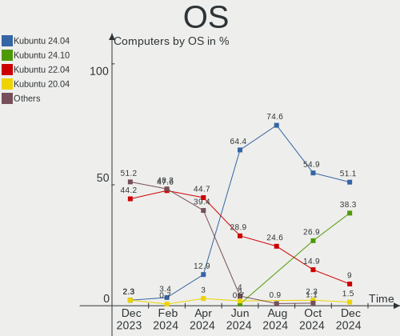
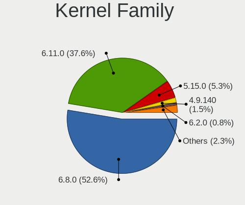
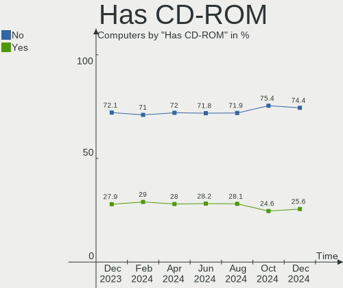
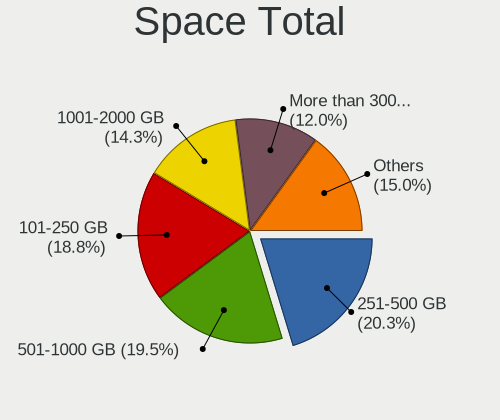
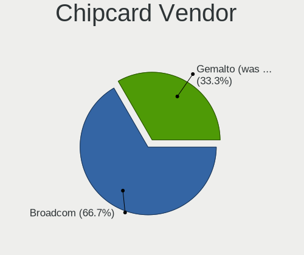

Kubuntu Hardware Trends
-----------------------

A project to identify most popular hardware characteristics and track their change
over time based on data collected by Kubuntu users at https://Linux-Hardware.org.

Anyone can contribute to this report by the [hw-probe](https://github.com/linuxhw/hw-probe) tool:

    sudo -E hw-probe -all -upload

This is a report for all computer types. See also reports for [desktops](/Dist/Kubuntu/Desktop/README.md) and [notebooks](/Dist/Kubuntu/Notebook/README.md).

Full-feature report is available here: https://linux-hardware.org/?view=trends

Period: Nov, 2021.

Contents
--------

* [ System ](#system)
  - [ OS                       ](#os)
  - [ OS Family                ](#os-family)
  - [ Kernel                   ](#kernel)
  - [ Kernel Family            ](#kernel-family)
  - [ Kernel Major Ver.        ](#kernel-major-ver)
  - [ Arch                     ](#arch)
  - [ DE                       ](#de)
  - [ Display Server           ](#display-server)
  - [ Display Manager          ](#display-manager)
  - [ OS Lang                  ](#os-lang)
  - [ Boot Mode                ](#boot-mode)
  - [ Filesystem               ](#filesystem)
  - [ Part. scheme             ](#part-scheme)
  - [ Dual Boot with Linux/BSD ](#dual-boot-with-linuxbsd)
  - [ Dual Boot (Win)          ](#dual-boot-win)

* [ Board ](#board)
  - [ Vendor                   ](#vendor)
  - [ Model                    ](#model)
  - [ Model Family             ](#model-family)
  - [ MFG Year                 ](#mfg-year)
  - [ Form Factor              ](#form-factor)
  - [ Secure Boot              ](#secure-boot)
  - [ Coreboot                 ](#coreboot)
  - [ RAM Size                 ](#ram-size)
  - [ RAM Used                 ](#ram-used)
  - [ Total Drives             ](#total-drives)
  - [ Has CD-ROM               ](#has-cd-rom)
  - [ Has Ethernet             ](#has-ethernet)
  - [ Has WiFi                 ](#has-wifi)
  - [ Has Bluetooth            ](#has-bluetooth)

* [ Location ](#location)
  - [ Country                  ](#country)
  - [ City                     ](#city)

* [ Drives ](#drives)
  - [ Drive Vendor             ](#drive-vendor)
  - [ Drive Model              ](#drive-model)
  - [ HDD Vendor               ](#hdd-vendor)
  - [ SSD Vendor               ](#ssd-vendor)
  - [ Drive Kind               ](#drive-kind)
  - [ Drive Connector          ](#drive-connector)
  - [ Drive Size               ](#drive-size)
  - [ Space Total              ](#space-total)
  - [ Space Used               ](#space-used)
  - [ Malfunc. Drives          ](#malfunc-drives)
  - [ Malfunc. Drive Vendor    ](#malfunc-drive-vendor)
  - [ Malfunc. HDD Vendor      ](#malfunc-hdd-vendor)
  - [ Malfunc. Drive Kind      ](#malfunc-drive-kind)
  - [ Failed Drives            ](#failed-drives)
  - [ Failed Drive Vendor      ](#failed-drive-vendor)
  - [ Drive Status             ](#drive-status)

* [ Storage controller ](#storage-controller)
  - [ Storage Vendor           ](#storage-vendor)
  - [ Storage Model            ](#storage-model)
  - [ Storage Kind             ](#storage-kind)

* [ Processor ](#processor)
  - [ CPU Vendor               ](#cpu-vendor)
  - [ CPU Model                ](#cpu-model)
  - [ CPU Model Family         ](#cpu-model-family)
  - [ CPU Cores                ](#cpu-cores)
  - [ CPU Sockets              ](#cpu-sockets)
  - [ CPU Threads              ](#cpu-threads)
  - [ CPU Op-Modes             ](#cpu-op-modes)
  - [ CPU Microcode            ](#cpu-microcode)
  - [ CPU Microarch            ](#cpu-microarch)

* [ Graphics ](#graphics)
  - [ GPU Vendor               ](#gpu-vendor)
  - [ GPU Model                ](#gpu-model)
  - [ GPU Combo                ](#gpu-combo)
  - [ GPU Driver               ](#gpu-driver)
  - [ GPU Memory               ](#gpu-memory)

* [ Monitor ](#monitor)
  - [ Monitor Vendor           ](#monitor-vendor)
  - [ Monitor Model            ](#monitor-model)
  - [ Monitor Resolution       ](#monitor-resolution)
  - [ Monitor Diagonal         ](#monitor-diagonal)
  - [ Monitor Width            ](#monitor-width)
  - [ Aspect Ratio             ](#aspect-ratio)
  - [ Monitor Area             ](#monitor-area)
  - [ Pixel Density            ](#pixel-density)
  - [ Multiple Monitors        ](#multiple-monitors)

* [ Network ](#network)
  - [ Net Controller Vendor    ](#net-controller-vendor)
  - [ Net Controller Model     ](#net-controller-model)
  - [ Wireless Vendor          ](#wireless-vendor)
  - [ Wireless Model           ](#wireless-model)
  - [ Ethernet Vendor          ](#ethernet-vendor)
  - [ Ethernet Model           ](#ethernet-model)
  - [ Net Controller Kind      ](#net-controller-kind)
  - [ Used Controller          ](#used-controller)
  - [ NICs                     ](#nics)
  - [ IPv6                     ](#ipv6)

* [ Bluetooth ](#bluetooth)
  - [ Bluetooth Vendor         ](#bluetooth-vendor)
  - [ Bluetooth Model          ](#bluetooth-model)

* [ Sound ](#sound)
  - [ Sound Vendor             ](#sound-vendor)
  - [ Sound Model              ](#sound-model)

* [ Memory ](#memory)
  - [ Memory Vendor            ](#memory-vendor)
  - [ Memory Model             ](#memory-model)
  - [ Memory Kind              ](#memory-kind)
  - [ Memory Form Factor       ](#memory-form-factor)
  - [ Memory Size              ](#memory-size)
  - [ Memory Speed             ](#memory-speed)

* [ Printers & scanners ](#printers--scanners)
  - [ Printer Vendor           ](#printer-vendor)
  - [ Printer Model            ](#printer-model)
  - [ Scanner Vendor           ](#scanner-vendor)
  - [ Scanner Model            ](#scanner-model)

* [ Camera ](#camera)
  - [ Camera Vendor            ](#camera-vendor)
  - [ Camera Model             ](#camera-model)

* [ Security ](#security)
  - [ Fingerprint Vendor       ](#fingerprint-vendor)
  - [ Fingerprint Model        ](#fingerprint-model)
  - [ Chipcard Vendor          ](#chipcard-vendor)
  - [ Chipcard Model           ](#chipcard-model)

* [ Unsupported ](#unsupported)
  - [ Unsupported Devices      ](#unsupported-devices)
  - [ Unsupported Device Types ](#unsupported-device-types)

System
------

OS
--

Installed operating systems

| Name          | Computers | Percent |
|---------------|-----------|---------|
| Kubuntu 20.04 | 35        | 41.18%  |
| Kubuntu 21.10 | 30        | 35.29%  |
| Kubuntu 21.04 | 8         | 9.41%   |
| Kubuntu 18.04 | 6         | 7.06%   |
| Kubuntu 20.10 | 3         | 3.53%   |
| Kubuntu 22.04 | 1         | 1.18%   |
| Kubuntu 19.04 | 1         | 1.18%   |
| Kubuntu 16.04 | 1         | 1.18%   |

OS Family
---------

OS without a version

| Name    | Computers | Percent |
|---------|-----------|---------|
| Kubuntu | 85        | 100%    |

Kernel
------

Version of the Linux kernel

| Version                  | Computers | Percent |
|--------------------------|-----------|---------|
| 5.11.0-40-generic        | 17        | 20%     |
| 5.13.0-21-generic        | 13        | 15.29%  |
| 5.13.0-20-generic        | 9         | 10.59%  |
| 5.4.0-90-generic         | 7         | 8.24%   |
| 5.11.0-38-generic        | 7         | 8.24%   |
| 5.8.0-63-generic         | 3         | 3.53%   |
| 5.13.0-19-generic        | 3         | 3.53%   |
| 5.11.0-37-generic        | 3         | 3.53%   |
| 5.11.0-27-generic        | 3         | 3.53%   |
| 4.15.0-162-generic       | 2         | 2.35%   |
| 5.8.0-63-lowlatency      | 1         | 1.18%   |
| 5.4.0-91-generic         | 1         | 1.18%   |
| 5.4.0-89-generic         | 1         | 1.18%   |
| 5.4.0-74-generic         | 1         | 1.18%   |
| 5.16.0-051600rc3-generic | 1         | 1.18%   |
| 5.15.5-051505-generic    | 1         | 1.18%   |
| 5.15.2-xanmod1           | 1         | 1.18%   |
| 5.14.3-051403-generic    | 1         | 1.18%   |
| 5.13.12-051312-generic   | 1         | 1.18%   |
| 5.13.0-22-generic        | 1         | 1.18%   |
| 5.13.0-20-lowlatency     | 1         | 1.18%   |
| 5.11.0-38-lowlatency     | 1         | 1.18%   |
| 5.11.0-34-generic        | 1         | 1.18%   |
| 5.11.0-25-generic        | 1         | 1.18%   |
| 5.0.0-38-generic         | 1         | 1.18%   |
| 4.4.0-210-generic        | 1         | 1.18%   |
| 4.15.0-161-generic       | 1         | 1.18%   |
| 4.15.0-156-generic       | 1         | 1.18%   |

Kernel Family
-------------

Linux kernel without a distro release

| Version | Computers | Percent |
|---------|-----------|---------|
| 5.11.0  | 33        | 38.82%  |
| 5.13.0  | 27        | 31.76%  |
| 5.4.0   | 10        | 11.76%  |
| 5.8.0   | 4         | 4.71%   |
| 4.15.0  | 4         | 4.71%   |
| 5.16.0  | 1         | 1.18%   |
| 5.15.5  | 1         | 1.18%   |
| 5.15.2  | 1         | 1.18%   |
| 5.14.3  | 1         | 1.18%   |
| 5.13.12 | 1         | 1.18%   |
| 5.0.0   | 1         | 1.18%   |
| 4.4.0   | 1         | 1.18%   |

Kernel Major Ver.
-----------------

Linux kernel major version

| Version | Computers | Percent |
|---------|-----------|---------|
| 5.11    | 33        | 38.82%  |
| 5.13    | 28        | 32.94%  |
| 5.4     | 10        | 11.76%  |
| 5.8     | 4         | 4.71%   |
| 4.15    | 4         | 4.71%   |
| 5.15    | 2         | 2.35%   |
| 5.16    | 1         | 1.18%   |
| 5.14    | 1         | 1.18%   |
| 5.0     | 1         | 1.18%   |
| 4.4     | 1         | 1.18%   |

Arch
----

OS architecture (x86_64, i586, etc.)

| Name   | Computers | Percent |
|--------|-----------|---------|
| x86_64 | 85        | 100%    |

DE
--

Desktop Environment

| Name | Computers | Percent |
|------|-----------|---------|
| KDE5 | 81        | 95.29%  |
| KDE  | 4         | 4.71%   |

Display Server
--------------

X11 or Wayland

| Name | Computers | Percent |
|------|-----------|---------|
| X11  | 83        | 97.65%  |
| Tty  | 2         | 2.35%   |

Display Manager
---------------

SDDM, LightDM, etc.

| Name    | Computers | Percent |
|---------|-----------|---------|
| SDDM    | 70        | 82.35%  |
| Unknown | 6         | 7.06%   |
| LightDM | 5         | 5.88%   |
| GDM     | 4         | 4.71%   |

OS Lang
-------

Language

| Lang  | Computers | Percent |
|-------|-----------|---------|
| en_US | 34        | 40%     |
| de_DE | 9         | 10.59%  |
| pl_PL | 5         | 5.88%   |
| fr_FR | 5         | 5.88%   |
| en_GB | 5         | 5.88%   |
| en_CA | 4         | 4.71%   |
| it_IT | 3         | 3.53%   |
| C     | 3         | 3.53%   |
| ru_RU | 2         | 2.35%   |
| pt_BR | 2         | 2.35%   |
| hu_HU | 2         | 2.35%   |
| fr_BE | 2         | 2.35%   |
| en_IN | 2         | 2.35%   |
| en_AU | 2         | 2.35%   |
| es_MX | 1         | 1.18%   |
| es_ES | 1         | 1.18%   |
| en_ZA | 1         | 1.18%   |
| en_IL | 1         | 1.18%   |
| bg_BG | 1         | 1.18%   |

Boot Mode
---------

EFI or BIOS

| Mode | Computers | Percent |
|------|-----------|---------|
| EFI  | 59        | 69.41%  |
| BIOS | 26        | 30.59%  |

Filesystem
----------

Type of filesystem

| Type    | Computers | Percent |
|---------|-----------|---------|
| Ext4    | 80        | 94.12%  |
| Overlay | 3         | 3.53%   |
| Zfs     | 1         | 1.18%   |
| Btrfs   | 1         | 1.18%   |

Part. scheme
------------

Scheme of partitioning

| Type    | Computers | Percent |
|---------|-----------|---------|
| GPT     | 50        | 58.82%  |
| Unknown | 28        | 32.94%  |
| MBR     | 7         | 8.24%   |

Dual Boot with Linux/BSD
------------------------

Hosting more than one Linux/BSD

| Dual boot | Computers | Percent |
|-----------|-----------|---------|
| No        | 72        | 84.71%  |
| Yes       | 13        | 15.29%  |

Dual Boot (Win)
---------------

Hosting Linux and Windows

| Dual boot | Computers | Percent |
|-----------|-----------|---------|
| No        | 50        | 58.82%  |
| Yes       | 35        | 41.18%  |

Board
-----

Vendor
------

Motherboard manufacturer

| Name                | Computers | Percent |
|---------------------|-----------|---------|
| ASUSTek Computer    | 18        | 21.18%  |
| Lenovo              | 14        | 16.47%  |
| Hewlett-Packard     | 13        | 15.29%  |
| Dell                | 12        | 14.12%  |
| MSI                 | 6         | 7.06%   |
| Gigabyte Technology | 5         | 5.88%   |
| Acer                | 3         | 3.53%   |
| Fujitsu             | 2         | 2.35%   |
| ASRock              | 2         | 2.35%   |
| Apple               | 2         | 2.35%   |
| TUXEDO              | 1         | 1.18%   |
| SUPoX COMPUTER      | 1         | 1.18%   |
| Supermicro          | 1         | 1.18%   |
| Sony                | 1         | 1.18%   |
| HUAWEI              | 1         | 1.18%   |
| Google              | 1         | 1.18%   |
| Biostar             | 1         | 1.18%   |
| Unknown             | 1         | 1.18%   |

Model
-----

Motherboard model

| Name                                  | Computers | Percent |
|---------------------------------------|-----------|---------|
| ASUS ROG STRIX B550-F GAMING          | 2         | 2.35%   |
| TUXEDO Pulse 15 Gen1                  | 1         | 1.18%   |
| SUPoX COMPUTER B250A-BTC PRO          | 1         | 1.18%   |
| Supermicro X9DRL-7F                   | 1         | 1.18%   |
| Sony VPCF236FM                        | 1         | 1.18%   |
| MSI MS-7C94                           | 1         | 1.18%   |
| MSI MS-7C83                           | 1         | 1.18%   |
| MSI MS-7C36                           | 1         | 1.18%   |
| MSI GP72 7RDX                         | 1         | 1.18%   |
| MSI GE75 Raider 10SF                  | 1         | 1.18%   |
| MSI GE66 Raider 11UG                  | 1         | 1.18%   |
| Lenovo V155-15API 81V5                | 1         | 1.18%   |
| Lenovo ThinkPad X230 23252UU          | 1         | 1.18%   |
| Lenovo ThinkPad X1 Extreme 20MFCTO1WW | 1         | 1.18%   |
| Lenovo ThinkPad T14 Gen 1 20S0000MRT  | 1         | 1.18%   |
| Lenovo ThinkPad L15 Gen 2 20X4S27200  | 1         | 1.18%   |
| Lenovo ThinkPad E15 20RDCTO1WW        | 1         | 1.18%   |
| Lenovo ThinkPad E15 20RD004FMH        | 1         | 1.18%   |
| Lenovo ThinkPad E14 20RBS25S00        | 1         | 1.18%   |
| Lenovo ThinkBook 15p Gen 2 21B1       | 1         | 1.18%   |
| Lenovo ThinkBook 14p Gen 2 20YN       | 1         | 1.18%   |
| Lenovo IdeaPad S145-15IWL 81S9        | 1         | 1.18%   |
| Lenovo IdeaPad 320-17IKB 80XM         | 1         | 1.18%   |
| Lenovo IdeaPad 110-17IKB 80VK         | 1         | 1.18%   |
| Lenovo G710 20252                     | 1         | 1.18%   |
| HUAWEI NBLK-WAX9X                     | 1         | 1.18%   |
| HP Z440 Workstation                   | 1         | 1.18%   |
| HP Spectre x360 Convertible           | 1         | 1.18%   |
| HP ProDesk 400 G6 MT                  | 1         | 1.18%   |
| HP ProBook 640 G4                     | 1         | 1.18%   |
| HP ProBook 440 G7                     | 1         | 1.18%   |
| HP Pavilion Notebook 15-bc5xxx        | 1         | 1.18%   |
| HP Pavilion Aero Laptop 13-be0xxx     | 1         | 1.18%   |
| HP Laptop 15s-eq2xxx                  | 1         | 1.18%   |
| HP EliteDesk 800 G3 DM 35W            | 1         | 1.18%   |
| HP EliteBook x360 1030 G3             | 1         | 1.18%   |
| HP EliteBook 840 G3                   | 1         | 1.18%   |
| HP Compaq 8100 Elite SFF PC           | 1         | 1.18%   |
| HP Compaq 6200 Pro SFF PC             | 1         | 1.18%   |
| Google Soraka                         | 1         | 1.18%   |
| Gigabyte GA-870A-UD3                  | 1         | 1.18%   |
| Gigabyte F2A88XM-D3H                  | 1         | 1.18%   |
| Gigabyte B550 AORUS ELITE V2          | 1         | 1.18%   |
| Gigabyte B550 AORUS ELITE             | 1         | 1.18%   |
| Gigabyte B365M DS3H                   | 1         | 1.18%   |
| Fujitsu LIFEBOOK T904                 | 1         | 1.18%   |
| Fujitsu D3433-S2 S26361-D3433-S2      | 1         | 1.18%   |
| Dell XPS 15 9500                      | 1         | 1.18%   |
| Dell XPS 13 9380                      | 1         | 1.18%   |
| Dell Studio 1735                      | 1         | 1.18%   |
| Dell Precision Tower 5810             | 1         | 1.18%   |
| Dell Precision 5530                   | 1         | 1.18%   |
| Dell OptiPlex 9020                    | 1         | 1.18%   |
| Dell Latitude E7250                   | 1         | 1.18%   |
| Dell Latitude E5530 non-vPro          | 1         | 1.18%   |
| Dell Latitude E5430 non-vPro          | 1         | 1.18%   |
| Dell Latitude 5300 2-in-1             | 1         | 1.18%   |
| Dell Inspiron 15 5510                 | 1         | 1.18%   |
| Dell G3 3579                          | 1         | 1.18%   |
| Biostar A68MD PRO                     | 1         | 1.18%   |

Model Family
------------

Motherboard model prefix

| Name                     | Computers | Percent |
|--------------------------|-----------|---------|
| Lenovo ThinkPad          | 7         | 8.24%   |
| Dell Latitude            | 4         | 4.71%   |
| ASUS ROG                 | 4         | 4.71%   |
| ASUS PRIME               | 4         | 4.71%   |
| Lenovo IdeaPad           | 3         | 3.53%   |
| Acer Aspire              | 3         | 3.53%   |
| Lenovo ThinkBook         | 2         | 2.35%   |
| HP ProBook               | 2         | 2.35%   |
| HP Pavilion              | 2         | 2.35%   |
| HP EliteBook             | 2         | 2.35%   |
| HP Compaq                | 2         | 2.35%   |
| Gigabyte B550            | 2         | 2.35%   |
| Dell XPS                 | 2         | 2.35%   |
| Dell Precision           | 2         | 2.35%   |
| ASUS STRIX               | 2         | 2.35%   |
| TUXEDO Pulse             | 1         | 1.18%   |
| SUPoX COMPUTER B250A-BTC | 1         | 1.18%   |
| Supermicro X9DRL-7F      | 1         | 1.18%   |
| Sony VPCF236FM           | 1         | 1.18%   |
| MSI MS-7C94              | 1         | 1.18%   |
| MSI MS-7C83              | 1         | 1.18%   |
| MSI MS-7C36              | 1         | 1.18%   |
| MSI GP72                 | 1         | 1.18%   |
| MSI GE75                 | 1         | 1.18%   |
| MSI GE66                 | 1         | 1.18%   |
| Lenovo V155-15API        | 1         | 1.18%   |
| Lenovo G710              | 1         | 1.18%   |
| HUAWEI NBLK-WAX9X        | 1         | 1.18%   |
| HP Z440                  | 1         | 1.18%   |
| HP Spectre               | 1         | 1.18%   |
| HP ProDesk               | 1         | 1.18%   |
| HP Laptop                | 1         | 1.18%   |
| HP EliteDesk             | 1         | 1.18%   |
| Google Soraka            | 1         | 1.18%   |
| Gigabyte GA-870A-UD3     | 1         | 1.18%   |
| Gigabyte F2A88XM-D3H     | 1         | 1.18%   |
| Gigabyte B365M           | 1         | 1.18%   |
| Fujitsu LIFEBOOK         | 1         | 1.18%   |
| Fujitsu D3433-S2         | 1         | 1.18%   |
| Dell Studio              | 1         | 1.18%   |
| Dell OptiPlex            | 1         | 1.18%   |
| Dell Inspiron            | 1         | 1.18%   |
| Dell G3                  | 1         | 1.18%   |
| Biostar A68MD            | 1         | 1.18%   |
| ASUS VivoBook            | 1         | 1.18%   |
| ASUS UX430UNR            | 1         | 1.18%   |
| ASUS S451LB              | 1         | 1.18%   |
| ASUS P552LJ              | 1         | 1.18%   |
| ASUS K50IJ               | 1         | 1.18%   |
| ASUS H170M-PLUS          | 1         | 1.18%   |
| ASUS EB1501P             | 1         | 1.18%   |
| ASUS All                 | 1         | 1.18%   |
| ASRock H61M-VS           | 1         | 1.18%   |
| ASRock B550              | 1         | 1.18%   |
| Apple MacBookPro9        | 1         | 1.18%   |
| Apple iMac12             | 1         | 1.18%   |
| Unknown                  | 1         | 1.18%   |

MFG Year
--------

Motherboard manufacture year

| Year | Computers | Percent |
|------|-----------|---------|
| 2021 | 25        | 29.41%  |
| 2020 | 18        | 21.18%  |
| 2019 | 10        | 11.76%  |
| 2018 | 8         | 9.41%   |
| 2017 | 6         | 7.06%   |
| 2010 | 4         | 4.71%   |
| 2015 | 3         | 3.53%   |
| 2011 | 3         | 3.53%   |
| 2016 | 2         | 2.35%   |
| 2014 | 2         | 2.35%   |
| 2012 | 2         | 2.35%   |
| 2013 | 1         | 1.18%   |
| 2008 | 1         | 1.18%   |

Form Factor
-----------

Physical design of the computer

| Name        | Computers | Percent |
|-------------|-----------|---------|
| Notebook    | 47        | 55.29%  |
| Desktop     | 31        | 36.47%  |
| Convertible | 3         | 3.53%   |
| Tablet      | 1         | 1.18%   |
| Mini pc     | 1         | 1.18%   |
| All in one  | 1         | 1.18%   |
| Server      | 1         | 1.18%   |

Secure Boot
-----------

Enabled or disabled

| State    | Computers | Percent |
|----------|-----------|---------|
| Disabled | 77        | 90.59%  |
| Enabled  | 8         | 9.41%   |

Coreboot
--------

Have coreboot on board

| Used | Computers | Percent |
|------|-----------|---------|
| No   | 84        | 98.82%  |
| Yes  | 1         | 1.18%   |

RAM Size
--------

Total RAM memory

| Size in GB  | Computers | Percent |
|-------------|-----------|---------|
| 16.01-24.0  | 26        | 30.59%  |
| 4.01-8.0    | 19        | 22.35%  |
| 32.01-64.0  | 14        | 16.47%  |
| 8.01-16.0   | 13        | 15.29%  |
| 3.01-4.0    | 6         | 7.06%   |
| 24.01-32.0  | 4         | 4.71%   |
| 64.01-256.0 | 3         | 3.53%   |

RAM Used
--------

Used RAM memory

| Used GB    | Computers | Percent |
|------------|-----------|---------|
| 2.01-3.0   | 29        | 34.12%  |
| 3.01-4.0   | 19        | 22.35%  |
| 1.01-2.0   | 16        | 18.82%  |
| 4.01-8.0   | 14        | 16.47%  |
| 8.01-16.0  | 3         | 3.53%   |
| 16.01-24.0 | 2         | 2.35%   |
| 0.51-1.0   | 1         | 1.18%   |
| 0.01-0.5   | 1         | 1.18%   |

Total Drives
------------

Number of drives on board

| Drives | Computers | Percent |
|--------|-----------|---------|
| 1      | 46        | 54.12%  |
| 2      | 26        | 30.59%  |
| 3      | 6         | 7.06%   |
| 4      | 5         | 5.88%   |
| 7      | 1         | 1.18%   |
| 5      | 1         | 1.18%   |

Has CD-ROM
----------

Has CD-ROM on board

| Presented | Computers | Percent |
|-----------|-----------|---------|
| No        | 60        | 70.59%  |
| Yes       | 25        | 29.41%  |

Has Ethernet
------------

Has Ethernet on board

| Presented | Computers | Percent |
|-----------|-----------|---------|
| Yes       | 71        | 83.53%  |
| No        | 14        | 16.47%  |

Has WiFi
--------

Has WiFi module

| Presented | Computers | Percent |
|-----------|-----------|---------|
| Yes       | 68        | 80%     |
| No        | 17        | 20%     |

Has Bluetooth
-------------

Has Bluetooth module

| Presented | Computers | Percent |
|-----------|-----------|---------|
| Yes       | 59        | 69.41%  |
| No        | 26        | 30.59%  |

Location
--------

Country
-------

Geographic location (country)

| Country      | Computers | Percent |
|--------------|-----------|---------|
| USA          | 11        | 12.94%  |
| Germany      | 11        | 12.94%  |
| France       | 6         | 7.06%   |
| Poland       | 5         | 5.88%   |
| Belgium      | 5         | 5.88%   |
| Italy        | 4         | 4.71%   |
| Canada       | 4         | 4.71%   |
| Brazil       | 4         | 4.71%   |
| UK           | 3         | 3.53%   |
| Russia       | 3         | 3.53%   |
| Mexico       | 3         | 3.53%   |
| Turkey       | 2         | 2.35%   |
| Netherlands  | 2         | 2.35%   |
| India        | 2         | 2.35%   |
| Hungary      | 2         | 2.35%   |
| Australia    | 2         | 2.35%   |
| Vietnam      | 1         | 1.18%   |
| Ukraine      | 1         | 1.18%   |
| Tunisia      | 1         | 1.18%   |
| Switzerland  | 1         | 1.18%   |
| Sweden       | 1         | 1.18%   |
| Spain        | 1         | 1.18%   |
| South Africa | 1         | 1.18%   |
| Slovenia     | 1         | 1.18%   |
| Israel       | 1         | 1.18%   |
| Indonesia    | 1         | 1.18%   |
| Hong Kong    | 1         | 1.18%   |
| Georgia      | 1         | 1.18%   |
| Finland      | 1         | 1.18%   |
| China        | 1         | 1.18%   |
| Bulgaria     | 1         | 1.18%   |
| Argentina    | 1         | 1.18%   |

City
----

Geographic location (city)

| City               | Computers | Percent |
|--------------------|-----------|---------|
| Berlin             | 4         | 4.71%   |
| Roissy-en-Brie     | 2         | 2.35%   |
| Escondido          | 2         | 2.35%   |
| Zurich             | 1         | 1.18%   |
| Zapopan            | 1         | 1.18%   |
| Zabrze             | 1         | 1.18%   |
| Welwyn Garden City | 1         | 1.18%   |
| Wasilla            | 1         | 1.18%   |
| Warsaw             | 1         | 1.18%   |
| Vidin              | 1         | 1.18%   |
| Verl               | 1         | 1.18%   |
| Valensole          | 1         | 1.18%   |
| Uppsala            | 1         | 1.18%   |
| Tunis              | 1         | 1.18%   |
| Thunder Bay        | 1         | 1.18%   |
| Szeksz??rd         | 1         | 1.18%   |
| Sydney             | 1         | 1.18%   |
| Sulmin             | 1         | 1.18%   |
| Starnberg          | 1         | 1.18%   |
| Stafford           | 1         | 1.18%   |
| St Petersburg      | 1         | 1.18%   |
| Shenzhen           | 1         | 1.18%   |
| Seminole           | 1         | 1.18%   |
| Sao Jose           | 1         | 1.18%   |
| Samara             | 1         | 1.18%   |
| Roubaix            | 1         | 1.18%   |
| Rio de Janeiro     | 1         | 1.18%   |
| Radomsko           | 1         | 1.18%   |
| Pune               | 1         | 1.18%   |
| Portland           | 1         | 1.18%   |
| Plymouth           | 1         | 1.18%   |
| Oulu               | 1         | 1.18%   |
| Nieul-le-Dolent    | 1         | 1.18%   |
| Munich             | 1         | 1.18%   |
| Mumbai             | 1         | 1.18%   |
| Moscow             | 1         | 1.18%   |
| Montreal           | 1         | 1.18%   |
| Mogi das Cruzes    | 1         | 1.18%   |
| Milan              | 1         | 1.18%   |
| Merelbeke          | 1         | 1.18%   |
| Maracai            | 1         | 1.18%   |
| Maastricht         | 1         | 1.18%   |
| Le??n              | 1         | 1.18%   |
| La Barca           | 1         | 1.18%   |
| Khmelnytskyi       | 1         | 1.18%   |
| K'alak'i T'bilisi  | 1         | 1.18%   |
| Jakarta            | 1         | 1.18%   |
| Istanbul           | 1         | 1.18%   |
| Ilmenau            | 1         | 1.18%   |
| Hanoi              | 1         | 1.18%   |
| Hamburg            | 1         | 1.18%   |
| Haifa              | 1         | 1.18%   |
| Guanajuato City    | 1         | 1.18%   |
| Grosuplje          | 1         | 1.18%   |
| Gelsenkirchen      | 1         | 1.18%   |
| Geel               | 1         | 1.18%   |
| Gdansk             | 1         | 1.18%   |
| Fort Lauderdale    | 1         | 1.18%   |
| Florence           | 1         | 1.18%   |
| Fleurus            | 1         | 1.18%   |

Drives
------

Drive Vendor
------------

Hard drive vendors

| Vendor                         | Computers | Drives | Percent |
|--------------------------------|-----------|--------|---------|
| Samsung Electronics            | 25        | 30     | 18.38%  |
| WDC                            | 22        | 25     | 16.18%  |
| Kingston                       | 10        | 11     | 7.35%   |
| Toshiba                        | 9         | 10     | 6.62%   |
| Seagate                        | 9         | 11     | 6.62%   |
| Crucial                        | 9         | 9      | 6.62%   |
| Micron Technology              | 7         | 7      | 5.15%   |
| Intel                          | 5         | 5      | 3.68%   |
| SanDisk                        | 4         | 4      | 2.94%   |
| PNY                            | 3         | 4      | 2.21%   |
| Hitachi                        | 3         | 3      | 2.21%   |
| A-DATA Technology              | 3         | 3      | 2.21%   |
| Silicon Motion                 | 2         | 2      | 1.47%   |
| OCZ                            | 2         | 2      | 1.47%   |
| HGST                           | 2         | 2      | 1.47%   |
| GOODRAM                        | 2         | 3      | 1.47%   |
| Yangtze Memory Technologies    | 1         | 1      | 0.74%   |
| Unknown                        | 1         | 1      | 0.74%   |
| Team                           | 1         | 1      | 0.74%   |
| Solid State Storage Technology | 1         | 1      | 0.74%   |
| SK Hynix                       | 1         | 1      | 0.74%   |
| ROG                            | 1         | 1      | 0.74%   |
| Phison                         | 1         | 1      | 0.74%   |
| Patriot                        | 1         | 1      | 0.74%   |
| Mushkin                        | 1         | 1      | 0.74%   |
| Micron/Crucial Technology      | 1         | 1      | 0.74%   |
| LITEON                         | 1         | 1      | 0.74%   |
| KIOXIA                         | 1         | 1      | 0.74%   |
| KingSpec                       | 1         | 1      | 0.74%   |
| Intenso                        | 1         | 1      | 0.74%   |
| Gigabyte Technology            | 1         | 1      | 0.74%   |
| DREVO                          | 1         | 1      | 0.74%   |
| China                          | 1         | 1      | 0.74%   |
| Apple                          | 1         | 1      | 0.74%   |
| Unknown                        | 1         | 1      | 0.74%   |

Drive Model
-----------

Hard drive models

| Model                                    | Computers | Percent |
|------------------------------------------|-----------|---------|
| WDC WD10JPVX-22JC3T0 1TB                 | 2         | 1.35%   |
| Toshiba HDWD110 1TB                      | 2         | 1.35%   |
| Samsung SSD 870 QVO 1TB                  | 2         | 1.35%   |
| Samsung SSD 860 EVO 2TB                  | 2         | 1.35%   |
| Samsung SSD 860 EVO 1TB                  | 2         | 1.35%   |
| PNY CS900 240GB SSD                      | 2         | 1.35%   |
| Kingston SA400S37480G 480GB SSD          | 2         | 1.35%   |
| Kingston SA2000M81000G 1TB               | 2         | 1.35%   |
| Crucial CT1000MX500SSD1 1TB              | 2         | 1.35%   |
| Yangtze Memory NVMe SSD Drive 1024GB     | 1         | 0.68%   |
| WDC WDS100T2B0C-00PXH0 1TB               | 1         | 0.68%   |
| WDC WDS100T2B0B-00YS70 1TB SSD           | 1         | 0.68%   |
| WDC WDS100T2B0A-00SM50 1TB SSD           | 1         | 0.68%   |
| WDC WD6400AAKS-75A7B0 640GB              | 1         | 0.68%   |
| WDC WD5000LPLX-60ZNTT1 500GB             | 1         | 0.68%   |
| WDC WD5000BEVT-80A0RT1 500GB             | 1         | 0.68%   |
| WDC WD5000AADS-00S9B0 500GB              | 1         | 0.68%   |
| WDC WD3200BEVT-80A0RT0 320GB             | 1         | 0.68%   |
| WDC WD2500BEVT-75ZCT2 250GB              | 1         | 0.68%   |
| WDC WD20SPZX-22UA7T0 2TB                 | 1         | 0.68%   |
| WDC WD20SPZX-08UA7 2TB                   | 1         | 0.68%   |
| WDC WD20EARX-00PASB0 2TB                 | 1         | 0.68%   |
| WDC WD10SPZX-60Z10T0 1TB                 | 1         | 0.68%   |
| WDC WD10SPZX-24Z10T0 1TB                 | 1         | 0.68%   |
| WDC WD10PURX-64D85Y0 1TB                 | 1         | 0.68%   |
| WDC WD10EZEX-60WN4A0 1TB                 | 1         | 0.68%   |
| WDC WD10EARS-00Y5B1 1TB                  | 1         | 0.68%   |
| WDC WD10EACS-00ZJB0 1TB                  | 1         | 0.68%   |
| WDC WD1000DHTZ-04N21V1 1TB               | 1         | 0.68%   |
| WDC PC SN730 SDBQNTY-512G-1001 512GB     | 1         | 0.68%   |
| WDC PC SN730 SDBPNTY-1T00-1032 1TB       | 1         | 0.68%   |
| WDC PC SN520 SDAPNUW-256G-1006 256GB     | 1         | 0.68%   |
| Unknown MMC Card  64GB                   | 1         | 0.68%   |
| Toshiba THNSNJ128GCSU 128GB SSD          | 1         | 0.68%   |
| Toshiba THNSN5512GPUK 512GB              | 1         | 0.68%   |
| Toshiba NVMe SSD Drive 256GB             | 1         | 0.68%   |
| Toshiba MQ04ABF100 1TB                   | 1         | 0.68%   |
| Toshiba MK7559GSXP 752GB                 | 1         | 0.68%   |
| Toshiba KBG30ZMS128G NVMe 128GB          | 1         | 0.68%   |
| Toshiba HDWD220 2TB                      | 1         | 0.68%   |
| Toshiba HDWA130 3TB                      | 1         | 0.68%   |
| Team T2535T240G 240GB SSD                | 1         | 0.68%   |
| Solid State Storage NVMe SSD Drive 256GB | 1         | 0.68%   |
| SK Hynix SKHynix_HFS512GDE9X084N 512GB   | 1         | 0.68%   |
| Silicon Motion R5MP240G8 240GB           | 1         | 0.68%   |
| Silicon Motion NVMe SSD Drive 128GB      | 1         | 0.68%   |
| Seagate ST9250315AS 250GB                | 1         | 0.68%   |
| Seagate ST500LM000-1EJ162 500GB          | 1         | 0.68%   |
| Seagate ST5000DM000-1FK178 5TB           | 1         | 0.68%   |
| Seagate ST4000DM005-2DP166 4TB           | 1         | 0.68%   |
| Seagate ST3500312CS 500GB                | 1         | 0.68%   |
| Seagate ST31000528AS 1TB                 | 1         | 0.68%   |
| Seagate ST31000524AS 1TB                 | 1         | 0.68%   |
| Seagate ST2000LM015-2E8174 2TB           | 1         | 0.68%   |
| Seagate ST2000LM007-1R8174 2TB           | 1         | 0.68%   |
| Seagate ST1000LM048-2E7172 1TB           | 1         | 0.68%   |
| Seagate ST1000DM003-1ER162 1TB           | 1         | 0.68%   |
| SanDisk SSD PLUS 2000GB                  | 1         | 0.68%   |
| SanDisk SSD G5 BICS4 500GB               | 1         | 0.68%   |
| Sandisk NVMe SSD Drive 256GB             | 1         | 0.68%   |

HDD Vendor
----------

Hard disk drive vendors

| Vendor              | Computers | Drives | Percent |
|---------------------|-----------|--------|---------|
| WDC                 | 17        | 19     | 43.59%  |
| Seagate             | 9         | 11     | 23.08%  |
| Toshiba             | 6         | 6      | 15.38%  |
| Hitachi             | 3         | 3      | 7.69%   |
| HGST                | 2         | 2      | 5.13%   |
| Samsung Electronics | 1         | 1      | 2.56%   |
| Apple               | 1         | 1      | 2.56%   |

SSD Vendor
----------

Solid state drive vendors

| Vendor              | Computers | Drives | Percent |
|---------------------|-----------|--------|---------|
| Samsung Electronics | 11        | 15     | 21.57%  |
| Kingston            | 6         | 7      | 11.76%  |
| Crucial             | 6         | 6      | 11.76%  |
| Micron Technology   | 4         | 4      | 7.84%   |
| PNY                 | 3         | 4      | 5.88%   |
| WDC                 | 2         | 2      | 3.92%   |
| SanDisk             | 2         | 2      | 3.92%   |
| OCZ                 | 2         | 2      | 3.92%   |
| Intel               | 2         | 2      | 3.92%   |
| GOODRAM             | 2         | 3      | 3.92%   |
| A-DATA Technology   | 2         | 2      | 3.92%   |
| Toshiba             | 1         | 1      | 1.96%   |
| Team                | 1         | 1      | 1.96%   |
| Patriot             | 1         | 1      | 1.96%   |
| Mushkin             | 1         | 1      | 1.96%   |
| KingSpec            | 1         | 1      | 1.96%   |
| Intenso             | 1         | 1      | 1.96%   |
| DREVO               | 1         | 1      | 1.96%   |
| China               | 1         | 1      | 1.96%   |
| Unknown             | 1         | 1      | 1.96%   |

Drive Kind
----------

HDD or SSD

| Kind    | Computers | Drives | Percent |
|---------|-----------|--------|---------|
| NVMe    | 43        | 46     | 36.44%  |
| SSD     | 40        | 58     | 33.9%   |
| HDD     | 32        | 43     | 27.12%  |
| MMC     | 2         | 2      | 1.69%   |
| Unknown | 1         | 1      | 0.85%   |

Drive Connector
---------------

SATA, SAS, NVMe, etc.

| Type | Computers | Drives | Percent |
|------|-----------|--------|---------|
| SATA | 57        | 101    | 55.34%  |
| NVMe | 43        | 46     | 41.75%  |
| MMC  | 2         | 2      | 1.94%   |
| SAS  | 1         | 1      | 0.97%   |

Drive Size
----------

Size of hard drive

| Size in TB | Computers | Drives | Percent |
|------------|-----------|--------|---------|
| 0.01-0.5   | 39        | 52     | 50.65%  |
| 0.51-1.0   | 27        | 36     | 35.06%  |
| 1.01-2.0   | 8         | 10     | 10.39%  |
| 3.01-4.0   | 1         | 1      | 1.3%    |
| 2.01-3.0   | 1         | 1      | 1.3%    |
| 4.01-10.0  | 1         | 1      | 1.3%    |

Space Total
-----------

Amount of disk space available on the file system

| Size in GB     | Computers | Percent |
|----------------|-----------|---------|
| 101-250        | 26        | 30.59%  |
| 251-500        | 23        | 27.06%  |
| 501-1000       | 12        | 14.12%  |
| 1001-2000      | 7         | 8.24%   |
| 2001-3000      | 6         | 7.06%   |
| 1-20           | 4         | 4.71%   |
| More than 3000 | 3         | 3.53%   |
| 51-100         | 3         | 3.53%   |
| 21-50          | 1         | 1.18%   |

Space Used
----------

Amount of used disk space

| Used GB        | Computers | Percent |
|----------------|-----------|---------|
| 1-20           | 21        | 24.71%  |
| 101-250        | 20        | 23.53%  |
| 51-100         | 15        | 17.65%  |
| 21-50          | 12        | 14.12%  |
| 251-500        | 6         | 7.06%   |
| 1001-2000      | 5         | 5.88%   |
| 501-1000       | 4         | 4.71%   |
| More than 3000 | 2         | 2.35%   |

Malfunc. Drives
---------------

Drive models with a malfunction

| Model                                   | Computers | Drives | Percent |
|-----------------------------------------|-----------|--------|---------|
| Toshiba MK7559GSXP 752GB                | 1         | 1      | 16.67%  |
| Seagate ST9250315AS 250GB               | 1         | 1      | 16.67%  |
| Seagate ST31000524AS 1TB                | 1         | 1      | 16.67%  |
| Seagate ST1000DM003-1ER162 1TB          | 1         | 1      | 16.67%  |
| Samsung Electronics SSD 860 EVO M.2 1TB | 1         | 1      | 16.67%  |
| Hitachi HTS727575A9E364 752GB           | 1         | 1      | 16.67%  |

Malfunc. Drive Vendor
---------------------

Vendors of faulty drives

| Vendor              | Computers | Drives | Percent |
|---------------------|-----------|--------|---------|
| Seagate             | 3         | 3      | 50%     |
| Toshiba             | 1         | 1      | 16.67%  |
| Samsung Electronics | 1         | 1      | 16.67%  |
| Hitachi             | 1         | 1      | 16.67%  |

Malfunc. HDD Vendor
-------------------

Vendors of faulty HDD drives

| Vendor  | Computers | Drives | Percent |
|---------|-----------|--------|---------|
| Seagate | 3         | 3      | 60%     |
| Toshiba | 1         | 1      | 20%     |
| Hitachi | 1         | 1      | 20%     |

Malfunc. Drive Kind
-------------------

Kinds of faulty drives

| Kind | Computers | Drives | Percent |
|------|-----------|--------|---------|
| HDD  | 5         | 5      | 83.33%  |
| SSD  | 1         | 1      | 16.67%  |

Failed Drives
-------------

Failed drive models

Zero info for selected period =(

Failed Drive Vendor
-------------------

Failed drive vendors

Zero info for selected period =(

Drive Status
------------

Number of failed and malfunc. drives

| Status   | Computers | Drives | Percent |
|----------|-----------|--------|---------|
| Works    | 53        | 81     | 58.89%  |
| Detected | 31        | 63     | 34.44%  |
| Malfunc  | 6         | 6      | 6.67%   |

Storage controller
------------------

Storage Vendor
--------------

Storage controller vendors

| Vendor                         | Computers | Percent |
|--------------------------------|-----------|---------|
| Intel                          | 56        | 48.28%  |
| AMD                            | 15        | 12.93%  |
| Samsung Electronics            | 13        | 11.21%  |
| Sandisk                        | 5         | 4.31%   |
| Toshiba America Info Systems   | 4         | 3.45%   |
| Micron/Crucial Technology      | 4         | 3.45%   |
| Kingston Technology Company    | 4         | 3.45%   |
| Micron Technology              | 3         | 2.59%   |
| Silicon Motion                 | 2         | 1.72%   |
| Phison Electronics             | 2         | 1.72%   |
| Yangtze Memory Technologies    | 1         | 0.86%   |
| Solid State Storage Technology | 1         | 0.86%   |
| SK Hynix                       | 1         | 0.86%   |
| LSI Logic / Symbios Logic      | 1         | 0.86%   |
| Lite-On Technology             | 1         | 0.86%   |
| JMicron Technology             | 1         | 0.86%   |
| ASMedia Technology             | 1         | 0.86%   |
| ADATA Technology               | 1         | 0.86%   |

Storage Model
-------------

Storage controller models

| Model                                                                                   | Computers | Percent |
|-----------------------------------------------------------------------------------------|-----------|---------|
| Samsung NVMe SSD Controller SM981/PM981/PM983                                           | 7         | 5.51%   |
| Intel Sunrise Point-LP SATA Controller [AHCI mode]                                      | 7         | 5.51%   |
| AMD Starship/Matisse Chipset SATA Controller [AHCI mode]                                | 6         | 4.72%   |
| AMD FCH SATA Controller [AHCI mode]                                                     | 6         | 4.72%   |
| Intel Comet Lake SATA AHCI Controller                                                   | 4         | 3.15%   |
| Intel 82801 Mobile SATA Controller [RAID mode]                                          | 4         | 3.15%   |
| Intel 200 Series PCH SATA controller [AHCI mode]                                        | 4         | 3.15%   |
| Samsung NVMe SSD Controller PM9A1/PM9A3/980PRO                                          | 3         | 2.36%   |
| Micron Non-Volatile memory controller                                                   | 3         | 2.36%   |
| Intel Cannon Lake Mobile PCH SATA AHCI Controller                                       | 3         | 2.36%   |
| Intel 7 Series Chipset Family 6-port SATA Controller [AHCI mode]                        | 3         | 2.36%   |
| Intel 500 Series Chipset Family SATA AHCI Controller                                    | 3         | 2.36%   |
| Toshiba America Info Systems BG3 NVMe SSD Controller                                    | 2         | 1.57%   |
| Silicon Motion SM2263EN/SM2263XT SSD Controller                                         | 2         | 1.57%   |
| Sandisk WD Black SN750 / PC SN730 NVMe SSD                                              | 2         | 1.57%   |
| Samsung NVMe SSD Controller 980                                                         | 2         | 1.57%   |
| Micron/Crucial Non-Volatile memory controller                                           | 2         | 1.57%   |
| Kingston Company Company Non-Volatile memory controller                                 | 2         | 1.57%   |
| Kingston Company A2000 NVMe SSD                                                         | 2         | 1.57%   |
| Intel Q170/Q150/B150/H170/H110/Z170/CM236 Chipset SATA Controller [AHCI Mode]           | 2         | 1.57%   |
| Intel 82801IBM/IEM (ICH9M/ICH9M-E) 4 port SATA Controller [AHCI mode]                   | 2         | 1.57%   |
| Intel 8 Series SATA Controller 1 [AHCI mode]                                            | 2         | 1.57%   |
| Intel 6 Series/C200 Series Chipset Family Desktop SATA Controller (IDE mode, ports 4-5) | 2         | 1.57%   |
| Intel 6 Series/C200 Series Chipset Family Desktop SATA Controller (IDE mode, ports 0-3) | 2         | 1.57%   |
| Intel 6 Series/C200 Series Chipset Family 6 port Desktop SATA AHCI Controller           | 2         | 1.57%   |
| Intel 400 Series Chipset Family SATA AHCI Controller                                    | 2         | 1.57%   |
| AMD 400 Series Chipset SATA Controller                                                  | 2         | 1.57%   |
| Yangtze Memory Non-Volatile memory controller                                           | 1         | 0.79%   |
| Toshiba America Info Systems XG4 NVMe SSD Controller                                    | 1         | 0.79%   |
| Toshiba America Info Systems Toshiba America Info Non-Volatile memory controller        | 1         | 0.79%   |
| Solid State Storage Non-Volatile memory controller                                      | 1         | 0.79%   |
| SK Hynix Gold P31 SSD                                                                   | 1         | 0.79%   |
| Sandisk WD Blue SN550 NVMe SSD                                                          | 1         | 0.79%   |
| Sandisk WD Blue SN500 / PC SN520 NVMe SSD                                               | 1         | 0.79%   |
| Sandisk PC SN520 NVMe SSD                                                               | 1         | 0.79%   |
| Samsung NVMe SSD Controller SM961/PM961/SM963                                           | 1         | 0.79%   |
| Samsung NVMe SSD Controller SM951/PM951                                                 | 1         | 0.79%   |
| Phison NVMe Storage Controller                                                          | 1         | 0.79%   |
| Phison E12 NVMe Controller                                                              | 1         | 0.79%   |
| Micron/Crucial P2 NVMe PCIe SSD                                                         | 1         | 0.79%   |
| Micron/Crucial NVMe Controller                                                          | 1         | 0.79%   |
| LSI Logic / Symbios Logic MegaRAID SAS 2108 [Liberator]                                 | 1         | 0.79%   |
| Lite-On Non-Volatile memory controller                                                  | 1         | 0.79%   |
| JMicron JMB363 SATA/IDE Controller                                                      | 1         | 0.79%   |
| Intel Wildcat Point-LP SATA Controller [AHCI Mode]                                      | 1         | 0.79%   |
| Intel Volume Management Device NVMe RAID Controller                                     | 1         | 0.79%   |
| Intel SSD Pro 7600p/760p/E 6100p Series                                                 | 1         | 0.79%   |
| Intel SSD 660P Series                                                                   | 1         | 0.79%   |
| Intel Non-Volatile memory controller                                                    | 1         | 0.79%   |
| Intel NM10/ICH7 Family SATA Controller [AHCI mode]                                      | 1         | 0.79%   |
| Intel HM170/QM170 Chipset SATA Controller [AHCI Mode]                                   | 1         | 0.79%   |
| Intel Cannon Point-LP SATA Controller [AHCI Mode]                                       | 1         | 0.79%   |
| Intel Cannon Lake PCH SATA AHCI Controller                                              | 1         | 0.79%   |
| Intel C610/X99 series chipset sSATA Controller [RAID mode]                              | 1         | 0.79%   |
| Intel C610/X99 series chipset sSATA Controller [AHCI mode]                              | 1         | 0.79%   |
| Intel C610/X99 series chipset 6-Port SATA Controller [AHCI mode]                        | 1         | 0.79%   |
| Intel C600/X79 series chipset SATA RAID Controller                                      | 1         | 0.79%   |
| Intel C600/X79 series chipset 6-Port SATA AHCI Controller                               | 1         | 0.79%   |
| Intel 9 Series Chipset Family SATA Controller [AHCI Mode]                               | 1         | 0.79%   |
| Intel 82801HM/HEM (ICH8M/ICH8M-E) SATA Controller [AHCI mode]                           | 1         | 0.79%   |

Storage Kind
------------

Kind of storage controller (IDE, SATA, NVMe, SAS, ...)

| Kind | Computers | Percent |
|------|-----------|---------|
| SATA | 61        | 53.04%  |
| NVMe | 43        | 37.39%  |
| RAID | 7         | 6.09%   |
| IDE  | 4         | 3.48%   |

Processor
---------

CPU Vendor
----------

Processor vendors

| Vendor | Computers | Percent |
|--------|-----------|---------|
| Intel  | 66        | 77.65%  |
| AMD    | 19        | 22.35%  |

CPU Model
---------

Processor models

| Model                                       | Computers | Percent |
|---------------------------------------------|-----------|---------|
| AMD Ryzen 5 3600 6-Core Processor           | 4         | 4.71%   |
| Intel Core i5-10210U CPU @ 1.60GHz          | 3         | 3.53%   |
| Intel 11th Gen Core i7-11800H @ 2.30GHz     | 3         | 3.53%   |
| Intel Core i7-8750H CPU @ 2.20GHz           | 2         | 2.35%   |
| Intel Core i7-7700 CPU @ 3.60GHz            | 2         | 2.35%   |
| Intel Core i7-10750H CPU @ 2.60GHz          | 2         | 2.35%   |
| Intel Core i7-10510U CPU @ 1.80GHz          | 2         | 2.35%   |
| Intel Core i5-7200U CPU @ 2.50GHz           | 2         | 2.35%   |
| Intel Core i5-3320M CPU @ 2.60GHz           | 2         | 2.35%   |
| Intel Core i5-3210M CPU @ 2.50GHz           | 2         | 2.35%   |
| Intel Xeon CPU L3426 @ 1.87GHz              | 1         | 1.18%   |
| Intel Xeon CPU E5-2660 0 @ 2.20GHz          | 1         | 1.18%   |
| Intel Xeon CPU E5-2658A v3 @ 2.20GHz        | 1         | 1.18%   |
| Intel Xeon CPU E5-1650 v3 @ 3.50GHz         | 1         | 1.18%   |
| Intel Pentium Dual-Core CPU T4500 @ 2.30GHz | 1         | 1.18%   |
| Intel Pentium CPU G620 @ 2.60GHz            | 1         | 1.18%   |
| Intel Pentium CPU G4560 @ 3.50GHz           | 1         | 1.18%   |
| Intel Pentium CPU 4415U @ 2.30GHz           | 1         | 1.18%   |
| Intel Genuine CPU U4100 @ 1.30GHz           | 1         | 1.18%   |
| Intel Core m3-7Y30 CPU @ 1.00GHz            | 1         | 1.18%   |
| Intel Core i7-8850H CPU @ 2.60GHz           | 1         | 1.18%   |
| Intel Core i7-8665U CPU @ 1.90GHz           | 1         | 1.18%   |
| Intel Core i7-8650U CPU @ 1.90GHz           | 1         | 1.18%   |
| Intel Core i7-8565U CPU @ 1.80GHz           | 1         | 1.18%   |
| Intel Core i7-8550U CPU @ 1.80GHz           | 1         | 1.18%   |
| Intel Core i7-7700T CPU @ 2.90GHz           | 1         | 1.18%   |
| Intel Core i7-7700HQ CPU @ 2.80GHz          | 1         | 1.18%   |
| Intel Core i7-6500U CPU @ 2.50GHz           | 1         | 1.18%   |
| Intel Core i7-5500U CPU @ 2.40GHz           | 1         | 1.18%   |
| Intel Core i7-4790 CPU @ 3.60GHz            | 1         | 1.18%   |
| Intel Core i7-2670QM CPU @ 2.20GHz          | 1         | 1.18%   |
| Intel Core i7-2600 CPU @ 3.40GHz            | 1         | 1.18%   |
| Intel Core i7-10700K CPU @ 3.80GHz          | 1         | 1.18%   |
| Intel Core i5-9400F CPU @ 2.90GHz           | 1         | 1.18%   |
| Intel Core i5-9300H CPU @ 2.40GHz           | 1         | 1.18%   |
| Intel Core i5-8500 CPU @ 3.00GHz            | 1         | 1.18%   |
| Intel Core i5-8300H CPU @ 2.30GHz           | 1         | 1.18%   |
| Intel Core i5-8265U CPU @ 1.60GHz           | 1         | 1.18%   |
| Intel Core i5-7300U CPU @ 2.60GHz           | 1         | 1.18%   |
| Intel Core i5-6400 CPU @ 2.70GHz            | 1         | 1.18%   |
| Intel Core i5-6300U CPU @ 2.40GHz           | 1         | 1.18%   |
| Intel Core i5-5300U CPU @ 2.30GHz           | 1         | 1.18%   |
| Intel Core i5-4690 CPU @ 3.50GHz            | 1         | 1.18%   |
| Intel Core i5-4300U CPU @ 1.90GHz           | 1         | 1.18%   |
| Intel Core i5-4200U CPU @ 1.60GHz           | 1         | 1.18%   |
| Intel Core i5-4200M CPU @ 2.50GHz           | 1         | 1.18%   |
| Intel Core i5-3470 CPU @ 3.20GHz            | 1         | 1.18%   |
| Intel Core i5-2500 CPU @ 3.30GHz            | 1         | 1.18%   |
| Intel Core i5-1035G1 CPU @ 1.00GHz          | 1         | 1.18%   |
| Intel Core i3-7130U CPU @ 2.70GHz           | 1         | 1.18%   |
| Intel Core 2 Duo CPU T8100 @ 2.10GHz        | 1         | 1.18%   |
| Intel Atom CPU D525 @ 1.80GHz               | 1         | 1.18%   |
| Intel 11th Gen Core i7-11700K @ 3.60GHz     | 1         | 1.18%   |
| Intel 11th Gen Core i7-11700 @ 2.50GHz      | 1         | 1.18%   |
| Intel 11th Gen Core i7-1165G7 @ 2.80GHz     | 1         | 1.18%   |
| Intel 11th Gen Core i5-11300H @ 3.10GHz     | 1         | 1.18%   |
| AMD Ryzen 9 3950X 16-Core Processor         | 1         | 1.18%   |
| AMD Ryzen 7 5800H with Radeon Graphics      | 1         | 1.18%   |
| AMD Ryzen 7 5700G with Radeon Graphics      | 1         | 1.18%   |
| AMD Ryzen 7 4800H with Radeon Graphics      | 1         | 1.18%   |

CPU Model Family
----------------

Processor model prefix

| Model                   | Computers | Percent |
|-------------------------|-----------|---------|
| Intel Core i5           | 25        | 29.41%  |
| Intel Core i7           | 21        | 24.71%  |
| AMD Ryzen 5             | 10        | 11.76%  |
| Other                   | 7         | 8.24%   |
| Intel Xeon              | 4         | 4.71%   |
| AMD Ryzen 7             | 4         | 4.71%   |
| Intel Pentium           | 3         | 3.53%   |
| Intel Pentium Dual-Core | 1         | 1.18%   |
| Intel Genuine           | 1         | 1.18%   |
| Intel Core m3           | 1         | 1.18%   |
| Intel Core i3           | 1         | 1.18%   |
| Intel Core 2 Duo        | 1         | 1.18%   |
| Intel Atom              | 1         | 1.18%   |
| AMD Ryzen 9             | 1         | 1.18%   |
| AMD Ryzen 3             | 1         | 1.18%   |
| AMD Athlon II X4        | 1         | 1.18%   |
| AMD A8                  | 1         | 1.18%   |
| AMD A10                 | 1         | 1.18%   |

CPU Cores
---------

Number of processor cores

| Number | Computers | Percent |
|--------|-----------|---------|
| 4      | 30        | 35.29%  |
| 2      | 26        | 30.59%  |
| 6      | 16        | 18.82%  |
| 8      | 10        | 11.76%  |
| 16     | 2         | 2.35%   |
| 12     | 1         | 1.18%   |

CPU Sockets
-----------

Number of sockets

| Number | Computers | Percent |
|--------|-----------|---------|
| 1      | 84        | 98.82%  |
| 2      | 1         | 1.18%   |

CPU Threads
-----------

Threads per core (Hyper-Threading)

| Number | Computers | Percent |
|--------|-----------|---------|
| 2      | 74        | 87.06%  |
| 1      | 11        | 12.94%  |

CPU Op-Modes
------------

CPU Operation Modes (32-bit, 64-bit)

| Op mode        | Computers | Percent |
|----------------|-----------|---------|
| 32-bit, 64-bit | 85        | 100%    |

CPU Microcode
-------------

Microcode number

| Number     | Computers | Percent |
|------------|-----------|---------|
| Unknown    | 11        | 12.94%  |
| 0x906ea    | 7         | 8.24%   |
| 0x806ec    | 5         | 5.88%   |
| 0x806e9    | 5         | 5.88%   |
| 0x306a9    | 5         | 5.88%   |
| 0x08701021 | 5         | 5.88%   |
| 0x206a7    | 4         | 4.71%   |
| 0x906e9    | 3         | 3.53%   |
| 0x806d1    | 3         | 3.53%   |
| 0x306c3    | 3         | 3.53%   |
| 0x0a50000c | 3         | 3.53%   |
| 0xa0671    | 2         | 2.35%   |
| 0x806ea    | 2         | 2.35%   |
| 0x806c1    | 2         | 2.35%   |
| 0x406e3    | 2         | 2.35%   |
| 0x40651    | 2         | 2.35%   |
| 0x306f2    | 2         | 2.35%   |
| 0x306d4    | 2         | 2.35%   |
| 0x1067a    | 2         | 2.35%   |
| 0x06001119 | 2         | 2.35%   |
| 0xa0655    | 1         | 1.18%   |
| 0xa0652    | 1         | 1.18%   |
| 0x706e5    | 1         | 1.18%   |
| 0x506e3    | 1         | 1.18%   |
| 0x106e5    | 1         | 1.18%   |
| 0x10676    | 1         | 1.18%   |
| 0x0a201009 | 1         | 1.18%   |
| 0x08608103 | 1         | 1.18%   |
| 0x08600103 | 1         | 1.18%   |
| 0x08108109 | 1         | 1.18%   |
| 0x08108102 | 1         | 1.18%   |
| 0x0810100b | 1         | 1.18%   |
| 0x010000db | 1         | 1.18%   |

CPU Microarch
-------------

Microarchitecture

| Name        | Computers | Percent |
|-------------|-----------|---------|
| KabyLake    | 28        | 32.94%  |
| Zen 2       | 8         | 9.41%   |
| Haswell     | 7         | 8.24%   |
| SandyBridge | 5         | 5.88%   |
| IvyBridge   | 5         | 5.88%   |
| Icelake     | 5         | 5.88%   |
| Zen 3       | 4         | 4.71%   |
| Skylake     | 3         | 3.53%   |
| Penryn      | 3         | 3.53%   |
| CometLake   | 3         | 3.53%   |
| Zen+        | 2         | 2.35%   |
| TigerLake   | 2         | 2.35%   |
| Piledriver  | 2         | 2.35%   |
| Broadwell   | 2         | 2.35%   |
| Unknown     | 2         | 2.35%   |
| Zen         | 1         | 1.18%   |
| Nehalem     | 1         | 1.18%   |
| K10         | 1         | 1.18%   |
| Bonnell     | 1         | 1.18%   |

Graphics
--------

GPU Vendor
----------

Vendors of graphics cards

| Vendor                     | Computers | Percent |
|----------------------------|-----------|---------|
| Intel                      | 52        | 50.49%  |
| Nvidia                     | 31        | 30.1%   |
| AMD                        | 19        | 18.45%  |
| Matrox Electronics Systems | 1         | 0.97%   |

GPU Model
---------

Graphics card models

| Model                                                                       | Computers | Percent |
|-----------------------------------------------------------------------------|-----------|---------|
| Intel CometLake-U GT2 [UHD Graphics]                                        | 5         | 4.76%   |
| Intel HD Graphics 620                                                       | 4         | 3.81%   |
| Intel 3rd Gen Core processor Graphics Controller                            | 4         | 3.81%   |
| Intel WhiskeyLake-U GT2 [UHD Graphics 620]                                  | 3         | 2.86%   |
| Intel TigerLake-H GT1 [UHD Graphics]                                        | 3         | 2.86%   |
| Intel HD Graphics 630                                                       | 3         | 2.86%   |
| Intel CoffeeLake-H GT2 [UHD Graphics 630]                                   | 3         | 2.86%   |
| Intel 2nd Generation Core Processor Family Integrated Graphics Controller   | 3         | 2.86%   |
| AMD Cezanne                                                                 | 3         | 2.86%   |
| Nvidia GP108 [GeForce GT 1030]                                              | 2         | 1.9%    |
| Nvidia GP107M [GeForce GTX 1050 Mobile]                                     | 2         | 1.9%    |
| Nvidia GK208B [GeForce GT 730]                                              | 2         | 1.9%    |
| Intel Xeon E3-1200 v3/4th Gen Core Processor Integrated Graphics Controller | 2         | 1.9%    |
| Intel UHD Graphics 620                                                      | 2         | 1.9%    |
| Intel TigerLake-LP GT2 [Iris Xe Graphics]                                   | 2         | 1.9%    |
| Intel Skylake GT2 [HD Graphics 520]                                         | 2         | 1.9%    |
| Intel Mobile 4 Series Chipset Integrated Graphics Controller                | 2         | 1.9%    |
| Intel HD Graphics 5500                                                      | 2         | 1.9%    |
| Intel Haswell-ULT Integrated Graphics Controller                            | 2         | 1.9%    |
| Intel CometLake-H GT2 [UHD Graphics]                                        | 2         | 1.9%    |
| AMD Picasso/Raven 2 [Radeon Vega Series / Radeon Vega Mobile Series]        | 2         | 1.9%    |
| Nvidia TU117M [GeForce GTX 1650 Ti Mobile]                                  | 1         | 0.95%   |
| Nvidia TU116 [GeForce GTX 1660]                                             | 1         | 0.95%   |
| Nvidia TU116 [GeForce GTX 1660 Ti]                                          | 1         | 0.95%   |
| Nvidia TU106M [GeForce RTX 2070 Mobile / Max-Q Refresh]                     | 1         | 0.95%   |
| Nvidia TU104 [GeForce RTX 2070 SUPER]                                       | 1         | 0.95%   |
| Nvidia GT218 [ION]                                                          | 1         | 0.95%   |
| Nvidia GT215 [GeForce GT 240]                                               | 1         | 0.95%   |
| Nvidia GP108M [GeForce MX150]                                               | 1         | 0.95%   |
| Nvidia GP107M [GeForce GTX 1050 Ti Mobile]                                  | 1         | 0.95%   |
| Nvidia GP107M [GeForce GTX 1050 3 GB Max-Q]                                 | 1         | 0.95%   |
| Nvidia GP107GLM [Quadro P2000 Mobile]                                       | 1         | 0.95%   |
| Nvidia GP107GL [Quadro P400]                                                | 1         | 0.95%   |
| Nvidia GP107 [GeForce GTX 1050 Ti]                                          | 1         | 0.95%   |
| Nvidia GP104BM [GeForce GTX 1070 Mobile]                                    | 1         | 0.95%   |
| Nvidia GM200GL [Tesla M40]                                                  | 1         | 0.95%   |
| Nvidia GM107M [GeForce GTX 950M]                                            | 1         | 0.95%   |
| Nvidia GM107GL [Quadro K2200]                                               | 1         | 0.95%   |
| Nvidia GK208M [GeForce GT 740M]                                             | 1         | 0.95%   |
| Nvidia GK208BM [GeForce 920M]                                               | 1         | 0.95%   |
| Nvidia GK110BGL [Tesla K40m]                                                | 1         | 0.95%   |
| Nvidia GF117M [GeForce 610M/710M/810M/820M / GT 620M/625M/630M/720M]        | 1         | 0.95%   |
| Nvidia GF108M [GeForce GT 540M]                                             | 1         | 0.95%   |
| Nvidia GA107M [GeForce RTX 3050 Ti Mobile]                                  | 1         | 0.95%   |
| Nvidia GA107M [GeForce RTX 3050 Mobile]                                     | 1         | 0.95%   |
| Nvidia GA104M [GeForce RTX 3070 Mobile / Max-Q]                             | 1         | 0.95%   |
| Nvidia GA104 [GeForce RTX 3070]                                             | 1         | 0.95%   |
| Nvidia GA104 [GeForce RTX 3060 Ti Lite Hash Rate]                           | 1         | 0.95%   |
| Matrox Electronics Systems MGA G200eW WPCM450                               | 1         | 0.95%   |
| Intel Xeon E3-1200 v2/3rd Gen Core processor Graphics Controller            | 1         | 0.95%   |
| Intel Kaby Lake-U GT1 Integrated Graphics Controller                        | 1         | 0.95%   |
| Intel Iris Plus Graphics G1 (Ice Lake)                                      | 1         | 0.95%   |
| Intel HD Graphics 615                                                       | 1         | 0.95%   |
| Intel HD Graphics 530                                                       | 1         | 0.95%   |
| Intel CometLake-S GT2 [UHD Graphics 630]                                    | 1         | 0.95%   |
| Intel CoffeeLake-S GT2 [UHD Graphics 630]                                   | 1         | 0.95%   |
| Intel 4th Gen Core Processor Integrated Graphics Controller                 | 1         | 0.95%   |
| AMD Turks PRO [Radeon HD 6570/7570/8550 / R5 230]                           | 1         | 0.95%   |
| AMD RV635/M86 [Mobility Radeon HD 3650]                                     | 1         | 0.95%   |
| AMD Richland [Radeon HD 8570D]                                              | 1         | 0.95%   |

GPU Combo
---------

Combinations of graphics cards

| Name            | Computers | Percent |
|-----------------|-----------|---------|
| 1 x Intel       | 35        | 41.18%  |
| 1 x AMD         | 18        | 21.18%  |
| Intel + Nvidia  | 15        | 17.65%  |
| 1 x Nvidia      | 14        | 16.47%  |
| 3 x Nvidia      | 1         | 1.18%   |
| Nvidia + Matrox | 1         | 1.18%   |
| Intel + AMD     | 1         | 1.18%   |

GPU Driver
----------

Free vs proprietary

| Driver      | Computers | Percent |
|-------------|-----------|---------|
| Free        | 58        | 68.24%  |
| Proprietary | 25        | 29.41%  |
| Unknown     | 2         | 2.35%   |

GPU Memory
----------

Total video memory

| Size in GB | Computers | Percent |
|------------|-----------|---------|
| Unknown    | 40        | 47.06%  |
| 1.01-2.0   | 13        | 15.29%  |
| 3.01-4.0   | 12        | 14.12%  |
| 0.01-0.5   | 8         | 9.41%   |
| 7.01-8.0   | 5         | 5.88%   |
| 0.51-1.0   | 4         | 4.71%   |
| 5.01-6.0   | 2         | 2.35%   |
| 2.01-3.0   | 1         | 1.18%   |

Monitor
-------

Monitor Vendor
--------------

Monitor vendors

| Vendor                  | Computers | Percent |
|-------------------------|-----------|---------|
| BOE                     | 12        | 12.37%  |
| Chimei Innolux          | 11        | 11.34%  |
| AU Optronics            | 11        | 11.34%  |
| Samsung Electronics     | 9         | 9.28%   |
| Sharp                   | 6         | 6.19%   |
| Acer                    | 6         | 6.19%   |
| LG Display              | 5         | 5.15%   |
| Goldstar                | 5         | 5.15%   |
| Hewlett-Packard         | 3         | 3.09%   |
| BenQ                    | 3         | 3.09%   |
| AOC                     | 3         | 3.09%   |
| ViewSonic               | 2         | 2.06%   |
| Philips                 | 2         | 2.06%   |
| Iiyama                  | 2         | 2.06%   |
| Dell                    | 2         | 2.06%   |
| Apple                   | 2         | 2.06%   |
| Unknown                 | 1         | 1.03%   |
| Sony                    | 1         | 1.03%   |
| Sceptre Tech            | 1         | 1.03%   |
| SAC                     | 1         | 1.03%   |
| QUS                     | 1         | 1.03%   |
| Panasonic               | 1         | 1.03%   |
| Medion                  | 1         | 1.03%   |
| InfoVision              | 1         | 1.03%   |
| Idek Iiyama             | 1         | 1.03%   |
| Fujitsu Siemens         | 1         | 1.03%   |
| Chi Mei Optoelectronics | 1         | 1.03%   |
| ASUSTek Computer        | 1         | 1.03%   |
| Ancor Communications    | 1         | 1.03%   |

Monitor Model
-------------

Monitor models

| Model                                                                  | Computers | Percent |
|------------------------------------------------------------------------|-----------|---------|
| ViewSonic VA2448 SERIES VSC3828 1920x1080 521x293mm 23.5-inch          | 1         | 0.98%   |
| ViewSonic VA2246 SERIES VSC6F2E 1920x1080 477x268mm 21.5-inch          | 1         | 0.98%   |
| Unknown LCD Monitor SAMSUNG 1920x1080                                  | 1         | 0.98%   |
| Sony LCD Monitor TV 3840x1080                                          | 1         | 0.98%   |
| Sharp LQ156T1JW04 SHP153C 2560x1440 344x194mm 15.5-inch                | 1         | 0.98%   |
| Sharp LQ156M1JW01 SHP14C3 1920x1080 344x194mm 15.5-inch                | 1         | 0.98%   |
| Sharp LQ133T1JW17 SHP1409 2560x1440 294x165mm 13.3-inch                | 1         | 0.98%   |
| Sharp LCD Monitor SHP14D1 1920x1200 336x210mm 15.6-inch                | 1         | 0.98%   |
| Sharp LCD Monitor SHP1499 2400x1600 259x173mm 12.3-inch                | 1         | 0.98%   |
| Sharp LCD Monitor SHP148D 3840x2160 344x194mm 15.5-inch                | 1         | 0.98%   |
| Sceptre Tech E248W-1920 SPT099D 1920x1080 443x249mm 20.0-inch          | 1         | 0.98%   |
| Samsung Electronics SyncMaster SAM0115 1280x1024 376x301mm 19.0-inch   | 1         | 0.98%   |
| Samsung Electronics S34J55x SAM0F71 3440x1440 797x333mm 34.0-inch      | 1         | 0.98%   |
| Samsung Electronics S24E450 SAM0C82 1920x1080 530x300mm 24.0-inch      | 1         | 0.98%   |
| Samsung Electronics S23C350 SAM0A35 1920x1080 510x287mm 23.0-inch      | 1         | 0.98%   |
| Samsung Electronics LF27T450F SAM7099 1920x1080 597x336mm 27.0-inch    | 1         | 0.98%   |
| Samsung Electronics LCD Monitor SMS24A350H                             | 1         | 0.98%   |
| Samsung Electronics LCD Monitor SEC3052 1366x768 256x144mm 11.6-inch   | 1         | 0.98%   |
| Samsung Electronics LCD Monitor SAM0C39 1920x1080 1050x590mm 47.4-inch | 1         | 0.98%   |
| Samsung Electronics C27F591 SAM0D37 1920x1080 598x336mm 27.0-inch      | 1         | 0.98%   |
| SAC HDMI SAC2400 2560x1440 527x296mm 23.8-inch                         | 1         | 0.98%   |
| QUS Monitor QUS3536 3840x2160 800x450mm 36.1-inch                      | 1         | 0.98%   |
| Philips LCD Monitor PHL 275E1 4480x1440                                | 1         | 0.98%   |
| Philips LCD Monitor FTV                                                | 1         | 0.98%   |
| Panasonic TV MEIC328 1920x1080 698x392mm 31.5-inch                     | 1         | 0.98%   |
| Medion MD 20122 MED3601 1680x1050 474x296mm 22.0-inch                  | 1         | 0.98%   |
| LG Display LCD Monitor LGD06B9 1920x1200 286x179mm 13.3-inch           | 1         | 0.98%   |
| LG Display LCD Monitor LGD05DC 1920x1080 294x165mm 13.3-inch           | 1         | 0.98%   |
| LG Display LCD Monitor LGD0436 1920x1080 276x156mm 12.5-inch           | 1         | 0.98%   |
| LG Display LCD Monitor LGD0396 1600x900 382x215mm 17.3-inch            | 1         | 0.98%   |
| LG Display LCD Monitor LGD033E 1366x768 309x174mm 14.0-inch            | 1         | 0.98%   |
| InfoVision LCD Monitor IVO0535 1920x1080 294x165mm 13.3-inch           | 1         | 0.98%   |
| Iiyama X2485 IVM6122 1920x1080 520x320mm 24.0-inch                     | 1         | 0.98%   |
| Iiyama PLX2283H IVM5638 1920x1080 477x268mm 21.5-inch                  | 1         | 0.98%   |
| Iiyama PLE2403WS IVM5604 1920x1200 519x324mm 24.1-inch                 | 1         | 0.98%   |
| Iiyama PL2283H IVM562E 1920x1080 496x292mm 22.7-inch                   | 1         | 0.98%   |
| Idek Iiyama LCD Monitor PL2780H 1920x1080                              | 1         | 0.98%   |
| Hewlett-Packard V28 4K HPN367F 3840x2160 621x341mm 27.9-inch           | 1         | 0.98%   |
| Hewlett-Packard LA2306 HWP2949 1920x1080 509x286mm 23.0-inch           | 1         | 0.98%   |
| Hewlett-Packard E23 G4 HPN3685 1920x1080 509x286mm 23.0-inch           | 1         | 0.98%   |
| Goldstar MP59G GSM5B35 1920x1080 480x270mm 21.7-inch                   | 1         | 0.98%   |
| Goldstar LX26W GSM5652 1680x1050 474x296mm 22.0-inch                   | 1         | 0.98%   |
| Goldstar E2360 GSM57E2 1920x1080 510x290mm 23.1-inch                   | 1         | 0.98%   |
| Goldstar 25BL56WY GSM5B82 1920x1200 540x340mm 25.1-inch                | 1         | 0.98%   |
| Goldstar 24MB65 GSM5A4B 1920x1200 520x330mm 24.2-inch                  | 1         | 0.98%   |
| Fujitsu Siemens D22W-1 FUS076D 1680x1050 470x300mm 22.0-inch           | 1         | 0.98%   |
| Dell P3221D DEL41E9 2560x1440 698x393mm 31.5-inch                      | 1         | 0.98%   |
| Dell P2414H DELA09B 1920x1080 530x300mm 24.0-inch                      | 1         | 0.98%   |
| Dell P2214H DELA098 1920x1080 480x270mm 21.7-inch                      | 1         | 0.98%   |
| Chimei Innolux LCD Monitor CMN1747 1920x1080 381x214mm 17.2-inch       | 1         | 0.98%   |
| Chimei Innolux LCD Monitor CMN1728 1600x900 382x215mm 17.3-inch        | 1         | 0.98%   |
| Chimei Innolux LCD Monitor CMN15F5 1920x1080 344x193mm 15.5-inch       | 1         | 0.98%   |
| Chimei Innolux LCD Monitor CMN15E7 1920x1080 344x193mm 15.5-inch       | 1         | 0.98%   |
| Chimei Innolux LCD Monitor CMN15E6 1366x768 344x193mm 15.5-inch        | 1         | 0.98%   |
| Chimei Innolux LCD Monitor CMN15C9 1366x768 344x193mm 15.5-inch        | 1         | 0.98%   |
| Chimei Innolux LCD Monitor CMN152E 1920x1080 344x193mm 15.5-inch       | 1         | 0.98%   |
| Chimei Innolux LCD Monitor CMN1515 1920x1080 344x193mm 15.5-inch       | 1         | 0.98%   |
| Chimei Innolux LCD Monitor CMN14E5 1920x1080 309x173mm 13.9-inch       | 1         | 0.98%   |
| Chimei Innolux LCD Monitor CMN14D2 1920x1080 309x173mm 13.9-inch       | 1         | 0.98%   |
| Chimei Innolux LCD Monitor CMN14C3 1366x768 309x173mm 13.9-inch        | 1         | 0.98%   |

Monitor Resolution
------------------

Monitor screen resolution

| Resolution         | Computers | Percent |
|--------------------|-----------|---------|
| 1920x1080 (FHD)    | 45        | 47.87%  |
| 1366x768 (WXGA)    | 11        | 11.7%   |
| 2560x1440 (QHD)    | 6         | 6.38%   |
| 3840x2160 (4K)     | 4         | 4.26%   |
| 1920x1200 (WUXGA)  | 4         | 4.26%   |
| 1680x1050 (WSXGA+) | 4         | 4.26%   |
| 1600x900 (HD+)     | 4         | 4.26%   |
| Unknown            | 4         | 4.26%   |
| 3840x1080          | 3         | 3.19%   |
| 1280x1024 (SXGA)   | 3         | 3.19%   |
| 4480x1440          | 1         | 1.06%   |
| 3440x1440          | 1         | 1.06%   |
| 2560x1600          | 1         | 1.06%   |
| 2400x1600          | 1         | 1.06%   |
| 2240x1400          | 1         | 1.06%   |
| 1280x800 (WXGA)    | 1         | 1.06%   |

Monitor Diagonal
----------------

Diagonal size in inches

| Inches  | Computers | Percent |
|---------|-----------|---------|
| 15      | 21        | 21.88%  |
| 13      | 12        | 12.5%   |
| 17      | 10        | 10.42%  |
| 27      | 8         | 8.33%   |
| 23      | 8         | 8.33%   |
| Unknown | 8         | 8.33%   |
| 24      | 5         | 5.21%   |
| 22      | 4         | 4.17%   |
| 31      | 3         | 3.13%   |
| 21      | 3         | 3.13%   |
| 14      | 3         | 3.13%   |
| 12      | 3         | 3.13%   |
| 16      | 2         | 2.08%   |
| 47      | 1         | 1.04%   |
| 36      | 1         | 1.04%   |
| 34      | 1         | 1.04%   |
| 25      | 1         | 1.04%   |
| 19      | 1         | 1.04%   |
| 18      | 1         | 1.04%   |

Monitor Width
-------------

Physical width

| Width in mm | Computers | Percent |
|-------------|-----------|---------|
| 301-350     | 32        | 34.78%  |
| 501-600     | 19        | 20.65%  |
| 351-400     | 10        | 10.87%  |
| 201-300     | 9         | 9.78%   |
| Unknown     | 8         | 8.7%    |
| 401-500     | 7         | 7.61%   |
| 601-700     | 4         | 4.35%   |
| 701-800     | 2         | 2.17%   |
| 1001-1500   | 1         | 1.09%   |

Aspect Ratio
------------

Proportional relationship between the width and the height

| Ratio   | Computers | Percent |
|---------|-----------|---------|
| 16/9    | 63        | 73.26%  |
| 16/10   | 10        | 11.63%  |
| Unknown | 8         | 9.3%    |
| 5/4     | 3         | 3.49%   |
| 3/2     | 1         | 1.16%   |
| 21/9    | 1         | 1.16%   |

Monitor Area
------------

Area in inch

| Area in inch | Computers | Percent |
|----------------|-----------|---------|
| 101-110        | 20        | 21.98%  |
| 201-250        | 13        | 14.29%  |
| 81-90          | 11        | 12.09%  |
| 301-350        | 8         | 8.79%   |
| Unknown        | 8         | 8.79%   |
| 121-130        | 7         | 7.69%   |
| 71-80          | 4         | 4.4%    |
| 351-500        | 4         | 4.4%    |
| 61-70          | 3         | 3.3%    |
| 141-150        | 3         | 3.3%    |
| 251-300        | 2         | 2.2%    |
| 151-200        | 2         | 2.2%    |
| 111-120        | 2         | 2.2%    |
| 501-1000       | 2         | 2.2%    |
| 131-140        | 1         | 1.1%    |
| 91-100         | 1         | 1.1%    |

Pixel Density
-------------

Pixels per inch

| Density       | Computers | Percent |
|---------------|-----------|---------|
| 121-160       | 27        | 30%     |
| 51-100        | 24        | 26.67%  |
| 101-120       | 19        | 21.11%  |
| 161-240       | 9         | 10%     |
| Unknown       | 8         | 8.89%   |
| More than 240 | 2         | 2.22%   |
| 1-50          | 1         | 1.11%   |

Multiple Monitors
-----------------

Total monitors connected

| Total | Computers | Percent |
|-------|-----------|---------|
| 1     | 62        | 72.94%  |
| 2     | 19        | 22.35%  |
| 3     | 3         | 3.53%   |
| 0     | 1         | 1.18%   |

Network
-------

Net Controller Vendor
---------------------

Controller vendors

| Vendor                | Computers | Percent |
|-----------------------|-----------|---------|
| Intel                 | 52        | 40.94%  |
| Realtek Semiconductor | 44        | 34.65%  |
| Qualcomm Atheros      | 14        | 11.02%  |
| Broadcom              | 6         | 4.72%   |
| Ralink Technology     | 4         | 3.15%   |
| MEDIATEK              | 1         | 0.79%   |
| Lenovo                | 1         | 0.79%   |
| Edimax Technology     | 1         | 0.79%   |
| DisplayLink           | 1         | 0.79%   |
| D-Link                | 1         | 0.79%   |
| ASIX Electronics      | 1         | 0.79%   |
| Aquantia              | 1         | 0.79%   |

Net Controller Model
--------------------

Controller models

| Model                                                             | Computers | Percent |
|-------------------------------------------------------------------|-----------|---------|
| Realtek RTL8111/8168/8411 PCI Express Gigabit Ethernet Controller | 28        | 18.79%  |
| Intel Wi-Fi 6 AX200                                               | 6         | 4.03%   |
| Intel Comet Lake PCH-LP CNVi WiFi                                 | 5         | 3.36%   |
| Realtek RTL8125 2.5GbE Controller                                 | 4         | 2.68%   |
| Realtek RTL8852AE 802.11ax PCIe Wireless Network Adapter          | 3         | 2.01%   |
| Qualcomm Atheros QCA9377 802.11ac Wireless Network Adapter        | 3         | 2.01%   |
| Qualcomm Atheros QCA6174 802.11ac Wireless Network Adapter        | 3         | 2.01%   |
| Intel Wireless 8265 / 8275                                        | 3         | 2.01%   |
| Intel Wireless 7265                                               | 3         | 2.01%   |
| Intel Cannon Lake PCH CNVi WiFi                                   | 3         | 2.01%   |
| Realtek RTL88x2bu [AC1200 Techkey]                                | 2         | 1.34%   |
| Realtek RTL8822CE 802.11ac PCIe Wireless Network Adapter          | 2         | 1.34%   |
| Realtek RTL810xE PCI Express Fast Ethernet controller             | 2         | 1.34%   |
| Realtek 802.11ac NIC                                              | 2         | 1.34%   |
| Ralink RT5370 Wireless Adapter                                    | 2         | 1.34%   |
| Intel Wireless 7260                                               | 2         | 1.34%   |
| Intel Wi-Fi 6 AX210/AX211/AX411 160MHz                            | 2         | 1.34%   |
| Intel I211 Gigabit Network Connection                             | 2         | 1.34%   |
| Intel I210 Gigabit Network Connection                             | 2         | 1.34%   |
| Intel Ethernet Controller I225-V                                  | 2         | 1.34%   |
| Intel Ethernet Connection I217-LM                                 | 2         | 1.34%   |
| Intel Ethernet Connection (2) I219-V                              | 2         | 1.34%   |
| Intel Dual Band Wireless-AC 3168NGW [Stone Peak]                  | 2         | 1.34%   |
| Intel Dual Band Wireless-AC 3165 Plus Bluetooth                   | 2         | 1.34%   |
| Intel Comet Lake PCH CNVi WiFi                                    | 2         | 1.34%   |
| Intel Centrino Advanced-N 6205 [Taylor Peak]                      | 2         | 1.34%   |
| Intel 82579LM Gigabit Network Connection (Lewisville)             | 2         | 1.34%   |
| Broadcom NetXtreme BCM57765 Gigabit Ethernet PCIe                 | 2         | 1.34%   |
| Broadcom NetXtreme BCM5761 Gigabit Ethernet PCIe                  | 2         | 1.34%   |
| Realtek RTL8822BE 802.11a/b/g/n/ac WiFi adapter                   | 1         | 0.67%   |
| Realtek RTL8821CE 802.11ac PCIe Wireless Network Adapter          | 1         | 0.67%   |
| Realtek RTL8821AE 802.11ac PCIe Wireless Network Adapter          | 1         | 0.67%   |
| Realtek RTL8188EUS 802.11n Wireless Network Adapter               | 1         | 0.67%   |
| Realtek RTL8187 Wireless Adapter                                  | 1         | 0.67%   |
| Realtek RTL8153 Gigabit Ethernet Adapter                          | 1         | 0.67%   |
| Realtek Realtek Ethernet controller                               | 1         | 0.67%   |
| Realtek Killer E3000 2.5GbE Controller                            | 1         | 0.67%   |
| Ralink RT5372 Wireless Adapter                                    | 1         | 0.67%   |
| Ralink MT7601U Wireless Adapter                                   | 1         | 0.67%   |
| Qualcomm Atheros QCA8172 Fast Ethernet                            | 1         | 0.67%   |
| Qualcomm Atheros Killer E2500 Gigabit Ethernet Controller         | 1         | 0.67%   |
| Qualcomm Atheros Killer E2400 Gigabit Ethernet Controller         | 1         | 0.67%   |
| Qualcomm Atheros AR9485 Wireless Network Adapter                  | 1         | 0.67%   |
| Qualcomm Atheros AR93xx Wireless Network Adapter                  | 1         | 0.67%   |
| Qualcomm Atheros AR9285 Wireless Network Adapter (PCI-Express)    | 1         | 0.67%   |
| Qualcomm Atheros AR8152 v2.0 Fast Ethernet                        | 1         | 0.67%   |
| Qualcomm Atheros AR8131 Gigabit Ethernet                          | 1         | 0.67%   |
| Qualcomm Atheros AR8121/AR8113/AR8114 Gigabit or Fast Ethernet    | 1         | 0.67%   |
| MEDIATEK Network controller                                       | 1         | 0.67%   |
| Lenovo ThinkPad Lan                                               | 1         | 0.67%   |
| Intel Wireless-AC 9260                                            | 1         | 0.67%   |
| Intel Wireless 8260                                               | 1         | 0.67%   |
| Intel Tiger Lake PCH CNVi WiFi                                    | 1         | 0.67%   |
| Intel Ice Lake-LP PCH CNVi WiFi                                   | 1         | 0.67%   |
| Intel Ethernet Connection I219-LM                                 | 1         | 0.67%   |
| Intel Ethernet Connection I218-LM                                 | 1         | 0.67%   |
| Intel Ethernet Connection (7) I219-V                              | 1         | 0.67%   |
| Intel Ethernet Connection (5) I219-LM                             | 1         | 0.67%   |
| Intel Ethernet Connection (4) I219-LM                             | 1         | 0.67%   |
| Intel Ethernet Connection (3) I218-LM                             | 1         | 0.67%   |

Wireless Vendor
---------------

Wireless vendors

| Vendor                | Computers | Percent |
|-----------------------|-----------|---------|
| Intel                 | 39        | 54.17%  |
| Realtek Semiconductor | 14        | 19.44%  |
| Qualcomm Atheros      | 9         | 12.5%   |
| Ralink Technology     | 4         | 5.56%   |
| Broadcom              | 3         | 4.17%   |
| MEDIATEK              | 1         | 1.39%   |
| Edimax Technology     | 1         | 1.39%   |
| D-Link                | 1         | 1.39%   |

Wireless Model
--------------

Wireless models

| Model                                                          | Computers | Percent |
|----------------------------------------------------------------|-----------|---------|
| Intel Wi-Fi 6 AX200                                            | 6         | 8.22%   |
| Intel Comet Lake PCH-LP CNVi WiFi                              | 5         | 6.85%   |
| Realtek RTL8852AE 802.11ax PCIe Wireless Network Adapter       | 3         | 4.11%   |
| Qualcomm Atheros QCA9377 802.11ac Wireless Network Adapter     | 3         | 4.11%   |
| Qualcomm Atheros QCA6174 802.11ac Wireless Network Adapter     | 3         | 4.11%   |
| Intel Wireless 8265 / 8275                                     | 3         | 4.11%   |
| Intel Wireless 7265                                            | 3         | 4.11%   |
| Intel Cannon Lake PCH CNVi WiFi                                | 3         | 4.11%   |
| Realtek RTL88x2bu [AC1200 Techkey]                             | 2         | 2.74%   |
| Realtek RTL8822CE 802.11ac PCIe Wireless Network Adapter       | 2         | 2.74%   |
| Realtek 802.11ac NIC                                           | 2         | 2.74%   |
| Ralink RT5370 Wireless Adapter                                 | 2         | 2.74%   |
| Intel Wireless 7260                                            | 2         | 2.74%   |
| Intel Wi-Fi 6 AX210/AX211/AX411 160MHz                         | 2         | 2.74%   |
| Intel Dual Band Wireless-AC 3168NGW [Stone Peak]               | 2         | 2.74%   |
| Intel Dual Band Wireless-AC 3165 Plus Bluetooth                | 2         | 2.74%   |
| Intel Comet Lake PCH CNVi WiFi                                 | 2         | 2.74%   |
| Intel Centrino Advanced-N 6205 [Taylor Peak]                   | 2         | 2.74%   |
| Realtek RTL8822BE 802.11a/b/g/n/ac WiFi adapter                | 1         | 1.37%   |
| Realtek RTL8821CE 802.11ac PCIe Wireless Network Adapter       | 1         | 1.37%   |
| Realtek RTL8821AE 802.11ac PCIe Wireless Network Adapter       | 1         | 1.37%   |
| Realtek RTL8188EUS 802.11n Wireless Network Adapter            | 1         | 1.37%   |
| Realtek RTL8187 Wireless Adapter                               | 1         | 1.37%   |
| Ralink RT5372 Wireless Adapter                                 | 1         | 1.37%   |
| Ralink MT7601U Wireless Adapter                                | 1         | 1.37%   |
| Qualcomm Atheros AR9485 Wireless Network Adapter               | 1         | 1.37%   |
| Qualcomm Atheros AR93xx Wireless Network Adapter               | 1         | 1.37%   |
| Qualcomm Atheros AR9285 Wireless Network Adapter (PCI-Express) | 1         | 1.37%   |
| MEDIATEK Network controller                                    | 1         | 1.37%   |
| Intel Wireless-AC 9260                                         | 1         | 1.37%   |
| Intel Wireless 8260                                            | 1         | 1.37%   |
| Intel Tiger Lake PCH CNVi WiFi                                 | 1         | 1.37%   |
| Intel Ice Lake-LP PCH CNVi WiFi                                | 1         | 1.37%   |
| Intel Centrino Wireless-N 6150                                 | 1         | 1.37%   |
| Intel Centrino Wireless-N 1000 [Condor Peak]                   | 1         | 1.37%   |
| Intel Centrino Wireless-N + WiMAX 6150                         | 1         | 1.37%   |
| Intel Cannon Point-LP CNVi [Wireless-AC]                       | 1         | 1.37%   |
| Edimax EW-7811Un 802.11n Wireless Adapter [Realtek RTL8188CUS] | 1         | 1.37%   |
| D-Link DWA-171                                                 | 1         | 1.37%   |
| Broadcom BCM4331 802.11a/b/g/n                                 | 1         | 1.37%   |
| Broadcom BCM4322 802.11a/b/g/n Wireless LAN Controller         | 1         | 1.37%   |
| Broadcom BCM43142 802.11b/g/n                                  | 1         | 1.37%   |

Ethernet Vendor
---------------

Ethernet vendors

| Vendor                | Computers | Percent |
|-----------------------|-----------|---------|
| Realtek Semiconductor | 36        | 48.65%  |
| Intel                 | 23        | 31.08%  |
| Qualcomm Atheros      | 6         | 8.11%   |
| Broadcom              | 5         | 6.76%   |
| Lenovo                | 1         | 1.35%   |
| DisplayLink           | 1         | 1.35%   |
| ASIX Electronics      | 1         | 1.35%   |
| Aquantia              | 1         | 1.35%   |

Ethernet Model
--------------

Ethernet models

| Model                                                             | Computers | Percent |
|-------------------------------------------------------------------|-----------|---------|
| Realtek RTL8111/8168/8411 PCI Express Gigabit Ethernet Controller | 28        | 36.84%  |
| Realtek RTL8125 2.5GbE Controller                                 | 4         | 5.26%   |
| Realtek RTL810xE PCI Express Fast Ethernet controller             | 2         | 2.63%   |
| Intel I211 Gigabit Network Connection                             | 2         | 2.63%   |
| Intel I210 Gigabit Network Connection                             | 2         | 2.63%   |
| Intel Ethernet Controller I225-V                                  | 2         | 2.63%   |
| Intel Ethernet Connection I217-LM                                 | 2         | 2.63%   |
| Intel Ethernet Connection (2) I219-V                              | 2         | 2.63%   |
| Intel 82579LM Gigabit Network Connection (Lewisville)             | 2         | 2.63%   |
| Broadcom NetXtreme BCM57765 Gigabit Ethernet PCIe                 | 2         | 2.63%   |
| Broadcom NetXtreme BCM5761 Gigabit Ethernet PCIe                  | 2         | 2.63%   |
| Realtek RTL8153 Gigabit Ethernet Adapter                          | 1         | 1.32%   |
| Realtek Realtek Ethernet controller                               | 1         | 1.32%   |
| Realtek Killer E3000 2.5GbE Controller                            | 1         | 1.32%   |
| Qualcomm Atheros QCA8172 Fast Ethernet                            | 1         | 1.32%   |
| Qualcomm Atheros Killer E2500 Gigabit Ethernet Controller         | 1         | 1.32%   |
| Qualcomm Atheros Killer E2400 Gigabit Ethernet Controller         | 1         | 1.32%   |
| Qualcomm Atheros AR8152 v2.0 Fast Ethernet                        | 1         | 1.32%   |
| Qualcomm Atheros AR8131 Gigabit Ethernet                          | 1         | 1.32%   |
| Qualcomm Atheros AR8121/AR8113/AR8114 Gigabit or Fast Ethernet    | 1         | 1.32%   |
| Lenovo ThinkPad Lan                                               | 1         | 1.32%   |
| Intel Ethernet Connection I219-LM                                 | 1         | 1.32%   |
| Intel Ethernet Connection I218-LM                                 | 1         | 1.32%   |
| Intel Ethernet Connection (7) I219-V                              | 1         | 1.32%   |
| Intel Ethernet Connection (5) I219-LM                             | 1         | 1.32%   |
| Intel Ethernet Connection (4) I219-LM                             | 1         | 1.32%   |
| Intel Ethernet Connection (3) I218-LM                             | 1         | 1.32%   |
| Intel Ethernet Connection (2) I219-LM                             | 1         | 1.32%   |
| Intel Ethernet Connection (2) I218-LM                             | 1         | 1.32%   |
| Intel Ethernet Connection (14) I219-V                             | 1         | 1.32%   |
| Intel Ethernet Connection (13) I219-V                             | 1         | 1.32%   |
| Intel Ethernet Connection (10) I219-V                             | 1         | 1.32%   |
| Intel 82578DM Gigabit Network Connection                          | 1         | 1.32%   |
| DisplayLink Dell Universal Dock D6000                             | 1         | 1.32%   |
| Broadcom NetLink BCM5784M Gigabit Ethernet PCIe                   | 1         | 1.32%   |
| ASIX AX88179 Gigabit Ethernet                                     | 1         | 1.32%   |
| Aquantia AQC107 NBase-T/IEEE 802.3bz Ethernet Controller [AQtion] | 1         | 1.32%   |

Net Controller Kind
-------------------

Ethernet, WiFi or modem

| Kind     | Computers | Percent |
|----------|-----------|---------|
| Ethernet | 71        | 51.08%  |
| WiFi     | 68        | 48.92%  |

Used Controller
---------------

Currently used network controller

| Kind     | Computers | Percent |
|----------|-----------|---------|
| WiFi     | 61        | 54.46%  |
| Ethernet | 51        | 45.54%  |

NICs
----

Total network controllers on board

| Total | Computers | Percent |
|-------|-----------|---------|
| 2     | 46        | 54.12%  |
| 1     | 38        | 44.71%  |
| 3     | 1         | 1.18%   |

IPv6
----

IPv6 vs IPv4

| Used | Computers | Percent |
|------|-----------|---------|
| No   | 58        | 68.24%  |
| Yes  | 27        | 31.76%  |

Bluetooth
---------

Bluetooth Vendor
----------------

Controller vendors

| Vendor                          | Computers | Percent |
|---------------------------------|-----------|---------|
| Intel                           | 33        | 54.1%   |
| Realtek Semiconductor           | 6         | 9.84%   |
| Cambridge Silicon Radio         | 5         | 8.2%    |
| Realtek                         | 2         | 3.28%   |
| Qualcomm Atheros Communications | 2         | 3.28%   |
| Lite-On Technology              | 2         | 3.28%   |
| Integrated System Solution      | 2         | 3.28%   |
| IMC Networks                    | 2         | 3.28%   |
| Apple                           | 2         | 3.28%   |
| Foxconn International           | 1         | 1.64%   |
| Foxconn / Hon Hai               | 1         | 1.64%   |
| Dell                            | 1         | 1.64%   |
| Broadcom                        | 1         | 1.64%   |
| ASUSTek Computer                | 1         | 1.64%   |

Bluetooth Model
---------------

Controller models

| Model                                                 | Computers | Percent |
|-------------------------------------------------------|-----------|---------|
| Intel Bluetooth wireless interface                    | 11        | 18.03%  |
| Intel Bluetooth Device                                | 7         | 11.48%  |
| Realtek Bluetooth Radio                               | 5         | 8.2%    |
| Intel Bluetooth 9460/9560 Jefferson Peak (JfP)        | 5         | 8.2%    |
| Intel AX200 Bluetooth                                 | 5         | 8.2%    |
| Cambridge Silicon Radio Bluetooth Dongle (HCI mode)   | 5         | 8.2%    |
| Realtek Bluetooth Radio                               | 2         | 3.28%   |
| Lite-On Qualcomm Atheros QCA9377 Bluetooth            | 2         | 3.28%   |
| Intel Wireless-AC 3168 Bluetooth                      | 2         | 3.28%   |
| Intel AX210 Bluetooth                                 | 2         | 3.28%   |
| Integrated System Solution KY-BT100 Bluetooth Adapter | 2         | 3.28%   |
| Realtek  Bluetooth 4.2 Adapter                        | 1         | 1.64%   |
| Qualcomm Atheros  Bluetooth Device                    | 1         | 1.64%   |
| Qualcomm Atheros QCA61x4 Bluetooth 4.0                | 1         | 1.64%   |
| Intel Wireless-AC 9260 Bluetooth Adapter              | 1         | 1.64%   |
| IMC Networks Wireless_Device                          | 1         | 1.64%   |
| IMC Networks Bluetooth USB Host Controller            | 1         | 1.64%   |
| Foxconn International BCM43142A0 Bluetooth module     | 1         | 1.64%   |
| Foxconn / Hon Hai Bluetooth Device                    | 1         | 1.64%   |
| Dell BCM20702A0                                       | 1         | 1.64%   |
| Broadcom BCM20702 Bluetooth 4.0 [ThinkPad]            | 1         | 1.64%   |
| ASUS Qualcomm Bluetooth 4.1                           | 1         | 1.64%   |
| Apple Built-in Bluetooth 2.0+EDR HCI                  | 1         | 1.64%   |
| Apple Bluetooth USB Host Controller                   | 1         | 1.64%   |

Sound
-----

Sound Vendor
------------

Sound card vendors

| Vendor                    | Computers | Percent |
|---------------------------|-----------|---------|
| Intel                     | 64        | 52.46%  |
| Nvidia                    | 23        | 18.85%  |
| AMD                       | 23        | 18.85%  |
| Logitech                  | 2         | 1.64%   |
| GN Netcom                 | 2         | 1.64%   |
| C-Media Electronics       | 2         | 1.64%   |
| Sennheiser Communications | 1         | 0.82%   |
| Magic Control Technology  | 1         | 0.82%   |
| Generalplus Technology    | 1         | 0.82%   |
| Creative Technology       | 1         | 0.82%   |
| Creative Labs             | 1         | 0.82%   |
| ASUSTek Computer          | 1         | 0.82%   |

Sound Model
-----------

Sound card models

| Model                                                                      | Computers | Percent |
|----------------------------------------------------------------------------|-----------|---------|
| Intel Sunrise Point-LP HD Audio                                            | 9         | 6.25%   |
| AMD Starship/Matisse HD Audio Controller                                   | 8         | 5.56%   |
| AMD Family 17h (Models 10h-1fh) HD Audio Controller                        | 8         | 5.56%   |
| Intel Cannon Lake PCH cAVS                                                 | 6         | 4.17%   |
| Nvidia GP107GL High Definition Audio Controller                            | 5         | 3.47%   |
| Intel Tiger Lake-H HD Audio Controller                                     | 5         | 3.47%   |
| Intel Comet Lake PCH-LP cAVS                                               | 5         | 3.47%   |
| Intel 6 Series/C200 Series Chipset Family High Definition Audio Controller | 5         | 3.47%   |
| AMD Renoir Radeon High Definition Audio Controller                         | 5         | 3.47%   |
| Intel 7 Series/C216 Chipset Family High Definition Audio Controller        | 4         | 2.78%   |
| Intel 200 Series PCH HD Audio                                              | 4         | 2.78%   |
| Nvidia GK208 HDMI/DP Audio Controller                                      | 3         | 2.08%   |
| Nvidia GA104 High Definition Audio Controller                              | 3         | 2.08%   |
| Intel Xeon E3-1200 v3/4th Gen Core Processor HD Audio Controller           | 3         | 2.08%   |
| Intel Cannon Point-LP High Definition Audio Controller                     | 3         | 2.08%   |
| AMD Raven/Raven2/Fenghuang HDMI/DP Audio Controller                        | 3         | 2.08%   |
| AMD Baffin HDMI/DP Audio [Radeon RX 550 640SP / RX 560/560X]               | 3         | 2.08%   |
| Nvidia TU116 High Definition Audio Controller                              | 2         | 1.39%   |
| Nvidia High Definition Audio Controller                                    | 2         | 1.39%   |
| Nvidia GP108 High Definition Audio Controller                              | 2         | 1.39%   |
| Nvidia Audio device                                                        | 2         | 1.39%   |
| Intel Wildcat Point-LP High Definition Audio Controller                    | 2         | 1.39%   |
| Intel Tiger Lake-LP Smart Sound Technology Audio Controller                | 2         | 1.39%   |
| Intel Haswell-ULT HD Audio Controller                                      | 2         | 1.39%   |
| Intel Comet Lake PCH cAVS                                                  | 2         | 1.39%   |
| Intel C610/X99 series chipset HD Audio Controller                          | 2         | 1.39%   |
| Intel Broadwell-U Audio Controller                                         | 2         | 1.39%   |
| Intel 82801I (ICH9 Family) HD Audio Controller                             | 2         | 1.39%   |
| Intel 8 Series/C220 Series Chipset High Definition Audio Controller        | 2         | 1.39%   |
| Intel 8 Series HD Audio Controller                                         | 2         | 1.39%   |
| Intel 100 Series/C230 Series Chipset Family HD Audio Controller            | 2         | 1.39%   |
| C-Media Electronics Blue Snowball                                          | 2         | 1.39%   |
| AMD FCH Azalia Controller                                                  | 2         | 1.39%   |
| Sennheiser Communications EPOS GSA 70                                      | 1         | 0.69%   |
| Nvidia TU106 High Definition Audio Controller                              | 1         | 0.69%   |
| Nvidia TU104 HD Audio Controller                                           | 1         | 0.69%   |
| Nvidia GP104 High Definition Audio Controller                              | 1         | 0.69%   |
| Nvidia GM107 High Definition Audio Controller [GeForce 940MX]              | 1         | 0.69%   |
| Nvidia GF108 High Definition Audio Controller                              | 1         | 0.69%   |
| Magic Control Technology USB3.0 External Graphics Device                   | 1         | 0.69%   |
| Logitech PRO X Wireless Gaming Headset                                     | 1         | 0.69%   |
| Logitech Blue Snowball                                                     | 1         | 0.69%   |
| Intel NM10/ICH7 Family High Definition Audio Controller                    | 1         | 0.69%   |
| Intel Ice Lake-LP Smart Sound Technology Audio Controller                  | 1         | 0.69%   |
| Intel Comet Lake PCH-V cAVS                                                | 1         | 0.69%   |
| Intel CM238 HD Audio Controller                                            | 1         | 0.69%   |
| Intel 9 Series Chipset Family HD Audio Controller                          | 1         | 0.69%   |
| Intel 82801H (ICH8 Family) HD Audio Controller                             | 1         | 0.69%   |
| Intel 5 Series/3400 Series Chipset High Definition Audio                   | 1         | 0.69%   |
| GN Netcom Jabra Link 380                                                   | 1         | 0.69%   |
| GN Netcom Jabra EVOLVE 20 SE MS                                            | 1         | 0.69%   |
| Generalplus Technology USB Audio Device                                    | 1         | 0.69%   |
| Creative Technology SB Omni Surround 5.1                                   | 1         | 0.69%   |
| Creative Labs EMU20k2 [Sound Blaster X-Fi Titanium Series]                 | 1         | 0.69%   |
| ASUSTek Computer ROG STRIX Go 2.4                                          | 1         | 0.69%   |
| AMD Turks HDMI Audio [Radeon HD 6500/6600 / 6700M Series]                  | 1         | 0.69%   |
| AMD Trinity HDMI Audio Controller                                          | 1         | 0.69%   |
| AMD SBx00 Azalia (Intel HDA)                                               | 1         | 0.69%   |
| AMD RV635 HDMI Audio [Radeon HD 3650/3730/3750]                            | 1         | 0.69%   |
| AMD Redwood HDMI Audio [Radeon HD 5000 Series]                             | 1         | 0.69%   |

Memory
------

Memory Vendor
-------------

Memory module vendors

| Vendor              | Computers | Percent |
|---------------------|-----------|---------|
| Samsung Electronics | 21        | 24.42%  |
| SK Hynix            | 17        | 19.77%  |
| Kingston            | 12        | 13.95%  |
| Micron Technology   | 7         | 8.14%   |
| Crucial             | 6         | 6.98%   |
| Unknown             | 5         | 5.81%   |
| Corsair             | 4         | 4.65%   |
| Elpida              | 3         | 3.49%   |
| G.Skill             | 2         | 2.33%   |
| Unknown             | 2         | 2.33%   |
| Team                | 1         | 1.16%   |
| Silicon Power       | 1         | 1.16%   |
| Ramaxel Technology  | 1         | 1.16%   |
| Patriot             | 1         | 1.16%   |
| GOODRAM             | 1         | 1.16%   |
| CSX                 | 1         | 1.16%   |
| A-DATA Technology   | 1         | 1.16%   |

Memory Model
------------

Memory module models

| Model                                                            | Computers | Percent |
|------------------------------------------------------------------|-----------|---------|
| Unknown RAM Module 8192MB DIMM DDR3 1600MT/s                     | 2         | 2.13%   |
| SK Hynix RAM HMT41GS6BFR8A-PB 8GB SODIMM DDR3 1600MT/s           | 2         | 2.13%   |
| SK Hynix RAM HMA851S6AFR6N-UH 4096MB SODIMM DDR4 2667MT/s        | 2         | 2.13%   |
| SK Hynix RAM HMA82GS6JJR8N-VK 16GB SODIMM DDR4 2667MT/s          | 2         | 2.13%   |
| Samsung RAM M471A2K43CB1-CTD 16384MB SODIMM DDR4 2667MT/s        | 2         | 2.13%   |
| Samsung RAM M471A1G44AB0-CWE 8192MB SODIMM DDR4 3200MT/s         | 2         | 2.13%   |
| Kingston RAM KHX3200C16D4/8GX 8GB DIMM DDR4 3533MT/s             | 2         | 2.13%   |
| Corsair RAM CMK16GX4M2B3200C16 8GB DIMM DDR4 3600MT/s            | 2         | 2.13%   |
| Unknown                                                          | 2         | 2.13%   |
| Unknown RAM Module 4GB SODIMM DDR3                               | 1         | 1.06%   |
| Unknown RAM Module 4096MB SODIMM DDR4 2133MT/s                   | 1         | 1.06%   |
| Unknown RAM Module 4096MB SODIMM DDR3                            | 1         | 1.06%   |
| Unknown RAM Module 2048MB SODIMM DDR2 800MT/s                    | 1         | 1.06%   |
| Team RAM TEAMGROUP-UD4-2666 16GB DIMM DDR4 2667MT/s              | 1         | 1.06%   |
| Team RAM TEAMGROUP-UD4-2400 8192MB DIMM DDR4 3007MT/s            | 1         | 1.06%   |
| SK Hynix RAM Module 8GB Row Of Chips LPDDR3 2133MT/s             | 1         | 1.06%   |
| SK Hynix RAM Module 4GB DIMM DDR3 1333MT/s                       | 1         | 1.06%   |
| SK Hynix RAM HMT451S6BFR8A-PB 4GB SODIMM DDR3 1600MT/s           | 1         | 1.06%   |
| SK Hynix RAM HMT425S6AFR6A-PB 2GB SODIMM DDR3 1600MT/s           | 1         | 1.06%   |
| SK Hynix RAM HMA851S6DJR6N-XN 4GB SODIMM DDR4 3200MT/s           | 1         | 1.06%   |
| SK Hynix RAM HMA851S6CJR6N-VK 4GB Row Of Chips DDR4 2667MT/s     | 1         | 1.06%   |
| SK Hynix RAM HMA82GS6DJR8N-VK 16GB SODIMM DDR4 2667MT/s          | 1         | 1.06%   |
| SK Hynix RAM HMA82GS6CJR8N-VK 16GB SODIMM DDR4 2667MT/s          | 1         | 1.06%   |
| SK Hynix RAM HMA42GR7MFR4N-TF 16384MB DIMM DDR4 2133MT/s         | 1         | 1.06%   |
| SK Hynix RAM HMA42GR7AFR4N-TF 16384MB DIMM DDR4 2133MT/s         | 1         | 1.06%   |
| SK Hynix RAM HMA41GR7MFR8N-TF 8GB RIMM DDR4 2133MT/s             | 1         | 1.06%   |
| SK Hynix RAM H9CCNNNCLGALAR-NVD 8GB Row Of Chips LPDDR3 2133MT/s | 1         | 1.06%   |
| Silicon Power RAM SP008GBSFU266B02 8GB SODIMM DDR4 2667MT/s      | 1         | 1.06%   |
| Samsung RAM Module 8192MB SODIMM DDR4 2133MT/s                   | 1         | 1.06%   |
| Samsung RAM Module 8192MB SODIMM DDR3 1600MT/s                   | 1         | 1.06%   |
| Samsung RAM M471B5773CHS-CH9 2048MB SODIMM DDR3 4199MT/s         | 1         | 1.06%   |
| Samsung RAM M471B5273EB0-YKO 4GB SODIMM DDR3 1600MT/s            | 1         | 1.06%   |
| Samsung RAM M471B5173BH0-YK0 4GB SODIMM DDR3 1600MT/s            | 1         | 1.06%   |
| Samsung RAM M471A5244CB0-CWE 4GB SODIMM DDR4 3200MT/s            | 1         | 1.06%   |
| Samsung RAM M471A5143SB1-CRC 4GB SODIMM DDR4 2400MT/s            | 1         | 1.06%   |
| Samsung RAM M471A5143EB1-CRC 4GB SODIMM DDR4 2400MT/s            | 1         | 1.06%   |
| Samsung RAM M471A2K43EB1-CWE 16GB SODIMM DDR4 3200MT/s           | 1         | 1.06%   |
| Samsung RAM M471A2K43DB1-CWE 16GB SODIMM DDR4 3200MT/s           | 1         | 1.06%   |
| Samsung RAM M471A2G44AM0-CWE 16GB SODIMM DDR4 3200MT/s           | 1         | 1.06%   |
| Samsung RAM M471A1K43EB1-CWE 8192MB SODIMM DDR4 3200MT/s         | 1         | 1.06%   |
| Samsung RAM M471A1G44AB0-CWE 8192MB Row Of Chips DDR4 3200MT/s   | 1         | 1.06%   |
| Samsung RAM M4 70T5663RZ3-CF7 2GB SODIMM DDR 975MT/s             | 1         | 1.06%   |
| Samsung RAM M393A2G40DB0-CPB 16GB DIMM DDR4 2133MT/s             | 1         | 1.06%   |
| Samsung RAM M393A1G43DB0-CPB 8GB RIMM DDR4 2133MT/s              | 1         | 1.06%   |
| Samsung RAM K4EBE304EB-EGCG 8GB Row Of Chips LPDDR3 2133MT/s     | 1         | 1.06%   |
| Samsung RAM K4E6E304EB-EGCF 4GB Row Of Chips LPDDR3 1867MT/s     | 1         | 1.06%   |
| Ramaxel RAM RMR5040ED58E9W160 4096MB DIMM DDR3 1333MT/s          | 1         | 1.06%   |
| Patriot RAM PSD416G320081 16384MB DIMM DDR4 3200MT/s             | 1         | 1.06%   |
| Micron RAM Module 8192MB DIMM DDR4 2667MT/s                      | 1         | 1.06%   |
| Micron RAM Module 4096MB SODIMM DDR3 1600MT/s                    | 1         | 1.06%   |
| Micron RAM 8JTF12864AZ-1G4F1 1024MB DIMM DDR3 1333MT/s           | 1         | 1.06%   |
| Micron RAM 8ATF1G64HZ-3G2J1 8GB SODIMM DDR4 3200MT/s             | 1         | 1.06%   |
| Micron RAM 4ATF51264HZ-2G3AZ 4GB SODIMM DDR4 2133MT/s            | 1         | 1.06%   |
| Micron RAM 4ATF1G64HZ-3G2E1 8GB SODIMM DDR4 3200MT/s             | 1         | 1.06%   |
| Micron RAM 16ATF2G64HZ-2G6E1 16GB SODIMM DDR4 2667MT/s           | 1         | 1.06%   |
| Micron RAM 16ATF2G64HZ-2G3E1 16GB SODIMM DDR4 2667MT/s           | 1         | 1.06%   |
| Kingston RAM MSI24D4S7D8MH-16 16384MB SODIMM DDR4 2400MT/s       | 1         | 1.06%   |
| Kingston RAM Module 8GB SODIMM DDR4 2667MT/s                     | 1         | 1.06%   |
| Kingston RAM KP223C-ELD 2GB DIMM DDR3 1600MT/s                   | 1         | 1.06%   |
| Kingston RAM KHYXPX-MIE 8GB SODIMM DDR4 2667MT/s                 | 1         | 1.06%   |

Memory Kind
-----------

Memory module kinds

| Kind   | Computers | Percent |
|--------|-----------|---------|
| DDR4   | 42        | 59.15%  |
| DDR3   | 18        | 25.35%  |
| LPDDR3 | 5         | 7.04%   |
| SDRAM  | 2         | 2.82%   |
| LPDDR4 | 2         | 2.82%   |
| DDR2   | 2         | 2.82%   |

Memory Form Factor
------------------

Physical design of the memory module

| Name         | Computers | Percent |
|--------------|-----------|---------|
| SODIMM       | 41        | 60.29%  |
| DIMM         | 20        | 29.41%  |
| Row Of Chips | 6         | 8.82%   |
| RIMM         | 1         | 1.47%   |

Memory Size
-----------

Memory module size

| Size  | Computers | Percent |
|-------|-----------|---------|
| 8192  | 28        | 37.84%  |
| 16384 | 18        | 24.32%  |
| 4096  | 18        | 24.32%  |
| 2048  | 8         | 10.81%  |
| 32768 | 1         | 1.35%   |
| 1024  | 1         | 1.35%   |

Memory Speed
------------

Memory module speed

| Speed   | Computers | Percent |
|---------|-----------|---------|
| 2667    | 17        | 22.08%  |
| 3200    | 14        | 18.18%  |
| 1600    | 13        | 16.88%  |
| 2133    | 8         | 10.39%  |
| 2400    | 6         | 7.79%   |
| 1333    | 4         | 5.19%   |
| 3600    | 3         | 3.9%    |
| 3533    | 2         | 2.6%    |
| 1867    | 2         | 2.6%    |
| 4199    | 1         | 1.3%    |
| 3007    | 1         | 1.3%    |
| 2933    | 1         | 1.3%    |
| 2048    | 1         | 1.3%    |
| 1334    | 1         | 1.3%    |
| 975     | 1         | 1.3%    |
| 800     | 1         | 1.3%    |
| Unknown | 1         | 1.3%    |

Printers & scanners
-------------------

Printer Vendor
--------------

Printer device vendors

| Vendor             | Computers | Percent |
|--------------------|-----------|---------|
| Hewlett-Packard    | 2         | 50%     |
| Canon              | 1         | 25%     |
| Brother Industries | 1         | 25%     |

Printer Model
-------------

Printer device models

| Model                    | Computers | Percent |
|--------------------------|-----------|---------|
| HP LaserJet P2055 series | 1         | 25%     |
| HP DeskJet D1360         | 1         | 25%     |
| Canon G3000 series       | 1         | 25%     |
| Brother HL-L2380DW       | 1         | 25%     |

Scanner Vendor
--------------

Scanner device vendors

| Vendor         | Computers | Percent |
|----------------|-----------|---------|
| Seiko Epson    | 1         | 33.33%  |
| Mustek Systems | 1         | 33.33%  |
| Canon          | 1         | 33.33%  |

Scanner Model
-------------

Scanner device models

| Model                                 | Computers | Percent |
|---------------------------------------|-----------|---------|
| Seiko Epson GT-X770 [Perfection V500] | 1         | 33.33%  |
| Mustek Systems BearPaw 1200 CU Plus   | 1         | 33.33%  |
| Canon CanoScan LIDE 25                | 1         | 33.33%  |

Camera
------

Camera Vendor
-------------

Camera device vendors

| Vendor                                 | Computers | Percent |
|----------------------------------------|-----------|---------|
| IMC Networks                           | 12        | 20.34%  |
| Chicony Electronics                    | 9         | 15.25%  |
| Microdia                               | 8         | 13.56%  |
| Logitech                               | 6         | 10.17%  |
| Acer                                   | 5         | 8.47%   |
| Quanta                                 | 3         | 5.08%   |
| Apple                                  | 3         | 5.08%   |
| Suyin                                  | 2         | 3.39%   |
| Realtek Semiconductor                  | 2         | 3.39%   |
| Generalplus Technology                 | 2         | 3.39%   |
| Syntek                                 | 1         | 1.69%   |
| Sunplus Innovation Technology          | 1         | 1.69%   |
| Ricoh                                  | 1         | 1.69%   |
| Microsoft                              | 1         | 1.69%   |
| Genesys Logic                          | 1         | 1.69%   |
| Cheng Uei Precision Industry (Foxlink) | 1         | 1.69%   |
| 8SSC21B70095V1SR17900E1                | 1         | 1.69%   |

Camera Model
------------

Camera device models

| Model                                                           | Computers | Percent |
|-----------------------------------------------------------------|-----------|---------|
| IMC Networks Integrated Camera                                  | 6         | 10%     |
| Microdia Integrated_Webcam_HD                                   | 4         | 6.67%   |
| IMC Networks USB2.0 HD UVC WebCam                               | 3         | 5%      |
| Acer Integrated Camera                                          | 3         | 5%      |
| Microdia Integrated Webcam                                      | 2         | 3.33%   |
| Logitech Webcam C270                                            | 2         | 3.33%   |
| Generalplus GENERAL WEBCAM                                      | 2         | 3.33%   |
| Chicony HP HD Camera                                            | 2         | 3.33%   |
| Chicony HD Webcam                                               | 2         | 3.33%   |
| Syntek EasyCamera                                               | 1         | 1.67%   |
| Suyin HP Wide Vision FHD Camera                                 | 1         | 1.67%   |
| Suyin Acer/Lenovo Webcam [CN0316]                               | 1         | 1.67%   |
| Sunplus Integrated_Webcam_HD                                    | 1         | 1.67%   |
| Ricoh USB2.0 Camera                                             | 1         | 1.67%   |
| Realtek USB Camera                                              | 1         | 1.67%   |
| Realtek Integrated_Webcam_HD                                    | 1         | 1.67%   |
| Quanta VGA WebCam                                               | 1         | 1.67%   |
| Quanta HP TrueVision HD Camera                                  | 1         | 1.67%   |
| Quanta HP HD Camera                                             | 1         | 1.67%   |
| Microsoft LifeCam VX-500 [1357]                                 | 1         | 1.67%   |
| Microdia Laptop_Integrated_Webcam_2M                            | 1         | 1.67%   |
| Microdia Integrated_Webcam_FHD                                  | 1         | 1.67%   |
| Logitech Webcam Pro 9000                                        | 1         | 1.67%   |
| Logitech Webcam C250                                            | 1         | 1.67%   |
| Logitech QuickCam Deluxe for Notebooks                          | 1         | 1.67%   |
| Logitech B525 HD Webcam                                         | 1         | 1.67%   |
| IMC Networks USB2.0 VGA UVC WebCam                              | 1         | 1.67%   |
| IMC Networks USB2.0 UVC HD Webcam                               | 1         | 1.67%   |
| IMC Networks ov9734_azurewave_camera                            | 1         | 1.67%   |
| Genesys Logic USB2.0 UVC PC Camera                              | 1         | 1.67%   |
| Chicony Integrated Camera (1280x720@30)                         | 1         | 1.67%   |
| Chicony Integrated Camera                                       | 1         | 1.67%   |
| Chicony HP Wide Vision HD                                       | 1         | 1.67%   |
| Chicony HP Full-HD Camera                                       | 1         | 1.67%   |
| Chicony 2.0M UVC Webcam / CNF7129                               | 1         | 1.67%   |
| Cheng Uei Precision Industry (Foxlink) HP Wide Vision HD Camera | 1         | 1.67%   |
| Apple iPhone 5/5C/5S/6/SE                                       | 1         | 1.67%   |
| Apple FaceTime HD Camera (Built-in)                             | 1         | 1.67%   |
| Apple FaceTime HD Camera                                        | 1         | 1.67%   |
| Acer Integrated IR Camera                                       | 1         | 1.67%   |
| Acer HD Webcam                                                  | 1         | 1.67%   |
| Acer EasyCamera                                                 | 1         | 1.67%   |
| 8SSC21B70095V1SR17900E1 Integrated Camera                       | 1         | 1.67%   |

Security
--------

Fingerprint Vendor
------------------

Fingerprint sensor vendors

| Vendor                     | Computers | Percent |
|----------------------------|-----------|---------|
| Shenzhen Goodix Technology | 4         | 33.33%  |
| Validity Sensors           | 3         | 25%     |
| Synaptics                  | 3         | 25%     |
| Elan Microelectronics      | 1         | 8.33%   |
| AuthenTec                  | 1         | 8.33%   |

Fingerprint Model
-----------------

Fingerprint sensor models

| Model                                                                      | Computers | Percent |
|----------------------------------------------------------------------------|-----------|---------|
| Shenzhen Goodix  FingerPrint Device                                        | 3         | 25%     |
| Synaptics Prometheus MIS Touch Fingerprint Reader                          | 2         | 16.67%  |
| Validity Sensors VFS495 Fingerprint Reader                                 | 1         | 8.33%   |
| Validity Sensors VFS Fingerprint sensor                                    | 1         | 8.33%   |
| Validity Sensors Synaptics VFS7552 Touch Fingerprint Sensor with PurePrint | 1         | 8.33%   |
| Synaptics Metallica MIS Touch Fingerprint Reader                           | 1         | 8.33%   |
| Shenzhen Goodix FingerPrint                                                | 1         | 8.33%   |
| Elan ELAN:Fingerprint                                                      | 1         | 8.33%   |
| AuthenTec AES2810                                                          | 1         | 8.33%   |

Chipcard Vendor
---------------

Chipcard module vendors

| Vendor                | Computers | Percent |
|-----------------------|-----------|---------|
| Broadcom              | 2         | 33.33%  |
| Upek                  | 1         | 16.67%  |
| Gemalto (was Gemplus) | 1         | 16.67%  |
| Alcor Micro           | 1         | 16.67%  |
| Advanced Card Systems | 1         | 16.67%  |

Chipcard Model
--------------

Chipcard module models

| Model                                                                        | Computers | Percent |
|------------------------------------------------------------------------------|-----------|---------|
| Upek TouchChip Fingerprint Coprocessor (WBF advanced mode)                   | 1         | 16.67%  |
| Gemalto (was Gemplus) GemPC Twin SmartCard Reader                            | 1         | 16.67%  |
| Broadcom BCM5880 Secure Applications Processor with fingerprint swipe sensor | 1         | 16.67%  |
| Broadcom 58200                                                               | 1         | 16.67%  |
| Alcor Micro AU9540 Smartcard Reader                                          | 1         | 16.67%  |
| Advanced Card Systems ACR38 SmartCard Reader                                 | 1         | 16.67%  |

Unsupported
-----------

Unsupported Devices
-------------------

Total unsupported devices on board

| Total | Computers | Percent |
|-------|-----------|---------|
| 0     | 57        | 67.06%  |
| 1     | 23        | 27.06%  |
| 2     | 4         | 4.71%   |
| 4     | 1         | 1.18%   |

Unsupported Device Types
------------------------

Types of unsupported devices

| Type                     | Computers | Percent |
|--------------------------|-----------|---------|
| Fingerprint reader       | 12        | 34.29%  |
| Net/wireless             | 8         | 22.86%  |
| Chipcard                 | 5         | 14.29%  |
| Graphics card            | 4         | 11.43%  |
| Unassigned class         | 2         | 5.71%   |
| Communication controller | 2         | 5.71%   |
| Net/ethernet             | 1         | 2.86%   |
| Card reader              | 1         | 2.86%   |

