Kubuntu - Hardware Trends (Desktops)
------------------------------------

A project to identify most popular hardware characteristics and track their change
over time based on data collected by Linux users at https://Linux-Hardware.org.

Anyone can contribute to this report by the [hw-probe](https://github.com/linuxhw/hw-probe) tool:

    sudo -E hw-probe -all -upload

This report is for one last month. Overall report since the beginning of time: [TestDays](https://github.com/linuxhw/TestDays)

Period: Dec, 2025.

Contents
--------

* [ System ](#system)
  - [ OS                       ](#os)
  - [ OS Family                ](#os-family)
  - [ Kernel                   ](#kernel)
  - [ Kernel Family            ](#kernel-family)
  - [ Kernel Major Ver.        ](#kernel-major-ver)
  - [ Arch                     ](#arch)
  - [ DE                       ](#de)
  - [ Display Server           ](#display-server)
  - [ Display Manager          ](#display-manager)
  - [ OS Lang                  ](#os-lang)
  - [ Boot Mode                ](#boot-mode)
  - [ Filesystem               ](#filesystem)
  - [ Part. scheme             ](#part-scheme)
  - [ Dual Boot with Linux/BSD ](#dual-boot-with-linuxbsd)
  - [ Dual Boot (Win)          ](#dual-boot-win)

* [ Board ](#board)
  - [ Vendor                   ](#vendor)
  - [ Model                    ](#model)
  - [ Model Family             ](#model-family)
  - [ MFG Year                 ](#mfg-year)
  - [ Form Factor              ](#form-factor)
  - [ Secure Boot              ](#secure-boot)
  - [ Coreboot                 ](#coreboot)
  - [ RAM Size                 ](#ram-size)
  - [ RAM Used                 ](#ram-used)
  - [ Total Drives             ](#total-drives)
  - [ Has CD-ROM               ](#has-cd-rom)
  - [ Has Ethernet             ](#has-ethernet)
  - [ Has WiFi                 ](#has-wifi)
  - [ Has Bluetooth            ](#has-bluetooth)

* [ Location ](#location)
  - [ Country                  ](#country)
  - [ City                     ](#city)

* [ Drives ](#drives)
  - [ Drive Vendor             ](#drive-vendor)
  - [ Drive Model              ](#drive-model)
  - [ HDD Vendor               ](#hdd-vendor)
  - [ SSD Vendor               ](#ssd-vendor)
  - [ Drive Kind               ](#drive-kind)
  - [ Drive Connector          ](#drive-connector)
  - [ Drive Size               ](#drive-size)
  - [ Space Total              ](#space-total)
  - [ Space Used               ](#space-used)
  - [ Malfunc. Drives          ](#malfunc-drives)
  - [ Malfunc. Drive Vendor    ](#malfunc-drive-vendor)
  - [ Malfunc. HDD Vendor      ](#malfunc-hdd-vendor)
  - [ Malfunc. Drive Kind      ](#malfunc-drive-kind)
  - [ Failed Drives            ](#failed-drives)
  - [ Failed Drive Vendor      ](#failed-drive-vendor)
  - [ Drive Status             ](#drive-status)

* [ Storage controller ](#storage-controller)
  - [ Storage Vendor           ](#storage-vendor)
  - [ Storage Model            ](#storage-model)
  - [ Storage Kind             ](#storage-kind)

* [ Processor ](#processor)
  - [ CPU Vendor               ](#cpu-vendor)
  - [ CPU Model                ](#cpu-model)
  - [ CPU Model Family         ](#cpu-model-family)
  - [ CPU Cores                ](#cpu-cores)
  - [ CPU Sockets              ](#cpu-sockets)
  - [ CPU Threads              ](#cpu-threads)
  - [ CPU Op-Modes             ](#cpu-op-modes)
  - [ CPU Microcode            ](#cpu-microcode)
  - [ CPU Microarch            ](#cpu-microarch)

* [ Graphics ](#graphics)
  - [ GPU Vendor               ](#gpu-vendor)
  - [ GPU Model                ](#gpu-model)
  - [ GPU Combo                ](#gpu-combo)
  - [ GPU Driver               ](#gpu-driver)
  - [ GPU Memory               ](#gpu-memory)

* [ Monitor ](#monitor)
  - [ Monitor Vendor           ](#monitor-vendor)
  - [ Monitor Model            ](#monitor-model)
  - [ Monitor Resolution       ](#monitor-resolution)
  - [ Monitor Diagonal         ](#monitor-diagonal)
  - [ Monitor Width            ](#monitor-width)
  - [ Aspect Ratio             ](#aspect-ratio)
  - [ Monitor Area             ](#monitor-area)
  - [ Pixel Density            ](#pixel-density)
  - [ Multiple Monitors        ](#multiple-monitors)

* [ Network ](#network)
  - [ Net Controller Vendor    ](#net-controller-vendor)
  - [ Net Controller Model     ](#net-controller-model)
  - [ Wireless Vendor          ](#wireless-vendor)
  - [ Wireless Model           ](#wireless-model)
  - [ Ethernet Vendor          ](#ethernet-vendor)
  - [ Ethernet Model           ](#ethernet-model)
  - [ Net Controller Kind      ](#net-controller-kind)
  - [ Used Controller          ](#used-controller)
  - [ NICs                     ](#nics)
  - [ IPv6                     ](#ipv6)

* [ Bluetooth ](#bluetooth)
  - [ Bluetooth Vendor         ](#bluetooth-vendor)
  - [ Bluetooth Model          ](#bluetooth-model)

* [ Sound ](#sound)
  - [ Sound Vendor             ](#sound-vendor)
  - [ Sound Model              ](#sound-model)

* [ Memory ](#memory)
  - [ Memory Vendor            ](#memory-vendor)
  - [ Memory Model             ](#memory-model)
  - [ Memory Kind              ](#memory-kind)
  - [ Memory Form Factor       ](#memory-form-factor)
  - [ Memory Size              ](#memory-size)
  - [ Memory Speed             ](#memory-speed)

* [ Printers & scanners ](#printers--scanners)
  - [ Printer Vendor           ](#printer-vendor)
  - [ Printer Model            ](#printer-model)
  - [ Scanner Vendor           ](#scanner-vendor)
  - [ Scanner Model            ](#scanner-model)

* [ Camera ](#camera)
  - [ Camera Vendor            ](#camera-vendor)
  - [ Camera Model             ](#camera-model)

* [ Security ](#security)
  - [ Fingerprint Vendor       ](#fingerprint-vendor)
  - [ Fingerprint Model        ](#fingerprint-model)
  - [ Chipcard Vendor          ](#chipcard-vendor)
  - [ Chipcard Model           ](#chipcard-model)

* [ Unsupported ](#unsupported)
  - [ Unsupported Devices      ](#unsupported-devices)
  - [ Unsupported Device Types ](#unsupported-device-types)

System
------

OS
--

Installed operating systems

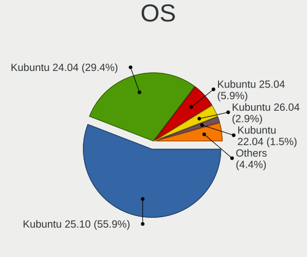

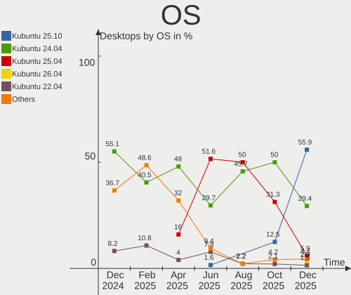

| Name             | Desktops | Percent |
|------------------|----------|---------|
| Kubuntu 25.10    | 38       | 55.88%  |
| Kubuntu 24.04    | 20       | 29.41%  |
| Kubuntu 25.04    | 4        | 5.88%   |
| Kubuntu 26.04    | 2        | 2.94%   |
| Kubuntu 22.04    | 1        | 1.47%   |
| Kubuntu 2025.3   | 1        | 1.47%   |
| Kubuntu 11.25.12 | 1        | 1.47%   |
| Kubuntu 11.25.11 | 1        | 1.47%   |

OS Family
---------

OS without a version

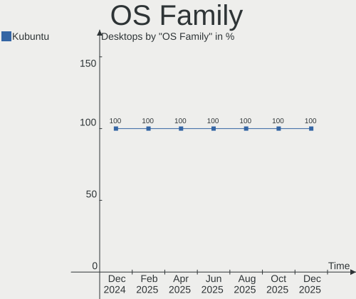

| Name    | Desktops | Percent |
|---------|----------|---------|
| Kubuntu | 68       | 100%    |

Kernel
------

Version of the Linux kernel

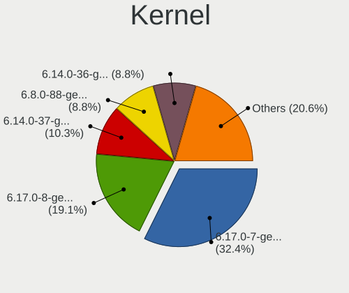

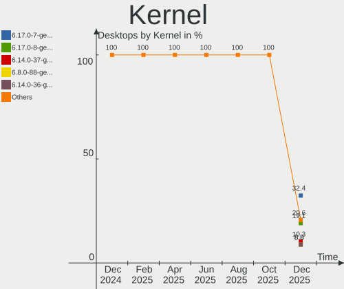

| Version                  | Desktops | Percent |
|--------------------------|----------|---------|
| 6.17.0-7-generic         | 22       | 32.35%  |
| 6.17.0-8-generic         | 13       | 19.12%  |
| 6.14.0-37-generic        | 7        | 10.29%  |
| 6.8.0-88-generic         | 6        | 8.82%   |
| 6.14.0-36-generic        | 6        | 8.82%   |
| 6.8.0-90-generic         | 3        | 4.41%   |
| 6.8.0-88-lowlatency      | 2        | 2.94%   |
| 6.18.0-8-generic         | 2        | 2.94%   |
| 6.18.2-1-liquorix-amd64  | 1        | 1.47%   |
| 6.17.0-6-generic         | 1        | 1.47%   |
| 6.17.0-5-generic         | 1        | 1.47%   |
| 6.16.0-061600rc6-generic | 1        | 1.47%   |
| 6.14.0-33-generic        | 1        | 1.47%   |
| 5.15.0-89-generic        | 1        | 1.47%   |
| 5.15.0-127-lowlatency    | 1        | 1.47%   |

Kernel Family
-------------

Linux kernel without a distro release

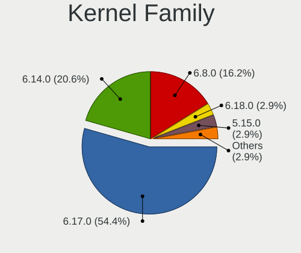

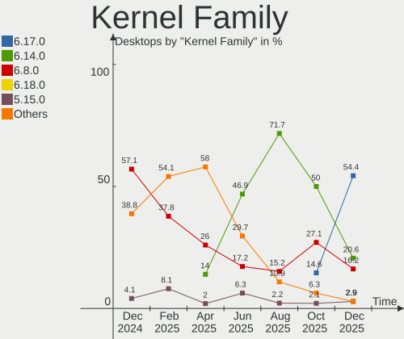

| Version | Desktops | Percent |
|---------|----------|---------|
| 6.17.0  | 37       | 54.41%  |
| 6.14.0  | 14       | 20.59%  |
| 6.8.0   | 11       | 16.18%  |
| 6.18.0  | 2        | 2.94%   |
| 5.15.0  | 2        | 2.94%   |
| 6.18.2  | 1        | 1.47%   |
| 6.16.0  | 1        | 1.47%   |

Kernel Major Ver.
-----------------

Linux kernel major version

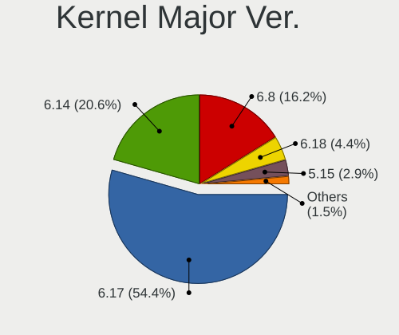

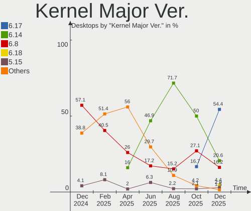

| Version | Desktops | Percent |
|---------|----------|---------|
| 6.17    | 37       | 54.41%  |
| 6.14    | 14       | 20.59%  |
| 6.8     | 11       | 16.18%  |
| 6.18    | 3        | 4.41%   |
| 5.15    | 2        | 2.94%   |
| 6.16    | 1        | 1.47%   |

Arch
----

OS architecture (x86_64, i586, etc.)

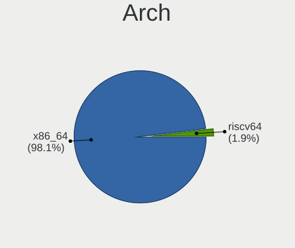

| Name   | Desktops | Percent |
|--------|----------|---------|
| x86_64 | 68       | 100%    |

DE
--

Desktop Environment

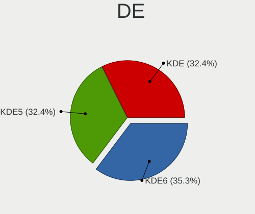

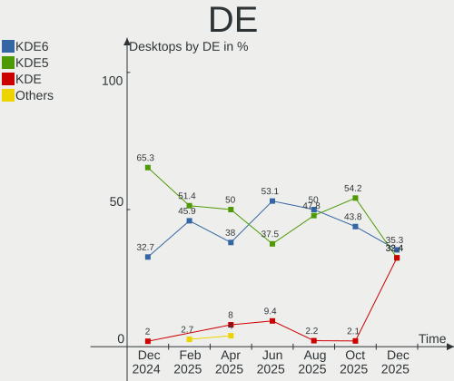

| Name | Desktops | Percent |
|------|----------|---------|
| KDE6 | 24       | 35.29%  |
| KDE5 | 22       | 32.35%  |
| KDE  | 22       | 32.35%  |

Display Server
--------------

X11 or Wayland

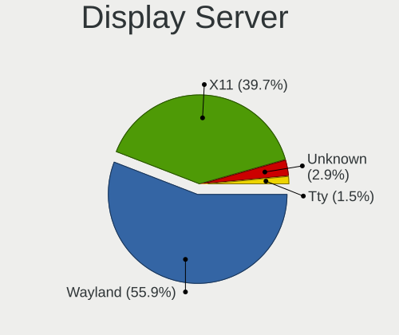

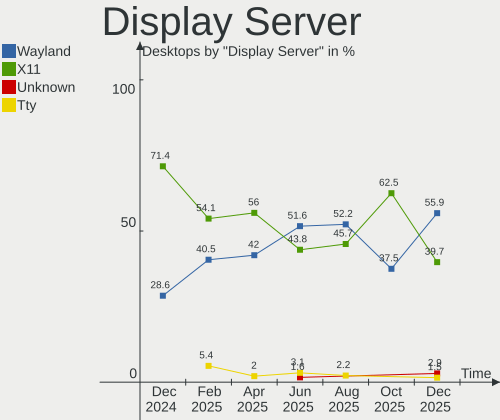

| Name    | Desktops | Percent |
|---------|----------|---------|
| Wayland | 38       | 55.88%  |
| X11     | 27       | 39.71%  |
| Unknown | 2        | 2.94%   |
| Tty     | 1        | 1.47%   |

Display Manager
---------------

SDDM, LightDM, etc.

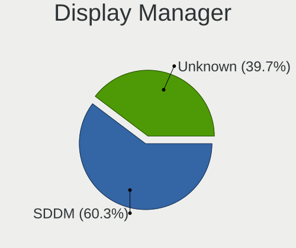

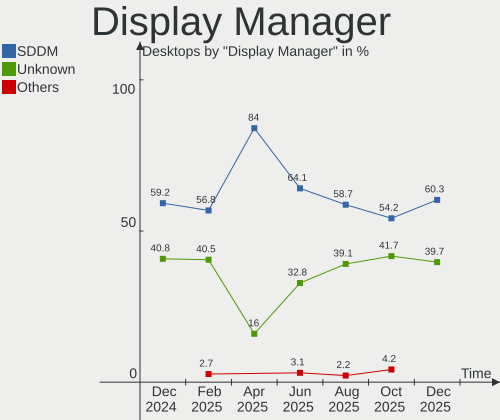

| Name    | Desktops | Percent |
|---------|----------|---------|
| SDDM    | 41       | 60.29%  |
| Unknown | 27       | 39.71%  |

OS Lang
-------

Language

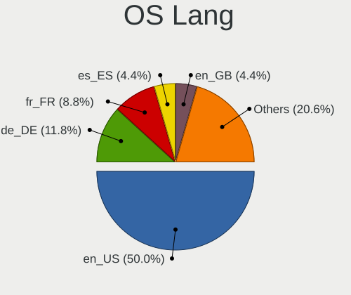

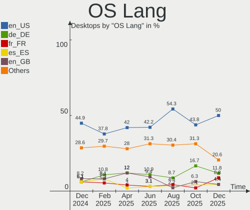

| Lang  | Desktops | Percent |
|-------|----------|---------|
| en_US | 34       | 50%     |
| de_DE | 8        | 11.76%  |
| fr_FR | 6        | 8.82%   |
| es_ES | 3        | 4.41%   |
| en_GB | 3        | 4.41%   |
| ru_RU | 2        | 2.94%   |
| tr_TR | 1        | 1.47%   |
| sv_SE | 1        | 1.47%   |
| pt_PT | 1        | 1.47%   |
| pl_PL | 1        | 1.47%   |
| id_ID | 1        | 1.47%   |
| fr_CA | 1        | 1.47%   |
| fi_FI | 1        | 1.47%   |
| es_MX | 1        | 1.47%   |
| en_IE | 1        | 1.47%   |
| en_CA | 1        | 1.47%   |
| de_AT | 1        | 1.47%   |
| cs_CZ | 1        | 1.47%   |

Boot Mode
---------

EFI or BIOS

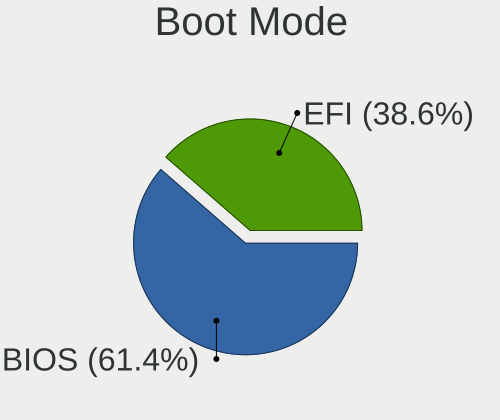

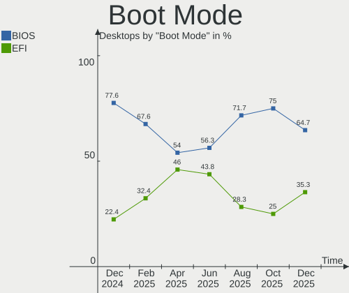

| Mode | Desktops | Percent |
|------|----------|---------|
| BIOS | 44       | 64.71%  |
| EFI  | 24       | 35.29%  |

Filesystem
----------

Type of filesystem

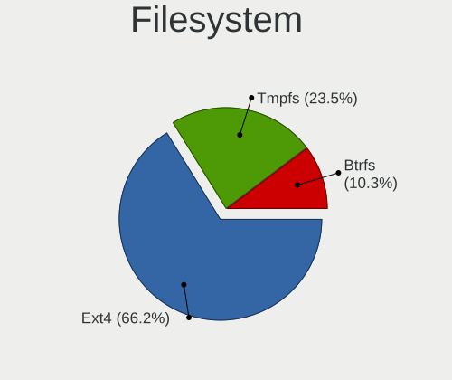

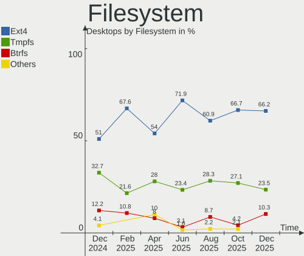

| Type  | Desktops | Percent |
|-------|----------|---------|
| Ext4  | 45       | 66.18%  |
| Tmpfs | 16       | 23.53%  |
| Btrfs | 7        | 10.29%  |

Part. scheme
------------

Scheme of partitioning

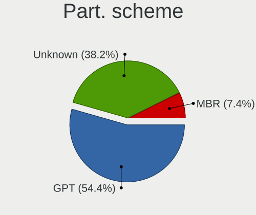

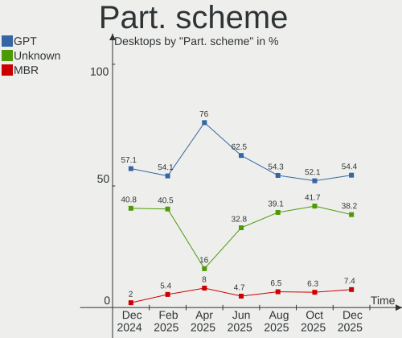

| Type    | Desktops | Percent |
|---------|----------|---------|
| GPT     | 37       | 54.41%  |
| Unknown | 26       | 38.24%  |
| MBR     | 5        | 7.35%   |

Dual Boot with Linux/BSD
------------------------

Hosting more than one Linux/BSD

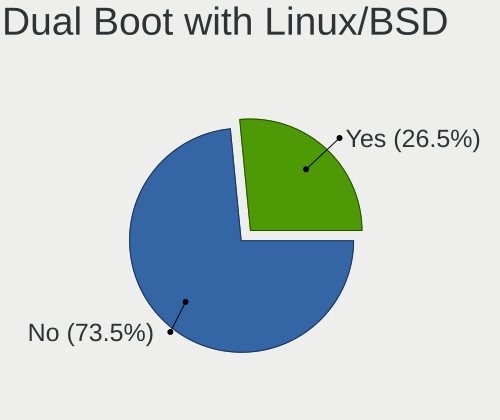

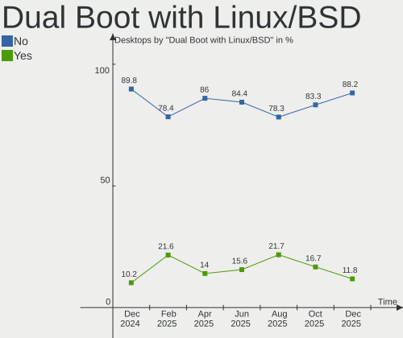

| Dual boot | Desktops | Percent |
|-----------|----------|---------|
| No        | 60       | 88.24%  |
| Yes       | 8        | 11.76%  |

Dual Boot (Win)
---------------

Hosting Linux and Windows

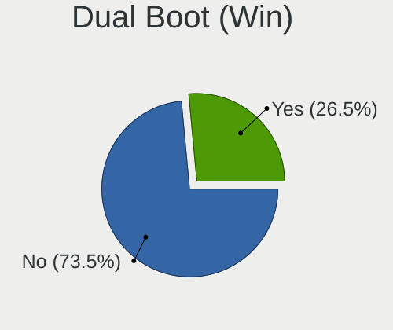

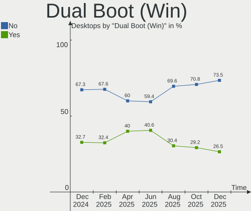

| Dual boot | Desktops | Percent |
|-----------|----------|---------|
| No        | 50       | 73.53%  |
| Yes       | 18       | 26.47%  |

Board
-----

Vendor
------

Motherboard manufacturer

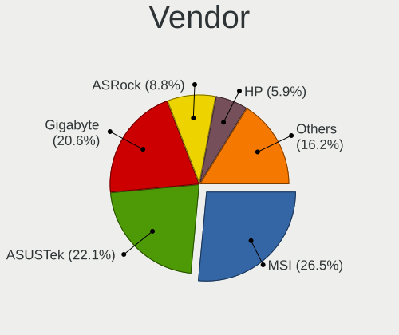

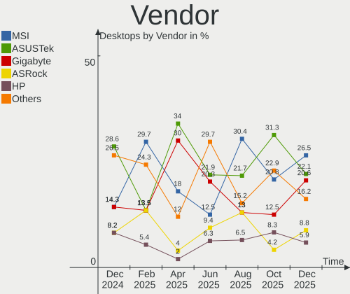

| Name                | Desktops | Percent |
|---------------------|----------|---------|
| MSI                 | 18       | 26.47%  |
| ASUSTek Computer    | 15       | 22.06%  |
| Gigabyte Technology | 14       | 20.59%  |
| ASRock              | 6        | 8.82%   |
| Hewlett-Packard     | 4        | 5.88%   |
| Dell                | 3        | 4.41%   |
| Pegatron            | 2        | 2.94%   |
| MACHINIST           | 1        | 1.47%   |
| Lenovo              | 1        | 1.47%   |
| Intel               | 1        | 1.47%   |
| Fujitsu Siemens     | 1        | 1.47%   |
| Acer                | 1        | 1.47%   |
| Unknown             | 1        | 1.47%   |

Model
-----

Motherboard model

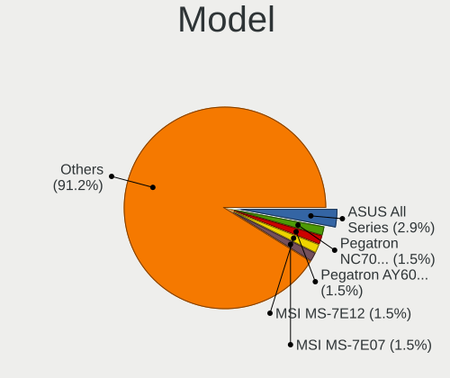

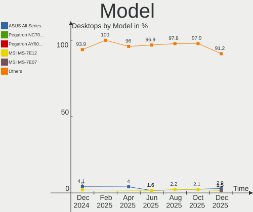

| Name                             | Desktops | Percent |
|----------------------------------|----------|---------|
| ASUS All Series                  | 2        | 2.94%   |
| Pegatron NC701AA-ABA IQ524       | 1        | 1.47%   |
| Pegatron AY608AA-ABA HPE-137c    | 1        | 1.47%   |
| MSI MS-7E12                      | 1        | 1.47%   |
| MSI MS-7E07                      | 1        | 1.47%   |
| MSI MS-7D76                      | 1        | 1.47%   |
| MSI MS-7D73                      | 1        | 1.47%   |
| MSI MS-7D32                      | 1        | 1.47%   |
| MSI MS-7D25                      | 1        | 1.47%   |
| MSI MS-7D09                      | 1        | 1.47%   |
| MSI MS-7C76                      | 1        | 1.47%   |
| MSI MS-7C56                      | 1        | 1.47%   |
| MSI MS-7C02                      | 1        | 1.47%   |
| MSI MS-7B89                      | 1        | 1.47%   |
| MSI MS-7B87                      | 1        | 1.47%   |
| MSI MS-7B78                      | 1        | 1.47%   |
| MSI MS-7B24                      | 1        | 1.47%   |
| MSI MS-7A70                      | 1        | 1.47%   |
| MSI MS-7816                      | 1        | 1.47%   |
| MSI Komplett PC                  | 1        | 1.47%   |
| MSI Intel Core i9-14900KF        | 1        | 1.47%   |
| MACHINIST E5-V2.82H V1.1         | 1        | 1.47%   |
| Lenovo H415                      | 1        | 1.47%   |
| Intel SHARKBAY                   | 1        | 1.47%   |
| HP Z420 Workstation              | 1        | 1.47%   |
| HP EliteDesk 705 G4 DM 35W       | 1        | 1.47%   |
| HP Compaq Elite 8300 CMT         | 1        | 1.47%   |
| HP 870-119                       | 1        | 1.47%   |
| Gigabyte Z97-HD3                 | 1        | 1.47%   |
| Gigabyte Z890 AORUS ELITE WIFI7  | 1        | 1.47%   |
| Gigabyte Z790 EAGLE              | 1        | 1.47%   |
| Gigabyte Z390 UD                 | 1        | 1.47%   |
| Gigabyte Z370P D3                | 1        | 1.47%   |
| Gigabyte Z370 AORUS Ultra Gaming | 1        | 1.47%   |
| Gigabyte Z270MX-Gaming5          | 1        | 1.47%   |
| Gigabyte X670 AORUS ELITE AX     | 1        | 1.47%   |
| Gigabyte X570 AORUS ULTRA        | 1        | 1.47%   |
| Gigabyte X570 AORUS ELITE        | 1        | 1.47%   |
| Gigabyte P55-UD3                 | 1        | 1.47%   |
| Gigabyte B760I AORUS PRO         | 1        | 1.47%   |

Model Family
------------

Motherboard model prefix

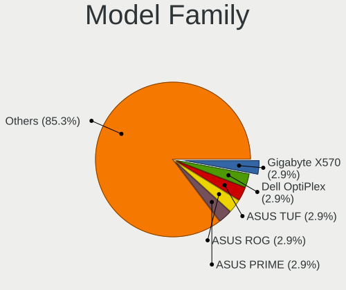

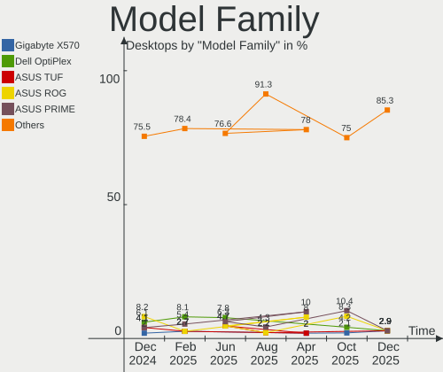

| Name                    | Desktops | Percent |
|-------------------------|----------|---------|
| Gigabyte X570           | 2        | 2.94%   |
| Dell OptiPlex           | 2        | 2.94%   |
| ASUS TUF                | 2        | 2.94%   |
| ASUS ROG                | 2        | 2.94%   |
| ASUS PRIME              | 2        | 2.94%   |
| ASUS All                | 2        | 2.94%   |
| Pegatron NC701AA-ABA    | 1        | 1.47%   |
| Pegatron AY608AA-ABA    | 1        | 1.47%   |
| MSI MS-7E12             | 1        | 1.47%   |
| MSI MS-7E07             | 1        | 1.47%   |
| MSI MS-7D76             | 1        | 1.47%   |
| MSI MS-7D73             | 1        | 1.47%   |
| MSI MS-7D32             | 1        | 1.47%   |
| MSI MS-7D25             | 1        | 1.47%   |
| MSI MS-7D09             | 1        | 1.47%   |
| MSI MS-7C76             | 1        | 1.47%   |
| MSI MS-7C56             | 1        | 1.47%   |
| MSI MS-7C02             | 1        | 1.47%   |
| MSI MS-7B89             | 1        | 1.47%   |
| MSI MS-7B87             | 1        | 1.47%   |
| MSI MS-7B78             | 1        | 1.47%   |
| MSI MS-7B24             | 1        | 1.47%   |
| MSI MS-7A70             | 1        | 1.47%   |
| MSI MS-7816             | 1        | 1.47%   |
| MSI Komplett            | 1        | 1.47%   |
| MSI Intel               | 1        | 1.47%   |
| MACHINIST E5-V2.82H     | 1        | 1.47%   |
| Lenovo H415             | 1        | 1.47%   |
| Intel SHARKBAY          | 1        | 1.47%   |
| HP Z420                 | 1        | 1.47%   |
| HP EliteDesk            | 1        | 1.47%   |
| HP Compaq               | 1        | 1.47%   |
| HP 870-119              | 1        | 1.47%   |
| Gigabyte Z97-HD3        | 1        | 1.47%   |
| Gigabyte Z890           | 1        | 1.47%   |
| Gigabyte Z790           | 1        | 1.47%   |
| Gigabyte Z390           | 1        | 1.47%   |
| Gigabyte Z370P          | 1        | 1.47%   |
| Gigabyte Z370           | 1        | 1.47%   |
| Gigabyte Z270MX-Gaming5 | 1        | 1.47%   |

MFG Year
--------

Motherboard manufacture year

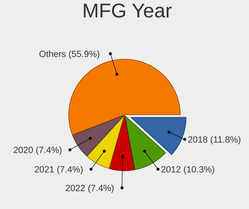

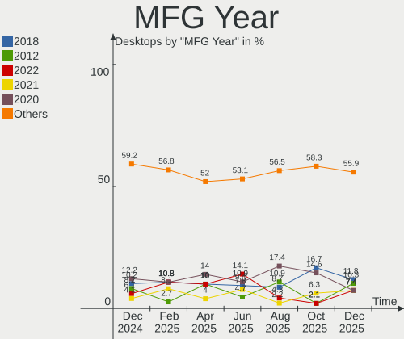

| Year | Desktops | Percent |
|------|----------|---------|
| 2018 | 8        | 11.76%  |
| 2012 | 7        | 10.29%  |
| 2022 | 5        | 7.35%   |
| 2021 | 5        | 7.35%   |
| 2020 | 5        | 7.35%   |
| 2019 | 5        | 7.35%   |
| 2017 | 5        | 7.35%   |
| 2016 | 5        | 7.35%   |
| 2025 | 3        | 4.41%   |
| 2024 | 3        | 4.41%   |
| 2023 | 3        | 4.41%   |
| 2014 | 3        | 4.41%   |
| 2008 | 3        | 4.41%   |
| 2013 | 2        | 2.94%   |
| 2011 | 2        | 2.94%   |
| 2009 | 2        | 2.94%   |
| 2015 | 1        | 1.47%   |
| 2010 | 1        | 1.47%   |

Form Factor
-----------

Physical design of the computer

| Name    | Desktops | Percent |
|---------|----------|---------|
| Desktop | 68       | 100%    |

Secure Boot
-----------

Enabled or disabled

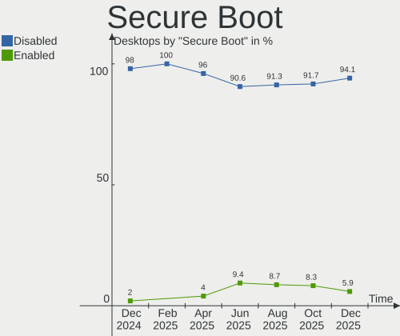

| State    | Desktops | Percent |
|----------|----------|---------|
| Disabled | 64       | 94.12%  |
| Enabled  | 4        | 5.88%   |

Coreboot
--------

Have coreboot on board

| Used | Desktops | Percent |
|------|----------|---------|
| No   | 68       | 100%    |

RAM Size
--------

Total RAM memory

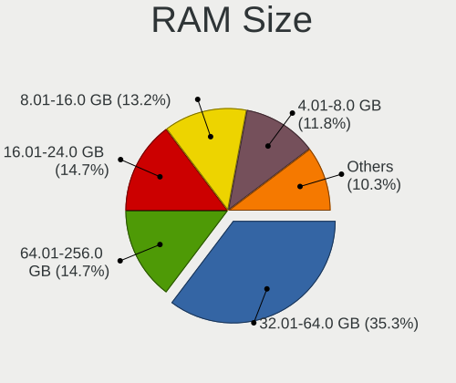

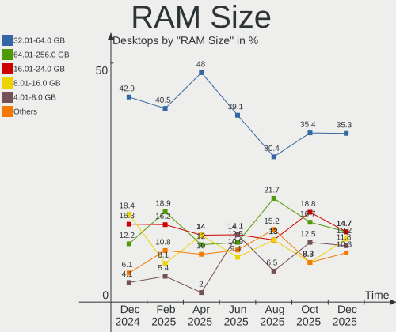

| Size in GB  | Desktops | Percent |
|-------------|----------|---------|
| 32.01-64.0  | 24       | 35.29%  |
| 64.01-256.0 | 10       | 14.71%  |
| 16.01-24.0  | 10       | 14.71%  |
| 8.01-16.0   | 9        | 13.24%  |
| 4.01-8.0    | 8        | 11.76%  |
| 24.01-32.0  | 5        | 7.35%   |
| 3.01-4.0    | 2        | 2.94%   |

RAM Used
--------

Used RAM memory

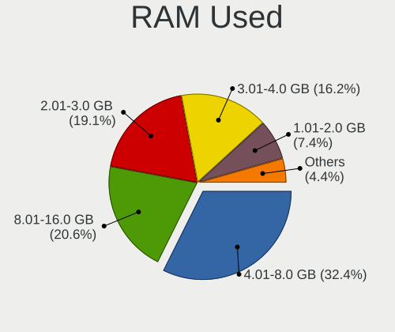

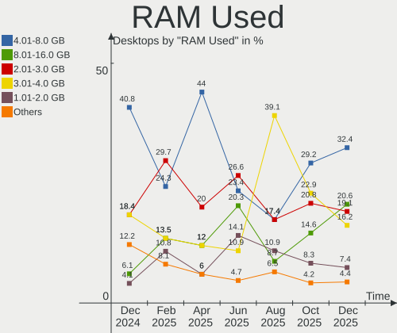

| Used GB    | Desktops | Percent |
|------------|----------|---------|
| 4.01-8.0   | 22       | 32.35%  |
| 8.01-16.0  | 14       | 20.59%  |
| 2.01-3.0   | 13       | 19.12%  |
| 3.01-4.0   | 11       | 16.18%  |
| 1.01-2.0   | 5        | 7.35%   |
| 16.01-24.0 | 2        | 2.94%   |
| 32.01-64.0 | 1        | 1.47%   |

Total Drives
------------

Number of drives on board

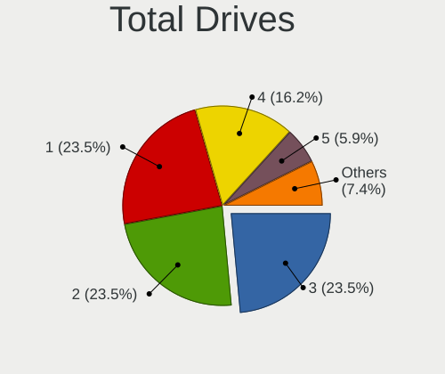

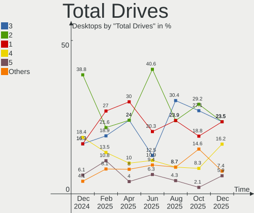

| Drives | Desktops | Percent |
|--------|----------|---------|
| 3      | 16       | 23.53%  |
| 2      | 16       | 23.53%  |
| 1      | 16       | 23.53%  |
| 4      | 11       | 16.18%  |
| 5      | 4        | 5.88%   |
| 6      | 2        | 2.94%   |
| 8      | 1        | 1.47%   |
| 7      | 1        | 1.47%   |
| 0      | 1        | 1.47%   |

Has CD-ROM
----------

Has CD-ROM on board

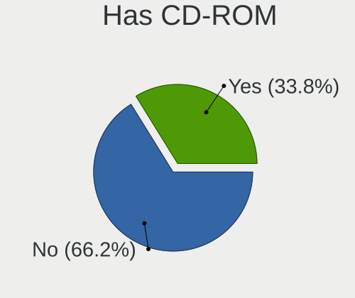

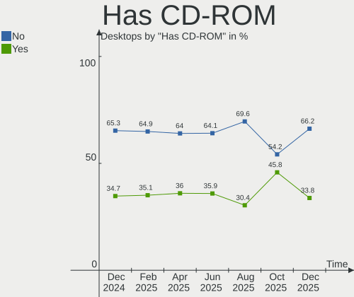

| Presented | Desktops | Percent |
|-----------|----------|---------|
| No        | 45       | 66.18%  |
| Yes       | 23       | 33.82%  |

Has Ethernet
------------

Has Ethernet on board

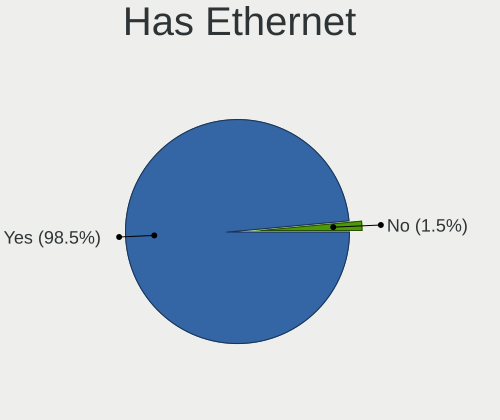

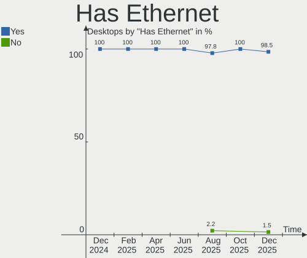

| Presented | Desktops | Percent |
|-----------|----------|---------|
| Yes       | 67       | 98.53%  |
| No        | 1        | 1.47%   |

Has WiFi
--------

Has WiFi module

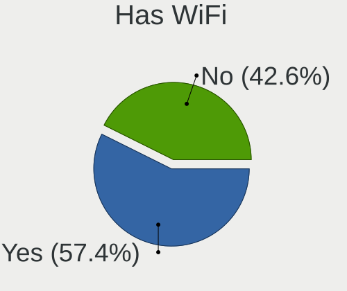

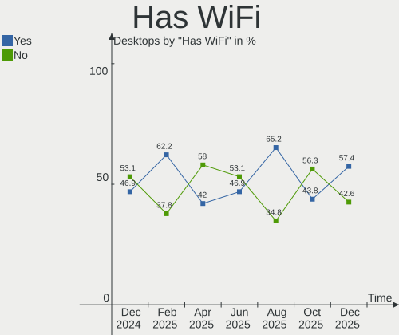

| Presented | Desktops | Percent |
|-----------|----------|---------|
| Yes       | 39       | 57.35%  |
| No        | 29       | 42.65%  |

Has Bluetooth
-------------

Has Bluetooth module

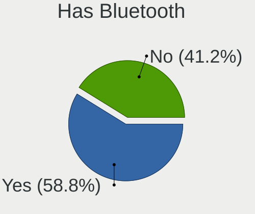

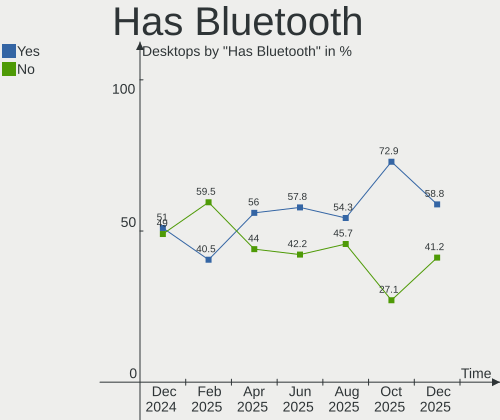

| Presented | Desktops | Percent |
|-----------|----------|---------|
| Yes       | 40       | 58.82%  |
| No        | 28       | 41.18%  |

Location
--------

Country
-------

Geographic location (country)

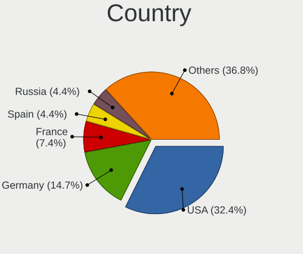

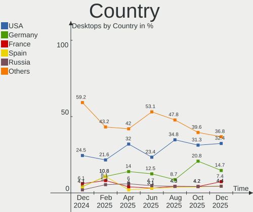

| Country     | Desktops | Percent |
|-------------|----------|---------|
| USA         | 22       | 32.35%  |
| Germany     | 10       | 14.71%  |
| France      | 5        | 7.35%   |
| Spain       | 3        | 4.41%   |
| Russia      | 3        | 4.41%   |
| Canada      | 3        | 4.41%   |
| UK          | 2        | 2.94%   |
| Portugal    | 2        | 2.94%   |
| Ireland     | 2        | 2.94%   |
| Indonesia   | 2        | 2.94%   |
| Brazil      | 2        | 2.94%   |
| Turkey      | 1        | 1.47%   |
| Sweden      | 1        | 1.47%   |
| Poland      | 1        | 1.47%   |
| New Zealand | 1        | 1.47%   |
| Netherlands | 1        | 1.47%   |
| Mexico      | 1        | 1.47%   |
| Iran        | 1        | 1.47%   |
| India       | 1        | 1.47%   |
| Greece      | 1        | 1.47%   |
| Finland     | 1        | 1.47%   |
| Czechia     | 1        | 1.47%   |
| Bulgaria    | 1        | 1.47%   |

City
----

Geographic location (city)

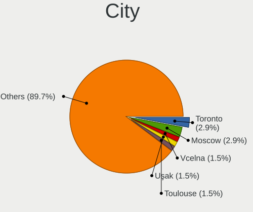

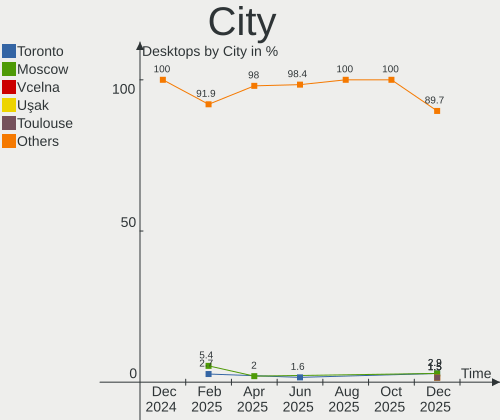

| City           | Desktops | Percent |
|----------------|----------|---------|
| Toronto        | 2        | 2.94%   |
| Moscow         | 2        | 2.94%   |
| Vcelna         | 1        | 1.47%   |
| Uşak          | 1        | 1.47%   |
| Toulouse       | 1        | 1.47%   |
| Tehran         | 1        | 1.47%   |
| Suffolk        | 1        | 1.47%   |
| Stuttgart      | 1        | 1.47%   |
| St Petersburg  | 1        | 1.47%   |
| St Louis       | 1        | 1.47%   |
| Sofia          | 1        | 1.47%   |
| Skerries       | 1        | 1.47%   |
| Sao Paulo      | 1        | 1.47%   |
| Sanvensa       | 1        | 1.47%   |
| Santander      | 1        | 1.47%   |
| San Francisco  | 1        | 1.47%   |
| San Diego      | 1        | 1.47%   |
| Rockaway       | 1        | 1.47%   |
| Richardson     | 1        | 1.47%   |
| Reno           | 1        | 1.47%   |
| Rennes         | 1        | 1.47%   |
| Peoria         | 1        | 1.47%   |
| Paris          | 1        | 1.47%   |
| Offenbach      | 1        | 1.47%   |
| Nuremberg      | 1        | 1.47%   |
| New Albany     | 1        | 1.47%   |
| Munich         | 1        | 1.47%   |
| Mülheim       | 1        | 1.47%   |
| Mranggen       | 1        | 1.47%   |
| Monschau       | 1        | 1.47%   |
| Mesquite       | 1        | 1.47%   |
| Marinha Grande | 1        | 1.47%   |
| Maple          | 1        | 1.47%   |
| Malang         | 1        | 1.47%   |
| Los Angeles    | 1        | 1.47%   |
| London         | 1        | 1.47%   |
| Lisbon         | 1        | 1.47%   |
| Lidkoeping     | 1        | 1.47%   |
| Jacksonville   | 1        | 1.47%   |
| Helsinki       | 1        | 1.47%   |

Drives
------

Drive Vendor
------------

Hard drive vendors

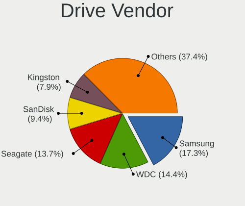

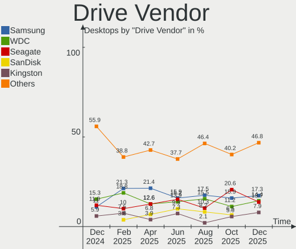

| Vendor                      | Desktops | Drives | Percent |
|-----------------------------|----------|--------|---------|
| Samsung Electronics         | 24       | 47     | 17.27%  |
| WDC                         | 20       | 30     | 14.39%  |
| Seagate                     | 19       | 24     | 13.67%  |
| SanDisk                     | 13       | 14     | 9.35%   |
| Kingston                    | 11       | 13     | 7.91%   |
| Toshiba                     | 9        | 10     | 6.47%   |
| Micron/Crucial Technology   | 4        | 6      | 2.88%   |
| Crucial                     | 3        | 4      | 2.16%   |
| Unknown                     | 2        | 5      | 1.44%   |
| Team                        | 2        | 3      | 1.44%   |
| PNY                         | 2        | 2      | 1.44%   |
| Lexar                       | 2        | 2      | 1.44%   |
| Intel                       | 2        | 2      | 1.44%   |
| Hitachi                     | 2        | 2      | 1.44%   |
| GALAX                       | 2        | 2      | 1.44%   |
| ADATA Technology            | 2        | 2      | 1.44%   |
| T-FORCE                     | 1        | 1      | 0.72%   |
| SPCC                        | 1        | 1      | 0.72%   |
| SK hynix                    | 1        | 1      | 0.72%   |
| Silicon Motion              | 1        | 1      | 0.72%   |
| Realtek Semiconductor       | 1        | 2      | 0.72%   |
| Rayson                      | 1        | 1      | 0.72%   |
| Phison                      | 1        | 1      | 0.72%   |
| PC Specialist               | 1        | 1      | 0.72%   |
| Maxone                      | 1        | 1      | 0.72%   |
| MAXIO Technology (Hangzhou) | 1        | 1      | 0.72%   |
| KODAK                       | 1        | 1      | 0.72%   |
| Kingston Technology Company | 1        | 1      | 0.72%   |
| KingSpec                    | 1        | 1      | 0.72%   |
| Intenso                     | 1        | 1      | 0.72%   |
| Hewlett-Packard             | 1        | 1      | 0.72%   |
| GOODRAM                     | 1        | 1      | 0.72%   |
| Emtec                       | 1        | 1      | 0.72%   |
| China                       | 1        | 1      | 0.72%   |
| BIWIN                       | 1        | 1      | 0.72%   |
| AMD                         | 1        | 1      | 0.72%   |

Drive Model
-----------

Hard drive models

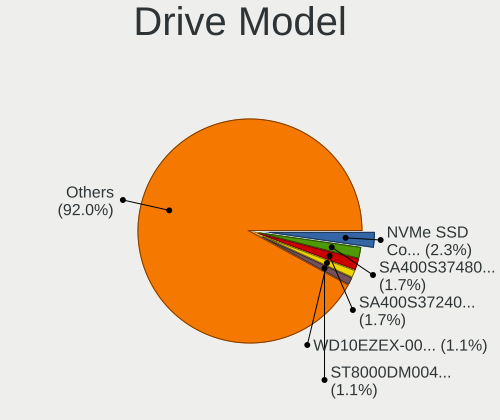

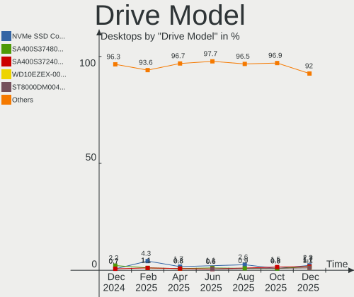

| Model                                                              | Desktops | Percent |
|--------------------------------------------------------------------|----------|---------|
| Samsung NVMe SSD Controller SM981/PM981/PM983 1TB                  | 4        | 2.27%   |
| Kingston SA400S37480G 480GB SSD                                    | 3        | 1.7%    |
| Kingston SA400S37240G 240GB SSD                                    | 3        | 1.7%    |
| WDC WD10EZEX-00BBHA0 1TB                                           | 2        | 1.14%   |
| Seagate ST8000DM004-2CX188 8TB                                     | 2        | 1.14%   |
| Seagate ST500DM002-1BD142 500GB                                    | 2        | 1.14%   |
| Seagate ST2000DM008-2UB102 2TB                                     | 2        | 1.14%   |
| Seagate ST1000DM010-2EP102 1TB                                     | 2        | 1.14%   |
| SanDisk NVMe SSD Drive 1TB                                         | 2        | 1.14%   |
| Samsung SSD 990 PRO 4TB                                            | 2        | 1.14%   |
| Samsung SSD 980 500GB                                              | 2        | 1.14%   |
| Samsung SSD 970 EVO Plus 1TB                                       | 2        | 1.14%   |
| Samsung SSD 870 EVO 1TB                                            | 2        | 1.14%   |
| Samsung SSD 860 EVO 500GB                                          | 2        | 1.14%   |
| Samsung SSD 860 EVO 250GB                                          | 2        | 1.14%   |
| Samsung SSD 850 EVO 500GB                                          | 2        | 1.14%   |
| GALAX TA1D0120A 120GB                                              | 2        | 1.14%   |
| ADATA XPG SX8200 Pro PCIe Gen3x4 M.2 2280 Solid State Drive 1024GB | 2        | 1.14%   |
| WDC WDS200T2B0B-00YS70 2TB SSD                                     | 1        | 0.57%   |
| WDC WDS100T2G0A-00JH30 1TB SSD                                     | 1        | 0.57%   |
| WDC WDS100T1R0A-68A4W0 1TB                                         | 1        | 0.57%   |
| WDC WD80EAAZ-00BXBB0 8TB                                           | 1        | 0.57%   |
| WDC WD60EZRZ-00GZ5B1 6TB                                           | 1        | 0.57%   |
| WDC WD60EZAZ-00SF3B0 6TB                                           | 1        | 0.57%   |
| WDC WD6004FZWX-00BKVA0 6TB                                         | 1        | 0.57%   |
| WDC WD60 04FZWX-00BKVA0 6TB                                        | 1        | 0.57%   |
| WDC WD5000AAKX-753CA1 500GB                                        | 1        | 0.57%   |
| WDC WD5000AADS-00S9B0 500GB                                        | 1        | 0.57%   |
| WDC WD40EZRZ-00GXCB0 4TB                                           | 1        | 0.57%   |
| WDC WD40EZAZ-00SF3B0 4TB                                           | 1        | 0.57%   |
| WDC WD40EZAX-00C8UB0 4TB                                           | 1        | 0.57%   |
| WDC WD40EFAX-68JH4N1 4TB                                           | 1        | 0.57%   |
| WDC WD3200AAKS-00SBA0 320GB                                        | 1        | 0.57%   |
| WDC WD20EZAZ-00GGJB0 2TB                                           | 1        | 0.57%   |
| WDC WD2003FZEX-00Z4SA0 2TB                                         | 1        | 0.57%   |
| WDC WD2002FFSX-68PF8N0 2TB                                         | 1        | 0.57%   |
| WDC WD10EZRZ-00HTKB0 1TB                                           | 1        | 0.57%   |
| WDC WD10EZRX-00A3KB0 1TB                                           | 1        | 0.57%   |
| WDC WD10EZEX-60WN4A0 1TB                                           | 1        | 0.57%   |
| WDC WD10EZEX-21WN4A0 1TB                                           | 1        | 0.57%   |

HDD Vendor
----------

Hard disk drive vendors

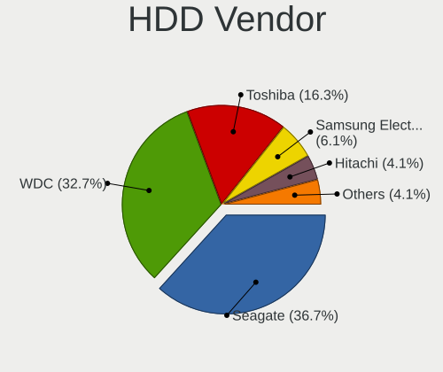

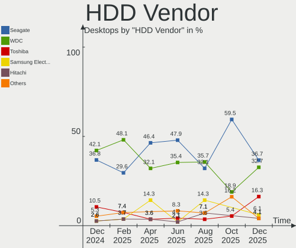

| Vendor              | Desktops | Drives | Percent |
|---------------------|----------|--------|---------|
| Seagate             | 18       | 22     | 36.73%  |
| WDC                 | 16       | 25     | 32.65%  |
| Toshiba             | 8        | 9      | 16.33%  |
| Samsung Electronics | 3        | 6      | 6.12%   |
| Hitachi             | 2        | 2      | 4.08%   |
| Unknown             | 1        | 1      | 2.04%   |
| Maxone              | 1        | 1      | 2.04%   |

SSD Vendor
----------

Solid state drive vendors

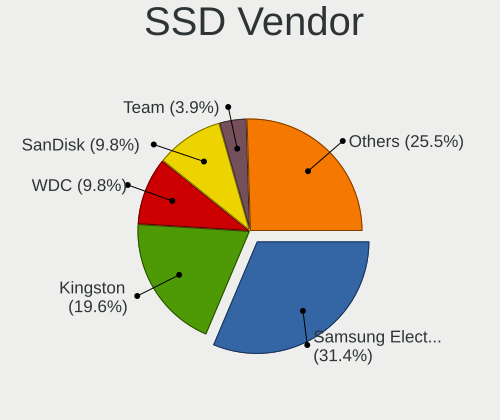

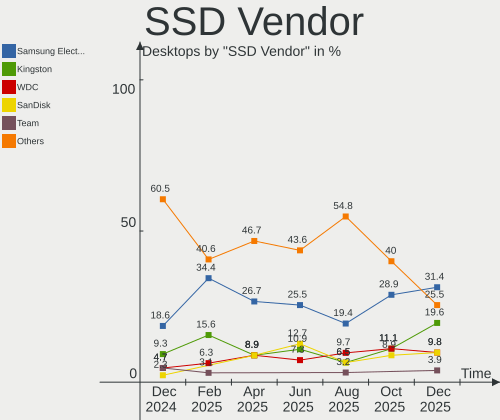

| Vendor              | Desktops | Drives | Percent |
|---------------------|----------|--------|---------|
| Samsung Electronics | 16       | 22     | 31.37%  |
| Kingston            | 10       | 11     | 19.61%  |
| WDC                 | 5        | 5      | 9.8%    |
| SanDisk             | 5        | 5      | 9.8%    |
| Team                | 2        | 3      | 3.92%   |
| PNY                 | 2        | 2      | 3.92%   |
| GALAX               | 2        | 2      | 3.92%   |
| Crucial             | 2        | 2      | 3.92%   |
| SPCC                | 1        | 1      | 1.96%   |
| Rayson              | 1        | 1      | 1.96%   |
| Lexar               | 1        | 1      | 1.96%   |
| Hewlett-Packard     | 1        | 1      | 1.96%   |
| GOODRAM             | 1        | 1      | 1.96%   |
| Emtec               | 1        | 1      | 1.96%   |
| China               | 1        | 1      | 1.96%   |

Drive Kind
----------

HDD or SSD

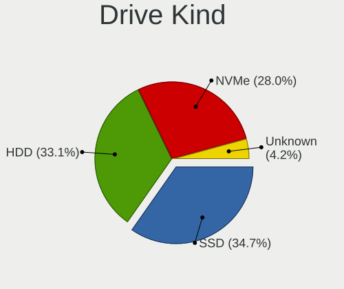

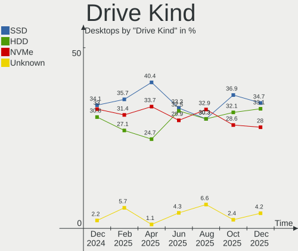

| Kind    | Desktops | Drives | Percent |
|---------|----------|--------|---------|
| SSD     | 41       | 59     | 34.75%  |
| HDD     | 39       | 66     | 33.05%  |
| NVMe    | 33       | 56     | 27.97%  |
| Unknown | 5        | 8      | 4.24%   |

Drive Connector
---------------

SATA, SAS, NVMe, etc.

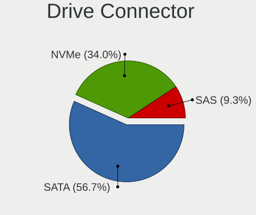

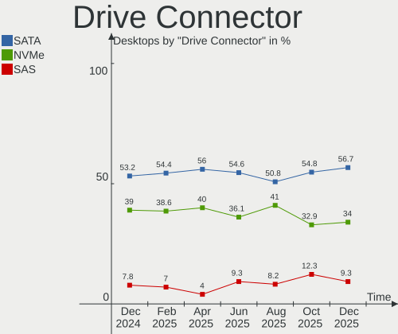

| Type | Desktops | Drives | Percent |
|------|----------|--------|---------|
| SATA | 55       | 122    | 56.7%   |
| NVMe | 33       | 55     | 34.02%  |
| SAS  | 9        | 12     | 9.28%   |

Drive Size
----------

Size of hard drive

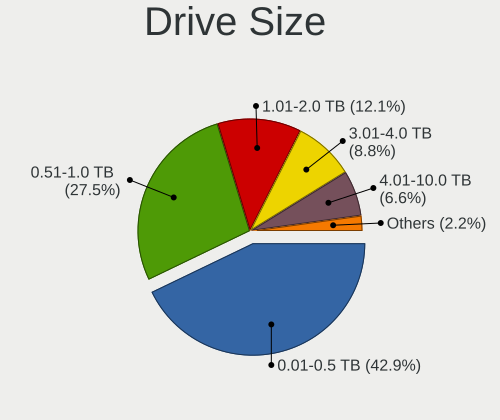

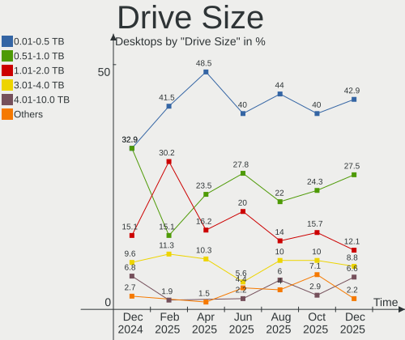

| Size in TB | Desktops | Drives | Percent |
|------------|----------|--------|---------|
| 0.01-0.5   | 39       | 53     | 42.86%  |
| 0.51-1.0   | 25       | 33     | 27.47%  |
| 1.01-2.0   | 11       | 16     | 12.09%  |
| 3.01-4.0   | 8        | 11     | 8.79%   |
| 4.01-10.0  | 6        | 9      | 6.59%   |
| 2.01-3.0   | 1        | 1      | 1.1%    |
| 10.01-20.0 | 1        | 2      | 1.1%    |

Space Total
-----------

Amount of disk space available on the file system

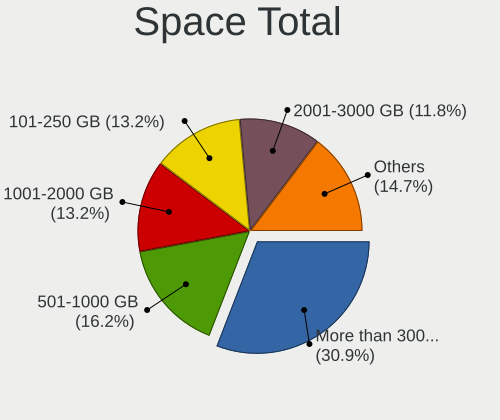

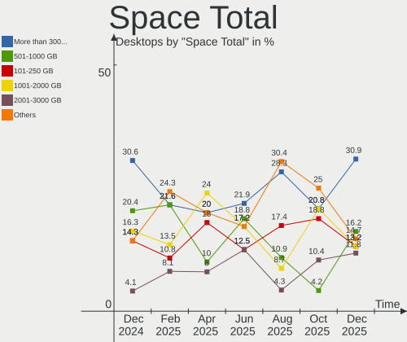

| Size in GB     | Desktops | Percent |
|----------------|----------|---------|
| More than 3000 | 21       | 30.88%  |
| 501-1000       | 11       | 16.18%  |
| 101-250        | 9        | 13.24%  |
| 1001-2000      | 9        | 13.24%  |
| 2001-3000      | 8        | 11.76%  |
| 1-20           | 4        | 5.88%   |
| 251-500        | 2        | 2.94%   |
| 51-100         | 2        | 2.94%   |
| 21-50          | 1        | 1.47%   |
| Unknown        | 1        | 1.47%   |

Space Used
----------

Amount of used disk space

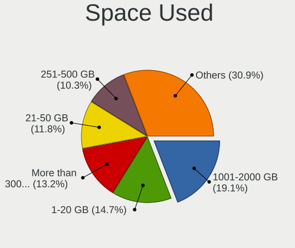

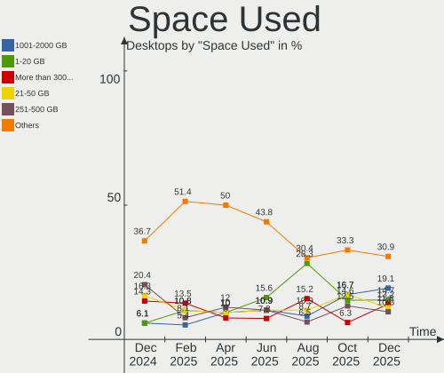

| Used GB        | Desktops | Percent |
|----------------|----------|---------|
| 1001-2000      | 13       | 19.12%  |
| 1-20           | 10       | 14.71%  |
| More than 3000 | 9        | 13.24%  |
| 21-50          | 8        | 11.76%  |
| 251-500        | 7        | 10.29%  |
| 101-250        | 7        | 10.29%  |
| 51-100         | 5        | 7.35%   |
| 2001-3000      | 4        | 5.88%   |
| 501-1000       | 4        | 5.88%   |
| Unknown        | 1        | 1.47%   |

Malfunc. Drives
---------------

Drive models with a malfunction

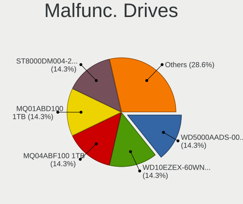

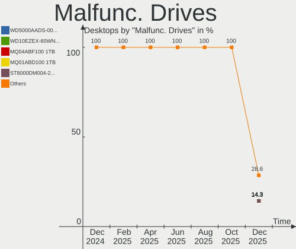

| Model                          | Desktops | Drives | Percent |
|--------------------------------|----------|--------|---------|
| WDC WD5000AADS-00S9B0 500GB    | 1        | 1      | 14.29%  |
| WDC WD10EZEX-60WN4A0 1TB       | 1        | 1      | 14.29%  |
| Toshiba MQ04ABF100 1TB         | 1        | 1      | 14.29%  |
| Toshiba MQ01ABD100 1TB         | 1        | 1      | 14.29%  |
| Seagate ST8000DM004-2CX188 8TB | 1        | 1      | 14.29%  |
| Seagate ST3500620AS 500GB      | 1        | 1      | 14.29%  |
| SanDisk SSD PLUS 480GB         | 1        | 1      | 14.29%  |

Malfunc. Drive Vendor
---------------------

Vendors of faulty drives

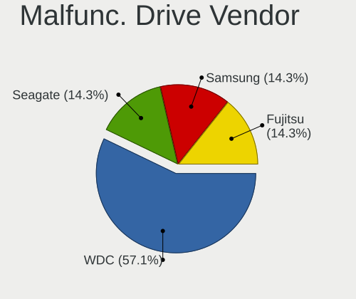

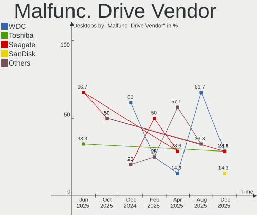

| Vendor  | Desktops | Drives | Percent |
|---------|----------|--------|---------|
| WDC     | 2        | 2      | 28.57%  |
| Toshiba | 2        | 2      | 28.57%  |
| Seagate | 2        | 2      | 28.57%  |
| SanDisk | 1        | 1      | 14.29%  |

Malfunc. HDD Vendor
-------------------

Vendors of faulty HDD drives

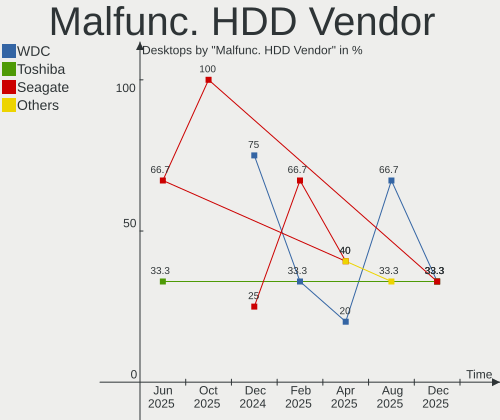

| Vendor  | Desktops | Drives | Percent |
|---------|----------|--------|---------|
| WDC     | 2        | 2      | 33.33%  |
| Toshiba | 2        | 2      | 33.33%  |
| Seagate | 2        | 2      | 33.33%  |

Malfunc. Drive Kind
-------------------

Kinds of faulty drives

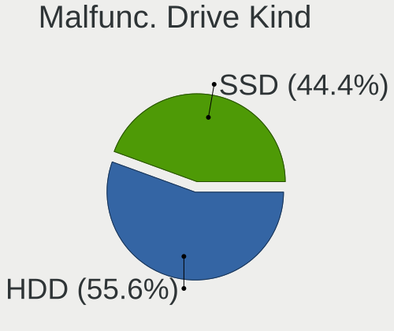

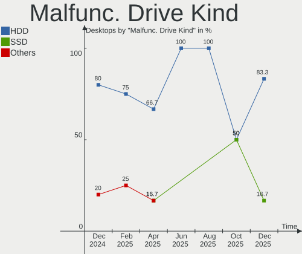

| Kind | Desktops | Drives | Percent |
|------|----------|--------|---------|
| HDD  | 5        | 6      | 83.33%  |
| SSD  | 1        | 1      | 16.67%  |

Failed Drives
-------------

Failed drive models

Zero info for selected period =(

Failed Drive Vendor
-------------------

Failed drive vendors

Zero info for selected period =(

Drive Status
------------

Number of failed and malfunc. drives

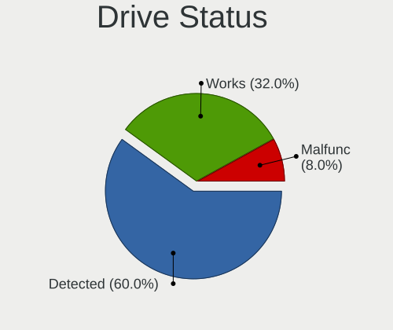

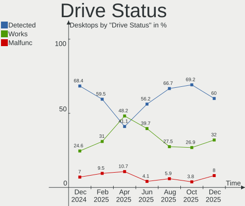

| Status   | Desktops | Drives | Percent |
|----------|----------|--------|---------|
| Detected | 45       | 109    | 60%     |
| Works    | 24       | 73     | 32%     |
| Malfunc  | 6        | 7      | 8%      |

Storage controller
------------------

Storage Vendor
--------------

Storage controller vendors

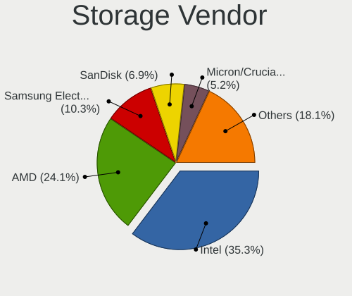

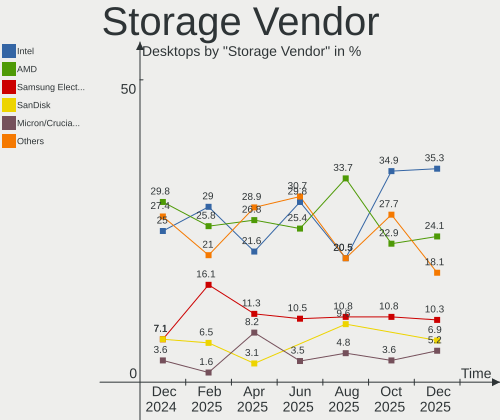

| Vendor                       | Desktops | Percent |
|------------------------------|----------|---------|
| Intel                        | 41       | 35.34%  |
| AMD                          | 28       | 24.14%  |
| Samsung Electronics          | 12       | 10.34%  |
| SanDisk                      | 8        | 6.9%    |
| Micron/Crucial Technology    | 6        | 5.17%   |
| ASMedia Technology           | 4        | 3.45%   |
| Realtek Semiconductor        | 2        | 1.72%   |
| MAXIO Technology (Hangzhou)  | 2        | 1.72%   |
| Kingston Technology Company  | 2        | 1.72%   |
| JMicron Technology           | 2        | 1.72%   |
| ADATA Technology             | 2        | 1.72%   |
| Toshiba America Info Systems | 1        | 0.86%   |
| SK hynix                     | 1        | 0.86%   |
| Silicon Motion               | 1        | 0.86%   |
| Seagate Technology           | 1        | 0.86%   |
| Phison Electronics           | 1        | 0.86%   |
| INNOGRIT                     | 1        | 0.86%   |
| Biwin Storage Technology     | 1        | 0.86%   |

Storage Model
-------------

Storage controller models

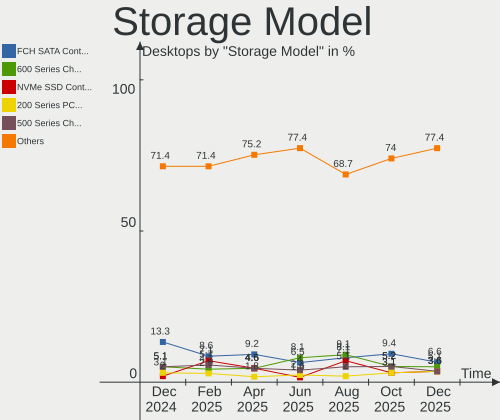

| Model                                                                          | Desktops | Percent |
|--------------------------------------------------------------------------------|----------|---------|
| AMD FCH SATA Controller [AHCI mode]                                            | 9        | 6.57%   |
| AMD 600 Series Chipset SATA Controller                                         | 7        | 5.11%   |
| Samsung NVMe SSD Controller SM981/PM981/PM983                                  | 5        | 3.65%   |
| Intel 200 Series PCH SATA controller [AHCI mode]                               | 5        | 3.65%   |
| AMD 500 Series Chipset SATA Controller                                         | 5        | 3.65%   |
| Intel SATA Controller [RAID mode]                                              | 4        | 2.92%   |
| Intel Raptor Lake SATA AHCI Controller                                         | 4        | 2.92%   |
| Intel Alder Lake-S PCH SATA Controller [AHCI Mode]                             | 4        | 2.92%   |
| AMD 400 Series Chipset SATA Controller                                         | 4        | 2.92%   |
| SanDisk WD SN560/SN740/SN770/SN5000 NVMe SSD                                   | 3        | 2.19%   |
| Sandisk WD Black SN850X NVMe SSD                                               | 3        | 2.19%   |
| Micron/Crucial P310 NVMe PCIe SSD (DRAM-less)                                  | 3        | 2.19%   |
| Intel C600/X79 series chipset 6-Port SATA AHCI Controller                      | 3        | 2.19%   |
| ASMedia ASM1061/ASM1062 Serial ATA Controller                                  | 3        | 2.19%   |
| AMD SB7x0/SB8x0/SB9x0 SATA Controller [AHCI mode]                              | 3        | 2.19%   |
| AMD SB7x0/SB8x0/SB9x0 IDE Controller                                           | 3        | 2.19%   |
| Samsung NVMe SSD Controller S4LV008[Pascal]                                    | 2        | 1.46%   |
| Samsung NVMe SSD Controller PM9A1/PM9A3/980PRO                                 | 2        | 1.46%   |
| Samsung NVMe SSD Controller 980 (DRAM-less)                                    | 2        | 1.46%   |
| Micron/Crucial P2 [Nick P2] / P3 / P3 Plus NVMe PCIe SSD (DRAM-less)           | 2        | 1.46%   |
| MAXIO (Hangzhou) NVMe SSD Controller MAP1202 (DRAM-less)                       | 2        | 1.46%   |
| Intel SSD 660P Series                                                          | 2        | 1.46%   |
| Intel Q170/Q150/B150/H170/H110/Z170/CM236 Chipset SATA Controller [AHCI Mode]  | 2        | 1.46%   |
| Intel Cannon Lake PCH SATA AHCI Controller                                     | 2        | 1.46%   |
| Intel C602 chipset 4-Port SATA Storage Control Unit                            | 2        | 1.46%   |
| Intel 9 Series Chipset Family SATA Controller [AHCI Mode]                      | 2        | 1.46%   |
| Intel 8 Series/C220 Series Chipset Family 6-port SATA Controller 1 [AHCI mode] | 2        | 1.46%   |
| Intel 7 Series/C210 Series Chipset Family 6-port SATA Controller [AHCI mode]   | 2        | 1.46%   |
| AMD A320 Chipset SATA Controller [AHCI mode]                                   | 2        | 1.46%   |
| ADATA XPG SX8200 Pro PCIe Gen3x4 M.2 2280 Solid State Drive                    | 2        | 1.46%   |
| Toshiba America Info Systems XG5 NVMe SSD Controller                           | 1        | 0.73%   |
| SK hynix Gold P31/BC711/PC711 NVMe Solid State Drive                           | 1        | 0.73%   |
| Silicon Motion SM2263EN/SM2263XT (DRAM-less) NVMe SSD Controllers              | 1        | 0.73%   |
| Seagate E18 PCIe SSD                                                           | 1        | 0.73%   |
| SanDisk WD PC SN810 / Black SN850 NVMe SSD                                     | 1        | 0.73%   |
| Sandisk WD Blue SN580 NVMe SSD (DRAM-less)                                     | 1        | 0.73%   |
| SanDisk WD Blue SN570 NVMe SSD 2TB                                             | 1        | 0.73%   |
| Samsung NVMe SSD Controller SM961/PM961/SM963                                  | 1        | 0.73%   |
| Realtek RTS5772DL NVMe SSD Controller (DRAM-less)                              | 1        | 0.73%   |
| Realtek RTS5765DL NVMe SSD Controller (DRAM-less)                              | 1        | 0.73%   |

Storage Kind
------------

Kind of storage controller (IDE, SATA, NVMe, SAS, ...)

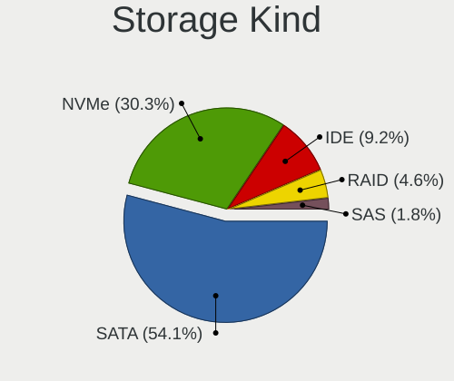

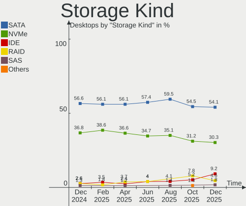

| Kind | Desktops | Percent |
|------|----------|---------|
| SATA | 59       | 54.13%  |
| NVMe | 33       | 30.28%  |
| IDE  | 10       | 9.17%   |
| RAID | 5        | 4.59%   |
| SAS  | 2        | 1.83%   |

Processor
---------

CPU Vendor
----------

Processor vendors

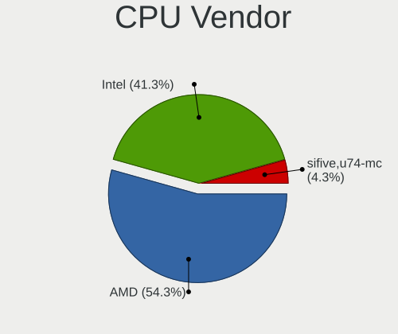

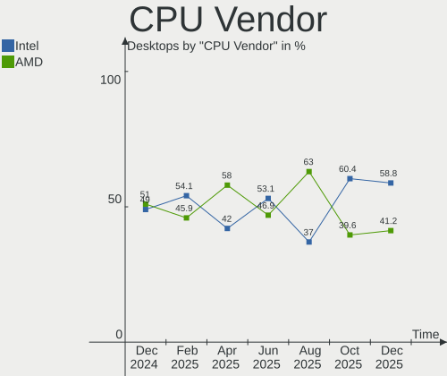

| Vendor | Desktops | Percent |
|--------|----------|---------|
| Intel  | 40       | 58.82%  |
| AMD    | 28       | 41.18%  |

CPU Model
---------

Processor models

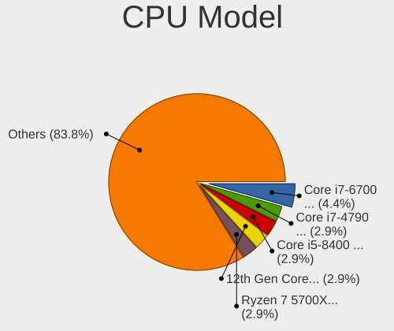

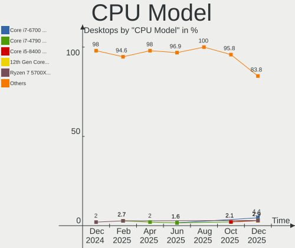

| Model                                   | Desktops | Percent |
|-----------------------------------------|----------|---------|
| Intel Core i7-6700 CPU @ 3.40GHz        | 3        | 4.41%   |
| Intel Core i7-4790 CPU @ 3.60GHz        | 2        | 2.94%   |
| Intel Core i5-8400 CPU @ 2.80GHz        | 2        | 2.94%   |
| Intel 12th Gen Core i5-12600K           | 2        | 2.94%   |
| AMD Ryzen 7 5700X 8-Core Processor      | 2        | 2.94%   |
| Intel Xeon CPU E5-2630 v2 @ 2.60GHz     | 1        | 1.47%   |
| Intel Xeon CPU E5-2620 0 @ 2.00GHz      | 1        | 1.47%   |
| Intel Xeon CPU E5-1607 v2 @ 3.00GHz     | 1        | 1.47%   |
| Intel Xeon CPU E3-1240 V2 @ 3.40GHz     | 1        | 1.47%   |
| Intel N95                               | 1        | 1.47%   |
| Intel Core Ultra 9 285K                 | 1        | 1.47%   |
| Intel Core i9-14900KF                   | 1        | 1.47%   |
| Intel Core i7-9700F CPU @ 3.00GHz       | 1        | 1.47%   |
| Intel Core i7-8700K CPU @ 3.70GHz       | 1        | 1.47%   |
| Intel Core i7-8700 CPU @ 3.20GHz        | 1        | 1.47%   |
| Intel Core i7-7700 CPU @ 3.60GHz        | 1        | 1.47%   |
| Intel Core i7-4790K CPU @ 4.00GHz       | 1        | 1.47%   |
| Intel Core i7-4770 CPU @ 3.40GHz        | 1        | 1.47%   |
| Intel Core i7-14700KF                   | 1        | 1.47%   |
| Intel Core i7-10700K CPU @ 3.80GHz      | 1        | 1.47%   |
| Intel Core i5-9500 CPU @ 3.00GHz        | 1        | 1.47%   |
| Intel Core i5-6400 CPU @ 2.70GHz        | 1        | 1.47%   |
| Intel Core i5-4590S CPU @ 3.00GHz       | 1        | 1.47%   |
| Intel Core i5-4460 CPU @ 3.20GHz        | 1        | 1.47%   |
| Intel Core i5-3470 CPU @ 3.20GHz        | 1        | 1.47%   |
| Intel Core i5-14600K                    | 1        | 1.47%   |
| Intel Core i5 CPU 750 @ 2.67GHz         | 1        | 1.47%   |
| Intel Core i3-7100 CPU @ 3.90GHz        | 1        | 1.47%   |
| Intel Core 2 Quad CPU Q9300 @ 2.50GHz   | 1        | 1.47%   |
| Intel Core 2 Duo CPU T6400 @ 2.00GHz    | 1        | 1.47%   |
| Intel Core 2 Duo CPU E8400 @ 3.00GHz    | 1        | 1.47%   |
| Intel Core 2 Duo CPU E8300 @ 2.83GHz    | 1        | 1.47%   |
| Intel 12th Gen Core i7-12700KF          | 1        | 1.47%   |
| Intel 12th Gen Core i7-12700K           | 1        | 1.47%   |
| Intel 12th Gen Core i5-12400F           | 1        | 1.47%   |
| Intel 11th Gen Core i5-11600K @ 3.90GHz | 1        | 1.47%   |
| AMD Ryzen 9 7950X 16-Core Processor     | 1        | 1.47%   |
| AMD Ryzen 9 7900X 12-Core Processor     | 1        | 1.47%   |
| AMD Ryzen 9 7900 12-Core Processor      | 1        | 1.47%   |
| AMD Ryzen 9 5950X 16-Core Processor     | 1        | 1.47%   |

CPU Model Family
----------------

Processor model prefix

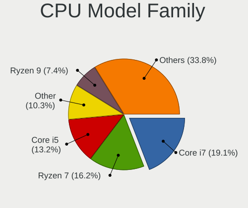

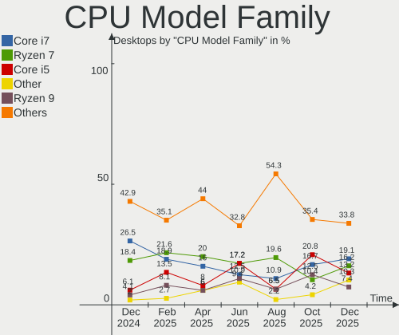

| Model             | Desktops | Percent |
|-------------------|----------|---------|
| Intel Core i7     | 13       | 19.12%  |
| AMD Ryzen 7       | 11       | 16.18%  |
| Intel Core i5     | 9        | 13.24%  |
| Other             | 7        | 10.29%  |
| AMD Ryzen 9       | 5        | 7.35%   |
| Intel Xeon        | 4        | 5.88%   |
| Intel Core 2 Duo  | 3        | 4.41%   |
| AMD Ryzen 5       | 3        | 4.41%   |
| AMD FX            | 2        | 2.94%   |
| AMD A6            | 2        | 2.94%   |
| Intel Core i9     | 1        | 1.47%   |
| Intel Core i3     | 1        | 1.47%   |
| Intel Core 2 Quad | 1        | 1.47%   |
| Intel Core        | 1        | 1.47%   |
| AMD Ryzen 5 PRO   | 1        | 1.47%   |
| AMD Ryzen 3       | 1        | 1.47%   |
| AMD Phenom II X6  | 1        | 1.47%   |
| AMD Athlon II X2  | 1        | 1.47%   |
| AMD Athlon        | 1        | 1.47%   |

CPU Cores
---------

Number of processor cores

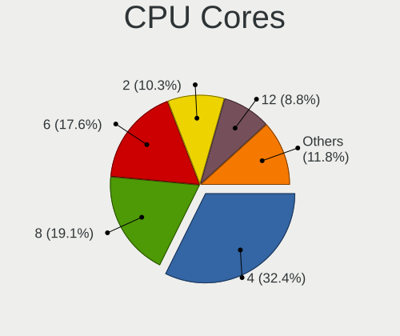

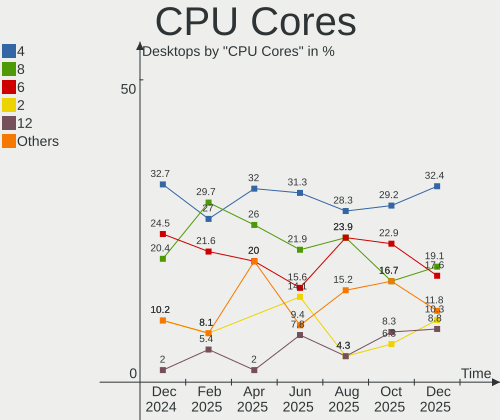

| Number | Desktops | Percent |
|--------|----------|---------|
| 4      | 22       | 32.35%  |
| 8      | 13       | 19.12%  |
| 6      | 12       | 17.65%  |
| 2      | 7        | 10.29%  |
| 12     | 6        | 8.82%   |
| 24     | 2        | 2.94%   |
| 16     | 2        | 2.94%   |
| 10     | 2        | 2.94%   |
| 20     | 1        | 1.47%   |
| 14     | 1        | 1.47%   |

CPU Sockets
-----------

Number of sockets

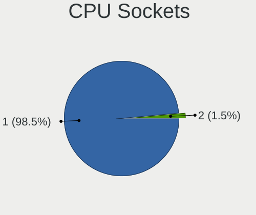

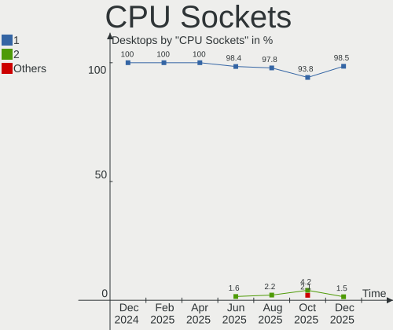

| Number | Desktops | Percent |
|--------|----------|---------|
| 1      | 67       | 98.53%  |
| 2      | 1        | 1.47%   |

CPU Threads
-----------

Threads per core (Hyper-Threading)

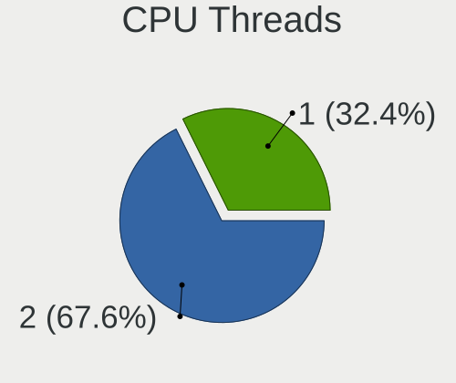

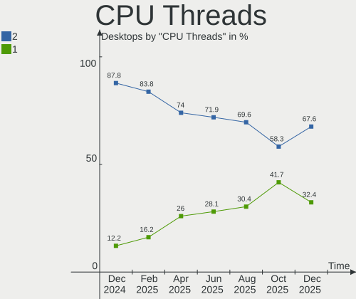

| Number | Desktops | Percent |
|--------|----------|---------|
| 2      | 46       | 67.65%  |
| 1      | 22       | 32.35%  |

CPU Op-Modes
------------

CPU Operation Modes (32-bit, 64-bit)

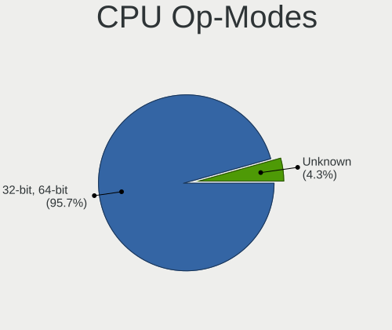

| Op mode        | Desktops | Percent |
|----------------|----------|---------|
| 32-bit, 64-bit | 68       | 100%    |

CPU Microcode
-------------

Microcode number

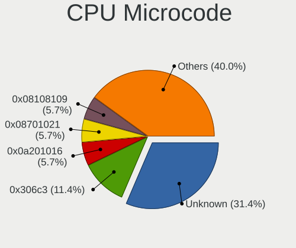

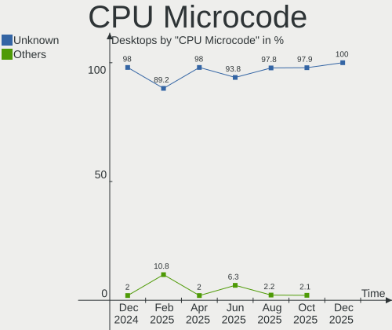

| Number  | Desktops | Percent |
|---------|----------|---------|
| Unknown | 68       | 100%    |

CPU Microarch
-------------

Microarchitecture

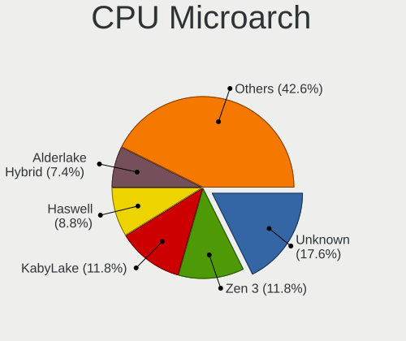

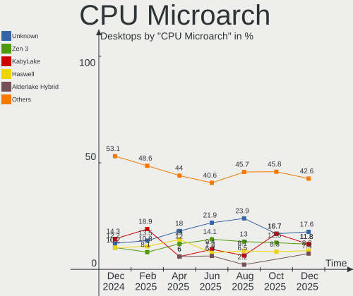

| Name             | Desktops | Percent |
|------------------|----------|---------|
| Unknown          | 12       | 17.65%  |
| Zen 3            | 8        | 11.76%  |
| KabyLake         | 8        | 11.76%  |
| Haswell          | 6        | 8.82%   |
| Alderlake Hybrid | 5        | 7.35%   |
| Skylake          | 4        | 5.88%   |
| Penryn           | 4        | 5.88%   |
| IvyBridge        | 4        | 5.88%   |
| Zen+             | 3        | 4.41%   |
| Piledriver       | 3        | 4.41%   |
| Zen 2            | 2        | 2.94%   |
| Zen              | 2        | 2.94%   |
| K10              | 2        | 2.94%   |
| SandyBridge      | 1        | 1.47%   |
| Nehalem          | 1        | 1.47%   |
| K10 Llano        | 1        | 1.47%   |
| Icelake          | 1        | 1.47%   |
| CometLake        | 1        | 1.47%   |

Graphics
--------

GPU Vendor
----------

Vendors of graphics cards

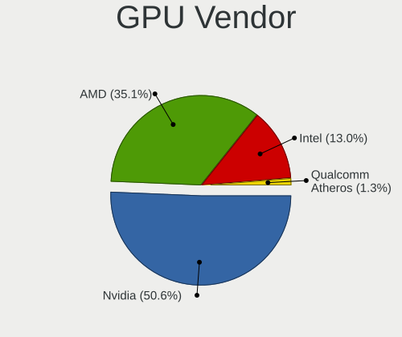

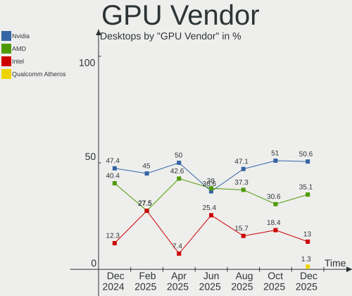

| Vendor           | Desktops | Percent |
|------------------|----------|---------|
| Nvidia           | 39       | 50.65%  |
| AMD              | 27       | 35.06%  |
| Intel            | 10       | 12.99%  |
| Qualcomm Atheros | 1        | 1.3%    |

GPU Model
---------

Graphics card models

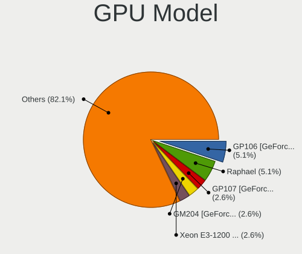

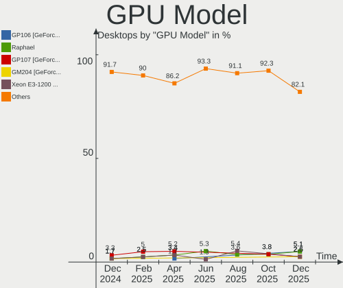

| Model                                                                       | Desktops | Percent |
|-----------------------------------------------------------------------------|----------|---------|
| Nvidia GP106 [GeForce GTX 1060 6GB]                                         | 4        | 5.13%   |
| AMD Raphael                                                                 | 4        | 5.13%   |
| Nvidia GP107 [GeForce GTX 1050 Ti]                                          | 2        | 2.56%   |
| Nvidia GM204 [GeForce GTX 970]                                              | 2        | 2.56%   |
| Intel Xeon E3-1200 v3/4th Gen Core Processor Integrated Graphics Controller | 2        | 2.56%   |
| AMD Raven Ridge [Radeon Vega Series / Radeon Vega Mobile Series]            | 2        | 2.56%   |
| AMD Navi 31 [Radeon RX 7900 XT/7900 XTX/7900 GRE/7900M]                     | 2        | 2.56%   |
| AMD Navi 23 [Radeon RX 6600/6600 XT/6600M]                                  | 2        | 2.56%   |
| AMD Lexa PRO [Radeon 540/540X/550/550X / RX 540X/550/550X]                  | 2        | 2.56%   |
| Qualcomm Atheros Display controller                                         | 1        | 1.28%   |
| Nvidia TU117 [GeForce GTX 1650]                                             | 1        | 1.28%   |
| Nvidia TU116 [GeForce GTX 1660]                                             | 1        | 1.28%   |
| Nvidia TU106 [GeForce RTX 2060 Rev. A]                                      | 1        | 1.28%   |
| Nvidia TU106 [GeForce GTX 1650]                                             | 1        | 1.28%   |
| Nvidia TU104 [GeForce RTX 2080 SUPER]                                       | 1        | 1.28%   |
| Nvidia TU104 [GeForce RTX 2070 SUPER]                                       | 1        | 1.28%   |
| Nvidia GT218 [GeForce 8400 GS Rev. 3]                                       | 1        | 1.28%   |
| Nvidia GT218 [GeForce 210]                                                  | 1        | 1.28%   |
| Nvidia GT200b [GeForce GTX 275]                                             | 1        | 1.28%   |
| Nvidia GP107 [GeForce GTX 1050]                                             | 1        | 1.28%   |
| Nvidia GP104 [GeForce GTX 1070]                                             | 1        | 1.28%   |
| Nvidia GK208B [GeForce GT 720]                                              | 1        | 1.28%   |
| Nvidia GK208B [GeForce GT 710]                                              | 1        | 1.28%   |
| Nvidia GK104 [GeForce GTX 770]                                              | 1        | 1.28%   |
| Nvidia GF119 [GeForce 605]                                                  | 1        | 1.28%   |
| Nvidia GF116 [GeForce GTX 550 Ti]                                           | 1        | 1.28%   |
| Nvidia GF100GL [Quadro 4000]                                                | 1        | 1.28%   |
| Nvidia GB205 [GeForce RTX 5070]                                             | 1        | 1.28%   |
| Nvidia GB203 [GeForce RTX 5080]                                             | 1        | 1.28%   |
| Nvidia GB203 [GeForce RTX 5070 Ti]                                          | 1        | 1.28%   |
| Nvidia GA107 [GeForce RTX 3050 8GB]                                         | 1        | 1.28%   |
| Nvidia GA106 [GeForce RTX 3060]                                             | 1        | 1.28%   |
| Nvidia GA106 [GeForce RTX 3060 Lite Hash Rate]                              | 1        | 1.28%   |
| Nvidia GA104 [GeForce RTX 3070]                                             | 1        | 1.28%   |
| Nvidia GA102 [GeForce RTX 3080 Lite Hash Rate]                              | 1        | 1.28%   |
| Nvidia GA102 [GeForce RTX 3080 12GB]                                        | 1        | 1.28%   |
| Nvidia AD107 [GeForce RTX 4060]                                             | 1        | 1.28%   |
| Nvidia AD106 [GeForce RTX 4060 Ti]                                          | 1        | 1.28%   |
| Nvidia AD106 [GeForce RTX 4060 Ti 16GB]                                     | 1        | 1.28%   |
| Nvidia AD104 [GeForce RTX 4070 Ti]                                          | 1        | 1.28%   |

GPU Combo
---------

Combinations of graphics cards

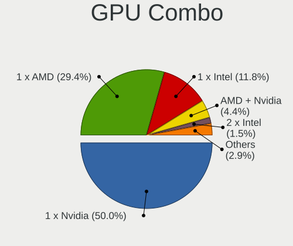

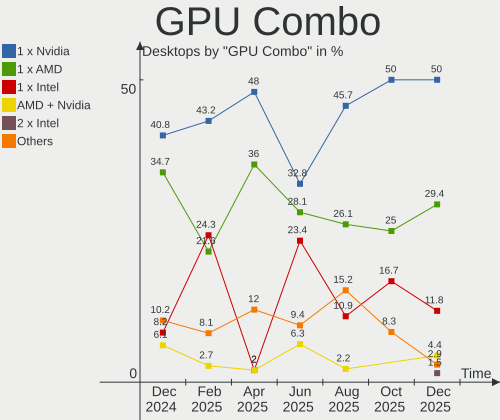

| Name         | Desktops | Percent |
|--------------|----------|---------|
| 1 x Nvidia   | 34       | 50%     |
| 1 x AMD      | 20       | 29.41%  |
| 1 x Intel    | 8        | 11.76%  |
| AMD + Nvidia | 3        | 4.41%   |
| 2 x Intel    | 1        | 1.47%   |
| 2 x AMD      | 1        | 1.47%   |
| Intel + AMD  | 1        | 1.47%   |

GPU Driver
----------

Free vs proprietary

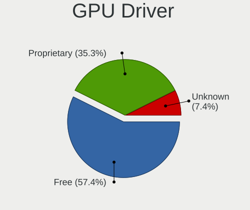

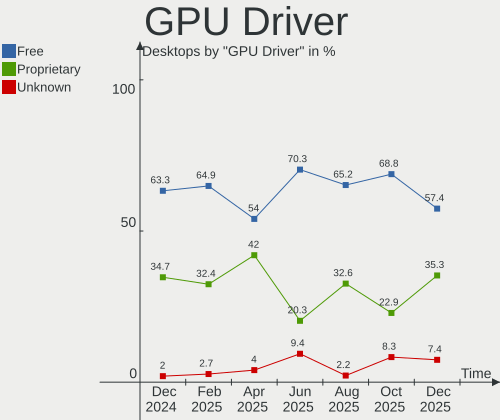

| Driver      | Desktops | Percent |
|-------------|----------|---------|
| Free        | 39       | 57.35%  |
| Proprietary | 24       | 35.29%  |
| Unknown     | 5        | 7.35%   |

GPU Memory
----------

Total video memory

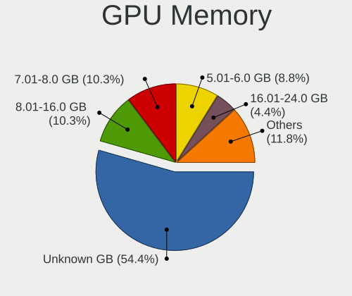

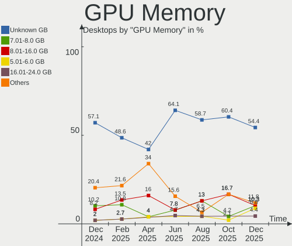

| Size in GB | Desktops | Percent |
|------------|----------|---------|
| Unknown    | 37       | 54.41%  |
| 7.01-8.0   | 7        | 10.29%  |
| 8.01-16.0  | 7        | 10.29%  |
| 5.01-6.0   | 6        | 8.82%   |
| 16.01-24.0 | 3        | 4.41%   |
| 0.51-1.0   | 3        | 4.41%   |
| 3.01-4.0   | 2        | 2.94%   |
| 1.01-2.0   | 2        | 2.94%   |
| 0.01-0.5   | 1        | 1.47%   |

Monitor
-------

Monitor Vendor
--------------

Monitor vendors

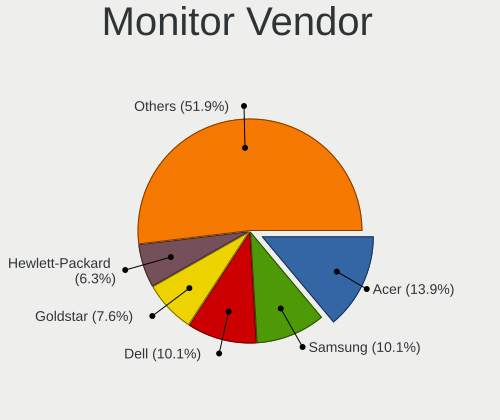

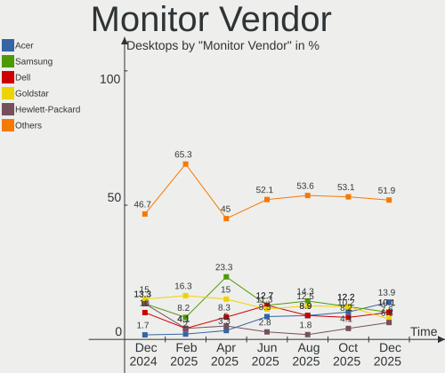

| Vendor               | Desktops | Percent |
|----------------------|----------|---------|
| Acer                 | 11       | 13.92%  |
| Samsung Electronics  | 8        | 10.13%  |
| Dell                 | 8        | 10.13%  |
| Goldstar             | 6        | 7.59%   |
| Hewlett-Packard      | 5        | 6.33%   |
| AOC                  | 5        | 6.33%   |
| BenQ                 | 4        | 5.06%   |
| Ancor Communications | 4        | 5.06%   |
| ViewSonic            | 2        | 2.53%   |
| Sceptre Tech         | 2        | 2.53%   |
| Philips              | 2        | 2.53%   |
| Mi                   | 2        | 2.53%   |
| Lenovo               | 2        | 2.53%   |
| Iiyama               | 2        | 2.53%   |
| ASUSTek Computer     | 2        | 2.53%   |
| Wacom                | 1        | 1.27%   |
| Valve                | 1        | 1.27%   |
| Unknown              | 1        | 1.27%   |
| SKG                  | 1        | 1.27%   |
| RTK                  | 1        | 1.27%   |
| Philco               | 1        | 1.27%   |
| Kogan                | 1        | 1.27%   |
| IDV                  | 1        | 1.27%   |
| HXM                  | 1        | 1.27%   |
| Gigabyte Technology  | 1        | 1.27%   |
| Fujitsu Siemens      | 1        | 1.27%   |
| CHD                  | 1        | 1.27%   |
| AUS                  | 1        | 1.27%   |
| Apple                | 1        | 1.27%   |

Monitor Model
-------------

Monitor models

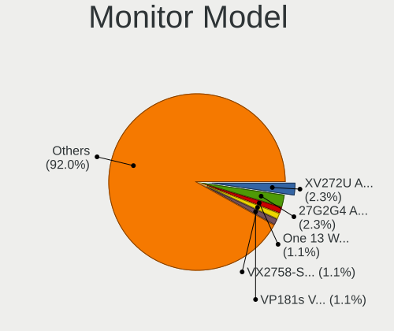

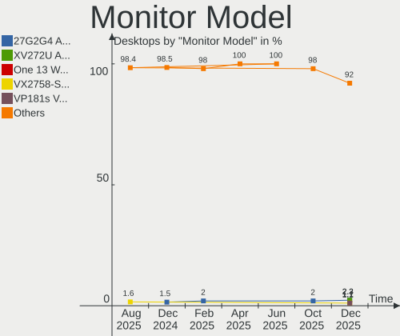

| Model                                                                    | Desktops | Percent |
|--------------------------------------------------------------------------|----------|---------|
| AOC 27G2G4 AOC2702 1920x1080 598x336mm 27.0-inch                         | 2        | 2.3%    |
| Acer XV272U ACR06C1 2560x1440 597x336mm 27.0-inch                        | 2        | 2.3%    |
| Wacom One 13 WAC1070 1920x1080 294x166mm 13.3-inch                       | 1        | 1.15%   |
| ViewSonic VX2758-SERIES VSCA738 2560x1440 598x336mm 27.0-inch            | 1        | 1.15%   |
| ViewSonic VP181s VSCB816 1280x1024 359x287mm 18.1-inch                   | 1        | 1.15%   |
| Valve Index HMD VLV91A8                                                  | 1        | 1.15%   |
| Unknown LCD Monitor FFFF 2288x1287 2550x2550mm 142.0-inch                | 1        | 1.15%   |
| SKG Q3212RUC SKG3212 2560x1440 530x280mm 23.6-inch                       | 1        | 1.15%   |
| Sceptre Tech Sceptre P30 SPT0BCC 2560x1080 690x291mm 29.5-inch           | 1        | 1.15%   |
| Sceptre Tech Sceptre F27 SPT0AD7 1920x1080 600x330mm 27.0-inch           | 1        | 1.15%   |
| Samsung Electronics U32J59x SAM0F35 3840x2160 697x392mm 31.5-inch        | 1        | 1.15%   |
| Samsung Electronics S24F350 SAM0D20 1920x1080 521x293mm 23.5-inch        | 1        | 1.15%   |
| Samsung Electronics S23C350 SAM0A36 1920x1080 510x287mm 23.0-inch        | 1        | 1.15%   |
| Samsung Electronics S22F350 SAM0D1A 1920x1080 477x268mm 21.5-inch        | 1        | 1.15%   |
| Samsung Electronics Odyssey G93SC SAM7454 3840x1080 1193x336mm 48.8-inch | 1        | 1.15%   |
| Samsung Electronics LCD Monitor SAM0F14 1920x540                         | 1        | 1.15%   |
| Samsung Electronics LCD Monitor SAM0659 1920x1080                        | 1        | 1.15%   |
| Samsung Electronics C49RG9x SAM0F9C 3360x1440 1193x336mm 48.8-inch       | 1        | 1.15%   |
| Samsung Electronics C49J89x SAM0F21 3840x1080 1196x336mm 48.9-inch       | 1        | 1.15%   |
| Samsung Electronics C27JG5x SAM0FDD 2560x1440 597x336mm 27.0-inch        | 1        | 1.15%   |
| RTK Verbatim MT14 RTK0012 1920x1080                                      | 1        | 1.15%   |
| Philips PHL 243V7 PHLC155 1920x1080 527x296mm 23.8-inch                  | 1        | 1.15%   |
| Philips 247EL PHLC084 1920x1080 521x293mm 23.5-inch                      | 1        | 1.15%   |
| Philco PHILCO GDH0030 1440x900 708x398mm 32.0-inch                       | 1        | 1.15%   |
| Mi Monitor XMI3447 3440x1440 797x334mm 34.0-inch                         | 1        | 1.15%   |
| Mi 30 HFCW XMIA014 2560x1080 690x291mm 29.5-inch                         | 1        | 1.15%   |
| Lenovo R27qe LEN67C5 2560x1440 600x340mm 27.2-inch                       | 1        | 1.15%   |
| Lenovo LEN L24q-30 LEN65FB 2560x1440 527x296mm 23.8-inch                 | 1        | 1.15%   |
| Lenovo L24q-35 LEN66D1 2560x1440 527x296mm 23.8-inch                     | 1        | 1.15%   |
| Kogan KAMN24FXCLB KGNFFFF 1920x1080 521x293mm 23.5-inch                  | 1        | 1.15%   |
| Iiyama PLE2483H-DP IVM611E 1920x1080 531x299mm 24.0-inch                 | 1        | 1.15%   |
| Iiyama PL2780H IVM6609 1920x1080 598x336mm 27.0-inch                     | 1        | 1.15%   |
| Iiyama PL2475HD IVM6108 1920x1080 521x293mm 23.5-inch                    | 1        | 1.15%   |
| IDV AOC28E850.HDR IDVED11 2560x1440 480x270mm 21.7-inch                  | 1        | 1.15%   |
| HXM BM27SY HXM2700 1920x1080 409x230mm 18.5-inch                         | 1        | 1.15%   |
| Hewlett-Packard Z24n G2 HPN3486 1920x1200 518x324mm 24.1-inch            | 1        | 1.15%   |
| Hewlett-Packard Z24n G2 HPN3485 1920x1200 518x324mm 24.1-inch            | 1        | 1.15%   |
| Hewlett-Packard V27i HPN36AF 1920x1080 598x336mm 27.0-inch               | 1        | 1.15%   |
| Hewlett-Packard OMEN 32q HPN394E 2560x1440 697x393mm 31.5-inch           | 1        | 1.15%   |
| Hewlett-Packard E221 HWP3062 1920x1080 496x292mm 22.7-inch               | 1        | 1.15%   |

Monitor Resolution
------------------

Monitor screen resolution

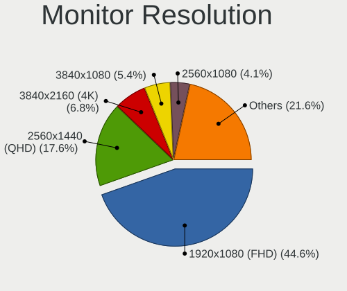

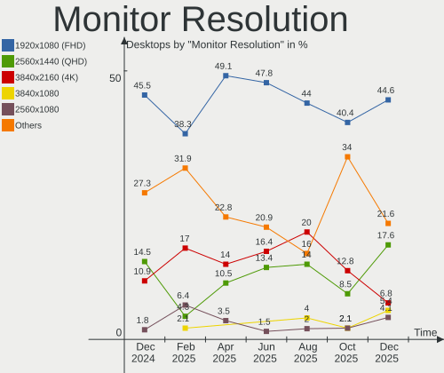

| Resolution         | Desktops | Percent |
|--------------------|----------|---------|
| 1920x1080 (FHD)    | 33       | 44.59%  |
| 2560x1440 (QHD)    | 13       | 17.57%  |
| 3840x2160 (4K)     | 5        | 6.76%   |
| 3840x1080          | 4        | 5.41%   |
| 2560x1080          | 3        | 4.05%   |
| 1920x1200 (WUXGA)  | 3        | 4.05%   |
| 3440x1440          | 2        | 2.7%    |
| 1680x1050 (WSXGA+) | 2        | 2.7%    |
| 1280x1024 (SXGA)   | 2        | 2.7%    |
| Unknown            | 2        | 2.7%    |
| 5760x1080          | 1        | 1.35%   |
| 2288x1287          | 1        | 1.35%   |
| 1920x540           | 1        | 1.35%   |
| 1600x900 (HD+)     | 1        | 1.35%   |
| 1366x768 (WXGA)    | 1        | 1.35%   |

Monitor Diagonal
----------------

Diagonal size in inches

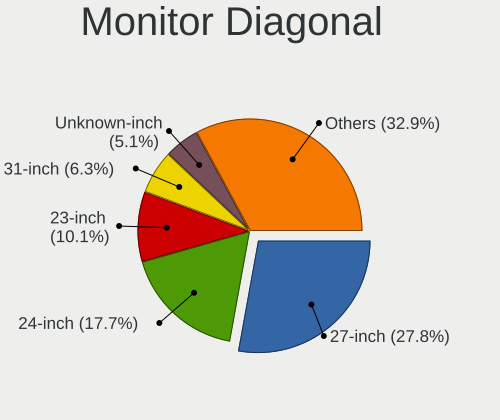

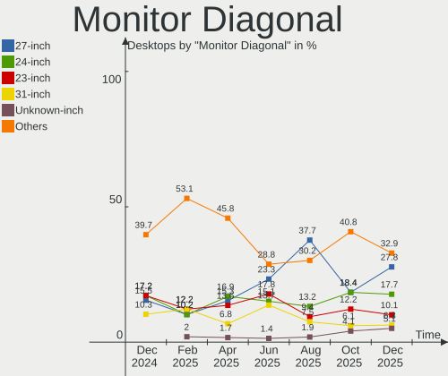

| Inches  | Desktops | Percent |
|---------|----------|---------|
| 27      | 22       | 27.85%  |
| 24      | 14       | 17.72%  |
| 23      | 8        | 10.13%  |
| 31      | 5        | 6.33%   |
| Unknown | 4        | 5.06%   |
| 34      | 3        | 3.8%    |
| 22      | 3        | 3.8%    |
| 21      | 3        | 3.8%    |
| 18      | 3        | 3.8%    |
| 48      | 2        | 2.53%   |
| 29      | 2        | 2.53%   |
| 142     | 1        | 1.27%   |
| 84      | 1        | 1.27%   |
| 63      | 1        | 1.27%   |
| 49      | 1        | 1.27%   |
| 32      | 1        | 1.27%   |
| 26      | 1        | 1.27%   |
| 20      | 1        | 1.27%   |
| 17      | 1        | 1.27%   |
| 15      | 1        | 1.27%   |
| 13      | 1        | 1.27%   |

Monitor Width
-------------

Physical width

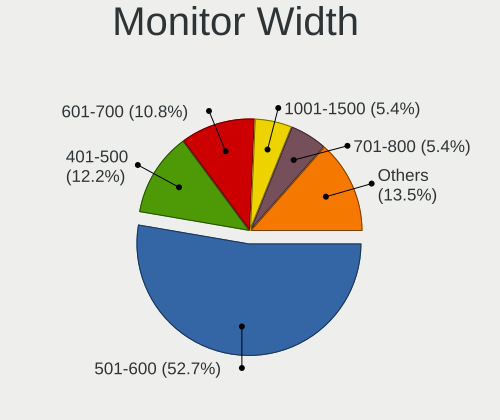

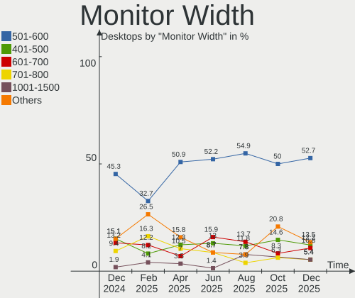

| Width in mm    | Desktops | Percent |
|----------------|----------|---------|
| 501-600        | 39       | 52.7%   |
| 401-500        | 9        | 12.16%  |
| 601-700        | 8        | 10.81%  |
| 701-800        | 4        | 5.41%   |
| 1001-1500      | 4        | 5.41%   |
| Unknown        | 4        | 5.41%   |
| 301-350        | 2        | 2.7%    |
| More than 2000 | 1        | 1.35%   |
| 351-400        | 1        | 1.35%   |
| 201-300        | 1        | 1.35%   |
| 1501-2000      | 1        | 1.35%   |

Aspect Ratio
------------

Proportional relationship between the width and the height

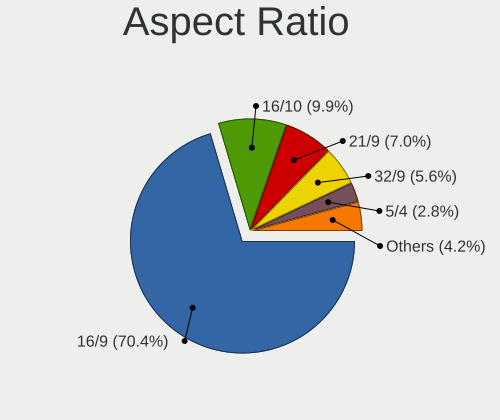

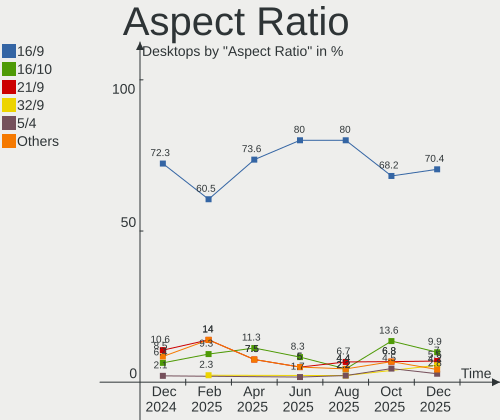

| Ratio   | Desktops | Percent |
|---------|----------|---------|
| 16/9    | 50       | 70.42%  |
| 16/10   | 7        | 9.86%   |
| 21/9    | 5        | 7.04%   |
| 32/9    | 4        | 5.63%   |
| 5/4     | 2        | 2.82%   |
| Unknown | 2        | 2.82%   |
| 1.00    | 1        | 1.41%   |

Monitor Area
------------

Area in inch²

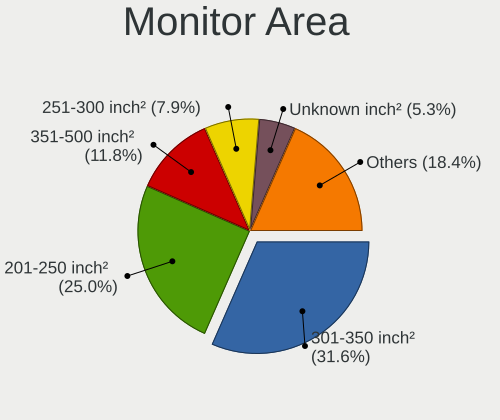

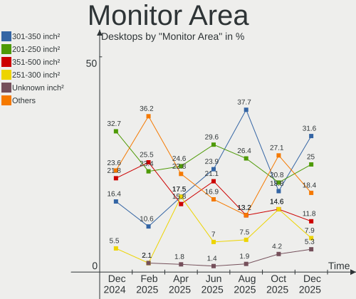

| Area in inch² | Desktops | Percent |
|----------------|----------|---------|
| 301-350        | 24       | 31.58%  |
| 201-250        | 19       | 25%     |
| 351-500        | 9        | 11.84%  |
| 251-300        | 6        | 7.89%   |
| Unknown        | 4        | 5.26%   |
| More than 1000 | 3        | 3.95%   |
| 151-200        | 3        | 3.95%   |
| 141-150        | 3        | 3.95%   |
| 501-1000       | 3        | 3.95%   |
| 71-80          | 1        | 1.32%   |
| 101-110        | 1        | 1.32%   |

Pixel Density
-------------

Pixels per inch

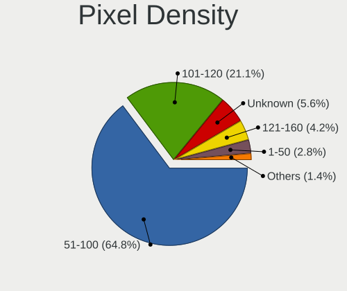

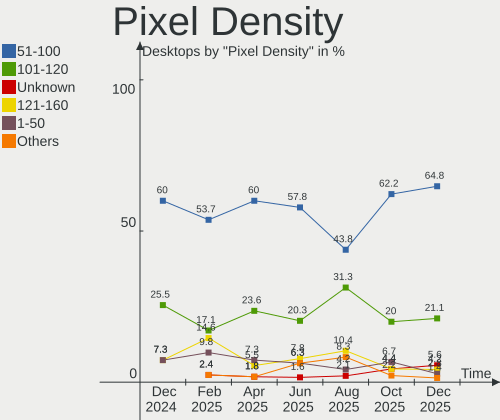

| Density | Desktops | Percent |
|---------|----------|---------|
| 51-100  | 46       | 64.79%  |
| 101-120 | 15       | 21.13%  |
| Unknown | 4        | 5.63%   |
| 121-160 | 3        | 4.23%   |
| 1-50    | 2        | 2.82%   |
| 161-240 | 1        | 1.41%   |

Multiple Monitors
-----------------

Total monitors connected

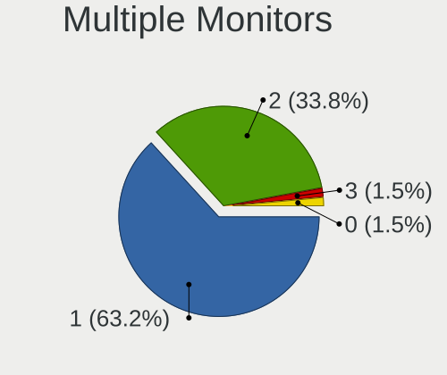

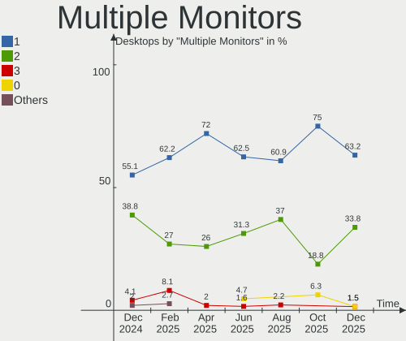

| Total | Desktops | Percent |
|-------|----------|---------|
| 1     | 43       | 63.24%  |
| 2     | 23       | 33.82%  |
| 3     | 1        | 1.47%   |
| 0     | 1        | 1.47%   |

Network
-------

Net Controller Vendor
---------------------

Controller vendors

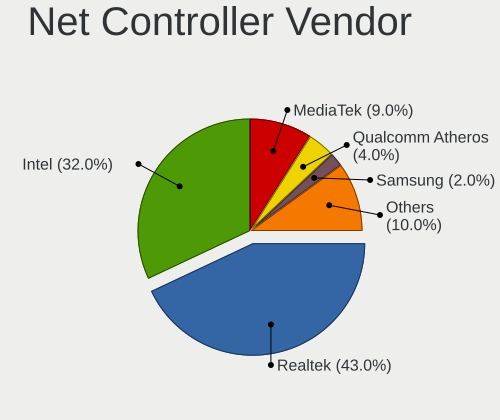

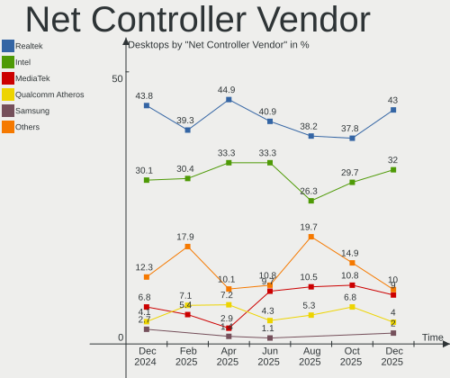

| Vendor                | Desktops | Percent |
|-----------------------|----------|---------|
| Realtek Semiconductor | 43       | 43%     |
| Intel                 | 32       | 32%     |
| MediaTek              | 9        | 9%      |
| Qualcomm Atheros      | 4        | 4%      |
| Samsung Electronics   | 2        | 2%      |
| Ralink                | 2        | 2%      |
| ZyXEL Communications  | 1        | 1%      |
| Ralink Technology     | 1        | 1%      |
| Qualcomm Technologies | 1        | 1%      |
| DisplayLink           | 1        | 1%      |
| Broadcom              | 1        | 1%      |
| ASUSTek Computer      | 1        | 1%      |
| ASIX Electronics      | 1        | 1%      |
| Aquantia              | 1        | 1%      |

Net Controller Model
--------------------

Controller models

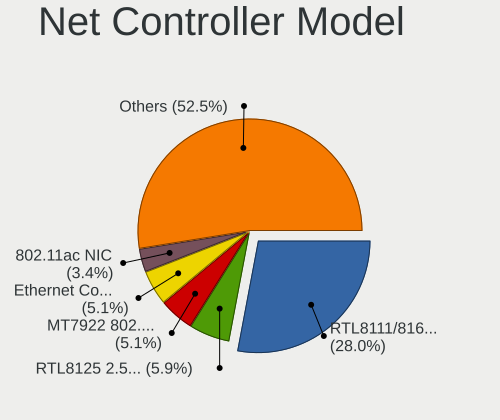

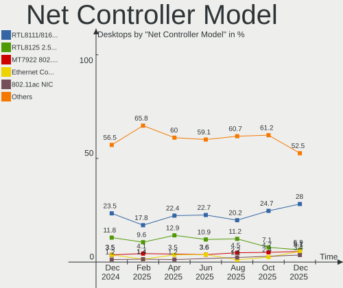

| Model                                                                           | Desktops | Percent |
|---------------------------------------------------------------------------------|----------|---------|
| Realtek RTL8111/8168/8211/8411 PCI Express Gigabit Ethernet Controller          | 33       | 27.97%  |
| Realtek RTL8125 2.5GbE Controller                                               | 7        | 5.93%   |
| MediaTek MT7922 802.11ax PCI Express Wireless Network Adapter                   | 6        | 5.08%   |
| Intel Ethernet Controller I225-V                                                | 6        | 5.08%   |
| Realtek 802.11ac NIC                                                            | 4        | 3.39%   |
| Intel Wi-Fi 6E(802.11ax) AX210/AX1675* 2x2 [Typhoon Peak]                       | 4        | 3.39%   |
| Intel Ethernet Controller I226-V                                                | 4        | 3.39%   |
| Intel I211 Gigabit Network Connection                                           | 3        | 2.54%   |
| Intel 82579LM Gigabit Network Connection (Lewisville)                           | 3        | 2.54%   |
| Ralink RT2790 Wireless 802.11n 1T/2R PCIe                                       | 2        | 1.69%   |
| Intel Wireless 7265                                                             | 2        | 1.69%   |
| Intel Wi-Fi 6 AX200                                                             | 2        | 1.69%   |
| Intel Wi-Fi 5(802.11ac) Wireless-AC 9x6x [Thunder Peak]                         | 2        | 1.69%   |
| Intel Ethernet Connection (2) I219-V                                            | 2        | 1.69%   |
| Intel Dual Band Wireless-AC 3168NGW [Stone Peak]                                | 2        | 1.69%   |
| Intel Alder Lake-S PCH CNVi WiFi                                                | 2        | 1.69%   |
| ZyXEL NWD6505 802.11a/b/g/n/ac Wireless Adapter [MediaTek MT7610U]              | 1        | 0.85%   |
| Samsung GT-I9070 (network tethering, USB debugging enabled)                     | 1        | 0.85%   |
| Samsung Galaxy series, misc. (tethering mode)                                   | 1        | 0.85%   |
| Realtek RTL8852CE PCIe 802.11ax Wireless Network Controller                     | 1        | 0.85%   |
| Realtek RTL8852BE PCIe 802.11ax Wireless Network Controller                     | 1        | 0.85%   |
| Realtek RTL8821CE 802.11ac PCIe Wireless Network Adapter                        | 1        | 0.85%   |
| Realtek RTL8821AE 802.11ac PCIe Wireless Network Adapter                        | 1        | 0.85%   |
| Realtek RTL8192EE PCIe Wireless Network Adapter                                 | 1        | 0.85%   |
| Realtek RTL8192CE PCIe Wireless Network Adapter                                 | 1        | 0.85%   |
| Realtek RTL8188GU 802.11n WLAN Adapter (After Modeswitch)                       | 1        | 0.85%   |
| Realtek RTL8188EUS 802.11n Wireless Network Adapter                             | 1        | 0.85%   |
| Realtek RTL8188CUS 802.11n WLAN Adapter                                         | 1        | 0.85%   |
| Ralink RT2870/RT3070 Wireless Adapter                                           | 1        | 0.85%   |
| Qualcomm WCN785x Wi-Fi 7(802.11be) 320MHz 2x2 [FastConnect 7800]                | 1        | 0.85%   |
| Qualcomm Atheros Killer E2500 Gigabit Ethernet Controller                       | 1        | 0.85%   |
| Qualcomm Atheros AR8151 v2.0 Gigabit Ethernet                                   | 1        | 0.85%   |
| Qualcomm Atheros AR8121/AR8113/AR8114 Gigabit or Fast Ethernet                  | 1        | 0.85%   |
| Qualcomm Atheros 11n AR9160 Anwi Diagnostic Kernel Device                       | 1        | 0.85%   |
| MediaTek Network controller                                                     | 1        | 0.85%   |
| MediaTek MT7925 802.11be 160MHz 2x2 PCIe Wireless Network Adapter [Filogic 360] | 1        | 0.85%   |
| MediaTek MT7902 802.11ax PCIe Wireless Network Adapter [Filogic 310]            | 1        | 0.85%   |
| Intel Ethernet Controller 10-Gigabit X540-AT2                                   | 1        | 0.85%   |
| Intel Ethernet Connection I217-V                                                | 1        | 0.85%   |
| Intel Ethernet Connection (7) I219-LM                                           | 1        | 0.85%   |

Wireless Vendor
---------------

Wireless vendors

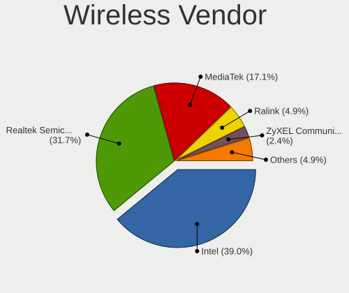

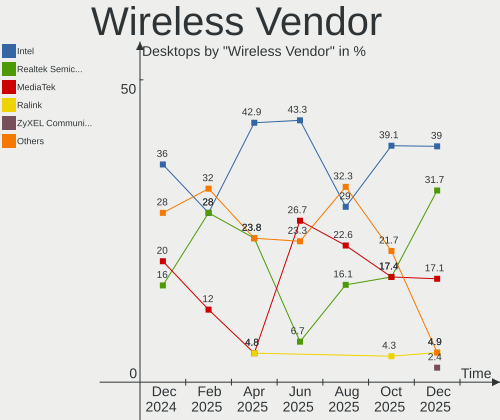

| Vendor                | Desktops | Percent |
|-----------------------|----------|---------|
| Intel                 | 16       | 39.02%  |
| Realtek Semiconductor | 13       | 31.71%  |
| MediaTek              | 7        | 17.07%  |
| Ralink                | 2        | 4.88%   |
| ZyXEL Communications  | 1        | 2.44%   |
| Ralink Technology     | 1        | 2.44%   |
| ASUSTek Computer      | 1        | 2.44%   |

Wireless Model
--------------

Wireless models

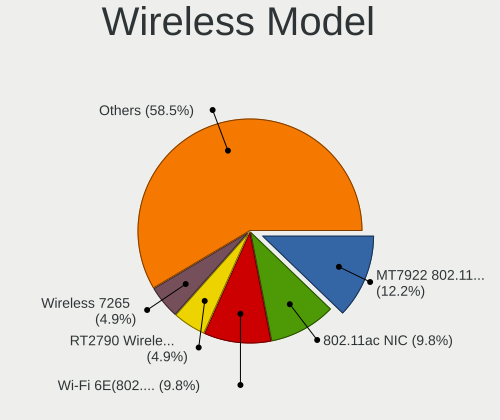

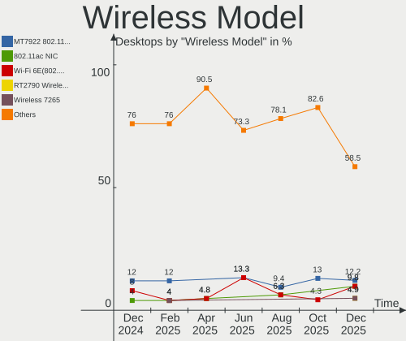

| Model                                                                           | Desktops | Percent |
|---------------------------------------------------------------------------------|----------|---------|
| MediaTek MT7922 802.11ax PCI Express Wireless Network Adapter                   | 5        | 12.2%   |
| Realtek 802.11ac NIC                                                            | 4        | 9.76%   |
| Intel Wi-Fi 6E(802.11ax) AX210/AX1675* 2x2 [Typhoon Peak]                       | 4        | 9.76%   |
| Ralink RT2790 Wireless 802.11n 1T/2R PCIe                                       | 2        | 4.88%   |
| Intel Wireless 7265                                                             | 2        | 4.88%   |
| Intel Wi-Fi 6 AX200                                                             | 2        | 4.88%   |
| Intel Wi-Fi 5(802.11ac) Wireless-AC 9x6x [Thunder Peak]                         | 2        | 4.88%   |
| Intel Dual Band Wireless-AC 3168NGW [Stone Peak]                                | 2        | 4.88%   |
| Intel Alder Lake-S PCH CNVi WiFi                                                | 2        | 4.88%   |
| ZyXEL NWD6505 802.11a/b/g/n/ac Wireless Adapter [MediaTek MT7610U]              | 1        | 2.44%   |
| Realtek RTL8852CE PCIe 802.11ax Wireless Network Controller                     | 1        | 2.44%   |
| Realtek RTL8852BE PCIe 802.11ax Wireless Network Controller                     | 1        | 2.44%   |
| Realtek RTL8821CE 802.11ac PCIe Wireless Network Adapter                        | 1        | 2.44%   |
| Realtek RTL8821AE 802.11ac PCIe Wireless Network Adapter                        | 1        | 2.44%   |
| Realtek RTL8192EE PCIe Wireless Network Adapter                                 | 1        | 2.44%   |
| Realtek RTL8192CE PCIe Wireless Network Adapter                                 | 1        | 2.44%   |
| Realtek RTL8188GU 802.11n WLAN Adapter (After Modeswitch)                       | 1        | 2.44%   |
| Realtek RTL8188EUS 802.11n Wireless Network Adapter                             | 1        | 2.44%   |
| Realtek RTL8188CUS 802.11n WLAN Adapter                                         | 1        | 2.44%   |
| Ralink RT2870/RT3070 Wireless Adapter                                           | 1        | 2.44%   |
| MediaTek MT7925 802.11be 160MHz 2x2 PCIe Wireless Network Adapter [Filogic 360] | 1        | 2.44%   |
| MediaTek MT7902 802.11ax PCIe Wireless Network Adapter [Filogic 310]            | 1        | 2.44%   |
| Intel Comet Lake PCH CNVi WiFi                                                  | 1        | 2.44%   |
| Intel 700 Series Chipset CNVi WiFi                                              | 1        | 2.44%   |
| ASUS 802.11ac WLAN Adapter                                                      | 1        | 2.44%   |

Ethernet Vendor
---------------

Ethernet vendors

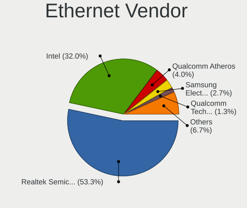

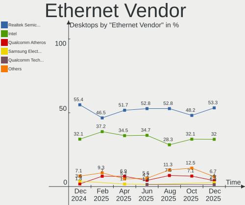

| Vendor                | Desktops | Percent |
|-----------------------|----------|---------|
| Realtek Semiconductor | 40       | 53.33%  |
| Intel                 | 24       | 32%     |
| Qualcomm Atheros      | 3        | 4%      |
| Samsung Electronics   | 2        | 2.67%   |
| Qualcomm Technologies | 1        | 1.33%   |
| MediaTek              | 1        | 1.33%   |
| DisplayLink           | 1        | 1.33%   |
| Broadcom              | 1        | 1.33%   |
| ASIX Electronics      | 1        | 1.33%   |
| Aquantia              | 1        | 1.33%   |

Ethernet Model
--------------

Ethernet models

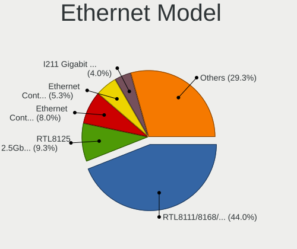

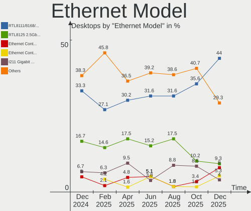

| Model                                                                         | Desktops | Percent |
|-------------------------------------------------------------------------------|----------|---------|
| Realtek RTL8111/8168/8211/8411 PCI Express Gigabit Ethernet Controller        | 33       | 44%     |
| Realtek RTL8125 2.5GbE Controller                                             | 7        | 9.33%   |
| Intel Ethernet Controller I225-V                                              | 6        | 8%      |
| Intel Ethernet Controller I226-V                                              | 4        | 5.33%   |
| Intel I211 Gigabit Network Connection                                         | 3        | 4%      |
| Intel 82579LM Gigabit Network Connection (Lewisville)                         | 3        | 4%      |
| Intel Ethernet Connection (2) I219-V                                          | 2        | 2.67%   |
| Samsung GT-I9070 (network tethering, USB debugging enabled)                   | 1        | 1.33%   |
| Samsung Galaxy series, misc. (tethering mode)                                 | 1        | 1.33%   |
| Qualcomm WCN785x Wi-Fi 7(802.11be) 320MHz 2x2 [FastConnect 7800]              | 1        | 1.33%   |
| Qualcomm Atheros Killer E2500 Gigabit Ethernet Controller                     | 1        | 1.33%   |
| Qualcomm Atheros AR8151 v2.0 Gigabit Ethernet                                 | 1        | 1.33%   |
| Qualcomm Atheros AR8121/AR8113/AR8114 Gigabit or Fast Ethernet                | 1        | 1.33%   |
| MediaTek MT7922 802.11ax PCI Express Wireless Network Adapter                 | 1        | 1.33%   |
| Intel Ethernet Controller 10-Gigabit X540-AT2                                 | 1        | 1.33%   |
| Intel Ethernet Connection I217-V                                              | 1        | 1.33%   |
| Intel Ethernet Connection (7) I219-LM                                         | 1        | 1.33%   |
| Intel Ethernet Connection (2) I218-V                                          | 1        | 1.33%   |
| Intel 82574L Gigabit Network Connection                                       | 1        | 1.33%   |
| Intel 82566DM-2 Gigabit Network Connection                                    | 1        | 1.33%   |
| DisplayLink Kensington SD3600 Dual Video Dock                                 | 1        | 1.33%   |
| Broadcom NetLink BCM57781 Gigabit Ethernet PCIe                               | 1        | 1.33%   |
| ASIX AX88179 Gigabit Ethernet                                                 | 1        | 1.33%   |
| Aquantia AQtion AQC113 NBase-T/IEEE 802.3an Ethernet Controller [Antigua 10G] | 1        | 1.33%   |

Net Controller Kind
-------------------

Ethernet, WiFi or modem

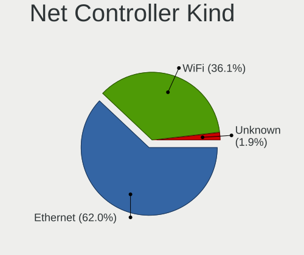

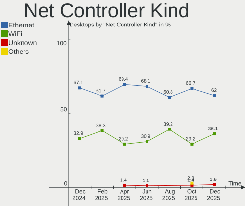

| Kind     | Desktops | Percent |
|----------|----------|---------|
| Ethernet | 67       | 62.04%  |
| WiFi     | 39       | 36.11%  |
| Unknown  | 2        | 1.85%   |

Used Controller
---------------

Currently used network controller

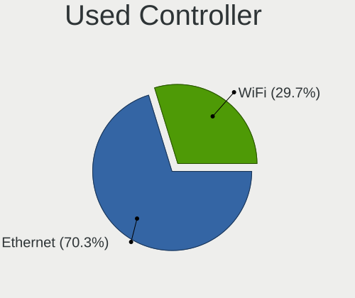

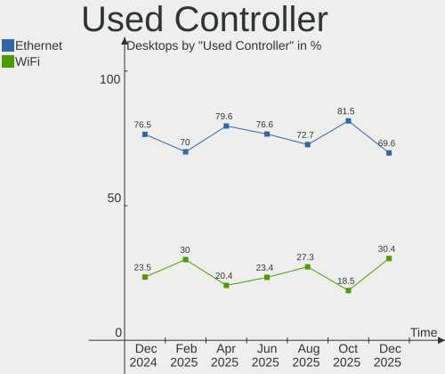

| Kind     | Desktops | Percent |
|----------|----------|---------|
| Ethernet | 48       | 69.57%  |
| WiFi     | 21       | 30.43%  |

NICs
----

Total network controllers on board

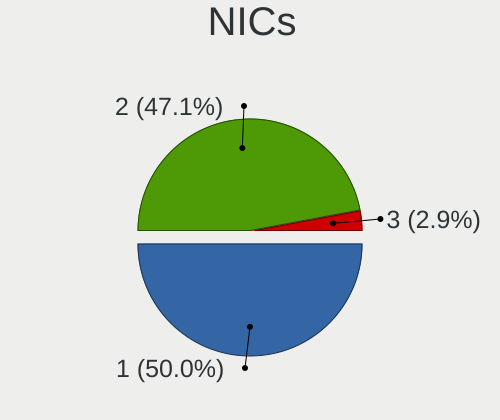

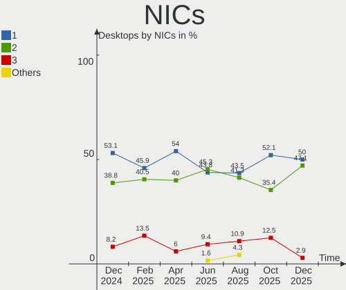

| Total | Desktops | Percent |
|-------|----------|---------|
| 1     | 34       | 50%     |
| 2     | 32       | 47.06%  |
| 3     | 2        | 2.94%   |

IPv6
----

IPv6 vs IPv4

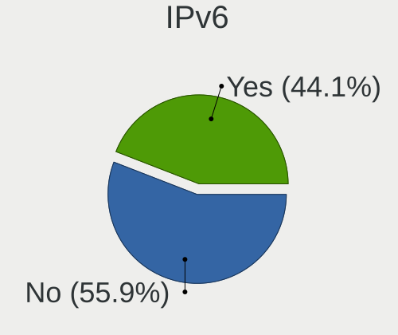

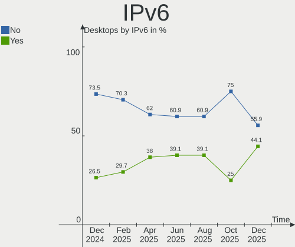

| Used | Desktops | Percent |
|------|----------|---------|
| No   | 38       | 55.88%  |
| Yes  | 30       | 44.12%  |

Bluetooth
---------

Bluetooth Vendor
----------------

Controller vendors

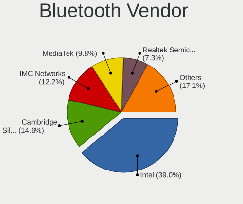

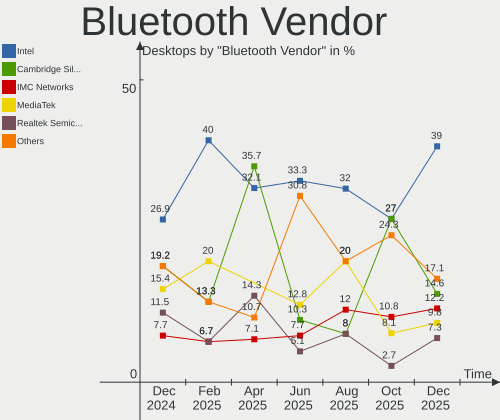

| Vendor                  | Desktops | Percent |
|-------------------------|----------|---------|
| Intel                   | 16       | 39.02%  |
| Cambridge Silicon Radio | 6        | 14.63%  |
| IMC Networks            | 5        | 12.2%   |
| MediaTek                | 4        | 9.76%   |
| Realtek Semiconductor   | 3        | 7.32%   |
| Foxconn / Hon Hai       | 3        | 7.32%   |
| Hewlett-Packard         | 1        | 2.44%   |
| Broadcom                | 1        | 2.44%   |
| ASUSTek Computer        | 1        | 2.44%   |
| Unknown                 | 1        | 2.44%   |

Bluetooth Model
---------------

Controller models

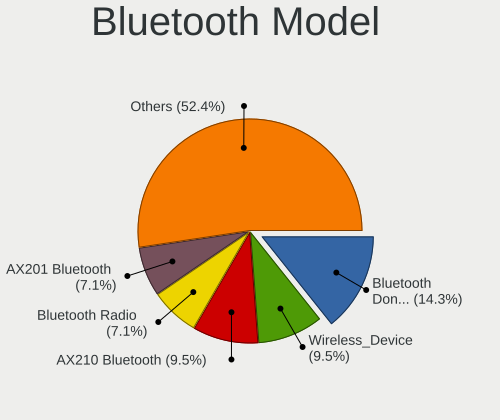

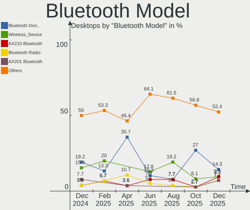

| Model                                               | Desktops | Percent |
|-----------------------------------------------------|----------|---------|
| Cambridge Silicon Radio Bluetooth Dongle (HCI mode) | 6        | 14.29%  |
| MediaTek Wireless_Device                            | 4        | 9.52%   |
| Intel AX210 Bluetooth                               | 4        | 9.52%   |
| Realtek Bluetooth Radio                             | 3        | 7.14%   |
| Intel AX201 Bluetooth                               | 3        | 7.14%   |
| IMC Networks Wireless_Device                        | 3        | 7.14%   |
| Intel Wireless-AC 9260 Bluetooth Adapter            | 2        | 4.76%   |
| Intel Wireless-AC 3168 Bluetooth                    | 2        | 4.76%   |
| Intel Bluetooth wireless interface                  | 2        | 4.76%   |
| Intel AX200 Bluetooth                               | 2        | 4.76%   |
| IMC Networks Bluetooth Radio                        | 2        | 4.76%   |
| Foxconn / Hon Hai Wireless_Device                   | 2        | 4.76%   |
| Realtek Bluetooth 5.3 Radio                         | 1        | 2.38%   |
| Intel Bluetooth Device                              | 1        | 2.38%   |
| HP Bluetooth 2.0 Interface [Broadcom BCM2045]       | 1        | 2.38%   |
| Foxconn / Hon Hai Bluetooth Device                  | 1        | 2.38%   |
| Broadcom BCM920702 Bluetooth 4.0 Zero Touch Dongle  | 1        | 2.38%   |
| ASUS Bluetooth Controller                           | 1        | 2.38%   |
| Unknown                                             | 1        | 2.38%   |

Sound
-----

Sound Vendor
------------

Sound card vendors

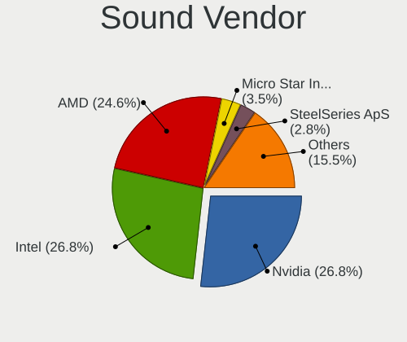

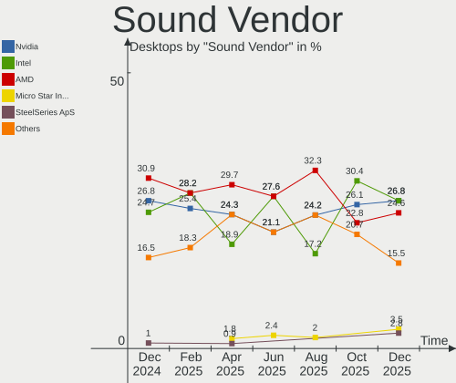

| Vendor                                       | Desktops | Percent |
|----------------------------------------------|----------|---------|
| Nvidia                                       | 38       | 26.76%  |
| Intel                                        | 38       | 26.76%  |
| AMD                                          | 35       | 24.65%  |
| Micro Star International                     | 5        | 3.52%   |
| SteelSeries ApS                              | 4        | 2.82%   |
| Logitech                                     | 3        | 2.11%   |
| Texas Instruments                            | 2        | 1.41%   |
| C-Media Electronics                          | 2        | 1.41%   |
| Zoran Co. Personal Media Division (Nogatech) | 1        | 0.7%    |
| Valve Software                               | 1        | 0.7%    |
| Unknown                                      | 1        | 0.7%    |
| Solid State Logic                            | 1        | 0.7%    |
| Sennheiser electronic                        | 1        | 0.7%    |
| RODE Microphones                             | 1        | 0.7%    |
| Generalplus Technology                       | 1        | 0.7%    |
| Focusrite-Novation                           | 1        | 0.7%    |
| Elgato Systems                               | 1        | 0.7%    |
| Creative Technology                          | 1        | 0.7%    |
| beyerdynamic                                 | 1        | 0.7%    |
| ASUSTek Computer                             | 1        | 0.7%    |
| Apple                                        | 1        | 0.7%    |
| Antlion Audio                                | 1        | 0.7%    |
| Unknown                                      | 1        | 0.7%    |

Sound Model
-----------

Sound card models

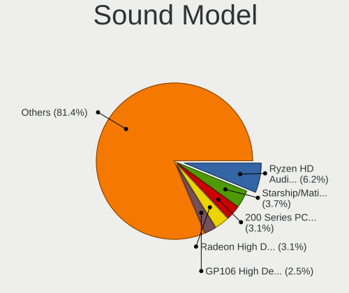

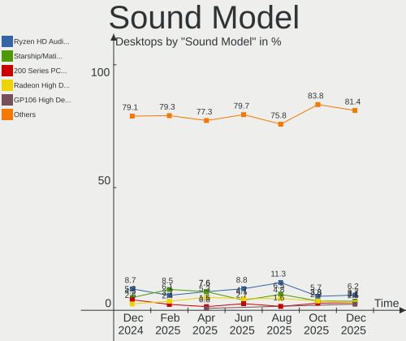

| Model                                                               | Desktops | Percent |
|---------------------------------------------------------------------|----------|---------|
| AMD Ryzen HD Audio Controller                                       | 10       | 6.21%   |
| AMD Starship/Matisse HD Audio Controller                            | 6        | 3.73%   |
| Intel 200 Series PCH HD Audio                                       | 5        | 3.11%   |
| AMD Radeon High Definition Audio Controller                         | 5        | 3.11%   |
| Nvidia GP106 High Definition Audio Controller                       | 4        | 2.48%   |
| Micro Star International USB Audio                                  | 4        | 2.48%   |
| Intel Raptor Lake High Definition Audio Controller                  | 4        | 2.48%   |
| Intel Cannon Lake PCH cAVS                                          | 4        | 2.48%   |
| Intel Alder Lake-S HD Audio Controller                              | 4        | 2.48%   |
| AMD SBx00 Azalia (Intel HDA)                                        | 4        | 2.48%   |
| Nvidia GP107GL High Definition Audio Controller                     | 3        | 1.86%   |
| Intel C600/X79 series chipset High Definition Audio Controller      | 3        | 1.86%   |
| Intel 100 Series/C230 Series Chipset Family HD Audio Controller     | 3        | 1.86%   |
| AMD Raven/Raven2/Fenghuang HDMI/DP Audio Controller                 | 3        | 1.86%   |
| AMD Navi 31 HDMI/DP Audio                                           | 3        | 1.86%   |
| AMD Navi 21/23 HDMI/DP Audio Controller                             | 3        | 1.86%   |
| Nvidia TU106 High Definition Audio Controller                       | 2        | 1.24%   |
| Nvidia TU104 HD Audio Controller                                    | 2        | 1.24%   |
| Nvidia High Definition Audio Controller                             | 2        | 1.24%   |
| Nvidia GM204 High Definition Audio Controller                       | 2        | 1.24%   |
| Nvidia GK208 HDMI/DP Audio Controller                               | 2        | 1.24%   |
| Nvidia GB203 High Definition Audio Controller                       | 2        | 1.24%   |
| Nvidia GA106 High Definition Audio Controller                       | 2        | 1.24%   |
| Nvidia GA102 High Definition Audio Controller                       | 2        | 1.24%   |
| Nvidia AD106M High Definition Audio Controller                      | 2        | 1.24%   |
| Intel 9 Series Chipset Family HD Audio Controller                   | 2        | 1.24%   |
| Intel 82801I (ICH9 Family) HD Audio Controller                      | 2        | 1.24%   |
| Intel 7 Series/C216 Chipset Family High Definition Audio Controller | 2        | 1.24%   |
| C-Media Electronics USB Audio Device                                | 2        | 1.24%   |
| AMD Turks HDMI Audio [Radeon HD 6500/6600 / 6700M Series]           | 2        | 1.24%   |
| AMD Renoir/Cezanne HDMI/DP Audio Controller                         | 2        | 1.24%   |
| AMD FCH Azalia Controller                                           | 2        | 1.24%   |
| AMD Family 17h (Models 00h-0fh) HD Audio Controller                 | 2        | 1.24%   |
| AMD Baffin HDMI/DP Audio [Radeon RX 550 640SP / RX 560/560X]        | 2        | 1.24%   |
| Zoran Co. Personal Media Division (Nogatech) USB Audio and HID      | 1        | 0.62%   |
| Valve Software Valve VR Radio & HMD Mic                             | 1        | 0.62%   |
| Unknown USB MIDI Interface                                          | 1        | 0.62%   |
| Texas Instruments SMSL AD18 AMP                                     | 1        | 0.62%   |
| Texas Instruments PCM2901 Audio Codec                               | 1        | 0.62%   |
| SteelSeries ApS Arctis Nova Pro Wireless                            | 1        | 0.62%   |

Memory
------

Memory Vendor
-------------

Memory module vendors

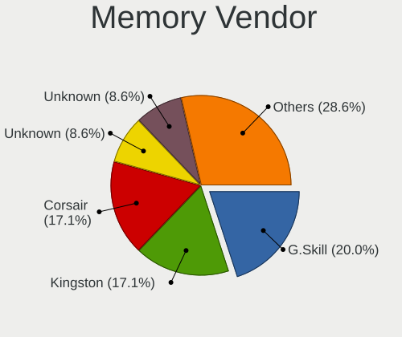

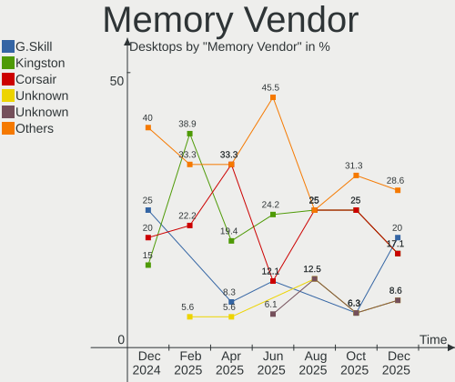

| Vendor              | Desktops | Percent |
|---------------------|----------|---------|
| G.Skill             | 7        | 20%     |
| Kingston            | 6        | 17.14%  |
| Corsair             | 6        | 17.14%  |
| Unknown             | 3        | 8.57%   |
| Unknown             | 3        | 8.57%   |
| Team                | 2        | 5.71%   |
| Samsung Electronics | 2        | 5.71%   |
| Micron Technology   | 2        | 5.71%   |
| Patriot             | 1        | 2.86%   |
| GIGA-BYTE           | 1        | 2.86%   |
| Crucial             | 1        | 2.86%   |
| Apacer              | 1        | 2.86%   |

Memory Model
------------

Memory module models

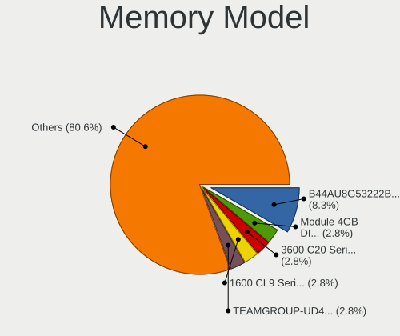

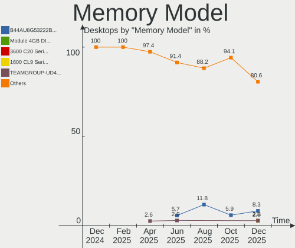

| Model                                                  | Desktops | Percent |
|--------------------------------------------------------|----------|---------|
| Unknown                                                | 3        | 8.33%   |
| Unknown RAM Module 4GB DIMM 1333MT/s                   | 1        | 2.78%   |
| Unknown RAM 3600 C20 Series 32GB DIMM DDR4 3666MT/s    | 1        | 2.78%   |
| Unknown RAM 1600 CL9 Series 8192MB DIMM DDR3 1066MT/s  | 1        | 2.78%   |
| Team RAM TEAMGROUP-UD4-3200 8GB DIMM DDR4 3800MT/s     | 1        | 2.78%   |
| Team RAM TEAMGROUP-UD4-3200 8GB DIMM DDR4 3733MT/s     | 1        | 2.78%   |
| Samsung RAM M393B1G70QH0-YK0 8GB DIMM DDR3 1333MT/s    | 1        | 2.78%   |
| Samsung RAM M378A5244CB0-CRC 4GB DIMM DDR4 3066MT/s    | 1        | 2.78%   |
| Patriot RAM PSD44G240041 4GB DIMM DDR4 2400MT/s        | 1        | 2.78%   |
| Micron RAM 16HTF25664HY-800E1 2GB SODIMM DDR2 1639MT/s | 1        | 2.78%   |
| Micron RAM 16ATF2G64AZ-2G6J1 16GB DIMM DDR4 2667MT/s   | 1        | 2.78%   |
| Kingston RAM KHX3600C17D4/16GX 16GB DIMM DDR4 3800MT/s | 1        | 2.78%   |
| Kingston RAM KHX3200C16D4/8GX 8GB DIMM DDR4 3733MT/s   | 1        | 2.78%   |
| Kingston RAM KHX2666C16/16G 16GB DIMM DDR4 3200MT/s    | 1        | 2.78%   |
| Kingston RAM KHX1866C10D3/8G 8GB DIMM DDR3 1867MT/s    | 1        | 2.78%   |
| Kingston RAM KHX1600C10D3/8G 8GB DIMM DDR3 2133MT/s    | 1        | 2.78%   |
| Kingston RAM 9965745-028.A00G 16GB DIMM DDR4 3200MT/s  | 1        | 2.78%   |
| GIGA-BYTE RAM GP-ARS32G52D5 16GB DIMM DDR5 5200MT/s    | 1        | 2.78%   |
| G.Skill RAM F5-6000J3238G32G 32GB DIMM DDR5 6000MT/s   | 1        | 2.78%   |
| G.Skill RAM F5-6000J3040G32G 32GB DIMM DDR5 6200MT/s   | 1        | 2.78%   |
| G.Skill RAM F5-6000J3038F16G 16GB DIMM DDR5 6000MT/s   | 1        | 2.78%   |
| G.Skill RAM F4-4600C20-16GTZR 16GB DIMM DDR4 2667MT/s  | 1        | 2.78%   |
| G.Skill RAM F4-3600C16-16GVKC 16GB DIMM DDR4 3866MT/s  | 1        | 2.78%   |
| G.Skill RAM F4-3200C16-16GVK 16GB DIMM DDR4 3600MT/s   | 1        | 2.78%   |
| G.Skill RAM F4-3200C16-16GTZR 16GB DIMM DDR4 3600MT/s  | 1        | 2.78%   |
| G.Skill RAM F3-12800CL9-2GBNQ 2GB DIMM DDR3 1333MT/s   | 1        | 2.78%   |
| Crucial RAM BL8G32C16S4B.M8FE 8GB SODIMM DDR4 2667MT/s | 1        | 2.78%   |
| Corsair RAM CMK64GX4M4C3200C16 16GB DIMM DDR4 3200MT/s | 1        | 2.78%   |
| Corsair RAM CMK5X16G1B52C40A2 16GB DIMM DDR5 5200MT/s  | 1        | 2.78%   |
| Corsair RAM CMK32GX5M2B6000Z30 16GB DIMM DDR5 6000MT/s | 1        | 2.78%   |
| Corsair RAM CMK32GX5M2B5200Z40 16GB DIMM DDR5 4800MT/s | 1        | 2.78%   |
| Corsair RAM CMK16GX4M2B3200C16 8GB DIMM DDR4 3600MT/s  | 1        | 2.78%   |
| Corsair RAM CMK16GX4M2A2666C16 8GB DIMM DDR4 3400MT/s  | 1        | 2.78%   |
| Apacer RAM 78.CAGPP.40C0B 8GB DIMM DDR4 2666MT/s       | 1        | 2.78%   |

Memory Kind
-----------

Memory module kinds

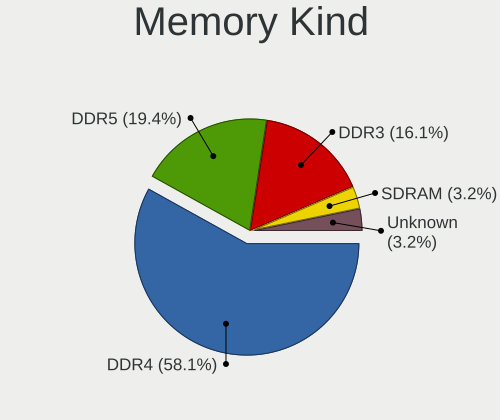

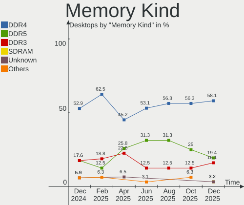

| Kind    | Desktops | Percent |
|---------|----------|---------|
| DDR4    | 18       | 58.06%  |
| DDR5    | 6        | 19.35%  |
| DDR3    | 5        | 16.13%  |
| SDRAM   | 1        | 3.23%   |
| Unknown | 1        | 3.23%   |

Memory Form Factor
------------------

Physical design of the memory module

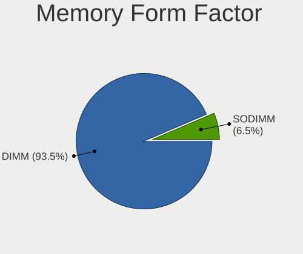

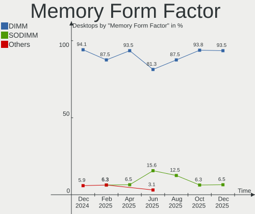

| Name   | Desktops | Percent |
|--------|----------|---------|
| DIMM   | 29       | 93.55%  |
| SODIMM | 2        | 6.45%   |

Memory Size
-----------

Memory module size

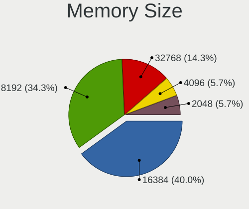

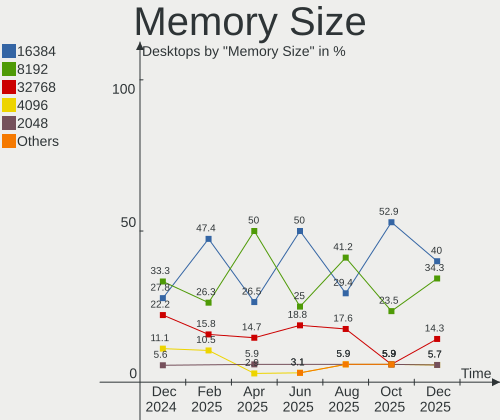

| Size  | Desktops | Percent |
|-------|----------|---------|
| 16384 | 14       | 40%     |
| 8192  | 12       | 34.29%  |
| 32768 | 5        | 14.29%  |
| 4096  | 2        | 5.71%   |
| 2048  | 2        | 5.71%   |

Memory Speed
------------

Memory module speed

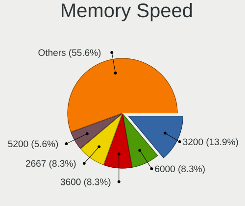

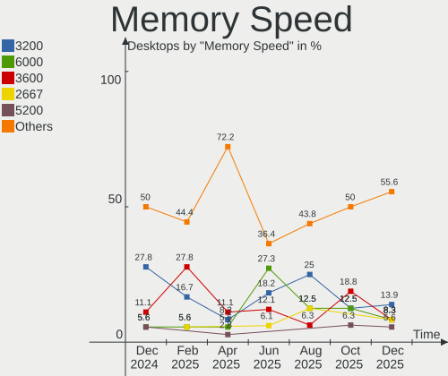

| Speed | Desktops | Percent |
|-------|----------|---------|
| 3200  | 5        | 13.89%  |
| 6000  | 3        | 8.33%   |
| 3600  | 3        | 8.33%   |
| 2667  | 3        | 8.33%   |
| 5200  | 2        | 5.56%   |
| 3800  | 2        | 5.56%   |
| 3733  | 2        | 5.56%   |
| 2133  | 2        | 5.56%   |
| 1600  | 2        | 5.56%   |
| 1333  | 2        | 5.56%   |
| 6200  | 1        | 2.78%   |
| 4800  | 1        | 2.78%   |
| 3866  | 1        | 2.78%   |
| 3666  | 1        | 2.78%   |
| 3400  | 1        | 2.78%   |
| 3066  | 1        | 2.78%   |
| 2666  | 1        | 2.78%   |
| 2400  | 1        | 2.78%   |
| 1866  | 1        | 2.78%   |
| 1639  | 1        | 2.78%   |

Printers & scanners
-------------------

Printer Vendor
--------------

Printer device vendors

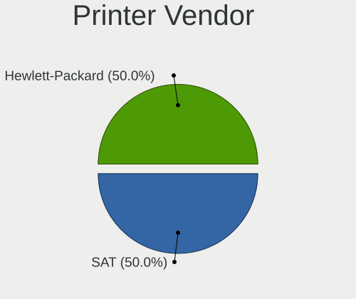

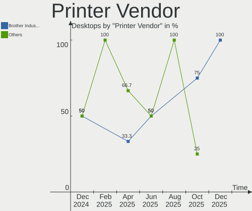

| Vendor             | Desktops | Percent |
|--------------------|----------|---------|
| Brother Industries | 1        | 100%    |

Printer Model
-------------

Printer device models

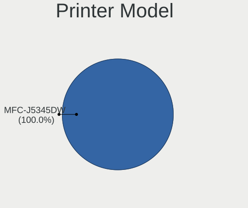

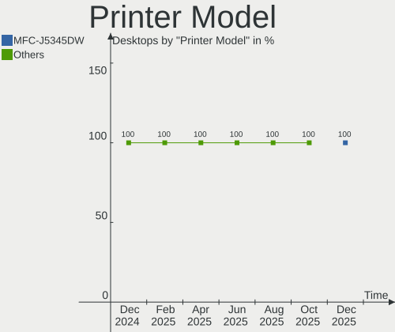

| Model               | Desktops | Percent |
|---------------------|----------|---------|
| Brother MFC-J5345DW | 1        | 100%    |

Scanner Vendor
--------------

Scanner device vendors

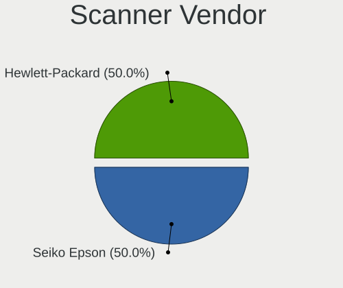

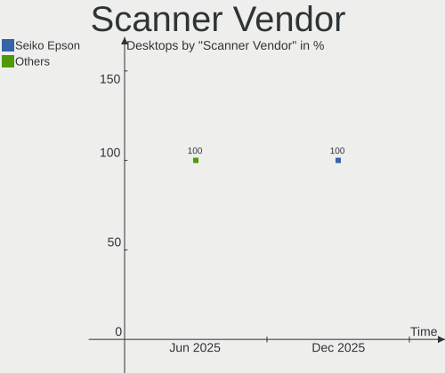

| Vendor      | Desktops | Percent |
|-------------|----------|---------|
| Seiko Epson | 1        | 100%    |

Scanner Model
-------------

Scanner device models

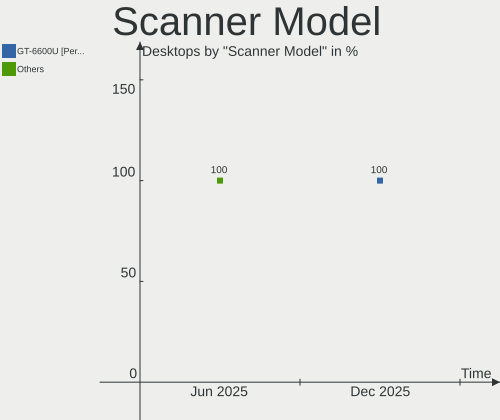

| Model                                 | Desktops | Percent |
|---------------------------------------|----------|---------|
| Seiko Epson GT-6600U [Perfection 610] | 1        | 100%    |

Camera
------

Camera Vendor
-------------

Camera device vendors

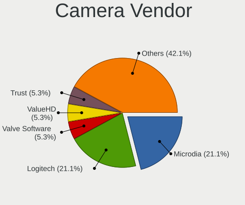

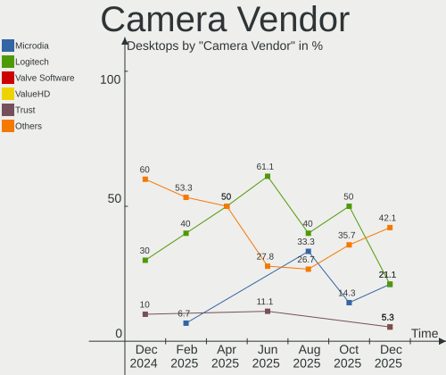

| Vendor                 | Desktops | Percent |
|------------------------|----------|---------|
| Microdia               | 4        | 21.05%  |
| Logitech               | 4        | 21.05%  |
| Valve Software         | 1        | 5.26%   |
| ValueHD                | 1        | 5.26%   |
| Trust                  | 1        | 5.26%   |
| Ruision                | 1        | 5.26%   |
| Pixart Imaging         | 1        | 5.26%   |
| MacroSilicon           | 1        | 5.26%   |
| Huawei Technologies    | 1        | 5.26%   |
| Generalplus Technology | 1        | 5.26%   |
| Chicony Electronics    | 1        | 5.26%   |
| ARC International      | 1        | 5.26%   |
| Apple                  | 1        | 5.26%   |

Camera Model
------------

Camera device models

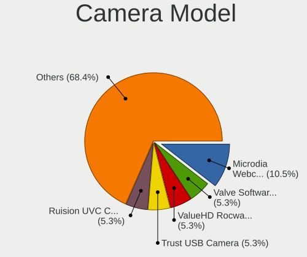

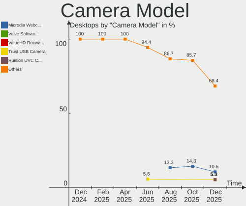

| Model                                    | Desktops | Percent |
|------------------------------------------|----------|---------|
| Microdia Webcam Vitade AF                | 2        | 10.53%  |
| Valve Software 3D Camera                 | 1        | 5.26%   |
| ValueHD Rocware RC28                     | 1        | 5.26%   |
| Trust USB Camera                         | 1        | 5.26%   |
| Ruision UVC Camera                       | 1        | 5.26%   |
| Pixart Imaging GE 1.3 MP MiniCam Pro     | 1        | 5.26%   |
| Microdia USB 2.0 Camera                  | 1        | 5.26%   |
| Microdia CyberTrack H7                   | 1        | 5.26%   |
| MacroSilicon USB Video                   | 1        | 5.26%   |
| Logitech Webcam C930e                    | 1        | 5.26%   |
| Logitech Webcam C270                     | 1        | 5.26%   |
| Logitech Logitech Webcam C925e           | 1        | 5.26%   |
| Logitech C922 Pro Stream Webcam          | 1        | 5.26%   |
| Huawei HiCamera                          | 1        | 5.26%   |
| Generalplus 808 Camera #9 (web-cam mode) | 1        | 5.26%   |
| Chicony CNF7042                          | 1        | 5.26%   |
| ARC International Camera                 | 1        | 5.26%   |
| Apple iSight in LED Cinema Display       | 1        | 5.26%   |

Security
--------

Fingerprint Vendor
------------------

Fingerprint sensor vendors

Zero info for selected period =(

Fingerprint Model
-----------------

Fingerprint sensor models

Zero info for selected period =(

Chipcard Vendor
---------------

Chipcard module vendors

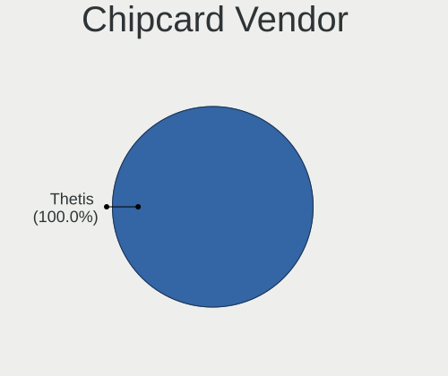

| Vendor | Desktops | Percent |
|--------|----------|---------|
| Thetis | 1        | 100%    |

Chipcard Model
--------------

Chipcard module models

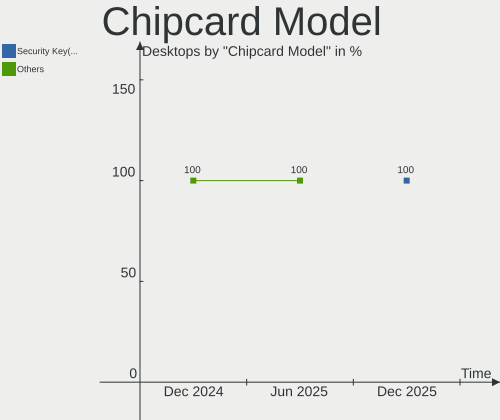

| Model                     | Desktops | Percent |
|---------------------------|----------|---------|
| Thetis Security Key(F825) | 1        | 100%    |

Unsupported
-----------

Unsupported Devices
-------------------

Total unsupported devices on board

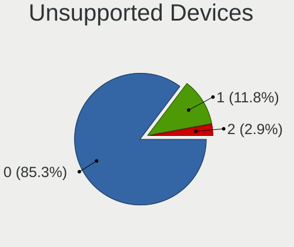

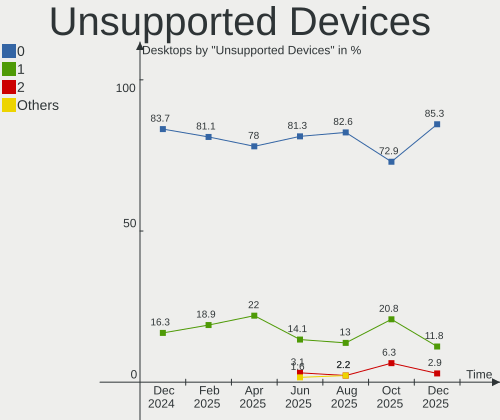

| Total | Desktops | Percent |
|-------|----------|---------|
| 0     | 58       | 85.29%  |
| 1     | 8        | 11.76%  |
| 2     | 2        | 2.94%   |

Unsupported Device Types
------------------------

Types of unsupported devices

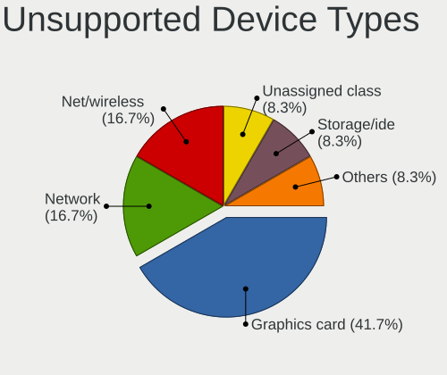

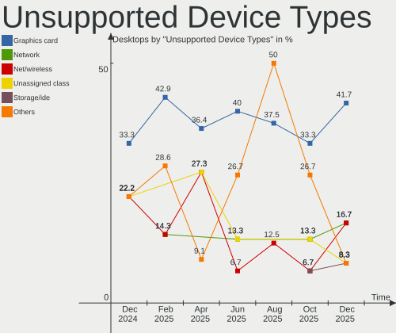

| Type                  | Desktops | Percent |
|-----------------------|----------|---------|
| Graphics card         | 5        | 41.67%  |
| Network               | 2        | 16.67%  |
| Net/wireless          | 2        | 16.67%  |
| Unassigned class      | 1        | 8.33%   |
| Storage/ide           | 1        | 8.33%   |
| Multimedia controller | 1        | 8.33%   |

