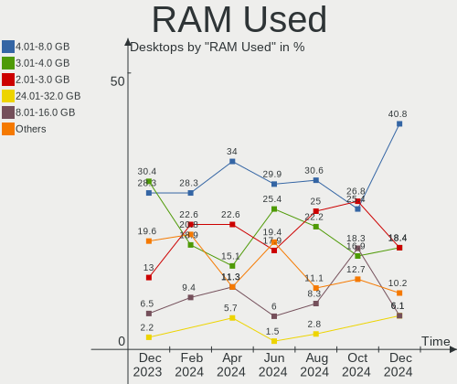
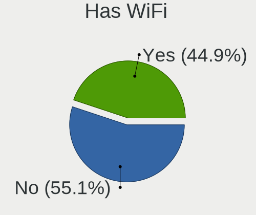

Kubuntu - Hardware Trends (Desktops)
------------------------------------

A project to identify most popular hardware characteristics and track their change
over time based on data collected by Linux users at https://Linux-Hardware.org.

Anyone can contribute to this report by the [hw-probe](https://github.com/linuxhw/hw-probe) tool:

    sudo -E hw-probe -all -upload

This report is for one last month. Overall report since the beginning of time: [TestDays](https://github.com/linuxhw/TestDays)

Period: Jul, 2023.

Contents
--------

* [ System ](#system)
  - [ OS                       ](#os)
  - [ OS Family                ](#os-family)
  - [ Kernel                   ](#kernel)
  - [ Kernel Family            ](#kernel-family)
  - [ Kernel Major Ver.        ](#kernel-major-ver)
  - [ Arch                     ](#arch)
  - [ DE                       ](#de)
  - [ Display Server           ](#display-server)
  - [ Display Manager          ](#display-manager)
  - [ OS Lang                  ](#os-lang)
  - [ Boot Mode                ](#boot-mode)
  - [ Filesystem               ](#filesystem)
  - [ Part. scheme             ](#part-scheme)
  - [ Dual Boot with Linux/BSD ](#dual-boot-with-linuxbsd)
  - [ Dual Boot (Win)          ](#dual-boot-win)

* [ Board ](#board)
  - [ Vendor                   ](#vendor)
  - [ Model                    ](#model)
  - [ Model Family             ](#model-family)
  - [ MFG Year                 ](#mfg-year)
  - [ Form Factor              ](#form-factor)
  - [ Secure Boot              ](#secure-boot)
  - [ Coreboot                 ](#coreboot)
  - [ RAM Size                 ](#ram-size)
  - [ RAM Used                 ](#ram-used)
  - [ Total Drives             ](#total-drives)
  - [ Has CD-ROM               ](#has-cd-rom)
  - [ Has Ethernet             ](#has-ethernet)
  - [ Has WiFi                 ](#has-wifi)
  - [ Has Bluetooth            ](#has-bluetooth)

* [ Location ](#location)
  - [ Country                  ](#country)
  - [ City                     ](#city)

* [ Drives ](#drives)
  - [ Drive Vendor             ](#drive-vendor)
  - [ Drive Model              ](#drive-model)
  - [ HDD Vendor               ](#hdd-vendor)
  - [ SSD Vendor               ](#ssd-vendor)
  - [ Drive Kind               ](#drive-kind)
  - [ Drive Connector          ](#drive-connector)
  - [ Drive Size               ](#drive-size)
  - [ Space Total              ](#space-total)
  - [ Space Used               ](#space-used)
  - [ Malfunc. Drives          ](#malfunc-drives)
  - [ Malfunc. Drive Vendor    ](#malfunc-drive-vendor)
  - [ Malfunc. HDD Vendor      ](#malfunc-hdd-vendor)
  - [ Malfunc. Drive Kind      ](#malfunc-drive-kind)
  - [ Failed Drives            ](#failed-drives)
  - [ Failed Drive Vendor      ](#failed-drive-vendor)
  - [ Drive Status             ](#drive-status)

* [ Storage controller ](#storage-controller)
  - [ Storage Vendor           ](#storage-vendor)
  - [ Storage Model            ](#storage-model)
  - [ Storage Kind             ](#storage-kind)

* [ Processor ](#processor)
  - [ CPU Vendor               ](#cpu-vendor)
  - [ CPU Model                ](#cpu-model)
  - [ CPU Model Family         ](#cpu-model-family)
  - [ CPU Cores                ](#cpu-cores)
  - [ CPU Sockets              ](#cpu-sockets)
  - [ CPU Threads              ](#cpu-threads)
  - [ CPU Op-Modes             ](#cpu-op-modes)
  - [ CPU Microcode            ](#cpu-microcode)
  - [ CPU Microarch            ](#cpu-microarch)

* [ Graphics ](#graphics)
  - [ GPU Vendor               ](#gpu-vendor)
  - [ GPU Model                ](#gpu-model)
  - [ GPU Combo                ](#gpu-combo)
  - [ GPU Driver               ](#gpu-driver)
  - [ GPU Memory               ](#gpu-memory)

* [ Monitor ](#monitor)
  - [ Monitor Vendor           ](#monitor-vendor)
  - [ Monitor Model            ](#monitor-model)
  - [ Monitor Resolution       ](#monitor-resolution)
  - [ Monitor Diagonal         ](#monitor-diagonal)
  - [ Monitor Width            ](#monitor-width)
  - [ Aspect Ratio             ](#aspect-ratio)
  - [ Monitor Area             ](#monitor-area)
  - [ Pixel Density            ](#pixel-density)
  - [ Multiple Monitors        ](#multiple-monitors)

* [ Network ](#network)
  - [ Net Controller Vendor    ](#net-controller-vendor)
  - [ Net Controller Model     ](#net-controller-model)
  - [ Wireless Vendor          ](#wireless-vendor)
  - [ Wireless Model           ](#wireless-model)
  - [ Ethernet Vendor          ](#ethernet-vendor)
  - [ Ethernet Model           ](#ethernet-model)
  - [ Net Controller Kind      ](#net-controller-kind)
  - [ Used Controller          ](#used-controller)
  - [ NICs                     ](#nics)
  - [ IPv6                     ](#ipv6)

* [ Bluetooth ](#bluetooth)
  - [ Bluetooth Vendor         ](#bluetooth-vendor)
  - [ Bluetooth Model          ](#bluetooth-model)

* [ Sound ](#sound)
  - [ Sound Vendor             ](#sound-vendor)
  - [ Sound Model              ](#sound-model)

* [ Memory ](#memory)
  - [ Memory Vendor            ](#memory-vendor)
  - [ Memory Model             ](#memory-model)
  - [ Memory Kind              ](#memory-kind)
  - [ Memory Form Factor       ](#memory-form-factor)
  - [ Memory Size              ](#memory-size)
  - [ Memory Speed             ](#memory-speed)

* [ Printers & scanners ](#printers--scanners)
  - [ Printer Vendor           ](#printer-vendor)
  - [ Printer Model            ](#printer-model)
  - [ Scanner Vendor           ](#scanner-vendor)
  - [ Scanner Model            ](#scanner-model)

* [ Camera ](#camera)
  - [ Camera Vendor            ](#camera-vendor)
  - [ Camera Model             ](#camera-model)

* [ Security ](#security)
  - [ Fingerprint Vendor       ](#fingerprint-vendor)
  - [ Fingerprint Model        ](#fingerprint-model)
  - [ Chipcard Vendor          ](#chipcard-vendor)
  - [ Chipcard Model           ](#chipcard-model)

* [ Unsupported ](#unsupported)
  - [ Unsupported Devices      ](#unsupported-devices)
  - [ Unsupported Device Types ](#unsupported-device-types)

System
------

OS
--

Installed operating systems

| Name          | Desktops | Percent |
|---------------|----------|---------|
| Kubuntu 23.04 | 24       | 46.15%  |
| Kubuntu 22.04 | 24       | 46.15%  |
| Kubuntu 23.10 | 2        | 3.85%   |
| Kubuntu 22.10 | 1        | 1.92%   |
| Kubuntu 11    | 1        | 1.92%   |

OS Family
---------

OS without a version

| Name    | Desktops | Percent |
|---------|----------|---------|
| Kubuntu | 52       | 100%    |

Kernel
------

Version of the Linux kernel

| Version                | Desktops | Percent |
|------------------------|----------|---------|
| 5.19.0-46-generic      | 8        | 15.38%  |
| 6.2.0-24-generic       | 7        | 13.46%  |
| 5.15.0-76-generic      | 5        | 9.62%   |
| 6.2.0-25-generic       | 4        | 7.69%   |
| 5.15.0-75-generic      | 4        | 7.69%   |
| 6.2.0-26-generic       | 3        | 5.77%   |
| 6.3.0-7-generic        | 2        | 3.85%   |
| 6.2.0-20-generic       | 2        | 3.85%   |
| 5.19.0-50-generic      | 2        | 3.85%   |
| 5.15.0-71-generic      | 2        | 3.85%   |
| 6.4.3-1-liquorix-amd64 | 1        | 1.92%   |
| 6.4.1-2-liquorix-amd64 | 1        | 1.92%   |
| 6.4.0-060400-generic   | 1        | 1.92%   |
| 6.3.6-060306-generic   | 1        | 1.92%   |
| 6.3.10                 | 1        | 1.92%   |
| 6.2.0-23-generic       | 1        | 1.92%   |
| 6.2.0-1009-lowlatency  | 1        | 1.92%   |
| 6.2.0-1008-lowlatency  | 1        | 1.92%   |
| 6.2.0-1003-lowlatency  | 1        | 1.92%   |
| 6.1.1-060101-generic   | 1        | 1.92%   |
| 5.19.0-1028-lowlatency | 1        | 1.92%   |
| 5.19.0-1021-generic    | 1        | 1.92%   |
| 5.15.0-78-generic      | 1        | 1.92%   |

Kernel Family
-------------

Linux kernel without a distro release

| Version | Desktops | Percent |
|---------|----------|---------|
| 6.2.0   | 20       | 38.46%  |
| 5.19.0  | 12       | 23.08%  |
| 5.15.0  | 12       | 23.08%  |
| 6.3.0   | 2        | 3.85%   |
| 6.4.3   | 1        | 1.92%   |
| 6.4.1   | 1        | 1.92%   |
| 6.4.0   | 1        | 1.92%   |
| 6.3.6   | 1        | 1.92%   |
| 6.3.10  | 1        | 1.92%   |
| 6.1.1   | 1        | 1.92%   |

Kernel Major Ver.
-----------------

Linux kernel major version

| Version | Desktops | Percent |
|---------|----------|---------|
| 6.2     | 20       | 38.46%  |
| 5.19    | 12       | 23.08%  |
| 5.15    | 12       | 23.08%  |
| 6.3     | 4        | 7.69%   |
| 6.4     | 3        | 5.77%   |
| 6.1     | 1        | 1.92%   |

Arch
----

OS architecture (x86_64, i586, etc.)

| Name    | Desktops | Percent |
|---------|----------|---------|
| x86_64  | 51       | 98.08%  |
| riscv64 | 1        | 1.92%   |

DE
--

Desktop Environment

| Name | Desktops | Percent |
|------|----------|---------|
| KDE5 | 50       | 96.15%  |
| KDE  | 2        | 3.85%   |

Display Server
--------------

X11 or Wayland

| Name    | Desktops | Percent |
|---------|----------|---------|
| X11     | 44       | 84.62%  |
| Wayland | 5        | 9.62%   |
| Tty     | 3        | 5.77%   |

Display Manager
---------------

SDDM, LightDM, etc.

| Name    | Desktops | Percent |
|---------|----------|---------|
| SDDM    | 34       | 65.38%  |
| Unknown | 13       | 25%     |
| LightDM | 4        | 7.69%   |
| GDM3    | 1        | 1.92%   |

OS Lang
-------

Language

| Lang  | Desktops | Percent |
|-------|----------|---------|
| en_US | 24       | 46.15%  |
| de_DE | 6        | 11.54%  |
| en_GB | 5        | 9.62%   |
| ru_RU | 3        | 5.77%   |
| fr_FR | 3        | 5.77%   |
| pl_PL | 2        | 3.85%   |
| da_DK | 2        | 3.85%   |
| C     | 2        | 3.85%   |
| zh_TW | 1        | 1.92%   |
| pt_BR | 1        | 1.92%   |
| nl_NL | 1        | 1.92%   |
| fi_FI | 1        | 1.92%   |
| en_AU | 1        | 1.92%   |

Boot Mode
---------

EFI or BIOS

| Mode | Desktops | Percent |
|------|----------|---------|
| EFI  | 27       | 51.92%  |
| BIOS | 25       | 48.08%  |

Filesystem
----------

Type of filesystem

| Type    | Desktops | Percent |
|---------|----------|---------|
| Ext4    | 34       | 65.38%  |
| Tmpfs   | 11       | 21.15%  |
| Btrfs   | 5        | 9.62%   |
| Xfs     | 1        | 1.92%   |
| Overlay | 1        | 1.92%   |

Part. scheme
------------

Scheme of partitioning

| Type    | Desktops | Percent |
|---------|----------|---------|
| GPT     | 36       | 69.23%  |
| Unknown | 13       | 25%     |
| MBR     | 3        | 5.77%   |

Dual Boot with Linux/BSD
------------------------

Hosting more than one Linux/BSD

| Dual boot | Desktops | Percent |
|-----------|----------|---------|
| No        | 39       | 75%     |
| Yes       | 13       | 25%     |

Dual Boot (Win)
---------------

Hosting Linux and Windows

| Dual boot | Desktops | Percent |
|-----------|----------|---------|
| No        | 33       | 63.46%  |
| Yes       | 19       | 36.54%  |

Board
-----

Vendor
------

Motherboard manufacturer

| Name                | Desktops | Percent |
|---------------------|----------|---------|
| ASUSTek Computer    | 13       | 25%     |
| MSI                 | 11       | 21.15%  |
| Gigabyte Technology | 8        | 15.38%  |
| ASRock              | 5        | 9.62%   |
| Lenovo              | 2        | 3.85%   |
| Dell                | 2        | 3.85%   |
| Supermicro          | 1        | 1.92%   |
| Seeed Studio        | 1        | 1.92%   |
| Pegatron            | 1        | 1.92%   |
| Medion              | 1        | 1.92%   |
| Intel               | 1        | 1.92%   |
| Huanan              | 1        | 1.92%   |
| Hewlett-Packard     | 1        | 1.92%   |
| Google              | 1        | 1.92%   |
| Gateway             | 1        | 1.92%   |
| Acer                | 1        | 1.92%   |
| Unknown             | 1        | 1.92%   |

Model
-----

Motherboard model

| Name                              | Desktops | Percent |
|-----------------------------------|----------|---------|
| Supermicro C7H61                  | 1        | 1.92%   |
| Seeed Studio ODYSSEY-X86J4105     | 1        | 1.92%   |
| Pegatron 520-1000nl               | 1        | 1.92%   |
| MSI MS-7D91                       | 1        | 1.92%   |
| MSI MS-7D75                       | 1        | 1.92%   |
| MSI MS-7D25                       | 1        | 1.92%   |
| MSI MS-7C95                       | 1        | 1.92%   |
| MSI MS-7C86                       | 1        | 1.92%   |
| MSI MS-7B78                       | 1        | 1.92%   |
| MSI MS-7B51                       | 1        | 1.92%   |
| MSI MS-7B23                       | 1        | 1.92%   |
| MSI MS-7A32                       | 1        | 1.92%   |
| MSI MS-7885                       | 1        | 1.92%   |
| MSI MS-7818                       | 1        | 1.92%   |
| Medion Akoya E20009 MD34024/C579  | 1        | 1.92%   |
| Lenovo ThinkCentre M82 2929BT6    | 1        | 1.92%   |
| Lenovo ThinkCentre A70 7844H9G    | 1        | 1.92%   |
| Intel DQ57TM AAE70931-402         | 1        | 1.92%   |
| Huanan X99-F8 GAMING V5.0         | 1        | 1.92%   |
| HP EliteDesk 705 G4 DM 35W (TAA)  | 1        | 1.92%   |
| Google Zako                       | 1        | 1.92%   |
| Gigabyte Z87-D3HP                 | 1        | 1.92%   |
| Gigabyte X570S UD                 | 1        | 1.92%   |
| Gigabyte P67A-UD3-B3              | 1        | 1.92%   |
| Gigabyte EP45T-UD3LR              | 1        | 1.92%   |
| Gigabyte B550 AORUS PRO           | 1        | 1.92%   |
| Gigabyte AX370-Gaming K7          | 1        | 1.92%   |
| Gigabyte A320M-S2H                | 1        | 1.92%   |
| Gigabyte 7200-5143A               | 1        | 1.92%   |
| Gateway DX4860                    | 1        | 1.92%   |
| Dell Precision WorkStation T7500  | 1        | 1.92%   |
| Dell Precision 3260               | 1        | 1.92%   |
| ASUS TUF Gaming X570-PLUS         | 1        | 1.92%   |
| ASUS TUF Gaming B550-PLUS         | 1        | 1.92%   |
| ASUS ROG STRIX B560-A GAMING WIFI | 1        | 1.92%   |
| ASUS ROG STRIX B550-F GAMING      | 1        | 1.92%   |
| ASUS PRIME Z390-A                 | 1        | 1.92%   |
| ASUS PRIME H510M-K                | 1        | 1.92%   |
| ASUS PRIME B550M-A AC             | 1        | 1.92%   |
| ASUS PRIME B450M-K II             | 1        | 1.92%   |

Model Family
------------

Motherboard model prefix

| Name                          | Desktops | Percent |
|-------------------------------|----------|---------|
| ASUS PRIME                    | 6        | 11.54%  |
| Lenovo ThinkCentre            | 2        | 3.85%   |
| Dell Precision                | 2        | 3.85%   |
| ASUS TUF                      | 2        | 3.85%   |
| ASUS ROG                      | 2        | 3.85%   |
| Supermicro C7H61              | 1        | 1.92%   |
| Seeed Studio ODYSSEY-X86J4105 | 1        | 1.92%   |
| Pegatron 520-1000nl           | 1        | 1.92%   |
| MSI MS-7D91                   | 1        | 1.92%   |
| MSI MS-7D75                   | 1        | 1.92%   |
| MSI MS-7D25                   | 1        | 1.92%   |
| MSI MS-7C95                   | 1        | 1.92%   |
| MSI MS-7C86                   | 1        | 1.92%   |
| MSI MS-7B78                   | 1        | 1.92%   |
| MSI MS-7B51                   | 1        | 1.92%   |
| MSI MS-7B23                   | 1        | 1.92%   |
| MSI MS-7A32                   | 1        | 1.92%   |
| MSI MS-7885                   | 1        | 1.92%   |
| MSI MS-7818                   | 1        | 1.92%   |
| Medion Akoya                  | 1        | 1.92%   |
| Intel DQ57TM                  | 1        | 1.92%   |
| Huanan X99-F8                 | 1        | 1.92%   |
| HP EliteDesk                  | 1        | 1.92%   |
| Google Zako                   | 1        | 1.92%   |
| Gigabyte Z87-D3HP             | 1        | 1.92%   |
| Gigabyte X570S                | 1        | 1.92%   |
| Gigabyte P67A-UD3-B3          | 1        | 1.92%   |
| Gigabyte EP45T-UD3LR          | 1        | 1.92%   |
| Gigabyte B550                 | 1        | 1.92%   |
| Gigabyte AX370-Gaming         | 1        | 1.92%   |
| Gigabyte A320M-S2H            | 1        | 1.92%   |
| Gigabyte 7200-5143A           | 1        | 1.92%   |
| Gateway DX4860                | 1        | 1.92%   |
| ASUS M5A97                    | 1        | 1.92%   |
| ASUS M5A78L-M                 | 1        | 1.92%   |
| ASUS All                      | 1        | 1.92%   |
| ASRock X300M-STX              | 1        | 1.92%   |
| ASRock FM2A88X                | 1        | 1.92%   |
| ASRock B85M                   | 1        | 1.92%   |
| ASRock B560M                  | 1        | 1.92%   |

MFG Year
--------

Motherboard manufacture year

| Year | Desktops | Percent |
|------|----------|---------|
| 2020 | 10       | 19.23%  |
| 2021 | 5        | 9.62%   |
| 2018 | 5        | 9.62%   |
| 2017 | 5        | 9.62%   |
| 2013 | 5        | 9.62%   |
| 2019 | 4        | 7.69%   |
| 2011 | 4        | 7.69%   |
| 2022 | 3        | 5.77%   |
| 2010 | 3        | 5.77%   |
| 2023 | 2        | 3.85%   |
| 2014 | 2        | 3.85%   |
| 2012 | 2        | 3.85%   |
| 2015 | 1        | 1.92%   |
| 2009 | 1        | 1.92%   |

Form Factor
-----------

Physical design of the computer

| Name    | Desktops | Percent |
|---------|----------|---------|
| Desktop | 52       | 100%    |

Secure Boot
-----------

Enabled or disabled

| State    | Desktops | Percent |
|----------|----------|---------|
| Disabled | 50       | 96.15%  |
| Enabled  | 2        | 3.85%   |

Coreboot
--------

Have coreboot on board

| Used | Desktops | Percent |
|------|----------|---------|
| No   | 51       | 98.08%  |
| Yes  | 1        | 1.92%   |

RAM Size
--------

Total RAM memory

| Size in GB  | Desktops | Percent |
|-------------|----------|---------|
| 32.01-64.0  | 15       | 28.85%  |
| 4.01-8.0    | 9        | 17.31%  |
| 16.01-24.0  | 9        | 17.31%  |
| 64.01-256.0 | 7        | 13.46%  |
| 8.01-16.0   | 6        | 11.54%  |
| 3.01-4.0    | 4        | 7.69%   |
| 24.01-32.0  | 2        | 3.85%   |

RAM Used
--------

Used RAM memory

| Used GB    | Desktops | Percent |
|------------|----------|---------|
| 4.01-8.0   | 18       | 34.62%  |
| 2.01-3.0   | 10       | 19.23%  |
| 1.01-2.0   | 9        | 17.31%  |
| 3.01-4.0   | 7        | 13.46%  |
| 8.01-16.0  | 6        | 11.54%  |
| 16.01-24.0 | 1        | 1.92%   |
| 0.01-0.5   | 1        | 1.92%   |

Total Drives
------------

Number of drives on board

| Drives | Desktops | Percent |
|--------|----------|---------|
| 2      | 14       | 26.92%  |
| 1      | 11       | 21.15%  |
| 3      | 10       | 19.23%  |
| 4      | 7        | 13.46%  |
| 5      | 6        | 11.54%  |
| 6      | 3        | 5.77%   |
| 7      | 1        | 1.92%   |

Has CD-ROM
----------

Has CD-ROM on board

| Presented | Desktops | Percent |
|-----------|----------|---------|
| No        | 33       | 63.46%  |
| Yes       | 19       | 36.54%  |

Has Ethernet
------------

Has Ethernet on board

| Presented | Desktops | Percent |
|-----------|----------|---------|
| Yes       | 51       | 98.08%  |
| No        | 1        | 1.92%   |

Has WiFi
--------

Has WiFi module

| Presented | Desktops | Percent |
|-----------|----------|---------|
| No        | 29       | 55.77%  |
| Yes       | 23       | 44.23%  |

Has Bluetooth
-------------

Has Bluetooth module

| Presented | Desktops | Percent |
|-----------|----------|---------|
| No        | 34       | 65.38%  |
| Yes       | 18       | 34.62%  |

Location
--------

Country
-------

Geographic location (country)

| Country     | Desktops | Percent |
|-------------|----------|---------|
| USA         | 14       | 26.92%  |
| Germany     | 8        | 15.38%  |
| UK          | 6        | 11.54%  |
| France      | 4        | 7.69%   |
| Russia      | 3        | 5.77%   |
| Netherlands | 3        | 5.77%   |
| Poland      | 2        | 3.85%   |
| Denmark     | 2        | 3.85%   |
| Taiwan      | 1        | 1.92%   |
| Sweden      | 1        | 1.92%   |
| Spain       | 1        | 1.92%   |
| Romania     | 1        | 1.92%   |
| Norway      | 1        | 1.92%   |
| Italy       | 1        | 1.92%   |
| Finland     | 1        | 1.92%   |
| Canada      | 1        | 1.92%   |
| Brazil      | 1        | 1.92%   |
| Australia   | 1        | 1.92%   |

City
----

Geographic location (city)

| City              | Desktops | Percent |
|-------------------|----------|---------|
| Strasbourg        | 2        | 3.85%   |
| Hamburg           | 2        | 3.85%   |
| Wiesmoor          | 1        | 1.92%   |
| West Valley       | 1        | 1.92%   |
| Virginia Beach    | 1        | 1.92%   |
| Vigo              | 1        | 1.92%   |
| Tholey            | 1        | 1.92%   |
| The Hague         | 1        | 1.92%   |
| Taichung          | 1        | 1.92%   |
| Swiebodzice       | 1        | 1.92%   |
| Sundsvall         | 1        | 1.92%   |
| Sibiu             | 1        | 1.92%   |
| Sherbrooke        | 1        | 1.92%   |
| Sheffield         | 1        | 1.92%   |
| San Jose          | 1        | 1.92%   |
| San Francisco     | 1        | 1.92%   |
| Rotherham         | 1        | 1.92%   |
| Parma Heights     | 1        | 1.92%   |
| North Little Rock | 1        | 1.92%   |
| Mytishchi         | 1        | 1.92%   |
| Moscow            | 1        | 1.92%   |
| Missoula          | 1        | 1.92%   |
| Minneapolis       | 1        | 1.92%   |
| Melbourne         | 1        | 1.92%   |
| Marshalltown      | 1        | 1.92%   |
| Marcoussis        | 1        | 1.92%   |
| Lübeck           | 1        | 1.92%   |
| Losning           | 1        | 1.92%   |
| London            | 1        | 1.92%   |
| Lexington         | 1        | 1.92%   |
| Krakow            | 1        | 1.92%   |
| Kaliningrad       | 1        | 1.92%   |
| Jena              | 1        | 1.92%   |
| Itaborai          | 1        | 1.92%   |
| Hoogeveen         | 1        | 1.92%   |
| Hinesville        | 1        | 1.92%   |
| Helsinki          | 1        | 1.92%   |
| Grenoble          | 1        | 1.92%   |
| Esbjerg           | 1        | 1.92%   |
| Elyria            | 1        | 1.92%   |

Drives
------

Drive Vendor
------------

Hard drive vendors

| Vendor                    | Desktops | Drives | Percent |
|---------------------------|----------|--------|---------|
| Samsung Electronics       | 22       | 39     | 19.13%  |
| Seagate                   | 19       | 29     | 16.52%  |
| WDC                       | 11       | 13     | 9.57%   |
| SanDisk                   | 9        | 9      | 7.83%   |
| Crucial                   | 5        | 5      | 4.35%   |
| Hitachi                   | 4        | 7      | 3.48%   |
| HGST                      | 4        | 4      | 3.48%   |
| Toshiba                   | 3        | 5      | 2.61%   |
| Kingston                  | 3        | 5      | 2.61%   |
| Intel                     | 3        | 3      | 2.61%   |
| China                     | 3        | 3      | 2.61%   |
| A-DATA Technology         | 3        | 3      | 2.61%   |
| Unknown                   | 2        | 2      | 1.74%   |
| Silicon Motion            | 2        | 2      | 1.74%   |
| PNY                       | 2        | 3      | 1.74%   |
| Patriot                   | 2        | 2      | 1.74%   |
| ADATA Technology          | 2        | 2      | 1.74%   |
| XPG                       | 1        | 1      | 0.87%   |
| Vaseky                    | 1        | 1      | 0.87%   |
| Transcend                 | 1        | 1      | 0.87%   |
| SK hynix                  | 1        | 1      | 0.87%   |
| Realtek Semiconductor     | 1        | 1      | 0.87%   |
| Phison Electronics        | 1        | 1      | 0.87%   |
| PHD 3.0                   | 1        | 1      | 0.87%   |
| OCZ                       | 1        | 1      | 0.87%   |
| Micron/Crucial Technology | 1        | 2      | 0.87%   |
| Maxtor                    | 1        | 1      | 0.87%   |
| Intenso                   | 1        | 1      | 0.87%   |
| INNOVATION IT             | 1        | 1      | 0.87%   |
| Hewlett-Packard           | 1        | 1      | 0.87%   |
| CT1000MX                  | 1        | 1      | 0.87%   |
| Corsair                   | 1        | 1      | 0.87%   |
| Apple                     | 1        | 1      | 0.87%   |

Drive Model
-----------

Hard drive models

| Model                                                              | Desktops | Percent |
|--------------------------------------------------------------------|----------|---------|
| Samsung SSD 980 1TB                                                | 3        | 2.14%   |
| Samsung SSD 870 QVO 2TB                                            | 3        | 2.14%   |
| Unknown SD32G  32GB                                                | 2        | 1.43%   |
| Seagate ST2000DM008-2FR102 2TB                                     | 2        | 1.43%   |
| Seagate ST2000DM001-1CH164 2TB                                     | 2        | 1.43%   |
| Seagate ST1000DM003-1CH162 1TB                                     | 2        | 1.43%   |
| Samsung SSD 980 PRO 2TB                                            | 2        | 1.43%   |
| Samsung SSD 980 PRO 1TB                                            | 2        | 1.43%   |
| Samsung SSD 970 EVO Plus 500GB                                     | 2        | 1.43%   |
| Samsung SSD 870 EVO 500GB                                          | 2        | 1.43%   |
| Samsung SSD 850 EVO 500GB                                          | 2        | 1.43%   |
| Samsung NVMe SSD Controller PM9A1/PM9A3/980PRO 1TB                 | 2        | 1.43%   |
| Samsung HD103SI 1TB                                                | 2        | 1.43%   |
| Crucial CT120BX500SSD1 120GB                                       | 2        | 1.43%   |
| ADATA XPG SX8200 Pro PCIe Gen3x4 M.2 2280 Solid State Drive 1024GB | 2        | 1.43%   |
| XPG GAMMIX S11 Pro 1TB                                             | 1        | 0.71%   |
| WDC WUH721818ALE6L4 18TB                                           | 1        | 0.71%   |
| WDC WDS500G1B0B-00AS40 500GB SSD                                   | 1        | 0.71%   |
| WDC WDS120G1G0A-00SS50 120GB SSD                                   | 1        | 0.71%   |
| WDC WD5000AAKS-00UU3A0 500GB                                       | 1        | 0.71%   |
| WDC WD40EZAZ-00SF3B0 4TB                                           | 1        | 0.71%   |
| WDC WD20EZRZ-00Z5HB0 2TB                                           | 1        | 0.71%   |
| WDC WD20EURX-63T0FY0 2TB                                           | 1        | 0.71%   |
| WDC WD10SPZX-60Z10T0 1TB                                           | 1        | 0.71%   |
| WDC WD10EZEX-08WN4A0 1TB                                           | 1        | 0.71%   |
| WDC WD10EURX-63UY4Y0 1TB                                           | 1        | 0.71%   |
| WDC WD10EURX-63C57Y0 1TB                                           | 1        | 0.71%   |
| WDC WD1003FZEX-00MK2A0 1TB                                         | 1        | 0.71%   |
| WDC WD Blue SA510 2.5 1000GB SSD                                   | 1        | 0.71%   |
| Vaseky V900/256G 256GB                                             | 1        | 0.71%   |
| Transcend TS32GSSD420K 32GB                                        | 1        | 0.71%   |
| Toshiba HDWD130 3TB                                                | 1        | 0.71%   |
| Toshiba HDWD110 1TB                                                | 1        | 0.71%   |
| Toshiba DT01ACA100 1TB                                             | 1        | 0.71%   |
| SK hynix BC711 NVMe 256GB                                          | 1        | 0.71%   |
| Silicon Motion SM2263EN/SM2263XT SSD Controller 500GB              | 1        | 0.71%   |
| Silicon Motion NVMe SSD Drive 1TB                                  | 1        | 0.71%   |
| Seagate STM3500418AS 500GB                                         | 1        | 0.71%   |
| Seagate ST9500325AS 500GB                                          | 1        | 0.71%   |
| Seagate ST8000VN004-2M2101 8TB                                     | 1        | 0.71%   |

HDD Vendor
----------

Hard disk drive vendors

| Vendor              | Desktops | Drives | Percent |
|---------------------|----------|--------|---------|
| Seagate             | 19       | 28     | 43.18%  |
| WDC                 | 8        | 10     | 18.18%  |
| Hitachi             | 4        | 7      | 9.09%   |
| HGST                | 4        | 4      | 9.09%   |
| Toshiba             | 3        | 5      | 6.82%   |
| Samsung Electronics | 3        | 4      | 6.82%   |
| PHD 3.0             | 1        | 1      | 2.27%   |
| Maxtor              | 1        | 1      | 2.27%   |
| Apple               | 1        | 1      | 2.27%   |

SSD Vendor
----------

Solid state drive vendors

| Vendor              | Desktops | Drives | Percent |
|---------------------|----------|--------|---------|
| Samsung Electronics | 13       | 18     | 29.55%  |
| SanDisk             | 4        | 4      | 9.09%   |
| WDC                 | 3        | 3      | 6.82%   |
| Kingston            | 3        | 5      | 6.82%   |
| Crucial             | 3        | 3      | 6.82%   |
| China               | 3        | 3      | 6.82%   |
| PNY                 | 2        | 3      | 4.55%   |
| Patriot             | 2        | 2      | 4.55%   |
| Intel               | 2        | 2      | 4.55%   |
| A-DATA Technology   | 2        | 2      | 4.55%   |
| Vaseky              | 1        | 1      | 2.27%   |
| Transcend           | 1        | 1      | 2.27%   |
| Seagate             | 1        | 1      | 2.27%   |
| OCZ                 | 1        | 1      | 2.27%   |
| INNOVATION IT       | 1        | 1      | 2.27%   |
| Hewlett-Packard     | 1        | 1      | 2.27%   |
| CT1000MX            | 1        | 1      | 2.27%   |

Drive Kind
----------

HDD or SSD

| Kind    | Desktops | Drives | Percent |
|---------|----------|--------|---------|
| SSD     | 32       | 52     | 35.16%  |
| HDD     | 31       | 61     | 34.07%  |
| NVMe    | 25       | 37     | 27.47%  |
| MMC     | 2        | 2      | 2.2%    |
| Unknown | 1        | 1      | 1.1%    |

Drive Connector
---------------

SATA, SAS, NVMe, etc.

| Type | Desktops | Drives | Percent |
|------|----------|--------|---------|
| SATA | 45       | 108    | 57.69%  |
| NVMe | 25       | 37     | 32.05%  |
| SAS  | 6        | 6      | 7.69%   |
| MMC  | 2        | 2      | 2.56%   |

Drive Size
----------

Size of hard drive

| Size in TB | Desktops | Drives | Percent |
|------------|----------|--------|---------|
| 0.01-0.5   | 30       | 50     | 40%     |
| 0.51-1.0   | 21       | 31     | 28%     |
| 1.01-2.0   | 14       | 19     | 18.67%  |
| 3.01-4.0   | 5        | 5      | 6.67%   |
| 4.01-10.0  | 3        | 4      | 4%      |
| 2.01-3.0   | 1        | 3      | 1.33%   |
| 10.01-20.0 | 1        | 1      | 1.33%   |

Space Total
-----------

Amount of disk space available on the file system

| Size in GB     | Desktops | Percent |
|----------------|----------|---------|
| More than 3000 | 12       | 23.08%  |
| 501-1000       | 12       | 23.08%  |
| 251-500        | 11       | 21.15%  |
| 2001-3000      | 5        | 9.62%   |
| 101-250        | 5        | 9.62%   |
| 1001-2000      | 3        | 5.77%   |
| 1-20           | 2        | 3.85%   |
| 51-100         | 2        | 3.85%   |

Space Used
----------

Amount of used disk space

| Used GB        | Desktops | Percent |
|----------------|----------|---------|
| 101-250        | 10       | 19.23%  |
| More than 3000 | 8        | 15.38%  |
| 1-20           | 7        | 13.46%  |
| 501-1000       | 7        | 13.46%  |
| 51-100         | 6        | 11.54%  |
| 251-500        | 5        | 9.62%   |
| 21-50          | 5        | 9.62%   |
| 2001-3000      | 2        | 3.85%   |
| 1001-2000      | 2        | 3.85%   |

Malfunc. Drives
---------------

Drive models with a malfunction

| Model                                 | Desktops | Drives | Percent |
|---------------------------------------|----------|--------|---------|
| WDC WD10EURX-63UY4Y0 1TB              | 1        | 1      | 7.14%   |
| WDC WD Blue SA510 2.5 1000GB SSD      | 1        | 1      | 7.14%   |
| Seagate ST9500325AS 500GB             | 1        | 1      | 7.14%   |
| Seagate ST3500418AS 500GB             | 1        | 1      | 7.14%   |
| Seagate ST1000DM003-1CH162 1TB        | 1        | 1      | 7.14%   |
| Samsung Electronics SSD 870 EVO 500GB | 1        | 1      | 7.14%   |
| Samsung Electronics SSD 850 EVO 250GB | 1        | 1      | 7.14%   |
| Samsung Electronics HD501LJ 500GB     | 1        | 1      | 7.14%   |
| Samsung Electronics HD103SI 1TB       | 1        | 1      | 7.14%   |
| Maxtor STM3160215AS 160GB             | 1        | 1      | 7.14%   |
| Intel SSDSCKKW240H6 240GB             | 1        | 1      | 7.14%   |
| Intel SSDPEKNW512G8 512GB             | 1        | 1      | 7.14%   |
| Hitachi HTS725050A9A364 500GB         | 1        | 1      | 7.14%   |
| HGST HTS541010A9E680 1TB              | 1        | 1      | 7.14%   |

Malfunc. Drive Vendor
---------------------

Vendors of faulty drives

| Vendor              | Desktops | Drives | Percent |
|---------------------|----------|--------|---------|
| Samsung Electronics | 4        | 4      | 28.57%  |
| Seagate             | 3        | 3      | 21.43%  |
| WDC                 | 2        | 2      | 14.29%  |
| Intel               | 2        | 2      | 14.29%  |
| Maxtor              | 1        | 1      | 7.14%   |
| Hitachi             | 1        | 1      | 7.14%   |
| HGST                | 1        | 1      | 7.14%   |

Malfunc. HDD Vendor
-------------------

Vendors of faulty HDD drives

| Vendor              | Desktops | Drives | Percent |
|---------------------|----------|--------|---------|
| Seagate             | 3        | 3      | 33.33%  |
| Samsung Electronics | 2        | 2      | 22.22%  |
| WDC                 | 1        | 1      | 11.11%  |
| Maxtor              | 1        | 1      | 11.11%  |
| Hitachi             | 1        | 1      | 11.11%  |
| HGST                | 1        | 1      | 11.11%  |

Malfunc. Drive Kind
-------------------

Kinds of faulty drives

| Kind | Desktops | Drives | Percent |
|------|----------|--------|---------|
| HDD  | 6        | 9      | 60%     |
| SSD  | 3        | 4      | 30%     |
| NVMe | 1        | 1      | 10%     |

Failed Drives
-------------

Failed drive models

Zero info for selected period =(

Failed Drive Vendor
-------------------

Failed drive vendors

Zero info for selected period =(

Drive Status
------------

Number of failed and malfunc. drives

| Status   | Desktops | Drives | Percent |
|----------|----------|--------|---------|
| Detected | 30       | 71     | 44.78%  |
| Works    | 27       | 68     | 40.3%   |
| Malfunc  | 10       | 14     | 14.93%  |

Storage controller
------------------

Storage Vendor
--------------

Storage controller vendors

| Vendor                    | Desktops | Percent |
|---------------------------|----------|---------|
| Intel                     | 30       | 33.33%  |
| AMD                       | 21       | 23.33%  |
| Samsung Electronics       | 12       | 13.33%  |
| ASMedia Technology        | 6        | 6.67%   |
| Sandisk                   | 5        | 5.56%   |
| Micron/Crucial Technology | 3        | 3.33%   |
| ADATA Technology          | 3        | 3.33%   |
| Silicon Motion            | 2        | 2.22%   |
| Realtek Semiconductor     | 2        | 2.22%   |
| Phison Electronics        | 2        | 2.22%   |
| SK hynix                  | 1        | 1.11%   |
| Marvell Technology Group  | 1        | 1.11%   |
| LSI Logic / Symbios Logic | 1        | 1.11%   |
| JMicron Technology        | 1        | 1.11%   |

Storage Model
-------------

Storage controller models

| Model                                                                          | Desktops | Percent |
|--------------------------------------------------------------------------------|----------|---------|
| AMD FCH SATA Controller [AHCI mode]                                            | 14       | 12.73%  |
| ASMedia ASM1062 Serial ATA Controller                                          | 6        | 5.45%   |
| Samsung NVMe SSD Controller PM9A1/PM9A3/980PRO                                 | 5        | 4.55%   |
| Intel 8 Series/C220 Series Chipset Family 6-port SATA Controller 1 [AHCI mode] | 5        | 4.55%   |
| AMD 500 Series Chipset SATA Controller                                         | 5        | 4.55%   |
| Intel 6 Series/C200 Series Chipset Family 6 port Desktop SATA AHCI Controller  | 4        | 3.64%   |
| AMD 400 Series Chipset SATA Controller                                         | 4        | 3.64%   |
| Samsung NVMe SSD Controller SM981/PM981/PM983                                  | 3        | 2.73%   |
| Samsung NVMe SSD Controller 980                                                | 3        | 2.73%   |
| Intel 500 Series Chipset Family SATA AHCI Controller                           | 3        | 2.73%   |
| ADATA XPG SX8200 Pro PCIe Gen3x4 M.2 2280 Solid State Drive                    | 3        | 2.73%   |
| Silicon Motion SM2263EN/SM2263XT (DRAM-less) NVMe SSD Controllers              | 2        | 1.82%   |
| Sandisk Western Digital WD Black SN850X NVMe SSD                               | 2        | 1.82%   |
| Realtek RTS5763DL NVMe SSD Controller                                          | 2        | 1.82%   |
| Intel SATA Controller [RAID mode]                                              | 2        | 1.82%   |
| Intel Cannon Lake PCH SATA AHCI Controller                                     | 2        | 1.82%   |
| Intel Alder Lake-S PCH SATA Controller [AHCI Mode]                             | 2        | 1.82%   |
| AMD X370 Series Chipset SATA Controller                                        | 2        | 1.82%   |
| AMD SB7x0/SB8x0/SB9x0 SATA Controller [AHCI mode]                              | 2        | 1.82%   |
| AMD FCH SATA Controller D                                                      | 2        | 1.82%   |
| SK hynix Gold P31/BC711/PC711 NVMe Solid State Drive                           | 1        | 0.91%   |
| SanDisk WD Blue SN570 NVMe SSD 1TB                                             | 1        | 0.91%   |
| SanDisk WD Black SN770 / PC SN740 256GB / PC SN560 (DRAM-less) NVMe SSD        | 1        | 0.91%   |
| SanDisk WD Black 2018/SN750 / PC SN720 NVMe SSD                                | 1        | 0.91%   |
| Samsung S4LN058A01[SSUBX] AHCI SSD Controller (Apple slot)                     | 1        | 0.91%   |
| Samsung NVMe SSD Controller SM951/PM951                                        | 1        | 0.91%   |
| Samsung NVMe SSD Controller S4LV008[Pascal]                                    | 1        | 0.91%   |
| Phison PS5013 E13 NVMe Controller                                              | 1        | 0.91%   |
| Phison E16 PCIe4 NVMe Controller                                               | 1        | 0.91%   |
| Micron/Crucial P5 Plus NVMe PCIe SSD                                           | 1        | 0.91%   |
| Micron/Crucial P2 [Nick P2] / P3 / P3 Plus NVMe PCIe SSD (DRAM-less)           | 1        | 0.91%   |
| Micron/Crucial P1 NVMe PCIe SSD[Frampton2]                                     | 1        | 0.91%   |
| Marvell Group 88SE9215 PCIe 2.0 x1 4-port SATA 6 Gb/s Controller               | 1        | 0.91%   |
| LSI Logic / Symbios Logic SAS1068E PCI-Express Fusion-MPT SAS                  | 1        | 0.91%   |
| JMicron JMB368 IDE controller                                                  | 1        | 0.91%   |
| Intel Volume Management Device NVMe RAID Controller                            | 1        | 0.91%   |
| Intel SSD 660P Series                                                          | 1        | 0.91%   |
| Intel Q170/Q150/B150/H170/H110/Z170/CM236 Chipset SATA Controller [AHCI Mode]  | 1        | 0.91%   |
| Intel NM10/ICH7 Family SATA Controller [IDE mode]                              | 1        | 0.91%   |
| Intel Celeron/Pentium Silver Processor SATA Controller                         | 1        | 0.91%   |

Storage Kind
------------

Kind of storage controller (IDE, SATA, NVMe, SAS, ...)

| Kind | Desktops | Percent |
|------|----------|---------|
| SATA | 47       | 57.32%  |
| NVMe | 25       | 30.49%  |
| IDE  | 6        | 7.32%   |
| RAID | 3        | 3.66%   |
| SCSI | 1        | 1.22%   |

Processor
---------

CPU Vendor
----------

Processor vendors

| Vendor        | Desktops | Percent |
|---------------|----------|---------|
| Intel         | 30       | 57.69%  |
| AMD           | 21       | 40.38%  |
| sifive,u74-mc | 1        | 1.92%   |

CPU Model
---------

Processor models

| Model                                           | Desktops | Percent |
|-------------------------------------------------|----------|---------|
| Intel Core i3-2120 CPU @ 3.30GHz                | 2        | 3.85%   |
| AMD Ryzen 7 5700G with Radeon Graphics          | 2        | 3.85%   |
| AMD Ryzen 5 5600X 6-Core Processor              | 2        | 3.85%   |
| sifive,u74-mc rv64imafdc                        | 1        | 1.92%   |
| Intel Xeon CPU W5580 @ 3.20GHz                  | 1        | 1.92%   |
| Intel Xeon CPU E5-4627 v4 @ 2.60GHz             | 1        | 1.92%   |
| Intel Pentium CPU G3220 @ 3.00GHz               | 1        | 1.92%   |
| Intel Core i9-9900K CPU @ 3.60GHz               | 1        | 1.92%   |
| Intel Core i9-10900T CPU @ 1.90GHz              | 1        | 1.92%   |
| Intel Core i7-8700 CPU @ 3.20GHz                | 1        | 1.92%   |
| Intel Core i7-5820K CPU @ 3.30GHz               | 1        | 1.92%   |
| Intel Core i7-4790 CPU @ 3.60GHz                | 1        | 1.92%   |
| Intel Core i7-4770 CPU @ 3.40GHz                | 1        | 1.92%   |
| Intel Core i7-4600U CPU @ 2.10GHz               | 1        | 1.92%   |
| Intel Core i7-3770 CPU @ 3.40GHz                | 1        | 1.92%   |
| Intel Core i5-8500 CPU @ 3.00GHz                | 1        | 1.92%   |
| Intel Core i5-4690 CPU @ 3.50GHz                | 1        | 1.92%   |
| Intel Core i5-4460 CPU @ 3.20GHz                | 1        | 1.92%   |
| Intel Core i5-3470 CPU @ 3.20GHz                | 1        | 1.92%   |
| Intel Core i5-3330 CPU @ 3.00GHz                | 1        | 1.92%   |
| Intel Core i5-2320 CPU @ 3.00GHz                | 1        | 1.92%   |
| Intel Core i5-10400F CPU @ 2.90GHz              | 1        | 1.92%   |
| Intel Core i5 CPU 661 @ 3.33GHz                 | 1        | 1.92%   |
| Intel Core i3-7100 CPU @ 3.90GHz                | 1        | 1.92%   |
| Intel Core 2 Quad CPU Q9550 @ 2.83GHz           | 1        | 1.92%   |
| Intel Core 2 Duo CPU E7500 @ 2.93GHz            | 1        | 1.92%   |
| Intel Celeron J4105 CPU @ 1.50GHz               | 1        | 1.92%   |
| Intel 13th Gen Core i9-13900K                   | 1        | 1.92%   |
| Intel 12th Gen Core i9-12900K                   | 1        | 1.92%   |
| Intel 12th Gen Core i5-12500                    | 1        | 1.92%   |
| Intel 11th Gen Core i7-11700K @ 3.60GHz         | 1        | 1.92%   |
| Intel 11th Gen Core i7-11700 @ 2.50GHz          | 1        | 1.92%   |
| AMD Ryzen 9 7950X3D 16-Core Processor           | 1        | 1.92%   |
| AMD Ryzen 9 5950X 16-Core Processor             | 1        | 1.92%   |
| AMD Ryzen 9 5900X 12-Core Processor             | 1        | 1.92%   |
| AMD Ryzen 9 3950X 16-Core Processor             | 1        | 1.92%   |
| AMD Ryzen 7 5800X3D 8-Core Processor            | 1        | 1.92%   |
| AMD Ryzen 7 5700X 8-Core Processor              | 1        | 1.92%   |
| AMD Ryzen 7 2700X Eight-Core Processor          | 1        | 1.92%   |
| AMD Ryzen 5 PRO 3350G with Radeon Vega Graphics | 1        | 1.92%   |

CPU Model Family
----------------

Processor model prefix

| Model             | Desktops | Percent |
|-------------------|----------|---------|
| Intel Core i5     | 8        | 15.38%  |
| Other             | 6        | 11.54%  |
| Intel Core i7     | 6        | 11.54%  |
| AMD Ryzen 5       | 6        | 11.54%  |
| AMD Ryzen 7       | 5        | 9.62%   |
| AMD Ryzen 9       | 4        | 7.69%   |
| Intel Core i3     | 3        | 5.77%   |
| Intel Xeon        | 2        | 3.85%   |
| Intel Core i9     | 2        | 3.85%   |
| AMD Ryzen 5 PRO   | 2        | 3.85%   |
| AMD FX            | 2        | 3.85%   |
| Intel Pentium     | 1        | 1.92%   |
| Intel Core 2 Quad | 1        | 1.92%   |
| Intel Core 2 Duo  | 1        | 1.92%   |
| Intel Celeron     | 1        | 1.92%   |
| AMD Ryzen 3       | 1        | 1.92%   |
| AMD A10           | 1        | 1.92%   |

CPU Cores
---------

Number of processor cores

| Number  | Desktops | Percent |
|---------|----------|---------|
| 4       | 14       | 26.92%  |
| 6       | 11       | 21.15%  |
| 8       | 9        | 17.31%  |
| 2       | 8        | 15.38%  |
| 16      | 4        | 7.69%   |
| 10      | 2        | 3.85%   |
| 24      | 1        | 1.92%   |
| 12      | 1        | 1.92%   |
| 3       | 1        | 1.92%   |
| Unknown | 1        | 1.92%   |

CPU Sockets
-----------

Number of sockets

| Number  | Desktops | Percent |
|---------|----------|---------|
| 1       | 50       | 96.15%  |
| 2       | 1        | 1.92%   |
| Unknown | 1        | 1.92%   |

CPU Threads
-----------

Threads per core (Hyper-Threading)

| Number  | Desktops | Percent |
|---------|----------|---------|
| 2       | 37       | 71.15%  |
| 1       | 14       | 26.92%  |
| Unknown | 1        | 1.92%   |

CPU Op-Modes
------------

CPU Operation Modes (32-bit, 64-bit)

| Op mode        | Desktops | Percent |
|----------------|----------|---------|
| 32-bit, 64-bit | 51       | 98.08%  |
| Unknown        | 1        | 1.92%   |

CPU Microcode
-------------

Microcode number

| Number     | Desktops | Percent |
|------------|----------|---------|
| Unknown    | 32       | 61.54%  |
| 0x306c3    | 3        | 5.77%   |
| 0x0a50000d | 2        | 3.85%   |
| 0x0a201025 | 2        | 3.85%   |
| 0x08701021 | 2        | 3.85%   |
| 0x0800820d | 2        | 3.85%   |
| 0x906ed    | 1        | 1.92%   |
| 0x906e9    | 1        | 1.92%   |
| 0x90672    | 1        | 1.92%   |
| 0x306f2    | 1        | 1.92%   |
| 0x306a9    | 1        | 1.92%   |
| 0x20652    | 1        | 1.92%   |
| 0x1067a    | 1        | 1.92%   |
| 0x0a601203 | 1        | 1.92%   |
| 0x08001126 | 1        | 1.92%   |

CPU Microarch
-------------

Microarchitecture

| Name             | Desktops | Percent |
|------------------|----------|---------|
| Zen 3            | 9        | 17.31%  |
| Haswell          | 7        | 13.46%  |
| Unknown          | 5        | 9.62%   |
| KabyLake         | 4        | 7.69%   |
| Zen+             | 3        | 5.77%   |
| Zen              | 3        | 5.77%   |
| SandyBridge      | 3        | 5.77%   |
| IvyBridge        | 3        | 5.77%   |
| Zen 2            | 2        | 3.85%   |
| Piledriver       | 2        | 3.85%   |
| Penryn           | 2        | 3.85%   |
| CometLake        | 2        | 3.85%   |
| Westmere         | 1        | 1.92%   |
| Steamroller      | 1        | 1.92%   |
| Nehalem          | 1        | 1.92%   |
| Icelake          | 1        | 1.92%   |
| Goldmont plus    | 1        | 1.92%   |
| Broadwell        | 1        | 1.92%   |
| Alderlake Hybrid | 1        | 1.92%   |

Graphics
--------

GPU Vendor
----------

Vendors of graphics cards

| Vendor | Desktops | Percent |
|--------|----------|---------|
| Nvidia | 21       | 38.89%  |
| AMD    | 19       | 35.19%  |
| Intel  | 14       | 25.93%  |

GPU Model
---------

Graphics card models

| Model                                                                       | Desktops | Percent |
|-----------------------------------------------------------------------------|----------|---------|
| AMD Ellesmere [Radeon RX 470/480/570/570X/580/580X/590]                     | 4        | 7.14%   |
| Nvidia GP108 [GeForce GT 1030]                                              | 2        | 3.57%   |
| Nvidia GP107 [GeForce GTX 1050 Ti]                                          | 2        | 3.57%   |
| Nvidia GK208B [GeForce GT 710]                                              | 2        | 3.57%   |
| Nvidia GA106 [GeForce RTX 3060 Lite Hash Rate]                              | 2        | 3.57%   |
| Intel Xeon E3-1200 v3/4th Gen Core Processor Integrated Graphics Controller | 2        | 3.57%   |
| Intel Xeon E3-1200 v2/3rd Gen Core processor Graphics Controller            | 2        | 3.57%   |
| Intel 2nd Generation Core Processor Family Integrated Graphics Controller   | 2        | 3.57%   |
| AMD Raven Ridge [Radeon Vega Series / Radeon Vega Mobile Series]            | 2        | 3.57%   |
| AMD Navi 22 [Radeon RX 6700/6700 XT/6750 XT / 6800M/6850M XT]               | 2        | 3.57%   |
| Nvidia TU106 [GeForce GTX 1650]                                             | 1        | 1.79%   |
| Nvidia TU104 [GeForce RTX 2080 Rev. A]                                      | 1        | 1.79%   |
| Nvidia GT218 [GeForce 210]                                                  | 1        | 1.79%   |
| Nvidia GT200GL [Quadro FX 4800]                                             | 1        | 1.79%   |
| Nvidia GP104 [GeForce GTX 1070]                                             | 1        | 1.79%   |
| Nvidia GP104 [GeForce GTX 1070 Ti]                                          | 1        | 1.79%   |
| Nvidia GK208B [GeForce GT 720]                                              | 1        | 1.79%   |
| Nvidia GF116 [GeForce GTX 550 Ti]                                           | 1        | 1.79%   |
| Nvidia GF108 [GeForce GT 630]                                               | 1        | 1.79%   |
| Nvidia GF108 [GeForce GT 530]                                               | 1        | 1.79%   |
| Nvidia GF100GL [Quadro 4000]                                                | 1        | 1.79%   |
| Nvidia GA102 [GeForce RTX 3090]                                             | 1        | 1.79%   |
| Nvidia GA102 [GeForce RTX 3080 Ti]                                          | 1        | 1.79%   |
| Nvidia GA102 [GeForce RTX 3080 Lite Hash Rate]                              | 1        | 1.79%   |
| Intel Raptor Lake-S GT1 [UHD Graphics 770]                                  | 1        | 1.79%   |
| Intel HD Graphics 630                                                       | 1        | 1.79%   |
| Intel Haswell-ULT Integrated Graphics Controller                            | 1        | 1.79%   |
| Intel GeminiLake [UHD Graphics 600]                                         | 1        | 1.79%   |
| Intel Core Processor Integrated Graphics Controller                         | 1        | 1.79%   |
| Intel CometLake-S GT2 [UHD Graphics 630]                                    | 1        | 1.79%   |
| Intel AlderLake-S GT1                                                       | 1        | 1.79%   |
| Intel Alder Lake-S GT1 [UHD Graphics 770]                                   | 1        | 1.79%   |
| AMD Vega 10 XL/XT [Radeon RX Vega 56/64]                                    | 1        | 1.79%   |
| AMD Pitcairn XT [Radeon HD 7870 GHz Edition]                                | 1        | 1.79%   |
| AMD Picasso/Raven 2 [Radeon Vega Series / Radeon Vega Mobile Series]        | 1        | 1.79%   |
| AMD Oland XT [Radeon HD 8670 / R5 340X OEM / R7 250/350/350X OEM]           | 1        | 1.79%   |
| AMD Navi 31 [Radeon RX 7900 XT/7900 XTX]                                    | 1        | 1.79%   |
| AMD Navi 23 [Radeon RX 6650 XT / 6700S / 6800S]                             | 1        | 1.79%   |
| AMD Navi 23 [Radeon RX 6600/6600 XT/6600M]                                  | 1        | 1.79%   |
| AMD Navi 21 [Radeon RX 6950 XT]                                             | 1        | 1.79%   |

GPU Combo
---------

Combinations of graphics cards

| Name       | Desktops | Percent |
|------------|----------|---------|
| 1 x Nvidia | 20       | 38.46%  |
| 1 x AMD    | 18       | 34.62%  |
| 1 x Intel  | 11       | 21.15%  |
| Other      | 1        | 1.92%   |
| 2 x Nvidia | 1        | 1.92%   |
| 2 x AMD    | 1        | 1.92%   |

GPU Driver
----------

Free vs proprietary

| Driver      | Desktops | Percent |
|-------------|----------|---------|
| Free        | 36       | 69.23%  |
| Proprietary | 12       | 23.08%  |
| Unknown     | 4        | 7.69%   |

GPU Memory
----------

Total video memory

| Size in GB | Desktops | Percent |
|------------|----------|---------|
| Unknown    | 28       | 53.85%  |
| 7.01-8.0   | 7        | 13.46%  |
| 1.01-2.0   | 5        | 9.62%   |
| 8.01-16.0  | 5        | 9.62%   |
| 3.01-4.0   | 4        | 7.69%   |
| 0.51-1.0   | 2        | 3.85%   |
| 16.01-24.0 | 1        | 1.92%   |

Monitor
-------

Monitor Vendor
--------------

Monitor vendors

| Vendor               | Desktops | Percent |
|----------------------|----------|---------|
| Samsung Electronics  | 7        | 12.07%  |
| Goldstar             | 7        | 12.07%  |
| Iiyama               | 6        | 10.34%  |
| Dell                 | 6        | 10.34%  |
| Hewlett-Packard      | 5        | 8.62%   |
| AOC                  | 4        | 6.9%    |
| Acer                 | 4        | 6.9%    |
| ASUSTek Computer     | 3        | 5.17%   |
| Philips              | 2        | 3.45%   |
| Vizio                | 1        | 1.72%   |
| Sony                 | 1        | 1.72%   |
| RTK                  | 1        | 1.72%   |
| ONKYO                | 1        | 1.72%   |
| LG Electronics       | 1        | 1.72%   |
| Lenovo               | 1        | 1.72%   |
| INS                  | 1        | 1.72%   |
| Hitachi              | 1        | 1.72%   |
| HIK                  | 1        | 1.72%   |
| Gigabyte Technology  | 1        | 1.72%   |
| GDH                  | 1        | 1.72%   |
| Daewoo               | 1        | 1.72%   |
| BenQ                 | 1        | 1.72%   |
| Ancor Communications | 1        | 1.72%   |

Monitor Model
-------------

Monitor models

| Model                                                                 | Desktops | Percent |
|-----------------------------------------------------------------------|----------|---------|
| Iiyama PL3288UH IVM1176 3840x2160 698x393mm 31.5-inch                 | 2        | 3.17%   |
| Goldstar ULTRAWIDE GSM59F1 2560x1080 673x284mm 28.8-inch              | 2        | 3.17%   |
| Goldstar 2D HD TV GSM59CA 1366x768 509x286mm 23.0-inch                | 2        | 3.17%   |
| Vizio VX32L HDTV10A VIZ0021 1366x768 700x390mm 31.5-inch              | 1        | 1.59%   |
| Sony TV SNYFE00 1360x768                                              | 1        | 1.59%   |
| Samsung Electronics U28E590 SAM0C4D 3840x2160 607x345mm 27.5-inch     | 1        | 1.59%   |
| Samsung Electronics U28E590 SAM0C4C 3840x2160 608x345mm 27.5-inch     | 1        | 1.59%   |
| Samsung Electronics SyncMaster SAM043F 1920x1200 518x324mm 24.1-inch  | 1        | 1.59%   |
| Samsung Electronics S24E390 SAM0C1A 1920x1080 521x293mm 23.5-inch     | 1        | 1.59%   |
| Samsung Electronics S24D330 SAM0D92 1920x1080 531x299mm 24.0-inch     | 1        | 1.59%   |
| Samsung Electronics LU28R55 SAM1017 3840x2160 632x360mm 28.6-inch     | 1        | 1.59%   |
| Samsung Electronics LCD Monitor SAM0D42 3840x2160 950x540mm 43.0-inch | 1        | 1.59%   |
| Samsung Electronics LCD Monitor SAM0C3C 1366x768 609x347mm 27.6-inch  | 1        | 1.59%   |
| RTK FHD HDR RTKBC32 1920x1080 597x336mm 27.0-inch                     | 1        | 1.59%   |
| Philips 273PLPH PHL08A8 1920x1080 598x336mm 27.0-inch                 | 1        | 1.59%   |
| Philips 247ELPH PHLC086 1920x1080 521x293mm 23.5-inch                 | 1        | 1.59%   |
| ONKYO LCD Monitor TX-SR508                                            | 1        | 1.59%   |
| LG Electronics LCD Monitor D2342P 4800x1080                           | 1        | 1.59%   |
| Lenovo LEN G34w-10 LEN66A1 3440x1440 797x334mm 34.0-inch              | 1        | 1.59%   |
| INS WT70CA612 INS3694 3840x2160 1538x865mm 69.5-inch                  | 1        | 1.59%   |
| Iiyama PLE2207WS IVM5609 1680x1050 474x296mm 22.0-inch                | 1        | 1.59%   |
| Iiyama PL2791Q IVM6647 2560x1440 597x336mm 27.0-inch                  | 1        | 1.59%   |
| Iiyama PL2791Q IVM6646 2560x1440 597x336mm 27.0-inch                  | 1        | 1.59%   |
| Iiyama PL2783Q IVM661E 2560x1440 597x336mm 27.0-inch                  | 1        | 1.59%   |
| Iiyama PL2760Q IVM663D 2560x1440 597x336mm 27.0-inch                  | 1        | 1.59%   |
| Iiyama PL2480H IVM610B 1920x1080 521x293mm 23.5-inch                  | 1        | 1.59%   |
| Iiyama PL2409HD IVM560C 1920x1080 521x293mm 23.5-inch                 | 1        | 1.59%   |
| Hitachi HISENSE HEC002F 3840x2160 1872x1053mm 84.6-inch               | 1        | 1.59%   |
| HIK 23.8 Monitor HIK2380 1920x1080 527x296mm 23.8-inch                | 1        | 1.59%   |
| Hewlett-Packard w1907 HWP26A2 1440x900 408x255mm 18.9-inch            | 1        | 1.59%   |
| Hewlett-Packard V198bz HWP3317 1366x768 410x230mm 18.5-inch           | 1        | 1.59%   |
| Hewlett-Packard P204 HPN3630 1600x900 432x240mm 19.5-inch             | 1        | 1.59%   |
| Hewlett-Packard L2105tm HWP2864 1920x1080 480x270mm 21.7-inch         | 1        | 1.59%   |
| Hewlett-Packard 24m HPN3577 1920x1080 527x297mm 23.8-inch             | 1        | 1.59%   |
| Goldstar W2286 GSM5721 1680x1050 474x296mm 22.0-inch                  | 1        | 1.59%   |
| Goldstar L194W GSM4B6A 1440x900 408x255mm 18.9-inch                   | 1        | 1.59%   |
| Goldstar HDR WQHD GSM7756 3440x1440 820x346mm 35.0-inch               | 1        | 1.59%   |
| Gigabyte Technology M34WQ GBT3402 3440x1440 800x335mm 34.1-inch       | 1        | 1.59%   |
| GDH PHILCO GDH0030 1440x900 708x398mm 32.0-inch                       | 1        | 1.59%   |
| Dell U2718Q DELA0EC 3840x2160 609x349mm 27.6-inch                     | 1        | 1.59%   |

Monitor Resolution
------------------

Monitor screen resolution

| Resolution         | Desktops | Percent |
|--------------------|----------|---------|
| 1920x1080 (FHD)    | 19       | 33.33%  |
| 3840x2160 (4K)     | 10       | 17.54%  |
| 2560x1440 (QHD)    | 6        | 10.53%  |
| 3440x1440          | 3        | 5.26%   |
| 1920x1200 (WUXGA)  | 3        | 5.26%   |
| 1680x1050 (WSXGA+) | 3        | 5.26%   |
| 2560x1080          | 2        | 3.51%   |
| 1600x900 (HD+)     | 2        | 3.51%   |
| 1440x900 (WXGA+)   | 2        | 3.51%   |
| 1366x768 (WXGA)    | 2        | 3.51%   |
| 4800x1080          | 1        | 1.75%   |
| 2560x1600          | 1        | 1.75%   |
| 1920x540           | 1        | 1.75%   |
| 1360x768           | 1        | 1.75%   |
| Unknown            | 1        | 1.75%   |

Monitor Diagonal
----------------

Diagonal size in inches

| Inches  | Desktops | Percent |
|---------|----------|---------|
| 27      | 11       | 19.64%  |
| 24      | 8        | 14.29%  |
| 23      | 8        | 14.29%  |
| 31      | 5        | 8.93%   |
| 34      | 4        | 7.14%   |
| 19      | 4        | 7.14%   |
| 21      | 3        | 5.36%   |
| 84      | 2        | 3.57%   |
| 22      | 2        | 3.57%   |
| Unknown | 2        | 3.57%   |
| 69      | 1        | 1.79%   |
| 52      | 1        | 1.79%   |
| 35      | 1        | 1.79%   |
| 33      | 1        | 1.79%   |
| 28      | 1        | 1.79%   |
| 20      | 1        | 1.79%   |
| 18      | 1        | 1.79%   |

Monitor Width
-------------

Physical width

| Width in mm | Desktops | Percent |
|-------------|----------|---------|
| 501-600     | 23       | 44.23%  |
| 401-500     | 9        | 17.31%  |
| 601-700     | 8        | 15.38%  |
| 701-800     | 5        | 9.62%   |
| 1501-2000   | 3        | 5.77%   |
| Unknown     | 2        | 3.85%   |
| 801-900     | 1        | 1.92%   |
| 1001-1500   | 1        | 1.92%   |

Aspect Ratio
------------

Proportional relationship between the width and the height

| Ratio   | Desktops | Percent |
|---------|----------|---------|
| 16/9    | 39       | 75%     |
| 16/10   | 7        | 13.46%  |
| 21/9    | 5        | 9.62%   |
| Unknown | 1        | 1.92%   |

Monitor Area
------------

Area in inch²

| Area in inch² | Desktops | Percent |
|----------------|----------|---------|
| 201-250        | 16       | 28.57%  |
| 351-500        | 12       | 21.43%  |
| 301-350        | 11       | 19.64%  |
| 151-200        | 6        | 10.71%  |
| More than 1000 | 4        | 7.14%   |
| 251-300        | 4        | 7.14%   |
| Unknown        | 2        | 3.57%   |
| 141-150        | 1        | 1.79%   |

Pixel Density
-------------

Pixels per inch

| Density | Desktops | Percent |
|---------|----------|---------|
| 51-100  | 32       | 62.75%  |
| 101-120 | 9        | 17.65%  |
| 121-160 | 5        | 9.8%    |
| 1-50    | 3        | 5.88%   |
| Unknown | 2        | 3.92%   |

Multiple Monitors
-----------------

Total monitors connected

| Total | Desktops | Percent |
|-------|----------|---------|
| 1     | 32       | 61.54%  |
| 2     | 12       | 23.08%  |
| 0     | 5        | 9.62%   |
| 3     | 3        | 5.77%   |

Network
-------

Net Controller Vendor
---------------------

Controller vendors

| Vendor                | Desktops | Percent |
|-----------------------|----------|---------|
| Realtek Semiconductor | 28       | 38.36%  |
| Intel                 | 27       | 36.99%  |
| Qualcomm Atheros      | 4        | 5.48%   |
| MediaTek              | 3        | 4.11%   |
| Ralink                | 2        | 2.74%   |
| TP-Link               | 1        | 1.37%   |
| Seeed Technology      | 1        | 1.37%   |
| QinHeng Electronics   | 1        | 1.37%   |
| NetGear               | 1        | 1.37%   |
| Huawei Technologies   | 1        | 1.37%   |
| Google                | 1        | 1.37%   |
| D-Link                | 1        | 1.37%   |
| Broadcom              | 1        | 1.37%   |
| ASUSTek Computer      | 1        | 1.37%   |

Net Controller Model
--------------------

Controller models

| Model                                                             | Desktops | Percent |
|-------------------------------------------------------------------|----------|---------|
| Realtek RTL8111/8168/8411 PCI Express Gigabit Ethernet Controller | 20       | 23.53%  |
| Realtek RTL8125 2.5GbE Controller                                 | 6        | 7.06%   |
| Intel I211 Gigabit Network Connection                             | 5        | 5.88%   |
| Intel Wi-Fi 6 AX200                                               | 3        | 3.53%   |
| Intel Ethernet Connection (7) I219-V                              | 3        | 3.53%   |
| Intel Wireless-AC 9260                                            | 2        | 2.35%   |
| Intel Ethernet Controller I225-V                                  | 2        | 2.35%   |
| Intel Ethernet Connection I217-V                                  | 2        | 2.35%   |
| Intel 82579V Gigabit Network Connection                           | 2        | 2.35%   |
| TP-Link Archer T2U PLUS [RTL8821AU]                               | 1        | 1.18%   |
| TP-Link 802.11ac WLAN Adapter                                     | 1        | 1.18%   |
| Seeed Seeeduino_Cortex_M0+                                        | 1        | 1.18%   |
| Realtek RTL8822BE 802.11a/b/g/n/ac WiFi adapter                   | 1        | 1.18%   |
| Realtek RTL8821CE 802.11ac PCIe Wireless Network Adapter          | 1        | 1.18%   |
| Realtek RTL8723BU 802.11b/g/n WLAN Adapter                        | 1        | 1.18%   |
| Realtek RTL8192CE PCIe Wireless Network Adapter                   | 1        | 1.18%   |
| Realtek RTL8188EUS 802.11n Wireless Network Adapter               | 1        | 1.18%   |
| Realtek RTL8153 Gigabit Ethernet Adapter                          | 1        | 1.18%   |
| Ralink RT5392 PCIe Wireless Network Adapter                       | 1        | 1.18%   |
| Ralink RT5390 Wireless 802.11n 1T/1R PCIe                         | 1        | 1.18%   |
| Qualcomm Atheros QCA8171 Gigabit Ethernet                         | 1        | 1.18%   |
| Qualcomm Atheros Killer E2500 Gigabit Ethernet Controller         | 1        | 1.18%   |
| Qualcomm Atheros Killer E220x Gigabit Ethernet Controller         | 1        | 1.18%   |
| Qualcomm Atheros AR9462 Wireless Network Adapter                  | 1        | 1.18%   |
| QinHeng USB Single Serial                                         | 1        | 1.18%   |
| NetGear A6100 AC600 DB Wireless Adapter [Realtek RTL8811AU]       | 1        | 1.18%   |
| MediaTek WiFi                                                     | 1        | 1.18%   |
| MediaTek MT7922 802.11ax PCI Express Wireless Network Adapter     | 1        | 1.18%   |
| MediaTek MT7921K (RZ608) Wi-Fi 6E 80MHz                           | 1        | 1.18%   |
| Intel Wi-Fi 6 AX210/AX211/AX411 160MHz                            | 1        | 1.18%   |
| Intel Tiger Lake PCH CNVi WiFi                                    | 1        | 1.18%   |
| Intel I210 Gigabit Network Connection                             | 1        | 1.18%   |
| Intel Gemini Lake PCH CNVi WiFi                                   | 1        | 1.18%   |
| Intel Ethernet Controller I226-V                                  | 1        | 1.18%   |
| Intel Ethernet Connection I217-LM                                 | 1        | 1.18%   |
| Intel Ethernet Connection (2) I218-V                              | 1        | 1.18%   |
| Intel Ethernet Connection (17) I219-LM                            | 1        | 1.18%   |
| Intel Ethernet Connection (14) I219-V                             | 1        | 1.18%   |
| Intel Ethernet Connection (11) I219-V                             | 1        | 1.18%   |
| Intel Dual Band Wireless-AC 3168NGW [Stone Peak]                  | 1        | 1.18%   |

Wireless Vendor
---------------

Wireless vendors

| Vendor                | Desktops | Percent |
|-----------------------|----------|---------|
| Intel                 | 10       | 40%     |
| Realtek Semiconductor | 5        | 20%     |
| MediaTek              | 3        | 12%     |
| Ralink                | 2        | 8%      |
| TP-Link               | 1        | 4%      |
| Qualcomm Atheros      | 1        | 4%      |
| NetGear               | 1        | 4%      |
| D-Link                | 1        | 4%      |
| ASUSTek Computer      | 1        | 4%      |

Wireless Model
--------------

Wireless models

| Model                                                          | Desktops | Percent |
|----------------------------------------------------------------|----------|---------|
| Intel Wi-Fi 6 AX200                                            | 3        | 11.54%  |
| Intel Wireless-AC 9260                                         | 2        | 7.69%   |
| TP-Link Archer T2U PLUS [RTL8821AU]                            | 1        | 3.85%   |
| TP-Link 802.11ac WLAN Adapter                                  | 1        | 3.85%   |
| Realtek RTL8822BE 802.11a/b/g/n/ac WiFi adapter                | 1        | 3.85%   |
| Realtek RTL8821CE 802.11ac PCIe Wireless Network Adapter       | 1        | 3.85%   |
| Realtek RTL8723BU 802.11b/g/n WLAN Adapter                     | 1        | 3.85%   |
| Realtek RTL8192CE PCIe Wireless Network Adapter                | 1        | 3.85%   |
| Realtek RTL8188EUS 802.11n Wireless Network Adapter            | 1        | 3.85%   |
| Ralink RT5392 PCIe Wireless Network Adapter                    | 1        | 3.85%   |
| Ralink RT5390 Wireless 802.11n 1T/1R PCIe                      | 1        | 3.85%   |
| Qualcomm Atheros AR9462 Wireless Network Adapter               | 1        | 3.85%   |
| NetGear A6100 AC600 DB Wireless Adapter [Realtek RTL8811AU]    | 1        | 3.85%   |
| MediaTek WiFi                                                  | 1        | 3.85%   |
| MediaTek MT7922 802.11ax PCI Express Wireless Network Adapter  | 1        | 3.85%   |
| MediaTek MT7921K (RZ608) Wi-Fi 6E 80MHz                        | 1        | 3.85%   |
| Intel Wi-Fi 6 AX210/AX211/AX411 160MHz                         | 1        | 3.85%   |
| Intel Tiger Lake PCH CNVi WiFi                                 | 1        | 3.85%   |
| Intel Gemini Lake PCH CNVi WiFi                                | 1        | 3.85%   |
| Intel Dual Band Wireless-AC 3168NGW [Stone Peak]               | 1        | 3.85%   |
| Intel 700 Series Chipset Family Wi-Fi                          | 1        | 3.85%   |
| D-Link 802.11ac WLAN Adapter                                   | 1        | 3.85%   |
| ASUS AC51 802.11a/b/g/n/ac Wireless Adapter [Mediatek MT7610U] | 1        | 3.85%   |

Ethernet Vendor
---------------

Ethernet vendors

| Vendor                | Desktops | Percent |
|-----------------------|----------|---------|
| Realtek Semiconductor | 27       | 49.09%  |
| Intel                 | 22       | 40%     |
| Qualcomm Atheros      | 3        | 5.45%   |
| Huawei Technologies   | 1        | 1.82%   |
| Google                | 1        | 1.82%   |
| Broadcom              | 1        | 1.82%   |

Ethernet Model
--------------

Ethernet models

| Model                                                             | Desktops | Percent |
|-------------------------------------------------------------------|----------|---------|
| Realtek RTL8111/8168/8411 PCI Express Gigabit Ethernet Controller | 20       | 35.09%  |
| Realtek RTL8125 2.5GbE Controller                                 | 6        | 10.53%  |
| Intel I211 Gigabit Network Connection                             | 5        | 8.77%   |
| Intel Ethernet Connection (7) I219-V                              | 3        | 5.26%   |
| Intel Ethernet Controller I225-V                                  | 2        | 3.51%   |
| Intel Ethernet Connection I217-V                                  | 2        | 3.51%   |
| Intel 82579V Gigabit Network Connection                           | 2        | 3.51%   |
| Realtek RTL8153 Gigabit Ethernet Adapter                          | 1        | 1.75%   |
| Qualcomm Atheros QCA8171 Gigabit Ethernet                         | 1        | 1.75%   |
| Qualcomm Atheros Killer E2500 Gigabit Ethernet Controller         | 1        | 1.75%   |
| Qualcomm Atheros Killer E220x Gigabit Ethernet Controller         | 1        | 1.75%   |
| Intel I210 Gigabit Network Connection                             | 1        | 1.75%   |
| Intel Ethernet Controller I226-V                                  | 1        | 1.75%   |
| Intel Ethernet Connection I217-LM                                 | 1        | 1.75%   |
| Intel Ethernet Connection (2) I218-V                              | 1        | 1.75%   |
| Intel Ethernet Connection (17) I219-LM                            | 1        | 1.75%   |
| Intel Ethernet Connection (14) I219-V                             | 1        | 1.75%   |
| Intel Ethernet Connection (11) I219-V                             | 1        | 1.75%   |
| Intel 82579LM Gigabit Network Connection (Lewisville)             | 1        | 1.75%   |
| Intel 82578DM Gigabit Network Connection                          | 1        | 1.75%   |
| Intel 82574L Gigabit Network Connection                           | 1        | 1.75%   |
| Huawei WLZ-AN00                                                   | 1        | 1.75%   |
| Google Pixel 7                                                    | 1        | 1.75%   |
| Broadcom NetXtreme BCM5761 Gigabit Ethernet PCIe                  | 1        | 1.75%   |

Net Controller Kind
-------------------

Ethernet, WiFi or modem

| Kind     | Desktops | Percent |
|----------|----------|---------|
| Ethernet | 51       | 67.11%  |
| WiFi     | 23       | 30.26%  |
| Modem    | 2        | 2.63%   |

Used Controller
---------------

Currently used network controller

| Kind     | Desktops | Percent |
|----------|----------|---------|
| Ethernet | 42       | 73.68%  |
| WiFi     | 15       | 26.32%  |

NICs
----

Total network controllers on board

| Total | Desktops | Percent |
|-------|----------|---------|
| 1     | 33       | 63.46%  |
| 2     | 17       | 32.69%  |
| 3     | 2        | 3.85%   |

IPv6
----

IPv6 vs IPv4

| Used | Desktops | Percent |
|------|----------|---------|
| No   | 35       | 67.31%  |
| Yes  | 17       | 32.69%  |

Bluetooth
---------

Bluetooth Vendor
----------------

Controller vendors

| Vendor                          | Desktops | Percent |
|---------------------------------|----------|---------|
| Intel                           | 10       | 55.56%  |
| Realtek Semiconductor           | 2        | 11.11%  |
| Cambridge Silicon Radio         | 2        | 11.11%  |
| Qualcomm Atheros Communications | 1        | 5.56%   |
| MediaTek                        | 1        | 5.56%   |
| Dynex                           | 1        | 5.56%   |
| ASUSTek Computer                | 1        | 5.56%   |

Bluetooth Model
---------------

Controller models

| Model                                                    | Desktops | Percent |
|----------------------------------------------------------|----------|---------|
| Intel AX200 Bluetooth                                    | 3        | 16.67%  |
| Realtek Bluetooth Radio                                  | 2        | 11.11%  |
| Intel Wireless-AC 9260 Bluetooth Adapter                 | 2        | 11.11%  |
| Intel AX210 Bluetooth                                    | 2        | 11.11%  |
| Cambridge Silicon Radio Bluetooth Dongle (HCI mode)      | 2        | 11.11%  |
| Qualcomm Atheros  Bluetooth Device                       | 1        | 5.56%   |
| MediaTek Wireless_Device                                 | 1        | 5.56%   |
| Intel Bluetooth Device                                   | 1        | 5.56%   |
| Intel Bluetooth 9460/9560 Jefferson Peak (JfP)           | 1        | 5.56%   |
| Intel AX201 Bluetooth                                    | 1        | 5.56%   |
| Dynex Bluetooth 4.0 Adapter [Broadcom, 1.12, BCM20702A0] | 1        | 5.56%   |
| ASUS Bluetooth Radio                                     | 1        | 5.56%   |

Sound
-----

Sound Vendor
------------

Sound card vendors

| Vendor                   | Desktops | Percent |
|--------------------------|----------|---------|
| Intel                    | 30       | 30%     |
| AMD                      | 28       | 28%     |
| Nvidia                   | 21       | 21%     |
| Logitech                 | 4        | 4%      |
| C-Media Electronics      | 4        | 4%      |
| Generalplus Technology   | 2        | 2%      |
| SteelSeries ApS          | 1        | 1%      |
| SAVITECH                 | 1        | 1%      |
| Micro Star International | 1        | 1%      |
| JMTek                    | 1        | 1%      |
| Jieli Technology         | 1        | 1%      |
| Focusrite-Novation       | 1        | 1%      |
| Creative Labs            | 1        | 1%      |
| Corsair                  | 1        | 1%      |
| Asahi Kasei Microsystems | 1        | 1%      |
| AKAI Professional M.I.   | 1        | 1%      |
| 2.4G Composite Device    | 1        | 1%      |

Sound Model
-----------

Sound card models

| Model                                                                      | Desktops | Percent |
|----------------------------------------------------------------------------|----------|---------|
| AMD Starship/Matisse HD Audio Controller                                   | 7        | 5.98%   |
| AMD Family 17h/19h HD Audio Controller                                     | 7        | 5.98%   |
| Intel 8 Series/C220 Series Chipset High Definition Audio Controller        | 5        | 4.27%   |
| Intel 6 Series/C200 Series Chipset Family High Definition Audio Controller | 5        | 4.27%   |
| AMD Navi 21/23 HDMI/DP Audio Controller                                    | 5        | 4.27%   |
| AMD Ellesmere HDMI Audio [Radeon RX 470/480 / 570/580/590]                 | 4        | 3.42%   |
| Nvidia GK208 HDMI/DP Audio Controller                                      | 3        | 2.56%   |
| Nvidia GA102 High Definition Audio Controller                              | 3        | 2.56%   |
| Intel Cannon Lake PCH cAVS                                                 | 3        | 2.56%   |
| AMD Renoir Radeon High Definition Audio Controller                         | 3        | 2.56%   |
| AMD Raven/Raven2/Fenghuang HDMI/DP Audio Controller                        | 3        | 2.56%   |
| AMD Oland/Hainan/Cape Verde/Pitcairn HDMI Audio [Radeon HD 7000 Series]    | 3        | 2.56%   |
| AMD Family 17h (Models 00h-0fh) HD Audio Controller                        | 3        | 2.56%   |
| Nvidia GP108 High Definition Audio Controller                              | 2        | 1.71%   |
| Nvidia GP107GL High Definition Audio Controller                            | 2        | 1.71%   |
| Nvidia GP104 High Definition Audio Controller                              | 2        | 1.71%   |
| Nvidia GF108 High Definition Audio Controller                              | 2        | 1.71%   |
| Nvidia GA106 High Definition Audio Controller                              | 2        | 1.71%   |
| Intel Xeon E3-1200 v3/4th Gen Core Processor HD Audio Controller           | 2        | 1.71%   |
| Intel Tiger Lake-H HD Audio Controller                                     | 2        | 1.71%   |
| Intel C610/X99 series chipset HD Audio Controller                          | 2        | 1.71%   |
| Intel Alder Lake-S HD Audio Controller                                     | 2        | 1.71%   |
| Intel 82801JI (ICH10 Family) HD Audio Controller                           | 2        | 1.71%   |
| Generalplus Technology USB Audio Device                                    | 2        | 1.71%   |
| C-Media Electronics Audio Adapter (Unitek Y-247A)                          | 2        | 1.71%   |
| AMD SBx00 Azalia (Intel HDA)                                               | 2        | 1.71%   |
| SteelSeries ApS SteelSeries Arctis 7                                       | 1        | 0.85%   |
| SAVITECH SA9023 audio controller                                           | 1        | 0.85%   |
| Nvidia TU106 High Definition Audio Controller                              | 1        | 0.85%   |
| Nvidia TU104 HD Audio Controller                                           | 1        | 0.85%   |
| Nvidia High Definition Audio Controller                                    | 1        | 0.85%   |
| Nvidia GF116 High Definition Audio Controller                              | 1        | 0.85%   |
| Nvidia GF110 High Definition Audio Controller                              | 1        | 0.85%   |
| Micro Star International USB Audio                                         | 1        | 0.85%   |
| Logitech Yeti Nano                                                         | 1        | 0.85%   |
| Logitech PRO X Wireless Gaming Headset                                     | 1        | 0.85%   |
| Logitech G432 Gaming Headset                                               | 1        | 0.85%   |
| Logitech Blue Microphones                                                  | 1        | 0.85%   |
| JMTek UM10                                                                 | 1        | 0.85%   |
| Jieli Technology MK-01                                                     | 1        | 0.85%   |

Memory
------

Memory Vendor
-------------

Memory module vendors

| Vendor              | Desktops | Percent |
|---------------------|----------|---------|
| Kingston            | 9        | 28.13%  |
| Corsair             | 7        | 21.88%  |
| Unknown             | 3        | 9.38%   |
| SK hynix            | 2        | 6.25%   |
| Samsung Electronics | 2        | 6.25%   |
| G.Skill             | 2        | 6.25%   |
| Unknown (ABCD)      | 1        | 3.13%   |
| Team                | 1        | 3.13%   |
| Nanya Technology    | 1        | 3.13%   |
| Crucial             | 1        | 3.13%   |
| Atermiter           | 1        | 3.13%   |
| A-DATA Technology   | 1        | 3.13%   |
| Unknown             | 1        | 3.13%   |

Memory Model
------------

Memory module models

| Model                                                             | Desktops | Percent |
|-------------------------------------------------------------------|----------|---------|
| Corsair RAM CMW32GX4M2D3600C18 16GB DIMM DDR4 3600MT/s            | 2        | 5.26%   |
| Corsair RAM CMK16GX4M2D3600C18 8GB DIMM DDR4 3600MT/s             | 2        | 5.26%   |
| Corsair RAM CMK16GX4M2B3200C16 8GB DIMM DDR4 3600MT/s             | 2        | 5.26%   |
| Unknown RAM Module 8GB DIMM 1600MT/s                              | 1        | 2.63%   |
| Unknown RAM Module 4GB DIMM 400MT/s                               | 1        | 2.63%   |
| Unknown RAM Module 2GB DIMM 400MT/s                               | 1        | 2.63%   |
| Unknown RAM Module 16GB DIMM DDR4 2667MT/s                        | 1        | 2.63%   |
| Unknown (ABCD) RAM 123456789012345678 1536MB DIMM LPDDR4 2400MT/s | 1        | 2.63%   |
| Team RAM TEAMGROUP-UD4-3000 8GB DIMM DDR4 3000MT/s                | 1        | 2.63%   |
| SK hynix RAM HMT351S6BFR8C-H9 4GB DIMM DDR3 1333MT/s              | 1        | 2.63%   |
| SK hynix RAM HMA81GU6DJR8N-XN 8GB DIMM DDR4 3200MT/s              | 1        | 2.63%   |
| Samsung RAM M471B5773DH0-CH9 2GB DIMM DDR3 1333MT/s               | 1        | 2.63%   |
| Samsung RAM M378A5244CB0-CRC 4GB DIMM DDR4 3066MT/s               | 1        | 2.63%   |
| Nanya RAM Module 4GB DIMM DDR3 1333MT/s                           | 1        | 2.63%   |
| Kingston RAM KHX1600C9D3/4GX 4GB DIMM DDR3 1600MT/s               | 1        | 2.63%   |
| Kingston RAM KF560C36-32 32GB DIMM DDR5 4800MT/s                  | 1        | 2.63%   |
| Kingston RAM KF548C38-32 32GB DIMM DDR5 4800MT/s                  | 1        | 2.63%   |
| Kingston RAM KF3200C16D4/16GX 16GB DIMM DDR4 3200MT/s             | 1        | 2.63%   |
| Kingston RAM 99U5471-054.A00LF 8GB DIMM DDR3 1600MT/s             | 1        | 2.63%   |
| Kingston RAM 99U5471-002.A01LF 2GB DIMM DDR3 1334MT/s             | 1        | 2.63%   |
| Kingston RAM 99U5471-001.A00LF 2GB DIMM DDR3 1334MT/s             | 1        | 2.63%   |
| Kingston RAM 99U5458-001.A00LF 2GB DIMM DDR3 1600MT/s             | 1        | 2.63%   |
| Kingston RAM 99U5403-466.A00LF 8GB DIMM DDR3 1333MT/s             | 1        | 2.63%   |
| Kingston RAM 9965745-028.A00G 16GB DIMM DDR4 2666MT/s             | 1        | 2.63%   |
| Kingston RAM 9905471-001.A01LF 2GB DIMM DDR3 1600MT/s             | 1        | 2.63%   |
| Kingston RAM 9905471-001.A00LF 2GB DIMM DDR3 1333MT/s             | 1        | 2.63%   |
| G.Skill RAM F4-3200C16-8GFX 8GB DIMM DDR4 3200MT/s                | 1        | 2.63%   |
| G.Skill RAM F4-3200C16-16GFX 16GB DIMM DDR4 3266MT/s              | 1        | 2.63%   |
| G.Skill RAM F4-3200C14-8GFX 8GB DIMM DDR4 3733MT/s                | 1        | 2.63%   |
| Crucial RAM CT16G4SFRA32A.M16FR 16384MB SODIMM DDR4 3200MT/s      | 1        | 2.63%   |
| Corsair RAM CMK32GX4M2B3000C15 16GB DIMM DDR4 3000MT/s            | 1        | 2.63%   |
| Corsair RAM CMK16GX4M1A2666C16 16GB DIMM DDR4 2800MT/s            | 1        | 2.63%   |
| Atermiter RAM Module 16GB DIMM DDR4 2400MT/s                      | 1        | 2.63%   |
| A-DATA RAM DDR4 3200 16GB DIMM DDR4 3600MT/s                      | 1        | 2.63%   |
| Unknown                                                           | 1        | 2.63%   |

Memory Kind
-----------

Memory module kinds

| Kind    | Desktops | Percent |
|---------|----------|---------|
| DDR4    | 16       | 55.17%  |
| DDR3    | 8        | 27.59%  |
| DDR5    | 2        | 6.9%    |
| Unknown | 2        | 6.9%    |
| LPDDR4  | 1        | 3.45%   |

Memory Form Factor
------------------

Physical design of the memory module

| Name   | Desktops | Percent |
|--------|----------|---------|
| DIMM   | 27       | 93.1%   |
| SODIMM | 2        | 6.9%    |

Memory Size
-----------

Memory module size

| Size  | Desktops | Percent |
|-------|----------|---------|
| 16384 | 11       | 34.38%  |
| 8192  | 8        | 25%     |
| 4096  | 6        | 18.75%  |
| 2048  | 4        | 12.5%   |
| 32768 | 3        | 9.38%   |

Memory Speed
------------

Memory module speed

| Speed | Desktops | Percent |
|-------|----------|---------|
| 3600  | 5        | 14.29%  |
| 3200  | 5        | 14.29%  |
| 1600  | 4        | 11.43%  |
| 1333  | 4        | 11.43%  |
| 2400  | 3        | 8.57%   |
| 4800  | 2        | 5.71%   |
| 3666  | 2        | 5.71%   |
| 3000  | 2        | 5.71%   |
| 3733  | 1        | 2.86%   |
| 3266  | 1        | 2.86%   |
| 3066  | 1        | 2.86%   |
| 2800  | 1        | 2.86%   |
| 2667  | 1        | 2.86%   |
| 2666  | 1        | 2.86%   |
| 1334  | 1        | 2.86%   |
| 400   | 1        | 2.86%   |

Printers & scanners
-------------------

Printer Vendor
--------------

Printer device vendors

Zero info for selected period =(

Printer Model
-------------

Printer device models

Zero info for selected period =(

Scanner Vendor
--------------

Scanner device vendors

Zero info for selected period =(

Scanner Model
-------------

Scanner device models

Zero info for selected period =(

Camera
------

Camera Vendor
-------------

Camera device vendors

| Vendor                        | Desktops | Percent |
|-------------------------------|----------|---------|
| Logitech                      | 6        | 50%     |
| Sunplus Innovation Technology | 1        | 8.33%   |
| Samsung Electronics           | 1        | 8.33%   |
| LG Electronics                | 1        | 8.33%   |
| Generalplus Technology        | 1        | 8.33%   |
| Chicony Electronics           | 1        | 8.33%   |
| AVerMedia Technologies        | 1        | 8.33%   |

Camera Model
------------

Camera device models

| Model                                                 | Desktops | Percent |
|-------------------------------------------------------|----------|---------|
| Logitech C920 PRO HD Webcam                           | 2        | 16.67%  |
| Sunplus 1080P Webcam                                  | 1        | 8.33%   |
| Samsung Galaxy series, misc. (MTP mode)               | 1        | 8.33%   |
| Logitech Webcam C270                                  | 1        | 8.33%   |
| Logitech QuickCam Communicate MP/S5500                | 1        | 8.33%   |
| Logitech C922 Pro Stream Webcam                       | 1        | 8.33%   |
| Logitech BRIO Ultra HD Webcam                         | 1        | 8.33%   |
| LG LM-X420xxx/G2/G3 Android Phone (MTP/download mode) | 1        | 8.33%   |
| Generalplus 808 Camera #9 (web-cam mode)              | 1        | 8.33%   |
| Chicony HP High Definition 1MP Webcam                 | 1        | 8.33%   |
| AVerMedia PW310O Webcam                               | 1        | 8.33%   |

Security
--------

Fingerprint Vendor
------------------

Fingerprint sensor vendors

Zero info for selected period =(

Fingerprint Model
-----------------

Fingerprint sensor models

Zero info for selected period =(

Chipcard Vendor
---------------

Chipcard module vendors

Zero info for selected period =(

Chipcard Model
--------------

Chipcard module models

Zero info for selected period =(

Unsupported
-----------

Unsupported Devices
-------------------

Total unsupported devices on board

| Total | Desktops | Percent |
|-------|----------|---------|
| 0     | 42       | 80.77%  |
| 1     | 7        | 13.46%  |
| 2     | 2        | 3.85%   |
| 3     | 1        | 1.92%   |

Unsupported Device Types
------------------------

Types of unsupported devices

| Type                     | Desktops | Percent |
|--------------------------|----------|---------|
| Graphics card            | 5        | 41.67%  |
| Unassigned class         | 2        | 16.67%  |
| Net/wireless             | 2        | 16.67%  |
| Sound                    | 1        | 8.33%   |
| Multimedia controller    | 1        | 8.33%   |
| Communication controller | 1        | 8.33%   |

