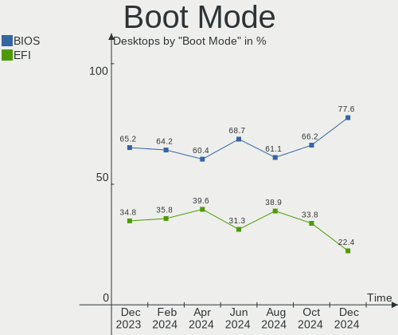
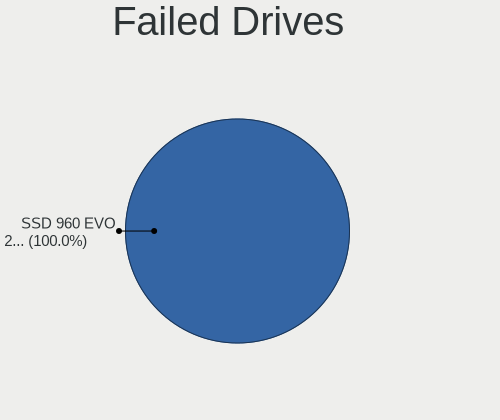
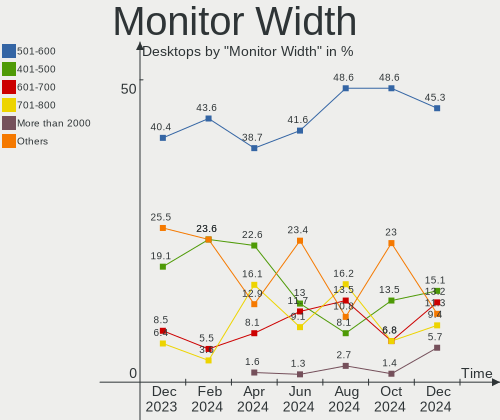
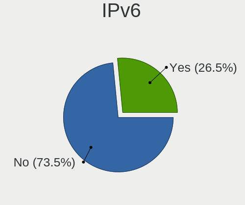
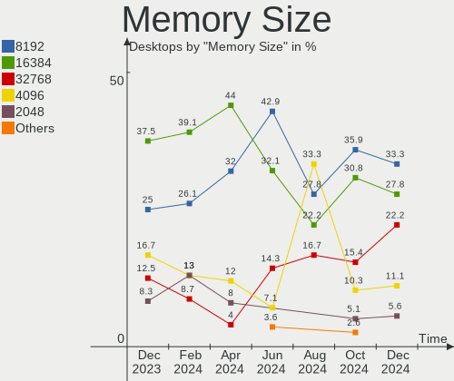

Kubuntu - Hardware Trends (Desktops)
------------------------------------

A project to identify most popular hardware characteristics and track their change
over time based on data collected by Linux users at https://Linux-Hardware.org.

Anyone can contribute to this report by the [hw-probe](https://github.com/linuxhw/hw-probe) tool:

    sudo -E hw-probe -all -upload

This report is for one last month. Overall report since the beginning of time: [TestDays](https://github.com/linuxhw/TestDays)

Period: Jun, 2023.

Contents
--------

* [ System ](#system)
  - [ OS                       ](#os)
  - [ OS Family                ](#os-family)
  - [ Kernel                   ](#kernel)
  - [ Kernel Family            ](#kernel-family)
  - [ Kernel Major Ver.        ](#kernel-major-ver)
  - [ Arch                     ](#arch)
  - [ DE                       ](#de)
  - [ Display Server           ](#display-server)
  - [ Display Manager          ](#display-manager)
  - [ OS Lang                  ](#os-lang)
  - [ Boot Mode                ](#boot-mode)
  - [ Filesystem               ](#filesystem)
  - [ Part. scheme             ](#part-scheme)
  - [ Dual Boot with Linux/BSD ](#dual-boot-with-linuxbsd)
  - [ Dual Boot (Win)          ](#dual-boot-win)

* [ Board ](#board)
  - [ Vendor                   ](#vendor)
  - [ Model                    ](#model)
  - [ Model Family             ](#model-family)
  - [ MFG Year                 ](#mfg-year)
  - [ Form Factor              ](#form-factor)
  - [ Secure Boot              ](#secure-boot)
  - [ Coreboot                 ](#coreboot)
  - [ RAM Size                 ](#ram-size)
  - [ RAM Used                 ](#ram-used)
  - [ Total Drives             ](#total-drives)
  - [ Has CD-ROM               ](#has-cd-rom)
  - [ Has Ethernet             ](#has-ethernet)
  - [ Has WiFi                 ](#has-wifi)
  - [ Has Bluetooth            ](#has-bluetooth)

* [ Location ](#location)
  - [ Country                  ](#country)
  - [ City                     ](#city)

* [ Drives ](#drives)
  - [ Drive Vendor             ](#drive-vendor)
  - [ Drive Model              ](#drive-model)
  - [ HDD Vendor               ](#hdd-vendor)
  - [ SSD Vendor               ](#ssd-vendor)
  - [ Drive Kind               ](#drive-kind)
  - [ Drive Connector          ](#drive-connector)
  - [ Drive Size               ](#drive-size)
  - [ Space Total              ](#space-total)
  - [ Space Used               ](#space-used)
  - [ Malfunc. Drives          ](#malfunc-drives)
  - [ Malfunc. Drive Vendor    ](#malfunc-drive-vendor)
  - [ Malfunc. HDD Vendor      ](#malfunc-hdd-vendor)
  - [ Malfunc. Drive Kind      ](#malfunc-drive-kind)
  - [ Failed Drives            ](#failed-drives)
  - [ Failed Drive Vendor      ](#failed-drive-vendor)
  - [ Drive Status             ](#drive-status)

* [ Storage controller ](#storage-controller)
  - [ Storage Vendor           ](#storage-vendor)
  - [ Storage Model            ](#storage-model)
  - [ Storage Kind             ](#storage-kind)

* [ Processor ](#processor)
  - [ CPU Vendor               ](#cpu-vendor)
  - [ CPU Model                ](#cpu-model)
  - [ CPU Model Family         ](#cpu-model-family)
  - [ CPU Cores                ](#cpu-cores)
  - [ CPU Sockets              ](#cpu-sockets)
  - [ CPU Threads              ](#cpu-threads)
  - [ CPU Op-Modes             ](#cpu-op-modes)
  - [ CPU Microcode            ](#cpu-microcode)
  - [ CPU Microarch            ](#cpu-microarch)

* [ Graphics ](#graphics)
  - [ GPU Vendor               ](#gpu-vendor)
  - [ GPU Model                ](#gpu-model)
  - [ GPU Combo                ](#gpu-combo)
  - [ GPU Driver               ](#gpu-driver)
  - [ GPU Memory               ](#gpu-memory)

* [ Monitor ](#monitor)
  - [ Monitor Vendor           ](#monitor-vendor)
  - [ Monitor Model            ](#monitor-model)
  - [ Monitor Resolution       ](#monitor-resolution)
  - [ Monitor Diagonal         ](#monitor-diagonal)
  - [ Monitor Width            ](#monitor-width)
  - [ Aspect Ratio             ](#aspect-ratio)
  - [ Monitor Area             ](#monitor-area)
  - [ Pixel Density            ](#pixel-density)
  - [ Multiple Monitors        ](#multiple-monitors)

* [ Network ](#network)
  - [ Net Controller Vendor    ](#net-controller-vendor)
  - [ Net Controller Model     ](#net-controller-model)
  - [ Wireless Vendor          ](#wireless-vendor)
  - [ Wireless Model           ](#wireless-model)
  - [ Ethernet Vendor          ](#ethernet-vendor)
  - [ Ethernet Model           ](#ethernet-model)
  - [ Net Controller Kind      ](#net-controller-kind)
  - [ Used Controller          ](#used-controller)
  - [ NICs                     ](#nics)
  - [ IPv6                     ](#ipv6)

* [ Bluetooth ](#bluetooth)
  - [ Bluetooth Vendor         ](#bluetooth-vendor)
  - [ Bluetooth Model          ](#bluetooth-model)

* [ Sound ](#sound)
  - [ Sound Vendor             ](#sound-vendor)
  - [ Sound Model              ](#sound-model)

* [ Memory ](#memory)
  - [ Memory Vendor            ](#memory-vendor)
  - [ Memory Model             ](#memory-model)
  - [ Memory Kind              ](#memory-kind)
  - [ Memory Form Factor       ](#memory-form-factor)
  - [ Memory Size              ](#memory-size)
  - [ Memory Speed             ](#memory-speed)

* [ Printers & scanners ](#printers--scanners)
  - [ Printer Vendor           ](#printer-vendor)
  - [ Printer Model            ](#printer-model)
  - [ Scanner Vendor           ](#scanner-vendor)
  - [ Scanner Model            ](#scanner-model)

* [ Camera ](#camera)
  - [ Camera Vendor            ](#camera-vendor)
  - [ Camera Model             ](#camera-model)

* [ Security ](#security)
  - [ Fingerprint Vendor       ](#fingerprint-vendor)
  - [ Fingerprint Model        ](#fingerprint-model)
  - [ Chipcard Vendor          ](#chipcard-vendor)
  - [ Chipcard Model           ](#chipcard-model)

* [ Unsupported ](#unsupported)
  - [ Unsupported Devices      ](#unsupported-devices)
  - [ Unsupported Device Types ](#unsupported-device-types)

System
------

OS
--

Installed operating systems

| Name          | Desktops | Percent |
|---------------|----------|---------|
| Kubuntu 22.04 | 16       | 47.06%  |
| Kubuntu 23.04 | 14       | 41.18%  |
| Kubuntu 11    | 2        | 5.88%   |
| Kubuntu 22.10 | 1        | 2.94%   |
| Kubuntu 20.04 | 1        | 2.94%   |

OS Family
---------

OS without a version

| Name    | Desktops | Percent |
|---------|----------|---------|
| Kubuntu | 34       | 100%    |

Kernel
------

Version of the Linux kernel

| Version               | Desktops | Percent |
|-----------------------|----------|---------|
| 5.15.0-73-generic     | 7        | 20.59%  |
| 6.2.0-20-generic      | 6        | 17.65%  |
| 6.2.0-23-generic      | 5        | 14.71%  |
| 5.19.0-43-generic     | 4        | 11.76%  |
| 5.15.0-75-generic     | 4        | 11.76%  |
| 6.3.5-060305-generic  | 1        | 2.94%   |
| 6.2.0-24-generic      | 1        | 2.94%   |
| 6.2.0-1003-lowlatency | 1        | 2.94%   |
| 5.19.0-45-generic     | 1        | 2.94%   |
| 5.19.0-21-generic     | 1        | 2.94%   |
| 5.15.0-77-generic     | 1        | 2.94%   |
| 5.15.0-74-generic     | 1        | 2.94%   |
| 5.15.0-71-generic     | 1        | 2.94%   |

Kernel Family
-------------

Linux kernel without a distro release

| Version | Desktops | Percent |
|---------|----------|---------|
| 5.15.0  | 14       | 41.18%  |
| 6.2.0   | 13       | 38.24%  |
| 5.19.0  | 6        | 17.65%  |
| 6.3.5   | 1        | 2.94%   |

Kernel Major Ver.
-----------------

Linux kernel major version

| Version | Desktops | Percent |
|---------|----------|---------|
| 5.15    | 14       | 41.18%  |
| 6.2     | 13       | 38.24%  |
| 5.19    | 6        | 17.65%  |
| 6.3     | 1        | 2.94%   |

Arch
----

OS architecture (x86_64, i586, etc.)

| Name   | Desktops | Percent |
|--------|----------|---------|
| x86_64 | 34       | 100%    |

DE
--

Desktop Environment

| Name | Desktops | Percent |
|------|----------|---------|
| KDE5 | 32       | 94.12%  |
| KDE  | 2        | 5.88%   |

Display Server
--------------

X11 or Wayland

| Name    | Desktops | Percent |
|---------|----------|---------|
| X11     | 28       | 82.35%  |
| Wayland | 5        | 14.71%  |
| Tty     | 1        | 2.94%   |

Display Manager
---------------

SDDM, LightDM, etc.

| Name    | Desktops | Percent |
|---------|----------|---------|
| SDDM    | 23       | 67.65%  |
| Unknown | 10       | 29.41%  |
| GDM3    | 1        | 2.94%   |

OS Lang
-------

Language

| Lang  | Desktops | Percent |
|-------|----------|---------|
| en_US | 12       | 35.29%  |
| en_GB | 5        | 14.71%  |
| pt_BR | 4        | 11.76%  |
| de_DE | 3        | 8.82%   |
| fr_FR | 2        | 5.88%   |
| zh_TW | 1        | 2.94%   |
| sv_SE | 1        | 2.94%   |
| ru_RU | 1        | 2.94%   |
| it_IT | 1        | 2.94%   |
| es_MX | 1        | 2.94%   |
| es_CO | 1        | 2.94%   |
| es_CL | 1        | 2.94%   |
| en_NZ | 1        | 2.94%   |

Boot Mode
---------

EFI or BIOS

| Mode | Desktops | Percent |
|------|----------|---------|
| BIOS | 18       | 52.94%  |
| EFI  | 16       | 47.06%  |

Filesystem
----------

Type of filesystem

| Type  | Desktops | Percent |
|-------|----------|---------|
| Ext4  | 26       | 76.47%  |
| Tmpfs | 4        | 11.76%  |
| Btrfs | 3        | 8.82%   |
| F2fs  | 1        | 2.94%   |

Part. scheme
------------

Scheme of partitioning

| Type    | Desktops | Percent |
|---------|----------|---------|
| GPT     | 23       | 67.65%  |
| Unknown | 9        | 26.47%  |
| MBR     | 2        | 5.88%   |

Dual Boot with Linux/BSD
------------------------

Hosting more than one Linux/BSD

| Dual boot | Desktops | Percent |
|-----------|----------|---------|
| No        | 24       | 70.59%  |
| Yes       | 10       | 29.41%  |

Dual Boot (Win)
---------------

Hosting Linux and Windows

| Dual boot | Desktops | Percent |
|-----------|----------|---------|
| No        | 23       | 67.65%  |
| Yes       | 11       | 32.35%  |

Board
-----

Vendor
------

Motherboard manufacturer

| Name                | Desktops | Percent |
|---------------------|----------|---------|
| ASUSTek Computer    | 8        | 23.53%  |
| Gigabyte Technology | 7        | 20.59%  |
| MSI                 | 4        | 11.76%  |
| Lenovo              | 2        | 5.88%   |
| Fujitsu             | 2        | 5.88%   |
| Biostar             | 2        | 5.88%   |
| ASRock              | 2        | 5.88%   |
| XFX                 | 1        | 2.94%   |
| Supermicro          | 1        | 2.94%   |
| Seco                | 1        | 2.94%   |
| Positivo            | 1        | 2.94%   |
| Intel               | 1        | 2.94%   |
| Huanan              | 1        | 2.94%   |
| BESSTAR Tech        | 1        | 2.94%   |

Model
-----

Motherboard model

| Name                                | Desktops | Percent |
|-------------------------------------|----------|---------|
| XFX MI-9300-7AS9                    | 1        | 2.94%   |
| Supermicro C7H61                    | 1        | 2.94%   |
| Seco C40                            | 1        | 2.94%   |
| Positivo POS-PIH81DI                | 1        | 2.94%   |
| MSI MS-7B78                         | 1        | 2.94%   |
| MSI MS-7846                         | 1        | 2.94%   |
| MSI MS-7817                         | 1        | 2.94%   |
| MSI 500-056                         | 1        | 2.94%   |
| Lenovo ThinkCentre M92p 2992E5U     | 1        | 2.94%   |
| Lenovo ThinkCentre M720t m720t 10SR | 1        | 2.94%   |
| Intel SHARKBAY                      | 1        | 2.94%   |
| Gigabyte Z490 AORUS ELITE AC        | 1        | 2.94%   |
| Gigabyte M68MT-S2P                  | 1        | 2.94%   |
| Gigabyte GA-MA770-US3               | 1        | 2.94%   |
| Gigabyte F2A88XM-D3H                | 1        | 2.94%   |
| Gigabyte C246-WU4                   | 1        | 2.94%   |
| Gigabyte B365M H                    | 1        | 2.94%   |
| Gigabyte AX370-Gaming K7            | 1        | 2.94%   |
| Fujitsu ESPRIMO D538                | 1        | 2.94%   |
| Fujitsu D3222-B1                    | 1        | 2.94%   |
| Biostar B350GT3                     | 1        | 2.94%   |
| Biostar A10N-8800E                  | 1        | 2.94%   |
| BESSTAR Tech UM700                  | 1        | 2.94%   |
| ASUS TUF Gaming Z690-PLUS WIFI D4   | 1        | 2.94%   |
| ASUS PRIME Z270-A                   | 1        | 2.94%   |
| ASUS PRIME H610M-E D4               | 1        | 2.94%   |
| ASUS PRIME H310M-A R2.0             | 1        | 2.94%   |
| ASUS P8Z77-V LE                     | 1        | 2.94%   |
| ASUS Maximus IX HERO                | 1        | 2.94%   |
| ASUS M5A78L-M LX PLUS               | 1        | 2.94%   |
| ASUS All Series                     | 1        | 2.94%   |
| ASRock H170M Pro4                   | 1        | 2.94%   |
| ASRock A320M-HDV R4.0               | 1        | 2.94%   |
| Unknown                             | 1        | 2.94%   |

Model Family
------------

Motherboard model prefix

| Name                  | Desktops | Percent |
|-----------------------|----------|---------|
| ASUS PRIME            | 3        | 8.82%   |
| Lenovo ThinkCentre    | 2        | 5.88%   |
| XFX MI-9300-7AS9      | 1        | 2.94%   |
| Supermicro C7H61      | 1        | 2.94%   |
| Seco C40              | 1        | 2.94%   |
| Positivo POS-PIH81DI  | 1        | 2.94%   |
| MSI MS-7B78           | 1        | 2.94%   |
| MSI MS-7846           | 1        | 2.94%   |
| MSI MS-7817           | 1        | 2.94%   |
| MSI 500-056           | 1        | 2.94%   |
| Intel SHARKBAY        | 1        | 2.94%   |
| Gigabyte Z490         | 1        | 2.94%   |
| Gigabyte M68MT-S2P    | 1        | 2.94%   |
| Gigabyte GA-MA770-US3 | 1        | 2.94%   |
| Gigabyte F2A88XM-D3H  | 1        | 2.94%   |
| Gigabyte C246-WU4     | 1        | 2.94%   |
| Gigabyte B365M        | 1        | 2.94%   |
| Gigabyte AX370-Gaming | 1        | 2.94%   |
| Fujitsu ESPRIMO       | 1        | 2.94%   |
| Fujitsu D3222-B1      | 1        | 2.94%   |
| Biostar B350GT3       | 1        | 2.94%   |
| Biostar A10N-8800E    | 1        | 2.94%   |
| BESSTAR Tech UM700    | 1        | 2.94%   |
| ASUS TUF              | 1        | 2.94%   |
| ASUS P8Z77-V          | 1        | 2.94%   |
| ASUS Maximus          | 1        | 2.94%   |
| ASUS M5A78L-M         | 1        | 2.94%   |
| ASUS All              | 1        | 2.94%   |
| ASRock H170M          | 1        | 2.94%   |
| ASRock A320M-HDV      | 1        | 2.94%   |
| Unknown               | 1        | 2.94%   |

MFG Year
--------

Motherboard manufacture year

| Year | Desktops | Percent |
|------|----------|---------|
| 2019 | 8        | 23.53%  |
| 2013 | 6        | 17.65%  |
| 2021 | 3        | 8.82%   |
| 2018 | 3        | 8.82%   |
| 2017 | 2        | 5.88%   |
| 2014 | 2        | 5.88%   |
| 2009 | 2        | 5.88%   |
| 2023 | 1        | 2.94%   |
| 2022 | 1        | 2.94%   |
| 2020 | 1        | 2.94%   |
| 2016 | 1        | 2.94%   |
| 2015 | 1        | 2.94%   |
| 2012 | 1        | 2.94%   |
| 2011 | 1        | 2.94%   |
| 2008 | 1        | 2.94%   |

Form Factor
-----------

Physical design of the computer

| Name    | Desktops | Percent |
|---------|----------|---------|
| Desktop | 34       | 100%    |

Secure Boot
-----------

Enabled or disabled

| State    | Desktops | Percent |
|----------|----------|---------|
| Disabled | 32       | 94.12%  |
| Enabled  | 2        | 5.88%   |

Coreboot
--------

Have coreboot on board

| Used | Desktops | Percent |
|------|----------|---------|
| No   | 34       | 100%    |

RAM Size
--------

Total RAM memory

| Size in GB  | Desktops | Percent |
|-------------|----------|---------|
| 8.01-16.0   | 8        | 23.53%  |
| 16.01-24.0  | 6        | 17.65%  |
| 4.01-8.0    | 5        | 14.71%  |
| 32.01-64.0  | 4        | 11.76%  |
| 3.01-4.0    | 4        | 11.76%  |
| 64.01-256.0 | 4        | 11.76%  |
| 24.01-32.0  | 3        | 8.82%   |

RAM Used
--------

Used RAM memory

| Used GB    | Desktops | Percent |
|------------|----------|---------|
| 1.01-2.0   | 11       | 32.35%  |
| 4.01-8.0   | 8        | 23.53%  |
| 2.01-3.0   | 6        | 17.65%  |
| 3.01-4.0   | 5        | 14.71%  |
| 16.01-24.0 | 2        | 5.88%   |
| 8.01-16.0  | 2        | 5.88%   |

Total Drives
------------

Number of drives on board

| Drives | Desktops | Percent |
|--------|----------|---------|
| 2      | 12       | 35.29%  |
| 1      | 8        | 23.53%  |
| 3      | 5        | 14.71%  |
| 4      | 3        | 8.82%   |
| 7      | 2        | 5.88%   |
| 6      | 2        | 5.88%   |
| 5      | 2        | 5.88%   |

Has CD-ROM
----------

Has CD-ROM on board

| Presented | Desktops | Percent |
|-----------|----------|---------|
| No        | 22       | 64.71%  |
| Yes       | 12       | 35.29%  |

Has Ethernet
------------

Has Ethernet on board

| Presented | Desktops | Percent |
|-----------|----------|---------|
| Yes       | 34       | 100%    |

Has WiFi
--------

Has WiFi module

| Presented | Desktops | Percent |
|-----------|----------|---------|
| No        | 25       | 73.53%  |
| Yes       | 9        | 26.47%  |

Has Bluetooth
-------------

Has Bluetooth module

| Presented | Desktops | Percent |
|-----------|----------|---------|
| No        | 26       | 76.47%  |
| Yes       | 8        | 23.53%  |

Location
--------

Country
-------

Geographic location (country)

| Country     | Desktops | Percent |
|-------------|----------|---------|
| USA         | 6        | 17.65%  |
| UK          | 5        | 14.71%  |
| Germany     | 5        | 14.71%  |
| Brazil      | 4        | 11.76%  |
| Serbia      | 2        | 5.88%   |
| France      | 2        | 5.88%   |
| Taiwan      | 1        | 2.94%   |
| Sweden      | 1        | 2.94%   |
| Slovenia    | 1        | 2.94%   |
| Russia      | 1        | 2.94%   |
| New Zealand | 1        | 2.94%   |
| Netherlands | 1        | 2.94%   |
| Mexico      | 1        | 2.94%   |
| Italy       | 1        | 2.94%   |
| Colombia    | 1        | 2.94%   |
| Chile       | 1        | 2.94%   |

City
----

Geographic location (city)

| City                 | Desktops | Percent |
|----------------------|----------|---------|
| Valrico              | 1        | 2.94%   |
| Uckfield             | 1        | 2.94%   |
| Taichung             | 1        | 2.94%   |
| Sutton               | 1        | 2.94%   |
| Sparks               | 1        | 2.94%   |
| Santiago             | 1        | 2.94%   |
| San Mateo            | 1        | 2.94%   |
| Rio de Janeiro       | 1        | 2.94%   |
| Pančevo             | 1        | 2.94%   |
| Orbassano            | 1        | 2.94%   |
| Oberursel            | 1        | 2.94%   |
| Norderstedt          | 1        | 2.94%   |
| Middlesbrough        | 1        | 2.94%   |
| Metepec              | 1        | 2.94%   |
| London               | 1        | 2.94%   |
| Leipzig              | 1        | 2.94%   |
| Lazarevac            | 1        | 2.94%   |
| Kostroma             | 1        | 2.94%   |
| Idrija               | 1        | 2.94%   |
| Home                 | 1        | 2.94%   |
| Hinesville           | 1        | 2.94%   |
| Hillsborough         | 1        | 2.94%   |
| Helsingborg          | 1        | 2.94%   |
| Hamburg              | 1        | 2.94%   |
| Gries                | 1        | 2.94%   |
| Curitiba             | 1        | 2.94%   |
| Compiègne           | 1        | 2.94%   |
| Buckley              | 1        | 2.94%   |
| Boa Vista            | 1        | 2.94%   |
| Bathmen              | 1        | 2.94%   |
| Barranquilla         | 1        | 2.94%   |
| Balneário Camboriú | 1        | 2.94%   |
| Augsburg             | 1        | 2.94%   |
| Auckland             | 1        | 2.94%   |

Drives
------

Drive Vendor
------------

Hard drive vendors

| Vendor                      | Desktops | Drives | Percent |
|-----------------------------|----------|--------|---------|
| Seagate                     | 16       | 21     | 23.19%  |
| WDC                         | 14       | 18     | 20.29%  |
| Samsung Electronics         | 11       | 21     | 15.94%  |
| Kingston                    | 7        | 9      | 10.14%  |
| Toshiba                     | 2        | 2      | 2.9%    |
| SanDisk                     | 2        | 4      | 2.9%    |
| Kingston Technology Company | 2        | 2      | 2.9%    |
| Gigabyte Technology         | 2        | 2      | 2.9%    |
| A-DATA Technology           | 2        | 2      | 2.9%    |
| SPCC                        | 1        | 5      | 1.45%   |
| PNY                         | 1        | 1      | 1.45%   |
| ORTIAL                      | 1        | 1      | 1.45%   |
| OCZ                         | 1        | 1      | 1.45%   |
| Maxtor                      | 1        | 1      | 1.45%   |
| MAXIO Technology (Hangzhou) | 1        | 1      | 1.45%   |
| Intenso                     | 1        | 1      | 1.45%   |
| Hitachi                     | 1        | 1      | 1.45%   |
| HGST                        | 1        | 1      | 1.45%   |
| DeLOCK                      | 1        | 1      | 1.45%   |
| Crucial                     | 1        | 1      | 1.45%   |

Drive Model
-----------

Hard drive models

| Model                                | Desktops | Percent |
|--------------------------------------|----------|---------|
| Seagate ST500DM002-1BD142 500GB      | 2        | 2.27%   |
| Seagate ST4000DM005-2DP166 4TB       | 2        | 2.27%   |
| Seagate ST2000DM008-2FR102 2TB       | 2        | 2.27%   |
| Seagate ST1000DM003-1ER162 1TB       | 2        | 2.27%   |
| Samsung SSD 850 EVO 250GB            | 2        | 2.27%   |
| Kingston SA400S37120G 120GB SSD      | 2        | 2.27%   |
| WDC WDS500G2B0A 500GB SSD            | 1        | 1.14%   |
| WDC WDS500G1B0B-00AS40 500GB SSD     | 1        | 1.14%   |
| WDC WDS200T1X0E-00AFY0 2TB           | 1        | 1.14%   |
| WDC WDS100T2G0A-00JH30 1TB SSD       | 1        | 1.14%   |
| WDC WD5000AAKX-60U6AA0 500GB         | 1        | 1.14%   |
| WDC WD40EZRZ-22GXCB0 4TB             | 1        | 1.14%   |
| WDC WD3200AAJS-65M0A0 320GB          | 1        | 1.14%   |
| WDC WD20EZAZ-00L9GB0 2TB             | 1        | 1.14%   |
| WDC WD20EFRX-68EUZN0 2TB             | 1        | 1.14%   |
| WDC WD10EZRX-00A8LB0 1TB             | 1        | 1.14%   |
| WDC WD10EZEX-60WN4A0 1TB             | 1        | 1.14%   |
| WDC WD10EZEX-08WN4A0 1TB             | 1        | 1.14%   |
| WDC WD10EZEX-08M2NA0 1TB             | 1        | 1.14%   |
| WDC WD10EZEX-00BN5A0 1TB             | 1        | 1.14%   |
| WDC WD102KRYZ-01A5AB0 10TB           | 1        | 1.14%   |
| WDC WD1003FZEX-00MK2A0 1TB           | 1        | 1.14%   |
| WDC PC SN520 SDAPMUW-256G-1101 256GB | 1        | 1.14%   |
| Toshiba DT01ACA100 1TB               | 1        | 1.14%   |
| Toshiba DT01ACA050 500GB             | 1        | 1.14%   |
| SPCC Solid State Disk 512GB          | 1        | 1.14%   |
| SPCC Solid State Disk 2TB            | 1        | 1.14%   |
| SPCC Solid State Disk 256GB          | 1        | 1.14%   |
| SPCC Solid State Disk 1024GB         | 1        | 1.14%   |
| Seagate ST4000VN008-2DR166 4TB       | 1        | 1.14%   |
| Seagate ST4000NM0035-1V4107 4TB      | 1        | 1.14%   |
| Seagate ST4000DX001-1CE168 4TB       | 1        | 1.14%   |
| Seagate ST4000DM004-2CV104 4TB       | 1        | 1.14%   |
| Seagate ST32000644NS 2TB             | 1        | 1.14%   |
| Seagate ST2000VX000-1ES164 2TB       | 1        | 1.14%   |
| Seagate ST2000DM006-2DM164 2TB       | 1        | 1.14%   |
| Seagate ST1000DX001-1CM162 1TB       | 1        | 1.14%   |
| Seagate ST1000DM003-9YN162 1TB       | 1        | 1.14%   |
| Seagate ST1000DM003-1CH162 1TB       | 1        | 1.14%   |
| Seagate One Touch HDD 2TB            | 1        | 1.14%   |

HDD Vendor
----------

Hard disk drive vendors

| Vendor              | Desktops | Drives | Percent |
|---------------------|----------|--------|---------|
| Seagate             | 16       | 21     | 48.48%  |
| WDC                 | 10       | 13     | 30.3%   |
| Toshiba             | 2        | 2      | 6.06%   |
| Samsung Electronics | 2        | 2      | 6.06%   |
| Maxtor              | 1        | 1      | 3.03%   |
| Hitachi             | 1        | 1      | 3.03%   |
| HGST                | 1        | 1      | 3.03%   |

SSD Vendor
----------

Solid state drive vendors

| Vendor              | Desktops | Drives | Percent |
|---------------------|----------|--------|---------|
| Samsung Electronics | 8        | 14     | 28.57%  |
| Kingston            | 5        | 7      | 17.86%  |
| WDC                 | 3        | 3      | 10.71%  |
| SanDisk             | 2        | 2      | 7.14%   |
| A-DATA Technology   | 2        | 2      | 7.14%   |
| SPCC                | 1        | 5      | 3.57%   |
| PNY                 | 1        | 1      | 3.57%   |
| ORTIAL              | 1        | 1      | 3.57%   |
| OCZ                 | 1        | 1      | 3.57%   |
| Intenso             | 1        | 1      | 3.57%   |
| Gigabyte Technology | 1        | 1      | 3.57%   |
| DeLOCK              | 1        | 1      | 3.57%   |
| Crucial             | 1        | 1      | 3.57%   |

Drive Kind
----------

HDD or SSD

| Kind | Desktops | Drives | Percent |
|------|----------|--------|---------|
| HDD  | 23       | 41     | 40.35%  |
| SSD  | 22       | 40     | 38.6%   |
| NVMe | 12       | 15     | 21.05%  |

Drive Connector
---------------

SATA, SAS, NVMe, etc.

| Type | Desktops | Drives | Percent |
|------|----------|--------|---------|
| SATA | 32       | 79     | 69.57%  |
| NVMe | 12       | 15     | 26.09%  |
| SAS  | 2        | 2      | 4.35%   |

Drive Size
----------

Size of hard drive

| Size in TB | Desktops | Drives | Percent |
|------------|----------|--------|---------|
| 0.01-0.5   | 22       | 38     | 40.74%  |
| 0.51-1.0   | 14       | 18     | 25.93%  |
| 1.01-2.0   | 10       | 16     | 18.52%  |
| 3.01-4.0   | 6        | 7      | 11.11%  |
| 4.01-10.0  | 2        | 2      | 3.7%    |

Space Total
-----------

Amount of disk space available on the file system

| Size in GB     | Desktops | Percent |
|----------------|----------|---------|
| 101-250        | 8        | 23.53%  |
| More than 3000 | 7        | 20.59%  |
| 1001-2000      | 6        | 17.65%  |
| 251-500        | 4        | 11.76%  |
| 501-1000       | 4        | 11.76%  |
| 2001-3000      | 2        | 5.88%   |
| 51-100         | 2        | 5.88%   |
| 21-50          | 1        | 2.94%   |

Space Used
----------

Amount of used disk space

| Used GB        | Desktops | Percent |
|----------------|----------|---------|
| 21-50          | 6        | 17.65%  |
| 501-1000       | 6        | 17.65%  |
| 101-250        | 5        | 14.71%  |
| 1-20           | 5        | 14.71%  |
| 251-500        | 4        | 11.76%  |
| 51-100         | 3        | 8.82%   |
| More than 3000 | 2        | 5.88%   |
| 1001-2000      | 2        | 5.88%   |
| 2001-3000      | 1        | 2.94%   |

Malfunc. Drives
---------------

Drive models with a malfunction

| Model                                        | Desktops | Drives | Percent |
|----------------------------------------------|----------|--------|---------|
| WDC WD3200AAJS-65M0A0 320GB                  | 1        | 1      | 12.5%   |
| WDC WD20EFRX-68EUZN0 2TB                     | 1        | 2      | 12.5%   |
| WDC WD10EZEX-00BN5A0 1TB                     | 1        | 1      | 12.5%   |
| Samsung Electronics SSD 840 PRO Series 256GB | 1        | 2      | 12.5%   |
| Samsung Electronics HD501LJ 500GB            | 1        | 1      | 12.5%   |
| ORTIAL SSD 128GB                             | 1        | 1      | 12.5%   |
| OCZ VERTEX3 120GB SSD                        | 1        | 1      | 12.5%   |
| Intenso SSD Sata III 512GB                   | 1        | 1      | 12.5%   |

Malfunc. Drive Vendor
---------------------

Vendors of faulty drives

| Vendor              | Desktops | Drives | Percent |
|---------------------|----------|--------|---------|
| WDC                 | 3        | 4      | 37.5%   |
| Samsung Electronics | 2        | 3      | 25%     |
| ORTIAL              | 1        | 1      | 12.5%   |
| OCZ                 | 1        | 1      | 12.5%   |
| Intenso             | 1        | 1      | 12.5%   |

Malfunc. HDD Vendor
-------------------

Vendors of faulty HDD drives

| Vendor              | Desktops | Drives | Percent |
|---------------------|----------|--------|---------|
| WDC                 | 3        | 4      | 75%     |
| Samsung Electronics | 1        | 1      | 25%     |

Malfunc. Drive Kind
-------------------

Kinds of faulty drives

| Kind | Desktops | Drives | Percent |
|------|----------|--------|---------|
| SSD  | 4        | 5      | 50%     |
| HDD  | 4        | 5      | 50%     |

Failed Drives
-------------

Failed drive models

| Model                                 | Desktops | Drives | Percent |
|---------------------------------------|----------|--------|---------|
| Samsung Electronics SSD 960 EVO 250GB | 1        | 2      | 100%    |

Failed Drive Vendor
-------------------

Failed drive vendors

| Vendor              | Desktops | Drives | Percent |
|---------------------|----------|--------|---------|
| Samsung Electronics | 1        | 2      | 100%    |

Drive Status
------------

Number of failed and malfunc. drives

| Status   | Desktops | Drives | Percent |
|----------|----------|--------|---------|
| Works    | 20       | 47     | 46.51%  |
| Detected | 15       | 37     | 34.88%  |
| Malfunc  | 7        | 10     | 16.28%  |
| Failed   | 1        | 2      | 2.33%   |

Storage controller
------------------

Storage Vendor
--------------

Storage controller vendors

| Vendor                      | Desktops | Percent |
|-----------------------------|----------|---------|
| Intel                       | 21       | 41.18%  |
| AMD                         | 11       | 21.57%  |
| Samsung Electronics         | 4        | 7.84%   |
| SanDisk                     | 3        | 5.88%   |
| Kingston Technology Company | 3        | 5.88%   |
| Nvidia                      | 2        | 3.92%   |
| JMicron Technology          | 2        | 3.92%   |
| ASMedia Technology          | 2        | 3.92%   |
| Phison Electronics          | 1        | 1.96%   |
| MAXIO Technology (Hangzhou) | 1        | 1.96%   |
| Marvell Technology Group    | 1        | 1.96%   |

Storage Model
-------------

Storage controller models

| Model                                                                          | Desktops | Percent |
|--------------------------------------------------------------------------------|----------|---------|
| AMD FCH SATA Controller [AHCI mode]                                            | 8        | 13.33%  |
| Intel 8 Series/C220 Series Chipset Family 6-port SATA Controller 1 [AHCI mode] | 6        | 10%     |
| Intel 200 Series PCH SATA controller [AHCI mode]                               | 4        | 6.67%   |
| Samsung NVMe SSD Controller SM981/PM981/PM983                                  | 3        | 5%      |
| Intel Cannon Lake PCH SATA AHCI Controller                                     | 3        | 5%      |
| Kingston Company Company Non-Volatile memory controller                        | 2        | 3.33%   |
| Intel Volume Management Device NVMe RAID Controller                            | 2        | 3.33%   |
| Intel Alder Lake-S PCH SATA Controller [AHCI Mode]                             | 2        | 3.33%   |
| Intel 7 Series/C210 Series Chipset Family 6-port SATA Controller [AHCI mode]   | 2        | 3.33%   |
| ASMedia ASM1062 Serial ATA Controller                                          | 2        | 3.33%   |
| AMD SB7x0/SB8x0/SB9x0 IDE Controller                                           | 2        | 3.33%   |
| SanDisk WD PC SN810 / Black SN850 NVMe SSD                                     | 1        | 1.67%   |
| SanDisk WD Black SN750 / PC SN730 NVMe SSD                                     | 1        | 1.67%   |
| SanDisk PC SN520 NVMe SSD                                                      | 1        | 1.67%   |
| SanDisk Non-Volatile memory controller                                         | 1        | 1.67%   |
| Samsung NVMe SSD Controller SM961/PM961/SM963                                  | 1        | 1.67%   |
| Phison PS5013 E13 NVMe Controller                                              | 1        | 1.67%   |
| Nvidia MCP79 SATA Controller                                                   | 1        | 1.67%   |
| Nvidia MCP61 SATA Controller                                                   | 1        | 1.67%   |
| MAXIO (Hangzhou) NVMe SSD Controller MAP1202                                   | 1        | 1.67%   |
| Marvell Group 88SE9120 SATA 6Gb/s Controller                                   | 1        | 1.67%   |
| Kingston Company OM3PDP3 NVMe SSD                                              | 1        | 1.67%   |
| Kingston Company NVMe Controller                                               | 1        | 1.67%   |
| JMicron JMB58x AHCI SATA controller                                            | 1        | 1.67%   |
| JMicron JMB363 SATA/IDE Controller                                             | 1        | 1.67%   |
| Intel Q170/Q150/B150/H170/H110/Z170/CM236 Chipset SATA Controller [AHCI Mode]  | 1        | 1.67%   |
| Intel Comet Lake SATA AHCI Controller                                          | 1        | 1.67%   |
| Intel C600/X79 series chipset 6-Port SATA AHCI Controller                      | 1        | 1.67%   |
| Intel 6 Series/C200 Series Chipset Family 6 port Desktop SATA AHCI Controller  | 1        | 1.67%   |
| AMD X370 Series Chipset SATA Controller                                        | 1        | 1.67%   |
| AMD SB7x0/SB8x0/SB9x0 SATA Controller [IDE mode]                               | 1        | 1.67%   |
| AMD SB7x0/SB8x0/SB9x0 SATA Controller [AHCI mode]                              | 1        | 1.67%   |
| AMD FCH SATA Controller D                                                      | 1        | 1.67%   |
| AMD 400 Series Chipset SATA Controller                                         | 1        | 1.67%   |
| AMD 300 Series Chipset SATA Controller                                         | 1        | 1.67%   |

Storage Kind
------------

Kind of storage controller (IDE, SATA, NVMe, SAS, ...)

| Kind | Desktops | Percent |
|------|----------|---------|
| SATA | 32       | 64%     |
| NVMe | 12       | 24%     |
| IDE  | 4        | 8%      |
| RAID | 2        | 4%      |

Processor
---------

CPU Vendor
----------

Processor vendors

| Vendor | Desktops | Percent |
|--------|----------|---------|
| Intel  | 22       | 64.71%  |
| AMD    | 12       | 35.29%  |

CPU Model
---------

Processor models

| Model                                           | Desktops | Percent |
|-------------------------------------------------|----------|---------|
| Intel Core i7-4790 CPU @ 3.60GHz                | 3        | 8.82%   |
| Intel Core i7-3770 CPU @ 3.40GHz                | 2        | 5.88%   |
| Intel Core i5-6400 CPU @ 2.70GHz                | 2        | 5.88%   |
| Intel Xeon CPU E5-2697 v2 @ 2.70GHz             | 1        | 2.94%   |
| Intel Pentium Gold G5500 CPU @ 3.80GHz          | 1        | 2.94%   |
| Intel Pentium Gold G5420 CPU @ 3.80GHz          | 1        | 2.94%   |
| Intel Pentium CPU G3220 @ 3.00GHz               | 1        | 2.94%   |
| Intel Core i9-9900K CPU @ 3.60GHz               | 1        | 2.94%   |
| Intel Core i7-8700K CPU @ 3.70GHz               | 1        | 2.94%   |
| Intel Core i7-7700K CPU @ 4.20GHz               | 1        | 2.94%   |
| Intel Core i7-4770 CPU @ 3.40GHz                | 1        | 2.94%   |
| Intel Core i7-10700 CPU @ 2.90GHz               | 1        | 2.94%   |
| Intel Core i5-9600KF CPU @ 3.70GHz              | 1        | 2.94%   |
| Intel Core i5-3470 CPU @ 3.20GHz                | 1        | 2.94%   |
| Intel Core i3-4170 CPU @ 3.70GHz                | 1        | 2.94%   |
| Intel Core 2 Duo CPU E8400 @ 3.00GHz            | 1        | 2.94%   |
| Intel 13th Gen Core i3-13100                    | 1        | 2.94%   |
| Intel 12th Gen Core i7-12700K                   | 1        | 2.94%   |
| AMD Ryzen Embedded V1605B with Radeon Vega Gfx  | 1        | 2.94%   |
| AMD Ryzen 7 3750H with Radeon Vega Mobile Gfx   | 1        | 2.94%   |
| AMD Ryzen 7 2700X Eight-Core Processor          | 1        | 2.94%   |
| AMD Ryzen 5 1600X Six-Core Processor            | 1        | 2.94%   |
| AMD Ryzen 5 1600 Six-Core Processor             | 1        | 2.94%   |
| AMD Ryzen 3 PRO 3200G with Radeon Vega Graphics | 1        | 2.94%   |
| AMD FX-8800P Radeon R7, 12 Compute Cores 4C+8G  | 1        | 2.94%   |
| AMD FX-8320E Eight-Core Processor               | 1        | 2.94%   |
| AMD Athlon II X3 425 Processor                  | 1        | 2.94%   |
| AMD Athlon II X2 270 Processor                  | 1        | 2.94%   |
| AMD A8-6500 APU with Radeon HD Graphics         | 1        | 2.94%   |
| AMD A6-6400K APU with Radeon HD Graphics        | 1        | 2.94%   |

CPU Model Family
----------------

Processor model prefix

| Model              | Desktops | Percent |
|--------------------|----------|---------|
| Intel Core i7      | 9        | 26.47%  |
| Intel Core i5      | 4        | 11.76%  |
| Other              | 2        | 5.88%   |
| Intel Pentium Gold | 2        | 5.88%   |
| AMD Ryzen 7        | 2        | 5.88%   |
| AMD Ryzen 5        | 2        | 5.88%   |
| AMD FX             | 2        | 5.88%   |
| Intel Xeon         | 1        | 2.94%   |
| Intel Pentium      | 1        | 2.94%   |
| Intel Core i9      | 1        | 2.94%   |
| Intel Core i3      | 1        | 2.94%   |
| Intel Core 2 Duo   | 1        | 2.94%   |
| AMD Ryzen Embedded | 1        | 2.94%   |
| AMD Ryzen 3 PRO    | 1        | 2.94%   |
| AMD Athlon II X3   | 1        | 2.94%   |
| AMD Athlon II X2   | 1        | 2.94%   |
| AMD A8             | 1        | 2.94%   |
| AMD A6             | 1        | 2.94%   |

CPU Cores
---------

Number of processor cores

| Number | Desktops | Percent |
|--------|----------|---------|
| 4      | 15       | 44.12%  |
| 2      | 8        | 23.53%  |
| 6      | 4        | 11.76%  |
| 8      | 3        | 8.82%   |
| 24     | 1        | 2.94%   |
| 12     | 1        | 2.94%   |
| 3      | 1        | 2.94%   |
| 1      | 1        | 2.94%   |

CPU Sockets
-----------

Number of sockets

| Number | Desktops | Percent |
|--------|----------|---------|
| 1      | 33       | 97.06%  |
| 2      | 1        | 2.94%   |

CPU Threads
-----------

Threads per core (Hyper-Threading)

| Number | Desktops | Percent |
|--------|----------|---------|
| 2      | 24       | 70.59%  |
| 1      | 10       | 29.41%  |

CPU Op-Modes
------------

CPU Operation Modes (32-bit, 64-bit)

| Op mode        | Desktops | Percent |
|----------------|----------|---------|
| 32-bit, 64-bit | 34       | 100%    |

CPU Microcode
-------------

Microcode number

| Number     | Desktops | Percent |
|------------|----------|---------|
| Unknown    | 18       | 52.94%  |
| 0x306c3    | 2        | 5.88%   |
| 0x906ed    | 1        | 2.94%   |
| 0x906eb    | 1        | 2.94%   |
| 0x90672    | 1        | 2.94%   |
| 0x506e3    | 1        | 2.94%   |
| 0x306e4    | 1        | 2.94%   |
| 0x306a9    | 1        | 2.94%   |
| 0x0810100b | 1        | 2.94%   |
| 0x0800820d | 1        | 2.94%   |
| 0x08001137 | 1        | 2.94%   |
| 0x08001126 | 1        | 2.94%   |
| 0x0600611a | 1        | 2.94%   |
| 0x06001119 | 1        | 2.94%   |
| 0x06000852 | 1        | 2.94%   |
| 0x010000c8 | 1        | 2.94%   |

CPU Microarch
-------------

Microarchitecture

| Name             | Desktops | Percent |
|------------------|----------|---------|
| KabyLake         | 6        | 17.65%  |
| Haswell          | 6        | 17.65%  |
| IvyBridge        | 4        | 11.76%  |
| Zen+             | 3        | 8.82%   |
| Zen              | 3        | 8.82%   |
| Piledriver       | 3        | 8.82%   |
| Skylake          | 2        | 5.88%   |
| K10              | 2        | 5.88%   |
| Penryn           | 1        | 2.94%   |
| Excavator        | 1        | 2.94%   |
| CometLake        | 1        | 2.94%   |
| Alderlake Hybrid | 1        | 2.94%   |
| Unknown          | 1        | 2.94%   |

Graphics
--------

GPU Vendor
----------

Vendors of graphics cards

| Vendor | Desktops | Percent |
|--------|----------|---------|
| AMD    | 17       | 44.74%  |
| Intel  | 11       | 28.95%  |
| Nvidia | 10       | 26.32%  |

GPU Model
---------

Graphics card models

| Model                                                                       | Desktops | Percent |
|-----------------------------------------------------------------------------|----------|---------|
| Intel Xeon E3-1200 v3/4th Gen Core Processor Integrated Graphics Controller | 4        | 10.26%  |
| AMD Ellesmere [Radeon RX 470/480/570/570X/580/580X/590]                     | 4        | 10.26%  |
| Nvidia GM206 [GeForce GTX 960]                                              | 2        | 5.13%   |
| Nvidia GF116 [GeForce GTX 550 Ti]                                           | 2        | 5.13%   |
| Intel CoffeeLake-S GT2 [UHD Graphics 630]                                   | 2        | 5.13%   |
| AMD Picasso/Raven 2 [Radeon Vega Series / Radeon Vega Mobile Series]        | 2        | 5.13%   |
| Nvidia TU117 [GeForce GTX 1650]                                             | 1        | 2.56%   |
| Nvidia GP106 [GeForce GTX 1060 6GB]                                         | 1        | 2.56%   |
| Nvidia GF108 [GeForce GT 730]                                               | 1        | 2.56%   |
| Nvidia GA106 [GeForce RTX 3060 Lite Hash Rate]                              | 1        | 2.56%   |
| Nvidia G94 [GeForce 9600 GT]                                                | 1        | 2.56%   |
| Nvidia C79 [GeForce 9300 / nForce 730i]                                     | 1        | 2.56%   |
| Intel Xeon E3-1200 v2/3rd Gen Core processor Graphics Controller            | 1        | 2.56%   |
| Intel HD Graphics 530                                                       | 1        | 2.56%   |
| Intel CoffeeLake-S GT1 [UHD Graphics 610]                                   | 1        | 2.56%   |
| Intel Alder Lake-S GT1 [UHD Graphics 730]                                   | 1        | 2.56%   |
| Intel 4th Generation Core Processor Family Integrated Graphics Controller   | 1        | 2.56%   |
| AMD Wani [Radeon R5/R6/R7 Graphics]                                         | 1        | 2.56%   |
| AMD Richland [Radeon HD 8570D]                                              | 1        | 2.56%   |
| AMD Richland [Radeon HD 8470D]                                              | 1        | 2.56%   |
| AMD Raven Ridge [Radeon Vega Series / Radeon Vega Mobile Series]            | 1        | 2.56%   |
| AMD R480 [Radeon X800 GTO] (Secondary)                                      | 1        | 2.56%   |
| AMD R480 [Radeon X800 GTO]                                                  | 1        | 2.56%   |
| AMD Pitcairn LE GL [FirePro W5000]                                          | 1        | 2.56%   |
| AMD Navi 24 [Radeon RX 6400/6500 XT/6500M]                                  | 1        | 2.56%   |
| AMD Navi 14 [Radeon RX 5500/5500M / Pro 5500M]                              | 1        | 2.56%   |
| AMD Cape Verde GL [FirePro W4100]                                           | 1        | 2.56%   |
| AMD Caicos PRO [Radeon HD 7450]                                             | 1        | 2.56%   |
| AMD Baffin [Radeon RX 550 640SP / RX 560/560X]                              | 1        | 2.56%   |

GPU Combo
---------

Combinations of graphics cards

| Name            | Desktops | Percent |
|-----------------|----------|---------|
| 1 x AMD         | 14       | 41.18%  |
| 1 x Nvidia      | 10       | 29.41%  |
| 1 x Intel       | 7        | 20.59%  |
| 2 x AMD         | 1        | 2.94%   |
| Intel + 2 x AMD | 1        | 2.94%   |
| Intel + AMD     | 1        | 2.94%   |

GPU Driver
----------

Free vs proprietary

| Driver      | Desktops | Percent |
|-------------|----------|---------|
| Free        | 27       | 79.41%  |
| Proprietary | 6        | 17.65%  |
| Unknown     | 1        | 2.94%   |

GPU Memory
----------

Total video memory

| Size in GB | Desktops | Percent |
|------------|----------|---------|
| Unknown    | 15       | 44.12%  |
| 1.01-2.0   | 5        | 14.71%  |
| 7.01-8.0   | 4        | 11.76%  |
| 3.01-4.0   | 4        | 11.76%  |
| 0.01-0.5   | 3        | 8.82%   |
| 5.01-6.0   | 1        | 2.94%   |
| 8.01-16.0  | 1        | 2.94%   |
| 0.51-1.0   | 1        | 2.94%   |

Monitor
-------

Monitor Vendor
--------------

Monitor vendors

| Vendor               | Desktops | Percent |
|----------------------|----------|---------|
| Philips              | 7        | 17.5%   |
| Samsung Electronics  | 6        | 15%     |
| Goldstar             | 5        | 12.5%   |
| Dell                 | 4        | 10%     |
| BenQ                 | 3        | 7.5%    |
| Hewlett-Packard      | 2        | 5%      |
| Ancor Communications | 2        | 5%      |
| Vizio                | 1        | 2.5%    |
| Vestel Elektronik    | 1        | 2.5%    |
| ONKYO                | 1        | 2.5%    |
| LG Electronics       | 1        | 2.5%    |
| Lenovo               | 1        | 2.5%    |
| ITE                  | 1        | 2.5%    |
| INS                  | 1        | 2.5%    |
| Iiyama               | 1        | 2.5%    |
| DENON                | 1        | 2.5%    |
| AOC                  | 1        | 2.5%    |
| Acer                 | 1        | 2.5%    |

Monitor Model
-------------

Monitor models

| Model                                                                   | Desktops | Percent |
|-------------------------------------------------------------------------|----------|---------|
| Vizio VX32L HDTV10A VIZ0021 1366x768 700x390mm 31.5-inch                | 1        | 2.22%   |
| Vestel Elektronik '' VES2608 1280x768 620x390mm 28.8-inch               | 1        | 2.22%   |
| Samsung Electronics U32H85x SAM0E3C 3840x2160 697x392mm 31.5-inch       | 1        | 2.22%   |
| Samsung Electronics SMBX2331 SAM076F 1920x1080 509x286mm 23.0-inch      | 1        | 2.22%   |
| Samsung Electronics S24D300 SAM0B43 1920x1080 531x299mm 24.0-inch       | 1        | 2.22%   |
| Samsung Electronics S24B150 SAM0983 1920x1080 521x293mm 23.5-inch       | 1        | 2.22%   |
| Samsung Electronics S22F350 SAM0D1A 1920x1080 477x268mm 21.5-inch       | 1        | 2.22%   |
| Samsung Electronics LCD Monitor SAM0D42 3840x2160 1872x1053mm 84.6-inch | 1        | 2.22%   |
| Samsung Electronics LCD Monitor SAM090B 1920x1080 1210x680mm 54.6-inch  | 1        | 2.22%   |
| Samsung Electronics LCD Monitor SAM0679 1360x768 410x256mm 19.0-inch    | 1        | 2.22%   |
| Samsung Electronics EPSON PJ SECA514 1920x1080                          | 1        | 2.22%   |
| Philips PHL 288P6L PHL08F2 3840x2160 621x341mm 27.9-inch                | 1        | 2.22%   |
| Philips PHL 241B8Q PHL0929 1920x1080 527x296mm 23.8-inch                | 1        | 2.22%   |
| Philips PHL 223V5 PHLC0CF 1920x1080 477x268mm 21.5-inch                 | 1        | 2.22%   |
| Philips PHL 203V5 PHLC0CE 1600x900 430x240mm 19.4-inch                  | 1        | 2.22%   |
| Philips FTV PHL01EA 1920x1080 1440x810mm 65.0-inch                      | 1        | 2.22%   |
| Philips 27M1N3200V PHLC279 1920x1080 598x336mm 27.0-inch                | 1        | 2.22%   |
| Philips 191V PHL0887 1366x768 409x230mm 18.5-inch                       | 1        | 2.22%   |
| ONKYO LCD Monitor TX-SR508                                              | 1        | 2.22%   |
| LG Electronics LCD Monitor D2342P 4800x1080                             | 1        | 2.22%   |
| Lenovo LEN L24e-20 LEN65DF 1920x1080 527x296mm 23.8-inch                | 1        | 2.22%   |
| ITE DP2VGA V235 ITE6516 1920x1080 600x340mm 27.2-inch                   | 1        | 2.22%   |
| INS WT70CA612 INS3694 3840x2160 1538x865mm 69.5-inch                    | 1        | 2.22%   |
| Iiyama PL2783Q IVM661E 2560x1440 597x336mm 27.0-inch                    | 1        | 2.22%   |
| Hewlett-Packard P204v HPN3633 1600x900 432x240mm 19.5-inch              | 1        | 2.22%   |
| Hewlett-Packard M24fw FHD HPN3708 1920x1080 527x296mm 23.8-inch         | 1        | 2.22%   |
| Hewlett-Packard L1530 HWP260C 1024x768 304x228mm 15.0-inch              | 1        | 2.22%   |
| Goldstar W2340 GSM57A8 1920x1080 510x290mm 23.1-inch                    | 1        | 2.22%   |
| Goldstar ULTRAWIDE GSM59F1 2560x1080 673x284mm 28.8-inch                | 1        | 2.22%   |
| Goldstar HDR 4K GSM7750 3840x2160 697x392mm 31.5-inch                   | 1        | 2.22%   |
| Goldstar E2351 GSM5872 1920x1080 510x290mm 23.1-inch                    | 1        | 2.22%   |
| Goldstar E2241 GSM5818 1920x1080 477x268mm 21.5-inch                    | 1        | 2.22%   |
| DENON AVR DON004C 3840x2160 698x392mm 31.5-inch                         | 1        | 2.22%   |
| Dell U2414H DELA0A4 1920x1080 527x296mm 23.8-inch                       | 1        | 2.22%   |
| Dell U2414H DELA0A2 1920x1080 527x296mm 23.8-inch                       | 1        | 2.22%   |
| Dell P1913 DELA087 1440x900 408x255mm 18.9-inch                         | 1        | 2.22%   |
| Dell LCD Monitor E228WFP 1680x1050                                      | 1        | 2.22%   |
| Dell E2216H DELF068 1920x1080 476x268mm 21.5-inch                       | 1        | 2.22%   |
| BenQ GL2450H BNQ78A7 1920x1080 531x298mm 24.0-inch                      | 1        | 2.22%   |
| BenQ G2450H BNQ78AB 1920x1080 530x300mm 24.0-inch                       | 1        | 2.22%   |

Monitor Resolution
------------------

Monitor screen resolution

| Resolution         | Desktops | Percent |
|--------------------|----------|---------|
| 1920x1080 (FHD)    | 18       | 46.15%  |
| 3840x2160 (4K)     | 6        | 15.38%  |
| 1680x1050 (WSXGA+) | 3        | 7.69%   |
| 1600x900 (HD+)     | 2        | 5.13%   |
| 4800x1080          | 1        | 2.56%   |
| 2560x1440 (QHD)    | 1        | 2.56%   |
| 2560x1080          | 1        | 2.56%   |
| 1920x540           | 1        | 2.56%   |
| 1440x900 (WXGA+)   | 1        | 2.56%   |
| 1366x768 (WXGA)    | 1        | 2.56%   |
| 1360x768           | 1        | 2.56%   |
| 1280x768           | 1        | 2.56%   |
| 1024x768 (XGA)     | 1        | 2.56%   |
| Unknown            | 1        | 2.56%   |

Monitor Diagonal
----------------

Diagonal size in inches

| Inches  | Desktops | Percent |
|---------|----------|---------|
| 24      | 7        | 17.07%  |
| 23      | 5        | 12.2%   |
| 31      | 4        | 9.76%   |
| 27      | 4        | 9.76%   |
| 21      | 4        | 9.76%   |
| 19      | 4        | 9.76%   |
| Unknown | 3        | 7.32%   |
| 84      | 1        | 2.44%   |
| 72      | 1        | 2.44%   |
| 69      | 1        | 2.44%   |
| 65      | 1        | 2.44%   |
| 54      | 1        | 2.44%   |
| 34      | 1        | 2.44%   |
| 28      | 1        | 2.44%   |
| 22      | 1        | 2.44%   |
| 18      | 1        | 2.44%   |
| 15      | 1        | 2.44%   |

Monitor Width
-------------

Physical width

| Width in mm | Desktops | Percent |
|-------------|----------|---------|
| 501-600     | 13       | 33.33%  |
| 401-500     | 10       | 25.64%  |
| 601-700     | 6        | 15.38%  |
| 1501-2000   | 3        | 7.69%   |
| Unknown     | 3        | 7.69%   |
| 1001-1500   | 2        | 5.13%   |
| 701-800     | 1        | 2.56%   |
| 301-350     | 1        | 2.56%   |

Aspect Ratio
------------

Proportional relationship between the width and the height

| Ratio   | Desktops | Percent |
|---------|----------|---------|
| 16/9    | 25       | 73.53%  |
| 16/10   | 4        | 11.76%  |
| Unknown | 3        | 8.82%   |
| 4/3     | 1        | 2.94%   |
| 21/9    | 1        | 2.94%   |

Monitor Area
------------

Area in inch²

| Area in inch² | Desktops | Percent |
|----------------|----------|---------|
| 201-250        | 15       | 37.5%   |
| 351-500        | 6        | 15%     |
| More than 1000 | 5        | 12.5%   |
| 301-350        | 4        | 10%     |
| 151-200        | 4        | 10%     |
| Unknown        | 3        | 7.5%    |
| 251-300        | 1        | 2.5%    |
| 141-150        | 1        | 2.5%    |
| 101-110        | 1        | 2.5%    |

Pixel Density
-------------

Pixels per inch

| Density | Desktops | Percent |
|---------|----------|---------|
| 51-100  | 20       | 55.56%  |
| 101-120 | 5        | 13.89%  |
| 1-50    | 4        | 11.11%  |
| 121-160 | 4        | 11.11%  |
| Unknown | 3        | 8.33%   |

Multiple Monitors
-----------------

Total monitors connected

| Total | Desktops | Percent |
|-------|----------|---------|
| 1     | 24       | 70.59%  |
| 2     | 7        | 20.59%  |
| 4     | 2        | 5.88%   |
| 0     | 1        | 2.94%   |

Network
-------

Net Controller Vendor
---------------------

Controller vendors

| Vendor                | Desktops | Percent |
|-----------------------|----------|---------|
| Realtek Semiconductor | 21       | 45.65%  |
| Intel                 | 14       | 30.43%  |
| Ralink                | 2        | 4.35%   |
| Qualcomm Atheros      | 2        | 4.35%   |
| Texas Instruments     | 1        | 2.17%   |
| Nvidia                | 1        | 2.17%   |
| Edimax Technology     | 1        | 2.17%   |
| Broadcom              | 1        | 2.17%   |
| ASUSTek Computer      | 1        | 2.17%   |
| Aquantia              | 1        | 2.17%   |
| Accton Technology     | 1        | 2.17%   |

Net Controller Model
--------------------

Controller models

| Model                                                             | Desktops | Percent |
|-------------------------------------------------------------------|----------|---------|
| Realtek RTL8111/8168/8411 PCI Express Gigabit Ethernet Controller | 17       | 31.48%  |
| Realtek RTL8153 Gigabit Ethernet Adapter                          | 3        | 5.56%   |
| Intel I211 Gigabit Network Connection                             | 3        | 5.56%   |
| Intel Ethernet Connection (2) I219-V                              | 3        | 5.56%   |
| Intel I210 Gigabit Network Connection                             | 2        | 3.7%    |
| Intel Ethernet Controller I225-V                                  | 2        | 3.7%    |
| Texas Instruments TI CC2540 USB CDC                               | 1        | 1.85%   |
| Realtek RTL8125 2.5GbE Controller                                 | 1        | 1.85%   |
| Realtek RTL810xE PCI Express Fast Ethernet controller             | 1        | 1.85%   |
| Ralink RT5392 PCIe Wireless Network Adapter                       | 1        | 1.85%   |
| Ralink RT3290 Wireless 802.11n 1T/1R PCIe                         | 1        | 1.85%   |
| Qualcomm Atheros Killer E2500 Gigabit Ethernet Controller         | 1        | 1.85%   |
| Qualcomm Atheros AR8161 Gigabit Ethernet                          | 1        | 1.85%   |
| Nvidia MCP61 Ethernet                                             | 1        | 1.85%   |
| Intel Wireless-AC 9260                                            | 1        | 1.85%   |
| Intel Wireless 7265                                               | 1        | 1.85%   |
| Intel Wi-Fi 6 AX210/AX211/AX411 160MHz                            | 1        | 1.85%   |
| Intel Ethernet Connection I217-LM                                 | 1        | 1.85%   |
| Intel Ethernet Connection (7) I219-V                              | 1        | 1.85%   |
| Intel Ethernet Connection (7) I219-LM                             | 1        | 1.85%   |
| Intel Comet Lake PCH CNVi WiFi                                    | 1        | 1.85%   |
| Intel Alder Lake-S PCH CNVi WiFi                                  | 1        | 1.85%   |
| Intel 82579V Gigabit Network Connection                           | 1        | 1.85%   |
| Intel 82579LM Gigabit Network Connection (Lewisville)             | 1        | 1.85%   |
| Intel 82574L Gigabit Network Connection                           | 1        | 1.85%   |
| Edimax EW-7811Un 802.11n Wireless Adapter [Realtek RTL8188CUS]    | 1        | 1.85%   |
| Broadcom BCM4360 802.11ac Wireless Network Adapter                | 1        | 1.85%   |
| ASUS AC51 802.11a/b/g/n/ac Wireless Adapter [Mediatek MT7610U]    | 1        | 1.85%   |
| Aquantia AQC107 NBase-T/IEEE 802.3bz Ethernet Controller [AQtion] | 1        | 1.85%   |
| Accton SMC2-1211TX                                                | 1        | 1.85%   |

Wireless Vendor
---------------

Wireless vendors

| Vendor            | Desktops | Percent |
|-------------------|----------|---------|
| Intel             | 4        | 44.44%  |
| Ralink            | 2        | 22.22%  |
| Edimax Technology | 1        | 11.11%  |
| Broadcom          | 1        | 11.11%  |
| ASUSTek Computer  | 1        | 11.11%  |

Wireless Model
--------------

Wireless models

| Model                                                          | Desktops | Percent |
|----------------------------------------------------------------|----------|---------|
| Ralink RT5392 PCIe Wireless Network Adapter                    | 1        | 10%     |
| Ralink RT3290 Wireless 802.11n 1T/1R PCIe                      | 1        | 10%     |
| Intel Wireless-AC 9260                                         | 1        | 10%     |
| Intel Wireless 7265                                            | 1        | 10%     |
| Intel Wi-Fi 6 AX210/AX211/AX411 160MHz                         | 1        | 10%     |
| Intel Comet Lake PCH CNVi WiFi                                 | 1        | 10%     |
| Intel Alder Lake-S PCH CNVi WiFi                               | 1        | 10%     |
| Edimax EW-7811Un 802.11n Wireless Adapter [Realtek RTL8188CUS] | 1        | 10%     |
| Broadcom BCM4360 802.11ac Wireless Network Adapter             | 1        | 10%     |
| ASUS AC51 802.11a/b/g/n/ac Wireless Adapter [Mediatek MT7610U] | 1        | 10%     |

Ethernet Vendor
---------------

Ethernet vendors

| Vendor                | Desktops | Percent |
|-----------------------|----------|---------|
| Realtek Semiconductor | 21       | 53.85%  |
| Intel                 | 13       | 33.33%  |
| Qualcomm Atheros      | 2        | 5.13%   |
| Nvidia                | 1        | 2.56%   |
| Aquantia              | 1        | 2.56%   |
| Accton Technology     | 1        | 2.56%   |

Ethernet Model
--------------

Ethernet models

| Model                                                             | Desktops | Percent |
|-------------------------------------------------------------------|----------|---------|
| Realtek RTL8111/8168/8411 PCI Express Gigabit Ethernet Controller | 17       | 39.53%  |
| Realtek RTL8153 Gigabit Ethernet Adapter                          | 3        | 6.98%   |
| Intel I211 Gigabit Network Connection                             | 3        | 6.98%   |
| Intel Ethernet Connection (2) I219-V                              | 3        | 6.98%   |
| Intel I210 Gigabit Network Connection                             | 2        | 4.65%   |
| Intel Ethernet Controller I225-V                                  | 2        | 4.65%   |
| Realtek RTL8125 2.5GbE Controller                                 | 1        | 2.33%   |
| Realtek RTL810xE PCI Express Fast Ethernet controller             | 1        | 2.33%   |
| Qualcomm Atheros Killer E2500 Gigabit Ethernet Controller         | 1        | 2.33%   |
| Qualcomm Atheros AR8161 Gigabit Ethernet                          | 1        | 2.33%   |
| Nvidia MCP61 Ethernet                                             | 1        | 2.33%   |
| Intel Ethernet Connection I217-LM                                 | 1        | 2.33%   |
| Intel Ethernet Connection (7) I219-V                              | 1        | 2.33%   |
| Intel Ethernet Connection (7) I219-LM                             | 1        | 2.33%   |
| Intel 82579V Gigabit Network Connection                           | 1        | 2.33%   |
| Intel 82579LM Gigabit Network Connection (Lewisville)             | 1        | 2.33%   |
| Intel 82574L Gigabit Network Connection                           | 1        | 2.33%   |
| Aquantia AQC107 NBase-T/IEEE 802.3bz Ethernet Controller [AQtion] | 1        | 2.33%   |
| Accton SMC2-1211TX                                                | 1        | 2.33%   |

Net Controller Kind
-------------------

Ethernet, WiFi or modem

| Kind     | Desktops | Percent |
|----------|----------|---------|
| Ethernet | 34       | 77.27%  |
| WiFi     | 9        | 20.45%  |
| Modem    | 1        | 2.27%   |

Used Controller
---------------

Currently used network controller

| Kind     | Desktops | Percent |
|----------|----------|---------|
| Ethernet | 32       | 84.21%  |
| WiFi     | 6        | 15.79%  |

NICs
----

Total network controllers on board

| Total | Desktops | Percent |
|-------|----------|---------|
| 1     | 22       | 64.71%  |
| 2     | 10       | 29.41%  |
| 4     | 1        | 2.94%   |
| 3     | 1        | 2.94%   |

IPv6
----

IPv6 vs IPv4

| Used | Desktops | Percent |
|------|----------|---------|
| No   | 25       | 73.53%  |
| Yes  | 9        | 26.47%  |

Bluetooth
---------

Bluetooth Vendor
----------------

Controller vendors

| Vendor                  | Desktops | Percent |
|-------------------------|----------|---------|
| Intel                   | 5        | 62.5%   |
| Ralink                  | 1        | 12.5%   |
| Cambridge Silicon Radio | 1        | 12.5%   |
| ASUSTek Computer        | 1        | 12.5%   |

Bluetooth Model
---------------

Controller models

| Model                                               | Desktops | Percent |
|-----------------------------------------------------|----------|---------|
| Intel Wireless-AC 9260 Bluetooth Adapter            | 2        | 22.22%  |
| Ralink RT3290 Bluetooth                             | 1        | 11.11%  |
| Intel Bluetooth wireless interface                  | 1        | 11.11%  |
| Intel Bluetooth 9460/9560 Jefferson Peak (JfP)      | 1        | 11.11%  |
| Intel AX210 Bluetooth                               | 1        | 11.11%  |
| Intel AX201 Bluetooth                               | 1        | 11.11%  |
| Cambridge Silicon Radio Bluetooth Dongle (HCI mode) | 1        | 11.11%  |
| ASUS ASUS USB-BT500                                 | 1        | 11.11%  |

Sound
-----

Sound Vendor
------------

Sound card vendors

| Vendor                | Desktops | Percent |
|-----------------------|----------|---------|
| Intel                 | 21       | 35%     |
| AMD                   | 19       | 31.67%  |
| Nvidia                | 9        | 15%     |
| C-Media Electronics   | 4        | 6.67%   |
| Logitech              | 2        | 3.33%   |
| Trust                 | 1        | 1.67%   |
| Medeli Electronics    | 1        | 1.67%   |
| Mackie Designs        | 1        | 1.67%   |
| GN Netcom             | 1        | 1.67%   |
| 2.4G Composite Device | 1        | 1.67%   |

Sound Model
-----------

Sound card models

| Model                                                                             | Desktops | Percent |
|-----------------------------------------------------------------------------------|----------|---------|
| Intel 8 Series/C220 Series Chipset High Definition Audio Controller               | 6        | 8.33%   |
| Intel Xeon E3-1200 v3/4th Gen Core Processor HD Audio Controller                  | 4        | 5.56%   |
| Intel 200 Series PCH HD Audio                                                     | 4        | 5.56%   |
| AMD Ellesmere HDMI Audio [Radeon RX 470/480 / 570/580/590]                        | 4        | 5.56%   |
| Nvidia GF116 High Definition Audio Controller                                     | 3        | 4.17%   |
| Intel Cannon Lake PCH cAVS                                                        | 3        | 4.17%   |
| AMD Raven/Raven2/Fenghuang HDMI/DP Audio Controller                               | 3        | 4.17%   |
| AMD Family 17h/19h HD Audio Controller                                            | 3        | 4.17%   |
| AMD Family 17h (Models 00h-0fh) HD Audio Controller                               | 3        | 4.17%   |
| Intel Alder Lake-S HD Audio Controller                                            | 2        | 2.78%   |
| Intel 7 Series/C216 Chipset Family High Definition Audio Controller               | 2        | 2.78%   |
| C-Media Electronics CMI8738/CMI8768 PCI Audio                                     | 2        | 2.78%   |
| AMD SBx00 Azalia (Intel HDA)                                                      | 2        | 2.78%   |
| AMD Oland/Hainan/Cape Verde/Pitcairn HDMI Audio [Radeon HD 7000 Series]           | 2        | 2.78%   |
| AMD FCH Azalia Controller                                                         | 2        | 2.78%   |
| Trust Microphone                                                                  | 1        | 1.39%   |
| Nvidia TU107 GeForce GTX 1650 High Definition Audio Controller                    | 1        | 1.39%   |
| Nvidia MCP79 High Definition Audio                                                | 1        | 1.39%   |
| Nvidia MCP61 High Definition Audio                                                | 1        | 1.39%   |
| Nvidia GP106 High Definition Audio Controller                                     | 1        | 1.39%   |
| Nvidia GM206 High Definition Audio Controller                                     | 1        | 1.39%   |
| Nvidia GF108 High Definition Audio Controller                                     | 1        | 1.39%   |
| Nvidia GA106 High Definition Audio Controller                                     | 1        | 1.39%   |
| Medeli Electronics FDUCE ProAudio                                                 | 1        | 1.39%   |
| Mackie Designs CHROMIUM Microphone                                                | 1        | 1.39%   |
| Logitech H820e                                                                    | 1        | 1.39%   |
| Logitech G433 Gaming Headset                                                      | 1        | 1.39%   |
| Intel Comet Lake PCH cAVS                                                         | 1        | 1.39%   |
| Intel C600/X79 series chipset High Definition Audio Controller                    | 1        | 1.39%   |
| Intel 6 Series/C200 Series Chipset Family High Definition Audio Controller        | 1        | 1.39%   |
| Intel 100 Series/C230 Series Chipset Family HD Audio Controller                   | 1        | 1.39%   |
| GN Netcom Jabra SPEAK 510                                                         | 1        | 1.39%   |
| C-Media Electronics USB Audio Device                                              | 1        | 1.39%   |
| C-Media Electronics Audio Adapter (Unitek Y-247A)                                 | 1        | 1.39%   |
| AMD Trinity HDMI Audio Controller                                                 | 1        | 1.39%   |
| AMD Navi 21/23 HDMI/DP Audio Controller                                           | 1        | 1.39%   |
| AMD Navi 10 HDMI Audio                                                            | 1        | 1.39%   |
| AMD Kabini HDMI/DP Audio                                                          | 1        | 1.39%   |
| AMD Family 15h (Models 60h-6fh) Audio Controller                                  | 1        | 1.39%   |
| AMD Caicos HDMI Audio [Radeon HD 6450 / 7450/8450/8490 OEM / R5 230/235/235X OEM] | 1        | 1.39%   |

Memory
------

Memory Vendor
-------------

Memory module vendors

| Vendor              | Desktops | Percent |
|---------------------|----------|---------|
| Kingston            | 6        | 23.08%  |
| Crucial             | 4        | 15.38%  |
| Corsair             | 4        | 15.38%  |
| Samsung Electronics | 3        | 11.54%  |
| Unknown             | 2        | 7.69%   |
| Micron Technology   | 2        | 7.69%   |
| Teikon              | 1        | 3.85%   |
| Patriot             | 1        | 3.85%   |
| G.Skill             | 1        | 3.85%   |
| Avant               | 1        | 3.85%   |
| Unknown             | 1        | 3.85%   |

Memory Model
------------

Memory module models

| Model                                                    | Desktops | Percent |
|----------------------------------------------------------|----------|---------|
| Unknown RAM Module 8GB DIMM 667MT/s                      | 1        | 3.57%   |
| Unknown RAM Module 4GB DIMM 1600MT/s                     | 1        | 3.57%   |
| Unknown RAM Module 2GB DIMM 1600MT/s                     | 1        | 3.57%   |
| Teikon RAM TMT41GU6BFR8C-PBHJ 8GB DIMM DDR3 1600MT/s     | 1        | 3.57%   |
| Samsung RAM M386B4G70DM0 32GB DIMM DDR3 1333MT/s         | 1        | 3.57%   |
| Samsung RAM M378A5143EB1-CPB 4GB DIMM DDR4 2400MT/s      | 1        | 3.57%   |
| Samsung RAM M378A1G43DB0-CPB 8GB DIMM DDR4 2133MT/s      | 1        | 3.57%   |
| Patriot RAM 3200 C16 Series 8GB DIMM DDR4 3266MT/s       | 1        | 3.57%   |
| Micron RAM 8KTF51264AZ-1G6E1 4GB DIMM DDR3 1600MT/s      | 1        | 3.57%   |
| Micron RAM 16KTF51264AZ-1G6M1 4GB DIMM DDR3 1600MT/s     | 1        | 3.57%   |
| Micron RAM 16ATF2G64AZ-2G6J1 16GB DIMM DDR4 2667MT/s     | 1        | 3.57%   |
| Kingston RAM KHX2133C14/8G 8192MB DIMM DDR4 2400MT/s     | 1        | 3.57%   |
| Kingston RAM 99U5471-054.A00LF 8GB DIMM DDR3 1600MT/s    | 1        | 3.57%   |
| Kingston RAM 99U5471-037.A00LF 8GB DIMM DDR3 1600MT/s    | 1        | 3.57%   |
| Kingston RAM 9965745-028.A00G 16GB DIMM DDR4 2666MT/s    | 1        | 3.57%   |
| Kingston RAM 9965646-035.B00G 8GB SODIMM DDR4 2933MT/s   | 1        | 3.57%   |
| Kingston RAM 9905678-102.A00G 8GB DIMM DDR4 2133MT/s     | 1        | 3.57%   |
| G.Skill RAM F3-1600C9-8GXM 8GB DIMM DDR3 1867MT/s        | 1        | 3.57%   |
| Crucial RAM CT51264BA160B 4GB DIMM DDR3 1600MT/s         | 1        | 3.57%   |
| Crucial RAM BLS8G4D240FSBK.8FBD 8GB DIMM DDR4 2400MT/s   | 1        | 3.57%   |
| Crucial RAM BLS8G3D1609DS1S00. 8GB DIMM DDR3 1800MT/s    | 1        | 3.57%   |
| Crucial RAM BLS16G4D240FSE.16FBD 16GB DIMM DDR4 2473MT/s | 1        | 3.57%   |
| Corsair RAM CMK32GX4M2D3600C18 16GB DIMM DDR4 3800MT/s   | 1        | 3.57%   |
| Corsair RAM CMK16GX4M2E3200C16 8GB DIMM DDR4 3200MT/s    | 1        | 3.57%   |
| Corsair RAM CMK16GX4M2B3200C16 8192MB DIMM DDR4 3600MT/s | 1        | 3.57%   |
| Corsair RAM CMK16GX4M1A2666C16 16GB DIMM DDR4 2800MT/s   | 1        | 3.57%   |
| Avant RAM F6456U61E6800F 2048MB DIMM SDRAM               | 1        | 3.57%   |
| Unknown                                                  | 1        | 3.57%   |

Memory Kind
-----------

Memory module kinds

| Kind    | Desktops | Percent |
|---------|----------|---------|
| DDR4    | 11       | 52.38%  |
| DDR3    | 7        | 33.33%  |
| Unknown | 2        | 9.52%   |
| SDRAM   | 1        | 4.76%   |

Memory Form Factor
------------------

Physical design of the memory module

| Name   | Desktops | Percent |
|--------|----------|---------|
| DIMM   | 20       | 95.24%  |
| SODIMM | 1        | 4.76%   |

Memory Size
-----------

Memory module size

| Size  | Desktops | Percent |
|-------|----------|---------|
| 8192  | 11       | 47.83%  |
| 16384 | 4        | 17.39%  |
| 4096  | 4        | 17.39%  |
| 32768 | 2        | 8.7%    |
| 2048  | 2        | 8.7%    |

Memory Speed
------------

Memory module speed

| Speed   | Desktops | Percent |
|---------|----------|---------|
| 1600    | 5        | 21.74%  |
| 2400    | 3        | 13.04%  |
| 3800    | 1        | 4.35%   |
| 3600    | 1        | 4.35%   |
| 3266    | 1        | 4.35%   |
| 3200    | 1        | 4.35%   |
| 2933    | 1        | 4.35%   |
| 2800    | 1        | 4.35%   |
| 2667    | 1        | 4.35%   |
| 2666    | 1        | 4.35%   |
| 2473    | 1        | 4.35%   |
| 2133    | 1        | 4.35%   |
| 1867    | 1        | 4.35%   |
| 1800    | 1        | 4.35%   |
| 1333    | 1        | 4.35%   |
| 667     | 1        | 4.35%   |
| Unknown | 1        | 4.35%   |

Printers & scanners
-------------------

Printer Vendor
--------------

Printer device vendors

Zero info for selected period =(

Printer Model
-------------

Printer device models

Zero info for selected period =(

Scanner Vendor
--------------

Scanner device vendors

Zero info for selected period =(

Scanner Model
-------------

Scanner device models

Zero info for selected period =(

Camera
------

Camera Vendor
-------------

Camera device vendors

| Vendor                 | Desktops | Percent |
|------------------------|----------|---------|
| Logitech               | 3        | 42.86%  |
| SN0002                 | 1        | 14.29%  |
| Microdia               | 1        | 14.29%  |
| Generalplus Technology | 1        | 14.29%  |
| GEMBIRD                | 1        | 14.29%  |

Camera Model
------------

Camera device models

| Model                                             | Desktops | Percent |
|---------------------------------------------------|----------|---------|
| Logitech C922 Pro Stream Webcam                   | 2        | 28.57%  |
| SN0002 1080P Web Camera                           | 1        | 14.29%  |
| Microdia Camera                                   | 1        | 14.29%  |
| Logitech Webcam C600                              | 1        | 14.29%  |
| Generalplus GENERAL WEBCAM                        | 1        | 14.29%  |
| GEMBIRD Generic UVC 1.00 camera [AppoTech AX2311] | 1        | 14.29%  |

Security
--------

Fingerprint Vendor
------------------

Fingerprint sensor vendors

Zero info for selected period =(

Fingerprint Model
-----------------

Fingerprint sensor models

Zero info for selected period =(

Chipcard Vendor
---------------

Chipcard module vendors

Zero info for selected period =(

Chipcard Model
--------------

Chipcard module models

Zero info for selected period =(

Unsupported
-----------

Unsupported Devices
-------------------

Total unsupported devices on board

| Total | Desktops | Percent |
|-------|----------|---------|
| 0     | 31       | 91.18%  |
| 1     | 3        | 8.82%   |

Unsupported Device Types
------------------------

Types of unsupported devices

| Type          | Desktops | Percent |
|---------------|----------|---------|
| Graphics card | 2        | 66.67%  |
| Bluetooth     | 1        | 33.33%  |

