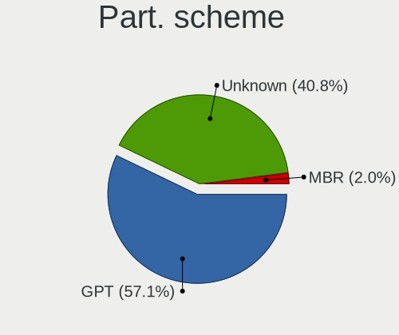
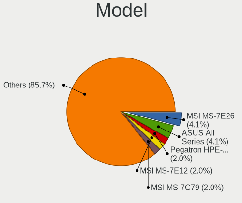
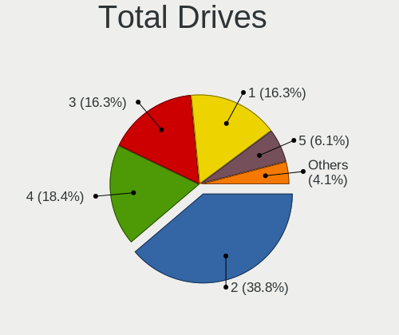
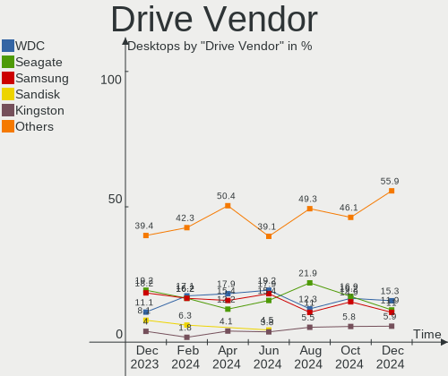
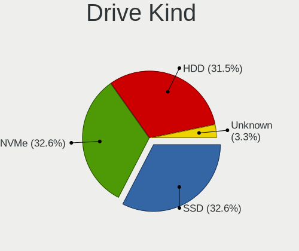
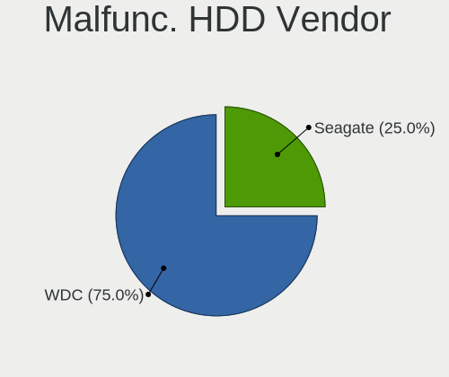
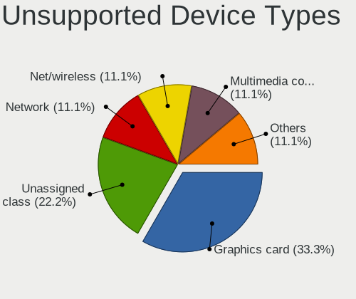

Kubuntu - Hardware Trends (Desktops)
------------------------------------

A project to identify most popular hardware characteristics and track their change
over time based on data collected by Linux users at https://Linux-Hardware.org.

Anyone can contribute to this report by the [hw-probe](https://github.com/linuxhw/hw-probe) tool:

    sudo -E hw-probe -all -upload

This report is for one last month. Overall report since the beginning of time: [TestDays](https://github.com/linuxhw/TestDays)

Period: Dec, 2024.

Contents
--------

* [ System ](#system)
  - [ OS                       ](#os)
  - [ OS Family                ](#os-family)
  - [ Kernel                   ](#kernel)
  - [ Kernel Family            ](#kernel-family)
  - [ Kernel Major Ver.        ](#kernel-major-ver)
  - [ Arch                     ](#arch)
  - [ DE                       ](#de)
  - [ Display Server           ](#display-server)
  - [ Display Manager          ](#display-manager)
  - [ OS Lang                  ](#os-lang)
  - [ Boot Mode                ](#boot-mode)
  - [ Filesystem               ](#filesystem)
  - [ Part. scheme             ](#part-scheme)
  - [ Dual Boot with Linux/BSD ](#dual-boot-with-linuxbsd)
  - [ Dual Boot (Win)          ](#dual-boot-win)

* [ Board ](#board)
  - [ Vendor                   ](#vendor)
  - [ Model                    ](#model)
  - [ Model Family             ](#model-family)
  - [ MFG Year                 ](#mfg-year)
  - [ Form Factor              ](#form-factor)
  - [ Secure Boot              ](#secure-boot)
  - [ Coreboot                 ](#coreboot)
  - [ RAM Size                 ](#ram-size)
  - [ RAM Used                 ](#ram-used)
  - [ Total Drives             ](#total-drives)
  - [ Has CD-ROM               ](#has-cd-rom)
  - [ Has Ethernet             ](#has-ethernet)
  - [ Has WiFi                 ](#has-wifi)
  - [ Has Bluetooth            ](#has-bluetooth)

* [ Location ](#location)
  - [ Country                  ](#country)
  - [ City                     ](#city)

* [ Drives ](#drives)
  - [ Drive Vendor             ](#drive-vendor)
  - [ Drive Model              ](#drive-model)
  - [ HDD Vendor               ](#hdd-vendor)
  - [ SSD Vendor               ](#ssd-vendor)
  - [ Drive Kind               ](#drive-kind)
  - [ Drive Connector          ](#drive-connector)
  - [ Drive Size               ](#drive-size)
  - [ Space Total              ](#space-total)
  - [ Space Used               ](#space-used)
  - [ Malfunc. Drives          ](#malfunc-drives)
  - [ Malfunc. Drive Vendor    ](#malfunc-drive-vendor)
  - [ Malfunc. HDD Vendor      ](#malfunc-hdd-vendor)
  - [ Malfunc. Drive Kind      ](#malfunc-drive-kind)
  - [ Failed Drives            ](#failed-drives)
  - [ Failed Drive Vendor      ](#failed-drive-vendor)
  - [ Drive Status             ](#drive-status)

* [ Storage controller ](#storage-controller)
  - [ Storage Vendor           ](#storage-vendor)
  - [ Storage Model            ](#storage-model)
  - [ Storage Kind             ](#storage-kind)

* [ Processor ](#processor)
  - [ CPU Vendor               ](#cpu-vendor)
  - [ CPU Model                ](#cpu-model)
  - [ CPU Model Family         ](#cpu-model-family)
  - [ CPU Cores                ](#cpu-cores)
  - [ CPU Sockets              ](#cpu-sockets)
  - [ CPU Threads              ](#cpu-threads)
  - [ CPU Op-Modes             ](#cpu-op-modes)
  - [ CPU Microcode            ](#cpu-microcode)
  - [ CPU Microarch            ](#cpu-microarch)

* [ Graphics ](#graphics)
  - [ GPU Vendor               ](#gpu-vendor)
  - [ GPU Model                ](#gpu-model)
  - [ GPU Combo                ](#gpu-combo)
  - [ GPU Driver               ](#gpu-driver)
  - [ GPU Memory               ](#gpu-memory)

* [ Monitor ](#monitor)
  - [ Monitor Vendor           ](#monitor-vendor)
  - [ Monitor Model            ](#monitor-model)
  - [ Monitor Resolution       ](#monitor-resolution)
  - [ Monitor Diagonal         ](#monitor-diagonal)
  - [ Monitor Width            ](#monitor-width)
  - [ Aspect Ratio             ](#aspect-ratio)
  - [ Monitor Area             ](#monitor-area)
  - [ Pixel Density            ](#pixel-density)
  - [ Multiple Monitors        ](#multiple-monitors)

* [ Network ](#network)
  - [ Net Controller Vendor    ](#net-controller-vendor)
  - [ Net Controller Model     ](#net-controller-model)
  - [ Wireless Vendor          ](#wireless-vendor)
  - [ Wireless Model           ](#wireless-model)
  - [ Ethernet Vendor          ](#ethernet-vendor)
  - [ Ethernet Model           ](#ethernet-model)
  - [ Net Controller Kind      ](#net-controller-kind)
  - [ Used Controller          ](#used-controller)
  - [ NICs                     ](#nics)
  - [ IPv6                     ](#ipv6)

* [ Bluetooth ](#bluetooth)
  - [ Bluetooth Vendor         ](#bluetooth-vendor)
  - [ Bluetooth Model          ](#bluetooth-model)

* [ Sound ](#sound)
  - [ Sound Vendor             ](#sound-vendor)
  - [ Sound Model              ](#sound-model)

* [ Memory ](#memory)
  - [ Memory Vendor            ](#memory-vendor)
  - [ Memory Model             ](#memory-model)
  - [ Memory Kind              ](#memory-kind)
  - [ Memory Form Factor       ](#memory-form-factor)
  - [ Memory Size              ](#memory-size)
  - [ Memory Speed             ](#memory-speed)

* [ Printers & scanners ](#printers--scanners)
  - [ Printer Vendor           ](#printer-vendor)
  - [ Printer Model            ](#printer-model)
  - [ Scanner Vendor           ](#scanner-vendor)
  - [ Scanner Model            ](#scanner-model)

* [ Camera ](#camera)
  - [ Camera Vendor            ](#camera-vendor)
  - [ Camera Model             ](#camera-model)

* [ Security ](#security)
  - [ Fingerprint Vendor       ](#fingerprint-vendor)
  - [ Fingerprint Model        ](#fingerprint-model)
  - [ Chipcard Vendor          ](#chipcard-vendor)
  - [ Chipcard Model           ](#chipcard-model)

* [ Unsupported ](#unsupported)
  - [ Unsupported Devices      ](#unsupported-devices)
  - [ Unsupported Device Types ](#unsupported-device-types)

System
------

OS
--

Installed operating systems

| Name          | Desktops | Percent |
|---------------|----------|---------|
| Kubuntu 24.04 | 27       | 55.1%   |
| Kubuntu 24.10 | 16       | 32.65%  |
| Kubuntu 22.04 | 4        | 8.16%   |
| Kubuntu 20.04 | 2        | 4.08%   |

OS Family
---------

OS without a version

| Name    | Desktops | Percent |
|---------|----------|---------|
| Kubuntu | 49       | 100%    |

Kernel
------

Version of the Linux kernel

| Version                | Desktops | Percent |
|------------------------|----------|---------|
| 6.8.0-49-generic       | 11       | 22.45%  |
| 6.11.0-13-generic      | 9        | 18.37%  |
| 6.8.0-51-generic       | 8        | 16.33%  |
| 6.11.0-9-generic       | 4        | 8.16%   |
| 6.8.0-50-generic       | 3        | 6.12%   |
| 6.8.0-49-lowlatency    | 3        | 6.12%   |
| 6.8.0-48-generic       | 1        | 2.04%   |
| 6.8.0-31-generic       | 1        | 2.04%   |
| 6.8.0-1018-nvidia      | 1        | 2.04%   |
| 6.12.3-061203-generic  | 1        | 2.04%   |
| 6.11.0-8-generic       | 1        | 2.04%   |
| 6.11.0-12-generic      | 1        | 2.04%   |
| 6.11.0-1005-lowlatency | 1        | 2.04%   |
| 6.11.0-1002-nvidia     | 1        | 2.04%   |
| 5.4.0-193-generic      | 1        | 2.04%   |
| 5.15.0-126-generic     | 1        | 2.04%   |
| 5.15.0-124-generic     | 1        | 2.04%   |

Kernel Family
-------------

Linux kernel without a distro release

| Version | Desktops | Percent |
|---------|----------|---------|
| 6.8.0   | 28       | 57.14%  |
| 6.11.0  | 17       | 34.69%  |
| 5.15.0  | 2        | 4.08%   |
| 6.12.3  | 1        | 2.04%   |
| 5.4.0   | 1        | 2.04%   |

Kernel Major Ver.
-----------------

Linux kernel major version

| Version | Desktops | Percent |
|---------|----------|---------|
| 6.8     | 28       | 57.14%  |
| 6.11    | 17       | 34.69%  |
| 5.15    | 2        | 4.08%   |
| 6.12    | 1        | 2.04%   |
| 5.4     | 1        | 2.04%   |

Arch
----

OS architecture (x86_64, i586, etc.)

| Name   | Desktops | Percent |
|--------|----------|---------|
| x86_64 | 49       | 100%    |

DE
--

Desktop Environment

| Name | Desktops | Percent |
|------|----------|---------|
| KDE5 | 32       | 65.31%  |
| KDE6 | 16       | 32.65%  |
| KDE  | 1        | 2.04%   |

Display Server
--------------

X11 or Wayland

| Name    | Desktops | Percent |
|---------|----------|---------|
| X11     | 35       | 71.43%  |
| Wayland | 14       | 28.57%  |

Display Manager
---------------

SDDM, LightDM, etc.

| Name    | Desktops | Percent |
|---------|----------|---------|
| SDDM    | 29       | 59.18%  |
| Unknown | 20       | 40.82%  |

OS Lang
-------

Language

| Lang  | Desktops | Percent |
|-------|----------|---------|
| en_US | 22       | 44.9%   |
| it_IT | 4        | 8.16%   |
| en_GB | 4        | 8.16%   |
| fr_FR | 3        | 6.12%   |
| es_ES | 3        | 6.12%   |
| de_DE | 3        | 6.12%   |
| ru_RU | 1        | 2.04%   |
| pt_PT | 1        | 2.04%   |
| pt_BR | 1        | 2.04%   |
| pl_PL | 1        | 2.04%   |
| lt_LT | 1        | 2.04%   |
| fr_BE | 1        | 2.04%   |
| en_NZ | 1        | 2.04%   |
| en_CA | 1        | 2.04%   |
| cs_CZ | 1        | 2.04%   |
| C     | 1        | 2.04%   |

Boot Mode
---------

EFI or BIOS

| Mode | Desktops | Percent |
|------|----------|---------|
| BIOS | 38       | 77.55%  |
| EFI  | 11       | 22.45%  |

Filesystem
----------

Type of filesystem

| Type    | Desktops | Percent |
|---------|----------|---------|
| Ext4    | 25       | 51.02%  |
| Tmpfs   | 16       | 32.65%  |
| Btrfs   | 6        | 12.24%  |
| Overlay | 2        | 4.08%   |

Part. scheme
------------

Scheme of partitioning

| Type    | Desktops | Percent |
|---------|----------|---------|
| GPT     | 28       | 57.14%  |
| Unknown | 20       | 40.82%  |
| MBR     | 1        | 2.04%   |

Dual Boot with Linux/BSD
------------------------

Hosting more than one Linux/BSD

| Dual boot | Desktops | Percent |
|-----------|----------|---------|
| No        | 44       | 89.8%   |
| Yes       | 5        | 10.2%   |

Dual Boot (Win)
---------------

Hosting Linux and Windows

| Dual boot | Desktops | Percent |
|-----------|----------|---------|
| No        | 33       | 67.35%  |
| Yes       | 16       | 32.65%  |

Board
-----

Vendor
------

Motherboard manufacturer

| Name                | Desktops | Percent |
|---------------------|----------|---------|
| ASUSTek Computer    | 14       | 28.57%  |
| MSI                 | 7        | 14.29%  |
| Gigabyte Technology | 7        | 14.29%  |
| Dell                | 5        | 10.2%   |
| Hewlett-Packard     | 4        | 8.16%   |
| ASRock              | 4        | 8.16%   |
| Pegatron            | 1        | 2.04%   |
| Lenovo              | 1        | 2.04%   |
| Intel               | 1        | 2.04%   |
| Huanan              | 1        | 2.04%   |
| GEEKOM              | 1        | 2.04%   |
| CBR                 | 1        | 2.04%   |
| Biostar             | 1        | 2.04%   |
| AMI                 | 1        | 2.04%   |

Model
-----

Motherboard model

| Name                                | Desktops | Percent |
|-------------------------------------|----------|---------|
| MSI MS-7E26                         | 2        | 4.08%   |
| ASUS All Series                     | 2        | 4.08%   |
| Pegatron HPE-505cs                  | 1        | 2.04%   |
| MSI MS-7E12                         | 1        | 2.04%   |
| MSI MS-7C79                         | 1        | 2.04%   |
| MSI MS-7B86                         | 1        | 2.04%   |
| MSI MS-7B78                         | 1        | 2.04%   |
| MSI MS-7642                         | 1        | 2.04%   |
| Lenovo ThinkCentre M910t 10MM000KUS | 1        | 2.04%   |
| Intel DP55WB AAE64798-207           | 1        | 2.04%   |
| Huanan X99-TF                       | 1        | 2.04%   |
| HP EliteDesk 800 G1 SFF             | 1        | 2.04%   |
| HP Compaq 8000 Elite SFF PC         | 1        | 2.04%   |
| HP 500-317nl                        | 1        | 2.04%   |
| HP 100-502nf                        | 1        | 2.04%   |
| Gigabyte Z370P D3                   | 1        | 2.04%   |
| Gigabyte Z270-HD3P                  | 1        | 2.04%   |
| Gigabyte X570 AORUS MASTER          | 1        | 2.04%   |
| Gigabyte B550 GAMING X V2           | 1        | 2.04%   |
| Gigabyte B550 AORUS ELITE AX V2     | 1        | 2.04%   |
| Gigabyte B450M DS3H V2              | 1        | 2.04%   |
| Gigabyte AX370-Gaming K7            | 1        | 2.04%   |
| GEEKOM A5                           | 1        | 2.04%   |
| Dell Precision T5600                | 1        | 2.04%   |
| Dell OptiPlex 7060                  | 1        | 2.04%   |
| Dell OptiPlex 5055 Ryzen APU        | 1        | 2.04%   |
| Dell OptiPlex 390                   | 1        | 2.04%   |
| Dell Inspiron 5680                  | 1        | 2.04%   |
| CBR A320M.2-VH Challenger           | 1        | 2.04%   |
| Biostar B450MX-S                    | 1        | 2.04%   |
| ASUS V-P8H67E                       | 1        | 2.04%   |
| ASUS TUF Gaming B550-PLUS WIFI II   | 1        | 2.04%   |
| ASUS TUF B450M-PLUS GAMING          | 1        | 2.04%   |
| ASUS ROG STRIX Z390-E GAMING        | 1        | 2.04%   |
| ASUS ROG STRIX X870E-E GAMING WIFI  | 1        | 2.04%   |
| ASUS ROG STRIX B650E-F GAMING WIFI  | 1        | 2.04%   |
| ASUS ROG Maximus XII FORMULA        | 1        | 2.04%   |
| ASUS PRIME B250M-A                  | 1        | 2.04%   |
| ASUS PRIME A320M-K                  | 1        | 2.04%   |
| ASUS P8Z77-V LX                     | 1        | 2.04%   |

Model Family
------------

Motherboard model prefix

| Name                  | Desktops | Percent |
|-----------------------|----------|---------|
| ASUS ROG              | 4        | 8.16%   |
| Dell OptiPlex         | 3        | 6.12%   |
| MSI MS-7E26           | 2        | 4.08%   |
| Gigabyte B550         | 2        | 4.08%   |
| ASUS TUF              | 2        | 4.08%   |
| ASUS PRIME            | 2        | 4.08%   |
| ASUS All              | 2        | 4.08%   |
| ASRock B550           | 2        | 4.08%   |
| Pegatron HPE-505cs    | 1        | 2.04%   |
| MSI MS-7E12           | 1        | 2.04%   |
| MSI MS-7C79           | 1        | 2.04%   |
| MSI MS-7B86           | 1        | 2.04%   |
| MSI MS-7B78           | 1        | 2.04%   |
| MSI MS-7642           | 1        | 2.04%   |
| Lenovo ThinkCentre    | 1        | 2.04%   |
| Intel DP55WB          | 1        | 2.04%   |
| Huanan X99-TF         | 1        | 2.04%   |
| HP EliteDesk          | 1        | 2.04%   |
| HP Compaq             | 1        | 2.04%   |
| HP 500-317nl          | 1        | 2.04%   |
| HP 100-502nf          | 1        | 2.04%   |
| Gigabyte Z370P        | 1        | 2.04%   |
| Gigabyte Z270-HD3P    | 1        | 2.04%   |
| Gigabyte X570         | 1        | 2.04%   |
| Gigabyte B450M        | 1        | 2.04%   |
| Gigabyte AX370-Gaming | 1        | 2.04%   |
| GEEKOM A5             | 1        | 2.04%   |
| Dell Precision        | 1        | 2.04%   |
| Dell Inspiron         | 1        | 2.04%   |
| CBR A320M.2-VH        | 1        | 2.04%   |
| Biostar B450MX-S      | 1        | 2.04%   |
| ASUS V-P8H67E         | 1        | 2.04%   |
| ASUS P8Z77-V          | 1        | 2.04%   |
| ASUS F2A85-M          | 1        | 2.04%   |
| ASUS 970              | 1        | 2.04%   |
| ASRock Z170M          | 1        | 2.04%   |
| ASRock B760M          | 1        | 2.04%   |
| AMI Intel             | 1        | 2.04%   |

MFG Year
--------

Motherboard manufacture year

| Year | Desktops | Percent |
|------|----------|---------|
| 2020 | 6        | 12.24%  |
| 2019 | 5        | 10.2%   |
| 2018 | 5        | 10.2%   |
| 2023 | 4        | 8.16%   |
| 2017 | 4        | 8.16%   |
| 2016 | 4        | 8.16%   |
| 2012 | 4        | 8.16%   |
| 2022 | 3        | 6.12%   |
| 2024 | 2        | 4.08%   |
| 2021 | 2        | 4.08%   |
| 2015 | 2        | 4.08%   |
| 2014 | 2        | 4.08%   |
| 2011 | 2        | 4.08%   |
| 2010 | 2        | 4.08%   |
| 2013 | 1        | 2.04%   |
| 2009 | 1        | 2.04%   |

Form Factor
-----------

Physical design of the computer

| Name    | Desktops | Percent |
|---------|----------|---------|
| Desktop | 49       | 100%    |

Secure Boot
-----------

Enabled or disabled

| State    | Desktops | Percent |
|----------|----------|---------|
| Disabled | 48       | 97.96%  |
| Enabled  | 1        | 2.04%   |

Coreboot
--------

Have coreboot on board

| Used | Desktops | Percent |
|------|----------|---------|
| No   | 49       | 100%    |

RAM Size
--------

Total RAM memory

| Size in GB  | Desktops | Percent |
|-------------|----------|---------|
| 32.01-64.0  | 21       | 42.86%  |
| 8.01-16.0   | 9        | 18.37%  |
| 16.01-24.0  | 8        | 16.33%  |
| 64.01-256.0 | 6        | 12.24%  |
| 4.01-8.0    | 2        | 4.08%   |
| 24.01-32.0  | 2        | 4.08%   |
| 3.01-4.0    | 1        | 2.04%   |

RAM Used
--------

Used RAM memory

| Used GB    | Desktops | Percent |
|------------|----------|---------|
| 4.01-8.0   | 20       | 40.82%  |
| 3.01-4.0   | 9        | 18.37%  |
| 2.01-3.0   | 9        | 18.37%  |
| 24.01-32.0 | 3        | 6.12%   |
| 8.01-16.0  | 3        | 6.12%   |
| 16.01-24.0 | 2        | 4.08%   |
| 1.01-2.0   | 2        | 4.08%   |
| 32.01-64.0 | 1        | 2.04%   |

Total Drives
------------

Number of drives on board

| Drives | Desktops | Percent |
|--------|----------|---------|
| 2      | 19       | 38.78%  |
| 4      | 9        | 18.37%  |
| 3      | 8        | 16.33%  |
| 1      | 8        | 16.33%  |
| 5      | 3        | 6.12%   |
| 8      | 1        | 2.04%   |
| 6      | 1        | 2.04%   |

Has CD-ROM
----------

Has CD-ROM on board

| Presented | Desktops | Percent |
|-----------|----------|---------|
| No        | 32       | 65.31%  |
| Yes       | 17       | 34.69%  |

Has Ethernet
------------

Has Ethernet on board

| Presented | Desktops | Percent |
|-----------|----------|---------|
| Yes       | 49       | 100%    |

Has WiFi
--------

Has WiFi module

| Presented | Desktops | Percent |
|-----------|----------|---------|
| No        | 27       | 55.1%   |
| Yes       | 22       | 44.9%   |

Has Bluetooth
-------------

Has Bluetooth module

| Presented | Desktops | Percent |
|-----------|----------|---------|
| Yes       | 25       | 51.02%  |
| No        | 24       | 48.98%  |

Location
--------

Country
-------

Geographic location (country)

| Country     | Desktops | Percent |
|-------------|----------|---------|
| USA         | 12       | 24.49%  |
| Italy       | 6        | 12.24%  |
| Ireland     | 3        | 6.12%   |
| France      | 3        | 6.12%   |
| UK          | 2        | 4.08%   |
| Spain       | 2        | 4.08%   |
| Serbia      | 2        | 4.08%   |
| Portugal    | 2        | 4.08%   |
| Germany     | 2        | 4.08%   |
| Finland     | 2        | 4.08%   |
| Canada      | 2        | 4.08%   |
| Russia      | 1        | 2.04%   |
| Poland      | 1        | 2.04%   |
| Norway      | 1        | 2.04%   |
| New Zealand | 1        | 2.04%   |
| Netherlands | 1        | 2.04%   |
| Indonesia   | 1        | 2.04%   |
| Iceland     | 1        | 2.04%   |
| Czechia     | 1        | 2.04%   |
| Brazil      | 1        | 2.04%   |
| Belgium     | 1        | 2.04%   |
| Algeria     | 1        | 2.04%   |

City
----

Geographic location (city)

| City             | Desktops | Percent |
|------------------|----------|---------|
| Lewis Center     | 2        | 4.08%   |
| Dublin           | 2        | 4.08%   |
| Belgrade         | 2        | 4.08%   |
| Warsaw           | 1        | 2.04%   |
| Verona           | 1        | 2.04%   |
| Ústí nad Labem | 1        | 2.04%   |
| Turin            | 1        | 2.04%   |
| Trieste          | 1        | 2.04%   |
| Thornton         | 1        | 2.04%   |
| St. Catharines   | 1        | 2.04%   |
| Southwark        | 1        | 2.04%   |
| Siziano          | 1        | 2.04%   |
| Rotherham        | 1        | 2.04%   |
| Reykjavik        | 1        | 2.04%   |
| Ratingen         | 1        | 2.04%   |
| Ponte de Lima    | 1        | 2.04%   |
| Oulu             | 1        | 2.04%   |
| Ottawa           | 1        | 2.04%   |
| Naples           | 1        | 2.04%   |
| Messina          | 1        | 2.04%   |
| Merceuil         | 1        | 2.04%   |
| Martinez         | 1        | 2.04%   |
| Magelang         | 1        | 2.04%   |
| Kopeysk          | 1        | 2.04%   |
| Killeen          | 1        | 2.04%   |
| Kansas City      | 1        | 2.04%   |
| Hendersonville   | 1        | 2.04%   |
| Helsinki         | 1        | 2.04%   |
| Hamburg          | 1        | 2.04%   |
| Gosselies        | 1        | 2.04%   |
| Gjøvik          | 1        | 2.04%   |
| Galapagar        | 1        | 2.04%   |
| Enniscorthy      | 1        | 2.04%   |
| Denver           | 1        | 2.04%   |
| Decorah          | 1        | 2.04%   |
| Cincinnati       | 1        | 2.04%   |
| Chlef            | 1        | 2.04%   |
| Chicago          | 1        | 2.04%   |
| Campo Magro      | 1        | 2.04%   |
| Billere          | 1        | 2.04%   |

Drives
------

Drive Vendor
------------

Hard drive vendors

| Vendor                      | Desktops | Drives | Percent |
|-----------------------------|----------|--------|---------|
| WDC                         | 18       | 23     | 15.25%  |
| Seagate                     | 14       | 18     | 11.86%  |
| Samsung Electronics         | 13       | 17     | 11.02%  |
| Sandisk                     | 7        | 8      | 5.93%   |
| Kingston                    | 7        | 7      | 5.93%   |
| Crucial                     | 6        | 7      | 5.08%   |
| Toshiba                     | 5        | 5      | 4.24%   |
| SK hynix                    | 4        | 4      | 3.39%   |
| PNY                         | 4        | 4      | 3.39%   |
| Kingston Technology Company | 4        | 4      | 3.39%   |
| Team                        | 3        | 3      | 2.54%   |
| Silicon Motion              | 3        | 3      | 2.54%   |
| Phison Electronics          | 3        | 3      | 2.54%   |
| Micron/Crucial Technology   | 2        | 2      | 1.69%   |
| Micron Technology           | 2        | 2      | 1.69%   |
| XPG                         | 1        | 1      | 0.85%   |
| Unknown                     | 1        | 1      | 0.85%   |
| TCSUNBOW                    | 1        | 1      | 0.85%   |
| SD                          | 1        | 1      | 0.85%   |
| Realtek                     | 1        | 1      | 0.85%   |
| ORICO                       | 1        | 1      | 0.85%   |
| OCZ                         | 1        | 1      | 0.85%   |
| Netac                       | 1        | 1      | 0.85%   |
| MAXIO Technology (Hangzhou) | 1        | 3      | 0.85%   |
| KIOXIA                      | 1        | 1      | 0.85%   |
| JMicron Technology          | 1        | 2      | 0.85%   |
| Intenso                     | 1        | 1      | 0.85%   |
| Intel                       | 1        | 1      | 0.85%   |
| Inateck                     | 1        | 2      | 0.85%   |
| HS-SSD-E100                 | 1        | 1      | 0.85%   |
| Hitachi                     | 1        | 1      | 0.85%   |
| HGST                        | 1        | 1      | 0.85%   |
| GOODRAM                     | 1        | 1      | 0.85%   |
| GLOWAY                      | 1        | 1      | 0.85%   |
| G-DRIVE                     | 1        | 1      | 0.85%   |
| Emtec                       | 1        | 1      | 0.85%   |
| China                       | 1        | 1      | 0.85%   |
| Apacer                      | 1        | 1      | 0.85%   |

Drive Model
-----------

Hard drive models

| Model                                                | Desktops | Percent |
|------------------------------------------------------|----------|---------|
| Samsung SSD 870 QVO 2TB                              | 3        | 2.24%   |
| Samsung NVMe SSD Controller PM9A1/PM9A3/980PRO 512GB | 3        | 2.24%   |
| Kingston Company SNV2S1000G 1TB                      | 3        | 2.24%   |
| Kingston SA400S37480G 480GB SSD                      | 3        | 2.24%   |
| Silicon Motion SM2262/SM2262EN SSD Controller 2TB    | 2        | 1.49%   |
| Sandisk WD_BLACK SN850X 2000GB                       | 2        | 1.49%   |
| XPG SPECTRIX S40G 1TB                                | 1        | 0.75%   |
| WDC WUH721414ALE6L4 14TB                             | 1        | 0.75%   |
| WDC WDS500G1B0B-00AS40 500GB SSD                     | 1        | 0.75%   |
| WDC WDS250G2B0A-00SM50 250GB SSD                     | 1        | 0.75%   |
| WDC WD7500AARS-00Y5B1 752GB                          | 1        | 0.75%   |
| WDC WD60EFRX-68MYMN1 6TB                             | 1        | 0.75%   |
| WDC WD5000AURX-63UY4Y0 500GB                         | 1        | 0.75%   |
| WDC WD5000AAKS-00TMA0 500GB                          | 1        | 0.75%   |
| WDC WD40EZRZ-00GXCB0 4TB                             | 1        | 0.75%   |
| WDC WD40EZRX-00SPEB0 4TB                             | 1        | 0.75%   |
| WDC WD40EFAX-68JH4N1 4TB                             | 1        | 0.75%   |
| WDC WD3200AAJS-60Z0A0 320GB                          | 1        | 0.75%   |
| WDC WD30EZRX-00D8PB0 3TB                             | 1        | 0.75%   |
| WDC WD2500AAKX-60U6AA0 250GB                         | 1        | 0.75%   |
| WDC WD20EZRX-00D8PB0 2TB                             | 1        | 0.75%   |
| WDC WD20EARS-00MVWB0 2TB                             | 1        | 0.75%   |
| WDC WD2003FZEX-00SRLA0 2TB                           | 1        | 0.75%   |
| WDC WD1600AAJS-75M0A0 160GB                          | 1        | 0.75%   |
| WDC WD10JPVX-75JC3T0 1TB                             | 1        | 0.75%   |
| WDC WD10EZRX-00L4HB0 1TB                             | 1        | 0.75%   |
| WDC WD10EZEX-60M2NA0 1TB                             | 1        | 0.75%   |
| WDC WD10EACS-00ZJB0 1TB                              | 1        | 0.75%   |
| WDC WD1001FALS-00J7B1 1TB                            | 1        | 0.75%   |
| Unknown NVMe SSD Drive 512GB                         | 1        | 0.75%   |
| Toshiba TR150 240GB SSD                              | 1        | 0.75%   |
| Toshiba MK3265GSX 320GB                              | 1        | 0.75%   |
| Toshiba HDWG480 8TB                                  | 1        | 0.75%   |
| Toshiba DT01ACA200 2TB                               | 1        | 0.75%   |
| Toshiba DT01ACA100 1TB                               | 1        | 0.75%   |
| Team TM8FP6256G 256GB                                | 1        | 0.75%   |
| Team T253X6512G 512GB SSD                            | 1        | 0.75%   |
| Team T253X2512G 512GB SSD                            | 1        | 0.75%   |
| TCSUNBOW X3 240GB                                    | 1        | 0.75%   |
| SK hynix SHPP41-2000GM 2TB                           | 1        | 0.75%   |

HDD Vendor
----------

Hard disk drive vendors

| Vendor              | Desktops | Drives | Percent |
|---------------------|----------|--------|---------|
| WDC                 | 16       | 20     | 41.03%  |
| Seagate             | 14       | 18     | 35.9%   |
| Toshiba             | 4        | 4      | 10.26%  |
| Samsung Electronics | 1        | 1      | 2.56%   |
| JMicron Technology  | 1        | 2      | 2.56%   |
| Inateck             | 1        | 2      | 2.56%   |
| Hitachi             | 1        | 1      | 2.56%   |
| HGST                | 1        | 1      | 2.56%   |

SSD Vendor
----------

Solid state drive vendors

| Vendor              | Desktops | Drives | Percent |
|---------------------|----------|--------|---------|
| Samsung Electronics | 8        | 10     | 19.51%  |
| Crucial             | 5        | 5      | 12.2%   |
| PNY                 | 4        | 4      | 9.76%   |
| Kingston            | 4        | 4      | 9.76%   |
| WDC                 | 2        | 3      | 4.88%   |
| Team                | 2        | 2      | 4.88%   |
| SK hynix            | 2        | 2      | 4.88%   |
| Toshiba             | 1        | 1      | 2.44%   |
| TCSUNBOW            | 1        | 1      | 2.44%   |
| SD                  | 1        | 1      | 2.44%   |
| SanDisk             | 1        | 1      | 2.44%   |
| OCZ                 | 1        | 1      | 2.44%   |
| Netac               | 1        | 1      | 2.44%   |
| Micron Technology   | 1        | 1      | 2.44%   |
| Intenso             | 1        | 1      | 2.44%   |
| Intel               | 1        | 1      | 2.44%   |
| GOODRAM             | 1        | 1      | 2.44%   |
| GLOWAY              | 1        | 1      | 2.44%   |
| Emtec               | 1        | 1      | 2.44%   |
| China               | 1        | 1      | 2.44%   |
| Apacer              | 1        | 1      | 2.44%   |

Drive Kind
----------

HDD or SSD

| Kind    | Desktops | Drives | Percent |
|---------|----------|--------|---------|
| NVMe    | 30       | 41     | 32.61%  |
| SSD     | 30       | 44     | 32.61%  |
| HDD     | 29       | 49     | 31.52%  |
| Unknown | 3        | 3      | 3.26%   |

Drive Connector
---------------

SATA, SAS, NVMe, etc.

| Type | Desktops | Drives | Percent |
|------|----------|--------|---------|
| SATA | 41       | 89     | 53.25%  |
| NVMe | 30       | 40     | 38.96%  |
| SAS  | 6        | 8      | 7.79%   |

Drive Size
----------

Size of hard drive

| Size in TB | Desktops | Drives | Percent |
|------------|----------|--------|---------|
| 0.01-0.5   | 25       | 39     | 34.72%  |
| 0.51-1.0   | 22       | 25     | 30.56%  |
| 1.01-2.0   | 11       | 13     | 15.28%  |
| 3.01-4.0   | 8        | 8      | 11.11%  |
| 4.01-10.0  | 4        | 4      | 5.56%   |
| 2.01-3.0   | 1        | 1      | 1.39%   |
| 10.01-20.0 | 1        | 3      | 1.39%   |

Space Total
-----------

Amount of disk space available on the file system

| Size in GB     | Desktops | Percent |
|----------------|----------|---------|
| More than 3000 | 15       | 30.61%  |
| 501-1000       | 10       | 20.41%  |
| 1001-2000      | 8        | 16.33%  |
| 101-250        | 7        | 14.29%  |
| 251-500        | 4        | 8.16%   |
| 2001-3000      | 2        | 4.08%   |
| 1-20           | 2        | 4.08%   |
| Unknown        | 1        | 2.04%   |

Space Used
----------

Amount of used disk space

| Used GB        | Desktops | Percent |
|----------------|----------|---------|
| 251-500        | 10       | 20.41%  |
| 21-50          | 8        | 16.33%  |
| 501-1000       | 8        | 16.33%  |
| More than 3000 | 7        | 14.29%  |
| 101-250        | 5        | 10.2%   |
| 2001-3000      | 3        | 6.12%   |
| 1001-2000      | 3        | 6.12%   |
| 1-20           | 3        | 6.12%   |
| 51-100         | 1        | 2.04%   |
| Unknown        | 1        | 2.04%   |

Malfunc. Drives
---------------

Drive models with a malfunction

| Model                          | Desktops | Drives | Percent |
|--------------------------------|----------|--------|---------|
| XPG SPECTRIX S40G 1TB          | 1        | 1      | 20%     |
| WDC WD7500AARS-00Y5B1 752GB    | 1        | 1      | 20%     |
| WDC WD30EZRX-00D8PB0 3TB       | 1        | 1      | 20%     |
| WDC WD10EACS-00ZJB0 1TB        | 1        | 1      | 20%     |
| Seagate ST2000DM001-9YN164 2TB | 1        | 1      | 20%     |

Malfunc. Drive Vendor
---------------------

Vendors of faulty drives

| Vendor  | Desktops | Drives | Percent |
|---------|----------|--------|---------|
| WDC     | 3        | 3      | 60%     |
| XPG     | 1        | 1      | 20%     |
| Seagate | 1        | 1      | 20%     |

Malfunc. HDD Vendor
-------------------

Vendors of faulty HDD drives

| Vendor  | Desktops | Drives | Percent |
|---------|----------|--------|---------|
| WDC     | 3        | 3      | 75%     |
| Seagate | 1        | 1      | 25%     |

Malfunc. Drive Kind
-------------------

Kinds of faulty drives

| Kind | Desktops | Drives | Percent |
|------|----------|--------|---------|
| HDD  | 4        | 4      | 80%     |
| NVMe | 1        | 1      | 20%     |

Failed Drives
-------------

Failed drive models

Zero info for selected period =(

Failed Drive Vendor
-------------------

Failed drive vendors

Zero info for selected period =(

Drive Status
------------

Number of failed and malfunc. drives

| Status   | Desktops | Drives | Percent |
|----------|----------|--------|---------|
| Detected | 39       | 104    | 68.42%  |
| Works    | 14       | 28     | 24.56%  |
| Malfunc  | 4        | 5      | 7.02%   |

Storage controller
------------------

Storage Vendor
--------------

Storage controller vendors

| Vendor                      | Desktops | Percent |
|-----------------------------|----------|---------|
| AMD                         | 25       | 29.76%  |
| Intel                       | 21       | 25%     |
| Kingston Technology Company | 7        | 8.33%   |
| Sandisk                     | 6        | 7.14%   |
| Samsung Electronics         | 6        | 7.14%   |
| Phison Electronics          | 4        | 4.76%   |
| Micron/Crucial Technology   | 3        | 3.57%   |
| SK hynix                    | 2        | 2.38%   |
| Silicon Motion              | 2        | 2.38%   |
| Realtek Semiconductor       | 1        | 1.19%   |
| Micron Technology           | 1        | 1.19%   |
| MAXIO Technology (Hangzhou) | 1        | 1.19%   |
| Marvell Technology Group    | 1        | 1.19%   |
| KIOXIA                      | 1        | 1.19%   |
| JMicron Technology          | 1        | 1.19%   |
| ASMedia Technology          | 1        | 1.19%   |
| Unknown                     | 1        | 1.19%   |

Storage Model
-------------

Storage controller models

| Model                                                                          | Desktops | Percent |
|--------------------------------------------------------------------------------|----------|---------|
| AMD FCH SATA Controller [AHCI mode]                                            | 13       | 13.27%  |
| AMD 600 Series Chipset SATA Controller                                         | 5        | 5.1%    |
| AMD 500 Series Chipset SATA Controller                                         | 5        | 5.1%    |
| AMD 400 Series Chipset SATA Controller                                         | 5        | 5.1%    |
| Samsung NVMe SSD Controller PM9A1/PM9A3/980PRO                                 | 3        | 3.06%   |
| Intel 200 Series PCH SATA controller [AHCI mode]                               | 3        | 3.06%   |
| Sandisk WD Black SN850X NVMe SSD                                               | 2        | 2.04%   |
| SanDisk WD Black SN770 / PC SN740 256GB / PC SN560 (DRAM-less) NVMe SSD        | 2        | 2.04%   |
| Samsung NVMe SSD Controller SM981/PM981/PM983                                  | 2        | 2.04%   |
| Micron/Crucial P5 Plus NVMe PCIe SSD                                           | 2        | 2.04%   |
| Kingston Company NV2 NVMe SSD [SM2267XT] (DRAM-less)                           | 2        | 2.04%   |
| Intel SATA Controller [RAID mode]                                              | 2        | 2.04%   |
| Intel C610/X99 series chipset 6-Port SATA Controller [AHCI mode]               | 2        | 2.04%   |
| Intel 8 Series/C220 Series Chipset Family 6-port SATA Controller 1 [AHCI mode] | 2        | 2.04%   |
| Intel 6 Series/C200 Series Chipset Family 6 port Desktop SATA AHCI Controller  | 2        | 2.04%   |
| AMD A320 Chipset SATA Controller [AHCI mode]                                   | 2        | 2.04%   |
| SK hynix Platinum P41/PC801 NVMe Solid State Drive                             | 1        | 1.02%   |
| SK hynix BC511 NVMe SSD                                                        | 1        | 1.02%   |
| Silicon Motion SM2263EN/SM2263XT (DRAM-less) NVMe SSD Controllers              | 1        | 1.02%   |
| Silicon Motion SM2262/SM2262EN SSD Controller                                  | 1        | 1.02%   |
| Sandisk PC SN740 NVMe SSD (DRAM-less)                                          | 1        | 1.02%   |
| SanDisk PC SN735 / WD_BLACK SN750 SE NVMe SSD (DRAM-less)                      | 1        | 1.02%   |
| Samsung NVMe SSD Controller 980 (DRAM-less)                                    | 1        | 1.02%   |
| Realtek RTS5762 NVMe SSD Controller                                            | 1        | 1.02%   |
| Phison PS5013-E13 PCIe3 NVMe Controller (DRAM-less)                            | 1        | 1.02%   |
| Phison E18 PCIe4 NVMe Controller                                               | 1        | 1.02%   |
| Phison E16 PCIe4 NVMe Controller                                               | 1        | 1.02%   |
| Phison E12 NVMe Controller                                                     | 1        | 1.02%   |
| Micron/Crucial T705 NVMe PCIe SSD                                              | 1        | 1.02%   |
| Micron/Crucial T500 NVMe PCIe SSD                                              | 1        | 1.02%   |
| Micron 2450 NVMe SSD [HendrixV] (DRAM-less)                                    | 1        | 1.02%   |
| MAXIO (Hangzhou) NVMe SSD Controller MAP1602 (DRAM-less)                       | 1        | 1.02%   |
| Marvell Group 88SE9215 PCIe 2.0 x1 4-port SATA 6 Gb/s Controller               | 1        | 1.02%   |
| KIOXIA NVMe SSD                                                                | 1        | 1.02%   |
| Kingston Company OM3PGP4 NVMe SSD                                              | 1        | 1.02%   |
| Kingston Company NV2 NVMe SSD [E21T] (DRAM-less)                               | 1        | 1.02%   |
| Kingston Company NV2 NVMe SSD [E19T] (DRAM-less)                               | 1        | 1.02%   |
| Kingston Company FURY Renegade NVMe SSD + Heatsink [E18]                       | 1        | 1.02%   |
| Kingston Company A2000 NVMe SSD [SM2263EN]                                     | 1        | 1.02%   |
| JMicron JMB368 IDE controller                                                  | 1        | 1.02%   |

Storage Kind
------------

Kind of storage controller (IDE, SATA, NVMe, SAS, ...)

| Kind | Desktops | Percent |
|------|----------|---------|
| SATA | 43       | 56.58%  |
| NVMe | 28       | 36.84%  |
| RAID | 2        | 2.63%   |
| IDE  | 2        | 2.63%   |
| SAS  | 1        | 1.32%   |

Processor
---------

CPU Vendor
----------

Processor vendors

| Vendor | Desktops | Percent |
|--------|----------|---------|
| AMD    | 25       | 51.02%  |
| Intel  | 24       | 48.98%  |

CPU Model
---------

Processor models

| Model                                           | Desktops | Percent |
|-------------------------------------------------|----------|---------|
| Intel Core i9-10900K CPU @ 3.70GHz              | 2        | 4.08%   |
| Intel Core i7-8700 CPU @ 3.20GHz                | 2        | 4.08%   |
| Intel Core i7-7700K CPU @ 4.20GHz               | 2        | 4.08%   |
| AMD Ryzen 7 2700X Eight-Core Processor          | 2        | 4.08%   |
| Intel Xeon CPU E5-2678 v3 @ 2.50GHz             | 1        | 2.04%   |
| Intel Xeon CPU E5-2643 0 @ 3.30GHz              | 1        | 2.04%   |
| Intel Core i7-8700K CPU @ 3.70GHz               | 1        | 2.04%   |
| Intel Core i7-7700 CPU @ 3.60GHz                | 1        | 2.04%   |
| Intel Core i7-6700K CPU @ 4.00GHz               | 1        | 2.04%   |
| Intel Core i7-5960X CPU @ 3.00GHz               | 1        | 2.04%   |
| Intel Core i7-4790K CPU @ 4.00GHz               | 1        | 2.04%   |
| Intel Core i7-3770K CPU @ 3.50GHz               | 1        | 2.04%   |
| Intel Core i7-3770 CPU @ 3.40GHz                | 1        | 2.04%   |
| Intel Core i7-1060NG7 CPU @ 1.20GHz             | 1        | 2.04%   |
| Intel Core i7 CPU 880 @ 3.07GHz                 | 1        | 2.04%   |
| Intel Core i5-8600K CPU @ 3.60GHz               | 1        | 2.04%   |
| Intel Core i5-4460S CPU @ 2.90GHz               | 1        | 2.04%   |
| Intel Core i5-2300 CPU @ 2.80GHz                | 1        | 2.04%   |
| Intel Core i3-4130 CPU @ 3.40GHz                | 1        | 2.04%   |
| Intel Core i3-2120 CPU @ 3.30GHz                | 1        | 2.04%   |
| Intel Core 2 Duo CPU E8400 @ 3.00GHz            | 1        | 2.04%   |
| Intel 13th Gen Core i7-13700F                   | 1        | 2.04%   |
| AMD Ryzen 9 9950X 16-Core Processor             | 1        | 2.04%   |
| AMD Ryzen 9 7950X3D 16-Core Processor           | 1        | 2.04%   |
| AMD Ryzen 7 7700 8-Core Processor               | 1        | 2.04%   |
| AMD Ryzen 7 5800X3D 8-Core Processor            | 1        | 2.04%   |
| AMD Ryzen 7 5800H with Radeon Graphics          | 1        | 2.04%   |
| AMD Ryzen 7 5700X 8-Core Processor              | 1        | 2.04%   |
| AMD Ryzen 7 5700G with Radeon Graphics          | 1        | 2.04%   |
| AMD Ryzen 7 3800X 8-Core Processor              | 1        | 2.04%   |
| AMD Ryzen 7 3700X 8-Core Processor              | 1        | 2.04%   |
| AMD Ryzen 5 PRO 2400G with Radeon Vega Graphics | 1        | 2.04%   |
| AMD Ryzen 5 8600G w/ Radeon 760M Graphics       | 1        | 2.04%   |
| AMD Ryzen 5 7600X 6-Core Processor              | 1        | 2.04%   |
| AMD Ryzen 5 5600X 6-Core Processor              | 1        | 2.04%   |
| AMD Ryzen 5 4600G with Radeon Graphics          | 1        | 2.04%   |
| AMD Ryzen 5 4500 6-Core Processor               | 1        | 2.04%   |
| AMD Ryzen 5 3600 6-Core Processor               | 1        | 2.04%   |
| AMD Ryzen 5 2400G with Radeon Vega Graphics     | 1        | 2.04%   |
| AMD Ryzen 5 1600X Six-Core Processor            | 1        | 2.04%   |

CPU Model Family
----------------

Processor model prefix

| Model            | Desktops | Percent |
|------------------|----------|---------|
| Intel Core i7    | 13       | 26.53%  |
| AMD Ryzen 7      | 9        | 18.37%  |
| AMD Ryzen 5      | 8        | 16.33%  |
| Intel Core i5    | 3        | 6.12%   |
| Intel Xeon       | 2        | 4.08%   |
| Intel Core i9    | 2        | 4.08%   |
| Intel Core i3    | 2        | 4.08%   |
| AMD Ryzen 9      | 2        | 4.08%   |
| Other            | 1        | 2.04%   |
| Intel Core 2 Duo | 1        | 2.04%   |
| AMD Ryzen 5 PRO  | 1        | 2.04%   |
| AMD Ryzen 3 PRO  | 1        | 2.04%   |
| AMD Phenom II X6 | 1        | 2.04%   |
| AMD FX           | 1        | 2.04%   |
| AMD E1           | 1        | 2.04%   |
| AMD A8           | 1        | 2.04%   |

CPU Cores
---------

Number of processor cores

| Number | Desktops | Percent |
|--------|----------|---------|
| 4      | 16       | 32.65%  |
| 6      | 12       | 24.49%  |
| 8      | 10       | 20.41%  |
| 2      | 5        | 10.2%   |
| 16     | 3        | 6.12%   |
| 10     | 2        | 4.08%   |
| 12     | 1        | 2.04%   |

CPU Sockets
-----------

Number of sockets

| Number | Desktops | Percent |
|--------|----------|---------|
| 1      | 49       | 100%    |

CPU Threads
-----------

Threads per core (Hyper-Threading)

| Number | Desktops | Percent |
|--------|----------|---------|
| 2      | 43       | 87.76%  |
| 1      | 6        | 12.24%  |

CPU Op-Modes
------------

CPU Operation Modes (32-bit, 64-bit)

| Op mode        | Desktops | Percent |
|----------------|----------|---------|
| 32-bit, 64-bit | 49       | 100%    |

CPU Microcode
-------------

Microcode number

| Number     | Desktops | Percent |
|------------|----------|---------|
| Unknown    | 48       | 97.96%  |
| 0x08001137 | 1        | 2.04%   |

CPU Microarch
-------------

Microarchitecture

| Name        | Desktops | Percent |
|-------------|----------|---------|
| KabyLake    | 7        | 14.29%  |
| Zen 2       | 6        | 12.24%  |
| Unknown     | 6        | 12.24%  |
| Zen 3       | 5        | 10.2%   |
| Haswell     | 5        | 10.2%   |
| Zen         | 3        | 6.12%   |
| SandyBridge | 3        | 6.12%   |
| Zen+        | 2        | 4.08%   |
| Piledriver  | 2        | 4.08%   |
| IvyBridge   | 2        | 4.08%   |
| CometLake   | 2        | 4.08%   |
| Skylake     | 1        | 2.04%   |
| Puma        | 1        | 2.04%   |
| Penryn      | 1        | 2.04%   |
| Nehalem     | 1        | 2.04%   |
| K10         | 1        | 2.04%   |
| IceLake     | 1        | 2.04%   |

Graphics
--------

GPU Vendor
----------

Vendors of graphics cards

| Vendor | Desktops | Percent |
|--------|----------|---------|
| Nvidia | 27       | 47.37%  |
| AMD    | 23       | 40.35%  |
| Intel  | 7        | 12.28%  |

GPU Model
---------

Graphics card models

| Model                                                                       | Desktops | Percent |
|-----------------------------------------------------------------------------|----------|---------|
| AMD Ellesmere [Radeon RX 470/480/570/570X/580/580X/590]                     | 7        | 11.67%  |
| Nvidia GP107 [GeForce GTX 1050 Ti]                                          | 2        | 3.33%   |
| Nvidia GA106 [GeForce RTX 3060 Lite Hash Rate]                              | 2        | 3.33%   |
| Intel 2nd Generation Core Processor Family Integrated Graphics Controller   | 2        | 3.33%   |
| AMD Lexa PRO [Radeon 540/540X/550/550X / RX 540X/550/550X]                  | 2        | 3.33%   |
| AMD Cezanne [Radeon Vega Series / Radeon Vega Mobile Series]                | 2        | 3.33%   |
| Nvidia TU116 [GeForce GTX 1660 SUPER]                                       | 1        | 1.67%   |
| Nvidia GP108 [GeForce GT 1030]                                              | 1        | 1.67%   |
| Nvidia GP107GL [Quadro P620]                                                | 1        | 1.67%   |
| Nvidia GP107 [GeForce GTX 1050 3GB]                                         | 1        | 1.67%   |
| Nvidia GP104GL [Tesla P4]                                                   | 1        | 1.67%   |
| Nvidia GP104 [GeForce GTX 1080]                                             | 1        | 1.67%   |
| Nvidia GP104 [GeForce GTX 1070]                                             | 1        | 1.67%   |
| Nvidia GP102 [GeForce GTX 1080 Ti]                                          | 1        | 1.67%   |
| Nvidia GM204 [GeForce GTX 980]                                              | 1        | 1.67%   |
| Nvidia GM204 [GeForce GTX 970]                                              | 1        | 1.67%   |
| Nvidia GM107GL [Quadro K2200]                                               | 1        | 1.67%   |
| Nvidia GM107 [GeForce GTX 745]                                              | 1        | 1.67%   |
| Nvidia GK208B [GeForce GT 730]                                              | 1        | 1.67%   |
| Nvidia GK208B [GeForce GT 710]                                              | 1        | 1.67%   |
| Nvidia GK208 [GeForce GT 630 Rev. 2]                                        | 1        | 1.67%   |
| Nvidia GF100GL [Quadro 4000]                                                | 1        | 1.67%   |
| Nvidia GA106 [GeForce RTX 3060]                                             | 1        | 1.67%   |
| Nvidia GA104 [GeForce RTX 3060 Ti]                                          | 1        | 1.67%   |
| Nvidia GA104 [GeForce RTX 3060 Ti Lite Hash Rate]                           | 1        | 1.67%   |
| Nvidia GA102 [GeForce RTX 3090]                                             | 1        | 1.67%   |
| Nvidia GA102 [GeForce RTX 3080]                                             | 1        | 1.67%   |
| Nvidia AD106 [GeForce RTX 4060 Ti]                                          | 1        | 1.67%   |
| Nvidia AD104 [GeForce RTX 4070 Ti]                                          | 1        | 1.67%   |
| Nvidia AD104 [GeForce RTX 4070 SUPER]                                       | 1        | 1.67%   |
| Intel Xeon E3-1200 v3/4th Gen Core Processor Integrated Graphics Controller | 1        | 1.67%   |
| Intel Iris Plus Graphics G7 (Ice Lake)                                      | 1        | 1.67%   |
| Intel HD Graphics 630                                                       | 1        | 1.67%   |
| Intel CometLake-S GT2 [UHD Graphics 630]                                    | 1        | 1.67%   |
| Intel CoffeeLake-S GT2 [UHD Graphics 630]                                   | 1        | 1.67%   |
| AMD Trinity [Radeon HD 7560D]                                               | 1        | 1.67%   |
| AMD RV620 PRO [Radeon HD 3470]                                              | 1        | 1.67%   |
| AMD RV530LE [Radeon X1600/X1650 PRO]                                        | 1        | 1.67%   |
| AMD RV530 [Radeon X1650] (Secondary)                                        | 1        | 1.67%   |
| AMD Renoir [Radeon Vega Series / Radeon Vega Mobile Series]                 | 1        | 1.67%   |

GPU Combo
---------

Combinations of graphics cards

| Name           | Desktops | Percent |
|----------------|----------|---------|
| 1 x Nvidia     | 20       | 40.82%  |
| 1 x AMD        | 17       | 34.69%  |
| 1 x Intel      | 4        | 8.16%   |
| AMD + Nvidia   | 3        | 6.12%   |
| 2 x AMD        | 2        | 4.08%   |
| Intel + Nvidia | 2        | 4.08%   |
| 2 x Nvidia     | 1        | 2.04%   |

GPU Driver
----------

Free vs proprietary

| Driver      | Desktops | Percent |
|-------------|----------|---------|
| Free        | 29       | 59.18%  |
| Proprietary | 19       | 38.78%  |
| Unknown     | 1        | 2.04%   |

GPU Memory
----------

Total video memory

| Size in GB | Desktops | Percent |
|------------|----------|---------|
| Unknown    | 28       | 57.14%  |
| 7.01-8.0   | 5        | 10.2%   |
| 1.01-2.0   | 4        | 8.16%   |
| 8.01-16.0  | 4        | 8.16%   |
| 3.01-4.0   | 3        | 6.12%   |
| 0.01-0.5   | 2        | 4.08%   |
| 5.01-6.0   | 1        | 2.04%   |
| 2.01-3.0   | 1        | 2.04%   |
| 16.01-24.0 | 1        | 2.04%   |

Monitor
-------

Monitor Vendor
--------------

Monitor vendors

| Vendor               | Desktops | Percent |
|----------------------|----------|---------|
| Goldstar             | 9        | 15%     |
| Samsung Electronics  | 8        | 13.33%  |
| Hewlett-Packard      | 8        | 13.33%  |
| Philips              | 6        | 10%     |
| Dell                 | 6        | 10%     |
| BenQ                 | 4        | 6.67%   |
| Unknown              | 3        | 5%      |
| Gigabyte Technology  | 3        | 5%      |
| AOC                  | 2        | 3.33%   |
| ViewSonic            | 1        | 1.67%   |
| Vestel Elektronik    | 1        | 1.67%   |
| SKG                  | 1        | 1.67%   |
| Onkyo                | 1        | 1.67%   |
| NEC Computers        | 1        | 1.67%   |
| Mi                   | 1        | 1.67%   |
| Iiyama               | 1        | 1.67%   |
| HKC                  | 1        | 1.67%   |
| HannStar             | 1        | 1.67%   |
| Ancor Communications | 1        | 1.67%   |
| Acer                 | 1        | 1.67%   |

Monitor Model
-------------

Monitor models

| Model                                                                 | Desktops | Percent |
|-----------------------------------------------------------------------|----------|---------|
| Unknown LCD Monitor FFFF 2288x1287 2550x2550mm 142.0-inch             | 3        | 4.62%   |
| Goldstar FULL HD GSM5B55 1920x1080 480x270mm 21.7-inch                | 2        | 3.08%   |
| ViewSonic VA1655-FHD VSC313C 1920x1080 344x194mm 15.5-inch            | 1        | 1.54%   |
| Vestel Elektronik 49FHD_LCD_TV VES3700 1920x1080 1280x720mm 57.8-inch | 1        | 1.54%   |
| SKG DEXP DF24N2 SKG2413 1920x1080 597x336mm 27.0-inch                 | 1        | 1.54%   |
| Samsung Electronics U32R59x SAM0F96 3840x2160 700x390mm 31.5-inch     | 1        | 1.54%   |
| Samsung Electronics U32R59x SAM0F94 3840x2160 697x392mm 31.5-inch     | 1        | 1.54%   |
| Samsung Electronics SyncMaster SAM05CC 1920x1080 530x300mm 24.0-inch  | 1        | 1.54%   |
| Samsung Electronics SyncMaster SAM05C8 1920x1080 521x293mm 23.5-inch  | 1        | 1.54%   |
| Samsung Electronics S27H85x SAM0E0F 2560x1440 600x340mm 27.2-inch     | 1        | 1.54%   |
| Samsung Electronics S24F350 SAM0D20 1920x1080 521x293mm 23.5-inch     | 1        | 1.54%   |
| Samsung Electronics LS24AG30x SAM7179 1920x1080 527x296mm 23.8-inch   | 1        | 1.54%   |
| Samsung Electronics LC34G55T SAM711A 3440x1440 798x334mm 34.1-inch    | 1        | 1.54%   |
| Samsung Electronics LC24RG50 SAM0F91 1920x1080 532x304mm 24.1-inch    | 1        | 1.54%   |
| Philips PHL 325E1 PHLC20E 2560x1440 697x392mm 31.5-inch               | 1        | 1.54%   |
| Philips PHL 275E1 PHLC20C 2560x1440 597x336mm 27.0-inch               | 1        | 1.54%   |
| Philips PHL 243B1 PHL0942 1920x1080 527x296mm 23.8-inch               | 1        | 1.54%   |
| Philips PHL 221S8L PHL091C 1920x1080 477x268mm 21.5-inch              | 1        | 1.54%   |
| Philips PHI22PFL3405H PHLD072 1920x1080 640x360mm 28.9-inch           | 1        | 1.54%   |
| Philips FTV PHL01EA 1920x1080 1440x810mm 65.0-inch                    | 1        | 1.54%   |
| Onkyo TX-SR508 ONK0A42 1920x540                                       | 1        | 1.54%   |
| NEC Computers EA244WMi NEC68D5 1920x1200 519x324mm 24.1-inch          | 1        | 1.54%   |
| NEC Computers EA244WMi NEC68D4 1920x1200 519x324mm 24.1-inch          | 1        | 1.54%   |
| Mi Monitor XMI3444 3440x1440 800x330mm 34.1-inch                      | 1        | 1.54%   |
| Iiyama PL2273HDS IVM561A 1920x1080 477x268mm 21.5-inch                | 1        | 1.54%   |
| HKC 27E1QA HKC2711 2560x1440 597x336mm 27.0-inch                      | 1        | 1.54%   |
| Hewlett-Packard V27i HPN36B1 1920x1080 600x340mm 27.2-inch            | 1        | 1.54%   |
| Hewlett-Packard S2031 HWP2903 1600x900 443x249mm 20.0-inch            | 1        | 1.54%   |
| Hewlett-Packard E24q G4 HPN368C 2560x1440 526x296mm 23.8-inch         | 1        | 1.54%   |
| Hewlett-Packard E232 HWP327A 1920x1080 510x290mm 23.1-inch            | 1        | 1.54%   |
| Hewlett-Packard 27f HPN354A 1920x1080 598x336mm 27.0-inch             | 1        | 1.54%   |
| Hewlett-Packard 24w HPN3431 1920x1080 527x296mm 23.8-inch             | 1        | 1.54%   |
| Hewlett-Packard 22fw HPN3541 1920x1080 476x268mm 21.5-inch            | 1        | 1.54%   |
| Hewlett-Packard 2009 HWP2828 1600x900 443x250mm 20.0-inch             | 1        | 1.54%   |
| HannStar HW191D HSD8991 1440x900 408x255mm 18.9-inch                  | 1        | 1.54%   |
| Goldstar ULTRAWIDE GSM59F1 2560x1080 677x290mm 29.0-inch              | 1        | 1.54%   |
| Goldstar ULTRAGEAR GSM5BB4 2560x1440 597x336mm 27.0-inch              | 1        | 1.54%   |
| Goldstar ULTRAGEAR GSM5B7F 2560x1440 597x336mm 27.0-inch              | 1        | 1.54%   |
| Goldstar M2450D GSM5850 1920x1080 531x299mm 24.0-inch                 | 1        | 1.54%   |
| Goldstar HDR 4K GSM774F 3840x2160 697x392mm 31.5-inch                 | 1        | 1.54%   |

Monitor Resolution
------------------

Monitor screen resolution

| Resolution        | Desktops | Percent |
|-------------------|----------|---------|
| 1920x1080 (FHD)   | 25       | 45.45%  |
| 2560x1440 (QHD)   | 8        | 14.55%  |
| 3840x2160 (4K)    | 6        | 10.91%  |
| 3440x1440         | 4        | 7.27%   |
| 2288x1287         | 3        | 5.45%   |
| 1920x1200 (WUXGA) | 2        | 3.64%   |
| 1600x900 (HD+)    | 2        | 3.64%   |
| 1280x1024 (SXGA)  | 2        | 3.64%   |
| 2560x1080         | 1        | 1.82%   |
| 1920x540          | 1        | 1.82%   |
| 1440x900 (WXGA+)  | 1        | 1.82%   |

Monitor Diagonal
----------------

Diagonal size in inches

| Inches | Desktops | Percent |
|--------|----------|---------|
| 24     | 10       | 17.24%  |
| 23     | 10       | 17.24%  |
| 27     | 9        | 15.52%  |
| 31     | 6        | 10.34%  |
| 21     | 5        | 8.62%   |
| 34     | 4        | 6.9%    |
| 142    | 3        | 5.17%   |
| 19     | 3        | 5.17%   |
| 20     | 2        | 3.45%   |
| 84     | 1        | 1.72%   |
| 65     | 1        | 1.72%   |
| 39     | 1        | 1.72%   |
| 32     | 1        | 1.72%   |
| 28     | 1        | 1.72%   |
| 15     | 1        | 1.72%   |

Monitor Width
-------------

Physical width

| Width in mm    | Desktops | Percent |
|----------------|----------|---------|
| 501-600        | 24       | 45.28%  |
| 401-500        | 8        | 15.09%  |
| 601-700        | 7        | 13.21%  |
| 701-800        | 5        | 9.43%   |
| More than 2000 | 3        | 5.66%   |
| 351-400        | 2        | 3.77%   |
| 301-350        | 1        | 1.89%   |
| 1501-2000      | 1        | 1.89%   |
| 1001-1500      | 1        | 1.89%   |
| 901-1000       | 1        | 1.89%   |

Aspect Ratio
------------

Proportional relationship between the width and the height

| Ratio | Desktops | Percent |
|-------|----------|---------|
| 16/9  | 34       | 72.34%  |
| 21/9  | 5        | 10.64%  |
| 16/10 | 3        | 6.38%   |
| 1.00  | 3        | 6.38%   |
| 6/5   | 1        | 2.13%   |
| 5/4   | 1        | 2.13%   |

Monitor Area
------------

Area in inch²

| Area in inch² | Desktops | Percent |
|----------------|----------|---------|
| 201-250        | 17       | 30.91%  |
| 351-500        | 12       | 21.82%  |
| 301-350        | 9        | 16.36%  |
| 151-200        | 7        | 12.73%  |
| More than 1000 | 5        | 9.09%   |
| 251-300        | 3        | 5.45%   |
| 101-110        | 1        | 1.82%   |
| 501-1000       | 1        | 1.82%   |

Pixel Density
-------------

Pixels per inch

| Density | Desktops | Percent |
|---------|----------|---------|
| 51-100  | 33       | 60%     |
| 101-120 | 14       | 25.45%  |
| 1-50    | 4        | 7.27%   |
| 121-160 | 4        | 7.27%   |

Multiple Monitors
-----------------

Total monitors connected

| Total | Desktops | Percent |
|-------|----------|---------|
| 1     | 27       | 55.1%   |
| 2     | 19       | 38.78%  |
| 3     | 2        | 4.08%   |
| 4     | 1        | 2.04%   |

Network
-------

Net Controller Vendor
---------------------

Controller vendors

| Vendor                | Desktops | Percent |
|-----------------------|----------|---------|
| Realtek Semiconductor | 32       | 43.84%  |
| Intel                 | 22       | 30.14%  |
| MediaTek              | 5        | 6.85%   |
| TP-Link               | 3        | 4.11%   |
| Qualcomm Atheros      | 3        | 4.11%   |
| Samsung Electronics   | 2        | 2.74%   |
| Broadcom              | 2        | 2.74%   |
| OPPO Electronics      | 1        | 1.37%   |
| D-Link                | 1        | 1.37%   |
| ASIX Electronics      | 1        | 1.37%   |
| Aquantia              | 1        | 1.37%   |

Net Controller Model
--------------------

Controller models

| Model                                                                  | Desktops | Percent |
|------------------------------------------------------------------------|----------|---------|
| Realtek RTL8111/8168/8211/8411 PCI Express Gigabit Ethernet Controller | 20       | 23.53%  |
| Realtek RTL8125 2.5GbE Controller                                      | 10       | 11.76%  |
| Intel I211 Gigabit Network Connection                                  | 4        | 4.71%   |
| Realtek RTL8852BE PCIe 802.11ax Wireless Network Controller            | 3        | 3.53%   |
| MediaTek MT7922 802.11ax PCI Express Wireless Network Adapter          | 3        | 3.53%   |
| Intel Wi-Fi 6 AX200                                                    | 3        | 3.53%   |
| Intel Ethernet Controller I225-V                                       | 3        | 3.53%   |
| Samsung Galaxy series, misc. (tethering mode)                          | 2        | 2.35%   |
| Intel Wi-Fi 6E(802.11ax) AX210/AX1675* 2x2 [Typhoon Peak]              | 2        | 2.35%   |
| Intel I210 Gigabit Network Connection                                  | 2        | 2.35%   |
| Intel Ethernet Connection (2) I219-V                                   | 2        | 2.35%   |
| Intel Comet Lake PCH CNVi WiFi                                         | 2        | 2.35%   |
| TP-Link RTL8812AU Archer T4U 802.11ac                                  | 1        | 1.18%   |
| TP-Link Archer T4U ver.3                                               | 1        | 1.18%   |
| TP-Link 802.11ac NIC                                                   | 1        | 1.18%   |
| Realtek RTL8821CE 802.11ac PCIe Wireless Network Adapter               | 1        | 1.18%   |
| Realtek RTL810xE PCI Express Fast Ethernet controller                  | 1        | 1.18%   |
| Realtek RT8126 PCIe Ethernet Controller                                | 1        | 1.18%   |
| Realtek 802.11ac NIC                                                   | 1        | 1.18%   |
| Qualcomm Atheros QCA9377 802.11ac Wireless Network Adapter             | 1        | 1.18%   |
| Qualcomm Atheros Killer E2500 Gigabit Ethernet Controller              | 1        | 1.18%   |
| Qualcomm Atheros AR9485 Wireless Network Adapter                       | 1        | 1.18%   |
| OPPO OnePlus Nord 4                                                    | 1        | 1.18%   |
| MediaTek Network controller                                            | 1        | 1.18%   |
| MediaTek MT7921K (RZ608) Wi-Fi 6E 80MHz                                | 1        | 1.18%   |
| Intel Raptor Lake-S PCH CNVi WiFi                                      | 1        | 1.18%   |
| Intel Ethernet Connection I217-LM                                      | 1        | 1.18%   |
| Intel Ethernet Connection (7) I219-V                                   | 1        | 1.18%   |
| Intel Ethernet Connection (7) I219-LM                                  | 1        | 1.18%   |
| Intel Ethernet Connection (2) I219-LM                                  | 1        | 1.18%   |
| Intel Ethernet Connection (2) I218-V                                   | 1        | 1.18%   |
| Intel Ethernet Connection (2) I218-LM                                  | 1        | 1.18%   |
| Intel Cannon Lake PCH CNVi WiFi                                        | 1        | 1.18%   |
| Intel 82579LM Gigabit Network Connection (Lewisville)                  | 1        | 1.18%   |
| Intel 82578DC Gigabit Network Connection                               | 1        | 1.18%   |
| Intel 82567LM-3 Gigabit Network Connection                             | 1        | 1.18%   |
| D-Link DWA-131 Wireless N Nano Adapter (Rev. E1) [Realtek RTL8192EU]   | 1        | 1.18%   |
| Broadcom NetXtreme BCM5762 Gigabit Ethernet PCIe                       | 1        | 1.18%   |
| Broadcom BCM4360 802.11ac Dual Band Wireless Network Adapter           | 1        | 1.18%   |
| ASIX AX88179 Gigabit Ethernet                                          | 1        | 1.18%   |

Wireless Vendor
---------------

Wireless vendors

| Vendor                | Desktops | Percent |
|-----------------------|----------|---------|
| Intel                 | 9        | 37.5%   |
| Realtek Semiconductor | 4        | 16.67%  |
| MediaTek              | 4        | 16.67%  |
| TP-Link               | 3        | 12.5%   |
| Qualcomm Atheros      | 2        | 8.33%   |
| D-Link                | 1        | 4.17%   |
| Broadcom              | 1        | 4.17%   |

Wireless Model
--------------

Wireless models

| Model                                                                | Desktops | Percent |
|----------------------------------------------------------------------|----------|---------|
| MediaTek MT7922 802.11ax PCI Express Wireless Network Adapter        | 3        | 12.5%   |
| Intel Wi-Fi 6 AX200                                                  | 3        | 12.5%   |
| Realtek RTL8852BE PCIe 802.11ax Wireless Network Controller          | 2        | 8.33%   |
| Intel Wi-Fi 6E(802.11ax) AX210/AX1675* 2x2 [Typhoon Peak]            | 2        | 8.33%   |
| Intel Comet Lake PCH CNVi WiFi                                       | 2        | 8.33%   |
| TP-Link RTL8812AU Archer T4U 802.11ac                                | 1        | 4.17%   |
| TP-Link Archer T4U ver.3                                             | 1        | 4.17%   |
| TP-Link 802.11ac NIC                                                 | 1        | 4.17%   |
| Realtek RTL8821CE 802.11ac PCIe Wireless Network Adapter             | 1        | 4.17%   |
| Realtek 802.11ac NIC                                                 | 1        | 4.17%   |
| Qualcomm Atheros QCA9377 802.11ac Wireless Network Adapter           | 1        | 4.17%   |
| Qualcomm Atheros AR9485 Wireless Network Adapter                     | 1        | 4.17%   |
| MediaTek MT7921K (RZ608) Wi-Fi 6E 80MHz                              | 1        | 4.17%   |
| Intel Raptor Lake-S PCH CNVi WiFi                                    | 1        | 4.17%   |
| Intel Cannon Lake PCH CNVi WiFi                                      | 1        | 4.17%   |
| D-Link DWA-131 Wireless N Nano Adapter (Rev. E1) [Realtek RTL8192EU] | 1        | 4.17%   |
| Broadcom BCM4360 802.11ac Dual Band Wireless Network Adapter         | 1        | 4.17%   |

Ethernet Vendor
---------------

Ethernet vendors

| Vendor                | Desktops | Percent |
|-----------------------|----------|---------|
| Realtek Semiconductor | 31       | 55.36%  |
| Intel                 | 18       | 32.14%  |
| Samsung Electronics   | 2        | 3.57%   |
| Qualcomm Atheros      | 1        | 1.79%   |
| OPPO Electronics      | 1        | 1.79%   |
| Broadcom              | 1        | 1.79%   |
| ASIX Electronics      | 1        | 1.79%   |
| Aquantia              | 1        | 1.79%   |

Ethernet Model
--------------

Ethernet models

| Model                                                                          | Desktops | Percent |
|--------------------------------------------------------------------------------|----------|---------|
| Realtek RTL8111/8168/8211/8411 PCI Express Gigabit Ethernet Controller         | 20       | 33.33%  |
| Realtek RTL8125 2.5GbE Controller                                              | 10       | 16.67%  |
| Intel I211 Gigabit Network Connection                                          | 4        | 6.67%   |
| Intel Ethernet Controller I225-V                                               | 3        | 5%      |
| Samsung Galaxy series, misc. (tethering mode)                                  | 2        | 3.33%   |
| Intel I210 Gigabit Network Connection                                          | 2        | 3.33%   |
| Intel Ethernet Connection (2) I219-V                                           | 2        | 3.33%   |
| Realtek RTL8852BE PCIe 802.11ax Wireless Network Controller                    | 1        | 1.67%   |
| Realtek RTL810xE PCI Express Fast Ethernet controller                          | 1        | 1.67%   |
| Realtek RT8126 PCIe Ethernet Controller                                        | 1        | 1.67%   |
| Qualcomm Atheros Killer E2500 Gigabit Ethernet Controller                      | 1        | 1.67%   |
| OPPO OnePlus Nord 4                                                            | 1        | 1.67%   |
| Intel Ethernet Connection I217-LM                                              | 1        | 1.67%   |
| Intel Ethernet Connection (7) I219-V                                           | 1        | 1.67%   |
| Intel Ethernet Connection (7) I219-LM                                          | 1        | 1.67%   |
| Intel Ethernet Connection (2) I219-LM                                          | 1        | 1.67%   |
| Intel Ethernet Connection (2) I218-V                                           | 1        | 1.67%   |
| Intel Ethernet Connection (2) I218-LM                                          | 1        | 1.67%   |
| Intel 82579LM Gigabit Network Connection (Lewisville)                          | 1        | 1.67%   |
| Intel 82578DC Gigabit Network Connection                                       | 1        | 1.67%   |
| Intel 82567LM-3 Gigabit Network Connection                                     | 1        | 1.67%   |
| Broadcom NetXtreme BCM5762 Gigabit Ethernet PCIe                               | 1        | 1.67%   |
| ASIX AX88179 Gigabit Ethernet                                                  | 1        | 1.67%   |
| Aquantia AQtion AQC107 NBase-T/IEEE 802.3an Ethernet Controller [Atlantic 10G] | 1        | 1.67%   |

Net Controller Kind
-------------------

Ethernet, WiFi or modem

| Kind     | Desktops | Percent |
|----------|----------|---------|
| Ethernet | 49       | 67.12%  |
| WiFi     | 23       | 31.51%  |
| Unknown  | 1        | 1.37%   |

Used Controller
---------------

Currently used network controller

| Kind     | Desktops | Percent |
|----------|----------|---------|
| Ethernet | 39       | 76.47%  |
| WiFi     | 12       | 23.53%  |

NICs
----

Total network controllers on board

| Total | Desktops | Percent |
|-------|----------|---------|
| 1     | 26       | 53.06%  |
| 2     | 19       | 38.78%  |
| 3     | 4        | 8.16%   |

IPv6
----

IPv6 vs IPv4

| Used | Desktops | Percent |
|------|----------|---------|
| No   | 36       | 73.47%  |
| Yes  | 13       | 26.53%  |

Bluetooth
---------

Bluetooth Vendor
----------------

Controller vendors

| Vendor                          | Desktops | Percent |
|---------------------------------|----------|---------|
| Intel                           | 7        | 26.92%  |
| Cambridge Silicon Radio         | 5        | 19.23%  |
| MediaTek                        | 4        | 15.38%  |
| Realtek Semiconductor           | 3        | 11.54%  |
| IMC Networks                    | 2        | 7.69%   |
| Qualcomm Atheros Communications | 1        | 3.85%   |
| Foxconn / Hon Hai               | 1        | 3.85%   |
| Edimax Technology               | 1        | 3.85%   |
| ASUSTek Computer                | 1        | 3.85%   |
| Actions                         | 1        | 3.85%   |

Bluetooth Model
---------------

Controller models

| Model                                               | Desktops | Percent |
|-----------------------------------------------------|----------|---------|
| Cambridge Silicon Radio Bluetooth Dongle (HCI mode) | 5        | 19.23%  |
| MediaTek Wireless_Device                            | 4        | 15.38%  |
| Intel AX201 Bluetooth                               | 2        | 7.69%   |
| Intel AX200 Bluetooth                               | 2        | 7.69%   |
| IMC Networks Bluetooth Radio                        | 2        | 7.69%   |
| Realtek  Bluetooth 4.2 Adapter                      | 1        | 3.85%   |
| Realtek Bluetooth Radio                             | 1        | 3.85%   |
| Realtek Bluetooth 5.4 Radio                         | 1        | 3.85%   |
| Qualcomm Atheros  Bluetooth Device                  | 1        | 3.85%   |
| Intel Bluetooth 9460/9560 Jefferson Peak (JfP)      | 1        | 3.85%   |
| Intel AX211 Bluetooth                               | 1        | 3.85%   |
| Intel AX210 Bluetooth                               | 1        | 3.85%   |
| Foxconn / Hon Hai Wireless_Device                   | 1        | 3.85%   |
| Edimax Bluetooth Adapter                            | 1        | 3.85%   |
| ASUS Broadcom BCM20702A0 Bluetooth                  | 1        | 3.85%   |
| Actions general adapter                             | 1        | 3.85%   |

Sound
-----

Sound Vendor
------------

Sound card vendors

| Vendor                      | Desktops | Percent |
|-----------------------------|----------|---------|
| AMD                         | 30       | 30.93%  |
| Nvidia                      | 26       | 26.8%   |
| Intel                       | 24       | 24.74%  |
| C-Media Electronics         | 3        | 3.09%   |
| Logitech                    | 2        | 2.06%   |
| Generalplus Technology      | 2        | 2.06%   |
| ASUSTek Computer            | 2        | 2.06%   |
| Texas Instruments           | 1        | 1.03%   |
| SteelSeries ApS             | 1        | 1.03%   |
| Microsoft                   | 1        | 1.03%   |
| JMTek                       | 1        | 1.03%   |
| GN Netcom                   | 1        | 1.03%   |
| FiiO Electronics Technology | 1        | 1.03%   |
| Creative Labs               | 1        | 1.03%   |
| BEHRINGER International     | 1        | 1.03%   |

Sound Model
-----------

Sound card models

| Model                                                                      | Desktops | Percent |
|----------------------------------------------------------------------------|----------|---------|
| AMD Family 17h/19h/1ah HD Audio Controller                                 | 10       | 8.7%    |
| AMD Ellesmere HDMI Audio [Radeon RX 470/480 / 570/580/590]                 | 8        | 6.96%   |
| AMD Starship/Matisse HD Audio Controller                                   | 6        | 5.22%   |
| Intel 200 Series PCH HD Audio                                              | 5        | 4.35%   |
| AMD Renoir Radeon High Definition Audio Controller                         | 5        | 4.35%   |
| Nvidia GP107GL High Definition Audio Controller                            | 4        | 3.48%   |
| Nvidia GK208 HDMI/DP Audio Controller                                      | 3        | 2.61%   |
| Nvidia GA106 High Definition Audio Controller                              | 3        | 2.61%   |
| Intel 6 Series/C200 Series Chipset Family High Definition Audio Controller | 3        | 2.61%   |
| AMD Rembrandt Radeon High Definition Audio Controller                      | 3        | 2.61%   |
| AMD Family 17h (Models 00h-0fh) HD Audio Controller                        | 3        | 2.61%   |
| Nvidia GP104 High Definition Audio Controller                              | 2        | 1.74%   |
| Nvidia GM204 High Definition Audio Controller                              | 2        | 1.74%   |
| Nvidia GM107 High Definition Audio Controller [GeForce 940MX]              | 2        | 1.74%   |
| Nvidia GA104 High Definition Audio Controller                              | 2        | 1.74%   |
| Nvidia GA102 High Definition Audio Controller                              | 2        | 1.74%   |
| Nvidia AD104 High Definition Audio Controller                              | 2        | 1.74%   |
| Intel Comet Lake PCH cAVS                                                  | 2        | 1.74%   |
| Intel Cannon Lake PCH cAVS                                                 | 2        | 1.74%   |
| Intel C610/X99 series chipset HD Audio Controller                          | 2        | 1.74%   |
| Intel 8 Series/C220 Series Chipset High Definition Audio Controller        | 2        | 1.74%   |
| ASUSTek Computer USB Audio                                                 | 2        | 1.74%   |
| AMD SBx00 Azalia (Intel HDA)                                               | 2        | 1.74%   |
| AMD FCH Azalia Controller                                                  | 2        | 1.74%   |
| AMD Baffin HDMI/DP Audio [Radeon RX 550 640SP / RX 560/560X]               | 2        | 1.74%   |
| Texas Instruments PCM2900 Audio Codec                                      | 1        | 0.87%   |
| SteelSeries ApS SteelSeries Arctis 7                                       | 1        | 0.87%   |
| Nvidia TU116 High Definition Audio Controller                              | 1        | 0.87%   |
| Nvidia GP108 High Definition Audio Controller                              | 1        | 0.87%   |
| Nvidia GP102 HDMI Audio Controller                                         | 1        | 0.87%   |
| Nvidia GF110 High Definition Audio Controller                              | 1        | 0.87%   |
| Nvidia AD106M High Definition Audio Controller                             | 1        | 0.87%   |
| Microsoft LifeChat LX-3000 Headset                                         | 1        | 0.87%   |
| Logitech [G533 Wireless Headset Dongle]                                    | 1        | 0.87%   |
| Logitech H600 [Wireless Headset]                                           | 1        | 0.87%   |
| JMTek USB PnP Audio Device                                                 | 1        | 0.87%   |
| Intel Xeon E3-1200 v3/4th Gen Core Processor HD Audio Controller           | 1        | 0.87%   |
| Intel Raptor Lake High Definition Audio Controller                         | 1        | 0.87%   |
| Intel Ice Lake-LP Smart Sound Technology Audio Controller                  | 1        | 0.87%   |
| Intel C600/X79 series chipset High Definition Audio Controller             | 1        | 0.87%   |

Memory
------

Memory Vendor
-------------

Memory module vendors

| Vendor              | Desktops | Percent |
|---------------------|----------|---------|
| G.Skill             | 5        | 25%     |
| Corsair             | 4        | 20%     |
| Kingston            | 3        | 15%     |
| Samsung Electronics | 2        | 10%     |
| Team                | 1        | 5%      |
| Silicon Power       | 1        | 5%      |
| Patriot             | 1        | 5%      |
| Micron Technology   | 1        | 5%      |
| Crucial             | 1        | 5%      |
| A-DATA Technology   | 1        | 5%      |

Memory Model
------------

Memory module models

| Model                                                            | Desktops | Percent |
|------------------------------------------------------------------|----------|---------|
| Team RAM TEAMGROUP-UD4-3600 8GB DIMM DDR4 3733MT/s               | 1        | 5%      |
| Silicon Power RAM Module 8GB DIMM DDR4 2400MT/s                  | 1        | 5%      |
| Samsung RAM MT53D512M64D4RQ-046 8GB Row Of Chips LPDDR4 3733MT/s | 1        | 5%      |
| Samsung RAM M378B5173EB0-YK0 4GB DIMM DDR3 1600MT/s              | 1        | 5%      |
| Patriot RAM 3000 C16 Series 16GB DIMM DDR4 3200MT/s              | 1        | 5%      |
| Micron RAM 8ATF1G64AZ-2G3E1 8GB DIMM DDR4 2666MT/s               | 1        | 5%      |
| Kingston RAM KHX2400C11D3/4GX 4GB DIMM DDR3 2400MT/s             | 1        | 5%      |
| Kingston RAM 9965745-028.A00G 16GB DIMM DDR4 2667MT/s            | 1        | 5%      |
| Kingston RAM 9905471-001.A01LF 2GB DIMM DDR3 1600MT/s            | 1        | 5%      |
| G.Skill RAM F5-6000J3636F16G 16GB DIMM DDR5 6400MT/s             | 1        | 5%      |
| G.Skill RAM F4-3200C16-8GIS 8GB DIMM DDR4 3200MT/s               | 1        | 5%      |
| G.Skill RAM F4-3000C16-8GISB 8GB DIMM DDR4 3200MT/s              | 1        | 5%      |
| G.Skill RAM F4-3000C16-16GISB 16GB DIMM DDR4 3200MT/s            | 1        | 5%      |
| G.Skill RAM F3-1600C9-8GAB0000 8192MB DIMM 1600MT/s              | 1        | 5%      |
| Crucial RAM CT8G4DFS832A.M8FJ 8GB DIMM DDR4 3200MT/s             | 1        | 5%      |
| Corsair RAM CMW32GX4M2E3200C16 16GB DIMM DDR4 3200MT/s           | 1        | 5%      |
| Corsair RAM CMK64GX5M2B5200Z40 32GB DIMM DDR5 4800MT/s           | 1        | 5%      |
| Corsair RAM CMK32GX4M2E3200C16 16GB DIMM DDR4 3534MT/s           | 1        | 5%      |
| Corsair RAM CMH64GX5M2B6000C30 32GB DIMM DDR5 6000MT/s           | 1        | 5%      |
| A-DATA RAM AX4U32008G16A-SBKD35 8GB DIMM DDR4 2400MT/s           | 1        | 5%      |

Memory Kind
-----------

Memory module kinds

| Kind    | Desktops | Percent |
|---------|----------|---------|
| DDR4    | 9        | 52.94%  |
| DDR5    | 3        | 17.65%  |
| DDR3    | 3        | 17.65%  |
| LPDDR4  | 1        | 5.88%   |
| Unknown | 1        | 5.88%   |

Memory Form Factor
------------------

Physical design of the memory module

| Name         | Desktops | Percent |
|--------------|----------|---------|
| DIMM         | 16       | 94.12%  |
| Row Of Chips | 1        | 5.88%   |

Memory Size
-----------

Memory module size

| Size  | Desktops | Percent |
|-------|----------|---------|
| 8192  | 6        | 33.33%  |
| 16384 | 5        | 27.78%  |
| 32768 | 4        | 22.22%  |
| 4096  | 2        | 11.11%  |
| 2048  | 1        | 5.56%   |

Memory Speed
------------

Memory module speed

| Speed | Desktops | Percent |
|-------|----------|---------|
| 3200  | 5        | 27.78%  |
| 1600  | 3        | 16.67%  |
| 3733  | 2        | 11.11%  |
| 2400  | 2        | 11.11%  |
| 6400  | 1        | 5.56%   |
| 6000  | 1        | 5.56%   |
| 4800  | 1        | 5.56%   |
| 3534  | 1        | 5.56%   |
| 2667  | 1        | 5.56%   |
| 2666  | 1        | 5.56%   |

Printers & scanners
-------------------

Printer Vendor
--------------

Printer device vendors

| Vendor             | Desktops | Percent |
|--------------------|----------|---------|
| Zebra              | 1        | 50%     |
| Brother Industries | 1        | 50%     |

Printer Model
-------------

Printer device models

| Model                      | Desktops | Percent |
|----------------------------|----------|---------|
| Zebra ZTC ZM400-200dpi ZPL | 1        | 50%     |
| Brother HL-2240D series    | 1        | 50%     |

Scanner Vendor
--------------

Scanner device vendors

Zero info for selected period =(

Scanner Model
-------------

Scanner device models

Zero info for selected period =(

Camera
------

Camera Vendor
-------------

Camera device vendors

| Vendor                        | Desktops | Percent |
|-------------------------------|----------|---------|
| Logitech                      | 3        | 30%     |
| Trust                         | 1        | 10%     |
| Sunplus Innovation Technology | 1        | 10%     |
| Pixart Imaging                | 1        | 10%     |
| Linux Foundation              | 1        | 10%     |
| Hewlett-Packard               | 1        | 10%     |
| EVGA                          | 1        | 10%     |
| eMeet                         | 1        | 10%     |

Camera Model
------------

Camera device models

| Model                                | Desktops | Percent |
|--------------------------------------|----------|---------|
| Trust Trust Full HD Webcam           | 1        | 10%     |
| Sunplus HD 720P webcam               | 1        | 10%     |
| Pixart Imaging GE 1.3 MP MiniCam Pro | 1        | 10%     |
| Logitech StreamCam                   | 1        | 10%     |
| Logitech QuickCam Pro 9000           | 1        | 10%     |
| Logitech HD Pro Webcam C920          | 1        | 10%     |
| Linux Foundation EEM Gadget          | 1        | 10%     |
| HP Webcam HD 3300                    | 1        | 10%     |
| EVGA EVGA XR1 Lite Capture Box Video | 1        | 10%     |
| eMeet HD Webcam C960                 | 1        | 10%     |

Security
--------

Fingerprint Vendor
------------------

Fingerprint sensor vendors

Zero info for selected period =(

Fingerprint Model
-----------------

Fingerprint sensor models

Zero info for selected period =(

Chipcard Vendor
---------------

Chipcard module vendors

| Vendor                | Desktops | Percent |
|-----------------------|----------|---------|
| Gemalto (was Gemplus) | 2        | 100%    |

Chipcard Model
--------------

Chipcard module models

| Model                                             | Desktops | Percent |
|---------------------------------------------------|----------|---------|
| Gemalto (was Gemplus) GemPC Twin SmartCard Reader | 2        | 100%    |

Unsupported
-----------

Unsupported Devices
-------------------

Total unsupported devices on board

| Total | Desktops | Percent |
|-------|----------|---------|
| 0     | 41       | 83.67%  |
| 1     | 8        | 16.33%  |

Unsupported Device Types
------------------------

Types of unsupported devices

| Type                  | Desktops | Percent |
|-----------------------|----------|---------|
| Graphics card         | 3        | 33.33%  |
| Unassigned class      | 2        | 22.22%  |
| Network               | 1        | 11.11%  |
| Net/wireless          | 1        | 11.11%  |
| Multimedia controller | 1        | 11.11%  |
| Chipcard              | 1        | 11.11%  |

