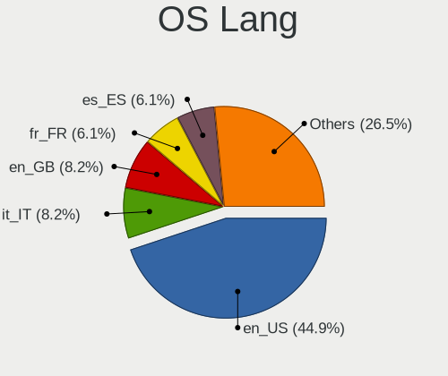
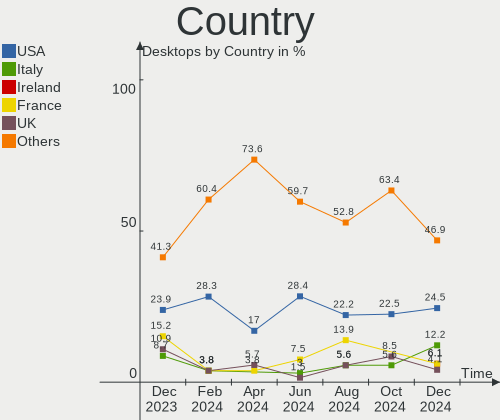
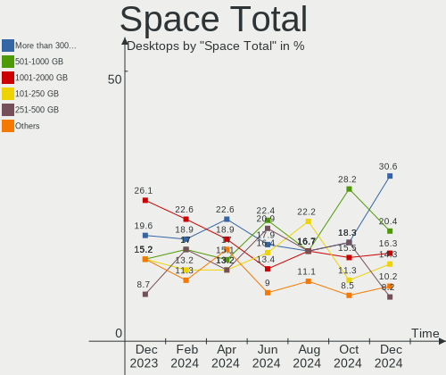
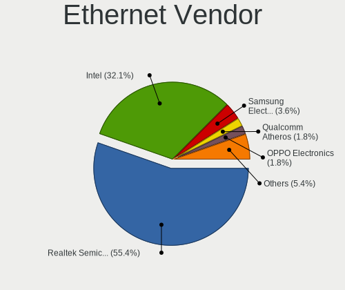

Kubuntu - Hardware Trends (Desktops)
------------------------------------

A project to identify most popular hardware characteristics and track their change
over time based on data collected by Linux users at https://Linux-Hardware.org.

Anyone can contribute to this report by the [hw-probe](https://github.com/linuxhw/hw-probe) tool:

    sudo -E hw-probe -all -upload

This report is for one last month. Overall report since the beginning of time: [TestCoverage](https://github.com/linuxhw/TestCoverage)

Period: Nov, 2022.

Contents
--------

* [ System ](#system)
  - [ OS                       ](#os)
  - [ OS Family                ](#os-family)
  - [ Kernel                   ](#kernel)
  - [ Kernel Family            ](#kernel-family)
  - [ Kernel Major Ver.        ](#kernel-major-ver)
  - [ Arch                     ](#arch)
  - [ DE                       ](#de)
  - [ Display Server           ](#display-server)
  - [ Display Manager          ](#display-manager)
  - [ OS Lang                  ](#os-lang)
  - [ Boot Mode                ](#boot-mode)
  - [ Filesystem               ](#filesystem)
  - [ Part. scheme             ](#part-scheme)
  - [ Dual Boot with Linux/BSD ](#dual-boot-with-linuxbsd)
  - [ Dual Boot (Win)          ](#dual-boot-win)

* [ Board ](#board)
  - [ Vendor                   ](#vendor)
  - [ Model                    ](#model)
  - [ Model Family             ](#model-family)
  - [ MFG Year                 ](#mfg-year)
  - [ Form Factor              ](#form-factor)
  - [ Secure Boot              ](#secure-boot)
  - [ Coreboot                 ](#coreboot)
  - [ RAM Size                 ](#ram-size)
  - [ RAM Used                 ](#ram-used)
  - [ Total Drives             ](#total-drives)
  - [ Has CD-ROM               ](#has-cd-rom)
  - [ Has Ethernet             ](#has-ethernet)
  - [ Has WiFi                 ](#has-wifi)
  - [ Has Bluetooth            ](#has-bluetooth)

* [ Location ](#location)
  - [ Country                  ](#country)
  - [ City                     ](#city)

* [ Drives ](#drives)
  - [ Drive Vendor             ](#drive-vendor)
  - [ Drive Model              ](#drive-model)
  - [ HDD Vendor               ](#hdd-vendor)
  - [ SSD Vendor               ](#ssd-vendor)
  - [ Drive Kind               ](#drive-kind)
  - [ Drive Connector          ](#drive-connector)
  - [ Drive Size               ](#drive-size)
  - [ Space Total              ](#space-total)
  - [ Space Used               ](#space-used)
  - [ Malfunc. Drives          ](#malfunc-drives)
  - [ Malfunc. Drive Vendor    ](#malfunc-drive-vendor)
  - [ Malfunc. HDD Vendor      ](#malfunc-hdd-vendor)
  - [ Malfunc. Drive Kind      ](#malfunc-drive-kind)
  - [ Failed Drives            ](#failed-drives)
  - [ Failed Drive Vendor      ](#failed-drive-vendor)
  - [ Drive Status             ](#drive-status)

* [ Storage controller ](#storage-controller)
  - [ Storage Vendor           ](#storage-vendor)
  - [ Storage Model            ](#storage-model)
  - [ Storage Kind             ](#storage-kind)

* [ Processor ](#processor)
  - [ CPU Vendor               ](#cpu-vendor)
  - [ CPU Model                ](#cpu-model)
  - [ CPU Model Family         ](#cpu-model-family)
  - [ CPU Cores                ](#cpu-cores)
  - [ CPU Sockets              ](#cpu-sockets)
  - [ CPU Threads              ](#cpu-threads)
  - [ CPU Op-Modes             ](#cpu-op-modes)
  - [ CPU Microcode            ](#cpu-microcode)
  - [ CPU Microarch            ](#cpu-microarch)

* [ Graphics ](#graphics)
  - [ GPU Vendor               ](#gpu-vendor)
  - [ GPU Model                ](#gpu-model)
  - [ GPU Combo                ](#gpu-combo)
  - [ GPU Driver               ](#gpu-driver)
  - [ GPU Memory               ](#gpu-memory)

* [ Monitor ](#monitor)
  - [ Monitor Vendor           ](#monitor-vendor)
  - [ Monitor Model            ](#monitor-model)
  - [ Monitor Resolution       ](#monitor-resolution)
  - [ Monitor Diagonal         ](#monitor-diagonal)
  - [ Monitor Width            ](#monitor-width)
  - [ Aspect Ratio             ](#aspect-ratio)
  - [ Monitor Area             ](#monitor-area)
  - [ Pixel Density            ](#pixel-density)
  - [ Multiple Monitors        ](#multiple-monitors)

* [ Network ](#network)
  - [ Net Controller Vendor    ](#net-controller-vendor)
  - [ Net Controller Model     ](#net-controller-model)
  - [ Wireless Vendor          ](#wireless-vendor)
  - [ Wireless Model           ](#wireless-model)
  - [ Ethernet Vendor          ](#ethernet-vendor)
  - [ Ethernet Model           ](#ethernet-model)
  - [ Net Controller Kind      ](#net-controller-kind)
  - [ Used Controller          ](#used-controller)
  - [ NICs                     ](#nics)
  - [ IPv6                     ](#ipv6)

* [ Bluetooth ](#bluetooth)
  - [ Bluetooth Vendor         ](#bluetooth-vendor)
  - [ Bluetooth Model          ](#bluetooth-model)

* [ Sound ](#sound)
  - [ Sound Vendor             ](#sound-vendor)
  - [ Sound Model              ](#sound-model)

* [ Memory ](#memory)
  - [ Memory Vendor            ](#memory-vendor)
  - [ Memory Model             ](#memory-model)
  - [ Memory Kind              ](#memory-kind)
  - [ Memory Form Factor       ](#memory-form-factor)
  - [ Memory Size              ](#memory-size)
  - [ Memory Speed             ](#memory-speed)

* [ Printers & scanners ](#printers--scanners)
  - [ Printer Vendor           ](#printer-vendor)
  - [ Printer Model            ](#printer-model)
  - [ Scanner Vendor           ](#scanner-vendor)
  - [ Scanner Model            ](#scanner-model)

* [ Camera ](#camera)
  - [ Camera Vendor            ](#camera-vendor)
  - [ Camera Model             ](#camera-model)

* [ Security ](#security)
  - [ Fingerprint Vendor       ](#fingerprint-vendor)
  - [ Fingerprint Model        ](#fingerprint-model)
  - [ Chipcard Vendor          ](#chipcard-vendor)
  - [ Chipcard Model           ](#chipcard-model)

* [ Unsupported ](#unsupported)
  - [ Unsupported Devices      ](#unsupported-devices)
  - [ Unsupported Device Types ](#unsupported-device-types)

System
------

OS
--

Installed operating systems

| Name          | Desktops | Percent |
|---------------|----------|---------|
| Kubuntu 22.04 | 25       | 40.98%  |
| Kubuntu 22.10 | 23       | 37.7%   |
| Kubuntu 20.04 | 6        | 9.84%   |
| Kubuntu 18.04 | 2        | 3.28%   |
| Kubuntu 11    | 2        | 3.28%   |
| Kubuntu 20.10 | 1        | 1.64%   |
| Kubuntu 12.04 | 1        | 1.64%   |
| Kubuntu 11.1  | 1        | 1.64%   |

OS Family
---------

OS without a version

| Name    | Desktops | Percent |
|---------|----------|---------|
| Kubuntu | 61       | 100%    |

Kernel
------

Version of the Linux kernel

| Version                  | Desktops | Percent |
|--------------------------|----------|---------|
| 5.19.0-23-generic        | 19       | 31.15%  |
| 5.15.0-52-generic        | 16       | 26.23%  |
| 5.15.0-53-generic        | 8        | 13.11%  |
| 5.4.0-131-generic        | 3        | 4.92%   |
| 5.15.0-43-generic        | 3        | 4.92%   |
| 6.0.6-060006-generic     | 1        | 1.64%   |
| 6.0.0-8.2-liquorix-amd64 | 1        | 1.64%   |
| 5.8.0-63-lowlatency      | 1        | 1.64%   |
| 5.4.0-80-generic         | 1        | 1.64%   |
| 5.4.0-133-generic        | 1        | 1.64%   |
| 5.4.0-124-generic        | 1        | 1.64%   |
| 5.19.0-15-generic        | 1        | 1.64%   |
| 5.19.0-1009-lowlatency   | 1        | 1.64%   |
| 5.15.0-52-lowlatency     | 1        | 1.64%   |
| 5.15.0-48-generic        | 1        | 1.64%   |
| 5.15.0-47-generic        | 1        | 1.64%   |
| 3.13.0-117-generic       | 1        | 1.64%   |

Kernel Family
-------------

Linux kernel without a distro release

| Version | Desktops | Percent |
|---------|----------|---------|
| 5.15.0  | 30       | 49.18%  |
| 5.19.0  | 21       | 34.43%  |
| 5.4.0   | 6        | 9.84%   |
| 6.0.6   | 1        | 1.64%   |
| 6.0.0   | 1        | 1.64%   |
| 5.8.0   | 1        | 1.64%   |
| 3.13.0  | 1        | 1.64%   |

Kernel Major Ver.
-----------------

Linux kernel major version

| Version | Desktops | Percent |
|---------|----------|---------|
| 5.15    | 30       | 49.18%  |
| 5.19    | 21       | 34.43%  |
| 5.4     | 6        | 9.84%   |
| 6.0     | 2        | 3.28%   |
| 5.8     | 1        | 1.64%   |
| 3.13    | 1        | 1.64%   |

Arch
----

OS architecture (x86_64, i586, etc.)

| Name   | Desktops | Percent |
|--------|----------|---------|
| x86_64 | 61       | 100%    |

DE
--

Desktop Environment

| Name  | Desktops | Percent |
|-------|----------|---------|
| KDE5  | 58       | 95.08%  |
| KDE4  | 1        | 1.64%   |
| KDE   | 1        | 1.64%   |
| GNOME | 1        | 1.64%   |

Display Server
--------------

X11 or Wayland

| Name | Desktops | Percent |
|------|----------|---------|
| X11  | 61       | 100%    |

Display Manager
---------------

SDDM, LightDM, etc.

| Name    | Desktops | Percent |
|---------|----------|---------|
| SDDM    | 38       | 62.3%   |
| Unknown | 17       | 27.87%  |
| GDM3    | 4        | 6.56%   |
| LightDM | 2        | 3.28%   |

OS Lang
-------

Language

| Lang           | Desktops | Percent |
|----------------|----------|---------|
| en_US          | 30       | 49.18%  |
| de_DE          | 5        | 8.2%    |
| en_AU          | 4        | 6.56%   |
| ru_RU          | 3        | 4.92%   |
| fr_FR          | 3        | 4.92%   |
| en_GB          | 3        | 4.92%   |
| es_AR          | 2        | 3.28%   |
| en_PH          | 2        | 3.28%   |
| ru_UA          | 1        | 1.64%   |
| pt_BR          | 1        | 1.64%   |
| pl_PL          | 1        | 1.64%   |
| it_IT          | 1        | 1.64%   |
| fr_BE          | 1        | 1.64%   |
| es_ES          | 1        | 1.64%   |
| en_IN          | 1        | 1.64%   |
| cs_CZ          | 1        | 1.64%   |
| ca_ES@valencia | 1        | 1.64%   |

Boot Mode
---------

EFI or BIOS

| Mode | Desktops | Percent |
|------|----------|---------|
| BIOS | 44       | 72.13%  |
| EFI  | 17       | 27.87%  |

Filesystem
----------

Type of filesystem

| Type    | Desktops | Percent |
|---------|----------|---------|
| Ext4    | 57       | 93.44%  |
| Overlay | 3        | 4.92%   |
| Btrfs   | 1        | 1.64%   |

Part. scheme
------------

Scheme of partitioning

| Type    | Desktops | Percent |
|---------|----------|---------|
| GPT     | 37       | 60.66%  |
| Unknown | 18       | 29.51%  |
| MBR     | 6        | 9.84%   |

Dual Boot with Linux/BSD
------------------------

Hosting more than one Linux/BSD

| Dual boot | Desktops | Percent |
|-----------|----------|---------|
| No        | 49       | 80.33%  |
| Yes       | 12       | 19.67%  |

Dual Boot (Win)
---------------

Hosting Linux and Windows

| Dual boot | Desktops | Percent |
|-----------|----------|---------|
| No        | 33       | 54.1%   |
| Yes       | 28       | 45.9%   |

Board
-----

Vendor
------

Motherboard manufacturer

| Name                | Desktops | Percent |
|---------------------|----------|---------|
| Gigabyte Technology | 17       | 27.87%  |
| ASUSTek Computer    | 14       | 22.95%  |
| Dell                | 8        | 13.11%  |
| MSI                 | 7        | 11.48%  |
| ASRock              | 5        | 8.2%    |
| Hewlett-Packard     | 2        | 3.28%   |
| Unknown             | 2        | 3.28%   |
| Supermicro          | 1        | 1.64%   |
| Medion              | 1        | 1.64%   |
| Lenovo              | 1        | 1.64%   |
| Intel               | 1        | 1.64%   |
| Foxconn             | 1        | 1.64%   |
| AZW                 | 1        | 1.64%   |

Model
-----

Motherboard model

| Name                               | Desktops | Percent |
|------------------------------------|----------|---------|
| Gigabyte Z270-HD3P                 | 2        | 3.28%   |
| Gigabyte X570 AORUS MASTER         | 2        | 3.28%   |
| Dell OptiPlex 7010                 | 2        | 3.28%   |
| Unknown                            | 2        | 3.28%   |
| Supermicro X9DAL                   | 1        | 1.64%   |
| MSI MS-7D20                        | 1        | 1.64%   |
| MSI MS-7C95                        | 1        | 1.64%   |
| MSI MS-7C02                        | 1        | 1.64%   |
| MSI MS-7B79                        | 1        | 1.64%   |
| MSI MS-7B61                        | 1        | 1.64%   |
| MSI MS-7B18                        | 1        | 1.64%   |
| MSI MS-7A34                        | 1        | 1.64%   |
| Medion S23003                      | 1        | 1.64%   |
| Lenovo ThinkCentre M93p 10AAS1BJ00 | 1        | 1.64%   |
| Intel DP965LT AAD41694-206         | 1        | 1.64%   |
| HP EliteDesk 800 G4 DM 65W (TAA)   | 1        | 1.64%   |
| HP Compaq 8200 Elite SFF PC        | 1        | 1.64%   |
| Gigabyte Z77X-UP7                  | 1        | 1.64%   |
| Gigabyte H97-HD3                   | 1        | 1.64%   |
| Gigabyte H110M-S2H-CF              | 1        | 1.64%   |
| Gigabyte GA-MA790FX-DS5            | 1        | 1.64%   |
| Gigabyte GA-990FX-GAMING           | 1        | 1.64%   |
| Gigabyte BOLD E3032                | 1        | 1.64%   |
| Gigabyte B660M GAMING DDR4         | 1        | 1.64%   |
| Gigabyte B660M D3H DDR4            | 1        | 1.64%   |
| Gigabyte B550M DS3H                | 1        | 1.64%   |
| Gigabyte B550 VISION D-P           | 1        | 1.64%   |
| Gigabyte B450 AORUS M              | 1        | 1.64%   |
| Gigabyte AB350M-DS3H V2            | 1        | 1.64%   |
| Gigabyte 7200-2003A                | 1        | 1.64%   |
| Foxconn p6-2378ef                  | 1        | 1.64%   |
| Dell XPS 8700                      | 1        | 1.64%   |
| Dell Precision WorkStation T3500   | 1        | 1.64%   |
| Dell OptiPlex 990                  | 1        | 1.64%   |
| Dell OptiPlex 790                  | 1        | 1.64%   |
| Dell OptiPlex 7080                 | 1        | 1.64%   |
| Dell OptiPlex 3020                 | 1        | 1.64%   |
| AZW SEi                            | 1        | 1.64%   |
| ASUS TUF Z270 MARK 1               | 1        | 1.64%   |
| ASUS TUF Gaming X570-PLUS          | 1        | 1.64%   |

Model Family
------------

Motherboard model prefix

| Name                     | Desktops | Percent |
|--------------------------|----------|---------|
| Dell OptiPlex            | 6        | 9.84%   |
| ASUS ROG                 | 4        | 6.56%   |
| Gigabyte Z270-HD3P       | 2        | 3.28%   |
| Gigabyte X570            | 2        | 3.28%   |
| Gigabyte B660M           | 2        | 3.28%   |
| ASUS TUF                 | 2        | 3.28%   |
| ASUS PRIME               | 2        | 3.28%   |
| Unknown                  | 2        | 3.28%   |
| Supermicro X9DAL         | 1        | 1.64%   |
| MSI MS-7D20              | 1        | 1.64%   |
| MSI MS-7C95              | 1        | 1.64%   |
| MSI MS-7C02              | 1        | 1.64%   |
| MSI MS-7B79              | 1        | 1.64%   |
| MSI MS-7B61              | 1        | 1.64%   |
| MSI MS-7B18              | 1        | 1.64%   |
| MSI MS-7A34              | 1        | 1.64%   |
| Medion S23003            | 1        | 1.64%   |
| Lenovo ThinkCentre       | 1        | 1.64%   |
| Intel DP965LT            | 1        | 1.64%   |
| HP EliteDesk             | 1        | 1.64%   |
| HP Compaq                | 1        | 1.64%   |
| Gigabyte Z77X-UP7        | 1        | 1.64%   |
| Gigabyte H97-HD3         | 1        | 1.64%   |
| Gigabyte H110M-S2H-CF    | 1        | 1.64%   |
| Gigabyte GA-MA790FX-DS5  | 1        | 1.64%   |
| Gigabyte GA-990FX-GAMING | 1        | 1.64%   |
| Gigabyte BOLD            | 1        | 1.64%   |
| Gigabyte B550M           | 1        | 1.64%   |
| Gigabyte B550            | 1        | 1.64%   |
| Gigabyte B450            | 1        | 1.64%   |
| Gigabyte AB350M-DS3H     | 1        | 1.64%   |
| Gigabyte 7200-2003A      | 1        | 1.64%   |
| Foxconn p6-2378ef        | 1        | 1.64%   |
| Dell XPS                 | 1        | 1.64%   |
| Dell Precision           | 1        | 1.64%   |
| AZW SEi                  | 1        | 1.64%   |
| ASUS STRIX               | 1        | 1.64%   |
| ASUS SABERTOOTH          | 1        | 1.64%   |
| ASUS M5A78L-M            | 1        | 1.64%   |
| ASUS M5A78L              | 1        | 1.64%   |

MFG Year
--------

Motherboard manufacture year

| Year | Desktops | Percent |
|------|----------|---------|
| 2019 | 7        | 11.48%  |
| 2018 | 7        | 11.48%  |
| 2021 | 6        | 9.84%   |
| 2020 | 6        | 9.84%   |
| 2012 | 6        | 9.84%   |
| 2014 | 5        | 8.2%    |
| 2022 | 4        | 6.56%   |
| 2017 | 4        | 6.56%   |
| 2011 | 4        | 6.56%   |
| 2016 | 3        | 4.92%   |
| 2015 | 3        | 4.92%   |
| 2013 | 2        | 3.28%   |
| 2010 | 1        | 1.64%   |
| 2009 | 1        | 1.64%   |
| 2007 | 1        | 1.64%   |
| 2006 | 1        | 1.64%   |

Form Factor
-----------

Physical design of the computer

| Name    | Desktops | Percent |
|---------|----------|---------|
| Desktop | 61       | 100%    |

Secure Boot
-----------

Enabled or disabled

| State    | Desktops | Percent |
|----------|----------|---------|
| Disabled | 60       | 98.36%  |
| Enabled  | 1        | 1.64%   |

Coreboot
--------

Have coreboot on board

| Used | Desktops | Percent |
|------|----------|---------|
| No   | 61       | 100%    |

RAM Size
--------

Total RAM memory

| Size in GB  | Desktops | Percent |
|-------------|----------|---------|
| 32.01-64.0  | 19       | 31.15%  |
| 16.01-24.0  | 17       | 27.87%  |
| 8.01-16.0   | 11       | 18.03%  |
| 4.01-8.0    | 7        | 11.48%  |
| 64.01-256.0 | 4        | 6.56%   |
| 3.01-4.0    | 2        | 3.28%   |
| 2.01-3.0    | 1        | 1.64%   |

RAM Used
--------

Used RAM memory

| Used GB    | Desktops | Percent |
|------------|----------|---------|
| 4.01-8.0   | 19       | 31.15%  |
| 2.01-3.0   | 16       | 26.23%  |
| 3.01-4.0   | 11       | 18.03%  |
| 1.01-2.0   | 7        | 11.48%  |
| 8.01-16.0  | 4        | 6.56%   |
| 16.01-24.0 | 2        | 3.28%   |
| 0.51-1.0   | 1        | 1.64%   |
| Unknown    | 1        | 1.64%   |

Total Drives
------------

Number of drives on board

| Drives | Desktops | Percent |
|--------|----------|---------|
| 2      | 18       | 29.51%  |
| 1      | 15       | 24.59%  |
| 3      | 13       | 21.31%  |
| 4      | 8        | 13.11%  |
| 7      | 2        | 3.28%   |
| 6      | 2        | 3.28%   |
| 5      | 2        | 3.28%   |
| 8      | 1        | 1.64%   |

Has CD-ROM
----------

Has CD-ROM on board

| Presented | Desktops | Percent |
|-----------|----------|---------|
| No        | 38       | 62.3%   |
| Yes       | 23       | 37.7%   |

Has Ethernet
------------

Has Ethernet on board

| Presented | Desktops | Percent |
|-----------|----------|---------|
| Yes       | 61       | 100%    |

Has WiFi
--------

Has WiFi module

| Presented | Desktops | Percent |
|-----------|----------|---------|
| Yes       | 33       | 54.1%   |
| No        | 28       | 45.9%   |

Has Bluetooth
-------------

Has Bluetooth module

| Presented | Desktops | Percent |
|-----------|----------|---------|
| No        | 38       | 62.3%   |
| Yes       | 23       | 37.7%   |

Location
--------

Country
-------

Geographic location (country)

| Country      | Desktops | Percent |
|--------------|----------|---------|
| USA          | 20       | 32.79%  |
| Germany      | 4        | 6.56%   |
| Australia    | 4        | 6.56%   |
| UK           | 3        | 4.92%   |
| France       | 3        | 4.92%   |
| Spain        | 2        | 3.28%   |
| Russia       | 2        | 3.28%   |
| Poland       | 2        | 3.28%   |
| Philippines  | 2        | 3.28%   |
| Italy        | 2        | 3.28%   |
| Brazil       | 2        | 3.28%   |
| Argentina    | 2        | 3.28%   |
| Vietnam      | 1        | 1.64%   |
| Ukraine      | 1        | 1.64%   |
| Serbia       | 1        | 1.64%   |
| Saudi Arabia | 1        | 1.64%   |
| Romania      | 1        | 1.64%   |
| Netherlands  | 1        | 1.64%   |
| Lithuania    | 1        | 1.64%   |
| India        | 1        | 1.64%   |
| Finland      | 1        | 1.64%   |
| Czechia      | 1        | 1.64%   |
| Cyprus       | 1        | 1.64%   |
| Belgium      | 1        | 1.64%   |
| Austria      | 1        | 1.64%   |

City
----

Geographic location (city)

| City                   | Desktops | Percent |
|------------------------|----------|---------|
| Melbourne              | 2        | 3.28%   |
| Kent                   | 2        | 3.28%   |
| Berlin                 | 2        | 3.28%   |
| Antioch                | 2        | 3.28%   |
| Wheaton                | 1        | 1.64%   |
| Vilnius                | 1        | 1.64%   |
| Valencia               | 1        | 1.64%   |
| Turku                  | 1        | 1.64%   |
| Thai Nguyen            | 1        | 1.64%   |
| Tagbilaran             | 1        | 1.64%   |
| Serpukhov              | 1        | 1.64%   |
| Sao José dos Campos   | 1        | 1.64%   |
| San Jose               | 1        | 1.64%   |
| San Francisco          | 1        | 1.64%   |
| San Cesario sul Panaro | 1        | 1.64%   |
| Ruda Śląska          | 1        | 1.64%   |
| Reading                | 1        | 1.64%   |
| Prague                 | 1        | 1.64%   |
| Pittsburgh             | 1        | 1.64%   |
| Pau                    | 1        | 1.64%   |
| Oklahoma City          | 1        | 1.64%   |
| Odessa                 | 1        | 1.64%   |
| Ocala                  | 1        | 1.64%   |
| Nizhniy Novgorod       | 1        | 1.64%   |
| Nicosia                | 1        | 1.64%   |
| New York               | 1        | 1.64%   |
| Mönchengladbach       | 1        | 1.64%   |
| Minneapolis            | 1        | 1.64%   |
| Miami                  | 1        | 1.64%   |
| Lugo                   | 1        | 1.64%   |
| Longjumeau             | 1        | 1.64%   |
| Lincoln                | 1        | 1.64%   |
| Le Mee-sur-Seine       | 1        | 1.64%   |
| La Plata               | 1        | 1.64%   |
| La Jolla               | 1        | 1.64%   |
| Jeddah                 | 1        | 1.64%   |
| Jacksonville           | 1        | 1.64%   |
| Itapage                | 1        | 1.64%   |
| Innsbruck              | 1        | 1.64%   |
| Hillsboro              | 1        | 1.64%   |

Drives
------

Drive Vendor
------------

Hard drive vendors

| Vendor                      | Desktops | Drives | Percent |
|-----------------------------|----------|--------|---------|
| WDC                         | 22       | 33     | 17.19%  |
| Samsung Electronics         | 19       | 30     | 14.84%  |
| Seagate                     | 18       | 25     | 14.06%  |
| SanDisk                     | 9        | 10     | 7.03%   |
| Crucial                     | 9        | 10     | 7.03%   |
| Toshiba                     | 7        | 9      | 5.47%   |
| Kingston                    | 6        | 7      | 4.69%   |
| Hitachi                     | 4        | 4      | 3.13%   |
| HGST                        | 3        | 6      | 2.34%   |
| Phison                      | 2        | 2      | 1.56%   |
| China                       | 2        | 2      | 1.56%   |
| ADATA Technology            | 2        | 2      | 1.56%   |
| Transcend                   | 1        | 1      | 0.78%   |
| Team                        | 1        | 1      | 0.78%   |
| T-FORCE                     | 1        | 1      | 0.78%   |
| SPCC                        | 1        | 2      | 0.78%   |
| Smartbuy                    | 1        | 1      | 0.78%   |
| SK hynix                    | 1        | 1      | 0.78%   |
| PNY                         | 1        | 1      | 0.78%   |
| O2 Micro                    | 1        | 1      | 0.78%   |
| Neo                         | 1        | 1      | 0.78%   |
| Mushkin                     | 1        | 2      | 0.78%   |
| Micron/Crucial Technology   | 1        | 1      | 0.78%   |
| Micron Technology           | 1        | 1      | 0.78%   |
| Maxtor                      | 1        | 1      | 0.78%   |
| Lite-On Technology          | 1        | 1      | 0.78%   |
| KIOXIA-EXCERIA              | 1        | 1      | 0.78%   |
| Kingston Technology Company | 1        | 1      | 0.78%   |
| KingFast                    | 1        | 1      | 0.78%   |
| JMicron Technology          | 1        | 1      | 0.78%   |
| HS-SSD-C100                 | 1        | 1      | 0.78%   |
| GOODRAM                     | 1        | 1      | 0.78%   |
| FORESEE                     | 1        | 1      | 0.78%   |
| Corsair                     | 1        | 3      | 0.78%   |
| ASMT                        | 1        | 1      | 0.78%   |
| ADATA SU                    | 1        | 1      | 0.78%   |
| Unknown                     | 1        | 1      | 0.78%   |

Drive Model
-----------

Hard drive models

| Model                                             | Desktops | Percent |
|---------------------------------------------------|----------|---------|
| Samsung NVMe SSD Controller SM981/PM981/PM983 1TB | 5        | 3.29%   |
| Toshiba MQ01ABD100 1TB                            | 2        | 1.32%   |
| Toshiba DT01ACA200 2TB                            | 2        | 1.32%   |
| SanDisk Extreme 55AE 500GB SSD                    | 2        | 1.32%   |
| Samsung SSD 980 500GB                             | 2        | 1.32%   |
| Samsung SSD 860 EVO 1TB                           | 2        | 1.32%   |
| Samsung HD502HI 500GB                             | 2        | 1.32%   |
| Crucial CT240M500SSD1 240GB                       | 2        | 1.32%   |
| Crucial CT1000MX500SSD1 1TB                       | 2        | 1.32%   |
| WDC WDS200T1X0E-00AFY0 2TB                        | 1        | 0.66%   |
| WDC WDS100T1X0E-00AFY0 1TB                        | 1        | 0.66%   |
| WDC WD60EZAZ-00SF3B0 6TB                          | 1        | 0.66%   |
| WDC WD5003ABYZ-011FA0 500GB                       | 1        | 0.66%   |
| WDC WD5000LUCT-63C26Y0 500GB                      | 1        | 0.66%   |
| WDC WD5000AZLX-22JKKA0 500GB                      | 1        | 0.66%   |
| WDC WD5000AAKX-753CA1 500GB                       | 1        | 0.66%   |
| WDC WD5000AAKX-22ERMA0 500GB                      | 1        | 0.66%   |
| WDC WD5000AAKX-00U6AA0 500GB                      | 1        | 0.66%   |
| WDC WD40EZRX-00SPEB0 4TB                          | 1        | 0.66%   |
| WDC WD3200BEVT-60ZCT1 320GB                       | 1        | 0.66%   |
| WDC WD3200AAKS-61L9A0 320GB                       | 1        | 0.66%   |
| WDC WD3200AAJB-56R1A0 320GB                       | 1        | 0.66%   |
| WDC WD30EZRX-22D8PB0 3TB                          | 1        | 0.66%   |
| WDC WD2500JS-60NCB1 250GB                         | 1        | 0.66%   |
| WDC WD2500AAKX-75U6AA0 250GB                      | 1        | 0.66%   |
| WDC WD20EARX-00PASB0 2TB                          | 1        | 0.66%   |
| WDC WD2003FZEX-00Z4SA0 2TB                        | 1        | 0.66%   |
| WDC WD2002FFSX-68PF8N0 2TB                        | 1        | 0.66%   |
| WDC WD20 03FZEX-00Z4SA0 2TB                       | 1        | 0.66%   |
| WDC WD20 00F9YZ-09N20L0 2TB                       | 1        | 0.66%   |
| WDC WD10SPZX-00Z10T0 1TB                          | 1        | 0.66%   |
| WDC WD10PURX-64E5EY0 1TB                          | 1        | 0.66%   |
| WDC WD10EZEX-22MFCA0 1TB                          | 1        | 0.66%   |
| WDC WD10EZEX-08WN4A0 1TB                          | 1        | 0.66%   |
| WDC WD10EARS-00Y5B1 1TB                           | 1        | 0.66%   |
| WDC WD10EARS-00MVWB0 1TB                          | 1        | 0.66%   |
| WDC PC SN730 NVMe 256GB                           | 1        | 0.66%   |
| WDC PC SN520 SDAPMUW-256G-1101 256GB              | 1        | 0.66%   |
| Transcend TS256GMTE110S 256GB                     | 1        | 0.66%   |
| Toshiba THNSNJ128GCST 128GB SSD                   | 1        | 0.66%   |

HDD Vendor
----------

Hard disk drive vendors

| Vendor              | Desktops | Drives | Percent |
|---------------------|----------|--------|---------|
| WDC                 | 19       | 28     | 33.93%  |
| Seagate             | 17       | 24     | 30.36%  |
| Toshiba             | 6        | 7      | 10.71%  |
| Samsung Electronics | 5        | 5      | 8.93%   |
| Hitachi             | 4        | 4      | 7.14%   |
| HGST                | 3        | 6      | 5.36%   |
| Maxtor              | 1        | 1      | 1.79%   |
| ASMT                | 1        | 1      | 1.79%   |

SSD Vendor
----------

Solid state drive vendors

| Vendor              | Desktops | Drives | Percent |
|---------------------|----------|--------|---------|
| Samsung Electronics | 7        | 14     | 17.07%  |
| Crucial             | 7        | 8      | 17.07%  |
| SanDisk             | 5        | 5      | 12.2%   |
| Kingston            | 5        | 5      | 12.2%   |
| Toshiba             | 2        | 2      | 4.88%   |
| China               | 2        | 2      | 4.88%   |
| Team                | 1        | 1      | 2.44%   |
| SPCC                | 1        | 2      | 2.44%   |
| Smartbuy            | 1        | 1      | 2.44%   |
| PNY                 | 1        | 1      | 2.44%   |
| Phison              | 1        | 1      | 2.44%   |
| Neo                 | 1        | 1      | 2.44%   |
| Mushkin             | 1        | 2      | 2.44%   |
| Micron Technology   | 1        | 1      | 2.44%   |
| KIOXIA-EXCERIA      | 1        | 1      | 2.44%   |
| GOODRAM             | 1        | 1      | 2.44%   |
| FORESEE             | 1        | 1      | 2.44%   |
| Corsair             | 1        | 3      | 2.44%   |
| ADATA SU            | 1        | 1      | 2.44%   |

Drive Kind
----------

HDD or SSD

| Kind    | Desktops | Drives | Percent |
|---------|----------|--------|---------|
| HDD     | 42       | 76     | 39.25%  |
| SSD     | 34       | 53     | 31.78%  |
| NVMe    | 26       | 34     | 24.3%   |
| Unknown | 5        | 6      | 4.67%   |

Drive Connector
---------------

SATA, SAS, NVMe, etc.

| Type | Desktops | Drives | Percent |
|------|----------|--------|---------|
| SATA | 54       | 124    | 60.67%  |
| NVMe | 26       | 34     | 29.21%  |
| SAS  | 9        | 11     | 10.11%  |

Drive Size
----------

Size of hard drive

| Size in TB | Desktops | Drives | Percent |
|------------|----------|--------|---------|
| 0.01-0.5   | 36       | 59     | 40%     |
| 0.51-1.0   | 27       | 32     | 30%     |
| 1.01-2.0   | 17       | 24     | 18.89%  |
| 3.01-4.0   | 7        | 11     | 7.78%   |
| 4.01-10.0  | 2        | 2      | 2.22%   |
| 2.01-3.0   | 1        | 1      | 1.11%   |

Space Total
-----------

Amount of disk space available on the file system

| Size in GB     | Desktops | Percent |
|----------------|----------|---------|
| 501-1000       | 14       | 22.95%  |
| More than 3000 | 10       | 16.39%  |
| 101-250        | 10       | 16.39%  |
| 251-500        | 9        | 14.75%  |
| 1001-2000      | 9        | 14.75%  |
| 2001-3000      | 6        | 9.84%   |
| 1-20           | 1        | 1.64%   |
| 51-100         | 1        | 1.64%   |
| Unknown        | 1        | 1.64%   |

Space Used
----------

Amount of used disk space

| Used GB        | Desktops | Percent |
|----------------|----------|---------|
| 251-500        | 9        | 14.75%  |
| 1001-2000      | 9        | 14.75%  |
| 51-100         | 9        | 14.75%  |
| 1-20           | 8        | 13.11%  |
| 21-50          | 7        | 11.48%  |
| 101-250        | 7        | 11.48%  |
| 501-1000       | 5        | 8.2%    |
| More than 3000 | 4        | 6.56%   |
| 2001-3000      | 2        | 3.28%   |
| Unknown        | 1        | 1.64%   |

Malfunc. Drives
---------------

Drive models with a malfunction

| Model                                          | Desktops | Drives | Percent |
|------------------------------------------------|----------|--------|---------|
| WDC WD3200AAJB-56R1A0 320GB                    | 1        | 1      | 7.14%   |
| WDC WD10EZEX-22MFCA0 1TB                       | 1        | 1      | 7.14%   |
| WDC WD10EARS-00MVWB0 1TB                       | 1        | 1      | 7.14%   |
| Seagate ST3160827AS 160GB                      | 1        | 1      | 7.14%   |
| Seagate ST31000524AS 1TB                       | 1        | 1      | 7.14%   |
| Neo Forza NFS121SA312-6007000 120GB            | 1        | 1      | 7.14%   |
| Micron Technology 5100_MTFDDAV960TCB 960GB SSD | 1        | 1      | 7.14%   |
| Kingston SH103S3240G 240GB SSD                 | 1        | 1      | 7.14%   |
| Hitachi HDS722020ALA330 2TB                    | 1        | 1      | 7.14%   |
| Hitachi HDS721010CLA630 1TB                    | 1        | 1      | 7.14%   |
| HGST HUH728080ALE600 8TB                       | 1        | 1      | 7.14%   |
| Crucial CT525MX300SSD1 528GB                   | 1        | 1      | 7.14%   |
| Crucial CT240M500SSD1 240GB                    | 1        | 1      | 7.14%   |
| Crucial CT120M500SSD1 120GB                    | 1        | 1      | 7.14%   |

Malfunc. Drive Vendor
---------------------

Vendors of faulty drives

| Vendor            | Desktops | Drives | Percent |
|-------------------|----------|--------|---------|
| WDC               | 3        | 3      | 21.43%  |
| Crucial           | 3        | 3      | 21.43%  |
| Seagate           | 2        | 2      | 14.29%  |
| Hitachi           | 2        | 2      | 14.29%  |
| Neo               | 1        | 1      | 7.14%   |
| Micron Technology | 1        | 1      | 7.14%   |
| Kingston          | 1        | 1      | 7.14%   |
| HGST              | 1        | 1      | 7.14%   |

Malfunc. HDD Vendor
-------------------

Vendors of faulty HDD drives

| Vendor  | Desktops | Drives | Percent |
|---------|----------|--------|---------|
| WDC     | 3        | 3      | 37.5%   |
| Seagate | 2        | 2      | 25%     |
| Hitachi | 2        | 2      | 25%     |
| HGST    | 1        | 1      | 12.5%   |

Malfunc. Drive Kind
-------------------

Kinds of faulty drives

| Kind | Desktops | Drives | Percent |
|------|----------|--------|---------|
| SSD  | 6        | 6      | 50%     |
| HDD  | 6        | 8      | 50%     |

Failed Drives
-------------

Failed drive models

Zero info for selected period =(

Failed Drive Vendor
-------------------

Failed drive vendors

Zero info for selected period =(

Drive Status
------------

Number of failed and malfunc. drives

| Status   | Desktops | Drives | Percent |
|----------|----------|--------|---------|
| Detected | 37       | 91     | 48.68%  |
| Works    | 29       | 64     | 38.16%  |
| Malfunc  | 10       | 14     | 13.16%  |

Storage controller
------------------

Storage Vendor
--------------

Storage controller vendors

| Vendor                      | Desktops | Percent |
|-----------------------------|----------|---------|
| Intel                       | 37       | 38.54%  |
| AMD                         | 24       | 25%     |
| Samsung Electronics         | 10       | 10.42%  |
| SanDisk                     | 5        | 5.21%   |
| Micron/Crucial Technology   | 3        | 3.13%   |
| Marvell Technology Group    | 3        | 3.13%   |
| Phison Electronics          | 2        | 2.08%   |
| Kingston Technology Company | 2        | 2.08%   |
| ASMedia Technology          | 2        | 2.08%   |
| ADATA Technology            | 2        | 2.08%   |
| SK hynix                    | 1        | 1.04%   |
| Silicon Motion              | 1        | 1.04%   |
| O2 Micro                    | 1        | 1.04%   |
| Lite-On Technology          | 1        | 1.04%   |
| JMicron Technology          | 1        | 1.04%   |
| Broadcom / LSI              | 1        | 1.04%   |

Storage Model
-------------

Storage controller models

| Model                                                                          | Desktops | Percent |
|--------------------------------------------------------------------------------|----------|---------|
| AMD FCH SATA Controller [AHCI mode]                                            | 8        | 7.48%   |
| Samsung NVMe SSD Controller SM981/PM981/PM983                                  | 5        | 4.67%   |
| Intel 7 Series/C210 Series Chipset Family 6-port SATA Controller [AHCI mode]   | 5        | 4.67%   |
| Intel 200 Series PCH SATA controller [AHCI mode]                               | 5        | 4.67%   |
| Intel 8 Series/C220 Series Chipset Family 6-port SATA Controller 1 [AHCI mode] | 4        | 3.74%   |
| AMD 500 Series Chipset SATA Controller                                         | 4        | 3.74%   |
| Samsung NVMe SSD Controller 980                                                | 3        | 2.8%    |
| Micron/Crucial P2 NVMe PCIe SSD                                                | 3        | 2.8%    |
| Intel 6 Series/C200 Series Chipset Family 6 port Desktop SATA AHCI Controller  | 3        | 2.8%    |
| Intel 500 Series Chipset Family SATA AHCI Controller                           | 3        | 2.8%    |
| AMD SB7x0/SB8x0/SB9x0 SATA Controller [AHCI mode]                              | 3        | 2.8%    |
| AMD 400 Series Chipset SATA Controller                                         | 3        | 2.8%    |
| SanDisk WD PC SN810 / Black SN850 NVMe SSD                                     | 2        | 1.87%   |
| SanDisk Non-Volatile memory controller                                         | 2        | 1.87%   |
| Intel SATA Controller [RAID mode]                                              | 2        | 1.87%   |
| Intel Q170/Q150/B150/H170/H110/Z170/CM236 Chipset SATA Controller [AHCI Mode]  | 2        | 1.87%   |
| Intel Cannon Point-LP SATA Controller [AHCI Mode]                              | 2        | 1.87%   |
| Intel Cannon Lake PCH SATA AHCI Controller                                     | 2        | 1.87%   |
| Intel Alder Lake-S PCH SATA Controller [AHCI Mode]                             | 2        | 1.87%   |
| ASMedia ASM1062 Serial ATA Controller                                          | 2        | 1.87%   |
| AMD SB7x0/SB8x0/SB9x0 IDE Controller                                           | 2        | 1.87%   |
| AMD RS690 PCI to PCI Bridge (PCI Express Port 2)                               | 2        | 1.87%   |
| AMD FCH SATA Controller D                                                      | 2        | 1.87%   |
| AMD 300 Series Chipset SATA Controller                                         | 2        | 1.87%   |
| SK hynix Gold P31/PC711 NVMe Solid State Drive                                 | 1        | 0.93%   |
| Silicon Motion SM2263EN/SM2263XT SSD Controller                                | 1        | 0.93%   |
| SanDisk WD Black SN750 / PC SN730 NVMe SSD                                     | 1        | 0.93%   |
| SanDisk PC SN520 NVMe SSD                                                      | 1        | 0.93%   |
| Samsung NVMe SSD Controller SM961/PM961/SM963                                  | 1        | 0.93%   |
| Samsung NVMe SSD Controller PM9A1/PM9A3/980PRO                                 | 1        | 0.93%   |
| Phison PS5013 E13 NVMe Controller                                              | 1        | 0.93%   |
| Phison E7 NVMe Controller                                                      | 1        | 0.93%   |
| O2 Micro Non-Volatile memory controller                                        | 1        | 0.93%   |
| Marvell Group 88SE9215 PCIe 2.0 x1 4-port SATA 6 Gb/s Controller               | 1        | 0.93%   |
| Marvell Group 88SE9172 SATA 6Gb/s Controller                                   | 1        | 0.93%   |
| Marvell Group 88SE6101/6102 single-port PATA133 interface                      | 1        | 0.93%   |
| Lite-On Non-Volatile memory controller                                         | 1        | 0.93%   |
| Kingston Company OM3PDP3 NVMe SSD                                              | 1        | 0.93%   |
| Kingston Company A2000 NVMe SSD                                                | 1        | 0.93%   |
| JMicron JMB363 SATA/IDE Controller                                             | 1        | 0.93%   |

Storage Kind
------------

Kind of storage controller (IDE, SATA, NVMe, SAS, ...)

| Kind | Desktops | Percent |
|------|----------|---------|
| SATA | 55       | 59.14%  |
| NVMe | 26       | 27.96%  |
| RAID | 6        | 6.45%   |
| IDE  | 5        | 5.38%   |
| SAS  | 1        | 1.08%   |

Processor
---------

CPU Vendor
----------

Processor vendors

| Vendor | Desktops | Percent |
|--------|----------|---------|
| Intel  | 37       | 60.66%  |
| AMD    | 24       | 39.34%  |

CPU Model
---------

Processor models

| Model                                       | Desktops | Percent |
|---------------------------------------------|----------|---------|
| AMD Ryzen 9 5950X 16-Core Processor         | 2        | 3.28%   |
| AMD Ryzen 5 5600X 6-Core Processor          | 2        | 3.28%   |
| AMD Ryzen 5 3400G with Radeon Vega Graphics | 2        | 3.28%   |
| Intel Xeon CPU W3503 @ 2.40GHz              | 1        | 1.64%   |
| Intel Xeon CPU E5-2620 v3 @ 2.40GHz         | 1        | 1.64%   |
| Intel Xeon CPU E5-2403 0 @ 1.80GHz          | 1        | 1.64%   |
| Intel Core i9-9900K CPU @ 3.60GHz           | 1        | 1.64%   |
| Intel Core i7-8559U CPU @ 2.70GHz           | 1        | 1.64%   |
| Intel Core i7-7700K CPU @ 4.20GHz           | 1        | 1.64%   |
| Intel Core i7-4790S CPU @ 3.20GHz           | 1        | 1.64%   |
| Intel Core i7-4790 CPU @ 3.60GHz            | 1        | 1.64%   |
| Intel Core i7-4770S CPU @ 3.10GHz           | 1        | 1.64%   |
| Intel Core i7-3770K CPU @ 3.50GHz           | 1        | 1.64%   |
| Intel Core i7-2600S CPU @ 2.80GHz           | 1        | 1.64%   |
| Intel Core i7-2600 CPU @ 3.40GHz            | 1        | 1.64%   |
| Intel Core i7-10700 CPU @ 2.90GHz           | 1        | 1.64%   |
| Intel Core i5-8500 CPU @ 3.00GHz            | 1        | 1.64%   |
| Intel Core i5-8400 CPU @ 2.80GHz            | 1        | 1.64%   |
| Intel Core i5-8279U CPU @ 2.40GHz           | 1        | 1.64%   |
| Intel Core i5-7600K CPU @ 3.80GHz           | 1        | 1.64%   |
| Intel Core i5-7500 CPU @ 3.40GHz            | 1        | 1.64%   |
| Intel Core i5-7400T CPU @ 2.40GHz           | 1        | 1.64%   |
| Intel Core i5-7400 CPU @ 3.00GHz            | 1        | 1.64%   |
| Intel Core i5-6400 CPU @ 2.70GHz            | 1        | 1.64%   |
| Intel Core i5-4590 CPU @ 3.30GHz            | 1        | 1.64%   |
| Intel Core i5-4570T CPU @ 2.90GHz           | 1        | 1.64%   |
| Intel Core i5-4460 CPU @ 3.20GHz            | 1        | 1.64%   |
| Intel Core i5-3550 CPU @ 3.30GHz            | 1        | 1.64%   |
| Intel Core i5-3470S CPU @ 2.90GHz           | 1        | 1.64%   |
| Intel Core i5-3470 CPU @ 3.20GHz            | 1        | 1.64%   |
| Intel Core i5-3350P CPU @ 3.10GHz           | 1        | 1.64%   |
| Intel Core i5-2400 CPU @ 3.10GHz            | 1        | 1.64%   |
| Intel Core i5-10400F CPU @ 2.90GHz          | 1        | 1.64%   |
| Intel Core i3-2100 CPU @ 3.10GHz            | 1        | 1.64%   |
| Intel Core i3-10100F CPU @ 3.60GHz          | 1        | 1.64%   |
| Intel Core 2 Duo CPU E6550 @ 2.33GHz        | 1        | 1.64%   |
| Intel Celeron J4125 CPU @ 2.00GHz           | 1        | 1.64%   |
| Intel 12th Gen Core i5-12600K               | 1        | 1.64%   |
| Intel 12th Gen Core i5-12400F               | 1        | 1.64%   |
| Intel 11th Gen Core i5-11400 @ 2.60GHz      | 1        | 1.64%   |

CPU Model Family
----------------

Processor model prefix

| Model            | Desktops | Percent |
|------------------|----------|---------|
| Intel Core i5    | 17       | 27.87%  |
| Intel Core i7    | 9        | 14.75%  |
| AMD Ryzen 9      | 7        | 11.48%  |
| AMD Ryzen 5      | 7        | 11.48%  |
| Other            | 3        | 4.92%   |
| Intel Xeon       | 3        | 4.92%   |
| Intel Core i3    | 2        | 3.28%   |
| AMD Ryzen 7      | 2        | 3.28%   |
| AMD FX           | 2        | 3.28%   |
| Intel Core i9    | 1        | 1.64%   |
| Intel Core 2 Duo | 1        | 1.64%   |
| Intel Celeron    | 1        | 1.64%   |
| AMD Ryzen 5 PRO  | 1        | 1.64%   |
| AMD Ryzen 3      | 1        | 1.64%   |
| AMD Phenom II X6 | 1        | 1.64%   |
| AMD Phenom II X4 | 1        | 1.64%   |
| AMD Athlon II X2 | 1        | 1.64%   |
| AMD Athlon 64 X2 | 1        | 1.64%   |

CPU Cores
---------

Number of processor cores

| Number | Desktops | Percent |
|--------|----------|---------|
| 4      | 30       | 49.18%  |
| 6      | 13       | 21.31%  |
| 2      | 6        | 9.84%   |
| 8      | 5        | 8.2%    |
| 16     | 4        | 6.56%   |
| 12     | 2        | 3.28%   |
| 10     | 1        | 1.64%   |

CPU Sockets
-----------

Number of sockets

| Number | Desktops | Percent |
|--------|----------|---------|
| 1      | 61       | 100%    |

CPU Threads
-----------

Threads per core (Hyper-Threading)

| Number | Desktops | Percent |
|--------|----------|---------|
| 2      | 37       | 60.66%  |
| 1      | 24       | 39.34%  |

CPU Op-Modes
------------

CPU Operation Modes (32-bit, 64-bit)

| Op mode        | Desktops | Percent |
|----------------|----------|---------|
| 32-bit, 64-bit | 61       | 100%    |

CPU Microcode
-------------

Microcode number

| Number     | Desktops | Percent |
|------------|----------|---------|
| Unknown    | 29       | 47.54%  |
| 0x306c3    | 4        | 6.56%   |
| 0x906e9    | 3        | 4.92%   |
| 0x906ea    | 2        | 3.28%   |
| 0x806ea    | 2        | 3.28%   |
| 0x306a9    | 2        | 3.28%   |
| 0x206a7    | 2        | 3.28%   |
| 0x010000c8 | 2        | 3.28%   |
| 0xa0655    | 1        | 1.64%   |
| 0xa0653    | 1        | 1.64%   |
| 0x90672    | 1        | 1.64%   |
| 0x706a8    | 1        | 1.64%   |
| 0x6fb      | 1        | 1.64%   |
| 0x506e3    | 1        | 1.64%   |
| 0x206d7    | 1        | 1.64%   |
| 0x0a601203 | 1        | 1.64%   |
| 0x0a50000d | 1        | 1.64%   |
| 0x0a50000c | 1        | 1.64%   |
| 0x0a201016 | 1        | 1.64%   |
| 0x08108109 | 1        | 1.64%   |
| 0x0800820d | 1        | 1.64%   |
| 0x06000852 | 1        | 1.64%   |
| 0x010000dc | 1        | 1.64%   |

CPU Microarch
-------------

Microarchitecture

| Name             | Desktops | Percent |
|------------------|----------|---------|
| KabyLake         | 10       | 16.39%  |
| Zen 3            | 8        | 13.11%  |
| Haswell          | 7        | 11.48%  |
| SandyBridge      | 5        | 8.2%    |
| IvyBridge        | 5        | 8.2%    |
| Zen+             | 4        | 6.56%   |
| Zen 2            | 4        | 6.56%   |
| K10              | 3        | 4.92%   |
| CometLake        | 3        | 4.92%   |
| Unknown          | 3        | 4.92%   |
| Piledriver       | 2        | 3.28%   |
| Zen              | 1        | 1.64%   |
| Skylake          | 1        | 1.64%   |
| Nehalem          | 1        | 1.64%   |
| K8 Hammer        | 1        | 1.64%   |
| Goldmont plus    | 1        | 1.64%   |
| Core             | 1        | 1.64%   |
| Alderlake Hybrid | 1        | 1.64%   |

Graphics
--------

GPU Vendor
----------

Vendors of graphics cards

| Vendor | Desktops | Percent |
|--------|----------|---------|
| Nvidia | 25       | 37.31%  |
| AMD    | 25       | 37.31%  |
| Intel  | 17       | 25.37%  |

GPU Model
---------

Graphics card models

| Model                                                                       | Desktops | Percent |
|-----------------------------------------------------------------------------|----------|---------|
| AMD Navi 23 [Radeon RX 6600/6600 XT/6600M]                                  | 5        | 7.25%   |
| Intel Xeon E3-1200 v3/4th Gen Core Processor Integrated Graphics Controller | 4        | 5.8%    |
| Nvidia GK208B [GeForce GT 710]                                              | 3        | 4.35%   |
| Intel 2nd Generation Core Processor Family Integrated Graphics Controller   | 3        | 4.35%   |
| AMD Ellesmere [Radeon RX 470/480/570/570X/580/580X/590]                     | 3        | 4.35%   |
| Nvidia GP107 [GeForce GTX 1050 Ti]                                          | 2        | 2.9%    |
| Nvidia GA106 [GeForce RTX 3060 Lite Hash Rate]                              | 2        | 2.9%    |
| Intel Xeon E3-1200 v2/3rd Gen Core processor Graphics Controller            | 2        | 2.9%    |
| Intel HD Graphics 630                                                       | 2        | 2.9%    |
| Intel CoffeeLake-U GT3e [Iris Plus Graphics 655]                            | 2        | 2.9%    |
| AMD Cezanne [Radeon Vega Series / Radeon Vega Mobile Series]                | 2        | 2.9%    |
| Nvidia TU117 [GeForce GTX 1650]                                             | 1        | 1.45%   |
| Nvidia TU116 [GeForce GTX 1660]                                             | 1        | 1.45%   |
| Nvidia TU116 [GeForce GTX 1660 SUPER]                                       | 1        | 1.45%   |
| Nvidia TU106 [GeForce RTX 2060 Rev. A]                                      | 1        | 1.45%   |
| Nvidia TU104 [GeForce RTX 2070 SUPER]                                       | 1        | 1.45%   |
| Nvidia NV43 [GeForce 6600]                                                  | 1        | 1.45%   |
| Nvidia GP108 [GeForce GT 1030]                                              | 1        | 1.45%   |
| Nvidia GP107 [GeForce GTX 1050]                                             | 1        | 1.45%   |
| Nvidia GP106 [GeForce GTX 1060 6GB]                                         | 1        | 1.45%   |
| Nvidia GP104 [GeForce GTX 1070]                                             | 1        | 1.45%   |
| Nvidia GP102 [GeForce GTX 1080 Ti]                                          | 1        | 1.45%   |
| Nvidia GM107 [GeForce GTX 750 Ti]                                           | 1        | 1.45%   |
| Nvidia GK208B [GeForce GT 730]                                              | 1        | 1.45%   |
| Nvidia GK208 [GeForce GT 720]                                               | 1        | 1.45%   |
| Nvidia GK104 [GeForce GTX 760 OEM]                                          | 1        | 1.45%   |
| Nvidia GF116 [GeForce GTX 550 Ti]                                           | 1        | 1.45%   |
| Nvidia GF116 [GeForce GTS 450 Rev. 2]                                       | 1        | 1.45%   |
| Nvidia GA106 [Geforce RTX 3050]                                             | 1        | 1.45%   |
| Nvidia GA104 [GeForce RTX 3060]                                             | 1        | 1.45%   |
| Nvidia GA102 [GeForce RTX 3090]                                             | 1        | 1.45%   |
| Intel GeminiLake [UHD Graphics 600]                                         | 1        | 1.45%   |
| Intel CometLake-S GT2 [UHD Graphics 630]                                    | 1        | 1.45%   |
| Intel CoffeeLake-S GT2 [UHD Graphics 630]                                   | 1        | 1.45%   |
| Intel AlderLake-S GT1                                                       | 1        | 1.45%   |
| AMD Tahiti XT [Radeon HD 7970/8970 OEM / R9 280X]                           | 1        | 1.45%   |
| AMD RV670 [Radeon HD 3690/3850]                                             | 1        | 1.45%   |
| AMD RS880 [Radeon HD 4250]                                                  | 1        | 1.45%   |
| AMD Renoir                                                                  | 1        | 1.45%   |
| AMD Picasso/Raven 2 [Radeon Vega Series / Radeon Vega Mobile Series]        | 1        | 1.45%   |

GPU Combo
---------

Combinations of graphics cards

| Name           | Desktops | Percent |
|----------------|----------|---------|
| 1 x AMD        | 24       | 39.34%  |
| 1 x Nvidia     | 20       | 32.79%  |
| 1 x Intel      | 12       | 19.67%  |
| Intel + Nvidia | 3        | 4.92%   |
| 3 x Nvidia     | 1        | 1.64%   |
| AMD + Nvidia   | 1        | 1.64%   |

GPU Driver
----------

Free vs proprietary

| Driver      | Desktops | Percent |
|-------------|----------|---------|
| Free        | 38       | 62.3%   |
| Proprietary | 22       | 36.07%  |
| Unknown     | 1        | 1.64%   |

GPU Memory
----------

Total video memory

| Size in GB | Desktops | Percent |
|------------|----------|---------|
| Unknown    | 36       | 59.02%  |
| 1.01-2.0   | 6        | 9.84%   |
| 0.51-1.0   | 5        | 8.2%    |
| 5.01-6.0   | 3        | 4.92%   |
| 0.01-0.5   | 3        | 4.92%   |
| 7.01-8.0   | 2        | 3.28%   |
| 3.01-4.0   | 2        | 3.28%   |
| 8.01-16.0  | 2        | 3.28%   |
| 2.01-3.0   | 1        | 1.64%   |
| 16.01-24.0 | 1        | 1.64%   |

Monitor
-------

Monitor Vendor
--------------

Monitor vendors

| Vendor               | Desktops | Percent |
|----------------------|----------|---------|
| Samsung Electronics  | 10       | 14.71%  |
| Goldstar             | 9        | 13.24%  |
| Hewlett-Packard      | 8        | 11.76%  |
| Dell                 | 6        | 8.82%   |
| Philips              | 4        | 5.88%   |
| BenQ                 | 4        | 5.88%   |
| Ancor Communications | 4        | 5.88%   |
| Acer                 | 4        | 5.88%   |
| ViewSonic            | 2        | 2.94%   |
| Sceptre Tech         | 2        | 2.94%   |
| Xiaomi               | 1        | 1.47%   |
| Vizio                | 1        | 1.47%   |
| Vestel Elektronik    | 1        | 1.47%   |
| Toshiba              | 1        | 1.47%   |
| SUE                  | 1        | 1.47%   |
| Pixio                | 1        | 1.47%   |
| NEC Computers        | 1        | 1.47%   |
| MVD                  | 1        | 1.47%   |
| Mi                   | 1        | 1.47%   |
| Iiyama               | 1        | 1.47%   |
| HKC                  | 1        | 1.47%   |
| HannStar             | 1        | 1.47%   |
| CLB                  | 1        | 1.47%   |
| ASUSTek Computer     | 1        | 1.47%   |
| AOC                  | 1        | 1.47%   |

Monitor Model
-------------

Monitor models

| Model                                                                  | Desktops | Percent |
|------------------------------------------------------------------------|----------|---------|
| Xiaomi Mi TV XMD00E2 3840x2160 800x450mm 36.1-inch                     | 1        | 1.45%   |
| Vizio V585x-H1 VIZ1039 3840x2160 941x529mm 42.5-inch                   | 1        | 1.45%   |
| ViewSonic VX3276-QHD VSCE635 2560x1440 698x393mm 31.5-inch             | 1        | 1.45%   |
| ViewSonic LCD Monitor VSCD62F 1920x1080 620x340mm 27.8-inch            | 1        | 1.45%   |
| Vestel Elektronik 55UHD_LCD_TV VES3700 3840x2160 1872x1053mm 84.6-inch | 1        | 1.45%   |
| Toshiba TV TSB0206 1920x1080                                           | 1        | 1.45%   |
| SUE SFV2409 SUE2409 1920x1080 597x336mm 27.0-inch                      | 1        | 1.45%   |
| Sceptre Tech Sceptre M24 SPT09A1 1920x1080 526x296mm 23.8-inch         | 1        | 1.45%   |
| Sceptre Tech Sceptre E24 SPT099D 1920x1080 521x293mm 23.5-inch         | 1        | 1.45%   |
| Samsung Electronics SMEX2220 SAM0686 1920x1080 477x268mm 21.5-inch     | 1        | 1.45%   |
| Samsung Electronics S34J55x SAM0F71 3440x1440 800x330mm 34.1-inch      | 1        | 1.45%   |
| Samsung Electronics S24E450 SAM0CA3 1920x1080 531x299mm 24.0-inch      | 1        | 1.45%   |
| Samsung Electronics S24D330 SAM0D92 1920x1080 531x299mm 24.0-inch      | 1        | 1.45%   |
| Samsung Electronics LCD Monitor SAM0F3D 1360x768 522x293mm 23.6-inch   | 1        | 1.45%   |
| Samsung Electronics LCD Monitor SAM050D 1920x1080                      | 1        | 1.45%   |
| Samsung Electronics LCD Monitor SAM03FB 1280x720                       | 1        | 1.45%   |
| Samsung Electronics LC27G5xT SAM7079 2560x1440 597x336mm 27.0-inch     | 1        | 1.45%   |
| Samsung Electronics C49HG9x SAM0E5D 3840x1080 1196x336mm 48.9-inch     | 1        | 1.45%   |
| Samsung Electronics C27R500 SAM0F9E 1920x1080 598x336mm 27.0-inch      | 1        | 1.45%   |
| Pixio PDM240UHD WAM2700 3840x2160 520x310mm 23.8-inch                  | 1        | 1.45%   |
| Philips PHL 277E6 PHLC0E6 1920x1080 598x336mm 27.0-inch                | 1        | 1.45%   |
| Philips PHL 276E8V PHLC18F 3840x2160 597x336mm 27.0-inch               | 1        | 1.45%   |
| Philips PHL 247E6 PHLC0E7 1920x1080 521x293mm 23.5-inch                | 1        | 1.45%   |
| Philips 244E PHLC036 1920x1080 521x293mm 23.5-inch                     | 1        | 1.45%   |
| NEC Computers EA241WM NEC674F 1920x1200 520x320mm 24.0-inch            | 1        | 1.45%   |
| MVD MV220D MVD0220 1680x1050 473x296mm 22.0-inch                       | 1        | 1.45%   |
| Mi Monitor XMI3444 3440x1440 800x330mm 34.1-inch                       | 1        | 1.45%   |
| Iiyama PLX2380H IVM5621 1920x1080 509x286mm 23.0-inch                  | 1        | 1.45%   |
| HKC 27E6QC HKC274F 2560x1440 600x330mm 27.0-inch                       | 1        | 1.45%   |
| Hewlett-Packard Z24n HWP3211 1920x1200 518x324mm 24.1-inch             | 1        | 1.45%   |
| Hewlett-Packard w20 HWP26AA 1680x1050 433x270mm 20.1-inch              | 1        | 1.45%   |
| Hewlett-Packard M27f FHD HPN3851 1920x1080 597x336mm 27.0-inch         | 1        | 1.45%   |
| Hewlett-Packard LCD Monitor 27es 3840x1080                             | 1        | 1.45%   |
| Hewlett-Packard LCD Monitor 27es                                       | 1        | 1.45%   |
| Hewlett-Packard L1950 HWP26E7 1280x1024 380x300mm 19.1-inch            | 1        | 1.45%   |
| Hewlett-Packard E243i HPN3463 1920x1200 518x324mm 24.1-inch            | 1        | 1.45%   |
| Hewlett-Packard 2311xi HWP301C 1920x1080 509x286mm 23.0-inch           | 1        | 1.45%   |
| Hewlett-Packard 2311 HWP2939 1920x1080 509x286mm 23.0-inch             | 1        | 1.45%   |
| HannStar HL248DPB HSD64DE 1920x1080 521x293mm 23.5-inch                | 1        | 1.45%   |
| Goldstar ULTRAGEAR GSM5BB4 2560x1440 597x336mm 27.0-inch               | 1        | 1.45%   |

Monitor Resolution
------------------

Monitor screen resolution

| Resolution         | Desktops | Percent |
|--------------------|----------|---------|
| 1920x1080 (FHD)    | 34       | 51.52%  |
| 3840x2160 (4K)     | 8        | 12.12%  |
| 2560x1440 (QHD)    | 6        | 9.09%   |
| 1920x1200 (WUXGA)  | 4        | 6.06%   |
| 3840x1080          | 2        | 3.03%   |
| 3440x1440          | 2        | 3.03%   |
| 2560x1080          | 2        | 3.03%   |
| 1680x1050 (WSXGA+) | 2        | 3.03%   |
| 1280x1024 (SXGA)   | 2        | 3.03%   |
| 1440x900 (WXGA+)   | 1        | 1.52%   |
| 1366x768 (WXGA)    | 1        | 1.52%   |
| 1280x720 (HD)      | 1        | 1.52%   |
| Unknown            | 1        | 1.52%   |

Monitor Diagonal
----------------

Diagonal size in inches

| Inches  | Desktops | Percent |
|---------|----------|---------|
| 23      | 12       | 17.91%  |
| 27      | 11       | 16.42%  |
| 24      | 11       | 16.42%  |
| 21      | 6        | 8.96%   |
| 34      | 4        | 5.97%   |
| 31      | 4        | 5.97%   |
| 25      | 3        | 4.48%   |
| Unknown | 3        | 4.48%   |
| 22      | 2        | 2.99%   |
| 19      | 2        | 2.99%   |
| 84      | 1        | 1.49%   |
| 74      | 1        | 1.49%   |
| 72      | 1        | 1.49%   |
| 69      | 1        | 1.49%   |
| 49      | 1        | 1.49%   |
| 36      | 1        | 1.49%   |
| 26      | 1        | 1.49%   |
| 20      | 1        | 1.49%   |
| 17      | 1        | 1.49%   |

Monitor Width
-------------

Physical width

| Width in mm | Desktops | Percent |
|-------------|----------|---------|
| 501-600     | 34       | 53.13%  |
| 401-500     | 10       | 15.63%  |
| 701-800     | 5        | 7.81%   |
| 601-700     | 5        | 7.81%   |
| 1501-2000   | 4        | 6.25%   |
| Unknown     | 3        | 4.69%   |
| 351-400     | 1        | 1.56%   |
| 301-350     | 1        | 1.56%   |
| 1001-1500   | 1        | 1.56%   |

Aspect Ratio
------------

Proportional relationship between the width and the height

| Ratio   | Desktops | Percent |
|---------|----------|---------|
| 16/9    | 42       | 68.85%  |
| 16/10   | 11       | 18.03%  |
| 21/9    | 4        | 6.56%   |
| 5/4     | 2        | 3.28%   |
| 32/9    | 1        | 1.64%   |
| Unknown | 1        | 1.64%   |

Monitor Area
------------

Area in inch²

| Area in inch² | Desktops | Percent |
|----------------|----------|---------|
| 201-250        | 24       | 37.5%   |
| 301-350        | 11       | 17.19%  |
| 351-500        | 8        | 12.5%   |
| 251-300        | 8        | 12.5%   |
| More than 1000 | 4        | 6.25%   |
| 151-200        | 3        | 4.69%   |
| Unknown        | 3        | 4.69%   |
| 501-1000       | 2        | 3.13%   |
| 141-150        | 1        | 1.56%   |

Pixel Density
-------------

Pixels per inch

| Density | Desktops | Percent |
|---------|----------|---------|
| 51-100  | 41       | 67.21%  |
| 101-120 | 13       | 21.31%  |
| Unknown | 3        | 4.92%   |
| 1-50    | 2        | 3.28%   |
| 161-240 | 1        | 1.64%   |
| 121-160 | 1        | 1.64%   |

Multiple Monitors
-----------------

Total monitors connected

| Total | Desktops | Percent |
|-------|----------|---------|
| 1     | 46       | 75.41%  |
| 2     | 13       | 21.31%  |
| 0     | 2        | 3.28%   |

Network
-------

Net Controller Vendor
---------------------

Controller vendors

| Vendor                          | Desktops | Percent |
|---------------------------------|----------|---------|
| Realtek Semiconductor           | 36       | 38.3%   |
| Intel                           | 35       | 37.23%  |
| Qualcomm Atheros                | 4        | 4.26%   |
| TP-Link                         | 3        | 3.19%   |
| MediaTek                        | 3        | 3.19%   |
| Ralink Technology               | 2        | 2.13%   |
| Huawei Technologies             | 2        | 2.13%   |
| Broadcom                        | 2        | 2.13%   |
| U-Blox                          | 1        | 1.06%   |
| Samsung Electronics             | 1        | 1.06%   |
| Ralink                          | 1        | 1.06%   |
| Qualcomm Atheros Communications | 1        | 1.06%   |
| NetGear                         | 1        | 1.06%   |
| Linksys                         | 1        | 1.06%   |
| LG Electronics                  | 1        | 1.06%   |

Net Controller Model
--------------------

Controller models

| Model                                                             | Desktops | Percent |
|-------------------------------------------------------------------|----------|---------|
| Realtek RTL8111/8168/8411 PCI Express Gigabit Ethernet Controller | 25       | 22.73%  |
| Intel I211 Gigabit Network Connection                             | 7        | 6.36%   |
| Realtek RTL8125 2.5GbE Controller                                 | 6        | 5.45%   |
| Intel Wi-Fi 6 AX200                                               | 6        | 5.45%   |
| Intel Ethernet Controller I225-V                                  | 5        | 4.55%   |
| Intel Ethernet Connection (2) I219-V                              | 5        | 4.55%   |
| Intel 82579LM Gigabit Network Connection (Lewisville)             | 5        | 4.55%   |
| Realtek RTL8188EUS 802.11n Wireless Network Adapter               | 2        | 1.82%   |
| Intel Wireless 3165                                               | 2        | 1.82%   |
| Intel Ethernet Connection (14) I219-V                             | 2        | 1.82%   |
| Intel Dual Band Wireless-AC 3168NGW [Stone Peak]                  | 2        | 1.82%   |
| Intel 82574L Gigabit Network Connection                           | 2        | 1.82%   |
| U-Blox [u-blox 8]                                                 | 1        | 0.91%   |
| TP-Link Archer T3U [Realtek RTL8812BU]                            | 1        | 0.91%   |
| TP-Link Archer T2U PLUS [RTL8821AU]                               | 1        | 0.91%   |
| TP-Link 802.11ac NIC                                              | 1        | 0.91%   |
| Samsung Galaxy series, misc. (tethering mode)                     | 1        | 0.91%   |
| Realtek RTL8821AE 802.11ac PCIe Wireless Network Adapter          | 1        | 0.91%   |
| Realtek RTL8812AU 802.11a/b/g/n/ac 2T2R DB WLAN Adapter           | 1        | 0.91%   |
| Realtek RTL8723BU 802.11b/g/n WLAN Adapter                        | 1        | 0.91%   |
| Realtek RTL8192EE PCIe Wireless Network Adapter                   | 1        | 0.91%   |
| Realtek RTL8188CUS 802.11n WLAN Adapter                           | 1        | 0.91%   |
| Realtek RTL8153 Gigabit Ethernet Adapter                          | 1        | 0.91%   |
| Realtek RTL-8100/8101L/8139 PCI Fast Ethernet Adapter             | 1        | 0.91%   |
| Ralink RT5572 Wireless Adapter                                    | 1        | 0.91%   |
| Ralink RT2501/RT2573 Wireless Adapter                             | 1        | 0.91%   |
| Ralink RT5390R 802.11bgn PCIe Wireless Network Adapter            | 1        | 0.91%   |
| Qualcomm Atheros QCA6174 802.11ac Wireless Network Adapter        | 1        | 0.91%   |
| Qualcomm Atheros Killer E220x Gigabit Ethernet Controller         | 1        | 0.91%   |
| Qualcomm Atheros AR9271 802.11n                                   | 1        | 0.91%   |
| Qualcomm Atheros AR9485 Wireless Network Adapter                  | 1        | 0.91%   |
| Qualcomm Atheros AR9462 Wireless Network Adapter                  | 1        | 0.91%   |
| Qualcomm Atheros AR9287 Wireless Network Adapter (PCI-Express)    | 1        | 0.91%   |
| Qualcomm Atheros AR8161 Gigabit Ethernet                          | 1        | 0.91%   |
| NetGear WNDA3100v3 802.11abgn 2x2:2 [MediaTek MT7632U]            | 1        | 0.91%   |
| MediaTek WiFi                                                     | 1        | 0.91%   |
| MediaTek MT7922 802.11ax PCI Express Wireless Network Adapter     | 1        | 0.91%   |
| MediaTek MT7921K (RZ608) Wi-Fi 6E 80MHz                           | 1        | 0.91%   |
| Linksys Gigabit Network Adapter                                   | 1        | 0.91%   |
| LG AN-WF100 802.11abgn Wireless Adapter [Broadcom BCM4323]        | 1        | 0.91%   |

Wireless Vendor
---------------

Wireless vendors

| Vendor                          | Desktops | Percent |
|---------------------------------|----------|---------|
| Intel                           | 12       | 33.33%  |
| Realtek Semiconductor           | 7        | 19.44%  |
| Qualcomm Atheros                | 4        | 11.11%  |
| TP-Link                         | 3        | 8.33%   |
| MediaTek                        | 3        | 8.33%   |
| Ralink Technology               | 2        | 5.56%   |
| Ralink                          | 1        | 2.78%   |
| Qualcomm Atheros Communications | 1        | 2.78%   |
| NetGear                         | 1        | 2.78%   |
| LG Electronics                  | 1        | 2.78%   |
| Broadcom                        | 1        | 2.78%   |

Wireless Model
--------------

Wireless models

| Model                                                          | Desktops | Percent |
|----------------------------------------------------------------|----------|---------|
| Intel Wi-Fi 6 AX200                                            | 6        | 16.67%  |
| Realtek RTL8188EUS 802.11n Wireless Network Adapter            | 2        | 5.56%   |
| Intel Wireless 3165                                            | 2        | 5.56%   |
| Intel Dual Band Wireless-AC 3168NGW [Stone Peak]               | 2        | 5.56%   |
| TP-Link Archer T3U [Realtek RTL8812BU]                         | 1        | 2.78%   |
| TP-Link Archer T2U PLUS [RTL8821AU]                            | 1        | 2.78%   |
| TP-Link 802.11ac NIC                                           | 1        | 2.78%   |
| Realtek RTL8821AE 802.11ac PCIe Wireless Network Adapter       | 1        | 2.78%   |
| Realtek RTL8812AU 802.11a/b/g/n/ac 2T2R DB WLAN Adapter        | 1        | 2.78%   |
| Realtek RTL8723BU 802.11b/g/n WLAN Adapter                     | 1        | 2.78%   |
| Realtek RTL8192EE PCIe Wireless Network Adapter                | 1        | 2.78%   |
| Realtek RTL8188CUS 802.11n WLAN Adapter                        | 1        | 2.78%   |
| Ralink RT5572 Wireless Adapter                                 | 1        | 2.78%   |
| Ralink RT2501/RT2573 Wireless Adapter                          | 1        | 2.78%   |
| Ralink RT5390R 802.11bgn PCIe Wireless Network Adapter         | 1        | 2.78%   |
| Qualcomm Atheros QCA6174 802.11ac Wireless Network Adapter     | 1        | 2.78%   |
| Qualcomm Atheros AR9271 802.11n                                | 1        | 2.78%   |
| Qualcomm Atheros AR9485 Wireless Network Adapter               | 1        | 2.78%   |
| Qualcomm Atheros AR9462 Wireless Network Adapter               | 1        | 2.78%   |
| Qualcomm Atheros AR9287 Wireless Network Adapter (PCI-Express) | 1        | 2.78%   |
| NetGear WNDA3100v3 802.11abgn 2x2:2 [MediaTek MT7632U]         | 1        | 2.78%   |
| MediaTek WiFi                                                  | 1        | 2.78%   |
| MediaTek MT7922 802.11ax PCI Express Wireless Network Adapter  | 1        | 2.78%   |
| MediaTek MT7921K (RZ608) Wi-Fi 6E 80MHz                        | 1        | 2.78%   |
| LG AN-WF100 802.11abgn Wireless Adapter [Broadcom BCM4323]     | 1        | 2.78%   |
| Intel Wireless-AC 9260                                         | 1        | 2.78%   |
| Intel WiFi Link 5100                                           | 1        | 2.78%   |
| Broadcom BCM4360 802.11ac Wireless Network Adapter             | 1        | 2.78%   |

Ethernet Vendor
---------------

Ethernet vendors

| Vendor                | Desktops | Percent |
|-----------------------|----------|---------|
| Realtek Semiconductor | 32       | 45.71%  |
| Intel                 | 31       | 44.29%  |
| Qualcomm Atheros      | 2        | 2.86%   |
| Huawei Technologies   | 2        | 2.86%   |
| Samsung Electronics   | 1        | 1.43%   |
| Linksys               | 1        | 1.43%   |
| Broadcom              | 1        | 1.43%   |

Ethernet Model
--------------

Ethernet models

| Model                                                             | Desktops | Percent |
|-------------------------------------------------------------------|----------|---------|
| Realtek RTL8111/8168/8411 PCI Express Gigabit Ethernet Controller | 25       | 34.25%  |
| Intel I211 Gigabit Network Connection                             | 7        | 9.59%   |
| Realtek RTL8125 2.5GbE Controller                                 | 6        | 8.22%   |
| Intel Ethernet Controller I225-V                                  | 5        | 6.85%   |
| Intel Ethernet Connection (2) I219-V                              | 5        | 6.85%   |
| Intel 82579LM Gigabit Network Connection (Lewisville)             | 5        | 6.85%   |
| Intel Ethernet Connection (14) I219-V                             | 2        | 2.74%   |
| Intel 82574L Gigabit Network Connection                           | 2        | 2.74%   |
| Samsung Galaxy series, misc. (tethering mode)                     | 1        | 1.37%   |
| Realtek RTL8153 Gigabit Ethernet Adapter                          | 1        | 1.37%   |
| Realtek RTL-8100/8101L/8139 PCI Fast Ethernet Adapter             | 1        | 1.37%   |
| Qualcomm Atheros Killer E220x Gigabit Ethernet Controller         | 1        | 1.37%   |
| Qualcomm Atheros AR8161 Gigabit Ethernet                          | 1        | 1.37%   |
| Linksys Gigabit Network Adapter                                   | 1        | 1.37%   |
| Intel I350 Gigabit Network Connection                             | 1        | 1.37%   |
| Intel Ethernet Connection I217-V                                  | 1        | 1.37%   |
| Intel Ethernet Connection I217-LM                                 | 1        | 1.37%   |
| Intel Ethernet Connection (7) I219-V                              | 1        | 1.37%   |
| Intel Ethernet Connection (7) I219-LM                             | 1        | 1.37%   |
| Intel Ethernet Connection (11) I219-LM                            | 1        | 1.37%   |
| Intel 82579V Gigabit Network Connection                           | 1        | 1.37%   |
| Huawei SNE-LX1                                                    | 1        | 1.37%   |
| Huawei E353/E3131                                                 | 1        | 1.37%   |
| Broadcom NetXtreme BCM5761 Gigabit Ethernet PCIe                  | 1        | 1.37%   |

Net Controller Kind
-------------------

Ethernet, WiFi or modem

| Kind     | Desktops | Percent |
|----------|----------|---------|
| Ethernet | 61       | 64.21%  |
| WiFi     | 33       | 34.74%  |
| Modem    | 1        | 1.05%   |

Used Controller
---------------

Currently used network controller

| Kind     | Desktops | Percent |
|----------|----------|---------|
| Ethernet | 44       | 72.13%  |
| WiFi     | 17       | 27.87%  |

NICs
----

Total network controllers on board

| Total | Desktops | Percent |
|-------|----------|---------|
| 1     | 35       | 57.38%  |
| 2     | 21       | 34.43%  |
| 3     | 4        | 6.56%   |
| 4     | 1        | 1.64%   |

IPv6
----

IPv6 vs IPv4

| Used | Desktops | Percent |
|------|----------|---------|
| No   | 43       | 70.49%  |
| Yes  | 18       | 29.51%  |

Bluetooth
---------

Bluetooth Vendor
----------------

Controller vendors

| Vendor                          | Desktops | Percent |
|---------------------------------|----------|---------|
| Intel                           | 11       | 45.83%  |
| Cambridge Silicon Radio         | 5        | 20.83%  |
| ASUSTek Computer                | 2        | 8.33%   |
| Qualcomm Atheros Communications | 1        | 4.17%   |
| MediaTek                        | 1        | 4.17%   |
| IMC Networks                    | 1        | 4.17%   |
| Foxconn / Hon Hai               | 1        | 4.17%   |
| Broadcom                        | 1        | 4.17%   |
| Apple                           | 1        | 4.17%   |

Bluetooth Model
---------------

Controller models

| Model                                               | Desktops | Percent |
|-----------------------------------------------------|----------|---------|
| Intel AX200 Bluetooth                               | 6        | 25%     |
| Cambridge Silicon Radio Bluetooth Dongle (HCI mode) | 5        | 20.83%  |
| Intel Wireless-AC 3168 Bluetooth                    | 2        | 8.33%   |
| Intel Bluetooth wireless interface                  | 2        | 8.33%   |
| Qualcomm Atheros Bluetooth USB Host Controller      | 1        | 4.17%   |
| MediaTek Wireless_Device                            | 1        | 4.17%   |
| Intel Wireless-AC 9260 Bluetooth Adapter            | 1        | 4.17%   |
| IMC Networks Bluetooth Radio                        | 1        | 4.17%   |
| Foxconn / Hon Hai Wireless_Device                   | 1        | 4.17%   |
| Broadcom BCM20702A0 Bluetooth 4.0                   | 1        | 4.17%   |
| ASUS Qualcomm Bluetooth 4.1                         | 1        | 4.17%   |
| ASUS ASUS USB-BT500                                 | 1        | 4.17%   |
| Apple Bluetooth USB Host Controller                 | 1        | 4.17%   |

Sound
-----

Sound Vendor
------------

Sound card vendors

| Vendor                 | Desktops | Percent |
|------------------------|----------|---------|
| Intel                  | 37       | 34.91%  |
| AMD                    | 30       | 28.3%   |
| Nvidia                 | 24       | 22.64%  |
| C-Media Electronics    | 2        | 1.89%   |
| Unknown                | 1        | 0.94%   |
| Samson Technologies    | 1        | 0.94%   |
| Realtek Semiconductor  | 1        | 0.94%   |
| Razer USA              | 1        | 0.94%   |
| M-Audio                | 1        | 0.94%   |
| Logitech               | 1        | 0.94%   |
| KTMicro                | 1        | 0.94%   |
| Kingston Technology    | 1        | 0.94%   |
| Generalplus Technology | 1        | 0.94%   |
| ESS Technology         | 1        | 0.94%   |
| ASUSTek Computer       | 1        | 0.94%   |
| Astro Gaming           | 1        | 0.94%   |
| Arturia                | 1        | 0.94%   |

Sound Model
-----------

Sound card models

| Model                                                                             | Desktops | Percent |
|-----------------------------------------------------------------------------------|----------|---------|
| AMD Starship/Matisse HD Audio Controller                                          | 9        | 6.92%   |
| AMD SBx00 Azalia (Intel HDA)                                                      | 6        | 4.62%   |
| AMD Navi 21/23 HDMI/DP Audio Controller                                           | 6        | 4.62%   |
| AMD Family 17h/19h HD Audio Controller                                            | 6        | 4.62%   |
| Nvidia GK208 HDMI/DP Audio Controller                                             | 5        | 3.85%   |
| Intel 8 Series/C220 Series Chipset High Definition Audio Controller               | 5        | 3.85%   |
| Intel 7 Series/C216 Chipset Family High Definition Audio Controller               | 5        | 3.85%   |
| Intel 200 Series PCH HD Audio                                                     | 5        | 3.85%   |
| Intel Xeon E3-1200 v3/4th Gen Core Processor HD Audio Controller                  | 4        | 3.08%   |
| Intel 6 Series/C200 Series Chipset Family High Definition Audio Controller        | 4        | 3.08%   |
| Nvidia GP107GL High Definition Audio Controller                                   | 3        | 2.31%   |
| Nvidia GA106 High Definition Audio Controller                                     | 3        | 2.31%   |
| AMD Renoir Radeon High Definition Audio Controller                                | 3        | 2.31%   |
| AMD Oland/Hainan/Cape Verde/Pitcairn HDMI Audio [Radeon HD 7000 Series]           | 3        | 2.31%   |
| AMD Ellesmere HDMI Audio [Radeon RX 470/480 / 570/580/590]                        | 3        | 2.31%   |
| AMD Caicos HDMI Audio [Radeon HD 6450 / 7450/8450/8490 OEM / R5 230/235/235X OEM] | 3        | 2.31%   |
| Nvidia TU116 High Definition Audio Controller                                     | 2        | 1.54%   |
| Nvidia GF116 High Definition Audio Controller                                     | 2        | 1.54%   |
| Intel Cannon Point-LP High Definition Audio Controller                            | 2        | 1.54%   |
| Intel Cannon Lake PCH cAVS                                                        | 2        | 1.54%   |
| Intel Audio device                                                                | 2        | 1.54%   |
| Intel Alder Lake-S HD Audio Controller                                            | 2        | 1.54%   |
| Intel 100 Series/C230 Series Chipset Family HD Audio Controller                   | 2        | 1.54%   |
| AMD Family 17h (Models 00h-0fh) HD Audio Controller                               | 2        | 1.54%   |
| AMD Baffin HDMI/DP Audio [Radeon RX 550 640SP / RX 560/560X]                      | 2        | 1.54%   |
| Unknown Konftel Ego                                                               | 1        | 0.77%   |
| Samson Technologies C01U condenser microphone                                     | 1        | 0.77%   |
| Realtek Semiconductor USB Audio                                                   | 1        | 0.77%   |
| Razer USA RZ19-0229 Gaming Microphone                                             | 1        | 0.77%   |
| Nvidia TU107 GeForce GTX 1650 High Definition Audio Controller                    | 1        | 0.77%   |
| Nvidia TU106 High Definition Audio Controller                                     | 1        | 0.77%   |
| Nvidia TU104 HD Audio Controller                                                  | 1        | 0.77%   |
| Nvidia GP108 High Definition Audio Controller                                     | 1        | 0.77%   |
| Nvidia GP106 High Definition Audio Controller                                     | 1        | 0.77%   |
| Nvidia GP104 High Definition Audio Controller                                     | 1        | 0.77%   |
| Nvidia GP102 HDMI Audio Controller                                                | 1        | 0.77%   |
| Nvidia GM107 High Definition Audio Controller [GeForce 940MX]                     | 1        | 0.77%   |
| Nvidia GK104 HDMI Audio Controller                                                | 1        | 0.77%   |
| Nvidia GA104 High Definition Audio Controller                                     | 1        | 0.77%   |
| Nvidia GA102 High Definition Audio Controller                                     | 1        | 0.77%   |

Memory
------

Memory Vendor
-------------

Memory module vendors

| Vendor              | Desktops | Percent |
|---------------------|----------|---------|
| Kingston            | 9        | 23.08%  |
| SK hynix            | 4        | 10.26%  |
| Crucial             | 4        | 10.26%  |
| Unknown             | 3        | 7.69%   |
| Samsung Electronics | 3        | 7.69%   |
| G.Skill             | 3        | 7.69%   |
| Corsair             | 3        | 7.69%   |
| Team                | 2        | 5.13%   |
| A-DATA Technology   | 2        | 5.13%   |
| Unknown (ABCD)      | 1        | 2.56%   |
| Transcend           | 1        | 2.56%   |
| Ramaxel Technology  | 1        | 2.56%   |
| PNY                 | 1        | 2.56%   |
| Micron Technology   | 1        | 2.56%   |
| Unknown             | 1        | 2.56%   |

Memory Model
------------

Memory module models

| Model                                                        | Desktops | Percent |
|--------------------------------------------------------------|----------|---------|
| G.Skill RAM F4-3000C16-8GISB 8GB DIMM DDR4 3200MT/s          | 3        | 6.82%   |
| Unknown RAM Module 4GB DIMM 1333MT/s                         | 2        | 4.55%   |
| Unknown RAM Module 4096MB DIMM 1333MT/s                      | 1        | 2.27%   |
| Unknown RAM Module 2GB DIMM 1333MT/s                         | 1        | 2.27%   |
| Unknown RAM Module 2048MB DIMM 1333MT/s                      | 1        | 2.27%   |
| Unknown (ABCD) RAM 123456789012345678 4GB DIMM DDR4 2400MT/s | 1        | 2.27%   |
| Transcend RAM Module 256MB DIMM DDR2 667MT/s                 | 1        | 2.27%   |
| Team RAM TEAMGROUP-UD4-3200 16GB DIMM DDR4 3800MT/s          | 1        | 2.27%   |
| Team RAM TEAMGROUP-UD3-1600 2GB DIMM DDR3 1600MT/s           | 1        | 2.27%   |
| SK hynix RAM Module 512MB DIMM DDR2 667MT/s                  | 1        | 2.27%   |
| SK hynix RAM Module 2GB DIMM DDR3 1333MT/s                   | 1        | 2.27%   |
| SK hynix RAM HMT451U6BFR8C-PB 4GB DIMM DDR3 1600MT/s         | 1        | 2.27%   |
| SK hynix RAM HMA81GU6DJR8N-XN 8GB DIMM DDR4 3200MT/s         | 1        | 2.27%   |
| Samsung RAM Module 2GB DIMM DDR3 1333MT/s                    | 1        | 2.27%   |
| Samsung RAM M378B5173DB0-CK0 4GB DIMM DDR3 1600MT/s          | 1        | 2.27%   |
| Samsung RAM M378B1G73DB0-CK0 8GB DIMM DDR3 2133MT/s          | 1        | 2.27%   |
| Samsung RAM FRD4CA8B2Z1ABZZ01 16GB SODIMM DDR4 3200MT/s      | 1        | 2.27%   |
| Ramaxel RAM RMR5040ED58E9W1600 4GB DIMM DDR3 1600MT/s        | 1        | 2.27%   |
| PNY RAM 8GBF1X08LIII43-12-K 8GB DIMM DDR4 2667MT/s           | 1        | 2.27%   |
| Micron RAM 8JTF25664AZ-1G4M1 2GB DIMM DDR3 1333MT/s          | 1        | 2.27%   |
| Kingston RAM Module 4GB DIMM DDR3 1600MT/s                   | 1        | 2.27%   |
| Kingston RAM Module 1024MB DIMM DDR2 667MT/s                 | 1        | 2.27%   |
| Kingston RAM KHX2400C15D4/4G 4GB DIMM DDR4 3151MT/s          | 1        | 2.27%   |
| Kingston RAM KHX2400C12D4/16GX 16GB DIMM DDR4 2400MT/s       | 1        | 2.27%   |
| Kingston RAM KF3600C18D4/16GX 16GB DIMM DDR4 3600MT/s        | 1        | 2.27%   |
| Kingston RAM KF2666C16D4/8G 8GB DIMM DDR4 2667MT/s           | 1        | 2.27%   |
| Kingston RAM 99U5474-010.A00LF 2GB DIMM DDR3 1333MT/s        | 1        | 2.27%   |
| Kingston RAM 9965525-140.A00LF 8GB DIMM DDR3 1333MT/s        | 1        | 2.27%   |
| Kingston RAM 9965516-483.A 16GB DIMM DDR3 1066MT/s           | 1        | 2.27%   |
| Kingston RAM 9965516-477.A 16GB DIMM DDR3 1600MT/s           | 1        | 2.27%   |
| Kingston RAM 9905713-026.A00G 4GB DIMM DDR4 2667MT/s         | 1        | 2.27%   |
| Crucial RAM CT8G4DFD8213.C16FDD2 8GB DIMM DDR4 2134MT/s      | 1        | 2.27%   |
| Crucial RAM CT16G4SFD824A.C16FDD 16GB SODIMM DDR4 2400MT/s   | 1        | 2.27%   |
| Crucial RAM BLS8G3D1609ES2LX0. 8192MB DIMM DDR3 1600MT/s     | 1        | 2.27%   |
| Crucial RAM BL8G32C16U4B.8FE 8GB DIMM DDR4 3666MT/s          | 1        | 2.27%   |
| Corsair RAM CMZ32GX3M4X1600C10 8192MB DIMM DDR3 1600MT/s     | 1        | 2.27%   |
| Corsair RAM CML16GX3M2A1600C10 8GB DIMM DDR3 1600MT/s        | 1        | 2.27%   |
| Corsair RAM CMK16GX4M2B3000C15 8GB DIMM DDR4 3200MT/s        | 1        | 2.27%   |
| A-DATA RAM Module 8GB DIMM DDR4 2666MT/s                     | 1        | 2.27%   |
| A-DATA RAM Module 16GB SODIMM DDR4 3200MT/s                  | 1        | 2.27%   |

Memory Kind
-----------

Memory module kinds

| Kind    | Desktops | Percent |
|---------|----------|---------|
| DDR4    | 16       | 48.48%  |
| DDR3    | 11       | 33.33%  |
| Unknown | 3        | 9.09%   |
| LPDDR4  | 1        | 3.03%   |
| DDR5    | 1        | 3.03%   |
| DDR2    | 1        | 3.03%   |

Memory Form Factor
------------------

Physical design of the memory module

| Name   | Desktops | Percent |
|--------|----------|---------|
| DIMM   | 30       | 90.91%  |
| SODIMM | 3        | 9.09%   |

Memory Size
-----------

Memory module size

| Size  | Desktops | Percent |
|-------|----------|---------|
| 8192  | 16       | 40%     |
| 4096  | 8        | 20%     |
| 16384 | 7        | 17.5%   |
| 2048  | 4        | 10%     |
| 32768 | 2        | 5%      |
| 1024  | 1        | 2.5%    |
| 512   | 1        | 2.5%    |
| 256   | 1        | 2.5%    |

Memory Speed
------------

Memory module speed

| Speed | Desktops | Percent |
|-------|----------|---------|
| 1600  | 7        | 18.92%  |
| 3200  | 6        | 16.22%  |
| 1333  | 6        | 16.22%  |
| 2667  | 3        | 8.11%   |
| 2400  | 3        | 8.11%   |
| 4800  | 1        | 2.7%    |
| 3800  | 1        | 2.7%    |
| 3666  | 1        | 2.7%    |
| 3600  | 1        | 2.7%    |
| 3466  | 1        | 2.7%    |
| 3151  | 1        | 2.7%    |
| 2666  | 1        | 2.7%    |
| 2134  | 1        | 2.7%    |
| 2133  | 1        | 2.7%    |
| 1800  | 1        | 2.7%    |
| 1066  | 1        | 2.7%    |
| 667   | 1        | 2.7%    |

Printers & scanners
-------------------

Printer Vendor
--------------

Printer device vendors

| Vendor             | Desktops | Percent |
|--------------------|----------|---------|
| Kyocera            | 1        | 33.33%  |
| Hewlett-Packard    | 1        | 33.33%  |
| Brother Industries | 1        | 33.33%  |

Printer Model
-------------

Printer device models

| Model                    | Desktops | Percent |
|--------------------------|----------|---------|
| Kyocera Mita FS-820      | 1        | 33.33%  |
| HP DeskJet 3630 series   | 1        | 33.33%  |
| Brother HL-L2320D series | 1        | 33.33%  |

Scanner Vendor
--------------

Scanner device vendors

| Vendor | Desktops | Percent |
|--------|----------|---------|
| Canon  | 1        | 100%    |

Scanner Model
-------------

Scanner device models

| Model                  | Desktops | Percent |
|------------------------|----------|---------|
| Canon CanoScan LiDE 60 | 1        | 100%    |

Camera
------

Camera Vendor
-------------

Camera device vendors

| Vendor              | Desktops | Percent |
|---------------------|----------|---------|
| Logitech            | 6        | 37.5%   |
| Microdia            | 2        | 12.5%   |
| Cubeternet          | 2        | 12.5%   |
| YGTek               | 1        | 6.25%   |
| Unknown             | 1        | 6.25%   |
| Samsung Electronics | 1        | 6.25%   |
| Microsoft           | 1        | 6.25%   |
| Huawei Technologies | 1        | 6.25%   |
| Alcor Micro         | 1        | 6.25%   |

Camera Model
------------

Camera device models

| Model                                                               | Desktops | Percent |
|---------------------------------------------------------------------|----------|---------|
| Logitech HD Pro Webcam C920                                         | 2        | 12.5%   |
| YGTek Webcam                                                        | 1        | 6.25%   |
| Unknown Konftel Cam20                                               | 1        | 6.25%   |
| Samsung Galaxy series, misc. (MTP mode)                             | 1        | 6.25%   |
| Microsoft Microsoft LifeCam Studio                                | 1        | 6.25%   |
| Microdia Webcam Vitade AF                                           | 1        | 6.25%   |
| Microdia USB 2.0 Camera                                             | 1        | 6.25%   |
| Logitech HD Webcam C910                                             | 1        | 6.25%   |
| Logitech C922 Pro Stream Webcam                                     | 1        | 6.25%   |
| Logitech C920 PRO HD Webcam                                         | 1        | 6.25%   |
| Logitech B525 HD Webcam                                             | 1        | 6.25%   |
| Huawei HiCamera                                                     | 1        | 6.25%   |
| Cubeternet GL-UPC822 UVC WebCam                                     | 1        | 6.25%   |
| Cubeternet EtronTech CMOS based eSP570 WebCam [Onyx Titanium TC101] | 1        | 6.25%   |
| Alcor Micro USB 2.0 PC Camera                                       | 1        | 6.25%   |

Security
--------

Fingerprint Vendor
------------------

Fingerprint sensor vendors

Zero info for selected period =(

Fingerprint Model
-----------------

Fingerprint sensor models

Zero info for selected period =(

Chipcard Vendor
---------------

Chipcard module vendors

| Vendor           | Desktops | Percent |
|------------------|----------|---------|
| SCM Microsystems | 1        | 50%     |
| OmniKey          | 1        | 50%     |

Chipcard Model
--------------

Chipcard module models

| Model                                    | Desktops | Percent |
|------------------------------------------|----------|---------|
| SCM Microsystems SCR331 SmartCard Reader | 1        | 50%     |
| OmniKey CardMan 1021                     | 1        | 50%     |

Unsupported
-----------

Unsupported Devices
-------------------

Total unsupported devices on board

| Total | Desktops | Percent |
|-------|----------|---------|
| 0     | 51       | 83.61%  |
| 1     | 7        | 11.48%  |
| 2     | 3        | 4.92%   |

Unsupported Device Types
------------------------

Types of unsupported devices

| Type                     | Desktops | Percent |
|--------------------------|----------|---------|
| Net/wireless             | 4        | 33.33%  |
| Graphics card            | 4        | 33.33%  |
| Unassigned class         | 1        | 8.33%   |
| Net/ethernet             | 1        | 8.33%   |
| Communication controller | 1        | 8.33%   |
| Chipcard                 | 1        | 8.33%   |

