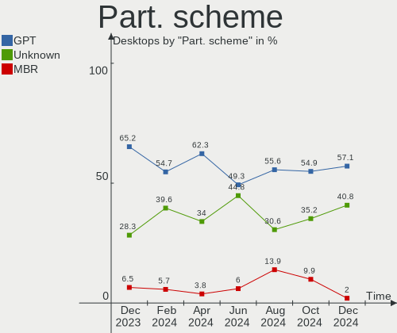
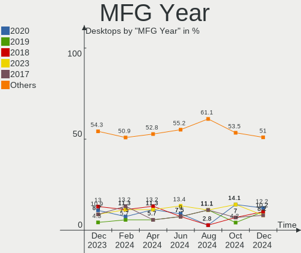
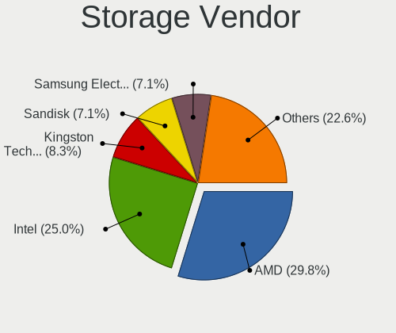
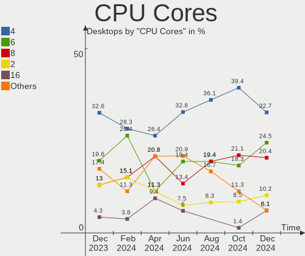
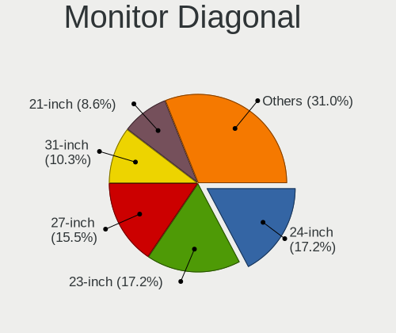
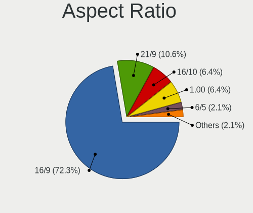
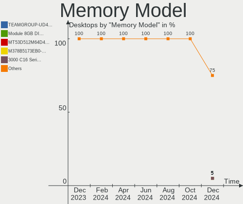

Kubuntu Hardware Trends (Desktops)
----------------------------------

A project to identify most popular hardware characteristics and track their change
over time based on data collected by Kubuntu users at https://Linux-Hardware.org.

Anyone can contribute to this report by the [hw-probe](https://github.com/linuxhw/hw-probe) tool:

    sudo -E hw-probe -all -upload

Full-feature report is available here: https://linux-hardware.org/?view=trends

Period: Feb, 2022.

Contents
--------

* [ System ](#system)
  - [ OS                       ](#os)
  - [ OS Family                ](#os-family)
  - [ Kernel                   ](#kernel)
  - [ Kernel Family            ](#kernel-family)
  - [ Kernel Major Ver.        ](#kernel-major-ver)
  - [ Arch                     ](#arch)
  - [ DE                       ](#de)
  - [ Display Server           ](#display-server)
  - [ Display Manager          ](#display-manager)
  - [ OS Lang                  ](#os-lang)
  - [ Boot Mode                ](#boot-mode)
  - [ Filesystem               ](#filesystem)
  - [ Part. scheme             ](#part-scheme)
  - [ Dual Boot with Linux/BSD ](#dual-boot-with-linuxbsd)
  - [ Dual Boot (Win)          ](#dual-boot-win)

* [ Board ](#board)
  - [ Vendor                   ](#vendor)
  - [ Model                    ](#model)
  - [ Model Family             ](#model-family)
  - [ MFG Year                 ](#mfg-year)
  - [ Form Factor              ](#form-factor)
  - [ Secure Boot              ](#secure-boot)
  - [ Coreboot                 ](#coreboot)
  - [ RAM Size                 ](#ram-size)
  - [ RAM Used                 ](#ram-used)
  - [ Total Drives             ](#total-drives)
  - [ Has CD-ROM               ](#has-cd-rom)
  - [ Has Ethernet             ](#has-ethernet)
  - [ Has WiFi                 ](#has-wifi)
  - [ Has Bluetooth            ](#has-bluetooth)

* [ Location ](#location)
  - [ Country                  ](#country)
  - [ City                     ](#city)

* [ Drives ](#drives)
  - [ Drive Vendor             ](#drive-vendor)
  - [ Drive Model              ](#drive-model)
  - [ HDD Vendor               ](#hdd-vendor)
  - [ SSD Vendor               ](#ssd-vendor)
  - [ Drive Kind               ](#drive-kind)
  - [ Drive Connector          ](#drive-connector)
  - [ Drive Size               ](#drive-size)
  - [ Space Total              ](#space-total)
  - [ Space Used               ](#space-used)
  - [ Malfunc. Drives          ](#malfunc-drives)
  - [ Malfunc. Drive Vendor    ](#malfunc-drive-vendor)
  - [ Malfunc. HDD Vendor      ](#malfunc-hdd-vendor)
  - [ Malfunc. Drive Kind      ](#malfunc-drive-kind)
  - [ Failed Drives            ](#failed-drives)
  - [ Failed Drive Vendor      ](#failed-drive-vendor)
  - [ Drive Status             ](#drive-status)

* [ Storage controller ](#storage-controller)
  - [ Storage Vendor           ](#storage-vendor)
  - [ Storage Model            ](#storage-model)
  - [ Storage Kind             ](#storage-kind)

* [ Processor ](#processor)
  - [ CPU Vendor               ](#cpu-vendor)
  - [ CPU Model                ](#cpu-model)
  - [ CPU Model Family         ](#cpu-model-family)
  - [ CPU Cores                ](#cpu-cores)
  - [ CPU Sockets              ](#cpu-sockets)
  - [ CPU Threads              ](#cpu-threads)
  - [ CPU Op-Modes             ](#cpu-op-modes)
  - [ CPU Microcode            ](#cpu-microcode)
  - [ CPU Microarch            ](#cpu-microarch)

* [ Graphics ](#graphics)
  - [ GPU Vendor               ](#gpu-vendor)
  - [ GPU Model                ](#gpu-model)
  - [ GPU Combo                ](#gpu-combo)
  - [ GPU Driver               ](#gpu-driver)
  - [ GPU Memory               ](#gpu-memory)

* [ Monitor ](#monitor)
  - [ Monitor Vendor           ](#monitor-vendor)
  - [ Monitor Model            ](#monitor-model)
  - [ Monitor Resolution       ](#monitor-resolution)
  - [ Monitor Diagonal         ](#monitor-diagonal)
  - [ Monitor Width            ](#monitor-width)
  - [ Aspect Ratio             ](#aspect-ratio)
  - [ Monitor Area             ](#monitor-area)
  - [ Pixel Density            ](#pixel-density)
  - [ Multiple Monitors        ](#multiple-monitors)

* [ Network ](#network)
  - [ Net Controller Vendor    ](#net-controller-vendor)
  - [ Net Controller Model     ](#net-controller-model)
  - [ Wireless Vendor          ](#wireless-vendor)
  - [ Wireless Model           ](#wireless-model)
  - [ Ethernet Vendor          ](#ethernet-vendor)
  - [ Ethernet Model           ](#ethernet-model)
  - [ Net Controller Kind      ](#net-controller-kind)
  - [ Used Controller          ](#used-controller)
  - [ NICs                     ](#nics)
  - [ IPv6                     ](#ipv6)

* [ Bluetooth ](#bluetooth)
  - [ Bluetooth Vendor         ](#bluetooth-vendor)
  - [ Bluetooth Model          ](#bluetooth-model)

* [ Sound ](#sound)
  - [ Sound Vendor             ](#sound-vendor)
  - [ Sound Model              ](#sound-model)

* [ Memory ](#memory)
  - [ Memory Vendor            ](#memory-vendor)
  - [ Memory Model             ](#memory-model)
  - [ Memory Kind              ](#memory-kind)
  - [ Memory Form Factor       ](#memory-form-factor)
  - [ Memory Size              ](#memory-size)
  - [ Memory Speed             ](#memory-speed)

* [ Printers & scanners ](#printers--scanners)
  - [ Printer Vendor           ](#printer-vendor)
  - [ Printer Model            ](#printer-model)
  - [ Scanner Vendor           ](#scanner-vendor)
  - [ Scanner Model            ](#scanner-model)

* [ Camera ](#camera)
  - [ Camera Vendor            ](#camera-vendor)
  - [ Camera Model             ](#camera-model)

* [ Security ](#security)
  - [ Fingerprint Vendor       ](#fingerprint-vendor)
  - [ Fingerprint Model        ](#fingerprint-model)
  - [ Chipcard Vendor          ](#chipcard-vendor)
  - [ Chipcard Model           ](#chipcard-model)

* [ Unsupported ](#unsupported)
  - [ Unsupported Devices      ](#unsupported-devices)
  - [ Unsupported Device Types ](#unsupported-device-types)

System
------

OS
--

Installed operating systems

| Name          | Desktops | Percent |
|---------------|----------|---------|
| Kubuntu 20.04 | 24       | 55.81%  |
| Kubuntu 21.10 | 11       | 25.58%  |
| Kubuntu 21.04 | 2        | 4.65%   |
| Kubuntu 11    | 2        | 4.65%   |
| Kubuntu 22.04 | 1        | 2.33%   |
| Kubuntu 20.10 | 1        | 2.33%   |
| Kubuntu 18.04 | 1        | 2.33%   |
| Kubuntu 16.04 | 1        | 2.33%   |

OS Family
---------

OS without a version

| Name    | Desktops | Percent |
|---------|----------|---------|
| Kubuntu | 43       | 100%    |

Kernel
------

Version of the Linux kernel

| Version                | Desktops | Percent |
|------------------------|----------|---------|
| 5.13.0-28-generic      | 15       | 34.88%  |
| 5.4.0-99-generic       | 7        | 16.28%  |
| 5.13.0-30-generic      | 5        | 11.63%  |
| 5.4.0-97-generic       | 2        | 4.65%   |
| 5.4.0-100-generic      | 2        | 4.65%   |
| 5.8.0-63-lowlatency    | 1        | 2.33%   |
| 5.8.0-63-generic       | 1        | 2.33%   |
| 5.15.0-22-generic      | 1        | 2.33%   |
| 5.14.21-051421-generic | 1        | 2.33%   |
| 5.13.0-29-lowlatency   | 1        | 2.33%   |
| 5.13.0-28-lowlatency   | 1        | 2.33%   |
| 5.13.0-23-generic      | 1        | 2.33%   |
| 5.13.0-22-generic      | 1        | 2.33%   |
| 5.13.0-19-generic      | 1        | 2.33%   |
| 5.11.0-49-generic      | 1        | 2.33%   |
| 5.11.0-25-generic      | 1        | 2.33%   |
| 4.4.0-210-generic      | 1        | 2.33%   |

Kernel Family
-------------

Linux kernel without a distro release

| Version | Desktops | Percent |
|---------|----------|---------|
| 5.13.0  | 25       | 58.14%  |
| 5.4.0   | 11       | 25.58%  |
| 5.8.0   | 2        | 4.65%   |
| 5.11.0  | 2        | 4.65%   |
| 5.15.0  | 1        | 2.33%   |
| 5.14.21 | 1        | 2.33%   |
| 4.4.0   | 1        | 2.33%   |

Kernel Major Ver.
-----------------

Linux kernel major version

| Version | Desktops | Percent |
|---------|----------|---------|
| 5.13    | 25       | 58.14%  |
| 5.4     | 11       | 25.58%  |
| 5.8     | 2        | 4.65%   |
| 5.11    | 2        | 4.65%   |
| 5.15    | 1        | 2.33%   |
| 5.14    | 1        | 2.33%   |
| 4.4     | 1        | 2.33%   |

Arch
----

OS architecture (x86_64, i586, etc.)

| Name   | Desktops | Percent |
|--------|----------|---------|
| x86_64 | 42       | 97.67%  |
| i686   | 1        | 2.33%   |

DE
--

Desktop Environment

| Name     | Desktops | Percent |
|----------|----------|---------|
| KDE5     | 39       | 90.7%   |
| KDE      | 2        | 4.65%   |
| MATE     | 1        | 2.33%   |
| Cinnamon | 1        | 2.33%   |

Display Server
--------------

X11 or Wayland

| Name | Desktops | Percent |
|------|----------|---------|
| X11  | 43       | 100%    |

Display Manager
---------------

SDDM, LightDM, etc.

| Name    | Desktops | Percent |
|---------|----------|---------|
| SDDM    | 30       | 69.77%  |
| Unknown | 8        | 18.6%   |
| LightDM | 5        | 11.63%  |

OS Lang
-------

Language

| Lang  | Desktops | Percent |
|-------|----------|---------|
| en_US | 18       | 41.86%  |
| fr_FR | 4        | 9.3%    |
| de_DE | 4        | 9.3%    |
| hu_HU | 3        | 6.98%   |
| ru_RU | 2        | 4.65%   |
| es_ES | 2        | 4.65%   |
| en_GB | 2        | 4.65%   |
| el_GR | 2        | 4.65%   |
| uk_UA | 1        | 2.33%   |
| sv_SE | 1        | 2.33%   |
| pt_BR | 1        | 2.33%   |
| es_AR | 1        | 2.33%   |
| en_AU | 1        | 2.33%   |
| C     | 1        | 2.33%   |

Boot Mode
---------

EFI or BIOS

| Mode | Desktops | Percent |
|------|----------|---------|
| EFI  | 22       | 51.16%  |
| BIOS | 21       | 48.84%  |

Filesystem
----------

Type of filesystem

| Type    | Desktops | Percent |
|---------|----------|---------|
| Ext4    | 42       | 97.67%  |
| Overlay | 1        | 2.33%   |

Part. scheme
------------

Scheme of partitioning

| Type    | Desktops | Percent |
|---------|----------|---------|
| Unknown | 23       | 53.49%  |
| GPT     | 17       | 39.53%  |
| MBR     | 3        | 6.98%   |

Dual Boot with Linux/BSD
------------------------

Hosting more than one Linux/BSD

| Dual boot | Desktops | Percent |
|-----------|----------|---------|
| No        | 35       | 81.4%   |
| Yes       | 8        | 18.6%   |

Dual Boot (Win)
---------------

Hosting Linux and Windows

| Dual boot | Desktops | Percent |
|-----------|----------|---------|
| No        | 26       | 60.47%  |
| Yes       | 17       | 39.53%  |

Board
-----

Vendor
------

Motherboard manufacturer

| Name                | Desktops | Percent |
|---------------------|----------|---------|
| ASUSTek Computer    | 12       | 27.91%  |
| MSI                 | 9        | 20.93%  |
| Gigabyte Technology | 7        | 16.28%  |
| Hewlett-Packard     | 2        | 4.65%   |
| Dell                | 2        | 4.65%   |
| ASRock              | 2        | 4.65%   |
| Unknown             | 2        | 4.65%   |
| SUPoX COMPUTER      | 1        | 2.33%   |
| Supermicro          | 1        | 2.33%   |
| Medion              | 1        | 2.33%   |
| Lenovo              | 1        | 2.33%   |
| Gateway             | 1        | 2.33%   |
| Fujitsu             | 1        | 2.33%   |
| Biostar             | 1        | 2.33%   |

Model
-----

Motherboard model

| Name                               | Desktops | Percent |
|------------------------------------|----------|---------|
| ASUS All Series                    | 3        | 6.98%   |
| ASUS TUF X470-PLUS GAMING          | 2        | 4.65%   |
| Unknown                            | 2        | 4.65%   |
| SUPoX COMPUTER B250A-BTC PRO       | 1        | 2.33%   |
| Supermicro X10DAi                  | 1        | 2.33%   |
| MSI MS-7D54                        | 1        | 2.33%   |
| MSI MS-7C94                        | 1        | 2.33%   |
| MSI MS-7C34                        | 1        | 2.33%   |
| MSI MS-7B89                        | 1        | 2.33%   |
| MSI MS-7A40                        | 1        | 2.33%   |
| MSI MS-7A34                        | 1        | 2.33%   |
| MSI MS-7971                        | 1        | 2.33%   |
| MSI MS-7817                        | 1        | 2.33%   |
| MSI MS-7502                        | 1        | 2.33%   |
| Medion S23003                      | 1        | 2.33%   |
| Lenovo ThinkCentre M92p 32381Q4    | 1        | 2.33%   |
| HP Compaq dc5700 Small Form Factor | 1        | 2.33%   |
| HP 290 G2 MT Business PC           | 1        | 2.33%   |
| Gigabyte P55A-UD3                  | 1        | 2.33%   |
| Gigabyte H81M-H                    | 1        | 2.33%   |
| Gigabyte H410M S2H V3              | 1        | 2.33%   |
| Gigabyte F2A88XM-D3HP              | 1        | 2.33%   |
| Gigabyte B450M H                   | 1        | 2.33%   |
| Gigabyte B450 I AORUS PRO WIFI     | 1        | 2.33%   |
| Gigabyte A320M-S2H                 | 1        | 2.33%   |
| Gateway DX4860                     | 1        | 2.33%   |
| Fujitsu ESPRIMO C910               | 1        | 2.33%   |
| Dell OptiPlex 5060                 | 1        | 2.33%   |
| Dell OptiPlex 3010                 | 1        | 2.33%   |
| Biostar B450MH                     | 1        | 2.33%   |
| ASUS TUF B450-PLUS GAMING          | 1        | 2.33%   |
| ASUS STRIX Z270E GAMING            | 1        | 2.33%   |
| ASUS ROG STRIX Z590-E GAMING WIFI  | 1        | 2.33%   |
| ASUS ROG STRIX Z370-F GAMING       | 1        | 2.33%   |
| ASUS Q87M-E                        | 1        | 2.33%   |
| ASUS PRIME B350-PLUS               | 1        | 2.33%   |
| ASUS P8H67-M PRO                   | 1        | 2.33%   |
| ASRock N68-GS4 FX                  | 1        | 2.33%   |
| ASRock AB350 Pro4                  | 1        | 2.33%   |

Model Family
------------

Motherboard model prefix

| Name                     | Desktops | Percent |
|--------------------------|----------|---------|
| ASUS TUF                 | 3        | 6.98%   |
| ASUS All                 | 3        | 6.98%   |
| Dell OptiPlex            | 2        | 4.65%   |
| ASUS ROG                 | 2        | 4.65%   |
| Unknown                  | 2        | 4.65%   |
| SUPoX COMPUTER B250A-BTC | 1        | 2.33%   |
| Supermicro X10DAi        | 1        | 2.33%   |
| MSI MS-7D54              | 1        | 2.33%   |
| MSI MS-7C94              | 1        | 2.33%   |
| MSI MS-7C34              | 1        | 2.33%   |
| MSI MS-7B89              | 1        | 2.33%   |
| MSI MS-7A40              | 1        | 2.33%   |
| MSI MS-7A34              | 1        | 2.33%   |
| MSI MS-7971              | 1        | 2.33%   |
| MSI MS-7817              | 1        | 2.33%   |
| MSI MS-7502              | 1        | 2.33%   |
| Medion S23003            | 1        | 2.33%   |
| Lenovo ThinkCentre       | 1        | 2.33%   |
| HP Compaq                | 1        | 2.33%   |
| HP 290                   | 1        | 2.33%   |
| Gigabyte P55A-UD3        | 1        | 2.33%   |
| Gigabyte H81M-H          | 1        | 2.33%   |
| Gigabyte H410M           | 1        | 2.33%   |
| Gigabyte F2A88XM-D3HP    | 1        | 2.33%   |
| Gigabyte B450M           | 1        | 2.33%   |
| Gigabyte B450            | 1        | 2.33%   |
| Gigabyte A320M-S2H       | 1        | 2.33%   |
| Gateway DX4860           | 1        | 2.33%   |
| Fujitsu ESPRIMO          | 1        | 2.33%   |
| Biostar B450MH           | 1        | 2.33%   |
| ASUS STRIX               | 1        | 2.33%   |
| ASUS Q87M-E              | 1        | 2.33%   |
| ASUS PRIME               | 1        | 2.33%   |
| ASUS P8H67-M             | 1        | 2.33%   |
| ASRock N68-GS4           | 1        | 2.33%   |
| ASRock AB350             | 1        | 2.33%   |

MFG Year
--------

Motherboard manufacture year

| Year | Desktops | Percent |
|------|----------|---------|
| 2018 | 8        | 18.6%   |
| 2017 | 8        | 18.6%   |
| 2021 | 6        | 13.95%  |
| 2014 | 4        | 9.3%    |
| 2013 | 3        | 6.98%   |
| 2019 | 2        | 4.65%   |
| 2015 | 2        | 4.65%   |
| 2012 | 2        | 4.65%   |
| 2011 | 2        | 4.65%   |
| 2020 | 1        | 2.33%   |
| 2016 | 1        | 2.33%   |
| 2009 | 1        | 2.33%   |
| 2008 | 1        | 2.33%   |
| 2007 | 1        | 2.33%   |
| 2006 | 1        | 2.33%   |

Form Factor
-----------

Physical design of the computer

| Name    | Desktops | Percent |
|---------|----------|---------|
| Desktop | 43       | 100%    |

Secure Boot
-----------

Enabled or disabled

| State    | Desktops | Percent |
|----------|----------|---------|
| Disabled | 42       | 97.67%  |
| Enabled  | 1        | 2.33%   |

Coreboot
--------

Have coreboot on board

| Used | Desktops | Percent |
|------|----------|---------|
| No   | 43       | 100%    |

RAM Size
--------

Total RAM memory

| Size in GB  | Desktops | Percent |
|-------------|----------|---------|
| 16.01-24.0  | 15       | 34.88%  |
| 8.01-16.0   | 8        | 18.6%   |
| 32.01-64.0  | 6        | 13.95%  |
| 4.01-8.0    | 5        | 11.63%  |
| 3.01-4.0    | 5        | 11.63%  |
| 24.01-32.0  | 2        | 4.65%   |
| 2.01-3.0    | 1        | 2.33%   |
| 64.01-256.0 | 1        | 2.33%   |

RAM Used
--------

Used RAM memory

| Used GB    | Desktops | Percent |
|------------|----------|---------|
| 2.01-3.0   | 13       | 30.23%  |
| 4.01-8.0   | 10       | 23.26%  |
| 1.01-2.0   | 10       | 23.26%  |
| 3.01-4.0   | 4        | 9.3%    |
| 8.01-16.0  | 4        | 9.3%    |
| 16.01-24.0 | 2        | 4.65%   |

Total Drives
------------

Number of drives on board

| Drives | Desktops | Percent |
|--------|----------|---------|
| 2      | 13       | 30.23%  |
| 1      | 13       | 30.23%  |
| 4      | 6        | 13.95%  |
| 3      | 6        | 13.95%  |
| 5      | 4        | 9.3%    |
| 6      | 1        | 2.33%   |

Has CD-ROM
----------

Has CD-ROM on board

| Presented | Desktops | Percent |
|-----------|----------|---------|
| No        | 27       | 62.79%  |
| Yes       | 16       | 37.21%  |

Has Ethernet
------------

Has Ethernet on board

| Presented | Desktops | Percent |
|-----------|----------|---------|
| Yes       | 43       | 100%    |

Has WiFi
--------

Has WiFi module

| Presented | Desktops | Percent |
|-----------|----------|---------|
| No        | 24       | 55.81%  |
| Yes       | 19       | 44.19%  |

Has Bluetooth
-------------

Has Bluetooth module

| Presented | Desktops | Percent |
|-----------|----------|---------|
| No        | 27       | 62.79%  |
| Yes       | 16       | 37.21%  |

Location
--------

Country
-------

Geographic location (country)

| Country     | Desktops | Percent |
|-------------|----------|---------|
| USA         | 7        | 16.28%  |
| Germany     | 5        | 11.63%  |
| Hungary     | 4        | 9.3%    |
| France      | 3        | 6.98%   |
| Brazil      | 3        | 6.98%   |
| Ukraine     | 2        | 4.65%   |
| UK          | 2        | 4.65%   |
| Spain       | 2        | 4.65%   |
| Russia      | 2        | 4.65%   |
| Netherlands | 2        | 4.65%   |
| Greece      | 2        | 4.65%   |
| Turkey      | 1        | 2.33%   |
| Switzerland | 1        | 2.33%   |
| Sweden      | 1        | 2.33%   |
| Romania     | 1        | 2.33%   |
| Martinique  | 1        | 2.33%   |
| Lithuania   | 1        | 2.33%   |
| Chile       | 1        | 2.33%   |
| Australia   | 1        | 2.33%   |
| Argentina   | 1        | 2.33%   |

City
----

Geographic location (city)

| City                   | Desktops | Percent |
|------------------------|----------|---------|
| Budapest               | 3        | 6.98%   |
| Zurich                 | 1        | 2.33%   |
| Târgu Mureş      | 1        | 2.33%   |
| Szeged                 | 1        | 2.33%   |
| Sydney                 | 1        | 2.33%   |
| Sutton                 | 1        | 2.33%   |
| Strullendorf           | 1        | 2.33%   |
| São Carlos          | 1        | 2.33%   |
| Saint-Mandrier-sur-Mer | 1        | 2.33%   |
| Sacramento             | 1        | 2.33%   |
| Ryazan                 | 1        | 2.33%   |
| Rochester              | 1        | 2.33%   |
| Rio de Janeiro         | 1        | 2.33%   |
| Rethymno               | 1        | 2.33%   |
| Port Montt             | 1        | 2.33%   |
| Plattsmouth            | 1        | 2.33%   |
| Paris                  | 1        | 2.33%   |
| Obninsk                | 1        | 2.33%   |
| Nova Kakhovka          | 1        | 2.33%   |
| Milton                 | 1        | 2.33%   |
| Mendon                 | 1        | 2.33%   |
| Marseille              | 1        | 2.33%   |
| Maracai                | 1        | 2.33%   |
| Madrid                 | 1        | 2.33%   |
| Lith                   | 1        | 2.33%   |
| Leesburg               | 1        | 2.33%   |
| Le Lamentin            | 1        | 2.33%   |
| Kaunas                 | 1        | 2.33%   |
| Islington              | 1        | 2.33%   |
| Groningen              | 1        | 2.33%   |
| Gothenburg             | 1        | 2.33%   |
| Getxo                  | 1        | 2.33%   |
| Ettlingen              | 1        | 2.33%   |
| Cologne                | 1        | 2.33%   |
| Chystyakove            | 1        | 2.33%   |
| Broken Arrow           | 1        | 2.33%   |
| Bornhoved              | 1        | 2.33%   |
| Bonn                   | 1        | 2.33%   |
| Beccar                 | 1        | 2.33%   |
| Balıkesir           | 1        | 2.33%   |
| Athens                 | 1        | 2.33%   |

Drives
------

Drive Vendor
------------

Hard drive vendors

| Vendor                | Desktops | Drives | Percent |
|-----------------------|----------|--------|---------|
| WDC                   | 20       | 26     | 23.81%  |
| Samsung Electronics   | 20       | 26     | 23.81%  |
| Seagate               | 13       | 18     | 15.48%  |
| Kingston              | 7        | 10     | 8.33%   |
| Toshiba               | 5        | 8      | 5.95%   |
| SanDisk               | 2        | 2      | 2.38%   |
| Intel                 | 2        | 2      | 2.38%   |
| Hitachi               | 2        | 2      | 2.38%   |
| Crucial               | 2        | 2      | 2.38%   |
| Unknown               | 1        | 1      | 1.19%   |
| Silicon Motion        | 1        | 1      | 1.19%   |
| Realtek Semiconductor | 1        | 1      | 1.19%   |
| PNY                   | 1        | 1      | 1.19%   |
| Patriot               | 1        | 1      | 1.19%   |
| LITEONIT              | 1        | 1      | 1.19%   |
| Lexar                 | 1        | 1      | 1.19%   |
| LDLC                  | 1        | 2      | 1.19%   |
| KingSpec              | 1        | 1      | 1.19%   |
| AMD                   | 1        | 1      | 1.19%   |
| Unknown               | 1        | 1      | 1.19%   |

Drive Model
-----------

Hard drive models

| Model                                | Desktops | Percent |
|--------------------------------------|----------|---------|
| WDC WDS500G2B0A-00SM50 500GB SSD     | 3        | 2.97%   |
| Samsung SSD 850 EVO 250GB            | 3        | 2.97%   |
| WDC WD20EARX-00PASB0 2TB             | 2        | 1.98%   |
| WDC WD1002FAEX-00Z3A0 1TB            | 2        | 1.98%   |
| Toshiba DT01ACA200 2TB               | 2        | 1.98%   |
| Seagate ST2000DM008-2FR102 2TB       | 2        | 1.98%   |
| Seagate ST2000DM001-1ER164 2TB       | 2        | 1.98%   |
| Seagate ST1000LM024 HN-M101MBB 1TB   | 2        | 1.98%   |
| Samsung SSD 970 EVO Plus 500GB       | 2        | 1.98%   |
| Samsung NVMe SSD Drive 500GB         | 2        | 1.98%   |
| Kingston SHSS37A240G 240GB SSD       | 2        | 1.98%   |
| Kingston SA400S37240G 240GB SSD      | 2        | 1.98%   |
| WDC WDS500G2B0C-00PXH0 500GB         | 1        | 0.99%   |
| WDC WDS240G2G0C-00AJM0 240GB         | 1        | 0.99%   |
| WDC WDS100T2B0A-00SM50 1TB SSD       | 1        | 0.99%   |
| WDC WD60PURX-64T0ZY0 6TB             | 1        | 0.99%   |
| WDC WD5000AZLX-08K2TA0 500GB         | 1        | 0.99%   |
| WDC WD5000AAKX-75U6AA0 500GB         | 1        | 0.99%   |
| WDC WD40EZRZ-00GXCB0 4TB             | 1        | 0.99%   |
| WDC WD3200AAJB-00J3A0 320GB          | 1        | 0.99%   |
| WDC WD20EZRX-00D8PB0 2TB             | 1        | 0.99%   |
| WDC WD10EZRZ-00HTKB0 1TB             | 1        | 0.99%   |
| WDC WD10EZEX-60WN4A0 1TB             | 1        | 0.99%   |
| WDC WD10EZEX-08WN4A0 1TB             | 1        | 0.99%   |
| WDC WD10EARS-00Y5B1 1TB              | 1        | 0.99%   |
| WDC WD10EALX-009BA0 1TB              | 1        | 0.99%   |
| WDC WD10EALX-008EA0 1TB              | 1        | 0.99%   |
| WDC WD10EADX-22TDHB0 1TB             | 1        | 0.99%   |
| WDC WD10EACS-00ZJB0 1TB              | 1        | 0.99%   |
| WDC PC SN520 SDAPNUW-256G-1006 256GB | 1        | 0.99%   |
| Unknown SD/MMC/MS PRO 64GB           | 1        | 0.99%   |
| Toshiba MQ01ACF050 500GB             | 1        | 0.99%   |
| Toshiba MQ01ABD075 752GB             | 1        | 0.99%   |
| Toshiba MK3261GSYN 320GB             | 1        | 0.99%   |
| Silicon Motion NVMe SSD Drive 256GB  | 1        | 0.99%   |
| Seagate ST5000DM000-1FK178 5TB       | 1        | 0.99%   |
| Seagate ST4000NM0035-1V4107 4TB      | 1        | 0.99%   |
| Seagate ST4000DM005-2DP166 4TB       | 1        | 0.99%   |
| Seagate ST3320613AS 320GB            | 1        | 0.99%   |
| Seagate ST3250820AS 250GB            | 1        | 0.99%   |
| Seagate ST31500341AS 1TB             | 1        | 0.99%   |
| Seagate ST31000528AS 1TB             | 1        | 0.99%   |
| Seagate ST2000DM001-1CH164 2TB       | 1        | 0.99%   |
| Seagate ST1000VX005-2EZ102 1TB       | 1        | 0.99%   |
| Seagate ST1000DM010-2EP102 1TB       | 1        | 0.99%   |
| Seagate ST1000DM003-1CH162 1TB       | 1        | 0.99%   |
| SanDisk SSD PLUS 480GB               | 1        | 0.99%   |
| SanDisk SDSSDA480G 480GB             | 1        | 0.99%   |
| Samsung SSD 980 PRO 1TB              | 1        | 0.99%   |
| Samsung SSD 970 PRO 1TB              | 1        | 0.99%   |
| Samsung SSD 970 EVO 1TB              | 1        | 0.99%   |
| Samsung SSD 870 QVO 1TB              | 1        | 0.99%   |
| Samsung SSD 870 EVO 250GB            | 1        | 0.99%   |
| Samsung SSD 860 EVO 250GB            | 1        | 0.99%   |
| Samsung SSD 850 EVO M.2 1TB          | 1        | 0.99%   |
| Samsung SSD 850 EVO 500GB            | 1        | 0.99%   |
| Samsung SSD 840 EVO 500GB            | 1        | 0.99%   |
| Samsung NVMe SSD Drive 250GB         | 1        | 0.99%   |
| Samsung NVMe SSD Drive 1TB           | 1        | 0.99%   |
| Samsung MZHPV128HDGM-00000 128GB SSD | 1        | 0.99%   |

HDD Vendor
----------

Hard disk drive vendors

| Vendor              | Desktops | Drives | Percent |
|---------------------|----------|--------|---------|
| WDC                 | 15       | 19     | 35.71%  |
| Seagate             | 13       | 18     | 30.95%  |
| Samsung Electronics | 6        | 6      | 14.29%  |
| Toshiba             | 5        | 8      | 11.9%   |
| Hitachi             | 2        | 2      | 4.76%   |
| Unknown             | 1        | 1      | 2.38%   |

SSD Vendor
----------

Solid state drive vendors

| Vendor              | Desktops | Drives | Percent |
|---------------------|----------|--------|---------|
| Samsung Electronics | 8        | 10     | 28.57%  |
| Kingston            | 6        | 8      | 21.43%  |
| WDC                 | 4        | 4      | 14.29%  |
| SanDisk             | 2        | 2      | 7.14%   |
| Crucial             | 2        | 2      | 7.14%   |
| Patriot             | 1        | 1      | 3.57%   |
| LITEONIT            | 1        | 1      | 3.57%   |
| Lexar               | 1        | 1      | 3.57%   |
| KingSpec            | 1        | 1      | 3.57%   |
| Intel               | 1        | 1      | 3.57%   |
| Unknown             | 1        | 1      | 3.57%   |

Drive Kind
----------

HDD or SSD

| Kind    | Desktops | Drives | Percent |
|---------|----------|--------|---------|
| HDD     | 28       | 54     | 39.44%  |
| SSD     | 25       | 32     | 35.21%  |
| NVMe    | 17       | 20     | 23.94%  |
| Unknown | 1        | 2      | 1.41%   |

Drive Connector
---------------

SATA, SAS, NVMe, etc.

| Type | Desktops | Drives | Percent |
|------|----------|--------|---------|
| SATA | 39       | 86     | 67.24%  |
| NVMe | 17       | 20     | 29.31%  |
| SAS  | 2        | 2      | 3.45%   |

Drive Size
----------

Size of hard drive

| Size in TB | Desktops | Drives | Percent |
|------------|----------|--------|---------|
| 0.01-0.5   | 28       | 37     | 45.16%  |
| 0.51-1.0   | 21       | 29     | 33.87%  |
| 1.01-2.0   | 8        | 14     | 12.9%   |
| 3.01-4.0   | 3        | 4      | 4.84%   |
| 4.01-10.0  | 2        | 2      | 3.23%   |

Space Total
-----------

Amount of disk space available on the file system

| Size in GB     | Desktops | Percent |
|----------------|----------|---------|
| 251-500        | 11       | 25.58%  |
| More than 3000 | 8        | 18.6%   |
| 101-250        | 7        | 16.28%  |
| 1001-2000      | 5        | 11.63%  |
| 501-1000       | 5        | 11.63%  |
| 2001-3000      | 4        | 9.3%    |
| 51-100         | 2        | 4.65%   |
| 1-20           | 1        | 2.33%   |

Space Used
----------

Amount of used disk space

| Used GB        | Desktops | Percent |
|----------------|----------|---------|
| 51-100         | 9        | 20.93%  |
| 101-250        | 8        | 18.6%   |
| 21-50          | 6        | 13.95%  |
| 251-500        | 4        | 9.3%    |
| 1001-2000      | 4        | 9.3%    |
| 1-20           | 4        | 9.3%    |
| 501-1000       | 4        | 9.3%    |
| More than 3000 | 2        | 4.65%   |
| 2001-3000      | 2        | 4.65%   |

Malfunc. Drives
---------------

Drive models with a malfunction

| Model                                 | Desktops | Drives | Percent |
|---------------------------------------|----------|--------|---------|
| WDC WD10EZRZ-00HTKB0 1TB              | 1        | 1      | 16.67%  |
| Toshiba DT01ACA200 2TB                | 1        | 1      | 16.67%  |
| Seagate ST3320613AS 320GB             | 1        | 1      | 16.67%  |
| Samsung Electronics SSD 840 EVO 500GB | 1        | 1      | 16.67%  |
| Samsung Electronics HD642JJ 640GB     | 1        | 1      | 16.67%  |
| Intel SSDSA2M080G2GC 80GB             | 1        | 1      | 16.67%  |

Malfunc. Drive Vendor
---------------------

Vendors of faulty drives

| Vendor              | Desktops | Drives | Percent |
|---------------------|----------|--------|---------|
| Samsung Electronics | 2        | 2      | 33.33%  |
| WDC                 | 1        | 1      | 16.67%  |
| Toshiba             | 1        | 1      | 16.67%  |
| Seagate             | 1        | 1      | 16.67%  |
| Intel               | 1        | 1      | 16.67%  |

Malfunc. HDD Vendor
-------------------

Vendors of faulty HDD drives

| Vendor              | Desktops | Drives | Percent |
|---------------------|----------|--------|---------|
| WDC                 | 1        | 1      | 25%     |
| Toshiba             | 1        | 1      | 25%     |
| Seagate             | 1        | 1      | 25%     |
| Samsung Electronics | 1        | 1      | 25%     |

Malfunc. Drive Kind
-------------------

Kinds of faulty drives

| Kind | Desktops | Drives | Percent |
|------|----------|--------|---------|
| HDD  | 4        | 4      | 66.67%  |
| SSD  | 2        | 2      | 33.33%  |

Failed Drives
-------------

Failed drive models

Zero info for selected period =(

Failed Drive Vendor
-------------------

Failed drive vendors

Zero info for selected period =(

Drive Status
------------

Number of failed and malfunc. drives

| Status   | Desktops | Drives | Percent |
|----------|----------|--------|---------|
| Detected | 24       | 58     | 48%     |
| Works    | 20       | 44     | 40%     |
| Malfunc  | 6        | 6      | 12%     |

Storage controller
------------------

Storage Vendor
--------------

Storage controller vendors

| Vendor                        | Desktops | Percent |
|-------------------------------|----------|---------|
| Intel                         | 25       | 37.31%  |
| AMD                           | 17       | 25.37%  |
| Samsung Electronics           | 10       | 14.93%  |
| Sandisk                       | 3        | 4.48%   |
| ASMedia Technology            | 3        | 4.48%   |
| Integrated Technology Express | 2        | 2.99%   |
| VIA Technologies              | 1        | 1.49%   |
| Silicon Motion                | 1        | 1.49%   |
| Realtek Semiconductor         | 1        | 1.49%   |
| Phison Electronics            | 1        | 1.49%   |
| Nvidia                        | 1        | 1.49%   |
| Marvell Technology Group      | 1        | 1.49%   |
| Kingston Technology Company   | 1        | 1.49%   |

Storage Model
-------------

Storage controller models

| Model                                                                          | Desktops | Percent |
|--------------------------------------------------------------------------------|----------|---------|
| AMD FCH SATA Controller [AHCI mode]                                            | 14       | 16.87%  |
| Samsung NVMe SSD Controller SM981/PM981/PM983                                  | 8        | 9.64%   |
| AMD 400 Series Chipset SATA Controller                                         | 8        | 9.64%   |
| Intel 8 Series/C220 Series Chipset Family 6-port SATA Controller 1 [AHCI mode] | 5        | 6.02%   |
| Intel 6 Series/C200 Series Chipset Family 6 port Desktop SATA AHCI Controller  | 3        | 3.61%   |
| Intel 200 Series PCH SATA controller [AHCI mode]                               | 3        | 3.61%   |
| AMD 300 Series Chipset SATA Controller                                         | 3        | 3.61%   |
| Intel Cannon Lake PCH SATA AHCI Controller                                     | 2        | 2.41%   |
| Intel 7 Series/C210 Series Chipset Family 6-port SATA Controller [AHCI mode]   | 2        | 2.41%   |
| Intel 500 Series Chipset Family SATA AHCI Controller                           | 2        | 2.41%   |
| Integrated Express IT8213 IDE Controller                                       | 2        | 2.41%   |
| ASMedia ASM1062 Serial ATA Controller                                          | 2        | 2.41%   |
| VIA VT6415 PATA IDE Host Controller                                            | 1        | 1.2%    |
| Silicon Motion SM2263EN/SM2263XT SSD Controller                                | 1        | 1.2%    |
| Sandisk WD Blue SN550 NVMe SSD                                                 | 1        | 1.2%    |
| Sandisk WD Blue SN500 / PC SN520 NVMe SSD                                      | 1        | 1.2%    |
| Sandisk Non-Volatile memory controller                                         | 1        | 1.2%    |
| Samsung NVMe SSD Controller PM9A1/PM9A3/980PRO                                 | 1        | 1.2%    |
| Samsung Electronics SATA controller                                            | 1        | 1.2%    |
| Realtek Realtek Non-Volatile memory controller                                 | 1        | 1.2%    |
| Phison E12 NVMe Controller                                                     | 1        | 1.2%    |
| Nvidia MCP61 SATA Controller                                                   | 1        | 1.2%    |
| Nvidia MCP61 IDE                                                               | 1        | 1.2%    |
| Marvell Group 88SE9215 PCIe 2.0 x1 4-port SATA 6 Gb/s Controller               | 1        | 1.2%    |
| Marvell Group 88SE9128 PCIe SATA 6 Gb/s RAID controller                        | 1        | 1.2%    |
| Kingston Company A2000 NVMe SSD                                                | 1        | 1.2%    |
| Intel SSD Pro 7600p/760p/E 6100p Series                                        | 1        | 1.2%    |
| Intel Q170/Q150/B150/H170/H110/Z170/CM236 Chipset SATA Controller [AHCI Mode]  | 1        | 1.2%    |
| Intel Celeron/Pentium Silver Processor SATA Controller                         | 1        | 1.2%    |
| Intel C610/X99 series chipset sSATA Controller [AHCI mode]                     | 1        | 1.2%    |
| Intel C610/X99 series chipset 6-Port SATA Controller [AHCI mode]               | 1        | 1.2%    |
| Intel 9 Series Chipset Family SATA Controller [AHCI Mode]                      | 1        | 1.2%    |
| Intel 82801JI (ICH10 Family) SATA AHCI Controller                              | 1        | 1.2%    |
| Intel 82801IR/IO/IH (ICH9R/DO/DH) 6 port SATA Controller [AHCI mode]           | 1        | 1.2%    |
| Intel 82801HR/HO/HH (ICH8R/DO/DH) 2 port SATA Controller [IDE mode]            | 1        | 1.2%    |
| Intel 82801H (ICH8 Family) 4 port SATA Controller [IDE mode]                   | 1        | 1.2%    |
| Intel 5 Series/3400 Series Chipset 6 port SATA AHCI Controller                 | 1        | 1.2%    |
| ASMedia SATA controller                                                        | 1        | 1.2%    |
| AMD Starship/Matisse Chipset SATA Controller [AHCI mode]                       | 1        | 1.2%    |
| AMD RAID Bottom Device                                                         | 1        | 1.2%    |
| AMD FCH SATA Controller D                                                      | 1        | 1.2%    |

Storage Kind
------------

Kind of storage controller (IDE, SATA, NVMe, SAS, ...)

| Kind | Desktops | Percent |
|------|----------|---------|
| SATA | 41       | 65.08%  |
| NVMe | 17       | 26.98%  |
| IDE  | 5        | 7.94%   |

Processor
---------

CPU Vendor
----------

Processor vendors

| Vendor | Desktops | Percent |
|--------|----------|---------|
| Intel  | 25       | 58.14%  |
| AMD    | 18       | 41.86%  |

CPU Model
---------

Processor models

| Model                                           | Desktops | Percent |
|-------------------------------------------------|----------|---------|
| AMD Ryzen 7 3700X 8-Core Processor              | 3        | 6.98%   |
| Intel Core i7-4790K CPU @ 4.00GHz               | 2        | 4.65%   |
| AMD Ryzen 5 3400G with Radeon Vega Graphics     | 2        | 4.65%   |
| AMD Ryzen 5 2400G with Radeon Vega Graphics     | 2        | 4.65%   |
| Intel Xeon CPU L5420 @ 2.50GHz                  | 1        | 2.33%   |
| Intel Xeon CPU E5-2603 v4 @ 1.70GHz             | 1        | 2.33%   |
| Intel Pentium D CPU 3.40GHz                     | 1        | 2.33%   |
| Intel Pentium CPU G645 @ 2.90GHz                | 1        | 2.33%   |
| Intel Pentium CPU G4560 @ 3.50GHz               | 1        | 2.33%   |
| Intel Core i7-8700K CPU @ 3.70GHz               | 1        | 2.33%   |
| Intel Core i7-8700 CPU @ 3.20GHz                | 1        | 2.33%   |
| Intel Core i7-7700 CPU @ 3.60GHz                | 1        | 2.33%   |
| Intel Core i7 CPU 870 @ 2.93GHz                 | 1        | 2.33%   |
| Intel Core i5-8500 CPU @ 3.00GHz                | 1        | 2.33%   |
| Intel Core i5-6400 CPU @ 2.70GHz                | 1        | 2.33%   |
| Intel Core i5-4690 CPU @ 3.50GHz                | 1        | 2.33%   |
| Intel Core i5-4570T CPU @ 2.90GHz               | 1        | 2.33%   |
| Intel Core i5-4440 CPU @ 3.10GHz                | 1        | 2.33%   |
| Intel Core i5-3470T CPU @ 2.90GHz               | 1        | 2.33%   |
| Intel Core i5-3470 CPU @ 3.20GHz                | 1        | 2.33%   |
| Intel Core i5-2500 CPU @ 3.30GHz                | 1        | 2.33%   |
| Intel Core i5-2320 CPU @ 3.00GHz                | 1        | 2.33%   |
| Intel Core i3-4130 CPU @ 3.40GHz                | 1        | 2.33%   |
| Intel Core i3-10105F CPU @ 3.70GHz              | 1        | 2.33%   |
| Intel Core 2 Duo CPU E6750 @ 2.66GHz            | 1        | 2.33%   |
| Intel Celeron J4125 CPU @ 2.00GHz               | 1        | 2.33%   |
| Intel 11th Gen Core i7-11700K @ 3.60GHz         | 1        | 2.33%   |
| AMD Ryzen 9 5900X 12-Core Processor             | 1        | 2.33%   |
| AMD Ryzen 9 3900X 12-Core Processor             | 1        | 2.33%   |
| AMD Ryzen 7 4800H with Radeon Graphics          | 1        | 2.33%   |
| AMD Ryzen 7 2700 Eight-Core Processor           | 1        | 2.33%   |
| AMD Ryzen 5 5600X 6-Core Processor              | 1        | 2.33%   |
| AMD Ryzen 5 3600 6-Core Processor               | 1        | 2.33%   |
| AMD Ryzen 5 2600 Six-Core Processor             | 1        | 2.33%   |
| AMD Ryzen 5 1600 Six-Core Processor             | 1        | 2.33%   |
| AMD Ryzen 3 3100 4-Core Processor               | 1        | 2.33%   |
| AMD FX-4300 Quad-Core Processor                 | 1        | 2.33%   |
| AMD A10-7860K Radeon R7, 12 Compute Cores 4C+8G | 1        | 2.33%   |

CPU Model Family
----------------

Processor model prefix

| Model            | Desktops | Percent |
|------------------|----------|---------|
| Intel Core i5    | 9        | 20.93%  |
| AMD Ryzen 5      | 8        | 18.6%   |
| Intel Core i7    | 6        | 13.95%  |
| AMD Ryzen 7      | 5        | 11.63%  |
| Intel Xeon       | 2        | 4.65%   |
| Intel Pentium    | 2        | 4.65%   |
| Intel Core i3    | 2        | 4.65%   |
| AMD Ryzen 9      | 2        | 4.65%   |
| Other            | 1        | 2.33%   |
| Intel Pentium D  | 1        | 2.33%   |
| Intel Core 2 Duo | 1        | 2.33%   |
| Intel Celeron    | 1        | 2.33%   |
| AMD Ryzen 3      | 1        | 2.33%   |
| AMD FX           | 1        | 2.33%   |
| AMD A10          | 1        | 2.33%   |

CPU Cores
---------

Number of processor cores

| Number | Desktops | Percent |
|--------|----------|---------|
| 4      | 18       | 41.86%  |
| 2      | 9        | 20.93%  |
| 6      | 8        | 18.6%   |
| 8      | 6        | 13.95%  |
| 12     | 2        | 4.65%   |

CPU Sockets
-----------

Number of sockets

| Number | Desktops | Percent |
|--------|----------|---------|
| 1      | 43       | 100%    |

CPU Threads
-----------

Threads per core (Hyper-Threading)

| Number | Desktops | Percent |
|--------|----------|---------|
| 2      | 30       | 69.77%  |
| 1      | 13       | 30.23%  |

CPU Op-Modes
------------

CPU Operation Modes (32-bit, 64-bit)

| Op mode        | Desktops | Percent |
|----------------|----------|---------|
| 32-bit, 64-bit | 43       | 100%    |

CPU Microcode
-------------

Microcode number

| Number     | Desktops | Percent |
|------------|----------|---------|
| Unknown    | 8        | 18.6%   |
| 0x306c3    | 5        | 11.63%  |
| 0x08701021 | 4        | 9.3%    |
| 0x206a7    | 3        | 6.98%   |
| 0x906ea    | 2        | 4.65%   |
| 0x306a9    | 2        | 4.65%   |
| 0x0a201016 | 2        | 4.65%   |
| 0x08108109 | 2        | 4.65%   |
| 0x08101016 | 2        | 4.65%   |
| 0xa0653    | 1        | 2.33%   |
| 0x906e9    | 1        | 2.33%   |
| 0x706a8    | 1        | 2.33%   |
| 0x6fb      | 1        | 2.33%   |
| 0x506e3    | 1        | 2.33%   |
| 0x406f1    | 1        | 2.33%   |
| 0x10676    | 1        | 2.33%   |
| 0x08701013 | 1        | 2.33%   |
| 0x08600106 | 1        | 2.33%   |
| 0x0800820d | 1        | 2.33%   |
| 0x08001126 | 1        | 2.33%   |
| 0x06003106 | 1        | 2.33%   |
| 0x06000852 | 1        | 2.33%   |

CPU Microarch
-------------

Microarchitecture

| Name          | Desktops | Percent |
|---------------|----------|---------|
| Zen 2         | 7        | 16.28%  |
| Haswell       | 6        | 13.95%  |
| KabyLake      | 5        | 11.63%  |
| Zen+          | 4        | 9.3%    |
| Zen           | 3        | 6.98%   |
| SandyBridge   | 3        | 6.98%   |
| Zen 3         | 2        | 4.65%   |
| IvyBridge     | 2        | 4.65%   |
| Steamroller   | 1        | 2.33%   |
| Skylake       | 1        | 2.33%   |
| Piledriver    | 1        | 2.33%   |
| Penryn        | 1        | 2.33%   |
| NetBurst      | 1        | 2.33%   |
| Nehalem       | 1        | 2.33%   |
| Goldmont plus | 1        | 2.33%   |
| Core          | 1        | 2.33%   |
| CometLake     | 1        | 2.33%   |
| Broadwell     | 1        | 2.33%   |
| Unknown       | 1        | 2.33%   |

Graphics
--------

GPU Vendor
----------

Vendors of graphics cards

| Vendor | Desktops | Percent |
|--------|----------|---------|
| Nvidia | 19       | 43.18%  |
| AMD    | 14       | 31.82%  |
| Intel  | 11       | 25%     |

GPU Model
---------

Graphics card models

| Model                                                                       | Desktops | Percent |
|-----------------------------------------------------------------------------|----------|---------|
| Nvidia GK208B [GeForce GT 710]                                              | 3        | 6.82%   |
| Nvidia GF104 [GeForce GTX 460]                                              | 2        | 4.55%   |
| Intel Xeon E3-1200 v3/4th Gen Core Processor Integrated Graphics Controller | 2        | 4.55%   |
| Intel Xeon E3-1200 v2/3rd Gen Core processor Graphics Controller            | 2        | 4.55%   |
| Intel CoffeeLake-S GT2 [UHD Graphics 630]                                   | 2        | 4.55%   |
| Intel 2nd Generation Core Processor Family Integrated Graphics Controller   | 2        | 4.55%   |
| AMD Raven Ridge [Radeon Vega Series / Radeon Vega Mobile Series]            | 2        | 4.55%   |
| AMD Picasso/Raven 2 [Radeon Vega Series / Radeon Vega Mobile Series]        | 2        | 4.55%   |
| AMD Juniper XT [Radeon HD 5770]                                             | 2        | 4.55%   |
| AMD Ellesmere [Radeon RX 470/480/570/570X/580/580X/590]                     | 2        | 4.55%   |
| Nvidia TU116 [GeForce GTX 1660]                                             | 1        | 2.27%   |
| Nvidia TU116 [GeForce GTX 1660 Ti]                                          | 1        | 2.27%   |
| Nvidia TU116 [GeForce GTX 1660 SUPER]                                       | 1        | 2.27%   |
| Nvidia TU106 [GeForce RTX 2060 Rev. A]                                      | 1        | 2.27%   |
| Nvidia TU104 [GeForce RTX 2070 SUPER]                                       | 1        | 2.27%   |
| Nvidia TU102GL [Quadro RTX 6000/8000]                                       | 1        | 2.27%   |
| Nvidia GT218 [GeForce 210]                                                  | 1        | 2.27%   |
| Nvidia GP107 [GeForce GTX 1050]                                             | 1        | 2.27%   |
| Nvidia GP107 [GeForce GTX 1050 Ti]                                          | 1        | 2.27%   |
| Nvidia GP104 [GeForce GTX 1070]                                             | 1        | 2.27%   |
| Nvidia GM206 [GeForce GTX 750 v2]                                           | 1        | 2.27%   |
| Nvidia GK208B [GeForce GT 730]                                              | 1        | 2.27%   |
| Nvidia GF108 [GeForce GT 630]                                               | 1        | 2.27%   |
| Nvidia GA104 [GeForce RTX 3060 Ti Lite Hash Rate]                           | 1        | 2.27%   |
| Intel HD Graphics 530                                                       | 1        | 2.27%   |
| Intel GeminiLake [UHD Graphics 600]                                         | 1        | 2.27%   |
| Intel 82Q963/Q965 Integrated Graphics Controller                            | 1        | 2.27%   |
| AMD Turks PRO [Radeon HD 6570/7570/8550 / R5 230]                           | 1        | 2.27%   |
| AMD Renoir                                                                  | 1        | 2.27%   |
| AMD Redwood XT [Radeon HD 5670/5690/5730]                                   | 1        | 2.27%   |
| AMD Oland XT [Radeon HD 8670 / R5 340X OEM / R7 250/350/350X OEM]           | 1        | 2.27%   |
| AMD Navi 10 [Radeon RX 5600 OEM/5600 XT / 5700/5700 XT]                     | 1        | 2.27%   |
| AMD Kaveri [Radeon R7 Graphics]                                             | 1        | 2.27%   |

GPU Combo
---------

Combinations of graphics cards

| Name       | Desktops | Percent |
|------------|----------|---------|
| 1 x Nvidia | 19       | 44.19%  |
| 1 x AMD    | 14       | 32.56%  |
| 1 x Intel  | 10       | 23.26%  |

GPU Driver
----------

Free vs proprietary

| Driver      | Desktops | Percent |
|-------------|----------|---------|
| Free        | 25       | 58.14%  |
| Proprietary | 18       | 41.86%  |

GPU Memory
----------

Total video memory

| Size in GB | Desktops | Percent |
|------------|----------|---------|
| Unknown    | 15       | 34.88%  |
| 1.01-2.0   | 10       | 23.26%  |
| 0.51-1.0   | 6        | 13.95%  |
| 7.01-8.0   | 4        | 9.3%    |
| 5.01-6.0   | 3        | 6.98%   |
| 3.01-4.0   | 3        | 6.98%   |
| 32.01-64.0 | 1        | 2.33%   |
| 0.01-0.5   | 1        | 2.33%   |

Monitor
-------

Monitor Vendor
--------------

Monitor vendors

| Vendor              | Desktops | Percent |
|---------------------|----------|---------|
| Samsung Electronics | 8        | 19.05%  |
| AOC                 | 7        | 16.67%  |
| Goldstar            | 6        | 14.29%  |
| Dell                | 5        | 11.9%   |
| Philips             | 3        | 7.14%   |
| BenQ                | 3        | 7.14%   |
| Acer                | 2        | 4.76%   |
| Xiaomi              | 1        | 2.38%   |
| ViewSonic           | 1        | 2.38%   |
| PLN                 | 1        | 2.38%   |
| Panasonic           | 1        | 2.38%   |
| NEC Computers       | 1        | 2.38%   |
| Iiyama              | 1        | 2.38%   |
| DENON               | 1        | 2.38%   |
| ASUSTek Computer    | 1        | 2.38%   |

Monitor Model
-------------

Monitor models

| Model                                                                  | Desktops | Percent |
|------------------------------------------------------------------------|----------|---------|
| Dell U2412M DELA07B 1920x1200 518x324mm 24.1-inch                      | 2        | 4.08%   |
| AOC 2470W AOC2470 1920x1080 520x290mm 23.4-inch                        | 2        | 4.08%   |
| Xiaomi Mi TV XMD00E1 3840x2160 708x398mm 32.0-inch                     | 1        | 2.04%   |
| ViewSonic LCD Monitor VSC3E32 1920x1080 600x340mm 27.2-inch            | 1        | 2.04%   |
| Samsung Electronics U32H75x SAM0E02 3840x2160 697x392mm 31.5-inch      | 1        | 2.04%   |
| Samsung Electronics U28E590 SAM0C4D 3840x2160 607x345mm 27.5-inch      | 1        | 2.04%   |
| Samsung Electronics S24R65x SAM1027 1920x1080 527x296mm 23.8-inch      | 1        | 2.04%   |
| Samsung Electronics S24R65x SAM1024 1920x1080 527x296mm 23.8-inch      | 1        | 2.04%   |
| Samsung Electronics S24F350 SAM0D20 1920x1080 521x293mm 23.5-inch      | 1        | 2.04%   |
| Samsung Electronics LCD Monitor SyncMaster 1680x1050                   | 1        | 2.04%   |
| Samsung Electronics LCD Monitor SMS24A350H                             | 1        | 2.04%   |
| Samsung Electronics LCD Monitor SAM0A7A 1920x1080 1060x626mm 48.5-inch | 1        | 2.04%   |
| Samsung Electronics C24F390 SAM0D2C 1920x1080 521x293mm 23.5-inch      | 1        | 2.04%   |
| PLN LCD Monitor PCT2435 3840x1080                                      | 1        | 2.04%   |
| PLN LCD Monitor PCT2435                                                | 1        | 2.04%   |
| Philips PHL 276E9Q PHLC17B 1920x1080 598x336mm 27.0-inch               | 1        | 2.04%   |
| Philips LCD Monitor PHL 275E1 4480x1440                                | 1        | 2.04%   |
| Philips 227ELH PHLC07B 1920x1080 480x268mm 21.6-inch                   | 1        | 2.04%   |
| Panasonic TV MEIC301 1920x1080 698x392mm 31.5-inch                     | 1        | 2.04%   |
| NEC Computers P241W NEC685B 1920x1200 518x324mm 24.1-inch              | 1        | 2.04%   |
| Iiyama PL2796QS IVM666B 2560x1440 597x336mm 27.0-inch                  | 1        | 2.04%   |
| Goldstar W2242 GSM5677 1680x1050 474x296mm 22.0-inch                   | 1        | 2.04%   |
| Goldstar ULTRAWIDE GSM76FA 2560x1080 531x298mm 24.0-inch               | 1        | 2.04%   |
| Goldstar ULTRAWIDE GSM59F1 2560x1080 673x284mm 28.8-inch               | 1        | 2.04%   |
| Goldstar Ultra HD GSM5B09 3840x2160 600x340mm 27.2-inch                | 1        | 2.04%   |
| Goldstar LG ULTRAWIDE GSM76F9 2560x1080 800x340mm 34.2-inch            | 1        | 2.04%   |
| Goldstar IPS FULLHD GSM5AB8 1920x1080 480x270mm 21.7-inch              | 1        | 2.04%   |
| Goldstar E2251 GSM586D 1920x1080 477x268mm 21.5-inch                   | 1        | 2.04%   |
| Goldstar 2D FHD TV GSM59C6 1920x1080 509x286mm 23.0-inch               | 1        | 2.04%   |
| DENON AVR DON0063 1920x1080                                            | 1        | 2.04%   |
| Dell U3011 DEL4065 2560x1600 641x401mm 29.8-inch                       | 1        | 2.04%   |
| Dell U2410 DELF017 1920x1200 518x324mm 24.1-inch                       | 1        | 2.04%   |
| Dell U2410 DELF015 1920x1200 518x324mm 24.1-inch                       | 1        | 2.04%   |
| Dell P2422H DELA1C5 1920x1080 530x300mm 24.0-inch                      | 1        | 2.04%   |
| BenQ LCD Monitor GL2450H 3840x1080                                     | 1        | 2.04%   |
| BenQ LCD Monitor GC2870 1920x1080                                      | 1        | 2.04%   |
| BenQ GL2460 BNQ78CE 1920x1080 531x299mm 24.0-inch                      | 1        | 2.04%   |
| BenQ GL2450H BNQ78A7 1920x1080 530x300mm 24.0-inch                     | 1        | 2.04%   |
| ASUSTek Computer VG278 AUS27AD 1920x1080 598x336mm 27.0-inch           | 1        | 2.04%   |
| AOC LCD Monitor 2470W                                                  | 1        | 2.04%   |
| AOC 936W AOC1936 1366x768 410x230mm 18.5-inch                          | 1        | 2.04%   |
| AOC 2781 AOC2781 1920x1080 598x336mm 27.0-inch                         | 1        | 2.04%   |
| AOC 2369M AOC2369 1920x1080 509x286mm 23.0-inch                        | 1        | 2.04%   |
| AOC 2353 AOC2353 1920x1080 509x286mm 23.0-inch                         | 1        | 2.04%   |
| AOC 22B1W AOC2201 1920x1080 480x270mm 21.7-inch                        | 1        | 2.04%   |
| Acer K222HQL ACR03E1 1920x1080 477x268mm 21.5-inch                     | 1        | 2.04%   |
| Acer H236HL ACR0318 1920x1080 509x286mm 23.0-inch                      | 1        | 2.04%   |

Monitor Resolution
------------------

Monitor screen resolution

| Resolution         | Desktops | Percent |
|--------------------|----------|---------|
| 1920x1080 (FHD)    | 23       | 51.11%  |
| 3840x2160 (4K)     | 4        | 8.89%   |
| 1920x1200 (WUXGA)  | 4        | 8.89%   |
| Unknown            | 3        | 6.67%   |
| 3840x1080          | 2        | 4.44%   |
| 2560x1440 (QHD)    | 2        | 4.44%   |
| 2560x1080          | 2        | 4.44%   |
| 1680x1050 (WSXGA+) | 2        | 4.44%   |
| 4480x1440          | 1        | 2.22%   |
| 2560x1600          | 1        | 2.22%   |
| 1366x768 (WXGA)    | 1        | 2.22%   |

Monitor Diagonal
----------------

Diagonal size in inches

| Inches  | Desktops | Percent |
|---------|----------|---------|
| 23      | 10       | 22.73%  |
| 27      | 7        | 15.91%  |
| 24      | 7        | 15.91%  |
| 21      | 5        | 11.36%  |
| Unknown | 5        | 11.36%  |
| 34      | 2        | 4.55%   |
| 31      | 2        | 4.55%   |
| 72      | 1        | 2.27%   |
| 48      | 1        | 2.27%   |
| 43      | 1        | 2.27%   |
| 29      | 1        | 2.27%   |
| 26      | 1        | 2.27%   |
| 18      | 1        | 2.27%   |

Monitor Width
-------------

Physical width

| Width in mm | Desktops | Percent |
|-------------|----------|---------|
| 501-600     | 21       | 51.22%  |
| 401-500     | 7        | 17.07%  |
| Unknown     | 5        | 12.2%   |
| 601-700     | 3        | 7.32%   |
| 701-800     | 2        | 4.88%   |
| 1501-2000   | 1        | 2.44%   |
| 1001-1500   | 1        | 2.44%   |
| 901-1000    | 1        | 2.44%   |

Aspect Ratio
------------

Proportional relationship between the width and the height

| Ratio   | Desktops | Percent |
|---------|----------|---------|
| 16/9    | 29       | 70.73%  |
| Unknown | 5        | 12.2%   |
| 16/10   | 4        | 9.76%   |
| 21/9    | 2        | 4.88%   |
| 3/2     | 1        | 2.44%   |

Monitor Area
------------

Area in inch²

| Area in inch² | Desktops | Percent |
|----------------|----------|---------|
| 201-250        | 17       | 40.48%  |
| 301-350        | 8        | 19.05%  |
| Unknown        | 5        | 11.9%   |
| 351-500        | 4        | 9.52%   |
| 251-300        | 4        | 9.52%   |
| More than 1000 | 2        | 4.76%   |
| 141-150        | 1        | 2.38%   |
| 501-1000       | 1        | 2.38%   |

Pixel Density
-------------

Pixels per inch

| Density | Desktops | Percent |
|---------|----------|---------|
| 51-100  | 23       | 56.1%   |
| 101-120 | 8        | 19.51%  |
| Unknown | 5        | 12.2%   |
| 1-50    | 2        | 4.88%   |
| 121-160 | 2        | 4.88%   |
| 161-240 | 1        | 2.44%   |

Multiple Monitors
-----------------

Total monitors connected

| Total | Desktops | Percent |
|-------|----------|---------|
| 1     | 27       | 62.79%  |
| 2     | 12       | 27.91%  |
| 0     | 3        | 6.98%   |
| 3     | 1        | 2.33%   |

Network
-------

Net Controller Vendor
---------------------

Controller vendors

| Vendor                          | Desktops | Percent |
|---------------------------------|----------|---------|
| Realtek Semiconductor           | 30       | 49.18%  |
| Intel                           | 17       | 27.87%  |
| Qualcomm Atheros Communications | 2        | 3.28%   |
| Qualcomm Atheros                | 2        | 3.28%   |
| Broadcom Limited                | 2        | 3.28%   |
| Xiaomi                          | 1        | 1.64%   |
| TP-Link                         | 1        | 1.64%   |
| Samsung Electronics             | 1        | 1.64%   |
| Ralink Technology               | 1        | 1.64%   |
| Oculus VR                       | 1        | 1.64%   |
| NetGear                         | 1        | 1.64%   |
| IMC Networks                    | 1        | 1.64%   |
| Aquantia                        | 1        | 1.64%   |

Net Controller Model
--------------------

Controller models

| Model                                                                  | Desktops | Percent |
|------------------------------------------------------------------------|----------|---------|
| Realtek RTL8111/8168/8411 PCI Express Gigabit Ethernet Controller      | 25       | 35.21%  |
| Realtek RTL8125 2.5GbE Controller                                      | 3        | 4.23%   |
| Realtek RTL8812AE 802.11ac PCIe Wireless Network Adapter               | 2        | 2.82%   |
| Qualcomm Atheros AR9271 802.11n                                        | 2        | 2.82%   |
| Intel Wi-Fi 6 AX210/AX211/AX411 160MHz                                 | 2        | 2.82%   |
| Intel Wi-Fi 6 AX200                                                    | 2        | 2.82%   |
| Intel I211 Gigabit Network Connection                                  | 2        | 2.82%   |
| Intel Ethernet Connection (2) I219-V                                   | 2        | 2.82%   |
| Intel 82579LM Gigabit Network Connection (Lewisville)                  | 2        | 2.82%   |
| Xiaomi Mi/Redmi series (RNDIS)                                         | 1        | 1.41%   |
| TP-Link Archer T2U PLUS [RTL8821AU]                                    | 1        | 1.41%   |
| Samsung Galaxy series, misc. (tethering mode)                          | 1        | 1.41%   |
| Realtek RTL8188FTV 802.11b/g/n 1T1R 2.4G WLAN Adapter                  | 1        | 1.41%   |
| Realtek RTL8169 PCI Gigabit Ethernet Controller                        | 1        | 1.41%   |
| Realtek RTL-8100/8101L/8139 PCI Fast Ethernet Adapter                  | 1        | 1.41%   |
| Realtek Killer E3000 2.5GbE Controller                                 | 1        | 1.41%   |
| Realtek Killer E2600 Gigabit Ethernet Controller                       | 1        | 1.41%   |
| Realtek 802.11ac NIC                                                   | 1        | 1.41%   |
| Ralink MT7601U Wireless Adapter                                        | 1        | 1.41%   |
| Qualcomm Atheros QCA8171 Gigabit Ethernet                              | 1        | 1.41%   |
| Qualcomm Atheros QCA6174 802.11ac Wireless Network Adapter             | 1        | 1.41%   |
| Oculus VR Rift S                                                       | 1        | 1.41%   |
| NetGear WNA1100 Wireless-N 150 [Atheros AR9271]                        | 1        | 1.41%   |
| Intel Wireless-AC 9260                                                 | 1        | 1.41%   |
| Intel Wireless 7265                                                    | 1        | 1.41%   |
| Intel Wireless 3165                                                    | 1        | 1.41%   |
| Intel I210 Gigabit Network Connection                                  | 1        | 1.41%   |
| Intel Ethernet Controller I225-V                                       | 1        | 1.41%   |
| Intel Ethernet Connection I217-V                                       | 1        | 1.41%   |
| Intel Ethernet Connection I217-LM                                      | 1        | 1.41%   |
| Intel Ethernet Connection (7) I219-V                                   | 1        | 1.41%   |
| Intel Ethernet Connection (14) I219-V                                  | 1        | 1.41%   |
| Intel Dual Band Wireless-AC 3168NGW [Stone Peak]                       | 1        | 1.41%   |
| Intel 82562V-2 10/100 Network Connection                               | 1        | 1.41%   |
| IMC Networks AW-NU222 802.11bgn Wireless Module [Ralink RT2770+RT2720] | 1        | 1.41%   |
| Broadcom Limited NetXtreme BCM5755 Gigabit Ethernet PCI Express        | 1        | 1.41%   |
| Broadcom Limited NetXtreme BCM5722 Gigabit Ethernet PCI Express        | 1        | 1.41%   |
| Aquantia AQC107 NBase-T/IEEE 802.3bz Ethernet Controller [AQtion]      | 1        | 1.41%   |

Wireless Vendor
---------------

Wireless vendors

| Vendor                          | Desktops | Percent |
|---------------------------------|----------|---------|
| Intel                           | 8        | 42.11%  |
| Realtek Semiconductor           | 4        | 21.05%  |
| Qualcomm Atheros Communications | 2        | 10.53%  |
| TP-Link                         | 1        | 5.26%   |
| Ralink Technology               | 1        | 5.26%   |
| Qualcomm Atheros                | 1        | 5.26%   |
| NetGear                         | 1        | 5.26%   |
| IMC Networks                    | 1        | 5.26%   |

Wireless Model
--------------

Wireless models

| Model                                                                  | Desktops | Percent |
|------------------------------------------------------------------------|----------|---------|
| Realtek RTL8812AE 802.11ac PCIe Wireless Network Adapter               | 2        | 10.53%  |
| Qualcomm Atheros AR9271 802.11n                                        | 2        | 10.53%  |
| Intel Wi-Fi 6 AX210/AX211/AX411 160MHz                                 | 2        | 10.53%  |
| Intel Wi-Fi 6 AX200                                                    | 2        | 10.53%  |
| TP-Link Archer T2U PLUS [RTL8821AU]                                    | 1        | 5.26%   |
| Realtek RTL8188FTV 802.11b/g/n 1T1R 2.4G WLAN Adapter                  | 1        | 5.26%   |
| Realtek 802.11ac NIC                                                   | 1        | 5.26%   |
| Ralink MT7601U Wireless Adapter                                        | 1        | 5.26%   |
| Qualcomm Atheros QCA6174 802.11ac Wireless Network Adapter             | 1        | 5.26%   |
| NetGear WNA1100 Wireless-N 150 [Atheros AR9271]                        | 1        | 5.26%   |
| Intel Wireless-AC 9260                                                 | 1        | 5.26%   |
| Intel Wireless 7265                                                    | 1        | 5.26%   |
| Intel Wireless 3165                                                    | 1        | 5.26%   |
| Intel Dual Band Wireless-AC 3168NGW [Stone Peak]                       | 1        | 5.26%   |
| IMC Networks AW-NU222 802.11bgn Wireless Module [Ralink RT2770+RT2720] | 1        | 5.26%   |

Ethernet Vendor
---------------

Ethernet vendors

| Vendor                | Desktops | Percent |
|-----------------------|----------|---------|
| Realtek Semiconductor | 29       | 60.42%  |
| Intel                 | 13       | 27.08%  |
| Broadcom Limited      | 2        | 4.17%   |
| Xiaomi                | 1        | 2.08%   |
| Samsung Electronics   | 1        | 2.08%   |
| Qualcomm Atheros      | 1        | 2.08%   |
| Aquantia              | 1        | 2.08%   |

Ethernet Model
--------------

Ethernet models

| Model                                                             | Desktops | Percent |
|-------------------------------------------------------------------|----------|---------|
| Realtek RTL8111/8168/8411 PCI Express Gigabit Ethernet Controller | 25       | 49.02%  |
| Realtek RTL8125 2.5GbE Controller                                 | 3        | 5.88%   |
| Intel I211 Gigabit Network Connection                             | 2        | 3.92%   |
| Intel Ethernet Connection (2) I219-V                              | 2        | 3.92%   |
| Intel 82579LM Gigabit Network Connection (Lewisville)             | 2        | 3.92%   |
| Xiaomi Mi/Redmi series (RNDIS)                                    | 1        | 1.96%   |
| Samsung Galaxy series, misc. (tethering mode)                     | 1        | 1.96%   |
| Realtek RTL8169 PCI Gigabit Ethernet Controller                   | 1        | 1.96%   |
| Realtek RTL-8100/8101L/8139 PCI Fast Ethernet Adapter             | 1        | 1.96%   |
| Realtek Killer E3000 2.5GbE Controller                            | 1        | 1.96%   |
| Realtek Killer E2600 Gigabit Ethernet Controller                  | 1        | 1.96%   |
| Qualcomm Atheros QCA8171 Gigabit Ethernet                         | 1        | 1.96%   |
| Intel I210 Gigabit Network Connection                             | 1        | 1.96%   |
| Intel Ethernet Controller I225-V                                  | 1        | 1.96%   |
| Intel Ethernet Connection I217-V                                  | 1        | 1.96%   |
| Intel Ethernet Connection I217-LM                                 | 1        | 1.96%   |
| Intel Ethernet Connection (7) I219-V                              | 1        | 1.96%   |
| Intel Ethernet Connection (14) I219-V                             | 1        | 1.96%   |
| Intel 82562V-2 10/100 Network Connection                          | 1        | 1.96%   |
| Broadcom Limited NetXtreme BCM5755 Gigabit Ethernet PCI Express   | 1        | 1.96%   |
| Broadcom Limited NetXtreme BCM5722 Gigabit Ethernet PCI Express   | 1        | 1.96%   |
| Aquantia AQC107 NBase-T/IEEE 802.3bz Ethernet Controller [AQtion] | 1        | 1.96%   |

Net Controller Kind
-------------------

Ethernet, WiFi or modem

| Kind     | Desktops | Percent |
|----------|----------|---------|
| Ethernet | 43       | 68.25%  |
| WiFi     | 19       | 30.16%  |
| Modem    | 1        | 1.59%   |

Used Controller
---------------

Currently used network controller

| Kind     | Desktops | Percent |
|----------|----------|---------|
| Ethernet | 42       | 71.19%  |
| WiFi     | 17       | 28.81%  |

NICs
----

Total network controllers on board

| Total | Desktops | Percent |
|-------|----------|---------|
| 1     | 27       | 62.79%  |
| 2     | 14       | 32.56%  |
| 4     | 1        | 2.33%   |
| 3     | 1        | 2.33%   |

IPv6
----

IPv6 vs IPv4

| Used | Desktops | Percent |
|------|----------|---------|
| No   | 28       | 65.12%  |
| Yes  | 15       | 34.88%  |

Bluetooth
---------

Bluetooth Vendor
----------------

Controller vendors

| Vendor                  | Desktops | Percent |
|-------------------------|----------|---------|
| Intel                   | 8        | 47.06%  |
| Cambridge Silicon Radio | 5        | 29.41%  |
| Broadcom                | 2        | 11.76%  |
| ASUSTek Computer        | 2        | 11.76%  |

Bluetooth Model
---------------

Controller models

| Model                                               | Desktops | Percent |
|-----------------------------------------------------|----------|---------|
| Cambridge Silicon Radio Bluetooth Dongle (HCI mode) | 5        | 29.41%  |
| Intel Bluetooth wireless interface                  | 2        | 11.76%  |
| Intel Bluetooth Device                              | 2        | 11.76%  |
| Intel AX200 Bluetooth                               | 2        | 11.76%  |
| Intel Wireless-AC 9260 Bluetooth Adapter            | 1        | 5.88%   |
| Intel Wireless-AC 3168 Bluetooth                    | 1        | 5.88%   |
| Broadcom Bluetooth 3.0 Dongle                       | 1        | 5.88%   |
| Broadcom BCM20702A0 Bluetooth 4.0                   | 1        | 5.88%   |
| ASUS Qualcomm Bluetooth 4.1                         | 1        | 5.88%   |
| ASUS Broadcom BCM20702A0 Bluetooth                  | 1        | 5.88%   |

Sound
-----

Sound Vendor
------------

Sound card vendors

| Vendor                   | Desktops | Percent |
|--------------------------|----------|---------|
| Intel                    | 25       | 32.89%  |
| AMD                      | 21       | 27.63%  |
| Nvidia                   | 19       | 25%     |
| C-Media Electronics      | 3        | 3.95%   |
| Texas Instruments        | 1        | 1.32%   |
| Tenx Technology          | 1        | 1.32%   |
| ROCCAT                   | 1        | 1.32%   |
| Micro Star International | 1        | 1.32%   |
| JMTek                    | 1        | 1.32%   |
| Creative Labs            | 1        | 1.32%   |
| Corsair                  | 1        | 1.32%   |
| ASUSTek Computer         | 1        | 1.32%   |

Sound Model
-----------

Sound card models

| Model                                                                      | Desktops | Percent |
|----------------------------------------------------------------------------|----------|---------|
| AMD Starship/Matisse HD Audio Controller                                   | 8        | 8.99%   |
| Intel 8 Series/C220 Series Chipset High Definition Audio Controller        | 5        | 5.62%   |
| AMD Family 17h/19h HD Audio Controller                                     | 5        | 5.62%   |
| Nvidia GK208 HDMI/DP Audio Controller                                      | 4        | 4.49%   |
| AMD Raven/Raven2/Fenghuang HDMI/DP Audio Controller                        | 4        | 4.49%   |
| Nvidia TU116 High Definition Audio Controller                              | 3        | 3.37%   |
| Intel 6 Series/C200 Series Chipset Family High Definition Audio Controller | 3        | 3.37%   |
| Intel 200 Series PCH HD Audio                                              | 3        | 3.37%   |
| AMD Family 17h (Models 00h-0fh) HD Audio Controller                        | 3        | 3.37%   |
| Nvidia GP107GL High Definition Audio Controller                            | 2        | 2.25%   |
| Nvidia GF104 High Definition Audio Controller                              | 2        | 2.25%   |
| Intel Xeon E3-1200 v3/4th Gen Core Processor HD Audio Controller           | 2        | 2.25%   |
| Intel Cannon Lake PCH cAVS                                                 | 2        | 2.25%   |
| Intel 7 Series/C216 Chipset Family High Definition Audio Controller        | 2        | 2.25%   |
| AMD Juniper HDMI Audio [Radeon HD 5700 Series]                             | 2        | 2.25%   |
| AMD Ellesmere HDMI Audio [Radeon RX 470/480 / 570/580/590]                 | 2        | 2.25%   |
| Texas Instruments PCM2704 16-bit stereo audio DAC                          | 1        | 1.12%   |
| Tenx Technology USB AUDIO                                                  | 1        | 1.12%   |
| ROCCAT Juke                                                                | 1        | 1.12%   |
| Nvidia TU106 High Definition Audio Controller                              | 1        | 1.12%   |
| Nvidia TU104 HD Audio Controller                                           | 1        | 1.12%   |
| Nvidia TU102 High Definition Audio Controller                              | 1        | 1.12%   |
| Nvidia MCP61 High Definition Audio                                         | 1        | 1.12%   |
| Nvidia High Definition Audio Controller                                    | 1        | 1.12%   |
| Nvidia GP104 High Definition Audio Controller                              | 1        | 1.12%   |
| Nvidia GM206 High Definition Audio Controller                              | 1        | 1.12%   |
| Nvidia GF108 High Definition Audio Controller                              | 1        | 1.12%   |
| Nvidia GA104 High Definition Audio Controller                              | 1        | 1.12%   |
| Micro Star International USB Audio                                         | 1        | 1.12%   |
| JMTek USB PnP Audio Device                                                 | 1        | 1.12%   |
| Intel Tiger Lake-H HD Audio Controller                                     | 1        | 1.12%   |
| Intel Celeron/Pentium Silver Processor High Definition Audio               | 1        | 1.12%   |
| Intel C610/X99 series chipset HD Audio Controller                          | 1        | 1.12%   |
| Intel Audio device                                                         | 1        | 1.12%   |
| Intel 9 Series Chipset Family HD Audio Controller                          | 1        | 1.12%   |
| Intel 82801JI (ICH10 Family) HD Audio Controller                           | 1        | 1.12%   |
| Intel 82801I (ICH9 Family) HD Audio Controller                             | 1        | 1.12%   |
| Intel 82801H (ICH8 Family) HD Audio Controller                             | 1        | 1.12%   |
| Intel 5 Series/3400 Series Chipset High Definition Audio                   | 1        | 1.12%   |
| Intel 100 Series/C230 Series Chipset Family HD Audio Controller            | 1        | 1.12%   |
| Creative Labs CA0108/CA10300 [Sound Blaster Audigy Series]                 | 1        | 1.12%   |
| Corsair VOID ELITE Wireless Gaming Dongle                                  | 1        | 1.12%   |
| C-Media Electronics CMI8738/CMI8768 PCI Audio                              | 1        | 1.12%   |
| C-Media Electronics CM108 Audio Controller                                 | 1        | 1.12%   |
| C-Media Electronics Audio Adapter (Unitek Y-247A)                          | 1        | 1.12%   |
| ASUSTek Computer USB Audio                                                 | 1        | 1.12%   |
| AMD Turks HDMI Audio [Radeon HD 6500/6600 / 6700M Series]                  | 1        | 1.12%   |
| AMD Renoir Radeon High Definition Audio Controller                         | 1        | 1.12%   |
| AMD Redwood HDMI Audio [Radeon HD 5000 Series]                             | 1        | 1.12%   |
| AMD Oland/Hainan/Cape Verde/Pitcairn HDMI Audio [Radeon HD 7000 Series]    | 1        | 1.12%   |
| AMD Navi 10 HDMI Audio                                                     | 1        | 1.12%   |
| AMD Kaveri HDMI/DP Audio Controller                                        | 1        | 1.12%   |
| AMD FCH Azalia Controller                                                  | 1        | 1.12%   |

Memory
------

Memory Vendor
-------------

Memory module vendors

| Vendor              | Desktops | Percent |
|---------------------|----------|---------|
| Kingston            | 8        | 29.63%  |
| G.Skill             | 4        | 14.81%  |
| Crucial             | 4        | 14.81%  |
| Corsair             | 4        | 14.81%  |
| Unknown             | 2        | 7.41%   |
| Micron Technology   | 2        | 7.41%   |
| Unknown (ABCD)      | 1        | 3.7%    |
| Samsung Electronics | 1        | 3.7%    |
| ankowall            | 1        | 3.7%    |

Memory Model
------------

Memory module models

| Model                                                        | Desktops | Percent |
|--------------------------------------------------------------|----------|---------|
| Kingston RAM KHX3000C15D4/8GX 8GB DIMM DDR4 3400MT/s         | 2        | 7.14%   |
| Unknown RAM Module 4GB DIMM 1600MT/s                         | 1        | 3.57%   |
| Unknown RAM Module 4096MB DIMM DDR3 1333MT/s                 | 1        | 3.57%   |
| Unknown (ABCD) RAM 123456789012345678 4GB DIMM DDR4 2400MT/s | 1        | 3.57%   |
| Samsung RAM Module 8GB DIMM DDR4 2666MT/s                    | 1        | 3.57%   |
| Micron RAM 8ATF1G64AZ-2G1A1 8192MB DIMM DDR4 2133MT/s        | 1        | 3.57%   |
| Micron RAM 16JSF51264HZ-1G4D1 4GB SODIMM DDR3 1334MT/s       | 1        | 3.57%   |
| Kingston RAM KY7N41-MIE 8192MB DIMM DDR4 2666MT/s            | 1        | 3.57%   |
| Kingston RAM KHX2400C15D4/4G 4GB DIMM DDR4 3151MT/s          | 1        | 3.57%   |
| Kingston RAM KHX2400C15/16G 16GB DIMM DDR4 3334MT/s          | 1        | 3.57%   |
| Kingston RAM KHX1866C11D3/4G 4GB DIMM DDR3 1904MT/s          | 1        | 3.57%   |
| Kingston RAM 99U5584-003.A00LF 4096MB DIMM DDR3 1600MT/s     | 1        | 3.57%   |
| Kingston RAM 9965596-036.B00G 8192MB DIMM DDR4 2400MT/s      | 1        | 3.57%   |
| G.Skill RAM F4-3600C16-8GVK 8192MB DIMM DDR4 3600MT/s        | 1        | 3.57%   |
| G.Skill RAM F4-3200C16-8GVKB 8GB DIMM DDR4 2933MT/s          | 1        | 3.57%   |
| G.Skill RAM F4-3200C16-16GIS 16GB DIMM DDR4 3600MT/s         | 1        | 3.57%   |
| G.Skill RAM F4-3000C15-8GVGB 8GB DIMM DDR4 3066MT/s          | 1        | 3.57%   |
| Crucial RAM CT51264BA160BJ.C8F 4096MB DIMM DDR3 1600MT/s     | 1        | 3.57%   |
| Crucial RAM CT16G4DFD824A.M16FE 16GB DIMM DDR4 2400MT/s      | 1        | 3.57%   |
| Crucial RAM CT102464BA160 8192MB DIMM DDR3 1600MT/s          | 1        | 3.57%   |
| Crucial RAM BLS16G4D32AESC.M16FE 16384MB DIMM DDR4 3200MT/s  | 1        | 3.57%   |
| Crucial RAM BL16G32C16U4W.M8FB1 16384MB DIMM DDR4 2800MT/s   | 1        | 3.57%   |
| Corsair RAM CMW128GX4M4E3200C16 32GB DIMM DDR4 3200MT/s      | 1        | 3.57%   |
| Corsair RAM CMU16GX4M2C3000C15 8GB DIMM DDR4 3200MT/s        | 1        | 3.57%   |
| Corsair RAM CML16GX3M2A1600C10 8192MB DIMM DDR3 1600MT/s     | 1        | 3.57%   |
| Corsair RAM CMK32GX4M2D3600C18 16GB DIMM DDR4 3600MT/s       | 1        | 3.57%   |
| ankowall RAM Module 8192MB DIMM DDR3 1600MT/s                | 1        | 3.57%   |

Memory Kind
-----------

Memory module kinds

| Kind    | Desktops | Percent |
|---------|----------|---------|
| DDR4    | 16       | 66.67%  |
| DDR3    | 6        | 25%     |
| LPDDR4  | 1        | 4.17%   |
| Unknown | 1        | 4.17%   |

Memory Form Factor
------------------

Physical design of the memory module

| Name   | Desktops | Percent |
|--------|----------|---------|
| DIMM   | 23       | 95.83%  |
| SODIMM | 1        | 4.17%   |

Memory Size
-----------

Memory module size

| Size  | Desktops | Percent |
|-------|----------|---------|
| 8192  | 13       | 54.17%  |
| 16384 | 5        | 20.83%  |
| 4096  | 5        | 20.83%  |
| 32768 | 1        | 4.17%   |

Memory Speed
------------

Memory module speed

| Speed | Desktops | Percent |
|-------|----------|---------|
| 1600  | 5        | 18.52%  |
| 3600  | 3        | 11.11%  |
| 3200  | 3        | 11.11%  |
| 2400  | 3        | 11.11%  |
| 3400  | 2        | 7.41%   |
| 2666  | 2        | 7.41%   |
| 3466  | 1        | 3.7%    |
| 3334  | 1        | 3.7%    |
| 3151  | 1        | 3.7%    |
| 3066  | 1        | 3.7%    |
| 2800  | 1        | 3.7%    |
| 2133  | 1        | 3.7%    |
| 1904  | 1        | 3.7%    |
| 1334  | 1        | 3.7%    |
| 1333  | 1        | 3.7%    |

Printers & scanners
-------------------

Printer Vendor
--------------

Printer device vendors

| Vendor          | Desktops | Percent |
|-----------------|----------|---------|
| Hewlett-Packard | 2        | 100%    |

Printer Model
-------------

Printer device models

| Model                        | Desktops | Percent |
|------------------------------|----------|---------|
| HP OfficeJet Pro 9010 series | 1        | 50%     |
| HP Deskjet 2540 series       | 1        | 50%     |

Scanner Vendor
--------------

Scanner device vendors

Zero info for selected period =(

Scanner Model
-------------

Scanner device models

Zero info for selected period =(

Camera
------

Camera Vendor
-------------

Camera device vendors

| Vendor                        | Desktops | Percent |
|-------------------------------|----------|---------|
| Logitech                      | 6        | 50%     |
| Z-Star Microelectronics       | 1        | 8.33%   |
| Sunplus Innovation Technology | 1        | 8.33%   |
| Samsung Electronics           | 1        | 8.33%   |
| Microsoft                     | 1        | 8.33%   |
| Genesys Logic                 | 1        | 8.33%   |
| Cubeternet                    | 1        | 8.33%   |

Camera Model
------------

Camera device models

| Model                              | Desktops | Percent |
|------------------------------------|----------|---------|
| Logitech HD Pro Webcam C920        | 3        | 25%     |
| Logitech Webcam C930e              | 2        | 16.67%  |
| Z-Star Venus USB2.0 Camera         | 1        | 8.33%   |
| Sunplus WebCamera                  | 1        | 8.33%   |
| Samsung Galaxy A5 (MTP)            | 1        | 8.33%   |
| Microsoft LifeCam HD-3000          | 1        | 8.33%   |
| Logitech Webcam C270               | 1        | 8.33%   |
| Genesys Logic USB2.0 UVC PC Camera | 1        | 8.33%   |
| Cubeternet USB2.0 Camera           | 1        | 8.33%   |

Security
--------

Fingerprint Vendor
------------------

Fingerprint sensor vendors

Zero info for selected period =(

Fingerprint Model
-----------------

Fingerprint sensor models

Zero info for selected period =(

Chipcard Vendor
---------------

Chipcard module vendors

| Vendor                | Desktops | Percent |
|-----------------------|----------|---------|
| Advanced Card Systems | 1        | 100%    |

Chipcard Model
--------------

Chipcard module models

| Model                                        | Desktops | Percent |
|----------------------------------------------|----------|---------|
| Advanced Card Systems ACR38 SmartCard Reader | 1        | 100%    |

Unsupported
-----------

Unsupported Devices
-------------------

Total unsupported devices on board

| Total | Desktops | Percent |
|-------|----------|---------|
| 0     | 38       | 88.37%  |
| 1     | 5        | 11.63%  |

Unsupported Device Types
------------------------

Types of unsupported devices

| Type                  | Desktops | Percent |
|-----------------------|----------|---------|
| Unassigned class      | 1        | 20%     |
| Net/wireless          | 1        | 20%     |
| Multimedia controller | 1        | 20%     |
| Chipcard              | 1        | 20%     |
| Camera                | 1        | 20%     |

