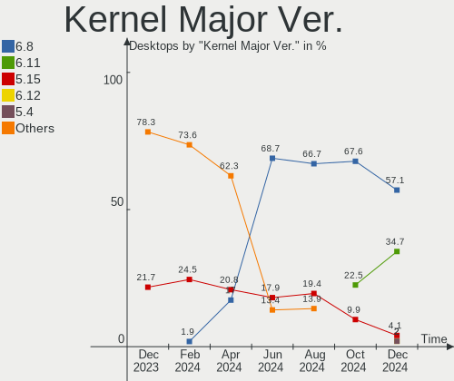
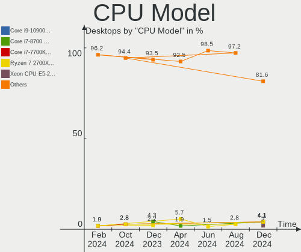
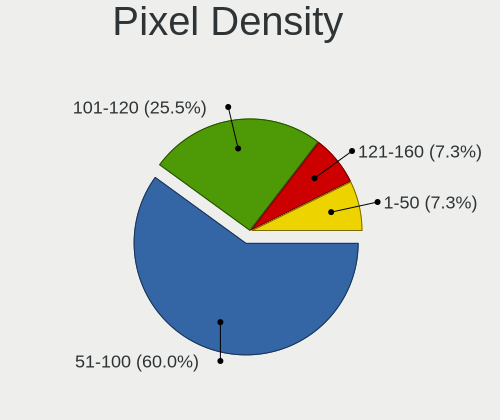
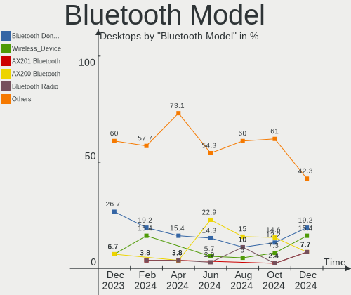
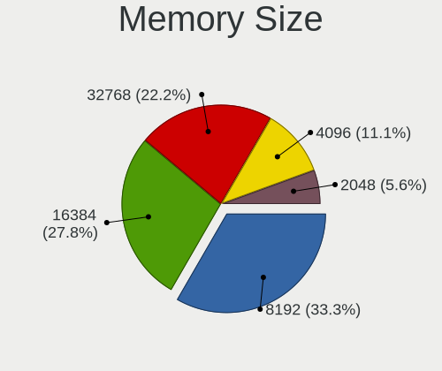

Kubuntu - Hardware Trends (Desktops)
------------------------------------

A project to identify most popular hardware characteristics and track their change
over time based on data collected by Linux users at https://Linux-Hardware.org.

Anyone can contribute to this report by the [hw-probe](https://github.com/linuxhw/hw-probe) tool:

    sudo -E hw-probe -all -upload

This report is for one last month. Overall report since the beginning of time: [TestDays](https://github.com/linuxhw/TestDays)

Period: Jan, 2024.

Contents
--------

* [ System ](#system)
  - [ OS                       ](#os)
  - [ OS Family                ](#os-family)
  - [ Kernel                   ](#kernel)
  - [ Kernel Family            ](#kernel-family)
  - [ Kernel Major Ver.        ](#kernel-major-ver)
  - [ Arch                     ](#arch)
  - [ DE                       ](#de)
  - [ Display Server           ](#display-server)
  - [ Display Manager          ](#display-manager)
  - [ OS Lang                  ](#os-lang)
  - [ Boot Mode                ](#boot-mode)
  - [ Filesystem               ](#filesystem)
  - [ Part. scheme             ](#part-scheme)
  - [ Dual Boot with Linux/BSD ](#dual-boot-with-linuxbsd)
  - [ Dual Boot (Win)          ](#dual-boot-win)

* [ Board ](#board)
  - [ Vendor                   ](#vendor)
  - [ Model                    ](#model)
  - [ Model Family             ](#model-family)
  - [ MFG Year                 ](#mfg-year)
  - [ Form Factor              ](#form-factor)
  - [ Secure Boot              ](#secure-boot)
  - [ Coreboot                 ](#coreboot)
  - [ RAM Size                 ](#ram-size)
  - [ RAM Used                 ](#ram-used)
  - [ Total Drives             ](#total-drives)
  - [ Has CD-ROM               ](#has-cd-rom)
  - [ Has Ethernet             ](#has-ethernet)
  - [ Has WiFi                 ](#has-wifi)
  - [ Has Bluetooth            ](#has-bluetooth)

* [ Location ](#location)
  - [ Country                  ](#country)
  - [ City                     ](#city)

* [ Drives ](#drives)
  - [ Drive Vendor             ](#drive-vendor)
  - [ Drive Model              ](#drive-model)
  - [ HDD Vendor               ](#hdd-vendor)
  - [ SSD Vendor               ](#ssd-vendor)
  - [ Drive Kind               ](#drive-kind)
  - [ Drive Connector          ](#drive-connector)
  - [ Drive Size               ](#drive-size)
  - [ Space Total              ](#space-total)
  - [ Space Used               ](#space-used)
  - [ Malfunc. Drives          ](#malfunc-drives)
  - [ Malfunc. Drive Vendor    ](#malfunc-drive-vendor)
  - [ Malfunc. HDD Vendor      ](#malfunc-hdd-vendor)
  - [ Malfunc. Drive Kind      ](#malfunc-drive-kind)
  - [ Failed Drives            ](#failed-drives)
  - [ Failed Drive Vendor      ](#failed-drive-vendor)
  - [ Drive Status             ](#drive-status)

* [ Storage controller ](#storage-controller)
  - [ Storage Vendor           ](#storage-vendor)
  - [ Storage Model            ](#storage-model)
  - [ Storage Kind             ](#storage-kind)

* [ Processor ](#processor)
  - [ CPU Vendor               ](#cpu-vendor)
  - [ CPU Model                ](#cpu-model)
  - [ CPU Model Family         ](#cpu-model-family)
  - [ CPU Cores                ](#cpu-cores)
  - [ CPU Sockets              ](#cpu-sockets)
  - [ CPU Threads              ](#cpu-threads)
  - [ CPU Op-Modes             ](#cpu-op-modes)
  - [ CPU Microcode            ](#cpu-microcode)
  - [ CPU Microarch            ](#cpu-microarch)

* [ Graphics ](#graphics)
  - [ GPU Vendor               ](#gpu-vendor)
  - [ GPU Model                ](#gpu-model)
  - [ GPU Combo                ](#gpu-combo)
  - [ GPU Driver               ](#gpu-driver)
  - [ GPU Memory               ](#gpu-memory)

* [ Monitor ](#monitor)
  - [ Monitor Vendor           ](#monitor-vendor)
  - [ Monitor Model            ](#monitor-model)
  - [ Monitor Resolution       ](#monitor-resolution)
  - [ Monitor Diagonal         ](#monitor-diagonal)
  - [ Monitor Width            ](#monitor-width)
  - [ Aspect Ratio             ](#aspect-ratio)
  - [ Monitor Area             ](#monitor-area)
  - [ Pixel Density            ](#pixel-density)
  - [ Multiple Monitors        ](#multiple-monitors)

* [ Network ](#network)
  - [ Net Controller Vendor    ](#net-controller-vendor)
  - [ Net Controller Model     ](#net-controller-model)
  - [ Wireless Vendor          ](#wireless-vendor)
  - [ Wireless Model           ](#wireless-model)
  - [ Ethernet Vendor          ](#ethernet-vendor)
  - [ Ethernet Model           ](#ethernet-model)
  - [ Net Controller Kind      ](#net-controller-kind)
  - [ Used Controller          ](#used-controller)
  - [ NICs                     ](#nics)
  - [ IPv6                     ](#ipv6)

* [ Bluetooth ](#bluetooth)
  - [ Bluetooth Vendor         ](#bluetooth-vendor)
  - [ Bluetooth Model          ](#bluetooth-model)

* [ Sound ](#sound)
  - [ Sound Vendor             ](#sound-vendor)
  - [ Sound Model              ](#sound-model)

* [ Memory ](#memory)
  - [ Memory Vendor            ](#memory-vendor)
  - [ Memory Model             ](#memory-model)
  - [ Memory Kind              ](#memory-kind)
  - [ Memory Form Factor       ](#memory-form-factor)
  - [ Memory Size              ](#memory-size)
  - [ Memory Speed             ](#memory-speed)

* [ Printers & scanners ](#printers--scanners)
  - [ Printer Vendor           ](#printer-vendor)
  - [ Printer Model            ](#printer-model)
  - [ Scanner Vendor           ](#scanner-vendor)
  - [ Scanner Model            ](#scanner-model)

* [ Camera ](#camera)
  - [ Camera Vendor            ](#camera-vendor)
  - [ Camera Model             ](#camera-model)

* [ Security ](#security)
  - [ Fingerprint Vendor       ](#fingerprint-vendor)
  - [ Fingerprint Model        ](#fingerprint-model)
  - [ Chipcard Vendor          ](#chipcard-vendor)
  - [ Chipcard Model           ](#chipcard-model)

* [ Unsupported ](#unsupported)
  - [ Unsupported Devices      ](#unsupported-devices)
  - [ Unsupported Device Types ](#unsupported-device-types)

System
------

OS
--

Installed operating systems

| Name          | Desktops | Percent |
|---------------|----------|---------|
| Kubuntu 22.04 | 29       | 46.03%  |
| Kubuntu 23.10 | 25       | 39.68%  |
| Kubuntu 23.04 | 2        | 3.17%   |
| Kubuntu 20.04 | 2        | 3.17%   |
| Kubuntu 18.04 | 2        | 3.17%   |
| Kubuntu 24.04 | 1        | 1.59%   |
| Kubuntu 21.10 | 1        | 1.59%   |
| Kubuntu 11    | 1        | 1.59%   |

OS Family
---------

OS without a version

| Name    | Desktops | Percent |
|---------|----------|---------|
| Kubuntu | 63       | 100%    |

Kernel
------

Version of the Linux kernel

| Version                 | Desktops | Percent |
|-------------------------|----------|---------|
| 6.5.0-14-generic        | 19       | 30.16%  |
| 5.15.0-91-generic       | 13       | 20.63%  |
| 6.5.0-15-generic        | 9        | 14.29%  |
| 6.2.0-39-generic        | 6        | 9.52%   |
| 6.6.10-1-liquorix-amd64 | 1        | 1.59%   |
| 6.6.0-14-generic        | 1        | 1.59%   |
| 6.5.0-9-generic         | 1        | 1.59%   |
| 6.5.0-17-generic        | 1        | 1.59%   |
| 6.5.0-15-lowlatency     | 1        | 1.59%   |
| 6.5.0-14-lowlatency     | 1        | 1.59%   |
| 6.2.0-36-generic        | 1        | 1.59%   |
| 6.2.0-26-generic        | 1        | 1.59%   |
| 6.2.0-1018-lowlatency   | 1        | 1.59%   |
| 5.4.0-169-generic       | 1        | 1.59%   |
| 5.4.0-150-generic       | 1        | 1.59%   |
| 5.15.0-92-generic       | 1        | 1.59%   |
| 5.15.0-91-lowlatency    | 1        | 1.59%   |
| 5.15.0-75-generic       | 1        | 1.59%   |
| 5.13.0-48-generic       | 1        | 1.59%   |
| 4.15.0-33-generic       | 1        | 1.59%   |

Kernel Family
-------------

Linux kernel without a distro release

| Version | Desktops | Percent |
|---------|----------|---------|
| 6.5.0   | 32       | 50.79%  |
| 5.15.0  | 16       | 25.4%   |
| 6.2.0   | 9        | 14.29%  |
| 5.4.0   | 2        | 3.17%   |
| 6.6.10  | 1        | 1.59%   |
| 6.6.0   | 1        | 1.59%   |
| 5.13.0  | 1        | 1.59%   |
| 4.15.0  | 1        | 1.59%   |

Kernel Major Ver.
-----------------

Linux kernel major version

| Version | Desktops | Percent |
|---------|----------|---------|
| 6.5     | 32       | 50.79%  |
| 5.15    | 16       | 25.4%   |
| 6.2     | 9        | 14.29%  |
| 6.6     | 2        | 3.17%   |
| 5.4     | 2        | 3.17%   |
| 5.13    | 1        | 1.59%   |
| 4.15    | 1        | 1.59%   |

Arch
----

OS architecture (x86_64, i586, etc.)

| Name   | Desktops | Percent |
|--------|----------|---------|
| x86_64 | 62       | 98.41%  |
| i686   | 1        | 1.59%   |

DE
--

Desktop Environment

| Name | Desktops | Percent |
|------|----------|---------|
| KDE5 | 61       | 96.83%  |
| KDE  | 2        | 3.17%   |

Display Server
--------------

X11 or Wayland

| Name    | Desktops | Percent |
|---------|----------|---------|
| X11     | 57       | 90.48%  |
| Wayland | 3        | 4.76%   |
| Tty     | 3        | 4.76%   |

Display Manager
---------------

SDDM, LightDM, etc.

| Name    | Desktops | Percent |
|---------|----------|---------|
| SDDM    | 35       | 55.56%  |
| Unknown | 22       | 34.92%  |
| LightDM | 4        | 6.35%   |
| GDM3    | 2        | 3.17%   |

OS Lang
-------

Language

| Lang  | Desktops | Percent |
|-------|----------|---------|
| en_US | 30       | 47.62%  |
| fr_FR | 5        | 7.94%   |
| de_DE | 5        | 7.94%   |
| en_GB | 3        | 4.76%   |
| zh_CN | 2        | 3.17%   |
| ru_RU | 2        | 3.17%   |
| it_IT | 2        | 3.17%   |
| cs_CZ | 2        | 3.17%   |
| sv_SE | 1        | 1.59%   |
| sl_SI | 1        | 1.59%   |
| pl_PL | 1        | 1.59%   |
| nl_BE | 1        | 1.59%   |
| es_ES | 1        | 1.59%   |
| es_AR | 1        | 1.59%   |
| en_PH | 1        | 1.59%   |
| en_CA | 1        | 1.59%   |
| en_AU | 1        | 1.59%   |
| el_GR | 1        | 1.59%   |
| de_CH | 1        | 1.59%   |
| C     | 1        | 1.59%   |

Boot Mode
---------

EFI or BIOS

| Mode | Desktops | Percent |
|------|----------|---------|
| BIOS | 39       | 61.9%   |
| EFI  | 24       | 38.1%   |

Filesystem
----------

Type of filesystem

| Type    | Desktops | Percent |
|---------|----------|---------|
| Ext4    | 41       | 65.08%  |
| Tmpfs   | 14       | 22.22%  |
| Btrfs   | 3        | 4.76%   |
| Xfs     | 2        | 3.17%   |
| Zfs     | 1        | 1.59%   |
| Overlay | 1        | 1.59%   |
| F2fs    | 1        | 1.59%   |

Part. scheme
------------

Scheme of partitioning

| Type    | Desktops | Percent |
|---------|----------|---------|
| GPT     | 36       | 57.14%  |
| Unknown | 22       | 34.92%  |
| MBR     | 5        | 7.94%   |

Dual Boot with Linux/BSD
------------------------

Hosting more than one Linux/BSD

| Dual boot | Desktops | Percent |
|-----------|----------|---------|
| No        | 55       | 87.3%   |
| Yes       | 8        | 12.7%   |

Dual Boot (Win)
---------------

Hosting Linux and Windows

| Dual boot | Desktops | Percent |
|-----------|----------|---------|
| No        | 48       | 76.19%  |
| Yes       | 15       | 23.81%  |

Board
-----

Vendor
------

Motherboard manufacturer

| Name                | Desktops | Percent |
|---------------------|----------|---------|
| MSI                 | 16       | 25.4%   |
| ASUSTek Computer    | 16       | 25.4%   |
| Gigabyte Technology | 7        | 11.11%  |
| Hewlett-Packard     | 3        | 4.76%   |
| Dell                | 3        | 4.76%   |
| ASRock              | 3        | 4.76%   |
| Medion              | 2        | 3.17%   |
| Lenovo              | 2        | 3.17%   |
| Biostar             | 2        | 3.17%   |
| AZW                 | 2        | 3.17%   |
| Unknown             | 2        | 3.17%   |
| Intel               | 1        | 1.59%   |
| Great Wall          | 1        | 1.59%   |
| Fujitsu             | 1        | 1.59%   |
| Apple               | 1        | 1.59%   |
| Acer                | 1        | 1.59%   |

Model
-----

Motherboard model

| Name                               | Desktops | Percent |
|------------------------------------|----------|---------|
| MSI MS-7B51                        | 2        | 3.17%   |
| ASUS TUF Gaming X570-PLUS          | 2        | 3.17%   |
| ASUS M4A89GTD-PRO/USB3             | 2        | 3.17%   |
| Unknown                            | 2        | 3.17%   |
| MSI MS-7E26                        | 1        | 1.59%   |
| MSI MS-7D70                        | 1        | 1.59%   |
| MSI MS-7D43                        | 1        | 1.59%   |
| MSI MS-7D18                        | 1        | 1.59%   |
| MSI MS-7D17                        | 1        | 1.59%   |
| MSI MS-7C96                        | 1        | 1.59%   |
| MSI MS-7C89                        | 1        | 1.59%   |
| MSI MS-7B86                        | 1        | 1.59%   |
| MSI MS-7B78                        | 1        | 1.59%   |
| MSI MS-7B61                        | 1        | 1.59%   |
| MSI MS-7B00                        | 1        | 1.59%   |
| MSI MS-7A38                        | 1        | 1.59%   |
| MSI MS-7673                        | 1        | 1.59%   |
| MSI 500-056                        | 1        | 1.59%   |
| Medion MS-7800                     | 1        | 1.59%   |
| Medion Akoya P2120 D MD8836/2452   | 1        | 1.59%   |
| Lenovo ThinkCentre M93p 10A6S0RF00 | 1        | 1.59%   |
| Lenovo QiTianM4350                 | 1        | 1.59%   |
| Intel B75 V124                     | 1        | 1.59%   |
| HP Pavilion Desktop TP01-1xxx      | 1        | 1.59%   |
| HP EliteDesk 800 G1 SFF            | 1        | 1.59%   |
| HP Compaq Elite 8300 SFF           | 1        | 1.59%   |
| Great Wall TD120C2                 | 1        | 1.59%   |
| Gigabyte Z97-HD3                   | 1        | 1.59%   |
| Gigabyte X570 AORUS ULTRA          | 1        | 1.59%   |
| Gigabyte H67A-USB3-B3              | 1        | 1.59%   |
| Gigabyte H67A-UD3H-B3              | 1        | 1.59%   |
| Gigabyte GA-MA69VM-S2              | 1        | 1.59%   |
| Gigabyte B550M AORUS ELITE         | 1        | 1.59%   |
| Gigabyte AX370-Gaming K7           | 1        | 1.59%   |
| Fujitsu D3222-B1                   | 1        | 1.59%   |
| Dell XPS 8500                      | 1        | 1.59%   |
| Dell OptiPlex 7010                 | 1        | 1.59%   |
| Dell OptiPlex 390                  | 1        | 1.59%   |
| Biostar B550MX/E PRO               | 1        | 1.59%   |
| Biostar B365MHC                    | 1        | 1.59%   |

Model Family
------------

Motherboard model prefix

| Name                  | Desktops | Percent |
|-----------------------|----------|---------|
| ASUS ROG              | 4        | 6.35%   |
| ASUS TUF              | 3        | 4.76%   |
| ASUS PRIME            | 3        | 4.76%   |
| MSI MS-7B51           | 2        | 3.17%   |
| Dell OptiPlex         | 2        | 3.17%   |
| ASUS SABERTOOTH       | 2        | 3.17%   |
| ASUS M4A89GTD-PRO     | 2        | 3.17%   |
| Unknown               | 2        | 3.17%   |
| MSI MS-7E26           | 1        | 1.59%   |
| MSI MS-7D70           | 1        | 1.59%   |
| MSI MS-7D43           | 1        | 1.59%   |
| MSI MS-7D18           | 1        | 1.59%   |
| MSI MS-7D17           | 1        | 1.59%   |
| MSI MS-7C96           | 1        | 1.59%   |
| MSI MS-7C89           | 1        | 1.59%   |
| MSI MS-7B86           | 1        | 1.59%   |
| MSI MS-7B78           | 1        | 1.59%   |
| MSI MS-7B61           | 1        | 1.59%   |
| MSI MS-7B00           | 1        | 1.59%   |
| MSI MS-7A38           | 1        | 1.59%   |
| MSI MS-7673           | 1        | 1.59%   |
| MSI 500-056           | 1        | 1.59%   |
| Medion MS-7800        | 1        | 1.59%   |
| Medion Akoya          | 1        | 1.59%   |
| Lenovo ThinkCentre    | 1        | 1.59%   |
| Lenovo QiTianM4350    | 1        | 1.59%   |
| Intel B75             | 1        | 1.59%   |
| HP Pavilion           | 1        | 1.59%   |
| HP EliteDesk          | 1        | 1.59%   |
| HP Compaq             | 1        | 1.59%   |
| Great Wall TD120C2    | 1        | 1.59%   |
| Gigabyte Z97-HD3      | 1        | 1.59%   |
| Gigabyte X570         | 1        | 1.59%   |
| Gigabyte H67A-USB3-B3 | 1        | 1.59%   |
| Gigabyte H67A-UD3H-B3 | 1        | 1.59%   |
| Gigabyte GA-MA69VM-S2 | 1        | 1.59%   |
| Gigabyte B550M        | 1        | 1.59%   |
| Gigabyte AX370-Gaming | 1        | 1.59%   |
| Fujitsu D3222-B1      | 1        | 1.59%   |
| Dell XPS              | 1        | 1.59%   |

MFG Year
--------

Motherboard manufacture year

| Year | Desktops | Percent |
|------|----------|---------|
| 2019 | 7        | 11.11%  |
| 2017 | 7        | 11.11%  |
| 2022 | 6        | 9.52%   |
| 2020 | 6        | 9.52%   |
| 2018 | 6        | 9.52%   |
| 2023 | 5        | 7.94%   |
| 2021 | 5        | 7.94%   |
| 2011 | 5        | 7.94%   |
| 2013 | 4        | 6.35%   |
| 2012 | 4        | 6.35%   |
| 2014 | 3        | 4.76%   |
| 2015 | 2        | 3.17%   |
| 2010 | 2        | 3.17%   |
| 2007 | 1        | 1.59%   |

Form Factor
-----------

Physical design of the computer

| Name    | Desktops | Percent |
|---------|----------|---------|
| Desktop | 63       | 100%    |

Secure Boot
-----------

Enabled or disabled

| State    | Desktops | Percent |
|----------|----------|---------|
| Disabled | 60       | 95.24%  |
| Enabled  | 3        | 4.76%   |

Coreboot
--------

Have coreboot on board

| Used | Desktops | Percent |
|------|----------|---------|
| No   | 63       | 100%    |

RAM Size
--------

Total RAM memory

| Size in GB  | Desktops | Percent |
|-------------|----------|---------|
| 32.01-64.0  | 17       | 26.98%  |
| 16.01-24.0  | 12       | 19.05%  |
| 8.01-16.0   | 12       | 19.05%  |
| 4.01-8.0    | 11       | 17.46%  |
| 64.01-256.0 | 6        | 9.52%   |
| 24.01-32.0  | 3        | 4.76%   |
| 3.01-4.0    | 2        | 3.17%   |

RAM Used
--------

Used RAM memory

| Used GB    | Desktops | Percent |
|------------|----------|---------|
| 4.01-8.0   | 18       | 28.57%  |
| 1.01-2.0   | 13       | 20.63%  |
| 3.01-4.0   | 12       | 19.05%  |
| 2.01-3.0   | 10       | 15.87%  |
| 8.01-16.0  | 4        | 6.35%   |
| 16.01-24.0 | 3        | 4.76%   |
| 32.01-64.0 | 1        | 1.59%   |
| 24.01-32.0 | 1        | 1.59%   |
| 0.51-1.0   | 1        | 1.59%   |

Total Drives
------------

Number of drives on board

| Drives | Desktops | Percent |
|--------|----------|---------|
| 1      | 24       | 38.1%   |
| 2      | 14       | 22.22%  |
| 4      | 8        | 12.7%   |
| 3      | 7        | 11.11%  |
| 5      | 5        | 7.94%   |
| 11     | 1        | 1.59%   |
| 9      | 1        | 1.59%   |
| 8      | 1        | 1.59%   |
| 7      | 1        | 1.59%   |
| 6      | 1        | 1.59%   |

Has CD-ROM
----------

Has CD-ROM on board

| Presented | Desktops | Percent |
|-----------|----------|---------|
| No        | 40       | 63.49%  |
| Yes       | 23       | 36.51%  |

Has Ethernet
------------

Has Ethernet on board

| Presented | Desktops | Percent |
|-----------|----------|---------|
| Yes       | 62       | 98.41%  |
| No        | 1        | 1.59%   |

Has WiFi
--------

Has WiFi module

| Presented | Desktops | Percent |
|-----------|----------|---------|
| Yes       | 36       | 57.14%  |
| No        | 27       | 42.86%  |

Has Bluetooth
-------------

Has Bluetooth module

| Presented | Desktops | Percent |
|-----------|----------|---------|
| No        | 37       | 58.73%  |
| Yes       | 26       | 41.27%  |

Location
--------

Country
-------

Geographic location (country)

| Country     | Desktops | Percent |
|-------------|----------|---------|
| USA         | 16       | 25.4%   |
| Germany     | 7        | 11.11%  |
| France      | 6        | 9.52%   |
| UK          | 4        | 6.35%   |
| Russia      | 3        | 4.76%   |
| Sweden      | 2        | 3.17%   |
| Spain       | 2        | 3.17%   |
| Italy       | 2        | 3.17%   |
| China       | 2        | 3.17%   |
| Austria     | 2        | 3.17%   |
| Venezuela   | 1        | 1.59%   |
| Turkey      | 1        | 1.59%   |
| Switzerland | 1        | 1.59%   |
| Slovenia    | 1        | 1.59%   |
| Philippines | 1        | 1.59%   |
| Mexico      | 1        | 1.59%   |
| Greece      | 1        | 1.59%   |
| Egypt       | 1        | 1.59%   |
| Czechia     | 1        | 1.59%   |
| Cyprus      | 1        | 1.59%   |
| Canada      | 1        | 1.59%   |
| Brazil      | 1        | 1.59%   |
| Belgium     | 1        | 1.59%   |
| Belarus     | 1        | 1.59%   |
| Bangladesh  | 1        | 1.59%   |
| Australia   | 1        | 1.59%   |
| Argentina   | 1        | 1.59%   |

City
----

Geographic location (city)

| City                 | Desktops | Percent |
|----------------------|----------|---------|
| Vienna               | 2        | 3.17%   |
| Medford              | 2        | 3.17%   |
| Hamburg              | 2        | 3.17%   |
| Zhaoqing             | 1        | 1.59%   |
| Vidnoye              | 1        | 1.59%   |
| Victoria             | 1        | 1.59%   |
| Valrico              | 1        | 1.59%   |
| Valer’yanovo       | 1        | 1.59%   |
| Vaihingen an der Enz | 1        | 1.59%   |
| Tlalpan              | 1        | 1.59%   |
| Thessaloniki         | 1        | 1.59%   |
| Stockholm            | 1        | 1.59%   |
| Şişli              | 1        | 1.59%   |
| Silver Spring        | 1        | 1.59%   |
| Shinnston            | 1        | 1.59%   |
| Sherpur              | 1        | 1.59%   |
| Shenzhen             | 1        | 1.59%   |
| Santa Cruz           | 1        | 1.59%   |
| San Francisco        | 1        | 1.59%   |
| Riverview            | 1        | 1.59%   |
| Rio de Janeiro       | 1        | 1.59%   |
| Pont-à-Mousson      | 1        | 1.59%   |
| Pardubice            | 1        | 1.59%   |
| Painesville          | 1        | 1.59%   |
| Oullins              | 1        | 1.59%   |
| Neustadt             | 1        | 1.59%   |
| Naples               | 1        | 1.59%   |
| Moscow               | 1        | 1.59%   |
| Morehead City        | 1        | 1.59%   |
| Makati City          | 1        | 1.59%   |
| Maisons-Alfort       | 1        | 1.59%   |
| Lodi                 | 1        | 1.59%   |
| Ljubljana            | 1        | 1.59%   |
| Limassol             | 1        | 1.59%   |
| Lebanon              | 1        | 1.59%   |
| Langenthal           | 1        | 1.59%   |
| Lacanau              | 1        | 1.59%   |
| Kortrijk             | 1        | 1.59%   |
| Kazan’             | 1        | 1.59%   |
| Jamestown            | 1        | 1.59%   |

Drives
------

Drive Vendor
------------

Hard drive vendors

| Vendor                       | Desktops | Drives | Percent |
|------------------------------|----------|--------|---------|
| Samsung Electronics          | 22       | 39     | 17.19%  |
| Seagate                      | 20       | 26     | 15.63%  |
| WDC                          | 17       | 33     | 13.28%  |
| Kingston                     | 9        | 10     | 7.03%   |
| Sandisk                      | 7        | 8      | 5.47%   |
| Toshiba                      | 6        | 7      | 4.69%   |
| Crucial                      | 5        | 5      | 3.91%   |
| Unknown                      | 3        | 4      | 2.34%   |
| Kingston Technology Company  | 3        | 4      | 2.34%   |
| Intel                        | 3        | 3      | 2.34%   |
| Hitachi                      | 3        | 3      | 2.34%   |
| A-DATA Technology            | 3        | 3      | 2.34%   |
| Silicon Motion               | 2        | 2      | 1.56%   |
| PNY                          | 2        | 2      | 1.56%   |
| Phison Electronics           | 2        | 3      | 1.56%   |
| Patriot                      | 2        | 2      | 1.56%   |
| Transcend                    | 1        | 1      | 0.78%   |
| SMI                          | 1        | 1      | 0.78%   |
| SK hynix                     | 1        | 1      | 0.78%   |
| Shenzhen Longsys Electronics | 1        | 1      | 0.78%   |
| Realtek                      | 1        | 1      | 0.78%   |
| Plextor                      | 1        | 1      | 0.78%   |
| Micron/Crucial Technology    | 1        | 1      | 0.78%   |
| Maxtor                       | 1        | 1      | 0.78%   |
| MAXIO Technology (Hangzhou)  | 1        | 1      | 0.78%   |
| Mass                         | 1        | 1      | 0.78%   |
| Lexar                        | 1        | 1      | 0.78%   |
| Intenso                      | 1        | 1      | 0.78%   |
| HGST                         | 1        | 1      | 0.78%   |
| GOODRAM                      | 1        | 1      | 0.78%   |
| FORESEE                      | 1        | 1      | 0.78%   |
| Corsair                      | 1        | 1      | 0.78%   |
| addlink                      | 1        | 1      | 0.78%   |
| ADATA Technology             | 1        | 1      | 0.78%   |
| Unknown                      | 1        | 1      | 0.78%   |

Drive Model
-----------

Hard drive models

| Model                                                 | Desktops | Percent |
|-------------------------------------------------------|----------|---------|
| Samsung SSD 870 EVO 1TB                               | 3        | 1.88%   |
| WDC WD40EFRX-68WT0N0 4TB                              | 2        | 1.25%   |
| WDC WD10EZEX-08WN4A0 1TB                              | 2        | 1.25%   |
| WDC WD1003FZEX-00K3CA0 1TB                            | 2        | 1.25%   |
| Silicon Motion SM2263EN/SM2263XT SSD Controller 128GB | 2        | 1.25%   |
| Seagate ST31000528AS 1TB                              | 2        | 1.25%   |
| Seagate ST2000DM008-2FR102 2TB                        | 2        | 1.25%   |
| Samsung SSD 980 PRO 1TB                               | 2        | 1.25%   |
| Samsung SSD 870 QVO 4TB                               | 2        | 1.25%   |
| Samsung SSD 870 QVO 2TB                               | 2        | 1.25%   |
| Samsung SSD 860 EVO 500GB                             | 2        | 1.25%   |
| Samsung SSD 850 EVO 500GB                             | 2        | 1.25%   |
| Samsung NVMe SSD Controller SM981/PM981/PM983 1TB     | 2        | 1.25%   |
| Samsung NVMe SSD Controller PM9A1/PM9A3/980PRO 2TB    | 2        | 1.25%   |
| Kingston Company SNV2S1000G 1TB                       | 2        | 1.25%   |
| Kingston SA400S37960G 960GB SSD                       | 2        | 1.25%   |
| Kingston SA400S37480G 480GB SSD                       | 2        | 1.25%   |
| WDC WDS500G1B0B-00AS40 500GB SSD                      | 1        | 0.63%   |
| WDC WDS200T2B0A-00SM50 2TB SSD                        | 1        | 0.63%   |
| WDC WD80EAZZ-00BKLB0 8TB                              | 1        | 0.63%   |
| WDC WD5000LPVT-75G33T0 500GB                          | 1        | 0.63%   |
| WDC WD5000AAKX-001CA0 500GB                           | 1        | 0.63%   |
| WDC WD40EZRZ-00WN9B0 4TB                              | 1        | 0.63%   |
| WDC WD40EFAX-68JH4N1 4TB                              | 1        | 0.63%   |
| WDC WD3200JD-22KLB0 320GB                             | 1        | 0.63%   |
| WDC WD30EZRX-00MMMB0 3TB                              | 1        | 0.63%   |
| WDC WD20EZBX-00AYRA0 2TB                              | 1        | 0.63%   |
| WDC WD20EARX-00PASB0 2TB                              | 1        | 0.63%   |
| WDC WD20EARS-00MVWB0 2TB                              | 1        | 0.63%   |
| WDC WD2003FZEX-00Z4SA0 2TB                            | 1        | 0.63%   |
| WDC WD2003FZEX-00SRLA0 2TB                            | 1        | 0.63%   |
| WDC WD10EZRZ-22HTKB0 1TB                              | 1        | 0.63%   |
| WDC WD10EZEX-60WN4A0 1TB                              | 1        | 0.63%   |
| WDC WD10EACS-32ZJB0 1TB                               | 1        | 0.63%   |
| WDC WD10EACS-00D6B1 1TB                               | 1        | 0.63%   |
| WDC WD10EACS-00C7B0 1TB                               | 1        | 0.63%   |
| WDC WD1001FALS-40U9B0 1TB                             | 1        | 0.63%   |
| Unknown SLD64G  64GB                                  | 1        | 0.63%   |
| Unknown SD/MMC/MS PRO 256GB                           | 1        | 0.63%   |
| Unknown NVMe SSD Drive 256GB                          | 1        | 0.63%   |

HDD Vendor
----------

Hard disk drive vendors

| Vendor              | Desktops | Drives | Percent |
|---------------------|----------|--------|---------|
| Seagate             | 20       | 26     | 40.82%  |
| WDC                 | 15       | 31     | 30.61%  |
| Toshiba             | 6        | 7      | 12.24%  |
| Hitachi             | 3        | 3      | 6.12%   |
| Samsung Electronics | 2        | 2      | 4.08%   |
| Unknown             | 1        | 1      | 2.04%   |
| Maxtor              | 1        | 1      | 2.04%   |
| HGST                | 1        | 1      | 2.04%   |

SSD Vendor
----------

Solid state drive vendors

| Vendor              | Desktops | Drives | Percent |
|---------------------|----------|--------|---------|
| Samsung Electronics | 16       | 23     | 31.37%  |
| Kingston            | 7        | 7      | 13.73%  |
| Crucial             | 5        | 5      | 9.8%    |
| SanDisk             | 4        | 4      | 7.84%   |
| A-DATA Technology   | 3        | 3      | 5.88%   |
| WDC                 | 2        | 2      | 3.92%   |
| PNY                 | 2        | 2      | 3.92%   |
| Patriot             | 2        | 2      | 3.92%   |
| Intel               | 2        | 2      | 3.92%   |
| Transcend           | 1        | 1      | 1.96%   |
| SK hynix            | 1        | 1      | 1.96%   |
| Plextor             | 1        | 1      | 1.96%   |
| Lexar               | 1        | 1      | 1.96%   |
| GOODRAM             | 1        | 1      | 1.96%   |
| FORESEE             | 1        | 1      | 1.96%   |
| Corsair             | 1        | 1      | 1.96%   |
| Unknown             | 1        | 1      | 1.96%   |

Drive Kind
----------

HDD or SSD

| Kind    | Desktops | Drives | Percent |
|---------|----------|--------|---------|
| SSD     | 41       | 58     | 36.28%  |
| HDD     | 39       | 72     | 34.51%  |
| NVMe    | 28       | 38     | 24.78%  |
| Unknown | 4        | 4      | 3.54%   |
| MMC     | 1        | 1      | 0.88%   |

Drive Connector
---------------

SATA, SAS, NVMe, etc.

| Type | Desktops | Drives | Percent |
|------|----------|--------|---------|
| SATA | 56       | 126    | 61.54%  |
| NVMe | 27       | 37     | 29.67%  |
| SAS  | 7        | 9      | 7.69%   |
| MMC  | 1        | 1      | 1.1%    |

Drive Size
----------

Size of hard drive

| Size in TB | Desktops | Drives | Percent |
|------------|----------|--------|---------|
| 0.01-0.5   | 38       | 49     | 41.3%   |
| 0.51-1.0   | 22       | 36     | 23.91%  |
| 1.01-2.0   | 15       | 19     | 16.3%   |
| 3.01-4.0   | 8        | 15     | 8.7%    |
| 4.01-10.0  | 5        | 6      | 5.43%   |
| 2.01-3.0   | 3        | 4      | 3.26%   |
| 10.01-20.0 | 1        | 1      | 1.09%   |

Space Total
-----------

Amount of disk space available on the file system

| Size in GB     | Desktops | Percent |
|----------------|----------|---------|
| 101-250        | 16       | 25.4%   |
| 501-1000       | 13       | 20.63%  |
| 1001-2000      | 11       | 17.46%  |
| More than 3000 | 10       | 15.87%  |
| 251-500        | 6        | 9.52%   |
| 2001-3000      | 4        | 6.35%   |
| 51-100         | 2        | 3.17%   |
| 1-20           | 1        | 1.59%   |

Space Used
----------

Amount of used disk space

| Used GB        | Desktops | Percent |
|----------------|----------|---------|
| 501-1000       | 12       | 19.05%  |
| 101-250        | 11       | 17.46%  |
| 21-50          | 10       | 15.87%  |
| 1-20           | 9        | 14.29%  |
| 51-100         | 6        | 9.52%   |
| More than 3000 | 5        | 7.94%   |
| 251-500        | 4        | 6.35%   |
| 1001-2000      | 4        | 6.35%   |
| 2001-3000      | 2        | 3.17%   |

Malfunc. Drives
---------------

Drive models with a malfunction

| Model                                        | Desktops | Drives | Percent |
|----------------------------------------------|----------|--------|---------|
| WDC WD40EZRZ-00WN9B0 4TB                     | 1        | 1      | 7.69%   |
| WDC WD40EFAX-68JH4N1 4TB                     | 1        | 4      | 7.69%   |
| WDC WD3200JD-22KLB0 320GB                    | 1        | 1      | 7.69%   |
| WDC WD20EARX-00PASB0 2TB                     | 1        | 1      | 7.69%   |
| WDC WD1001FALS-40U9B0 1TB                    | 1        | 1      | 7.69%   |
| Seagate ST3320620AS 320GB                    | 1        | 1      | 7.69%   |
| Seagate ST31000340AS 1TB                     | 1        | 1      | 7.69%   |
| Seagate ST1000LM024 HN-M101MBB 1TB           | 1        | 1      | 7.69%   |
| Samsung Electronics SSD 870 EVO 1TB          | 1        | 1      | 7.69%   |
| Samsung Electronics SSD 840 PRO Series 256GB | 1        | 2      | 7.69%   |
| Samsung Electronics HD501LJ 500GB            | 1        | 1      | 7.69%   |
| Maxtor STM3250310AS 250GB                    | 1        | 1      | 7.69%   |
| Crucial CT128MX100SSD1 128GB                 | 1        | 1      | 7.69%   |

Malfunc. Drive Vendor
---------------------

Vendors of faulty drives

| Vendor              | Desktops | Drives | Percent |
|---------------------|----------|--------|---------|
| WDC                 | 3        | 8      | 27.27%  |
| Seagate             | 3        | 3      | 27.27%  |
| Samsung Electronics | 3        | 4      | 27.27%  |
| Maxtor              | 1        | 1      | 9.09%   |
| Crucial             | 1        | 1      | 9.09%   |

Malfunc. HDD Vendor
-------------------

Vendors of faulty HDD drives

| Vendor              | Desktops | Drives | Percent |
|---------------------|----------|--------|---------|
| WDC                 | 3        | 8      | 37.5%   |
| Seagate             | 3        | 3      | 37.5%   |
| Samsung Electronics | 1        | 1      | 12.5%   |
| Maxtor              | 1        | 1      | 12.5%   |

Malfunc. Drive Kind
-------------------

Kinds of faulty drives

| Kind | Desktops | Drives | Percent |
|------|----------|--------|---------|
| HDD  | 8        | 13     | 72.73%  |
| SSD  | 3        | 4      | 27.27%  |

Failed Drives
-------------

Failed drive models

Zero info for selected period =(

Failed Drive Vendor
-------------------

Failed drive vendors

Zero info for selected period =(

Drive Status
------------

Number of failed and malfunc. drives

| Status   | Desktops | Drives | Percent |
|----------|----------|--------|---------|
| Detected | 41       | 89     | 53.95%  |
| Works    | 26       | 67     | 34.21%  |
| Malfunc  | 9        | 17     | 11.84%  |

Storage controller
------------------

Storage Vendor
--------------

Storage controller vendors

| Vendor                                  | Desktops | Percent |
|-----------------------------------------|----------|---------|
| Intel                                   | 36       | 36%     |
| AMD                                     | 27       | 27%     |
| Samsung Electronics                     | 9        | 9%      |
| Kingston Technology Company             | 6        | 6%      |
| JMicron Technology                      | 4        | 4%      |
| Sandisk                                 | 3        | 3%      |
| Phison Electronics                      | 3        | 3%      |
| Silicon Motion                          | 2        | 2%      |
| ASMedia Technology                      | 2        | 2%      |
| Zhaoxin                                 | 1        | 1%      |
| Silicon Image                           | 1        | 1%      |
| Shenzhen Longsys Electronics            | 1        | 1%      |
| Micron/Crucial Technology               | 1        | 1%      |
| MAXIO Technology (Hangzhou)             | 1        | 1%      |
| Marvell Technology Group                | 1        | 1%      |
| Jiangsu Xinsheng Intelligent Technology | 1        | 1%      |
| ADATA Technology                        | 1        | 1%      |

Storage Model
-------------

Storage controller models

| Model                                                                                   | Desktops | Percent |
|-----------------------------------------------------------------------------------------|----------|---------|
| AMD FCH SATA Controller [AHCI mode]                                                     | 17       | 13.93%  |
| Samsung NVMe SSD Controller PM9A1/PM9A3/980PRO                                          | 5        | 4.1%    |
| Intel 7 Series/C210 Series Chipset Family 6-port SATA Controller [AHCI mode]            | 5        | 4.1%    |
| Samsung NVMe SSD Controller SM981/PM981/PM983                                           | 4        | 3.28%   |
| Intel SATA Controller [RAID mode]                                                       | 4        | 3.28%   |
| AMD 600 Series Chipset SATA Controller                                                  | 4        | 3.28%   |
| AMD 400 Series Chipset SATA Controller                                                  | 4        | 3.28%   |
| Kingston Company NV2 NVMe SSD SM2267XT (DRAM-less)                                      | 3        | 2.46%   |
| Intel 8 Series/C220 Series Chipset Family 6-port SATA Controller 1 [AHCI mode]          | 3        | 2.46%   |
| Intel 500 Series Chipset Family SATA AHCI Controller                                    | 3        | 2.46%   |
| AMD 500 Series Chipset SATA Controller                                                  | 3        | 2.46%   |
| Silicon Motion SM2263EN/SM2263XT (DRAM-less) NVMe SSD Controllers                       | 2        | 1.64%   |
| Kingston Company A2000 NVMe SSD SM2263EN                                                | 2        | 1.64%   |
| JMicron JMB368 IDE controller                                                           | 2        | 1.64%   |
| JMicron JMB361 AHCI/IDE                                                                 | 2        | 1.64%   |
| Intel Q170/Q150/B150/H170/H110/Z170/CM236 Chipset SATA Controller [AHCI Mode]           | 2        | 1.64%   |
| Intel Celeron N3350/Pentium N4200/Atom E3900 Series SATA AHCI Controller                | 2        | 1.64%   |
| Intel Cannon Lake PCH SATA AHCI Controller                                              | 2        | 1.64%   |
| Intel Alder Lake-S PCH SATA Controller [AHCI Mode]                                      | 2        | 1.64%   |
| Intel 6 Series/C200 Series Chipset Family Desktop SATA Controller (IDE mode, ports 4-5) | 2        | 1.64%   |
| Intel 6 Series/C200 Series Chipset Family Desktop SATA Controller (IDE mode, ports 0-3) | 2        | 1.64%   |
| Intel 6 Series/C200 Series Chipset Family 6 port Desktop SATA AHCI Controller           | 2        | 1.64%   |
| Intel 400 Series Chipset Family SATA AHCI Controller                                    | 2        | 1.64%   |
| Intel 200 Series PCH SATA controller [AHCI mode]                                        | 2        | 1.64%   |
| ASMedia ASM1061/ASM1062 Serial ATA Controller                                           | 2        | 1.64%   |
| AMD X370 Series Chipset SATA Controller                                                 | 2        | 1.64%   |
| AMD SB7x0/SB8x0/SB9x0 SATA Controller [IDE mode]                                        | 2        | 1.64%   |
| AMD SB7x0/SB8x0/SB9x0 IDE Controller                                                    | 2        | 1.64%   |
| AMD FCH SATA Controller D                                                               | 2        | 1.64%   |
| AMD 300 Series Chipset SATA Controller                                                  | 2        | 1.64%   |
| Zhaoxin ZX-100/ZX-200/KX-6000/KX-6000G/KH-40000/KX-7000 StorX AHCI Controller           | 1        | 0.82%   |
| Silicon Image SiI 3512 [SATALink/SATARaid] Serial ATA Controller                        | 1        | 0.82%   |
| Shenzhen Longsys Lexar NM790 NVME SSD (DRAM-less)                                       | 1        | 0.82%   |
| SanDisk WD Blue SN550 NVMe SSD 2TB (DRAM-less)                                          | 1        | 0.82%   |
| Sandisk WD Black SN850X NVMe SSD                                                        | 1        | 0.82%   |
| SanDisk WD Black SN770 / PC SN740 256GB / PC SN560 (DRAM-less) NVMe SSD                 | 1        | 0.82%   |
| Samsung NVMe SSD Controller SM951/PM951                                                 | 1        | 0.82%   |
| Samsung NVMe SSD Controller 980 (DRAM-less)                                             | 1        | 0.82%   |
| Phison PS5013-E13 PCIe3 NVMe Controller (DRAM-less)                                     | 1        | 0.82%   |
| Phison E16 PCIe4 NVMe Controller                                                        | 1        | 0.82%   |

Storage Kind
------------

Kind of storage controller (IDE, SATA, NVMe, SAS, ...)

| Kind | Desktops | Percent |
|------|----------|---------|
| SATA | 57       | 60%     |
| NVMe | 26       | 27.37%  |
| RAID | 6        | 6.32%   |
| IDE  | 6        | 6.32%   |

Processor
---------

CPU Vendor
----------

Processor vendors

| Vendor       | Desktops | Percent |
|--------------|----------|---------|
| Intel        | 35       | 55.56%  |
| AMD          | 27       | 42.86%  |
| CentaurHauls | 1        | 1.59%   |

CPU Model
---------

Processor models

| Model                                         | Desktops | Percent |
|-----------------------------------------------|----------|---------|
| AMD Ryzen 5 3600 6-Core Processor             | 3        | 4.76%   |
| Intel Pentium CPU N4200 @ 1.10GHz             | 2        | 3.17%   |
| Intel Core i7-3770 CPU @ 3.40GHz              | 2        | 3.17%   |
| Intel Core i5-2500K CPU @ 3.30GHz             | 2        | 3.17%   |
| AMD Ryzen 7 3700X 8-Core Processor            | 2        | 3.17%   |
| AMD Ryzen 7 2700X Eight-Core Processor        | 2        | 3.17%   |
| AMD Ryzen 5 2600 Six-Core Processor           | 2        | 3.17%   |
| Intel Xeon CPU E5-1680 v2 @ 3.00GHz           | 1        | 1.59%   |
| Intel Pentium Gold G6400 CPU @ 4.00GHz        | 1        | 1.59%   |
| Intel Pentium CPU G645 @ 2.90GHz              | 1        | 1.59%   |
| Intel N100                                    | 1        | 1.59%   |
| Intel Core i7-9700 CPU @ 3.00GHz              | 1        | 1.59%   |
| Intel Core i7-8700 CPU @ 3.20GHz              | 1        | 1.59%   |
| Intel Core i7-4790 CPU @ 3.60GHz              | 1        | 1.59%   |
| Intel Core i7-4770 CPU @ 3.40GHz              | 1        | 1.59%   |
| Intel Core i7-2600 CPU @ 3.40GHz              | 1        | 1.59%   |
| Intel Core i5-9600K CPU @ 3.70GHz             | 1        | 1.59%   |
| Intel Core i5-4690 CPU @ 3.50GHz              | 1        | 1.59%   |
| Intel Core i5-4670 CPU @ 3.40GHz              | 1        | 1.59%   |
| Intel Core i5-4590 CPU @ 3.30GHz              | 1        | 1.59%   |
| Intel Core i5-4570 CPU @ 3.20GHz              | 1        | 1.59%   |
| Intel Core i5-3570K CPU @ 3.40GHz             | 1        | 1.59%   |
| Intel Core i5-3470 CPU @ 3.20GHz              | 1        | 1.59%   |
| Intel Core i5-2500 CPU @ 3.30GHz              | 1        | 1.59%   |
| Intel Core i5-10400F CPU @ 2.90GHz            | 1        | 1.59%   |
| Intel Core i5-10400 CPU @ 2.90GHz             | 1        | 1.59%   |
| Intel Core i3-8100 CPU @ 3.60GHz              | 1        | 1.59%   |
| Intel Core i3-6100 CPU @ 3.70GHz              | 1        | 1.59%   |
| Intel Core i3-2120 CPU @ 3.30GHz              | 1        | 1.59%   |
| Intel 13th Gen Core i9-13900K                 | 1        | 1.59%   |
| Intel 12th Gen Core i9-12900K                 | 1        | 1.59%   |
| Intel 12th Gen Core i3-1220P                  | 1        | 1.59%   |
| Intel 12th Gen Core i3-12100F                 | 1        | 1.59%   |
| Intel 11th Gen Core i5-11600 @ 2.80GHz        | 1        | 1.59%   |
| Intel 11th Gen Core i5-11400F @ 2.60GHz       | 1        | 1.59%   |
| Intel 11th Gen Core i5-11400 @ 2.60GHz        | 1        | 1.59%   |
| CentaurHauls ZHAOXIN KaiXian KX-U6780A@2.7GHz | 1        | 1.59%   |
| AMD Ryzen 9 7950X3D 16-Core Processor         | 1        | 1.59%   |
| AMD Ryzen 9 7900X 12-Core Processor           | 1        | 1.59%   |
| AMD Ryzen 9 5900X 12-Core Processor           | 1        | 1.59%   |

CPU Model Family
----------------

Processor model prefix

| Model              | Desktops | Percent |
|--------------------|----------|---------|
| Intel Core i5      | 12       | 19.05%  |
| Other              | 9        | 14.29%  |
| AMD Ryzen 5        | 9        | 14.29%  |
| Intel Core i7      | 7        | 11.11%  |
| AMD Ryzen 9        | 5        | 7.94%   |
| AMD Ryzen 7        | 5        | 7.94%   |
| Intel Pentium      | 3        | 4.76%   |
| Intel Core i3      | 3        | 4.76%   |
| AMD Phenom II X4   | 2        | 3.17%   |
| AMD A8             | 2        | 3.17%   |
| Intel Xeon         | 1        | 1.59%   |
| Intel Pentium Gold | 1        | 1.59%   |
| AMD Ryzen 3        | 1        | 1.59%   |
| AMD Phenom II X6   | 1        | 1.59%   |
| AMD FX             | 1        | 1.59%   |
| AMD A10            | 1        | 1.59%   |

CPU Cores
---------

Number of processor cores

| Number | Desktops | Percent |
|--------|----------|---------|
| 4      | 24       | 38.1%   |
| 6      | 16       | 25.4%   |
| 8      | 8        | 12.7%   |
| 2      | 7        | 11.11%  |
| 16     | 3        | 4.76%   |
| 12     | 3        | 4.76%   |
| 24     | 1        | 1.59%   |
| 10     | 1        | 1.59%   |

CPU Sockets
-----------

Number of sockets

| Number | Desktops | Percent |
|--------|----------|---------|
| 1      | 63       | 100%    |

CPU Threads
-----------

Threads per core (Hyper-Threading)

| Number | Desktops | Percent |
|--------|----------|---------|
| 2      | 41       | 65.08%  |
| 1      | 22       | 34.92%  |

CPU Op-Modes
------------

CPU Operation Modes (32-bit, 64-bit)

| Op mode        | Desktops | Percent |
|----------------|----------|---------|
| 32-bit, 64-bit | 63       | 100%    |

CPU Microcode
-------------

Microcode number

| Number     | Desktops | Percent |
|------------|----------|---------|
| Unknown    | 39       | 61.9%   |
| 0x0a601206 | 4        | 6.35%   |
| 0x08701030 | 3        | 4.76%   |
| 0x306c3    | 2        | 3.17%   |
| 0x306a9    | 2        | 3.17%   |
| 0x206a7    | 2        | 3.17%   |
| 0x08701021 | 2        | 3.17%   |
| 0xa0653    | 1        | 1.59%   |
| 0x906ed    | 1        | 1.59%   |
| 0x0a201016 | 1        | 1.59%   |
| 0x08101007 | 1        | 1.59%   |
| 0x0800820d | 1        | 1.59%   |
| 0x08001126 | 1        | 1.59%   |
| 0x06006118 | 1        | 1.59%   |
| 0x06001119 | 1        | 1.59%   |
| 0x010000c8 | 1        | 1.59%   |

CPU Microarch
-------------

Microarchitecture

| Name             | Desktops | Percent |
|------------------|----------|---------|
| Unknown          | 11       | 17.46%  |
| Zen 2            | 7        | 11.11%  |
| Zen+             | 6        | 9.52%   |
| SandyBridge      | 6        | 9.52%   |
| Haswell          | 6        | 9.52%   |
| IvyBridge        | 5        | 7.94%   |
| KabyLake         | 4        | 6.35%   |
| K10              | 3        | 4.76%   |
| CometLake        | 3        | 4.76%   |
| Zen              | 2        | 3.17%   |
| Piledriver       | 2        | 3.17%   |
| Goldmont         | 2        | 3.17%   |
| Zen 3            | 1        | 1.59%   |
| Skylake          | 1        | 1.59%   |
| Icelake          | 1        | 1.59%   |
| Excavator        | 1        | 1.59%   |
| Bulldozer        | 1        | 1.59%   |
| Alderlake Hybrid | 1        | 1.59%   |

Graphics
--------

GPU Vendor
----------

Vendors of graphics cards

| Vendor  | Desktops | Percent |
|---------|----------|---------|
| Nvidia  | 27       | 38.03%  |
| AMD     | 22       | 30.99%  |
| Intel   | 21       | 29.58%  |
| Zhaoxin | 1        | 1.41%   |

GPU Model
---------

Graphics card models

| Model                                                                       | Desktops | Percent |
|-----------------------------------------------------------------------------|----------|---------|
| Intel Xeon E3-1200 v3/4th Gen Core Processor Integrated Graphics Controller | 5        | 6.67%   |
| AMD Raphael                                                                 | 4        | 5.33%   |
| Nvidia GP107 [GeForce GTX 1050 Ti]                                          | 3        | 4%      |
| Nvidia GA106 [GeForce RTX 3060 Lite Hash Rate]                              | 3        | 4%      |
| Nvidia GA106 [Geforce RTX 3050]                                             | 3        | 4%      |
| Intel 2nd Generation Core Processor Family Integrated Graphics Controller   | 3        | 4%      |
| Nvidia GM204 [GeForce GTX 970]                                              | 2        | 2.67%   |
| Nvidia GK208B [GeForce GT 730]                                              | 2        | 2.67%   |
| Intel IvyBridge GT2 [HD Graphics 4000]                                      | 2        | 2.67%   |
| Intel Apollo Lake [HD Graphics 505]                                         | 2        | 2.67%   |
| AMD Lexa PRO [Radeon 540/540X/550/550X / RX 540X/550/550X]                  | 2        | 2.67%   |
| AMD Ellesmere [Radeon RX 470/480/570/570X/580/580X/590]                     | 2        | 2.67%   |
| Zhaoxin KX-6000 C-960 GPU                                                   | 1        | 1.33%   |
| Nvidia TU116 [GeForce GTX 1660 SUPER]                                       | 1        | 1.33%   |
| Nvidia TU104 [GeForce RTX 2070 SUPER]                                       | 1        | 1.33%   |
| Nvidia GT218 [GeForce 210]                                                  | 1        | 1.33%   |
| Nvidia GP107 [GeForce GTX 1050]                                             | 1        | 1.33%   |
| Nvidia GP104 [GeForce GTX 1070]                                             | 1        | 1.33%   |
| Nvidia GP104 [GeForce GTX 1070 Ti]                                          | 1        | 1.33%   |
| Nvidia GP104 [GeForce GTX 1060 6GB]                                         | 1        | 1.33%   |
| Nvidia GP102 [GeForce GTX 1080 Ti]                                          | 1        | 1.33%   |
| Nvidia GM107 [GeForce GTX 750 Ti]                                           | 1        | 1.33%   |
| Nvidia GK107 [GeForce GTX 650]                                              | 1        | 1.33%   |
| Nvidia GF116 [GeForce GTX 550 Ti]                                           | 1        | 1.33%   |
| Nvidia GF114 [GeForce GTX 560]                                              | 1        | 1.33%   |
| Nvidia GA102 [GeForce RTX 3080 Lite Hash Rate]                              | 1        | 1.33%   |
| Nvidia G96C [GeForce 9500 GT]                                               | 1        | 1.33%   |
| Nvidia AD104 [GeForce RTX 4070]                                             | 1        | 1.33%   |
| Intel RocketLake-S GT1 [UHD Graphics 750]                                   | 1        | 1.33%   |
| Intel RocketLake-S GT1 [UHD Graphics 730]                                   | 1        | 1.33%   |
| Intel Raptor Lake-S GT1 [UHD Graphics 770]                                  | 1        | 1.33%   |
| Intel HD Graphics 530                                                       | 1        | 1.33%   |
| Intel CometLake-S GT1 [UHD Graphics 610]                                    | 1        | 1.33%   |
| Intel CoffeeLake-S GT2 [UHD Graphics 630]                                   | 1        | 1.33%   |
| Intel AlderLake-S GT1                                                       | 1        | 1.33%   |
| Intel Alder Lake-UP3 GT1 [UHD Graphics]                                     | 1        | 1.33%   |
| Intel Alder Lake-N [UHD Graphics]                                           | 1        | 1.33%   |
| AMD Wani [Radeon R5/R6/R7 Graphics]                                         | 1        | 1.33%   |
| AMD Turks PRO [Radeon HD 6570/7570/8550 / R5 230]                           | 1        | 1.33%   |
| AMD Trinity [Radeon HD 7560D]                                               | 1        | 1.33%   |

GPU Combo
---------

Combinations of graphics cards

| Name           | Desktops | Percent |
|----------------|----------|---------|
| 1 x Nvidia     | 22       | 34.92%  |
| 1 x Intel      | 15       | 23.81%  |
| 1 x AMD        | 15       | 23.81%  |
| 2 x AMD        | 4        | 6.35%   |
| Intel + Nvidia | 2        | 3.17%   |
| AMD + Nvidia   | 2        | 3.17%   |
| 2 x Nvidia     | 1        | 1.59%   |
| 1 x Zhaoxin    | 1        | 1.59%   |
| Intel + AMD    | 1        | 1.59%   |

GPU Driver
----------

Free vs proprietary

| Driver      | Desktops | Percent |
|-------------|----------|---------|
| Free        | 41       | 65.08%  |
| Proprietary | 20       | 31.75%  |
| Unknown     | 2        | 3.17%   |

GPU Memory
----------

Total video memory

| Size in GB | Desktops | Percent |
|------------|----------|---------|
| Unknown    | 33       | 52.38%  |
| 3.01-4.0   | 6        | 9.52%   |
| 7.01-8.0   | 5        | 7.94%   |
| 8.01-16.0  | 5        | 7.94%   |
| 0.51-1.0   | 4        | 6.35%   |
| 5.01-6.0   | 3        | 4.76%   |
| 1.01-2.0   | 3        | 4.76%   |
| 0.01-0.5   | 3        | 4.76%   |
| 16.01-24.0 | 1        | 1.59%   |

Monitor
-------

Monitor Vendor
--------------

Monitor vendors

| Vendor               | Desktops | Percent |
|----------------------|----------|---------|
| Samsung Electronics  | 11       | 13.92%  |
| Goldstar             | 10       | 12.66%  |
| Dell                 | 7        | 8.86%   |
| Acer                 | 6        | 7.59%   |
| BenQ                 | 5        | 6.33%   |
| Philips              | 4        | 5.06%   |
| Iiyama               | 4        | 5.06%   |
| AOC                  | 4        | 5.06%   |
| Sony                 | 2        | 2.53%   |
| ONN                  | 2        | 2.53%   |
| Hewlett-Packard      | 2        | 2.53%   |
| Westinghouse         | 1        | 1.27%   |
| Unknown (XXX)        | 1        | 1.27%   |
| SKY                  | 1        | 1.27%   |
| Roku                 | 1        | 1.27%   |
| Razer                | 1        | 1.27%   |
| Plain Tree Systems   | 1        | 1.27%   |
| Panasonic            | 1        | 1.27%   |
| Packard Bell         | 1        | 1.27%   |
| ONKYO                | 1        | 1.27%   |
| MSI                  | 1        | 1.27%   |
| Medion               | 1        | 1.27%   |
| LG Electronics       | 1        | 1.27%   |
| LG Display           | 1        | 1.27%   |
| JRY                  | 1        | 1.27%   |
| HKC                  | 1        | 1.27%   |
| Hitachi              | 1        | 1.27%   |
| Gigabyte Technology  | 1        | 1.27%   |
| Fujitsu Siemens      | 1        | 1.27%   |
| DTV                  | 1        | 1.27%   |
| CGC                  | 1        | 1.27%   |
| ASUSTek Computer     | 1        | 1.27%   |
| Ancor Communications | 1        | 1.27%   |

Monitor Model
-------------

Monitor models

| Model                                                                   | Desktops | Percent |
|-------------------------------------------------------------------------|----------|---------|
| Goldstar ULTRAWIDE GSM59F1 2560x1080 673x284mm 28.8-inch                | 2        | 2.33%   |
| Westinghouse WD32HT1360 WET0025 1366x768 700x390mm 31.5-inch            | 1        | 1.16%   |
| Unknown (XXX) Beyond TV XXX2851 2560x1440 1209x680mm 54.6-inch          | 1        | 1.16%   |
| Sony LG TV SNY050B 1920x540                                             | 1        | 1.16%   |
| Sony AVSYSTEM SNY050A 1280x720 708x398mm 32.0-inch                      | 1        | 1.16%   |
| SKY TV MONITOR SKY0030 3840x2160 708x398mm 32.0-inch                    | 1        | 1.16%   |
| Samsung Electronics U32H85x SAM0E3C 3840x2160 697x392mm 31.5-inch       | 1        | 1.16%   |
| Samsung Electronics SyncMaster SAM0589 1920x1080 521x293mm 23.5-inch    | 1        | 1.16%   |
| Samsung Electronics SyncMaster SAM0564 1360x768 410x230mm 18.5-inch     | 1        | 1.16%   |
| Samsung Electronics SMS27A850T SAM0888 2560x1440 518x324mm 24.1-inch    | 1        | 1.16%   |
| Samsung Electronics SMEX2220 SAM0686 1920x1080 477x268mm 21.5-inch      | 1        | 1.16%   |
| Samsung Electronics SME1920N SAM06A3 1366x768 410x230mm 18.5-inch       | 1        | 1.16%   |
| Samsung Electronics SMBX2331 SAM076F 1920x1080 509x286mm 23.0-inch      | 1        | 1.16%   |
| Samsung Electronics SA300/SA350 SAM0790 1920x1080 510x287mm 23.0-inch   | 1        | 1.16%   |
| Samsung Electronics SA300/SA350 SAM078F 1920x1080 477x268mm 21.5-inch   | 1        | 1.16%   |
| Samsung Electronics S24F350 SAM0D20 1920x1080 521x293mm 23.5-inch       | 1        | 1.16%   |
| Samsung Electronics S24D300 SAM0B43 1920x1080 531x299mm 24.0-inch       | 1        | 1.16%   |
| Samsung Electronics S24B150 SAM0983 1920x1080 521x293mm 23.5-inch       | 1        | 1.16%   |
| Samsung Electronics LCD Monitor SAM0FA1 3840x2160 1872x1053mm 84.6-inch | 1        | 1.16%   |
| Samsung Electronics LCD Monitor SAM0C39 1920x1080 885x498mm 40.0-inch   | 1        | 1.16%   |
| Roku TV RKU1E02 1920x1080 698x392mm 31.5-inch                           | 1        | 1.16%   |
| Razer RZ39-0276 RZR1401 2560x1440 597x336mm 27.0-inch                   | 1        | 1.16%   |
| Plain Tree Systems Monitor PTS06A5 1280x1024 337x270mm 17.0-inch        | 1        | 1.16%   |
| Philips PHL 276E7 PHLC108 1920x1080 598x336mm 27.0-inch                 | 1        | 1.16%   |
| Philips PHL 241V8 PHLC212 1920x1080 527x296mm 23.8-inch                 | 1        | 1.16%   |
| Philips 27M1N3200V PHLC279 1920x1080 598x336mm 27.0-inch                | 1        | 1.16%   |
| Philips 191EL PHLC050 1366x768 410x230mm 18.5-inch                      | 1        | 1.16%   |
| Panasonic TV MEIA296 3840x2160 698x392mm 31.5-inch                      | 1        | 1.16%   |
| Packard Bell Viseo243D PKB0386 1920x1080 531x299mm 24.0-inch            | 1        | 1.16%   |
| ONN 100027813 ONNABC2 1920x1080 527x296mm 23.8-inch                     | 1        | 1.16%   |
| ONN 100002487 ONN0101 1920x1080 517x323mm 24.0-inch                     | 1        | 1.16%   |
| ONKYO LCD Monitor TX-SR508                                              | 1        | 1.16%   |
| MSI G281UV MSI4CC8 3840x2160 621x341mm 27.9-inch                        | 1        | 1.16%   |
| Medion MD20435 MED36D5 1920x1080 521x293mm 23.5-inch                    | 1        | 1.16%   |
| LG Electronics LCD Monitor D2342P 4800x1080                             | 1        | 1.16%   |
| LG Display LCD Monitor LGD03FA 1366x768 310x170mm 13.9-inch             | 1        | 1.16%   |
| JRY Digital JRY0215 1920x1080 340x255mm 16.7-inch                       | 1        | 1.16%   |
| Iiyama PLX2783H IVM6611 1920x1080 598x336mm 27.0-inch                   | 1        | 1.16%   |
| Iiyama PL2590 IVM6120 1920x1080 553x309mm 24.9-inch                     | 1        | 1.16%   |
| Iiyama PL2492H IVM612F 1920x1080 527x296mm 23.8-inch                    | 1        | 1.16%   |

Monitor Resolution
------------------

Monitor screen resolution

| Resolution         | Desktops | Percent |
|--------------------|----------|---------|
| 1920x1080 (FHD)    | 40       | 50.63%  |
| 3840x2160 (4K)     | 11       | 13.92%  |
| 2560x1440 (QHD)    | 7        | 8.86%   |
| 2560x1080          | 4        | 5.06%   |
| 1366x768 (WXGA)    | 4        | 5.06%   |
| 1680x1050 (WSXGA+) | 3        | 3.8%    |
| 1280x1024 (SXGA)   | 3        | 3.8%    |
| 1440x900 (WXGA+)   | 2        | 2.53%   |
| 4800x1080          | 1        | 1.27%   |
| 3440x1440          | 1        | 1.27%   |
| 1600x900 (HD+)     | 1        | 1.27%   |
| 1360x768           | 1        | 1.27%   |
| Unknown            | 1        | 1.27%   |

Monitor Diagonal
----------------

Diagonal size in inches

| Inches  | Desktops | Percent |
|---------|----------|---------|
| 23      | 15       | 18.52%  |
| 24      | 14       | 17.28%  |
| 27      | 11       | 13.58%  |
| 31      | 6        | 7.41%   |
| 21      | 5        | 6.17%   |
| 18      | 5        | 6.17%   |
| 34      | 4        | 4.94%   |
| 84      | 3        | 3.7%    |
| 54      | 2        | 2.47%   |
| 32      | 2        | 2.47%   |
| 22      | 2        | 2.47%   |
| 20      | 2        | 2.47%   |
| 17      | 2        | 2.47%   |
| 72      | 1        | 1.23%   |
| 59      | 1        | 1.23%   |
| 41      | 1        | 1.23%   |
| 28      | 1        | 1.23%   |
| 19      | 1        | 1.23%   |
| 16      | 1        | 1.23%   |
| 14      | 1        | 1.23%   |
| Unknown | 1        | 1.23%   |

Monitor Width
-------------

Physical width

| Width in mm | Desktops | Percent |
|-------------|----------|---------|
| 501-600     | 36       | 47.37%  |
| 401-500     | 13       | 17.11%  |
| 601-700     | 8        | 10.53%  |
| 701-800     | 6        | 7.89%   |
| 301-350     | 4        | 5.26%   |
| 1501-2000   | 4        | 5.26%   |
| 1001-1500   | 3        | 3.95%   |
| 901-1000    | 1        | 1.32%   |
| Unknown     | 1        | 1.32%   |

Aspect Ratio
------------

Proportional relationship between the width and the height

| Ratio   | Desktops | Percent |
|---------|----------|---------|
| 16/9    | 53       | 76.81%  |
| 16/10   | 7        | 10.14%  |
| 21/9    | 5        | 7.25%   |
| 5/4     | 2        | 2.9%    |
| 4/3     | 1        | 1.45%   |
| Unknown | 1        | 1.45%   |

Monitor Area
------------

Area in inch²

| Area in inch² | Desktops | Percent |
|----------------|----------|---------|
| 201-250        | 28       | 35.44%  |
| 351-500        | 12       | 15.19%  |
| 301-350        | 11       | 13.92%  |
| More than 1000 | 7        | 8.86%   |
| 151-200        | 7        | 8.86%   |
| 251-300        | 5        | 6.33%   |
| 141-150        | 5        | 6.33%   |
| 81-90          | 1        | 1.27%   |
| 131-140        | 1        | 1.27%   |
| 501-1000       | 1        | 1.27%   |
| Unknown        | 1        | 1.27%   |

Pixel Density
-------------

Pixels per inch

| Density | Desktops | Percent |
|---------|----------|---------|
| 51-100  | 48       | 68.57%  |
| 101-120 | 13       | 18.57%  |
| 121-160 | 5        | 7.14%   |
| 1-50    | 3        | 4.29%   |
| Unknown | 1        | 1.43%   |

Multiple Monitors
-----------------

Total monitors connected

| Total | Desktops | Percent |
|-------|----------|---------|
| 1     | 44       | 69.84%  |
| 2     | 12       | 19.05%  |
| 3     | 4        | 6.35%   |
| 0     | 2        | 3.17%   |
| 4     | 1        | 1.59%   |

Network
-------

Net Controller Vendor
---------------------

Controller vendors

| Vendor                | Desktops | Percent |
|-----------------------|----------|---------|
| Realtek Semiconductor | 43       | 44.79%  |
| Intel                 | 31       | 32.29%  |
| Qualcomm Atheros      | 4        | 4.17%   |
| MediaTek              | 4        | 4.17%   |
| TP-Link               | 2        | 2.08%   |
| Ralink                | 2        | 2.08%   |
| Texas Instruments     | 1        | 1.04%   |
| Razer USA             | 1        | 1.04%   |
| NetGear               | 1        | 1.04%   |
| IMC Networks          | 1        | 1.04%   |
| DisplayLink           | 1        | 1.04%   |
| D-Link                | 1        | 1.04%   |
| Broadcom              | 1        | 1.04%   |
| ASUSTek Computer      | 1        | 1.04%   |
| ASIX Electronics      | 1        | 1.04%   |
| Aquantia              | 1        | 1.04%   |

Net Controller Model
--------------------

Controller models

| Model                                                                  | Desktops | Percent |
|------------------------------------------------------------------------|----------|---------|
| Realtek RTL8111/8168/8211/8411 PCI Express Gigabit Ethernet Controller | 30       | 26.79%  |
| Realtek RTL8125 2.5GbE Controller                                      | 8        | 7.14%   |
| Intel I211 Gigabit Network Connection                                  | 7        | 6.25%   |
| Intel Wi-Fi 6E(802.11ax) AX210/AX1675* 2x2 [Typhoon Peak]              | 5        | 4.46%   |
| Intel Ethernet Connection I217-LM                                      | 4        | 3.57%   |
| Intel Ethernet Controller I225-V                                       | 3        | 2.68%   |
| TP-Link 802.11ac WLAN Adapter                                          | 2        | 1.79%   |
| Realtek RTL88x2bu [AC1200 Techkey]                                     | 2        | 1.79%   |
| MediaTek MT7922 802.11ax PCI Express Wireless Network Adapter          | 2        | 1.79%   |
| MediaTek MT7921K (RZ608) Wi-Fi 6E 80MHz                                | 2        | 1.79%   |
| Intel Wi-Fi 6 AX200                                                    | 2        | 1.79%   |
| Intel Wi-Fi 5(802.11ac) Wireless-AC 9x6x [Thunder Peak]                | 2        | 1.79%   |
| Intel I210 Gigabit Network Connection                                  | 2        | 1.79%   |
| Intel Ethernet Connection (7) I219-V                                   | 2        | 1.79%   |
| Intel 82579LM Gigabit Network Connection (Lewisville)                  | 2        | 1.79%   |
| Texas Instruments TI CC2540 USB CDC                                    | 1        | 0.89%   |
| Realtek RTL8811AU 802.11a/b/g/n/ac WLAN Adapter                        | 1        | 0.89%   |
| Realtek RTL8723BU 802.11b/g/n WLAN Adapter                             | 1        | 0.89%   |
| Realtek RTL8192EU 802.11b/g/n WLAN Adapter                             | 1        | 0.89%   |
| Realtek RTL8188FTV 802.11b/g/n 1T1R 2.4G WLAN Adapter                  | 1        | 0.89%   |
| Realtek RTL810xE PCI Express Fast Ethernet controller                  | 1        | 0.89%   |
| Realtek RTL-8100/8101L/8139 PCI Fast Ethernet Adapter                  | 1        | 0.89%   |
| Realtek Killer E3000 2.5GbE Controller                                 | 1        | 0.89%   |
| Realtek 802.11ac WLAN Adapter                                          | 1        | 0.89%   |
| Realtek 802.11ac NIC                                                   | 1        | 0.89%   |
| Razer USA Razer Stream Controller                                      | 1        | 0.89%   |
| Ralink RT3290 Wireless 802.11n 1T/1R PCIe                              | 1        | 0.89%   |
| Ralink RT2561/RT61 802.11g PCI                                         | 1        | 0.89%   |
| Qualcomm Atheros Killer E2500 Gigabit Ethernet Controller              | 1        | 0.89%   |
| Qualcomm Atheros AR9485 Wireless Network Adapter                       | 1        | 0.89%   |
| Qualcomm Atheros AR93xx Wireless Network Adapter                       | 1        | 0.89%   |
| Qualcomm Atheros AR8161 Gigabit Ethernet                               | 1        | 0.89%   |
| NetGear A6210                                                          | 1        | 0.89%   |
| Intel Wireless 8260                                                    | 1        | 0.89%   |
| Intel Wireless 3165                                                    | 1        | 0.89%   |
| Intel Raptor Lake-S PCH CNVi WiFi                                      | 1        | 0.89%   |
| Intel Ethernet Controller I226-V                                       | 1        | 0.89%   |
| Intel Ethernet Connection (2) I219-V                                   | 1        | 0.89%   |
| Intel Ethernet Connection (14) I219-V                                  | 1        | 0.89%   |
| Intel Ethernet Connection (12) I219-V                                  | 1        | 0.89%   |

Wireless Vendor
---------------

Wireless vendors

| Vendor                | Desktops | Percent |
|-----------------------|----------|---------|
| Intel                 | 14       | 37.84%  |
| Realtek Semiconductor | 8        | 21.62%  |
| MediaTek              | 4        | 10.81%  |
| TP-Link               | 2        | 5.41%   |
| Ralink                | 2        | 5.41%   |
| Qualcomm Atheros      | 2        | 5.41%   |
| NetGear               | 1        | 2.7%    |
| IMC Networks          | 1        | 2.7%    |
| D-Link                | 1        | 2.7%    |
| Broadcom              | 1        | 2.7%    |
| ASUSTek Computer      | 1        | 2.7%    |

Wireless Model
--------------

Wireless models

| Model                                                           | Desktops | Percent |
|-----------------------------------------------------------------|----------|---------|
| Intel Wi-Fi 6E(802.11ax) AX210/AX1675* 2x2 [Typhoon Peak]       | 5        | 13.51%  |
| TP-Link 802.11ac WLAN Adapter                                   | 2        | 5.41%   |
| Realtek RTL88x2bu [AC1200 Techkey]                              | 2        | 5.41%   |
| MediaTek MT7922 802.11ax PCI Express Wireless Network Adapter   | 2        | 5.41%   |
| MediaTek MT7921K (RZ608) Wi-Fi 6E 80MHz                         | 2        | 5.41%   |
| Intel Wi-Fi 6 AX200                                             | 2        | 5.41%   |
| Intel Wi-Fi 5(802.11ac) Wireless-AC 9x6x [Thunder Peak]         | 2        | 5.41%   |
| Realtek RTL8811AU 802.11a/b/g/n/ac WLAN Adapter                 | 1        | 2.7%    |
| Realtek RTL8723BU 802.11b/g/n WLAN Adapter                      | 1        | 2.7%    |
| Realtek RTL8192EU 802.11b/g/n WLAN Adapter                      | 1        | 2.7%    |
| Realtek RTL8188FTV 802.11b/g/n 1T1R 2.4G WLAN Adapter           | 1        | 2.7%    |
| Realtek 802.11ac WLAN Adapter                                   | 1        | 2.7%    |
| Realtek 802.11ac NIC                                            | 1        | 2.7%    |
| Ralink RT3290 Wireless 802.11n 1T/1R PCIe                       | 1        | 2.7%    |
| Ralink RT2561/RT61 802.11g PCI                                  | 1        | 2.7%    |
| Qualcomm Atheros AR9485 Wireless Network Adapter                | 1        | 2.7%    |
| Qualcomm Atheros AR93xx Wireless Network Adapter                | 1        | 2.7%    |
| NetGear A6210                                                   | 1        | 2.7%    |
| Intel Wireless 8260                                             | 1        | 2.7%    |
| Intel Wireless 3165                                             | 1        | 2.7%    |
| Intel Raptor Lake-S PCH CNVi WiFi                               | 1        | 2.7%    |
| Intel CNVi: Wi-Fi                                               | 1        | 2.7%    |
| Intel Alder Lake-S PCH CNVi WiFi                                | 1        | 2.7%    |
| IMC Networks Mediao 802.11n WLAN [Realtek RTL8191SU]            | 1        | 2.7%    |
| D-Link 802.11ac NIC                                             | 1        | 2.7%    |
| Broadcom BCM4360 802.11ac Dual Band Wireless Network Adapter    | 1        | 2.7%    |
| ASUS USB-N14 802.11b/g/n (2x2) Wireless Adapter [Ralink RT5372] | 1        | 2.7%    |

Ethernet Vendor
---------------

Ethernet vendors

| Vendor                | Desktops | Percent |
|-----------------------|----------|---------|
| Realtek Semiconductor | 39       | 56.52%  |
| Intel                 | 24       | 34.78%  |
| Qualcomm Atheros      | 2        | 2.9%    |
| DisplayLink           | 1        | 1.45%   |
| Broadcom              | 1        | 1.45%   |
| ASIX Electronics      | 1        | 1.45%   |
| Aquantia              | 1        | 1.45%   |

Ethernet Model
--------------

Ethernet models

| Model                                                                           | Desktops | Percent |
|---------------------------------------------------------------------------------|----------|---------|
| Realtek RTL8111/8168/8211/8411 PCI Express Gigabit Ethernet Controller          | 30       | 41.1%   |
| Realtek RTL8125 2.5GbE Controller                                               | 8        | 10.96%  |
| Intel I211 Gigabit Network Connection                                           | 7        | 9.59%   |
| Intel Ethernet Connection I217-LM                                               | 4        | 5.48%   |
| Intel Ethernet Controller I225-V                                                | 3        | 4.11%   |
| Intel I210 Gigabit Network Connection                                           | 2        | 2.74%   |
| Intel Ethernet Connection (7) I219-V                                            | 2        | 2.74%   |
| Intel 82579LM Gigabit Network Connection (Lewisville)                           | 2        | 2.74%   |
| Realtek RTL810xE PCI Express Fast Ethernet controller                           | 1        | 1.37%   |
| Realtek RTL-8100/8101L/8139 PCI Fast Ethernet Adapter                           | 1        | 1.37%   |
| Realtek Killer E3000 2.5GbE Controller                                          | 1        | 1.37%   |
| Qualcomm Atheros Killer E2500 Gigabit Ethernet Controller                       | 1        | 1.37%   |
| Qualcomm Atheros AR8161 Gigabit Ethernet                                        | 1        | 1.37%   |
| Intel Ethernet Controller I226-V                                                | 1        | 1.37%   |
| Intel Ethernet Connection (2) I219-V                                            | 1        | 1.37%   |
| Intel Ethernet Connection (14) I219-V                                           | 1        | 1.37%   |
| Intel Ethernet Connection (12) I219-V                                           | 1        | 1.37%   |
| Intel 82579V Gigabit Network Connection                                         | 1        | 1.37%   |
| Intel 82572EI Gigabit Ethernet Controller (Copper)                              | 1        | 1.37%   |
| DisplayLink USB-C Triple-4K Dock                                                | 1        | 1.37%   |
| Broadcom NetXtreme BCM57762 Gigabit Ethernet PCIe                               | 1        | 1.37%   |
| ASIX AX88179 Gigabit Ethernet                                                   | 1        | 1.37%   |
| Aquantia AQtion AQC113CS NBase-T/IEEE 802.3an Ethernet Controller [Antigua 10G] | 1        | 1.37%   |

Net Controller Kind
-------------------

Ethernet, WiFi or modem

| Kind     | Desktops | Percent |
|----------|----------|---------|
| Ethernet | 62       | 62%     |
| WiFi     | 36       | 36%     |
| Modem    | 2        | 2%      |

Used Controller
---------------

Currently used network controller

| Kind     | Desktops | Percent |
|----------|----------|---------|
| Ethernet | 53       | 74.65%  |
| WiFi     | 18       | 25.35%  |

NICs
----

Total network controllers on board

| Total | Desktops | Percent |
|-------|----------|---------|
| 1     | 37       | 58.73%  |
| 2     | 18       | 28.57%  |
| 3     | 7        | 11.11%  |
| 0     | 1        | 1.59%   |

IPv6
----

IPv6 vs IPv4

| Used | Desktops | Percent |
|------|----------|---------|
| No   | 44       | 69.84%  |
| Yes  | 19       | 30.16%  |

Bluetooth
---------

Bluetooth Vendor
----------------

Controller vendors

| Vendor                          | Desktops | Percent |
|---------------------------------|----------|---------|
| Intel                           | 12       | 44.44%  |
| Cambridge Silicon Radio         | 6        | 22.22%  |
| MediaTek                        | 4        | 14.81%  |
| TP-Link                         | 1        | 3.7%    |
| Realtek Semiconductor           | 1        | 3.7%    |
| Ralink                          | 1        | 3.7%    |
| Qualcomm Atheros Communications | 1        | 3.7%    |
| Apple                           | 1        | 3.7%    |

Bluetooth Model
---------------

Controller models

| Model                                               | Desktops | Percent |
|-----------------------------------------------------|----------|---------|
| Cambridge Silicon Radio Bluetooth Dongle (HCI mode) | 6        | 22.22%  |
| MediaTek Wireless_Device                            | 4        | 14.81%  |
| Intel AX210 Bluetooth                               | 4        | 14.81%  |
| Intel Wireless-AC 9260 Bluetooth Adapter            | 2        | 7.41%   |
| Intel Bluetooth wireless interface                  | 2        | 7.41%   |
| Intel AX201 Bluetooth                               | 2        | 7.41%   |
| TP-Link UB500 Adapter                               | 1        | 3.7%    |
| Realtek Bluetooth 5.3 Radio                         | 1        | 3.7%    |
| Ralink RT3290 Bluetooth                             | 1        | 3.7%    |
| Qualcomm Atheros Bluetooth USB Host Controller      | 1        | 3.7%    |
| Intel Bluetooth Device                              | 1        | 3.7%    |
| Intel AX200 Bluetooth                               | 1        | 3.7%    |
| Apple Bluetooth Host Controller                     | 1        | 3.7%    |

Sound
-----

Sound Vendor
------------

Sound card vendors

| Vendor                   | Desktops | Percent |
|--------------------------|----------|---------|
| Intel                    | 35       | 28.93%  |
| AMD                      | 32       | 26.45%  |
| Nvidia                   | 26       | 21.49%  |
| Logitech                 | 3        | 2.48%   |
| Tenx Technology          | 2        | 1.65%   |
| Generalplus Technology   | 2        | 1.65%   |
| ASUSTek Computer         | 2        | 1.65%   |
| Zhaoxin                  | 1        | 0.83%   |
| Trust                    | 1        | 0.83%   |
| Shure                    | 1        | 0.83%   |
| Samson Technologies      | 1        | 0.83%   |
| RODE Microphones         | 1        | 0.83%   |
| Razer USA                | 1        | 0.83%   |
| Micro Star International | 1        | 0.83%   |
| Kingston Technology      | 1        | 0.83%   |
| JMTek                    | 1        | 0.83%   |
| Hewlett-Packard          | 1        | 0.83%   |
| Google                   | 1        | 0.83%   |
| Focusrite-Novation       | 1        | 0.83%   |
| Elite Silicon            | 1        | 0.83%   |
| Creative Labs            | 1        | 0.83%   |
| C-Media Electronics      | 1        | 0.83%   |
| Beyerdynamic             | 1        | 0.83%   |
| BEHRINGER International  | 1        | 0.83%   |
| Anlya.cn                 | 1        | 0.83%   |
| AlfaPlus Semiconductor   | 1        | 0.83%   |

Sound Model
-----------

Sound card models

| Model                                                                                     | Desktops | Percent |
|-------------------------------------------------------------------------------------------|----------|---------|
| AMD Starship/Matisse HD Audio Controller                                                  | 7        | 4.79%   |
| Nvidia GA106 High Definition Audio Controller                                             | 6        | 4.11%   |
| AMD Family 17h (Models 00h-0fh) HD Audio Controller                                       | 6        | 4.11%   |
| Intel Xeon E3-1200 v3/4th Gen Core Processor HD Audio Controller                          | 5        | 3.42%   |
| Intel 8 Series/C220 Series Chipset High Definition Audio Controller                       | 5        | 3.42%   |
| Intel 7 Series/C216 Chipset Family High Definition Audio Controller                       | 5        | 3.42%   |
| Intel 6 Series/C200 Series Chipset Family High Definition Audio Controller                | 5        | 3.42%   |
| Nvidia GP107GL High Definition Audio Controller                                           | 4        | 2.74%   |
| AMD SBx00 Azalia (Intel HDA)                                                              | 4        | 2.74%   |
| AMD Rembrandt Radeon High Definition Audio Controller                                     | 4        | 2.74%   |
| AMD Family 17h/19h HD Audio Controller                                                    | 4        | 2.74%   |
| Nvidia GP104 High Definition Audio Controller                                             | 3        | 2.05%   |
| Intel Tiger Lake-H HD Audio Controller                                                    | 3        | 2.05%   |
| AMD Oland/Hainan/Cape Verde/Pitcairn HDMI Audio [Radeon HD 7000 Series]                   | 3        | 2.05%   |
| AMD Navi 21/23 HDMI/DP Audio Controller                                                   | 3        | 2.05%   |
| Tenx Technology USB AUDIO                                                                 | 2        | 1.37%   |
| Nvidia GM204 High Definition Audio Controller                                             | 2        | 1.37%   |
| Nvidia GK208 HDMI/DP Audio Controller                                                     | 2        | 1.37%   |
| Intel Comet Lake PCH-V cAVS                                                               | 2        | 1.37%   |
| Intel Celeron N3350/Pentium N4200/Atom E3900 Series Audio Cluster                         | 2        | 1.37%   |
| Intel Cannon Lake PCH cAVS                                                                | 2        | 1.37%   |
| Intel Alder Lake-S HD Audio Controller                                                    | 2        | 1.37%   |
| Intel 200 Series PCH HD Audio                                                             | 2        | 1.37%   |
| Generalplus Technology USB Audio Device                                                   | 2        | 1.37%   |
| ASUSTek Computer USB Audio                                                                | 2        | 1.37%   |
| AMD Raven/Raven2/Fenghuang HDMI/DP Audio Controller                                       | 2        | 1.37%   |
| AMD FCH Azalia Controller                                                                 | 2        | 1.37%   |
| AMD Ellesmere HDMI Audio [Radeon RX 470/480 / 570/580/590]                                | 2        | 1.37%   |
| AMD Baffin HDMI/DP Audio [Radeon RX 550 640SP / RX 560/560X]                              | 2        | 1.37%   |
| Zhaoxin ZX-E High Definition Audio Controller                                             | 1        | 0.68%   |
| Zhaoxin ZX-100/KX-5000/KX-6000/KX-6000G/KH-40000/KX-7000 High Definition Audio Controller | 1        | 0.68%   |
| Trust GXT 232 Microphone                                                                  | 1        | 0.68%   |
| Shure MV7                                                                                 | 1        | 0.68%   |
| Samson Technologies Meteor condenser microphone                                           | 1        | 0.68%   |
| RODE Microphones RODE NT-USB                                                              | 1        | 0.68%   |
| Razer USA Razer Seiren Mini                                                               | 1        | 0.68%   |
| Razer USA Razer Ripsaw HD-Game Capture Card                                               | 1        | 0.68%   |
| Razer USA Razer Kraken V3 X                                                               | 1        | 0.68%   |
| Nvidia TU116 High Definition Audio Controller                                             | 1        | 0.68%   |
| Nvidia TU104 HD Audio Controller                                                          | 1        | 0.68%   |

Memory
------

Memory Vendor
-------------

Memory module vendors

| Vendor                     | Desktops | Percent |
|----------------------------|----------|---------|
| Kingston                   | 10       | 23.26%  |
| G.Skill                    | 9        | 20.93%  |
| Corsair                    | 7        | 16.28%  |
| SK hynix                   | 3        | 6.98%   |
| Unknown                    | 2        | 4.65%   |
| Micron Technology          | 2        | 4.65%   |
| Crucial                    | 2        | 4.65%   |
| Xi'an UniIC Semiconductors | 1        | 2.33%   |
| V-Color                    | 1        | 2.33%   |
| Unknown (ABCD)             | 1        | 2.33%   |
| Team                       | 1        | 2.33%   |
| Nanya Technology           | 1        | 2.33%   |
| Elpida                     | 1        | 2.33%   |
| A-DATA Technology          | 1        | 2.33%   |
| Unknown                    | 1        | 2.33%   |

Memory Model
------------

Memory module models

| Model                                                          | Desktops | Percent |
|----------------------------------------------------------------|----------|---------|
| Xi'an UniIC Semiconductors RAM Module 8GB DIMM DDR4 3200MT/s   | 1        | 2.22%   |
| V-Color RAM Module 16GB DIMM DDR3 1866MT/s                     | 1        | 2.22%   |
| Unknown RAM Module 8GB DIMM DDR3 1600MT/s                      | 1        | 2.22%   |
| Unknown RAM Module 4GB DIMM 1333MT/s                           | 1        | 2.22%   |
| Unknown (ABCD) RAM 123456789012345678 2GB DIMM LPDDR4 2400MT/s | 1        | 2.22%   |
| Team RAM TEAMGROUP-UD4-2666 16GB DIMM DDR4 3200MT/s            | 1        | 2.22%   |
| SK hynix RAM HMT451U6AFR8C-PB 4GB DIMM DDR3 1600MT/s           | 1        | 2.22%   |
| SK hynix RAM HMT41GU6MFR8C-PB 8GB DIMM DDR3 1600MT/s           | 1        | 2.22%   |
| SK hynix RAM HMT351U6CFR8C-H9 4GB DIMM DDR3 1600MT/s           | 1        | 2.22%   |
| Nanya RAM M2X2G64CB88G7N-DG 2048MB DIMM DDR3 1600MT/s          | 1        | 2.22%   |
| Micron RAM 16JTF51264AZ-1G4M1 4GB DIMM DDR3 1333MT/s           | 1        | 2.22%   |
| Micron RAM 16JTF1G64AZ-1G6J1 8192MB DIMM DDR3 1600MT/s         | 1        | 2.22%   |
| Kingston RAM Module 8GB DIMM DDR3 1600MT/s                     | 1        | 2.22%   |
| Kingston RAM KHX3200C16D4/16GX 16GB DIMM DDR4 3600MT/s         | 1        | 2.22%   |
| Kingston RAM KHX2400C15/16G 16GB DIMM DDR4 3334MT/s            | 1        | 2.22%   |
| Kingston RAM KF560C36-32 32GB DIMM DDR5 4800MT/s               | 1        | 2.22%   |
| Kingston RAM HX424C16FB/16 16GB DIMM DDR4 2400MT/s             | 1        | 2.22%   |
| Kingston RAM 99U5584-005.A00LF 4GB DIMM DDR3 1600MT/s          | 1        | 2.22%   |
| Kingston RAM 99U5471-037.A00LF 8GB DIMM DDR3 1600MT/s          | 1        | 2.22%   |
| Kingston RAM 99U5471-002.A01LF 2GB DIMM DDR3 1334MT/s          | 1        | 2.22%   |
| Kingston RAM 9965745-028.A00G 16GB DIMM DDR4 2667MT/s          | 1        | 2.22%   |
| Kingston RAM 9905678-042.A00G 8GB DIMM DDR4 2400MT/s           | 1        | 2.22%   |
| Kingston RAM 9905471-069.A00LF 8GB DIMM DDR3 1866MT/s          | 1        | 2.22%   |
| G.Skill RAM F5-6000J3636F16G 16GB DIMM DDR5 6400MT/s           | 1        | 2.22%   |
| G.Skill RAM F5-6000J3238F16G 16GB DIMM DDR5 6000MT/s           | 1        | 2.22%   |
| G.Skill RAM F4-3600C18-32GTZR 32GB DIMM DDR4 3600MT/s          | 1        | 2.22%   |
| G.Skill RAM F4-3000C16-8GISB 8192MB DIMM DDR4 3200MT/s         | 1        | 2.22%   |
| G.Skill RAM F4-2666C19-8GIS 8GB DIMM DDR4 3200MT/s             | 1        | 2.22%   |
| G.Skill RAM F4-2666C18-32GVK 32GB DIMM DDR4 2667MT/s           | 1        | 2.22%   |
| G.Skill RAM F4-2400C15-8GNT 8GB DIMM DDR4 2666MT/s             | 1        | 2.22%   |
| G.Skill RAM F4-2133C15-8GNS 8GB DIMM DDR4 2133MT/s             | 1        | 2.22%   |
| G.Skill RAM F3-10666CL8-2GBRM 2GB DIMM DDR3 1333MT/s           | 1        | 2.22%   |
| Elpida RAM EBJ81UG8EFU0-GN-F 8GB SODIMM DDR3 1600MT/s          | 1        | 2.22%   |
| Crucial RAM CT8G4DFRA266.M8FR 8GB DIMM DDR4 2933MT/s           | 1        | 2.22%   |
| Crucial RAM CT8G4DFRA266.C8FP 8GB DIMM DDR4 2667MT/s           | 1        | 2.22%   |
| Crucial RAM CT102464BD160B.M16 8GB DIMM DDR3 1600MT/s          | 1        | 2.22%   |
| Corsair RAM Module 8GB DIMM DDR3 1600MT/s                      | 1        | 2.22%   |
| Corsair RAM CMT64GX5M2X5600C40 32GB DIMM DDR5 4800MT/s         | 1        | 2.22%   |
| Corsair RAM CMK64GX5M2B6000C40 32GB DIMM DDR5 6000MT/s         | 1        | 2.22%   |
| Corsair RAM CMK32GX4M2D3000C16 16GB DIMM DDR4 3200MT/s         | 1        | 2.22%   |

Memory Kind
-----------

Memory module kinds

| Kind    | Desktops | Percent |
|---------|----------|---------|
| DDR4    | 16       | 47.06%  |
| DDR3    | 11       | 32.35%  |
| DDR5    | 5        | 14.71%  |
| LPDDR4  | 1        | 2.94%   |
| Unknown | 1        | 2.94%   |

Memory Form Factor
------------------

Physical design of the memory module

| Name   | Desktops | Percent |
|--------|----------|---------|
| DIMM   | 32       | 94.12%  |
| SODIMM | 2        | 5.88%   |

Memory Size
-----------

Memory module size

| Size  | Desktops | Percent |
|-------|----------|---------|
| 8192  | 16       | 41.03%  |
| 16384 | 9        | 23.08%  |
| 32768 | 7        | 17.95%  |
| 4096  | 5        | 12.82%  |
| 2048  | 2        | 5.13%   |

Memory Speed
------------

Memory module speed

| Speed | Desktops | Percent |
|-------|----------|---------|
| 1600  | 9        | 21.95%  |
| 3200  | 6        | 14.63%  |
| 3600  | 4        | 9.76%   |
| 2667  | 3        | 7.32%   |
| 2400  | 3        | 7.32%   |
| 1333  | 3        | 7.32%   |
| 6000  | 2        | 4.88%   |
| 4800  | 2        | 4.88%   |
| 1866  | 2        | 4.88%   |
| 6400  | 1        | 2.44%   |
| 3334  | 1        | 2.44%   |
| 2933  | 1        | 2.44%   |
| 2666  | 1        | 2.44%   |
| 2133  | 1        | 2.44%   |
| 1334  | 1        | 2.44%   |
| 1066  | 1        | 2.44%   |

Printers & scanners
-------------------

Printer Vendor
--------------

Printer device vendors

| Vendor             | Desktops | Percent |
|--------------------|----------|---------|
| Brother Industries | 1        | 100%    |

Printer Model
-------------

Printer device models

| Model                         | Desktops | Percent |
|-------------------------------|----------|---------|
| Brother HL-2030 Laser Printer | 1        | 100%    |

Scanner Vendor
--------------

Scanner device vendors

| Vendor      | Desktops | Percent |
|-------------|----------|---------|
| Seiko Epson | 1        | 100%    |

Scanner Model
-------------

Scanner device models

| Model                      | Desktops | Percent |
|----------------------------|----------|---------|
| Seiko Epson Perfection 660 | 1        | 100%    |

Camera
------

Camera Vendor
-------------

Camera device vendors

| Vendor                      | Desktops | Percent |
|-----------------------------|----------|---------|
| Logitech                    | 8        | 40%     |
| Microdia                    | 4        | 20%     |
| USB Camera                  | 1        | 5%      |
| Sonix Technology            | 1        | 5%      |
| Samsung Electronics         | 1        | 5%      |
| Razer USA                   | 1        | 5%      |
| Microsoft                   | 1        | 5%      |
| KYE Systems (Mouse Systems) | 1        | 5%      |
| Generalplus Technology      | 1        | 5%      |
| Apple                       | 1        | 5%      |

Camera Model
------------

Camera device models

| Model                                         | Desktops | Percent |
|-----------------------------------------------|----------|---------|
| Logitech Webcam C270                          | 4        | 19.05%  |
| Microdia Webcam Vitade AF                     | 2        | 9.52%   |
| Logitech C922 Pro Stream Webcam               | 2        | 9.52%   |
| USB Camera USB Camera                         | 1        | 4.76%   |
| Sonix USB Camera                              | 1        | 4.76%   |
| Samsung Galaxy (debugging mode)               | 1        | 4.76%   |
| Razer USA Razer Ripsaw HD - Game Capture Card | 1        | 4.76%   |
| Razer USA Gaming Webcam [Kiyo]                | 1        | 4.76%   |
| Microsoft LifeCam HD-3000                     | 1        | 4.76%   |
| Microdia USB 2.0 Camera                       | 1        | 4.76%   |
| Microdia Camera                               | 1        | 4.76%   |
| Logitech Webcam C310                          | 1        | 4.76%   |
| Logitech B525 HD Webcam                       | 1        | 4.76%   |
| KYE Systems (Mouse Systems) eFace 1300        | 1        | 4.76%   |
| Generalplus 808 Camera                        | 1        | 4.76%   |
| Apple iPhone 5/5C/5S/6/SE/7/8/X/XR            | 1        | 4.76%   |

Security
--------

Fingerprint Vendor
------------------

Fingerprint sensor vendors

| Vendor | Desktops | Percent |
|--------|----------|---------|
| Dell   | 1        | 100%    |

Fingerprint Model
-----------------

Fingerprint sensor models

| Model                                          | Desktops | Percent |
|------------------------------------------------|----------|---------|
| Dell MS819 Wired Mouse With Fingerprint Reader | 1        | 100%    |

Chipcard Vendor
---------------

Chipcard module vendors

Zero info for selected period =(

Chipcard Model
--------------

Chipcard module models

Zero info for selected period =(

Unsupported
-----------

Unsupported Devices
-------------------

Total unsupported devices on board

| Total | Desktops | Percent |
|-------|----------|---------|
| 0     | 54       | 85.71%  |
| 1     | 9        | 14.29%  |

Unsupported Device Types
------------------------

Types of unsupported devices

| Type          | Desktops | Percent |
|---------------|----------|---------|
| Net/wireless  | 2        | 25%     |
| Graphics card | 2        | 25%     |
| Storage/nvme  | 1        | 12.5%   |
| Sound         | 1        | 12.5%   |
| Camera        | 1        | 12.5%   |
| Bluetooth     | 1        | 12.5%   |

