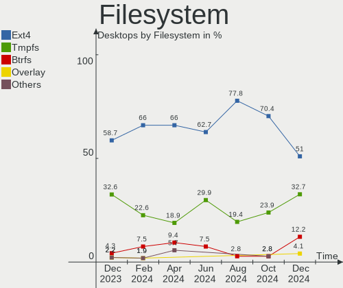
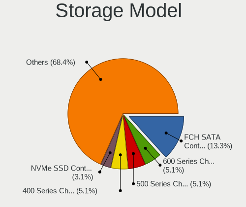
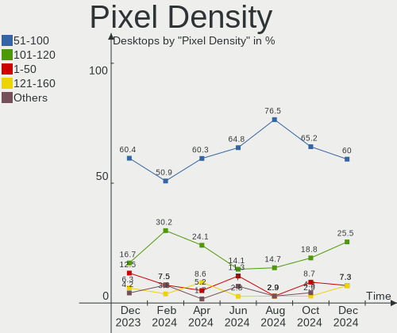
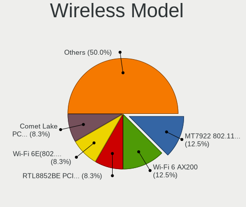
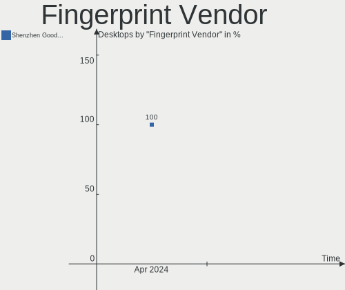

Kubuntu - Hardware Trends (Desktops)
------------------------------------

A project to identify most popular hardware characteristics and track their change
over time based on data collected by Linux users at https://Linux-Hardware.org.

Anyone can contribute to this report by the [hw-probe](https://github.com/linuxhw/hw-probe) tool:

    sudo -E hw-probe -all -upload

This report is for one last month. Overall report since the beginning of time: [TestCoverage](https://github.com/linuxhw/TestCoverage)

Period: Jul, 2022.

Contents
--------

* [ System ](#system)
  - [ OS                       ](#os)
  - [ OS Family                ](#os-family)
  - [ Kernel                   ](#kernel)
  - [ Kernel Family            ](#kernel-family)
  - [ Kernel Major Ver.        ](#kernel-major-ver)
  - [ Arch                     ](#arch)
  - [ DE                       ](#de)
  - [ Display Server           ](#display-server)
  - [ Display Manager          ](#display-manager)
  - [ OS Lang                  ](#os-lang)
  - [ Boot Mode                ](#boot-mode)
  - [ Filesystem               ](#filesystem)
  - [ Part. scheme             ](#part-scheme)
  - [ Dual Boot with Linux/BSD ](#dual-boot-with-linuxbsd)
  - [ Dual Boot (Win)          ](#dual-boot-win)

* [ Board ](#board)
  - [ Vendor                   ](#vendor)
  - [ Model                    ](#model)
  - [ Model Family             ](#model-family)
  - [ MFG Year                 ](#mfg-year)
  - [ Form Factor              ](#form-factor)
  - [ Secure Boot              ](#secure-boot)
  - [ Coreboot                 ](#coreboot)
  - [ RAM Size                 ](#ram-size)
  - [ RAM Used                 ](#ram-used)
  - [ Total Drives             ](#total-drives)
  - [ Has CD-ROM               ](#has-cd-rom)
  - [ Has Ethernet             ](#has-ethernet)
  - [ Has WiFi                 ](#has-wifi)
  - [ Has Bluetooth            ](#has-bluetooth)

* [ Location ](#location)
  - [ Country                  ](#country)
  - [ City                     ](#city)

* [ Drives ](#drives)
  - [ Drive Vendor             ](#drive-vendor)
  - [ Drive Model              ](#drive-model)
  - [ HDD Vendor               ](#hdd-vendor)
  - [ SSD Vendor               ](#ssd-vendor)
  - [ Drive Kind               ](#drive-kind)
  - [ Drive Connector          ](#drive-connector)
  - [ Drive Size               ](#drive-size)
  - [ Space Total              ](#space-total)
  - [ Space Used               ](#space-used)
  - [ Malfunc. Drives          ](#malfunc-drives)
  - [ Malfunc. Drive Vendor    ](#malfunc-drive-vendor)
  - [ Malfunc. HDD Vendor      ](#malfunc-hdd-vendor)
  - [ Malfunc. Drive Kind      ](#malfunc-drive-kind)
  - [ Failed Drives            ](#failed-drives)
  - [ Failed Drive Vendor      ](#failed-drive-vendor)
  - [ Drive Status             ](#drive-status)

* [ Storage controller ](#storage-controller)
  - [ Storage Vendor           ](#storage-vendor)
  - [ Storage Model            ](#storage-model)
  - [ Storage Kind             ](#storage-kind)

* [ Processor ](#processor)
  - [ CPU Vendor               ](#cpu-vendor)
  - [ CPU Model                ](#cpu-model)
  - [ CPU Model Family         ](#cpu-model-family)
  - [ CPU Cores                ](#cpu-cores)
  - [ CPU Sockets              ](#cpu-sockets)
  - [ CPU Threads              ](#cpu-threads)
  - [ CPU Op-Modes             ](#cpu-op-modes)
  - [ CPU Microcode            ](#cpu-microcode)
  - [ CPU Microarch            ](#cpu-microarch)

* [ Graphics ](#graphics)
  - [ GPU Vendor               ](#gpu-vendor)
  - [ GPU Model                ](#gpu-model)
  - [ GPU Combo                ](#gpu-combo)
  - [ GPU Driver               ](#gpu-driver)
  - [ GPU Memory               ](#gpu-memory)

* [ Monitor ](#monitor)
  - [ Monitor Vendor           ](#monitor-vendor)
  - [ Monitor Model            ](#monitor-model)
  - [ Monitor Resolution       ](#monitor-resolution)
  - [ Monitor Diagonal         ](#monitor-diagonal)
  - [ Monitor Width            ](#monitor-width)
  - [ Aspect Ratio             ](#aspect-ratio)
  - [ Monitor Area             ](#monitor-area)
  - [ Pixel Density            ](#pixel-density)
  - [ Multiple Monitors        ](#multiple-monitors)

* [ Network ](#network)
  - [ Net Controller Vendor    ](#net-controller-vendor)
  - [ Net Controller Model     ](#net-controller-model)
  - [ Wireless Vendor          ](#wireless-vendor)
  - [ Wireless Model           ](#wireless-model)
  - [ Ethernet Vendor          ](#ethernet-vendor)
  - [ Ethernet Model           ](#ethernet-model)
  - [ Net Controller Kind      ](#net-controller-kind)
  - [ Used Controller          ](#used-controller)
  - [ NICs                     ](#nics)
  - [ IPv6                     ](#ipv6)

* [ Bluetooth ](#bluetooth)
  - [ Bluetooth Vendor         ](#bluetooth-vendor)
  - [ Bluetooth Model          ](#bluetooth-model)

* [ Sound ](#sound)
  - [ Sound Vendor             ](#sound-vendor)
  - [ Sound Model              ](#sound-model)

* [ Memory ](#memory)
  - [ Memory Vendor            ](#memory-vendor)
  - [ Memory Model             ](#memory-model)
  - [ Memory Kind              ](#memory-kind)
  - [ Memory Form Factor       ](#memory-form-factor)
  - [ Memory Size              ](#memory-size)
  - [ Memory Speed             ](#memory-speed)

* [ Printers & scanners ](#printers--scanners)
  - [ Printer Vendor           ](#printer-vendor)
  - [ Printer Model            ](#printer-model)
  - [ Scanner Vendor           ](#scanner-vendor)
  - [ Scanner Model            ](#scanner-model)

* [ Camera ](#camera)
  - [ Camera Vendor            ](#camera-vendor)
  - [ Camera Model             ](#camera-model)

* [ Security ](#security)
  - [ Fingerprint Vendor       ](#fingerprint-vendor)
  - [ Fingerprint Model        ](#fingerprint-model)
  - [ Chipcard Vendor          ](#chipcard-vendor)
  - [ Chipcard Model           ](#chipcard-model)

* [ Unsupported ](#unsupported)
  - [ Unsupported Devices      ](#unsupported-devices)
  - [ Unsupported Device Types ](#unsupported-device-types)

System
------

OS
--

Installed operating systems

| Name          | Desktops | Percent |
|---------------|----------|---------|
| Kubuntu 22.04 | 22       | 61.11%  |
| Kubuntu 20.04 | 10       | 27.78%  |
| Kubuntu 11.1  | 2        | 5.56%   |
| Kubuntu 22.10 | 1        | 2.78%   |
| Kubuntu 18.04 | 1        | 2.78%   |

OS Family
---------

OS without a version

| Name    | Desktops | Percent |
|---------|----------|---------|
| Kubuntu | 36       | 100%    |

Kernel
------

Version of the Linux kernel

| Version                | Desktops | Percent |
|------------------------|----------|---------|
| 5.15.0-41-generic      | 14       | 38.89%  |
| 5.15.0-40-generic      | 5        | 13.89%  |
| 5.4.0-122-generic      | 3        | 8.33%   |
| 5.15.0-43-generic      | 2        | 5.56%   |
| 5.13.0-52-generic      | 2        | 5.56%   |
| 5.4.0-60-lowlatency    | 1        | 2.78%   |
| 5.4.0-121-generic      | 1        | 2.78%   |
| 5.18.12-051812-generic | 1        | 2.78%   |
| 5.18.11-xanmod1        | 1        | 2.78%   |
| 5.18.10-051810-generic | 1        | 2.78%   |
| 5.17.6-051706-generic  | 1        | 2.78%   |
| 5.15.0-39-generic      | 1        | 2.78%   |
| 5.15.0-27-generic      | 1        | 2.78%   |
| 5.15.0-25-generic      | 1        | 2.78%   |
| 5.13.0-44-generic      | 1        | 2.78%   |

Kernel Family
-------------

Linux kernel without a distro release

| Version | Desktops | Percent |
|---------|----------|---------|
| 5.15.0  | 24       | 66.67%  |
| 5.4.0   | 5        | 13.89%  |
| 5.13.0  | 3        | 8.33%   |
| 5.18.12 | 1        | 2.78%   |
| 5.18.11 | 1        | 2.78%   |
| 5.18.10 | 1        | 2.78%   |
| 5.17.6  | 1        | 2.78%   |

Kernel Major Ver.
-----------------

Linux kernel major version

| Version | Desktops | Percent |
|---------|----------|---------|
| 5.15    | 24       | 66.67%  |
| 5.4     | 5        | 13.89%  |
| 5.18    | 3        | 8.33%   |
| 5.13    | 3        | 8.33%   |
| 5.17    | 1        | 2.78%   |

Arch
----

OS architecture (x86_64, i586, etc.)

| Name   | Desktops | Percent |
|--------|----------|---------|
| x86_64 | 36       | 100%    |

DE
--

Desktop Environment

| Name     | Desktops | Percent |
|----------|----------|---------|
| KDE5     | 35       | 97.22%  |
| Cinnamon | 1        | 2.78%   |

Display Server
--------------

X11 or Wayland

| Name | Desktops | Percent |
|------|----------|---------|
| X11  | 36       | 100%    |

Display Manager
---------------

SDDM, LightDM, etc.

| Name    | Desktops | Percent |
|---------|----------|---------|
| SDDM    | 24       | 66.67%  |
| Unknown | 8        | 22.22%  |
| LightDM | 2        | 5.56%   |
| GDM3    | 2        | 5.56%   |

OS Lang
-------

Language

| Lang  | Desktops | Percent |
|-------|----------|---------|
| en_US | 18       | 50%     |
| fr_FR | 4        | 11.11%  |
| de_DE | 4        | 11.11%  |
| it_IT | 2        | 5.56%   |
| en_GB | 2        | 5.56%   |
| C     | 2        | 5.56%   |
| ru_RU | 1        | 2.78%   |
| nl_NL | 1        | 2.78%   |
| en_ZA | 1        | 2.78%   |
| en_IN | 1        | 2.78%   |

Boot Mode
---------

EFI or BIOS

| Mode | Desktops | Percent |
|------|----------|---------|
| BIOS | 18       | 50%     |
| EFI  | 18       | 50%     |

Filesystem
----------

Type of filesystem

| Type    | Desktops | Percent |
|---------|----------|---------|
| Ext4    | 33       | 91.67%  |
| Overlay | 2        | 5.56%   |
| Xfs     | 1        | 2.78%   |

Part. scheme
------------

Scheme of partitioning

| Type    | Desktops | Percent |
|---------|----------|---------|
| GPT     | 19       | 52.78%  |
| Unknown | 14       | 38.89%  |
| MBR     | 3        | 8.33%   |

Dual Boot with Linux/BSD
------------------------

Hosting more than one Linux/BSD

| Dual boot | Desktops | Percent |
|-----------|----------|---------|
| No        | 29       | 80.56%  |
| Yes       | 7        | 19.44%  |

Dual Boot (Win)
---------------

Hosting Linux and Windows

| Dual boot | Desktops | Percent |
|-----------|----------|---------|
| No        | 21       | 58.33%  |
| Yes       | 15       | 41.67%  |

Board
-----

Vendor
------

Motherboard manufacturer

| Name                | Desktops | Percent |
|---------------------|----------|---------|
| ASUSTek Computer    | 10       | 27.78%  |
| Gigabyte Technology | 7        | 19.44%  |
| Hewlett-Packard     | 6        | 16.67%  |
| ASRock              | 6        | 16.67%  |
| MSI                 | 2        | 5.56%   |
| Dell                | 2        | 5.56%   |
| Shuttle             | 1        | 2.78%   |
| Fujitsu             | 1        | 2.78%   |
| Acer                | 1        | 2.78%   |

Model
-----

Motherboard model

| Name                           | Desktops | Percent |
|--------------------------------|----------|---------|
| Gigabyte Z77-D3H               | 2        | 5.56%   |
| ASUS All Series                | 2        | 5.56%   |
| Shuttle NC01U                  | 1        | 2.78%   |
| MSI MS-7C37                    | 1        | 2.78%   |
| MSI MS-7A21                    | 1        | 2.78%   |
| HP Z620 Workstation            | 1        | 2.78%   |
| HP Z220 CMT Workstation        | 1        | 2.78%   |
| HP Slim Desktop 290-a0xxx      | 1        | 2.78%   |
| HP ProDesk 400 G1 SFF          | 1        | 2.78%   |
| HP EliteDesk 800 G2 SFF        | 1        | 2.78%   |
| HP 280 Pro G5 MT Business PC   | 1        | 2.78%   |
| Gigabyte Z390 GAMING X         | 1        | 2.78%   |
| Gigabyte X399 AORUS XTREME     | 1        | 2.78%   |
| Gigabyte P35-DS3L              | 1        | 2.78%   |
| Gigabyte A320M-S2H             | 1        | 2.78%   |
| Gigabyte 970A-DS3P             | 1        | 2.78%   |
| Fujitsu ESPRIMO P557           | 1        | 2.78%   |
| Dell Precision T1600           | 1        | 2.78%   |
| Dell OptiPlex GX620            | 1        | 2.78%   |
| ASUS TUF Gaming Z690-PLUS      | 1        | 2.78%   |
| ASUS TUF Gaming Z590-PLUS WIFI | 1        | 2.78%   |
| ASUS ROG Maximus Z690 EXTREME  | 1        | 2.78%   |
| ASUS PRIME X370-PRO            | 1        | 2.78%   |
| ASUS PRIME B350-PLUS           | 1        | 2.78%   |
| ASUS P9X79 PRO                 | 1        | 2.78%   |
| ASUS P8H67                     | 1        | 2.78%   |
| ASUS ET2400A                   | 1        | 2.78%   |
| ASRock Z270 Gaming K4          | 1        | 2.78%   |
| ASRock Z170 Extreme4           | 1        | 2.78%   |
| ASRock J4105M                  | 1        | 2.78%   |
| ASRock B550 Taichi             | 1        | 2.78%   |
| ASRock B550 Extreme4           | 1        | 2.78%   |
| ASRock 990FX Extreme3          | 1        | 2.78%   |
| Acer Predator PO3-620          | 1        | 2.78%   |

Model Family
------------

Motherboard model prefix

| Name               | Desktops | Percent |
|--------------------|----------|---------|
| Gigabyte Z77-D3H   | 2        | 5.56%   |
| ASUS TUF           | 2        | 5.56%   |
| ASUS PRIME         | 2        | 5.56%   |
| ASUS All           | 2        | 5.56%   |
| ASRock B550        | 2        | 5.56%   |
| Shuttle NC01U      | 1        | 2.78%   |
| MSI MS-7C37        | 1        | 2.78%   |
| MSI MS-7A21        | 1        | 2.78%   |
| HP Z620            | 1        | 2.78%   |
| HP Z220            | 1        | 2.78%   |
| HP Slim            | 1        | 2.78%   |
| HP ProDesk         | 1        | 2.78%   |
| HP EliteDesk       | 1        | 2.78%   |
| HP 280             | 1        | 2.78%   |
| Gigabyte Z390      | 1        | 2.78%   |
| Gigabyte X399      | 1        | 2.78%   |
| Gigabyte P35-DS3L  | 1        | 2.78%   |
| Gigabyte A320M-S2H | 1        | 2.78%   |
| Gigabyte 970A-DS3P | 1        | 2.78%   |
| Fujitsu ESPRIMO    | 1        | 2.78%   |
| Dell Precision     | 1        | 2.78%   |
| Dell OptiPlex      | 1        | 2.78%   |
| ASUS ROG           | 1        | 2.78%   |
| ASUS P9X79         | 1        | 2.78%   |
| ASUS P8H67         | 1        | 2.78%   |
| ASUS ET2400A       | 1        | 2.78%   |
| ASRock Z270        | 1        | 2.78%   |
| ASRock Z170        | 1        | 2.78%   |
| ASRock J4105M      | 1        | 2.78%   |
| ASRock 990FX       | 1        | 2.78%   |
| Acer Predator      | 1        | 2.78%   |

MFG Year
--------

Motherboard manufacture year

| Year | Desktops | Percent |
|------|----------|---------|
| 2012 | 6        | 16.67%  |
| 2020 | 4        | 11.11%  |
| 2018 | 4        | 11.11%  |
| 2017 | 4        | 11.11%  |
| 2013 | 3        | 8.33%   |
| 2021 | 2        | 5.56%   |
| 2019 | 2        | 5.56%   |
| 2016 | 2        | 5.56%   |
| 2015 | 2        | 5.56%   |
| 2011 | 2        | 5.56%   |
| 2022 | 1        | 2.78%   |
| 2014 | 1        | 2.78%   |
| 2010 | 1        | 2.78%   |
| 2007 | 1        | 2.78%   |
| 2005 | 1        | 2.78%   |

Form Factor
-----------

Physical design of the computer

| Name    | Desktops | Percent |
|---------|----------|---------|
| Desktop | 36       | 100%    |

Secure Boot
-----------

Enabled or disabled

| State    | Desktops | Percent |
|----------|----------|---------|
| Disabled | 34       | 94.44%  |
| Enabled  | 2        | 5.56%   |

Coreboot
--------

Have coreboot on board

| Used | Desktops | Percent |
|------|----------|---------|
| No   | 36       | 100%    |

RAM Size
--------

Total RAM memory

| Size in GB  | Desktops | Percent |
|-------------|----------|---------|
| 16.01-24.0  | 13       | 36.11%  |
| 32.01-64.0  | 7        | 19.44%  |
| 64.01-256.0 | 5        | 13.89%  |
| 4.01-8.0    | 4        | 11.11%  |
| 24.01-32.0  | 3        | 8.33%   |
| 3.01-4.0    | 2        | 5.56%   |
| 8.01-16.0   | 2        | 5.56%   |

RAM Used
--------

Used RAM memory

| Used GB    | Desktops | Percent |
|------------|----------|---------|
| 4.01-8.0   | 11       | 30.56%  |
| 3.01-4.0   | 9        | 25%     |
| 2.01-3.0   | 7        | 19.44%  |
| 1.01-2.0   | 6        | 16.67%  |
| 8.01-16.0  | 2        | 5.56%   |
| 32.01-64.0 | 1        | 2.78%   |

Total Drives
------------

Number of drives on board

| Drives | Desktops | Percent |
|--------|----------|---------|
| 2      | 11       | 30.56%  |
| 1      | 10       | 27.78%  |
| 3      | 9        | 25%     |
| 4      | 4        | 11.11%  |
| 7      | 1        | 2.78%   |
| 6      | 1        | 2.78%   |

Has CD-ROM
----------

Has CD-ROM on board

| Presented | Desktops | Percent |
|-----------|----------|---------|
| No        | 20       | 55.56%  |
| Yes       | 16       | 44.44%  |

Has Ethernet
------------

Has Ethernet on board

| Presented | Desktops | Percent |
|-----------|----------|---------|
| Yes       | 36       | 100%    |

Has WiFi
--------

Has WiFi module

| Presented | Desktops | Percent |
|-----------|----------|---------|
| Yes       | 24       | 66.67%  |
| No        | 12       | 33.33%  |

Has Bluetooth
-------------

Has Bluetooth module

| Presented | Desktops | Percent |
|-----------|----------|---------|
| No        | 19       | 52.78%  |
| Yes       | 17       | 47.22%  |

Location
--------

Country
-------

Geographic location (country)

| Country      | Desktops | Percent |
|--------------|----------|---------|
| USA          | 9        | 25%     |
| Germany      | 6        | 16.67%  |
| UK           | 5        | 13.89%  |
| France       | 4        | 11.11%  |
| Russia       | 2        | 5.56%   |
| Poland       | 2        | 5.56%   |
| Italy        | 2        | 5.56%   |
| Switzerland  | 1        | 2.78%   |
| South Africa | 1        | 2.78%   |
| Netherlands  | 1        | 2.78%   |
| Malaysia     | 1        | 2.78%   |
| India        | 1        | 2.78%   |
| Bulgaria     | 1        | 2.78%   |

City
----

Geographic location (city)

| City                | Desktops | Percent |
|---------------------|----------|---------|
| Berlin              | 2        | 5.56%   |
| Zaandam             | 1        | 2.78%   |
| Wolsingham          | 1        | 2.78%   |
| Varna               | 1        | 2.78%   |
| Torun               | 1        | 2.78%   |
| St Petersburg       | 1        | 2.78%   |
| St Helens           | 1        | 2.78%   |
| Southport           | 1        | 2.78%   |
| Raipur              | 1        | 2.78%   |
| Oberrieden          | 1        | 2.78%   |
| Neumünster         | 1        | 2.78%   |
| Munich              | 1        | 2.78%   |
| Moscow              | 1        | 2.78%   |
| Minneapolis         | 1        | 2.78%   |
| Milan               | 1        | 2.78%   |
| Merced              | 1        | 2.78%   |
| London              | 1        | 2.78%   |
| Lauffen am Neckar   | 1        | 2.78%   |
| Lansdale            | 1        | 2.78%   |
| Katy                | 1        | 2.78%   |
| Johannesburg        | 1        | 2.78%   |
| Jacksonville        | 1        | 2.78%   |
| Florence            | 1        | 2.78%   |
| Dorchester          | 1        | 2.78%   |
| Diessen am Ammersee | 1        | 2.78%   |
| Czersk              | 1        | 2.78%   |
| Crossett            | 1        | 2.78%   |
| Clichy-sous-Bois    | 1        | 2.78%   |
| Cleder              | 1        | 2.78%   |
| Clayton             | 1        | 2.78%   |
| Camelford           | 1        | 2.78%   |
| Bougival            | 1        | 2.78%   |
| Banville            | 1        | 2.78%   |
| Anaheim             | 1        | 2.78%   |
| Alor Star           | 1        | 2.78%   |

Drives
------

Drive Vendor
------------

Hard drive vendors

| Vendor                    | Desktops | Drives | Percent |
|---------------------------|----------|--------|---------|
| Seagate                   | 14       | 18     | 19.18%  |
| WDC                       | 11       | 16     | 15.07%  |
| Samsung Electronics       | 10       | 13     | 13.7%   |
| Crucial                   | 6        | 6      | 8.22%   |
| Toshiba                   | 5        | 8      | 6.85%   |
| Kingston                  | 5        | 5      | 6.85%   |
| Patriot                   | 3        | 3      | 4.11%   |
| Transcend                 | 2        | 2      | 2.74%   |
| Phison                    | 2        | 2      | 2.74%   |
| OCZ                       | 2        | 2      | 2.74%   |
| A-DATA Technology         | 2        | 2      | 2.74%   |
| Unknown                   | 1        | 1      | 1.37%   |
| SanDisk                   | 1        | 1      | 1.37%   |
| Micron/Crucial Technology | 1        | 1      | 1.37%   |
| Micron Technology         | 1        | 1      | 1.37%   |
| Magnetic Data             | 1        | 1      | 1.37%   |
| Intenso                   | 1        | 1      | 1.37%   |
| Intel                     | 1        | 1      | 1.37%   |
| IET                       | 1        | 1      | 1.37%   |
| Hitachi                   | 1        | 1      | 1.37%   |
| Emtec                     | 1        | 1      | 1.37%   |
| China                     | 1        | 1      | 1.37%   |

Drive Model
-----------

Hard drive models

| Model                                  | Desktops | Percent |
|----------------------------------------|----------|---------|
| Crucial CT500MX500SSD1 500GB           | 3        | 3.7%    |
| Toshiba DT01ACA100 1TB                 | 2        | 2.47%   |
| Seagate ST1000DM003-1SB102 1TB         | 2        | 2.47%   |
| Samsung SSD 870 EVO 1TB                | 2        | 2.47%   |
| Patriot Burst 120GB SSD                | 2        | 2.47%   |
| Kingston SA400S37480G 480GB SSD        | 2        | 2.47%   |
| Kingston SA2000M81000G 1TB             | 2        | 2.47%   |
| WDC WDBNCE5000PNC 500GB SSD            | 1        | 1.23%   |
| WDC WD8001FZBX-00ASYA0 8TB             | 1        | 1.23%   |
| WDC WD60EZAZ-00ZGHB0 6TB               | 1        | 1.23%   |
| WDC WD5000AAKX-001CA0 500GB            | 1        | 1.23%   |
| WDC WD40EFZX-68AWUN0 4TB               | 1        | 1.23%   |
| WDC WD4002FYYZ-01B7CB1 4TB             | 1        | 1.23%   |
| WDC WD3003FZEX-00Z4SA0 3TB             | 1        | 1.23%   |
| WDC WD3000GLFS-01F8U0 304GB            | 1        | 1.23%   |
| WDC WD20EZRZ-00Z5HB0 2TB               | 1        | 1.23%   |
| WDC WD2005FBYZ-01YCBB3 2TB             | 1        | 1.23%   |
| WDC WD1600HLFS-75G6U1 160GB            | 1        | 1.23%   |
| WDC WD10EZEX-60WN4A0 1TB               | 1        | 1.23%   |
| WDC WD1001FALS-00J7B1 1TB              | 1        | 1.23%   |
| Unknown NVMe SSD Drive 512GB           | 1        | 1.23%   |
| Transcend TS64GMTS400 64GB SSD         | 1        | 1.23%   |
| Transcend TS1TMTE220S 1TB              | 1        | 1.23%   |
| Toshiba MQ01ABF050 500GB               | 1        | 1.23%   |
| Toshiba MG03ACA200 2TB                 | 1        | 1.23%   |
| Toshiba HDWR180 8TB                    | 1        | 1.23%   |
| Toshiba HDWE140 4TB                    | 1        | 1.23%   |
| Toshiba DT01ACA200 2TB                 | 1        | 1.23%   |
| Seagate Ultra Slim PL 1TB              | 1        | 1.23%   |
| Seagate ST500DM002-1BD142 500GB        | 1        | 1.23%   |
| Seagate ST4000DM005-2DP166 4TB         | 1        | 1.23%   |
| Seagate ST4000DM004-2CV104 4TB         | 1        | 1.23%   |
| Seagate ST33000651NS 3TB               | 1        | 1.23%   |
| Seagate ST3160827AS 160GB              | 1        | 1.23%   |
| Seagate ST2000DM008-2FR102 2TB         | 1        | 1.23%   |
| Seagate ST2000DM006-2DM164 2TB         | 1        | 1.23%   |
| Seagate ST2000DM005-2CW102 2TB         | 1        | 1.23%   |
| Seagate ST2000DM001-1ER164 2TB         | 1        | 1.23%   |
| Seagate ST1000DM003-1CH162 1TB         | 1        | 1.23%   |
| Seagate FireCuda 530 ZP2000GM30023 2TB | 1        | 1.23%   |
| Seagate Expansion HDD 5TB              | 1        | 1.23%   |
| SanDisk NVMe SSD Drive 1TB             | 1        | 1.23%   |
| Samsung SSD 980 PRO 2TB                | 1        | 1.23%   |
| Samsung SSD 980 PRO 1TB                | 1        | 1.23%   |
| Samsung SSD 970 EVO Plus 2TB           | 1        | 1.23%   |
| Samsung SSD 970 EVO 1TB                | 1        | 1.23%   |
| Samsung SSD 860 EVO M.2 1TB            | 1        | 1.23%   |
| Samsung SSD 850 EVO 500GB              | 1        | 1.23%   |
| Samsung SSD 850 EVO 1TB                | 1        | 1.23%   |
| Samsung SSD 840 Series 250GB           | 1        | 1.23%   |
| Samsung SSD 840 PRO Series 128GB       | 1        | 1.23%   |
| Samsung NVMe SSD Drive 500GB           | 1        | 1.23%   |
| Samsung HD502IJ 500GB                  | 1        | 1.23%   |
| Phison NVMe SSD Drive 2TB              | 1        | 1.23%   |
| Phison NVMe SSD Drive 1024GB           | 1        | 1.23%   |
| Patriot Ignite 480GB SSD               | 1        | 1.23%   |
| OCZ VERTEX4 128GB SSD                  | 1        | 1.23%   |
| OCZ SOLID3 120GB SSD                   | 1        | 1.23%   |
| Micron/Crucial NVMe SSD Drive 1TB      | 1        | 1.23%   |
| Micron 1100_MTFDDAK256TBN 256GB SSD    | 1        | 1.23%   |

HDD Vendor
----------

Hard disk drive vendors

| Vendor              | Desktops | Drives | Percent |
|---------------------|----------|--------|---------|
| Seagate             | 12       | 15     | 38.71%  |
| WDC                 | 10       | 15     | 32.26%  |
| Toshiba             | 5        | 8      | 16.13%  |
| Samsung Electronics | 1        | 1      | 3.23%   |
| Magnetic Data       | 1        | 1      | 3.23%   |
| IET                 | 1        | 1      | 3.23%   |
| Hitachi             | 1        | 1      | 3.23%   |

SSD Vendor
----------

Solid state drive vendors

| Vendor              | Desktops | Drives | Percent |
|---------------------|----------|--------|---------|
| Crucial             | 6        | 6      | 22.22%  |
| Samsung Electronics | 5        | 7      | 18.52%  |
| Patriot             | 3        | 3      | 11.11%  |
| Kingston            | 3        | 3      | 11.11%  |
| OCZ                 | 2        | 2      | 7.41%   |
| A-DATA Technology   | 2        | 2      | 7.41%   |
| WDC                 | 1        | 1      | 3.7%    |
| Transcend           | 1        | 1      | 3.7%    |
| Micron Technology   | 1        | 1      | 3.7%    |
| Intenso             | 1        | 1      | 3.7%    |
| Intel               | 1        | 1      | 3.7%    |
| China               | 1        | 1      | 3.7%    |

Drive Kind
----------

HDD or SSD

| Kind    | Desktops | Drives | Percent |
|---------|----------|--------|---------|
| HDD     | 26       | 42     | 41.94%  |
| SSD     | 23       | 29     | 37.1%   |
| NVMe    | 11       | 15     | 17.74%  |
| Unknown | 2        | 2      | 3.23%   |

Drive Connector
---------------

SATA, SAS, NVMe, etc.

| Type | Desktops | Drives | Percent |
|------|----------|--------|---------|
| SATA | 34       | 70     | 70.83%  |
| NVMe | 11       | 15     | 22.92%  |
| SAS  | 3        | 3      | 6.25%   |

Drive Size
----------

Size of hard drive

| Size in TB | Desktops | Drives | Percent |
|------------|----------|--------|---------|
| 0.01-0.5   | 24       | 35     | 46.15%  |
| 0.51-1.0   | 10       | 11     | 19.23%  |
| 1.01-2.0   | 7        | 10     | 13.46%  |
| 4.01-10.0  | 5        | 5      | 9.62%   |
| 3.01-4.0   | 4        | 6      | 7.69%   |
| 2.01-3.0   | 2        | 4      | 3.85%   |

Space Total
-----------

Amount of disk space available on the file system

| Size in GB     | Desktops | Percent |
|----------------|----------|---------|
| More than 3000 | 6        | 16.67%  |
| 101-250        | 6        | 16.67%  |
| 501-1000       | 6        | 16.67%  |
| 2001-3000      | 5        | 13.89%  |
| 251-500        | 4        | 11.11%  |
| 1001-2000      | 4        | 11.11%  |
| 21-50          | 2        | 5.56%   |
| 1-20           | 1        | 2.78%   |
| 51-100         | 1        | 2.78%   |
| Unknown        | 1        | 2.78%   |

Space Used
----------

Amount of used disk space

| Used GB        | Desktops | Percent |
|----------------|----------|---------|
| 21-50          | 9        | 25%     |
| 101-250        | 4        | 11.11%  |
| 1001-2000      | 4        | 11.11%  |
| 501-1000       | 4        | 11.11%  |
| 51-100         | 4        | 11.11%  |
| More than 3000 | 3        | 8.33%   |
| 251-500        | 3        | 8.33%   |
| 2001-3000      | 2        | 5.56%   |
| 1-20           | 2        | 5.56%   |
| Unknown        | 1        | 2.78%   |

Malfunc. Drives
---------------

Drive models with a malfunction

| Model                                    | Desktops | Drives | Percent |
|------------------------------------------|----------|--------|---------|
| WDC WD1001FALS-00J7B1 1TB                | 1        | 1      | 14.29%  |
| Toshiba HDWE140 4TB                      | 1        | 1      | 14.29%  |
| Seagate ST500DM002-1BD142 500GB          | 1        | 1      | 14.29%  |
| Seagate ST33000651NS 3TB                 | 1        | 3      | 14.29%  |
| Seagate ST3160827AS 160GB                | 1        | 1      | 14.29%  |
| Samsung Electronics SSD 840 Series 250GB | 1        | 1      | 14.29%  |
| Intel SSDSC2BW120A4 120GB                | 1        | 1      | 14.29%  |

Malfunc. Drive Vendor
---------------------

Vendors of faulty drives

| Vendor              | Desktops | Drives | Percent |
|---------------------|----------|--------|---------|
| Seagate             | 3        | 5      | 42.86%  |
| WDC                 | 1        | 1      | 14.29%  |
| Toshiba             | 1        | 1      | 14.29%  |
| Samsung Electronics | 1        | 1      | 14.29%  |
| Intel               | 1        | 1      | 14.29%  |

Malfunc. HDD Vendor
-------------------

Vendors of faulty HDD drives

| Vendor  | Desktops | Drives | Percent |
|---------|----------|--------|---------|
| Seagate | 3        | 5      | 60%     |
| WDC     | 1        | 1      | 20%     |
| Toshiba | 1        | 1      | 20%     |

Malfunc. Drive Kind
-------------------

Kinds of faulty drives

| Kind | Desktops | Drives | Percent |
|------|----------|--------|---------|
| HDD  | 5        | 7      | 71.43%  |
| SSD  | 2        | 2      | 28.57%  |

Failed Drives
-------------

Failed drive models

| Model                             | Desktops | Drives | Percent |
|-----------------------------------|----------|--------|---------|
| Samsung Electronics HD502IJ 500GB | 1        | 1      | 50%     |
| Hitachi HTS547550A9E384 500GB     | 1        | 1      | 50%     |

Failed Drive Vendor
-------------------

Failed drive vendors

| Vendor              | Desktops | Drives | Percent |
|---------------------|----------|--------|---------|
| Samsung Electronics | 1        | 1      | 50%     |
| Hitachi             | 1        | 1      | 50%     |

Drive Status
------------

Number of failed and malfunc. drives

| Status   | Desktops | Drives | Percent |
|----------|----------|--------|---------|
| Works    | 21       | 44     | 47.73%  |
| Detected | 15       | 33     | 34.09%  |
| Malfunc  | 7        | 9      | 15.91%  |
| Failed   | 1        | 2      | 2.27%   |

Storage controller
------------------

Storage Vendor
--------------

Storage controller vendors

| Vendor                      | Desktops | Percent |
|-----------------------------|----------|---------|
| Intel                       | 24       | 42.11%  |
| AMD                         | 11       | 19.3%   |
| Samsung Electronics         | 5        | 8.77%   |
| ASMedia Technology          | 4        | 7.02%   |
| Phison Electronics          | 2        | 3.51%   |
| Marvell Technology Group    | 2        | 3.51%   |
| Kingston Technology Company | 2        | 3.51%   |
| VIA Technologies            | 1        | 1.75%   |
| Unknown                     | 1        | 1.75%   |
| Silicon Motion              | 1        | 1.75%   |
| Seagate Technology          | 1        | 1.75%   |
| SanDisk                     | 1        | 1.75%   |
| Micron/Crucial Technology   | 1        | 1.75%   |
| JMicron Technology          | 1        | 1.75%   |

Storage Model
-------------

Storage controller models

| Model                                                                          | Desktops | Percent |
|--------------------------------------------------------------------------------|----------|---------|
| AMD FCH SATA Controller [AHCI mode]                                            | 6        | 8.7%    |
| ASMedia ASM1062 Serial ATA Controller                                          | 4        | 5.8%    |
| Samsung NVMe SSD Controller SM981/PM981/PM983                                  | 3        | 4.35%   |
| Intel Q170/Q150/B150/H170/H110/Z170/CM236 Chipset SATA Controller [AHCI Mode]  | 3        | 4.35%   |
| Intel 8 Series/C220 Series Chipset Family 6-port SATA Controller 1 [AHCI mode] | 3        | 4.35%   |
| AMD SB7x0/SB8x0/SB9x0 SATA Controller [AHCI mode]                              | 3        | 4.35%   |
| Samsung NVMe SSD Controller PM9A1/PM9A3/980PRO                                 | 2        | 2.9%    |
| Kingston Company A2000 NVMe SSD                                                | 2        | 2.9%    |
| Intel Volume Management Device NVMe RAID Controller                            | 2        | 2.9%    |
| Intel SATA Controller [RAID mode]                                              | 2        | 2.9%    |
| Intel Alder Lake-S PCH SATA Controller [AHCI Mode]                             | 2        | 2.9%    |
| Intel 7 Series/C210 Series Chipset Family 6-port SATA Controller [AHCI mode]   | 2        | 2.9%    |
| Intel 200 Series PCH SATA controller [AHCI mode]                               | 2        | 2.9%    |
| AMD SB7x0/SB8x0/SB9x0 IDE Controller                                           | 2        | 2.9%    |
| AMD 500 Series Chipset SATA Controller                                         | 2        | 2.9%    |
| VIA VT6415 PATA IDE Host Controller                                            | 1        | 1.45%   |
| Unknown Non-Volatile memory controller                                         | 1        | 1.45%   |
| Silicon Motion SM2262/SM2262EN SSD Controller                                  | 1        | 1.45%   |
| Seagate FireCuda 530 SSD                                                       | 1        | 1.45%   |
| SanDisk Non-Volatile memory controller                                         | 1        | 1.45%   |
| Phison E18 PCIe4 NVMe Controller                                               | 1        | 1.45%   |
| Phison E12 NVMe Controller                                                     | 1        | 1.45%   |
| Micron/Crucial P1 NVMe PCIe SSD                                                | 1        | 1.45%   |
| Marvell Group 88SE9215 PCIe 2.0 x1 4-port SATA 6 Gb/s Controller               | 1        | 1.45%   |
| Marvell Group 88SE9128 PCIe SATA 6 Gb/s RAID controller with HyperDuo          | 1        | 1.45%   |
| JMicron JMB368 IDE controller                                                  | 1        | 1.45%   |
| Intel Wildcat Point-LP SATA Controller [AHCI Mode]                             | 1        | 1.45%   |
| Intel NM10/ICH7 Family SATA Controller [IDE mode]                              | 1        | 1.45%   |
| Intel Comet Lake SATA AHCI Controller                                          | 1        | 1.45%   |
| Intel Celeron/Pentium Silver Processor SATA Controller                         | 1        | 1.45%   |
| Intel Cannon Lake PCH SATA AHCI Controller                                     | 1        | 1.45%   |
| Intel C602 chipset 4-Port SATA Storage Control Unit                            | 1        | 1.45%   |
| Intel C600/X79 series chipset SATA RAID Controller                             | 1        | 1.45%   |
| Intel C600/X79 series chipset IDE-r Controller                                 | 1        | 1.45%   |
| Intel C600/X79 series chipset 6-Port SATA AHCI Controller                      | 1        | 1.45%   |
| Intel 82801IB (ICH9) 2 port SATA Controller [IDE mode]                         | 1        | 1.45%   |
| Intel 82801I (ICH9 Family) 2 port SATA Controller [IDE mode]                   | 1        | 1.45%   |
| Intel 82801G (ICH7 Family) IDE Controller                                      | 1        | 1.45%   |
| Intel 6 Series/C200 Series Chipset Family 6 port Desktop SATA AHCI Controller  | 1        | 1.45%   |
| Intel 500 Series Chipset Family SATA AHCI Controller                           | 1        | 1.45%   |
| AMD X399 Series Chipset SATA Controller                                        | 1        | 1.45%   |
| AMD X370 Series Chipset SATA Controller                                        | 1        | 1.45%   |
| AMD FCH SATA Controller D                                                      | 1        | 1.45%   |
| AMD 300 Series Chipset SATA Controller                                         | 1        | 1.45%   |

Storage Kind
------------

Kind of storage controller (IDE, SATA, NVMe, SAS, ...)

| Kind | Desktops | Percent |
|------|----------|---------|
| SATA | 30       | 56.6%   |
| NVMe | 11       | 20.75%  |
| IDE  | 6        | 11.32%  |
| RAID | 5        | 9.43%   |
| SAS  | 1        | 1.89%   |

Processor
---------

CPU Vendor
----------

Processor vendors

| Vendor | Desktops | Percent |
|--------|----------|---------|
| Intel  | 25       | 69.44%  |
| AMD    | 11       | 30.56%  |

CPU Model
---------

Processor models

| Model                                          | Desktops | Percent |
|------------------------------------------------|----------|---------|
| Intel 12th Gen Core i9-12900K                  | 2        | 5.56%   |
| AMD FX-8320 Eight-Core Processor               | 2        | 5.56%   |
| Intel Xeon CPU E5-2609 v2 @ 2.50GHz            | 1        | 2.78%   |
| Intel Xeon CPU E31225 @ 3.10GHz                | 1        | 2.78%   |
| Intel Pentium 4 CPU 2.80GHz                    | 1        | 2.78%   |
| Intel Core i7-6900K CPU @ 3.20GHz              | 1        | 2.78%   |
| Intel Core i7-6700 CPU @ 3.40GHz               | 1        | 2.78%   |
| Intel Core i7-4771 CPU @ 3.50GHz               | 1        | 2.78%   |
| Intel Core i7-3930K CPU @ 3.20GHz              | 1        | 2.78%   |
| Intel Core i7-3770K CPU @ 3.50GHz              | 1        | 2.78%   |
| Intel Core i5-9600K CPU @ 3.70GHz              | 1        | 2.78%   |
| Intel Core i5-9500 CPU @ 3.00GHz               | 1        | 2.78%   |
| Intel Core i5-7400 CPU @ 3.00GHz               | 1        | 2.78%   |
| Intel Core i5-6600K CPU @ 3.50GHz              | 1        | 2.78%   |
| Intel Core i5-4570 CPU @ 3.20GHz               | 1        | 2.78%   |
| Intel Core i5-3570K CPU @ 3.40GHz              | 1        | 2.78%   |
| Intel Core i5-3570 CPU @ 3.40GHz               | 1        | 2.78%   |
| Intel Core i5-3470 CPU @ 3.20GHz               | 1        | 2.78%   |
| Intel Core i5-10400F CPU @ 2.90GHz             | 1        | 2.78%   |
| Intel Core i3-6100 CPU @ 3.70GHz               | 1        | 2.78%   |
| Intel Core i3-4130 CPU @ 3.40GHz               | 1        | 2.78%   |
| Intel Core 2 Duo CPU E6550 @ 2.33GHz           | 1        | 2.78%   |
| Intel Celeron J4105 CPU @ 1.50GHz              | 1        | 2.78%   |
| Intel Celeron 3205U @ 1.50GHz                  | 1        | 2.78%   |
| Intel 11th Gen Core i5-11600K @ 3.90GHz        | 1        | 2.78%   |
| AMD Ryzen Threadripper 2950X 16-Core Processor | 1        | 2.78%   |
| AMD Ryzen 9 3900XT 12-Core Processor           | 1        | 2.78%   |
| AMD Ryzen 7 3700X 8-Core Processor             | 1        | 2.78%   |
| AMD Ryzen 5 5600X 6-Core Processor             | 1        | 2.78%   |
| AMD Ryzen 5 5600 6-Core Processor              | 1        | 2.78%   |
| AMD Ryzen 5 2600 Six-Core Processor            | 1        | 2.78%   |
| AMD Ryzen 3 1200 Quad-Core Processor           | 1        | 2.78%   |
| AMD Phenom II X2 521 Processor                 | 1        | 2.78%   |
| AMD A6-9225 RADEON R4, 5 COMPUTE CORES 2C+3G   | 1        | 2.78%   |

CPU Model Family
----------------

Processor model prefix

| Model                  | Desktops | Percent |
|------------------------|----------|---------|
| Intel Core i5          | 9        | 25%     |
| Intel Core i7          | 5        | 13.89%  |
| Other                  | 3        | 8.33%   |
| AMD Ryzen 5            | 3        | 8.33%   |
| Intel Xeon             | 2        | 5.56%   |
| Intel Core i3          | 2        | 5.56%   |
| Intel Celeron          | 2        | 5.56%   |
| AMD FX                 | 2        | 5.56%   |
| Intel Pentium 4        | 1        | 2.78%   |
| Intel Core 2 Duo       | 1        | 2.78%   |
| AMD Ryzen Threadripper | 1        | 2.78%   |
| AMD Ryzen 9            | 1        | 2.78%   |
| AMD Ryzen 7            | 1        | 2.78%   |
| AMD Ryzen 3            | 1        | 2.78%   |
| AMD Phenom II X2       | 1        | 2.78%   |
| AMD A6                 | 1        | 2.78%   |

CPU Cores
---------

Number of processor cores

| Number | Desktops | Percent |
|--------|----------|---------|
| 4      | 14       | 38.89%  |
| 6      | 8        | 22.22%  |
| 2      | 6        | 16.67%  |
| 16     | 3        | 8.33%   |
| 8      | 3        | 8.33%   |
| 12     | 1        | 2.78%   |
| 1      | 1        | 2.78%   |

CPU Sockets
-----------

Number of sockets

| Number | Desktops | Percent |
|--------|----------|---------|
| 1      | 35       | 97.22%  |
| 2      | 1        | 2.78%   |

CPU Threads
-----------

Threads per core (Hyper-Threading)

| Number | Desktops | Percent |
|--------|----------|---------|
| 2      | 20       | 55.56%  |
| 1      | 16       | 44.44%  |

CPU Op-Modes
------------

CPU Operation Modes (32-bit, 64-bit)

| Op mode        | Desktops | Percent |
|----------------|----------|---------|
| 32-bit, 64-bit | 36       | 100%    |

CPU Microcode
-------------

Microcode number

| Number     | Desktops | Percent |
|------------|----------|---------|
| Unknown    | 11       | 30.56%  |
| 0x306c3    | 3        | 8.33%   |
| 0x90672    | 2        | 5.56%   |
| 0x506e3    | 2        | 5.56%   |
| 0x306a9    | 2        | 5.56%   |
| 0xf41      | 1        | 2.78%   |
| 0xa0653    | 1        | 2.78%   |
| 0x906ea    | 1        | 2.78%   |
| 0x906e9    | 1        | 2.78%   |
| 0x406f1    | 1        | 2.78%   |
| 0x306e4    | 1        | 2.78%   |
| 0x206d6    | 1        | 2.78%   |
| 0x206a7    | 1        | 2.78%   |
| 0x0a201205 | 1        | 2.78%   |
| 0x08701021 | 1        | 2.78%   |
| 0x0800820d | 1        | 2.78%   |
| 0x0800820b | 1        | 2.78%   |
| 0x08001138 | 1        | 2.78%   |
| 0x06000852 | 1        | 2.78%   |
| 0x010000c8 | 1        | 2.78%   |
| 0x00000000 | 1        | 2.78%   |

CPU Microarch
-------------

Microarchitecture

| Name             | Desktops | Percent |
|------------------|----------|---------|
| IvyBridge        | 5        | 13.89%  |
| Skylake          | 3        | 8.33%   |
| KabyLake         | 3        | 8.33%   |
| Haswell          | 3        | 8.33%   |
| Zen+             | 2        | 5.56%   |
| Zen 3            | 2        | 5.56%   |
| Zen 2            | 2        | 5.56%   |
| SandyBridge      | 2        | 5.56%   |
| Piledriver       | 2        | 5.56%   |
| Broadwell        | 2        | 5.56%   |
| Alderlake Hybrid | 2        | 5.56%   |
| Zen              | 1        | 2.78%   |
| NetBurst         | 1        | 2.78%   |
| K10              | 1        | 2.78%   |
| Goldmont plus    | 1        | 2.78%   |
| Excavator        | 1        | 2.78%   |
| Core             | 1        | 2.78%   |
| CometLake        | 1        | 2.78%   |
| Unknown          | 1        | 2.78%   |

Graphics
--------

GPU Vendor
----------

Vendors of graphics cards

| Vendor | Desktops | Percent |
|--------|----------|---------|
| Nvidia | 19       | 50%     |
| AMD    | 10       | 26.32%  |
| Intel  | 9        | 23.68%  |

GPU Model
---------

Graphics card models

| Model                                                                       | Desktops | Percent |
|-----------------------------------------------------------------------------|----------|---------|
| Nvidia TU104 [GeForce RTX 2070 SUPER]                                       | 2        | 5.26%   |
| Nvidia TU117 [GeForce GTX 1650]                                             | 1        | 2.63%   |
| Nvidia TU116 [GeForce GTX 1660 Ti]                                          | 1        | 2.63%   |
| Nvidia TU116 [GeForce GTX 1660 SUPER]                                       | 1        | 2.63%   |
| Nvidia TU104 [GeForce RTX 2080]                                             | 1        | 2.63%   |
| Nvidia TU104 [GeForce RTX 2080 SUPER]                                       | 1        | 2.63%   |
| Nvidia GT218 [GeForce 210]                                                  | 1        | 2.63%   |
| Nvidia GP108 [GeForce GT 1030]                                              | 1        | 2.63%   |
| Nvidia GP106 [GeForce GTX 1060 6GB]                                         | 1        | 2.63%   |
| Nvidia GP104 [GeForce GTX 1070]                                             | 1        | 2.63%   |
| Nvidia GP104 [GeForce GTX 1070 Ti]                                          | 1        | 2.63%   |
| Nvidia GM204 [GeForce GTX 970]                                              | 1        | 2.63%   |
| Nvidia GM200GL [Quadro M6000]                                               | 1        | 2.63%   |
| Nvidia GM107 [GeForce GTX 750 Ti]                                           | 1        | 2.63%   |
| Nvidia GK104 [GeForce GTX 770]                                              | 1        | 2.63%   |
| Nvidia GF108 [GeForce GT 630]                                               | 1        | 2.63%   |
| Nvidia GA104 [GeForce RTX 3060 Ti Lite Hash Rate]                           | 1        | 2.63%   |
| Nvidia GA102 [GeForce RTX 3090]                                             | 1        | 2.63%   |
| Intel Xeon E3-1200 v3/4th Gen Core Processor Integrated Graphics Controller | 1        | 2.63%   |
| Intel Xeon E3-1200 Processor Family Integrated Graphics Controller          | 1        | 2.63%   |
| Intel IvyBridge GT2 [HD Graphics 4000]                                      | 1        | 2.63%   |
| Intel HD Graphics 630                                                       | 1        | 2.63%   |
| Intel HD Graphics 530                                                       | 1        | 2.63%   |
| Intel HD Graphics                                                           | 1        | 2.63%   |
| Intel GeminiLake [UHD Graphics 600]                                         | 1        | 2.63%   |
| Intel CoffeeLake-S GT2 [UHD Graphics 630]                                   | 1        | 2.63%   |
| Intel 4th Generation Core Processor Family Integrated Graphics Controller   | 1        | 2.63%   |
| AMD Turks GL [FirePro V3900]                                                | 1        | 2.63%   |
| AMD Stoney [Radeon R2/R3/R4/R5 Graphics]                                    | 1        | 2.63%   |
| AMD RS780L [Radeon 3000]                                                    | 1        | 2.63%   |
| AMD Navi 24 [Radeon RX 6400 / 6500 XT]                                      | 1        | 2.63%   |
| AMD Navi 23 [Radeon RX 6600/6600 XT/6600M]                                  | 1        | 2.63%   |
| AMD Ellesmere [Radeon RX 470/480/570/570X/580/580X/590]                     | 1        | 2.63%   |
| AMD Cedar [Radeon HD 5000/6000/7350/8350 Series]                            | 1        | 2.63%   |
| AMD Cape Verde XT [Radeon HD 7770/8760 / R7 250X]                           | 1        | 2.63%   |
| AMD Caicos PRO [Radeon HD 7450]                                             | 1        | 2.63%   |
| AMD Baffin [Radeon RX 460/560D / Pro 450/455/460/555/555X/560/560X]         | 1        | 2.63%   |

GPU Combo
---------

Combinations of graphics cards

| Name        | Desktops | Percent |
|-------------|----------|---------|
| 1 x Nvidia  | 19       | 52.78%  |
| 1 x AMD     | 9        | 25%     |
| 1 x Intel   | 7        | 19.44%  |
| Intel + AMD | 1        | 2.78%   |

GPU Driver
----------

Free vs proprietary

| Driver      | Desktops | Percent |
|-------------|----------|---------|
| Free        | 20       | 55.56%  |
| Proprietary | 16       | 44.44%  |

GPU Memory
----------

Total video memory

| Size in GB | Desktops | Percent |
|------------|----------|---------|
| Unknown    | 11       | 30.56%  |
| 7.01-8.0   | 8        | 22.22%  |
| 3.01-4.0   | 4        | 11.11%  |
| 5.01-6.0   | 3        | 8.33%   |
| 1.01-2.0   | 3        | 8.33%   |
| 0.51-1.0   | 3        | 8.33%   |
| 0.01-0.5   | 2        | 5.56%   |
| 16.01-24.0 | 1        | 2.78%   |
| 8.01-16.0  | 1        | 2.78%   |

Monitor
-------

Monitor Vendor
--------------

Monitor vendors

| Vendor               | Desktops | Percent |
|----------------------|----------|---------|
| Dell                 | 9        | 20.93%  |
| Samsung Electronics  | 6        | 13.95%  |
| Ancor Communications | 5        | 11.63%  |
| Goldstar             | 4        | 9.3%    |
| Iiyama               | 3        | 6.98%   |
| Acer                 | 3        | 6.98%   |
| Philips              | 2        | 4.65%   |
| Hewlett-Packard      | 2        | 4.65%   |
| ASUSTek Computer     | 2        | 4.65%   |
| Sceptre Tech         | 1        | 2.33%   |
| NEC Computers        | 1        | 2.33%   |
| Lenovo               | 1        | 2.33%   |
| Idek Iiyama          | 1        | 2.33%   |
| Fujitsu Siemens      | 1        | 2.33%   |
| BenQ                 | 1        | 2.33%   |
| Unknown              | 1        | 2.33%   |

Monitor Model
-------------

Monitor models

| Model                                                                  | Desktops | Percent |
|------------------------------------------------------------------------|----------|---------|
| Sceptre Tech E248W-1920 SPT099D 1920x1080 443x249mm 20.0-inch          | 1        | 2.13%   |
| Samsung Electronics T19C300 SAM0A98 1366x768 410x230mm 18.5-inch       | 1        | 2.13%   |
| Samsung Electronics SyncMaster SAM0521 1600x900 443x249mm 20.0-inch    | 1        | 2.13%   |
| Samsung Electronics LCD Monitor SAM0FEF 3840x2160 950x540mm 43.0-inch  | 1        | 2.13%   |
| Samsung Electronics LCD Monitor SAM07C0 1920x1080 890x500mm 40.2-inch  | 1        | 2.13%   |
| Samsung Electronics LCD Monitor S32D850                                | 1        | 2.13%   |
| Samsung Electronics LCD Monitor S24C450                                | 1        | 2.13%   |
| Samsung Electronics C27F390 SAM0D32 1920x1080 598x336mm 27.0-inch      | 1        | 2.13%   |
| Philips 273ELH PHLC07D 1920x1080 598x336mm 27.0-inch                   | 1        | 2.13%   |
| Philips 170C PHLC011 1280x1024 338x270mm 17.0-inch                     | 1        | 2.13%   |
| NEC Computers E241N NEC2C86 1920x1080 527x296mm 23.8-inch              | 1        | 2.13%   |
| Lenovo Q24i-10 LEN65F3 1920x1080 527x296mm 23.8-inch                   | 1        | 2.13%   |
| Iiyama PL2783Q IVM661F 2560x1440 597x336mm 27.0-inch                   | 1        | 2.13%   |
| Iiyama PL2595W IVM6144 1920x1200 540x340mm 25.1-inch                   | 1        | 2.13%   |
| Iiyama PL2273HD IVM561A 1920x1080 477x268mm 21.5-inch                  | 1        | 2.13%   |
| Idek Iiyama LCD Monitor PL2480H 3840x1080                              | 1        | 2.13%   |
| Hewlett-Packard P204v HPN3634 1600x900 432x240mm 19.5-inch             | 1        | 2.13%   |
| Hewlett-Packard ENVY 32 HWP315F 2560x1440 708x399mm 32.0-inch          | 1        | 2.13%   |
| Goldstar W2361 GSM56F9 1920x1080 510x290mm 23.1-inch                   | 1        | 2.13%   |
| Goldstar M203WX GSM4E2D 1680x1050 434x270mm 20.1-inch                  | 1        | 2.13%   |
| Goldstar 32GK850G GSM7709 2560x1440 700x390mm 31.5-inch                | 1        | 2.13%   |
| Goldstar 27GN7 GSM5B8E 1920x1080 600x303mm 26.5-inch                   | 1        | 2.13%   |
| Fujitsu Siemens P24W-6 IPS FUS07EA 1920x1200 518x324mm 24.1-inch       | 1        | 2.13%   |
| Dell U2417H DEL40E7 1920x1080 530x300mm 24.0-inch                      | 1        | 2.13%   |
| Dell U2413 DELF048 1920x1200 518x324mm 24.1-inch                       | 1        | 2.13%   |
| Dell U2312HM DEL4072 1920x1080 510x287mm 23.0-inch                     | 1        | 2.13%   |
| Dell S3222DGM DELD111 2560x1440 697x392mm 31.5-inch                    | 1        | 2.13%   |
| Dell S2340L DELD058 1920x1080 509x286mm 23.0-inch                      | 1        | 2.13%   |
| Dell P2722H DEL4241 1920x1080 598x336mm 27.0-inch                      | 1        | 2.13%   |
| Dell P2417H DELA0DA 1920x1080 527x296mm 23.8-inch                      | 1        | 2.13%   |
| Dell P2414H DELA09B 1920x1080 527x297mm 23.8-inch                      | 1        | 2.13%   |
| Dell P2414H DELA09A 1920x1080 527x297mm 23.8-inch                      | 1        | 2.13%   |
| Dell P2214H DELA098 1920x1080 477x268mm 21.5-inch                      | 1        | 2.13%   |
| Dell AW2521HFA DELA15F 1920x1080 544x303mm 24.5-inch                   | 1        | 2.13%   |
| BenQ RL2455 BNQ7F1C 1920x1080 531x298mm 24.0-inch                      | 1        | 2.13%   |
| ASUSTek Computer VP28U AUS28B1 3840x2160 621x341mm 27.9-inch           | 1        | 2.13%   |
| ASUSTek Computer VG32VQ1B AUS32E0 2560x1440 697x392mm 31.5-inch        | 1        | 2.13%   |
| ASUSTek Computer PA248QV AUS2400 1920x1200 518x324mm 24.1-inch         | 1        | 2.13%   |
| Ancor Communications VW246 ACI24F2 1920x1080 531x299mm 24.0-inch       | 1        | 2.13%   |
| Ancor Communications LCD Monitor ASUS VG27A 4480x1440                  | 1        | 2.13%   |
| Ancor Communications ET2400A ACIE330 1920x1080 479x269mm 21.6-inch     | 1        | 2.13%   |
| Ancor Communications ASUS VE276 ACI27F4 1920x1080 598x336mm 27.0-inch  | 1        | 2.13%   |
| Ancor Communications ASUS PB287Q ACI28A3 3840x2160 621x341mm 27.9-inch | 1        | 2.13%   |
| Acer XV240Y P ACR0734 1920x1080 530x300mm 24.0-inch                    | 1        | 2.13%   |
| Acer LCD Monitor X34 P 3440x1440                                       | 1        | 2.13%   |
| Acer ET322QU ACR0687 2560x1440 698x393mm 31.5-inch                     | 1        | 2.13%   |
| Unknown                                                                | 1        | 2.13%   |

Monitor Resolution
------------------

Monitor screen resolution

| Resolution         | Desktops | Percent |
|--------------------|----------|---------|
| 1920x1080 (FHD)    | 17       | 42.5%   |
| 2560x1440 (QHD)    | 5        | 12.5%   |
| 1920x1200 (WUXGA)  | 4        | 10%     |
| 3840x2160 (4K)     | 3        | 7.5%    |
| 1600x900 (HD+)     | 2        | 5%      |
| 1366x768 (WXGA)    | 2        | 5%      |
| Unknown            | 2        | 5%      |
| 4480x1440          | 1        | 2.5%    |
| 3840x1080          | 1        | 2.5%    |
| 3440x1440          | 1        | 2.5%    |
| 1680x1050 (WSXGA+) | 1        | 2.5%    |
| 1280x1024 (SXGA)   | 1        | 2.5%    |

Monitor Diagonal
----------------

Diagonal size in inches

| Inches  | Desktops | Percent |
|---------|----------|---------|
| 24      | 12       | 27.91%  |
| 27      | 7        | 16.28%  |
| 23      | 4        | 9.3%    |
| Unknown | 4        | 9.3%    |
| 31      | 3        | 6.98%   |
| 21      | 3        | 6.98%   |
| 20      | 2        | 4.65%   |
| 84      | 1        | 2.33%   |
| 46      | 1        | 2.33%   |
| 32      | 1        | 2.33%   |
| 26      | 1        | 2.33%   |
| 25      | 1        | 2.33%   |
| 19      | 1        | 2.33%   |
| 18      | 1        | 2.33%   |
| 17      | 1        | 2.33%   |

Monitor Width
-------------

Physical width

| Width in mm | Desktops | Percent |
|-------------|----------|---------|
| 501-600     | 18       | 47.37%  |
| 401-500     | 7        | 18.42%  |
| 601-700     | 5        | 13.16%  |
| Unknown     | 4        | 10.53%  |
| 701-800     | 1        | 2.63%   |
| 301-350     | 1        | 2.63%   |
| 1501-2000   | 1        | 2.63%   |
| 1001-1500   | 1        | 2.63%   |

Aspect Ratio
------------

Proportional relationship between the width and the height

| Ratio   | Desktops | Percent |
|---------|----------|---------|
| 16/9    | 25       | 69.44%  |
| 16/10   | 5        | 13.89%  |
| Unknown | 4        | 11.11%  |
| 5/4     | 1        | 2.78%   |
| 1.98    | 1        | 2.78%   |

Monitor Area
------------

Area in inch²

| Area in inch² | Desktops | Percent |
|----------------|----------|---------|
| 201-250        | 13       | 30.95%  |
| 301-350        | 7        | 16.67%  |
| 251-300        | 6        | 14.29%  |
| 351-500        | 4        | 9.52%   |
| 151-200        | 4        | 9.52%   |
| Unknown        | 4        | 9.52%   |
| 141-150        | 2        | 4.76%   |
| More than 1000 | 1        | 2.38%   |
| 501-1000       | 1        | 2.38%   |

Pixel Density
-------------

Pixels per inch

| Density | Desktops | Percent |
|---------|----------|---------|
| 51-100  | 25       | 69.44%  |
| 101-120 | 4        | 11.11%  |
| Unknown | 4        | 11.11%  |
| 121-160 | 2        | 5.56%   |
| 1-50    | 1        | 2.78%   |

Multiple Monitors
-----------------

Total monitors connected

| Total | Desktops | Percent |
|-------|----------|---------|
| 1     | 25       | 69.44%  |
| 2     | 7        | 19.44%  |
| 3     | 2        | 5.56%   |
| 4     | 1        | 2.78%   |
| 0     | 1        | 2.78%   |

Network
-------

Net Controller Vendor
---------------------

Controller vendors

| Vendor                | Desktops | Percent |
|-----------------------|----------|---------|
| Realtek Semiconductor | 20       | 35.71%  |
| Intel                 | 20       | 35.71%  |
| Broadcom              | 4        | 7.14%   |
| Ralink Technology     | 3        | 5.36%   |
| Qualcomm Atheros      | 3        | 5.36%   |
| Aquantia              | 3        | 5.36%   |
| ZyXEL Communications  | 1        | 1.79%   |
| Xiaomi                | 1        | 1.79%   |
| Ralink                | 1        | 1.79%   |

Net Controller Model
--------------------

Controller models

| Model                                                               | Desktops | Percent |
|---------------------------------------------------------------------|----------|---------|
| Realtek RTL8111/8168/8411 PCI Express Gigabit Ethernet Controller   | 12       | 17.91%  |
| Intel Ethernet Controller I225-V                                    | 4        | 5.97%   |
| Intel 82579LM Gigabit Network Connection (Lewisville)               | 3        | 4.48%   |
| Ralink MT7601U Wireless Adapter                                     | 2        | 2.99%   |
| Qualcomm Atheros AR8161 Gigabit Ethernet                            | 2        | 2.99%   |
| Intel Wireless 7260                                                 | 2        | 2.99%   |
| Intel Ethernet Connection (2) I219-V                                | 2        | 2.99%   |
| Broadcom BCM4360 802.11ac Wireless Network Adapter                  | 2        | 2.99%   |
| Aquantia AQC107 NBase-T/IEEE 802.3bz Ethernet Controller [AQtion]   | 2        | 2.99%   |
| ZyXEL ZyAIR G-202 802.11bg                                          | 1        | 1.49%   |
| Xiaomi Mi/Redmi series (RNDIS)                                      | 1        | 1.49%   |
| Realtek RTL88x2bu [AC1200 Techkey]                                  | 1        | 1.49%   |
| Realtek RTL8821CE 802.11ac PCIe Wireless Network Adapter            | 1        | 1.49%   |
| Realtek RTL8821AE 802.11ac PCIe Wireless Network Adapter            | 1        | 1.49%   |
| Realtek RTL8812AE 802.11ac PCIe Wireless Network Adapter            | 1        | 1.49%   |
| Realtek RTL8723BE PCIe Wireless Network Adapter                     | 1        | 1.49%   |
| Realtek RTL8192EE PCIe Wireless Network Adapter                     | 1        | 1.49%   |
| Realtek RTL8188CUS 802.11n WLAN Adapter                             | 1        | 1.49%   |
| Realtek RTL8188CE 802.11b/g/n WiFi Adapter                          | 1        | 1.49%   |
| Realtek RTL8125 2.5GbE Controller                                   | 1        | 1.49%   |
| Realtek RTL810xE PCI Express Fast Ethernet controller               | 1        | 1.49%   |
| Realtek Killer E2600 Gigabit Ethernet Controller                    | 1        | 1.49%   |
| Ralink MT7610U ("Archer T2U" 2.4G+5G WLAN Adapter                   | 1        | 1.49%   |
| Ralink RT3060 Wireless 802.11n 1T/1R                                | 1        | 1.49%   |
| Qualcomm Atheros AR93xx Wireless Network Adapter                    | 1        | 1.49%   |
| Qualcomm Atheros AR5212/5213/2414 Wireless Network Adapter          | 1        | 1.49%   |
| Intel Wireless 8265 / 8275                                          | 1        | 1.49%   |
| Intel Wireless 8260                                                 | 1        | 1.49%   |
| Intel Wi-Fi 6 AX200                                                 | 1        | 1.49%   |
| Intel Tiger Lake PCH CNVi WiFi                                      | 1        | 1.49%   |
| Intel I350 Gigabit Network Connection                               | 1        | 1.49%   |
| Intel I211 Gigabit Network Connection                               | 1        | 1.49%   |
| Intel I210 Gigabit Network Connection                               | 1        | 1.49%   |
| Intel Ethernet Connection I218-LM                                   | 1        | 1.49%   |
| Intel Ethernet Connection I217-V                                    | 1        | 1.49%   |
| Intel Ethernet Connection (7) I219-V                                | 1        | 1.49%   |
| Intel Ethernet Connection (2) I219-LM                               | 1        | 1.49%   |
| Intel Ethernet Connection (2) I218-V                                | 1        | 1.49%   |
| Intel Comet Lake PCH CNVi WiFi                                      | 1        | 1.49%   |
| Intel Alder Lake-S PCH CNVi WiFi                                    | 1        | 1.49%   |
| Intel 82579V Gigabit Network Connection                             | 1        | 1.49%   |
| Intel 82574L Gigabit Network Connection                             | 1        | 1.49%   |
| Broadcom NetXtreme BCM5751 Gigabit Ethernet PCI Express             | 1        | 1.49%   |
| Broadcom NetLink BCM57781 Gigabit Ethernet PCIe                     | 1        | 1.49%   |
| Aquantia AQC113CS NBase-T/IEEE 802.3bz Ethernet Controller [AQtion] | 1        | 1.49%   |

Wireless Vendor
---------------

Wireless vendors

| Vendor                | Desktops | Percent |
|-----------------------|----------|---------|
| Realtek Semiconductor | 8        | 32%     |
| Intel                 | 8        | 32%     |
| Ralink Technology     | 3        | 12%     |
| Qualcomm Atheros      | 2        | 8%      |
| Broadcom              | 2        | 8%      |
| ZyXEL Communications  | 1        | 4%      |
| Ralink                | 1        | 4%      |

Wireless Model
--------------

Wireless models

| Model                                                      | Desktops | Percent |
|------------------------------------------------------------|----------|---------|
| Ralink MT7601U Wireless Adapter                            | 2        | 8%      |
| Intel Wireless 7260                                        | 2        | 8%      |
| Broadcom BCM4360 802.11ac Wireless Network Adapter         | 2        | 8%      |
| ZyXEL ZyAIR G-202 802.11bg                                 | 1        | 4%      |
| Realtek RTL88x2bu [AC1200 Techkey]                         | 1        | 4%      |
| Realtek RTL8821CE 802.11ac PCIe Wireless Network Adapter   | 1        | 4%      |
| Realtek RTL8821AE 802.11ac PCIe Wireless Network Adapter   | 1        | 4%      |
| Realtek RTL8812AE 802.11ac PCIe Wireless Network Adapter   | 1        | 4%      |
| Realtek RTL8723BE PCIe Wireless Network Adapter            | 1        | 4%      |
| Realtek RTL8192EE PCIe Wireless Network Adapter            | 1        | 4%      |
| Realtek RTL8188CUS 802.11n WLAN Adapter                    | 1        | 4%      |
| Realtek RTL8188CE 802.11b/g/n WiFi Adapter                 | 1        | 4%      |
| Ralink MT7610U ("Archer T2U" 2.4G+5G WLAN Adapter          | 1        | 4%      |
| Ralink RT3060 Wireless 802.11n 1T/1R                       | 1        | 4%      |
| Qualcomm Atheros AR93xx Wireless Network Adapter           | 1        | 4%      |
| Qualcomm Atheros AR5212/5213/2414 Wireless Network Adapter | 1        | 4%      |
| Intel Wireless 8265 / 8275                                 | 1        | 4%      |
| Intel Wireless 8260                                        | 1        | 4%      |
| Intel Wi-Fi 6 AX200                                        | 1        | 4%      |
| Intel Tiger Lake PCH CNVi WiFi                             | 1        | 4%      |
| Intel Comet Lake PCH CNVi WiFi                             | 1        | 4%      |
| Intel Alder Lake-S PCH CNVi WiFi                           | 1        | 4%      |

Ethernet Vendor
---------------

Ethernet vendors

| Vendor                | Desktops | Percent |
|-----------------------|----------|---------|
| Intel                 | 17       | 42.5%   |
| Realtek Semiconductor | 15       | 37.5%   |
| Aquantia              | 3        | 7.5%    |
| Qualcomm Atheros      | 2        | 5%      |
| Broadcom              | 2        | 5%      |
| Xiaomi                | 1        | 2.5%    |

Ethernet Model
--------------

Ethernet models

| Model                                                               | Desktops | Percent |
|---------------------------------------------------------------------|----------|---------|
| Realtek RTL8111/8168/8411 PCI Express Gigabit Ethernet Controller   | 12       | 28.57%  |
| Intel Ethernet Controller I225-V                                    | 4        | 9.52%   |
| Intel 82579LM Gigabit Network Connection (Lewisville)               | 3        | 7.14%   |
| Qualcomm Atheros AR8161 Gigabit Ethernet                            | 2        | 4.76%   |
| Intel Ethernet Connection (2) I219-V                                | 2        | 4.76%   |
| Aquantia AQC107 NBase-T/IEEE 802.3bz Ethernet Controller [AQtion]   | 2        | 4.76%   |
| Xiaomi Mi/Redmi series (RNDIS)                                      | 1        | 2.38%   |
| Realtek RTL8125 2.5GbE Controller                                   | 1        | 2.38%   |
| Realtek RTL810xE PCI Express Fast Ethernet controller               | 1        | 2.38%   |
| Realtek Killer E2600 Gigabit Ethernet Controller                    | 1        | 2.38%   |
| Intel I350 Gigabit Network Connection                               | 1        | 2.38%   |
| Intel I211 Gigabit Network Connection                               | 1        | 2.38%   |
| Intel I210 Gigabit Network Connection                               | 1        | 2.38%   |
| Intel Ethernet Connection I218-LM                                   | 1        | 2.38%   |
| Intel Ethernet Connection I217-V                                    | 1        | 2.38%   |
| Intel Ethernet Connection (7) I219-V                                | 1        | 2.38%   |
| Intel Ethernet Connection (2) I219-LM                               | 1        | 2.38%   |
| Intel Ethernet Connection (2) I218-V                                | 1        | 2.38%   |
| Intel 82579V Gigabit Network Connection                             | 1        | 2.38%   |
| Intel 82574L Gigabit Network Connection                             | 1        | 2.38%   |
| Broadcom NetXtreme BCM5751 Gigabit Ethernet PCI Express             | 1        | 2.38%   |
| Broadcom NetLink BCM57781 Gigabit Ethernet PCIe                     | 1        | 2.38%   |
| Aquantia AQC113CS NBase-T/IEEE 802.3bz Ethernet Controller [AQtion] | 1        | 2.38%   |

Net Controller Kind
-------------------

Ethernet, WiFi or modem

| Kind     | Desktops | Percent |
|----------|----------|---------|
| Ethernet | 36       | 60%     |
| WiFi     | 24       | 40%     |

Used Controller
---------------

Currently used network controller

| Kind     | Desktops | Percent |
|----------|----------|---------|
| Ethernet | 27       | 67.5%   |
| WiFi     | 13       | 32.5%   |

NICs
----

Total network controllers on board

| Total | Desktops | Percent |
|-------|----------|---------|
| 2     | 16       | 44.44%  |
| 1     | 16       | 44.44%  |
| 4     | 2        | 5.56%   |
| 3     | 2        | 5.56%   |

IPv6
----

IPv6 vs IPv4

| Used | Desktops | Percent |
|------|----------|---------|
| No   | 24       | 66.67%  |
| Yes  | 12       | 33.33%  |

Bluetooth
---------

Bluetooth Vendor
----------------

Controller vendors

| Vendor                  | Desktops | Percent |
|-------------------------|----------|---------|
| Intel                   | 7        | 38.89%  |
| ASUSTek Computer        | 3        | 16.67%  |
| Realtek Semiconductor   | 2        | 11.11%  |
| Cambridge Silicon Radio | 2        | 11.11%  |
| TP-Link                 | 1        | 5.56%   |
| IMC Networks            | 1        | 5.56%   |
| Edimax Technology       | 1        | 5.56%   |
| Broadcom                | 1        | 5.56%   |

Bluetooth Model
---------------

Controller models

| Model                                               | Desktops | Percent |
|-----------------------------------------------------|----------|---------|
| Intel Bluetooth wireless interface                  | 3        | 16.67%  |
| Intel AX201 Bluetooth                               | 2        | 11.11%  |
| Cambridge Silicon Radio Bluetooth Dongle (HCI mode) | 2        | 11.11%  |
| ASUS ASUS USB-BT500                                 | 2        | 11.11%  |
| TP-Link TP-hink UB500 Adapter                       | 1        | 5.56%   |
| Realtek  Bluetooth 4.2 Adapter                      | 1        | 5.56%   |
| Realtek Bluetooth Radio                             | 1        | 5.56%   |
| Intel Bluetooth Device                              | 1        | 5.56%   |
| Intel AX200 Bluetooth                               | 1        | 5.56%   |
| IMC Networks Bluetooth Radio                        | 1        | 5.56%   |
| Edimax Wi-Fi AC600 Bluetooth4.0 USB Adapter         | 1        | 5.56%   |
| Broadcom BCM20702A0 Bluetooth 4.0                   | 1        | 5.56%   |
| ASUS Bluetooth Adapter                              | 1        | 5.56%   |

Sound
-----

Sound Vendor
------------

Sound card vendors

| Vendor                  | Desktops | Percent |
|-------------------------|----------|---------|
| Intel                   | 24       | 32%     |
| Nvidia                  | 19       | 25.33%  |
| AMD                     | 18       | 24%     |
| JMTek                   | 2        | 2.67%   |
| Unknown                 | 1        | 1.33%   |
| SteelSeries ApS         | 1        | 1.33%   |
| Sony                    | 1        | 1.33%   |
| Microdia                | 1        | 1.33%   |
| KORG                    | 1        | 1.33%   |
| Kingston Technology     | 1        | 1.33%   |
| Creative Labs           | 1        | 1.33%   |
| ClearOne Communications | 1        | 1.33%   |
| C-Media Electronics     | 1        | 1.33%   |
| Blue Microphones        | 1        | 1.33%   |
| ASUSTek Computer        | 1        | 1.33%   |
| Astro Gaming            | 1        | 1.33%   |

Sound Model
-----------

Sound card models

| Model                                                                             | Desktops | Percent |
|-----------------------------------------------------------------------------------|----------|---------|
| Nvidia TU104 HD Audio Controller                                                  | 4        | 5.06%   |
| AMD Starship/Matisse HD Audio Controller                                          | 4        | 5.06%   |
| Intel 8 Series/C220 Series Chipset High Definition Audio Controller               | 3        | 3.8%    |
| Intel 100 Series/C230 Series Chipset Family HD Audio Controller                   | 3        | 3.8%    |
| AMD SBx00 Azalia (Intel HDA)                                                      | 3        | 3.8%    |
| AMD Family 17h (Models 00h-0fh) HD Audio Controller                               | 3        | 3.8%    |
| Nvidia TU116 High Definition Audio Controller                                     | 2        | 2.53%   |
| Nvidia GP104 High Definition Audio Controller                                     | 2        | 2.53%   |
| Intel C600/X79 series chipset High Definition Audio Controller                    | 2        | 2.53%   |
| Intel Alder Lake-S HD Audio Controller                                            | 2        | 2.53%   |
| Intel 7 Series/C216 Chipset Family High Definition Audio Controller               | 2        | 2.53%   |
| Intel 6 Series/C200 Series Chipset Family High Definition Audio Controller        | 2        | 2.53%   |
| Intel 200 Series PCH HD Audio                                                     | 2        | 2.53%   |
| AMD Navi 21/23 HDMI/DP Audio Controller                                           | 2        | 2.53%   |
| Unknown USB MIDI Interface                                                        | 1        | 1.27%   |
| SteelSeries ApS SteelSeries Arctis 7                                              | 1        | 1.27%   |
| Sony DualShock 4 [CUH-ZCT2x]                                                      | 1        | 1.27%   |
| Nvidia TU107 GeForce GTX 1650 High Definition Audio Controller                    | 1        | 1.27%   |
| Nvidia High Definition Audio Controller                                           | 1        | 1.27%   |
| Nvidia GP108 High Definition Audio Controller                                     | 1        | 1.27%   |
| Nvidia GP106 High Definition Audio Controller                                     | 1        | 1.27%   |
| Nvidia GM204 High Definition Audio Controller                                     | 1        | 1.27%   |
| Nvidia GM200 High Definition Audio                                                | 1        | 1.27%   |
| Nvidia GM107 High Definition Audio Controller [GeForce 940MX]                     | 1        | 1.27%   |
| Nvidia GK104 HDMI Audio Controller                                                | 1        | 1.27%   |
| Nvidia GF108 High Definition Audio Controller                                     | 1        | 1.27%   |
| Nvidia GA104 High Definition Audio Controller                                     | 1        | 1.27%   |
| Nvidia GA102 High Definition Audio Controller                                     | 1        | 1.27%   |
| Microdia SKYMIA                                                                   | 1        | 1.27%   |
| KORG nanoKEY2                                                                     | 1        | 1.27%   |
| Kingston Technology HyperX 7.1 Audio                                              | 1        | 1.27%   |
| JMTek USB PnP Audio Device                                                        | 1        | 1.27%   |
| JMTek KLIM Talk                                                                   | 1        | 1.27%   |
| Intel Xeon E3-1200 v3/4th Gen Core Processor HD Audio Controller                  | 1        | 1.27%   |
| Intel Wildcat Point-LP High Definition Audio Controller                           | 1        | 1.27%   |
| Intel Tiger Lake-H HD Audio Controller                                            | 1        | 1.27%   |
| Intel Comet Lake PCH cAVS                                                         | 1        | 1.27%   |
| Intel Celeron/Pentium Silver Processor High Definition Audio                      | 1        | 1.27%   |
| Intel Cannon Lake PCH cAVS                                                        | 1        | 1.27%   |
| Intel C610/X99 series chipset HD Audio Controller                                 | 1        | 1.27%   |
| Intel Broadwell-U Audio Controller                                                | 1        | 1.27%   |
| Intel 82801I (ICH9 Family) HD Audio Controller                                    | 1        | 1.27%   |
| Intel 82801G (ICH7 Family) AC'97 Audio Controller                                 | 1        | 1.27%   |
| Creative Labs CA0110 [Sound Blaster X-Fi Xtreme Audio]                            | 1        | 1.27%   |
| ClearOne Communications Chat 50                                                   | 1        | 1.27%   |
| C-Media Electronics CM108 Audio Controller                                        | 1        | 1.27%   |
| Blue Microphones Yeti Stereo Microphone                                           | 1        | 1.27%   |
| ASUSTek Computer USB Audio                                                        | 1        | 1.27%   |
| Astro Gaming Astro A50                                                            | 1        | 1.27%   |
| AMD Turks HDMI Audio [Radeon HD 6500/6600 / 6700M Series]                         | 1        | 1.27%   |
| AMD Oland/Hainan/Cape Verde/Pitcairn HDMI Audio [Radeon HD 7000 Series]           | 1        | 1.27%   |
| AMD High Definition Audio Controller                                              | 1        | 1.27%   |
| AMD Family 15h (Models 60h-6fh) Audio Controller                                  | 1        | 1.27%   |
| AMD Ellesmere HDMI Audio [Radeon RX 470/480 / 570/580/590]                        | 1        | 1.27%   |
| AMD Cedar HDMI Audio [Radeon HD 5400/6300/7300 Series]                            | 1        | 1.27%   |
| AMD Caicos HDMI Audio [Radeon HD 6450 / 7450/8450/8490 OEM / R5 230/235/235X OEM] | 1        | 1.27%   |
| AMD Baffin HDMI/DP Audio [Radeon RX 550 640SP / RX 560/560X]                      | 1        | 1.27%   |

Memory
------

Memory Vendor
-------------

Memory module vendors

| Vendor             | Desktops | Percent |
|--------------------|----------|---------|
| Corsair            | 8        | 32%     |
| G.Skill            | 5        | 20%     |
| SK hynix           | 3        | 12%     |
| Kingston           | 2        | 8%      |
| Crucial            | 2        | 8%      |
| Unknown            | 1        | 4%      |
| Team               | 1        | 4%      |
| Ramaxel Technology | 1        | 4%      |
| Patriot            | 1        | 4%      |
| Nanya Technology   | 1        | 4%      |

Memory Model
------------

Memory module models

| Model                                                   | Desktops | Percent |
|---------------------------------------------------------|----------|---------|
| Corsair RAM CMK32GX4M2Z3600C18 16GB DIMM DDR4 3800MT/s  | 2        | 7.14%   |
| Unknown RAM Module 8192MB DIMM DDR3 1600MT/s            | 1        | 3.57%   |
| Team RAM TEAMGROUP-UD4-3600 8GB DIMM DDR4 3600MT/s      | 1        | 3.57%   |
| SK hynix RAM Module 4096MB DIMM DDR4 2667MT/s           | 1        | 3.57%   |
| SK hynix RAM HYMP112U64CP8-S6 1024MB DIMM DDR 800MT/s   | 1        | 3.57%   |
| SK hynix RAM HMT151R7BFR4C-H9 4096MB DIMM DDR3 1333MT/s | 1        | 3.57%   |
| Ramaxel RAM RMR5040ED58E9W1600 4GB DIMM DDR3 1600MT/s   | 1        | 3.57%   |
| Patriot RAM PSD416G320081 16GB DIMM DDR4 3200MT/s       | 1        | 3.57%   |
| Nanya RAM NT1GT64U88D0BY-AD 1024MB DIMM DDR 49926MT/s   | 1        | 3.57%   |
| Kingston RAM KF3200C16D4/16GX 16GB DIMM DDR4 3200MT/s   | 1        | 3.57%   |
| Kingston RAM ACR32D4U2S8HD-8X 8GB DIMM DDR4 3200MT/s    | 1        | 3.57%   |
| G.Skill RAM Module 8192MB DIMM DDR4 2133MT/s            | 1        | 3.57%   |
| G.Skill RAM F5-6000U3636E16G 16GB DIMM 6000MT/s         | 1        | 3.57%   |
| G.Skill RAM F4-3000C15-8GVGB 8GB DIMM DDR4 3066MT/s     | 1        | 3.57%   |
| G.Skill RAM F3-1600C9-8GXM 8192MB DIMM DDR3 1600MT/s    | 1        | 3.57%   |
| G.Skill RAM F3-1600C9-4GAB 4096MB DIMM DDR3 1600MT/s    | 1        | 3.57%   |
| G.Skill RAM F3-10666CL9-4GBRL 4GB DIMM DDR3 1333MT/s    | 1        | 3.57%   |
| Crucial RAM CT8G4DFRA266.C8FE 8GB DIMM DDR4 2667MT/s    | 1        | 3.57%   |
| Crucial RAM CT4G4DFS824A.M8FG 4096MB DIMM DDR4 2400MT/s | 1        | 3.57%   |
| Corsair RAM CMZ16GX3M4X1866C9 4GB DIMM DDR3 1333MT/s    | 1        | 3.57%   |
| Corsair RAM CMZ16GX3M2A1600C9 8GB DIMM DDR3 1600MT/s    | 1        | 3.57%   |
| Corsair RAM CMX32GX3M4A1600C11 8GB DIMM DDR3 1600MT/s   | 1        | 3.57%   |
| Corsair RAM CMU64GX4M4C3000C15 16GB DIMM DDR4 3000MT/s  | 1        | 3.57%   |
| Corsair RAM CMSO8GX3M1A1333C9 8GB DIMM 1333MT/s         | 1        | 3.57%   |
| Corsair RAM CMK32GX4M4B3200C16 8GB DIMM DDR4 3600MT/s   | 1        | 3.57%   |
| Corsair RAM CMK16GX4M2D3000C16 8GB DIMM DDR4 3200MT/s   | 1        | 3.57%   |
| Corsair RAM CMK16GX4M2B3200C16 8GB DIMM DDR4 3600MT/s   | 1        | 3.57%   |

Memory Kind
-----------

Memory module kinds

| Kind    | Desktops | Percent |
|---------|----------|---------|
| DDR4    | 14       | 58.33%  |
| DDR3    | 8        | 33.33%  |
| DDR2    | 1        | 4.17%   |
| Unknown | 1        | 4.17%   |

Memory Form Factor
------------------

Physical design of the memory module

| Name | Desktops | Percent |
|------|----------|---------|
| DIMM | 24       | 100%    |

Memory Size
-----------

Memory module size

| Size  | Desktops | Percent |
|-------|----------|---------|
| 8192  | 11       | 42.31%  |
| 16384 | 7        | 26.92%  |
| 4096  | 7        | 26.92%  |
| 1024  | 1        | 3.85%   |

Memory Speed
------------

Memory module speed

| Speed | Desktops | Percent |
|-------|----------|---------|
| 1600  | 5        | 19.23%  |
| 3200  | 4        | 15.38%  |
| 1333  | 4        | 15.38%  |
| 3800  | 2        | 7.69%   |
| 3600  | 2        | 7.69%   |
| 2667  | 2        | 7.69%   |
| 49926 | 1        | 3.85%   |
| 6000  | 1        | 3.85%   |
| 3066  | 1        | 3.85%   |
| 3000  | 1        | 3.85%   |
| 2400  | 1        | 3.85%   |
| 2133  | 1        | 3.85%   |
| 800   | 1        | 3.85%   |

Printers & scanners
-------------------

Printer Vendor
--------------

Printer device vendors

| Vendor          | Desktops | Percent |
|-----------------|----------|---------|
| Xerox           | 1        | 50%     |
| Hewlett-Packard | 1        | 50%     |

Printer Model
-------------

Printer device models

| Model                      | Desktops | Percent |
|----------------------------|----------|---------|
| Xerox Phaser 3140 and 3155 | 1        | 50%     |
| HP LaserJet Pro M202dw     | 1        | 50%     |

Scanner Vendor
--------------

Scanner device vendors

| Vendor | Desktops | Percent |
|--------|----------|---------|
| Canon  | 1        | 100%    |

Scanner Model
-------------

Scanner device models

| Model                              | Desktops | Percent |
|------------------------------------|----------|---------|
| Canon CanoScan N670U/N676U/LiDE 20 | 1        | 100%    |

Camera
------

Camera Vendor
-------------

Camera device vendors

| Vendor                      | Desktops | Percent |
|-----------------------------|----------|---------|
| Logitech                    | 3        | 37.5%   |
| KYE Systems (Mouse Systems) | 1        | 12.5%   |
| IMC Networks                | 1        | 12.5%   |
| Generalplus Technology      | 1        | 12.5%   |
| eMeet                       | 1        | 12.5%   |
| ARC International           | 1        | 12.5%   |

Camera Model
------------

Camera device models

| Model                                            | Desktops | Percent |
|--------------------------------------------------|----------|---------|
| Logitech Webcam Pro 9000                         | 1        | 12.5%   |
| Logitech HD Pro Webcam C920                      | 1        | 12.5%   |
| Logitech C920 PRO HD Webcam                      | 1        | 12.5%   |
| KYE Systems (Mouse Systems) AUKEY PC-LM1E Camera | 1        | 12.5%   |
| IMC Networks UVC VGA Webcam                      | 1        | 12.5%   |
| Generalplus 808 Camera                           | 1        | 12.5%   |
| eMeet HD Webcam C960                             | 1        | 12.5%   |
| ARC International Camera                         | 1        | 12.5%   |

Security
--------

Fingerprint Vendor
------------------

Fingerprint sensor vendors

| Vendor    | Desktops | Percent |
|-----------|----------|---------|
| Synaptics | 1        | 100%    |

Fingerprint Model
-----------------

Fingerprint sensor models

| Model                                        | Desktops | Percent |
|----------------------------------------------|----------|---------|
| Synaptics  WBDI Fingerprint Reader - USB 052 | 1        | 100%    |

Chipcard Vendor
---------------

Chipcard module vendors

Zero info for selected period =(

Chipcard Model
--------------

Chipcard module models

Zero info for selected period =(

Unsupported
-----------

Unsupported Devices
-------------------

Total unsupported devices on board

| Total | Desktops | Percent |
|-------|----------|---------|
| 0     | 30       | 83.33%  |
| 1     | 5        | 13.89%  |
| 2     | 1        | 2.78%   |

Unsupported Device Types
------------------------

Types of unsupported devices

| Type               | Desktops | Percent |
|--------------------|----------|---------|
| Sound              | 2        | 33.33%  |
| Unassigned class   | 1        | 16.67%  |
| Net/wireless       | 1        | 16.67%  |
| Fingerprint reader | 1        | 16.67%  |
| Bluetooth          | 1        | 16.67%  |

