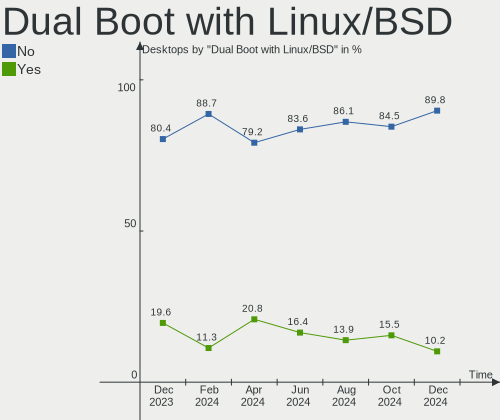
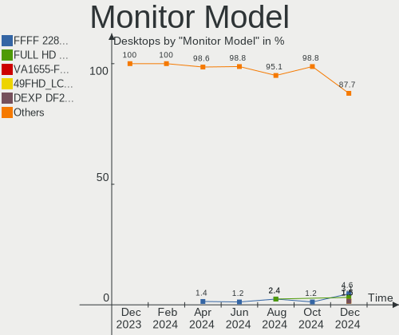
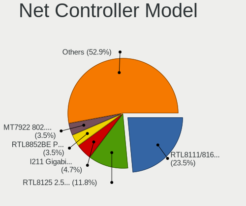
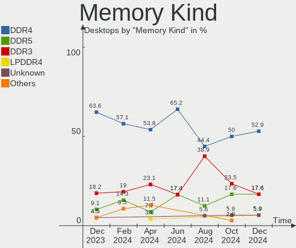

Kubuntu Hardware Trends (Desktop)
---------------------------------

A project to identify most popular hardware characteristics and track their change
over time based on data collected by Kubuntu users at https://Linux-Hardware.org.

Anyone can contribute to the study by uploading probes of their computers by
the [hw-probe](https://github.com/linuxhw/hw-probe) tool:

    sudo -E hw-probe -all -upload

Full-feature report is available here: https://linux-hardware.org/?view=trends&formfactor=desktop

Period: Jun, 2021.

Contents
--------

- [ OS                       ](#os)
- [ OS Family                ](#os-family)
- [ Kernel                   ](#kernel)
- [ Kernel Family            ](#kernel-family)
- [ Kernel Major Ver.        ](#kernel-major-ver)
- [ Arch                     ](#arch)
- [ DE                       ](#de)
- [ Display Server           ](#display-server)
- [ Display Manager          ](#display-manager)
- [ OS Lang                  ](#os-lang)
- [ Boot Mode                ](#boot-mode)
- [ Filesystem               ](#filesystem)
- [ Part. scheme             ](#part-scheme)
- [ Dual Boot with Linux/BSD ](#dual-boot-with-linux/bsd)
- [ Dual Boot (Win)          ](#dual-boot-win)
- [ Country                  ](#country)
- [ City                     ](#city)
- [ Vendor                   ](#vendor)
- [ Model                    ](#model)
- [ Model Family             ](#model-family)
- [ MFG Year                 ](#mfg-year)
- [ Form Factor              ](#form-factor)
- [ Secure Boot              ](#secure-boot)
- [ Coreboot                 ](#coreboot)
- [ RAM Size                 ](#ram-size)
- [ RAM Used                 ](#ram-used)
- [ Has CD-ROM               ](#has-cd-rom)
- [ Total Drives             ](#total-drives)
- [ Has Ethernet             ](#has-ethernet)
- [ Has WiFi                 ](#has-wifi)
- [ Has Bluetooth            ](#has-bluetooth)
- [ Drive Vendor             ](#drive-vendor)
- [ Drive Model              ](#drive-model)
- [ HDD Vendor               ](#hdd-vendor)
- [ SSD Vendor               ](#ssd-vendor)
- [ Drive Kind               ](#drive-kind)
- [ Drive Connector          ](#drive-connector)
- [ Drive Size               ](#drive-size)
- [ Space Total              ](#space-total)
- [ Space Used               ](#space-used)
- [ Malfunc. Drives          ](#malfunc-drives)
- [ Malfunc. Drive Vendor    ](#malfunc-drive-vendor)
- [ Malfunc. HDD Vendor      ](#malfunc-hdd-vendor)
- [ Malfunc. Drive Kind      ](#malfunc-drive-kind)
- [ Failed Drives            ](#failed-drives)
- [ Failed Drive Vendor      ](#failed-drive-vendor)
- [ Drive Status             ](#drive-status)
- [ Storage Vendor           ](#storage-vendor)
- [ Storage Model            ](#storage-model)
- [ Storage Kind             ](#storage-kind)
- [ CPU Vendor               ](#cpu-vendor)
- [ CPU Model                ](#cpu-model)
- [ CPU Model Family         ](#cpu-model-family)
- [ CPU Cores                ](#cpu-cores)
- [ CPU Sockets              ](#cpu-sockets)
- [ CPU Threads              ](#cpu-threads)
- [ CPU Op-Modes             ](#cpu-op-modes)
- [ CPU Microcode            ](#cpu-microcode)
- [ CPU Microarch            ](#cpu-microarch)
- [ GPU Vendor               ](#gpu-vendor)
- [ GPU Model                ](#gpu-model)
- [ GPU Combo                ](#gpu-combo)
- [ GPU Driver               ](#gpu-driver)
- [ GPU Memory               ](#gpu-memory)
- [ Monitor Vendor           ](#monitor-vendor)
- [ Monitor Model            ](#monitor-model)
- [ Monitor Resolution       ](#monitor-resolution)
- [ Monitor Diagonal         ](#monitor-diagonal)
- [ Monitor Width            ](#monitor-width)
- [ Aspect Ratio             ](#aspect-ratio)
- [ Monitor Area             ](#monitor-area)
- [ Pixel Density            ](#pixel-density)
- [ Multiple Monitors        ](#multiple-monitors)
- [ Net Controller Vendor    ](#net-controller-vendor)
- [ Net Controller Model     ](#net-controller-model)
- [ Wireless Vendor          ](#wireless-vendor)
- [ Wireless Model           ](#wireless-model)
- [ Ethernet Vendor          ](#ethernet-vendor)
- [ Ethernet Model           ](#ethernet-model)
- [ Net Controller Kind      ](#net-controller-kind)
- [ Used Controller          ](#used-controller)
- [ NICs                     ](#nics)
- [ IPv6                     ](#ipv6)
- [ Memory Vendor            ](#memory-vendor)
- [ Memory Model             ](#memory-model)
- [ Memory Kind              ](#memory-kind)
- [ Memory Form Factor       ](#memory-form-factor)
- [ Memory Size              ](#memory-size)
- [ Memory Speed             ](#memory-speed)
- [ Sound Vendor             ](#sound-vendor)
- [ Sound Model              ](#sound-model)
- [ Camera Vendor            ](#camera-vendor)
- [ Camera Model             ](#camera-model)
- [ Fingerprint Vendor       ](#fingerprint-vendor)
- [ Fingerprint Model        ](#fingerprint-model)
- [ Chipcard Vendor          ](#chipcard-vendor)
- [ Chipcard Model           ](#chipcard-model)
- [ Printer Vendor           ](#printer-vendor)
- [ Printer Model            ](#printer-model)
- [ Scanner Vendor           ](#scanner-vendor)
- [ Scanner Model            ](#scanner-model)
- [ Bluetooth Vendor         ](#bluetooth-vendor)
- [ Bluetooth Model          ](#bluetooth-model)
- [ Unsupported Devices      ](#unsupported-devices)
- [ Unsupported Device Types ](#unsupported-device-types)

OS
--

Installed operating systems

| Name          | Desktops | Percent |
|---------------|----------|---------|
| Kubuntu 20.04 | 23       | 63.89%  |
| Kubuntu 21.04 | 10       | 27.78%  |
| Kubuntu 20.10 | 2        | 5.56%   |
| Kubuntu 18.04 | 1        | 2.78%   |

OS Family
---------

OS without a version

| Name    | Desktops | Percent |
|---------|----------|---------|
| Kubuntu | 36       | 100%    |

Kernel
------

Version of the Linux kernel

| Version               | Desktops | Percent |
|-----------------------|----------|---------|
| 5.8.0-55-generic      | 7        | 19.44%  |
| 5.4.0-74-generic      | 7        | 19.44%  |
| 5.11.0-18-generic     | 5        | 13.89%  |
| 5.8.0-53-generic      | 2        | 5.56%   |
| 5.11.0-22-generic     | 2        | 5.56%   |
| 5.11.0-18-lowlatency  | 2        | 5.56%   |
| 5.8.0-56-generic      | 1        | 2.78%   |
| 5.8.0-48-generic      | 1        | 2.78%   |
| 5.8.0-25-generic      | 1        | 2.78%   |
| 5.4.0-78-generic      | 1        | 2.78%   |
| 5.4.0-75-generic      | 1        | 2.78%   |
| 5.4.0-74-lowlatency   | 1        | 2.78%   |
| 5.4.0-73-generic      | 1        | 2.78%   |
| 5.12.9-xanmod1        | 1        | 2.78%   |
| 5.12.7-051207-generic | 1        | 2.78%   |
| 5.11.0-20-lowlatency  | 1        | 2.78%   |
| 4.15.0-143-generic    | 1        | 2.78%   |

Kernel Family
-------------

Linux kernel without a distro release

| Version | Desktops | Percent |
|---------|----------|---------|
| 5.8.0   | 12       | 33.33%  |
| 5.4.0   | 11       | 30.56%  |
| 5.11.0  | 10       | 27.78%  |
| 5.12.9  | 1        | 2.78%   |
| 5.12.7  | 1        | 2.78%   |
| 4.15.0  | 1        | 2.78%   |

Kernel Major Ver.
-----------------

Linux kernel major version

| Version | Desktops | Percent |
|---------|----------|---------|
| 5.8     | 12       | 33.33%  |
| 5.4     | 11       | 30.56%  |
| 5.11    | 10       | 27.78%  |
| 5.12    | 2        | 5.56%   |
| 4.15    | 1        | 2.78%   |

Arch
----

OS architecture (x86_64, i586, etc.)

| Name   | Desktops | Percent |
|--------|----------|---------|
| x86_64 | 36       | 100%    |

DE
--

Desktop Environment

| Name  | Desktops | Percent |
|-------|----------|---------|
| KDE   | 21       | 58.33%  |
| KDE5  | 14       | 38.89%  |
| GNOME | 1        | 2.78%   |

Display Server
--------------

X11 or Wayland

| Name | Desktops | Percent |
|------|----------|---------|
| X11  | 36       | 100%    |

Display Manager
---------------

SDDM, LightDM, etc.

| Name    | Desktops | Percent |
|---------|----------|---------|
| Unknown | 21       | 58.33%  |
| SDDM    | 13       | 36.11%  |
| TDM     | 1        | 2.78%   |
| GDM     | 1        | 2.78%   |

OS Lang
-------

Language

| Lang  | Desktops | Percent |
|-------|----------|---------|
| en_US | 16       | 44.44%  |
| en_AU | 4        | 11.11%  |
| pt_BR | 2        | 5.56%   |
| it_IT | 2        | 5.56%   |
| en_GB | 2        | 5.56%   |
| de_DE | 2        | 5.56%   |
| zh_TW | 1        | 2.78%   |
| sk_SK | 1        | 2.78%   |
| ru_RU | 1        | 2.78%   |
| pl_PL | 1        | 2.78%   |
| fr_FR | 1        | 2.78%   |
| es_VE | 1        | 2.78%   |
| en_CA | 1        | 2.78%   |
| ca_ES | 1        | 2.78%   |

Boot Mode
---------

EFI or BIOS

| Mode | Desktops | Percent |
|------|----------|---------|
| BIOS | 18       | 50%     |
| EFI  | 18       | 50%     |

Filesystem
----------

Type of filesystem

| Type  | Desktops | Percent |
|-------|----------|---------|
| Ext4  | 34       | 94.44%  |
| Zfs   | 1        | 2.78%   |
| Btrfs | 1        | 2.78%   |

Part. scheme
------------

Scheme of partitioning

| Type    | Desktops | Percent |
|---------|----------|---------|
| Unknown | 21       | 58.33%  |
| GPT     | 11       | 30.56%  |
| MBR     | 4        | 11.11%  |

Dual Boot with Linux/BSD
------------------------

Hosting more than one Linux/BSD

| Dual boot | Desktops | Percent |
|-----------|----------|---------|
| No        | 31       | 86.11%  |
| Yes       | 5        | 13.89%  |

Dual Boot (Win)
---------------

Hosting Linux and Windows

| Dual boot | Desktops | Percent |
|-----------|----------|---------|
| No        | 24       | 66.67%  |
| Yes       | 12       | 33.33%  |

Country
-------

Geographic location (country)

| Country   | Desktops | Percent |
|-----------|----------|---------|
| USA       | 8        | 22.22%  |
| Germany   | 5        | 13.89%  |
| Australia | 4        | 11.11%  |
| Russia    | 3        | 8.33%   |
| UK        | 2        | 5.56%   |
| Spain     | 2        | 5.56%   |
| Italy     | 2        | 5.56%   |
| Brazil    | 2        | 5.56%   |
| Venezuela | 1        | 2.78%   |
| Taiwan    | 1        | 2.78%   |
| Sweden    | 1        | 2.78%   |
| Slovakia  | 1        | 2.78%   |
| Greece    | 1        | 2.78%   |
| France    | 1        | 2.78%   |
| Canada    | 1        | 2.78%   |
| Argentina | 1        | 2.78%   |

City
----

Geographic location (city)

| City                | Desktops | Percent |
|---------------------|----------|---------|
| Moscow              | 2        | 5.56%   |
| Berlin              | 2        | 5.56%   |
| West Chicago        | 1        | 2.78%   |
| Waseca              | 1        | 2.78%   |
| Warren              | 1        | 2.78%   |
| Toronto             | 1        | 2.78%   |
| Thessaloniki        | 1        | 2.78%   |
| Taichung            | 1        | 2.78%   |
| Strongsville        | 1        | 2.78%   |
| Rosario             | 1        | 2.78%   |
| Plano               | 1        | 2.78%   |
| Nitra               | 1        | 2.78%   |
| Munich              | 1        | 2.78%   |
| Moskovskiy          | 1        | 2.78%   |
| Melbourne           | 1        | 2.78%   |
| Maracai             | 1        | 2.78%   |
| Madison             | 1        | 2.78%   |
| London              | 1        | 2.78%   |
| Lepe                | 1        | 2.78%   |
| Karlsruhe           | 1        | 2.78%   |
| Gothenburg          | 1        | 2.78%   |
| Fornaci di Barga    | 1        | 2.78%   |
| Finsterwalde        | 1        | 2.78%   |
| Derby               | 1        | 2.78%   |
| Créteil            | 1        | 2.78%   |
| Chicago             | 1        | 2.78%   |
| Casalecchio di Reno | 1        | 2.78%   |
| Caroline Springs    | 1        | 2.78%   |
| Brisbane            | 1        | 2.78%   |
| Barra Mansa         | 1        | 2.78%   |
| Barinas             | 1        | 2.78%   |
| Bangalow            | 1        | 2.78%   |
| Badalona            | 1        | 2.78%   |
| Albuquerque         | 1        | 2.78%   |

Vendor
------

Motherboard manufacturer

| Name                | Desktops | Percent |
|---------------------|----------|---------|
| MSI                 | 7        | 19.44%  |
| ASUSTek Computer    | 6        | 16.67%  |
| ASRock              | 6        | 16.67%  |
| Gigabyte Technology | 5        | 13.89%  |
| Hewlett-Packard     | 4        | 11.11%  |
| Intel               | 2        | 5.56%   |
| Dell                | 2        | 5.56%   |
| Biostar             | 2        | 5.56%   |
| Lenovo              | 1        | 2.78%   |
| Fujitsu             | 1        | 2.78%   |

Model
-----

Motherboard model

| Name                            | Desktops | Percent |
|---------------------------------|----------|---------|
| MSI Vig644M                     | 1        | 2.78%   |
| MSI MS-7D18                     | 1        | 2.78%   |
| MSI MS-7C94                     | 1        | 2.78%   |
| MSI MS-7C37                     | 1        | 2.78%   |
| MSI MS-7A32                     | 1        | 2.78%   |
| MSI MS-7758                     | 1        | 2.78%   |
| MSI MS-7693                     | 1        | 2.78%   |
| Lenovo ThinkCentre M75e 5042A6U | 1        | 2.78%   |
| Intel X99                       | 1        | 2.78%   |
| Intel H55                       | 1        | 2.78%   |
| HP ProDesk 400 G1 MT            | 1        | 2.78%   |
| HP Pavilion Desktop PC 570-p0xx | 1        | 2.78%   |
| HP Compaq 8200 Elite SFF PC     | 1        | 2.78%   |
| HP Compaq 8100 Elite CMT PC     | 1        | 2.78%   |
| Gigabyte P67A-UD4               | 1        | 2.78%   |
| Gigabyte H81M-H                 | 1        | 2.78%   |
| Gigabyte GA-78LMT-USB3          | 1        | 2.78%   |
| Gigabyte F2A78M-DS2             | 1        | 2.78%   |
| Gigabyte B150M-D3H              | 1        | 2.78%   |
| Fujitsu B-201-CFL               | 1        | 2.78%   |
| Dell OptiPlex 9020              | 1        | 2.78%   |
| Dell OptiPlex 790               | 1        | 2.78%   |
| Biostar TB250-BTC               | 1        | 2.78%   |
| Biostar TA790GXB A2+            | 1        | 2.78%   |
| ASUS TUF GAMING X570-PLUS       | 1        | 2.78%   |
| ASUS PRIME X470-PRO             | 1        | 2.78%   |
| ASUS PRIME A320M-K              | 1        | 2.78%   |
| ASUS P8Z77-V LX                 | 1        | 2.78%   |
| ASUS P5Q PRO TURBO              | 1        | 2.78%   |
| ASUS All Series                 | 1        | 2.78%   |
| ASRock Z390 Taichi Ultimate     | 1        | 2.78%   |
| ASRock Z170 Extreme7+           | 1        | 2.78%   |
| ASRock H61M-VS                  | 1        | 2.78%   |
| ASRock B460 Phantom Gaming 4    | 1        | 2.78%   |
| ASRock B360M IB-R1              | 1        | 2.78%   |
| ASRock AB350 Pro4               | 1        | 2.78%   |

Model Family
------------

Motherboard model prefix

| Name                   | Desktops | Percent |
|------------------------|----------|---------|
| HP Compaq              | 2        | 5.56%   |
| Dell OptiPlex          | 2        | 5.56%   |
| ASUS PRIME             | 2        | 5.56%   |
| MSI Vig644M            | 1        | 2.78%   |
| MSI MS-7D18            | 1        | 2.78%   |
| MSI MS-7C94            | 1        | 2.78%   |
| MSI MS-7C37            | 1        | 2.78%   |
| MSI MS-7A32            | 1        | 2.78%   |
| MSI MS-7758            | 1        | 2.78%   |
| MSI MS-7693            | 1        | 2.78%   |
| Lenovo ThinkCentre     | 1        | 2.78%   |
| Intel X99              | 1        | 2.78%   |
| Intel H55              | 1        | 2.78%   |
| HP ProDesk             | 1        | 2.78%   |
| HP Pavilion            | 1        | 2.78%   |
| Gigabyte P67A-UD4      | 1        | 2.78%   |
| Gigabyte H81M-H        | 1        | 2.78%   |
| Gigabyte GA-78LMT-USB3 | 1        | 2.78%   |
| Gigabyte F2A78M-DS2    | 1        | 2.78%   |
| Gigabyte B150M-D3H     | 1        | 2.78%   |
| Fujitsu B-201-CFL      | 1        | 2.78%   |
| Biostar TB250-BTC      | 1        | 2.78%   |
| Biostar TA790GXB       | 1        | 2.78%   |
| ASUS TUF               | 1        | 2.78%   |
| ASUS P8Z77-V           | 1        | 2.78%   |
| ASUS P5Q               | 1        | 2.78%   |
| ASUS All               | 1        | 2.78%   |
| ASRock Z390            | 1        | 2.78%   |
| ASRock Z170            | 1        | 2.78%   |
| ASRock H61M-VS         | 1        | 2.78%   |
| ASRock B460            | 1        | 2.78%   |
| ASRock B360M           | 1        | 2.78%   |
| ASRock AB350           | 1        | 2.78%   |

MFG Year
--------

Motherboard manufacture year

| Year | Desktops | Percent |
|------|----------|---------|
| 2020 | 7        | 19.44%  |
| 2019 | 7        | 19.44%  |
| 2014 | 4        | 11.11%  |
| 2018 | 3        | 8.33%   |
| 2013 | 3        | 8.33%   |
| 2011 | 3        | 8.33%   |
| 2015 | 2        | 5.56%   |
| 2012 | 2        | 5.56%   |
| 2010 | 2        | 5.56%   |
| 2021 | 1        | 2.78%   |
| 2017 | 1        | 2.78%   |
| 2009 | 1        | 2.78%   |

Form Factor
-----------

Physical design of the computer

| Name    | Desktops | Percent |
|---------|----------|---------|
| Desktop | 36       | 100%    |

Secure Boot
-----------

Enabled or disabled

| State    | Desktops | Percent |
|----------|----------|---------|
| Disabled | 36       | 100%    |

Coreboot
--------

Have coreboot on board

| Used | Desktops | Percent |
|------|----------|---------|
| No   | 36       | 100%    |

RAM Size
--------

Total RAM memory

| Size in GB  | Desktops | Percent |
|-------------|----------|---------|
| 16.01-24.0  | 14       | 38.89%  |
| 32.01-64.0  | 9        | 25%     |
| 8.01-16.0   | 4        | 11.11%  |
| 4.01-8.0    | 3        | 8.33%   |
| 3.01-4.0    | 3        | 8.33%   |
| 64.01-256.0 | 2        | 5.56%   |
| 24.01-32.0  | 1        | 2.78%   |

RAM Used
--------

Used RAM memory

| Used GB    | Desktops | Percent |
|------------|----------|---------|
| 4.01-8.0   | 11       | 30.56%  |
| 3.01-4.0   | 7        | 19.44%  |
| 1.01-2.0   | 6        | 16.67%  |
| 2.01-3.0   | 4        | 11.11%  |
| 8.01-16.0  | 4        | 11.11%  |
| 16.01-24.0 | 2        | 5.56%   |
| 0.51-1.0   | 2        | 5.56%   |

Has CD-ROM
----------

Has CD-ROM on board

| Presented | Desktops | Percent |
|-----------|----------|---------|
| Yes       | 19       | 52.78%  |
| No        | 17       | 47.22%  |

Total Drives
------------

Number of drives on board

| Drives | Desktops | Percent |
|--------|----------|---------|
| 1      | 13       | 36.11%  |
| 3      | 8        | 22.22%  |
| 2      | 7        | 19.44%  |
| 4      | 3        | 8.33%   |
| 7      | 2        | 5.56%   |
| 5      | 2        | 5.56%   |
| 6      | 1        | 2.78%   |

Has Ethernet
------------

Has Ethernet on board

| Presented | Desktops | Percent |
|-----------|----------|---------|
| Yes       | 36       | 100%    |

Has WiFi
--------

Has WiFi module

| Presented | Desktops | Percent |
|-----------|----------|---------|
| No        | 23       | 63.89%  |
| Yes       | 13       | 36.11%  |

Has Bluetooth
-------------

Has Bluetooth module

| Presented | Desktops | Percent |
|-----------|----------|---------|
| No        | 20       | 55.56%  |
| Yes       | 16       | 44.44%  |

Drive Vendor
------------

Hard drive vendors

| Vendor                    | Desktops | Drives | Percent |
|---------------------------|----------|--------|---------|
| Seagate                   | 16       | 25     | 23.88%  |
| Samsung Electronics       | 13       | 19     | 19.4%   |
| WDC                       | 11       | 20     | 16.42%  |
| SanDisk                   | 4        | 5      | 5.97%   |
| Kingston                  | 3        | 3      | 4.48%   |
| Transcend                 | 2        | 2      | 2.99%   |
| OCZ                       | 2        | 2      | 2.99%   |
| Micron/Crucial Technology | 2        | 2      | 2.99%   |
| Intel                     | 2        | 2      | 2.99%   |
| Hitachi                   | 2        | 3      | 2.99%   |
| VENO                      | 1        | 1      | 1.49%   |
| Unknown                   | 1        | 1      | 1.49%   |
| Toshiba                   | 1        | 1      | 1.49%   |
| PNY USB                   | 1        | 1      | 1.49%   |
| Phison                    | 1        | 1      | 1.49%   |
| Patriot                   | 1        | 1      | 1.49%   |
| Netac                     | 1        | 1      | 1.49%   |
| Maxtor                    | 1        | 1      | 1.49%   |
| Hewlett-Packard           | 1        | 1      | 1.49%   |
| Crucial                   | 1        | 1      | 1.49%   |

Drive Model
-----------

Hard drive models

| Model                                       | Desktops | Percent |
|---------------------------------------------|----------|---------|
| Samsung NVMe SSD Drive 500GB                | 3        | 3.49%   |
| Samsung NVMe SSD Drive 1TB                  | 3        | 3.49%   |
| WDC WD1003FZEX-00MK2A0 1TB                  | 2        | 2.33%   |
| WDC WD1003FZEX-00K3CA0 1TB                  | 2        | 2.33%   |
| Seagate ST2000DM001-1CH164 2TB              | 2        | 2.33%   |
| Seagate ST2000DL003-9VT166 2TB              | 2        | 2.33%   |
| Seagate Expansion Desk 2TB                  | 2        | 2.33%   |
| WDC WDS120G1G0A-00SS50 120GB SSD            | 1        | 1.16%   |
| WDC WDS100T2B0B-00YS70 1TB SSD              | 1        | 1.16%   |
| WDC WD5001FZWX-00ZHUA0 5TB                  | 1        | 1.16%   |
| WDC WD5000AAKS-00V1A0 500GB                 | 1        | 1.16%   |
| WDC WD5000AAKS-00A7B2 500GB                 | 1        | 1.16%   |
| WDC WD40EZRZ-00WN9B0 4TB                    | 1        | 1.16%   |
| WDC WD2500KS-00MJB0 250GB                   | 1        | 1.16%   |
| WDC WD2500JS-00NCB1 250GB                   | 1        | 1.16%   |
| WDC WD20EZRZ-00Z5HB0 2TB                    | 1        | 1.16%   |
| WDC WD20EFRX-68EUZN0 2TB                    | 1        | 1.16%   |
| WDC WD2003FZEX-00Z4SA0 2TB                  | 1        | 1.16%   |
| WDC WD15EADS-00P8B0 1TB                     | 1        | 1.16%   |
| WDC WD10SPCX-60KHST0 1TB                    | 1        | 1.16%   |
| WDC WD10EZEX-60WN4A0 1TB                    | 1        | 1.16%   |
| WDC WD10EZEX-60M2NA0 1TB                    | 1        | 1.16%   |
| WDC WD10EADS-00M2B0 1TB                     | 1        | 1.16%   |
| VENO SCORP SSD 240GB                        | 1        | 1.16%   |
| Unknown SD/MMC/MS PRO 128GB                 | 1        | 1.16%   |
| Transcend TS480GSSD220S 480GB               | 1        | 1.16%   |
| Transcend TS256GSSD230S 256GB               | 1        | 1.16%   |
| Toshiba DT01ACA050 500GB                    | 1        | 1.16%   |
| Seagate ST5000DM000-1FK178 5TB              | 1        | 1.16%   |
| Seagate ST4000DM005-2DP166 4TB              | 1        | 1.16%   |
| Seagate ST4000DM004-2CV104 4TB              | 1        | 1.16%   |
| Seagate ST3250823AS 250GB                   | 1        | 1.16%   |
| Seagate ST3250410AS 250GB                   | 1        | 1.16%   |
| Seagate ST31000340NS 1TB                    | 1        | 1.16%   |
| Seagate ST3000DM001-9YN166 3TB              | 1        | 1.16%   |
| Seagate ST3000DM001-1ER166 3TB              | 1        | 1.16%   |
| Seagate ST250DM000-1BD141 250GB             | 1        | 1.16%   |
| Seagate ST2000NE001-2M5101 2TB              | 1        | 1.16%   |
| Seagate ST1000DM003-9YN162 1TB              | 1        | 1.16%   |
| Seagate ST1000DM003-1ER162 1TB              | 1        | 1.16%   |
| Seagate M3 Portable 4TB                     | 1        | 1.16%   |
| Seagate Expansion 1TB                       | 1        | 1.16%   |
| Seagate BarraCuda 120 SSD ZA2000CM10003 2TB | 1        | 1.16%   |
| SanDisk Ultra II 960GB SSD                  | 1        | 1.16%   |
| SanDisk SSD PLUS 480GB                      | 1        | 1.16%   |
| SanDisk SSD PLUS 1000GB                     | 1        | 1.16%   |
| SanDisk SDSSDH3 1T02 1024GB                 | 1        | 1.16%   |
| SanDisk Extreme Pro 500GB                   | 1        | 1.16%   |
| Samsung SSD 980 500GB                       | 1        | 1.16%   |
| Samsung SSD 870 EVO 1TB                     | 1        | 1.16%   |
| Samsung SSD 860 QVO 2TB                     | 1        | 1.16%   |
| Samsung SSD 860 PRO 512GB                   | 1        | 1.16%   |
| Samsung SSD 850 EVO 250GB                   | 1        | 1.16%   |
| Samsung SSD 840 EVO 500GB                   | 1        | 1.16%   |
| Samsung SSD 750 EVO 500GB                   | 1        | 1.16%   |
| Samsung NVMe SSD Drive 512GB                | 1        | 1.16%   |
| Samsung HD502HJ 500GB                       | 1        | 1.16%   |
| Samsung HD161GJ 160GB                       | 1        | 1.16%   |
| PNY USB 3.0 to SATA 500GB SSD               | 1        | 1.16%   |
| Phison Viper M.2 VP4100 1TB                 | 1        | 1.16%   |

HDD Vendor
----------

Hard disk drive vendors

| Vendor              | Desktops | Drives | Percent |
|---------------------|----------|--------|---------|
| Seagate             | 16       | 22     | 48.48%  |
| WDC                 | 10       | 18     | 30.3%   |
| Samsung Electronics | 2        | 2      | 6.06%   |
| Hitachi             | 2        | 3      | 6.06%   |
| Toshiba             | 1        | 1      | 3.03%   |
| Maxtor              | 1        | 1      | 3.03%   |
| Hewlett-Packard     | 1        | 1      | 3.03%   |

SSD Vendor
----------

Solid state drive vendors

| Vendor              | Desktops | Drives | Percent |
|---------------------|----------|--------|---------|
| Samsung Electronics | 6        | 8      | 23.08%  |
| SanDisk             | 4        | 4      | 15.38%  |
| WDC                 | 2        | 2      | 7.69%   |
| Transcend           | 2        | 2      | 7.69%   |
| OCZ                 | 2        | 2      | 7.69%   |
| Kingston            | 2        | 2      | 7.69%   |
| Intel               | 2        | 2      | 7.69%   |
| VENO                | 1        | 1      | 3.85%   |
| Seagate             | 1        | 1      | 3.85%   |
| PNY USB             | 1        | 1      | 3.85%   |
| Patriot             | 1        | 1      | 3.85%   |
| Netac               | 1        | 1      | 3.85%   |
| Crucial             | 1        | 1      | 3.85%   |

Drive Kind
----------

HDD or SSD

| Kind    | Desktops | Drives | Percent |
|---------|----------|--------|---------|
| HDD     | 24       | 48     | 42.11%  |
| SSD     | 20       | 28     | 35.09%  |
| NVMe    | 11       | 14     | 19.3%   |
| Unknown | 2        | 3      | 3.51%   |

Drive Connector
---------------

SATA, SAS, NVMe, etc.

| Type | Desktops | Drives | Percent |
|------|----------|--------|---------|
| SATA | 32       | 72     | 65.31%  |
| NVMe | 11       | 14     | 22.45%  |
| SAS  | 6        | 7      | 12.24%  |

Drive Size
----------

Size of hard drive

| Size in TB | Desktops | Drives | Percent |
|------------|----------|--------|---------|
| 0.01-0.5   | 18       | 29     | 34.62%  |
| 0.51-1.0   | 15       | 21     | 28.85%  |
| 1.01-2.0   | 12       | 18     | 23.08%  |
| 3.01-4.0   | 3        | 3      | 5.77%   |
| 2.01-3.0   | 2        | 3      | 3.85%   |
| 4.01-10.0  | 2        | 2      | 3.85%   |

Space Total
-----------

Amount of disk space available on the file system

| Size in GB     | Desktops | Percent |
|----------------|----------|---------|
| 251-500        | 10       | 27.78%  |
| 1001-2000      | 7        | 19.44%  |
| More than 3000 | 6        | 16.67%  |
| 101-250        | 6        | 16.67%  |
| 2001-3000      | 3        | 8.33%   |
| 501-1000       | 2        | 5.56%   |
| 51-100         | 2        | 5.56%   |

Space Used
----------

Amount of used disk space

| Used GB        | Desktops | Percent |
|----------------|----------|---------|
| 51-100         | 9        | 25%     |
| 1-20           | 6        | 16.67%  |
| 101-250        | 4        | 11.11%  |
| 1001-2000      | 4        | 11.11%  |
| More than 3000 | 3        | 8.33%   |
| 251-500        | 3        | 8.33%   |
| 2001-3000      | 3        | 8.33%   |
| 501-1000       | 3        | 8.33%   |
| 21-50          | 1        | 2.78%   |

Malfunc. Drives
---------------

Drive models with a malfunction

| Model                          | Desktops | Drives | Percent |
|--------------------------------|----------|--------|---------|
| WDC WD5000AAKS-00V1A0 500GB    | 1        | 1      | 14.29%  |
| WDC WD10EZEX-60M2NA0 1TB       | 1        | 1      | 14.29%  |
| Seagate ST3250410AS 250GB      | 1        | 1      | 14.29%  |
| Seagate ST1000DM003-9YN162 1TB | 1        | 1      | 14.29%  |
| OCZ AGILITY3 120GB SSD         | 1        | 1      | 14.29%  |
| Intel SSDSCKKW240H6 240GB      | 1        | 1      | 14.29%  |
| Hitachi HDS721010CLA332 1TB    | 1        | 1      | 14.29%  |

Malfunc. Drive Vendor
---------------------

Vendors of faulty drives

| Vendor  | Desktops | Drives | Percent |
|---------|----------|--------|---------|
| WDC     | 2        | 2      | 28.57%  |
| Seagate | 2        | 2      | 28.57%  |
| OCZ     | 1        | 1      | 14.29%  |
| Intel   | 1        | 1      | 14.29%  |
| Hitachi | 1        | 1      | 14.29%  |

Malfunc. HDD Vendor
-------------------

Vendors of faulty HDD drives

| Vendor  | Desktops | Drives | Percent |
|---------|----------|--------|---------|
| WDC     | 2        | 2      | 40%     |
| Seagate | 2        | 2      | 40%     |
| Hitachi | 1        | 1      | 20%     |

Malfunc. Drive Kind
-------------------

Kinds of faulty drives

| Kind | Desktops | Drives | Percent |
|------|----------|--------|---------|
| HDD  | 4        | 5      | 80%     |
| SSD  | 1        | 2      | 20%     |

Failed Drives
-------------

Failed drive models

Zero info for selected period =(

Failed Drive Vendor
-------------------

Failed drive vendors

Zero info for selected period =(

Drive Status
------------

Number of failed and malfunc. drives

| Status   | Desktops | Drives | Percent |
|----------|----------|--------|---------|
| Detected | 24       | 57     | 54.55%  |
| Works    | 15       | 29     | 34.09%  |
| Malfunc  | 5        | 7      | 11.36%  |

Storage Vendor
--------------

Storage controller vendors

| Vendor                      | Desktops | Percent |
|-----------------------------|----------|---------|
| Intel                       | 22       | 42.31%  |
| AMD                         | 13       | 25%     |
| Samsung Electronics         | 6        | 11.54%  |
| ASMedia Technology          | 4        | 7.69%   |
| Micron/Crucial Technology   | 2        | 3.85%   |
| Sandisk                     | 1        | 1.92%   |
| Phison Electronics          | 1        | 1.92%   |
| Marvell Technology Group    | 1        | 1.92%   |
| Kingston Technology Company | 1        | 1.92%   |
| JMicron Technology          | 1        | 1.92%   |

Storage Model
-------------

Storage controller models

| Model                                                                                   | Desktops | Percent |
|-----------------------------------------------------------------------------------------|----------|---------|
| AMD FCH SATA Controller [AHCI mode]                                                     | 8        | 12.9%   |
| Intel 6 Series/C200 Series Chipset Family 6 port Desktop SATA AHCI Controller           | 4        | 6.45%   |
| ASMedia ASM1062 Serial ATA Controller                                                   | 4        | 6.45%   |
| Samsung NVMe SSD Controller SM981/PM981/PM983                                           | 3        | 4.84%   |
| Intel Cannon Lake PCH SATA AHCI Controller                                              | 3        | 4.84%   |
| Intel 8 Series/C220 Series Chipset Family 6-port SATA Controller 1 [AHCI mode]          | 3        | 4.84%   |
| AMD SB7x0/SB8x0/SB9x0 SATA Controller [IDE mode]                                        | 3        | 4.84%   |
| Samsung NVMe SSD Controller SM961/PM961/SM963                                           | 2        | 3.23%   |
| Intel SATA Controller [RAID mode]                                                       | 2        | 3.23%   |
| Intel Q170/Q150/B150/H170/H110/Z170/CM236 Chipset SATA Controller [AHCI Mode]           | 2        | 3.23%   |
| Intel 5 Series/3400 Series Chipset 6 port SATA AHCI Controller                          | 2        | 3.23%   |
| AMD SB7x0/SB8x0/SB9x0 IDE Controller                                                    | 2        | 3.23%   |
| AMD 300 Series Chipset SATA Controller                                                  | 2        | 3.23%   |
| Sandisk WD Black 2018/SN750 / PC SN720 NVMe SSD                                         | 1        | 1.61%   |
| Samsung NVMe Controller                                                                 | 1        | 1.61%   |
| Phison E16 PCIe4 NVMe Controller                                                        | 1        | 1.61%   |
| Micron/Crucial NVMe Controller                                                          | 1        | 1.61%   |
| Micron/Crucial Non-Volatile memory controller                                           | 1        | 1.61%   |
| Marvell Group 88SE9128 PCIe SATA 6 Gb/s RAID controller                                 | 1        | 1.61%   |
| Kingston Company A2000 NVMe SSD                                                         | 1        | 1.61%   |
| JMicron JMB361 AHCI/IDE                                                                 | 1        | 1.61%   |
| Intel 82801JI (ICH10 Family) 4 port SATA IDE Controller #1                              | 1        | 1.61%   |
| Intel 82801JI (ICH10 Family) 2 port SATA IDE Controller #2                              | 1        | 1.61%   |
| Intel 7 Series/C210 Series Chipset Family 6-port SATA Controller [AHCI mode]            | 1        | 1.61%   |
| Intel 6 Series/C200 Series Chipset Family Desktop SATA Controller (IDE mode, ports 4-5) | 1        | 1.61%   |
| Intel 6 Series/C200 Series Chipset Family Desktop SATA Controller (IDE mode, ports 0-3) | 1        | 1.61%   |
| Intel 500 Series Chipset Family SATA AHCI Controller                                    | 1        | 1.61%   |
| Intel 400 Series Chipset Family SATA AHCI Controller                                    | 1        | 1.61%   |
| Intel 200 Series PCH SATA controller [AHCI mode]                                        | 1        | 1.61%   |
| AMD X370 Series Chipset SATA Controller                                                 | 1        | 1.61%   |
| AMD Starship/Matisse Chipset SATA Controller [AHCI mode]                                | 1        | 1.61%   |
| AMD SB7x0/SB8x0/SB9x0 SATA Controller [AHCI mode]                                       | 1        | 1.61%   |
| AMD FCH SATA Controller D                                                               | 1        | 1.61%   |
| AMD FCH IDE Controller                                                                  | 1        | 1.61%   |
| AMD 400 Series Chipset SATA Controller                                                  | 1        | 1.61%   |

Storage Kind
------------

Kind of storage controller (IDE, SATA, NVMe, SAS, ...)

| Kind | Desktops | Percent |
|------|----------|---------|
| SATA | 31       | 63.27%  |
| NVMe | 11       | 22.45%  |
| IDE  | 5        | 10.2%   |
| RAID | 2        | 4.08%   |

CPU Vendor
----------

Processor vendors

| Vendor | Desktops | Percent |
|--------|----------|---------|
| Intel  | 23       | 63.89%  |
| AMD    | 13       | 36.11%  |

CPU Model
---------

Processor models

| Model                                         | Desktops | Percent |
|-----------------------------------------------|----------|---------|
| Intel Xeon CPU E5-2660 v3 @ 2.60GHz           | 1        | 2.78%   |
| Intel Pentium CPU G3220 @ 3.00GHz             | 1        | 2.78%   |
| Intel Genuine CPU 0000 @ 2.70GHz              | 1        | 2.78%   |
| Intel Core i9-9900K CPU @ 3.60GHz             | 1        | 2.78%   |
| Intel Core i7-6700K CPU @ 4.00GHz             | 1        | 2.78%   |
| Intel Core i7-6700 CPU @ 3.40GHz              | 1        | 2.78%   |
| Intel Core i7-4770 CPU @ 3.40GHz              | 1        | 2.78%   |
| Intel Core i7-3770 CPU @ 3.40GHz              | 1        | 2.78%   |
| Intel Core i7-2600K CPU @ 3.40GHz             | 1        | 2.78%   |
| Intel Core i7-2600 CPU @ 3.40GHz              | 1        | 2.78%   |
| Intel Core i5-9500E CPU @ 3.00GHz             | 1        | 2.78%   |
| Intel Core i5-9400F CPU @ 2.90GHz             | 1        | 2.78%   |
| Intel Core i5-4440 CPU @ 3.10GHz              | 1        | 2.78%   |
| Intel Core i5-4430 CPU @ 3.00GHz              | 1        | 2.78%   |
| Intel Core i5-3470 CPU @ 3.20GHz              | 1        | 2.78%   |
| Intel Core i5-2400 CPU @ 3.10GHz              | 1        | 2.78%   |
| Intel Core i5-10400F CPU @ 2.90GHz            | 1        | 2.78%   |
| Intel Core i5 CPU 660 @ 3.33GHz               | 1        | 2.78%   |
| Intel Core i5 CPU 650 @ 3.20GHz               | 1        | 2.78%   |
| Intel Core i3-2120 CPU @ 3.30GHz              | 1        | 2.78%   |
| Intel Core i3-2100 CPU @ 3.10GHz              | 1        | 2.78%   |
| Intel Core 2 Quad CPU Q9505 @ 2.83GHz         | 1        | 2.78%   |
| Intel 11th Gen Core i5-11600 @ 2.80GHz        | 1        | 2.78%   |
| AMD Ryzen 9 5950X 16-Core Processor           | 1        | 2.78%   |
| AMD Ryzen 9 3900X 12-Core Processor           | 1        | 2.78%   |
| AMD Ryzen 7 PRO 3700 8-Core Processor         | 1        | 2.78%   |
| AMD Ryzen 7 3700X 8-Core Processor            | 1        | 2.78%   |
| AMD Ryzen 7 1700X Eight-Core Processor        | 1        | 2.78%   |
| AMD Ryzen 5 2600X Six-Core Processor          | 1        | 2.78%   |
| AMD Ryzen 5 1600 Six-Core Processor           | 1        | 2.78%   |
| AMD Phenom II X4 B95 Processor                | 1        | 2.78%   |
| AMD FX-6300 Six-Core Processor                | 1        | 2.78%   |
| AMD Athlon II X4 630 Processor                | 1        | 2.78%   |
| AMD Athlon II X2 B24 Processor                | 1        | 2.78%   |
| AMD A8-9600 RADEON R7, 10 COMPUTE CORES 4C+6G | 1        | 2.78%   |
| AMD A4-4000 APU with Radeon HD Graphics       | 1        | 2.78%   |

CPU Model Family
----------------

Processor model prefix

| Model             | Desktops | Percent |
|-------------------|----------|---------|
| Intel Core i5     | 9        | 25%     |
| Intel Core i7     | 6        | 16.67%  |
| Intel Core i3     | 2        | 5.56%   |
| AMD Ryzen 9       | 2        | 5.56%   |
| AMD Ryzen 7       | 2        | 5.56%   |
| AMD Ryzen 5       | 2        | 5.56%   |
| Other             | 1        | 2.78%   |
| Intel Xeon        | 1        | 2.78%   |
| Intel Pentium     | 1        | 2.78%   |
| Intel Genuine     | 1        | 2.78%   |
| Intel Core i9     | 1        | 2.78%   |
| Intel Core 2 Quad | 1        | 2.78%   |
| AMD Ryzen 7 PRO   | 1        | 2.78%   |
| AMD Phenom II X4  | 1        | 2.78%   |
| AMD FX            | 1        | 2.78%   |
| AMD Athlon II X4  | 1        | 2.78%   |
| AMD Athlon II X2  | 1        | 2.78%   |
| AMD A8            | 1        | 2.78%   |
| AMD A4            | 1        | 2.78%   |

CPU Cores
---------

Number of processor cores

| Number | Desktops | Percent |
|--------|----------|---------|
| 4      | 14       | 38.89%  |
| 6      | 6        | 16.67%  |
| 2      | 6        | 16.67%  |
| 8      | 4        | 11.11%  |
| 1      | 2        | 5.56%   |
| 20     | 1        | 2.78%   |
| 16     | 1        | 2.78%   |
| 12     | 1        | 2.78%   |
| 3      | 1        | 2.78%   |

CPU Sockets
-----------

Number of sockets

| Number | Desktops | Percent |
|--------|----------|---------|
| 1      | 35       | 97.22%  |
| 2      | 1        | 2.78%   |

CPU Threads
-----------

Threads per core (Hyper-Threading)

| Number | Desktops | Percent |
|--------|----------|---------|
| 2      | 24       | 66.67%  |
| 1      | 12       | 33.33%  |

CPU Op-Modes
------------

CPU Operation Modes (32-bit, 64-bit)

| Op mode        | Desktops | Percent |
|----------------|----------|---------|
| 32-bit, 64-bit | 36       | 100%    |

CPU Microcode
-------------

Microcode number

| Number     | Desktops | Percent |
|------------|----------|---------|
| Unknown    | 7        | 19.44%  |
| 0x206a7    | 4        | 11.11%  |
| 0x306c3    | 3        | 8.33%   |
| 0x08701021 | 3        | 8.33%   |
| 0x506e3    | 2        | 5.56%   |
| 0x306a9    | 2        | 5.56%   |
| 0x20652    | 2        | 5.56%   |
| 0xa0671    | 1        | 2.78%   |
| 0xa0655    | 1        | 2.78%   |
| 0x906ec    | 1        | 2.78%   |
| 0x306f2    | 1        | 2.78%   |
| 0x1067a    | 1        | 2.78%   |
| 0x0800820d | 1        | 2.78%   |
| 0x08001138 | 1        | 2.78%   |
| 0x0800111c | 1        | 2.78%   |
| 0x0600611a | 1        | 2.78%   |
| 0x06000852 | 1        | 2.78%   |
| 0x010000db | 1        | 2.78%   |
| 0x010000c8 | 1        | 2.78%   |
| 0x010000c7 | 1        | 2.78%   |

CPU Microarch
-------------

Microarchitecture

| Name        | Desktops | Percent |
|-------------|----------|---------|
| SandyBridge | 5        | 13.89%  |
| Haswell     | 5        | 13.89%  |
| Zen 2       | 3        | 8.33%   |
| Skylake     | 3        | 8.33%   |
| KabyLake    | 3        | 8.33%   |
| K10         | 3        | 8.33%   |
| Zen         | 2        | 5.56%   |
| Westmere    | 2        | 5.56%   |
| Piledriver  | 2        | 5.56%   |
| IvyBridge   | 2        | 5.56%   |
| Zen+        | 1        | 2.78%   |
| Zen 3       | 1        | 2.78%   |
| Penryn      | 1        | 2.78%   |
| Excavator   | 1        | 2.78%   |
| CometLake   | 1        | 2.78%   |
| Unknown     | 1        | 2.78%   |

GPU Vendor
----------

Vendors of graphics cards

| Vendor | Desktops | Percent |
|--------|----------|---------|
| Nvidia | 18       | 45%     |
| Intel  | 11       | 27.5%   |
| AMD    | 11       | 27.5%   |

GPU Model
---------

Graphics card models

| Model                                                                       | Desktops | Percent |
|-----------------------------------------------------------------------------|----------|---------|
| Intel Xeon E3-1200 v3/4th Gen Core Processor Integrated Graphics Controller | 4        | 10%     |
| Nvidia GT218 [GeForce 210]                                                  | 2        | 5%      |
| Nvidia GP108 [GeForce GT 1030]                                              | 2        | 5%      |
| Nvidia GK208B [GeForce GT 710]                                              | 2        | 5%      |
| Intel Xeon E3-1200 v2/3rd Gen Core processor Graphics Controller            | 2        | 5%      |
| AMD Vega 10 XL/XT [Radeon RX Vega 56/64]                                    | 2        | 5%      |
| AMD Ellesmere [Radeon RX 470/480/570/570X/580/580X/590]                     | 2        | 5%      |
| Nvidia TU117 [GeForce GTX 1650]                                             | 1        | 2.5%    |
| Nvidia TU116 [GeForce GTX 1660]                                             | 1        | 2.5%    |
| Nvidia TU104 [GeForce RTX 2080 SUPER]                                       | 1        | 2.5%    |
| Nvidia GP107 [GeForce GTX 1050 Ti]                                          | 1        | 2.5%    |
| Nvidia GP106 [GeForce GTX 1060 6GB]                                         | 1        | 2.5%    |
| Nvidia GP106 [GeForce GTX 1060 3GB]                                         | 1        | 2.5%    |
| Nvidia GP104 [GeForce GTX 1080]                                             | 1        | 2.5%    |
| Nvidia GM204 [GeForce GTX 970]                                              | 1        | 2.5%    |
| Nvidia GM200 [GeForce GTX 980 Ti]                                           | 1        | 2.5%    |
| Nvidia GM107 [GeForce GTX 750 Ti]                                           | 1        | 2.5%    |
| Nvidia GK208B [GeForce GT 730]                                              | 1        | 2.5%    |
| Nvidia GF108 [GeForce GT 630]                                               | 1        | 2.5%    |
| Intel RocketLake-S GT1 [UHD Graphics 750]                                   | 1        | 2.5%    |
| Intel HD Graphics 530                                                       | 1        | 2.5%    |
| Intel Core Processor Integrated Graphics Controller                         | 1        | 2.5%    |
| Intel CometLake-S GT2 [UHD Graphics 630]                                    | 1        | 2.5%    |
| Intel 2nd Generation Core Processor Family Integrated Graphics Controller   | 1        | 2.5%    |
| AMD Vega 20 [Radeon VII]                                                    | 1        | 2.5%    |
| AMD Turks PRO [Radeon HD 6570/7570/8550 / R5 230]                           | 1        | 2.5%    |
| AMD RS780L [Radeon 3000]                                                    | 1        | 2.5%    |
| AMD RS780D [Radeon HD 3300]                                                 | 1        | 2.5%    |
| AMD Redwood PRO [Radeon HD 5550/5570/5630/6510/6610/7570]                   | 1        | 2.5%    |
| AMD Pitcairn PRO [Radeon HD 7850 / R7 265 / R9 270 1024SP]                  | 1        | 2.5%    |
| AMD Cedar [Radeon HD 5000/6000/7350/8350 Series]                            | 1        | 2.5%    |

GPU Combo
---------

Combinations of graphics cards

| Name           | Desktops | Percent |
|----------------|----------|---------|
| 1 x Nvidia     | 16       | 44.44%  |
| 1 x AMD        | 10       | 27.78%  |
| 1 x Intel      | 8        | 22.22%  |
| Intel + Nvidia | 1        | 2.78%   |
| AMD + Nvidia   | 1        | 2.78%   |

GPU Driver
----------

Free vs proprietary

| Driver      | Desktops | Percent |
|-------------|----------|---------|
| Free        | 21       | 58.33%  |
| Proprietary | 15       | 41.67%  |

GPU Memory
----------

Total video memory

| Size in GB | Desktops | Percent |
|------------|----------|---------|
| Unknown    | 14       | 38.89%  |
| 7.01-8.0   | 6        | 16.67%  |
| 0.51-1.0   | 5        | 13.89%  |
| 1.01-2.0   | 3        | 8.33%   |
| 0.01-0.5   | 3        | 8.33%   |
| 5.01-6.0   | 2        | 5.56%   |
| 3.01-4.0   | 2        | 5.56%   |
| 2.01-3.0   | 1        | 2.78%   |

Monitor Vendor
--------------

Monitor vendors

| Vendor               | Desktops | Percent |
|----------------------|----------|---------|
| Samsung Electronics  | 8        | 17.78%  |
| Hewlett-Packard      | 5        | 11.11%  |
| Dell                 | 5        | 11.11%  |
| Iiyama               | 3        | 6.67%   |
| Goldstar             | 3        | 6.67%   |
| BenQ                 | 3        | 6.67%   |
| Philips              | 2        | 4.44%   |
| AUS                  | 2        | 4.44%   |
| AOC                  | 2        | 4.44%   |
| Ancor Communications | 2        | 4.44%   |
| Acer                 | 2        | 4.44%   |
| VST                  | 1        | 2.22%   |
| ViewSonic            | 1        | 2.22%   |
| Unknown              | 1        | 2.22%   |
| TXD                  | 1        | 2.22%   |
| Sony                 | 1        | 2.22%   |
| LG Electronics       | 1        | 2.22%   |
| Lenovo Group Limited | 1        | 2.22%   |
| Lenovo               | 1        | 2.22%   |

Monitor Model
-------------

Monitor models

| Model                                                                  | Desktops | Percent |
|------------------------------------------------------------------------|----------|---------|
| VST HDMI VST6611 1366x768 576x324mm 26.0-inch                          | 1        | 2.17%   |
| ViewSonic VX1935wm VSC2A1E 1440x900 408x255mm 18.9-inch                | 1        | 2.17%   |
| Unknown LCD Monitor SAMSUNG 3840x2160                                  | 1        | 2.17%   |
| TXD HDMI TXD0027 1680x1050 474x296mm 22.0-inch                         | 1        | 2.17%   |
| Sony SDM-X202 SNY0AA0 1600x1200 408x306mm 20.1-inch                    | 1        | 2.17%   |
| Samsung Electronics SyncMaster STN0046 1280x1024 338x270mm 17.0-inch   | 1        | 2.17%   |
| Samsung Electronics SMC23A550U SAM07F4 1920x1080 510x287mm 23.0-inch   | 1        | 2.17%   |
| Samsung Electronics SMB2030N SAM0634 1440x900 440x250mm 19.9-inch      | 1        | 2.17%   |
| Samsung Electronics S27D390 SAM0B67 1920x1080 600x340mm 27.2-inch      | 1        | 2.17%   |
| Samsung Electronics S24B300 SAM08CC 1920x1080 521x293mm 23.5-inch      | 1        | 2.17%   |
| Samsung Electronics LCD Monitor SAM0E35 1920x1080 1210x680mm 54.6-inch | 1        | 2.17%   |
| Samsung Electronics LCD Monitor SAM0902 1920x1080 1020x570mm 46.0-inch | 1        | 2.17%   |
| Samsung Electronics LCD Monitor SAM04FD 1920x1080                      | 1        | 2.17%   |
| Philips PHL 276E7 PHLC108 1920x1080 598x336mm 27.0-inch                | 1        | 2.17%   |
| Philips PHL 243V7 PHLC155 1920x1080 530x300mm 24.0-inch                | 1        | 2.17%   |
| LG Electronics LCD Monitor MP59HT 1920x1080                            | 1        | 2.17%   |
| Lenovo LEN L171 LEN240B 1280x1024 337x270mm 17.0-inch                  | 1        | 2.17%   |
| Lenovo Group Limited LCD Monitor L2251p Wide                           | 1        | 2.17%   |
| Iiyama PLE2208HDD IVM5616 1920x1080 477x268mm 21.5-inch                | 1        | 2.17%   |
| Iiyama PLB2712HDS IVM6602 1920x1080 598x336mm 27.0-inch                | 1        | 2.17%   |
| Iiyama PL2791Q IVM6647 2560x1440 597x336mm 27.0-inch                   | 1        | 2.17%   |
| Iiyama PL2783Q IVM661F 2560x1440 597x336mm 27.0-inch                   | 1        | 2.17%   |
| Hewlett-Packard W2072a HWP3000 1600x900 443x249mm 20.0-inch            | 1        | 2.17%   |
| Hewlett-Packard LCD Monitor LP2475w 3600x1200                          | 1        | 2.17%   |
| Hewlett-Packard 27fw HPN354A 1920x1080 598x336mm 27.0-inch             | 1        | 2.17%   |
| Hewlett-Packard 25xi HWP3035 1920x1080 553x311mm 25.0-inch             | 1        | 2.17%   |
| Hewlett-Packard 24w HPN3431 1920x1080 527x296mm 23.8-inch              | 1        | 2.17%   |
| Goldstar LG ULTRAWIDE GSM59F1 1920x1080 580x240mm 24.7-inch            | 1        | 2.17%   |
| Goldstar 24EA53 GSM59AC 1920x1080 510x290mm 23.1-inch                  | 1        | 2.17%   |
| Goldstar 22MP55 GSM5A25 1680x1050 480x270mm 21.7-inch                  | 1        | 2.17%   |
| Dell UP2716D DEL40DD 2560x1440 597x336mm 27.0-inch                     | 1        | 2.17%   |
| Dell P2415Q DELA0BF 2048x1280 530x300mm 24.0-inch                      | 1        | 2.17%   |
| Dell P2012H DEL4079 1600x900 443x249mm 20.0-inch                       | 1        | 2.17%   |
| Dell LCD Monitor U2414H 5760x1080                                      | 1        | 2.17%   |
| Dell LCD Monitor E2214H                                                | 1        | 2.17%   |
| BenQ XL2730Z BNQ7F45 2560x1440 600x340mm 27.2-inch                     | 1        | 2.17%   |
| BenQ PD2700U BNQ802E 3840x2160 600x340mm 27.2-inch                     | 1        | 2.17%   |
| BenQ GL2780 BNQ78EC 1920x1080 598x336mm 27.0-inch                      | 1        | 2.17%   |
| AUS LCD Monitor VG27A 2560x1440                                        | 1        | 2.17%   |
| AUS LCD Monitor VG245 3840x1080                                        | 1        | 2.17%   |
| AOC 936W AOC1936 1366x768 410x230mm 18.5-inch                          | 1        | 2.17%   |
| AOC 2260WG5 AOC2260 1920x1080 477x268mm 21.5-inch                      | 1        | 2.17%   |
| Ancor Communications PB248 ACI24A3 1920x1200 518x324mm 24.1-inch       | 1        | 2.17%   |
| Ancor Communications MX279 ACI27C3 1920x1080 600x340mm 27.2-inch       | 1        | 2.17%   |
| Acer LCD Monitor G226HQL 1920x1080                                     | 1        | 2.17%   |
| Acer KA270H ACR0522 1920x1080 598x336mm 27.0-inch                      | 1        | 2.17%   |

Monitor Resolution
------------------

Monitor screen resolution

| Resolution         | Desktops | Percent |
|--------------------|----------|---------|
| 1920x1080 (FHD)    | 16       | 40%     |
| 3840x2160 (4K)     | 3        | 7.5%    |
| 2560x1440 (QHD)    | 3        | 7.5%    |
| 1600x900 (HD+)     | 3        | 7.5%    |
| 1366x768 (WXGA)    | 2        | 5%      |
| 1280x1024 (SXGA)   | 2        | 5%      |
| Unknown            | 2        | 5%      |
| 5760x1080          | 1        | 2.5%    |
| 3840x1080          | 1        | 2.5%    |
| 3600x1200          | 1        | 2.5%    |
| 2560x1080          | 1        | 2.5%    |
| 1920x1200 (WUXGA)  | 1        | 2.5%    |
| 1680x1050 (WSXGA+) | 1        | 2.5%    |
| 1600x1200          | 1        | 2.5%    |
| 1440x900 (WXGA+)   | 1        | 2.5%    |
| 1360x768           | 1        | 2.5%    |

Monitor Diagonal
----------------

Diagonal size in inches

| Inches  | Desktops | Percent |
|---------|----------|---------|
| 27      | 9        | 21.95%  |
| Unknown | 8        | 19.51%  |
| 24      | 4        | 9.76%   |
| 20      | 4        | 9.76%   |
| 23      | 3        | 7.32%   |
| 22      | 2        | 4.88%   |
| 21      | 2        | 4.88%   |
| 18      | 2        | 4.88%   |
| 17      | 2        | 4.88%   |
| 54      | 1        | 2.44%   |
| 46      | 1        | 2.44%   |
| 34      | 1        | 2.44%   |
| 26      | 1        | 2.44%   |
| 25      | 1        | 2.44%   |

Monitor Width
-------------

Physical width

| Width in mm | Desktops | Percent |
|-------------|----------|---------|
| 501-600     | 16       | 42.11%  |
| 401-500     | 9        | 23.68%  |
| Unknown     | 8        | 21.05%  |
| 301-350     | 2        | 5.26%   |
| 1001-1500   | 2        | 5.26%   |
| 701-800     | 1        | 2.63%   |

Aspect Ratio
------------

Proportional relationship between the width and the height

| Ratio   | Desktops | Percent |
|---------|----------|---------|
| 16/9    | 23       | 60.53%  |
| Unknown | 7        | 18.42%  |
| 16/10   | 4        | 10.53%  |
| 5/4     | 2        | 5.26%   |
| 4/3     | 1        | 2.63%   |
| 21/9    | 1        | 2.63%   |

Monitor Area
------------

Area in inch²

| Area in inch² | Desktops | Percent |
|----------------|----------|---------|
| 301-350        | 9        | 22.5%   |
| 201-250        | 9        | 22.5%   |
| Unknown        | 8        | 20%     |
| 151-200        | 5        | 12.5%   |
| 251-300        | 3        | 7.5%    |
| 141-150        | 3        | 7.5%    |
| More than 1000 | 1        | 2.5%    |
| 351-500        | 1        | 2.5%    |
| 501-1000       | 1        | 2.5%    |

Pixel Density
-------------

Pixels per inch

| Density | Desktops | Percent |
|---------|----------|---------|
| 51-100  | 24       | 60%     |
| Unknown | 8        | 20%     |
| 101-120 | 4        | 10%     |
| 1-50    | 2        | 5%      |
| 161-240 | 2        | 5%      |

Multiple Monitors
-----------------

Total monitors connected

| Total | Desktops | Percent |
|-------|----------|---------|
| 1     | 24       | 66.67%  |
| 2     | 11       | 30.56%  |
| 3     | 1        | 2.78%   |

Net Controller Vendor
---------------------

Controller vendors

| Vendor                   | Desktops | Percent |
|--------------------------|----------|---------|
| Realtek Semiconductor    | 21       | 46.67%  |
| Intel                    | 14       | 31.11%  |
| Qualcomm Atheros         | 3        | 6.67%   |
| TP-Link                  | 2        | 4.44%   |
| Samsung Electronics      | 1        | 2.22%   |
| Ralink Technology        | 1        | 2.22%   |
| Marvell Technology Group | 1        | 2.22%   |
| Linksys                  | 1        | 2.22%   |
| Aquantia                 | 1        | 2.22%   |

Net Controller Model
--------------------

Controller models

| Model                                                             | Desktops | Percent |
|-------------------------------------------------------------------|----------|---------|
| Realtek RTL8111/8168/8411 PCI Express Gigabit Ethernet Controller | 17       | 30.91%  |
| Intel I211 Gigabit Network Connection                             | 4        | 7.27%   |
| Realtek RTL8125 2.5GbE Controller                                 | 2        | 3.64%   |
| Intel Wireless-AC 9260                                            | 2        | 3.64%   |
| Intel Ethernet Connection (7) I219-V                              | 2        | 3.64%   |
| Intel Ethernet Connection (2) I219-V                              | 2        | 3.64%   |
| Intel 82579LM Gigabit Network Connection (Lewisville)             | 2        | 3.64%   |
| TP-Link UE300 10/100/1000 LAN (ethernet mode) [Realtek RTL8153]   | 1        | 1.82%   |
| TP-Link TL-WN822N Version 4 RTL8192EU                             | 1        | 1.82%   |
| Samsung Galaxy series, misc. (tethering mode)                     | 1        | 1.82%   |
| Realtek RTL88x2bu [AC1200 Techkey]                                | 1        | 1.82%   |
| Realtek RTL8821CE 802.11ac PCIe Wireless Network Adapter          | 1        | 1.82%   |
| Realtek RTL8192CU 802.11n WLAN Adapter                            | 1        | 1.82%   |
| Realtek RTL8191SU 802.11n WLAN Adapter                            | 1        | 1.82%   |
| Realtek RTL810xE PCI Express Fast Ethernet controller             | 1        | 1.82%   |
| Ralink MT7601U Wireless Adapter                                   | 1        | 1.82%   |
| Qualcomm Atheros Killer E220x Gigabit Ethernet Controller         | 1        | 1.82%   |
| Qualcomm Atheros AR9485 Wireless Network Adapter                  | 1        | 1.82%   |
| Qualcomm Atheros AR8152 v2.0 Fast Ethernet                        | 1        | 1.82%   |
| Qualcomm Atheros AR8121/AR8113/AR8114 Gigabit or Fast Ethernet    | 1        | 1.82%   |
| Marvell Group 88E8057 PCI-E Gigabit Ethernet Controller           | 1        | 1.82%   |
| Linksys AE1200 802.11bgn Wireless Adapter [Broadcom BCM43235]     | 1        | 1.82%   |
| Intel Wireless 8260                                               | 1        | 1.82%   |
| Intel Wi-Fi 6 AX200                                               | 1        | 1.82%   |
| Intel I210 Gigabit Network Connection                             | 1        | 1.82%   |
| Intel Ethernet Connection I217-LM                                 | 1        | 1.82%   |
| Intel Ethernet Connection (7) I219-LM                             | 1        | 1.82%   |
| Intel Ethernet Connection (12) I219-V                             | 1        | 1.82%   |
| Intel Cannon Lake PCH CNVi WiFi                                   | 1        | 1.82%   |
| Intel 82578DM Gigabit Network Connection                          | 1        | 1.82%   |
| Aquantia AQC107 NBase-T/IEEE 802.3bz Ethernet Controller [AQtion] | 1        | 1.82%   |

Wireless Vendor
---------------

Wireless vendors

| Vendor                | Desktops | Percent |
|-----------------------|----------|---------|
| Intel                 | 5        | 38.46%  |
| Realtek Semiconductor | 4        | 30.77%  |
| TP-Link               | 1        | 7.69%   |
| Ralink Technology     | 1        | 7.69%   |
| Qualcomm Atheros      | 1        | 7.69%   |
| Linksys               | 1        | 7.69%   |

Wireless Model
--------------

Wireless models

| Model                                                         | Desktops | Percent |
|---------------------------------------------------------------|----------|---------|
| Intel Wireless-AC 9260                                        | 2        | 15.38%  |
| TP-Link TL-WN822N Version 4 RTL8192EU                         | 1        | 7.69%   |
| Realtek RTL88x2bu [AC1200 Techkey]                            | 1        | 7.69%   |
| Realtek RTL8821CE 802.11ac PCIe Wireless Network Adapter      | 1        | 7.69%   |
| Realtek RTL8192CU 802.11n WLAN Adapter                        | 1        | 7.69%   |
| Realtek RTL8191SU 802.11n WLAN Adapter                        | 1        | 7.69%   |
| Ralink MT7601U Wireless Adapter                               | 1        | 7.69%   |
| Qualcomm Atheros AR9485 Wireless Network Adapter              | 1        | 7.69%   |
| Linksys AE1200 802.11bgn Wireless Adapter [Broadcom BCM43235] | 1        | 7.69%   |
| Intel Wireless 8260                                           | 1        | 7.69%   |
| Intel Wi-Fi 6 AX200                                           | 1        | 7.69%   |
| Intel Cannon Lake PCH CNVi WiFi                               | 1        | 7.69%   |

Ethernet Vendor
---------------

Ethernet vendors

| Vendor                   | Desktops | Percent |
|--------------------------|----------|---------|
| Realtek Semiconductor    | 20       | 51.28%  |
| Intel                    | 12       | 30.77%  |
| Qualcomm Atheros         | 3        | 7.69%   |
| TP-Link                  | 1        | 2.56%   |
| Samsung Electronics      | 1        | 2.56%   |
| Marvell Technology Group | 1        | 2.56%   |
| Aquantia                 | 1        | 2.56%   |

Ethernet Model
--------------

Ethernet models

| Model                                                             | Desktops | Percent |
|-------------------------------------------------------------------|----------|---------|
| Realtek RTL8111/8168/8411 PCI Express Gigabit Ethernet Controller | 17       | 40.48%  |
| Intel I211 Gigabit Network Connection                             | 4        | 9.52%   |
| Realtek RTL8125 2.5GbE Controller                                 | 2        | 4.76%   |
| Intel Ethernet Connection (7) I219-V                              | 2        | 4.76%   |
| Intel Ethernet Connection (2) I219-V                              | 2        | 4.76%   |
| Intel 82579LM Gigabit Network Connection (Lewisville)             | 2        | 4.76%   |
| TP-Link UE300 10/100/1000 LAN (ethernet mode) [Realtek RTL8153]   | 1        | 2.38%   |
| Samsung Galaxy series, misc. (tethering mode)                     | 1        | 2.38%   |
| Realtek RTL810xE PCI Express Fast Ethernet controller             | 1        | 2.38%   |
| Qualcomm Atheros Killer E220x Gigabit Ethernet Controller         | 1        | 2.38%   |
| Qualcomm Atheros AR8152 v2.0 Fast Ethernet                        | 1        | 2.38%   |
| Qualcomm Atheros AR8121/AR8113/AR8114 Gigabit or Fast Ethernet    | 1        | 2.38%   |
| Marvell Group 88E8057 PCI-E Gigabit Ethernet Controller           | 1        | 2.38%   |
| Intel I210 Gigabit Network Connection                             | 1        | 2.38%   |
| Intel Ethernet Connection I217-LM                                 | 1        | 2.38%   |
| Intel Ethernet Connection (7) I219-LM                             | 1        | 2.38%   |
| Intel Ethernet Connection (12) I219-V                             | 1        | 2.38%   |
| Intel 82578DM Gigabit Network Connection                          | 1        | 2.38%   |
| Aquantia AQC107 NBase-T/IEEE 802.3bz Ethernet Controller [AQtion] | 1        | 2.38%   |

Net Controller Kind
-------------------

Ethernet, WiFi or modem

| Kind     | Desktops | Percent |
|----------|----------|---------|
| Ethernet | 36       | 73.47%  |
| WiFi     | 13       | 26.53%  |

Used Controller
---------------

Currently used network controller

| Kind     | Desktops | Percent |
|----------|----------|---------|
| Ethernet | 34       | 75.56%  |
| WiFi     | 11       | 24.44%  |

NICs
----

Total network controllers on board

| Total | Desktops | Percent |
|-------|----------|---------|
| 1     | 27       | 75%     |
| 2     | 8        | 22.22%  |
| 4     | 1        | 2.78%   |

IPv6
----

IPv6 vs IPv4

| Used | Desktops | Percent |
|------|----------|---------|
| No   | 24       | 66.67%  |
| Yes  | 12       | 33.33%  |

Memory Vendor
-------------

Memory module vendors

| Vendor              | Desktops | Percent |
|---------------------|----------|---------|
| Kingston            | 8        | 34.78%  |
| Unknown             | 4        | 17.39%  |
| G.Skill             | 4        | 17.39%  |
| Transcend           | 2        | 8.7%    |
| Samsung Electronics | 2        | 8.7%    |
| SK Hynix            | 1        | 4.35%   |
| Micron Technology   | 1        | 4.35%   |
| Corsair             | 1        | 4.35%   |

Memory Model
------------

Memory module models

| Model                                                    | Desktops | Percent |
|----------------------------------------------------------|----------|---------|
| Unknown RAM Module 8GB DIMM 1600MT/s                     | 1        | 3.33%   |
| Unknown RAM Module 4GB DIMM 1600MT/s                     | 1        | 3.33%   |
| Unknown RAM Module 2GB DIMM 1066MT/s                     | 1        | 3.33%   |
| Unknown RAM Module 2048MB DIMM DDR2 400MT/s              | 1        | 3.33%   |
| Unknown RAM BL51264BA160A.16FH 4GB DIMM DDR3 1333MT/s    | 1        | 3.33%   |
| Transcend RAM TX2133KLN-8GK 4096MB DIMM DDR3 2000MT/s    | 1        | 3.33%   |
| Transcend RAM JM1333KLH-8G 8192MB DIMM DDR3 1333MT/s     | 1        | 3.33%   |
| SK Hynix RAM HMT351U6CFR8C-PB 4096MB DIMM DDR3 1800MT/s  | 1        | 3.33%   |
| Samsung RAM M378B5773DH0-CK0 2048MB DIMM SDRAM 1600MT/s  | 1        | 3.33%   |
| Samsung RAM M378B5773CH0-CK0 2048MB DIMM SDRAM 1600MT/s  | 1        | 3.33%   |
| Samsung RAM M378B1G73QH0-CK0 8GB DIMM DDR3 1600MT/s      | 1        | 3.33%   |
| Samsung RAM M378B1G73DB0-CK0 8GB DIMM DDR3 2133MT/s      | 1        | 3.33%   |
| Micron RAM 8JTF25664AZ-1G4M1 2048MB DIMM DDR3 1333MT/s   | 1        | 3.33%   |
| Kingston RAM KHX3200C16D4/8GX 8192MB DIMM DDR4 3533MT/s  | 1        | 3.33%   |
| Kingston RAM KHX3200C16D4/32GX 32GB DIMM DDR4 3200MT/s   | 1        | 3.33%   |
| Kingston RAM 99U5584-005.A00LF 4096MB DIMM DDR3 1600MT/s | 1        | 3.33%   |
| Kingston RAM 99U5471-054.A 8192MB DIMM DDR3 1600MT/s     | 1        | 3.33%   |
| Kingston RAM 99U5471-053.A00LF 8192MB DIMM DDR3 1600MT/s | 1        | 3.33%   |
| Kingston RAM 99U5471-037.A00LF 8192MB DIMM DDR3 1600MT/s | 1        | 3.33%   |
| Kingston RAM 9905599-020.A00G 8GB DIMM DDR4 2133MT/s     | 1        | 3.33%   |
| Kingston RAM 9905471-053.A00LF 8192MB DIMM DDR3 1600MT/s | 1        | 3.33%   |
| Kingston RAM 9905471-011.A00LF 4GB DIMM 1600MT/s         | 1        | 3.33%   |
| Kingston RAM 9905471-009.A00LF 4GB DIMM DDR3 1333MT/s    | 1        | 3.33%   |
| Kingston RAM 9905471-006.A01LF 4096MB DIMM DDR3 1333MT/s | 1        | 3.33%   |
| G.Skill RAM F4-3200C16-8GTZB 8192MB DIMM DDR4 3200MT/s   | 1        | 3.33%   |
| G.Skill RAM F4-3200C16-8GFX 8GB DIMM DDR4 3200MT/s       | 1        | 3.33%   |
| G.Skill RAM F4-3200C16-16GVK 16384MB DIMM DDR4 3600MT/s  | 1        | 3.33%   |
| G.Skill RAM F4-3200C14-8GFX 8GB DIMM DDR4 3733MT/s       | 1        | 3.33%   |
| G.Skill RAM F3-17000CL11-4GBXL 4GB DIMM DDR3 2400MT/s    | 1        | 3.33%   |
| Corsair RAM CMK16GX4M2E3200C16 8GB DIMM DDR4 3200MT/s    | 1        | 3.33%   |

Memory Kind
-----------

Memory module kinds

| Kind    | Desktops | Percent |
|---------|----------|---------|
| DDR3    | 9        | 45%     |
| DDR4    | 7        | 35%     |
| Unknown | 2        | 10%     |
| SDRAM   | 1        | 5%      |
| DDR2    | 1        | 5%      |

Memory Form Factor
------------------

Physical design of the memory module

| Name | Desktops | Percent |
|------|----------|---------|
| DIMM | 20       | 100%    |

Memory Size
-----------

Memory module size

| Size  | Desktops | Percent |
|-------|----------|---------|
| 8192  | 11       | 50%     |
| 4096  | 5        | 22.73%  |
| 2048  | 4        | 18.18%  |
| 32768 | 1        | 4.55%   |
| 16384 | 1        | 4.55%   |

Memory Speed
------------

Memory module speed

| Speed | Desktops | Percent |
|-------|----------|---------|
| 1600  | 7        | 28%     |
| 3200  | 4        | 16%     |
| 1333  | 4        | 16%     |
| 2133  | 2        | 8%      |
| 3733  | 1        | 4%      |
| 3600  | 1        | 4%      |
| 3533  | 1        | 4%      |
| 2400  | 1        | 4%      |
| 2000  | 1        | 4%      |
| 1800  | 1        | 4%      |
| 1066  | 1        | 4%      |
| 400   | 1        | 4%      |

Sound Vendor
------------

Sound card vendors

| Vendor                 | Desktops | Percent |
|------------------------|----------|---------|
| Intel                  | 22       | 30.14%  |
| Nvidia                 | 18       | 24.66%  |
| AMD                    | 17       | 23.29%  |
| C-Media Electronics    | 5        | 6.85%   |
| ASUSTek Computer       | 2        | 2.74%   |
| Texas Instruments      | 1        | 1.37%   |
| SteelSeries ApS        | 1        | 1.37%   |
| Schiit Audio           | 1        | 1.37%   |
| Realtek Semiconductor  | 1        | 1.37%   |
| Razer USA              | 1        | 1.37%   |
| Generalplus Technology | 1        | 1.37%   |
| Creative Technology    | 1        | 1.37%   |
| Creative Labs          | 1        | 1.37%   |
| Best Buy               | 1        | 1.37%   |

Sound Model
-----------

Sound card models

| Model                                                                      | Desktops | Percent |
|----------------------------------------------------------------------------|----------|---------|
| Intel 6 Series/C200 Series Chipset Family High Definition Audio Controller | 5        | 6.17%   |
| Intel 8 Series/C220 Series Chipset High Definition Audio Controller        | 4        | 4.94%   |
| AMD Starship/Matisse HD Audio Controller                                   | 4        | 4.94%   |
| AMD SBx00 Azalia (Intel HDA)                                               | 4        | 4.94%   |
| Nvidia GK208 HDMI/DP Audio Controller                                      | 3        | 3.7%    |
| Intel Xeon E3-1200 v3/4th Gen Core Processor HD Audio Controller           | 3        | 3.7%    |
| Intel Cannon Lake PCH cAVS                                                 | 3        | 3.7%    |
| Nvidia High Definition Audio Controller                                    | 2        | 2.47%   |
| Nvidia GP108 High Definition Audio Controller                              | 2        | 2.47%   |
| Nvidia GP106 High Definition Audio Controller                              | 2        | 2.47%   |
| Intel 7 Series/C216 Chipset Family High Definition Audio Controller        | 2        | 2.47%   |
| Intel 5 Series/3400 Series Chipset High Definition Audio                   | 2        | 2.47%   |
| Intel 100 Series/C230 Series Chipset Family HD Audio Controller            | 2        | 2.47%   |
| AMD Vega 10 HDMI Audio [Radeon Vega 56/64]                                 | 2        | 2.47%   |
| AMD Family 17h (Models 00h-0fh) HD Audio Controller                        | 2        | 2.47%   |
| AMD Ellesmere HDMI Audio [Radeon RX 470/480 / 570/580/590]                 | 2        | 2.47%   |
| Texas Instruments PCM2902 Audio Codec                                      | 1        | 1.23%   |
| SteelSeries ApS SteelSeries Arctis 7                                       | 1        | 1.23%   |
| Schiit Audio Schiit Hel                                                    | 1        | 1.23%   |
| Realtek Semiconductor Realtek USB2.0 Audio                                 | 1        | 1.23%   |
| Razer USA Nommo Chroma                                                     | 1        | 1.23%   |
| Nvidia TU116 High Definition Audio Controller                              | 1        | 1.23%   |
| Nvidia TU107 GeForce GTX 1650 High Definition Audio Controller             | 1        | 1.23%   |
| Nvidia TU104 HD Audio Controller                                           | 1        | 1.23%   |
| Nvidia GP107GL High Definition Audio Controller                            | 1        | 1.23%   |
| Nvidia GP104 High Definition Audio Controller                              | 1        | 1.23%   |
| Nvidia GM204 High Definition Audio Controller                              | 1        | 1.23%   |
| Nvidia GM200 High Definition Audio                                         | 1        | 1.23%   |
| Nvidia GM107 High Definition Audio Controller [GeForce 940MX]              | 1        | 1.23%   |
| Nvidia GF108 High Definition Audio Controller                              | 1        | 1.23%   |
| Intel Tiger Lake-H HD Audio Controller                                     | 1        | 1.23%   |
| Intel Comet Lake PCH-V Smart Sound Technology Audio Controller             | 1        | 1.23%   |
| Intel C610/X99 series chipset HD Audio Controller                          | 1        | 1.23%   |
| Intel 200 Series PCH HD Audio                                              | 1        | 1.23%   |
| Generalplus Technology USB Audio Device                                    | 1        | 1.23%   |
| Creative Technology SB X-Fi Surround 5.1                                   | 1        | 1.23%   |
| Creative Labs EMU20k1 [Sound Blaster X-Fi Series]                          | 1        | 1.23%   |
| C-Media Electronics USB Audio Device                                       | 1        | 1.23%   |
| C-Media Electronics USB Advanced Audio Device                              | 1        | 1.23%   |
| C-Media Electronics Schiit Modi 3                                          | 1        | 1.23%   |
| C-Media Electronics Blue Snowball                                          | 1        | 1.23%   |
| C-Media Electronics Audio Adapter                                          | 1        | 1.23%   |
| Best Buy INSIGNIA NS-CBM19                                                 | 1        | 1.23%   |
| ASUSTek Computer Xonar Essence STU                                         | 1        | 1.23%   |
| ASUSTek Computer USB Audio                                                 | 1        | 1.23%   |
| AMD Vega 20 HDMI Audio [Radeon VII]                                        | 1        | 1.23%   |
| AMD Turks HDMI Audio [Radeon HD 6500/6600 / 6700M Series]                  | 1        | 1.23%   |
| AMD RS780 HDMI Audio [Radeon 3000/3100 / HD 3200/3300]                     | 1        | 1.23%   |
| AMD Redwood HDMI Audio [Radeon HD 5000 Series]                             | 1        | 1.23%   |
| AMD Oland/Hainan/Cape Verde/Pitcairn HDMI Audio [Radeon HD 7000 Series]    | 1        | 1.23%   |
| AMD FCH Azalia Controller                                                  | 1        | 1.23%   |
| AMD Family 15h (Models 60h-6fh) Audio Controller                           | 1        | 1.23%   |
| AMD Cedar HDMI Audio [Radeon HD 5400/6300/7300 Series]                     | 1        | 1.23%   |

Camera Vendor
-------------

Camera device vendors

| Vendor              | Desktops | Percent |
|---------------------|----------|---------|
| Logitech            | 6        | 50%     |
| ARC International   | 2        | 16.67%  |
| Unknown             | 1        | 8.33%   |
| Samsung Electronics | 1        | 8.33%   |
| Genesys Logic       | 1        | 8.33%   |
| Creative Technology | 1        | 8.33%   |

Camera Model
------------

Camera device models

| Model                                  | Desktops | Percent |
|----------------------------------------|----------|---------|
| Logitech HD Webcam C615                | 2        | 15.38%  |
| ARC International Camera               | 2        | 15.38%  |
| Unknown Integrated RGB Camera          | 1        | 7.69%   |
| Samsung Galaxy A5 (MTP)                | 1        | 7.69%   |
| Logitech Webcam Pro 9000               | 1        | 7.69%   |
| Logitech Webcam C270                   | 1        | 7.69%   |
| Logitech QuickCam E 3500               | 1        | 7.69%   |
| Logitech QuickCam Communicate MP/S5500 | 1        | 7.69%   |
| Logitech CrystalCam                    | 1        | 7.69%   |
| Genesys Logic USB2.0 UVC PC Camera     | 1        | 7.69%   |
| Creative Live! Cam Chat HD [VF0700]    | 1        | 7.69%   |

Fingerprint Vendor
------------------

Fingerprint sensor vendors

Zero info for selected period =(

Fingerprint Model
-----------------

Fingerprint sensor models

Zero info for selected period =(

Chipcard Vendor
---------------

Chipcard module vendors

Zero info for selected period =(

Chipcard Model
--------------

Chipcard module models

Zero info for selected period =(

Printer Vendor
--------------

Printer device vendors

| Vendor             | Desktops | Percent |
|--------------------|----------|---------|
| Hewlett-Packard    | 2        | 50%     |
| Canon              | 1        | 25%     |
| Brother Industries | 1        | 25%     |

Printer Model
-------------

Printer device models

| Model                        | Desktops | Percent |
|------------------------------|----------|---------|
| HP OfficeJet Pro 8020 series | 1        | 25%     |
| HP ENVY 5000 series          | 1        | 25%     |
| Canon LiDE 400               | 1        | 25%     |
| Brother MFC-L2710DW series   | 1        | 25%     |

Scanner Vendor
--------------

Scanner device vendors

Zero info for selected period =(

Scanner Model
-------------

Scanner device models

Zero info for selected period =(

Bluetooth Vendor
----------------

Controller vendors

| Vendor                  | Desktops | Percent |
|-------------------------|----------|---------|
| Cambridge Silicon Radio | 7        | 43.75%  |
| Intel                   | 5        | 31.25%  |
| Broadcom                | 2        | 12.5%   |
| Realtek Semiconductor   | 1        | 6.25%   |
| ASUSTek Computer        | 1        | 6.25%   |

Bluetooth Model
---------------

Controller models

| Model                                               | Desktops | Percent |
|-----------------------------------------------------|----------|---------|
| Cambridge Silicon Radio Bluetooth Dongle (HCI mode) | 7        | 43.75%  |
| Intel Wireless-AC 9260 Bluetooth Adapter            | 2        | 12.5%   |
| Broadcom BCM20702A0 Bluetooth 4.0                   | 2        | 12.5%   |
| Realtek Bluetooth Radio                             | 1        | 6.25%   |
| Intel Bluetooth wireless interface                  | 1        | 6.25%   |
| Intel Bluetooth 9460/9560 Jefferson Peak (JfP)      | 1        | 6.25%   |
| Intel AX200 Bluetooth                               | 1        | 6.25%   |
| ASUS Broadcom BCM20702A0 Bluetooth                  | 1        | 6.25%   |

Unsupported Devices
-------------------

Total unsupported devices on board

| Total | Desktops | Percent |
|-------|----------|---------|
| 0     | 32       | 88.89%  |
| 1     | 3        | 8.33%   |
| 2     | 1        | 2.78%   |

Unsupported Device Types
------------------------

Types of unsupported devices

| Type                     | Desktops | Percent |
|--------------------------|----------|---------|
| Unassigned class         | 1        | 20%     |
| Multimedia controller    | 1        | 20%     |
| Graphics card            | 1        | 20%     |
| Firewire controller      | 1        | 20%     |
| Communication controller | 1        | 20%     |

