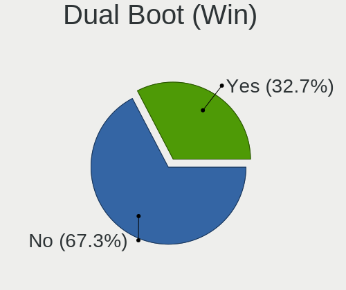
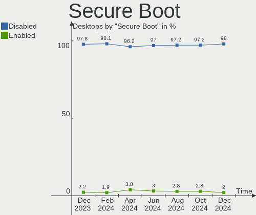
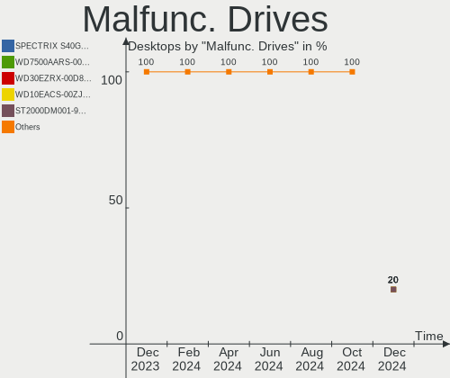
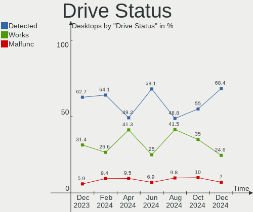
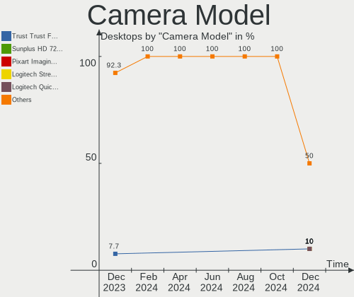

Kubuntu Hardware Trends (Desktops)
----------------------------------

A project to identify most popular hardware characteristics and track their change
over time based on data collected by Kubuntu users at https://Linux-Hardware.org.

Anyone can contribute to this report by the [hw-probe](https://github.com/linuxhw/hw-probe) tool:

    sudo -E hw-probe -all -upload

This report is for one last month. Overall report since the beginning of time: [TestCoverage](https://github.com/linuxhw/TestCoverage)

Period: Apr, 2022.

Contents
--------

* [ System ](#system)
  - [ OS                       ](#os)
  - [ OS Family                ](#os-family)
  - [ Kernel                   ](#kernel)
  - [ Kernel Family            ](#kernel-family)
  - [ Kernel Major Ver.        ](#kernel-major-ver)
  - [ Arch                     ](#arch)
  - [ DE                       ](#de)
  - [ Display Server           ](#display-server)
  - [ Display Manager          ](#display-manager)
  - [ OS Lang                  ](#os-lang)
  - [ Boot Mode                ](#boot-mode)
  - [ Filesystem               ](#filesystem)
  - [ Part. scheme             ](#part-scheme)
  - [ Dual Boot with Linux/BSD ](#dual-boot-with-linuxbsd)
  - [ Dual Boot (Win)          ](#dual-boot-win)

* [ Board ](#board)
  - [ Vendor                   ](#vendor)
  - [ Model                    ](#model)
  - [ Model Family             ](#model-family)
  - [ MFG Year                 ](#mfg-year)
  - [ Form Factor              ](#form-factor)
  - [ Secure Boot              ](#secure-boot)
  - [ Coreboot                 ](#coreboot)
  - [ RAM Size                 ](#ram-size)
  - [ RAM Used                 ](#ram-used)
  - [ Total Drives             ](#total-drives)
  - [ Has CD-ROM               ](#has-cd-rom)
  - [ Has Ethernet             ](#has-ethernet)
  - [ Has WiFi                 ](#has-wifi)
  - [ Has Bluetooth            ](#has-bluetooth)

* [ Location ](#location)
  - [ Country                  ](#country)
  - [ City                     ](#city)

* [ Drives ](#drives)
  - [ Drive Vendor             ](#drive-vendor)
  - [ Drive Model              ](#drive-model)
  - [ HDD Vendor               ](#hdd-vendor)
  - [ SSD Vendor               ](#ssd-vendor)
  - [ Drive Kind               ](#drive-kind)
  - [ Drive Connector          ](#drive-connector)
  - [ Drive Size               ](#drive-size)
  - [ Space Total              ](#space-total)
  - [ Space Used               ](#space-used)
  - [ Malfunc. Drives          ](#malfunc-drives)
  - [ Malfunc. Drive Vendor    ](#malfunc-drive-vendor)
  - [ Malfunc. HDD Vendor      ](#malfunc-hdd-vendor)
  - [ Malfunc. Drive Kind      ](#malfunc-drive-kind)
  - [ Failed Drives            ](#failed-drives)
  - [ Failed Drive Vendor      ](#failed-drive-vendor)
  - [ Drive Status             ](#drive-status)

* [ Storage controller ](#storage-controller)
  - [ Storage Vendor           ](#storage-vendor)
  - [ Storage Model            ](#storage-model)
  - [ Storage Kind             ](#storage-kind)

* [ Processor ](#processor)
  - [ CPU Vendor               ](#cpu-vendor)
  - [ CPU Model                ](#cpu-model)
  - [ CPU Model Family         ](#cpu-model-family)
  - [ CPU Cores                ](#cpu-cores)
  - [ CPU Sockets              ](#cpu-sockets)
  - [ CPU Threads              ](#cpu-threads)
  - [ CPU Op-Modes             ](#cpu-op-modes)
  - [ CPU Microcode            ](#cpu-microcode)
  - [ CPU Microarch            ](#cpu-microarch)

* [ Graphics ](#graphics)
  - [ GPU Vendor               ](#gpu-vendor)
  - [ GPU Model                ](#gpu-model)
  - [ GPU Combo                ](#gpu-combo)
  - [ GPU Driver               ](#gpu-driver)
  - [ GPU Memory               ](#gpu-memory)

* [ Monitor ](#monitor)
  - [ Monitor Vendor           ](#monitor-vendor)
  - [ Monitor Model            ](#monitor-model)
  - [ Monitor Resolution       ](#monitor-resolution)
  - [ Monitor Diagonal         ](#monitor-diagonal)
  - [ Monitor Width            ](#monitor-width)
  - [ Aspect Ratio             ](#aspect-ratio)
  - [ Monitor Area             ](#monitor-area)
  - [ Pixel Density            ](#pixel-density)
  - [ Multiple Monitors        ](#multiple-monitors)

* [ Network ](#network)
  - [ Net Controller Vendor    ](#net-controller-vendor)
  - [ Net Controller Model     ](#net-controller-model)
  - [ Wireless Vendor          ](#wireless-vendor)
  - [ Wireless Model           ](#wireless-model)
  - [ Ethernet Vendor          ](#ethernet-vendor)
  - [ Ethernet Model           ](#ethernet-model)
  - [ Net Controller Kind      ](#net-controller-kind)
  - [ Used Controller          ](#used-controller)
  - [ NICs                     ](#nics)
  - [ IPv6                     ](#ipv6)

* [ Bluetooth ](#bluetooth)
  - [ Bluetooth Vendor         ](#bluetooth-vendor)
  - [ Bluetooth Model          ](#bluetooth-model)

* [ Sound ](#sound)
  - [ Sound Vendor             ](#sound-vendor)
  - [ Sound Model              ](#sound-model)

* [ Memory ](#memory)
  - [ Memory Vendor            ](#memory-vendor)
  - [ Memory Model             ](#memory-model)
  - [ Memory Kind              ](#memory-kind)
  - [ Memory Form Factor       ](#memory-form-factor)
  - [ Memory Size              ](#memory-size)
  - [ Memory Speed             ](#memory-speed)

* [ Printers & scanners ](#printers--scanners)
  - [ Printer Vendor           ](#printer-vendor)
  - [ Printer Model            ](#printer-model)
  - [ Scanner Vendor           ](#scanner-vendor)
  - [ Scanner Model            ](#scanner-model)

* [ Camera ](#camera)
  - [ Camera Vendor            ](#camera-vendor)
  - [ Camera Model             ](#camera-model)

* [ Security ](#security)
  - [ Fingerprint Vendor       ](#fingerprint-vendor)
  - [ Fingerprint Model        ](#fingerprint-model)
  - [ Chipcard Vendor          ](#chipcard-vendor)
  - [ Chipcard Model           ](#chipcard-model)

* [ Unsupported ](#unsupported)
  - [ Unsupported Devices      ](#unsupported-devices)
  - [ Unsupported Device Types ](#unsupported-device-types)

System
------

OS
--

Installed operating systems

| Name          | Desktops | Percent |
|---------------|----------|---------|
| Kubuntu 20.04 | 12       | 34.29%  |
| Kubuntu 21.10 | 11       | 31.43%  |
| Kubuntu 22.04 | 7        | 20%     |
| Kubuntu 11    | 3        | 8.57%   |
| Kubuntu 20.10 | 1        | 2.86%   |
| Kubuntu 2.0   | 1        | 2.86%   |

OS Family
---------

OS without a version

| Name    | Desktops | Percent |
|---------|----------|---------|
| Kubuntu | 35       | 100%    |

Kernel
------

Version of the Linux kernel

| Version              | Desktops | Percent |
|----------------------|----------|---------|
| 5.13.0-39-generic    | 14       | 40%     |
| 5.15.0-27-generic    | 4        | 11.43%  |
| 5.13.0-40-generic    | 4        | 11.43%  |
| 5.4.0-107-generic    | 3        | 8.57%   |
| 5.15.0-25-generic    | 2        | 5.71%   |
| 5.8.0-63-lowlatency  | 1        | 2.86%   |
| 5.4.0-52-generic     | 1        | 2.86%   |
| 5.4.0-100-generic    | 1        | 2.86%   |
| 5.15.0-27-lowlatency | 1        | 2.86%   |
| 5.13.0-40-lowlatency | 1        | 2.86%   |
| 5.13.0-39-lowlatency | 1        | 2.86%   |
| 5.13.0-27-generic    | 1        | 2.86%   |
| 5.13.0-19-generic    | 1        | 2.86%   |

Kernel Family
-------------

Linux kernel without a distro release

| Version | Desktops | Percent |
|---------|----------|---------|
| 5.13.0  | 22       | 62.86%  |
| 5.15.0  | 7        | 20%     |
| 5.4.0   | 5        | 14.29%  |
| 5.8.0   | 1        | 2.86%   |

Kernel Major Ver.
-----------------

Linux kernel major version

| Version | Desktops | Percent |
|---------|----------|---------|
| 5.13    | 22       | 62.86%  |
| 5.15    | 7        | 20%     |
| 5.4     | 5        | 14.29%  |
| 5.8     | 1        | 2.86%   |

Arch
----

OS architecture (x86_64, i586, etc.)

| Name   | Desktops | Percent |
|--------|----------|---------|
| x86_64 | 35       | 100%    |

DE
--

Desktop Environment

| Name     | Desktops | Percent |
|----------|----------|---------|
| KDE5     | 33       | 94.29%  |
| XFCE     | 1        | 2.86%   |
| Cinnamon | 1        | 2.86%   |

Display Server
--------------

X11 or Wayland

| Name    | Desktops | Percent |
|---------|----------|---------|
| X11     | 33       | 94.29%  |
| Wayland | 2        | 5.71%   |

Display Manager
---------------

SDDM, LightDM, etc.

| Name    | Desktops | Percent |
|---------|----------|---------|
| SDDM    | 21       | 60%     |
| Unknown | 9        | 25.71%  |
| LightDM | 2        | 5.71%   |
| GDM3    | 2        | 5.71%   |
| GDM     | 1        | 2.86%   |

OS Lang
-------

Language

| Lang  | Desktops | Percent |
|-------|----------|---------|
| en_US | 9        | 25.71%  |
| de_DE | 6        | 17.14%  |
| ru_RU | 4        | 11.43%  |
| fr_FR | 3        | 8.57%   |
| es_ES | 2        | 5.71%   |
| en_NZ | 2        | 5.71%   |
| en_GB | 2        | 5.71%   |
| en_CA | 2        | 5.71%   |
| pt_BR | 1        | 2.86%   |
| es_VE | 1        | 2.86%   |
| es_CL | 1        | 2.86%   |
| es_AR | 1        | 2.86%   |
| en_AU | 1        | 2.86%   |

Boot Mode
---------

EFI or BIOS

| Mode | Desktops | Percent |
|------|----------|---------|
| EFI  | 20       | 57.14%  |
| BIOS | 15       | 42.86%  |

Filesystem
----------

Type of filesystem

| Type  | Desktops | Percent |
|-------|----------|---------|
| Ext4  | 31       | 88.57%  |
| Btrfs | 3        | 8.57%   |
| Zfs   | 1        | 2.86%   |

Part. scheme
------------

Scheme of partitioning

| Type    | Desktops | Percent |
|---------|----------|---------|
| Unknown | 18       | 51.43%  |
| GPT     | 12       | 34.29%  |
| MBR     | 5        | 14.29%  |

Dual Boot with Linux/BSD
------------------------

Hosting more than one Linux/BSD

| Dual boot | Desktops | Percent |
|-----------|----------|---------|
| No        | 29       | 82.86%  |
| Yes       | 6        | 17.14%  |

Dual Boot (Win)
---------------

Hosting Linux and Windows

| Dual boot | Desktops | Percent |
|-----------|----------|---------|
| No        | 20       | 57.14%  |
| Yes       | 15       | 42.86%  |

Board
-----

Vendor
------

Motherboard manufacturer

| Name                | Desktops | Percent |
|---------------------|----------|---------|
| ASUSTek Computer    | 9        | 25.71%  |
| MSI                 | 6        | 17.14%  |
| Hewlett-Packard     | 6        | 17.14%  |
| ASRock              | 5        | 14.29%  |
| Gigabyte Technology | 3        | 8.57%   |
| Shuttle             | 1        | 2.86%   |
| Pegatron            | 1        | 2.86%   |
| Lenovo              | 1        | 2.86%   |
| Intel               | 1        | 2.86%   |
| Dell                | 1        | 2.86%   |
| Biostar             | 1        | 2.86%   |

Model
-----

Motherboard model

| Name                                    | Desktops | Percent |
|-----------------------------------------|----------|---------|
| MSI MS-7817                             | 2        | 5.71%   |
| Shuttle XH61V                           | 1        | 2.86%   |
| Pegatron Elite 7500 Series MT           | 1        | 2.86%   |
| MSI MS-7D09                             | 1        | 2.86%   |
| MSI MS-7C52                             | 1        | 2.86%   |
| MSI MS-7C37                             | 1        | 2.86%   |
| MSI MS-7A59                             | 1        | 2.86%   |
| Lenovo IdeaCentre 510S-08IKL 90GB00DLGE | 1        | 2.86%   |
| Intel MAHOBAY                           | 1        | 2.86%   |
| HP Z220 CMT Workstation                 | 1        | 2.86%   |
| HP ProDesk 600 G2 SFF                   | 1        | 2.86%   |
| HP Compaq Elite 8300 CMT                | 1        | 2.86%   |
| HP Compaq dc7800p Convertible Minitower | 1        | 2.86%   |
| HP Compaq 6005 Pro SFF PC               | 1        | 2.86%   |
| HP 750-247c                             | 1        | 2.86%   |
| Gigabyte Z490 AORUS ELITE AC            | 1        | 2.86%   |
| Gigabyte X570 AORUS MASTER              | 1        | 2.86%   |
| Gigabyte A320M-S2H V2                   | 1        | 2.86%   |
| Dell OptiPlex 790                       | 1        | 2.86%   |
| Biostar A68N-2100K                      | 1        | 2.86%   |
| ASUS WS Z390 PRO                        | 1        | 2.86%   |
| ASUS TUF X470-PLUS GAMING               | 1        | 2.86%   |
| ASUS ROG STRIX B450-F GAMING II         | 1        | 2.86%   |
| ASUS PRIME B550M-K                      | 1        | 2.86%   |
| ASUS P7P55 LX                           | 1        | 2.86%   |
| ASUS P5P43TD                            | 1        | 2.86%   |
| ASUS M5A78L-M PLUS/USB3                 | 1        | 2.86%   |
| ASUS M5A78L LE                          | 1        | 2.86%   |
| ASUS A68HM-PLUS                         | 1        | 2.86%   |
| ASRock Z87 Pro4                         | 1        | 2.86%   |
| ASRock H97 Pro4                         | 1        | 2.86%   |
| ASRock H110M-ITX                        | 1        | 2.86%   |
| ASRock B560M Pro4                       | 1        | 2.86%   |
| ASRock B550 Extreme4                    | 1        | 2.86%   |

Model Family
------------

Motherboard model prefix

| Name               | Desktops | Percent |
|--------------------|----------|---------|
| HP Compaq          | 3        | 8.57%   |
| MSI MS-7817        | 2        | 5.71%   |
| Shuttle XH61V      | 1        | 2.86%   |
| Pegatron Elite     | 1        | 2.86%   |
| MSI MS-7D09        | 1        | 2.86%   |
| MSI MS-7C52        | 1        | 2.86%   |
| MSI MS-7C37        | 1        | 2.86%   |
| MSI MS-7A59        | 1        | 2.86%   |
| Lenovo IdeaCentre  | 1        | 2.86%   |
| Intel MAHOBAY      | 1        | 2.86%   |
| HP Z220            | 1        | 2.86%   |
| HP ProDesk         | 1        | 2.86%   |
| HP 750-247c        | 1        | 2.86%   |
| Gigabyte Z490      | 1        | 2.86%   |
| Gigabyte X570      | 1        | 2.86%   |
| Gigabyte A320M-S2H | 1        | 2.86%   |
| Dell OptiPlex      | 1        | 2.86%   |
| Biostar A68N-2100K | 1        | 2.86%   |
| ASUS WS            | 1        | 2.86%   |
| ASUS TUF           | 1        | 2.86%   |
| ASUS ROG           | 1        | 2.86%   |
| ASUS PRIME         | 1        | 2.86%   |
| ASUS P7P55         | 1        | 2.86%   |
| ASUS P5P43TD       | 1        | 2.86%   |
| ASUS M5A78L-M      | 1        | 2.86%   |
| ASUS M5A78L        | 1        | 2.86%   |
| ASUS A68HM-PLUS    | 1        | 2.86%   |
| ASRock Z87         | 1        | 2.86%   |
| ASRock H97         | 1        | 2.86%   |
| ASRock H110M-ITX   | 1        | 2.86%   |
| ASRock B560M       | 1        | 2.86%   |
| ASRock B550        | 1        | 2.86%   |

MFG Year
--------

Motherboard manufacture year

| Year | Desktops | Percent |
|------|----------|---------|
| 2020 | 5        | 14.29%  |
| 2019 | 4        | 11.43%  |
| 2012 | 4        | 11.43%  |
| 2018 | 3        | 8.57%   |
| 2016 | 3        | 8.57%   |
| 2014 | 3        | 8.57%   |
| 2009 | 3        | 8.57%   |
| 2021 | 2        | 5.71%   |
| 2015 | 2        | 5.71%   |
| 2013 | 2        | 5.71%   |
| 2011 | 2        | 5.71%   |
| 2017 | 1        | 2.86%   |
| 2007 | 1        | 2.86%   |

Form Factor
-----------

Physical design of the computer

| Name    | Desktops | Percent |
|---------|----------|---------|
| Desktop | 35       | 100%    |

Secure Boot
-----------

Enabled or disabled

| State    | Desktops | Percent |
|----------|----------|---------|
| Disabled | 34       | 97.14%  |
| Enabled  | 1        | 2.86%   |

Coreboot
--------

Have coreboot on board

| Used | Desktops | Percent |
|------|----------|---------|
| No   | 35       | 100%    |

RAM Size
--------

Total RAM memory

| Size in GB  | Desktops | Percent |
|-------------|----------|---------|
| 8.01-16.0   | 10       | 28.57%  |
| 16.01-24.0  | 8        | 22.86%  |
| 4.01-8.0    | 5        | 14.29%  |
| 32.01-64.0  | 5        | 14.29%  |
| 3.01-4.0    | 3        | 8.57%   |
| 24.01-32.0  | 2        | 5.71%   |
| 64.01-256.0 | 2        | 5.71%   |

RAM Used
--------

Used RAM memory

| Used GB    | Desktops | Percent |
|------------|----------|---------|
| 2.01-3.0   | 12       | 34.29%  |
| 4.01-8.0   | 9        | 25.71%  |
| 1.01-2.0   | 8        | 22.86%  |
| 8.01-16.0  | 3        | 8.57%   |
| 32.01-64.0 | 1        | 2.86%   |
| 3.01-4.0   | 1        | 2.86%   |
| 0.51-1.0   | 1        | 2.86%   |

Total Drives
------------

Number of drives on board

| Drives | Desktops | Percent |
|--------|----------|---------|
| 2      | 11       | 31.43%  |
| 1      | 9        | 25.71%  |
| 3      | 6        | 17.14%  |
| 4      | 5        | 14.29%  |
| 6      | 2        | 5.71%   |
| 10     | 1        | 2.86%   |
| 7      | 1        | 2.86%   |

Has CD-ROM
----------

Has CD-ROM on board

| Presented | Desktops | Percent |
|-----------|----------|---------|
| No        | 19       | 54.29%  |
| Yes       | 16       | 45.71%  |

Has Ethernet
------------

Has Ethernet on board

| Presented | Desktops | Percent |
|-----------|----------|---------|
| Yes       | 35       | 100%    |

Has WiFi
--------

Has WiFi module

| Presented | Desktops | Percent |
|-----------|----------|---------|
| No        | 20       | 57.14%  |
| Yes       | 15       | 42.86%  |

Has Bluetooth
-------------

Has Bluetooth module

| Presented | Desktops | Percent |
|-----------|----------|---------|
| No        | 20       | 57.14%  |
| Yes       | 15       | 42.86%  |

Location
--------

Country
-------

Geographic location (country)

| Country     | Desktops | Percent |
|-------------|----------|---------|
| Germany     | 6        | 17.14%  |
| USA         | 4        | 11.43%  |
| Russia      | 4        | 11.43%  |
| France      | 3        | 8.57%   |
| Spain       | 2        | 5.71%   |
| New Zealand | 2        | 5.71%   |
| Netherlands | 2        | 5.71%   |
| Venezuela   | 1        | 2.86%   |
| UK          | 1        | 2.86%   |
| Pakistan    | 1        | 2.86%   |
| Iran        | 1        | 2.86%   |
| Hungary     | 1        | 2.86%   |
| Greece      | 1        | 2.86%   |
| Finland     | 1        | 2.86%   |
| Chile       | 1        | 2.86%   |
| Canada      | 1        | 2.86%   |
| Brazil      | 1        | 2.86%   |
| Australia   | 1        | 2.86%   |
| Argentina   | 1        | 2.86%   |

City
----

Geographic location (city)

| City                   | Desktops | Percent |
|------------------------|----------|---------|
| Villa Nueva            | 1        | 2.86%   |
| Valencia               | 1        | 2.86%   |
| Tehran                 | 1        | 2.86%   |
| St Petersburg          | 1        | 2.86%   |
| Schenectady            | 1        | 2.86%   |
| Sargodha               | 1        | 2.86%   |
| Santiago               | 1        | 2.86%   |
| Santa Úrsula          | 1        | 2.86%   |
| Saline                 | 1        | 2.86%   |
| Saint-Mandrier-sur-Mer | 1        | 2.86%   |
| Pforzheim              | 1        | 2.86%   |
| Pécs                  | 1        | 2.86%   |
| Nuremberg              | 1        | 2.86%   |
| Novosibirsk            | 1        | 2.86%   |
| Nizhniy Novgorod       | 1        | 2.86%   |
| Nice                   | 1        | 2.86%   |
| Moscow                 | 1        | 2.86%   |
| Melbourne              | 1        | 2.86%   |
| Manchester             | 1        | 2.86%   |
| Lagoa Nova             | 1        | 2.86%   |
| Karlsruhe              | 1        | 2.86%   |
| Helsinki               | 1        | 2.86%   |
| Heinersreuth           | 1        | 2.86%   |
| Enschede               | 1        | 2.86%   |
| Dunedin                | 1        | 2.86%   |
| Detroit                | 1        | 2.86%   |
| Cologne                | 1        | 2.86%   |
| Bracebridge            | 1        | 2.86%   |
| Bougival               | 1        | 2.86%   |
| Boise                  | 1        | 2.86%   |
| Bielefeld              | 1        | 2.86%   |
| Baiona                 | 1        | 2.86%   |
| Auckland               | 1        | 2.86%   |
| Athens                 | 1        | 2.86%   |
| Amsterdam              | 1        | 2.86%   |

Drives
------

Drive Vendor
------------

Hard drive vendors

| Vendor                | Desktops | Drives | Percent |
|-----------------------|----------|--------|---------|
| WDC                   | 16       | 22     | 22.22%  |
| Seagate               | 15       | 25     | 20.83%  |
| Samsung Electronics   | 10       | 19     | 13.89%  |
| Toshiba               | 4        | 4      | 5.56%   |
| Kingston              | 4        | 4      | 5.56%   |
| Hitachi               | 4        | 4      | 5.56%   |
| Crucial               | 3        | 3      | 4.17%   |
| A-DATA Technology     | 2        | 2      | 2.78%   |
| Unknown               | 1        | 1      | 1.39%   |
| Transcend             | 1        | 1      | 1.39%   |
| Team                  | 1        | 1      | 1.39%   |
| Smartbuy              | 1        | 1      | 1.39%   |
| SK Hynix              | 1        | 1      | 1.39%   |
| SanDisk               | 1        | 1      | 1.39%   |
| SABRENT               | 1        | 1      | 1.39%   |
| Realtek Semiconductor | 1        | 1      | 1.39%   |
| LDLC                  | 1        | 2      | 1.39%   |
| Intenso               | 1        | 2      | 1.39%   |
| Intel                 | 1        | 1      | 1.39%   |
| HGST                  | 1        | 1      | 1.39%   |
| Corsair               | 1        | 2      | 1.39%   |
| ADATA Technology      | 1        | 1      | 1.39%   |

Drive Model
-----------

Hard drive models

| Model                              | Desktops | Percent |
|------------------------------------|----------|---------|
| Seagate ST2000DM008-2FR102 2TB     | 3        | 3.3%    |
| WDC WD5000AAKX-753CA1 500GB        | 2        | 2.2%    |
| Toshiba HDWR180 8TB                | 2        | 2.2%    |
| Seagate ST2000DM001-1ER164 2TB     | 2        | 2.2%    |
| Seagate ST2000DM001-1CH164 2TB     | 2        | 2.2%    |
| Samsung SSD 980 1TB                | 2        | 2.2%    |
| Samsung NVMe SSD Drive 500GB       | 2        | 2.2%    |
| Samsung NVMe SSD Drive 1TB         | 2        | 2.2%    |
| WDC WDS500G2B0A-00SM50 500GB SSD   | 1        | 1.1%    |
| WDC WDS240G1G0A-00SS50 240GB SSD   | 1        | 1.1%    |
| WDC WD60EZAZ-00ZGHB0 6TB           | 1        | 1.1%    |
| WDC WD5000AZLX-00ZR6A0 500GB       | 1        | 1.1%    |
| WDC WD40PURX-64GVNY0 4TB           | 1        | 1.1%    |
| WDC WD30EZRX-00D8PB0 3TB           | 1        | 1.1%    |
| WDC WD30EFRX-68EUZN0 3TB           | 1        | 1.1%    |
| WDC WD2500AAJS-75B4A0 250GB        | 1        | 1.1%    |
| WDC WD2500AAJS-60B4A0 250GB        | 1        | 1.1%    |
| WDC WD20PURX-64P6ZY0 2TB           | 1        | 1.1%    |
| WDC WD20EZRZ-00Z5HB0 2TB           | 1        | 1.1%    |
| WDC WD20EZRX-00D8PB0 2TB           | 1        | 1.1%    |
| WDC WD20EARX-00PASB0 2TB           | 1        | 1.1%    |
| WDC WD20EARS-00MVWB0 2TB           | 1        | 1.1%    |
| WDC WD10EZRX-00L4HB0 1TB           | 1        | 1.1%    |
| WDC WD10EZEX-22MFCA0 1TB           | 1        | 1.1%    |
| WDC WD10EZEX-08M2NA0 1TB           | 1        | 1.1%    |
| WDC WD1003FZEX-00K3CA0 1TB         | 1        | 1.1%    |
| WDC WD BLUE 128GB SSD              | 1        | 1.1%    |
| Unknown SD/MMC/MS PRO 16GB         | 1        | 1.1%    |
| Transcend TS2TMTE220S 2TB          | 1        | 1.1%    |
| Toshiba TR200 480GB SSD            | 1        | 1.1%    |
| Toshiba HDWJ110 1TB                | 1        | 1.1%    |
| Team T253LE480G 480GB SSD          | 1        | 1.1%    |
| Smartbuy SSD 120GB                 | 1        | 1.1%    |
| SK Hynix SC210 mSATA 256GB SSD     | 1        | 1.1%    |
| Seagate ST500LT012-9WS142 500GB    | 1        | 1.1%    |
| Seagate ST500LT012-1DG142 500GB    | 1        | 1.1%    |
| Seagate ST4000LM024-2AN17V 4TB     | 1        | 1.1%    |
| Seagate ST3500413AS 500GB          | 1        | 1.1%    |
| Seagate ST3400620AS 400GB          | 1        | 1.1%    |
| Seagate ST3250318AS 250GB          | 1        | 1.1%    |
| Seagate ST3160815AS 160GB          | 1        | 1.1%    |
| Seagate ST31500341AS 1TB           | 1        | 1.1%    |
| Seagate ST31000524AS 1TB           | 1        | 1.1%    |
| Seagate ST2000VN004-2E4164 2TB     | 1        | 1.1%    |
| Seagate ST1500LM006 HN-M151RAD 1TB | 1        | 1.1%    |
| Seagate ST1000DM003-1SB102 1TB     | 1        | 1.1%    |
| Seagate ST1000DM003-1ER162 1TB     | 1        | 1.1%    |
| SanDisk SSD PLUS 240 GB            | 1        | 1.1%    |
| Samsung SSD 980 PRO 1TB            | 1        | 1.1%    |
| Samsung SSD 970 EVO Plus 2TB       | 1        | 1.1%    |
| Samsung SSD 870 EVO 1TB            | 1        | 1.1%    |
| Samsung SSD 860 PRO 256GB          | 1        | 1.1%    |
| Samsung SSD 860 EVO M.2 500GB      | 1        | 1.1%    |
| Samsung SSD 860 EVO 1TB            | 1        | 1.1%    |
| Samsung SSD 850 EVO 250GB          | 1        | 1.1%    |
| Samsung SSD 850 EVO 1TB            | 1        | 1.1%    |
| Samsung SSD 840 EVO 120GB          | 1        | 1.1%    |
| Samsung NVMe SSD Drive 2TB         | 1        | 1.1%    |
| Samsung HD204UI 2TB                | 1        | 1.1%    |
| Samsung HD154UI 1TB                | 1        | 1.1%    |

HDD Vendor
----------

Hard disk drive vendors

| Vendor              | Desktops | Drives | Percent |
|---------------------|----------|--------|---------|
| WDC                 | 15       | 18     | 35.71%  |
| Seagate             | 15       | 25     | 35.71%  |
| Hitachi             | 4        | 4      | 9.52%   |
| Toshiba             | 3        | 3      | 7.14%   |
| Samsung Electronics | 2        | 2      | 4.76%   |
| Unknown             | 1        | 1      | 2.38%   |
| SABRENT             | 1        | 1      | 2.38%   |
| HGST                | 1        | 1      | 2.38%   |

SSD Vendor
----------

Solid state drive vendors

| Vendor              | Desktops | Drives | Percent |
|---------------------|----------|--------|---------|
| Samsung Electronics | 6        | 7      | 25%     |
| Kingston            | 4        | 4      | 16.67%  |
| WDC                 | 3        | 4      | 12.5%   |
| Crucial             | 3        | 3      | 12.5%   |
| Toshiba             | 1        | 1      | 4.17%   |
| Team                | 1        | 1      | 4.17%   |
| Smartbuy            | 1        | 1      | 4.17%   |
| SK Hynix            | 1        | 1      | 4.17%   |
| SanDisk             | 1        | 1      | 4.17%   |
| Intenso             | 1        | 2      | 4.17%   |
| Intel               | 1        | 1      | 4.17%   |
| A-DATA Technology   | 1        | 1      | 4.17%   |

Drive Kind
----------

HDD or SSD

| Kind    | Desktops | Drives | Percent |
|---------|----------|--------|---------|
| HDD     | 29       | 55     | 47.54%  |
| SSD     | 22       | 27     | 36.07%  |
| NVMe    | 9        | 16     | 14.75%  |
| Unknown | 1        | 2      | 1.64%   |

Drive Connector
---------------

SATA, SAS, NVMe, etc.

| Type | Desktops | Drives | Percent |
|------|----------|--------|---------|
| SATA | 35       | 82     | 76.09%  |
| NVMe | 9        | 16     | 19.57%  |
| SAS  | 2        | 2      | 4.35%   |

Drive Size
----------

Size of hard drive

| Size in TB | Desktops | Drives | Percent |
|------------|----------|--------|---------|
| 0.01-0.5   | 23       | 37     | 41.07%  |
| 0.51-1.0   | 16       | 18     | 28.57%  |
| 1.01-2.0   | 10       | 19     | 17.86%  |
| 4.01-10.0  | 3        | 3      | 5.36%   |
| 3.01-4.0   | 2        | 3      | 3.57%   |
| 2.01-3.0   | 2        | 2      | 3.57%   |

Space Total
-----------

Amount of disk space available on the file system

| Size in GB     | Desktops | Percent |
|----------------|----------|---------|
| More than 3000 | 6        | 17.14%  |
| 101-250        | 6        | 17.14%  |
| 501-1000       | 6        | 17.14%  |
| 251-500        | 5        | 14.29%  |
| 1001-2000      | 5        | 14.29%  |
| 2001-3000      | 4        | 11.43%  |
| 51-100         | 3        | 8.57%   |

Space Used
----------

Amount of used disk space

| Used GB        | Desktops | Percent |
|----------------|----------|---------|
| 251-500        | 6        | 17.14%  |
| 101-250        | 5        | 14.29%  |
| 501-1000       | 5        | 14.29%  |
| 1001-2000      | 4        | 11.43%  |
| 1-20           | 4        | 11.43%  |
| 51-100         | 4        | 11.43%  |
| More than 3000 | 3        | 8.57%   |
| 21-50          | 3        | 8.57%   |
| 2001-3000      | 1        | 2.86%   |

Malfunc. Drives
---------------

Drive models with a malfunction

| Model                           | Desktops | Drives | Percent |
|---------------------------------|----------|--------|---------|
| WDC WD10EZEX-22MFCA0 1TB        | 1        | 1      | 25%     |
| Seagate ST500LT012-9WS142 500GB | 1        | 1      | 25%     |
| Seagate ST1000DM003-1SB102 1TB  | 1        | 1      | 25%     |
| Hitachi HCT721010SLA360 1TB     | 1        | 1      | 25%     |

Malfunc. Drive Vendor
---------------------

Vendors of faulty drives

| Vendor  | Desktops | Drives | Percent |
|---------|----------|--------|---------|
| Seagate | 2        | 2      | 50%     |
| WDC     | 1        | 1      | 25%     |
| Hitachi | 1        | 1      | 25%     |

Malfunc. HDD Vendor
-------------------

Vendors of faulty HDD drives

| Vendor  | Desktops | Drives | Percent |
|---------|----------|--------|---------|
| Seagate | 2        | 2      | 50%     |
| WDC     | 1        | 1      | 25%     |
| Hitachi | 1        | 1      | 25%     |

Malfunc. Drive Kind
-------------------

Kinds of faulty drives

| Kind | Desktops | Drives | Percent |
|------|----------|--------|---------|
| HDD  | 4        | 4      | 100%    |

Failed Drives
-------------

Failed drive models

Zero info for selected period =(

Failed Drive Vendor
-------------------

Failed drive vendors

Zero info for selected period =(

Drive Status
------------

Number of failed and malfunc. drives

| Status   | Desktops | Drives | Percent |
|----------|----------|--------|---------|
| Detected | 17       | 57     | 44.74%  |
| Works    | 17       | 39     | 44.74%  |
| Malfunc  | 4        | 4      | 10.53%  |

Storage controller
------------------

Storage Vendor
--------------

Storage controller vendors

| Vendor                | Desktops | Percent |
|-----------------------|----------|---------|
| Intel                 | 22       | 43.14%  |
| AMD                   | 13       | 25.49%  |
| Samsung Electronics   | 6        | 11.76%  |
| Realtek Semiconductor | 2        | 3.92%   |
| ASMedia Technology    | 2        | 3.92%   |
| VIA Technologies      | 1        | 1.96%   |
| Silicon Motion        | 1        | 1.96%   |
| Phison Electronics    | 1        | 1.96%   |
| JMicron Technology    | 1        | 1.96%   |
| Broadcom / LSI        | 1        | 1.96%   |
| ADATA Technology      | 1        | 1.96%   |

Storage Model
-------------

Storage controller models

| Model                                                                                   | Desktops | Percent |
|-----------------------------------------------------------------------------------------|----------|---------|
| AMD FCH SATA Controller [AHCI mode]                                                     | 7        | 11.48%  |
| Samsung NVMe SSD Controller SM981/PM981/PM983                                           | 3        | 4.92%   |
| Intel Q170/Q150/B150/H170/H110/Z170/CM236 Chipset SATA Controller [AHCI Mode]           | 3        | 4.92%   |
| Intel 8 Series/C220 Series Chipset Family 6-port SATA Controller 1 [AHCI mode]          | 3        | 4.92%   |
| Samsung NVMe SSD Controller 980                                                         | 2        | 3.28%   |
| Intel 7 Series/C210 Series Chipset Family 6-port SATA Controller [AHCI mode]            | 2        | 3.28%   |
| Intel 6 Series/C200 Series Chipset Family 6 port Desktop SATA AHCI Controller           | 2        | 3.28%   |
| Intel 500 Series Chipset Family SATA AHCI Controller                                    | 2        | 3.28%   |
| Intel 200 Series PCH SATA controller [AHCI mode]                                        | 2        | 3.28%   |
| ASMedia ASM1062 Serial ATA Controller                                                   | 2        | 3.28%   |
| AMD SB7x0/SB8x0/SB9x0 SATA Controller [AHCI mode]                                       | 2        | 3.28%   |
| AMD SB7x0/SB8x0/SB9x0 IDE Controller                                                    | 2        | 3.28%   |
| AMD 500 Series Chipset SATA Controller                                                  | 2        | 3.28%   |
| AMD 400 Series Chipset SATA Controller                                                  | 2        | 3.28%   |
| VIA VT6415 PATA IDE Host Controller                                                     | 1        | 1.64%   |
| Silicon Motion SM2262/SM2262EN SSD Controller                                           | 1        | 1.64%   |
| Samsung NVMe SSD Controller SM961/PM961/SM963                                           | 1        | 1.64%   |
| Samsung NVMe SSD Controller PM9A1/PM9A3/980PRO                                          | 1        | 1.64%   |
| Realtek RTS5763DL NVMe SSD Controller                                                   | 1        | 1.64%   |
| Realtek Realtek Non-Volatile memory controller                                          | 1        | 1.64%   |
| Phison E16 PCIe4 NVMe Controller                                                        | 1        | 1.64%   |
| JMicron JMB368 IDE controller                                                           | 1        | 1.64%   |
| Intel SATA Controller [RAID mode]                                                       | 1        | 1.64%   |
| Intel Comet Lake SATA AHCI Controller                                                   | 1        | 1.64%   |
| Intel 9 Series Chipset Family SATA Controller [AHCI Mode]                               | 1        | 1.64%   |
| Intel 82Q35 Express PT IDER Controller                                                  | 1        | 1.64%   |
| Intel 82801JI (ICH10 Family) SATA AHCI Controller                                       | 1        | 1.64%   |
| Intel 82801IR/IO/IH (ICH9R/DO/DH) 4 port SATA Controller [IDE mode]                     | 1        | 1.64%   |
| Intel 82801I (ICH9 Family) 2 port SATA Controller [IDE mode]                            | 1        | 1.64%   |
| Intel 7 Series/C210 Series Chipset Family 4-port SATA Controller [IDE mode]             | 1        | 1.64%   |
| Intel 7 Series/C210 Series Chipset Family 2-port SATA Controller [IDE mode]             | 1        | 1.64%   |
| Intel 6 Series/C200 Series Chipset Family Desktop SATA Controller (IDE mode, ports 4-5) | 1        | 1.64%   |
| Intel 6 Series/C200 Series Chipset Family Desktop SATA Controller (IDE mode, ports 0-3) | 1        | 1.64%   |
| Intel 5 Series/3400 Series Chipset 6 port SATA AHCI Controller                          | 1        | 1.64%   |
| Broadcom / LSI SAS2008 PCI-Express Fusion-MPT SAS-2 [Falcon]                            | 1        | 1.64%   |
| AMD SB7x0/SB8x0/SB9x0 SATA Controller [IDE mode]                                        | 1        | 1.64%   |
| AMD FCH SATA Controller D                                                               | 1        | 1.64%   |
| AMD 300 Series Chipset SATA Controller                                                  | 1        | 1.64%   |
| ADATA A Non-Volatile memory controller                                                  | 1        | 1.64%   |

Storage Kind
------------

Kind of storage controller (IDE, SATA, NVMe, SAS, ...)

| Kind | Desktops | Percent |
|------|----------|---------|
| SATA | 32       | 64%     |
| NVMe | 9        | 18%     |
| IDE  | 7        | 14%     |
| RAID | 2        | 4%      |

Processor
---------

CPU Vendor
----------

Processor vendors

| Vendor | Desktops | Percent |
|--------|----------|---------|
| Intel  | 22       | 62.86%  |
| AMD    | 13       | 37.14%  |

CPU Model
---------

Processor models

| Model                                         | Desktops | Percent |
|-----------------------------------------------|----------|---------|
| AMD Ryzen 7 3700X 8-Core Processor            | 3        | 8.57%   |
| Intel Core i7-3770 CPU @ 3.40GHz              | 2        | 5.71%   |
| AMD Ryzen 7 2700 Eight-Core Processor         | 2        | 5.71%   |
| Intel Xeon CPU E3-1246 v3 @ 3.50GHz           | 1        | 2.86%   |
| Intel Pentium CPU G4400 @ 3.30GHz             | 1        | 2.86%   |
| Intel Core i7-9700K CPU @ 3.60GHz             | 1        | 2.86%   |
| Intel Core i7-7700K CPU @ 4.20GHz             | 1        | 2.86%   |
| Intel Core i7-6700 CPU @ 3.40GHz              | 1        | 2.86%   |
| Intel Core i7-4790 CPU @ 3.60GHz              | 1        | 2.86%   |
| Intel Core i7-4770K CPU @ 3.50GHz             | 1        | 2.86%   |
| Intel Core i7-10700 CPU @ 2.90GHz             | 1        | 2.86%   |
| Intel Core i5-6600 CPU @ 3.30GHz              | 1        | 2.86%   |
| Intel Core i5-3570 CPU @ 3.40GHz              | 1        | 2.86%   |
| Intel Core i5-3470 CPU @ 3.20GHz              | 1        | 2.86%   |
| Intel Core i5-2400 CPU @ 3.10GHz              | 1        | 2.86%   |
| Intel Core i5-10400F CPU @ 2.90GHz            | 1        | 2.86%   |
| Intel Core i5 CPU 760 @ 2.80GHz               | 1        | 2.86%   |
| Intel Core i3-7100 CPU @ 3.90GHz              | 1        | 2.86%   |
| Intel Core i3-4130 CPU @ 3.40GHz              | 1        | 2.86%   |
| Intel Core i3-3220 CPU @ 3.30GHz              | 1        | 2.86%   |
| Intel Core 2 Quad CPU Q9450 @ 2.66GHz         | 1        | 2.86%   |
| Intel Core 2 Duo CPU E6550 @ 2.33GHz          | 1        | 2.86%   |
| Intel 11th Gen Core i7-11700K @ 3.60GHz       | 1        | 2.86%   |
| AMD Ryzen 9 3900XT 12-Core Processor          | 1        | 2.86%   |
| AMD Ryzen 5 2600 Six-Core Processor           | 1        | 2.86%   |
| AMD Ryzen 5 2400G with Radeon Vega Graphics   | 1        | 2.86%   |
| AMD Phenom II X4 965 Processor                | 1        | 2.86%   |
| AMD FX-8140 Eight-Core Processor              | 1        | 2.86%   |
| AMD E1-6010 APU with AMD Radeon R2 Graphics   | 1        | 2.86%   |
| AMD Athlon II X2 B28 Processor                | 1        | 2.86%   |
| AMD A8-7600 Radeon R7, 10 Compute Cores 4C+6G | 1        | 2.86%   |

CPU Model Family
----------------

Processor model prefix

| Model             | Desktops | Percent |
|-------------------|----------|---------|
| Intel Core i7     | 8        | 22.86%  |
| Intel Core i5     | 6        | 17.14%  |
| AMD Ryzen 7       | 5        | 14.29%  |
| Intel Core i3     | 3        | 8.57%   |
| AMD Ryzen 5       | 2        | 5.71%   |
| Other             | 1        | 2.86%   |
| Intel Xeon        | 1        | 2.86%   |
| Intel Pentium     | 1        | 2.86%   |
| Intel Core 2 Quad | 1        | 2.86%   |
| Intel Core 2 Duo  | 1        | 2.86%   |
| AMD Ryzen 9       | 1        | 2.86%   |
| AMD Phenom II X4  | 1        | 2.86%   |
| AMD FX            | 1        | 2.86%   |
| AMD E1            | 1        | 2.86%   |
| AMD Athlon II X2  | 1        | 2.86%   |
| AMD A8            | 1        | 2.86%   |

CPU Cores
---------

Number of processor cores

| Number | Desktops | Percent |
|--------|----------|---------|
| 4      | 16       | 45.71%  |
| 8      | 8        | 22.86%  |
| 2      | 8        | 22.86%  |
| 6      | 2        | 5.71%   |
| 12     | 1        | 2.86%   |

CPU Sockets
-----------

Number of sockets

| Number | Desktops | Percent |
|--------|----------|---------|
| 1      | 35       | 100%    |

CPU Threads
-----------

Threads per core (Hyper-Threading)

| Number | Desktops | Percent |
|--------|----------|---------|
| 2      | 23       | 65.71%  |
| 1      | 12       | 34.29%  |

CPU Op-Modes
------------

CPU Operation Modes (32-bit, 64-bit)

| Op mode        | Desktops | Percent |
|----------------|----------|---------|
| 32-bit, 64-bit | 35       | 100%    |

CPU Microcode
-------------

Microcode number

| Number     | Desktops | Percent |
|------------|----------|---------|
| Unknown    | 7        | 20%     |
| 0x306a9    | 4        | 11.43%  |
| 0x08701021 | 4        | 11.43%  |
| 0x906e9    | 2        | 5.71%   |
| 0x506e3    | 2        | 5.71%   |
| 0x306c3    | 2        | 5.71%   |
| 0x0800820d | 2        | 5.71%   |
| 0x010000c8 | 2        | 5.71%   |
| 0xa0655    | 1        | 2.86%   |
| 0xa0653    | 1        | 2.86%   |
| 0x6fb      | 1        | 2.86%   |
| 0x206a7    | 1        | 2.86%   |
| 0x106e5    | 1        | 2.86%   |
| 0x10677    | 1        | 2.86%   |
| 0x08101016 | 1        | 2.86%   |
| 0x07030106 | 1        | 2.86%   |
| 0x06003106 | 1        | 2.86%   |
| 0x0600063e | 1        | 2.86%   |

CPU Microarch
-------------

Microarchitecture

| Name        | Desktops | Percent |
|-------------|----------|---------|
| IvyBridge   | 5        | 14.29%  |
| Zen 2       | 4        | 11.43%  |
| Haswell     | 4        | 11.43%  |
| Zen+        | 3        | 8.57%   |
| Skylake     | 3        | 8.57%   |
| KabyLake    | 3        | 8.57%   |
| K10         | 2        | 5.71%   |
| CometLake   | 2        | 5.71%   |
| Zen         | 1        | 2.86%   |
| Steamroller | 1        | 2.86%   |
| SandyBridge | 1        | 2.86%   |
| Puma        | 1        | 2.86%   |
| Penryn      | 1        | 2.86%   |
| Nehalem     | 1        | 2.86%   |
| Core        | 1        | 2.86%   |
| Bulldozer   | 1        | 2.86%   |
| Unknown     | 1        | 2.86%   |

Graphics
--------

GPU Vendor
----------

Vendors of graphics cards

| Vendor | Desktops | Percent |
|--------|----------|---------|
| Nvidia | 17       | 47.22%  |
| Intel  | 11       | 30.56%  |
| AMD    | 8        | 22.22%  |

GPU Model
---------

Graphics card models

| Model                                                                       | Desktops | Percent |
|-----------------------------------------------------------------------------|----------|---------|
| Nvidia GP107 [GeForce GTX 1050 Ti]                                          | 4        | 11.11%  |
| Intel Xeon E3-1200 v2/3rd Gen Core processor Graphics Controller            | 3        | 8.33%   |
| Intel Xeon E3-1200 v3/4th Gen Core Processor Integrated Graphics Controller | 2        | 5.56%   |
| Nvidia TU117 [GeForce GTX 1650]                                             | 1        | 2.78%   |
| Nvidia TU104 [GeForce RTX 2070 SUPER]                                       | 1        | 2.78%   |
| Nvidia GP106 [GeForce GTX 1060 3GB]                                         | 1        | 2.78%   |
| Nvidia GP104 [GeForce GTX 1080]                                             | 1        | 2.78%   |
| Nvidia GM206 [GeForce GTX 960]                                              | 1        | 2.78%   |
| Nvidia GM204 [GeForce GTX 970]                                              | 1        | 2.78%   |
| Nvidia GM107 [GeForce GTX 745]                                              | 1        | 2.78%   |
| Nvidia GK208B [GeForce GT 730]                                              | 1        | 2.78%   |
| Nvidia GK107GL [Quadro K2000]                                               | 1        | 2.78%   |
| Nvidia GF116 [GeForce GTX 550 Ti]                                           | 1        | 2.78%   |
| Nvidia GF108 [GeForce GT 730]                                               | 1        | 2.78%   |
| Nvidia GF106 [GeForce GTS 450]                                              | 1        | 2.78%   |
| Nvidia GA106 [Geforce RTX 3050]                                             | 1        | 2.78%   |
| Intel Xeon E3-1200 v3 Processor Integrated Graphics Controller              | 1        | 2.78%   |
| Intel RocketLake-S GT1 [UHD Graphics 750]                                   | 1        | 2.78%   |
| Intel IvyBridge GT2 [HD Graphics 4000]                                      | 1        | 2.78%   |
| Intel HD Graphics 630                                                       | 1        | 2.78%   |
| Intel HD Graphics 530                                                       | 1        | 2.78%   |
| Intel 2nd Generation Core Processor Family Integrated Graphics Controller   | 1        | 2.78%   |
| AMD RS880 [Radeon HD 4200]                                                  | 1        | 2.78%   |
| AMD Redwood XT [Radeon HD 5670/5690/5730]                                   | 1        | 2.78%   |
| AMD Raven Ridge [Radeon Vega Series / Radeon Vega Mobile Series]            | 1        | 2.78%   |
| AMD Mullins [Radeon R2 Graphics]                                            | 1        | 2.78%   |
| AMD Kaveri [Radeon R7 Graphics]                                             | 1        | 2.78%   |
| AMD Juniper XT [Radeon HD 5770]                                             | 1        | 2.78%   |
| AMD Cape Verde PRO [Radeon HD 7750/8740 / R7 250E]                          | 1        | 2.78%   |
| AMD Barts XT [Radeon HD 6870]                                               | 1        | 2.78%   |

GPU Combo
---------

Combinations of graphics cards

| Name       | Desktops | Percent |
|------------|----------|---------|
| 1 x Nvidia | 17       | 48.57%  |
| 1 x Intel  | 10       | 28.57%  |
| 1 x AMD    | 8        | 22.86%  |

GPU Driver
----------

Free vs proprietary

| Driver      | Desktops | Percent |
|-------------|----------|---------|
| Free        | 24       | 68.57%  |
| Proprietary | 10       | 28.57%  |
| Unknown     | 1        | 2.86%   |

GPU Memory
----------

Total video memory

| Size in GB | Desktops | Percent |
|------------|----------|---------|
| Unknown    | 15       | 42.86%  |
| 3.01-4.0   | 6        | 17.14%  |
| 0.51-1.0   | 5        | 14.29%  |
| 7.01-8.0   | 3        | 8.57%   |
| 1.01-2.0   | 3        | 8.57%   |
| 0.01-0.5   | 2        | 5.71%   |
| 2.01-3.0   | 1        | 2.86%   |

Monitor
-------

Monitor Vendor
--------------

Monitor vendors

| Vendor               | Desktops | Percent |
|----------------------|----------|---------|
| Samsung Electronics  | 8        | 19.51%  |
| Goldstar             | 6        | 14.63%  |
| Hewlett-Packard      | 4        | 9.76%   |
| ViewSonic            | 3        | 7.32%   |
| Dell                 | 3        | 7.32%   |
| Acer                 | 3        | 7.32%   |
| Sony                 | 2        | 4.88%   |
| Iiyama               | 2        | 4.88%   |
| BenQ                 | 2        | 4.88%   |
| Vizio                | 1        | 2.44%   |
| Philips              | 1        | 2.44%   |
| MSI                  | 1        | 2.44%   |
| Lenovo               | 1        | 2.44%   |
| Idek Iiyama          | 1        | 2.44%   |
| Eizo                 | 1        | 2.44%   |
| DENON                | 1        | 2.44%   |
| Ancor Communications | 1        | 2.44%   |

Monitor Model
-------------

Monitor models

| Model                                                                 | Desktops | Percent |
|-----------------------------------------------------------------------|----------|---------|
| Vizio E320i-A0 VIZ0091 1366x768 698x392mm 31.5-inch                   | 1        | 2.17%   |
| ViewSonic VX3276-FHD VSCE735 1920x1080 698x393mm 31.5-inch            | 1        | 2.17%   |
| ViewSonic VX3211-2K VSCF634 2560x1440 698x392mm 31.5-inch             | 1        | 2.17%   |
| ViewSonic VA1916wSERIES VSCF91F 1440x900 410x256mm 19.0-inch          | 1        | 2.17%   |
| Sony TV SNYC901 1920x1080                                             | 1        | 2.17%   |
| Sony TV SNY4803 1920x1080 1107x623mm 50.0-inch                        | 1        | 2.17%   |
| Samsung Electronics T22C301 SAM0AD2 1920x1080 477x268mm 21.5-inch     | 1        | 2.17%   |
| Samsung Electronics SyncMaster SAM03F2 1680x1050                      | 1        | 2.17%   |
| Samsung Electronics SMS24A350H SAM07D6 1920x1080 531x299mm 24.0-inch  | 1        | 2.17%   |
| Samsung Electronics S24D590 SAM0B47 1920x1080 521x293mm 23.5-inch     | 1        | 2.17%   |
| Samsung Electronics S24B350 SAM08DA 1920x1080 531x299mm 24.0-inch     | 1        | 2.17%   |
| Samsung Electronics S23C570 SAM0A57 1920x1080 510x287mm 23.0-inch     | 1        | 2.17%   |
| Samsung Electronics S22C350 SAM0A32 1920x1080 477x268mm 21.5-inch     | 1        | 2.17%   |
| Samsung Electronics LCD Monitor SAM0902 1920x1080 700x390mm 31.5-inch | 1        | 2.17%   |
| Samsung Electronics LCD Monitor SAM07C5 1920x1080 890x500mm 40.2-inch | 1        | 2.17%   |
| Samsung Electronics LC27G5xT SAM707A 2560x1440 597x336mm 27.0-inch    | 1        | 2.17%   |
| Philips PHL 240V5 PHLC10A 1920x1080 527x296mm 23.8-inch               | 1        | 2.17%   |
| MSI MAG341CQ MSI1462 3440x1440 797x333mm 34.0-inch                    | 1        | 2.17%   |
| Lenovo LEN S22e-19 LEN61C9 1920x1080 476x268mm 21.5-inch              | 1        | 2.17%   |
| Iiyama PL3288UH IVM1176 3840x2160 698x393mm 31.5-inch                 | 1        | 2.17%   |
| Iiyama PL2595W IVM6144 1920x1200 535x339mm 24.9-inch                  | 1        | 2.17%   |
| Idek Iiyama LCD Monitor PL2595W 5760x1200                             | 1        | 2.17%   |
| Idek Iiyama LCD Monitor PL2595W                                       | 1        | 2.17%   |
| Hewlett-Packard V27e HPN36AF 1920x1080 598x336mm 27.0-inch            | 1        | 2.17%   |
| Hewlett-Packard V225hz HWP331A 1920x1080 510x290mm 23.1-inch          | 1        | 2.17%   |
| Hewlett-Packard LA2205 HWP2848 1680x1050 473x296mm 22.0-inch          | 1        | 2.17%   |
| Hewlett-Packard L1950 HWP26E7 1280x1024 380x300mm 19.1-inch           | 1        | 2.17%   |
| Goldstar W2061 GSM4EA1 1600x900 440x250mm 19.9-inch                   | 1        | 2.17%   |
| Goldstar Ultra HD GSM5B08 3840x2160 600x340mm 27.2-inch               | 1        | 2.17%   |
| Goldstar MP59G GSM5B34 1920x1080 480x270mm 21.7-inch                  | 1        | 2.17%   |
| Goldstar HDR WQHD GSM7751 3840x1600 879x366mm 37.5-inch               | 1        | 2.17%   |
| Goldstar E2351 GSM5872 1920x1080 510x290mm 23.1-inch                  | 1        | 2.17%   |
| Goldstar E2251 GSM586D 1920x1080 480x270mm 21.7-inch                  | 1        | 2.17%   |
| Eizo EV2450 ENC2531 1920x1080 528x297mm 23.9-inch                     | 1        | 2.17%   |
| DENON AVR DON0063 3840x2160 1420x800mm 64.2-inch                      | 1        | 2.17%   |
| Dell U2713HM DEL407E 2560x1440 600x340mm 27.2-inch                    | 1        | 2.17%   |
| Dell U2412M DELA07A 1920x1200 518x324mm 24.1-inch                     | 1        | 2.17%   |
| Dell U2412M DELA079 1920x1200 518x324mm 24.1-inch                     | 1        | 2.17%   |
| Dell S2721QS DELA198 3840x2160 597x336mm 27.0-inch                    | 1        | 2.17%   |
| Dell 1907FP DEL4015 1280x1024 376x301mm 19.0-inch                     | 1        | 2.17%   |
| BenQ E2200HD BNQ790C 1920x1080 477x268mm 21.5-inch                    | 1        | 2.17%   |
| BenQ BenQG2110W BNQ7811 1680x1050 474x296mm 22.0-inch                 | 1        | 2.17%   |
| Ancor Communications VW222 ACI22A2 1680x1050 473x296mm 22.0-inch      | 1        | 2.17%   |
| Acer S235HL ACR02BE 1920x1080 510x286mm 23.0-inch                     | 1        | 2.17%   |
| Acer QG271 ACR079F 1920x1080 600x330mm 27.0-inch                      | 1        | 2.17%   |
| Acer P166HQL ACR0276 1366x768 410x230mm 18.5-inch                     | 1        | 2.17%   |

Monitor Resolution
------------------

Monitor screen resolution

| Resolution         | Desktops | Percent |
|--------------------|----------|---------|
| 1920x1080 (FHD)    | 18       | 43.9%   |
| 3840x2160 (4K)     | 4        | 9.76%   |
| 1680x1050 (WSXGA+) | 4        | 9.76%   |
| 2560x1440 (QHD)    | 3        | 7.32%   |
| 1920x1200 (WUXGA)  | 2        | 4.88%   |
| 1366x768 (WXGA)    | 2        | 4.88%   |
| 1280x1024 (SXGA)   | 2        | 4.88%   |
| 5760x1200          | 1        | 2.44%   |
| 3840x1600          | 1        | 2.44%   |
| 3440x1440          | 1        | 2.44%   |
| 1600x900 (HD+)     | 1        | 2.44%   |
| 1440x900 (WXGA+)   | 1        | 2.44%   |
| Unknown            | 1        | 2.44%   |

Monitor Diagonal
----------------

Diagonal size in inches

| Inches  | Desktops | Percent |
|---------|----------|---------|
| 21      | 6        | 15%     |
| 31      | 4        | 10%     |
| 27      | 4        | 10%     |
| 24      | 4        | 10%     |
| 23      | 4        | 10%     |
| 19      | 4        | 10%     |
| 22      | 3        | 7.5%    |
| 72      | 2        | 5%      |
| 54      | 2        | 5%      |
| Unknown | 2        | 5%      |
| 55      | 1        | 2.5%    |
| 37      | 1        | 2.5%    |
| 34      | 1        | 2.5%    |
| 25      | 1        | 2.5%    |
| 18      | 1        | 2.5%    |

Monitor Width
-------------

Physical width

| Width in mm | Desktops | Percent |
|-------------|----------|---------|
| 501-600     | 12       | 31.58%  |
| 401-500     | 11       | 28.95%  |
| 601-700     | 4        | 10.53%  |
| 1001-1500   | 3        | 7.89%   |
| 351-400     | 2        | 5.26%   |
| 1501-2000   | 2        | 5.26%   |
| Unknown     | 2        | 5.26%   |
| 801-900     | 1        | 2.63%   |
| 701-800     | 1        | 2.63%   |

Aspect Ratio
------------

Proportional relationship between the width and the height

| Ratio   | Desktops | Percent |
|---------|----------|---------|
| 16/9    | 24       | 68.57%  |
| 16/10   | 6        | 17.14%  |
| 5/4     | 2        | 5.71%   |
| 21/9    | 2        | 5.71%   |
| Unknown | 1        | 2.86%   |

Monitor Area
------------

Area in inch²

| Area in inch² | Desktops | Percent |
|----------------|----------|---------|
| 201-250        | 10       | 26.32%  |
| 151-200        | 8        | 21.05%  |
| 351-500        | 6        | 15.79%  |
| More than 1000 | 5        | 13.16%  |
| 301-350        | 4        | 10.53%  |
| 251-300        | 2        | 5.26%   |
| Unknown        | 2        | 5.26%   |
| 141-150        | 1        | 2.63%   |

Pixel Density
-------------

Pixels per inch

| Density | Desktops | Percent |
|---------|----------|---------|
| 51-100  | 19       | 50%     |
| 101-120 | 8        | 21.05%  |
| 1-50    | 6        | 15.79%  |
| 161-240 | 2        | 5.26%   |
| Unknown | 2        | 5.26%   |
| 121-160 | 1        | 2.63%   |

Multiple Monitors
-----------------

Total monitors connected

| Total | Desktops | Percent |
|-------|----------|---------|
| 1     | 22       | 62.86%  |
| 2     | 11       | 31.43%  |
| 3     | 1        | 2.86%   |
| 0     | 1        | 2.86%   |

Network
-------

Net Controller Vendor
---------------------

Controller vendors

| Vendor                          | Desktops | Percent |
|---------------------------------|----------|---------|
| Realtek Semiconductor           | 21       | 37.5%   |
| Intel                           | 18       | 32.14%  |
| Qualcomm Atheros                | 4        | 7.14%   |
| Ralink Technology               | 2        | 3.57%   |
| Broadcom                        | 2        | 3.57%   |
| TP-Link                         | 1        | 1.79%   |
| Tenda                           | 1        | 1.79%   |
| Ralink                          | 1        | 1.79%   |
| Qualcomm Atheros Communications | 1        | 1.79%   |
| Oculus VR                       | 1        | 1.79%   |
| Motorola BCS                    | 1        | 1.79%   |
| Huawei Technologies             | 1        | 1.79%   |
| Edimax Technology               | 1        | 1.79%   |
| Aquantia                        | 1        | 1.79%   |

Net Controller Model
--------------------

Controller models

| Model                                                             | Desktops | Percent |
|-------------------------------------------------------------------|----------|---------|
| Realtek RTL8111/8168/8411 PCI Express Gigabit Ethernet Controller | 15       | 24.59%  |
| Realtek RTL8125 2.5GbE Controller                                 | 3        | 4.92%   |
| Intel 82579LM Gigabit Network Connection (Lewisville)             | 3        | 4.92%   |
| Intel Wi-Fi 6 AX200                                               | 2        | 3.28%   |
| Intel I211 Gigabit Network Connection                             | 2        | 3.28%   |
| Intel Ethernet Connection (2) I219-V                              | 2        | 3.28%   |
| TP-Link TL-WN722N v2/v3 [Realtek RTL8188EUS]                      | 1        | 1.64%   |
| Tenda U12                                                         | 1        | 1.64%   |
| Realtek RTL8188EUS 802.11n Wireless Network Adapter               | 1        | 1.64%   |
| Realtek RTL8153 Gigabit Ethernet Adapter                          | 1        | 1.64%   |
| Realtek RTL810xE PCI Express Fast Ethernet controller             | 1        | 1.64%   |
| Ralink RT5370 Wireless Adapter                                    | 1        | 1.64%   |
| Ralink RT2870/RT3070 Wireless Adapter                             | 1        | 1.64%   |
| Ralink RT5390R 802.11bgn PCIe Wireless Network Adapter            | 1        | 1.64%   |
| Qualcomm Atheros AR9271 802.11n                                   | 1        | 1.64%   |
| Qualcomm Atheros AR9462 Wireless Network Adapter                  | 1        | 1.64%   |
| Qualcomm Atheros AR9287 Wireless Network Adapter (PCI-Express)    | 1        | 1.64%   |
| Qualcomm Atheros AR9227 Wireless Network Adapter                  | 1        | 1.64%   |
| Qualcomm Atheros AR8161 Gigabit Ethernet                          | 1        | 1.64%   |
| Qualcomm Atheros AR8121/AR8113/AR8114 Gigabit or Fast Ethernet    | 1        | 1.64%   |
| Oculus VR Rift S                                                  | 1        | 1.64%   |
| Motorola BCS SurfBoard SB5100 Cable Modem                         | 1        | 1.64%   |
| Intel Wireless-AC 9260                                            | 1        | 1.64%   |
| Intel Wireless 3165                                               | 1        | 1.64%   |
| Intel Wi-Fi 6 AX210/AX211/AX411 160MHz                            | 1        | 1.64%   |
| Intel I210 Gigabit Network Connection                             | 1        | 1.64%   |
| Intel Ethernet Controller I225-V                                  | 1        | 1.64%   |
| Intel Ethernet Connection I217-V                                  | 1        | 1.64%   |
| Intel Ethernet Connection (7) I219-LM                             | 1        | 1.64%   |
| Intel Ethernet Connection (2) I219-LM                             | 1        | 1.64%   |
| Intel Ethernet Connection (2) I218-V                              | 1        | 1.64%   |
| Intel Ethernet Connection (11) I219-V                             | 1        | 1.64%   |
| Intel Dual Band Wireless-AC 3165 Plus Bluetooth                   | 1        | 1.64%   |
| Intel Comet Lake PCH CNVi WiFi                                    | 1        | 1.64%   |
| Intel 82566DM-2 Gigabit Network Connection                        | 1        | 1.64%   |
| Huawei E353/E3131                                                 | 1        | 1.64%   |
| Edimax AC600 USB                                                  | 1        | 1.64%   |
| Broadcom NetXtreme BCM5761 Gigabit Ethernet PCIe                  | 1        | 1.64%   |
| Broadcom BCM4360 802.11ac Wireless Network Adapter                | 1        | 1.64%   |
| Aquantia AQC107 NBase-T/IEEE 802.3bz Ethernet Controller [AQtion] | 1        | 1.64%   |

Wireless Vendor
---------------

Wireless vendors

| Vendor                          | Desktops | Percent |
|---------------------------------|----------|---------|
| Intel                           | 6        | 33.33%  |
| Qualcomm Atheros                | 3        | 16.67%  |
| Ralink Technology               | 2        | 11.11%  |
| TP-Link                         | 1        | 5.56%   |
| Tenda                           | 1        | 5.56%   |
| Realtek Semiconductor           | 1        | 5.56%   |
| Ralink                          | 1        | 5.56%   |
| Qualcomm Atheros Communications | 1        | 5.56%   |
| Edimax Technology               | 1        | 5.56%   |
| Broadcom                        | 1        | 5.56%   |

Wireless Model
--------------

Wireless models

| Model                                                          | Desktops | Percent |
|----------------------------------------------------------------|----------|---------|
| Intel Wi-Fi 6 AX200                                            | 2        | 10.53%  |
| TP-Link TL-WN722N v2/v3 [Realtek RTL8188EUS]                   | 1        | 5.26%   |
| Tenda U12                                                      | 1        | 5.26%   |
| Realtek RTL8188EUS 802.11n Wireless Network Adapter            | 1        | 5.26%   |
| Ralink RT5370 Wireless Adapter                                 | 1        | 5.26%   |
| Ralink RT2870/RT3070 Wireless Adapter                          | 1        | 5.26%   |
| Ralink RT5390R 802.11bgn PCIe Wireless Network Adapter         | 1        | 5.26%   |
| Qualcomm Atheros AR9271 802.11n                                | 1        | 5.26%   |
| Qualcomm Atheros AR9462 Wireless Network Adapter               | 1        | 5.26%   |
| Qualcomm Atheros AR9287 Wireless Network Adapter (PCI-Express) | 1        | 5.26%   |
| Qualcomm Atheros AR9227 Wireless Network Adapter               | 1        | 5.26%   |
| Intel Wireless-AC 9260                                         | 1        | 5.26%   |
| Intel Wireless 3165                                            | 1        | 5.26%   |
| Intel Wi-Fi 6 AX210/AX211/AX411 160MHz                         | 1        | 5.26%   |
| Intel Dual Band Wireless-AC 3165 Plus Bluetooth                | 1        | 5.26%   |
| Intel Comet Lake PCH CNVi WiFi                                 | 1        | 5.26%   |
| Edimax AC600 USB                                               | 1        | 5.26%   |
| Broadcom BCM4360 802.11ac Wireless Network Adapter             | 1        | 5.26%   |

Ethernet Vendor
---------------

Ethernet vendors

| Vendor                | Desktops | Percent |
|-----------------------|----------|---------|
| Realtek Semiconductor | 20       | 50%     |
| Intel                 | 14       | 35%     |
| Qualcomm Atheros      | 2        | 5%      |
| Motorola BCS          | 1        | 2.5%    |
| Huawei Technologies   | 1        | 2.5%    |
| Broadcom              | 1        | 2.5%    |
| Aquantia              | 1        | 2.5%    |

Ethernet Model
--------------

Ethernet models

| Model                                                             | Desktops | Percent |
|-------------------------------------------------------------------|----------|---------|
| Realtek RTL8111/8168/8411 PCI Express Gigabit Ethernet Controller | 15       | 36.59%  |
| Realtek RTL8125 2.5GbE Controller                                 | 3        | 7.32%   |
| Intel 82579LM Gigabit Network Connection (Lewisville)             | 3        | 7.32%   |
| Intel I211 Gigabit Network Connection                             | 2        | 4.88%   |
| Intel Ethernet Connection (2) I219-V                              | 2        | 4.88%   |
| Realtek RTL8153 Gigabit Ethernet Adapter                          | 1        | 2.44%   |
| Realtek RTL810xE PCI Express Fast Ethernet controller             | 1        | 2.44%   |
| Qualcomm Atheros AR8161 Gigabit Ethernet                          | 1        | 2.44%   |
| Qualcomm Atheros AR8121/AR8113/AR8114 Gigabit or Fast Ethernet    | 1        | 2.44%   |
| Motorola BCS SurfBoard SB5100 Cable Modem                         | 1        | 2.44%   |
| Intel I210 Gigabit Network Connection                             | 1        | 2.44%   |
| Intel Ethernet Controller I225-V                                  | 1        | 2.44%   |
| Intel Ethernet Connection I217-V                                  | 1        | 2.44%   |
| Intel Ethernet Connection (7) I219-LM                             | 1        | 2.44%   |
| Intel Ethernet Connection (2) I219-LM                             | 1        | 2.44%   |
| Intel Ethernet Connection (2) I218-V                              | 1        | 2.44%   |
| Intel Ethernet Connection (11) I219-V                             | 1        | 2.44%   |
| Intel 82566DM-2 Gigabit Network Connection                        | 1        | 2.44%   |
| Huawei E353/E3131                                                 | 1        | 2.44%   |
| Broadcom NetXtreme BCM5761 Gigabit Ethernet PCIe                  | 1        | 2.44%   |
| Aquantia AQC107 NBase-T/IEEE 802.3bz Ethernet Controller [AQtion] | 1        | 2.44%   |

Net Controller Kind
-------------------

Ethernet, WiFi or modem

| Kind     | Desktops | Percent |
|----------|----------|---------|
| Ethernet | 35       | 68.63%  |
| WiFi     | 15       | 29.41%  |
| Modem    | 1        | 1.96%   |

Used Controller
---------------

Currently used network controller

| Kind     | Desktops | Percent |
|----------|----------|---------|
| Ethernet | 26       | 70.27%  |
| WiFi     | 11       | 29.73%  |

NICs
----

Total network controllers on board

| Total | Desktops | Percent |
|-------|----------|---------|
| 1     | 24       | 68.57%  |
| 2     | 7        | 20%     |
| 3     | 3        | 8.57%   |
| 4     | 1        | 2.86%   |

IPv6
----

IPv6 vs IPv4

| Used | Desktops | Percent |
|------|----------|---------|
| No   | 23       | 65.71%  |
| Yes  | 12       | 34.29%  |

Bluetooth
---------

Bluetooth Vendor
----------------

Controller vendors

| Vendor                  | Desktops | Percent |
|-------------------------|----------|---------|
| Intel                   | 6        | 35.29%  |
| Cambridge Silicon Radio | 5        | 29.41%  |
| Realtek Semiconductor   | 2        | 11.76%  |
| TP-Link                 | 1        | 5.88%   |
| IMC Networks            | 1        | 5.88%   |
| Dynex                   | 1        | 5.88%   |
| ASUSTek Computer        | 1        | 5.88%   |

Bluetooth Model
---------------

Controller models

| Model                                                    | Desktops | Percent |
|----------------------------------------------------------|----------|---------|
| Cambridge Silicon Radio Bluetooth Dongle (HCI mode)      | 5        | 27.78%  |
| Realtek Bluetooth Radio                                  | 2        | 11.11%  |
| Intel Bluetooth wireless interface                       | 2        | 11.11%  |
| Intel AX200 Bluetooth                                    | 2        | 11.11%  |
| TP-Link UB500 Adapter                                    | 1        | 5.56%   |
| Intel Wireless-AC 9260 Bluetooth Adapter                 | 1        | 5.56%   |
| Intel Bluetooth 9460/9560 Jefferson Peak (JfP)           | 1        | 5.56%   |
| Intel AX210 Bluetooth                                    | 1        | 5.56%   |
| IMC Networks Bluetooth Device                            | 1        | 5.56%   |
| Dynex Bluetooth 4.0 Adapter [Broadcom, 1.12, BCM20702A0] | 1        | 5.56%   |
| ASUS ASUS USB-BT500                                      | 1        | 5.56%   |

Sound
-----

Sound Vendor
------------

Sound card vendors

| Vendor                      | Desktops | Percent |
|-----------------------------|----------|---------|
| Intel                       | 21       | 31.82%  |
| Nvidia                      | 17       | 25.76%  |
| AMD                         | 16       | 24.24%  |
| Creative Labs               | 4        | 6.06%   |
| GN Netcom                   | 3        | 4.55%   |
| Texas Instruments           | 1        | 1.52%   |
| Prototype product Vendor ID | 1        | 1.52%   |
| Logitech                    | 1        | 1.52%   |
| Holtek Semiconductor        | 1        | 1.52%   |
| Audient                     | 1        | 1.52%   |

Sound Model
-----------

Sound card models

| Model                                                                      | Desktops | Percent |
|----------------------------------------------------------------------------|----------|---------|
| Nvidia GP107GL High Definition Audio Controller                            | 4        | 5.41%   |
| AMD Starship/Matisse HD Audio Controller                                   | 4        | 5.41%   |
| Intel Xeon E3-1200 v3/4th Gen Core Processor HD Audio Controller           | 3        | 4.05%   |
| Intel 8 Series/C220 Series Chipset High Definition Audio Controller        | 3        | 4.05%   |
| Intel 7 Series/C216 Chipset Family High Definition Audio Controller        | 3        | 4.05%   |
| Intel 6 Series/C200 Series Chipset Family High Definition Audio Controller | 3        | 4.05%   |
| Intel 100 Series/C230 Series Chipset Family HD Audio Controller            | 3        | 4.05%   |
| AMD SBx00 Azalia (Intel HDA)                                               | 3        | 4.05%   |
| AMD Family 17h (Models 00h-0fh) HD Audio Controller                        | 3        | 4.05%   |
| Intel 200 Series PCH HD Audio                                              | 2        | 2.7%    |
| GN Netcom Jabra Link 370                                                   | 2        | 2.7%    |
| AMD FCH Azalia Controller                                                  | 2        | 2.7%    |
| Texas Instruments PCM2902 Audio Codec                                      | 1        | 1.35%   |
| Prototype product Vendor ID JOUNIVO JV601P                                 | 1        | 1.35%   |
| Nvidia TU107 GeForce GTX 1650 High Definition Audio Controller             | 1        | 1.35%   |
| Nvidia TU104 HD Audio Controller                                           | 1        | 1.35%   |
| Nvidia GP106 High Definition Audio Controller                              | 1        | 1.35%   |
| Nvidia GP104 High Definition Audio Controller                              | 1        | 1.35%   |
| Nvidia GM206 High Definition Audio Controller                              | 1        | 1.35%   |
| Nvidia GM204 High Definition Audio Controller                              | 1        | 1.35%   |
| Nvidia GM107 High Definition Audio Controller [GeForce 940MX]              | 1        | 1.35%   |
| Nvidia GK208 HDMI/DP Audio Controller                                      | 1        | 1.35%   |
| Nvidia GK107 HDMI Audio Controller                                         | 1        | 1.35%   |
| Nvidia GF116 High Definition Audio Controller                              | 1        | 1.35%   |
| Nvidia GF108 High Definition Audio Controller                              | 1        | 1.35%   |
| Nvidia GF106 High Definition Audio Controller                              | 1        | 1.35%   |
| Nvidia Audio device                                                        | 1        | 1.35%   |
| Logitech 960 Headset                                                       | 1        | 1.35%   |
| Intel Tiger Lake-H HD Audio Controller                                     | 1        | 1.35%   |
| Intel Comet Lake PCH cAVS                                                  | 1        | 1.35%   |
| Intel Cannon Lake PCH cAVS                                                 | 1        | 1.35%   |
| Intel Audio device                                                         | 1        | 1.35%   |
| Intel 9 Series Chipset Family HD Audio Controller                          | 1        | 1.35%   |
| Intel 82801JI (ICH10 Family) HD Audio Controller                           | 1        | 1.35%   |
| Intel 5 Series/3400 Series Chipset High Definition Audio                   | 1        | 1.35%   |
| Holtek Semiconductor Holtek Multimedia audio controller                    | 1        | 1.35%   |
| GN Netcom Jabra EVOLVE LINK                                                | 1        | 1.35%   |
| Creative Labs EMU10k2/CA0100/CA0102/CA10200 [Sound Blaster Audigy Series]  | 1        | 1.35%   |
| Creative Labs EMU10k1X / CA0103 [SB Live! OEM / SB 5.1 / Ectiva 5.1]       | 1        | 1.35%   |
| Creative Labs EMU10k1 [Sound Blaster Live! Series]                         | 1        | 1.35%   |
| Creative Labs CA0108/CA10300 [Sound Blaster Audigy Series]                 | 1        | 1.35%   |
| Creative Labs CA0106/CA0111 [SB Live!/Audigy/X-Fi Series]                  | 1        | 1.35%   |
| Audient EVO4                                                               | 1        | 1.35%   |
| AMD Redwood HDMI Audio [Radeon HD 5000 Series]                             | 1        | 1.35%   |
| AMD Raven/Raven2/Fenghuang HDMI/DP Audio Controller                        | 1        | 1.35%   |
| AMD Oland/Hainan/Cape Verde/Pitcairn HDMI Audio [Radeon HD 7000 Series]    | 1        | 1.35%   |
| AMD Kaveri HDMI/DP Audio Controller                                        | 1        | 1.35%   |
| AMD Kabini HDMI/DP Audio                                                   | 1        | 1.35%   |
| AMD Juniper HDMI Audio [Radeon HD 5700 Series]                             | 1        | 1.35%   |
| AMD Family 17h/19h HD Audio Controller                                     | 1        | 1.35%   |
| AMD Barts HDMI Audio [Radeon HD 6790/6850/6870 / 7720 OEM]                 | 1        | 1.35%   |

Memory
------

Memory Vendor
-------------

Memory module vendors

| Vendor              | Desktops | Percent |
|---------------------|----------|---------|
| Kingston            | 5        | 20%     |
| Unknown             | 4        | 16%     |
| Micron Technology   | 3        | 12%     |
| Corsair             | 3        | 12%     |
| G.Skill             | 2        | 8%      |
| Unknown (0x0C97)    | 1        | 4%      |
| Smart               | 1        | 4%      |
| SK Hynix            | 1        | 4%      |
| Samsung Electronics | 1        | 4%      |
| Nanya Technology    | 1        | 4%      |
| Kingmax             | 1        | 4%      |
| GOODRAM             | 1        | 4%      |
| Crucial             | 1        | 4%      |

Memory Model
------------

Memory module models

| Model                                                      | Desktops | Percent |
|------------------------------------------------------------|----------|---------|
| Unknown RAM Module 2GB DIMM 1333MT/s                       | 2        | 6.25%   |
| Unknown RAM Module 4GB DIMM 1333MT/s                       | 1        | 3.13%   |
| Unknown RAM Module 4096MB DIMM DDR 1333MT/s                | 1        | 3.13%   |
| Unknown RAM Module 2048MB DIMM DDR 1333MT/s                | 1        | 3.13%   |
| Unknown RAM Module 1GB DIMM DDR2 800MT/s                   | 1        | 3.13%   |
| Unknown (0x0C97) RAM TXU8G1M2666C19 8GB DIMM DDR4 2667MT/s | 1        | 3.13%   |
| Smart RAM SH564568FH8N6PHSF 2GB DIMM DDR3 1333MT/s         | 1        | 3.13%   |
| Smart RAM SH564568FH8N0QHSC 2GB DIMM DDR3 1333MT/s         | 1        | 3.13%   |
| SK Hynix RAM HMT125U6BFR8C-H9 2048MB DIMM DDR3 1333MT/s    | 1        | 3.13%   |
| Samsung RAM M378A5244CB0-CRC 4GB DIMM DDR4 2400MT/s        | 1        | 3.13%   |
| Nanya RAM NT2GC64B88G0NF-DI 2048MB DIMM DDR3 1600MT/s      | 1        | 3.13%   |
| Nanya RAM M2F2G64CB88G7N-CG 2048MB DIMM DDR3 1333MT/s      | 1        | 3.13%   |
| Nanya RAM M2F2G64CB88B7N-CG 2048MB DIMM DDR3 1333MT/s      | 1        | 3.13%   |
| Micron RAM 8JTF25664AZ-1G4M1 2048MB DIMM DDR3 1333MT/s     | 1        | 3.13%   |
| Micron RAM 8ATF1G64AZ-2G6E1 8GB DIMM DDR4 2667MT/s         | 1        | 3.13%   |
| Micron RAM 16JTF51264AZ-1G6M1 4GB DIMM DDR3 1600MT/s       | 1        | 3.13%   |
| Micron RAM 16JTF51264AZ-1G6K1 4GB DIMM DDR3 1600MT/s       | 1        | 3.13%   |
| Kingston RAM KHX3333C16D4/8GX 8GB DIMM DDR4 3800MT/s       | 1        | 3.13%   |
| Kingston RAM KHX2400C11D3/8GX 8GB DIMM DDR3 2400MT/s       | 1        | 3.13%   |
| Kingston RAM KHX2133C14D4/4G 4096MB DIMM DDR4 2933MT/s     | 1        | 3.13%   |
| Kingston RAM 99U5702-089.A00G 8GB DIMM DDR4 2666MT/s       | 1        | 3.13%   |
| Kingston RAM 9905316-174.A00LF 2GB DIMM DDR2 800MT/s       | 1        | 3.13%   |
| Kingmax RAM FLFF65F-D8KM9 4GB DIMM DDR3 1333MT/s           | 1        | 3.13%   |
| GOODRAM RAM IRX2666D464L16S/8G 8192MB DIMM DDR4 3200MT/s   | 1        | 3.13%   |
| G.Skill RAM F4-3600C16-16GTZRC 16GB DIMM DDR4 4400MT/s     | 1        | 3.13%   |
| G.Skill RAM F4-3200C16-16GVK 16GB DIMM DDR4 3600MT/s       | 1        | 3.13%   |
| Crucial RAM BLS8G3D1609DS1S00. 8192MB DIMM DDR3 1600MT/s   | 1        | 3.13%   |
| Corsair RAM CMK32GX4M2Z3600C18 16GB DIMM DDR4 3800MT/s     | 1        | 3.13%   |
| Corsair RAM CMK32GX4M2E3200C16 16384MB DIMM DDR4 3200MT/s  | 1        | 3.13%   |
| Corsair RAM CMK16GX4M2A2666C16 8GB DIMM DDR4 3200MT/s      | 1        | 3.13%   |
| Corsair RAM CMK16GX4M2A2400C16 8GB DIMM DDR4 2933MT/s      | 1        | 3.13%   |

Memory Kind
-----------

Memory module kinds

| Kind    | Desktops | Percent |
|---------|----------|---------|
| DDR4    | 10       | 47.62%  |
| DDR3    | 7        | 33.33%  |
| Unknown | 2        | 9.52%   |
| DDR2    | 1        | 4.76%   |
| DDR     | 1        | 4.76%   |

Memory Form Factor
------------------

Physical design of the memory module

| Name | Desktops | Percent |
|------|----------|---------|
| DIMM | 21       | 100%    |

Memory Size
-----------

Memory module size

| Size  | Desktops | Percent |
|-------|----------|---------|
| 8192  | 8        | 32%     |
| 2048  | 7        | 28%     |
| 4096  | 6        | 24%     |
| 16384 | 3        | 12%     |
| 1024  | 1        | 4%      |

Memory Speed
------------

Memory module speed

| Speed | Desktops | Percent |
|-------|----------|---------|
| 1333  | 7        | 28%     |
| 3200  | 3        | 12%     |
| 1600  | 3        | 12%     |
| 3800  | 2        | 8%      |
| 2933  | 2        | 8%      |
| 2667  | 2        | 8%      |
| 2400  | 2        | 8%      |
| 4400  | 1        | 4%      |
| 3600  | 1        | 4%      |
| 2666  | 1        | 4%      |
| 800   | 1        | 4%      |

Printers & scanners
-------------------

Printer Vendor
--------------

Printer device vendors

| Vendor          | Desktops | Percent |
|-----------------|----------|---------|
| Pantum          | 1        | 33.33%  |
| ICS Advent      | 1        | 33.33%  |
| Hewlett-Packard | 1        | 33.33%  |

Printer Model
-------------

Printer device models

| Model                        | Desktops | Percent |
|------------------------------|----------|---------|
| Pantum P2200 series          | 1        | 25%     |
| ICS Advent Parallel Adapter  | 1        | 25%     |
| HP OfficeJet Pro 7740 series | 1        | 25%     |
| HP LaserJet M402dn           | 1        | 25%     |

Scanner Vendor
--------------

Scanner device vendors

Zero info for selected period =(

Scanner Model
-------------

Scanner device models

Zero info for selected period =(

Camera
------

Camera Vendor
-------------

Camera device vendors

| Vendor                 | Desktops | Percent |
|------------------------|----------|---------|
| Logitech               | 4        | 44.44%  |
| Microdia               | 1        | 11.11%  |
| Huawei Technologies    | 1        | 11.11%  |
| Generalplus Technology | 1        | 11.11%  |
| Apple                  | 1        | 11.11%  |
| A4Tech                 | 1        | 11.11%  |

Camera Model
------------

Camera device models

| Model                      | Desktops | Percent |
|----------------------------|----------|---------|
| Logitech Webcam C270       | 3        | 33.33%  |
| Microdia JP001             | 1        | 11.11%  |
| Logitech Mic (Fusion)      | 1        | 11.11%  |
| Huawei UVC Camera          | 1        | 11.11%  |
| Generalplus GENERAL WEBCAM | 1        | 11.11%  |
| Apple iPhone 4             | 1        | 11.11%  |
| A4Tech FHD 1080P PC Camera | 1        | 11.11%  |

Security
--------

Fingerprint Vendor
------------------

Fingerprint sensor vendors

Zero info for selected period =(

Fingerprint Model
-----------------

Fingerprint sensor models

Zero info for selected period =(

Chipcard Vendor
---------------

Chipcard module vendors

| Vendor | Desktops | Percent |
|--------|----------|---------|
| Aktiv  | 1        | 100%    |

Chipcard Model
--------------

Chipcard module models

| Model              | Desktops | Percent |
|--------------------|----------|---------|
| Aktiv Rutoken lite | 1        | 100%    |

Unsupported
-----------

Unsupported Devices
-------------------

Total unsupported devices on board

| Total | Desktops | Percent |
|-------|----------|---------|
| 0     | 29       | 82.86%  |
| 1     | 6        | 17.14%  |

Unsupported Device Types
------------------------

Types of unsupported devices

| Type          | Desktops | Percent |
|---------------|----------|---------|
| Net/wireless  | 3        | 50%     |
| Graphics card | 2        | 33.33%  |
| Dvb card      | 1        | 16.67%  |

