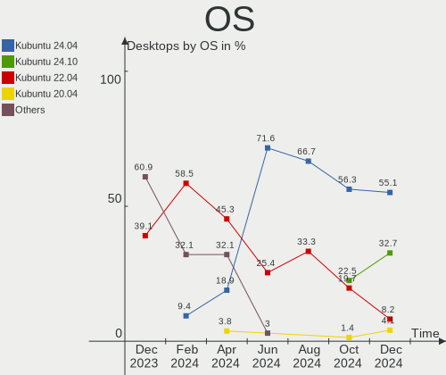
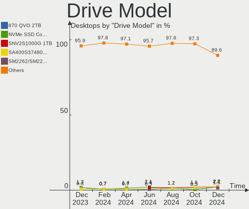
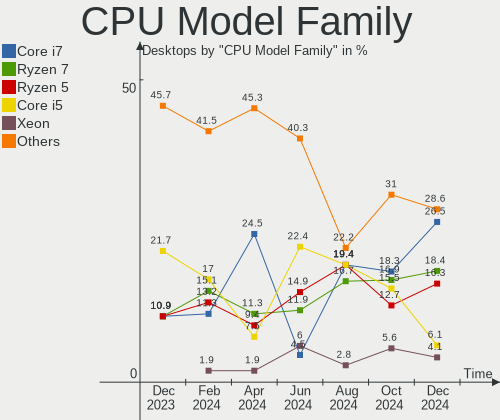

Kubuntu - Hardware Trends (Desktops)
------------------------------------

A project to identify most popular hardware characteristics and track their change
over time based on data collected by Linux users at https://Linux-Hardware.org.

Anyone can contribute to this report by the [hw-probe](https://github.com/linuxhw/hw-probe) tool:

    sudo -E hw-probe -all -upload

This report is for one last month. Overall report since the beginning of time: [TestDays](https://github.com/linuxhw/TestDays)

Period: Mar, 2023.

Contents
--------

* [ System ](#system)
  - [ OS                       ](#os)
  - [ OS Family                ](#os-family)
  - [ Kernel                   ](#kernel)
  - [ Kernel Family            ](#kernel-family)
  - [ Kernel Major Ver.        ](#kernel-major-ver)
  - [ Arch                     ](#arch)
  - [ DE                       ](#de)
  - [ Display Server           ](#display-server)
  - [ Display Manager          ](#display-manager)
  - [ OS Lang                  ](#os-lang)
  - [ Boot Mode                ](#boot-mode)
  - [ Filesystem               ](#filesystem)
  - [ Part. scheme             ](#part-scheme)
  - [ Dual Boot with Linux/BSD ](#dual-boot-with-linuxbsd)
  - [ Dual Boot (Win)          ](#dual-boot-win)

* [ Board ](#board)
  - [ Vendor                   ](#vendor)
  - [ Model                    ](#model)
  - [ Model Family             ](#model-family)
  - [ MFG Year                 ](#mfg-year)
  - [ Form Factor              ](#form-factor)
  - [ Secure Boot              ](#secure-boot)
  - [ Coreboot                 ](#coreboot)
  - [ RAM Size                 ](#ram-size)
  - [ RAM Used                 ](#ram-used)
  - [ Total Drives             ](#total-drives)
  - [ Has CD-ROM               ](#has-cd-rom)
  - [ Has Ethernet             ](#has-ethernet)
  - [ Has WiFi                 ](#has-wifi)
  - [ Has Bluetooth            ](#has-bluetooth)

* [ Location ](#location)
  - [ Country                  ](#country)
  - [ City                     ](#city)

* [ Drives ](#drives)
  - [ Drive Vendor             ](#drive-vendor)
  - [ Drive Model              ](#drive-model)
  - [ HDD Vendor               ](#hdd-vendor)
  - [ SSD Vendor               ](#ssd-vendor)
  - [ Drive Kind               ](#drive-kind)
  - [ Drive Connector          ](#drive-connector)
  - [ Drive Size               ](#drive-size)
  - [ Space Total              ](#space-total)
  - [ Space Used               ](#space-used)
  - [ Malfunc. Drives          ](#malfunc-drives)
  - [ Malfunc. Drive Vendor    ](#malfunc-drive-vendor)
  - [ Malfunc. HDD Vendor      ](#malfunc-hdd-vendor)
  - [ Malfunc. Drive Kind      ](#malfunc-drive-kind)
  - [ Failed Drives            ](#failed-drives)
  - [ Failed Drive Vendor      ](#failed-drive-vendor)
  - [ Drive Status             ](#drive-status)

* [ Storage controller ](#storage-controller)
  - [ Storage Vendor           ](#storage-vendor)
  - [ Storage Model            ](#storage-model)
  - [ Storage Kind             ](#storage-kind)

* [ Processor ](#processor)
  - [ CPU Vendor               ](#cpu-vendor)
  - [ CPU Model                ](#cpu-model)
  - [ CPU Model Family         ](#cpu-model-family)
  - [ CPU Cores                ](#cpu-cores)
  - [ CPU Sockets              ](#cpu-sockets)
  - [ CPU Threads              ](#cpu-threads)
  - [ CPU Op-Modes             ](#cpu-op-modes)
  - [ CPU Microcode            ](#cpu-microcode)
  - [ CPU Microarch            ](#cpu-microarch)

* [ Graphics ](#graphics)
  - [ GPU Vendor               ](#gpu-vendor)
  - [ GPU Model                ](#gpu-model)
  - [ GPU Combo                ](#gpu-combo)
  - [ GPU Driver               ](#gpu-driver)
  - [ GPU Memory               ](#gpu-memory)

* [ Monitor ](#monitor)
  - [ Monitor Vendor           ](#monitor-vendor)
  - [ Monitor Model            ](#monitor-model)
  - [ Monitor Resolution       ](#monitor-resolution)
  - [ Monitor Diagonal         ](#monitor-diagonal)
  - [ Monitor Width            ](#monitor-width)
  - [ Aspect Ratio             ](#aspect-ratio)
  - [ Monitor Area             ](#monitor-area)
  - [ Pixel Density            ](#pixel-density)
  - [ Multiple Monitors        ](#multiple-monitors)

* [ Network ](#network)
  - [ Net Controller Vendor    ](#net-controller-vendor)
  - [ Net Controller Model     ](#net-controller-model)
  - [ Wireless Vendor          ](#wireless-vendor)
  - [ Wireless Model           ](#wireless-model)
  - [ Ethernet Vendor          ](#ethernet-vendor)
  - [ Ethernet Model           ](#ethernet-model)
  - [ Net Controller Kind      ](#net-controller-kind)
  - [ Used Controller          ](#used-controller)
  - [ NICs                     ](#nics)
  - [ IPv6                     ](#ipv6)

* [ Bluetooth ](#bluetooth)
  - [ Bluetooth Vendor         ](#bluetooth-vendor)
  - [ Bluetooth Model          ](#bluetooth-model)

* [ Sound ](#sound)
  - [ Sound Vendor             ](#sound-vendor)
  - [ Sound Model              ](#sound-model)

* [ Memory ](#memory)
  - [ Memory Vendor            ](#memory-vendor)
  - [ Memory Model             ](#memory-model)
  - [ Memory Kind              ](#memory-kind)
  - [ Memory Form Factor       ](#memory-form-factor)
  - [ Memory Size              ](#memory-size)
  - [ Memory Speed             ](#memory-speed)

* [ Printers & scanners ](#printers--scanners)
  - [ Printer Vendor           ](#printer-vendor)
  - [ Printer Model            ](#printer-model)
  - [ Scanner Vendor           ](#scanner-vendor)
  - [ Scanner Model            ](#scanner-model)

* [ Camera ](#camera)
  - [ Camera Vendor            ](#camera-vendor)
  - [ Camera Model             ](#camera-model)

* [ Security ](#security)
  - [ Fingerprint Vendor       ](#fingerprint-vendor)
  - [ Fingerprint Model        ](#fingerprint-model)
  - [ Chipcard Vendor          ](#chipcard-vendor)
  - [ Chipcard Model           ](#chipcard-model)

* [ Unsupported ](#unsupported)
  - [ Unsupported Devices      ](#unsupported-devices)
  - [ Unsupported Device Types ](#unsupported-device-types)

System
------

OS
--

Installed operating systems

| Name          | Desktops | Percent |
|---------------|----------|---------|
| Kubuntu 22.04 | 28       | 47.46%  |
| Kubuntu 22.10 | 22       | 37.29%  |
| Kubuntu 11    | 3        | 5.08%   |
| Kubuntu 23.04 | 2        | 3.39%   |
| Kubuntu 20.04 | 2        | 3.39%   |
| Kubuntu 18.04 | 2        | 3.39%   |

OS Family
---------

OS without a version

| Name    | Desktops | Percent |
|---------|----------|---------|
| Kubuntu | 59       | 100%    |

Kernel
------

Version of the Linux kernel

| Version                | Desktops | Percent |
|------------------------|----------|---------|
| 5.19.0-35-generic      | 24       | 40.68%  |
| 5.15.0-67-generic      | 12       | 20.34%  |
| 5.19.0-38-generic      | 6        | 10.17%  |
| 5.19.0-21-generic      | 2        | 3.39%   |
| 5.15.0-69-generic      | 2        | 3.39%   |
| 6.2.7-060207-generic   | 1        | 1.69%   |
| 6.2.5-060205-generic   | 1        | 1.69%   |
| 6.1.18-060118-generic  | 1        | 1.69%   |
| 6.1.0-16-generic       | 1        | 1.69%   |
| 5.4.0-144-generic      | 1        | 1.69%   |
| 5.4.0-131-generic      | 1        | 1.69%   |
| 5.19.0-32-generic      | 1        | 1.69%   |
| 5.19.0-31-generic      | 1        | 1.69%   |
| 5.19.0-1021-lowlatency | 1        | 1.69%   |
| 5.15.0-67-lowlatency   | 1        | 1.69%   |
| 5.15.0-47-generic      | 1        | 1.69%   |
| 5.15.0-25-generic      | 1        | 1.69%   |
| 4.15.0-206-generic     | 1        | 1.69%   |

Kernel Family
-------------

Linux kernel without a distro release

| Version | Desktops | Percent |
|---------|----------|---------|
| 5.19.0  | 35       | 59.32%  |
| 5.15.0  | 17       | 28.81%  |
| 5.4.0   | 2        | 3.39%   |
| 6.2.7   | 1        | 1.69%   |
| 6.2.5   | 1        | 1.69%   |
| 6.1.18  | 1        | 1.69%   |
| 6.1.0   | 1        | 1.69%   |
| 4.15.0  | 1        | 1.69%   |

Kernel Major Ver.
-----------------

Linux kernel major version

| Version | Desktops | Percent |
|---------|----------|---------|
| 5.19    | 35       | 59.32%  |
| 5.15    | 17       | 28.81%  |
| 6.2     | 2        | 3.39%   |
| 6.1     | 2        | 3.39%   |
| 5.4     | 2        | 3.39%   |
| 4.15    | 1        | 1.69%   |

Arch
----

OS architecture (x86_64, i586, etc.)

| Name   | Desktops | Percent |
|--------|----------|---------|
| x86_64 | 59       | 100%    |

DE
--

Desktop Environment

| Name     | Desktops | Percent |
|----------|----------|---------|
| KDE5     | 57       | 96.61%  |
| KDE      | 1        | 1.69%   |
| Cinnamon | 1        | 1.69%   |

Display Server
--------------

X11 or Wayland

| Name    | Desktops | Percent |
|---------|----------|---------|
| X11     | 58       | 98.31%  |
| Wayland | 1        | 1.69%   |

Display Manager
---------------

SDDM, LightDM, etc.

| Name    | Desktops | Percent |
|---------|----------|---------|
| SDDM    | 35       | 59.32%  |
| Unknown | 19       | 32.2%   |
| GDM3    | 4        | 6.78%   |
| LightDM | 1        | 1.69%   |

OS Lang
-------

Language

| Lang  | Desktops | Percent |
|-------|----------|---------|
| en_US | 20       | 33.9%   |
| de_DE | 9        | 15.25%  |
| pt_BR | 5        | 8.47%   |
| fr_FR | 4        | 6.78%   |
| nl_NL | 3        | 5.08%   |
| it_IT | 3        | 5.08%   |
| ru_RU | 2        | 3.39%   |
| es_ES | 2        | 3.39%   |
| en_CA | 2        | 3.39%   |
| de_AT | 2        | 3.39%   |
| sl_SI | 1        | 1.69%   |
| es_VE | 1        | 1.69%   |
| es_PY | 1        | 1.69%   |
| en_IN | 1        | 1.69%   |
| en_GB | 1        | 1.69%   |
| en_AU | 1        | 1.69%   |
| C     | 1        | 1.69%   |

Boot Mode
---------

EFI or BIOS

| Mode | Desktops | Percent |
|------|----------|---------|
| BIOS | 37       | 62.71%  |
| EFI  | 22       | 37.29%  |

Filesystem
----------

Type of filesystem

| Type  | Desktops | Percent |
|-------|----------|---------|
| Ext4  | 54       | 91.53%  |
| Btrfs | 3        | 5.08%   |
| Xfs   | 2        | 3.39%   |

Part. scheme
------------

Scheme of partitioning

| Type    | Desktops | Percent |
|---------|----------|---------|
| GPT     | 34       | 57.63%  |
| Unknown | 19       | 32.2%   |
| MBR     | 6        | 10.17%  |

Dual Boot with Linux/BSD
------------------------

Hosting more than one Linux/BSD

| Dual boot | Desktops | Percent |
|-----------|----------|---------|
| No        | 54       | 91.53%  |
| Yes       | 5        | 8.47%   |

Dual Boot (Win)
---------------

Hosting Linux and Windows

| Dual boot | Desktops | Percent |
|-----------|----------|---------|
| No        | 45       | 76.27%  |
| Yes       | 14       | 23.73%  |

Board
-----

Vendor
------

Motherboard manufacturer

| Name                | Desktops | Percent |
|---------------------|----------|---------|
| ASUSTek Computer    | 18       | 30.51%  |
| Gigabyte Technology | 14       | 23.73%  |
| MSI                 | 9        | 15.25%  |
| Hewlett-Packard     | 6        | 10.17%  |
| Lenovo              | 5        | 8.47%   |
| Acer                | 2        | 3.39%   |
| Supermicro          | 1        | 1.69%   |
| Intel               | 1        | 1.69%   |
| Dell                | 1        | 1.69%   |
| ASRockRack          | 1        | 1.69%   |
| Unknown             | 1        | 1.69%   |

Model
-----

Motherboard model

| Name                                      | Desktops | Percent |
|-------------------------------------------|----------|---------|
| MSI MS-7C91                               | 3        | 5.08%   |
| ASUS ROG Maximus XII FORMULA              | 2        | 3.39%   |
| ASUS All Series                           | 2        | 3.39%   |
| Supermicro PIO-1UDP10-01-AI036            | 1        | 1.69%   |
| MSI MS-7D43                               | 1        | 1.69%   |
| MSI MS-7C86                               | 1        | 1.69%   |
| MSI MS-7B24                               | 1        | 1.69%   |
| MSI MS-7971                               | 1        | 1.69%   |
| MSI MS-7816                               | 1        | 1.69%   |
| MSI MS-7693                               | 1        | 1.69%   |
| Lenovo ThinkStation P300 30AH004MUS       | 1        | 1.69%   |
| Lenovo ThinkCentre M93 10A4S03D00         | 1        | 1.69%   |
| Lenovo ThinkCentre M58 9728AHG            | 1        | 1.69%   |
| Lenovo IdeaCentre 310S-08ASR 90g9         | 1        | 1.69%   |
| Lenovo IdeaCentre 300S-08IHH 90F10068US   | 1        | 1.69%   |
| Intel DH67BL AAG10189-208                 | 1        | 1.69%   |
| HP Victus by 15L Gaming Desktop TG02-0xxx | 1        | 1.69%   |
| HP ProDesk 490 G2 MT                      | 1        | 1.69%   |
| HP EliteDesk 800 G1 SFF                   | 1        | 1.69%   |
| HP EliteDesk 705 G3 Brazil Desktop Mini   | 1        | 1.69%   |
| HP Compaq dc7800p Convertible Minitower   | 1        | 1.69%   |
| HP 550-262ng                              | 1        | 1.69%   |
| Gigabyte Z97X-Gaming 3                    | 1        | 1.69%   |
| Gigabyte Z270X-Ultra Gaming               | 1        | 1.69%   |
| Gigabyte X670E AORUS MASTER               | 1        | 1.69%   |
| Gigabyte X58A-UD7                         | 1        | 1.69%   |
| Gigabyte H410M H V3                       | 1        | 1.69%   |
| Gigabyte H170-D3HP                        | 1        | 1.69%   |
| Gigabyte EX58-UD5                         | 1        | 1.69%   |
| Gigabyte B560M DS3H V2                    | 1        | 1.69%   |
| Gigabyte B550 AORUS ELITE V2              | 1        | 1.69%   |
| Gigabyte B550 AORUS ELITE AX V2           | 1        | 1.69%   |
| Gigabyte B450 AORUS M                     | 1        | 1.69%   |
| Gigabyte B365M DS3H                       | 1        | 1.69%   |
| Gigabyte A320M-S2H                        | 1        | 1.69%   |
| Gigabyte 5946                             | 1        | 1.69%   |
| Dell OptiPlex 780                         | 1        | 1.69%   |
| ASUS SABERTOOTH Z77                       | 1        | 1.69%   |
| ASUS ROG STRIX Z390-E GAMING              | 1        | 1.69%   |
| ASUS ROG STRIX B650-A GAMING WIFI         | 1        | 1.69%   |

Model Family
------------

Motherboard model prefix

| Name                           | Desktops | Percent |
|--------------------------------|----------|---------|
| ASUS ROG                       | 5        | 8.47%   |
| ASUS PRIME                     | 5        | 8.47%   |
| MSI MS-7C91                    | 3        | 5.08%   |
| Lenovo ThinkCentre             | 2        | 3.39%   |
| Lenovo IdeaCentre              | 2        | 3.39%   |
| HP EliteDesk                   | 2        | 3.39%   |
| Gigabyte B550                  | 2        | 3.39%   |
| ASUS All                       | 2        | 3.39%   |
| Acer Aspire                    | 2        | 3.39%   |
| Supermicro PIO-1UDP10-01-AI036 | 1        | 1.69%   |
| MSI MS-7D43                    | 1        | 1.69%   |
| MSI MS-7C86                    | 1        | 1.69%   |
| MSI MS-7B24                    | 1        | 1.69%   |
| MSI MS-7971                    | 1        | 1.69%   |
| MSI MS-7816                    | 1        | 1.69%   |
| MSI MS-7693                    | 1        | 1.69%   |
| Lenovo ThinkStation            | 1        | 1.69%   |
| Intel DH67BL                   | 1        | 1.69%   |
| HP Victus                      | 1        | 1.69%   |
| HP ProDesk                     | 1        | 1.69%   |
| HP Compaq                      | 1        | 1.69%   |
| HP 550-262ng                   | 1        | 1.69%   |
| Gigabyte Z97X-Gaming           | 1        | 1.69%   |
| Gigabyte Z270X-Ultra           | 1        | 1.69%   |
| Gigabyte X670E                 | 1        | 1.69%   |
| Gigabyte X58A-UD7              | 1        | 1.69%   |
| Gigabyte H410M                 | 1        | 1.69%   |
| Gigabyte H170-D3HP             | 1        | 1.69%   |
| Gigabyte EX58-UD5              | 1        | 1.69%   |
| Gigabyte B560M                 | 1        | 1.69%   |
| Gigabyte B450                  | 1        | 1.69%   |
| Gigabyte B365M                 | 1        | 1.69%   |
| Gigabyte A320M-S2H             | 1        | 1.69%   |
| Gigabyte 5946                  | 1        | 1.69%   |
| Dell OptiPlex                  | 1        | 1.69%   |
| ASUS SABERTOOTH                | 1        | 1.69%   |
| ASUS P9X79                     | 1        | 1.69%   |
| ASUS P8Z77-V                   | 1        | 1.69%   |
| ASUS M5A78L-M                  | 1        | 1.69%   |
| ASUS H61M-K                    | 1        | 1.69%   |

MFG Year
--------

Motherboard manufacture year

| Year | Desktops | Percent |
|------|----------|---------|
| 2021 | 9        | 15.25%  |
| 2015 | 8        | 13.56%  |
| 2022 | 6        | 10.17%  |
| 2020 | 6        | 10.17%  |
| 2013 | 4        | 6.78%   |
| 2012 | 4        | 6.78%   |
| 2019 | 3        | 5.08%   |
| 2018 | 3        | 5.08%   |
| 2014 | 3        | 5.08%   |
| 2017 | 2        | 3.39%   |
| 2016 | 2        | 3.39%   |
| 2011 | 2        | 3.39%   |
| 2010 | 2        | 3.39%   |
| 2008 | 2        | 3.39%   |
| 2023 | 1        | 1.69%   |
| 2009 | 1        | 1.69%   |
| 2007 | 1        | 1.69%   |

Form Factor
-----------

Physical design of the computer

| Name    | Desktops | Percent |
|---------|----------|---------|
| Desktop | 59       | 100%    |

Secure Boot
-----------

Enabled or disabled

| State    | Desktops | Percent |
|----------|----------|---------|
| Disabled | 56       | 94.92%  |
| Enabled  | 3        | 5.08%   |

Coreboot
--------

Have coreboot on board

| Used | Desktops | Percent |
|------|----------|---------|
| No   | 59       | 100%    |

RAM Size
--------

Total RAM memory

| Size in GB  | Desktops | Percent |
|-------------|----------|---------|
| 16.01-24.0  | 17       | 28.81%  |
| 32.01-64.0  | 15       | 25.42%  |
| 4.01-8.0    | 9        | 15.25%  |
| 64.01-256.0 | 7        | 11.86%  |
| 8.01-16.0   | 6        | 10.17%  |
| 3.01-4.0    | 4        | 6.78%   |
| 24.01-32.0  | 1        | 1.69%   |

RAM Used
--------

Used RAM memory

| Used GB    | Desktops | Percent |
|------------|----------|---------|
| 2.01-3.0   | 19       | 32.2%   |
| 4.01-8.0   | 18       | 30.51%  |
| 1.01-2.0   | 8        | 13.56%  |
| 3.01-4.0   | 7        | 11.86%  |
| 16.01-24.0 | 3        | 5.08%   |
| 8.01-16.0  | 3        | 5.08%   |
| 32.01-64.0 | 1        | 1.69%   |

Total Drives
------------

Number of drives on board

| Drives | Desktops | Percent |
|--------|----------|---------|
| 1      | 28       | 47.46%  |
| 2      | 17       | 28.81%  |
| 3      | 7        | 11.86%  |
| 4      | 5        | 8.47%   |
| 7      | 1        | 1.69%   |
| 5      | 1        | 1.69%   |

Has CD-ROM
----------

Has CD-ROM on board

| Presented | Desktops | Percent |
|-----------|----------|---------|
| No        | 34       | 57.63%  |
| Yes       | 25       | 42.37%  |

Has Ethernet
------------

Has Ethernet on board

| Presented | Desktops | Percent |
|-----------|----------|---------|
| Yes       | 58       | 98.31%  |
| No        | 1        | 1.69%   |

Has WiFi
--------

Has WiFi module

| Presented | Desktops | Percent |
|-----------|----------|---------|
| No        | 31       | 52.54%  |
| Yes       | 28       | 47.46%  |

Has Bluetooth
-------------

Has Bluetooth module

| Presented | Desktops | Percent |
|-----------|----------|---------|
| No        | 32       | 54.24%  |
| Yes       | 27       | 45.76%  |

Location
--------

Country
-------

Geographic location (country)

| Country     | Desktops | Percent |
|-------------|----------|---------|
| USA         | 15       | 25.42%  |
| Germany     | 12       | 20.34%  |
| Brazil      | 5        | 8.47%   |
| Netherlands | 4        | 6.78%   |
| France      | 4        | 6.78%   |
| Italy       | 3        | 5.08%   |
| Canada      | 3        | 5.08%   |
| Spain       | 2        | 3.39%   |
| Venezuela   | 1        | 1.69%   |
| Switzerland | 1        | 1.69%   |
| Sweden      | 1        | 1.69%   |
| Slovenia    | 1        | 1.69%   |
| Russia      | 1        | 1.69%   |
| Romania     | 1        | 1.69%   |
| Poland      | 1        | 1.69%   |
| Paraguay    | 1        | 1.69%   |
| India       | 1        | 1.69%   |
| Austria     | 1        | 1.69%   |
| Australia   | 1        | 1.69%   |

City
----

Geographic location (city)

| City              | Desktops | Percent |
|-------------------|----------|---------|
| Hamburg           | 2        | 3.39%   |
| Dallas            | 2        | 3.39%   |
| Caruaru           | 2        | 3.39%   |
| Zuid-Scharwoude   | 1        | 1.69%   |
| Waldkraiburg      | 1        | 1.69%   |
| Vienna            | 1        | 1.69%   |
| Umeå             | 1        | 1.69%   |
| Uettligen         | 1        | 1.69%   |
| Tres Cantos       | 1        | 1.69%   |
| Suhl              | 1        | 1.69%   |
| Strasbourg        | 1        | 1.69%   |
| Steenbergen       | 1        | 1.69%   |
| Springfield       | 1        | 1.69%   |
| Spring Hill       | 1        | 1.69%   |
| Somerville        | 1        | 1.69%   |
| Seattle           | 1        | 1.69%   |
| Rzeszów          | 1        | 1.69%   |
| Recklinghausen    | 1        | 1.69%   |
| Porto Alegre      | 1        | 1.69%   |
| Pittsford         | 1        | 1.69%   |
| Parthenstein      | 1        | 1.69%   |
| Moscow            | 1        | 1.69%   |
| Montreal          | 1        | 1.69%   |
| Maravilha         | 1        | 1.69%   |
| Manosque          | 1        | 1.69%   |
| Mangalore         | 1        | 1.69%   |
| Madera            | 1        | 1.69%   |
| Lugoj             | 1        | 1.69%   |
| Ljubljana         | 1        | 1.69%   |
| Lexington         | 1        | 1.69%   |
| Laurier-station   | 1        | 1.69%   |
| Jena              | 1        | 1.69%   |
| Indianapolis      | 1        | 1.69%   |
| Haarlem           | 1        | 1.69%   |
| Gruenenplan       | 1        | 1.69%   |
| Glashuette        | 1        | 1.69%   |
| Freudenstadt      | 1        | 1.69%   |
| Frankfurt am Main | 1        | 1.69%   |
| Foix              | 1        | 1.69%   |
| Foggia            | 1        | 1.69%   |

Drives
------

Drive Vendor
------------

Hard drive vendors

| Vendor                      | Desktops | Drives | Percent |
|-----------------------------|----------|--------|---------|
| WDC                         | 19       | 20     | 19%     |
| Samsung Electronics         | 15       | 22     | 15%     |
| Seagate                     | 13       | 15     | 13%     |
| SanDisk                     | 7        | 8      | 7%      |
| Toshiba                     | 6        | 6      | 6%      |
| Hitachi                     | 4        | 4      | 4%      |
| Crucial                     | 4        | 8      | 4%      |
| Kingston Technology Company | 3        | 3      | 3%      |
| Kingston                    | 3        | 3      | 3%      |
| China                       | 3        | 3      | 3%      |
| Unknown                     | 2        | 2      | 2%      |
| Phison Electronics          | 2        | 2      | 2%      |
| Maxtor                      | 2        | 2      | 2%      |
| A-DATA Technology           | 2        | 2      | 2%      |
| Verbatim                    | 1        | 1      | 1%      |
| SK hynix                    | 1        | 1      | 1%      |
| PNY                         | 1        | 1      | 1%      |
| Phison                      | 1        | 1      | 1%      |
| Patriot                     | 1        | 1      | 1%      |
| Netac                       | 1        | 1      | 1%      |
| Micron/Crucial Technology   | 1        | 1      | 1%      |
| Lexar                       | 1        | 1      | 1%      |
| KIOXIA-EXCERIA              | 1        | 1      | 1%      |
| Intel                       | 1        | 1      | 1%      |
| Hoodisk                     | 1        | 1      | 1%      |
| Hjwdz                       | 1        | 1      | 1%      |
| faspeed                     | 1        | 1      | 1%      |
| Corsair                     | 1        | 1      | 1%      |
| ADATA Technology            | 1        | 1      | 1%      |

Drive Model
-----------

Hard drive models

| Model                                 | Desktops | Percent |
|---------------------------------------|----------|---------|
| Kingston Company A2000 NVMe SSD 500GB | 3        | 2.78%   |
| WDC WD5000AAKX-22ERMA0 500GB          | 2        | 1.85%   |
| WDC WD20EARX-00PASB0 2TB              | 2        | 1.85%   |
| WDC WD10EZEX-60WN4A0 1TB              | 2        | 1.85%   |
| Toshiba HDWD110 1TB                   | 2        | 1.85%   |
| Seagate ST2000LM007-1R8174 2TB        | 2        | 1.85%   |
| Seagate ST2000DM001-1ER164 2TB        | 2        | 1.85%   |
| Seagate ST1000DM003-9YN162 1TB        | 2        | 1.85%   |
| Samsung SSD 980 PRO 500GB             | 2        | 1.85%   |
| Samsung SSD 860 EVO 500GB             | 2        | 1.85%   |
| Samsung SSD 850 EVO 500GB             | 2        | 1.85%   |
| Crucial CT2000MX500SSD1 2TB           | 2        | 1.85%   |
| WDC WD80EFBX-68AZZN0 8TB              | 1        | 0.93%   |
| WDC WD60EZAZ-00SF3B0 6TB              | 1        | 0.93%   |
| WDC WD5000AAKX-001CA0 500GB           | 1        | 0.93%   |
| WDC WD5000AAKS-22V1A0 500GB           | 1        | 0.93%   |
| WDC WD40EZRZ-00GXCB0 4TB              | 1        | 0.93%   |
| WDC WD2500KS-00MJB0 250GB             | 1        | 0.93%   |
| WDC WD2002FYPS-02W3B0 2TB             | 1        | 0.93%   |
| WDC WD10PURZ-85U8XY0 1TB              | 1        | 0.93%   |
| WDC WD10EZEX-08WN4A0 1TB              | 1        | 0.93%   |
| WDC WD10EURX-73C57Y0 1TB              | 1        | 0.93%   |
| WDC WD1000DHTZ-04N21V1 1TB            | 1        | 0.93%   |
| WDC WD10 EZEX-08WN4A0 1TB             | 1        | 0.93%   |
| WDC PC SN530 SDBPNPZ-1T00-1006 1TB    | 1        | 0.93%   |
| Verbatim Vi550 S3 SSD 128GB           | 1        | 0.93%   |
| Unknown SZ9ST3128ETM0L11 128GB        | 1        | 0.93%   |
| Unknown SD/MMC/MS PRO 64GB            | 1        | 0.93%   |
| Toshiba MQ01ABF032 320GB              | 1        | 0.93%   |
| Toshiba HDWQ140 4TB                   | 1        | 0.93%   |
| Toshiba HDWE160 6TB                   | 1        | 0.93%   |
| Toshiba DT01ACA200 2TB                | 1        | 0.93%   |
| SK hynix SHGP31-1000GM 1TB            | 1        | 0.93%   |
| Seagate ST9500620NS 500GB             | 1        | 0.93%   |
| Seagate ST500DM002-1BD142 500GB       | 1        | 0.93%   |
| Seagate ST4000DM004-2CV104 4TB        | 1        | 0.93%   |
| Seagate ST3250310AS 250GB             | 1        | 0.93%   |
| Seagate ST2000DX001-SSHD-8GB          | 1        | 0.93%   |
| Seagate ST2000DX001-1NS164 2TB        | 1        | 0.93%   |
| Seagate ST2000DX001-1CM164 2TB        | 1        | 0.93%   |

HDD Vendor
----------

Hard disk drive vendors

| Vendor              | Desktops | Drives | Percent |
|---------------------|----------|--------|---------|
| WDC                 | 18       | 19     | 40.91%  |
| Seagate             | 12       | 14     | 27.27%  |
| Toshiba             | 6        | 6      | 13.64%  |
| Hitachi             | 4        | 4      | 9.09%   |
| Maxtor              | 2        | 2      | 4.55%   |
| Unknown             | 1        | 1      | 2.27%   |
| Samsung Electronics | 1        | 1      | 2.27%   |

SSD Vendor
----------

Solid state drive vendors

| Vendor              | Desktops | Drives | Percent |
|---------------------|----------|--------|---------|
| Samsung Electronics | 10       | 13     | 31.25%  |
| SanDisk             | 4        | 5      | 12.5%   |
| Crucial             | 4        | 8      | 12.5%   |
| Kingston            | 3        | 3      | 9.38%   |
| China               | 3        | 3      | 9.38%   |
| A-DATA Technology   | 2        | 2      | 6.25%   |
| Verbatim            | 1        | 1      | 3.13%   |
| PNY                 | 1        | 1      | 3.13%   |
| Patriot             | 1        | 1      | 3.13%   |
| Hoodisk             | 1        | 1      | 3.13%   |
| faspeed             | 1        | 1      | 3.13%   |
| Corsair             | 1        | 1      | 3.13%   |

Drive Kind
----------

HDD or SSD

| Kind    | Desktops | Drives | Percent |
|---------|----------|--------|---------|
| HDD     | 35       | 47     | 39.77%  |
| SSD     | 28       | 40     | 31.82%  |
| NVMe    | 23       | 26     | 26.14%  |
| Unknown | 2        | 2      | 2.27%   |

Drive Connector
---------------

SATA, SAS, NVMe, etc.

| Type | Desktops | Drives | Percent |
|------|----------|--------|---------|
| SATA | 48       | 83     | 63.16%  |
| NVMe | 23       | 26     | 30.26%  |
| SAS  | 5        | 6      | 6.58%   |

Drive Size
----------

Size of hard drive

| Size in TB | Desktops | Drives | Percent |
|------------|----------|--------|---------|
| 0.01-0.5   | 32       | 42     | 48.48%  |
| 0.51-1.0   | 16       | 20     | 24.24%  |
| 1.01-2.0   | 11       | 18     | 16.67%  |
| 3.01-4.0   | 3        | 3      | 4.55%   |
| 4.01-10.0  | 3        | 3      | 4.55%   |
| 2.01-3.0   | 1        | 1      | 1.52%   |

Space Total
-----------

Amount of disk space available on the file system

| Size in GB     | Desktops | Percent |
|----------------|----------|---------|
| 501-1000       | 18       | 30.51%  |
| 1001-2000      | 11       | 18.64%  |
| 251-500        | 9        | 15.25%  |
| More than 3000 | 8        | 13.56%  |
| 101-250        | 6        | 10.17%  |
| 2001-3000      | 5        | 8.47%   |
| 1-20           | 1        | 1.69%   |
| 51-100         | 1        | 1.69%   |

Space Used
----------

Amount of used disk space

| Used GB        | Desktops | Percent |
|----------------|----------|---------|
| 501-1000       | 11       | 18.64%  |
| 251-500        | 9        | 15.25%  |
| 101-250        | 9        | 15.25%  |
| 1001-2000      | 8        | 13.56%  |
| 21-50          | 7        | 11.86%  |
| 1-20           | 7        | 11.86%  |
| 51-100         | 5        | 8.47%   |
| More than 3000 | 2        | 3.39%   |
| 2001-3000      | 1        | 1.69%   |

Malfunc. Drives
---------------

Drive models with a malfunction

| Model                          | Desktops | Drives | Percent |
|--------------------------------|----------|--------|---------|
| WDC WD40EZRZ-00GXCB0 4TB       | 1        | 1      | 12.5%   |
| WDC WD10EZEX-60WN4A0 1TB       | 1        | 1      | 12.5%   |
| WDC WD10EURX-73C57Y0 1TB       | 1        | 1      | 12.5%   |
| Toshiba MQ01ABF032 320GB       | 1        | 1      | 12.5%   |
| Seagate ST3250310AS 250GB      | 1        | 1      | 12.5%   |
| Seagate ST2000DX001-1NS164 2TB | 1        | 1      | 12.5%   |
| SanDisk SSD PLUS 480GB         | 1        | 2      | 12.5%   |
| Crucial CT512M550SSD1 512GB    | 1        | 1      | 12.5%   |

Malfunc. Drive Vendor
---------------------

Vendors of faulty drives

| Vendor  | Desktops | Drives | Percent |
|---------|----------|--------|---------|
| WDC     | 3        | 3      | 37.5%   |
| Seagate | 2        | 2      | 25%     |
| Toshiba | 1        | 1      | 12.5%   |
| SanDisk | 1        | 2      | 12.5%   |
| Crucial | 1        | 1      | 12.5%   |

Malfunc. HDD Vendor
-------------------

Vendors of faulty HDD drives

| Vendor  | Desktops | Drives | Percent |
|---------|----------|--------|---------|
| WDC     | 3        | 3      | 50%     |
| Seagate | 2        | 2      | 33.33%  |
| Toshiba | 1        | 1      | 16.67%  |

Malfunc. Drive Kind
-------------------

Kinds of faulty drives

| Kind | Desktops | Drives | Percent |
|------|----------|--------|---------|
| HDD  | 6        | 6      | 75%     |
| SSD  | 2        | 3      | 25%     |

Failed Drives
-------------

Failed drive models

Zero info for selected period =(

Failed Drive Vendor
-------------------

Failed drive vendors

Zero info for selected period =(

Drive Status
------------

Number of failed and malfunc. drives

| Status   | Desktops | Drives | Percent |
|----------|----------|--------|---------|
| Detected | 34       | 62     | 50%     |
| Works    | 26       | 44     | 38.24%  |
| Malfunc  | 8        | 9      | 11.76%  |

Storage controller
------------------

Storage Vendor
--------------

Storage controller vendors

| Vendor                       | Desktops | Percent |
|------------------------------|----------|---------|
| Intel                        | 39       | 45.35%  |
| AMD                          | 18       | 20.93%  |
| Samsung Electronics          | 6        | 6.98%   |
| SanDisk                      | 4        | 4.65%   |
| Phison Electronics           | 3        | 3.49%   |
| Kingston Technology Company  | 3        | 3.49%   |
| ASMedia Technology           | 3        | 3.49%   |
| Marvell Technology Group     | 2        | 2.33%   |
| JMicron Technology           | 2        | 2.33%   |
| SK hynix                     | 1        | 1.16%   |
| Shenzhen Longsys Electronics | 1        | 1.16%   |
| Seagate Technology           | 1        | 1.16%   |
| Netac Technology             | 1        | 1.16%   |
| Micron/Crucial Technology    | 1        | 1.16%   |
| ADATA Technology             | 1        | 1.16%   |

Storage Model
-------------

Storage controller models

| Model                                                                          | Desktops | Percent |
|--------------------------------------------------------------------------------|----------|---------|
| AMD FCH SATA Controller [AHCI mode]                                            | 10       | 9.9%    |
| Intel 8 Series/C220 Series Chipset Family 6-port SATA Controller 1 [AHCI mode] | 6        | 5.94%   |
| AMD 500 Series Chipset SATA Controller                                         | 6        | 5.94%   |
| Intel 500 Series Chipset Family SATA AHCI Controller                           | 5        | 4.95%   |
| Intel 6 Series/C200 Series Chipset Family 6 port Desktop SATA AHCI Controller  | 4        | 3.96%   |
| Samsung NVMe SSD Controller SM981/PM981/PM983                                  | 3        | 2.97%   |
| Kingston Company A2000 NVMe SSD                                                | 3        | 2.97%   |
| Intel 9 Series Chipset Family SATA Controller [AHCI Mode]                      | 3        | 2.97%   |
| ASMedia ASM1062 Serial ATA Controller                                          | 3        | 2.97%   |
| Samsung NVMe SSD Controller PM9A1/PM9A3/980PRO                                 | 2        | 1.98%   |
| Phison E18 PCIe4 NVMe Controller                                               | 2        | 1.98%   |
| JMicron JMB363 SATA/IDE Controller                                             | 2        | 1.98%   |
| Intel Q170/Q150/B150/H170/H110/Z170/CM236 Chipset SATA Controller [AHCI Mode]  | 2        | 1.98%   |
| Intel Cannon Lake PCH SATA AHCI Controller                                     | 2        | 1.98%   |
| Intel C600/X79 series chipset 6-Port SATA AHCI Controller                      | 2        | 1.98%   |
| Intel Alder Lake-S PCH SATA Controller [AHCI Mode]                             | 2        | 1.98%   |
| Intel 7 Series/C210 Series Chipset Family 6-port SATA Controller [AHCI mode]   | 2        | 1.98%   |
| Intel 4 Series Chipset PT IDER Controller                                      | 2        | 1.98%   |
| Intel 200 Series PCH SATA controller [AHCI mode]                               | 2        | 1.98%   |
| AMD FCH SATA Controller D                                                      | 2        | 1.98%   |
| SK hynix Gold P31/PC711 NVMe Solid State Drive                                 | 1        | 0.99%   |
| Shenzhen Longsys Non-Volatile memory controller                                | 1        | 0.99%   |
| Seagate FireCuda 530 SSD                                                       | 1        | 0.99%   |
| SanDisk WD Blue SN570 NVMe SSD 1TB                                             | 1        | 0.99%   |
| SanDisk WD Blue SN550 NVMe SSD                                                 | 1        | 0.99%   |
| SanDisk WD Black 2018/SN750 / PC SN720 NVMe SSD                                | 1        | 0.99%   |
| SanDisk Non-Volatile memory controller                                         | 1        | 0.99%   |
| Samsung NVMe SSD Controller SM951/PM951                                        | 1        | 0.99%   |
| Samsung NVMe SSD Controller 980                                                | 1        | 0.99%   |
| Phison E12 NVMe Controller                                                     | 1        | 0.99%   |
| Netac Non-Volatile memory controller                                           | 1        | 0.99%   |
| Micron/Crucial P2 NVMe PCIe SSD                                                | 1        | 0.99%   |
| Marvell Group 88SE91A3 SATA-600 Controller                                     | 1        | 0.99%   |
| Marvell Group 88SE9120 SATA 6Gb/s Controller                                   | 1        | 0.99%   |
| Intel Volume Management Device NVMe RAID Controller                            | 1        | 0.99%   |
| Intel SSD 600P Series                                                          | 1        | 0.99%   |
| Intel Jasper Lake SATA AHCI Controller                                         | 1        | 0.99%   |
| Intel C602 chipset 4-Port SATA Storage Control Unit                            | 1        | 0.99%   |
| Intel Atom Processor E3800 Series SATA AHCI Controller                         | 1        | 0.99%   |
| Intel 82Q35 Express PT IDER Controller                                         | 1        | 0.99%   |

Storage Kind
------------

Kind of storage controller (IDE, SATA, NVMe, SAS, ...)

| Kind | Desktops | Percent |
|------|----------|---------|
| SATA | 53       | 62.35%  |
| NVMe | 23       | 27.06%  |
| IDE  | 6        | 7.06%   |
| RAID | 2        | 2.35%   |
| SAS  | 1        | 1.18%   |

Processor
---------

CPU Vendor
----------

Processor vendors

| Vendor | Desktops | Percent |
|--------|----------|---------|
| Intel  | 41       | 69.49%  |
| AMD    | 18       | 30.51%  |

CPU Model
---------

Processor models

| Model                                 | Desktops | Percent |
|---------------------------------------|----------|---------|
| Intel Core i5-10400F CPU @ 2.90GHz    | 2        | 3.39%   |
| AMD Ryzen 9 5900X 12-Core Processor   | 2        | 3.39%   |
| AMD FX-6300 Six-Core Processor        | 2        | 3.39%   |
| Intel Xeon CPU E5-2667 v2 @ 3.30GHz   | 1        | 1.69%   |
| Intel Xeon CPU E3-1241 v3 @ 3.50GHz   | 1        | 1.69%   |
| Intel Core i9-9900K CPU @ 3.60GHz     | 1        | 1.69%   |
| Intel Core i9-10900T CPU @ 1.90GHz    | 1        | 1.69%   |
| Intel Core i9-10900K CPU @ 3.70GHz    | 1        | 1.69%   |
| Intel Core i9-10850K CPU @ 3.60GHz    | 1        | 1.69%   |
| Intel Core i7-4820K CPU @ 3.70GHz     | 1        | 1.69%   |
| Intel Core i7-4790K CPU @ 4.00GHz     | 1        | 1.69%   |
| Intel Core i7-4770 CPU @ 3.40GHz      | 1        | 1.69%   |
| Intel Core i7-3770K CPU @ 3.50GHz     | 1        | 1.69%   |
| Intel Core i7-10700F CPU @ 2.90GHz    | 1        | 1.69%   |
| Intel Core i7 CPU X 980 @ 3.33GHz     | 1        | 1.69%   |
| Intel Core i7 CPU 920 @ 2.67GHz       | 1        | 1.69%   |
| Intel Core i5-9600K CPU @ 3.70GHz     | 1        | 1.69%   |
| Intel Core i5-7600K CPU @ 3.80GHz     | 1        | 1.69%   |
| Intel Core i5-6600K CPU @ 3.50GHz     | 1        | 1.69%   |
| Intel Core i5-6500 CPU @ 3.20GHz      | 1        | 1.69%   |
| Intel Core i5-4690 CPU @ 3.50GHz      | 1        | 1.69%   |
| Intel Core i5-4590 CPU @ 3.30GHz      | 1        | 1.69%   |
| Intel Core i5-4460S CPU @ 2.90GHz     | 1        | 1.69%   |
| Intel Core i5-3570K CPU @ 3.40GHz     | 1        | 1.69%   |
| Intel Core i5-3350P CPU @ 3.10GHz     | 1        | 1.69%   |
| Intel Core i5-2400 CPU @ 3.10GHz      | 1        | 1.69%   |
| Intel Core i5-2300 CPU @ 2.80GHz      | 1        | 1.69%   |
| Intel Core i3-4130T CPU @ 2.90GHz     | 1        | 1.69%   |
| Intel Core i3-4130 CPU @ 3.40GHz      | 1        | 1.69%   |
| Intel Core i3-3240 CPU @ 3.40GHz      | 1        | 1.69%   |
| Intel Core i3-10100F CPU @ 3.60GHz    | 1        | 1.69%   |
| Intel Core 2 Quad CPU Q8400 @ 2.66GHz | 1        | 1.69%   |
| Intel Core 2 Duo CPU E8400 @ 3.00GHz  | 1        | 1.69%   |
| Intel Core 2 Duo CPU E7400 @ 2.80GHz  | 1        | 1.69%   |
| Intel Celeron N5105 @ 2.00GHz         | 1        | 1.69%   |
| Intel Celeron G4900 CPU @ 3.10GHz     | 1        | 1.69%   |
| Intel Celeron CPU J1900 @ 1.99GHz     | 1        | 1.69%   |
| Intel Celeron CPU G1840 @ 2.80GHz     | 1        | 1.69%   |
| Intel 13th Gen Core i5-13600K         | 1        | 1.69%   |
| Intel 12th Gen Core i7-12700          | 1        | 1.69%   |

CPU Model Family
----------------

Processor model prefix

| Model             | Desktops | Percent |
|-------------------|----------|---------|
| Intel Core i5     | 13       | 22.03%  |
| Intel Core i7     | 7        | 11.86%  |
| AMD Ryzen 9       | 5        | 8.47%   |
| Other             | 4        | 6.78%   |
| Intel Core i9     | 4        | 6.78%   |
| Intel Core i3     | 4        | 6.78%   |
| Intel Celeron     | 4        | 6.78%   |
| AMD Ryzen 7       | 4        | 6.78%   |
| Intel Xeon        | 2        | 3.39%   |
| Intel Core 2 Duo  | 2        | 3.39%   |
| AMD Ryzen 5       | 2        | 3.39%   |
| AMD FX            | 2        | 3.39%   |
| Intel Core 2 Quad | 1        | 1.69%   |
| AMD PRO A10       | 1        | 1.69%   |
| AMD EPYC          | 1        | 1.69%   |
| AMD A8            | 1        | 1.69%   |
| AMD A6            | 1        | 1.69%   |
| AMD A10           | 1        | 1.69%   |

CPU Cores
---------

Number of processor cores

| Number | Desktops | Percent |
|--------|----------|---------|
| 4      | 20       | 33.9%   |
| 2      | 11       | 18.64%  |
| 8      | 7        | 11.86%  |
| 6      | 7        | 11.86%  |
| 16     | 4        | 6.78%   |
| 12     | 4        | 6.78%   |
| 10     | 3        | 5.08%   |
| 3      | 2        | 3.39%   |
| 14     | 1        | 1.69%   |

CPU Sockets
-----------

Number of sockets

| Number | Desktops | Percent |
|--------|----------|---------|
| 1      | 58       | 98.31%  |
| 2      | 1        | 1.69%   |

CPU Threads
-----------

Threads per core (Hyper-Threading)

| Number | Desktops | Percent |
|--------|----------|---------|
| 2      | 39       | 66.1%   |
| 1      | 20       | 33.9%   |

CPU Op-Modes
------------

CPU Operation Modes (32-bit, 64-bit)

| Op mode        | Desktops | Percent |
|----------------|----------|---------|
| 32-bit, 64-bit | 59       | 100%    |

CPU Microcode
-------------

Microcode number

| Number     | Desktops | Percent |
|------------|----------|---------|
| Unknown    | 32       | 54.24%  |
| 0x306c3    | 3        | 5.08%   |
| 0x306e4    | 2        | 3.39%   |
| 0x306a9    | 2        | 3.39%   |
| 0x1067a    | 2        | 3.39%   |
| 0xb0671    | 1        | 1.69%   |
| 0xa0671    | 1        | 1.69%   |
| 0xa0655    | 1        | 1.69%   |
| 0xa0653    | 1        | 1.69%   |
| 0x906ec    | 1        | 1.69%   |
| 0x906e9    | 1        | 1.69%   |
| 0x90672    | 1        | 1.69%   |
| 0x506e3    | 1        | 1.69%   |
| 0x30673    | 1        | 1.69%   |
| 0x206a7    | 1        | 1.69%   |
| 0x106a5    | 1        | 1.69%   |
| 0x0a601201 | 1        | 1.69%   |
| 0x0a20120a | 1        | 1.69%   |
| 0x0a201205 | 1        | 1.69%   |
| 0x0a201016 | 1        | 1.69%   |
| 0x08301055 | 1        | 1.69%   |
| 0x06006705 | 1        | 1.69%   |
| 0x0600611a | 1        | 1.69%   |

CPU Microarch
-------------

Microarchitecture

| Name             | Desktops | Percent |
|------------------|----------|---------|
| Haswell          | 9        | 15.25%  |
| CometLake        | 7        | 11.86%  |
| Zen 3            | 6        | 10.17%  |
| IvyBridge        | 6        | 10.17%  |
| KabyLake         | 4        | 6.78%   |
| Unknown          | 4        | 6.78%   |
| Penryn           | 3        | 5.08%   |
| Excavator        | 3        | 5.08%   |
| Zen 2            | 2        | 3.39%   |
| Skylake          | 2        | 3.39%   |
| SandyBridge      | 2        | 3.39%   |
| Piledriver       | 2        | 3.39%   |
| Zen+             | 1        | 1.69%   |
| Zen              | 1        | 1.69%   |
| Westmere         | 1        | 1.69%   |
| Tremont          | 1        | 1.69%   |
| Steamroller      | 1        | 1.69%   |
| Silvermont       | 1        | 1.69%   |
| Nehalem          | 1        | 1.69%   |
| Icelake          | 1        | 1.69%   |
| Alderlake Hybrid | 1        | 1.69%   |

Graphics
--------

GPU Vendor
----------

Vendors of graphics cards

| Vendor                     | Desktops | Percent |
|----------------------------|----------|---------|
| Nvidia                     | 28       | 42.42%  |
| Intel                      | 18       | 27.27%  |
| AMD                        | 18       | 27.27%  |
| Matrox Electronics Systems | 1        | 1.52%   |
| ATI Technologies           | 1        | 1.52%   |

GPU Model
---------

Graphics card models

| Model                                                                       | Desktops | Percent |
|-----------------------------------------------------------------------------|----------|---------|
| Intel Xeon E3-1200 v3/4th Gen Core Processor Integrated Graphics Controller | 6        | 9.09%   |
| AMD Ellesmere [Radeon RX 470/480/570/570X/580/580X/590]                     | 4        | 6.06%   |
| Nvidia TU102 [GeForce RTX 2080 Ti Rev. A]                                   | 2        | 3.03%   |
| Nvidia GM204 [GeForce GTX 970]                                              | 2        | 3.03%   |
| Nvidia GK208B [GeForce GT 710]                                              | 2        | 3.03%   |
| Nvidia GA104 [GeForce RTX 3060 Ti Lite Hash Rate]                           | 2        | 3.03%   |
| Intel 4th Generation Core Processor Family Integrated Graphics Controller   | 2        | 3.03%   |
| AMD Navi 22 [Radeon RX 6700/6700 XT/6750 XT / 6800M/6850M XT]               | 2        | 3.03%   |
| Nvidia TU117 [GeForce GTX 1650]                                             | 1        | 1.52%   |
| Nvidia TU116 [GeForce GTX 1660 SUPER]                                       | 1        | 1.52%   |
| Nvidia TU106 [GeForce RTX 2060 Rev. A]                                      | 1        | 1.52%   |
| Nvidia GT218 [GeForce G210]                                                 | 1        | 1.52%   |
| Nvidia GT218 [GeForce 8400 GS Rev. 3]                                       | 1        | 1.52%   |
| Nvidia GP108 [GeForce GT 1030]                                              | 1        | 1.52%   |
| Nvidia GP106 [GeForce GTX 1060 6GB]                                         | 1        | 1.52%   |
| Nvidia GP104 [GeForce GTX 1070]                                             | 1        | 1.52%   |
| Nvidia GP104 [GeForce GTX 1060 3GB]                                         | 1        | 1.52%   |
| Nvidia GM107GL [Quadro K620]                                                | 1        | 1.52%   |
| Nvidia GK208B [GeForce GT 730]                                              | 1        | 1.52%   |
| Nvidia GK104 [GeForce GTX 760]                                              | 1        | 1.52%   |
| Nvidia GF119 [NVS 310]                                                      | 1        | 1.52%   |
| Nvidia GF119 [GeForce GT 620 OEM]                                           | 1        | 1.52%   |
| Nvidia GF110 [GeForce GTX 570 Rev. 2]                                       | 1        | 1.52%   |
| Nvidia GF108 [GeForce GT 730]                                               | 1        | 1.52%   |
| Nvidia GA106 [GeForce RTX 3060 Lite Hash Rate]                              | 1        | 1.52%   |
| Nvidia GA106 [Geforce RTX 3050]                                             | 1        | 1.52%   |
| Nvidia GA104 [GeForce RTX 3070]                                             | 1        | 1.52%   |
| Nvidia GA104 [GeForce RTX 3070 Ti]                                          | 1        | 1.52%   |
| Matrox Electronics Systems MGA G200eW WPCM450                               | 1        | 1.52%   |
| Intel RocketLake-S GT1 [UHD Graphics 750]                                   | 1        | 1.52%   |
| Intel Raptor Lake-S GT1 [UHD Graphics 770]                                  | 1        | 1.52%   |
| Intel JasperLake [UHD Graphics]                                             | 1        | 1.52%   |
| Intel IvyBridge GT2 [HD Graphics 4000]                                      | 1        | 1.52%   |
| Intel HD Graphics 530                                                       | 1        | 1.52%   |
| Intel CometLake-S GT2 [UHD Graphics 630]                                    | 1        | 1.52%   |
| Intel CoffeeLake-S GT1 [UHD Graphics 610]                                   | 1        | 1.52%   |
| Intel Atom Processor Z36xxx/Z37xxx Series Graphics & Display                | 1        | 1.52%   |
| Intel 4 Series Chipset Integrated Graphics Controller                       | 1        | 1.52%   |
| Intel 2nd Generation Core Processor Family Integrated Graphics Controller   | 1        | 1.52%   |
| ATI Technologies Wani [Radeon R5/R6/R7 Graphics]                            | 1        | 1.52%   |

GPU Combo
---------

Combinations of graphics cards

| Name           | Desktops | Percent |
|----------------|----------|---------|
| 1 x Nvidia     | 26       | 44.07%  |
| 1 x AMD        | 17       | 28.81%  |
| 1 x Intel      | 13       | 22.03%  |
| Intel + Nvidia | 1        | 1.69%   |
| AMD + Nvidia   | 1        | 1.69%   |
| AMD + Matrox   | 1        | 1.69%   |

GPU Driver
----------

Free vs proprietary

| Driver      | Desktops | Percent |
|-------------|----------|---------|
| Free        | 33       | 55.93%  |
| Proprietary | 25       | 42.37%  |
| Unknown     | 1        | 1.69%   |

GPU Memory
----------

Total video memory

| Size in GB | Desktops | Percent |
|------------|----------|---------|
| Unknown    | 27       | 45.76%  |
| 1.01-2.0   | 8        | 13.56%  |
| 7.01-8.0   | 6        | 10.17%  |
| 3.01-4.0   | 5        | 8.47%   |
| 0.51-1.0   | 5        | 8.47%   |
| 5.01-6.0   | 3        | 5.08%   |
| 8.01-16.0  | 3        | 5.08%   |
| 2.01-3.0   | 1        | 1.69%   |
| 0.01-0.5   | 1        | 1.69%   |

Monitor
-------

Monitor Vendor
--------------

Monitor vendors

| Vendor               | Desktops | Percent |
|----------------------|----------|---------|
| Samsung Electronics  | 13       | 16.88%  |
| Dell                 | 9        | 11.69%  |
| Goldstar             | 7        | 9.09%   |
| Hewlett-Packard      | 6        | 7.79%   |
| ASUSTek Computer     | 6        | 7.79%   |
| Iiyama               | 5        | 6.49%   |
| Philips              | 4        | 5.19%   |
| BenQ                 | 4        | 5.19%   |
| AOC                  | 4        | 5.19%   |
| Acer                 | 4        | 5.19%   |
| Unknown              | 2        | 2.6%    |
| ViewSonic            | 1        | 1.3%    |
| Unknown (XXX)        | 1        | 1.3%    |
| Unknown              | 1        | 1.3%    |
| Sony                 | 1        | 1.3%    |
| Mi                   | 1        | 1.3%    |
| Medion               | 1        | 1.3%    |
| LG Electronics       | 1        | 1.3%    |
| Hitachi              | 1        | 1.3%    |
| HannStar             | 1        | 1.3%    |
| Grundig              | 1        | 1.3%    |
| ELD                  | 1        | 1.3%    |
| DTV                  | 1        | 1.3%    |
| Ancor Communications | 1        | 1.3%    |

Monitor Model
-------------

Monitor models

| Model                                                                 | Desktops | Percent |
|-----------------------------------------------------------------------|----------|---------|
| Samsung Electronics SyncMaster SAM0587 1920x1200 518x324mm 24.1-inch  | 2        | 2.5%    |
| Unknown                                                               | 2        | 2.5%    |
| ViewSonic LCD Monitor VX2270 SERIES 3840x1080                         | 1        | 1.25%   |
| ViewSonic LCD Monitor VX2270 SERIES                                   | 1        | 1.25%   |
| Unknown LCD Monitor FFFF 2288x1287 2550x2550mm 142.0-inch             | 1        | 1.25%   |
| Unknown (XXX) Beyond TV XXX2851 1920x1080 1209x680mm 54.6-inch        | 1        | 1.25%   |
| Sony TV SNYD301 1360x768                                              | 1        | 1.25%   |
| Samsung Electronics T22B300 SAM092B 1920x1080 477x268mm 21.5-inch     | 1        | 1.25%   |
| Samsung Electronics SyncMaster SAM0589 1920x1080 521x293mm 23.5-inch  | 1        | 1.25%   |
| Samsung Electronics SyncMaster SAM0192 1280x1024 338x270mm 17.0-inch  | 1        | 1.25%   |
| Samsung Electronics SMBX2350 SAM071E 1920x1080 509x286mm 23.0-inch    | 1        | 1.25%   |
| Samsung Electronics SMBX2250 SAM071B 1920x1080 477x268mm 21.5-inch    | 1        | 1.25%   |
| Samsung Electronics SA300/SA350 SAM0795 1920x1080 521x293mm 23.5-inch | 1        | 1.25%   |
| Samsung Electronics LCD Monitor SyncMaster 6160x1440                  | 1        | 1.25%   |
| Samsung Electronics LCD Monitor SAM0A7C 1366x768 698x393mm 31.5-inch  | 1        | 1.25%   |
| Samsung Electronics LCD Monitor SAM03BB 1920x1080 886x498mm 40.0-inch | 1        | 1.25%   |
| Samsung Electronics C27F398 SAM0D45 1920x1080 598x336mm 27.0-inch     | 1        | 1.25%   |
| Samsung Electronics C24F390 SAM0D2C 1920x1080 521x293mm 23.5-inch     | 1        | 1.25%   |
| Philips PHL 275E1 PHLC20C 2560x1440 597x336mm 27.0-inch               | 1        | 1.25%   |
| Philips PHL 247E6 PHLC0E7 1920x1080 521x293mm 23.5-inch               | 1        | 1.25%   |
| Philips LCD Monitor FTV                                               | 1        | 1.25%   |
| Philips 166VL PHLC07E 1366x768 344x194mm 15.5-inch                    | 1        | 1.25%   |
| Mi Monitor XMI23C3 1920x1080 527x293mm 23.7-inch                      | 1        | 1.25%   |
| Medion MD 20160 MED3627 1920x1080 521x293mm 23.5-inch                 | 1        | 1.25%   |
| LG Electronics LCD Monitor LG FULL HD                                 | 1        | 1.25%   |
| Iiyama X2485 IVM6122 1920x1200 518x324mm 24.1-inch                    | 1        | 1.25%   |
| Iiyama PL3461WQ IVM7615 3440x1440 800x335mm 34.1-inch                 | 1        | 1.25%   |
| Iiyama PL2492H IVM612F 1920x1080 527x296mm 23.8-inch                  | 1        | 1.25%   |
| Iiyama PL2451 IVM610A 1920x1080 521x293mm 23.5-inch                   | 1        | 1.25%   |
| Iiyama PL2273HDS IVM561A 1920x1080 477x268mm 21.5-inch                | 1        | 1.25%   |
| Hitachi HISENSE HEC002F 3840x2160 1872x1053mm 84.6-inch               | 1        | 1.25%   |
| Hewlett-Packard Z24i HWP309F 1920x1200 518x324mm 24.1-inch            | 1        | 1.25%   |
| Hewlett-Packard S2231 HWP2905 1920x1080 477x268mm 21.5-inch           | 1        | 1.25%   |
| Hewlett-Packard M27 HPN377E 1920x1080 598x336mm 27.0-inch             | 1        | 1.25%   |
| Hewlett-Packard E27d G4 HPN3654 2560x1440 597x336mm 27.0-inch         | 1        | 1.25%   |
| Hewlett-Packard 22w HPN342E 1920x1080 476x268mm 21.5-inch             | 1        | 1.25%   |
| Hewlett-Packard 22fw HPN3541 1920x1080 476x268mm 21.5-inch            | 1        | 1.25%   |
| Hewlett-Packard 2210 HWP288B 1920x1080 479x269mm 21.6-inch            | 1        | 1.25%   |
| HannStar Hanns.G HH221 HSD20A9 1920x1080 477x268mm 21.5-inch          | 1        | 1.25%   |
| Grundig LCD Monitor WUXGA 1920x1080                                   | 1        | 1.25%   |

Monitor Resolution
------------------

Monitor screen resolution

| Resolution        | Desktops | Percent |
|-------------------|----------|---------|
| 1920x1080 (FHD)   | 34       | 49.28%  |
| 2560x1440 (QHD)   | 6        | 8.7%    |
| 1920x1200 (WUXGA) | 5        | 7.25%   |
| 3840x2160 (4K)    | 4        | 5.8%    |
| 3440x1440         | 4        | 5.8%    |
| 1366x768 (WXGA)   | 4        | 5.8%    |
| Unknown           | 3        | 4.35%   |
| 1360x768          | 2        | 2.9%    |
| 6160x1440         | 1        | 1.45%   |
| 3840x1080         | 1        | 1.45%   |
| 3280x1080         | 1        | 1.45%   |
| 2288x1287         | 1        | 1.45%   |
| 1600x1200         | 1        | 1.45%   |
| 1440x900 (WXGA+)  | 1        | 1.45%   |
| 1280x1024 (SXGA)  | 1        | 1.45%   |

Monitor Diagonal
----------------

Diagonal size in inches

| Inches  | Desktops | Percent |
|---------|----------|---------|
| 23      | 14       | 20.29%  |
| 21      | 12       | 17.39%  |
| 27      | 11       | 15.94%  |
| 24      | 9        | 13.04%  |
| Unknown | 6        | 8.7%    |
| 31      | 3        | 4.35%   |
| 40      | 2        | 2.9%    |
| 34      | 2        | 2.9%    |
| 142     | 1        | 1.45%   |
| 84      | 1        | 1.45%   |
| 72      | 1        | 1.45%   |
| 54      | 1        | 1.45%   |
| 35      | 1        | 1.45%   |
| 33      | 1        | 1.45%   |
| 19      | 1        | 1.45%   |
| 18      | 1        | 1.45%   |
| 17      | 1        | 1.45%   |
| 15      | 1        | 1.45%   |

Monitor Width
-------------

Physical width

| Width in mm    | Desktops | Percent |
|----------------|----------|---------|
| 501-600        | 29       | 45.31%  |
| 401-500        | 13       | 20.31%  |
| Unknown        | 6        | 9.38%   |
| 601-700        | 4        | 6.25%   |
| 801-900        | 3        | 4.69%   |
| 701-800        | 3        | 4.69%   |
| 301-350        | 2        | 3.13%   |
| 1501-2000      | 2        | 3.13%   |
| More than 2000 | 1        | 1.56%   |
| 1001-1500      | 1        | 1.56%   |

Aspect Ratio
------------

Proportional relationship between the width and the height

| Ratio   | Desktops | Percent |
|---------|----------|---------|
| 16/9    | 44       | 72.13%  |
| 16/10   | 6        | 9.84%   |
| Unknown | 6        | 9.84%   |
| 21/9    | 3        | 4.92%   |
| 5/4     | 1        | 1.64%   |
| 1.00    | 1        | 1.64%   |

Monitor Area
------------

Area in inch²

| Area in inch² | Desktops | Percent |
|----------------|----------|---------|
| 201-250        | 22       | 33.33%  |
| 301-350        | 11       | 16.67%  |
| 351-500        | 7        | 10.61%  |
| 251-300        | 6        | 9.09%   |
| Unknown        | 6        | 9.09%   |
| 151-200        | 5        | 7.58%   |
| More than 1000 | 4        | 6.06%   |
| 141-150        | 2        | 3.03%   |
| 501-1000       | 2        | 3.03%   |
| 101-110        | 1        | 1.52%   |

Pixel Density
-------------

Pixels per inch

| Density | Desktops | Percent |
|---------|----------|---------|
| 51-100  | 32       | 50%     |
| 101-120 | 20       | 31.25%  |
| Unknown | 6        | 9.38%   |
| 1-50    | 4        | 6.25%   |
| 161-240 | 1        | 1.56%   |
| 121-160 | 1        | 1.56%   |

Multiple Monitors
-----------------

Total monitors connected

| Total | Desktops | Percent |
|-------|----------|---------|
| 1     | 39       | 66.1%   |
| 2     | 17       | 28.81%  |
| 3     | 3        | 5.08%   |

Network
-------

Net Controller Vendor
---------------------

Controller vendors

| Vendor                | Desktops | Percent |
|-----------------------|----------|---------|
| Realtek Semiconductor | 37       | 42.53%  |
| Intel                 | 27       | 31.03%  |
| Qualcomm Atheros      | 5        | 5.75%   |
| Aquantia              | 3        | 3.45%   |
| TP-Link               | 2        | 2.3%    |
| Ralink Technology     | 2        | 2.3%    |
| MediaTek              | 2        | 2.3%    |
| Xiaomi                | 1        | 1.15%   |
| Samsung Electronics   | 1        | 1.15%   |
| Mellanox Technologies | 1        | 1.15%   |
| Huawei Technologies   | 1        | 1.15%   |
| DisplayLink           | 1        | 1.15%   |
| D-Link                | 1        | 1.15%   |
| Broadcom              | 1        | 1.15%   |
| Belkin Components     | 1        | 1.15%   |
| American Megatrends   | 1        | 1.15%   |

Net Controller Model
--------------------

Controller models

| Model                                                             | Desktops | Percent |
|-------------------------------------------------------------------|----------|---------|
| Realtek RTL8111/8168/8411 PCI Express Gigabit Ethernet Controller | 25       | 24.51%  |
| Realtek RTL8125 2.5GbE Controller                                 | 10       | 9.8%    |
| Intel Ethernet Controller I225-V                                  | 5        | 4.9%    |
| Intel 82579V Gigabit Network Connection                           | 4        | 3.92%   |
| Intel Wi-Fi 6 AX200                                               | 3        | 2.94%   |
| Intel Ethernet Connection I217-LM                                 | 3        | 2.94%   |
| Intel Ethernet Connection (14) I219-V                             | 3        | 2.94%   |
| Aquantia AQC107 NBase-T/IEEE 802.3bz Ethernet Controller [AQtion] | 3        | 2.94%   |
| Realtek 802.11ac NIC                                              | 2        | 1.96%   |
| Qualcomm Atheros Killer E220x Gigabit Ethernet Controller         | 2        | 1.96%   |
| Intel Ethernet Connection (2) I219-V                              | 2        | 1.96%   |
| Intel Comet Lake PCH CNVi WiFi                                    | 2        | 1.96%   |
| Intel 82567LM-3 Gigabit Network Connection                        | 2        | 1.96%   |
| Xiaomi Mi/Redmi series (RNDIS)                                    | 1        | 0.98%   |
| TP-Link Archer T2U PLUS [RTL8821AU]                               | 1        | 0.98%   |
| TP-Link 802.11ac WLAN Adapter                                     | 1        | 0.98%   |
| Samsung GT-I9070 (network tethering, USB debugging enabled)       | 1        | 0.98%   |
| Realtek RTL8852BE PCIe 802.11ax Wireless Network Controller       | 1        | 0.98%   |
| Realtek RTL8852AE 802.11ax PCIe Wireless Network Adapter          | 1        | 0.98%   |
| Realtek RTL8821CE 802.11ac PCIe Wireless Network Adapter          | 1        | 0.98%   |
| Realtek RTL8812AU 802.11a/b/g/n/ac 2T2R DB WLAN Adapter           | 1        | 0.98%   |
| Realtek RTL8192EU 802.11b/g/n WLAN Adapter                        | 1        | 0.98%   |
| Realtek RTL8191SU 802.11n WLAN Adapter                            | 1        | 0.98%   |
| Realtek 802.11ac WLAN Adapter                                     | 1        | 0.98%   |
| Ralink RT2870/RT3070 Wireless Adapter                             | 1        | 0.98%   |
| Ralink MT7601U Wireless Adapter                                   | 1        | 0.98%   |
| Qualcomm Atheros QCA9377 802.11ac Wireless Network Adapter        | 1        | 0.98%   |
| Qualcomm Atheros AR9485 Wireless Network Adapter                  | 1        | 0.98%   |
| Qualcomm Atheros AR5212/5213/2414 Wireless Network Adapter        | 1        | 0.98%   |
| Mellanox MT27700 Family [ConnectX-4]                              | 1        | 0.98%   |
| MediaTek MT7922 802.11ax PCI Express Wireless Network Adapter     | 1        | 0.98%   |
| MediaTek MT7921K (RZ608) Wi-Fi 6E 80MHz                           | 1        | 0.98%   |
| Intel Wireless 8260                                               | 1        | 0.98%   |
| Intel Wireless 7260                                               | 1        | 0.98%   |
| Intel Wi-Fi 6 AX210/AX211/AX411 160MHz                            | 1        | 0.98%   |
| Intel I211 Gigabit Network Connection                             | 1        | 0.98%   |
| Intel I210 Gigabit Network Connection                             | 1        | 0.98%   |
| Intel Ethernet Controller X710 for 10GBASE-T                      | 1        | 0.98%   |
| Intel Ethernet Controller 10-Gigabit X540-AT2                     | 1        | 0.98%   |
| Intel Ethernet Connection (7) I219-V                              | 1        | 0.98%   |

Wireless Vendor
---------------

Wireless vendors

| Vendor                | Desktops | Percent |
|-----------------------|----------|---------|
| Realtek Semiconductor | 9        | 31.03%  |
| Intel                 | 9        | 31.03%  |
| Qualcomm Atheros      | 3        | 10.34%  |
| TP-Link               | 2        | 6.9%    |
| Ralink Technology     | 2        | 6.9%    |
| MediaTek              | 2        | 6.9%    |
| D-Link                | 1        | 3.45%   |
| Belkin Components     | 1        | 3.45%   |

Wireless Model
--------------

Wireless models

| Model                                                                                   | Desktops | Percent |
|-----------------------------------------------------------------------------------------|----------|---------|
| Intel Wi-Fi 6 AX200                                                                     | 3        | 10.34%  |
| Realtek 802.11ac NIC                                                                    | 2        | 6.9%    |
| Intel Comet Lake PCH CNVi WiFi                                                          | 2        | 6.9%    |
| TP-Link Archer T2U PLUS [RTL8821AU]                                                     | 1        | 3.45%   |
| TP-Link 802.11ac WLAN Adapter                                                           | 1        | 3.45%   |
| Realtek RTL8852BE PCIe 802.11ax Wireless Network Controller                             | 1        | 3.45%   |
| Realtek RTL8852AE 802.11ax PCIe Wireless Network Adapter                                | 1        | 3.45%   |
| Realtek RTL8821CE 802.11ac PCIe Wireless Network Adapter                                | 1        | 3.45%   |
| Realtek RTL8812AU 802.11a/b/g/n/ac 2T2R DB WLAN Adapter                                 | 1        | 3.45%   |
| Realtek RTL8192EU 802.11b/g/n WLAN Adapter                                              | 1        | 3.45%   |
| Realtek RTL8191SU 802.11n WLAN Adapter                                                  | 1        | 3.45%   |
| Realtek 802.11ac WLAN Adapter                                                           | 1        | 3.45%   |
| Ralink RT2870/RT3070 Wireless Adapter                                                   | 1        | 3.45%   |
| Ralink MT7601U Wireless Adapter                                                         | 1        | 3.45%   |
| Qualcomm Atheros QCA9377 802.11ac Wireless Network Adapter                              | 1        | 3.45%   |
| Qualcomm Atheros AR9485 Wireless Network Adapter                                        | 1        | 3.45%   |
| Qualcomm Atheros AR5212/5213/2414 Wireless Network Adapter                              | 1        | 3.45%   |
| MediaTek MT7922 802.11ax PCI Express Wireless Network Adapter                           | 1        | 3.45%   |
| MediaTek MT7921K (RZ608) Wi-Fi 6E 80MHz                                                 | 1        | 3.45%   |
| Intel Wireless 8260                                                                     | 1        | 3.45%   |
| Intel Wireless 7260                                                                     | 1        | 3.45%   |
| Intel Wi-Fi 6 AX210/AX211/AX411 160MHz                                                  | 1        | 3.45%   |
| Intel Cannon Lake PCH CNVi WiFi                                                         | 1        | 3.45%   |
| D-Link DWA-140 RangeBooster N Adapter(rev.B3) [Ralink RT5372]                           | 1        | 3.45%   |
| Belkin Components F7D2102 802.11n N300 Micro Wireless Adapter v3000 [Realtek RTL8192CU] | 1        | 3.45%   |

Ethernet Vendor
---------------

Ethernet vendors

| Vendor                | Desktops | Percent |
|-----------------------|----------|---------|
| Realtek Semiconductor | 32       | 46.38%  |
| Intel                 | 25       | 36.23%  |
| Aquantia              | 3        | 4.35%   |
| Qualcomm Atheros      | 2        | 2.9%    |
| Xiaomi                | 1        | 1.45%   |
| Samsung Electronics   | 1        | 1.45%   |
| Mellanox Technologies | 1        | 1.45%   |
| Huawei Technologies   | 1        | 1.45%   |
| DisplayLink           | 1        | 1.45%   |
| Broadcom              | 1        | 1.45%   |
| American Megatrends   | 1        | 1.45%   |

Ethernet Model
--------------

Ethernet models

| Model                                                             | Desktops | Percent |
|-------------------------------------------------------------------|----------|---------|
| Realtek RTL8111/8168/8411 PCI Express Gigabit Ethernet Controller | 25       | 34.25%  |
| Realtek RTL8125 2.5GbE Controller                                 | 10       | 13.7%   |
| Intel Ethernet Controller I225-V                                  | 5        | 6.85%   |
| Intel 82579V Gigabit Network Connection                           | 4        | 5.48%   |
| Intel Ethernet Connection I217-LM                                 | 3        | 4.11%   |
| Intel Ethernet Connection (14) I219-V                             | 3        | 4.11%   |
| Aquantia AQC107 NBase-T/IEEE 802.3bz Ethernet Controller [AQtion] | 3        | 4.11%   |
| Qualcomm Atheros Killer E220x Gigabit Ethernet Controller         | 2        | 2.74%   |
| Intel Ethernet Connection (2) I219-V                              | 2        | 2.74%   |
| Intel 82567LM-3 Gigabit Network Connection                        | 2        | 2.74%   |
| Xiaomi Mi/Redmi series (RNDIS)                                    | 1        | 1.37%   |
| Samsung GT-I9070 (network tethering, USB debugging enabled)       | 1        | 1.37%   |
| Mellanox MT27700 Family [ConnectX-4]                              | 1        | 1.37%   |
| Intel I211 Gigabit Network Connection                             | 1        | 1.37%   |
| Intel I210 Gigabit Network Connection                             | 1        | 1.37%   |
| Intel Ethernet Controller X710 for 10GBASE-T                      | 1        | 1.37%   |
| Intel Ethernet Controller 10-Gigabit X540-AT2                     | 1        | 1.37%   |
| Intel Ethernet Connection (7) I219-V                              | 1        | 1.37%   |
| Intel 82574L Gigabit Network Connection                           | 1        | 1.37%   |
| Intel 82566DM-2 Gigabit Network Connection                        | 1        | 1.37%   |
| Huawei ANA-NX9                                                    | 1        | 1.37%   |
| DisplayLink dynadock U3.0                                         | 1        | 1.37%   |
| Broadcom NetXtreme BCM5762 Gigabit Ethernet PCIe                  | 1        | 1.37%   |
| American Megatrends Virtual Ethernet                              | 1        | 1.37%   |

Net Controller Kind
-------------------

Ethernet, WiFi or modem

| Kind     | Desktops | Percent |
|----------|----------|---------|
| Ethernet | 58       | 67.44%  |
| WiFi     | 28       | 32.56%  |

Used Controller
---------------

Currently used network controller

| Kind     | Desktops | Percent |
|----------|----------|---------|
| Ethernet | 46       | 77.97%  |
| WiFi     | 13       | 22.03%  |

NICs
----

Total network controllers on board

| Total | Desktops | Percent |
|-------|----------|---------|
| 1     | 33       | 55.93%  |
| 2     | 22       | 37.29%  |
| 3     | 3        | 5.08%   |
| 5     | 1        | 1.69%   |

IPv6
----

IPv6 vs IPv4

| Used | Desktops | Percent |
|------|----------|---------|
| No   | 40       | 67.8%   |
| Yes  | 19       | 32.2%   |

Bluetooth
---------

Bluetooth Vendor
----------------

Controller vendors

| Vendor                          | Desktops | Percent |
|---------------------------------|----------|---------|
| Intel                           | 10       | 37.04%  |
| Cambridge Silicon Radio         | 6        | 22.22%  |
| Realtek Semiconductor           | 5        | 18.52%  |
| TP-Link                         | 1        | 3.7%    |
| Qualcomm Atheros Communications | 1        | 3.7%    |
| MediaTek                        | 1        | 3.7%    |
| Foxconn / Hon Hai               | 1        | 3.7%    |
| Edimax Technology               | 1        | 3.7%    |
| ASUSTek Computer                | 1        | 3.7%    |

Bluetooth Model
---------------

Controller models

| Model                                               | Desktops | Percent |
|-----------------------------------------------------|----------|---------|
| Cambridge Silicon Radio Bluetooth Dongle (HCI mode) | 6        | 22.22%  |
| Realtek Bluetooth Radio                             | 5        | 18.52%  |
| Intel AX200 Bluetooth                               | 4        | 14.81%  |
| Intel Bluetooth wireless interface                  | 2        | 7.41%   |
| Intel AX201 Bluetooth                               | 2        | 7.41%   |
| TP-Link UB500 Adapter                               | 1        | 3.7%    |
| Qualcomm Atheros  Bluetooth Device                  | 1        | 3.7%    |
| MediaTek Wireless_Device                            | 1        | 3.7%    |
| Intel Bluetooth 9460/9560 Jefferson Peak (JfP)      | 1        | 3.7%    |
| Intel AX210 Bluetooth                               | 1        | 3.7%    |
| Foxconn / Hon Hai Wireless_Device                   | 1        | 3.7%    |
| Edimax Bluetooth Adapter                            | 1        | 3.7%    |
| ASUS Broadcom BCM20702A0 Bluetooth                  | 1        | 3.7%    |

Sound
-----

Sound Vendor
------------

Sound card vendors

| Vendor                  | Desktops | Percent |
|-------------------------|----------|---------|
| Intel                   | 39       | 34.51%  |
| Nvidia                  | 28       | 24.78%  |
| AMD                     | 27       | 23.89%  |
| C-Media Electronics     | 3        | 2.65%   |
| Logitech                | 2        | 1.77%   |
| Corsair                 | 2        | 1.77%   |
| VIA Technologies        | 1        | 0.88%   |
| Turtle Beach            | 1        | 0.88%   |
| Razer USA               | 1        | 0.88%   |
| Kingston Technology     | 1        | 0.88%   |
| JMTek                   | 1        | 0.88%   |
| Generalplus Technology  | 1        | 0.88%   |
| Focusrite-Novation      | 1        | 0.88%   |
| CTX Opto-Electronics    | 1        | 0.88%   |
| Creative Technology     | 1        | 0.88%   |
| BEHRINGER International | 1        | 0.88%   |
| ATI Technologies        | 1        | 0.88%   |
| ASUSTek Computer        | 1        | 0.88%   |

Sound Model
-----------

Sound card models

| Model                                                                       | Desktops | Percent |
|-----------------------------------------------------------------------------|----------|---------|
| Intel Xeon E3-1200 v3/4th Gen Core Processor HD Audio Controller            | 7        | 5.47%   |
| AMD Starship/Matisse HD Audio Controller                                    | 7        | 5.47%   |
| Intel 8 Series/C220 Series Chipset High Definition Audio Controller         | 6        | 4.69%   |
| Nvidia GA104 High Definition Audio Controller                               | 4        | 3.13%   |
| Intel Smart Sound Technology (SST) Audio Controller                         | 4        | 3.13%   |
| Intel 6 Series/C200 Series Chipset Family High Definition Audio Controller  | 4        | 3.13%   |
| AMD Ellesmere HDMI Audio [Radeon RX 470/480 / 570/580/590]                  | 4        | 3.13%   |
| Nvidia GK208 HDMI/DP Audio Controller                                       | 3        | 2.34%   |
| Intel 9 Series Chipset Family HD Audio Controller                           | 3        | 2.34%   |
| AMD Navi 21/23 HDMI/DP Audio Controller                                     | 3        | 2.34%   |
| AMD Family 15h (Models 60h-6fh) Audio Controller                            | 3        | 2.34%   |
| Nvidia TU102 High Definition Audio Controller                               | 2        | 1.56%   |
| Nvidia High Definition Audio Controller                                     | 2        | 1.56%   |
| Nvidia GP104 High Definition Audio Controller                               | 2        | 1.56%   |
| Nvidia GM204 High Definition Audio Controller                               | 2        | 1.56%   |
| Nvidia GF119 HDMI Audio Controller                                          | 2        | 1.56%   |
| Nvidia GA106 High Definition Audio Controller                               | 2        | 1.56%   |
| Intel Tiger Lake-H HD Audio Controller                                      | 2        | 1.56%   |
| Intel Comet Lake PCH cAVS                                                   | 2        | 1.56%   |
| Intel Cannon Lake PCH cAVS                                                  | 2        | 1.56%   |
| Intel Alder Lake-S HD Audio Controller                                      | 2        | 1.56%   |
| Intel 82801JI (ICH10 Family) HD Audio Controller                            | 2        | 1.56%   |
| Intel 7 Series/C216 Chipset Family High Definition Audio Controller         | 2        | 1.56%   |
| Intel 200 Series PCH HD Audio                                               | 2        | 1.56%   |
| Intel 100 Series/C230 Series Chipset Family HD Audio Controller             | 2        | 1.56%   |
| AMD SBx00 Azalia (Intel HDA)                                                | 2        | 1.56%   |
| AMD Oland/Hainan/Cape Verde/Pitcairn HDMI Audio [Radeon HD 7000 Series]     | 2        | 1.56%   |
| AMD Family 17h (Models 00h-0fh) HD Audio Controller                         | 2        | 1.56%   |
| VIA Technologies VT1720/24 [Envy24PT/HT] PCI Multi-Channel Audio Controller | 1        | 0.78%   |
| Turtle Beach Stealth 700 G2                                                 | 1        | 0.78%   |
| Razer USA RC30-026902, Gaming Headset [Nari Essential, Wireless, Receiver]  | 1        | 0.78%   |
| Nvidia TU116 High Definition Audio Controller                               | 1        | 0.78%   |
| Nvidia TU107 GeForce GTX 1650 High Definition Audio Controller              | 1        | 0.78%   |
| Nvidia TU106 High Definition Audio Controller                               | 1        | 0.78%   |
| Nvidia GP108 High Definition Audio Controller                               | 1        | 0.78%   |
| Nvidia GP106 High Definition Audio Controller                               | 1        | 0.78%   |
| Nvidia GM107 High Definition Audio Controller [GeForce 940MX]               | 1        | 0.78%   |
| Nvidia GK104 HDMI Audio Controller                                          | 1        | 0.78%   |
| Nvidia GF110 High Definition Audio Controller                               | 1        | 0.78%   |
| Nvidia GF108 High Definition Audio Controller                               | 1        | 0.78%   |

Memory
------

Memory Vendor
-------------

Memory module vendors

| Vendor              | Desktops | Percent |
|---------------------|----------|---------|
| Kingston            | 8        | 20%     |
| Samsung Electronics | 6        | 15%     |
| G.Skill             | 6        | 15%     |
| Corsair             | 5        | 12.5%   |
| SK hynix            | 3        | 7.5%    |
| Ramaxel Technology  | 2        | 5%      |
| Patriot             | 2        | 5%      |
| Micron Technology   | 2        | 5%      |
| Unknown             | 1        | 2.5%    |
| Smart               | 1        | 2.5%    |
| Neo Forza           | 1        | 2.5%    |
| Nanya Technology    | 1        | 2.5%    |
| Crucial             | 1        | 2.5%    |
| Avant               | 1        | 2.5%    |

Memory Model
------------

Memory module models

| Model                                                          | Desktops | Percent |
|----------------------------------------------------------------|----------|---------|
| Unknown RAM Module 8GB DIMM 400MT/s                            | 1        | 2.38%   |
| Smart RAM Module 8GB SODIMM DDR4 2133MT/s                      | 1        | 2.38%   |
| SK hynix RAM HMT425S6AFR6A-PB 2GB DIMM DDR3 1600MT/s           | 1        | 2.38%   |
| SK hynix RAM HMT41GU6BFR8A-PB 8GB DIMM DDR3 2000MT/s           | 1        | 2.38%   |
| SK hynix RAM HMT351U6CFR8C-PB 4GB DIMM DDR3 1600MT/s           | 1        | 2.38%   |
| Samsung RAM Module 8GB DIMM DDR4 3200MT/s                      | 1        | 2.38%   |
| Samsung RAM M393B1G70QH0-YK0 8GB DIMM DDR3 1600MT/s            | 1        | 2.38%   |
| Samsung RAM M393B1G70BH0-YK0 8GB DIMM DDR3 1600MT/s            | 1        | 2.38%   |
| Samsung RAM M378B5773CH0-CH9 2GB DIMM DDR3 1867MT/s            | 1        | 2.38%   |
| Samsung RAM M378B1G73QH0-CK0 8GB DIMM DDR3 1600MT/s            | 1        | 2.38%   |
| Samsung RAM M378A5244CB0-CRC 4GB DIMM DDR4 3066MT/s            | 1        | 2.38%   |
| Samsung RAM 53D512M64D4RQ-046 8GB Row Of Chips LPDDR4 3733MT/s | 1        | 2.38%   |
| Ramaxel RAM RMR5030EF68F9W1600 4GB DIMM DDR3 1600MT/s          | 1        | 2.38%   |
| Ramaxel RAM RMR1870EC58E9F1333 4GB DIMM DDR3 1333MT/s          | 1        | 2.38%   |
| Ramaxel RAM RMR1810EC58E8F1333 2GB DIMM DDR3 1333MT/s          | 1        | 2.38%   |
| Patriot RAM PSD44G240041 4GB DIMM DDR4 2400MT/s                | 1        | 2.38%   |
| Patriot RAM 3000 C16 Series 16GB DIMM DDR4 3200MT/s            | 1        | 2.38%   |
| Neo Forza RAM NMUD480E86-3200 8GB DIMM DDR4 2400MT/s           | 1        | 2.38%   |
| Nanya RAM NT2GC64B88B0NF-CG 2GB DIMM DDR3 1333MT/s             | 1        | 2.38%   |
| Micron RAM 18JSF1G72PZ-1G6D1 8GB DIMM DDR3 1600MT/s            | 1        | 2.38%   |
| Micron RAM 18ASF4G72PDZ-3G2E1 32GB DIMM DDR4 3200MT/s          | 1        | 2.38%   |
| Kingston RAM KHX3200C16D4/32GX 32GB DIMM DDR4 3200MT/s         | 1        | 2.38%   |
| Kingston RAM KHX3200C16D4/16GX 16GB DIMM DDR4 3600MT/s         | 1        | 2.38%   |
| Kingston RAM KHX2400C11D3/4GX 4GB DIMM DDR3 2400MT/s           | 1        | 2.38%   |
| Kingston RAM KF3600C16D4/16GX 16GB DIMM DDR4 3600MT/s          | 1        | 2.38%   |
| Kingston RAM KF3200C16D4/8GX 8GB DIMM DDR4 3600MT/s            | 1        | 2.38%   |
| Kingston RAM KF2666C13D4/16GX 16GB DIMM DDR4 2400MT/s          | 1        | 2.38%   |
| Kingston RAM 99U5474-038.A00LF 4GB DIMM DDR3 1333MT/s          | 1        | 2.38%   |
| Kingston RAM 9905598-009.A00G 8GB DIMM DDR4 2133MT/s           | 1        | 2.38%   |
| G.Skill RAM F4-3600C18-16GTZN 16GB DIMM DDR4 3666MT/s          | 1        | 2.38%   |
| G.Skill RAM F4-3600C17-16GTZKW 16GB DIMM DDR4 3600MT/s         | 1        | 2.38%   |
| G.Skill RAM F4-3600C16-16GVKC 16GB DIMM DDR4 3866MT/s          | 1        | 2.38%   |
| G.Skill RAM F4-3200C16-8GTZR 8GB DIMM DDR4 3200MT/s            | 1        | 2.38%   |
| G.Skill RAM F4-3200C16-16GIS 16GB DIMM DDR4 3600MT/s           | 1        | 2.38%   |
| G.Skill RAM F4-3000C16-16GISB 16GB DIMM DDR4 3000MT/s          | 1        | 2.38%   |
| Crucial RAM BL16G32C16U4B.M16FE 16GB DIMM DDR4 3466MT/s        | 1        | 2.38%   |
| Corsair RAM CMZ8GX3M1A1600C10 8GB DIMM DDR3 1600MT/s           | 1        | 2.38%   |
| Corsair RAM CMV8GX3M1A1333C9 8GB DIMM DDR3 1600MT/s            | 1        | 2.38%   |
| Corsair RAM CMT32GX5M2B5600C36 16GB DIMM DDR5 5600MT/s         | 1        | 2.38%   |
| Corsair RAM CMK16GX4M2D3600C18 8GB DIMM DDR4                   | 1        | 2.38%   |

Memory Kind
-----------

Memory module kinds

| Kind    | Desktops | Percent |
|---------|----------|---------|
| DDR4    | 18       | 58.06%  |
| DDR3    | 9        | 29.03%  |
| SDRAM   | 1        | 3.23%   |
| LPDDR4  | 1        | 3.23%   |
| DDR5    | 1        | 3.23%   |
| Unknown | 1        | 3.23%   |

Memory Form Factor
------------------

Physical design of the memory module

| Name         | Desktops | Percent |
|--------------|----------|---------|
| DIMM         | 28       | 93.33%  |
| SODIMM       | 1        | 3.33%   |
| Row Of Chips | 1        | 3.33%   |

Memory Size
-----------

Memory module size

| Size  | Desktops | Percent |
|-------|----------|---------|
| 8192  | 13       | 40.63%  |
| 16384 | 10       | 31.25%  |
| 4096  | 4        | 12.5%   |
| 2048  | 3        | 9.38%   |
| 32768 | 2        | 6.25%   |

Memory Speed
------------

Memory module speed

| Speed | Desktops | Percent |
|-------|----------|---------|
| 3600  | 6        | 16.22%  |
| 1600  | 6        | 16.22%  |
| 3200  | 4        | 10.81%  |
| 2400  | 4        | 10.81%  |
| 1333  | 3        | 8.11%   |
| 3666  | 2        | 5.41%   |
| 3466  | 2        | 5.41%   |
| 2133  | 2        | 5.41%   |
| 5600  | 1        | 2.7%    |
| 3866  | 1        | 2.7%    |
| 3733  | 1        | 2.7%    |
| 3066  | 1        | 2.7%    |
| 3000  | 1        | 2.7%    |
| 2000  | 1        | 2.7%    |
| 1867  | 1        | 2.7%    |
| 400   | 1        | 2.7%    |

Printers & scanners
-------------------

Printer Vendor
--------------

Printer device vendors

Zero info for selected period =(

Printer Model
-------------

Printer device models

Zero info for selected period =(

Scanner Vendor
--------------

Scanner device vendors

Zero info for selected period =(

Scanner Model
-------------

Scanner device models

Zero info for selected period =(

Camera
------

Camera Vendor
-------------

Camera device vendors

| Vendor                 | Desktops | Percent |
|------------------------|----------|---------|
| Logitech               | 9        | 75%     |
| Realtek Semiconductor  | 1        | 8.33%   |
| Microdia               | 1        | 8.33%   |
| Generalplus Technology | 1        | 8.33%   |

Camera Model
------------

Camera device models

| Model                       | Desktops | Percent |
|-----------------------------|----------|---------|
| Logitech HD Pro Webcam C920 | 5        | 41.67%  |
| Logitech Webcam C270        | 2        | 16.67%  |
| Realtek USB Camera          | 1        | 8.33%   |
| Microdia Camera             | 1        | 8.33%   |
| Logitech HD Webcam C525     | 1        | 8.33%   |
| Logitech C920 PRO HD Webcam | 1        | 8.33%   |
| Generalplus GENERAL WEBCAM  | 1        | 8.33%   |

Security
--------

Fingerprint Vendor
------------------

Fingerprint sensor vendors

Zero info for selected period =(

Fingerprint Model
-----------------

Fingerprint sensor models

Zero info for selected period =(

Chipcard Vendor
---------------

Chipcard module vendors

Zero info for selected period =(

Chipcard Model
--------------

Chipcard module models

Zero info for selected period =(

Unsupported
-----------

Unsupported Devices
-------------------

Total unsupported devices on board

| Total | Desktops | Percent |
|-------|----------|---------|
| 0     | 49       | 83.05%  |
| 1     | 7        | 11.86%  |
| 2     | 2        | 3.39%   |
| 3     | 1        | 1.69%   |

Unsupported Device Types
------------------------

Types of unsupported devices

| Type                     | Desktops | Percent |
|--------------------------|----------|---------|
| Net/wireless             | 4        | 36.36%  |
| Graphics card            | 2        | 18.18%  |
| Storage/ide              | 1        | 9.09%   |
| Sound                    | 1        | 9.09%   |
| Communication controller | 1        | 9.09%   |
| Camera                   | 1        | 9.09%   |
| Bluetooth                | 1        | 9.09%   |

