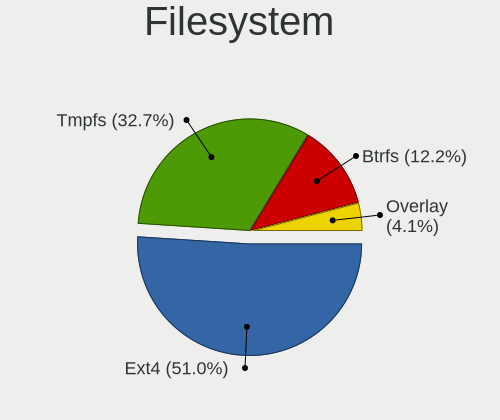
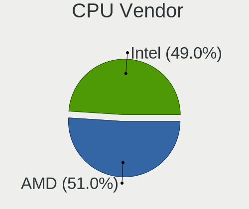
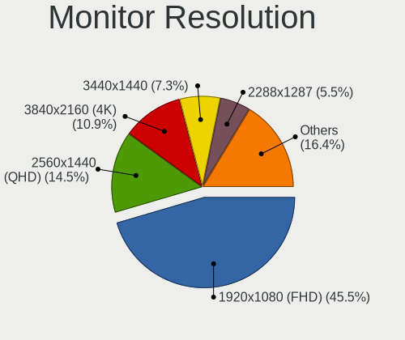
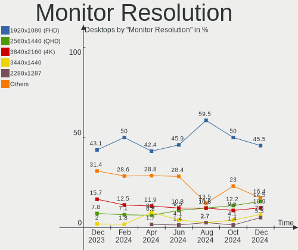
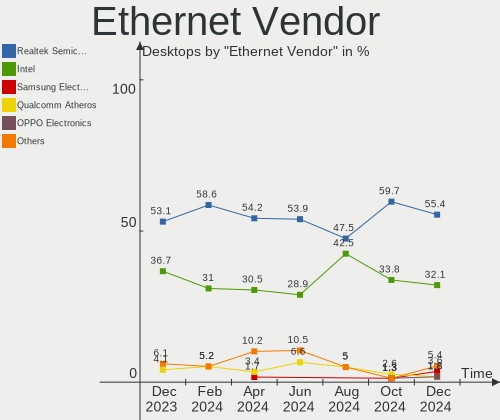
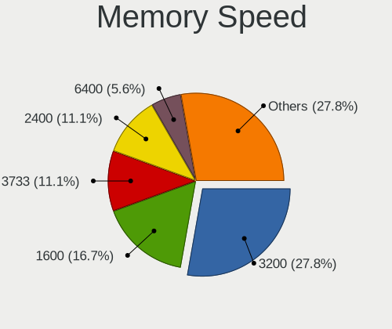
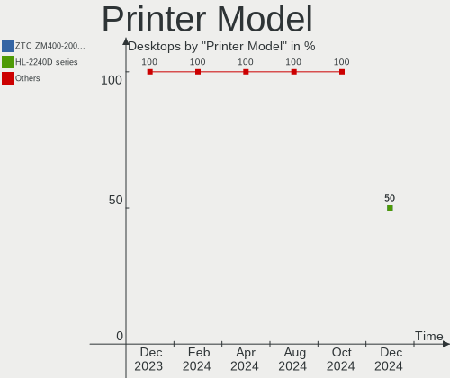

Kubuntu - Hardware Trends (Desktops)
------------------------------------

A project to identify most popular hardware characteristics and track their change
over time based on data collected by Linux users at https://Linux-Hardware.org.

Anyone can contribute to this report by the [hw-probe](https://github.com/linuxhw/hw-probe) tool:

    sudo -E hw-probe -all -upload

This report is for one last month. Overall report since the beginning of time: [TestCoverage](https://github.com/linuxhw/TestCoverage)

Period: Sep, 2022.

Contents
--------

* [ System ](#system)
  - [ OS                       ](#os)
  - [ OS Family                ](#os-family)
  - [ Kernel                   ](#kernel)
  - [ Kernel Family            ](#kernel-family)
  - [ Kernel Major Ver.        ](#kernel-major-ver)
  - [ Arch                     ](#arch)
  - [ DE                       ](#de)
  - [ Display Server           ](#display-server)
  - [ Display Manager          ](#display-manager)
  - [ OS Lang                  ](#os-lang)
  - [ Boot Mode                ](#boot-mode)
  - [ Filesystem               ](#filesystem)
  - [ Part. scheme             ](#part-scheme)
  - [ Dual Boot with Linux/BSD ](#dual-boot-with-linuxbsd)
  - [ Dual Boot (Win)          ](#dual-boot-win)

* [ Board ](#board)
  - [ Vendor                   ](#vendor)
  - [ Model                    ](#model)
  - [ Model Family             ](#model-family)
  - [ MFG Year                 ](#mfg-year)
  - [ Form Factor              ](#form-factor)
  - [ Secure Boot              ](#secure-boot)
  - [ Coreboot                 ](#coreboot)
  - [ RAM Size                 ](#ram-size)
  - [ RAM Used                 ](#ram-used)
  - [ Total Drives             ](#total-drives)
  - [ Has CD-ROM               ](#has-cd-rom)
  - [ Has Ethernet             ](#has-ethernet)
  - [ Has WiFi                 ](#has-wifi)
  - [ Has Bluetooth            ](#has-bluetooth)

* [ Location ](#location)
  - [ Country                  ](#country)
  - [ City                     ](#city)

* [ Drives ](#drives)
  - [ Drive Vendor             ](#drive-vendor)
  - [ Drive Model              ](#drive-model)
  - [ HDD Vendor               ](#hdd-vendor)
  - [ SSD Vendor               ](#ssd-vendor)
  - [ Drive Kind               ](#drive-kind)
  - [ Drive Connector          ](#drive-connector)
  - [ Drive Size               ](#drive-size)
  - [ Space Total              ](#space-total)
  - [ Space Used               ](#space-used)
  - [ Malfunc. Drives          ](#malfunc-drives)
  - [ Malfunc. Drive Vendor    ](#malfunc-drive-vendor)
  - [ Malfunc. HDD Vendor      ](#malfunc-hdd-vendor)
  - [ Malfunc. Drive Kind      ](#malfunc-drive-kind)
  - [ Failed Drives            ](#failed-drives)
  - [ Failed Drive Vendor      ](#failed-drive-vendor)
  - [ Drive Status             ](#drive-status)

* [ Storage controller ](#storage-controller)
  - [ Storage Vendor           ](#storage-vendor)
  - [ Storage Model            ](#storage-model)
  - [ Storage Kind             ](#storage-kind)

* [ Processor ](#processor)
  - [ CPU Vendor               ](#cpu-vendor)
  - [ CPU Model                ](#cpu-model)
  - [ CPU Model Family         ](#cpu-model-family)
  - [ CPU Cores                ](#cpu-cores)
  - [ CPU Sockets              ](#cpu-sockets)
  - [ CPU Threads              ](#cpu-threads)
  - [ CPU Op-Modes             ](#cpu-op-modes)
  - [ CPU Microcode            ](#cpu-microcode)
  - [ CPU Microarch            ](#cpu-microarch)

* [ Graphics ](#graphics)
  - [ GPU Vendor               ](#gpu-vendor)
  - [ GPU Model                ](#gpu-model)
  - [ GPU Combo                ](#gpu-combo)
  - [ GPU Driver               ](#gpu-driver)
  - [ GPU Memory               ](#gpu-memory)

* [ Monitor ](#monitor)
  - [ Monitor Vendor           ](#monitor-vendor)
  - [ Monitor Model            ](#monitor-model)
  - [ Monitor Resolution       ](#monitor-resolution)
  - [ Monitor Diagonal         ](#monitor-diagonal)
  - [ Monitor Width            ](#monitor-width)
  - [ Aspect Ratio             ](#aspect-ratio)
  - [ Monitor Area             ](#monitor-area)
  - [ Pixel Density            ](#pixel-density)
  - [ Multiple Monitors        ](#multiple-monitors)

* [ Network ](#network)
  - [ Net Controller Vendor    ](#net-controller-vendor)
  - [ Net Controller Model     ](#net-controller-model)
  - [ Wireless Vendor          ](#wireless-vendor)
  - [ Wireless Model           ](#wireless-model)
  - [ Ethernet Vendor          ](#ethernet-vendor)
  - [ Ethernet Model           ](#ethernet-model)
  - [ Net Controller Kind      ](#net-controller-kind)
  - [ Used Controller          ](#used-controller)
  - [ NICs                     ](#nics)
  - [ IPv6                     ](#ipv6)

* [ Bluetooth ](#bluetooth)
  - [ Bluetooth Vendor         ](#bluetooth-vendor)
  - [ Bluetooth Model          ](#bluetooth-model)

* [ Sound ](#sound)
  - [ Sound Vendor             ](#sound-vendor)
  - [ Sound Model              ](#sound-model)

* [ Memory ](#memory)
  - [ Memory Vendor            ](#memory-vendor)
  - [ Memory Model             ](#memory-model)
  - [ Memory Kind              ](#memory-kind)
  - [ Memory Form Factor       ](#memory-form-factor)
  - [ Memory Size              ](#memory-size)
  - [ Memory Speed             ](#memory-speed)

* [ Printers & scanners ](#printers--scanners)
  - [ Printer Vendor           ](#printer-vendor)
  - [ Printer Model            ](#printer-model)
  - [ Scanner Vendor           ](#scanner-vendor)
  - [ Scanner Model            ](#scanner-model)

* [ Camera ](#camera)
  - [ Camera Vendor            ](#camera-vendor)
  - [ Camera Model             ](#camera-model)

* [ Security ](#security)
  - [ Fingerprint Vendor       ](#fingerprint-vendor)
  - [ Fingerprint Model        ](#fingerprint-model)
  - [ Chipcard Vendor          ](#chipcard-vendor)
  - [ Chipcard Model           ](#chipcard-model)

* [ Unsupported ](#unsupported)
  - [ Unsupported Devices      ](#unsupported-devices)
  - [ Unsupported Device Types ](#unsupported-device-types)

System
------

OS
--

Installed operating systems

| Name          | Desktops | Percent |
|---------------|----------|---------|
| Kubuntu 22.04 | 28       | 80%     |
| Kubuntu 20.04 | 4        | 11.43%  |
| Kubuntu 21.10 | 1        | 2.86%   |
| Kubuntu 18.04 | 1        | 2.86%   |
| Kubuntu 11    | 1        | 2.86%   |

OS Family
---------

OS without a version

| Name    | Desktops | Percent |
|---------|----------|---------|
| Kubuntu | 35       | 100%    |

Kernel
------

Version of the Linux kernel

| Version              | Desktops | Percent |
|----------------------|----------|---------|
| 5.15.0-47-generic    | 11       | 31.43%  |
| 5.15.0-48-generic    | 7        | 20%     |
| 5.15.0-48-lowlatency | 3        | 8.57%   |
| 5.15.0-46-generic    | 3        | 8.57%   |
| 5.15.0-47-lowlatency | 2        | 5.71%   |
| 5.15.0-43-generic    | 2        | 5.71%   |
| 5.4.0-125-generic    | 1        | 2.86%   |
| 5.4.0-124-generic    | 1        | 2.86%   |
| 5.4.0-120-generic    | 1        | 2.86%   |
| 5.15.0-50-generic    | 1        | 2.86%   |
| 5.15.0-33-generic    | 1        | 2.86%   |
| 5.13.0-52-generic    | 1        | 2.86%   |
| 5.13.0-39-generic    | 1        | 2.86%   |

Kernel Family
-------------

Linux kernel without a distro release

| Version | Desktops | Percent |
|---------|----------|---------|
| 5.15.0  | 30       | 85.71%  |
| 5.4.0   | 3        | 8.57%   |
| 5.13.0  | 2        | 5.71%   |

Kernel Major Ver.
-----------------

Linux kernel major version

| Version | Desktops | Percent |
|---------|----------|---------|
| 5.15    | 30       | 85.71%  |
| 5.4     | 3        | 8.57%   |
| 5.13    | 2        | 5.71%   |

Arch
----

OS architecture (x86_64, i586, etc.)

| Name   | Desktops | Percent |
|--------|----------|---------|
| x86_64 | 35       | 100%    |

DE
--

Desktop Environment

| Name | Desktops | Percent |
|------|----------|---------|
| KDE5 | 35       | 100%    |

Display Server
--------------

X11 or Wayland

| Name    | Desktops | Percent |
|---------|----------|---------|
| X11     | 32       | 91.43%  |
| Wayland | 2        | 5.71%   |
| Tty     | 1        | 2.86%   |

Display Manager
---------------

SDDM, LightDM, etc.

| Name    | Desktops | Percent |
|---------|----------|---------|
| SDDM    | 21       | 60%     |
| Unknown | 12       | 34.29%  |
| LightDM | 1        | 2.86%   |
| GDM3    | 1        | 2.86%   |

OS Lang
-------

Language

| Lang  | Desktops | Percent |
|-------|----------|---------|
| en_US | 16       | 45.71%  |
| de_DE | 4        | 11.43%  |
| it_IT | 3        | 8.57%   |
| pt_BR | 2        | 5.71%   |
| es_ES | 2        | 5.71%   |
| en_GB | 2        | 5.71%   |
| sl_SI | 1        | 2.86%   |
| ru_RU | 1        | 2.86%   |
| pl_PL | 1        | 2.86%   |
| en_IL | 1        | 2.86%   |
| en_CA | 1        | 2.86%   |
| en_AU | 1        | 2.86%   |

Boot Mode
---------

EFI or BIOS

| Mode | Desktops | Percent |
|------|----------|---------|
| BIOS | 23       | 65.71%  |
| EFI  | 12       | 34.29%  |

Filesystem
----------

Type of filesystem

| Type    | Desktops | Percent |
|---------|----------|---------|
| Ext4    | 32       | 91.43%  |
| Overlay | 2        | 5.71%   |
| Btrfs   | 1        | 2.86%   |

Part. scheme
------------

Scheme of partitioning

| Type    | Desktops | Percent |
|---------|----------|---------|
| Unknown | 21       | 60%     |
| GPT     | 14       | 40%     |

Dual Boot with Linux/BSD
------------------------

Hosting more than one Linux/BSD

| Dual boot | Desktops | Percent |
|-----------|----------|---------|
| No        | 29       | 82.86%  |
| Yes       | 6        | 17.14%  |

Dual Boot (Win)
---------------

Hosting Linux and Windows

| Dual boot | Desktops | Percent |
|-----------|----------|---------|
| No        | 20       | 57.14%  |
| Yes       | 15       | 42.86%  |

Board
-----

Vendor
------

Motherboard manufacturer

| Name                | Desktops | Percent |
|---------------------|----------|---------|
| Gigabyte Technology | 10       | 28.57%  |
| MSI                 | 7        | 20%     |
| ASUSTek Computer    | 7        | 20%     |
| Dell                | 3        | 8.57%   |
| ASRock              | 3        | 8.57%   |
| Supermicro          | 1        | 2.86%   |
| OEM                 | 1        | 2.86%   |
| Lenovo              | 1        | 2.86%   |
| Biostar             | 1        | 2.86%   |
| Acer                | 1        | 2.86%   |

Model
-----

Motherboard model

| Name                            | Desktops | Percent |
|---------------------------------|----------|---------|
| Gigabyte B450M DS3H             | 3        | 8.57%   |
| ASUS All Series                 | 3        | 8.57%   |
| Supermicro SKAGIT09             | 1        | 2.86%   |
| OEM G41 775 ICH7 8712           | 1        | 2.86%   |
| MSI MS-7D09                     | 1        | 2.86%   |
| MSI MS-7C95                     | 1        | 2.86%   |
| MSI MS-7B98                     | 1        | 2.86%   |
| MSI MS-7B86                     | 1        | 2.86%   |
| MSI MS-7A34                     | 1        | 2.86%   |
| MSI MS-7816                     | 1        | 2.86%   |
| MSI MS-7693                     | 1        | 2.86%   |
| Lenovo ThinkCentre M90p 5498A2U | 1        | 2.86%   |
| Gigabyte Z77X-UP7               | 1        | 2.86%   |
| Gigabyte X570 GAMING X          | 1        | 2.86%   |
| Gigabyte X399 AORUS XTREME      | 1        | 2.86%   |
| Gigabyte P35C-DS3R              | 1        | 2.86%   |
| Gigabyte GA-870A-UD3            | 1        | 2.86%   |
| Gigabyte B560M D3H              | 1        | 2.86%   |
| Gigabyte B450 I AORUS PRO WIFI  | 1        | 2.86%   |
| Dell OptiPlex 7020              | 1        | 2.86%   |
| Dell OptiPlex 7010              | 1        | 2.86%   |
| Dell OptiPlex 390               | 1        | 2.86%   |
| Biostar TA75MH2                 | 1        | 2.86%   |
| ASUS TUF Gaming B550M-PLUS      | 1        | 2.86%   |
| ASUS ROG ZENITH EXTREME         | 1        | 2.86%   |
| ASUS ROG STRIX B550-F GAMING    | 1        | 2.86%   |
| ASUS PRIME B450M-GAMING/BR      | 1        | 2.86%   |
| ASRock A320M-HDV                | 1        | 2.86%   |
| ASRock 990FX Extreme9           | 1        | 2.86%   |
| ASRock 615                      | 1        | 2.86%   |
| Acer Aspire G7750               | 1        | 2.86%   |

Model Family
------------

Motherboard model prefix

| Name                 | Desktops | Percent |
|----------------------|----------|---------|
| Gigabyte B450M       | 3        | 8.57%   |
| Dell OptiPlex        | 3        | 8.57%   |
| ASUS All             | 3        | 8.57%   |
| ASUS ROG             | 2        | 5.71%   |
| Supermicro SKAGIT09  | 1        | 2.86%   |
| OEM G41              | 1        | 2.86%   |
| MSI MS-7D09          | 1        | 2.86%   |
| MSI MS-7C95          | 1        | 2.86%   |
| MSI MS-7B98          | 1        | 2.86%   |
| MSI MS-7B86          | 1        | 2.86%   |
| MSI MS-7A34          | 1        | 2.86%   |
| MSI MS-7816          | 1        | 2.86%   |
| MSI MS-7693          | 1        | 2.86%   |
| Lenovo ThinkCentre   | 1        | 2.86%   |
| Gigabyte Z77X-UP7    | 1        | 2.86%   |
| Gigabyte X570        | 1        | 2.86%   |
| Gigabyte X399        | 1        | 2.86%   |
| Gigabyte P35C-DS3R   | 1        | 2.86%   |
| Gigabyte GA-870A-UD3 | 1        | 2.86%   |
| Gigabyte B560M       | 1        | 2.86%   |
| Gigabyte B450        | 1        | 2.86%   |
| Biostar TA75MH2      | 1        | 2.86%   |
| ASUS TUF             | 1        | 2.86%   |
| ASUS PRIME           | 1        | 2.86%   |
| ASRock A320M-HDV     | 1        | 2.86%   |
| ASRock 990FX         | 1        | 2.86%   |
| ASRock 615           | 1        | 2.86%   |
| Acer Aspire          | 1        | 2.86%   |

MFG Year
--------

Motherboard manufacture year

| Year | Desktops | Percent |
|------|----------|---------|
| 2018 | 7        | 20%     |
| 2014 | 5        | 14.29%  |
| 2019 | 4        | 11.43%  |
| 2021 | 3        | 8.57%   |
| 2020 | 3        | 8.57%   |
| 2013 | 3        | 8.57%   |
| 2017 | 2        | 5.71%   |
| 2012 | 2        | 5.71%   |
| 2009 | 2        | 5.71%   |
| 2015 | 1        | 2.86%   |
| 2011 | 1        | 2.86%   |
| 2010 | 1        | 2.86%   |
| 2007 | 1        | 2.86%   |

Form Factor
-----------

Physical design of the computer

| Name    | Desktops | Percent |
|---------|----------|---------|
| Desktop | 35       | 100%    |

Secure Boot
-----------

Enabled or disabled

| State    | Desktops | Percent |
|----------|----------|---------|
| Disabled | 34       | 97.14%  |
| Enabled  | 1        | 2.86%   |

Coreboot
--------

Have coreboot on board

| Used | Desktops | Percent |
|------|----------|---------|
| No   | 35       | 100%    |

RAM Size
--------

Total RAM memory

| Size in GB  | Desktops | Percent |
|-------------|----------|---------|
| 32.01-64.0  | 13       | 37.14%  |
| 16.01-24.0  | 11       | 31.43%  |
| 8.01-16.0   | 5        | 14.29%  |
| 4.01-8.0    | 3        | 8.57%   |
| 3.01-4.0    | 1        | 2.86%   |
| 24.01-32.0  | 1        | 2.86%   |
| 64.01-256.0 | 1        | 2.86%   |

RAM Used
--------

Used RAM memory

| Used GB   | Desktops | Percent |
|-----------|----------|---------|
| 4.01-8.0  | 15       | 42.86%  |
| 2.01-3.0  | 6        | 17.14%  |
| 1.01-2.0  | 6        | 17.14%  |
| 3.01-4.0  | 5        | 14.29%  |
| 8.01-16.0 | 3        | 8.57%   |

Total Drives
------------

Number of drives on board

| Drives | Desktops | Percent |
|--------|----------|---------|
| 2      | 10       | 28.57%  |
| 3      | 7        | 20%     |
| 1      | 6        | 17.14%  |
| 5      | 5        | 14.29%  |
| 6      | 3        | 8.57%   |
| 4      | 3        | 8.57%   |
| 9      | 1        | 2.86%   |

Has CD-ROM
----------

Has CD-ROM on board

| Presented | Desktops | Percent |
|-----------|----------|---------|
| No        | 19       | 54.29%  |
| Yes       | 16       | 45.71%  |

Has Ethernet
------------

Has Ethernet on board

| Presented | Desktops | Percent |
|-----------|----------|---------|
| Yes       | 35       | 100%    |

Has WiFi
--------

Has WiFi module

| Presented | Desktops | Percent |
|-----------|----------|---------|
| No        | 18       | 51.43%  |
| Yes       | 17       | 48.57%  |

Has Bluetooth
-------------

Has Bluetooth module

| Presented | Desktops | Percent |
|-----------|----------|---------|
| No        | 22       | 62.86%  |
| Yes       | 13       | 37.14%  |

Location
--------

Country
-------

Geographic location (country)

| Country     | Desktops | Percent |
|-------------|----------|---------|
| USA         | 6        | 17.14%  |
| Italy       | 6        | 17.14%  |
| Germany     | 5        | 14.29%  |
| Brazil      | 4        | 11.43%  |
| Spain       | 2        | 5.71%   |
| Russia      | 2        | 5.71%   |
| UK          | 1        | 2.86%   |
| Thailand    | 1        | 2.86%   |
| Sweden      | 1        | 2.86%   |
| Slovenia    | 1        | 2.86%   |
| Poland      | 1        | 2.86%   |
| Netherlands | 1        | 2.86%   |
| Israel      | 1        | 2.86%   |
| Canada      | 1        | 2.86%   |
| Austria     | 1        | 2.86%   |
| Australia   | 1        | 2.86%   |

City
----

Geographic location (city)

| City                 | Desktops | Percent |
|----------------------|----------|---------|
| Wembley              | 1        | 2.86%   |
| Vladivostok          | 1        | 2.86%   |
| Vienna               | 1        | 2.86%   |
| Valencia             | 1        | 2.86%   |
| Turin                | 1        | 2.86%   |
| Sao Paulo            | 1        | 2.86%   |
| Rudolstadt           | 1        | 2.86%   |
| Rishon LeZiyyon      | 1        | 2.86%   |
| Rio de Janeiro       | 1        | 2.86%   |
| Reggio Emilia        | 1        | 2.86%   |
| Pavullo nel Frignano | 1        | 2.86%   |
| Overveen             | 1        | 2.86%   |
| Ocala                | 1        | 2.86%   |
| New York             | 1        | 2.86%   |
| Moscow               | 1        | 2.86%   |
| Moers                | 1        | 2.86%   |
| Marsala              | 1        | 2.86%   |
| Macaé               | 1        | 2.86%   |
| Los Angeles          | 1        | 2.86%   |
| Ljubljana            | 1        | 2.86%   |
| Katowice             | 1        | 2.86%   |
| Hamburg              | 1        | 2.86%   |
| Fucecchio            | 1        | 2.86%   |
| Friesoythe           | 1        | 2.86%   |
| Falköping           | 1        | 2.86%   |
| Elk Grove            | 1        | 2.86%   |
| Duncan               | 1        | 2.86%   |
| Columbus             | 1        | 2.86%   |
| Canberra             | 1        | 2.86%   |
| Burke                | 1        | 2.86%   |
| Brasília            | 1        | 2.86%   |
| Bologna              | 1        | 2.86%   |
| Bangkok              | 1        | 2.86%   |
| Bamberg              | 1        | 2.86%   |
| Alcorcón            | 1        | 2.86%   |

Drives
------

Drive Vendor
------------

Hard drive vendors

| Vendor                    | Desktops | Drives | Percent |
|---------------------------|----------|--------|---------|
| Seagate                   | 14       | 27     | 17.95%  |
| WDC                       | 13       | 17     | 16.67%  |
| Samsung Electronics       | 11       | 16     | 14.1%   |
| Kingston                  | 9        | 9      | 11.54%  |
| Toshiba                   | 5        | 5      | 6.41%   |
| SanDisk                   | 4        | 5      | 5.13%   |
| Hitachi                   | 3        | 3      | 3.85%   |
| SK hynix                  | 2        | 2      | 2.56%   |
| Crucial                   | 2        | 4      | 2.56%   |
| PNY                       | 1        | 1      | 1.28%   |
| Plextor                   | 1        | 1      | 1.28%   |
| Phison Electronics        | 1        | 1      | 1.28%   |
| OCZ                       | 1        | 1      | 1.28%   |
| Micron/Crucial Technology | 1        | 1      | 1.28%   |
| KODAK                     | 1        | 1      | 1.28%   |
| Intenso                   | 1        | 1      | 1.28%   |
| Intel                     | 1        | 1      | 1.28%   |
| INDMEM                    | 1        | 1      | 1.28%   |
| HGST                      | 1        | 2      | 1.28%   |
| Drevo                     | 1        | 1      | 1.28%   |
| Corsair                   | 1        | 3      | 1.28%   |
| Apacer                    | 1        | 1      | 1.28%   |
| Aireye                    | 1        | 1      | 1.28%   |
| A-DATA Technology         | 1        | 1      | 1.28%   |

Drive Model
-----------

Hard drive models

| Model                               | Desktops | Percent |
|-------------------------------------|----------|---------|
| Kingston SA400S37240G 240GB SSD     | 4        | 4.21%   |
| Seagate ST4000DM004-2CV104 4TB      | 3        | 3.16%   |
| WDC WD10EZEX-08WN4A0 1TB            | 2        | 2.11%   |
| Toshiba HDWD110 1TB                 | 2        | 2.11%   |
| Toshiba DT01ACA100 1TB              | 2        | 2.11%   |
| Seagate ST2000DM001-1ER164 2TB      | 2        | 2.11%   |
| Seagate Expansion Desk 2TB          | 2        | 2.11%   |
| Samsung SSD 860 EVO 1TB             | 2        | 2.11%   |
| Samsung SSD 850 EVO 120GB           | 2        | 2.11%   |
| Kingston SV300S37A120G 120GB SSD    | 2        | 2.11%   |
| WDC WDS500G1X0E-00AFY0 500GB        | 1        | 1.05%   |
| WDC WDS480G2G0A-00JH30 480GB SSD    | 1        | 1.05%   |
| WDC WDS250G2B0B-00YS70 250GB SSD    | 1        | 1.05%   |
| WDC WDS240G2G0A-00JH30 240GB SSD    | 1        | 1.05%   |
| WDC WD80EFZX-68UW8N0 8TB            | 1        | 1.05%   |
| WDC WD5000AAKS-00YGA0 500GB         | 1        | 1.05%   |
| WDC WD5000AAKS-00V1A0 500GB         | 1        | 1.05%   |
| WDC WD5000AADS-00M2B0 500GB         | 1        | 1.05%   |
| WDC WD4003FRYZ-01F0DB0 4TB          | 1        | 1.05%   |
| WDC WD4000FYYZ-01UL1B3 4TB          | 1        | 1.05%   |
| WDC WD20EZRZ-00Z5HB0 2TB            | 1        | 1.05%   |
| WDC WD20EARX-32PASB0 2TB            | 1        | 1.05%   |
| WDC WD10EAVS-00D7B1 1TB             | 1        | 1.05%   |
| WDC WD10EARS-00MVWB0 1TB            | 1        | 1.05%   |
| Toshiba THNSNH256GBST SSD           | 1        | 1.05%   |
| SK hynix NVMe SSD Drive 2TB         | 1        | 1.05%   |
| SK hynix HFM256GDHTNG-8510B 256GB   | 1        | 1.05%   |
| Seagate ST8000VN0022-2EL112 8TB     | 1        | 1.05%   |
| Seagate ST500LM0 12 HN-M500MB 500GB | 1        | 1.05%   |
| Seagate ST5000DM000 4GB             | 1        | 1.05%   |
| Seagate ST4000VN008-2DR166 4TB      | 1        | 1.05%   |
| Seagate ST2000DM008-2FR102 2TB      | 1        | 1.05%   |
| Seagate ST2000DL003-9VT166 2TB      | 1        | 1.05%   |
| Seagate ST12000VN0008-2PH103 12TB   | 1        | 1.05%   |
| Seagate ST12000NM0007-2A1101 12TB   | 1        | 1.05%   |
| Seagate ST1000VN002-2E4162 1TB      | 1        | 1.05%   |
| Seagate ST1000DX002-2DV162 1TB      | 1        | 1.05%   |
| Seagate ST1000DM003-1SB10C 1TB      | 1        | 1.05%   |
| Seagate ST1000DM003-1ER162 1TB      | 1        | 1.05%   |
| Seagate ST10000VN0008-2PJ103 10TB   | 1        | 1.05%   |

HDD Vendor
----------

Hard disk drive vendors

| Vendor              | Desktops | Drives | Percent |
|---------------------|----------|--------|---------|
| Seagate             | 14       | 27     | 38.89%  |
| WDC                 | 12       | 12     | 33.33%  |
| Toshiba             | 4        | 4      | 11.11%  |
| Hitachi             | 3        | 3      | 8.33%   |
| Samsung Electronics | 2        | 3      | 5.56%   |
| HGST                | 1        | 2      | 2.78%   |

SSD Vendor
----------

Solid state drive vendors

| Vendor              | Desktops | Drives | Percent |
|---------------------|----------|--------|---------|
| Kingston            | 9        | 9      | 26.47%  |
| Samsung Electronics | 6        | 7      | 17.65%  |
| WDC                 | 3        | 4      | 8.82%   |
| SanDisk             | 2        | 2      | 5.88%   |
| Crucial             | 2        | 3      | 5.88%   |
| Toshiba             | 1        | 1      | 2.94%   |
| PNY                 | 1        | 1      | 2.94%   |
| Plextor             | 1        | 1      | 2.94%   |
| OCZ                 | 1        | 1      | 2.94%   |
| KODAK               | 1        | 1      | 2.94%   |
| Intenso             | 1        | 1      | 2.94%   |
| INDMEM              | 1        | 1      | 2.94%   |
| Drevo               | 1        | 1      | 2.94%   |
| Corsair             | 1        | 3      | 2.94%   |
| Apacer              | 1        | 1      | 2.94%   |
| Aireye              | 1        | 1      | 2.94%   |
| A-DATA Technology   | 1        | 1      | 2.94%   |

Drive Kind
----------

HDD or SSD

| Kind | Desktops | Drives | Percent |
|------|----------|--------|---------|
| HDD  | 27       | 51     | 42.19%  |
| SSD  | 25       | 39     | 39.06%  |
| NVMe | 12       | 16     | 18.75%  |

Drive Connector
---------------

SATA, SAS, NVMe, etc.

| Type | Desktops | Drives | Percent |
|------|----------|--------|---------|
| SATA | 34       | 84     | 69.39%  |
| NVMe | 12       | 16     | 24.49%  |
| SAS  | 3        | 6      | 6.12%   |

Drive Size
----------

Size of hard drive

| Size in TB | Desktops | Drives | Percent |
|------------|----------|--------|---------|
| 0.01-0.5   | 26       | 47     | 44.83%  |
| 0.51-1.0   | 14       | 17     | 24.14%  |
| 1.01-2.0   | 7        | 8      | 12.07%  |
| 3.01-4.0   | 6        | 11     | 10.34%  |
| 4.01-10.0  | 3        | 5      | 5.17%   |
| 10.01-20.0 | 2        | 2      | 3.45%   |

Space Total
-----------

Amount of disk space available on the file system

| Size in GB     | Desktops | Percent |
|----------------|----------|---------|
| 101-250        | 8        | 22.86%  |
| 501-1000       | 8        | 22.86%  |
| More than 3000 | 7        | 20%     |
| 2001-3000      | 4        | 11.43%  |
| 1001-2000      | 4        | 11.43%  |
| 251-500        | 2        | 5.71%   |
| 1-20           | 2        | 5.71%   |

Space Used
----------

Amount of used disk space

| Used GB        | Desktops | Percent |
|----------------|----------|---------|
| 51-100         | 11       | 31.43%  |
| 501-1000       | 6        | 17.14%  |
| More than 3000 | 5        | 14.29%  |
| 251-500        | 3        | 8.57%   |
| 21-50          | 2        | 5.71%   |
| 2001-3000      | 2        | 5.71%   |
| 101-250        | 2        | 5.71%   |
| 1001-2000      | 2        | 5.71%   |
| 1-20           | 2        | 5.71%   |

Malfunc. Drives
---------------

Drive models with a malfunction

| Model                             | Desktops | Drives | Percent |
|-----------------------------------|----------|--------|---------|
| WDC WD10EARS-00MVWB0 1TB          | 1        | 1      | 50%     |
| Samsung Electronics HM321HI 320GB | 1        | 1      | 50%     |

Malfunc. Drive Vendor
---------------------

Vendors of faulty drives

| Vendor              | Desktops | Drives | Percent |
|---------------------|----------|--------|---------|
| WDC                 | 1        | 1      | 50%     |
| Samsung Electronics | 1        | 1      | 50%     |

Malfunc. HDD Vendor
-------------------

Vendors of faulty HDD drives

| Vendor              | Desktops | Drives | Percent |
|---------------------|----------|--------|---------|
| WDC                 | 1        | 1      | 50%     |
| Samsung Electronics | 1        | 1      | 50%     |

Malfunc. Drive Kind
-------------------

Kinds of faulty drives

| Kind | Desktops | Drives | Percent |
|------|----------|--------|---------|
| HDD  | 2        | 2      | 100%    |

Failed Drives
-------------

Failed drive models

Zero info for selected period =(

Failed Drive Vendor
-------------------

Failed drive vendors

Zero info for selected period =(

Drive Status
------------

Number of failed and malfunc. drives

| Status   | Desktops | Drives | Percent |
|----------|----------|--------|---------|
| Detected | 23       | 59     | 58.97%  |
| Works    | 14       | 45     | 35.9%   |
| Malfunc  | 2        | 2      | 5.13%   |

Storage controller
------------------

Storage Vendor
--------------

Storage controller vendors

| Vendor                    | Desktops | Percent |
|---------------------------|----------|---------|
| AMD                       | 19       | 33.33%  |
| Intel                     | 17       | 29.82%  |
| Samsung Electronics       | 5        | 8.77%   |
| SanDisk                   | 3        | 5.26%   |
| JMicron Technology        | 3        | 5.26%   |
| ASMedia Technology        | 3        | 5.26%   |
| SK hynix                  | 2        | 3.51%   |
| Micron/Crucial Technology | 2        | 3.51%   |
| Phison Electronics        | 1        | 1.75%   |
| Marvell Technology Group  | 1        | 1.75%   |
| LSI Logic / Symbios Logic | 1        | 1.75%   |

Storage Model
-------------

Storage controller models

| Model                                                                                   | Desktops | Percent |
|-----------------------------------------------------------------------------------------|----------|---------|
| AMD FCH SATA Controller [AHCI mode]                                                     | 11       | 14.86%  |
| AMD 400 Series Chipset SATA Controller                                                  | 6        | 8.11%   |
| JMicron JMB363 SATA/IDE Controller                                                      | 3        | 4.05%   |
| Intel 9 Series Chipset Family SATA Controller [AHCI Mode]                               | 3        | 4.05%   |
| AMD SB7x0/SB8x0/SB9x0 SATA Controller [AHCI mode]                                       | 3        | 4.05%   |
| AMD SB7x0/SB8x0/SB9x0 IDE Controller                                                    | 3        | 4.05%   |
| AMD 500 Series Chipset SATA Controller                                                  | 3        | 4.05%   |
| Samsung NVMe SSD Controller SM981/PM981/PM983                                           | 2        | 2.7%    |
| Samsung NVMe SSD Controller 980                                                         | 2        | 2.7%    |
| Micron/Crucial P2 NVMe PCIe SSD                                                         | 2        | 2.7%    |
| Intel 8 Series/C220 Series Chipset Family 6-port SATA Controller 1 [AHCI mode]          | 2        | 2.7%    |
| Intel 7 Series/C210 Series Chipset Family 6-port SATA Controller [AHCI mode]            | 2        | 2.7%    |
| Intel 500 Series Chipset Family SATA AHCI Controller                                    | 2        | 2.7%    |
| ASMedia ASM1062 Serial ATA Controller                                                   | 2        | 2.7%    |
| AMD X399 Series Chipset SATA Controller                                                 | 2        | 2.7%    |
| SK hynix Gold P31 SSD                                                                   | 1        | 1.35%   |
| SK hynix BC501 NVMe Solid State Drive                                                   | 1        | 1.35%   |
| SanDisk WD PC SN810 / Black SN850 NVMe SSD                                              | 1        | 1.35%   |
| SanDisk WD Blue SN550 NVMe SSD                                                          | 1        | 1.35%   |
| SanDisk WD Black SN750 / PC SN730 NVMe SSD                                              | 1        | 1.35%   |
| SanDisk Non-Volatile memory controller                                                  | 1        | 1.35%   |
| Samsung NVMe SSD Controller PM9A1/PM9A3/980PRO                                          | 1        | 1.35%   |
| Phison E12 NVMe Controller                                                              | 1        | 1.35%   |
| Marvell Group 88SE9172 SATA 6Gb/s Controller                                            | 1        | 1.35%   |
| LSI Logic / Symbios Logic MegaRAID SAS 1078                                             | 1        | 1.35%   |
| Intel SSD 660P Series                                                                   | 1        | 1.35%   |
| Intel NM10/ICH7 Family SATA Controller [IDE mode]                                       | 1        | 1.35%   |
| Intel Comet Lake SATA AHCI Controller                                                   | 1        | 1.35%   |
| Intel Cannon Lake PCH SATA AHCI Controller                                              | 1        | 1.35%   |
| Intel 82801JI (ICH10 Family) SATA AHCI Controller                                       | 1        | 1.35%   |
| Intel 82801IR/IO/IH (ICH9R/DO/DH) 6 port SATA Controller [AHCI mode]                    | 1        | 1.35%   |
| Intel 82801G (ICH7 Family) IDE Controller                                               | 1        | 1.35%   |
| Intel 6 Series/C200 Series Chipset Family Desktop SATA Controller (IDE mode, ports 4-5) | 1        | 1.35%   |
| Intel 6 Series/C200 Series Chipset Family Desktop SATA Controller (IDE mode, ports 0-3) | 1        | 1.35%   |
| Intel 5 Series/3400 Series Chipset 6 port SATA AHCI Controller                          | 1        | 1.35%   |
| ASMedia ASM1166 Serial ATA Controller                                                   | 1        | 1.35%   |
| AMD SB7x0/SB8x0/SB9x0 SATA Controller [IDE mode]                                        | 1        | 1.35%   |
| AMD FCH SATA Controller [IDE mode]                                                      | 1        | 1.35%   |
| AMD FCH SATA Controller D                                                               | 1        | 1.35%   |
| AMD FCH IDE Controller                                                                  | 1        | 1.35%   |

Storage Kind
------------

Kind of storage controller (IDE, SATA, NVMe, SAS, ...)

| Kind | Desktops | Percent |
|------|----------|---------|
| SATA | 33       | 61.11%  |
| NVMe | 12       | 22.22%  |
| IDE  | 8        | 14.81%  |
| RAID | 1        | 1.85%   |

Processor
---------

CPU Vendor
----------

Processor vendors

| Vendor | Desktops | Percent |
|--------|----------|---------|
| AMD    | 19       | 54.29%  |
| Intel  | 16       | 45.71%  |

CPU Model
---------

Processor models

| Model                                          | Desktops | Percent |
|------------------------------------------------|----------|---------|
| AMD Ryzen 5 5600X 6-Core Processor             | 2        | 5.71%   |
| Intel Xeon CPU X3440 @ 2.53GHz                 | 1        | 2.86%   |
| Intel Pentium Gold G5420 CPU @ 3.80GHz         | 1        | 2.86%   |
| Intel Core i7-4790K CPU @ 4.00GHz              | 1        | 2.86%   |
| Intel Core i7-4790 CPU @ 3.60GHz               | 1        | 2.86%   |
| Intel Core i7-3770K CPU @ 3.50GHz              | 1        | 2.86%   |
| Intel Core i7-3770 CPU @ 3.40GHz               | 1        | 2.86%   |
| Intel Core i7 CPU 920 @ 2.67GHz                | 1        | 2.86%   |
| Intel Core i5-4690 CPU @ 3.50GHz               | 1        | 2.86%   |
| Intel Core i5-4590 CPU @ 3.30GHz               | 1        | 2.86%   |
| Intel Core i5-4460 CPU @ 3.20GHz               | 1        | 2.86%   |
| Intel Core i5-2400 CPU @ 3.10GHz               | 1        | 2.86%   |
| Intel Core i5-10400F CPU @ 2.90GHz             | 1        | 2.86%   |
| Intel Core 2 Quad CPU Q9505 @ 2.83GHz          | 1        | 2.86%   |
| Intel Core 2 Quad CPU Q6600 @ 2.40GHz          | 1        | 2.86%   |
| Intel 11th Gen Core i7-11700K @ 3.60GHz        | 1        | 2.86%   |
| Intel 11th Gen Core i5-11400 @ 2.60GHz         | 1        | 2.86%   |
| AMD Ryzen Threadripper 2950X 16-Core Processor | 1        | 2.86%   |
| AMD Ryzen Threadripper 1950X 16-Core Processor | 1        | 2.86%   |
| AMD Ryzen 7 PRO 4750G with Radeon Graphics     | 1        | 2.86%   |
| AMD Ryzen 7 3700X 8-Core Processor             | 1        | 2.86%   |
| AMD Ryzen 7 2700 Eight-Core Processor          | 1        | 2.86%   |
| AMD Ryzen 5 5600G with Radeon Graphics         | 1        | 2.86%   |
| AMD Ryzen 5 5600 6-Core Processor              | 1        | 2.86%   |
| AMD Ryzen 5 3500X 6-Core Processor             | 1        | 2.86%   |
| AMD Ryzen 5 2600X Six-Core Processor           | 1        | 2.86%   |
| AMD Ryzen 5 1600X Six-Core Processor           | 1        | 2.86%   |
| AMD Ryzen 3 3100 4-Core Processor              | 1        | 2.86%   |
| AMD Ryzen 3 1300X Quad-Core Processor          | 1        | 2.86%   |
| AMD Opteron Processor 4386                     | 1        | 2.86%   |
| AMD FX-9590 Eight-Core Processor               | 1        | 2.86%   |
| AMD FX-8300 Eight-Core Processor               | 1        | 2.86%   |
| AMD Athlon II X4 635 Processor                 | 1        | 2.86%   |
| AMD A8-5600K APU with Radeon HD Graphics       | 1        | 2.86%   |

CPU Model Family
----------------

Processor model prefix

| Model                  | Desktops | Percent |
|------------------------|----------|---------|
| AMD Ryzen 5            | 7        | 20%     |
| Intel Core i7          | 5        | 14.29%  |
| Intel Core i5          | 5        | 14.29%  |
| Other                  | 2        | 5.71%   |
| Intel Core 2 Quad      | 2        | 5.71%   |
| AMD Ryzen Threadripper | 2        | 5.71%   |
| AMD Ryzen 7            | 2        | 5.71%   |
| AMD Ryzen 3            | 2        | 5.71%   |
| AMD FX                 | 2        | 5.71%   |
| Intel Xeon             | 1        | 2.86%   |
| Intel Pentium Gold     | 1        | 2.86%   |
| AMD Ryzen 7 PRO        | 1        | 2.86%   |
| AMD Opteron            | 1        | 2.86%   |
| AMD Athlon II X4       | 1        | 2.86%   |
| AMD A8                 | 1        | 2.86%   |

CPU Cores
---------

Number of processor cores

| Number | Desktops | Percent |
|--------|----------|---------|
| 4      | 18       | 51.43%  |
| 6      | 9        | 25.71%  |
| 8      | 4        | 11.43%  |
| 16     | 2        | 5.71%   |
| 2      | 2        | 5.71%   |

CPU Sockets
-----------

Number of sockets

| Number | Desktops | Percent |
|--------|----------|---------|
| 1      | 35       | 100%    |

CPU Threads
-----------

Threads per core (Hyper-Threading)

| Number | Desktops | Percent |
|--------|----------|---------|
| 2      | 25       | 71.43%  |
| 1      | 10       | 28.57%  |

CPU Op-Modes
------------

CPU Operation Modes (32-bit, 64-bit)

| Op mode        | Desktops | Percent |
|----------------|----------|---------|
| 32-bit, 64-bit | 35       | 100%    |

CPU Microcode
-------------

Microcode number

| Number     | Desktops | Percent |
|------------|----------|---------|
| Unknown    | 17       | 48.57%  |
| 0x306c3    | 3        | 8.57%   |
| 0x08701021 | 2        | 5.71%   |
| 0xa0655    | 1        | 2.86%   |
| 0x306a9    | 1        | 2.86%   |
| 0x206a7    | 1        | 2.86%   |
| 0x0a20120a | 1        | 2.86%   |
| 0x0a201016 | 1        | 2.86%   |
| 0x0a201009 | 1        | 2.86%   |
| 0x08701013 | 1        | 2.86%   |
| 0x08600106 | 1        | 2.86%   |
| 0x0800820d | 1        | 2.86%   |
| 0x08001137 | 1        | 2.86%   |
| 0x08001136 | 1        | 2.86%   |
| 0x06000852 | 1        | 2.86%   |
| 0x010000db | 1        | 2.86%   |

CPU Microarch
-------------

Microarchitecture

| Name        | Desktops | Percent |
|-------------|----------|---------|
| Haswell     | 5        | 14.29%  |
| Zen 3       | 4        | 11.43%  |
| Zen 2       | 4        | 11.43%  |
| Piledriver  | 4        | 11.43%  |
| Zen+        | 3        | 8.57%   |
| Zen         | 3        | 8.57%   |
| Nehalem     | 2        | 5.71%   |
| IvyBridge   | 2        | 5.71%   |
| Unknown     | 2        | 5.71%   |
| SandyBridge | 1        | 2.86%   |
| Penryn      | 1        | 2.86%   |
| KabyLake    | 1        | 2.86%   |
| K10         | 1        | 2.86%   |
| Core        | 1        | 2.86%   |
| CometLake   | 1        | 2.86%   |

Graphics
--------

GPU Vendor
----------

Vendors of graphics cards

| Vendor                     | Desktops | Percent |
|----------------------------|----------|---------|
| Nvidia                     | 16       | 44.44%  |
| AMD                        | 16       | 44.44%  |
| Intel                      | 3        | 8.33%   |
| Matrox Electronics Systems | 1        | 2.78%   |

GPU Model
---------

Graphics card models

| Model                                                                       | Desktops | Percent |
|-----------------------------------------------------------------------------|----------|---------|
| AMD Ellesmere [Radeon RX 470/480/570/570X/580/580X/590]                     | 3        | 8.33%   |
| Nvidia GP107 [GeForce GTX 1050 Ti]                                          | 2        | 5.56%   |
| Nvidia GM206 [GeForce GTX 960]                                              | 2        | 5.56%   |
| Nvidia TU116 [GeForce GTX 1660]                                             | 1        | 2.78%   |
| Nvidia TU116 [GeForce GTX 1660 SUPER]                                       | 1        | 2.78%   |
| Nvidia TU106 [GeForce RTX 2060 Rev. A]                                      | 1        | 2.78%   |
| Nvidia TU104 [GeForce RTX 2070 SUPER]                                       | 1        | 2.78%   |
| Nvidia TU102 [GeForce RTX 2080 Ti Rev. A]                                   | 1        | 2.78%   |
| Nvidia GP104 [GeForce GTX 1060 6GB]                                         | 1        | 2.78%   |
| Nvidia GM107 [GeForce GTX 750 Ti]                                           | 1        | 2.78%   |
| Nvidia GK208B [GeForce GT 730]                                              | 1        | 2.78%   |
| Nvidia GK106 [GeForce GTX 660]                                              | 1        | 2.78%   |
| Nvidia GA104 [GeForce RTX 3070 Ti]                                          | 1        | 2.78%   |
| Nvidia GA104 [GeForce RTX 3060 Ti]                                          | 1        | 2.78%   |
| Nvidia G92 [GeForce 9800 GT]                                                | 1        | 2.78%   |
| Matrox Electronics Systems MGA G200eW WPCM450                               | 1        | 2.78%   |
| Intel Xeon E3-1200 v3/4th Gen Core Processor Integrated Graphics Controller | 1        | 2.78%   |
| Intel IvyBridge GT2 [HD Graphics 4000]                                      | 1        | 2.78%   |
| Intel 2nd Generation Core Processor Family Integrated Graphics Controller   | 1        | 2.78%   |
| AMD Turks PRO [Radeon HD 6570/7570/8550 / R5 230]                           | 1        | 2.78%   |
| AMD Tahiti XT [Radeon HD 7970/8970 OEM / R9 280X]                           | 1        | 2.78%   |
| AMD RV710 [Radeon HD 4350/4550]                                             | 1        | 2.78%   |
| AMD Renoir                                                                  | 1        | 2.78%   |
| AMD Redwood XT [Radeon HD 5670/5690/5730]                                   | 1        | 2.78%   |
| AMD Navi 10 [Radeon RX 5600 OEM/5600 XT / 5700/5700 XT]                     | 1        | 2.78%   |
| AMD Juniper XT [Radeon HD 6770]                                             | 1        | 2.78%   |
| AMD Curacao XT / Trinidad XT [Radeon R7 370 / R9 270X/370X]                 | 1        | 2.78%   |
| AMD Cezanne                                                                 | 1        | 2.78%   |
| AMD Cedar [Radeon HD 5000/6000/7350/8350 Series]                            | 1        | 2.78%   |
| AMD Cayman PRO [Radeon HD 6950]                                             | 1        | 2.78%   |
| AMD Cape Verde XT [Radeon HD 7770/8760 / R7 250X]                           | 1        | 2.78%   |
| AMD Baffin [Radeon RX 550 640SP / RX 560/560X]                              | 1        | 2.78%   |

GPU Combo
---------

Combinations of graphics cards

| Name         | Desktops | Percent |
|--------------|----------|---------|
| 1 x Nvidia   | 15       | 42.86%  |
| 1 x AMD      | 15       | 42.86%  |
| 1 x Intel    | 3        | 8.57%   |
| 2 x Nvidia   | 1        | 2.86%   |
| AMD + Matrox | 1        | 2.86%   |

GPU Driver
----------

Free vs proprietary

| Driver      | Desktops | Percent |
|-------------|----------|---------|
| Free        | 20       | 57.14%  |
| Proprietary | 13       | 37.14%  |
| Unknown     | 2        | 5.71%   |

GPU Memory
----------

Total video memory

| Size in GB | Desktops | Percent |
|------------|----------|---------|
| Unknown    | 15       | 42.86%  |
| 7.01-8.0   | 4        | 11.43%  |
| 3.01-4.0   | 4        | 11.43%  |
| 5.01-6.0   | 3        | 8.57%   |
| 1.01-2.0   | 3        | 8.57%   |
| 0.51-1.0   | 2        | 5.71%   |
| 0.01-0.5   | 2        | 5.71%   |
| 2.01-3.0   | 1        | 2.86%   |
| 8.01-16.0  | 1        | 2.86%   |

Monitor
-------

Monitor Vendor
--------------

Monitor vendors

| Vendor               | Desktops | Percent |
|----------------------|----------|---------|
| Samsung Electronics  | 13       | 31.71%  |
| Hewlett-Packard      | 3        | 7.32%   |
| Goldstar             | 3        | 7.32%   |
| BenQ                 | 3        | 7.32%   |
| Ancor Communications | 3        | 7.32%   |
| Acer                 | 3        | 7.32%   |
| Philips              | 2        | 4.88%   |
| Eizo                 | 2        | 4.88%   |
| AOC                  | 2        | 4.88%   |
| Vizio                | 1        | 2.44%   |
| ViewSonic            | 1        | 2.44%   |
| Unknown              | 1        | 2.44%   |
| Sunplus              | 1        | 2.44%   |
| Panasonic            | 1        | 2.44%   |
| Idek Iiyama          | 1        | 2.44%   |
| Envision Peripherals | 1        | 2.44%   |

Monitor Model
-------------

Monitor models

| Model                                                                  | Desktops | Percent |
|------------------------------------------------------------------------|----------|---------|
| Samsung Electronics S24F350 SAM0D20 1920x1080 521x293mm 23.5-inch      | 2        | 4.65%   |
| Acer VG240Y ACR06BF 1920x1080 527x296mm 23.8-inch                      | 2        | 4.65%   |
| Vizio E320-B0 VIZ1007 1366x768 697x392mm 31.5-inch                     | 1        | 2.33%   |
| ViewSonic VA2448 SERIES VSC3828 1920x1080 521x293mm 23.5-inch          | 1        | 2.33%   |
| Unknown LCD Monitor FFFF 2288x1287 2550x2550mm 142.0-inch              | 1        | 2.33%   |
| Sunplus Monitor TV SPVFFFF 1920x1080 376x301mm 19.0-inch               | 1        | 2.33%   |
| Samsung Electronics U28E570 SAM0D6F 3840x2160 607x345mm 27.5-inch      | 1        | 2.33%   |
| Samsung Electronics SyncMaster SAM0587 1920x1200 518x324mm 24.1-inch   | 1        | 2.33%   |
| Samsung Electronics S24E450 SAM0C81 1920x1080 531x299mm 24.0-inch      | 1        | 2.33%   |
| Samsung Electronics S24D330 SAM0D92 1920x1080 531x299mm 24.0-inch      | 1        | 2.33%   |
| Samsung Electronics LCD Monitor SyncMaster 3600x1200                   | 1        | 2.33%   |
| Samsung Electronics LCD Monitor SAM7083 2560x1440 597x336mm 27.0-inch  | 1        | 2.33%   |
| Samsung Electronics LCD Monitor SAM0C26 1920x1080 1209x680mm 54.6-inch | 1        | 2.33%   |
| Samsung Electronics LCD Monitor SAM0C00 3840x2160 1050x590mm 47.4-inch | 1        | 2.33%   |
| Samsung Electronics LCD Monitor SAM0678 1360x768                       | 1        | 2.33%   |
| Samsung Electronics LC27G5xT SAM7079 2560x1440 597x336mm 27.0-inch     | 1        | 2.33%   |
| Samsung Electronics C49RG9x SAM0F9C 3840x1080 1193x336mm 48.8-inch     | 1        | 2.33%   |
| Philips PHL 245E1 PHLC20B 2560x1440 527x296mm 23.8-inch                | 1        | 2.33%   |
| Philips FTV PHL01EA 1920x1080 1440x810mm 65.0-inch                     | 1        | 2.33%   |
| Panasonic TV MEIC12C 1280x720 698x392mm 31.5-inch                      | 1        | 2.33%   |
| Idek Iiyama LCD Monitor PLE2607WS                                      | 1        | 2.33%   |
| Hewlett-Packard M24fd FHD HPN3787 1920x1080 527x296mm 23.8-inch        | 1        | 2.33%   |
| Hewlett-Packard 24w HPN3431 1920x1080 527x296mm 23.8-inch              | 1        | 2.33%   |
| Hewlett-Packard 22bw HWP3048 1920x1080 480x270mm 21.7-inch             | 1        | 2.33%   |
| Goldstar ULTRAGEAR GSM5B73 1920x1080 531x298mm 24.0-inch               | 1        | 2.33%   |
| Goldstar IPS FULLHD GSM5AB8 1920x1080 480x270mm 21.7-inch              | 1        | 2.33%   |
| Goldstar 32inch FHD GSM76F5 1920x1080 698x392mm 31.5-inch              | 1        | 2.33%   |
| Goldstar 22EA53 GSM59A5 1920x1080 477x268mm 21.5-inch                  | 1        | 2.33%   |
| Envision Peripherals LED 2471h ENV2471 1920x1080 531x299mm 24.0-inch   | 1        | 2.33%   |
| Eizo LCD Monitor S2231W 1680x1050                                      | 1        | 2.33%   |
| Eizo CS2730 ENC2781 2560x1440 597x336mm 27.0-inch                      | 1        | 2.33%   |
| Eizo CS2730 ENC2780 2560x1440 597x336mm 27.0-inch                      | 1        | 2.33%   |
| BenQ SW270C BNQ7F74 2560x1440 597x336mm 27.0-inch                      | 1        | 2.33%   |
| BenQ GW2460 BNQ78C5 1920x1080 531x299mm 24.0-inch                      | 1        | 2.33%   |
| BenQ EL2870U BNQ7949 3840x2160 620x340mm 27.8-inch                     | 1        | 2.33%   |
| AOC U3277WB AOC3277 3840x2160 698x393mm 31.5-inch                      | 1        | 2.33%   |
| AOC 27G2G3 AOC2702 1920x1080 598x336mm 27.0-inch                       | 1        | 2.33%   |
| Ancor Communications VX279 ACI27E4 1920x1080 600x340mm 27.2-inch       | 1        | 2.33%   |
| Ancor Communications ASUS VW193D ACI19D5 1440x900 408x255mm 18.9-inch  | 1        | 2.33%   |
| Ancor Communications ASUS VN248 ACI24C4 1920x1080 527x296mm 23.8-inch  | 1        | 2.33%   |

Monitor Resolution
------------------

Monitor screen resolution

| Resolution         | Desktops | Percent |
|--------------------|----------|---------|
| 1920x1080 (FHD)    | 20       | 51.28%  |
| 3840x2160 (4K)     | 5        | 12.82%  |
| 2560x1440 (QHD)    | 4        | 10.26%  |
| 3840x1080          | 1        | 2.56%   |
| 3600x1200          | 1        | 2.56%   |
| 2288x1287          | 1        | 2.56%   |
| 1920x1200 (WUXGA)  | 1        | 2.56%   |
| 1680x1050 (WSXGA+) | 1        | 2.56%   |
| 1440x900 (WXGA+)   | 1        | 2.56%   |
| 1366x768 (WXGA)    | 1        | 2.56%   |
| 1360x768           | 1        | 2.56%   |
| 1280x720 (HD)      | 1        | 2.56%   |
| Unknown            | 1        | 2.56%   |

Monitor Diagonal
----------------

Diagonal size in inches

| Inches  | Desktops | Percent |
|---------|----------|---------|
| 24      | 10       | 26.32%  |
| 27      | 7        | 18.42%  |
| 31      | 4        | 10.53%  |
| 23      | 4        | 10.53%  |
| Unknown | 3        | 7.89%   |
| 21      | 2        | 5.26%   |
| 19      | 2        | 5.26%   |
| 142     | 1        | 2.63%   |
| 84      | 1        | 2.63%   |
| 65      | 1        | 2.63%   |
| 60      | 1        | 2.63%   |
| 48      | 1        | 2.63%   |
| 32      | 1        | 2.63%   |

Monitor Width
-------------

Physical width

| Width in mm    | Desktops | Percent |
|----------------|----------|---------|
| 501-600        | 16       | 44.44%  |
| 601-700        | 7        | 19.44%  |
| 401-500        | 3        | 8.33%   |
| 1001-1500      | 3        | 8.33%   |
| Unknown        | 3        | 8.33%   |
| More than 2000 | 1        | 2.78%   |
| 701-800        | 1        | 2.78%   |
| 351-400        | 1        | 2.78%   |
| 1501-2000      | 1        | 2.78%   |

Aspect Ratio
------------

Proportional relationship between the width and the height

| Ratio   | Desktops | Percent |
|---------|----------|---------|
| 16/9    | 30       | 81.08%  |
| 16/10   | 2        | 5.41%   |
| Unknown | 2        | 5.41%   |
| 5/4     | 1        | 2.7%    |
| 32/9    | 1        | 2.7%    |
| 1.00    | 1        | 2.7%    |

Monitor Area
------------

Area in inch²

| Area in inch² | Desktops | Percent |
|----------------|----------|---------|
| 201-250        | 15       | 39.47%  |
| 301-350        | 7        | 18.42%  |
| 351-500        | 5        | 13.16%  |
| More than 1000 | 4        | 10.53%  |
| Unknown        | 3        | 7.89%   |
| 151-200        | 2        | 5.26%   |
| 251-300        | 1        | 2.63%   |
| 501-1000       | 1        | 2.63%   |

Pixel Density
-------------

Pixels per inch

| Density | Desktops | Percent |
|---------|----------|---------|
| 51-100  | 20       | 55.56%  |
| 1-50    | 5        | 13.89%  |
| 101-120 | 5        | 13.89%  |
| 121-160 | 3        | 8.33%   |
| Unknown | 3        | 8.33%   |

Multiple Monitors
-----------------

Total monitors connected

| Total | Desktops | Percent |
|-------|----------|---------|
| 1     | 23       | 65.71%  |
| 2     | 10       | 28.57%  |
| 3     | 1        | 2.86%   |
| 0     | 1        | 2.86%   |

Network
-------

Net Controller Vendor
---------------------

Controller vendors

| Vendor                | Desktops | Percent |
|-----------------------|----------|---------|
| Realtek Semiconductor | 21       | 37.5%   |
| Intel                 | 17       | 30.36%  |
| Qualcomm Atheros      | 4        | 7.14%   |
| Ralink Technology     | 3        | 5.36%   |
| Aquantia              | 2        | 3.57%   |
| Wilocity              | 1        | 1.79%   |
| VIA Technologies      | 1        | 1.79%   |
| Sitecom Europe        | 1        | 1.79%   |
| Samsung Electronics   | 1        | 1.79%   |
| Mercucys              | 1        | 1.79%   |
| D-Link System         | 1        | 1.79%   |
| Broadcom              | 1        | 1.79%   |
| ASUSTek Computer      | 1        | 1.79%   |
| ASIX Electronics      | 1        | 1.79%   |

Net Controller Model
--------------------

Controller models

| Model                                                                     | Desktops | Percent |
|---------------------------------------------------------------------------|----------|---------|
| Realtek RTL8111/8168/8411 PCI Express Gigabit Ethernet Controller         | 18       | 28.57%  |
| Realtek RTL8153 Gigabit Ethernet Adapter                                  | 2        | 3.17%   |
| Intel I211 Gigabit Network Connection                                     | 2        | 3.17%   |
| Intel I210 Gigabit Network Connection                                     | 2        | 3.17%   |
| Intel Ethernet Controller I225-V                                          | 2        | 3.17%   |
| Intel Ethernet Connection (2) I218-V                                      | 2        | 3.17%   |
| Aquantia AQC107 NBase-T/IEEE 802.3bz Ethernet Controller [AQtion]         | 2        | 3.17%   |
| Wilocity Wil6200 802.11ad Wireless Network Adapter                        | 1        | 1.59%   |
| VIA VT6105/VT6106S [Rhine-III]                                            | 1        | 1.59%   |
| Sitecom Europe WL-344 Wireless Adapter 300N X2 [Ralink RT3071]            | 1        | 1.59%   |
| Samsung Galaxy series, misc. (tethering mode)                             | 1        | 1.59%   |
| Realtek RTL8125 2.5GbE Controller                                         | 1        | 1.59%   |
| Realtek RTL810xE PCI Express Fast Ethernet controller                     | 1        | 1.59%   |
| Realtek 802.11ac NIC                                                      | 1        | 1.59%   |
| Ralink RT5572 Wireless Adapter                                            | 1        | 1.59%   |
| Ralink RT5370 Wireless Adapter                                            | 1        | 1.59%   |
| Ralink RT3572 Wireless Adapter                                            | 1        | 1.59%   |
| Qualcomm Atheros QCA6174 802.11ac Wireless Network Adapter                | 1        | 1.59%   |
| Qualcomm Atheros Killer E220x Gigabit Ethernet Controller                 | 1        | 1.59%   |
| Qualcomm Atheros AR9462 Wireless Network Adapter                          | 1        | 1.59%   |
| Qualcomm Atheros AR93xx Wireless Network Adapter                          | 1        | 1.59%   |
| Qualcomm Atheros AR8161 Gigabit Ethernet                                  | 1        | 1.59%   |
| Mercucys 802.11n NIC                                                      | 1        | 1.59%   |
| Intel Wireless-AC 9260                                                    | 1        | 1.59%   |
| Intel Wireless 8265 / 8275                                                | 1        | 1.59%   |
| Intel Wireless 8260                                                       | 1        | 1.59%   |
| Intel Wireless 7265                                                       | 1        | 1.59%   |
| Intel Wi-Fi 6 AX200                                                       | 1        | 1.59%   |
| Intel Ethernet Connection I217-LM                                         | 1        | 1.59%   |
| Intel Ethernet Connection (7) I219-V                                      | 1        | 1.59%   |
| Intel Ethernet Connection (14) I219-V                                     | 1        | 1.59%   |
| Intel 82583V Gigabit Network Connection                                   | 1        | 1.59%   |
| Intel 82579V Gigabit Network Connection                                   | 1        | 1.59%   |
| Intel 82579LM Gigabit Network Connection (Lewisville)                     | 1        | 1.59%   |
| Intel 82578DM Gigabit Network Connection                                  | 1        | 1.59%   |
| Intel 82574L Gigabit Network Connection                                   | 1        | 1.59%   |
| D-Link System AirPlus G DWL-G122 Wireless Adapter(rev.E1) [Ralink RT2070] | 1        | 1.59%   |
| Broadcom Network controller                                               | 1        | 1.59%   |
| ASUS AC51 802.11a/b/g/n/ac Wireless Adapter [Mediatek MT7610U]            | 1        | 1.59%   |
| ASIX AX88179 Gigabit Ethernet                                             | 1        | 1.59%   |

Wireless Vendor
---------------

Wireless vendors

| Vendor                | Desktops | Percent |
|-----------------------|----------|---------|
| Intel                 | 5        | 27.78%  |
| Ralink Technology     | 3        | 16.67%  |
| Qualcomm Atheros      | 3        | 16.67%  |
| Wilocity              | 1        | 5.56%   |
| Sitecom Europe        | 1        | 5.56%   |
| Realtek Semiconductor | 1        | 5.56%   |
| Mercucys              | 1        | 5.56%   |
| D-Link System         | 1        | 5.56%   |
| Broadcom              | 1        | 5.56%   |
| ASUSTek Computer      | 1        | 5.56%   |

Wireless Model
--------------

Wireless models

| Model                                                                     | Desktops | Percent |
|---------------------------------------------------------------------------|----------|---------|
| Wilocity Wil6200 802.11ad Wireless Network Adapter                        | 1        | 5.56%   |
| Sitecom Europe WL-344 Wireless Adapter 300N X2 [Ralink RT3071]            | 1        | 5.56%   |
| Realtek 802.11ac NIC                                                      | 1        | 5.56%   |
| Ralink RT5572 Wireless Adapter                                            | 1        | 5.56%   |
| Ralink RT5370 Wireless Adapter                                            | 1        | 5.56%   |
| Ralink RT3572 Wireless Adapter                                            | 1        | 5.56%   |
| Qualcomm Atheros QCA6174 802.11ac Wireless Network Adapter                | 1        | 5.56%   |
| Qualcomm Atheros AR9462 Wireless Network Adapter                          | 1        | 5.56%   |
| Qualcomm Atheros AR93xx Wireless Network Adapter                          | 1        | 5.56%   |
| Mercucys 802.11n NIC                                                      | 1        | 5.56%   |
| Intel Wireless-AC 9260                                                    | 1        | 5.56%   |
| Intel Wireless 8265 / 8275                                                | 1        | 5.56%   |
| Intel Wireless 8260                                                       | 1        | 5.56%   |
| Intel Wireless 7265                                                       | 1        | 5.56%   |
| Intel Wi-Fi 6 AX200                                                       | 1        | 5.56%   |
| D-Link System AirPlus G DWL-G122 Wireless Adapter(rev.E1) [Ralink RT2070] | 1        | 5.56%   |
| Broadcom Network controller                                               | 1        | 5.56%   |
| ASUS AC51 802.11a/b/g/n/ac Wireless Adapter [Mediatek MT7610U]            | 1        | 5.56%   |

Ethernet Vendor
---------------

Ethernet vendors

| Vendor                | Desktops | Percent |
|-----------------------|----------|---------|
| Realtek Semiconductor | 21       | 47.73%  |
| Intel                 | 16       | 36.36%  |
| Qualcomm Atheros      | 2        | 4.55%   |
| Aquantia              | 2        | 4.55%   |
| VIA Technologies      | 1        | 2.27%   |
| Samsung Electronics   | 1        | 2.27%   |
| ASIX Electronics      | 1        | 2.27%   |

Ethernet Model
--------------

Ethernet models

| Model                                                             | Desktops | Percent |
|-------------------------------------------------------------------|----------|---------|
| Realtek RTL8111/8168/8411 PCI Express Gigabit Ethernet Controller | 18       | 40%     |
| Realtek RTL8153 Gigabit Ethernet Adapter                          | 2        | 4.44%   |
| Intel I211 Gigabit Network Connection                             | 2        | 4.44%   |
| Intel I210 Gigabit Network Connection                             | 2        | 4.44%   |
| Intel Ethernet Controller I225-V                                  | 2        | 4.44%   |
| Intel Ethernet Connection (2) I218-V                              | 2        | 4.44%   |
| Aquantia AQC107 NBase-T/IEEE 802.3bz Ethernet Controller [AQtion] | 2        | 4.44%   |
| VIA VT6105/VT6106S [Rhine-III]                                    | 1        | 2.22%   |
| Samsung Galaxy series, misc. (tethering mode)                     | 1        | 2.22%   |
| Realtek RTL8125 2.5GbE Controller                                 | 1        | 2.22%   |
| Realtek RTL810xE PCI Express Fast Ethernet controller             | 1        | 2.22%   |
| Qualcomm Atheros Killer E220x Gigabit Ethernet Controller         | 1        | 2.22%   |
| Qualcomm Atheros AR8161 Gigabit Ethernet                          | 1        | 2.22%   |
| Intel Ethernet Connection I217-LM                                 | 1        | 2.22%   |
| Intel Ethernet Connection (7) I219-V                              | 1        | 2.22%   |
| Intel Ethernet Connection (14) I219-V                             | 1        | 2.22%   |
| Intel 82583V Gigabit Network Connection                           | 1        | 2.22%   |
| Intel 82579V Gigabit Network Connection                           | 1        | 2.22%   |
| Intel 82579LM Gigabit Network Connection (Lewisville)             | 1        | 2.22%   |
| Intel 82578DM Gigabit Network Connection                          | 1        | 2.22%   |
| Intel 82574L Gigabit Network Connection                           | 1        | 2.22%   |
| ASIX AX88179 Gigabit Ethernet                                     | 1        | 2.22%   |

Net Controller Kind
-------------------

Ethernet, WiFi or modem

| Kind     | Desktops | Percent |
|----------|----------|---------|
| Ethernet | 35       | 67.31%  |
| WiFi     | 17       | 32.69%  |

Used Controller
---------------

Currently used network controller

| Kind     | Desktops | Percent |
|----------|----------|---------|
| Ethernet | 26       | 74.29%  |
| WiFi     | 9        | 25.71%  |

NICs
----

Total network controllers on board

| Total | Desktops | Percent |
|-------|----------|---------|
| 1     | 22       | 62.86%  |
| 2     | 10       | 28.57%  |
| 6     | 1        | 2.86%   |
| 4     | 1        | 2.86%   |
| 3     | 1        | 2.86%   |

IPv6
----

IPv6 vs IPv4

| Used | Desktops | Percent |
|------|----------|---------|
| No   | 28       | 80%     |
| Yes  | 7        | 20%     |

Bluetooth
---------

Bluetooth Vendor
----------------

Controller vendors

| Vendor                     | Desktops | Percent |
|----------------------------|----------|---------|
| Cambridge Silicon Radio    | 5        | 35.71%  |
| Intel                      | 3        | 21.43%  |
| Broadcom                   | 3        | 21.43%  |
| ASUSTek Computer           | 2        | 14.29%  |
| Integrated System Solution | 1        | 7.14%   |

Bluetooth Model
---------------

Controller models

| Model                                                 | Desktops | Percent |
|-------------------------------------------------------|----------|---------|
| Cambridge Silicon Radio Bluetooth Dongle (HCI mode)   | 5        | 35.71%  |
| Broadcom BCM20702A0 Bluetooth 4.0                     | 3        | 21.43%  |
| Intel Wireless-AC 9260 Bluetooth Adapter              | 1        | 7.14%   |
| Intel Bluetooth wireless interface                    | 1        | 7.14%   |
| Intel AX200 Bluetooth                                 | 1        | 7.14%   |
| Integrated System Solution KY-BT100 Bluetooth Adapter | 1        | 7.14%   |
| ASUS Bluetooth Device                                 | 1        | 7.14%   |
| ASUS ASUS USB-BT500                                   | 1        | 7.14%   |

Sound
-----

Sound Vendor
------------

Sound card vendors

| Vendor                  | Desktops | Percent |
|-------------------------|----------|---------|
| AMD                     | 24       | 33.33%  |
| Nvidia                  | 15       | 20.83%  |
| Intel                   | 15       | 20.83%  |
| C-Media Electronics     | 3        | 4.17%   |
| Texas Instruments       | 2        | 2.78%   |
| ZOOM                    | 1        | 1.39%   |
| Yamaha                  | 1        | 1.39%   |
| VIA Technologies        | 1        | 1.39%   |
| QinHeng Electronics     | 1        | 1.39%   |
| Philips (or NXP)        | 1        | 1.39%   |
| Lenovo                  | 1        | 1.39%   |
| JMTek                   | 1        | 1.39%   |
| Hangzhou Worlde         | 1        | 1.39%   |
| Generalplus Technology  | 1        | 1.39%   |
| Creative Labs           | 1        | 1.39%   |
| BY EDIFIER              | 1        | 1.39%   |
| BEHRINGER International | 1        | 1.39%   |
| Barco Display Systems   | 1        | 1.39%   |

Sound Model
-----------

Sound card models

| Model                                                                       | Desktops | Percent |
|-----------------------------------------------------------------------------|----------|---------|
| AMD Starship/Matisse HD Audio Controller                                    | 6        | 7.32%   |
| AMD Family 17h (Models 00h-0fh) HD Audio Controller                         | 5        | 6.1%    |
| C-Media Electronics Blue Snowball                                           | 3        | 3.66%   |
| AMD SBx00 Azalia (Intel HDA)                                                | 3        | 3.66%   |
| AMD Ellesmere HDMI Audio [Radeon RX 470/480 / 570/580/590]                  | 3        | 3.66%   |
| Nvidia TU116 High Definition Audio Controller                               | 2        | 2.44%   |
| Nvidia GP107GL High Definition Audio Controller                             | 2        | 2.44%   |
| Nvidia GM206 High Definition Audio Controller                               | 2        | 2.44%   |
| Nvidia GA104 High Definition Audio Controller                               | 2        | 2.44%   |
| Intel Tiger Lake-H HD Audio Controller                                      | 2        | 2.44%   |
| Intel 9 Series Chipset Family HD Audio Controller                           | 2        | 2.44%   |
| Intel 8 Series/C220 Series Chipset High Definition Audio Controller         | 2        | 2.44%   |
| Intel 7 Series/C216 Chipset Family High Definition Audio Controller         | 2        | 2.44%   |
| AMD Renoir Radeon High Definition Audio Controller                          | 2        | 2.44%   |
| AMD Oland/Hainan/Cape Verde/Pitcairn HDMI Audio [Radeon HD 7000 Series]     | 2        | 2.44%   |
| AMD Family 17h/19h HD Audio Controller                                      | 2        | 2.44%   |
| ZOOM HD8                                                                    | 1        | 1.22%   |
| Yamaha Steinberg UR22mkII                                                   | 1        | 1.22%   |
| VIA Technologies VT1720/24 [Envy24PT/HT] PCI Multi-Channel Audio Controller | 1        | 1.22%   |
| Texas Instruments PCM2904 Audio Codec                                       | 1        | 1.22%   |
| Texas Instruments PCM2900C Audio CODEC                                      | 1        | 1.22%   |
| QinHeng Electronics CH345 MIDI adapter                                      | 1        | 1.22%   |
| Philips (or NXP) CME M-KEY                                                  | 1        | 1.22%   |
| Nvidia TU106 High Definition Audio Controller                               | 1        | 1.22%   |
| Nvidia TU104 HD Audio Controller                                            | 1        | 1.22%   |
| Nvidia TU102 High Definition Audio Controller                               | 1        | 1.22%   |
| Nvidia GP104 High Definition Audio Controller                               | 1        | 1.22%   |
| Nvidia GM107 High Definition Audio Controller [GeForce 940MX]               | 1        | 1.22%   |
| Nvidia GK208 HDMI/DP Audio Controller                                       | 1        | 1.22%   |
| Nvidia GK106 HDMI Audio Controller                                          | 1        | 1.22%   |
| Lenovo ThinkPad Thunderbolt 4 Dock USB Audio                                | 1        | 1.22%   |
| JMTek LCS USB Audio                                                         | 1        | 1.22%   |
| Intel Xeon E3-1200 v3/4th Gen Core Processor HD Audio Controller            | 1        | 1.22%   |
| Intel NM10/ICH7 Family High Definition Audio Controller                     | 1        | 1.22%   |
| Intel Comet Lake PCH cAVS                                                   | 1        | 1.22%   |
| Intel Cannon Lake PCH cAVS                                                  | 1        | 1.22%   |
| Intel 82801JI (ICH10 Family) HD Audio Controller                            | 1        | 1.22%   |
| Intel 82801I (ICH9 Family) HD Audio Controller                              | 1        | 1.22%   |
| Intel 6 Series/C200 Series Chipset Family High Definition Audio Controller  | 1        | 1.22%   |
| Intel 5 Series/3400 Series Chipset High Definition Audio                    | 1        | 1.22%   |

Memory
------

Memory Vendor
-------------

Memory module vendors

| Vendor              | Desktops | Percent |
|---------------------|----------|---------|
| G.Skill             | 4        | 21.05%  |
| Kingston            | 3        | 15.79%  |
| Crucial             | 3        | 15.79%  |
| Corsair             | 3        | 15.79%  |
| Team                | 2        | 10.53%  |
| SK hynix            | 1        | 5.26%   |
| Samsung Electronics | 1        | 5.26%   |
| Nanya Technology    | 1        | 5.26%   |
| Unknown             | 1        | 5.26%   |

Memory Model
------------

Memory module models

| Model                                                    | Desktops | Percent |
|----------------------------------------------------------|----------|---------|
| Team RAM TEAMGROUP-UD4-3000 8GB DIMM DDR4 3000MT/s       | 1        | 4.35%   |
| Team RAM TEAMGROUP-UD4-2666 16384MB DIMM DDR4 2667MT/s   | 1        | 4.35%   |
| SK hynix RAM HMT451U6AFR8C-PB 4GB DIMM DDR3 1600MT/s     | 1        | 4.35%   |
| Samsung RAM M378B5173DB0-CK0 4GB DIMM DDR3 1600MT/s      | 1        | 4.35%   |
| Nanya RAM NT4GC64B8HG0NF-CG 4096MB DIMM DDR3 1333MT/s    | 1        | 4.35%   |
| Kingston RAM KHX3200C18D4/8G 8GB DIMM DDR4 3333MT/s      | 1        | 4.35%   |
| Kingston RAM 99U5474-028.A00LF 4GB DIMM DDR3             | 1        | 4.35%   |
| Kingston RAM 9905471-079.A00LF 8GB DIMM DDR3 1600MT/s    | 1        | 4.35%   |
| G.Skill RAM F4-3200C16-8GIS 8192MB DIMM DDR4 3200MT/s    | 1        | 4.35%   |
| G.Skill RAM F4-3200C16-16GTZ 16GB DIMM DDR4 3200MT/s     | 1        | 4.35%   |
| G.Skill RAM F4-3000C16-8GISB 8GB DIMM DDR4 3200MT/s      | 1        | 4.35%   |
| G.Skill RAM F4-2666C19-16GIS 16384MB DIMM DDR4 2667MT/s  | 1        | 4.35%   |
| G.Skill RAM F4-2133C15-8GVR 8GB DIMM DDR4 2133MT/s       | 1        | 4.35%   |
| Crucial RAM CT102464BA160B.M16 8GB DIMM DDR3 1600MT/s    | 1        | 4.35%   |
| Crucial RAM CT102464BA160B.C16 8GB DIMM DDR3 1600MT/s    | 1        | 4.35%   |
| Crucial RAM BLS8G4D240FSBK.8FD 8GB DIMM DDR4 2448MT/s    | 1        | 4.35%   |
| Crucial RAM BLS8G4D240FSB.16FBD 8GB DIMM DDR4 3000MT/s   | 1        | 4.35%   |
| Crucial RAM BL8G30C15U4B.M8FE1 8GB DIMM DDR4 3000MT/s    | 1        | 4.35%   |
| Corsair RAM CMZ32GX3M4X1600C10 8192MB DIMM DDR3 1600MT/s | 1        | 4.35%   |
| Corsair RAM CMK32GX4M4A2400C16 8GB DIMM DDR4 2400MT/s    | 1        | 4.35%   |
| Corsair RAM CMK32GX4M2D3200C16 16GB DIMM DDR4 3266MT/s   | 1        | 4.35%   |
| Corsair RAM CMK16GX4M2A2400C14 8GB DIMM DDR4 2800MT/s    | 1        | 4.35%   |
| Unknown                                                  | 1        | 4.35%   |

Memory Kind
-----------

Memory module kinds

| Kind | Desktops | Percent |
|------|----------|---------|
| DDR4 | 11       | 68.75%  |
| DDR3 | 5        | 31.25%  |

Memory Form Factor
------------------

Physical design of the memory module

| Name | Desktops | Percent |
|------|----------|---------|
| DIMM | 16       | 100%    |

Memory Size
-----------

Memory module size

| Size  | Desktops | Percent |
|-------|----------|---------|
| 8192  | 10       | 62.5%   |
| 16384 | 4        | 25%     |
| 4096  | 2        | 12.5%   |

Memory Speed
------------

Memory module speed

| Speed | Desktops | Percent |
|-------|----------|---------|
| 1600  | 5        | 26.32%  |
| 3000  | 3        | 15.79%  |
| 3200  | 2        | 10.53%  |
| 3333  | 1        | 5.26%   |
| 3266  | 1        | 5.26%   |
| 2800  | 1        | 5.26%   |
| 2667  | 1        | 5.26%   |
| 2666  | 1        | 5.26%   |
| 2448  | 1        | 5.26%   |
| 2400  | 1        | 5.26%   |
| 2133  | 1        | 5.26%   |
| 1333  | 1        | 5.26%   |

Printers & scanners
-------------------

Printer Vendor
--------------

Printer device vendors

| Vendor              | Desktops | Percent |
|---------------------|----------|---------|
| Seiko Epson         | 1        | 25%     |
| Samsung Electronics | 1        | 25%     |
| Datamax-O'Neil      | 1        | 25%     |
| Canon               | 1        | 25%     |

Printer Model
-------------

Printer device models

| Model                         | Desktops | Percent |
|-------------------------------|----------|---------|
| Seiko Epson L222 Series       | 1        | 25%     |
| Samsung M2070 Series          | 1        | 25%     |
| Datamax-O'Neil Datamax E-4304 | 1        | 25%     |
| Canon PIXMA MX470 Series      | 1        | 25%     |

Scanner Vendor
--------------

Scanner device vendors

Zero info for selected period =(

Scanner Model
-------------

Scanner device models

Zero info for selected period =(

Camera
------

Camera Vendor
-------------

Camera device vendors

| Vendor                        | Desktops | Percent |
|-------------------------------|----------|---------|
| Microdia                      | 4        | 28.57%  |
| Microsoft                     | 2        | 14.29%  |
| Logitech                      | 2        | 14.29%  |
| KYE Systems (Mouse Systems)   | 2        | 14.29%  |
| Sunplus Innovation Technology | 1        | 7.14%   |
| MacroSilicon                  | 1        | 7.14%   |
| Jieli Technology              | 1        | 7.14%   |
| Generalplus Technology        | 1        | 7.14%   |

Camera Model
------------

Camera device models

| Model                                           | Desktops | Percent |
|-------------------------------------------------|----------|---------|
| Microdia Webcam Vitade AF                       | 3        | 21.43%  |
| Sunplus ezcap U3 capture-04                     | 1        | 7.14%   |
| Microsoft LifeCam HD-3000                       | 1        | 7.14%   |
| Microsoft LifeCam Cinema                        | 1        | 7.14%   |
| Microdia Integrated Camera                      | 1        | 7.14%   |
| MacroSilicon USB Video                          | 1        | 7.14%   |
| Logitech Webcam C930e                           | 1        | 7.14%   |
| Logitech Webcam C270                            | 1        | 7.14%   |
| KYE Systems (Mouse Systems) JOYACCESS JA-Webcam | 1        | 7.14%   |
| KYE Systems (Mouse Systems) eFace 2025          | 1        | 7.14%   |
| Jieli USB PHY 2.0                               | 1        | 7.14%   |
| Generalplus GENERAL WEBCAM                      | 1        | 7.14%   |

Security
--------

Fingerprint Vendor
------------------

Fingerprint sensor vendors

Zero info for selected period =(

Fingerprint Model
-----------------

Fingerprint sensor models

Zero info for selected period =(

Chipcard Vendor
---------------

Chipcard module vendors

Zero info for selected period =(

Chipcard Model
--------------

Chipcard module models

Zero info for selected period =(

Unsupported
-----------

Unsupported Devices
-------------------

Total unsupported devices on board

| Total | Desktops | Percent |
|-------|----------|---------|
| 0     | 33       | 94.29%  |
| 2     | 1        | 2.86%   |
| 1     | 1        | 2.86%   |

Unsupported Device Types
------------------------

Types of unsupported devices

| Type          | Desktops | Percent |
|---------------|----------|---------|
| Graphics card | 2        | 66.67%  |
| Net/wireless  | 1        | 33.33%  |

