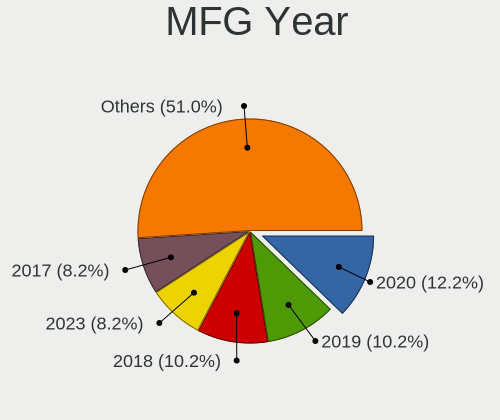
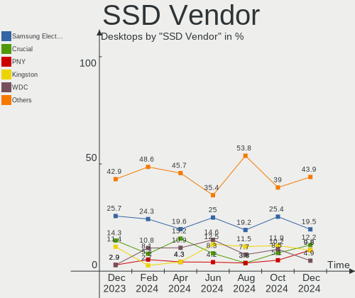
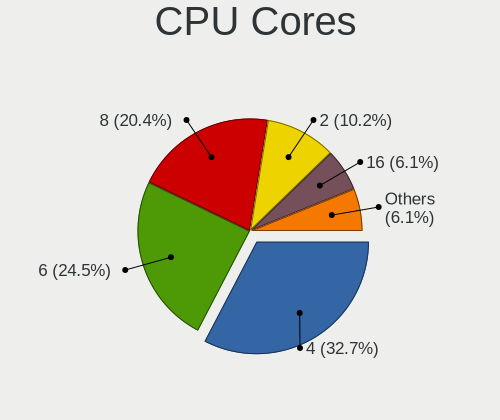
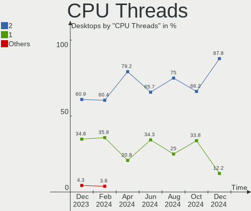
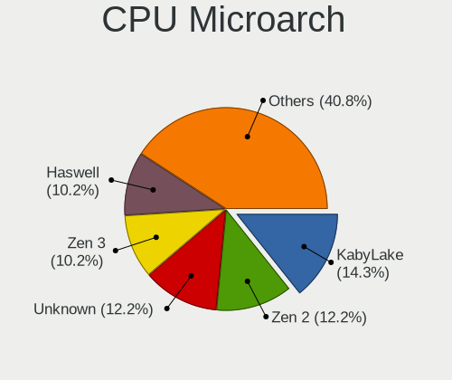
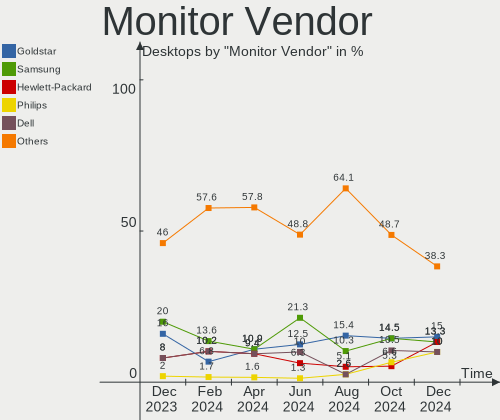
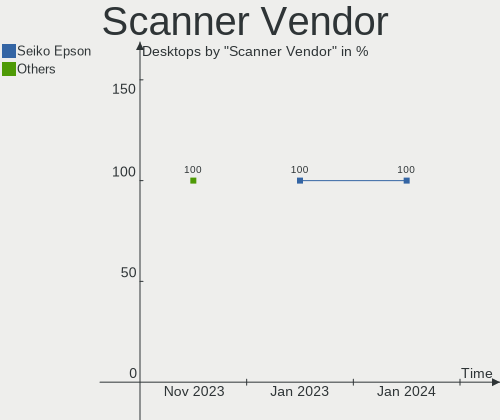
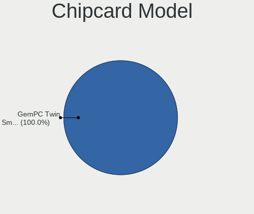

Kubuntu Hardware Trends (Desktops)
----------------------------------

A project to identify most popular hardware characteristics and track their change
over time based on data collected by Linux users at https://Linux-Hardware.org.

Anyone can contribute to this report by the [hw-probe](https://github.com/linuxhw/hw-probe) tool:

    sudo -E hw-probe -all -upload

Full-feature report is available here: https://linux-hardware.org/?view=trends&formfactor=desktop

Period: Jul, 2021.

Contents
--------

* [ System ](#system)
  - [ OS                       ](#os)
  - [ OS Family                ](#os-family)
  - [ Kernel                   ](#kernel)
  - [ Kernel Family            ](#kernel-family)
  - [ Kernel Major Ver.        ](#kernel-major-ver)
  - [ Arch                     ](#arch)
  - [ DE                       ](#de)
  - [ Display Server           ](#display-server)
  - [ Display Manager          ](#display-manager)
  - [ OS Lang                  ](#os-lang)
  - [ Boot Mode                ](#boot-mode)
  - [ Filesystem               ](#filesystem)
  - [ Part. scheme             ](#part-scheme)
  - [ Dual Boot with Linux/BSD ](#dual-boot-with-linuxbsd)
  - [ Dual Boot (Win)          ](#dual-boot-win)

* [ Board ](#board)
  - [ Vendor                   ](#vendor)
  - [ Model                    ](#model)
  - [ Model Family             ](#model-family)
  - [ MFG Year                 ](#mfg-year)
  - [ Form Factor              ](#form-factor)
  - [ Secure Boot              ](#secure-boot)
  - [ Coreboot                 ](#coreboot)
  - [ RAM Size                 ](#ram-size)
  - [ RAM Used                 ](#ram-used)
  - [ Total Drives             ](#total-drives)
  - [ Has CD-ROM               ](#has-cd-rom)
  - [ Has Ethernet             ](#has-ethernet)
  - [ Has WiFi                 ](#has-wifi)
  - [ Has Bluetooth            ](#has-bluetooth)

* [ Location ](#location)
  - [ Country                  ](#country)
  - [ City                     ](#city)

* [ Drives ](#drives)
  - [ Drive Vendor             ](#drive-vendor)
  - [ Drive Model              ](#drive-model)
  - [ HDD Vendor               ](#hdd-vendor)
  - [ SSD Vendor               ](#ssd-vendor)
  - [ Drive Kind               ](#drive-kind)
  - [ Drive Connector          ](#drive-connector)
  - [ Drive Size               ](#drive-size)
  - [ Space Total              ](#space-total)
  - [ Space Used               ](#space-used)
  - [ Malfunc. Drives          ](#malfunc-drives)
  - [ Malfunc. Drive Vendor    ](#malfunc-drive-vendor)
  - [ Malfunc. HDD Vendor      ](#malfunc-hdd-vendor)
  - [ Malfunc. Drive Kind      ](#malfunc-drive-kind)
  - [ Failed Drives            ](#failed-drives)
  - [ Failed Drive Vendor      ](#failed-drive-vendor)
  - [ Drive Status             ](#drive-status)

* [ Storage controller ](#storage-controller)
  - [ Storage Vendor           ](#storage-vendor)
  - [ Storage Model            ](#storage-model)
  - [ Storage Kind             ](#storage-kind)

* [ Processor ](#processor)
  - [ CPU Vendor               ](#cpu-vendor)
  - [ CPU Model                ](#cpu-model)
  - [ CPU Model Family         ](#cpu-model-family)
  - [ CPU Cores                ](#cpu-cores)
  - [ CPU Sockets              ](#cpu-sockets)
  - [ CPU Threads              ](#cpu-threads)
  - [ CPU Op-Modes             ](#cpu-op-modes)
  - [ CPU Microcode            ](#cpu-microcode)
  - [ CPU Microarch            ](#cpu-microarch)

* [ Graphics ](#graphics)
  - [ GPU Vendor               ](#gpu-vendor)
  - [ GPU Model                ](#gpu-model)
  - [ GPU Combo                ](#gpu-combo)
  - [ GPU Driver               ](#gpu-driver)
  - [ GPU Memory               ](#gpu-memory)

* [ Monitor ](#monitor)
  - [ Monitor Vendor           ](#monitor-vendor)
  - [ Monitor Model            ](#monitor-model)
  - [ Monitor Resolution       ](#monitor-resolution)
  - [ Monitor Diagonal         ](#monitor-diagonal)
  - [ Monitor Width            ](#monitor-width)
  - [ Aspect Ratio             ](#aspect-ratio)
  - [ Monitor Area             ](#monitor-area)
  - [ Pixel Density            ](#pixel-density)
  - [ Multiple Monitors        ](#multiple-monitors)

* [ Network ](#network)
  - [ Net Controller Vendor    ](#net-controller-vendor)
  - [ Net Controller Model     ](#net-controller-model)
  - [ Wireless Vendor          ](#wireless-vendor)
  - [ Wireless Model           ](#wireless-model)
  - [ Ethernet Vendor          ](#ethernet-vendor)
  - [ Ethernet Model           ](#ethernet-model)
  - [ Net Controller Kind      ](#net-controller-kind)
  - [ Used Controller          ](#used-controller)
  - [ NICs                     ](#nics)
  - [ IPv6                     ](#ipv6)

* [ Bluetooth ](#bluetooth)
  - [ Bluetooth Vendor         ](#bluetooth-vendor)
  - [ Bluetooth Model          ](#bluetooth-model)

* [ Sound ](#sound)
  - [ Sound Vendor             ](#sound-vendor)
  - [ Sound Model              ](#sound-model)

* [ Memory ](#memory)
  - [ Memory Vendor            ](#memory-vendor)
  - [ Memory Model             ](#memory-model)
  - [ Memory Kind              ](#memory-kind)
  - [ Memory Form Factor       ](#memory-form-factor)
  - [ Memory Size              ](#memory-size)
  - [ Memory Speed             ](#memory-speed)

* [ Printers & scanners ](#printers-&-scanners)
  - [ Printer Vendor           ](#printer-vendor)
  - [ Printer Model            ](#printer-model)
  - [ Scanner Vendor           ](#scanner-vendor)
  - [ Scanner Model            ](#scanner-model)

* [ Camera ](#camera)
  - [ Camera Vendor            ](#camera-vendor)
  - [ Camera Model             ](#camera-model)

* [ Security ](#security)
  - [ Fingerprint Vendor       ](#fingerprint-vendor)
  - [ Fingerprint Model        ](#fingerprint-model)
  - [ Chipcard Vendor          ](#chipcard-vendor)
  - [ Chipcard Model           ](#chipcard-model)

* [ Unsupported ](#unsupported)
  - [ Unsupported Devices      ](#unsupported-devices)
  - [ Unsupported Device Types ](#unsupported-device-types)

System
------

OS
--

Installed operating systems

| Name          | Desktops | Percent |
|---------------|----------|---------|
| Kubuntu 20.04 | 23       | 54.76%  |
| Kubuntu 21.04 | 16       | 38.1%   |
| Kubuntu 20.10 | 2        | 4.76%   |
| Kubuntu 18.04 | 1        | 2.38%   |

OS Family
---------

OS without a version

| Name    | Desktops | Percent |
|---------|----------|---------|
| Kubuntu | 42       | 100%    |

Kernel
------

Version of the Linux kernel

| Version               | Desktops | Percent |
|-----------------------|----------|---------|
| 5.11.0-22-generic     | 10       | 23.81%  |
| 5.4.0-77-generic      | 7        | 16.67%  |
| 5.8.0-63-generic      | 6        | 14.29%  |
| 5.8.0-59-generic      | 4        | 9.52%   |
| 5.4.0-80-generic      | 2        | 4.76%   |
| 5.11.0-25-generic     | 2        | 4.76%   |
| 5.11.0-24-lowlatency  | 2        | 4.76%   |
| 5.11.0-22-lowlatency  | 2        | 4.76%   |
| 5.8.18-050818-generic | 1        | 2.38%   |
| 5.8.0-63-lowlatency   | 1        | 2.38%   |
| 5.8.0-25-generic      | 1        | 2.38%   |
| 5.4.0-79-generic      | 1        | 2.38%   |
| 5.4.0-26-generic      | 1        | 2.38%   |
| 5.11.0-24-generic     | 1        | 2.38%   |
| 4.15.0-147-generic    | 1        | 2.38%   |

Kernel Family
-------------

Linux kernel without a distro release

| Version | Desktops | Percent |
|---------|----------|---------|
| 5.11.0  | 17       | 40.48%  |
| 5.8.0   | 12       | 28.57%  |
| 5.4.0   | 11       | 26.19%  |
| 5.8.18  | 1        | 2.38%   |
| 4.15.0  | 1        | 2.38%   |

Kernel Major Ver.
-----------------

Linux kernel major version

| Version | Desktops | Percent |
|---------|----------|---------|
| 5.11    | 17       | 40.48%  |
| 5.8     | 13       | 30.95%  |
| 5.4     | 11       | 26.19%  |
| 4.15    | 1        | 2.38%   |

Arch
----

OS architecture (x86_64, i586, etc.)

| Name   | Desktops | Percent |
|--------|----------|---------|
| x86_64 | 42       | 100%    |

DE
--

Desktop Environment

| Name | Desktops | Percent |
|------|----------|---------|
| KDE5 | 25       | 59.52%  |
| KDE  | 17       | 40.48%  |

Display Server
--------------

X11 or Wayland

| Name    | Desktops | Percent |
|---------|----------|---------|
| X11     | 40       | 95.24%  |
| Wayland | 2        | 4.76%   |

Display Manager
---------------

SDDM, LightDM, etc.

| Name    | Desktops | Percent |
|---------|----------|---------|
| SDDM    | 23       | 54.76%  |
| Unknown | 17       | 40.48%  |
| TDM     | 2        | 4.76%   |

OS Lang
-------

Language

| Lang  | Desktops | Percent |
|-------|----------|---------|
| en_US | 16       | 38.1%   |
| de_DE | 6        | 14.29%  |
| en_GB | 4        | 9.52%   |
| ru_UA | 2        | 4.76%   |
| fr_FR | 2        | 4.76%   |
| es_ES | 2        | 4.76%   |
| ru_RU | 1        | 2.38%   |
| pt_BR | 1        | 2.38%   |
| pl_PL | 1        | 2.38%   |
| es_VE | 1        | 2.38%   |
| es_MX | 1        | 2.38%   |
| en_ZA | 1        | 2.38%   |
| en_DE | 1        | 2.38%   |
| en_AU | 1        | 2.38%   |
| el_GR | 1        | 2.38%   |
| da_DK | 1        | 2.38%   |

Boot Mode
---------

EFI or BIOS

| Mode | Desktops | Percent |
|------|----------|---------|
| BIOS | 25       | 59.52%  |
| EFI  | 17       | 40.48%  |

Filesystem
----------

Type of filesystem

| Type    | Desktops | Percent |
|---------|----------|---------|
| Ext4    | 39       | 92.86%  |
| Btrfs   | 2        | 4.76%   |
| Overlay | 1        | 2.38%   |

Part. scheme
------------

Scheme of partitioning

| Type    | Desktops | Percent |
|---------|----------|---------|
| GPT     | 21       | 50%     |
| Unknown | 17       | 40.48%  |
| MBR     | 4        | 9.52%   |

Dual Boot with Linux/BSD
------------------------

Hosting more than one Linux/BSD

| Dual boot | Desktops | Percent |
|-----------|----------|---------|
| No        | 30       | 71.43%  |
| Yes       | 12       | 28.57%  |

Dual Boot (Win)
---------------

Hosting Linux and Windows

| Dual boot | Desktops | Percent |
|-----------|----------|---------|
| No        | 24       | 57.14%  |
| Yes       | 18       | 42.86%  |

Board
-----

Vendor
------

Motherboard manufacturer

| Name                | Desktops | Percent |
|---------------------|----------|---------|
| ASUSTek Computer    | 15       | 35.71%  |
| MSI                 | 8        | 19.05%  |
| Gigabyte Technology | 6        | 14.29%  |
| ASRock              | 5        | 11.9%   |
| Dell                | 3        | 7.14%   |
| Lenovo              | 2        | 4.76%   |
| Shuttle             | 1        | 2.38%   |
| Foxconn             | 1        | 2.38%   |
| Colorful Technology | 1        | 2.38%   |

Model
-----

Motherboard model

| Name                              | Desktops | Percent |
|-----------------------------------|----------|---------|
| Shuttle SH67H3                    | 1        | 2.38%   |
| MSI Vig644M                       | 1        | 2.38%   |
| MSI MS-7D18                       | 1        | 2.38%   |
| MSI MS-7C91                       | 1        | 2.38%   |
| MSI MS-7C86                       | 1        | 2.38%   |
| MSI MS-7B85                       | 1        | 2.38%   |
| MSI MS-7817                       | 1        | 2.38%   |
| MSI MS-7693                       | 1        | 2.38%   |
| MSI MS-7673                       | 1        | 2.38%   |
| Lenovo ThinkCentre M82 2929AZ6    | 1        | 2.38%   |
| Lenovo ThinkCentre E73 10AU00B5SA | 1        | 2.38%   |
| Gigabyte X58-USB3                 | 1        | 2.38%   |
| Gigabyte X570 AORUS ELITE         | 1        | 2.38%   |
| Gigabyte P67A-UD7-B3              | 1        | 2.38%   |
| Gigabyte GA-790XT-USB3            | 1        | 2.38%   |
| Gigabyte B550M AORUS ELITE        | 1        | 2.38%   |
| Gigabyte AX370-Gaming K5          | 1        | 2.38%   |
| Foxconn ELA01                     | 1        | 2.38%   |
| Dell XPS 8700                     | 1        | 2.38%   |
| Dell OptiPlex 790                 | 1        | 2.38%   |
| Dell OptiPlex 7010                | 1        | 2.38%   |
| Colorful C.H81A-BTC V20           | 1        | 2.38%   |
| ASUS TUF GAMING B550-PLUS         | 1        | 2.38%   |
| ASUS ROG STRIX X570-E GAMING      | 1        | 2.38%   |
| ASUS ROG STRIX B550-F GAMING      | 1        | 2.38%   |
| ASUS ROG STRIX B450-I GAMING      | 1        | 2.38%   |
| ASUS PRIME X370-PRO               | 1        | 2.38%   |
| ASUS PRIME H410M-E                | 1        | 2.38%   |
| ASUS PRIME B350-PLUS              | 1        | 2.38%   |
| ASUS P6T DELUXE V2                | 1        | 2.38%   |
| ASUS P5G41T-M LX3                 | 1        | 2.38%   |
| ASUS M5A99X EVO                   | 1        | 2.38%   |
| ASUS M3A78-EM                     | 1        | 2.38%   |
| ASUS F1A55-M LX R2.0              | 1        | 2.38%   |
| ASUS All Series                   | 1        | 2.38%   |
| ASUS A88X-PLUS                    | 1        | 2.38%   |
| ASUS 922                          | 1        | 2.38%   |
| ASRock FM2A88X Extreme6+          | 1        | 2.38%   |
| ASRock B85 Pro4                   | 1        | 2.38%   |
| ASRock B550 Extreme4              | 1        | 2.38%   |
| ASRock A320M-DGS                  | 1        | 2.38%   |
| ASRock 760GM-HDV                  | 1        | 2.38%   |

Model Family
------------

Motherboard model prefix

| Name                   | Desktops | Percent |
|------------------------|----------|---------|
| ASUS ROG               | 3        | 7.14%   |
| ASUS PRIME             | 3        | 7.14%   |
| Lenovo ThinkCentre     | 2        | 4.76%   |
| Dell OptiPlex          | 2        | 4.76%   |
| Shuttle SH67H3         | 1        | 2.38%   |
| MSI Vig644M            | 1        | 2.38%   |
| MSI MS-7D18            | 1        | 2.38%   |
| MSI MS-7C91            | 1        | 2.38%   |
| MSI MS-7C86            | 1        | 2.38%   |
| MSI MS-7B85            | 1        | 2.38%   |
| MSI MS-7817            | 1        | 2.38%   |
| MSI MS-7693            | 1        | 2.38%   |
| MSI MS-7673            | 1        | 2.38%   |
| Gigabyte X58-USB3      | 1        | 2.38%   |
| Gigabyte X570          | 1        | 2.38%   |
| Gigabyte P67A-UD7-B3   | 1        | 2.38%   |
| Gigabyte GA-790XT-USB3 | 1        | 2.38%   |
| Gigabyte B550M         | 1        | 2.38%   |
| Gigabyte AX370-Gaming  | 1        | 2.38%   |
| Foxconn ELA01          | 1        | 2.38%   |
| Dell XPS               | 1        | 2.38%   |
| Colorful C.H81A-BTC    | 1        | 2.38%   |
| ASUS TUF               | 1        | 2.38%   |
| ASUS P6T               | 1        | 2.38%   |
| ASUS P5G41T-M          | 1        | 2.38%   |
| ASUS M5A99X            | 1        | 2.38%   |
| ASUS M3A78-EM          | 1        | 2.38%   |
| ASUS F1A55-M           | 1        | 2.38%   |
| ASUS All               | 1        | 2.38%   |
| ASUS A88X-PLUS         | 1        | 2.38%   |
| ASUS 922               | 1        | 2.38%   |
| ASRock FM2A88X         | 1        | 2.38%   |
| ASRock B85             | 1        | 2.38%   |
| ASRock B550            | 1        | 2.38%   |
| ASRock A320M-DGS       | 1        | 2.38%   |
| ASRock 760GM-HDV       | 1        | 2.38%   |

MFG Year
--------

Motherboard manufacture year

| Year | Desktops | Percent |
|------|----------|---------|
| 2021 | 8        | 19.05%  |
| 2020 | 8        | 19.05%  |
| 2015 | 5        | 11.9%   |
| 2018 | 4        | 9.52%   |
| 2013 | 4        | 9.52%   |
| 2011 | 3        | 7.14%   |
| 2010 | 3        | 7.14%   |
| 2014 | 2        | 4.76%   |
| 2012 | 2        | 4.76%   |
| 2017 | 1        | 2.38%   |
| 2016 | 1        | 2.38%   |
| 2008 | 1        | 2.38%   |

Form Factor
-----------

Physical design of the computer

| Name    | Desktops | Percent |
|---------|----------|---------|
| Desktop | 42       | 100%    |

Secure Boot
-----------

Enabled or disabled

| State    | Desktops | Percent |
|----------|----------|---------|
| Disabled | 42       | 100%    |

Coreboot
--------

Have coreboot on board

| Used | Desktops | Percent |
|------|----------|---------|
| No   | 42       | 100%    |

RAM Size
--------

Total RAM memory

| Size in GB  | Desktops | Percent |
|-------------|----------|---------|
| 32.01-64.0  | 11       | 26.19%  |
| 16.01-24.0  | 8        | 19.05%  |
| 4.01-8.0    | 7        | 16.67%  |
| 8.01-16.0   | 6        | 14.29%  |
| 3.01-4.0    | 4        | 9.52%   |
| 24.01-32.0  | 3        | 7.14%   |
| 64.01-256.0 | 3        | 7.14%   |

RAM Used
--------

Used RAM memory

| Used GB   | Desktops | Percent |
|-----------|----------|---------|
| 2.01-3.0  | 14       | 33.33%  |
| 4.01-8.0  | 12       | 28.57%  |
| 1.01-2.0  | 7        | 16.67%  |
| 3.01-4.0  | 6        | 14.29%  |
| 8.01-16.0 | 2        | 4.76%   |
| 0.51-1.0  | 1        | 2.38%   |

Total Drives
------------

Number of drives on board

| Drives | Desktops | Percent |
|--------|----------|---------|
| 1      | 15       | 35.71%  |
| 2      | 9        | 21.43%  |
| 5      | 4        | 9.52%   |
| 4      | 4        | 9.52%   |
| 3      | 4        | 9.52%   |
| 7      | 2        | 4.76%   |
| 6      | 2        | 4.76%   |
| 12     | 1        | 2.38%   |
| 8      | 1        | 2.38%   |

Has CD-ROM
----------

Has CD-ROM on board

| Presented | Desktops | Percent |
|-----------|----------|---------|
| Yes       | 21       | 50%     |
| No        | 21       | 50%     |

Has Ethernet
------------

Has Ethernet on board

| Presented | Desktops | Percent |
|-----------|----------|---------|
| Yes       | 42       | 100%    |

Has WiFi
--------

Has WiFi module

| Presented | Desktops | Percent |
|-----------|----------|---------|
| Yes       | 27       | 64.29%  |
| No        | 15       | 35.71%  |

Has Bluetooth
-------------

Has Bluetooth module

| Presented | Desktops | Percent |
|-----------|----------|---------|
| No        | 23       | 54.76%  |
| Yes       | 19       | 45.24%  |

Location
--------

Country
-------

Geographic location (country)

| Country      | Desktops | Percent |
|--------------|----------|---------|
| USA          | 10       | 23.81%  |
| Germany      | 9        | 21.43%  |
| UK           | 4        | 9.52%   |
| Spain        | 4        | 9.52%   |
| Ukraine      | 2        | 4.76%   |
| France       | 2        | 4.76%   |
| Venezuela    | 1        | 2.38%   |
| South Korea  | 1        | 2.38%   |
| South Africa | 1        | 2.38%   |
| Mexico       | 1        | 2.38%   |
| Greece       | 1        | 2.38%   |
| Estonia      | 1        | 2.38%   |
| Denmark      | 1        | 2.38%   |
| Canada       | 1        | 2.38%   |
| Brazil       | 1        | 2.38%   |
| Australia    | 1        | 2.38%   |
| Argentina    | 1        | 2.38%   |

City
----

Geographic location (city)

| City                   | Desktops | Percent |
|------------------------|----------|---------|
| Frankfurt am Main      | 3        | 7.14%   |
| Munich                 | 2        | 4.76%   |
| London                 | 2        | 4.76%   |
| Yuba City              | 1        | 2.38%   |
| Sydney                 | 1        | 2.38%   |
| Stuttgart              | 1        | 2.38%   |
| Starnberg              | 1        | 2.38%   |
| Silver Spring          | 1        | 2.38%   |
| Seattle                | 1        | 2.38%   |
| Santo André           | 1        | 2.38%   |
| Sant Cugat del Vallès | 1        | 2.38%   |
| Sandy                  | 1        | 2.38%   |
| Plano                  | 1        | 2.38%   |
| Peterborough           | 1        | 2.38%   |
| Nunez                  | 1        | 2.38%   |
| Metepec                | 1        | 2.38%   |
| Maurecourt             | 1        | 2.38%   |
| Lepe                   | 1        | 2.38%   |
| Leipzig                | 1        | 2.38%   |
| Lancaster              | 1        | 2.38%   |
| L'Isle-d'Abeau         | 1        | 2.38%   |
| Kharkiv                | 1        | 2.38%   |
| Johannesburg           | 1        | 2.38%   |
| J?µel?§htme Parish     | 1        | 2.38%   |
| Jacksonville           | 1        | 2.38%   |
| Guarenas               | 1        | 2.38%   |
| Guadix                 | 1        | 2.38%   |
| Elyria                 | 1        | 2.38%   |
| Dnipropetrovsk         | 1        | 2.38%   |
| Cuarte de Huerva       | 1        | 2.38%   |
| Copenhagen             | 1        | 2.38%   |
| Chicago                | 1        | 2.38%   |
| Boyd                   | 1        | 2.38%   |
| Berlin                 | 1        | 2.38%   |
| Austin                 | 1        | 2.38%   |
| Athens                 | 1        | 2.38%   |
| Asan                   | 1        | 2.38%   |
| Altrincham             | 1        | 2.38%   |

Drives
------

Drive Vendor
------------

Hard drive vendors

| Vendor              | Desktops | Drives | Percent |
|---------------------|----------|--------|---------|
| Seagate             | 18       | 24     | 21.43%  |
| WDC                 | 17       | 35     | 20.24%  |
| Samsung Electronics | 14       | 21     | 16.67%  |
| SanDisk             | 6        | 8      | 7.14%   |
| Kingston            | 5        | 6      | 5.95%   |
| Hitachi             | 4        | 7      | 4.76%   |
| Intenso             | 3        | 3      | 3.57%   |
| Patriot             | 2        | 2      | 2.38%   |
| Intel               | 2        | 3      | 2.38%   |
| Crucial             | 2        | 4      | 2.38%   |
| VENO                | 1        | 1      | 1.19%   |
| Unknown             | 1        | 2      | 1.19%   |
| TUSUNBOW            | 1        | 1      | 1.19%   |
| Toshiba             | 1        | 2      | 1.19%   |
| SPCC                | 1        | 1      | 1.19%   |
| Phison              | 1        | 1      | 1.19%   |
| OCZ                 | 1        | 1      | 1.19%   |
| Leven               | 1        | 1      | 1.19%   |
| JMicron             | 1        | 2      | 1.19%   |
| HGST                | 1        | 1      | 1.19%   |
| China               | 1        | 1      | 1.19%   |

Drive Model
-----------

Hard drive models

| Model                                | Desktops | Percent |
|--------------------------------------|----------|---------|
| WDC WD40EFRX-68WT0N0 4TB             | 2        | 1.72%   |
| WDC WD30EZRX-00MMMB0 3TB             | 2        | 1.72%   |
| Seagate ST2000DM008-2FR102 2TB       | 2        | 1.72%   |
| Seagate ST2000DM001-1CH164 2TB       | 2        | 1.72%   |
| SanDisk SSD PLUS 240GB               | 2        | 1.72%   |
| Samsung SSD 860 EVO 1TB              | 2        | 1.72%   |
| Intenso SATA III SSD 480GB           | 2        | 1.72%   |
| WDC WDS500G2B0A-00SM50 500GB SSD     | 1        | 0.86%   |
| WDC WDS200T2B0B-00YS70 2TB SSD       | 1        | 0.86%   |
| WDC WD7500AACS-65D6B0 752GB          | 1        | 0.86%   |
| WDC WD60EZRZ-00GZ5B1 6TB             | 1        | 0.86%   |
| WDC WD60EZAZ-00ZGHB0 6TB             | 1        | 0.86%   |
| WDC WD5000AVJS-63TRA0 500GB          | 1        | 0.86%   |
| WDC WD5000AAVS-00G9B1 500GB          | 1        | 0.86%   |
| WDC WD5000AAKS-00V1A0 500GB          | 1        | 0.86%   |
| WDC WD5000AAJS-08A8B0 500GB          | 1        | 0.86%   |
| WDC WD40EZRZ-00GXCB0 4TB             | 1        | 0.86%   |
| WDC WD3200JD-22KLB0 320GB            | 1        | 0.86%   |
| WDC WD3200AAJS-08L7A0 320GB          | 1        | 0.86%   |
| WDC WD20EZRX-00DC0B0 2TB             | 1        | 0.86%   |
| WDC WD20EFRX-68EUZN0 2TB             | 1        | 0.86%   |
| WDC WD20EARS-00MVWB0 2TB             | 1        | 0.86%   |
| WDC WD2001FASS-00W2B0 2TB            | 1        | 0.86%   |
| WDC WD120EMFZ-11A6JA0 12TB           | 1        | 0.86%   |
| WDC WD10EZEX-08WN4A0 1TB             | 1        | 0.86%   |
| WDC WD10EZEX-08M2NA0 1TB             | 1        | 0.86%   |
| WDC WD10EZEX-00BN5A0 1TB             | 1        | 0.86%   |
| WDC WD10EACS-32ZJB0 1TB              | 1        | 0.86%   |
| WDC WD10EACS-00C7B0 1TB              | 1        | 0.86%   |
| WDC WD1003FZEX-00MK2A0 1TB           | 1        | 0.86%   |
| WDC WD1003FZEX-00K3CA0 1TB           | 1        | 0.86%   |
| WDC WD1003FBYX-01Y7B0 1TB            | 1        | 0.86%   |
| WDC WD1002FAEX-00Z3A0 1TB            | 1        | 0.86%   |
| WDC WD1001FALS-40U9B0 1TB            | 1        | 0.86%   |
| WDC WD1001FALS-00J7B1 1TB            | 1        | 0.86%   |
| WDC PC SN530 SDBPNPZ-256G-1006 256GB | 1        | 0.86%   |
| VENO SCORP SSD 240GB                 | 1        | 0.86%   |
| Unknown SD/MMC 64GB                  | 1        | 0.86%   |
| Unknown M.S./M.S.Pro/HG 16GB         | 1        | 0.86%   |
| TUSUNBOW X3 480GB SSD                | 1        | 0.86%   |
| Toshiba MQ04ABF100 1TB               | 1        | 0.86%   |
| Toshiba MQ01ABD100 1TB               | 1        | 0.86%   |
| SPCC Solid State Disk 128GB          | 1        | 0.86%   |
| Seagate ST9500325AS 500GB            | 1        | 0.86%   |
| Seagate ST8000AS0002-1NA17Z 8TB      | 1        | 0.86%   |
| Seagate ST4000VN008-2DR166 4TB       | 1        | 0.86%   |
| Seagate ST4000DM004-2CV104 4TB       | 1        | 0.86%   |
| Seagate ST3500418AS 500GB            | 1        | 0.86%   |
| Seagate ST3400833AS 400GB            | 1        | 0.86%   |
| Seagate ST32000542AS 2TB             | 1        | 0.86%   |
| Seagate ST31000340NS 1TB             | 1        | 0.86%   |
| Seagate ST3000VN007-2AH16M 3TB       | 1        | 0.86%   |
| Seagate ST3000DM007-1WY10G 3TB       | 1        | 0.86%   |
| Seagate ST2000LM007-1R8174 2TB       | 1        | 0.86%   |
| Seagate ST2000DM001-1ER164 2TB       | 1        | 0.86%   |
| Seagate ST1000LM035-1RK172 1TB       | 1        | 0.86%   |
| Seagate ST1000LM024 HN-M101MBB 1TB   | 1        | 0.86%   |
| Seagate ST1000LM014-1EJ164 1TB       | 1        | 0.86%   |
| Seagate ST1000DM010-2EP102 1TB       | 1        | 0.86%   |
| Seagate ST1000DM003-1CH162 1TB       | 1        | 0.86%   |

HDD Vendor
----------

Hard disk drive vendors

| Vendor              | Desktops | Drives | Percent |
|---------------------|----------|--------|---------|
| Seagate             | 18       | 24     | 43.9%   |
| WDC                 | 15       | 32     | 36.59%  |
| Hitachi             | 4        | 7      | 9.76%   |
| Samsung Electronics | 2        | 2      | 4.88%   |
| Toshiba             | 1        | 2      | 2.44%   |
| HGST                | 1        | 1      | 2.44%   |

SSD Vendor
----------

Solid state drive vendors

| Vendor              | Desktops | Drives | Percent |
|---------------------|----------|--------|---------|
| Samsung Electronics | 12       | 13     | 31.58%  |
| SanDisk             | 5        | 7      | 13.16%  |
| Kingston            | 4        | 5      | 10.53%  |
| Intenso             | 3        | 3      | 7.89%   |
| WDC                 | 2        | 2      | 5.26%   |
| Patriot             | 2        | 2      | 5.26%   |
| Crucial             | 2        | 4      | 5.26%   |
| VENO                | 1        | 1      | 2.63%   |
| TUSUNBOW            | 1        | 1      | 2.63%   |
| SPCC                | 1        | 1      | 2.63%   |
| OCZ                 | 1        | 1      | 2.63%   |
| Leven               | 1        | 1      | 2.63%   |
| JMicron             | 1        | 2      | 2.63%   |
| Intel               | 1        | 2      | 2.63%   |
| China               | 1        | 1      | 2.63%   |

Drive Kind
----------

HDD or SSD

| Kind    | Desktops | Drives | Percent |
|---------|----------|--------|---------|
| HDD     | 30       | 68     | 44.12%  |
| SSD     | 28       | 46     | 41.18%  |
| NVMe    | 9        | 11     | 13.24%  |
| Unknown | 1        | 2      | 1.47%   |

Drive Connector
---------------

SATA, SAS, NVMe, etc.

| Type | Desktops | Drives | Percent |
|------|----------|--------|---------|
| SATA | 40       | 110    | 75.47%  |
| NVMe | 9        | 11     | 16.98%  |
| SAS  | 4        | 6      | 7.55%   |

Drive Size
----------

Size of hard drive

| Size in TB | Desktops | Drives | Percent |
|------------|----------|--------|---------|
| 0.01-0.5   | 27       | 43     | 38.03%  |
| 0.51-1.0   | 19       | 38     | 26.76%  |
| 1.01-2.0   | 10       | 16     | 14.08%  |
| 3.01-4.0   | 6        | 6      | 8.45%   |
| 2.01-3.0   | 4        | 5      | 5.63%   |
| 4.01-10.0  | 4        | 4      | 5.63%   |
| 10.01-20.0 | 1        | 2      | 1.41%   |

Space Total
-----------

Amount of disk space available on the file system

| Size in GB     | Desktops | Percent |
|----------------|----------|---------|
| More than 3000 | 11       | 26.19%  |
| 501-1000       | 10       | 23.81%  |
| 251-500        | 9        | 21.43%  |
| 101-250        | 6        | 14.29%  |
| 1001-2000      | 4        | 9.52%   |
| 1-20           | 2        | 4.76%   |

Space Used
----------

Amount of used disk space

| Used GB        | Desktops | Percent |
|----------------|----------|---------|
| 101-250        | 9        | 21.43%  |
| 21-50          | 6        | 14.29%  |
| More than 3000 | 5        | 11.9%   |
| 251-500        | 5        | 11.9%   |
| 1-20           | 5        | 11.9%   |
| 501-1000       | 5        | 11.9%   |
| 2001-3000      | 4        | 9.52%   |
| 1001-2000      | 2        | 4.76%   |
| 51-100         | 1        | 2.38%   |

Malfunc. Drives
---------------

Drive models with a malfunction

| Model                          | Desktops | Drives | Percent |
|--------------------------------|----------|--------|---------|
| WDC WD5000AAVS-00G9B1 500GB    | 1        | 1      | 9.09%   |
| WDC WD5000AAKS-00V1A0 500GB    | 1        | 1      | 9.09%   |
| WDC WD3200JD-22KLB0 320GB      | 1        | 1      | 9.09%   |
| WDC WD20EFRX-68EUZN0 2TB       | 1        | 2      | 9.09%   |
| WDC WD10EZEX-08WN4A0 1TB       | 1        | 1      | 9.09%   |
| WDC WD1001FALS-40U9B0 1TB      | 1        | 1      | 9.09%   |
| Seagate ST3500418AS 500GB      | 1        | 1      | 9.09%   |
| Seagate ST32000542AS 2TB       | 1        | 1      | 9.09%   |
| Seagate ST1000LM035-1RK172 1TB | 1        | 1      | 9.09%   |
| Intel SSDSA2M040G2GC 40GB      | 1        | 2      | 9.09%   |
| Crucial CT275MX300SSD1 275GB   | 1        | 2      | 9.09%   |

Malfunc. Drive Vendor
---------------------

Vendors of faulty drives

| Vendor  | Desktops | Drives | Percent |
|---------|----------|--------|---------|
| WDC     | 4        | 7      | 44.44%  |
| Seagate | 3        | 3      | 33.33%  |
| Intel   | 1        | 2      | 11.11%  |
| Crucial | 1        | 2      | 11.11%  |

Malfunc. HDD Vendor
-------------------

Vendors of faulty HDD drives

| Vendor  | Desktops | Drives | Percent |
|---------|----------|--------|---------|
| WDC     | 4        | 7      | 57.14%  |
| Seagate | 3        | 3      | 42.86%  |

Malfunc. Drive Kind
-------------------

Kinds of faulty drives

| Kind | Desktops | Drives | Percent |
|------|----------|--------|---------|
| HDD  | 6        | 10     | 75%     |
| SSD  | 2        | 4      | 25%     |

Failed Drives
-------------

Failed drive models

Zero info for selected period =(

Failed Drive Vendor
-------------------

Failed drive vendors

Zero info for selected period =(

Drive Status
------------

Number of failed and malfunc. drives

| Status   | Desktops | Drives | Percent |
|----------|----------|--------|---------|
| Works    | 25       | 63     | 49.02%  |
| Detected | 18       | 50     | 35.29%  |
| Malfunc  | 8        | 14     | 15.69%  |

Storage controller
------------------

Storage Vendor
--------------

Storage controller vendors

| Vendor                      | Desktops | Percent |
|-----------------------------|----------|---------|
| AMD                         | 22       | 37.29%  |
| Intel                       | 21       | 35.59%  |
| Samsung Electronics         | 4        | 6.78%   |
| Marvell Technology Group    | 3        | 5.08%   |
| JMicron Technology          | 3        | 5.08%   |
| Sandisk                     | 2        | 3.39%   |
| Phison Electronics          | 1        | 1.69%   |
| Kingston Technology Company | 1        | 1.69%   |
| Adaptec                     | 1        | 1.69%   |
| 3ware                       | 1        | 1.69%   |

Storage Model
-------------

Storage controller models

| Model                                                                                   | Desktops | Percent |
|-----------------------------------------------------------------------------------------|----------|---------|
| AMD FCH SATA Controller [AHCI mode]                                                     | 10       | 13.33%  |
| Intel 8 Series/C220 Series Chipset Family 6-port SATA Controller 1 [AHCI mode]          | 6        | 8%      |
| AMD Starship/Matisse Chipset SATA Controller [AHCI mode]                                | 6        | 8%      |
| Intel 6 Series/C200 Series Chipset Family 6 port Desktop SATA AHCI Controller           | 4        | 5.33%   |
| AMD SB7x0/SB8x0/SB9x0 IDE Controller                                                    | 4        | 5.33%   |
| AMD SB7x0/SB8x0/SB9x0 SATA Controller [AHCI mode]                                       | 3        | 4%      |
| Sandisk WD Blue SN550 NVMe SSD                                                          | 2        | 2.67%   |
| Samsung NVMe SSD Controller SM981/PM981/PM983                                           | 2        | 2.67%   |
| Marvell Group 88SE9128 PCIe SATA 6 Gb/s RAID controller                                 | 2        | 2.67%   |
| JMicron JMB363 SATA/IDE Controller                                                      | 2        | 2.67%   |
| Intel 82801JI (ICH10 Family) 4 port SATA IDE Controller #1                              | 2        | 2.67%   |
| Intel 82801JI (ICH10 Family) 2 port SATA IDE Controller #2                              | 2        | 2.67%   |
| Intel 7 Series/C210 Series Chipset Family 6-port SATA Controller [AHCI mode]            | 2        | 2.67%   |
| Intel 400 Series Chipset Family SATA AHCI Controller                                    | 2        | 2.67%   |
| AMD X370 Series Chipset SATA Controller                                                 | 2        | 2.67%   |
| AMD SB7x0/SB8x0/SB9x0 SATA Controller [IDE mode]                                        | 2        | 2.67%   |
| AMD 400 Series Chipset SATA Controller                                                  | 2        | 2.67%   |
| Samsung NVMe SSD Controller SM961/PM961/SM963                                           | 1        | 1.33%   |
| Samsung NVMe SSD Controller PM9A1/PM9A3/980PRO                                          | 1        | 1.33%   |
| Samsung NVMe Controller                                                                 | 1        | 1.33%   |
| Phison E12 NVMe Controller                                                              | 1        | 1.33%   |
| Marvell Group 88SE6111/6121 SATA II / PATA Controller                                   | 1        | 1.33%   |
| Kingston Company A2000 NVMe SSD                                                         | 1        | 1.33%   |
| JMicron JMB368 IDE controller                                                           | 1        | 1.33%   |
| JMicron JMB362 SATA Controller                                                          | 1        | 1.33%   |
| Intel Non-Volatile memory controller                                                    | 1        | 1.33%   |
| Intel NM10/ICH7 Family SATA Controller [IDE mode]                                       | 1        | 1.33%   |
| Intel 82801JI (ICH10 Family) SATA AHCI Controller                                       | 1        | 1.33%   |
| Intel 82801G (ICH7 Family) IDE Controller                                               | 1        | 1.33%   |
| Intel 6 Series/C200 Series Chipset Family Desktop SATA Controller (IDE mode, ports 4-5) | 1        | 1.33%   |
| Intel 6 Series/C200 Series Chipset Family Desktop SATA Controller (IDE mode, ports 0-3) | 1        | 1.33%   |
| Intel 500 Series Chipset Family SATA AHCI Controller                                    | 1        | 1.33%   |
| AMD FCH SATA Controller D                                                               | 1        | 1.33%   |
| AMD FCH IDE Controller                                                                  | 1        | 1.33%   |
| AMD 300 Series Chipset SATA Controller                                                  | 1        | 1.33%   |
| Adaptec AIC-7861                                                                        | 1        | 1.33%   |
| 3ware 9650SE SATA-II RAID PCIe                                                          | 1        | 1.33%   |

Storage Kind
------------

Kind of storage controller (IDE, SATA, NVMe, SAS, ...)

| Kind | Desktops | Percent |
|------|----------|---------|
| SATA | 38       | 63.33%  |
| IDE  | 11       | 18.33%  |
| NVMe | 9        | 15%     |
| RAID | 1        | 1.67%   |
| SCSI | 1        | 1.67%   |

Processor
---------

CPU Vendor
----------

Processor vendors

| Vendor | Desktops | Percent |
|--------|----------|---------|
| AMD    | 22       | 52.38%  |
| Intel  | 20       | 47.62%  |

CPU Model
---------

Processor models

| Model                                         | Desktops | Percent |
|-----------------------------------------------|----------|---------|
| AMD Ryzen 9 3900X 12-Core Processor           | 3        | 7.14%   |
| AMD Ryzen 5 3600 6-Core Processor             | 3        | 7.14%   |
| Intel Core i7-4770 CPU @ 3.40GHz              | 2        | 4.76%   |
| Intel Core i5-2500K CPU @ 3.30GHz             | 2        | 4.76%   |
| AMD Ryzen 9 5900X 12-Core Processor           | 2        | 4.76%   |
| Intel Xeon CPU E3-1240 V2 @ 3.40GHz           | 1        | 2.38%   |
| Intel Pentium CPU G3220 @ 3.00GHz             | 1        | 2.38%   |
| Intel Core i7-2600K CPU @ 3.40GHz             | 1        | 2.38%   |
| Intel Core i7-2600 CPU @ 3.40GHz              | 1        | 2.38%   |
| Intel Core i7-10700K CPU @ 3.80GHz            | 1        | 2.38%   |
| Intel Core i7-10700 CPU @ 2.90GHz             | 1        | 2.38%   |
| Intel Core i7 CPU 960 @ 3.20GHz               | 1        | 2.38%   |
| Intel Core i7 CPU 920 @ 2.67GHz               | 1        | 2.38%   |
| Intel Core i5-4570 CPU @ 3.20GHz              | 1        | 2.38%   |
| Intel Core i5-4460S CPU @ 2.90GHz             | 1        | 2.38%   |
| Intel Core i5-4460 CPU @ 3.20GHz              | 1        | 2.38%   |
| Intel Core i5-3470 CPU @ 3.20GHz              | 1        | 2.38%   |
| Intel Core i3-2120 CPU @ 3.30GHz              | 1        | 2.38%   |
| Intel Core 2 Quad CPU Q8400 @ 2.66GHz         | 1        | 2.38%   |
| Intel Core 2 Duo CPU E7200 @ 2.53GHz          | 1        | 2.38%   |
| Intel 11th Gen Core i5-11600 @ 2.80GHz        | 1        | 2.38%   |
| AMD Ryzen 9 3900XT 12-Core Processor          | 1        | 2.38%   |
| AMD Ryzen 7 3800X 8-Core Processor            | 1        | 2.38%   |
| AMD Ryzen 7 3700X 8-Core Processor            | 1        | 2.38%   |
| AMD Ryzen 5 PRO 4650G with Radeon Graphics    | 1        | 2.38%   |
| AMD Ryzen 5 1600 Six-Core Processor           | 1        | 2.38%   |
| AMD Phenom II X4 965 Processor                | 1        | 2.38%   |
| AMD Phenom II X2 521 Processor                | 1        | 2.38%   |
| AMD FX-8350 Eight-Core Processor              | 1        | 2.38%   |
| AMD FX-6300 Six-Core Processor                | 1        | 2.38%   |
| AMD Athlon II X4 630 Processor                | 1        | 2.38%   |
| AMD A8-9600 RADEON R7, 10 COMPUTE CORES 4C+6G | 1        | 2.38%   |
| AMD A4-3400 APU with Radeon HD Graphics       | 1        | 2.38%   |
| AMD A10-7850K APU with Radeon R7 Graphics     | 1        | 2.38%   |
| AMD A10-5800K APU with Radeon HD Graphics     | 1        | 2.38%   |

CPU Model Family
----------------

Processor model prefix

| Model             | Desktops | Percent |
|-------------------|----------|---------|
| Intel Core i7     | 8        | 19.05%  |
| Intel Core i5     | 6        | 14.29%  |
| AMD Ryzen 9       | 6        | 14.29%  |
| AMD Ryzen 5       | 4        | 9.52%   |
| AMD Ryzen 7       | 2        | 4.76%   |
| AMD FX            | 2        | 4.76%   |
| AMD A10           | 2        | 4.76%   |
| Other             | 1        | 2.38%   |
| Intel Xeon        | 1        | 2.38%   |
| Intel Pentium     | 1        | 2.38%   |
| Intel Core i3     | 1        | 2.38%   |
| Intel Core 2 Quad | 1        | 2.38%   |
| Intel Core 2 Duo  | 1        | 2.38%   |
| AMD Ryzen 5 PRO   | 1        | 2.38%   |
| AMD Phenom II X4  | 1        | 2.38%   |
| AMD Phenom II X2  | 1        | 2.38%   |
| AMD Athlon II X4  | 1        | 2.38%   |
| AMD A8            | 1        | 2.38%   |
| AMD A4            | 1        | 2.38%   |

CPU Cores
---------

Number of processor cores

| Number | Desktops | Percent |
|--------|----------|---------|
| 4      | 17       | 40.48%  |
| 2      | 8        | 19.05%  |
| 12     | 6        | 14.29%  |
| 6      | 6        | 14.29%  |
| 8      | 4        | 9.52%   |
| 3      | 1        | 2.38%   |

CPU Sockets
-----------

Number of sockets

| Number | Desktops | Percent |
|--------|----------|---------|
| 1      | 42       | 100%    |

CPU Threads
-----------

Threads per core (Hyper-Threading)

| Number | Desktops | Percent |
|--------|----------|---------|
| 2      | 29       | 69.05%  |
| 1      | 13       | 30.95%  |

CPU Op-Modes
------------

CPU Operation Modes (32-bit, 64-bit)

| Op mode        | Desktops | Percent |
|----------------|----------|---------|
| 32-bit, 64-bit | 42       | 100%    |

CPU Microcode
-------------

Microcode number

| Number     | Desktops | Percent |
|------------|----------|---------|
| 0x08701021 | 8        | 19.05%  |
| Unknown    | 8        | 19.05%  |
| 0x306c3    | 3        | 7.14%   |
| 0x206a7    | 3        | 7.14%   |
| 0xa0655    | 2        | 4.76%   |
| 0x306a9    | 2        | 4.76%   |
| 0x106a5    | 2        | 4.76%   |
| 0x010000c8 | 2        | 4.76%   |
| 0xa0671    | 1        | 2.38%   |
| 0x1067a    | 1        | 2.38%   |
| 0x10676    | 1        | 2.38%   |
| 0x0a201009 | 1        | 2.38%   |
| 0x0a201006 | 1        | 2.38%   |
| 0x08600106 | 1        | 2.38%   |
| 0x08001138 | 1        | 2.38%   |
| 0x06006118 | 1        | 2.38%   |
| 0x06003104 | 1        | 2.38%   |
| 0x06001119 | 1        | 2.38%   |
| 0x06000852 | 1        | 2.38%   |
| 0x010000db | 1        | 2.38%   |

CPU Microarch
-------------

Microarchitecture

| Name        | Desktops | Percent |
|-------------|----------|---------|
| Zen 2       | 10       | 23.81%  |
| Haswell     | 6        | 14.29%  |
| SandyBridge | 5        | 11.9%   |
| Piledriver  | 3        | 7.14%   |
| K10         | 3        | 7.14%   |
| Zen 3       | 2        | 4.76%   |
| Penryn      | 2        | 4.76%   |
| Nehalem     | 2        | 4.76%   |
| IvyBridge   | 2        | 4.76%   |
| CometLake   | 2        | 4.76%   |
| Zen         | 1        | 2.38%   |
| Steamroller | 1        | 2.38%   |
| K10 Llano   | 1        | 2.38%   |
| Excavator   | 1        | 2.38%   |
| Unknown     | 1        | 2.38%   |

Graphics
--------

GPU Vendor
----------

Vendors of graphics cards

| Vendor | Desktops | Percent |
|--------|----------|---------|
| Nvidia | 20       | 46.51%  |
| AMD    | 16       | 37.21%  |
| Intel  | 7        | 16.28%  |

GPU Model
---------

Graphics card models

| Model                                                                       | Desktops | Percent |
|-----------------------------------------------------------------------------|----------|---------|
| Nvidia GP108 [GeForce GT 1030]                                              | 3        | 6.82%   |
| Nvidia GK208B [GeForce GT 710]                                              | 3        | 6.82%   |
| Intel Xeon E3-1200 v3/4th Gen Core Processor Integrated Graphics Controller | 3        | 6.82%   |
| AMD Ellesmere [Radeon RX 470/480/570/570X/580/580X/590]                     | 3        | 6.82%   |
| Nvidia GP107 [GeForce GTX 1050 Ti]                                          | 2        | 4.55%   |
| Intel CometLake-S GT2 [UHD Graphics 630]                                    | 2        | 4.55%   |
| AMD Navi 10 [Radeon RX 5600 OEM/5600 XT / 5700/5700 XT]                     | 2        | 4.55%   |
| Nvidia TU104 [GeForce RTX 2070 SUPER]                                       | 1        | 2.27%   |
| Nvidia GP107 [GeForce GTX 1050]                                             | 1        | 2.27%   |
| Nvidia GP106 [GeForce GTX 1060 6GB]                                         | 1        | 2.27%   |
| Nvidia GP104 [GeForce GTX 1070]                                             | 1        | 2.27%   |
| Nvidia GP102 [GeForce GTX 1080 Ti]                                          | 1        | 2.27%   |
| Nvidia GM107 [GeForce GTX 745]                                              | 1        | 2.27%   |
| Nvidia GK208B [GeForce GT 730]                                              | 1        | 2.27%   |
| Nvidia GK107 [GeForce GT 640]                                               | 1        | 2.27%   |
| Nvidia GK106 [GeForce GTX 660]                                              | 1        | 2.27%   |
| Nvidia GK104 [GeForce GTX 760]                                              | 1        | 2.27%   |
| Nvidia GF106GL [Quadro 2000]                                                | 1        | 2.27%   |
| Nvidia G92 [GeForce GTS 250]                                                | 1        | 2.27%   |
| Intel RocketLake-S GT1 [UHD Graphics 750]                                   | 1        | 2.27%   |
| Intel 2nd Generation Core Processor Family Integrated Graphics Controller   | 1        | 2.27%   |
| AMD Vega 10 XL/XT [Radeon RX Vega 56/64]                                    | 1        | 2.27%   |
| AMD SuperSumo [Radeon HD 6410D]                                             | 1        | 2.27%   |
| AMD RV730 XT [Radeon HD 4670]                                               | 1        | 2.27%   |
| AMD RV670 [Radeon HD 3870]                                                  | 1        | 2.27%   |
| AMD RS780L [Radeon 3000]                                                    | 1        | 2.27%   |
| AMD Renoir                                                                  | 1        | 2.27%   |
| AMD Park [Mobility Radeon HD 5430]                                          | 1        | 2.27%   |
| AMD Oland XT [Radeon HD 8670 / R5 340X OEM / R7 250/350/350X OEM]           | 1        | 2.27%   |
| AMD Navi 22 [Radeon RX 6700/6700 XT / 6800M]                                | 1        | 2.27%   |
| AMD Kaveri [Radeon R7 Graphics]                                             | 1        | 2.27%   |
| AMD Caicos [Radeon HD 6450/7450/8450 / R5 230 OEM]                          | 1        | 2.27%   |
| AMD Barts PRO [Radeon HD 6850]                                              | 1        | 2.27%   |

GPU Combo
---------

Combinations of graphics cards

| Name           | Desktops | Percent |
|----------------|----------|---------|
| 1 x Nvidia     | 19       | 45.24%  |
| 1 x AMD        | 15       | 35.71%  |
| 1 x Intel      | 6        | 14.29%  |
| 2 x AMD        | 1        | 2.38%   |
| Intel + Nvidia | 1        | 2.38%   |

GPU Driver
----------

Free vs proprietary

| Driver      | Desktops | Percent |
|-------------|----------|---------|
| Free        | 28       | 66.67%  |
| Proprietary | 14       | 33.33%  |

GPU Memory
----------

Total video memory

| Size in GB | Desktops | Percent |
|------------|----------|---------|
| Unknown    | 12       | 28.57%  |
| 1.01-2.0   | 10       | 23.81%  |
| 7.01-8.0   | 6        | 14.29%  |
| 0.51-1.0   | 5        | 11.9%   |
| 3.01-4.0   | 4        | 9.52%   |
| 8.01-16.0  | 2        | 4.76%   |
| 0.01-0.5   | 2        | 4.76%   |
| 5.01-6.0   | 1        | 2.38%   |

Monitor
-------

Monitor Vendor
--------------

Monitor vendors

| Vendor               | Desktops | Percent |
|----------------------|----------|---------|
| Samsung Electronics  | 7        | 15.56%  |
| Dell                 | 6        | 13.33%  |
| Goldstar             | 4        | 8.89%   |
| Acer                 | 4        | 8.89%   |
| Sony                 | 2        | 4.44%   |
| Philips              | 2        | 4.44%   |
| Hewlett-Packard      | 2        | 4.44%   |
| Ancor Communications | 2        | 4.44%   |
| ViewSonic            | 1        | 2.22%   |
| Unknown              | 1        | 2.22%   |
| Toshiba              | 1        | 2.22%   |
| Sceptre Tech         | 1        | 2.22%   |
| PRISM+               | 1        | 2.22%   |
| PRI                  | 1        | 2.22%   |
| Medion               | 1        | 2.22%   |
| LG Electronics       | 1        | 2.22%   |
| Iiyama               | 1        | 2.22%   |
| Idek Iiyama          | 1        | 2.22%   |
| HannStar             | 1        | 2.22%   |
| Fujitsu Siemens      | 1        | 2.22%   |
| Eizo                 | 1        | 2.22%   |
| BenQ                 | 1        | 2.22%   |
| ASUSTek Computer     | 1        | 2.22%   |
| AOC                  | 1        | 2.22%   |

Monitor Model
-------------

Monitor models

| Model                                                                  | Desktops | Percent |
|------------------------------------------------------------------------|----------|---------|
| ViewSonic VA2431 Series VSCD824 1920x1080 521x293mm 23.5-inch          | 1        | 1.89%   |
| Unknown LCD Monitor SAMSUNG 1920x1080                                  | 1        | 1.89%   |
| Toshiba LCD Monitor TV 1920x1080                                       | 1        | 1.89%   |
| Sony TV SNYEA01 1920x1080 1600x900mm 72.3-inch                         | 1        | 1.89%   |
| Sony TV SNY0801 1360x768 1600x900mm 72.3-inch                          | 1        | 1.89%   |
| Sceptre Tech Sceptre C35 SPT0DB7 3440x1440 820x350mm 35.1-inch         | 1        | 1.89%   |
| Samsung Electronics SyncMaster STN0046 1280x1024 338x270mm 17.0-inch   | 1        | 1.89%   |
| Samsung Electronics SyncMaster SAM0483 1440x900 408x255mm 18.9-inch    | 1        | 1.89%   |
| Samsung Electronics SyncMaster SAM036D 1920x1080                       | 1        | 1.89%   |
| Samsung Electronics S24E650 SAM0CB8 1920x1080 521x293mm 23.5-inch      | 1        | 1.89%   |
| Samsung Electronics LCD Monitor SAM0FEE 3840x2160 950x540mm 43.0-inch  | 1        | 1.89%   |
| Samsung Electronics LCD Monitor C24F390 3840x1080                      | 1        | 1.89%   |
| Samsung Electronics LCD Monitor C24F390                                | 1        | 1.89%   |
| Samsung Electronics C24F390 SAM0D2C 1920x1080 520x290mm 23.4-inch      | 1        | 1.89%   |
| PRISM+ ULTRON 2754C INN0027 1920x1080 598x337mm 27.0-inch              | 1        | 1.89%   |
| PRI BBY LCD TV PRI0032 1360x768 530x398mm 26.1-inch                    | 1        | 1.89%   |
| Philips PHL 276E7 PHLC108 1920x1080 598x336mm 27.0-inch                | 1        | 1.89%   |
| Philips PHL 243V5 PHLC0D1 1920x1080 521x293mm 23.5-inch                | 1        | 1.89%   |
| Medion MD 21147 MED3661 1920x1080 597x336mm 27.0-inch                  | 1        | 1.89%   |
| LG Electronics LCD Monitor LG IPS FULLHD                               | 1        | 1.89%   |
| LG Electronics LCD Monitor 22M35 3840x1080                             | 1        | 1.89%   |
| Iiyama PLE2208HDD IVM5616 1920x1080 477x268mm 21.5-inch                | 1        | 1.89%   |
| Idek Iiyama LCD Monitor PL2595W 5760x1200                              | 1        | 1.89%   |
| Idek Iiyama LCD Monitor PL2595W                                        | 1        | 1.89%   |
| Hewlett-Packard L1740 HWP2649 1280x1024 330x270mm 16.8-inch            | 1        | 1.89%   |
| Hewlett-Packard 24w HPN3431 1920x1080 527x296mm 23.8-inch              | 1        | 1.89%   |
| HannStar Hanns.G Hi221 HSD2469 1680x1050 474x297mm 22.0-inch           | 1        | 1.89%   |
| Goldstar L1942 GSM4B85 1280x1024 376x301mm 19.0-inch                   | 1        | 1.89%   |
| Goldstar L1918S GSM4B31 1280x1024 376x301mm 19.0-inch                  | 1        | 1.89%   |
| Goldstar IPS FULLHD GSM5AB7 1920x1080 480x270mm 21.7-inch              | 1        | 1.89%   |
| Goldstar IPS FULLHD GSM5AB6 1920x1080 480x270mm 21.7-inch              | 1        | 1.89%   |
| Goldstar E2711 GSM583D 1920x1080 477x268mm 21.5-inch                   | 1        | 1.89%   |
| Fujitsu Siemens P24-8 WE Neo FUS08A4 1920x1200 520x320mm 24.0-inch     | 1        | 1.89%   |
| Eizo L985EX ENC1674 1600x1200 432x324mm 21.3-inch                      | 1        | 1.89%   |
| Dell U3415W DELA0A6 1920x1080 800x330mm 34.1-inch                      | 1        | 1.89%   |
| Dell U2415 DELA0BA 1920x1080 518x324mm 24.1-inch                       | 1        | 1.89%   |
| Dell U2412M DELA07A 1920x1200 518x324mm 24.1-inch                      | 1        | 1.89%   |
| Dell U2312HM DEL4073 1920x1080 510x287mm 23.0-inch                     | 1        | 1.89%   |
| Dell U2312HM DEL4072 1920x1080 510x290mm 23.1-inch                     | 1        | 1.89%   |
| Dell SE2416H DELD082 1920x1080 527x296mm 23.8-inch                     | 1        | 1.89%   |
| Dell P2219H DELA115 1920x1080 476x267mm 21.5-inch                      | 1        | 1.89%   |
| Dell 2007WFP DELA019 1280x1024 430x270mm 20.0-inch                     | 1        | 1.89%   |
| Dell 2007WFP DELA018 1680x1050 434x270mm 20.1-inch                     | 1        | 1.89%   |
| BenQ GL2580 BNQ78E5 1920x1080 544x303mm 24.5-inch                      | 1        | 1.89%   |
| ASUSTek Computer VG248 AUS24AB 1920x1080 531x299mm 24.0-inch           | 1        | 1.89%   |
| AOC 2770 AOC2770 1920x1080 598x336mm 27.0-inch                         | 1        | 1.89%   |
| Ancor Communications ROG PG348Q ACI3433 3440x1440 797x333mm 34.0-inch  | 1        | 1.89%   |
| Ancor Communications ASUS PB287Q ACI28A3 1920x1080 620x340mm 27.8-inch | 1        | 1.89%   |
| Acer V227Q ACR0642 1920x1080 476x268mm 21.5-inch                       | 1        | 1.89%   |
| Acer GF246 ACR055F 1920x1080 530x300mm 24.0-inch                       | 1        | 1.89%   |
| Acer G235H ACR0113 1920x1080 510x287mm 23.0-inch                       | 1        | 1.89%   |
| Acer ED276U ACR067C 2560x1440 597x336mm 27.0-inch                      | 1        | 1.89%   |
| Acer B227Q ACR0641 1920x1080 476x268mm 21.5-inch                       | 1        | 1.89%   |

Monitor Resolution
------------------

Monitor screen resolution

| Resolution         | Desktops | Percent |
|--------------------|----------|---------|
| 1920x1080 (FHD)    | 22       | 46.81%  |
| 1280x1024 (SXGA)   | 4        | 8.51%   |
| 3440x1440          | 3        | 6.38%   |
| Unknown            | 3        | 6.38%   |
| 3840x2160 (4K)     | 2        | 4.26%   |
| 3840x1080          | 2        | 4.26%   |
| 2560x1440 (QHD)    | 2        | 4.26%   |
| 1920x1200 (WUXGA)  | 2        | 4.26%   |
| 1680x1050 (WSXGA+) | 2        | 4.26%   |
| 1360x768           | 2        | 4.26%   |
| 5760x1200          | 1        | 2.13%   |
| 1600x1200          | 1        | 2.13%   |
| 1440x900 (WXGA+)   | 1        | 2.13%   |

Monitor Diagonal
----------------

Diagonal size in inches

| Inches  | Desktops | Percent |
|---------|----------|---------|
| 24      | 8        | 17.39%  |
| 27      | 6        | 13.04%  |
| 23      | 6        | 13.04%  |
| 21      | 6        | 13.04%  |
| Unknown | 6        | 13.04%  |
| 72      | 2        | 4.35%   |
| 34      | 2        | 4.35%   |
| 19      | 2        | 4.35%   |
| 17      | 2        | 4.35%   |
| 84      | 1        | 2.17%   |
| 35      | 1        | 2.17%   |
| 26      | 1        | 2.17%   |
| 22      | 1        | 2.17%   |
| 20      | 1        | 2.17%   |
| 18      | 1        | 2.17%   |

Monitor Width
-------------

Physical width

| Width in mm | Desktops | Percent |
|-------------|----------|---------|
| 501-600     | 19       | 42.22%  |
| 401-500     | 9        | 20%     |
| Unknown     | 6        | 13.33%  |
| 1501-2000   | 3        | 6.67%   |
| 701-800     | 2        | 4.44%   |
| 351-400     | 2        | 4.44%   |
| 301-350     | 2        | 4.44%   |
| 801-900     | 1        | 2.22%   |
| 601-700     | 1        | 2.22%   |

Aspect Ratio
------------

Proportional relationship between the width and the height

| Ratio   | Desktops | Percent |
|---------|----------|---------|
| 16/9    | 24       | 54.55%  |
| 16/10   | 6        | 13.64%  |
| Unknown | 5        | 11.36%  |
| 5/4     | 4        | 9.09%   |
| 21/9    | 3        | 6.82%   |
| 4/3     | 2        | 4.55%   |

Monitor Area
------------

Area in inch²

| Area in inch² | Desktops | Percent |
|----------------|----------|---------|
| 201-250        | 14       | 31.11%  |
| 301-350        | 7        | 15.56%  |
| 151-200        | 6        | 13.33%  |
| Unknown        | 6        | 13.33%  |
| 251-300        | 4        | 8.89%   |
| More than 1000 | 3        | 6.67%   |
| 351-500        | 3        | 6.67%   |
| 141-150        | 2        | 4.44%   |

Pixel Density
-------------

Pixels per inch

| Density | Desktops | Percent |
|---------|----------|---------|
| 51-100  | 26       | 59.09%  |
| 101-120 | 9        | 20.45%  |
| Unknown | 6        | 13.64%  |
| 1-50    | 2        | 4.55%   |
| 121-160 | 1        | 2.27%   |

Multiple Monitors
-----------------

Total monitors connected

| Total | Desktops | Percent |
|-------|----------|---------|
| 1     | 29       | 69.05%  |
| 2     | 11       | 26.19%  |
| 3     | 1        | 2.38%   |
| 0     | 1        | 2.38%   |

Network
-------

Net Controller Vendor
---------------------

Controller vendors

| Vendor                   | Desktops | Percent |
|--------------------------|----------|---------|
| Realtek Semiconductor    | 32       | 45.07%  |
| Intel                    | 17       | 23.94%  |
| Qualcomm Atheros         | 6        | 8.45%   |
| Ralink Technology        | 4        | 5.63%   |
| D-Link                   | 3        | 4.23%   |
| Microsoft                | 2        | 2.82%   |
| Broadcom                 | 2        | 2.82%   |
| TP-Link                  | 1        | 1.41%   |
| Ralink                   | 1        | 1.41%   |
| Marvell Technology Group | 1        | 1.41%   |
| Lenovo                   | 1        | 1.41%   |
| ASUSTek Computer         | 1        | 1.41%   |

Net Controller Model
--------------------

Controller models

| Model                                                                          | Desktops | Percent |
|--------------------------------------------------------------------------------|----------|---------|
| Realtek RTL8111/8168/8411 PCI Express Gigabit Ethernet Controller              | 22       | 27.85%  |
| Realtek RTL8125 2.5GbE Controller                                              | 7        | 8.86%   |
| Intel I211 Gigabit Network Connection                                          | 6        | 7.59%   |
| Intel Wi-Fi 6 AX200                                                            | 5        | 6.33%   |
| Intel 82579LM Gigabit Network Connection (Lewisville)                          | 3        | 3.8%    |
| Realtek RTL8192EE PCIe Wireless Network Adapter                                | 2        | 2.53%   |
| Realtek RTL8153 Gigabit Ethernet Adapter                                       | 2        | 2.53%   |
| Microsoft Xbox 360 Wireless Adapter                                            | 2        | 2.53%   |
| Intel 82574L Gigabit Network Connection                                        | 2        | 2.53%   |
| Broadcom BCM4360 802.11ac Wireless Network Adapter                             | 2        | 2.53%   |
| TP-Link UE300 10/100/1000 LAN (ethernet mode) [Realtek RTL8153]                | 1        | 1.27%   |
| Realtek USB 10/100/1G/2.5G LAN                                                 | 1        | 1.27%   |
| Realtek RTL8822BE 802.11a/b/g/n/ac WiFi adapter                                | 1        | 1.27%   |
| Realtek RTL8192CE PCIe Wireless Network Adapter                                | 1        | 1.27%   |
| Realtek RTL8188EUS 802.11n Wireless Network Adapter                            | 1        | 1.27%   |
| Ralink RT5572 Wireless Adapter                                                 | 1        | 1.27%   |
| Ralink RT5370 Wireless Adapter                                                 | 1        | 1.27%   |
| Ralink RT2070 Wireless Adapter                                                 | 1        | 1.27%   |
| Ralink MT7601U Wireless Adapter                                                | 1        | 1.27%   |
| Ralink RT2800 802.11n PCI                                                      | 1        | 1.27%   |
| Qualcomm Atheros QCA8171 Gigabit Ethernet                                      | 1        | 1.27%   |
| Qualcomm Atheros AR9485 Wireless Network Adapter                               | 1        | 1.27%   |
| Qualcomm Atheros AR93xx Wireless Network Adapter                               | 1        | 1.27%   |
| Qualcomm Atheros AR9227 Wireless Network Adapter                               | 1        | 1.27%   |
| Qualcomm Atheros AR8151 v2.0 Gigabit Ethernet                                  | 1        | 1.27%   |
| Qualcomm Atheros AR5413/AR5414 Wireless Network Adapter [AR5006X(S) 802.11abg] | 1        | 1.27%   |
| Marvell Group 88E8056 PCI-E Gigabit Ethernet Controller                        | 1        | 1.27%   |
| Lenovo Ethernet adapter [U2L 100P-Y1]                                          | 1        | 1.27%   |
| Intel Wireless-AC 9260                                                         | 1        | 1.27%   |
| Intel Ethernet Connection I217-V                                               | 1        | 1.27%   |
| Intel 82572EI Gigabit Ethernet Controller (Copper)                             | 1        | 1.27%   |
| Intel 82571EB/82571GB Gigabit Ethernet Controller (Copper)                     | 1        | 1.27%   |
| D-Link DWA-140 RangeBooster N Adapter(rev.B3) [Ralink RT5372]                  | 1        | 1.27%   |
| D-Link DWA-125 Wireless N 150 Adapter(rev.A3) [Ralink RT5370]                  | 1        | 1.27%   |
| D-Link 802.11ac NIC                                                            | 1        | 1.27%   |
| ASUS N10 Nano 802.11n Network Adapter [Realtek RTL8192CU]                      | 1        | 1.27%   |

Wireless Vendor
---------------

Wireless vendors

| Vendor                | Desktops | Percent |
|-----------------------|----------|---------|
| Intel                 | 6        | 21.43%  |
| Realtek Semiconductor | 5        | 17.86%  |
| Ralink Technology     | 4        | 14.29%  |
| Qualcomm Atheros      | 4        | 14.29%  |
| D-Link                | 3        | 10.71%  |
| Microsoft             | 2        | 7.14%   |
| Broadcom              | 2        | 7.14%   |
| Ralink                | 1        | 3.57%   |
| ASUSTek Computer      | 1        | 3.57%   |

Wireless Model
--------------

Wireless models

| Model                                                                          | Desktops | Percent |
|--------------------------------------------------------------------------------|----------|---------|
| Intel Wi-Fi 6 AX200                                                            | 5        | 17.86%  |
| Realtek RTL8192EE PCIe Wireless Network Adapter                                | 2        | 7.14%   |
| Microsoft Xbox 360 Wireless Adapter                                            | 2        | 7.14%   |
| Broadcom BCM4360 802.11ac Wireless Network Adapter                             | 2        | 7.14%   |
| Realtek RTL8822BE 802.11a/b/g/n/ac WiFi adapter                                | 1        | 3.57%   |
| Realtek RTL8192CE PCIe Wireless Network Adapter                                | 1        | 3.57%   |
| Realtek RTL8188EUS 802.11n Wireless Network Adapter                            | 1        | 3.57%   |
| Ralink RT5572 Wireless Adapter                                                 | 1        | 3.57%   |
| Ralink RT5370 Wireless Adapter                                                 | 1        | 3.57%   |
| Ralink RT2070 Wireless Adapter                                                 | 1        | 3.57%   |
| Ralink MT7601U Wireless Adapter                                                | 1        | 3.57%   |
| Ralink RT2800 802.11n PCI                                                      | 1        | 3.57%   |
| Qualcomm Atheros AR9485 Wireless Network Adapter                               | 1        | 3.57%   |
| Qualcomm Atheros AR93xx Wireless Network Adapter                               | 1        | 3.57%   |
| Qualcomm Atheros AR9227 Wireless Network Adapter                               | 1        | 3.57%   |
| Qualcomm Atheros AR5413/AR5414 Wireless Network Adapter [AR5006X(S) 802.11abg] | 1        | 3.57%   |
| Intel Wireless-AC 9260                                                         | 1        | 3.57%   |
| D-Link DWA-140 RangeBooster N Adapter(rev.B3) [Ralink RT5372]                  | 1        | 3.57%   |
| D-Link DWA-125 Wireless N 150 Adapter(rev.A3) [Ralink RT5370]                  | 1        | 3.57%   |
| D-Link 802.11ac NIC                                                            | 1        | 3.57%   |
| ASUS N10 Nano 802.11n Network Adapter [Realtek RTL8192CU]                      | 1        | 3.57%   |

Ethernet Vendor
---------------

Ethernet vendors

| Vendor                   | Desktops | Percent |
|--------------------------|----------|---------|
| Realtek Semiconductor    | 29       | 60.42%  |
| Intel                    | 14       | 29.17%  |
| Qualcomm Atheros         | 2        | 4.17%   |
| TP-Link                  | 1        | 2.08%   |
| Marvell Technology Group | 1        | 2.08%   |
| Lenovo                   | 1        | 2.08%   |

Ethernet Model
--------------

Ethernet models

| Model                                                             | Desktops | Percent |
|-------------------------------------------------------------------|----------|---------|
| Realtek RTL8111/8168/8411 PCI Express Gigabit Ethernet Controller | 22       | 43.14%  |
| Realtek RTL8125 2.5GbE Controller                                 | 7        | 13.73%  |
| Intel I211 Gigabit Network Connection                             | 6        | 11.76%  |
| Intel 82579LM Gigabit Network Connection (Lewisville)             | 3        | 5.88%   |
| Realtek RTL8153 Gigabit Ethernet Adapter                          | 2        | 3.92%   |
| Intel 82574L Gigabit Network Connection                           | 2        | 3.92%   |
| TP-Link UE300 10/100/1000 LAN (ethernet mode) [Realtek RTL8153]   | 1        | 1.96%   |
| Realtek USB 10/100/1G/2.5G LAN                                    | 1        | 1.96%   |
| Qualcomm Atheros QCA8171 Gigabit Ethernet                         | 1        | 1.96%   |
| Qualcomm Atheros AR8151 v2.0 Gigabit Ethernet                     | 1        | 1.96%   |
| Marvell Group 88E8056 PCI-E Gigabit Ethernet Controller           | 1        | 1.96%   |
| Lenovo Ethernet adapter [U2L 100P-Y1]                             | 1        | 1.96%   |
| Intel Ethernet Connection I217-V                                  | 1        | 1.96%   |
| Intel 82572EI Gigabit Ethernet Controller (Copper)                | 1        | 1.96%   |
| Intel 82571EB/82571GB Gigabit Ethernet Controller (Copper)        | 1        | 1.96%   |

Net Controller Kind
-------------------

Ethernet, WiFi or modem

| Kind     | Desktops | Percent |
|----------|----------|---------|
| Ethernet | 42       | 60.87%  |
| WiFi     | 27       | 39.13%  |

Used Controller
---------------

Currently used network controller

| Kind     | Desktops | Percent |
|----------|----------|---------|
| Ethernet | 36       | 63.16%  |
| WiFi     | 21       | 36.84%  |

NICs
----

Total network controllers on board

| Total | Desktops | Percent |
|-------|----------|---------|
| 1     | 22       | 52.38%  |
| 2     | 17       | 40.48%  |
| 3     | 2        | 4.76%   |
| 6     | 1        | 2.38%   |

IPv6
----

IPv6 vs IPv4

| Used | Desktops | Percent |
|------|----------|---------|
| No   | 33       | 78.57%  |
| Yes  | 9        | 21.43%  |

Bluetooth
---------

Bluetooth Vendor
----------------

Controller vendors

| Vendor                          | Desktops | Percent |
|---------------------------------|----------|---------|
| Intel                           | 6        | 31.58%  |
| Cambridge Silicon Radio         | 6        | 31.58%  |
| Broadcom                        | 2        | 10.53%  |
| ASUSTek Computer                | 2        | 10.53%  |
| Realtek Semiconductor           | 1        | 5.26%   |
| Qualcomm Atheros Communications | 1        | 5.26%   |
| D-Link                          | 1        | 5.26%   |

Bluetooth Model
---------------

Controller models

| Model                                               | Desktops | Percent |
|-----------------------------------------------------|----------|---------|
| Cambridge Silicon Radio Bluetooth Dongle (HCI mode) | 6        | 31.58%  |
| Intel AX200 Bluetooth                               | 5        | 26.32%  |
| Realtek Bluetooth Radio                             | 1        | 5.26%   |
| Qualcomm Atheros Bluetooth USB Host Controller      | 1        | 5.26%   |
| Intel Wireless-AC 9260 Bluetooth Adapter            | 1        | 5.26%   |
| D-Link DBT-122 Bluetooth adapter                    | 1        | 5.26%   |
| Broadcom BCM92046DG-CL1ROM Bluetooth 2.1 Adapter    | 1        | 5.26%   |
| Broadcom BCM2035B3 Bluetooth Adapter                | 1        | 5.26%   |
| ASUS Broadcom BCM20702A0 Bluetooth                  | 1        | 5.26%   |
| ASUS Bluetooth Radio                                | 1        | 5.26%   |

Sound
-----

Sound Vendor
------------

Sound card vendors

| Vendor                  | Desktops | Percent |
|-------------------------|----------|---------|
| AMD                     | 25       | 32.05%  |
| Nvidia                  | 19       | 24.36%  |
| Intel                   | 19       | 24.36%  |
| Creative Labs           | 4        | 5.13%   |
| Yamaha                  | 1        | 1.28%   |
| USB MICROPHONE          | 1        | 1.28%   |
| Razer USA               | 1        | 1.28%   |
| QinHeng Electronics     | 1        | 1.28%   |
| iConnectivity           | 1        | 1.28%   |
| Hangzhou Worlde         | 1        | 1.28%   |
| Guillemot               | 1        | 1.28%   |
| GN Netcom               | 1        | 1.28%   |
| C-Media Electronics     | 1        | 1.28%   |
| BEHRINGER International | 1        | 1.28%   |
| AKAI Professional M.I.  | 1        | 1.28%   |

Sound Model
-----------

Sound card models

| Model                                                                             | Desktops | Percent |
|-----------------------------------------------------------------------------------|----------|---------|
| AMD Starship/Matisse HD Audio Controller                                          | 9        | 9.78%   |
| Intel 8 Series/C220 Series Chipset High Definition Audio Controller               | 5        | 5.43%   |
| Intel 6 Series/C200 Series Chipset Family High Definition Audio Controller        | 5        | 5.43%   |
| AMD SBx00 Azalia (Intel HDA)                                                      | 5        | 5.43%   |
| Nvidia GK208 HDMI/DP Audio Controller                                             | 4        | 4.35%   |
| Nvidia GP108 High Definition Audio Controller                                     | 3        | 3.26%   |
| Nvidia GP107GL High Definition Audio Controller                                   | 3        | 3.26%   |
| Intel Xeon E3-1200 v3/4th Gen Core Processor HD Audio Controller                  | 3        | 3.26%   |
| Intel 82801JI (ICH10 Family) HD Audio Controller                                  | 3        | 3.26%   |
| AMD FCH Azalia Controller                                                         | 3        | 3.26%   |
| AMD Ellesmere HDMI Audio [Radeon RX 470/480 / 570/580/590]                        | 3        | 3.26%   |
| Intel Comet Lake PCH-V Smart Sound Technology Audio Controller                    | 2        | 2.17%   |
| Intel 7 Series/C216 Chipset Family High Definition Audio Controller               | 2        | 2.17%   |
| Creative Labs CA0106/CA0111 [SB Live!/Audigy/X-Fi Series]                         | 2        | 2.17%   |
| AMD Navi 10 HDMI Audio                                                            | 2        | 2.17%   |
| Yamaha AG06/AG03                                                                  | 1        | 1.09%   |
| USB MICROPHONE USB MICROPHONE                                                     | 1        | 1.09%   |
| Razer USA Nari Ultimate                                                           | 1        | 1.09%   |
| QinHeng Electronics CH345 MIDI adapter                                            | 1        | 1.09%   |
| Nvidia TU104 HD Audio Controller                                                  | 1        | 1.09%   |
| Nvidia GP106 High Definition Audio Controller                                     | 1        | 1.09%   |
| Nvidia GP104 High Definition Audio Controller                                     | 1        | 1.09%   |
| Nvidia GP102 HDMI Audio Controller                                                | 1        | 1.09%   |
| Nvidia GM107 High Definition Audio Controller [GeForce 940MX]                     | 1        | 1.09%   |
| Nvidia GK107 HDMI Audio Controller                                                | 1        | 1.09%   |
| Nvidia GK106 HDMI Audio Controller                                                | 1        | 1.09%   |
| Nvidia GK104 HDMI Audio Controller                                                | 1        | 1.09%   |
| Nvidia GF106 High Definition Audio Controller                                     | 1        | 1.09%   |
| Intel Tiger Lake-H HD Audio Controller                                            | 1        | 1.09%   |
| Intel NM10/ICH7 Family High Definition Audio Controller                           | 1        | 1.09%   |
| iConnectivity mio                                                                 | 1        | 1.09%   |
| Hangzhou Worlde WORLDE easy control                                               | 1        | 1.09%   |
| Guillemot Hercules DEEJAY TRIM 4&6                                                | 1        | 1.09%   |
| GN Netcom Jabra Link 370                                                          | 1        | 1.09%   |
| Creative Labs EMU20k2 [Sound Blaster X-Fi Titanium Series]                        | 1        | 1.09%   |
| Creative Labs EMU10k1 [Sound Blaster Live! Series]                                | 1        | 1.09%   |
| C-Media Electronics USB Audio Device                                              | 1        | 1.09%   |
| BEHRINGER International UMC202HD 192k                                             | 1        | 1.09%   |
| AMD Vega 10 HDMI Audio [Radeon Vega 56/64]                                        | 1        | 1.09%   |
| AMD RV710/730 HDMI Audio [Radeon HD 4000 series]                                  | 1        | 1.09%   |
| AMD RV670/680 HDMI Audio [Radeon HD 3690/3800 Series]                             | 1        | 1.09%   |
| AMD RS780 HDMI Audio [Radeon 3000/3100 / HD 3200/3300]                            | 1        | 1.09%   |
| AMD Renoir Radeon High Definition Audio Controller                                | 1        | 1.09%   |
| AMD Oland/Hainan/Cape Verde/Pitcairn HDMI Audio [Radeon HD 7000 Series]           | 1        | 1.09%   |
| AMD Navi 21 HDMI Audio [Radeon RX 6800/6800 XT / 6900 XT]                         | 1        | 1.09%   |
| AMD Kaveri HDMI/DP Audio Controller                                               | 1        | 1.09%   |
| AMD Family 17h (Models 10h-1fh) HD Audio Controller                               | 1        | 1.09%   |
| AMD Family 17h (Models 00h-0fh) HD Audio Controller                               | 1        | 1.09%   |
| AMD Family 15h (Models 60h-6fh) Audio Controller                                  | 1        | 1.09%   |
| AMD Cedar HDMI Audio [Radeon HD 5400/6300/7300 Series]                            | 1        | 1.09%   |
| AMD Caicos HDMI Audio [Radeon HD 6450 / 7450/8450/8490 OEM / R5 230/235/235X OEM] | 1        | 1.09%   |
| AMD Barts HDMI Audio [Radeon HD 6790/6850/6870 / 7720 OEM]                        | 1        | 1.09%   |
| AKAI Professional M.I. MPK mini play                                              | 1        | 1.09%   |

Memory
------

Memory Vendor
-------------

Memory module vendors

| Vendor              | Desktops | Percent |
|---------------------|----------|---------|
| Unknown             | 8        | 25%     |
| Corsair             | 7        | 21.88%  |
| SK Hynix            | 4        | 12.5%   |
| G.Skill             | 4        | 12.5%   |
| Crucial             | 3        | 9.38%   |
| Kingston            | 2        | 6.25%   |
| Samsung Electronics | 1        | 3.13%   |
| Micron Technology   | 1        | 3.13%   |
| Hewlett-Packard     | 1        | 3.13%   |
| A-DATA Technology   | 1        | 3.13%   |

Memory Model
------------

Memory module models

| Model                                                       | Desktops | Percent |
|-------------------------------------------------------------|----------|---------|
| Unknown RAM Module 8GB DIMM DDR3 1600MT/s                   | 1        | 2.78%   |
| Unknown RAM Module 8GB DIMM 1600MT/s                        | 1        | 2.78%   |
| Unknown RAM Module 8192MB DIMM DDR3 1333MT/s                | 1        | 2.78%   |
| Unknown RAM Module 4GB DIMM DDR3 1333MT/s                   | 1        | 2.78%   |
| Unknown RAM Module 4GB DIMM 400MT/s                         | 1        | 2.78%   |
| Unknown RAM Module 2GB DIMM 400MT/s                         | 1        | 2.78%   |
| Unknown RAM Module 2048MB DIMM DDR2 800MT/s                 | 1        | 2.78%   |
| Unknown RAM Module 2048MB DIMM 1066MT/s                     | 1        | 2.78%   |
| Unknown RAM imation 16384MB DIMM DDR4 2667MT/s              | 1        | 2.78%   |
| SK Hynix RAM HMT451U6AFR8C-PB 4096MB DIMM DDR3 1600MT/s     | 1        | 2.78%   |
| SK Hynix RAM HMT351U6CFR8C-PB 4096MB DIMM DDR3 1800MT/s     | 1        | 2.78%   |
| SK Hynix RAM HMT351U6CFR8C-H9 4GB DIMM DDR3 1600MT/s        | 1        | 2.78%   |
| SK Hynix RAM HMT325U6EFR8C-PB 2048MB DIMM DDR3 1600MT/s     | 1        | 2.78%   |
| SK Hynix RAM HMA82GU6JJR8N-VK 16GB DIMM DDR4 2666MT/s       | 1        | 2.78%   |
| Samsung RAM M378B5773DH0-CK0 2048MB DIMM DDR3 1600MT/s      | 1        | 2.78%   |
| Samsung RAM M378B5173DB0-CK0 4096MB DIMM DDR3 1600MT/s      | 1        | 2.78%   |
| Micron RAM 8JTF25664AZ-1G4M1 2048MB DIMM DDR3 1333MT/s      | 1        | 2.78%   |
| Kingston RAM 99U5471-066.A00LF 8192MB DIMM DDR3 1600MT/s    | 1        | 2.78%   |
| Kingston RAM 99U5471-020.A00LF 4GB DIMM DDR3 1600MT/s       | 1        | 2.78%   |
| HP RAM 7EH65AA# 16384MB DIMM DDR4 2666MT/s                  | 1        | 2.78%   |
| G.Skill RAM F4-3600C18-32GTZR 32GB DIMM DDR4 3600MT/s       | 1        | 2.78%   |
| G.Skill RAM F4-3600C17-16GTZKW 16384MB DIMM DDR4 3600MT/s   | 1        | 2.78%   |
| G.Skill RAM F4-3600C16-16GVKC 16GB DIMM DDR4 3866MT/s       | 1        | 2.78%   |
| G.Skill RAM F3-2133C9-4GAB 4GB DIMM DDR3 1600MT/s           | 1        | 2.78%   |
| Crucial RAM CT4G4DFS824A.C8FDD2 4096MB DIMM DDR4 3000MT/s   | 1        | 2.78%   |
| Crucial RAM BLS16G4D32AESB.M16FE 16384MB DIMM DDR4 3400MT/s | 1        | 2.78%   |
| Crucial RAM BL16G32C16U4R.M16FE 16384MB DIMM DDR4 3200MT/s  | 1        | 2.78%   |
| Corsair RAM CMY16GX3M2A1600C9 8GB DIMM DDR3 2133MT/s        | 1        | 2.78%   |
| Corsair RAM CMW32GX4M2D3600C18 16384MB DIMM DDR4 3600MT/s   | 1        | 2.78%   |
| Corsair RAM CMK32GX4M2Z3600C18 16GB DIMM DDR4 3800MT/s      | 1        | 2.78%   |
| Corsair RAM CMK32GX4M2B3000C15 16384MB DIMM DDR4 3000MT/s   | 1        | 2.78%   |
| Corsair RAM CMK32GX4M2A2400C14 16384MB DIMM DDR4 2400MT/s   | 1        | 2.78%   |
| Corsair RAM CMK16GX4M2E3200C16 8GB DIMM DDR4 3200MT/s       | 1        | 2.78%   |
| Corsair RAM CMK16GX4M2B3200C16 8GB DIMM DDR4 3600MT/s       | 1        | 2.78%   |
| Corsair RAM CMK16GX4M1A2400C14 16384MB DIMM DDR4 2400MT/s   | 1        | 2.78%   |
| A-DATA RAM Module 4096MB DIMM DDR3 1600MT/s                 | 1        | 2.78%   |

Memory Kind
-----------

Memory module kinds

| Kind    | Desktops | Percent |
|---------|----------|---------|
| DDR4    | 15       | 48.39%  |
| DDR3    | 11       | 35.48%  |
| Unknown | 3        | 9.68%   |
| SDRAM   | 1        | 3.23%   |
| DDR2    | 1        | 3.23%   |

Memory Form Factor
------------------

Physical design of the memory module

| Name | Desktops | Percent |
|------|----------|---------|
| DIMM | 30       | 100%    |

Memory Size
-----------

Memory module size

| Size  | Desktops | Percent |
|-------|----------|---------|
| 16384 | 11       | 32.35%  |
| 4096  | 10       | 29.41%  |
| 8192  | 6        | 17.65%  |
| 2048  | 6        | 17.65%  |
| 32768 | 1        | 2.94%   |

Memory Speed
------------

Memory module speed

| Speed | Desktops | Percent |
|-------|----------|---------|
| 1600  | 8        | 25%     |
| 3600  | 4        | 12.5%   |
| 1333  | 3        | 9.38%   |
| 3200  | 2        | 6.25%   |
| 3000  | 2        | 6.25%   |
| 2666  | 2        | 6.25%   |
| 2133  | 2        | 6.25%   |
| 3866  | 1        | 3.13%   |
| 3800  | 1        | 3.13%   |
| 3400  | 1        | 3.13%   |
| 2667  | 1        | 3.13%   |
| 2400  | 1        | 3.13%   |
| 1800  | 1        | 3.13%   |
| 1066  | 1        | 3.13%   |
| 800   | 1        | 3.13%   |
| 400   | 1        | 3.13%   |

Printers & scanners
-------------------

Printer Vendor
--------------

Printer device vendors

| Vendor              | Desktops | Percent |
|---------------------|----------|---------|
| Hewlett-Packard     | 2        | 66.67%  |
| Prolific Technology | 1        | 33.33%  |

Printer Model
-------------

Printer device models

| Model                         | Desktops | Percent |
|-------------------------------|----------|---------|
| Prolific PL2305 Parallel Port | 1        | 25%     |
| HP ENVY 5000 series           | 1        | 25%     |
| HP DeskJet 930c               | 1        | 25%     |
| HP DeskJet 2700 series        | 1        | 25%     |

Scanner Vendor
--------------

Scanner device vendors

| Vendor          | Desktops | Percent |
|-----------------|----------|---------|
| Hewlett-Packard | 1        | 100%    |

Scanner Model
-------------

Scanner device models

| Model            | Desktops | Percent |
|------------------|----------|---------|
| HP ScanJet G4010 | 1        | 100%    |

Camera
------

Camera Vendor
-------------

Camera device vendors

| Vendor                        | Desktops | Percent |
|-------------------------------|----------|---------|
| Sunplus Innovation Technology | 1        | 12.5%   |
| Samsung Electronics           | 1        | 12.5%   |
| Microsoft                     | 1        | 12.5%   |
| MediaTek                      | 1        | 12.5%   |
| Logitech                      | 1        | 12.5%   |
| Linux Foundation              | 1        | 12.5%   |
| Huawei Technologies           | 1        | 12.5%   |
| Cubeternet                    | 1        | 12.5%   |

Camera Model
------------

Camera device models

| Model                              | Desktops | Percent |
|------------------------------------|----------|---------|
| Sunplus Aukey-PC-LM1E Camera       | 1        | 12.5%   |
| Samsung Galaxy A5 (MTP)            | 1        | 12.5%   |
| Microsoft LifeCam HD-3000          | 1        | 12.5%   |
| MediaTek Lenny4                    | 1        | 12.5%   |
| Logitech HD Webcam C525            | 1        | 12.5%   |
| Linux Foundation USB Webcam gadget | 1        | 12.5%   |
| Huawei UVC Camera                  | 1        | 12.5%   |
| Cubeternet GL-UPC822 UVC WebCam    | 1        | 12.5%   |

Security
--------

Fingerprint Vendor
------------------

Fingerprint sensor vendors

Zero info for selected period =(

Fingerprint Model
-----------------

Fingerprint sensor models

Zero info for selected period =(

Chipcard Vendor
---------------

Chipcard module vendors

| Vendor      | Desktops | Percent |
|-------------|----------|---------|
| OmniKey     | 1        | 50%     |
| Alcor Micro | 1        | 50%     |

Chipcard Model
--------------

Chipcard module models

| Model                        | Desktops | Percent |
|------------------------------|----------|---------|
| OmniKey CardMan 1021         | 1        | 50%     |
| Alcor Micro Watchdata W 1981 | 1        | 50%     |

Unsupported
-----------

Unsupported Devices
-------------------

Total unsupported devices on board

| Total | Desktops | Percent |
|-------|----------|---------|
| 0     | 37       | 88.1%   |
| 1     | 4        | 9.52%   |
| 2     | 1        | 2.38%   |

Unsupported Device Types
------------------------

Types of unsupported devices

| Type                  | Desktops | Percent |
|-----------------------|----------|---------|
| Camera                | 2        | 33.33%  |
| Sound                 | 1        | 16.67%  |
| Net/wireless          | 1        | 16.67%  |
| Multimedia controller | 1        | 16.67%  |
| Bluetooth             | 1        | 16.67%  |

