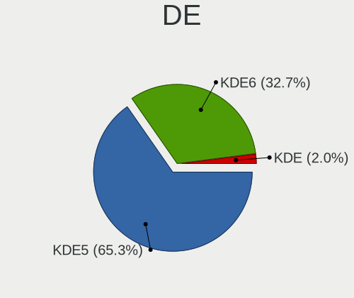
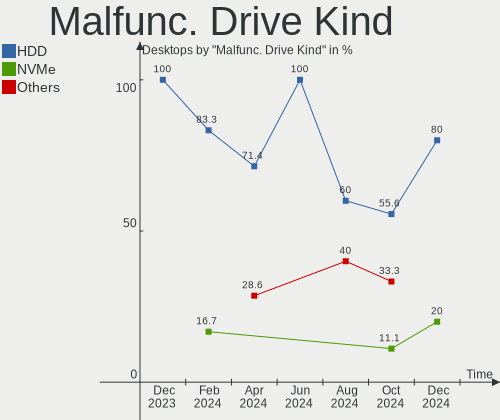
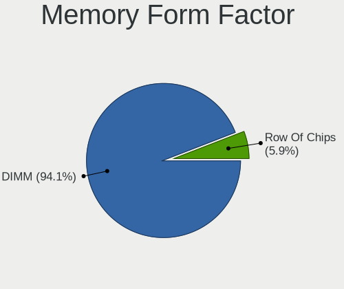
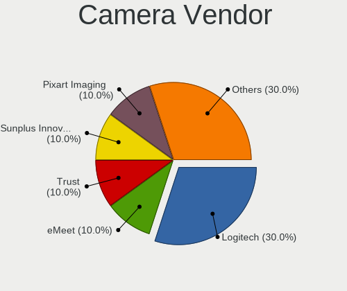

Kubuntu Hardware Trends (Desktop)
---------------------------------

A project to identify most popular hardware characteristics and track their change
over time based on data collected by Kubuntu users at https://Linux-Hardware.org.

Anyone can contribute to the study by uploading probes of their computers by
the [hw-probe](https://github.com/linuxhw/hw-probe) tool:

    sudo -E hw-probe -all -upload

Full-feature report is available here: https://linux-hardware.org/?view=trends&formfactor=desktop

Period: May, 2021.

Contents
--------

- [ OS                       ](#os)
- [ OS Family                ](#os-family)
- [ Kernel                   ](#kernel)
- [ Kernel Family            ](#kernel-family)
- [ Kernel Major Ver.        ](#kernel-major-ver)
- [ Arch                     ](#arch)
- [ DE                       ](#de)
- [ Display Server           ](#display-server)
- [ Display Manager          ](#display-manager)
- [ OS Lang                  ](#os-lang)
- [ Boot Mode                ](#boot-mode)
- [ Filesystem               ](#filesystem)
- [ Part. scheme             ](#part-scheme)
- [ Dual Boot with Linux/BSD ](#dual-boot-with-linux/bsd)
- [ Dual Boot (Win)          ](#dual-boot-win)
- [ Country                  ](#country)
- [ City                     ](#city)
- [ Vendor                   ](#vendor)
- [ Model                    ](#model)
- [ Model Family             ](#model-family)
- [ MFG Year                 ](#mfg-year)
- [ Form Factor              ](#form-factor)
- [ Secure Boot              ](#secure-boot)
- [ Coreboot                 ](#coreboot)
- [ RAM Size                 ](#ram-size)
- [ RAM Used                 ](#ram-used)
- [ Has CD-ROM               ](#has-cd-rom)
- [ Total Drives             ](#total-drives)
- [ Has Ethernet             ](#has-ethernet)
- [ Has WiFi                 ](#has-wifi)
- [ Has Bluetooth            ](#has-bluetooth)
- [ Drive Vendor             ](#drive-vendor)
- [ Drive Model              ](#drive-model)
- [ HDD Vendor               ](#hdd-vendor)
- [ SSD Vendor               ](#ssd-vendor)
- [ Drive Kind               ](#drive-kind)
- [ Drive Connector          ](#drive-connector)
- [ Drive Size               ](#drive-size)
- [ Space Total              ](#space-total)
- [ Space Used               ](#space-used)
- [ Malfunc. Drives          ](#malfunc-drives)
- [ Malfunc. Drive Vendor    ](#malfunc-drive-vendor)
- [ Malfunc. HDD Vendor      ](#malfunc-hdd-vendor)
- [ Malfunc. Drive Kind      ](#malfunc-drive-kind)
- [ Failed Drives            ](#failed-drives)
- [ Failed Drive Vendor      ](#failed-drive-vendor)
- [ Drive Status             ](#drive-status)
- [ Storage Vendor           ](#storage-vendor)
- [ Storage Model            ](#storage-model)
- [ Storage Kind             ](#storage-kind)
- [ CPU Vendor               ](#cpu-vendor)
- [ CPU Model                ](#cpu-model)
- [ CPU Model Family         ](#cpu-model-family)
- [ CPU Cores                ](#cpu-cores)
- [ CPU Sockets              ](#cpu-sockets)
- [ CPU Threads              ](#cpu-threads)
- [ CPU Op-Modes             ](#cpu-op-modes)
- [ CPU Microcode            ](#cpu-microcode)
- [ CPU Microarch            ](#cpu-microarch)
- [ GPU Vendor               ](#gpu-vendor)
- [ GPU Model                ](#gpu-model)
- [ GPU Combo                ](#gpu-combo)
- [ GPU Driver               ](#gpu-driver)
- [ GPU Memory               ](#gpu-memory)
- [ Monitor Vendor           ](#monitor-vendor)
- [ Monitor Model            ](#monitor-model)
- [ Monitor Resolution       ](#monitor-resolution)
- [ Monitor Diagonal         ](#monitor-diagonal)
- [ Monitor Width            ](#monitor-width)
- [ Aspect Ratio             ](#aspect-ratio)
- [ Monitor Area             ](#monitor-area)
- [ Pixel Density            ](#pixel-density)
- [ Multiple Monitors        ](#multiple-monitors)
- [ Net Controller Vendor    ](#net-controller-vendor)
- [ Net Controller Model     ](#net-controller-model)
- [ Wireless Vendor          ](#wireless-vendor)
- [ Wireless Model           ](#wireless-model)
- [ Ethernet Vendor          ](#ethernet-vendor)
- [ Ethernet Model           ](#ethernet-model)
- [ Net Controller Kind      ](#net-controller-kind)
- [ Used Controller          ](#used-controller)
- [ NICs                     ](#nics)
- [ IPv6                     ](#ipv6)
- [ Memory Vendor            ](#memory-vendor)
- [ Memory Model             ](#memory-model)
- [ Memory Kind              ](#memory-kind)
- [ Memory Form Factor       ](#memory-form-factor)
- [ Memory Size              ](#memory-size)
- [ Memory Speed             ](#memory-speed)
- [ Sound Vendor             ](#sound-vendor)
- [ Sound Model              ](#sound-model)
- [ Camera Vendor            ](#camera-vendor)
- [ Camera Model             ](#camera-model)
- [ Fingerprint Vendor       ](#fingerprint-vendor)
- [ Fingerprint Model        ](#fingerprint-model)
- [ Chipcard Vendor          ](#chipcard-vendor)
- [ Chipcard Model           ](#chipcard-model)
- [ Printer Vendor           ](#printer-vendor)
- [ Printer Model            ](#printer-model)
- [ Scanner Vendor           ](#scanner-vendor)
- [ Scanner Model            ](#scanner-model)
- [ Bluetooth Vendor         ](#bluetooth-vendor)
- [ Bluetooth Model          ](#bluetooth-model)
- [ Unsupported Devices      ](#unsupported-devices)
- [ Unsupported Device Types ](#unsupported-device-types)

OS
--

Installed operating systems

| Name          | Desktops | Percent |
|---------------|----------|---------|
| Kubuntu 20.04 | 28       | 65.12%  |
| Kubuntu 21.04 | 11       | 25.58%  |
| Kubuntu 20.10 | 2        | 4.65%   |
| Kubuntu 21.10 | 1        | 2.33%   |
| Kubuntu 18.04 | 1        | 2.33%   |

OS Family
---------

OS without a version

| Name    | Desktops | Percent |
|---------|----------|---------|
| Kubuntu | 43       | 100%    |

Kernel
------

Version of the Linux kernel

| Version               | Desktops | Percent |
|-----------------------|----------|---------|
| 5.8.0-53-generic      | 8        | 18.6%   |
| 5.11.0-17-generic     | 8        | 18.6%   |
| 5.4.0-73-generic      | 7        | 16.28%  |
| 5.8.0-50-generic      | 6        | 13.95%  |
| 5.4.0-72-generic      | 3        | 6.98%   |
| 5.4.0-74-generic      | 2        | 4.65%   |
| 5.11.0-16-generic     | 2        | 4.65%   |
| 5.8.0-54-generic      | 1        | 2.33%   |
| 5.8.0-43-generic      | 1        | 2.33%   |
| 5.8.0-23-generic      | 1        | 2.33%   |
| 5.13.0-rc3+           | 1        | 2.33%   |
| 5.12.8-051208-generic | 1        | 2.33%   |
| 5.12.6                | 1        | 2.33%   |
| 4.18.0-25-generic     | 1        | 2.33%   |

Kernel Family
-------------

Linux kernel without a distro release

| Version | Desktops | Percent |
|---------|----------|---------|
| 5.8.0   | 17       | 39.53%  |
| 5.4.0   | 12       | 27.91%  |
| 5.11.0  | 10       | 23.26%  |
| 5.13.0  | 1        | 2.33%   |
| 5.12.8  | 1        | 2.33%   |
| 5.12.6  | 1        | 2.33%   |
| 4.18.0  | 1        | 2.33%   |

Kernel Major Ver.
-----------------

Linux kernel major version

| Version | Desktops | Percent |
|---------|----------|---------|
| 5.8     | 17       | 39.53%  |
| 5.4     | 12       | 27.91%  |
| 5.11    | 10       | 23.26%  |
| 5.12    | 2        | 4.65%   |
| 5.13    | 1        | 2.33%   |
| 4.18    | 1        | 2.33%   |

Arch
----

OS architecture (x86_64, i586, etc.)

| Name   | Desktops | Percent |
|--------|----------|---------|
| x86_64 | 43       | 100%    |

DE
--

Desktop Environment

| Name | Desktops | Percent |
|------|----------|---------|
| KDE  | 24       | 55.81%  |
| KDE5 | 19       | 44.19%  |

Display Server
--------------

X11 or Wayland

| Name    | Desktops | Percent |
|---------|----------|---------|
| X11     | 42       | 97.67%  |
| Wayland | 1        | 2.33%   |

Display Manager
---------------

SDDM, LightDM, etc.

| Name    | Desktops | Percent |
|---------|----------|---------|
| Unknown | 24       | 55.81%  |
| SDDM    | 16       | 37.21%  |
| TDM     | 1        | 2.33%   |
| LightDM | 1        | 2.33%   |
| GDM     | 1        | 2.33%   |

OS Lang
-------

Language

| Lang  | Desktops | Percent |
|-------|----------|---------|
| en_US | 19       | 44.19%  |
| ru_RU | 4        | 9.3%    |
| en_GB | 4        | 9.3%    |
| fr_FR | 3        | 6.98%   |
| pl_PL | 2        | 4.65%   |
| it_IT | 2        | 4.65%   |
| en_AU | 2        | 4.65%   |
| de_DE | 2        | 4.65%   |
| pt_BR | 1        | 2.33%   |
| fr_CH | 1        | 2.33%   |
| es_VE | 1        | 2.33%   |
| en_ZA | 1        | 2.33%   |
| C     | 1        | 2.33%   |

Boot Mode
---------

EFI or BIOS

| Mode | Desktops | Percent |
|------|----------|---------|
| EFI  | 22       | 51.16%  |
| BIOS | 21       | 48.84%  |

Filesystem
----------

Type of filesystem

| Type    | Desktops | Percent |
|---------|----------|---------|
| Ext4    | 36       | 83.72%  |
| Btrfs   | 3        | 6.98%   |
| Xfs     | 2        | 4.65%   |
| Zfs     | 1        | 2.33%   |
| Overlay | 1        | 2.33%   |

Part. scheme
------------

Scheme of partitioning

| Type    | Desktops | Percent |
|---------|----------|---------|
| Unknown | 24       | 55.81%  |
| GPT     | 16       | 37.21%  |
| MBR     | 3        | 6.98%   |

Dual Boot with Linux/BSD
------------------------

Hosting more than one Linux/BSD

| Dual boot | Desktops | Percent |
|-----------|----------|---------|
| No        | 36       | 83.72%  |
| Yes       | 7        | 16.28%  |

Dual Boot (Win)
---------------

Hosting Linux and Windows

| Dual boot | Desktops | Percent |
|-----------|----------|---------|
| No        | 28       | 65.12%  |
| Yes       | 15       | 34.88%  |

Country
-------

Geographic location (country)

| Country      | Desktops | Percent |
|--------------|----------|---------|
| USA          | 12       | 27.91%  |
| UK           | 4        | 9.3%    |
| Russia       | 4        | 9.3%    |
| Germany      | 3        | 6.98%   |
| France       | 3        | 6.98%   |
| Poland       | 2        | 4.65%   |
| Italy        | 2        | 4.65%   |
| Brazil       | 2        | 4.65%   |
| Australia    | 2        | 4.65%   |
| Venezuela    | 1        | 2.33%   |
| Turkey       | 1        | 2.33%   |
| Switzerland  | 1        | 2.33%   |
| South Africa | 1        | 2.33%   |
| Romania      | 1        | 2.33%   |
| Peru         | 1        | 2.33%   |
| Netherlands  | 1        | 2.33%   |
| Canada       | 1        | 2.33%   |
| Bangladesh   | 1        | 2.33%   |

City
----

Geographic location (city)

| City                 | Desktops | Percent |
|----------------------|----------|---------|
| Strongsville         | 2        | 4.65%   |
| Tring                | 1        | 2.33%   |
| Tolyatti             | 1        | 2.33%   |
| São Miguel do Oeste | 1        | 2.33%   |
| Sulmin               | 1        | 2.33%   |
| St Louis             | 1        | 2.33%   |
| Sindelfingen         | 1        | 2.33%   |
| Sao Goncalo          | 1        | 2.33%   |
| San Diego            | 1        | 2.33%   |
| Rome                 | 1        | 2.33%   |
| Puno                 | 1        | 2.33%   |
| Pretoria             | 1        | 2.33%   |
| Phoenix              | 1        | 2.33%   |
| Owensboro            | 1        | 2.33%   |
| Ottawa               | 1        | 2.33%   |
| Noginsk              | 1        | 2.33%   |
| Neftekamsk           | 1        | 2.33%   |
| Melbourne            | 1        | 2.33%   |
| Medford              | 1        | 2.33%   |
| Marburg              | 1        | 2.33%   |
| Los Angeles          | 1        | 2.33%   |
| London               | 1        | 2.33%   |
| Geneva               | 1        | 2.33%   |
| Fort Wayne           | 1        | 2.33%   |
| Exmouth              | 1        | 2.33%   |
| Dhaka                | 1        | 2.33%   |
| Croydon              | 1        | 2.33%   |
| Corbeil-Essonnes     | 1        | 2.33%   |
| Chita                | 1        | 2.33%   |
| Carcassonne          | 1        | 2.33%   |
| Cairns               | 1        | 2.33%   |
| Bucharest            | 1        | 2.33%   |
| Bolszewo             | 1        | 2.33%   |
| Berlin               | 1        | 2.33%   |
| Barletta             | 1        | 2.33%   |
| Barinas              | 1        | 2.33%   |
| Bari                 | 1        | 2.33%   |
| Balıkesir           | 1        | 2.33%   |
| Aurora               | 1        | 2.33%   |
| Amsterdam            | 1        | 2.33%   |
| Amiens               | 1        | 2.33%   |
| Albuquerque          | 1        | 2.33%   |

Vendor
------

Motherboard manufacturer

| Name                | Desktops | Percent |
|---------------------|----------|---------|
| ASUSTek Computer    | 11       | 25.58%  |
| ASRock              | 8        | 18.6%   |
| MSI                 | 7        | 16.28%  |
| Gigabyte Technology | 7        | 16.28%  |
| Dell                | 3        | 6.98%   |
| Hewlett-Packard     | 2        | 4.65%   |
| Lenovo              | 1        | 2.33%   |
| Intel               | 1        | 2.33%   |
| Huanan              | 1        | 2.33%   |
| Foxconn             | 1        | 2.33%   |
| ECS                 | 1        | 2.33%   |

Model
-----

Motherboard model

| Name                                | Desktops | Percent |
|-------------------------------------|----------|---------|
| ASUS TUF GAMING X570-PLUS           | 2        | 4.65%   |
| ASRock Z170 Extreme7+               | 2        | 4.65%   |
| MSI MS-7C75                         | 1        | 2.33%   |
| MSI MS-7B79                         | 1        | 2.33%   |
| MSI MS-7996                         | 1        | 2.33%   |
| MSI MS-7977                         | 1        | 2.33%   |
| MSI MS-7817                         | 1        | 2.33%   |
| MSI MS-7693                         | 1        | 2.33%   |
| MSI 700-216                         | 1        | 2.33%   |
| Lenovo ThinkCentre M720s 10ST002FUS | 1        | 2.33%   |
| Intel DX79SI AAG28808-600           | 1        | 2.33%   |
| Huanan X99-TF                       | 1        | 2.33%   |
| HP Z820 Workstation                 | 1        | 2.33%   |
| HP t620 Quad Core TC                | 1        | 2.33%   |
| Gigabyte Z270X-UD3                  | 1        | 2.33%   |
| Gigabyte X570 AORUS MASTER          | 1        | 2.33%   |
| Gigabyte GA-78LMT-S2P               | 1        | 2.33%   |
| Gigabyte B550 AORUS ELITE           | 1        | 2.33%   |
| Gigabyte B450M GAMING               | 1        | 2.33%   |
| Gigabyte B450 AORUS PRO WIFI        | 1        | 2.33%   |
| Gigabyte B365M DS3H                 | 1        | 2.33%   |
| Foxconn p6-2072it                   | 1        | 2.33%   |
| ECS A320AM4-M3D                     | 1        | 2.33%   |
| Dell OptiPlex 9020                  | 1        | 2.33%   |
| Dell OptiPlex 790                   | 1        | 2.33%   |
| Dell Inspiron 3847                  | 1        | 2.33%   |
| ASUS TUF B450M-PLUS GAMING          | 1        | 2.33%   |
| ASUS STRIX Z270E GAMING             | 1        | 2.33%   |
| ASUS ROG STRIX Z370-H GAMING        | 1        | 2.33%   |
| ASUS ROG STRIX B550-F GAMING        | 1        | 2.33%   |
| ASUS PRIME Z390-P                   | 1        | 2.33%   |
| ASUS PRIME B350-PLUS                | 1        | 2.33%   |
| ASUS P8H61/USB3 R2.0                | 1        | 2.33%   |
| ASUS K30BF_M32BF_A_F_K31BF_6        | 1        | 2.33%   |
| ASUS All Series                     | 1        | 2.33%   |
| ASRock X300M-STX                    | 1        | 2.33%   |
| ASRock N68C-S UCC                   | 1        | 2.33%   |
| ASRock H61M-VS                      | 1        | 2.33%   |
| ASRock B550M Steel Legend           | 1        | 2.33%   |
| ASRock B450M Gaming                 | 1        | 2.33%   |
| ASRock A320M-DGS                    | 1        | 2.33%   |

Model Family
------------

Motherboard model prefix

| Name                  | Desktops | Percent |
|-----------------------|----------|---------|
| ASUS TUF              | 3        | 6.98%   |
| Dell OptiPlex         | 2        | 4.65%   |
| ASUS ROG              | 2        | 4.65%   |
| ASUS PRIME            | 2        | 4.65%   |
| ASRock Z170           | 2        | 4.65%   |
| MSI MS-7C75           | 1        | 2.33%   |
| MSI MS-7B79           | 1        | 2.33%   |
| MSI MS-7996           | 1        | 2.33%   |
| MSI MS-7977           | 1        | 2.33%   |
| MSI MS-7817           | 1        | 2.33%   |
| MSI MS-7693           | 1        | 2.33%   |
| MSI 700-216           | 1        | 2.33%   |
| Lenovo ThinkCentre    | 1        | 2.33%   |
| Intel DX79SI          | 1        | 2.33%   |
| Huanan X99-TF         | 1        | 2.33%   |
| HP Z820               | 1        | 2.33%   |
| HP t620               | 1        | 2.33%   |
| Gigabyte Z270X-UD3    | 1        | 2.33%   |
| Gigabyte X570         | 1        | 2.33%   |
| Gigabyte GA-78LMT-S2P | 1        | 2.33%   |
| Gigabyte B550         | 1        | 2.33%   |
| Gigabyte B450M        | 1        | 2.33%   |
| Gigabyte B450         | 1        | 2.33%   |
| Gigabyte B365M        | 1        | 2.33%   |
| Foxconn p6-2072it     | 1        | 2.33%   |
| ECS A320AM4-M3D       | 1        | 2.33%   |
| Dell Inspiron         | 1        | 2.33%   |
| ASUS STRIX            | 1        | 2.33%   |
| ASUS P8H61            | 1        | 2.33%   |
| ASUS K30BF            | 1        | 2.33%   |
| ASUS All              | 1        | 2.33%   |
| ASRock X300M-STX      | 1        | 2.33%   |
| ASRock N68C-S         | 1        | 2.33%   |
| ASRock H61M-VS        | 1        | 2.33%   |
| ASRock B550M          | 1        | 2.33%   |
| ASRock B450M          | 1        | 2.33%   |
| ASRock A320M-DGS      | 1        | 2.33%   |

MFG Year
--------

Motherboard manufacture year

| Year | Desktops | Percent |
|------|----------|---------|
| 2019 | 11       | 25.58%  |
| 2020 | 9        | 20.93%  |
| 2015 | 7        | 16.28%  |
| 2021 | 3        | 6.98%   |
| 2018 | 3        | 6.98%   |
| 2014 | 3        | 6.98%   |
| 2011 | 3        | 6.98%   |
| 2017 | 2        | 4.65%   |
| 2016 | 1        | 2.33%   |
| 2012 | 1        | 2.33%   |

Form Factor
-----------

Physical design of the computer

| Name    | Desktops | Percent |
|---------|----------|---------|
| Desktop | 43       | 100%    |

Secure Boot
-----------

Enabled or disabled

| State    | Desktops | Percent |
|----------|----------|---------|
| Disabled | 41       | 95.35%  |
| Enabled  | 2        | 4.65%   |

Coreboot
--------

Have coreboot on board

| Used | Desktops | Percent |
|------|----------|---------|
| No   | 43       | 100%    |

RAM Size
--------

Total RAM memory

| Size in GB  | Desktops | Percent |
|-------------|----------|---------|
| 32.01-64.0  | 14       | 32.56%  |
| 16.01-24.0  | 13       | 30.23%  |
| 4.01-8.0    | 6        | 13.95%  |
| 8.01-16.0   | 5        | 11.63%  |
| 64.01-256.0 | 3        | 6.98%   |
| 3.01-4.0    | 1        | 2.33%   |
| 24.01-32.0  | 1        | 2.33%   |

RAM Used
--------

Used RAM memory

| Used GB    | Desktops | Percent |
|------------|----------|---------|
| 4.01-8.0   | 13       | 30.23%  |
| 2.01-3.0   | 10       | 23.26%  |
| 1.01-2.0   | 7        | 16.28%  |
| 8.01-16.0  | 5        | 11.63%  |
| 3.01-4.0   | 3        | 6.98%   |
| 16.01-24.0 | 2        | 4.65%   |
| 0.51-1.0   | 2        | 4.65%   |
| 24.01-32.0 | 1        | 2.33%   |

Has CD-ROM
----------

Has CD-ROM on board

| Presented | Desktops | Percent |
|-----------|----------|---------|
| No        | 24       | 55.81%  |
| Yes       | 19       | 44.19%  |

Total Drives
------------

Number of drives on board

| Drives | Desktops | Percent |
|--------|----------|---------|
| 2      | 15       | 34.88%  |
| 1      | 11       | 25.58%  |
| 3      | 9        | 20.93%  |
| 5      | 5        | 11.63%  |
| 7      | 2        | 4.65%   |
| 6      | 1        | 2.33%   |

Has Ethernet
------------

Has Ethernet on board

| Presented | Desktops | Percent |
|-----------|----------|---------|
| Yes       | 43       | 100%    |

Has WiFi
--------

Has WiFi module

| Presented | Desktops | Percent |
|-----------|----------|---------|
| No        | 29       | 67.44%  |
| Yes       | 14       | 32.56%  |

Has Bluetooth
-------------

Has Bluetooth module

| Presented | Desktops | Percent |
|-----------|----------|---------|
| No        | 25       | 58.14%  |
| Yes       | 18       | 41.86%  |

Drive Vendor
------------

Hard drive vendors

| Vendor              | Desktops | Drives | Percent |
|---------------------|----------|--------|---------|
| WDC                 | 23       | 45     | 29.11%  |
| Samsung Electronics | 14       | 19     | 17.72%  |
| Seagate             | 13       | 16     | 16.46%  |
| Toshiba             | 6        | 6      | 7.59%   |
| Hitachi             | 3        | 3      | 3.8%    |
| Silicon Motion      | 2        | 2      | 2.53%   |
| Sandisk             | 2        | 3      | 2.53%   |
| Kingston            | 2        | 2      | 2.53%   |
| GOODRAM             | 2        | 3      | 2.53%   |
| Crucial             | 2        | 2      | 2.53%   |
| VENO                | 1        | 1      | 1.27%   |
| USB                 | 1        | 1      | 1.27%   |
| Transcend           | 1        | 1      | 1.27%   |
| Team                | 1        | 1      | 1.27%   |
| SPCC                | 1        | 1      | 1.27%   |
| PLEXTOR             | 1        | 1      | 1.27%   |
| Phison              | 1        | 1      | 1.27%   |
| OCZ                 | 1        | 1      | 1.27%   |
| Intel               | 1        | 1      | 1.27%   |
| A-DATA Technology   | 1        | 1      | 1.27%   |

Drive Model
-----------

Hard drive models

| Model                                          | Desktops | Percent |
|------------------------------------------------|----------|---------|
| WDC WD1003FZEX-00K3CA0 1TB                     | 3        | 2.83%   |
| WDC WD5001FZWX-00ZHUA0 5TB                     | 2        | 1.89%   |
| WDC WD40EZRZ-00WN9B0 4TB                       | 2        | 1.89%   |
| WDC WD40EZRZ-00GXCB0 4TB                       | 2        | 1.89%   |
| WDC WD2003FZEX-00Z4SA0 2TB                     | 2        | 1.89%   |
| WDC WD10SPCX-60KHST0 1TB                       | 2        | 1.89%   |
| WDC WD10JPVX-22JC3T0 1TB                       | 2        | 1.89%   |
| Toshiba HDWD110 1TB                            | 2        | 1.89%   |
| Seagate ST4000DM004-2CV104 4TB                 | 2        | 1.89%   |
| Seagate ST1000DM003-1ER162 1TB                 | 2        | 1.89%   |
| Seagate Expansion Desk 8TB                     | 2        | 1.89%   |
| Samsung SSD 860 EVO M.2 250GB                  | 2        | 1.89%   |
| Samsung SSD 860 EVO 250GB                      | 2        | 1.89%   |
| Samsung NVMe SSD Drive 512GB                   | 2        | 1.89%   |
| Hitachi HDS723015BLA642 1TB                    | 2        | 1.89%   |
| WDC WDS500G3X0C-00SJG0 500GB                   | 1        | 0.94%   |
| WDC WDS200T1X0E-00AFY0 2TB                     | 1        | 0.94%   |
| WDC WDS120G1G0A-00SS50 120GB SSD               | 1        | 0.94%   |
| WDC WDS100T3X0C-00SJG0 1TB                     | 1        | 0.94%   |
| WDC WD80EFBX-68AZZN0 8TB                       | 1        | 0.94%   |
| WDC WD6400AARS-00Y5B1 640GB                    | 1        | 0.94%   |
| WDC WD5000AZLX-75K2TA0 500GB                   | 1        | 0.94%   |
| WDC WD5000AVCS-632DY1 500GB                    | 1        | 0.94%   |
| WDC WD5000AAKS-00A7B2 500GB                    | 1        | 0.94%   |
| WDC WD40PURZ-85TTDY0 4TB                       | 1        | 0.94%   |
| WDC WD40EZRZ-22GXCB0 4TB                       | 1        | 0.94%   |
| WDC WD4005FZBX-00K5WB0 4TB                     | 1        | 0.94%   |
| WDC WD2500KS-00MJB0 250GB                      | 1        | 0.94%   |
| WDC WD2500JS-00NCB1 250GB                      | 1        | 0.94%   |
| WDC WD20EZRX-00DC0B0 2TB                       | 1        | 0.94%   |
| WDC WD2003FZEX-00SRLA0 2TB                     | 1        | 0.94%   |
| WDC WD1600AAJS-08L7A0 160GB                    | 1        | 0.94%   |
| WDC WD1600AAJS-00L7A0 160GB                    | 1        | 0.94%   |
| WDC WD15EADS-00P8B0 1TB                        | 1        | 0.94%   |
| WDC WD10SPZX-08Z10 1TB                         | 1        | 0.94%   |
| WDC WD10SPSX-00A6WT0 1TB                       | 1        | 0.94%   |
| WDC WD10EZEX-60WN4A0 1TB                       | 1        | 0.94%   |
| WDC WD10EZEX-08WN4A0 1TB                       | 1        | 0.94%   |
| WDC WD10EAVS-00D7B1 1TB                        | 1        | 0.94%   |
| WDC WD10EARX-00N0YB0 1TB                       | 1        | 0.94%   |
| WDC WD10EADS-00M2B0 1TB                        | 1        | 0.94%   |
| WDC WD1003FZEX-00MK2A0 1TB                     | 1        | 0.94%   |
| WDC WD1002FBYS-02A6B0 1TB                      | 1        | 0.94%   |
| WDC WD10 EZEX-08M2NA0 1TB                      | 1        | 0.94%   |
| VENO SCORP SSD 240GB                           | 1        | 0.94%   |
| USB 3.0 250GB                                  | 1        | 0.94%   |
| Transcend TS240GSSD220S 240GB                  | 1        | 0.94%   |
| Toshiba THNSNJ512GCSU 512GB SSD                | 1        | 0.94%   |
| Toshiba HDWA130 3TB                            | 1        | 0.94%   |
| Toshiba DT01ACA200 2TB                         | 1        | 0.94%   |
| Toshiba DT01ABA300 3TB                         | 1        | 0.94%   |
| Team T2535T120G 120GB SSD                      | 1        | 0.94%   |
| SPCC M.2 PCIe SSD 1TB                          | 1        | 0.94%   |
| Silicon Motion NVMe SSD Drive 240GB            | 1        | 0.94%   |
| Silicon Motion Asgard AN2 250NVMe-M.2-80 250GB | 1        | 0.94%   |
| Seagate ST32000542AS 2TB                       | 1        | 0.94%   |
| Seagate ST2000NM0033-9ZM175 2TB                | 1        | 0.94%   |
| Seagate ST2000DM006-2DM164 2TB                 | 1        | 0.94%   |
| Seagate ST2000DM001-1CH164 2TB                 | 1        | 0.94%   |
| Seagate ST1000LM024 HN-M101MBB 1TB             | 1        | 0.94%   |

HDD Vendor
----------

Hard disk drive vendors

| Vendor              | Desktops | Drives | Percent |
|---------------------|----------|--------|---------|
| WDC                 | 21       | 41     | 47.73%  |
| Seagate             | 13       | 16     | 29.55%  |
| Toshiba             | 5        | 5      | 11.36%  |
| Hitachi             | 3        | 3      | 6.82%   |
| USB                 | 1        | 1      | 2.27%   |
| Samsung Electronics | 1        | 2      | 2.27%   |

SSD Vendor
----------

Solid state drive vendors

| Vendor              | Desktops | Drives | Percent |
|---------------------|----------|--------|---------|
| Samsung Electronics | 5        | 6      | 26.32%  |
| GOODRAM             | 2        | 3      | 10.53%  |
| Crucial             | 2        | 2      | 10.53%  |
| WDC                 | 1        | 1      | 5.26%   |
| VENO                | 1        | 1      | 5.26%   |
| Transcend           | 1        | 1      | 5.26%   |
| Toshiba             | 1        | 1      | 5.26%   |
| Team                | 1        | 1      | 5.26%   |
| SanDisk             | 1        | 1      | 5.26%   |
| PLEXTOR             | 1        | 1      | 5.26%   |
| OCZ                 | 1        | 1      | 5.26%   |
| Kingston            | 1        | 1      | 5.26%   |
| A-DATA Technology   | 1        | 1      | 5.26%   |

Drive Kind
----------

HDD or SSD

| Kind | Desktops | Drives | Percent |
|------|----------|--------|---------|
| HDD  | 35       | 68     | 50.72%  |
| NVMe | 18       | 22     | 26.09%  |
| SSD  | 16       | 21     | 23.19%  |

Drive Connector
---------------

SATA, SAS, NVMe, etc.

| Type | Desktops | Drives | Percent |
|------|----------|--------|---------|
| SATA | 38       | 83     | 62.3%   |
| NVMe | 18       | 22     | 29.51%  |
| SAS  | 5        | 6      | 8.2%    |

Drive Size
----------

Size of hard drive

| Size in TB | Desktops | Drives | Percent |
|------------|----------|--------|---------|
| 0.51-1.0   | 21       | 34     | 33.33%  |
| 0.01-0.5   | 19       | 26     | 30.16%  |
| 1.01-2.0   | 9        | 11     | 14.29%  |
| 3.01-4.0   | 8        | 10     | 12.7%   |
| 4.01-10.0  | 4        | 6      | 6.35%   |
| 2.01-3.0   | 2        | 2      | 3.17%   |

Space Total
-----------

Amount of disk space available on the file system

| Size in GB     | Desktops | Percent |
|----------------|----------|---------|
| 1001-2000      | 11       | 25.58%  |
| More than 3000 | 9        | 20.93%  |
| 101-250        | 9        | 20.93%  |
| 2001-3000      | 5        | 11.63%  |
| 251-500        | 4        | 9.3%    |
| 1-20           | 3        | 6.98%   |
| 51-100         | 2        | 4.65%   |

Space Used
----------

Amount of used disk space

| Used GB        | Desktops | Percent |
|----------------|----------|---------|
| 1001-2000      | 8        | 18.6%   |
| 21-50          | 6        | 13.95%  |
| 1-20           | 6        | 13.95%  |
| More than 3000 | 5        | 11.63%  |
| 101-250        | 5        | 11.63%  |
| 251-500        | 4        | 9.3%    |
| 51-100         | 4        | 9.3%    |
| 2001-3000      | 3        | 6.98%   |
| 501-1000       | 2        | 4.65%   |

Malfunc. Drives
---------------

Drive models with a malfunction

| Model                             | Desktops | Drives | Percent |
|-----------------------------------|----------|--------|---------|
| WDC WD40EZRZ-00GXCB0 4TB          | 1        | 1      | 11.11%  |
| WDC WD1600AAJS-08L7A0 160GB       | 1        | 1      | 11.11%  |
| WDC WD1002FBYS-02A6B0 1TB         | 1        | 1      | 11.11%  |
| Toshiba HDWD110 1TB               | 1        | 1      | 11.11%  |
| Seagate ST32000542AS 2TB          | 1        | 1      | 11.11%  |
| Seagate ST2000DM006-2DM164 2TB    | 1        | 1      | 11.11%  |
| OCZ VERTEX3 120GB SSD             | 1        | 1      | 11.11%  |
| Hitachi HUA722020ALA331 2TB       | 1        | 1      | 11.11%  |
| A-DATA Technology SX900 256GB SSD | 1        | 1      | 11.11%  |

Malfunc. Drive Vendor
---------------------

Vendors of faulty drives

| Vendor            | Desktops | Drives | Percent |
|-------------------|----------|--------|---------|
| WDC               | 3        | 3      | 33.33%  |
| Seagate           | 2        | 2      | 22.22%  |
| Toshiba           | 1        | 1      | 11.11%  |
| OCZ               | 1        | 1      | 11.11%  |
| Hitachi           | 1        | 1      | 11.11%  |
| A-DATA Technology | 1        | 1      | 11.11%  |

Malfunc. HDD Vendor
-------------------

Vendors of faulty HDD drives

| Vendor  | Desktops | Drives | Percent |
|---------|----------|--------|---------|
| WDC     | 3        | 3      | 42.86%  |
| Seagate | 2        | 2      | 28.57%  |
| Toshiba | 1        | 1      | 14.29%  |
| Hitachi | 1        | 1      | 14.29%  |

Malfunc. Drive Kind
-------------------

Kinds of faulty drives

| Kind | Desktops | Drives | Percent |
|------|----------|--------|---------|
| HDD  | 7        | 7      | 77.78%  |
| SSD  | 2        | 2      | 22.22%  |

Failed Drives
-------------

Failed drive models

Zero info for selected period =(

Failed Drive Vendor
-------------------

Failed drive vendors

Zero info for selected period =(

Drive Status
------------

Number of failed and malfunc. drives

| Status   | Desktops | Drives | Percent |
|----------|----------|--------|---------|
| Detected | 23       | 65     | 45.1%   |
| Works    | 20       | 37     | 39.22%  |
| Malfunc  | 8        | 9      | 15.69%  |

Storage Vendor
--------------

Storage controller vendors

| Vendor                      | Desktops | Percent |
|-----------------------------|----------|---------|
| Intel                       | 22       | 33.85%  |
| AMD                         | 20       | 30.77%  |
| Samsung Electronics         | 10       | 15.38%  |
| Sandisk                     | 4        | 6.15%   |
| Silicon Motion              | 2        | 3.08%   |
| Phison Electronics          | 2        | 3.08%   |
| ASMedia Technology          | 2        | 3.08%   |
| Nvidia                      | 1        | 1.54%   |
| Kingston Technology Company | 1        | 1.54%   |
| Broadcom / LSI              | 1        | 1.54%   |

Storage Model
-------------

Storage controller models

| Model                                                                                   | Desktops | Percent |
|-----------------------------------------------------------------------------------------|----------|---------|
| AMD FCH SATA Controller [AHCI mode]                                                     | 13       | 16.67%  |
| Samsung NVMe SSD Controller SM981/PM981/PM983                                           | 6        | 7.69%   |
| AMD 400 Series Chipset SATA Controller                                                  | 5        | 6.41%   |
| Intel Q170/Q150/B150/H170/H110/Z170/CM236 Chipset SATA Controller [AHCI Mode]           | 4        | 5.13%   |
| Intel 8 Series/C220 Series Chipset Family 6-port SATA Controller 1 [AHCI mode]          | 4        | 5.13%   |
| Intel 200 Series PCH SATA controller [AHCI mode]                                        | 4        | 5.13%   |
| Samsung NVMe SSD Controller SM961/PM961/SM963                                           | 3        | 3.85%   |
| AMD Starship/Matisse Chipset SATA Controller [AHCI mode]                                | 3        | 3.85%   |
| Silicon Motion SM2263EN/SM2263XT SSD Controller                                         | 2        | 2.56%   |
| Sandisk WD Black SN850                                                                  | 2        | 2.56%   |
| Sandisk WD Black SN750 / PC SN730 NVMe SSD                                              | 2        | 2.56%   |
| Phison E12 NVMe Controller                                                              | 2        | 2.56%   |
| Intel 6 Series/C200 Series Chipset Family Desktop SATA Controller (IDE mode, ports 4-5) | 2        | 2.56%   |
| Intel 6 Series/C200 Series Chipset Family Desktop SATA Controller (IDE mode, ports 0-3) | 2        | 2.56%   |
| Intel 6 Series/C200 Series Chipset Family 6 port Desktop SATA AHCI Controller           | 2        | 2.56%   |
| ASMedia ASM1062 Serial ATA Controller                                                   | 2        | 2.56%   |
| AMD FCH SATA Controller D                                                               | 2        | 2.56%   |
| Samsung NVMe Controller                                                                 | 1        | 1.28%   |
| Nvidia MCP61 SATA Controller                                                            | 1        | 1.28%   |
| Nvidia MCP61 IDE                                                                        | 1        | 1.28%   |
| Kingston Company A2000 NVMe SSD                                                         | 1        | 1.28%   |
| Intel SSD 600P Series                                                                   | 1        | 1.28%   |
| Intel SATA Controller [RAID mode]                                                       | 1        | 1.28%   |
| Intel Comet Lake SATA AHCI Controller                                                   | 1        | 1.28%   |
| Intel Cannon Lake PCH SATA AHCI Controller                                              | 1        | 1.28%   |
| Intel C602 chipset 4-Port SATA Storage Control Unit                                     | 1        | 1.28%   |
| Intel C600/X79 series chipset SATA RAID Controller                                      | 1        | 1.28%   |
| Intel C600/X79 series chipset IDE-r Controller                                          | 1        | 1.28%   |
| Intel C600/X79 series chipset 6-Port SATA AHCI Controller                               | 1        | 1.28%   |
| Broadcom / LSI SAS2308 PCI-Express Fusion-MPT SAS-2                                     | 1        | 1.28%   |
| AMD SB7x0/SB8x0/SB9x0 SATA Controller [IDE mode]                                        | 1        | 1.28%   |
| AMD SB7x0/SB8x0/SB9x0 SATA Controller [AHCI mode]                                       | 1        | 1.28%   |
| AMD SB7x0/SB8x0/SB9x0 IDE Controller                                                    | 1        | 1.28%   |
| AMD RS690 PCI to PCI Bridge (PCI Express Port 2)                                        | 1        | 1.28%   |
| AMD 300 Series Chipset SATA Controller                                                  | 1        | 1.28%   |

Storage Kind
------------

Kind of storage controller (IDE, SATA, NVMe, SAS, ...)

| Kind | Desktops | Percent |
|------|----------|---------|
| SATA | 36       | 57.14%  |
| NVMe | 18       | 28.57%  |
| IDE  | 5        | 7.94%   |
| RAID | 3        | 4.76%   |
| SAS  | 1        | 1.59%   |

CPU Vendor
----------

Processor vendors

| Vendor | Desktops | Percent |
|--------|----------|---------|
| Intel  | 22       | 51.16%  |
| AMD    | 21       | 48.84%  |

CPU Model
---------

Processor models

| Model                                          | Desktops | Percent |
|------------------------------------------------|----------|---------|
| AMD Ryzen 7 3700X 8-Core Processor             | 5        | 11.63%  |
| Intel Core i7-6700K CPU @ 4.00GHz              | 3        | 6.98%   |
| Intel Core i7-4790 CPU @ 3.60GHz               | 2        | 4.65%   |
| Intel Core i5-9400F CPU @ 2.90GHz              | 2        | 4.65%   |
| Intel Core i3-2120 CPU @ 3.30GHz               | 2        | 4.65%   |
| AMD Ryzen 5 3600X 6-Core Processor             | 2        | 4.65%   |
| AMD Ryzen 5 2600X Six-Core Processor           | 2        | 4.65%   |
| Intel Xeon CPU E5-2678 v3 @ 2.50GHz            | 1        | 2.33%   |
| Intel Xeon CPU E5-2670 0 @ 2.60GHz             | 1        | 2.33%   |
| Intel Pentium CPU G4560 @ 3.50GHz              | 1        | 2.33%   |
| Intel Core i7-8086K CPU @ 4.00GHz              | 1        | 2.33%   |
| Intel Core i7-7700 CPU @ 3.60GHz               | 1        | 2.33%   |
| Intel Core i7-3820 CPU @ 3.60GHz               | 1        | 2.33%   |
| Intel Core i7-3770 CPU @ 3.40GHz               | 1        | 2.33%   |
| Intel Core i5-8400 CPU @ 2.80GHz               | 1        | 2.33%   |
| Intel Core i5-7600K CPU @ 3.80GHz              | 1        | 2.33%   |
| Intel Core i5-4570 CPU @ 3.20GHz               | 1        | 2.33%   |
| Intel Core i5-4460 CPU @ 3.20GHz               | 1        | 2.33%   |
| Intel Core i5-10500 CPU @ 3.10GHz              | 1        | 2.33%   |
| Intel Core i3-2100 CPU @ 3.10GHz               | 1        | 2.33%   |
| AMD Ryzen 9 5950X 16-Core Processor            | 1        | 2.33%   |
| AMD Ryzen 9 3900X 12-Core Processor            | 1        | 2.33%   |
| AMD Ryzen 5 5600X 6-Core Processor             | 1        | 2.33%   |
| AMD Ryzen 5 3600 6-Core Processor              | 1        | 2.33%   |
| AMD Phenom II X4 B50 Processor                 | 1        | 2.33%   |
| AMD Phenom II X4 B45 Processor                 | 1        | 2.33%   |
| AMD GX-415GA SOC with Radeon HD Graphics       | 1        | 2.33%   |
| AMD FX-6300 Six-Core Processor                 | 1        | 2.33%   |
| AMD Athlon 3000G with Radeon Vega Graphics     | 1        | 2.33%   |
| AMD A8-9600 RADEON R7, 10 COMPUTE CORES 4C+6G  | 1        | 2.33%   |
| AMD A10-7800 Radeon R7, 12 Compute Cores 4C+8G | 1        | 2.33%   |
| AMD A10-6700 APU with Radeon HD Graphics       | 1        | 2.33%   |

CPU Model Family
----------------

Processor model prefix

| Model            | Desktops | Percent |
|------------------|----------|---------|
| Intel Core i7    | 9        | 20.93%  |
| Intel Core i5    | 7        | 16.28%  |
| AMD Ryzen 5      | 6        | 13.95%  |
| AMD Ryzen 7      | 5        | 11.63%  |
| Intel Core i3    | 3        | 6.98%   |
| Intel Xeon       | 2        | 4.65%   |
| AMD Ryzen 9      | 2        | 4.65%   |
| AMD Phenom II X4 | 2        | 4.65%   |
| AMD A10          | 2        | 4.65%   |
| Intel Pentium    | 1        | 2.33%   |
| AMD GX           | 1        | 2.33%   |
| AMD FX           | 1        | 2.33%   |
| AMD Athlon       | 1        | 2.33%   |
| AMD A8           | 1        | 2.33%   |

CPU Cores
---------

Number of processor cores

| Number | Desktops | Percent |
|--------|----------|---------|
| 4      | 14       | 32.56%  |
| 6      | 11       | 25.58%  |
| 2      | 8        | 18.6%   |
| 8      | 5        | 11.63%  |
| 16     | 2        | 4.65%   |
| 12     | 2        | 4.65%   |
| 3      | 1        | 2.33%   |

CPU Sockets
-----------

Number of sockets

| Number | Desktops | Percent |
|--------|----------|---------|
| 1      | 42       | 97.67%  |
| 2      | 1        | 2.33%   |

CPU Threads
-----------

Threads per core (Hyper-Threading)

| Number | Desktops | Percent |
|--------|----------|---------|
| 2      | 34       | 79.07%  |
| 1      | 9        | 20.93%  |

CPU Op-Modes
------------

CPU Operation Modes (32-bit, 64-bit)

| Op mode        | Desktops | Percent |
|----------------|----------|---------|
| 32-bit, 64-bit | 43       | 100%    |

CPU Microcode
-------------

Microcode number

| Number     | Desktops | Percent |
|------------|----------|---------|
| Unknown    | 9        | 20.93%  |
| 0x08701021 | 5        | 11.63%  |
| 0x306c3    | 4        | 9.3%    |
| 0x206a7    | 3        | 6.98%   |
| 0x08701013 | 3        | 6.98%   |
| 0x906ea    | 2        | 4.65%   |
| 0x906e9    | 2        | 4.65%   |
| 0x0a201009 | 2        | 4.65%   |
| 0x0800820d | 2        | 4.65%   |
| 0xa0653    | 1        | 2.33%   |
| 0x506e3    | 1        | 2.33%   |
| 0x306f2    | 1        | 2.33%   |
| 0x206d7    | 1        | 2.33%   |
| 0x07000110 | 1        | 2.33%   |
| 0x06006118 | 1        | 2.33%   |
| 0x06003106 | 1        | 2.33%   |
| 0x06001119 | 1        | 2.33%   |
| 0x06000852 | 1        | 2.33%   |
| 0x010000db | 1        | 2.33%   |
| 0x010000c8 | 1        | 2.33%   |

CPU Microarch
-------------

Microarchitecture

| Name        | Desktops | Percent |
|-------------|----------|---------|
| Zen 2       | 9        | 20.93%  |
| KabyLake    | 7        | 16.28%  |
| SandyBridge | 5        | 11.63%  |
| Haswell     | 5        | 11.63%  |
| Zen+        | 3        | 6.98%   |
| Skylake     | 3        | 6.98%   |
| Zen 3       | 2        | 4.65%   |
| Piledriver  | 2        | 4.65%   |
| K10         | 2        | 4.65%   |
| Steamroller | 1        | 2.33%   |
| Jaguar      | 1        | 2.33%   |
| IvyBridge   | 1        | 2.33%   |
| Excavator   | 1        | 2.33%   |
| CometLake   | 1        | 2.33%   |

GPU Vendor
----------

Vendors of graphics cards

| Vendor | Desktops | Percent |
|--------|----------|---------|
| Nvidia | 19       | 44.19%  |
| AMD    | 18       | 41.86%  |
| Intel  | 6        | 13.95%  |

GPU Model
---------

Graphics card models

| Model                                                                       | Desktops | Percent |
|-----------------------------------------------------------------------------|----------|---------|
| AMD Ellesmere [Radeon RX 470/480/570/570X/580/580X/590]                     | 5        | 11.36%  |
| Nvidia GP108 [GeForce GT 1030]                                              | 3        | 6.82%   |
| Nvidia TU116 [GeForce GTX 1660 SUPER]                                       | 2        | 4.55%   |
| Nvidia GP107 [GeForce GTX 1050 Ti]                                          | 2        | 4.55%   |
| Intel Xeon E3-1200 v3/4th Gen Core Processor Integrated Graphics Controller | 2        | 4.55%   |
| Intel CometLake-S GT2 [UHD Graphics 630]                                    | 2        | 4.55%   |
| AMD Vega 10 XL/XT [Radeon RX Vega 56/64]                                    | 2        | 4.55%   |
| AMD Baffin [Radeon RX 460/560D / Pro 450/455/460/555/555X/560/560X]         | 2        | 4.55%   |
| Nvidia TU116 [GeForce GTX 1660]                                             | 1        | 2.27%   |
| Nvidia TU116 [GeForce GTX 1660 Ti]                                          | 1        | 2.27%   |
| Nvidia TU116 [GeForce GTX 1650]                                             | 1        | 2.27%   |
| Nvidia TU102 [GeForce RTX 2080 Ti Rev. A]                                   | 1        | 2.27%   |
| Nvidia GT218 [GeForce 210]                                                  | 1        | 2.27%   |
| Nvidia GT216 [GeForce GT 220]                                               | 1        | 2.27%   |
| Nvidia GP106 [GeForce GTX 1060 6GB]                                         | 1        | 2.27%   |
| Nvidia GP104 [GeForce GTX 1080]                                             | 1        | 2.27%   |
| Nvidia GP104 [GeForce GTX 1070 Ti]                                          | 1        | 2.27%   |
| Nvidia GM204 [GeForce GTX 970]                                              | 1        | 2.27%   |
| Nvidia GK208B [GeForce GT 730]                                              | 1        | 2.27%   |
| Nvidia GF108 [GeForce GT 430]                                               | 1        | 2.27%   |
| Nvidia GF100GL [Quadro 4000]                                                | 1        | 2.27%   |
| Intel HD Graphics 610                                                       | 1        | 2.27%   |
| Intel 2nd Generation Core Processor Family Integrated Graphics Controller   | 1        | 2.27%   |
| AMD RV620 LE [Radeon HD 3450]                                               | 1        | 2.27%   |
| AMD RS780L [Radeon 3000]                                                    | 1        | 2.27%   |
| AMD Richland [Radeon HD 8670D]                                              | 1        | 2.27%   |
| AMD Picasso                                                                 | 1        | 2.27%   |
| AMD Navi 14 [Radeon RX 5500/5500M / Pro 5500M]                              | 1        | 2.27%   |
| AMD Navi 14 [Radeon Pro W5500]                                              | 1        | 2.27%   |
| AMD Kabini [Radeon HD 8330E]                                                | 1        | 2.27%   |
| AMD Juniper PRO [Radeon HD 6750]                                            | 1        | 2.27%   |
| AMD Caicos [Radeon HD 6450/7450/8450 / R5 230 OEM]                          | 1        | 2.27%   |

GPU Combo
---------

Combinations of graphics cards

| Name       | Desktops | Percent |
|------------|----------|---------|
| 1 x Nvidia | 18       | 41.86%  |
| 1 x AMD    | 18       | 41.86%  |
| 1 x Intel  | 6        | 13.95%  |
| 2 x Nvidia | 1        | 2.33%   |

GPU Driver
----------

Free vs proprietary

| Driver      | Desktops | Percent |
|-------------|----------|---------|
| Free        | 25       | 58.14%  |
| Proprietary | 17       | 39.53%  |
| Unknown     | 1        | 2.33%   |

GPU Memory
----------

Total video memory

| Size in GB | Desktops | Percent |
|------------|----------|---------|
| Unknown    | 10       | 23.26%  |
| 7.01-8.0   | 8        | 18.6%   |
| 3.01-4.0   | 6        | 13.95%  |
| 5.01-6.0   | 5        | 11.63%  |
| 1.01-2.0   | 5        | 11.63%  |
| 0.51-1.0   | 5        | 11.63%  |
| 0.01-0.5   | 3        | 6.98%   |
| 8.01-16.0  | 1        | 2.33%   |

Monitor Vendor
--------------

Monitor vendors

| Vendor               | Desktops | Percent |
|----------------------|----------|---------|
| Dell                 | 8        | 15.38%  |
| Goldstar             | 7        | 13.46%  |
| Samsung Electronics  | 5        | 9.62%   |
| BenQ                 | 4        | 7.69%   |
| Unknown              | 3        | 5.77%   |
| Philips              | 3        | 5.77%   |
| AOC                  | 3        | 5.77%   |
| Ancor Communications | 3        | 5.77%   |
| Acer                 | 3        | 5.77%   |
| Sony                 | 2        | 3.85%   |
| Hewlett-Packard      | 2        | 3.85%   |
| Viotek               | 1        | 1.92%   |
| ViewSonic            | 1        | 1.92%   |
| Vestel Elektronik    | 1        | 1.92%   |
| Targa Visionary      | 1        | 1.92%   |
| LG Electronics       | 1        | 1.92%   |
| Lenovo               | 1        | 1.92%   |
| Insignia             | 1        | 1.92%   |
| Iiyama               | 1        | 1.92%   |
| Gateway              | 1        | 1.92%   |

Monitor Model
-------------

Monitor models

| Model                                                                  | Desktops | Percent |
|------------------------------------------------------------------------|----------|---------|
| Goldstar LG ULTRAWIDE GSM59F1 1920x1080 580x240mm 24.7-inch            | 2        | 3.64%   |
| Dell UP2716D DEL40DD 2560x1440 597x336mm 27.0-inch                     | 2        | 3.64%   |
| BenQ XL2730Z BNQ7F45 2560x1440 600x340mm 27.2-inch                     | 2        | 3.64%   |
| Viotek FI24D VTK0238 2560x1440 530x290mm 23.8-inch                     | 1        | 1.82%   |
| ViewSonic LCD Monitor VA2759 Series 1920x1080                          | 1        | 1.82%   |
| Vestel Elektronik 50UHD_LCD_TV VES3700 3840x2160 1872x1053mm 84.6-inch | 1        | 1.82%   |
| Unknown LCD Monitor SAMSUNG 3840x2160                                  | 1        | 1.82%   |
| Unknown LCD Monitor FFFF 2288x1287 2550x2550mm 142.0-inch              | 1        | 1.82%   |
| Unknown LCD Monitor BenQG2222HDL 1920x1080                             | 1        | 1.82%   |
| Targa Visionary LCD 24-1 Wide TARA240 1920x1080 521x293mm 23.5-inch    | 1        | 1.82%   |
| Sony TV SNY6604 1920x1080 1600x900mm 72.3-inch                         | 1        | 1.82%   |
| Sony SDM-HS95P SNY2600 1280x960 380x300mm 19.1-inch                    | 1        | 1.82%   |
| Samsung Electronics SyncMaster SAM0274 1440x900 410x257mm 19.1-inch    | 1        | 1.82%   |
| Samsung Electronics SyncMaster SAM0226 1440x900 410x257mm 19.1-inch    | 1        | 1.82%   |
| Samsung Electronics LCD Monitor SMS24A350H                             | 1        | 1.82%   |
| Samsung Electronics LCD Monitor C32F391 1920x1080                      | 1        | 1.82%   |
| Samsung Electronics EPSON PJ SECA805 3840x2160                         | 1        | 1.82%   |
| Philips LCD Monitor PHL 275E1 4480x1440                                | 1        | 1.82%   |
| Philips LCD Monitor PHILIPS FTV 3600x1080                              | 1        | 1.82%   |
| Philips 220E PHLC02E 1920x1080 476x268mm 21.5-inch                     | 1        | 1.82%   |
| LG Electronics LCD Monitor LG ULTRAWIDE 2560x1080                      | 1        | 1.82%   |
| Lenovo LEN L171 LEN240B 1280x1024 337x270mm 17.0-inch                  | 1        | 1.82%   |
| Insignia NS-24EM51A14 BBYBB24 1920x1080 531x299mm 24.0-inch            | 1        | 1.82%   |
| Iiyama PLE2208HDD IVM5616 1920x1080 477x268mm 21.5-inch                | 1        | 1.82%   |
| Hewlett-Packard Pavilion32 HWP3338 2560x1440 708x399mm 32.0-inch       | 1        | 1.82%   |
| Hewlett-Packard OMEN by HP 32 HPN337A 2560x1440 708x399mm 32.0-inch    | 1        | 1.82%   |
| Goldstar Ultra HD GSM5B09 3840x2160 600x340mm 27.2-inch                | 1        | 1.82%   |
| Goldstar MP59G GSM5B35 1920x1080 480x270mm 21.7-inch                   | 1        | 1.82%   |
| Goldstar 27EA31 GSM5A63 1920x1080 598x337mm 27.0-inch                  | 1        | 1.82%   |
| Goldstar 25UM58G GSM5B98 2560x1080 673x284mm 28.8-inch                 | 1        | 1.82%   |
| Goldstar 19M35 GSM4C24 1366x768 410x230mm 18.5-inch                    | 1        | 1.82%   |
| Gateway LCD Monitor FPD2185W                                           | 1        | 1.82%   |
| Dell UP3017 DEL40FA 2560x1600 641x401mm 29.8-inch                      | 1        | 1.82%   |
| Dell U3419W DELA131 3440x1440 800x335mm 34.1-inch                      | 1        | 1.82%   |
| Dell SE2219H DELF10F 1920x1080 476x268mm 21.5-inch                     | 1        | 1.82%   |
| Dell S3221QS DELD106 3840x2160 700x400mm 31.7-inch                     | 1        | 1.82%   |
| Dell P2418D DELD0C1 2560x1440 526x296mm 23.8-inch                      | 1        | 1.82%   |
| Dell 2209WA DELF011 1680x1050 474x296mm 22.0-inch                      | 1        | 1.82%   |
| BenQ GW2750H BNQ78C3 1920x1080 598x336mm 27.0-inch                     | 1        | 1.82%   |
| BenQ GW2280 BNQ78E8 1920x1080 480x270mm 21.7-inch                      | 1        | 1.82%   |
| AOC LCD Monitor 2460 1680x1050                                         | 1        | 1.82%   |
| AOC 24G1WG4 AOC2401 1920x1080 520x290mm 23.4-inch                      | 1        | 1.82%   |
| AOC 2260W AOC2260 1920x1080 480x270mm 21.7-inch                        | 1        | 1.82%   |
| Ancor Communications ROG PG27AQ ACI27B3 3840x2160 598x336mm 27.0-inch  | 1        | 1.82%   |
| Ancor Communications PA248 ACI24B1 1920x1080 550x350mm 25.7-inch       | 1        | 1.82%   |
| Ancor Communications BE249 ACI24A8 1920x1080 527x296mm 23.8-inch       | 1        | 1.82%   |
| Ancor Communications ASUS VS247 ACI249A 1920x1080 521x293mm 23.5-inch  | 1        | 1.82%   |
| Ancor Communications ASUS VP247 ACI24C7 1920x1080 521x293mm 23.5-inch  | 1        | 1.82%   |
| Ancor Communications ASUS PB279 ACI27A6 3840x2160 596x335mm 26.9-inch  | 1        | 1.82%   |
| Acer S240HL ACR0289 1920x1080 531x299mm 24.0-inch                      | 1        | 1.82%   |
| Acer LCD Monitor GF246 1920x1080                                       | 1        | 1.82%   |
| Acer LCD Monitor G226HQL 1920x1080                                     | 1        | 1.82%   |

Monitor Resolution
------------------

Monitor screen resolution

| Resolution         | Desktops | Percent |
|--------------------|----------|---------|
| 1920x1080 (FHD)    | 19       | 38.78%  |
| 2560x1440 (QHD)    | 6        | 12.24%  |
| 3840x2160 (4K)     | 5        | 10.2%   |
| 2560x1080          | 4        | 8.16%   |
| 1680x1050 (WSXGA+) | 2        | 4.08%   |
| 1440x900 (WXGA+)   | 2        | 4.08%   |
| 1280x1024 (SXGA)   | 2        | 4.08%   |
| Unknown            | 2        | 4.08%   |
| 4480x1440          | 1        | 2.04%   |
| 3600x1080          | 1        | 2.04%   |
| 3440x1440          | 1        | 2.04%   |
| 2560x1600          | 1        | 2.04%   |
| 2288x1287          | 1        | 2.04%   |
| 1920x1200 (WUXGA)  | 1        | 2.04%   |
| 1366x768 (WXGA)    | 1        | 2.04%   |

Monitor Diagonal
----------------

Diagonal size in inches

| Inches  | Desktops | Percent |
|---------|----------|---------|
| Unknown | 11       | 22.45%  |
| 27      | 7        | 14.29%  |
| 21      | 5        | 10.2%   |
| 24      | 4        | 8.16%   |
| 23      | 4        | 8.16%   |
| 34      | 3        | 6.12%   |
| 19      | 3        | 6.12%   |
| 32      | 2        | 4.08%   |
| 142     | 1        | 2.04%   |
| 84      | 1        | 2.04%   |
| 72      | 1        | 2.04%   |
| 31      | 1        | 2.04%   |
| 29      | 1        | 2.04%   |
| 28      | 1        | 2.04%   |
| 25      | 1        | 2.04%   |
| 22      | 1        | 2.04%   |
| 18      | 1        | 2.04%   |
| 17      | 1        | 2.04%   |

Monitor Width
-------------

Physical width

| Width in mm    | Desktops | Percent |
|----------------|----------|---------|
| 501-600        | 14       | 30.43%  |
| Unknown        | 11       | 23.91%  |
| 401-500        | 8        | 17.39%  |
| 701-800        | 5        | 10.87%  |
| 601-700        | 3        | 6.52%   |
| 1501-2000      | 2        | 4.35%   |
| More than 2000 | 1        | 2.17%   |
| 351-400        | 1        | 2.17%   |
| 301-350        | 1        | 2.17%   |

Aspect Ratio
------------

Proportional relationship between the width and the height

| Ratio   | Desktops | Percent |
|---------|----------|---------|
| 16/9    | 24       | 52.17%  |
| Unknown | 10       | 21.74%  |
| 16/10   | 5        | 10.87%  |
| 21/9    | 4        | 8.7%    |
| 5/4     | 2        | 4.35%   |
| 1.00    | 1        | 2.17%   |

Monitor Area
------------

Area in inch²

| Area in inch² | Desktops | Percent |
|----------------|----------|---------|
| 201-250        | 13       | 27.08%  |
| Unknown        | 11       | 22.92%  |
| 351-500        | 7        | 14.58%  |
| 301-350        | 7        | 14.58%  |
| More than 1000 | 3        | 6.25%   |
| 151-200        | 3        | 6.25%   |
| 251-300        | 2        | 4.17%   |
| 141-150        | 2        | 4.17%   |

Pixel Density
-------------

Pixels per inch

| Density | Desktops | Percent |
|---------|----------|---------|
| 51-100  | 19       | 41.3%   |
| Unknown | 11       | 23.91%  |
| 101-120 | 9        | 19.57%  |
| 121-160 | 3        | 6.52%   |
| 1-50    | 2        | 4.35%   |
| 161-240 | 2        | 4.35%   |

Multiple Monitors
-----------------

Total monitors connected

| Total | Desktops | Percent |
|-------|----------|---------|
| 1     | 33       | 76.74%  |
| 2     | 7        | 16.28%  |
| 3     | 3        | 6.98%   |

Net Controller Vendor
---------------------

Controller vendors

| Vendor                          | Desktops | Percent |
|---------------------------------|----------|---------|
| Realtek Semiconductor           | 25       | 44.64%  |
| Intel                           | 15       | 26.79%  |
| Qualcomm Atheros                | 7        | 12.5%   |
| Ralink Technology               | 2        | 3.57%   |
| Microsoft                       | 2        | 3.57%   |
| Ralink                          | 1        | 1.79%   |
| Qualcomm Atheros Communications | 1        | 1.79%   |
| Nvidia                          | 1        | 1.79%   |
| Broadcom                        | 1        | 1.79%   |
| Accton Technology               | 1        | 1.79%   |

Net Controller Model
--------------------

Controller models

| Model                                                             | Desktops | Percent |
|-------------------------------------------------------------------|----------|---------|
| Realtek RTL8111/8168/8411 PCI Express Gigabit Ethernet Controller | 21       | 32.31%  |
| Intel Ethernet Connection (2) I219-V                              | 5        | 7.69%   |
| Realtek RTL8125 2.5GbE Controller                                 | 4        | 6.15%   |
| Intel I211 Gigabit Network Connection                             | 4        | 6.15%   |
| Intel 82579LM Gigabit Network Connection (Lewisville)             | 3        | 4.62%   |
| Intel Wi-Fi 6 AX200                                               | 2        | 3.08%   |
| Intel Dual Band Wireless-AC 3168NGW [Stone Peak]                  | 2        | 3.08%   |
| Realtek RTL8821AE 802.11ac PCIe Wireless Network Adapter          | 1        | 1.54%   |
| Realtek 802.11ac NIC                                              | 1        | 1.54%   |
| Ralink RT5370 Wireless Adapter                                    | 1        | 1.54%   |
| Ralink MT7601U Wireless Adapter                                   | 1        | 1.54%   |
| Ralink RT3290 Wireless 802.11n 1T/1R PCIe                         | 1        | 1.54%   |
| Qualcomm Atheros QCA9565 / AR9565 Wireless Network Adapter        | 1        | 1.54%   |
| Qualcomm Atheros QCA6174 802.11ac Wireless Network Adapter        | 1        | 1.54%   |
| Qualcomm Atheros Killer E2400 Gigabit Ethernet Controller         | 1        | 1.54%   |
| Qualcomm Atheros Killer E220x Gigabit Ethernet Controller         | 1        | 1.54%   |
| Qualcomm Atheros AR9271 802.11n                                   | 1        | 1.54%   |
| Qualcomm Atheros AR9485 Wireless Network Adapter                  | 1        | 1.54%   |
| Qualcomm Atheros AR8161 Gigabit Ethernet                          | 1        | 1.54%   |
| Qualcomm Atheros AR8152 v2.0 Fast Ethernet                        | 1        | 1.54%   |
| Qualcomm Atheros AR8151 v2.0 Gigabit Ethernet                     | 1        | 1.54%   |
| Nvidia MCP61 Ethernet                                             | 1        | 1.54%   |
| Microsoft Xbox 360 Wireless Adapter                               | 1        | 1.54%   |
| Microsoft Wireless XBox Controller Dongle                         | 1        | 1.54%   |
| Intel Wireless-AC 9260                                            | 1        | 1.54%   |
| Intel Ethernet Controller I225-V                                  | 1        | 1.54%   |
| Intel Ethernet Connection I217-LM                                 | 1        | 1.54%   |
| Intel Ethernet Connection (7) I219-V                              | 1        | 1.54%   |
| Intel 82574L Gigabit Network Connection                           | 1        | 1.54%   |
| Broadcom BCM4360 802.11ac Wireless Network Adapter                | 1        | 1.54%   |
| Accton SMCWUSB-G 802.11bg                                         | 1        | 1.54%   |

Wireless Vendor
---------------

Wireless vendors

| Vendor                          | Desktops | Percent |
|---------------------------------|----------|---------|
| Intel                           | 5        | 27.78%  |
| Qualcomm Atheros                | 3        | 16.67%  |
| Realtek Semiconductor           | 2        | 11.11%  |
| Ralink Technology               | 2        | 11.11%  |
| Microsoft                       | 2        | 11.11%  |
| Ralink                          | 1        | 5.56%   |
| Qualcomm Atheros Communications | 1        | 5.56%   |
| Broadcom                        | 1        | 5.56%   |
| Accton Technology               | 1        | 5.56%   |

Wireless Model
--------------

Wireless models

| Model                                                      | Desktops | Percent |
|------------------------------------------------------------|----------|---------|
| Intel Wi-Fi 6 AX200                                        | 2        | 11.11%  |
| Intel Dual Band Wireless-AC 3168NGW [Stone Peak]           | 2        | 11.11%  |
| Realtek RTL8821AE 802.11ac PCIe Wireless Network Adapter   | 1        | 5.56%   |
| Realtek 802.11ac NIC                                       | 1        | 5.56%   |
| Ralink RT5370 Wireless Adapter                             | 1        | 5.56%   |
| Ralink MT7601U Wireless Adapter                            | 1        | 5.56%   |
| Ralink RT3290 Wireless 802.11n 1T/1R PCIe                  | 1        | 5.56%   |
| Qualcomm Atheros QCA9565 / AR9565 Wireless Network Adapter | 1        | 5.56%   |
| Qualcomm Atheros QCA6174 802.11ac Wireless Network Adapter | 1        | 5.56%   |
| Qualcomm Atheros AR9271 802.11n                            | 1        | 5.56%   |
| Qualcomm Atheros AR9485 Wireless Network Adapter           | 1        | 5.56%   |
| Microsoft Xbox 360 Wireless Adapter                        | 1        | 5.56%   |
| Microsoft Wireless XBox Controller Dongle                  | 1        | 5.56%   |
| Intel Wireless-AC 9260                                     | 1        | 5.56%   |
| Broadcom BCM4360 802.11ac Wireless Network Adapter         | 1        | 5.56%   |
| Accton SMCWUSB-G 802.11bg                                  | 1        | 5.56%   |

Ethernet Vendor
---------------

Ethernet vendors

| Vendor                | Desktops | Percent |
|-----------------------|----------|---------|
| Realtek Semiconductor | 25       | 56.82%  |
| Intel                 | 13       | 29.55%  |
| Qualcomm Atheros      | 5        | 11.36%  |
| Nvidia                | 1        | 2.27%   |

Ethernet Model
--------------

Ethernet models

| Model                                                             | Desktops | Percent |
|-------------------------------------------------------------------|----------|---------|
| Realtek RTL8111/8168/8411 PCI Express Gigabit Ethernet Controller | 21       | 44.68%  |
| Intel Ethernet Connection (2) I219-V                              | 5        | 10.64%  |
| Realtek RTL8125 2.5GbE Controller                                 | 4        | 8.51%   |
| Intel I211 Gigabit Network Connection                             | 4        | 8.51%   |
| Intel 82579LM Gigabit Network Connection (Lewisville)             | 3        | 6.38%   |
| Qualcomm Atheros Killer E2400 Gigabit Ethernet Controller         | 1        | 2.13%   |
| Qualcomm Atheros Killer E220x Gigabit Ethernet Controller         | 1        | 2.13%   |
| Qualcomm Atheros AR8161 Gigabit Ethernet                          | 1        | 2.13%   |
| Qualcomm Atheros AR8152 v2.0 Fast Ethernet                        | 1        | 2.13%   |
| Qualcomm Atheros AR8151 v2.0 Gigabit Ethernet                     | 1        | 2.13%   |
| Nvidia MCP61 Ethernet                                             | 1        | 2.13%   |
| Intel Ethernet Controller I225-V                                  | 1        | 2.13%   |
| Intel Ethernet Connection I217-LM                                 | 1        | 2.13%   |
| Intel Ethernet Connection (7) I219-V                              | 1        | 2.13%   |
| Intel 82574L Gigabit Network Connection                           | 1        | 2.13%   |

Net Controller Kind
-------------------

Ethernet, WiFi or modem

| Kind     | Desktops | Percent |
|----------|----------|---------|
| Ethernet | 43       | 75.44%  |
| WiFi     | 14       | 24.56%  |

Used Controller
---------------

Currently used network controller

| Kind     | Desktops | Percent |
|----------|----------|---------|
| Ethernet | 38       | 79.17%  |
| WiFi     | 10       | 20.83%  |

NICs
----

Total network controllers on board

| Total | Desktops | Percent |
|-------|----------|---------|
| 1     | 28       | 65.12%  |
| 2     | 14       | 32.56%  |
| 3     | 1        | 2.33%   |

IPv6
----

IPv6 vs IPv4

| Used | Desktops | Percent |
|------|----------|---------|
| No   | 28       | 65.12%  |
| Yes  | 15       | 34.88%  |

Memory Vendor
-------------

Memory module vendors

| Vendor              | Desktops | Percent |
|---------------------|----------|---------|
| Corsair             | 5        | 17.86%  |
| Samsung Electronics | 4        | 14.29%  |
| Kingston            | 4        | 14.29%  |
| Micron Technology   | 3        | 10.71%  |
| G.Skill             | 3        | 10.71%  |
| Crucial             | 3        | 10.71%  |
| Unknown             | 2        | 7.14%   |
| Team                | 1        | 3.57%   |
| SK Hynix            | 1        | 3.57%   |
| Ramaxel Technology  | 1        | 3.57%   |
| Patriot             | 1        | 3.57%   |

Memory Model
------------

Memory module models

| Model                                                     | Desktops | Percent |
|-----------------------------------------------------------|----------|---------|
| Unknown RAM TYP4U3200E16082C 8GB DIMM DDR4 3200MT/s       | 1        | 3.33%   |
| Unknown RAM Module 4GB DIMM 667MT/s                       | 1        | 3.33%   |
| Team RAM TEAMGROUP-UD4-3000 8GB DIMM DDR4 3000MT/s        | 1        | 3.33%   |
| SK Hynix RAM HMT351U6CFR8C-PB 4096MB DIMM DDR3 1800MT/s   | 1        | 3.33%   |
| Samsung RAM M393B2K70DMB-YH9 16384MB DIMM DDR3 1333MT/s   | 1        | 3.33%   |
| Samsung RAM M391A1G43EB1-CPB 8GB DIMM DDR4 2133MT/s       | 1        | 3.33%   |
| Samsung RAM M378B5773CH0-CH9 2GB DIMM DDR3 1867MT/s       | 1        | 3.33%   |
| Samsung RAM M378B1G73EB0-YK0 8GB DIMM DDR3 1600MT/s       | 1        | 3.33%   |
| Ramaxel RAM RMUA5110ME78HAF-2666 8GB DIMM DDR4 2667MT/s   | 1        | 3.33%   |
| Patriot RAM PSD38G16002 8GB DIMM DDR3 1600MT/s            | 1        | 3.33%   |
| Micron RAM 8JTF25664AZ-1G4M1 2048MB DIMM DDR3 1333MT/s    | 1        | 3.33%   |
| Micron RAM 36KSF2G72PZ-1G4E1 16384MB DIMM DDR3 1333MT/s   | 1        | 3.33%   |
| Micron RAM 16JTF51264AZ-1G4M1 4GB DIMM DDR3 1333MT/s      | 1        | 3.33%   |
| Kingston RAM KHX2666C16/8G 8GB DIMM DDR4 3200MT/s         | 1        | 3.33%   |
| Kingston RAM 99U5471-066.A00LF 8192MB DIMM DDR3 1600MT/s  | 1        | 3.33%   |
| Kingston RAM 9965745-020.A00G 32GB DIMM DDR4 3200MT/s     | 1        | 3.33%   |
| Kingston RAM 9905471-074.A00LF 8192MB DIMM DDR3 1600MT/s  | 1        | 3.33%   |
| Kingston RAM 9905471-073.A00LF 8GB DIMM DDR3 1600MT/s     | 1        | 3.33%   |
| G.Skill RAM F4-3600C16-16GVKC 16GB DIMM DDR4 3600MT/s     | 1        | 3.33%   |
| G.Skill RAM F4-3000C15-16GVR 16GB DIMM DDR4 3000MT/s      | 1        | 3.33%   |
| G.Skill RAM F4-2666C19-16GIS 16384MB DIMM DDR4 2667MT/s   | 1        | 3.33%   |
| Crucial RAM CT4G4DFS824A.C8FDD2 4GB DIMM DDR4 3000MT/s    | 1        | 3.33%   |
| Crucial RAM CT4G4DFS824A.C8FBR2 4096MB DIMM DDR4 2400MT/s | 1        | 3.33%   |
| Crucial RAM BLS16G4D30AESB.M16FE 16GB DIMM DDR4 3200MT/s  | 1        | 3.33%   |
| Corsair RAM Module 8192MB DIMM DDR3 1600MT/s              | 1        | 3.33%   |
| Corsair RAM CMW16GX4M2D3000C16 8192MB DIMM DDR4 3000MT/s  | 1        | 3.33%   |
| Corsair RAM CMU16GX4M2C3000C15 8192MB DIMM DDR4 3200MT/s  | 1        | 3.33%   |
| Corsair RAM CMK32GX4M2E3200C16 16384MB DIMM DDR4 3200MT/s | 1        | 3.33%   |
| Corsair RAM CMK32GX4M2B3200C16 16GB DIMM DDR4 3400MT/s    | 1        | 3.33%   |
| Corsair RAM CMK16GX4M2B3000C15 8GB DIMM DDR4 3466MT/s     | 1        | 3.33%   |

Memory Kind
-----------

Memory module kinds

| Kind    | Desktops | Percent |
|---------|----------|---------|
| DDR4    | 14       | 60.87%  |
| DDR3    | 8        | 34.78%  |
| Unknown | 1        | 4.35%   |

Memory Form Factor
------------------

Physical design of the memory module

| Name | Desktops | Percent |
|------|----------|---------|
| DIMM | 23       | 100%    |

Memory Size
-----------

Memory module size

| Size  | Desktops | Percent |
|-------|----------|---------|
| 16384 | 9        | 34.62%  |
| 8192  | 9        | 34.62%  |
| 4096  | 5        | 19.23%  |
| 2048  | 2        | 7.69%   |
| 32768 | 1        | 3.85%   |

Memory Speed
------------

Memory module speed

| Speed | Desktops | Percent |
|-------|----------|---------|
| 3200  | 6        | 22.22%  |
| 3000  | 4        | 14.81%  |
| 1600  | 4        | 14.81%  |
| 1333  | 4        | 14.81%  |
| 3600  | 1        | 3.7%    |
| 3466  | 1        | 3.7%    |
| 3400  | 1        | 3.7%    |
| 2667  | 1        | 3.7%    |
| 2400  | 1        | 3.7%    |
| 2133  | 1        | 3.7%    |
| 1867  | 1        | 3.7%    |
| 1800  | 1        | 3.7%    |
| 667   | 1        | 3.7%    |

Sound Vendor
------------

Sound card vendors

| Vendor              | Desktops | Percent |
|---------------------|----------|---------|
| AMD                 | 28       | 34.15%  |
| Intel               | 22       | 26.83%  |
| Nvidia              | 20       | 24.39%  |
| C-Media Electronics | 5        | 6.1%    |
| Tenx Technology     | 1        | 1.22%   |
| SteelSeries ApS     | 1        | 1.22%   |
| Logitech            | 1        | 1.22%   |
| GN Netcom           | 1        | 1.22%   |
| Focusrite-Novation  | 1        | 1.22%   |
| Creative Technology | 1        | 1.22%   |
| Blue Microphones    | 1        | 1.22%   |

Sound Model
-----------

Sound card models

| Model                                                                             | Desktops | Percent |
|-----------------------------------------------------------------------------------|----------|---------|
| AMD Starship/Matisse HD Audio Controller                                          | 10       | 10.87%  |
| Nvidia TU116 High Definition Audio Controller                                     | 5        | 5.43%   |
| AMD Ellesmere HDMI Audio [Radeon RX 470/480 / 570/580/590]                        | 5        | 5.43%   |
| Intel 8 Series/C220 Series Chipset High Definition Audio Controller               | 4        | 4.35%   |
| Intel 6 Series/C200 Series Chipset Family High Definition Audio Controller        | 4        | 4.35%   |
| Intel 200 Series PCH HD Audio                                                     | 4        | 4.35%   |
| Intel 100 Series/C230 Series Chipset Family HD Audio Controller                   | 4        | 4.35%   |
| Nvidia GP108 High Definition Audio Controller                                     | 3        | 3.26%   |
| AMD FCH Azalia Controller                                                         | 3        | 3.26%   |
| Nvidia GP107GL High Definition Audio Controller                                   | 2        | 2.17%   |
| Nvidia GP104 High Definition Audio Controller                                     | 2        | 2.17%   |
| Intel Xeon E3-1200 v3/4th Gen Core Processor HD Audio Controller                  | 2        | 2.17%   |
| Intel Cannon Lake PCH cAVS                                                        | 2        | 2.17%   |
| Intel C600/X79 series chipset High Definition Audio Controller                    | 2        | 2.17%   |
| AMD Vega 10 HDMI Audio [Radeon Vega 56/64]                                        | 2        | 2.17%   |
| AMD SBx00 Azalia (Intel HDA)                                                      | 2        | 2.17%   |
| AMD Navi 10 HDMI Audio                                                            | 2        | 2.17%   |
| AMD Family 17h (Models 00h-0fh) HD Audio Controller                               | 2        | 2.17%   |
| AMD Baffin HDMI/DP Audio [Radeon RX 550 640SP / RX 560/560X]                      | 2        | 2.17%   |
| Tenx Technology USB AUDIO                                                         | 1        | 1.09%   |
| SteelSeries ApS SteelSeries Arctis 9                                              | 1        | 1.09%   |
| Nvidia TU102 High Definition Audio Controller                                     | 1        | 1.09%   |
| Nvidia MCP61 High Definition Audio                                                | 1        | 1.09%   |
| Nvidia High Definition Audio Controller                                           | 1        | 1.09%   |
| Nvidia GT216 HDMI Audio Controller                                                | 1        | 1.09%   |
| Nvidia GP106 High Definition Audio Controller                                     | 1        | 1.09%   |
| Nvidia GM204 High Definition Audio Controller                                     | 1        | 1.09%   |
| Nvidia GK208 HDMI/DP Audio Controller                                             | 1        | 1.09%   |
| Nvidia GF108 High Definition Audio Controller                                     | 1        | 1.09%   |
| Nvidia GF100 High Definition Audio Controller                                     | 1        | 1.09%   |
| Logitech Headset H390                                                             | 1        | 1.09%   |
| Intel Comet Lake PCH cAVS                                                         | 1        | 1.09%   |
| Intel C610/X99 series chipset HD Audio Controller                                 | 1        | 1.09%   |
| GN Netcom Jabra SPEAK 510 USB                                                     | 1        | 1.09%   |
| Focusrite-Novation Scarlett Solo USB                                              | 1        | 1.09%   |
| Creative Technology SB Omni Surround 5.1                                          | 1        | 1.09%   |
| C-Media Electronics USB Audio Device                                              | 1        | 1.09%   |
| C-Media Electronics CMI8738/CMI8768 PCI Audio                                     | 1        | 1.09%   |
| C-Media Electronics Blue Snowball                                                 | 1        | 1.09%   |
| C-Media Electronics Audio Adapter (Unitek Y-247A)                                 | 1        | 1.09%   |
| C-Media Electronics Audio Adapter                                                 | 1        | 1.09%   |
| Blue Microphones Yeti Stereo Microphone                                           | 1        | 1.09%   |
| AMD RV620 HDMI Audio [Radeon HD 3450/3470/3550/3570]                              | 1        | 1.09%   |
| AMD Raven/Raven2/Fenghuang HDMI/DP Audio Controller                               | 1        | 1.09%   |
| AMD Kabini HDMI/DP Audio                                                          | 1        | 1.09%   |
| AMD Juniper HDMI Audio [Radeon HD 5700 Series]                                    | 1        | 1.09%   |
| AMD Family 17h (Models 10h-1fh) HD Audio Controller                               | 1        | 1.09%   |
| AMD Family 15h (Models 60h-6fh) Audio Controller                                  | 1        | 1.09%   |
| AMD Caicos HDMI Audio [Radeon HD 6450 / 7450/8450/8490 OEM / R5 230/235/235X OEM] | 1        | 1.09%   |

Camera Vendor
-------------

Camera device vendors

| Vendor                        | Desktops | Percent |
|-------------------------------|----------|---------|
| Logitech                      | 8        | 80%     |
| Sunplus Innovation Technology | 1        | 10%     |
| Microdia                      | 1        | 10%     |

Camera Model
------------

Camera device models

| Model                                  | Desktops | Percent |
|----------------------------------------|----------|---------|
| Logitech Webcam C270                   | 2        | 18.18%  |
| Logitech HD Webcam C615                | 2        | 18.18%  |
| Logitech HD Webcam C525                | 2        | 18.18%  |
| Sunplus Full HD webcam                 | 1        | 9.09%   |
| Microdia USB 2.0 Camera                | 1        | 9.09%   |
| Logitech QuickCam Sphere               | 1        | 9.09%   |
| Logitech QuickCam Communicate MP/S5500 | 1        | 9.09%   |
| Logitech C930c                         | 1        | 9.09%   |

Fingerprint Vendor
------------------

Fingerprint sensor vendors

Zero info for selected period =(

Fingerprint Model
-----------------

Fingerprint sensor models

Zero info for selected period =(

Chipcard Vendor
---------------

Chipcard module vendors

| Vendor | Desktops | Percent |
|--------|----------|---------|
| ARDS   | 1        | 100%    |

Chipcard Model
--------------

Chipcard module models

| Model        | Desktops | Percent |
|--------------|----------|---------|
| ARDS JaCarta | 1        | 100%    |

Printer Vendor
--------------

Printer device vendors

| Vendor              | Desktops | Percent |
|---------------------|----------|---------|
| Hewlett-Packard     | 3        | 50%     |
| Samsung Electronics | 2        | 33.33%  |
| Seiko Epson         | 1        | 16.67%  |

Printer Model
-------------

Printer device models

| Model                    | Desktops | Percent |
|--------------------------|----------|---------|
| Seiko Epson L3150 Series | 1        | 16.67%  |
| Samsung ML-2250 Series   | 1        | 16.67%  |
| Samsung CLX-3180 Series  | 1        | 16.67%  |
| HP Officejet 4630 series | 1        | 16.67%  |
| HP LaserJet P2035        | 1        | 16.67%  |
| HP LaserJet 1018         | 1        | 16.67%  |

Scanner Vendor
--------------

Scanner device vendors

| Vendor      | Desktops | Percent |
|-------------|----------|---------|
| Seiko Epson | 1        | 100%    |

Scanner Model
-------------

Scanner device models

| Model                                                   | Desktops | Percent |
|---------------------------------------------------------|----------|---------|
| Seiko Epson GT-F730 [GT-S630/Perfection V33/V330 Photo] | 1        | 100%    |

Bluetooth Vendor
----------------

Controller vendors

| Vendor                          | Desktops | Percent |
|---------------------------------|----------|---------|
| Cambridge Silicon Radio         | 7        | 38.89%  |
| Intel                           | 4        | 22.22%  |
| ASUSTek Computer                | 2        | 11.11%  |
| Realtek                         | 1        | 5.56%   |
| Ralink                          | 1        | 5.56%   |
| Qualcomm Atheros Communications | 1        | 5.56%   |
| Dynex                           | 1        | 5.56%   |
| Broadcom                        | 1        | 5.56%   |

Bluetooth Model
---------------

Controller models

| Model                                                    | Desktops | Percent |
|----------------------------------------------------------|----------|---------|
| Cambridge Silicon Radio Bluetooth Dongle (HCI mode)      | 7        | 38.89%  |
| Intel AX200 Bluetooth                                    | 2        | 11.11%  |
| Realtek Bluetooth Radio                                  | 1        | 5.56%   |
| Ralink RT3290 Bluetooth                                  | 1        | 5.56%   |
| Qualcomm Atheros AR9462 Bluetooth                        | 1        | 5.56%   |
| Intel Wireless-AC 9260 Bluetooth Adapter                 | 1        | 5.56%   |
| Intel Wireless-AC 3168 Bluetooth                         | 1        | 5.56%   |
| Dynex Bluetooth 4.0 Adapter [Broadcom, 1.12, BCM20702A0] | 1        | 5.56%   |
| Broadcom BCM20702A0 Bluetooth 4.0                        | 1        | 5.56%   |
| ASUS Qualcomm Bluetooth 4.1                              | 1        | 5.56%   |
| ASUS ASUS USB-BT500                                      | 1        | 5.56%   |

Unsupported Devices
-------------------

Total unsupported devices on board

| Total | Desktops | Percent |
|-------|----------|---------|
| 0     | 37       | 86.05%  |
| 1     | 4        | 9.3%    |
| 5     | 1        | 2.33%   |
| 3     | 1        | 2.33%   |

Unsupported Device Types
------------------------

Types of unsupported devices

| Type                     | Desktops | Percent |
|--------------------------|----------|---------|
| Sound                    | 2        | 20%     |
| Net/wireless             | 2        | 20%     |
| Unassigned class         | 1        | 10%     |
| Graphics card            | 1        | 10%     |
| Communication controller | 1        | 10%     |
| Chipcard                 | 1        | 10%     |
| Camera                   | 1        | 10%     |
| Bluetooth                | 1        | 10%     |

