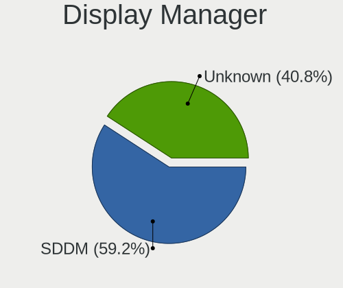
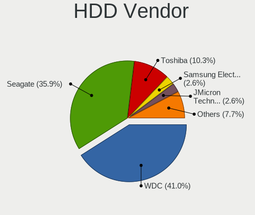
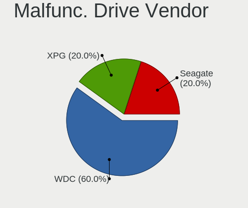
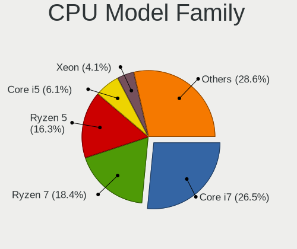
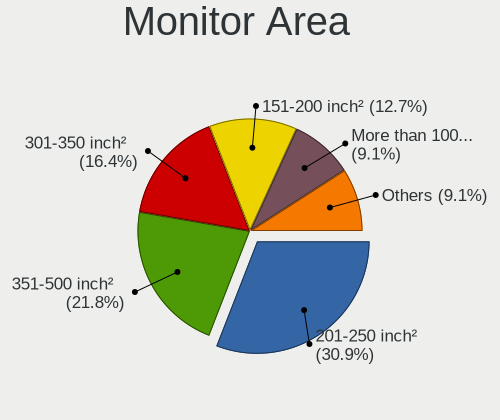

Kubuntu - Hardware Trends (Desktops)
------------------------------------

A project to identify most popular hardware characteristics and track their change
over time based on data collected by Linux users at https://Linux-Hardware.org.

Anyone can contribute to this report by the [hw-probe](https://github.com/linuxhw/hw-probe) tool:

    sudo -E hw-probe -all -upload

This report is for one last month. Overall report since the beginning of time: [TestDays](https://github.com/linuxhw/TestDays)

Period: Feb, 2023.

Contents
--------

* [ System ](#system)
  - [ OS                       ](#os)
  - [ OS Family                ](#os-family)
  - [ Kernel                   ](#kernel)
  - [ Kernel Family            ](#kernel-family)
  - [ Kernel Major Ver.        ](#kernel-major-ver)
  - [ Arch                     ](#arch)
  - [ DE                       ](#de)
  - [ Display Server           ](#display-server)
  - [ Display Manager          ](#display-manager)
  - [ OS Lang                  ](#os-lang)
  - [ Boot Mode                ](#boot-mode)
  - [ Filesystem               ](#filesystem)
  - [ Part. scheme             ](#part-scheme)
  - [ Dual Boot with Linux/BSD ](#dual-boot-with-linuxbsd)
  - [ Dual Boot (Win)          ](#dual-boot-win)

* [ Board ](#board)
  - [ Vendor                   ](#vendor)
  - [ Model                    ](#model)
  - [ Model Family             ](#model-family)
  - [ MFG Year                 ](#mfg-year)
  - [ Form Factor              ](#form-factor)
  - [ Secure Boot              ](#secure-boot)
  - [ Coreboot                 ](#coreboot)
  - [ RAM Size                 ](#ram-size)
  - [ RAM Used                 ](#ram-used)
  - [ Total Drives             ](#total-drives)
  - [ Has CD-ROM               ](#has-cd-rom)
  - [ Has Ethernet             ](#has-ethernet)
  - [ Has WiFi                 ](#has-wifi)
  - [ Has Bluetooth            ](#has-bluetooth)

* [ Location ](#location)
  - [ Country                  ](#country)
  - [ City                     ](#city)

* [ Drives ](#drives)
  - [ Drive Vendor             ](#drive-vendor)
  - [ Drive Model              ](#drive-model)
  - [ HDD Vendor               ](#hdd-vendor)
  - [ SSD Vendor               ](#ssd-vendor)
  - [ Drive Kind               ](#drive-kind)
  - [ Drive Connector          ](#drive-connector)
  - [ Drive Size               ](#drive-size)
  - [ Space Total              ](#space-total)
  - [ Space Used               ](#space-used)
  - [ Malfunc. Drives          ](#malfunc-drives)
  - [ Malfunc. Drive Vendor    ](#malfunc-drive-vendor)
  - [ Malfunc. HDD Vendor      ](#malfunc-hdd-vendor)
  - [ Malfunc. Drive Kind      ](#malfunc-drive-kind)
  - [ Failed Drives            ](#failed-drives)
  - [ Failed Drive Vendor      ](#failed-drive-vendor)
  - [ Drive Status             ](#drive-status)

* [ Storage controller ](#storage-controller)
  - [ Storage Vendor           ](#storage-vendor)
  - [ Storage Model            ](#storage-model)
  - [ Storage Kind             ](#storage-kind)

* [ Processor ](#processor)
  - [ CPU Vendor               ](#cpu-vendor)
  - [ CPU Model                ](#cpu-model)
  - [ CPU Model Family         ](#cpu-model-family)
  - [ CPU Cores                ](#cpu-cores)
  - [ CPU Sockets              ](#cpu-sockets)
  - [ CPU Threads              ](#cpu-threads)
  - [ CPU Op-Modes             ](#cpu-op-modes)
  - [ CPU Microcode            ](#cpu-microcode)
  - [ CPU Microarch            ](#cpu-microarch)

* [ Graphics ](#graphics)
  - [ GPU Vendor               ](#gpu-vendor)
  - [ GPU Model                ](#gpu-model)
  - [ GPU Combo                ](#gpu-combo)
  - [ GPU Driver               ](#gpu-driver)
  - [ GPU Memory               ](#gpu-memory)

* [ Monitor ](#monitor)
  - [ Monitor Vendor           ](#monitor-vendor)
  - [ Monitor Model            ](#monitor-model)
  - [ Monitor Resolution       ](#monitor-resolution)
  - [ Monitor Diagonal         ](#monitor-diagonal)
  - [ Monitor Width            ](#monitor-width)
  - [ Aspect Ratio             ](#aspect-ratio)
  - [ Monitor Area             ](#monitor-area)
  - [ Pixel Density            ](#pixel-density)
  - [ Multiple Monitors        ](#multiple-monitors)

* [ Network ](#network)
  - [ Net Controller Vendor    ](#net-controller-vendor)
  - [ Net Controller Model     ](#net-controller-model)
  - [ Wireless Vendor          ](#wireless-vendor)
  - [ Wireless Model           ](#wireless-model)
  - [ Ethernet Vendor          ](#ethernet-vendor)
  - [ Ethernet Model           ](#ethernet-model)
  - [ Net Controller Kind      ](#net-controller-kind)
  - [ Used Controller          ](#used-controller)
  - [ NICs                     ](#nics)
  - [ IPv6                     ](#ipv6)

* [ Bluetooth ](#bluetooth)
  - [ Bluetooth Vendor         ](#bluetooth-vendor)
  - [ Bluetooth Model          ](#bluetooth-model)

* [ Sound ](#sound)
  - [ Sound Vendor             ](#sound-vendor)
  - [ Sound Model              ](#sound-model)

* [ Memory ](#memory)
  - [ Memory Vendor            ](#memory-vendor)
  - [ Memory Model             ](#memory-model)
  - [ Memory Kind              ](#memory-kind)
  - [ Memory Form Factor       ](#memory-form-factor)
  - [ Memory Size              ](#memory-size)
  - [ Memory Speed             ](#memory-speed)

* [ Printers & scanners ](#printers--scanners)
  - [ Printer Vendor           ](#printer-vendor)
  - [ Printer Model            ](#printer-model)
  - [ Scanner Vendor           ](#scanner-vendor)
  - [ Scanner Model            ](#scanner-model)

* [ Camera ](#camera)
  - [ Camera Vendor            ](#camera-vendor)
  - [ Camera Model             ](#camera-model)

* [ Security ](#security)
  - [ Fingerprint Vendor       ](#fingerprint-vendor)
  - [ Fingerprint Model        ](#fingerprint-model)
  - [ Chipcard Vendor          ](#chipcard-vendor)
  - [ Chipcard Model           ](#chipcard-model)

* [ Unsupported ](#unsupported)
  - [ Unsupported Devices      ](#unsupported-devices)
  - [ Unsupported Device Types ](#unsupported-device-types)

System
------

OS
--

Installed operating systems

| Name          | Desktops | Percent |
|---------------|----------|---------|
| Kubuntu 22.10 | 23       | 47.92%  |
| Kubuntu 22.04 | 20       | 41.67%  |
| Kubuntu 23.04 | 1        | 2.08%   |
| Kubuntu 21.10 | 1        | 2.08%   |
| Kubuntu 20.04 | 1        | 2.08%   |
| Kubuntu 18.04 | 1        | 2.08%   |
| Kubuntu 12.04 | 1        | 2.08%   |

OS Family
---------

OS without a version

| Name    | Desktops | Percent |
|---------|----------|---------|
| Kubuntu | 48       | 100%    |

Kernel
------

Version of the Linux kernel

| Version                | Desktops | Percent |
|------------------------|----------|---------|
| 5.19.0-31-generic      | 15       | 31.25%  |
| 5.15.0-60-generic      | 8        | 16.67%  |
| 5.19.0-29-generic      | 5        | 10.42%  |
| 5.4.0-137-generic      | 2        | 4.17%   |
| 5.19.0-32-generic      | 2        | 4.17%   |
| 5.15.0-58-lowlatency   | 2        | 4.17%   |
| 5.15.0-58-generic      | 2        | 4.17%   |
| 6.1.9-060109-generic   | 1        | 2.08%   |
| 6.1.5-060105-generic   | 1        | 2.08%   |
| 5.19.0-35-generic      | 1        | 2.08%   |
| 5.19.0-28-generic      | 1        | 2.08%   |
| 5.19.0-21-generic      | 1        | 2.08%   |
| 5.18.19-051819-generic | 1        | 2.08%   |
| 5.15.0-60-lowlatency   | 1        | 2.08%   |
| 5.15.0-46-generic      | 1        | 2.08%   |
| 5.15.0-43-generic      | 1        | 2.08%   |
| 5.15.0-25-generic      | 1        | 2.08%   |
| 5.13.0-28-generic      | 1        | 2.08%   |
| 3.13.0-117-generic     | 1        | 2.08%   |

Kernel Family
-------------

Linux kernel without a distro release

| Version | Desktops | Percent |
|---------|----------|---------|
| 5.19.0  | 25       | 52.08%  |
| 5.15.0  | 16       | 33.33%  |
| 5.4.0   | 2        | 4.17%   |
| 6.1.9   | 1        | 2.08%   |
| 6.1.5   | 1        | 2.08%   |
| 5.18.19 | 1        | 2.08%   |
| 5.13.0  | 1        | 2.08%   |
| 3.13.0  | 1        | 2.08%   |

Kernel Major Ver.
-----------------

Linux kernel major version

| Version | Desktops | Percent |
|---------|----------|---------|
| 5.19    | 25       | 52.08%  |
| 5.15    | 16       | 33.33%  |
| 6.1     | 2        | 4.17%   |
| 5.4     | 2        | 4.17%   |
| 5.18    | 1        | 2.08%   |
| 5.13    | 1        | 2.08%   |
| 3.13    | 1        | 2.08%   |

Arch
----

OS architecture (x86_64, i586, etc.)

| Name   | Desktops | Percent |
|--------|----------|---------|
| x86_64 | 48       | 100%    |

DE
--

Desktop Environment

| Name  | Desktops | Percent |
|-------|----------|---------|
| KDE5  | 45       | 93.75%  |
| KDE4  | 1        | 2.08%   |
| KDE   | 1        | 2.08%   |
| GNOME | 1        | 2.08%   |

Display Server
--------------

X11 or Wayland

| Name    | Desktops | Percent |
|---------|----------|---------|
| X11     | 44       | 91.67%  |
| Wayland | 3        | 6.25%   |
| Tty     | 1        | 2.08%   |

Display Manager
---------------

SDDM, LightDM, etc.

| Name    | Desktops | Percent |
|---------|----------|---------|
| SDDM    | 30       | 62.5%   |
| Unknown | 11       | 22.92%  |
| GDM3    | 4        | 8.33%   |
| LightDM | 2        | 4.17%   |
| GDM     | 1        | 2.08%   |

OS Lang
-------

Language

| Lang  | Desktops | Percent |
|-------|----------|---------|
| en_US | 21       | 43.75%  |
| de_DE | 5        | 10.42%  |
| fr_FR | 4        | 8.33%   |
| ru_RU | 3        | 6.25%   |
| pl_PL | 3        | 6.25%   |
| it_IT | 3        | 6.25%   |
| en_CA | 3        | 6.25%   |
| pt_BR | 1        | 2.08%   |
| nl_NL | 1        | 2.08%   |
| es_SV | 1        | 2.08%   |
| en_IL | 1        | 2.08%   |
| en_GB | 1        | 2.08%   |
| de_CH | 1        | 2.08%   |

Boot Mode
---------

EFI or BIOS

| Mode | Desktops | Percent |
|------|----------|---------|
| BIOS | 28       | 58.33%  |
| EFI  | 20       | 41.67%  |

Filesystem
----------

Type of filesystem

| Type    | Desktops | Percent |
|---------|----------|---------|
| Ext4    | 45       | 93.75%  |
| Overlay | 1        | 2.08%   |
| Ext3    | 1        | 2.08%   |
| Btrfs   | 1        | 2.08%   |

Part. scheme
------------

Scheme of partitioning

| Type    | Desktops | Percent |
|---------|----------|---------|
| GPT     | 29       | 60.42%  |
| Unknown | 12       | 25%     |
| MBR     | 7        | 14.58%  |

Dual Boot with Linux/BSD
------------------------

Hosting more than one Linux/BSD

| Dual boot | Desktops | Percent |
|-----------|----------|---------|
| No        | 38       | 79.17%  |
| Yes       | 10       | 20.83%  |

Dual Boot (Win)
---------------

Hosting Linux and Windows

| Dual boot | Desktops | Percent |
|-----------|----------|---------|
| No        | 29       | 60.42%  |
| Yes       | 19       | 39.58%  |

Board
-----

Vendor
------

Motherboard manufacturer

| Name                | Desktops | Percent |
|---------------------|----------|---------|
| Gigabyte Technology | 12       | 25%     |
| ASUSTek Computer    | 10       | 20.83%  |
| MSI                 | 7        | 14.58%  |
| ASRock              | 7        | 14.58%  |
| Dell                | 5        | 10.42%  |
| Hewlett-Packard     | 2        | 4.17%   |
| Shuttle             | 1        | 2.08%   |
| Pegatron            | 1        | 2.08%   |
| Intel               | 1        | 2.08%   |
| Fujitsu             | 1        | 2.08%   |
| ECS                 | 1        | 2.08%   |

Model
-----

Motherboard model

| Name                                    | Desktops | Percent |
|-----------------------------------------|----------|---------|
| Shuttle DL10J                           | 1        | 2.08%   |
| Pegatron SM 3330B                       | 1        | 2.08%   |
| MSI MS-7D75                             | 1        | 2.08%   |
| MSI MS-7D15                             | 1        | 2.08%   |
| MSI MS-7C91                             | 1        | 2.08%   |
| MSI MS-7B89                             | 1        | 2.08%   |
| MSI MS-7B85                             | 1        | 2.08%   |
| MSI MS-7816                             | 1        | 2.08%   |
| MSI MS-7693                             | 1        | 2.08%   |
| Intel DP965LT AAD41694-206              | 1        | 2.08%   |
| HP Compaq Elite 8300 SFF                | 1        | 2.08%   |
| HP Compaq dc7800p Convertible Minitower | 1        | 2.08%   |
| Gigabyte Z390 AORUS PRO WIFI            | 1        | 2.08%   |
| Gigabyte X99-Ultra Gaming-CF            | 1        | 2.08%   |
| Gigabyte X670 AORUS ELITE AX            | 1        | 2.08%   |
| Gigabyte H510M H                        | 1        | 2.08%   |
| Gigabyte H170-D3HP                      | 1        | 2.08%   |
| Gigabyte B760I AORUS PRO DDR4           | 1        | 2.08%   |
| Gigabyte B660M GAMING X DDR4            | 1        | 2.08%   |
| Gigabyte B560 HD3                       | 1        | 2.08%   |
| Gigabyte B450M DS3H WIFI                | 1        | 2.08%   |
| Gigabyte B450 AORUS ELITE               | 1        | 2.08%   |
| Gigabyte B365M DS3H                     | 1        | 2.08%   |
| Gigabyte B360M-HD3                      | 1        | 2.08%   |
| Fujitsu GREED PC                        | 1        | 2.08%   |
| ECS H81H3-MV                            | 1        | 2.08%   |
| Dell XPS 8930                           | 1        | 2.08%   |
| Dell Precision WorkStation T3500        | 1        | 2.08%   |
| Dell Precision Tower 3431               | 1        | 2.08%   |
| Dell OptiPlex 9020                      | 1        | 2.08%   |
| Dell OptiPlex 7010                      | 1        | 2.08%   |
| ASUS Z10PE-D16 WS                       | 1        | 2.08%   |
| ASUS TUF Gaming B550-PLUS               | 1        | 2.08%   |
| ASUS ROG STRIX Z790-E GAMING WIFI       | 1        | 2.08%   |
| ASUS ROG STRIX X670E-A GAMING WIFI      | 1        | 2.08%   |
| ASUS ROG STRIX B650-A GAMING WIFI       | 1        | 2.08%   |
| ASUS PRIME Z490-P                       | 1        | 2.08%   |
| ASUS PRIME B550M-A                      | 1        | 2.08%   |
| ASUS PRIME B450M-K                      | 1        | 2.08%   |
| ASUS PRIME B450-PLUS                    | 1        | 2.08%   |

Model Family
------------

Motherboard model prefix

| Name               | Desktops | Percent |
|--------------------|----------|---------|
| ASUS PRIME         | 4        | 8.33%   |
| ASUS ROG           | 3        | 6.25%   |
| HP Compaq          | 2        | 4.17%   |
| Dell Precision     | 2        | 4.17%   |
| Dell OptiPlex      | 2        | 4.17%   |
| Shuttle DL10J      | 1        | 2.08%   |
| Pegatron SM        | 1        | 2.08%   |
| MSI MS-7D75        | 1        | 2.08%   |
| MSI MS-7D15        | 1        | 2.08%   |
| MSI MS-7C91        | 1        | 2.08%   |
| MSI MS-7B89        | 1        | 2.08%   |
| MSI MS-7B85        | 1        | 2.08%   |
| MSI MS-7816        | 1        | 2.08%   |
| MSI MS-7693        | 1        | 2.08%   |
| Intel DP965LT      | 1        | 2.08%   |
| Gigabyte Z390      | 1        | 2.08%   |
| Gigabyte X99-Ultra | 1        | 2.08%   |
| Gigabyte X670      | 1        | 2.08%   |
| Gigabyte H510M     | 1        | 2.08%   |
| Gigabyte H170-D3HP | 1        | 2.08%   |
| Gigabyte B760I     | 1        | 2.08%   |
| Gigabyte B660M     | 1        | 2.08%   |
| Gigabyte B560      | 1        | 2.08%   |
| Gigabyte B450M     | 1        | 2.08%   |
| Gigabyte B450      | 1        | 2.08%   |
| Gigabyte B365M     | 1        | 2.08%   |
| Gigabyte B360M-HD3 | 1        | 2.08%   |
| Fujitsu GREED      | 1        | 2.08%   |
| ECS H81H3-MV       | 1        | 2.08%   |
| Dell XPS           | 1        | 2.08%   |
| ASUS Z10PE-D16     | 1        | 2.08%   |
| ASUS TUF           | 1        | 2.08%   |
| ASUS All           | 1        | 2.08%   |
| ASRock Z790        | 1        | 2.08%   |
| ASRock X300M-STX   | 1        | 2.08%   |
| ASRock M3A770DE    | 1        | 2.08%   |
| ASRock H97         | 1        | 2.08%   |
| ASRock G41C-GS     | 1        | 2.08%   |
| ASRock B550M       | 1        | 2.08%   |
| ASRock 960GC-GS    | 1        | 2.08%   |

MFG Year
--------

Motherboard manufacture year

| Year | Desktops | Percent |
|------|----------|---------|
| 2018 | 8        | 16.67%  |
| 2020 | 7        | 14.58%  |
| 2022 | 6        | 12.5%   |
| 2021 | 4        | 8.33%   |
| 2014 | 4        | 8.33%   |
| 2013 | 4        | 8.33%   |
| 2019 | 3        | 6.25%   |
| 2009 | 3        | 6.25%   |
| 2016 | 2        | 4.17%   |
| 2023 | 1        | 2.08%   |
| 2017 | 1        | 2.08%   |
| 2015 | 1        | 2.08%   |
| 2012 | 1        | 2.08%   |
| 2011 | 1        | 2.08%   |
| 2007 | 1        | 2.08%   |
| 2006 | 1        | 2.08%   |

Form Factor
-----------

Physical design of the computer

| Name    | Desktops | Percent |
|---------|----------|---------|
| Desktop | 48       | 100%    |

Secure Boot
-----------

Enabled or disabled

| State    | Desktops | Percent |
|----------|----------|---------|
| Disabled | 46       | 95.83%  |
| Enabled  | 2        | 4.17%   |

Coreboot
--------

Have coreboot on board

| Used | Desktops | Percent |
|------|----------|---------|
| No   | 48       | 100%    |

RAM Size
--------

Total RAM memory

| Size in GB      | Desktops | Percent |
|-----------------|----------|---------|
| 16.01-24.0      | 12       | 25%     |
| 32.01-64.0      | 11       | 22.92%  |
| 64.01-256.0     | 6        | 12.5%   |
| 4.01-8.0        | 5        | 10.42%  |
| 24.01-32.0      | 5        | 10.42%  |
| 8.01-16.0       | 5        | 10.42%  |
| 3.01-4.0        | 2        | 4.17%   |
| More than 256.0 | 1        | 2.08%   |
| 2.01-3.0        | 1        | 2.08%   |

RAM Used
--------

Used RAM memory

| Used GB    | Desktops | Percent |
|------------|----------|---------|
| 4.01-8.0   | 15       | 31.25%  |
| 2.01-3.0   | 12       | 25%     |
| 3.01-4.0   | 11       | 22.92%  |
| 1.01-2.0   | 5        | 10.42%  |
| 32.01-64.0 | 1        | 2.08%   |
| 16.01-24.0 | 1        | 2.08%   |
| 8.01-16.0  | 1        | 2.08%   |
| 0.51-1.0   | 1        | 2.08%   |
| Unknown    | 1        | 2.08%   |

Total Drives
------------

Number of drives on board

| Drives | Desktops | Percent |
|--------|----------|---------|
| 2      | 16       | 33.33%  |
| 3      | 11       | 22.92%  |
| 1      | 9        | 18.75%  |
| 4      | 8        | 16.67%  |
| 5      | 2        | 4.17%   |
| 9      | 1        | 2.08%   |
| 7      | 1        | 2.08%   |

Has CD-ROM
----------

Has CD-ROM on board

| Presented | Desktops | Percent |
|-----------|----------|---------|
| No        | 31       | 64.58%  |
| Yes       | 17       | 35.42%  |

Has Ethernet
------------

Has Ethernet on board

| Presented | Desktops | Percent |
|-----------|----------|---------|
| Yes       | 47       | 97.92%  |
| No        | 1        | 2.08%   |

Has WiFi
--------

Has WiFi module

| Presented | Desktops | Percent |
|-----------|----------|---------|
| No        | 25       | 52.08%  |
| Yes       | 23       | 47.92%  |

Has Bluetooth
-------------

Has Bluetooth module

| Presented | Desktops | Percent |
|-----------|----------|---------|
| No        | 27       | 56.25%  |
| Yes       | 21       | 43.75%  |

Location
--------

Country
-------

Geographic location (country)

| Country      | Desktops | Percent |
|--------------|----------|---------|
| USA          | 9        | 18.75%  |
| Germany      | 6        | 12.5%   |
| Russia       | 4        | 8.33%   |
| Poland       | 3        | 6.25%   |
| Italy        | 3        | 6.25%   |
| France       | 3        | 6.25%   |
| Canada       | 3        | 6.25%   |
| UK           | 2        | 4.17%   |
| Belgium      | 2        | 4.17%   |
| Switzerland  | 1        | 2.08%   |
| Saudi Arabia | 1        | 2.08%   |
| Norway       | 1        | 2.08%   |
| Netherlands  | 1        | 2.08%   |
| Israel       | 1        | 2.08%   |
| Indonesia    | 1        | 2.08%   |
| El Salvador  | 1        | 2.08%   |
| Denmark      | 1        | 2.08%   |
| Chile        | 1        | 2.08%   |
| Bulgaria     | 1        | 2.08%   |
| Brazil       | 1        | 2.08%   |
| Austria      | 1        | 2.08%   |
| Argentina    | 1        | 2.08%   |

City
----

Geographic location (city)

| City                   | Desktops | Percent |
|------------------------|----------|---------|
| Hamburg                | 2        | 4.17%   |
| Wilhelmshaven          | 1        | 2.08%   |
| Voronezh               | 1        | 2.08%   |
| Villingen-Schwenningen | 1        | 2.08%   |
| Tyumen                 | 1        | 2.08%   |
| Toronto                | 1        | 2.08%   |
| Terranuova Bracciolini | 1        | 2.08%   |
| Taquaritinga           | 1        | 2.08%   |
| Somerville             | 1        | 2.08%   |
| Sofia                  | 1        | 2.08%   |
| Santa Ana              | 1        | 2.08%   |
| Riyadh                 | 1        | 2.08%   |
| Reno                   | 1        | 2.08%   |
| Pittsburgh             | 1        | 2.08%   |
| Pinczow                | 1        | 2.08%   |
| Pasadena               | 1        | 2.08%   |
| Ottawa                 | 1        | 2.08%   |
| Moscow                 | 1        | 2.08%   |
| Marseille              | 1        | 2.08%   |
| Madera                 | 1        | 2.08%   |
| Maasmechelen           | 1        | 2.08%   |
| London                 | 1        | 2.08%   |
| Krasnoznamensk         | 1        | 2.08%   |
| Katowice               | 1        | 2.08%   |
| Karlsruhe              | 1        | 2.08%   |
| Jozefow                | 1        | 2.08%   |
| Jombang                | 1        | 2.08%   |
| Jambes                 | 1        | 2.08%   |
| Innsbruck              | 1        | 2.08%   |
| Houston                | 1        | 2.08%   |
| Honefoss               | 1        | 2.08%   |
| Holon                  | 1        | 2.08%   |
| Groningen              | 1        | 2.08%   |
| Genoa                  | 1        | 2.08%   |
| Foix                   | 1        | 2.08%   |
| Edmonton               | 1        | 2.08%   |
| Dietikon               | 1        | 2.08%   |
| Crewe                  | 1        | 2.08%   |
| Córdoba               | 1        | 2.08%   |
| Copenhagen             | 1        | 2.08%   |

Drives
------

Drive Vendor
------------

Hard drive vendors

| Vendor                    | Desktops | Drives | Percent |
|---------------------------|----------|--------|---------|
| WDC                       | 18       | 20     | 16.82%  |
| Seagate                   | 16       | 25     | 14.95%  |
| Samsung Electronics       | 16       | 21     | 14.95%  |
| Toshiba                   | 10       | 12     | 9.35%   |
| Kingston                  | 8        | 9      | 7.48%   |
| Sandisk                   | 7        | 8      | 6.54%   |
| Crucial                   | 7        | 8      | 6.54%   |
| Maxtor                    | 3        | 4      | 2.8%    |
| SPCC                      | 2        | 2      | 1.87%   |
| Phison Electronics        | 2        | 2      | 1.87%   |
| OCZ                       | 2        | 2      | 1.87%   |
| Intel                     | 2        | 5      | 1.87%   |
| Hitachi                   | 2        | 2      | 1.87%   |
| Smartbuy                  | 1        | 1      | 0.93%   |
| PNY                       | 1        | 1      | 0.93%   |
| Micron/Crucial Technology | 1        | 1      | 0.93%   |
| LITEONIT                  | 1        | 1      | 0.93%   |
| Lexar                     | 1        | 1      | 0.93%   |
| JMicron Technology        | 1        | 1      | 0.93%   |
| Intenso                   | 1        | 1      | 0.93%   |
| GOODRAM                   | 1        | 1      | 0.93%   |
| Gigabyte Technology       | 1        | 1      | 0.93%   |
| China                     | 1        | 1      | 0.93%   |
| Apple                     | 1        | 1      | 0.93%   |
| Unknown                   | 1        | 1      | 0.93%   |

Drive Model
-----------

Hard drive models

| Model                                                 | Desktops | Percent |
|-------------------------------------------------------|----------|---------|
| Seagate ST4000DM004-2CV104 4TB                        | 5        | 4.17%   |
| Kingston SNVS500G 500GB                               | 3        | 2.5%    |
| Toshiba HDWD110 1TB                                   | 2        | 1.67%   |
| Seagate ST1000DM003-1CH162 1TB                        | 2        | 1.67%   |
| Sandisk WD Black 2018/SN750 / PC SN720 NVMe SSD 512GB | 2        | 1.67%   |
| Samsung SSD 980 PRO 1TB                               | 2        | 1.67%   |
| Samsung SSD 860 EVO 250GB                             | 2        | 1.67%   |
| Crucial CT240BX500SSD1 240GB                          | 2        | 1.67%   |
| WDC WDBNCE5000PNC 500GB SSD                           | 1        | 0.83%   |
| WDC WD60EZAZ-00SF3B0 6TB                              | 1        | 0.83%   |
| WDC WD6003FZBX-00K5WB0 6TB                            | 1        | 0.83%   |
| WDC WD6003FFBX-68MU3N0 6TB                            | 1        | 0.83%   |
| WDC WD5000AAKS-00V1A0 500GB                           | 1        | 0.83%   |
| WDC WD3200AAKS-75B3A0 320GB                           | 1        | 0.83%   |
| WDC WD3200AAJB-56R1A0 320GB                           | 1        | 0.83%   |
| WDC WD30EZRX-00D8PB0 3TB                              | 1        | 0.83%   |
| WDC WD2500KS-00MJB0 250GB                             | 1        | 0.83%   |
| WDC WD20EZAZ-00GGJB0 2TB                              | 1        | 0.83%   |
| WDC WD20EARX-00PASB0 2TB                              | 1        | 0.83%   |
| WDC WD20EARS-00MVWB0 2TB                              | 1        | 0.83%   |
| WDC WD10EZRX-00L4HB0 1TB                              | 1        | 0.83%   |
| WDC WD10EZEX-08WN4A0 1TB                              | 1        | 0.83%   |
| WDC WD10EZEX-00RKKA0 1TB                              | 1        | 0.83%   |
| WDC WD10EARS-00Y5B1 1TB                               | 1        | 0.83%   |
| WDC WD10EACS-65D6B0 1TB                               | 1        | 0.83%   |
| WDC WD Elements SE SSD 2TB                            | 1        | 0.83%   |
| WDC PC SN730 NVMe 512GB                               | 1        | 0.83%   |
| Toshiba TR200 480GB SSD                               | 1        | 0.83%   |
| Toshiba RD400 1TB                                     | 1        | 0.83%   |
| Toshiba MK7559GSXF 752GB                              | 1        | 0.83%   |
| Toshiba KXG50ZNV256G NVMe 256GB                       | 1        | 0.83%   |
| Toshiba HDWR460 6TB                                   | 1        | 0.83%   |
| Toshiba HDWR180 8TB                                   | 1        | 0.83%   |
| Toshiba HDWR11A 10TB                                  | 1        | 0.83%   |
| Toshiba HDWD105 500GB                                 | 1        | 0.83%   |
| Toshiba DT01ACA100 1TB                                | 1        | 0.83%   |
| SPCC Solid State Disk 2TB                             | 1        | 0.83%   |
| SPCC M.2 PCIe SSD 250GB                               | 1        | 0.83%   |
| Smartbuy m.2 PS5013-2280T 256GB                       | 1        | 0.83%   |
| Seagate ST8000DM0004-1ZC11G 8TB                       | 1        | 0.83%   |

HDD Vendor
----------

Hard disk drive vendors

| Vendor              | Desktops | Drives | Percent |
|---------------------|----------|--------|---------|
| Seagate             | 16       | 25     | 34.78%  |
| WDC                 | 15       | 17     | 32.61%  |
| Toshiba             | 7        | 9      | 15.22%  |
| Maxtor              | 3        | 4      | 6.52%   |
| Hitachi             | 2        | 2      | 4.35%   |
| Samsung Electronics | 1        | 2      | 2.17%   |
| JMicron Technology  | 1        | 1      | 2.17%   |
| Apple               | 1        | 1      | 2.17%   |

SSD Vendor
----------

Solid state drive vendors

| Vendor              | Desktops | Drives | Percent |
|---------------------|----------|--------|---------|
| Samsung Electronics | 11       | 12     | 31.43%  |
| Crucial             | 5        | 6      | 14.29%  |
| Kingston            | 4        | 4      | 11.43%  |
| WDC                 | 2        | 2      | 5.71%   |
| OCZ                 | 2        | 2      | 5.71%   |
| Toshiba             | 1        | 1      | 2.86%   |
| SPCC                | 1        | 1      | 2.86%   |
| SanDisk             | 1        | 1      | 2.86%   |
| PNY                 | 1        | 1      | 2.86%   |
| LITEONIT            | 1        | 1      | 2.86%   |
| Lexar               | 1        | 1      | 2.86%   |
| Intenso             | 1        | 1      | 2.86%   |
| Intel               | 1        | 4      | 2.86%   |
| GOODRAM             | 1        | 1      | 2.86%   |
| China               | 1        | 1      | 2.86%   |
| Unknown             | 1        | 1      | 2.86%   |

Drive Kind
----------

HDD or SSD

| Kind | Desktops | Drives | Percent |
|------|----------|--------|---------|
| HDD  | 35       | 61     | 39.33%  |
| NVMe | 27       | 31     | 30.34%  |
| SSD  | 27       | 40     | 30.34%  |

Drive Connector
---------------

SATA, SAS, NVMe, etc.

| Type | Desktops | Drives | Percent |
|------|----------|--------|---------|
| SATA | 41       | 97     | 57.75%  |
| NVMe | 27       | 31     | 38.03%  |
| SAS  | 3        | 4      | 4.23%   |

Drive Size
----------

Size of hard drive

| Size in TB | Desktops | Drives | Percent |
|------------|----------|--------|---------|
| 0.01-0.5   | 24       | 39     | 35.82%  |
| 0.51-1.0   | 21       | 31     | 31.34%  |
| 3.01-4.0   | 8        | 12     | 11.94%  |
| 1.01-2.0   | 6        | 7      | 8.96%   |
| 4.01-10.0  | 6        | 9      | 8.96%   |
| 2.01-3.0   | 1        | 1      | 1.49%   |
| 10.01-20.0 | 1        | 2      | 1.49%   |

Space Total
-----------

Amount of disk space available on the file system

| Size in GB     | Desktops | Percent |
|----------------|----------|---------|
| More than 3000 | 14       | 29.17%  |
| 251-500        | 8        | 16.67%  |
| 101-250        | 7        | 14.58%  |
| 501-1000       | 7        | 14.58%  |
| 1001-2000      | 6        | 12.5%   |
| 1-20           | 3        | 6.25%   |
| 2001-3000      | 2        | 4.17%   |
| 51-100         | 1        | 2.08%   |

Space Used
----------

Amount of used disk space

| Used GB        | Desktops | Percent |
|----------------|----------|---------|
| 1-20           | 10       | 20.83%  |
| More than 3000 | 8        | 16.67%  |
| 251-500        | 8        | 16.67%  |
| 101-250        | 6        | 12.5%   |
| 1001-2000      | 6        | 12.5%   |
| 51-100         | 5        | 10.42%  |
| 501-1000       | 3        | 6.25%   |
| 21-50          | 1        | 2.08%   |
| 2001-3000      | 1        | 2.08%   |

Malfunc. Drives
---------------

Drive models with a malfunction

| Model                          | Desktops | Drives | Percent |
|--------------------------------|----------|--------|---------|
| WDC WD5000AAKS-00V1A0 500GB    | 1        | 1      | 9.09%   |
| WDC WD3200AAJB-56R1A0 320GB    | 1        | 1      | 9.09%   |
| WDC WD10EZRX-00L4HB0 1TB       | 1        | 1      | 9.09%   |
| WDC WD10EACS-65D6B0 1TB        | 1        | 1      | 9.09%   |
| Seagate ST3160827AS 160GB      | 1        | 1      | 9.09%   |
| Seagate ST3160023A 160GB       | 1        | 1      | 9.09%   |
| Maxtor 6V160E0 160GB           | 1        | 1      | 9.09%   |
| LITEONIT LMT-128M3M 128GB SSD  | 1        | 1      | 9.09%   |
| Intenso TOP M.2 SATA 256GB SSD | 1        | 1      | 9.09%   |
| Intel SSDSC2KW010X6 1TB        | 1        | 4      | 9.09%   |
| Crucial CT525MX300SSD1 528GB   | 1        | 1      | 9.09%   |

Malfunc. Drive Vendor
---------------------

Vendors of faulty drives

| Vendor   | Desktops | Drives | Percent |
|----------|----------|--------|---------|
| WDC      | 4        | 4      | 36.36%  |
| Seagate  | 2        | 2      | 18.18%  |
| Maxtor   | 1        | 1      | 9.09%   |
| LITEONIT | 1        | 1      | 9.09%   |
| Intenso  | 1        | 1      | 9.09%   |
| Intel    | 1        | 4      | 9.09%   |
| Crucial  | 1        | 1      | 9.09%   |

Malfunc. HDD Vendor
-------------------

Vendors of faulty HDD drives

| Vendor  | Desktops | Drives | Percent |
|---------|----------|--------|---------|
| WDC     | 4        | 4      | 57.14%  |
| Seagate | 2        | 2      | 28.57%  |
| Maxtor  | 1        | 1      | 14.29%  |

Malfunc. Drive Kind
-------------------

Kinds of faulty drives

| Kind | Desktops | Drives | Percent |
|------|----------|--------|---------|
| HDD  | 5        | 7      | 55.56%  |
| SSD  | 4        | 7      | 44.44%  |

Failed Drives
-------------

Failed drive models

Zero info for selected period =(

Failed Drive Vendor
-------------------

Failed drive vendors

Zero info for selected period =(

Drive Status
------------

Number of failed and malfunc. drives

| Status   | Desktops | Drives | Percent |
|----------|----------|--------|---------|
| Detected | 26       | 64     | 44.07%  |
| Works    | 24       | 54     | 40.68%  |
| Malfunc  | 9        | 14     | 15.25%  |

Storage controller
------------------

Storage Vendor
--------------

Storage controller vendors

| Vendor                       | Desktops | Percent |
|------------------------------|----------|---------|
| Intel                        | 28       | 37.33%  |
| AMD                          | 18       | 24%     |
| SanDisk                      | 7        | 9.33%   |
| Samsung Electronics          | 6        | 8%      |
| Phison Electronics           | 5        | 6.67%   |
| Kingston Technology Company  | 4        | 5.33%   |
| Micron/Crucial Technology    | 3        | 4%      |
| Toshiba America Info Systems | 1        | 1.33%   |
| OCZ Technology Group         | 1        | 1.33%   |
| Marvell Technology Group     | 1        | 1.33%   |
| ASMedia Technology           | 1        | 1.33%   |

Storage Model
-------------

Storage controller models

| Model                                                                          | Desktops | Percent |
|--------------------------------------------------------------------------------|----------|---------|
| AMD 400 Series Chipset SATA Controller                                         | 6        | 6.59%   |
| Samsung NVMe SSD Controller PM9A1/PM9A3/980PRO                                 | 4        | 4.4%    |
| AMD SATA controller                                                            | 4        | 4.4%    |
| AMD 500 Series Chipset SATA Controller                                         | 4        | 4.4%    |
| Phison PS5013 E13 NVMe Controller                                              | 3        | 3.3%    |
| Kingston Company Company Non-Volatile memory controller                        | 3        | 3.3%    |
| Intel SATA controller                                                          | 3        | 3.3%    |
| Intel 500 Series Chipset Family SATA AHCI Controller                           | 3        | 3.3%    |
| AMD SB7x0/SB8x0/SB9x0 SATA Controller [AHCI mode]                              | 3        | 3.3%    |
| AMD SB7x0/SB8x0/SB9x0 IDE Controller                                           | 3        | 3.3%    |
| AMD FCH SATA Controller [AHCI mode]                                            | 3        | 3.3%    |
| SanDisk WD Black SN750 / PC SN730 NVMe SSD                                     | 2        | 2.2%    |
| SanDisk WD Black 2018/SN750 / PC SN720 NVMe SSD                                | 2        | 2.2%    |
| Sandisk Non-Volatile memory controller                                         | 2        | 2.2%    |
| Samsung NVMe SSD Controller SM981/PM981/PM983                                  | 2        | 2.2%    |
| Micron/Crucial P2 NVMe PCIe SSD                                                | 2        | 2.2%    |
| Intel SATA Controller [RAID mode]                                              | 2        | 2.2%    |
| Intel Cannon Lake PCH SATA AHCI Controller                                     | 2        | 2.2%    |
| Intel C610/X99 series chipset sSATA Controller [AHCI mode]                     | 2        | 2.2%    |
| Intel C610/X99 series chipset 6-Port SATA Controller [AHCI mode]               | 2        | 2.2%    |
| Intel 9 Series Chipset Family SATA Controller [AHCI Mode]                      | 2        | 2.2%    |
| Intel 8 Series/C220 Series Chipset Family 6-port SATA Controller 1 [AHCI mode] | 2        | 2.2%    |
| Intel 7 Series/C210 Series Chipset Family 6-port SATA Controller [AHCI mode]   | 2        | 2.2%    |
| Intel 200 Series PCH SATA controller [AHCI mode]                               | 2        | 2.2%    |
| Toshiba America Info Systems XG5 NVMe SSD Controller                           | 1        | 1.1%    |
| SanDisk WD PC SN810 / Black SN850 NVMe SSD                                     | 1        | 1.1%    |
| SanDisk WD Blue SN570 NVMe SSD                                                 | 1        | 1.1%    |
| Phison Electronics Non-Volatile memory controller                              | 1        | 1.1%    |
| Phison E12 NVMe Controller                                                     | 1        | 1.1%    |
| OCZ Group RD400/400A SSD                                                       | 1        | 1.1%    |
| Micron/Crucial P1 NVMe PCIe SSD                                                | 1        | 1.1%    |
| Marvell Group 88SE6101/6102 single-port PATA133 interface                      | 1        | 1.1%    |
| Kingston Company SNVS2000G [NV1 NVMe PCIe SSD 2TB]                             | 1        | 1.1%    |
| Intel Volume Management Device NVMe RAID Controller Intel Corporation          | 1        | 1.1%    |
| Intel Volume Management Device NVMe RAID Controller                            | 1        | 1.1%    |
| Intel SSD 600P Series                                                          | 1        | 1.1%    |
| Intel Q170/Q150/B150/H170/H110/Z170/CM236 Chipset SATA Controller [AHCI Mode]  | 1        | 1.1%    |
| Intel NM10/ICH7 Family SATA Controller [IDE mode]                              | 1        | 1.1%    |
| Intel Comet Lake PCH-H RAID                                                    | 1        | 1.1%    |
| Intel Celeron/Pentium Silver Processor SATA Controller                         | 1        | 1.1%    |

Storage Kind
------------

Kind of storage controller (IDE, SATA, NVMe, SAS, ...)

| Kind | Desktops | Percent |
|------|----------|---------|
| SATA | 40       | 50.63%  |
| NVMe | 27       | 34.18%  |
| IDE  | 7        | 8.86%   |
| RAID | 5        | 6.33%   |

Processor
---------

CPU Vendor
----------

Processor vendors

| Vendor | Desktops | Percent |
|--------|----------|---------|
| Intel  | 29       | 60.42%  |
| AMD    | 19       | 39.58%  |

CPU Model
---------

Processor models

| Model                                       | Desktops | Percent |
|---------------------------------------------|----------|---------|
| AMD Ryzen 5 5600X 6-Core Processor          | 3        | 6.25%   |
| Intel Core i7-8700 CPU @ 3.20GHz            | 2        | 4.17%   |
| Intel Core i5-9600K CPU @ 3.70GHz           | 2        | 4.17%   |
| Intel 13th Gen Core i9-13900K               | 2        | 4.17%   |
| AMD Ryzen 9 7950X 16-Core Processor         | 2        | 4.17%   |
| AMD Ryzen 7 3700X 8-Core Processor          | 2        | 4.17%   |
| AMD Phenom II X4 955 Processor              | 2        | 4.17%   |
| Intel Xeon CPU W3580 @ 3.33GHz              | 1        | 2.08%   |
| Intel Xeon CPU E5-2697 v4 @ 2.30GHz         | 1        | 2.08%   |
| Intel Xeon CPU E3-1246 v3 @ 3.50GHz         | 1        | 2.08%   |
| Intel Core i7-9700 CPU @ 3.00GHz            | 1        | 2.08%   |
| Intel Core i7-6800K CPU @ 3.40GHz           | 1        | 2.08%   |
| Intel Core i7-4790 CPU @ 3.60GHz            | 1        | 2.08%   |
| Intel Core i7-4770 CPU @ 3.40GHz            | 1        | 2.08%   |
| Intel Core i7-3770 CPU @ 3.40GHz            | 1        | 2.08%   |
| Intel Core i5-6500 CPU @ 3.20GHz            | 1        | 2.08%   |
| Intel Core i5-4460 CPU @ 3.20GHz            | 1        | 2.08%   |
| Intel Core i5-3470 CPU @ 3.20GHz            | 1        | 2.08%   |
| Intel Core i5-10600K CPU @ 4.10GHz          | 1        | 2.08%   |
| Intel Core i3-4150 CPU @ 3.50GHz            | 1        | 2.08%   |
| Intel Core i3-4130 CPU @ 3.40GHz            | 1        | 2.08%   |
| Intel Core i3-10105 CPU @ 3.70GHz           | 1        | 2.08%   |
| Intel Core i3-10100F CPU @ 3.60GHz          | 1        | 2.08%   |
| Intel Core 2 Quad CPU Q9500 @ 2.83GHz       | 1        | 2.08%   |
| Intel Core 2 Duo CPU E8400 @ 3.00GHz        | 1        | 2.08%   |
| Intel Core 2 Duo CPU E6550 @ 2.33GHz        | 1        | 2.08%   |
| Intel Celeron J4005 CPU @ 2.00GHz           | 1        | 2.08%   |
| Intel 13th Gen Core i5-13400                | 1        | 2.08%   |
| Intel 12th Gen Core i9-12900F               | 1        | 2.08%   |
| Intel 11th Gen Core i5-11400 @ 2.60GHz      | 1        | 2.08%   |
| AMD Ryzen 9 7900 12-Core Processor          | 1        | 2.08%   |
| AMD Ryzen 7 5700G with Radeon Graphics      | 1        | 2.08%   |
| AMD Ryzen 7 3800X 8-Core Processor          | 1        | 2.08%   |
| AMD Ryzen 5 7600X 6-Core Processor          | 1        | 2.08%   |
| AMD Ryzen 5 5600G with Radeon Graphics      | 1        | 2.08%   |
| AMD Ryzen 5 3600 6-Core Processor           | 1        | 2.08%   |
| AMD Ryzen 5 3500X 6-Core Processor          | 1        | 2.08%   |
| AMD Ryzen 3 2200G with Radeon Vega Graphics | 1        | 2.08%   |
| AMD Phenom 8600 Triple-Core Processor       | 1        | 2.08%   |
| AMD FX-8350 Eight-Core Processor            | 1        | 2.08%   |

CPU Model Family
----------------

Processor model prefix

| Model             | Desktops | Percent |
|-------------------|----------|---------|
| Intel Core i7     | 7        | 14.58%  |
| AMD Ryzen 5       | 7        | 14.58%  |
| Intel Core i5     | 6        | 12.5%   |
| Other             | 5        | 10.42%  |
| Intel Core i3     | 4        | 8.33%   |
| AMD Ryzen 7       | 4        | 8.33%   |
| Intel Xeon        | 3        | 6.25%   |
| AMD Ryzen 9       | 3        | 6.25%   |
| Intel Core 2 Duo  | 2        | 4.17%   |
| AMD Phenom II X4  | 2        | 4.17%   |
| Intel Core 2 Quad | 1        | 2.08%   |
| Intel Celeron     | 1        | 2.08%   |
| AMD Ryzen 3       | 1        | 2.08%   |
| AMD Phenom        | 1        | 2.08%   |
| AMD FX            | 1        | 2.08%   |

CPU Cores
---------

Number of processor cores

| Number | Desktops | Percent |
|--------|----------|---------|
| 4      | 15       | 31.25%  |
| 6      | 14       | 29.17%  |
| 8      | 5        | 10.42%  |
| 2      | 5        | 10.42%  |
| 16     | 3        | 6.25%   |
| 24     | 2        | 4.17%   |
| 36     | 1        | 2.08%   |
| 12     | 1        | 2.08%   |
| 10     | 1        | 2.08%   |
| 3      | 1        | 2.08%   |

CPU Sockets
-----------

Number of sockets

| Number | Desktops | Percent |
|--------|----------|---------|
| 1      | 47       | 97.92%  |
| 2      | 1        | 2.08%   |

CPU Threads
-----------

Threads per core (Hyper-Threading)

| Number | Desktops | Percent |
|--------|----------|---------|
| 2      | 31       | 64.58%  |
| 1      | 17       | 35.42%  |

CPU Op-Modes
------------

CPU Operation Modes (32-bit, 64-bit)

| Op mode        | Desktops | Percent |
|----------------|----------|---------|
| 32-bit, 64-bit | 48       | 100%    |

CPU Microcode
-------------

Microcode number

| Number     | Desktops | Percent |
|------------|----------|---------|
| Unknown    | 19       | 39.58%  |
| 0x306c3    | 4        | 8.33%   |
| 0x0a601203 | 3        | 6.25%   |
| 0x08701021 | 3        | 6.25%   |
| 0xa0653    | 2        | 4.17%   |
| 0x406f1    | 2        | 4.17%   |
| 0x0a50000c | 2        | 4.17%   |
| 0xb06f2    | 1        | 2.08%   |
| 0xa0671    | 1        | 2.08%   |
| 0xa0655    | 1        | 2.08%   |
| 0x906ed    | 1        | 2.08%   |
| 0x906ea    | 1        | 2.08%   |
| 0x706a1    | 1        | 2.08%   |
| 0x6fb      | 1        | 2.08%   |
| 0x1067a    | 1        | 2.08%   |
| 0x0a20120a | 1        | 2.08%   |
| 0x0a201016 | 1        | 2.08%   |
| 0x08101016 | 1        | 2.08%   |
| 0x010000c9 | 1        | 2.08%   |
| 0x010000c8 | 1        | 2.08%   |

CPU Microarch
-------------

Microarchitecture

| Name          | Desktops | Percent |
|---------------|----------|---------|
| Unknown       | 8        | 16.67%  |
| Haswell       | 6        | 12.5%   |
| Zen 3         | 5        | 10.42%  |
| Zen 2         | 5        | 10.42%  |
| KabyLake      | 5        | 10.42%  |
| K10           | 3        | 6.25%   |
| CometLake     | 3        | 6.25%   |
| Penryn        | 2        | 4.17%   |
| IvyBridge     | 2        | 4.17%   |
| Broadwell     | 2        | 4.17%   |
| Zen           | 1        | 2.08%   |
| Skylake       | 1        | 2.08%   |
| Piledriver    | 1        | 2.08%   |
| Nehalem       | 1        | 2.08%   |
| Icelake       | 1        | 2.08%   |
| Goldmont plus | 1        | 2.08%   |
| Core          | 1        | 2.08%   |

Graphics
--------

GPU Vendor
----------

Vendors of graphics cards

| Vendor            | Desktops | Percent |
|-------------------|----------|---------|
| Nvidia            | 20       | 35.71%  |
| AMD               | 19       | 33.93%  |
| Intel             | 16       | 28.57%  |
| ASPEED Technology | 1        | 1.79%   |

GPU Model
---------

Graphics card models

| Model                                                                       | Desktops | Percent |
|-----------------------------------------------------------------------------|----------|---------|
| AMD Ellesmere [Radeon RX 470/480/570/570X/580/580X/590]                     | 5        | 8.77%   |
| AMD Raphael                                                                 | 4        | 7.02%   |
| Intel Xeon E3-1200 v3/4th Gen Core Processor Integrated Graphics Controller | 3        | 5.26%   |
| Nvidia GP107 [GeForce GTX 1050 Ti]                                          | 2        | 3.51%   |
| Intel CometLake-S GT2 [UHD Graphics 630]                                    | 2        | 3.51%   |
| Intel CoffeeLake-S GT2 [UHD Graphics 630]                                   | 2        | 3.51%   |
| Intel 4th Generation Core Processor Family Integrated Graphics Controller   | 2        | 3.51%   |
| AMD Cezanne [Radeon Vega Series / Radeon Vega Mobile Series]                | 2        | 3.51%   |
| Nvidia TU117 [GeForce GTX 1650]                                             | 1        | 1.75%   |
| Nvidia TU116 [GeForce GTX 1660 SUPER]                                       | 1        | 1.75%   |
| Nvidia TU106 [GeForce RTX 2070]                                             | 1        | 1.75%   |
| Nvidia TU106 [GeForce RTX 2060 Rev. A]                                      | 1        | 1.75%   |
| Nvidia TU104 [GeForce RTX 2080 SUPER]                                       | 1        | 1.75%   |
| Nvidia NV43 [GeForce 6600]                                                  | 1        | 1.75%   |
| Nvidia GT218 [GeForce 8400 GS Rev. 3]                                       | 1        | 1.75%   |
| Nvidia GP108 [GeForce GT 1030]                                              | 1        | 1.75%   |
| Nvidia GP106 [GeForce GTX 1060 6GB]                                         | 1        | 1.75%   |
| Nvidia GM204 [GeForce GTX 970]                                              | 1        | 1.75%   |
| Nvidia GF114 [GeForce GTX 560]                                              | 1        | 1.75%   |
| Nvidia GF108 [GeForce GT 630]                                               | 1        | 1.75%   |
| Nvidia GA106 [GeForce RTX 3060]                                             | 1        | 1.75%   |
| Nvidia GA104 [GeForce RTX 3070 Ti]                                          | 1        | 1.75%   |
| Nvidia GA102 [GeForce RTX 3090]                                             | 1        | 1.75%   |
| Nvidia GA102 [GeForce RTX 3080 Lite Hash Rate]                              | 1        | 1.75%   |
| Nvidia G92 [GeForce 9800 GT]                                                | 1        | 1.75%   |
| Nvidia AD102 [GeForce RTX 4090]                                             | 1        | 1.75%   |
| Intel Xeon E3-1200 v3 Processor Integrated Graphics Controller              | 1        | 1.75%   |
| Intel RocketLake-S GT1 [UHD Graphics 730]                                   | 1        | 1.75%   |
| Intel Raptor Lake-S GT1 [UHD Graphics 770]                                  | 1        | 1.75%   |
| Intel IvyBridge GT2 [HD Graphics 4000]                                      | 1        | 1.75%   |
| Intel GeminiLake [UHD Graphics 600]                                         | 1        | 1.75%   |
| Intel DG2 [Arc A770]                                                        | 1        | 1.75%   |
| Intel Alder Lake-S GT1 [UHD Graphics 730]                                   | 1        | 1.75%   |
| ASPEED Technology ASPEED Graphics Family                                    | 1        | 1.75%   |
| AMD Tonga PRO [Radeon R9 285/380]                                           | 1        | 1.75%   |
| AMD RS880 [Radeon HD 4250]                                                  | 1        | 1.75%   |
| AMD RS780L [Radeon 3000]                                                    | 1        | 1.75%   |
| AMD Raven Ridge [Radeon Vega Series / Radeon Vega Mobile Series]            | 1        | 1.75%   |
| AMD Oland XT [Radeon HD 8670 / R5 340X OEM / R7 250/350/350X OEM]           | 1        | 1.75%   |
| AMD Oland PRO [Radeon R7 240/340 / Radeon 520]                              | 1        | 1.75%   |

GPU Combo
---------

Combinations of graphics cards

| Name            | Desktops | Percent |
|-----------------|----------|---------|
| 1 x Nvidia      | 16       | 33.33%  |
| 1 x AMD         | 15       | 31.25%  |
| 1 x Intel       | 11       | 22.92%  |
| AMD + Nvidia    | 2        | 4.17%   |
| 2 x AMD         | 1        | 2.08%   |
| Nvidia + ASPEED | 1        | 2.08%   |
| Intel + Nvidia  | 1        | 2.08%   |
| Intel + AMD     | 1        | 2.08%   |

GPU Driver
----------

Free vs proprietary

| Driver      | Desktops | Percent |
|-------------|----------|---------|
| Free        | 29       | 60.42%  |
| Proprietary | 18       | 37.5%   |
| Unknown     | 1        | 2.08%   |

GPU Memory
----------

Total video memory

| Size in GB | Desktops | Percent |
|------------|----------|---------|
| Unknown    | 22       | 45.83%  |
| 7.01-8.0   | 6        | 12.5%   |
| 0.01-0.5   | 6        | 12.5%   |
| 1.01-2.0   | 4        | 8.33%   |
| 5.01-6.0   | 3        | 6.25%   |
| 8.01-16.0  | 3        | 6.25%   |
| 3.01-4.0   | 2        | 4.17%   |
| 16.01-24.0 | 1        | 2.08%   |
| 0.51-1.0   | 1        | 2.08%   |

Monitor
-------

Monitor Vendor
--------------

Monitor vendors

| Vendor               | Desktops | Percent |
|----------------------|----------|---------|
| Samsung Electronics  | 8        | 14.29%  |
| Goldstar             | 6        | 10.71%  |
| ASUSTek Computer     | 6        | 10.71%  |
| Dell                 | 5        | 8.93%   |
| BenQ                 | 5        | 8.93%   |
| Philips              | 4        | 7.14%   |
| Ancor Communications | 3        | 5.36%   |
| Wacom                | 2        | 3.57%   |
| Lenovo               | 2        | 3.57%   |
| AOC                  | 2        | 3.57%   |
| Xiaomi               | 1        | 1.79%   |
| ViewSonic            | 1        | 1.79%   |
| Sony                 | 1        | 1.79%   |
| RS                   | 1        | 1.79%   |
| Pixio                | 1        | 1.79%   |
| NEC Computers        | 1        | 1.79%   |
| MSI                  | 1        | 1.79%   |
| LG Electronics       | 1        | 1.79%   |
| LED                  | 1        | 1.79%   |
| JINGLITAI            | 1        | 1.79%   |
| Idek Iiyama          | 1        | 1.79%   |
| Hewlett-Packard      | 1        | 1.79%   |
| Acer                 | 1        | 1.79%   |

Monitor Model
-------------

Monitor models

| Model                                                                 | Desktops | Percent |
|-----------------------------------------------------------------------|----------|---------|
| Xiaomi Mi TV XMD00E1 3840x2160 708x398mm 32.0-inch                    | 1        | 1.67%   |
| Wacom CintiqPro24P WAC1063 3840x2160 522x293mm 23.6-inch              | 1        | 1.67%   |
| Wacom Cintiq 21UX 2 WAC1022 1600x1200 432x324mm 21.3-inch             | 1        | 1.67%   |
| ViewSonic VX1935wm-3 VSCB81E 1440x900 410x256mm 19.0-inch             | 1        | 1.67%   |
| Sony TV SNYD301 1360x768                                              | 1        | 1.67%   |
| Samsung Electronics U32J59x SAM0F35 3840x2160 697x392mm 31.5-inch     | 1        | 1.67%   |
| Samsung Electronics T27C370 SAM0ADC 1920x1080 598x336mm 27.0-inch     | 1        | 1.67%   |
| Samsung Electronics S27R35x SAM1053 1920x1080 598x336mm 27.0-inch     | 1        | 1.67%   |
| Samsung Electronics S27B350 SAM08DC 1920x1080 598x336mm 27.0-inch     | 1        | 1.67%   |
| Samsung Electronics S24D300 SAM0B43 1920x1080 531x299mm 24.0-inch     | 1        | 1.67%   |
| Samsung Electronics LCD Monitor SAM0E99 1366x768 609x347mm 27.6-inch  | 1        | 1.67%   |
| Samsung Electronics LCD Monitor SAM0C44 3840x2160 890x500mm 40.2-inch | 1        | 1.67%   |
| Samsung Electronics LC32T55 SAM7025 1920x1080 699x393mm 31.6-inch     | 1        | 1.67%   |
| RS LM-1901 BTC1908 1280x1024 376x301mm 19.0-inch                      | 1        | 1.67%   |
| Pixio U28T4K WAM2800 3840x2160 620x350mm 28.0-inch                    | 1        | 1.67%   |
| Philips PHL 345B1C PHL093D 3440x1440 797x334mm 34.0-inch              | 1        | 1.67%   |
| Philips PHL 242V8 PHLC219 1920x1080 527x296mm 23.8-inch               | 1        | 1.67%   |
| Philips 231PQPY PHL08BC 1920x1080 509x286mm 23.0-inch                 | 1        | 1.67%   |
| Philips 17S PHL0877 1280x1024 337x270mm 17.0-inch                     | 1        | 1.67%   |
| NEC Computers LCD Monitor EA241WM                                     | 1        | 1.67%   |
| MSI MAG274QRF MSI3CA8 2560x1440 597x336mm 27.0-inch                   | 1        | 1.67%   |
| LG Electronics LCD Monitor W2353 3840x1080                            | 1        | 1.67%   |
| LG Electronics LCD Monitor LG FULL HD 1920x1080                       | 1        | 1.67%   |
| LG Electronics LCD Monitor LG FULL HD                                 | 1        | 1.67%   |
| Lenovo L1940p Wide LEN1148 1440x900 410x257mm 19.1-inch               | 1        | 1.67%   |
| Lenovo D24-20 LEN66AE 1920x1080 527x296mm 23.8-inch                   | 1        | 1.67%   |
| LED TV LED0104 1920x1080 708x398mm 32.0-inch                          | 1        | 1.67%   |
| JINGLITAI JRP7006 JRP7006 1280x1024 476x268mm 21.5-inch               | 1        | 1.67%   |
| Idek Iiyama LCD Monitor PL1902W 1440x900                              | 1        | 1.67%   |
| Hewlett-Packard w2216 HWP280B 1680x1050 465x291mm 21.6-inch           | 1        | 1.67%   |
| Goldstar W2043 GSM4E9D 1600x900 443x249mm 20.0-inch                   | 1        | 1.67%   |
| Goldstar ULTRAWIDE GSM76FE 2560x1080 798x334mm 34.1-inch              | 1        | 1.67%   |
| Goldstar ULTRAGEAR GSM5C08 1920x1080 530x300mm 24.0-inch              | 1        | 1.67%   |
| Goldstar ULTRAGEAR GSM5B80 2560x1440 597x336mm 27.0-inch              | 1        | 1.67%   |
| Goldstar HDR 4K GSM7707 3840x2160 600x340mm 27.2-inch                 | 1        | 1.67%   |
| Goldstar FULL HD GSM5ABB 1920x1080 480x270mm 21.7-inch                | 1        | 1.67%   |
| Goldstar E1940 GSM4BD6 1360x768 406x229mm 18.4-inch                   | 1        | 1.67%   |
| Dell U2412M DELA07A 1920x1200 518x324mm 24.1-inch                     | 1        | 1.67%   |
| Dell P2314H DEL4098 1920x1080 509x286mm 23.0-inch                     | 1        | 1.67%   |
| Dell P2212H DELA07F 1920x1080 531x299mm 24.0-inch                     | 1        | 1.67%   |

Monitor Resolution
------------------

Monitor screen resolution

| Resolution         | Desktops | Percent |
|--------------------|----------|---------|
| 1920x1080 (FHD)    | 20       | 36.36%  |
| 3840x2160 (4K)     | 10       | 18.18%  |
| 2560x1440 (QHD)    | 4        | 7.27%   |
| 1280x1024 (SXGA)   | 4        | 7.27%   |
| 1440x900 (WXGA+)   | 3        | 5.45%   |
| Unknown            | 3        | 5.45%   |
| 1920x1200 (WUXGA)  | 2        | 3.64%   |
| 1360x768           | 2        | 3.64%   |
| 3840x1080          | 1        | 1.82%   |
| 3440x1440          | 1        | 1.82%   |
| 2560x1080          | 1        | 1.82%   |
| 1680x1050 (WSXGA+) | 1        | 1.82%   |
| 1600x900 (HD+)     | 1        | 1.82%   |
| 1600x1200          | 1        | 1.82%   |
| 1366x768 (WXGA)    | 1        | 1.82%   |

Monitor Diagonal
----------------

Diagonal size in inches

| Inches  | Desktops | Percent |
|---------|----------|---------|
| 27      | 11       | 19.64%  |
| 24      | 9        | 16.07%  |
| 21      | 6        | 10.71%  |
| 23      | 5        | 8.93%   |
| Unknown | 5        | 8.93%   |
| 31      | 4        | 7.14%   |
| 19      | 4        | 7.14%   |
| 34      | 2        | 3.57%   |
| 84      | 1        | 1.79%   |
| 72      | 1        | 1.79%   |
| 43      | 1        | 1.79%   |
| 32      | 1        | 1.79%   |
| 28      | 1        | 1.79%   |
| 26      | 1        | 1.79%   |
| 25      | 1        | 1.79%   |
| 20      | 1        | 1.79%   |
| 18      | 1        | 1.79%   |
| 17      | 1        | 1.79%   |

Monitor Width
-------------

Physical width

| Width in mm | Desktops | Percent |
|-------------|----------|---------|
| 501-600     | 22       | 42.31%  |
| 601-700     | 8        | 15.38%  |
| 401-500     | 8        | 15.38%  |
| Unknown     | 5        | 9.62%   |
| 701-800     | 3        | 5.77%   |
| 351-400     | 2        | 3.85%   |
| 1501-2000   | 2        | 3.85%   |
| 301-350     | 1        | 1.92%   |
| 901-1000    | 1        | 1.92%   |

Aspect Ratio
------------

Proportional relationship between the width and the height

| Ratio   | Desktops | Percent |
|---------|----------|---------|
| 16/9    | 35       | 68.63%  |
| 16/10   | 5        | 9.8%    |
| Unknown | 5        | 9.8%    |
| 5/4     | 3        | 5.88%   |
| 21/9    | 2        | 3.92%   |
| 4/3     | 1        | 1.96%   |

Monitor Area
------------

Area in inch²

| Area in inch² | Desktops | Percent |
|----------------|----------|---------|
| 201-250        | 15       | 27.27%  |
| 301-350        | 13       | 23.64%  |
| 351-500        | 7        | 12.73%  |
| 151-200        | 7        | 12.73%  |
| Unknown        | 5        | 9.09%   |
| 251-300        | 3        | 5.45%   |
| More than 1000 | 2        | 3.64%   |
| 141-150        | 2        | 3.64%   |
| 501-1000       | 1        | 1.82%   |

Pixel Density
-------------

Pixels per inch

| Density | Desktops | Percent |
|---------|----------|---------|
| 51-100  | 29       | 58%     |
| 101-120 | 8        | 16%     |
| 121-160 | 5        | 10%     |
| Unknown | 5        | 10%     |
| 161-240 | 2        | 4%      |
| 1-50    | 1        | 2%      |

Multiple Monitors
-----------------

Total monitors connected

| Total | Desktops | Percent |
|-------|----------|---------|
| 1     | 37       | 77.08%  |
| 2     | 6        | 12.5%   |
| 3     | 3        | 6.25%   |
| 0     | 2        | 4.17%   |

Network
-------

Net Controller Vendor
---------------------

Controller vendors

| Vendor                          | Desktops | Percent |
|---------------------------------|----------|---------|
| Realtek Semiconductor           | 29       | 43.28%  |
| Intel                           | 22       | 32.84%  |
| Qualcomm Atheros                | 4        | 5.97%   |
| MediaTek                        | 3        | 4.48%   |
| TP-Link                         | 1        | 1.49%   |
| Samsung Electronics             | 1        | 1.49%   |
| Ralink Technology               | 1        | 1.49%   |
| Qualcomm Atheros Communications | 1        | 1.49%   |
| Lenovo                          | 1        | 1.49%   |
| D-Link                          | 1        | 1.49%   |
| Broadcom                        | 1        | 1.49%   |
| ASIX Electronics                | 1        | 1.49%   |
| Aquantia                        | 1        | 1.49%   |

Net Controller Model
--------------------

Controller models

| Model                                                             | Desktops | Percent |
|-------------------------------------------------------------------|----------|---------|
| Realtek RTL8111/8168/8411 PCI Express Gigabit Ethernet Controller | 19       | 24.68%  |
| Realtek RTL8125 2.5GbE Controller                                 | 8        | 10.39%  |
| MediaTek MT7922 802.11ax PCI Express Wireless Network Adapter     | 3        | 3.9%    |
| Intel Wi-Fi 6 AX210/AX211/AX411 160MHz                            | 3        | 3.9%    |
| Intel Ethernet Controller I225-V                                  | 3        | 3.9%    |
| Qualcomm Atheros Killer E2400 Gigabit Ethernet Controller         | 2        | 2.6%    |
| Intel I211 Gigabit Network Connection                             | 2        | 2.6%    |
| Intel Ethernet Connection (2) I218-V                              | 2        | 2.6%    |
| Intel 82579LM Gigabit Network Connection (Lewisville)             | 2        | 2.6%    |
| TP-Link 802.11ac WLAN Adapter                                     | 1        | 1.3%    |
| Samsung Galaxy series, misc. (tethering mode)                     | 1        | 1.3%    |
| Realtek RTL8192EE PCIe Wireless Network Adapter                   | 1        | 1.3%    |
| Realtek RTL8188FTV 802.11b/g/n 1T1R 2.4G WLAN Adapter             | 1        | 1.3%    |
| Realtek RTL8188EE Wireless Network Adapter                        | 1        | 1.3%    |
| Realtek RTL-8100/8101L/8139 PCI Fast Ethernet Adapter             | 1        | 1.3%    |
| Realtek 802.11ac NIC                                              | 1        | 1.3%    |
| Ralink RT5370 Wireless Adapter                                    | 1        | 1.3%    |
| Qualcomm Atheros QCA9377 802.11ac Wireless Network Adapter        | 1        | 1.3%    |
| Qualcomm Atheros Killer E220x Gigabit Ethernet Controller         | 1        | 1.3%    |
| Qualcomm Atheros AR9271 802.11n                                   | 1        | 1.3%    |
| Qualcomm Atheros AR9485 Wireless Network Adapter                  | 1        | 1.3%    |
| Lenovo ThinkPad Lan                                               | 1        | 1.3%    |
| Intel WLAN controller                                             | 1        | 1.3%    |
| Intel Wireless-AC 9260                                            | 1        | 1.3%    |
| Intel Wireless 8260                                               | 1        | 1.3%    |
| Intel Wi-Fi 6 AX200                                               | 1        | 1.3%    |
| Intel I210 Gigabit Network Connection                             | 1        | 1.3%    |
| Intel Ethernet Controller I226-V                                  | 1        | 1.3%    |
| Intel Ethernet Connection I217-V                                  | 1        | 1.3%    |
| Intel Ethernet Connection I217-LM                                 | 1        | 1.3%    |
| Intel Ethernet Connection (7) I219-V                              | 1        | 1.3%    |
| Intel Ethernet Connection (7) I219-LM                             | 1        | 1.3%    |
| Intel Ethernet Connection (2) I219-V                              | 1        | 1.3%    |
| Intel Dual Band Wireless-AC 3168NGW [Stone Peak]                  | 1        | 1.3%    |
| Intel Centrino Advanced-N 6205 [Taylor Peak]                      | 1        | 1.3%    |
| Intel Cannon Lake PCH CNVi WiFi                                   | 1        | 1.3%    |
| Intel 82566DM-2 Gigabit Network Connection                        | 1        | 1.3%    |
| D-Link DWA-140 RangeBooster N Adapter(rev.B3) [Ralink RT5372]     | 1        | 1.3%    |
| Broadcom NetXtreme BCM5761 Gigabit Ethernet PCIe                  | 1        | 1.3%    |
| Broadcom NetXtreme BCM5721 Gigabit Ethernet PCI Express           | 1        | 1.3%    |

Wireless Vendor
---------------

Wireless vendors

| Vendor                          | Desktops | Percent |
|---------------------------------|----------|---------|
| Intel                           | 10       | 43.48%  |
| Realtek Semiconductor           | 4        | 17.39%  |
| MediaTek                        | 3        | 13.04%  |
| Qualcomm Atheros                | 2        | 8.7%    |
| TP-Link                         | 1        | 4.35%   |
| Ralink Technology               | 1        | 4.35%   |
| Qualcomm Atheros Communications | 1        | 4.35%   |
| D-Link                          | 1        | 4.35%   |

Wireless Model
--------------

Wireless models

| Model                                                         | Desktops | Percent |
|---------------------------------------------------------------|----------|---------|
| MediaTek MT7922 802.11ax PCI Express Wireless Network Adapter | 3        | 13.04%  |
| Intel Wi-Fi 6 AX210/AX211/AX411 160MHz                        | 3        | 13.04%  |
| TP-Link 802.11ac WLAN Adapter                                 | 1        | 4.35%   |
| Realtek RTL8192EE PCIe Wireless Network Adapter               | 1        | 4.35%   |
| Realtek RTL8188FTV 802.11b/g/n 1T1R 2.4G WLAN Adapter         | 1        | 4.35%   |
| Realtek RTL8188EE Wireless Network Adapter                    | 1        | 4.35%   |
| Realtek 802.11ac NIC                                          | 1        | 4.35%   |
| Ralink RT5370 Wireless Adapter                                | 1        | 4.35%   |
| Qualcomm Atheros QCA9377 802.11ac Wireless Network Adapter    | 1        | 4.35%   |
| Qualcomm Atheros AR9271 802.11n                               | 1        | 4.35%   |
| Qualcomm Atheros AR9485 Wireless Network Adapter              | 1        | 4.35%   |
| Intel WLAN controller                                         | 1        | 4.35%   |
| Intel Wireless-AC 9260                                        | 1        | 4.35%   |
| Intel Wireless 8260                                           | 1        | 4.35%   |
| Intel Wi-Fi 6 AX200                                           | 1        | 4.35%   |
| Intel Dual Band Wireless-AC 3168NGW [Stone Peak]              | 1        | 4.35%   |
| Intel Centrino Advanced-N 6205 [Taylor Peak]                  | 1        | 4.35%   |
| Intel Cannon Lake PCH CNVi WiFi                               | 1        | 4.35%   |
| D-Link DWA-140 RangeBooster N Adapter(rev.B3) [Ralink RT5372] | 1        | 4.35%   |

Ethernet Vendor
---------------

Ethernet vendors

| Vendor                | Desktops | Percent |
|-----------------------|----------|---------|
| Realtek Semiconductor | 27       | 51.92%  |
| Intel                 | 17       | 32.69%  |
| Qualcomm Atheros      | 3        | 5.77%   |
| Samsung Electronics   | 1        | 1.92%   |
| Lenovo                | 1        | 1.92%   |
| Broadcom              | 1        | 1.92%   |
| ASIX Electronics      | 1        | 1.92%   |
| Aquantia              | 1        | 1.92%   |

Ethernet Model
--------------

Ethernet models

| Model                                                             | Desktops | Percent |
|-------------------------------------------------------------------|----------|---------|
| Realtek RTL8111/8168/8411 PCI Express Gigabit Ethernet Controller | 19       | 35.19%  |
| Realtek RTL8125 2.5GbE Controller                                 | 8        | 14.81%  |
| Intel Ethernet Controller I225-V                                  | 3        | 5.56%   |
| Qualcomm Atheros Killer E2400 Gigabit Ethernet Controller         | 2        | 3.7%    |
| Intel I211 Gigabit Network Connection                             | 2        | 3.7%    |
| Intel Ethernet Connection (2) I218-V                              | 2        | 3.7%    |
| Intel 82579LM Gigabit Network Connection (Lewisville)             | 2        | 3.7%    |
| Samsung Galaxy series, misc. (tethering mode)                     | 1        | 1.85%   |
| Realtek RTL-8100/8101L/8139 PCI Fast Ethernet Adapter             | 1        | 1.85%   |
| Qualcomm Atheros Killer E220x Gigabit Ethernet Controller         | 1        | 1.85%   |
| Lenovo ThinkPad Lan                                               | 1        | 1.85%   |
| Intel I210 Gigabit Network Connection                             | 1        | 1.85%   |
| Intel Ethernet Controller I226-V                                  | 1        | 1.85%   |
| Intel Ethernet Connection I217-V                                  | 1        | 1.85%   |
| Intel Ethernet Connection I217-LM                                 | 1        | 1.85%   |
| Intel Ethernet Connection (7) I219-V                              | 1        | 1.85%   |
| Intel Ethernet Connection (7) I219-LM                             | 1        | 1.85%   |
| Intel Ethernet Connection (2) I219-V                              | 1        | 1.85%   |
| Intel 82566DM-2 Gigabit Network Connection                        | 1        | 1.85%   |
| Broadcom NetXtreme BCM5761 Gigabit Ethernet PCIe                  | 1        | 1.85%   |
| Broadcom NetXtreme BCM5721 Gigabit Ethernet PCI Express           | 1        | 1.85%   |
| ASIX AX88179 Gigabit Ethernet                                     | 1        | 1.85%   |
| Aquantia AQC100 10G Ethernet MAC controller [AQtion]              | 1        | 1.85%   |

Net Controller Kind
-------------------

Ethernet, WiFi or modem

| Kind     | Desktops | Percent |
|----------|----------|---------|
| Ethernet | 47       | 67.14%  |
| WiFi     | 23       | 32.86%  |

Used Controller
---------------

Currently used network controller

| Kind     | Desktops | Percent |
|----------|----------|---------|
| Ethernet | 39       | 78%     |
| WiFi     | 11       | 22%     |

NICs
----

Total network controllers on board

| Total | Desktops | Percent |
|-------|----------|---------|
| 1     | 26       | 54.17%  |
| 2     | 19       | 39.58%  |
| 3     | 2        | 4.17%   |
| 0     | 1        | 2.08%   |

IPv6
----

IPv6 vs IPv4

| Used | Desktops | Percent |
|------|----------|---------|
| No   | 28       | 58.33%  |
| Yes  | 20       | 41.67%  |

Bluetooth
---------

Bluetooth Vendor
----------------

Controller vendors

| Vendor                          | Desktops | Percent |
|---------------------------------|----------|---------|
| Intel                           | 9        | 40.91%  |
| Cambridge Silicon Radio         | 4        | 18.18%  |
| MediaTek                        | 2        | 9.09%   |
| Foxconn / Hon Hai               | 2        | 9.09%   |
| Qualcomm Atheros Communications | 1        | 4.55%   |
| Edimax Technology               | 1        | 4.55%   |
| Conwise Technology              | 1        | 4.55%   |
| Broadcom                        | 1        | 4.55%   |
| ASUSTek Computer                | 1        | 4.55%   |

Bluetooth Model
---------------

Controller models

| Model                                               | Desktops | Percent |
|-----------------------------------------------------|----------|---------|
| Cambridge Silicon Radio Bluetooth Dongle (HCI mode) | 4        | 18.18%  |
| Intel AX210 Bluetooth                               | 3        | 13.64%  |
| MediaTek Wireless_Device                            | 2        | 9.09%   |
| Foxconn / Hon Hai Wireless_Device                   | 2        | 9.09%   |
| Qualcomm Atheros  Bluetooth Device                  | 1        | 4.55%   |
| Intel Wireless-AC 9260 Bluetooth Adapter            | 1        | 4.55%   |
| Intel Wireless-AC 3168 Bluetooth                    | 1        | 4.55%   |
| Intel Bluetooth wireless interface                  | 1        | 4.55%   |
| Intel Bluetooth 9460/9560 Jefferson Peak (JfP)      | 1        | 4.55%   |
| Intel AX201 Bluetooth                               | 1        | 4.55%   |
| Intel AX200 Bluetooth                               | 1        | 4.55%   |
| Edimax Bluetooth Adapter                            | 1        | 4.55%   |
| Conwise CW6622                                      | 1        | 4.55%   |
| Broadcom Bluetooth 3.0 Device                       | 1        | 4.55%   |
| ASUS ASUS USB-BT500                                 | 1        | 4.55%   |

Sound
-----

Sound Vendor
------------

Sound card vendors

| Vendor                   | Desktops | Percent |
|--------------------------|----------|---------|
| Intel                    | 27       | 29.35%  |
| AMD                      | 24       | 26.09%  |
| Nvidia                   | 18       | 19.57%  |
| ASUSTek Computer         | 3        | 3.26%   |
| VIA Technologies         | 1        | 1.09%   |
| Tenx Technology          | 1        | 1.09%   |
| TEAC                     | 1        | 1.09%   |
| SteelSeries ApS          | 1        | 1.09%   |
| SAVITECH                 | 1        | 1.09%   |
| Realtek Semiconductor    | 1        | 1.09%   |
| Micro Star International | 1        | 1.09%   |
| Mark of the Unicorn      | 1        | 1.09%   |
| Logitech                 | 1        | 1.09%   |
| Kingston Technology      | 1        | 1.09%   |
| GN Netcom                | 1        | 1.09%   |
| Generalplus Technology   | 1        | 1.09%   |
| Focusrite-Novation       | 1        | 1.09%   |
| ESS Technology           | 1        | 1.09%   |
| Creative Labs            | 1        | 1.09%   |
| Corsair                  | 1        | 1.09%   |
| C-Media Electronics      | 1        | 1.09%   |
| Blue Microphones         | 1        | 1.09%   |
| Antlion Audio            | 1        | 1.09%   |
| Unknown                  | 1        | 1.09%   |

Sound Model
-----------

Sound card models

| Model                                                                   | Desktops | Percent |
|-------------------------------------------------------------------------|----------|---------|
| AMD Starship/Matisse HD Audio Controller                                | 8        | 7.27%   |
| Intel Xeon E3-1200 v3/4th Gen Core Processor HD Audio Controller        | 6        | 5.45%   |
| Intel Audio device                                                      | 5        | 4.55%   |
| AMD Family 17h/19h HD Audio Controller                                  | 5        | 4.55%   |
| AMD Ellesmere HDMI Audio [Radeon RX 470/480 / 570/580/590]              | 5        | 4.55%   |
| Intel 8 Series/C220 Series Chipset High Definition Audio Controller     | 4        | 3.64%   |
| AMD SBx00 Azalia (Intel HDA)                                            | 4        | 3.64%   |
| AMD Rembrandt Radeon High Definition Audio Controller                   | 4        | 3.64%   |
| Intel Cannon Lake PCH cAVS                                              | 3        | 2.73%   |
| ASUSTek Computer USB Audio                                              | 3        | 2.73%   |
| AMD Navi 21/23 HDMI/DP Audio Controller                                 | 3        | 2.73%   |
| Nvidia TU106 High Definition Audio Controller                           | 2        | 1.82%   |
| Nvidia GP107GL High Definition Audio Controller                         | 2        | 1.82%   |
| Nvidia GA102 High Definition Audio Controller                           | 2        | 1.82%   |
| Intel C610/X99 series chipset HD Audio Controller                       | 2        | 1.82%   |
| Intel 9 Series Chipset Family HD Audio Controller                       | 2        | 1.82%   |
| Intel 7 Series/C216 Chipset Family High Definition Audio Controller     | 2        | 1.82%   |
| Intel 200 Series PCH HD Audio                                           | 2        | 1.82%   |
| AMD Renoir Radeon High Definition Audio Controller                      | 2        | 1.82%   |
| AMD Oland/Hainan/Cape Verde/Pitcairn HDMI Audio [Radeon HD 7000 Series] | 2        | 1.82%   |
| VIA Technologies Audinst HUD-mx2                                        | 1        | 0.91%   |
| Tenx Technology USB AUDIO                                               | 1        | 0.91%   |
| TEAC US-1x2HR                                                           | 1        | 0.91%   |
| SteelSeries ApS SteelSeries Arctis 7                                    | 1        | 0.91%   |
| SAVITECH SA9123 USB Audio                                               | 1        | 0.91%   |
| Realtek Semiconductor USB Audio                                         | 1        | 0.91%   |
| Nvidia TU116 High Definition Audio Controller                           | 1        | 0.91%   |
| Nvidia TU107 GeForce GTX 1650 High Definition Audio Controller          | 1        | 0.91%   |
| Nvidia TU104 HD Audio Controller                                        | 1        | 0.91%   |
| Nvidia High Definition Audio Controller                                 | 1        | 0.91%   |
| Nvidia GP108 High Definition Audio Controller                           | 1        | 0.91%   |
| Nvidia GP106 High Definition Audio Controller                           | 1        | 0.91%   |
| Nvidia GM204 High Definition Audio Controller                           | 1        | 0.91%   |
| Nvidia GF114 HDMI Audio Controller                                      | 1        | 0.91%   |
| Nvidia GF108 High Definition Audio Controller                           | 1        | 0.91%   |
| Nvidia GA106 High Definition Audio Controller                           | 1        | 0.91%   |
| Nvidia GA104 High Definition Audio Controller                           | 1        | 0.91%   |
| Nvidia AD102 High Definition Audio Controller                           | 1        | 0.91%   |
| Micro Star International USB Audio                                      | 1        | 0.91%   |
| Mark of the Unicorn M4                                                  | 1        | 0.91%   |

Memory
------

Memory Vendor
-------------

Memory module vendors

| Vendor              | Desktops | Percent |
|---------------------|----------|---------|
| Kingston            | 6        | 17.65%  |
| G.Skill             | 5        | 14.71%  |
| Crucial             | 3        | 8.82%   |
| Corsair             | 3        | 8.82%   |
| SK hynix            | 2        | 5.88%   |
| Samsung Electronics | 2        | 5.88%   |
| Micron Technology   | 2        | 5.88%   |
| AMD                 | 2        | 5.88%   |
| Unknown             | 2        | 5.88%   |
| V-GeN               | 1        | 2.94%   |
| Unknown             | 1        | 2.94%   |
| Transcend           | 1        | 2.94%   |
| Toshiba             | 1        | 2.94%   |
| Silicon Power       | 1        | 2.94%   |
| PNY                 | 1        | 2.94%   |
| Avant               | 1        | 2.94%   |

Memory Model
------------

Memory module models

| Model                                                    | Desktops | Percent |
|----------------------------------------------------------|----------|---------|
| Unknown                                                  | 2        | 5.88%   |
| V-GeN RAM D3R4GL16B8R 4GB DIMM DDR3 1600MT/s             | 1        | 2.94%   |
| Unknown RAM Module 4GB DIMM 667MT/s                      | 1        | 2.94%   |
| Transcend RAM Module 256MB DIMM DDR2 667MT/s             | 1        | 2.94%   |
| Toshiba RAM 9905711-004.A00G 4GB SODIMM DDR4 2400MT/s    | 1        | 2.94%   |
| SK hynix RAM MPPU4GBPC1600 0 4GB DIMM DDR3 1600MT/s      | 1        | 2.94%   |
| SK hynix RAM Module 512MB DIMM DDR2 667MT/s              | 1        | 2.94%   |
| Silicon Power RAM Module 16GB DIMM DDR4 2666MT/s         | 1        | 2.94%   |
| Samsung RAM M393A4K40BB0-CPB 32GB DIMM DDR4 2133MT/s     | 1        | 2.94%   |
| Samsung RAM M378B5173QH0-CK0 4GB DIMM DDR3 1600MT/s      | 1        | 2.94%   |
| PNY RAM 8GBF1X08QFHH38-135-K 8GB DIMM DDR4 3200MT/s      | 1        | 2.94%   |
| Micron RAM 8ATF1G64AZ-2G6E1 8GB DIMM DDR4 2667MT/s       | 1        | 2.94%   |
| Micron RAM 16ATF2G64AZ-2G6E1 16GB DIMM DDR4 2667MT/s     | 1        | 2.94%   |
| Kingston RAM Module 1024MB DIMM DDR2 667MT/s             | 1        | 2.94%   |
| Kingston RAM KHX2400C15D4/4G 4GB DIMM DDR4 3151MT/s      | 1        | 2.94%   |
| Kingston RAM KHX2133C14/16G 16GB DIMM DDR4 2176MT/s      | 1        | 2.94%   |
| Kingston RAM KF560C36-16 16GB DIMM DDR5 6000MT/s         | 1        | 2.94%   |
| Kingston RAM KF552C40-8 8GB DIMM DDR5 4800MT/s           | 1        | 2.94%   |
| Kingston RAM 9905471-079.A00LF 8GB DIMM DDR3 1600MT/s    | 1        | 2.94%   |
| G.Skill RAM F4-3200C16-8GVKB 8GB DIMM DDR4 3866MT/s      | 1        | 2.94%   |
| G.Skill RAM F4-3200C16-16GIS 16384MB DIMM DDR4 3600MT/s  | 1        | 2.94%   |
| G.Skill RAM F4-3000C16-8GISB 8GB DIMM DDR4 3200MT/s      | 1        | 2.94%   |
| G.Skill RAM F4-2666C19-32GRS 32GB SODIMM DDR4 2667MT/s   | 1        | 2.94%   |
| G.Skill RAM F3-12800CL9-4GBXL 4GB DIMM DDR3 1867MT/s     | 1        | 2.94%   |
| Crucial RAM CT51264BA160BJ.C8 4GB DIMM DDR3 1600MT/s     | 1        | 2.94%   |
| Crucial RAM BLS8G3D1609DS1S00. 8GB DIMM DDR3 1600MT/s    | 1        | 2.94%   |
| Crucial RAM BL16G32C16U4B.M16FE1 16GB DIMM DDR4 3200MT/s | 1        | 2.94%   |
| Corsair RAM CMK64GX4M2D3600C18 32GB DIMM DDR4 3600MT/s   | 1        | 2.94%   |
| Corsair RAM CMK32GX5M2B5200C40 16GB DIMM DDR5 5200MT/s   | 1        | 2.94%   |
| Corsair RAM CM4X8GD3200C16K2E 8GB DIMM DDR4 3200MT/s     | 1        | 2.94%   |
| Avant RAM W641GU42J2320NN 8GB DIMM DDR4 2666MT/s         | 1        | 2.94%   |
| AMD RAM R9S48G3206U2S 8GB DIMM DDR4 3333MT/s             | 1        | 2.94%   |
| AMD RAM R9S432G3206U2K 16GB DIMM DDR4 3200MT/s           | 1        | 2.94%   |

Memory Kind
-----------

Memory module kinds

| Kind    | Desktops | Percent |
|---------|----------|---------|
| DDR4    | 18       | 58.06%  |
| DDR3    | 5        | 16.13%  |
| DDR5    | 4        | 12.9%   |
| DDR2    | 2        | 6.45%   |
| Unknown | 2        | 6.45%   |

Memory Form Factor
------------------

Physical design of the memory module

| Name   | Desktops | Percent |
|--------|----------|---------|
| DIMM   | 28       | 93.33%  |
| SODIMM | 2        | 6.67%   |

Memory Size
-----------

Memory module size

| Size  | Desktops | Percent |
|-------|----------|---------|
| 8192  | 11       | 33.33%  |
| 16384 | 9        | 27.27%  |
| 4096  | 6        | 18.18%  |
| 32768 | 3        | 9.09%   |
| 2048  | 1        | 3.03%   |
| 1024  | 1        | 3.03%   |
| 512   | 1        | 3.03%   |
| 256   | 1        | 3.03%   |

Memory Speed
------------

Memory module speed

| Speed | Desktops | Percent |
|-------|----------|---------|
| 3200  | 5        | 16.13%  |
| 1600  | 4        | 12.9%   |
| 2667  | 3        | 9.68%   |
| 6000  | 2        | 6.45%   |
| 3600  | 2        | 6.45%   |
| 2666  | 2        | 6.45%   |
| 667   | 2        | 6.45%   |
| 52217 | 1        | 3.23%   |
| 5200  | 1        | 3.23%   |
| 4800  | 1        | 3.23%   |
| 3866  | 1        | 3.23%   |
| 3333  | 1        | 3.23%   |
| 3151  | 1        | 3.23%   |
| 2400  | 1        | 3.23%   |
| 2176  | 1        | 3.23%   |
| 2133  | 1        | 3.23%   |
| 1867  | 1        | 3.23%   |
| 1866  | 1        | 3.23%   |

Printers & scanners
-------------------

Printer Vendor
--------------

Printer device vendors

| Vendor              | Desktops | Percent |
|---------------------|----------|---------|
| Hewlett-Packard     | 2        | 66.67%  |
| QinHeng Electronics | 1        | 33.33%  |

Printer Model
-------------

Printer device models

| Model                    | Desktops | Percent |
|--------------------------|----------|---------|
| QinHeng CH340S           | 1        | 33.33%  |
| HP LaserJet P2015 series | 1        | 33.33%  |
| HP LaserJet 1020         | 1        | 33.33%  |

Scanner Vendor
--------------

Scanner device vendors

| Vendor | Desktops | Percent |
|--------|----------|---------|
| Canon  | 1        | 100%    |

Scanner Model
-------------

Scanner device models

| Model                   | Desktops | Percent |
|-------------------------|----------|---------|
| Canon CanoScan LiDE 210 | 1        | 100%    |

Camera
------

Camera Vendor
-------------

Camera device vendors

| Vendor                 | Desktops | Percent |
|------------------------|----------|---------|
| Logitech               | 2        | 22.22%  |
| Unknown                | 1        | 11.11%  |
| Samsung Electronics    | 1        | 11.11%  |
| Philips (or NXP)       | 1        | 11.11%  |
| Microdia               | 1        | 11.11%  |
| Google                 | 1        | 11.11%  |
| Generalplus Technology | 1        | 11.11%  |
| Creative Technology    | 1        | 11.11%  |

Camera Model
------------

Camera device models

| Model                                   | Desktops | Percent |
|-----------------------------------------|----------|---------|
| Unknown HD camera                       | 1        | 11.11%  |
| Samsung Galaxy A5 (MTP)                 | 1        | 11.11%  |
| Philips (or NXP) Camera                 | 1        | 11.11%  |
| Microdia CameraA                        | 1        | 11.11%  |
| Logitech StreamCam                      | 1        | 11.11%  |
| Logitech C920 PRO HD Webcam             | 1        | 11.11%  |
| Google Nexus/Pixel Device (MTP + debug) | 1        | 11.11%  |
| Generalplus GENERAL WEBCAM              | 1        | 11.11%  |
| Creative Live! Cam Sync 1080p           | 1        | 11.11%  |

Security
--------

Fingerprint Vendor
------------------

Fingerprint sensor vendors

Zero info for selected period =(

Fingerprint Model
-----------------

Fingerprint sensor models

Zero info for selected period =(

Chipcard Vendor
---------------

Chipcard module vendors

| Vendor     | Desktops | Percent |
|------------|----------|---------|
| Yubico.com | 1        | 100%    |

Chipcard Model
--------------

Chipcard module models

| Model                         | Desktops | Percent |
|-------------------------------|----------|---------|
| Yubico.com Yubikey 4 U2F+CCID | 1        | 100%    |

Unsupported
-----------

Unsupported Devices
-------------------

Total unsupported devices on board

| Total | Desktops | Percent |
|-------|----------|---------|
| 0     | 36       | 75%     |
| 1     | 10       | 20.83%  |
| 3     | 1        | 2.08%   |
| 2     | 1        | 2.08%   |

Unsupported Device Types
------------------------

Types of unsupported devices

| Type                     | Desktops | Percent |
|--------------------------|----------|---------|
| Graphics card            | 5        | 35.71%  |
| Unassigned class         | 2        | 14.29%  |
| Net/wireless             | 2        | 14.29%  |
| Camera                   | 2        | 14.29%  |
| Firewire controller      | 1        | 7.14%   |
| Communication controller | 1        | 7.14%   |
| Card reader              | 1        | 7.14%   |

