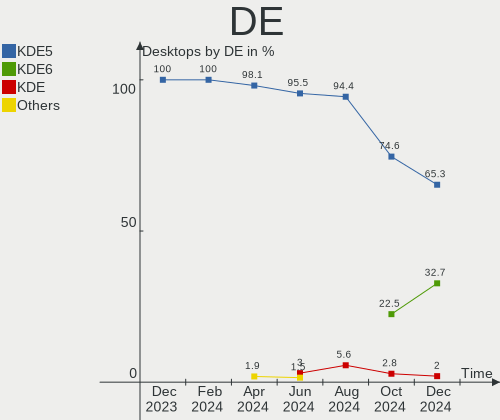
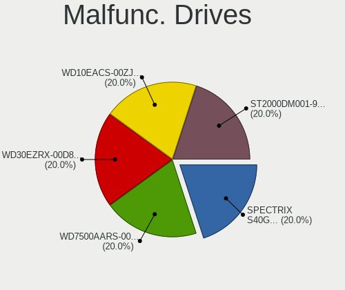
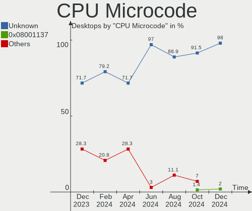
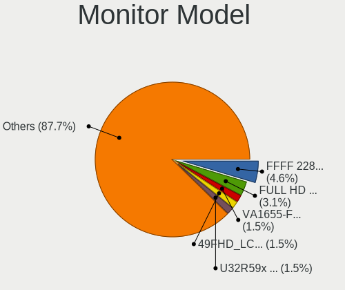
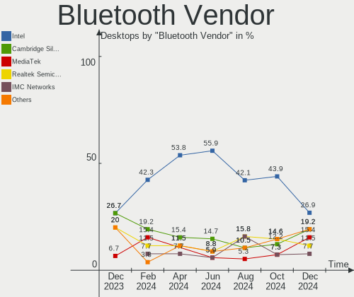
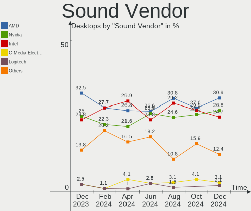

Kubuntu Hardware Trends (Desktops)
----------------------------------

A project to identify most popular hardware characteristics and track their change
over time based on data collected by Kubuntu users at https://Linux-Hardware.org.

Anyone can contribute to this report by the [hw-probe](https://github.com/linuxhw/hw-probe) tool:

    sudo -E hw-probe -all -upload

Full-feature report is available here: https://linux-hardware.org/?view=trends&formfactor=desktop

Period: Sep, 2021.

Contents
--------

* [ System ](#system)
  - [ OS                       ](#os)
  - [ OS Family                ](#os-family)
  - [ Kernel                   ](#kernel)
  - [ Kernel Family            ](#kernel-family)
  - [ Kernel Major Ver.        ](#kernel-major-ver)
  - [ Arch                     ](#arch)
  - [ DE                       ](#de)
  - [ Display Server           ](#display-server)
  - [ Display Manager          ](#display-manager)
  - [ OS Lang                  ](#os-lang)
  - [ Boot Mode                ](#boot-mode)
  - [ Filesystem               ](#filesystem)
  - [ Part. scheme             ](#part-scheme)
  - [ Dual Boot with Linux/BSD ](#dual-boot-with-linuxbsd)
  - [ Dual Boot (Win)          ](#dual-boot-win)

* [ Board ](#board)
  - [ Vendor                   ](#vendor)
  - [ Model                    ](#model)
  - [ Model Family             ](#model-family)
  - [ MFG Year                 ](#mfg-year)
  - [ Form Factor              ](#form-factor)
  - [ Secure Boot              ](#secure-boot)
  - [ Coreboot                 ](#coreboot)
  - [ RAM Size                 ](#ram-size)
  - [ RAM Used                 ](#ram-used)
  - [ Total Drives             ](#total-drives)
  - [ Has CD-ROM               ](#has-cd-rom)
  - [ Has Ethernet             ](#has-ethernet)
  - [ Has WiFi                 ](#has-wifi)
  - [ Has Bluetooth            ](#has-bluetooth)

* [ Location ](#location)
  - [ Country                  ](#country)
  - [ City                     ](#city)

* [ Drives ](#drives)
  - [ Drive Vendor             ](#drive-vendor)
  - [ Drive Model              ](#drive-model)
  - [ HDD Vendor               ](#hdd-vendor)
  - [ SSD Vendor               ](#ssd-vendor)
  - [ Drive Kind               ](#drive-kind)
  - [ Drive Connector          ](#drive-connector)
  - [ Drive Size               ](#drive-size)
  - [ Space Total              ](#space-total)
  - [ Space Used               ](#space-used)
  - [ Malfunc. Drives          ](#malfunc-drives)
  - [ Malfunc. Drive Vendor    ](#malfunc-drive-vendor)
  - [ Malfunc. HDD Vendor      ](#malfunc-hdd-vendor)
  - [ Malfunc. Drive Kind      ](#malfunc-drive-kind)
  - [ Failed Drives            ](#failed-drives)
  - [ Failed Drive Vendor      ](#failed-drive-vendor)
  - [ Drive Status             ](#drive-status)

* [ Storage controller ](#storage-controller)
  - [ Storage Vendor           ](#storage-vendor)
  - [ Storage Model            ](#storage-model)
  - [ Storage Kind             ](#storage-kind)

* [ Processor ](#processor)
  - [ CPU Vendor               ](#cpu-vendor)
  - [ CPU Model                ](#cpu-model)
  - [ CPU Model Family         ](#cpu-model-family)
  - [ CPU Cores                ](#cpu-cores)
  - [ CPU Sockets              ](#cpu-sockets)
  - [ CPU Threads              ](#cpu-threads)
  - [ CPU Op-Modes             ](#cpu-op-modes)
  - [ CPU Microcode            ](#cpu-microcode)
  - [ CPU Microarch            ](#cpu-microarch)

* [ Graphics ](#graphics)
  - [ GPU Vendor               ](#gpu-vendor)
  - [ GPU Model                ](#gpu-model)
  - [ GPU Combo                ](#gpu-combo)
  - [ GPU Driver               ](#gpu-driver)
  - [ GPU Memory               ](#gpu-memory)

* [ Monitor ](#monitor)
  - [ Monitor Vendor           ](#monitor-vendor)
  - [ Monitor Model            ](#monitor-model)
  - [ Monitor Resolution       ](#monitor-resolution)
  - [ Monitor Diagonal         ](#monitor-diagonal)
  - [ Monitor Width            ](#monitor-width)
  - [ Aspect Ratio             ](#aspect-ratio)
  - [ Monitor Area             ](#monitor-area)
  - [ Pixel Density            ](#pixel-density)
  - [ Multiple Monitors        ](#multiple-monitors)

* [ Network ](#network)
  - [ Net Controller Vendor    ](#net-controller-vendor)
  - [ Net Controller Model     ](#net-controller-model)
  - [ Wireless Vendor          ](#wireless-vendor)
  - [ Wireless Model           ](#wireless-model)
  - [ Ethernet Vendor          ](#ethernet-vendor)
  - [ Ethernet Model           ](#ethernet-model)
  - [ Net Controller Kind      ](#net-controller-kind)
  - [ Used Controller          ](#used-controller)
  - [ NICs                     ](#nics)
  - [ IPv6                     ](#ipv6)

* [ Bluetooth ](#bluetooth)
  - [ Bluetooth Vendor         ](#bluetooth-vendor)
  - [ Bluetooth Model          ](#bluetooth-model)

* [ Sound ](#sound)
  - [ Sound Vendor             ](#sound-vendor)
  - [ Sound Model              ](#sound-model)

* [ Memory ](#memory)
  - [ Memory Vendor            ](#memory-vendor)
  - [ Memory Model             ](#memory-model)
  - [ Memory Kind              ](#memory-kind)
  - [ Memory Form Factor       ](#memory-form-factor)
  - [ Memory Size              ](#memory-size)
  - [ Memory Speed             ](#memory-speed)

* [ Printers & scanners ](#printers--scanners)
  - [ Printer Vendor           ](#printer-vendor)
  - [ Printer Model            ](#printer-model)
  - [ Scanner Vendor           ](#scanner-vendor)
  - [ Scanner Model            ](#scanner-model)

* [ Camera ](#camera)
  - [ Camera Vendor            ](#camera-vendor)
  - [ Camera Model             ](#camera-model)

* [ Security ](#security)
  - [ Fingerprint Vendor       ](#fingerprint-vendor)
  - [ Fingerprint Model        ](#fingerprint-model)
  - [ Chipcard Vendor          ](#chipcard-vendor)
  - [ Chipcard Model           ](#chipcard-model)

* [ Unsupported ](#unsupported)
  - [ Unsupported Devices      ](#unsupported-devices)
  - [ Unsupported Device Types ](#unsupported-device-types)

System
------

OS
--

Installed operating systems

| Name          | Desktops | Percent |
|---------------|----------|---------|
| Kubuntu 20.04 | 15       | 50%     |
| Kubuntu 21.04 | 10       | 33.33%  |
| Kubuntu 21.10 | 3        | 10%     |
| Kubuntu 20.10 | 2        | 6.67%   |

OS Family
---------

OS without a version

| Name    | Desktops | Percent |
|---------|----------|---------|
| Kubuntu | 30       | 100%    |

Kernel
------

Version of the Linux kernel

| Version              | Desktops | Percent |
|----------------------|----------|---------|
| 5.11.0-34-generic    | 8        | 26.67%  |
| 5.11.0-27-generic    | 4        | 13.33%  |
| 5.8.0-63-generic     | 2        | 6.67%   |
| 5.4.0-84-generic     | 2        | 6.67%   |
| 5.13.0-16-generic    | 2        | 6.67%   |
| 5.11.0-37-generic    | 2        | 6.67%   |
| 5.11.0-36-generic    | 2        | 6.67%   |
| 5.11.0-34-lowlatency | 2        | 6.67%   |
| 5.11.0-31-generic    | 2        | 6.67%   |
| 5.8.0-55-generic     | 1        | 3.33%   |
| 5.4.0-81-generic     | 1        | 3.33%   |
| 5.13.0-14-generic    | 1        | 3.33%   |
| 5.11.0-16-generic    | 1        | 3.33%   |

Kernel Family
-------------

Linux kernel without a distro release

| Version | Desktops | Percent |
|---------|----------|---------|
| 5.11.0  | 21       | 70%     |
| 5.8.0   | 3        | 10%     |
| 5.4.0   | 3        | 10%     |
| 5.13.0  | 3        | 10%     |

Kernel Major Ver.
-----------------

Linux kernel major version

| Version | Desktops | Percent |
|---------|----------|---------|
| 5.11    | 21       | 70%     |
| 5.8     | 3        | 10%     |
| 5.4     | 3        | 10%     |
| 5.13    | 3        | 10%     |

Arch
----

OS architecture (x86_64, i586, etc.)

| Name   | Desktops | Percent |
|--------|----------|---------|
| x86_64 | 30       | 100%    |

DE
--

Desktop Environment

| Name   | Desktops | Percent |
|--------|----------|---------|
| KDE5   | 20       | 66.67%  |
| KDE    | 9        | 30%     |
| Budgie | 1        | 3.33%   |

Display Server
--------------

X11 or Wayland

| Name    | Desktops | Percent |
|---------|----------|---------|
| X11     | 29       | 96.67%  |
| Wayland | 1        | 3.33%   |

Display Manager
---------------

SDDM, LightDM, etc.

| Name    | Desktops | Percent |
|---------|----------|---------|
| SDDM    | 18       | 60%     |
| Unknown | 9        | 30%     |
| GDM     | 3        | 10%     |

OS Lang
-------

Language

| Lang  | Desktops | Percent |
|-------|----------|---------|
| en_US | 11       | 36.67%  |
| en_GB | 3        | 10%     |
| pt_BR | 2        | 6.67%   |
| fr_FR | 2        | 6.67%   |
| C     | 2        | 6.67%   |
| ru_RU | 1        | 3.33%   |
| it_IT | 1        | 3.33%   |
| es_ES | 1        | 3.33%   |
| es_CL | 1        | 3.33%   |
| es_AR | 1        | 3.33%   |
| en_IN | 1        | 3.33%   |
| en_CA | 1        | 3.33%   |
| en_AU | 1        | 3.33%   |
| cs_CZ | 1        | 3.33%   |
| be_BY | 1        | 3.33%   |

Boot Mode
---------

EFI or BIOS

| Mode | Desktops | Percent |
|------|----------|---------|
| BIOS | 17       | 56.67%  |
| EFI  | 13       | 43.33%  |

Filesystem
----------

Type of filesystem

| Type | Desktops | Percent |
|------|----------|---------|
| Ext4 | 29       | 96.67%  |
| Xfs  | 1        | 3.33%   |

Part. scheme
------------

Scheme of partitioning

| Type    | Desktops | Percent |
|---------|----------|---------|
| GPT     | 13       | 43.33%  |
| Unknown | 12       | 40%     |
| MBR     | 5        | 16.67%  |

Dual Boot with Linux/BSD
------------------------

Hosting more than one Linux/BSD

| Dual boot | Desktops | Percent |
|-----------|----------|---------|
| No        | 22       | 73.33%  |
| Yes       | 8        | 26.67%  |

Dual Boot (Win)
---------------

Hosting Linux and Windows

| Dual boot | Desktops | Percent |
|-----------|----------|---------|
| No        | 18       | 60%     |
| Yes       | 12       | 40%     |

Board
-----

Vendor
------

Motherboard manufacturer

| Name                | Desktops | Percent |
|---------------------|----------|---------|
| Gigabyte Technology | 8        | 26.67%  |
| ASUSTek Computer    | 6        | 20%     |
| Dell                | 4        | 13.33%  |
| ASRock              | 3        | 10%     |
| Pegatron            | 2        | 6.67%   |
| Hewlett-Packard     | 2        | 6.67%   |
| MSI                 | 1        | 3.33%   |
| Lenovo              | 1        | 3.33%   |
| Intel               | 1        | 3.33%   |
| Google              | 1        | 3.33%   |
| Acer                | 1        | 3.33%   |

Model
-----

Motherboard model

| Name                              | Desktops | Percent |
|-----------------------------------|----------|---------|
| Pegatron AY691AA-ABA p6367c       | 1        | 3.33%   |
| Pegatron AY030AA-ABA CQ5320F      | 1        | 3.33%   |
| MSI MS-7C91                       | 1        | 3.33%   |
| Lenovo ThinkCentre E73 10DU0015UK | 1        | 3.33%   |
| Intel Eaglelake Fab D             | 1        | 3.33%   |
| HP Z800 Workstation               | 1        | 3.33%   |
| HP Compaq 8100 Elite SFF PC       | 1        | 3.33%   |
| Google Panther                    | 1        | 3.33%   |
| Gigabyte Z170M-D3H DDR3-CF        | 1        | 3.33%   |
| Gigabyte X99-UD3-CF               | 1        | 3.33%   |
| Gigabyte H410M S2H V2             | 1        | 3.33%   |
| Gigabyte H310M S2H 2.0            | 1        | 3.33%   |
| Gigabyte H110M-S2PV               | 1        | 3.33%   |
| Gigabyte B250M-DS3H               | 1        | 3.33%   |
| Gigabyte A520M S2H                | 1        | 3.33%   |
| Gigabyte A320M-S2H V2             | 1        | 3.33%   |
| Dell Vostro 3268                  | 1        | 3.33%   |
| Dell Precision WorkStation T7400  | 1        | 3.33%   |
| Dell OptiPlex 7040                | 1        | 3.33%   |
| Dell ASM100                       | 1        | 3.33%   |
| ASUS STRIX Z270E GAMING           | 1        | 3.33%   |
| ASUS SABERTOOTH P67               | 1        | 3.33%   |
| ASUS SABERTOOTH 990FX             | 1        | 3.33%   |
| ASUS ROG STRIX X570-E GAMING      | 1        | 3.33%   |
| ASUS P8P67                        | 1        | 3.33%   |
| ASUS F1A55-M LX R2.0              | 1        | 3.33%   |
| ASRock Z97 Pro4                   | 1        | 3.33%   |
| ASRock H81M-HG4 R4.0              | 1        | 3.33%   |
| ASRock B550 Phantom Gaming 4/ac   | 1        | 3.33%   |
| Acer Aspire XC-830                | 1        | 3.33%   |

Model Family
------------

Motherboard model prefix

| Name                 | Desktops | Percent |
|----------------------|----------|---------|
| ASUS SABERTOOTH      | 2        | 6.67%   |
| Pegatron AY691AA-ABA | 1        | 3.33%   |
| Pegatron AY030AA-ABA | 1        | 3.33%   |
| MSI MS-7C91          | 1        | 3.33%   |
| Lenovo ThinkCentre   | 1        | 3.33%   |
| Intel Eaglelake      | 1        | 3.33%   |
| HP Z800              | 1        | 3.33%   |
| HP Compaq            | 1        | 3.33%   |
| Google Panther       | 1        | 3.33%   |
| Gigabyte Z170M-D3H   | 1        | 3.33%   |
| Gigabyte X99-UD3-CF  | 1        | 3.33%   |
| Gigabyte H410M       | 1        | 3.33%   |
| Gigabyte H310M       | 1        | 3.33%   |
| Gigabyte H110M-S2PV  | 1        | 3.33%   |
| Gigabyte B250M-DS3H  | 1        | 3.33%   |
| Gigabyte A520M       | 1        | 3.33%   |
| Gigabyte A320M-S2H   | 1        | 3.33%   |
| Dell Vostro          | 1        | 3.33%   |
| Dell Precision       | 1        | 3.33%   |
| Dell OptiPlex        | 1        | 3.33%   |
| Dell ASM100          | 1        | 3.33%   |
| ASUS STRIX           | 1        | 3.33%   |
| ASUS ROG             | 1        | 3.33%   |
| ASUS P8P67           | 1        | 3.33%   |
| ASUS F1A55-M         | 1        | 3.33%   |
| ASRock Z97           | 1        | 3.33%   |
| ASRock H81M-HG4      | 1        | 3.33%   |
| ASRock B550          | 1        | 3.33%   |
| Acer Aspire          | 1        | 3.33%   |

MFG Year
--------

Motherboard manufacture year

| Year | Desktops | Percent |
|------|----------|---------|
| 2021 | 6        | 20%     |
| 2019 | 4        | 13.33%  |
| 2018 | 3        | 10%     |
| 2016 | 3        | 10%     |
| 2015 | 3        | 10%     |
| 2012 | 3        | 10%     |
| 2014 | 2        | 6.67%   |
| 2010 | 2        | 6.67%   |
| 2009 | 2        | 6.67%   |
| 2017 | 1        | 3.33%   |
| 2011 | 1        | 3.33%   |

Form Factor
-----------

Physical design of the computer

| Name    | Desktops | Percent |
|---------|----------|---------|
| Desktop | 30       | 100%    |

Secure Boot
-----------

Enabled or disabled

| State    | Desktops | Percent |
|----------|----------|---------|
| Disabled | 30       | 100%    |

Coreboot
--------

Have coreboot on board

| Used | Desktops | Percent |
|------|----------|---------|
| No   | 29       | 96.67%  |
| Yes  | 1        | 3.33%   |

RAM Size
--------

Total RAM memory

| Size in GB  | Desktops | Percent |
|-------------|----------|---------|
| 32.01-64.0  | 8        | 26.67%  |
| 4.01-8.0    | 5        | 16.67%  |
| 16.01-24.0  | 5        | 16.67%  |
| 8.01-16.0   | 5        | 16.67%  |
| 24.01-32.0  | 3        | 10%     |
| 3.01-4.0    | 2        | 6.67%   |
| 64.01-256.0 | 2        | 6.67%   |

RAM Used
--------

Used RAM memory

| Used GB   | Desktops | Percent |
|-----------|----------|---------|
| 4.01-8.0  | 8        | 26.67%  |
| 1.01-2.0  | 8        | 26.67%  |
| 2.01-3.0  | 7        | 23.33%  |
| 3.01-4.0  | 4        | 13.33%  |
| 8.01-16.0 | 2        | 6.67%   |
| 0.51-1.0  | 1        | 3.33%   |

Total Drives
------------

Number of drives on board

| Drives | Desktops | Percent |
|--------|----------|---------|
| 1      | 12       | 40%     |
| 3      | 8        | 26.67%  |
| 4      | 4        | 13.33%  |
| 2      | 4        | 13.33%  |
| 7      | 1        | 3.33%   |
| 5      | 1        | 3.33%   |

Has CD-ROM
----------

Has CD-ROM on board

| Presented | Desktops | Percent |
|-----------|----------|---------|
| No        | 16       | 53.33%  |
| Yes       | 14       | 46.67%  |

Has Ethernet
------------

Has Ethernet on board

| Presented | Desktops | Percent |
|-----------|----------|---------|
| Yes       | 30       | 100%    |

Has WiFi
--------

Has WiFi module

| Presented | Desktops | Percent |
|-----------|----------|---------|
| Yes       | 15       | 50%     |
| No        | 15       | 50%     |

Has Bluetooth
-------------

Has Bluetooth module

| Presented | Desktops | Percent |
|-----------|----------|---------|
| No        | 18       | 60%     |
| Yes       | 12       | 40%     |

Location
--------

Country
-------

Geographic location (country)

| Country   | Desktops | Percent |
|-----------|----------|---------|
| USA       | 9        | 30%     |
| Spain     | 3        | 10%     |
| France    | 2        | 6.67%   |
| Canada    | 2        | 6.67%   |
| Brazil    | 2        | 6.67%   |
| UK        | 1        | 3.33%   |
| Turkey    | 1        | 3.33%   |
| Russia    | 1        | 3.33%   |
| Poland    | 1        | 3.33%   |
| Nigeria   | 1        | 3.33%   |
| Italy     | 1        | 3.33%   |
| India     | 1        | 3.33%   |
| Germany   | 1        | 3.33%   |
| Czechia   | 1        | 3.33%   |
| Belarus   | 1        | 3.33%   |
| Australia | 1        | 3.33%   |
| Argentina | 1        | 3.33%   |

City
----

Geographic location (city)

| City               | Desktops | Percent |
|--------------------|----------|---------|
| Vijayawada         | 1        | 3.33%   |
| Viedma             | 1        | 3.33%   |
| Toronto            | 1        | 3.33%   |
| Seattle            | 1        | 3.33%   |
| San Carlos         | 1        | 3.33%   |
| Salvador           | 1        | 3.33%   |
| Rzesz??w           | 1        | 3.33%   |
| Rome               | 1        | 3.33%   |
| Rio de Janeiro     | 1        | 3.33%   |
| Redmond            | 1        | 3.33%   |
| Puerto Serrano     | 1        | 3.33%   |
| Prague             | 1        | 3.33%   |
| Paris              | 1        | 3.33%   |
| Olympia            | 1        | 3.33%   |
| Maumelle           | 1        | 3.33%   |
| London             | 1        | 3.33%   |
| Lagos              | 1        | 3.33%   |
| Gomel              | 1        | 3.33%   |
| Gatineau           | 1        | 3.33%   |
| Egelsbach          | 1        | 3.33%   |
| Delmar             | 1        | 3.33%   |
| Dallas             | 1        | 3.33%   |
| Chicago            | 1        | 3.33%   |
| Cartagena          | 1        | 3.33%   |
| Canberra           | 1        | 3.33%   |
| Bristow            | 1        | 3.33%   |
| Barcelona          | 1        | 3.33%   |
| Bal?±kesir         | 1        | 3.33%   |
| Asnieres-sur-Seine | 1        | 3.33%   |
| Al'met'yevsk       | 1        | 3.33%   |

Drives
------

Drive Vendor
------------

Hard drive vendors

| Vendor              | Desktops | Drives | Percent |
|---------------------|----------|--------|---------|
| WDC                 | 14       | 21     | 26.92%  |
| Seagate             | 8        | 9      | 15.38%  |
| Samsung Electronics | 6        | 14     | 11.54%  |
| Unknown             | 2        | 2      | 3.85%   |
| Toshiba             | 2        | 2      | 3.85%   |
| Micron Technology   | 2        | 2      | 3.85%   |
| Intel               | 2        | 2      | 3.85%   |
| Crucial             | 2        | 2      | 3.85%   |
| XPG                 | 1        | 1      | 1.92%   |
| Transcend           | 1        | 1      | 1.92%   |
| Team                | 1        | 1      | 1.92%   |
| SK Hynix            | 1        | 1      | 1.92%   |
| PNY                 | 1        | 2      | 1.92%   |
| Phison              | 1        | 2      | 1.92%   |
| Patriot             | 1        | 1      | 1.92%   |
| MAXTOR              | 1        | 1      | 1.92%   |
| Hitachi             | 1        | 1      | 1.92%   |
| HGST                | 1        | 1      | 1.92%   |
| Gigabyte Technology | 1        | 1      | 1.92%   |
| Corsair             | 1        | 1      | 1.92%   |
| Colorful            | 1        | 1      | 1.92%   |
| China               | 1        | 1      | 1.92%   |

Drive Model
-----------

Hard drive models

| Model                             | Desktops | Percent |
|-----------------------------------|----------|---------|
| Samsung SSD 850 EVO 500GB         | 3        | 4.84%   |
| WDC WD1002FAEX-00Z3A0 1TB         | 2        | 3.23%   |
| Toshiba DT01ACA100 1TB            | 2        | 3.23%   |
| XPG GAMMIX S70 1TB                | 1        | 1.61%   |
| WDC WDS500G2B0A-00SM50 500GB SSD  | 1        | 1.61%   |
| WDC WDS250G2B0C 250GB             | 1        | 1.61%   |
| WDC WDS120G1G0B-00RC30 120GB SSD  | 1        | 1.61%   |
| WDC WDS100T2G0A-00JH30 1TB SSD    | 1        | 1.61%   |
| WDC WD5000AAKX-60U6AA0 500GB      | 1        | 1.61%   |
| WDC WD5000AAKS-00A7B0 500GB       | 1        | 1.61%   |
| WDC WD5000AADS-00S9B0 500GB       | 1        | 1.61%   |
| WDC WD2500LPLX-75ZNTT0 250GB      | 1        | 1.61%   |
| WDC WD20EARX-00PASB0 2TB          | 1        | 1.61%   |
| WDC WD10SPZX-00Z10T0 1TB          | 1        | 1.61%   |
| WDC WD10EZEX-75WN4A0 1TB          | 1        | 1.61%   |
| WDC WD10EZEX-60WN4A0 1TB          | 1        | 1.61%   |
| WDC WD10EZEX-00BN5A0 1TB          | 1        | 1.61%   |
| WDC WD10EACS-00D6B1 1TB           | 1        | 1.61%   |
| WDC WD1002FAEX-00Y9A0 1TB         | 1        | 1.61%   |
| Unknown SDEZS25-240G-Z01 240GB    | 1        | 1.61%   |
| Unknown SD/MMC/MS PRO 128GB       | 1        | 1.61%   |
| Transcend TS64GMTS400S 64GB SSD   | 1        | 1.61%   |
| Team T253X2001T 1024GB SSD        | 1        | 1.61%   |
| SK Hynix SC300 M.2 2280 256GB SSD | 1        | 1.61%   |
| Seagate ST3500413AS 500GB         | 1        | 1.61%   |
| Seagate ST3250410AS 250GB         | 1        | 1.61%   |
| Seagate ST3250312CS 250GB         | 1        | 1.61%   |
| Seagate ST3160815AS 160GB         | 1        | 1.61%   |
| Seagate ST31000528AS 1TB          | 1        | 1.61%   |
| Seagate ST2000DM006-2DM164 2TB    | 1        | 1.61%   |
| Seagate ST1000DM010-2EP102 1TB    | 1        | 1.61%   |
| Seagate ST1000DM003-1SB10C 1TB    | 1        | 1.61%   |
| Samsung SSD 970 EVO 250GB         | 1        | 1.61%   |
| Samsung SSD 870 EVO 2TB           | 1        | 1.61%   |
| Samsung SSD 860 EVO 250GB         | 1        | 1.61%   |
| Samsung SSD 850 EVO 250GB         | 1        | 1.61%   |
| Samsung NVMe SSD Drive 512GB      | 1        | 1.61%   |
| Samsung NVMe SSD Drive 500GB      | 1        | 1.61%   |
| Samsung HD322GJ 320GB             | 1        | 1.61%   |
| Samsung HD321KJ 320GB             | 1        | 1.61%   |
| Samsung HD103SJ 1TB               | 1        | 1.61%   |
| Samsung HD103SI 1TB               | 1        | 1.61%   |
| PNY CS900 120GB SSD               | 1        | 1.61%   |
| Phison Sabrent Rocket 4.0 2TB     | 1        | 1.61%   |
| Patriot Flare 64GB SSD            | 1        | 1.61%   |
| Micron NVMe SSD Drive 250GB       | 1        | 1.61%   |
| Micron 1100 SATA 256GB SSD        | 1        | 1.61%   |
| MAXTOR STM3250820AS 250GB         | 1        | 1.61%   |
| Intel SSDSCKKF256H6 SATA 256GB    | 1        | 1.61%   |
| Intel SSDSC2BF180A4H 180GB        | 1        | 1.61%   |
| Hitachi HTS541010A9E680 1TB       | 1        | 1.61%   |
| HGST HTS721010A9E630 1TB          | 1        | 1.61%   |
| Gigabyte GP-GSTFS31240GNTD 240GB  | 1        | 1.61%   |
| Crucial CT480BX500SSD1 480GB      | 1        | 1.61%   |
| Crucial CT1000BX500SSD1 1TB       | 1        | 1.61%   |
| Corsair CSSD-F60GB2 64GB          | 1        | 1.61%   |
| Colorful SL500 240GB              | 1        | 1.61%   |
| China SATA3 256GB SSD             | 1        | 1.61%   |

HDD Vendor
----------

Hard disk drive vendors

| Vendor              | Desktops | Drives | Percent |
|---------------------|----------|--------|---------|
| WDC                 | 12       | 16     | 42.86%  |
| Seagate             | 8        | 9      | 28.57%  |
| Toshiba             | 2        | 2      | 7.14%   |
| Samsung Electronics | 2        | 4      | 7.14%   |
| Unknown             | 1        | 1      | 3.57%   |
| MAXTOR              | 1        | 1      | 3.57%   |
| Hitachi             | 1        | 1      | 3.57%   |
| HGST                | 1        | 1      | 3.57%   |

SSD Vendor
----------

Solid state drive vendors

| Vendor              | Desktops | Drives | Percent |
|---------------------|----------|--------|---------|
| Samsung Electronics | 5        | 7      | 22.73%  |
| WDC                 | 3        | 4      | 13.64%  |
| Intel               | 2        | 2      | 9.09%   |
| Crucial             | 2        | 2      | 9.09%   |
| Transcend           | 1        | 1      | 4.55%   |
| Team                | 1        | 1      | 4.55%   |
| SK Hynix            | 1        | 1      | 4.55%   |
| PNY                 | 1        | 2      | 4.55%   |
| Patriot             | 1        | 1      | 4.55%   |
| Micron Technology   | 1        | 1      | 4.55%   |
| Gigabyte Technology | 1        | 1      | 4.55%   |
| Corsair             | 1        | 1      | 4.55%   |
| Colorful            | 1        | 1      | 4.55%   |
| China               | 1        | 1      | 4.55%   |

Drive Kind
----------

HDD or SSD

| Kind    | Desktops | Drives | Percent |
|---------|----------|--------|---------|
| HDD     | 23       | 35     | 47.92%  |
| SSD     | 17       | 26     | 35.42%  |
| NVMe    | 7        | 8      | 14.58%  |
| Unknown | 1        | 1      | 2.08%   |

Drive Connector
---------------

SATA, SAS, NVMe, etc.

| Type | Desktops | Drives | Percent |
|------|----------|--------|---------|
| SATA | 30       | 61     | 78.95%  |
| NVMe | 7        | 8      | 18.42%  |
| SAS  | 1        | 1      | 2.63%   |

Drive Size
----------

Size of hard drive

| Size in TB | Desktops | Drives | Percent |
|------------|----------|--------|---------|
| 0.01-0.5   | 21       | 35     | 51.22%  |
| 0.51-1.0   | 17       | 21     | 41.46%  |
| 1.01-2.0   | 3        | 5      | 7.32%   |

Space Total
-----------

Amount of disk space available on the file system

| Size in GB     | Desktops | Percent |
|----------------|----------|---------|
| 501-1000       | 9        | 30%     |
| 101-250        | 6        | 20%     |
| 251-500        | 5        | 16.67%  |
| 2001-3000      | 3        | 10%     |
| 1001-2000      | 3        | 10%     |
| 51-100         | 3        | 10%     |
| More than 3000 | 1        | 3.33%   |

Space Used
----------

Amount of used disk space

| Used GB   | Desktops | Percent |
|-----------|----------|---------|
| 21-50     | 8        | 26.67%  |
| 101-250   | 6        | 20%     |
| 501-1000  | 6        | 20%     |
| 251-500   | 4        | 13.33%  |
| 51-100    | 3        | 10%     |
| 1-20      | 2        | 6.67%   |
| 1001-2000 | 1        | 3.33%   |

Malfunc. Drives
---------------

Drive models with a malfunction

| Model                             | Desktops | Drives | Percent |
|-----------------------------------|----------|--------|---------|
| WDC WD5000AAKS-00A7B0 500GB       | 1        | 1      | 33.33%  |
| Seagate ST3160815AS 160GB         | 1        | 1      | 33.33%  |
| Samsung Electronics HD321KJ 320GB | 1        | 1      | 33.33%  |

Malfunc. Drive Vendor
---------------------

Vendors of faulty drives

| Vendor              | Desktops | Drives | Percent |
|---------------------|----------|--------|---------|
| WDC                 | 1        | 1      | 33.33%  |
| Seagate             | 1        | 1      | 33.33%  |
| Samsung Electronics | 1        | 1      | 33.33%  |

Malfunc. HDD Vendor
-------------------

Vendors of faulty HDD drives

| Vendor              | Desktops | Drives | Percent |
|---------------------|----------|--------|---------|
| WDC                 | 1        | 1      | 33.33%  |
| Seagate             | 1        | 1      | 33.33%  |
| Samsung Electronics | 1        | 1      | 33.33%  |

Malfunc. Drive Kind
-------------------

Kinds of faulty drives

| Kind | Desktops | Drives | Percent |
|------|----------|--------|---------|
| HDD  | 3        | 3      | 100%    |

Failed Drives
-------------

Failed drive models

Zero info for selected period =(

Failed Drive Vendor
-------------------

Failed drive vendors

Zero info for selected period =(

Drive Status
------------

Number of failed and malfunc. drives

| Status   | Desktops | Drives | Percent |
|----------|----------|--------|---------|
| Works    | 17       | 33     | 51.52%  |
| Detected | 13       | 34     | 39.39%  |
| Malfunc  | 3        | 3      | 9.09%   |

Storage controller
------------------

Storage Vendor
--------------

Storage controller vendors

| Vendor                    | Desktops | Percent |
|---------------------------|----------|---------|
| Intel                     | 22       | 48.89%  |
| AMD                       | 7        | 15.56%  |
| Samsung Electronics       | 3        | 6.67%   |
| Silicon Image             | 2        | 4.44%   |
| Marvell Technology Group  | 2        | 4.44%   |
| LSI Logic / Symbios Logic | 2        | 4.44%   |
| JMicron Technology        | 2        | 4.44%   |
| Unknown                   | 1        | 2.22%   |
| Sandisk                   | 1        | 2.22%   |
| Phison Electronics        | 1        | 2.22%   |
| Nvidia                    | 1        | 2.22%   |
| Micron Technology         | 1        | 2.22%   |

Storage Model
-------------

Storage controller models

| Model                                                                          | Desktops | Percent |
|--------------------------------------------------------------------------------|----------|---------|
| Samsung NVMe SSD Controller SM981/PM981/PM983                                  | 3        | 6.25%   |
| Intel SATA Controller [RAID mode]                                              | 3        | 6.25%   |
| Intel Q170/Q150/B150/H170/H110/Z170/CM236 Chipset SATA Controller [AHCI Mode]  | 3        | 6.25%   |
| Intel 8 Series/C220 Series Chipset Family 6-port SATA Controller 1 [AHCI mode] | 3        | 6.25%   |
| Intel 200 Series PCH SATA controller [AHCI mode]                               | 3        | 6.25%   |
| AMD Starship/Matisse Chipset SATA Controller [AHCI mode]                       | 3        | 6.25%   |
| AMD FCH SATA Controller [AHCI mode]                                            | 3        | 6.25%   |
| Marvell Group 88SE9172 SATA 6Gb/s Controller                                   | 2        | 4.17%   |
| LSI Logic / Symbios Logic SAS1068E PCI-Express Fusion-MPT SAS                  | 2        | 4.17%   |
| JMicron JMB362 SATA Controller                                                 | 2        | 4.17%   |
| Intel 6 Series/C200 Series Chipset Family 6 port Desktop SATA AHCI Controller  | 2        | 4.17%   |
| Unknown Non-Volatile memory controller                                         | 1        | 2.08%   |
| Silicon Image SiI 3124 PCI-X Serial ATA Controller                             | 1        | 2.08%   |
| Silicon Image SiI 3114 [SATALink/SATARaid] Serial ATA Controller               | 1        | 2.08%   |
| Sandisk WD Blue SN550 NVMe SSD                                                 | 1        | 2.08%   |
| Phison E16 PCIe4 NVMe Controller                                               | 1        | 2.08%   |
| Nvidia MCP61 SATA Controller                                                   | 1        | 2.08%   |
| Micron Non-Volatile memory controller                                          | 1        | 2.08%   |
| Intel Comet Lake SATA AHCI Controller                                          | 1        | 2.08%   |
| Intel Celeron/Pentium Silver Processor SATA Controller                         | 1        | 2.08%   |
| Intel C610/X99 series chipset 6-Port SATA Controller [AHCI mode]               | 1        | 2.08%   |
| Intel 9 Series Chipset Family SATA Controller [IDE Mode]                       | 1        | 2.08%   |
| Intel 82801JI (ICH10 Family) SATA AHCI Controller                              | 1        | 2.08%   |
| Intel 82801JI (ICH10 Family) 4 port SATA IDE Controller #1                     | 1        | 2.08%   |
| Intel 8 Series SATA Controller 1 [AHCI mode]                                   | 1        | 2.08%   |
| Intel 631xESB/632xESB SATA AHCI Controller                                     | 1        | 2.08%   |
| Intel 631xESB/632xESB IDE Controller                                           | 1        | 2.08%   |
| AMD SB7x0/SB8x0/SB9x0 SATA Controller [IDE mode]                               | 1        | 2.08%   |
| AMD SB7x0/SB8x0/SB9x0 IDE Controller                                           | 1        | 2.08%   |
| AMD 300 Series Chipset SATA Controller                                         | 1        | 2.08%   |

Storage Kind
------------

Kind of storage controller (IDE, SATA, NVMe, SAS, ...)

| Kind | Desktops | Percent |
|------|----------|---------|
| SATA | 24       | 57.14%  |
| NVMe | 7        | 16.67%  |
| IDE  | 5        | 11.9%   |
| RAID | 4        | 9.52%   |
| SCSI | 2        | 4.76%   |

Processor
---------

CPU Vendor
----------

Processor vendors

| Vendor | Desktops | Percent |
|--------|----------|---------|
| Intel  | 22       | 73.33%  |
| AMD    | 8        | 26.67%  |

CPU Model
---------

Processor models

| Model                                    | Desktops | Percent |
|------------------------------------------|----------|---------|
| Intel Xeon CPU X5570 @ 2.93GHz           | 1        | 3.33%   |
| Intel Xeon CPU X5492 @ 3.40GHz           | 1        | 3.33%   |
| Intel Pentium Silver J5005 CPU @ 1.50GHz | 1        | 3.33%   |
| Intel Pentium CPU G4600 @ 3.60GHz        | 1        | 3.33%   |
| Intel Pentium CPU G4560 @ 3.50GHz        | 1        | 3.33%   |
| Intel Core i7-7700 CPU @ 3.60GHz         | 1        | 3.33%   |
| Intel Core i7-6700K CPU @ 4.00GHz        | 1        | 3.33%   |
| Intel Core i7-5820K CPU @ 3.30GHz        | 1        | 3.33%   |
| Intel Core i7-4785T CPU @ 2.20GHz        | 1        | 3.33%   |
| Intel Core i7-4770 CPU @ 3.40GHz         | 1        | 3.33%   |
| Intel Core i7-2600 CPU @ 3.40GHz         | 1        | 3.33%   |
| Intel Core i5-9400 CPU @ 2.90GHz         | 1        | 3.33%   |
| Intel Core i5-7600K CPU @ 3.80GHz        | 1        | 3.33%   |
| Intel Core i5-6500 CPU @ 3.20GHz         | 1        | 3.33%   |
| Intel Core i5-4460 CPU @ 3.20GHz         | 1        | 3.33%   |
| Intel Core i5-2400 CPU @ 3.10GHz         | 1        | 3.33%   |
| Intel Core i5 CPU 650 @ 3.20GHz          | 1        | 3.33%   |
| Intel Core i3-4170 CPU @ 3.70GHz         | 1        | 3.33%   |
| Intel Core 2 Quad CPU Q8400 @ 2.66GHz    | 1        | 3.33%   |
| Intel Core 2 Quad CPU Q8300 @ 2.50GHz    | 1        | 3.33%   |
| Intel Celeron G5925 CPU @ 3.60GHz        | 1        | 3.33%   |
| Intel Celeron 2955U @ 1.40GHz            | 1        | 3.33%   |
| AMD Ryzen 9 5950X 16-Core Processor      | 1        | 3.33%   |
| AMD Ryzen 5 5600X 6-Core Processor       | 1        | 3.33%   |
| AMD Ryzen 5 5600G with Radeon Graphics   | 1        | 3.33%   |
| AMD Ryzen 5 3600 6-Core Processor        | 1        | 3.33%   |
| AMD Ryzen 5 2600 Six-Core Processor      | 1        | 3.33%   |
| AMD FX-8350 Eight-Core Processor         | 1        | 3.33%   |
| AMD Athlon II X2 240 Processor           | 1        | 3.33%   |
| AMD A4-3400 APU with Radeon HD Graphics  | 1        | 3.33%   |

CPU Model Family
----------------

Processor model prefix

| Model                | Desktops | Percent |
|----------------------|----------|---------|
| Intel Core i7        | 6        | 20%     |
| Intel Core i5        | 6        | 20%     |
| AMD Ryzen 5          | 4        | 13.33%  |
| Intel Xeon           | 2        | 6.67%   |
| Intel Pentium        | 2        | 6.67%   |
| Intel Core 2 Quad    | 2        | 6.67%   |
| Intel Celeron        | 2        | 6.67%   |
| Intel Pentium Silver | 1        | 3.33%   |
| Intel Core i3        | 1        | 3.33%   |
| AMD Ryzen 9          | 1        | 3.33%   |
| AMD FX               | 1        | 3.33%   |
| AMD Athlon II X2     | 1        | 3.33%   |
| AMD A4               | 1        | 3.33%   |

CPU Cores
---------

Number of processor cores

| Number | Desktops | Percent |
|--------|----------|---------|
| 4      | 12       | 40%     |
| 2      | 9        | 30%     |
| 6      | 6        | 20%     |
| 8      | 2        | 6.67%   |
| 16     | 1        | 3.33%   |

CPU Sockets
-----------

Number of sockets

| Number | Desktops | Percent |
|--------|----------|---------|
| 1      | 28       | 93.33%  |
| 2      | 2        | 6.67%   |

CPU Threads
-----------

Threads per core (Hyper-Threading)

| Number | Desktops | Percent |
|--------|----------|---------|
| 2      | 17       | 56.67%  |
| 1      | 13       | 43.33%  |

CPU Op-Modes
------------

CPU Operation Modes (32-bit, 64-bit)

| Op mode        | Desktops | Percent |
|----------------|----------|---------|
| 32-bit, 64-bit | 30       | 100%    |

CPU Microcode
-------------

Microcode number

| Number     | Desktops | Percent |
|------------|----------|---------|
| Unknown    | 11       | 36.67%  |
| 0x906e9    | 3        | 10%     |
| 0x1067a    | 3        | 10%     |
| 0x306c3    | 2        | 6.67%   |
| 0x206a7    | 2        | 6.67%   |
| 0xa0653    | 1        | 3.33%   |
| 0x906ed    | 1        | 3.33%   |
| 0x706a1    | 1        | 3.33%   |
| 0x506e3    | 1        | 3.33%   |
| 0x40651    | 1        | 3.33%   |
| 0x106a5    | 1        | 3.33%   |
| 0x0a50000c | 1        | 3.33%   |
| 0x0a201016 | 1        | 3.33%   |
| 0x0800820d | 1        | 3.33%   |

CPU Microarch
-------------

Microarchitecture

| Name          | Desktops | Percent |
|---------------|----------|---------|
| Haswell       | 6        | 20%     |
| KabyLake      | 5        | 16.67%  |
| Zen 3         | 3        | 10%     |
| Penryn        | 3        | 10%     |
| Skylake       | 2        | 6.67%   |
| SandyBridge   | 2        | 6.67%   |
| Zen+          | 1        | 3.33%   |
| Zen 2         | 1        | 3.33%   |
| Westmere      | 1        | 3.33%   |
| Piledriver    | 1        | 3.33%   |
| Nehalem       | 1        | 3.33%   |
| K10 Llano     | 1        | 3.33%   |
| K10           | 1        | 3.33%   |
| Goldmont plus | 1        | 3.33%   |
| CometLake     | 1        | 3.33%   |

Graphics
--------

GPU Vendor
----------

Vendors of graphics cards

| Vendor | Desktops | Percent |
|--------|----------|---------|
| Nvidia | 18       | 58.06%  |
| Intel  | 11       | 35.48%  |
| AMD    | 2        | 6.45%   |

GPU Model
---------

Graphics card models

| Model                                                                       | Desktops | Percent |
|-----------------------------------------------------------------------------|----------|---------|
| Nvidia GT218 [GeForce 210]                                                  | 2        | 6.25%   |
| Nvidia GP108 [GeForce GT 1030]                                              | 2        | 6.25%   |
| Nvidia GM206 [GeForce GTX 960]                                              | 2        | 6.25%   |
| Nvidia GM204 [GeForce GTX 970]                                              | 2        | 6.25%   |
| Intel 4 Series Chipset Integrated Graphics Controller                       | 2        | 6.25%   |
| Nvidia TU116 [GeForce GTX 1660 Ti]                                          | 1        | 3.13%   |
| Nvidia GP107 [GeForce GTX 1050 Ti]                                          | 1        | 3.13%   |
| Nvidia GM206 [GeForce GTX 950]                                              | 1        | 3.13%   |
| Nvidia GM107M [GeForce GTX 860M]                                            | 1        | 3.13%   |
| Nvidia GK107 [NVS 510]                                                      | 1        | 3.13%   |
| Nvidia GF110 [GeForce GTX 570]                                              | 1        | 3.13%   |
| Nvidia GF108 [GeForce GT 630]                                               | 1        | 3.13%   |
| Nvidia GF100GL [Quadro 4000]                                                | 1        | 3.13%   |
| Nvidia GA102 [GeForce RTX 3090]                                             | 1        | 3.13%   |
| Nvidia GA102 [GeForce RTX 3080 Lite Hash Rate]                              | 1        | 3.13%   |
| Nvidia C61 [GeForce 6150SE nForce 430]                                      | 1        | 3.13%   |
| Intel Xeon E3-1200 v3/4th Gen Core Processor Integrated Graphics Controller | 1        | 3.13%   |
| Intel HD Graphics 630                                                       | 1        | 3.13%   |
| Intel HD Graphics 610                                                       | 1        | 3.13%   |
| Intel Haswell-ULT Integrated Graphics Controller                            | 1        | 3.13%   |
| Intel GeminiLake [UHD Graphics 605]                                         | 1        | 3.13%   |
| Intel Core Processor Integrated Graphics Controller                         | 1        | 3.13%   |
| Intel Comet Lake UHD Graphics                                               | 1        | 3.13%   |
| Intel CoffeeLake-S GT2 [UHD Graphics 630]                                   | 1        | 3.13%   |
| Intel 4th Generation Core Processor Family Integrated Graphics Controller   | 1        | 3.13%   |
| AMD SuperSumo [Radeon HD 6410D]                                             | 1        | 3.13%   |
| AMD Cezanne                                                                 | 1        | 3.13%   |

GPU Combo
---------

Combinations of graphics cards

| Name       | Desktops | Percent |
|------------|----------|---------|
| 1 x Nvidia | 16       | 53.33%  |
| 1 x Intel  | 10       | 33.33%  |
| 2 x Nvidia | 2        | 6.67%   |
| 1 x AMD    | 2        | 6.67%   |

GPU Driver
----------

Free vs proprietary

| Driver      | Desktops | Percent |
|-------------|----------|---------|
| Free        | 17       | 56.67%  |
| Proprietary | 12       | 40%     |
| Unknown     | 1        | 3.33%   |

GPU Memory
----------

Total video memory

| Size in GB | Desktops | Percent |
|------------|----------|---------|
| Unknown    | 15       | 50%     |
| 1.01-2.0   | 8        | 26.67%  |
| 0.01-0.5   | 2        | 6.67%   |
| 5.01-6.0   | 1        | 3.33%   |
| 3.01-4.0   | 1        | 3.33%   |
| 16.01-24.0 | 1        | 3.33%   |
| 8.01-16.0  | 1        | 3.33%   |
| 0.51-1.0   | 1        | 3.33%   |

Monitor
-------

Monitor Vendor
--------------

Monitor vendors

| Vendor               | Desktops | Percent |
|----------------------|----------|---------|
| Samsung Electronics  | 9        | 25%     |
| Hewlett-Packard      | 6        | 16.67%  |
| Philips              | 5        | 13.89%  |
| Dell                 | 4        | 11.11%  |
| AOC                  | 3        | 8.33%   |
| Acer                 | 3        | 8.33%   |
| ViewSonic            | 1        | 2.78%   |
| Targa Visionary      | 1        | 2.78%   |
| Haier                | 1        | 2.78%   |
| Goldstar             | 1        | 2.78%   |
| Envision             | 1        | 2.78%   |
| Ancor Communications | 1        | 2.78%   |

Monitor Model
-------------

Monitor models

| Model                                                                   | Desktops | Percent |
|-------------------------------------------------------------------------|----------|---------|
| ViewSonic VX2453 Series VSC0C28 1920x1080 520x290mm 23.4-inch           | 1        | 2.63%   |
| Targa Visionary LCD 24-1 Wide TARA240 1920x1080 521x293mm 23.5-inch     | 1        | 2.63%   |
| Samsung Electronics SyncMaster SAM036E 1280x1024 376x301mm 19.0-inch    | 1        | 2.63%   |
| Samsung Electronics SMT24A350 SAM07AD 1920x1080 531x299mm 24.0-inch     | 1        | 2.63%   |
| Samsung Electronics SM2333T SAM0737 1920x1080 510x290mm 23.1-inch       | 1        | 2.63%   |
| Samsung Electronics S32D850 SAM0BCB 1920x1080 710x400mm 32.1-inch       | 1        | 2.63%   |
| Samsung Electronics LCD Monitor SMS24A350H                              | 1        | 2.63%   |
| Samsung Electronics LCD Monitor SAM0F14 3840x2160 1872x1053mm 84.6-inch | 1        | 2.63%   |
| Samsung Electronics LCD Monitor SAM04FC 1360x768 410x256mm 19.0-inch    | 1        | 2.63%   |
| Samsung Electronics C49RG9x SAM0F9C 3840x1080 1190x340mm 48.7-inch      | 1        | 2.63%   |
| Samsung Electronics C32F391 SAM0D34 1920x1080 698x393mm 31.5-inch       | 1        | 2.63%   |
| Philips PHL 258B6QU PHL08F5 2560x1440 553x311mm 25.0-inch               | 1        | 2.63%   |
| Philips PHL 246E7 PHLC107 1920x1080 521x293mm 23.5-inch                 | 1        | 2.63%   |
| Philips PHL 193V5 PHLC0CD 1366x768 410x230mm 18.5-inch                  | 1        | 2.63%   |
| Philips LCD Monitor PHL 275E1 4480x1440                                 | 1        | 2.63%   |
| Philips 220V4 PHLC0B2 1680x1050 474x296mm 22.0-inch                     | 1        | 2.63%   |
| Hewlett-Packard w2408 HWP26CF 1920x1200 518x324mm 24.1-inch             | 1        | 2.63%   |
| Hewlett-Packard P224 HPN361F 1920x1080 527x296mm 23.8-inch              | 1        | 2.63%   |
| Hewlett-Packard P224 HPN361E 1920x1080 527x296mm 23.8-inch              | 1        | 2.63%   |
| Hewlett-Packard LCD Monitor w2408                                       | 1        | 2.63%   |
| Hewlett-Packard L1955 HWP262D 1280x1024 376x301mm 19.0-inch             | 1        | 2.63%   |
| Hewlett-Packard 2509 HWP283A 1920x1080 553x311mm 25.0-inch              | 1        | 2.63%   |
| Hewlett-Packard 24mh HPN366C 1920x1080 527x296mm 23.8-inch              | 1        | 2.63%   |
| Haier TV HRE3663 1366x768 1150x650mm 52.0-inch                          | 1        | 2.63%   |
| Goldstar LG ULTRAWIDE GSM59F1 1920x1080 580x240mm 24.7-inch             | 1        | 2.63%   |
| Envision AOC TV EPI5530 1920x1080 640x360mm 28.9-inch                   | 1        | 2.63%   |
| Dell U2410 DELF016 1920x1080 520x320mm 24.0-inch                        | 1        | 2.63%   |
| Dell S2216H DELD07A 1920x1080 476x268mm 21.5-inch                       | 1        | 2.63%   |
| Dell P2720D DELD100 2560x1440 597x336mm 27.0-inch                       | 1        | 2.63%   |
| Dell AW3418DW DELA0FA 3440x1440 798x335mm 34.1-inch                     | 1        | 2.63%   |
| AOC LCD Monitor 2770 3840x1200                                          | 1        | 2.63%   |
| AOC 2770 AOC2770 1920x1080 598x336mm 27.0-inch                          | 1        | 2.63%   |
| AOC 2250W AOC2250 1920x1080 477x268mm 21.5-inch                         | 1        | 2.63%   |
| Ancor Communications LCD Monitor VG248 1920x1080                        | 1        | 2.63%   |
| Ancor Communications LCD Monitor MG248 1920x1080                        | 1        | 2.63%   |
| Acer X203H ACR00E4 1600x900 443x249mm 20.0-inch                         | 1        | 2.63%   |
| Acer LCD Monitor G235H 1920x1080                                        | 1        | 2.63%   |
| Acer HA230 ACR0582 1920x1080 600x340mm 27.2-inch                        | 1        | 2.63%   |

Monitor Resolution
------------------

Monitor screen resolution

| Resolution         | Desktops | Percent |
|--------------------|----------|---------|
| 1920x1080 (FHD)    | 14       | 40%     |
| 2560x1440 (QHD)    | 4        | 11.43%  |
| 1920x1200 (WUXGA)  | 2        | 5.71%   |
| 1366x768 (WXGA)    | 2        | 5.71%   |
| 1280x1024 (SXGA)   | 2        | 5.71%   |
| Unknown            | 2        | 5.71%   |
| 4480x1440          | 1        | 2.86%   |
| 3840x2160 (4K)     | 1        | 2.86%   |
| 3840x1200          | 1        | 2.86%   |
| 3840x1080          | 1        | 2.86%   |
| 3440x1440          | 1        | 2.86%   |
| 2560x1080          | 1        | 2.86%   |
| 1680x1050 (WSXGA+) | 1        | 2.86%   |
| 1600x900 (HD+)     | 1        | 2.86%   |
| 1360x768           | 1        | 2.86%   |

Monitor Diagonal
----------------

Diagonal size in inches

| Inches  | Desktops | Percent |
|---------|----------|---------|
| 23      | 5        | 14.71%  |
| 24      | 4        | 11.76%  |
| Unknown | 4        | 11.76%  |
| 27      | 3        | 8.82%   |
| 19      | 3        | 8.82%   |
| 34      | 2        | 5.88%   |
| 25      | 2        | 5.88%   |
| 21      | 2        | 5.88%   |
| 84      | 1        | 2.94%   |
| 52      | 1        | 2.94%   |
| 48      | 1        | 2.94%   |
| 32      | 1        | 2.94%   |
| 31      | 1        | 2.94%   |
| 28      | 1        | 2.94%   |
| 22      | 1        | 2.94%   |
| 20      | 1        | 2.94%   |
| 18      | 1        | 2.94%   |

Monitor Width
-------------

Physical width

| Width in mm | Desktops | Percent |
|-------------|----------|---------|
| 501-600     | 12       | 37.5%   |
| 401-500     | 6        | 18.75%  |
| Unknown     | 4        | 12.5%   |
| 701-800     | 3        | 9.38%   |
| 601-700     | 2        | 6.25%   |
| 351-400     | 2        | 6.25%   |
| 1001-1500   | 2        | 6.25%   |
| 1501-2000   | 1        | 3.13%   |

Aspect Ratio
------------

Proportional relationship between the width and the height

| Ratio   | Desktops | Percent |
|---------|----------|---------|
| 16/9    | 18       | 58.06%  |
| 16/10   | 4        | 12.9%   |
| Unknown | 4        | 12.9%   |
| 5/4     | 2        | 6.45%   |
| 21/9    | 2        | 6.45%   |
| 32/9    | 1        | 3.23%   |

Monitor Area
------------

Area in inch²

| Area in inch² | Desktops | Percent |
|----------------|----------|---------|
| 201-250        | 8        | 24.24%  |
| 351-500        | 5        | 15.15%  |
| 151-200        | 5        | 15.15%  |
| 251-300        | 4        | 12.12%  |
| Unknown        | 4        | 12.12%  |
| 301-350        | 3        | 9.09%   |
| More than 1000 | 2        | 6.06%   |
| 141-150        | 1        | 3.03%   |
| 501-1000       | 1        | 3.03%   |

Pixel Density
-------------

Pixels per inch

| Density | Desktops | Percent |
|---------|----------|---------|
| 51-100  | 21       | 67.74%  |
| 101-120 | 5        | 16.13%  |
| Unknown | 4        | 12.9%   |
| 1-50    | 1        | 3.23%   |

Multiple Monitors
-----------------

Total monitors connected

| Total | Desktops | Percent |
|-------|----------|---------|
| 1     | 20       | 66.67%  |
| 2     | 8        | 26.67%  |
| 3     | 1        | 3.33%   |
| 0     | 1        | 3.33%   |

Network
-------

Net Controller Vendor
---------------------

Controller vendors

| Vendor                | Desktops | Percent |
|-----------------------|----------|---------|
| Realtek Semiconductor | 19       | 37.25%  |
| Intel                 | 13       | 25.49%  |
| TP-Link               | 4        | 7.84%   |
| Qualcomm Atheros      | 3        | 5.88%   |
| Broadcom              | 2        | 3.92%   |
| STMicroelectronics    | 1        | 1.96%   |
| Ralink Technology     | 1        | 1.96%   |
| Qualcomm              | 1        | 1.96%   |
| Nvidia                | 1        | 1.96%   |
| Microsoft             | 1        | 1.96%   |
| Mercucys              | 1        | 1.96%   |
| MediaTek              | 1        | 1.96%   |
| Linksys               | 1        | 1.96%   |
| Google                | 1        | 1.96%   |
| ASUSTek Computer      | 1        | 1.96%   |

Net Controller Model
--------------------

Controller models

| Model                                                             | Desktops | Percent |
|-------------------------------------------------------------------|----------|---------|
| Realtek RTL8111/8168/8411 PCI Express Gigabit Ethernet Controller | 17       | 31.48%  |
| TP-Link 802.11ac WLAN Adapter                                     | 2        | 3.7%    |
| TP-Link 802.11ac NIC                                              | 2        | 3.7%    |
| Realtek RTL8125 2.5GbE Controller                                 | 2        | 3.7%    |
| Intel Ethernet Connection (2) I219-V                              | 2        | 3.7%    |
| Intel Ethernet Connection (2) I218-V                              | 2        | 3.7%    |
| Intel Dual Band Wireless-AC 3168NGW [Stone Peak]                  | 2        | 3.7%    |
| TP-Link TL-WN821N Version 5 RTL8192EU                             | 1        | 1.85%   |
| STMicroelectronics STM32F407                                      | 1        | 1.85%   |
| Realtek RTL8812AU 802.11a/b/g/n/ac 2T2R DB WLAN Adapter           | 1        | 1.85%   |
| Realtek 802.11ac NIC                                              | 1        | 1.85%   |
| Ralink RT5370 Wireless Adapter                                    | 1        | 1.85%   |
| Qualcomm Smart Ultra 6                                            | 1        | 1.85%   |
| Qualcomm Atheros QCA9565 / AR9565 Wireless Network Adapter        | 1        | 1.85%   |
| Qualcomm Atheros QCA6174 802.11ac Wireless Network Adapter        | 1        | 1.85%   |
| Qualcomm Atheros AR9462 Wireless Network Adapter                  | 1        | 1.85%   |
| Nvidia MCP61 Ethernet                                             | 1        | 1.85%   |
| Microsoft Wireless XBox Controller Dongle                         | 1        | 1.85%   |
| Mercucys 802.11n NIC                                              | 1        | 1.85%   |
| MediaTek MT7612U 802.11a/b/g/n/ac Wireless Adapter                | 1        | 1.85%   |
| Linksys WUSB6300 V2                                               | 1        | 1.85%   |
| Intel Wireless 7265                                               | 1        | 1.85%   |
| Intel I211 Gigabit Network Connection                             | 1        | 1.85%   |
| Intel Ethernet Connection (2) I219-LM                             | 1        | 1.85%   |
| Intel Ethernet Connection (11) I219-V                             | 1        | 1.85%   |
| Intel 82579V Gigabit Network Connection                           | 1        | 1.85%   |
| Intel 82578DM Gigabit Network Connection                          | 1        | 1.85%   |
| Intel 82567V-2 Gigabit Network Connection                         | 1        | 1.85%   |
| Google Nexus/Pixel Device (tether)                                | 1        | 1.85%   |
| Broadcom NetXtreme BCM5764M Gigabit Ethernet PCIe                 | 1        | 1.85%   |
| Broadcom NetXtreme BCM5754 Gigabit Ethernet PCI Express           | 1        | 1.85%   |
| ASUS N10 Nano 802.11n Network Adapter [Realtek RTL8192CU]         | 1        | 1.85%   |

Wireless Vendor
---------------

Wireless vendors

| Vendor                | Desktops | Percent |
|-----------------------|----------|---------|
| TP-Link               | 4        | 22.22%  |
| Qualcomm Atheros      | 3        | 16.67%  |
| Intel                 | 3        | 16.67%  |
| Realtek Semiconductor | 2        | 11.11%  |
| Ralink Technology     | 1        | 5.56%   |
| Microsoft             | 1        | 5.56%   |
| Mercucys              | 1        | 5.56%   |
| MediaTek              | 1        | 5.56%   |
| Linksys               | 1        | 5.56%   |
| ASUSTek Computer      | 1        | 5.56%   |

Wireless Model
--------------

Wireless models

| Model                                                      | Desktops | Percent |
|------------------------------------------------------------|----------|---------|
| TP-Link 802.11ac WLAN Adapter                              | 2        | 10.53%  |
| TP-Link 802.11ac NIC                                       | 2        | 10.53%  |
| Intel Dual Band Wireless-AC 3168NGW [Stone Peak]           | 2        | 10.53%  |
| TP-Link TL-WN821N Version 5 RTL8192EU                      | 1        | 5.26%   |
| Realtek RTL8812AU 802.11a/b/g/n/ac 2T2R DB WLAN Adapter    | 1        | 5.26%   |
| Realtek 802.11ac NIC                                       | 1        | 5.26%   |
| Ralink RT5370 Wireless Adapter                             | 1        | 5.26%   |
| Qualcomm Atheros QCA9565 / AR9565 Wireless Network Adapter | 1        | 5.26%   |
| Qualcomm Atheros QCA6174 802.11ac Wireless Network Adapter | 1        | 5.26%   |
| Qualcomm Atheros AR9462 Wireless Network Adapter           | 1        | 5.26%   |
| Microsoft Wireless XBox Controller Dongle                  | 1        | 5.26%   |
| Mercucys 802.11n NIC                                       | 1        | 5.26%   |
| MediaTek MT7612U 802.11a/b/g/n/ac Wireless Adapter         | 1        | 5.26%   |
| Linksys WUSB6300 V2                                        | 1        | 5.26%   |
| Intel Wireless 7265                                        | 1        | 5.26%   |
| ASUS N10 Nano 802.11n Network Adapter [Realtek RTL8192CU]  | 1        | 5.26%   |

Ethernet Vendor
---------------

Ethernet vendors

| Vendor                | Desktops | Percent |
|-----------------------|----------|---------|
| Realtek Semiconductor | 18       | 54.55%  |
| Intel                 | 10       | 30.3%   |
| Broadcom              | 2        | 6.06%   |
| Qualcomm              | 1        | 3.03%   |
| Nvidia                | 1        | 3.03%   |
| Google                | 1        | 3.03%   |

Ethernet Model
--------------

Ethernet models

| Model                                                             | Desktops | Percent |
|-------------------------------------------------------------------|----------|---------|
| Realtek RTL8111/8168/8411 PCI Express Gigabit Ethernet Controller | 17       | 50%     |
| Realtek RTL8125 2.5GbE Controller                                 | 2        | 5.88%   |
| Intel Ethernet Connection (2) I219-V                              | 2        | 5.88%   |
| Intel Ethernet Connection (2) I218-V                              | 2        | 5.88%   |
| Qualcomm Smart Ultra 6                                            | 1        | 2.94%   |
| Nvidia MCP61 Ethernet                                             | 1        | 2.94%   |
| Intel I211 Gigabit Network Connection                             | 1        | 2.94%   |
| Intel Ethernet Connection (2) I219-LM                             | 1        | 2.94%   |
| Intel Ethernet Connection (11) I219-V                             | 1        | 2.94%   |
| Intel 82579V Gigabit Network Connection                           | 1        | 2.94%   |
| Intel 82578DM Gigabit Network Connection                          | 1        | 2.94%   |
| Intel 82567V-2 Gigabit Network Connection                         | 1        | 2.94%   |
| Google Nexus/Pixel Device (tether)                                | 1        | 2.94%   |
| Broadcom NetXtreme BCM5764M Gigabit Ethernet PCIe                 | 1        | 2.94%   |
| Broadcom NetXtreme BCM5754 Gigabit Ethernet PCI Express           | 1        | 2.94%   |

Net Controller Kind
-------------------

Ethernet, WiFi or modem

| Kind     | Desktops | Percent |
|----------|----------|---------|
| Ethernet | 30       | 63.83%  |
| WiFi     | 16       | 34.04%  |
| Modem    | 1        | 2.13%   |

Used Controller
---------------

Currently used network controller

| Kind     | Desktops | Percent |
|----------|----------|---------|
| Ethernet | 25       | 67.57%  |
| WiFi     | 12       | 32.43%  |

NICs
----

Total network controllers on board

| Total | Desktops | Percent |
|-------|----------|---------|
| 1     | 21       | 70%     |
| 2     | 9        | 30%     |

IPv6
----

IPv6 vs IPv4

| Used | Desktops | Percent |
|------|----------|---------|
| No   | 25       | 83.33%  |
| Yes  | 5        | 16.67%  |

Bluetooth
---------

Bluetooth Vendor
----------------

Controller vendors

| Vendor                          | Desktops | Percent |
|---------------------------------|----------|---------|
| Realtek Semiconductor           | 3        | 25%     |
| Intel                           | 3        | 25%     |
| Cambridge Silicon Radio         | 2        | 16.67%  |
| ASUSTek Computer                | 2        | 16.67%  |
| Qualcomm Atheros Communications | 1        | 8.33%   |
| IMC Networks                    | 1        | 8.33%   |

Bluetooth Model
---------------

Controller models

| Model                                               | Desktops | Percent |
|-----------------------------------------------------|----------|---------|
| Realtek Bluetooth Radio                             | 3        | 25%     |
| Intel Bluetooth Device                              | 3        | 25%     |
| Cambridge Silicon Radio Bluetooth Dongle (HCI mode) | 2        | 16.67%  |
| Qualcomm Atheros  Bluetooth Device                  | 1        | 8.33%   |
| IMC Networks Bluetooth Device                       | 1        | 8.33%   |
| ASUS Qualcomm Bluetooth 4.1                         | 1        | 8.33%   |
| ASUS Bluetooth Device                               | 1        | 8.33%   |

Sound
-----

Sound Vendor
------------

Sound card vendors

| Vendor                        | Desktops | Percent |
|-------------------------------|----------|---------|
| Intel                         | 21       | 35%     |
| Nvidia                        | 18       | 30%     |
| AMD                           | 7        | 11.67%  |
| C-Media Electronics           | 4        | 6.67%   |
| Logitech                      | 3        | 5%      |
| Sunplus Innovation Technology | 1        | 1.67%   |
| SteelSeries ApS               | 1        | 1.67%   |
| RODE Microphones              | 1        | 1.67%   |
| Creative Labs                 | 1        | 1.67%   |
| CMTECK                        | 1        | 1.67%   |
| Blue Microphones              | 1        | 1.67%   |
| Aureal Semiconductor          | 1        | 1.67%   |

Sound Model
-----------

Sound card models

| Model                                                                      | Desktops | Percent |
|----------------------------------------------------------------------------|----------|---------|
| Intel 100 Series/C230 Series Chipset Family HD Audio Controller            | 4        | 6.15%   |
| Nvidia GM206 High Definition Audio Controller                              | 3        | 4.62%   |
| Intel 82801JI (ICH10 Family) HD Audio Controller                           | 3        | 4.62%   |
| Intel 200 Series PCH HD Audio                                              | 3        | 4.62%   |
| AMD Starship/Matisse HD Audio Controller                                   | 3        | 4.62%   |
| Nvidia High Definition Audio Controller                                    | 2        | 3.08%   |
| Nvidia GP108 High Definition Audio Controller                              | 2        | 3.08%   |
| Nvidia GM204 High Definition Audio Controller                              | 2        | 3.08%   |
| Nvidia GA102 High Definition Audio Controller                              | 2        | 3.08%   |
| Intel Xeon E3-1200 v3/4th Gen Core Processor HD Audio Controller           | 2        | 3.08%   |
| Intel 8 Series/C220 Series Chipset High Definition Audio Controller        | 2        | 3.08%   |
| Intel 6 Series/C200 Series Chipset Family High Definition Audio Controller | 2        | 3.08%   |
| Sunplus Innovation Technology UACDemoV1.0                                  | 1        | 1.54%   |
| SteelSeries ApS Arctis Pro Wireless                                        | 1        | 1.54%   |
| RODE Microphones RODE NT-USB Mini                                          | 1        | 1.54%   |
| Nvidia TU116 High Definition Audio Controller                              | 1        | 1.54%   |
| Nvidia MCP61 High Definition Audio                                         | 1        | 1.54%   |
| Nvidia GP107GL High Definition Audio Controller                            | 1        | 1.54%   |
| Nvidia GM107 High Definition Audio Controller [GeForce 940MX]              | 1        | 1.54%   |
| Nvidia GK107 HDMI Audio Controller                                         | 1        | 1.54%   |
| Nvidia GF110 High Definition Audio Controller                              | 1        | 1.54%   |
| Nvidia GF108 High Definition Audio Controller                              | 1        | 1.54%   |
| Nvidia GF100 High Definition Audio Controller                              | 1        | 1.54%   |
| Logitech G733 Gaming Headset                                               | 1        | 1.54%   |
| Logitech G560 Gaming Speaker                                               | 1        | 1.54%   |
| Logitech Blue Snowball                                                     | 1        | 1.54%   |
| Intel Haswell-ULT HD Audio Controller                                      | 1        | 1.54%   |
| Intel Comet Lake PCH cAVS                                                  | 1        | 1.54%   |
| Intel Celeron/Pentium Silver Processor High Definition Audio               | 1        | 1.54%   |
| Intel C610/X99 series chipset HD Audio Controller                          | 1        | 1.54%   |
| Intel 9 Series Chipset Family HD Audio Controller                          | 1        | 1.54%   |
| Intel 8 Series HD Audio Controller                                         | 1        | 1.54%   |
| Intel 5 Series/3400 Series Chipset High Definition Audio                   | 1        | 1.54%   |
| Creative Labs EMU20k2 [Sound Blaster X-Fi Titanium Series]                 | 1        | 1.54%   |
| CMTECK CMTECK                                                              | 1        | 1.54%   |
| C-Media Electronics Redragon Gaming Headset                                | 1        | 1.54%   |
| C-Media Electronics Q9-1                                                   | 1        | 1.54%   |
| C-Media Electronics CM106 Like Sound Device                                | 1        | 1.54%   |
| C-Media Electronics Blue Snowball                                          | 1        | 1.54%   |
| C-Media Electronics Audio Adapter (Unitek Y-247A)                          | 1        | 1.54%   |
| Blue Microphones Yeti Stereo Microphone                                    | 1        | 1.54%   |
| Aureal Semiconductor Vortex 2                                              | 1        | 1.54%   |
| AMD SBx00 Azalia (Intel HDA)                                               | 1        | 1.54%   |
| AMD Renoir Radeon High Definition Audio Controller                         | 1        | 1.54%   |
| AMD FCH Azalia Controller                                                  | 1        | 1.54%   |
| AMD Family 17h (Models 10h-1fh) HD Audio Controller                        | 1        | 1.54%   |
| AMD Family 17h (Models 00h-0fh) HD Audio Controller                        | 1        | 1.54%   |

Memory
------

Memory Vendor
-------------

Memory module vendors

| Vendor             | Desktops | Percent |
|--------------------|----------|---------|
| Kingston           | 5        | 22.73%  |
| SK Hynix           | 4        | 18.18%  |
| Crucial            | 4        | 18.18%  |
| Unknown            | 3        | 13.64%  |
| G.Skill            | 2        | 9.09%   |
| Ramaxel Technology | 1        | 4.55%   |
| Corsair            | 1        | 4.55%   |
| Apacer             | 1        | 4.55%   |
| A-DATA Technology  | 1        | 4.55%   |

Memory Model
------------

Memory module models

| Model                                                       | Desktops | Percent |
|-------------------------------------------------------------|----------|---------|
| Unknown RAM Module 8192MB DIMM DDR3 1066MT/s                | 1        | 4.55%   |
| Unknown RAM Module 2GB SODIMM DDR3 1600MT/s                 | 1        | 4.55%   |
| Unknown RAM Module 2048MB DIMM DDR2 800MT/s                 | 1        | 4.55%   |
| SK Hynix RAM HYMP151F72CP4D3-Y5 4GB FB-DIMM DDR2 667MT/s    | 1        | 4.55%   |
| SK Hynix RAM HMT451U6AFR8A-PB 4GB DIMM DDR3 1600MT/s        | 1        | 4.55%   |
| SK Hynix RAM HMT451S6BFR8A-PB 4GB SODIMM DDR3 1600MT/s      | 1        | 4.55%   |
| SK Hynix RAM HMA451U6AFR8N-TF 4096MB DIMM DDR4 2133MT/s     | 1        | 4.55%   |
| Ramaxel RAM RMR5030KQ68F9F1600 4GB DIMM DDR3 1600MT/s       | 1        | 4.55%   |
| Kingston RAM Module 4GB DIMM DDR3 1333MT/s                  | 1        | 4.55%   |
| Kingston RAM KHX3200C16D4/16GX 16384MB DIMM DDR4 3600MT/s   | 1        | 4.55%   |
| Kingston RAM KHX2133C14D4/8G 8192MB DIMM 2667MT/s           | 1        | 4.55%   |
| Kingston RAM KHX2133C14/8G 8192MB DIMM DDR4 2400MT/s        | 1        | 4.55%   |
| Kingston RAM ACR256X64D3U1333C9 2GB DIMM DDR3 1333MT/s      | 1        | 4.55%   |
| G.Skill RAM F4-3600C18-32GTZN 32GB DIMM DDR4 3600MT/s       | 1        | 4.55%   |
| G.Skill RAM F3-2133C9-8GXH 8192MB DIMM DDR3 2133MT/s        | 1        | 4.55%   |
| Crucial RAM CT8G4DFS8213.C8FDR1 8GB DIMM DDR4 2133MT/s      | 1        | 4.55%   |
| Crucial RAM CT16G4DFD824A.M16FJ 16384MB DIMM DDR4 2400MT/s  | 1        | 4.55%   |
| Crucial RAM BLS16G4D240FSB.16FBD 16384MB DIMM DDR4 2400MT/s | 1        | 4.55%   |
| Crucial RAM BL16G32C16U4B.16FE 16GB DIMM DDR4 2666MT/s      | 1        | 4.55%   |
| Corsair RAM CMK16GX4M1E3200C16 16GB DIMM DDR4 3000MT/s      | 1        | 4.55%   |
| Apacer RAM D12.2356WS.001 8192MB DIMM DDR4 2667MT/s         | 1        | 4.55%   |
| A-DATA RAM AM1P24HC4R1-BUNS 4096MB SODIMM DDR4 2400MT/s     | 1        | 4.55%   |

Memory Kind
-----------

Memory module kinds

| Kind | Desktops | Percent |
|------|----------|---------|
| DDR4 | 12       | 57.14%  |
| DDR3 | 7        | 33.33%  |
| DDR2 | 2        | 9.52%   |

Memory Form Factor
------------------

Physical design of the memory module

| Name    | Desktops | Percent |
|---------|----------|---------|
| DIMM    | 17       | 80.95%  |
| SODIMM  | 3        | 14.29%  |
| FB-DIMM | 1        | 4.76%   |

Memory Size
-----------

Memory module size

| Size  | Desktops | Percent |
|-------|----------|---------|
| 8192  | 6        | 28.57%  |
| 4096  | 6        | 28.57%  |
| 16384 | 5        | 23.81%  |
| 2048  | 3        | 14.29%  |
| 32768 | 1        | 4.76%   |

Memory Speed
------------

Memory module speed

| Speed | Desktops | Percent |
|-------|----------|---------|
| 2400  | 4        | 19.05%  |
| 2133  | 3        | 14.29%  |
| 1600  | 3        | 14.29%  |
| 3600  | 2        | 9.52%   |
| 2667  | 2        | 9.52%   |
| 1333  | 2        | 9.52%   |
| 3000  | 1        | 4.76%   |
| 2666  | 1        | 4.76%   |
| 1066  | 1        | 4.76%   |
| 800   | 1        | 4.76%   |
| 667   | 1        | 4.76%   |

Printers & scanners
-------------------

Printer Vendor
--------------

Printer device vendors

| Vendor          | Desktops | Percent |
|-----------------|----------|---------|
| Seiko Epson     | 1        | 50%     |
| Hewlett-Packard | 1        | 50%     |

Printer Model
-------------

Printer device models

| Model                        | Desktops | Percent |
|------------------------------|----------|---------|
| Seiko Epson L120 Series      | 1        | 50%     |
| HP OfficeJet Pro 7740 series | 1        | 50%     |

Scanner Vendor
--------------

Scanner device vendors

Zero info for selected period =(

Scanner Model
-------------

Scanner device models

Zero info for selected period =(

Camera
------

Camera Vendor
-------------

Camera device vendors

| Vendor                 | Desktops | Percent |
|------------------------|----------|---------|
| Logitech               | 2        | 28.57%  |
| Samsung Electronics    | 1        | 14.29%  |
| Razer USA              | 1        | 14.29%  |
| Microdia               | 1        | 14.29%  |
| Generalplus Technology | 1        | 14.29%  |
| Chicony Electronics    | 1        | 14.29%  |

Camera Model
------------

Camera device models

| Model                           | Desktops | Percent |
|---------------------------------|----------|---------|
| Logitech Webcam C270            | 2        | 28.57%  |
| Samsung Galaxy (debugging mode) | 1        | 14.29%  |
| Razer USA Razer Kiyo            | 1        | 14.29%  |
| Microdia Camera                 | 1        | 14.29%  |
| Generalplus GENERAL WEBCAM      | 1        | 14.29%  |
| Chicony USB2.0 FHD UVC WebCam   | 1        | 14.29%  |

Security
--------

Fingerprint Vendor
------------------

Fingerprint sensor vendors

Zero info for selected period =(

Fingerprint Model
-----------------

Fingerprint sensor models

Zero info for selected period =(

Chipcard Vendor
---------------

Chipcard module vendors

Zero info for selected period =(

Chipcard Model
--------------

Chipcard module models

Zero info for selected period =(

Unsupported
-----------

Unsupported Devices
-------------------

Total unsupported devices on board

| Total | Desktops | Percent |
|-------|----------|---------|
| 0     | 21       | 70%     |
| 1     | 9        | 30%     |

Unsupported Device Types
------------------------

Types of unsupported devices

| Type             | Desktops | Percent |
|------------------|----------|---------|
| Net/wireless     | 5        | 55.56%  |
| Graphics card    | 2        | 22.22%  |
| Unassigned class | 1        | 11.11%  |
| Camera           | 1        | 11.11%  |

