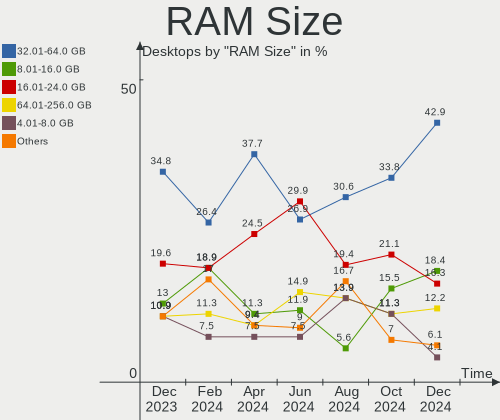
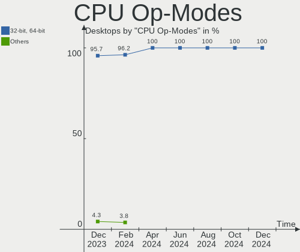
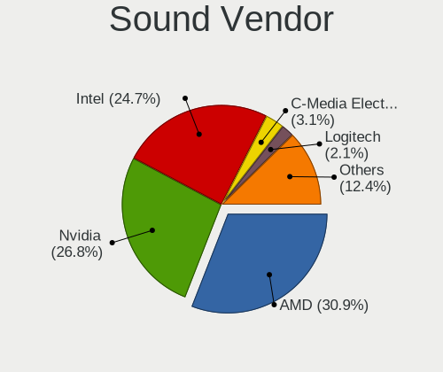
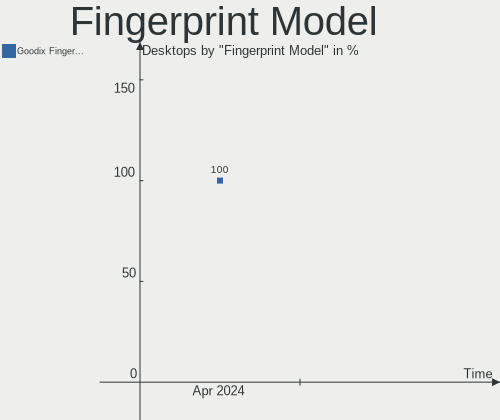

Kubuntu - Hardware Trends (Desktops)
------------------------------------

A project to identify most popular hardware characteristics and track their change
over time based on data collected by Linux users at https://Linux-Hardware.org.

Anyone can contribute to this report by the [hw-probe](https://github.com/linuxhw/hw-probe) tool:

    sudo -E hw-probe -all -upload

This report is for one last month. Overall report since the beginning of time: [TestCoverage](https://github.com/linuxhw/TestCoverage)

Period: Jan, 2023.

Contents
--------

* [ System ](#system)
  - [ OS                       ](#os)
  - [ OS Family                ](#os-family)
  - [ Kernel                   ](#kernel)
  - [ Kernel Family            ](#kernel-family)
  - [ Kernel Major Ver.        ](#kernel-major-ver)
  - [ Arch                     ](#arch)
  - [ DE                       ](#de)
  - [ Display Server           ](#display-server)
  - [ Display Manager          ](#display-manager)
  - [ OS Lang                  ](#os-lang)
  - [ Boot Mode                ](#boot-mode)
  - [ Filesystem               ](#filesystem)
  - [ Part. scheme             ](#part-scheme)
  - [ Dual Boot with Linux/BSD ](#dual-boot-with-linuxbsd)
  - [ Dual Boot (Win)          ](#dual-boot-win)

* [ Board ](#board)
  - [ Vendor                   ](#vendor)
  - [ Model                    ](#model)
  - [ Model Family             ](#model-family)
  - [ MFG Year                 ](#mfg-year)
  - [ Form Factor              ](#form-factor)
  - [ Secure Boot              ](#secure-boot)
  - [ Coreboot                 ](#coreboot)
  - [ RAM Size                 ](#ram-size)
  - [ RAM Used                 ](#ram-used)
  - [ Total Drives             ](#total-drives)
  - [ Has CD-ROM               ](#has-cd-rom)
  - [ Has Ethernet             ](#has-ethernet)
  - [ Has WiFi                 ](#has-wifi)
  - [ Has Bluetooth            ](#has-bluetooth)

* [ Location ](#location)
  - [ Country                  ](#country)
  - [ City                     ](#city)

* [ Drives ](#drives)
  - [ Drive Vendor             ](#drive-vendor)
  - [ Drive Model              ](#drive-model)
  - [ HDD Vendor               ](#hdd-vendor)
  - [ SSD Vendor               ](#ssd-vendor)
  - [ Drive Kind               ](#drive-kind)
  - [ Drive Connector          ](#drive-connector)
  - [ Drive Size               ](#drive-size)
  - [ Space Total              ](#space-total)
  - [ Space Used               ](#space-used)
  - [ Malfunc. Drives          ](#malfunc-drives)
  - [ Malfunc. Drive Vendor    ](#malfunc-drive-vendor)
  - [ Malfunc. HDD Vendor      ](#malfunc-hdd-vendor)
  - [ Malfunc. Drive Kind      ](#malfunc-drive-kind)
  - [ Failed Drives            ](#failed-drives)
  - [ Failed Drive Vendor      ](#failed-drive-vendor)
  - [ Drive Status             ](#drive-status)

* [ Storage controller ](#storage-controller)
  - [ Storage Vendor           ](#storage-vendor)
  - [ Storage Model            ](#storage-model)
  - [ Storage Kind             ](#storage-kind)

* [ Processor ](#processor)
  - [ CPU Vendor               ](#cpu-vendor)
  - [ CPU Model                ](#cpu-model)
  - [ CPU Model Family         ](#cpu-model-family)
  - [ CPU Cores                ](#cpu-cores)
  - [ CPU Sockets              ](#cpu-sockets)
  - [ CPU Threads              ](#cpu-threads)
  - [ CPU Op-Modes             ](#cpu-op-modes)
  - [ CPU Microcode            ](#cpu-microcode)
  - [ CPU Microarch            ](#cpu-microarch)

* [ Graphics ](#graphics)
  - [ GPU Vendor               ](#gpu-vendor)
  - [ GPU Model                ](#gpu-model)
  - [ GPU Combo                ](#gpu-combo)
  - [ GPU Driver               ](#gpu-driver)
  - [ GPU Memory               ](#gpu-memory)

* [ Monitor ](#monitor)
  - [ Monitor Vendor           ](#monitor-vendor)
  - [ Monitor Model            ](#monitor-model)
  - [ Monitor Resolution       ](#monitor-resolution)
  - [ Monitor Diagonal         ](#monitor-diagonal)
  - [ Monitor Width            ](#monitor-width)
  - [ Aspect Ratio             ](#aspect-ratio)
  - [ Monitor Area             ](#monitor-area)
  - [ Pixel Density            ](#pixel-density)
  - [ Multiple Monitors        ](#multiple-monitors)

* [ Network ](#network)
  - [ Net Controller Vendor    ](#net-controller-vendor)
  - [ Net Controller Model     ](#net-controller-model)
  - [ Wireless Vendor          ](#wireless-vendor)
  - [ Wireless Model           ](#wireless-model)
  - [ Ethernet Vendor          ](#ethernet-vendor)
  - [ Ethernet Model           ](#ethernet-model)
  - [ Net Controller Kind      ](#net-controller-kind)
  - [ Used Controller          ](#used-controller)
  - [ NICs                     ](#nics)
  - [ IPv6                     ](#ipv6)

* [ Bluetooth ](#bluetooth)
  - [ Bluetooth Vendor         ](#bluetooth-vendor)
  - [ Bluetooth Model          ](#bluetooth-model)

* [ Sound ](#sound)
  - [ Sound Vendor             ](#sound-vendor)
  - [ Sound Model              ](#sound-model)

* [ Memory ](#memory)
  - [ Memory Vendor            ](#memory-vendor)
  - [ Memory Model             ](#memory-model)
  - [ Memory Kind              ](#memory-kind)
  - [ Memory Form Factor       ](#memory-form-factor)
  - [ Memory Size              ](#memory-size)
  - [ Memory Speed             ](#memory-speed)

* [ Printers & scanners ](#printers--scanners)
  - [ Printer Vendor           ](#printer-vendor)
  - [ Printer Model            ](#printer-model)
  - [ Scanner Vendor           ](#scanner-vendor)
  - [ Scanner Model            ](#scanner-model)

* [ Camera ](#camera)
  - [ Camera Vendor            ](#camera-vendor)
  - [ Camera Model             ](#camera-model)

* [ Security ](#security)
  - [ Fingerprint Vendor       ](#fingerprint-vendor)
  - [ Fingerprint Model        ](#fingerprint-model)
  - [ Chipcard Vendor          ](#chipcard-vendor)
  - [ Chipcard Model           ](#chipcard-model)

* [ Unsupported ](#unsupported)
  - [ Unsupported Devices      ](#unsupported-devices)
  - [ Unsupported Device Types ](#unsupported-device-types)

System
------

OS
--

Installed operating systems

| Name          | Desktops | Percent |
|---------------|----------|---------|
| Kubuntu 22.04 | 27       | 50%     |
| Kubuntu 22.10 | 18       | 33.33%  |
| Kubuntu 20.04 | 4        | 7.41%   |
| Kubuntu 18.04 | 4        | 7.41%   |
| Kubuntu 11    | 1        | 1.85%   |

OS Family
---------

OS without a version

| Name    | Desktops | Percent |
|---------|----------|---------|
| Kubuntu | 54       | 100%    |

Kernel
------

Version of the Linux kernel

| Version              | Desktops | Percent |
|----------------------|----------|---------|
| 5.19.0-29-generic    | 11       | 20.37%  |
| 5.15.0-56-generic    | 10       | 18.52%  |
| 5.15.0-58-generic    | 9        | 16.67%  |
| 5.15.0-57-generic    | 4        | 7.41%   |
| 5.19.0-26-generic    | 3        | 5.56%   |
| 5.4.0-136-generic    | 2        | 3.7%    |
| 5.19.0-30-generic    | 2        | 3.7%    |
| 5.19.0-28-generic    | 2        | 3.7%    |
| 5.15.0-25-generic    | 2        | 3.7%    |
| 6.1.5-x64v3-xanmod1  | 1        | 1.85%   |
| 6.0.0                | 1        | 1.85%   |
| 5.4.0-81-generic     | 1        | 1.85%   |
| 5.4.0-137-generic    | 1        | 1.85%   |
| 5.15.0-58-lowlatency | 1        | 1.85%   |
| 5.15.0-57-lowlatency | 1        | 1.85%   |
| 5.15.0-43-generic    | 1        | 1.85%   |
| 5.13.0-22-generic    | 1        | 1.85%   |
| 4.15.0-166-generic   | 1        | 1.85%   |

Kernel Family
-------------

Linux kernel without a distro release

| Version | Desktops | Percent |
|---------|----------|---------|
| 5.15.0  | 28       | 51.85%  |
| 5.19.0  | 18       | 33.33%  |
| 5.4.0   | 4        | 7.41%   |
| 6.1.5   | 1        | 1.85%   |
| 6.0.0   | 1        | 1.85%   |
| 5.13.0  | 1        | 1.85%   |
| 4.15.0  | 1        | 1.85%   |

Kernel Major Ver.
-----------------

Linux kernel major version

| Version | Desktops | Percent |
|---------|----------|---------|
| 5.15    | 28       | 51.85%  |
| 5.19    | 18       | 33.33%  |
| 5.4     | 4        | 7.41%   |
| 6.1     | 1        | 1.85%   |
| 6.0     | 1        | 1.85%   |
| 5.13    | 1        | 1.85%   |
| 4.15    | 1        | 1.85%   |

Arch
----

OS architecture (x86_64, i586, etc.)

| Name   | Desktops | Percent |
|--------|----------|---------|
| x86_64 | 54       | 100%    |

DE
--

Desktop Environment

| Name   | Desktops | Percent |
|--------|----------|---------|
| KDE5   | 51       | 94.44%  |
| KDE    | 1        | 1.85%   |
| GNOME  | 1        | 1.85%   |
| Budgie | 1        | 1.85%   |

Display Server
--------------

X11 or Wayland

| Name | Desktops | Percent |
|------|----------|---------|
| X11  | 53       | 98.15%  |
| Tty  | 1        | 1.85%   |

Display Manager
---------------

SDDM, LightDM, etc.

| Name    | Desktops | Percent |
|---------|----------|---------|
| SDDM    | 33       | 61.11%  |
| Unknown | 16       | 29.63%  |
| GDM3    | 3        | 5.56%   |
| LightDM | 2        | 3.7%    |

OS Lang
-------

Language

| Lang   | Desktops | Percent |
|--------|----------|---------|
| en_US  | 28       | 51.85%  |
| de_DE  | 5        | 9.26%   |
| fr_FR  | 4        | 7.41%   |
| ru_RU  | 3        | 5.56%   |
| en_GB  | 3        | 5.56%   |
| pl_PL  | 2        | 3.7%    |
| pt_BR  | 1        | 1.85%   |
| osa_US | 1        | 1.85%   |
| it_IT  | 1        | 1.85%   |
| es_ES  | 1        | 1.85%   |
| en_NZ  | 1        | 1.85%   |
| en_IE  | 1        | 1.85%   |
| en_CA  | 1        | 1.85%   |
| el_GR  | 1        | 1.85%   |
| de_AT  | 1        | 1.85%   |

Boot Mode
---------

EFI or BIOS

| Mode | Desktops | Percent |
|------|----------|---------|
| BIOS | 29       | 53.7%   |
| EFI  | 25       | 46.3%   |

Filesystem
----------

Type of filesystem

| Type    | Desktops | Percent |
|---------|----------|---------|
| Ext4    | 52       | 96.3%   |
| Overlay | 2        | 3.7%    |

Part. scheme
------------

Scheme of partitioning

| Type    | Desktops | Percent |
|---------|----------|---------|
| GPT     | 31       | 57.41%  |
| Unknown | 15       | 27.78%  |
| MBR     | 8        | 14.81%  |

Dual Boot with Linux/BSD
------------------------

Hosting more than one Linux/BSD

| Dual boot | Desktops | Percent |
|-----------|----------|---------|
| No        | 44       | 81.48%  |
| Yes       | 10       | 18.52%  |

Dual Boot (Win)
---------------

Hosting Linux and Windows

| Dual boot | Desktops | Percent |
|-----------|----------|---------|
| No        | 38       | 70.37%  |
| Yes       | 16       | 29.63%  |

Board
-----

Vendor
------

Motherboard manufacturer

| Name                | Desktops | Percent |
|---------------------|----------|---------|
| ASUSTek Computer    | 19       | 35.19%  |
| Dell                | 10       | 18.52%  |
| Gigabyte Technology | 8        | 14.81%  |
| MSI                 | 6        | 11.11%  |
| ASRock              | 4        | 7.41%   |
| Lenovo              | 3        | 5.56%   |
| Hewlett-Packard     | 2        | 3.7%    |
| AZW                 | 1        | 1.85%   |
| Alienware           | 1        | 1.85%   |

Model
-----

Motherboard model

| Name                                    | Desktops | Percent |
|-----------------------------------------|----------|---------|
| Dell OptiPlex 7040                      | 2        | 3.7%    |
| Dell OptiPlex 7010                      | 2        | 3.7%    |
| ASRock A320M-HDV R4.0                   | 2        | 3.7%    |
| MSI MS-7D18                             | 1        | 1.85%   |
| MSI MS-7C95                             | 1        | 1.85%   |
| MSI MS-7C71                             | 1        | 1.85%   |
| MSI MS-7A34                             | 1        | 1.85%   |
| MSI MS-7A32                             | 1        | 1.85%   |
| MSI CML-U PRO Cubi 5 (MS-B183)          | 1        | 1.85%   |
| Lenovo ThinkCentre M75s-1 11AAS24H00    | 1        | 1.85%   |
| Lenovo ThinkCentre M72e 35951A1         | 1        | 1.85%   |
| Lenovo IdeaCentre 310S-08ASR 90G9007EGE | 1        | 1.85%   |
| HP Compaq Elite 8300 SFF                | 1        | 1.85%   |
| HP Compaq dc7800p Convertible Minitower | 1        | 1.85%   |
| Gigabyte Z590 UD AC                     | 1        | 1.85%   |
| Gigabyte Z490 AORUS ELITE AC            | 1        | 1.85%   |
| Gigabyte X570S AORUS MASTER             | 1        | 1.85%   |
| Gigabyte GA-78LMT-USB3 6.0              | 1        | 1.85%   |
| Gigabyte F2A88XM-HD3P                   | 1        | 1.85%   |
| Gigabyte B650M DS3H                     | 1        | 1.85%   |
| Gigabyte B365M DS3H                     | 1        | 1.85%   |
| Gigabyte AX370-Gaming K7                | 1        | 1.85%   |
| Dell XPS 8910                           | 1        | 1.85%   |
| Dell Precision WorkStation T7500        | 1        | 1.85%   |
| Dell Precision WorkStation T3500        | 1        | 1.85%   |
| Dell Precision 3630 Tower               | 1        | 1.85%   |
| Dell OptiPlex 990                       | 1        | 1.85%   |
| Dell OptiPlex 780                       | 1        | 1.85%   |
| AZW GTR                                 | 1        | 1.85%   |
| ASUS Z170-A                             | 1        | 1.85%   |
| ASUS TUF Gaming B550M-PLUS              | 1        | 1.85%   |
| ASUS TUF Gaming B550-PLUS               | 1        | 1.85%   |
| ASUS STRIX Z270H GAMING                 | 1        | 1.85%   |
| ASUS ROG STRIX Z370-F GAMING            | 1        | 1.85%   |
| ASUS ROG STRIX X570-I GAMING            | 1        | 1.85%   |
| ASUS ROG STRIX G15CF_G15CF              | 1        | 1.85%   |
| ASUS ROG STRIX B550-F GAMING            | 1        | 1.85%   |
| ASUS Pro WS WRX80E-SAGE SE WIFI         | 1        | 1.85%   |
| ASUS PRIME H510M-E                      | 1        | 1.85%   |
| ASUS PRIME B450M-A II                   | 1        | 1.85%   |

Model Family
------------

Motherboard model prefix

| Name                   | Desktops | Percent |
|------------------------|----------|---------|
| Dell OptiPlex          | 6        | 11.11%  |
| ASUS ROG               | 4        | 7.41%   |
| ASUS PRIME             | 4        | 7.41%   |
| Dell Precision         | 3        | 5.56%   |
| Lenovo ThinkCentre     | 2        | 3.7%    |
| HP Compaq              | 2        | 3.7%    |
| ASUS TUF               | 2        | 3.7%    |
| ASRock A320M-HDV       | 2        | 3.7%    |
| MSI MS-7D18            | 1        | 1.85%   |
| MSI MS-7C95            | 1        | 1.85%   |
| MSI MS-7C71            | 1        | 1.85%   |
| MSI MS-7A34            | 1        | 1.85%   |
| MSI MS-7A32            | 1        | 1.85%   |
| MSI CML-U              | 1        | 1.85%   |
| Lenovo IdeaCentre      | 1        | 1.85%   |
| Gigabyte Z590          | 1        | 1.85%   |
| Gigabyte Z490          | 1        | 1.85%   |
| Gigabyte X570S         | 1        | 1.85%   |
| Gigabyte GA-78LMT-USB3 | 1        | 1.85%   |
| Gigabyte F2A88XM-HD3P  | 1        | 1.85%   |
| Gigabyte B650M         | 1        | 1.85%   |
| Gigabyte B365M         | 1        | 1.85%   |
| Gigabyte AX370-Gaming  | 1        | 1.85%   |
| Dell XPS               | 1        | 1.85%   |
| AZW GTR                | 1        | 1.85%   |
| ASUS Z170-A            | 1        | 1.85%   |
| ASUS STRIX             | 1        | 1.85%   |
| ASUS Pro               | 1        | 1.85%   |
| ASUS P8Z68-V           | 1        | 1.85%   |
| ASUS P8P67             | 1        | 1.85%   |
| ASUS P5K               | 1        | 1.85%   |
| ASUS H110M-K           | 1        | 1.85%   |
| ASUS G10AJ             | 1        | 1.85%   |
| ASUS All               | 1        | 1.85%   |
| ASRock Z370            | 1        | 1.85%   |
| ASRock B450M           | 1        | 1.85%   |
| Alienware Aurora       | 1        | 1.85%   |

MFG Year
--------

Motherboard manufacture year

| Year | Desktops | Percent |
|------|----------|---------|
| 2020 | 9        | 16.67%  |
| 2017 | 8        | 14.81%  |
| 2021 | 5        | 9.26%   |
| 2019 | 4        | 7.41%   |
| 2018 | 4        | 7.41%   |
| 2016 | 4        | 7.41%   |
| 2022 | 3        | 5.56%   |
| 2014 | 3        | 5.56%   |
| 2009 | 3        | 5.56%   |
| 2015 | 2        | 3.7%    |
| 2012 | 2        | 3.7%    |
| 2011 | 2        | 3.7%    |
| 2010 | 2        | 3.7%    |
| 2013 | 1        | 1.85%   |
| 2008 | 1        | 1.85%   |
| 2007 | 1        | 1.85%   |

Form Factor
-----------

Physical design of the computer

| Name    | Desktops | Percent |
|---------|----------|---------|
| Desktop | 54       | 100%    |

Secure Boot
-----------

Enabled or disabled

| State    | Desktops | Percent |
|----------|----------|---------|
| Disabled | 53       | 98.15%  |
| Enabled  | 1        | 1.85%   |

Coreboot
--------

Have coreboot on board

| Used | Desktops | Percent |
|------|----------|---------|
| No   | 54       | 100%    |

RAM Size
--------

Total RAM memory

| Size in GB  | Desktops | Percent |
|-------------|----------|---------|
| 16.01-24.0  | 22       | 40.74%  |
| 32.01-64.0  | 8        | 14.81%  |
| 4.01-8.0    | 7        | 12.96%  |
| 64.01-256.0 | 6        | 11.11%  |
| 8.01-16.0   | 6        | 11.11%  |
| 24.01-32.0  | 3        | 5.56%   |
| 3.01-4.0    | 2        | 3.7%    |

RAM Used
--------

Used RAM memory

| Used GB    | Desktops | Percent |
|------------|----------|---------|
| 4.01-8.0   | 18       | 33.33%  |
| 2.01-3.0   | 18       | 33.33%  |
| 3.01-4.0   | 8        | 14.81%  |
| 1.01-2.0   | 6        | 11.11%  |
| 8.01-16.0  | 2        | 3.7%    |
| 16.01-24.0 | 1        | 1.85%   |
| 0.51-1.0   | 1        | 1.85%   |

Total Drives
------------

Number of drives on board

| Drives | Desktops | Percent |
|--------|----------|---------|
| 1      | 16       | 29.63%  |
| 2      | 14       | 25.93%  |
| 3      | 10       | 18.52%  |
| 4      | 6        | 11.11%  |
| 7      | 4        | 7.41%   |
| 6      | 2        | 3.7%    |
| 5      | 2        | 3.7%    |

Has CD-ROM
----------

Has CD-ROM on board

| Presented | Desktops | Percent |
|-----------|----------|---------|
| No        | 34       | 62.96%  |
| Yes       | 20       | 37.04%  |

Has Ethernet
------------

Has Ethernet on board

| Presented | Desktops | Percent |
|-----------|----------|---------|
| Yes       | 54       | 100%    |

Has WiFi
--------

Has WiFi module

| Presented | Desktops | Percent |
|-----------|----------|---------|
| No        | 33       | 61.11%  |
| Yes       | 21       | 38.89%  |

Has Bluetooth
-------------

Has Bluetooth module

| Presented | Desktops | Percent |
|-----------|----------|---------|
| No        | 29       | 53.7%   |
| Yes       | 25       | 46.3%   |

Location
--------

Country
-------

Geographic location (country)

| Country     | Desktops | Percent |
|-------------|----------|---------|
| USA         | 15       | 27.78%  |
| Germany     | 6        | 11.11%  |
| UK          | 3        | 5.56%   |
| Spain       | 3        | 5.56%   |
| Russia      | 3        | 5.56%   |
| Netherlands | 3        | 5.56%   |
| France      | 3        | 5.56%   |
| Canada      | 3        | 5.56%   |
| Finland     | 2        | 3.7%    |
| Serbia      | 1        | 1.85%   |
| Romania     | 1        | 1.85%   |
| Portugal    | 1        | 1.85%   |
| Poland      | 1        | 1.85%   |
| New Zealand | 1        | 1.85%   |
| Mexico      | 1        | 1.85%   |
| Italy       | 1        | 1.85%   |
| Ireland     | 1        | 1.85%   |
| Iran        | 1        | 1.85%   |
| Indonesia   | 1        | 1.85%   |
| Greece      | 1        | 1.85%   |
| Brazil      | 1        | 1.85%   |
| Austria     | 1        | 1.85%   |

City
----

Geographic location (city)

| City              | Desktops | Percent |
|-------------------|----------|---------|
| Montreal          | 2        | 3.7%    |
| Wroclaw           | 1        | 1.85%   |
| Volgograd         | 1        | 1.85%   |
| Vienna            | 1        | 1.85%   |
| Valparaiso        | 1        | 1.85%   |
| Turku             | 1        | 1.85%   |
| Toronto           | 1        | 1.85%   |
| Staten Island     | 1        | 1.85%   |
| Seville           | 1        | 1.85%   |
| Saveh             | 1        | 1.85%   |
| Sao Paulo         | 1        | 1.85%   |
| Salem             | 1        | 1.85%   |
| Rowley            | 1        | 1.85%   |
| Rochester         | 1        | 1.85%   |
| Póvoa de Varzim  | 1        | 1.85%   |
| Oulu              | 1        | 1.85%   |
| Ocala             | 1        | 1.85%   |
| North Little Rock | 1        | 1.85%   |
| Newport News      | 1        | 1.85%   |
| New York          | 1        | 1.85%   |
| Moscow            | 1        | 1.85%   |
| Marghita          | 1        | 1.85%   |
| Madera            | 1        | 1.85%   |
| London            | 1        | 1.85%   |
| Lingen            | 1        | 1.85%   |
| Jakarta           | 1        | 1.85%   |
| Jackson           | 1        | 1.85%   |
| Izhevsk           | 1        | 1.85%   |
| Houston           | 1        | 1.85%   |
| Heerlen           | 1        | 1.85%   |
| Hamburg           | 1        | 1.85%   |
| Halle             | 1        | 1.85%   |
| Groningen         | 1        | 1.85%   |
| Granada           | 1        | 1.85%   |
| Elassona          | 1        | 1.85%   |
| Eindhoven         | 1        | 1.85%   |
| Dublin            | 1        | 1.85%   |
| Donja Gorevnica   | 1        | 1.85%   |
| Darmstadt         | 1        | 1.85%   |
| Dallas            | 1        | 1.85%   |

Drives
------

Drive Vendor
------------

Hard drive vendors

| Vendor                    | Desktops | Drives | Percent |
|---------------------------|----------|--------|---------|
| WDC                       | 25       | 35     | 21.55%  |
| Samsung Electronics       | 22       | 29     | 18.97%  |
| Seagate                   | 19       | 26     | 16.38%  |
| SanDisk                   | 6        | 7      | 5.17%   |
| Kingston                  | 6        | 6      | 5.17%   |
| Toshiba                   | 4        | 5      | 3.45%   |
| PNY                       | 3        | 3      | 2.59%   |
| Hitachi                   | 3        | 4      | 2.59%   |
| SABRENT                   | 2        | 2      | 1.72%   |
| Phison Electronics        | 2        | 2      | 1.72%   |
| Phison                    | 2        | 3      | 1.72%   |
| Patriot                   | 2        | 2      | 1.72%   |
| Micron Technology         | 2        | 2      | 1.72%   |
| A-DATA Technology         | 2        | 2      | 1.72%   |
| ValueTech                 | 1        | 1      | 0.86%   |
| Unknown                   | 1        | 3      | 0.86%   |
| Team                      | 1        | 1      | 0.86%   |
| T-FORCE                   | 1        | 1      | 0.86%   |
| Solid State Storage       | 1        | 1      | 0.86%   |
| SK hynix                  | 1        | 1      | 0.86%   |
| Silicon Motion            | 1        | 1      | 0.86%   |
| Micron/Crucial Technology | 1        | 1      | 0.86%   |
| Linux                     | 1        | 1      | 0.86%   |
| Intenso                   | 1        | 1      | 0.86%   |
| Intel                     | 1        | 1      | 0.86%   |
| Integral                  | 1        | 1      | 0.86%   |
| HGST                      | 1        | 1      | 0.86%   |
| Corsair                   | 1        | 1      | 0.86%   |
| ASMT                      | 1        | 1      | 0.86%   |
| ADATA Technology          | 1        | 1      | 0.86%   |

Drive Model
-----------

Hard drive models

| Model                                               | Desktops | Percent |
|-----------------------------------------------------|----------|---------|
| Seagate ST2000DM008-2FR102 2TB                      | 3        | 2.16%   |
| Samsung SSD 970 EVO Plus 1TB                        | 3        | 2.16%   |
| Samsung NVMe SSD Controller SM981/PM981/PM983 500GB | 3        | 2.16%   |
| WDC WD10EZEX-08WN4A0 1TB                            | 2        | 1.44%   |
| Seagate ST4000VN008-2DR166 4TB                      | 2        | 1.44%   |
| Seagate ST4000DM004-2CV104 4TB                      | 2        | 1.44%   |
| Samsung SSD 860 EVO 500GB                           | 2        | 1.44%   |
| SABRENT Disk 4TB                                    | 2        | 1.44%   |
| Kingston SA400S37480G 480GB SSD                     | 2        | 1.44%   |
| Kingston SA400S37240G 240GB SSD                     | 2        | 1.44%   |
| WDC WDS500G1B0B-00AS40 500GB SSD                    | 1        | 0.72%   |
| WDC WDS250G2B0A-00SM50 250GB SSD                    | 1        | 0.72%   |
| WDC WDS200T3X0C-00SJG0 2TB                          | 1        | 0.72%   |
| WDC WDBNCE5000PNC 500GB SSD                         | 1        | 0.72%   |
| WDC WD6003FZBX-00K5WB0 6TB                          | 1        | 0.72%   |
| WDC WD5000AZRX-00A3KB0 500GB                        | 1        | 0.72%   |
| WDC WD5000AZLX-60K2TA0 500GB                        | 1        | 0.72%   |
| WDC WD5000AAKX-75U6AA0 500GB                        | 1        | 0.72%   |
| WDC WD5000AAKX-08ERMA0 500GB                        | 1        | 0.72%   |
| WDC WD5000AAKS-00M9A0 500GB                         | 1        | 0.72%   |
| WDC WD40EZRX-00SPEB0 4TB                            | 1        | 0.72%   |
| WDC WD40EZAZ-00SF3B0 4TB                            | 1        | 0.72%   |
| WDC WD4003FZEX-00Z4SA0 4TB                          | 1        | 0.72%   |
| WDC WD3200AAKX-001CA0 320GB                         | 1        | 0.72%   |
| WDC WD3200AAJS-00B4A0 320GB                         | 1        | 0.72%   |
| WDC WD2500KS-00MJB0 250GB                           | 1        | 0.72%   |
| WDC WD2500AAKX-60U6AA0 250GB                        | 1        | 0.72%   |
| WDC WD20PURZ-85GU6Y0 2TB                            | 1        | 0.72%   |
| WDC WD20EZRZ-00Z5HB0 2TB                            | 1        | 0.72%   |
| WDC WD20EZRX-00D8PB0 2TB                            | 1        | 0.72%   |
| WDC WD20EFRX-68AX9N0 2TB                            | 1        | 0.72%   |
| WDC WD2005FBYZ-01YCBB1 2TB                          | 1        | 0.72%   |
| WDC WD10EZEX-22MFCA0 1TB                            | 1        | 0.72%   |
| WDC WD10EZEX-00MFCA0 1TB                            | 1        | 0.72%   |
| WDC WD10EZEX-00BBHA0 1TB                            | 1        | 0.72%   |
| WDC WD10EARS-00MVWB0 1TB                            | 1        | 0.72%   |
| WDC WD10EADS-00L5B1 1TB                             | 1        | 0.72%   |
| WDC WD10EACS-00D6B1 1TB                             | 1        | 0.72%   |
| WDC WD1005FBYZ-01YCBB1 1TB                          | 1        | 0.72%   |
| WDC WD1002FAEX-00Y9A0 1TB                           | 1        | 0.72%   |

HDD Vendor
----------

Hard disk drive vendors

| Vendor              | Desktops | Drives | Percent |
|---------------------|----------|--------|---------|
| WDC                 | 21       | 30     | 42.86%  |
| Seagate             | 17       | 24     | 34.69%  |
| Toshiba             | 3        | 4      | 6.12%   |
| Hitachi             | 3        | 4      | 6.12%   |
| Samsung Electronics | 2        | 2      | 4.08%   |
| SABRENT             | 2        | 2      | 4.08%   |
| HGST                | 1        | 1      | 2.04%   |

SSD Vendor
----------

Solid state drive vendors

| Vendor              | Desktops | Drives | Percent |
|---------------------|----------|--------|---------|
| Samsung Electronics | 14       | 16     | 34.15%  |
| Kingston            | 5        | 5      | 12.2%   |
| WDC                 | 4        | 4      | 9.76%   |
| SanDisk             | 4        | 4      | 9.76%   |
| PNY                 | 3        | 3      | 7.32%   |
| Patriot             | 2        | 2      | 4.88%   |
| A-DATA Technology   | 2        | 2      | 4.88%   |
| ValueTech           | 1        | 1      | 2.44%   |
| Toshiba             | 1        | 1      | 2.44%   |
| Team                | 1        | 1      | 2.44%   |
| T-FORCE             | 1        | 1      | 2.44%   |
| Seagate             | 1        | 1      | 2.44%   |
| Intenso             | 1        | 1      | 2.44%   |
| Integral            | 1        | 1      | 2.44%   |

Drive Kind
----------

HDD or SSD

| Kind    | Desktops | Drives | Percent |
|---------|----------|--------|---------|
| HDD     | 37       | 67     | 39.36%  |
| SSD     | 31       | 43     | 32.98%  |
| NVMe    | 23       | 30     | 24.47%  |
| Unknown | 3        | 6      | 3.19%   |

Drive Connector
---------------

SATA, SAS, NVMe, etc.

| Type | Desktops | Drives | Percent |
|------|----------|--------|---------|
| SATA | 44       | 107    | 61.11%  |
| NVMe | 23       | 30     | 31.94%  |
| SAS  | 5        | 9      | 6.94%   |

Drive Size
----------

Size of hard drive

| Size in TB | Desktops | Drives | Percent |
|------------|----------|--------|---------|
| 0.01-0.5   | 35       | 55     | 44.87%  |
| 0.51-1.0   | 19       | 26     | 24.36%  |
| 3.01-4.0   | 10       | 12     | 12.82%  |
| 1.01-2.0   | 10       | 11     | 12.82%  |
| 2.01-3.0   | 2        | 3      | 2.56%   |
| 4.01-10.0  | 2        | 3      | 2.56%   |

Space Total
-----------

Amount of disk space available on the file system

| Size in GB     | Desktops | Percent |
|----------------|----------|---------|
| 1001-2000      | 12       | 22.22%  |
| More than 3000 | 10       | 18.52%  |
| 101-250        | 10       | 18.52%  |
| 251-500        | 9        | 16.67%  |
| 2001-3000      | 5        | 9.26%   |
| 501-1000       | 5        | 9.26%   |
| 1-20           | 2        | 3.7%    |
| 51-100         | 1        | 1.85%   |

Space Used
----------

Amount of used disk space

| Used GB        | Desktops | Percent |
|----------------|----------|---------|
| 501-1000       | 10       | 18.52%  |
| 101-250        | 8        | 14.81%  |
| 251-500        | 7        | 12.96%  |
| 21-50          | 7        | 12.96%  |
| 1-20           | 6        | 11.11%  |
| 1001-2000      | 5        | 9.26%   |
| More than 3000 | 4        | 7.41%   |
| 51-100         | 4        | 7.41%   |
| 2001-3000      | 3        | 5.56%   |

Malfunc. Drives
---------------

Drive models with a malfunction

| Model                             | Desktops | Drives | Percent |
|-----------------------------------|----------|--------|---------|
| WDC WD5000AZRX-00A3KB0 500GB      | 1        | 1      | 9.09%   |
| WDC WD5000AAKS-00M9A0 500GB       | 1        | 1      | 9.09%   |
| WDC WD10EARS-00MVWB0 1TB          | 1        | 1      | 9.09%   |
| WDC WD10EADS-00L5B1 1TB           | 1        | 1      | 9.09%   |
| T-FORCE SSD 512GB                 | 1        | 1      | 9.09%   |
| Seagate ST500DM002-1BD142 500GB   | 1        | 1      | 9.09%   |
| Seagate ST4000VN008-2DR166 4TB    | 1        | 2      | 9.09%   |
| Seagate ST3500630AS 500GB         | 1        | 1      | 9.09%   |
| Seagate ST1000DX001-SSHD-8GB      | 1        | 1      | 9.09%   |
| Samsung Electronics HD501LJ 500GB | 1        | 1      | 9.09%   |
| Kingston SA400S37480G 480GB SSD   | 1        | 1      | 9.09%   |

Malfunc. Drive Vendor
---------------------

Vendors of faulty drives

| Vendor              | Desktops | Drives | Percent |
|---------------------|----------|--------|---------|
| WDC                 | 3        | 4      | 33.33%  |
| Seagate             | 3        | 5      | 33.33%  |
| T-FORCE             | 1        | 1      | 11.11%  |
| Samsung Electronics | 1        | 1      | 11.11%  |
| Kingston            | 1        | 1      | 11.11%  |

Malfunc. HDD Vendor
-------------------

Vendors of faulty HDD drives

| Vendor              | Desktops | Drives | Percent |
|---------------------|----------|--------|---------|
| WDC                 | 3        | 4      | 42.86%  |
| Seagate             | 3        | 5      | 42.86%  |
| Samsung Electronics | 1        | 1      | 14.29%  |

Malfunc. Drive Kind
-------------------

Kinds of faulty drives

| Kind | Desktops | Drives | Percent |
|------|----------|--------|---------|
| HDD  | 6        | 10     | 75%     |
| SSD  | 2        | 2      | 25%     |

Failed Drives
-------------

Failed drive models

Zero info for selected period =(

Failed Drive Vendor
-------------------

Failed drive vendors

Zero info for selected period =(

Drive Status
------------

Number of failed and malfunc. drives

| Status   | Desktops | Drives | Percent |
|----------|----------|--------|---------|
| Detected | 31       | 79     | 48.44%  |
| Works    | 25       | 55     | 39.06%  |
| Malfunc  | 8        | 12     | 12.5%   |

Storage controller
------------------

Storage Vendor
--------------

Storage controller vendors

| Vendor                         | Desktops | Percent |
|--------------------------------|----------|---------|
| Intel                          | 32       | 38.55%  |
| AMD                            | 21       | 25.3%   |
| Samsung Electronics            | 9        | 10.84%  |
| SanDisk                        | 3        | 3.61%   |
| Phison Electronics             | 3        | 3.61%   |
| Marvell Technology Group       | 3        | 3.61%   |
| Solid State Storage Technology | 1        | 1.2%    |
| SK hynix                       | 1        | 1.2%    |
| Silicon Motion                 | 1        | 1.2%    |
| Silicon Image                  | 1        | 1.2%    |
| Seagate Technology             | 1        | 1.2%    |
| Micron/Crucial Technology      | 1        | 1.2%    |
| Micron Technology              | 1        | 1.2%    |
| LSI Logic / Symbios Logic      | 1        | 1.2%    |
| Kingston Technology Company    | 1        | 1.2%    |
| JMicron Technology             | 1        | 1.2%    |
| ASMedia Technology             | 1        | 1.2%    |
| ADATA Technology               | 1        | 1.2%    |

Storage Model
-------------

Storage controller models

| Model                                                                         | Desktops | Percent |
|-------------------------------------------------------------------------------|----------|---------|
| AMD FCH SATA Controller [AHCI mode]                                           | 14       | 14%     |
| Samsung NVMe SSD Controller SM981/PM981/PM983                                 | 7        | 7%      |
| Intel SATA Controller [RAID mode]                                             | 7        | 7%      |
| Intel 6 Series/C200 Series Chipset Family 6 port Desktop SATA AHCI Controller | 4        | 4%      |
| Intel 200 Series PCH SATA controller [AHCI mode]                              | 4        | 4%      |
| AMD 500 Series Chipset SATA Controller                                        | 4        | 4%      |
| Intel Comet Lake SATA AHCI Controller                                         | 3        | 3%      |
| Intel 7 Series/C210 Series Chipset Family 6-port SATA Controller [AHCI mode]  | 3        | 3%      |
| Intel 500 Series Chipset Family SATA AHCI Controller                          | 3        | 3%      |
| AMD FCH SATA Controller D                                                     | 3        | 3%      |
| AMD 400 Series Chipset SATA Controller                                        | 3        | 3%      |
| SanDisk WD Black 2018/SN750 / PC SN720 NVMe SSD                               | 2        | 2%      |
| Intel Q170/Q150/B150/H170/H110/Z170/CM236 Chipset SATA Controller [AHCI Mode] | 2        | 2%      |
| Intel 82801I (ICH9 Family) 2 port SATA Controller [IDE mode]                  | 2        | 2%      |
| AMD X370 Series Chipset SATA Controller                                       | 2        | 2%      |
| AMD 300 Series Chipset SATA Controller                                        | 2        | 2%      |
| Solid State Storage Non-Volatile memory controller                            | 1        | 1%      |
| SK hynix Gold P31/PC711 NVMe Solid State Drive                                | 1        | 1%      |
| Silicon Motion SM2262/SM2262EN SSD Controller                                 | 1        | 1%      |
| Silicon Image SiI 3132 Serial ATA Raid II Controller                          | 1        | 1%      |
| Seagate FireCuda 520 SSD                                                      | 1        | 1%      |
| Sandisk Non-Volatile memory controller                                        | 1        | 1%      |
| Samsung NVMe SSD Controller PM9A1/PM9A3/980PRO                                | 1        | 1%      |
| Samsung NVMe SSD Controller 980                                               | 1        | 1%      |
| Phison Electronics Non-Volatile memory controller                             | 1        | 1%      |
| Phison E18 PCIe4 NVMe Controller                                              | 1        | 1%      |
| Phison E12 NVMe Controller                                                    | 1        | 1%      |
| Micron/Crucial P1 NVMe PCIe SSD                                               | 1        | 1%      |
| Micron Non-Volatile memory controller                                         | 1        | 1%      |
| Marvell Group 88SE91A3 SATA-600 Controller                                    | 1        | 1%      |
| Marvell Group 88SE9128 PCIe SATA 6 Gb/s RAID controller with HyperDuo         | 1        | 1%      |
| Marvell Group 88SE6101/6102 single-port PATA133 interface                     | 1        | 1%      |
| LSI Logic / Symbios Logic SAS1068E PCI-Express Fusion-MPT SAS                 | 1        | 1%      |
| Kingston Company Company Non-Volatile memory controller                       | 1        | 1%      |
| JMicron JMB362 SATA Controller                                                | 1        | 1%      |
| Intel SSD 660P Series                                                         | 1        | 1%      |
| Intel Alder Lake-S PCH SATA Controller [AHCI Mode]                            | 1        | 1%      |
| Intel 9 Series Chipset Family SATA Controller [AHCI Mode]                     | 1        | 1%      |
| Intel 82Q35 Express PT IDER Controller                                        | 1        | 1%      |
| Intel 82801JI (ICH10 Family) SATA AHCI Controller                             | 1        | 1%      |

Storage Kind
------------

Kind of storage controller (IDE, SATA, NVMe, SAS, ...)

| Kind | Desktops | Percent |
|------|----------|---------|
| SATA | 44       | 54.32%  |
| NVMe | 23       | 28.4%   |
| RAID | 7        | 8.64%   |
| IDE  | 6        | 7.41%   |
| SCSI | 1        | 1.23%   |

Processor
---------

CPU Vendor
----------

Processor vendors

| Vendor | Desktops | Percent |
|--------|----------|---------|
| Intel  | 32       | 59.26%  |
| AMD    | 22       | 40.74%  |

CPU Model
---------

Processor models

| Model                                           | Desktops | Percent |
|-------------------------------------------------|----------|---------|
| Intel Core i7-3770 CPU @ 3.40GHz                | 3        | 5.56%   |
| Intel Core i7-8700K CPU @ 3.70GHz               | 2        | 3.7%    |
| Intel Core i3-6100T CPU @ 3.20GHz               | 2        | 3.7%    |
| AMD Ryzen 7 5700X 8-Core Processor              | 2        | 3.7%    |
| AMD Ryzen 7 5700G with Radeon Graphics          | 2        | 3.7%    |
| AMD Ryzen 5 1600X Six-Core Processor            | 2        | 3.7%    |
| Intel Xeon E-2224 CPU @ 3.40GHz                 | 1        | 1.85%   |
| Intel Xeon CPU X5450 @ 3.00GHz                  | 1        | 1.85%   |
| Intel Xeon CPU W5580 @ 3.20GHz                  | 1        | 1.85%   |
| Intel Xeon CPU W3580 @ 3.33GHz                  | 1        | 1.85%   |
| Intel Pentium Dual-Core CPU E5800 @ 3.20GHz     | 1        | 1.85%   |
| Intel Pentium CPU G4400 @ 3.30GHz               | 1        | 1.85%   |
| Intel Core i7-7700K CPU @ 4.20GHz               | 1        | 1.85%   |
| Intel Core i7-6700 CPU @ 3.40GHz                | 1        | 1.85%   |
| Intel Core i7-4790 CPU @ 3.60GHz                | 1        | 1.85%   |
| Intel Core i7-2600K CPU @ 3.40GHz               | 1        | 1.85%   |
| Intel Core i7-10700K CPU @ 3.80GHz              | 1        | 1.85%   |
| Intel Core i7-10700 CPU @ 2.90GHz               | 1        | 1.85%   |
| Intel Core i7 CPU 920 @ 2.67GHz                 | 1        | 1.85%   |
| Intel Core i5-9600K CPU @ 3.70GHz               | 1        | 1.85%   |
| Intel Core i5-6600K CPU @ 3.50GHz               | 1        | 1.85%   |
| Intel Core i5-4690K CPU @ 3.50GHz               | 1        | 1.85%   |
| Intel Core i5-2400 CPU @ 3.10GHz                | 1        | 1.85%   |
| Intel Core i5-10400F CPU @ 2.90GHz              | 1        | 1.85%   |
| Intel Core i5-10400 CPU @ 2.90GHz               | 1        | 1.85%   |
| Intel Core i5-10210U CPU @ 1.60GHz              | 1        | 1.85%   |
| Intel Core i3-3220 CPU @ 3.30GHz                | 1        | 1.85%   |
| Intel Core i3-2120T CPU @ 2.60GHz               | 1        | 1.85%   |
| Intel Core 2 Duo CPU E8400 @ 3.00GHz            | 1        | 1.85%   |
| Intel 12th Gen Core i5-12400F                   | 1        | 1.85%   |
| Intel 11th Gen Core i5-11600 @ 2.80GHz          | 1        | 1.85%   |
| AMD Ryzen Threadripper PRO 5975WX 32-Cores      | 1        | 1.85%   |
| AMD Ryzen 9 6900HX with Radeon Graphics         | 1        | 1.85%   |
| AMD Ryzen 7 3700X 8-Core Processor              | 1        | 1.85%   |
| AMD Ryzen 7 2700X Eight-Core Processor          | 1        | 1.85%   |
| AMD Ryzen 7 1800X Eight-Core Processor          | 1        | 1.85%   |
| AMD Ryzen 7 1700 Eight-Core Processor           | 1        | 1.85%   |
| AMD Ryzen 5 PRO 3400G with Radeon Vega Graphics | 1        | 1.85%   |
| AMD Ryzen 5 7600X 6-Core Processor              | 1        | 1.85%   |
| AMD Ryzen 5 5600G with Radeon Graphics          | 1        | 1.85%   |

CPU Model Family
----------------

Processor model prefix

| Model                   | Desktops | Percent |
|-------------------------|----------|---------|
| Intel Core i7           | 12       | 22.22%  |
| AMD Ryzen 7             | 8        | 14.81%  |
| Intel Core i5           | 7        | 12.96%  |
| AMD Ryzen 5             | 7        | 12.96%  |
| Intel Xeon              | 4        | 7.41%   |
| Intel Core i3           | 4        | 7.41%   |
| Other                   | 3        | 5.56%   |
| Intel Pentium Dual-Core | 1        | 1.85%   |
| Intel Pentium           | 1        | 1.85%   |
| Intel Core 2 Duo        | 1        | 1.85%   |
| AMD Ryzen Threadripper  | 1        | 1.85%   |
| AMD Ryzen 9             | 1        | 1.85%   |
| AMD Ryzen 5 PRO         | 1        | 1.85%   |
| AMD FX                  | 1        | 1.85%   |
| AMD A8                  | 1        | 1.85%   |
| AMD A6                  | 1        | 1.85%   |

CPU Cores
---------

Number of processor cores

| Number | Desktops | Percent |
|--------|----------|---------|
| 4      | 16       | 29.63%  |
| 6      | 14       | 25.93%  |
| 8      | 12       | 22.22%  |
| 2      | 10       | 18.52%  |
| 32     | 1        | 1.85%   |
| 1      | 1        | 1.85%   |

CPU Sockets
-----------

Number of sockets

| Number | Desktops | Percent |
|--------|----------|---------|
| 1      | 53       | 98.15%  |
| 2      | 1        | 1.85%   |

CPU Threads
-----------

Threads per core (Hyper-Threading)

| Number | Desktops | Percent |
|--------|----------|---------|
| 2      | 44       | 81.48%  |
| 1      | 10       | 18.52%  |

CPU Op-Modes
------------

CPU Operation Modes (32-bit, 64-bit)

| Op mode        | Desktops | Percent |
|----------------|----------|---------|
| 32-bit, 64-bit | 54       | 100%    |

CPU Microcode
-------------

Microcode number

| Number     | Desktops | Percent |
|------------|----------|---------|
| Unknown    | 21       | 38.89%  |
| 0x506e3    | 4        | 7.41%   |
| 0x906ea    | 2        | 3.7%    |
| 0x306a9    | 2        | 3.7%    |
| 0x206a7    | 2        | 3.7%    |
| 0x0a50000c | 2        | 3.7%    |
| 0x08701021 | 2        | 3.7%    |
| 0x08001138 | 2        | 3.7%    |
| 0xa0671    | 1        | 1.85%   |
| 0xa0655    | 1        | 1.85%   |
| 0xa0653    | 1        | 1.85%   |
| 0x90675    | 1        | 1.85%   |
| 0x806ec    | 1        | 1.85%   |
| 0x106a5    | 1        | 1.85%   |
| 0x1067a    | 1        | 1.85%   |
| 0x10676    | 1        | 1.85%   |
| 0x0a50000d | 1        | 1.85%   |
| 0x0a404102 | 1        | 1.85%   |
| 0x0a201205 | 1        | 1.85%   |
| 0x0a008203 | 1        | 1.85%   |
| 0x08001126 | 1        | 1.85%   |
| 0x06006704 | 1        | 1.85%   |
| 0x0600611a | 1        | 1.85%   |
| 0x06003106 | 1        | 1.85%   |
| 0x06000852 | 1        | 1.85%   |

CPU Microarch
-------------

Microarchitecture

| Name             | Desktops | Percent |
|------------------|----------|---------|
| KabyLake         | 6        | 11.11%  |
| Zen 3            | 5        | 9.26%   |
| Skylake          | 5        | 9.26%   |
| Zen+             | 4        | 7.41%   |
| Zen              | 4        | 7.41%   |
| IvyBridge        | 4        | 7.41%   |
| CometLake        | 4        | 7.41%   |
| SandyBridge      | 3        | 5.56%   |
| Penryn           | 3        | 5.56%   |
| Nehalem          | 3        | 5.56%   |
| Unknown          | 3        | 5.56%   |
| Zen 2            | 2        | 3.7%    |
| Haswell          | 2        | 3.7%    |
| Excavator        | 2        | 3.7%    |
| Steamroller      | 1        | 1.85%   |
| Piledriver       | 1        | 1.85%   |
| Icelake          | 1        | 1.85%   |
| Alderlake Hybrid | 1        | 1.85%   |

Graphics
--------

GPU Vendor
----------

Vendors of graphics cards

| Vendor | Desktops | Percent |
|--------|----------|---------|
| Nvidia | 25       | 45.45%  |
| AMD    | 17       | 30.91%  |
| Intel  | 13       | 23.64%  |

GPU Model
---------

Graphics card models

| Model                                                                     | Desktops | Percent |
|---------------------------------------------------------------------------|----------|---------|
| Intel HD Graphics 530                                                     | 4        | 7.02%   |
| Intel IvyBridge GT2 [HD Graphics 4000]                                    | 3        | 5.26%   |
| AMD Ellesmere [Radeon RX 470/480/570/570X/580/580X/590]                   | 3        | 5.26%   |
| AMD Cezanne [Radeon Vega Series / Radeon Vega Mobile Series]              | 3        | 5.26%   |
| Nvidia TU104 [GeForce RTX 2060]                                           | 2        | 3.51%   |
| Nvidia GP107 [GeForce GTX 1050 Ti]                                        | 2        | 3.51%   |
| Nvidia GM107 [GeForce GTX 750 Ti]                                         | 2        | 3.51%   |
| Nvidia GA106 [GeForce RTX 3060 Lite Hash Rate]                            | 2        | 3.51%   |
| Nvidia TU117 [GeForce GTX 1650]                                           | 1        | 1.75%   |
| Nvidia TU116 [GeForce GTX 1660]                                           | 1        | 1.75%   |
| Nvidia TU116 [GeForce GTX 1660 Ti]                                        | 1        | 1.75%   |
| Nvidia TU106 [GeForce RTX 2070 Rev. A]                                    | 1        | 1.75%   |
| Nvidia GT218 [GeForce 8400 GS Rev. 3]                                     | 1        | 1.75%   |
| Nvidia GT218 [GeForce 210]                                                | 1        | 1.75%   |
| Nvidia GT200GL [Quadro FX 4800]                                           | 1        | 1.75%   |
| Nvidia GP104 [GeForce GTX 1070]                                           | 1        | 1.75%   |
| Nvidia GP102 [GeForce GTX 1080 Ti]                                        | 1        | 1.75%   |
| Nvidia GM204 [GeForce GTX 970]                                            | 1        | 1.75%   |
| Nvidia GK208 [GeForce GT 710]                                             | 1        | 1.75%   |
| Nvidia GK106 [GeForce GTX 650 Ti]                                         | 1        | 1.75%   |
| Nvidia GK104 [GeForce GTX 770]                                            | 1        | 1.75%   |
| Nvidia GA106 [Geforce RTX 3050]                                           | 1        | 1.75%   |
| Nvidia GA104 [GeForce RTX 3060 Ti Lite Hash Rate]                         | 1        | 1.75%   |
| Nvidia GA102 [GeForce RTX 3090]                                           | 1        | 1.75%   |
| Nvidia AD103 [GeForce RTX 4080]                                           | 1        | 1.75%   |
| Intel Xeon E3-1200 v2/3rd Gen Core processor Graphics Controller          | 1        | 1.75%   |
| Intel RocketLake-S GT1 [UHD Graphics 750]                                 | 1        | 1.75%   |
| Intel CometLake-U GT2 [UHD Graphics]                                      | 1        | 1.75%   |
| Intel CometLake-S GT2 [UHD Graphics 630]                                  | 1        | 1.75%   |
| Intel 4 Series Chipset Integrated Graphics Controller                     | 1        | 1.75%   |
| Intel 2nd Generation Core Processor Family Integrated Graphics Controller | 1        | 1.75%   |
| AMD Wani [Radeon R5/R6/R7 Graphics]                                       | 1        | 1.75%   |
| AMD Tonga XT / Amethyst XT [Radeon R9 380X / R9 M295X]                    | 1        | 1.75%   |
| AMD Stoney [Radeon R2/R3/R4/R5 Graphics]                                  | 1        | 1.75%   |
| AMD RS780L [Radeon 3000]                                                  | 1        | 1.75%   |
| AMD Rembrandt [Radeon 680M]                                               | 1        | 1.75%   |
| AMD Raphael                                                               | 1        | 1.75%   |
| AMD Picasso/Raven 2 [Radeon Vega Series / Radeon Vega Mobile Series]      | 1        | 1.75%   |
| AMD Navi 23 [Radeon RX 6650 XT]                                           | 1        | 1.75%   |
| AMD Navi 22 [Radeon RX 6700/6700 XT/6750 XT / 6800M]                      | 1        | 1.75%   |

GPU Combo
---------

Combinations of graphics cards

| Name       | Desktops | Percent |
|------------|----------|---------|
| 1 x Nvidia | 25       | 46.3%   |
| 1 x AMD    | 16       | 29.63%  |
| 1 x Intel  | 12       | 22.22%  |
| 2 x AMD    | 1        | 1.85%   |

GPU Driver
----------

Free vs proprietary

| Driver      | Desktops | Percent |
|-------------|----------|---------|
| Free        | 33       | 61.11%  |
| Proprietary | 17       | 31.48%  |
| Unknown     | 4        | 7.41%   |

GPU Memory
----------

Total video memory

| Size in GB | Desktops | Percent |
|------------|----------|---------|
| Unknown    | 25       | 46.3%   |
| 0.01-0.5   | 6        | 11.11%  |
| 7.01-8.0   | 5        | 9.26%   |
| 8.01-16.0  | 5        | 9.26%   |
| 3.01-4.0   | 4        | 7.41%   |
| 5.01-6.0   | 3        | 5.56%   |
| 1.01-2.0   | 2        | 3.7%    |
| 0.51-1.0   | 2        | 3.7%    |
| 2.01-3.0   | 1        | 1.85%   |
| 16.01-24.0 | 1        | 1.85%   |

Monitor
-------

Monitor Vendor
--------------

Monitor vendors

| Vendor               | Desktops | Percent |
|----------------------|----------|---------|
| Goldstar             | 12       | 21.43%  |
| Dell                 | 10       | 17.86%  |
| Samsung Electronics  | 6        | 10.71%  |
| Acer                 | 6        | 10.71%  |
| Philips              | 3        | 5.36%   |
| AOC                  | 3        | 5.36%   |
| Lenovo               | 2        | 3.57%   |
| Ancor Communications | 2        | 3.57%   |
| Vizio                | 1        | 1.79%   |
| ViewSonic            | 1        | 1.79%   |
| Sony                 | 1        | 1.79%   |
| Onkyo                | 1        | 1.79%   |
| NEC Computers        | 1        | 1.79%   |
| Iiyama               | 1        | 1.79%   |
| Hewlett-Packard      | 1        | 1.79%   |
| Fujitsu Siemens      | 1        | 1.79%   |
| BUBALUS              | 1        | 1.79%   |
| BenQ                 | 1        | 1.79%   |
| AUS                  | 1        | 1.79%   |
| ASUSTek Computer     | 1        | 1.79%   |

Monitor Model
-------------

Monitor models

| Model                                                                | Desktops | Percent |
|----------------------------------------------------------------------|----------|---------|
| Vizio V435-J01 VIZ1039 3840x2160 941x529mm 42.5-inch                 | 1        | 1.64%   |
| ViewSonic VA2261 VSC0F30 1920x1080 477x268mm 21.5-inch               | 1        | 1.64%   |
| Sony TV SNYEA01 1920x1080                                            | 1        | 1.64%   |
| Samsung Electronics SA300/SA350 SAM078A 1366x768 410x230mm 18.5-inch | 1        | 1.64%   |
| Samsung Electronics S27B550 SAM091A 1920x1080 598x336mm 27.0-inch    | 1        | 1.64%   |
| Samsung Electronics S24D391 SAM0B87 1920x1080 521x293mm 23.5-inch    | 1        | 1.64%   |
| Samsung Electronics LCD Monitor SAM0509 1920x1080                    | 1        | 1.64%   |
| Samsung Electronics LCD Monitor S22F350 1920x1080                    | 1        | 1.64%   |
| Samsung Electronics LC27G5xT SAM7079 2560x1440 597x336mm 27.0-inch   | 1        | 1.64%   |
| Philips PHL 276E7 PHLC108 1920x1080 598x336mm 27.0-inch              | 1        | 1.64%   |
| Philips PHL 241V8 PHLC212 1920x1080 527x296mm 23.8-inch              | 1        | 1.64%   |
| Philips FTV PHL04C3 1920x1080 1440x810mm 65.0-inch                   | 1        | 1.64%   |
| Onkyo TX-SR508 ONK0A42 1920x540 708x398mm 32.0-inch                  | 1        | 1.64%   |
| NEC Computers EA232WMi NEC6815 1920x1080 510x287mm 23.0-inch         | 1        | 1.64%   |
| Lenovo LEN T2220wA LEN60B7 1920x1080 477x268mm 21.5-inch             | 1        | 1.64%   |
| Lenovo L1940p Wide LEN1148 1440x900 410x257mm 19.1-inch              | 1        | 1.64%   |
| Iiyama PL2770H IVM665D 1920x1080 598x336mm 27.0-inch                 | 1        | 1.64%   |
| Iiyama PL2730H IVM663A 1920x1080 598x336mm 27.0-inch                 | 1        | 1.64%   |
| Hewlett-Packard LCD Monitor LA2306 1920x1080                         | 1        | 1.64%   |
| Goldstar W2353 GSM56F0 1920x1080 510x290mm 23.1-inch                 | 1        | 1.64%   |
| Goldstar ULTRAGEAR GSM776F 2560x1440 697x392mm 31.5-inch             | 1        | 1.64%   |
| Goldstar ULTRAGEAR GSM5C08 1920x1080 530x300mm 24.0-inch             | 1        | 1.64%   |
| Goldstar Ultra HD GSM5B08 3840x2160 600x340mm 27.2-inch              | 1        | 1.64%   |
| Goldstar LG ULTRAWIDE GSM59F1 2560x1080 670x280mm 28.6-inch          | 1        | 1.64%   |
| Goldstar HDR WQHD GSM7717 3840x1600 879x366mm 37.5-inch              | 1        | 1.64%   |
| Goldstar HDR 4K GSM7707 3840x2160 600x340mm 27.2-inch                | 1        | 1.64%   |
| Goldstar HD GSM5ACB 1366x768 410x230mm 18.5-inch                     | 1        | 1.64%   |
| Goldstar FULL HD GSM5AB9 1920x1080 480x270mm 21.7-inch               | 1        | 1.64%   |
| Goldstar E2351 GSM5872 1920x1080 510x290mm 23.1-inch                 | 1        | 1.64%   |
| Goldstar D2342P GSM5841 1920x1080 510x290mm 23.1-inch                | 1        | 1.64%   |
| Goldstar 32inch FHD GSM76F5 1920x1080 698x392mm 31.5-inch            | 1        | 1.64%   |
| Goldstar 25UM58G GSM5B98 2560x1080 670x280mm 28.6-inch               | 1        | 1.64%   |
| Fujitsu Siemens B22W-7 LED FUS0836 1680x1050 474x296mm 22.0-inch     | 1        | 1.64%   |
| Dell U2713HM DEL407E 2560x1440 597x336mm 27.0-inch                   | 1        | 1.64%   |
| Dell U2413 DELF047 1920x1200 518x324mm 24.1-inch                     | 1        | 1.64%   |
| Dell U2412M DELA07A 1920x1200 518x324mm 24.1-inch                    | 1        | 1.64%   |
| Dell S2722DGM DEL4239 2560x1440 597x336mm 27.0-inch                  | 1        | 1.64%   |
| Dell S2421HN DEL41F1 1920x1080 527x296mm 23.8-inch                   | 1        | 1.64%   |
| Dell P2715Q DEL40BF 3840x2160 597x336mm 27.0-inch                    | 1        | 1.64%   |
| Dell P2419H DELD0D9 1920x1080 527x296mm 23.8-inch                    | 1        | 1.64%   |

Monitor Resolution
------------------

Monitor screen resolution

| Resolution         | Desktops | Percent |
|--------------------|----------|---------|
| 1920x1080 (FHD)    | 32       | 57.14%  |
| 3840x2160 (4K)     | 5        | 8.93%   |
| 2560x1440 (QHD)    | 5        | 8.93%   |
| 1920x1200 (WUXGA)  | 3        | 5.36%   |
| 1366x768 (WXGA)    | 3        | 5.36%   |
| 2560x1080          | 2        | 3.57%   |
| 5760x1080          | 1        | 1.79%   |
| 3840x1600          | 1        | 1.79%   |
| 1920x540           | 1        | 1.79%   |
| 1680x1050 (WSXGA+) | 1        | 1.79%   |
| 1440x900 (WXGA+)   | 1        | 1.79%   |
| Unknown            | 1        | 1.79%   |

Monitor Diagonal
----------------

Diagonal size in inches

| Inches  | Desktops | Percent |
|---------|----------|---------|
| 24      | 12       | 20.69%  |
| 23      | 10       | 17.24%  |
| 27      | 9        | 15.52%  |
| 21      | 8        | 13.79%  |
| Unknown | 4        | 6.9%    |
| 31      | 3        | 5.17%   |
| 18      | 3        | 5.17%   |
| 72      | 1        | 1.72%   |
| 69      | 1        | 1.72%   |
| 65      | 1        | 1.72%   |
| 37      | 1        | 1.72%   |
| 34      | 1        | 1.72%   |
| 32      | 1        | 1.72%   |
| 28      | 1        | 1.72%   |
| 22      | 1        | 1.72%   |
| 19      | 1        | 1.72%   |

Monitor Width
-------------

Physical width

| Width in mm | Desktops | Percent |
|-------------|----------|---------|
| 501-600     | 30       | 53.57%  |
| 401-500     | 12       | 21.43%  |
| 601-700     | 4        | 7.14%   |
| Unknown     | 4        | 7.14%   |
| 701-800     | 2        | 3.57%   |
| 1501-2000   | 2        | 3.57%   |
| 801-900     | 1        | 1.79%   |
| 1001-1500   | 1        | 1.79%   |

Aspect Ratio
------------

Proportional relationship between the width and the height

| Ratio   | Desktops | Percent |
|---------|----------|---------|
| 16/9    | 38       | 77.55%  |
| 16/10   | 5        | 10.2%   |
| 21/9    | 3        | 6.12%   |
| Unknown | 3        | 6.12%   |

Monitor Area
------------

Area in inch²

| Area in inch² | Desktops | Percent |
|----------------|----------|---------|
| 201-250        | 22       | 39.29%  |
| 301-350        | 9        | 16.07%  |
| 351-500        | 5        | 8.93%   |
| 151-200        | 5        | 8.93%   |
| 251-300        | 4        | 7.14%   |
| Unknown        | 4        | 7.14%   |
| More than 1000 | 3        | 5.36%   |
| 141-150        | 3        | 5.36%   |
| 501-1000       | 1        | 1.79%   |

Pixel Density
-------------

Pixels per inch

| Density | Desktops | Percent |
|---------|----------|---------|
| 51-100  | 32       | 62.75%  |
| 101-120 | 10       | 19.61%  |
| Unknown | 4        | 7.84%   |
| 161-240 | 3        | 5.88%   |
| 1-50    | 2        | 3.92%   |

Multiple Monitors
-----------------

Total monitors connected

| Total | Desktops | Percent |
|-------|----------|---------|
| 1     | 35       | 64.81%  |
| 2     | 14       | 25.93%  |
| 0     | 5        | 9.26%   |

Network
-------

Net Controller Vendor
---------------------

Controller vendors

| Vendor                   | Desktops | Percent |
|--------------------------|----------|---------|
| Intel                    | 29       | 39.73%  |
| Realtek Semiconductor    | 28       | 38.36%  |
| TP-Link                  | 4        | 5.48%   |
| Broadcom                 | 3        | 4.11%   |
| Qualcomm Atheros         | 2        | 2.74%   |
| MediaTek                 | 2        | 2.74%   |
| Samsung Electronics      | 1        | 1.37%   |
| Ralink Technology        | 1        | 1.37%   |
| Marvell Technology Group | 1        | 1.37%   |
| D-Link                   | 1        | 1.37%   |
| Aquantia                 | 1        | 1.37%   |

Net Controller Model
--------------------

Controller models

| Model                                                             | Desktops | Percent |
|-------------------------------------------------------------------|----------|---------|
| Realtek RTL8111/8168/8411 PCI Express Gigabit Ethernet Controller | 19       | 22.35%  |
| Realtek RTL8125 2.5GbE Controller                                 | 8        | 9.41%   |
| Intel Ethernet Connection (2) I219-V                              | 4        | 4.71%   |
| Intel 82579LM Gigabit Network Connection (Lewisville)             | 4        | 4.71%   |
| Intel Wi-Fi 6 AX200                                               | 3        | 3.53%   |
| Intel I211 Gigabit Network Connection                             | 3        | 3.53%   |
| Intel Ethernet Controller I225-V                                  | 3        | 3.53%   |
| Intel Ethernet Connection (2) I219-LM                             | 2        | 2.35%   |
| Intel Dual Band Wireless-AC 3168NGW [Stone Peak]                  | 2        | 2.35%   |
| Intel Comet Lake PCH CNVi WiFi                                    | 2        | 2.35%   |
| Broadcom NetXtreme BCM5761 Gigabit Ethernet PCIe                  | 2        | 2.35%   |
| TP-Link UE300 10/100/1000 LAN (ethernet mode) [Realtek RTL8153]   | 1        | 1.18%   |
| TP-Link TL-WN821N v5/v6 [RTL8192EU]                               | 1        | 1.18%   |
| TP-Link Archer T9UH v1 [Realtek RTL8814AU]                        | 1        | 1.18%   |
| TP-Link 802.11ac WLAN Adapter                                     | 1        | 1.18%   |
| Samsung GT-I9070 (network tethering, USB debugging enabled)       | 1        | 1.18%   |
| Realtek RTL8821CE 802.11ac PCIe Wireless Network Adapter          | 1        | 1.18%   |
| Realtek RTL8821AE 802.11ac PCIe Wireless Network Adapter          | 1        | 1.18%   |
| Realtek RTL8723BU 802.11b/g/n WLAN Adapter                        | 1        | 1.18%   |
| Realtek RTL8188EUS 802.11n Wireless Network Adapter               | 1        | 1.18%   |
| Realtek RTL8153 Gigabit Ethernet Adapter                          | 1        | 1.18%   |
| Realtek 802.11ac NIC                                              | 1        | 1.18%   |
| Ralink RT5370 Wireless Adapter                                    | 1        | 1.18%   |
| Qualcomm Atheros QCA8171 Gigabit Ethernet                         | 1        | 1.18%   |
| Qualcomm Atheros Killer E2500 Gigabit Ethernet Controller         | 1        | 1.18%   |
| MediaTek MT7921K (RZ608) Wi-Fi 6E 80MHz                           | 1        | 1.18%   |
| MediaTek MT7921 802.11ax PCI Express Wireless Network Adapter     | 1        | 1.18%   |
| Marvell Group 88E8056 PCI-E Gigabit Ethernet Controller           | 1        | 1.18%   |
| Intel Wireless-AC 9260                                            | 1        | 1.18%   |
| Intel Wireless 3165                                               | 1        | 1.18%   |
| Intel Tiger Lake PCH CNVi WiFi                                    | 1        | 1.18%   |
| Intel I210 Gigabit Network Connection                             | 1        | 1.18%   |
| Intel Ethernet Controller X550                                    | 1        | 1.18%   |
| Intel Ethernet Connection (7) I219-LM                             | 1        | 1.18%   |
| Intel Ethernet Connection (6) I219-V                              | 1        | 1.18%   |
| Intel Ethernet Connection (14) I219-V                             | 1        | 1.18%   |
| Intel Comet Lake PCH-LP CNVi WiFi                                 | 1        | 1.18%   |
| Intel 82579V Gigabit Network Connection                           | 1        | 1.18%   |
| Intel 82567LM-3 Gigabit Network Connection                        | 1        | 1.18%   |
| Intel 82566DM-2 Gigabit Network Connection                        | 1        | 1.18%   |

Wireless Vendor
---------------

Wireless vendors

| Vendor                | Desktops | Percent |
|-----------------------|----------|---------|
| Intel                 | 10       | 45.45%  |
| Realtek Semiconductor | 5        | 22.73%  |
| TP-Link               | 3        | 13.64%  |
| MediaTek              | 2        | 9.09%   |
| Ralink Technology     | 1        | 4.55%   |
| D-Link                | 1        | 4.55%   |

Wireless Model
--------------

Wireless models

| Model                                                                   | Desktops | Percent |
|-------------------------------------------------------------------------|----------|---------|
| Intel Wi-Fi 6 AX200                                                     | 3        | 13.04%  |
| Intel Dual Band Wireless-AC 3168NGW [Stone Peak]                        | 2        | 8.7%    |
| Intel Comet Lake PCH CNVi WiFi                                          | 2        | 8.7%    |
| TP-Link TL-WN821N v5/v6 [RTL8192EU]                                     | 1        | 4.35%   |
| TP-Link Archer T9UH v1 [Realtek RTL8814AU]                              | 1        | 4.35%   |
| TP-Link 802.11ac WLAN Adapter                                           | 1        | 4.35%   |
| Realtek RTL8821CE 802.11ac PCIe Wireless Network Adapter                | 1        | 4.35%   |
| Realtek RTL8821AE 802.11ac PCIe Wireless Network Adapter                | 1        | 4.35%   |
| Realtek RTL8723BU 802.11b/g/n WLAN Adapter                              | 1        | 4.35%   |
| Realtek RTL8188EUS 802.11n Wireless Network Adapter                     | 1        | 4.35%   |
| Realtek 802.11ac NIC                                                    | 1        | 4.35%   |
| Ralink RT5370 Wireless Adapter                                          | 1        | 4.35%   |
| MediaTek MT7921K (RZ608) Wi-Fi 6E 80MHz                                 | 1        | 4.35%   |
| MediaTek MT7921 802.11ax PCI Express Wireless Network Adapter           | 1        | 4.35%   |
| Intel Wireless-AC 9260                                                  | 1        | 4.35%   |
| Intel Wireless 3165                                                     | 1        | 4.35%   |
| Intel Tiger Lake PCH CNVi WiFi                                          | 1        | 4.35%   |
| Intel Comet Lake PCH-LP CNVi WiFi                                       | 1        | 4.35%   |
| D-Link DWA-121 802.11n Wireless N 150 Pico Adapter [Realtek RTL8188CUS] | 1        | 4.35%   |

Ethernet Vendor
---------------

Ethernet vendors

| Vendor                   | Desktops | Percent |
|--------------------------|----------|---------|
| Realtek Semiconductor    | 28       | 46.67%  |
| Intel                    | 23       | 38.33%  |
| Broadcom                 | 3        | 5%      |
| Qualcomm Atheros         | 2        | 3.33%   |
| TP-Link                  | 1        | 1.67%   |
| Samsung Electronics      | 1        | 1.67%   |
| Marvell Technology Group | 1        | 1.67%   |
| Aquantia                 | 1        | 1.67%   |

Ethernet Model
--------------

Ethernet models

| Model                                                             | Desktops | Percent |
|-------------------------------------------------------------------|----------|---------|
| Realtek RTL8111/8168/8411 PCI Express Gigabit Ethernet Controller | 19       | 30.65%  |
| Realtek RTL8125 2.5GbE Controller                                 | 8        | 12.9%   |
| Intel Ethernet Connection (2) I219-V                              | 4        | 6.45%   |
| Intel 82579LM Gigabit Network Connection (Lewisville)             | 4        | 6.45%   |
| Intel I211 Gigabit Network Connection                             | 3        | 4.84%   |
| Intel Ethernet Controller I225-V                                  | 3        | 4.84%   |
| Intel Ethernet Connection (2) I219-LM                             | 2        | 3.23%   |
| Broadcom NetXtreme BCM5761 Gigabit Ethernet PCIe                  | 2        | 3.23%   |
| TP-Link UE300 10/100/1000 LAN (ethernet mode) [Realtek RTL8153]   | 1        | 1.61%   |
| Samsung GT-I9070 (network tethering, USB debugging enabled)       | 1        | 1.61%   |
| Realtek RTL8153 Gigabit Ethernet Adapter                          | 1        | 1.61%   |
| Qualcomm Atheros QCA8171 Gigabit Ethernet                         | 1        | 1.61%   |
| Qualcomm Atheros Killer E2500 Gigabit Ethernet Controller         | 1        | 1.61%   |
| Marvell Group 88E8056 PCI-E Gigabit Ethernet Controller           | 1        | 1.61%   |
| Intel I210 Gigabit Network Connection                             | 1        | 1.61%   |
| Intel Ethernet Controller X550                                    | 1        | 1.61%   |
| Intel Ethernet Connection (7) I219-LM                             | 1        | 1.61%   |
| Intel Ethernet Connection (6) I219-V                              | 1        | 1.61%   |
| Intel Ethernet Connection (14) I219-V                             | 1        | 1.61%   |
| Intel 82579V Gigabit Network Connection                           | 1        | 1.61%   |
| Intel 82567LM-3 Gigabit Network Connection                        | 1        | 1.61%   |
| Intel 82566DM-2 Gigabit Network Connection                        | 1        | 1.61%   |
| Broadcom NetXtreme BCM5721 Gigabit Ethernet PCI Express           | 1        | 1.61%   |
| Broadcom NetLink BCM5784M Gigabit Ethernet PCIe                   | 1        | 1.61%   |
| Aquantia AQC107 NBase-T/IEEE 802.3bz Ethernet Controller [AQtion] | 1        | 1.61%   |

Net Controller Kind
-------------------

Ethernet, WiFi or modem

| Kind     | Desktops | Percent |
|----------|----------|---------|
| Ethernet | 54       | 72%     |
| WiFi     | 21       | 28%     |

Used Controller
---------------

Currently used network controller

| Kind     | Desktops | Percent |
|----------|----------|---------|
| Ethernet | 47       | 83.93%  |
| WiFi     | 9        | 16.07%  |

NICs
----

Total network controllers on board

| Total | Desktops | Percent |
|-------|----------|---------|
| 1     | 37       | 68.52%  |
| 2     | 14       | 25.93%  |
| 3     | 2        | 3.7%    |
| 4     | 1        | 1.85%   |

IPv6
----

IPv6 vs IPv4

| Used | Desktops | Percent |
|------|----------|---------|
| No   | 39       | 72.22%  |
| Yes  | 15       | 27.78%  |

Bluetooth
---------

Bluetooth Vendor
----------------

Controller vendors

| Vendor                   | Desktops | Percent |
|--------------------------|----------|---------|
| Intel                    | 9        | 33.33%  |
| Cambridge Silicon Radio  | 7        | 25.93%  |
| Realtek Semiconductor    | 2        | 7.41%   |
| IMC Networks             | 2        | 7.41%   |
| TP-Link                  | 1        | 3.7%    |
| Realtek                  | 1        | 3.7%    |
| Micro Star International | 1        | 3.7%    |
| MediaTek                 | 1        | 3.7%    |
| Edimax Technology        | 1        | 3.7%    |
| Broadcom                 | 1        | 3.7%    |
| ASUSTek Computer         | 1        | 3.7%    |

Bluetooth Model
---------------

Controller models

| Model                                                    | Desktops | Percent |
|----------------------------------------------------------|----------|---------|
| Cambridge Silicon Radio Bluetooth Dongle (HCI mode)      | 7        | 25%     |
| Realtek Bluetooth Radio                                  | 2        | 7.14%   |
| Intel Wireless-AC 3168 Bluetooth                         | 2        | 7.14%   |
| Intel Bluetooth Device                                   | 2        | 7.14%   |
| Intel Bluetooth 9460/9560 Jefferson Peak (JfP)           | 2        | 7.14%   |
| Intel AX200 Bluetooth                                    | 2        | 7.14%   |
| TP-Link TPuLink UB500 Adapter                            | 1        | 3.57%   |
| Realtek Bluetooth Radio                                  | 1        | 3.57%   |
| Micro Star International MS-6970 BToes Bluetooth adapter | 1        | 3.57%   |
| MediaTek Wireless_Device                                 | 1        | 3.57%   |
| Intel Wireless-AC 9260 Bluetooth Adapter                 | 1        | 3.57%   |
| Intel Bluetooth wireless interface                       | 1        | 3.57%   |
| IMC Networks Wireless_Device                             | 1        | 3.57%   |
| IMC Networks Bluetooth Radio                             | 1        | 3.57%   |
| Edimax Bluetooth Adapter                                 | 1        | 3.57%   |
| Broadcom BCM20702A0 Bluetooth 4.0                        | 1        | 3.57%   |
| ASUS Broadcom BCM20702A0 Bluetooth                       | 1        | 3.57%   |

Sound
-----

Sound Vendor
------------

Sound card vendors

| Vendor                 | Desktops | Percent |
|------------------------|----------|---------|
| Intel                  | 30       | 31.91%  |
| AMD                    | 25       | 26.6%   |
| Nvidia                 | 24       | 25.53%  |
| SteelSeries ApS        | 3        | 3.19%   |
| C-Media Electronics    | 3        | 3.19%   |
| Tenx Technology        | 1        | 1.06%   |
| Microsoft              | 1        | 1.06%   |
| GYROCOM C&C            | 1        | 1.06%   |
| GN Netcom              | 1        | 1.06%   |
| Generalplus Technology | 1        | 1.06%   |
| DSEA A/S               | 1        | 1.06%   |
| Creative Technology    | 1        | 1.06%   |
| Creative Labs          | 1        | 1.06%   |
| ASUSTek Computer       | 1        | 1.06%   |

Sound Model
-----------

Sound card models

| Model                                                                      | Desktops | Percent |
|----------------------------------------------------------------------------|----------|---------|
| AMD Family 17h/19h HD Audio Controller                                     | 7        | 6.25%   |
| AMD Family 17h (Models 00h-0fh) HD Audio Controller                        | 7        | 6.25%   |
| Intel 100 Series/C230 Series Chipset Family HD Audio Controller            | 5        | 4.46%   |
| AMD Starship/Matisse HD Audio Controller                                   | 5        | 4.46%   |
| Intel 6 Series/C200 Series Chipset Family High Definition Audio Controller | 4        | 3.57%   |
| Intel 200 Series PCH HD Audio                                              | 4        | 3.57%   |
| AMD Renoir Radeon High Definition Audio Controller                         | 4        | 3.57%   |
| Nvidia GA106 High Definition Audio Controller                              | 3        | 2.68%   |
| Intel 7 Series/C216 Chipset Family High Definition Audio Controller        | 3        | 2.68%   |
| AMD Navi 21/23 HDMI/DP Audio Controller                                    | 3        | 2.68%   |
| AMD Ellesmere HDMI Audio [Radeon RX 470/480 / 570/580/590]                 | 3        | 2.68%   |
| SteelSeries ApS SteelSeries Arctis 7                                       | 2        | 1.79%   |
| Nvidia TU116 High Definition Audio Controller                              | 2        | 1.79%   |
| Nvidia TU104 HD Audio Controller                                           | 2        | 1.79%   |
| Nvidia High Definition Audio Controller                                    | 2        | 1.79%   |
| Nvidia GP107GL High Definition Audio Controller                            | 2        | 1.79%   |
| Nvidia GM107 High Definition Audio Controller [GeForce 940MX]              | 2        | 1.79%   |
| Intel Comet Lake PCH cAVS                                                  | 2        | 1.79%   |
| Intel Audio device                                                         | 2        | 1.79%   |
| Intel 9 Series Chipset Family HD Audio Controller                          | 2        | 1.79%   |
| Intel 82801JI (ICH10 Family) HD Audio Controller                           | 2        | 1.79%   |
| AMD Rembrandt Radeon High Definition Audio Controller                      | 2        | 1.79%   |
| AMD Family 15h (Models 60h-6fh) Audio Controller                           | 2        | 1.79%   |
| AMD Baffin HDMI/DP Audio [Radeon RX 550 640SP / RX 560/560X]               | 2        | 1.79%   |
| Tenx Technology USB AUDIO                                                  | 1        | 0.89%   |
| SteelSeries ApS SteelSeries Arctis 1 Wireless                              | 1        | 0.89%   |
| Nvidia TU107 GeForce GTX 1650 High Definition Audio Controller             | 1        | 0.89%   |
| Nvidia TU106 High Definition Audio Controller                              | 1        | 0.89%   |
| Nvidia GP104 High Definition Audio Controller                              | 1        | 0.89%   |
| Nvidia GP102 HDMI Audio Controller                                         | 1        | 0.89%   |
| Nvidia GM204 High Definition Audio Controller                              | 1        | 0.89%   |
| Nvidia GK106 HDMI Audio Controller                                         | 1        | 0.89%   |
| Nvidia GK104 HDMI Audio Controller                                         | 1        | 0.89%   |
| Nvidia GF119 HDMI Audio Controller                                         | 1        | 0.89%   |
| Nvidia GA104 High Definition Audio Controller                              | 1        | 0.89%   |
| Nvidia GA102 High Definition Audio Controller                              | 1        | 0.89%   |
| Nvidia Audio device                                                        | 1        | 0.89%   |
| Microsoft LifeChat LX-3000 Headset                                         | 1        | 0.89%   |
| Intel Tiger Lake-H HD Audio Controller                                     | 1        | 0.89%   |
| Intel Comet Lake PCH-LP cAVS                                               | 1        | 0.89%   |

Memory
------

Memory Vendor
-------------

Memory module vendors

| Vendor              | Desktops | Percent |
|---------------------|----------|---------|
| Kingston            | 6        | 17.14%  |
| Corsair             | 6        | 17.14%  |
| Samsung Electronics | 5        | 14.29%  |
| Crucial             | 5        | 14.29%  |
| G.Skill             | 4        | 11.43%  |
| Unknown             | 2        | 5.71%   |
| Team                | 1        | 2.86%   |
| SK hynix            | 1        | 2.86%   |
| Qumo                | 1        | 2.86%   |
| Nanya Technology    | 1        | 2.86%   |
| Micron Technology   | 1        | 2.86%   |
| A-DATA Technology   | 1        | 2.86%   |
| Unknown             | 1        | 2.86%   |

Memory Model
------------

Memory module models

| Model                                                    | Desktops | Percent |
|----------------------------------------------------------|----------|---------|
| Samsung RAM M471A1G43DB0-CPB 8GB SODIMM DDR4 2400MT/s    | 2        | 5.26%   |
| Unknown RAM Module 8GB DIMM DDR3 1600MT/s                | 1        | 2.63%   |
| Unknown RAM Module 4GB DIMM 1333MT/s                     | 1        | 2.63%   |
| Team RAM TEAMGROUP-UD4-3200 8GB DIMM DDR4 3733MT/s       | 1        | 2.63%   |
| SK hynix RAM HMA81GU6DJR8N-XN 8GB DIMM DDR4 3200MT/s     | 1        | 2.63%   |
| Samsung RAM M391B5773CH0-YH9 2GB DIMM DDR3 1333MT/s      | 1        | 2.63%   |
| Samsung RAM M378B1G73DB0-CK0 8GB DIMM DDR3 2133MT/s      | 1        | 2.63%   |
| Samsung RAM M378A1K43CB2-CTD 8GB DIMM DDR4 3200MT/s      | 1        | 2.63%   |
| Qumo RAM QUM4U-16G2666N19 16GB DIMM DDR4 2666MT/s        | 1        | 2.63%   |
| Nanya RAM NT4GC64B88B1NF-DI 4GB DIMM DDR3 1600MT/s       | 1        | 2.63%   |
| Micron RAM 16ATF2G64AZ-2G1B1 16GB DIMM DDR4 2133MT/s     | 1        | 2.63%   |
| Kingston RAM KMKYF9-MIH 8GB SODIMM DDR4 2400MT/s         | 1        | 2.63%   |
| Kingston RAM KHX3600C18D4/32GX 32GB DIMM DDR4 3600MT/s   | 1        | 2.63%   |
| Kingston RAM KF3600C17D4/8GX 8GB DIMM DDR4 3600MT/s      | 1        | 2.63%   |
| Kingston RAM 9965742-013.B00G 32GB DIMM DDR4 3200MT/s    | 1        | 2.63%   |
| Kingston RAM 9905471-011.A00LF 4GB DIMM DDR3 1600MT/s    | 1        | 2.63%   |
| Kingston RAM 9905403-439.A00LF 4GB DIMM DDR3 1600MT/s    | 1        | 2.63%   |
| Kingston RAM 9905403-174.A00LF 2GB DIMM DDR3 1600MT/s    | 1        | 2.63%   |
| G.Skill RAM F4-3200C16-8GVKB 8GB DIMM DDR4 3866MT/s      | 1        | 2.63%   |
| G.Skill RAM F4-3200C16-8GSXWB 8GB DIMM DDR4 4133MT/s     | 1        | 2.63%   |
| G.Skill RAM F4-3000C14-8GVR 8GB DIMM DDR4 2133MT/s       | 1        | 2.63%   |
| G.Skill RAM F3-14900CL10 8192MB DIMM DDR3 1333MT/s       | 1        | 2.63%   |
| G.Skill RAM F3-10666CL9-8GBXL 8GB DIMM DDR3 2133MT/s     | 1        | 2.63%   |
| Crucial RAM CT8G4DFRA266.C8FE 8GB DIMM DDR4 2933MT/s     | 1        | 2.63%   |
| Crucial RAM CT4G4DFS8213.C8FBD1 4GB DIMM DDR4 2667MT/s   | 1        | 2.63%   |
| Crucial RAM CT4G4DFS6266.C4FJ 4GB DIMM DDR4 2666MT/s     | 1        | 2.63%   |
| Crucial RAM CT16G4SFRA266.C8FE 16GB SODIMM DDR4 2667MT/s | 1        | 2.63%   |
| Crucial RAM CT16G48C40S5.M8A1 16GB SODIMM DDR5 4800MT/s  | 1        | 2.63%   |
| Corsair RAM CMZ4GX3M1A1600C9 4GB DIMM DDR3 1600MT/s      | 1        | 2.63%   |
| Corsair RAM CMZ16GX3M4A1600C9 4GB DIMM DDR3 1600MT/s     | 1        | 2.63%   |
| Corsair RAM CMW16GX4M2A2666C16 8GB DIMM DDR4 2667MT/s    | 1        | 2.63%   |
| Corsair RAM CMK64GX4M2D3600C18 32GB DIMM DDR4 3600MT/s   | 1        | 2.63%   |
| Corsair RAM CMK32GX4M2D3600C18 16GB DIMM DDR4 3600MT/s   | 1        | 2.63%   |
| Corsair RAM CMK16GX4M2E3200C16 8GB DIMM DDR4 3200MT/s    | 1        | 2.63%   |
| Corsair RAM CMK16GX4M2B3200C16 8GB DIMM DDR4 3600MT/s    | 1        | 2.63%   |
| A-DATA RAM Module 8GB DIMM DDR4 2667MT/s                 | 1        | 2.63%   |
| Unknown                                                  | 1        | 2.63%   |

Memory Kind
-----------

Memory module kinds

| Kind    | Desktops | Percent |
|---------|----------|---------|
| DDR4    | 20       | 66.67%  |
| DDR3    | 7        | 23.33%  |
| DDR5    | 2        | 6.67%   |
| Unknown | 1        | 3.33%   |

Memory Form Factor
------------------

Physical design of the memory module

| Name   | Desktops | Percent |
|--------|----------|---------|
| DIMM   | 26       | 86.67%  |
| SODIMM | 4        | 13.33%  |

Memory Size
-----------

Memory module size

| Size  | Desktops | Percent |
|-------|----------|---------|
| 8192  | 15       | 45.45%  |
| 16384 | 6        | 18.18%  |
| 4096  | 6        | 18.18%  |
| 32768 | 4        | 12.12%  |
| 2048  | 2        | 6.06%   |

Memory Speed
------------

Memory module speed

| Speed | Desktops | Percent |
|-------|----------|---------|
| 3600  | 5        | 15.15%  |
| 3200  | 4        | 12.12%  |
| 2667  | 4        | 12.12%  |
| 2133  | 4        | 12.12%  |
| 1600  | 4        | 12.12%  |
| 1333  | 3        | 9.09%   |
| 2400  | 2        | 6.06%   |
| 5600  | 1        | 3.03%   |
| 4800  | 1        | 3.03%   |
| 4133  | 1        | 3.03%   |
| 3866  | 1        | 3.03%   |
| 3733  | 1        | 3.03%   |
| 2933  | 1        | 3.03%   |
| 2666  | 1        | 3.03%   |

Printers & scanners
-------------------

Printer Vendor
--------------

Printer device vendors

| Vendor              | Desktops | Percent |
|---------------------|----------|---------|
| Hewlett-Packard     | 2        | 40%     |
| Samsung Electronics | 1        | 20%     |
| Dymo-CoStar         | 1        | 20%     |
| Brother Industries  | 1        | 20%     |

Printer Model
-------------

Printer device models

| Model                                 | Desktops | Percent |
|---------------------------------------|----------|---------|
| Samsung M2020 Series                  | 1        | 20%     |
| HP DeskJet 2700 series                | 1        | 20%     |
| HP ColorLaserJet M253-M254            | 1        | 20%     |
| Dymo-CoStar DYMO LabelWriter 4XL      | 1        | 20%     |
| Brother PT-P700 P-touch Label Printer | 1        | 20%     |

Scanner Vendor
--------------

Scanner device vendors

| Vendor      | Desktops | Percent |
|-------------|----------|---------|
| Seiko Epson | 2        | 100%    |

Scanner Model
-------------

Scanner device models

| Model                                       | Desktops | Percent |
|---------------------------------------------|----------|---------|
| Seiko Epson GT-X820 [Perfection V600 Photo] | 2        | 100%    |

Camera
------

Camera Vendor
-------------

Camera device vendors

| Vendor                        | Desktops | Percent |
|-------------------------------|----------|---------|
| Logitech                      | 3        | 37.5%   |
| Trust                         | 1        | 12.5%   |
| Sunplus Innovation Technology | 1        | 12.5%   |
| Samsung Electronics           | 1        | 12.5%   |
| Realtek Semiconductor         | 1        | 12.5%   |
| Razer USA                     | 1        | 12.5%   |

Camera Model
------------

Camera device models

| Model                    | Desktops | Percent |
|--------------------------|----------|---------|
| Trust USB Camera         | 1        | 12.5%   |
| Sunplus HD 720P webcam   | 1        | 12.5%   |
| Samsung Galaxy A5 (MTP)  | 1        | 12.5%   |
| Realtek Full HD webcam   | 1        | 12.5%   |
| Razer USA Razer Kiyo Pro | 1        | 12.5%   |
| Logitech Webcam C300     | 1        | 12.5%   |
| Logitech Webcam C270     | 1        | 12.5%   |
| Logitech HD Webcam C525  | 1        | 12.5%   |

Security
--------

Fingerprint Vendor
------------------

Fingerprint sensor vendors

| Vendor                | Desktops | Percent |
|-----------------------|----------|---------|
| LighTuning Technology | 1        | 100%    |

Fingerprint Model
-----------------

Fingerprint sensor models

| Model                         | Desktops | Percent |
|-------------------------------|----------|---------|
| LighTuning Fingerprint Sensor | 1        | 100%    |

Chipcard Vendor
---------------

Chipcard module vendors

Zero info for selected period =(

Chipcard Model
--------------

Chipcard module models

Zero info for selected period =(

Unsupported
-----------

Unsupported Devices
-------------------

Total unsupported devices on board

| Total | Desktops | Percent |
|-------|----------|---------|
| 0     | 43       | 79.63%  |
| 1     | 11       | 20.37%  |

Unsupported Device Types
------------------------

Types of unsupported devices

| Type               | Desktops | Percent |
|--------------------|----------|---------|
| Graphics card      | 5        | 45.45%  |
| Net/wireless       | 4        | 36.36%  |
| Fingerprint reader | 1        | 9.09%   |
| Camera             | 1        | 9.09%   |

