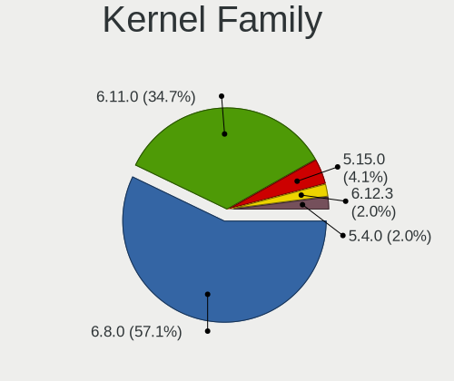
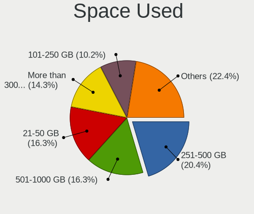
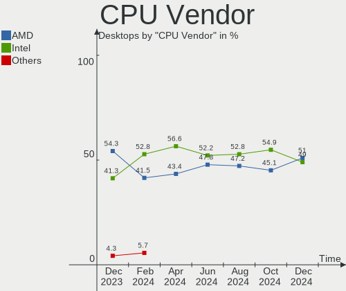
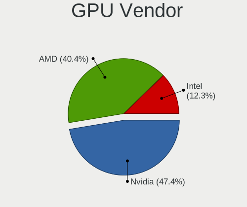
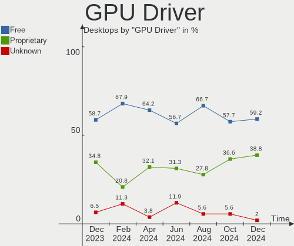
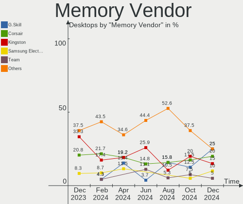

Kubuntu - Hardware Trends (Desktops)
------------------------------------

A project to identify most popular hardware characteristics and track their change
over time based on data collected by Linux users at https://Linux-Hardware.org.

Anyone can contribute to this report by the [hw-probe](https://github.com/linuxhw/hw-probe) tool:

    sudo -E hw-probe -all -upload

This report is for one last month. Overall report since the beginning of time: [TestDays](https://github.com/linuxhw/TestDays)

Period: Apr, 2023.

Contents
--------

* [ System ](#system)
  - [ OS                       ](#os)
  - [ OS Family                ](#os-family)
  - [ Kernel                   ](#kernel)
  - [ Kernel Family            ](#kernel-family)
  - [ Kernel Major Ver.        ](#kernel-major-ver)
  - [ Arch                     ](#arch)
  - [ DE                       ](#de)
  - [ Display Server           ](#display-server)
  - [ Display Manager          ](#display-manager)
  - [ OS Lang                  ](#os-lang)
  - [ Boot Mode                ](#boot-mode)
  - [ Filesystem               ](#filesystem)
  - [ Part. scheme             ](#part-scheme)
  - [ Dual Boot with Linux/BSD ](#dual-boot-with-linuxbsd)
  - [ Dual Boot (Win)          ](#dual-boot-win)

* [ Board ](#board)
  - [ Vendor                   ](#vendor)
  - [ Model                    ](#model)
  - [ Model Family             ](#model-family)
  - [ MFG Year                 ](#mfg-year)
  - [ Form Factor              ](#form-factor)
  - [ Secure Boot              ](#secure-boot)
  - [ Coreboot                 ](#coreboot)
  - [ RAM Size                 ](#ram-size)
  - [ RAM Used                 ](#ram-used)
  - [ Total Drives             ](#total-drives)
  - [ Has CD-ROM               ](#has-cd-rom)
  - [ Has Ethernet             ](#has-ethernet)
  - [ Has WiFi                 ](#has-wifi)
  - [ Has Bluetooth            ](#has-bluetooth)

* [ Location ](#location)
  - [ Country                  ](#country)
  - [ City                     ](#city)

* [ Drives ](#drives)
  - [ Drive Vendor             ](#drive-vendor)
  - [ Drive Model              ](#drive-model)
  - [ HDD Vendor               ](#hdd-vendor)
  - [ SSD Vendor               ](#ssd-vendor)
  - [ Drive Kind               ](#drive-kind)
  - [ Drive Connector          ](#drive-connector)
  - [ Drive Size               ](#drive-size)
  - [ Space Total              ](#space-total)
  - [ Space Used               ](#space-used)
  - [ Malfunc. Drives          ](#malfunc-drives)
  - [ Malfunc. Drive Vendor    ](#malfunc-drive-vendor)
  - [ Malfunc. HDD Vendor      ](#malfunc-hdd-vendor)
  - [ Malfunc. Drive Kind      ](#malfunc-drive-kind)
  - [ Failed Drives            ](#failed-drives)
  - [ Failed Drive Vendor      ](#failed-drive-vendor)
  - [ Drive Status             ](#drive-status)

* [ Storage controller ](#storage-controller)
  - [ Storage Vendor           ](#storage-vendor)
  - [ Storage Model            ](#storage-model)
  - [ Storage Kind             ](#storage-kind)

* [ Processor ](#processor)
  - [ CPU Vendor               ](#cpu-vendor)
  - [ CPU Model                ](#cpu-model)
  - [ CPU Model Family         ](#cpu-model-family)
  - [ CPU Cores                ](#cpu-cores)
  - [ CPU Sockets              ](#cpu-sockets)
  - [ CPU Threads              ](#cpu-threads)
  - [ CPU Op-Modes             ](#cpu-op-modes)
  - [ CPU Microcode            ](#cpu-microcode)
  - [ CPU Microarch            ](#cpu-microarch)

* [ Graphics ](#graphics)
  - [ GPU Vendor               ](#gpu-vendor)
  - [ GPU Model                ](#gpu-model)
  - [ GPU Combo                ](#gpu-combo)
  - [ GPU Driver               ](#gpu-driver)
  - [ GPU Memory               ](#gpu-memory)

* [ Monitor ](#monitor)
  - [ Monitor Vendor           ](#monitor-vendor)
  - [ Monitor Model            ](#monitor-model)
  - [ Monitor Resolution       ](#monitor-resolution)
  - [ Monitor Diagonal         ](#monitor-diagonal)
  - [ Monitor Width            ](#monitor-width)
  - [ Aspect Ratio             ](#aspect-ratio)
  - [ Monitor Area             ](#monitor-area)
  - [ Pixel Density            ](#pixel-density)
  - [ Multiple Monitors        ](#multiple-monitors)

* [ Network ](#network)
  - [ Net Controller Vendor    ](#net-controller-vendor)
  - [ Net Controller Model     ](#net-controller-model)
  - [ Wireless Vendor          ](#wireless-vendor)
  - [ Wireless Model           ](#wireless-model)
  - [ Ethernet Vendor          ](#ethernet-vendor)
  - [ Ethernet Model           ](#ethernet-model)
  - [ Net Controller Kind      ](#net-controller-kind)
  - [ Used Controller          ](#used-controller)
  - [ NICs                     ](#nics)
  - [ IPv6                     ](#ipv6)

* [ Bluetooth ](#bluetooth)
  - [ Bluetooth Vendor         ](#bluetooth-vendor)
  - [ Bluetooth Model          ](#bluetooth-model)

* [ Sound ](#sound)
  - [ Sound Vendor             ](#sound-vendor)
  - [ Sound Model              ](#sound-model)

* [ Memory ](#memory)
  - [ Memory Vendor            ](#memory-vendor)
  - [ Memory Model             ](#memory-model)
  - [ Memory Kind              ](#memory-kind)
  - [ Memory Form Factor       ](#memory-form-factor)
  - [ Memory Size              ](#memory-size)
  - [ Memory Speed             ](#memory-speed)

* [ Printers & scanners ](#printers--scanners)
  - [ Printer Vendor           ](#printer-vendor)
  - [ Printer Model            ](#printer-model)
  - [ Scanner Vendor           ](#scanner-vendor)
  - [ Scanner Model            ](#scanner-model)

* [ Camera ](#camera)
  - [ Camera Vendor            ](#camera-vendor)
  - [ Camera Model             ](#camera-model)

* [ Security ](#security)
  - [ Fingerprint Vendor       ](#fingerprint-vendor)
  - [ Fingerprint Model        ](#fingerprint-model)
  - [ Chipcard Vendor          ](#chipcard-vendor)
  - [ Chipcard Model           ](#chipcard-model)

* [ Unsupported ](#unsupported)
  - [ Unsupported Devices      ](#unsupported-devices)
  - [ Unsupported Device Types ](#unsupported-device-types)

System
------

OS
--

Installed operating systems

| Name          | Desktops | Percent |
|---------------|----------|---------|
| Kubuntu 22.04 | 27       | 65.85%  |
| Kubuntu 22.10 | 8        | 19.51%  |
| Kubuntu 23.04 | 3        | 7.32%   |
| Kubuntu 11    | 2        | 4.88%   |
| Kubuntu 18.04 | 1        | 2.44%   |

OS Family
---------

OS without a version

| Name    | Desktops | Percent |
|---------|----------|---------|
| Kubuntu | 41       | 100%    |

Kernel
------

Version of the Linux kernel

| Version                | Desktops | Percent |
|------------------------|----------|---------|
| 5.19.0-38-generic      | 12       | 29.27%  |
| 5.15.0-69-generic      | 7        | 17.07%  |
| 5.19.0-40-generic      | 5        | 12.2%   |
| 5.15.0-67-generic      | 3        | 7.32%   |
| 6.2.0-20-generic       | 2        | 4.88%   |
| 5.19.0-35-generic      | 2        | 4.88%   |
| 5.15.0-69-lowlatency   | 2        | 4.88%   |
| 6.2.0-1003-lowlatency  | 1        | 2.44%   |
| 5.19.0-41-generic      | 1        | 2.44%   |
| 5.19.0-21-generic      | 1        | 2.44%   |
| 5.19.0-1021-lowlatency | 1        | 2.44%   |
| 5.15.0-71-lowlatency   | 1        | 2.44%   |
| 5.15.0-70-generic      | 1        | 2.44%   |
| 5.15.0-43-generic      | 1        | 2.44%   |
| 4.15.0-166-generic     | 1        | 2.44%   |

Kernel Family
-------------

Linux kernel without a distro release

| Version | Desktops | Percent |
|---------|----------|---------|
| 5.19.0  | 22       | 53.66%  |
| 5.15.0  | 15       | 36.59%  |
| 6.2.0   | 3        | 7.32%   |
| 4.15.0  | 1        | 2.44%   |

Kernel Major Ver.
-----------------

Linux kernel major version

| Version | Desktops | Percent |
|---------|----------|---------|
| 5.19    | 22       | 53.66%  |
| 5.15    | 15       | 36.59%  |
| 6.2     | 3        | 7.32%   |
| 4.15    | 1        | 2.44%   |

Arch
----

OS architecture (x86_64, i586, etc.)

| Name   | Desktops | Percent |
|--------|----------|---------|
| x86_64 | 41       | 100%    |

DE
--

Desktop Environment

| Name | Desktops | Percent |
|------|----------|---------|
| KDE5 | 41       | 100%    |

Display Server
--------------

X11 or Wayland

| Name | Desktops | Percent |
|------|----------|---------|
| X11  | 41       | 100%    |

Display Manager
---------------

SDDM, LightDM, etc.

| Name    | Desktops | Percent |
|---------|----------|---------|
| SDDM    | 21       | 51.22%  |
| Unknown | 18       | 43.9%   |
| GDM3    | 2        | 4.88%   |

OS Lang
-------

Language

| Lang  | Desktops | Percent |
|-------|----------|---------|
| en_US | 17       | 41.46%  |
| es_ES | 4        | 9.76%   |
| de_DE | 4        | 9.76%   |
| pt_BR | 3        | 7.32%   |
| fr_FR | 2        | 4.88%   |
| en_GB | 2        | 4.88%   |
| en_CA | 2        | 4.88%   |
| sv_SE | 1        | 2.44%   |
| ru_RU | 1        | 2.44%   |
| pl_PL | 1        | 2.44%   |
| it_IT | 1        | 2.44%   |
| en_AU | 1        | 2.44%   |
| de_AT | 1        | 2.44%   |
| bg_BG | 1        | 2.44%   |

Boot Mode
---------

EFI or BIOS

| Mode | Desktops | Percent |
|------|----------|---------|
| BIOS | 28       | 68.29%  |
| EFI  | 13       | 31.71%  |

Filesystem
----------

Type of filesystem

| Type    | Desktops | Percent |
|---------|----------|---------|
| Ext4    | 37       | 90.24%  |
| Btrfs   | 2        | 4.88%   |
| Tmpfs   | 1        | 2.44%   |
| Overlay | 1        | 2.44%   |

Part. scheme
------------

Scheme of partitioning

| Type    | Desktops | Percent |
|---------|----------|---------|
| GPT     | 19       | 46.34%  |
| Unknown | 18       | 43.9%   |
| MBR     | 4        | 9.76%   |

Dual Boot with Linux/BSD
------------------------

Hosting more than one Linux/BSD

| Dual boot | Desktops | Percent |
|-----------|----------|---------|
| No        | 33       | 80.49%  |
| Yes       | 8        | 19.51%  |

Dual Boot (Win)
---------------

Hosting Linux and Windows

| Dual boot | Desktops | Percent |
|-----------|----------|---------|
| No        | 27       | 65.85%  |
| Yes       | 14       | 34.15%  |

Board
-----

Vendor
------

Motherboard manufacturer

| Name                | Desktops | Percent |
|---------------------|----------|---------|
| ASUSTek Computer    | 10       | 24.39%  |
| Gigabyte Technology | 8        | 19.51%  |
| MSI                 | 7        | 17.07%  |
| Hewlett-Packard     | 4        | 9.76%   |
| Dell                | 3        | 7.32%   |
| ASRock              | 2        | 4.88%   |
| Alienware           | 2        | 4.88%   |
| WeiBu               | 1        | 2.44%   |
| Supermicro          | 1        | 2.44%   |
| Lenovo              | 1        | 2.44%   |
| Intel               | 1        | 2.44%   |
| Foxconn             | 1        | 2.44%   |

Model
-----

Motherboard model

| Name                             | Desktops | Percent |
|----------------------------------|----------|---------|
| MSI MS-7693                      | 2        | 4.88%   |
| ASUS All Series                  | 2        | 4.88%   |
| WeiBu ADL-N                      | 1        | 2.44%   |
| Supermicro C7H61                 | 1        | 2.44%   |
| MSI MS-7D30                      | 1        | 2.44%   |
| MSI MS-7D14                      | 1        | 2.44%   |
| MSI MS-7C86                      | 1        | 2.44%   |
| MSI MS-7C56                      | 1        | 2.44%   |
| MSI MS-7721                      | 1        | 2.44%   |
| Lenovo ThinkCentre M58 9728AHG   | 1        | 2.44%   |
| Intel H81                        | 1        | 2.44%   |
| HP xw6600 Workstation            | 1        | 2.44%   |
| HP Pavilion Desktop PC 570-p0xx  | 1        | 2.44%   |
| HP Compaq Elite 8300 SFF         | 1        | 2.44%   |
| HP 870-119                       | 1        | 2.44%   |
| Gigabyte Z97X-Gaming 3           | 1        | 2.44%   |
| Gigabyte X570 AORUS XTREME       | 1        | 2.44%   |
| Gigabyte M61SME-S2               | 1        | 2.44%   |
| Gigabyte EX58-UD5                | 1        | 2.44%   |
| Gigabyte B460MAORUSPRO           | 1        | 2.44%   |
| Gigabyte B365M DS3H              | 1        | 2.44%   |
| Gigabyte AX370-Gaming K7         | 1        | 2.44%   |
| Gigabyte 970-GAMING              | 1        | 2.44%   |
| Foxconn H67M-S/H67M-V/H67        | 1        | 2.44%   |
| Dell Precision WorkStation T7500 | 1        | 2.44%   |
| Dell Precision WorkStation T7400 | 1        | 2.44%   |
| Dell OptiPlex 760                | 1        | 2.44%   |
| ASUS Z170-PRO                    | 1        | 2.44%   |
| ASUS TUF Gaming X670E-PLUS       | 1        | 2.44%   |
| ASUS TUF Gaming X570-PRO         | 1        | 2.44%   |
| ASUS TUF Gaming B550M-PLUS       | 1        | 2.44%   |
| ASUS P5K/EPU                     | 1        | 2.44%   |
| ASUS Maximus VIII HERO           | 1        | 2.44%   |
| ASUS M4A785TD-M EVO              | 1        | 2.44%   |
| ASUS Intel Home Office II        | 1        | 2.44%   |
| ASRock Z170 Extreme4             | 1        | 2.44%   |
| ASRock B560M Pro4                | 1        | 2.44%   |
| Alienware Aurora R7              | 1        | 2.44%   |
| Alienware Aurora R15 AMD         | 1        | 2.44%   |

Model Family
------------

Motherboard model prefix

| Name                   | Desktops | Percent |
|------------------------|----------|---------|
| ASUS TUF               | 3        | 7.32%   |
| MSI MS-7693            | 2        | 4.88%   |
| Dell Precision         | 2        | 4.88%   |
| ASUS All               | 2        | 4.88%   |
| Alienware Aurora       | 2        | 4.88%   |
| WeiBu ADL-N            | 1        | 2.44%   |
| Supermicro C7H61       | 1        | 2.44%   |
| MSI MS-7D30            | 1        | 2.44%   |
| MSI MS-7D14            | 1        | 2.44%   |
| MSI MS-7C86            | 1        | 2.44%   |
| MSI MS-7C56            | 1        | 2.44%   |
| MSI MS-7721            | 1        | 2.44%   |
| Lenovo ThinkCentre     | 1        | 2.44%   |
| Intel H81              | 1        | 2.44%   |
| HP xw6600              | 1        | 2.44%   |
| HP Pavilion            | 1        | 2.44%   |
| HP Compaq              | 1        | 2.44%   |
| HP 870-119             | 1        | 2.44%   |
| Gigabyte Z97X-Gaming   | 1        | 2.44%   |
| Gigabyte X570          | 1        | 2.44%   |
| Gigabyte M61SME-S2     | 1        | 2.44%   |
| Gigabyte EX58-UD5      | 1        | 2.44%   |
| Gigabyte B460MAORUSPRO | 1        | 2.44%   |
| Gigabyte B365M         | 1        | 2.44%   |
| Gigabyte AX370-Gaming  | 1        | 2.44%   |
| Gigabyte 970-GAMING    | 1        | 2.44%   |
| Foxconn H67M-S         | 1        | 2.44%   |
| Dell OptiPlex          | 1        | 2.44%   |
| ASUS Z170-PRO          | 1        | 2.44%   |
| ASUS P5K               | 1        | 2.44%   |
| ASUS Maximus           | 1        | 2.44%   |
| ASUS M4A785TD-M        | 1        | 2.44%   |
| ASUS Intel             | 1        | 2.44%   |
| ASRock Z170            | 1        | 2.44%   |
| ASRock B560M           | 1        | 2.44%   |

MFG Year
--------

Motherboard manufacture year

| Year | Desktops | Percent |
|------|----------|---------|
| 2008 | 6        | 14.63%  |
| 2020 | 5        | 12.2%   |
| 2014 | 5        | 12.2%   |
| 2021 | 3        | 7.32%   |
| 2019 | 3        | 7.32%   |
| 2018 | 3        | 7.32%   |
| 2016 | 3        | 7.32%   |
| 2023 | 2        | 4.88%   |
| 2017 | 2        | 4.88%   |
| 2012 | 2        | 4.88%   |
| 2009 | 2        | 4.88%   |
| 2022 | 1        | 2.44%   |
| 2015 | 1        | 2.44%   |
| 2013 | 1        | 2.44%   |
| 2011 | 1        | 2.44%   |
| 2007 | 1        | 2.44%   |

Form Factor
-----------

Physical design of the computer

| Name    | Desktops | Percent |
|---------|----------|---------|
| Desktop | 41       | 100%    |

Secure Boot
-----------

Enabled or disabled

| State    | Desktops | Percent |
|----------|----------|---------|
| Disabled | 41       | 100%    |

Coreboot
--------

Have coreboot on board

| Used | Desktops | Percent |
|------|----------|---------|
| No   | 41       | 100%    |

RAM Size
--------

Total RAM memory

| Size in GB  | Desktops | Percent |
|-------------|----------|---------|
| 32.01-64.0  | 11       | 26.83%  |
| 16.01-24.0  | 11       | 26.83%  |
| 8.01-16.0   | 6        | 14.63%  |
| 4.01-8.0    | 4        | 9.76%   |
| 24.01-32.0  | 4        | 9.76%   |
| 64.01-256.0 | 4        | 9.76%   |
| 3.01-4.0    | 1        | 2.44%   |

RAM Used
--------

Used RAM memory

| Used GB    | Desktops | Percent |
|------------|----------|---------|
| 4.01-8.0   | 12       | 29.27%  |
| 3.01-4.0   | 9        | 21.95%  |
| 1.01-2.0   | 7        | 17.07%  |
| 2.01-3.0   | 6        | 14.63%  |
| 8.01-16.0  | 5        | 12.2%   |
| 24.01-32.0 | 1        | 2.44%   |
| 16.01-24.0 | 1        | 2.44%   |

Total Drives
------------

Number of drives on board

| Drives | Desktops | Percent |
|--------|----------|---------|
| 2      | 11       | 26.83%  |
| 3      | 10       | 24.39%  |
| 1      | 9        | 21.95%  |
| 4      | 8        | 19.51%  |
| 6      | 2        | 4.88%   |
| 5      | 1        | 2.44%   |

Has CD-ROM
----------

Has CD-ROM on board

| Presented | Desktops | Percent |
|-----------|----------|---------|
| Yes       | 21       | 51.22%  |
| No        | 20       | 48.78%  |

Has Ethernet
------------

Has Ethernet on board

| Presented | Desktops | Percent |
|-----------|----------|---------|
| Yes       | 41       | 100%    |

Has WiFi
--------

Has WiFi module

| Presented | Desktops | Percent |
|-----------|----------|---------|
| Yes       | 21       | 51.22%  |
| No        | 20       | 48.78%  |

Has Bluetooth
-------------

Has Bluetooth module

| Presented | Desktops | Percent |
|-----------|----------|---------|
| No        | 22       | 53.66%  |
| Yes       | 19       | 46.34%  |

Location
--------

Country
-------

Geographic location (country)

| Country   | Desktops | Percent |
|-----------|----------|---------|
| USA       | 11       | 26.83%  |
| Germany   | 5        | 12.2%   |
| Spain     | 4        | 9.76%   |
| UK        | 3        | 7.32%   |
| Canada    | 3        | 7.32%   |
| Brazil    | 3        | 7.32%   |
| Poland    | 2        | 4.88%   |
| France    | 2        | 4.88%   |
| Sweden    | 1        | 2.44%   |
| Slovenia  | 1        | 2.44%   |
| Russia    | 1        | 2.44%   |
| Portugal  | 1        | 2.44%   |
| Italy     | 1        | 2.44%   |
| Czechia   | 1        | 2.44%   |
| Bulgaria  | 1        | 2.44%   |
| Australia | 1        | 2.44%   |

City
----

Geographic location (city)

| City               | Desktops | Percent |
|--------------------|----------|---------|
| London             | 2        | 4.88%   |
| Wilkszyn           | 1        | 2.44%   |
| Vladivostok        | 1        | 2.44%   |
| Vicksburg          | 1        | 2.44%   |
| Trois-Rivières    | 1        | 2.44%   |
| Suhl               | 1        | 2.44%   |
| Strasbourg         | 1        | 2.44%   |
| Shumen             | 1        | 2.44%   |
| Sherbrooke         | 1        | 2.44%   |
| Seabrook           | 1        | 2.44%   |
| Sao Paulo          | 1        | 2.44%   |
| Saint-Etienne      | 1        | 2.44%   |
| Prague             | 1        | 2.44%   |
| Porto Alegre       | 1        | 2.44%   |
| Philadelphia       | 1        | 2.44%   |
| Padova             | 1        | 2.44%   |
| Oxford             | 1        | 2.44%   |
| North Little Rock  | 1        | 2.44%   |
| Monte Alto         | 1        | 2.44%   |
| Melbourne          | 1        | 2.44%   |
| Madrid             | 1        | 2.44%   |
| Madison            | 1        | 2.44%   |
| Madera             | 1        | 2.44%   |
| Hueneja            | 1        | 2.44%   |
| Hinesville         | 1        | 2.44%   |
| Hamburg            | 1        | 2.44%   |
| Halle              | 1        | 2.44%   |
| Gothenburg         | 1        | 2.44%   |
| Gilbert            | 1        | 2.44%   |
| Gdynia             | 1        | 2.44%   |
| Ganderkesee        | 1        | 2.44%   |
| Fundao             | 1        | 2.44%   |
| Dutovlje           | 1        | 2.44%   |
| Durham             | 1        | 2.44%   |
| Centreville        | 1        | 2.44%   |
| Burgos             | 1        | 2.44%   |
| Brantford          | 1        | 2.44%   |
| Beckingen          | 1        | 2.44%   |
| Atlanta            | 1        | 2.44%   |
| Alcalá de Henares | 1        | 2.44%   |

Drives
------

Drive Vendor
------------

Hard drive vendors

| Vendor                    | Desktops | Drives | Percent |
|---------------------------|----------|--------|---------|
| Seagate                   | 18       | 28     | 19.78%  |
| WDC                       | 12       | 12     | 13.19%  |
| Samsung Electronics       | 11       | 20     | 12.09%  |
| SanDisk                   | 8        | 8      | 8.79%   |
| Crucial                   | 6        | 6      | 6.59%   |
| Unknown                   | 4        | 4      | 4.4%    |
| Toshiba                   | 4        | 6      | 4.4%    |
| Kingston                  | 3        | 3      | 3.3%    |
| A-DATA Technology         | 3        | 3      | 3.3%    |
| SPCC                      | 2        | 2      | 2.2%    |
| PNY                       | 2        | 2      | 2.2%    |
| Phison Electronics        | 2        | 2      | 2.2%    |
| Patriot                   | 2        | 2      | 2.2%    |
| Micron/Crucial Technology | 2        | 2      | 2.2%    |
| Hitachi                   | 2        | 2      | 2.2%    |
| HGST                      | 2        | 2      | 2.2%    |
| Realtek Semiconductor     | 1        | 1      | 1.1%    |
| Phison                    | 1        | 1      | 1.1%    |
| OCZ-VERTEX3               | 1        | 1      | 1.1%    |
| Mushkin                   | 1        | 1      | 1.1%    |
| Fanxiang                  | 1        | 1      | 1.1%    |
| Corsair                   | 1        | 1      | 1.1%    |
| China                     | 1        | 1      | 1.1%    |
| Unknown                   | 1        | 1      | 1.1%    |

Drive Model
-----------

Hard drive models

| Model                            | Desktops | Percent |
|----------------------------------|----------|---------|
| Samsung SSD 980 1TB              | 4        | 3.74%   |
| Seagate ST2000DM008-2FR102 2TB   | 3        | 2.8%    |
| Samsung SSD 850 EVO 500GB        | 3        | 2.8%    |
| Crucial CT1000MX500SSD1 1TB      | 3        | 2.8%    |
| Unknown SD/MMC/MS PRO 249GB      | 2        | 1.87%   |
| Toshiba DT01ACA100 1TB           | 2        | 1.87%   |
| Seagate ST4000DM004-2CV104 4TB   | 2        | 1.87%   |
| SanDisk SSD PLUS 240GB           | 2        | 1.87%   |
| HGST HMS5C4040ALE640 4TB         | 2        | 1.87%   |
| WDC WDS500G1B0B-00AS40 500GB SSD | 1        | 0.93%   |
| WDC WDS480G2G0A-00JH30 480GB SSD | 1        | 0.93%   |
| WDC WDS100T2B0C-00PXH0 1TB       | 1        | 0.93%   |
| WDC WD5000AVDS-63U7B1 500GB      | 1        | 0.93%   |
| WDC WD40EZRZ-00GXCB0 4TB         | 1        | 0.93%   |
| WDC WD20EZRZ-00Z5HB0 2TB         | 1        | 0.93%   |
| WDC WD20EARX-00PASB0 2TB         | 1        | 0.93%   |
| WDC WD15EADS-00S2B0 1TB          | 1        | 0.93%   |
| WDC WD10EZEX-60WN4A0 1TB         | 1        | 0.93%   |
| WDC WD10EZEX-08WN4A0 1TB         | 1        | 0.93%   |
| WDC WD10EZEX-07WN4A0 1TB         | 1        | 0.93%   |
| WDC WD100EMAZ-00WJTA0 10TB       | 1        | 0.93%   |
| Unknown NVMe SSD Drive 2TB       | 1        | 0.93%   |
| Unknown MMC Card  16GB           | 1        | 0.93%   |
| Toshiba KXG50ZNV256G NVMe 256GB  | 1        | 0.93%   |
| Toshiba HDWE140 4TB              | 1        | 0.93%   |
| Toshiba DT01ACA200 2TB           | 1        | 0.93%   |
| SPCC Solid State Disk 512GB      | 1        | 0.93%   |
| SPCC Solid State Disk 128GB      | 1        | 0.93%   |
| Seagate ST9500420AS 500GB        | 1        | 0.93%   |
| Seagate ST4000DX001-1CE168 4TB   | 1        | 0.93%   |
| Seagate ST3750528AS 752GB        | 1        | 0.93%   |
| Seagate ST3500414CS 500GB        | 1        | 0.93%   |
| Seagate ST340014AS 40GB          | 1        | 0.93%   |
| Seagate ST3250823AS 250GB        | 1        | 0.93%   |
| Seagate ST3160813AS 160GB        | 1        | 0.93%   |
| Seagate ST31000528AS 1TB         | 1        | 0.93%   |
| Seagate ST2000VX000-1ES164 2TB   | 1        | 0.93%   |
| Seagate ST2000DX001-1CM164 2TB   | 1        | 0.93%   |
| Seagate ST2000DM008-2UB102 2TB   | 1        | 0.93%   |
| Seagate ST2000DM001-1ER164 2TB   | 1        | 0.93%   |

HDD Vendor
----------

Hard disk drive vendors

| Vendor              | Desktops | Drives | Percent |
|---------------------|----------|--------|---------|
| Seagate             | 18       | 28     | 47.37%  |
| WDC                 | 9        | 9      | 23.68%  |
| Toshiba             | 4        | 5      | 10.53%  |
| Unknown             | 2        | 2      | 5.26%   |
| Hitachi             | 2        | 2      | 5.26%   |
| HGST                | 2        | 2      | 5.26%   |
| Samsung Electronics | 1        | 1      | 2.63%   |

SSD Vendor
----------

Solid state drive vendors

| Vendor              | Desktops | Drives | Percent |
|---------------------|----------|--------|---------|
| Samsung Electronics | 8        | 11     | 20.51%  |
| SanDisk             | 6        | 6      | 15.38%  |
| Crucial             | 6        | 6      | 15.38%  |
| A-DATA Technology   | 3        | 3      | 7.69%   |
| WDC                 | 2        | 2      | 5.13%   |
| SPCC                | 2        | 2      | 5.13%   |
| PNY                 | 2        | 2      | 5.13%   |
| Patriot             | 2        | 2      | 5.13%   |
| Kingston            | 2        | 2      | 5.13%   |
| OCZ-VERTEX3         | 1        | 1      | 2.56%   |
| Mushkin             | 1        | 1      | 2.56%   |
| Fanxiang            | 1        | 1      | 2.56%   |
| Corsair             | 1        | 1      | 2.56%   |
| China               | 1        | 1      | 2.56%   |
| Unknown             | 1        | 1      | 2.56%   |

Drive Kind
----------

HDD or SSD

| Kind | Desktops | Drives | Percent |
|------|----------|--------|---------|
| HDD  | 31       | 49     | 39.74%  |
| SSD  | 29       | 42     | 37.18%  |
| NVMe | 17       | 20     | 21.79%  |
| MMC  | 1        | 1      | 1.28%   |

Drive Connector
---------------

SATA, SAS, NVMe, etc.

| Type | Desktops | Drives | Percent |
|------|----------|--------|---------|
| SATA | 40       | 86     | 63.49%  |
| NVMe | 17       | 20     | 26.98%  |
| SAS  | 5        | 5      | 7.94%   |
| MMC  | 1        | 1      | 1.59%   |

Drive Size
----------

Size of hard drive

| Size in TB | Desktops | Drives | Percent |
|------------|----------|--------|---------|
| 0.01-0.5   | 28       | 37     | 43.08%  |
| 0.51-1.0   | 17       | 27     | 26.15%  |
| 1.01-2.0   | 10       | 13     | 15.38%  |
| 3.01-4.0   | 8        | 9      | 12.31%  |
| 10.01-20.0 | 1        | 4      | 1.54%   |
| 4.01-10.0  | 1        | 1      | 1.54%   |

Space Total
-----------

Amount of disk space available on the file system

| Size in GB     | Desktops | Percent |
|----------------|----------|---------|
| More than 3000 | 12       | 29.27%  |
| 2001-3000      | 8        | 19.51%  |
| 1001-2000      | 6        | 14.63%  |
| 251-500        | 5        | 12.2%   |
| 501-1000       | 5        | 12.2%   |
| 101-250        | 2        | 4.88%   |
| 51-100         | 2        | 4.88%   |
| 1-20           | 1        | 2.44%   |

Space Used
----------

Amount of used disk space

| Used GB        | Desktops | Percent |
|----------------|----------|---------|
| More than 3000 | 8        | 19.51%  |
| 251-500        | 7        | 17.07%  |
| 1001-2000      | 6        | 14.63%  |
| 501-1000       | 5        | 12.2%   |
| 101-250        | 4        | 9.76%   |
| 51-100         | 4        | 9.76%   |
| 1-20           | 3        | 7.32%   |
| 21-50          | 2        | 4.88%   |
| 2001-3000      | 2        | 4.88%   |

Malfunc. Drives
---------------

Drive models with a malfunction

| Model                             | Desktops | Drives | Percent |
|-----------------------------------|----------|--------|---------|
| Seagate ST1000NM0011 1TB          | 1        | 1      | 33.33%  |
| Samsung Electronics HD501LJ 500GB | 1        | 1      | 33.33%  |
| Phison Electronics PCIe SSD 8TB   | 1        | 1      | 33.33%  |

Malfunc. Drive Vendor
---------------------

Vendors of faulty drives

| Vendor              | Desktops | Drives | Percent |
|---------------------|----------|--------|---------|
| Seagate             | 1        | 1      | 33.33%  |
| Samsung Electronics | 1        | 1      | 33.33%  |
| Phison Electronics  | 1        | 1      | 33.33%  |

Malfunc. HDD Vendor
-------------------

Vendors of faulty HDD drives

| Vendor              | Desktops | Drives | Percent |
|---------------------|----------|--------|---------|
| Seagate             | 1        | 1      | 50%     |
| Samsung Electronics | 1        | 1      | 50%     |

Malfunc. Drive Kind
-------------------

Kinds of faulty drives

| Kind | Desktops | Drives | Percent |
|------|----------|--------|---------|
| HDD  | 2        | 2      | 66.67%  |
| NVMe | 1        | 1      | 33.33%  |

Failed Drives
-------------

Failed drive models

Zero info for selected period =(

Failed Drive Vendor
-------------------

Failed drive vendors

Zero info for selected period =(

Drive Status
------------

Number of failed and malfunc. drives

| Status   | Desktops | Drives | Percent |
|----------|----------|--------|---------|
| Detected | 30       | 75     | 62.5%   |
| Works    | 15       | 34     | 31.25%  |
| Malfunc  | 3        | 3      | 6.25%   |

Storage controller
------------------

Storage Vendor
--------------

Storage controller vendors

| Vendor                       | Desktops | Percent |
|------------------------------|----------|---------|
| Intel                        | 27       | 42.19%  |
| AMD                          | 13       | 20.31%  |
| Samsung Electronics          | 6        | 9.38%   |
| SanDisk                      | 3        | 4.69%   |
| Phison Electronics           | 2        | 3.13%   |
| Micron/Crucial Technology    | 2        | 3.13%   |
| LSI Logic / Symbios Logic    | 2        | 3.13%   |
| ASMedia Technology           | 2        | 3.13%   |
| Toshiba America Info Systems | 1        | 1.56%   |
| Solidigm                     | 1        | 1.56%   |
| Realtek Semiconductor        | 1        | 1.56%   |
| Nvidia                       | 1        | 1.56%   |
| Marvell Technology Group     | 1        | 1.56%   |
| Kingston Technology Company  | 1        | 1.56%   |
| JMicron Technology           | 1        | 1.56%   |

Storage Model
-------------

Storage controller models

| Model                                                                         | Desktops | Percent |
|-------------------------------------------------------------------------------|----------|---------|
| AMD FCH SATA Controller [AHCI mode]                                           | 7        | 8.64%   |
| Samsung NVMe SSD Controller 980                                               | 4        | 4.94%   |
| Intel Q170/Q150/B150/H170/H110/Z170/CM236 Chipset SATA Controller [AHCI Mode] | 4        | 4.94%   |
| Intel 200 Series PCH SATA controller [AHCI mode]                              | 4        | 4.94%   |
| Intel 9 Series Chipset Family SATA Controller [AHCI Mode]                     | 3        | 3.7%    |
| AMD SB7x0/SB8x0/SB9x0 SATA Controller [AHCI mode]                             | 3        | 3.7%    |
| AMD 500 Series Chipset SATA Controller                                        | 3        | 3.7%    |
| Samsung NVMe SSD Controller SM981/PM981/PM983                                 | 2        | 2.47%   |
| Phison E16 PCIe4 NVMe Controller                                              | 2        | 2.47%   |
| LSI Logic / Symbios Logic SAS1068E PCI-Express Fusion-MPT SAS                 | 2        | 2.47%   |
| Intel 631xESB/632xESB IDE Controller                                          | 2        | 2.47%   |
| Intel 400 Series Chipset Family SATA AHCI Controller                          | 2        | 2.47%   |
| Intel 4 Series Chipset PT IDER Controller                                     | 2        | 2.47%   |
| ASMedia ASM1062 Serial ATA Controller                                         | 2        | 2.47%   |
| Toshiba America Info Systems XG5 NVMe SSD Controller                          | 1        | 1.23%   |
| Solidigm Non-Volatile memory controller                                       | 1        | 1.23%   |
| Sandisk Western Digital WD Black SN850X NVMe SSD                              | 1        | 1.23%   |
| SanDisk WD Blue SN550 NVMe SSD                                                | 1        | 1.23%   |
| SanDisk WD Black 2018/SN750 / PC SN720 NVMe SSD                               | 1        | 1.23%   |
| Samsung NVMe SSD Controller SM951/PM951                                       | 1        | 1.23%   |
| Samsung NVMe SSD Controller PM9A1/PM9A3/980PRO                                | 1        | 1.23%   |
| Realtek NVMe Controller                                                       | 1        | 1.23%   |
| Phison E12 NVMe Controller                                                    | 1        | 1.23%   |
| Nvidia MCP61 SATA Controller                                                  | 1        | 1.23%   |
| Nvidia MCP61 IDE                                                              | 1        | 1.23%   |
| Micron/Crucial P2 NVMe PCIe SSD                                               | 1        | 1.23%   |
| Micron/Crucial NVMe Storage Controller                                        | 1        | 1.23%   |
| Marvell Group 88SE6101/6102 single-port PATA133 interface                     | 1        | 1.23%   |
| LSI Logic / Symbios Logic MegaRAID SAS 1078                                   | 1        | 1.23%   |
| Kingston Company A2000 NVMe SSD                                               | 1        | 1.23%   |
| JMicron JMB363 SATA/IDE Controller                                            | 1        | 1.23%   |
| Intel SATA Controller [RAID mode]                                             | 1        | 1.23%   |
| Intel SATA controller                                                         | 1        | 1.23%   |
| Intel Alder Lake-S PCH SATA Controller [AHCI Mode]                            | 1        | 1.23%   |
| Intel 82801JI (ICH10 Family) SATA AHCI Controller                             | 1        | 1.23%   |
| Intel 82801JI (ICH10 Family) 4 port SATA IDE Controller #1                    | 1        | 1.23%   |
| Intel 82801JI (ICH10 Family) 2 port SATA IDE Controller #2                    | 1        | 1.23%   |
| Intel 82801JD/DO (ICH10 Family) SATA AHCI Controller                          | 1        | 1.23%   |
| Intel 82801JD/DO (ICH10 Family) 4-port SATA IDE Controller                    | 1        | 1.23%   |
| Intel 82801JD/DO (ICH10 Family) 2-port SATA IDE Controller                    | 1        | 1.23%   |

Storage Kind
------------

Kind of storage controller (IDE, SATA, NVMe, SAS, ...)

| Kind | Desktops | Percent |
|------|----------|---------|
| SATA | 36       | 54.55%  |
| NVMe | 17       | 25.76%  |
| IDE  | 9        | 13.64%  |
| RAID | 2        | 3.03%   |
| SCSI | 2        | 3.03%   |

Processor
---------

CPU Vendor
----------

Processor vendors

| Vendor | Desktops | Percent |
|--------|----------|---------|
| Intel  | 27       | 65.85%  |
| AMD    | 14       | 34.15%  |

CPU Model
---------

Processor models

| Model                                      | Desktops | Percent |
|--------------------------------------------|----------|---------|
| Intel Core i7-6700K CPU @ 4.00GHz          | 2        | 4.88%   |
| Intel Core i7-4790K CPU @ 4.00GHz          | 2        | 4.88%   |
| Intel Core i5-10400F CPU @ 2.90GHz         | 2        | 4.88%   |
| Intel Xeon CPU X5472 @ 3.00GHz             | 1        | 2.44%   |
| Intel Xeon CPU X5450 @ 3.00GHz             | 1        | 2.44%   |
| Intel Xeon CPU W5580 @ 3.20GHz             | 1        | 2.44%   |
| Intel Xeon CPU E5430 @ 2.66GHz             | 1        | 2.44%   |
| Intel N95                                  | 1        | 2.44%   |
| Intel Core i9-10900T CPU @ 1.90GHz         | 1        | 2.44%   |
| Intel Core i7-8700 CPU @ 3.20GHz           | 1        | 2.44%   |
| Intel Core i7-6700 CPU @ 3.40GHz           | 1        | 2.44%   |
| Intel Core i7-4790 CPU @ 3.60GHz           | 1        | 2.44%   |
| Intel Core i7-3770 CPU @ 3.40GHz           | 1        | 2.44%   |
| Intel Core i7 CPU 920 @ 2.67GHz            | 1        | 2.44%   |
| Intel Core i5-9600K CPU @ 3.70GHz          | 1        | 2.44%   |
| Intel Core i5-8400 CPU @ 2.80GHz           | 1        | 2.44%   |
| Intel Core i5-7400 CPU @ 3.00GHz           | 1        | 2.44%   |
| Intel Core i5-6600K CPU @ 3.50GHz          | 1        | 2.44%   |
| Intel Core i5-4590 CPU @ 3.30GHz           | 1        | 2.44%   |
| Intel Core i5-3470 CPU @ 3.20GHz           | 1        | 2.44%   |
| Intel Core i5-2500K CPU @ 3.30GHz          | 1        | 2.44%   |
| Intel Core 2 Quad CPU Q8400 @ 2.66GHz      | 1        | 2.44%   |
| Intel Core 2 Duo CPU E8400 @ 3.00GHz       | 1        | 2.44%   |
| Intel 13th Gen Core i9-13900K              | 1        | 2.44%   |
| AMD Ryzen 9 7950X 16-Core Processor        | 1        | 2.44%   |
| AMD Ryzen 9 7900X 12-Core Processor        | 1        | 2.44%   |
| AMD Ryzen 9 3950X 16-Core Processor        | 1        | 2.44%   |
| AMD Ryzen 7 PRO 4750G with Radeon Graphics | 1        | 2.44%   |
| AMD Ryzen 7 5700G with Radeon Graphics     | 1        | 2.44%   |
| AMD Ryzen 7 3700X 8-Core Processor         | 1        | 2.44%   |
| AMD Ryzen 5 3600 6-Core Processor          | 1        | 2.44%   |
| AMD Ryzen 5 1600X Six-Core Processor       | 1        | 2.44%   |
| AMD Phenom II X3 705e Processor            | 1        | 2.44%   |
| AMD FX-8350 Eight-Core Processor           | 1        | 2.44%   |
| AMD FX-8300 Eight-Core Processor           | 1        | 2.44%   |
| AMD FX-6300 Six-Core Processor             | 1        | 2.44%   |
| AMD Athlon 64 X2 Dual Core Processor 5600+ | 1        | 2.44%   |
| AMD A10-5800K APU with Radeon HD Graphics  | 1        | 2.44%   |

CPU Model Family
----------------

Processor model prefix

| Model             | Desktops | Percent |
|-------------------|----------|---------|
| Intel Core i7     | 9        | 21.95%  |
| Intel Core i5     | 9        | 21.95%  |
| Intel Xeon        | 4        | 9.76%   |
| AMD Ryzen 9       | 3        | 7.32%   |
| AMD FX            | 3        | 7.32%   |
| Other             | 2        | 4.88%   |
| AMD Ryzen 7       | 2        | 4.88%   |
| AMD Ryzen 5       | 2        | 4.88%   |
| Intel Core i9     | 1        | 2.44%   |
| Intel Core 2 Quad | 1        | 2.44%   |
| Intel Core 2 Duo  | 1        | 2.44%   |
| AMD Ryzen 7 PRO   | 1        | 2.44%   |
| AMD Phenom II X3  | 1        | 2.44%   |
| AMD Athlon 64 X2  | 1        | 2.44%   |
| AMD A10           | 1        | 2.44%   |

CPU Cores
---------

Number of processor cores

| Number | Desktops | Percent |
|--------|----------|---------|
| 4      | 19       | 46.34%  |
| 6      | 7        | 17.07%  |
| 8      | 4        | 9.76%   |
| 2      | 3        | 7.32%   |
| 16     | 2        | 4.88%   |
| 3      | 2        | 4.88%   |
| 24     | 1        | 2.44%   |
| 12     | 1        | 2.44%   |
| 10     | 1        | 2.44%   |
| 1      | 1        | 2.44%   |

CPU Sockets
-----------

Number of sockets

| Number | Desktops | Percent |
|--------|----------|---------|
| 1      | 40       | 97.56%  |
| 2      | 1        | 2.44%   |

CPU Threads
-----------

Threads per core (Hyper-Threading)

| Number | Desktops | Percent |
|--------|----------|---------|
| 2      | 25       | 60.98%  |
| 1      | 16       | 39.02%  |

CPU Op-Modes
------------

CPU Operation Modes (32-bit, 64-bit)

| Op mode        | Desktops | Percent |
|----------------|----------|---------|
| 32-bit, 64-bit | 41       | 100%    |

CPU Microcode
-------------

Microcode number

| Number     | Desktops | Percent |
|------------|----------|---------|
| Unknown    | 23       | 56.1%   |
| 0x506e3    | 2        | 4.88%   |
| 0x0a601203 | 2        | 4.88%   |
| 0xb0671    | 1        | 2.44%   |
| 0xa0653    | 1        | 2.44%   |
| 0x906ea    | 1        | 2.44%   |
| 0x906e9    | 1        | 2.44%   |
| 0x306c3    | 1        | 2.44%   |
| 0x306a9    | 1        | 2.44%   |
| 0x106a5    | 1        | 2.44%   |
| 0x1067a    | 1        | 2.44%   |
| 0x10676    | 1        | 2.44%   |
| 0x08701021 | 1        | 2.44%   |
| 0x08600106 | 1        | 2.44%   |
| 0x06001119 | 1        | 2.44%   |
| 0x06000822 | 1        | 2.44%   |
| 0x010000db | 1        | 2.44%   |

CPU Microarch
-------------

Microarchitecture

| Name        | Desktops | Percent |
|-------------|----------|---------|
| Penryn      | 5        | 12.2%   |
| Zen 2       | 4        | 9.76%   |
| Skylake     | 4        | 9.76%   |
| Piledriver  | 4        | 9.76%   |
| KabyLake    | 4        | 9.76%   |
| Haswell     | 4        | 9.76%   |
| Unknown     | 4        | 9.76%   |
| CometLake   | 3        | 7.32%   |
| Nehalem     | 2        | 4.88%   |
| IvyBridge   | 2        | 4.88%   |
| Zen 3       | 1        | 2.44%   |
| Zen         | 1        | 2.44%   |
| SandyBridge | 1        | 2.44%   |
| K8 Hammer   | 1        | 2.44%   |
| K10         | 1        | 2.44%   |

Graphics
--------

GPU Vendor
----------

Vendors of graphics cards

| Vendor | Desktops | Percent |
|--------|----------|---------|
| Nvidia | 24       | 51.06%  |
| Intel  | 12       | 25.53%  |
| AMD    | 11       | 23.4%   |

GPU Model
---------

Graphics card models

| Model                                                                       | Desktops | Percent |
|-----------------------------------------------------------------------------|----------|---------|
| Nvidia GP107 [GeForce GTX 1050 Ti]                                          | 4        | 8.16%   |
| Nvidia TU106 [GeForce RTX 2060 SUPER]                                       | 2        | 4.08%   |
| Nvidia GK208B [GeForce GT 730]                                              | 2        | 4.08%   |
| Intel Xeon E3-1200 v3/4th Gen Core Processor Integrated Graphics Controller | 2        | 4.08%   |
| Intel CoffeeLake-S GT2 [UHD Graphics 630]                                   | 2        | 4.08%   |
| Intel 4 Series Chipset Integrated Graphics Controller                       | 2        | 4.08%   |
| AMD Navi 10 [Radeon RX 5600 OEM/5600 XT / 5700/5700 XT]                     | 2        | 4.08%   |
| Nvidia TU117 [GeForce GTX 1650]                                             | 1        | 2.04%   |
| Nvidia TU116 [GeForce GTX 1650]                                             | 1        | 2.04%   |
| Nvidia GT218 [GeForce G210]                                                 | 1        | 2.04%   |
| Nvidia GT215 [GeForce GT 330]                                               | 1        | 2.04%   |
| Nvidia GT200GL [Quadro FX 4800]                                             | 1        | 2.04%   |
| Nvidia GP106 [GeForce GTX 1060 6GB]                                         | 1        | 2.04%   |
| Nvidia GP104 [GeForce GTX 1070]                                             | 1        | 2.04%   |
| Nvidia GM200GL [Tesla M40]                                                  | 1        | 2.04%   |
| Nvidia GK208B [GeForce GT 710]                                              | 1        | 2.04%   |
| Nvidia GK106 [GeForce GTX 650 Ti]                                           | 1        | 2.04%   |
| Nvidia GK104 [GeForce GTX 760]                                              | 1        | 2.04%   |
| Nvidia GF119 [GeForce GT 610]                                               | 1        | 2.04%   |
| Nvidia GF100GL [Quadro 4000]                                                | 1        | 2.04%   |
| Nvidia GA106 [GeForce RTX 3060 Lite Hash Rate]                              | 1        | 2.04%   |
| Nvidia GA102 [GeForce RTX 3090]                                             | 1        | 2.04%   |
| Nvidia GA102 [GeForce RTX 3080 Lite Hash Rate]                              | 1        | 2.04%   |
| Nvidia AD102 [GeForce RTX 4090]                                             | 1        | 2.04%   |
| Intel Xeon E3-1200 v2/3rd Gen Core processor Graphics Controller            | 1        | 2.04%   |
| Intel Raptor Lake-S GT1 [UHD Graphics 770]                                  | 1        | 2.04%   |
| Intel IvyBridge GT2 [HD Graphics 4000]                                      | 1        | 2.04%   |
| Intel CometLake-S GT2 [UHD Graphics 630]                                    | 1        | 2.04%   |
| Intel Alder Lake-N [UHD Graphics]                                           | 1        | 2.04%   |
| Intel 2nd Generation Core Processor Family Integrated Graphics Controller   | 1        | 2.04%   |
| AMD Turks XT [Radeon HD 6670/7670]                                          | 1        | 2.04%   |
| AMD RV370 [Radeon X300]                                                     | 1        | 2.04%   |
| AMD RV370 [Radeon X300 SE]                                                  | 1        | 2.04%   |
| AMD Renoir                                                                  | 1        | 2.04%   |
| AMD Raphael                                                                 | 1        | 2.04%   |
| AMD Ellesmere [Radeon RX 470/480/570/570X/580/580X/590]                     | 1        | 2.04%   |
| AMD Cezanne [Radeon Vega Series / Radeon Vega Mobile Series]                | 1        | 2.04%   |
| AMD Bonaire XTX [Radeon R7 260X/360]                                        | 1        | 2.04%   |
| AMD Bonaire XT [Radeon HD 7790/8770 / R7 360 / R9 260/360 OEM]              | 1        | 2.04%   |
| AMD Baffin [Radeon RX 460/560D / Pro 450/455/460/555/555X/560/560X]         | 1        | 2.04%   |

GPU Combo
---------

Combinations of graphics cards

| Name           | Desktops | Percent |
|----------------|----------|---------|
| 1 x Nvidia     | 20       | 48.78%  |
| 1 x Intel      | 8        | 19.51%  |
| 1 x AMD        | 8        | 19.51%  |
| AMD + Nvidia   | 2        | 4.88%   |
| 2 x Nvidia     | 1        | 2.44%   |
| 2 x AMD        | 1        | 2.44%   |
| Intel + Nvidia | 1        | 2.44%   |

GPU Driver
----------

Free vs proprietary

| Driver      | Desktops | Percent |
|-------------|----------|---------|
| Free        | 21       | 51.22%  |
| Proprietary | 19       | 46.34%  |
| Unknown     | 1        | 2.44%   |

GPU Memory
----------

Total video memory

| Size in GB | Desktops | Percent |
|------------|----------|---------|
| Unknown    | 20       | 48.78%  |
| 1.01-2.0   | 5        | 12.2%   |
| 3.01-4.0   | 4        | 9.76%   |
| 7.01-8.0   | 3        | 7.32%   |
| 0.51-1.0   | 3        | 7.32%   |
| 16.01-24.0 | 2        | 4.88%   |
| 8.01-16.0  | 2        | 4.88%   |
| 5.01-6.0   | 1        | 2.44%   |
| 0.01-0.5   | 1        | 2.44%   |

Monitor
-------

Monitor Vendor
--------------

Monitor vendors

| Vendor               | Desktops | Percent |
|----------------------|----------|---------|
| Samsung Electronics  | 10       | 20.83%  |
| Goldstar             | 4        | 8.33%   |
| Dell                 | 4        | 8.33%   |
| Hewlett-Packard      | 3        | 6.25%   |
| BenQ                 | 3        | 6.25%   |
| ASUSTek Computer     | 3        | 6.25%   |
| Acer                 | 3        | 6.25%   |
| Iiyama               | 2        | 4.17%   |
| Ancor Communications | 2        | 4.17%   |
| Unknown              | 2        | 4.17%   |
| Xiaomi               | 1        | 2.08%   |
| Vizio                | 1        | 2.08%   |
| TXD                  | 1        | 2.08%   |
| Sceptre Tech         | 1        | 2.08%   |
| Planar               | 1        | 2.08%   |
| Philips              | 1        | 2.08%   |
| ONKYO                | 1        | 2.08%   |
| NEC Computers        | 1        | 2.08%   |
| LG Electronics       | 1        | 2.08%   |
| Hitachi              | 1        | 2.08%   |
| Eizo                 | 1        | 2.08%   |
| CHD                  | 1        | 2.08%   |

Monitor Model
-------------

Monitor models

| Model                                                                  | Desktops | Percent |
|------------------------------------------------------------------------|----------|---------|
| Unknown                                                                | 2        | 3.85%   |
| Xiaomi Mi TV XMD009A 3440x1440 480x270mm 21.7-inch                     | 1        | 1.92%   |
| Vizio VX32L HDTV10A VIZ0021 1366x768 700x390mm 31.5-inch               | 1        | 1.92%   |
| TXD HDMI TXD7825 1440x900 408x255mm 18.9-inch                          | 1        | 1.92%   |
| Sceptre Tech E248W-19203S SPT099D 1920x1080 443x249mm 20.0-inch        | 1        | 1.92%   |
| Samsung Electronics SyncMaster SAM0587 1920x1200 518x324mm 24.1-inch   | 1        | 1.92%   |
| Samsung Electronics SyncMaster SAM04DE 1920x1080 477x268mm 21.5-inch   | 1        | 1.92%   |
| Samsung Electronics SyncMaster SAM04D3 1920x1080 531x298mm 24.0-inch   | 1        | 1.92%   |
| Samsung Electronics SMBX2250 SAM071B 1920x1080 477x268mm 21.5-inch     | 1        | 1.92%   |
| Samsung Electronics S23C570 SAM0A56 1920x1080 510x287mm 23.0-inch      | 1        | 1.92%   |
| Samsung Electronics S22C650 SAM0A05 1920x1080 477x268mm 21.5-inch      | 1        | 1.92%   |
| Samsung Electronics LCD Monitor SyncMaster 3200x1200                   | 1        | 1.92%   |
| Samsung Electronics LCD Monitor SAM0E33 1920x1080 1210x680mm 54.6-inch | 1        | 1.92%   |
| Samsung Electronics LCD Monitor SAM03BB 1920x1080 886x498mm 40.0-inch  | 1        | 1.92%   |
| Samsung Electronics LC49G95T SAM7053 3840x1080 1193x336mm 48.8-inch    | 1        | 1.92%   |
| Samsung Electronics LC27G5xT SAM707A 2560x1440 597x336mm 27.0-inch     | 1        | 1.92%   |
| Planar PLL2710W PLN2710 1920x1080 597x336mm 27.0-inch                  | 1        | 1.92%   |
| Philips PHL 231B4Q PHL08EB 1920x1080 509x286mm 23.0-inch               | 1        | 1.92%   |
| ONKYO LCD Monitor TX-SR508                                             | 1        | 1.92%   |
| NEC Computers E241N NEC2C86 1920x1080 527x296mm 23.8-inch              | 1        | 1.92%   |
| LG Electronics LCD Monitor D2342P 5760x2160                            | 1        | 1.92%   |
| Iiyama PLE2207WS IVM5609 1680x1050 474x296mm 22.0-inch                 | 1        | 1.92%   |
| Iiyama PL3288UH IVM1176 3840x2160 698x393mm 31.5-inch                  | 1        | 1.92%   |
| Hitachi HISENSE HEC0030 3840x2160 1872x1053mm 84.6-inch                | 1        | 1.92%   |
| Hewlett-Packard LCD Monitor w2216 1680x1050                            | 1        | 1.92%   |
| Hewlett-Packard L1950 HWP26E8 1280x1024 380x300mm 19.1-inch            | 1        | 1.92%   |
| Hewlett-Packard 25es HWP3322 1920x1080 553x309mm 24.9-inch             | 1        | 1.92%   |
| Goldstar ULTRAGEAR GSM5C08 1920x1080 530x300mm 24.0-inch               | 1        | 1.92%   |
| Goldstar IPS235 GSM587D 1920x1080 510x290mm 23.1-inch                  | 1        | 1.92%   |
| Goldstar FULL HD GSM5B55 1920x1080 480x270mm 21.7-inch                 | 1        | 1.92%   |
| Goldstar E2442 GSM58C5 1920x1080 531x299mm 24.0-inch                   | 1        | 1.92%   |
| Eizo L767 ENC1687 1280x1024 376x301mm 19.0-inch                        | 1        | 1.92%   |
| Dell U2412M DELA07A 1920x1200 518x324mm 24.1-inch                      | 1        | 1.92%   |
| Dell U2412M DELA079 1920x1200 518x324mm 24.1-inch                      | 1        | 1.92%   |
| Dell P4317Q DELD087 3840x2160 941x529mm 42.5-inch                      | 1        | 1.92%   |
| Dell P2414H DELA09A 1920x1080 527x297mm 23.8-inch                      | 1        | 1.92%   |
| Dell 2007FP DELA020 1600x1200 367x275mm 18.1-inch                      | 1        | 1.92%   |
| CHD LS13_LS18 CHD9021 1280x1024 708x398mm 32.0-inch                    | 1        | 1.92%   |
| BenQ GW2765 BNQ78D6 2560x1440 597x336mm 27.0-inch                      | 1        | 1.92%   |
| BenQ GW2480 BNQ78E7 1920x1080 527x296mm 23.8-inch                      | 1        | 1.92%   |

Monitor Resolution
------------------

Monitor screen resolution

| Resolution         | Desktops | Percent |
|--------------------|----------|---------|
| 1920x1080 (FHD)    | 19       | 43.18%  |
| 3840x2160 (4K)     | 5        | 11.36%  |
| 2560x1440 (QHD)    | 3        | 6.82%   |
| 1920x1200 (WUXGA)  | 3        | 6.82%   |
| 1280x1024 (SXGA)   | 3        | 6.82%   |
| 1680x1050 (WSXGA+) | 2        | 4.55%   |
| Unknown            | 2        | 4.55%   |
| 5760x2160          | 1        | 2.27%   |
| 3840x1080          | 1        | 2.27%   |
| 3440x1440          | 1        | 2.27%   |
| 3200x1200          | 1        | 2.27%   |
| 1920x540           | 1        | 2.27%   |
| 1600x900 (HD+)     | 1        | 2.27%   |
| 1600x1200          | 1        | 2.27%   |

Monitor Diagonal
----------------

Diagonal size in inches

| Inches  | Desktops | Percent |
|---------|----------|---------|
| 24      | 11       | 23.4%   |
| 23      | 7        | 14.89%  |
| 27      | 5        | 10.64%  |
| 31      | 4        | 8.51%   |
| 21      | 4        | 8.51%   |
| 32      | 3        | 6.38%   |
| 19      | 3        | 6.38%   |
| Unknown | 3        | 6.38%   |
| 84      | 1        | 2.13%   |
| 54      | 1        | 2.13%   |
| 48      | 1        | 2.13%   |
| 42      | 1        | 2.13%   |
| 40      | 1        | 2.13%   |
| 22      | 1        | 2.13%   |
| 20      | 1        | 2.13%   |

Monitor Width
-------------

Physical width

| Width in mm | Desktops | Percent |
|-------------|----------|---------|
| 501-600     | 21       | 46.67%  |
| 401-500     | 7        | 15.56%  |
| 601-700     | 4        | 8.89%   |
| 701-800     | 3        | 6.67%   |
| Unknown     | 3        | 6.67%   |
| 351-400     | 2        | 4.44%   |
| 1001-1500   | 2        | 4.44%   |
| 801-900     | 1        | 2.22%   |
| 1501-2000   | 1        | 2.22%   |
| 901-1000    | 1        | 2.22%   |

Aspect Ratio
------------

Proportional relationship between the width and the height

| Ratio   | Desktops | Percent |
|---------|----------|---------|
| 16/9    | 28       | 70%     |
| 16/10   | 5        | 12.5%   |
| Unknown | 3        | 7.5%    |
| 5/4     | 2        | 5%      |
| 4/3     | 1        | 2.5%    |
| 32/9    | 1        | 2.5%    |

Monitor Area
------------

Area in inch²

| Area in inch² | Desktops | Percent |
|----------------|----------|---------|
| 201-250        | 15       | 34.09%  |
| 351-500        | 7        | 15.91%  |
| 301-350        | 5        | 11.36%  |
| 151-200        | 5        | 11.36%  |
| 251-300        | 4        | 9.09%   |
| 501-1000       | 3        | 6.82%   |
| Unknown        | 3        | 6.82%   |
| More than 1000 | 2        | 4.55%   |

Pixel Density
-------------

Pixels per inch

| Density | Desktops | Percent |
|---------|----------|---------|
| 51-100  | 28       | 66.67%  |
| 101-120 | 6        | 14.29%  |
| 121-160 | 3        | 7.14%   |
| Unknown | 3        | 7.14%   |
| 1-50    | 2        | 4.76%   |

Multiple Monitors
-----------------

Total monitors connected

| Total | Desktops | Percent |
|-------|----------|---------|
| 1     | 26       | 63.41%  |
| 2     | 10       | 24.39%  |
| 0     | 3        | 7.32%   |
| 3     | 2        | 4.88%   |

Network
-------

Net Controller Vendor
---------------------

Controller vendors

| Vendor                          | Desktops | Percent |
|---------------------------------|----------|---------|
| Intel                           | 19       | 29.69%  |
| Realtek Semiconductor           | 18       | 28.13%  |
| Qualcomm Atheros                | 6        | 9.38%   |
| Broadcom                        | 4        | 6.25%   |
| Ralink Technology               | 3        | 4.69%   |
| TP-Link                         | 2        | 3.13%   |
| Qualcomm Atheros Communications | 2        | 3.13%   |
| VIA Technologies                | 1        | 1.56%   |
| Nvidia                          | 1        | 1.56%   |
| Marvell Technology Group        | 1        | 1.56%   |
| LSI                             | 1        | 1.56%   |
| DisplayLink                     | 1        | 1.56%   |
| Belkin Components               | 1        | 1.56%   |
| ASUSTek Computer                | 1        | 1.56%   |
| ASIX Electronics                | 1        | 1.56%   |
| Arduino SA                      | 1        | 1.56%   |
| Aquantia                        | 1        | 1.56%   |

Net Controller Model
--------------------

Controller models

| Model                                                             | Desktops | Percent |
|-------------------------------------------------------------------|----------|---------|
| Realtek RTL8111/8168/8411 PCI Express Gigabit Ethernet Controller | 11       | 14.67%  |
| Realtek RTL8125 2.5GbE Controller                                 | 4        | 5.33%   |
| Qualcomm Atheros Killer E220x Gigabit Ethernet Controller         | 4        | 5.33%   |
| Intel Wi-Fi 6 AX200                                               | 4        | 5.33%   |
| Intel Ethernet Controller I225-V                                  | 3        | 4%      |
| Intel Ethernet Connection (2) I219-V                              | 3        | 4%      |
| Qualcomm Atheros Killer E2500 Gigabit Ethernet Controller         | 2        | 2.67%   |
| Qualcomm Atheros AR9271 802.11n                                   | 2        | 2.67%   |
| Intel I211 Gigabit Network Connection                             | 2        | 2.67%   |
| Intel Dual Band Wireless-AC 3168NGW [Stone Peak]                  | 2        | 2.67%   |
| Intel 82567LM-3 Gigabit Network Connection                        | 2        | 2.67%   |
| VIA VT6105/VT6106S [Rhine-III]                                    | 1        | 1.33%   |
| TP-Link Archer T2U PLUS [RTL8821AU]                               | 1        | 1.33%   |
| TP-Link 802.11ac WLAN Adapter                                     | 1        | 1.33%   |
| Realtek RTL88x2bu [AC1200 Techkey]                                | 1        | 1.33%   |
| Realtek RTL8852BE PCIe 802.11ax Wireless Network Controller       | 1        | 1.33%   |
| Realtek RTL8821CE 802.11ac PCIe Wireless Network Adapter          | 1        | 1.33%   |
| Realtek RTL8812AE 802.11ac PCIe Wireless Network Adapter          | 1        | 1.33%   |
| Realtek RTL8192EE PCIe Wireless Network Adapter                   | 1        | 1.33%   |
| Realtek RTL8153 Gigabit Ethernet Adapter                          | 1        | 1.33%   |
| Realtek RTL810xE PCI Express Fast Ethernet controller             | 1        | 1.33%   |
| Realtek 802.11ac NIC                                              | 1        | 1.33%   |
| Ralink RT5372 Wireless Adapter                                    | 1        | 1.33%   |
| Ralink RT2870/RT3070 Wireless Adapter                             | 1        | 1.33%   |
| Ralink RT2870 Wireless Adapter                                    | 1        | 1.33%   |
| Nvidia MCP61 Ethernet                                             | 1        | 1.33%   |
| Marvell Group 88E8056 PCI-E Gigabit Ethernet Controller           | 1        | 1.33%   |
| LSI LT WinModem                                                   | 1        | 1.33%   |
| Intel Wireless 7265                                               | 1        | 1.33%   |
| Intel I210 Gigabit Network Connection                             | 1        | 1.33%   |
| Intel Ethernet Connection (2) I218-V                              | 1        | 1.33%   |
| Intel Ethernet Connection (12) I219-V                             | 1        | 1.33%   |
| Intel Ethernet Connection (11) I219-V                             | 1        | 1.33%   |
| Intel Alder Lake-S PCH CNVi WiFi                                  | 1        | 1.33%   |
| Intel 82579V Gigabit Network Connection                           | 1        | 1.33%   |
| Intel 82579LM Gigabit Network Connection (Lewisville)             | 1        | 1.33%   |
| Intel 82574L Gigabit Network Connection                           | 1        | 1.33%   |
| DisplayLink dynadock U3.0                                         | 1        | 1.33%   |
| Broadcom NetXtreme BCM5761 Gigabit Ethernet PCIe                  | 1        | 1.33%   |
| Broadcom NetXtreme BCM5755 Gigabit Ethernet PCI Express           | 1        | 1.33%   |

Wireless Vendor
---------------

Wireless vendors

| Vendor                          | Desktops | Percent |
|---------------------------------|----------|---------|
| Intel                           | 8        | 34.78%  |
| Realtek Semiconductor           | 5        | 21.74%  |
| Ralink Technology               | 3        | 13.04%  |
| TP-Link                         | 2        | 8.7%    |
| Qualcomm Atheros Communications | 2        | 8.7%    |
| Broadcom                        | 1        | 4.35%   |
| Belkin Components               | 1        | 4.35%   |
| ASUSTek Computer                | 1        | 4.35%   |

Wireless Model
--------------

Wireless models

| Model                                                                                     | Desktops | Percent |
|-------------------------------------------------------------------------------------------|----------|---------|
| Intel Wi-Fi 6 AX200                                                                       | 4        | 16.67%  |
| Qualcomm Atheros AR9271 802.11n                                                           | 2        | 8.33%   |
| Intel Dual Band Wireless-AC 3168NGW [Stone Peak]                                          | 2        | 8.33%   |
| TP-Link Archer T2U PLUS [RTL8821AU]                                                       | 1        | 4.17%   |
| TP-Link 802.11ac WLAN Adapter                                                             | 1        | 4.17%   |
| Realtek RTL88x2bu [AC1200 Techkey]                                                        | 1        | 4.17%   |
| Realtek RTL8852BE PCIe 802.11ax Wireless Network Controller                               | 1        | 4.17%   |
| Realtek RTL8821CE 802.11ac PCIe Wireless Network Adapter                                  | 1        | 4.17%   |
| Realtek RTL8812AE 802.11ac PCIe Wireless Network Adapter                                  | 1        | 4.17%   |
| Realtek RTL8192EE PCIe Wireless Network Adapter                                           | 1        | 4.17%   |
| Realtek 802.11ac NIC                                                                      | 1        | 4.17%   |
| Ralink RT5372 Wireless Adapter                                                            | 1        | 4.17%   |
| Ralink RT2870/RT3070 Wireless Adapter                                                     | 1        | 4.17%   |
| Ralink RT2870 Wireless Adapter                                                            | 1        | 4.17%   |
| Intel Wireless 7265                                                                       | 1        | 4.17%   |
| Intel Alder Lake-S PCH CNVi WiFi                                                          | 1        | 4.17%   |
| Broadcom Network controller                                                               | 1        | 4.17%   |
| Belkin Components F7D2101 802.11n Surf & Share Wireless Adapter v1000 [Realtek RTL8192SU] | 1        | 4.17%   |
| ASUS USB-N13 802.11n Network Adapter (rev. A1) [Ralink RT3072]                            | 1        | 4.17%   |

Ethernet Vendor
---------------

Ethernet vendors

| Vendor                   | Desktops | Percent |
|--------------------------|----------|---------|
| Realtek Semiconductor    | 17       | 36.96%  |
| Intel                    | 14       | 30.43%  |
| Qualcomm Atheros         | 6        | 13.04%  |
| Broadcom                 | 3        | 6.52%   |
| VIA Technologies         | 1        | 2.17%   |
| Nvidia                   | 1        | 2.17%   |
| Marvell Technology Group | 1        | 2.17%   |
| DisplayLink              | 1        | 2.17%   |
| ASIX Electronics         | 1        | 2.17%   |
| Aquantia                 | 1        | 2.17%   |

Ethernet Model
--------------

Ethernet models

| Model                                                             | Desktops | Percent |
|-------------------------------------------------------------------|----------|---------|
| Realtek RTL8111/8168/8411 PCI Express Gigabit Ethernet Controller | 11       | 22.45%  |
| Realtek RTL8125 2.5GbE Controller                                 | 4        | 8.16%   |
| Qualcomm Atheros Killer E220x Gigabit Ethernet Controller         | 4        | 8.16%   |
| Intel Ethernet Controller I225-V                                  | 3        | 6.12%   |
| Intel Ethernet Connection (2) I219-V                              | 3        | 6.12%   |
| Qualcomm Atheros Killer E2500 Gigabit Ethernet Controller         | 2        | 4.08%   |
| Intel I211 Gigabit Network Connection                             | 2        | 4.08%   |
| Intel 82567LM-3 Gigabit Network Connection                        | 2        | 4.08%   |
| VIA VT6105/VT6106S [Rhine-III]                                    | 1        | 2.04%   |
| Realtek RTL8153 Gigabit Ethernet Adapter                          | 1        | 2.04%   |
| Realtek RTL810xE PCI Express Fast Ethernet controller             | 1        | 2.04%   |
| Nvidia MCP61 Ethernet                                             | 1        | 2.04%   |
| Marvell Group 88E8056 PCI-E Gigabit Ethernet Controller           | 1        | 2.04%   |
| Intel I210 Gigabit Network Connection                             | 1        | 2.04%   |
| Intel Ethernet Connection (2) I218-V                              | 1        | 2.04%   |
| Intel Ethernet Connection (12) I219-V                             | 1        | 2.04%   |
| Intel Ethernet Connection (11) I219-V                             | 1        | 2.04%   |
| Intel 82579V Gigabit Network Connection                           | 1        | 2.04%   |
| Intel 82579LM Gigabit Network Connection (Lewisville)             | 1        | 2.04%   |
| Intel 82574L Gigabit Network Connection                           | 1        | 2.04%   |
| DisplayLink dynadock U3.0                                         | 1        | 2.04%   |
| Broadcom NetXtreme BCM5761 Gigabit Ethernet PCIe                  | 1        | 2.04%   |
| Broadcom NetXtreme BCM5755 Gigabit Ethernet PCI Express           | 1        | 2.04%   |
| Broadcom NetXtreme BCM5754 Gigabit Ethernet PCI Express           | 1        | 2.04%   |
| ASIX AX88772                                                      | 1        | 2.04%   |
| Aquantia AQC107 NBase-T/IEEE 802.3bz Ethernet Controller [AQtion] | 1        | 2.04%   |

Net Controller Kind
-------------------

Ethernet, WiFi or modem

| Kind     | Desktops | Percent |
|----------|----------|---------|
| Ethernet | 41       | 65.08%  |
| WiFi     | 21       | 33.33%  |
| Modem    | 1        | 1.59%   |

Used Controller
---------------

Currently used network controller

| Kind     | Desktops | Percent |
|----------|----------|---------|
| Ethernet | 31       | 72.09%  |
| WiFi     | 12       | 27.91%  |

NICs
----

Total network controllers on board

| Total | Desktops | Percent |
|-------|----------|---------|
| 1     | 24       | 58.54%  |
| 2     | 14       | 34.15%  |
| 3     | 3        | 7.32%   |

IPv6
----

IPv6 vs IPv4

| Used | Desktops | Percent |
|------|----------|---------|
| No   | 29       | 70.73%  |
| Yes  | 12       | 29.27%  |

Bluetooth
---------

Bluetooth Vendor
----------------

Controller vendors

| Vendor                  | Desktops | Percent |
|-------------------------|----------|---------|
| Intel                   | 8        | 40%     |
| Realtek Semiconductor   | 4        | 20%     |
| Cambridge Silicon Radio | 4        | 20%     |
| Broadcom                | 2        | 10%     |
| Edimax Technology       | 1        | 5%      |
| ASUSTek Computer        | 1        | 5%      |

Bluetooth Model
---------------

Controller models

| Model                                               | Desktops | Percent |
|-----------------------------------------------------|----------|---------|
| Intel AX200 Bluetooth                               | 4        | 20%     |
| Cambridge Silicon Radio Bluetooth Dongle (HCI mode) | 4        | 20%     |
| Realtek Bluetooth Radio                             | 3        | 15%     |
| Intel Wireless-AC 3168 Bluetooth                    | 2        | 10%     |
| Broadcom BCM20702A0 Bluetooth 4.0                   | 2        | 10%     |
| Realtek Bluetooth 5.1 Radio                         | 1        | 5%      |
| Intel Bluetooth wireless interface                  | 1        | 5%      |
| Intel Bluetooth Device                              | 1        | 5%      |
| Edimax Bluetooth Adapter                            | 1        | 5%      |
| ASUS Broadcom BCM20702A0 Bluetooth                  | 1        | 5%      |

Sound
-----

Sound Vendor
------------

Sound card vendors

| Vendor                   | Desktops | Percent |
|--------------------------|----------|---------|
| Intel                    | 26       | 31.33%  |
| Nvidia                   | 23       | 27.71%  |
| AMD                      | 18       | 21.69%  |
| JMTek                    | 3        | 3.61%   |
| VIA Technologies         | 2        | 2.41%   |
| Texas Instruments        | 1        | 1.2%    |
| RME                      | 1        | 1.2%    |
| Razer USA                | 1        | 1.2%    |
| QinHeng Electronics      | 1        | 1.2%    |
| Philips (or NXP)         | 1        | 1.2%    |
| Micro Star International | 1        | 1.2%    |
| Kingston Technology      | 1        | 1.2%    |
| Hewlett-Packard          | 1        | 1.2%    |
| Focusrite-Novation       | 1        | 1.2%    |
| Cambridge Silicon Radio  | 1        | 1.2%    |
| BEHRINGER International  | 1        | 1.2%    |

Sound Model
-----------

Sound card models

| Model                                                                       | Desktops | Percent |
|-----------------------------------------------------------------------------|----------|---------|
| Nvidia GP107GL High Definition Audio Controller                             | 4        | 4.4%    |
| Intel 200 Series PCH HD Audio                                               | 4        | 4.4%    |
| Intel 100 Series/C230 Series Chipset Family HD Audio Controller             | 4        | 4.4%    |
| AMD SBx00 Azalia (Intel HDA)                                                | 4        | 4.4%    |
| AMD Family 17h/19h HD Audio Controller                                      | 4        | 4.4%    |
| Nvidia GK208 HDMI/DP Audio Controller                                       | 3        | 3.3%    |
| Intel 9 Series Chipset Family HD Audio Controller                           | 3        | 3.3%    |
| AMD Starship/Matisse HD Audio Controller                                    | 3        | 3.3%    |
| Nvidia TU106 High Definition Audio Controller                               | 2        | 2.2%    |
| Nvidia High Definition Audio Controller                                     | 2        | 2.2%    |
| Nvidia GA102 High Definition Audio Controller                               | 2        | 2.2%    |
| JMTek USB PnP Audio Device                                                  | 2        | 2.2%    |
| Intel Xeon E3-1200 v3/4th Gen Core Processor HD Audio Controller            | 2        | 2.2%    |
| Intel Comet Lake PCH-V cAVS                                                 | 2        | 2.2%    |
| Intel 82801JI (ICH10 Family) HD Audio Controller                            | 2        | 2.2%    |
| Intel 82801JD/DO (ICH10 Family) HD Audio Controller                         | 2        | 2.2%    |
| Intel 6 Series/C200 Series Chipset Family High Definition Audio Controller  | 2        | 2.2%    |
| AMD Tobago HDMI Audio [Radeon R7 360 / R9 360 OEM]                          | 2        | 2.2%    |
| AMD Renoir Radeon High Definition Audio Controller                          | 2        | 2.2%    |
| AMD Navi 10 HDMI Audio                                                      | 2        | 2.2%    |
| VIA Technologies VT1720/24 [Envy24PT/HT] PCI Multi-Channel Audio Controller | 1        | 1.1%    |
| VIA Technologies ICE1712 [Envy24] PCI Multi-Channel I/O Controller          | 1        | 1.1%    |
| Texas Instruments PCM2900C Audio CODEC                                      | 1        | 1.1%    |
| RME ADI-2 DAC (58825307)                                                    | 1        | 1.1%    |
| Razer USA Kraken 7.1 Chroma                                                 | 1        | 1.1%    |
| QinHeng Electronics CH345 MIDI adapter                                      | 1        | 1.1%    |
| Philips (or NXP) CME M-KEY                                                  | 1        | 1.1%    |
| Nvidia TU116 High Definition Audio Controller                               | 1        | 1.1%    |
| Nvidia TU107 GeForce GTX 1650 High Definition Audio Controller              | 1        | 1.1%    |
| Nvidia MCP61 High Definition Audio                                          | 1        | 1.1%    |
| Nvidia GP106 High Definition Audio Controller                               | 1        | 1.1%    |
| Nvidia GP104 High Definition Audio Controller                               | 1        | 1.1%    |
| Nvidia GK106 HDMI Audio Controller                                          | 1        | 1.1%    |
| Nvidia GK104 HDMI Audio Controller                                          | 1        | 1.1%    |
| Nvidia GF119 HDMI Audio Controller                                          | 1        | 1.1%    |
| Nvidia GF110 High Definition Audio Controller                               | 1        | 1.1%    |
| Nvidia GA106 High Definition Audio Controller                               | 1        | 1.1%    |
| Nvidia AD102 High Definition Audio Controller                               | 1        | 1.1%    |
| Micro Star International USB Audio                                          | 1        | 1.1%    |
| Kingston Technology HyperX 7.1 Audio                                        | 1        | 1.1%    |

Memory
------

Memory Vendor
-------------

Memory module vendors

| Vendor              | Desktops | Percent |
|---------------------|----------|---------|
| Unknown             | 5        | 23.81%  |
| Corsair             | 5        | 23.81%  |
| Kingston            | 4        | 19.05%  |
| G.Skill             | 3        | 14.29%  |
| Samsung Electronics | 1        | 4.76%   |
| PNY                 | 1        | 4.76%   |
| Patriot             | 1        | 4.76%   |
| Micron Technology   | 1        | 4.76%   |

Memory Model
------------

Memory module models

| Model                                                   | Desktops | Percent |
|---------------------------------------------------------|----------|---------|
| Unknown RAM Module 8GB DIMM 400MT/s                     | 1        | 3.85%   |
| Unknown RAM Module 4GB DIMM 1333MT/s                    | 1        | 3.85%   |
| Unknown RAM Module 2GB DIMM 400MT/s                     | 1        | 3.85%   |
| Unknown RAM Module 16GB DIMM DDR4 2667MT/s              | 1        | 3.85%   |
| Unknown RAM 1866 CL10 Series 8192MB DIMM DDR3 933MT/s   | 1        | 3.85%   |
| Samsung RAM M378A1K43CB2-CRC 8GB DIMM DDR4 3500MT/s     | 1        | 3.85%   |
| PNY RAM 8GBF1X08QFHH38-135-K 8GB DIMM DDR4 3600MT/s     | 1        | 3.85%   |
| PNY RAM 16GF2X08RHLL42-135-K 16GB DIMM DDR4 3200MT/s    | 1        | 3.85%   |
| Patriot RAM PSD38G16002 8GB DIMM DDR3 1600MT/s          | 1        | 3.85%   |
| Micron RAM MTC16C2085S1UC48BA1 32GB DIMM DDR5 4800MT/s  | 1        | 3.85%   |
| Micron RAM MTC16B2085S1UB48BA1 32GB DIMM DDR5 4800MT/s  | 1        | 3.85%   |
| Kingston RAM Module 2GB DIMM DDR2 800MT/s               | 1        | 3.85%   |
| Kingston RAM KHX2133C14D4/4G 4GB DIMM DDR4 2933MT/s     | 1        | 3.85%   |
| Kingston RAM KF556C36-16 16GB DIMM 6400MT/s             | 1        | 3.85%   |
| Kingston RAM 9905471-006.A02LF 4GB DIMM DDR3 1333MT/s   | 1        | 3.85%   |
| Kingston RAM 9905458-026.A00LF 4GB DIMM DDR3 1333MT/s   | 1        | 3.85%   |
| G.Skill RAM F4-3200C16-8GIS 8GB DIMM DDR4 3200MT/s      | 1        | 3.85%   |
| G.Skill RAM F4-3200C16-16GIS 16GB DIMM DDR4 3600MT/s    | 1        | 3.85%   |
| G.Skill RAM F4-3000C15-8GVGB 8GB DIMM DDR4 3066MT/s     | 1        | 3.85%   |
| G.Skill RAM F4-2133C15-8GVR 8GB DIMM DDR4 2133MT/s      | 1        | 3.85%   |
| Corsair RAM CMV8GX3M1A1600C11 8192MB DIMM DDR3 1600MT/s | 1        | 3.85%   |
| Corsair RAM CMV4GX3M1A1600C11 4GB DIMM DDR3 1600MT/s    | 1        | 3.85%   |
| Corsair RAM CMK64GX5M2B5200C40 32GB DIMM DDR5 5200MT/s  | 1        | 3.85%   |
| Corsair RAM CMK16GX4M2B3200C16 8GB DIMM DDR4 3600MT/s   | 1        | 3.85%   |
| Corsair RAM CMK16GX4M1A2400C16 16GB DIMM DDR4 2400MT/s  | 1        | 3.85%   |
| Corsair RAM CM4X16GE2400Z16K4 16GB DIMM DDR4 2400MT/s   | 1        | 3.85%   |

Memory Kind
-----------

Memory module kinds

| Kind    | Desktops | Percent |
|---------|----------|---------|
| DDR4    | 8        | 42.11%  |
| DDR3    | 4        | 21.05%  |
| DDR5    | 3        | 15.79%  |
| Unknown | 3        | 15.79%  |
| DDR2    | 1        | 5.26%   |

Memory Form Factor
------------------

Physical design of the memory module

| Name | Desktops | Percent |
|------|----------|---------|
| DIMM | 19       | 100%    |

Memory Size
-----------

Memory module size

| Size  | Desktops | Percent |
|-------|----------|---------|
| 8192  | 10       | 43.48%  |
| 16384 | 5        | 21.74%  |
| 4096  | 4        | 17.39%  |
| 32768 | 2        | 8.7%    |
| 2048  | 2        | 8.7%    |

Memory Speed
------------

Memory module speed

| Speed | Desktops | Percent |
|-------|----------|---------|
| 3600  | 3        | 13.04%  |
| 1600  | 3        | 13.04%  |
| 3200  | 2        | 8.7%    |
| 1333  | 2        | 8.7%    |
| 400   | 2        | 8.7%    |
| 6400  | 1        | 4.35%   |
| 5200  | 1        | 4.35%   |
| 4800  | 1        | 4.35%   |
| 3500  | 1        | 4.35%   |
| 3066  | 1        | 4.35%   |
| 2933  | 1        | 4.35%   |
| 2667  | 1        | 4.35%   |
| 2400  | 1        | 4.35%   |
| 2133  | 1        | 4.35%   |
| 1866  | 1        | 4.35%   |
| 800   | 1        | 4.35%   |

Printers & scanners
-------------------

Printer Vendor
--------------

Printer device vendors

| Vendor              | Desktops | Percent |
|---------------------|----------|---------|
| Seiko Epson         | 1        | 33.33%  |
| Samsung Electronics | 1        | 33.33%  |
| Brother Industries  | 1        | 33.33%  |

Printer Model
-------------

Printer device models

| Model                   | Desktops | Percent |
|-------------------------|----------|---------|
| Seiko Epson L222 Series | 1        | 33.33%  |
| Samsung M2020 Series    | 1        | 33.33%  |
| Brother MFC-J460DW      | 1        | 33.33%  |

Scanner Vendor
--------------

Scanner device vendors

Zero info for selected period =(

Scanner Model
-------------

Scanner device models

Zero info for selected period =(

Camera
------

Camera Vendor
-------------

Camera device vendors

| Vendor                        | Desktops | Percent |
|-------------------------------|----------|---------|
| Microdia                      | 2        | 25%     |
| Logitech                      | 2        | 25%     |
| Sunplus IT                    | 1        | 12.5%   |
| Sunplus Innovation Technology | 1        | 12.5%   |
| KYE Systems (Mouse Systems)   | 1        | 12.5%   |
| AVerMedia Technologies        | 1        | 12.5%   |

Camera Model
------------

Camera device models

| Model                                      | Desktops | Percent |
|--------------------------------------------|----------|---------|
| Sunplus IT 1080P Webcam                    | 1        | 12.5%   |
| Sunplus ezcap U3 capture-04                | 1        | 12.5%   |
| Microdia Integrated Camera                 | 1        | 12.5%   |
| Microdia Camera                            | 1        | 12.5%   |
| Logitech Webcam C300                       | 1        | 12.5%   |
| Logitech QuickCam Pro 9000                 | 1        | 12.5%   |
| KYE Systems (Mouse Systems) PC-LM1E Camera | 1        | 12.5%   |
| AVerMedia PW310O Webcam                    | 1        | 12.5%   |

Security
--------

Fingerprint Vendor
------------------

Fingerprint sensor vendors

Zero info for selected period =(

Fingerprint Model
-----------------

Fingerprint sensor models

Zero info for selected period =(

Chipcard Vendor
---------------

Chipcard module vendors

Zero info for selected period =(

Chipcard Model
--------------

Chipcard module models

Zero info for selected period =(

Unsupported
-----------

Unsupported Devices
-------------------

Total unsupported devices on board

| Total | Desktops | Percent |
|-------|----------|---------|
| 0     | 33       | 80.49%  |
| 1     | 8        | 19.51%  |

Unsupported Device Types
------------------------

Types of unsupported devices

| Type          | Desktops | Percent |
|---------------|----------|---------|
| Net/wireless  | 3        | 37.5%   |
| Graphics card | 3        | 37.5%   |
| Storage/ide   | 1        | 12.5%   |
| Modem         | 1        | 12.5%   |

